# 前言

本欧洲标准《EN1993欧洲规范3钢结构设计》已由CEN/TC250“欧洲结构规范”技术委员会编制，其秘书处由BSI监管。CEN/TC250对所有欧洲结构规范负责。

通过相同文本的出版或确认，最迟在2005年11月之前，本欧洲标准应与国家标准具有同等效力，而与之相冲突的国家标准应最迟于2010年3月废止。

本文件取代ENV1993-1-1。

根据CEN/CENELEC内部条例，下列国家的国家标准机构必须执行此欧洲标准：奥地利、比利时、塞浦路斯、捷克、丹麦、爱沙尼亚、芬兰、法国、德国、希腊、匈牙利、冰岛、爱尔兰、意大利、拉脱维亚、立陶宛、卢森堡、马耳他、荷兰、挪威、波兰、葡萄牙、斯洛伐克、斯洛文尼亚、西班牙、瑞典、瑞士和英国。

欧洲规范计划的背景

1975年，欧共体委员会在条约第95条的基础上确定了建设领域的一项行动计划，该计划的目的是消除行业的技术障碍并统一技术规范。

在此行动计划中，欧洲委员会首先建立一套统一的建设工程设计的技术规则。此技术规则在第一阶段作为各成员国现行规则的一种替代方案，并将最终取代各成员国的现行规则。

在成员国代表指导委员会的帮助下，欧洲委员会用15年的时间制定了欧洲规范计划，于20世纪80年代诞生了第一套欧洲规范。

1989年，欧洲委员会、欧盟成员国和欧洲自由贸易联盟根据欧盟委员会和CEN之间的协议1，决定通过一系列授权将欧洲规范的编制和出版任务移交给CEN，以便使其在将来具备欧洲标准（EN）的地位。

这实际上将欧洲规范与理事会及欧委会所有与欧洲标准相关的规定和指令联系起来（如：理事会的建筑产品(CPD)指令89/106/EEC和理事会的公共工程和服务指令93/37/EEC、92/50/EEC、89/440/EEC及等效的欧洲自由贸易联盟用以建立内部市场的指令）。

欧洲结构规范计划包括以下标准，通常由几个部分组成：

EN1990欧洲规范： 结构设计基础

EN1991欧洲规范1：结构上的作用

EN1992欧洲规范2：混凝土结构设计

EN1993欧洲规范3：钢结构设计

EN1994欧洲规范4：钢与混凝土组合结构设计

EN1995欧洲规范5：木结构设计

EN1996欧洲规范6：砌体结构设计

EN1997欧洲规范7：岩土工程设计

EN1998欧洲规范8：结构抗震设计

EN1999欧洲规范9：铝结构设计

欧洲规范标准确认了每个成员国监管部门的责任，并保障其确定国家规定安全事项的各项数值（因国而异）的权利。

欧洲规范的地位和应用领域

欧盟各成员国和欧洲自由贸易联盟承认欧洲规范作为参考文件，用于下列用途：

- 作为证明建筑和土木工程符合理事会指令89/106/EEC的基本要求的一种手段，尤其是基本要求N°1—力学抗力和稳定性一以及基本要求N°2—火灾下的安全性；  
作为确定建筑工程及相关工程服务合同的基础：  
- 作为制定统一的建筑产品技术规范的框架（EN和ETA）。

尽管欧洲规范与统一产品标准2性质不同，但就其对建筑工程本身而言，欧洲规范与CPD第12条所述的解释性文件有直接关系3。因此，从事产品标准工作的CEN技术委员会和/或EOTA工作组必须充分考虑到因欧洲规范所产生的技术问题，以期实现这些技术规范与欧洲规范的完全一致。

欧洲规范标准针对各种传统和新型的日用整体结构和部件产品设计，提供了共同的结构设计规则。未具体涉及独特的建筑形式或设计条件，若有上述情况，设计者需另行咨询专家意见。

执行欧洲规范的国家标准

执行欧洲规范的国家标准应包括CEN出版的欧洲规范（包括所有附录）的全部文本，前面是国家版的书名页和国家版前言，最后可加上国家版的附录。

国家版的附录可能只包含欧洲规范中留待各国自行选择的参数，即国家确定参数，这些参数将用于有关国家拟进行的建筑和土木工程的设计，即：

- 欧洲规范中给出的各种替代值和/或级别；  
- 欧洲规范中只给出符号之处要用到的值；  
各国特定的数据（地理、气候等），如：雪图；  
- 欧洲规范中给出了替代方法时所使用的方法。  
非矛盾性补充资料的参考，以协助用户使用欧洲规范。

欧洲规范和产品统一技术规范（ENs和ETAs）之间的联系

建筑产品的统一技术规范和工程的技术规则4之间有必要保持一致，此外，所有与引用欧洲规范的建筑产品的CE标记一同出现的信息应明确地说明所考虑的是哪些国家确定参数。

有关 EN 1993-1 更多的具体信息

EN1993是专为当涉及到钢结构或钢制构件时，和欧洲规范EN1990—结构设计依据，EN1991一对结构的作用以及EN1992至EN1999一起使用而编写的。

EN1993-1是EN1993—钢结构设计中六个部分的第一部分，它给出了通用设计规则，旨在与EN1993-2至EN1993-6等其它部分一起使用，同时还给出了只适用于建筑的补充规则。

EN1993-1包含EN1993-1-1至EN1993-1-12等12个部分的内容，每一部分阐述了特殊钢制构件、极限状态或材料等内容。

它还可用于欧洲规范未涉及的其它设计内容（其它结构、作用力或材料等），作为CEN TC的其它与结构相关的事务的参考文件。

EN1993-1专为以下用途而编写：

委员会起草与产品、检验与执行标准相关的设计。  
客户使用（如客户明确要求的陈述等）。  
设计师和施工人员  
一相关部门

文件中推荐了作为基本数值的分项系数与其它可靠性参数的数值，它们的可靠性处于可接受的水平。选择数值时，应假定它们采用了正确的工艺水准和质量管理。

EN 1993-1-1 中的国家版附录

本标准提供了替代程序、数值和级别建议并在各国可自行做出选择之处给出备注。因此，执行EN1992-1-2的国家标准应有一个包含全部国家确定参数的国家版附录，用于各有关国家即将施工的建筑和土木工程设计（若有要求且适用）。

EN1992-1-2中的下列条款允许各国自行做出选择：

```txt
- 2.3.1(1)  
- 3.1(2)  
- 3.2.1(1)  
- 3.2.2(1)  
- 3.2.3(1)  
- 3.2.3(3)E  
- 3.2.4(1)E  
- 5.2.1(3)  
- 5.2.2(8)  
- 5.3.2(3)  
- 5.3.2(11)  
- 5.3.4(3)  
- 6.1(1)  
- 6.1(1)B  
- 6.3.2.2(2)  
- 6.3.2.3(1)  
- 6.3.2.3(2)  
- 6.3.2.4(1)  
- 6.3.2.4(2)  
- 6.3.3(5)  
- 6.3.4(1)  
- 7.2.1(1)E  
- 7.2.2(1)E  
- 7.2.3(1)E  
BB.1.3(3) 
```

# 1 概述

## 1.1 范围

1.1.1 欧洲规范3的适用范围

(1) 欧洲规范3适用于钢结构建筑与土木工程的设计。它符合结构安全和正常使用的原则和要求，其设计和检验依据在《EN1990结构设计基础》中给出。  
(2) 欧洲规范3只包括了钢结构的承载力、正常使用、耐久性和消防安全的要求。其它如关于热绝缘和隔音等要求，均未包括在内。  
(3）欧洲规范3旨在与下列标准一起使用：

EN1990结构设计基础  
EN1991对结构的作用  
适用于与钢结构相关的建筑产品的EN、ETAG和ETA。  
EN1090钢结构的施工-技术要求  
EN1992-EN1999（当涉及到钢结构或钢制构件时）

(4) 欧洲规范3细分成不同的部分：

EN1993-1 钢结构设计：一般规定和建筑规定

EN1993-2 钢结构设计：钢桥

EN1993-3 钢结构设计：塔架、枪杆和烟囱

EN1993-4 钢结构设计：筒仓、储罐和管道

EN1993-5 钢结构设计：桩基

EN1993-6 钢结构设计：起重机支承结构

(5) EN 1993-2~EN 1993-6 部分涉及了 EN 1993-1 中的一般规定。EN 1993-2~EN 1993-6 部分中的条款是对 EN 1993-1 中一般规定的补充。  
(6) EN 1993-1 “一般规定和建筑规定”包括：

EN1993-1-1钢结构设计：一般规定和建筑规定

EN1993-1-2钢结构设计：结构防火设计

EN1993-1-3钢结构设计：冷成型薄壁构件和薄板

EN1993-1-4钢结构设计：不锈钢

EN1993-1-5 钢结构设计：板式构件

EN1993-1-6钢结构设计：壳体结构的强度和稳定性

EN1993-1-7钢结构设计：横向荷载平面板式结构的强度与稳定性

EN1993-1-8钢结构设计：节点设计

EN1993-1-9钢结构设计：钢结构的疲劳强度

EN1993-1-10钢结构设计：根据断裂韧度与厚度方向特性进行钢材选择

EN1993-1-11钢结构设计：带钢制抗拉部件的结构设计

EN1993-1-12钢结构设计：高强度钢的补充规则

1.1.2欧洲规范3第1.1部分的适用范围

(1) EN 1993-1-1 部分给出了材料厚度 $t \geqslant 3 \mathrm{~mm}$ 的钢结构的基本设计规定。它同时也给出了钢建筑结构设计的补充规定。这些补充规定在段落后用字母 “B” 表时, 即 ( ) B。

注：对于厚度 $t < 3\mathrm{mm}$ 的冷成型薄壁构件和板材，见EN1993-1-3。

(2) EN 1993-1-1 中包含下列内容:

第1节：概述

第2节：设计依据

第3节：材料

第4节：耐久性

第5节：结构分析

第6节：承载能力极限状态

第7节：正常使用极限状态

(3)第1节~第2节给出了EN1990《结构设计基础》的补充条款。  
(4）第3节所述为由低合金结构钢制成的产品的材料特性。  
(5) 第4节给出了耐久性的一般规则。  
(6) 第5节是关于结构的结构分析，在这种分析里构件可在具有足够精确的情况下模拟成线性元件，以用于整体分析。  
(7) 第6节给出了横截面和构件设计的细则。  
(8) 第7节给出了正常使用性能的规则。

## 1.2 规范性参考文献

下列规范性文件包含的条款为（通过在本文中的参考引用）构成本欧洲标准的条款。对于注明了日期的参考文件，对这些出版物所做的任何后续修改或修订都不适用。但鼓励本欧洲标准的协议各方对采用下列规范性文件的最新版本进行适用性调查。对于未注明日期的参考文件，适用所涉及的规范性文件的最新版本。

1.2.1 一般参考标准

EN1090 钢结构的施工-技术要求

EN ISO 12944 油漆和清漆-在防护漆体系下的钢结构腐蚀保护

EN1461 铁制品和钢制品上的热浸镀锌涂层-规格和试验方法

1.2.2 可焊接结构钢的参考标准

EN10025-1:2004 热轧结构钢产品：第1部分：一般交货条件。

EN10025-2:2004热轧结构钢产品：第2部分：非合金结构钢的技术交货条件

EN10025-3:2004热轧结构钢产品：第3部分：正火/正火轧制可焊接细晶粒结构钢的技术交货条件

EN10025-4:2004热轧结构钢产品：第4部分：热机轧制可焊接细晶粒结构钢的技术交货条件

EN10025-5:2004热轧结构钢产品：第5部分：改良耐候结构钢的技术交货条件

EN10025-6:2004热轧结构钢产品：第6部分：淬火和回火条件下的高屈服强度结构扁钢的技术交货条件

EN10164:1993垂直于产品表面的变形特性经改良后的钢制品技术交货条件

EN10210-1:1994 非合金细晶粒结构钢的热轧结构中空型材：第1部分：技术交货要求

EN10219-1:1997冷成型空心截面结构钢：第I部分：技术交货要求

## 1.3 假设

(1) 除了EN1990中给出的通用假设，还适用下列假设：

建造与安装符合EN1990的规定。

## 1.4 原则与应用规则之间的区别

(1) EN 1990 中第 1.4 条的规定适用。

## 1.5 术语和定义

(1) EN 1990 中第 1.5 条中的规定适用。  
(2) EN 1993-1-1 中采用下列术语和定义, 其释义如下:

1.5.1 框架

结构的整体或一部分，由直接连接的结构元件的组件构成，其设计目的在于同一作用承受荷载；本术语是指抵抗弯矩的框架和三角框架，其包括平面框架与三维框架。

1.5.2 子框架

组成大框架的一个小框架，但在结构分析中可当作一个独立的框架。

1.5.3 框架类型

本术语用于对框架作出下列区分：

半连续框架；在此框架中，整体分析需要明确考虑构件和节点的结构特性。  
连续框架；在此框架中，整体分析只需考虑构件的结构特性。  
简单框架：在此框架中，不要求节点抵抗力矩。

1.5.4 整体分析

确定某个结构中一致的一组内力和力矩，其与结构上的一组特殊作用平衡。

1.5.5 系统长度

在给定平面中，两个相邻点（在此处支撑住构件以抵抗侧向位移）之间的距离或这样的一点与构件端部之间的距离。

1.5.6 屈曲长度

端部铰接的其他类似构件的系统长度，其具有与给定的构件或构件的部分相同的屈曲抗力。

1.5.7 剪力滞效应

由于剪切变形引起的宽翼缘内的非均匀应力分布；在安全评估中，使用折减的“有效”翼缘宽度时应考虑剪力滞效应。

1.5.8 承载力设计

通过在构件连接处及与构件相连的其它部位内提供附加强度来达到构件塑性变形能力的设计方法。

1.5.9 匀质构件

在其整个长度方向上截面相同的构件。

## 1.6符号

本标准采用下述符号：

其它符号在首次出现的地方给出定义。

注：符号按照在 EN 1993-1-1 出现的顺序定义。符号可有多种含义。

第1节  


| x-x | 沿构件的轴 |
| --- | --- |
| y-y | 横截面的轴 |
| z-z | 横截面的轴 |
| u-u | 长主轴(与y-y轴不重合) |
| v-v | 短主轴(与z-z轴不重合) |
| b | 横截面的宽度 |
| h | 横截面的高度 |
| d | 腹板直线部分的高度 |
| tw | 腹板厚度 |
| tr | 翼缘厚度 |
| r | 齿根圆角半径 |
| r1 | 齿根圆角半径 |


$\mathbf{r}_2$ 焊趾半径

t 厚度

第2节

安装过程中施加的预应力效应的公称值  
Gk永久作用效应的公称值  
材料特性的特征值  
X 材料特性的公称值  
Rd 承载力设计值  
Rk 承载力特征值   
通用分项系数  
$\gamma_{\mathrm{Mi}}$ 特殊分项系数  
疲劳分项系数  
换算系数  
$a_{d}$ 几何数据的设计值

第3节

屈服强度  
$\mathbf{f}_{\mathrm{u}}$ 极限强度  
Rch 符合产品标准的屈服强度  
符合产品标准的极限强度  
A0 原始横截面面积  
$\varepsilon_{y}$ 屈服应变   
$\varepsilon_{ij}$ 极限应变   
ZEd 由于焊缝下受限的金属收缩导致的应变量产生的规定设计Z值  
$Z_{Rd}$ 可用的设计 $Z$ 值  
E 弹性模量  
G 剪切模量  
弹性阶段的泊松比  
α 线性热膨胀系数

第5节

EN 1993-1-1:2005 (E)

系数，通过此系数设计荷载必须增大从而导致在整体模态中产生弹性不稳定性

$\mathbf{F}_{\mathrm{Ed}}$ 施加在结构上的设计荷载

Fcr 基于初始弹性刚度的整体不稳定性模态的弹性临界屈曲荷载

$\mathrm{H}_{\mathrm{Ed}}$ 楼层底部处对水平荷载和假想水平荷载的水平反力的设计值

$V_{\text{Ed}}$ 楼层底部上结构的总设计垂直荷载

δHEd 楼层顶部处相对于楼层底部的水平位移

h 楼层高度

无量纲长细比

$\mathrm{N}_{\mathrm{Ed}}$ 轴力的设计值

$\phi$ 整体初始侧移缺陷

$\phi_0$ 整体初始侧移缺陷的基本值

$\alpha_{\mathrm{h}}$ 适用于柱高 $\mathbf{h}$ 的折减系数

结构高度

$\alpha_{m}$ 一排柱中柱的数量的折减系数

m 一排柱中柱的数量

e0 构件缺陷的最大幅度

L 构件长度

弹性临界屈曲模态的振幅

$\eta_{\mathrm{cr}}$ 弹性临界屈曲模态的形状

e0,d 缺陷最大幅度的设计值

Mk 临界横截面特征弯矩承载力

$\mathbf{N}_{\mathbb{R}\mathbf{k}}$ 临界横截面法向力的特征承载力

$\alpha$ 缺陷系数

$\mathrm{EI}\eta_{\sigma}^{\prime \prime}$ 临界横截面处由 $\eta_{\mathrm{cr}}$ 引起的弯矩

X 有关屈曲曲线的折减系数

不考虑屈曲的情况下用以达到特征承载力的最小力放大系数

$\alpha_{\mathrm{cr}}$ 用以达到弹性临界屈曲的最小力放大系数

q 单位长度等效力

$\delta_{\mathrm{q}}$ 支撑体系的面内挠度

qd 单位长度等效设计力

MEd 设计弯矩

k e0,d的系数

$\varepsilon$ 应变

$\sigma$ 应力

$\sigma_{\mathrm{com},\mathrm{Ed}}$ 某一构件内最大设计压应力

长度

$\varepsilon$ 取决于 $\mathbf{f}_{\mathrm{y}}$ 的系数

c 横截面某部分的宽度或高度

受压横截面的部分

应力或应变比

板屈曲系数

d 圆形管状截面的外径

第6节

任意类别横截面的承载力分项系数

由构件检验评定的构件对不稳定性承载力的分项系数

受拉横截面对断裂的抗力的分项系数

$\sigma_{\mathrm{X,Ed}}$ 局部纵向应力的设计值

$\sigma_{z,\mathrm{Ed}}$ 局部横向应力的设计值

$\tau_{Ed}$ 局部剪应力的设计值

$N_{\text{Ed}}$ 设计法向力

MyEd 设计弯矩，y-y轴

$\mathbf{M}_{\mathrm{z},\mathrm{Ed}}$ 设计弯矩， $\mathbf{Z} - \mathbf{Z}$ 轴

$\mathbf{N}_{\mathrm{Rd}}$ 法向承载力的设计值

M_y,Rd 弯矩抗力设计值，y-y轴

$\mathbf{M}_{\mathrm{Z,Rd}}$ 弯矩抗力设计值， $\mathbf{z} - \mathbf{z}$ 轴

s 交错排列，平行于构件轴测得的一系列孔中的两个相邻孔的中心距

垂直于构件轴测得的相同的两个孔的中心距

EN 1993-1-1:2005 (E)

n 在构件或部分构件上沿着任意对角线或Z字形线延伸的孔的数量

$\mathrm{d}_0$ 孔的直径

eN 有效面积Aeff形心相对于毛横截面重心的位移

$\Delta \mathrm{M}_{\mathrm{Ed}}$ 有效面积 $A_{\mathrm{eff}}$ 形心相对于毛横截面重心的位移产生的附加弯矩

Aeff 横截面的有效面积

$\mathrm{N}_{\mathrm{L,Rd}}$ 抗拉承载力设计值

$N_{\mathrm{pl,Rd}}$ 毛横截面法向力的设计塑性承载力

$\mathrm{N}_{\mathrm{u,Rd}}$ 紧固件孔洞处净横截面法向力的设计极限承载力

Anet 横截面的净面积

$\mathrm{N}_{\mathrm{net,Rd}}$ 净横截面法向力的设计塑性承载力

$N_{c,Rd}$ 均匀受压下横截面法向力的设计承载力

${\mathrm{M}}_{\mathrm{c},\mathrm{{Rd}}}$ 绕横截面某主轴弯曲的设计承载力

塑性截面模量

Wcl,min 最小弹性截面模量

Weff,min 最小有效截面模量

受拉翼缘的面积

受拉翼缘的净面积

$\mathbf{V}_{\mathrm{Ed}}$ 设计剪力

Vc,Rd 设计抗剪承载力

VplRd 塑性设计抗剪承载力

A 剪切面积

剪切面积系数

S 截面静矩

I 截面惯性矩

A 腹板面积

$A_{f}$ 一个翼缘的面积

TEd 总扭矩的设计值

$\mathrm{T}_{\mathrm{Rd}}$ 扭矩的设计承载力

TtEd 内部圣维南扭转的设计值

Tw,Ed 内部翘曲扭转的设计值

$\tau_{t,Ed}$ 圣维南扭转产生的设计剪应力

$\tau_{w,Ed}$ 翘曲扭转产生的设计剪应力

$\sigma_{\mathrm{w},\mathrm{Ed}}$ 双力矩 $\mathbf{B}_{\mathrm{Ed}}$ 产生的设计直接应力

BEd 双力矩

VpTrd 考虑了扭矩存在的折减设计塑性抗剪承载力

$\rho$ 考虑了剪力存在的、用以确定弯矩抗力折减设计值的折减系数

Mv,Rd 考虑了剪力存在的弯矩抗力的折减设计值

$M_{N,Rd}$ 考虑了法向力存在的弯矩抗力的折减设计值

设计法向力与毛截面法向力设计塑性承载力之比

a 腹板面积与毛面积之比

$\alpha$ 引入双轴弯曲效应的参数

β 引入双轴弯曲效应的参数

${\mathrm{e}}_{\mathrm{N},\mathrm{y}}$ 有效面积 ${\mathrm{A}}_{\text{eff }}$ 的形心相对于毛横截面重心(y-y轴)的位移

$\mathsf{e}_{\mathbb{N},z}$ 有效面积 $\mathrm{A_{eff}}$ 的形心相对于毛横截面重心（y-y轴）的位移

Weff,min 最小有效截面模量

$\mathrm{N}_{\mathrm{b,Rd}}$ 受压构件的设计屈曲抗力

相关屈曲模态的折减系数

$\Phi$ 用于确定折减系数 $\chi$ 的值

a0,a,b,c,d屈曲曲线类别指标

Ncr 基于毛横截面特性的相关屈曲模态的弹性临界力

i 绕相关轴的旋转半径，通过毛截面的特性决定

用于确定相对长细比的长细比值

$\bar{\lambda}_{T}$ 扭转或扭-弯屈曲的相对长细比

Ncr,TF 弹性扭-弯屈曲力

$\mathrm{N}_{\mathrm{cr,T}}$ 弹性扭转屈曲力

$\mathbf{M}_{\mathrm{b,Rd}}$ 设计屈曲承载弯矩

侧扭屈曲的折减系数

$\Phi_{\mathrm{LT}}$ 用于确定折减系数 $\chi_{\mathrm{LT}}$ 的值

EN 1993-1-1:2005 (E)

$\alpha_{\mathrm{LT}}$ 缺陷系数

侧扭屈曲的无量纲长细比

Mcr 侧扭屈曲的弹性临界弯矩

轧制型材侧扭屈曲曲线的坪长

轧制型材侧扭屈曲曲线的修正系数

$\chi_{LT,\text{mod}}$ 侧扭屈曲的修正折减系数

f $\chi_{\mathrm{LT}}$ 的修正系数

弯矩分布的修正系数

区段内的弯矩比

Lc 侧向约束之间的长度

等效受压翼缘长细比

受压翼缘绕截面短轴的回转半径

$\mathrm{I}_{\mathrm{eff},\mathrm{f}}$ 受压翼缘绕截面短轴的有效截面惯性矩

受压翼缘的有效面积

$\mathrm{A_{eff,w,c}}$ 腹板受压部分的有效面积

长细比参数

修正系数

$\Delta \mathrm{M_y}$ 形心y-y轴位移产生的弯矩

$\Delta \mathbf{M}_{\mathrm{z}}$ 形心z-z轴位移产生的弯矩

弯曲屈曲产生的折减系数（y-y轴）

$\chi_{z}$ 弯曲屈曲产生的折减系数（z-z轴）

相互作用系数

相互作用系数

相互作用系数

相互作用系数

$\bar{\lambda}_{\mathrm{op}}$ 面外屈曲情况下结构部件整体无量纲长细比

$\chi_{\mathrm{op}}$ 无量纲长细比 $\overline{\lambda}_{\mathrm{op}}$ 的折减系数

设计荷载的最小荷载放大系数，以达到最大临界横截面的特征承载力

$\alpha_{\mathrm{cr,op}}$ 面内设计荷载的最小放大系数，以达到与侧向屈曲或侧扭屈曲相关的弹性临界承载力

$\mathrm{N}_{\mathrm{Rk}}$ 抗压承载力的特性值

$M_{y,Rk}$ 绕 $y - y$ 轴的弯矩抗力的特征值

${\mathrm{M}}_{\mathrm{z},\mathrm{{Rk}}}$ 绕 $\mathrm{z} - \mathrm{z}$ 轴的弯矩抗力的特征值

塑性铰位置处各稳定构件上的局部力

Lstable 节段的稳定长度

Lch 弦杆的屈曲长度

组合柱中心线的距离

a 弦杆约束之间的距离

$\alpha$ 弦杆轴和拉筋之间的角度

i min 单角度回转的最小半径

$\mathrm{A}_{\mathrm{ch}}$ 组合柱一个弦杆的面积

$\mathrm{N}_{\mathrm{ch},\mathrm{Ed}}$ 组合构件中部的设计弦杆力

M 组合构件中部最大弯矩的设计值Ed

Ieff 组合构件的有效截面惯性矩

$\mathrm{S}_{\mathrm{v}}$ 组合构件中由缀条或缀板产生的抗剪刚度

n 缀板平面的数量

组合柱一根斜杆的面积

d 组合柱一根斜杆的长度

组合柱一个立柱（或横向元件）的面积

Ich 弦杆的面内截面惯性矩

Ib 缀板的面内截面惯性矩

$\mu$ 效率系数

i y 回转半径（y-y轴）

附录A

等效均匀力矩系数

等效均匀力矩系数

等效均匀力矩系数

EN 1993-1-1:2005 (E)

$\mu_{y}$ 系数

$\mu_z$ 系数

$N_{cr,y}$ 绕y-y轴的弹性弯曲屈曲力

$N_{cr,z}$ 绕z-z轴的弹性弯曲屈曲力

$C_{yy}$ 系数

$C_{yz}$ 系数

$C_{zy}$ 系数

$C_{zz}$ 系数

$\mathbf{W}_{\mathrm{y}}$ 系数

$\mathbf{W}_{\mathrm{Z}}$ 系数

npl 系数

$\overline{\lambda}_{max}$ $\overline{\lambda}_y$ 和 $\overline{\lambda}_z$ 的最大值

bLT 系数

cLT 系数

$\mathrm{d}_{\mathrm{LT}}$ 系数

eLT 系数

$\psi_{y}$ 端力矩（y-y轴）之比

$C_{\mathrm{my,0}}$ 系数

$C_{\mathrm{mz,0}}$ 系数

aLT 系数

$\mathbf{I}_{\mathrm{T}}$ 圣维南扭转常量

Iy 绕y-y轴的截面惯性矩

$\mathbf{M}_{\mathrm{L},\mathrm{Ed}}(\mathbf{x})$ 最大一阶力矩

$\left|\delta_{x}\right|$ 沿构件的最大构件位移

附录B

$\alpha_{s}$ 系数

$\alpha_{\mathrm{b}}$ 系数

等效均匀力矩系数

附录AB

$\gamma_{G}$ 永久荷载的分项系数

Gk 永久荷载的特征值

可变荷载的分项系数

可变荷载的特征值

附录BB

$\overline{\lambda}_{\mathrm{eff,v}}$ 绕 $\mathbf{V} - \mathbf{V}$ 轴屈曲的有效长细比

$\overline{\lambda}_{\mathrm{eff,y}}$ 绕y-y轴屈曲的有效长细比

$\bar{\lambda}_{\mathrm{eff},z}$ 绕z-z轴屈曲的有效长细比

L 体系长度

Lcr 屈曲长度

S 薄板提供的抗剪刚度

$\mathrm{I}_{\mathrm{w}}$ 翘曲常量

Cg,k 通过稳定连续区和连接处所提供的转动刚度

$K_{\nu}$ 考虑分析类型的系数

$\mathbf{K}_{g}$ 考虑力矩分布和约束类型的系数

$C_{\text{假定}}$ 假定构件连接为刚性时，由梁的稳定连续区提供的转动刚度

C. C、B 1 梁和稳定连续区之间连接处的转动刚度

C从梁横截面扭转变形的分析推导出的转动刚度

$\mathbf{L}_{\mathrm{m}}$ 相邻侧向约束之间的稳定长度

相邻扭转约束之间的稳定长度

塑性铰位置和相邻扭转约束之间的稳定长度

力矩分布的修正系数

$C_{\mathrm{m}}$ 线性力矩梯度的修正系数

$C_n$ 非线性力矩梯度的修正系数

a 有塑性铰构件的质心和约束构件形心之间的距离

B0 系数

B1 系数

B2 系数

EN 1993-1-1:2005 (E)

轴力临界值之比

$\mathrm{i}_{\mathrm{s}}$ 相对于约束构件形心的回转半径

$\beta_{t}$ 用代数方法表示的较小端力矩和较大端力矩之比

R 构件某一特定位置的力矩

$\mathbb{R}_2$ 构件某一特定位置的力矩

R3 构件某一特定位置的力矩

R4 构件某一特定位置的力矩

R5 构件某一特定位置的力矩

$\mathbb{R}_{\mathrm{E}}$ $\mathbb{R}_1$ 或 $\mathbb{R}_5$ 的最大值

$\mathbb{R}_{s}$ 长度 $\mathrm{L_y}$ 上任意处的弯矩最大值

c 锥度系数

h 梁腋或锥度的附加高度

hmax 长度Ly范围内横截面的最大高度

hmin 长度Ly范围内横截面的最小高度

无梁腋截面的垂直高度

长度Ly的范围内的梁腔长度

约束之间的长度

## 1.7 构件轴的规定

(1)构件轴规定为：

x-x：沿构件方向

y-y：横截面的轴

z-Z：横截面的轴

(2）钢构件的横截面轴规定如下：

一通常情况下：

y-y：平行于翼缘的横截面轴

z-Z：垂直于翼缘的横截面轴

对于角形截面：

y-y：平行于较小肢的轴

z-Z: 垂直于较小肢的轴

在必要情况下：

u-u：长的主轴（不与yy轴重合）

v-v: 短的主轴（不与zz轴重合）

(3) 图1.1给出了热轧型材的尺寸与轴所用的符号。  
(4) 用于说明弯矩轴的下标的规定为：“使用弯矩作用所绕的轴”。

注：本规范里与主轴特性相关的所有规则，通常用y-y轴和z-z轴定义，但是对于角形等截面，用u-u和v-v轴定义。

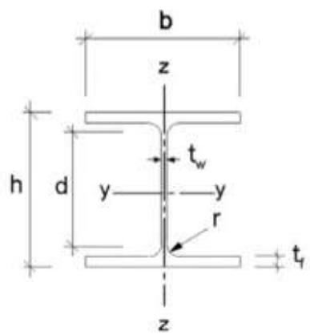

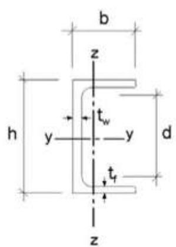

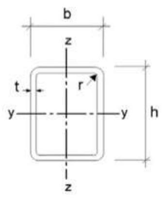

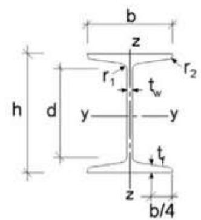

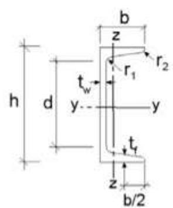

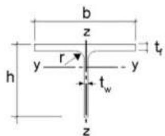

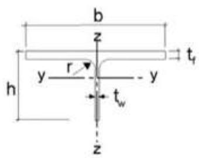

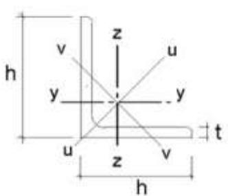

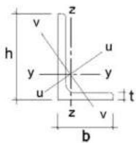  
图1.1 型材截面的尺寸与轴

# 2 设计依据

## 2.1 要求

2.1.1 基本要求

$\left[\mathrm{AC}_{1}\right](1)$ 钢结构设计应符合EN1990中给出的通用规则。 $\langle \mathrm{AC}_1\rangle$

(2）本节中给出的钢结构补充规则也应适用。  
(3) 当极限状态设计与 EN 1990 给出的分项系数法和荷载组合以及 EN 1991 给出的作用一起使用时，则应认为已满足 EN 1990 第 2 节的要求。  
(4) EN 1993 不同的部分中规定的承载力、正常使用和耐久性规则应适用。

2.1.2 责任管理

(1) 若要求具有不同级别的可靠性，最好根据 EN 1990 的附录 C 与 EN 1090 的规定通过在设计和施工过程中合理选择质量管理来达到这些级别。

2.1.3 设计工作寿命、耐久性与坚固性

2.1.3.1 一般规定

${\left. \mathrm{{AC}}\right) }_{1}\left( 1\right) \mathrm{P}$ 根据影响耐久性与设计工作寿命的作用类型 (见 EN 1990),钢结构应: ${\left. \mathrm{{AC}}\right) }_{1}$

通过以下方法进行防腐设计  
合适的表面保护（见ENISO12944）  
使用耐候钢  
一使用不锈钢（见EN1993-1-4）

针对足够的疲劳寿命进行详细设计（见EN1993-1-9）  
进行耐磨设计  
针对偶然作用进行设计（见EN1991-1-7）  
进行检验与维护

2.1.3.2 建筑设计使用寿命

$\left[\mathrm{AC}_{1}\right](1) \mathrm{P}, \mathrm{B}$ 设计使用寿命应取值为建筑结构预期用于设计用途的持续时间长度。 $\left[\mathrm{AC}_{1}\right]$

(2) B 关于永久建筑的预期设计工作寿命的说明，请见 EN 1990 中表 2.1。  
(3)B 关于无法根据建筑总设计寿命进行设计的结构元件，见2.1.3.3(3)B。

2.1.3.3 建筑的耐久性

(1)P,B 为了确保耐久性，建筑物及其部件应根据相关环境作用和建筑疲劳程度来设计，或者其设计应保护建筑物及其部件不受其影响。  
$\left[\mathrm{AC}_{1}\right](2) \mathrm{P}, \mathrm{B}$ 应通过合理选择材料（见 EN 1993-1-4 和 EN 1993-1-10，详细资料见 EN 1993-1-9）或通过结构超静定以及选择适当的腐蚀保护体系，在相关的地方考虑材料磨损、腐蚀或疲劳效应。 $\left[\mathrm{AC}_{1}\right]$   
(3) B 如果建筑物中包含需更换的部件（如土壤沉降区的支座），应将安全替换的可能性作为暂时设计情形来检验。

## 2.2 极限状态设计原则

(1) 对于 EN 1990 的第 3.3 节中所定义的承载能力极限状态, 本欧洲规范 3 中规定的横截面和构件的承载力基于试验, 在试验中材料表现出充分的延性, 以便用于简化设计模型。  
(2)若第3节中的材料条件得到满足，则可使用本欧洲规范章节中规定的承载力。

## 2.3 基本变量

2.3.1 作用与环境影响

(1)钢结构设计的作用应根据EN1991的规定采用。EN1990的附录A给出了作用的组合和作用的分项系数。

注1：国家版附录可定义出特殊地区或气候或意外情况下的作用。

注2B：附录AB.1给出了增量方法的比例加载。

注3B：附录AB.2给出了简化布载。

(2) 安装阶段考虑的作用应从 EN1991-1-6 中得到。  
(3)当需要考虑预计的绝对沉降与不均匀沉降效应时，应使用外加变形的最佳估值。  
(4)应通过将公称值 $\mathbb{P}_{\mathrm{k}}$ 看作永久作用并将其与从单一作用 $(G_{k} + P_{k})$ 得出的其它永久作用 $G_{k}$

组合，来考虑安装过程中的不均匀沉降效应、外加变形效应或外加的其它形式的预应力效应。

(5) EN1991 中未定义的疲劳作用应按照 EN 1993-1-9 附录 A 的规定来确定。

2.3.2 材料和产品的特性

(1) 设计中拟用的钢和其它建筑产品的材料特性和几何数据应采用有关的 EN, ETAGs 或 ETAs 中所规定的, 本规范中另有规定的情况除外。

## 2.4 根据分项系数法检验

2.4.1 材料特性的设计值

$\left[\mathrm{AC}_{1}\right](1) \mathrm{P}$ 对于钢结构设计，材料特性的特征值 $\mathrm{X}_{\mathrm{K}}$ 或公称值 $\mathrm{X}_{\mathrm{n}}$ 应按照本规范的说明采用。 $\left[\mathrm{AC}_{1}\right]$

2.4.2 几何数据的设计值

(1) 横截面和体系的几何数据应取自于产品标准 hEN 或 EN 1090 的施工图，并将该数据看作公称值。  
(2) 本标准中规定的几何缺陷的设计值是等效几何缺陷, 该缺陷考虑了以下效应:

产品标准或施工标准中几何公差控制的构件的几何缺陷；  
一制作和安装产生的结构缺陷；  
一残余应力；  
屈服强度的变化。

2.4.3 设计承载力

(1) EN 1990 中公式(6.6c)或公式(6.6d)适用于钢结构；

$$R _{d} = \frac {R _{k}}{\gamma_{M}} = \frac {1}{\gamma_{M}} R _{k} \left(\eta_{1} X _{k 1}; \eta_{i} X _{k i}; a _{d}\right) \tag {2.1}$$

式中：

Rk 表示根据材料特性和尺寸的特征值或公称值确定的特定承载力的特征值

${\gamma }_{\mathrm{M}}$ 表示特定承载力的整体分项系数。

注：EN1990给出了 $\eta_{\mathrm{l}}$ ， $\eta_{\mathrm{i}}$ ， $X_{\mathrm{k}1}$ ， $X_{\mathrm{ki}}$ 和 $\mathbf{a}_{\mathrm{d}}$ 的定义。

2.4.4 静态平衡（EQU）检验

(1) EN 1990 附录 A 的表 1.2(A) 中检验静态平衡的可靠性格式也适用于与 (EQU) 等效的设计情形, 如, 固定锚定器的设计或连续梁支座上拔力的检验。

## 2.5 试验辅助设计

(1)本标准中的承载力 $\mathbb{R}_{\mathrm{k}}$ 根据EN1990中附录D的规定而确定。  
(2）在推荐常量分项系数 $\gamma_{\mathrm{M}}$ 的等级时，特征值 $\mathbb{R}_k$ 根据下式计算：

$$R _{k} = R _{d} \gamma_{M i} \tag {2.2}$$

式中，

$\mathbb{R}_{\mathrm{d}}$ 表示根据EN1990中附录D而确定的设计值。

表示推荐的分项系数。

注1：推荐的分项系数 $\gamma_{\mathrm{Mi}}$ 的数值的确定应确保 $\mathbb{R}_{\mathrm{k}}$ 在无限次试验中可近似表示为对应的 $5 \%$ 分位数。

注2：EN1993-1-9给出了疲劳强度与疲劳分项系数 $\gamma_{\mathrm{Mf}}$ 的特征值。

注3：EN1993-1-10给出了韧性承载力和安全元件的特征值，以用于韧性检验。

(3）如果预制产品的承载力 $\mathbb{R}_k$ 需从试验中确定，则应遵照(2)中的步骤。

# 3材料

## 3.1概述

(1) 本节中给出的材料特性的公称值应作为设计计算中的特征值采用。  
(2) EN1993 中的这一部分涉及了由符合表 3.1 所列钢材等级的钢材制成的钢结构的设计。

注：关于其它钢材料和产品，参见国家版附录。

## 3.2 结构钢

3.2.1 材料特性

(1) 结构钢的屈服强度 $f_{\mathrm{y}}$ 与极限强度 $f_{\mathrm{u}}$ 的公称值应按以下方式得到：

a) 要么，直接采用产品标准中的值 $f_{y} = R_{ch}$ ， $f_{u} = R_{m}$ 。  
b) 要么，使用表3.1给出的简化值。

注：国家版附录给出了选择。

3.2.2 延性要求

(1) 对于钢材，要求具有以下列限值表示的最小延性：

规定的最小极限抗拉强度 $f_{\mathrm{u}}$ 与规定的最小屈服强度 $f_{\mathrm{y}}$ 之比 $f_{\mathrm{u}} / f_{\mathrm{y}}$   
在 $5.65\sqrt{\mathrm{A}_0}$ 标距长度上的破坏伸长率（ $\mathbf{A}_0$ 为原始横截面面积）；  
极限应变 $\varepsilon_{u}$ ，其中 $\varepsilon_{u}$ 对应于极限强度 $f_{\mathrm{u}}$ 。

注：国家版附录中可应定义出 $f_{\mathrm{u}} / f_{\mathrm{y}}$ 之比、破坏伸长率和极限应变 $\varepsilon_{u}$ 的限值。建议使用以下值：

$$- f _{u} / f _{y} \geq 1. 1 0;$$

EN 1993-1-1: 2005 (E)

破坏伸长率不小于 $15\%$   
- $\varepsilon_{\mathrm{u}} \geq 15 \varepsilon_{\mathrm{y}}$ ，其中 $\varepsilon_{y}$ 为屈服应变 $(\varepsilon_{\mathrm{y}} = f_{\mathrm{y}} / E)$ 。

(2）符合表3.1所列任一钢材等级的钢材可视为满足这些条件的合格钢材。

3.2.3 断裂韧度

$\left[\mathrm{AC}_{1}\right](1)\mathrm{P}$ 材料应具有足够的断裂韧度，以避免在预期设计寿命内结构在最低工作温度下受拉构件可能会发生的脆性断裂。 $\left[\mathrm{AC}_{1}\right]$

注：国家版附录可给出设计中需采用的最低工作温度。

(2) 如果满足 EN1993-1-10 中给出的最低温度下的条件, 无需进一步检验是否发生脆性断裂。  
(3)B应选择受压建筑构件的最小韧度特性。

注B：国家版附录可给出关于受压构件的韧度特性选择方面的信息。建议使用EN1993-1-10的表2.1， $\sigma_{Ed} = 0.25f_y(t)$

(4) 关于带热浸镀锌涂层的构件的钢材选择，参见 EN 1461。

表 3.1 热轧结构钢的屈服强度 ${f}_{\mathrm{y}}$ 和极限抗拉强度 ${f}_{\mathrm{u}}$ 的公称值  


| 标准与钢材等级        | 元件的公称厚度 t [mm] | 元件的公称厚度 t [mm] | 元件的公称厚度 t [mm]    | 元件的公称厚度 t [mm]    |
| -------------- | -------------- | -------------- | ----------------- | ----------------- |
| 标准与钢材等级        | t≤40 mm        | t≤40 mm        | 40 mm < t ≤ 80 mm | 40 mm < t ≤ 80 mm |
| 标准与钢材等级        | fy [N/mm2]     | fu [N/mm2]     | fy [N/mm2]        | fu [N/mm2]        |
| EN 10025-2     |                |                |                   |                   |
| S 235          | 235            | 360            | 215               | 360               |
| S 275          | 275            | 430            | 255               | 410               |
| S 355          | 355            | 510            | 335               | 470               |
| S 450          | 440            | 550            | 410               | 550               |
| EN 10025-3     |                |                |                   |                   |
| S 275 N/ML     | 275            | 390            | 255               | 370               |
| S 355 N/ML     | 355            | 490            | 335               | 470               |
| S 420 N/ML     | 420            | 520            | 390               | 520               |
| S 460 N/ML     | 460            | 540            | 430               | 540               |
| EN 10025-4     |                |                |                   |                   |
| S 275 M/ML     | 275            | 370            | 255               | 360               |
| S 355 M/ML     | 355            | 470            | 335               | 450               |
| S 420 M/ML     | 420            | 520            | 390               | 500               |
| S 460 M/ML     | 460            | 540            | 430               | 530               |
| EN 10025-5     |                |                |                   |                   |
| S 235 W        | 235            | 360            | 215               | 340               |
| S 355 W        | 355            | 510            | 335               | 490               |
| EN 10025-6     |                |                |                   |                   |
| S 460 Q/QL/QL1 | 460            | 570            | 440               | 550               |
| EN 10210-1     |                |                |                   |                   |
| S 235 H        | 235            | 360            | 215               | 340               |
| S 275 H        | 275            | 430            | 255               | 410               |
| S 355 H        | 355            | 510            | 335               | 490               |
| S 275 NH/NLH   | 275            | 390            | 255               | 370               |
| S 355 NH/NLH   | 355            | 490            | 335               | 470               |
| S 420 NH/NHL   | 420            | 540            | 390               | 520               |
| S 460 NH/NLH   | 460            | 560            | 430               | 550               |
| EN 10219-1     |                |                |                   |                   |
| S 235 H        | 235            | 360            |                   |                   |
| S 275 H        | 275            | 430            |                   |                   |
| S 355 H        | 355            | 510            |                   |                   |
| S 275 NH/NLH   | 275            | 370            |                   |                   |
| S 355 NH/NLH   | 355            | 470            |                   |                   |
| S 460 NH/NLH   | 460            | 550            |                   |                   |
| S 275 MH/MLH   | 275            | 360            |                   |                   |
| S 355 MH/MLH   | 355            | 470            |                   |                   |
| S 420 MH/MLH   | 420            | 500            |                   |                   |
| S 460 MH/MLH   | 460            | 530            |                   |                   |


3.2.4 全厚度特性

(1) 如果按照 EN 1993-1-10 的规定需要使用具有改善全厚度特性的钢材, 那么应使用的钢材应达到 EN 10164 中规定的质量等级。

注1：EN1993-1-10给出了全厚度特性的选择指南。

注2B：对于在全厚度方向上将梁焊接到柱的连接以及焊接受拉端板时，要特别小心。

注3B：国家版附录可给出按EN1993-1-10中3.2(2)的规定将相关目标值 $Z_{\mathrm{Ed}}$ 分配到EN 10164的质量等级中的信息。对于建筑物建议使用表3.2的分配信息：

表 3.2 按照 EN 10164 的规定进行的质量等级选择  


| 按照 EN 1993-1-10 规定的 $Z_{Ed}$ 的目标值 | 按照 EN 10164 规定用设计 $Z$ 值表示的 $Z_{Rd}$ 的要求值 |
| --- | --- |
| $Z_{Ed} \leq 10$ | - |
| $10 < Z_{Ed} \leq 20$ | Z 15 |
| $20 < Z_{Ed} \leq 30$ | Z 25 |
| $Z_{Ed} > 30$ | Z 35 |


3.2.5 公差

(1) 除非有更加严格的公差规定, 否则, 热轧型材、结构中空型材与钢板的尺寸与质量公差应符合有关产品标准 ETAG 和 ETA。  
(2）对于焊接部件，应使用EN1090中给出的公差。  
(3）结构分析和设计应使用尺寸的公称值。

3.2.6 材料系数的设计值

(1）本欧洲规范部分中涉及的结构钢的计算中拟采用的材料系数应按照如下取值：

弹性模量 E=210000N/mm²  
剪切模量 $G = \frac{E}{2(1 + \nu)}\approx 81000\mathrm{N / mm}^2$   
弹性状态的泊松比 v=0.3  
线性热膨胀系数 $\alpha = 12\times 10^{-6} / \mathrm{K}$ （当 $\mathrm{T}\leq 100^{\circ}\mathrm{C}$ 时）

注：计算 EN 1994 中的钢-混组合结构中非等温的结构效应时，线性热膨涨系数可取

值为： $\alpha = 10\times 10^{-6} / \mathrm{K}$

## 3.3 连接装置

3.3.1 紧固件

(1) EN 1993-1-8 中给出了对紧固件的要求。

3.3.2 焊接耗材

(1) EN 1993-1-8 中给出了对焊接耗材的要求。

## 3.4 建筑中的其它预制产品

(1)B建筑结构设计中所使用的任何半成品或成品结构产品均应遵守有关EN产品标准或ETAG或ETA的规定。

# 4 耐久性

(1) EN 1990 中规定了对耐久性的基本要求。

(2)P 工地内外采用的执行防护处理的手段应符合 EN 1090 的规定。(AC)

注：EN1090列出了对于会影响施工，从而需在设计期间作出规定的系数。

(3) 易受腐蚀、机械磨损或疲劳的零件的设计应确保可使检验、维护与改造工作顺利进行，并可在使用中进行检查与维修。  
(4)B建筑结构通常不需要进行疲劳评估，以下情况除外：

a) 支撑提升装置或滚动载荷的构件  
b) 反复承受来自振动机械的应力循环作用的构件  
c)承受风致振动的构件  
d)承受拥挤导致的振动的构件

(5) 对于无法检验的元件，应留有一个适当的腐蚀裕量。(AC1)   
(6)如果内部相对湿度没有超过 $80\%$ ，那么建筑内部结构无需进行腐蚀保护。

# 5 结构分析

## 5.1 用于分析的结构建模

5.1.1 结构建模与基本假设

$\left[\mathrm{AC}_{1}\right](1)$ 分析应以适用于所考虑极限状态的结构计算模型为基础。  
(2) 计算用的计算模型与基本假设应精确反映出有关极限状态下的结构性能，并反映横截面、构件、节点和支座的预期性能类型。

AC3）所用的分析方法应与设计假设一致。

(4) EN 1993-1-5 和 EN 1993-1-11 同样给出了建筑部件的结构建模和基本假设。

5.1.2 节点建模

(1) 通常, 可以忽略节点性能对结构内的内力和力矩分布的影响, 以及节点性能对结构整体变形的影响。但是如果影响很显著 (如在半连续节点中), 应考虑这种影响。见 EN 1993-1-8。  
(2) 为了确定是否要考虑节点性能对分析的影响，可在以下三种节点模型之间进行区分，见 EN 1993-1-8, 5.1.1:

简单节点，可假定这种节点不会传递弯矩；  
一连续节点，可假定这种节点对分析无影响；  
一半连续节点，在分析中需考虑到节点性能。

(3) EN 1993-1-8 中给出了各种类型节点的要求。

5.1.3 地面-结构相互作用

（1）应考虑到重要支座处的变形特征。

注：EN1997给出了土壤-结构相互作用的计算方法指导。

## 5.2 整体分析

5.2.1 结构几何变形的影响

(1) 通常可使用以下任一种方式确定内力和力矩：

一 一阶分析，使用结构的初始几何形状，或者

一二阶分析，考虑结构变形的影响。

(2) 如果几何变形效应大大增加了作用效应或极大地改变了结构性能，则应考虑几何变形效应（二阶效应）。  
(3) 如果变形引起的相关内力或力矩的增加或结构性能的任何其他变化可以忽略, 那么结构中可使用一阶分析。如果达到以下标准, 那么可假定满足这种条件:

对于弹性分析： $\alpha_{\mathrm{cr}} = \frac{\mathrm{F}_{\mathrm{cr}}}{\mathrm{F}_{\mathrm{Ed}}} \geq 10$

对于塑性分析： $a_{\mathrm{cr}} = \frac{\mathrm{F}_{\mathrm{cr}}}{\mathrm{F}_{\mathrm{Ed}}} \geq 15$ (5.1)

式中

$\alpha_{\mathrm{cr}}$ 为系数，通过此系数必须增加设计荷载以在整体模态内产生弹性不稳定性

$\mathbf{F}_{\mathrm{Ed}}$ 为作用在结构上的设计荷载

Fcr 为基于初始弹性刚度的整体不稳定模态的弹性临界屈曲荷载

注：公式(5.1)给出了弹性分析中 $\alpha_{\mathrm{cr}}$ 更大的限值，因为在承载能力极限状态下（例如，当框架形成力矩重分配的塑性铰时、或者半刚性节点发生显著非线性变形时）结构性能会受到非线性材料特性的显著影响。如果通过更准确的方法加以证实，那么国家版附录可给出特定类型框架的 $\alpha_{\mathrm{cr}}$ 的下限。

(4) B 如果各楼层满足了 (5.1) 的标准, 则可使用一阶分析检查建筑物内带较小屋顶坡度的龙门架和梁-柱型平面桁架是否发生侧移模态破坏。在这些结构中, 如果梁或椽内的轴向压力并不大, 那么可使用以下近似公式计算 $\alpha_{\mathrm{cr}}$ :

$$\alpha_{c r} = \left(\frac {H _{E d}}{V _{E d}}\right) \left(\frac {h}{\delta_{H , E d}}\right) \tag {5.2}$$

式中

$\mathrm{H}_{\mathrm{Ed}}$ 是楼层底部对水平荷载和假想水平荷载的水平反力的设计值，见5.3.2(7)

$V_{\text{Ed}}$ 是楼层底部上结构的总设计垂直荷载

$\delta_{\mathrm{H,Ed}}$ 代表当框架承受了施加在结构各楼层上的水平荷载（例如，风力荷载）和假想水平荷载时，楼层顶部处相对于楼层底部处发生的水平位移

h 代表楼层高度

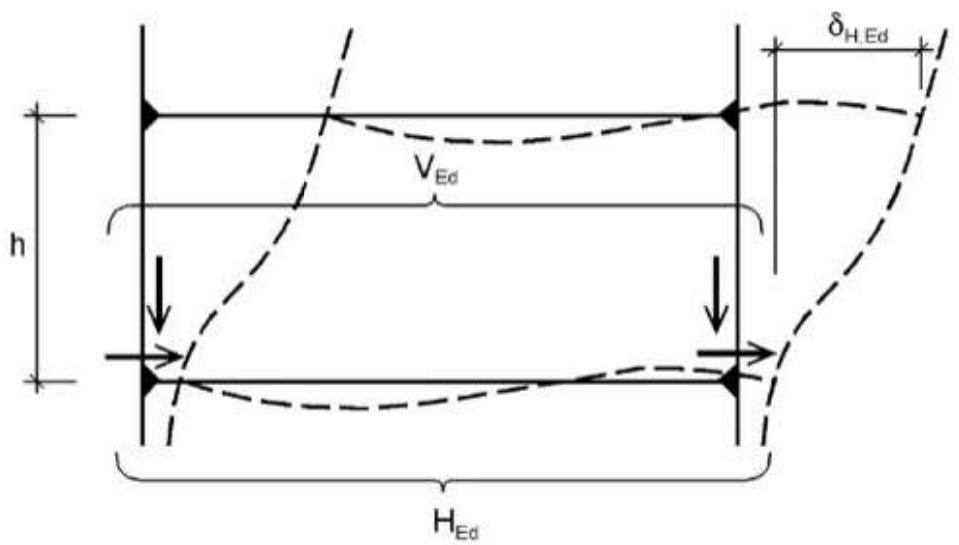  
图5.1用于5.2.1(2)的符号

注1B：在应用(4)B时，如果没有更详细的信息并且倾斜度不小于 $1:2$ （ $26^{\circ}$ ），那么可认为屋顶坡度较小。

注2B：在应用(4)B时，如果没有更详细的信息并且满足以下条件，那么可假定梁或橡内的轴向压力较大：

$$\bar {\lambda} \geq 0. 3 \sqrt {\frac {A f _{y}}{N _{E d}}} \tag {5.3}$$

其中，

$N_{\text{Ed}}$ 是压力的设计值，

是所计算的梁或橡的面内无量纲长细比，其中将梁或橡视为在沿着梁或橡测得的系统长度末端处铰接。

(5) 如果剪力滞和局部屈曲对刚度的效应极大地影响了整体分析, 那么应予以考虑, 见 EN 1993-1-5。

注：可以忽略具有类似尺寸的轧制截面和焊接截面的剪力滞效应。

(6) 如果对螺栓孔内滑移的整体分析的影响以及连接装置（如栓钉和锚栓）的类似变形对作用效应的影响具有相关性且较大，则应将其考虑在内。

5.2.2 框架的结构稳定性

(1) 如果根据 5.2.1 的规定，必须考虑到结构变形的影响，那么应适用 (2)~(6) 的规定以考虑这些效应并检验结构的稳定性。  
(2）对框架或其零部件的稳定性的检验应考虑到缺陷和二阶效应。  
(3）根据框架类型和整体分析类型，以下几种方法之一可以考虑二阶效应和缺陷：

a）二者都完全采用整体分析考虑，  
b) 按照 6.3 的规定, 部分采用整体分析, 部分通过对构件进行单独的稳定性检查,  
c) 对于按照 6.3 的规定对等效构件进行单独稳定性检查的基本情形, 应根据结构的整体屈曲模态使用合理的屈曲长度。

(4) 可通过对结构进行合适的分析（包括逐步法或其它迭代法）来计算二阶效应。如果框架内第一侧移屈曲模态起主要作用，那么应利用合理的系数进行一阶弹性分析，并随后对有关作用效应（例如，弯矩）进行放大。  
(5) B 对于根据弹性整体分析设计的单层框架，可通过增加水平荷载 $\mathrm{H}_{\mathrm{Ed}}$ （如，风）和由缺陷引起的等效荷载 $\mathrm{V}_{\mathrm{Ed}} \Phi$ （见 5.3.2(7)）来计算垂直荷载引起的二阶侧移效应，以及用以下系数根据一阶理论计算其它可能的侧移效应：

$$\frac {1}{1 - \frac {1}{a _{\mathrm {c r}}}} \tag {5.4}$$

前提是 $\alpha_{\mathrm{cr}} \geq 3.0$

式中，如果屋顶坡度较小并且如5.2.1(4)B所定义的梁或橡内的轴向压力不是很大，那么 $a_{\mathrm{cr}}$ 可根据5.2.1(4)B中的（5.2）条进行计算。

注B：如果 $\alpha_{\mathrm{cr}} < 3.0$ ，那么应采用更精确的二阶分析。

(6)B可用(5)B给出的方法计算多层框架的二阶侧移效应，前提是所有的楼层具有类似的：

垂直荷载分布  
水平荷载分布  
和所施加的楼层剪力相关的框架刚度的分布

注B：5.2.1(4)B也给出了方法的局限性。

(7）根据(3)中所述，应按照以下规定检查单个构件的稳定性：

a) 如果结构的整体分析中完全考虑了单个构件和相关构件缺陷（见5.3.4）的二阶效应，那么，无需再根据6.3的规定单独检查构件的稳定性。  
b）如果整体分析中并没有完全考虑单个构件或某个单独构件缺陷（如，弯曲屈曲和/

或侧扭屈曲情况下的构件缺陷，见5.3.4）内的二阶效应，那么应按照6.3中的相关标准检查未包含在整体分析中的构件单独稳定性的效应。如若相关，该检验应考虑到来自结构整体分析里的端力矩和端面压力，包括整体二阶效应和整体缺陷（见5.3.2），且可基于与体系长度相等的屈曲长度。

(8) 若根据 6.3 的规定用等效柱检查法对框架的稳定性进行评估，则屈曲长度值应基于框架的整体屈曲模态，该模态可考虑构件和节点的刚度性能、塑性铰的存在和设计荷载下压力的分布。在这种情况下，根据一阶理论，在不考虑缺陷的情况下，计算在承载力检验中使用的内力。

注：国家版附录可给出适用范围的信息。

## 5.3缺陷

5.3.1 依据

(1) 结构分析中应结合适当的容差, 以将缺陷效应包含在内, 包括残余应力以及诸如缺乏笔直度、平面性、紧密度等几何缺陷以及未加载结构节点内出现的微小偏心。  
(2) 应使用等效几何缺陷，见 5.3.2 和 5.3.3，其值反映所有缺陷类型的可能效应，除非构件设计的承载力公式中包含了这些效应，见 5.3.4 节。  
(3）以下缺陷应考虑在内：

a) 框架和支撑体系的整体缺陷   
b）单个构件的局部缺陷

5.3.2 用于进行框架整体分析的缺陷

(1) 可从所考虑的屈曲平面内结构的弹性屈曲模态中推导出整体缺陷和局部缺陷的假定形状。  
(2) 应考虑最不理想方向和形状上的面内和面外屈曲，包括带对称和非对称屈曲形状的扭转屈曲。  
(3) 对于在侧移模态内对屈曲敏感的框架，在框架分析中应以初始侧移缺陷和构件的单个弯曲缺陷的形式通过等效缺陷考虑缺陷效应。这种缺陷可从以下确定：

a) 整体初始偏移缺陷，见图5.2；

$$\phi = \phi_{0} \alpha_{h} \alpha_{m} \tag {5.5}$$

其中，

$\phi_0$ 为基值： $\phi_0 = 1 / 200$

$\alpha_{h}$ 用于柱的高度 $\mathrm{h}$ 的折减系数：

$$\alpha_{\mathrm {h}} = \frac {2}{\sqrt {\mathrm {h}}}, \text {但 是} \frac {2}{3} \leq \alpha_{\mathrm {h}} \leq 1. 0$$

表示结构的高度，单位：m

每一行柱的数量的折减系数： $\alpha_{\mathrm{m}} = \sqrt{0.5\left(1 + \frac{1}{\mathrm{m}}\right)}$

每一行柱的数量，仅包括这样一些柱：在所考虑的竖直平面内，其所承载的竖直荷载 $\mathbf{N}_{\mathrm{Ed}}$ 不小于柱平均值的 $50\%$

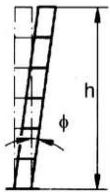

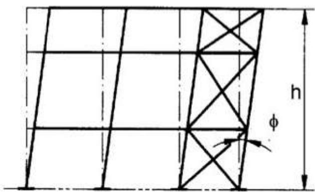  
图5.2等效侧移缺陷

b) 构件弯曲屈曲的相对初始局部弯曲缺陷

$$\mathrm {e} _{0} / \mathrm {L} \tag {5.6}$$

其中

L 是构件长度

注：可在国家版附录中选择 $\mathrm{e}_0 / \mathrm{L}$ 值。表5.1给出了推荐值。

表 5.1 初始局部弯曲缺陷 ${\mathrm{e}}_{0}/\mathrm{L}$ 的设计值  


| 根据表 6.1 得出的屈曲曲线 | 弹性分析 | 塑性分析 |
| --- | --- | --- |
| 根据表 6.1 得出的屈曲曲线 | ${\mathrm{e}}_{0}/\mathrm{L}$ | ${\mathrm{e}}_{0}/\mathrm{L}$ |
| ${\mathrm{a}}_{0}$ | 1/350 | 1/300 |
| a | 1/300 | 1/250 |
| b | 1/250 | 1/200 |
| C | 1/200 | 1/150 |
| d | 1/150 | 1/100 |


(4)B如果满足以下条件，可以忽略建筑框架的侧移缺陷：

$$\mathrm {H} _{\mathrm {E d}} \geq 0. 1 5 \mathrm {V} _{\mathrm {E d}} \tag {5.7}$$

(5) B 为了确定对楼层横隔板的水平力, 应适用如图 5.3 所示的缺陷构造, 其中 $\Phi$ 为假定单层高度为 $h$ 时从(5.5)中得到的侧移缺陷, 见(3)a)。

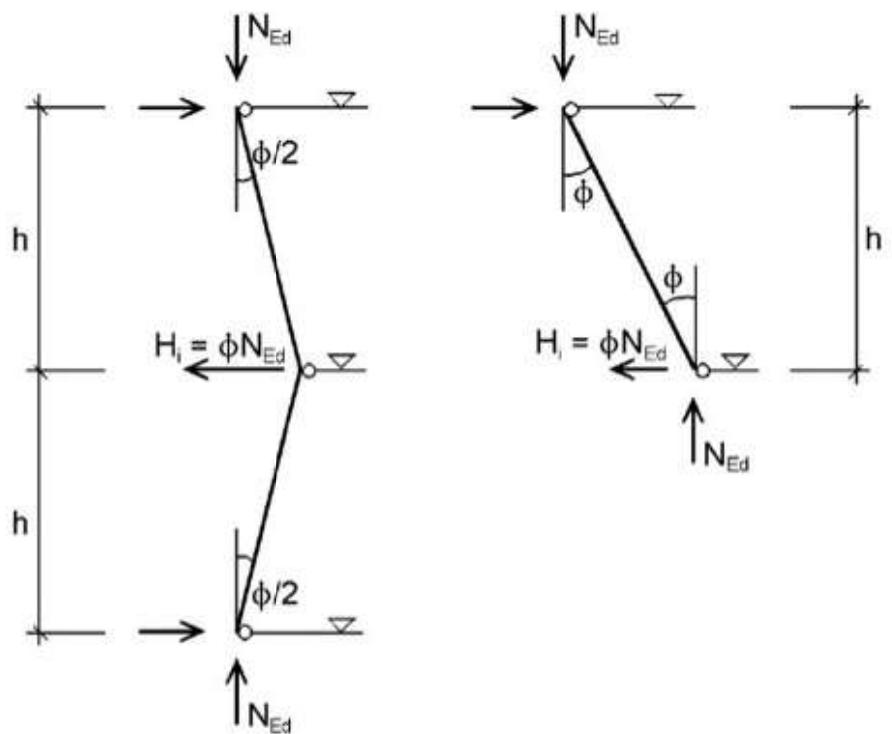  
图5.3 楼层横隔板上的水平力的侧移缺陷 $\Phi$ 的构造

(6) 在根据 6.3 节的规定进行整体分析用以确定构件检验中要使用的端部力和端力矩时, 可忽略局部弯曲缺陷。然而, 对于对二阶效应敏感的框架, 如果满足以下条件, 则在每个受压构件的框架结构分析中应引入整体侧移缺陷 (见 5.2.1(3)) 和构件局部弯曲缺陷:

在一个构件端部至少有一个抗弯节点

$$- \quad \bar {\lambda} > 0. 5 \sqrt {\frac {A f _{y}}{N _{E d}}} \tag {5.8}$$

式中，

${\mathrm{N}}_{\text{Ed }}$ 是压力的设计值

$\overline{\lambda}$ 是对于端部铰接构件所计算得出的面内无量纲长细比

注：在构件检验中考虑了局部弯曲缺陷，见5.2.2(3)和5.3.4。

(7) 初始侧移缺陷和局部弯曲缺陷的效应可由针对每根柱所引入的等效水平力体系所取代，见图5.3和图5.4。

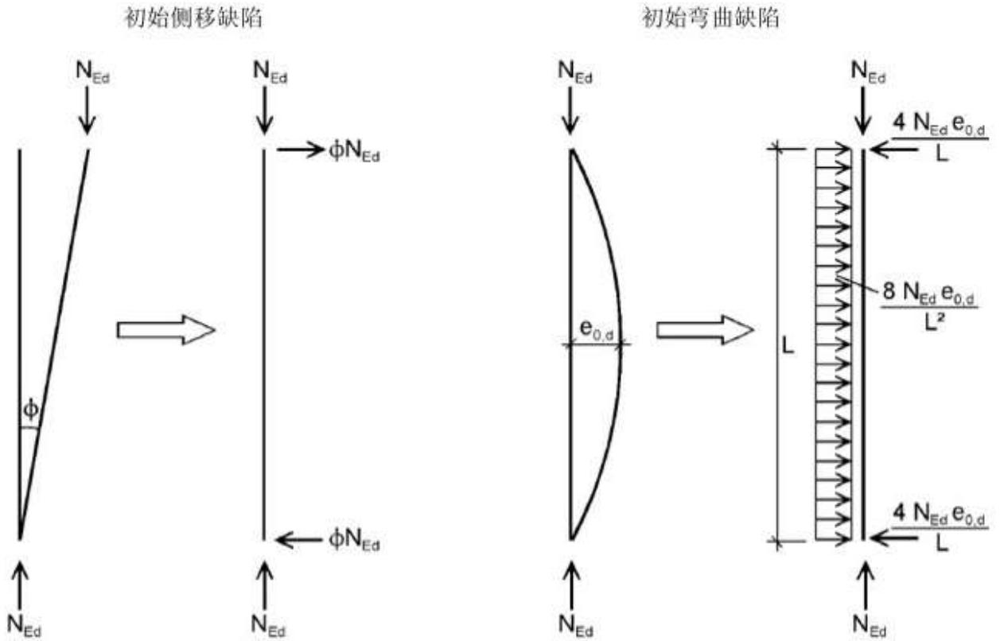  
图5.4：由等效水平力取代初试缺陷

(8) 应在所有相关的水平方向上应用这些初始侧移缺陷，但是一次只需在一个方向上考虑。  
(9)B当在多层梁-柱建筑框架内使用等效力时，它们可应用于每层楼板和屋面。  
(10)也应考虑到由两个相对面上的反对称侧移导致的结构上可能出现的扭转效应，见图5.5。

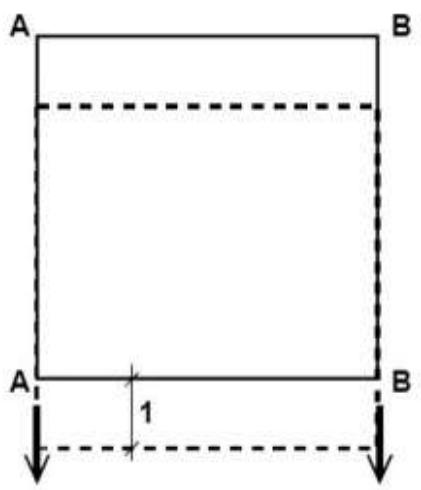  
(a)A-A面和B-B面同向侧移

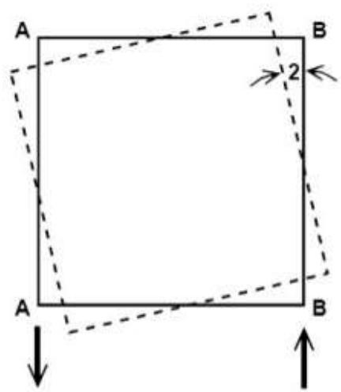  
图5.5平移和扭转效应（平面图）

(b) A-A 面和 B-B 面反向侧移

1垂直侧移
2 转动侧移

(11) 作为(3)和(6)的替代方法, 结构的弹性临界屈曲模态 $\eta_{\mathrm{cr}}$ 的形状可看成独特的整体和局部缺陷。该缺陷的幅度可由下式确定:

$$\eta_{i n i t} = e _{0} \frac {N _{c r}}{E I \eta_{c r , \max } ^{\prime \prime}} \eta_{c r} = \frac {e _{0}}{\bar {\lambda} ^{2}} \frac {N _{R k}}{E I \eta_{c r , \max } ^{\prime \prime}} \eta_{c r} \tag {5.9}$$

式中：

$$\overline {{\lambda}} > 0. 2 \text {时 ,} e _{0} = \alpha (\overline {{\lambda}} - 0. 2) \frac {\mathrm {M} _{\mathrm {R k}}}{\mathrm {N} _{\mathrm {R k}}} \frac {1 - \frac {\chi \overline {{\lambda}} ^{2}}{\gamma_{\mathrm {M l}}}}{1 - \chi \overline {{\lambda}} ^{2}} \tag {5.10}$$

并且

$$\overline {{\lambda}} = \sqrt {\frac {\alpha_{u l t , k}}{\alpha_{c r}}} \text {为 结 构 的 相 对 长 细 比} \tag {5.11}$$

a 为相关屈曲曲线的缺陷系数，见表6.1和表6.2；

为取决于相关横截面的相关屈曲曲线的折减系数，见6.3.1；

$\alpha_{\mathrm{ult,k}}$ 为构件内轴力构造 $\mathbf{N}_{\mathrm{Ed}}$ 的最小力放大系数，以在不考虑屈曲的情况下达到大部分轴向受压的横截面的特征承载力 $\mathbf{N}_{\mathrm{Rk}}$

$\alpha_{\mathrm{cr}}$ 为构件内轴力构造 $\mathbf{N}_{\mathrm{Ed}}$ 的最小力放大系数，以达到弹性临界屈曲

为临界横截面的特征弯矩抗力，例如，相关的 $\mathbf{M}_{\mathrm{el,Rk}}$ 或 $\mathbf{M}_{\mathrm{pl,Rk}}$

$\mathrm{N}_{\mathrm{Rk}}$ 为临界横截面法向力的特征承载力，即 $\mathrm{N}_{\mathrm{pl,Rk}}$

$E I \eta_{cr, \max}^{\prime \prime}$ 是 $\eta_{cr}$ 在临界横截面产生的弯矩

$\eta_{\mathrm{cr}}$ 为弹性临界屈曲模态的形状

注1：为了计算放大系数 $\alpha_{\mathrm{ult,k}}$ 和 $\alpha_{\mathrm{cr}}$ ，可认为结构的构件仅承载了适用于设计荷载的结构一阶弹性分析中所得出的轴力 $\mathbf{N}_{\mathrm{Ed}}$

注2：国家版附录可给出(11)的适用范围的信息。

5.3.3 用于进行支撑体系分析的缺陷

(1) 在需要在梁或受压构件的长度范围内提供侧向稳定性的支撑体系的分析中，应通过拟受约束构件的等效几何缺陷将缺陷效应包含在内，其形式为初始弯曲缺陷：

$$\mathrm {e} _{0} = \alpha_{\mathrm {m}} \mathrm {L} / 5 0 0 \tag {5.12}$$

其中L是支撑体系的跨距

并且 $\alpha_{\mathrm{m}} = \sqrt{0.5\left(1 + \frac{1}{\mathrm{m}}\right)}$

式中 $\mathbf{m}$ 为受约束构件的数量。

(2) 为简便起见，将会受到支撑体系约束的构件的初始弯曲缺陷效应，可由如图5.6所示的等效稳定力替换：

$$\mathrm {q} _{\mathrm {d}} = \sum \mathrm {N} _{\mathrm {E d}} 8 \frac {e _{0} + \delta_{q}}{L ^{2}} \tag {5.13}$$

式中 $\delta_{\mathrm{q}}$ 为支撑体系中 $\mathbf{q}$ 产生的面内挠曲加上一阶分析计算得出的外部荷载

注：如果采用了二阶理论， $\delta_{\mathrm{q}}$ 可取值为0。

(3)如果支撑体系需要稳定等高梁的受压翼缘，则图5.6中的力 $\mathbf{N}_{\mathrm{Ed}}$ 可从下式得到：

$$\mathrm {N} _{\text {E d}} = \mathrm {M} _{\text {E d}} / \mathrm {h} \tag {5.14}$$

式中

MEd 为梁内的最大力矩，

h 为梁的总高。

注：如果梁承受了外部压力，则 $\mathbf{N}_{\mathrm{Ed}}$ 应包括一部分压力。

(4) 在梁或受压构件的拼接点, 也要检验确认支撑体系是否能承受在该点拼接的各梁或受压构件所施加的局部力 (等于 $\alpha_{\mathrm{m}} \mathrm{N}_{\mathrm{Ed}} / 100$ ), 并将该力传递到梁或受压构件受约束的相邻点上, 见图 5.7。  
(5) 在根据(4)条的规定检验局部力时，也应包含任何作用在支撑体系上的外部荷载，但是(1)中给出的缺陷产生的力可以忽略。

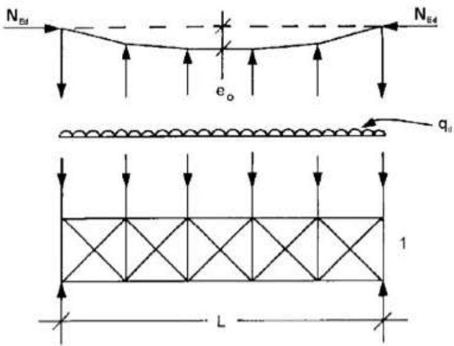  
$e_0$ 缺陷   
$q_{\mathrm{d}}$ 每单位长度等效力  
支撑体系

假定力 $\mathrm{N}_{\mathrm{Ed}}$ 在支撑体系的跨距 $\mathrm{L}$ 内是均匀的。

对于不均匀力，这是比较保守的。

图5.6等效稳定性

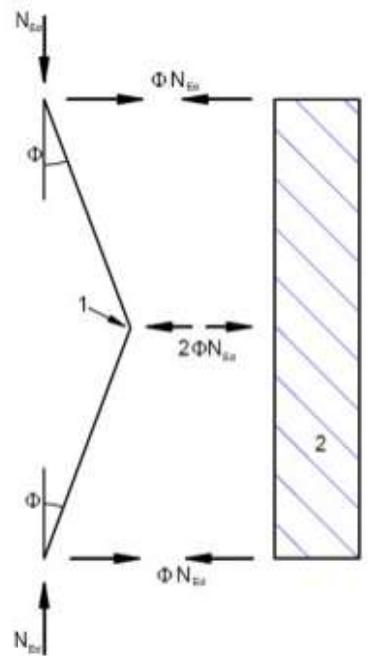  
图5.7受压构件拼接处的支撑力

$$\begin{array}{l} \Phi = \alpha_{m} \Phi_{0}: \Phi_{0} = 1 / 2 0 0 \\ 2 \Phi \mathrm {N} _{\mathrm {E d}} = \alpha_{\mathrm {m}} \mathrm {N} _{\mathrm {E d}} / 1 0 0 \\ \end{array}$$

I拼接   
2支撑体系

5.3.4 构件缺陷

(1) 在给出的构件的屈曲抗力的公式内结合了构件的局部弯曲缺陷效应，见6.3节。  
(2) 若对于受压构件按照 5.2.2(7)a)的规定在二阶分析中考虑了构件的稳定性, 则应按照 5.3.2(3)b)、5.3.2(5)或 5.3.2(6)的规定考虑到缺陷 $\mathbf{e}_0$ 。  
(3) 对于考虑了受弯构件的侧扭屈曲的二阶分析, 缺陷可用 $\mathrm{ke}_{0,\mathrm{d}}$ 来表示, 其中 $\mathrm{e}_{0,\mathrm{d}}$ 是所考虑剖面的弱轴的等效初始弯曲缺陷。通常, 不需要考虑额外的扭转缺陷。

注：可从国家版附录中选出k的值。推荐k=0.5。

## 5.4 考虑了材料非线性的分析方法

5.4.1 概述

(1) 可使用以下的任一种方法确定内力和力矩

a) 弹性整体分析  
b) 塑性整体分析

注：关于有限元模型（FEM）分析，见EN1993-1-5。

(2)弹性整体分析可用于所有情况下。  
(3) 只有当结构在塑性铰实际位置处（无论是在构件内或是节点内）具有充分的转动能力时，方可使用塑性整体分析。当构件内产生塑性铰时，构件的横截面应在与塑性铰转动相同的平面的对称面上是双对称或单对称的，并且，其应满足5.6中规定的要求。当节点内产生塑性铰时，节点要么应具有充分的强度以确保铰留在构件内，要么应能承受充分转动的塑性承载力，见EN1993-1-8。  
(4) B 作为连续梁内力矩有限塑性重分配的一种简化方法，在进行完弹性分析后，如果某些峰值力矩超过了塑性弯曲抗力（最多超过 $15\%$ ），则超过的部分可在任何构件内重分配，前提是：

a) 框架内的内力和力矩保持与外加荷载的平衡，并且  
b)力矩折减的所有构件具有1类或2类横截面（见5.5），并且  
c）防止构件出现侧扭屈曲。

5.4.2 弹性整体分析

(1) 弹性整体分析应建立在假定材料的应力应变性能是线性的基础之上，不论是哪种级别的应力。

注：5.1.2(2)~(4)给出了选择半连续性节点模型的相关信息。

(2) 即便横截面的承载力取决于其塑性承载力，也可按照弹性整体分析计算内力和力矩，见 6.2。  
(3)弹性整体分析也可用于横截面，横截面的承载力受到局部屈曲的限制，见6.2。

5.4.3 塑性整体分析

(1) 在计算结构体系的作用效应时，塑性整体分析考虑了材料的非线性效应。应通过以下几种方法中的任一种模拟这种性能：

弹-塑性分析，利用塑性截面和/或节点充当塑性铰，  
非线性塑性分析，考虑塑性区内构件的部分增塑作用，  
一 刚塑性分析，忽略铰之间的弹性特性。

(2) 当构件具有充分的转动能力，从而能够使弯矩进行所需的重分布时，可使用塑性整体分析，见5.5和5.6。  
(3) 只有在可以保证塑性铰处构件的稳定性时，方可使用塑性整体分析，见6.3.5。  
(4) 图5.8所示的双线性应力应变关系可用于第3节中所规定的结构钢的等级。或者，可采用更准确的关系，见EN1993-1-5。

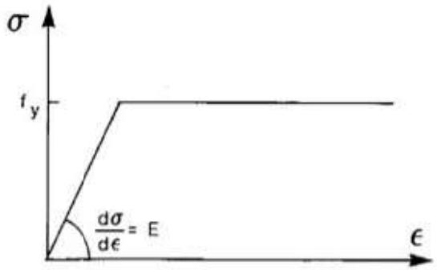  
图5.8双线性应力应变关系

(5) 如果无须考虑几何形状变形的效应（例如，二阶效应），那么可应用刚塑性分析。在这种情况下，节点仅按强度分类，见 EN 1993-1-8。  
(6)结构几何变形效应和框架的结构稳定性应按照5.2中规定的原则来检验。

注 一阶崩塌机理的所有铰形成之前，几何形状严重变形的框架可能会出现最大抗力。

## 5.5 横截面的分类

5.5.1 依据

(1) 横截面分类的目的是为了确定横截面的承载力和转动能力受到其局部屈曲抗力限制的程度。

5.5.2分类

（1）如下定义了4类横截面：

1 类横截面是指那些可形成塑性铰、并且塑性铰有塑性分析所需的转动能力、而同时承载力无折减的横截面  
2类横截面是指可以产生塑性弯矩抗力、但是局部屈曲使其具有有限的转动能力的横截面  
3类横截面是指假定了一种应力弹性分布的钢构件的最外缘受压纤维的应力可达到屈服强度，但局部屈曲倾向于防止塑性弯矩抗力产生的横截面。  
4类横截面是指那些一处或多处在达到屈服应力之前将会出现局部屈曲的横截面。

(2) 在 4 类横截面内可使用有效宽度, 以便必须考虑到局部屈曲效应引起的承载力折减, 见 EN 1993-1-5, 5.2.2。  
(3) 横截面的分类取决于受压部分的宽厚比。  
(4) 受压部分包括了在所考虑的荷载组合下完全或部分受压的横截面的每一部分。  
(5) 通常横截面各受压部分（如腹板或翼缘）可能类别不同。  
(6) 按其受压部分最高（最不利的）级别类型将横截面归类。6.2.1(10)和 6.2.2.4(1)中规定了例外情形。  
(7) 或者, 通过同时引入翼缘和腹板的分类来确定横截面类型。  
(8) 具有 1、2、3 类横截面的受压构件的极限比例应从表 5.2 获得。没有达到 3 类横截面限值的部分可被归入第 4 类。  
(9) 除了(10)中给出的情况外，当 $\varepsilon$ 以 $\sqrt{\frac{f_{y} / \gamma_{M0}}{\sigma_{com,Ed}}}$ 增加时（其中 $\sigma_{com,Ed}$ 为从一阶分析或必要时从二阶分析中得出的该部分最大设计压应力），如果宽厚比小于从表5.2中得到的3类截面的极限比例，那么可将4类截面看作是3类截面。  
(10) 然而，在使用6.3节的规定检验某个构件的设计屈曲抗力时，应始终从表5.2中获得3类截面的极限比例。

(11) 具有 3 类腹板和 1 类或 2 类翼缘的横截面可归类为 2 类横截面, 其有效腹板符合 6.2.2.4 的规定。  
(12) 当认为腹板仅承受了剪力并且假定其对横截面的弯曲和正交抗力无作用时，仅根据翼缘类别，可将横截面分为 2 类、3 类或 4 类截面。

注：翼缘产生的腹板屈曲见EN1993-1-5。

## 5.6 塑性整体分析的横截面要求

(1) 在塑性铰位置，包含塑性铰的构件的横截面所具有的转动能力应不小于塑性铰位置处所要求的转动能力。  
(2) 在均匀构件内，如果以下两个要求都满足，那么可以假定在塑性铰处具有充分的转动能力：

a)构件在塑性铰处的横截面为1类横截面；  
b) 如果施加在塑性铰位置处的腹板上的侧向力超过了横截面抗剪承载力的 $10\%$ , 见 6.2.6, 则应在从塑性铰位置处算起沿着构件 $\mathrm{h} / 2$ 的距离内设置腹板加劲肋, 其中 $\mathrm{h}$ 为该处横截面高度。

(3) 若构件的横截面沿着其长度方向变化, 则还应满足以下补充标准:

a) 与塑性铰位置相邻，从塑性铰位置算起沿着构件的各方向上的距离不小于2d处的腹板的厚度不应进行折减，其中d是塑性铰位置处腹板的净高。  
b) 与塑性铰位置相邻，从塑性铰位置算起沿着构件的各方向上的距离不小于以下较大值处的受压翼缘应为1类：

2d,其中d如(3)a)所定义的；  
-到相邻的点的距离，该点处的构件内的力矩降低到相关点塑性弯矩抗力的0.8倍。  
c) 在构件的其它部位，受压翼缘应为1类或2类，腹板应为1类、2类或3类。

(4) 与塑性铰位置相邻，对于从塑性铰位置算起沿着构件的各方向上的距离如(3)b)中所定义的距离，任何受拉紧固件孔均应满足6.2.5(4)的条件。  
(5) 对于框架的塑性设计，考虑横截面要求，如果存在塑性铰（其在设计荷载下会产生或已经产生）的所有构件均满足(2)~(4)中的要求，可假定弯矩具有充分的塑性重分配能力。  
(6) 如果使用了塑性整体分析方法，在该方法中考虑了沿着构件方向真实的应力和应变性能，包括局部、构件和整体屈曲的组合效应，那么不宜适用(2)~(5)中的要求。

表 5.2 (第 1 页,共 3 页) 受压构件的最大宽厚比  


| 内部受压构件          | 内部受压构件   | 内部受压构件   | 内部受压构件  | 内部受压构件  | 内部受压构件                                             | 内部受压构件                                             |
| --------------- | -------- | -------- | ------- | ------- | -------------------------------------------------- | -------------------------------------------------- |
| t               | c        | c        | t       | c       | t                                                  | 弯曲轴                                                |
| c               | t        | c        | t       | c       | t                                                  | 弯曲轴                                                |
| 等级              | 受弯构件     | 受弯构件     | 受压构件    | 受压构件    | 压弯构件                                               | 压弯构件                                               |
| 应力在构件中的分布(受压为正) | fy       | +        | fy      | +       | fy                                                 | αc                                                 |
| 应力在构件中的分布(受压为正) | fy       | c        | f_y     | c       | -                                                  | αc                                                 |
| 1               | c/t≤72ε  | c/t≤72ε  | c/t≤33ε | c/t≤33ε | 当α>0.5时，c/t≤396ε/13α-1当α≤0.5时，c/t≤36ε/α            | 当α>0.5时，c/t≤396ε/13α-1当α≤0.5时，c/t≤36ε/α            |
| 2               | c/t≤83ε  | c/t≤83ε  | c/t≤38ε | c/t≤38ε | 当α>0.5时，c/t≤456ε/13α-1当α≤0.5时，c/t≤41.5ε/α          | 当α>0.5时，c/t≤456ε/13α-1当α≤0.5时，c/t≤41.5ε/α          |
| 应力在构件中的分布(受压为正) | fy       | +        | fy      | +       | fy                                                 | c                                                  |
| 应力在构件中的分布(受压为正) | fy       | c/2      | c       | c       | -                                                  | ψfy                                                |
| 3               | c/t≤124ε | c/t≤124ε | c/t≤42ε | c/t≤42ε | 当ψ>-1时，c/t≤42ε/0.67+0.33ψ当ψ≤-1时”，c/t≤62ε(1-ψ)√(-ψ) | 当ψ>-1时，c/t≤42ε/0.67+0.33ψ当ψ≤-1时”，c/t≤62ε(1-ψ)√(-ψ) |
| ε=√235/fy       | fy       | 235      | 235     | 275     | 355                                                | 420                                                |
| ε=√235/fy       | ε        | 1.00     | 1.00    | 0.92    | 0.81                                               | 0.75                                               |


\*）当压应力 $\sigma \leq f_{y}$ 或拉应变 $\varepsilon_{\mathrm{y}} > \mathrm{f}_{\mathrm{y}} / \mathrm{E}$ 时，应适用 $\psi \leq -1$

表 5.2 (第 2 页,共 3 页) 受压构件的最大宽厚比  


| 外伸翼缘            | 外伸翼缘    | 外伸翼缘    | 外伸翼缘                       | 外伸翼缘                       | 外伸翼缘                       | 外伸翼缘                       |
| --------------- | ------- | ------- | -------------------------- | -------------------------- | -------------------------- | -------------------------- |
| 轧制截面            | t'      | Ct'     | t'                         | Ct'                        | t'                         | C                          |
| 等级              | 受弯构件    | 受弯构件    | 受弯和受压构件                    | 受弯和受压构件                    | 受弯和受压构件                    | 受弯和受压构件                    |
| 等级              | 受弯构件    | 受弯构件    | 端部受压                       | 端部受压                       | 端部受拉                       | 端部受拉                       |
| 应力在构件中的分布(受压为正) | +C      | +C      | αC+C                       | αC+C                       | αC+C                       | αC+C                       |
| 1               | c/t≤9ε  | c/t≤9ε  | c/t≤9ε/α                   | c/t≤9ε/α                   | c/t≤9ε/α√α                 | c/t≤9ε/α√α                 |
| 2               | c/t≤10ε | c/t≤10ε | c/t≤10ε/α                  | c/t≤10ε/α                  | c/t≤10ε/α√α                | c/t≤10ε/α√α                |
| 应力在构件中的分布(受压为正) | +C      | +C      | +C                         | +C                         | +C                         | +C                         |
| 3               | c/t≤14ε | c/t≤14ε | c/t≤21ε√kσ, kσ见EN 1993-1-5 | c/t≤21ε√kσ, kσ见EN 1993-1-5 | c/t≤21ε√kσ, kσ见EN 1993-1-5 | c/t≤21ε√kσ, kσ见EN 1993-1-5 |
| ε=√235/fy       | fy      | 235     | 275                        | 355                        | 420                        | 460                        |
| ε=√235/fy       | ε       | 1.00    | 0.92                       | 0.81                       | 0.75                       | 0.71                       |


表5.2（第3页，共3页）受压构件的最大宽厚比  


| 角钢h 也指“外伸翼缘”（见上表）角钢无需与其他构件无间断连接 | 角钢h 也指“外伸翼缘”（见上表）角钢无需与其他构件无间断连接    | 角钢h 也指“外伸翼缘”（见上表）角钢无需与其他构件无间断连接    | 角钢h 也指“外伸翼缘”（见上表）角钢无需与其他构件无间断连接    | 角钢h 也指“外伸翼缘”（见上表）角钢无需与其他构件无间断连接    | 角钢h 也指“外伸翼缘”（见上表）角钢无需与其他构件无间断连接    | 角钢h 也指“外伸翼缘”（见上表）角钢无需与其他构件无间断连接    |
| ------------------------------- | ---------------------------------- | ---------------------------------- | ---------------------------------- | ---------------------------------- | ---------------------------------- | ---------------------------------- |
| 等级                              | 截面受压                               | 截面受压                               | 截面受压                               | 截面受压                               | 截面受压                               | 截面受压                               |
| 应力在截面中的分布(受压为正)                 | +fy+                               | +fy+                               | +fy+                               | +fy+                               | +fy+                               | +fy+                               |
| 3                               | h/t≤15ε: b+h/2t≤11.5ε              | h/t≤15ε: b+h/2t≤11.5ε              | h/t≤15ε: b+h/2t≤11.5ε              | h/t≤15ε: b+h/2t≤11.5ε              | h/t≤15ε: b+h/2t≤11.5ε              | h/t≤15ε: b+h/2t≤11.5ε              |
| 管形截面t-d                         | 管形截面t-d                            | 管形截面t-d                            | 管形截面t-d                            | 管形截面t-d                            | 管形截面t-d                            | 管形截面t-d                            |
| 等级                              | 截面受弯和/或受压                          | 截面受弯和/或受压                          | 截面受弯和/或受压                          | 截面受弯和/或受压                          | 截面受弯和/或受压                          | 截面受弯和/或受压                          |
| 1                               | d/t≤50ε2                           | d/t≤50ε2                           | d/t≤50ε2                           | d/t≤50ε2                           | d/t≤50ε2                           | d/t≤50ε2                           |
| 2                               | d/t≤70ε2                           | d/t≤70ε2                           | d/t≤70ε2                           | d/t≤70ε2                           | d/t≤70ε2                           | d/t≤70ε2                           |
| 3                               | d/t≤90ε2注：d/t>90ε2的情况见EN 1993-1-6。 | d/t≤90ε2注：d/t>90ε2的情况见EN 1993-1-6。 | d/t≤90ε2注：d/t>90ε2的情况见EN 1993-1-6。 | d/t≤90ε2注：d/t>90ε2的情况见EN 1993-1-6。 | d/t≤90ε2注：d/t>90ε2的情况见EN 1993-1-6。 | d/t≤90ε2注：d/t>90ε2的情况见EN 1993-1-6。 |
| ε=√235/fy                       | fy                                 | 235                                | 275                                | 355                                | 420                                | 460                                |
| ε=√235/fy                       | ε                                  | 1.00                               | 0.92                               | 0.81                               | 0.75                               | 0.71                               |
| ε=√235/fy                       | ε2                                 | 1.00                               | 0.85                               | 0.66                               | 0.56                               | 0.51                               |


# 6 承载能力极限状态

## 6.1 概述

(1)2.4.3中所定义的分项系数 $\gamma_{\mathrm{M}}$ 应适用于本节如下各种承载特征值中：

任何类别的横截面的承载力： $\gamma_{\mathrm{M0}}$   
通过构件检验所估算的构件对不稳定性承载力： $\gamma_{\mathrm{MI}}$   
受拉横截面对断裂的承载力： $\gamma_{\mathrm{M2}}$   
节点承载力：见EN1993-1-8

注1：对于其它推荐的数值，见EN1993第2部分~第6部分。国家版附录可给出EN1993第2部分~第6部分中未涵盖的结构的分项系数 $\gamma_{\mathrm{MI}}$ 的定义；推荐从EN1993-2中取分项系数 $\gamma_{\mathrm{Mi}}$ 的值。

注2：国家版附录可定义出建筑的分项系数 $\gamma_{\mathrm{Mi}}$ 。对于建筑物推荐取值如下：

$$\begin{array}{l} \gamma_{\mathrm {M O}} = 1. 0 0 \\ \gamma_{\mathrm {M} 1} = 1. 0 0 \\ \gamma_{\mathrm {M} 2} = 1. 2 5 \\ \end{array}$$

## 6.2 横截面承载力

6.2.1 一般规定

(1) 各横截面作用效应的设计值应不大于对应的设计承载力, 并且, 如果几种作用效应同时作用, 则组合效应不应大于此组合的承载力。

(2) 根据 EN 1993-1-5 的规定, 应通过有效宽度将剪力滞效应和局部屈曲效应包含在内。并且根据 EN 1993-1-5 的规定也应考虑剪切屈曲效应。  
(3) 承载力的设计值应取决于横截面的类型。  
(4) 如果将有效横截面特性用于 4 类横截面的检验, 那么对于所有类型的横截面可进行以弹性承载力为依据的弹性检验。

(5) 弹性检验可采用以下横截面临界点的屈服标准，除非其它相互作用公式适用，见 6.2.8~6.2.10。

$$\left(\frac {\sigma_{x , \mathrm {E d}}}{f _{\mathrm {y}} / \gamma_{\mathrm {M 0}}}\right) ^{2} + \left(\frac {\sigma_{z , \mathrm {E d}}}{f _{\mathrm {y}} / \gamma_{\mathrm {M 0}}}\right) ^{2} - \left(\frac {\sigma_{x , \mathrm {E d}}}{f _{\mathrm {y}} / \gamma_{\mathrm {M 0}}}\right) \left(\frac {\sigma_{z , \mathrm {E d}}}{f _{\mathrm {y}} / \gamma_{\mathrm {M 0}}}\right) + 3 \left(\frac {\tau_{\mathrm {E d}}}{f _{\mathrm {y}} / \gamma_{\mathrm {M 0}}}\right) ^{2} \leq 1 \tag {6.1}$$

式中，

$\sigma_{x, \text{Ed}}$ 表示在所考虑点上的局部纵向应力的设计值。

$\sigma_{z,Ed}$ 表示在所考虑点上的局部横向应力的设计值。

$\tau_{\text{Ed}}$ 表示在所考虑点上的局部剪应力的设计值。

注：(5)中规定的检验可能是保守的，因为它不包含弹性设计所允许的部分塑性应力分布。因此，仅当基于承载力 $\mathbf{N}_{\mathrm{Rd}}$ ， $\mathbf{M}_{\mathrm{Rd}}$ ， $\mathbf{V}_{\mathrm{Rd}}$ 的相互作用没有出现时才可进行该检验。

(6) 应通过找到与内力和力矩平衡且不超过屈服强度的应力分布，来检验横截面的塑性承载力。该应力分布应与相关的塑性变形一致。  
(7) 作为所有横截面类型的一个保守的近似值，对于每个应力合力均可采用一个应用比例的线性总和。对于承载了 $\mathrm{N}_{\mathrm{Ed}}, \mathrm{M}_{\mathrm{y,Ed}}, \mathrm{M}_{\mathrm{z,Ed}}$ 的组合作用的1类、2类和3类横截面，可通过运用以下标准来使用这种方法：

$$\frac {\mathrm {N} _{\text {E d}}}{\mathrm {N} _{\text {R d}}} + \frac {\mathrm {M} _{\mathrm {y , E d}}}{\mathrm {M} _{\mathrm {y , R d}}} + \frac {\mathrm {M} _{\mathrm {z , E d}}}{\mathrm {M} _{\mathrm {z , R d}}} \leq 1 \tag {6.2}$$

式中， $\mathbf{N}_{\mathrm{Rd}}$ ， $\mathbf{M}_{\mathrm{y,Rd}}$ 与 $\mathbf{M}_{\mathrm{z,Rd}}$ 表示取决于横截面类别的承载力的设计值，并包含了剪力效应可能引起的任何折减，见6.2.8。

注：对于4类横截面见6.2.9.3(2)。

(8) 当一个横截面的所有受压部分至少为 2 类截面时, 可认为横截面在受弯时能产生完全塑性承载力。  
(9) 当一个横截面的所有受压部分都为 3 类截面时, 其承载力应基于横截面上的应变弹性分布。最大压应力不超过最外缘纤维的屈服强度。

注：对于ULS检验，可假定最外缘纤维在翼缘的中面。关于疲劳，见EN1993-1-9。

(10) 如果在横截面的受拉侧面首先产生屈服，那么在确定 3 类横截面的承载力时，可通过考虑部分塑性化来利用受拉区的塑性余量。

6.2.2 截面特性

6.2.2.1 毛横截面

(1) 毛横截面的特性应使用公称尺寸确定。不必减去紧固件孔的尺寸，但对更大的开孔，应予以考虑。应不包括拼接材料。

6.2.2.2 净面积

(1) 横截面的净面积为毛面积适当地减去所有孔洞和其它开孔的面积。  
(2) 计算净截面特性时，单个紧固件孔的扣除面积应为其轴平面内孔的毛横截面积。埋头螺孔应考虑埋头部分。  
(3) 假设紧固件孔并非交错排列，则应扣除的紧固件孔总面积应为垂直于构件轴的任何横截面内孔洞的截面面积的最大总和（见图6.1中的破坏面②）。

注：最大总和表明了临界断裂线的位置。

(4)当紧固件孔是交错排列时，应扣除的紧固件孔总面积为以下值中的较大值：

a) 对于(3)中给出的非错列孔而扣除的量

$$\mathrm {b}) \quad \mathrm {t} \left(\mathrm {n d} _{0} - \sum \frac {\mathrm {s} ^{2}}{4 \mathrm {p}}\right) \tag {6.3}$$

式中，

s 表示错列间距，平行于构件轴测得的一系列孔中的两个相邻孔中心的间距；

p 表示垂直于构件轴测得的一系列孔中的两个相同连续孔中心的间距；

t 为厚度；

n 表示在对角线或之字形线上逐步延伸穿过构件或穿过构件一部分的孔的数量，见图6.1。

$\mathbf{d}_0$ 为孔直径

(5) 在不止一个平面有孔的角钢或其它构件内, 间距 $p$ 应沿材料的厚度中心测量 (见图 6.2)。

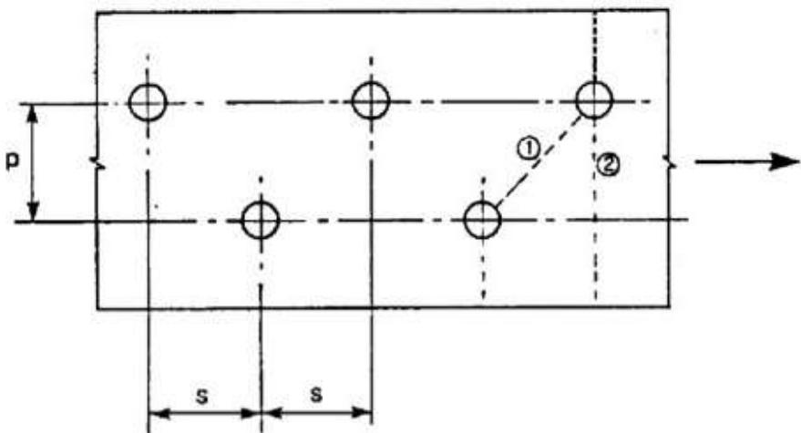

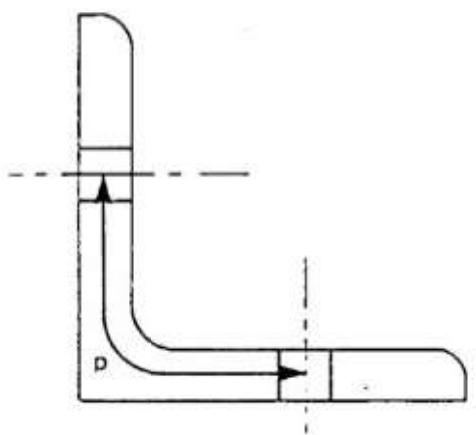  
图6.1错列孔和临界断裂线1和2  
图6.2 两肢均带孔的角钢

6.2.2.3 剪力滞效应

(1) EN1993-1-5 涵盖了有效宽度的计算。  
(2) 根据 EN 1993-1-5 的规定应考虑到 4 类截面中剪力滞和局部屈曲之间的相互作用。注: 对于冷成型薄壁构件, 见 EN 1993-1-3。

6.2.2.4 带 3 类腹板和 1 类或 2 类翼缘的横截面的有效特性

(1) 如果带 3 类腹板和 1 类或 2 类翼缘的横截面被归类为有效 2 类横截面, 见 5.5.2(11), 则根据图 6.3, 腹板的受压部分由与受压翼缘相邻的一个 $20 \mathrm{e} t_{\mathrm{w}}$ 代替, 受拉部分则被与有效横截面塑性中性轴相邻的另一个 $20 \mathrm{e} t_{\mathrm{w}}$ 代替。

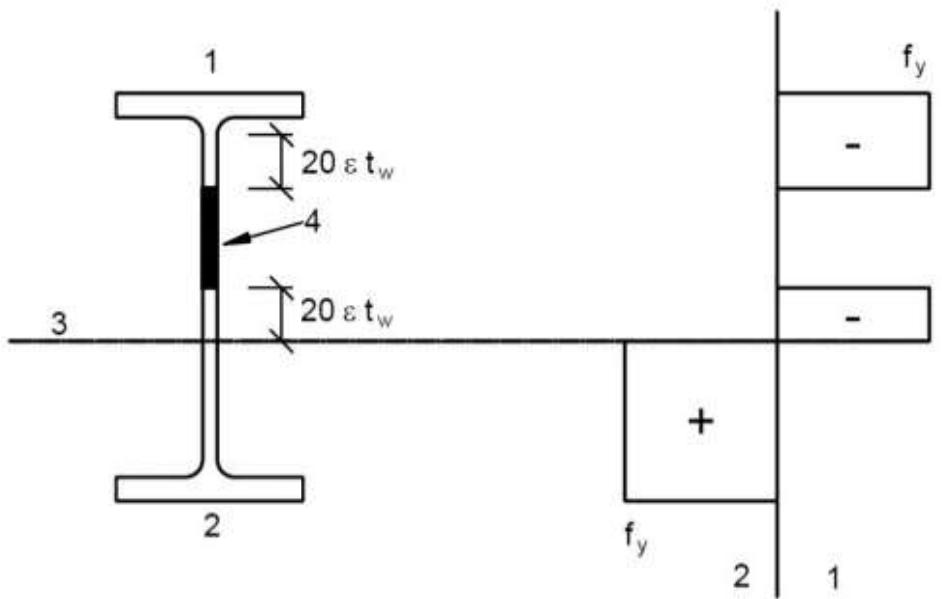  
图6.3有效2类腹板

1受压
2 受拉
3 塑性中性轴
4 忽略不计

6.2.2.54 类横截面的有效横截面特性

(1) 4类横截面的有效横截面特性应基于受压部分的有效宽度。  
(2) 对于冷成型薄壁截面，见1.1.2(1)和EN1993-1-3。  
(3) 平面受压部分的有效宽度应根据 EN 1993-1-5 的规定得出。  
(4)如果4类横截面承受了轴向压力，则应使用EN1993-1-5中给出的方法确定有效面积Aeff的质心相对于毛截面重心可能出现的位移 $\mathbf{e}_{\mathrm{N}}$ 和最后得出的附加力矩：

$$\Delta \mathrm {M} _{\mathrm {E d}} = \mathrm {N} _{\mathrm {E d}} \mathrm {e} _{\mathrm {N}} \tag {6.4}$$

注：附加力矩的符号取决于内力和力矩的组合的效应，见6.2.9.3(2)。

(5) 对于横截面为 4 类的圆形中空截面, 见 EN 1993-1-6。

6.2.3 受拉

AC1(1)P每个横截面上的拉力NEd的设计值应满足：（AC1

$$\frac {\mathrm {N} _{\mathrm {E d}}}{\mathrm {N} _{\mathrm {t , R d}}} \leq 1. 0 \tag {6.5}$$

(2）有孔截面的设计抗拉承载力 $\mathrm{N}_{\mathrm{t,Rd}}$ 应取以下值中的较小值：

a) 毛横截面的设计塑性承载力

$$\mathrm {N} _{\mathrm {p l}, \mathrm {R d}} = \frac {\mathrm {A f} _{\mathrm {y}}}{\gamma_{\mathrm {M 0}}} \tag {6.6}$$

b）紧固件孔处净横截面的设计极限承载力

$$\mathrm {N} _{\mathrm {u}, \mathrm {R d}} = \frac {0 . 9 \mathrm {A} _{\mathrm {n e t}} \mathrm {f} _{\mathrm {u}}}{\gamma_{\mathrm {M 2}}} \tag {6.7}$$

(3) 如果要求设计承载能力，见 EN 1998，设计塑性承载力 $\mathrm{N}_{\mathrm{pl,Rd}}$ （如 6.2.3(2)a 所给出的）应小于紧固件孔洞净截面的设计极限承载力 $\mathrm{N}_{\mathrm{u,Rd}}$ （如 6.2.3(2)b 所给出的）。  
(4) 在 C 类连接中（见 EN 1993-1-8, 3.4.2(1)），6.2.3.1 中所述的紧固件孔的净截面的设计抗拉承载力应认为是 $N_{\mathrm{net,Rd}}$ ，其按下式计算：

$$N _{\text {n e t , R d}} = \frac {A _{\text {n e t}} f _{\mathrm {y}}}{\gamma_{\mathrm {M 0}}} \tag {6.8}$$

(5) 对于单肢连接的角钢, 同样参见 EN 1993-1-8, 3.6.3。对于通过外伸肢连接的其它类型的截面, 也应做类似考虑。

6.2.4 受压

$\left[\overline{AC_{1}}\right](1)\mathrm{P}$ 每个横截面上的压力 $\mathbf{N}_{\mathrm{Ed}}$ 的设计值应满足：

$$\frac {\mathrm {N} _{\mathrm {E d}}}{\mathrm {N} _{\mathrm {c , R d}}} \leq 1. 0 \tag {6.9}$$

(2)横截面均匀受压的设计承载力 $\mathbf{N}_{\mathrm{c,Rd}}$ 应按以下确定：

对于1、2或3类横截面， $\mathrm{N_{c,Rd}} = \frac{\mathrm{Af_y}}{\gamma_{M0}}$ (6.10)

对于4类横截面， $\mathrm{N_{c,Rd}} = \frac{\mathrm{A_{eff}f_y}}{\gamma_{M0}}$ (6.11)

(3) 如果紧固件孔中安装了紧固件，则在受压构件中无需考虑紧固件孔洞，但 EN 1090 中所定义的过大尺寸孔洞和槽孔除外。  
(4) 对于 4 类不对称截面, 应使用 6.2.9.3 中给出的方法, 以便考虑到由于有效截面形心轴的偏心引起的附加力矩 $\Delta M_{\text {Ed }}$ , 见 6.2.2.5(4)。

6.2.5 弯矩

AC1(1)P每个横截面上的弯矩MEd的设计值应满足：（AC1

$$\frac {\mathrm {M} _{\mathrm {E d}}}{\mathrm {M} _{\mathrm {c , R d}}} \leq 1. 0 \tag {6.12}$$

式中 $\mathrm{M}_{\mathrm{c,Rd}}$ 的确定考虑了紧固件孔，见(4)~(6)。

(2) 绕横截面的一个主轴的设计抗弯承载力按如下确定：

对于1或2类横截面， $\mathbf{M}_{\mathrm{c,Rd}} = \mathbf{M}_{\mathrm{pl,Rd}} = \frac{\mathbf{W}_{\mathrm{pl}}\mathbf{f}_{\mathrm{y}}}{\gamma_{\mathrm{M0}}}$

对于3类横截面， $\mathrm{M}_{\mathrm{c,Rd}} = \mathrm{M}_{\mathrm{cl,Rd}} = \frac{\mathrm{W}_{\mathrm{el,min}}\mathrm{f_y}}{\gamma_{\mathrm{M0}}}$ (6.14)

对于4类横截面， $\mathrm{M}_{\mathrm{c,Rd}} = \frac{\mathrm{W}_{\mathrm{eff,min}}\mathrm{f_y}}{\gamma_{\mathrm{M0}}}$ (6.15)

式中， $\mathrm{W}_{\mathrm{el,min}}$ 与 $\mathrm{W}_{\mathrm{eff,min}}$ 与具有最大弹性应力的纤维对应。

(3) 对于双轴弯曲的情况，应使用6.2.9中给出的方法。  
(4) 如果受拉翼缘满足下列条件, 那么受拉翼缘内的紧固件孔可以忽略:

$$\frac {\mathrm {A} _{\mathrm {f , n e t}} 0 . 9 \mathrm {f} _{\mathrm {u}}}{\gamma_{\mathrm {M} 2}} \geq \frac {\mathrm {A} _{\mathrm {f}} \mathrm {f} _{\mathrm {y}}}{\gamma_{\mathrm {M} 0}} \tag {6.16}$$

式中， $A_{\mathrm{f}}$ 为受拉翼缘的面积。

注：(4)中的标准规定了塑性铰区内的承载能力设计（见1.5.8）。

(5) 如果由受拉翼缘和腹板受拉区组成的整个受拉区满足(4)中给出的限值, 那么无需考虑腹板受拉区内的紧固件孔。  
(6) 如果横截面受压区的紧固件孔被紧固件填满，那么无需考虑紧固件孔，但尺寸过大的孔和槽孔除外。

6.2.6 剪切

AC1(1)每个横截面上的剪力VEd的设计值应满足：（AC1

$$\frac {\mathrm {V} _{\mathrm {E d}}}{\mathrm {V} _{\mathrm {c , R d}}} \leq 1. 0 \tag {6.17}$$

式中， $\mathrm{V}_{\mathrm{c},\mathrm{Rd}}$ 表示设计抗剪承载力。在塑性设计中， $\mathrm{V}_{\mathrm{c},\mathrm{Rd}}$ 为(2)中给出的设计塑性抗剪承载力 $\mathrm{V}_{\mathrm{pl},\mathrm{Rd}}$ 。在弹性设计中， $\mathrm{V}_{\mathrm{c},\mathrm{Rd}}$ 为用(4)和(5)计算出的设计弹性抗剪承载力。

(2) 在无扭转的情况下，设计塑性抗剪承载力按下式计算：

$$V _{p l, R d} = \frac {A _{v} \left(f _{y} / \sqrt {3}\right)}{\gamma_{M 0}} \tag {6.18}$$

式中， $\mathbf{A}_{\mathrm{v}}$ 表示受剪面积。

(3)受剪面积 $A_{\mathrm{v}}$ 可按如下进行计算：

a)轧制I型和H型截面，荷载与腹板平行： $A - 2\mathrm{bt}_{\mathrm{f}} + (t_{\mathrm{w}} + 2\mathrm{r})t_{\mathrm{f}}$ 但不小于 $\eta h_w t_w$   
b)轧制槽形截面，荷载与腹板平行： $A - 2\mathrm{bt}_{\mathrm{c}} + (t_{\mathrm{w}} + r)t_{\mathrm{c}}$   
c)轧制T型截面，荷载与腹板平行： $0.9(A - bt_{\mathrm{r}})$   
d) 焊接I型、H型和箱形截面，荷载与腹板平行： $\eta \sum \left(h_{w}t_{w}\right)$   
e) 焊接I型、H型、槽形与箱形截面，荷载与翼缘平行： $A - \sum \left(h_{w}t_{w}\right)$   
f）厚度均匀的轧制矩形中空截面；

荷载与高度平行： $\mathrm{Ah} / (\mathrm{b} + \mathrm{h})$

荷载与宽度平行： $\mathrm{Ab} / (\mathrm{b} + \mathrm{h})$

g) 厚度均匀的圆形中空截面与管材：2A/π

式中，

A 表示横截面面积；  
b 表示总宽度；  
h 表示总高度；  
$\mathbf{h}_{\mathrm{w}}$ 表示腹板高度；  
r 表示根部半径；

t 表示翼缘厚度；

表示腹板的厚度（如果腹部厚度不恒定，则 $\mathbf{t}_{\mathrm{w}}$ 应取最小厚度）。

见EN1993-1-5。

注： $\eta$ 可保守地取为1.0。

(4) 除非采用了 EN 1993-1-5 第 5 节中的屈曲检验, 否则应使用下列关于横截面临界点的标准来检验设计弹性抗剪承载力 $V_{c,Rd}$ :

$$\frac {\tau_{\mathrm {E d}}}{\mathrm {f} _{\mathrm {y}} / \left(\sqrt {3} \gamma_{\mathrm {M 0}}\right)} \leq 1. 0 \tag {6.19}$$

式中

$\tau_{\mathrm{Ed}}$ 可按下式得到： $\tau_{\mathrm{Ed}} = \frac{\mathrm{V}_{\mathrm{Ed}}\mathrm{S}}{\mathrm{I}\mathrm{t}}$ (6.20)

式中，

$\mathbf{V}_{\mathrm{Ed}}$ 表示剪力的设计值

S 表示绕横截面受剪点和横截面边界之间的部位的质心轴的静力矩

I 表示整个横截面的截面惯性矩

t 表示检测点处的厚度

注：按(4)的规定进行的检验是保守的，因为它排除了弹性设计所允许的部分塑性剪切分布，见(5)。因此仅在按公式(6.17)基于 $V_{c,Rd}$ 的检验不能进行时，才可按(4)所述进行检验。

(5) 对于 I 型与 H 型截面, 腹板内的剪应力应按下式计算:

如果 $\mathrm{A_f / A_w}\geq 0.6$ ，则 $\tau_{\mathrm{Ed}} = \frac{\mathrm{V}_{\mathrm{Ed}}}{\mathrm{A}_{\mathrm{w}}}$ (6.21)

式中，

$\mathrm{A_f}$ 表示一个翼缘的面积；

A 表示腹板面积： $\mathrm{A_w = h_w t_w}$

(6) 另外，如果满足以下条件，不带中间加劲肋的腹板的剪切屈曲抗力应符合 EN 1993-1-5 第 5 节的规定：

$$\frac {\mathrm {h} _{\mathrm {w}}}{\mathrm {t} _{\mathrm {w}}} > 7 2 \frac {\varepsilon}{\eta} \tag {6.22}$$

$\eta$ 见EN1993-1-5的第5节。

注： $\eta$ 可保守取为1.0。

(7) 剪切检验中无需考虑紧固件孔，但 EN 1993-1-8 中给出的连接区的设计抗剪承载力检验除外。  
(8)当剪力和扭矩相结合时，塑性抗剪承载力 $V_{pl,Rd}$ 应按6.2.7(9)的规定进行折减。

6.2.7 扭转

(1) 对于承受了扭转但可忽略扭曲变形的构件，每个横截面上的扭矩 $T_{\text{Ed}}$ 的设计值应满足以下条件：

$$\frac {T _{\mathrm {E d}}}{T _{\mathrm {R d}}} \leq 1. 0 \tag {6.23}$$

式中 $\mathrm{T_{Rd}}$ 为横截面的设计抗扭承载力。

(2）任何横截面的总扭矩 $\mathrm{T_{Ed}}$ 都应认为是两个内部效应之和：

$$T _{E d} = T _{t, E d} + T _{w, E d} \tag {6.24}$$

式中，

TtEd 表示内部圣维南扭转；

Tw,Ed 表示内部翘曲扭转。

(3) 任何横截面上的 $T_{\mathrm{t}, \mathrm{Ed}}$ 与 $T_{\mathrm{w}, \mathrm{Ed}}$ 值都可以通过弹性分析从 $T_{\mathrm{Ed}}$ 确定，确定时考虑构件的截面特性、支撑处的约束条件以及沿构件方向作用力的分布。  
(4）应考虑下列由扭转引起的应力：

由圣维南扭转 $\mathsf{T}_{\mathrm{t},\mathrm{Ed}}$ 引起的剪应力 $\tau_{\nu ,\mathrm{Ed}}$   
由双力矩 $\mathbf{B}_{\mathrm{Ed}}$ 引起的直接应力 $\sigma_{\mathrm{w,Ed}}$ ，以及由翘曲扭转 $\mathbf{T}_{\mathrm{w,Ed}}$ 引起的剪应力 $\tau_{\mathrm{w,Ed}}$

(5)弹性检验可应用6.2.1(5)中的屈服标准。  
(6) 确定横截面仅由弯曲和扭转引起的塑性弯矩抗力时, 扭转效应 $\mathrm{B}_{\mathrm{Ed}}$ 应由弹性分析得出, 见(3)。  
(7) 为了简便起见, 对于带有闭合中空截面, 如结构中空截面的构件, 可假定其扭转翘曲效应可忽略。同样为了简便起见, 对于带有开口横截面的构件, 如 I 型或 H 型截面, 应假定其圣维南扭转效应可忽略。  
(8) 在计算闭合中空截面的承载力 $\mathrm{T}_{\mathrm{Rd}}$ 时，按照 EN1993-1-5 的规定应考虑横截面各单独部

分的设计抗剪强度。

(9) 对于剪力和扭矩的组合，考虑了扭转效应的塑性抗剪承载力应从 $V_{pl,Rd}$ 折减到 $V_{pl,T,Rd}$ ，并且设计剪力应满足下式：

$$\frac {\mathrm {V} _{\mathrm {E d}}}{\mathrm {V} _{\mathrm {p l , T , R d}}} \leq 1. 0 \tag {6.25}$$

式中， $\mathrm{V}_{\mathrm{pl},\mathrm{T},\mathrm{Rd}}$ 可按以下计算：

对于I或H型截面：

$$V _{p l, T, R d} = \sqrt {1 - \frac {\tau_{t , E d}}{1 . 2 5 \left(f _{y} / \sqrt {3}\right) / \gamma_{M 0}}} V _{p l, R d} \tag {6.26}$$

对于槽钢截面：

$$V _{p l, T, R d} = \left[ \sqrt {1 - \frac {\tau_{t , E d}}{1 . 2 5 \left(f _{y} / \sqrt {3}\right) / \gamma_{M 0}}} - \frac {\tau_{w , E d}}{\left(f _{y} / \sqrt {3}\right) / \gamma_{M 0}} \right] V _{p l, R d} \tag {6.27}$$

对于结构中空截面：

$$V _{p l, T, R d} = \left[ 1 - \frac {\tau_{t , E d}}{\left(f _{y} / \sqrt {3}\right) / \gamma_{M 0}} \right] V _{p l, R d} \tag {6.28}$$

式中 $\mathrm{V}_{\mathrm{pl,Rd}}$ 在6.2.6中给出。

6.2.8 受弯与受剪

(1) 当有剪力时，应考虑剪力对弯矩抗力的作用。  
(2) 当剪力小于塑性抗剪承载力的一半时，剪力对弯矩抗力的作用可忽略，但剪切屈曲减少截面承载力的情况除外，见EN1993-1-5。  
(3) 另外，减小的弯矩抗力应作为横截面的设计承载力，对于受剪区，此力使用折减的屈服强度计算得出：

$$(1 - \rho) f _{y} \tag {6.29}$$

对于剪力区，

式中： $\rho = \left(\frac{2\mathrm{V}_{\mathrm{Ed}}}{\mathrm{V}_{\mathrm{pl,Rd}}} -1\right)^{2}$ 并且 $\mathrm{V_{pl,Rd}}$ 根据6.2.6(2)得出。

注：参见6.2.10(3)。

(4) 当存在扭转时， $\rho$ 应根据下式进行计算： $\rho = \left(\frac{2V_{\mathrm{Ed}}}{V_{\mathrm{pl,T,Rd}}} - 1\right)^2$ ，见6.2.7，但是当 $V_{\mathrm{Ed}} \leq 0.5V_{\mathrm{pl,T,Rd}}$ 时，其值应取为0。  
(5) 对于带有相等翼缘并绕主轴弯曲的 I 型横截面, 其考虑到剪力的折减设计抗塑性承载力矩也可按照如下计算:

$$\mathrm {M} _{\mathrm {y}, \mathrm {V}, \mathrm {R d}} = \frac {\left[ \mathrm {W} _{\mathrm {p l} , \mathrm {y}} - \frac {\rho \mathrm {A} _{\mathrm {w}} ^{2}}{4 \mathrm {t} _{\mathrm {w}}} \right] \mathrm {f} _{\mathrm {y}}}{\gamma_{\mathrm {M 0}}}, \text {但} \mathrm {M} _{\mathrm {y}, \mathrm {V}, \mathrm {R d}} \leq \mathrm {M} _{\mathrm {y}, \mathrm {c}, \mathrm {R d}} \tag {6.30}$$

式中， $\mathbf{M}_{\mathrm{y,c,Rd}}$ 可从6.2.5(2)得到。

并且 $\mathrm{A_w = h_w t_w}$

(6) 对于弯曲、剪切和横向荷载的相互作用，见 EN 1993-1-5 第 7 节。

6.2.9 弯曲和轴力

6.2.9.1 1 类和 2 类横截面

(1) 当存在轴力时，应考虑到轴力对塑性弯矩抗力的作用。

$\left[\mathrm{AC}_{1}\right](2)$ 对于1类和2类横截面，应满足以下标准： $\left[\mathrm{AC}_{1}\right]$

$$\mathrm {M} _{\mathrm {E d}} \leq \mathrm {M} _{\mathrm {N}, \mathrm {R d}} \tag {6.31}$$

式中 $\mathbf{M}_{\mathrm{N,Rd}}$ 是因轴力 $\mathbf{N}_{\mathrm{Ed}}$ 而折减的设计塑性弯矩抗力。

(3)无紧固件孔的矩形实心截面的 $\mathsf{M}_{\mathsf{N},\mathsf{Rd}}$ 应按如下计算：

$$\mathrm {M} _{\mathrm {N}, \mathrm {R d}} = \mathrm {M} _{\mathrm {p l}, \mathrm {R d}} \left[ 1 - \left(\mathrm {N} _{\mathrm {E d}} / \mathrm {N} _{\mathrm {p l}, \mathrm {R d}}\right) ^{2} \right] \tag {6.32}$$

(4) 对于双对称 I 型和 H 型截面或其它翼缘截面, 当以下两个标准都满足时, 无需考虑轴力对绕 y-y 轴的塑性承载力矩的影响:

$$\mathrm {N} _{\text {E d}} \leq 0. 2 5 \mathrm {N} _{\mathrm {p l}, \mathrm {R d}}, \text {并 且} \tag {6.33}$$

$$\mathrm {N} _{\mathrm {E d}} \leq \frac {0 . 5 \mathrm {h} _{\mathrm {w}} \mathrm {t} _{\mathrm {w}} \mathrm {f} _{\mathrm {y}}}{\gamma_{\mathrm {M 0}}} \tag {6.34}$$

对于双对称I型和H型截面，在下述条件下无需考虑到轴力对绕z-z轴的塑性承载力矩的影

响：

$$N _{E d} \leq \frac {h _{w} t _{w} f _{y}}{\gamma_{M 0}} \tag {6.35}$$

(5) 对于不考虑紧固件孔的横截面, 以下近似计算可用于标准轧制 I 或 H 型截面以及带有相等翼缘的焊接 I 型或 H 型截面:

$$\mathrm {M} _{\mathrm {N}, \mathrm {y}, \mathrm {R d}} = \mathrm {M} _{\mathrm {p l}, \mathrm {y}, \mathrm {R d}} (1 - \mathrm {n}) / (1 - 0. 5 \mathrm {a}), \text {但} \mathrm {M} _{\mathrm {N}, \mathrm {y}, \mathrm {R d}} \leq \mathrm {M} _{\mathrm {p l}, \mathrm {y}, \mathrm {R d}} \tag {6.36}$$

$$\text {当} n \leq a \text {时 :} M _{N, z, R d} = M _{p l, z, R d} \tag {6.37}$$

$$\text {当} \mathrm {n > a} \text {时 :} \mathrm {M} _{\mathrm {N}, \mathrm {z}, \mathrm {R d}} = \mathrm {M} _{\mathrm {p l}, \mathrm {z}, \mathrm {R d}} \left[ 1 - \left(\frac {n - a}{1 - a}\right) ^{2} \right] \tag {6.38}$$

式中 $\mathrm{n = N_{E0} / N_{pl,Rd}}$

$$\mathrm {a} = (\mathrm {A} - 2 \mathrm {b t} _{\mathrm {f}}) / \mathrm {A} \text {但} \mathrm {a} \leq 0. 5$$

对于没有考虑紧固件孔的横截面，以下近似计算公式可用于具有均匀厚度的矩形结构中空截面以及具有相等翼缘和相等腹板的焊接箱形截面：

$$\mathrm {M} _{\mathrm {N}, \mathrm {y}, \mathrm {R d}} = \mathrm {M} _{\mathrm {p l}, \mathrm {y}, \mathrm {R d}} (1 - \mathrm {n}) / (1 - 0. 5 \mathrm {a} _{\mathrm {w}}) \text {但} \mathrm {M} _{\mathrm {N}, \mathrm {y}, \mathrm {R d}} \leq \mathrm {M} _{\mathrm {p l}, \mathrm {y}, \mathrm {R d}} \tag {6.39}$$

$$\mathrm {M} _{\mathrm {N}, \mathrm {z}, \mathrm {R d}} = \mathrm {M} _{\mathrm {p l}, \mathrm {z}, \mathrm {R d}} (1 - \mathrm {n}) / (1 - 0. 5 \mathrm {a} _{\mathrm {f}}) \text {但} \mathrm {M} _{\mathrm {N}, \mathrm {z}, \mathrm {R d}} \leq \mathrm {M} _{\mathrm {p l}, \mathrm {z}, \mathrm {R d}} \tag {6.40}$$

式中，对于中空截面， $a_{\mathrm{w}} = (\mathrm{A} - 2\mathrm{bt}) / \mathrm{A}$ 但 $a_{\mathrm{w}}\leq 0.5$

对于焊接箱形截面， $\mathrm{a_w = (A - 2bt_f) / A}$ 但 $\mathrm{a_w\leq 0.5}$

对于中空截面， $a_{\mathrm{f}} = (\mathrm{A - 2ht}) / \mathrm{A}$ 但 $a_{\mathrm{f}}\leq 0.5$

对于焊接箱形截面， $a_{\mathrm{f}} = (A - 2\mathrm{ht}_{\mathrm{w}}) / A$ 但 $\mathrm{a_f}\leq 0.5$

(6)对于双轴弯曲，可使用以下标准：

$$\left[ \frac {\mathrm {M} _{\mathrm {y} , \mathrm {E d}}}{\mathrm {M} _{\mathrm {N} , \mathrm {y} , \mathrm {R d}}} \right] ^{\alpha} + \left[ \frac {\mathrm {M} _{\mathrm {z} , \mathrm {E d}}}{\mathrm {M} _{\mathrm {N} , \mathrm {z} , \mathrm {R d}}} \right] ^{\beta} \leq 1 \tag {6.41}$$

式中 $\alpha$ 和 $\beta$ 均为常数，可保守地取为整数，否则，按如下规定来取值：

对于I型和H型截面：

$$\alpha = 2; \beta = 5 n, \quad \text {但} \beta \geq 1$$

对于圆形中空截面：

EN 1993-1-1:2005 (E)

$$\alpha = 2: \beta = 2$$

对于矩形中空截面：

$$\alpha = \beta = \frac {1 . 6 6}{1 - 1 . 1 3 n ^{2}} \text {但} \alpha = \beta \leq 6$$

式中 $\mathrm{n = N_{Ed} / N_{pl,Rd}}$

6.2.9.23 类横截面

如果没有剪力，3类横截面的最大纵向应力应满足下述标准：

$$\sigma_{\mathrm {x}, \mathrm {E d}} \leq \frac {\mathrm {f} _{\mathrm {y}}}{\gamma_{\mathrm {M 0}}} \tag {6.42}$$

式中， $\sigma_{x,Ed}$ 表示由力矩与轴力引起的局部纵向应力的设计值（在适当的时候考虑了紧固件孔），见6.2.3、6.2.4和6.2.5。

6.2.9.34类横截面

$\left[\mathrm{AC}_{1}\right](1) \mathrm{P}$ 如果没有剪力，使用有效横截面（见5.5.2(2))计算的4类横截面的最大纵向应力 $\sigma_{\mathrm{x.Ed}}$ 应满足以下标准： $\left[\mathrm{AC}_{1}\right]$

$$\sigma_{\mathrm {x}, \mathrm {E d}} \leq \frac {\mathrm {f} _{\mathrm {y}}}{\gamma_{\mathrm {M 0}}} \tag {6.43}$$

式中，

$\sigma_{\mathrm{x,Ed}}$ 表示由力矩与轴力引起的局部纵向应力的设计值（在适当的时候考虑了紧固件孔），见6.2.3、6.2.4和6.2.5。

(2）应满足以下标准：

$$\frac {\mathrm {N} _{\text {E d}}}{\mathrm {A} _{\text {e f f}} \mathrm {f} _{\mathrm {y}} / \gamma_{\mathrm {M 0}}} + \frac {\mathrm {M} _{\mathrm {y , E d}} + \mathrm {N} _{\mathrm {E d}} \mathrm {e} _{\mathrm {N y}}}{\mathrm {W} _{\text {e f f , y , m i n}} \mathrm {f} _{\mathrm {y}} / \gamma_{\mathrm {M 0}}} + \frac {\mathrm {M} _{\mathrm {z , E d}} + \mathrm {N} _{\mathrm {E d}} \mathrm {e} _{\mathrm {N z}}}{\mathrm {W} _{\text {e f f , z , m i n}} \mathrm {f} _{\mathrm {y}} / \gamma_{\mathrm {M 0}}} \leq 1 \tag {6.44}$$

式中，

$\mathrm{A_{eff}}$ 表示均布压力下横截面的有效面积；

$\mathrm{W}_{\mathrm{eff,min}}$ 表示仅承受绕相关轴的力矩的横截面的有效截面模量（与具有最大弹

性应力的纤维对应）；

$\mathsf{e}_{\mathsf{N}}$ 为只受压横截面的相关质心轴的位移，见6.2.2.5(4)。

注： $N_{\text{Ed}}$ 、 $M_{y, \text{Ed}}$ 、 $M_{z, \text{Ed}}$ 和 $\Delta M_{i} = N_{\text{Ed}} e_{Ni}$ 的符号取决于相应的直接应力组合。

6.2.10 弯矩、剪力与轴力

(1)当存在剪力和轴力时，应考虑到剪力和轴力同时对承载力矩的效应。  
(2) 如果剪力 $V_{\text{Ed}}$ 的设计值不大于设计塑性抗剪承载力 $V_{\text{pl,Rd}}$ 的 $50\%$ ，则 6.2.9 中的弯曲力与轴力不需折减，但剪切屈曲引起截面承载力减小的情况除外，见 EN 1993-1-5。  
(3) 当 $V_{\mathrm{Ed}}$ 大于 $V_{\mathrm{pl,Rd}}$ 的 $50\%$ 时，横截面对力矩与轴力组合的设计承载力应使用折减后的屈服强度来计算。

对于受剪区域： $(1 - \rho)f_{y}$ (6.45)

式中， $\rho = (2V_{\mathrm{Ed}} / V_{\mathrm{pl,Rd}} - 1)^2$ 而 $\mathbf{V}_{\mathrm{pl,Rd}}$ 从6.2.6(2)中得出。

注：可以不折减屈服强度,而折减横截面相关部分的板厚来代替。

## 6.3 构件的屈曲抗力

6.3.1 受压均匀构件

6.3.1.1 屈曲抗力

（1）应按照下式检验受压构件的屈曲：

$$\frac {\mathrm {N} _{\mathrm {E d}}}{\mathrm {N} _{\mathrm {b , R d}}} \leq 1. 0 \tag {6.46}$$

式中， $N_{\text{Ed}}$ 表示压力的设计值

$\mathbf{N}_{\mathrm{b,Rd}}$ 表示受压构件的设计屈曲抗力。

(2) 对于具有非对称 4 类截面的构件, 应考虑到由有效截面的质心轴线的偏心引起的附加力矩 $\Delta \mathrm{M}_{\mathrm{Ed}}$ , 同样参见 6.2.2.5(4), 并按照 6.3.4 或 6.3.3 的规定进行相互作用。  
(3）应根据下列各式计算受压构件的设计屈曲抗力：

对于1、2、3类横截面： $\mathrm{N_{b,Rd}} = \frac{\chi\mathrm{Af_y}}{\gamma_{M1}}$ (6.47)

对于4类横截面： $\mathrm{N_{b,Rd} = \frac{\chi A_{eff}f_y}{\gamma_{M1}}}$ (6.48)

式中，

$\chi$ 表示相关屈曲模态的折减系数。

注：为了确定沿构件方向带锥形截面的构件的屈曲抗力，或压力的不均匀分布，应按照5.3.4(2)的规定进行二阶分析。对于面外屈曲，也见6.3.4。

(4) 在确定 $\mathrm{A}$ 和 ${\mathrm{A}}_{\text{eff }}$ 时,柱端处的紧固件孔不必考虑。

6.3.1.2 屈曲曲线

(1) 对于构件内的轴向压力，适用于适当的无量纲细长比 $\overline{\lambda}$ 的 $\chi$ 的值可按照下式从相关屈曲曲线中得出：

$$\chi = \frac {1}{\Phi + \sqrt {\Phi^{2} - \overline {{{\lambda}}} ^{2}}} \text {但} \chi \leq 1. 0 \tag {6.49}$$

式中，

$$\Phi = 0. 5 \left[ 1 + \alpha (\bar {\lambda} - 0. 2) + \bar {\lambda} ^{2} \right]$$

对于1、2、3类横截面： $\overline{\lambda} = \sqrt{\frac{Af_y}{N_{cr}}}$

对于4类横截面： $\overline{\lambda} = \sqrt{\frac{A_{\mathrm{eff}}f_y}{N_{\mathrm{cr}}}}$

$\alpha$ 表示缺陷系数

${\mathrm{N}}_{\mathrm{{cr}}}$ 表示基于毛横截面特性的相关屈曲模态的弹性临界力。

(2) 与适当的屈曲曲线对应的缺陷系数 $\alpha$ 应从表6.1和表6.2中得出。

表 6.1 屈曲曲线的缺陷系数  


| 屈曲曲线 | a0 | a | b | c | d |
| --- | --- | --- | --- | --- | --- |
| 缺陷系数α | 0.13 | 0.21 | 0.34 | 0.49 | 0.76 |


(3) 适用于适当的无量纲长细比 $\overline{\lambda}$ 的折减系数的 $\chi$ 值可从图6.4得出。

(4) 当长细比 $\bar{\lambda} \leq 0.2$ 或 $\frac{N_{\mathrm{Ed}}}{N_{\mathrm{cr}}} \leq 0.04$ 时，可忽略屈曲效应，仅需进行横截面检验。

表 6.2: 横截面的屈曲曲线的选择  


| 横截面 | 横截面 | 限值 | 限值 | 绕轴屈曲 | 屈曲曲线 | 屈曲曲线 |
| --- | --- | --- | --- | --- | --- | --- |
| 横截面 | 横截面 | 限值 | 限值 | 绕轴屈曲 | S235S275S355S420 | S460 |
| 轧制截面 | h y z b | h/b≥1.2 | tf≤40mm | y-yz-z | a b | a0a0 |
| 轧制截面 | h y z b | h/b≥1.2 | 40mm < tf≤100 | y-yz-z | b c | a a |
| 轧制截面 | h y z b | h/b<1.2 | tf≤100mm | y-yz-z | b c | a A |
| 轧制截面 | h y z b | h/b<1.2 | tf>100mm | y-yz-z | d d | c c |
| 焊接I型截面 | y z y z | tf≤40mm | tf≤40mm | y-yz-z | b c | b c |
| 焊接I型截面 | y z y z | tf>40mm | tf>40mm | y-yz-z | c d | c d |
| 中空截面 |  | 热轧成型 | 热轧成型 | 任意轴 | a | a0 |
| 中空截面 |  | 冷轧成型 | 冷轧成型 | 任意轴 | c | c |
| 焊接箱形截面 | h y z t r | 通常情况下(以下情况除外) | 通常情况下(以下情况除外) | 任意轴 | b | b |
| 焊接箱形截面 | h y z t r | 焊接厚度:a>0.5tfb/tf<30h/tw<30 | 焊接厚度:a>0.5tfb/tf<30h/tw<30 | 任意轴 | c | c |
| U型、T形及实心截面 |  |  |  | 任意轴 | c | c |
| L型截面 |  |  |  | 任意轴 | b | b |


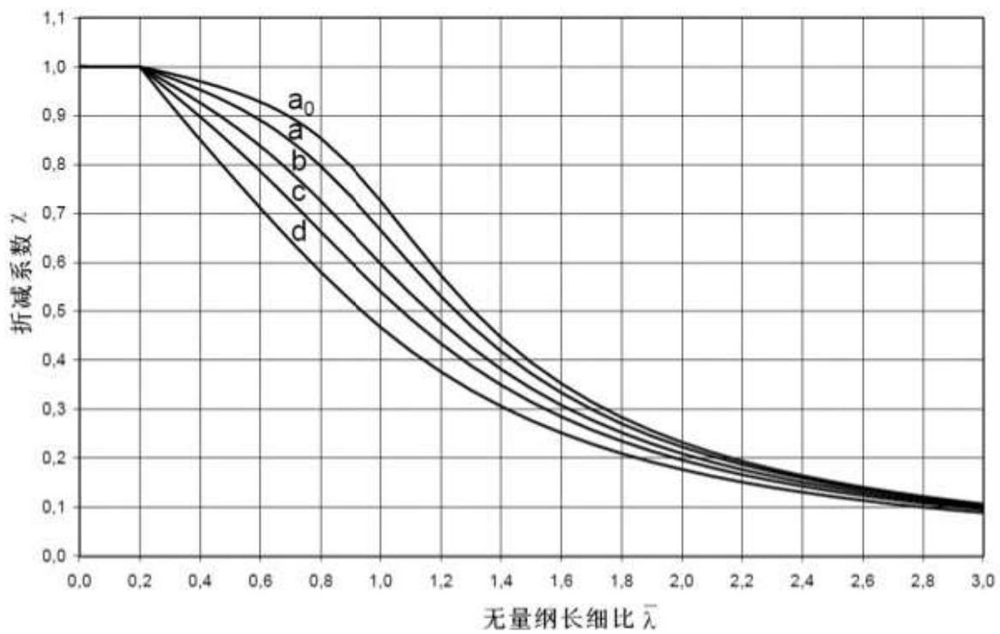  
图6.4屈曲曲线

6.3.1.3 弯曲屈曲的长细比

(1) 无量纲长细比 $\bar{\lambda}$ 由下式给出:

对于1、2、3类横截面： $\overline{\lambda} = \sqrt{\frac{Af_y}{N_{cr}}} = \frac{L_{cr}}{i}\frac{1}{\lambda_1}$ (6.50)

对于4类横截面： $\overline{\lambda} = \sqrt{\frac{A_{\mathrm{eff}}f_y}{N_{\mathrm{cr}}}} = \frac{L_{\mathrm{cr}}}{i}\frac{\sqrt{\frac{A_{\mathrm{eff}}}{A}}}{\lambda_1}$

式中，

$\mathrm{L}_{\mathrm{cr}}$ 表示所考虑的屈曲面上的屈曲长度

i 表示绕相关轴的回转半径，利用毛横截面的特性确定。

$$\lambda_{1} = \pi \sqrt {\frac {E}{f _{y}}} = 9 3. 9 \varepsilon$$

235 $\varepsilon = \sqrt{\frac{f_y}{f_y}}$ （fy的单位N/mm2）

注B：关于建筑结构部件的弹性屈曲，见附录BB。

(2) 应从表6.2中得出弯曲屈曲适当的屈曲曲线。

6.3.1.4 扭转屈曲和弯扭屈曲的长细比

(1) 对于带有开口横截面的构件，应考虑该构件对扭转屈曲或弯扭屈曲的抗力可能小于它对弯曲屈曲的抗力。  
(2)扭转屈曲或弯扭屈曲的无量纲长细比 $\bar{\lambda}_{\mathrm{T}}$ 应取值为：

对于1、2、3类横截面： $\overline{\lambda}_{\mathrm{T}} = \sqrt{\frac{\mathrm{Af}_{\mathrm{y}}}{\mathrm{N}_{\mathrm{cr}}}}$ (6.52)

对于4类横截面： $\overline{\lambda}_{\mathrm{T}} = \sqrt{\frac{\mathrm{A}_{\mathrm{eff}}\mathrm{f}_{\mathrm{y}}}{\mathrm{N}_{\mathrm{cr}}}}$ (6.53)

式中， $\mathrm{N}_{\mathrm{cr}} = \mathrm{N}_{\mathrm{cr,TF}}$ ，但 $\mathrm{N_{cr} <   N_{cr,T}}$

$\mathrm{N}_{\mathrm{cr,TF}}$ 表示弹性弯扭屈曲力

$N_{\sigma, T}$ 表示弹性扭转屈曲力

(3) 扭转弯曲或弯扭屈曲的适当的屈曲曲线可通过考虑与 $z$ 轴相关的曲线从表6.2中得出。

6.3.2 受弯均匀构件

6.3.2.1 屈曲抗力

(1)应采用下式检验承受主轴弯曲的侧向无约束构件对侧扭屈曲的抵抗能力：

$$\frac {\mathrm {M} _{\mathrm {E d}}}{\mathrm {M} _{\mathrm {b , R d}}} \leq 1. 0 \tag {6.54}$$

式中，

$\mathbf{M}_{\mathrm{Ed}}$ 表示力矩的设计值。

$\mathbf{M}_{\mathrm{b,Rd}}$ 表示设计屈曲抵抗力矩。

(2) 给受压翼缘施加了充分约束的梁受侧扭屈曲的影响并不大。此外，有特定横截面的梁，如正方形或圆形中空型材、装配式圆管或正方形箱形型材，也不易受侧扭屈曲的影响。  
(3) 侧向无约束梁的设计屈曲抵抗力矩应根据下式计算：

$$\mathrm {M} _{\mathrm {b}, \mathrm {R d}} = \chi_{\mathrm {L T}} \mathrm {W} _{\mathrm {y}} \frac {\mathrm {f} _{\mathrm {y}}}{\gamma_{\mathrm {M l}}} \tag {6.55}$$

式中，

$\mathrm{W_y}$ 为如下适当的截面模量：

对于1、2类横截面 $\mathbf{W}_{\mathrm{y}} = \mathbf{W}_{\mathrm{pl,y}}$   
对于3类横截面 $\mathbf{W}_{\mathrm{y}} = \mathbf{W}_{\mathrm{cl,y}}$   
对于4类横截面 $\mathrm{W_y = W_{eff,y}}$

$x_{\mathrm{LT}}$ 表示侧扭屈曲的折减系数。

注1: 应按照5.3.4(3)的规定进行二阶分析以确定带有锥形截面的梁的屈曲抗力。对于面外屈曲, 同样参见6.3.4。

注2B：建筑结构元件的屈曲也见附录BB。

(4) 在确定 $W_{y}$ 时，梁末端的紧固件孔不必考虑。

6.3.2.2 侧扭屈曲曲线——一般情况下

(1) 除非另有规定, 见 6.3.2.3, 否则, 对于等截面的弯曲构件, 适用于适当的无量纲长细比 $\bar{\lambda}_{\mathrm{LT}}$ 的 $\chi_{\mathrm{LT}}$ 的值应根据下式确定:

$$\chi_{\mathrm {L T}} = \frac {1}{\Phi_{\mathrm {L T}} + \sqrt {\Phi_{\mathrm {L T}} ^{2} - \bar {\lambda} _{\mathrm {L T}} ^{2}}}, \text {但} \chi_{\mathrm {L T}} \leq 1. 0 \tag {6.56}$$

式中，

$$\Phi_{\mathrm {L T}} = 0. 5 \left[ 1 + \alpha_{\mathrm {L T}} \left(\bar {\lambda} _{\mathrm {L T}} - 0. 2\right) + \bar {\lambda} _{\mathrm {L T}} ^{2} \right]$$

$\alpha_{\mathrm{LT}}$ 是一个缺陷系数。

EN 1993-1-1:2005 (E)

$$\bar {\lambda} _{L T} = \sqrt {\frac {W _{y} f _{y}}{M _{c r}}}$$

$\mathbf{M}_{\mathrm{cr}}$ 是侧扭屈曲的弹性临界力矩。

(2) $\mathrm{M}_{\mathrm{cr}}$ 基于总横截面特性, 并且考虑了加载条件、实际力矩分布和侧向约束。

注：与适当的屈曲曲线相对应的缺陷系数 $\alpha_{\mathrm{LT}}$ 可从国家版附录中得出。 $\alpha_{\mathrm{LT}}$ 的建议值见表6.3。

表 6.3 侧扭屈曲曲线的缺陷系数建议值  


| 屈曲曲线 | a | b | c | d |
| --- | --- | --- | --- | --- |
| 耗散系数αLT | 0.21 | 0.34 | 0.49 | 0.76 |


建议的弯曲曲线见表6.4。

表 6.4 使用公式(6.56)的横截面的侧扭屈曲曲线建议值  


| 横截面 | 限值 | 屈曲曲线 |
| --- | --- | --- |
| 轧制I型截面 | h/b≤2 | a |
| 轧制I型截面 | h/b>2 | b |
| 焊接I型截面 | h/b≤2 | c |
| 焊接I型截面 | h/b>2 | d |
| 其它横截面 | - | d |


(3) 适当的无量纲长细比 $\bar{\lambda}_{\mathrm{LT}}$ 对应的折减系数 $\chi_{\mathrm{LT}}$ 的值可从图6.4中得出。  
(4) 当长细比 $\overline{\lambda}_{\mathrm{LT}} \leq \overline{\lambda}_{\mathrm{LT,0}}$ （见6.3.2.3）或当 $\frac{\mathrm{M}_{\mathrm{Ed}}}{\mathrm{M}_{\mathrm{cr}}} \leq \overline{\lambda}_{\mathrm{LT,0}}^2$ （见6.3.2.3）时，可忽略侧扭屈曲效应，并且仅进行横截面检验。

6.3.2.3轧制截面或等效焊接截面的侧向扭转屈曲曲线

(1) 对于受弯的轧制或等效焊接截面，适用于适当的无量纲长细比的 $\chi_{\mathrm{LT}}$ 的值可根据下式确定：

$$\begin{array}{l} \chi_{\mathrm {L T}} = \frac {1}{\Phi_{\mathrm {L T}} + \sqrt {\Phi_{\mathrm {L T}} ^{2} - \beta \bar {\lambda} _{\mathrm {L T}} ^{2}}} \text {但} \left\{ \begin{array}{l l} \chi_{\mathrm {L T}} \leq 1. 0 \\ \chi_{\mathrm {L T}} \leq \frac {1}{\bar {\lambda} _{\mathrm {L T}} ^{2}} \end{array} \right. \tag {6.57} \\ \Phi_{\mathrm {L T}} = 0. 5 \left[ 1 + \alpha_{\mathrm {L T}} \left(\bar {\lambda} _{\mathrm {L T}} - \bar {\lambda} _{\mathrm {L T}, 0}\right) + \beta \bar {\lambda} _{\mathrm {L T}} ^{2} \right] \\ \end{array}$$

注：参数 $\bar{\lambda}_{\mathrm{LT,0}}$ 和 $\beta$ 以及与梁高或 $h / b$ 比相关的有效性局限可在国家版附录中给出。对于轧制截面或等效焊接截面，建议取以下值：

$\overline{\lambda}_{\mathrm{LT,0}} = 0.4$ （最大值）

$\beta = 0.75$ （最小值）

屈曲曲线的建议值见表6.5。

表 6.5 使用公式(6.57)的横截面的侧扭屈曲曲线建议值  


| 横截面 | 限值 | 屈曲曲线 |
| --- | --- | --- |
| 轧制I型截面 | h/b≤2 | b |
| 轧制I型截面 | h/b>2 | c |
| 焊接I型截面 | h/b≤2 | c |
| 焊接I型截面 | h/b>2 | d |


(2) 为了考虑构件的侧向约束之间的弯矩分布, 折减系数 $\chi_{\mathrm{LT}}$ 可作如下修正:

$$\chi_{\mathrm {L T}, \mathrm {m o d}} = \frac {\chi_{\mathrm {L T}}}{\mathrm {f}} \text {但} \chi_{\mathrm {L T}, \mathrm {m o d}} \leq 1 \tag {6.58}$$

注：国家版附录中可定义出f的值。建议取以下最小值：

$$\mathrm {f} = 1 - 0. 5 \left(1 - \mathrm {k} _{\mathrm {c}}\right) \left[ 1 - 2. 0 \left(\overline {{\lambda}} _{\mathrm {L T}} - 0. 8\right) ^{2} \right] \text {但} \mathrm {f} \leq 1. 0$$

$\mathrm{k_c}$ 是表6.6给出的修正系数。

表6.6修正系数 $\mathbf{k}_{\mathrm{c}}$   


| 弯矩分布 | kc |
| --- | --- |
| ψ=1 | 1.0 |
| -1≤ψ≤1 | 1/1.33-0.33ψ |
|  | 0.94 |
|  | 0.90 |
|  | 0.91 |
|  | 0.86 |
|  | 0.77 |
|  | 0.82 |


6.3.2.4 建筑内带约束的梁的简化评估法

(1) B 如果约束之间的长度 $L_{c}$ 或等效受压翼缘的最终长细比 $\overline{\lambda}_{f}$ 满足以下条件, 那么对受压翼缘提供非连续侧向约束的构件不易受侧扭屈曲的影响:

$$\overline {{\lambda}} _{f} = \frac {\mathrm {k} _{\mathrm {c}} \mathrm {L} _{\mathrm {c}}}{\mathrm {i} _{\mathrm {f} , z} \lambda_{1}} \leq \overline {{\lambda}} _{\mathrm {c} 0} \frac {\mathrm {M} _{\mathrm {c} , \mathrm {R d}}}{\mathrm {M} _{\mathrm {y} , \mathrm {E d}}} \tag {6.59}$$

式中，

$M_{y,Ed}$ 表示约束间距内弯矩的最大设计值

$$\mathrm {M} _{\mathrm {c}, \mathrm {R d}} = \mathrm {W} _{\mathrm {y}} \frac {\mathrm {f} _{\mathrm {y}}}{\gamma_{\mathrm {M l}}}$$

$W_{y}$ 表示与受压翼缘对应的适当的截面模量

k 表示约束之间弯矩分布的长细比修正系数，见表6.6

i表示由受压翼缘加上腹板区受压部分的1/3组成的等效受压翼缘绕截

面短轴的回转半径

λc,0

表示以上所定义的等效受压翼缘长细比限值

$$\lambda_{1} = \pi \sqrt {\frac {\mathrm {E}}{\mathrm {f} _{\mathrm {y}}}} = 9 3. 9 \varepsilon$$

235 $\varepsilon = \sqrt{\frac{f_y}{f_y}}$ （204 $(\mathrm{f_y}$ 单位N/mm2）

注1B：4类横截面的 $\mathrm{i}_{\mathrm{f},\mathrm{z}}$ 可按以下取值：

$$i _{f, z} = \sqrt {\frac {I _{\text {e f f , f}}}{A _{\text {e f f , f}} + \frac {1}{3} A _{\text {e f f , w , c}}}}$$

式中，

$\mathrm{I}_{\mathrm{eff},\mathrm{f}}$

表示绕截面短轴的受压翼缘的有效截面惯性矩

Aeff,f

表示受压翼缘的有效面积

Aeff,w,c

表示腹板受压部分的有效面积

注2B：长细比限值 $\overline{\lambda}_{\mathrm{c0}}$ 可在国家版附录中给出。建议 $\overline{\lambda}_{\mathrm{c0}} = \overline{\lambda}_{\mathrm{LT,0}} + 0.1$ ，见6.3.2.3。

(2) B 如果受压翼缘的长细比 $\overline{\lambda}_{\mathrm{r}}$ 大于 (1) B 中给出的限值, 那么设计屈曲抵抗力矩可按以下计算:

$$\mathrm {M} _{\mathrm {b}, \mathrm {R d}} = \mathrm {k} _{\mathrm {F}} \chi \mathrm {M} _{\mathrm {c}, \mathrm {R d}} \quad \text {但} \mathrm {M} _{\mathrm {b}, \mathrm {R d}} \leq \mathrm {M} _{\mathrm {c}, \mathrm {R d}} \tag {6.60}$$

式中，

X

是用 $\overline{\lambda}_{\mathrm{f}}$ 确定的等效受压翼缘的折减系数

k

是考虑等效受压翼缘法的保守性的修正系数

注B：国家版附录中可给出修正系数。建议 $\mathbf{k}_{\mathrm{f}} = 1.10$

(3)B在(2)B中将使用的屈曲曲线应按如下选取：

对于焊接截面，如果 $\frac{\mathrm{h}}{\mathrm{t}_{\mathrm{f}}} \leq 44 \varepsilon$ ，那么选取曲线d

对于所有其它的截面，适用于曲线c

式中

h 表示横截面的总高度  
$\mathbf{t}_{\mathrm{f}}$ 表示受压翼缘的厚度

注B：对于带约束的建筑结构部件的侧扭屈曲，同样参见附录BB.3。

6.3.3 受弯和轴向受压的均匀构件

(1) 除非使用了5.3.2中给出的缺陷进行二阶分析, 否则, 应按照以下条款中给出的规定对截面不易受扭曲变形影响的带有双对称横截面的均匀构件的稳定性予以检验, 并进行以下区分:

不易受扭转变形影响的构件，如圆形中空截面或有扭转约束的截面  
一 易受扭转变形影响的构件，如带有开口横截面和没有扭转约束的构件

(2) 另外，构件每一个末端的横截面的承载力应满足6.2中给出的要求。

注1：相互作用公式基于末端呈叉形状态、并且带或不带连续侧向约束的简支单跨构件的建模，该构件承受了压力、端力矩和/或横向荷载。

注2：如果没有满足(1)和(2)中的应用条件，见6.3.4。

(3) 可根据被作为是体系的断开部分的单独单跨构件, 来检验结构体系构件的抗力。必须分别通过构件的端力矩或适当的屈曲长度, 来考虑侧移体系的二阶效应 (P-Δ 效应), 见 5.2.2(3)c) 和 5.2.2(8)。  
(4)承受了组合弯曲和轴向压力作用的构件应满足：

$$\frac {\mathrm {N} _{\mathrm {E d}}}{\frac {\chi_{\mathrm {y}} \mathrm {N} _{\mathrm {R k}}}{\gamma_{\mathrm {M l}}} + \mathrm {k} _{\mathrm {y y}}} \frac {\mathrm {M} _{\mathrm {y , E d}} + \Delta \mathrm {M} _{\mathrm {y , E d}}}{\chi_{\mathrm {L T}} \frac {\mathrm {M} _{\mathrm {y , R k}}}{\gamma_{\mathrm {M l}}}} + \mathrm {k} _{\mathrm {y z}} \frac {\mathrm {M} _{\mathrm {z , E d}} + \Delta \mathrm {M} _{\mathrm {z , E d}}}{\frac {\mathrm {M} _{\mathrm {z , R k}}}{\gamma_{\mathrm {M l}}}} \leq 1 \tag {6.61}$$

$$\frac {\mathrm {N} _{\mathrm {E d}}}{\frac {\chi_{z} \mathrm {N} _{\mathrm {R k}}}{\gamma_{\mathrm {M l}}} + \mathrm {k} _{z y}} \frac {\mathrm {M} _{\mathrm {y , E d}} + \Delta \mathrm {M} _{\mathrm {y , E d}}}{\chi_{\mathrm {L T}} \frac {\mathrm {M} _{\mathrm {y , R k}}}{\gamma_{\mathrm {M l}}}} + \mathrm {k} _{z z} \frac {\mathrm {M} _{\mathrm {z , E d}} + \Delta \mathrm {M} _{\mathrm {z , E d}}}{\frac {\mathrm {M} _{\mathrm {z , R k}}}{\gamma_{\mathrm {M l}}}} \leq 1 \tag {6.62}$$

式中，

$N_{Ed}, M_{y,Ed}$ 和 $M_{z,Ed}$ 分别为压力的设计值、沿构件方向绕 $y-y$ 轴和 $z-z$ 轴的最大力矩

$\Delta \mathrm{M}_{\mathrm{y},\mathrm{Ed}}$ 和 $\Delta \mathbf{M}_{\mathrm{z},\mathrm{Ed}}$ 表示根据6.2.9.3所得出的由于形心轴线的位移引起的4类横截面的力矩，见表6.7，

$x_{y}$ 和 $x_{z}$ 表示由6.3.1中的弯曲屈曲引起的折减系数

$x_{\mathrm{LT}}$ 表示由6.3.2中的侧扭屈曲引起的折减系数

kyy,kyz,kzy,kzz 表示相互作用系数

表 6.7
$$
\mathcal{N}_{\mathrm{RK}} = \mathbf{f}_{y} \mathcal{A}_{i}
$$
$$
\mathbf{M}_{\mathrm{L},\mathrm{Rk}} = \mathbf{f}_y \mathbf{W}_{\mathrm{i}}
$$
和 $\Delta \mathbf{M}_{\mathrm{i,Ed}}$ 的值  

| 类型 | 1 | 2 | 3 | 4 |
| --- | --- | --- | --- | --- |
| Ai | A | A | A | Aeff |
| Wy | Wpl,y | Wpl,y | Wcl,y | Weff,y |
| Wz | Wpl,z | Wpl,z | Wcl,z | Weff,z |
| ΔMy,Ed | 0 | 0 | 0 | eN,yNEd |
| ΔMZ,Ed | 0 | 0 | 0 | eN,zNEd |


注：对于不易受扭转变形影响的构件， $\chi_{\mathrm{LT}}$ 的值将为1.0。

(5）相互作用系数 $\mathbf{k}_{yy},\mathbf{k}_{yz},\mathbf{k}_{zy},\mathbf{k}_{zz}$ 取决于所选用的方法。

注1：相互作用系数 $\mathbf{k}_{yy},\mathbf{k}_{yz},\mathbf{k}_{zy},\mathbf{k}_{zz}$ 由两种备选方法得出。这些系数的值可从附录A（备选方法1）或附录B（备选方法2）中得出。

注2：国家版附录应确定选择备选方法1还是2。

注3：为简便起见，仅可在弹性范围进行检验。

6.3.4结构部件的侧向屈曲和侧扭屈曲的常用方法

(1) 当 6.3.1、6.3.2 和 6.3.3 中给出的方法不适用时，可使用以下方法。它允许对如下结构部件的侧向屈曲和侧扭屈曲抗力进行检验：

单个构件，组合或非组合，均匀或非均匀，具有或不具有复杂支座条件，或者  
由这种构件组成的平面框架或子框架，其承受面内的压力和/或单轴弯曲，但不包含转动塑性铰。

注：国家版附录可规定出这种方法应用的范围和局限性。

(2）通过确定达到以下条件，可检验符合(1)中规定范围的任何结构部件面外屈曲的总抗力：

$$\frac {\chi_{\mathrm {o p}} \alpha_{\mathrm {u l t} , \mathrm {k}}}{\gamma_{\mathrm {M 1}}} \geq 1. 0 \tag {6.63}$$

式中，

$\alpha_{\mathrm{ult,k}}$ 是设计荷载的最小荷载放大系数，以达到结构部件最临界的横截面的

特征承载力（考虑了此结构的面内性能，不考虑其侧向屈曲或侧扭屈曲，却适当地考虑了面内几何变形和整体以及局部缺陷引起的效应）；

为无量纲长细比 $\overline{\lambda}_{\mathrm{op}}$ 的折减系数，见(3)，以便考虑侧向和侧扭屈曲。

(3) 结构部件的整体无量纲长细比 $\overline{\lambda}_{\mathrm{op}}$ 可由下式确定：

$$\bar {\lambda} _{\mathrm {o p}} = \sqrt {\frac {\alpha_{\mathrm {u l t} , \mathrm {k}}}{\alpha_{\mathrm {c r} , \mathrm {o p}}}} \tag {6.64}$$

式中，

$\alpha_{\mathrm{ult,k}}$ 其定义见(2)。

$\alpha_{\mathrm{cr,op}}$ 是面内设计荷载的最小放大系数，以达到结构部件与侧向屈曲或侧扭

屈曲相关的弹性临界抗力（不考虑面内弯曲屈曲）。

注：可使用有限元分析确定 $\alpha_{\mathrm{cr,op}}$ 和 $\alpha_{\mathrm{ult,k}}$

(4) 可用下面的两种方法中的任一种来确定折减系数 $\chi_{\mathrm{op}}$ :

a) 以下各项的最小值

对于6.3.1中所述的侧向屈曲

$\chi_{\mathrm{LT}}$ 对于6.3.2中所述的侧扭屈曲

对于整体无量纲长细比 $\overline{\lambda}_{\mathrm{op}}$ 的每个计算所得值

注：例如，若 $\alpha_{\mathrm{ult,k}}$ 由横截面检验 $\frac{1}{\alpha_{\mathrm{ult,k}}} = \frac{\mathrm{N}_{\mathrm{Ed}}}{\mathrm{N}_{\mathrm{Rk}}} + \frac{\mathrm{M}_{\mathrm{y,Ed}}}{\mathrm{M}_{\mathrm{y,Rk}}}$ 确定，那么这种方法产生的结果是：

$$\frac {\mathrm {N} _{\text {E d}}}{\mathrm {N} _{\mathrm {R k}} / \gamma_{\mathrm {M l}}} + \frac {\mathrm {M} _{\mathrm {y , E d}}}{\mathrm {M} _{\mathrm {y , R k}} / \gamma_{\mathrm {M l}}} \leq \chi_{\mathrm {o p}} \tag {6.65}$$

b) 通过使用与临界横截面对应的 $\alpha_{\mathrm{ult,k}}$ 的公式，在按a)中所确定的 $\chi$ 和 $\chi_{\mathrm{LT}}$ 之间插值。

注：例如，若 $\alpha_{\mathrm{ult,k}}$ 由横截面检验 $\frac{1}{\alpha_{\mathrm{ult,k}}} = \frac{\mathrm{N}_{\mathrm{Ed}}}{\mathrm{N}_{\mathrm{Rk}}} + \frac{\mathrm{M}_{\mathrm{y,Ed}}}{\mathrm{M}_{\mathrm{y,Rk}}}$ 确定，这种方法产生的结果是：

$$\frac {\mathrm {N} _{\mathrm {E d}}}{\chi \mathrm {N} _{\mathrm {R k}} / \gamma_{\mathrm {M l}}} + \frac {\mathrm {M} _{\mathrm {y , E d}}}{\chi_{L T} \mathrm {M} _{\mathrm {y , R k}} / \gamma_{\mathrm {M l}}} \leq 1 \tag {6.66}$$

6.3.5 带塑性铰的构件的侧扭屈曲

6.3.5.1 概述

(1)B如果用了以下方式防止框架内产生侧扭屈曲，那么可利用塑性分析对结构进行设计：

a) “转动”塑性铰所在处的约束，见6.3.5.2，并且  
b) 对这种约束和其它侧向约束之间的部分的稳定长度进行的检验，见6.3.5.3。

(2) B 如果在荷载组合的所有承载能力极限状态下，塑性铰是“非转动”的，那么对这样的塑性铰无需进行约束。

6.3.5.2 转动塑性铰处的约束

(1) B 在每个转动塑性铰所在处，横截面应具有一个有效侧向扭转约束，该约束对该位置处构件的局部塑性变形引起的侧力和扭转有适当的抗力。  
(2)B应为以下情况提供有效约束

通过对两个翼缘提供侧向约束而承载力矩或力矩和轴力组合作用的构件。这种有效约束可通过对一个翼缘施加侧向约束，对横截面施加刚性扭转约束来提供，以防止与受拉翼缘有关的受压翼缘产生侧向位移，见图6.5。  
仅承载力矩或承受弯矩和轴向拉力的构件，其受压翼缘与楼板相接触，方法是对受压翼缘施加侧向和扭转约束(如，通过将其与楼板连接，见图6.6)。对于比轧制I型和H型截面更细长的横截面，应防止塑性铰所在处横截面的扭曲(如，使用通过从受压翼缘伸入到板的刚性节点，从而连接到受压翼缘的腹板加劲肋)。

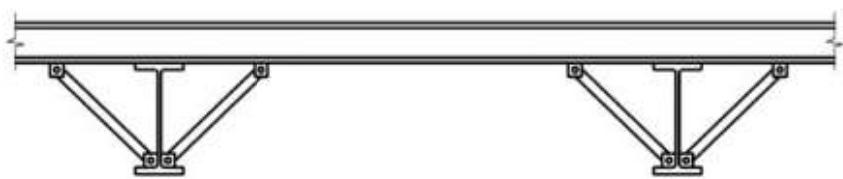  
图6.5典型刚性扭转约束

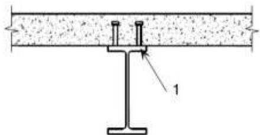  
受压翼缘  
图6.6由楼板施加给受压翼缘的典型侧向扭转约束

(3) B 在每个塑性铰所在处, 受压翼缘与该点处抵抗元件 (如, 槽条) 的连接 (如, 螺栓) 以及任何中间元件 (如, 斜撑) 的设计应确保可抵抗其面内和腹板平面垂直方向上的翼缘所传递的至少达到 $N_{\mathrm{f}, \mathrm{ed}}$ (定义见 6.3.5.2(5) B) $5 \%$ 的局部力, 不需要与任何与其它荷载的组合。  
(4) B 如果直接在铰所在处设置这样的约束是不实际的，那么该约束应设置在沿构件长度方向 $h / 2$ 距离内，式中 $\mathbf{h}$ 为塑性铰所在处的总高度。  
(5) B 对于支撑体系的设计，见 5.3.3，除了按照 5.3.3 中的规定进行的缺陷检验外，还应通过检验以确定支撑体系能够承载施加在塑性铰所在处每个稳定构件上的局部力 $Q_{\mathrm{m}}$ 的效应，其中：

$$Q _{m} = 1. 5 \alpha_{m} \frac {N _{f , E d}}{1 0 0} \tag {6.67}$$

式中，

$\mathbf{N}_{\mathrm{f},\mathrm{Ed}}$ 表示塑性铰所在处稳定构件的受压翼缘内的轴力；

$\alpha_{\mathrm{m}}$ 如5.3.3(1)中所规定的。

注：对于与外部荷载的组合，同样参见5.3.3(5)。

6.3.5.3 对节段稳定长度的检验

(1)B通过检验确认约束之间的长度不大于稳定长度，可检验约束之间节段的侧扭屈曲。

对于在线性力矩下、并且无明显的轴压力作用的、具有I型或H型横截面 $\frac{\mathrm{h}}{\mathrm{t}_{\mathrm{f}}} \leq 40\varepsilon$ 的均匀梁段，稳定长度可按下式计算

当 $0.625 \leq \psi \leq 1$ 时， $\mathrm{L}_{\text {stable }} = 35 \varepsilon \mathrm{i}_{\mathrm{z}}$ (6.68)

当-1≤y≤0.625时，Lstable=(60-40）εi

式中，

$$\begin{array}{l} \varepsilon = \sqrt {\frac {2 3 5}{\mathrm {f _{y}} \left[ \mathrm {N / m m} ^{2} \right]}} \\ \psi = \frac {\mathrm {M} _{\text {E d , m i n}}}{\mathrm {M} _{\text {p l , R d}}} = \text {节 段 端 力 矩 之 比} \\ \end{array}$$

注B：节段的稳定长度同样参见附录BB.3。

(2) B 当转动塑性铰紧挨梁腋的一个末端出现时，如果满足以下标准，则不应将锥形节段看作与塑性铰位置相邻：

a) 塑性铰位置处的约束应设置在沿锥形节段（而不是均匀节段）长度方向h/2距离内；  
b) 梁腋的受压翼缘在整个长度方向上保持弹性。

注B：详细信息见附录BB.3。

## 6.4 均匀组合受压构件

6.4.1 概述

(1) 受到侧向支撑且带铰接端的均匀组合受压构件应按以下模型设计，见图6.7。

1. 可将构件看作是一个带有弯曲缺陷 $\mathrm{e}_0 = \frac{\ell}{500}$ 的柱  
2. 可通过柱体的连续（分布）抗剪刚度 $S_{\mathrm{v}}$ 来考虑缀条或缀板的弹性变形，见图6.7。

注：对于其它端部条件，可进行适当的修正。

(2）在下述情况下，可采用均匀组合受压构件的模型：

1. 由带平行弦杆的相等模块组成的缀条或缀板  
2.构件内模型最少为3块。

注：该假设允许结构是规则的，并且离散的结构分布形成连续体。

(3) 该设计方法适用于两个平面内均有缀条的组合构件，见图6.8。  
(4) 弦杆可为实心构件、或在垂直面上本身配有缀条或缀板。

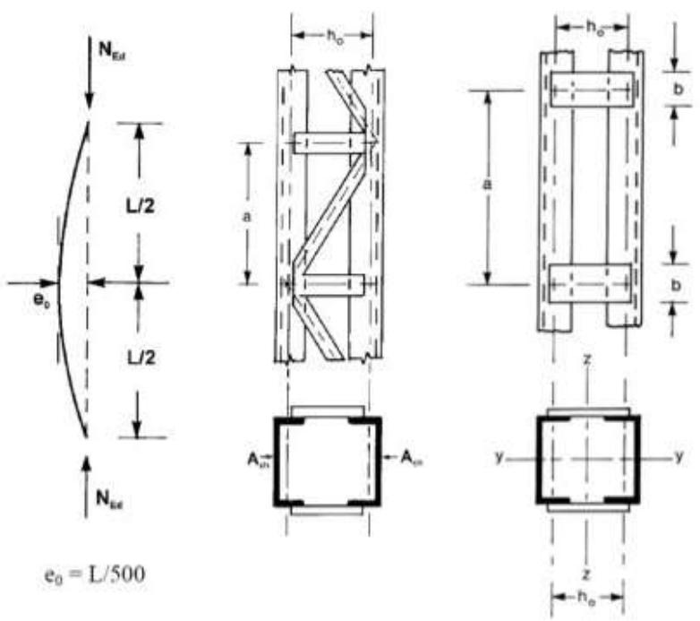  
图6.7：配有缀条和缀板的均匀组合柱

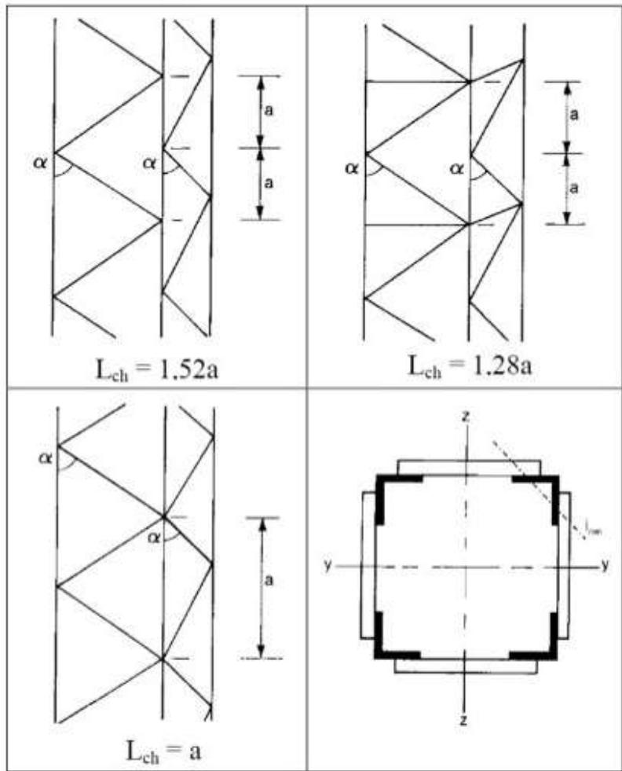  
图6.8四边的缀条和弦杆的屈曲长度 $\mathbf{L}_{\mathrm{ch}}$

(5) 应使用压力 $N_{\text{Ed}}$ 产生的的设计弦杆力 $N_{\text{ch,Ed}}$ 和组合构件跨中处的力矩 $M_{\text{Ed}}$ 来检验弦杆。  
(6) 对于带有两个相同弦杆的构件, 设计力 $N_{\mathrm{ch}, \mathrm{Ed}}$ 可根据下式计算:

$$\mathrm {N} _{\mathrm {c h}, \mathrm {E d}} = 0. 5 \mathrm {N} _{\mathrm {E d}} + \frac {\mathrm {M} _{\mathrm {E d}} \mathrm {h} _{0} \mathrm {A} _{\mathrm {c h}}}{2 \mathrm {I} _{\mathrm {e f f}}} \tag {6.69}$$

式中，

$$M _{E d} = \frac {N _{E d} e _{0} + M _{E d} ^{\prime}}{1 - \frac {N _{E d}}{N _{c r}} - \frac {N _{E d}}{S _{v}}}$$

$\mathrm{N}_{\mathrm{cr}} = \frac{\pi^2\mathrm{EI}_{\mathrm{eff}}}{\mathrm{L}^2}$ 为组合构件的有效临界力

${\mathrm{N}}_{\text{Ed }}$ 为组合构件所受压力的设计值

MEd 为考虑了二阶效应的组合构件中间处最大力矩的设计值

M 为不考虑二阶效应的组合构件中间处最大力矩的设计值

$h_0$ 为弦杆质心之间的距离

Af 为一根弦杆的横截面面积

Ieff 为组合构件的有效截面惯性矩，见6.4.2和6.4.3

$\mathbf{S}_{\mathrm{v}}$ 为缀条或缀板节间的抗剪刚度，见6.4.2和6.4.3

(7) 应在考虑组合构件的剪力的情况下，针对端部节间检验缀合式组合构件的缀板，或缀板式组合构件的缀板节间的框架力矩和剪力：

$$V _{E d} = \pi \frac {M _{E d}}{L} \tag {6.70}$$

6.4.2 缀合式受压构件

6.4.2.1 缀合式受压构件的组件的抗力

(1) 应针对屈曲来设计承压的弦杆和斜缀条。

注：可忽略二阶矩。

(2)应按照如下公式对弦杆进行屈曲检验：

EN 1993-1-1:2005 (E)

$$\frac {\mathrm {N} _{\mathrm {c h , E d}}}{\mathrm {N} _{\mathrm {b , R d}}} \leq 1. 0 \tag {6.71}$$

式中，

$\mathrm{N}_{\mathrm{ch},\mathrm{Ed}}$ 为6.4.1.(6)中所述的组合构件中间长度处弦杆的设计压力

$N_{b,Rd}$ 为弦杆的屈曲抗力的设计值，屈曲长度 $L_{ch}$ 取自图6.8。

(3) 缀条的抗剪刚度 $S_{\mathrm{v}}$ 应从图6.9中取值。  
(4）缀合式组合构件的有效截面惯性矩可取值为：

$$I _{e f f} = 0. 5 h _{0} ^{2} A _{c h} \tag {6.72}$$

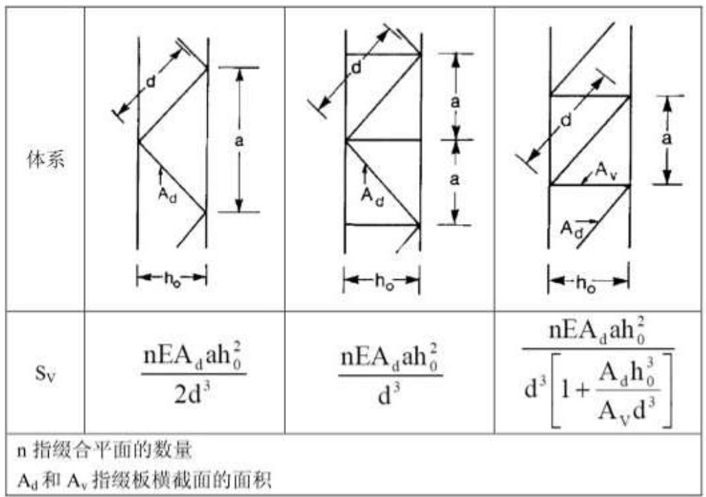  
图6.9组合构件缀条的抗剪刚度

6.4.2.2 施工详细说明

(1) 具有两个平行缀合面的组合构件的对立面上的单缀合体系应是图 6.10(a) 所示的对应体系, 其设置应使一边与另一边对称。  
(2) 如果具有两个平行缀合面的组合构件的对立面上的单缀合体系如图 6.10(b) 所示在方向上彼此相反, 那么应考虑构件内所产生的扭转效应。  
(3）应在缀合体系的端部配设连接节间，即在缀合受到隔断处以及与其它构件连接处。

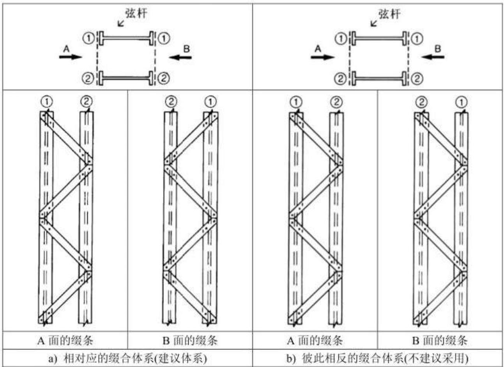  
图6.10具有两个平行缀合面的组合构件两个对立面的单缀合体系

6.4.3 缀板式受压构件

6.4.3.1 缀板式受压构件的组件的抗力

(1) 应如图 6.11 所示对弦杆和缀板以及缀板到弦杆的节点检查端部节间内和跨中处的实际力矩和力。

注：为简便起见，最大弦杆力 $\mathrm{N}_{\mathrm{ch},\mathrm{Ed}}$ 可与最大剪力 $\mathrm{V}_{\mathrm{Ed}}$ 组合。

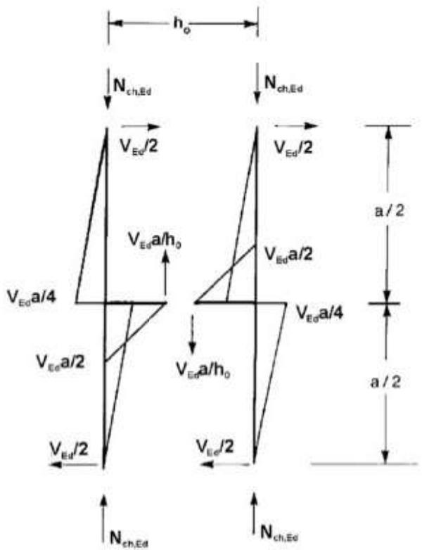  
图6.11 缀板式组合构件的端部节间内的力矩和力

(2) 抗剪刚度 $S_{\mathrm{V}}$ 应按下式计算：

$$S _{v} = \frac {2 4 E I _{c h}}{a ^{2} \left[ 1 + \frac {2 I _{c h}}{n I _{b}} \frac {h _{0}}{a} \right]} \leq \frac {2 \pi^{2} E I _{c h}}{a ^{2}} \tag {6.73}$$

(3) 缀板式组合构件的有效截面惯性矩应按下式计算：

$$I _{e f f} = 0. 5 h _{0} ^{2} A _{c h} + 2 \mu I _{c h} \tag {6.74}$$

式中，

$\mathrm{I_{ch}} =$ 一根弦杆的面内截面惯性矩

$\mathrm{I_b} =$ 一个缀板的面内截面惯性矩

$\mu =$ 表6.8所给的效率系数

n= 缀合平面的数量

表 6.8 效率系数 $\mu$   


| 标准 | 效率系数 |
| --- | --- |
| λ≥150 | 0 |
| 75<λ<150 | μ=2-λ/75 |
| λ≤75 | 1.0 |
| 其中: λ=L/i0; i0=√I1/2Ach; I1=0.5h02Ach+2Ich | 其中: λ=L/i0; i0=√I1/2Ach; I1=0.5h02Ach+2Ich |


6.4.3.2 设计详细说明

（1）应在构件的每端配设级板。  
(2) 如果缀板的平面相互平行，那么，每个面内的缀板应彼此相反布设。  
(3）在施加荷载或提供侧面约束的中间点上也应设置缀板。

6.4.4 间隔紧密的组合构件

(1) 对于带有相互接触或间隔紧密并通过垫板连接的弦杆的组合受压构件，见图 6.12，或通过两个垂直平面内的成对缀板连接的星形板条角钢构件，见图 6.13，如果满足表 6.9 中的条件，应将其当作是单独的完整构件来检验其屈曲，不考虑抗剪刚度效应 $\left(S_{\mathrm{F}} = \infty\right)$ 。

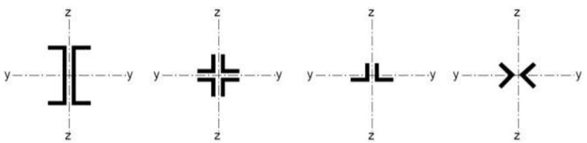  
图6.12 间隔紧密的组合构件

表 6.9 间隔紧密的组合或星形板条角钢构件内相互连接的最大间距  


| 组合构件类型 | 相互连接之间的最大间距*） |
| --- | --- |
| 按照图6.12用螺栓或焊缝连接的构件 | 15 i_min |
| 按照图6.13用成对缀板连接的构件 | 70 i_min |
| * 相互连接的中心距 i_min 是一个弦杆或角钢的最小回转半径 | * 相互连接的中心距 i_min 是一个弦杆或角钢的最小回转半径 |


(2） 缀板传递的剪力应根据6.4.3.1决定。

(3) 可通过以下公式检验不等肢角钢绕 $y - y$ 轴的屈曲, 见图 6.13:

$$\mathrm {i} _{\mathrm {y}} = \frac {\mathrm {i} _{0}}{1 . 1 5} \tag {6.75}$$

式中 $\mathrm{i}_0$ 为组合构件的最小回转半径。

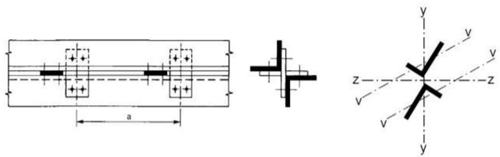  
图6.13 星形板条角钢构件

# 7 正常使用极限状态

## 7.1 概述

(1)钢结构的设计和建造应确保满足所有相关的正常使用标准。  
(2) 正常使用极限状态的基本要求见 EN 1990 第 3.4 节。  
(3）应针对项目详细说明任何正常使用极限状态以及相关荷载和分析模型。  
(4) 当对承载能力极限状态进行塑性整体分析时, 可能会出现正常使用极限状态下的力和力矩的塑性重分布。若是如此, 应考虑塑性重分布效应。

## 7.2建筑的正常使用极限状态

7.2.1 竖向挠度

(1)B参考EN1990-附录A1.4，应按照图A1.1详细说明每个项目的竖向挠度限值并与客户商议达成一致。

注B：国家版附录可明确规定限值。

7.2.2 水平挠度

(1)B参考EN1990-附录A1.4，应按照图A1.2详细说明每个项目的水平挠度限值并与客户商议达成一致。

注B：国家版附录可明确规定出限值。

7.2.3 动态效应

(1)B 参考 EN 1990-附录 A 1.4.4, 对于公众可以走动的结构上出现的震动应加以限制, 以避免用户出现强烈的不适感; 应针对每个项目明确规定出限值并与客户商议达成一致。

注B：国家版附录可明确规定楼层震动的限值。

# 附录A

[提示性]

方法1:

6.3.3(4)中相互作用公式的相互作用系数 $\mathbf{k}_{\mathrm{ij}}$

表A.1相互作用系数 $\mathbf{k_{ij}}$ (6.3.3(4))  


| 相互作用系数 | 设计假设 | 设计假设 |
| --- | --- | --- |
| 相互作用系数 | 弹性横截面特性-3类,4类 | 塑性横截面特性-1类,2类 |
| kyy | CmyCmLTLμy1-NEd/Ncr,y | CmyCmLTLμy1-NEd/Ncr,y |
| kyz | Cmzμy1-NEd/Ncr,z | Cmzμy1-NEd/Ncr,z |
| kyr | CmyCmLTLμz1-NEd/Ncr,y | CmyCmLTLμz1-NEd/Ncr,y |
| kzz | Cmzμz1-NEd/Ncr,z | Cmzμz1-NEd/Ncr,z |
| 补充条件: | 补充条件: | 补充条件: |
| μy=1-NEd/Ncr,y/1-χyNEd/Ncr,y | Cyy=1+(Wy-1)[(2-1.6/WyC2myλmax-1.6/WyC2myλmax)nipl-bLT]≥Wcl,y/Wpl,y | Cyy=1+(Wy-1)[(2-1.6/WyC2myλmax-1.6/WyC2myλmax)nipl-bLT]≥Wcl,y/Wpl,y |
| μz=1-NEd/Ncr,z/1-χzNEd/Ncr,z | 其中bLT=0.5aLTλ0M_yEd/M_zEd/χLTM_ply.Rd/M_ply.Rd | 其中bLT=0.5aLTλ0M_yEd/M_zEd/χLTM_ply.Rd/M_ply.Rd |
| Wy=Wpl,y/Wel,y | Cyz=1+(Wz-1)[(2-14C2myλmax/Wz5)npl-cLT]≥0.6√Wz/Wy/Wpl,z | Cyz=1+(Wz-1)[(2-14C2myλmax/Wz5)npl-cLT]≥0.6√Wz/Wy/Wpl,z |
| Wz=Wpl,z/Wel,z | 其中cLT=10aLTλ0/5+λz4M_yEd/C_myχLTM_ply.Rd | 其中cLT=10aLTλ0/5+λz4M_yEd/C_myχLTM_ply.Rd |
| npl=NEd/NRk/γM1 | Czy=1+(Wy-1)[(2-14C2myλmax/Wy5)npl-dLT]≥0.6√Wy/Wz/Wpl,y | Czy=1+(Wy-1)[(2-14C2myλmax/Wy5)npl-dLT]≥0.6√Wy/Wz/Wpl,y |
| Cmy见表A.2 | 其中dLT=2aLTλ0/0.1+λz4M_yEd/C_myχLTM_ply.Rd/M_mzM_ply.Rd | 其中dLT=2aLTλ0/0.1+λz4M_yEd/C_myχLTM_ply.Rd/M_mzM_ply.Rd |
| aLT=1-I_T/I_y≥0 | Czz=1+(Wz-1)[(2-1.6/WzC2myλmax-1.6/WzC2myλmax)nipl-eLT]≥Wcl,z/Wpl,z | Czz=1+(Wz-1)[(2-1.6/WzC2myλmax-1.6/WzC2myλmax)nipl-eLT]≥Wcl,z/Wpl,z |
|  | 其中eLT=1.7aLTλ0/0.1+λz4M_yEd/C_myχLTM_ply.Rd | 其中eLT=1.7aLTλ0/0.1+λz4M_yEd/C_myχLTM_ply.Rd |


表A.1（续）

$$\bar {\lambda} _{\max } = \max  \left\{ \begin{array}{l} \bar {\lambda} _{y} \\ \bar {\lambda} _{z} \end{array} \right.$$

$\bar{\lambda}_0 =$ 均匀弯曲弯矩引起的侧向扭转屈曲的无量纲长细比，即表A.2中的 $\psi_y = 1.0$

$\overline{\lambda}_{\mathrm{LT}} =$ 侧向扭转屈曲的无量纲长细比

如果 $\overline{\lambda}_0\leq 0.2\sqrt{C_1}\sqrt[4]{\left(1 - \frac{N_{Ed}}{N_{cr,z}}\right)\left(1 - \frac{N_{Ed}}{N_{cr,TF}}\right)}$

则： $C_{\text{my}} = C_{\text{my,0}}$ ， $C_{\text{mz}} = C_{\text{mz,0}}$ ， $C_{\text{mL}} = 1.0$

如果 $\overline{\lambda}_0 > 0.2\sqrt{C_1}\sqrt[4]{\left(1 - \frac{N_{\mathrm{Ed}}}{N_{\mathrm{cr,z}}}\right)\left(1 - \frac{N_{\mathrm{Ed}}}{N_{\mathrm{cr,TF}}}\right)}$

则： $C_{\mathrm{my}} = C_{\mathrm{my,0}} + \left(1 - C_{\mathrm{my,0}}\right)\frac{\sqrt{\varepsilon_{\mathrm{y}}}\mathrm{a}_{\mathrm{LT}}}{1 + \sqrt{\varepsilon_{\mathrm{y}}}\mathrm{a}_{\mathrm{LT}}}$

$$C _{m z} = C _{m z, 0}, \quad C _{m L T} = C _{m y} ^{2} \frac {a _{L T}}{\sqrt {\left(1 - \frac {N _{E d}}{N _{c r , z}}\right) \left(1 - \frac {N _{E d}}{N _{c r , T}}\right)}} \geq 1$$

对于1、2、3类横截面， $\varepsilon_{\mathrm{y}} = \frac{\mathrm{M}_{\mathrm{y,Ed}}}{\mathrm{N}_{\mathrm{Ed}}}\frac{\mathrm{A}}{\mathrm{W}_{\mathrm{el,y}}}$

对于4类横截面，y=My.Ed Aeff对于4类横截面，

$N_{\mathrm{cr,y}} =$ 关于y-y轴的弹性弯曲屈曲力

$\mathrm{N}_{\mathrm{cr},z} =$ 关于 $\mathbf{Z}$ -Z轴的弹性弯曲屈曲力

$\mathrm{N}_{\mathrm{cr,T}} =$ 弹性扭转屈曲力

$\mathrm{I}_{\mathrm{T}} =$ 圣维南扭转常量

$\mathrm{I_y} =$ 关于y-y轴的截面惯性矩

表A.2等效均匀力矩系数 $C_{\mathrm{mi,0}}$   


| 弯矩图 | Cmi,0 |
| --- | --- |
| M1-1≤ψ≤1 ψM1 | Cmi,0=0.79+0.21ψi+0.36(ψi-0.33)NEd/Ncr,i |
| M(x)M(x) | Cmi,0=1+(π2EI\|δx\|/L2\|Mi,Ed(x)\|-1)NEd/Ncr,iM1,Ed指最大弯矩My,Ed或Mz,Ed\|δx\|为沿构件方向最大构件位移 |
| M(x)M(x) | Cmi,0=1-0.18NEd/Ncr,iCmi,0=1+0.03NEd/Ncr,i |


# 附录B

[提示性]

方法2：

6.3.3(4)中相互作用公式的相互作用系数 $\mathbf{k}_{\mathrm{ij}}$

表 B.1 不易受扭转变形影响的构件的相互作用系数 ${\mathrm{k}}_{\mathrm{{ij}}}$   


| 相互作用系数 | 截面类型 | 设计假设 | 设计假设 |
| --- | --- | --- | --- |
| 相互作用系数 | 截面类型 | 弹性横截面特性——3类,4类 | 塑性横截面特性——1类,2类 |
| kyy | I型截面RHS 截面 | Cmy(1+0.6λyNEd/χyNRk/γM1)≤Cmy(1+0.6NEd/χyNRk/γM1) | Cmy(1+(λy-0.2)/χyNRk/γM1)≤Cmy(1+0.8NEd/χyNRk/γM1) |
| kyz | I型截面RHS 截面 | kzz | 0.6kzz |
| kzy | I型截面RHS 截面 | 0.8kyy | 0.6kyy |
| kzz | I型截面 | Cmz(1+0.6λzNEd/χzNRk/γM1)≤Cmz(1+0.6NEd/χzNRk/γM1) | Cmz(1+(2λz-0.6)/χzNRk/γM1)≤Cmz(1+1.4NEd/χzNRk/γM1) |
| kzz | RHS 截面 | Cmz(1+0.6λzNEd/χzNRk/γM1)≤Cmz(1+0.6NEd/χzNRk/γM1) | Cmz(1+(λz-0.2)/χzNRk/γM1)≤Cmz(1+0.8NEd/χzNRk/γM1) |
| 对于承受轴向压力和单轴弯矩MyEd的I型、H型和矩形中空截面,系数kzy可为0。 | 对于承受轴向压力和单轴弯矩MyEd的I型、H型和矩形中空截面,系数kzy可为0。 | 对于承受轴向压力和单轴弯矩MyEd的I型、H型和矩形中空截面,系数kzy可为0。 | 对于承受轴向压力和单轴弯矩MyEd的I型、H型和矩形中空截面,系数kzy可为0。 |


表 B.2 易受扭转变形影响的构件的相互作用系数 ${\mathrm{k}}_{\mathrm{{ij}}}$   


| 相互作用系数 | 设计假设 | 设计假设 |
| --- | --- | --- |
| 相互作用系数 | 弹性横截面特性——3类,4类 | 塑性横截面特性——1类,2类 |
| kyy | 表B.1给出的kyy | 表B.1给出的kyy |
| kyz | 表B.1给出的kyz | 表B.1给出的kyz |
| kxy | [1-0.05λz/(CmL-T-0.25)NEd/χzNRk/γM1]≥[1-0.05/(CmL-T-0.25)NEd/χzNRk/γM1] | [1-(0.1λz/(CmL-T-0.25)NEd/χzNRk/γM1]≥[1-(0.1/(CmL-T-0.25)NEd/χzNRk/γM1]当λz<0.4时: kzy=0.6+λz≤1-(0.1λz/(CmL-T-0.25)NEd/χzNRk/γM1 |
| kzz | 表B.1给出的kzz | 表B.1给出的kzz |


表 B.3 表 B.1 和 B.2 中的等效均匀力矩系数 ${\mathrm{C}}_{\mathrm{m}}$   


| 弯矩图 | 范围 | 范围 | $C_{my}$、$C_{mz}$和$C_{mLT}$ | $C_{my}$、$C_{mz}$和$C_{mLT}$ |
| --- | --- | --- | --- | --- |
| 弯矩图 | 范围 | 范围 | 均布荷载 | 集中荷载 |
| MpsiM | -1≤ψ≤1 | -1≤ψ≤1 | 0.6+0.4ψ≥0.4 | 0.6+0.4ψ≥0.4 |
| MhMxMzMhαs=Ms/Mh | 0≤αs≤1 | -1≤ψ≤1 | 0.2+0.8αs≥0.4 | 0.2+0.8αs≥0.4 |
| MhMxMzMhαs=Ms/Mh | -1≤αs≤0 | 0≤ψ≤1 | 0.1-0.8αs≥0.4 | -0.8αs≥0.4 |
| MhMxMzMhαs=Ms/Mh | -1≤αs≤0 | -1≤ψ<0 | 0.1(1-ψ)-0.8αs≥0.4 | 0.2(-ψ)-0.8αs≥0.4 |
| MhMxMzMh=Mh/Ms | 0≤αh≤1 | -1≤ψ≤1 | 0.95+0.05αh | 0.90+0.10αh |
| MhMxMzMh=Mh/Ms | -1≤αh≤0 | 0≤ψ≤1 | 0.95+0.05αh | 0.90+0.10αh |
| MhMxMzMh=Mh/Ms | -1≤αh≤0 | -1≤ψ<0 | 0.95+0.05αh(1+2ψ) | 0.90+0.10αh(1+2ψ) |
| 对于具有侧移屈曲模态的构件,等效均匀力矩系数应分别取值为$C_{my}$=0.9或$C_{mz}$=0.9。 | 对于具有侧移屈曲模态的构件,等效均匀力矩系数应分别取值为$C_{my}$=0.9或$C_{mz}$=0.9。 | 对于具有侧移屈曲模态的构件,等效均匀力矩系数应分别取值为$C_{my}$=0.9或$C_{mz}$=0.9。 | 对于具有侧移屈曲模态的构件,等效均匀力矩系数应分别取值为$C_{my}$=0.9或$C_{mz}$=0.9。 | 对于具有侧移屈曲模态的构件,等效均匀力矩系数应分别取值为$C_{my}$=0.9或$C_{mz}$=0.9。 |
| Cmy, Cmz和CmLT应根据相关支承点之间的弯矩图得出,如下:弯矩系数 弯曲轴 支撑点的方向Cmy y-y z-zCmz z-z y-yCmLT y-y y-y | Cmy, Cmz和CmLT应根据相关支承点之间的弯矩图得出,如下:弯矩系数 弯曲轴 支撑点的方向Cmy y-y z-zCmz z-z y-yCmLT y-y y-y | Cmy, Cmz和CmLT应根据相关支承点之间的弯矩图得出,如下:弯矩系数 弯曲轴 支撑点的方向Cmy y-y z-zCmz z-z y-yCmLT y-y y-y | Cmy, Cmz和CmLT应根据相关支承点之间的弯矩图得出,如下:弯矩系数 弯曲轴 支撑点的方向Cmy y-y z-zCmz z-z y-yCmLT y-y y-y | Cmy, Cmz和CmLT应根据相关支承点之间的弯矩图得出,如下:弯矩系数 弯曲轴 支撑点的方向Cmy y-y z-zCmz z-z y-yCmLT y-y y-y |


# 附录AB

[提示性]

补充设计规定

AB.1 考虑了材料非线性的结构分析

(1) B 在材料非线性的情况下，结构内的作用效应可通过相关设计情形中需考虑的设计荷载的增量方法来确定。  
(2) B 在这种增量方法中，每种永久或可变作用应按比例增加。

AB.2 连续楼板梁设计的简化规定

(1) B 对于无悬臂建筑内均布荷载占主要地位的带板的连续梁，仅考虑以下荷载分布就已足够：

a) 承载设计永久和可变荷载 $\left(\gamma_{\mathrm{G}} \mathrm{G}_{\mathrm{k}} + \gamma_{\mathrm{Q}} \mathrm{Q}_{\mathrm{k}}\right)$ 的备用跨，仅承载设计永久荷载 $\gamma_{\mathrm{G}} \mathrm{G}_{\mathrm{k}}$ 的其它跨  
b) 承载设计永久和可变荷载 $\left(\gamma_{\mathrm{G}} \mathrm{G}_{\mathrm{k}} + \gamma_{\mathrm{Q}} \mathrm{Q}_{\mathrm{k}}\right)$ 的两个相邻跨，仅承载设计永久荷载 $\gamma_{\mathrm{G}} \mathrm{G}_{\mathrm{k}}$ 的所有其它跨

注1：a)适用于正弯矩，b)适用于负弯矩。

注2：本附录在后期将要收录在EN1990中。

# 附录BB

[提示性]

建筑结构部件的屈曲

BB.1 三角形和格构式结构内构件的弯曲屈曲

BB.1.1 概述

(1)B 除非经分析证实较小的值更合理,否则,通常对于弦杆构件和腹板构件的面外屈曲,屈曲长度 ${\mathrm{L}}_{\mathrm{{cr}}}$ 可取值等于体系长度 $\mathrm{L}$ ,见 BB.1.3(1)B。  
(2) B 除非经分析证实较小的值更合理, 否则, I 型或 H 型截面弦杆构件的面内屈曲的屈曲长度 $L_{\mathrm{ST}}$ 可取值为 0.9L, 面外屈曲的屈曲长度可取值为 1.0L。  
(3) B 如果弦杆提供了适当的端部约束并且端部连接具有适当的稳定性（如果是栓接至少有2个螺栓），则用小于体系长度的屈曲长度针对面内屈曲设计腹板构件。  
(4) B 在这些条件下，在普通三角形结构里，面内屈曲的腹板构件的屈曲长度 $L_{\mathrm{cr}}$ 可取值为 0.9L，角形截面除外，见 BB.1.2。

BB.1.2 作为腹板构件的角钢

(1) B 如果弦杆对角钢制成的腹板构件提供了适当的端部约束，并且这些腹板构件的端部连接具有适当的稳定性（如果栓接的话，至少用两个螺栓），那么可忽略偏心，并且在设计用作受压腹板构件的角钢时应考虑到端部稳定性。有效长细比 $\overline{\lambda}_{\mathrm{eff}}$ 可按如下得到：

对于绕v-v轴的屈曲， $\overline{\lambda}_{\mathrm{eff,v}} = 0.35 + 0.7\overline{\lambda}_{\mathrm{v}}$

对于绕y-y轴的屈曲， $\overline{\lambda}_{\mathrm{eff,y}} = 0.50 + 0.7\overline{\lambda}_{\mathrm{y}}$ (BB.1)

对于绕z-z轴的屈曲， $\overline{\lambda}_{\mathrm{eff,z}} = 0.50 + 0.7\overline{\lambda}_{\mathrm{z}}$

式中 $\overline{\lambda}$ 的定义见6.3.1.2。

(2)B当角钢腹板构件的端部连接只使用了一个螺栓时，应适用6.2.9的规定来考虑偏心，并

且屈曲长度 $\mathbf{L}_{\mathrm{cr}}$ 应取作等于体系长度 $\mathbf{L}$

BB.1.3 用作构件的中空型材

(1) B 中空截面弦杆构件面内屈曲和面外屈曲的屈曲长度 $L_{\mathrm{cr}}$ 均可取值为 0.9L, 其中 L 为相关平面内的体系长度。面内体系长度为节点之间的距离。除非经分析证实了较小的值更为合理, 否则面外体系长度应为侧向支承之间的距离。  
(2)B栓接的中空截面支撑构件面内屈曲和面外屈曲的屈曲长度均可取值为1.0L。  
(3) B 对于带平行弦杆和支撑的格构梁，其支撑与弦杆的直径或宽度之比小于 0.6；除非经试验或计算证实了较小的值更为合理，否则，绕周长焊接到中空截面弦杆的未经切削或压平的中空截面支撑构件的屈曲长度 $L_{\mathrm{cr}}$ 通常可取值为 0.75L（不论是面内屈曲还是面外屈曲）。

注：国家版附录可给出关于屈曲长度的更多信息。

BB.2 连续约束

BB.2.1 连续侧向约束

(1) B 如果不规则四边形板按照 EN 1993-1-3 的规定连接到梁上，并且满足公式(BB.2)中的条件，那么可将板平面内连接处的梁应认为是承受侧向约束的。

$$\mathrm {S} \geq \left(\mathrm {E I} _{\mathrm {w}} \frac {\pi^{2}}{\mathrm {L} ^{2}} + \mathrm {G I} _{\mathrm {t}} + \mathrm {E I} _{\mathrm {z}} \frac {\pi^{2}}{\mathrm {L} ^{2}} 0. 2 5 \mathrm {h} ^{2}\right) \frac {7 0}{\mathrm {h} ^{2}} \tag {BB.2}$$

式中，

S 是板在每根肋处与梁连接的平面内发生变形时，板提供给梁的抗剪刚度（梁单位长度上的抗剪刚度）

$\mathbf{I}_{\mathrm{w}}$ 是翘曲常量

是扭转常量

$\mathbf{I}_{z}$ 是横截面绕截面短轴的截面惯性矩

L 是梁的长度

h 是梁的高度

如果板只是每隔一根肋与梁连接，则应用0.2S代替S。

注：如果对于连接的设计是非常合适的，那么也应使用公式(BB.2)确定与其它类型的覆板（不规则板除外）结合使用的梁翼缘的侧向稳定性。

BB.2.2 连续扭转约束

(1) B 如果满足下式, 那么可认为梁对于扭转变形具有充足的约束

$$C _{\beta , k} > \frac {M _{\mathrm {p l} , k} ^{2}}{\mathrm {E I} _{z}} K _{\beta} K _{v} \tag {BB.3}$$

式中

$\mathsf{C}_{\theta ,k} =$ 稳定连续体(如，屋顶结构)和连接件提供给梁的转动刚度（梁单位长度上的转动刚度）

$\mathrm{K}_{0} = 0.35$ （对于弹性分析）

$K_{\mathrm{v}} = 1.00$ （对于塑性分析）

考虑了表BB.1中的弯矩分布和约束类型的系数

M $= \frac{1}{2}$ 梁的塑性弯矩特征值

表 BB.1 考虑了力矩分布和约束类型的系数 ${\mathrm{K}}_{\theta }$   


| 序号 | 弯矩分布 | 弯矩分布 | 无平移约束 | 有平移约束 |
| --- | --- | --- | --- | --- |
| 1 | M | M | 4.0 | 0 |
| 2a | M | M | 3.5 | 0.12 |
| 2b | M | M | 3.5 | 0.23 |
| 3 | M | M | 2.8 | 0 |
| 4 | M | M | 1.6 | 1.0 |
| 5 | M ψ≤-0.3 | M ψ≤-0.3 | 1.0 | 0.7 |


(2)B由稳定连续体为梁提供的转动刚度可从下式计算：

$$\frac {1}{C _{\mathcal {S} , k}} = \frac {1}{C _{\mathcal {R} , k}} + \frac {1}{C _{\mathcal {R C} , k}} + \frac {1}{C _{\mathcal {R D} , k}} \tag {BB.4}$$

式中，

$\mathbf{C}_{\mathcal{R},k} =$ 稳定连续体提供给梁的转动刚度（梁单位长度的转动刚度），假定与构件的连接为刚性

$C_{\text{空}, k} =$ 梁和稳定连续体之间连接的转动刚度（梁单位长度的转动刚度）

根据梁横截面扭曲变形分析推导出的转动刚度（梁单位长度的转动刚度），其中受压翼缘为自由翼缘；若受压翼缘为连接的受压翼缘或受压翼缘是横截面扭曲变形可忽略的类型（例如，对于一般轧制剖面），则 $C_{\theta D,k} = \infty$ 。

注：更多信息见 EN 1993-1-3。

BB.3 面外屈曲状态下的包含塑性铰的节段的稳定长度

BB.3.1 由轧制截面或等效焊接 I 型截面制成的均匀构件

BB.3.1.1 相邻侧向约束之间的稳定长度

(1)B若塑性铰位置处的约束截面和相邻侧向约束之间的构件节段的长度L不大于 $\mathbf{L}_{\mathrm{m}}$ ，则可忽略侧扭屈曲效应，其中：

$$\mathrm {L} _{\mathrm {m}} = \frac {3 8 \mathrm {i} _{\mathrm {z}}}{\sqrt {\frac {1}{5 7 . 4} \left(\frac {\mathrm {N} _{\mathrm {F d}}}{\mathrm {A}}\right) + \frac {1}{7 5 6 C _{1} ^{2}} \left(\frac {\mathrm {W} _{\mathrm {p l , y}} ^{2}}{\mathrm {A I} _{\mathrm {t}}}\right) \left(\frac {\mathrm {f} _{\mathrm {y}}}{2 3 5}\right) ^{2}}} \tag {BB.5}$$

式中，

$\mathrm{N_{Ed}}$ 为构件内压力[N]的设计值

A 为构件的横截面面积[单位： $\mathrm{mm}^2$ ]

Wpl.y 为构件的塑性截面模量

I 为构件的扭转常量

为屈服长度[单位： $\mathrm{N / mm}^2$ 1

C1

为取决于从文献资料中得到的荷载和端部条件的系数

但前提是：按6.3.5的要求构件在铰所在处受到约束，并且按以下所述对节段的另一端进行约束

通过对受压翼缘施加一个侧向约束（一个翼缘在整个节段长度上受压）  
或者，通过一个扭转约束，  
或者，通过对节段端部施加一个侧向约束，并在满足 $\mathbf{L}_{\mathrm{s}}$ 要求的距离处对构件施加一个扭转约束

见图BB.1，图BB.2和图BB.3。

注：一般情况下， $\mathbf{L}_{\mathrm{s}}$ 大于 $\mathbf{L}_{\mathrm{m}}$

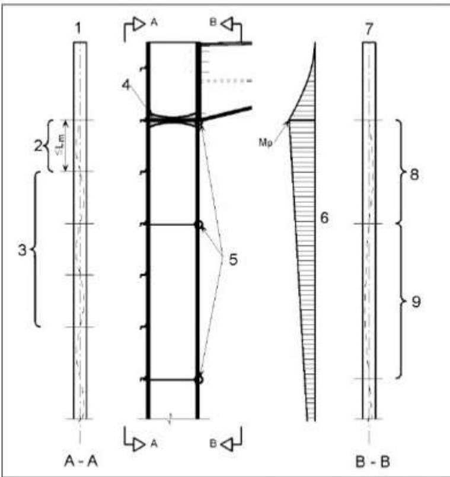  
图BB.1无梁腋的构件的检验

受拉翼缘   
2 塑性稳定长度（见BB.3.1.1）  
# 3 弹性截面(见6.3)
# 4 塑性铰
# 5 约束
# 6 弯矩图
# 7 受压翼缘
8 塑性，有受压翼缘约束，稳定长度 $= L_{\mathrm{s}}$ （见BB.3.1.2公式（BB.7）或(BB.8))  
9 弹性，有受压翼缘约束（见6.3） $\chi$ 和 $\chi_{LT}$ 来自于 $N_{cr}$ 和 $M_{cr}$ ，包含受拉翼缘约束

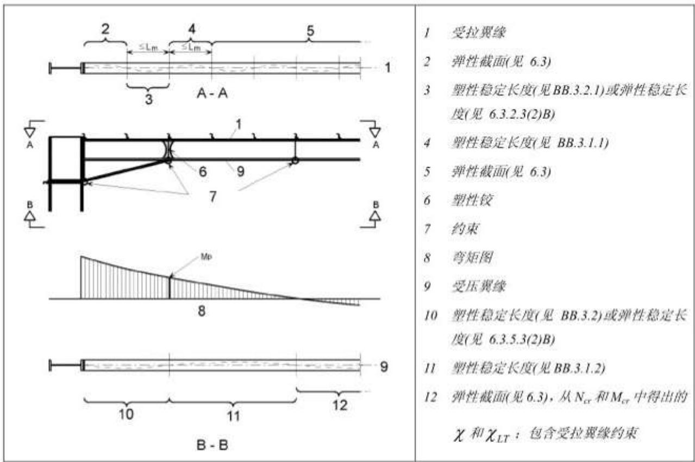

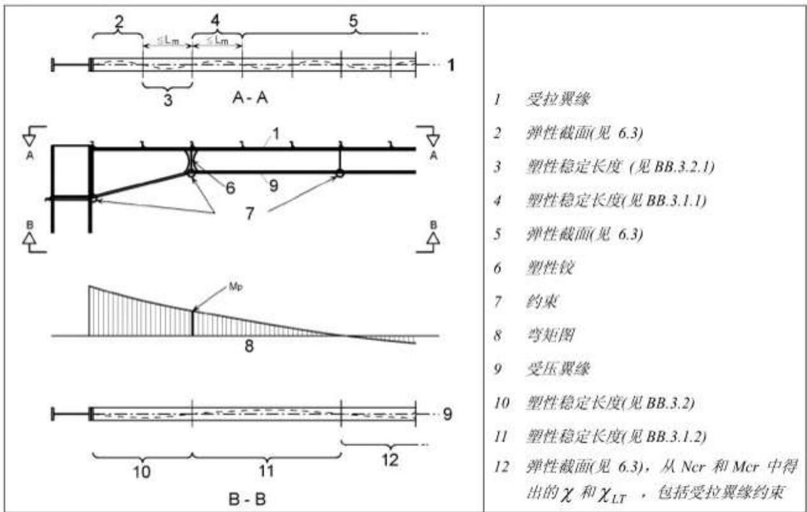  
图BB.2有三个翼缘梁腋的构件的检验   
图BB.3有两个翼缘梁腋的构件的检验

BB.3.1.2 扭转约束之间的稳定长度

(1) B 若塑性铰位置处约束截面和承受常量弯矩的相邻扭转约束之间的构件节段的长度 $L$ 不大于 $L_{k}$ ，则可忽略侧扭屈曲效应，但前提是：

根据6.3.5的规定构件在铰所在处受到约束  
在满足 $\mathbf{L}_{\mathrm{m}}$ 要求的间距内的扭转约束之间有一个或多个中间侧向约束，见BB.3.1.1

其中， $\mathrm{L_k} = \frac{\left(5.4 + \frac{600\mathrm{f_y}}{\mathrm{E}}\right)\left(\frac{\mathrm{h}}{\mathrm{t_f}}\right)\mathrm{i_z}}{\sqrt{5.4\left(\frac{\mathrm{f_y}}{\mathrm{E}}\right)\left(\frac{\mathrm{h}}{\mathrm{t_f}}\right)^2 - 1}}$ (BB.6)

(2) B 若塑性铰位置处约束截面和承受了线性力矩梯度和轴向压力的相邻扭转约束之间的构件节段的长度 $L$ 不大于 $L_{s}$ ，则可忽略侧扭屈曲效应，但前提是：

根据6.3.5的规定构件在铰所在处受到约束，并且  
在满足 $\mathrm{L}_{\mathrm{m}}$ 要求的间距内的扭转约束之间有一个或多个中间侧向约束，见BB.3.1.1其中，

$$\mathrm {L _{s}} = \sqrt {\mathrm {C _{m}}} \mathrm {L _{k}} \left(\frac {\mathrm {M _{p l , y , R k}}}{\mathrm {M _{N , y , R k}} + \mathrm {a N _{E d}}}\right) \tag {BB.7}$$

$C_{\mathrm{m}}$ 为线性力矩梯度的修正系数，见BB.3.3.1；

a 为有塑性铰的构件质心和约束构件质心之间的距离；

Mpl,yRk 为绕y-y轴横截面的特征塑性弯矩抗力；

$\mathbf{M}_{\mathrm{N,y,Rk}}$ 为绕y-y轴横截面的特征塑性弯矩抗力，由于存在轴力 $\mathbf{N}_{\mathrm{Ed}}$ 作用而出现折减。

(3) B 若塑性铰位置处的约束截面和承受非线性力矩梯度和轴向压力的相邻扭转约束之间的构件节段长度 $L$ 不大于 $L_{s}$ , 则侧扭屈曲效应可忽略, 但前提是:

按6.3.5的规定构件在铰所在处受到约束，并且  
在满足 $\mathbf{L}_{\mathrm{m}}$ 要求的间距内扭转约束之间有一个或多个中间侧向约束，见BB3.1.1其中，

$$\mathrm {L} _{\mathrm {s}} = \sqrt {\mathrm {C} _{\mathrm {n}}} \mathrm {L} _{\mathrm {k}} \tag {BB.8}$$

$C_n$ 为非线性力矩梯度的修正系数，见BB.3.3.2

见图BB.1，图BB.2和图BB.3。

BB.3.2 由轧制截面或等效焊接 I 型截面制成的加腋或锥形构件

BB.3.2.1 相邻侧向约束之间的稳定长度

(1) B 若塑性铰位置处的约束截面和相邻侧面约束之间的构件节段长度 $L$ 不大于 $L_{\mathrm{m}}$ ，则可忽略侧扭屈曲效应，其中

对于三个翼缘梁腋（见图BB.2）：

$$\mathrm {L} _{\mathrm {m}} = \frac {3 8 \mathrm {i} _{\mathrm {z}}}{\sqrt {\frac {1}{5 7 . 4} \left(\frac {\mathrm {N} _{\mathrm {E d}}}{\mathrm {A}}\right) + \frac {1}{7 5 6 \mathrm {C} _{1} ^{2}} \left(\frac {\mathrm {W} _{\mathrm {p l , y}} ^{2}}{\mathrm {A I} _{\mathrm {t}}}\right) \left(\frac {\mathrm {f} _{\mathrm {y}}}{2 3 5}\right) ^{2}}} \tag {BB.9}$$

对于二个翼缘梁腋（见图BB.3）：

$$\mathrm {L} _{\mathrm {m}} = 0. 8 5 \frac {3 8 \mathrm {i} _{\mathrm {z}}}{\sqrt {\frac {1}{5 7 . 4} \left(\frac {\mathrm {N} _{\mathrm {E d}}}{\mathrm {A}}\right) + \frac {1}{7 5 6 \mathrm {C} _{\mathrm {l}} ^{2}} \left(\frac {\mathrm {W} _{\mathrm {p l , y}} ^{2}}{\mathrm {A I} _{\mathrm {t}}}\right) \left(\frac {\mathrm {f} _{\mathrm {y}}}{2 3 5}\right) ^{2}}} \tag {BB.10}$$

式中，

$\mathrm{N}_{\text{Ed}}$ 为构件内压力 [N] 的设计值

W² 为节段中的最大值AI

A 是 $\frac{\mathrm{W}_{\mathrm{pl},\mathrm{y}}^{2}}{\mathrm{AI}_{\mathrm{t}}}$ 为锥形构件最大值的部位的横截面面积[mm2]

为构件的塑性截面模量

I 为构件的扭转常量

f为屈服强度[单位：N/mm²]

$\mathrm{i}_{\mathrm{z}}$ 为节段回转半径的最小值

但前提是：按6.3.5的规定构件在铰所在处受到约束，并且节段另一端按以下进行约束

通过对受压翼缘施加一个侧向约束（一个翼缘在整个节段长度上受压）  
或者，通过一个扭转约束，  
或者，通过对节段端部施加一个侧向约束，并在满足 $\mathbf{L}_{\mathrm{s}}$ 要求距离处对构件施加一个

扭转约束。

BB.3.2.2 扭转约束之间的稳定长度

(1) B 对于在线性或非线性力矩梯度和轴向压力作用下具有恒定翼缘的非均匀构件，若塑性铰位置处的约束截面和相邻扭转约束之间的构件节段长度 $L$ 不大于 $L_{s}$ ，则可忽略侧扭屈曲效应，但前提是：

按6.3.5的要求构件在铰所在处受到约束，并且  
在满足 $\mathbf{L}_{\mathrm{m}}$ 要求的间距内扭转约束之间有一个或多个中间侧向约束，见BB.3.2.1

其中：

对三个翼缘梁腋（见图BB.2）：

$$\mathrm {L} _{\mathrm {s}} = \frac {\sqrt {\mathrm {C} _{\mathrm {n}}} \mathrm {L} _{\mathrm {k}}}{\mathrm {c}} \tag {BB.11}$$

对两个翼缘梁腋（见图BB.3）：

$$\mathrm {L} _{\mathrm {s}} = 0. 8 5 \frac {\sqrt {\mathrm {C} _{\mathrm {n}}} \mathrm {L} _{\mathrm {k}}}{\mathrm {c}} \tag {BB.12}$$

式中，

为横截面等于最窄截面的均匀构件所得到的长度，见BB.3.1.2；

$C_n$ 见BB.3.3.2;

c 为BB.3.3.3中定义的锥度系数。

BB.3.3 沿受拉翼缘方向受到侧向约束的构件内的力矩梯度的修正系数

BB.3.3.1 线性力矩梯度

(1)B修正系数 $C_{\mathrm{m}}$ 可按下式得到：

$$C _{m} = \frac {1}{B _{0} + B _{1} \beta_{t} + B _{2} \beta_{t} ^{2}} \tag {BB.13}$$

式中，

$$\begin{array}{l} \mathrm {B} _{0} = \frac {1 + 1 0 \eta}{1 + 2 0 \eta} \\ B _{1} = \frac {5 \sqrt {\eta}}{\pi + 1 0 \sqrt {\eta}} \\ \mathrm {B} _{2} = \frac {0 . 5}{1 + \pi \sqrt {\eta}} - \frac {0 . 5}{1 + 2 0 \eta} \\ \eta = \frac {\mathrm {N} _{\mathrm {c r E}}}{\mathrm {N} _{\mathrm {c r T}}} \\ \mathrm {N} _{\mathrm {c r E}} = \frac {\pi^{2} \mathrm {E I} _{\mathrm {z}}}{\mathrm {L} _{\mathrm {t}} ^{2}} \\ \end{array}$$

Lt 为扭转约束之间的距离

$\mathrm{N}_{\mathrm{crT}} = \frac{1}{\mathrm{i_s}^2}\left(\frac{\pi^2\mathrm{EI}_z\mathrm{a}^2}{\mathrm{L_t}^2} +\frac{\pi^2\mathrm{EI_w}}{\mathrm{L_t}^2} +\mathrm{GI_t}\right)$ 是间距为 $\mathbf{L}_{\mathrm{t}}$ 的两个翼缘的约束（对受拉翼缘施加的是中间侧向约束）之间的I型截面的弹性临界扭转屈曲力。

$$i _{s} ^{2} = i _{y} ^{2} + i _{z} ^{2} + a ^{2}$$

式中，

a 表示构件形心和约束构件形心之间的距离，如约束橡的檀条

$\beta_{\mathrm{t}}$ 表示用代数方法表示的较小端力矩与较大端力矩之比。在非约束翼缘内产生压力的力矩应为正值。如果比值小于-1.0， $\beta_{\mathrm{t}}$ 的值应取-1.0，见图BB.4。

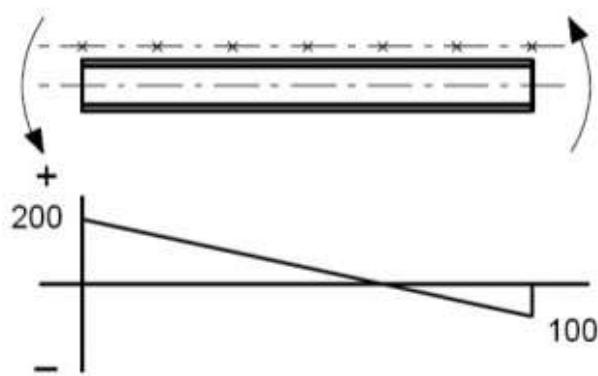

$$\beta_{t} = \frac {- 1 0 0}{+ 2 0 0} = - 0. 5$$

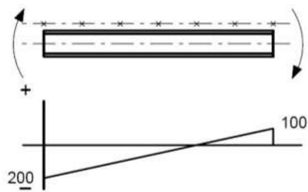  
图BB.4βt的值

$$\beta_{t} = \frac {- 2 0 0}{+ 1 0 0} = - 2$$

但 $\beta_{\mathrm{t}} \geq -1.0$ 因此 $\beta_{\mathrm{t}} = -1.0$

BB.3.3.2 非线性力矩梯度

(1)B修正系数 $C_n$ 可从以下确定：

$$C _{n} = \frac {1 2}{\left[ R _{1} + 3 R _{2} + 4 R _{3} + 3 R _{4} + R _{5} + 2 \left(R _{S} - R _{E}\right) \right]} \tag {BB.14}$$

式中， $\mathrm{R}_1 \sim \mathrm{R}_5$ 表示(2)B中规定的在端部、四分之一点和中等长度处的R的值，见图BB.5，并且应只包括了为正值的R。

另外，应包括仅为正值的 $(\mathbb{R}_{\mathrm{S}} - \mathbb{R}_{\mathrm{E}})$ ，其中

一 $\mathbb{R}_{\mathrm{E}}$ 取 $\mathbb{R}_1$ 或 $\mathbb{R}_5$ 二者中的较大值  
- $\mathsf{R}_{\mathsf{S}}$ 是长度 $\mathbf{L}_{\mathrm{y}}$ 上的任意位置的R的最大值

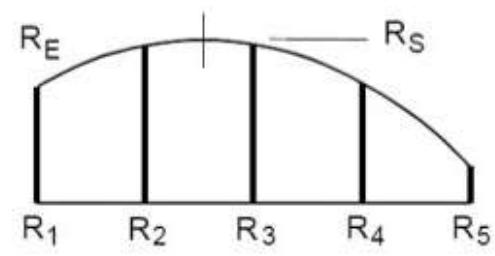

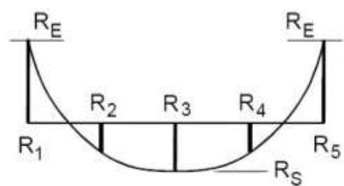

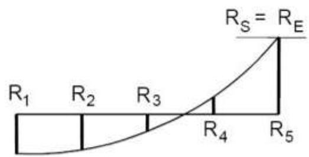

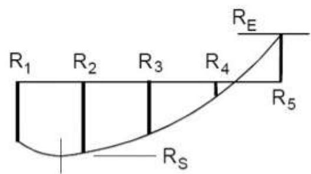  
图BB.5弯矩比

(2)BR值应按下式计算：

$$R = \frac {M _{\mathrm {y , E d}} + a N _{\mathrm {E d}}}{f _{\mathrm {y}} W _{\mathrm {p l , y}}} \tag {BB.15}$$

式中，a表示构件质心和约束构件质心之间的距离，如约束橡的檀条。

BB.3.3.3 锥度系数

(1)B对于 $\mathrm{h}\geq 1.2\mathrm{b}$ 且 $\mathrm{h / t_f}\geq 20$ 的具有恒定翼缘的非均匀构件，锥度系数c应按下式计算：

对于锥形构件或节段，见图BB.6(a)：

$$c = 1 + \frac {3}{\left(\frac {h}{t _{\mathrm {f}}} - 9\right)} \left(\frac {h _{\max}}{h _{\min}} - 1\right) ^{2 / 3} \tag {BB.16}$$

对于加腋构件或节段，见图BB.6(b)和BB.6(c):

$$c = 1 + \frac {3}{\left(\frac {h}{t _{f}} - 9\right)} \left(\frac {h _{h}}{h _{s}}\right) ^{2 / 3} \sqrt {\frac {L _{h}}{L _{y}}} \tag {BB.17}$$

式中，

为梁腋或锥形的附加高度，见图BB.6;

hmax 为长度Ly范围内横截面的最大高度，见图BB.6;

为长度Ly范围内横截面的最小高度，见图BB.6;

h 为不加腋截面的垂直高度，见图BB.6;

为长度 $\mathrm{L_y}$ 范围内梁腋的长度，见图BB.6;

L为对受压翼缘施加侧向约束的点之间的长度。

$\left(\mathrm{h} / \mathrm{t}_{\mathrm{f}}\right)$ 根据最窄截面推导出。

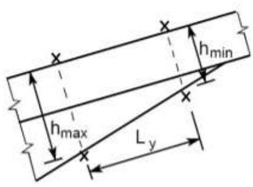  
(a)锥形节段

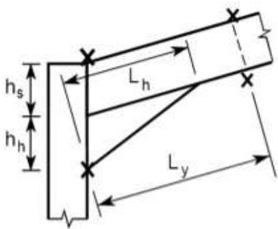  
(b)加腋节段

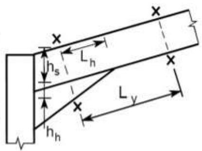  
(c)加腋节段   
$\mathbf{x} =$ 约束  
图BB.6确定锥度系数的尺寸

ICS 91.010.30; 91.080.10

代替ENV1993-1-1:1992结合2006年2月的勘误表

英文版

欧洲规范3：钢结构设计——第1-1部分：一般规定和建筑规定

Eurocode 3: Calcul des structures en acier - Partie 1-1: Regles generales et regles pour les batiments

Eurocode 3: Bemessung und Konstruktion von Stahlbauten - Teil 1-1: Allgemeine Bemessungsregeln und Regel für den Hochbau

此欧洲标准于2004年4月16日通过欧洲标准化委员会（CEN）审批。

CEN成员均须遵守CEN/CENELEC内部条例，其条款规定了此欧洲标准在不做任何变更的前提下即与各国国家标准具有同等效力的条件。若要索取有关国家标准的最新目录和参考书目，可向管理中心或任何CEN成员国提出申请。

本欧洲标准有三种官方版本（英文版、法文版和德文版）。任何由CEN成员国负责翻译成本国语言的版本在CEN管理中心备案之后，即与官方版本具有同等效力。

CEN 成员为各国国家标准机构，包括奥地利、比利时、塞浦路斯、捷克、丹麦、爱沙尼亚、芬兰、法国、德国、希腊、匈牙利、冰岛、爱尔兰、意大利、拉脱维亚、立陶宛、卢森堡、马耳他、荷兰、挪威、波兰、葡萄牙、斯洛伐克、斯洛文尼亚、西班牙、瑞典、瑞士和英国。