# 1 导言

## 1.1 范围

(1) EN 1993-1-3给出了冷成型薄壁构件和薄板的设计要求。其适用于由有涂层或无涂层的热轧或冷轧薄板或薄钢带制成的冷成型钢制品，这些产品通过诸如冷轧成型或压轧制动等工序冷成型。其也可适用于施工阶段钢混组合板的型钢薄板设计，参见EN 1994。EN 1090包含了由这种冷成型薄壁构件和薄板制成的钢结构的施工规范。

注：这部分的规则补充了 EN 1993-1 的其它部分的规则。

(2) 同样给出了使用薄钢板作为结构横隔板的应力蒙皮设计方法。  
(3) 本部分不适用于EN10219中规定的冷成型圆形和矩形结构中空型钢，关于后者请参考EN1993-1-1和EN1993-1-8。  
(4) EN 1993-1-3 给出了计算设计方法和试验辅助设计方法。计算设计方法仅适用于有充足经验和试验证据可用的材料属性和几何形状比例规定范围内。这些限制并不适用于试验辅助设计。  
(5) EN 1993-1-3并不包含在施工和维护过程中用于荷载试验的布载。  
(6) 本标准中给出的计算规则仅适用于冷成型构件的公差符合EN1090-2的情况。

## 1.2 规范性参考文献

下列规范性文件包含的条款为(通过在本文中的参考引用)构成本欧洲标准的条款。对于注明了日期的参考文件，对这些出版物所做的任何后续修改或修订都不适用。

但鼓励本欧洲标准的协议各方对采用下列规范性文件的最新版本进行适用性调查。对于未注明日期的参考文件，适用所涉及的规范性文件的最新版本。

| EN 1993 | 欧洲规范 3-钢结构设计 |
| --- | --- |
|  | 第1-1部分~第1-12部分 |
| EN 10002 | 金属材料-拉力试验: |
|  | 第1部分 试验方法(环境温度下): |
| EN 10025-1 | 结构钢热轧产品-第1部分:一般交货条件; |
| EN 10025-2 | 结构钢热轧产品-第2部分:非合金结构钢的交货技术条件; |
| EN 10025-3 | 结构钢热轧产品-第3部分:正火/正火可焊接细晶粒结构钢的交货技术条件: |
| EN 10025-4 | 结构钢热轧产品-第4部分:热机轧制可焊接细晶粒结构钢的交货技术条件: |

EN10025-5 结构钢热轧产品-第5部分：具有改良耐候性的结构钢的交货技术条件；

EN10143 连续热镀金属涂层钢板和钢带-尺寸和形状公差：

EN10149 用于冷成型的、由高屈服强度钢制成的热轧扁平产品；

第2部分 正火/正火轧制钢的交货条件：

第3部分 热机轧制钢的交货条件；

EN10204 金属制品：检验文件的类型(包含修订版A1:1995)

EN10268 用于冷成型的、由高屈服强度微合金钢制成的冷轧扁平产品一一般交货条件：

EN10292 用于冷成型的高屈服强度连续热镀涂层钢带和钢板-交货技术条件：

EN10326 连续热镀涂层结构钢带和钢板—交货技术条件：

EN10327 用于冷成型的连续热镀涂层低碳钢带和钢板—交货技术条件：

EN-ISO 12944-2 色漆和清漆：防护漆体系对钢结构的腐蚀防护

第2部分：环境分类(ISO12944-2:1998)；

EN1090-2 钢结构和铝结构施工

第2部分：钢结构的技术要求

EN 1994 欧洲规范4：钢混组合结构的设计；

EN ISO 1478 自攻螺纹：

EN ISO 1479 六角头自攻螺钉；

EN ISO 2702 热处理钢自攻螺钉—力学特性：

EN ISO 7049 十字槽盘头自攻螺钉；

EN ISO 10684 紧固件-热深镀涂层

ISO4997 冷轧结构钢板质量：

EN508-1 金属板制屋面产品一 钢、铝或不锈钢板自撑式产品规范—第1部分：钢；

FEM 10.2.02 Federation Europeenne de la manutention, Scion X, Equipment et proceeds de stockage,FEM 10.2.02,静态钢托盘货架的设计，货架设计规范，2001年4月1.02版。

## 1.3 术语和定义

此部分为EN1993-1-1的补充部分，对于EN1993的第1-3部分，以下术语和定义适用：

1.3.1 基本材料

通过冷成型可制成冷成型型钢和压型钢板的平板钢材。

1.3.2 基本屈服强度

基本材料的受拉屈服强度。

1.3.3 横隔板作用

包括薄板中面内剪切的结构性能。

1.3.4 衬板

带有大唇缘加劲肋的压型钢板，其适于与相邻衬板连锁，形成一个肋板平面，此平面可支撑一个在跨度方向上与衬板跨垂直的压型钢板平行平面。

1.3.5 部分约束

构件或元件的侧向运动或转动、扭曲或翘曲变形的限制，可以类似于弹簧支座的方式增加其屈曲承载力，但是程度上不及刚性支座。

1.3.6 相对长细比

标准无量纲长细比。

1.3.7 约束

构件或元件的侧向运动或转动、扭曲或翘曲变形的限制，将其屈曲承载力增大至与刚性支座相同的程度。

1.3.8应力蒙皮设计

一种设计方法，其考虑了板内横隔板作用对结构刚度和强度的有利影响。

1.3.9 支座

构件能够将剪力或力矩传递到基础、或传递到另一个构件或其它结构部件时所处的位置。

1.3.10 公称厚度

当钢材为轧制时，包括锌和其它涂层厚度的目标平均厚度，其由钢材供应商定义 $(\mathrm{t_{nom}})$ 不包括有机涂层）。

1.3.11 钢芯厚度

公称厚度减去锌和其它金属涂层 $(\mathrm{t_{cor}})$ 厚度。

1.3.12 设计厚度

通过1.5.3(6)和3.2.4所述的计算在设计中所用到的钢芯厚度。

## 1.4符号

(1) 除了EN1993-1-1所给出的符号，还用到以下主要符号：

$f$ 屈服强度

$f_{ya}$ 平均屈服强度

$f_{\mathrm{yb}}$ 基本屈服强度

$t$ 冷成型前钢材的设计芯厚，不包括金属和有机涂层厚度

$t_{\mathrm{nom}}$ 冷成型后的公称板厚，包括锌和其它金属涂层厚度，但不包括有机涂层厚度

$t_{\mathrm{cor}}$ 公称厚度减去锌和其它金属涂层厚度

$K$ 适用于位移的弹簧刚度

$C$ 适用于转动的弹簧刚度

(2) 其它符号在首次出现时给出定义。  
(3) 在此部分中，一个符号可能有几种意思。

## 1.5尺寸术语和规则

1.5.1 型钢形状

(1) 在容许公差内，冷成型构件和压型钢板在其整个长度范围内具有恒定的公称厚度，并且沿其长度具有均匀横截面或锥形横截面。  
(2)冷成型构件和压型钢板的横截面主要由若干通过弯曲单元连接的平面单元组成。

(3) 冷成型构件的典型形状见图1.1。

注：EN1993中的第1-3部分的计算方法不包含图1.1-1.2中所示的情形。

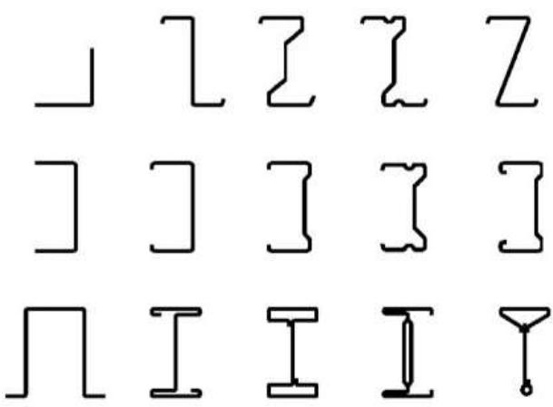

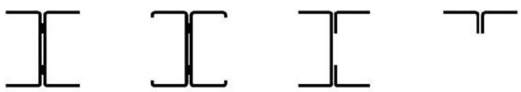  
a) 单开口式型材  
b) 开口式组合型型材

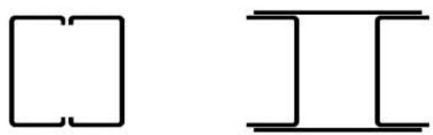  
c) 闭合式组合型型材   
图1.1：冷压成形元件型材的典型形状

(4)冷成型构件和薄板的横截面的示例如图1.2所示

注：EN1993的第1-3部分的所有规则与主轴特性相关，对于对称型材，通过主轴y-y和z-z对其进行定义，而对于非对称型材(如角钢和Z型钢)，则通过u-u和v-v轴对其进行定义。在某些情形下，不论横截面对称与否，弯曲轴均与连接结构元件有关。

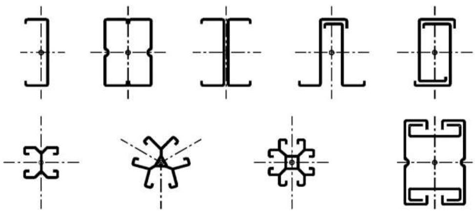  
a)受压构件和受拉构件

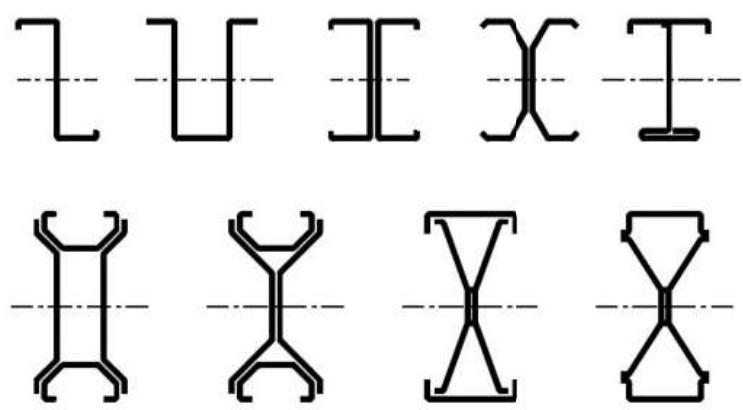

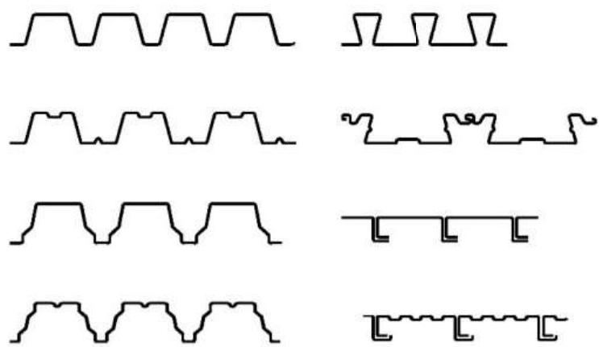  
b) 承受弯曲的梁和其它构件  
c) 压型钢板和衬板  
图1.2：冷成型构件和压型钢板示例

(5) 冷成型构件和薄板的横截面可以是未加劲的、或者是在腹板或翼缘中带有纵向加劲肋的、或者是未加劲的但在在腹板或翼缘中带有纵向加劲肋的。

1.5.2 加劲肋形状

(1)冷成型件和薄板的典型形状见图1.3所示

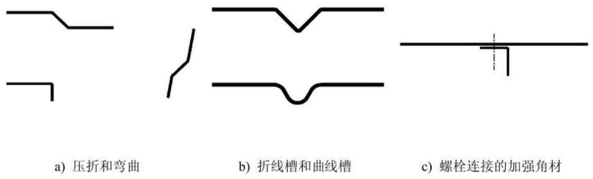  
图1.3：冷成型构件和薄板的典型形状

(2) 纵向翼缘加劲肋可以是边缘加劲肋或中间加劲肋。  
(3) 典型边缘加劲肋如图1.4所示。

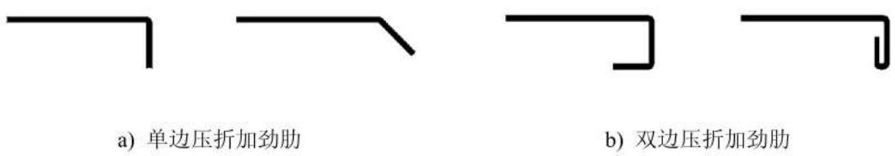  
图1.4：典型边缘加劲肋

(4) 典型中间纵向加劲肋如图1.5所示。

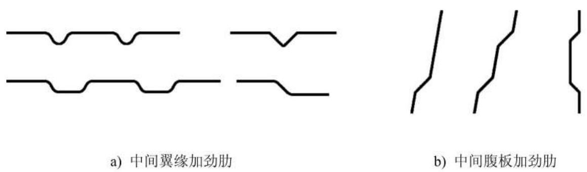  
图1.5：典型中间纵向加劲肋

1.5.3 横截面尺寸

(1) 除非另有规定，否则冷成型构件和薄板的总体尺寸，包括总体宽度 $b$ 、总体高度 $h$ 、内部弯曲半径 $r$ 和用不带下标的符号（如 $a$ 、 $c$ 或 $d$ 等）表示的其它外部尺寸均测量至材料表面，如图1.6所示。

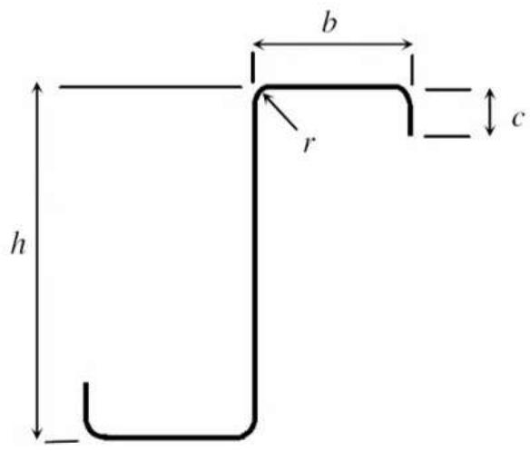  
图1.6：典型横截面尺寸

(2）用带下标的符号(如 $b_{\mathrm{d}}$ 、 $h_\mathrm{w}$ 或 $s_\mathrm{w}$ )表示的冷成型构件和薄板的其它横截面尺寸均测量至材料中线或转角中点，但另有规定的情况除外。  
(3) 对于倾斜元件，如梯形压型钢板的腹板，倾斜高度s通过与斜面平行进行测得。其斜度是翼缘和腹板的交叉点之间的直线。  
(4) 沿着中线测量腹板的展开高度，包含任一腹板加劲肋。  
(5) 沿着中线测量翼缘的展开宽度，包含任一中间加劲肋。  
(6) 厚度 $t$ 是钢的设计厚度（如果按照3.2.4条规定的有此需要，所得的钢芯厚度减掉公差），但另有规定的情况除外。

1.5.4 构件坐标轴规则

(1) 通常，适用于构件的规则与 EN 1993 第1部分中所使用的规则相同，参见图1.7。

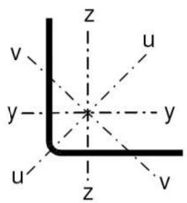

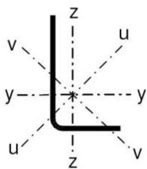

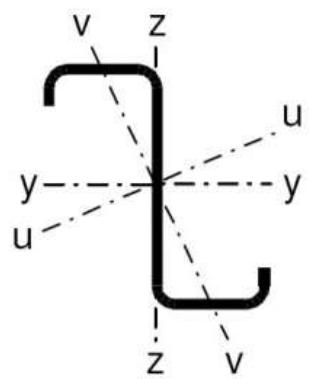  
图1.7：坐标轴规则

(2) 对于压型钢板和衬板，使用以下坐标轴规则：

- y-y 轴与板平面平行；

- Z-Z 轴与板平面垂直。

# 2 设计基础

(1) 冷成型元件和薄板的设计应遵守EN 1990和EN 1993-1-1中给出的一般规则。对于结合有限元法(或其它方法)的通用设计方案，请参见EN 1993-1-5的附录C。  
(2) P 对于承载能力极限状态和正常使用极限状态应采用适当的分项系数。  
(3) P 对于在承载能力极限状态下通过计算来进行的验证，分项系数 $\gamma_{\mathrm{M}}$ 应按照如下所述进行取值：

横截面对于过度屈服(包括局部和畸变屈曲)承载力： $\gamma_{\mathrm{MO}}$   
构件和薄板(其上的破坏由整体屈曲引起)承载力，： $\gamma_{\mathrm{M1}}$   
- 紧固件孔处的净截面承载力： $\gamma_{\mathrm{M2}}$

注： $\gamma_{\mathrm{Mi}}$ 的数值定义可见国家版附录。用于建筑物时，建议使用以下数值：

$$\begin{array}{l} \gamma_{\mathrm {M O}} = 1. 0 0 \\ \gamma_{\mathrm {M} 1} = 1. 0 0 \\ \gamma_{\mathrm {M} 2} = 1. 2 5 \\ \end{array}$$

(4) 对于用于连接承载力的 $\gamma_{\mathrm{M}}$ 值，参见第8节。  
(5) 对于在正常使用极限状态下的验证，应使用分项系数 $\gamma_{\mathrm{M,ser}}$ 。

注： $\gamma_{\mathrm{M,ser}}$ 的数值定义可见国家版附录。用于建筑物时，建议使用以下数值：

$$\gamma_{\mathrm {M}, \text {s e r}} = 1. 0 0$$

(6) 对于由冷成型构件和薄板制成的结构的设计，根据 EN 1990-附录B中的规定，应对与破坏后果相关的“结构类别”加以区分，结构类别定义如下：

I类结构：为以下这种结构：在此结构中，冷成型构件和薄板的设计目的在于增加结构的总体强度和稳定性；  
II类结构：为以下这种结构：在此结构中，冷成型构件和薄板的设计目的在于增加单个结构元件的强度和稳定性；  
III类结构：为以下这种结构：在此结构中，冷成型板仅用作将荷载传递到结构的构件。

注1：在不同的施工阶段可考虑不同的结构类别。

注2：关于薄板的施工要求，请参见EN1090。

# 3材料

## 3.1 概述

(1) 如有需要，所有用于冷成型构件和压型钢板的钢材应适于进行冷成型和焊接。对于要进行电镀的构件和钢板，其所用钢材也应适于电镀。  
(2) 本节中所给出的材料属性的公称值应用作设计计算中的特征值。  
(3) EN 1993的此部分的内容适用于由符合表3.1a中所列钢材等级的钢材制成的冷成型构件和压型钢板的设计。

表 3.1a: 基本屈服强度 ${\mathrm{f}}_{\mathrm{{yb}}}$ 和极限抗拉强度 ${\mathrm{f}}_{\mathrm{u}}$ 的公称值  

| 钢材类型 | 标准 | 等级 | fbyb N/mm2 | fu N/mm2 |
| --- | --- | --- | --- | --- |
| 非合金结构钢的热轧产品。第2部分:非合金结构钢的交货技术条件 | EN 10025:第2部分 | S 235 | 235 | 360 |
| 非合金结构钢的热轧产品。第2部分:非合金结构钢的交货技术条件 | EN 10025:第2部分 | S 275 | 275 | 430 |
| 非合金结构钢的热轧产品。第2部分:非合金结构钢的交货技术条件 | EN 10025:第2部分 | S 355 | 355 | 510 |
| 结构钢的热轧产品。第3部分:正火/正火轧制可焊细晶粒结构钢的交货技术条件。 | EN 10025:第3部分 | S 275 N | 275 | 370 |
| 结构钢的热轧产品。第3部分:正火/正火轧制可焊细晶粒结构钢的交货技术条件。 | EN 10025:第3部分 | S 355 N | 355 | 470 |
| 结构钢的热轧产品。第3部分:正火/正火轧制可焊细晶粒结构钢的交货技术条件。 | EN 10025:第3部分 | S 420 N | 420 | 520 |
| 结构钢的热轧产品。第3部分:正火/正火轧制可焊细晶粒结构钢的交货技术条件。 | EN 10025:第3部分 | S 460 N | 460 | 550 |
| 结构钢的热轧产品。第3部分:正火/正火轧制可焊细晶粒结构钢的交货技术条件。 | EN 10025:第3部分 | S 275 NL | 275 | 370 |
| 结构钢的热轧产品。第3部分:正火/正火轧制可焊细晶粒结构钢的交货技术条件。 | EN 10025:第3部分 | S 355 NL | 355 | 470 |
| 结构钢的热轧产品。第3部分:正火/正火轧制可焊细晶粒结构钢的交货技术条件。 | EN 10025:第3部分 | S 420 NL | 420 | 520 |
| 结构钢的热轧产品。第3部分:正火/正火轧制可焊细晶粒结构钢的交货技术条件。 | EN 10025:第3部分 | S 460 NL | 460 | 550 |
| 结构钢的热轧产品。第4部分:热机轧制可焊细晶粒结构钢的交货技术条件。 | EN 10025:第4部分 | S 275 M | 275 | 360 |
| 结构钢的热轧产品。第4部分:热机轧制可焊细晶粒结构钢的交货技术条件。 | EN 10025:第4部分 | S 355 M | 355 | 450 |
| 结构钢的热轧产品。第4部分:热机轧制可焊细晶粒结构钢的交货技术条件。 | EN 10025:第4部分 | S 420 M | 420 | 500 |
| 结构钢的热轧产品。第4部分:热机轧制可焊细晶粒结构钢的交货技术条件。 | EN 10025:第4部分 | S 460 M | 460 | 530 |
| 结构钢的热轧产品。第4部分:热机轧制可焊细晶粒结构钢的交货技术条件。 | EN 10025:第4部分 | S 275 ML | 275 | 360 |
| 结构钢的热轧产品。第4部分:热机轧制可焊细晶粒结构钢的交货技术条件。 | EN 10025:第4部分 | S 355 ML | 355 | 450 |
| 结构钢的热轧产品。第4部分:热机轧制可焊细晶粒结构钢的交货技术条件。 | EN 10025:第4部分 | S 420 ML | 420 | 500 |
| 结构钢的热轧产品。第4部分:热机轧制可焊细晶粒结构钢的交货技术条件。 | EN 10025:第4部分 | S 460 ML | 460 | 530 |

注1：对于厚度小于 $3\mathrm{mm}$ 的钢带，应符合EN10025中的规定。如果原始钢带的宽度大于或等于 $600~\mathrm{mm}$ ，则国家版附录中可给出特征值。建议其值为表3.1a中所给出值的0.9倍。  
注2：对于其它钢材料和产品，请参见国家版附录。表3.1b中给出了符合此标准要求的钢材等级示例。

表3.1b：基本屈服强度 ${\mathrm{f}}_{\mathrm{{yb}}}$ 和极限受拉强度 ${\mathrm{f}}_{\mathrm{u}}$ 的公称值  

| 钢材类型 | 标准 | 等级 | fbyb N/mm2 | fu N/mm2 |
| --- | --- | --- | --- | --- |
| 具有结构质量的冷轧钢板 | ISO 4997 | CR 220 | 220 | 300 |
| 具有结构质量的冷轧钢板 | ISO 4997 | CR 250 | 250 | 330 |
| 具有结构质量的冷轧钢板 | ISO 4997 | CR 320 | 320 | 400 |
| 具有结构质量的连续热浸镀锌碳素钢板 | EN 10326 | S220GD+Z | 220 | 300 |
| 具有结构质量的连续热浸镀锌碳素钢板 | EN 10326 | S250GD+Z | 250 | 330 |
| 具有结构质量的连续热浸镀锌碳素钢板 | EN 10326 | S280GD+Z | 280 | 360 |
| 具有结构质量的连续热浸镀锌碳素钢板 | EN 10326 | S320GD+Z | 320 | 390 |
| 具有结构质量的连续热浸镀锌碳素钢板 | EN 10326 | S350GD+Z | 350 | 420 |
| 用于冷成型的、由高屈服强度钢制成的热轧扁平产品第2部分:热机轧制钢的交货条件 | EN 10149:第2部分 | S 315 MC | 315 | 390 |
| 用于冷成型的、由高屈服强度钢制成的热轧扁平产品第2部分:热机轧制钢的交货条件 | EN 10149:第2部分 | S 355 MC | 355 | 430 |
| 用于冷成型的、由高屈服强度钢制成的热轧扁平产品第2部分:热机轧制钢的交货条件 | EN 10149:第2部分 | S 420 MC | 420 | 480 |
| 用于冷成型的、由高屈服强度钢制成的热轧扁平产品第2部分:热机轧制钢的交货条件 | EN 10149:第2部分 | S 460 MC | 460 | 520 |
| 用于冷成型的、由高屈服强度钢制成的热轧扁平产品第2部分:热机轧制钢的交货条件 | EN 10149:第2部分 | S 500 MC | 500 | 550 |
| 用于冷成型的、由高屈服强度钢制成的热轧扁平产品第2部分:热机轧制钢的交货条件 | EN 10149:第2部分 | S 550 MC | 550 | 600 |
| 用于冷成型的、由高屈服强度钢制成的热轧扁平产品第2部分:热机轧制钢的交货条件 | EN 10149:第2部分 | S 600 MC | 600 | 650 |
| 用于冷成型的、由高屈服强度钢制成的热轧扁平产品第2部分:热机轧制钢的交货条件 | EN 10149:第2部分 | S 650 MC | 650 | 700 |
| 用于冷成型的、由高屈服强度钢制成的热轧扁平产品第2部分:热机轧制钢的交货条件 | EN 10149:第2部分 | S 700 MC | 700 | 750 |
|  | EN 10149:第3部分 | S 260 NC | 260 | 370 |
|  | EN 10149:第3部分 | S 315 NC | 315 | 430 |
|  | EN 10149:第3部分 | S 355 NC | 355 | 470 |
|  | EN 10149:第3部分 | S 420 NC | 420 | 530 |
| 用于冷成型的、由高屈服强度微合金钢制成的冷轧扁平产品 | EN 10268 | H240LA | 240 | 340 |
| 用于冷成型的、由高屈服强度微合金钢制成的冷轧扁平产品 | EN 10268 | H280LA | 280 | 370 |
| 用于冷成型的、由高屈服强度微合金钢制成的冷轧扁平产品 | EN 10268 | H320LA | 320 | 400 |
| 用于冷成型的、由高屈服强度微合金钢制成的冷轧扁平产品 | EN 10268 | H360LA | 360 | 430 |
| 用于冷成型的、由高屈服强度微合金钢制成的冷轧扁平产品 | EN 10268 | H400LA | 400 | 460 |
| 用于冷成型的、高屈服强度连续热浸涂层钢带和钢板 | EN 10292 | H260LAD | 240 2) | 340 2) |
| 用于冷成型的、高屈服强度连续热浸涂层钢带和钢板 | EN 10292 | H300LAD | 280 2) | 370 2) |
| 用于冷成型的、高屈服强度连续热浸涂层钢带和钢板 | EN 10292 | H340LAD | 320 2) | 400 2) |
| 用于冷成型的、高屈服强度连续热浸涂层钢带和钢板 | EN 10292 | H380LAD | 360 2) | 430 2) |
| 用于冷成型的、高屈服强度连续热浸涂层钢带和钢板 | EN 10292 | H420LAD | 400 2) | 460 2) |
| 连续热浸镀锌铝(ZA)涂层钢带和钢板 | EN 10326 | S220GD+ZA | 220 | 300 |
| 连续热浸镀锌铝(ZA)涂层钢带和钢板 | EN 10326 | S250GD+ZA | 250 | 330 |
| 连续热浸镀锌铝(ZA)涂层钢带和钢板 | EN 10326 | S280GD+ZA | 280 | 360 |
| 连续热浸镀锌铝(ZA)涂层钢带和钢板 | EN 10326 | S320GD+ZA | 320 | 390 |
| 连续热浸镀锌铝(ZA)涂层钢带和钢板 | EN 10326 | S350GD+ZA | 350 | 420 |
| 连续热浸镀锌铝(ZA)涂层钢带和钢板 | EN 10326 | S220GD+AZ | 220 | 300 |
| 连续热浸镀锌铝(ZA)涂层钢带和钢板 | EN 10326 | S250GD+AZ | 250 | 330 |
| 连续热浸镀锌铝(ZA)涂层钢带和钢板 | EN 10326 | S280GD+AZ | 280 | 360 |
| 连续热浸镀锌铝(ZA)涂层钢带和钢板 | EN 10326 | S320GD+AZ | 320 | 390 |
| 连续热浸镀锌铝(ZA)涂层钢带和钢板 | EN 10326 | S350GD+AZ | 350 | 420 |
| 用于冷成型的连续热浸镀锌涂层低碳钢带和钢板 | EN 10327 | DX51D+Z | 140 1) | 270 1) |
| 用于冷成型的连续热浸镀锌涂层低碳钢带和钢板 | EN 10327 | DX52D+Z | 140 1) | 270 1) |
| 用于冷成型的连续热浸镀锌涂层低碳钢带和钢板 | EN 10327 | DX53D+Z | 140 1) | 270 1) |

1）本标准中没有给出屈服强度和极限抗拉强度的最小值。对于所有等级的钢材，假定屈服强度的最小值为 $140\mathrm{N} / \mathrm{mm}^2$ ，极限抗拉强度的最小值为 $270\mathrm{N} / \mathrm{mm}^2$ 。  
2) 根据材料给出的屈服强度值与横向受拉相对应。而纵向受拉的取值见表。

## 3.2 结构钢

3.2.1 基体材料的材料特性

(1) 应得出屈服强度 $f_{\mathrm{yb}}$ 或抗拉强度 $f_{\mathrm{u}}$ 的公称值。

a) 通过直接从产品标准中采用 $f_{\mathrm{y}} = R_{\mathrm{eh}}$ 或 $R_{\mathrm{p0.2}}$ 和 $f_{\mathrm{u}} = R_{\mathrm{m}}$ ，或  
b) 通过使用表3.1a和b中所给出的值；  
c) 通过适当的试验。

(2) 若根据试验确定出特征值，这种试验应按照EN10002-1的规定进行。试样数量应至少为5个，并且按照以下方式从一个批次中选取：

1. 钢卷：a. 对于一次生产中的一个批次(一罐钢水)，钢卷数量的 $30\%$ 中至少每卷一个试样；  
b. 对于不同生产中的一个批次，每卷至少一个试样；

2. 钢带：一次生产中，每 $2000\mathrm{kg}$ 至少一个试件。

试样必须从钢材的相关批次中随机选取，且方向必须是在结构元件的长度内。应按照EN1990的附录D所述在统计计算的基础之上确定特征值。

(3）应假定受压钢和受拉钢的特性相同。  
(4) 延性要求必须符合EN1993-1-1中3.2.2的规定。  
(5) 材料系数的设计值应按照 EN 1993-1-1 的 3.2.6 中给出的来取值。  
(6)高温下的材料特性见EN1993-1-2。

3.2.2 冷成型钢和薄板的材料特性

(1) 在使用符号 $f_{\mathrm{y}}$ 来表示屈服强度的情况下，如果 (4)~(8) 适用，则可使用平均屈服强度 $f_{\mathrm{ya}}$ 。在其它情况下，应使用基本屈服强度 $f_{\mathrm{yb}}$ 。若使用符号 $f_{\mathrm{yb}}$ 表示屈服强度，则应使用基本屈服强度 $f_{\mathrm{yb}}$ 。  
(2) 可根据全尺寸试验结果来确定由冷作产生的平均屈服强度 $f_{\mathrm{ya}}$ 。  
(3）或者，增加的平均屈服强度 $f_{\mathrm{ya}}$ 可使用下式通过计算来确定：

$$f _{y a} = f _{y b} + (f _{u} - f _{b}) \frac {k n t ^{2}}{A _{g}} \quad \text {但} f _{y a} \leq \frac {(f _{u} + f _{b})}{2} \tag {3.1}$$

EN 1993-1-3:2006 (E)

其中：

$A_{\mathrm{g}}$ 为毛截面面积；

$k$ 为取决于如下成型类型的数值系数：

$k = 7$ ，用于轧制成型；  
$k = 5$ ，用于其它成型方法；

$n$ 为内部半径 $r < 5t$ 的横截面内的 $90^{\circ}$ 弯曲的数量， $(90^{\circ}$ 弯曲的折点应记为 $\mathbf{n}$ 个折点）

$t$ 为钢材冷成型前的设计芯厚，不包括金属和有机涂层，参见3.2.4。

(4) 应按如下所述考虑由冷成型引起的增加的屈服强度：

- 在轴向荷载构件内，有效横截面面积 $A_{\mathrm{eff}}$ 等于毛面积 $A_{\mathrm{g}}$   
- 在确定 $A_{\mathrm{eff}}$ 时，屈服强度 $f_{v}$ 应取值为 $\mathbf{f}_{\mathrm{b}}$

(5) 在确定以下各项时，可能会使用平均屈服强度 $f_{\mathrm{ya}}$ ：

轴向荷载受拉构件的横截面承载力；  
- 具有完整有效横截面的轴向荷载受压构件的横截面承载力和屈曲承载力；  
- 具有完整有效翼缘的横截面的力矩承载力。

(6) 为确定具有完整有效翼缘的横截面的力矩承载力，横截面可再细分成 $m$ 个公称平面单元，如翼缘。然后，可使用式(3.1)，以分别得出各公称平面单元 $i$ 增加的屈服强度 $f_{yi}$ 的值，但前提是：

$$\frac {\sum_{i = 1} ^{m} A _{g , i} f _{y , i}}{\sum_{i = 1} ^{m} A _{g , i}} \leq f _{y a} \tag {3.2}$$

其中：

$A_{\mathrm{g,i}}$ 为公称平面单元 $i$ 的毛截面面积；

并且在使用式(3.1)计算增加的屈服强度 $f_{y,\mathrm{i}}$ 时，对于各面积 $A_{g,\mathrm{i}}$ ，应将公称平面单元边缘上的弯曲计为的角度的一半。

(7）由冷成型产生的屈服强度的增加不应用于温度超过 $580^{\circ}\mathrm{C}$ 的条件下成型后承受热处理超过一个小时的构件。

注：更多信息请参见EN1090的第2部分。

(8) 对于某些热处理(特别是退火)可能会引起折减屈服强度低于基本屈服强度 $f_{\mathrm{yb}}$ 的情况，要特别注意。

注：对于冷成型区域中的焊接，同样参见EN1993-1-8。

3.2.3 断裂韧性

(1) 参见EN 1993-1-1 和 EN 1993-1-10。

3.2.4 厚度和厚度公差

(1) 对于在给定芯厚度 $t_{\mathrm{cor}}$ 范围内的钢材，可使用EN1993的第1-3部分给出的计算设计规定。

注：薄板和构件的芯厚 $t_{\mathrm{cor}}$ 的范围可在国家版附录中给出。建议取以下值：

对于薄板和构件： $0.45\mathrm{mm} < t_{\mathrm{cor}} < 15\mathrm{mm}$

对于连接件： $0.45\mathrm{mm} < t_{\mathrm{cor}} < 4\mathrm{mm}$ ，见8.1(2)

(2)如果抗压承载力是通过试验辅助设计来确定的，那么也可使用更厚或更薄的材料。  
(3）钢芯厚度 $t_{\mathrm{cor}}$ 应用作设计厚度，其中

如果 $tol < 5\%$ $t = t_{\mathrm{cor}}$ ... (3.3a)

如果 $tol > 5\%$ $t = t_{\mathrm{cor}} = \frac{100 - tol}{95}$ ... (3.3b)

并且 $t_{\mathrm{cor}} = t_{\mathrm{nom}} - t_{\text{金属涂层}}$ …(3.3c)

其中tol是用%表示的负公差。

注：对于普通的Z275镀锌涂层， $t_{\mathrm{zinc}} = 0.04 \mathrm{~mm}$

(4) 对于满足负公差小于或等于 EN 10143中给出的“特殊公差”(S)要求的连续热浸金属涂层构件和薄板，可使用(3.3a)中的设计厚度。如果负公差超过了 EN 10143中给出的“特殊公差”(S)，那么可使用(3.3b)中的设计厚度。  
(5) $t_{\mathrm{nom}}$ 代表冷成型后的公称板厚度。如果冷成型前后需要计算的横截面面积差值不超过 $2\%$ ，则可取到原始板的 $t_{\mathrm{nom}}$ 的值，否则，应改变板的理论尺寸。

## 3.3 连接装置

3.3.1 螺栓组件

(1) 螺栓、螺母和垫圈应符合EN 1993-1-8中给出的要求。

3.3.2 其它类型的机械紧固件

(1) 其它类型的机械紧固件，如

- 自攻螺钉，如螺纹成型自攻螺钉、车制螺纹自攻螺钉或自钻自攻螺钉

EN 1993-1-3:2006 (E)

筒式喷射销钉   
- 空心铆钉

在上述紧固件符合相关欧洲产品规范的情况下，可使用。

(2）可根据EN产品标准或ETAG或ETA中对机械紧固件的特征抗剪承载力 $\mathrm{F}_{\mathrm{v,Rk}}$ 和特征最小抗拉承载力 $\mathrm{F}_{\mathrm{L,Rk}}$ 取值。

3.3.3 焊接耗材

(1) 焊接耗材应符合 EN 1993-1-8 中给出的要求。

# 4 耐久性

(1) 基本要求参见EN 1993-1-1的第4节。

注：对于需在设计中给出规定的施工，EN1090的9.3.1中列出了对其有影响的系数。

(2）不同的材料可能会出现组合作用，对于这种情况要特别注意，如果这些材料产生了这些作用，电化学现象可能会产生导致腐蚀的条件。

注1：对于用于EN-ISO12944-2中规定环境等级下的紧固件，其抗腐蚀性参见附录B。

注2：对于屋面材料产品，参见EN508-1。

注3：对于其它产品，参见EN1993第1-1部分。

注4：对于热浸电镀紧固件，参见ENISO10684。

# 5 结构分析

## 5.1 圆角的影响

(1) 在带有圆角的横截面内，平面单元的名义平叠宽度 $b_{\mathrm{p}}$ 应从相邻角元的中点开始测量，如图5.1所示。  
(2）在带有圆角的横截面内，截面特性的计算必须以横截面的公称几何形状为基础。  
(3) 除非另有适宜的方法，否则，可利用以下近似步骤来确定截面特性。如果内部半径 $r \leq 5t$ 和 $r \leq 0.10b_{\mathrm{p}}$ ，并且可假定横截面由锐角平面单元组成（按照图5.2，对所有平直平面单元，包含受拉平面单元标注 $b_{\mathrm{p}}$ )，那么圆角对于横截面承载力的影响可以忽略。对于横截面的刚度特性，应始终考虑圆角的影响。

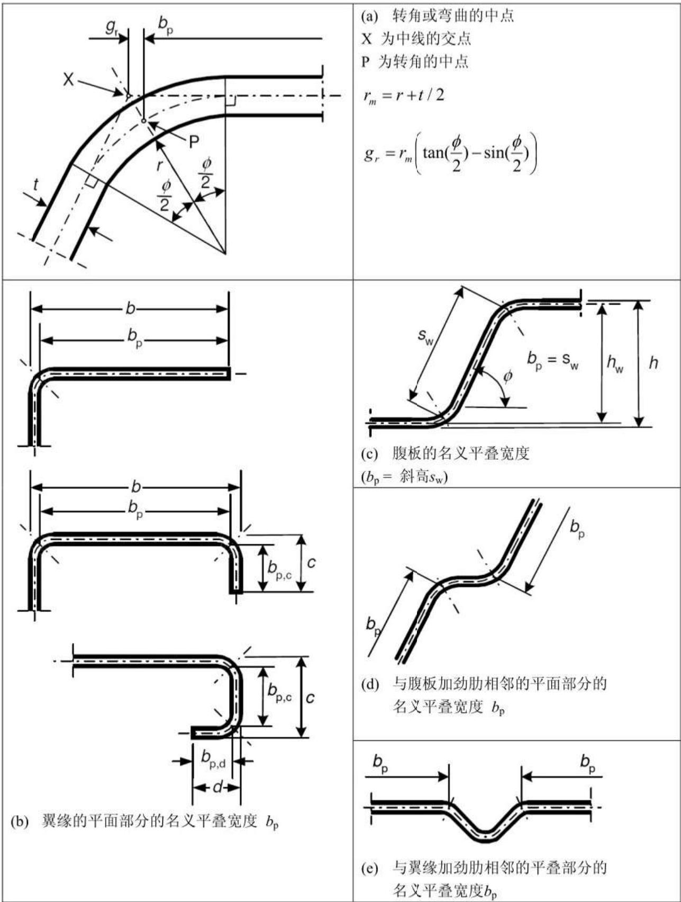  
图5.1：考虑了转角半径的平面横截面部分的名义宽度 $b_{\mathrm{p}}$

(4) 可使用以下近似，通过简化其它带锐角的相似横截面的计算特性来考虑圆角对截面特性的影响，参见图5.2：

EN 1993-1-3:2006 (E)

$$A _{\mathrm {g}} \approx A _{\mathrm {g , s h}} (1 - \delta) \tag {5.1a}$$

$$I _{\mathrm {g}} \approx I _{\mathrm {g}, \mathrm {s h}} (1 - 2 \delta) \quad \dots \tag {5.1b}$$

$$I _{\mathrm {w}} \approx I _{\mathrm {w , s h}} (1 - 4 \delta) \quad \dots (5. 1 \mathrm {c})$$

其中：

$$\delta = 0. 4 3 \frac {\sum_{j = 1} ^{n} r _{j} \frac {\phi_{j}}{9 0 ^{\circ}}}{\sum_{i = 1} ^{m} b _{p , i}} \tag {5.1d}$$

式中：

$A_{\mathrm{g}}$ 为毛横截面的面积；

$A_{\mathrm{g,sh}}$ 为带锐角的横截面的 $\mathrm{Ag}$ 的值；

$b_{\mathrm{p,i}}$ 为带锐角的横截面平面单元i的名义平叠宽度；

$I_{\mathrm{g}}$ 为毛横截面的截面惯性矩；

$I_{\mathrm{g,sh}}$ 为带锐角的横截面的 $I_{\mathrm{g}}$ 值；

$I_{\mathrm{w}}$ 为毛横截面的翘曲常数；

$I_{\mathrm{w,sh}}$ 为带锐角的横截面 $I_{\mathrm{w}}$ 的值；

$\phi$ 为两个平面单元之间的角度；

$m$ 为平面单元的数量；

$n$ 为弯曲单元的数量；

$r_{\mathrm{j}}$ 为弯曲单元 $j$ 的内半径。

(5) 如果平面单元的名义平叠宽度测量时测至其中线的交叉点，则在计算有效截面特性 $A_{\mathrm{eff}}$ 、 $I_{\mathrm{y,eff}}$ 、 $\mathrm{I}_{\mathrm{z,eff}}$ 和 $I_{\mathrm{w,eff}}$ 时，也可应用式(5.1)中给出的折减量。

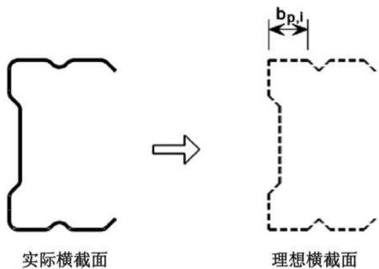  
图5.2：圆角的近似公差

EN 1993-1-3:2006 (E)

(6) 当内半径 $r > 0.04 t E / f_{\mathrm{y}}$ 时，应通过试验确定横截面的承载力。

## 5.2 几何比例

(1) EN 1993 中的第1-3部分中给出的计算设计规定不适用于表5.1中给出的宽厚比 $b / t, h / t, c / t$ 和 $d / t$ 范围之外的横截面。

注：可假定表5.1中给出的限值 $b / t$ 、 $h / t$ 、 $c / t$ 和 $d / t$ 代表通过试验已具有充足的经验并已经过验算的范围。如果通过试验和/或计算验证了横截面在承载能力极限状态下的承载力以及在正常使用极限状态下的性能，当结果通过适当的试验次数来确定时，也可使用具有较大宽厚比的横截面。

表 5.1: 最大宽厚比  

| 横截面元件 | 最大值 |
| --- | --- |
| b/t≤50 | b/t≤60 c/t≤50 |
| b/t≤60 c/t≤50 | b/t≤90 c/t≤60 d/t≤50 |
| b/t≤90 c/t≤60 d/t≤50 | b/t≤500 |
| 45°≤φ≤90° h/t≤500 sinφ | 45°≤φ≤90° h/t≤500 sinφ |

(2) 为了提供充分的刚度并避免加劲肋本身的一次屈曲，加劲肋的大小应限制在以下范围内：

$$0. 2 \leq c / b \leq 0. 6 \quad \dots (5. 2 a)$$

$$0. 1 \leq d / b \leq 0. 3 \quad \dots (5. 2 b)$$

其中，尺寸 $b$ 、 $c$ 和 $d$ 的大小如表5.1中所示。如果 $c / b < 0.2$ 或 $d / b < 0.1$ ，应忽略凸缘（ $c = 0$ 或 $d = 0$ ）。

注1：当有效横截面特性通过试验和计算来确定时，这些限值并不适用。

注2：如果凸缘不与翼缘垂直，则凸缘量尺c与翼缘垂直。

注3：关于有限元法，参见EN1993-1-5附录C。

## 5.3 用于分析的结构建模

(1) 除非根据EN1993-1-5所述采用了更适当的模型，否则，可对横截面元件进行建模，以用于分析，如表5.2中所示。  
(2）应考虑到多根加劲肋之间的相互影响   
(3)应从EN1993-1-1的表5.1中得出与柔性屈曲和扭转柔性屈曲相关的缺陷。

注：同样参见EN1993-1-1的第5.3.4条。

(4) 对于与侧向扭转屈曲相关的缺陷，可对剖面弱轴的初始弯曲缺陷 $e_0$ 进行假设，而无需考虑同时出现的初始扭转。

注：国家版附录中可给出缺陷的幅度值。对于从EN1993-1-1的6.3.2.2节规定的适用于LTB屈曲曲线的截面，若进行弹性分析，建议 $e_0 / L = 1 / 600$ ，而若进行塑性分析，建议 $e_0 / L = 1 / 500$ 。

表 5.2: 横截面元件的建模  

| 元件类型 | 模型 | 元件类型 | 模型 |
| --- | --- | --- | --- |
|  |  |  |  |
|  |  |  |  |
|  |  |  |  |
|  |  |  |  |

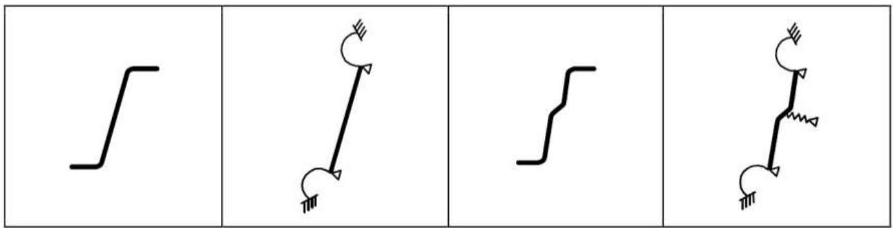

## 5.4翼缘卷曲

(1) 应考虑受弯剖面内的较宽翼缘或凹面受压的拱形受弯剖面内的翼缘的卷曲（如朝向中性面的向内弯曲）对抗压承载力的影响，但这种卷曲小于横断面深度的 $5\%$ 的情况除外。如果卷曲更大，那么，应考虑到抗压承载力的折减，例如由宽翼缘部分的力臂长度的减少、以及腹板弯曲可能的影响造成的折减。

注：对于衬板，这种影响在10.2.2.2中已考虑到。

(2）应按照如下所示计算卷曲。公式适用于带加劲肋/不带加劲肋的受拉和受压翼缘，但是在翼缘处没有间隔紧密的横向加劲肋。对于在施加荷载之前保持平直的剖面（参见图5.3）：

$$u = 2 \frac {\sigma_{a} ^{2}}{E ^{2}} \frac {b _{s} ^{4}}{t ^{2} z} \tag {5.2a}$$

对于拱形梁：

$$u = 2 \frac {\sigma_{a}}{E} \frac {b _{s} ^{4}}{t ^{2} r} \tag {5.2b}$$

其中：

$u$ 是翼缘朝向中性轴(卷曲)的弯曲，参见图5.3；

$b_{\mathrm{s}}$ 是箱形截面和帽形截面之间的距离的一半、或从腹板突出的翼缘部分的宽度，参见图5.3；

$t$ 是翼缘厚度；

$z$ 是所考虑的翼缘距中性轴的距离；

$r$ 是拱形梁曲率的半径；

$\sigma_{a}$ 是利用毛面积计算得出的翼缘内的平均应力。如果在有效横截面上的应力已计算得出，则通过将有效横截面的应力乘以有效翼缘面积对毛翼缘面积之比来得到平均应力。

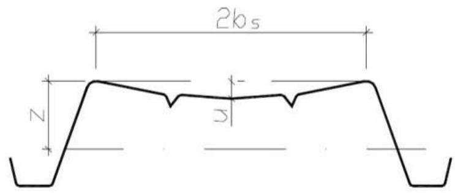

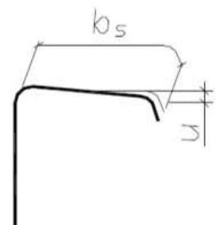  
图5.3：翼缘卷曲

## 5.5局部屈曲和畸变屈曲

5.5.1 概述

(1）在确定冷成型构件和薄板的承载力和刚度时，应考虑到局部屈曲和畸变屈曲的影响。  
(2) 通过使用有效横截面特性，并以有效宽度为基础进行计算，可对局部屈曲效应进行说明，参见 EN 1993-1-5。  
(3）在确定局部屈曲承载力的过程中，当计算EN1993-1-5中所述的受压元件的有效宽度时，屈服强度 $f_{\mathrm{y}}$ 可取值为 $f_{\mathrm{yb}}$ 。

注：关于承载力，参见6.1.3(1)。

(4) 关于正常使用性的验证, 受压元件的有效宽度应基于正常使用极限状态加载条件下的元件内的压应力 $\sigma_{\mathrm{com},\mathrm{Ed},\mathrm{ser}}$ 。  
(5) 在第5.5.3节中考虑了如图5.4(d)所示带边缘加劲肋或中间加劲肋的元件的畸变屈曲。

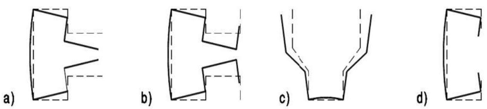  
图5.4：畸变屈曲模式示例

(6) 畸变屈曲效应考虑到图5.4(a)、(b)和(c)中所示的情形。在这些情形中，使用数值方法或外伸柱端试验进行线性屈曲分析（参见5.5.1(7)）或非线性屈曲分析（参见EN 1993-1-5）来确定畸变屈曲效应。  
(7) 除非使用了5.5.3中的简化步骤, 并且若弹性屈曲应力是从线性屈曲分析中得到的, 否则可适用以下步骤:  
1）对于小于或等于公称构件长度的波长，计算弹性屈曲应力并确认相应的屈曲模式，参见图5.5a。

2) 按照5.5.2所述，根据最小局部屈曲应力计算局部屈曲横截面部分的有效宽度，参见图5.5b。  
3）根据最小畸变屈曲应力，计算承受畸变屈曲的边缘加劲肋和中间加劲肋或其它横截面部分的折减厚度（参见5.5.3.1(7)），参看图5.5b。  
4) 按照6.2所述（取决于屈曲模式的弯曲屈曲、扭转屈曲或侧向扭转屈曲）并以2)和3)中得出的有效横截面为基础，计算公称构件长度的整体屈曲承载力。

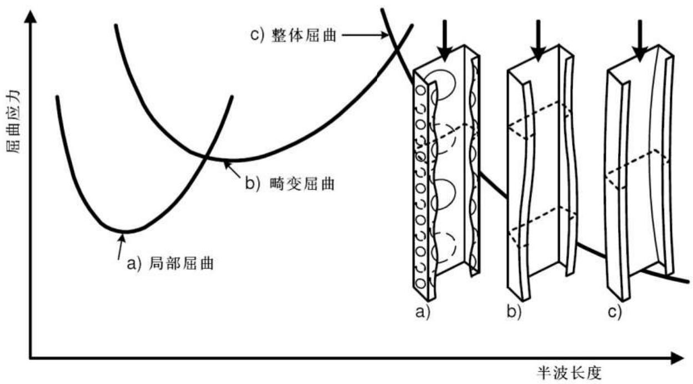

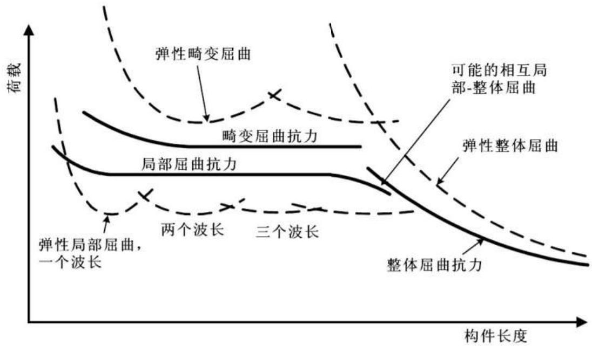  
图5.5a：各种屈曲模式下的弹性临界应力与半波长度的函数关系示例及屈曲模式示例  
图5.5b：弹性屈曲荷载和屈曲承载力与构件长度的函数关系示例

5.5.2 不带加劲肋的平面单元

(1) 通过确定基于板长细比 $\overline{\lambda}_p$ 的板屈曲的折减系数，使用 $\bar{b}$ 的名义平叠宽度 $b_{\mathrm{p}}$ ，根据EN1993-1-5中所述得出未加劲元件的有效宽度。  
(2）应按照5.1.4节图5.1中的规定来确定平面单元的名义平叠宽度 $b_{\mathrm{p}}$ 。对于斜腹板中的平面单元，应使用适当的斜高。

注：对于伸出构件，附录D给出了计算有效宽度的备选方法。

(3）在使用EN1993-1-5中的方法时，可使用以下步骤：

- 表4.1和4.2中用于确定承受应力梯度的截面翼缘有效宽度的应力比 $\psi$ 可基于毛截面特性。  
- 表4.1和4.2中用于确定腹板有效宽度的应力比 $\psi$ 可通过使用受压翼缘的有效面积和腹板的毛面积得到。  
- 可通过使用基于取代毛截面的有效横截面的应力比 $\psi$ 来改善有效截面特性。涉及应力梯度的迭代计算至少分2个步骤。  
- 对于应力梯度下的梯形薄板的腹板，可使用5.5.3.4中给出的简化方法。

5.5.3 带边缘加劲肋或中间加劲肋的平面单元

5.5.3.1 概述

(1) 带边缘加劲肋或中间加劲肋的受压元件的设计应基于以下假设：加劲肋作为带有连续部分约束的受压构件起作用，其所具有的弹簧刚度取决于相邻平面单元的边界条件和抗弯刚度。  
(2）加劲肋的弹簧刚度应通过施加一个单位长度的单位荷载 $u$ 来确定，如图5.6中所示。单位长度的弹簧刚度 $K$ 可由下式确定：

$$K = u / \delta \tag {5.9}$$

其中：

$\delta$ 是由作用在横截面有效部分的形心（ $\mathbf{b}_1$ ）中的单位荷载 $u$ 引起的加劲肋的挠度。

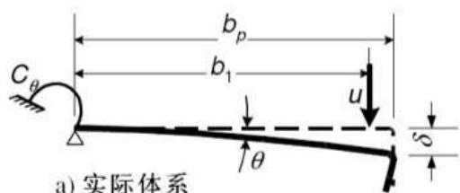  
a) 实际体系

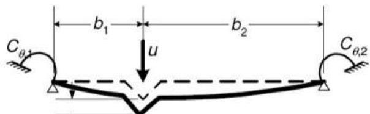

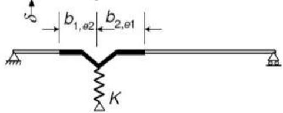

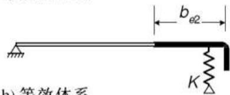  
b)等效体系

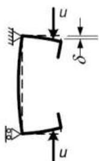  
受压

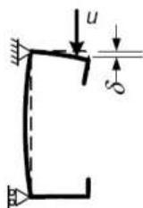  
受弯

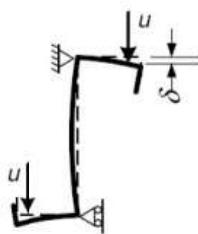  
受压

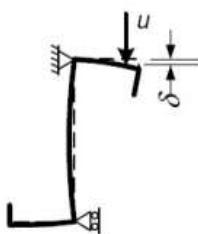  
受弯  
c) 适用于C和Z面的 $\delta$ 的计算  
图5.6：弹簧刚度的确定

(3) 在根据横截面的几何形状确定转动弹簧刚度 $C_{0} 、 C_{0,1}$ 和 $C_{0,2}$ 的值的过程中，应考虑到存在于相同元件或存在于受压横截面的任何其它元件中的其它加劲肋可能产生的影响。  
(4) 对于边缘加劲肋，挠度 $\delta$ 应根据下式得出：

$$\delta = \theta b _{p} + \frac {u b _{p} ^{3}}{3} \cdot \frac {1 2 (1 - v ^{2})}{E t ^{3}} \tag {5.10a}$$

且：

$$\theta = u b _{p} / C _{\theta}$$

(5) 对于凸缘C型和凸缘Z型的边缘加劲肋, 应如图5.6(c)中所示利用施加的单位荷载 $u$ 来确定 $C_{\theta}$ 。对于翼缘1的弹簧刚度 $K_{1}$ , 这将得出下式:

$$K _{1} = \frac {E t ^{3}}{4 (1 - v ^{2})} \cdot \frac {1}{b _{1} ^{2} h _{w} + b _{1} ^{3} + 0 . 5 b _{1} b _{2} h _{w} k _{f}} \tag {5.10b}$$

其中：

$b_{1}$ 为从腹板-翼缘结合处到翼缘1的边缘加劲肋有效面积（包括翼缘的有效部分 $b_{\mathrm{e2}}$ ）的重心的距离，参见图5.6(a);

EN 1993-1-3:2006 (E)

$b_{2}$ 为从腹板-翼缘结合处到翼缘2的边缘加劲肋有效面积（包括翼缘的有效部分）的重心的距离；

$h_{\mathrm{w}}$ 为腹板高度；

如果翼缘2受拉（例如，绕y-y轴受弯的梁），则 $k_{\mathrm{f}} = 0$

如果翼缘2同时也受压（例如，轴向受压的梁），则 $k_{f} = \frac{A_{s2}}{A_{s1}}$

对于受压的对称截面， $k_{\mathrm{f}} = 1$

$A_{\mathrm{s1}}$ 和 $A_{\mathrm{s2}}$ 分别为翼缘1和翼缘2的边缘加劲肋（包括翼缘的有效部分 $b_{\mathrm{e2}}$ ，参见图5.6(b)）的有效面积。

(6) 对于中间加劲肋, 作为保守的备选算法, 转动弹簧刚度 $C_{\theta,1}$ 和 $C_{\theta,2}$ 应取值为等于零, 而挠度 $\delta$ 可由下式得出:

$$\delta = \frac {u b _{1} ^{2} b _{2} ^{2}}{3 \left(b _{1} + b _{2}\right)} \cdot \frac {1 2 (1 - v ^{2})}{E t ^{3}} \tag {5.11}$$

(7) 畸变屈曲承载力（加劲肋的弯曲屈曲）的折减系数 $\chi_{\mathrm{d}}$ 应根据相对长细比 $\overline{\lambda}_{\mathrm{d}}$ 由以下各式得出：

当 $\overline{\lambda}_d\leq 0.65$ 时， $\chi_d = 1.0$ ...5.12a)

当 $0.65 < \overline{\lambda}_d < 1.38$ 时， $\chi_d = 1.47 - 0.723\overline{\lambda}_d$ ... (5.12b)

当 $\overline{\lambda}_d\geq 1.38$ 时， $\chi_d = \frac{0.66}{\overline{\lambda}_d}$ ...5.12c

其中：

$$\overline {{\lambda}} _{d} = \sqrt {f _{y b} / \sigma_{c r , s}} \tag {5.12d}$$

其中：

$\sigma_{\mathrm{cr,s}}$ 为5.5.3.2、5.5.3.3或5.5.3.4节中所述的加劲肋的弹性临界应力。

(8) 或者, 可使用数值方法根据弹性一阶屈曲分析得出弹性临界屈曲应力 $\sigma_{\mathrm{cr},\mathrm{s}}$ (参见5.5.1(7))。  
(9) 对于带边缘加劲肋和中间加劲肋的平面单元，在没有更精确的方法的情况下，中间加劲肋的效应可忽略。

5.5.3.2 带边缘加劲肋的平面单元

(1) 如果满足了5.2中的要求并且加劲肋和平面单元之间的角度在 $45^{\circ} \sim 135^{\circ}$ 之间，则对于边缘加劲肋以下方法适用。

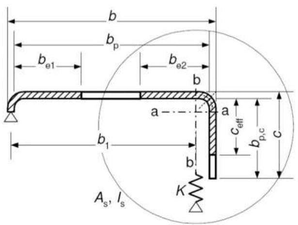  
$b / t\leq 60$   
a) 单边压折

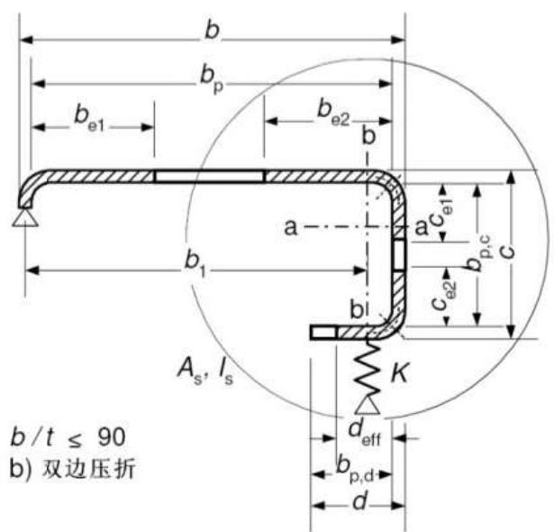  
图5.7：边缘加劲肋

(2）应将边缘加劲肋的横截面视为由加劲肋、元件c、或元件c和d的有效部分（如图5.7所示）加上平面单元 $b_{\mathrm{p}}$ 的相邻有效部分组成。  
(3) 该方法如图5.8所示，应按如下步骤进行：

- 步骤1：通过假定加劲肋具有完全约束并且 $\sigma_{\mathrm{com,Ed}} = f_{\mathrm{yb}} / \gamma_{\mathrm{M0}}$ ，以此来确定有效宽度，使用该有效宽度得出加劲肋的初始有效横截面，参见(4)~(5)；  
- 步骤2：使用加劲肋的初始有效横截面来确定畸变屈曲(加劲肋的弯曲屈曲)的折减系数，同时考虑到连续弹簧约束效应，参见(6)、(7)和(8)；  
- 步骤3：或者，进行重复计算以使加劲肋的屈曲折减系数值更加精确，参见(9)和(10)。

(4）图5.7中所示的有效宽度 $b_{\mathrm{e1}}$ 和 $b_{\mathrm{e2}}$ 的初始值应根据5.5.2条所述通过假定板元 $b_{\mathrm{p}}$ 受双支承来确定，参见EN1993-1-5的表4.1。  
(5) 图5.7中所示的有效宽度 $c_{\mathrm{eff}}$ 和 $d_{\mathrm{eff}}$ 的初始值应按如下所示得出：

a) 对于单边压折加劲肋：

$$c _{e f f} = \rho b _{p, c} \tag {5.13a}$$

其中 $\rho$ 可从5.5.2节中得出，但是当使用根据下式得出的屈曲系数 $k_{\sigma}$ 的值时例外，

当 $b_{\mathrm{p,c}} / b_{\mathrm{p}} \leq 0.35$ 时：

$$k _{\sigma} = 0. 5 \tag {5.13b}$$

EN 1993-1-3:2006 (E)

当 $0.35 < b_{\mathrm{p,c}} / b_{\mathrm{p}} \leq 0.6$ 时：

$$k _{\sigma} = 0. 5 + 0. 8 3 \sqrt [ 3 ]{\left(b _{p , c} / b _{p} - 0 . 3 5\right) ^{2}} \tag {5.13c}$$

b) 对于双边压折加劲肋：

$$c _{e f f} = \rho b _{p, c} \tag {5.13d}$$

其中p可利用EN1993-1-5表4.1中的双支承单元的屈曲系数 $k_{\sigma}$ 根据5.5.2节得出

$$d _{e f f} = \rho b _{p, d} \tag {5.13e}$$

其中 $\rho$ 可利用EN1993-1-5表4.2中的外伸单元的屈曲系数 $k_{\sigma}$ 根据5.5.2节得出

(6) 边缘加劲肋的有效横截面面积 $A_{\mathrm{s}}$ 可分别从下列各式得到：

$$\begin{array}{l} A _{s} = t \left(b _{e 2} + c _{e f f}\right) \text {或} (5.14a) \\ A _{s} = t \left(b _{e 2} + c _{e 1} + c _{e 2} + d _{\text {e f f}}\right) (5.14b) \\ \end{array}$$

注：如有需要，应考虑到圆角，参看5.1节。

(7）边缘加劲肋的弹性临界屈曲应力 $\sigma_{\mathrm{cr,s}}$ 应从下式得到：

$$\sigma_{c r, s} = \frac {2 \sqrt {K E I _{s}}}{A _{s}} \tag {5.15}$$

其中：

$K$ 为单位长度的弹簧刚度，参见5.5.3.1(2)。

$I_{\mathrm{s}}$ 为加劲肋的有效截面惯性矩，可认为是绕有效横截面形心轴a-a的有效面积 $A_{s}$ 的截面惯性矩，参见图5.7。

(8) 或者, 可使用数值方法, 从弹性一阶屈曲分析中得到弹性临界屈曲应力 $\sigma_{\mathrm{cr,s}}$ , 参见5.5.1(7)。  
(9) 应使用5.5.3.1(7)中给出的方法，根据 $\sigma_{\mathrm{cr,s}}$ 值得出边缘加劲肋畸变屈曲（加劲肋的屈曲）承载力的折减系数 $\chi_{\mathrm{d}}$ 。

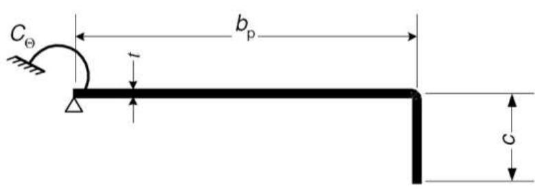

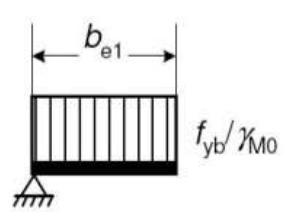

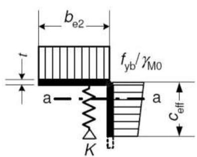

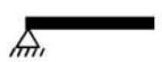

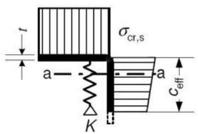

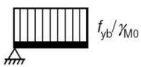

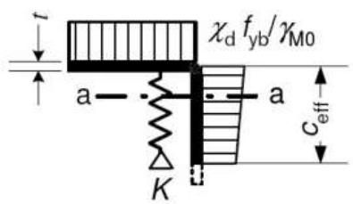

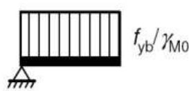  
迭代1   
迭代 $\mathbf{n}$

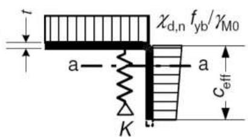

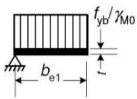

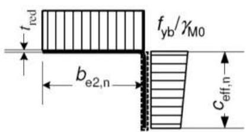  
图5.8：带边缘加劲肋翼缘的抗压承载力

a) 毛截面和边界条件  
b) 步骤1： $K = \infty$ 情况下的有效横截面，基于 $\sigma_{\mathrm{com,Ed}} = f_{\mathrm{yb}} / \gamma_{\mathrm{M0}}$   
c) 步骤2：根据步骤1得出的加劲肋有效面积 $A_{s}$ 的弹性临界应力 $\sigma_{\mathrm{cr,s}}$   
d) 加劲肋有效面积 $A_{s}$ 的折减强度 $\chi_{\mathrm{d}}f_{\mathrm{yb}} / \gamma_{\mathrm{M0}}$ ，其中折减系数 $\chi_{\mathrm{d}}$ 基于 $\sigma_{\mathrm{cr,s}}$   
e) 步骤3：或者利用折减压应力 $\sigma_{\mathrm{com,Ed,i}} = \chi_{\mathrm{d}}f_{\mathrm{yb}} / \gamma_{\mathrm{M0}}$ 通过计算有效宽度来重复步骤1，其中 $\chi_{\mathrm{d}}$ 的值来自前次迭代计算，继续计算直到 $\chi_{\mathrm{d,n}}\approx \chi_{\mathrm{d,(n - 1)}}$ 但 $\chi_{\mathrm{d,n}}\leq \chi_{\mathrm{d,(n - 1)}}$   
f) 采用有效横截面，其中 $b_{\mathrm{e2}}$ 、 $c_{\mathrm{eff}}$ 和折减厚度 $t_{\mathrm{red}}$ 与 $\chi_{\mathrm{d,n}}$ 对应

EN 1993-1-3:2006 (E)

(10)如果 $\chi_{\mathrm{d}} < 1$ ，可通过迭代计算来求出精确值，利用根据5.5.2(5)得到的 $\rho$ 的修正值开始迭代计算（其中 $\sigma_{\mathrm{com,Ed,i}}$ 等于 $\chi_{\mathrm{d}}\mathrm{f}_{\mathrm{yb}} / \gamma_{\mathrm{M0}}$ ），这样：

$$\bar {\lambda} _{p, r e d} = \bar {\lambda} _{p} \sqrt {\chi_{d}} \tag {5.16}$$

(11)在考虑了屈曲的情况下，加劲肋的折减有效面积 $A_{s,\mathrm{red}}$ 应按以下取值：

$$A _{s, r e d} = \chi_{d} A _{s} \frac {f _{y b} / \gamma_{M 0}}{\sigma_{c o m , E d}} \text {但} A _{s, r e d} \leq A _{s} \tag {5.17}$$

其中：

$\sigma_{\mathrm{com,Ed}}$ 为基于有效横截面计算得出的加劲肋中线处的压应力。

(12)在确定有效截面特性的过程中，对于 $A_{s}$ 中的所有单元，应使用折减厚度 $t_{\mathrm{red}} = tA_{\mathrm{s,red}} / A_{\mathrm{s}}$ 来表示折减有效面积 $A_{s,\mathrm{red}}$ 。

5.5.3.3 带中间加劲肋的平面单元

(1) 如果所有的平面单元均按照5.5.2所述来计算，则以下方法适用于由凹槽或弯曲形成的一个或两个相等的加劲肋。  
(2）应将中间加劲肋的横截面视为由加劲肋本身加上图5.9所示的相邻平面单元 $b_{\mathrm{p,1}}$ 和 $b_{\mathrm{p,2}}$ 的相邻有效部分组成。  
(3) 图5.10中所示的方法应按如下步骤进行：

- 步骤1：假定加劲肋具有完全约束，并且 $\sigma_{\mathrm{com,Ed}} = f_{\mathrm{yb}} / \gamma_{\mathrm{M0}}$ ，使用据此确定的有效宽度得到加劲肋的初始有效横截面，参见(4)和(5)；  
- 步骤2：在考虑到连续弹簧约束效应的情况下，使用加劲肋的初始有效横截面来确定畸变屈曲(中间加劲肋的屈曲)的折减系数，参见(6)、(7)和(8)；  
- 步骤3：或者进行迭代计算，以使加劲肋屈曲折减系数的值更加精确，参见(9)和(10)。

(4) 通过假定平面单元 $b_{\mathrm{p,1}}$ 和 $b_{\mathrm{p,2}}$ 受到双倍支承，应根据5.5.2所述确定图5.9中所示的有效宽度 $b_{1,\mathrm{e2}}$ 和 $b_{2,\mathrm{el}}$ 的初始值，参见EN1993-1-5的表4.1。

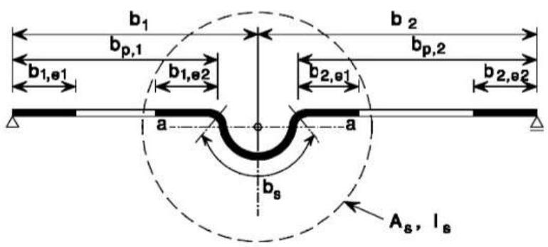

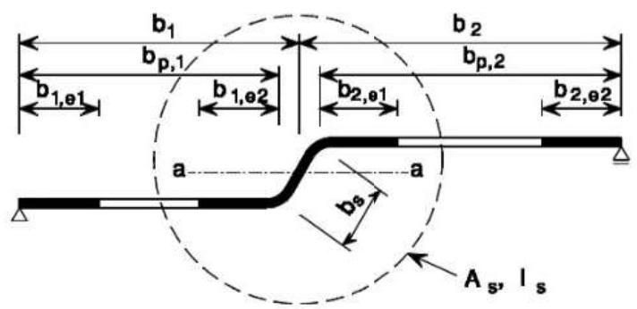  
图5.9：中间加劲肋

(5) 中间加劲肋 $A_{s}$ 的有效横截面积应由下式得到：

$$A _{s} = t \left(b _{1, e 2} + b _{2, e 1} + b _{s}\right) \tag {5.18}$$

其中加劲肋宽度 $b_{\mathrm{s}}$ 如图5.9所示。

注：如有需要，应考虑到圆角，参见5.1节。

(6) 中间加劲肋的临界屈曲应力 $\sigma_{\mathrm{cr,s}}$ 应由下式得到：

$$\sigma_{c r, s} = \frac {2 \sqrt {K E I _{s}}}{A _{s}} \tag {5.19}$$

其中：

$K$ 为单位长度的弹簧刚度，参见5.5.3.1(2)；

$I_{s}$ 为加劲肋的有效截面惯性矩，可认为是绕其有效横截面形心轴a-a的有效面积 $A_{s}$ 的截面惯性矩，参见图5.9。

(7) 或者，可使用数值分析，从弹性一阶屈曲分析中得出弹性临界屈曲应力 $\sigma_{\mathrm{cr,s}}$ ，参见5.5.1(7)。  
(8）应使用5.5.3.1(7)中给出的方法，从 $\sigma_{\mathrm{cr,s}}$ 值中得到畸变屈曲抗力（中间加劲肋的屈曲）的折减系数 $\chi_{\mathrm{d}}$ 。  
(9) 如果 $\chi_{\mathrm{d}} < 1$ ，则可利用根据5.5.2(5)得到的 $\rho$ 的修正值开始迭代计算，其中 $\sigma_{\mathrm{com,Ed,i}}$ 等于 $\chi_{\mathrm{d}} f_{\mathrm{yb}} / \gamma_{\mathrm{M0}}$ ，这样：

$$\bar {\lambda} _{p, r e d} = \bar {\lambda} _{d} \sqrt {\chi_{d}} \tag {5.20}$$

EN 1993-1-3:2006 (E)

(10)在考虑到畸变屈曲（加劲肋的屈曲）的情况下，加劲肋的折减有效面积 $A_{s,red}$ 应按下式确定：

$$A _{s, r e d} = \chi_{d} A _{s} \frac {f _{y b} / \gamma_{M 0}}{\sigma_{c o m , E d}} \text {但} A _{s, r e d} \leq A _{s} \tag {5.21}$$

其中，

$\sigma_{\mathrm{com,Ed}}$ 为基于有效横截面计算得出的加劲肋中线处的压应力。

(11) 在确定有效横截面特性时，对于 $A_{\mathrm{s}}$ 中的所有单元，应使用折减厚度 $t_{\mathrm{red}} = tA_{\mathrm{s,red}} / A_{\mathrm{s}}$ 来表示折减有效面积 $A_{\mathrm{s,red}}$ 。

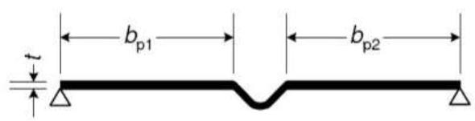

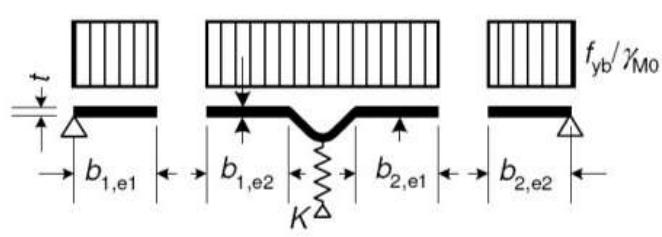

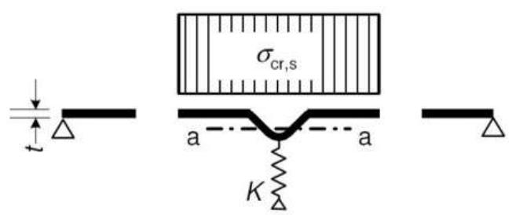

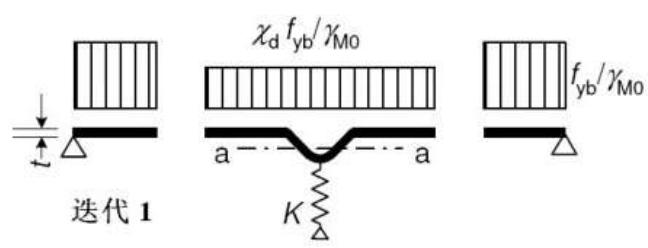

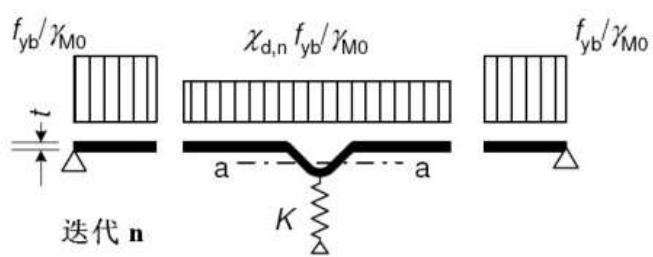

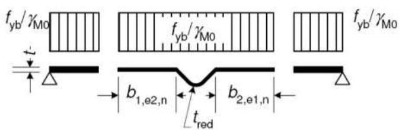  
图5.10：带中间加劲肋的翼缘抗压承载力

a) 毛横截面和边界条件  
b) 步骤1：在 $K = \infty$ 情况下的有效横截面，基于 $\sigma_{\mathrm{om,Ed}} = f_{\mathrm{yb}} / \gamma_{M0}$   
c) 步骤2：根据步骤1中得出的加劲肋有效面积 $A_{\mathrm{s}}$ 的弹性临界应力 $\sigma_{\mathrm{cr,s}}$   
d) 加劲肋有效面积 $A_{s}$ 的折减强度 $\chi_{\mathrm{d}}f_{\mathrm{yb}} / \gamma_{\mathrm{M0}}$ ，其中折减系数 $\chi_{\mathrm{d}}$ 基于 $\sigma_{\mathrm{cr,s}}$

e）步骤3：或者，利用折减压应力 $\sigma_{\mathrm{com},\mathrm{Ed},\mathrm{i}} = \chi_{\mathrm{d}}f_{\mathrm{yb}} / \gamma_{\mathrm{M0}}$ 通过计算有效宽度来重复步骤1，其中 $\chi_{\mathrm{d}}$ 来自前次的迭代计算，继续计算直到 $\chi_{\mathrm{d,n}}\approx \chi_{\mathrm{d,(n - 1)}}$ 但 $\chi_{\mathrm{d,n}}\leqslant \chi_{\mathrm{d,(n - 1)}}$

f) 采用有效横截面，其中 $b_{1,\mathrm{e2}}$ 、 $b_{2,\mathrm{e1}}$ 和折减厚度 $t_{\mathrm{red}}$ 与 $\chi_{\mathrm{d,n}}$ 对应

5.5.3.4 带中间加劲肋梯形板剖面

5.5.3.4.1 概述

(1) 本5.5.3.4小节用于梯形压型钢板，本节与5.5.3.3节中适用于带中间翼缘加劲肋的翼缘的内容以及5.5.3.3节中适用于带中间加劲肋的腹板的内容相关联。  
(2) 还应通过使用5.5.3.4.4中给出的方法，将中间翼缘加劲肋的屈曲和中间腹板加劲肋的屈曲之间的相互作用考虑在内。

5.5.3.4.2 带中间加劲肋的翼缘

(1) 如果均匀受压，则应假定带中间加劲肋的翼缘的有效横截面由包括两个与加劲肋相邻的宽度为 $0.5b_{\mathrm{eff}}$ （或 $15t$ ，参见图5.11）的带区的折减有效面积 $A_{\mathrm{s,red}}$ 组成。  
(2) 对于一个中间翼缘加劲肋，弹性临界屈曲应力 $\sigma_{\mathrm{cr,s}}$ 应由下式得到：

$$\sigma_{c r, s} = \frac {4 . 2 k _{w} E}{A _{s}} \sqrt {\frac {I _{s} t ^{3}}{4 b _{p} ^{2} (2 b _{p} + 3 b _{s})}} \tag {5.22}$$

其中：

$b_{\mathrm{p}}$ 为图5.11中所示的平面单元的名义平叠宽度；

$b_{s}$ 为加劲肋宽度，绕加劲肋周长测出，参见图5.11；

$A_{s}, I_{s}$ 为图5.11中所示的加劲肋横截面的面积和截面惯性矩；

$k_{\mathrm{w}}$ 是考虑腹板或其它相邻单元对加劲翼缘的部分转动约束时所用的系数，参见(5)和(6)。对于轴向受压的有效横截面的计算，值 $k_{\mathrm{w}} = 1.0$ 。

如果加劲肋的平展部分由于受到局部屈曲而折减，并且公式5.22中的 $b_{\mathrm{p}}$ 由 $\mathbf{b}_{\mathrm{p}}$ 和 $0.25(3\mathbf{b}_{\mathrm{p}} + \mathbf{b}_{\mathrm{r}})$ 这二者中的较大值取代，那么公式5.22可用于宽槽，参见图5.11。对于带两个或多个宽槽的翼缘，类似方法适用。

EN 1993-1-3:2006 (E)

用于计算 $A_{s}$ 的截面用于计算 $I_{s}$ 的截面

  
图5.11：带一个、两个或多个加劲肋的受压翼缘

(3) 对于两个对称布置的翼缘加劲肋，弹性临界屈曲应力 $\sigma_{\mathrm{cr,s}}$ 应由下式得到：

$$\sigma_{c r, s} = \frac {4 . 2 k _{w} E}{A _{s}} \sqrt {\frac {I _{s} t ^{3}}{8 b _{1} ^{2} \left(3 b _{e} - 4 b _{1}\right)}} \tag {5.23a}$$

且：

$$b _{e} = 2 b _{p, 1} + b _{p, 2} + 2 b _{s}$$

$$b _{1} = b _{p, 1} + 0. 5 b _{r}$$

其中：

$b_{\mathrm{p,1}}$ 是外平面单元的名义平叠宽度，如图5.11所示；

$b_{\mathrm{p,2}}$ 是中间平面单元的名义平叠宽度，如图5.11所示；

$b_{\mathrm{r}}$ 是加劲肋的总体宽度，参见图5.11；

$A_{s},I_{s}$ 是图5.11中所示的加劲肋横截面的面积和截面惯性矩。

(4) 对于多个加劲肋翼缘（三个或三个以上的相同加劲肋），整个翼缘的有效面积为：

$$A _{\mathrm {e f f}} = \rho b _{\mathrm {e}} t \tag {5.23b}$$

此处， $\rho$ 是根据EN1993-1-5附录E所述适用于基于弹性屈曲应力 $\sigma_{cr,s}$ 的长细比 $\overline{\lambda}_p$ 的折减系数。

$$\sigma_{c r, s} = 1. 8 E \sqrt {\frac {I _{s} t}{b _{o} ^{2} b _{e} ^{3}}} + 3. 6 \frac {E t ^{2}}{b _{o} ^{2}} \tag {5.23c}$$

其中：

$I_{s}$ 为绕形心轴线a-a的加劲肋的截面惯性矩之和（忽略厚度项 $\mathrm{bt}^3 /12$ ）；

$b_{\mathrm{o}}$ 为翼缘宽度，如图5.11所示；

$b_{\mathrm{e}}$ 为翼缘的展开宽度，如图5.11所示。

(5) 可根据受压翼缘屈曲波长 $l_{\mathrm{b}}$ 计算 $k_{\mathrm{w}}$ 的值，如下：

当 $l_{\mathrm{b}} / s_{\mathrm{w}} \geq 2$ 时：

$$k _{\mathrm {w}} = k _{\mathrm {w o}} \tag {5.24a}$$

当 $l_{\mathrm{b}} / s_{\mathrm{w}} < 2$ 时：

$$k _{w} = k _{w o} - \left(k _{w o} - 1\right) \left[ \frac {2 l _{b}}{s _{w}} - \left(\frac {l _{b}}{s _{w}}\right) ^{2} \right] \tag {5.24b}$$

其中：

$s_{\mathrm{w}}$ 为腹板斜高，参见图5.1(c)。

(6) 或者，与销接条件对应的转动约束系数 $k_{\mathrm{w}}$ 可保守取值为等于1.0。  
(7) $l_{\mathrm{b}}$ 和 $k_{\mathrm{wo}}$ 的值可按照以下确定：

对于带一个中间加劲肋的受压翼缘：

$$l _{b} = 3. 0 7 \sqrt [ 4 ]{\frac {I _{s} b _{p} ^{2} \left(2 b _{p} + 3 b _{s}\right)}{t ^{3}}} \tag {5.25}$$

$$k _{w o} = \sqrt {\frac {s _{w} + 2 b _{d}}{s _{w} + 0 . 5 b _{d}}} \tag {5.26}$$

且：

$$b _{d} = 2 b _{p} + b _{s}$$

对于带两个中间加劲肋的受压翼缘：

$$l _{b} = 3. 6 5 \sqrt [ 4 ]{I _{s} b _{1} ^{2} \left(3 b _{e} - 4 b _{1}\right) / t ^{3}} \tag {5.27}$$

$$k _{w o} = \sqrt {\frac {\left(2 b _{e} + s _{w}\right) \left(3 b _{e} - 4 b _{1}\right)}{b _{1} \left(4 b _{e} - 6 b _{1}\right) + s _{w} \left(3 b _{e} - 4 b _{1}\right)}} \tag {5.28}$$

EN 1993-1-3:2006 (E)

(8) 在考虑到畸变屈曲（中间加劲肋的柔性屈曲）的情况下，加劲肋的折减有效面积 $A_{\mathrm{s,red}}$ 应按下式取值：

$$A _{s, r e d} = \chi_{d} A _{s} \frac {f _{y b} / \gamma_{M 0}}{\sigma_{c o m , s e r}} \text {但} A _{s, r e d} \leq A _{s} \tag {5.29}$$

(9)如果腹板未加劲，则应使用5.5.3.1(7)中给出的方法直接根据 $\sigma_{\mathrm{cr,s}}$ 得出折减系数 $\mathbf{x}_{\mathrm{d}}$ 。  
(10)如果也对腹板进行了加劲，则应使用5.5.3.1(7)中给出的方法得出折减系数 $\chi_{\mathrm{d}}$ ，但要使用5.5.3.4.4中给出的修正弹性临界应力 $\sigma_{\mathrm{cr,mod}}$ 。  
(11) 在确定有效截面特性时，对于包含在 $A_{s}$ 内的所有单元，应使用折减厚度 $t_{\mathrm{red}} = tA_{\mathrm{s,red}} / A_{\mathrm{s}}$ 来表示折减有效面积 $A_{s,\mathrm{red}}$ 。  
(12) 正常使用极限状态下的加劲肋的有效截面特性应基于设计厚度 $t$ 。

5.5.3.4.3 带两个或两个以下中间加劲肋的腹板

(1) 应假定腹板（或承受应力梯度的横截面的其它单元）受压区有效横截面由两个或两个以下中间加劲肋的折减有效面积 $A_{s,red}$ 、一个与受压翼缘相邻的带区以及一个与有效横截面形心轴相邻的带区组成，参见图5.12。  
(2) 图5.12所示的腹板的有效横截面应视为包括：

a) 一个与受压翼缘相邻的宽度为 $s_{\mathrm{eff,1}}$ 的带区；  
b) 每个腹板加劲肋的折减有效面积 $A_{s,red}$ （腹板加劲肋为两个或两个以下）；  
c) 与有效形心轴相邻的宽度为 $s_{\mathrm{eff,n}}$ 的带区；  
d) 受拉腹板部分

  
图5.12：梯形压型钢板的腹板有效横截面

(3) 加劲肋有效面积应由下式得到：

对于单个加劲肋、或与受压翼缘更靠近的加劲肋：

$$A _{\mathrm {s a}} = t \left(s _{\text {e f f}, 2} + s _{\text {e f f}, 3} + s _{\mathrm {s a}}\right) \tag {5.30}$$

对于第二个加劲肋：

$$A _{\mathrm {s b}} = t \left(s _{\mathrm {e f f}, 4} + s _{\mathrm {e f f}, 5} + s _{\mathrm {s b}}\right) \tag {5.31}$$

其中 $s_{\mathrm{eff},1}$ 到 $s_{\mathrm{eff,n}}, s_{\mathrm{sa}}$ 和 $s_{\mathrm{sb}}$ 的尺寸如图5.12所示。

(4) 首先，有效形心轴的位置应基于翼缘的有效横截面（但对于腹板，则应基于腹板的毛截面）。在这种情形下，基本有效宽度 $s_{\mathrm{eff,0}}$ 应由下式得到：

$$s _{\text {e f f}, 0} = 0. 7 6 t \sqrt {E / \left(\gamma_{M 0} \sigma_{\text {c o m} , E d}\right)} \tag {532}$$

其中：

$\sigma_{\mathrm{com,Ed}}$ 为达到横截面承载力时受压翼缘中的应力。

(5) 如果腹板不是完全有效的， $s_{\mathrm{eff,1}}$ 到 $s_{\mathrm{eff,n}}$ 的尺寸应由以下各式确定：

$$s _{\text {e f f}, 1} = s _{\text {e f f}, 0} \tag {5.33a}$$

$$s _{\text {e f f}, 2} = \left(1 + 0. 5 h _{\mathrm {a}} / e _{\mathrm {c}}\right) s _{\text {e f f}, 0} \tag {5.33b}$$

$$s _{\text {e f f}, 3} = \left[ 1 + 0. 5 \left(h _{\mathrm {a}} + h _{\mathrm {s a}}\right) / e _{\mathrm {c}} \right] s _{\text {e f f}, 0} \tag {5.33c}$$

$$s _{\text {e f f}, 4} = \left(1 + 0. 5 h _{\mathrm {b}} / e _{\mathrm {c}}\right) s _{\text {e f f}, 0} \tag {5.33d}$$

$$s _{\text {e f f}, 5} = \left[ 1 + 0. 5 \left(h _{\mathrm {b}} + h _{\mathrm {s b}}\right) / e _{\mathrm {c}} \right] s _{\text {e f f}, 0} \tag {5.33e}$$

$$s _{\text {e f f , n}} = 1. 5 s _{\text {e f f , 0}} \tag {5.33f}$$

其中：

$e_{\mathrm{c}}$ 是从有效形心轴到受压翼缘系统线的距离，参见图5.12；

而 $h_{\mathrm{a}}, h_{\mathrm{b}}, h_{\mathrm{a}}$ 和 $h_{\mathrm{sb}}$ 的尺寸如图5.12中所示。

(6) 首先， $s_{\mathrm{eff},1}$ 到 $s_{\mathrm{eff,n}}$ 的面积根据(5)中所述确定，然后如果相关的平面单元充分有效，则可使用以下各式进行修正：

- 在未加劲腹板中，如果 $s_{\mathrm{eff},1} + s_{\mathrm{eff},\mathrm{n}} \geq s_{\mathrm{n}}$ ，整个腹板是有效的，那么修正如下：

$$s _{\mathrm {e f f}, 1} = 0. 4 s _{\mathrm {n}} \tag {5.34a}$$

$$s _{\mathrm {f f}, \mathrm {n}} = 0. 6 s _{\mathrm {n}} \tag {5.34b}$$

- 在加劲腹板中，如果 $s_{\mathrm{eff},1} + s_{\mathrm{eff},2} \geq s_{\mathrm{a}}$ ，整个 $s_{\mathrm{a}}$ 有效，那么修正如下：

$$s _{e f f, 1} = \frac {s _{a}}{2 + 0 . 5 h _{a} / e _{c}} \tag {5.35a}$$

$$s _{\text {e f f}, 2} = s _{a} \frac {\left(1 + 0 . 5 h _{a} / e _{c}\right)}{2 + 0 . 5 h _{a} / e _{c}} \tag {5.35b}$$

- 在带一个加劲肋的腹板中，如果 $s_{\mathrm{eff},3} + s_{\mathrm{eff},n} \geq s_n$ ，整个 $s_n$ 有效，那么修正如下：

$$s _{e f f, 3} = s _{n} \frac {\left[ 1 + 0 . 5 \left(h _{a} + h _{s a}\right) / e _{c} \right]}{2 . 5 + 0 . 5 \left(h _{a} + h _{s a}\right) / e _{c}} \tag {5.36a}$$

$$s _{\text {e f f}, n} = \frac {1 . 5 s _{n}}{2 . 5 + 0 . 5 \left(h _{a} + h _{s a}\right) / e _{c}} \tag {5.36b}$$

- 在带两个加劲肋的腹板中：

如果 $s_{\mathrm{eff},3} + s_{\mathrm{eff},4}\geq s_{\mathrm{b}}$ ，整个 $S_{\mathrm{b}}$ 有效，那么修正如下：

$$s _{e f f, 3} = s _{b} \frac {1 + 0 . 5 \left(h _{a} + h _{s a}\right) / e _{c}}{2 + 0 . 5 \left(h _{a} + h _{s a} + h _{b}\right) / e _{c}} \tag {5.37a}$$

$$s _{e f f, 4} = s _{b} \frac {1 + 0 . 5 h _{b} / e _{c}}{2 + 0 . 5 \left(h _{a} + h _{s a} + h _{b}\right) / e _{c}} \tag {5.37b}$$

如果 $s_{\mathrm{eff},5} + s_{\mathrm{eff},n}\geq s_n$ ，整个 $s_n$ 有效，那么修正如下：

$$s _{e f f, 5} = s _{n} \frac {1 + 0 . 5 \left(h _{b} + h _{s b}\right) / e _{c}}{2 . 5 + 0 . 5 \left(h _{b} + h _{s b}\right) / e _{c}} \tag {5.38a}$$

$$s _{e f f, n} = \frac {1 . 5 s _{n}}{2 . 5 + 0 . 5 \left(h _{b} + h _{s b}\right) / e _{c}} \tag {5.38b}$$

(7) 对于单个加劲肋、或者与带两个加劲肋的腹板中的受压翼缘更靠近的加劲肋，应使用下式确定弹性临界屈曲应力 $\sigma_{\mathrm{cr,sa}}$

$$\sigma_{c r, s a} = \frac {1 . 0 5 k _{f} E \sqrt {I _{s} t ^{3} s _{1}}}{A _{s a} s _{2} \left(s _{1} - s _{2}\right)} \tag {5.39a}$$

其中 $s_1$ 由以下各式得出：

对于单个加劲肋：

$$s _{1} = 0. 9 \left(s _{\mathrm {a}} + s _{\mathrm {s a}} + s _{\mathrm {c}}\right) \tag {5.39b}$$

对于与带两个加劲肋的腹板中的受压翼缘更靠近的加劲肋：

$$s _{1} = s _{\mathrm {a}} + s _{\mathrm {s a}} + s _{\mathrm {b}} + 0. 5 \left(s _{\mathrm {s b}} + s _{\mathrm {c}}\right) \tag {5.39c}$$

且：

$$s _{2} = s _{1} - s _{\mathrm {a}} - 0. 5 s _{\mathrm {s a}} \tag {5.39d}$$

其中：

$k_{\mathrm{f}}$ 为考虑翼缘对加劲腹板的部分转动约束时所用的系数；

$I_{\mathrm{s}}$ 是由压折宽度 $s_{\mathrm{sa}}$ 和两个相邻带区（每个的宽度为 $s_{\mathrm{eff,1}}$ ）组成的加劲肋横截面绕其自身与平面腹板单元垂直的形心轴的截面惯性矩，见图5.13。在计算 $I_{\mathrm{s}}$ 时，加劲肋每边上平面腹板单元之间的斜率差可忽略。

$s_{\mathrm{c}}$ 如图5.12中所定义的。

(8) 在缺少更详细的调查的情况下，与销接条件对应的转动约束系数 $k_{\mathrm{f}}$ 可保守取值为等于1.0。

  
图5.13：梯形成型薄板的腹板加劲肋

(9) 对于受压的单个加劲肋，或与带两个加劲肋的腹板中的受压翼缘更靠近的加劲肋，折减有效面积 $A_{\mathrm{sa,red}}$ 应按下式确定：

$$A _{s a, r e d} = \frac {\chi_{d} A _{s a}}{1 - \left(h _{a} + 0 . 5 h _{s a}\right) / e _{c}} \text {但} A _{s a, r e d} \leq A _{s a} \tag {5.40}$$

(10)如果翼缘未加劲，则应使用5.5.3.1(7)中给出的方法直接根据 $\sigma_{\mathrm{cr,sa}}$ 得出折减系数。  
(11)如果也对翼缘进行了加劲，则应使用5.5.3.1(7)中给出的方法得出折减系数 $\chi_{\mathrm{d}}$ ，但要使用5.5.3.4.4中给出的修正弹性临界应力 $\sigma_{\mathrm{cr,mod}}$ 。  
(12) 对于单个受拉加劲肋，折减有效面积 $A_{\mathrm{sa,red}}$ 应取值为等于 $A_{\mathrm{sa}}$ 。  
(13) 对于带两个加劲肋的腹板，第二个加劲肋的折减有效面积 $A_{\mathrm{sb,red}}$ 应取值为等于 $A_{\mathrm{sb}}$ 。  
(14) 在确定有效截面特性时，对于包括在 $A_{\mathrm{sa}}$ 中的所有单元，应使用折减厚度 $t_{\mathrm{red}} = \chi_{\mathrm{d}} t$ 来表示折减有效面积 $A_{\mathrm{sa,red}}$ 。

EN 1993-1-3:2006 (E)

(15) 正常使用极限状态下的加劲肋有效截面特性应基于设计厚度 $t$ 。  
(16) 或者，可通过以腹板有效横截面和翼缘有效横截面为基础来确定有效形心轴的方式，进行迭代计算来得出精确的有效横截面特性，其中，腹板有效横截面是前次迭代计算得出的，而翼缘的有效横截面是使用翼缘加劲肋面积 $A_{s}$ 中所有单元的折减厚度 $t_{\mathrm{red}}$ 来确定的。这种迭代计算应以增大的有基本有效宽度 $s_{\mathrm{eff,0}}$ 为基础，其中 $s_{\mathrm{eff,0}}$ 可由下式得到：

$$s _{e f f, 0} = 0. 9 5 t \sqrt {\frac {E}{\gamma_{M 0} \sigma_{c o m , E d}}} \tag {5.41}$$

5.5.3.4.4 带翼缘加劲肋和腹板加劲肋的板

(1) 对于翼缘和腹板中带有中间加劲肋的板（见图5.14），应通过使用同时适用于两种加劲肋的修正弹性临界应力 $\sigma_{\mathrm{cr,mod}}$ ，来考虑到畸变屈曲（翼缘加劲肋和腹板加劲肋的屈曲）之间的相互作用。 $\sigma_{\mathrm{cr,mod}}$ 由下式得到：

$$\sigma_{c r, \mathrm {m o d}} = \frac {\sigma_{c r , s}}{\sqrt [ 4 ]{1 + \left[ \beta_{s} \frac {\sigma_{c r , s}}{\sigma_{c r , s a}} \right] ^{4}}} \tag {5.42}$$

其中：

$\sigma_{\mathrm{cr,s}}$ 为中间翼缘加劲肋的弹性临界应力，对于带单个加劲肋的翼缘见5.5.3.4.2(2)，对于带两个加劲肋的翼缘见5.5.3.4.2(3)；

$\sigma_{\mathrm{cr,sa}}$ 为单个腹板加劲肋或与带两个加劲肋的腹板中的受压翼缘更靠近的加劲肋的弹性临界应力，见5.5.3.4.3(7)；

$A_{s}$ 为中间翼缘加劲肋的有效横截面面积；

$A_{\mathrm{sa}}$ 为中间腹板加劲肋的有效横截面面积；

$\beta_{\mathrm{s}}$ $= 1 - (h_{\mathrm{a}} + 0.5h_{\mathrm{ha}}) / e_{\mathrm{c}}$ （对于弯曲剖面）；

$\beta_{s}$ （对于轴向受压剖面）。

  
图5.14：带翼缘加劲肋和腹板加劲肋的梯形压型钢板

## 5.6 紧固件之间的板屈曲

(1) 对于由板和机械紧固件组成的单元，应对紧固件之间的板屈曲进行检查，见 EN 1993-1-8表3.3。

# 6 承载能力极限状态

## 6.1 横截面抗力

6.1.1 概述

(1) 对于这些抗力中的任何一种，应使用试验辅助设计而非计算设计。

注：试验辅助设计可能对于 $b_{\mathrm{p}} / t$ 比率相当高（如涉及非弹性性能、腹板断裂或剪力滞）的横截面特别有效。

(2)对于计算设计，应通过使用按5.5节规定而确定的有效截面特性来考虑局部屈曲效应。  
(3）应按照6.2节中的规定对构件的屈曲抗力进行验算。  
(4) 对于横截面易变形的构件，通常应考虑到可能出现的受压翼缘侧向屈曲和翼缘的侧弯，见5.5和10.1节。

6.1.2 轴向拉力

(1) 均匀受拉横截面的设计抗力 $N_{\mathrm{L,Rd}}$ 可按下式确定：

$$N _{t, R d} = \frac {f _{y a} A _{g}}{\gamma_{M 0}} \text {但} N _{t, R d} \leq F _{n, R d} \tag {6.1}$$

其中：

$A_{\mathrm{g}}$ 为横截面的毛面积；

$F_{\mathrm{n,Rd}}$ 为根据8.4节得出的适用于适当类型的机械紧固件的净截面抗力；

$f_{\mathrm{ya}}$ 为平均屈服强度，见3.2.3。

(2) 通过单肢连接的均匀受拉角钢的设计承载力，或通过外伸部分连接的其它类型的截面的设计抗力，应按照 EN 1993-1-8 中 3.6.3 节规定来确定。

6.1.3 轴向压力

(1) 横截面对压力的设计抗力 $N_{\mathrm{c,Rd}}$ 应根据以下各式确定：

当有效面积 $A_{\mathrm{eff}}$ 小于毛面积 $A_{\mathrm{g}}$ （截面有因局部和/或畸变屈曲引起的折减）

$$N _{c, R d} = A _{\text {e f f}} f _{y b} / \gamma_{M 0} \tag {6.2}$$

当有效面积 $A_{\mathrm{eff}}$ 等于毛面积 $A_{\mathrm{g}}$ （截面无因局部和/或畸变屈曲引起的折减）

$$N _{c, R d} = A _{g} \left(f _{y b} + \left(f _{y a} - f _{y b}\right) 4 \left(1 - \overline {{\lambda}} _{e} / \overline {{\lambda}} _{e 0}\right)\right) / \gamma_{M 0}$$

但不超过 $A_{g}f_{ya} / \gamma_{M0}$ (6.3)

其中

$A_{\mathrm{eff}}$ 为横截面的有效面积，根据5.5节所述通过假设一个等于 $f_{\mathrm{yb}}$ 的均匀压应力得出；

$f_{\mathrm{ya}}$ 为平均屈服强度，见3.2.2；

$f_{\mathrm{yb}}$ 为基本屈服强度；

$\overline{\lambda}_{e,\max}$ 为与 $\overline{\lambda}_{\mathrm{e}} / \overline{\lambda}_{\mathrm{e0}}$ 的最大值对应的单元相对长细比；

对于平面单元 $\overline{\lambda}_e = \overline{\lambda}_p$ 且 $\overline{\lambda}_{\mathrm{e0}} = 0.673$ ，见5.5.2；

对于加劲单元 $\overline{\lambda}_{e} = \overline{\lambda}_{d}$ 且 $\overline{\lambda}_{\mathrm{e0}} = 0.65$ ，见5.5.3。

(2）应将构件的内轴力视为作用于其毛横截面的形心。这是一个保守的假设，但是无需进一步分析即可使用。进一步的分析可能会对内力作出更为实际说明，例如，受压单元内法向力均匀累积的情形。  
(3) 横截面的设计抗压承载力是指作用于其有效横截面形心处的轴向荷载。如果此有效横截面的形心与毛横截面的形心不重合，那么应使用6.1.9中给出的方法来考虑形心轴（见图6.1）的位移 $e_{\mathrm{N}}$ 。当应力检查时，中性轴的位移得出的结果有利，那么只有已计算出屈服强度处的位移且不包含实际压应力时，才应忽略该位移。

  
图6.1：受压时的有效横截面

6.1.4弯矩

6.1.4.1 受压翼缘处屈服的弹性和弹塑性抗力

(1) 横截面对绕主轴的弯曲的设计抵抗力矩 $M_{\mathrm{c,Rd}}$ 按如下各式确定（见图6.2）：

当有效截面模量 $W_{\mathrm{eff}}$ 小于毛截面弹性模量 $W_{\mathrm{el}}$ 时

$$M _{c, R d} = W _{\text {e f f}} f _{y b} / \gamma_{M 0} \tag {6.4}$$

当有效截面模量 $W_{\mathrm{eff}}$ 等于毛截面弹性模量 $W_{\mathrm{el}}$ 时

$$M _{c, R d} = f _{y b} \left(W _{e 1} + \left(W _{p 1} - W _{e 1}\right) 4 \left(1 - \bar {\lambda} _{e \max } / \bar {\lambda} _{e 0}\right)\right) / \gamma_{M 0}$$

但不大于 $W_{p1}f_{yb} / \gamma_{M0}$ (6.5)

其中

$\overline{\lambda}_{\mathrm{emax}}$ 为与 $\overline{\lambda}_{\mathrm{e}} / \overline{\lambda}_{\mathrm{e0}}$ 最大值对应的单元长细比；

对于双支承的平面单元 $\overline{\lambda}_e = \overline{\lambda}_p$ 且 $\overline{\lambda}_{e0} = 0.5 + \sqrt{0.25 - 0.055(3 + \psi)}$ ，其中 $\psi$ 是应力比，见5.5.2；

对于外伸单元 $\overline{\lambda}_{e} = \overline{\lambda}_{p}$ 且 $\overline{\lambda}_{\mathrm{e0}} = 0.673$ ，见5.5.2；

对于加劲单元 $\overline{\lambda}_e = \overline{\lambda}_p$ 且 $\overline{\lambda}_{\mathrm{e0}} = 0.65$ 见5.5.3。

由此产生的弯矩抗力与决定性单元的函数关系如图6.2所示。

  
图6.2：弯矩抗力与长细比的函数关系

(2) 如果满足以下条件，那么公式(6.5)适用：

a）弯矩仪绕横截面的一个主轴施加；  
b）构件不承受扭转、扭转屈曲、弯扭屈曲、侧扭屈曲或畸变屈曲；  
c) 腹板（见图6.5）和翼缘之间的角度 $\phi$ 大于 $60^{\circ}$ 。

(3) 如果不满足(2)中的条件，那么可使用下式：

$$M _{c, R d} = W _{e 1} f _{y a} / \gamma_{M 0} \tag {6.6}$$

(4) 有效截面模量 $W_{\mathrm{eff}}$ 应基于仅承受绕相关主轴的弯矩的有效横截面，其中最大应力 $\sigma_{\mathrm{max,Ed}}$ 等于 $f_{\mathrm{yb}} / \gamma_{\mathrm{M0}}$ ，同时考虑了5.5节中规定的局部和畸变屈曲效应。当涉及剪力滞时，应该考虑到其效应。  
(5) 可通过使用受压翼缘的有效面积（而腹板则使用毛面积）得到用于确定腹板有效部分的应力比 $\psi = \sigma_{2} / \sigma_{1}$ ，见图6.3。  
(6) 如果在横截面的受压边缘处首先产生屈服，除非满足6.1.4.2中给出的条件，否则， $W_{\mathrm{eff}}$ 的值应基于穿过横截面的应力的线性分布。  
(7) 对于双轴向弯曲，可使用以下标准：

$$\frac {M _{y , E d}}{M _{c y , R d}} + \frac {M _{z , E d}}{M _{c z , R d}} \leq 1 \tag {6.7}$$

其中：

$M_{\mathrm{y,Ed}}$ 是主要主轴附近的弯矩；

$M_{\mathrm{ZEd}}$ 是次要主轴附近的弯矩；

$M_{\mathrm{cy,Rd}}$ 为仅承受绕主轴y-y的力矩的横截面的抗力；

$M_{\mathrm{cz,Rd}}$ 为仅承受绕主轴z-z的力矩的横截面的抗力。

  
图6.3：承受弯矩的有效横截面

(8) 如果在整体分析中假定了弯矩重分配，则应根据第9节中的规定用试验结果证明：符合7.2节中的规定。

6.1.4.2 仅在受压翼缘处屈服的弹性和弹塑性抗力

(1) 如果弯矩仅绕横截面一个主轴施加，并且屈服首先出现于受拉边缘，那么在无任何应变极限时可使用受拉区的塑性预留量，直至最大压应力 $\sigma_{\mathrm{com,Ed}}$ 达到 $f_{\mathrm{yb}} / \gamma_{\mathrm{M0}}$ 。在本条中，仅考虑到弯曲情形。对于轴向荷载和弯曲，应适用6.1.8或6.1.9条。  
(2）在这种情形下，有效部分塑性截面模量 $W_{\mathrm{pp,eff}}$ 应基于在受拉区内呈双线性、但在非受压区中呈线性的应力分布。  
(3）在没有更详细分析的情况下，可通过将 $b_{\mathrm{c}}$ 基于双线性应力分布来使用5.5.2节中的规定（见图6.4）同时假定 $\psi = -1$ ，得到承受应力梯度的单元的有效宽度 $b_{\mathrm{eff}}$ 。

  
图6.4：测量 $b_{\mathrm{c}}$ 以确定有效宽度

(4) 如果在整体分析中假定了弯矩重分配，则应根据第9节的规定用试验结果证明：符合7.2节中的规定。

6.1.4.3 剪力滞效应

(1) 根据EN 1993-1-5的规定考虑剪力滞效应。

6.1.5 剪力

(1) 设计抗剪承载力 $V_{\mathrm{b,Rd}}$ 应从下式确定：

$$V _{b, R d} = \frac {\frac {h _{w}}{\sin \phi} t f _{b v}}{\gamma_{M 0}} \tag {6.8}$$

其中：

$f_{\mathrm{bv}}$ 为根据表6.1所示考虑屈曲的情况下的抗剪强度；

$h_{\mathrm{w}}$ 为翼缘中线之间的腹板高度，见图5.1(c)；

$\phi$ 为相对于翼缘的腹板斜率，见图6.5。

表6.1：剪切屈曲强度 $f_{\mathrm{bv}}$   

| 相对腹板长细比 | 支点处不带加劲肋的腹板 | 支点1)处带加劲肋的腹板 |
| --- | --- | --- |
| λw≤0.83 | 0.58fyb | 0.58fyb |
| 0.83<λw<1.40 | 0.48fyb/λw | 0.48fyb/λw |
| λw≥1.40 | 0.67fyb/λw2 | 0.48fyb/λw |
| 1)支点处布置的加劲(如夹板)用于防止腹板变形并设计用于抵抗支点反应。 | 1)支点处布置的加劲(如夹板)用于防止腹板变形并设计用于抵抗支点反应。 | 1)支点处布置的加劲(如夹板)用于防止腹板变形并设计用于抵抗支点反应。 |

(2）相对腹板长细比 $\overline{\lambda}_{\mathrm{w}}$ 应按下式确定：

对于不带纵向加劲肋的腹板：

$$\overline {{\lambda}} _{w} = 0. 3 4 6 \frac {s _{w}}{t} \sqrt {\frac {f _{y b}}{E}} \tag {6.10a}$$

对于带纵向加劲肋的腹板，见图6.5：

$$\overline {{\lambda}} _{w} = 0. 3 4 6 \frac {s _{d}}{t} \sqrt {\frac {5 . 3 4}{k _{\tau}} \frac {f _{y b}}{E}} \text {但} \overline {{\lambda}} _{w} \geq 0. 3 4 6 \frac {s _{p}}{t} \sqrt {\frac {f _{y b}}{E}} \tag {6.10b}$$

且：

$$k _{\tau} = 5. 3 4 + \frac {2 . 1 0}{t} \left(\frac {\sum I _{s}}{s _{d}}\right) ^{1 / 3}$$

其中：

$I_{s}$ 为5.5.3.4.3(7)中所定义的单个纵向加劲肋的截面惯性矩（如图6.5中所示绕轴a-a）；

$s_{\mathrm{d}}$ 为腹板的总展开斜高，如图6.5中所示；

$s_{\mathrm{p}}$ 为腹板内最大平面单元的斜高，见图6.5；

$s_{\mathrm{w}}$ 为转角中点之间的腹板斜高，如图6.5所示，这些点是转角的中值点，见图5.1(c)。

  
图6.5：纵向加劲腹板

6.1.6 扭矩

(1) 当荷载偏心施加到横截面的剪力中心时，应考虑到扭转效应。  
(2) 用于确定扭矩效应的形心轴、剪力中心和外加转动中心应视为毛横截面上的形心轴、剪力中心和外加转动中心。  
(3）由轴力 $N_{\mathrm{Ed}}$ 引起的直接应力和弯矩 $M_{\mathrm{y,Ed}}$ 和 $M_{\mathrm{z,Ed}}$ 应基于6.1.2~6.1.4节中所用的相应的有效横截面。由横向剪力引起的剪应力，由均匀（圣·维南）扭转引起的剪应力以及由翘曲引起的剪应力均应基于毛横截面的特性。  
(4) 在受扭的横截面中，应满足以下条件（这里考虑了平均屈服强度，见3.2.2）：

$$\sigma_{t o t, E d} \leq f _{y a} / \gamma_{M 0} \tag {6.11a}$$

$$\tau_{t o t, E d} \leq \frac {f _{y a} / \sqrt {3}}{\gamma_{M 0}} \tag {6.11b}$$

$$\sqrt {\sigma_{t o t , E d} ^{2} + 3 \tau_{t o t , E d} ^{2}} \leq 1. 1 \frac {f _{y a}}{\gamma_{M 0}} \tag {6.11c}$$

其中：

$\sigma_{\mathrm{tot,Ed}}$ 为设计总直接应力，基于相关的有效横截面计算；

$\tau_{\mathrm{tot,Ed}}$ 为设计总剪应力，基于毛横截面计算。

(5）总直接应力 $\sigma_{\mathrm{tot,Ed}}$ 和总剪应力 $\tau_{\mathrm{tot,Ed}}$ 应从以下各式得到：

$$\sigma_{t o t, E d} = \sigma_{N, E d} + \sigma_{M y, E d} + \sigma_{M z, E d} + \sigma_{w, E d} \tag {6.12a}$$

$$\tau_{t o t, E d} = \tau_{V y, E d} + \tau_{V z, E d} + \tau_{t, E d} + \tau_{w, E d} \tag {6.12b}$$

其中：

$\sigma_{\mathrm{My,Ed}}$ 为由弯矩 $M_{\mathrm{y,Ed}}$ 引起的设计直接应力（使用有效横截面）；

$\sigma_{\mathrm{Mz,Ed}}$ 由弯矩 $M_{\mathrm{z,Ed}}$ 引起的设计直接应力（使用有效横截面）；

$\sigma_{\mathrm{N,Ed}}$ 由轴力 $N_{\mathrm{Ed}}$ 引起的设计直接应力（使用有效横截面）；

$\sigma_{\mathrm{w,Ed}}$ 由翘曲引起的设计直接应力（使用毛横截面）；

$\tau_{\mathrm{Vy,Ed}}$ 由横向剪力 $V_{\mathrm{y,Ed}}$ 引起的设计剪应力（使用毛横截面）；

$\tau_{\mathrm{Vz,Ed}}$ 由横向剪力 $V_{\mathrm{z,Ed}}$ 引起的设计剪应力（使用毛横截面）；

$\tau_{t,Ed}$ 由均匀（圣维南）扭转引起的设计剪应力（使用毛横截面）；

$\tau_{\mathrm{w,Ed}}$ 由翘曲引起的设计剪应力（使用毛横截面）。

6.1.7 局部横向力

6.1.7.1 概述

(1)P为了避免承受支点反力或其它通过翼缘施加的局部横向力的腹板出现压碎、断裂或屈曲，横向力 $F_{\mathrm{Ed}}$ 应满足以下条件：

$$F _{\mathrm {E d}} \leq R _{\mathrm {w}, \mathrm {R d}} \tag {6.13}$$

其中：

$R_{\mathrm{w,Rd}}$ 为腹板的局部横向抗力。

(2）腹板的局部横向抗力 $R_{\mathrm{w,Rd}}$ 应按照以下所述得出：

a) 对于未加劲腹板：

对于带单个腹板的横截面，根据6.1.7.2节规定得出：

- 对于包括薄板在内的其它情形，根据6.1.7.3节的规定得出；

b) 对于加劲腹板，根据6.1.7.4节的规定得出。

(3) 若局部荷载或支点反力是通过夹板施加的（布置夹板的作用在于防止腹板变形并且其设计目的在于抵抗局部横向力），则腹板对横向力的局部抗力不宜考虑。  
(4) 若梁中带有两个槽形成的工字型横截面，或者带有相似横截面（在此横截面中两个构件穿过腹板相互连接），则腹板之间的连接应尽可能靠近梁的翼缘。

6.1.7.2 带单个未加劲腹板的横截面

(1) 对于带单个未加劲腹板的横截面，见图6.6，如果横截面满足以下标准，则可按照(2)中的规定确定腹板的横向抗力：

$$\begin{array}{l} h _{\mathrm {w}} / t \leq 2 0 0 \dots (6. 1 4 \mathrm {a}) \\ r / t \leq 6 \tag {6.14b} \\ 4 5 ^{\circ} \leq \phi \leq 9 0 ^{\circ} \quad \dots (6. 1 4 c) \\ \end{array}$$

其中：

$h_{\mathrm{w}}$ 为翼缘中线之间的腹板高度；

$r$ 为转角的内半径；

$\phi$ 为相对于翼缘的腹板夹角[度]。

  
图6.6：带单个腹板的横截面示例

(2) 对于满足(1)中规定的标准的横截面，应按图6.7中所示确定腹板的局部横向抗力 $R_{\mathrm{w,Rd}}$ 。  
(3）系数 $k_{1}\sim k_{5}$ 的值应按以下各式确定：

$$k _{1} = 1. 3 3 - 0. 3 3 k$$

$k_{2} = 1.15 - 0.15r / t$ 但 $k_{2}\geq 0.50$ 且 $k_{2}\leq 1.0$

$$k _{3} = 0. 7 + 0. 3 (\phi / 9 0) ^{2}$$

$$k _{4} = 1. 2 2 - 0. 2 2 k$$

$k_{5} = 1.06 - 0.06r / t$ 但 $k_{5}\leq 1.0$

其中：

$k = f_{\mathrm{yb}} / 228 \quad [f_{\mathrm{yb}} \text{单位为} \mathrm{N} / \mathrm{mm}^2]$

| a) 对于单个局部荷载或支点反力 i) c<1.5hw远离自由端: - 对于带加劲翼缘的横截面: Rw,Rd=km2k3[9.04-hw/t/60] [1+0.01s/t]t2fyb γM1 (6.15a) - 对于带未加劲翼缘的横截面: - 当sy/t≤60时: Rw,Rd=km2k3[5.92-hw/t/132] [1+0.01s/t]t2fyb γM1 (6.15b) - 当sy/t>60时: Rw,Rd=km2k3[5.92-hw/t/132] [0.71+0.015s/t]t2fyb γM1 (6.15c) | ii) c>1.5hw远离自由端: - 当sy/t≤60时: Rw,Rd=km2k3[14.7-hw/t/49.5] [1+0.007s/t]t2fyb γM1 - 当sy/t>60时: Rw,Rd=km2k3[14.7-hw/t/49.5] [0.75+0.011s/t]t2fyb γM1 |
| --- | --- |

图6.7a)：局部荷载和支点一带单个腹板的横截面

| b) 对于两个均比1.5hw更近的相反局部横向力: i) c≤1.5hw远离自由端: Rw,Rd= k1k2k3[6.66-hw/t/64] [1+0.01s/t]t2fyb γM1 (6.15f) | b) 对于两个均比1.5hw更近的相反局部横向力: i) c≤1.5hw远离自由端: Rw,Rd= k1k2k3[6.66-hw/t/64] [1+0.01s/t]t2fyb γM1 (6.15f) |
| --- | --- |
| ii) c>1.5hw远离自由端: Rw,Rd=k3k4k5[21.0-hw/t/16.3] [1+0.0013s/t]t2fyb γM1 (6.15g) | ii) c>1.5hw远离自由端: Rw,Rd=k3k4k5[21.0-hw/t/16.3] [1+0.0013s/t]t2fyb γM1 (6.15g) |

图6.7b):局部荷载和支点一带单个腹板的横截面

(4) 如果通过适当的约束或由于截面的几何形状（如工字梁，见图6.6中左起第4和第5个图）来防止腹板的转动，那么腹板 $R_{\mathrm{w,Rd}}$ 的局部横向抗力应按如下各式确定：

a) 对于单个荷载或支点反力

i) $c <   1.5h_{\mathrm{w}}$ （靠近或在自由端处）

对于加劲和未加劲翼缘的横截面

$$R _{w, R d} = \frac {k _{7} \left[ 8 . 8 + 1 . 1 \sqrt {\frac {s _{s}}{t}} \right] t ^{2} f _{y b}}{\gamma_{M 1}} \tag {6.16a}$$

ii) $c > 1.5h_{\mathrm{w}}$ （远离自由端）

对于加劲和未加劲翼缘的横截面

$$R _{w, R d} = \frac {k _{5} ^{*} k _{6} \left[ 1 3 . 2 + 2 . 8 7 \sqrt {\frac {s _{s}}{t}} \right] t ^{2} f _{y b}}{\gamma_{M 1}} \tag {6.16b}$$

b) 对于反向的荷载或反力

i) $c <   1.5h_{\mathrm{w}}$ （靠近或在自由端处）

对于加劲和未加劲翼缘的横截面

$$R _{w, R d} = \frac {k _{1 0} k _{1 1} \left[ 8 . 8 + 1 . 1 \sqrt {\frac {s _{s}}{t}} \right] t ^{2} f _{y b}}{\gamma_{M 1}} \tag {6.16c}$$

ii) $c > 1.5h_{\mathrm{w}}$ （远离自由端的荷载或反力）

对于加劲和未加劲翼缘的横截面

$$R _{w, R d} = \frac {k _{8} k _{9} \left[ 1 3 . 2 + 2 . 8 7 \sqrt {\frac {s _{s}}{t}} \right] t ^{2} f _{y b}}{\gamma_{M 1}} \tag {6.16d}$$

其中系数 $k_5^* \sim k_{11}$ 的值应按如下各式确定：

$k_{5}^{*} = 1.49 - 0.53k$ 但 $k_{5}^{*}\geq 0.6$

$$k _{6} = 0. 8 8 - 0. 1 2 t / 1. 9$$

若 $s_{\mathrm{s}} / t < 150$ ， $k_{7} = 1 + s_{\mathrm{s}} / t / 750$ ；若 $s_{\mathrm{s}} / t > 150,$ （20 $k_{7} = 1.20$

若 $s_{\mathrm{s}} / t <   66.5$ ， $k_{8} = 1 / k;$ 若 $s_{\mathrm{s}} / t > 66.5$ $k_{8} = (1.10 - \mathrm{ss} / t / 66.5) / k$

$$k _{9} = 0. 8 2 + 0. 1 5 t / 1. 9$$

$$k _{1 0} = (0. 9 8 - s _{\mathrm {s}} / t / 8 6 5) / k$$

$$k _{1 1} = 0. 6 4 + 0. 3 1 t / 1. 9$$

其中：

$k = f_{\mathrm{yb}} / 228 \quad [f_{\mathrm{yb}} \text{单位为} \mathrm{N} / \mathrm{mm}^2]$

$s_{\mathrm{s}}$ 为刚性支座的公称长度。

如果两个相等和相反的局部横向力沿着整个不等的支座长度分布，那么应使用 $s_{\mathrm{s}}$ 的较小值。

6.1.7.3 带两个或更多未加劲腹板的横截面

(1) 在带两个或更多腹板（包括薄板）的横截面里，见图6.8，如果以下两个条件都满足，那么未加劲腹板的局部横向抗力应按(2)中规定来确定：

- 从支点反力或局部荷载的支座长度到自由端的净距离 $c$ （见图6.9）至少为 $40\mathrm{mm}$   
横截面满足以下标准：

$$r / t \leq 1 0 \tag {6.17a}$$

$$h _{\mathrm {w}} / t \leq 2 0 0 \sin \Phi \tag {6.17b}$$

$$4 5 ^{\circ} \leq \Phi \leq 9 0 ^{\circ} \tag {6.17c}$$

其中：

$h_{\mathrm{w}}$ 为翼缘中线之间的腹板高度；

$r$ 为转角的内半径；

$\Phi$ 相对于翼缘的腹板角度[度]。

  
图6.8：带两个或两个以上腹板的横截面示例

(2)当(1)中规定的两个条件都满足时，横截面的每个腹板的局部横向抗力 $R_{\mathrm{w,Rd}}$ 应按下式确定：

$$R _{w, R d} = \alpha t ^{2} \sqrt {f _{y b} E} \left(1 - 0. 1 \sqrt {r / t}\right) \left[ 0. 5 + \sqrt {0 . 0 2 l _{a} / t} \right] \left(2. 4 + \left(\phi / 9 0\right) ^{2}\right) / \gamma_{M 1} \tag {6.18}$$

其中：

$l_{\mathrm{a}}$ 为相关类别的有效支座长度，见(3)：

$\alpha$ 为相关类别的系数，见(3)。

(3) $l_{\mathrm{a}}$ 和 $\alpha$ 的值应分别根据(4)和(5)得到， $l_{\mathrm{a}}$ 的最大设计值 $= 200 \mathrm{~mm}$ 。当支点是带一个腹板或圆管的冷成型型钢， $s_{\mathrm{s}}$ 取值应为 $10 \mathrm{~mm}$ 。相应类别（1类或2类）应基于局部荷载到最近支点的净距离 $e$ ，或者基于支点反力或局部荷载到自由端的净距离 $c$ ，见图6.9。

(4) 有效支座长度 $l_{\mathrm{a}}$ 的值应从以下各式得到：

a) 对于1类：

$l_{\mathrm{a}} = 10 \mathrm{~mm}$

(6.19a)

b) 对于2类：

$$- \beta_{V} \leq 0. 2:$$

$$l _{\mathrm {a}} = s _{\mathrm {s}}$$

(6.19b)

$$- \beta_{\mathrm {V}} \geq 0. 3:$$

$$l _{\mathrm {a}} = 1 0 \mathrm {m m}$$

(6.19c)

- $0.2 < \beta_{\mathrm{V}} < 0.3$ ：对于0.2和0.3，在 $l_{\mathrm{a}}$ 的值之间进行线性内插取值：

且：

$$\beta_{v} = \frac {\left| V _{E d , 1} \right| - \left| V _{E d , 2} \right|}{\left| V _{E d , 1} \right| + \left| V _{E d , 2} \right|}$$

其中， $|V_{\mathrm{Ed},1}|$ 和 $|V_{\mathrm{Ed},2}|$ 是局部荷载或支点反力每侧上的横向剪力的绝对值，并且 $|V_{\mathrm{Ed},1}| \geq |V_{\mathrm{Ed},2}|$ ，而 $s_s$ 则是刚性支座的长度。

(5）系数 $\alpha$ 的值应从以下得到：

a) 对于1类：

对于薄板剖面： $\alpha = 0.075$

(6.20a)

对于衬板和帽型截面： $\alpha = 0.057$

(6.20b)

b) 对于2类：

对于薄板剖面： $\alpha = 0.15$

(6.20c)

对于衬板和帽型截面： $\alpha = 0.115$

(6.20d)

图6.9：局部荷载和支点一带两个或两个以上腹板的横截面类别  

| Ss e hW | 1类 - e≤1.5hw远离最近支点的情况下施加的局部荷载; |
| --- | --- |
| Ss c hW | 1类 - e≤1.5hw远离自由端的情况下施加的局部荷载; |
| C hW | 1类 - e≤1.5hw远离自由端的情况下端支点处的反力; |
| Ss e hW | 2类 - e≤1.5hw远离最近支点的情况下施加的局部荷载; |
| Ss c hW | 2类 - c>1.5hw远离自由端的情况下施加的局部荷载; |
| C hW | 2类 - c>1.5hw远离自由端的情况下端支点处的反力; |
| Ss e hW | 2类 - e≤1.5hw远离自由端的情况下施加的局部荷载; |

6.1.7.4 加劲腹板

(1) 如果横截面带有纵向腹板加劲肋，而纵向腹板加劲肋的压折方式确保了腹板中的两个压折在腹板系统线的相反侧上，将腹板中线的交叉点与翼缘的中线连接在一起，见图6.10，并满足以下条件，那么可根据(2)中所述确定加劲腹板的局部横向抗力：

$$2 <   \frac {e _{\max}}{t} <   1 2 \tag {6.21}$$

其中：

$e_{\mathrm{max}}$ 是相对于腹板系统线的压折的较大偏心距。

(2) 对于满足(1)中规定条件的带加劲腹板的横截面，可通过将适用于相似未加劲腹板的对应值（如适用根据6.1.7.2或6.1.7.3节的规定得出）乘以按下式得出的系数 $\kappa_{\mathrm{a,s}}$ 来确定加劲腹板的局部横向抗力：

$$\kappa_{a, s} = 1. 4 5 - 0. 0 5 e _{\mathrm {m a x}} / t \text {但} \kappa_{a, s} \leq 0. 9 5 + 3 5 0 0 0 t ^{2} e _{\mathrm {m i n}} / \left(b _{d} ^{2} s _{p}\right) \tag {6.22}$$

其中：

$b_{\mathrm{d}}$ 是荷载翼缘的展开宽度，见图6.10；

$e_{\mathrm{min}}$ 是相对于腹板系统线的压折的较小偏心距；

$s_{\mathrm{p}}$ 是离荷载翼缘最近的平面腹板单元的斜高，见图6.10。

  
图6.10：加劲腹板

6.1.8 拉伸和弯曲组合

(1) 承受组合轴向拉力 $N_{\mathrm{Ed}}$ 和弯矩 $M_{\mathrm{y,Ed}}$ 和 $M_{\mathrm{z,Ed}}$ 的横截面应满足以下标准：

EN 1993-1-3:2006 (E)

$$\frac {N _{E d}}{N _{t , R d}} + \frac {M _{y , E d}}{M _{c y , R d , t e n}} + \frac {M _{z , E d}}{M _{c z , R d , t e n}} \leq 1 \tag {6.23}$$

其中：

$N_{\mathrm{t,Rd}}$ 为均匀受拉横截面的设计抗力(6.1.2)；

$M_{\mathrm{cy,Rd,ten}}$ 为仅承受绕y-y轴的力矩(6.1.4)时，横截面对最大拉应力的设计抵抗力矩；

$M_{\mathrm{cz,Rd,ten}}$ 为仅承受绕z-z轴的力矩(6.1.4)时，横截面对最大拉应力的设计抵抗力矩。

(2）如果 $M_{\mathrm{cy,Rd,com}} \leq M_{\mathrm{cy,Rd,ten}}$ 或 $M_{\mathrm{cz,Rd,com}} \leq M_{\mathrm{cz,Rd,ten}}$ （其中 $M_{\mathrm{cy,Rd,com}}$ 和 $M_{\mathrm{cz,Rd,com}}$ 是横截面仅承受绕相对轴的力矩时对最大压应力的抵抗力矩），以下标准也应满足：

$$\frac {M _{y , E d}}{M _{c y , R d , c o m}} + \frac {M _{z , E d}}{M _{c z , R d , c o m}} - \frac {N _{E d}}{N _{t , R d}} \leq 1 \tag {6.24}$$

6.1.9 压缩和弯曲组合

(1)承受组合轴向压力 $N_{\mathrm{Ed}}$ 和弯矩 $M_{\mathrm{y,Ed}}$ 和 $M_{\mathrm{z,Ed}}$ 的横截面应满足以下标准：

$$\frac {N _{E d}}{N _{c , R d}} + \frac {M _{y , E d} + \Delta M _{y , E d}}{M _{c y , R d , c o m}} + \frac {M _{z , E d} + \Delta M _{z , E d}}{M _{c z , R d , c o m}} \leq 1 \tag {6.25}$$

其中 $N_{\mathrm{c,Rd}}$ 定义见6.1.3， $M_{\mathrm{cy,Rd,com}}$ 和 $M_{\mathrm{cz,Rd,com}}$ 定义见6.1.8。

(2）由形心轴位移引起的附加力矩 $\triangle M_{\mathrm{y,Ed}}$ 和 $\triangle M_{\mathrm{z,Ed}}$ 应按照如下所示取值：

$$\triangle M _{\mathrm {y , E d}} = N _{\mathrm {E d}} e _{\mathrm {N y}}$$

$$\triangle M _{Z, \mathrm {E d}} = N _{\mathrm {E d}} e _{\mathrm {N z}}$$

其中， $e_{\mathrm{Ny}}$ 和 $e_{\mathrm{Nz}}$ 是由轴力引起的y-y和z-z形心轴的位移，见6.1.3(3)。

(3) 当 $M_{\mathrm{cy,Rd,ten}} \leqslant M_{\mathrm{cz,Rd,ten}}$ 或 $M_{\mathrm{cz,Rd,ten}} \leqslant M_{\mathrm{cz,Rd,com}}$ 时，也应满足以下标准：

$$\frac {M _{y , E d} + \Delta M _{y , E d}}{M _{c y , R d , t e n}} + \frac {M _{z , E d} + \Delta M _{z , E d}}{M _{c z , R d , t e n}} - \frac {N _{E d}}{N _{c , R d}} \leq 1 \tag {6.26}$$

其中 $M_{\mathrm{cy,Rd,ten}}$ 和 $M_{\mathrm{cz,Rd,ten}}$ 如6.1.8中所定义的。

6.1.10 剪力、轴力和弯矩组合

(1) 对于承受了轴力 $N_{\mathrm{Ed}}$ ，弯矩 $M_{\mathrm{Ed}}$ 和剪力 $V_{\mathrm{Ed}}$ 的组合作用的横截面，如果 $V_{\mathrm{Ed}} \leq 0.5 V_{\mathrm{w,Rd}}$ ，则无需进行剪力引起的折减。如果剪力大于剪力抗力的一半，那么应满足以下公式：

EN 1993-1-3:2006 (E)

$$\frac {N _{E d}}{N _{R d}} + \frac {M _{y , E d}}{M _{y , R d}} + \left(1 - \frac {M _{f , R d}}{M _{p 1 , R d}}\right) \left(\frac {2 V _{E d}}{V _{w , R d}} - 1\right) ^{2} \leq 1. 0 \tag {6.27}$$

其中：

$N_{\mathrm{Rd}}$ 为6.1.2或6.1.3节中给出的均匀受拉或受压横截面的设计抗力；

$M_{\mathrm{y,Rd}}$ 为6.1.4节中给出的横截面设计抵抗力矩；

$V_{\mathrm{w,Rd}}$ 为6.1.5(1)节中给出的腹板设计抗剪承载力；

$M_{\mathrm{f,Rd}}$ 为仅由翼缘的有效面积组成的横截面的抵抗力矩，见EN1993-1-5；

$M_{\mathrm{pl,Rd}}$ 为横截面的塑性抵抗力矩，见EN1993-1-5。

对于带有一个以上腹板的构件和板， $V_{\mathrm{w,Rd}}$ 是腹板抗力的总和。也请参见EN1993-1-5。

6.1.11 弯矩和局部荷载或支点反力组合

(1)承受弯矩 $\mathrm{M}_{\mathrm{Ed}}$ 和由局部荷载或支点反力引起的横向力 $F_{\mathrm{Ed}}$ 的组合作用的横截面应满足以下条件：

$$M _{E d} / M _{c, R d} \leq 1 \tag {6.28a}$$

$$F _{E d} / R _{w, R d} \leq 1 \tag {6.28b}$$

$$\frac {M _{E d}}{M _{c , R d}} + \frac {F _{E d}}{R _{w , R d}} \leq 1. 2 5 \tag {6.28c}$$

其中：

$M_{\mathrm{c,Rd}}$ 为6.1.4.1(1)节中给出的横截面的抵抗力矩；

$R_{\mathrm{w,Rd}}$ 为6.1.7节中得出的腹板局部横向抗力的适当值。

在式(6.28c)中，在支点的边缘处计算弯矩 $M_{\mathrm{Ed}}$ 。对于带有一个以上腹板的构件和板， $R_{\mathrm{w,Rd}}$ 是单个腹板的局部横向抗力之和。

## 6.2屈曲抗力

6.2.1 概述

(1) 对于横截面易变形的构件，通常应考虑到可能出现的受压翼缘的侧向屈曲和翼缘的侧向弯曲。  
(2）应按照5.5节的规定考虑局部屈曲和畸变屈曲效应。

6.2.2 弯曲屈曲

(1) 应按照所用的横截面类型、屈曲轴和屈服强度，使用表6.3中的相关屈曲曲线，根据EN 1993-1-1的规定得出弯曲屈曲的设计屈曲抗力 $N_{\mathrm{b,Rd}}$ 。  
(2) 通过类推可得出未在表6.3中给出的横截面的屈曲曲线。  
(3）使用下面的任一项确定封闭组合横截面的屈曲抗力：

与平板材的基本屈服强度 $f_{\mathrm{yb}}$ 相关的屈曲曲线b（构件由平板材通过冷成型制成）；  
与冷成型构件的平均屈服强度 $f_{\mathrm{ya}}$ 相关的屈曲曲线c（根据3.2.3中的规定确定，前提是 $A_{\mathrm{eff}} = A_{\mathrm{g}}$ ）。

6.2.3扭转屈曲和弯扭屈曲

(1) 对于带有点对称开口横截面的构件（如带有等翼缘的Z型檀条），应考虑到这种可能性，即构件对扭转屈曲的抗力可能小于其对弯曲屈曲的抗力。  
(2) 对于带有单轴对称开口横截面的构件，见图6.12，应考虑到这种可能性，即构件对弯扭屈曲的抗力可能小于其对弯曲屈曲的抗力。  
(3) 对于带有非对称开口横截面的构件，应考虑到这种可能性，即构件对扭转屈曲或弯扭屈曲的抗力可能小于其对弯曲屈曲的抗力。  
(4) 应通过使用从表6.3中得到的绕z-z轴屈曲的相关屈曲曲线，根据EN 1993-1-1中6.3.1.1节的规定得出适用于扭转屈曲或弯扭屈曲的设计屈曲抗力 $N_{\mathrm{b,Rd}}$ 。

表 6.3: 各种类型横截面的相关屈曲曲线  

| 横截面类型 | 横截面类型 | 绕轴的屈曲 | 屈曲曲线 |
| --- | --- | --- | --- |
| y z y z | 采用了fyb时 | 任意 | b |
| y z y z | 采用了fya时* | 任意 | c |
| y z y z y z | y - y z - z | a b |  |
| y z y z | 任意 | b |  |
| 或其它截面 | 任意 | c |  |

  
图6.12：易受弯扭屈曲的单轴对称横截面

(5) 简支梁扭转屈曲的弹性临界力 $N_{\mathrm{cr,T}}$ 应由下式确定：

$$N _{c r, T} = \frac {1}{i _{o} ^{2}} \left(G I _{t} + \frac {\pi^{2} E I _{w}}{l _{T} ^{2}}\right) \tag {6.33a}$$

且：

$$i _{o} ^{2} = i _{y} ^{2} + i _{z} ^{2} + y _{o} ^{2} + z _{o} ^{2} \tag {6.33b}$$

其中：

$G$ 为剪切模量；

$I_{\mathrm{t}}$ 为毛横截面的扭转常数；

$I_{\mathrm{w}}$ 为毛横截面的翘曲常数；

$i_{\mathrm{y}}$ 为绕y-y轴的毛横截面回转半径；

$i_{\mathrm{z}}$ 为绕 $\mathbf{Z} - \mathbf{Z}$ 轴的毛横截面回转半径；

$l_{\mathrm{T}}$ 为扭转屈曲状态下构件的屈曲长度；

$\mathbf{y}_0, \mathbf{z}_0$ 为与毛横截面形心相关的剪切中心应标。

(6) 对于双对称横截面(如 $y_{0} = z_{0} = 0$ )，弯扭屈曲的弹性临界力 $N_{\mathrm{cr,TF}}$ 应由下式确定：

$$\mathrm {N} _{\mathrm {c r}, \mathrm {T F}} = \mathrm {N} _{\mathrm {c r}, \mathrm {T}} \tag {6.34}$$

前提条件为 $\mathrm{N_{cr,T} <   N_{cr,y}}$ 和 $\mathrm{N_{cr,T} <   N_{cr,z}}$

(7) 对于绕 $y - y$ 轴对称的横截面（如 $z_{\mathrm{o}} = 0$ ），弯扭屈曲的弹性临界力 $N_{\mathrm{cr,TF}}$ 应按下式确定：

EN 1993-1-3:2006 (E)

$$N _{c r, T F} = \frac {N _{c r , Y}}{2 \beta} \left[ 1 + \frac {N _{c r , T}}{N _{c r , Y}} - \sqrt {\left(1 - \frac {N _{c r , T}}{N _{c r , Y}}\right) ^{2} + 4 \left(\frac {y _{o}}{i _{o}}\right) ^{2} \frac {N _{c r , T}}{N _{c r , Y}}} \right] \tag {6.35}$$

并且：

$$\beta = 1 - \left(\frac {y _{o}}{i _{o}}\right) ^{2}$$

(8）应在考虑系统长度 $L_{\mathrm{T}}$ 各端处的扭转度和翘曲约束的情况下，确定扭转屈曲或弯扭屈曲的屈曲长度 $l_{\mathrm{T}}$ 。

(9) 对于各端处的实际连接， $l_{\mathrm{T}} / \mathrm{L}_{\mathrm{T}}$ 可按如下取值：

1.0（当连接为扭转和翘曲提供部分约束时），见图6.13(a)；
0.7（当连接为扭转和翘曲提供极大约束时），见图6.13(b)。

  
a) 能够为扭转和翘曲提供部分约束的连接

中空截面或螺栓穿过每个构件两个腹板的截面

  
b) 能够为扭转和翘曲提供极大约束的连接  
图6.13：来自实际连接的扭转和翘曲约束

6.2.4 受弯构件的侧扭屈曲

(1) 对于易受侧扭屈曲的构件，应使用侧向屈曲曲线b，按照EN 1993-1-1中6.3.2.2节的规定来确定其设计屈曲抵抗力矩。  
(2) 与用于毛横截面的方法相比，此方法不能用于在有效横截面的主轴之间具有较大角度的截面。

6.2.5 弯曲和轴向压缩

(1) 可基于5.5节得到的有效横截面特性，根据EN 1993-1-1中的规定，从构件的二阶分析中得出轴力和弯矩之间的相互作用。也请参见5.3。  
(2）或者也可使用相互作用公式(6.38)

$$\left(\frac {N _{E D}}{N _{b , R d}}\right) ^{0. 8} + \left(\frac {M _{E D}}{M _{b , R d}}\right) ^{0. 8} \leq 1. 0 \tag {6.36}$$

其中， $A_{\mathrm{b,Rd}}$ 是根据6.2.2节（弯曲屈曲、扭转屈曲或弯扭屈曲）所述得出的受压构件的设计屈曲抗力， $M_{\mathrm{b,Rd}}$ 是根据6.2.4所述得出的设计弯矩抗力，而 $M_{\mathrm{Ed}}$ （如相关）包括中性轴位移的效应。

## 6.3 弯曲和轴向拉伸

(1) 6.2.5节中关于压力的相互作用公式适用。

# 7 正常使用极限状态

## 7.1 概述

(1) EN 1993-1-1第7节中给出的正常使用极限状态规则也适用于冷成型构件和薄板。  
(2）根据5.1节中的规定得出的正常使用极限状态下的有效横截面特性应用于冷成型构件和薄板的所有正常使用极限状态计算。  
(3）或者，可使用下式，通过毛横截面和有效横截面的内插计算截面惯性矩。

$$I _{f i c} = I _{g r} - \frac {\sigma_{g r}}{\sigma} \left(I _{g r} - I (\sigma) _{e f f}\right) \tag {7.1}$$

其中

$I_{\mathrm{gr}}$ 为毛横截面的截面惯性矩；

$\sigma_{\mathrm{gr}}$ 为基于毛横截面的正常使用极限状态下的最大受压弯曲应力(在公式中取正值)；

$I(\sigma)_{\mathrm{eff}}$ 为考虑了局部屈曲的情况下有效横截面的截面惯性矩，此截面惯性矩用于最大应力 $\sigma >\sigma_{\mathrm{wp}}$ 而计算的，其中最大应力是所考虑的计算长度内应力的最大绝对值。

(4) 可认为有效截面惯性矩 $I_{\mathrm{eff}}$ （或 $I_{\mathrm{fic}}$ ）是沿跨变化的，或者，在由正常使用荷载引起的最大绝对跨弯矩的基础之上，可使用均匀值。

## 7.2 塑性变形

(1) 对于塑性整体分析，内部支点处的支点力矩和支点反力的组合应不超过组合设计抗力（使用 $\gamma_{\mathrm{M,ser}}$ 确定）的0.9倍，见2(5)节。  
(2)可根据6.1.11所述确定组合设计抗力，但是对于正常使用极限状态和 $\gamma_{\mathrm{M,ser}}$ ，应使用有效横截面。

## 7.3挠度

(1) 可通过假定弹性性能来计算挠度。  
(2) 在计算挠度、力和力矩的程中，应考虑到连接内滑移的影响（如带套管和搭接的连续梁系统）。

# 8节点设计

## 8.1 概述

(1) 关于设计假设和节点要求，见EN 1993-1-8。  
(2）以下规则适用于EN1993-1-8中未涉及的芯厚 $t_{\mathrm{cor}} \leq 4\mathrm{mm}$ 的情况。

## 8.2 受压构件的拼接和端部连接

(1) 受压构件中的拼接和端部连接，应至少具有和构件横截面相同的抗力，或者除从整体分析中得到的内部压力 $A_{\mathrm{Ed}}$ 和内力矩 $M_{\mathrm{y,Ed}}$ 和 $M_{\mathrm{z,Ed}}$ 外，其设计还应能够抵抗构件中由二阶效应引起的附加弯矩。  
(2) 在缺少构件二阶分析的情况下，附加力矩 $\triangle M_{\mathrm{Ed}}$ 应视为绕横截面轴作用，横截面轴给出了弯曲屈曲的折减系数 $\chi$ ，见6.2.2.1(2)，其值由以下确定：

$$\Delta M _{E D} = N _{E d} \left(\frac {1}{\chi} - 1\right) \frac {W _{\text {e f f}}}{A _{\text {e f f}}} \sin \frac {\pi a}{l} \tag {8.1a}$$

其中：

$A_{\mathrm{eff}}$ 是横截面的有效面积；

$\alpha$ 是从拼接或端部连接处到反向弯曲较近点的距离；

$l$ 是反向弯曲点之间的构件屈曲长度（对于绕相关轴的屈曲）；

$W_{\mathrm{eff}}$ 是在绕相关轴的弯曲的有效横截面的截面模量。

拼接和端部连接应设计成用于抵抗附加内部剪力：

$$\Delta V _{E D} = \frac {\pi N _{E D}}{l} \left(\frac {1}{\chi} - 1\right) \frac {W _{\text {e f f}}}{A _{\text {e f f}}} \tag {8.1b}$$

(3) 拼接和端部连接的设计方式应确保荷载可传递到横截面的有效部分。  
(4) 如果构件末端处的构造细节导致无法清楚确定内部轴力的作用的线路，则应假定适当的偏心，并且在构件、端部连接和拼接（如有一种）的设计中考虑到合力矩。

## 8.3 采用机械紧固件的连接

(1) 采用机械紧固件的连接的形状应紧凑，应对紧固件的位置进行安排，以提供充足的空间便于进行合格的组装和维护。

注：更多信息见 EN 1993 第 1-8 部分。

(2）如果满足以下条件，那么可假定在一个连接处的单个机械紧固件的剪力是相等的：

- 紧固件具有充分的延性；  
剪切不是临界破坏模式。

(3) 对于计算设计，承受主要静态荷载的机械紧固件的抗力应根据以下所述确定：

对于埋头铆钉，采用表8.1；  
对于自攻螺钉，采用表8.2；  
对于筒式喷射销钉，采用表8.3；  
对于螺栓，采用表8.4。

注：关于根据测试来确定机械紧固件的设计抗力，参见9(4)。

(4) 在表8.1~8.4中，符号代表的意义应作如下解：

$A$ 紧固件的毛横截面面积；  
$A_{s}$ 紧固件的拉应力面积；  
$A_{\mathrm{net}}$ 连接部分的净横截面面积；  
$\beta_{\mathrm{Lf}}$ EN1993-1-8中所述的长节点的折减系数；  
$d$ 紧固件的公称直径；  
$d_{0}$ 孔洞的公称直径；  
$\mathrm{d}_{\mathrm{W}}$ 垫圈或紧固件头部的直径；  
$e_1$ 在荷载传递方向上，从紧固件中心到连接部分相邻端的端部距离，见图8.1；  
$e_2$ 在与荷载传递方向垂直的方向上，从紧固件中心到连接部分相邻边缘的边缘距离，见图8.1；  
$f_{\mathrm{ub}}$ 紧固件材料的极限抗拉强度；  
$f_{\mathrm{u,sup}}$ 螺钉在其中固定的支承构件的极限抗拉强度；  
$n$ 通过相同的螺钉和销钉固定到支承构件上的钢板的数量；  
$n_{\mathrm{f}}$ 一个连接中机械紧固件的数量；  
$p_1$ 在荷载传递方向上紧固件中心-中心的间距，见图8.1；  
$p_2$ 在与荷载传递方向垂直的方向上紧固件中心-中心的间距，见图8.1；  
$t$ 较薄连接部分或钢板的厚度；  
$t_1$ 较厚连接部分或钢板的厚度；  
$t_{\mathrm{sup}}$ 螺钉或销钉在其中固定的支承构件的厚度。

(5）用于计算机械紧固件的设计抗力的分项系数 $\mathbb{Y}_{\mathrm{M}}$ 应取为 $\mathbb{Y}_{\mathrm{M2}}$

注： $\gamma_{\mathrm{M2}}$ 的值可在国家版附录中给出。推荐 $\gamma_{\mathrm{M2}} = 1.25$

  
图8.1：紧固件和点焊缝的端部距离、边缘距离和间距

(6) 如果紧固件的抗拔力 $F_{\mathrm{o,Rd}}$ 小于抗拉力 $F_{\mathrm{p,Rd}}$ ，则应通过试验确定变形能力。  
(7) 如果紧固件并未定位在板的槽中心，那么表8.2和8.3中给出的自攻螺钉和筒式喷射销钉的抗拉力应减小。如果连接固定位于四分之一点处，则设计抗力应减小至 $0.9F_{\mathrm{p,Rd}}$ ，而如果在两个四分之一点处都有紧固件，每个紧固件的抗力应取 $0.7F_{\mathrm{p,Rd}}$ ，见图8.2。

  
图8.2：由紧固件位置引起的抗拉力的折减

(8) 对于承受剪力和拉力组合作用的紧固件，如果在表 $8.1\sim 8.4$ 的基础之上通过计算确定 $F_{\mathrm{t,Rd}}$ 和 $F_{\mathrm{v,Rd}}$ ，那么可使用下式验算紧固件对剪力和拉力组合的抗力：

$$\frac {F _{t , E d}}{\min  \left(F _{p , R d} , F _{o , R d}\right)} + \frac {F _{v , E d}}{\min  \left(F _{b , R d} , F _{n , R d}\right)} \leq 1 \tag {8.2}$$

(9) 当设计抗力是从表8.1~8.4中得出时，如果紧固件穿过翼缘的宽度不超过 $150\mathrm{mm}$ ，那么毛截面变形可以忽略。  
(10) 螺钉孔洞的直径应遵照制造商指南要求，这些指南应基于以下标准：

- 外加扭矩应刚刚超过螺纹扭矩；  
- 外加扭矩应低于螺纹滑扣扭矩或头部剪切扭矩；  
螺纹扭矩应小于头部剪切扭矩的2/3。

(11)对于长节点，应根据EN1993-1-8中3.8节的规定考虑折减系数 $\beta_{\mathrm{Lf}}$ 。  
(12)仅当孔洞直径与铆钉直径相比大于量不超过 $0.1\mathrm{mm}$ 时，方可适用埋头铆钉的设计规则。  
(13)对于孔洞直径比螺栓直径大 $2\mathrm{mm}$ 的螺栓M12和M14，参见EN1993-1-8。

表8.1：埋头铆钉 ${}^{1)}$ 的设计抗力  

| 承受剪力的铆钉: |
| --- |
| 承压强度:Fb,Rd=αfu dt/γM2 但 Fb,Rd ≤ fu e1 t/(1.2γM2)其中 α 由下式得出:- 如果 t=t1: α=3.6√t/d 但 α≤2.1- 如果 t≥2.5 t: α=2.1- 如果 t<t1<2.5 t: 通过线性内插得到 α净截面抗力:Fn,Rd = Anetfu/γM2抗剪承载力:通过测试*1和 Fv,Rd = Fv,Rk/γM2 来确定抗剪承载力Fv,Rd |
| 条件:4) Fv,Rd ≥ 1.2Fb,Rd / (nfβLf) 或者 Fv,Rd ≥ 1.2Fn,Rd |
| 承受拉力的铆钉:2) |
| 抗拉力:通过测试*1)来确定抗拉力Fp,Rd抗拔力:与铆钉不相关抗拉承载力:通过测试*1)来确定抗拉承载力Ft,Rd |
| 条件:Ft,Rd ≥ Σ Fp,Rd |
| 有效范围:3) |
| e1≥1.5 d p1≥3 d 2.6 mm ≤ d ≤ 6.4 mme2≥1.5 d p2≥3 d fμ≤550 N/mm2 |
| 1) 在此表中,假定了最薄板紧接着埋头铆钉的预制头部。2) 通常埋头铆钉不用于受拉状态下。3) 如果抗力是根据试验结果确定的,则埋头铆钉可在有效范围之外使用。4) 当需要连接的变形能力时,规定的条件应满足。当这些条件未满足时,那么应该证明需要的变形能力将由结构的其它部分来提供。 |

注：*1)国家版附录中可给出受剪埋头铆钉的抗剪承载力和受拉埋头铆钉的抗拉力和抗拉承载力的更多信息。

表8.2：自攻螺钉的设计抗力  

| 承受剪力的螺钉: | 承受剪力的螺钉: |
| --- | --- |
| 承压强度: Fb,Rd=αfu dt/γM2 | 承压强度: Fb,Rd=αfu dt/γM2 |
| 其中α由下式得出: - 当t=t1时: α=3.2√t/d 但α≤2.1 - 当t1≥2.5t且t<1.0mm时: α=3.2√t/d 但α≤2.1 - 当t1≥2.5t且t≥1.0mm时: α=2.1 - 当t<t1<2.5t时:α通过线性内插得到净截面抗力: Fn,Rd=Anetfu/γM2抗剪承载力: 通过测试*2)来确定抗剪承载力Fv,RdFv,Rd=Fv,Rk/γM2 | 其中α由下式得出: - 当t=t1时: α=3.2√t/d 但α≤2.1 - 当t1≥2.5t且t<1.0mm时: α=3.2√t/d 但α≤2.1 - 当t1≥2.5t且t≥1.0mm时: α=2.1 - 当t<t1<2.5t时:α通过线性内插得到净截面抗力: Fn,Rd=Anetfu/γM2抗剪承载力: 通过测试*2)来确定抗剪承载力Fv,RdFv,Rd=Fv,Rk/γM2 |
| 条件:4) Fv,Rd≥1.2Fb,Rd或ΣFv,Rd≥1.2Fn,Rd | 条件:4) Fv,Rd≥1.2Fb,Rd或ΣFv,Rd≥1.2Fn,Rd |
| 承受拉力的螺钉: | 承受拉力的螺钉: |
| 抗拉力2) - 对于静态荷载: Fp,Rd=dwtfu/γM2 - 对于承受了风力荷载以及风力荷载和静态荷载组合作用的螺钉: Fp,Rd=0.5dwtfu/γM2抗拔力:当tsup/s<1时: Fo,Rd=0.45dtsupfu,sup/γM2(s是螺距)当tsup/s≥1时: Fo,Rd=0.65dtsupfu,sup/γM2抗拉承载力:通过测试*2)来确定抗拉承载力Ft,Rd。 | 抗拉力2) - 对于静态荷载: Fp,Rd=dwtfu/γM2 - 对于承受了风力荷载以及风力荷载和静态荷载组合作用的螺钉: Fp,Rd=0.5dwtfu/γM2抗拔力:当tsup/s<1时: Fo,Rd=0.45dtsupfu,sup/γM2(s是螺距)当tsup/s≥1时: Fo,Rd=0.65dtsupfu,sup/γM2抗拉承载力:通过测试*2)来确定抗拉承载力Ft,Rd。 |
| 条件:4) Ft,Rd≥ΣFp,Rd 或 Ft,Rd≥Fo,Rd | 条件:4) Ft,Rd≥ΣFp,Rd 或 Ft,Rd≥Fo,Rd |
| 有效范围:3) | 有效范围:3) |
| 通常: e1≥3d p1≥3d 3.0mm≤d≤8.0mme2≥1.5d p2≥3d对于拉力: 0.5mm≤t≤1.5mm 并且 t1≥0.9mmfu≤550 N/mm2 | 通常: e1≥3d p1≥3d 3.0mm≤d≤8.0mme2≥1.5d p2≥3d对于拉力: 0.5mm≤t≤1.5mm 并且 t1≥0.9mmfu≤550 N/mm2 |
| 1) 在此表中假定了最薄板紧挨着螺钉的头部。2) 这些值假定了垫圈具有足够的刚度,以防止其略微变形或将紧固件的头部拉回。3) 如果抗力是根据试验结果确定的,则自攻螺钉可在此有效范围之外使用。4) 当需要连接的变形能力时,这些规定条件应该满足。当这些条件未被满足时,应证实需要的变形能力将由结构的其它部分所提供。 | 1) 在此表中假定了最薄板紧挨着螺钉的头部。2) 这些值假定了垫圈具有足够的刚度,以防止其略微变形或将紧固件的头部拉回。3) 如果抗力是根据试验结果确定的,则自攻螺钉可在此有效范围之外使用。4) 当需要连接的变形能力时,这些规定条件应该满足。当这些条件未被满足时,应证实需要的变形能力将由结构的其它部分所提供。 |

注：*2)国家版附录中可给出受剪自攻螺钉的抗剪承载力和受拉自攻螺钉的抗拉承载力的更多信息。

表 8.3：筒式喷射销钉的设计抗力  

| 承受剪力的销钉: | 承受剪力的销钉: |
| --- | --- |
| 承压强度:$F_{b,Rd}$= 3.2$f_{u}dt/\gamma_{M2}$净截面抗力:$F_{n,Rd}=A_{net}f_{u}/\gamma_{M2}$抗剪承载力:$通过测试^{*3}$来确定抗剪承载力$F_{v,Rd}$$F_{v,Rd}=F_{v,Rk}/\gamma_{M2}$ | 承压强度:$F_{b,Rd}$= 3.2$f_{u}dt/\gamma_{M2}$净截面抗力:$F_{n,Rd}=A_{net}f_{u}/\gamma_{M2}$抗剪承载力:$通过测试^{*3}$来确定抗剪承载力$F_{v,Rd}$$F_{v,Rd}=F_{v,Rk}/\gamma_{M2}$ |
| 条件:$^{3)}F_{v,Rd}\geq1.5\Sigma F_{b,Rd}$或 $\Sigma F_{v,Rd}\geq1.5F_{n,Rd}$ | 条件:$^{3)}F_{v,Rd}\geq1.5\Sigma F_{b,Rd}$或 $\Sigma F_{v,Rd}\geq1.5F_{n,Rd}$ |
| 承受拉力的销钉: | 承受拉力的销钉: |
| 抗拉力:$^{1)}- 对于静态荷载:$$F_{p,Rd}=d_{w}tf_{u}/\gamma_{M2}$- 对于风力荷载以及风力荷载和静态荷载的组合:$F_{p,Rd}=0.5d_{w}tf_{u}/\gamma_{M2}$抗拔力:$通过测试^{*3}$来确定抗拔拉力抗拉承载力:$通过测试^{*3}$来确定抗拉承载力 | 抗拉力:$^{1)}- 对于静态荷载:$$F_{p,Rd}=d_{w}tf_{u}/\gamma_{M2}$- 对于风力荷载以及风力荷载和静态荷载的组合:$F_{p,Rd}=0.5d_{w}tf_{u}/\gamma_{M2}$抗拔力:$通过测试^{*3}$来确定抗拔拉力抗拉承载力:$通过测试^{*3}$来确定抗拉承载力 |
| 条件:$^{3)}F_{o,Rd}\geq\Sigma F_{p,Rd}$或 $F_{l,Rd}\geq F_{o,Rd}$ | 条件:$^{3)}F_{o,Rd}\geq\Sigma F_{p,Rd}$或 $F_{l,Rd}\geq F_{o,Rd}$ |
| 有效范围:$^{2)}$ | 有效范围:$^{2)}$ |
| 通常:$e_1\geq4.5 d$$e_2\geq4.5 d$$p_1\geq4.5 d$$p_2\geq4.5 d$$f_u\leq550 N/mm^2$对于拉力:$0.5mm\leq t\leq1.5mm$$t_{sup}\geq6.0mm$ | 通常:$e_1\geq4.5 d$$e_2\geq4.5 d$$p_1\geq4.5 d$$p_2\geq4.5 d$$f_u\leq550 N/mm^2$对于拉力:$0.5mm\leq t\leq1.5mm$$t_{sup}\geq6.0mm$ |
| $^{1)}这些值假定垫圈有足够的刚度,以防止其轻微变形或将紧固件的头部拉回。$如果抗力是根据试验结果确定的,则筒式喷射销钉可在此有效范围之外使用。当需要连接的变形能力时,这些规定的条件应该满足。当这些条件未被满足时,应证实需要的变形能力将由结构的其它部分所提供。 | $^{1)}这些值假定垫圈有足够的刚度,以防止其轻微变形或将紧固件的头部拉回。$如果抗力是根据试验结果确定的,则筒式喷射销钉可在此有效范围之外使用。当需要连接的变形能力时,这些规定的条件应该满足。当这些条件未被满足时,应证实需要的变形能力将由结构的其它部分所提供。 |

注：*3)国家版附录中可给出受剪筒式喷射销钉的抗剪承载力和受拉筒式喷射销钉的抗拉承载力的更多信息。

表8.4：螺栓的设计抗力  

| 承受剪力的螺栓: | 承受剪力的螺栓: |
| --- | --- |
| 承压强度:2)Fb,Rd=2.5abktfudtdt/γM2ab是1.0或e1/(3d)二者中的最小值,并且0.75mm≤t≤1.25mm时,kt=(0.8t+1.5)/2.5;t>1.25mm时,kt=1.0净截面抗力:Fn,Rd= (1+3r(do/u-0.3))Anetfu/γM2但Fn,Rd≤Anetfu/γM2并且:r=[横截面处螺栓的数量]/[连接处螺栓的总数量]u=2e2 但 u≤p2抗剪承载力:- 对于强度等级为4.6、5.6和8.8的情况:Fv,Rd=0.6fubAs/γM2- 对于强度等级为4.8、5.8、6.8和10.9的情况:Fv,Rd=0.5fubAs/γM2 | 承压强度:2)Fb,Rd=2.5abktfudtdt/γM2ab是1.0或e1/(3d)二者中的最小值,并且0.75mm≤t≤1.25mm时,kt=(0.8t+1.5)/2.5;t>1.25mm时,kt=1.0净截面抗力:Fn,Rd= (1+3r(do/u-0.3))Anetfu/γM2但Fn,Rd≤Anetfu/γM2并且:r=[横截面处螺栓的数量]/[连接处螺栓的总数量]u=2e2 但 u≤p2抗剪承载力:- 对于强度等级为4.6、5.6和8.8的情况:Fv,Rd=0.6fubAs/γM2- 对于强度等级为4.8、5.8、6.8和10.9的情况:Fv,Rd=0.5fubAs/γM2 |
| 条件:3)Fv,Rd≥1.2ΣFb,Rd或ΣFv,Rd≥1.2Fn,Rd | 条件:3)Fv,Rd≥1.2ΣFb,Rd或ΣFv,Rd≥1.2Fn,Rd |
| 承受拉力的螺栓: | 承受拉力的螺栓: |
| 抗拉力: 通过测试*4)来确定抗拉力Fp,Rd抗拔力: 与螺栓不相关抗拉承载力:Ft,Rd=0.9fubAs/γM2 | 抗拉力: 通过测试*4)来确定抗拉力Fp,Rd抗拔力: 与螺栓不相关抗拉承载力:Ft,Rd=0.9fubAs/γM2 |
| 条件:3)Ft,Rd≥ΣFp,Rd | 条件:3)Ft,Rd≥ΣFp,Rd |
| 有效范围:1) | 有效范围:1) |
| e1≥1.0do p1≥3do 3mm>t≥0.75mm 最小螺栓尺寸:M6e2≥1.5do p2≥3do 强度等级:4.6-10.9fu≤550N/mm2 | e1≥1.0do p1≥3do 3mm>t≥0.75mm 最小螺栓尺寸:M6e2≥1.5do p2≥3do 强度等级:4.6-10.9fu≤550N/mm2 |
| 1) 如果抗力是根据试验结果确定的,则螺栓可在此有效范围之外使用。2) 当厚度大于或等于3mm时,应适用EN 1993-1-8中关于螺栓的规则。3) 当需要连接的变形能力时,这些规定的条件应该满足。当这些条件未被满足时,应证实需要的变形能力将由结构的其它部分所提供。 | 1) 如果抗力是根据试验结果确定的,则螺栓可在此有效范围之外使用。2) 当厚度大于或等于3mm时,应适用EN 1993-1-8中关于螺栓的规则。3) 当需要连接的变形能力时,这些规定的条件应该满足。当这些条件未被满足时,应证实需要的变形能力将由结构的其它部分所提供。 |

注：*4)国家版附录中可给出关于受拉螺栓的抗拉力的更多信息。

## 8.4 点焊缝

(1) 如果较薄的连接部分厚度不超过 $3.0 \mathrm{~mm}$ , 那么可使用厚度小于等于 $4.0 \mathrm{~mm}$ 的轧态或电镀母材料进行点焊作业。

EN 1993-1-3:2006 (E)

(2）点焊缝可以是阻焊或是熔焊形成的。  
(3）应使用表8.5来确定承受剪力的点焊缝的设计抗力 $F_{\mathrm{v,Rd}}$ 。  
(4) 在表8.5中，符号的含义应作如下解：

$A_{\mathrm{net}}$ 连接部分的净横截面面积；

$n_{\mathrm{w}}$ 在一个连接处的点焊缝的数量；

$t$ 较薄连接部分或钢板的厚度 $[\mathrm{mm}]$

$t_1$ 较厚连接部分或钢板的厚度 $[\mathrm{mm}]$

而端部距离和边缘距离 $e_1$ 和 $e_2$ 以及间距 $p_1$ 和 $p_2$ ，见8.3(5)中的定义。

(5) 用于计算点焊缝设计抗力的分项系数 $Y_{M}$ 应取值为 $Y_{M2}$ 。

注：国家版附录中可选择 $\gamma_{\mathrm{M2}}$ 的值。推荐 $\gamma_{\mathrm{M2}} = 1.25$

表8.5：点焊缝的设计抗力  

| 承受剪力的点焊缝: |
| --- |
| 抗扯力和承压强度:-当t≤t1≤2.5t时:Ftb,Rd=2.7√tdsfu/γM2 [t单位为mm] - 当t1>2.5t时:Ftb,Rd=2.7√tdsfu/γM2但Ftb,Rd≤0.7ds2fu/γM2且Ftb,Rd≤3.1tdsfu/γM2端部抗力: Fe,Rd=1.4te1fu/γM2净截面抗力: Fn,Rd=Anetfu/γM2抗剪承载力: Fv,Rd=π/4ds2fu/γM2 |
| 条件:Fv,Rd≥1.25Fth,Rd或Fv,Rd≥1.25Fe,Rd或ΣFv,Rd≥1.25Fn,Rd |
| 有效范围: |
| 2ds≤e1≤6ds 3ds≤p1≤8ds |
| e2≤4ds 3ds≤p2≤6ds |

(6) 点焊缝的接触面直径 $d_{\mathrm{s}}$ 应根据以下确定：

对于熔焊： $d_{\mathrm{s}} = 0.5\mathrm{t} + 5\mathrm{mm}$ ...8.3a

对于阻焊： $d_{\mathrm{s}} = 5\sqrt{\mathrm{t}}$ [t单位为 $\mathrm{mm}]$ ...8.3b

(7) 由焊接工艺得出的实际 $d_{\mathrm{s}}$ 的值应按照第9节所述，使用图8.3中所示的单搭接试样，通过剪力试验来确认。样本的厚度应与实际所使用的厚度相同。

  
图8.3：点焊缝的剪切试验试样

## 8.5 搭接焊缝

8.5.1 概述

(1) 当母材料厚度为 $4.0 \mathrm{~mm}$ 或不到 $4.0 \mathrm{~mm}$ 时，此8.5条的规定可用于弧焊搭接焊缝的设计。对于更厚的母材，应使用EN1993-1-8来设计搭接焊缝。  
(2）选择的焊缝尺寸应确保连接的抗力是由连接部分或钢板的厚度而非焊缝厚度所决定。  
(3) 如果焊缝的焊喉尺寸至少等于连接部分或钢板的厚度，则可假定满足(2)中的要求。  
(4) 用于计算搭接焊缝设计抗力的分项系数 $\gamma_{\mathrm{M}}$ 应取值为 $\gamma_{\mathrm{M2}}$ 。

注：国家版附录中可给出 $\gamma_{\mathrm{M2}}$ 的选择值。推荐 $\gamma_{\mathrm{M2}} = 1.25$

8.5.2角焊缝

(1)角焊连接的设计抗力 $F_{\mathrm{w,Rd}}$ 应按下式确定：

对于一对侧面角焊缝其中之一的侧面角焊缝：

如果 $L_{\mathrm{w},s}\leq b$ ： $F_{w,Rd} = tL_{w,s}\left(0.9 - 0.45L_{w,s} / b\right)f_u / \gamma_{M2}$ ... (8.4a)

如果 $L_{\mathrm{w},s} > b$ ： $F_{w,Rd} = 0.45tbf_u / \gamma_{M2}$ (8.4b)

对于端部角焊缝：

[对于一个焊缝，如果 $L_{\mathrm{w,s}} \leq b]$ ： $F_{w,Rd} = tL_{w,e}\left(1 - 0.3L_{w,e} / b\right)f_u / \gamma_{M2}$ ...（8.4c）

其中：

$b$ 为连接部分或钢板的宽度，见图8.4；

$L_{\mathrm{w,c}}$ 为端部角焊缝的有效长度，见图8.4；

$L_{\mathrm{W,S}}$ 为一侧角焊缝的有效长度，见图8.4。

  
图8.4：角焊缝搭接

(2) 如果在同一个连接里结合使用了端部角焊缝和侧面角焊缝，则其总抗力应视为等于端部角焊缝和侧面角焊缝的抗力之和，应考虑到形心位置和力分布的实际假设。  
(3）角焊缝的有效长度 $L_{\mathrm{w}}$ 应取全尺寸角焊缝的总长，包括端部周边焊缝。如果焊缝在整个长度上是全尺寸的，则在焊缝的起点或终点无需对有效长度进行折减。  
(4) 有效长度不到较薄连接部分宽度8倍的角焊缝不应设计用于传递力。

8.5.3 电弧点焊缝

(1) 电弧点焊缝不应设计用于传递除剪力之外的力。  
(2）电弧点焊不应用于穿过总厚度 $\Sigma t$ 超过 $4\mathrm{mm}$ 的连接部分或钢板。  
(3）电弧点焊缝的接触面直径 $d_{s}$ 应不小于 $10\mathrm{mm}$   
(4)如果连接部分或钢板厚度不到 $0.7\mathrm{mm}$ ，则应使用焊接垫圈，见图8.5。  
(5）电弧点焊缝应具有如下所给出的足够的端部和边缘距离：

(i) 在与力传递方向平行的方向上，从电弧点焊缝的中心线到相邻焊缝最近的边缘或到力所指向的连接部分的末端，所测得的最小距离，应不小于以下给出的 $e_{\min}$ 的值：

当 $f_{\mathrm{u}} / f_{\mathrm{y}} < 1.15$ 时：

$$e _{\min } = 1. 8 \frac {F _{w , S d}}{t f _{u} / \gamma_{M 2}}$$

当 $f_{\mathrm{u}} / f_{\mathrm{y}} \geq 1.15$ 时：

$$e _{\min } = 2. 1 \frac {F _{w , S d}}{t f _{u} / \gamma_{M 2}}$$

(ii) 从圆弧点焊缝中心线到连接钢板的端部或边缘的最小距离应不小于 $1.5d_{\mathrm{w}}$ ，其中 $d_{\mathrm{w}}$ 是电弧点焊缝的可见直径。  
(iii) 加长电弧点焊缝和钢板端部之间以及焊缝和钢板边缘之间的最小净距离应不小于 $1.0d_{\mathrm{w}}$ 。

  
图8.5：带焊接垫圈的电弧点焊缝

(6) 圆弧点焊缝的设计抗力 $F_{\mathrm{w,Rd}}$ 应按下式确定：

$$F _{w, R d} = \left(\pi / 4\right) d _{s} ^{2} \times 0. 6 2 5 f _{u w} / \gamma_{M 2} \tag {8.5a}$$

其中：

$f_{\mathrm{uw}}$ 是焊接电极的极限抗拉强度；

但 $F_{\mathrm{w,Rd}}$ 不应超过以下给出的抗力：

当 $d_{p} / \Sigma t\leq 18\left(420 / f_{u}\right)^{0.5}$ 时：

$$F _{w, R d} = 1. 5 d _{p} \Sigma t f _{u} / \gamma_{M 2} \tag {8.5b}$$

当 $18\left(420 / f_{u}\right)^{0.5} < d_{p} / \Sigma t < 30\left(420 / f_{u}\right)^{0.5}$ 时：

$$F _{w, R d} = 2 7 \left(4 2 0 / f _{u}\right) ^{0. 5} (\Sigma t) ^{2} f _{u} / \gamma_{M 2} \tag {8.5c}$$

当 $d_p / \Sigma t\geq 30\left(420 / f_u\right)^{0.5}$ 时：

$$F _{w, R d} = 0. 9 d _{p} \Sigma t f _{u} / \gamma_{M 2} \tag {8.5d}$$

其中 $d_{\mathrm{p}}$ 按照(8)确定。

(7）电弧点焊缝的接触面直径 $d_{\mathrm{s}}$ ，见图8.6，应由下式得到：

$$d _{s} = 0. 7 d _{w} - 1. 5 \Sigma t \text {但} d _{s} \geq 0. 5 5 d _{w} \tag {8.6}$$

其中：

$d_{\mathrm{w}}$ 是电弧点焊的可见直径，见图8.6。

  
a) 单块连接钢板 $(\Sigma t = t)$   
b) 两块连接钢板 $(\Sigma t = t_{1} + t_{2})$

  
c) 带焊接垫圈的单块连接钢板  
图8.6：电弧点焊缝

(8) 电弧点焊缝的有效外围直径 $d_{\mathrm{p}}$ 应按以下得到：

对于单块连接钢板或厚度为 $t$ 的部分：

$$d _{\mathrm {p}} = d _{\mathrm {w}} - t \tag {8.7a}$$

对于多块连接钢板或总厚度为 $\Sigma_{\mathrm{t}}$ 的部分：

$$d _{\mathrm {p}} = d _{\mathrm {w}} - 2 \Sigma \mathrm {t} \tag {8.7b}$$

(9)加长电弧点焊缝的设计抗剪承载力 $F_{\mathrm{w,Rd}}$ 应由下式确定：

$$F _{w, R d} = \left[ \left(\pi / 4\right) d _{s} ^{2} + L _{w} d _{s} \right] \times 0. 6 2 5 f _{u w} / \gamma_{M 2} \quad \dots (8. 8 a)$$

但 $F_{\mathrm{w,Rd}}$ 取值应不超过以下给出的外围抗力：

$$F _{w, R d} = \left(0. 5 L _{w} + 1. 6 7 d _{p}\right) \Sigma t f _{u} / \gamma_{M 2} \tag {8.8b}$$

其中：

$L_{\mathrm{w}}$ 为加长电弧点焊缝的长度，如图8.7所示测得。

  
图8.7：加长电弧点焊缝

# 9 试验辅助设计

(1) 此第9节可用于应用EN 1990和EN 1993-1中2.5节给出的试验辅助设计原则以及冷成型构件和薄板的附加特殊要求。  
(2) 试验应适用附录A中给出的原则

注1：国家版附录可给出关于除附录A之外的更多关于试验的信息。

注2：附录A给出了以下的标准化程序：

压型板和衬板的试验；  
- 冷成型构件的试验；  
结构和结构部分的试验；  
- 受到薄板扭转约束的梁的试验；  
- 计算试验结果以确定设计值。

(3）应按照EN10002-1对钢材进行拉伸试验。其它的钢材特性试验应按照相关的欧洲标准进行。  
(4) 紧固件和连接试验应按照相关的欧洲标准或国际标准进行。

注：在有相关的欧洲标准或国际标准可用之前，关于紧固件试验程序的信息可从以下得到：ECCS 出版物 No.21(1983)：欧洲建议之钢结构：钢板和型材的连接设计和试验ECCS 出版物 No.42(1983)：欧洲建议之钢结构：用于钢板和型材的机械紧固件

# 10 关于檩条、衬板和薄板的特别考虑

## 10.1 受到薄板约束的梁

10.1.1 概述

(1) 本10.1中条中的规定适用于具有Z型、C型、Σ型、U型和帽型横截面，且 $h / t < 233$ 、 $c / t \leqslant 20$ （单边压折）或 $d / t \leqslant 20$ （双边压折）的梁（在本节中称作檩条）。

注：如果通过试验来验证，有可能有其它限制。国家版附录中可给出关于试验的信息，推荐采用附录A中给出的标准试验。

(2) 这些规定可用于带抗下垂钢筋的檩条结构体系以及连续的带套管搭接体系。  
(3) 这些规定还可适用于用作护栏、楼板梁和其它受到薄板类似约束的类似梁的冷成型构件。  
(4) 护栏的设计基础是：风压对护栏的影响与重力荷载对檩条的影响类似，并且风吸力作用于护栏上的方式与上拔荷载作用于檩条的方式相似。  
(5) 可通过梯形钢板或其它具有足够刚度、穿过板槽与檩条翼缘连续连接的压型钢板来提供完全连续的侧向约束。如果满足10.1.1(6)条中的要求，则在与梯形板连接处的檩条可视为受到侧向约束。在其它情形下（例如，穿过板顶部加固），应根据经验判定或通过试验来确定约束程度。

注：试验见附件A。

(6) 如果梯形板连接到標条，并且满足公式(10.1a)中所给出的条件，则连接处的標条可视为在板平面内受到侧向约束：

$$S \geq \left(E I _{w} \frac {\pi^{2}}{L ^{2}} + G I _{t} + E I _{z} \frac {\pi^{2}}{L ^{2}} 0. 2 5 h ^{2}\right) \frac {7 0}{h ^{2}} \tag {10.1a}$$

其中：

$S$ 为部分抗剪刚度，此刚度由薄板为在每根肋处与薄板连接的受检构件提供（如果薄板仅与檩条每隔一根肋连接，那么 $S$ 应由0.2S替代）；

$I_{w}$ 为標条的翘曲常数；

$I_{t}$ 为標条的扭转常数；

$I_{z}$ 为绕檩条横截面短轴的横截面的截面惯性矩；

$L$ 为標条的跨径；

$h$ 为標条的高度。

注1：如果连接处的设计非常适当，那么式(10.1a)也可用于确定与其它类型外覆板组合而不是与梯形板组合时所用的构件翼缘的侧向稳定性。

注2：可通过使用ECCS指南(见9(4)中的注)或通过试验确定来计算抗剪刚度S。

(7）除非试验结果可证明备选的支承安排是合理的，否则標条应具有支承构造，如夹板，以防止支承处的转动和侧向位移。在支承构造的设计过程中，应考虑到传递至標条支承处的板的面内力效应。  
(8) 侧向约束的標条的性能应按照图10.1中所述进行建模，可假定標条与薄板的连接对標条的扭曲进行了部分约束，这种部分扭转约束可用弹簧刚度为 $C_{\mathrm{D}}$ 的转动弹簧来表示。对于没有直接连接到薄板的自由翼缘，其应力应通过叠加面内弯曲效应和扭曲效应（包括由于横截面扭转引起的侧弯）来计算。薄板提供的转动约束应按10.1.5节所述来确定。  
(9) 如果单跨檩条的自由翼缘在上拔荷载的作用下处于受压状态，则还应考虑到由于扭转和变形引起的应力放大。  
(10)在每根肋处与檩条连接、并在每个侧面搭接带内连接的梯形板的抗剪刚度可按如下进行计算：

$$S = 1 0 0 0 \sqrt {t ^{3}} \left(5 0 + 1 0 \sqrt [ 3 ]{b _{\text {r o o f}}}\right) \frac {s}{h _{w}} \quad (\mathrm {N}), \quad t \text {和} b _{\text {r o o f}} \text {单 位 为} \mathrm {m m} \quad \dots (1 0. 1 \mathrm {b})$$

其中 $t$ 代表薄板的设计厚度， $\mathbf{b}_{\mathrm{roof}}$ 代表顶板宽度， $s$ 代表檩条之间的距离， $h_\mathrm{w}$ 是薄板的剖面高度。所有尺寸单位为 $\mathrm{mm}$ 。对于衬板，抗剪刚度是檩条之间距离的 $S_{\mathrm{v}}$ 倍，其中 $S_{\mathrm{v}}$ 按照10.3.5(6)所述计算。

10.1.2 计算方法

(1) 除非进行了二阶分析, 否则, 应使用 10.1.3 和 10.1.4 节中给出的方法, 通过将自由翼缘视为承受侧向荷载 $q_{\mathrm{h}, \mathrm{Ed}}$ 的梁（见图 10.1）, 以此来考虑其侧向移动（因而产生附加应力）的趋势。  
(2) 关于在本方法中的使用，应用刚度为 $K$ 的等效侧面线性弹簧取代转动弹簧。在确定 $K$ 时，也应考虑到横截面畸变效应。为此，可将自由翼缘看作是承受了非均匀轴力、带有刚度为 $K$ 的连续侧向弹簧支承的受压构件。  
(3）如果標条的自由翼缘由于面内弯曲（如：由于单跨標条中的上拔荷载）而处于受压状态，那么也应验算自由翼缘对侧向屈曲的抗力。  
(4) 为了计算更精确，应使用从10.1.5.2节中得到的转动弹簧刚度 $C_{\mathrm{D}}$ 的值进行数值分析，应考虑到5.3节中定义的自由翼缘中（ $e_{0}$ ）的初始弯曲缺陷的效应，根据从弹性一阶屈曲分析中得到的本征矢量而确定的屈曲模式形状应与初始缺陷一致。  
(5) 如果未提供侧向约束或者无法验证其效能，则也可使用数值分析（其采用了从10.1.5.2节中得到转动弹性刚度 $C_{\mathrm{D}}$ ）。在进行数值分析时，应考虑到在两个方向上的弯曲，以及绕外加转动轴的扭转圣·维南（St Venant）刚度和翘曲刚度。  
(6) 在进行二阶分析时，应考虑到由局部屈曲引起的有效截面和刚度。

注：关于由C-型、Z型-和 $\Sigma$ 型横截面组成的標条的简化设计方法，见附录E。

  
重力荷载

  
上拔荷载

a) Z型和C型截面標条，上翼缘连接到板

b) 分成两部分的总变形

c) 侧向支撑的模型檩条，受到来自薄板的转动弹簧约束 $C_{\mathrm{D}}$

  
图10.1：受到薄板转动约束的侧向支撑檩条的建模

d) 为了简化，使用侧向弹簧刚度 $K$ 代替转动弹簧 $C_{\mathrm{D}}$

e) 将檩条的自由翼缘模拟成弹性基础上的梁，模型表现了承受上拔荷载的单跨上的扭转和侧弯（包括横截面畸变）。

10.1.3 设计标准

10.1.3.1 单跨標条

(1) 对于重力荷载, 单跨檩条应满足 10.1.4.1 节中给出的横截面抗力标准。当其轴向受压时, 还应满足 10.1.4.2 节中给出的自由翼缘稳定性标准。  
(2) 对于上拔荷载，单跨標条应满足10.1.4.1节中给出的横截面抗力标准和10.1.4.2节中给出的自由翼缘稳定性标准。

10.1.3.2 承受重力荷载的两跨连续檩条

(1) 在两个跨上完全连续而无重迭或套管的標条中由重力荷载引起的力矩，可通过计算或根据试验结果得到。  
(2) 如果力矩是计算得出的，则应使用弹性整体分析来对其进行确定。標条应满足10.1.4.1节中给出的横截面抗力标准。对于在内部支点处的力矩，也应满足10.1.4.2节中给出的自由翼缘稳定性标准。对于中间支点，根据所考虑的情形，也应检验弯矩+支点反力（当未使用夹板时，腹板断裂）和弯矩+剪力。  
(3) 或者，可按照第9节和附录A5中关于内部支点上標条力矩-转动性能部分所述，使用试验结果确定力矩。

注：附录A中给出了适当的试验程序。

(4) 对于单位长度上荷载的给定值 $q_{\mathrm{Ed}}$ ，支点处抵抗力矩 $M_{\mathrm{sup,Rd}}$ 的设计值应从两个曲线的交叉得到，这两个曲线代表以下的设计值：

- 支点处弯矩-转动的特性曲线，根据第9节和附录A5所述可由试验得出；  
- 支点处上方標条中的支点力矩 $M_{\mathrm{sup,Ed}}$ 与对应的塑性铰转动 $\varPhi_{\mathrm{Ed}}$ 之间的理论关系

为了确定支点力矩 $M_{\mathrm{sup,Ed}}$ 的最终设计值，应考虑到自由翼缘内的侧向荷载效应和/或围绕中间支点的自由翼缘的屈曲稳定性，这二者在A5.2条中给出的内部支点试验中没有完全考虑。如果自由翼缘在支点处完全连续并且如果支点处和最近的抗下垂钢筋之间的距离大于0.5s，10.1.4.2节中所述的侧向荷载 $q_{\mathrm{h,Ed}}$ 在验证中部支点处的抗力时应考虑到。或者，可使用两跨或多跨標条的全尺寸试验，以确定自由翼缘中侧向荷载效应和/或围绕中部支点的自由翼缘的屈曲稳定性。

(5) 然后应根据支点力矩的值计算跨矩。  
(6) 以下表达式可用于带两个等跨的檩条：

$$\phi_{E d} = \frac {L}{1 2 E I _{e f f}} \left[ q _{E d} L ^{2} - 8 M _{s u p, E D} \right] \tag {10.2a}$$

$$M _{s p n, E d} = \frac {\left(q _{E d} L ^{2} - 2 M _{s u p , R d}\right) ^{2}}{8 q _{E d} L ^{2}} \tag {10.2b}$$

其中：

$I_{\mathrm{eff}}$ 为弯矩 $M_{\mathrm{spn,Ed}}$ 的有效截面惯性矩；

$L$ 为跨径；

$M_{\mathrm{spin},\mathrm{Ed}}$ 为跨径内的最大弯矩。

(7) 对于用于带两个不等跨的檩条、非均匀荷载（如，积雪）和其它类似情形的表达式，公式 (10.2a) 和 (10.2b) 无效，要对这些情形作适当分析。  
(8) 椭条中的最大跨径弯矩 $M_{\mathrm{spn,Ed}}$ 应满足10.1.4.1节中给出的横截面抗力标准，或者可根据试验确定跨内的抵抗力矩。通过跨径相当于跨内反向弯曲点之间距离的一个跨，可使用单跨试验。

10.1.3.3承受上拔荷载的两跨连续檩条

(1) 在两个跨上完全连续而无重迭或套管的標条中由上拔荷载产生的弯矩，应使用弹性整体分析确定。  
(2) 内部支点上的弯矩应满足10.1.4.1节中给出的横截面抗力标准，因为支点反力是一种拉力，不宜考虑其与支点力矩的相互作用。还应检验中部支点的弯矩和剪力的相互作用。  
(3）跨径弯矩应满足10.1.4.2节中给出的自由翼缘稳定性标准。

10.1.3.4 通过搭接或套管而具有半连续性的檩条

(1) 如果檩条通过在内部支点处的搭接或套管而在两个或多个跨上具有连续性，那么此檩条中的弯矩应通过考虑横截面的有效截面特性和搭接或套管的效应来确定。  
(2）可对支点构造进行试验，来确定以下内容：

- 搭接部分或套管部分的抗弯刚度；  
- 搭接部分或套管部分的弯矩-转动特征值。注意，仅当在带夹板的支点处或具有类似防侧向位移的支点处出现破坏时，弯矩的塑性重分布可用于套管或搭接体系；  
- 搭接或套管部分对支点反力和弯矩的组合作用的抗力；  
非搭接无套管部分对剪力和弯矩组合作用的抗力。

或者，如果通过大量试验证明设计程序至少是有效的，则可使用数值方法来确定中点支承构造的特点。

(3) 对于重力荷载，標条应满足以下标准：

- 在内部支点处，对支点反力和弯矩组合作用的抗力由试验辅助计算确定；

EN 1993-1-3:2006 (E)

- 靠近支点处，对剪力和弯矩组合作用的抗力由试验辅助计算确定；  
-在跨内，10.1.4.1节中给出的横截面抗力标准；  
- 槽条轴向受压时，10.1.4.2节中给出的自由翼缘的稳定性标准。

(4) 对于上拔荷载，檩条应满足以下标准：

- 在内部支点处，对支点反力和弯矩组合作用的抗力由，例如，试验辅助计算确定，考虑到在这种情形下支点反力是一种张力这个事实；  
- 靠近支点处，对剪力和弯矩组合作用的抗力由，例如，试验辅助计算确定；  
- 在跨内，10.1.4.2节中给出的自由翼缘的稳定性标准；  
- 槽条轴向受压时，自由翼缘的稳定性标准见10.1.4.2节。

10.1.3.5 正常使用标准

(1) 也应满足与標条相关的正常使用标准。

10.1.4 设计抗力

10.1.4.1 横截面抗力

(1) 对于承受轴力和横向荷载的標条，按照图10.2中所示，通过叠加由以下各项引起的应力来验算横截面抗力：

- 面内弯矩 $M_{\mathrm{y,Ed}}$   
轴力 $N_{\mathrm{Ed}}$   
- 由扭转和侧弯引起的、作用在自由翼缘上的等效侧向荷载 $q_{\mathrm{h,Ed}}$ ，见(3)。

(2) 横截面内的最大应力应满足以下条件：

受约束翼缘：

$$\sigma_{m a x, E d} = \frac {M _{y , E d}}{W _{e f f , y}} + \frac {N _{E d}}{A _{e f f}} \leq f _{y} / \gamma_{M} \tag {10.3a}$$

自由翼缘：

$$\sigma_{\mathrm {m} \text {a x}, E d} = \frac {M _{y , E d}}{W _{\text {e f f} , y}} + \frac {N _{E d}}{A _{\text {e f f}}} + \frac {M _{f z , E d}}{W _{f z}} \leq f _{y} / \gamma_{M} \tag {10.3b}$$

其中：

$A_{\mathrm{eff}}$ 为仅均匀受压的横截面的有效面积；

$f_{\mathrm{y}}$ 为3.2.1(5)节中所定义的屈服强度；

$M_{\mathrm{fZ,Ed}}$ 为由侧向荷载 $q_{\mathrm{h,Ed}}$ 引起的自由翼缘中的弯矩，见式(10.4)；

$W_{\mathrm{eff,y}}$ 为仅绕y-y轴弯曲时横截面的有效截面模量；

$W_{\mathrm{fz}}$ 为绕z-z轴弯曲时，自由翼缘和腹板作用部分的毛弹性截面模量；除非进行了更精确的分析，否则，对于C-型和Z-型截面，可认为腹板的作用部分等于从腹板-翼缘交叉点算起的腹板高度的1/5，对于 $\Sigma$ -截面，则可认为是腹板高度的1/6，见图10.2;

且当 $A_{\mathrm{eff}} = A_{\mathrm{g}}$ 时、或当 $W_{\mathrm{eff},\mathrm{y}} = W_{\mathrm{el},\mathrm{y}}$ 且 $N_{\mathrm{Ed}} = 0$ 时， $\gamma_{\mathrm{M}} = \gamma_{\mathrm{M0}}$ ，否则 $\gamma_{\mathrm{M}} = \gamma_{\mathrm{M1}}$

  
图10.2：应力的叠加

(3) 由于扭转和侧弯引起的、作用在自由翼缘的等效侧向荷载 $q_{\mathrm{h,Ed}}$ ，可从下式得到：

$$q _{h, E d} = k _{h} q _{E d} \quad \dots (1 0. 4)$$

(4) 对于普通类型的横截面，系数 $k_{\mathrm{h}}$ 可如图10.3中所示得出。

$$k _{h 0} = \frac {h t (b ^{2} + 2 c b - 2 c ^{2} b / h)}{4 I _{y}}$$

简单对称Z型截面

$$k _{h 0} = \frac {I _{v z}}{I _{y}} \frac {g _{s}}{h}$$

Z、C或 $\Sigma$ 型截面

a) 自由下翼缘上的侧向荷载的 $k_{\mathrm{h0}}$ 系数。（ $k_{\mathrm{h0}}$ 对应于剪切中心的荷载）

  
b) 重力荷载

  
c) 上拔荷载

  
图10.3：扭转和侧弯转化成等效侧向荷载 $k_{\mathrm{h}}q_{\mathrm{Ed}}$

等效侧向荷载系数 $k_{\mathrm{h}}$

(*) 如果剪切中心在荷载 $q_{\mathrm{Ed}}$ 的右侧，则荷载在相反的方向上作用。

$(^{**})$ 当 $a / h > k_{\mathrm{h0}}$ 时，荷载在相反的方向上作用。

(***） $f$ 的值限于在上翼缘边缘之间的荷载 $q_{\mathrm{Ed}}$ 的位置。

(5）除带有受拉自由翼缘的梁之外，侧向弯矩 $M_{\mathrm{fz,Ed}}$ 均可根据式(10.5)确定，其中，由于翼缘卷曲的积极影响和二阶效应，弯矩 $M_{\mathrm{fz,Ed}}$ 可认为等于零：

$$M _{f z, E d} = \kappa_{R} M _{0, f z, E d} \tag {10.5}$$

其中：

$M_{0,\mathrm{fz},\mathrm{Ed}}$ 为无任何弹簧支点的自由翼缘中的初始侧向弯矩；

$\kappa_{R}$ 为有效弹簧支点的修正系数。

(6) 对于跨内、支点处、抗下垂钢筋处和抗下垂钢筋之间的临界位置，可根据表10.1确定自由翼缘中的初始侧向弯矩 $\mathrm{M}_{0,\mathrm{fz},\mathrm{Ed}}$ 。表10.1仅在 $\mathbb{R}\leq 40$ 的范围内有效。  
(7）相关位置和边界条件的修正系数 $\kappa_{\mathrm{R}}$ 可根据表10.1确定（或使用弹性温克勒地基上的梁理论），使用以下给出的弹簧支点的系数R的值：

$$R = \frac {K L _{a} ^{4}}{\pi^{4} E I _{f z}} \tag {10.6}$$

其中：

$I_{\mathrm{fz}}$ 为绕 $\mathbf{Z} - \mathbf{Z}$ 轴弯曲时，自由翼缘和腹板作用部分的毛横截面的截面惯性矩，见10.1.4.1(2)；当进行数值分析时，见10.1.2(5)；

$K$ 为10.1.5.1节中得出的单位长度的侧向弹簧刚度；

$L_{\mathrm{a}}$ 为抗下垂钢筋之间的距离，或无抗下垂钢筋时，指的是檩条跨径 $L$ 。

表 10.1: 初始弯矩 ${M}_{0,\mathrm{{fz}},\mathrm{{Ed}}}$ 和修正系数 ${\kappa }_{\mathrm{R}}$ 的值  

| 体系 | 位置 | M0, fz, Ed | K_R |
| --- | --- | --- | --- |
| ↑yXm L/2 L/2 (La=L) | m | 1/8qh, EdLa | K_R=1-0.0225R/1+1.013R |
| 抗下垂钢筋或支承 | m | 9/128qh, EdLa | K_R=1-0.0141R/1+0.416R |
| 抗下垂钢筋或支承 | e | -1/8qh, EdLa | K_R=1+0.0314R/1+0.396R |
| ↑yXe m 0.5La 0.5La 抗下垂钢筋或支承 | m | 1/24qh, EdLa | K_R=1-0.0125R/1+0.198R |
| ↑yXe m 0.5La 0.5La 抗下垂钢筋或支承 | e | -1/12qh, EdLa | K_R=1+0.0178R/1+0.191R |

10.1.4.2 自由翼缘的屈曲抗力

(1) 当自由翼缘处于受压状态时，使用以下验证其屈曲抗力：

$$\frac {1}{\chi_{L T}} \left(\frac {M _{y , E d}}{W _{e f f , y}} + \frac {N _{E d}}{A _{e f f}}\right) + \frac {M _{f z , E d}}{W _{f z}} \leq f _{y b} / \gamma_{M 1} \tag {10.7}$$

其中 $\chi_{\mathrm{LT}}$ 是侧扭屈曲（自由翼缘的弯曲屈曲）的折减系数。

注：可从国家版附录中选择 $\chi_{\mathrm{LT}}$ 值以供使用。对于(2)中给出的相对长细比 $\lambda_{\mathrm{fz}}$ ，推荐使用EN1993-1-1的6.3.2.3节的屈曲曲线b（ $\alpha_{\mathrm{LT}} = 0.34$ ： $\overline{\lambda}_{\mathrm{LT,0}} = 0.4$ ； $\beta = 0.75$ ）。对于轴向压力 $N_{\mathrm{Ed}}$ ，当绕强轴的屈曲折减系数小于侧向翼缘屈曲折减系数时（如，有许多抗下垂钢筋时），按照6.2.2和6.2.4条的规定也应对这种破坏模式进行验算。

(2）自由翼缘弯曲屈曲的相对长细比 $\lambda_{\text{比}}$ 应根据下式确定：

$$\overline {{\lambda}} _{f z} = \frac {l _{f z} / i _{f z}}{\lambda_{1}} \tag {10.8}$$

且：

$$\lambda_{1} = \pi \left[ E / f _{y b} \right] ^{0. 5}$$

其中：

$l_{\mathrm{fz}}$ 为(3)~(7)中自由翼缘的屈曲长度；

$i_{\mathrm{fz}}$ 为自由翼缘和绕z-z轴弯曲的腹板的作用部分的毛横截面的回转半径，见10.1.4.1(2)。

(3) 对于重力荷载，当 $0 \leq R \leq 200$ 时，如图10.4所示，在长度 $L$ 上压应力变化的自由翼缘的屈曲长度可从下式得到：

$$l _{f z} = \eta_{1} L _{a} \left(1 + \eta_{2} R ^{\eta_ {3}}\right) ^{\eta_ {4}} \tag {10.9}$$

其中：

$L_{a}$ 为抗下垂钢筋之间的距离，或无抗下垂钢筋时，为標条的跨径 $L$

$R$ 在10.1.4.1(7)节中已给出；

而 $\eta_{1} \sim \eta_{4}$ 是取决于抗下垂钢筋数量的系数，如表10.2a中所给出的。仅当等跨均匀荷载梁体系统无搭接或套管，并且其带有的抗下垂钢筋为自由翼缘提供了侧向刚性支承时，表10.2a和10.2b方有效。如果连接体系被视为是完全连续的，则这两个表可用于带有套管和搭接的体系。在其它情形下，

屈曲长度应通过更适当的计算来确定，或者（悬臂梁除外）对于每个区域中有三根抗下垂钢筋的情况，应使用表10.2a中的值。

注：由于搭接或套管连接的转动，场弯矩可能比不转动情况下的场弯矩要大得多，而转动同时也会导致跨内较长的屈曲长度。忽略实际弯矩分布会是设计不安全。

  
[网点区表示受压区]  
图10.4：重力荷载情形下自由翼缘内变化的压应力

表 10.2a：带有 0 根、1 根、2 根、3 根和 4 根抗下垂钢筋情况下,下拉荷载的系数 ${\eta }_{\mathrm{i}}$   

| 位置 | 抗下垂钢筋数量 | η1 | η2 | η3 | η4 |
| --- | --- | --- | --- | --- | --- |
| 端跨 | 0 | 0.414 | 1.72 | 1.11 | -0.178 |
| 中跨 | 0 | 0.657 | 8.17 | 2.22 | -0.107 |
| 端跨 | 1 | 0.515 | 1.26 | 0.868 | -0.242 |
| 中跨 | 1 | 0.596 | 2.33 | 1.15 | -0.192 |
| 端跨和中跨 | 2 | 0.596 | 2.33 | 1.15 | -0.192 |
| 端跨和中跨 | 3和4 | 0.694 | 5.45 | 1.27 | -0.168 |

表 10.2b:带有 0 根、1 根、2 根、3 根和 4 根抗下垂钢筋情况下,上拔荷载的系数 ${\eta }_{\mathrm{i}}$   

| 位置 | 防垂荡杆个数 | η1 | η2 | η3 | η4 |
| --- | --- | --- | --- | --- | --- |
| 简单跨 | 0 | 0.694 | 5.45 | 1.27 | -0.168 |
| 端跨 | 0 | 0.515 | 1.26 | 0.868 | -0.242 |
| 中跨 | 0 | 0.306 | 0.232 | 0.742 | -0.279 |
| 简单跨和端跨 | 1 | 0.800 | 6.75 | 1.49 | -0.155 |
| 中跨 | 1 | 0.515 | 1.26 | 0.868 | -0.242 |
| 简单跨 | 2 | 0.902 | 8.55 | 2.18 | -0.111 |
| 端跨和中跨 | 2 | 0.800 | 6.75 | 1.49 | -0.155 |
| 简单跨和端跨 | 3和4 | 0.902 | 8.55 | 2.18 | -0.111 |
| 中跨 | 3和4 | 0.800 | 6.75 | 1.49 | -0.155 |

(4) 对于重力荷载，当存在三根以上等间距抗下垂钢筋时，并且在(3)中所规定的条件下，屈曲长度不宜大于两根抗下垂钢筋的值，并且 $L_{\mathrm{a}} = L / 3$ 。此条仅适用于不存在轴向压力时。

EN 1993-1-3:2006 (E)

(5)如果由于施加了相当大的轴力，在长度 $L$ 上的压应力是几乎恒定的，那么，对于所示的情形，当每个跨上有三根以上的抗下垂钢筋(但实际间距为 $L_{\mathrm{a}}$ )时，应使用表10.2a中的 $\eta_{\mathrm{i}}$ 值来确定屈曲长度。  
(6) 对于上拔荷载，当没有使用抗下垂钢筋时，如果 $0 \leq \mathrm{R}_0 \leq 200$ ，对于图10.5中所示的在长度 $L_0$ 上压应力变化情况下的自由翼缘的屈曲长度，应按以下得出：

$$l _{f z} = 0. 7 L _{0} \left(1 + 1 3. 1 R _{0} ^{1. 6}\right) ^{- 0. 1 2 5} \dots (1 0. 1 0 a)$$

且：

$$R _{0} = \frac {K L _{0} ^{4}}{\pi^{4} E I _{f z}} \tag {10.10b}$$

其中 $I_{\mathrm{fz}}$ 和 $K$ 如10.1.4.1(7)中所定义。或者，可使用表10.2b并结合10.1.4.2(3)节中给出的公式来确定自由翼缘的屈曲长度。

(7) 对于上拔荷载，如果自由翼缘由抗下垂钢筋按间隔有效侧向固定到位，则可保守认为屈曲长度是(5)中所确定的均匀弯矩情形下的屈曲长度。公式(10.10a)可适用于(3)中规定的条件下。如果未进行适当的计算，参见10.1.4.2(5)节。

  
[虚线区域所示为受压区]   
图10.5：上拔荷载情形下自由翼缘中变化的压应力

10.1.5 薄板所提供的转动约束

10.1.5.1 侧向弹簧刚度

(1) 对于薄板为檩条自由翼缘提供的侧向弹簧支承，应将其模拟成一个作用于自由翼缘处的侧向弹簧，见图10.1。单位长度的总侧向弹簧刚度 $K$ 应按下式确定：

$$\frac {1}{K} = \frac {1}{K _{A}} + \frac {1}{K _{B}} + \frac {1}{K _{C}} \tag {10.11}$$

其中：

$\mathrm{K_A}$ 为与薄板和檩条之间的节点的转动刚度对应的侧向刚度；

$\mathrm{K_B}$ 为由檩条横截面畸变引起的侧向刚度；

$\mathrm{K_C}$ 为由薄板的抗弯刚度引起的侧向刚度。

(2）通常，假定忽略 $1 / K_{C}$ 是安全的并且是可以接受的，因为与 $K_{\mathrm{A}}$ 和 $K_{\mathrm{B}}$ 相比， $K_{\mathrm{C}}$ 非常大，那么 $K$ 的值应由下式得到：

$$K = \frac {1}{\left(1 / K _{A} + 1 / K _{B}\right)} \tag {10.12}$$

(3) $(1 / \mathrm{K}_{\mathrm{A}} + 1 / \mathrm{K}_{\mathrm{B}})$ 和值可通过试验或计算得到。

注：附录A给出了适当的试验程序。

(4) 使用下式通过计算确定单位长度的侧向弹簧刚度 $K$

$$\frac {1}{K} = \frac {4 (1 - v ^{2}) h ^{2} \left(h _{d} + b _{\text {m o d}}\right)}{E t ^{3}} + \frac {h ^{2}}{C _{D}} \tag {10.13}$$

其中 $b_{\mathrm{mod}}$ 的尺寸按以下确定：

- 当等效侧向力 $q_{\mathrm{h,Ed}}$ 使得標条与標条腹板处的薄板接触时：

$$b _{\mathrm {m o d}} = a$$

- 当等效侧向力 $q_{\mathrm{h,Ed}}$ 使得標条与標条翼缘的顶部处的薄板接触时：

$$b _{\mathrm {m o d}} = 2 a + b$$

其中：

$t$ 为標条的厚度；

$a$ 为从板-標条紧固件到標条腹板之间的距离，见图10.6；

$b$ 为连接到薄板的檩条翼缘的宽度，见图10.6；

$C_{\mathrm{D}}$ 为从10.1.5.2中得出的总转动弹簧刚度；

$h$ 为標条的总高度；

$h_{\mathrm{d}}$ 为檩条腹板的展开高度，见图10.6。

  
图10.6：檩条和附连板

10.1.5.2 转动弹簧刚度

(1) 对于与檩条上翼缘连接的薄板为檩条提供的转动约束，应将其模拟成一个在檩条上翼缘处作用的转动弹簧，见图10.1。总转动弹簧刚度 $C_{\mathrm{D}}$ 应按下式确定：

$$C _{D} = \frac {1}{\left(1 / C _{D , A} + 1 / C _{D , C}\right)} \tag {10.14}$$

其中：

$C_{\mathrm{D,A}}$ 为薄板和檩条之间连接的转动刚度；

$C_{\mathrm{D,C}}$ 为与薄板抗弯刚度对应的转动刚度。

(2) 通常，根据(5)和(7)中所给出的规定可计算 $C_{\mathrm{D,A}}$ 。或者， $C_{\mathrm{D,A}}$ 可通过试验得出，见(9)。  
(3) $C_{\mathrm{D,C}}$ 的值可视为是从图10.7所示类型的计算模型中所得到的最小值，考虑到相邻檩条的转动和薄板的连续性程度，使用下式：

$$C _{D, C} = m / \theta \tag {10.15}$$

其中：

$m$ 为薄板的单位宽度上的外加弯矩，按照如图10.7所示来施加；  
$\theta$ 为由此得到的转动量，按照图10.7所示来测量[弧度]。

  
图10.7：计算 $C_{\mathrm{D,C}}$ 的模型

(4) 或者，可从下式得到 $C_{\mathrm{D,C}}$ 的保守值：

$$C _{D, C} = \frac {k E I _{\text {e f f}}}{s} \tag {10.16}$$

其中 $k$ 是一个数值系数，其值如下：

图10.7中上面的端部情形 $k = 2$   
图10.7中下面的端部情形 $k = 3$   
图10.7中上面的中部情形 $k = 4$   
图10.7中下面的中部情形 $k = 6$

其中：

$I_{\mathrm{eff}}$ 为薄板的单位宽度上的有效截面惯性矩；

$s$ 为標条的间距。

(5）当板-檩条紧固件安装在檩条翼缘的中心时，与檩条上翼缘连接的梯形板的 $C_{\mathrm{D,A}}$ 值可按照以下确定（见表10.3）：

$$C _{D, A} = C _{1 0 0} \cdot k _{b a} \cdot k _{t} \cdot k _{b R} \cdot k _{A} \cdot k _{b T} \tag {10.17}$$

其中：

$$k _{\mathrm {b a}} = (b _{\mathrm {a}} / 1 0 0) ^{2} \quad \text {当} b _{\mathrm {a}} <   1 2 5 \mathrm {m m} \text {时};$$

$$k _{b a} = 1. 2 5 \left(b _{\mathrm {a}} / 1 0 0\right) \quad \text {当} 1 2 5 \mathrm {m m} \leq b _{\mathrm {a}} <   2 0 0 \mathrm {m m} \text {时};$$

$$k _{\mathrm {t}} = (t _{\mathrm {n o m}} / 0. 7 5) ^{1. 1} \quad \text {当} t _{\mathrm {n o m}} \geq 0. 7 5 \mathrm {m m} \text {时}; \text {位 置 为 正}$$

$$k _{\mathrm {t}} = \left(t _{\mathrm {n o m}} / 0. 7 5\right) ^{1. 5} \quad \text {当} t _{\mathrm {n o m}} \geq 0. 7 5 \mathrm {m m} \text {时}; \text {位 置 为 负};$$

$$k _{\mathrm {f}} = \left(t _{\mathrm {n o m}} / 0. 7 5\right) ^{1. 5} \quad \text {当} t _{\mathrm {n o m}} <   0. 7 5 \mathrm {m m} \text {时};$$

$$k _{\mathrm {b R}} = 1. 0$$

当 $b_{\mathrm{R}} \leq 185\mathrm{mm}$ 时；

$$k _{\mathrm {b R} =} 1 8 5 / \mathrm {b} _{\mathrm {R}}$$

当 $b_{\mathrm{R}} > 185\mathrm{mm}$ 时；

对于重力荷载：

$$k _{\mathrm {A}} = . 1. 0 + (A - 1. 0) \times 0. 0 8$$

当 $t_{nom} = 0.75\mathrm{mm}$ 时；位置为正；

$$k _{\mathrm {A}} = 1. 0 + (A - 1. 0) \times 0. 1 6$$

当 $t_{nom} = 0.75\mathrm{mm}$ 时；位置为负；

$$k _{\mathrm {A}} = 1. 0 + (A - 1. 0) \times 0. 0 9 5$$

当 $t_{nom} = 1.00\mathrm{mm}$ 时；位置为正；

$$k _{\mathrm {A}} = 1. 0 + (A - 1. 0) \times 0. 0 9 5$$

当 $t_{nom} = 1.00\mathrm{mm}$ 时；位置为负；

在 $t = 0.75$ 和 $t = 1.0$ 之间允许线性内插；

当 $t <   0.75\mathrm{mm}$ 时公式不适用；  
- 当 $t > 1 \mathrm{~mm}$ 时，使用公式时应取 $t = 1 \mathrm{~mm}$ 。

对于上拔荷载：

$$k _{\mathrm {A}} = 1. 0;$$

当 $b_{\mathrm{T}} > b_{\mathrm{T,max}}$ 时， $k_{bT} = \sqrt{\frac{b_{T,max}}{b_T}}$ 否则 $k_{\mathrm{bT}} = 1$

$\mathrm{A}[\mathrm{kN / m}] \leq 12\mathrm{kN / m}$ 荷载从薄板引入到梁；

其中：

$b_{\mathrm{a}}$ 为檩条翼缘的宽度[单位 $\mathrm{mm}$ ]；

$b_{\mathrm{R}}$ 为波纹宽度[单位 $\mathrm{mm}$ ]；

$b_{\mathrm{T}}$ 为薄板翼缘的宽度(通过此薄板翼缘固定到檩条)；

$b_{\mathrm{Tmax}}$ 表10.3已给出；

$C_{100}$ 为转动系数，当 $b_{\mathrm{a}} = 100 \mathrm{~mm}$ 时，表示 $C_{\mathrm{DA}}$ 的值。

(6)当薄板和檩条之间不存在绝缘时，转动系数 $C_{100}$ 的值可从表10.3中得出。  
(7) 或者, 可认为 $C_{\mathrm{DA}}$ 等于 $130 p \left[\mathrm{Nm} / \mathrm{m} / \mathrm{rad}\right]$ , 其中 $p$ 是檩条的每米长度上的板-檩条紧固件数量 (但薄板的每根肋不应超过一个), 前提是:

- 薄板紧固时所穿过的薄板翼缘宽度 $b$ 不超过 $120 \mathrm{~mm}$ ;  
- 薄板的公称厚度至少达到 $0.66\mathrm{mm}$   
如图10.6所示，紧固件中心线和檩条转动中心（取决于转动方向）之间的距离 $a$ 或 $b - a$ 至少为 $25\mathrm{mm}$

(8) 如果需要考虑横截面畸变效应，见 10.1.5.1，可假定忽略 $C_{\mathrm{D,C}}$ 是比较实际的做法，因为弹簧刚度主要受到 $C_{\mathrm{D,A}}$ 和横截面畸变的影响。

(9) 或者，可根据试验和计算的组合得出 $C_{\mathrm{DA}}$ 的值。  
(10)如果 $(1 / \mathrm{K_A} + 1 / \mathrm{K_B})$ 的值通过试验（按A5.3(3)所述，单位为 $\mathrm{mm / N}$ ）来得出，则重力荷载和上拔荷载的 $C_\mathrm{D,A}$ 值可从下式确定：

$$C _{D, A} = \frac {h ^{2} / l _{A}}{\left(1 / K _{A} + 1 / K _{B}\right) - 4 \left(1 - v ^{2}\right) h ^{2} \left(h _{d} + b _{\text {m o d}}\right) / \left(E t ^{3} l _{B}\right)} \tag {10.18}$$

其中 $b_{\mathrm{mod}}$ 、 $h$ 和 $h_\mathrm{d}$ 如10.1.5.1(4)中定义，且 $l_{\mathrm{A}}$ 是受试板的模数宽度， $l_{\mathrm{B}}$ 是受试梁的长度。

注：关于试验，见附录A.5.3(3)。

表 10.3: 梯形钢板的转动系数 ${C}_{100}$   

| 薄板位置 | 薄板位置 | 薄板通过以下部件紧固 | 薄板通过以下部件紧固 | 紧固件间距 | 紧固件间距 | 垫圈直径[mm] | C100 | bT,max |
| --- | --- | --- | --- | --- | --- | --- | --- | --- |
| 正1) | 负1) | 槽 | 顶部 | e=br | e=2BR | 垫圈直径[mm] | [kNm/m] | [mm] |
| 对于重力荷载: | 对于重力荷载: | 对于重力荷载: | 对于重力荷载: | 对于重力荷载: | 对于重力荷载: | 对于重力荷载: | 对于重力荷载: | 对于重力荷载: |
| × |  | × |  | × |  | 22 | 5.2 | 40 |
| × |  | × |  |  | × | 22 | 3.1 | 40 |
|  | × |  | × | × |  | Ka | 10.0 | 40 |
|  | × |  | × |  | × | Ka | 5.2 | 40 |
|  | × | × |  | × |  | 22 | 3.1 | 120 |
|  | × | × |  |  | × | 22 | 2.0 | 120 |
| 对于上拔荷载: | 对于上拔荷载: | 对于上拔荷载: | 对于上拔荷载: | 对于上拔荷载: | 对于上拔荷载: | 对于上拔荷载: | 对于上拔荷载: | 对于上拔荷载: |
| × |  | × |  | × |  | 16 | 2.6 | 40 |
| × |  | × |  |  | × | 16 | 1.7 | 40 |
| 关键字:bR 波纹宽度;bT 紧固到檩条时所穿过的薄板翼缘的宽度。 | 关键字:bR 波纹宽度;bT 紧固到檩条时所穿过的薄板翼缘的宽度。 | 关键字:bR 波纹宽度;bT 紧固到檩条时所穿过的薄板翼缘的宽度。 | 关键字:bR 波纹宽度;bT 紧固到檩条时所穿过的薄板翼缘的宽度。 | 关键字:bR 波纹宽度;bT 紧固到檩条时所穿过的薄板翼缘的宽度。 | 关键字:bR 波纹宽度;bT 紧固到檩条时所穿过的薄板翼缘的宽度。 | 关键字:bR 波纹宽度;bT 紧固到檩条时所穿过的薄板翼缘的宽度。 | 关键字:bR 波纹宽度;bT 紧固到檩条时所穿过的薄板翼缘的宽度。 | 关键字:bR 波纹宽度;bT 紧固到檩条时所穿过的薄板翼缘的宽度。 |
| Ka 表示如下所示的钢制鞍型垫圈，t>0.75mm | Ka 表示如下所示的钢制鞍型垫圈，t>0.75mm | Ka 表示如下所示的钢制鞍型垫圈，t>0.75mm | Ka 表示如下所示的钢制鞍型垫圈，t>0.75mm | Ka 表示如下所示的钢制鞍型垫圈，t>0.75mm | Ka 表示如下所示的钢制鞍型垫圈，t>0.75mm | 紧固薄板:-通过槽:-通过顶部:-通过顶部:- | 紧固薄板:-通过槽:-通过顶部:-通过顶部:- | 紧固薄板:-通过槽:-通过顶部:-通过顶部:- |
| 此表中的值对于以下各项是有效的:-直径Φ=6.3mm的钢板紧固件螺钉-厚度tw≥1.0mm的钢制垫圈 | 此表中的值对于以下各项是有效的:-直径Φ=6.3mm的钢板紧固件螺钉-厚度tw≥1.0mm的钢制垫圈 | 此表中的值对于以下各项是有效的:-直径Φ=6.3mm的钢板紧固件螺钉-厚度tw≥1.0mm的钢制垫圈 | 此表中的值对于以下各项是有效的:-直径Φ=6.3mm的钢板紧固件螺钉-厚度tw≥1.0mm的钢制垫圈 | 此表中的值对于以下各项是有效的:-直径Φ=6.3mm的钢板紧固件螺钉-厚度tw≥1.0mm的钢制垫圈 | 此表中的值对于以下各项是有效的:-直径Φ=6.3mm的钢板紧固件螺钉-厚度tw≥1.0mm的钢制垫圈 | 紧固薄板:-通过槽:-通过顶部:-通过顶部:- | 紧固薄板:-通过槽:-通过顶部:-通过顶部:- | 紧固薄板:-通过槽:-通过顶部:-通过顶部:- |

1) 当窄翼缘在標条上时，薄板的位置为正；当宽阔翼缘在標条上时，薄板的位置为负。

10.1.6 板/檩条紧固件中的力和反作用力

(1) 应对将薄板固定到檩条的紧固件进行检查，检查与翼缘垂直的剪力 $q_{\mathrm{s}}e$ 和拉力 $q_{\mathrm{t}}e$ 的组合，其中 $q_{\mathrm{s}}$ 和 $q_{\mathrm{t}}$ 可使用表10.4来进行计算，并且 $e$ 是紧固件的间距。由于稳定效应引起的剪力（见EN1993-1-1）应加到剪力中，而且由隔板作用引起的剪力（作用方向与翼缘垂直）也应以矢量方式加到 $q_{\mathrm{s}}$ 中。

表 10.4: 沿梁的紧固件中的剪力和拉力  

| 梁和荷载 | 单位长度上的剪力 qs | 单位长度上的拉力 qt |
| --- | --- | --- |
| Z-型梁,重力荷载 | (1+ξ)khqEd,可取值为0 | 0 |
| Z-型梁,上拔荷载 | (1+ξ)(kh-a/h)qEd | \|ξkhqEdh/a\|+qEd (a≥b/2) |
| C-型梁,重力荷载 | (1+ξ)khqEd | ξkhqEdh/a |
| C-型梁,上拔荷载 | (1+ξ)(kh-a/h)qEd | ξkhqEdh/(b-a)+qEd |

(2）应对将標条固定到支点的紧固件进行检查，检查腹板平面内的反作用力 $R_{\mathrm{w}}$ 和翼缘平面内的横向反作用力 $R_{1}$ 和 $R_{2}$ ，见图10.8，可使用表10.5计算力 $R_{1}$ 和 $R_{2}$ 。对于倾斜顶板，力 $R_{2}$ 也应包括与顶板平行的荷载。当 $R_{1}$ 为正值，在紧固件上不存在拉力。 $R_{2}$ 应从薄板传递到標条的上翼缘上，然后进一步穿过標条/椽连接（支承夹板）或通过特殊的抗剪连接件传递到椽（主梁），或直接传递到基座或类似构件，连续標条的内部支点处的反作用力应取表10.5中给出的值的2.2倍。

注：对于斜面顶板，檩条的横向荷载是垂直荷载（与顶板平面）垂直的分量，垂直荷载的平行分量作用于顶板平面上。

  
图10.8：支点处的反作用力

表 10.5 简支梁支点处的反作用力  

| 梁和荷载 | 下翼缘上的反作用力 R1 | 上翼缘上的反作用力 R2 |
| --- | --- | --- |
| Z-型梁,重力荷载 | (1-ζ)khqEdL/2 | (1+ζ)khqEdL/2 |
| Z-型梁,上拔荷载 | -(1-ζ)khqEdL/2 | -(1+ζ)khqEdL/2 |
| C-型梁,重力荷载 | -(1-ζ)khqEdL/2 | (1-ζ)khqEdL/2 |
| C-型梁,上拔荷载 | (1-ζ)khqEdL/2 | -(1-ζ)khqEdL/2 |

(3) 系数 $\zeta$ 可取值为 $\zeta = \sqrt[3]{\kappa_{R}}$ ，其中 $\kappa_{R}$ 等于表10.1中给出的修正系数，系数可取值为 $\xi = \sqrt[3]{\zeta}$ 。

## 10.2 受到薄板约束的衬板

10.2.1 概述

(1) 衬板应为大槽型型材，包括有两个窄翼缘、两块腹板和一个宽翼缘，通常如图10.9所示。两个窄翼缘应受到附连的压型钢板的侧面约束。  
(2) 应使用 $6.1.5 \sim 6.1.11$ 节中的规定得出衬板的腹板对剪力和局部横向力的抗力，但应使用(3)或(4)中给出的值 $M_{\mathrm{c,Rd}}$ 。  
(3) 可通过使用10.2.2节的规定得出衬板的抗弯承载力 $\mathrm{M}_{\mathrm{c,Rd}}$ ，前提是：

- 几何特性在表10.6中给出的范围内；  
- 宽翼缘的波纹高度 $h_{\mathrm{u}}$ 不超过 $h / 8$ ，其中 $h$ 是衬板的总高度。

(4) 或者，如果保证衬板的局部性能不受试验设备的影响，那么衬板的抗弯承载力可由试验确定。

注：附录A中给出了相关的试验程序。

  
图10.9：衬板的典型几何形状

表 10.6: 10.2.2节的有效范围  

| 0.75 mm | ≤ | $t_{\text{nom}}$ | ≤ | 1.5 mm |
| --- | --- | --- | --- | --- |
| 30 mm | ≤ | $b_{\text{f}}$ | ≤ | 60 mm |
| 60 mm | ≤ | h | ≤ | 200 mm |
| 300 mm | ≤ | $b_{\text{u}}$ | ≤ | 600 mm |
|  |  | $I_{\text{a}}/b_{\text{u}}$ | ≤ | 10 mm4/mm |
|  |  | $s_{\text{l}}$ | ≤ | 1000 mm |

10.2.2 抗弯承载力

10.2.2.1 受压宽翼缘

(1) 宽翼缘受压的衬板的抗弯承载力可使用如下如图10.2中所概述的步进程序来确定。

- 步骤1：基于使用受压翼缘的有效宽度（但若是腹板，则应使用腹板的毛面积）得出的应力比 $\psi = \sigma_{2} / \sigma_{1}$ 的值，确定横截面受压单元的有效面积；  
- 步骤2：找到有效横截面的形心，然后根据下式得出抗弯承载力 $M_{\mathrm{c,Rd}}$ ：

$$M _{\mathrm {c}, \mathrm {R d}} = 0. 8 W _{\text {e f f , m i n}} f _{\mathrm {y b}} / \gamma_{\mathrm {M} 0} \tag {10.19}$$

并且：

$$W _{\mathrm {e f f , m i n}} = I _{\mathrm {y , e f f}} / z _{\mathrm {c}} \quad \text {但} \quad W _{\mathrm {e f f , m i n}} \leq I _{\mathrm {y , e f f}} / z _{\mathrm {t}};$$

其中 $z_{\mathrm{c}}$ 和 $z_{\mathrm{t}}$ 如图10.10中所示。

  
第1步

  
第2步  
图10.10：抗弯承载力的确定一受压的宽翼缘

10.2.2.2 受拉的宽翼缘

(1) 宽翼缘受拉的衬板的抗弯承载力应使用如下图10.11中所概述的步进程序来确定：

步骤1：找到毛横截面形心的位置；

- 步骤2：从下式中得出宽翼缘 $b_{\mathrm{u,eff}}$ 的有效宽度，考虑到可能出现的翼缘卷曲：

EN 1993-1-3:2006 (E)

$$b _{u, e f f} = \frac {5 3 . 3 \times 1 0 ^{1 0} e _{0} ^{2} t ^{3} t _{e q}}{h L b _{u} ^{3}} \tag {10.20}$$

其中：

$b_{\mathrm{u}}$ 为宽翼缘的总宽度；

$e_{0}$ 为从毛横截面的形心轴到窄翼缘的形心轴的距离；

$h$ 为衬板的总高度；

$L$ 为衬板的跨径；

$t_{\mathrm{eq}}$ 为宽翼缘的等效厚度，由下式得出：

$$t _{\mathrm {e q}} = (1 2 I _{\mathrm {a}} / b _{\mathrm {u}}) ^{1 / 3}$$

$I_{\mathrm{a}}$ 为绕自身形心的宽翼缘的截面惯性矩，见图10.9。

- 步骤3：基于使用翼缘的有效宽度（但若是腹板，则应使用腹板的毛面积）得出的应力比 $\psi = \sigma_{2} / \sigma_{1}$ 的值，确定所有受压单元的有效面积；  
- 步骤4：找到有效横截面的形心，然后使用以下得到屈曲抵抗力矩 $M_{\mathrm{b,Rd}}$ ：

$$M _{b, R d} = 0. 8 \beta_{b} W _{\text {e f f , c o m}} f _{y b} / \gamma_{M 0} \text {但} M _{b, R d} \leq 0. 8 W _{\text {e f f , t}} f _{y b} / \gamma_{M 0} \tag {10.21}$$

并且：

$$\begin{array}{l} W _{\text {e f f , c o m}} = I _{\mathrm {y , e f f}} / z _{\mathrm {c}} \\ W _{\text {e f f}, \mathrm {t}} = I _{\mathrm {y , e f f}} / z _{\mathrm {t}} \\ \end{array}$$

其中相关系数 $\beta_{\mathrm{b}}$ 由下式得出：

当 $s_1\leq 300\mathrm{mm}$ 时：

$$\beta_{\mathrm {b}} = 1. 0$$

当 $300\mathrm{mm}\leq s_1\leq 1000\mathrm{mm}$ 时：

$$\beta_{\mathrm {b}} = 1. 1 5 - s _{1} / 2 0 0 0$$

其中：

$s_1$ 为向窄翼缘提供侧面约束的紧固件的纵向间距，见图10.9。

(2)当 $L / b_{\mathrm{u,eff}}\geqslant 25$ 时，不宜考虑剪力滞效应。否则，应按6.1.4.3节中的规定确定 $\rho$ 的折减值。

  
第1步

  
或

  
第2步

  
第3和4步  
图10.11：抗弯承载力的确定——受拉宽翼缘

(3）在确定正常使用极限状态下的挠度时，不宜考虑翼缘的卷曲。  
(4) 作为一种简化的替代办法，具有未加劲宽翼缘的衬板的抗弯承载力可通过以下方式近似得出：即，将受拉宽翼缘的有效面积视为与两个组合的受压窄翼缘的有效面积相同。

## 10.3应力蒙皮设计

10.3.1 概述

(1) 可按照本10.3条所述来考虑设计共同用作组合结构体系组成部分的结构构件和薄板的节间之间的相互作用。  
(2）本小节中给出的规定应仅适用于钢制板型蒙皮板。  
(3）蒙皮板可由用作顶板或墙面覆盖层或楼板的压型板构成。也可由基于衬板的墙体或屋面结构构成。

注：有关此类蒙皮板验证的资料可从以下得到：

ECCS 出版物 No.88 (1995): 欧洲建议之金属板用作蒙皮板

10.3.2 蒙皮效应

(1) 在应力蒙皮设计中，对用作顶板、楼面或墙面覆盖材料的板型蒙皮板通过其抗剪刚度和强度对结构框架整体刚度和的强度所起的作用可加以利用。

(2) 顶板和楼板可视为在贯穿建筑物长度上延伸的深板梁，其抵抗横向面内荷载并将这些荷载传递到山墙，或传递到中间加劲框架。薄板的节间可视为抵抗面内横向剪力荷载的腹板，同时边缘构件充当抵抗轴向拉力和压力的翼缘，见图10.12和10.13。  
(3）与之类似，矩形墙节间可视为充当剪切蒙皮板的支撑系统，用以抵抗面内力。

  
图10.12：平面顶板建筑的应力蒙皮效应

(a) 薄板  
(b) 薄板内的剪切区域  
(c) 边缘构件内的翼缘力

10.3.3 必要条件

(1) 将薄板用作结构不可分割的一部分的应力蒙皮设计法，仅可在以下条件下使用：

- 由薄板制成的应力蒙皮板的用途（除其主要用途外）局限于抵抗薄板面内结构位移的剪切蒙皮板的形成；  
- 蒙皮板有纵向边缘构件，以抵抗由蒙皮板作用引起的翼缘力；  
- 顶板或楼板面内的蒙皮力通过支撑框架、其它的应力蒙皮板、或斜承载力的其它方法，传递到地基；  
- 使用适当的结构连接，以便将蒙皮力传递到主要的钢框架，并与用作翼缘的边缘构件连接在一起；  
- 薄板被看作是未经适当考虑不得拆除的结构部件；  
- 项目规范（包括计算和图纸）强调这样一个事实：即，建筑设计的目的在于利用应力蒙皮作用；  
- 在波纹位于顶板纵向上的薄板中，由蒙皮作用引起的翼缘力可由薄板来承担。

(2）应力蒙皮设计可主要用于低层建筑物，或高层建筑物的楼板和立面。  
(3) 应力蒙皮板可主要用于抵抗风力荷载、雪荷载和其它通过薄板自身施加的荷载，它们也可用于承载从轻型高架起重机或吊车梁上的吊车产生的小的瞬时载荷，但不可用于承载（如从设备中的）永久外部荷载。

  
图10.13：倾斜式顶板建筑的应力蒙皮作用

(a) 薄板  
(b) 边缘构件内的翼缘力  
(c) 薄板内的剪切区域   
(d) 承载顶板板力所需的山墙拉杆

10.3.4压型钢板蒙皮板

(1) 在压型钢板蒙皮板中，见图 10.14，钢板的两端应通过自攻螺钉、筒式喷射销钉、焊接、螺栓或在使用中不会松开，在薄板裂开发生以前不会被拔出或产生剪切破坏的其它紧固件类型连接到支承构件上。所有这些紧固件应穿过薄板直接固定到支承构件上（如穿过压型板的槽），除非采取了特殊的措施确保了连接可有效传递设计中假定的力。  
(2) 相邻钢板之间的接缝应通过铆钉、自攻螺钉、焊缝或在使用中不会松散，在薄板裂开发生以前不会被拔出或产生剪切破坏的其它紧固件来固定。这些紧固件的间距不应超过 $500 \mathrm{~mm}$ 。  
(3）从所有紧固件到钢板的边缘和端部的距离应足够大，以防止钢板过早裂开。  
(4) 如果紧固件的总数未减少，则无需特殊计算，即可在相关区域小于等于 $3\%$ 的区域内随机布设小开孔。如果详细的计算证明了其合理性，则可在相关区域小于等于 $15\%$ 的区域（计算时考虑到蒙皮板的表面面积）内布设开孔，包含较大开孔的区域应分割成较小的区域，每个较小区域均具有完全的蒙皮作用。  
(5) 如果所有薄板也构成应力蒙皮板的一部分，则其基本用途，应首先被设计用于弯曲。为确保在对应力蒙皮作用的承载力受到影响以前薄板的任何劣化在受弯时明显可见的，应检验确认由蒙皮作用引起的剪应力不超过 $0.25 f_{\mathrm{yb}} / \gamma_{\mathrm{M1}}$ 。  
(6)应力蒙皮板的抗剪承载力应基于接缝紧固件、或与波纹平行的板-构件紧固件的最低抗裂强度，或者对于仅固定到纵向边缘构件的蒙皮板，应基于板-构件紧固件的最低抗裂强度，对于任何其它类型的破坏，计算得出的抗剪承载力应不超过至少以下所述的这个最小值：

- 在剪切和风力上拔荷载的组合作用下，对于板-檩条紧固件的破坏，至少 $40\%$

对于任何其它类型的破坏，至少 $25\%$

  
图10.14：单个节间的布置

(a) 楊条  
(b) 標条  
(c) 抗剪连接件  
(d) 板-抗剪连接件的紧固件   
(e) 椭条   
(f) 板-標条紧固件  
(g) 接缝紧固件

10.3.5 钢衬板蒙皮板

(1) 用于构成剪切蒙皮板的衬板应有加劲宽翼缘。  
(2) 剪切蒙皮板中的衬板应通过穿过腹板的接缝紧固件互相连接；其中这些腹板的间距 $e_{\mathrm{s}}$ 不超过 $300\mathrm{mm}$ ，通过接缝紧固件（通常是埋头铆钉）固定在离宽翼缘距离 $e_{\mathrm{u}}$ 不超过 $30\mathrm{mm}$ 处，所有这些如图10.15所示。  
(3) 使用与梯形压型板类似的程序对由紧固件引起的挠度进行正确计算。  
(4) 由正常使用极限状态设计荷载引起的剪切流 $T_{\mathrm{vEd}}$ 应不超过 $T_{\mathrm{vRd}}$ ，后者由下式得出：

$$T _{V, R d} = 8. 4 3 E \sqrt [ 4 ]{I _{a} \left(t / b _{u}\right) ^{9}} \tag {10.22}$$

其中：

$I_{\mathrm{a}}$ 为宽翼缘绕其自身形心的截面惯性矩，见图10.9；

$b_{\mathrm{u}}$ 为宽翼缘的总宽度。

  
图10.15：接缝紧固件的位置

(5）由正常使用设计荷载的剪切流应不超过 $T_{\mathrm{v,Cd}}$ ， $T_{\mathrm{v,Cd}}$ 由下式得出：

$$T _{\mathrm {v}, \mathrm {C d}} = S _{\mathrm {v}} / 3 7 5 \tag {10.23}$$

其中：

$S_{\mathrm{v}}$ 为衬板跨径的单位长度上蒙皮板的抗剪刚度。

(6) 单位长度剪切刚度 $S_{\mathrm{v}}$ 可由下式得出：

$$S _{v} = \frac {\alpha L b _{u}}{e _{s} (b - b _{u})} \tag {10.24}$$

其中：

$L$ 为（衬板的跨径方向上）剪切蒙皮板的总长度；

$b$ 为剪切蒙皮板的总宽度（ $b = \sum b_{\mathrm{u}}$ ）；

$\alpha$ 为刚度系数。

(7) 除非从试验得出了更精确的值, 否则, 刚度系数 $\alpha$ 可保守取值为等于 $2000 \mathrm{~N} / \mathrm{mm}$ 。

## 10.4冲孔板

(1) 倘若通过引入以下给出的有效宽度来对非冲孔板的规则进行修订，则可通过计算对带有呈等边三角形排列的孔的冲孔板进行设计。

注：这些计算值倾向于给出更保守的值。通过试验辅助设计可得到更经济的方案，见第9节。

(2）如果 $0.2\leq d / a\leq 0.9$ ，则毛截面特性可使用5.1节中的规定计算，但要用 $t_\mathrm{a,eff}$ 取代 $t$ ， $t_\mathrm{a,eff}$ 可由下式得到：

EN 1993-1-3:2006 (E)

$$t _{a, e f f} = 1. 1 8 t \left(1 - \frac {d}{0 . 9 a}\right) \tag {10.25}$$

其中：

$d$ 为冲孔的直径；

$a$ 为冲孔中心之间的间距。

(3）如果 $0.2\leq d / a\leq 0.9$ ，则有效截面特性可使用第5节的规定计算，但要用 $t_\mathrm{b,eff}$ 取代 $t$ ， $t_\mathrm{b,eff}$ 可由下式得到：

$$t _{b, e f f} = t \sqrt [ 3 ]{1 . 1 8 (1 - d / a)} \tag {10.26}$$

(4) 单个腹板对局部横向力的抗力可使用6.1.9节中的规定计算，但要用 $t_{\mathrm{c,eff}}$ 取代 $t$ ， $t_{\mathrm{c,eff}}$ 可由下式得到：

$$t _{c, e f f} = t \left[ 1 - \left(d / a\right) ^{2} s _{p e r} / s _{w} \right] ^{3 / 2} \tag {10.27}$$

其中：

$s_{\mathrm{per}}$ 为腹板冲孔部分的斜高；

$S_{\mathrm{W}}$ 为腹板的总斜高。

# 附录A[规范性附录]－试验程序

## A.1 概述

(1)本附录A给出了设计所必需的大量试验的相关标准化试验程序和评估程序。

注1：对于冷成型构件和薄板，常用许多标准产品，然而根据这些产品进行的计算设计并非是经济的解决方案，因此常用的合理做法是使用试验辅助设计。

注2：国家版附录中可给出关于试验的更多信息。

注3：国家版附录可给出将现有试验结果转换成等于本附录中的标准试验结果的转换系数。

(2）本附录内容包括：

- 压型钢板和衬板试验，见A2；  
- 冷成型构件试验，见A3；  
结构和结构部分试验，见A4；  
扭转约束梁试验，见A5；  
- 试验结果的评估，以确定设计值，见A6。

## A.2压型钢板和衬板的试验

A.2.1 概述

(1) 尽管这些试验程序根据成型薄板试验给出，但对于衬板和其它类型的薄板（如EN 508所提到的薄板），也应采用基于相同原则的类似试验程序。  
(2) 荷载可通过气囊或在真空室内施加，或通过排列成近似均匀分布荷载的钢或木横梁施加。  
(3) 为了防止波纹的展开，横向拉杆或其它适当的试验附件（如木块）可用到试样中。图A1给出了一些实例。

  
图A.1：适当试验附件的示例

(a) 铆钉或螺钉   
(b) 横向拉杆 (金属带)  
(c) 木块

(4) 对于抗拔试验，试验装置应真实模拟实际条件下薄板的性能，板和支承之间的连接类型应和实际中用到的连接类型一样。  
(5) 为了使结果具有更广泛的可适用性，应首选铰接支承和滚动支承，以免支承处的转动约束对试验结果产生影响。  
(6) 在整个试验程序中，应保证荷载方向一直与板的初始平面垂直。  
(7) 为了消除支承的变形，也应测量试样两端的挠度。  
(8) 试验结果应取出现破坏时或即将出现破坏前施加到样本的荷载的最大值。

A.2.2 单跨试验

(1) 可使用与图A2中所示等效的试验设置来确定跨中弯矩抗力（在无剪力时）和有效抗弯刚度。  
(2) 跨径的选择应确保试验结果表示出板的弯矩抗力。  
(3) 弯矩抗力应根据试验结果确定。  
(4) 抗弯刚度应从荷载-挠度性能图中确定。

A.2.3 双跨试验

(1) 图A3中所示的试验装置可用于确定在两个或更多跨上连续的板对内部支承处的弯矩和剪力组合的抗力，以及在给定支承宽度下对弯矩和支承反力组合的抗力。  
(2) 荷载最好是均匀分布的（例如，使用气囊或真空室）。  
(3) 或者, 可以使用任何数量的线荷载 (与跨径横切), 线荷载的排列以产生适当表现均匀分布荷载效应的内部弯矩和力。图A4所示为一些适当排列的示例。

A.2.4 内部支承试验

(1) 作为A2.3的备选方法，图A5中所示的试验装置可用于确定在两个或更多跨上连续的板对内部支点处的弯矩和剪力组合的抗力，以在给定支承宽度下对弯矩和支承反力组合的抗力。  
(2）用于表示在两个等跨 $L$ 上连续的板内的内部支承各边上反向弯曲点之间板部分的试验跨径 $s$ 可从下式得到：

$$s = 0. 4 L$$

... (A.1)

(3) 如果预计有支承弯矩的塑性重分布，则试验跨径 $s$ 必须减小，以表示支承弯矩与剪力的正确比率。

  
a) 均匀分布荷载和一个备选等效线荷载示例

  
b) 气囊施加的分布荷载(或通过真空试验台施加的)

  
c) 防止变形的支承排列示例

  
d) 施加线荷载的方法示例  
图A.2：单跨试验的试验装置

  
图A.3：双跨试验的试验装置  
图A.4：备选线荷载的适当排列示例

(4) 应对用于施加试验荷载的梁的宽度 $b_{\mathrm{B}}$ 进行选择，以表示在实际中会使用到的实际支承宽度。  
(5) 每个试验结果均可用来表示在给定跨径和给定支承宽度下对弯矩和支承反力（或剪切力）组合的抗力。为了获得关于弯矩和支承反力相互作用的相关讯息，必须对几种不同的跨径进行试验。  
(6) 试验结果说明，见A.5.2.3。

A.2.5 端部支承试验

(1) 如图A6所示的试验装置可用于确定端部支承的板的抗剪承载力。  
(2）应进行单独试验，以确定从端部支承内缘的接触点到板的实际端部的不同长度 $u$ 下板的抗剪承载力。见图A6。

注：在弯曲试验中所测量的最大支承反力的值可用作截面对剪力和局部横向力的抗力的下限。

  
a) 重力荷载下的内部支承

  
b) 上拔荷载下的内部支承  
c) 有荷载施加到受拉翼缘的内部支承

图A.5：内部支承试验的试验装置

图A.6:端部支承试验的试验装置  
  
图例：  
$b_{\mathrm{A}} =$ 支承长度  
$u =$ 从端部支承的内缘到板端的长度

## A.3 冷成型构件试验

A.3.1 概述

(1) 每个试样在其所表示的构件或结构的所有方面应是类似的。  
(2) 用于试验的支承设备最好应提供这类端部条件，即：其能够严格再现使用过程中所用连接所产生的情况。当这个条件无法达到时，如若相关，应使用降低荷载承载能力或增加柔性的不利的端部条件。  
(3) 用于施加试验荷载的设备应重现使用过程中荷载的施加方式，应确保它们所提供的对横截面横向变形的抗力不超过使用过程中超载情形下可用到的抗力，还应确保它们没有将外加力局限于最大抗力线上。  
(4) 当给定荷载组合包括不止一条作用线上的力时，试验荷载的每个增量应按比例施加到前述每个力上。  
(5) 在加载的每个阶段，应测量结构上一个或多个主要位置的位移和应变，直到结构在荷载增量之后完全稳定时，才可读取位移或应变的读数。  
(6) 以下任一情形下，均须考虑到可能已发生的试样破坏：

- 在崩塌或断裂处；  
裂缝在样本关键部分开始扩散时；  
- 位移过大时。

(7) 试验结果应取破坏发生时或即将发生破坏时施加到样本的荷载最大值。  
(8）所有测量结果的精度应与相关测量的量值相匹配，并且在任何情形下均不超过待确定值的土 $1\%$ 。必须达到以下量值（在第9条中）。  
(9) 试样的横截面几何尺寸的测量应包括：

总尺寸（宽度，深度和长度），精度达到 $\pm 1.0\mathrm{mm}$   
- 横截面平面单元的宽度，精度达到 $\pm 1.0\mathrm{mm}$   
- 弯曲半径，精度达到 $\pm 1.0\mathrm{mm}$   
- 平面单元的倾斜度，精度达到 $\pm 2.0^{\circ}$   
- 平面之间的角度，精度达到 $\pm 2.0^{\circ}$   
中间加劲肋的位置和尺寸，精度达到 $\pm 1.0\mathrm{mm}$   
材料厚度，精度达到 $\pm 0.01\mathrm{mm}$   
横截面所有测量结果的精度应取为最大等于公称值的 $0.5\%$ 。

(10) 还应测量所有其它的相关参数，如：

- 相互相关的部件的位置；  
- 紧固件的位置；  
- 扭矩的值等，用于固定紧固件。

A.3.2 全横截面抗压试验

A.3.2.1 短柱试验

(1) 通过确定比率 $\beta_{\mathrm{A}} = A_{\mathrm{eff}} / A_{\mathrm{g}}$ 的值和有效形心轴的位置，可使用短柱试验来考虑在薄壁横截面中的局部屈曲效应。  
(2) 当平面单元的局部屈曲控制了横截面的抗力，则样本的长度至少为最宽平面单元宽度的3倍。  
(3) 具有冲孔横截面的样本的长度应至少包括冲孔的5个间距，并且其长度应确保定长切割样本时切割点在两个冲孔之间。  
(4) 对于带边缘或中间加劲肋的横截面，必须确保样本的长度不小于加劲肋的预期屈曲长度。  
(5) 如果样本的总长度超过了其毛横截面 $i_{\mathrm{min}}$ 的最小回转半径的20倍，则在不超过 $20i_{\mathrm{min}}$ 的间距上应提供中间侧向约束。  
(6) 在试验前，应检查样本横截面尺寸的公差，以确保其在允许的偏差范围内。  
(7) 样本的端切口应是平坦的，并与其纵轴垂直。  
(8) 轴向压力应通过至少 $30 \mathrm{~mm}$ 厚的压垫施加到样本的每端，其中压垫突出横截面周长之外至少 $10 \mathrm{~mm}$ 。  
(9) 试样应置于试验机内，各端带一个滚珠轴承，压垫内应有一个小钻孔凹槽以放入滚珠轴承，滚珠轴承应与计算的有效横截面的形心成一直线。如果证明此有效形心的计算位置是不正确的，则可在一系列试验中对其进行调整。  
(10) 对于开口式横截面，应对可能出现的弹性后效进行修正。  
(11) 可使用短柱试验来确定横截面的抗压承载力，在说明试验结果时，以下参数应看作变量：

厚度；  
比率 $b_{\mathrm{p}} / t$   
比率 $f_{\mathrm{u}} / f_{\mathrm{yb}}$   
极限强度 $f_{\mathrm{u}}$ 和屈服强度 $f_{\mathrm{yb}}$   
有效横截面形心的位置；  
横截面单元形状的缺陷；  
- 冷成型方法（例如，通过引入随后消除的变形来增加屈服强度）。

A.3.2.2 构件屈曲试验

(1) 可使用构件屈曲试验来确定具有薄壁横截面的受压构件对整体屈曲（包括弯曲屈曲、扭转屈曲和弯扭屈曲）的抗力，以及局部屈曲和整体屈曲之间的相互作用。  
(2）进行试验的方法通常如A.3.2.1的短柱试验中所给出的方法。  
(3) 可使用在轴向荷载样本上进行的一系列试验，来确定给定类型的横截面和给定钢材等级的相关屈曲曲线，屈曲曲线根据特定程序得出，要进行试验的相对长细比 $\overline{\lambda}$ 的值和每个值的最少试验次数 $n$ 应如表A1中所给出的一致。

表 A. 1: 相对长细比值和试验次数  

| λ | 0.2 | 0.5 | 0.7 | 1.0 | 1.3 | 1.6 | 2.0 | 3.0 |
| --- | --- | --- | --- | --- | --- | --- | --- | --- |
| N | 3 | 5 | 5 | 5 | 5 | 5 | 5 | 5 |

(4) 可使用类似试验来确定设置中间约束对构件的扭转屈曲抗力的影响。  
(5）关于试验结果的说明，应考虑以下参数：

- 所列出的适用于A.3.2.1(11)中短柱试验的参数；  
与标准产量相比的总体直线度不足缺陷，见(6)；  
- 端部或中间约束类型（弯曲、扭转或弯扭）。

(6) 可按如下所述考虑总体直线度不足：

a) 通过适当的分析确定构件的弹性临界压力荷载，初始弯曲与试样相等： $F_{\mathrm{cr,bow,test}}$   
b)同a)，但初试弯曲等于产品规格允许的最大值： $F_{\mathrm{cr,bow,max,nom}}$   
c) 补充修正系数： $F_{\mathrm{cr,bow,max,nom}} / F_{\mathrm{cr,bow,test}}$

A.3.3 全横截面抗拉试验

(1) 此试验可用来确定横截面的平均屈服强度 $f_{\mathrm{ya}}$ 。  
(2）样本的长度应至少为横截面内最宽平面单元宽度的5倍。  
(3）应通过端部支承施加荷载，以确保在整个横截面上应力分布均匀。  
(4) 破坏区应出现在距端部支承距离不小于横截面内最宽平面单元宽度处。

A.3.4 全横截面弯曲试验

(1) 可使用此试验来确定一个横截面的弯矩抗力和转动能力。  
(2) 样本的长度应至少为最大横向尺寸的15倍，受压翼缘的侧向约束间距应不小于使用过程中要用到的间距。

(3) 应施加一对点荷载到样本上，以在跨中处的均匀弯矩下形成一个至少为 $0.2 \times$ （跨径）但不超过 $0.33 \times$ （跨径）的长度。这些荷载应通过横截面的剪切中心施加，该截面应在荷载点上受到扭转约束。如有必要，应在荷载施加点处防止样本的局部屈曲，以确保破坏发生在跨的中间部分内。应在荷载位置、跨中处和样本端部处测量挠度。

(4) 在说明试验结果时，以下参数应看作是变量：

厚度；  
比率 $b_{\mathrm{p}} / t$   
比率 $f_{\mathrm{u}} / f_{\mathrm{yb}}$ ：  
极限强度 $f_{\mathrm{u}}$ 和屈曲强度 $f_{\mathrm{yb}}$   
- 试验中和使用过程中用到的约束之间的差异；  
- 支承条件。

## A.4 结构和结构部分的试验

A.4.1 验收试验

(1) 这种验收试验可用作非破损性试验，以确定结构或结构的部分的性能。  
(2) 验收试验的试验荷载应取值为等于以下之和：

$1.0\times$ （在试验中出现的实际自重）；  
$1.15\times$ （永久荷载的剩余部分）；  
$1.25\times$ （可变荷载）。

但不宜认为超过了适用于特征（极少）荷载组合的承载能力极限状态总设计荷载和正常使用极限状态总设计荷载的平均值。

(3) 在进行验收试验之前，可选择性地施加垫层预荷载（不超过荷载的特征值），然后卸掉荷载。  
(4) 应首先对结构施加荷载，直至荷载等于总特征荷载。在此荷载下，其应从实质上证明结构的弹性性能。在卸掉荷载的时候，残余挠度不应超过所记录最大值的 $20\%$ 。如果这些标准没有满足，这部分的试验程序应重复进行。在这个重复荷载循环中，应从实质上证明结构直线性能达到特征荷载并且残余挠度不超过所记录的最大值的 $10\%$ 。  
(5) 在验收试验过程中，荷载应在固定时间间隔下以各种固定增量施加，并且应在在每个阶段测量主挠度。当挠度显示出了明显的非线性度时，荷载增量应减少。  
(6) 当达到验收试验荷载时，荷载应保持在一组相邻读数之间无变化，并且应进行挠度测量，以确定结构是否承受了任何时效变形，如紧固件的变形或由锌层的徐变引起的变形。  
(7) 卸载应按照固定减量完成，在每个阶段读出挠度读数。

(8）应证明结构可承受验收试验荷载，并且在试验后没有明显的局部畸变或缺陷使结构无法正常使用。

A.4.2 强度试验

(1) 此强度试验可用来确认结构或结构部分的计算承载能力，当大量类似元件会构成普通设计样式，并且已提交一个或多个模型，而且符合本强度试验中所有的要求，则无需进一步试验其它元件即可验收，前提是它们在所有相关方面和模型是类似的。  
(2)在进行强度试验以前，样本首先应通过A4.1中所详述的验收试验。  
(3) 然后，荷载应按增量增加至强度试验荷载，并且在每个阶段均应测量主挠度。强度试验荷载应至少保持一小时，并且应进行挠度测量，以确定结构是否承受了徐变。  
(4) 卸载应按照固定减量完成，在每个阶段读取挠度读数。  
(5）强度试验的总试验荷载（包括自重） $F_{\mathrm{str}}$ 应根据规定用于承载能力极限状态验证的总设计荷载 $F_{\mathrm{Ed}}$ 通过计算确定，使用下式：

$$F _{\mathrm {s t r}} = \gamma_{\mathrm {M i}} \mu_{\mathrm {F}} F _{\mathrm {E d}} \quad \dots (\mathrm {A}. 2)$$

其中 $\mu_{\mathrm{F}}$ 是荷载调整系数， $\gamma_{\mathrm{Mi}}$ 是承载能力极限状态的分项系数。

(6) 荷载调整系数 $\mu_{\mathrm{F}}$ 应考虑到由于材料屈服强度、局部变曲、总体屈曲和其它相关参数或注意事项的变化效应引起的结构或结构部分的承载能力变化。  
(7) 如果可使用EN1993中的第1-3部部分关于计算设计的规定、或其它考虑了所有屈曲效应的已证明分析方法，来对结构或结构部分的承载能力进行实际评估，则可认为荷载调整系数 $\mu_{\mathrm{F}}$ 等于（基于平均基本屈服强度 $f_{\mathrm{ym}}$ 的承载能力评估值）与（基于公称基本屈服强度 $f_{\mathrm{yb}}$ 的对应值）之比。  
(8) $f_{\mathrm{ym}}$ 的值应根据结构或结构部分的各种构件测得的基本强度 $f_{\mathrm{yb,obs}}$ 来确定，适当考虑其相对重要性。  
(9）如果无法进行承载能力的实际理论评估，则应认为荷载调整系数 $\mu_{\mathrm{F}}$ 等于A6.2中所定义的抗力调整系数 $\mu_{\mathrm{R}}$ 。  
(10) 在试验荷载下，在样本的任何部分不应有屈曲或断裂破坏。  
(11)在卸下试验荷载时，挠度至少减小 $20\%$

A.4.3 模型破坏试验

(1) 可使用破坏试验来确定结构或组件的实际破坏模式和真实的承载能力。如果不要求使用模型，则可选择性地使用此试验，以在A4.2中所述的强度试验完成后获得补充信息。  
(2) 或者，可进行破坏试验，以根据极限试验荷载来确定真实的设计承载能力。由于最好应首先进行验收和强度试验程序，所以必须对预期设计承载能力进行评估，以作为这种试验的基础。  
(3) 在进行破坏试验前，样本应首先通过A4.2中所述的强度试验。然后根据强度试验中的性能调整估算的设计承载能力。

(4) 在破坏试验中，荷载应按增量增至强度试验荷载，并且后续的荷载增量应基于对主挠度图进行的检验。  
(5) 极限承载能力应取某点的试验荷载值，在该点上，结构或组件无法再承受荷载的进一步增加。

注：在此点上，总永久变形可能已经发生。在某些情形下，总变形可能界定了试验极限。

A.4.4 校准试验

(1) 校准试验可用于：

- 验证与分析设计模式相关的承载性能；  
- 对设计模式中得出的参数进行量化，如构件或节点的强度或刚度。

## A.5 扭转约束梁试验

A.5.1 概述

(1) 通过梯形压型钢板或其它合适的覆层，这些试验程序可用于对扭转位移进行部分约束的梁。  
(2）这些程序可用于檩条、护栏、楼板梁和其它具有相关约束条件的类似类型的梁。

A.5.2 内部支承试验

A.5.2.1 试验装置

(1) 图A7中所示的试验装置可用于确定梁的抗力，该梁在两个或更多跨上是连续的，并在内部支承处承受弯矩和剪力的组合作用。

注：同样的试验装置可用于套管重叠系统。

  
图A.7：内部支承试验的试验装置

(2) A和E处的支承可分别是铰支承或滚动支承。在这些支承处，可防止绕梁纵轴的转动，如借助夹板。

EN 1993-1-3:2006 (E)

(3) C处施加荷载的方法应与正常使用中将用到的方法一致。

注：在很多情形下，这意味着在C处防止了两个翼缘的侧向位移。

(4) 在距离各支承距离为 $e$ 的B和D点处的位移测量（见图A7）应作好记录，以便根据结果分析消除这些位移。  
(5）应选择试验跨径 $s$ ，以产生代表在实际应用中在相关极限状态设计荷载下预计会产生的弯矩和剪力组合的弯矩和剪力组合。  
(6) 对于承受了均布荷载、跨径为L的双跨梁，通常应认为试验跨径s等于0.4L。然而，如果预计到了支承力矩的塑性重分布，试验跨径s应减少，以表示支承力矩与剪力的正确比率。

A.5.2.2 试验的执行

(1) 除了试验的一般规则外，以下特定的方面也应考虑到。  
(2）超过峰值荷载之外，试验仍应继续，并且应继续记录挠度直到外加荷载减少到峰值的 $10\% \sim 15\%$ 或者直到挠度的值达到最大弹性位移的6倍。

A.5.2.3 试验结果说明

(1) 实际的测量试验结果 $R_{\mathrm{obs,i}}$ 应按照A6.2中的规定进行调整，以得到与公称基本屈服强度 $f_{\mathrm{yb}}$ 和钢的设计厚度有关的调整值 $R_{\mathrm{adj,i}}$ ，见3.2.4。  
(2) 对于试验跨径 $s$ 的各值，应认为支承反力 $R$ 是该 $s$ 值的峰值荷载 $F_{\mathrm{max}}$ 调整值的平均值。支承力矩 $M$ 的对应值应从下式确定：

$$M = \frac {s R}{4} \tag {A.3}$$

通常，在根据式(A3)计算力矩 $M$ 的值时，应加上固定荷载的影响。

(3）每个 $s$ 值对应的 $M$ 和 $R$ 的组合值应按照图A8所示绘图。然后可根据线性插值来确定 $M$ 和 $R$ 的中间组合的组值。

  
图A.8：支承力矩 $M$ 和支承反力 $R$ 之间的关系

(a) 不同试验跨径 $s$ 的试验结果

(b) 线性插值

(4) 图A7里的荷载施加点C的净挠度应通过从总测量值中减去在距离A和E点为 $e$ 的B点和D点处所测得的对应挠度平均值得到，见图A7。  
(5) 对于每次试验，外加荷载应对照对应的净挠度来绘图，见图A9。从此图中，使用以下公式可得到一系列外加荷载值范围的转动 $\theta$

$$\theta = \frac {2 \left(\delta_{p 1} - \delta_{e} - \delta_{e 1}\right)}{0 . 5 s - e} \tag {A.4a}$$

$$\theta = \frac {2 \left(\delta_{p 1} - \delta_{e} - \delta_{l i n}\right)}{0 . 5 s - e} \tag {A.4b}$$

其中：

$\delta_{\mathrm{el}}$ 为曲线上升部分（在到达 $F_{\mathrm{max}}$ 之前）给定荷载的净挠度；

$\delta_{\mathrm{pl}}$ 为曲线下降部分（在到达 $F_{\mathrm{max}}$ 之后）相同荷载的净挠度；

$\delta_{\mathrm{lin}}$ 为可从线性性能中得到的给定荷载的虚拟净挠度，见图A9；

$\delta_{e}$ 为在距离支承为 $e$ 处测得的平均挠度，见图A7；

$s$ 为试验跨径；

$e$ 为挠度测量点和支承之间的距离，见图A7。

当分析基于有效横截面时，使用式(A.4a)；当分析基于毛横截面时，使用式(A.4b)。

(6) 对于每次试验，在对应于图A10所示梁跨L的给定值的给定试验跨径s处，应绘出 $M$ 和 $\theta$ 之间的关系。内部支承上梁的弯矩抗力的设计 $M - \theta$ 特征值应取与梁跨 $L$ 的该值对应的所有试验中的 $M$ 平均值的0.9倍。

注：如果使用全尺寸实验以确定绕中部支承的自由翼缘的侧面荷载和屈曲效应，则对于折减应使用小于0.9的值，见10.1.3.2(4)。

  
图A.9：荷载 $F$ 和净挠度 $\delta$ 之间的关系

  
图A.10：弯矩-转动（ $M - \theta$ ）特征值的推导

A.5.3 扭转约束的确定

(1) 在图A11里所示的试验装置可用于确定通过充分紧固的板或其它垂直于梁跨的构件得出的扭转约束量。  
(2) 这种试验装置包含了对如下约束总量的两种不同的作用：

a) 对应于板梁之间连接的转动刚度的单位长度侧向刚度 $K_{\mathrm{A}}$   
b) 由于標条横截面畸变引起的单位长度侧向刚度 $K_{\mathrm{B}}$ 。

(3) 单位长度的组合约束可从下式得出：

$$(1 / K _{\mathrm {A}} + 1 / K _{\mathrm {B}}) = \delta / F \tag {A.5}$$

其中：

$F$ 为试验样本单位长度上的荷载，以产生 $h / 10$ 的侧向挠度；

$h$ 为样本的总高度；

$\delta$ 为荷载 $F$ 方向上翼缘的侧向位移。

(4) 在说明试验结果时，以下参数应看作是变量：

样本单位长度上紧固件的数量；  
- 紧固件的类型；  
与厚度相关的梁的抗弯刚度；  
与厚度相关的板的下翼缘的抗弯刚度；  
- 板翼缘内的紧固件位置；  
- 从紧固件到梁的转动中心的距离；  
- 梁的总高度；  
- 在梁和板之间可能存在的绝缘。

  
(a) 板；(b) 紧固件；(c) 剖面；(d) 荷载；(e) 固定支承

  
a)备选方案1

b)备选方案2   
图 A.11: 弹簧刚度 $K_{\mathrm{A}}$ 和 $K_{\mathrm{B}}$ 的实验确定  
  
(a) 板；(b) 紧固件；(c) 剖面；(d) 荷载；(e) 绝缘（如有）；(f) 木块

## A.6 试验结果评估

A.6.1 概述

(1) 如果外加试验荷载达到最大值或者如果总变形超过了规定限值，则受试样本应视为已破坏。  
(2）构件的总变形通常应满足以下条件：

$$\delta \leq L / 5 0$$

$$\dots \tag {A.6}$$

$$\varPhi \leq 1 / 5 0$$

$$\dots \tag {A.7}$$

其中：

$\delta$ 是跨径为L的梁的最大挠度；

$\varPhi$ 是结构的斜角。

(3) 在对连接进行的试验中，或者对部件进行的试验中（其中对较大变形的检验对于精确评估而言十分必要）（例如，在评估套管的弯矩-转动特征时），试验过程中的总变形不宜设限。  
(4) 在延性破坏模式和可能出现的脆性破坏模式之间应可得到一个适当的安全余量。由于大型试验中通常不出现脆性破坏模式，应在必要的时候应进行另外的分布试验。

注：这是常用于连接的情形。

A.6.2 试验结果的调整

(1) 应对试验结果进行适当调整，以考虑到试样的实际测量特性与公称值之间的变化。  
(2) 实际测量的基本屈服强度 $f_{\mathrm{yb,obs}}$ 与公称基本屈服强度 $f_{\mathrm{yb}}$ 偏差不应超过的-25%，如 $f_{\mathrm{yb,obs}} \geq 0.75f_{\mathrm{yb}}$ 。  
(3）实际测量厚度 $t_\mathrm{obs}$ 不应超出公称材料厚度 $t_\mathrm{nom}$ （见3.2.4）的 $12\%$   
(4）应相对于所有试验中的核心材料厚度 $t_\mathrm{obs,cor}$ 和基本屈服强度 $f_{\mathrm{yb,obs}}$ 的实际测量值进行调整，但如果试验中的测量值被用于校准设计模型，则(5)中的规定不宜采用。  
(5） $i$ 次试验的试验结果调整值 $R_{\mathrm{adj},\mathrm{i}}$ 应使用下式根据实际测量试验结果 $R_{\mathrm{obs},\mathrm{i}}$ 确定：

$$R _{\mathrm {a d j}, \mathrm {i}} = R _{\mathrm {o b s}, \mathrm {i}} / \mu_{\mathrm {R}} \quad \dots (\text {A . 8})$$

其中 $\mu_{\mathrm{R}}$ 为抗力调整系数，通过下式得出：

$$\mu_{R} = \left(\frac {f _{y b , o b s}}{f _{y b}}\right) ^{\alpha} \left(\frac {t _{o b s , c o r}}{t _{c o r}}\right) ^{\beta} \tag {A.9}$$

(6)式(A9)中所用到的指数 $\alpha$ 应按如下得到：

当 $f_{\mathrm{yb,obs}} \leq f_{\mathrm{yb}}$ 时： $\alpha = 0$   
当 $f_{\mathrm{yb,obs}} > f_{\mathrm{yb}}$ 时： $\alpha = 1$

如果压型钢板或衬板中的受压单元具有的 $b_{\mathrm{p}} / t$ 比率足够大，以至于局部屈曲具有明显的破坏模式，则 $\alpha = 0.5$ 。

(7)式(A9)中所使用的指数 $\beta$ 应按如下得到：

当 $t_{\mathrm{obs,cor}} \leq t_{\mathrm{cor}}$ 时 $\beta = 1$

- 当 $t_{\mathrm{obs,cor}} > t_{\mathrm{cor}}$ 时

对于对压型钢板或衬板试验： $\beta = 2$

- 对于对构件、结构或结构部分试验：

当 $b_{\mathrm{p}} / t \leq (b_{\mathrm{p}} / t)_{\mathrm{lim}}$ 时： $\beta = 1$

当 $b_{\mathrm{p}} / t > 1.5(b_{\mathrm{p}} / t)_{\mathrm{lim}}$ 时： $\beta = 2$   
当 $(b_{\mathrm{p}} / t)_{\mathrm{lim}} < b_{\mathrm{p}} / t < 1.5(b_{\mathrm{p}} / t)_{\mathrm{lim}}$ 时：通过线性内插得到 $\beta$ 。

其中受到限制的宽-厚比 $(b_{\mathrm{p}} / t)_{\mathrm{lim}}$ 由下式得出：

$$\left(b _{p} / t\right) _{\lim } = 0. 6 4 \sqrt {\frac {E k _{\sigma}}{f _{y b}}} \cdot \sqrt {\frac {f _{y b} / \gamma_{M 1}}{\sigma_{c o m , E d}}} \cong 1 9. 1 \varepsilon \sqrt {k _{\sigma}} \cdot \sqrt {\frac {f _{y b} / \gamma_{M 1}}{\sigma_{c o m , E d}}} \quad \dots (A. 1 0)$$

其中：

$b_{\mathrm{p}}$ 为平面单元的名义平叠宽度；

$k_{\sigma}$ 为EN1993-1-5中的表4.1或4.2中得出的相关屈曲系数；

$\sigma_{\mathrm{com,Ed}}$ 为承载能力极限状态下单元中的最大计算压应力。

注：如果与板样本相关的可得到的试验报告中 $f_{\mathrm{obs,cor}} / f_{\mathrm{cor}} < 1.06$ ，则按照A6.2，没有超过 $R_{\mathrm{adj,i}}$ 值0.2倍的现有值的重新调整可省略。

A.6.3 特征值

A.6.3.1 概述

(1) 如果至少有4种试验结果存在，则可通过统计计算确定特征值。  
注：通常首选较大值，特别是当散播范围较广时。  
(2)如果可得到的试验结果的数量为3或不到3，则可使用A6.3.3中给出的方法。  
(3）应使用以下规定来确定最小特征值，如果需要最大特征值或平均特征值，则应通过适当采用针对最小特征值给出的规定来进行确定。  
(4) 根据至少4次试验确定的特征值 $R_{\mathrm{k}}$ 可从下式得到：

$$R _{\mathrm {k}} = R _{\mathrm {m}} + / - k s \quad \dots (\text {A . 1 1})$$

其中：

$s$ 为标准偏差；

$k$ 为表A2中得的适当的系数；

$R_{\mathrm{m}}$ 为经过调整的试验结果 $R_{\mathrm{adj}}$ 的平均值；

对于给定的考虑值，应采用逆符号" $^+$ "或"-”。

注：一般情况下，对于抗力特征值，应选取符号"--"，而例如，对于转动特征值，两种符号都将被考虑。

(5) 使用下式确定标准偏差 $s$

$$s = \left[ \sum_{i = 1} ^{n} \left(R _{a d j, i} - R _{m}\right) ^{2} / (n - 1) \right] ^{0. 5} \equiv \left[ \left[ \sum_{i = 1} ^{n} \left(R _{a d j, i}\right) ^{2} - (1 / n) \left(\sum_{i = f} ^{n} R _{a d j, i}\right) ^{2} \right] / (n - 1) \right] ^{0. 5} \dots (\text {A . 1 2})$$

其中：

$R_{\mathrm{adj},i}$ 为 $i$ 次试验的调整后的试验结果；

$n$ 为试验次数

表 A.2: 系数 $\mathbf{k}$ 的值  

| N | 4 | 5 | 6 | 8 | 10 | 20 | 30 | ∞ |
| --- | --- | --- | --- | --- | --- | --- | --- | --- |
| k | 2.63 | 2.33 | 2.18 | 2.00 | 1.92 | 1.76 | 1.73 | 1.64 |

A.6.3.2 试验系列的特征值

(1) 对有一个或多个参数变化的大量其他类似结构、结构部分、构件、板或其它结构部件所进行的一系列试验，可将其看作是单个试验系列，前提是它们具有相同的破坏模式。变化的参数可包括横截面尺寸、跨径、厚度和材料强度。  
(2）某一系列构件的特征抗力可基于适当的设计公式确定，该公式将试验结果与相关的参数联系在一起。此设计公式可基于适当的结构力学公式、或根据经验确定。  
(3）应通过调整系数优化相互关系，来修订设计公式，尽可能精确地预计测得的平均抗力。

注：关于此步骤的信息见 EN 1993 的附录D。

(4) 为了计算标准偏差 $s$ ，首先应将每个试验结果除以根据设计公式预计的对应值来取标准值。如果设计公式已按照(3)中规定进行了修订，则标准化的试验结果的平均值将为一。试验的次数 $n$ 应取为等于试验系列的总试验次数。  
(5) 对于一个至少达到四次试验的试验系列，应通过将 $R_{\mathrm{m}}$ 取值为等于设计公式的预计值、并使用对应于系列中试验总次数 $n$ 值的 $k$ 值（从表A2中得出）根据式(A.11)得出特征抗力 $R_{\mathrm{k}}$ 。

A.6.3.3 基于较少试验次数的特征值

(1) 如果仅进行了一次试验，应使用下式从调整后的试验结果 $R_{\mathrm{adj}}$ 中得到对应于此次试验的特征抗力 $R_{\mathrm{k}}$ ：

$$R _{k} = 0. 9 \eta_{k} R _{a d j} \tag {A.13}$$

其中 $\eta_{\mathrm{k}}$ 应根据破坏模式，按以下取值：

- 屈服破坏： $\eta_{\mathrm{k}} = 0.9$   
- 总体变形： $\eta_{\mathrm{k}} = 0.9$

EN 1993-1-3:2006 (E)

- 局部屈曲： $\eta_{\mathrm{k}} = 0.8\ldots 0.9$ 取决于试验中的整体性能效应；

整体不稳定性： $\eta_{\mathrm{k}} = 0.7$

(2) 对于两次或三次的试验系列，如果每个调整后的试验结果 $R_{\mathrm{adj},\mathrm{i}}$ 在调整后的试验结果的平均值±10%范围内，则应使用以下得到特征抗力 $R_{\mathrm{k}}$ ：

$$R _{k} = \eta_{k} R _{m} \tag {A.14}$$

(3) 如果每个试验结果在平均值 $\pm 10\%$ 范围内，则刚度特性的特征值（如抗弯或转动刚度）应取至少两次试验的平均值。  
(4) 在单次试验的情况下，对于有利值，刚度的特征值减少0.95，对于不利值，刚度的特征值增加1.05。

A.6.4 设计值

(1) 抗力 $R_{\mathrm{d}}$ 的设计值应从通过试验确定的对应特征值 $R_{\mathrm{k}}$ 推导得出，使用以下公式：

$$R _{d} = \eta_{\text {s y s}} \frac {R _{k}}{\gamma_{M}} \tag {A.15}$$

其中：

为抗力的分项系数；

$\eta_{\mathrm{sys}}$ 为在试验条件和正常使用条件下性能差异的转换系数。

(2) $\eta_{\mathrm{sys}}$ 的适当值应根据试验建模确定。  
(3) 对于板和其它明确的标准试验程序（包括 A3.2.1 短柱试验，A3.3 抗拉试验和 A3.4 弯曲试验）， $\eta_{\mathrm{sys}}$ 可取值为等于 1.0。对于符合 A5 节规定的扭转约束梁试验， $\eta_{\mathrm{sys}}$ 也可取值等于 1.0。  
(4) 对于试验中没有充分包含结构或组件可能出现的不稳定性现象或性能模式的其它试验类型，应通过考虑实际试验条件来评估 $\eta_{\mathrm{sys}}$ 的值，以达到必要的可靠性。

注：国家版附录中可给出分项系数 $\gamma_{\mathrm{M}}$ 。推荐使用 $\gamma_{\mathrm{M}}$ 值作为在本部分中第2节或第8节给出的试验设计中的选择值，但使用EN1990附录D得出其它的值的情况除外。

A.6.5 适用性

(1) 应满足第7节中的规定。

# 附录B[提示性附录]－紧固件的耐久性

(1) 在I类、II类和III类施工中，可适用表B.1。

表B.1:与腐蚀环境相关的紧固材料(和仅用于提供信息的板材)。 仅考虑到腐蚀风险。根据 EN ISO 12944-2 进行的环境分类  

| 环境分类 | 板材 | 紧固件材料 | 紧固件材料 | 紧固件材料 | 紧固件材料 | 紧固件材料 | 紧固件材料 |
| --- | --- | --- | --- | --- | --- | --- | --- |
| 环境分类 | 板材 | 铝 | 电镀锌钢涂层厚度>7μm | 热浸锌涂层钢b涂层厚度>45μm | 不锈钢,表面硬化1.4006d | 不锈钢,1.4301d1.4436d | 蒙奈尔铜镍合金a |
| C1 | A,B,C | X | X | X | X | X | X |
| C1 | D,E,S | X | X | X | X | X | X |
| C2 | A | X | - | X | X | X | X |
| C2 | C,D,E | X | - | X | X | X | X |
| C2 | S | X | - | X | X | X | X |
| C3 | A | X | - | X | -(X)c | X | X |
| C3 | C,E | X | - | X | -(X)c | (X)c | - |
| C3 | D | X | - | X | - | (X)c | X |
| C3 | S | - | - | X | X | X | X |
| C4 | A | X | - | (X)c | - | (X)c | - |
| C4 | D | - | - | X | - | (X)c | - |
| C4 | E | X | - | X | - | (X)c | - |
| C4 | S | - | - | X | - | X | X |
| C5-I | A | X | - | - | - | (X)c | - |
| C5-I | Df | - | - | X | - | (X)c | - |
| C5-I | S | - | - | - | - | X | - |
| C5-M | A | X | - | - | - | (X)c | - |
| C5-M | Df | - | - | X | - | (X)c | - |
| C5-M | S | - | - | - | - | X | - |

注：无涂层钢紧固件可用于腐蚀类别为C1的环境中。

$\mathrm{A} =$ 与表面光洁度无关的铝

B = 无涂层钢板

C = 热浸镀锌(Z275)或镀铝锌涂层 (AZ150) 钢板

D= 热浸镀锌涂层钢板 + 涂漆层或涂塑层

E= 镀铝锌涂层（AZ185）钢板

S = 不锈钢

$X =$ 根据腐蚀标准推荐的材料类型

$(\mathrm{X})=$ 仅在规定条件下根据腐蚀标准推荐的材料类型

- = 并非根据腐蚀标准推荐的材料类型  
a 仅参考铆钉   
b 仅参考螺丝和螺母  
c 板和紧固件之间抗老化材料的绝缘垫圈  
d 不锈钢EN10088  
e 脱色风险   
f 始终与板供应商一同检查

(2) 表B.2所示为根据EN - ISO 12944-2标准进行的环境分类。

表 B.2: 按照 EN ISO 12944-2进行的大气腐蚀种类和典型环境示例  

| 腐蚀种类 | 腐蚀级别 | 温和气候里典型环境示例(资料) | 温和气候里典型环境示例(资料) |
| --- | --- | --- | --- |
| 腐蚀种类 | 腐蚀级别 | 外部 | 内部 |
| C1 | 极低 | - | 具有干净环境的加热建筑,如办公室、店铺、学校和酒店 |
| C2 | 低 | 具有较低级别污染的环境。主要是农村地区 | 未加热可能会产生冷凝的建筑,如仓库、体育馆。 |
| C3 | 中 | 城市和工业环境,中度二氧化硫污染。低盐度的沿海地区。 | 具有高湿度和轻度空气污染的生产空间,如食品加工厂、洗衣房、酿酒厂和牛奶场。 |
| C4 | 高 | 具有中等盐度的工业地区和沿海地区 | 化工厂、游泳池、沿海造船厂。 |
| C5-I | 极高(工业环境) | 高湿度和腐蚀性大气的工业地区 | 几乎长期有冷凝水/重污染的建筑物或区域 |
| C5-M | 极高(海洋环境) | 具有高盐度的沿海和近海区 | 几乎长期有冷凝水/重污染的建筑物或区域 |

# 附录C[提示性附录]－薄壁横截面的横截面常数

## C.1 开口式横截面

(1) 将横截面分成 $n$ 个部分。将这些部分从 1 到 $n$ 编号。在各部分中间插入节点。将节点从 0 到 $n$ 编号。然后通过节点 $i-1$ 和 $i$ 来定义部分 $i$ 。

得出节点、座标和（有效）厚度。

节点和部分 $j = 0\dots n\quad i = 1\dots n$

横截面部分的面积：

$$d A _{i} = \left[ t _{i} \sqrt {\left(y _{i} - y _{i - 1}\right) ^{2} + \left(z _{i} - z _{i - 1}\right) ^{2}} \right]$$

横截面面积：

$$A = \sum_{i - 1} ^{n} d A _{i}$$

  
图C.1：横截面节点

与y轴和重心坐标相关的截面静矩：

$$S _{y 0} = \sum_{i = 1} ^{n} \left(z _{i} + z _{i - 1}\right) \cdot \frac {d A _{i}}{2} \quad z _{g c} = \frac {S _{y 0}}{A}$$

与穿过重心的原y轴和新y轴相关的截面惯性矩：

$$I _{y 0} = \sum_{i = 1} ^{n} \left[ \left(z _{i}\right) ^{2} + \left(z _{i - 1}\right) ^{2} + z _{i} \cdot z _{i - 1} \right] \cdot \frac {d A _{i}}{3} \quad I _{y} = I _{y 0} - A \cdot z _{\mathrm {g c}} ^{2}$$

与z轴和重心相关的截面静矩：

$$S _{z 0} = \sum_{i = 1} ^{n} \left(y _{i} + y _{i - 1}\right) \cdot \frac {d A _{i}}{2} \quad y _{\mathrm {g c}} = \frac {S _{z 0}}{A}$$

与穿过重心的原z轴和新z轴相关的截面惯性矩：

$$I _{z 0} = \sum_{i = 1} ^{n} \left[ \left(z _{i}\right) ^{2} + \left(z _{i - 1}\right) ^{2} + z _{i} \cdot z _{i - 1} \right] \cdot \frac {d A _{i}}{3} \quad I _{z} = I _{z 0} - A \cdot y _{\mathrm {g c}} ^{2}$$

与穿过重心的原y-轴和z-轴以及新轴相关的面积积矩：

$$I _{y z 0} = \sum_{i = 1} ^{n} \left(2 \cdot y _{i - 1} \cdot z _{i - 1} + 2 \cdot y _{i} \cdot z _{i} + y _{i - 1} \cdot z _{i} + y _{i} \cdot z _{i - 1}\right) \cdot \frac {d A _{i}}{6} \quad I _{y z} = I _{y z 0} - \frac {S _{y 0} \cdot S _{z 0}}{A}$$

主轴：

如果 $\left(I_z - I_y\right)\neq 0$ ， $\alpha = \frac{1}{2}\arctan \left(\frac{2I_{yz}}{I_z - I_y}\right)$ 否则 $\alpha = 0$

$$\begin{array}{l} I _{\xi} = \frac {1}{2} \left[ I _{y} + I _{z} + \sqrt {\left(I _{z} - I _{y}\right) ^{2} + 4 \cdot I _{y z} ^{2}} \right] \\ I _{\eta} = \frac {1}{2} \left[ I _{y} + I _{z} - \sqrt {\left(I _{z} - I _{y}\right) ^{2} + 4 \cdot I _{y z} ^{2}} \right] \\ \end{array}$$

扇形坐标：

$$\omega_{0} = 0$$

$$\omega_{0 i} = y _{i - 1} \cdot z _{i} - y _{i} \cdot z _{i - 1}$$

$$\omega_{i} = \omega_{i - 1} + \omega_{0 i}$$

扇形坐标的平均值：

$$I _{\omega} = \sum_{i = 1} ^{n} \left(\omega_{i - 1} + \omega_{i}\right) \cdot \frac {d A _{i}}{2} \quad \omega_{\text {m e a n}} = \frac {I _{\omega}}{A}$$

扇形常数：

$$\begin{array}{l} I _{y \omega 0} = \sum_{i = 1} ^{n} \left(2 \cdot y _{i - 1} \cdot \omega_{i - 1} + 2 \cdot y _{i} \cdot \omega_{i} + y _{i - 1} \cdot \omega_{i} + y _{i} \cdot \omega_{i - 1}\right) \cdot \frac {d A _{i}}{6} \quad I _{y \omega} = I _{y \omega 0} - \frac {S _{z 0} \cdot I _{\omega}}{A} \\ I _{z \omega 0} = \sum_{i = 1} ^{n} \left(2 \cdot \omega_{i - 1} \cdot z _{i - 1} + 2 \cdot \omega_{i} \cdot z _{i} + \omega_{i - 1} \cdot z _{i} + \omega_{i} \cdot z _{i - 1}\right) \cdot \frac {d A _{i}}{6} \quad I _{z \omega} = I _{z \omega 0} - \frac {S _{y 0} \cdot I _{\omega}}{A} \\ I _{\omega \omega 0} = \sum_{i = 1} ^{n} \left[ \left(\omega_{i}\right) ^{2} + \left(\omega_{i - 1}\right) ^{2} + \omega_{i} \cdot \omega_{i - 1} \right] \cdot \frac {d A _{i}}{3} \quad I _{\omega \omega} = I _{\omega \omega 0} - \frac {I _{\omega} ^{2}}{A} \\ \end{array}$$

剪切中心：

$$y _{s c} = \frac {I _{z \omega} I _{z} - I _{y \omega} I _{y z}}{I _{y} I _{z} - I _{y z} ^{2}} \quad z _{s c} = \frac {- I _{y \omega} I _{y} + I _{z \omega} I _{y z}}{I _{y} I _{z} - I _{y z} ^{2}} \quad \left(I _{y} I _{z} - I _{y z} ^{2} \neq 0\right)$$

翘曲常数：

$$I _{\omega} = I _{\omega \omega} + z _{s c} \cdot I _{y \omega} - y _{s c} \cdot I _{z \omega}$$

扭转常数：

$$I _{t} = \sum_{i = 1} ^{n} d A _{i} \cdot \frac {\left(t _{i}\right) ^{2}}{3} \quad W _{t} = \frac {I _{t}}{\min (t)}$$

相对于剪切中心的扇形坐标：

$$\omega_{s j} = \omega_{j} - \omega_{\text {m e a n}} + z _{s c} \cdot \left(y _{j} - y _{g c}\right) - y _{s c} \cdot \left(z _{j} - z _{g c}\right)$$

最大扇形坐标和翘曲模量：

$$\omega_{\max } = \max  \left(\left| \omega_{s} \right|\right) \quad W _{w} = \frac {I _{w}}{\omega_{\max }}$$

剪力中心和重心之间的距离：

$$y _{\mathrm {s}} = y _{\mathrm {s c}} - y _{\mathrm {g c}} \quad z _{\mathrm {s}} = z _{\mathrm {s c}} - z _{\mathrm {g c}}$$

与剪切中心相关的极面积矩：

$$I _{p} = I _{y} + I _{z} + A \left(y _{s} ^{2} + z _{s} ^{2}\right)$$

非对称系数 $z_{j}$ 和 $y_{j}$

$$z _{j} = z _{s} - \frac {0 . 5}{I _{y}} \cdot \sum_{i = 1} ^{n} \left[ \left(z _{c i}\right) ^{3} + z _{c i} \cdot \left[ \frac {\left(z _{i} - z _{i - 1}\right) ^{2}}{4} + \left(y _{c i}\right) ^{2} + \frac {\left(y _{i} - y _{i - 1}\right) ^{2}}{1 2} \right] + y _{c i} \cdot \frac {\left(y _{i} - y _{i - 1}\right) \cdot \left(z _{i} - z _{i - 1}\right)}{6} \right] \cdot d A _{i}$$

$$y _{j} = y _{s} - \frac {0 . 5}{I _{z}} \cdot \sum_{i = 1} ^{n} \left[ \left(y _{c i}\right) ^{3} + y _{c i} \cdot \left[ \frac {\left(y _{i} - y _{i - 1}\right) ^{2}}{4} + \left(z _{c i}\right) ^{2} + \frac {\left(z _{i} - z _{i - 1}\right) ^{2}}{1 2} \right] + z _{c i} \cdot \frac {\left(z _{i} - z _{i - 1}\right) \cdot \left(y _{i} - y _{i - 1}\right)}{6} \right] \cdot d A _{i}$$

其中与剪切中心有关的横截面部分中心的坐标是：

$$y _{c i} = \frac {y _{i} + y _{i - 1}}{2} - y _{g c} \quad z _{c i} = \frac {z _{i} + z _{i - 1}}{2} - z _{g c}$$

注：对于y-轴（z-轴）为对称轴的横截面 $z_{\mathrm{j}} = 0$ （ $y_{\mathrm{j}} = 0$ ），见图C.1。

## C.2 具有分支的开口式横截面的横截面常数

(1) 在具有分支的横截面中，可使用C.1中的公式。然而，沿着分支回（厚度 $t = 0$ ）到厚度 $t \neq 0$ 的下一个部分，见图C.2中的分支3-4-5和6-7。具有分支的截面是带有点的截面，在这些点处两个以上的部分连接在一起。

  
图C.2具有分支的横截面中的节点和部分

## C.3 具有闭合部分的横截面的扭转常数和剪切中心

  
图C.3具有闭合部分的横截面

(1) 对于具有闭合部分的对称或非对称横截面，图C.3，扭转常数由下式得出：

$$I _{t} = \frac {4 A _{t} ^{2}}{S _{t}} \text {和} W _{t} = 2 A _{t} \min  (t _{i})$$

其中：

$$A _{t} = 0. 5 \sum_{i = 2} ^{n} \left(y _{i} - y _{i - 1}\right) \left(z _{i} + z _{i - 1}\right)$$

$$S _{t} = \sum_{i = 2} ^{n} \frac {\sqrt {\left(y _{i} - y _{i - 1}\right) ^{2} + \left(z _{i} - z _{i - 1}\right) ^{2}}}{t _{i}} \quad (t _{i} \neq 0)$$

# 附录D[提示性附录]-外伸单元的混合有效宽度/有效宽度法

(1) 本附录给出了5.5.2中用于受压外伸单元的有效宽度法的备选方法，单元的有效面积由单元厚度乘以有效宽度 $b_{\mathrm{e0}}$ 以及有效厚度 $t_{\mathrm{eff}}$ 乘以单元宽度 $b_{\mathrm{p}}$ 的剩下部分组成。见图D.1。

对于表D.1中的屈曲系数 $k_{\sigma}$ ，长细比参数 $\overline{\lambda}_p$ 和折减系数 $\rho$ 可在5.5.2中找到。

屈曲系数 $k_{\sigma}$ 中的应力关系系数 $\psi$ 可基于毛横截面的应力分布。

(2) 截面抗力应基于截面上的弹性应力分布。

表 D.1: 外伸受压单元  

| 自由纵向边缘处的最大压力 | 自由纵向边缘处的最大压力 | 自由纵向边缘处的最大压力 |
| --- | --- | --- |
| 应力分布 | 有效宽度和厚度 | 屈曲系数 |
| ψσσb0bepb0bepb0 | 1≥ψ≥0be0=0.42bpteff=(1.75ρ-0.75)t | 1≥ψ≥-2kσ=1.7/3+ψ |
| ψσσb0bepb0bepb0 | 1≥ψ≥0be0=0.42bpteff=(1.75ρ-0.75)t | -2>ψ≥-3kσ=3.3(1+ψ)+1.25ψ2 |
| σσb0bepb0 | ψ<0be0=0.42bp+bt<bpbt=ψbp/(ψ-1)teff=(1.75ρ-0.75-0.15ψ)t | ψ<-3kσ=0.29(1-ψ)2 |
| 支承纵向边缘处的最大压力 | 支承纵向边缘处的最大压力 | 支承纵向边缘处的最大压力 |
| 应力分布 | 有效宽度和厚度 | 屈曲系数 |
| σσb0bepb0 | 1≥ψ≥0be0=0.42bpteff=(1.75ρ-0.75)t | 1≥ψ≥0kσ=1.7/1+3ψ |
| σσb0bepb0 | ψ<0be0=0.42bpbt=ψbp/(ψ-1)t | 0≥ψ≥-1kσ=1.7-5ψ+17.1ψ2 |
| σσb0bepb0 | ψ<0be0=0.42bpbt=ψbp/(ψ-1)t | ψ<-1kσ=5.98(1-ψ)2 |

# 附录E[提示性附录]-標条的简化设计

(1) 如果以下条件满足，由于(2)~(4)，可对腹板或翼缘中带或不带附加加劲肋，具有Z-型或E-型横截面的檩条进行设计。

横截面尺寸在表E.1的范围内；  
- 在水平约束满足公式(10.1a)的条件处，檩条受到梯形板的水平约束；  
- 椭条受到梯形板的转动约束，并且符合表E.1中的条件。  
- 標条具有等跨和均载。

此方法不应用于：

- 使用抗下垂钢筋的系统；  
套管或重叠系统；  
轴力 $\mathbf{N}_{\mathrm{Ed}}$ 的施加。

注：国家版附录中可给出此方法的限制和有效性。

表 E.1:用到简化设计方法时需要满足的限值以及如表5.1和5.2部分所示的其它限值  
(y轴和z轴在垂直于上翼缘的方向上平行)  

| 標条 | t[mm] | b/t | h/t | h/b | c/t | b/c | L/h |
| --- | --- | --- | --- | --- | --- | --- | --- |
| ≥1.25 | ≤55 | ≤160 | ≤3.43 | ≤20 | ≤4.0 | ≤15 |  |
| ≥1.25 | ≤55 | ≤160 | ≤3.43 | ≤20 | ≤4.0 | ≤15 |  |

(2) 弯矩 $M_{\mathrm{Ed}}$ 的设计值应满足以下条件：

$$\frac {M _{E d}}{M _{L T , R d}} \leq 1 \tag {E.1}$$

其中：

$$M _{L T, R d} = \left(\frac {f _{y}}{\gamma_{M 1}}\right) W _{\text {e f f}, y} \frac {\chi_{L T}}{k _{d}} \tag {E.2}$$

并且：

$\mathrm{W_{eff,y}}$ 为与y-y轴相关的有效横截面的截面模量；

$\chi_{LT}$ 为6.2.3节中所述的取决于 $\overline{\lambda}_{LT}$ 的侧扭屈曲的折减系数，其中 $\alpha_{\mathrm{LT}}$ 由 $\alpha_{\mathrm{LT,eff}}$ 取代；

且：

$$\bar {\lambda} _{L T} = \sqrt {\frac {W _{e f f , y} f _{y}}{M _{c r}}} \tag {E.3}$$

$$\alpha_{L T, e f f} = \alpha_{L T} \sqrt {\frac {W _{e 1 , y}}{W _{e f f , y}}} \tag {E.4}$$

并且：

$a_{\mathrm{LT}}$ 为6.2.3节中所述的缺陷系数；

$W_{\mathrm{el,y}}$ 为与y-y轴相关的毛横截面的截面模量；

$k_{\mathrm{d}}$ 为根据公式(E.5)和表E.2考虑標条非限制部分的系数；

$$k _{d} = \left(a _{1} - a _{2} \frac {L}{h}\right) \text {但 是} \geq 1. 0 \tag {E.5}$$

$a_1, a_2$ 为从表E.2中得出的系数；

$L$ 为標条的跨径；

$h$ 为標条的总高度。

表E.2：适用于公式(E.5)的系数 $a_1,a_2$   

| 体系 | Z-型標条 | Z-型標条 | C-型標条 | C-型標条 | Z-型標条 | Z-型標条 |
| --- | --- | --- | --- | --- | --- | --- |
| 体系 | a1 | a2 | a1 | a2 | a1 | a2 |
| 单跨梁重力荷载 | 1.0 | 0 | 1.1 | 0.002 | 1.1 | 0.002 |
| 单跨梁上拔荷载 | 1.3 | 0 | 3.5 | 0.050 | 1.9 | 0.020 |
| 连续梁重力荷载 | 1.0 | 0 | 1.6 | 0.020 | 1.6 | 0.020 |
| 连续梁上拔荷载 | 1.4 | 0.010 | 2.7 | 0.040 | 1.0 | 0 |

(3) 如果存在一根在重力荷载下的单跨梁, 或者满足公式 (E.7), 则应根据公式(E.6)选择折减系数 $\chi_{\mathrm{LT}}$ :

$$\chi_{L T} = 1. 0 \tag {E.6}$$

$$C _{D} \geq \frac {M _{e 1 , u} ^{2}}{E I _{v}} k _{v} \tag {E.7}$$

其中

$$M _{\mathrm {e l}, \mathrm {u}} = W _{\mathrm {e l u}} f _{\mathrm {y}} \text {为 与 长 轴} u - u \text {相 关 的 毛 横 截 面 的 弹 性 力 矩} \tag {E.8}$$

$I_{\mathrm{v}}$ 为与短轴 $\nu - \nu$ 相关的毛横截面的惯性矩：

$k_{\nu}$ 为表E.3中所述的考虑標条静态系统的系数。

注：对于等翼缘C型檩条和 $\Sigma$ 型檩条， $I_{\mathrm{v}} = I_{\mathrm{z}},W_{\mathrm{u}} = W_{\mathrm{y}}$ ，且 $M_{\mathrm{el,u}} = M_{\mathrm{el,y}}$ 。用于横截面轴的规则如图1.7和1.6.4节所示。

表 E.3: 系数 ${\mathrm{k}}_{\mathrm{v}}$   

| 静态系统 | 重力荷载 | 上拔荷载 |
| --- | --- | --- |
|  | - | 0.210 |
|  | 0.07 | 0.029 |
|  | 0.15 | 0.066 |
|  | 0.10 | 0.053 |

(4) 如果折减系数 $\chi_{\mathrm{LT}}$ 未被(3)满足，则应根据6.2.4节所述使用 $\overline{\lambda}_{LT}$ 和 $\alpha_{\mathrm{LT,eff}}$ 计算折减系数 $\chi_{\mathrm{LT}}$ 。根据式(E.9)可计算侧扭屈曲的弹性临界力矩 $M_{\mathrm{cr}}$ ：

$$M _{c r} = \frac {k}{L} \sqrt {G I _{t} ^{*} E I _{v}} \tag {E.9}$$

其中：

$I_{t}^{*}$ 为根据式(E.10)和(E.11)考虑有效转动约束的虚拟圣·维南扭转常数：

$$I _{t} ^{*} = I _{t} + C _{D} \frac {L ^{2}}{\pi^{2} G} \tag {E.10}$$

$I_{\mathrm{t}}$ 为標条的圣·维南扭转常数；

$$1 / C _{D} = \frac {1}{C _{D , A}} + \frac {1}{C _{D , B}} + \frac {1}{C _{D , C}} \tag {E.11}$$

$C_{\mathrm{D,A}}$ ， $C_\mathrm{D,C}$ 为10.1.5.2节中所述的转动刚度；

$C_{\mathrm{D,B}}$ 为10.1.5.1节中所述的因標条横截面畸变引起的转动刚度， $C_{\mathrm{D,B}} = K_{\mathrm{B}}h^{2}$ ，其中 $h$ 等于標条高度且 $K_{\mathrm{B}}$ 如10.1.5.1节中所述：

$k$ 为表E.4中所示的侧扭屈曲系数。

表 E.4: 上翼缘处受到水平约束的檩条的侧扭屈曲系数 $k$   

| 静态系统 | 重力荷载 | 上拔荷载 |
| --- | --- | --- |
|  | ∞ | 10.3 |
|  | 17.7 | 27.7 |
|  | 12.2 | 18.3 |
|  | 14.6 | 20.5 |

英文版

欧洲规范3-钢结构设计－第1-3部分：一般规则-冷成型构件和薄板的补充规则

Eurocode 3 - Calcul des structures en acier - Partie 1-3:Régles générales - Régles supplémentaires pour lesprofilés et plaques à parois minces formés à froid

Eurocode 3 - Bemessung und Konstruktion vonStahlbauten - Teil 1-3: Allgemeine Regeln - ErgänzendeRegeln für kaltgeformte dunnwandige Bauteile und Bleche

该欧洲标准于2006年1月13日经CEN（欧洲标准化委员会）批准。

CEN成员均须遵守CEN/CENELEC内部条例，其条款规定了此欧洲标准在不做任何变更的前提下即具备各国国家标准地位的条件。若要索取有关国家标准的最新目录和参考书目，可向管理中心或任何CEN成员国提出申请。

本欧洲标准有三种官方版本(英文版、法文版和德文版)。任何由CEN成员国负责翻译成本国语言的其他语言版本欧洲标准在CEN管理中心备案之后具有与正式版本相同的地位。

CEN成员为各国国家标准机构、包括奥地利、比利时、塞浦路斯、捷克、丹麦、爱沙尼亚、芬兰、法国、德国、希腊、匈牙利、冰岛、爱尔兰、意大利、拉脱维亚、立陶宛、卢森堡、马耳他、荷兰、挪威、波兰、葡萄牙、斯洛伐克、斯洛文尼亚、西班牙、瑞典、瑞士和英国。

EN 1993-1-3:2006 (E)
