前言

本《欧洲标准EN1993-1-5，欧洲规范3：钢结构设计第1-5部分：板式结构件》由CEN/TC250“欧洲结构规范”技术委员会编制，其秘书处由英国标准协会管理。CEN/TC250对所有结构欧洲规范负责。

通过相同文本的出版或确认，最迟在2007年4月前，本欧洲标准应具有与国家标准同等的地位，而与之相冲突的国家标准应最迟于2010年3月前被废除。

此文件将取代 ENV1993-1-5。

根据CEN/CENELEC内部条例，下列国家的国家标准机构必须执行此欧洲标准：奥地利、比利时、塞浦路斯、捷克、丹麦、爱沙尼亚、芬兰、法国、德国、希腊、匈牙利、冰岛、爱尔兰、意大利、拉脱维亚、立陶宛、卢森堡、马耳他、荷兰、挪威、波兰、葡萄牙、斯洛伐克、斯洛文尼亚、西班牙、瑞典、瑞士和英国。

EN1993-1-5国家版附录

本标准提供了替代程序、数值和建议，并以备注的形式在各国可自行选择之处做出标注。因此，执行EN1993-1-5的国家标准应有一个包含全部国家确定参数的国家版附录，用于相关国家拟进行施工的钢结构设计中。

EN1993-1-5中的下列条款允许各国自行进行选择：

# 1 概述

## 1.1 范围

(1) EN 1993-1-5 指明了承受面内力的加劲板和未加劲板的设计要求。  
(2) 包括了工字形截面和箱梁的剪力带、面内荷载和板屈曲效应。还包括承受面内荷载（如同在油箱和筒仓中承受的）板式结构构件。面外载荷效应不包括在此文件范围之内。

注1：此部分的规则补充完善了用于第1、2、3、4类截面的规则，见EN1993-1-1。  
注2：关于承受由于板式结构面外弯曲所引起的重复直接应力和/或剪切及疲劳的细长板的设计，见EN1993-2和EN1993-6。  
注3：关于面外荷载效应以及面内和面外荷载组合效应，见EN1993-2和EN1993-1-7。  
注4：当曲率半径r满足：

$$r \geq \frac {a ^{2}}{t} \tag {1.1}$$

时，可认为单个板式件是平坦的，其中a代表面板宽度，t代表面板厚度。

## 1.2规范性参考文献

(1) 本欧洲标准包括了标注日期或未标注日期的参考文献的规定。在本文的适当位置引用了规范性参考文献，并在以下列出了这些出版物。对于标注日期的参考文献，仅在通过修改或修订将这些出版物包含在本欧洲标准内时，方可将这些出版物后续的修改或修订用于此欧洲标准。对于未标注日期的参考文献，应使用所参考出版物的最新版本。

EN1993-1-1欧洲规范3：钢结构设计：第1-1部分：一般规则和建筑物规则

## 1.3术语和定义

在本标准中，以下术语和定义适用：

1.3.1 弹性临界应力

在使用理想结构的小挠度弹性理论时，构件变得不稳定时的应力。

1.3.2 薄膜应力

板中间平面的应力。

1.3.3毛截面

除开不连续的纵向加劲肋的全部截面面积。

1.3.4有效截面和有效宽度

由于板屈曲或剪力滞或两者共同的效应引起的毛截面或宽度的折减；为了区别它们之间的效应，“有效性”定义如下：

“有效”表示板屈曲的效应。

“有效”表示剪力滞的效应

“有效”表示板屈曲和剪力滞的效应。

1.3.5 板结构

通常由连接在一起的平板构成；平板或加劲或不加劲。

1.3.6 加劲肋

连接在板上用于抵抗屈曲或加强板件的板或截面；加劲肋指的是：

方向与构件平行的为纵向加劲肋；

方向与构件平行的为横向加劲肋。

1.3.7 加劲板

带横向加劲肋、纵向加劲肋或二者均带有的平板。

1.3.8次面板

由翼缘和/或加劲肋包围的未加劲板部分。

1.3.9 混合梁

使用不同等级的钢材制成翼缘和腹板的梁；本标准假设翼缘上所使用的钢等级高于腹板所使用的等级。

1.3.10符号规定

除非另作说明，压缩取正号。

## 1.4符号

（1）除EN1990和EN1993-1-1所使用的符号外，还使用以下符号：

$A_{\mathrm{st}}$ 加劲板的所有纵向加劲肋的毛面积；

$A_{\mathrm{st}}$ 一个横向加劲肋的毛截面面积；

$A_{\mathrm{eff}}$ 有效截面面积；

$A_{\mathrm{c,eff}}$ 有效截面面积；

$A_{\mathrm{c,eff,loc}}$ 局部屈曲的有效截面面积；

a 加劲板或未加劲板长度；

$b$ 加劲板或未加劲板宽度；

$b_{\mathrm{w}}$ 焊缝之间的净宽；

$b_{\mathrm{eff}}$ 弹性剪力滞的有效宽度；

$F_{\mathrm{Ed}}$ 设计横向力；

$h_w$ 翼缘之间的净腹板高度；

$L_{\mathrm{eff}}$ 横向力承载力的有效宽度，见6；

MfRd 仅由翼缘组成的截面的设计塑性抵抗力矩；

$M_{\mathrm{pl,Rd}}$ 截面的设计塑性抵抗力矩（不考虑截面类型）；

$M_{\mathrm{Ed}}$ 设计弯矩；

$N_{\mathrm{Ed}}$ 设计轴力；

板厚度：

$V_{\mathrm{Ed}}$ 设计剪力（包括扭矩产生的剪力）；

$W_{\mathrm{eff}}$ 有效弹性截面模量；

$\beta$ 弹性剪力滞的有效宽度系数；

(2）其他符号在首次出现时定义。

# 2 设计和建模的基础

## 2.1 概述

(1) 应在承载能力、正常使用或疲劳极限状态下考虑剪力滞和平板屈曲效应。

注：为EN1993-1到EN1993-6的国家附件的不同应用定义了该部分所使用的分项系数。

## 2.2 整体分析的有效宽度模型

(1) P 整体分析中应考虑构件和连接件刚度的剪力滞和平板屈曲效应。  
(2）在整体分析中通过使用有效宽度来考虑翼缘的剪力滞效应。为简单起见，假设有效宽度在跨径长度上是不变的。  
(3) 对于每个构件的跨度，翼缘的有效宽度可认为是全宽和腹板每边的L/8这两个值中的较小值，其中L代表跨径或从支座到悬臂末端长度的两倍。  
(4) 通过受压构件的有效截面面积来考虑弹性整体分析中的板屈曲效应, 参见 4.3。  
(5) 当受压构件的有效截面积大于相同构件的毛截面积的 $\rho_{\mathrm{lim}}$ 倍时，出于整体分析，可忽略板刚性屈曲效应。

注1：国家版附录给出了参数 $\rho_{\mathrm{lim}}$ 建议 $\rho_{\mathrm{lim}} = 0.5$

注2：确定刚性时，若不满足第(5)条，参见附录E。

## 2.3 作用在均匀构件上的板屈曲效应

(1) 在以下情形下，为了确定承载能力极限状态均匀构件的承载力，可使用直接应力有效宽度模型、剪力屈曲模型和横向荷载引起的屈曲模型以及这些模型之间的相互作用：

面板是矩形，翼缘是平行的；  
未加劲的开孔或切口的直径不超过0.05b，其中b是面板宽度。

注：当角度 $\alpha_{\mathrm{limit}}$ （见图2.1）不超过10度时，此规则同样适用于非矩形面板。当 $\alpha_{\mathrm{limit}}$ 超过10度时，根据面板 $b_{1}$ 和 $b_{2}$ 中较大者，假定面板是矩形面板（对其进行近似计算）。

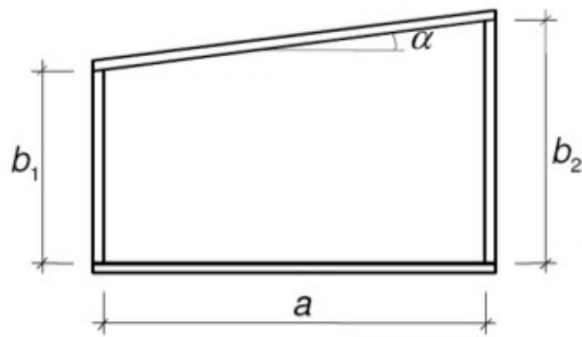  
图2.1：角度 $\alpha$ 定义

(2)关于正常使用极限状态和疲劳极限状态下的应力计算，如果满足情形3.1条，可使用有效面积。对于按照第3.3条得出的承载能力极限状态，应使用有效面积，并用 $\beta_{\mathrm{ult}}$ 代替β。

## 2.4 折减应力法

(1) 作为在第4-7节中给出的使用直接应力有效宽度模型的替换方法，截面可假定为第3类截面，前提是每个面板内的应力不超过第10节中规定的限值。

注：对于单板式构件，折减应力法类似于板屈曲有效宽度法（参见2.3节）。但是，在检验应力限值时，在截面的板单元之间假定不存在荷载。

## 2.5非均匀构件

(1) 非均匀构件（如加腋构件、非矩形面板）或带规则或不规则大开口的构件可使用有限元（FE）法进行分析。

注1：非均匀构件参见附录B。

注2：有限元计算参见附录C。

## 2.6 带波纹腹板的构件

(1) 对于带波纹腹板的构件，应仅考虑翼缘的弯曲刚度，并应认为腹板传递剪力荷载和横向荷载。

注：对于受压翼缘的板屈曲抗力和腹板的抗剪力，参见附录D。

# 3 构件设计中的剪力滞

## 3.1 概述

(1) 当 $b_{0} < L_{\mathrm{c}} / 50$ 时，翼缘的剪力滞可忽略，其中， $b_{0}$ 取翼缘伸出肢或内部元件的宽度的一半， $L_{\mathrm{c}}$ 是弯矩零点之间的长度。  
(2)当以上的 $b_{0}$ 超过极限时，应在正常使用和疲劳极限状态的验算中使用3.2.1中的有效宽度和3.2.2中的应力分布考虑翼缘中的剪力滞引起的效应。关于承载能力极限状态的验算，可使用3.3中的有效面积。  
(3）施加于翼缘高度处的、由腹板中的局部荷载引起的应力应根据3.2.3确定。

## 3.2弹性剪力滞的有效 $\mathbf{s}$ 宽度

3.2.1 有效宽度

(1)弹性状态下的剪力滞的有效宽度 $b_{\mathrm{eff}}$ 应由下式计算：

$$b _{\text {e f f}} = \beta b _{0} \tag {3.1}$$

其中有效系数β在表3.1中给出。

此有效宽度可取正常使用和疲劳极限状态下的宽度。

(2) 若邻跨的差别不超过 $50\%$ ，并且任何悬臂跨均不大于邻跨的一半，则有效长度 $L_{\mathrm{e}}$ 可由图3.1决定。对于所有其他情形， $L_{\mathrm{e}}$ 应看作是相邻的弯矩零点之间的距离。

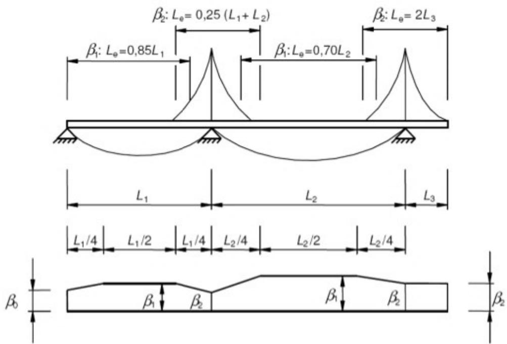  
图3.1：连续梁的有效长度 $\mathbf{L}_{\mathrm{c}}$ 和有效宽度的分布

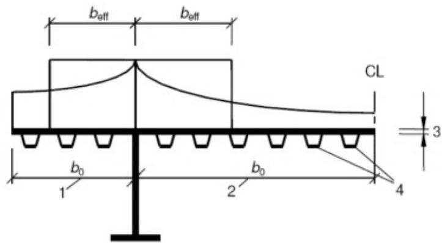  
图3.2：剪力滞符号

1 用于翼缘伸出肢
2 用于内翼缘
3 板厚t
4 加劲肋

（其中 $A_{s\ell} = \sum A_{s\ell i}$

表 3.1: 有效宽度系数 $\beta$   

| K | 校验 | β值 |
| --- | --- | --- |
| κ≤0.02 |  | β=1.0 |
| 0.02＜κ≤0.70 | 下垂弯曲 | β=β1=1/1+6.4κ2 |
| 0.02＜κ≤0.70 | 负弯曲 | β=β2=1/1+6.0(κ-1/2500κ)+1.6κ2 |
| >0.70 | 下垂弯曲 | β=β1=1/5.9κ |
| >0.70 | 负弯曲 | β=β2=1/8.6κ |
| 所有κ | 端支承 | β0=(0.55+0.025/k)β1,但β0<β1 |
| 所有κ | 悬臂 | 在支承处和端点,β=β2 |
| κ=α0b0/Lc,其中α0=√1+Asl/b0t其中Asl为宽度b0内所有纵向加劲肋的面积,其它符号定义见表3.1和表3.2。 | κ=α0b0/Lc,其中α0=√1+Asl/b0t其中Asl为宽度b0内所有纵向加劲肋的面积,其它符号定义见表3.1和表3.2。 | κ=α0b0/Lc,其中α0=√1+Asl/b0t其中Asl为宽度b0内所有纵向加劲肋的面积,其它符号定义见表3.1和表3.2。 |

3.2.2 由剪力滞引起的应力分布

(1) 由剪力滞引起的翼缘板上的纵向应力分布应从图3.3得出。

EN 1993-1-5:2006 (E)

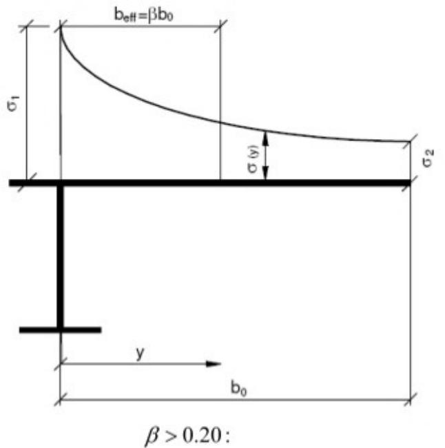

$$\sigma_{2} = 1. 2 5 (\beta - 0. 2 0) \sigma_{1}$$

$$\sigma (y) = \sigma_{2} + (\sigma_{1} - \sigma_{2}) (1 - y / b _{0}) ^{4}$$

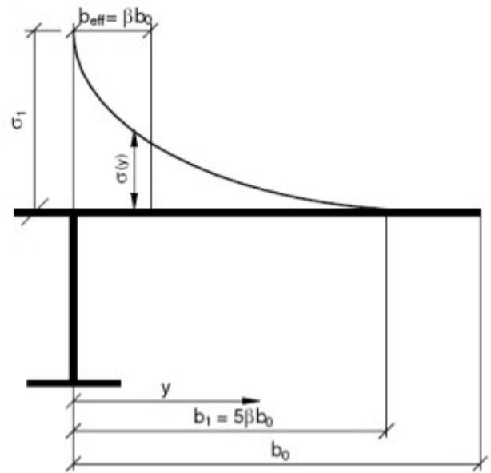  
图3.3由剪力滞引起的应力分布

$$\beta \leq 0. 2 0:$$

$$\sigma_{2} = 0$$

$$\sigma (y) = \sigma_{1} \left(1 - y / b _{1}\right) ^{4}$$

$\sigma_{1}$ 通过翼缘的有效宽度 $b_{\mathrm{eff}}$ 计算

3.2.3 面内荷载效应

(1) 由面内力（局部荷载）的局部引入而引起的加劲板或未加劲板的弹性应力分布（参见图3.4）应由下式确定：

$$\sigma_{z, E d} = \frac {F _{E d}}{b _{e f f} \left(t _{w} + a _{s t , l}\right)} \tag {3.2}$$

和： $b_{\text{eff}} = s_e \sqrt{1 + \left( \frac{z}{s_e n} \right)^2}$

$$n = 0. 6 3 6 \sqrt {1 + \frac {0 . 8 7 8 a _{s t , j}}{t _{w}}}$$

$$s _{e} = s _{s} + 2 t _{f}$$

其中 $a_{\mathrm{st,l}}$ 是长度 $\mathbf{s}_{\mathrm{c}}$ 之上均匀分布的加劲肋的毛截面面积。也可保守地取间距为 $\mathbf{s}_{\mathrm{st}}$ 的加劲肋的面积；

$\mathrm{t_w}$ 指腹板厚度；

z 指到翼缘距离。

注：当 $s_{\mathrm{st}} / s_{\mathrm{e}} \leq 0.5$ 时，公式（3.2）适用，否则应忽略加劲肋的分布。

图3.4：面内荷载引入  
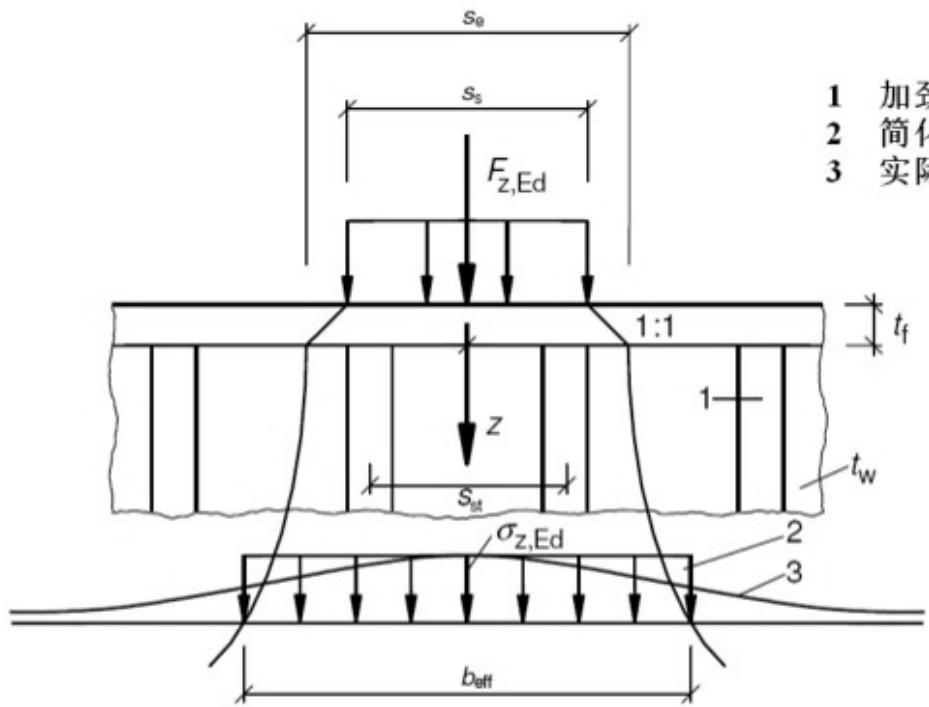  
1 加劲肋
2 简化应力分布
3 实际应力分布

注：以上的应力分布也可用于疲劳检验。

## 3.3承载能力极限状态下的剪力滞

(1）在承载能力极限状态，剪力滞效应可确定如下：

a) 确定正常使用和疲劳极限状态下的弹性剪力滞效应；  
b) 剪力滞和板屈曲的组合效应；  
c) 考虑极限塑性应变的弹-塑性剪力滞效应。

注1：国家版附录可以选择要用的方法。除非在EN 1993-2~EN 1993-6中另有说明，否则建议使用注3中的方法。

注2：可通过使用Aeff来考虑板屈曲和剪力滞的组合效应；

$$A _{e f f} = A _{c, e f f} \beta_{u l t} \tag {3.3}$$

其中 $A_{c,eff}$ 是板屈曲引起的受压翼缘的有效面积（见4.4和4.5）；

$\beta_{\mathrm{ult}}$ 是承载能力极限状态下剪力带效应的有效宽度系数，可取为表3.1中确定的 $\beta$ ，其中 $\alpha_0$ 被下式取代：

$$\alpha_{0} ^{*} = \sqrt {\frac {A _{c , e f f}}{b _{0} t _{f}}} \tag {3.4}$$

$\mathbf{t}_{\mathrm{f}}$ 是翼缘厚度。

注3：可通过使用以下的 $A_{eff}$ 来考虑弹塑性剪力滞效应（考虑了极限塑性应变）：

$$A _{\text {e f f}} = A _{c, \text {e f f}} \beta^{\kappa} \geq A _{c, \text {e f f}} \beta \tag {3.5}$$

其中 $\beta$ 和 $\kappa$ 取自表3.1。

注2和注3中的表达式也可适用于受拉翼缘，在此情形下，应采用受拉翼缘的毛面积代替 $\mathrm{A}_{\mathrm{c,eff}}$

# 4 承载能力极限状态下直接应力引起的板屈曲效应

## 4.1 概述

(1)当满足以下标准时，本节给出考虑承载能力极限状态下直接应力引起的板屈曲效应的规则。

a）面板是矩形的并且翼缘是平行的或接近平行（参见2.3节）；   
b）（若有）在纵向或横向或两个方向均提供加劲肋；  
c）开孔和切口很小（参见2.3节）；  
d) 构件的截面积均匀；  
e) 未出现翼缘引起的腹部屈曲。

注1：对于腹板平面内的受压翼缘屈曲，参见第8节。

注2：对于加劲肋和承受板屈曲的板单元的细节，参见第9节。

## 4.2 直接应力承载力

(1) 对于按照 EN 1993-1-1 中的截面验算和柱屈曲和侧向扭转屈曲的构件验算使用截面数据（ $A_{\mathrm{eff}}$ ， $I_{\mathrm{eff}}$ 和 $W_{\mathrm{eff}}$ ）的第4类截面，可使用该截面的受压板单元的有效面积确定板单元的承载力。  
(2）获得受压板中间平面的屈服应变后，应在线性应变分布的基础上确定有效P面积。

## 4.3有效截面

(1）在计算纵向应力时，应根据3.3给出的有效面积考虑剪力滞和板屈曲的组合效应。  
(2）构件的有效截面特性应基于受压构件的有效面积和由剪力滞引起的受拉构件的有效S面积。  
(3) 应通过假设截面仅承受由均匀轴向压力引起的应力来确定有效面积 $A_{\mathrm{eff}}$ 。对于不对称截面，有效面积 $A_{\mathrm{eff}}$ 的形心的相对于毛截面重心的可能移位 $e_{\mathrm{N}}$ ，参见图4.1，其给出了在使用4.6进行截面验算时应考虑的附加弯矩。  
(4) 应通过假设截面仅承受弯曲应力来确定有效截面模量 $W_{\mathrm{eff}}$ ，参见图 4.2。对于双向弯曲，应确定关于两个主轴的有效截面模量。

注：作为4.3(3)和(4)的一种替换方法，根据同时作用的 $N_{\mathrm{Ed}}$ 和 $M_{\mathrm{Ed}}$ 来确定一个有效截面。如4.3(3)中所述，应考虑到 $e_{\mathrm{N}}$ 效应。这需要一个迭代过程。

(5）应使用翼缘的中间平面的弹性截面模量来计算翼缘的应力。  
(6) 在以下情形下，混合梁可有屈服强度 $f_{\mathrm{yf}}$ 高达 $\phi_h \times f_{yw}$ 的翼缘材料：

a)通过将腹板应力限制在 $f_{\mathrm{yw}}$ 范围内来考虑由腹板的屈服所引起的翼缘应力的增加；

b) $f_{\mathrm{yf}}$ （而非 $f_{\mathrm{yw}}$ ）用于确定腹板的有效面积。

注：国家版附录可对 $\phi_h$ 值进行规定。建议 $\phi_h = 2.0$

(7) 对于符合4.3(6)条及此条注中规定的混合梁，在承载能力和疲劳极限状态的变形和应力的增加可忽略。  
(8) 对于符合4.3(6)条规定的混合梁，EN1993-1-9中的应力范围极限可取 $1.5f_{\mathrm{yf}}$ 。

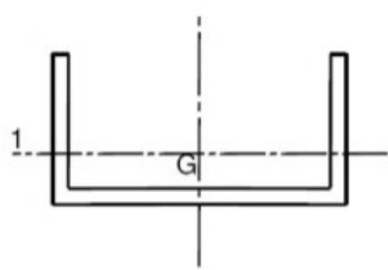  
毛截面

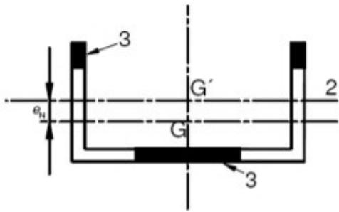  
有效截面

$G$ 毛截面的形心  
$G^{\prime}$ 有效截面的形心

毛截面的形心轴  
2 有效截面的形心轴
3 无效区

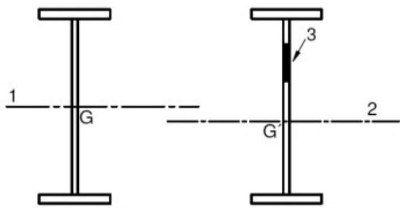  
图4.1：第4类截面-轴力

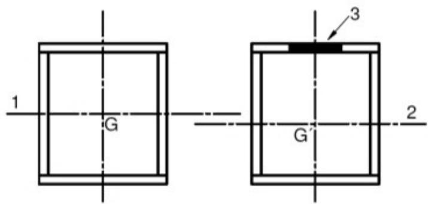  
图4.2：第4类截面-弯矩

毛截面

有效截面

$G$ 毛截面的形心  
$G^{\prime}$ 有效截面的的形心  
毛截面的形心轴  
2 有效截面的形心轴
3 无效区

## 4.4 无纵向加劲肋的板单元

(1)应使用表4.1得出内部单元的扁平受压单元有效面积以及使用表4.2得出伸出单元的扁平受压单

元有效 ${}^{\mathrm{p}}$ 面积。毛截面面积为 ${A}_{\mathrm{c}}$ 的受压区的有效 ${}^{\mathrm{p}}$ 面积应从下式中得出：

$$A _{c, e f f} = \rho A _{c} \tag {4.1}$$

其中 $\rho$ 是板屈曲的折减系数。

(2) 折减系数 $\rho$ 可取以下值：

内部受压单元：

$\overline{\lambda_p} \leq 0.673$ 时， $\rho = 1.0$

$\overline{\lambda}_p > 0.673$ 时， $\rho = \frac{\overline{\lambda_p} - 0.055(3 + \psi)}{\overline{\lambda_p}^2}\leq 1.0$ ，其中： $(3 + \psi)\geq 0$ (4.2)

伸出受压单元：

$\overline{\lambda}_p \leq 0.748$ 时， $\rho = 1.0$

$\overline{\lambda}_p > 0.748$ 时， $\rho = \frac{\overline{\lambda}_p - 0.188}{\overline{\lambda}_p^2}\leq 1.0$ (4.3)

其中 $\overline{\lambda}_p = \sqrt{\frac{f_y}{\sigma_{cr}}} = \frac{\overline{b} / t}{28.4\varepsilon\sqrt{k_\sigma}}$

$\psi$ 是根据4.4(3)和4.4(4)确定的应力比；

$\bar{b}$ 是按以下所取的适当宽度（关于定义，参见EN1993-1-1中的表5.2）：

$b_{\mathrm{w}}$ 腹板；

b 内部翼缘构件（不包括RHS）；

b-3t RHS的翼缘；

$c$ 伸出翼缘；

等肢角钢；

$h$ 非等肢角钢。

$k_{\sigma}$ 是与应力比 $\psi$ 和边界条件对应的屈曲系数。对于长板，适当时在表4.1或4.2给出 $k_{\sigma}$

为厚度；

$\sigma_{\mathrm{cr}}$ 为弹性临界板屈曲应力，参见附录A.1(2)中的公式（A.1）以及表4.1和4.2；

$$\varepsilon = \sqrt {\frac {2 3 5}{f _{y} \left[ N / m m ^{2} \right]}}$$

(3) 对于工字形截面和箱梁的翼缘构件，表4.1和4.2所使用的应力比 $\psi$ 应基于毛截面面积的特性，必要时适当考虑翼缘的剪力滞。对于腹板构件，使用基于受压翼缘的有效面积和腹板的毛面积的应力分布，得到表4.1所使用的应力比 $\psi$ 。

注：如果应力分布由不同的施工阶段引起（如在组合桥中），则应当首先用包括有效翼缘和总腹板的截面来计算不同阶段的应力，然后将这些应力相加。合成的应力分布决定了可用于所有阶段的有效腹板截面，以计算应力分析的最终应力分布。

(4) 除了4.4(5)中给出的长细比外, 一个单元的板长细比 $\overline{\lambda}_p$ 可用下式来取代:

$$\bar {\lambda} _{p, r e d} = \bar {\lambda} _{p} \sqrt {\frac {\sigma_{c o m , E d}}{f _{y} / \gamma_{M 0}}} \tag {4.4}$$

其中 $\sigma_{\mathrm{com},\mathrm{Ed}}$ 是由所有共同作用产生的截面有效面积决定的单元中的最大设计压应力。

注1：以上方法是保守的，需要重复计算，在计算的每一步中，应力比 $\psi$ （见表4.1和4.2）应根据前一步骤结束时定义的有效截面计算的应力来确定。

注2：参见附录E中的替代方法。

(5）使用EN1993-1-1中的6.3.1、6.3.2或6.3.4检验第4类构件的设计屈曲抗力时，应使用板长细比 $\overline{\lambda}_p$ 或 $\overline{\lambda}_{p,red}$ 来计算，其中 $\sigma_{\mathrm{com},\mathrm{Ed}}$ 基于整体缺陷二阶分析。  
(6)当纵横比 $a / b < 1$ 时，可能会发生柱型屈曲，根据4.5.4所述使用折减系数 $\rho_{\mathrm{c}}$ 进行检查。

注：这适用于横向加劲肋之间的扁平单元（它的板屈曲可能是类似于柱），并且需要一个与适用于柱屈曲的接近 $\chi_{\mathrm{c}}$ 的折减系数 $\rho_{\mathrm{c}}$ ，见图4.3a)和b)。对于带纵向加劲肋的板，当 $a / b \geq 1$ 时，柱型屈曲也会发生，见图4.3c)。

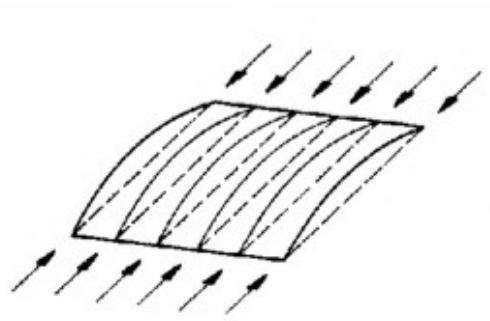  
a)无纵向支撑的板的类似柱状态

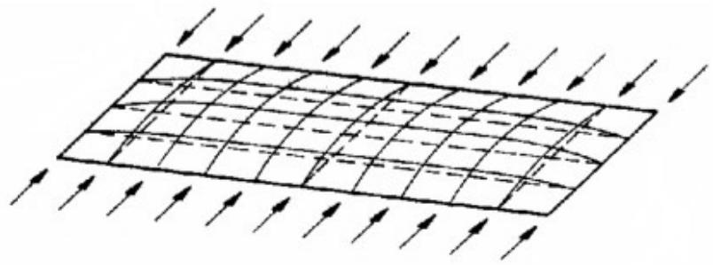  
b)纵横比 $\alpha$ 很小的未加劲板的类似柱状态

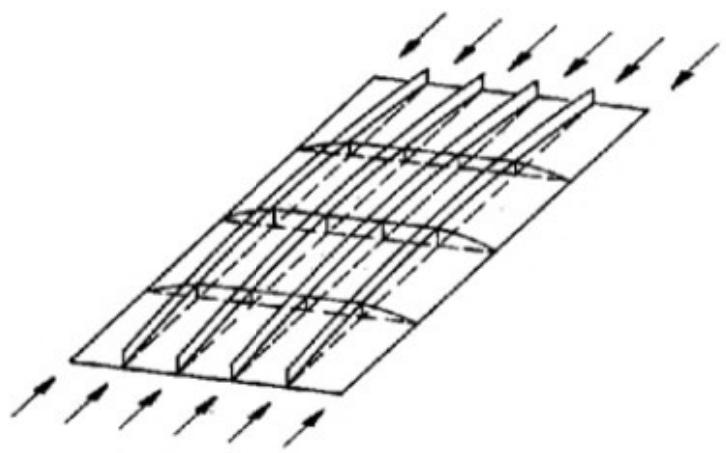  
c)纵横比α很大的纵向加劲板的类似柱状态   
图4.3：类似柱状态

表 4.1: 内部受压构件  

| 应力分布（受压为正） | 应力分布（受压为正） | 应力分布（受压为正） | 应力分布（受压为正） | 有效宽度 beff | 有效宽度 beff | 有效宽度 beff |
| --- | --- | --- | --- | --- | --- | --- |
| σ1σ2b1b2 | σ1σ2b1b2 | σ1σ2b1b2 | σ1σ2b1b2 | ψ=1:beff=ρb | b1=0.5beff, b2=0.5beff | b1=0.5beff, b2=0.5beff |
| σ1σ2b1b2 | σ1σ2b1b2 | σ1σ2b1b2 | σ1σ2b1b2 | 1>ψ≥0:beff=ρb | b1=2/5-ψbeff, b2=beff-b1 | b1=2/5-ψbeff, b2=beff-b1 |
| σ1σ2b1b2b1 | σ1σ2b1b2b1 | σ1σ2b1b2b1 | σ1σ2b1b2b1 | ψ<0:beff=ρbc=ρb/(1-ψ) | b1=0.4beff, b2=0.6eff | b1=0.4beff, b2=0.6eff |
| ψ=σ2/σ1 | 1 | 1>ψ>0 | 0 | 0>ψ>-1 | -1 | -1>ψ>-3 |
| 屈曲系数 k0 | 4.0 | 8.2/(1.05+ψ) | 7.81 | 7.81-6.29ψ+9.78ψ2 | 23.9 | 5.98(1-ψ)2 |

表 4.2: 伸出受压元件  

| 应力分布（受压为正） | 应力分布（受压为正） | 应力分布（受压为正） | 有效宽度beff | 有效宽度beff | 有效宽度beff |
| --- | --- | --- | --- | --- | --- |
| σ2beffcσ1 | σ2beffcσ1 | σ2beffcσ1 | 1>ψ≥0:beff=ρc | 1>ψ≥0:beff=ρc | 1>ψ≥0:beff=ρc |
| σ2b1bcσ1 | σ2b1bcσ1 | σ2b1bcσ1 | ψ<0:beff=ρbc=ρc/(1-ψ) | ψ<0:beff=ρbc=ρc/(1-ψ) | ψ<0:beff=ρbc=ρc/(1-ψ) |
| ψ=σ2/σ1 | 1 | 0 | -1 | 1≥ψ≥-3 | 1≥ψ≥-3 |
| 屈曲系数 k0 | 0.43 | 0.57 | 0.85 | 0.57-0.21ψ+0.07ψ2 | 0.57-0.21ψ+0.07ψ2 |
| σ1beffcσ2 | σ1beffcσ2 | σ1beffcσ2 | 1>ψ≥0:beff=ρc | 1>ψ≥0:beff=ρc | 1>ψ≥0:beff=ρc |
| σ1b1b1σ2 | σ1b1b1σ2 | σ1b1b1σ2 | ψ<0:beff=ρbc=ρc/(1-ψ) | ψ<0:beff=ρbc=ρc/(1-ψ) | ψ<0:beff=ρbc=ρc/(1-ψ) |
| ψ=σ2/σ1 | 1 | 1>ψ>0 | 0 | 0>ψ>-1 | -1 |
| 屈曲系数 k0 | 0.43 | 0.578/(ψ+0.34) | 1.70 | 1.7-5ψ+17.1ψ2 | 23.8 |

## 4.5 带纵向加劲肋的加劲板单元

4.5.1 概述

(1) 对于带纵向加劲肋的板，应说明加劲肋之间的不同次面板的局部屈曲的有效 ${}^{\mathrm{P}}$ 面积和加劲面板的整体屈曲的有效 ${}^{\mathrm{P}}$ 面积。  
(2) 应根据4.4中的折减系数确定每个次面板的有效截面积，以说明局部板屈曲。应利用加劲肋的有效截面积来验算加劲板的整体板屈曲（通过建模使其作为等效正交异性板），并应根据整体板屈曲确定折减系数 $\rho$ 。  
(3）加劲板受压区的有效P面积可取为：

$$A _{c, e f f} = \rho_{c} A _{c, e f f, l o c} + \sum b _{e d g e, e f f} t \tag {4.5}$$

其中 $A_{c,eff,loc}$ 是全部或部分位于受压区的所有加劲肋和次面板的有效截面面积，但宽度为 $b_{\mathrm{edge,eff}}$ 的相邻板

单元支撑的有效构件除外，参见图4.4的示例。

(4) 面积 $A_{c,eff,loc}$ 可从下式得出：

$$A _{c, e f f, l o c} = A _{S \ell , e f f} + \sum_{c} \rho_{l o c} b _{c, l o c} t \tag {4.6}$$

其中 $\sum_{c}$ 应用到除 $b_{\mathrm{edge,eff}}$ 部分之外的处于加劲面板宽度的受压部分，参见图4.4；

$A_{sl,\mathrm{eff}}$ 按照 $4.4A_{\mathrm{se,eff}}$ 是毛截面 $A_{\mathrm{se}}$ 位于受压区内的所有纵向加劲肋的有效面积（此有效面积根据4.4确定）的总和；

$b_{\mathrm{c,loc}}$ 是每个次面板的受压部分的宽度；

$\rho_{\mathrm{loc}}$ 是根据4.4(2)得出的中每个次面板的折减系数。

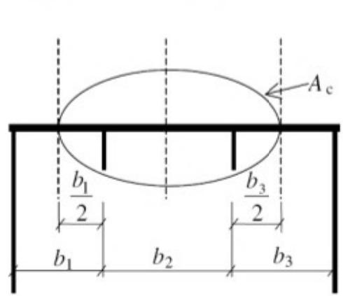

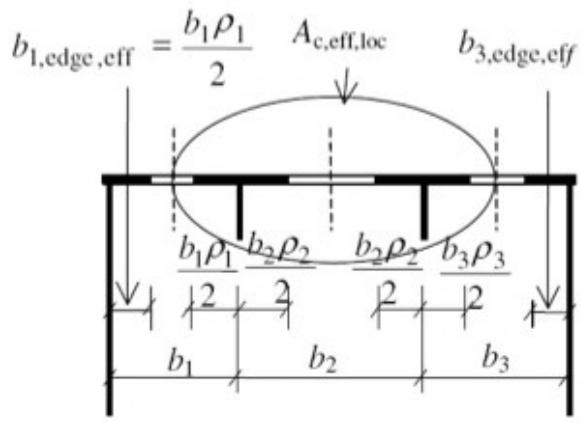  
图4.4：均匀受压加劲板

注：对于非均匀受压情况，参见图A1。

(5) 在确定整体屈曲的折减系数 $\rho_{\mathrm{c}}$ 时，应考虑到柱型屈曲的折减系数（此折减系数比板屈曲的折减系数更重要）。  
(6) 应按照 4.5.4(1) 所述进行插值，在板屈曲折减系数 $\rho$ 和柱型屈曲折减系数之间插值以确定 $\rho_{\mathrm{c}}$ 参见4.5.4。  
(7) 通过 $\rho_{\mathrm{c}}$ ，可将受压区的折减视为在整个截面上的均匀折减。  
(8) 若与剪力滞相关（见3.3），则应将加劲肋的受压区的有效横断面面积 $A_{c,eff}$ 取为 $A_{c,eff}^{*}$ ，不仅要考虑到局部板屈曲效应，同时考虑到剪力滞效应。  
(9）在相关情形下，加劲板受拉区的有效截面面积应取因剪力滞缩减的受拉区的毛面积，见3.3。  
(10)有效截面模量 $\mathrm{W}_{\mathrm{eff}}$ 应为有效截面的截面惯性矩除以从形心到翼缘板中间深度的距离。

4.5.2 板型性能

(1) 等效板的相对板长细比 $\overline{\lambda}_p$ 定义如下：

$$\bar {\lambda} _{p} = \sqrt {\frac {\beta_{A , c} f _{y}}{\sigma_{c r , p}}} \tag {4.7}$$

和 $\overline{\beta}_{A,c} = \frac{A_{c,\text{eff},\text{loc}}}{A_c}$

其中 $A_{\mathrm{c}}$ 是加劲板受压区的毛面积（不包括邻近板支撑的次面板部分），见图4.4（若与剪力滞相关，则将乘以剪力滞系数，见3.3）；

$A_{\mathrm{c,eff,loc}}$ 是板的相同部分的有效面积（若相关，包括剪力滞效应），适当考虑次面板和/或加劲肋可能出现的板屈曲。

(2) 从4.4(2)中计算得出等效正交异形板的折减系数 $\rho$ , 前提是从公式 (4.7) 中计算出 $\overline{\lambda}_{p}$ 。

注：关于 $\sigma_{\mathrm{cr,p}}$ 的计算，参见附录A。

4.5.3 柱型屈曲性能

(1) 未加劲板（见4.4）或加劲板（见4.5）的弹性临界柱屈曲应力应为沿纵向边缘拆除支承的屈曲应力。  
(2) 对于未加劲板，其弹性临界柱屈曲应力 $\sigma_{\mathrm{cr,c}}$ 可通过下式得出：

$$\sigma_{c r, c} = \frac {\pi^{2} E t ^{2}}{1 2 (1 - v ^{2}) a ^{2}} \tag {4.8}$$

(3) 对于加劲板， $\sigma_{cr,c}$ 可根据离具有最大压应力的面板边缘最近的加劲肋的弹性临界柱屈曲应力 $s_{cr,sl}$ 确定，如下：

$$\sigma_{c r, s l} = \frac {\pi^{2} E I _{s l , 1}}{A _{s l , 1} a ^{2}} \tag {4.9}$$

其中 $I_{\mathrm{sl},1}$ 与板的面外弯曲有关，是板的加劲肋和邻近部分的毛截面的截面惯性矩；

$A_{sl1}$ 是根据图A1所示的板的加劲肋和邻近部分的毛截面面积。

注： $\sigma_{cr,c}$ 可通过公式 $\sigma_{cr,c} = \sigma_{cr,sl}\frac{b_c}{b_{sl,1}}$ 得出，其中 $\sigma_{cr,c}$ 与板的受压边缘有关，而 $b_{sl,1}$ 和 $b_{c}$ 的几何值来自于用于插值的应力分布，参见图A1。

(4) 相对柱长细比 $\overline{\lambda}_{c}$ 定义如下：

未加劲板： $\overline{\lambda}_{c} = \sqrt{\frac{f_{y}}{\sigma_{cr,c}}}$ (4.10)

加劲板： $\overline{\lambda}_c = \sqrt{\frac{\beta_{A,C}f_y}{\sigma_{cr,c}}}$ (4.11)

其中 $\beta_{A,c} = \frac{A_{sl,1,\text{eff}}}{A_{sl,1}}$

$A_{sl,1}$ 定义见4.5.3(3)

$A_{sl,1,eff}$ 板的加劲肋和相邻部分的有效截面面积，适当考虑板屈曲，参见图A.1。

(5) 折减系数 $\chi_{\mathrm{c}}$ 应从 EN 1993-1-1 的 6.3.1.2 中得出。对于未加劲板，应使用对应于屈曲曲线a的 $\alpha = 0.21$ 。对于加劲板，其值应增至：

$$\alpha_{e} = \alpha + \frac {0 . 0 9}{i / e} \tag {4.12}$$

其中 $i = \sqrt{\frac{I_{sl,1}}{A_{sl,1}}}$

$e = \max (e_1,e_2)$ ，是从平板各自的形心和单侧加劲肋（或存在双侧时每组加劲肋的形心）到有效柱的中性轴的最大的距离，见图A.1；

$\alpha = 0.34$ （曲线b）用于封闭截面加劲肋；

$= 0.49$ （曲线c）用于开口截面加劲肋。

4.5.4板屈曲和柱屈曲之间的相互作用

(1) 应通过在 $\chi_{\mathrm{c}}$ 和 $\rho$ 之间插值得出最终折减系数 $\rho_{\mathrm{c}}$ ，如下：

$$\rho_{c} = (\rho - \chi_{c}) \xi (2 - \xi) + \chi_{c} \tag {4.13}$$

其中 $\xi = \frac{\sigma_{cr,p}}{\sigma_{cr,c}} - 1$ 但 $0 \leq \xi \leq 1$

$\sigma_{\mathrm{cr,p}}$ 是弹性临界板屈曲应力，见附录A.1(2)；

$\sigma_{\mathrm{cr,c}}$ 是分别根据4.5.3(2)和(3)所述得出的弹性临界柱屈曲应力；

$x_{c}$ 是柱屈曲折减系数；

$\rho$ 是板屈曲折减系数，参见4.4(1)。

## 4.6检验

（1）按下式进行单轴弯曲构件检验：

$$\eta_{1} = \frac {N _{E d}}{\underline {{f _{y} A _{e f f}}}} + \frac {M _{E d} + N _{E d} e _{N}}{\underline {{f _{y} W _{e f f}}}} \leq 1. 0 \tag {4.14}$$

其中 $A_{\mathrm{eff}}$ 是根据4.3(3)得出的有效截面面积；

$e_{\mathrm{N}}$ 是中性轴位置的移位，参见4.3(3)；

$M_{\mathrm{Ed}}$ 是设计弯矩；

$N_{\mathrm{Ed}}$ 是设计轴力；

$W_{\mathrm{eff}}$ 是有效截面模量，参见4.3(4)；

$\gamma_{\mathrm{M0}}$ 是分项系数，参见应用部分EN1993-2~6。

注：对于由于受压和双向弯曲的构件，以上公式（4.14）应该按如下修改：

$$\eta_{1} = \frac {N _{E d}}{\frac {f _{y} A _{e f f}}{\gamma_{M 0}}} + \frac {M _{y , E d} + N _{E d} e _{y , N}}{\frac {f _{y} W _{y , e f f}}{\gamma_{M 0}}} + \frac {M _{z , E d} + N _{E d} e _{z , N}}{\frac {f _{y} W _{z , e f f}}{\gamma_{M 0}}} \leq 1. 0 \tag {4.15}$$

$M_{\mathrm{y,Ed}}$ ， $M_{\mathrm{z,Ed}}$ 是分别关于 $\mathrm{y - y}$ 和 $\mathbf{Z} - \mathbf{Z}$ 轴的设计弯矩；

$e_{yN}, e_{zN}$ 是关于中性轴的偏心距。

(2) 在相关的地方中, 作用效应 $M_{\text{Ed}}$ 和 $N_{\text{Ed}}$ 应包括整体二阶效应。  
(3) 对于应力合力在距离面板端部0.4a或0.5b（二者中的较小值）位置处（此处应力更大）的情况，应检验面板的板屈曲。在这种情况下，必须检查面板末端的毛截面承载力。

# 5抵抗剪力

## 5.1 基本原理

(1) 本节通过考虑承载能力极限状态下的剪切屈曲给出了板的抵抗剪力规则，在这种极限状态下满足以下标准：  
a）面板是矩形，在2.3规定的角度范围以内；  
b）（如有加劲肋），在纵向或横向或两个方向同时提供加劲肋；  
c) 所有的孔眼和切口均较小（见2.3）；  
d) 构件有均匀截面。  
(2) 对于未加劲腹板，若板的 $\frac{h_w}{t} > \frac{72}{\eta}\varepsilon$ ，或者对于加劲腹板，板的 $\frac{h_w}{t} > \frac{31}{\eta}\varepsilon \sqrt{k_{\mathrm{r}}}$ ，应检查板的剪切屈曲抗力，并且应该在支承处配备横向加劲肋，其中 $\varepsilon = \sqrt{\frac{235}{f_y[N / mm^2]}}$ 。

注1： $h_\mathrm{w}$ 见图5.1， $k_{\tau}$ 见图5.3(3)。

注2：国家版附录将定义 $\eta$ 。对于钢等级大于或等于S460，建议值 $\eta = 1.20$ 。对于更高等级钢，建议h=1.00。

## 5.2 设计抗力

(1) 对于加劲或未加劲肋腹板，设计抵抗剪力应取：

$$V _{b, R d} = V _{b w, R d} + V _{b f, R d} \leq \frac {\eta f _{y w} h _{w} t}{\sqrt {3} \gamma_{M 1}} \tag {5.1}$$

其中，腹板作用由下式得出：

$$V _{b w, R d} = \frac {\chi_{w} f _{y w} h _{w} t}{\sqrt {3} \gamma_{M 1}} \tag {5.2}$$

并且翼缘的作用 $V_{\mathrm{bf,Rd}}$ 应按5.4所述得出。

(2) 加劲肋应符合9.3中的要求，焊接应满足9.3.5中的要求。

EN 1993-1-5:2006 (E)

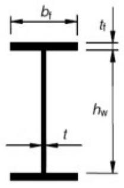  
截面标记

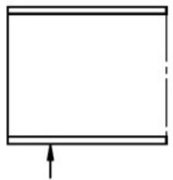  
a) 无端柱

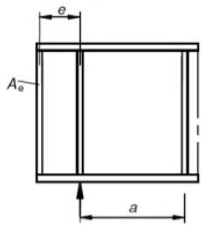  
b) 刚性端柱

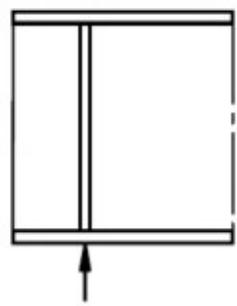  
c）非刚性端柱   
图5.1：端支承

## 5.3腹板的作用

(1) 对于仅在支承处腹板带横向加劲肋的腹板，以及带中间横向加劲肋或纵向加劲肋或两者都带的腹板，应根据表5.1或图5.2中得出腹板对剪切屈曲抗力的作用系数 $\chi_{\mathrm{W}}$ 。

表 5.1: 腹板 ${\chi }_{\mathrm{w}}$ 对剪切屈曲抗力的作用  

|  | 刚性端柱 | 非刚性端柱 |
| --- | --- | --- |
| ${\bar{\lambda }}_{w} < {0.83}/\eta$ | $\eta$ | $\eta$ |
| ${0.83}/\eta \leq {\bar{\lambda }}_{w} < {1.08}$ | ${0.83}/{\bar{\lambda }}_{w}$ | ${0.83}/{\bar{\lambda }}_{w}$ |
| ${\bar{\lambda }}_{w} \geq {1.08}$ | 1.37 $/\left( {{0.7} + {\bar{\lambda }}_{w}}\right)$ | ${0.83}/{\bar{\lambda }}_{w}$ |

注：参见EN1993-1-1.6.2.6。

(2)图5.1所示为梁的各种端支承；

a) 无端柱，参见6.1(2)，c)型；  
b) 刚性端柱，参见9.3.1；这种情形适用于连续梁中间支点的面板；  
c) 无刚性端柱，参见9.3.2。

(3) 表5.1和图5.2的细长比参数 $\overline{\lambda}_{\mathrm{w}}$ 应取：

$$\overline {{\lambda}} _{w} = 0. 7 6 \sqrt {\frac {f _{y w}}{\tau_{c r}}} \tag {5.3}$$

其中 $\tau_{cr} = k_{\tau}\sigma_{E}$ (5.4)

注1： $\sigma_{\mathrm{E}}$ 和 $k_{\tau}$ 可从附录A中取值。

注2：长细比 $\overline{\lambda}_{w}$ 按下列各式得出：

a) 仅在支承处的横向加劲肋：

$$\overline {{\lambda}} _{w} = \frac {h _{w}}{8 6 . 4 t \varepsilon} \tag {5.5}$$

b)支承处的横向加劲肋和中间的横向或纵向加劲肋或横纵向加劲肋；

$$\bar {\lambda} _{w} = \frac {h _{w}}{3 7 . 4 t \varepsilon \sqrt {k _{\tau}}} \tag {5.6}$$

其中 $k_{\tau}$ 是腹板节间的最小剪切屈曲系数。

注3：若除刚性横向加劲肋外，还使用了非刚性横向加劲肋， $k_{\tau}$ 可取在任何两个横向加劲肋之间的腹板节间的最小值（如 $a_2 \times h_w$ 和 $a_3 \times h_w$ ），以及两个包含非刚性横向加劲肋的刚性加劲肋之间的腹板节间的最小值（如 $a_4 \times h_w$ ）。  
注4：对于与翼缘和刚性横向加劲肋相邻的面板，可假定刚性边界。那么，腹板屈曲分析可基于两个相邻横向加劲肋之间的面板（如图5.3中的 $a_1 \times h_w$ ）。  
注5：对于非刚性横向加劲肋，最小值 $k_{\mathrm{T}}$ 可通过以下的屈曲分析得到：

1. 带一个柔性横向加劲肋的两个相邻腹板节间组合；  
2. 带两个柔性横向加劲肋的三个相邻腹板节间的组合，；

关于 $k_{\tau}$ 的确定过程，参见附录A.3。

(4) 在计算 $k_{\mathrm{r}}$ 时, 纵向加劲肋的截面惯性矩应减小至实际值的 $1 / 3$ 。在A3中, 可使用考虑了此折减的 $k_{\mathrm{r}}$ 的公式。

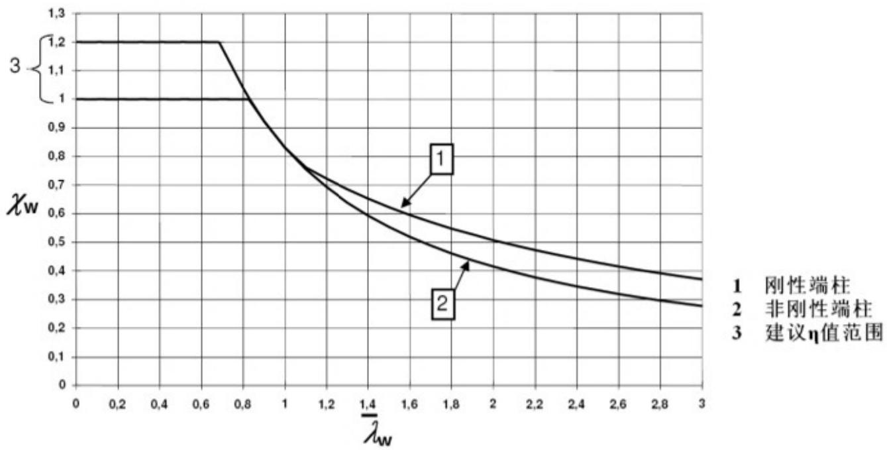  
图5.2：剪切屈曲系数 $\chi_{\mathrm{w}}$

(5) 对于带纵向加劲肋的腹板，(3)中的长细比参数 $\overline{\lambda}_{w}$ 不应取小于以下的值：

$$\overline {{\lambda}} _{w} = \frac {h _{w i}}{3 7 . 4 t \varepsilon \sqrt {k _{\tau i}}} \tag {5.7}$$

其中 $h_{\mathrm{wi}}$ 和 $k_{\mathrm{ti}}$ 是指次板，其具有所考虑的腹板节间内所有次面板中的最大长细比参数 $\overline{\lambda}_{w}$ 。

注：要计算 $k_{\mathrm{ti}}$ ，A.3中的表达式可以使用，其中 $k_{\mathrm{rst}} = 0$

EN 1993-1-5:2006 (E)

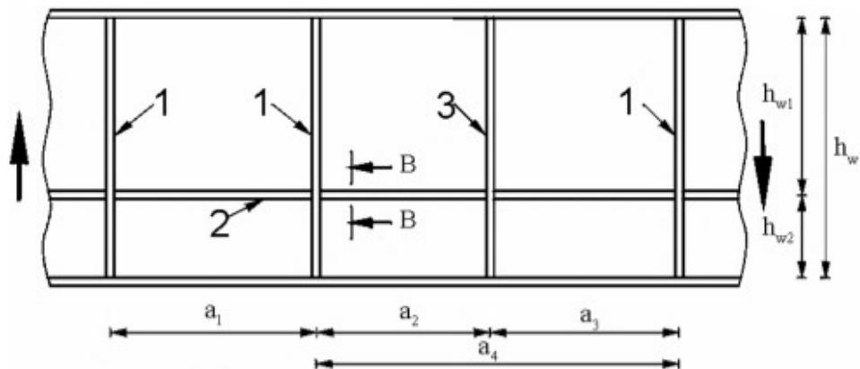  
(a)

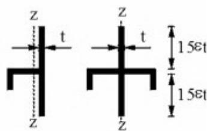  
(b)   
图5.3：带横纵向加劲肋的腹板

B-B

I 刚性横向加劲肋   
2 纵向加劲肋
3 非刚性横向加劲肋

## 5.4翼缘的作用

(1）在抵抗弯矩（ $M_{\mathrm{Ed}} <   M_{\mathrm{f,Rd}}$ ）时，若未完全使用翼缘阻力，翼缘作用应按下式得出：

$$V _{b f, R d} = \frac {b _{f} t _{f} ^{2} f _{y f}}{c \gamma_{M 1}} \left(1 - \left(\frac {M _{E d}}{M _{f , R d}}\right) ^{2}\right) \tag {5.8}$$

$b_{\mathrm{f}}$ 和 $t_\mathrm{f}$ 的取值用于提供最小轴向阻力的翼缘；

取值在腹板每侧不大于 $15\varepsilon t_{\mathrm{f}}$ 。

$M_{f,Rd} = \frac{M_{f,k}}{\gamma_{M0}}$ 是仅由翼缘有效面积组成的截面的抵抗弯矩。

$$c = a \left(0. 2 5 + \frac {1 . 6 b _{f} t _{f} ^{2} f _{y f}}{t h _{w} ^{2} f _{y w}}\right)$$

(2）当轴力 $N_{\mathrm{Ed}}$ 出现时，通过将其乘以以下系数来折减 $M_{\mathrm{f,Rd}}$ 的值：

$$\left(1 - \frac {N _{E d}}{\frac {\left(A _{f 1} + A _{f 2}\right) f _{y f}}{\gamma_{M 0}}}\right) \tag {5.9}$$

其中 $A_{\mathrm{f1}}$ 和 $A_{\mathrm{f2}}$ 分别是顶部和底部翼缘的面积。

## 5.5 检验

(1) 按照以下进行检验：

$$\eta_{3} = \frac {V _{E d}}{V _{b , R d}} \leq 1. 0 \tag {5.10}$$

其中 $V_{\mathrm{Ed}}$ 是包括了扭转剪切的设计剪力。

# 6 横向力的承载力

## 6.1 基本原理

(1) 应按照 6.2 所述确定辊压梁和焊接梁的腹板的设计承载力，前提条件是受压翼缘在横向受到充分限制。  
(2）按照如下所述施加荷载：

a) 穿过翼缘，受到腹板剪力的阻止，参见图6.1(a);   
b)穿过一个翼缘，并穿过腹板直接转递到其它翼缘上，参见图6.1(b);  
c) 穿过一个与未加劲端邻近的翼缘，参见图6.1(c)。

(3) 对于带斜腹板的箱梁，必须检查腹板和翼缘的承载力。将考虑的内力分别是腹板和翼缘各自平面内的外部荷载分量。  
(4) 使用7.2检查横向力、弯矩和轴力的交互作用。

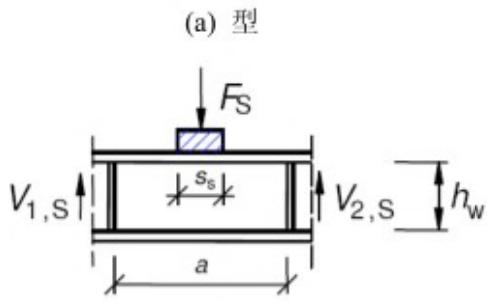

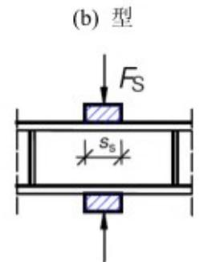

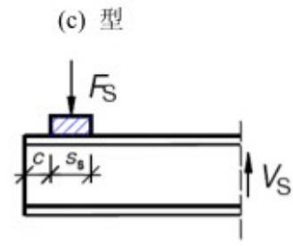  
图6.1：不同类型施加荷载的屈曲系数

$$k _{F} = 6 + 2 \left(\frac {h _{w}}{a}\right) ^{2}$$

$$k _{F} = 3. 5 + 2 \left(\frac {h _{w}}{a}\right) ^{2}$$

$$k _{F} = 2 + 6 \left(\frac {s _{s} + c}{h _{w}}\right) \leq 6$$

## 6.2 设计承载力

(1) 对于加劲或未加劲腹板，在横向力作用下的设计局部屈曲抗力应取：

$$F _{R d} = \frac {f _{y w} L _{e f f} t _{w}}{\gamma_{M 1}} \tag {6.1}$$

其中 $t_{\mathrm{w}}$ 是腹板厚度；

$f_{\mathrm{yw}}$ 是腹板的屈服强度；

$L_{\mathrm{eff}}$ 是横向力的承载力的有效长度，由以下决定：

$$L _{e f f} = \chi_{F} \ell_{y} \tag {6.2}$$

其中 $\ell_y$ 代表有效荷载长度，参见6.5节，相当于刚性轴承的长度，参见6.3节；

$\chi_F$ 为局部屈曲引起的折减系数，参看6.4(1)。

## 6.3 刚性支座长度

(1) 翼缘上的刚性支座长度应取一个距离，超过此距离，外加荷载按照1：1的斜率有效分布，参见图6.2。但是， $s_{\mathrm{s}}$ 的取值不应大于 $h_{\mathrm{w}}$ 。  
(2) 如果几种集中力间隙紧密，必须检查各单个力和总荷载的承载力， $s_{\mathrm{s}}$ 代表外部荷载之间的中心到中心的距离。

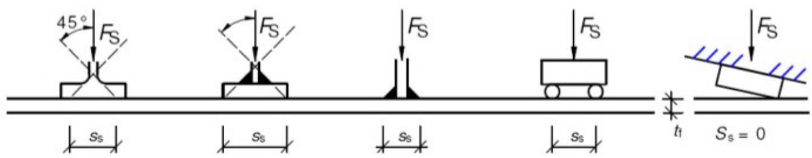  
图6.2：刚性支座长度

(3)如果外加荷载的支承面搁在与翼缘表面成一定角度的位置，参见图6.2，则 $s_{\mathrm{a}}$ 应取零。

## 6.4承载力有效长度的折减系数 $X_{\mathrm{F}}$

(1) 折减系数 $\chi_F$ 应从下式得出：

$$\chi_{F} = \frac {0 . 5}{\overline {{\lambda}} _{F}} \leq 1. 0 \tag {6.3}$$

其中 $\overline{\lambda}_F = \sqrt{\frac{\ell_y t_w f_{yw}}{F_{cr}}}$ (6.4)

$$F _{c r} = 0. 9 k _{F} E \frac {t _{w} ^{3}}{h _{w}} \tag {6.5}$$

(2) 对于不带纵向加劲肋的腹板， $k_{F}$ 应从图6.1中得出。

注：对于带纵向加劲肋的腹板，相关信息可见国家版附录。建议使用以下规则：

对于带纵向加劲肋的腹板， $k_{F}$ 可取：

$$k _{F} = 6 + 2 \left[ \frac {h _{w}}{a} \right] ^{2} + \left[ 5. 4 4 \frac {b _{1}}{a} - 0. 2 1 \right] \sqrt {\gamma_{s}} \tag {6.6}$$

其中 $b_{1}$ 是有荷载的次面板的高度，可取荷载翼缘和加劲肋之间的净距离。

EN 1993-1-5:2006 (E)

$$\gamma_{s} = 1 0. 9 \frac {I _{s l , 1}}{h _{w} t _{w} ^{3}} \leq 1 3 \left[ \frac {a}{h _{w}} \right] ^{3} + 2 1 0 \left[ 0. 3 - \frac {b _{1}}{a} \right] \tag {6.7}$$

其中 $I_{s1,1}$ 是根据图9.1所示的距荷载翼缘（包括腹板的作用件）最近的加劲肋的截面惯性矩。

对于 $0.05 \leq \frac{b_{1}}{a} \leq 0.3$ 和 $\frac{b_{1}}{h_{w}} \leq 0.3$ 以及图6.1a) 型的施加荷载的情况，公式（6.6）适用。

(3) $\ell_y$ 应从6.5节得出。

## 6.5有效荷载长度

(1) 应该按照以下公式计算有效荷载长度 $\ell_{y}$

$$m _{1} = \frac {f _{y f} b _{f}}{f _{y w} t _{w}} \tag {6.8}$$

若 $\overline{\lambda}_F > 0.5$ ，则 $m_{2} = 0.02\left(\frac{h_{w}}{t_{f}}\right)^{2}$ (6.9)

若 $\overline{\lambda}_F\leq 0.5$ ，则 $m_{2} = 0$

对于箱梁，公式（6.8）中的 $b_{\mathrm{f}}$ 在腹板的每侧均应不大于 $15\varepsilon t_{\mathrm{f}}$ 。

(2) 对于图6.1中的a)和b)型， $\ell_{y}$ 应使用下式得出：

$\ell_{y} = s_{s} + 2t_{f}\left(1 + \sqrt{m_{1} + m_{2}}\right)$ ，但是 $\ell_{y}\leqslant$ 邻近的横向加劲肋之间的距离 (6.10)

(3) 对于 c)型， $\ell_y$ 应取从公式（6.11）、（6.12）和（6.13）中得出的最小值。

$$\ell_{y} = \ell_{e} + t _{f} \sqrt {\frac {m _{1}}{2} + \left(\frac {\ell_{e}}{t _{f}}\right) ^{2} + m _{2}} \tag {6.11}$$

$$\ell_{y} = \ell_{e} + t _{f} \sqrt {m _{1} + m _{2}} \tag {6.12}$$

$$\ell_{e} = \frac {k _{F} E t _{w} ^{2}}{2 f _{y w} h _{w}} \leq s _{s} + c \tag {6.13}$$

## 6.6 检验

(1) 按照以下所述进行检验：

$$\eta_{2} = \frac {F _{E d}}{\underline {{f _{y w} L _{e f f} t _{w}}}} \leq 1. 0 \tag {6.14}$$

其中 $F_{\mathrm{Ed}}$ 为设计横向力；

$L_{\mathrm{eff}}$ 为横向力的承载力的有效长度，参见6.2(2)；

$t_{\mathrm{w}}$ 为板厚。

# 7 相互作用

## 7.1 剪力、弯矩和轴力之间的相互作用

(1) 如果 $\overline{\eta_3}$ （见以下）不超过0.5，则弯矩和轴力的设计承载力无需简化以便考虑剪力。如果 $\overline{\eta_3}$ 超过0.5，I字型梁或箱梁的腹板内的弯矩和剪切的组合效应满足：

$$\text {对 于} \overline {{\eta_{1}}} \geq \frac {M _{f , R d}}{M _{p l , R d}}, \quad \overline {{\eta_{1}}} + \left(1 - \frac {M _{f , R d}}{M _{p l , R d}}\right) \left(2 \overline {{\eta_{3}}} - 1\right) ^{2} \leq 1. 0 \tag {7.1}$$

其中 $M_{\mathrm{rRd}}$ 是由翼缘的有效面积组成的截面的设计塑性弯矩；

$M_{\mathrm{p1,Rd}}$ 是在不考虑截面类型的情况下，由翼缘和完全有效腹板的有效面积组成截面的设计塑性承载力。

$$\overline {{\eta_{1}}} = \frac {M _{E d}}{M _{p l , R d}}$$

$$\bar {\eta_{3}} = \frac {V _{E d}}{V _{b w , R d}}$$

除此之外，还应满足第4.6和5.5节的要求。

在相关之处，作用效应包括整体二阶效应。

(2) 在所有截面上应检验(1)中给出的标准, 但是对于离带竖直加劲肋的支承处的距离不到 $h_{\mathrm{w}} / 2$ 的截面除外。  
(3) 承载力的塑性弯矩 $M_{f,Rd}$ 可取屈服强度、最小值 $A_{f} f_{y} / \gamma_{M0}$ 的翼缘的有效面积和翼缘形心之间的距离的乘积。  
(4) 当轴力 $N_{\mathrm{Ed}}$ 出现时，应分别按照 EN1993-1-1 的 6.2.9 和 5.4(2) 所述折减 $\mathbf{M}_{\mathrm{pl,Rd}}$ 和 $\mathbf{M}_{\mathrm{f,Rd}}$ 。当轴力大到使整个腹板处于受压状态时，适用7.1(5)所述。  
(5) 应使用 7.1(1) 所述检验箱梁的翼缘，取 $M_{f,Rd} = 0$ ， $\tau_{Ed}$ 应取翼缘的平均剪应力，其不应小于翼缘最大剪应力的一半，并且根据 4.6(1)，可将 $\overline{\eta}_1$ 认为是 $\eta_1$ 。除此之外，根据 5.3 所述，应使用次面板内的平均剪应力和次面板剪切屈曲的 $\chi_w$ 来对次面板进行检查，前提条件是假设纵向加劲肋是刚性的。

## 7.2 横向力、弯矩和轴力之间的相互作用

(1) 如果梁承受了作用于与弯曲和轴力有关的受压翼缘上的集中横向力，应使用4.6、6.6和下式检验承载力：

$$\eta_{2} + 0. 8 \eta_{1} \leq 1. 4 \tag {7.2}$$

(2) 如果集中荷载作用于受拉梁翼，则应按照第6节所述检验承载力。另外，还应满足EN1993-1-1的6.2.1(5)中的要求。

# 8翼缘导致的屈曲

(1) 为了防止腹板面内的受压翼缘屈曲，应满足以下标准：

$$\frac {h _{w}}{t _{w}} \leq k \frac {E}{f _{y f}} \sqrt {\frac {A _{w}}{A _{f c}}} \tag {8.1}$$

其中 $\mathbf{A}_{\mathrm{w}}$ 为腹板的截面积；

$A_{\mathrm{fc}}$ 为受压翼缘的有效截面积；

$h_\mathrm{w}$ 为腹板高度；

$t_{\mathrm{w}}$ 为腹板厚度。

系数 $k$ 的值如下：

- 塑性旋转，使用 $k = 0.3$   
- 塑性弯矩承载力，使用 $k = 0.4$   
弹性弯矩承载力，使用 $k = 0.55$

(2)当梁在立面上弯曲且受压翼缘在凹面上时，应满足以下标准：

$$\frac {h _{w}}{t _{w}} \leq \frac {k \frac {E}{f _{y f}} \sqrt {\frac {A _{w}}{A _{f c}}}}{\sqrt {1 + \frac {h _{w} E}{3 r f _{y f}}}} \tag {8.2}$$

$r$ 为受压翼缘的曲率半径

注：国家版附录可给出关于翼缘导致的屈曲的更多信息。

# 9 加劲肋和详细设计

## 9.1 概述

(1) 本节给出了板结构中加劲肋的设计规则，它补充了第4~7节中规定的板屈曲规则。  
注：关于加劲肋的特殊应用，国家版附录可给出更多要求。  
(2) 当检查屈曲承载力时，加劲肋的截面可认为是由加劲肋和宽度等于 $15\mathrm{ct}$ 的板组成的毛面积（但不超过可用实际尺寸）。加劲杆的每侧避免作用部分和相邻加劲肋的重叠，参见图9.1。  
(3) 横向加劲肋的轴力可认为是剪切（参见9.3.3(3)）和任何外部荷载所产生的力的总和。

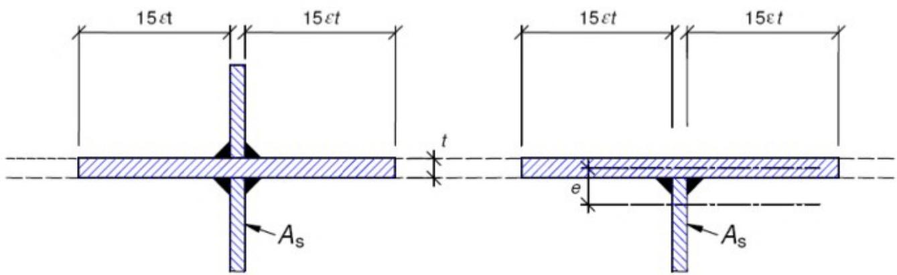  
图9.1：加劲肋的有效截面

## 9.2 直接应力

9.2.1 横向加劲肋的最低要求

(1)为了给带纵向加劲肋或不带纵向加劲肋的板提供刚性支承，中间横向加劲肋应满足以下标准。  
(2）横向加劲肋应作为承受侧向荷载的简支构件，初始的正弦缺陷 $w_{0}$ 等于 $s / 300$ ，其中 $s$ 为 $a_1$ 、 $a_2$ 或 $b$ 中的最小值，参见图9.2，在这里， $a_1$ 和 $a_2$ 是与所考虑的横向加劲肋邻近的面板的长度，而 $b$ 是翼缘的形心之间高度或横向加劲肋的跨距。应考虑到偏心。

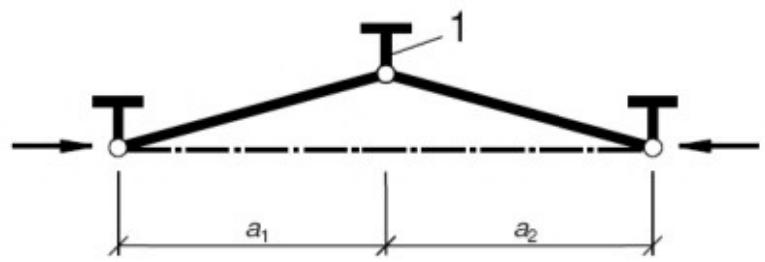  
I 横向加劲肋

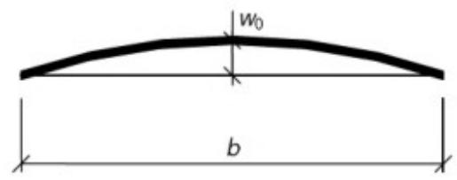  
图9.2：横向加劲肋

(3）如根据对9.3.3(3)的注，假设两个相邻的横向加劲肋及外部荷载和轴力是刚性的并且呈直线，则横向加劲肋应承受相邻受压面板的偏差力。可认为受压面板和纵向加劲肋简支在横向加劲肋上。  
(4)应检验：使用二阶弹性法分析时，在承载能力极限状态满足以下两种标准：

加劲肋的最大应力不应大于fγ/γM1；  
- 附加挠度不应超过 $b / 300$   
(5) 如果横向加劲肋的截面惯性矩 $I_{\mathrm{st}}$ 不小于以下值，当横向加劲肋中没有轴力存在时，可假定满足上面(4)中的两种标准：

$$I _{s t} = \frac {\sigma_{m}}{E} \left(\frac {b}{\pi}\right) ^{4} \left(1 + w _{0} \frac {3 0 0}{b} u\right) \tag {9.1}$$

其中 $\sigma_{m} = \frac{\sigma_{cr,c}}{\sigma_{cr,p}}\frac{N_{Ed}}{b}\left(\frac{1}{a_{1}} +\frac{1}{a_{2}}\right)$

$$u = \frac {\pi^{2} E e _{\max}}{\frac {f _{y} 3 0 0 b}{\gamma_{M 1}}} \geq 1. 0$$

$e_{\mathrm{max}}$ 是从加劲肋的外缘到加劲肋形心的最大距离；

$N_{\mathrm{Ed}}$ 是邻近面板的最大压力，但不低于最大压应力乘以包括加劲肋的面板的有效受压面积的一半；

$\sigma_{\mathrm{cr,c}}$ 、 $\sigma_{\mathrm{cr,p}}$ 定义见4.5.3和附录A。

注：当对横向加劲肋施加面外荷载时，应参考EN1993-2和EN1993-1-7。

(6) 如果加劲肋承受轴向压缩，应将其增大 $\Delta N_{st} = \sigma_m b^2 / \pi^2$ ，以将偏差力考虑在内。(4)中的标准适用，但是在计算加劲肋内轴向荷载的均匀应力时， $\Delta N_{st}$ 不宜考虑。  
(7) 如无轴力, 为了简化, 可使用一阶弹性分析检验(4)中的要求, 考虑以下作用在长度 $b$ 上的附加等效的均匀分布侧向荷载 $q$ 。

$$q = \frac {\pi}{4} \sigma_{m} \left(w _{0} + w _{e l}\right) \tag {9.2}$$

其中 $\sigma_{\mathrm{m}}$ 定义见上面（5）；

$w_{0}$ 定义见图9.2；

$w_{\mathrm{el}}$ 是弹性变形，可通过重复计算来确定或可认为是最大附加挠度 $b / 300$

(8) 除非有更高级的分析方法可以防止带开放截面的加劲肋的扭转屈曲，否则应满足以下标准：

$$\frac {I _{T}}{I _{p}} \geq 5. 3 \frac {f _{y}}{E} \tag {9.3}$$

其中 $I_{\mathrm{p}}$ 为绕板边缘的单独的加劲肋的极惯性矩；

$I_{\mathrm{T}}$ 为单独的加劲肋的圣维南（St.Venant）扭转常数。

(9)当考虑到翘曲刚性，加劲肋要么满足(8)要么满足标准：

$$\sigma_{c r} \geq \theta f _{y} \tag {9.4}$$

其中 $\sigma_{\mathrm{cr}}$ 是扭转屈曲的弹性临界应力（不考虑到板的旋转约束）；

$\theta$ 是确保第3类性能的参数。

注：国家附件中可给出参数θ。建议θ=6。

9.2.2 纵向加劲肋的最低要求

(1) 9.2.1(8)和(9)中关于扭转屈曲的要求同样适用于纵向加劲肋。  
(2）未通过纵向加劲肋开口的、或者未与横向加劲肋的任何一侧相连接的非连续纵向加劲肋应：

仅用于腹板（即，不允许用于翼缘内）；  
在整体分析中忽略：  
- 在应力计算中忽略：  
在计算腹板次节间的有效宽度时考虑；  
在计算弹性临界应力时考虑。  
(3）应按照4.5.3和4.6所述对加劲肋进行强度评估。

9.2.3 焊合板

(1) 厚度有改变的板应紧邻横向加劲肋焊接，参见图9.3。除非从焊口到加劲肋的距离大于 $b_{0} / 2$ 或 $200\mathrm{mm}$ （二者中的最小值，其中 $\mathsf{b}_0$ 是纵向加劲肋之间的板宽），否则无须考虑偏心效应。

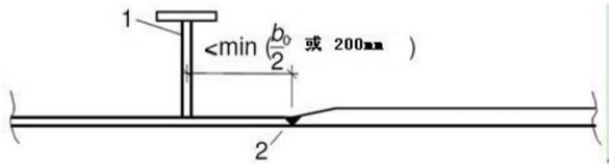  
图9.3：焊合板

I 横向加劲肋  
2 横向焊缝

9.2.4 加劲肋的开口

（1）纵向加劲肋中的开口尺寸应如图9.4所示；

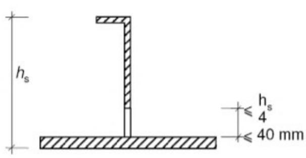

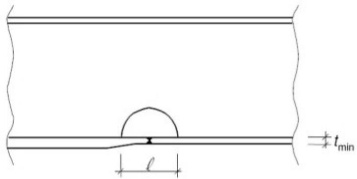  
图9.4：纵向加劲肋的开口

(2）长度 $\ell$ 应不大于：

$\ell \leq 6t_{\min}$ 适用于受压的扁平加劲肋

$\ell \leq 8t_{\min}$ 适用于受压的其它加劲肋

$\ell \leq 15t_{\min}$ 适用于不受压的加劲肋

其中 $t_{\min}$ 是板厚的较小值。

(3) 当 $\sigma_{x,Ed} \leq \sigma_{x,Rd}$ 且 $\ell \leq 15t_{\min}$ 时，(2) 中受压加劲肋的极限值 $\ell$ 可增大 $\sqrt{\frac{\sigma_{x,Rd}}{\sigma_{x,Ed}}}$ 。

$\sigma_{x,Ed}$ 为开口处的压应力。

(4) 横向加劲肋的开口尺寸应如图9.5所示。

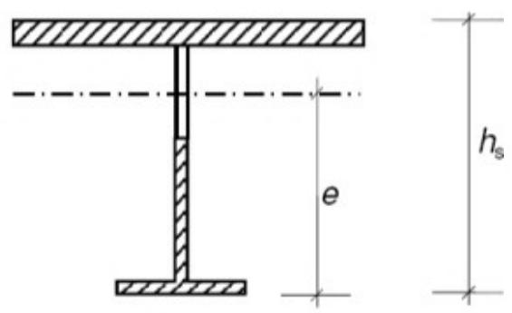

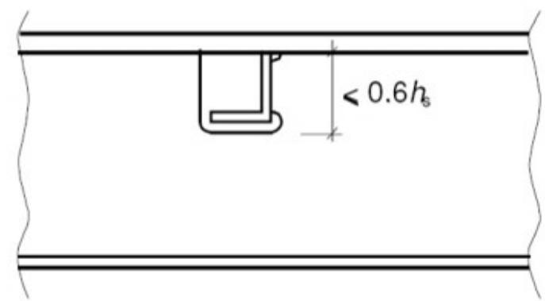  
图9.5：横向加劲肋的开口

(5)邻近开口的总腹板应抵抗一个剪力 $V_{\mathrm{Ed}}$ ，其中：

$$V _{E d} = \frac {I _{n e t}}{e} \frac {f _{y k}}{\gamma_{M 0}} \frac {\pi}{b _{G}} \tag {9.5}$$

$I_{\mathrm{net}}$ 为横向加劲肋的净截面的截面惯性矩；

$E$ 为从翼缘板的下侧到净截面的中性轴的最大距离，参见图9.5；

$b_{\mathrm{G}}$ 为是翼缘之间横向加劲肋的长度。

## 9.3 剪切

9.3.1 刚性端柱

(1) 刚性端柱（参见图5.1）应充当抵抗支承反力的支承加劲肋（参见9.4），而且应设计为抵抗腹板平面内的纵向薄膜应力的短梁。

注：对于由于支承移动引起的偏心效应，参见EN1993-2。

(2) 刚性端柱应由组成长度为 $h_{\mathrm{w}}$ 的短梁翼缘的两个双侧横向加劲肋组成，见图5.1(b)。加劲肋之间的腹板带形成了短梁的腹板。或者，一个刚性端柱可以是轧制型钢的形状，与腹板的末端相连，如图9.6所示。

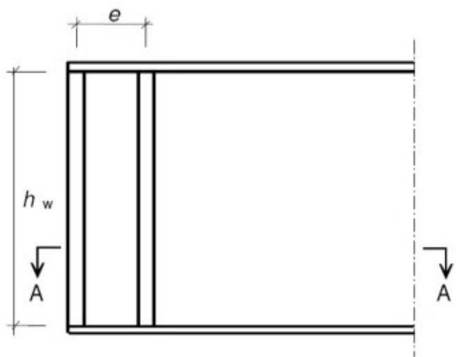

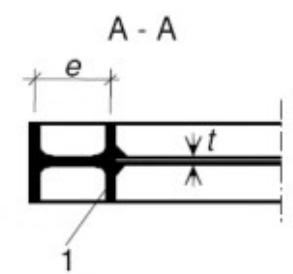  
1 插入截面
图9.6：形成端柱的轧型截面

(3) 由扁钢组成的每个双侧加劲肋应有一个至少为 $4h_{\mathrm{w}}t^{2}/e$ 的截面，其中 $\mathbf{e}$ 是加劲肋之间中心到中心的距离，并且 $e > 0.1h_{\mathrm{w}}$ ，参见图5.1(b)。当在端柱使用轧制型钢而非扁钢时，对于围绕垂直于腹板的水平轴的弯曲部分，其截面模量应不小于 $4h_{\mathrm{w}}t^{2}$ 。  
(4) 或者，利用非刚性端柱进行设计时，可给梁末端安装与支座相邻的单个双侧加劲肋和与竖向加劲肋，这样便可使次面板抵抗最大剪力。

9.3.2 充当非刚性端柱的加劲肋

(1)非刚性端柱可以是单个的双侧加劲肋，如图5.1(c)所示。它可作为抵抗梁支座反力的支承加劲肋。

9.3.3 中间的横向加劲肋

(1) 作为腹板内部节间的刚性支承的中间加劲肋应根据强度和刚度来设计。  
(2) 使用柔性中间横向加劲肋时，在5.3(5)中计算 $k_{\mathrm{r}}$ 时，应考虑其刚性。  
(3）作为腹板节间的刚性支承的中间加强肋的有效截面应有一个最小截面惯性矩 $I_{\mathrm{st}}$

若 $a / h_w < \sqrt{2}$ ： $I_{st} \geq 1.5h_w^3 t^3 / a^2$ (9.6)

若 $a / h_w \geq \sqrt{2}: I_{st} \geq 0.75h_w t^3$

注：按照9.2.1(3)所述，必须根据轴力等于 $\left(\mathrm{V}_{\mathrm{Ed}} - \frac{1}{\overline{\lambda}_w^2} f_{yw}h_wt / \left(\sqrt{3}\gamma_{M1}\right)\right)$ 这一条件设计中间刚性加强肋。如果剪力可变，则使用最大剪力在距离面板边缘 $0.5h_{\mathrm{w}}$ 的地方检查剪力。

9.3.4 纵向加劲肋

(1) 若在应力分析中考虑了纵向加劲肋，则须检查截面承载力的直接应力。

9.3.5 焊缝

(1) 如果 $\mathrm{V}_{\mathrm{Ed}}$ 不超过 $\chi_{\mathrm{w}}f_{yw}h_{w}t / (\sqrt{3}\gamma_{M1})$ ，可根据公称剪力流 $V_{Ed} / h_w$ 设计腹板-翼缘焊缝。对于较大的 $\mathrm{V}_{\mathrm{Ed}}$ 值，则应根据剪力流 $\eta f_{yw}t / (\sqrt{3}\gamma_{M1})$ 设计翼缘和腹板间的焊缝。  
(2) 在其它情况下，焊缝应设计成传递沿着和穿过组成截面的焊缝的力，考虑分析方法（弹性/塑性）和二阶效应。

## 9.4 横向荷载

（1）若未加劲腹板设计承载力不足，则应提供横向加劲肋。  
(2) 应按照 EN 1993-1-1 的 6.3.3 节或 6.3.4 节所述，使用屈曲曲线c，确定在横向荷载和剪力（见 9.3.3(3)）作用下的横向加劲肋的面外屈曲承载力。假定两端都侧向固定时，应使用不少于 $0.75 h_{\mathrm{w}}$ 的屈曲长度。在端部约束较小的情形下，应使用更大的 $\ell$ 值。若加劲肋在承载端部截断，则应检查此端的截面承载力。  
(3) 使用单侧加劲肋或其它非对称加劲肋时，按照 EN 1993-1-1 的6.3节或6.4节所述，考虑到由此引起的偏心。若假定加劲肋为受压翼缘提供侧向约束，则其必须符合侧向扭转屈曲设计中的刚度和强度标准。

# 10 折减应力法

(1) 可使用折减应力法确定加劲板或未加劲板的应力极限。

注1：此方法是涉及以下方面的在第4-7节中规定的有效宽度法的替代方法：

将 $\sigma_{x,Ed}$ 、 $\sigma_{z,Ed}$ 和 $\tau_{Ed}$ 视为共同作用；  
- 截面最弱部分的应力极限可能决定着整个截面的承载力。

注2：应力极限也可用于确定等效有效面积，国家版附录中可能给出了此方法的应用范围。

(2) 对于承受组合应力 $\sigma_{x,Ed}$ 、 $\sigma_{z,Ed}$ 和 $\tau_{Ed}$ 的未加劲面板或加劲面板，可假设3类截面属性，其中

$$\frac {\rho \alpha_{u l t , k}}{\gamma_{M 1}} \geq 1 \tag {10.1}$$

其中 $\alpha_{ult,k}$ 是设计荷载达到板的临界点承载力特征值的最小荷载放大系数，见(4)；

$\rho$ 是在考虑到板的屈曲的情况下，取决于板的长细比 $\overline{\lambda_p}$ 的折减系数，见(5)；

$\gamma_{M1}$ 用于此方法的分项系数。

(3) 板的长细比 $\overline{\lambda_p}$ 应由下式得出

$$\overline {{\lambda_{p}}} = \sqrt {\frac {\alpha_{u l t , k}}{\alpha_{c r}}} \tag {10.2}$$

其中 $\alpha_{cr}$ 是设计荷载在全应力区达到板的弹性临界荷载的最小荷载放大系数，参看(6)。

注1：关于全应力区的 $\alpha_{cr}$ 的计算，使用第4节和第5节中所述的规则模拟加劲板，无须折算5.3(4)节中规定的纵向加劲肋的截面惯性矩。

注2：无法将节间和次节间作为一个整体来确定 $\alpha_{cr}$ 时，可分别检查次节间和整个节间。

（4）在确定 $\alpha_{u_l,t,k}$ 时，可能使用承载力的屈服准则：

$$\frac {1}{a _{u l t , k} ^{2}} = \left(\frac {\sigma_{x , E d}}{f _{y}}\right) ^{2} + \left(\frac {\sigma_{z , E d}}{f _{y}}\right) ^{2} - \left(\frac {\sigma_{x , E d}}{f _{y}}\right) \left(\frac {\sigma_{z , E d}}{f _{y}}\right) + 3 \left(\frac {\tau_{E d}}{f _{y}}\right) ^{2} \tag {10.3}$$

其中 $\sigma_{x,Ed}$ 、 $\sigma_{z,Ed}$ 和 $\tau_{Ed}$ 是承载能力极限状态下应力区的分量。

注：通过使用方程（10.3），假定：屈服发生时达到承载力，而板未屈曲。

(5) 折减系数 $\rho$ 可用以下任一方法确定：

a) 下列折减系数的最小值：

$\rho_{x}$ 适用于4.5.4(1)中得出的纵向应力（在适当的时候考虑到柱状性能）；

$\rho_{z}$ 适用于4.5.4(1）中得出的横向应力（在适当的时候考虑到柱状性能）；

$\chi_{w}$ 适用于5.2(1)中得出的剪应力；

每个均按照公式（10.2）计算长细比 $\overline{\lambda_p}$

注：利用这种方法得出检验公式：

$$\left(\frac {\sigma_{x , E d}}{f _{y} / \gamma_{M 1}}\right) ^{2} + \left(\frac {\sigma_{z , E d}}{f _{y} / \gamma_{M 1}}\right) ^{2} - \left(\frac {\sigma_{x , E d}}{f _{y} / \gamma_{M 1}}\right) \left(\frac {\sigma_{z , E d}}{f _{y} / \gamma_{M 1}}\right) + 3 \left(\frac {\tau_{E d}}{f _{y} / \gamma_{M 1}}\right) ^{2} \leq \rho^{2} \tag {10.4}$$

注：在确定横向应力的 $\rho_{z}$ 时，应将第4节中适用于直接应力 $\sigma_{x}$ 的规则应用到z方向的 $\sigma_{z}$ 上。为保持一致性，不应适用第6节的规则。

b) 使用关于 $\alpha_{ult,k}$ 的公式作为插入函数，在按a)中所确定的 $\rho_x$ 、 $\rho_z$ 和 $\chi_w$ 之间插入一个值。

注：使用这种方法得出检验公式：

$$\left(\frac {\sigma_{x , E d}}{\rho_{x} f _{y} / \gamma_{M 1}}\right) ^{2} + \left(\frac {\sigma_{z , E d}}{\rho_{z} f _{y} / \gamma_{M 1}}\right) ^{2} - \left(\frac {\sigma_{x , E d}}{\rho_{x} f _{y} / \gamma_{M 1}}\right) \left(\frac {\sigma_{z , E d}}{\rho_{z} f _{y} / \gamma_{M 1}}\right) + 3 \left(\frac {\tau_{E d}}{\chi_{w} f _{y} / \gamma_{M 1}}\right) ^{2} \leq 1 \tag {10.5}$$

注1：由于检验公式（10.3）、（10.4）和（10.5）包含了剪力、弯矩、轴力和横向力之间的交互作用，第7节应不适用。

注2：国家附录中可能给出了关于使用公式（10.4）和（10.5）的更多信息。对于承受张力和压力的板，建议仅对受压部分使用公式（10.4）和（10.5）。

(6)当无法得到全应力区的 $\alpha_{cr}$ 值，并且仅有应力区的各分量 $\sigma_{x,Ed}$ 、 $\sigma_{z,Ed}$ 和 $\tau_{Ed}$ 的 $\alpha_{cr,i}$ 值可用时， $\alpha_{cr}$ 值可通过下式确定：

$$\frac {1}{\alpha_{c r}} = \frac {1 + \psi_{x}}{4 \alpha_{c r , x}} + \frac {1 + \psi_{z}}{4 \alpha_{c r , z}} + \left[ \left(\frac {1 + \psi_{x}}{4 \alpha_{c r , x}} + \frac {1 + \psi_{z}}{4 \alpha_{c r , z}}\right) ^{2} + \frac {1 - \psi_{x}}{2 \alpha_{c r , x} ^{2}} + \frac {1 - \psi_{z}}{2 \alpha_{c r , z} ^{2}} + \frac {1}{\alpha_{c r , \tau} ^{2}} \right] ^{1 / 2} \tag {10.6}$$

其中 $\alpha_{cr,x} = \frac{\sigma_{cr,x}}{\sigma_{x,Ed}}$

$$\alpha_{c r, z} = \frac {\sigma_{c r , z}}{\sigma_{z , E d}}$$

$$\alpha_{c r, \tau} = \frac {\tau_{c r , \tau}}{\tau_{t , E d}}$$

且 $\sigma_{cr,x},\sigma_{cr,z},\tau_{cr,\tau},\psi_x$ 和 $\psi_z$ 根据第4-6节所述内容确定。

(7）应根据第9节所述，对加劲肋和板节间进行细节设计。

# 附录A[资料性]－计算加劲板的临界应力

## A.1 等效正交异性板

(1) 带三个以上纵向加劲肋的板可视为等效正交异性板。  
(2）等效正交异性板的弹性临界板屈曲应力可取：

$$\sigma_{c r, p} = k _{\sigma , p} \sigma_{E} \tag {A.1}$$

其中 $\sigma_{E} = \frac{\pi^{2}Et^{2}}{12(1 - \nu^{2})b^{2}} = 190000\left(\frac{t}{b}\right)^{2}$ [MPa]

$k_{\sigma ,p}$ 是按照正交异性板原理得出的屈曲系数，加劲肋在板上均匀分布；

b 定义见图A.1；

为板厚度。

注1：从均匀分布的加劲肋的相关图表或相关计算机模拟中可得出屈曲系数 $k_{\sigma ,p}$ ，或者也可使用离散分布的加劲肋图表，前提条件是次节间内的局部屈曲可忽略并且单独处理。  
注2： $\sigma_{cr,p}$ 是最大压应力出现时节间边缘处的弹性临界板屈曲应力，见图A.1。  
注3：在和腹板有关之处，公式（A.1）和（A.2）中的宽度 $b$ 应用 $h_w$ 代替。  
注4：对于至少带三个等间距纵向加劲肋的加劲板，板的屈曲系数 $k_{\sigma ,p}$ （加劲板的整体屈曲）通过下式近似得到：

若 $\alpha \leq \sqrt[3]{\gamma}$ 则 $k_{\sigma ,p} = \frac{2\left((1 + \alpha^2)^2 + \gamma - 1\right)}{\alpha^2(\psi + 1)(1 + \delta)}$

若 $\alpha >\sqrt[4]{\gamma}$ ，则 $k_{\sigma ,p} = \frac{4(1 + \sqrt{\gamma})}{(\psi + 1)(1 + \delta)}$

同时： $\psi = \frac{\sigma_2}{\sigma_1}\geq 0.5$

$$\gamma = \frac {I _{s l}}{I _{p}},$$

$$\delta = \frac {\sum A _{s l}}{A _{p}},$$

EN 1993-1-5:2006 (E)

$$\alpha = \frac {a}{b} \geq 0. 5$$

其中： $I_{sl}$ 是整个加劲板的截面惯性矩；

$I_{p}$ 是板弯曲时的截面惯性矩 $= \frac{bt^3}{12(1 - \upsilon^2)} = \frac{bt^3}{10.92}$

$\sum A_{sl}$ 是单个纵向加劲肋毛面积的和；

$A_{\mathrm{p}}$ 是板的毛面积 $= bt$

是较大的边缘应力；

$\sigma_{2}$ 是较小的边缘应力。

$a, b$ 和 $t$ 定义见图 A.1。

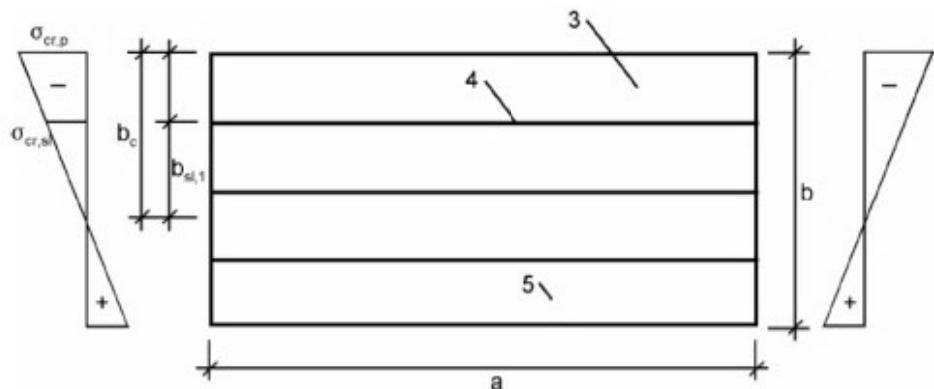  
1. 加劲肋形心  
2柱的质心 $=$ 加劲肋 $^+$ 附板  
3次节间
4 加劲肋
5板厚t

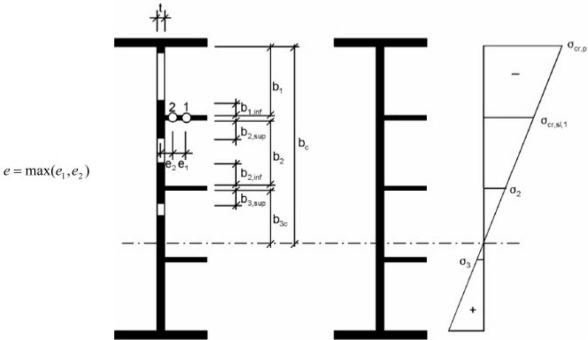  
图A.1：纵向加劲肋的标注

|  | 毛面积的宽度 | 按表4.1的有效面积的宽度 | ψ1的条件 |
| --- | --- | --- | --- |
| b1,inf | 3-ψ1/5-ψ1b1 | 3-ψ1/5-ψ1b1,eff | ψ1=σcr,st,l/σcr,p>0 |
| b2,sup | 2/5-ψ2b2 | 2/5-ψ2b2,eff | ψ2=σ2/σcr,st,l>0 |
| b2,inf | 3-ψ2/5-ψ2b2 | 3-ψ2/5-ψ2b2,eff | ψ2>0 |
| b3,sup | 0.4b3c | 0.4b3c,eff | ψ3=σ3/σ2<0 |

## A.2 压缩区中带一个或两个加劲肋的板的临界板屈曲应力

A.2.1 一般方法

(1) 若在受压区中，加劲板只有一个纵向加劲肋，则A.1中的方法可通过撑在弹性地基上的虚构的独立撑架来简化，这反映了与撑架垂直方向上的板的效应。可从A.2.2中得出撑架的弹性临界应力。  
(2) 为了计算 $A_{sl,1}$ 和 $I_{sl,1}$ ，柱的毛截面应取加劲肋和下述板的邻近部分的毛面积。若次面板完全受压，在面板的边缘应取其宽度 $b_{1}$ 的 $(3 - \psi) / (5 - \psi)$ 部分，在最高应力的边缘取 $2 / (5 - \psi)$ 。若在次面板内应力从压缩变化到拉伸，则此次面板受压部分的宽度 $b_{c}$ 的0.4部分应取柱的对应部分的值，见图A2和表4。 $\psi$ 是与所考虑的次面板相关的应力比。  
(3) 柱的有效截面面积 $A_{sl,eff}$ , 应取板的加劲肋肋和邻近有效部分的有效截面积, 见图A.1。柱中的板元的长细比可按照4.4(4)中所述来确定, 同时计算用于板的毛截面面积的 $\sigma_{\mathrm{com},\mathrm{Ed}}$ 的值。  
(4) 若 $\rho_{\mathrm{c}} f_{\mathrm{y}} / \gamma_{\mathrm{M1}}$ 大于柱的平均应力 $\sigma_{\mathrm{com,Ed}}$ （其中 $\rho_{\mathrm{c}}$ 根据4.5.4(1)节所述确定），则柱的有效面积无需再折减：或者，（4.6）中的有效面积按下式进行修订：

$$A _{c, e f f, l o c} = \frac {\rho_{c} f _{y} A _{s l , 1}}{\sigma_{c o m , E d} \gamma_{M 1}} \tag {A.3}$$

(5) A.2.1(4)中提到的折减应仅适用于柱面积。除了检查次面板的屈曲外，对于板的其它受压部分，无须再进行折减。  
(6) 作为按A.2.1(4)中确定的使用有效面积的替代方法，可根据A.2.1(5)~(7)所述确定柱的承载力，并对其进行检查，以确保其大于平均应力 $\sigma_{\mathrm{com,Ed}}$ 。

注：对于有多个加劲肋的情况，当来自板的约束效应被忽略时（即：将假想柱视为不会在腹板面外屈曲时），可使用(6)中概述的方法。

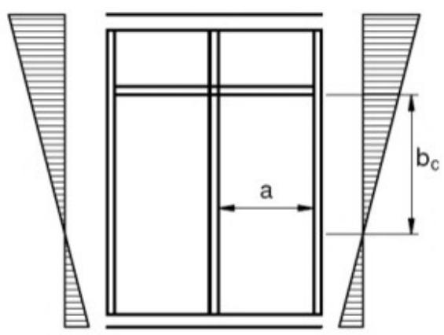  
a.

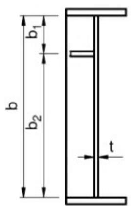  
b.

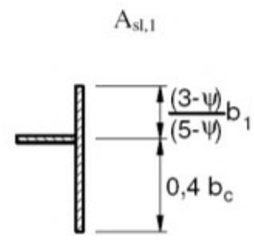  
C.   
图A.2：受压区内带单个加劲肋的腹板的标注

(7) 若在受压区内加劲板有两个纵向加劲肋，则可采用A.2.1(1)中所述的一个加劲肋方法，见图A3。首先，假定其中之一的加劲肋屈曲，而另一个加劲肋充当刚性支承。通过考虑替代这样两个单独的加劲肋的单集中加劲肋，可对两个加劲肋同时产生的屈曲进行说明，这样：

a) 单集中加劲肋的截面面积和截面惯性矩 $I_{\mathrm{sl}}$ 分别为单个加劲肋的截面面积之和和截面惯性矩之和。

b) 单集中加劲肋的位置处于单个加劲肋各自力的合力位置。

对于图A.3中所示的每种情形，计算得出相关的 $\sigma_{\mathrm{cr,p}}$ 值，见A.2.2(1)，其中 $b_{1} = b_{1}^{*}$ ， $\mathsf{b}_2 = \mathsf{b}_2^*$ 以及 $B^{*} = b_{1 + }^{*}b_{2}^{*}$ 见图A.3。

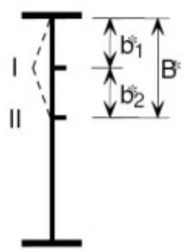  
加劲肋I

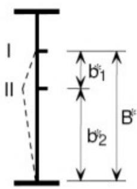  
加劲肋Ⅱ

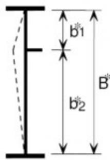  
图A.3：受压区中带两个加劲肋的板的标注

集中加劲肋

截面面积

Asl

$A_{sl,H}$

$A_{sL,I} + A_{sLII}$

截面惯性矩

$I_{sl,I}$

$I_{sl,II}$

$I_{sL,I} + I_{sL,II}$

A.2.2 采用板约束的柱的简化模型

(1) 若带一个纵向加劲肋的加劲板（其中纵向加劲肋位于受压区内），则可根据下式计算加劲肋的弹性临界屈曲应力，忽略受拉区的加劲肋：

若 $a\geq a_{c}$ ，则 $\sigma_{cr,s\ell} = \frac{1.05E}{A_{s\ell,1}}\frac{\sqrt{I_{s\ell,1}t^3b}}{b_1b_2}$

若 $a \leq a_{c}$ ，则 $\sigma_{cr,sl} = \frac{\pi^{2} \mathrm{EI}_{s\ell,1}}{A_{s\ell,1}a^{2}} + \frac{Et^{3}ba^{2}}{4\pi^{2}(1 - v^{2})A_{s\ell,1}b_{1}^{2}b_{2}^{2}}$

且 $a_{c} = 4.33\sqrt{\frac{I_{s\ell,1}b_{1}^{2}b_{2}^{2}}{t^{3}b}}$

其中 $A_{\mathrm{sl},1}$ 为从A.2.1(2)中得出的柱的毛面积；

Isl1 为A.2.1(2)中定义的柱的毛截面绕穿过其形心并平行于板平面的轴的惯性矩；

$b_{1}, b_{2}$ 为从腹板的纵向边缘到加劲肋的距离 $(b_{1} + b_{2} = b)$ 。

注：关于 $\sigma_{\mathrm{cr,c}}$ 的确定，见4.5.3(3)的注释。

(2) 对于带两个纵向加劲肋的加劲板（其中纵向加劲肋位于受压区），弹性临界板屈曲应力应取使用公式（A.4）计算的三种情形下的最小值（其中 $b_{1} = b_{1}^{*}$ ， $b_{2} = b_{2}^{*}$ 以及 $b = B^{*}$ ）。计算中应忽略受拉区的加劲肋。

## A.3 剪切屈曲系数

(1) 对于带刚性横向加劲肋和不带纵向加劲肋的板，或者带两个以上纵向加劲肋的板，剪切屈曲系数 $k_{\tau}$ 可通过下式获得：

当 $a / h_w \geq 1$ 时， $k_{\tau} = 5.34 + 4.00(h_w / a)^2 + k_{\tau s\ell}$

当 $a / h_w < 1$ 时， $k_{\tau} = 4.00 + 5.34\left(h_w / a\right)^2 + k_{\tau s'}$ (A.5)

其中 $k_{\tau s\ell} = 9\left(\frac{h_w}{a}\right)^2\sqrt[4]{\left(\frac{I_{s\ell}}{t^3h_w}\right)^3}$ ，但不小于 $\frac{2.1}{t}\sqrt[3]{\frac{I_{s\ell}}{h_w}}$

$a$ 为横向加劲肋之间的距离（见图5.3）；

$I_{sl}$ 为纵向加劲肋绕z-z轴的截面惯性矩，见图5.3(b)。对于带两个或更多纵向加劲肋的腹板，加劲肋无需等距， $I_{sl}$ 为单个加劲肋的刚度之和。

注：在公式（A.5）中不考虑到中间的非刚性横向加劲肋。

(2)当纵横比 $\alpha = \frac{a}{h_w}$ 满足 $\alpha \geq 3$ 时，公式（A.5）同样适用于带一个或两个纵向加劲肋的板。对于带一个或两个纵向加劲肋的板，当纵横比 $\alpha < 3$ 时，剪切屈曲系数应由下式计算得出：

$$k _{\tau} = 4. 1 + \frac {6 . 3 + 0 . 1 8 \frac {I _{s \ell}}{t ^{3} h _{w}}}{\alpha^{2}} + 2. 2 \sqrt [ 3 ]{\frac {I _{s \ell}}{t ^{3} h _{w}}} \tag {A.6}$$

# 附录B[资料性]－变截面构件

## B.1 概述

(1) 第10节中的规则适用于带非平行翼缘的构件的腹板（如加腋梁中情形）以及带规则或不规则开口和非正交加劲肋的腹板。  
(2) $\alpha_{ult}$ 和 $\alpha_{crit}$ 可用有限元法得出，见附录C。  
(3) $\overline{\lambda_p}$ 的折减系数 $\rho_x$ 、 $\rho_z$ 和 $\chi_w$ 可根据相关的板屈曲曲线得出，见第4节和第5节。

注：折减系数 $\rho$ 可由下式计算得出：

$$\rho = \frac {1}{\phi_{p} + \sqrt {\phi_{p} ^{2} - \overline {{\lambda_{p}}}}} \tag {B.1}$$

其中 $\phi_p = \frac{1}{2}\left(1 + \alpha_p\left(\overline{\lambda_p} -\overline{\lambda_{p0}}\right) + \overline{\lambda_p}\right)$

且 $\overline{\lambda_p} = \sqrt{\frac{\alpha_{ult,k}}{\alpha_{cr}}}$

此方法适用于 $\rho_{x}$ ， $\rho_z$ 和 $\chi_w$ 。 $\overline{\lambda_{p0}}$ 和 $\alpha_{p}$ 的值见表B.1。这些值已通过对照第4节和第5节的板屈曲曲线进行了校准，并且通过下式给出了与等量的几何缺陷的直接关系：

$$e _{0} = \alpha_{p} \left(\overline {{\lambda_{p}}} - \overline {{\lambda_{p 0}}}\right) \frac {t}{6} \frac {1 - \frac {\rho \overline {{\lambda_{p}}}}{\gamma_{M 1}}}{1 - \rho \overline {{\lambda_{p}}}} \tag {B.2}$$

表B.1： $\overline{\lambda_{p0}}$ 和 $\alpha_{p}$ 值  

| 产品 | 主要的屈曲模式 | αp | λp0 |
| --- | --- | --- | --- |
| 热轧 | ψ≥0时的直接应力 | 0.13 | 0.80 |
| 热轧 | ψ<0时的直接应力剪力横向应力 | 0.13 | 0.70 |
| 焊接或冷成形 | ψ≥0时的直接应力 | 0.34 | 0.37 |
| 焊接或冷成形 | ψ<0时的直接应力剪力横向应力 | 0.34 | 0.80 |

## B.2板屈曲和侧向扭转屈曲的相互作用

(1) 通过按如下所述计算 $\alpha_{ult}$ 和 $\alpha_{crit}$ , B.1中的方法可扩充应用至检验构件的板屈曲和侧向扭转屈曲的组合效应:

$\alpha_{ult}$ 是设计荷载达到最临界截面承载力的特征值的最小荷载放大系数（忽略任何板屈曲和侧向扭转屈曲）；

$\alpha_{cr}$ 是设计荷载达到构件的弹性临界承载力的最小荷载放大系数（包括板屈曲和侧向扭转屈曲模式）。

(2)当 $\alpha_{cr}$ 包含了侧向扭转屈曲模式时，所使用的折减系数 $\rho$ 应是按B.1(3)所述得出的折减系数的最小值，并且 $\chi_{LT}$ 应是按EN1993-1-1中的6.3.3节所述得出的侧向扭转屈曲的值。

# 附录C[资料性]－有限元分析法（FEM）

## C.1 概述

(1) 附录C给出了有限元法分析板结构的承载能力极限状态、正常使用极限状态或疲劳检验时的使用指南。

注1：关于薄壳结构的有限元分析，见EN1993-1-6。

注2：本指南的目标读者为正在使用有限元方法的工程师。

(2）有限元法的选择取决于所要分析的问题，并且基于以下假设：

表 C. 1: 用于有限元法的假设  

| 编号 | 材料特性 | 几何特性 | 缺陷, 见C.5 | 使用示例 |
| --- | --- | --- | --- | --- |
| 1 | 线性 | 线性 | 无 | 弹性剪力滞效应、弹性承载力 |
| 2 | 非线性 | 线性 | 无 | ULS(承载能力极限状态)中的塑性承载力 |
| 3 | 线性 | 非线性 | 无 | 临界板屈曲荷载 |
| 4 | 线性 | 非线性 | 有 | 弹性板屈曲承载力 |
| 5 | 非线性 | 非线性 | 有 | ULS(承载能力极限状态)中的弹-塑性承载力 |

## C.2 使用

（1）将有限元法用于设计时，应特别注意以下几点：

结构部件及其边界条件的建模；  
软件和文件的选择：  
缺陷的使用；  
材料特性的建模  
荷载的建模：  
-极限状态标准的建模；  
拟采用的分项系数。

注：国家版附录中可对在设计中使用有限元分析的条件给出定义。

## C.3 建模

(1) 有限元模型（壳模型或体积模型）和网格大小的选择决定了结果的精确性。为了进行验证，可用逐步求精法进行灵敏度检测。  
（2）可为以下任意一项进行有限元建模：

作为一个整体的部件；  
- 作为整个结构的一部分的次结构。

注：关于部件的例子可以是中间支座区中连续箱梁的腹板和/或底板（其中底板在中间支座处受压）。关于下部结构的例子可以是承受双轴应力的底板的次面板。

(3）应为支座、接合部位和外加荷载选定边界条件，这样所得的结果便较为保守。  
(4) 应取标准的几何特性。  
(5）所有缺陷应基于C.5节中给出的形状和振幅。  
(6）材料特性应与C.6(2)中所述一致。

## C.4 软件和文件选择

(1) 软件应适合于此任务并已证明是可靠的。

注：可根据相关的水准试验证实其可靠性。

(2）网格大小、荷载、边界条件和其它输入和输出数据应以保证第三方可复制的方式进行文件制作。

## C.5 缺陷的使用

（1）若缺陷需要包括在有限元模型内，则这些缺陷必须包括几何缺陷和结构缺陷。  
(2）除非已对几何缺陷和结构缺陷进行了更精细的分析，否则可使用等效几何缺陷。

注1：几何缺陷可为基于临界板屈曲模式的形状，其振幅见国家版附录。建议几何制造公差取 $80\%$ 。注2：可使用制造过程中的应力图来表示残余应力的结构缺陷，其振幅等于平均（预期）值。

(3）缺陷施加的方向应该是得到最低承载力的方向。  
(4) 对于使用等效几何缺陷的情况，可使用表C.2和图C.1。

表 C.2: 等效几何缺陷  

| 缺陷类型 | 部件 | 形状 | 大小 |
| --- | --- | --- | --- |
| 整体缺陷 | 长度为l的部件 | 弓形 | 见EN 1993-1-1表5.1 |
| 整体缺陷 | 长度为a的纵向加劲肋 | 弓形 | min(a/400、b/400) |
| 局部缺陷 | 短跨为a或b的面板或次面板 | 屈曲形 | min(a/200、b/200) |
| 局部缺陷 | 承受扭曲的加劲肋或翼缘 | 弓形扭曲 | 1/50 |

EN 1993-1-5:2006 (E)   
图形C.1：等效几何缺陷建模  

| 缺陷类型 | 部件 |
| --- | --- |
| 长度为l的整体部件 |  |
| 长度为a的整体纵向加劲肋 |  |
| 局部面板或次面板 |  |
| 承受扭曲的局部加劲肋或翼缘 |  |

(5) 在组合缺陷中，应选出主要缺陷，并可将伴随缺陷的值缩减到 $70\%$

注1：任何类型的缺陷都应该看作是主要缺陷，而其它则可视为伴随缺陷。

注2：可通过作用在构件上的适当的假想力来替代等效几何缺陷。

## C.6 材料特性

(1) 材料特性应取特征值。  
(2）根据分析所要求的精确性和容许应变，应使用以下关于材料性质的假设，见图C.2：

a）未出现应变硬化的弹-塑性；  
b) 出现标称坪斜的弹-塑性；  
c) 出现应变硬化的弹-塑性；  
d) 根据如下试验结果修改的真实应力—应变曲线：

$$\sigma_{\text {t r u e}} = \sigma (1 + \varepsilon) \tag {C.1}$$

$$\varepsilon_{\text {t r u e}} = \ell n (1 + \varepsilon)$$

图C.2：材料特性的建模  
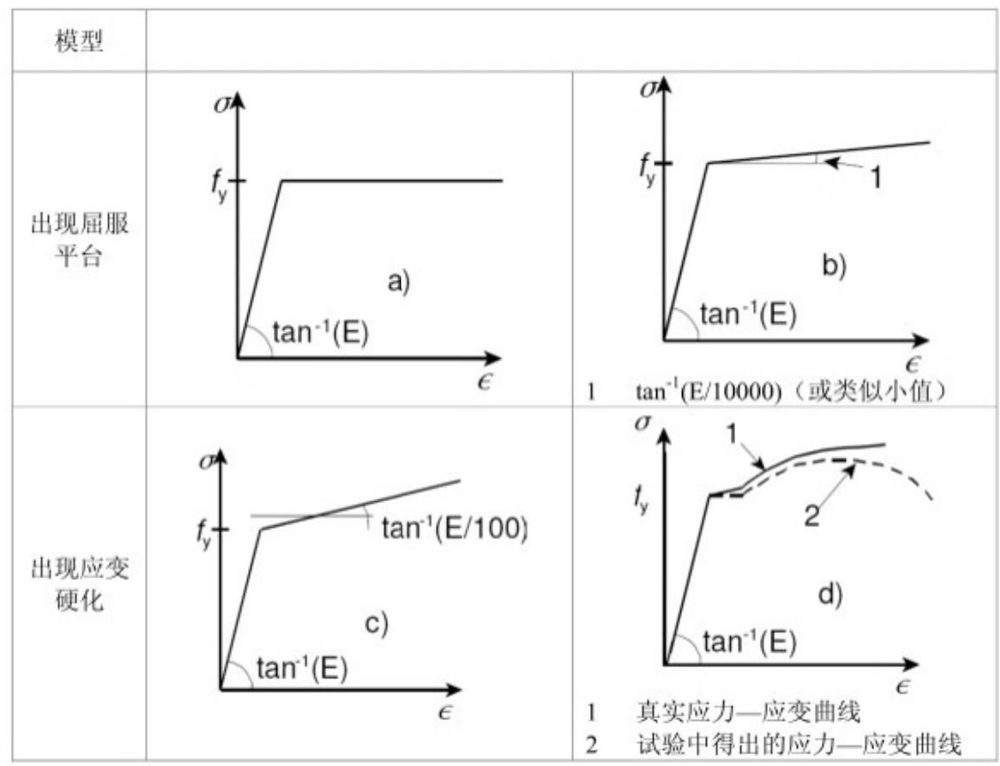  
注：对于弹性模量E，考虑其公称值。

## C.7 荷载

(1) 施加到结构上的荷载应包括相关的荷载系数和荷载组合系数。为简化起见，可使用单个荷载放大系数 $\alpha$ 。

## C.8 极限状态标准

（1）应按如下所述使用承载能力极限状态标准：

1. 对于易受屈曲作用的结构：达到最大荷载。  
2. 对于承受拉应力的区域：达到主要薄膜应变的极限值。

注1：国家版附录中可对主要应变的极限值作出规定。建议值为5%。

注2：可使用其它标准，如：达到屈服判据或屈服区域极限。

## C.9 分项系数

(1) 承载能力极限状态的荷载放大倍数系数 $\alpha_{\mathrm{u}}$ 应足以达到所需的可靠性。  
(2) 放大系数 $\alpha_{\mathrm{u}}$ 应由以下两种系数组成：

1. 涵盖了所用的有限元建模的模型不确定性的系数 $\alpha_{1}$ 。此系数可从试验校准的评估中得出，见EN 1990 的附录D；  
2. 涵盖了荷载散布和承载力模型的分布系数 $\alpha_{2}$ 。当不稳定性占主导地位时，可取值 $\gamma_{\mathrm{M1}}$ ，若裂缝占主导地位时可取值 $\gamma_{\mathrm{M2}}$ 。  
(3）必须要检验是否：

$$a _{u} > a _{1} a _{2} \tag {C.2}$$

注：国家版附录中可给出关于 $\gamma_{\mathrm{M1}}$ 和 $\gamma_{\mathrm{M2}}$ 的信息。建议参看EN1993中相关部分中规定的 $\gamma_{\mathrm{M1}}$ 和 $\gamma_{\mathrm{M2}}$ 使用方法。

# 附件D[资料性]－带波纹腹板的板梁

## D.1 概述

(1)附录D包含了带梯形或正弦型波纹腹板的工字形梁的设计规则，见图D.1。

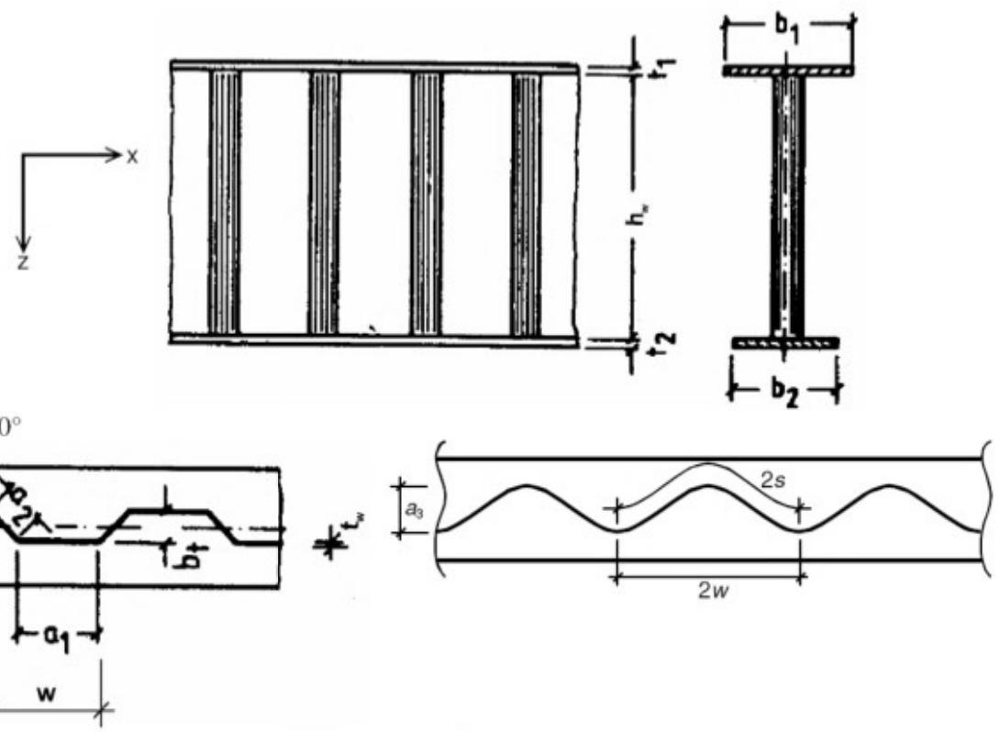  
图D.1：几何标注

## D.2 承载能力极限状态

D.2.1 抵抗力矩

(1）由弯曲引起的抵抗力矩 $M_{\mathrm{Rd}}$ 应取以下最小值：

$$M _{R d} = \min  \left\{\underbrace {\frac {b _{2} t _{2} f _{y f , r}}{\gamma_{M 0}} \left(h _{w} + \frac {t _{1} + t _{2}}{2}\right)} _{\text {受 拉 翼 缘}}; \underbrace {\frac {b _{1} t _{1} f _{y f , r}}{\gamma_{M 0}} \left(h _{w} + \frac {t _{1} + t _{2}}{2}\right)} _{\text {受 压 翼 缘}}; \underbrace {\frac {b _{1} t _{1} x f _{y f}}{\gamma_{M 1}} \left(h _{w} + \frac {t _{1} + t _{2}}{2}\right)} _{\text {受 压 翼 缘}} \right\} \tag {D.1}$$

其中 $f_{\mathrm{yf,r}}$ 是由于翼缘内横向弯矩引起的折减的屈服应力值

$$f _{y f, r} = f _{y f} f _{T}$$

$$f _{T} = 1 - 0. 4 \sqrt {\frac {\sigma_{x} (M _{z})}{\frac {f _{y f}}{\gamma_{M 0}}}}$$

$\sigma_{x}(M_{z})$ 是翼缘内横向弯矩引起的应力

是根据EN1993-1-1的6.3节所述的面外屈曲折减系数。

注1：如图D.2所示，横向力矩 $\mathbf{M}_{\mathrm{z}}$ 因翼缘内的剪力流而产生。

注2：对于正弦型波纹腹板， $f_{\mathrm{T}}$ 为1.0。

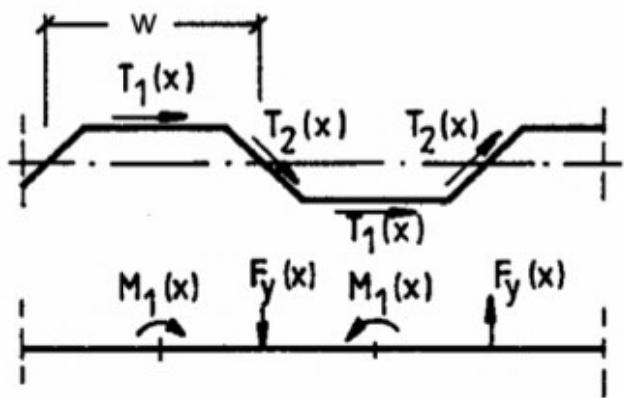  
图D.2：由于将剪力流引入翼缘产生的横向作用

(2)应通过使用4.4(2)中定义的长细比参数 $\overline{\lambda}_p$ 的较大值，按4.4(1)中所述确定受压翼缘的有效面积。屈曲系数 $k_{\sigma}$ 应取以下值中的较大值：

a) $k_{\sigma} = 0.43 + \left(\frac{b}{a}\right)^{2}$ (D.2)

其中b为从焊趾到自由边的伸出部分的最大宽度

$$a = a _{1} + 2 a _{4}$$

b) $k_{\sigma} = 0.60$ (D.3)

其中 $\bar{b} = \frac{b_1}{2}$

D.2.2 抵抗剪力

(1) 抵抗剪力 $V_{\mathrm{Rd}}$ 应取

$$V _{R d} = \chi_{c} \frac {f _{y w}}{\gamma_{M 1} \sqrt {3}} h _{w} t _{w} \tag {D.4}$$

其中 $\chi_{c}$ 是从(2)和(3)中得到的局部屈曲折减系数 $\chi_{c,\ell}$ 和整体屈曲折减系数 $\chi_{c,g}$ 中的较小值。

(2）局部屈曲的折减系数 $\chi_{c,\ell}$ 应根据下式计算：

$$\chi_{c, \ell} = \frac {1 . 1 5}{0 . 9 + \overline {{\lambda_{c , \ell}}}} \leq 1. 0 \tag {D.5}$$

其中 $\overline{\lambda_{c,\ell}} = \sqrt{\frac{f_y}{\tau_{cr,\ell}\sqrt{3}}}$ (D.6)

$$\tau_{c r, l} = 4. 8 3 E \left[ \frac {t _{w}}{a _{\max}} \right] ^{2} \tag {D.7}$$

$a_{\mathrm{max}}$ 应取 $a_1$ 和 $a_2$ 中的较大值。

注：对于正弦型波纹腹板，国家版附录中可给出如何计算 $\tau_{cr,\ell}$ 和 $\chi_{c,\ell}$ 的信息。

建议使用以下公式：

$$\tau_{c r, \ell} = (5. 3 4 + \frac {a _{3} s}{h _{w} t _{w}}) \frac {\pi^{2} E}{1 2 (1 - v ^{2})} \left[ \frac {t _{w}}{s} \right] ^{2}$$

其中 $w$ 是一个半波的波长，见图D.1；

$s$ 是一个半波的展开长度，见图D.1。

(3）整体屈曲的折减系数 $\chi_{c,g}$ 应取：

$$\chi_{c, g} = \frac {1 . 5}{0 . 5 + \overline {{\lambda}} _{c , g} ^{2}} \leq 1. 0 \tag {D.8}$$

其中 $\bar{\lambda}_{c,g} = \sqrt{\frac{f_y}{\tau_{cr,g}\sqrt{3}}}$ (D.9)

$$\tau_{c r, g} = \frac {3 2 . 4}{t _{w} h _{w} ^{2}} \sqrt [ 4 ]{D _{x} D _{z} ^{3}} \tag {D.10}$$

$$D _{x} = \frac {E t _{w} ^{3}}{1 2 (1 - v ^{2})} \frac {w}{s}$$

$$D _{z} = \frac {E I _{z}}{w}$$

$I_{z}$ 是长度为 $w$ 的一个波纹的截面惯性矩，见图D.1。

注1： $s$ 和 $I_{z}$ 与波纹的实际形状有关。

注2：对于假定边缘铰接的板，公式（D.10）适用。

D.2.3 端部加劲肋的要求

(1) 应根据第9节所述设计支承加劲肋。

# 附录E[标准性]－确定有效截面的替代方法

## E.1屈服强度以下的应力水平的有效面积

(1) 作为4.4(2)中给出方法的的替代方法，以下公式可用于确定在应力水平低于屈服强度时的有效面积。

a) 对于内部受压构件：

$$\rho = \frac {1 - 0 . 0 5 5 (3 + \psi) / \overline {{\lambda_{p , r e d}}}}{\overline {{\lambda_{p , r e d}}}} + 0. 1 8 \frac {\overline {{\lambda_{p}}} - \overline {{\lambda_{p , r e d}}}}{\overline {{\lambda_{p}}} - 0 . 6} \text {但} \rho \leq 1. 0 \tag {E.1}$$

b）对于突出的受压构件：

$$\rho = \frac {1 - 0 . 1 8 8 / \overline {{\lambda_{p , r e d}}}}{\overline {{\lambda_{p , r e d}}}} + 0. 1 8 \frac {\left(\overline {{\lambda_{p}}} - \overline {{\lambda_{p , r e d}}}\right)}{\left(\overline {{\lambda_{p}}} - 0 . 6\right)} \text {但} \rho \leq 1. 0 \tag {E.2}$$

关于标注，参见4.4(2)和4.4(4)。关于整体压曲的承载力的计算，4.4(5)所述内容适用。

## E.2 加劲肋的有效面积

(1) 对于加劲肋有效面积的计算，可根据下式计算正常使用极限状态的长细比 $\lambda_{p,ser}$ ：

$$\bar {\lambda} _{p, s e r} = \bar {\lambda} _{p} \sqrt {\frac {\sigma_{c o m , E d , s e r}}{f _{y}}} \tag {E.3}$$

其中 $\sigma_{\mathrm{com,Ed,ser}}$ 定义为正常使用极限状态下承受荷载的相关构件的最大压应力（根据有效截面计算）。

(2）可使用下式通过对相关荷载组合的毛截面和有效截面进行插值来计算截面惯性矩：

$$I _{e f f} = I _{g r} - \frac {\sigma_{g r}}{\sigma_{c o m , E d , s e r}} \left(I _{g r} - I _{e f f} \left(\sigma_{c o m, E d, s e r}\right)\right) \tag {E.4}$$

其中 $I_{\mathrm{gr}}$ 是毛截面的截面惯性矩

$\sigma_{gr}$ 是基于毛截面的正常使用极限状态下的最大弯曲应力

$I_{\text{eff}}(\sigma_{\text{scom}, \text{Ed}, \text{ser}})$ 是有效截面的截面惯性矩，其考虑了根据E.1所述在所考虑的跨距内为最大应力 $\sigma_{\text{com}, \text{Ed}, \text{ser}} \geq \sigma_{\text{gr}}$ 计算的局部屈曲。

(3) 有效截面惯性矩 $I_{\mathrm{eff}}$ 可认为是根据最不利位置沿跨径变化的。或者在正常使用荷载下，可使用基于最大绝对正弯矩的不变值。  
(4) 计算需要进行迭代，但是作为一种保守的近似计算，其可以是在应力水平等于或高于 $\sigma_{\mathrm{com,Ed,ser}}$ 的条件下进行的单次计算。

ICS 91.010.30; 91.080.10

代替 ENV 1993-1-5:1997

英文版

欧洲规范3-钢结构设计－第1-5部分：板式结构构件

该欧洲标准于2006年1月13日经CEN（欧洲标准化委员会）批准。

CEN成员均须遵守CEN/CENELEC内部条例，其条款规定了此欧洲标准在不做任何变更的前提下即具备各国国家标准地位的条件。若要索取有关国家标准的最新目录和参考书目，可向管理中心或任何CEN成员国提出申请。

本欧洲标准有三种官方版本（英文版、法文版和德文版）。任何由CEN成员国负责翻译成本国语言的其他语言版本欧洲标准在通知CEN管理中心之后具有与正式版本相同的地位。

CEN成员为各国国家标准机构、包括奥地利、比利时、塞浦路斯、捷克、丹麦、爱沙尼亚、芬兰、法国、德国、希腊、匈牙利、冰岛、爱尔兰、意大利、拉脱维亚、立陶宛、卢森堡、马耳他、荷兰、挪威、波兰、葡萄牙、斯洛伐克、斯洛文尼亚、西班牙、瑞典、瑞士和英国。

  
欧洲标准化委员会

管理中心：布鲁塞尔大萨特街36号（B-1050）

EN 1993-1-5:2006 (E)

