砌体结构设计规范

Code for design of masonry structures

2011-07-26 发

发布

# 1 总则

1.0.1 为了贯彻执行国家的技术经济政策，坚持墙材革新、因地制宜、就地取材，合理选用结构方案和砌体材料，做到技术先进、安全适用、经济合理、确保质量，制定本规范。  
1.0.2 本规范适用于建筑工程的下列砌体结构设计，特殊条件下或有特殊要求的应按专门规定进行设计：

1 砖砌体：包括烧结普通砖、烧结多孔砖、蒸压灰砂普通砖、蒸压粉煤灰普通砖、混凝土普通砖、混凝土多孔砖的无筋和配筋砌体；  
2 砌块砌体：包括混凝土砌块、轻集料混凝土砌块的无筋和配筋砌体；  
3 石砌体：包括各种料石和毛石的砌体。

1.0.3 本规范根据现行国家标准《建筑结构可靠度设计统一标准》GB50068规定的原则制订。设计术语和符号按照现行国家标准《建筑结构设计术语和符号标准》GB/T50083的规定采用。  
1.0.4 按本规范设计时，荷载应按现行国家标准《建筑结构荷载规范》GB50009的规定执行；墙体材料的选择与应用应按现行国家标准《墙体材料应用统一技术规范》GB50574的规定执行；混凝土材料的选择应符合现行国家标准《混凝土结构设计规范》GB50010的要求；施工质量控制应符合现行国家标准《砌体结构工程施工质量验收规范》GB50203、《混凝土结构工程施工质量验收规范》GB50204的要求；结构抗震设计应符合现行国家标准《建筑抗震设计规范》GB50011的有关规定。  
1.0.5 砌体结构设计除应符合本规范规定外，尚应符合国家现行有关标准的规定。

# 2 术语和符号

## 2.1 术语

2.1.1 砌体结构 masonry structure

由块体和砂浆砌筑而成的墙、柱作为建筑物主要受力构件的结构。是砖砌体、砌块砌体和石砌体结构的统称。

2.1.2 配筋砌体结构 reinforced masonry structure

由配置钢筋的砌体作为建筑物主要受力构件的结构。是网状配筋砌体柱、水平配筋砌体墙、砖砌体和钢筋混凝土面层或钢筋砂浆面层组合砌体柱（墙）、砖砌体和钢筋混凝土构造柱组合墙和配筋砌块砌体剪力墙结构的统称。

2.1.3 配筋砌块砌体剪力墙结构 reinforced concrete masonry shear wall structure

由承受竖向和水平作用的配筋砌块砌体剪力墙和混凝土楼、屋盖所组成的房屋建筑结构。

2.1.4 烧结普通砖 fired common brick

由煤矸石、页岩、粉煤灰或黏土为主要原料，经过焙烧而成的实心砖。分烧结煤矸石砖、烧结页岩砖、烧结粉煤灰砖、烧结黏土砖等。

2.1.5 烧结多孔砖 fired perforated brick

以煤矸石、页岩、粉煤灰或黏土为主要原料，经焙烧而成、孔洞率不大于 $35\%$ ，孔的尺寸小而数量多，主要用于承重部位的砖。

2.1.6 蒸压灰砂普通砖 autoclaved sand-lime brick

以石灰等钙质材料和砂等硅质材料为主要原料，经坏料制备、压制排气成型、高压蒸汽养护而成的实心砖。

2.1.7 蒸压粉煤灰普通砖 autoclaved flyash-lime brick

以石灰、消石灰（如电石渣）或水泥等钙质材料与粉煤灰等硅质材料及集料（砂等）为主要原料，掺加适量石膏，经坏料制备、压制排气成型、高压蒸汽养护而成的实心砖。

2.1.8 混凝土小型空心砌块 concrete small hollow block

由普通混凝土或轻集料混凝土制成，主规格尺寸为 $390\mathrm{mm} \times 190\mathrm{mm} \times 190\mathrm{mm}$ 、空心率为 $25\% \sim 50\%$ 的空心砌块。简称混凝土砌块或砌块。

2.1.9 混凝土砖 concrete brick

以水泥为胶结材料，以砂、石等为主要集料，加水搅拌、成型、养护制成的一种多孔的混凝土半盲孔砖或实心砖。多孔砖的主规格尺寸为 $240\mathrm{mm} \times 115\mathrm{mm} \times 90\mathrm{mm}$ 、 $240\mathrm{mm} \times 190\mathrm{mm} \times 90\mathrm{mm}$ 、 $190\mathrm{mm} \times 190\mathrm{mm} \times 90\mathrm{mm}$ 等；实心砖的主规格尺寸为 $240\mathrm{mm} \times 115\mathrm{mm} \times 53\mathrm{mm}$ 、 $240\mathrm{mm} \times 115\mathrm{mm} \times 90\mathrm{mm}$ 等。

2.1.10 混凝土砌块（砖）专用砌筑砂浆 mortar for concretesmall hollow block

由水泥、砂、水以及根据需要掺入的掺和料和外加剂等组分，按一定比例，采用机械拌和制成，专门用于砌筑混凝土砌块的砌筑砂浆。简称砌块专用砂浆。

2.1.11 混凝土砌块灌孔混凝土 grout for concrete small hollow block

由水泥、集料、水以及根据需要掺入的掺和料和外加剂等组分，按一定比例，采用机械搅拌后，用于浇注混凝土砌块砌体芯柱或其他需要填实部位孔洞的混凝土。简称砌块灌孔混凝土。

2.1.12 蒸压灰砂普通砖、蒸压粉煤灰普通砖专用砌筑砂浆 mortar for autoclaved silicate brick

由水泥、砂、水以及根据需要掺入的掺和料和外加剂等组分，按一定比例，采用机械拌和制成，专门用于砌筑蒸压灰砂砖或蒸压粉煤灰砖砌体，且砌体抗剪强度应不低于烧结普通砖砌体的取值的砂浆。

2.1.13 带壁柱墙 pilastered wall

沿墙长度方向隔一定距离将墙体局部加厚，形成的带垛墙体。

2.1.14 混凝土构造柱 structural concrete column

在砌体房屋墙体的规定部位，按构造配筋，并按先砌墙后浇灌混凝土柱的施工顺序制成的混凝土柱。通常称为混凝土构造柱，简称构造柱。

2.1.15 圈梁 ring beam

在房屋的檐口、窗顶、楼层、吊车梁顶或基础顶面标高处，沿砌体墙水平方向设置封闭状的按构造配筋的混凝土梁式构件。

2.1.16 墙梁 wall beam

由钢筋混凝土托梁和梁上计算高度范围内的砌体墙组成的组合构件。包括简支墙梁、连续墙梁和框支墙梁。

2.1.17 挑梁 cantilever beam

嵌固在砌体中的悬挑式钢筋混凝土梁。一般指房屋中的阳台挑梁、雨篷挑梁或外廊挑梁。

2.1.18 设计使用年限 design working life

设计规定的时期。在此期间结构或结构构件只需进行正常的维护便可按其预定的目的使用，而不需进行大修加固。

2.1.19 房屋静力计算方案 static analysis scheme of building

根据房屋的空间工作性能确定的结构静力计算简图。房屋的静力计算方案包括刚性方案、刚弹性方案和弹性方案。

2.1.20 刚性方案 rigid analysis scheme

按楼盖、屋盖作为水平不动铰支座对墙、柱进行静力计算的方案。

2.1.21 刚弹性方案 rigid-elastic analysis scheme

按楼盖、屋盖与墙、柱为铰接，考虑空间工作的排架或框架对墙、柱进行静力计算的方案。

2.1.22 弹性方案 elastic analysis scheme

按楼盖、屋盖与墙、柱为铰接，不考虑空间工作的平面排架或框架对墙、柱进行静力计算的方案。

2.1.23 上柔下刚多层房屋 upper flexible and lower rigid complex multistorey building

在结构计算中，顶层不符合刚性方案要求，而下面各层符合刚性方案要求的多层房屋。

2.1.24 屋盖、楼盖类别 types of roof or floor structure

根据屋盖、楼盖的结构构造及其相应的刚度对屋盖、楼盖的分类。根据常用结构，可把屋盖、楼盖划分为三类，而认为每一类屋盖和楼盖中的水平刚度大致相同。

2.1.25 砌体墙、柱高厚比 ratio of height to sectional thickness of wall or column

砌体墙、柱的计算高度与规定厚度的比值。规定厚度对墙取墙厚，对柱取对应的边长，对带壁柱墙取截面的折算厚度。

2.1.26 梁端有效支承长度 effective support length of beam end

梁端在砌体或刚性垫块界面上压应力沿梁跨方向的分布长度。

2.1.27 计算倾覆点 calculating overturning point

验算挑梁抗倾覆时，根据规定所取的转动中心。

2.1.28 伸缩缝 expansion and contraction joint

将建筑物分割成两个或若干个独立单元，彼此能自由伸缩的竖向缝。通常有双墙伸缩缝、双柱伸缩缝等。

2.1.29 控制缝 control joint

将墙体分割成若干个独立墙肢的缝，允许墙肢在其平面内自由变形，并对外力有足够的抵抗能力。

2.1.30 施工质量控制等级 category of construction quality control

根据施工现场的质保体系、砂浆和混凝土的强度、砌筑工人技术等级综合水平划分的砌体施工质量控制级别。

2.1.31 约束砌体构件 confined masonry member

通过在无筋砌体墙片的两侧、上下分别设置钢筋混凝土构造

柱、圈梁形成的约束作用提高无筋砌体墙片延性和抗力的砌体构件。

2.1.32 框架填充墙 filled wall in concrete frame structure 在框架结构中砌筑的墙体。

2.1.33 夹心墙 cavity wall with insulation

墙体中预留的连续空腔内填充保温或隔热材料，并在墙的内叶和外叶之间用防锈的金属拉结件连接形成的墙体。

2.1.34 可调节拉结件 adjustable tie

预埋在夹心墙内、外叶墙的灰缝内，利用可调节特性，消除内外叶墙因竖向变形不一致而产生的不利影响的拉结件。

## 2.2符号

2.2.1 材料性能

MU——块体的强度等级；

M——普通砂浆的强度等级；

Mb——混凝土块体（砖）专用砌筑砂浆的强度等级；

Ms——蒸压灰砂普通砖、蒸压粉煤灰普通砖专用砌筑砂浆的强度等级；

C——混凝土的强度等级；

Cb——混凝土砌块灌孔混凝土的强度等级；

$f_{1}$ ——块体的抗压强度等级值或平均值；

$f_{2}$ ——砂浆的抗压强度平均值；

$f$ 、 $f_{\mathrm{k}}$ ——砌体的抗压强度设计值、标准值；

$f_{\mathrm{g}}$ ——单排孔且对穿孔的混凝土砌块灌孔砌体抗压强度设计值（简称灌孔砌体抗压强度设计值）；

$f_{\mathrm{vg}}$ ——单排孔且对穿孔的混凝土砌块灌孔砌体抗剪强度设计值（简称灌孔砌体抗剪强度设计值）；

$f_{\mathrm{t}}, f_{\mathrm{t,k}}$ ——砌体的轴心抗拉强度设计值、标准值；

$f_{\mathrm{tm}}$ 、 $f_{\mathrm{tm,k}}$ ——砌体的弯曲抗拉强度设计值、标准值；

$f_{\mathrm{v}}, f_{\mathrm{v,k}}$ ——砌体的抗剪强度设计值、标准值；

$f_{\mathrm{VE}}$ ——砌体沿阶梯形截面破坏的抗震抗剪强度设计值；

$f_{\mathrm{n}}$ ——网状配筋砖砌体的抗压强度设计值；

$f_{\mathrm{y}}$ 、 $f_{\mathrm{y}}^{\prime}$ ——钢筋的抗拉、抗压强度设计值；

$f_{\mathrm{c}}$ ——混凝土的轴心抗压强度设计值；

$E$ ——砌体的弹性模量；

$E_{\mathrm{c}}$ ——混凝土的弹性模量；

$G$ ——砌体的剪变模量。

2.2.2 作用和作用效应

$N$ ——轴向力设计值；

$N_{l}$ ——局部受压面积上的轴向力设计值、梁端支承压力；

$N_{0}$ 上部轴向力设计值；

$N_{\mathrm{t}}$ ——轴心拉力设计值；

$M$ ——弯矩设计值；

$M_{\mathrm{r}}$ ——挑梁的抗倾覆力矩设计值；

$M_{\mathrm{ov}}$ ——挑梁的倾覆力矩设计值；

$V$ ——剪力设计值；

$F_{1}$ ——托梁顶面上的集中荷载设计值；

$Q_{1}$ ——托梁顶面上的均布荷载设计值；

$Q_{2}$ ——墙梁顶面上的均布荷载设计值；

$\sigma_0$ ——水平截面平均压应力。

2.2.3 几何参数

$A$ ——截面面积；

$A_{\mathrm{b}}$ ——垫块面积；

$A_{\mathrm{c}}$ ——混凝土构造柱的截面面积；

$A_{l}$ ——局部受压面积；

$A_{\mathrm{n}}$ ——墙体净截面面积；

$A_0$ ——影响局部抗压强度的计算面积；

$A_{s}$ 、 $A_{s}^{\prime}$ ——受拉、受压钢筋的截面面积；

$a$ ——边长、梁端实际支承长度距离；

$a_{i}$ ——洞口边至墙梁最近支座中心的距离；

$a_0$ ——梁端有效支承长度；

$a_{\mathrm{s}}$ 、 $a_{\mathrm{s}}^{\prime}$ ——纵向受拉、受压钢筋重心至截面近边的距离；

$b$ ——截面宽度、边长；

$b_{\mathrm{c}}$ ——混凝土构造柱沿墙长方向的宽度；

$b_{\mathrm{f}}$ ——带壁柱墙的计算截面翼缘宽度、翼墙计算宽度；

$b_{\mathrm{f}}^{\prime}$ ——T形、倒L形截面受压区的翼缘计算宽度；

$b_{s}$ ——在相邻横墙、窗间墙之间或壁柱间的距离范围内的门窗洞口宽度；

$c$ 、 $d$ —距离；

$e$ ——轴向力的偏心距；

$H$ ——墙体高度、构件高度；

$H_{i}$ ——层高；

$H_{0}$ ——构件的计算高度、墙梁跨中截面的计算高度；

$h$ ——墙厚、矩形截面较小边长、矩形截面的轴向力偏心方向的边长、截面高度；

$h_{\mathrm{b}}$ —托梁高度；

$h_0$ ——截面有效高度、垫梁折算高度；

$h_{\mathrm{T}}$ ——T形截面的折算厚度；

$h_{\mathrm{w}}$ ——墙体高度、墙梁墙体计算截面高度；

$l$ —构造柱的间距；

$l_{0}$ ——梁的计算跨度；

$l_{\mathrm{n}}$ ——梁的净跨度；

$I$ ——截面惯性矩；

$i$ ——截面的回转半径；

$s$ ——间距、截面面积矩；

$x_0$ ——计算倾覆点到墙外边缘的距离；

$u_{\mathrm{max}}$ 最大水平位移；

$W$ ——截面抵抗矩；

$y$ ——截面重心到轴向力所在偏心方向截面边缘的距离；

$z$ 内力臂。

2.2.4 计算系数

$\alpha$ ——砌块砌体中灌孔混凝土面积和砌体毛面积的比值、修正系数、系数；

$\alpha_{\mathrm{M}}$ ——考虑墙梁组合作用的托梁弯矩系数；

$\beta$ ——构件的高厚比；

$[\beta]$ ——墙、柱的允许高厚比；

$\beta_{\mathrm{V}}$ ——考虑墙梁组合作用的托梁剪力系数；

$\gamma$ ——砌体局部抗压强度提高系数、系数；

$\gamma_{\mathrm{a}}$ ——调整系数；

$\gamma_{\mathrm{f}}$ ——结构构件材料性能分项系数；

$\gamma_0$ ——结构重要性系数；

$\gamma_{\mathrm{G}}$ ——永久荷载分项系数；

$\gamma_{\mathrm{RE}}$ ——承载力抗震调整系数；

$\delta$ ——混凝土砌块的孔洞率、系数；

托梁支座上部砌体局压系数；

$\zeta_{c}$ ——芯柱参与工作系数；

$\zeta_{s}$ ——钢筋参与工作系数；

$\eta_{i}$ ——房屋空间性能影响系数；

$\eta_{c}$ ——墙体约束修正系数；

$\eta_{\mathrm{N}}$ ——考虑墙梁组合作用的托梁跨中轴力系数；

$\lambda$ ——计算截面的剪跨比；

$\mu$ ——修正系数、剪压复合受力影响系数；

$\mu_{1}$ ——自承重墙允许高厚比的修正系数；

$\mu_{2}$ ——有门窗洞口墙允许高厚比的修正系数；

$\mu_{\mathrm{c}}$ ——设构造柱墙体允许高厚比提高系数；

$\xi$ ——截面受压区相对高度、系数；

$\xi_{\mathrm{b}}$ ——受压区相对高度的界限值；

$\xi_{1}$ ——翼墙或构造柱对墙梁墙体受剪承载力影响系数；

$\xi_{2}$ ——洞口对墙梁墙体受剪承载力影响系数；

$\rho$ ——混凝土砌块砌体的灌孔率、配筋率；

$\rho_{\mathrm{c}}$ ——按层间墙体竖向截面计算的水平钢筋面积率；

$\varphi$ 一承载力的影响系数、系数；

$\varphi_{11}$ 网状配筋砖砌体构件的承载力的影响系数；

$\varphi$ 轴心受压构件的稳定系数；

$\varphi_{\mathrm{com}}$ 组合砖砌体构件的稳定系数；

$\psi^{\prime}$ 一折减系数；

$\psi_{\mathrm{H}}$ 洞口对托梁弯矩的影响系数。

# 3材料

## 3.1 材料强度等级

3.1.1 承重结构的块体的强度等级，应按下列规定采用：

1 烧结普通砖、烧结多孔砖的强度等级：MU30、MU25、MU20、MU15和MU10；  
2 蒸压灰砂普通砖、蒸压粉煤灰普通砖的强度等级：MU25、MU20和MU15；  
3 混凝土普通砖、混凝土多孔砖的强度等级：MU30、MU25、MU20和MU15；  
4 混凝土砌块、轻集料混凝土砌块的强度等级：MU20、MU15、MU10、MU7.5和MU5；  
5 石材的强度等级：MU100、MU80、MU60、MU50、MU40、MU30和MU20。

注：1 用于承重的双排孔或多排孔轻集料混凝土砌块砌体的孔洞率不应大于 $35\%$ ；  
2 对用于承重的多孔砖及蒸压硅酸盐砖的折压比限值和用于承重的非烧结材料多孔砖的孔洞率、壁及肋尺寸限值及碳化、软化性能要求应符合现行国家标准《墙体材料应用统一技术规范》GB50574的有关规定；  
3 石材的规格、尺寸及其强度等级可按本规范附录A的方法确定。

3.1.2 自承重墙的空心砖、轻集料混凝土砌块的强度等级，应按下列规定采用：

1 空心砖的强度等级：MU10、MU7.5、MU5和MU3.5；  
2 轻集料混凝土砌块的强度等级：MU10、MU7.5、MU5和MU3.5。

3.1.3 砂浆的强度等级应按下列规定采用：

1 烧结普通砖、烧结多孔砖、蒸压灰砂普通砖和蒸压粉煤

灰普通砖砌体采用的普通砂浆强度等级：M15、M10、M7.5、M5和M2.5；蒸压灰砂普通砖和蒸压粉煤灰普通砖砌体采用的专用砌筑砂浆强度等级：Ms15、Ms10、Ms7.5、Ms5.0；

2 混凝土普通砖、混凝土多孔砖、单排孔混凝土砌块和煤矸石混凝土砌块砌体采用的砂浆强度等级：Mb20、Mb15、Mb10、Mb7.5和Mb5；  
3 双排孔或多排孔轻集料混凝土砌块砌体采用的砂浆强度等级：Mb10、Mb7.5和Mb5；  
4 毛料石、毛石砌体采用的砂浆强度等级：M7.5、M5和M2.5。

注：确定砂浆强度等级时应采用同类块体为砂浆强度试块底模。

## 3.2 砌体的计算指标

3.2.1 龄期为 28d 的以毛截面计算的砌体抗压强度设计值，当施工质量控制等级为 B 级时，应根据块体和砂浆的强度等级分别按下列规定采用：

1 烧结普通砖、烧结多孔砖砌体的抗压强度设计值，应按表3.2.1-1采用。

表 3.2.1-1 烧结普通砖和烧结多孔砖砌体的抗压强度设计值 (MPa)  

| 砖强度等级 | 砂浆强度等级 | 砂浆强度等级 | 砂浆强度等级 | 砂浆强度等级 | 砂浆强度等级 | 砂浆强度 |
| --- | --- | --- | --- | --- | --- | --- |
| 砖强度等级 | M15 | M10 | M7.5 | M5 | M2.5 | 0 |
| MU30 | 3.94 | 3.27 | 2.93 | 2.59 | 2.26 | 1.15 |
| MU25 | 3.60 | 2.98 | 2.68 | 2.37 | 2.06 | 1.05 |
| MU20 | 3.22 | 2.67 | 2.39 | 2.12 | 1.84 | 0.94 |
| MU15 | 2.79 | 2.31 | 2.07 | 1.83 | 1.60 | 0.82 |
| MU10 | - | 1.89 | 1.69 | 1.50 | 1.30 | 0.67 |

注：当烧结多孔砖的孔洞率大于 $30\%$ 时，表中数值应乘以0.9。

2 混凝土普通砖和混凝土多孔砖砌体的抗压强度设计值，应按表3.2.1-2采用。

表 3.2.1-2 混凝土普通砖和混凝土多孔砖砌体的抗压强度设计值 (MPa)  

| 砖强度等级 | 砂浆强度等级 | 砂浆强度等级 | 砂浆强度等级 | 砂浆强度等级 | 砂浆强度等级 | 砂浆强度 |
| --- | --- | --- | --- | --- | --- | --- |
| 砖强度等级 | Mb20 | Mb15 | Mb10 | Mb7.5 | Mb5 | 0 |
| MU30 | 4.61 | 3.94 | 3.27 | 2.93 | 2.59 | 1.15 |
| MU25 | 4.21 | 3.60 | 2.98 | 2.68 | 2.37 | 1.05 |
| MU20 | 3.77 | 3.22 | 2.67 | 2.39 | 2.12 | 0.94 |
| MU15 | - | 2.79 | 2.31 | 2.07 | 1.83 | 0.82 |

3 蒸压灰砂普通砖和蒸压粉煤灰普通砖砌体的抗压强度设计值，应按表3.2.1-3采用。

表3.2.1-3 蒸压灰砂普通砖和蒸压粉煤灰普通砖砌体的抗压强度设计值（MPa）  

| 砖强度等级 | 砂浆强度等级 | 砂浆强度等级 | 砂浆强度等级 | 砂浆强度等级 | 砂浆强度 |
| --- | --- | --- | --- | --- | --- |
| 砖强度等级 | M15 | M10 | M7.5 | M5 | 0 |
| MU25 | 3.60 | 2.98 | 2.68 | 2.37 | 1.05 |
| MU20 | 3.22 | 2.67 | 2.39 | 2.12 | 0.94 |
| MU15 | 2.79 | 2.31 | 2.07 | 1.83 | 0.82 |

注：当采用专用砂浆砌筑时，其抗压强度设计值按表中数值采用。

4 单排孔混凝土砌块和轻集料混凝土砌块对孔砌筑砌体的抗压强度设计值，应按表3.2.1-4采用。

表3.2.1-4 单排孔混凝土砌块和轻集料混凝土砌块对孔砌筑砌体的抗压强度设计值（MPa）  

| 砌块强度等级 | 砂浆强度等级 | 砂浆强度等级 | 砂浆强度等级 | 砂浆强度等级 | 砂浆强度等级 | 砂浆强度 |
| --- | --- | --- | --- | --- | --- | --- |
| 砌块强度等级 | Mb20 | Mb15 | Mb10 | Mb7.5 | Mb5 | 0 |
| MU20 | 6.30 | 5.68 | 4.95 | 4.44 | 3.94 | 2.33 |
| MU15 | - | 4.61 | 4.02 | 3.61 | 3.20 | 1.89 |
| MU10 | - | - | 2.79 | 2.50 | 2.22 | 1.31 |
| MU7.5 | - | - | - | 1.93 | 1.71 | 1.01 |
| MU5 | - | - | - | - | 1.19 | 0.70 |

注：1 对独立柱或厚度为双排组砌的砌块砌体，应按表中数值乘以0.7；  
2 对 $\mathbf{T}$ 形截面墙体、柱，应按表中数值乘以0.85。

5 单排孔混凝土砌块对孔砌筑时，灌孔砌体的抗压强度设计值 $f_{\mathrm{g}}$ ，应按下列方法确定：

1）混凝土砌块砌体的灌孔混凝土强度等级不应低于Cb20，且不应低于1.5倍的块体强度等级。灌孔混凝土强度指标取同强度等级的混凝土强度指标。  
2）灌孔混凝土砌块砌体的抗压强度设计值 $f_{\mathrm{g}}$ ，应按下列公式计算：

$$f_{\mathrm{g}} = f + 0. 6 \alpha f_{\mathrm{c}} \tag{3.2.1-1}$$

$$\alpha = \delta \rho \tag{3.2.1-2}$$

式中： $f_{\mathrm{g}}$ ——灌孔混凝土砌块砌体的抗压强度设计值，该值不应大于未灌孔砌体抗压强度设计值的2倍；

$f$ ——未灌孔混凝土砌块砌体的抗压强度设计值，应按表3.2.1-4采用；

$f_{\mathrm{c}}$ ——灌孔混凝土的轴心抗压强度设计值；

$\alpha$ ——混凝土砌块砌体中灌孔混凝土面积与砌体毛面积的比值；

$\delta$ ——混凝土砌块的孔洞率；

$\rho$ ——混凝土砌块砌体的灌孔率，系截面灌孔混凝土面积与截面孔洞面积的比值，灌孔率应根据受力或施工条件确定，且不应小于 $33\%$ 。

6 双排孔或多排孔轻集料混凝土砌块砌体的抗压强度设计值，应按表3.2.1-5采用。

表3.2.1-5 双排孔或多排孔轻集料混凝土砌块砌体的抗压强度设计值（MPa）  

| 砌块强度等级 | 砂浆强度等级 | 砂浆强度等级 | 砂浆强度等级 | 砂浆强度 |
| --- | --- | --- | --- | --- |
| 砌块强度等级 | Mb10 | Mb7.5 | Mb5 | 0 |
| MU10 | 3.08 | 2.76 | 2.45 | 1.44 |
| MU7.5 | - | 2.13 | 1.88 | 1.12 |
| MU5 | - | - | 1.31 | 0.78 |
| MU3.5 | - | - | 0.95 | 0.56 |

注：1 表中的砌块为火山渣、浮石和陶粒轻集料混凝土砌块；  
2 对厚度方向为双排组砌的轻集料混凝土砌块砌体的抗压强度设计值，应按表中数值乘以0.8。

7 块体高度为 $180\mathrm{mm} \sim 350\mathrm{mm}$ 的毛料石砌体的抗压强度设计值，应按表3.2.1-6采用。

表 3.2.1-6 毛料石砌体的抗压强度设计值 (MPa)  

| 毛料石强度等级 | 砂浆强度等级 | 砂浆强度等级 | 砂浆强度等级 | 砂浆强度 |
| --- | --- | --- | --- | --- |
| 毛料石强度等级 | M7.5 | M5 | M2.5 | 0 |
| MU100 | 5.42 | 4.80 | 4.18 | 2.13 |
| MU80 | 4.85 | 4.29 | 3.73 | 1.91 |
| MU60 | 4.20 | 3.71 | 3.23 | 1.65 |
| MU50 | 3.83 | 3.39 | 2.95 | 1.51 |
| MU40 | 3.43 | 3.04 | 2.64 | 1.35 |
| MU30 | 2.97 | 2.63 | 2.29 | 1.17 |
| MU20 | 2.42 | 2.15 | 1.87 | 0.95 |

注：对细料石砌体、粗料石砌体和干砌勾缝石砌体，表中数值应分别乘以调整系数1.4、1.2和0.8。

8 毛石砌体的抗压强度设计值，应按表3.2.1-7采用。

表 3.2.1-7 毛石砌体的抗压强度设计值 (MPa)  

| 毛石强度等级 | 砂浆强度等级 | 砂浆强度等级 | 砂浆强度等级 | 砂浆强度 |
| --- | --- | --- | --- | --- |
| 毛石强度等级 | M7.5 | M5 | M2.5 | 0 |
| MU100 | 1.27 | 1.12 | 0.98 | 0.34 |
| MU80 | 1.13 | 1.00 | 0.87 | 0.30 |
| MU60 | 0.98 | 0.87 | 0.76 | 0.26 |
| MU50 | 0.90 | 0.80 | 0.69 | 0.23 |
| MU40 | 0.80 | 0.71 | 0.62 | 0.21 |
| MU30 | 0.69 | 0.61 | 0.53 | 0.18 |
| MU20 | 0.56 | 0.51 | 0.44 | 0.15 |

3.2.2 龄期为 28d 的以毛截面计算的各类砌体的轴心抗拉强度设计值、弯曲抗拉强度设计值和抗剪强度设计值，应符合下列规定：

1 当施工质量控制等级为B级时，强度设计值应按表3.2.2采用：

表3.2.2 沿砌体灰缝截面破坏时砌体的轴心抗拉强度设计值、弯曲抗拉强度设计值和抗剪强度设计值（MPa）  

| 强度类别 | 破坏特征及砌体种类 | 破坏特征及砌体种类 | 砂浆强度等级 | 砂浆强度等级 | 砂浆强度等级 | 砂浆强度等级 |
| --- | --- | --- | --- | --- | --- | --- |
| 强度类别 | 破坏特征及砌体种类 | 破坏特征及砌体种类 | ≥M10 | M7.5 | M5 | M2.5 |
| 轴心抗拉 | 沿齿缝 | 烧结普通砖、烧结多孔砖混凝土普通砖、混凝土多孔砖蒸压灰砂普通砖、蒸压粉煤灰普通砖混凝土和轻集料混凝土砌块毛石 | 0.190.190.120.09- | 0.160.160.100.080.07 | 0.130.130.080.070.06 | 0.09- |
| 弯曲抗拉 | 沿齿缝 | 烧结普通砖、烧结多孔砖混凝土普通砖、混凝土多孔砖蒸压灰砂普通砖、蒸压粉煤灰普通砖混凝土和轻集料混凝土砌块毛石 | 0.330.330.240.11- | 0.290.290.200.090.11 | 0.230.230.160.080.09 | 0.17- |
| 弯曲抗拉 | 沿通缝 | 烧结普通砖、烧结多孔砖混凝土普通砖、混凝土多孔砖蒸压灰砂普通砖、蒸压粉煤灰普通砖混凝土和轻集料混凝土砌块 | 0.170.170.120.08 | 0.140.140.100.06 | 0.110.110.080.05 | 0.08- |
| 抗剪 | 烧结普通砖、烧结多孔砖混凝土普通砖、混凝土多孔砖蒸压灰砂普通砖、蒸压粉煤灰普通砖混凝土和轻集料混凝土砌块毛石 | 烧结普通砖、烧结多孔砖混凝土普通砖、混凝土多孔砖蒸压灰砂普通砖、蒸压粉煤灰普通砖混凝土和轻集料混凝土砌块毛石 | 0.170.170.120.09- | 0.140.140.100.080.19 | 0.110.110.080.060.16 | 0.08- |

注：1 对于用形状规则的块体砌筑的砌体，当搭接长度与块体高度的比值小于1时，其轴心抗拉强度设计值 $f_{\mathrm{t}}$ 和弯曲抗拉强度设计值 $f_{\mathrm{tm}}$ 应按表中数值乘以搭接长度与块体高度比值后采用；  
2 表中数值是依据普通砂浆砌筑的砌体确定，采用经研究性试验且通过技术鉴定的专用砂浆砌筑的蒸压灰砂普通砖、蒸压粉煤灰普通砖砌体，其抗剪强度设计值按相应普通砂浆强度等级砌筑的烧结普通砖砌体采用；  
3 对混凝土普通砖、混凝土多孔砖、混凝土和轻集料混凝土砌块砌体，表中的砂浆强度等级分别为： $\geqslant \mathbf{M}\mathbf{b}10$ 、Mb7.5及Mb5。

2 单排孔混凝土砌块对孔砌筑时，灌孔砌体的抗剪强度设计值 $f_{\mathrm{vg}}$ ，应按下式计算：

$$f_{\mathrm{v g}} = 0. 2 f_{\mathrm{g}}^{0. 55} \tag{3.2.2}$$

式中： $f_{\mathrm{g}}$ ——灌孔砌体的抗压强度设计值（MPa）。

3.2.3 下列情况的各类砌体，其砌体强度设计值应乘以调整系数 $\gamma_{\mathrm{a}}$

1 对无筋砌体构件，其截面面积小于 $0.3\mathrm{m}^2$ 时， $\gamma_{\mathrm{a}}$ 为其截面面积加0.7；对配筋砌体构件，当其中砌体截面面积小于 $0.2\mathrm{m}^2$ 时， $\gamma_{\mathrm{a}}$ 为其截面面积加0.8；构件截面面积以“ $\mathbf{m}^{2}$ ”计；  
2 当砌体用强度等级小于M5.0的水泥砂浆砌筑时，对第3.2.1条各表中的数值， $\gamma_{\mathrm{a}}$ 为0.9；对第3.2.2条表3.2.2中数值， $\gamma_{\mathrm{a}}$ 为0.8；  
3 当验算施工中房屋的构件时， $\gamma_{\mathrm{a}}$ 为1.1。

3.2.4 施工阶段砂浆尚未硬化的新砌砌体的强度和稳定性，可按砂浆强度为零进行验算。对于冬期施工采用掺盐砂浆法施工的砌体，砂浆强度等级按常温施工的强度等级提高一级时，砌体强度和稳定性可不验算。配筋砌体不得用掺盐砂浆施工。  
3.2.5 砌体的弹性模量、线膨胀系数和收缩系数、摩擦系数分别按下列规定采用。砌体的剪变模量按砌体弹性模量的0.4倍采用。烧结普通砖砌体的泊松比可取0.15。

1 砌体的弹性模量，按表3.2.5-1采用：

表 3.2.5-1 砌体的弹性模量 (MPa)  

| 砌体种类 | 砂浆强度等级 | 砂浆强度等级 | 砂浆强度等级 | 砂浆强度等级 |
| --- | --- | --- | --- | --- |
| 砌体种类 | ≥M10 | M7.5 | M5 | M2.5 |
| 烧结普通砖、烧结多孔砖砌体 | 1600f | 1600f | 1600f | 1390f |
| 混凝土普通砖、混凝土多孔砖砌体 | 1600f | 1600f | 1600f | - |
| 蒸压灰砂普通砖、蒸压粉煤灰普通砖砌体 | 1060f | 1060f | 1060f | - |
| 非灌孔混凝土砌块砌体 | 1700f | 1600f | 1500f | - |

续表 3.2.5-1  

| 砌体种类 | 砂浆强度等级 | 砂浆强度等级 | 砂浆强度等级 | 砂浆强度等级 |
| --- | --- | --- | --- | --- |
| 砌体种类 | ≥M10 | M7.5 | M5 | M2.5 |
| 粗料石、毛料石、毛石砌体 | - | 5650 | 4000 | 2250 |
| 细料石砌体 | - | 17000 | 12000 | 6750 |

注：1 轻集料混凝土砌块砌体的弹性模量，可按表中混凝土砌块砌体的弹性模量采用；

2 表中砌体抗压强度设计值不按3.2.3条进行调整；  
3 表中砂浆为普通砂浆。采用专用砂浆砌筑的砌体的弹性模量也按此表取值；  
4 对混凝土普通砖、混凝土多孔砖、混凝土和轻集料混凝土砌块砌体，表中的砂浆强度等级分别为： $\geqslant \mathrm{Mb10}$ 、Mb7.5及Mb5；  
5 对蒸压灰砂普通砖和蒸压粉煤灰普通砖砌体，当采用专用砂浆砌筑时，其强度设计值按表中数值采用。

2 单排孔且对孔砌筑的混凝土砌块灌孔砌体的弹性模量，应按下列公式计算：

$$E = 2000 f_{\mathrm{g}} \tag{3.2.5}$$

式中： $f_{\mathrm{g}}$ ——灌孔砌体的抗压强度设计值。

3 砌体的线膨胀系数和收缩率，可按表3.2.5-2采用。

表 3.2.5-2 砌体的线膨胀系数和收缩率  

| 砌体类别 | 线膨胀系数(10-6/℃) | 收缩率(mm/m) |
| --- | --- | --- |
| 烧结普通砖、烧结多孔砖砌体 | 5 | -0.1 |
| 蒸压灰砂普通砖、蒸压粉煤灰普通砖砌体 | 8 | -0.2 |
| 混凝土普通砖、混凝土多孔砖、混凝土砌块砌体 | 10 | -0.2 |
| 轻集料混凝土砌块砌体 | 10 | -0.3 |
| 料石和毛石砌体 | 8 | - |

注：表中的收缩率系由达到收缩允许标准的块体砌筑28d的砌体收缩系数。当地方有可靠的砌体收缩试验数据时，亦可采用当地的试验数据。

4 砌体的摩擦系数，可按表3.2.5-3采用。

表 3.2.5-3 砌体的摩擦系数  

| 材料类别 | 摩擦面情况 | 摩擦面情况 |
| --- | --- | --- |
| 材料类别 | 干燥 | 潮湿 |
| 砌体沿砌体或混凝土滑动 | 0.70 | 0.60 |
| 砌体沿木材滑动 | 0.60 | 0.50 |
| 砌体沿钢滑动 | 0.45 | 0.35 |
| 砌体沿砂或卵石滑动 | 0.60 | 0.50 |
| 砌体沿粉土滑动 | 0.55 | 0.40 |
| 砌体沿黏性土滑动 | 0.50 | 0.30 |

# 4 基本设计规定

## 4.1 设计原则

4.1.1 本规范采用以概率理论为基础的极限状态设计方法，以可靠指标度量结构构件的可靠度，采用分项系数的设计表达式进行计算。  
4.1.2 砌体结构应按承载能力极限状态设计，并满足正常使用极限状态的要求。  
4.1.3 砌体结构和结构构件在设计使用年限内及正常维护条件下，必须保持满足使用要求，而不需大修或加固。设计使用年限可按现行国家标准《建筑结构可靠度设计统一标准》GB50068的有关规定确定。  
4.1.4 根据建筑结构破坏可能产生的后果（危及人的生命、造成经济损失、产生社会影响等）的严重性，建筑结构应按表4.1.4划分为三个安全等级，设计时应根据具体情况适当选用。

表 4.1.4 建筑结构的安全等级  

| 安全等级 | 破坏后果 | 建筑物类型 |
| --- | --- | --- |
| 一级 | 很严重 | 重要的房屋 |
| 二级 | 严重 | 一般的房屋 |
| 三级 | 不严重 | 次要的房屋 |

注：1 对于特殊的建筑物，其安全等级可根据具体情况另行确定；  
2 对抗震设防区的砌体结构设计，应按现行国家标准《建筑抗震设防分类标准》GB50223根据建筑物重要性区分建筑物类别。

4.1.5 砌体结构按承载能力极限状态设计时，应按下列公式中最不利组合进行计算：

$$\gamma_{0} \left(1. 2 S_{\mathrm{G k}} + 1. 4 \gamma_{\mathrm{L}} S_{\mathrm{Q l k}} + \gamma_{\mathrm{L}} \sum_{i = 2}^{n} \gamma_{\mathrm{Q i}} \psi_{\mathrm{c i}} S_{\mathrm{Q i k}}\right) \leqslant R (f, a_{\mathrm{k}} \dots) \tag{4.1.5-1}$$

$$\gamma_{0} \left(1. 35 S_{\mathrm{G k}} + 1. 4 \gamma_{\mathrm{L}} \sum_{i = 1}^{n} \psi_{\mathrm{c i}} S_{\mathrm{Q i k}}\right) \leqslant R (f, a_{\mathrm{k}} \dots) \tag{4.1.5-2}$$

式中： $\gamma_0$ ——结构重要性系数。对安全等级为一级或设计使用年限为50a以上的结构构件，不应小于1.1；对安全等级为二级或设计使用年限为50a的结构构件，不应小于1.0；对安全等级为三级或设计使用年限为 $1\mathrm{a}\sim 5\mathrm{a}$ 的结构构件，不应小于0.9；

$\gamma_{\mathrm{L}}$ ——结构构件的抗力模型不定性系数。对静力设计，考虑结构设计使用年限的荷载调整系数，设计使用年限为50a，取1.0；设计使用年限为100a，取1.1；

$S_{\mathrm{Gk}}$ ——永久荷载标准值的效应；

$S_{\mathrm{Qlk}}$ ——在基本组合中起控制作用的一个可变荷载标准值的效应；

$S_{\mathrm{Qik}}$ ——第 $i$ 个可变荷载标准值的效应；

$R(\cdot)$ ——结构构件的抗力函数；

$\gamma_{\mathrm{Qi}}$ ——第 $i$ 个可变荷载的分项系数；

$\psi_{ci}$ ——第 $i$ 个可变荷载的组合值系数。一般情况下应取0.7；对书库、档案库、储藏室或通风机房、电梯机房应取0.9；

$f$ ——砌体的强度设计值， $f = f_{\mathrm{k}} / \gamma_{\mathrm{f}}$

$f_{\mathrm{k}}$ ——砌体的强度标准值， $f_{\mathrm{k}} = f_{\mathrm{m}} - 1.645\sigma_{\mathrm{f}}$

$\gamma_{\mathrm{f}}$ ——砌体结构的材料性能分项系数，一般情况下，宜按施工质量控制等级为B级考虑，取 $\gamma_{\mathrm{f}} = 1.6$ ；当为C级时，取 $\gamma_{\mathrm{f}} = 1.8$ ；当为A级时，取 $\gamma_{\mathrm{f}} = 1.5$ ；

$f_{\mathrm{m}}$ ——砌体的强度平均值，可按本规范附录B的方法确定；

$\sigma_{\mathrm{f}}$ ——砌体强度的标准差；

$a_{\mathrm{k}}$ ——几何参数标准值。

注：1 当工业建筑楼面活荷载标准值大于 $4\mathrm{kN} / \mathrm{m}^2$ 时，式中系数1.4

应为1.3；

2 施工质量控制等级划分要求，应符合现行国家标准《砌体结构工程施工质量验收规范》GB50203的有关规定。

4.1.6 当砌体结构作为一个刚体，需验算整体稳定性时，应按下列公式中最不利组合进行验算：

$$\gamma_{0} \left(1. 2 S_{\mathrm{G} 2 \mathrm{k}} + 1. 4 \gamma_{\mathrm{L}} S_{\mathrm{Q l k}} + \gamma_{\mathrm{L}} \sum_{i = 2}^{n} S_{\mathrm{Q i k}}\right) \leqslant 0. 8 S_{\mathrm{G l k}} \tag{4.1.6-1}$$

$$\gamma_{0} \left(1. 35 S_{\mathrm{G} 2 \mathrm{k}} + 1. 4 \gamma_{\mathrm{L}} \sum_{i = 1}^{n} \psi_{c i} S_{\mathrm{Q i k}}\right) \leqslant 0. 8 S_{\mathrm{G l k}} \tag{4.1.6-2}$$

式中： $S_{\mathrm{G1k}}$ 一起有利作用的永久荷载标准值的效应；

$S_{\mathrm{G2k}}$ 一起不利作用的永久荷载标准值的效应。

4.1.7 设计应明确建筑结构的用途，在设计使用年限内未经技术鉴定或设计许可，不得改变结构用途、构件布置和使用环境。

## 4.2 房屋的静力计算规定

4.2.1 房屋的静力计算，根据房屋的空间工作性能分为刚性方案、刚弹性方案和弹性方案。设计时，可按表4.2.1确定静力计算方案。

表 4.2.1 房屋的静力计算方案  

| 屋盖或楼盖类别 | 屋盖或楼盖类别 | 刚性方案 | 刚弹性方案 | 弹性方案 |
| --- | --- | --- | --- | --- |
| 1 | 整体式、装配整体和装配式无檩体系钢筋混凝土屋盖或钢筋混凝土楼盖 | s<32 | 32≤s≤72 | s>72 |
| 2 | 装配式有檩体系钢筋混凝土屋盖、轻钢屋盖和有密铺望板的木屋盖或木楼盖 | s<20 | 20≤s≤48 | s>48 |
| 3 | 瓦材屋面的木屋盖和轻钢屋盖 | s<16 | 16≤s≤36 | s>36 |

注：1 表中 $s$ 为房屋横墙间距，其长度单位为“m”；  
2 当屋盖、楼盖类别不同或横墙间距不同时，可按本规范第4.2.7条的规定确定房屋的静力计算方案；  
3 对无山墙或伸缩缝处无横墙的房屋，应按弹性方案考虑。

4.2.2 刚性和刚弹性方案房屋的横墙，应符合下列规定：

1 横墙中开有洞口时，洞口的水平截面面积不应超过横墙截面面积的 $50\%$ ；  
2 横墙的厚度不宜小于 $180\mathrm{mm}$   
3 单层房屋的横墙长度不宜小于其高度，多层房屋的横墙长度不宜小于 $H / 2$ （ $H$ 为横墙总高度）。

注：1 当横墙不能同时符合上述要求时，应对横墙的刚度进行验算。如其最大水平位移值 $u_{\mathrm{max}} \leqslant \frac{H}{4000}$ 时，仍可视作刚性或刚弹性方案房屋的横墙；

2 凡符合注1刚度要求的一段横墙或其他结构构件（如框架等），也可视作刚性或刚弹性方案房屋的横墙。  
4.2.3 弹性方案房屋的静力计算，可按屋架或大梁与墙（柱）为铰接的、不考虑空间工作的平面排架或框架计算。  
4.2.4 刚弹性方案房屋的静力计算，可按屋架、大梁与墙（柱）铰接并考虑空间工作的平面排架或框架计算。房屋各层的空间性能影响系数，可按表4.2.4采用，其计算方法应按本规范附录C的规定采用。

表 4.2.4 房屋各层的空间性能影响系数 ${\mathbf{\eta }}_{i}$   

| 屋盖或楼盖类别 | 横墙间距s(m) | 横墙间距s(m) | 横墙间距s(m) | 横墙间距s(m) | 横墙间距s(m) | 横墙间距s(m) | 横墙间距s(m) | 横墙间距s(m) | 横墙间距s(m) | 横墙间距s(m) | 横墙间距s(m) | 横墙间距s(m) | 横墙间距s(m) | 横墙间距s(m) | 横墙间距s(m) |
| --- | --- | --- | --- | --- | --- | --- | --- | --- | --- | --- | --- | --- | --- | --- | --- |
| 屋盖或楼盖类别 | 16 | 20 | 24 | 28 | 32 | 36 | 40 | 44 | 48 | 52 | 56 | 60 | 64 | 68 | 72 |
| 1 | — | — | — | — | 0.33 | 0.39 | 0.45 | 0.50 | 0.55 | 0.60 | 0.64 | 0.68 | 0.71 | 0.74 | 0.77 |
| 2 | — | 0.35 | 0.45 | 0.54 | 0.61 | 0.68 | 0.73 | 0.78 | 0.82 | — | — | — | — | — | — |
| 3 | 0.37 | 0.49 | 0.60 | 0.68 | 0.75 | 0.81 | — | — | — | — | — | — | — | — | — |

注： $i$ 取 $1\sim n$ ， $n$ 为房屋的层数。

4.2.5 刚性方案房屋的静力计算，应按下列规定进行：

1 单层房屋：在荷载作用下，墙、柱可视为上端不动铰支承于屋盖，下端嵌固于基础的竖向构件；  
2 多层房屋：在竖向荷载作用下，墙、柱在每层高度范围内，可近似地视作两端铰支的竖向构件；在水平荷载作用下，墙、柱可视作竖向连续梁；

图4.2.5 梁端支承压力位置  
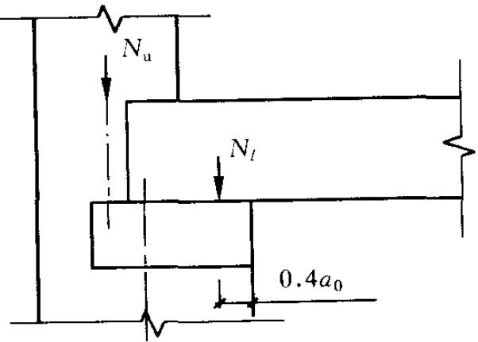  
注：当板支撑于墙上时，板端支承压力 $N_{l}$ 到墙内边的距离可取板的实际支承长度 $a$ 的0.4倍。

3 对本层的竖向荷载，应考虑对墙、柱的实际偏心影响，梁端支承压力 $N_{l}$ 到墙内边的距离，应取梁端有效支承长度 $a_0$ 的0.4倍（图4.2.5）。由上面楼层传来的荷载 $N_{\mathrm{u}}$ ，可视作作用于上一楼层的墙、柱的截面重心处；

4 对于梁跨度大于 $9\mathrm{m}$ 的墙承重的多层房屋，按上述方

法计算时，应考虑梁端约束弯矩的影响。可按梁两端固结计算梁端弯矩，再将其乘以修正系数 $\gamma$ 后，按墙体线性刚度分到上层墙底部和下层墙顶部，修正系数 $\gamma$ 可按下式计算：

$$\gamma = 0. 2 \sqrt{\frac{a}{h}} \tag{4.2.5}$$

式中： $a$ ——梁端实际支承长度；

$h$ ——支承墙体的墙厚，当上下墙厚不同时取下部墙厚，当有壁柱时取 $h_{\mathrm{T}}$ 。

4.2.6 刚性方案多层房屋的外墙，计算风荷载时应符合下列要求：

1 风荷载引起的弯矩，可按下式计算：

$$M = \frac{w H_{i}^{2}}{12} \tag{4.2.6}$$

式中： $w$ ——沿楼层高均布风荷载设计值（ $\mathrm{kN / m}$ ）；

$H_{i}$ ——层高（m）。

2 当外墙符合下列要求时，静力计算可不考虑风荷载的影响：

1）洞口水平截面面积不超过全截面面积的 $2 / 3$   
2）层高和总高不超过表4.2.6的规定；  
3）屋面自重不小于 $0.8\mathrm{kN} / \mathrm{m}^2$ 。

表 4.2.6 外墙不考虑风荷载影响时的最大高度  

| 基本风压值(kN/m2) | 层高(m) | 总高(m) |
| --- | --- | --- |
| 0.4 | 4.0 | 28 |
| 0.5 | 4.0 | 24 |
| 0.6 | 4.0 | 18 |
| 0.7 | 3.5 | 18 |

注：对于多层混凝土砌块房屋，当外墙厚度不小于 $190\mathrm{mm}$ 、层高不大于 $2.8\mathrm{m}$ 、总高不大于 $19.6\mathrm{m}$ 、基本风压不大于 $0.7\mathrm{kN} / \mathrm{m}^2$ 时，可不考虑风荷载的影响。

4.2.7 计算上柔下刚多层房屋时，顶层可按单层房屋计算，其空间性能影响系数可根据屋盖类别按本规范表4.2.4采用。  
4.2.8 带壁柱墙的计算截面翼缘宽度 $b_{\mathrm{f}}$ ，可按下列规定采用：

1 多层房屋，当有门窗洞口时，可取窗间墙宽度；当无门窗洞口时，每侧翼墙宽度可取壁柱高度（层高）的 $1/3$ ，但不应大于相邻壁柱间的距离；  
2 单层房屋，可取壁柱宽加 $2/3$ 墙高，但不应大于窗间墙宽度和相邻壁柱间的距离；  
3 计算带壁柱墙的条形基础时，可取相邻壁柱间的距离。

4.2.9 当转角墙段角部受竖向集中荷载时，计算截面的长度可从角点算起，每侧宜取层高的 $1/3$ 。当上述墙体范围内有门窗洞口时，则计算截面取至洞边，但不宜大于层高的 $1/3$ 。当上层的竖向集中荷载传至本层时，可按均布荷载计算，此时转角墙段可按角形截面偏心受压构件进行承载力验算。

## 4.3 耐久性规定

4.3.1 砌体结构的耐久性应根据表4.3.1的环境类别和设计使用年限进行设计。

表 4.3.1 砌体结构的环境类别  

| 环境类别 | 条 件 |
| --- | --- |
| 1 | 正常居住及办公建筑的内部干燥环境 |
| 2 | 潮湿的室内或室外环境，包括与无侵蚀性土和水接触的环境 |

续表 4.3.1  

| 环境类别 | 条 件 |
| --- | --- |
| 3 | 严寒和使用化冰盐的潮湿环境（室内或室外） |
| 4 | 与海水直接接触的环境，或处于滨海地区的盐饱和的气体环境 |
| 5 | 有化学侵蚀的气体、液体或固态形式的环境，包括有侵蚀性土壤的环境 |

4.3.2 当设计使用年限为 $50\mathrm{a}$ 时，砌体中钢筋的耐久性选择应符合表4.3.2的规定。

表 4.3.2 砌体中钢筋耐久性选择  

| 环境类别 | 钢筋种类和最低保护要求 | 钢筋种类和最低保护要求 |
| --- | --- | --- |
| 环境类别 | 位于砂浆中的钢筋 | 位于灌孔混凝土中的钢筋 |
| 1 | 普通钢筋 | 普通钢筋 |
| 2 | 重镀锌或有等效保护的钢筋 | 当采用混凝土灌孔时,可为普通钢筋;当采用砂浆灌孔时应为重镀锌或有等效保护的钢筋 |
| 3 | 不锈钢或有等效保护的钢筋 | 重镀锌或有等效保护的钢筋 |
| 4和5 | 不锈钢或等效保护的钢筋 | 不锈钢或等效保护的钢筋 |

注：1 对夹心墙的外叶墙，应采用重镀锌或有等效保护的钢筋；  
2 表中的钢筋即为国家现行标准《混凝土结构设计规范》GB50010和《冷轧带肋钢筋混凝土结构技术规程》JGJ95等标准规定的普通钢筋或非预应力钢筋。

4.3.3 设计使用年限为 $50\mathrm{a}$ 时，砌体中钢筋的保护层厚度，应符合下列规定：

1 配筋砌体中钢筋的最小混凝土保护层应符合表4.3.3的规定；  
2 灰缝中钢筋外露砂浆保护层的厚度不应小于 $15\mathrm{mm}$   
3 所有钢筋端部均应有与对应钢筋的环境类别条件相同的保护层厚度；

4 对填实的夹心墙或特别的墙体构造，钢筋的最小保护层厚度，应符合下列规定：

1）用于环境类别1时，应取 $20\mathrm{mm}$ 厚砂浆或灌孔混凝土与钢筋直径较大者；  
2）用于环境类别2时，应取 $20\mathrm{mm}$ 厚灌孔混凝土与钢筋直径较大者；  
3）采用重镀锌钢筋时，应取 $20\mathrm{mm}$ 厚砂浆或灌孔混凝土与钢筋直径较大者；  
4）采用不锈钢筋时，应取钢筋的直径。

表 4.3.3 钢筋的最小保护层厚度  

| 环境类别 | 混凝土强度等级 | 混凝土强度等级 | 混凝土强度等级 | 混凝土强度等级 |
| --- | --- | --- | --- | --- |
| 环境类别 | C20 | C25 | C30 | C35 |
| 环境类别 | 最低水泥含量(kg/m³) | 最低水泥含量(kg/m³) | 最低水泥含量(kg/m³) | 最低水泥含量(kg/m³) |
| 环境类别 | 260 | 280 | 300 | 320 |
| 1 | 20 | 20 | 20 | 20 |
| 2 | - | 25 | 25 | 25 |
| 3 | - | 40 | 40 | 30 |
| 4 | - | - | 40 | 40 |
| 5 | - | - | - | 40 |

注：1 材料中最大氯离子含量和最大碱含量应符合现行国家标准《混凝土结构设计规范》GB50010的规定；  
2 当采用防渗砌体块体和防渗砂浆时，可以考虑部分砌体（含抹灰层）的厚度作为保护层，但对环境类别1、2、3，其混凝土保护层的厚度相应不应小于 $10\mathrm{mm}$ 、 $15\mathrm{mm}$ 和 $20\mathrm{mm}$   
3 钢筋砂浆面层的组合砌体构件的钢筋保护层厚度宜比表4.3.3规定的混凝土保护层厚度数值增加 $5\mathrm{mm}\sim 10\mathrm{mm}$   
4 对安全等级为一级或设计使用年限为50a以上的砌体结构，钢筋保护层的厚度应至少增加 $10\mathrm{mm}$ 。

4.3.4 设计使用年限为 $50\mathrm{a}$ 时，夹心墙的钢筋连接件或钢筋网片、连接钢板、锚固螺栓或钢筋，应采用重镀锌或等效的防护涂

层，镀锌层的厚度不应小于 $290\mathrm{g / m^2}$ ；当采用环氯涂层时，灰缝钢筋涂层厚度不应小于 $290\mu \mathrm{m}$ ，其余部件涂层厚度不应小于 $450\mu \mathrm{m}$ 。

4.3.5 设计使用年限为 $50\mathrm{a}$ 时，砌体材料的耐久性应符合下列规定：

1 地面以下或防潮层以下的砌体、潮湿房间的墙或环境类别2的砌体，所用材料的最低强度等级应符合表4.3.5的规定：

表4.3.5 地面以下或防潮层以下的砌体、潮湿房间的墙所用材料的最低强度等级  

| 潮湿程度 | 烧结普通砖 | 混凝土普通砖、蒸压普通砖 | 混凝土砌块 | 石材 | 水泥砂浆 |
| --- | --- | --- | --- | --- | --- |
| 稍潮湿的 | MU15 | MU20 | MU7.5 | MU30 | M5 |
| 很潮湿的 | MU20 | MU20 | MU10 | MU30 | M7.5 |
| 含水饱和的 | MU20 | MU25 | MU15 | MU40 | M10 |

注：1 在冻胀地区，地面以下或防潮层以下的砌体，不宜采用多孔砖，如采用时，其孔洞应用不低于M10的水泥砂浆预先灌实。当采用混凝土空心砌块时，其孔洞应采用强度等级不低于Cb20的混凝土预先灌实；  
2 对安全等级为一级或设计使用年限大于 $50\mathrm{a}$ 的房屋，表中材料强度等级应至少提高一级。

2 处于环境类别 $3 \sim 5$ 等有侵蚀性介质的砌体材料应符合下列规定：

1）不应采用蒸压灰砂普通砖、蒸压粉煤灰普通砖；  
2）应采用实心砖，砖的强度等级不应低于MU20，水泥砂浆的强度等级不应低于M10；  
3）混凝土砌块的强度等级不应低于MU15，灌孔混凝土的强度等级不应低于Cb30，砂浆的强度等级不应低于Mb10；  
4）应根据环境条件对砌体材料的抗冻指标、耐酸、碱性能提出要求，或符合有关规范的规定。

# 5 无筋砌体构件

## 5.1 受压构件

5.1.1 受压构件的承载力，应符合下式的要求：

$$N \leqslant \varphi f A \tag{5.1.1}$$

式中： $N$ ——轴向力设计值；

$\varphi$ ——高厚比 $\beta$ 和轴向力的偏心距 $e$ 对受压构件承载力的影响系数；

$f$ ——砌体的抗压强度设计值；

$A$ ——截面面积。

注：1 对矩形截面构件，当轴向力偏心方向的截面边长大于另一方向的边长时，除按偏心受压计算外，还应对较小边长方向，按轴心受压进行验算；

2 受压构件承载力的影响系数 $\varphi$ ，可按本规范附录D的规定采用；

3 对带壁柱墙，当考虑翼缘宽度时，可按本规范第4.2.8条采用。

5.1.2 确定影响系数 $\varphi$ 时，构件高厚比 $\beta$ 应按下列公式计算：

$$\text{对 矩 形 截 面} \quad \beta = \gamma_{\beta} \frac{H_{0}}{h} \tag{5.1.2-1}$$

$$\text{对} \mathrm{T} \text{形 截 面} \quad \beta = \gamma_{\beta} \frac{H_{0}}{h_{\mathrm{T}}} \tag{5.1.2-2}$$

式中： $\gamma_{\beta}$ ——不同材料砌体构件的高厚比修正系数，按表5.1.2采用；

$H_{0}$ ——受压构件的计算高度，按本规范表5.1.3确定；

$h$ ——矩形截面轴向力偏心方向的边长，当轴心受压时为截面较小边长；

$h_{\mathrm{T}}$ ——T形截面的折算厚度，可近似按3.5i计算， $i$ 为截面回转半径。

表 5.1.2 高厚比修正系数 ${\gamma }_{\beta }$   

| 砌体材料类别 | γ3 |
| --- | --- |
| 烧结普通砖、烧结多孔砖 | 1.0 |
| 混凝土普通砖、混凝土多孔砖、混凝土及轻集料混凝土砌块 | 1.1 |
| 蒸压灰砂普通砖、蒸压粉煤灰普通砖、细料石 | 1.2 |
| 粗料石、毛石 | 1.5 |

注：对灌孔混凝土砌块砌体， $\gamma_{\beta}$ 取1.0。

5.1.3 受压构件的计算高度 $H_{0}$ ，应根据房屋类别和构件支承条件等按表5.1.3采用。表中的构件高度 $H$ ，应按下列规定采用：

1 在房屋底层，为楼板顶面到构件下端支点的距离。下端支点的位置，可取在基础顶面。当埋置较深且有刚性地坪时，可取室外地面下 $500\mathrm{mm}$ 处；  
2 在房屋其他层，为楼板或其他水平支点间的距离；  
3 对于无壁柱的山墙，可取层高加山墙尖高度的 $1 / 2$ ；对于带壁柱的山墙可取壁柱处的山墙高度。

表 5.1.3 受压构件的计算高度 $H_{0}$   

| 房屋类别 | 房屋类别 | 房屋类别 | 柱 | 柱 | 带壁柱墙或周边拉接的墙 | 带壁柱墙或周边拉接的墙 | 带壁柱墙或周边拉接的墙 |
| --- | --- | --- | --- | --- | --- | --- | --- |
| 房屋类别 | 房屋类别 | 房屋类别 | 排架方向 | 垂直排架方向 | s>2H | 2H≥s>H | s≤H |
| 有吊车的单层房屋 | 变截面柱上段 | 弹性方案 | 2.5Hu | 1.25Hu | 2.5Hu | 2.5Hu | 2.5Hu |
| 有吊车的单层房屋 | 变截面柱上段 | 刚性、刚弹性方案 | 2.0Hu | 1.25Hu | 2.0Hu | 2.0Hu | 2.0Hu |
| 有吊车的单层房屋 | 变截面柱下段 | 变截面柱下段 | 1.0Hl | 0.8Hl | 1.0Hl | 1.0Hl | 1.0Hl |
| 无吊车的单层和多层房屋 | 单跨 | 弹性方案 | 1.5H | 1.0H | 1.5H | 1.5H | 1.5H |
| 无吊车的单层和多层房屋 | 单跨 | 刚弹性方案 | 1.2H | 1.0H | 1.2H | 1.2H | 1.2H |
| 无吊车的单层和多层房屋 | 多跨 | 弹性方案 | 1.25H | 1.0H | 1.25H | 1.25H | 1.25H |
| 无吊车的单层和多层房屋 | 多跨 | 刚弹性方案 | 1.10H | 1.0H | 1.1H | 1.1H | 1.1H |
| 无吊车的单层和多层房屋 | 刚性方案 | 刚性方案 | 1.0H | 1.0H | 1.0H | 0.4s+0.2H | 0.6s |

注：1 表中 $H_{\mathrm{u}}$ 为变截面柱的上段高度； $H_{l}$ 为变截面柱的下段高度；  
2 对于上端为自由端的构件， $H_0 = 2H$   
3 独立砖柱，当无柱间支撑时，柱在垂直排架方向的 $H_{0}$ 应按表中数值乘以1.25后采用；  
4 $s$ 为房屋横墙间距；  
5 自承重墙的计算高度应根据周边支承或拉接条件确定。

5.1.4 对有吊车的房屋，当荷载组合不考虑吊车作用时，变截面柱上段的计算高度可按本规范表5.1.3规定采用；变截面柱下段的计算高度，可按下列规定采用：

1 当 $H_{\mathrm{u}} / H \leqslant 1 / 3$ 时，取无吊车房屋的 $H_{0}$ ；  
2 当 $1 / 3 < H_{\mathrm{u}} / H < 1 / 2$ 时，取无吊车房屋的 $H_0$ 乘以修正系数，修正系数 $\mu$ 可按下式计算：

$$\mu = 1. 3 - 0. 3 I_{\mathrm{u}} / I_{l} \tag{5.1.4}$$

式中： $I_{\mathrm{u}}$ ——变截面柱上段的惯性矩；

$I_{l}$ ——变截面柱下段的惯性矩。

3 当 $H_{\mathrm{u}} / H \geqslant 1 / 2$ 时，取无吊车房屋的 $H_{0}$ 。但在确定 $\beta$ 值时，应采用上柱截面。

注：本条规定也适用于无吊车房屋的变截面柱。

5.1.5 按内力设计值计算的轴向力的偏心距 $e$ 不应超过 $0.6y$ 。 $y$ 为截面重心到轴向力所在偏心方向截面边缘的距离。

## 5.2 局部受压

5.2.1 砌体截面中受局部均匀压力时的承载力，应满足下式的要求：

$$N_{l} \leqslant \gamma f A_{l} \tag{5.2.1}$$

式中： $N_{l}$ ——局部受压面积上的轴向力设计值；

$\gamma$ ——砌体局部抗压强度提高系数；

$f$ ——砌体的抗压强度设计值，局部受压面积小于 $0.3\mathrm{m}^2$ ，可不考虑强度调整系数 $\gamma_{\mathrm{a}}$ 的影响；

$A_{l}$ ——局部受压面积。

5.2.2 砌体局部抗压强度提高系数 $\gamma$ ，应符合下列规定：

1 $\gamma$ 可按下式计算：

$$\gamma = 1 + 0. 35 \sqrt{\frac{A_{0}}{A_{l}} - 1} \tag{5.2.2}$$

式中： $A_0$ ——影响砌体局部抗压强度的计算面积。

2 计算所得 $\gamma$ 值，尚应符合下列规定：

1）在图5.2.2（a）的情况下， $\gamma \leqslant 2.5$   
2）在图5.2.2（b）的情况下， $\gamma \leqslant 2.0$   
3）在图5.2.2（c）的情况下， $\gamma \leqslant 1.5$   
4）在图5.2.2（d）的情况下， $\gamma \leqslant 1.25$   
5）按本规范第6.2.13条的要求灌孔的混凝土砌块砌体，在1)、2）款的情况下，尚应符合 $\gamma \leqslant 1.5$ 。未灌孔混凝土砌块砌体， $\gamma = 1.0$   
6）对多孔砖砌体孔洞难以灌实时，应按 $\gamma = 1.0$ 取用；当设置混凝土垫块时，按垫块下的砌体局部受压计算。

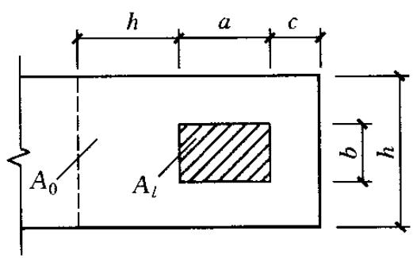  
(a)

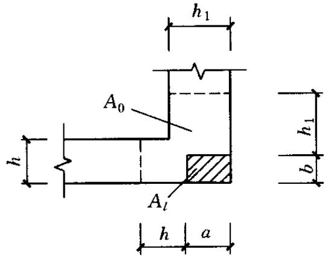  
(c)

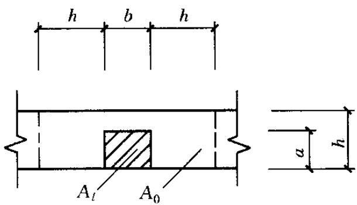  
(b)

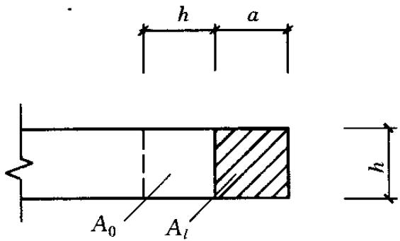  
(d)   
图5.2.2 影响局部抗压强度的面积 $A_0$

5.2.3 影响砌体局部抗压强度的计算面积，可按下列规定采用：

1 在图5.2.2（a）的情况下， $A_0 = (a + c + h)h$   
2 在图5.2.2（b）的情况下， $A_0 = (b + 2h)h$   
3 在图5.2.2（c）的情况下，

$$A_{0} = (a + h) h + (b + h_{1} - h) h_{1};$$

4 在图5.2.2（d）的情况下， $A_0 = (a + h)h$

式中： $a$ 、 $b$ ——矩形局部受压面积 $A_{l}$ 的边长；

$h$ 、 $h_1$ —墙厚或柱的较小边长，墙厚；

$c$ ——矩形局部受压面积的外边缘至构件边缘的较小距离，当大于 $h$ 时，应取为 $h$ 。

5.2.4 梁端支承处砌体的局部受压承载力，应按下列公式计算：

$$\phi N_{0} + N_{l} \leqslant \eta f A_{l} \tag{5.2.4-1}$$

$$\psi = 1. 5 - 0. 5 \frac{A_{0}}{A_{l}} \tag{5.2.4-2}$$

$$N_{0} = \sigma_{0} A_{l} \tag{5.2.4-3}$$

$$A_{l} = a_{0} b \tag{5.2.4-4}$$

$$a_{0} = 10 \sqrt{\frac{h_{\mathrm{c}}}{f}} \tag{5.2.4-5}$$

式中： $\psi$ ——上部荷载的折减系数，当 $A_0 / A_l$ 大于或等于3时，应取 $\phi$ 等于0；

$N_{0}$ ——局部受压面积内上部轴向力设计值（N）；

$N_{l}$ ——梁端支承压力设计值（N）；

$\sigma_0$ ——上部平均压应力设计值（ $\mathrm{N} / \mathrm{mm}^2$ ）；

$\eta$ ——梁端底面压应力图形的完整系数，应取0.7，对于过梁和墙梁应取1.0；

$a_0$ ——梁端有效支承长度（ $\mathrm{mm}$ ）；当 $a_0$ 大于 $a$ 时，应取 $a_0$ 等于 $a, a$ 为梁端实际支承长度（ $\mathrm{mm}$ ）；

$b$ ——梁的截面宽度（ $\mathrm{mm}$ ）；

$h_{\mathrm{c}}$ ——梁的截面高度（mm）；

$f$ ——砌体的抗压强度设计值（ $\mathrm{MPa}$ ）。

5.2.5 在梁端设有刚性垫块时的砌体局部受压，应符合下列规定：

1 刚性垫块下的砌体局部受压承载力，应按下列公式计算：

$$N_{0} + N_{l} \leqslant \varphi \gamma_{1} f A_{\mathrm{b}} \tag{5.2.5-1}$$

$$N_{0} = \sigma_{0} A_{\mathrm{b}} \tag{5.2.5-2}$$

$$A_{\mathrm{b}} = a_{\mathrm{b}} b_{\mathrm{b}} \tag{5.2.5-3}$$

式中： $N_{0}$ ——垫块面积 $A_{\mathrm{b}}$ 内上部轴向力设计值（N）；

$\varphi$ ——垫块上 $N_{0}$ 与 $N_{l}$ 合力的影响系数，应取 $\beta$ 小于或等于3，按第5.1.1条规定取值；

$\gamma_{1}$ ——垫块外砌体面积的有利影响系数， $\gamma_{1}$ 应为 $0.8\gamma$ 但不小于1.0。 $\gamma$ 为砌体局部抗压强度提高系数，按公式（5.2.2）以 $A_{\mathrm{b}}$ 代替 $A_{l}$ 计算得出；

$A_{\mathrm{b}}$ ——垫块面积 （$\mathrm{mm}^2)$ ；

$a_{\mathrm{b}}$ ——垫块伸入墙内的长度（mm）；

$b_{\mathrm{b}}$ ——垫块的宽度（mm）。

2 刚性垫块的构造，应符合下列规定：

1）刚性垫块的高度不应小于 $180\mathrm{mm}$ ，自梁边算起的垫块挑出长度不应大于垫块高度 $t_{\mathrm{b}}$ ；  
2）在带壁柱墙的壁柱内设刚性垫块时（图5.2.5），其计算面积应取壁柱范围内的面积，而不应计算翼缘部分，同时壁柱上垫块伸入翼墙内的长度不应小于 $120\mathrm{mm}$ ；  
3）当现浇垫块与梁端整体浇筑时，垫块可在梁高范围内设置。

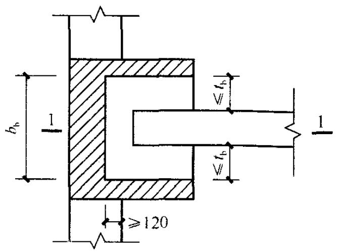

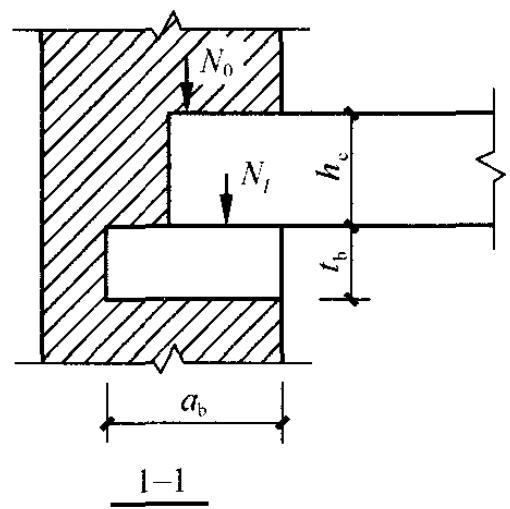  
图5.2.5 壁柱上设有垫块时梁端局部受压

3 梁端设有刚性垫块时，垫块上 $N_{l}$ 作用点的位置可取梁端有效支承长度 $a_0$ 的0.4倍。 $a_0$ 应按下式确定：

$$a_{0} = \delta_{1} \sqrt{\frac{h_{\mathrm{c}}}{f}} \tag{5.2.5-4}$$

式中： $\delta_{1}$ ——刚性垫块的影响系数，可按表5.2.5采用。

表 5.2.5 系数 ${\delta }_{1}$ 值表  

| σ0/f | 0 | 0.2 | 0.4 | 0.6 | 0.8 |
| --- | --- | --- | --- | --- | --- |
| δ1 | 5.4 | 5.7 | 6.0 | 6.9 | 7.8 |

注：表中其间的数值可采用插入法求得。

5.2.6 梁下设有长度大于 $\pi h_0$ 的垫梁时，垫梁上梁端有效支承长度 $a_0$ 可按公式（5.2.5-4）计算。垫梁下的砌体局部受压承载力，应按下列公式计算：

$$N_{0} + N_{l} \leqslant 2. 4 \delta_{2} f b_{\mathrm{b}} h_{0} \tag{5.2.6-1}$$

$$N_{0} = \pi b_{\mathrm{b}} h_{0} \sigma_{0} / 2 \tag{5.2.6-2}$$

$$h_{0} = 2 \sqrt [ 3 ]{\frac{E_{\mathrm{c}} I_{\mathrm{c}}}{E h}} \tag{5.2.6-3}$$

式中： $N_{0}$ ——垫梁上部轴向力设计值（N）；

$b_{\mathrm{b}}$ ——垫梁在墙厚方向的宽度（mm）；

$\delta_{2}$ ——垫梁底面压应力分布系数，当荷载沿墙厚方向均匀分布时可取1.0，不均匀分布时可取0.8；

$h_0$ ——垫梁折算高度（mm）；

$E_{\mathrm{c}}$ 、 $I_{\mathrm{c}}$ ——分别为垫梁的混凝土弹性模量和截面惯性矩；

$E$ ——砌体的弹性模量；

$h$ —墙厚（mm）。

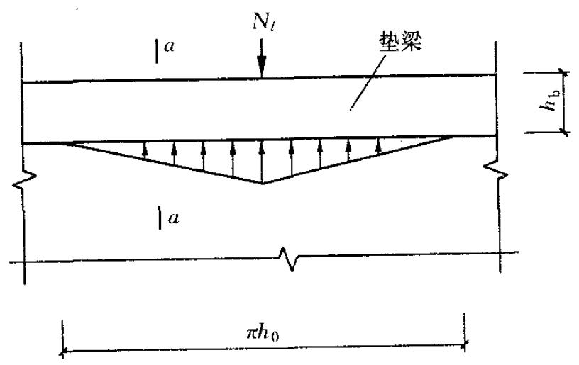

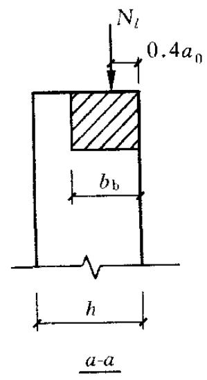  
图5.2.6 垫梁局部受压

## 5.3 轴心受拉构件

5.3.1 轴心受拉构件的承载力，应满足下式的要求：

$$N_{t} \leqslant f_{t} A \tag{5.3.1}$$

式中： $N_{\mathrm{t}}$ ——轴心拉力设计值；

$f_{\mathrm{t}}$ ——砌体的轴心抗拉强度设计值，应按表3.2.2采用。

## 5.4 受弯构件

5.4.1 受弯构件的承载力，应满足下式的要求：

$$M \leqslant f_{\mathrm{m}} W \tag{5.4.1}$$

式中： $M$ ——弯矩设计值；

$f_{\mathrm{tm}}$ ——砌体弯曲抗拉强度设计值，应按表3.2.2采用；

$W$ ——截面抵抗矩。

5.4.2 受弯构件的受剪承载力，应按下列公式计算：

$$V \leqslant f_{\mathrm{v}} b z \tag{5.4.2-1}$$

$$z = I / S \tag{5.4.2-2}$$

式中： $V$ ——剪力设计值；

$f_{\mathrm{v}}$ ——砌体的抗剪强度设计值，应按表3.2.2采用；

$b$ ——截面宽度；

$z$ ——内力臂，当截面为矩形时取 $z$ 等于 $2h / 3$ （ $h$ 为截面高度）；

$I$ ——截面惯性矩；

$S$ ——截面面积矩。

## 5.5 受剪构件

5.5.1 沿通缝或沿阶梯形截面破坏时受剪构件的承载力，应按下列公式计算：

$$V \leqslant \left(f_{\mathrm{v}} + \alpha \mu \sigma_{0}\right) A \tag{5.5.1-1}$$

当 $\gamma_{\mathrm{G}} = 1.2$ 时， $\mu = 0.26 - 0.082\frac{\sigma_0}{f}$ (5.5.1-2)

当 $\gamma_{G} = 1.35$ 时， $\mu = 0.23 - 0.065\frac{\sigma_0}{f}$ (5.5.1-3)

式中： $V$ ——剪力设计值；

$A$ ——水平截面面积；

$f_{\mathrm{v}}$ ——砌体抗剪强度设计值，对灌孔的混凝土砌块砌体取 $f_{\mathrm{vg}}$ ；

$\alpha$ ——修正系数；当 $\gamma_{\mathrm{G}} = 1.2$ 时，砖（含多孔砖）砌体取0.60，混凝土砌块砌体取0.64；当 $\gamma_{\mathrm{G}} = 1.35$ 时，砖（含多孔砖）砌体取0.64，混凝土砌块砌体取0.66；

$\mu$ ——剪压复合受力影响系数；

$f$ ——砌体的抗压强度设计值；

$\sigma_0$ ——永久荷载设计值产生的水平截面平均压应力，其值不应大于 $0.8f$ 。

# 6构造要求

## 6.1 墙、柱的高厚比验算

6.1.1 墙、柱的高厚比应按下式验算：

$$\beta = \frac{H_{0}}{h} \leqslant \mu_{1} \mu_{2} [ \beta ] \tag{6.1.1}$$

式中： $H_{0}$ —墙、柱的计算高度；

$h$ ——墙厚或矩形柱与 $H_0$ 相对应的边长；

$\mu_{1}$ ——自承重墙允许高厚比的修正系数；

$\mu_{2}$ ——有门窗洞口墙允许高厚比的修正系数；

$[\beta]$ ——墙、柱的允许高厚比，应按表6.1.1采用。

注：1 墙、柱的计算高度应按本规范第 5.1.3 条采用；

2 当与墙连接的相邻两墙间的距离 $s \leqslant \mu_1 \mu_2 [\beta] h$ 时，墙的高度可不受本条限制；  
3 变截面柱的高厚比可按上、下截面分别验算，其计算高度可按第5.1.4条的规定采用。验算上柱的高厚比时，墙、柱的允许高厚比可按表6.1.1的数值乘以1.3后采用。

表 6.1.1 墙、柱的允许高厚比 $\left\lbrack  \beta \right\rbrack$ 值  

| 砌体类型 | 砂浆强度等级 | 墙 | 柱 |
| --- | --- | --- | --- |
| 无筋砌体 | M2.5 | 22 | 15 |
| 无筋砌体 | M5.0或Mb5.0、Ms5.0 | 24 | 16 |
| 无筋砌体 | ≥M7.5或Mb7.5、Ms7.5 | 26 | 17 |
| 配筋砌块砌体 | - | 30 | 21 |

注：1 毛石墙、柱的允许高厚比应按表中数值降低 $20\%$   
2 带有混凝土或砂浆面层的组合砖砌体构件的允许高厚比，可按表中数值提高 $20\%$ ，但不得大于28；  
3 验算施工阶段砂浆尚未硬化的新砌砌体构件高厚比时，允许高厚比对墙取14，对柱取11。

6.1.2 带壁柱墙和带构造柱墙的高厚比验算，应按下列规定进行：

1 按公式（6.1.1）验算带壁柱墙的高厚比，此时公式中 $h$ 应改用带壁柱墙截面的折算厚度 $h_{\mathrm{T}}$ ，在确定截面回转半径时，墙截面的翼缘宽度，可按本规范第4.2.8条的规定采用；当确定带壁柱墙的计算高度 $H_0$ 时， $s$ 应取与之相交相邻墙之间的距离。  
2 当构造柱截面宽度不小于墙厚时，可按公式（6.1.1）验算带构造柱墙的高厚比，此时公式中 $h$ 取墙厚；当确定带构造柱墙的计算高度 $H_{0}$ 时， $s$ 应取相邻横墙间的距离；墙的允许高厚比 $[\beta]$ 可乘以修正系数 $\mu_{\mathrm{c}}$ ， $\mu_{\mathrm{c}}$ 可按下式计算：

$$\mu_{\mathrm{c}} = 1 + \gamma \frac{b_{\mathrm{c}}}{l} \tag{6.1.2}$$

式中： $\gamma$ ——系数。对细料石砌体， $\gamma = 0$ ；对混凝土砌块、混凝土多孔砖、粗料石、毛料石及毛石砌体， $\gamma = 1.0$ ；其他砌体， $\gamma = 1.5$ ；

$b_{\mathrm{c}}$ 构造柱沿墙长方向的宽度；

$l$ ——构造柱的间距。

当 $b_{\mathrm{c}} / l > 0.25$ 时取 $b_{\mathrm{c}} / l = 0.25$ ，当 $b_{\mathrm{c}} / l < 0.05$ 时取 $b_{\mathrm{c}} / l = 0$ 。注：考虑构造柱有利作用的高厚比验算不适用于施工阶段。

3 按公式（6.1.1）验算壁柱间墙或构造柱间墙的高厚比时， $s$ 应取相邻壁柱间或相邻构造柱间的距离。设有钢筋混凝土圈梁的带壁柱墙或带构造柱墙，当 $b / s \geqslant 1 / 30$ 时，圈梁可视作壁柱间墙或构造柱间墙的不动铰支点（ $b$ 为圈梁宽度）。当不满足上述条件且不允许增加圈梁宽度时，可按墙体平面外等刚度原则增加圈梁高度，此时，圈梁仍可视为壁柱间墙或构造柱间墙的不动铰支点。

6.1.3 厚度不大于 $240\mathrm{mm}$ 的自承重墙，允许高厚比修正系数 $\mu_{1}$ ，应按下列规定采用：

1 墙厚为 $240\mathrm{mm}$ 时， $\mu_{1}$ 取1.2；墙厚为 $90\mathrm{mm}$ 时， $\mu_{1}$ 取

1.5；当墙厚小于 $240\mathrm{mm}$ 且大于 $90\mathrm{mm}$ 时， $\mu_{1}$ 按插入法取值。

2 上端为自由端墙的允许高厚比，除按上述规定提高外，尚可提高 $30\%$ 。  
3 对厚度小于 $90\mathrm{mm}$ 的墙，当双面采用不低于M10的水泥砂浆抹面，包括抹面层的墙厚不小于 $90\mathrm{mm}$ 时，可按墙厚等于 $90\mathrm{mm}$ 验算高厚比。

6.1.4 对有门窗洞口的墙，允许高厚比修正系数，应符合下列要求：

1 允许高厚比修正系数，应按下式计算：

$$\mu_{2} = 1 - 0. 4 \frac{b_{\mathrm{s}}}{s} \tag{6.1.4}$$

式中： $b_{s}$ ——在宽度 $s$ 范围内的门窗洞口总宽度；

$s$ ——相邻横墙或壁柱之间的距离。

2 当按公式（6.1.4）计算的 $\mu_{2}$ 的值小于0.7时， $\mu_{2}$ 取0.7；当洞口高度等于或小于墙高的 $1 / 5$ 时， $\mu_{2}$ 取1.0。  
3 当洞口高度大于或等于墙高的4/5时，可按独立墙段验算高厚比。

## 6.2 一般构造要求

6.2.1 预制钢筋混凝土板在混凝土圈梁上的支承长度不应小于 $80\mathrm{mm}$ ，板端伸出的钢筋应与圈梁可靠连接，且同时浇筑；预制钢筋混凝土板在墙上的支承长度不应小于 $100\mathrm{mm}$ ，并应按下列方法进行连接：

1 板支承于内墙时，板端钢筋伸出长度不应小于 $70\mathrm{mm}$ ，且与支座处沿墙配置的纵筋绑扎，用强度等级不应低于C25的混凝土浇筑成板带；  
2 板支承于外墙时，板端钢筋伸出长度不应小于 $100\mathrm{mm}$ ，且与支座处沿墙配置的纵筋绑扎，并用强度等级不应低于C25的混凝土浇筑成板带；  
3 预制钢筋混凝土板与现浇板对接时，预制板端钢筋应伸

入现浇板中进行连接后，再浇筑现浇板。

6.2.2 墙体转角处和纵横墙交接处应沿竖向每隔 $400\mathrm{mm} \sim 500\mathrm{mm}$ 设拉结钢筋，其数量为每 $120\mathrm{mm}$ 墙厚不少于1根直径 $6\mathrm{mm}$ 的钢筋；或采用焊接钢筋网片，埋入长度从墙的转角或交接处算起，对实心砖墙每边不小于 $500\mathrm{mm}$ ，对多孔砖墙和砌块墙不小于 $700\mathrm{mm}$ 。  
6.2.3 填充墙、隔墙应分别采取措施与周边主体结构构件可靠连接，连接构造和嵌缝材料应能满足传力、变形、耐久和防护要求。  
6.2.4 在砌体中留槽洞及埋设管道时，应遵守下列规定：

1 不应在截面长边小于 $500\mathrm{mm}$ 的承重墙体、独立柱内埋设管线；  
2 不宜在墙体中穿行暗线或预留、开凿沟槽，当无法避免时应采取必要的措施或按削弱后的截面验算墙体的承载力。

注：对受力较小或未灌孔的砌块砌体，允许在墙体的竖向孔洞中设置管线。

6.2.5 承重的独立砖柱截面尺寸不应小于 $240\mathrm{mm} \times 370\mathrm{mm}$ 。毛石墙的厚度不宜小于 $350\mathrm{mm}$ ，毛料石柱较小边长不宜小于 $400\mathrm{mm}$ 。

注：当有振动荷载时，墙、柱不宜采用毛石砌体。

6.2.6 支承在墙、柱上的吊车梁、屋架及跨度大于或等于下列数值的预制梁的端部，应采用锚固件与墙、柱上的垫块锚固：

1 对砖砌体为 $9\mathrm{m}$   
2 对砌块和料石砌体为 $7.2\mathrm{m}$ 。

6.2.7 跨度大于 $6\mathrm{m}$ 的屋架和跨度大于下列数值的梁，应在支承处砌体上设置混凝土或钢筋混凝土垫块；当墙中设有圈梁时，垫块与圈梁宜浇成整体。

1 对砖砌体为 $4.8\mathrm{m}$   
2 对砌块和料石砌体为 $4.2\mathrm{m}$   
3. 对毛石砌体为 $3.9\mathrm{m}$ 。

6.2.8 当梁跨度大于或等于下列数值时，其支承处宜加设壁柱，或采取其他加强措施：

1 对 $240\mathrm{mm}$ 厚的砖墙为 $6\mathrm{m}$ ; 对 $180\mathrm{mm}$ 厚的砖墙为 $4.8\mathrm{m}$ ;  
2 对砌块、料石墙为 $4.8\mathrm{m}$ 。

6.2.9 山墙处的壁柱或构造柱宜砌至山墙顶部，且屋面构件应与山墙可靠拉结。  
6.2.10 砌块砌体应分皮错缝搭砌，上下皮搭砌长度不应小于 $90\mathrm{mm}$ 。当搭砌长度不满足上述要求时，应在水平灰缝内设置不小于2根直径不小于 $4\mathrm{mm}$ 的焊接钢筋网片（横向钢筋的间距不应大于 $200\mathrm{mm}$ ，网片每端应伸出该垂直缝不小于 $300\mathrm{mm}$ ）。  
6.2.11 砌块墙与后砌隔墙交接处，应沿墙高每 $400\mathrm{mm}$ 在水平灰缝内设置不少于2根直径不小于 $4\mathrm{mm}$ 、横筋间距不应大于 $200\mathrm{mm}$ 的焊接钢筋网片（图6.2.11）。

图6.2.11 砌块墙与后砌隔墙交接处钢筋网片  
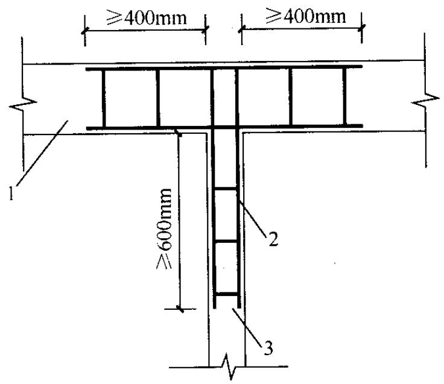  
1—砌块墙；2—焊接钢筋网片；3—后砌隔墙

6.2.12 混凝土砌块房屋，宜将纵横墙交接处，距墙中心线每边不小于 $300\mathrm{mm}$ 范围内的孔洞，采用不低于Cb20混凝土沿全墙高灌实。  
6.2.13 混凝土砌块墙体的下列部位，如未设圈梁或混凝土垫

块，应采用不低于Cb20混凝土将孔洞灌实：

1 搁栅、檩条和钢筋混凝土楼板的支承面下，高度不应小于 $200\mathrm{mm}$ 的砌体；  
2 屋架、梁等构件的支承面下，长度不应小于 $600\mathrm{mm}$ ，高度不应小于 $600\mathrm{mm}$ 的砌体；  
3 挑梁支承面下，距墙中心线每边不应小于 $300\mathrm{mm}$ ，高度不应小于 $600\mathrm{mm}$ 的砌体。

## 6.3 框架填充墙

6.3.1 框架填充墙墙体除应满足稳定要求外，尚应考虑水平风荷载及地震作用的影响。地震作用可按现行国家标准《建筑抗震设计规范》GB50011中非结构构件的规定计算。  
6.3.2 在正常使用和正常维护条件下，填充墙的使用年限宜与主体结构相同，结构的安全等级可按二级考虑。  
6.3.3 填充墙的构造设计，应符合下列规定：

1 填充墙宜选用轻质块体材料，其强度等级应符合本规范第3.1.2条的规定；  
2 填充墙砌筑砂浆的强度等级不宜低于M5（Mb5、Ms5）；  
3 填充墙墙体墙厚不应小于 $90\mathrm{mm}$   
4 用于填充墙的夹心复合砌块，其两肢块体之间应有拉结。  
6.3.4 填充墙与框架的连接，可根据设计要求采用脱开或不脱开方法。有抗震设防要求时宜采用填充墙与框架脱开的方法。

1 当填充墙与框架采用脱开的方法时，宜符合下列规定：

1）填充墙两端与框架柱，填充墙顶面与框架梁之间留出不小于 $20\mathrm{mm}$ 的间隙；  
2）填充墙端部应设置构造柱，柱间距宜不大于20倍墙厚且不大于 $4000\mathrm{mm}$ ，柱宽度不小于 $100\mathrm{mm}$ 。柱竖向钢筋不宜小于 $\phi 10$ ，箍筋宜为 $\phi^{\text{R}}5$ ，竖向间距不宜大于 $400\mathrm{mm}$ 。竖向钢筋与框架梁或其挑出部分的预埋件或预留钢筋连接，绑扎接头时不小于 $30d$ ，焊接时（单

面焊）不小于 $10d$ （ $d$ 为钢筋直径）。柱顶与框架梁（板）应预留不小于 $15\mathrm{mm}$ 的缝隙，用硅酮胶或其他弹性密封材料封缝。当填充墙有宽度大于 $2100\mathrm{mm}$ 的洞口时，洞口两侧应加设宽度不小于 $50\mathrm{mm}$ 的单筋混凝土柱；

3）填充墙两端宜卡入设在梁、板底及柱侧的卡口铁件内，墙侧卡口板的竖向间距不宜大于 $500\mathrm{mm}$ ，墙顶卡口板的水平间距不宜大于 $1500\mathrm{mm}$ ；  
4）墙体高度超过 $4\mathrm{m}$ 时宜在墙高中部设置与柱连通的水平系梁。水平系梁的截面高度不小于 $60\mathrm{mm}$ 。填充墙高不宜大于 $6\mathrm{m}$   
5）填充墙与框架柱、梁的缝隙可采用聚苯乙烯泡沫塑料板条或聚氨酯发泡材料充填，并用硅酮胶或其他弹性密封材料封缝；  
(6) 所有连接用钢筋、金属配件、铁件、预埋件等均应作防腐防锈处理，并应符合本规范第4.3节的规定。嵌缝材料应能满足变形和防护要求。

2 当填充墙与框架采用不脱开的方法时，宜符合下列规定：

1）沿柱高每隔 $500\mathrm{mm}$ 配置2根直径 $6\mathrm{mm}$ 的拉结钢筋（墙厚大于 $240\mathrm{mm}$ 时配置3根直径 $6\mathrm{mm}$ ），钢筋伸入填充墙长度不宜小于 $700\mathrm{mm}$ ，且拉结钢筋应错开截断，相距不宜小于 $200\mathrm{mm}$ 。填充墙墙顶应与框架梁紧密结合。顶面与上部结构接触处宜用一皮砖或配砖斜砌楔紧；  
2）当填充墙有洞口时，宜在窗洞口的上端或下端、门洞口的上端设置钢筋混凝土带，钢筋混凝土带应与过梁的混凝土同时浇筑，其过梁的断面及配筋由设计确定。钢筋混凝土带的混凝土强度等级不小于C20。当有洞口的填充墙尽端至门窗洞口边距离小于 $240\mathrm{mm}$ 时，宜采用钢筋混凝土门窗框；

3）填充墙长度超过 $5\mathrm{m}$ 或墙长大于2倍层高时，墙顶与梁宜有拉接措施，墙体中部应加设构造柱；墙高度超过 $4\mathrm{m}$ 时宜在墙高中部设置与柱连接的水平系梁，墙高超过 $6\mathrm{m}$ 时，宜沿墙高每 $2\mathrm{m}$ 设置与柱连接的水平系梁，梁的截面高度不小于 $60\mathrm{mm}$ 。

## 6.4 夹心墙

6.4.1 夹心墙的夹层厚度，不宜大于 $120\mathrm{mm}$ 。  
6.4.2 外叶墙的砖及混凝土砌块的强度等级，不应低于MU10。  
6.4.3 夹心墙的有效面积，应取承重或主叶墙的面积。高厚比验算时，夹心墙的有效厚度，按下式计算：

$$h_{l} = \sqrt{h_{1}^{2} + h_{2}^{2}} \tag{6.4.3}$$

式中： $h_l$ ——夹心复合墙的有效厚度；

$h_1$ 、 $h_2$ ——分别为内、外叶墙的厚度。

6.4.4 夹心墙外叶墙的最大横向支承间距，宜按下列规定采用：设防烈度为6度时不宜大于 $9\mathrm{m}$ ，7度时不宜大于 $6\mathrm{m}$ ，8、9度时不宜大于 $3\mathrm{m}$ 。  
6.4.5 夹心墙的内、外叶墙，应由拉结件可靠拉结，拉结件宜符合下列规定：

1 当采用环形拉结件时，钢筋直径不应小于 $4\mathrm{mm}$ ，当为Z形拉结件时，钢筋直径不应小于 $6\mathrm{mm}$ ；拉结件应沿竖向梅花形布置，拉结件的水平和竖向最大间距分别不宜大于 $800\mathrm{mm}$ 和 $600\mathrm{mm}$ ；对有振动或有抗震设防要求时，其水平和竖向最大间距分别不宜大于 $800\mathrm{mm}$ 和 $400\mathrm{mm}$ ；  
2 当采用可调拉结件时，钢筋直径不应小于 $4\mathrm{mm}$ ，拉结件的水平和竖向最大间距均不宜大于 $400\mathrm{mm}$ 。叶墙间灰缝的高差不大于 $3\mathrm{mm}$ ，可调拉结件中孔眼和扣钉间的公差不大于 $1.5\mathrm{mm}$ ；  
3 当采用钢筋网片作拉结件时，网片横向钢筋的直径不应小于 $4\mathrm{mm}$ ；其间距不应大于 $400\mathrm{mm}$ ；网片的竖向间距不宜大于

$600\mathrm{mm}$ ；对有振动或有抗震设防要求时，不宜大于 $400\mathrm{mm}$

4 拉结件在叶墙上的搁置长度，不应小于叶墙厚度的 $2/3$ ，并不应小于 $60\mathrm{mm}$ ；  
5 门窗洞口周边 $300\mathrm{mm}$ 范围内应附加间距不大于 $600\mathrm{mm}$ 的拉结件。

6.4.6 夹心墙拉结件或网片的选择与设置，应符合下列规定：

1 夹心墙宜用不锈钢拉结件。拉结件用钢筋制作或采用钢筋网片时，应先进行防腐处理，并应符合本规范4.3的有关规定；  
2 非抗震设防地区的多层房屋，或风荷载较小地区的高层的夹芯墙可采用环形或乙形拉结件；风荷载较大地区的高层建筑房屋宜采用焊接钢筋网片；  
3 抗震设防地区的砌体房屋（含高层建筑房屋）夹心墙应采用焊接钢筋网作为拉结件。焊接网应沿夹心墙连续通长设置，外叶墙至少有一根纵向钢筋。钢筋网片可计入内叶墙的配筋率，其搭接与锚固长度应符合有关规范的规定；  
4 可调节拉结件宜用于多层房屋的夹心墙，其竖向和水平间距均不应大于 $400\mathrm{mm}$ 。

## 6.5 防止或减轻墙体开裂的主要措施

6.5.1 在正常使用条件下，应在墙体中设置伸缩缝。伸缩缝应设在因温度和收缩变形引起应力集中、砌体产生裂缝可能性最大处。伸缩缝的间距可按表6.5.1采用。

表 6.5.1 砌体房屋伸缩缝的最大间距 (m)  

| 屋盖或楼盖类别 | 屋盖或楼盖类别 | 间距 |
| --- | --- | --- |
| 整体式或装配整体式钢筋混凝土结构 | 有保温层或隔热层的屋盖、楼盖 | 50 |
| 整体式或装配整体式钢筋混凝土结构 | 无保温层或隔热层的屋盖 | 40 |
| 装配式无檩体系钢筋混凝土结构 | 有保温层或隔热层的屋盖、楼盖 | 60 |
| 装配式无檩体系钢筋混凝土结构 | 无保温层或隔热层的屋盖 | 50 |

续表 6.5.1  

| 屋盖或楼盖类别 | 屋盖或楼盖类别 | 间 距 |
| --- | --- | --- |
| 装配式有檩体系钢筋混凝土结构 | 有保温层或隔热层的屋盖 | 75 |
| 装配式有檩体系钢筋混凝土结构 | 无保温层或隔热层的屋盖 | 60 |
| 瓦材屋盖、木屋盖或楼盖、轻钢屋盖 | 瓦材屋盖、木屋盖或楼盖、轻钢屋盖 | 100 |

注：1 对烧结普通砖、烧结多孔砖、配筋砌块砌体房屋，取表中数值；对石砌体、蒸压灰砂普通砖、蒸压粉煤灰普通砖、混凝土砌块、混凝土普通砖和混凝土多孔砖房屋，取表中数值乘以0.8的系数，当墙体有可靠外保温措施时，其间距可取表中数值；

2 在钢筋混凝土屋面上挂瓦的屋盖应按钢筋混凝土屋盖采用；  
3 层高大于 $5\mathrm{m}$ 的烧结普通砖、烧结多孔砖、配筋砌块砌体结构单层房屋，其伸缩缝间距可按表中数值乘以1.3；  
4 温差较大且变化频繁地区和严寒地区不采暖的房屋及构筑物墙体的伸缩缝的最大间距，应按表中数值予以适当减小；  
5 墙体的伸缩缝应与结构的其他变形缝相重合，缝宽度应满足各种变形缝的变形要求；在进行立面处理时，必须保证缝隙的变形作用。

6.5.2 房屋顶层墙体，宜根据情况采取下列措施：

1 屋面应设置保温、隔热层；   
2 屋面保温（隔热）层或屋面刚性面层及砂浆找平层应设置分隔缝，分隔缝间距不宜大于 $6\mathrm{m}$ ，其缝宽不小于 $30\mathrm{mm}$ ，并与女儿墙隔开；  
3 采用装配式有檩体系钢筋混凝土屋盖和瓦材屋盖；  
4 顶层屋面板下设置现浇钢筋混凝土圈梁，并沿内外墙拉通，房屋两端圈梁下的墙体内宜设置水平钢筋；  
5 顶层墙体有门窗等洞口时，在过梁上的水平灰缝内设置 $2 \sim 3$ 道焊接钢筋网片或2根直径 $6\mathrm{mm}$ 钢筋，焊接钢筋网片或钢筋应伸入洞口两端墙内不小于 $600\mathrm{mm}$ ；  
6 顶层及女儿墙砂浆强度等级不低于M7.5（Mb7.5、Ms7.5）；  
7 女儿墙应设置构造柱，构造柱间距不宜大于 $4\mathrm{m}$ ，构造柱应伸至女儿墙顶并与现浇钢筋混凝土压顶整浇在一起；

8 对顶层墙体施加竖向预应力。

6.5.3 房屋底层墙体，宜根据情况采取下列措施：

1 增大基础圈梁的刚度；
2 在底层的窗台下墙体灰缝内设置3道焊接钢筋网片或2根直径 $6\mathrm{mm}$ 钢筋，并应伸入两边窗间墙内不小于 $600\mathrm{mm}$ 。

6.5.4 在每层门、窗过梁上方的水平灰缝内及窗台下第一和第二道水平灰缝内，宜设置焊接钢筋网片或2根直径 $6\mathrm{mm}$ 钢筋，焊接钢筋网片或钢筋应伸入两边窗间墙内不小于 $600\mathrm{mm}$ 。当墙长大于 $5\mathrm{m}$ 时，宜在每层墙高度中部设置 $2\sim 3$ 道焊接钢筋网片或3根直径 $6\mathrm{mm}$ 的通长水平钢筋，竖向间距为 $500\mathrm{mm}$ 。

6.5.5 房屋两端和底层第一、第二开间门窗洞处，可采取下列措施：

1 在门窗洞口两边墙体的水平灰缝中，设置长度不小于 $900\mathrm{mm}$ 、竖向间距为 $400\mathrm{mm}$ 的2根直径 $4\mathrm{mm}$ 的焊接钢筋网片。  
2 在顶层和底层设置通长钢筋混凝土窗台梁，窗台梁高宜为块材高度的模数，梁内纵筋不少于4根，直径不小于 $10\mathrm{mm}$ ，箍筋直径不小于 $6\mathrm{mm}$ ，间距不大于 $200\mathrm{mm}$ ，混凝土强度等级不低于C20。  
3 在混凝土砌块房屋门窗洞口两侧不少于一个孔洞中设置直径不小于 $12\mathrm{mm}$ 的竖向钢筋，竖向钢筋应在楼层圈梁或基础内锚固，孔洞用不低于Cb20混凝土灌实。  
6.5.6 填充墙砌体与梁、柱或混凝土墙体结合的界面处（包括内、外墙），宜在粉刷前设置钢丝网片，网片宽度可取 $400\mathrm{mm}$ ，并沿界面缝两侧各延伸 $200\mathrm{mm}$ ，或采取其他有效的防裂、盖缝措施。  
6.5.7 当房屋刚度较大时，可在窗台下或窗台角处墙体内、在墙体高度或厚度突然变化处设置竖向控制缝。竖向控制缝宽度不宜小于 $25\mathrm{mm}$ ，缝内填以压缩性能好的填充材料，且外部用密封材料密封，并采用不吸水的、闭孔发泡聚乙烯实心圆棒（背衬）作为密封膏的隔离物（图6.5.7）。

图6.5.7 控制缝构造  
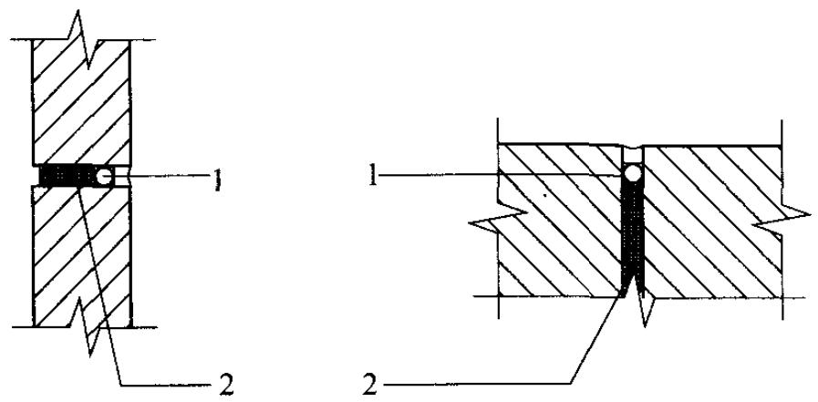  
1—不吸水的、闭孔发泡聚乙烯实心圆棒；2—柔软、可压缩的填充物

6.5.8 夹心复合墙的外叶墙宜在建筑墙体适当部位设置控制缝，其间距宜为 $6\mathrm{m} \sim 8\mathrm{m}$ 。

# 7 圈梁、过梁、墙梁及挑梁

## 7.1 圈 梁

7.1.1 对于有地基不均匀沉降或较大振动荷载的房屋，可按本节规定在砌体墙中设置现浇混凝土圈梁。  
7.1.2 厂房、仓库、食堂等空旷单层房屋应按下列规定设置圈梁：

1 砖砌体结构房屋，檐口标高为 $5\mathrm{m} \sim 8\mathrm{m}$ 时，应在檐口标高处设置圈梁一道；檐口标高大于 $8\mathrm{m}$ 时，应增加设置数量；  
2 砌块及料石砌体结构房屋，檐口标高为 $4\mathrm{m} \sim 5\mathrm{m}$ 时，应在檐口标高处设置圈梁一道；檐口标高大于 $5\mathrm{m}$ 时，应增加设置数量；  
3 对有吊车或较大振动设备的单层工业房屋，当未采取有效的隔振措施时，除在檐口或窗顶标高处设置现浇混凝土圈梁外，尚应增加设置数量。

7.1.3 住宅、办公楼等多层砌体结构民用房屋，且层数为3层～4层时，应在底层和檐口标高处各设置一道圈梁。当层数超过4层时，除应在底层和檐口标高处各设置一道圈梁外，至少应在所有纵、横墙上隔层设置。多层砌体工业房屋，应每层设置现浇混凝土圈梁。设置墙梁的多层砌体结构房屋，应在托梁、墙梁顶面和檐口标高处设置现浇钢筋混凝土圈梁。

7.1.4 建筑在软弱地基或不均匀地基上的砌体结构房屋，除按本节规定设置圈梁外，尚应符合现行国家标准《建筑地基基础设计规范》GB50007的有关规定。  
7.1.5 圈梁应符合下列构造要求：

1 圈梁宜连续地设在同一水平面上，并形成封闭状；当圈梁被门窗洞口截断时，应在洞口上部增设相同截面的附加圈梁。

附加圈梁与圈梁的搭接长度不应小于其中到中垂直间距的2倍，且不得小于 $1\mathrm{m}$

2 纵、横墙交接处的圈梁应可靠连接。刚弹性和弹性方案房屋，圈梁应与屋架、大梁等构件可靠连接；  
3. 混凝土圈梁的宽度宜与墙厚相同，当墙厚不小于 $240\mathrm{mm}$ 时，其宽度不宜小于墙厚的 $2/3$ 。圈梁高度不应小于 $120\mathrm{mm}$ 。纵向钢筋数量不应少于4根，直径不应小于 $10\mathrm{mm}$ ，绑扎接头的搭接长度按受拉钢筋考虑，箍筋间距不应大于 $300\mathrm{mm}$ ；  
4 圈梁兼作过梁时，过梁部分的钢筋应按计算面积另行增配。

7.1.6 采用现浇混凝土楼（屋）盖的多层砌体结构房屋，当层数超过5层时，除应在檐口标高处设置一道圈梁外，可隔层设置圈梁，并应与楼（屋）面板一起现浇。未设置圈梁的楼面板嵌入墙内的长度不应小于 $120\mathrm{mm}$ ，并沿墙长配置不少于2根直径为 $10\mathrm{mm}$ 的纵向钢筋。

## 7.2 过梁

7.2.1 对有较大振动荷载或可能产生不均匀沉降的房屋，应采用混凝土过梁。当过梁的跨度不大于 $1.5\mathrm{m}$ 时，可采用钢筋砖过梁；不大于 $1.2\mathrm{m}$ 时，可采用砖砌平拱过梁。

7.2.2 过梁的荷载，应按下列规定采用：

1 对砖和砌块砌体，当梁、板下的墙体高度 $h_{\mathrm{w}}$ 小于过梁的净跨 $l_{\mathrm{n}}$ 时，过梁应计入梁、板传来的荷载，否则可不考虑梁、板荷载；  
2 对砖砌体，当过梁上的墙体高度 $h_{\mathrm{w}}$ 小于 $l_{\mathrm{n}} / 3$ 时，墙体荷载应按墙体的均布自重采用，否则应按高度为 $l_{\mathrm{n}} / 3$ 墙体的均布自重来采用；  
3 对砌块砌体，当过梁上的墙体高度 $h_{\mathrm{w}}$ 小于 $l_{\mathrm{n}} / 2$ 时，墙体荷载应按墙体的均布自重采用，否则应按高度为 $l_{\mathrm{n}} / 2$ 墙体的均布自重采用。

7.2.3 过梁的计算，宜符合下列规定：

1 砖砌平拱受弯和受剪承载力，可按5.4.1条和5.4.2条计算；  
2 钢筋砖过梁的受弯承载力可按式（7.2.3）计算，受剪承载力，可按本规范第5.4.2条计算；

$$M \leqslant 0. 85 h_{0} f_{\mathrm{y}} A_{\mathrm{s}} \tag{7.2.3}$$

式中： $M$ ——按简支梁计算的跨中弯矩设计值；

$h_0$ 过梁截面的有效高度， $h_0 = h - a_{\mathrm{s}}$

$a_{s}$ ——受拉钢筋重心至截面下边缘的距离；

$h$ 过梁的截面计算高度，取过梁底面以上的墙体高度，但不大于 $l_{\mathrm{n}} / 3$ ；当考虑梁、板传来的荷载时，则按梁、板下的高度采用；

$f_{\mathrm{y}}$ ——钢筋的抗拉强度设计值；

$A_{\mathrm{s}}$ ——受拉钢筋的截面面积。

3 混凝土过梁的承载力，应按混凝土受弯构件计算。验算过梁下砌体局部受压承载力时，可不考虑上层荷载的影响；梁端底面压应力图形完整系数可取1.0，梁端有效支承长度可取实际支承长度，但不应大于墙厚。

7.2.4 砖砌过梁的构造，应符合下列规定：

1 砖砌过梁截面计算高度内的砂浆不宜低于M5（Mb5、Ms5）；  
2 砖砌平拱用竖砖砌筑部分的高度不应小于 $240\mathrm{mm}$   
3 钢筋砖过梁底面砂浆层处的钢筋，其直径不应小于 $5\mathrm{mm}$ ，间距不宜大于 $120\mathrm{mm}$ ，钢筋伸入支座砌体内的长度不宜小于 $240\mathrm{mm}$ ，砂浆层的厚度不宜小于 $30\mathrm{mm}$ 。

## 7.3 墙梁

7.3.1 承重与自承重简支墙梁、连续墙梁和框支墙梁的设计，应符合本节规定。  
7.3.2 采用烧结普通砖砌体、混凝土普通砖砌体、混凝土多孔

砖砌体和混凝土砌块砌体的墙梁设计应符合下列规定：

1 墙梁设计应符合表7.3.2的规定：

表 7.3.2 墙梁的一般规定  

| 墙梁类别 | 墙体总高度(m) | 跨度(m) | 墙体高跨比hw/l0i | 托梁高跨比hb/l0i | 洞宽比bh/l0i | 洞高h |
| --- | --- | --- | --- | --- | --- | --- |
| 承重墙梁 | ≤18 | ≤9 | ≥0.4 | ≥1/10 | ≤0.3 | ≤5hw/6且hw-h≥0.4m |
| 自承重墙梁 | ≤18 | ≤12 | ≥1/3 | ≥1/15 | ≤0.8 | - |

注：墙体总高度指托梁顶面到檐口的高度，带阁楼的坡屋面应算到山尖墙1/2高度处。

2 墙梁计算高度范围内每跨允许设置一个洞口，洞口高度，对窗洞取洞顶至托梁顶面距离。对自承重墙梁，洞口至边支座中心的距离不应小于 $0.1l_{\alpha}$ ，门窗洞上口至墙顶的距离不应小于 $0.5\mathrm{m}$ 。

3 洞口边缘至支座中心的距离，距边支座不应小于墙梁计算跨度的0.15倍，距中支座不应小于墙梁计算跨度的0.07倍。托梁支座处上部墙体设置混凝土构造柱、且构造柱边缘至洞口边缘的距离不小于 $240\mathrm{mm}$ 时，洞口边至支座中心距离的限值可不受本规定限制。

4 托梁高跨比，对无洞口墙梁不宜大于1/7，对靠近支座有洞口的墙梁不宜大于1/6。配筋砌块砌体墙梁的托梁高跨比可适当放宽，但不宜小于1/14；当墙梁结构中的墙体均为配筋砌块砌体时，墙体总高度可不受本规定限制。

7.3.3 墙梁的计算简图，应按图7.3.3采用。各计算参数应符合下列规定：

1 墙梁计算跨度，对简支墙梁和连续墙梁取净跨的1.1倍或支座中心线距离的较小值；框支墙梁支座中心线距离，取框架柱轴线间的距离；  
2 墙体计算高度，取托梁顶面上一层墙体（包括顶梁）高

度，当 $h_{\mathrm{w}}$ 大于 $l_0$ 时，取 $h_{\mathrm{w}}$ 等于 $l_0$ （对连续墙梁和多跨框支墙梁， $l_0$ 取各跨的平均值）；

3 墙梁跨中截面计算高度，取 $H_0 = h_{\mathrm{w}} + 0.5h_{\mathrm{b}}$   
4 翼墙计算宽度，取窗间墙宽度或横墙间距的 $2/3$ ，且每边不大于3.5倍的墙体厚度和墙梁计算跨度的1/6；  
5 框架柱计算高度，取 $H_{\mathrm{c}} = H_{\mathrm{cn}} + 0.5h_{\mathrm{b}}$ ； $H_{\mathrm{cn}}$ 为框架柱的净高，取基础顶面至托梁底面的距离。

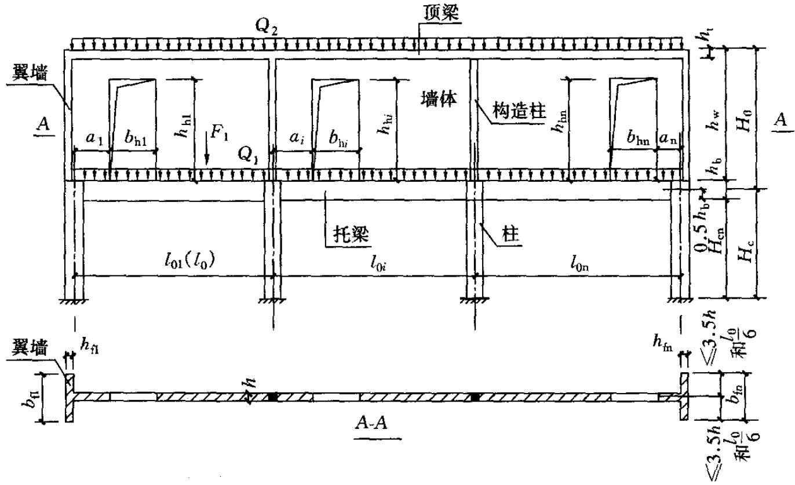  
图7.3.3 墙梁计算简图

$l_{0}(l_{0i})$ 一墙梁计算跨度； $h_\mathrm{w}$ 一墙体计算高度； $h$ 一墙体厚度； $H_0$ 一墙梁跨中截面计算高度； $b_{\mathrm{fl}}$ 一翼墙计算宽度； $H_{\mathrm{c}}$ 一框架柱计算高度； $b_{\mathrm{hi}}$ 一洞口宽度； $h_\mathrm{bi}$ 一洞口高度； $a_i$ 一洞口边缘至支座中心的距离； $Q_{1}$ 、 $F_{1}$ 一承重墙梁的托梁顶面的荷载设计值； $Q_{2}$ 一承重墙梁的墙梁顶面的荷载设计值

7.3.4 墙梁的计算荷载，应按下列规定采用：

1 使用阶段墙梁上的荷载，应按下列规定采用：

1）承重墙梁的托梁顶面的荷载设计值，取托梁自重及本层楼盖的恒荷载和活荷载；  
2）承重墙梁的墙梁顶面的荷载设计值，取托梁以上各层墙体自重，以及墙梁顶面以上各层楼（屋）盖的恒荷

载和活荷载；集中荷载可沿作用的跨度近似化为均布荷载；

3）自承重墙梁的墙梁顶面的荷载设计值，取托梁自重及托梁以上墙体自重。

2 施工阶段托梁上的荷载，应按下列规定采用：

1）托梁自重及本层楼盖的恒荷载；  
2）本层楼盖的施工荷载；  
3）墙体自重，可取高度为 $l_{0\max} / 3$ 的墙体自重，开洞时尚应按洞顶以下实际分布的墙体自重复核； $l_{0\max}$ 为各计算跨度的最大值。

7.3.5 墙梁应分别进行托梁使用阶段正截面承载力和斜截面受剪承载力计算、墙体受剪承载力和托梁支座上部砌体局部受压承载力计算，以及施工阶段托梁承载力验算。自承重墙梁可不验算墙体受剪承载力和砌体局部受压承载力。  
7.3.6 墙梁的托梁正截面承载力，应按下列规定计算：

1 托梁跨中截面应按混凝土偏心受拉构件计算，第 $i$ 跨跨中最大弯矩设计值 $M_{\mathrm{bi}}$ 及轴心拉力设计值 $N_{\mathrm{bti}}$ 可按下列公式计算：

$$\begin{array}{l} M_{\mathrm{b} i} = M_{1 i} + \alpha_{\mathrm{M}} M_{2 i} (7.3.6-1) \\ N_{b t i} = \eta_{\mathrm{N}} \frac{M_{2 i}}{H_{0}} (7.3.6-2) \\ \end{array}$$

1）当为简支墙梁时：

$$\begin{array}{l} \alpha_{\mathrm{M}} = \psi_{\mathrm{M}} \left(1. 7 \frac{h_{\mathrm{b}}}{l_{0}} - 0. 03\right) (7.3.6-3) \\ \psi_{\mathrm{M}} = 4. 5 - 10 \frac{a}{l_{0}} (7.3.6-4) \\ \eta_{\mathrm{N}} = 0. 44 + 2. 1 \frac{h_{\mathrm{w}}}{l_{0}} (7.3.6-5) \\ \end{array}$$

2）当为连续墙梁和框支墙梁时：

$$\alpha_{\mathrm{M}} = \psi_{\mathrm{M}} \left(2. 7 \frac{h_{\mathrm{b}}}{l_{0 i}} - 0. 08\right) \tag{7.3.6-6}$$

$$\psi_{\mathrm{M}} = 3. 8 - 8. 0 \frac{a_{i}}{l_{0 i}} \tag{7.3.6-7}$$

$$\eta_{\mathrm{N}} = 0. 8 + 2. 6 \frac{h_{\mathrm{w}}}{l_{0 i}} \quad . \tag{7.3.6-8}$$

式中： $M_{1i}$ ——荷载设计值 $Q_{1}$ 、 $F_{1}$ 作用下的简支梁跨中弯矩或按连续梁、框架分析的托梁第 $i$ 跨跨中最大弯矩；

$M_{2i}$ ——荷载设计值 $Q_{2}$ 作用下的简支梁跨中弯矩或按连续梁、框架分析的托梁第 $i$ 跨跨中最大弯矩；

$\alpha_{\mathrm{M}}$ ——考虑墙梁组合作用的托梁跨中截面弯矩系数，可按公式（7.3.6-3）或（7.3.6-6）计算，但对自承重简支墙梁应乘以折减系数0.8；当公式（7.3.6-3）中的 $h_{\mathrm{b}} / l_{0} > 1 / 6$ 时，取 $h_{\mathrm{b}} / l_{0} = 1 / 6$ ；当公式（7.3.6-3）中的 $h_{\mathrm{b}} / l_{0i} > 1 / 7$ 时，取 $h_{\mathrm{b}} / l_{0i} = 1 / 7$ ；当 $\alpha_{\mathrm{M}} > 1.0$ 时，取 $\alpha_{\mathrm{M}} = 1.0$

$\eta_{\mathrm{N}}$ ——考虑墙梁组合作用的托梁跨中截面轴力系数，可按公式（7.3.6-5）或（7.3.6-8）计算，但对自承重简支墙梁应乘以折减系数0.8；当 $h_{\mathrm{w}} / l_{0i} > 1$ 时，取 $h_{\mathrm{w}} / l_{0i} = 1$

$\psi_{\mathrm{M}}$ ——洞口对托梁跨中截面弯矩的影响系数，对无洞口墙梁取1.0，对有洞口墙梁可按公式（7.3.6-4）或（7.3.6-7）计算；

$a_{i}$ ——洞口边缘至墙梁最近支座中心的距离，当 $a_{i} > 0.35l_{0i}$ 时，取 $a_{i} = 0.35l_{0i}$ 。

2 托梁支座截面应按混凝土受弯构件计算，第 $j$ 支座的弯矩设计值 $M_{\mathrm{bj}}$ 可按下列公式计算：

$$M_{\mathrm{b j}} = M_{1 j} + \alpha_{\mathrm{M}} M_{2 j} \tag{7.3.6-9}$$

$$\alpha_{\mathrm{M}} = 0. 75 - \frac{a_{i}}{l_{0 i}} \tag{7.3.6-10}$$

式中： $M_{1j}$ ——荷载设计值 $Q_{1}$ 、 $F_{1}$ 作用下按连续梁或框架分析的托梁第 $j$ 支座截面的弯矩设计值；

$M_{2j}$ ——荷载设计值 $Q_{2}$ 作用下按连续梁或框架分析的托梁

第 $j$ 支座截面的弯矩设计值；

$\alpha_{\mathrm{M}}$ ——考虑墙梁组合作用的托梁支座截面弯矩系数，无洞口墙梁取0.4，有洞口墙梁可按公式（7.3.6-10）计算。

7.3.7 对多跨框支墙梁的框支边柱，当柱的轴向压力增大对承载力不利时，在墙梁荷载设计值 $Q_{2}$ 作用下的轴向压力值应乘以修正系数1.2。

7.3.8 墙梁的托梁斜截面受剪承载力应按混凝土受弯构件计算，第 $j$ 支座边缘截面的剪力设计值 $V_{\mathrm{bj}}$ 可按下式计算：

$$V_{\mathrm{b} j} = V_{1 j} + \beta_{\mathrm{v}} V_{2 j} \tag{7.3.8}$$

式中： $V_{1j}$ ——荷载设计值 $Q_{1}, F_{1}$ 作用下按简支梁、连续梁或框架分析的托梁第 $j$ 支座边缘截面剪力设计值；

$V_{2j}$ ——荷载设计值 $Q_{2}$ 作用下按简支梁、连续梁或框架分析的托梁第 $j$ 支座边缘截面剪力设计值；

$\beta_{\mathrm{v}}$ ——考虑墙梁组合作用的托梁剪力系数，无洞口墙梁边支座截面取0.6，中间支座截面取0.7；有洞口墙梁边支座截面取0.7，中间支座截面取0.8；对自承重墙梁，无洞口时取0.45，有洞口时取0.5。

7.3.9 墙梁的墙体受剪承载力，应按公式（7.3.9）验算，当墙梁支座处墙体中设置上、下贯通的落地混凝土构造柱，且其截面不小于 $240\mathrm{mm}\times 240\mathrm{mm}$ 时，可不验算墙梁的墙体受剪承载力。

$$V_{2} \leqslant \xi_{1} \xi_{2} \left(0. 2 + \frac{h_{\mathrm{b}}}{l_{0 i}} + \frac{h_{\mathrm{t}}}{l_{0 i}}\right) f h h_{\mathrm{w}} \tag{7.3.9}$$

式中： $V_{2}$ ——在荷载设计值 $Q_{2}$ 作用下墙梁支座边缘截面剪力的最大值；

$\xi_{1}$ ——翼墙影响系数，对单层墙梁取1.0，对多层墙梁，当 $b_{\mathrm{f}} / h = 3$ 时取1.3，当 $b_{\mathrm{f}} / h = 7$ 时取1.5，当 $3 < b_{\mathrm{f}} / h < 7$ 时，按线性插入取值；

$\xi_{2}$ ——洞口影响系数，无洞口墙梁取1.0，多层有洞口墙梁取0.9，单层有洞口墙梁取0.6；

$h_{\mathrm{t}}$ ——墙梁顶面圈梁截面高度。

7.3.10 托梁支座上部砌体局部受压承载力，应按公式（7.3.10-1）验算，当墙梁的墙体中设置上、下贯通的落地混凝土构造柱，且其截面不小于 $240\mathrm{mm}\times 240\mathrm{mm}$ 时，或当 $b_{\mathrm{f}} / h$ 大于等于5时，可不验算托梁支座上部砌体局部受压承载力。

$$Q_{2} \leqslant \zeta f h \tag{7.3.10-1}$$

$$\zeta = 0. 25 + 0. 08 \frac{b_{\mathrm{f}}}{h} \tag{7.3.10-2}$$

式中： $\zeta$ ——局压系数。

7.3.11 托梁应按混凝土受弯构件进行施工阶段的受弯、受剪承载力验算，作用在托梁上的荷载可按本规范第7.3.4条的规定采用。

7.3.12 墙梁的构造应符合下列规定：

1 托梁和框支柱的混凝土强度等级不应低于C30；  
2 承重墙梁的块体强度等级不应低于MU10，计算高度范围内墙体的砂浆强度等级不应低于M10（Mb10）；  
3 框支墙梁的上部砌体房屋，以及设有承重的简支墙梁或连续墙梁的房屋，应满足刚性方案房屋的要求；  
4 墙梁的计算高度范围内的墙体厚度，对砖砌体不应小于 $240\mathrm{mm}$ ，对混凝土砌块砌体不应小于 $190\mathrm{mm}$ ；  
5 墙梁洞口上方应设置混凝土过梁，其支承长度不应小于 $240\mathrm{mm}$ ；洞口范围内不应施加集中荷载；  
6 承重墙梁的支座处应设置落地翼墙，翼墙厚度，对砖砌体不应小于 $240\mathrm{mm}$ ，对混凝土砌块砌体不应小于 $190\mathrm{mm}$ ，翼墙宽度不应小于墙梁墙体厚度的3倍，并与墙梁墙体同时砌筑。当不能设置翼墙时，应设置落地且上、下贯通的混凝土构造柱；  
7 当墙梁墙体在靠近支座1/3跨度范围内开洞时，支座处应设置落地且上、下贯通的混凝土构造柱，并应与每层圈梁连接；  
8 墙梁计算高度范围内的墙体，每天可砌筑高度不应超过 $1.5\mathrm{m}$ ，否则，应加设临时支撑；

9 托梁两侧各两个开间的楼盖应采用现浇混凝土楼盖，楼板厚度不应小于 $120\mathrm{mm}$ ，当楼板厚度大于 $150\mathrm{mm}$ 时，应采用双层双向钢筋网，楼板上应少开洞，洞口尺寸大于 $800\mathrm{mm}$ 时应设洞口边梁；  
10 托梁每跨底部的纵向受力钢筋应通长设置，不应在跨中弯起或截断；钢筋连接应采用机械连接或焊接；  
11 托梁跨中截面的纵向受力钢筋总配筋率不应小于 $0.6\%$ ；  
12 托梁上部通长布置的纵向钢筋面积与跨中下部纵向钢筋面积之比值不应小于0.4；连续墙梁或多跨框支墙梁的托梁支座上部附加纵向钢筋从支座边缘算起每边延伸长度不应小于 $l_0 / 4$   
13 承重墙梁的托梁在砌体墙、柱上的支承长度不应小于 $350\mathrm{mm}$ ；纵向受力钢筋伸入支座的长度应符合受拉钢筋的锚固要求；  
14 当托梁截面高度 $h_{\mathrm{b}}$ 大于等于 $450\mathrm{mm}$ 时，应沿梁截面高度设置通长水平腰筋，其直径不应小于 $12\mathrm{mm}$ ，间距不应大于 $200\mathrm{mm}$ ；  
15 对于洞口偏置的墙梁，其托梁的箍筋加密区范围应延到洞口外，距洞边的距离大于等于托梁截面高度 $h_{\mathrm{b}}$ （图7.3.12），箍筋直径不应小于 $8\mathrm{mm}$ ，间距不应大于 $100\mathrm{mm}$ 。

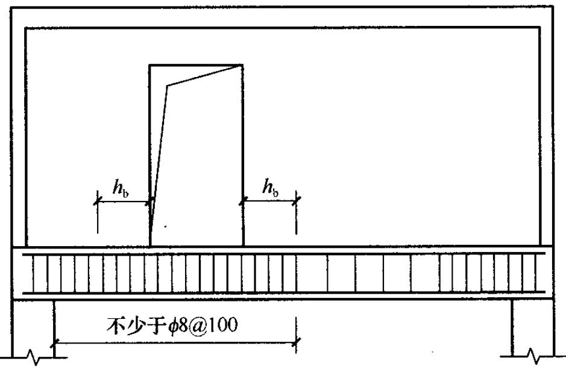  
图7.3.12 偏开洞时托梁箍筋加密区

## 7.4 挑梁

7.4.1 砌体墙中混凝土挑梁的抗倾覆，应按下列公式进行验算：

$$M_{\mathrm{o v}} \leqslant M_{\mathrm{r}} \tag{7.4.1}$$

式中： $M_{\mathrm{ov}}$ ——挑梁的荷载设计值对计算倾覆点产生的倾覆力矩； $M_{\mathrm{r}}$ ——挑梁的抗倾覆力矩设计值。

7.4.2 挑梁计算倾覆点至墙外边缘的距离可按下列规定采用：

1 当 $l_{1}$ 不小于 $2.2h_{\mathrm{b}}$ 时（ $l_{1}$ 为挑梁埋入砌体墙中的长度， $h_{\mathrm{b}}$ 为挑梁的截面高度），梁计算倾覆点到墙外边缘的距离可按式（7.4.2-1）计算，且其结果不应大于 $0.13l_{1}$ 。

$$x_{0} = 0. 3 h_{\mathrm{b}} \tag{7.4.2-1}$$

式中： $x_0$ ——计算倾覆点至墙外边缘的距离（mm）；

2 当 $l_{1}$ 小于 $2.2h_{\mathrm{b}}$ 时，梁计算倾覆点到墙外边缘的距离可按下式计算：

$$x_{0} = 0. 13 l_{1} \tag{7.4.2-2}$$

3 当挑梁下有混凝土构造柱或垫梁时，计算倾覆点到墙外边缘的距离可取 $0.5x_0$ 。

7.4.3 挑梁的抗倾覆力矩设计值，可按下式计算：

$$M_{\mathrm{r}} = 0. 8 G_{\mathrm{r}} \left(l_{2} - x_{0}\right) \tag{7.4.3}$$

式中： $G_{\mathrm{r}}$ ——挑梁的抗倾覆荷载，为挑梁尾端上部 $45^{\circ}$ 扩展角的阴影范围（其水平长度为 $l_{3}$ ）内本层的砌体与楼面恒荷载标准值之和（图7.4.3）；当上部楼层无挑梁时，抗倾覆荷载中可计及上部楼层的楼面永久荷载；

$l_{2}$ —— $G_{\mathrm{r}}$ 作用点至墙外边缘的距离。

7.4.4 挑梁下砌体的局部受压承载力，可按下式验算（图7.4.4）：

$$N_{l} \leqslant \eta \gamma f A_{l} \tag{7.4.4}$$

式中： $N_{l}$ ——挑梁下的支承压力，可取 $N_{l} = 2R$ ， $R$ 为挑梁的倾覆荷载设计值；

$\eta$ ——梁端底面压应力图形的完整系数，可取0.7；

$\gamma$ ——砌体局部抗压强度提高系数，对图7.4.4a可取1.25；对图7.4.4b可取1.5；

$A_{l}$ ——挑梁下砌体局部受压面积，可取 $A_{l} = 1.2bh_{\mathrm{b}}$ ， $b$ 为挑梁的截面宽度， $h_\mathrm{b}$ 为挑梁的截面高度。

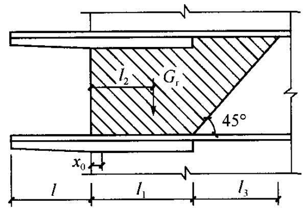  
(a) $l_{3} \leqslant l_{1}$ 时

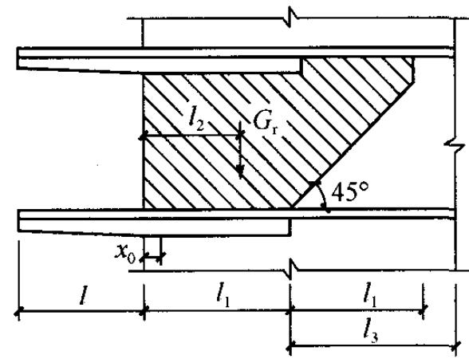  
(b) $l_{3} > l_{1}$ 时

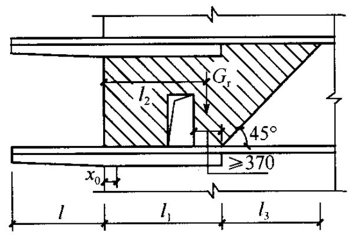  
(c) 洞在 $l_{1}$ 之内

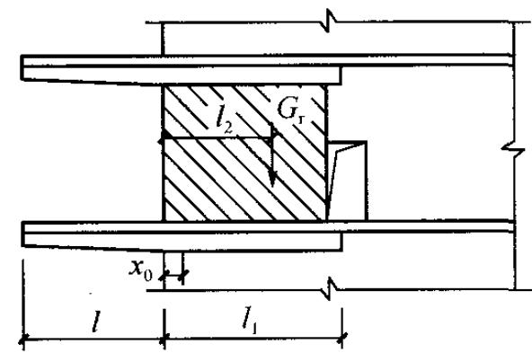  
(d) 洞在 $l_{1}$ 之外

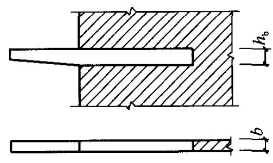  
图7.4.3 挑梁的抗倾覆荷载   
(a) 挑梁支承在一字墙上

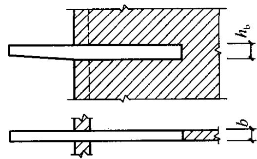  
(b) 挑梁支承在丁字墙上  
图7.4.4 挑梁下砌体局部受压

7.4.5 挑梁的最大弯矩设计值 $M_{\mathrm{max}}$ 与最大剪力设计值 $V_{\mathrm{max}}$ ，可

按下列公式计算：

$$M_{\max } = M_{0} \tag{7.4.5-1}$$

$$V_{\max } = V_{0} \tag{7.4.5-2}$$

式中： $M_0$ ——挑梁的荷载设计值对计算倾覆点截面产生的弯矩；

$V_{0}$ ——挑梁的荷载设计值在挑梁墙外边缘处截面产生的剪力。

7.4.6 挑梁设计除应符合现行国家标准《混凝土结构设计规范》GB50010的有关规定外，尚应满足下列要求：

1 纵向受力钢筋至少应有 $1 / 2$ 的钢筋面积伸入梁尾端，且不少于 $2\phi 12$ 。其余钢筋伸入支座的长度不应小于 $2l_{1} / 3$   
2 挑梁埋入砌体长度 $l_{1}$ 与挑出长度 $l$ 之比宜大于1.2；当挑梁上无砌体时， $l_{1}$ 与 $l$ 之比宜大于2。

7.4.7 雨篷等悬挑构件可按第 7.4.1 条～7.4.3 条进行抗倾覆验算，其抗倾覆荷载 $G_{\mathrm{r}}$ 可按图 7.4.7 采用， $G_{\mathrm{r}}$ 距墙外边缘的距离为墙厚的 $1/2$ ， $l_{3}$ 为门窗洞口净跨的 $1/2$ 。

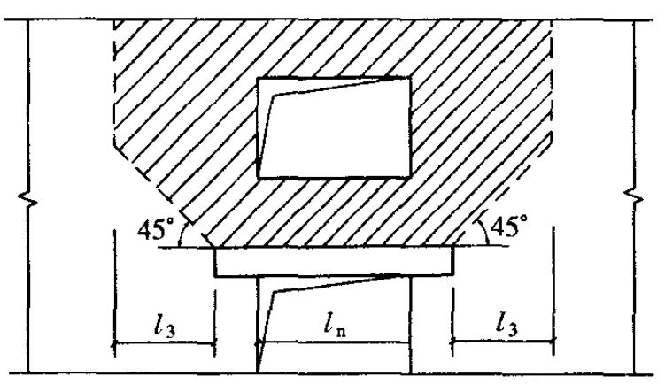

图7.4.7 雨篷的抗倾覆荷载   
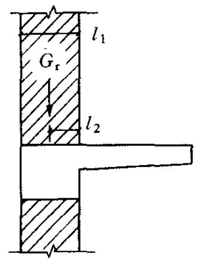  
$G_{\mathrm{r}}$ ——抗倾覆荷载； $l_{1}$ ——墙厚； $l_{2} - G_{\mathrm{r}}$ 距墙外边缘的距离

# 8 配筋砖砌体构件

## 8.1 网状配筋砖砌体构件

8.1.1 网状配筋砖砌体受压构件，应符合下列规定：

1 偏心距超过截面核心范围（对于矩形截面即 $e / h > 0.17$ ），或构件的高厚比 $\beta > 16$ 时，不宜采用网状配筋砖砌体构件；  
2 对矩形截面构件，当轴向力偏心方向的截面边长大于另一方向的边长时，除按偏心受压计算外，还应对较小边长方向按轴心受压进行验算；  
3 当网状配筋砖砌体构件下端与无筋砌体交接时，尚应验算交接处无筋砌体的局部受压承载力。

8.1.2 网状配筋砖砌体（图8.1.2）受压构件的承载力，应按下列公式计算：

$$N \leqslant \varphi_{n} f_{n} A \tag{8.1.2-1}$$

$$f_{\mathrm{n}} = f + 2 \left(1 - \frac{2 e}{y}\right) \rho f_{\mathrm{y}} \tag{8.1.2-2}$$

$$\rho = \frac{(a + b) A_{\mathrm{s}}}{\text{a b s}_{\mathrm{n}}} \tag{8.1.2-3}$$

式中： $N$ ——轴向力设计值；

$\varphi_{n}$ ——高厚比和配筋率以及轴向力的偏心距对网状配筋砖砌体受压构件承载力的影响系数，可按附录D.0.2的规定采用；

$f_{\mathrm{n}}$ ——网状配筋砖砌体的抗压强度设计值；

$A$ ——截面面积；

$e$ ——轴向力的偏心距；

$y$ ——自截面重心至轴向力所在偏心方向截面边缘的

距离；

$\rho$ ——体积配筋率；

$f_{\mathrm{y}}$ ——钢筋的抗拉强度设计值，当 $f_{\mathrm{y}}$ 大于 $320\mathrm{MPa}$ 时，仍采用 $320\mathrm{MPa}$ ；

$a$ 、 $b$ ——钢筋网的网格尺寸；

$A_{s}$ ——钢筋的截面面积；

$s_{\mathrm{n}}$ ——钢筋网的竖向间距。

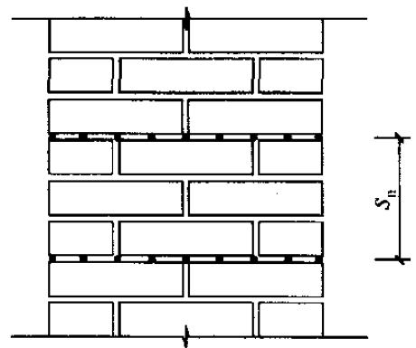

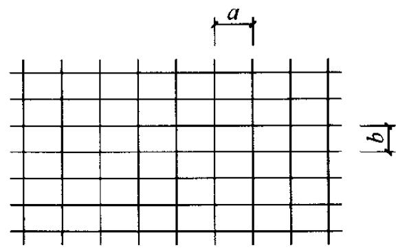  
图8.1.2 网状配筋砖砌体

8.1.3 网状配筋砖砌体构件的构造应符合下列规定：

1 网状配筋砖砌体中的体积配筋率，不应小于 $0.1\%$ ，并不应大于 $1\%$   
2 采用钢筋网时，钢筋的直径宜采用 $3\mathrm{mm}\sim 4\mathrm{mm}$   
3 钢筋网中钢筋的间距，不应大于 $120\mathrm{mm}$ ，并不应小于 $30\mathrm{mm}$ ；  
4 钢筋网的间距，不应大于五皮砖，并不应大于 $400\mathrm{mm}$   
5 网状配筋砖砌体所用的砂浆强度等级不应低于M7.5；钢筋网应设置在砌体的水平灰缝中，灰缝厚度应保证钢筋上下至少各有 $2\mathrm{mm}$ 厚的砂浆层。

## 8.2 组合砖砌体构件

I 砖砌体和钢筋混凝土面层或钢筋砂浆面层的组合砌体构件

8.2.1 当轴向力的偏心距超过本规范第5.1.5条规定的限值时，

宜采用砖砌体和钢筋混凝土面层或钢筋砂浆面层组成的组合砖砌体构件（图8.2.1）。

图8.2.1 组合砖砌体构件截面  
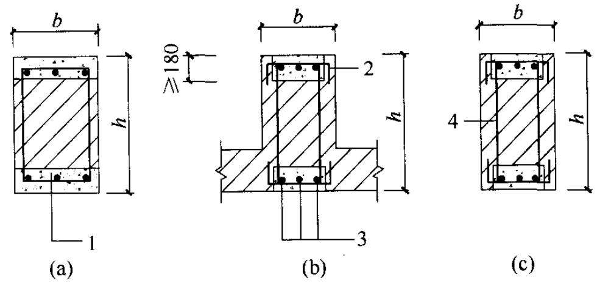  
1—混凝土或砂浆；2—拉结钢筋；3—纵向钢筋；4—箍筋

8.2.2 对于砖墙与组合砌体一同砌筑的T形截面构件（图8.2.1b)，其承载力和高厚比可按矩形截面组合砌体构件计算（图8.2.1c）。  
8.2.3 组合砖砌体轴心受压构件的承载力，应按下式计算：

$$N \leqslant \varphi_{\mathrm{c o m}} \left(f A + f_{\mathrm{c}} A_{\mathrm{c}} + \eta_{\mathrm{s}} f_{\mathrm{y}}^{\prime} A_{\mathrm{s}}^{\prime}\right) \tag{8.2.3}$$

式中： $\varphi_{\mathrm{com}}$ ——组合砖砌体构件的稳定系数，可按表8.2.3采用； $A$ ——砖砌体的截面面积；

$f_{\mathrm{c}}$ ——混凝土或面层水泥砂浆的轴心抗压强度设计值，砂浆的轴心抗压强度设计值可取为同强度等级混凝土的轴心抗压强度设计值的 $70\%$ ，当砂浆为M15时，取 $5.0\mathrm{MPa}$ ；当砂浆为M10时，取 $3.4\mathrm{MPa}$ ；当砂浆强度为M7.5时，取 $2.5\mathrm{MPa}$

$A_{\mathrm{c}}$ ——混凝土或砂浆面层的截面面积；

$\eta_{s}$ ——受压钢筋的强度系数，当为混凝土面层时，可取1.0；当为砂浆面层时可取0.9；

$f_{\mathrm{y}}^{\prime}$ ——钢筋的抗压强度设计值；

$A_{\mathrm{s}}^{\prime}$ ——受压钢筋的截面面积。

表 8.2.3 组合砖砌体构件的稳定系数 $\varphi_{\mathrm{com}}$   

| 高厚比β | 配筋率ρ(%) | 配筋率ρ(%) | 配筋率ρ(%) | 配筋率ρ(%) | 配筋率ρ(%) | 配筋率ρ(%) |
| --- | --- | --- | --- | --- | --- | --- |
| 高厚比β | 0 | 0.2 | 0.4 | 0.6 | 0.8 | ≥1.0 |
| 8 | 0.91 | 0.93 | 0.95 | 0.97 | 0.99 | 1.00 |
| 10 | 0.87 | 0.90 | 0.92 | 0.94 | 0.96 | 0.98 |
| 12 | 0.82 | 0.85 | 0.88 | 0.91 | 0.93 | 0.95 |
| 14 | 0.77 | 0.80 | 0.83 | 0.86 | 0.89 | 0.92 |
| 16 | 0.72 | 0.75 | 0.78 | 0.81 | 0.84 | 0.87 |
| 18 | 0.67 | 0.70 | 0.73 | 0.76 | 0.79 | 0.81 |
| 20 | 0.62 | 0.65 | 0.68 | 0.71 | 0.73 | 0.75 |
| 22 | 0.58 | 0.61 | 0.64 | 0.66 | 0.68 | 0.70 |
| 24 | 0.54 | 0.57 | 0.59 | 0.61 | 0.63 | 0.65 |
| 26 | 0.50 | 0.52 | 0.54 | 0.56 | 0.58 | 0.60 |
| 28 | 0.46 | 0.48 | 0.50 | 0.52 | 0.54 | 0.56 |

注：组合砖砌体构件截面的配筋率 $\rho = A_s' / bh$ 。

8.2.4 组合砖砌体偏心受压构件的承载力，应按下列公式计算：

$$N \leqslant f A^{\prime} + f_{\mathrm{c}} A_{\mathrm{c}}^{\prime} + \eta_{\mathrm{s}} f_{\mathrm{y}}^{\prime} A_{\mathrm{s}}^{\prime} - \sigma_{\mathrm{s}} A_{\mathrm{s}} \tag{8.2.4-1}$$

或

$$N e_{\mathrm{N}} \leqslant f S_{\mathrm{s}} + f_{\mathrm{c}} S_{\mathrm{c}, \mathrm{s}} + \eta_{\mathrm{s}} f_{\mathrm{y}}^{\prime} A_{\mathrm{s}}^{\prime} \left(h_{0} - a_{\mathrm{s}}^{\prime}\right) \tag{8.2.4-2}$$

此时受压区的高度 $x$ 可按下列公式确定：

$$f S_{\mathrm{N}} + f_{\mathrm{c}} S_{\mathrm{c}, \mathrm{N}} + \eta_{\mathrm{s}} f_{\mathrm{y}}^{\prime} A_{\mathrm{s}}^{\prime} e_{\mathrm{N}}^{\prime} - \sigma_{\mathrm{s}} A_{\mathrm{s}} e_{\mathrm{N}} = 0 \tag{8.2.4-3}$$

$$e_{\mathrm{N}} = e + e_{\mathrm{a}} + \left(h / 2 - a_{\mathrm{s}}\right) \tag{8.2.4-4}$$

$$e_{\mathrm{N}}^{\prime} = e + e_{\mathrm{a}} - \left(h / 2 - a_{\mathrm{s}}^{\prime}\right) \tag{8.2.4-5}$$

$$e_{\mathrm{a}} = \frac{\beta^{2} h}{2200} (1 - 0. 022 \beta) \tag{8.2.4-6}$$

式中： $A^{\prime}$ —砖砌体受压部分的面积；

$A_{\mathrm{c}}^{\prime}$ ——混凝土或砂浆面层受压部分的面积；

$\sigma_{s}$ ——钢筋 $A_{s}$ 的应力；

$A_{s}$ ——距轴向力 $N$ 较远侧钢筋的截面面积；  
$S_{\mathrm{s}}$ —砖砌体受压部分的面积对钢筋 $A_{s}$ 重心的面积矩；

$S_{\mathrm{c,s}}$ ——混凝土或砂浆面层受压部分的面积对钢筋 $A_{s}$ 重心的面积矩；

$S_{\mathrm{N}}$ —砖砌体受压部分的面积对轴向力 $N$ 作用点的面积矩；

$S_{\mathrm{c,N}}$ ——混凝土或砂浆面层受压部分的面积对轴向力 $N$ 作用点的面积矩；

$e_{\mathrm{N}}, e_{\mathrm{N}}'$ ——分别为钢筋 $A_{\mathrm{s}}$ 和 $A_{\mathrm{s}}'$ 重心至轴向力 $N$ 作用点的距离（图8.2.4）；

$e$ ——轴向力的初始偏心距，按荷载设计值计算，当 $e$ 小于 $0.05h$ 时，应取 $e$ 等于 $0.05h$ ；

$e_{\mathrm{a}}$ ——组合砖砌体构件在轴向力作用下的附加偏心距；

$h_0$ ——组合砖砌体构件截面的有效高度，取 $h_0 = h - a_{\mathrm{s}}$ ；

$a_{s}, a_{s}^{\prime}$ ——分别为钢筋 $A_{s}$ 和 $A_{s}^{\prime}$ 重心至截面较近边的距离。

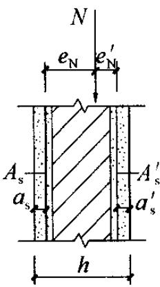  
(a) 小偏心受压

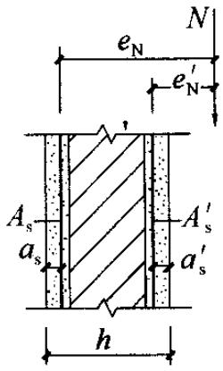  
(b) 大偏心受压  
图8.2.4 组合砖砌体偏心受压构件

8.2.5 组合砖砌体钢筋 $A_{s}$ 的应力 $\sigma_{s}$ （单位为 $\mathrm{MPa}$ ，正值为拉应力，负值为压应力）应按下列规定计算：

1 当为小偏心受压，即 $\xi >\xi_{\mathrm{b}}$ 时，

$$\sigma_{\mathrm{s}} = 650 - 800 \xi \tag{8.2.5-1}$$

2 当为大偏心受压，即 $\xi \leqslant \xi_{\mathrm{b}}$ 时，

$$\sigma_{\mathrm{s}} = f_{\mathrm{y}} \tag{8.2.5-2}$$

$$\xi = x / h_{0} \tag{8.2.5-3}$$

式中： $\sigma_{\mathrm{s}}$ ——钢筋的应力，当 $\sigma_{\mathrm{s}} > f_{\mathrm{y}}$ 时，取 $\sigma_{\mathrm{s}} = f_{\mathrm{y}}$ ；

当 $\sigma_{\mathrm{s}} < f_{\mathrm{y}}'$ 时，取 $\sigma_{\mathrm{s}} = f_{\mathrm{y}}'$

$\xi$ ——组合砖砌体构件截面的相对受压区高度；

$f_{\mathrm{y}}$ ——钢筋的抗拉强度设计值。

3 组合砖砌体构件受压区相对高度的界限值 $\xi_{\mathrm{b}}$ ，对于HRB400级钢筋，应取0.36；对于HRB335级钢筋，应取0.44；对于HPB300级钢筋，应取0.47。

8.2.6 组合砖砌体构件的构造应符合下列规定：

1 面层混凝土强度等级宜采用C20。面层水泥砂浆强度等级不宜低于M10。砌筑砂浆的强度等级不宜低于M7.5；  
2 砂浆面层的厚度，可采用 $30\mathrm{mm} \sim 45\mathrm{mm}$ 。当面层厚度大于 $45\mathrm{mm}$ 时，其面层宜采用混凝土；  
3 竖向受力钢筋宜采用HPB300级钢筋，对于混凝土面层，亦可采用HRB335级钢筋。受压钢筋一侧的配筋率，对砂浆面层，不宜小于 $0.1\%$ ，对混凝土面层，不宜小于 $0.2\%$ 。受拉钢筋的配筋率，不应小于 $0.1\%$ 。竖向受力钢筋的直径，不应小于 $8\mathrm{mm}$ ，钢筋的净间距，不应小于 $30\mathrm{mm}$

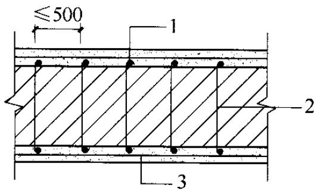  
图8.2.6 混凝土或砂浆面层组合墙

1—竖向受力钢筋；2—拉结钢筋；3—水平分布钢筋

4箍筋的直径，不宜小于 $4\mathrm{mm}$ 及0.2倍的受压钢筋直径，并不宜大于 $6\mathrm{mm}$ 。箍筋的间距，不应大于20倍受压钢筋的直径及 $500\mathrm{mm}$ ，并不应小于 $120\mathrm{mm}$

5 当组合砖砌体构件一侧的竖向受力钢筋多于4根时，应设置附加箍筋或拉结钢筋；

6 对于截面长短边相差较大

的构件如墙体等，应采用穿通墙体的拉结钢筋作为箍筋，同时设置水平分布钢筋。水平分布钢筋的竖向间距及拉结钢筋的水平间距，均不应大于 $500\mathrm{mm}$ （图8.2.6）；

7 组合砖砌体构件的顶部和底部，以及牛腿部位，必须设置钢筋混凝土垫块。竖向受力钢筋伸入垫块的长度，必须满足锚

固要求。

Ⅱ 砖砌体和钢筋混凝土构造柱组合墙

8.2.7 砖砌体和钢筋混凝土构造柱组合墙（图8.2.7）的轴心受压承载力，应按下列公式计算：

$$N \leqslant \varphi_{\mathrm{c o m}} \left[ f A + \eta \left(f_{\mathrm{c}} A_{\mathrm{c}} + f_{\mathrm{y}}^{\prime} A_{\mathrm{s}}^{\prime}\right) \right] \tag{8.2.7-1}$$

$$\eta = \left[ \frac{1}{\frac{l}{b_{\mathrm{c}}} - 3} \right]^{\frac{1}{4}} \tag{8.2.7-2}$$

式中： $\varphi_{\mathrm{com}}$ ——组合砖墙的稳定系数，可按表8.2.3采用；

$\eta$ ——强度系数，当 $l / b_{\mathrm{c}}$ 小于4时，取 $l / b_{\mathrm{c}}$ 等于4；

$l$ ——沿墙长方向构造柱的间距；

$b_{c}$ ——沿墙长方向构造柱的宽度；

$A$ ——扣除孔洞和构造柱的砖砌体截面面积；

$A_{\mathrm{c}}$ ——构造柱的截面面积。

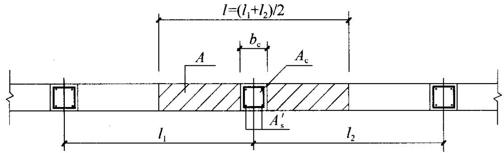  
图8.2.7 砖砌体和构造柱组合墙截面

8.2.8 砖砌体和钢筋混凝土构造柱组合墙，平面外的偏心受压承载力，可按下列规定计算：

1 构件的弯矩或偏心距可按本规范第4.2.5条规定的方法确定；  
2 可按本规范第8.2.4条和8.2.5条的规定确定构造柱纵向钢筋，但截面宽度应改为构造柱间距 $l$ ；大偏心受压时，可不计受压区构造柱混凝土和钢筋的作用，构造柱的计算配筋不应小于第8.2.9条规定的要求。  
8.2.9 组合砖墙的材料和构造应符合下列规定：

1 砂浆的强度等级不应低于M5，构造柱的混凝土强度等级不宜低于C20；  
2 构造柱的截面尺寸不宜小于 $240\mathrm{mm} \times 240\mathrm{mm}$ ，其厚度不应小于墙厚，边柱、角柱的截面宽度宜适当加大。柱内竖向受力钢筋，对于中柱，钢筋数量不宜少于4根、直径不宜小于 $12\mathrm{mm}$ ；对于边柱、角柱，钢筋数量不宜少于4根、直径不宜小于 $14\mathrm{mm}$ 。构造柱的竖向受力钢筋的直径也不宜大于 $16\mathrm{mm}$ 。其箍筋，一般部位宜采用直径 $6\mathrm{mm}$ 、间距 $200\mathrm{mm}$ ，楼层上下 $500\mathrm{mm}$ 范围内宜采用直径 $6\mathrm{mm}$ 、间距 $100\mathrm{mm}$ 。构造柱的竖向受力钢筋应在基础梁和楼层圈梁中锚固，并应符合受拉钢筋的锚固要求；  
3 组合砖墙砌体结构房屋，应在纵横墙交接处、墙端部和较大洞口的洞边设置构造柱，其间距不宜大于 $4\mathrm{m}$ 。各层洞口宜设置在相应位置，并宜上下对齐；  
4 组合砖墙砌体结构房屋应在基础顶面、有组合墙的楼层处设置现浇钢筋混凝土圈梁。圈梁的截面高度不宜小于 $240\mathrm{mm}$ ；纵向钢筋数量不宜少于4根、直径不宜小于 $12\mathrm{mm}$ ，纵向钢筋应伸入构造柱内，并应符合受拉钢筋的锚固要求；圈梁的箍筋直径宜采用 $6\mathrm{mm}$ 、间距 $200\mathrm{mm}$ ；  
5 砖砌体与构造柱的连接处应砌成马牙槎，并应沿墙高每隔 $500\mathrm{mm}$ 设2根直径 $6\mathrm{mm}$ 的拉结钢筋，且每边伸入墙内不宜小于 $600\mathrm{mm}$ ；  
6 构造柱可不单独设置基础，但应伸入室外地坪下 $500\mathrm{mm}$ ，或与埋深小于 $500\mathrm{mm}$ 的基础梁相连；  
7 组合砖墙的施工顺序应为先砌墙后浇混凝土构造柱。

# 9 配筋砌块砌体构件

## 9.1 一般规定

9.1.1 配筋砌块砌体结构的内力与位移，可按弹性方法计算。各构件应根据结构分析所得的内力，分别按轴心受压、偏心受压或偏心受拉构件进行正截面承载力和斜截面承载力计算，并应根据结构分析所得的位移进行变形验算。  
9.1.2 配筋砌块砌体剪力墙，宜采用全部灌芯砌体。

## 9.2 正截面受压承载力计算

9.2.1 配筋砌块砌体构件正截面承载力，应按下列基本假定进行计算：

1 截面应变分布保持平面；  
2 竖向钢筋与其毗邻的砌体、灌孔混凝土的应变相同；  
3 不考虑砌体、灌孔混凝土的抗拉强度；  
4 根据材料选择砌体、灌孔混凝土的极限压应变：当轴心受压时不应大于0.002；偏心受压时的极限压应变不应大于0.003；  
5 根据材料选择钢筋的极限拉应变，且不应大于0.01；  
6 纵向受拉钢筋屈服与受压区砌体破坏同时发生时的相对界限受压区的高度，应按下式计算：

$$\xi_{\mathrm{b}} = \frac{0 . 8}{1 + \frac{f_{\mathrm{y}}}{0 . 003 E_{\mathrm{s}}}} \tag{9.2.1}$$

式中： $\xi_{\mathrm{b}}$ ——相对界限受压区高度 $\xi_{\mathrm{b}}$ 为界限受压区高度与截面有效高度的比值；

$f_{\mathrm{y}}$ ——钢筋的抗拉强度设计值；

$E_{s}$ ——钢筋的弹性模量。

7 大偏心受压时受拉钢筋考虑在 $h_0 - 1.5x$ 范围内屈服并参与工作。

9.2.2 轴心受压配筋砌块砌体构件，当配有箍筋或水平分布钢筋时，其正截面受压承载力应按下列公式计算：

$$N \leqslant \varphi_{0 \mathrm{g}} \left(f_{\mathrm{g}} A + 0. 8 f_{\mathrm{y}}^{\prime} A_{\mathrm{s}}^{\prime}\right) \tag{9.2.2-1}$$

$$\varphi_{0 \mathrm{g}} = \frac{1}{1 + 0 . 001 \beta^{2}} \tag{9.2.2-2}$$

式中： $N$ ——轴向力设计值；

$f_{\mathrm{g}}$ ——灌孔砌体的抗压强度设计值，应按第3.2.1条采用；

$f_{\mathrm{y}}^{\prime}$ ——钢筋的抗压强度设计值；

$A$ ——构件的截面面积；

$A_{\mathrm{s}}^{\prime}$ ——全部竖向钢筋的截面面积；

$\varphi_{0g}$ ——轴心受压构件的稳定系数；

$\beta$ ——构件的高厚比。

注：1 无箍筋或水平分布钢筋时，仍应按式（9.2.2）计算，但应取 $f_{\mathrm{y}}^{\prime}A_{\mathrm{s}}^{\prime} = 0$

2 配筋砌块砌体构件的计算高度 $H_0$ 可取层高。

9.2.3 配筋砌块砌体构件，当竖向钢筋仅配在中间时，其平面外偏心受压承载力可按本规范式（5.1.1）进行计算，但应采用灌孔砌体的抗压强度设计值。

9.2.4 矩形截面偏心受压配筋砌块砌体构件正截面承载力计算，应符合下列规定：

1 相对界限受压区高度的取值，对HPB300级钢筋取 $\xi_{\mathrm{b}}$ 等于0.57，对HRB335级钢筋取 $\xi_{\mathrm{b}}$ 等于0.55，对HRB400级钢筋取 $\xi_{\mathrm{b}}$ 等于0.52；当截面受压区高度 $x$ 小于等于 $\xi_{\mathrm{b}}h_0$ 时，按大偏心受压计算；当 $x$ 大于 $\xi_{\mathrm{b}}h_0$ 时，按为小偏心受压计算。

2 大偏心受压时应按下列公式计算（图9.2.4）：

$$N \leqslant f_{\mathrm{g}} b x + f_{\mathrm{y}}^{\prime} A_{\mathrm{s}}^{\prime} - f_{\mathrm{y}} A_{\mathrm{s}} - \sum f_{\mathrm{s i}} A_{\mathrm{s i}} \tag{9.2.4-1}$$

$$N e_{N} \leqslant f_{\mathrm{g}} b x \left(h_{0} - x / 2\right) + f_{\mathrm{y}}^{\prime} A_{\mathrm{s}}^{\prime} \left(h_{0} - a_{\mathrm{s}}^{\prime}\right) - \sum f_{\mathrm{s i}} S_{\mathrm{s i}} \tag{9.2.4-2}$$

式中： $N$ ——轴向力设计值；

$f_{\mathrm{g}}$ ——灌孔砌体的抗压强度设计值；

$f_{\mathrm{y}}$ 、 $f_{\mathrm{y}}^{\prime}$ ——竖向受拉、压主筋的强度设计值；

$b$ ——截面宽度；

$f_{si}$ ——竖向分布钢筋的抗拉强度设计值；

$A_{s}$ 、 $A_{s}^{\prime}$ ——竖向受拉、压主筋的截面面积；

$A_{si}$ ——单根竖向分布钢筋的截面面积；

$S_{\mathrm{si}}$ ——第 $i$ 根竖向分布钢筋对竖向受拉主筋的面积矩；

$e_{\mathrm{N}}$ ——轴向力作用点到竖向受拉主筋合力点之间的距离，可按第8.2.4条的规定计算；

$a_{s}^{\prime}$ ——受压区纵向钢筋合力点至截面受压区边缘的距离，对T形、L形、工形截面，当翼缘受压时取 $100\mathrm{mm}$ ，其他情况取 $300\mathrm{mm}$ ；

$a_{s}$ ——受拉区纵向钢筋合力点至截面受拉区边缘的距离，对T形、L形、工形截面，当翼缘受压时取 $300\mathrm{mm}$ ，其他情况取 $100\mathrm{mm}$ 。

3 当大偏心受压计算的受压区高度 $x$ 小于 $2a_{\mathrm{s}}^{\prime}$ 时，其正截

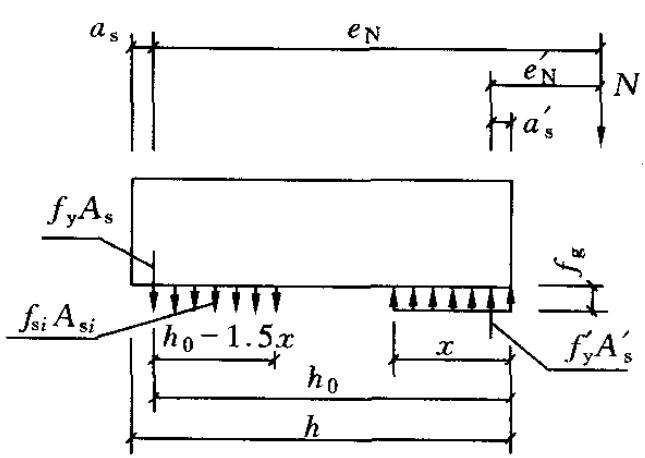  
(a) 大偏心受压

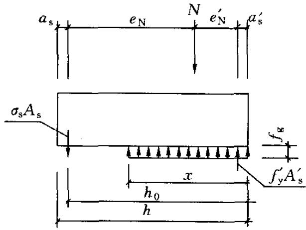  
(b)小偏心受压   
图9.2.4 矩形截面偏心受压正截面承载力计算简图

面承载力可按下式进行计算：

$$N e_{N}^{\prime} \leqslant f_{y} A_{s} \left(h_{0} - a_{s}^{\prime}\right) \tag{9.2.4-3}$$

式中： $e_{\mathrm{N}}^{\prime}$ ——轴向力作用点至竖向受压主筋合力点之间的距离，可按本规范第8.2.4条的规定计算。

4 小偏心受压时，应按下列公式计算（图9.2.4）：

$$N \leqslant f_{\mathrm{g}} b x + f_{\mathrm{y}}^{\prime} A_{\mathrm{s}}^{\prime} - \sigma_{\mathrm{s}} A_{\mathrm{s}} \tag{9.2.4-4}$$

$$N e_{\mathrm{N}} \leqslant f_{\mathrm{g}} b x \left(h_{0} - x / 2\right) + f_{\mathrm{y}}^{\prime} A_{\mathrm{s}}^{\prime} \left(h_{0} - a_{\mathrm{s}}^{\prime}\right) \tag{9.2.4-5}$$

$$\sigma_{\mathrm{s}} = \frac{f_{\mathrm{y}}}{\xi_{\mathrm{b}} - 0 . 8} \left(\frac{x}{h_{0}} - 0. 8\right) \tag{9.2.4-6}$$

注：当受压区竖向受压主筋无箍筋或无水平钢筋约束时，可不考虑竖向受压主筋的作用，即取 $f_{\mathrm{y}}^{\prime}A_{\mathrm{s}}^{\prime} = 0$ 。

5 矩形截面对称配筋砌块砌体小偏心受压时，也可近似按下列公式计算钢筋截面面积：

$$A_{\mathrm{s}} = A_{\mathrm{s}}^{\prime} = \frac{N e_{\mathrm{N}} - \xi (1 - 0 . 5 \xi) f_{\mathrm{g}} b h_{0}^{2}}{f_{\mathrm{y}}^{\prime} \left(h_{0} - a_{\mathrm{s}}^{\prime}\right)} \tag{9.2.4-7}$$

$$\xi = \frac{x}{h_{0}} = \frac{N - \xi_{\mathrm{b}} f_{\mathrm{g}} b h_{0}}{\frac{N e_{\mathrm{N}} - 0 . 43 f_{\mathrm{g}} b h_{0}^{2}}{(0 . 8 - \xi_{\mathrm{b}}) (h_{0} - a_{\mathrm{s}}^{\prime})} + f_{\mathrm{g}} b h_{0}} + \xi_{\mathrm{b}} \tag{9.2.4-8}$$

注：小偏心受压计算中未考虑竖向分布钢筋的作用。

9.2.5 T形、L形、工形截面偏心受压构件，当翼缘和腹板的相交处采用错缝搭接砌筑和同时设置中距不大于 $1.2\mathrm{m}$ 的水平配筋带（截面高度大于等于 $60\mathrm{mm}$ ，钢筋不少于 $2\phi 12$ ）时，可考虑翼缘的共同工作，翼缘的计算宽度应按表9.2.5中的最小值采用，其正截面受压承载力应按下列规定计算：

1 当受压区高度 $x$ 小于等于 $h_{\mathrm{f}}^{\prime}$ 时，应按宽度为 $b_{\mathrm{f}}^{\prime}$ 的矩形截面计算；  
2 当受压区高度 $x$ 大于 $h_{\mathrm{f}}^{\prime}$ 时，则应考虑腹板的受压作用，应按下列公式计算：

1）当为大偏心受压时，

$$N \leqslant f_{\mathrm{g}} \left[ b x + \left(b_{\mathrm{f}}^{\prime} - b\right) h_{\mathrm{f}}^{\prime} \right] + f_{\mathrm{y}}^{\prime} A_{\mathrm{s}}^{\prime} - f_{\mathrm{y}} A_{\mathrm{s}} - \sum f_{\mathrm{s i}} A_{\mathrm{s i}} \tag{9.2.5-1}$$

$$\begin{array}{l} N e_{\mathrm{N}} \leqslant f_{\mathrm{g}} \left[ b x \left(h_{0} - x / 2\right) + \left(b_{\mathrm{f}}^{\prime} - b\right) h_{\mathrm{f}}^{\prime} \left(h_{0} - h_{\mathrm{f}}^{\prime} / 2\right) \right] + \\ f_{\mathrm{y}}^{\prime} A_{\mathrm{s}}^{\prime} \left(h_{0} - a_{\mathrm{s}}^{\prime}\right) - \sum f_{\mathrm{s i}} S_{\mathrm{s i}} \tag{9.2.5-2} \\ \end{array}$$

2）当为小偏心受压时，

$$N \leqslant f_{\mathrm{g}} \left[ b x + \left(b_{\mathrm{f}}^{\prime} - b\right) h_{\mathrm{f}}^{\prime} \right] + f_{\mathrm{y}}^{\prime} A_{\mathrm{s}}^{\prime} - \sigma_{\mathrm{s}} A_{\mathrm{s}} \tag{9.2.5-3}$$

$$\begin{array}{l} N e_{N} \leqslant f_{\mathrm{g}} \left[ b x \left(h_{0} - x / 2\right) + \left(b_{\mathrm{f}}^{\prime} - b\right) h_{\mathrm{f}}^{\prime} \left(h_{0} - h_{\mathrm{f}}^{\prime} / 2\right) \right] + \\ f_{\mathrm{y}}^{\prime} A_{\mathrm{s}}^{\prime} \left(h_{0} - a_{\mathrm{s}}^{\prime}\right) \tag{9.2.5-4} \\ \end{array}$$

式中： $b_{\mathrm{f}}^{\prime}$ ——T形、L形、工形截面受压区的翼缘计算宽度； $h_{\mathrm{f}}^{\prime}$ ——T形、L形、工形截面受压区的翼缘厚度。

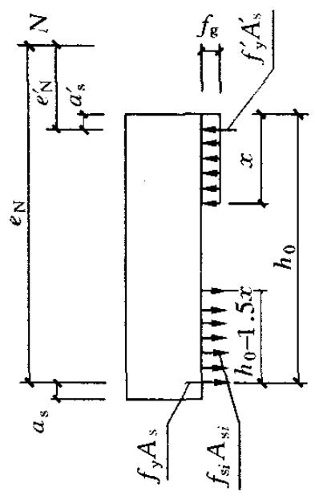

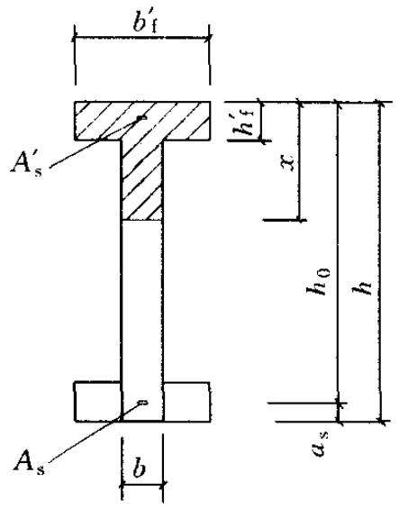  
图9.2.5 T形截面偏心受压构件正截面承载力计算简图

表 9.2.5 T 形、L 形、工形截面偏心受压构件翼缘计算宽度 ${b}_{\mathrm{t}}^{\prime }$   

| 考虑情况 | T、I形截面 | L形截面 |
| --- | --- | --- |
| 按构件计算高度H0考虑 | H0/3 | H0/6 |
| 按腹板间距L考虑 | L | L/2 |
| 按翼缘厚度h′f考虑 | b+12h′f | b+6h′f |
| 按翼缘的实际宽度b′f考虑 | b′f | b′f |

## 9.3 斜截面受剪承载力计算

9.3.1 偏心受压和偏心受拉配筋砌块砌体剪力墙，其斜截面受剪承载力应根据下列情况进行计算：

1 剪力墙的截面，应满足下式要求：

$$V \leqslant 0. 25 f_{\mathrm{g}} b h_{0} \tag{9.3.1-1}$$

式中： $V$ ——剪力墙的剪力设计值；

$b$ ——剪力墙截面宽度或T形、倒L形截面腹板宽度；

$h_0$ ——剪力墙截面的有效高度。

2 剪力墙在偏心受压时的斜截面受剪承载力，应按下列公式计算：

$$V \leqslant \frac{1}{\lambda - 0 . 5} \left(0. 6 f_{\mathrm{v g}} b h_{0} + 0. 12 N \frac{A_{\mathrm{w}}}{A}\right) + 0. 9 f_{\mathrm{y h}} \frac{A_{\mathrm{s h}}}{s} h_{0}$$

$$(9. 3. 1 - 2) \tag{9.3.1-2}$$

$$\lambda = M / V h_{0} \tag{9.3.1-3}$$

式中： $f_{\mathrm{vg}}$ ——灌孔砌体的抗剪强度设计值，应按第3.2.2条的规定采用；

$M, N, V$ ——计算截面的弯矩、轴向力和剪力设计值，当 $N$ 大于 $0.25f_{\mathrm{g}}bh$ 时取 $N = 0.25f_{\mathrm{g}}bh$ ；

$A$ ——剪力墙的截面面积，其中翼缘的有效面积，可按表9.2.5的规定确定；

$A_{\mathrm{w}}$ ——T形或倒L形截面腹板的截面面积，对矩形截面取 $A_{\mathrm{w}}$ 等于 $A$ ；

$\lambda$ ——计算截面的剪跨比，当 $\lambda$ 小于1.5时取1.5，当 $\lambda$ 大于或等于2.2时取2.2；

$h_0$ 剪力墙截面的有效高度；

$A_{\mathrm{sh}}$ ——配置在同一截面内的水平分布钢筋或网片的全部截面面积；

$s$ ——水平分布钢筋的竖向间距；

$f_{\mathrm{yh}}$ ——水平钢筋的抗拉强度设计值。

3 剪力墙在偏心受拉时的斜截面受剪承载力应按下列公式计算：

$$\begin{array}{l} V \leqslant \frac{1}{\lambda - 0 . 5} \left(0. 6 f_{\mathrm{v g}} b h_{0} - 0. 22 N \frac{A_{\mathrm{w}}}{A}\right) + 0. 9 f_{\mathrm{y h}} \frac{A_{\mathrm{s h}}}{s} h_{0} \\ (9. 3. 1 - 4) \tag{9.3.1-4} \\ \end{array}$$

9.3.2 配筋砌块砌体剪力墙连梁的斜截面受剪承载力，应符合下列规定：

1 当连梁采用钢筋混凝土时，连梁的承载力应按现行国家标准《混凝土结构设计规范》GB50010的有关规定进行计算；  
2 当连梁采用配筋砌块砌体时，应符合下列规定：

1）连梁的截面，应符合下列规定：

$$V_{\mathrm{b}} \leqslant 0. 25 f_{\mathrm{g}} b h_{0} \tag{9.3.2-1}$$

2）连梁的斜截面受剪承载力应按下列公式计算：

$$V_{\mathrm{b}} \leqslant 0. 8 f_{\mathrm{v g}} b h_{0} + f_{\mathrm{y v}} \frac{A_{\mathrm{s v}}}{s} h_{0} \tag{9.3.2-2}$$

式中： $V_{\mathrm{b}}$ ——连梁的剪力设计值；

$b$ ——连梁的截面宽度；

$h_0$ ——连梁的截面有效高度；

$A_{\mathrm{sv}}$ ——配置在同一截面内箍筋各肢的全部截面面积；

$f_{\mathrm{yv}}$ ——箍筋的抗拉强度设计值；

$s$ ——沿构件长度方向箍筋的间距。

注：连梁的正截面受弯承载力应按现行国家标准《混凝土结构设计规范》GB50010受弯构件的有关规定进行计算，当采用配筋砌块砌体时，应采用其相应的计算参数和指标。

## 9.4 配筋砌块砌体剪力墙构造规定

I 钢 筋

9.4.1 钢筋的选择应符合下列规定：

1 钢筋的直径不宜大于 $25\mathrm{mm}$ ，当设置在灰缝中时不应小于 $4\mathrm{mm}$ ，在其他部位不应小于 $10\mathrm{mm}$ ；  
2 配置在孔洞或空腔中的钢筋面积不应大于孔洞或空腔面积的 $6\%$ 。

9.4.2 钢筋的设置，应符合下列规定：

1 设置在灰缝中钢筋的直径不宜大于灰缝厚度的 $1 / 2$

2 两平行的水平钢筋间的净距不应小于 $50\mathrm{mm}$

3 柱和壁柱中的竖向钢筋的净距不宜小于 $40\mathrm{mm}$ （包括接头处钢筋间的净距）。

9.4.3 钢筋在灌孔混凝土中的锚固，应符合下列规定：

1 当计算中充分利用竖向受拉钢筋强度时，其锚固长度 $l_{\mathrm{a}}$ 对HRB335级钢筋不应小于 $30d$ ；对HRB400和RRB400级钢筋不应小于 $35d$ ；在任何情况下钢筋（包括钢筋网片）锚固长度不应小于 $300\mathrm{mm}$ ；

2 竖向受拉钢筋不应在受拉区截断。如必须截断时，应延伸至按正截面受弯承载力计算不需要该钢筋的截面以外，延伸的长度不应小于 $20d$ ；

3 竖向受压钢筋在跨中截断时，必须伸至按计算不需要该钢筋的截面以外，延伸的长度不应小于 $20d$ ；对绑扎骨架中末端无弯钩的钢筋，不应小于 $25d$ ；

4 钢筋骨架中的受力光圆钢筋，应在钢筋末端作弯钩，在焊接骨架、焊接网以及轴心受压构件中，不作弯钩；绑扎骨架中的受力带肋钢筋，在钢筋的末端不做弯钩。

9.4.4 钢筋的直径大于 $22\mathrm{mm}$ 时宜采用机械连接接头，接头的质量应符合国家现行有关标准的规定；其他直径的钢筋可采用搭接接头，并应符合下列规定：

1 钢筋的接头位置宜设置在受力较小处；

2 受拉钢筋的搭接接头长度不应小于 $1.1l_{\mathrm{a}}$ ，受压钢筋的搭接接头长度不应小于 $0.7l_{\mathrm{a}}$ ，且不应小于 $300\mathrm{mm}$

3 当相邻接头钢筋的间距不大于 $75\mathrm{mm}$ 时，其搭接长度应为 $1.2l_{\mathrm{a}}$ 。当钢筋间的接头错开 $20d$ 时，搭接长度可不增加。

9.4.5 水平受力钢筋（网片）的锚固和搭接长度应符合下列规定：

1 在凹槽砌块混凝土带中钢筋的锚固长度不宜小于 $30d$ ，且其水平或垂直弯折段的长度不宜小于 $15d$ 和 $200\mathrm{mm}$ ；钢筋的搭接长度不宜小于 $35d$ ；

2 在砌体水平灰缝中，钢筋的锚固长度不宜小于 $50d$ ，且其水平或垂直弯折段的长度不宜小于 $20d$ 和 $250\mathrm{mm}$ ；钢筋的搭接长度不宜小于 $55d$

3 在隔皮或错缝搭接的灰缝中为 $55d + 2h$ ， $d$ 为灰缝受力钢筋的直径， $h$ 为水平灰缝的间距。

Ⅱ 配筋砌块砌体剪力墙、连梁

9.4.6 配筋砌块砌体剪力墙、连梁的砌体材料强度等级应符合下列规定：

1 砌块不应低于MU10；  
2 砌筑砂浆不应低于Mb7.5；  
3 灌孔混凝土不应低于Cb20。

注：对安全等级为一级或设计使用年限大于50a的配筋砌块砌体房屋，所用材料的最低强度等级应至少提高一级。

9.4.7 配筋砌块砌体剪力墙厚度、连梁截面宽度不应小于 $190\mathrm{mm}$ 。  
9.4.8 配筋砌块砌体剪力墙的构造配筋应符合下列规定：

1 应在墙的转角、端部和孔洞的两侧配置竖向连续的钢筋，钢筋直径不应小于 $12\mathrm{mm}$ ；  
2 应在洞口的底部和顶部设置不小于 $2\phi 10$ 的水平钢筋，其伸入墙内的长度不应小于 $40d$ 和 $600\mathrm{mm}$ ；  
3 应在楼（屋）盖的所有纵横墙处设置现浇钢筋混凝土圈梁，圈梁的宽度和高度应等于墙厚和块高，圈梁主筋不应少于4Φ10，圈梁的混凝土强度等级不应低于同层混凝土块体强度等级的2倍，或该层灌孔混凝土的强度等级，也不应低于C20；  
4 剪力墙其他部位的竖向和水平钢筋的间距不应大于墙长、墙高的1/3，也不应大于 $900\mathrm{mm}$ ；  
5 剪力墙沿竖向和水平方向的构造钢筋配筋率均不应小于 $0.07\%$ 。  
9.4.9 按壁式框架设计的配筋砌块砌体窗间墙除应符合本规范

第9.4.6条～9.4.8条规定外，尚应符合下列规定；

1 窗间墙的截面应符合下列要求规定：

1）墙宽不应小于 $800\mathrm{mm}$   
2）墙净高与墙宽之比不宜大于5。

2 窗间墙中的竖向钢筋应符合下列规定：

1）每片窗间墙中沿全高不应少于4根钢筋；  
2）沿墙的全截面应配置足够的抗弯钢筋；  
3）窗间墙的竖向钢筋的配筋率不宜小于 $0.2\%$ ，也不宜大于 $0.8\%$ 。

3 窗间墙中的水平分布钢筋应符合下列规定：

1）水平分布钢筋应在墙端部纵筋处向下弯折射 $90^{\circ}$ ，弯折段长度不小于 $15d$ 和 $150\mathrm{mm}$ ；  
2）水平分布钢筋的间距：在距梁边1倍墙宽范围内不应大于 $1 / 4$ 墙宽，其余部位不应大于 $1 / 2$ 墙宽；  
3）水平分布钢筋的配筋率不宜小于 $0.15\%$ 。

9.4.10 配筋砌块砌体剪力墙，应按下列情况设置边缘构件：

1 当利用剪力墙端部的砌体受力时，应符合下列规定：

1）应在一字墙的端部至少3倍墙厚范围内的孔中设置不小于 $\phi 12$ 通长竖向钢筋；  
2）应在L、T或十字形墙交接处3或4个孔中设置不小于 $\phi 12$ 通长竖向钢筋；  
3）当剪力墙的轴压比大于 $0.6f_{\mathrm{g}}$ 时，除按上述规定设置竖向钢筋外，尚应设置间距不大于 $200\mathrm{mm}$ 、直径不小于 $6\mathrm{mm}$ 的钢箍。

2 当在剪力墙墙端设置混凝土柱作为边缘构件时，应符合下列规定：

1）柱的截面宽度宜不小于墙厚，柱的截面高度宜为 $1\sim 2$ 倍的墙厚，并不应小于 $200\mathrm{mm}$   
2）柱的混凝土强度等级不宜低于该墙体块体强度等级的2倍，或不低于该墙体灌孔混凝土的强度等级，也不

应低于Cb20；

3）柱的竖向钢筋不宜小于 $4\phi 12$ ，箍筋不宜小于 $\phi 6$ 、间距不宜大于 $200\mathrm{mm}$   
4）墙体中的水平钢筋应在柱中锚固，并应满足钢筋的锚固要求；

5）柱的施工顺序宜为先砌砌块墙体，后浇捣混凝土。

9.4.11 配筋砌块砌体剪力墙中当连梁采用钢筋混凝土时，连梁混凝土的强度等级不宜低于同层墙体块体强度等级的2倍，或同层墙体灌孔混凝土的强度等级，也不应低于C20；其他构造尚应符合现行国家标准《混凝土结构设计规范》GB50010的有关规定。  
9.4.12 配筋砌块砌体剪力墙中当连梁采用配筋砌块砌体时，连梁应符合下列规定：

1 连梁的截面应符合下列规定：

1）连梁的高度不应小于两皮砌块的高度和 $400\mathrm{mm}$   
2）连梁应采用H型砌块或凹槽砌块组砌，孔洞应全部浇灌混凝土。

2 连梁的水平钢筋宜符合下列规定：

1）连梁上、下水平受力钢筋宜对称、通长设置，在灌孔砌体内的锚固长度不宜小于 $40d$ 和 $600\mathrm{mm}$   
2）连梁水平受力钢筋的含钢率不宜小于 $0.2\%$ ，也不宜大于 $0.8\%$ 。

3 连梁的箍筋应符合下列规定：

1）箍筋的直径不应小于 $6\mathrm{mm}$   
2）箍筋的间距不宜大于 $1 / 2$ 梁高和 $600\mathrm{mm}$   
3）在距支座等于梁高范围内的箍筋间距不应大于1/4梁高，距支座表面第一根箍筋的间距不应大于 $100\mathrm{mm}$   
4）箍筋的面积配筋率不宜小于 $0.15\%$   
5）箍筋宜为封闭式，双肢箍末端弯钩为 $135^{\circ}$ ；单肢箍末端的弯钩为 $180^{\circ}$ ，或弯 $90^{\circ}$ 加 12 倍箍筋直径的延长段。

Ⅲ 配筋砌块砌体柱

9.4.13 配筋砌块砌体柱（图9.4.13）除应符合本规范第9.4.6条的要求外，尚应符合下列规定：

1 柱截面边长不宜小于 $400\mathrm{mm}$ ，柱高度与截面短边之比不宜大于30；  
2 柱的竖向受力钢筋的直径不宜小于 $12\mathrm{mm}$ ，数量不应少于4根，全部竖向受力钢筋的配筋率不宜小于 $0.2\%$ ；

3 柱中箍筋的设置应根据下列情况确定：

1）当纵向钢筋的配筋率大于 $0.25\%$ ，且柱承受的轴向力大于受压承载力设计值的 $25\%$ 时，柱应设箍筋；当配筋率小于等于 $0.25\%$ 时，或柱承受的轴向力小于受压承载力设计值的 $25\%$ 时，柱中可不设置箍筋；  
2）箍筋直径不宜小于 $6\mathrm{mm}$   
3）箍筋的间距不应大于16倍的纵向钢筋直径、48倍箍筋直径及柱截面短边尺寸中较小者；  
4）箍筋应封闭，端部应弯钩或绕纵筋水平弯折 $90^{\circ}$ ，弯折段长度不小于 $10d$ ；  
5）箍筋应设置在灰缝或灌孔混凝土中。

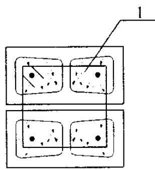  
(a) 下皮

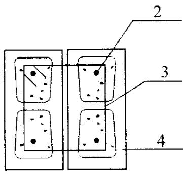  
(b) 上皮  
图9.4.13 配筋砌块砌体柱截面示意—灌孔混凝土；2—钢筋；3—箍筋；4—砌块

# 10 砌体结构构件抗震设计

## 10.1 一般规定

10.1.1 抗震设防地区的普通砖（包括烧结普通砖、蒸压灰砂普通砖、蒸压粉煤灰普通砖、混凝土普通砖）、多孔砖（包括烧结多孔砖、混凝土多孔砖）和混凝土砌块等砌体承重的多层房屋，底层或底部两层框架-抗震墙砌体房屋，配筋砌块砌体抗震墙房屋，除应符合本规范第1章至第9章的要求外，尚应按本章规定进行抗震设计，同时尚应符合现行国家标准《建筑抗震设计规范》GB50011、《墙体材料应用统一技术规范》GB50574的有关规定。甲类设防建筑不宜采用砌体结构，当需采用时，应进行专门研究并采取高于本章规定的抗震措施。

注：本章中“配筋砌块砌体抗震墙”指全部灌芯配筋砌块砌体。

10.1.2 本章适用的多层砌体结构房屋的总层数和总高度，应符合下列规定：

1 房屋的层数和总高度不应超过表 10.1.2 的规定；

表 10.1.2 多层砌体房屋的层数和总高度限值 (m)  

| 房屋类别 | 房屋类别 | 最小墙厚度(mm) | 设防烈度和设计基本地震加速度 | 设防烈度和设计基本地震加速度 | 设防烈度和设计基本地震加速度 | 设防烈度和设计基本地震加速度 | 设防烈度和设计基本地震加速度 | 设防烈度和设计基本地震加速度 | 设防烈度和设计基本地震加速度 | 设防烈度和设计基本地震加速度 | 设防烈度和设计基本地震加速度 | 设防烈度和设计基本地震加速度 | 设防烈度和设计基本地震加速度 | 设防烈度和设计基本地震加速度 |
| --- | --- | --- | --- | --- | --- | --- | --- | --- | --- | --- | --- | --- | --- | --- |
| 房屋类别 | 房屋类别 | 最小墙厚度(mm) | 6 | 6 | 7 | 7 | 7 | 7 | 8 | 8 | 8 | 8 | 9 | 9 |
| 房屋类别 | 房屋类别 | 最小墙厚度(mm) | 0.05g | 0.05g | 0.10g | 0.10g | 0.15g | 0.15g | 0.20g | 0.20g | 0.30g | 0.30g | 0.40g | 0.40g |
| 房屋类别 | 房屋类别 | 最小墙厚度(mm) | 高度 | 层数 | 高度 | 层数 | 高度 | 层数 | 高度 | 层数 | 高度 | 层数 | 高度 | 层数 |
| 多层砌体房屋 | 普通砖 | 240 | 21 | 7 | 21 | 7 | 21 | 7 | 18 | 6 | 15 | 5 | 12 | 4 |
| 多层砌体房屋 | 多孔砖 | 240 | 21 | 7 | 21 | 7 | 18 | 6 | 18 | 6 | 15 | 5 | 9 | 3 |
| 多层砌体房屋 | 多孔砖 | 190 | 21 | 7 | 18 | 6 | 15 | 5 | 15 | 5 | 12 | 4 | - | - |
| 多层砌体房屋 | 混凝土砌块 | 190 | 21 | 7 | 21 | 7 | 18 | 6 | 18 | 6 | 15 | 5 | 9 | 3 |

续表 10.1.2  

| 房屋类别 | 房屋类别 | 最小墙厚度(mm) | 设防烈度和设计基本地震加速度 | 设防烈度和设计基本地震加速度 | 设防烈度和设计基本地震加速度 | 设防烈度和设计基本地震加速度 | 设防烈度和设计基本地震加速度 | 设防烈度和设计基本地震加速度 | 设防烈度和设计基本地震加速度 | 设防烈度和设计基本地震加速度 | 设防烈度和设计基本地震加速度 | 设防烈度和设计基本地震加速度 | 设防烈度和设计基本地震加速度 | 设防烈度和设计基本地震加速度 |
| --- | --- | --- | --- | --- | --- | --- | --- | --- | --- | --- | --- | --- | --- | --- |
| 房屋类别 | 房屋类别 | 最小墙厚度(mm) | 6 | 6 | 7 | 7 | 7 | 7 | 8 | 8 | 8 | 8 | 9 | 9 |
| 房屋类别 | 房屋类别 | 最小墙厚度(mm) | 0.05g | 0.05g | 0.10g | 0.10g | 0.15g | 0.15g | 0.20g | 0.20g | 0.30g | 0.30g | 0.40g | 0.40g |
| 房屋类别 | 房屋类别 | 最小墙厚度(mm) | 高度 | 层数 | 高度 | 层数 | 高度 | 层数 | 高度 | 层数 | 高度 | 层数 | 高度 | 层数 |
| 底部框架-抗震墙砌体房屋 | 普通砖多孔砖 | 240 | 22 | 7 | 22 | 7 | 19 | 6 | 16 | 5 | - | - | - | - |
| 底部框架-抗震墙砌体房屋 | 多孔砖 | 190 | 22 | 7 | 19 | 6 | 16 | 5 | 13 | 4 | - | - | - | - |
| 底部框架-抗震墙砌体房屋 | 混凝土砌块 | 190 | 22 | 7 | 22 | 7 | 19 | 6 | 16 | 5 | - | - | - | - |

注：1 房屋的总高度指室外地面到主要屋面板板顶或檐口的高度，半地下室从地下室室内地面算起，全地下室和嵌固条件好的半地下室应允许从室外地面算起；对带阁楼的坡屋面应算到山尖墙的 $1/2$ 高度处；  
2室内外高差大于 $0.6\mathrm{m}$ 时，房屋总高度应允许比表中的数据适当增加，但增加量应少于1.0m;  
3 乙类的多层砌体房屋仍按本地区设防烈度查表，其层数应减少一层且总高度应降低 $3\mathrm{m}$ ；不应采用底部框架-抗震墙砌体房屋。

2 各层横墙较少的多层砌体房屋，总高度应比表10.1.2中的规定降低 $3\mathrm{m}$ ，层数相应减少一层；各层横墙很少的多层砌体房屋，还应再减少一层；  
注：横墙较少是指同一楼层内开间大于 $4.2\mathrm{m}$ 的房间占该层总面积的 $40\%$ 以上；其中，开间不大于 $4.2\mathrm{m}$ 的房间占该层总面积不到 $20\%$ 且开间大于 $4.8\mathrm{m}$ 的房间占该层总面积的 $50\%$ 以上为横墙很少。  
3 抗震设防烈度为6、7度时，横墙较少的丙类多层砌体房屋，当按现行国家标准《建筑抗震设计规范》GB50011规定采取加强措施并满足抗震承载力要求时，其高度和层数应允许仍按表10.1.2中的规定采用；  
4 采用蒸压灰砂普通砖和蒸压粉煤灰普通砖的砌体房屋，当砌体的抗剪强度仅达到普通黏土砖砌体的 $70\%$ 时，房屋的层数应比普通砖房屋减少一层，总高度应减少 $3\mathrm{m}$ ；当砌体的抗剪

强度达到普通黏土砖砌体的取值时，房屋层数和总高度的要求同普通砖房屋。

10.1.3 本章适用的配筋砌块砌体抗震墙结构和部分框支抗震墙结构房屋最大高度应符合表10.1.3的规定。

表 10.1.3 配筋砌块砌体抗震墙房屋适用的最大高度 (m)  

| 结构类型最小墙厚（mm） | 结构类型最小墙厚（mm） | 设防烈度和设计基本地震加速度 | 设防烈度和设计基本地震加速度 | 设防烈度和设计基本地震加速度 | 设防烈度和设计基本地震加速度 | 设防烈度和设计基本地震加速度 | 设防烈度和设计基本地震加速度 |
| --- | --- | --- | --- | --- | --- | --- | --- |
| 结构类型最小墙厚（mm） | 结构类型最小墙厚（mm） | 6 度 | 7 度 | 7 度 | 8 度 | 8 度 | 9 度 |
| 结构类型最小墙厚（mm） | 结构类型最小墙厚（mm） | 0.05g | 0.10g | 0.15g | 0.20g | 0.30g | 0.40g |
| 配筋砌块砌体抗震墙 | 190mm | 60 | 55 | 45 | 40 | 30 | 24 |
| 部分框支抗震墙 | 190mm | 55 | 49 | 40 | 31 | 24 | - |

注：1 房屋高度指室外地面到主要屋面板板顶的高度（不包括局部突出屋顶部分）；  
2 某层或几层开间大于 $6.0\mathrm{m}$ 以上的房间建筑面积占相应层建筑面积 $40\%$ 以上时，表中数据相应减少 $6\mathrm{m}$   
3 部分框支抗震墙结构指首层或底部两层为框支层的结构，不包括仅个别框支墙的情况；  
4 房屋的高度超过表内高度时，应根据专门研究，采取有效的加强措施。

10.1.4 砌体结构房屋的层高，应符合下列规定：

1 多层砌体结构房屋的层高，应符合下列规定：

1）多层砌体结构房屋的层高，不应超过 $3.6\mathrm{m}$

注：当使用功能确有需要时，采用约束砌体等加强措施的普通砖房屋，层高不应超过 $3.9\mathrm{m}$ 。

2）底部框架-抗震墙砌体房屋的底部，层高不应超过 $4.5\mathrm{m}$ ；当底层采用约束砌体抗震墙时，底层的层高不应超过 $4.2\mathrm{m}$ 。

2 配筋混凝土空心砌块抗震墙房屋的层高，应符合下列规定：

1）底部加强部位（不小于房屋高度的 $1 / 6$ 且不小于底部二层的高度范围）的层高（房屋总高度小于 $21\mathrm{m}$ 时

取一层), 一、二级不宜大于 $3.2 \mathrm{~m}$ , 三、四级不应大于 $3.9 \mathrm{~m}$ ;

2）其他部位的层高，一、二级不应大于 $3.9\mathrm{m}$ ，三、四级不应大于 $4.8\mathrm{m}$ 。

10.1.5 考虑地震作用组合的砌体结构构件，其截面承载力应除以承载力抗震调整系数 $\gamma_{\mathrm{RE}}$ ，承载力抗震调整系数应按表 10.1.5 采用。当仅计算竖向地震作用时，各类结构构件承载力抗震调整系数均应采用 1.0。

表 10.1.5 承载力抗震调整系数  

| 结构构件类别 | 受力状态 | γRE |
| --- | --- | --- |
| 两端均设有构造柱、芯柱的砌体抗震墙 | 受剪 | 0.9 |
| 组合砖墙 | 偏压、大偏拉和受剪 | 0.9 |
| 配筋砌块砌体抗震墙 | 偏压、大偏拉和受剪 | 0.85 |
| 自承重墙 | 受剪 | 1.0 |
| 其他砌体 | 受剪和受压 | 1.0 |

10.1.6 配筋砌块砌体抗震墙结构房屋抗震设计时，结构抗震等级应根据设防烈度和房屋高度按表10.1.6采用。

表 10.1.6 配筋砌块砌体抗震墙结构房屋的抗震等级  

| 结构类型 | 结构类型 | 设防烈度 | 设防烈度 | 设防烈度 | 设防烈度 | 设防烈度 | 设防烈度 | 设防烈度 |
| --- | --- | --- | --- | --- | --- | --- | --- | --- |
| 结构类型 | 结构类型 | 6 | 6 | 7 | 7 | 8 | 8 | 9 |
| 配筋砌块砌体抗震墙 | 高度(m) | ≤24 | >24 | ≤24 | >24 | ≤24 | >24 | ≤24 |
| 配筋砌块砌体抗震墙 | 抗震墙 | 四 | 三 | 三 | 二 | 二 | 一 | 一 |
| 部分框支抗震墙 | 非底部加强部位抗震墙 | 四 | 三 | 三 | 二 | 二 | 不应采用 | 不应采用 |
| 部分框支抗震墙 | 底部加强部位抗震墙 | 三 | 二 | 二 | 一 | 一 | 不应采用 | 不应采用 |
| 部分框支抗震墙 | 框支框架 | 二 | 二 | 二 | 一 | 一 | 不应采用 | 不应采用 |

注：1 对于四级抗震等级，除本章有规定外，均按非抗震设计采用；  
2 接近或等于高度分界时，可结合房屋不规则程度及场地、地基条件确定抗震等级。

10.1.7 结构抗震设计时，地震作用应按现行国家标准《建筑抗震设计规范》GB50011的规定计算。结构的截面抗震验算，应符合下列规定：

1 抗震设防烈度为6度时，规则的砌体结构房屋构件，应允许不进行抗震验算，但应有符合现行国家标准《建筑抗震设计规范》GB50011和本章规定的抗震措施；  
2 抗震设防烈度为7度和7度以上的建筑结构，应进行多遇地震作用下的截面抗震验算。6度时，下列多层砌体结构房屋的构件，应进行多遇地震作用下的截面抗震验算。

1）平面不规则的建筑；
2）总层数超过三层的底部框架-抗震墙砌体房屋；   
3）外廊式和单面走廊式底部框架-抗震墙砌体房屋；   
4）托梁等转换构件。

10.1.8 配筋砌块砌体抗震墙结构应进行多遇地震作用下的抗震变形验算，其楼层内最大的层间弹性位移角不宜超过 $1 / 1000$ 。

10.1.9 底部框架-抗震墙砌体房屋的钢筋混凝土结构部分，除应符合本章规定外，尚应符合现行国家标准《建筑抗震设计规范》GB50011—2010第6章的有关要求；此时，底部钢筋混凝土框架的抗震等级，6、7、8度时应分别按三、二、一级采用；底部钢筋混凝土抗震墙和配筋砌块砌体抗震墙的抗震等级，6、7、8度时应分别按三、三、二级采用。多层砌体房屋局部有上部砌体墙不能连续贯通落地时，托梁、柱的抗震等级，6、7、8度时应分别按三、三、二级采用。

10.1.10 配筋砌块砌体短肢抗震墙及一般抗震墙设置，应符合下列规定：

1 抗震墙宜沿主轴方向双向布置，各向结构刚度、承载力宜均匀分布。高层建筑不宜采用全部为短肢墙的配筋砌块砌体抗震墙结构，应形成短肢抗震墙与一般抗震墙共同抵抗水平地震作用的抗震墙结构。9度时不宜采用短肢墙；   
2 纵横方向的抗震墙宜拉通对齐；较长的抗震墙可采用楼

板或弱连梁分为若干个独立的墙段，每个独立墙段的总高度与长度之比不宜小于2，墙肢的截面高度也不宜大于 $8\mathrm{m}$ ；

3 抗震墙的门窗洞口宜上下对齐，成列布置；  
4 一般抗震墙承受的第一振型底部地震倾覆力矩不应小于结构总倾覆力矩的 $50\%$ ，且两个主轴方向，短肢抗震墙截面面积与同一层所有抗震墙截面面积比例不宜大于 $20\%$   
5 短肢抗震墙宜设翼缘。一字形短肢墙平面外不宜布置与之单侧相交的楼面梁；  
6 短肢墙的抗震等级应比表10.1.6的规定提高一级采用；已为一级时，配筋应按9度的要求提高；  
7 配筋砌块砌体抗震墙的墙肢截面高度不宜小于墙肢截面宽度的5倍。

注：短肢抗震墙是指墙肢截面高度与宽度之比为 $5\sim 8$ 的抗震墙，一般抗震墙是指墙肢截面高度与宽度之比大于8的抗震墙。L形，T形，+形等多肢墙截面的长短肢性质应由较长一肢确定。

10.1.11 部分框支配筋砌块砌体抗震墙房屋的结构布置，应符合下列规定：

1 上部的配筋砌块砌体抗震墙与框支层落地抗震墙或框架应对齐或基本对齐；   
2 框支层应沿纵横两方向设置一定数量的抗震墙，并均匀布置或基本均匀布置。框支层抗震墙可采用配筋砌块砌体抗震墙或钢筋混凝土抗震墙，但在同一层内不应混用；   
3 矩形平面的部分框支配筋砌块砌体抗震墙房屋结构的楼层侧向刚度比和底层框架部分承担的地震倾覆力矩，应符合现行国家标准《建筑抗震设计规范》GB50011—2010第6.1.9条的有关要求。

10.1.12 结构材料性能指标，应符合下列规定：

1 砌体材料应符合下列规定：  
1）普通砖和多孔砖的强度等级不应低于MU10，其砌筑砂浆强度等级不应低于M5；蒸压灰砂普通砖、蒸压

粉煤灰普通砖及混凝土砖的强度等级不应低于MU15，其砌筑砂浆强度等级不应低于Ms5（Mb5）；

2）混凝土砌块的强度等级不应低于MU7.5，其砌筑砂浆强度等级不应低于Mb7.5；  
3）约束砖砌体墙，其砌筑砂浆强度等级不应低于M10或Mb10；  
4）配筋砌块砌体抗震墙，其混凝土空心砌块的强度等级不应低于MU10，其砌筑砂浆强度等级不应低于Mb10。

2 混凝土材料，应符合下列规定：

1）托梁，底部框架-抗震墙砌体房屋中的框架梁、框架柱、节点核芯区、混凝土墙和过渡层底板，部分框支配筋砌块砌体抗震墙结构中的框支梁和框支柱等转换构件、节点核芯区、落地混凝土墙和转换层楼板，其混凝土的强度等级不应低于C30；  
2）构造柱、圈梁、水平现浇钢筋混凝土带及其他各类构件不应低于C20，砌块砌体芯柱和配筋砌块砌体抗震墙的灌孔混凝土强度等级不应低于Cb20。

3 钢筋材料应符合下列规定：

1）钢筋宜选用HRB400级钢筋和HRB335级钢筋，也可采用HPB300级钢筋；  
2）托梁、框架梁、框架柱等混凝土构件和落地混凝土墙，其普通受力钢筋宜优先选用HRB400钢筋。

10.1.13 考虑地震作用组合的配筋砌体结构构件，其配置的受力钢筋的锚固和接头，除应符合本规范第9章的要求外，尚应符合下列规定：

1 纵向受拉钢筋的最小锚固长度 $l_{\mathrm{ae}}$ ，抗震等级为一、二级时， $l_{\mathrm{ae}}$ 取 $1.15l_{\mathrm{a}}$ ，抗震等级为三级时， $l_{\mathrm{ae}}$ 取 $1.05l_{\mathrm{a}}$ ，抗震等级为四级时， $l_{\mathrm{ae}}$ 取 $1.0l_{\mathrm{a}}$ ， $l_{\mathrm{a}}$ 为受拉钢筋的锚固长度，按第9.4.3条的规定确定。

2 钢筋搭接接头，对一、二级抗震等级不小于 $1.2l_{\mathrm{a}} + 5d$ 对三、四级不小于 $1.2l_{\mathrm{a}}$ 。

3 配筋砌块砌体剪力墙的水平分布钢筋沿墙长应连续设置，两端的锚固应符合下列规定：

1）一、二级抗震等级剪力墙，水平分布钢筋可绕主筋弯 $180^{\circ}$ 弯钩，弯钩端部直段长度不宜小于 $12d$ ；水平分布钢筋亦可弯入端部灌孔混凝土中，锚固长度不应小于 $30d$ ，且不应小于 $250\mathrm{mm}$ ；  
2）三、四级剪力墙，水平分布钢筋可弯入端部灌孔混凝土中，锚固长度不应小于 $20d$ ，且不应小于 $200\mathrm{mm}$   
3）当采用焊接网片作为剪力墙水平钢筋时，应在钢筋网片的弯折端部加焊两根直径与抗剪钢筋相同的横向钢筋，弯入灌孔混凝土的长度不应小于 $150\mathrm{mm}$ 。

10.1.14 砌体结构构件进行抗震设计时，房屋的结构体系、高宽比、抗震横墙的间距、局部尺寸的限值、防震缝的设置及结构构造措施等，除满足本章规定外，尚应符合现行国家标准《建筑抗震设计规范》GB50011的有关规定。

## 10.2 砖砌体构件

I 承载力计算

10.2.1 普通砖、多孔砖砌体沿阶梯形截面破坏的抗震抗剪强度设计值，应按下式确定：

$$f_{\mathrm{v E}} = \zeta_{\mathrm{N}} f_{\mathrm{v}} \tag{10.2.1}$$

式中： $f_{\mathrm{vE}}$ ——砌体沿阶梯形截面破坏的抗震抗剪强度设计值；

$f_{\mathrm{v}}$ ——非抗震设计的砌体抗剪强度设计值；

$\zeta_{\mathrm{N}}$ —砖砌体抗震抗剪强度的正应力影响系数，应按表10.2.1采用。

表 10.2.1 砖砌体强度的正应力影响系数  

| 砌体类别 | σ0/fv | σ0/fv | σ0/fv | σ0/fv | σ0/fv | σ0/fv | σ0/fv |
| --- | --- | --- | --- | --- | --- | --- | --- |
| 砌体类别 | 0.0 | 1.0 | 3.0 | 5.0 | 7.0 | 10.0 | 12.0 |
| 普通砖、多孔砖 | 0.80 | 0.99 | 1.25 | 1.47 | 1.65 | 1.90 | 2.05 |

注： $\sigma_0$ 为对应于重力荷载代表值的砌体截面平均压应力。

10.2.2 普通砖、多孔砖墙体的截面抗震受剪承载力，应按下列公式验算：

1 一般情况下，应按下式验算：

$$V \leqslant f_{\mathrm{v E}} A / \gamma_{\mathrm{R E}} \tag{10.2.2-1}$$

式中： $V$ ——考虑地震作用组合的墙体剪力设计值；

$f_{\mathrm{vE}}$ —砖砌体沿阶梯形截面破坏的抗震抗剪强度设计值；

$A$ ——墙体横截面面积；

$\gamma_{\mathrm{RE}}$ ——承载力抗震调整系数，应按表10.1.5采用。

2 采用水平配筋的墙体，应按下式验算：

$$V \leqslant \frac{1}{\gamma_{\mathrm{R E}}} \left(f_{\mathrm{v E}} A + \zeta_{\mathrm{s}} f_{\mathrm{y h}} A_{\mathrm{s h}}\right) \tag{10.2.2-2}$$

式中： $\zeta_{s}$ ——钢筋参与工作系数，可按表10.2.2采用；

$f_{\mathrm{yh}}$ ——墙体水平纵向钢筋的抗拉强度设计值；

$A_{\mathrm{sh}}$ ——层间墙体竖向截面的总水平纵向钢筋面积，其配筋率不应小于 $0.07\%$ 且不大于 $0.17\%$ 。

表 10.2.2 钢筋参与工作系数 $\left( {\zeta }_{\mathrm{s}}\right)$   

| 墙体高宽比 | 0.4 | 0.6 | 0.8 | 1.0 | 1.2 |
| --- | --- | --- | --- | --- | --- |
| ζs | 0.10 | 0.12 | 0.14 | 0.15 | 0.12 |

3 墙段中部基本均匀的设置构造柱，且构造柱的截面不小于 $240\mathrm{mm} \times 240\mathrm{mm}$ （当墙厚 $190\mathrm{mm}$ 时，亦可采用 $240\mathrm{mm} \times$ $190\mathrm{mm}$ ），构造柱间距不大于 $4\mathrm{m}$ 时，可计入墙段中部构造柱对墙体受剪承载力的提高作用，并按下式进行验算：

$$V \leqslant \frac{1}{\gamma_{\mathrm{R E}}} \left[ \eta_{\mathrm{c}} f_{\mathrm{v E}} \left(A - A_{\mathrm{c}}\right) + \zeta_{\mathrm{c}} f_{\mathrm{t}} A_{\mathrm{c}} + 0. 08 f_{\mathrm{y c}} A_{\mathrm{s c}} + \zeta_{\mathrm{s}} f_{\mathrm{y h}} A_{\mathrm{s h}} \right] \tag{10.2.2-3}$$

式中： $A_{\mathrm{c}}$ ——中部构造柱的横截面面积（对横墙和内纵墙， $A_{\mathrm{c}} > 0.15A$ 时，取0.15A；对外纵墙， $A_{\mathrm{c}} > 0.25A$ 时，取0.25A）；

$f_{\mathrm{t}}$ ——中部构造柱的混凝土轴心抗拉强度设计值；

$A_{\mathrm{sc}}$ ——中部构造柱的纵向钢筋截面总面积，配筋率不应小于 $0.6\%$ ，大于 $1.4\%$ 时取 $1.4\%$

$f_{\mathrm{yh}}$ 、 $f_{\mathrm{yc}}$ ——分别为墙体水平钢筋、构造柱纵向钢筋的抗拉强度设计值；

$\zeta_{c}$ ——中部构造柱参与工作系数，居中设一根时取0.5，多于一根时取0.4；

$\eta_{\mathrm{c}}$ ——墙体约束修正系数，一般情况取1.0，构造柱间距不大于 $3.0\mathrm{m}$ 时取1.1；

$A_{\mathrm{sh}}$ ——层间墙体竖向截面的总水平纵向钢筋面积，其配筋率不应小于 $0.07\%$ 且不大于 $0.17\%$ ，水平纵向钢筋配筋率小于 $0.07\%$ 时取0。

10.2.3 无筋砖砌体墙的截面抗震受压承载力，按第5章计算的截面非抗震受压承载力除以承载力抗震调整系数进行计算；网状配筋砖墙、组合砖墙的截面抗震受压承载力，按第8章计算的截面非抗震受压承载力除以承载力抗震调整系数进行计算。

Ⅱ构造措施

10.2.4 各类砖砌体房屋的现浇钢筋混凝土构造柱（以下简称构造柱），其设置应符合现行国家标准《建筑抗震设计规范》GB50011的有关规定，并应符合下列规定：

1 构造柱设置部位应符合表 10.2.4 的规定；  
2 外廊式和单面走廊式的房屋，应根据房屋增加一层的层数，按表10.2.4的要求设置构造柱，且单面走廊两侧的纵墙均应按外墙处理；  
3 横墙较少的房屋，应根据房屋增加一层的层数，按表10.2.4的要求设置构造柱。当横墙较少的房屋为外廊式或单面

走廊式时，应按本条2款要求设置构造柱；但6度不超过四层、7度不超过三层和8度不超过二层时应按增加二层的层数对待；

4 各层横墙很少的房屋，应按增加二层的层数设置构造柱；  
5 采用蒸压灰砂普通砖和蒸压粉煤灰普通砖的砌体房屋，当砌体的抗剪强度仅达到普通黏土砖砌体的 $70\%$ 时（普通砂浆砌筑），应根据增加一层的层数按本条 $1 \sim 4$ 款要求设置构造柱；但6度不超过四层、7度不超过三层和8度不超过二层时应按增加二层的层数对待；  
6 有错层的多层房屋，在错层部位应设置墙，其与其他墙交接处应设置构造柱；在错层部位的错层楼板位置应设置现浇钢筋混凝土圈梁；当房屋层数不低于四层时，底部1/4楼层处错层部位墙中部的构造柱间距不宜大于 $2\mathrm{m}$ 。

表 10.2.4 砖砌体房屋构造柱设置要求  

| 房屋层数 | 房屋层数 | 房屋层数 | 房屋层数 | 设置部位 | 设置部位 |
| --- | --- | --- | --- | --- | --- |
| 6度 | 7度 | 8度 | 9度 | 设置部位 | 设置部位 |
| ≤五 | ≤四 | ≤三 |  | 楼、电梯间四角,楼梯斜梯段上下端对应的墙体处;外墙四角和对应转角;错层部位横墙与外纵墙交接处;大房间内外墙交接处;较大洞口两侧 | 隔12m或单元横墙与外纵墙交接处;楼梯间对应的另一侧内横墙与外纵墙交接处 |
| 六 | 五 | 四 | 二 | 楼、电梯间四角,楼梯斜梯段上下端对应的墙体处;外墙四角和对应转角;错层部位横墙与外纵墙交接处;大房间内外墙交接处;较大洞口两侧 | 隔开间横墙(轴线)与外墙交接处;山墙与内纵墙交接处 |
| 七 | 六、七 | 五、六 | 三、四 | 楼、电梯间四角,楼梯斜梯段上下端对应的墙体处;外墙四角和对应转角;错层部位横墙与外纵墙交接处;大房间内外墙交接处;较大洞口两侧 | 内墙(轴线)与外墙交接处;内墙的局部较小墙垛处;内纵墙与横墙(轴线)交接处 |

注：1 较大洞口，内墙指不小于 $2.1\mathrm{m}$ 的洞口；外墙在内外墙交接处已设置构造柱时允许适当放宽，但洞侧墙体应加强；  
2 当按本条第 $2 \sim 5$ 款规定确定的层数超出表10.2.4范围，构造柱设置要求不应低于表中相应烈度的最高要求且宜适当提高。

10.2.5 多层砖砌体房屋的构造柱应符合下列构造规定：

1 构造柱的最小截面可为 $180\mathrm{mm} \times 240\mathrm{mm}$ （墙厚 $190\mathrm{mm}$ 时为 $180\mathrm{mm} \times 190\mathrm{mm}$ ）；构造柱纵向钢筋宜采用 $4\phi 12$ ，箍筋直径可采用 $6\mathrm{mm}$ ，间距不宜大于 $250\mathrm{mm}$ ，且在柱上、下端适当加密；当6、7度超过六层、8度超过五层和9度时，构造柱纵向钢筋宜采用 $4\phi 14$ ，箍筋间距不应大于 $200\mathrm{mm}$ ；房屋四角的构造柱应适当加大截面及配筋；  
2 构造柱与墙连接处应砌成马牙槎，沿墙高每隔 $500\mathrm{mm}$ 设 $2\phi 6$ 水平钢筋和 $\phi 4$ 分布短筋平面内点焊组成的拉结网片或 $\phi 4$ 点焊钢筋网片，每边伸入墙内不宜小于 $1\mathrm{m}$ 。6、7度时，底部1/3楼层，8度时底部 $1 / 2$ 楼层，9度时全部楼层，上述拉结钢筋网片应沿墙体水平通长设置；  
3 构造柱与圈梁连接处，构造柱的纵筋应在圈梁纵筋内侧穿过，保证构造柱纵筋上下贯通；  
4 构造柱可不单独设置基础，但应伸入室外地面下 $500\mathrm{mm}$ ，或与埋深小于 $500\mathrm{mm}$ 的基础圈梁相连；  
5 房屋高度和层数接近本规范表10.1.2的限值时，纵、横墙内构造柱间距尚应符合下列规定：

1）横墙内的构造柱间距不宜大于层高的二倍；下部 $1/3$ 楼层的构造柱间距适当减小；  
2）当外纵墙开间大于 $3.9\mathrm{m}$ 时，应另设加强措施。内纵墙的构造柱间距不宜大于 $4.2\mathrm{m}$ 。

10.2.6 约束普通砖墙的构造，应符合下列规定：

1 墙段两端设有符合现行国家标准《建筑抗震设计规范》GB50011要求的构造柱，且墙肢两端及中部构造柱的间距不大于层高或 $3.0\mathrm{m}$ ，较大洞口两侧应设置构造柱；构造柱最小截面尺寸不宜小于 $240\mathrm{mm} \times 240\mathrm{mm}$ （墙厚 $190\mathrm{mm}$ 时为 $240\mathrm{mm} \times 190\mathrm{mm}$ ），边柱和角柱的截面宜适当加大；构造柱的纵筋和箍筋设置宜符合表10.2.6的要求。  
2 墙体在楼、屋盖标高处均设置满足现行国家标准《建筑

抗震设计规范》GB50011要求的圈梁，上部各楼层处圈梁截面高度不宜小于 $150\mathrm{mm}$ ；圈梁纵向钢筋应采用强度等级不低于HRB335的钢筋，6、7度时不小于 $4\phi 10$ ；8度时不小于 $4\phi 12$ ；9度时不小于 $4\phi 14$ ；箍筋不小于 $\phi 6$ 。

表 10.2.6 构造柱的纵筋和箍筋设置要求  

| 位置 | 纵向钢筋 | 纵向钢筋 | 纵向钢筋 | 箍 筋 | 箍 筋 | 箍 筋 |
| --- | --- | --- | --- | --- | --- | --- |
| 位置 | 最大配筋率(%) | 最小配筋率(%) | 最小直径(mm) | 加密区范围(mm) | 加密区间距(mm) | 最小直径(mm) |
| 角柱 | 1.8 | 0.8 | 14 | 全高 | 100 | 6 |
| 边柱 | 1.8 | 0.8 | 14 | 上端700 | 100 | 6 |
| 中柱 | 1.4 | 0.6 | 12 | 下端500 | 100 | 6 |

10.2.7 房屋的楼、屋盖与承重墙构件的连接，应符合下列规定：

1 钢筋混凝土预制楼板在梁、承重墙上必须具有足够的搁置长度。当圈梁未设在板的同一标高时，板端的搁置长度，在外墙上不应小于 $120\mathrm{mm}$ ，在内墙上，不应小于 $100\mathrm{mm}$ ，在梁上不应小于 $80\mathrm{mm}$ ，当采用硬架支模连接时，搁置长度允许不满足上述要求；  
2 当圈梁设在板的同一标高时，钢筋混凝土预制楼板端头应伸出钢筋，与墙体的圈梁相连接。当圈梁设在板底时，房屋端部大房间的楼盖，6度时房屋的屋盖和 $7\sim 9$ 度时房屋的楼、屋盖，钢筋混凝土预制板应相互拉结，并应与梁、墙或圈梁拉结；  
3 当板的跨度大于 $4.8\mathrm{m}$ 并与外墙平行时，靠外墙的预制板侧边应与墙或圈梁拉结；  
4 钢筋混凝土预制楼板侧边之间应留有不小于 $20\mathrm{mm}$ 的空隙，相邻跨预制楼板板缝宜贯通，当板缝宽度不小于 $50\mathrm{mm}$ 时应配置板缝钢筋；  
5 装配整体式钢筋混凝土楼、屋盖，应在预制板叠合层上双向配置通长的水平钢筋，预制板应与后浇的叠合层有可靠的连

接。现浇板和现浇叠合层应跨越承重内墙或梁，伸入外墙内长度应不小于 $120\mathrm{mm}$ 和 $1/2$ 墙厚；

6 现浇或装配整体式钢筋混凝土楼、屋盖与墙体有可靠连接的房屋，应允许不另设圈梁，但楼板沿抗震墙体周边均应加强配筋并应与相应的构造柱钢筋可靠连接。

## 10.3 混凝土砌块砌体构件

I 承载力计算

10.3.1 混凝土砌块砌体沿阶梯形截面破坏的抗震抗剪强度设计值，应按下式计算：

$$f_{\mathrm{v E}} = \zeta_{\mathrm{N}} f_{\mathrm{v}} \tag{10.3.1}$$

式中： $f_{\mathrm{vE}}$ ——砌体沿阶梯形截面破坏的抗震抗剪强度设计值；

$f_{\mathrm{v}}$ ——非抗震设计的砌体抗剪强度设计值；

$\zeta_{\mathrm{N}}$ ——砌块砌体抗震抗剪强度的正应力影响系数，应按表10.3.1采用。

表 10.3.1 砌块砌体抗震抗剪强度的正应力影响系数  

| 砌体类别 | σ0/fv | σ0/fv | σ0/fv | σ0/fv | σ0/fv | σ0/fv | σ0/fv |
| --- | --- | --- | --- | --- | --- | --- | --- |
| 砌体类别 | 1.0 | 3.0 | 5.0 | 7.0 | 10.0 | 12.0 | ≥16.0 |
| 混凝土砌块 | 1.23 | 1.69 | 2.15 | 2.57 | 3.02 | 3.32 | 3.92 |

注： $\sigma_0$ 为对应于重力荷载代表值的砌体截面平均压应力。

10.3.2 设置构造柱和芯柱的混凝土砌块墙体的截面抗震受剪承载力，可按下式验算：

$$\begin{array}{l} V \leqslant \frac{1}{\gamma_{\mathrm{R E}}} \left[ f_{\mathrm{v E}} A + (0. 3 f_{\mathrm{t l}} A_{\mathrm{c l}} + 0. 3 f_{\mathrm{t 2}} A_{\mathrm{c 2}} \right. \\ + 0. 05 f_{\mathrm{y} 1} A_{\mathrm{s} 1} + 0. 05 f_{\mathrm{y} 2} A_{\mathrm{s} 2}) \zeta_{\mathrm{c}} ] \tag{10.3.2} \\ \end{array}$$

式中： $f_{\mathrm{tl}}$ ——芯柱混凝土轴心抗拉强度设计值；

$f_{\mathrm{t2}}$ ——构造柱混凝土轴心抗拉强度设计值；

$A_{\mathrm{cl}}$ ——墙中部芯柱截面总面积；

$A_{c2}$ ——墙中部构造柱截面总面积， $A_{c2} = bh$

$A_{\mathrm{sl}}$ ——芯柱钢筋截面总面积；

$A_{\mathrm{s2}}$ ——构造柱钢筋截面总面积；

$f_{\mathrm{y1}}$ ——芯柱钢筋抗拉强度设计值；

$f_{\mathrm{y2}}$ ——构造柱钢筋抗拉强度设计值；

$\zeta_{\mathrm{c}}$ ——芯柱和构造柱参与工作系数，可按表10.3.2采用。

表 10.3.2 芯柱和构造柱参与工作系数  

| 灌孔率ρ | ρ<0.15 | 0.15≤ρ<0.25 | 0.25≤ρ<0.5 | ρ≥0.5 |
| --- | --- | --- | --- | --- |
| ζc | 0 | 1.0 | 1.10 | 1.15 |

注：灌孔率指芯柱根数（含构造柱和填实孔洞数量）与孔洞总数之比。

10.3.3 无筋混凝土砌块砌体抗震墙的截面抗震受压承载力，应按本规范第5章计算的截面非抗震受压承载力除以承载力抗震调整系数进行计算。

Ⅱ构造措施

10.3.4 混凝土砌块房屋应按表 10.3.4 的要求设置钢筋混凝土芯柱。对外廊式和单面走廊式的房屋、横墙较少的房屋、各层横墙很少的房屋，尚应分别按本规范第 10.2.4 条第 2、3、4 款关于增加层数的对应要求，按表 10.3.4 的要求设置芯柱。

表 10.3.4 混凝土砌块房屋芯柱设置要求  

| 房屋层数 | 房屋层数 | 房屋层数 | 房屋层数 | 设置部位 | 设置数量 |
| --- | --- | --- | --- | --- | --- |
| 6度 | 7度 | 8度 | 9度 | 设置部位 | 设置数量 |
| ≤五 | ≤四 | ≤三 |  | 外墙四角和对应转角；楼、电梯间四角；楼梯斜梯段上下端对应的墙体处；大房间内外墙交接处；错层部位横墙与外纵墙交接处；隔12m或单元横墙与外纵墙交接处 | 外墙转角，灌实3个孔；内外墙交接处，灌实4个孔；楼梯斜段上下端对应的墙体处，灌实2个孔 |
| 六 | 五 | 四 | 一 | 同上；隔开间横墙（轴线）与外纵墙交接处 | 外墙转角，灌实3个孔；内外墙交接处，灌实4个孔；楼梯斜段上下端对应的墙体处，灌实2个孔 |

续表 10.3.4  

| 房屋层数 | 房屋层数 | 房屋层数 | 房屋层数 | 设置部位 | 设置数量 |
| --- | --- | --- | --- | --- | --- |
| 6度 | 7度 | 8度 | 9度 | 设置部位 | 设置数量 |
| 七 | 六 | 五 | 二 | 同上;各内墙(轴线)与外纵墙交接处;内纵墙与横墙(轴线)交接处和洞口两侧 | 外墙转角,灌实5个孔;内外墙交接处,灌实4个孔;内墙交接处,灌实4~5个孔;洞口两侧各灌实1个孔 |
|  | 七 | 六 | 三 | 同上;横墙内芯柱间距不宜大于2m | 外墙转角,灌实7个孔;内外墙交接处,灌实5个孔;内墙交接处,灌实4~5个孔;洞口两侧各灌实1个孔 |

注：1 外墙转角、内外墙交接处、楼电梯间四角等部位，应允许采用钢筋混凝土构造柱替代部分芯柱。  
2 当按10.2.4条第 $2\sim 4$ 款规定确定的层数超出表10.3.4范围，芯柱设置要求不应低于表中相应烈度的最高要求且宜适当提高。

10.3.5 混凝土砌块房屋混凝土芯柱，尚应满足下列要求：

1 混凝土砌块砌体墙纵横墙交接处、墙段两端和较大洞口两侧宜设置不少于单孔的芯柱；  
2 有错层的多层房屋，错层部位应设置墙，墙中部的钢筋混凝土芯柱间距宜适当加密，在错层部位纵横墙交接处宜设置不少于4孔的芯柱；在错层部位的错层楼板位置尚应设置现浇钢筋混凝土圈梁；  
3 为提高墙体抗震受剪承载力而设置的芯柱，宜在墙体内均匀布置，最大间距不宜大于 $2.0\mathrm{m}$ 。当房屋层数或高度等于或接近表10.1.2中限值时，纵、横墙内芯柱间距尚应符合下列要求：

1）底部 $1 / 3$ 楼层横墙中部的芯柱间距，7、8度时不宜大于 $1.5\mathrm{m}$ ；9度时不宜大于 $1.0\mathrm{m}$ ；  
2）当外纵墙开间大于 $3.9\mathrm{m}$ 时，应另设加强措施。

10.3.6 梁支座处墙内宜设置芯柱，芯柱灌实孔数不少于3个。当8、9度房屋采用大跨梁或井字梁时，宜在梁支座处墙内设置构造柱；并应考虑梁端弯矩对墙体和构造柱的影响。  
10.3.7 混凝土砌块砌体房屋的圈梁，除应符合现行国家标准《建筑抗震设计规范》GB50011要求外，尚应符合下述构造要求：

圈梁的截面宽度宜取墙宽且不应小于 $190\mathrm{mm}$ ，配筋宜符合表10.3.7的要求，箍筋直径不小于 $\phi 6$ ；基础圈梁的截面宽度宜取墙宽，截面高度不应小于 $200\mathrm{mm}$ ，纵筋不应少于 $4\phi 14$ 。

表 10.3.7 混凝土砌块砌体房屋圈梁配筋要求  

| 配 筋 | 烈 度 | 烈 度 | 烈 度 |
| --- | --- | --- | --- |
| 配 筋 | 6、7 | 8 | 9 |
| 最小纵筋 | 4Φ10 | 4Φ12 | 4Φ14 |
| 箍筋最大间距（mm） | 250 | 200 | 150 |

10.3.8 楼梯间墙体构件除按规定设置构造柱或芯柱外，尚应通过墙体配筋增强其抗震能力，墙体应沿墙高每隔 $400\mathrm{mm}$ 水平通长设置 $\phi 4$ 点焊拉结钢筋网片；楼梯间墙体中部的芯柱间距，6度时不宜大于 $2\mathrm{m}$ ；7、8度时不宜大于 $1.5\mathrm{m}$ ；9度时不宜大于 $1.0\mathrm{m}$ ；房屋层数或高度等于或接近表10.1.2中限值时，底部1/3楼层芯柱间距适当减小。  
10.3.9 混凝土砌块房屋的其他抗震构造措施，尚应符合本规范第10.2节和现行国家标准《建筑抗震设计规范》GB50011有关要求。

## 10.4 底部框架-抗震墙砌体房屋抗震构件

I 承载力计算

10.4.1 底部框架-抗震墙砌体房屋中的钢筋混凝土抗震构件的截面抗震承载力应按国家现行标准《混凝土结构设计规范》

GB50010和《建筑抗震设计规范》GB50011的规定计算。配筋砌块砌体抗震墙的截面抗震承载力应按本规范第10.5节的规定计算。

10.4.2 底部框架-抗震墙砌体房屋中，计算由地震剪力引起的柱端弯矩时，底层柱的反弯点高度比可取0.55。  
10.4.3 底部框架-抗震墙砌体房屋中，底部框架、托梁和抗震墙组合的内力设计值尚应按下列要求进行调整：

1 柱的最上端和最下端组合的弯矩设计值应乘以增大系数，一、二、三级的增大系数应分别按 1.5、1.25 和 1.15 采用。  
2 底部框架梁或托梁尚应按现行国家标准《建筑抗震设计规范》GB50011—2010第6章的相关规定进行内力调整。  
3 抗震墙墙肢不应出现小偏心受拉。

10.4.4 底层框架-抗震墙砌体房屋中嵌砌于框架之间的砌体抗震墙，应符合本规范第10.4.8条的构造要求，其抗震验算应符合下列规定：

1 底部框架柱的轴向力和剪力，应计入砌体墙引起的附加轴向力和附加剪力，其值可按下列公式确定：

$$N_{\mathrm{f}} = V_{\mathrm{w}} H_{\mathrm{f}} / l \tag{10.4.4-1}$$

$$V_{\mathrm{f}} = V_{\mathrm{w}} \tag{10.4.4-2}$$

式中： $N_{\mathrm{f}}$ ——框架柱的附加轴压力设计值；

$V_{\mathrm{w}}$ ——墙体承担的剪力设计值，柱两侧有墙时可取二者的较大值；

$H_{\mathrm{f}}$ 、 $l$ ——分别为框架的层高和跨度；

$V_{\mathrm{f}}$ ——框架柱的附加剪力设计值。

2 嵌砌于框架之间的砌体抗震墙及两端框架柱，其抗震受剪承载力应按下式验算：

$$V \leqslant \frac{1}{\gamma_{\mathrm{R E c}}} \Sigma \left(M_{\mathrm{y c}}^{\mathrm{u}} + M_{\mathrm{y c}}^{d}\right) / H_{0} + \frac{1}{\gamma_{\mathrm{R E w}}} \Sigma f_{\mathrm{v E}} A_{\mathrm{w 0}} \tag{10.4.4-3}$$

式中： $V$ ——嵌砌砌体墙及两端框架柱剪力设计值；

$\gamma_{\mathrm{REc}}$ ——底层框架柱承载力抗震调整系数，可采用0.8；

$M_{\mathrm{yc}}^{\mathrm{u}}, M_{\mathrm{yc}}^{l}$ ——分别为底层框架柱上下端的正截面受弯承载力设计值，可按现行国家标准《混凝土结构设计规范》GB50010非抗震设计的有关公式取等号计算；

$H_{0}$ ——底层框架柱的计算高度，两侧均有砌体墙时取柱净高的 $2/3$ ，其余情况取柱净高；

$\gamma_{\mathrm{REw}}$ 嵌砌砌体抗震墙承载力抗震调整系数，可采用0.9； $A_{\mathrm{w0}}$ 砌体墙水平截面的计算面积，无洞口时取实际截面的1.25倍，有洞口时取截面净面积，但不计入宽度小于洞口高度1/4的墙肢截面面积。

10.4.5 由重力荷载代表值产生的框支墙梁托梁内力应按本规范第7.3节的有关规定计算。重力荷载代表值应按现行国家标准《建筑抗震设计规范》GB50011的有关规定计算。但托梁弯矩系数 $\alpha_{\mathrm{M}}$ 、剪力系数 $\beta_{\mathrm{V}}$ 应予增大；当抗震等级为一级时，增大系数取为1.15；当为二级时，取为1.10；当为三级时，取为1.05；当为四级时，取为1.0。

Ⅱ 构造措施

10.4.6 底部框架-抗震墙砌体房屋中底部抗震墙的厚度和数量，应由房屋的竖向刚度分布来确定。当采用约束普通砖墙时其厚度不得小于 $240\mathrm{mm}$ ；配筋砌块砌体抗震墙厚度，不应小于 $190\mathrm{mm}$ ；钢筋混凝土抗震墙厚度，不宜小于 $160\mathrm{mm}$ ；且均不宜小于层高或无支长度的 $1/20$ 。  
10.4.7 底部框架-抗震墙砌体房屋的底部采用钢筋混凝土抗震墙或配筋砌块砌体抗震墙时，其截面和构造应符合现行国家标准《建筑抗震设计规范》GB50011的有关规定。配筋砌块砌体抗震墙尚应符合下列规定：

1 墙体的水平分布钢筋应采用双排布置；

2 墙体的分布钢筋和边缘构件，除应满足承载力要求外，可根据墙体抗震等级，按10.5节关于底部加强部位配筋砌块砌

体抗震墙的分布钢筋和边缘构件的规定设置。

10.4.8 6度设防的底层框架-抗震墙房屋的底层采用约束普通砖墙时，其构造除应同时满足10.2.6要求外，尚应符合下列规定：

1 墙长大于 $4\mathrm{m}$ 时和洞口两侧，应在墙内增设钢筋混凝土构造柱。构造柱的纵向钢筋不宜少于 $4\phi 14$ ；  
2 沿墙高每隔 $300\mathrm{mm}$ 设置 $2\phi 8$ 水平钢筋与 $\phi 4$ 分布短筋平面内点焊组成的通长拉结网片，并锚入框架柱内；  
3 在墙体半高附近尚应设置与框架柱相连的钢筋混凝土水平系梁，系梁截面宽度不应小于墙厚，截面高度不应小于 $120\mathrm{mm}$ ，纵筋不应小于 $4\phi 12$ ，箍筋直径不应小于 $\phi 6$ ，箍筋间距不应大于 $200\mathrm{mm}$ 。  
10.4.9 底部框架-抗震墙砌体房屋的框架柱和钢筋混凝土托梁，其截面和构造除应符合现行国家标准《建筑抗震设计规范》GB50011的有关要求外，尚应符合下列规定：  
1 托梁的截面宽度不应小于 $300\mathrm{mm}$ ，截面高度不应小于跨度的 $1/10$ ，当墙体在梁端附近有洞口时，梁截面高度不宜小于跨度的 $1/8$ ；  
2 托梁上、下部纵向贯通钢筋最小配筋率，一级时不应小于 $0.4\%$ ，二、三级时分别不应小于 $0.3\%$ ；当托墙梁受力状态为偏心受拉时，支座上部纵向钢筋至少应有 $50\%$ 沿梁全长贯通，下部纵向钢筋应全部直通到柱内；  
3 托梁箍筋的直径不应小于 $10\mathrm{mm}$ ，间距不应大于 $200\mathrm{mm}$ ；梁端在1.5倍梁高且不小于1/5净跨范围内，以及上部墙体的洞口处和洞口两侧各 $500\mathrm{mm}$ 且不小于梁高的范围内，箍筋间距不应大于 $100\mathrm{mm}$ ；  
4 托梁沿梁高每侧应设置不小于 $1\phi 14$ 的通长腰筋，间距不应大于 $200\mathrm{mm}$ 。  
10.4.10 底部框架-抗震墙砌体房屋的上部墙体，对构造柱或芯柱的设置及其构造应符合多层砌体房屋的要求，同时应符合下列

规定：

1 构造柱截面不宜小于 $240\mathrm{mm} \times 240\mathrm{mm}$ （墙厚 $190\mathrm{mm}$ 时为 $240\mathrm{mm} \times 190\mathrm{mm}$ ），纵向钢筋不宜少于 $4\phi 14$ ，箍筋间距不宜大于 $200\mathrm{mm}$ ；  
2 芯柱每孔插筋不应小于 $1\phi 14$ ；芯柱间应沿墙高设置间距不大于 $400\mathrm{mm}$ 的 $\phi 4$ 焊接水平钢筋网片；  
3 顶层的窗台标高处，宜沿纵横墙通长设置的水平现浇钢筋混凝土带；其截面高度不小于 $60\mathrm{mm}$ ，宽度不小于墙厚，纵向钢筋不少于 $2\phi 10$ ，横向分布筋的直径不小于 $6\mathrm{mm}$ 且其间距不大于 $200\mathrm{mm}$ 。

10.4.11 过渡层墙体的材料强度等级和构造要求，应符合下列规定：

1 过渡层砌体块材的强度等级不应低于MU10，砖砌体砌筑砂浆强度的等级不应低于M10，砌块砌体砌筑砂浆强度的等级不应低于Mb10；  
2 上部砌体墙的中心线宜同底部的托梁、抗震墙的中心线相重合。当过渡层砌体墙与底部框架梁、抗震墙不对齐时，应另设置托墙转换梁，并且应对底层和过渡层相关结构构件另外采取加强措施；  
3 托梁上过渡层砌体墙的洞口不宜设置在框架柱或抗震墙边框柱的正上方；  
4 过渡层应在底部框架柱、抗震墙边框柱、砌体抗震墙的构造柱或芯柱所对应处设置构造柱或芯柱，并宜上下贯通。过渡层墙体内的构造柱间距不宜大于层高；芯柱除按本规范第10.3.4条和10.3.5条规定外，砌块砌体墙体中部的芯柱宜均匀布置，最大间距不宜大于 $1\mathrm{m}$

构造柱截面不宜小于 $240\mathrm{mm} \times 240\mathrm{mm}$ （墙厚 $190\mathrm{mm}$ 时为 $240\mathrm{mm} \times 190\mathrm{mm}$ ），其纵向钢筋，6、7度时不宜少于 $4\phi 16$ ，8度时不宜少于 $4\phi 18$ 。芯柱的纵向钢筋，6、7度时不宜少于每孔 $1\phi 16$ ，8度时不宜少于每孔 $1\phi 18$ 。一般情况下，纵向钢筋应锚入

下部的框架柱或混凝土墙内；当纵向钢筋锚固在托墙梁内时，托墙梁的相应位置应加强；

5 过渡层的砌体墙，凡宽度不小于 $1.2\mathrm{m}$ 的门洞和 $2.1\mathrm{m}$ 的窗洞，洞口两侧宜增设截面不小于 $120\mathrm{mm} \times 240\mathrm{mm}$ （墙厚 $190\mathrm{mm}$ 时为 $120\mathrm{mm} \times 190\mathrm{mm}$ ）的构造柱或单孔芯柱；  
6 过渡层砖砌体墙，在相邻构造柱间应沿墙高每隔 $360\mathrm{mm}$ 设置 $2\phi 6$ 通长水平钢筋与 $\phi 4$ 分布短筋平面内点焊组成的拉结网片或 $\phi 4$ 点焊钢筋网片；过渡层砌块砌体墙，在芯柱之间沿墙高应每隔 $400\mathrm{mm}$ 设置 $\phi 4$ 通长水平点焊钢筋网片；  
7 过渡层的砌体墙在窗台标高处，应设置沿纵横墙通长的水平现浇钢筋混凝土带。

10.4.12 底部框架-抗震墙砌体房屋的楼盖应符合下列规定：

1. 过渡层的底板应采用现浇钢筋混凝土楼板，且板厚不应小于 $120\mathrm{mm}$ ，并应采用双排双向配筋，配筋率分别不应小于 $0.25\%$ ；应少开洞、开小洞，当洞口尺寸大于 $800\mathrm{mm}$ 时，洞口周边应设置边梁；  
2 其他楼层，采用装配式钢筋混凝土楼板时均应设现浇圈梁，采用现浇钢筋混凝土楼板时应允许不另设圈梁，但楼板沿抗震墙体周边均应加强配筋并应与相应的构造柱、芯柱可靠连接。

10.4.13 底部框架-抗震墙砌体房屋的其他抗震构造措施，应符合本章其他各节和现行国家标准《建筑抗震设计规范》GB50011的有关要求。

## 10.5 配筋砌块砌体抗震墙

I 承载力计算

10.5.1 考虑地震作用组合的配筋砌块砌体抗震墙的正截面承载力应按本规范第9章的规定计算，但其抗力应除以承载力抗震调整系数。  
10.5.2 配筋砌块砌体抗震墙承载力计算时，底部加强部位的截

面组合剪力设计值 $V_{\mathrm{w}}$ ，应按下列规定调整：

1 当抗震等级为一级时， $V_{\mathrm{w}} = 1.6V$ (10.5.2-1)  
2 当抗震等级为二级时， $V_{\mathrm{w}} = 1.4V$ (10.5.2-2)  
3 当抗震等级为三级时， $V_{\mathrm{w}} = 1.2V$ (10.5.2-3)  
4 当抗震等级为四级时， $V_{\mathrm{w}} = 1.0V$ (10.5.2-4)

式中： $V$ ——考虑地震作用组合的抗震墙计算截面的剪力设计值。

10.5.3 配筋砌块砌体抗震墙的截面，应符合下列规定：

1 当剪跨比大于2时：

$$V_{\mathrm{w}} \leqslant \frac{1}{\gamma_{\mathrm{R E}}} 0. 2 f_{\mathrm{g}} b h_{0} \tag{10.5.3-1}$$

2 当剪跨比小于或等于2时：

$$V_{\mathrm{w}} \leqslant \frac{1}{\gamma_{\mathrm{R E}}} 0. 15 f_{\mathrm{g}} b h_{0} \tag{10.5.3-2}$$

10.5.4 偏心受压配筋砌块砌体抗震墙的斜截面受剪承载力，应按下列公式计算：

$$\begin{array}{l} V_{\mathrm{w}} \leqslant \frac{1}{\gamma_{\mathrm{R E}}} \left[ \frac{1}{\lambda - 0 . 5} \left(0. 48 f_{\mathrm{v g}} b h_{0} + 0. 10 N \frac{A_{\mathrm{w}}}{A}\right) + 0. 72 f_{\mathrm{y h}} \frac{A_{\mathrm{s h}}}{s} h_{0} \right] (10.5.4-1) \\ \lambda = \frac{M}{V h_{0}} (10.5.4-2) \\ \end{array}$$

式中： $f_{\mathrm{vg}}$ ——灌孔砌块砌体的抗剪强度设计值，按本规范第3.2.2条的规定采用；

$M$ ——考虑地震作用组合的抗震墙计算截面的弯矩设计值；

$N$ ——考虑地震作用组合的抗震墙计算截面的轴向力设计值，当时 $N > 0.2f_{\mathrm{g}}bh$ ，取 $N = 0.2f_{\mathrm{g}}bh$

$A$ ——抗震墙的截面面积，其中翼缘的有效面积，可按第9.2.5条的规定计算；

$A_{\mathrm{w}}$ ——T形或I字形截面抗震墙腹板的截面面积，对于矩形截面取 $A_{\mathrm{w}} = A$

$\lambda$ ——计算截面的剪跨比，当 $\lambda \leqslant 1.5$ 时，取 $\lambda = 1.5$ ；当 $\lambda \geqslant 2.2$ 时，取 $\lambda = 2.2$ ；

$A_{\mathrm{sh}}$ ——配置在同一截面内的水平分布钢筋的全部截面面积；

$f_{\mathrm{yh}}$ ——水平钢筋的抗拉强度设计值；

$f_{\mathrm{g}}$ ——灌孔砌体的抗压强度设计值；

$s$ ——水平分布钢筋的竖向间距；

$\gamma_{\mathrm{RE}}$ ——承载力抗震调整系数。

10.5.5 偏心受拉配筋砌块砌体抗震墙，其斜截面受剪承载力，应按下列公式计算：

$$V_{\mathrm{w}} \leqslant \frac{1}{\gamma_{R E}} \left[ \frac{1}{\lambda - 0 . 5} \left(0. 48 f_{\mathrm{v g}} b h_{0} - 0. 17 N \frac{A_{\mathrm{w}}}{A}\right) + 0. 72 f_{\mathrm{y h}} \frac{A_{\mathrm{s h}}}{s} h_{0} \right] \tag{10.5.5}$$

注：当 $0.48f_{\mathrm{vg}}bh_0 - 0.17\mathrm{N}\frac{A_{\mathrm{w}}}{A} < 0$ 时，取 $0.48f_{\mathrm{vg}}bh_0 - 0.17N\frac{A_{\mathrm{w}}}{A} = 0$ 。

10.5.6 配筋砌块砌体抗震墙跨高比大于2.5的连梁应采用钢筋混凝土连梁，其截面组合的剪力设计值和斜截面承载力，应符合现行国家标准《混凝土结构设计规范》GB50010对连梁的有关规定；跨高比小于或等于2.5的连梁可采用配筋砌块砌体连梁，采用配筋砌块砌体连梁时，应采用相应的计算参数和指标；连梁的正截面承载力应除以相应的承载力抗震调整系数。

10.5.7 配筋砌块砌体抗震墙连梁的剪力设计值，抗震等级一、二、三级时应按下式调整，四级时可不调整：

$$V_{\mathrm{b}} = \eta_{\mathrm{v}} \frac{M_{\mathrm{b}}^{l} + M_{\mathrm{b}}^{\mathrm{r}}}{l_{\mathrm{n}}} + V_{\mathrm{G b}} \tag{10.5.7}$$

式中： $V_{\mathrm{b}}$ ——连梁的剪力设计值；

$\eta_{v}$ ——剪力增大系数，一级时取1.3；二级时取1.2；三级时取1.1；

$M_{\mathrm{b}}^{\prime}$ 、 $M_{\mathrm{b}}^{\prime \prime}$ ——分别为梁左、右端考虑地震作用组合的弯矩设计值；

$V_{\mathrm{Gb}}$ ——在重力荷载代表值作用下，按简支梁计算的截面

剪力设计值；

$l_{\mathrm{n}}$ ——连梁净跨。

10.5.8 抗震墙采用配筋混凝土砌块砌体连梁时，应符合下列规定：

1 连梁的截面应满足下式的要求：

$$V_{\mathrm{b}} \leqslant \frac{1}{\gamma_{\mathrm{R E}}} \left(0. 15 f_{\mathrm{g}} b h_{0}\right) \tag{10.5.8-1}$$

2 连梁的斜截面受剪承载力应按下式计算：

$$V_{\mathrm{b}} = \frac{1}{\gamma_{\mathrm{R E}}} \left(0. 56 f_{\mathrm{v g}} b h_{0} + 0. 7 f_{\mathrm{y v}} \frac{A_{\mathrm{s v}}}{s} h_{0}\right) \tag{10.5.8-2}$$

式中： $A_{\mathrm{sv}}$ ——配置在同一截面内的箍筋各肢的全部截面面积； $f_{\mathrm{yv}}$ ——箍筋的抗拉强度设计值。

Ⅱ 构造措施

10.5.9 配筋砌块砌体抗震墙的水平和竖向分布钢筋应符合下列规定，抗震墙底部加强区的高度不小于房屋高度的 $1/6$ ，且不小于房屋底部两层的高度。

1 抗震墙水平分布钢筋的配筋构造应符合表 10.5.9-1 的规定：

表 10.5.9-1 抗震墙水平分布钢筋的配筋构造  

| 抗震等级 | 最小配筋率(%) | 最小配筋率(%) | 最大间距(mm) | 最小直径(mm) |
| --- | --- | --- | --- | --- |
| 抗震等级 | 一般部位 | 加强部位 | 最大间距(mm) | 最小直径(mm) |
| 一级 | 0.13 | 0.15 | 400 | ∅8 |
| 二级 | 0.13 | 0.13 | 600 | ∅8 |
| 三级 | 0.11 | 0.13 | 600 | ∅8 |
| 四级 | 0.10 | 0.10 | 600 | ∅6 |

注：1 水平分布钢筋宜双排布置，在顶层和底部加强部位，最大间距不应大于 $400\mathrm{mm}$ ；  
2 双排水平分布钢筋应设不小于 $\phi 6$ 拉结筋，水平间距不应大于 $400\mathrm{mm}$ 。  
2 抗震墙竖向分布钢筋的配筋构造应符合表10.5.9-2的

规定：

表 10.5.9-2 抗震墙竖向分布钢筋的配筋构造  

| 抗震等级 | 最小配筋率(%) | 最小配筋率(%) | 最大间距(mm) | 最小直径(mm) |
| --- | --- | --- | --- | --- |
| 抗震等级 | 一般部位 | 加强部位 | 最大间距(mm) | 最小直径(mm) |
| 一级 | 0.15 | 0.15 | 400 | φ12 |
| 二级 | 0.13 | 0.13 | 600 | φ12 |
| 三级 | 0.11 | 0.13 | 600 | φ12 |
| 四级 | 0.10 | 0.10 | 600 | φ12 |

注：竖向分布钢筋宜采用单排布置，直径不应大于 $25\mathrm{mm}$ ，9度时配筋率不应小于 $0.2\%$ 。在顶层和底部加强部位，最大间距应适当减小。

10.5.10 配筋砌块砌体抗震墙除应符合本规范第9.4.11的规定外，应在底部加强部位和轴压比大于0.4的其他部位的墙肢设置边缘构件。边缘构件的配筋范围：无翼墙端部为3孔配筋；“L”形转角节点为3孔配筋；“T”形转角节点为4孔配筋；边缘构件范围内应设置水平箍筋；配筋砌块砌体抗震墙边缘构件的配筋应符合表10.5.10的要求。

表 10.5.10 配筋砌块砌体抗震墙边缘构件的配筋要求  

| 抗震等级 | 每孔竖向钢筋最小量 | 每孔竖向钢筋最小量 | 水平箍筋最小直径 | 水平箍筋最大间距（mm） |
| --- | --- | --- | --- | --- |
| 抗震等级 | 底部加强部位 | 一般部位 | 水平箍筋最小直径 | 水平箍筋最大间距（mm） |
| 一级 | 1Φ20（4Φ16） | 1Φ18（4Φ16） | Φ8 | 200 |
| 二级 | 1Φ18（4Φ16） | 1Φ16（4Φ14） | Φ6 | 200 |
| 三级 | 1Φ16（4Φ12） | 1Φ14（4Φ12） | Φ6 | 200 |
| 四级 | 1Φ14（4Φ12） | 1Φ12（4Φ12） | Φ6 | 200 |

注：1 边缘构件水平箍筋宜采用横筋为双筋的搭接点焊网片形式；

2 当抗震等级为二、三级时，边缘构件箍筋应采用HRB400级或RRB400级钢筋；

3 表中括号中数字为边缘构件采用混凝土边框柱时的配筋。

10.5.11 宜避免设置转角窗，否则，转角窗开间相关墙体尽端边缘构件最小纵筋直径应比表 10.5.10 的规定值提高一级，且转

角窗开间的楼、屋面应采用现浇钢筋混凝土楼、屋面板。

10.5.12 配筋砌块砌体抗震墙在重力荷载代表值作用下的轴压比，应符合下列规定：

1 一般墙体的底部加强部位，一级（9度）不宜大于0.4，一级（8度）不宜大于0.5，二、三级不宜大于0.6，一般部位，均不宜大于0.6；

2 短肢墙体全高范围，一级不宜大于0.50，二、三级不宜大于0.60；对于无翼缘的一字形短肢墙，其轴压比限值应相应降低0.1；

3 各向墙肢截面均为 $3 \sim 5$ 倍墙厚的独立小墙肢，一级不宜大于0.4，二、三级不宜大于0.5；对于无翼缘的一字形独立小墙肢，其轴压比限值应相应降低0.1。

10.5.13 配筋砌块砌体圈梁构造，应符合下列规定：

1 各楼层标高处，每道配筋砌块砌体抗震墙均应设置现浇钢筋混凝土圈梁，圈梁的宽度应为墙厚，其截面高度不宜小于 $200\mathrm{mm}$ ；

2 圈梁混凝土抗压强度不应小于相应灌孔砌块砌体的强度，且不应小于C20；

3 圈梁纵向钢筋直径不应小于墙中水平分布钢筋的直径，且不应小于 $4\phi 12$ ；基础圈梁纵筋不应小于 $4\phi 12$ ；圈梁及基础圈梁箍筋直径不应小于 $\phi 8$ ，间距不应大于 $200\mathrm{mm}$ ；当圈梁高度大于 $300\mathrm{mm}$ 时，应沿梁截面高度方向设置腰筋，其间距不应大于 $200\mathrm{mm}$ ，直径不应小于 $\phi 10$ ；

4 圈梁底部嵌入墙顶砌块孔洞内，深度不宜小于 $30\mathrm{mm}$ ；圈梁顶部应是毛面。

10.5.14 配筋砌块砌体抗震墙连梁的构造，当采用混凝土连梁时，应符合本规范第9.4.12条的规定和现行国家标准《混凝土结构设计规范》GB50010中有关地震区连梁的构造要求；当采用配筋砌块砌体连梁时，除应符合本规范第9.4.13条的规定以外，尚应符合下列规定：

1 连梁上下水平钢筋锚入墙体内的长度，一、二级抗震等级不应小于 $1.1l_{\mathrm{a}}$ ，三、四级抗震等级不应小于 $l_{\mathrm{a}}$ ，且不应小于 $600\mathrm{mm}$

2 连梁的箍筋应沿梁长布置，并应符合表10.5.14的规定：

表 10.5.14 连梁箍筋的构造要求  

| 抗震等级 | 箍筋加密区 | 箍筋加密区 | 箍筋加密区 | 箍筋非加密区 | 箍筋非加密区 |
| --- | --- | --- | --- | --- | --- |
| 抗震等级 | 长度 | 箍筋最大间距 | 直径 | 间距(mm) | 直径 |
| 一级 | 2h | 100mm, 6d, 1/4h中的小值 | Φ10 | 200 | Φ10 |
| 二级 | 1.5h | 100mm, 8d, 1/4h中的小值 | Φ8 | 200 | Φ8 |
| 三级 | 1.5h | 150mm, 8d, 1/4h中的小值 | Φ8 | 200 | Φ8 |
| 四级 | 1.5h | 150mm, 8d, 1/4h中的小值 | Φ8 | 200 | Φ8 |

注： $h$ 为连梁截面高度；加密区长度不小于 $600\mathrm{mm}$

3 在顶层连梁伸入墙体的钢筋长度范围内，应设置间距不大于 $200\mathrm{mm}$ 的构造箍筋，箍筋直径应与连梁的箍筋直径相同；  
4 连梁不宜开洞。当需要开洞时，应在跨中梁高1/3处预埋外径不大于 $200\mathrm{mm}$ 的钢套管，洞口上下的有效高度不应小于1/3梁高，且不应小于 $200\mathrm{mm}$ ，洞口处应配补强钢筋并在洞周边浇筑灌孔混凝土，被洞口削弱的截面应进行受剪承载力验算。  
10.5.15 配筋砌块砌体抗震墙房屋的基础与抗震墙结合处的受力钢筋，当房屋高度超过 $50\mathrm{m}$ 或一级抗震等级时宜采用机械连接或焊接。

# 附录A 石材的规格尺寸及其强度等级的确定方法

A.0.1 石材按其加工后的外形规则程度，可分为料石和毛石，并应符合下列规定：

1 料石：

1）细料石：通过细加工，外表规则，叠砌面凹入深度不应大于 $10\mathrm{mm}$ ，截面的宽度、高度不宜小于 $200\mathrm{mm}$ ，且不宜小于长度的 $1/4$ 。  
2）粗料石：规格尺寸同上，但叠砌面凹入深度不应大于 $20\mathrm{mm}$ 。  
3）毛料石：外形大致方正，一般不加工或仅稍加修整，高度不应小于 $200\mathrm{mm}$ ，叠砌面凹入深度不应大于 $25\mathrm{mm}$ 。

2 毛石：形状不规则，中部厚度不应小于 $200\mathrm{mm}$ 。

A.0.2 石材的强度等级，可用边长为 $70\mathrm{mm}$ 的立方体试块的抗压强度表示。抗压强度取三个试件破坏强度的平均值。试件也可采用表A.0.2所列边长尺寸的立方体，但应对其试验结果乘以相应的换算系数后方可作为石材的强度等级。

表 A. 0.2 石材强度等级的换算系数  

| 立方体边长（mm） | 200 | 150 | 100 | 70 | 50 |
| --- | --- | --- | --- | --- | --- |
| 换算系数 | 1.43 | 1.28 | 1.14 | 1 | 0.86 |

A.0.3 石砌体中的石材应选用无明显风化的天然石材。

# 附录B 各类砌体强度平均值的计算公式和强度标准值

B.0.1 各类砌体的强度平均值应符合下列规定：

1 各类砌体的轴心抗压强度平均值应按表B.0.1-1中计算公式确定：

表 B.0.1-1 轴心抗压强度平均值 $f_{\mathrm{m}}$ (MPa)  

| 砌体种类 | fm=k1f1α(1+0.07f2)k2 | fm=k1f1α(1+0.07f2)k2 | fm=k1f1α(1+0.07f2)k2 |
| --- | --- | --- | --- |
| 砌体种类 | k1 | α | k2 |
| 烧结普通砖、烧结多孔砖、蒸压灰砂普通砖、蒸压粉煤灰普通砖、混凝土普通砖、混凝土多孔砖 | 0.78 | 0.5 | 当f2<1时, k2=0.6+0.4f2 |
| 混凝土砌块、轻集料混凝土砌块 | 0.46 | 0.9 | 当f2=0时, k2=0.8 |
| 毛料石 | 0.79 | 0.5 | 当f2<1时, k2=0.6+0.4f2 |
| 毛石 | 0.22 | 0.5 | 当f2<2.5时, k2=0.4+0.24f2 |

注：1 $k_{2}$ 在表列条件以外时均等于1；  
2 式中 $f_{1}$ 为块体（砖、石、砌块）的强度等级值； $f_{2}$ 为砂浆抗压强度平均值。单位均以MPa计；  
3 混凝土砌块砌体的轴心抗压强度平均值，当 $f_{2} > 10\mathrm{MPa}$ 时，应乘系数 $1.1 - 0.01f_{2}$ ，MU20 的砌体应乘系数 0.95，且满足 $f_{1} \geqslant f_{2}$ ， $f_{1} \leqslant 20\mathrm{MPa}$ 。

2 各类砌体的轴心抗拉强度平均值、弯曲抗拉强度平均值和抗剪强度平均值应按表B.0.1-2中计算公式确定：

表B.0.1-2 轴心抗拉强度平均值 $f_{\mathrm{t,m}}$ 、弯曲抗拉强度平均值 $f_{\mathrm{tm,m}}$ 和抗剪强度平均值 $f_{\mathrm{v,m}}$ (MPa)  

| 砌体种类 | ft,m=km3√f2 | ftm,m=km4√f2 | ftm,m=km4√f2 | fv,m=k5√f2 |
| --- | --- | --- | --- | --- |
| 砌体种类 | k3 | k4 | k4 | k5 |
| 砌体种类 | k3 | 沿齿缝 | 沿通缝 | k5 |
| 烧结普通砖、烧结多孔砖、混凝土普通砖、混凝土多孔砖 | 0.141 | 0.250 | 0.125 | 0.125 |
| 蒸压灰砂普通砖、蒸压粉煤灰普通砖 | 0.09 | 0.18 | 0.09 | 0.09 |
| 混凝土砌块 | 0.069 | 0.081 | 0.056 | 0.069 |
| 毛料石 | 0.075 | 0.113 | - | 0.188 |

B.0.2 各类砌体的强度标准值按表B.0.2-1～表B.0.2-5采用：表B.0.2-1 烧结普通砖和烧结多孔砖砌体的抗压强度标准值 $f_{\mathrm{k}}$ （MPa）  

| 砖强度等级 | 砂浆强度等级 | 砂浆强度等级 | 砂浆强度等级 | 砂浆强度等级 | 砂浆强度等级 | 砂浆强度 |
| --- | --- | --- | --- | --- | --- | --- |
| 砖强度等级 | M15 | M10 | M7.5 | M5 | M2.5 | 0 |
| MU30 | 6.30 | 5.23 | 4.69 | 4.15 | 3.61 | 1.84 |
| MU25 | 5.75 | 4.77 | 4.28 | 3.79 | 3.30 | 1.68 |
| MU20 | 5.15 | 4.27 | 3.83 | 3.39 | 2.95 | 1.50 |
| MU15 | 4.46 | 3.70 | 3.32 | 2.94 | 2.56 | 1.30 |
| MU10 | - | 3.02 | 2.71 | 2.40 | 2.09 | 1.07 |

表 B. 0.2-2 混凝土砌块砌体的抗压强度标准值 $f_{\mathrm{k}}$ (MPa)  

| 砌块强度等级 | 砂浆强度等级 | 砂浆强度等级 | 砂浆强度等级 | 砂浆强度等级 | 砂浆强度等级 | 砂浆强度 |
| --- | --- | --- | --- | --- | --- | --- |
| 砌块强度等级 | Mb20 | Mb15 | Mb10 | Mb7.5 | Mb5 | 0 |
| MU20 | 10.08 | 9.08 | 7.93 | 7.11 | 6.30 | 3.73 |
| MU15 | - | 7.38 | 6.44 | 5.78 | 5.12 | 3.03 |
| MU10 | - | - | 4.47 | 4.01 | 3.55 | 2.10 |
| MU7.5 | - | - | - | 3.10 | 2.74 | 1.62 |
| MU5 | - | - | - | - | 1.90 | 1.13 |

表 B. 0.2-3 毛料石砌体的抗压强度标准值 $f_{\mathrm{k}}$ (MPa)  

| 料石强度等级 | 砂浆强度等级 | 砂浆强度等级 | 砂浆强度等级 | 砂浆强度 |
| --- | --- | --- | --- | --- |
| 料石强度等级 | M7.5 | M5 | M2.5 | 0 |
| MU100 | 8.67 | 7.68 | 6.68 | 3.41 |
| MU80 | 7.76 | 6.87 | 5.98 | 3.05 |
| MU60 | 6.72 | 5.95 | 5.18 | 2.64 |
| MU50 | 6.13 | 5.43 | 4.72 | 2.41 |
| MU40 | 5.49 | 4.86 | 4.23 | 2.16 |
| MU30 | 4.75 | 4.20 | 3.66 | 1.87 |
| MU20 | 3.88 | 3.43 | 2.99 | 1.53 |

表 B. 0.2-4 毛石砌体的抗压强度标准值 $f_{\mathrm{k}}$ (MPa)  

| 毛石强度等级 | 砂浆强度等级 | 砂浆强度等级 | 砂浆强度等级 | 砂浆强度 |
| --- | --- | --- | --- | --- |
| 毛石强度等级 | M7.5 | M5 | M2.5 | 0 |
| MU100 | 2.03 | 1.80 | 1.56 | 0.53 |
| MU80 | 1.82 | 1.61 | 1.40 | 0.48 |
| MU60 | 1.57 | 1.39 | 1.21 | 0.41 |
| MU50 | 1.44 | 1.27 | 1.11 | 0.38 |
| MU40 | 1.28 | 1.14 | 0.99 | 0.34 |
| MU30 | 1.11 | 0.98 | 0.86 | 0.29 |
| MU20 | 0.91 | 0.80 | 0.70 | 0.24 |

表B.0.2-5 沿砌体灰缝截面破坏时的轴心抗拉强度标准值 $f_{\mathrm{t,k}}$ 、弯曲抗拉强度标准值 $f_{\mathrm{tm,k}}$ 和抗剪强度标准值 $f_{\mathrm{v,k}}$ （ $\mathrm{MPa}$ ）  

| 强度类别 | 破坏特征 | 砌体种类 | 砂浆强度等级 | 砂浆强度等级 | 砂浆强度等级 | 砂浆强度等级 |
| --- | --- | --- | --- | --- | --- | --- |
| 强度类别 | 破坏特征 | 砌体种类 | ≥M10 | M7.5 | M5 | M2.5 |
| 轴心抗拉 | 沿齿缝 | 烧结普通砖、烧结多孔砖、混凝土普通砖、混凝土多孔砖 | 0.30 | 0.26 | 0.21 | 0.15 |
| 轴心抗拉 | 沿齿缝 | 蒸压灰砂普通砖、蒸压粉煤灰普通砖 | 0.19 | 0.16 | 0.13 | - |
| 轴心抗拉 | 沿齿缝 | 混凝土砌块 | 0.15 | 0.13 | 0.10 | - |
| 轴心抗拉 | 沿齿缝 | 毛石 | - | 0.12 | 0.10 | 0.07 |

续表 B. 0.2-5  

| 强度类别 | 破坏特征 | 砌体种类 | 砂浆强度等级 | 砂浆强度等级 | 砂浆强度等级 | 砂浆强度等级 |
| --- | --- | --- | --- | --- | --- | --- |
| 强度类别 | 破坏特征 | 砌体种类 | ≥M10 | M7.5 | M5 | M2.5 |
| 弯曲抗拉 | 沿齿缝 | 烧结普通砖、烧结多孔砖、混凝土普通砖、混凝土多孔砖蒸压灰砂普通砖、蒸压粉煤灰普通砖混凝土砌块毛石 | 0.530.380.17- | 0.460.320.150.18 | 0.380.260.120.14 | 0.27-0.10 |
| 弯曲抗拉 | 沿通缝 | 烧结普通砖、烧结多孔砖、混凝土普通砖、混凝土多孔砖蒸压灰砂普通砖、蒸压粉煤灰普通砖混凝土砌块 | 0.270.19- | 0.230.160.10 | 0.190.130.08 | 0.13-0- |
| 抗剪 |  | 烧结普通砖、烧结多孔砖、混凝土普通砖、混凝土多孔砖蒸压灰砂普通砖、蒸压粉煤灰普通砖混凝土砌块毛石 | 0.270.190.15- | 0.230.160.130.29 | 0.190.130.100.24 | 0.13--0.17 |

# 附录C 刚弹性方案房屋的静力计算方法

C.0.1 水平荷载（风荷载）作用下，刚弹性方案房屋墙、柱内力分析可按以下方法计算，并将两步结果叠加，得出最后内力：

1 在平面计算简图中，各层横梁与柱连接处加水平铰支杆，计算其在水平荷载（风荷载）作用下无侧移时的内力与各支杆反力 $R_{i}$ （图C.0.1a）。  
2 考虑房屋的空间作用，将各支杆反力 $R_{i}$ 乘以由表4.2.4查得的相应空间性能影响系数 $\eta_{i}$ ，并反向施加于节点上，计算其内力（图C.0.1b）。

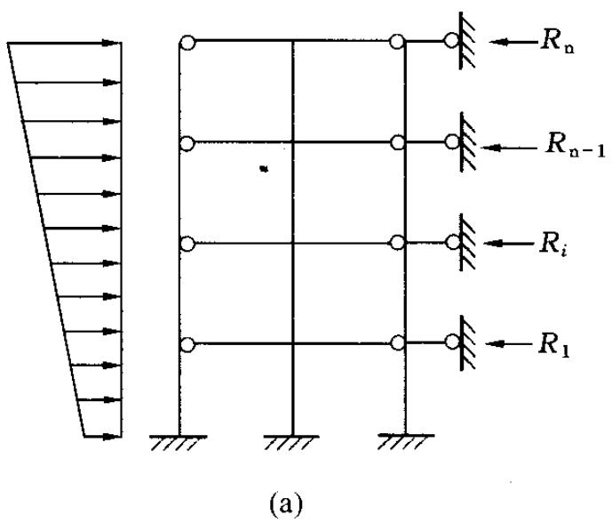

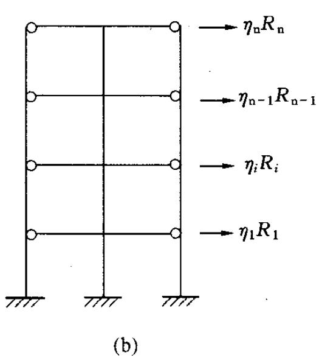  
图C.0.1 刚弹性方案房屋的静力计算简图

# 附录D 影响系数 $\varphi$ 和 $\varphi_{\mathrm{n}}$

D.0.1 无筋砌体矩形截面单向偏心受压构件（图D.0.1）承载

力的影响系数 $\varphi$ ，可按表D.0.1-1～表D.0.1-3采用或按下列公式计算，计算T形截面受压构件的 $\varphi$ 时，应以折算厚度 $h_{\mathrm{T}}$ 代替公式（D.0.1-2）中的 $h$ 。 $h_{\mathrm{T}} = 3.5i$ ， $i$ 为T形截面的回转半径。

当 $\beta \leqslant 3$ 时：

$$\varphi = \frac{1}{1 + 12 \left(\frac{e}{h}\right)^{2}}$$

(D.0.1-1)

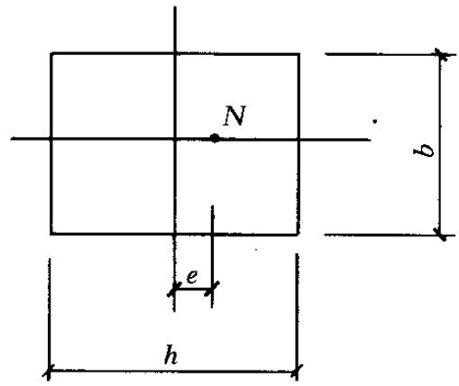  
图D.0.1 单向偏心受压

当 $\beta > 3$ 时：

$$\varphi = \frac{1}{1 + 12 \left[ \frac{e}{h} + \sqrt{\frac{1}{12} \left(\frac{1}{\varphi_{0}} - 1\right)} \right]^{2}} \tag{D.0.1-2}$$

$$\varphi_{0} = \frac{1}{1 + \alpha \beta^{2}} \tag{D.0.1-3}$$

式中： $e$ ——轴向力的偏心距；

$h$ ——矩形截面的轴向力偏心方向的边长；

$\varphi_0$ ——轴心受压构件的稳定系数；

$\alpha$ ——与砂浆强度等级有关的系数，当砂浆强度等级大于或等于M5时， $\alpha$ 等于0.0015；当砂浆强度等级等于M2.5时， $\alpha$ 等于0.002；当砂浆强度等级 $f_{2}$ 等于0时， $\alpha$ 等于0.009；

$\beta$ ——构件的高厚比。

D.0.2 网状配筋砖砌体矩形截面单向偏心受压构件承载力的影响系数 $\varphi_{\mathrm{n}}$ ，可按表D.0.2采用或按下列公式计算：

$$\varphi_{\mathrm{n}} = \frac{1}{1 + 12 \left[ \frac{e}{h} + \sqrt{\frac{1}{12} \left(\frac{1}{\varphi_{\mathrm{0 n}}} - 1\right)} \right]^{2}} \quad (D. 0. 2 - 1)$$

$$\varphi_{\mathrm{o n}} = \frac{1}{1 + (0 . 0015 + 0 . 45 \rho) \beta^{2}} \tag{D.0.2-2}$$

式中： $\varphi_{0n}$ ——网状配筋砖砌体受压构件的稳定系数；

$\rho$ ——配筋率（体积比）。

D.0.3 无筋砌体矩形截面双向偏心受压构件（图D.0.3）承载力的影响系数，可按下列公式计算，当一个方向的偏心率 （$e_b / b$ 或 $e_{\mathrm{h}} / h)$ 不大于另一个方向的偏心率的 $5 \%$ 时，可简化按另一个方向的单向偏心受压，按本规范第D.0.1条的规定确定承载力的影响系数。

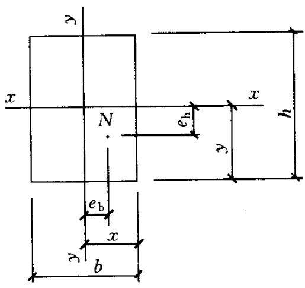  
图D.0.3 双向偏心受压

$$\varphi = \frac{1}{1 + 12 \left[ \left(\frac{e_{\mathrm{b}} + e_{\mathrm{i b}}}{b}\right)^{2} + \left(\frac{e_{\mathrm{h}} + e_{\mathrm{i h}}}{h}\right)^{2} \right]} \tag{D.0.3-1}$$

$$e_{i b} = \frac{b}{\sqrt{12}} \sqrt{\frac{1}{\varphi_{0}} - 1} \left[ \frac{\frac{e_{\mathrm{b}}}{b}}{\frac{e_{\mathrm{b}}}{b} + \frac{e_{\mathrm{h}}}{h}} \right] \tag{D.0.3-2}$$

$$e_{i h} = \frac{h}{\sqrt{12}} \sqrt{\frac{1}{\varphi_{0}} - 1} \left[ \frac{\frac{e_{h}}{h}}{\frac{e_{b}}{b} + \frac{e_{h}}{h}} \right] \tag{D.0.3-3}$$

式中： $e_{\mathrm{b}}$ 、 $e_{\mathrm{h}}$ ——轴向力在截面重心 $x$ 轴、 $y$ 轴方向的偏心距， $e_{\mathrm{b}}$ 、 $e_{\mathrm{h}}$ 宜分别不大于 $0.5x$ 和 $0.5y$

$x$ 、 $y$ ——自截面重心沿 $x$ 轴、 $y$ 轴至轴向力所在偏心方向截面边缘的距离；

$e_{ib}$ 、 $e_{ih}$ ——轴向力在截面重心 $x$ 轴、 $y$ 轴方向的附加偏心距。

表 D. 0.1-1 影响系数 $\varphi$ (砂浆强度等级 $\geqslant \mathbf{M}5$ )  

| β | $\frac{e}{h}\text{或}\frac{e}{h_{\mathrm{T}}}$ | $\frac{e}{h}\text{或}\frac{e}{h_{\mathrm{T}}}$ | $\frac{e}{h}\text{或}\frac{e}{h_{\mathrm{T}}}$ | $\frac{e}{h}\text{或}\frac{e}{h_{\mathrm{T}}}$ | $\frac{e}{h}\text{或}\frac{e}{h_{\mathrm{T}}}$ | $\frac{e}{h}\text{或}\frac{e}{h_{\mathrm{T}}}$ | $\frac{e}{h}\text{或}\frac{e}{h_{\mathrm{T}}}$ | $\frac{e}{h}\text{或}\frac{e}{h_{\mathrm{T}}}$ |
| --- | --- | --- | --- | --- | --- | --- | --- | --- |
| β | 0 | 0.025 | 0.05 | 0.075 | 0.1 | 0.125 | 0.15 |  |
| ≤3 | 1 | 0.99 | 0.97 | 0.94 | 0.89 | 0.84 | 0.79 |  |
| 4 | 0.98 | 0.95 | 0.90 | 0.85 | 0.80 | 0.74 | 0.69 |  |
| 6 | 0.95 | 0.91 | 0.86 | 0.81 | 0.75 | 0.69 | 0.64 |  |
| 8 | 0.91 | 0.86 | 0.81 | 0.76 | 0.70 | 0.64 | 0.59 |  |
| 10 | 0.87 | 0.82 | 0.76 | 0.71 | 0.65 | 0.60 | 0.55 |  |
| 12 | 0.82 | 0.77 | 0.71 | 0.66 | 0.60 | 0.55 | 0.51 |  |
| 14 | 0.77 | 0.72 | 0.66 | 0.61 | 0.56 | 0.51 | 0.47 |  |
| 16 | 0.72 | 0.67 | 0.61 | 0.56 | 0.52 | 0.47 | 0.44 |  |
| 18 | 0.67 | 0.62 | 0.57 | 0.52 | 0.48 | 0.44 | 0.40 |  |
| 20 | 0.62 | 0.57 | 0.53 | 0.48 | 0.44 | 0.40 | 0.37 |  |
| 22 | 0.58 | 0.53 | 0.49 | 0.45 | 0.41 | 0.38 | 0.35 |  |
| 24 | 0.54 | 0.49 | 0.45 | 0.41 | 0.38 | 0.35 | 0.32 |  |
| 26 | 0.50 | 0.46 | 0.42 | 0.38 | 0.35 | 0.33 | 0.30 |  |
| 28 | 0.46 | 0.42 | 0.39 | 0.36 | 0.33 | 0.30 | 0.28 |  |
| 30 | 0.42 | 0.39 | 0.36 | 0.33 | 0.31 | 0.28 | 0.26 |  |
| β | $\frac{e}{h}\text{或}\frac{e}{h_{\mathrm{T}}}$ | $\frac{e}{h}\text{或}\frac{e}{h_{\mathrm{T}}}$ | $\frac{e}{h}\text{或}\frac{e}{h_{\mathrm{T}}}$ | $\frac{e}{h}\text{或}\frac{e}{h_{\mathrm{T}}}$ | $\frac{e}{h}\text{或}\frac{e}{h_{\mathrm{T}}}$ | $\frac{e}{h}\text{或}\frac{e}{h_{\mathrm{T}}}$ | $\frac{e}{h}\text{或}\frac{e}{h_{\mathrm{T}}}$ | $\frac{e}{h}\text{或}\frac{e}{h_{\mathrm{T}}}$ |
| β | 0.175 | 0.2 | 0.225 | 0.25 | 0.275 | 0.3 |  |  |
| ≤3 | 0.73 | 0.68 | 0.62 | 0.57 | 0.52 | 0.48 |  |  |
| 4 | 0.64 | 0.58 | 0.53 | 0.49 | 0.45 | 0.41 |  |  |
| 6 | 0.59 | 0.54 | 0.49 | 0.45 | 0.42 | 0.38 |  |  |
| 8 | 0.54 | 0.50 | 0.46 | 0.42 | 0.39 | 0.36 |  |  |
| 10 | 0.50 | 0.46 | 0.42 | 0.39 | 0.36 | 0.33 |  |  |
| 12 | 0.47 | 0.43 | 0.39 | 0.36 | 0.33 | 0.31 |  |  |
| 14 | 0.43 | 0.40 | 0.36 | 0.34 | 0.31 | 0.29 |  |  |
| 16 | 0.40 | 0.37 | 0.34 | 0.31 | 0.29 | 0.27 |  |  |
| 18 | 0.37 | 0.34 | 0.31 | 0.29 | 0.27 | 0.25 |  |  |
| 20 | 0.34 | 0.32 | 0.29 | 0.27 | 0.25 | 0.23 |  |  |
| 22 | 0.32 | 0.30 | 0.27 | 0.25 | 0.24 | 0.22 |  |  |
| 24 | 0.30 | 0.28 | 0.26 | 0.24 | 0.22 | 0.21 |  |  |
| 26 | 0.28 | 0.26 | 0.24 | 0.22 | 0.21 | 0.19 |  |  |
| 28 | 0.26 | 0.24 | 0.22 | 0.21 | 0.19 | 0.18 |  |  |
| 30 | 0.24 | 0.22 | 0.21 | 0.20 | 0.18 | 0.17 |  |  |

表 D. 0.1-2 影响系数 $\varphi$ (砂浆强度等级 M2.5)  

| β | $\frac{e}{h}\text{或}\frac{e}{h_{\mathrm{T}}}$ | $\frac{e}{h}\text{或}\frac{e}{h_{\mathrm{T}}}$ | $\frac{e}{h}\text{或}\frac{e}{h_{\mathrm{T}}}$ | $\frac{e}{h}\text{或}\frac{e}{h_{\mathrm{T}}}$ | $\frac{e}{h}\text{或}\frac{e}{h_{\mathrm{T}}}$ | $\frac{e}{h}\text{或}\frac{e}{h_{\mathrm{T}}}$ | $\frac{e}{h}\text{或}\frac{e}{h_{\mathrm{T}}}$ |
| --- | --- | --- | --- | --- | --- | --- | --- |
| β | 0 | 0.025 | 0.05 | 0.075 | 0.1 | 0.125 | 0.15 |
| ≤3 | 1 | 0.99 | 0.97 | 0.94 | 0.89 | 0.84 | 0.79 |
| 4 | 0.97 | 0.94 | 0.89 | 0.84 | 0.78 | 0.73 | 0.67 |
| 6 | 0.93 | 0.89 | 0.84 | 0.78 | 0.73 | 0.67 | 0.62 |
| 8 | 0.89 | 0.84 | 0.78 | 0.72 | 0.67 | 0.62 | 0.57 |
| 10 | 0.83 | 0.78 | 0.72 | 0.67 | 0.61 | 0.56 | 0.52 |
| 12 | 0.78 | 0.72 | 0.67 | 0.61 | 0.56 | 0.52 | 0.47 |
| 14 | 0.72 | 0.66 | 0.61 | 0.56 | 0.51 | 0.47 | 0.43 |
| 16 | 0.66 | 0.61 | 0.56 | 0.51 | 0.47 | 0.43 | 0.40 |
| 18 | 0.61 | 0.56 | 0.51 | 0.47 | 0.43 | 0.40 | 0.36 |
| 20 | 0.56 | 0.51 | 0.47 | 0.43 | 0.39 | 0.36 | 0.33 |
| 22 | 0.51 | 0.47 | 0.43 | 0.39 | 0.36 | 0.33 | 0.31 |
| 24 | 0.46 | 0.43 | 0.39 | 0.36 | 0.33 | 0.31 | 0.28 |
| 26 | 0.42 | 0.39 | 0.36 | 0.33 | 0.31 | 0.28 | 0.26 |
| 28 | 0.39 | 0.36 | 0.33 | 0.30 | 0.28 | 0.26 | 0.24 |
| 30 | 0.36 | 0.33 | 0.30 | 0.28 | 0.26 | 0.24 | 0.22 |
| β | $\frac{e}{h}\text{或}\frac{e}{h_{\mathrm{T}}}$ | $\frac{e}{h}\text{或}\frac{e}{h_{\mathrm{T}}}$ | $\frac{e}{h}\text{或}\frac{e}{h_{\mathrm{T}}}$ | $\frac{e}{h}\text{或}\frac{e}{h_{\mathrm{T}}}$ | $\frac{e}{h}\text{或}\frac{e}{h_{\mathrm{T}}}$ | $\frac{e}{h}\text{或}\frac{e}{h_{\mathrm{T}}}$ | $\frac{e}{h}\text{或}\frac{e}{h_{\mathrm{T}}}$ |
| β | 0.175 | 0.2 | 0.225 | 0.25 | 0.275 | 0.3 |  |
| ≤3 | 0.73 | 0.68 | 0.62 | 0.57 | 0.52 | 0.48 |  |
| 4 | 0.62 | 0.57 | 0.52 | 0.48 | 0.44 | 0.40 |  |
| 6 | 0.57 | 0.52 | 0.48 | 0.44 | 0.40 | 0.37 |  |
| 8 | 0.52 | 0.48 | 0.44 | 0.40 | 0.37 | 0.34 |  |
| 10 | 0.47 | 0.43 | 0.40 | 0.37 | 0.34 | 0.31 |  |
| 12 | 0.43 | 0.40 | 0.37 | 0.34 | 0.31 | 0.29 |  |
| 14 | 0.40 | 0.36 | 0.34 | 0.31 | 0.29 | 0.27 |  |
| 16 | 0.36 | 0.34 | 0.31 | 0.29 | 0.26 | 0.25 |  |
| 18 | 0.33 | 0.31 | 0.29 | 0.26 | 0.24 | 0.23 |  |
| 20 | 0.31 | 0.28 | 0.26 | 0.24 | 0.23 | 0.21 |  |
| 22 | 0.28 | 0.26 | 0.24 | 0.23 | 0.21 | 0.20 |  |
| 24 | 0.26 | 0.24 | 0.23 | 0.21 | 0.20 | 0.18 |  |
| 26 | 0.24 | 0.22 | 0.21 | 0.20 | 0.18 | 0.17 |  |
| 28 | 0.22 | 0.21 | 0.20 | 0.18 | 0.17 | 0.16 |  |
| 30 | 0.21 | 0.20 | 0.18 | 0.17 | 0.16 | 0.15 |  |

表 D. 0.1-3 影响系数 $\varphi$ (砂浆强度 0)  

| β | $\frac{e}{h}$或 $\frac{e}{h_{\mathrm{T}}}$ | $\frac{e}{h}$或 $\frac{e}{h_{\mathrm{T}}}$ | $\frac{e}{h}$或 $\frac{e}{h_{\mathrm{T}}}$ | $\frac{e}{h}$或 $\frac{e}{h_{\mathrm{T}}}$ | $\frac{e}{h}$或 $\frac{e}{h_{\mathrm{T}}}$ | $\frac{e}{h}$或 $\frac{e}{h_{\mathrm{T}}}$ | $\frac{e}{h}$或 $\frac{e}{h_{\mathrm{T}}}$ |
| --- | --- | --- | --- | --- | --- | --- | --- |
| β | 0 | 0.025 | 0.05 | 0.075 | 0.1 | 0.125 | 0.15 |
| ≤3 | 1 | 0.99 | 0.97 | 0.94 | 0.89 | 0.84 | 0.79 |
| 4 | 0.87 | 0.82 | 0.77 | 0.71 | 0.66 | 0.60 | 0.55 |
| 6 | 0.76 | 0.70 | 0.65 | 0.59 | 0.54 | 0.50 | 0.46 |
| 8 | 0.63 | 0.58 | 0.54 | 0.49 | 0.45 | 0.41 | 0.38 |
| 10 | 0.53 | 0.48 | 0.44 | 0.41 | 0.37 | 0.34 | 0.32 |
| 12 | 0.44 | 0.40 | 0.37 | 0.34 | 0.31 | 0.29 | 0.27 |
| 14 | 0.36 | 0.33 | 0.31 | 0.28 | 0.26 | 0.24 | 0.23 |
| 16 | 0.30 | 0.28 | 0.26 | 0.24 | 0.22 | 0.21 | 0.19 |
| 18 | 0.26 | 0.24 | 0.22 | 0.21 | 0.19 | 0.18 | 0.17 |
| 20 | 0.22 | 0.20 | 0.19 | 0.18 | 0.17 | 0.16 | 0.15 |
| 22 | 0.19 | 0.18 | 0.16 | 0.15 | 0.14 | 0.14 | 0.13 |
| 24 | 0.16 | 0.15 | 0.14 | 0.13 | 0.13 | 0.12 | 0.11 |
| 26 | 0.14 | 0.13 | 0.13 | 0.12 | 0.11 | 0.11 | 0.10 |
| 28 | 0.12 | 0.12 | 0.11 | 0.11 | 0.10 | 0.10 | 0.09 |
| 30 | 0.11 | 0.10 | 0.10 | 0.09 | 0.09 | 0.09 | 0.08 |
| β | $\frac{e}{h}$或 $\frac{e}{h_{\mathrm{T}}}$ | $\frac{e}{h}$或 $\frac{e}{h_{\mathrm{T}}}$ | $\frac{e}{h}$或 $\frac{e}{h_{\mathrm{T}}}$ | $\frac{e}{h}$或 $\frac{e}{h_{\mathrm{T}}}$ | $\frac{e}{h}$或 $\frac{e}{h_{\mathrm{T}}}$ | $\frac{e}{h}$或 $\frac{e}{h_{\mathrm{T}}}$ | $\frac{e}{h}$或 $\frac{e}{h_{\mathrm{T}}}$ |
| β | 0.175 | 0.2 | 0.225 | 0.25 | 0.275 | 0.3 | 0.3 |
| ≤3 | 0.73 | 0.68 | 0.62 | 0.57 | 0.52 | 0.48 | 0.48 |
| 4 | 0.51 | 0.46 | 0.43 | 0.39 | 0.36 | 0.33 | 0.33 |
| 6 | 0.42 | 0.39 | 0.36 | 0.33 | 0.30 | 0.28 | 0.28 |
| 8 | 0.35 | 0.32 | 0.30 | 0.28 | 0.25 | 0.24 | 0.24 |
| 10 | 0.29 | 0.27 | 0.25 | 0.23 | 0.22 | 0.20 | 0.20 |
| 12 | 0.25 | 0.23 | 0.21 | 0.20 | 0.19 | 0.17 | 0.17 |
| 14 | 0.21 | 0.20 | 0.18 | 0.17 | 0.16 | 0.15 | 0.15 |
| 16 | 0.18 | 0.17 | 0.16 | 0.15 | 0.14 | 0.13 | 0.13 |
| 18 | 0.16 | 0.15 | 0.14 | 0.13 | 0.12 | 0.12 | 0.12 |
| 20 | 0.14 | 0.13 | 0.12 | 0.12 | 0.11 | 0.10 | 0.10 |
| 22 | 0.12 | 0.12 | 0.11 | 0.10 | 0.10 | 0.09 | 0.09 |
| 24 | 0.11 | 0.10 | 0.10 | 0.09 | 0.09 | 0.08 | 0.08 |
| 26 | 0.10 | 0.09 | 0.09 | 0.08 | 0.08 | 0.07 | 0.07 |
| 28 | 0.09 | 0.08 | 0.08 | 0.08 | 0.07 | 0.07 | 0.07 |
| 30 | 0.08 | 0.07 | 0.07 | 0.07 | 0.07 | 0.06 | 0.06 |

表 D. 0.2 影响系数 ${\varphi }_{\mathrm{n}}$   

| ρ(%) | e/hβ | 0 | 0.05 | 0.10 | 0.15 | 0.17 |
| --- | --- | --- | --- | --- | --- | --- |
| 0.1 | 4 | 0.97 | 0.89 | 0.78 | 0.67 | 0.63 |
| 0.1 | 6 | 0.93 | 0.84 | 0.73 | 0.62 | 0.58 |
| 0.1 | 8 | 0.89 | 0.78 | 0.67 | 0.57 | 0.53 |
| 0.1 | 10 | 0.84 | 0.72 | 0.62 | 0.52 | 0.48 |
| 0.1 | 12 | 0.78 | 0.67 | 0.56 | 0.48 | 0.44 |
| 0.1 | 14 | 0.72 | 0.61 | 0.52 | 0.44 | 0.41 |
| 0.1 | 16 | 0.67 | 0.56 | 0.47 | 0.40 | 0.37 |
| 0.3 | 4 | 0.96 | 0.87 | 0.76 | 0.65 | 0.61 |
| 0.3 | 6 | 0.91 | 0.80 | 0.69 | 0.59 | 0.55 |
| 0.3 | 8 | 0.84 | 0.74 | 0.62 | 0.53 | 0.49 |
| 0.3 | 10 | 0.78 | 0.67 | 0.56 | 0.47 | 0.44 |
| 0.3 | 12 | 0.71 | 0.60 | 0.51 | 0.43 | 0.40 |
| 0.3 | 14 | 0.64 | 0.54 | 0.46 | 0.38 | 0.36 |
| 0.3 | 16 | 0.58 | 0.49 | 0.41 | 0.35 | 0.32 |
| 0.5 | 4 | 0.94 | 0.85 | 0.74 | 0.63 | 0.59 |
| 0.5 | 6 | 0.88 | 0.77 | 0.66 | 0.56 | 0.52 |
| 0.5 | 8 | 0.81 | 0.69 | 0.59 | 0.50 | 0.46 |
| 0.5 | 10 | 0.73 | 0.62 | 0.52 | 0.44 | 0.41 |
| 0.5 | 12 | 0.65 | 0.55 | 0.46 | 0.39 | 0.36 |
| 0.5 | 14 | 0.58 | 0.49 | 0.41 | 0.35 | 0.32 |
| 0.5 | 16 | 0.51 | 0.43 | 0.36 | 0.31 | 0.29 |
| 0.7 | 4 | 0.93 | 0.83 | 0.72 | 0.61 | 0.57 |
| 0.7 | 6 | 0.86 | 0.75 | 0.63 | 0.53 | 0.50 |
| 0.7 | 8 | 0.77 | 0.66 | 0.56 | 0.47 | 0.43 |
| 0.7 | 10 | 0.68 | 0.58 | 0.49 | 0.41 | 0.38 |
| 0.7 | 12 | 0.60 | 0.50 | 0.42 | 0.36 | 0.33 |
| 0.7 | 14 | 0.52 | 0.44 | 0.37 | 0.31 | 0.30 |
| 0.7 | 16 | 0.46 | 0.38 | 0.33 | 0.28 | 0.26 |
| 0.9 | 4 | 0.92 | 0.82 | 0.71 | 0.60 | 0.56 |
| 0.9 | 6 | 0.83 | 0.72 | 0.61 | 0.52 | 0.48 |
| 0.9 | 8 | 0.73 | 0.63 | 0.53 | 0.45 | 0.42 |
| 0.9 | 10 | 0.64 | 0.54 | 0.46 | 0.38 | 0.36 |
| 0.9 | 12 | 0.55 | 0.47 | 0.39 | 0.33 | 0.31 |
| 0.9 | 14 | 0.48 | 0.40 | 0.34 | 0.29 | 0.27 |
| 0.9 | 16 | 0.41 | 0.35 | 0.30 | 0.25 | 0.24 |

续表 D. 0.2  

| ρ(%) | e/hβ | 0 | 0.05 | 0.10 | 0.15 | 0.17 |
| --- | --- | --- | --- | --- | --- | --- |
| 1.0 | 4 | 0.91 | 0.81 | 0.70 | 0.59 | 0.55 |
| 1.0 | 6 | 0.82 | 0.71 | 0.60 | 0.51 | 0.47 |
| 1.0 | 8 | 0.72 | 0.61 | 0.52 | 0.43 | 0.41 |
| 1.0 | 10 | 0.62 | 0.53 | 0.44 | 0.37 | 0.35 |
| 1.0 | 12 | 0.54 | 0.45 | 0.38 | 0.32 | 0.30 |
| 1.0 | 14 | 0.46 | 0.39 | 0.33 | 0.28 | 0.26 |
| 1.0 | 16 | 0.39 | 0.34 | 0.28 | 0.24 | 0.23 |

# 本规范用词说明

1 为便于在执行本规范条文时区别对待，对要求严格程度不同的用词说明如下：

1）表示很严格，非这样做不可的：正面词采用“必须”，反面词采用“严禁”；  
2）表示严格，在正常情况下均应这样做的：正面词采用“应”，反面词采用“不应”或“不得”；  
3）表示允许稍有选择，在条件许可时首先应这样做的：正面词采用“宜”，反面词采用“不宜”；  
4）表示有选择，在一定条件下可以这样做的，采用“可”。

2 本规范中指明应按其他有关标准执行的写法为”应符合……的规定”或”应按……执行”。

# 引用标准名录

1《建筑地基基础设计规范》GB50007  
2《建筑结构荷载规范》GB50009  
3《混凝土结构设计规范》GB50010  
4《建筑抗震设计规范》GB50011  
5《建筑结构可靠度设计统一标准》GB50068  
6《建筑结构设计术语和符号标准》GB/T50083  
7《砌体结构工程施工质量验收规范》GB50203  
8《混凝土结构工程施工质量验收规范》GB50204  
9《建筑抗震设防分类标准》GB50223  
10《墙体材料应用统一技术规范》GB50574   
11《冷轧带肋钢筋混凝土结构技术规程》JGJ95

中华人民共和国国家标准

砌体结构设计规范

GB 50003 - 2011

# 条文说明

# 修订说明

本修订是根据原建设部《关于印发〈2007年工程建设标准规范制定、修订计划（第一批〉的通知》（建标［2007］125号）的要求，由中国建筑东北设计研究院有限公司会同有关设计、研究、施工、研究、教学和相关企业等单位，于2007年9月开始对《砌体结构设计规范》GB50003-2001（以下简称2001规范）进行全面修订。

为了做好对2001规范的修订工作，更好的保证规范修订的先进性，与时俱进地将砌体结构领域的创新成果、成熟材料与技术充分体现的标准当中，砌体结构设计规范国家标准管理组在向原建设部提出修订申请的同时，还向2001规范参编单位及参编人征集了修订意见和建议，如2007年1月23日在南京召开了有2001规范修订主要参编人参加的修订方案及内容研讨会；2007年10月25日在江苏宿迁召开了有2001规范各章节主要编制人参加的规范修订预备会议。两次会议结合2001规范使用过程中存在的问题、近年来我国砌体结构的相关研究成果及国外研究动态，认真讨论了该规范的修订内容，确定了本次规范的修订原则为“增补、简化、完善”。这些准备工作为修订工作的正式启动奠定了基础。

2007年12月7日《砌体结构设计规范》GB50003-2001编制组成立暨第一次修订工作会议在湖南长沙召开。修订组负责人对修订组人员的构成、前期准备工作、修订大纲草案、人员分组情况进行了详细报告。与会代表经过认真讨论，拟定了《砌体结构设计规范》修订大纲，并确定本次修订的重点是：

1）在本规范执行过程中，有关部门和技术人员反映的问题较多、较突出且急需修改的内容；

2）增补近年来砌体结构领域成熟的新材料、新成果、新技术；

3）简化砌体结构设计计算方法；

4）补充砌体结构的裂缝控制措施和耐久性要求。

修订期间，各章、节负责人进行了大量、系统的调研、试验、研究工作。在认真总结了2001规范在应用过程中的经验的同时，针对近十年来我国的经济建设高速发展而带来建筑结构体系的新变化；针对我国科学发展、节能减排、墙材革新、低碳绿色等基本战略的推进而涌现出来的砌体结构基本理论及工程应用领域的累累硕果及应用经验进行了必要的修订。修订期间我国经受了汶川、玉树大地震，编制组成员第一时间奔赴震区进行了砌体结构震害调查，在此基础上进行了多次专门针对砌体结构抗震设计部分修订的研讨会。如2008年10月8日～9日在上海同济大学召开了砌体结构构件抗震设计（第10章）修订研讨会；2009年8月1日～2日在北京召开修订阶段工作通报会，重点研究了砌体结构构件抗震设计的修订内容。2009年9月还在重庆召开了构造部分（第6章）修订初稿研讨会。

《砌体结构设计规范》（修订）征求意见稿自2010年4月20日在国家工程建设标准化信息网上公示后，编制组将征集到的意见和建议进行了汇总和梳理，于2010年7月23日在哈尔滨又召开专门会议进行研究。会后编制组将征求意见稿又进行了必要的修改与完善。

2010年12月4日～5日，由住房和城乡建设部标准定额司主持，召开了《砌体结构设计规范》修订送审稿审查会。会议认为，修订送审稿继续保持2001版规范的基本规定是合适的，所增加、完善的新内容反映了我国砌体结构领域研究的创新成果和工程应用的实践经验，比2001版规范更加全面、更加细致、更加科学。新版规范的颁布与实施将使我给砌体结构设计提高到新的水平。

2001规范的主编单位：中国建筑东北设计研究院

2001规范的参编单位：湖南大学、哈尔滨建筑大学、浙江大学、同济大学、机械工业部设计研究院、西安建筑科技大学、重庆建筑科学研究院、郑州工业大学、重庆建筑大学、北京市建筑设计研究院、四川省建筑科学研究院、云南省建筑技术发展中心、长沙交通学院、广州市民用建筑科研设计院、沈阳建筑工程学院、中国建筑西南设计研究院、陕西省建筑科学研究院、合肥工业大学、深圳艺秦工程设计有限公司、长沙中盛建筑勘察设计有限公司等

2001规范主要起草人：苑振芳 施楚贤 唐岱新 严家煊

龚绍熙 徐建 胡秋谷 王庆霖

周炳章 林文修 刘立新 骆万康

梁兴文 侯汝欣 刘斌 何建罡

吴明舜 张英 谢丽丽 梁建国

金伟良 杨伟军 李翔 王凤来

刘明 姜洪斌 何振文 雷波

吴存修 肖亚明 张宝印 李岗

李建辉

为便于广大设计、施工、科研、学校等单位有关人员在使用本规范时能正确理解和执行条文规定，《砌体结构设计规范》编制组按章、节、条顺序编制了本规范的条文说明，对条文规定的目的、依据以及执行中需注意的有关事项进行了说明。但是，本条文说明不具备与规范正文同等的法律效力，仅供使用者作为理解和把握规范规定的参考。

# 1 总则

1.0.1、1.0.2 本规范的修订是依据国家有关政策，特别是近年来墙材革新、节能减排产业政策的落实及低碳、绿色建筑的发展，将近年来砌体结构领域的创新成果及成熟经验纳入本规范。砌体结构类别和应用范围也较2001规范有所扩大，增加的主要内容有：

1 混凝土普通砖、混凝土多孔砖等新型材料砌体；  
2 组合砖墙，配筋砌块砌体剪力墙结构；  
3 抗震设防区的无筋和配筋砌体结构构件设计。

为了使新增加的内容做到技术先进、性能可靠、适用可行，以中国建筑东北设计研究有限公司为主编单位的编制组近年来进行了大量的调查及试验研究，针对我国实施墙材革新、建筑节能，发展循环经济、低碳绿色建材的特点及21世纪涌现出来的新技术、新装备进行了实践与创新。如对利用新工艺、新设备生产的蒸压粉煤灰砖（蒸压灰砂砖）等硅酸盐砖、混凝土砖等非烧结块材砌体进行了全面、系统的试验与研究，编制出中国工程建设协会标准《蒸压粉煤灰砖建筑技术规程》CECS256和《混凝土砖建筑技术规程》CECS257，也为一些省、市编制了相应的地方标准，使得高品质墙材产品与建筑应用得到有效整合。

近年来，组合砖墙、配筋砌块砌体剪力墙结构及抗震设防区的无筋和配筋砌体结构构件设计研究取得了一定进展，湖南大学、哈尔滨工业大学、同济大学、北京市建筑设计研究院、中国建筑东北设计研究院有限公司等单位的研究取得了不菲的成绩，此次修订，充分引用了这些成果。

应当指出，为确保砌块结构、混凝土砖结构、蒸压粉煤灰（灰砂）砖砌体结构，特别是配筋砌块砌体剪力墙结构的工程质

量及整体受力性能，应采用工作性能好、粘结强度较高的专用砌筑砂浆及高流态、低收缩、高强度的专用灌孔混凝土。即随着新型砌体材料的涌现，必须有与其相配套的专用材料。随着我国预拌砂浆的行业的兴起及各类专用砂浆的推广，各类砌体结构性能明显得到改善和提高。近年来，与新型墙材砌体相配套的专用砂浆标准相继问世，如《混凝土小型空心砌块砌筑砂浆》JC860、《混凝土小型空心砌块灌孔混凝土》JC861和《砌体结构专用砂浆应用技术规程》CECS等。

1.0.3~1.0.5 由于本规范较大地扩充了砌体材料类别和其相应的结构体系，因而列出了尚需同时参照执行的有关标准规范，包括施工及验收规范。

# 2 术语和符号

## 2.1 术语

2.1.5 研究表明，孔洞率大于 $35\%$ 的多孔砖，其折压比较低，且砌体开裂提前呈脆性破坏，故应对空洞率加以限制。

2.1.6、2.1.7 根据近年来蒸压灰砂普通砖、蒸压粉煤灰普通砖制砖工艺及设备的发展现状和建筑应用需求，蒸压砖定义中增加了压制排气成型、高压蒸汽养护的内容，以区分新旧制砖工艺，推广、采用新工艺、新设备，体现了标准的先进性。

2.1.12 蒸压灰砂普通砖、蒸压粉煤灰普通砖等蒸压硅酸盐砖是半干压实生产的，制砖钢模十分光亮，在高压成型时会使砖质地密实、表面光滑，吸水率也较小，这种光滑的表面影响了砖与砖的砌筑与粘结，使墙体的抗剪强度较烧结普通砖低 $1/3$ ，从而影响了这类砖的推广和应用。故采用工作性好、粘结力高、耐候性强且方便施工的专用砌筑砂浆（强度等级宜为 Ms15、Ms10、Ms7.5、Ms5 四种，s 为英文单词蒸汽压力 Steam pressure 及硅酸盐 Silicate 的第一个字母）已成为推广、应用蒸压硅酸盐砖的关键。

根据现行国家标准《建筑抗震设计规范》GB50011-2010第10.1.24条：“采用蒸压灰砂普通砖和蒸压粉煤灰普通砖的砌体房屋，当砌体的抗剪强度仅达到普通黏土砖砌体的 $70\%$ 时，房屋的层数应比普通砖房屋减少一层，总高度应减少 $3\mathrm{m}$ ；当砌体的抗剪强度达到普通黏土砖砌体的取值时，房屋层数和总高度的要求同普通砖房屋。”本规范规定：该类砌体的专用砌筑砂浆必须保证其砌体抗剪强度不低于烧结普通砖砌体的取值。

需指出，以提高砌体抗剪强度为主要目标的专用砌筑砂浆的性能指标，应按现行国家标准《墙体材料应用统一技术规范》

GB50574规定，经研究性试验确定。当经研究性试验结果的砌体抗剪强度高于普通砂浆砌筑的烧结普通砖砌体的取值时，仍按烧结普通砖砌体的取值。

# 3材料

## 3.1 材料强度等级

3.1.1 材料强度等级的合理限定，关系到砌体结构房屋安全、耐久，一些建筑由于采用了规范禁用的劣质墙材，使墙体出现的裂缝、变形，甚至出现了楼歪歪、楼垮垮案例，对此必须严加限制。鉴于一些地区近年来推广、应用混凝土普通砖及混凝土多孔砖，为确保结构安全，在大量试验研究的基础上，增补了混凝土普通砖及混凝土多孔砖的强度等级要求。

砌块包括普通混凝土砌块和轻集料混凝土砌块。轻集料混凝土砌块包括煤矸石混凝土砌块和孔洞率不大于 $35\%$ 的火山渣、浮石和陶粒混凝土砌块。

非烧结砖的原材料及其配比、生产工艺及多孔砖的孔型、肋及壁的尺寸等因素都会影响砖的品质，进而会影响到砌体质量，调查发现不同地区或不同企业的非烧结砖的上述因素不尽一致，块型及肋、壁尺寸大相径庭，考虑到砌体耐久性要求，删除了强度等级为MU10的非烧结砖作为承重结构的块体。

对蒸压灰砂砖和蒸压粉煤灰砖等蒸压硅酸盐砖列出了强度等级。根据建材标准指标，蒸压灰砂砖、蒸压粉煤灰砖等蒸压硅酸盐砖不得用于长期受热 $200^{\circ}\mathrm{C}$ 以上、受急冷急热和有酸性介质侵蚀的建筑部位。

对于蒸压粉煤灰砖和掺有粉煤灰 $15\%$ 以上的混凝土砌块，我国标准《砌墙砖试验方法》GB/T2542和《混凝土小型空心砌块试验方法》GB/T4111确定碳化系数均采用人工碳化系数的试验方法。现行国家标准《墙体材料应用统一技术规范》GB50574规定的碳化系数不应小于0.85，按原规范块体强度应乘系数 $1.15 \times 0.85 = 0.98$ ，接近1.0，故取消了该系数。

为了保证承重类多孔砖（砌块）的结构性能，其孔洞率及肋、壁的尺寸也必须符合《墙体材料应用统一技术规范》GB50574的规定。

鉴于蒸压多孔灰砂砖及蒸压粉煤灰多孔砖的脆性大、墙体延性也相应较差以及缺少系统的试验数据。故本规范仅对蒸压普通硅酸盐砖砌体作出规定。

实践表明，蒸压灰砂砖和蒸压粉煤灰砖等硅酸盐墙材制品的原材料配比及生产工艺状况（如掺灰量的不同、养护制度的差异等）将直接影响着砖的脆性（折压比），砖越脆墙体开裂越早。根据中国建筑东北设计研究院有限公司及沈阳建筑大学试验结果，制品中不同的粉煤灰掺量，其抗折强度相差甚多，即脆性特征相差较大，因此规定合理的折压比将有利于提高砖的品质，改善砖的脆性，也提高墙体的受力性能。

同样，含孔洞块材的砌体试验也表明：仅用含孔洞块材的抗压强度作为衡量其强度指标是不全面的，多孔砖或空心砖（砌块）孔型、孔的布置不合理将导致块体的抗折强度降低很大，降低了墙体的延性，墙体容易开裂。当前，制砖企业或模具制造企业随意确定砖型、孔型及砖的细部尺寸现象较为普遍，已发生影响墙体质量的案例，对此必须引起重视。国家标准《墙体材料应用统一技术规范》GB50574，明确规定需控制用于承重的蒸压硅酸盐砖和承重多孔砖的折压比。

3.1.2 原规范未对用于自承重墙的空心砖、轻质块体强度等级进行规定，由于这类砌体用于填充墙的范围越来越广，一些强度低、性能差的低劣块材被用于工程，出现了墙体开裂及地震时填充墙脆性垮塌严重的现象。为确保自承重墙体的安全，本次修订，按国家标准《墙体材料应用统一技术规范》GB50574，增补了该条。

3.1.3 采用混凝土砖（砌块）砌体以及蒸压硅酸盐砖砌体时，应采用与块体材料相适应且能提高砌筑工作性能的专用砌筑砂浆；尤其对于块体高度较高的普通混凝土砖空心砌块，普通砂浆

很难保证竖向灰缝的砌筑质量。调查发现，一些砌块建筑墙体的灰缝不饱满，有的出现了“瞎缝”，影响了墙体的整体性。本条文规定采用混凝土砖（砌块）砌体时，应采用强度等级不小于Mb5.0的专用砌筑砂浆（b为英文单词“砌块”或“砖”brick的第一个字母）。蒸压硅酸盐砖则由于其表面光滑，与砂浆粘结力较差，砌体沿灰缝抗剪强度较低，影响了蒸压硅酸盐砖在地震设防区的推广与应用。因此，为了保证砂浆砌筑时的工作性能和砌体抗剪强度不低于用普通砂浆砌筑的烧结普通砖砌体，应采用粘结性强度高、工作性能好的专用砂浆砌筑。

强度等级M2.5的普通砂浆，可用于砌体检测与鉴定。

## 3.2 砌体的计算指标

3.2.1 砌体的计算指标是结构设计的重要依据，通过大量、系统的试验研究，本条作为强制性条文，给出了科学、安全的砌体计算指标。与3.1.1相对应，本条文增加了混凝土多孔砖、蒸压灰砂砖、蒸压粉煤灰砖和轻骨料混凝土砌块砌体的抗压强度指标，并对单排孔且孔对孔砌筑的混凝土砌块砌体灌孔后的强度作了修订。根据长沙理工大学等单位的大量试验研究结果，混凝土多孔砖砌体的抗压强度试验值与按烧结黏土砖砌体计算公式的计算值比值平均为1.127，偏安全地取烧结黏土砖的抗压强度值。

根据目前应用情况，表3.2.1-4增补砂浆强度等级Mb20，其砌体取值采用原规范公式外推得到。因水泥煤渣混凝土砌块问题多，属淘汰品，取消了水泥煤渣混凝土砌块。

1 本条文说明可参照2001规范的条文说明。

2 近年来混凝土普通砖及混凝土多孔砖在各地大量涌现，尤其在浙江、上海、湖南、辽宁、河南、江苏、湖北、福建、安徽、广西、河北、内蒙古、陕西等省市区得到迅速发展，一些地区颁布了当地的地方标准。为了统一设计技术，保障结构质量与安全，中国建筑东北设计研究院有限公司会同长沙理工大学、沈阳建筑大学、同济大学等单位进行了大量、系统的试验和研究，

如：混凝土砖砌体基本力学性能试验研究；借助试验及有限元方法分析了肋厚对砌体性能的影响研究和砖的抗折性能；混凝土多孔砖砌体受压承载力试验；混凝土多孔砖墙低周反复荷载的拟静力试验；混凝土多孔砖砌体结构模型房屋的子结构拟动力和拟静力试验；混凝土多孔砖砌体底框房屋模型房屋拟静力试验；混凝土多孔砖砌体结构模型房屋振动台试验等。并编制了《混凝土多孔砖建筑技术规范》CECS257，其中主要成果为本次修订的依据。

3 蒸压灰砂砖砌体强度指标系根据湖南大学、重庆市建筑科学研究院和长沙市城建科研所的蒸压灰砂砖砌体抗压强度试验资料，以及《蒸压灰砂砖砌体结构设计与施工规程》CECS 20：90 的抗压强度指标确定的。根据试验统计，蒸压灰砂砖砌体抗压强度试验值 $f^{\prime \prime}$ 和烧结普通砖砌体强度平均值公式 $f_{\mathrm{m}}$ 的比值 （$f^{\prime \prime} / f_{\mathrm{m}})$ 为 0.99，变异系数为 0.205。将蒸压灰砂砖砌体的抗压强度指标取用烧结普通砖砌体的抗压强度指标。

蒸压粉煤灰砖砌体强度指标依据四川省建筑科学研究院、长沙理工大学、沈阳建筑大学和中国建筑东北设计研究院有限公司的蒸压粉煤灰砖砌体抗压强度试验资料，并参考其他有关单位的试验资料，粉煤灰砖砌体的抗压强度相当或略高于烧结普通砖砌体的抗压强度。本次修订将蒸压粉煤灰砖的抗压强度指标取用烧结普通砖砌体的抗压强度指标。遵照国家标准《墙体材料应用统一技术规范》GB50574“墙体不应采用非蒸压硅酸盐砖”的规定，本次修订仍未列入蒸养粉煤灰砖砌体。

应该指出，蒸压灰砂砖砌体和蒸压粉煤灰砖砌体的抗压强度指标系采用同类砖为砂浆强度试块底模时的抗压强度指标。当采用黏土砖底模时砂浆强度会提高，相应的砌体强度达不到规范要求的强度指标，砌体抗压强度降低 $10\%$ 左右。

4 随着砌块建筑的发展，补充收集了近年来混凝土砌块砌体抗压强度试验数据，比2001规范有较大的增加，共116组818个试件，遍及四川、贵州、广西、广东、河南、安徽、浙

江、福建八省。本次修订，按以上试验数据采用原规范强度平均值公式拟合，当材料强度 $f_{1} \geqslant 20\mathrm{MPa}$ 、 $f_{2} > 15\mathrm{MPa}$ 时，以及当砂浆强度高于砌块强度时，88规范强度平均值公式的计算值偏高，应用88规范强度平均值公式在该范围不安全，表明在该范围的强度平均值公式不能应用。当删除了这些试验数据后按94组统计，抗压强度试验值 $f'$ 和抗压强度平均值公式的计算值 $f_{\mathrm{m}}$ 的比值为1.121，变异系数为0.225。

为适应砌块建筑的发展，本次修订增加了MU20强度等级。根据现有高强砌块砌体的试验资料，在该范围其砌体抗压强度试验值仍较强度平均值公式的计算值偏低。本次修订采用降低砂浆强度对2001规范抗压强度平均值公式进行修正，修正后的砌体抗压强度平均值公式为：

$$f_{\mathrm{m}} = 0. 46 f_{1}^{0. 9} (1 + 0. 07 f_{2}) (1. 1 - 0. 01 f_{2}) \quad (f_{2} > 10 \mathrm{M P a})$$

对MU20的砌体适当降低了强度值。

5 对单排孔且对孔砌筑的混凝土砌块灌孔砌体，建立了较为合理的抗压强度计算方法。GBJ 3-88 灌孔砌体抗压强度提高系数 $\varphi_{1}$ 按下式计算：

$$\varphi_{1} = \frac{0 . 8}{1 - \delta} \leqslant 1. 5 \tag{1}$$

该式规定了最低灌孔混凝土强度等级为C15，且计算方便。收集了广西、贵州、河南、四川、广东共20组82个试件的试验数据和近期湖南大学4组18个试件以及哈尔滨建筑大学4组24个试件的试验数据，试验数据反映GBJ3-88的 $\varphi_{1}$ 值偏低，且未考虑不同灌孔混凝土强度对 $\varphi_{1}$ 的影响，根据湖南大学等单位的研究成果，经研究采用下式计算：

$$f_{\mathrm{gm}} = f_{\mathrm{m}} + 0.63\alpha f_{\mathrm{cu,m}} \quad (\rho \geqslant 33\%) \tag{2}$$

$$f_{\mathrm{g}} = f + 0. 6 \alpha f_{\mathrm{c}} \tag{3}$$

同时为了保证灌孔混凝土在砌块孔洞内的密实，灌孔混凝土应采用高流动性、高粘结性、低收缩性的细石混凝土。由于试验采用的块体强度、灌孔混凝土强度，一般在 $\mathrm{MU10} \sim \mathrm{MU20}$ 、

$\mathrm{C10}\sim \mathrm{C30}$ 范围，同时少量试验表明高强度灌孔混凝土砌体达不到公式（2）的 $f_{\mathrm{gm}}$ ，经对试验数据综合分析，本次修订对灌实砌体强度提高系数作了限制 $f_{\mathrm{g}} / f\leqslant 2$ 。同时根据试验试件的灌孔率（ $\rho$ ）均大于 $33\%$ ，因此对公式灌孔率适用范围作了规定。灌孔混凝土强度等级规定不应低于Cb20。灌孔混凝土性能应符合《混凝土小型空心砌块灌孔混凝土》JC861的规定。

6 多排孔轻集料混凝土砌块在我国寒冷地区应用较多，特别是我国吉林和黑龙江地区已开始推广应用，这类砌块材料目前有火山渣混凝土、浮石混凝土和陶粒混凝土，多排孔砌块主要考虑节能要求，排数有二排、三排和四排，孔洞率较小，砌块规格各地不一致，块体强度等级较低，一般不超过MU10，为了多排孔轻集料混凝土砌块建筑的推广应用，《混凝土砌块建筑技术规程》JGJ/T 145列入了轻集料混凝土砌块建筑的设计和施工规定。规范应用了JGJ/T 14收集的砌体强度试验数据。

规范应用的试验资料为吉林、黑龙江两省火山渣、浮石、陶粒混凝土砌块砌体强度试验数据48组243个试件，其中多排孔单砌砌体试件共17组109个试件，多排孔组砌砌体21组70个试件，单排孔砌体10组64个试件。多排孔单砌砌体强度试验值 $f^{\prime}$ 和公式平均值 $f_{\mathrm{m}}$ 比值为1.615，变异系数为0.104。多排孔组砌砌体强度试验值 $f^{\prime}$ 和公式平均值 $f_{\mathrm{m}}$ 比值为1.003，变异系数为0.202。从统计参数分析，多排孔单砌强度较高，组砌后明显降低，考虑多排孔砌块砌体强度和单排孔砌块砌体强度有差别，同时偏于安全考虑，本次修订对孔洞率不大于 $35\%$ 的双排孔或多排孔轻骨料混凝土砌块砌体的抗压强度设计值，按单排孔混凝土砌块砌体强度设计值乘以1.1采用。对组砌的砌体的抗压强度设计值乘以0.8采用。

值得指出的是，轻集料砌块的建筑应用，应采用以强度等级和密度等级双控的原则，避免只重视块体强度而忽视其耐久性。调查发现，当前许多企业，以生产陶粒砌块为名，代之以大量的炉渣等工业废弃物，严重降低了块材质量，为建筑工程质量埋下

隐患。应遵照国家标准《墙体材料应用统一技术规范》GB50574，对轻集料砌块强度等级和密度等级双控的原则进行质量控制。

7、8 除毛料石砌体和毛石砌体的抗压强度设计值作了适当降低外，条文未作修改。

本条中砌筑砂浆等级为0的砌体强度，为供施工验算时采用。

3.2.2 沿砌体灰缝截面破坏时砌体的轴心抗拉强度设计值、弯曲抗拉强度设计值和抗剪强度设计值是涉及砌体结构设计安全的重要指标。本条文也增加了混凝土砖、混凝土多孔砖沿砌体灰缝截面破坏时砌体的轴心抗拉强度设计值、弯曲抗拉强度设计值和抗剪强度设计值。

近年来长沙理工大学、沈阳建筑大学、中国建筑东北设计研究院有限公司等单位对混凝土砖、混凝土多孔砖沿砌体灰缝截面破坏时砌体的轴心抗拉强度、弯曲抗拉强度和抗剪强度进行了系统的试验研究，研究成果表明，混凝土砖、混凝土多孔砖的上述强度均高于烧结普通砖砌体，为可靠，本次修订不作提高。

蒸压灰砂砖砌体抗剪强度系根据湖南大学、重庆市建筑科学研究院和长沙市城建科研所的通缝抗剪强度试验资料，以及《蒸压灰砂砖砌体结构设计与施工规程》CECS20：90的抗剪强度指标确定的。灰砂砖砌体的抗剪强度各地区的试验数据有差异，主要原因是各地区生产的灰砂砖所用砂的细度和生产工艺（半干压法压制成型）不同，以及采用的试验方法和砂浆试块采用的底模砖不同引起。本次修订以双剪试验方法和以灰砂砖作砂浆试块底模的试验数据为依据，并考虑了灰砂砖砌体通缝抗剪强度的变异。根据试验资料，蒸压灰砂砖砌体的抗剪强度设计值较烧结普通砖砌体的抗剪强度有较大的降低。用普通砂浆砌筑的蒸压灰砂砖砌体的抗剪强度取砖砌体抗剪强度的0.70倍。

蒸压粉煤灰砖砌体抗剪强度取值依据四川省建筑科学研究院、沈阳建筑大学和长沙理工大学的研究报告，其抗剪强度较烧结普

通砖砌体的抗剪强度有较大降低，用普通砂浆砌筑的蒸压粉煤灰砖砌体抗剪强度设计值取烧结普通砖砌体抗剪强度的0.70倍。

为有效提高蒸压硅酸盐砖砌体的抗剪强度，确保结构的工程质量，应积极推广、应用专用砌筑砂浆。表中的砌筑砂浆为普通砂浆，当该类砖采用专用砂浆砌筑时，其砌体沿砌体灰缝截面破坏时砌体的轴心抗拉强度设计值、弯曲抗拉强度设计值和抗剪强度设计值按普通烧结砖砌体的采用。当专用砂浆的砌体抗剪强度高于烧结普通砖砌体时，其砌体抗剪强度仍取烧结普通砖砌体的强度设计值。

轻集料混凝土砌块砌体的抗剪强度指标系根据黑龙江、吉林等地区抗剪强度试验资料。共收集16组89个试验数据，试验值 $f^{\prime}$ 和混凝土砌块抗剪强度平均值 $f_{\mathrm{v,m}}$ 的比值为1.41。对于孔洞率小于或等于 $35\%$ 的双排孔或多排孔砌块砌体的抗剪强度按混凝土砌块砌体抗剪强度乘以1.1采用。

单排孔且孔对孔砌筑混凝土砌块灌孔砌体的通缝抗剪强度是本次修订中增加的内容，主要依据湖南大学36个试件和辽宁建筑科学研究院66个试件的试验资料，试件采用了不同的灌孔率。砂浆强度和砌块强度，通过分析灌孔后通缝抗剪强度和灌孔率。灌孔砌体的抗压强度有关，回归分析的抗剪强度平均值公式为：

$$f_{\mathrm{v g}, \mathrm{m}} = 0. 32 f_{\mathrm{g}, \mathrm{m}}^{0. 55}$$

试验值 $f_{\mathrm{v,m}}^{\prime}$ 和公式值 $f_{\mathrm{vg,m}}$ 的比值为1.061，变异系数为0.235。

灌孔后的抗剪强度设计值公式为： $f_{\mathrm{vg}} = 0.208f_{\mathrm{g}}^{0.55}$ ，取 $f_{\mathrm{vg}} = 0.20f_{\mathrm{g}}^{0.55}$ 。

需指出，承重单排孔混凝土空心砌块砌体对穿孔（上下皮砌块孔与孔相对）是保证混凝土砌块与砌筑砂浆有效粘结、成型混凝土芯柱所必需的条件。目前我国多数企业生产的砌块对此均欠考虑，生产的块材往往不能满足砌筑时的孔对孔，其砌体通缝抗剪能力必然比按规范计算结构有所降低。工程实践表明，由于非对穿孔墙体砂浆的有效粘结面少、墙体的整体性差，已成为空心

砌块建筑墙体渗、漏、裂的主要原因，也成为震害严重的原因之一（玉树震害调查表明，用非对穿孔空心砌块砌墙及专用砂浆的缺失，成为当地空心砌块建筑毁坏的原因之一）。故必须对此予以强调，要求设备制作企业在空心砌块模具的加工时，就应对块材的应用情况有所了解。

3.2.3 因砌体强度设计值调整系数关系到结构的安全，故将本条定为强制性条文。水泥砂浆调整系数在73及88规范中基本参照苏联规范，由专家讨论确定的调整系数。四川省建筑科学研究院对大孔洞率条型孔多孔砖砌体力学性能试验表明，中、高强度水泥砂浆对砌体抗压强度和砌体抗剪强度无不利影响。试验表明，当 $f_{2} \geq 5\mathrm{MPa}$ 时，可不调整。本规范仍保持2001规范的取值，偏于安全。

3.2.5 全国65组281个灌孔混凝土砌块砌体试件试验结果分析表明，2001规范中单排孔对孔砌筑的灌孔混凝土砌块砌体弹性模量取值偏低，低估了灌孔混凝土砌块砌体墙的水平刚度，对框支灌孔混凝土砌块砌体剪力墙和灌孔混凝土砌块砌体房屋的抗震设计偏于不安全。由理论和试验结果分析、统计，并参照国外有关标准的取值，取 $E = 2000f_{\mathrm{g}}$ 。

因为弹性模量是材料的基本力学性能，与构件尺寸等无关，而强度调整系数主要是针对构件强度与材料强度的差别进行的调整，故弹性模量中的砌体抗压强度值不需用3.2.3条进行调整。

本条增加了砌体的收缩率，因国内砌体收缩试验数据少。本次修订主要参考了块体的收缩、长沙理工大学的试验数据，并参考了ISO/TC179/SCI的规定，经分析确定的。砌体的收缩和块体的上墙含水率、砌体的施工方法等有密切关系。如当地有可靠的砌体收缩率的试验数据，亦可采用当地试验数据。

长沙理工大学、郑州大学等单位的试验结果表明，混凝土多孔砖的力学指标抗压强度和弹性模量与烧结砖相同，混凝土多孔砖的其他物理指标与混凝土砌块相同，如摩擦系数和线膨胀系数是参考本规范中混凝土小砌块砌体取值的。

# 4 基本设计规定

## 4.1 设计原则

4.1.1～4.1.5 根据《建筑结构可靠度设计统一标准》GB50068，结构设计仍采用概率极限状态设计原则和分项系数表达的计算方法。本次修订，根据我国国情适当提高了建筑结构的可靠度水准；明确了结构和结构构件的设计使用年限的含意、确定和选择；并根据建设部关于适当提高结构安全度的指示，在第4.1.5条作了几个重要改变：

1 针对以自重为主的结构构件，永久荷载的分项系数增加了1.35的组合，以改进自重为主构件可靠度偏低的情况；

2 引入了《施工质量控制等级》的概念。

长期以来，我国设计规范的安全度未和施工技术、施工管理水平等挂钩，而实际上它们对结构的安全度影响很大。因此为保证规范规定的安全度，有必要考虑这种影响。发达国家在设计规范中明确地提出了这方面的规定，如欧共体规范、国际标准。我国在学习国外先进管理经验的基础上，并结合我国的实际情况，首先在《砌体工程施工及验收规范》GB50203-98中规定了砌体施工质量控制等级。它根据施工现场的质保体系、砂浆和混凝土的强度、砌筑工人技术等级方面的综合水平划为A、B、C三个等级。但因当时砌体规范尚未修订，它无从与现行规范相对应，故其规定的A、B、C三个等级，只能与建筑物的重要性程度相对应。这容易引起误解。而实际的内涵是在不同的施工控制水平下，砌体结构的安全度不应该降低，它反映了施工技术、管理水平和材料消耗水平的关系。因此本规范引入了施工质量控制等级的概念，考虑到一些具体情况，砌体规范只规定了B级和C级施工质量控制等级。当采用C级时，砌体强度设计值应乘第

3.2.3 条的 $\gamma_{\mathrm{a}}$ ， $\gamma_{\mathrm{a}} = 0.89$ ；当采用A级施工质量控制等级时，可将表中砌体强度设计值提高 $5\%$ 。施工质量控制等级的选择主要根据设计和建设单位商定，并在工程设计图中明确设计采用的施工质量控制等级。

因此本规范中的A、B、C三个施工质量控制等级应按《砌体结构工程施工质量验收规范》GB50203中对应的等级要求进行施工质量控制。

但是考虑到我国目前的施工质量水平，对一般多层房屋宜按B级控制。对配筋砌体剪力墙高层建筑，设计时宜选用B级的砌体强度指标，而在施工时宜采用A级的施工质量控制等级。这样做是有意提高这种结构体系的安全储备。

4.1.6 在验算整体稳定性时，永久荷载效应与可变荷载效应符号相反，而前者对结构起有利作用。因此，若永久荷载分项系数仍取同号效应时相同的值，则将影响构件的可靠度。为了保证砌体结构和结构构件具有必要的可靠度，故当永久荷载对整体稳定有利时，取 $\gamma_{\mathrm{G}} = 0.8$ 。本次修订增加了永久荷载控制的组合项。

## 4.2 房屋的静力计算规定

取消上刚下柔多层房屋的静力计算方案及原附录的计算方法。这是考虑到这种结构存在着显著的刚度突变，在构造处理不当或偶发事件中存在着整体失效的可能性。况且通过适当的结构布置，如增加横墙，可成为符合刚性方案的结构，既经济又安全的砌体结构静力方案。

4.2.5 第3款，计算表明，因屋盖梁下砌体承受的荷载一般较楼盖梁小，承载力裕度较大，当采用楼盖梁的支承长度后，对其承载力影响很小。这样做以简化设计计算。板下砌体的受压和梁下砌体受压是不同的。板下是大面积接触，且板的刚度要比梁的小得多，而所受荷载也要小得多，故板下砌体应力分布要平缓得多。根据《国际标准》ISO9652-1规定：楼面活荷载不大于 $5\mathrm{kN} / \mathrm{m}^2$ 时，偏心距 $e = 0.05(l_1 - l_2)\leqslant h / 3$ 。式中 $l_{1},l_{2}$ 分别为

墙两侧板的跨度， $h$ 墙厚。当墙厚小于 $200\mathrm{mm}$ 时，该偏心距应乘以折减系数 $h / 200$ ；当双向板跨比达到 $1:2$ 时，板的跨度可取短边长的 $2/3$ 。考虑到我国砌体房屋多年的工程经验和梁传荷载下支承压力方法的一致性原则，则取 $0.4a$ 是安全的也是对规范的补充。

第4款，即对于梁跨度大于 $9\mathrm{m}$ 的墙承重的多层房屋，应考虑梁端约束弯矩影响的计算。

试验表明上部荷载对梁端的约束随局压应力的增大呈下降趋势，在砌体局压临破坏时约束基本消失。但在使用阶段对于跨度比较大的梁，其约束弯矩对墙体受力影响应予考虑。根据三维有限元分析， $a / h = 0.75$ ， $l = 5.4\mathrm{m}$ ，上部荷载 $\sigma_0 / f_{\mathrm{m}} = 0.1$ 、0.2、0.3、0.4时，梁端约束弯矩与按框架分析的梁端弯矩的比值分别为0.28、0.377、0.449、0.511。为了设计方便，将其替换为梁端约束弯矩与梁固端弯矩的比值 $K$ ，分别为 $8.3\%$ 、 $12.2\%$ 、 $16.6\%$ 、 $21.4\%$ 。为此拟合成公式4.2.5予以反映。

本方法也适用于上下墙厚不同的情况。

4.2.6 根据表4.2.6所列条件（墙厚 $240\mathrm{mm}$ ）验算表明，由风荷载引起的应力仅占竖向荷载的 $5\%$ 以下，可不考虑风荷载影响。

## 4.3 耐久性规定

砌体结构的耐久性包括两个方面，一是对配筋砌体结构构件的钢筋的保护，二是对砌体材料保护。原规范中虽均有反映，但比较分散，而且对砌体耐久性的要求或保护措施相对比较薄弱一些。因此随着人们对工程结构耐久性要求的关注，有必要对砌体结构的耐久性进行增补和完善并单独作为一节。砌体结构的耐久性与钢筋混凝土结构既有相同处但又有一些优势。相同处是指砌体结构中的钢筋保护增加了砌体部分，而比混凝土结构的耐久性好，无筋砌体尤其是烧结类砖砌体的耐久性更好。本节耐久性规定主要根据工程经验并参照国内外有关规范增补的：

1 关于环境类别

环境类别主要根据国际标准《配筋砌体结构设计规范》ISO9652-3和英国标准BS5628。其分类方法和我国《混凝土结构设计规范》GB50010很接近。

2 配筋砌体中钢筋的保护层厚度要求，英国规范比美国规范更严，而国际标准有一定灵活性表现在：

1）英国规范认为砖砌体或其他材料具有吸水性，内部允许存在渗流，因此就钢筋的防腐要求而论，砌体保护层几乎起不到防腐作用，可忽略不计。另外砂浆的防腐性能通常较相同厚度的密实混凝土防腐性能差，因此在相同暴露情况下，要求的保护层厚度通常比混凝土截面保护层大。

2）国际标准与英国标准要求相同，但在砌体块体和砂浆满足抗渗性能要求条件下钢筋的保护层可考虑部分砌体厚度。

3）据UBC砌体规范2002版本，其对环境仅有室内正常环境和室外或暴露于地基土中两类，而后者的钢筋保护层，当钢筋直径大于No.5（ $\phi = 16$ ）不小于2英寸(50.8mm)，当不大于No.5时不小于1.5英寸(38.1mm)。在条文解释中，传统的钢筋是不镀锌的，砌体保护层可以延缓钢筋的锈蚀速度，保护层厚度是指从砌体外表面到钢筋最外层的距离。如果横向钢筋围着主筋，则应从箍筋的最外边缘测量。砌体保护层包括砌块、抹灰层、面层的厚度。在水平灰缝中，钢筋保护层厚度是指从钢筋的最外缘到抹灰层外表面的砂浆和面层总厚度。

4）本条的5类环境类别对应情况下钢筋混凝土保护层厚度采用了国际标准的规定，并在环境类别 $1\sim 3$ 时给出了采用防渗块材和砂浆时混凝土保护的低限值，并参照国外规范规定了某些钢筋的防腐镀（涂）层的厚度

或等效的保护。随着新防腐材料或技术的发展也可采用性价比更好、更节能环保的钢筋防护材料。

5）砌体中钢筋的混凝土保护层厚度要求基本上同混凝土规范，但适用的环境条件也根据砌体结构复合保护层的特点有所扩大。

3 无筋砌体

无筋高强度等级砖石结构经历数百年和上千年考验其耐久性是不容置疑的。对非烧结块材、多孔块材的砌体处于冻胀或某些侵蚀环境条件下其耐久性易于受损，故提高其砌体材料的强度等级是最有效和普遍采用的方法。

地面以下或防潮层以下的砌体采用多孔砖或混凝土空心砌块时，应将其孔洞预先用不低于M10的水泥砂浆或不低于Cb20的混凝土灌实，不应随砌随灌，以保证灌孔混凝土的密实度及质量。

鉴于全国范围内的蒸压灰砂砖、蒸压粉煤灰砖等蒸压硅酸盐砖的制砖工艺、制造设备等有着较大的差异，砖的品质不尽一致；又根据国家现行的材料标准，本次修订规定，环境类别为 $3\sim 5$ 等有侵蚀性介质的情况下，不应采用蒸压灰砂砖和蒸压粉煤灰砖。

# 5 无筋砌体构件

## 5.1 受压构件

5.1.1、5.1.5 无筋砌体受压构件承载力的计算，具有概念清楚、方便技术的特点，即：

1 轴向力的偏心距按荷载设计值计算。在常遇荷载情况下，直接采用其设计值代替标准值计算偏心距，由此引起承载力的降低不超过 $6\%$ 。  
2 承载力影响系数 $\varphi$ 的公式，不仅符合试验结果，且计算简化。

综合上述1和2的影响，新规范受压构件承载力与原规范的承载力基本接近，略有下调。

3 计算公式按附加偏心距分析方法建立，与单向偏心受压构件承载力的计算公式相衔接，并与试验结果吻合较好。湖南大学48根短柱和30根长柱的双向偏心受压试验表明，试验值与本方法计算值的平均比值，对于短柱为1.236，长柱为1.329，其变异系数分别为0.103和0.163。而试验值与苏联规范计算值的平均比值，对于短柱为1.439，对于长柱为1.478，其变异系数分别为0.163和0.225。此外，试验表明，当 $e_{\mathrm{b}} > 0.3b$ 和 $e_{\mathrm{h}} > 0.3h$ 时，随着荷载的增加，砌体内水平裂缝和竖向裂缝几乎同时产生，甚至水平裂缝较竖向裂缝出现早，因而设计双向偏心受压构件时，对偏心距的限值较单向偏心受压时偏心距的限值规定得小些是必要的。分析还表明，当一个方向的偏心率（如 $e_{\mathrm{b}} / b$ ）不大于另一个方向的偏心率（如 $e_{\mathrm{h}} / h$ ）的 $5\%$ 时，可简化按另一方向的单向偏心受压（如 $e_{\mathrm{h}} / h$ ）计算，其承载力的误差小于 $5\%$ 。

## 5.2 局部受压

5.2.4 关于梁端有效支承长度 $a_0$ 的计算公式，规范提供了 $a_0 = 38\sqrt{\frac{N_l}{bft\tan\theta}}$ ，和简化公式 $a_0 = 10\sqrt{\frac{h_c}{f}}$ ，如果前式中 $\tan \theta$ 取1/78，则也成了近似公式，而且 $\tan \theta$ 取为定值后反而与试验结果有较大误差。考虑到两个公式计算结果不一样，容易在工程应用上引起争端，为此规范明确只列后一个公式。这在常用跨度梁情况下和精确公式误差约为 $15\%$ ，不致影响局部受压安全度。  
5.2.5 试验和有限元分析表明，垫块上表面 $a_0$ 较小，这对于垫块下局压承载力计算影响不是很大（有垫块时局压应力大为减小），但可能对其下的墙体受力不利，增大了荷载偏心距，因此有必要给出垫块上表面梁端有效支承长度 $a_0$ 计算方法。根据试验结果，考虑与现浇垫块局部承载力相协调，并经分析简化也采用公式（5.2.4-5）的形式，只是系数另外作了具体规定。

对于采用与梁端现浇成整体的刚性垫块与预制刚性垫块下局压有些区别，但为简化计算，也可按后者计算。

5.2.6 梁搁置在圈梁上则存在出平面不均匀的局部受压情况，而且这是大多数的受力状态。经过计算分析考虑了柔性垫梁不均匀局压情况，给出 $\delta_{2} = 0.8$ 的修正系数。

此时 $a_0$ 可近似按刚性垫块情况计算。

## 5.5 受剪构件

5.5.1 根据试验和分析，砌体沿通缝受剪构件承载力可采用复合受力影响系数的剪摩理论公式进行计算。

1 公式（5.5.1-1）～公式（5.5.1-3）适用于烧结的普通砖、多孔砖、蒸压的灰砂砖和粉煤灰砖以及混凝土砌块等多种砌体构件水平抗剪计算。该式系由重庆建筑大学在试验研究基础上对包括各类砌体的国内19项试验数据进行统计分析的结果。此外，因砌体竖缝抗剪强度很低，可将阶梯形截面近似按其水平投

影的水平截面来计算。

2 公式（5.5.1）的模式系基于剪压复合受力相关性的两次静力试验，包括M2.5、M5.0、M7.5和M10等四种砂浆与MU10页岩砖共231个数据统计回归而得。此相关性亦为动力试验所证实。研究结果表明：砌体抗剪强度并非如摩尔和库仑两种理论随 $\sigma_0 / f_{\mathrm{m}}$ 的增大而持续增大，而是在 $\sigma_0 / f_{\mathrm{m}} = 0\sim 0.6$ 区间增长逐步减慢；而当 $\sigma_0 / f_{\mathrm{m}} > 0.6$ 后，抗剪强度迅速下降，以致 $\sigma_0 / f_{\mathrm{m}} = 1.0$ 时为零。整个过程包括了剪摩、剪压和斜压等三个破坏阶段与破坏形态。当按剪摩公式形式表达时，其剪压复合受力影响系数 $\mu$ 非定值而为斜直线方程，并适用于 $\sigma_0 / f_{\mathrm{m}} = 0\sim 0.8$ 的近似范围。  
3 根据国内19份不同试验共120个数据的统计分析，实测抗剪承载力与按有关公式计算值之比值的平均值为0.960，标准差为0.220，具有 $95\%$ 保证率的统计值为0.598（ $\approx 0.6$ ）。又取 $\gamma_{1} = 1.6$ 而得出（5.5.1）公式系列。  
4 式中修正系数 $\alpha$ 系通过对常用的砖砌体和混凝土空心砌块砌体，当用于四种不同开间及楼（屋）盖结构方案时可能导致的最不利承重墙，采用（5.5.1）公式与抗震设计规范公式抗剪强度之比较分析而得出的，并根据 $\gamma_{\mathrm{G}} = 1.2$ 和1.35两种荷载组合以及不同砌体类别而取用不同的 $\alpha$ 值。引入 $\alpha$ 系数意在考虑试验与工程实验的差异，统计数据有限以及与现行两本规范衔接过渡，从而保持大致相当的可靠度水准。  
5 简化公式中 $\sigma_0$ 定义为永久荷载设计值引起的水平截面压应力。根据不同的荷载组合而有与 $\gamma_{\mathrm{G}} = 1.2$ 和1.35相应的(5.5.1-2）及（5.5.1-3）等不同 $\mu$ 值计算公式。

# 6构造要求

## 6.1 墙、柱的高厚比验算

6.1.1 由于配筋砌体的使用越来越普遍，本次修订增加了配筋砌体的内容，因此本节也相应增加了配筋砌体高厚比的限值。由于配筋砌体的整体性比无筋砌体好，刚度较无筋砌体大，因此在无筋砌体高厚比最高限值为28的基础上作了提高，配筋砌体高厚比最高限值为30。

6.1.2 墙中设混凝土构造柱时可提高墙体使用阶段的稳定性和刚度，设混凝土构造柱墙在使用阶段的允许高厚比提高系数 $\mu_{\mathrm{c}}$ ，是在对设混凝土构造柱的各种砖墙、砌块墙和石砌墙的整体稳定性和刚度进行分析后提出的偏下限公式。为与组合砖墙承载力计算相协调，规定 $b_{\mathrm{c}} / l > 0.25$ （即 $l / b_{\mathrm{c}} < 4$ 时取 $l / b_{\mathrm{c}} = 4$ ）；当 $b_{\mathrm{c}} / l < 0.05$ （即 $l / b_{\mathrm{c}} > 20$ ）时，表明构造柱间距过大，对提高墙体稳定性和刚度作用已很小。

由于在施工过程中大多是先砌筑墙体后浇筑构造柱，应注意采取措施保证设构造柱墙在施工阶段的稳定性。

对壁柱间墙或带构造柱墙的高厚比验算，是为了保证壁柱间墙和带构造柱墙的局部稳定。如高厚比验算不能满足公式（6.1.1）要求时，可在墙中设置钢筋混凝土圈梁。当圈梁宽度 $b$ 与相邻壁柱间或相邻构造柱间的距离 $s$ 的比值 $b / s \geqslant 1 / 30$ 时，圈梁可视作不动铰支点。当相邻壁柱间的距离 $s$ 较大，为满足上述要求，圈梁宽度 $b < s / 30$ 时，可按等刚度原则增加圈梁高度。

6.1.3 用厚度小于 $90\mathrm{mm}$ 的砖或块材砌筑的隔墙，当双面用较高强度等级的砂浆抹灰时，经部分地区工程实践证明，其稳定性满足使用要求。本次修订时增加了对于厚度小于 $90\mathrm{mm}$ 的墙，当抹灰层砂浆强度等级等于或大于M5时，包括抹灰层的墙厚达

到或超过 $90\mathrm{mm}$ 时，可按 $h = 90\mathrm{mm}$ 验算高厚比的规定。

6.1.4 对有门窗洞口的墙 $[\beta]$ 的修正系数 $\mu_{2}$ ，系根据弹性稳定理论并参照实践经验拟定的。根据推导， $\mu_{2}$ 尚与门窗高度有关，按公式（6.1.4）算得的 $\mu_{2}$ ，约相当于门窗洞高为墙高 $2/3$ 时的数值。当洞口高度等于或小于墙高 $1/5$ 时，可近似采用 $\mu_{2}$ 等于 $1.0$ 。当洞口高度大于或等于墙高的 $4/5$ 时，门窗洞口墙的作用已较小。因此，在本次修编中，对当洞口高度大于或等于墙高的 $4/5$ 时，作了较严格的要求，按独立墙段验算高厚比。这在某些仓库建筑中会遇到这种情况。

## 6.2 一般构造要求

6.2.1 本条是强制性条文，汶川地震灾害的经验表明，预制钢筋混凝土板之间有可靠连接，才能保证楼面板的整体作用，增加墙体约束，减小墙体竖向变形，避免楼板在较大位移时坍塌。

该条是保整结构安全与房屋整体性的主要措施之一，应严格执行。

6.2.2 工程实践表明，墙体转角处和纵横墙交接处设拉结钢筋是提高墙体稳定性和房屋整体性的重要措施之一。该项措施对防止墙体温度或干缩变形引起的开裂也有一定作用。调查发现，一些开有大（多）孔洞的块材墙体，其设于墙体灰缝内的拉结钢筋大多放到了孔洞处，严重影响了钢筋的拉结。研究表明，由于多孔砖孔洞的存在，钢筋在多孔砖砌体灰缝内的锚固承载力小于同等条件下在实心砖砌体灰缝内的锚固承载力。根据试验数据和可靠性分析，对于孔洞率不大于 $30\%$ 的多孔砖，墙体水平灰缝拉结筋的锚固长度应为实心砖墙体的1.4倍。为保障墙体的整体性能与安全，特制定此条文，并将其定为强制性条文。

6.2.4 在砌体中留槽及埋设管道对砌体的承载力影响较大，故本条规定了有关要求。

6.2.6 同 2001 规范相应条文关于梁下不同材料支承墙体时的

规定。

6.2.8 对厚度小于或等于 $240\mathrm{mm}$ 的墙，当梁跨度大于或等于本条规定时，其支承处宜加设壁柱。如设壁柱后影响房间的使用功能。也可采用配筋砌体或在墙中设钢筋混凝土柱等措施对墙体予以加强。  
6.2.11 本条根据工程实践将砌块墙与后砌隔墙交接处的拉结钢筋网片的构造具体化，并加密了该网片沿墙高设置的间距（400mm）。  
6.2.12 为增强混凝土砌块房屋的整体性和抗裂能力和工程实践经验提出了本规定。为保证灌实质量，要求其坍落度为 $160\mathrm{mm} \sim 200\mathrm{mm}$ 的专用灌孔混凝土（Cb）。  
6.2.13 混凝土小型砌块房屋在顶层和底层门窗洞口两边易出现裂缝，规定在顶层和底层门窗洞口两边 $200\mathrm{mm}$ 范围内的孔洞用混凝土灌实，为保证灌实质量，要求混凝土坍落度为 $160\mathrm{mm}\sim 200\mathrm{mm}$ 。

## 6.3 框架填充墙

6.3.1 本条系新增加内容。主要基于以往历次大地震，尤其是汶川地震的震害情况表明，框架（含框剪）结构填充墙等非结构构件均遭到不同程度破坏，有的损害甚至超出了主体结构，导致不必要的经济损失，尤其高级装饰条件下的高层建筑的损失更为严重。同样也曾发生过受较大水平风荷载作用而导则墙体毁坏并殃及地面建筑、行人的案例。这种现象应引起人们的广泛关注，防止或减轻该类墙体震害及强风作用的有效设计方法和构造措施已成为工程界的急需和共识。

现行国家标准《建筑抗震设计规范》GB50011已对属非结构构件的框架填充墙的地震作用的计算有详细规定，本规范不再列出。

6.3.3

1 填充墙选用轻质砌体材料可减轻结构重量、降低造价、

有利于结构抗震；

2 填充墙体材料强度等级不应过低，否则，当框架稍有变形时，填充墙体就可能开裂，在意外荷载或烈度不高的地震作用时，容易遭到损坏，甚至造成人员伤亡和财产损失；

4 目前有些企业自行研制、开发了夹心复合砌块，即两叶薄型混凝土砌块中间夹有保温层（如EPS、XPS等），并将其用于框架结构的填充墙。虽然墙的整体宽度一般均大于 $90\mathrm{mm}$ ，但每片混凝土薄块仅为 $30\mathrm{mm} \sim 40\mathrm{mm}$ 。由于保温夹层较软，不能对混凝土块构成有效的侧限，因此当混凝土梁（板）变形并压紧墙时，单叶墙会因高厚比过大而出现失稳崩坏，故内外叶间必须有可靠的拉结。

6.3.4 震害经验表明：嵌砌在框架和梁中间的填充墙砌体，当强度和刚度较大，在地震发生时，产生的水平地震作用力，将会顶推框架梁柱，易造成柱节点处的破坏，所以强度过高的填充墙并不完全有利于框架结构的抗震。本条规定填充墙与框架柱、梁连接处构造，可根据设计要求采用脱开或不脱开的方法。

1 填充墙与框架柱、梁脱开是为了减小地震时填充墙对框架梁、柱的顶推作用，避免混凝土框架的损坏。本条除规定了填充墙与框架柱、梁脱开间隙的构造要求，同时为保证填充墙平面外的稳定性，规定了在填充墙两端的梁、板底及柱（墙）侧增设卡口铁件的要求。

需指出的是，设于填充墙内的构造柱施工时，不需预留马牙槎。柱顶预留的不小于 $15\mathrm{mm}$ 的缝隙，则为了防止楼板（梁）受弯变形后对柱的挤压。

2 本款为填充墙与框架采用不脱开的方法时的相应的作法。

调查表明，由于混凝土柱（墙）深入填充墙的拉结钢筋断于同一截面位置，当墙体发生竖向变形时，该部位常常产生裂缝。故本次修订规定埋入填充墙内的拉结筋应错开截断。

## 6.4 夹心墙

为适应我国建筑节能要求，作为高效节能墙体的多叶墙，即夹心墙的设计，在这次修编中，根据我国的试验并参照国外规范的有关规定新增加的一节。2001规范将“夹心墙”定名为“夹芯墙，为了与国家标准《墙体材料应用统一技术规范》GB50574及相关标准相一致，本次修订改为夹心墙。

6.4.1 通过必要的验证性试验，本次修订将2001规范规定的夹心墙的夹层厚度不宜大于 $100\mathrm{mm}$ 改为 $120\mathrm{mm}$ ，扩大了适用范围，也为夹心墙内设置空气间层提供了方便。  
6.4.2 夹心墙的外叶墙处于环境恶劣的室外，当采用低强度的外叶墙时，易因劣化、脱落而毁物伤人。故对其块体材料的强度提出了较高的要求。本条为强制性条文，应严格执行。  
6.4.5 我国的一些科研单位，如中国建筑科学研究院、哈尔滨建筑大学、湖南大学、南京工业大学等先后作了一定数量的夹心墙的静、动力试验（包括钢筋拉结和丁砖拉结等构造方案），并提出了相应的构造措施和计算方法。试验表明，在竖向荷载作用下，拉结件能协调内、外叶墙的变形，夹心墙通过拉结件为内叶墙提供了一定的支持作用，提高了内叶墙的承载力和增加了叶墙的稳定性，在往复荷载作用下，钢筋拉结件能在大变形情况下防止外叶墙失稳破坏，内外叶墙变形协调，共同工作。因此钢筋拉结件对防止已开裂墙体在地震作用下不致脱落、倒塌有重要作用。另外不同拉接方案对比试验表明，采用钢筋拉结件的夹心墙片，不仅破坏较轻，并且其变形能力和承载能力的发挥也较好。本次修订引入了国外应用较为普遍的可调拉结件，这种拉结件预埋在夹心墙内、外叶墙的灰缝内，利用可调节特性，消除内外叶墙因竖向变形不一致而产生的不利影响，宜采用。  
6.4.6 叶墙的拉结件或钢筋网片采用热镀锌进行防腐处理时，其镀层厚度不应小于 $290\mathrm{g / m^2}$ 。采用其他材料涂层应具有等效防腐性能。

## 6.5 防止或减轻墙体开裂的主要措施

6.5.1 为防止墙体房屋因长度过大由于温差和砌体干缩引起墙体产生竖向整体裂缝，规定了伸缩缝的最大间距。考虑到石砌体、灰砂砖和混凝土砌块与砌体材料性能的差异，根据国内外有关资料和工程实践经验对上述砌体伸缩缝的最大间距予以折减。

按表6.5.1设置的墙体伸缩缝，一般不能同时防止由于钢筋混凝土屋盖的温度变形和砌体干缩变形引起的墙体局部裂缝。

6.5.2

1 屋面设置保温、隔热层的规定不仅适用与设计，也适用于施工阶段，调查发现，一些砌体结构工程的混凝土屋面由于未对板材采取应有的防晒（冻）措施，混凝土构件在裸露环境下所产生的温度应力将顶层墙体拉裂现象，故也应对施工期的混凝土屋盖应采取临时的保温、隔热措施。

$2 \sim 8$ 为了防止和减轻由于钢筋混凝土屋盖的温度变化和砌体干缩变形以及其他原因引起的墙体裂缝，本次修编将国内外比较成熟的一些措施列出，使用者可根据自己的具体情况选用。

对顶层墙体施加预应力的具体方法和构造措施如下：

① 在顶层端开间纵墙墙体布置后张无粘结预应力钢筋，预应力钢筋可采用热轧HRB400钢筋，间距宜为 $400\mathrm{mm}\sim 600\mathrm{mm}$ 直径宜为 $16\mathrm{mm}\sim 18\mathrm{mm}$ ，预应力钢筋的张拉控制应力宜为 $0.50\sim 0.65f_{\mathrm{yk}}$ ，在墙体内产生 $0.35\mathrm{MPa}\sim 0.55\mathrm{MPa}$ 的有效压应力，预应力总损失可取 $25\%$   
②采用后张法施加预应力，预应力钢筋可采用扭矩扳手或液压千斤顶张拉，扭矩扳手使用前需进行标定，施加预应力时，砌体抗压强度及混凝土立方体抗压强度不宜低于设计值的 $80\%$ ；  
③预应力钢筋下端（固定端）可以锚固于下层楼面圈梁内，锚固长度不宜小于 $30d$ ，预应力钢筋上端（张拉端）可采用螺丝端杆锚具锚固于屋面圈梁上，屋面圈梁应进行局部承压验算；  
(4)预应力钢筋应采取可靠的防锈措施，可直接在钢筋表面涂

刷防腐涂料、包缠防腐材料等措施。

防止墙体裂缝的措施尚在不断总结和深化，故不限于所列方法。当有实践经验时，也可采用其他措施。

6.5.4 本条原是考虑到蒸压灰砂砖、混凝土砌块和其他非烧结砖砌体的干缩变形较大，当实体墙长超过 $5\mathrm{m}$ 时，往往在墙体中部出现两端小、中间大的竖向收缩裂缝，为防止或减轻这类裂缝的出现，而提出的一条措施。该项措施也适合于其他墙体材料设计时参考使用，因此此次修编，去掉了墙体材料的限制。  
6.5.5 本条原是根据混凝土砌块房屋在这些部位易出现裂缝，并参照一些工程设计经验和标通图，提出的有关措施。该项措施也可供其他墙体材料设计时参考使用，因此此次修编，去掉了混凝土砌块房屋的限制。  
6.5.6 由于填充墙与框架柱、梁的缝隙采用了聚苯乙烯泡沫塑料板条或聚氨酯发泡材料充填，且用硅酮胶或其他弹性密封材料封缝，为防止该部位裂缝的显现，亦采用耐久、耐看的缝隙装饰条进行建筑构造处理。  
6.5.7 关于控制缝的概念主要引自欧、美规范和工程实践。它主要针对高收缩率砌体材料，如非烧结砖和混凝土砌块，其干缩率为 $0.2\mathrm{mm} / \mathrm{m}\sim 0.4\mathrm{mm} / \mathrm{m}$ ，是烧结砖的 $2\sim 3$ 倍。因此按对待烧结砖砌体结构的温度区段和抗裂措施是远远不够的。在本规范6.2节的不少条的措施是针对这个问题的，亦显然是不完备的。按照欧美规范，如英国规范规定，对黏土砖砌体的控制间距为 $10\mathrm{m}\sim 15\mathrm{m}$ ，对混凝土砌块和硅酸盐砖（本规范指的是蒸压灰砂砖、粉煤灰砖等）砌体一般不应大于 $6\mathrm{m}$ ；美国混凝土协会（ACI）规定，无筋砌体的最大控制缝间距为 $12\mathrm{m}\sim 18\mathrm{m}$ ，配筋砌体的控制缝不超过 $30\mathrm{m}$ 。这远远超过我国砌体规范温度区段的间距。这也是按本规范的温度区段和有关抗裂构造措施不能消除在砌体房屋中裂缝的一个重要原因。控制缝是根据砌体材料的干缩特性，把较长的砌体房屋的墙体划分成若干个较小的区段，使砌体因温度、干缩变形引起的应力或裂缝很小，而达到可以控制

的地步，故称控制缝（control joint）。控制缝为单墙设缝，不同我国普遍采用的双墙温度缝。该缝沿墙长方向能自己伸缩，而在墙体出平面则能承受一定的水平力。因此该缝材料还对防水密封有一定要求。关于在房屋纵墙上，按本条规定设缝的理论分析是这样的；房屋墙体刚度变化、高度变化均会引起变形突变，正是裂缝的多发处，而在这些位置设置控制缝就解决了这个问题，但随之提出的问题是，留控制缝后对砌体房屋的整体刚度有何影响，特别是对房屋的抗震影响如何，是个值得关注的问题。哈尔滨工业大学对一般七层砌体住宅，在顶层按 $10\mathrm{m}$ 左右在纵墙的门或窗洞部位设置控制缝进行了抗震分析，其结论是：控制缝引起的墙体刚度降低很小，至少在低烈度区，如不大于7度情况下，是安全可靠的。控制缝在我国因系新作法，在实施上需结合工程情况设置控制缝和适合的嵌缝材料。这方面的材料可参见《现代砌体结构—全国砌体结构学术会议论文集》（中国建筑工业出版社2000）。本条控制缝宽度取值是参照美国规范ACI530.1-05/ASCE6-05/TMS602-05的规定。

6.5.8 根据夹心墙热效应及叶墙间的变形性差异（内叶墙受到外叶墙保护、内、外叶墙间变形不同）使外叶墙更易产生裂缝的特点，规定了这种墙体设置控制缝的间距。

# 7 圈梁、过梁、墙梁及挑梁

## 7.1 圈 梁

7.1.2、7.1.3 该两条所表述的圈梁设置涉及砌体结构的安全，故将其定为强制性条文。根据近年来工程反馈信息和住房商品化对房屋质量要求的不断提高，加强了多层砌体房屋圈梁的设置和构造。这有助于提高砌体房屋的整体性、抗震和抗倒塌能力。

7.1.6 由于预制混凝土楼、屋盖普遍存在裂缝，许多地区采用了现浇混凝土楼板，为此提出了本条的规定。

## 7.2 过梁

7.2.1 本条强调过梁宜采用钢筋混凝土过梁。

7.2.3 砌有一定高度墙体的钢筋混凝土过梁按受弯构件计算严格说是不合理的。试验表明过梁也是偏拉构件。过梁与墙梁并无明确分界定义，主要差别在于过梁支承于平行的墙体上，且支承长度较长；一般跨度较小，承受的梁板荷载较小。当过梁跨度较大或承受较大梁板荷载时，应按墙梁设计。

## 7.3 墙梁

7.3.1 本条较原规范的规定更为明确。

7.3.2 墙梁构造限值尺寸，是墙梁构件结构安全的重要保证，本条规定墙梁设计应满足的条件。关于墙体总高度、墙梁跨度的规定，主要根据工程经验。 $\frac{h_{\mathrm{w}}}{l_{0i}} \geqslant 0.4\left(\frac{1}{3}\right)$ 的规定是为了避免墙体发生斜拉破坏。托梁是墙梁的关键构件，限制 $\frac{h_{\mathrm{b}}}{l_{0i}}$ 不致过小不仅从承载力方面考虑，而且较大的托梁刚度对改善墙体抗剪性能和

托梁支座上部砌体局部受压性能也是有利的，对承重墙梁改为 $\frac{h_{\mathrm{b}}}{l_{0i}} \geqslant \frac{1}{10}$ 。但随着 $\frac{h_{\mathrm{b}}}{l_{0i}}$ 的增大，竖向荷载向跨中分布，而不是向支座集聚，不利于组合作用充分发挥，因此，不应采用过大的 $\frac{h_{\mathrm{b}}}{l_{0i}}$ 。洞宽和洞高限制是为了保证墙体整体性并根据试验情况作出的。偏开洞口对墙梁组合作用发挥是极不利的，洞口外墙肢过小，极易剪坏或被推出破坏，限制洞距 $a_{i}$ 及采取相应构造措施非常重要。对边支座为 $a_{i} \geqslant 0.15 l_{0i}$ ；增加中支座 $a_{i} \geqslant 0.07 l_{0i}$ 的规定。此外，国内、外均进行过混凝土砌块砌体和轻质混凝土砌块砌体墙梁试验，表明其受力性能与砖砌体墙梁相似。故采用混凝土砌块砌体墙梁可参照使用。而大开间墙梁模型拟动力试验和深梁试验表明，对称开两个洞的墙梁和偏开一个洞的墙梁受力性能类似。对多层房屋的纵向连续墙梁每跨对称开两个窗洞时也可参照使用。

本次修订主要作了以下修改：

1）近几年来，混凝土普通砖砌体、混凝土多孔砖砌体和混凝土砌块砌体在工程中有较多应用，故增加了由这三种砌体组成的墙梁。  
2）对于多层房屋的墙梁，要求洞口设置在相同位置并上、下对齐，工程中很难做到，故取消了此规定。

7.3.3 本条给出与第7.3.1条相应的计算简图。计算跨度取值系根据墙梁为组合深梁，其支座应力分布比较均匀而确定的。墙体计算高度仅取一层层高是偏于安全的，分析表明，当 $h_{\mathrm{w}} > l_{0}$ 时，主要是 $h_{\mathrm{w}} = l_{0}$ 范围内的墙体参与组合作用。 $H_{0}$ 取值基于轴拉力作用于托梁中心， $h_{\mathrm{f}}$ 限值系根据试验和弹性分析并偏于安全确定的。

7.3.4 本条分别给出使用阶段和施工阶段的计算荷载取值。承重墙梁在托梁顶面荷载作用下不考虑组合作用，仅在墙梁顶面荷载作用下考虑组合作用。有限元分析及2个两层带翼墙的墙梁试

验表明，当 $\frac{b_{\mathrm{f}}}{l_0} = 0.13 \sim 0.3$ 时，在墙梁顶面已有 $30\% \sim 50\%$ 上部楼面荷载传至翼墙。墙梁支座处的落地混凝土构造柱同样可以分担 $35\% \sim 65\%$ 的楼面荷载。但本条不再考虑上部楼面荷载的折减，仅在墙体受剪和局压计算中考虑翼墙的有利作用，以提高墙梁的可靠度，并简化计算。 $1 \sim 3$ 跨7层框支墙梁的有限元分析表明，墙梁顶面以上各层集中力可按作用的跨度近似化为均布荷载（一般不超过该层该跨荷载的 $30\%$ ），再按本节方法计算墙梁承载力是安全可靠的。

7.3.5 试验表明，墙梁在顶面荷载作用下主要发生三种破坏形态，即：由于跨中或洞口边缘处纵向钢筋屈服，以及由于支座上部纵向钢筋屈服而产生的正截面破坏；墙体或托梁斜截面剪切破坏以及托梁支座上部砌体局部受压破坏。为保证墙梁安全可靠地工作，必须进行本条规定的各项承载力计算。计算分析表明，自承重墙梁可满足墙体受剪承载力和砌体局部受压承载力的要求，无需验算。

7.3.6 试验和有限元分析表明，在墙梁顶面荷载作用下，无洞口简支墙梁正截面破坏发生在跨中截面，托梁处于小偏心受拉状态；有洞口简支墙梁正截面破坏发生在洞口内边缘截面，托梁处于大偏心受拉状态。原规范基于试验结果给出考虑墙梁组合作用，托梁按混凝土偏心受拉构件计算的设计方法及相应公式。其中，内力臂系数 $\gamma$ 基于56个无洞口墙梁试验，采用与混凝土深梁类似的形式， $\gamma = 0.1(4.5 + l_0 / H_0)$ ，计算值与试验值比值的平均值 $\mu = 0.885$ ，变异系数 $\delta = 0.176$ ，具有一定的安全储备，但方法过于繁琐。本规范在无洞口和有洞口简支墙梁有限元分析的基础上，直接给出托梁弯矩和轴力计算公式。既保持考虑墙梁组合作用，托梁按混凝土偏心受拉构件设计的合理模式，又简化了计算，并提高了可靠度。托梁弯矩系数 $\alpha_{\mathrm{M}}$ 计算值与有限元值之比；对无洞口墙梁 $\mu = 1.644, \delta = 0.101$ ；对有洞口墙梁 $\mu = 2.705, \delta = 0.381$ 托梁轴力系数 $\eta_{\mathrm{N}}$ 计算值与有限元值之比，

$\mu = 1.146, \delta = 0.023$ ；对有洞口墙梁， $\mu = 1.153, \delta = 0.262$ 。对于直接作用在托梁顶面的荷载 $Q_{1} 、 F_{1}$ 将由托梁单独承受而不考虑墙梁组合作用，这是偏于安全的。

连续墙梁是在21个连续墙梁试验基础上，根据2跨、3跨、4跨和5跨等跨无洞口和有洞口连续墙梁有限元分析提出的。对于跨中截面，直接给出托梁弯矩和轴拉力计算公式，按混凝土偏心受拉构件设计，与简支墙梁托梁的计算模式一致。对于支座截面，有限元分析表明其为大偏心受压构件，忽略轴压力按受弯构件计算是偏于安全的。弯矩系数 $\alpha_{\mathrm{M}}$ 是考虑各种因素在通常工程应用的范围变化并取最大值，其安全储备是较大的。在托梁顶面荷载 $Q_{1}$ 、 $F_{1}$ 作用下，以及在墙梁顶面荷载 $Q_{2}$ 作用下均采用一般结构力学方法分析连续托梁内力，计算较简便。

单跨框支墙梁是在9个单跨框支墙梁试验基础上，根据单跨无洞口和有洞口框支墙梁有限元分析，对托梁跨中截面直接给出弯矩和轴拉力公式，并按混凝土偏心受拉构件计算，也与简支墙梁托梁计算模式一致。框支墙梁在托梁顶面荷载 $q_{1}$ ， $F_{1}$ 和墙梁顶面荷载 $q_{2}$ 作用下分别采用一般结构力学方法分析框架内力，计算较简便。本规范在19个双跨框支墙梁试验基础上，根据2跨、3跨和4跨无洞口和有洞口框支墙梁有限元分析，对托梁跨中截面也直接给出弯矩和轴拉力按混凝土偏心受拉构件计算，与单跨框支墙梁协调一致。托梁支座截面也按受弯构件计算。

为简化计算，连续墙梁和框支墙梁采用统一的 $\alpha_{\mathrm{M}}$ 和 $\eta_{\mathrm{N}}$ 表达式。边跨跨中 $\alpha_{\mathrm{M}}$ 计算值与有限元值之比，对连续墙梁，无洞口时， $\mu = 1.251, \delta = 0.095$ ，有洞口时， $\mu = 1.302, \delta = 0.198$ ；对框支墙梁，无洞口时， $\mu = 2.1, \delta = 0.182$ ，有洞口时， $\mu = 1.615, \delta = 0.252$ 。 $\eta_{\mathrm{N}}$ 计算值与有限元值之比，对连续墙梁，无洞口时， $\mu = 1.129, \delta = 0.039$ ，有洞口时， $\mu = 1.269, \delta = 0.181$ ；对框支墙梁，无洞口时， $\mu = 1.047, \delta = 0.181$ ，有洞口时， $\mu = 0.997, \delta = 0.135$ 。中支座 $\alpha_{\mathrm{M}}$ 计算值与有限元值之比，对连续墙梁，无洞口时， $\mu = 1.715, \delta = 0.245$ ，有洞口时， $\mu =$

1.826, $\delta = 0.332$ ；对框支墙梁，无洞口时， $\mu = 2.017$ ， $\delta = 0.251$ ，有洞口时， $\mu = 1.844$ ， $\delta = 0.295$ 。

7.3.7 有限元分析表明，多跨框支墙梁存在边柱之间的大拱效应，使边柱轴压力增大，中柱轴压力减少，故在墙梁顶面荷载 $Q_{2}$ 作用下当边柱轴压力增大不利时应乘以1.2的修正系数。框架柱的弯矩计算不考虑墙梁组合作用。

7.3.8 试验表明，墙梁发生剪切破坏时，一般情况下墙体先于托梁进入极限状态而剪坏。当托梁混凝土强度较低，箍筋较少时，或墙体采用构造框架约束砌体的情况下托梁可能稍后剪坏。故托梁与墙体应分别计算受剪承载力。本规范规定托梁受剪承载力统一按受弯构件计算。剪力系数 $\beta_{\mathrm{V}}$ 按不同情况取值且有较大提高。因而提高了可靠度，且简化了计算。简支墙梁 $\beta_{\mathrm{V}}$ 计算值与有限元值之比，对无洞口墙梁 $\mu = 1.102, \delta = 0.078$ ；对有洞口墙梁 $\mu = 1.397, \delta = 0.123$ 。 $\beta_{\mathrm{V}}$ 计算值与有限元值之比，对连续墙梁边支座，无洞口时 $\mu = 1.254, \delta = 0.135$ ，有洞口时 $\mu = 1.404, \delta = 0.159$ ；中支座，无洞口时 $\mu = 1.094, \delta = 0.062$ ，有洞口时 $\mu = 1.098, \delta = 0.162$ 。对框支墙梁边支座，无洞口时 $\mu = 1.693, \delta = 0.131$ ，有洞口时 $\mu = 2.011, \delta = 0.31$ ；中支座，无洞口时 $\mu = 1.588, \delta = 0.093$ ，有洞口时 $\mu = 1.659, \delta = 0.187$ 。

7.3.9 试验表明：墙梁的墙体剪切破坏发生于 $h_{\mathrm{w}} / l_0 < 0.75 \sim 0.80$ ，托梁较强，砌体相对较弱的情况下。当 $h_{\mathrm{w}} / l_0 < 0.35 \sim 0.40$ 时发生承载力较低的斜拉破坏，否则，将发生斜压破坏。原规范根据砌体在复合应力状态下的剪切强度，经理论分析得出墙体受剪承载力公式并进行试验验证。并按正交设计方法找出影响显著的因素 $h_{\mathrm{b}} / l_0$ 和 $a / l_0$ ；根据试验资料回归分析，给出 $V_2 \leqslant \xi_2(0.2 + h_{\mathrm{b}} / l_0)hh_{\mathrm{w}}f$ 。计算值与47个简支无洞口墙梁试验结果比较， $\mu = 1.062$ ， $\delta = 0.141$ ；与33个简支有洞口墙梁试验结果比较， $\mu = 0.966$ ， $\delta = 0.155$ 。工程实践表明，由于此式给出的承载力较低，往往成为墙梁设计中的控制指标。试验表明，墙梁

顶面圈梁（称为顶梁）如同放在砌体上的弹性地基梁，能将楼层荷载部分传至支座，并和托梁一起约束墙体横向变形，延缓和阻滞斜裂缝开展，提高墙体受剪承载力。本规范根据7个设置顶梁的连续墙梁剪切破坏试验结果，给出考虑顶梁作用的墙体受剪承载力公式（7.3.9），计算值与试验值之比， $\mu = 0.844$ ， $\delta = 0.084$ 。工程实践表明，墙梁顶面以上集中荷载占各层荷载比值不大，且经各层传递至墙梁顶面已趋均匀，故将墙梁顶面以上各层集中荷载均除以跨度近似化为均布荷载计算。由于翼墙或构造柱的存在，使多层墙梁楼盖荷载向翼墙或构造柱卸荷而减少墙体剪力，改善墙体受剪性能，故采用翼墙影响系数 $\xi_{1}$ 。为了简化计算，单层墙梁洞口影响系数 $\xi_{2}$ 不再采用公式表达，与多层墙梁一样给出定值。

7.3.10 试验表明，当 $h_{\mathrm{w}} / l_0 > 0.75 \sim 0.80$ ，且无翼墙，砌体强度较低时，易发生托梁支座上方因竖向正应力集中而引起的砌体局部受压破坏。为保证砌体局部受压承载力，应满足 $\sigma_{\mathrm{ymax}} h \leqslant \gamma f h$ （ $\sigma_{\mathrm{ymax}}$ 为最大竖向压应力， $\gamma$ 为局压强度提高系数）。令 $C = \sigma_{\mathrm{ymax}} h / Q_2$ 称为应力集中系数，则上式变为 $Q_2 \leqslant \gamma f h / C$ 。令 $\zeta = \gamma / C$ ，称为局压系数，即得到（7.3.10-1）式。根据16个发生局压破坏的无翼墙墙梁试验结果， $\zeta = 0.31 \sim 0.414$ ；若取 $\gamma = 1.5$ ， $C = 4$ ，则 $\zeta = 0.37$ 。翼墙的存在，使应力集中减少，局部受压有较大改善；当 $b_{\mathrm{f}} / h = 2 \sim 5$ 时， $C = 1.33 \sim 2.38$ ， $\zeta = 0.475 \sim 0.747$ 。则根据试验结果确定（7.3.10-2）式。近年来采用构造框架约束砌体的墙梁试验和有限元分析表明，构造柱对减少应力集中，改善局部受压的作用更明显，应力集中系数可降至1.6左右。计算分析表明，当 $b_{\mathrm{f}} / h \geqslant 5$ 或设构造柱时，可不验算砌体局部受压承载力。

7.3.11 墙梁是在托梁上砌筑砌体墙形成的。除应限制计算高度范围内墙体每天的可砌高度，严格进行施工质量控制外；尚应进行托梁在施工荷载作用下的承载力验算，以确保施工安全。  
7.3.12 为保证托梁与上部墙体共同工作，保证墙梁组合作用的

正常发挥，本条对墙梁基本构造要求作了相应的规定。

本次修订，增加了托梁上部通长布置的纵向钢筋面积与跨中下部纵向钢筋面积之比值不应小于0.4的规定。

## 7.4 挑梁

7.4.2 对88规范中规定的计算倾覆点，针对 $l_{1} \geqslant 2.2h_{\mathrm{b}}$ 时的两个公式，经分析采用近似公式（ $x_{0} = 0.3h_{\mathrm{b}}$ ），和弹性地基梁公式（ $x_{0} = 0.25\sqrt[4]{h_{\mathrm{b}}^{3}}$ ）相比，当 $h_{\mathrm{b}} = 250\mathrm{mm} \sim 500\mathrm{mm}$ 时， $\mu = 1.051, \delta = 0.064$ ；并对挑梁下设有构造柱时的计算倾覆点位置作了规定（取 $0.5x_{0}$ ）。

# 8 配筋砖砌体构件

本章规定了二类配筋砌体构件的设计方法。第一类为网状配筋砖砌体构件。第二类为组合砖砌体构件，又分为砖砌体和钢筋混凝土面层或钢筋砂浆面层组成的组合砖砌体构件；砖砌体和钢筋混凝土构造柱组成的组合砖墙。

## 8.1 网状配筋砖砌体构件

8.1.2 原规范中网状配筋砖砌体构件的体积配筋率 $\rho$ 有配筋百分率 $\left(\rho = \frac{V_{\mathrm{s}}}{V} 100\right)$ 和配筋率 $\left(\rho = \frac{V_{\mathrm{s}}}{V}\right)$ 两种表述，为避免混淆，方便使用，现统一采用后者，即体积配筋率 $\rho = \frac{V_{\mathrm{s}}}{V}$ 。由此，网状配筋砖砌体矩形截面单向偏心受压构件承载力的影响系数，改按下式计算：

$$\varphi_{\mathrm{o n}} = \frac{1}{1 + (0 . 0015 + 0 . 45 \rho) \beta^{2}}$$

此外，工程上很少采用连弯钢筋网，因而删去了对连弯钢筋网的规定。

## 8.2 组合砖砌体构件

I 砖砌体和钢筋混凝土面层或钢筋砂浆面层的组合砌体构件

8.2.2 对于砖墙与组合砌体一同砌筑的T形截面构件，通过分析和比较表明，高厚比验算和截面受压承载力均按矩形截面组合砌体构件进行计算是偏于安全的，亦避免了原规范在这两项计算上的不一致。  
8.2.3\~8.2.5 砖砌体和钢筋混凝土面层或钢筋砂浆面层组合的

砌体构件，其受压承载力计算公式的建立，详见88规范的条文说明。本次修订依据《混凝土结构设计规范》GB50010中混凝土轴心受压强度设计值，对面层水泥砂浆的轴心抗压强度设计值作了调整；按钢筋强度的取值，对受压区相对高度的界限值，作了相应的补充和调整。

Ⅱ 砖砌体和钢筋混凝土构造柱组合墙

8.2.7 在荷载作用下，由于构造柱和砖墙的刚度不同，以及内力重分布的结果，构造柱分担墙体上的荷载。此外，构造柱与圈梁形成“弱框架”，砌体受到约束，也提高了墙体的承载力。设置构造柱砖墙与组合砖砌体构件有类似之处，湖南大学的试验研究表明，可采用组合砖砌体轴心受压构件承载力的计算公式，但引入强度系数以反映前者与后者的差别。

8.2.8 对于砖砌体和钢筋混凝土构造柱组合墙平面外的偏心受压承载力，本条的规定是一种简化、近似的计算方法且偏于安全。

8.2.9 有限元分析和试验结果表明，设有构造柱的砖墙中，边柱处于偏心受压状态，设计时宜适当增大边柱截面及增大配筋。如可采用 $240\mathrm{mm} \times 370\mathrm{mm}$ ，配 $4\phi 14$ 钢筋。

在影响设置构造柱砖墙承载力的诸多因素中，柱间距的影响最为显著。理论分析和试验结果表明，对于中间柱，它对柱每侧砌体的影响长度约为 $1.2\mathrm{m}$ ；对于边柱，其影响长度约为 $1\mathrm{m}$ 。构造柱间距为 $2\mathrm{m}$ 左右时，柱的作用得到充分发挥。构造柱间距大于 $4\mathrm{m}$ 时，它对墙体受压承载力的影响很小。

为了保证构造柱与圈梁形成一种“弱框架”，对砖墙产生较大的约束，因而本条对钢筋混凝土圈梁的设置作了较为严格的规定。

# 9 配筋砌块砌体构件

## 9.1 一般规定

9.1.1 本条规定了配筋砌块剪力墙结构内力及位移分析的基本原则。

## 9.2 正截面受压承载力计算

9.2.1、9.2.4 国外的研究和工程实践表明，配筋砌块砌体的力学性能与钢筋混凝土的性能非常相近，特别在正截面承载力的设计中，配筋砌体采用了与钢筋混凝土完全相同的基本假定和计算模式。如国际标准《配筋砌体设计规范》，《欧共体配筋砌体结构统一规则》EC6和美国建筑统一法规（UBC）——《砌体规范》均对此作了明确的规定。我国哈尔滨工业大学、湖南大学、同济大学等的试验结果也验证了这种理论的适用性。但是在确定灌孔砌体的极限压应变时，采用了我国自己的试验数据。

9.2.2 由于配筋灌孔砌体的稳定性不同于一般砌体的稳定性，根据欧拉公式和灌心砌体受压应力-应变关系，考虑简化并与一般砌体的稳定系数相一致，给出公式（9.2.2-2）的。该公式也与试验结果拟合较好。

9.2.3 按我国目前混凝土砌块标准，砌块的厚度为 $190\mathrm{mm}$ ，标准块最大孔洞率为 $46\%$ ，孔洞尺寸 $120\mathrm{mm} \times 120\mathrm{mm}$ 的情况下，孔洞中只能设置一根钢筋。因此配筋砌块砌体墙在平面外的受压承载力，按无筋砌体构件受压承载力的计算模式是一种简化处理。

9.2.5 表 9.2.5 中翼缘计算宽度取值引自国际标准《配筋砌体设计规范》，它和钢筋混凝土 T 形及倒 L 形受弯构件位于受压区的翼缘计算宽度的规定和钢筋混凝土剪力墙有效翼缘宽度的规定

非常接近。但保证翼缘和腹板共同工作的构造是不同的。对钢筋混凝土结构，翼墙和腹板是由整浇的钢筋混凝土进行连接的；对配筋砌块砌体，翼墙和腹板是通过在交接处块体的相互咬砌、连接钢筋（或连接铁件），或配筋带进行连接的，通过这些连接构造，以保证承受腹板和翼墙共同工作时产生的剪力。

## 9.3 斜截面受剪承载力计算

9.3.1 试验表明，配筋灌孔砌块砌体剪力墙的抗剪受力性能，与非灌实砌块砌体墙有较大的区别：由于灌孔混凝土的强度较高，砂浆的强度对墙体抗剪承载力的影响较少，这种墙体的抗剪性能更接近于钢筋混凝土剪力墙。

配筋砌块砌体剪力墙的抗剪承载力除材料强度外；主要与垂直正应力、墙体的高宽比或剪跨比，水平和垂直配筋率等因素有关：

1 正应力 $\sigma_0$ ，也即轴压比对抗剪承载力的影响，在轴压比不大的情况下，墙体的抗剪能力、变形能力随 $\sigma_0$ 的增加而增加。湖南大学的试验表明，当 $\sigma_0$ 从 $1.1\mathrm{MPa}$ 提高到 $3.95\mathrm{MPa}$ 时，极限抗剪承载力提高了 $65\%$ ，但当 $\sigma_0 > 0.75f_{\mathrm{m}}$ 时，墙体的破坏形态转为斜压破坏， $\sigma_0$ 的增加反而使墙体的承载力有所降低。因此应对墙体的轴压比加以限制。国际标准《配筋砌体设计规范》，规定 $\sigma_0 = N / bh_0 \leqslant 0.4f$ ，或 $N \leqslant 0.4bhf$ 。本条根据我国试验，控制正应力对抗剪承载力的贡献不大于 $0.12\mathrm{N}$ ，这是偏于安全的，而美国规范为 $0.25\mathrm{N}$ 。

2 剪力墙的高宽比或剪跨比（ $\lambda$ ）对其抗剪承载力有很大的影响。这种影响主要反映在不同的应力状态和破坏形态，小剪跨比试件，如 $\lambda \leqslant 1$ ，则趋于剪切破坏，而 $\lambda > 1$ ，则趋于弯曲破坏，剪切破坏的墙体的抗侧承载力远大于弯曲破坏墙体的抗侧承载力。

关于两种破坏形式的界限剪跨比 （$\lambda)$ ，尚与正应力 $\sigma_0$ 有关。目前收集到的国内外试验资料中，大剪跨比试验数据较少。根据

哈尔滨建筑大学所作的7个墙片数据认为 $\lambda = 1.6$ 可作为两种破坏形式的界限值。根据我国沈阳建工学院、湖南大学、哈尔滨建筑大学、同济大学等试验数据，统计分析提出的反映剪跨比影响的关系式，其中的砌体抗剪强度，是在综合考虑混凝土砌块、砂浆和混凝土注芯率基础上，用砌体的抗压强度的函数（ $\sqrt{f_{\mathrm{g}}}$ ）表征的。这和无筋砌体的抗剪模式相似。国际标准和美国规范也均采用这种模式。

3 配筋砌块砌体剪力墙中的钢筋提高了墙体的变形能力和抗剪能力。其中水平钢筋（网）在通过斜截面上直接受拉抗剪，但它在墙体开裂前几乎不受力，墙体开裂直至达到极限荷载时所有水平钢筋均参与受力并达到屈服。而竖向钢筋主要通过销栓作用抗剪，极限荷载时该钢筋达不到屈服，墙体破坏时部分竖向钢筋可屈服。据试验和国外有关文献，竖向钢筋的抗剪贡献为 $0.24f_{\mathrm{vv}}A_{\mathrm{sv}}$ ，本公式未直接反映竖向钢筋的贡献，而是通过综合考虑正应力的影响，以无筋砌体部分承载力的调整给出的。根据41片墙体的试验结果：

$$V_{\mathrm{g}, \mathrm{m}} = \frac{1 . 5}{\lambda + 0 . 5} \left(0. 143 \sqrt{f_{\mathrm{g} , \mathrm{m}}} + 0. 246 N_{\mathrm{k}}\right) + f_{\mathrm{y h}, \mathrm{m}} \frac{A_{\mathrm{s h}}}{s} h_{0} \tag{4}$$

$$V_{\mathrm{g}} = \frac{1 . 5}{\lambda + 0 . 5} \left(0. 13 \sqrt{f_{\mathrm{g}}} b h_{0} + 0. 12 N \frac{A_{\mathrm{w}}}{A}\right) + 0. 9 f_{\mathrm{y h}} \frac{A_{\mathrm{s h}}}{s} h_{0} \tag{5}$$

试验值与按上式计算值的平均比值为1.188，其变异系数为0.220。现取偏下限值，即将上式乘0.9，并根据设定的配筋砌体剪力墙的可靠度要求，得到上列的计算公式。

上列公式较好地反映了配筋砌块砌体剪力墙抗剪承载力主要因素。从砌体规范本身来讲是较理想的系统表达式。但考虑到我国规范体系的理论模式的一致性要求，经与《混凝土结构设计规范》GB50010和《建筑抗震设计规范》GB50011协调，最终将上列公式改写成具有钢筋混凝土剪力墙的模式，但又反映砌体特点的计算表达式。这些特点包括：

① 砌块灌孔砌体只能采用抗剪强度 $f_{\mathrm{vg}}$ ，而不能像混凝土那样采用抗拉强度 $f_{\mathrm{t}}$ 。

②试验表明水平钢筋的贡献是有限的，特别是在较大剪跨比的情况下更是如此。因此根据试验并参照国际标准，对该项的承载力进行了降低。

③轴向力或正应力对抗剪承载力的影响项，砌体规范根据试验和计算分析，对偏压和偏拉采用了不同的系数：偏压为 $+0.12$ ，偏拉为 $-0.22$ 。我们认为钢筋混凝土规范对两者不加区别是欠妥的。

现将上式中由抗压强度模式表达的方式改为抗剪强度模式的转换过程进行说明，以帮助了解该公式的形成过程：

① 由 $f_{\mathrm{vg}} = 0.208f_{\mathrm{g}}^{0.55}$ 则有 $f_{\mathrm{g}}^{0.55} = \frac{1}{0.208} f_{\mathrm{vg}}$   
② 根据公式模式的一致性要求及公式中砌体项采用 $\sqrt{f_{\mathrm{g}}}$ 时，对高强砌体材料偏低的情况，也将 $\sqrt{f_{\mathrm{g}}}$ 调为 $f_{\mathrm{g}}^{0.55}$ ；  
③ 将 $f_{\mathrm{g}}^{0.55} = \frac{1}{0.208} f_{\mathrm{vg}}$ 代入公式（2）中，则得到砌体项的数值 $\frac{0.13}{0.208} f_{\mathrm{vg}} = 0.625 f_{\mathrm{vg}}$ ，取 $0.6f_{\mathrm{vg}}$ ；  
④根据计算，将式（2）中的剪跨比影响系数，由 $\frac{1.5}{\lambda + 0.5}$ 改为 $\frac{1}{\lambda - 0.5}$ ，则完成了如公式（9.3.1-2）的全部转换。

9.3.2 本条主要参照国际标准《配筋砌体设计规范》、《钢筋混凝土高层建筑结构设计与施工规程》和配筋混凝土砌块砌体剪力墙的试验数据制定的。

配筋砌块砌体连梁，当跨高比较小时，如小于2.5，即所谓“深梁”的范围，而此时的受力更像小剪跨比的剪力墙，只不过 $\sigma_0$ 的影响很小；当跨高比大于2.5时，即所谓的“浅梁”范围，而此时受力则更像大剪跨比的剪力墙。因此剪力墙的连梁除满足正截面承载力要求外，还必须满足受剪承载力要求，以避免连梁

产生受剪破坏后导致剪力墙的延性降低。

对连梁截面的控制要求，是基于这种构件的受剪承载力应该具有一个上限值，根据我国的试验，并参照混凝土结构的设计原则，取为 $0.25f_{\mathrm{g}}bh_{0}$ 。在这种情况下能保证连梁的承载能力发挥和变形处在可控的工作状态之内。

另外，考虑到连梁受力较大、配筋较多时，配筋砌块砌体连梁的布筋和施工要求较高，此时只要按材料的等强原则，也可将连梁部分设计成混凝土的，国内的一些试点工程也是这样做的，虽然在施工程序上增加一定的模板工作量，但工程质量是可保证的。故本条增加了这种选择。

## 9.4 配筋砌块砌体剪力墙构造规定

I 钢 筋

9.4.1～9.4.5 从配筋砌块砌体对钢筋的要求看，和钢筋混凝土结构对钢筋的要求有很多相同之处，但又有其特点，如钢筋的规格要受到孔洞和灰缝的限制；钢筋的接头宜采用搭接或非接触搭接接头，以便于先砌墙后插筋、就位绑扎和浇灌混凝土的施工工艺。

对于钢筋在砌体灌孔混凝土中锚固的可靠性，人们比较关注，为此我国沈阳建筑大学和北京建筑工程学院作了专门锚固试验，表明，位于灌孔混凝土中的钢筋，不论位置是否对中，均能在远小于规定的锚固长度内达到屈服。这是因为灌孔混凝土中的钢筋处在周边有砌块壁形成约束条件下的混凝土所至，这比钢筋在一般混凝土中的锚固条件要好。国际标准《配筋砌体设计规范》ISO9652中有砌块约束的混凝土内的钢筋锚固粘结强度比无砌块约束（不在块体孔内）的数值（混凝土强度等级为 $C10\sim$ C25情况下），对光圆钢筋高出 $85\% \sim 20\%$ ；对带肋钢筋高出 $140\% \sim 64\%$ 。

试验发现对于配置在水平灰缝中的受力钢筋，其握裹条件较

灌孔混凝土中的钢筋要差一些，因此在保证足够的砂浆保护层的条件下，其搭接长度较其他条件下要长。

Ⅱ 配筋砌块砌体剪力墙、连梁

9.4.6 根据配筋砌块剪力墙用于中高层结构需要较多层更高的材料等级作的规定。

9.4.7 这是根据承重混凝土砌块的最小厚度规格尺寸和承重墙支承长度确定的。最通常采用的配筋砌块砌体墙的厚度为 $190\mathrm{mm}$ 。

9.4.8 这是确保配筋砌块砌体剪力墙结构安全的最低构造钢筋要求。它加强了孔洞的削弱部位和墙体的周边，规定了水平及竖向钢筋的间距和构造配筋率。

剪力墙的配筋比较均匀，其隐函的构造含钢率约为 $0.05\% \sim 0.06\%$ 。据国外规范的背景材料，该构造配筋率有两个作用：一是限制砌体干缩裂缝，二是能保证剪力墙具有一定的延性，一般在非地震设防地区的剪力墙结构应满足这种要求。对局部灌孔砌体，为保证水平配筋带（国外叫系梁）混凝土的浇筑密实，提出竖筋间距不大于 $600\mathrm{mm}$ ，这是来自我国的工程实践。

9.4.9 本条参照美国建筑统一法规——《砌体规范》的内容。和钢筋混凝土剪力墙一样，配筋砌块砌体剪力墙随着墙中洞口的增大，变成一种由抗侧力构件（柱）与水平构件（梁）组成的体系。随窗间墙与连接构件的变化，该体系近似于壁式框架结构体系。试验证明，砌体壁式框架是抵抗剪力与弯矩的理想结构。如比例合适、构造合理，此种结构具有良好的延性。这种体系必须按强柱弱梁的概念进行设计。

对于按壁式框架设计和构造，混凝土砌块剪力墙（肢），必须采用H型或凹槽砌块组砌，孔洞全部灌注混凝土，施工时需进行严格的监理。

9.4.10 配筋砌块砌体剪力墙的边缘构件，即剪力墙的暗柱，要求在该区设置一定数量的竖向构造钢筋和横向箍筋或等效的约束

件，以提高剪力墙的整体抗弯能力和延性。美国规范规定，只有在墙端的应力大于 $0.4f_{\mathrm{m}}^{\prime}$ ，同时其破坏模式为弯曲形的条件下才应设置。该规范未给出弯曲破坏的标准。但规定了一个“塑性铰区”，即从剪力墙底部到等于墙长的高度范围，即我国混凝土剪力墙结构底部加强区的范围。

根据我国哈尔滨建筑大学、湖南大学作的剪跨比大于1的试验表明：当 $\lambda = 2.67$ 时呈现明显的弯曲破坏特征； $\lambda = 2.18$ 时，其破坏形态有一定程度的剪切破坏成分； $\lambda = 1.6$ 时，出现明显的X形裂缝，仍为压区破坏，剪切破坏成分呈现得十分明显，属弯剪型破坏。可将 $\lambda = 1.6$ 作为弯剪破坏的界限剪跨比。据此本条将 $\lambda = 2$ 作为弯曲破坏对应的剪跨比。其中的 $0.4f_{\mathrm{g.m}}'$ ，换算为我国的设计值约为 $0.8f_{\mathrm{g}}$ 。

关于边缘构件构造配筋，美国规范未规定具体数字，但其条文说明借用混凝土剪力墙边缘构件的概念，只是对边缘构件的设置原则仍有不同观点。本条是根据工程实践和参照我国有关规范的有关要求，及砌块剪力墙的特点给出的。

另外，在保证等强设计的原则，并在砌块砌筑、混凝土浇筑质量保证的情况下，给出了砌块砌体剪力墙端采用混凝土柱为边缘构件的方案。这种方案虽然在施工程序上增加模板工序，但能集中设置竖向钢筋，水平钢筋的锚固也易解决。

9.4.11 本条和第9.3.2条相对应，规定了当采用混凝土连梁时的有关技术要求。  
9.4.12 本条是参照美国规范和混凝土砌块的特点以及我国的工程实践制定的。

混凝土砌块砌体剪力墙连梁由H型砌块或凹槽砌块组砌，并应全部浇注混凝土，是确保其整体性和受力性能的关键。

Ⅲ 配筋砌块砌体柱

9.4.13 本条主要根据国际标准《配筋砌体设计规范》制定的。采用配筋混凝土砌块砌体柱或壁柱，当轴向荷载较小时，可

仅在孔洞配置竖向钢筋，而不需配置箍筋，具有施工方便、节省模板，在国外应用很普遍；而当荷载较大时，则按照钢筋混凝土柱类似的方式设置构造箍筋。从其构造规定看，这种柱是预制装配整体式钢筋混凝土柱，适用于荷载不太大砌块墙（柱）的建筑，尤其是清水墙砌块建筑。

# 10 砌体结构构件抗震设计

## 10.1 一般规定

10.1.1 鉴于对于常规的砖、砌块砌体，抗震设计时本章规定不能满足甲类设防建筑的特殊要求，因此明确说明甲类设防建筑不宜采用砌体结构，如需采用，应采用质量很好的砖砌体，并应进行专门研究和采取高于本章规定的抗震措施。  
10.1.2 多层砌体结构房屋的总层数和总高度的限定，是此类房屋抗震设计的重要依据，故将此条定为强制性条文。

坡屋面阁楼层一般仍需计入房屋总高度和层数；坡屋面下的阁楼层，当其实际有效使用面积或重力荷载代表值小于顶层 $30\%$ 时，可不计入房屋总高度和层数，但按局部突出计算地震作用效应。对不带阁楼的坡屋面，当坡屋面坡度大于 $45^{\circ}$ 时，房屋总高度宜算到山尖墙的1/2高度处。

嵌固条件好的半地下室应同时满足下列条件，此时房屋的总高度应允许从室外地面算起，其顶板可视为上部多层砌体结构的嵌固端：

1）半地下室顶板和外挡土墙采用现浇钢筋混凝土；  
2）当半地下室开有窗洞处并设置窗井，内横墙延伸至窗井外挡土墙并与其相交；  
3）上部外墙均与半地下室墙体对齐，与上部墙体不对齐的半地下室内纵、横墙总量分别不大于 $30\%$ ；  
4）半地下室室内地面至室外地面的高度应大于地下室净高的二分之一，地下室周边回填土压实系数不小于0.93。

采用蒸压灰砂普通砖和蒸压粉煤灰普通砖砌体的房屋，当砌体的抗剪强度达到普通黏土砖砌体的取值时，按普通砖砌体房屋

的规定确定层数和总高度限值；当砌体的抗剪强度介于普通黏土砖砌体抗剪强度的 $70\% \sim 100\%$ 之间时，房屋的层数和总高度限值宜比普通砖砌体房屋酌情适当减少。

10.1.3 国内外有关试验研究结果表明，配筋砌块砌体抗震墙结构的承载能力明显高于普通砌体，其竖向和水平灰缝使其具有较大的耗能能力，受力性能和计算方法都与钢筋混凝土抗震墙结构相似。在上海、哈尔滨、大庆等地都成功建造过18层的配筋砌块砌体抗震墙住宅房屋。通过这些试点工程的试验研究和计算分析，表明配筋砌块砌体抗震墙结构在8层～18层范围时具有很强的竞争力，相对现浇钢筋混凝土抗震墙结构房屋，土建造价要低 $5\% \sim 7\%$ 。本次规范修订从安全、经济诸方面综合考虑，并对近年来的试验研究和工程实践经验的分析、总结，将适用高度在原规范基础上适当增加，同时补充了7度（ $0.15g$ ）、8度（ $0.30g$ ）和9度的有关规定。当横墙较少时，类似多层砌体房屋，也要求其适用高度有所降低。当经过专门研究，有可靠试验依据，采取必要的加强措施，房屋高度可以适当增加。

根据试验研究和理论分析结果，在满足一定设计要求并采取适当抗震构造措施后，底部为部分框支抗震墙的配筋混凝土砌块抗震墙房屋仍具有较好的抗震性能，能够满足6度～8度抗震设防的要求，但考虑到此类结构形式的抗震性能相对不利，因此在最大适用高度限制上给予了较为严格的规定。

10.1.4 已有的试验研究表明，抗震墙的高度对抗震墙出平面偏心受压强度和变形有直接关系，因此本条规定配筋砌块砌体抗震墙房屋的层高主要是为了保证抗震墙出平面的承载力、刚度和稳定性。由于砌块的厚度一般为 $190\mathrm{mm}$ ，因此当房屋的层高为 $3.2\mathrm{m} \sim 4.8\mathrm{m}$ 时，与普通钢筋混凝土抗震墙的要求基本相当。  
10.1.5 承载力抗震调整系数是结构抗震的重要依据，故将此条定为强制性条文。2001规范10.2.4条中提到普通砖、多孔砖墙体的截面抗震受压承载力计算方法，其承载力抗震调整系数详本表，但原来本表并没有给出，此次修订补充了各种构件受压状态

时的承载力抗震调整系数。砌体受压状态时承载力抗震调整系数宜取1.0。

表中配筋砌块砌体抗震墙的偏压、大偏拉和受剪承载力抗震调整系数与抗震规范中钢筋混凝土墙相同，为0.85。对于灌孔率达不到 $100\%$ 的配筋砌块砌体，如果承载力抗震调整系数采用0.85，抗力偏大，因此建议取1.0。对两端均设有构造柱、芯柱的砌块砌体抗震墙，受剪承载力抗震调整系数取0.9。

2001规范中，砖砌体和钢筋混凝土面层或钢筋砂浆面层的组合砖墙、砖砌体和钢筋混凝土构造柱的组合墙，偏压、大偏拉和受剪状态时承载力抗震调整系数如按抗震规范中钢筋混凝土墙取为0.85，数值偏小，故此次修订时将两种组合砖墙在偏压、大偏拉和受剪状态下承载力抗震调整系数调整为0.9。

10.1.6 配筋砌块砌体结构的抗震等级是考虑了结构构件的受力性能和变形性能，同时参照了钢筋混凝土房屋的抗震设计要求而确定的，主要是根据抗震设防分类、烈度和房屋高度等因素划分配筋砌块砌体结构的不同抗震等级。考虑到底部为部分框支抗震墙的配筋混凝土砌块抗震墙房屋的抗震性能相对不利并影响安全，规定对于8度时房屋总高度大于 $24\mathrm{m}$ 及9度时不应采用此类结构形式。

10.1.7 根据现行《建筑抗震设计规范》GB50011，补充了结构的构件截面抗震验算的相关规定，进一步明确6度时对规则建筑局部托墙梁及支承其的柱子等重要构件尚应进行截面抗震验算。

多层砌体房屋不符合下列要求之一时可视为平面不规则，6度时仍要求进行多遇地震作用下的构件截面抗震验算。

1）平面轮廓凹凸尺寸，不超过典型尺寸的 $50\%$   
2）纵横向砌体抗震墙的布置均匀对称，沿平面内基本对齐；且同一轴线上的门、窗间墙宽度比较均匀；墙面洞口的面积，6、7度时不宜大于墙面总面积的 $55\%$ ，8、9度时不宜大于 $50\%$   
3）房屋纵横向抗震墙体的数量相差不大；横墙的间距和

内纵墙累计长度满足现行《建筑抗震设计规范》GB50011的要求；

4）有效楼板宽度不小于该层楼板典型宽度的 $50\%$ ，或开洞面积不大于该层楼面面积的 $30\%$   
5）房屋错层的楼板高差不超过 $500\mathrm{mm}$ 。

6度且总层数不超过三层的底层框架-抗震墙砌体房屋，由于地震作用小，根据以往设计经验，底层的抗震验算均满足要求，因此可以不进行包括底层在内的截面抗震验算。如果外廊式和单面走廊式的多层房屋采用底层框架-抗震墙，其高宽比较大且进深大多为一跨，单跨底层框架-抗震墙的安全冗余度小于多跨，此时应对其进行抗震验算。

10.1.8 作为中高层、高层配筋砌块砌体抗震墙结构应和钢筋混凝土抗震墙结构一样需对地震作用下的变形进行验算，参照钢筋混凝土抗震墙结构和配筋砌体材料结构的特点，规定了层间弹性位移角的限值。

配筋砌块砌体抗震墙存在水平灰缝和垂直灰缝，在地震作用下具有较好的耗能能力，而且灌孔砌体的强度和弹性模量也要低于相对应的混凝土，其变形比普通钢筋混凝土抗震墙大。根据同济大学、哈尔滨工业大学、湖南大学等有关单位的试验研究结果，综合参考了钢筋混凝土抗震墙弹性层间位移角限值，规定了配筋砌块砌体抗震墙结构在多遇地震作用下的弹性层间位移角限值为1/1000。

10.1.9 补充了多层砌体房屋局部有上部砌体墙不能连续贯通落地时，托墙梁、柱的抗震等级，考虑其对整体建筑抗震性能的影响相对小，因此比底部框架-抗震墙砌体房屋中托墙梁、柱的抗震等级适当降低。  
10.1.10 根据房屋抗震设计的规则性要求，提出配筋混凝土砌块房屋平面和竖向布置简单、规则、抗震墙拉通对直的要求，从结构体型的设计上保证房屋具有较好的抗震性能。对墙肢长度的要求，是考虑到抗震墙结构应具有延性，高宽比大于2的延性抗

震墙，可避免脆性的剪切破坏，要求墙段的长度（即墙段截面高度）不宜大于 $8\mathrm{m}$ 。当墙很长时，可通过开设洞口将长墙分成长度较小、较均匀的超静定次数较高的联肢墙，洞口连梁宜采用约束弯矩较小的弱连梁（其跨高比宜大于6）。

由于配筋砌块砌体抗震墙的竖向钢筋设置在砌块孔洞内（距墙端约 $100\mathrm{mm}$ ），墙肢长度很短时很难充分发挥作用，尽管短肢抗震墙结构有利于建筑布置，能扩大使用空间，减轻结构自重，但是其抗震性能较差，因此一般抗震墙不能过少、墙肢不宜过短，不应设计多数为短肢抗震墙的建筑，而要求设置足够数量的一般抗震墙，形成以一般抗震墙为主、短肢抗震墙与一般抗震墙相结合的共同抵抗水平力的结构，保证房屋的抗震能力。本条文参照有关规定，对短肢抗震墙截面面积与同一层内所有抗震墙截面面积比例作了规定。

一字形短肢抗震墙延性及平面外稳定均十分不利，因此规定不宜布置单侧楼面梁与之平面外垂直或斜交，同时要求短肢抗震墙应尽可能设置翼缘，保证短肢抗震墙具有适当的抗震能力。

10.1.11 对于部分框支配筋砌块砌体抗震墙房屋，保持纵向受力构件的连续性是防止结构纵向刚度突变而产生薄弱层的主要措施，对结构抗震有利。在结构平面布置时，由于配筋砌块砌体抗震墙和钢筋混凝土抗震墙在承载力、刚度和变形能力方面都有一定差异，因此应避免在同一层面上混合使用。与框支层相邻的上部楼层担负结构转换，在地震时容易遭受破坏，因此除在计算时应满足有关规定之外，在构造上也应予以加强。框支层抗震墙往往要承受较大的弯矩、轴力和剪力，应选用整体性能好的基础，否则抗震墙不能充分发挥作用。

10.1.12 此次修订将本规范抗震设计所用的各种结构材料的性能指标最低要求进行了汇总和补充。

由于本次修订规范普遍对砌体材料的强度等级作了上调，以利砌体建筑向轻质高强发展。砌体结构构件抗震设计对材料的最低强度等级要求，也应随之提高。

配筋砌块砌体抗震墙的灌孔混凝土强度与混凝土砌块块材的强度应该匹配，才能充分发挥灌孔砌体的结构性能，因此砌块的强度和灌孔混凝土的强度不应过低，而且低强度的灌孔混凝土其和易性也较差，施工质量无法保证。试验结果表明，砂浆强度对配筋砌块砌体抗震墙的承载能力影响不大，但考虑到浇灌混凝土时砌块砌体应具有一定的强度，因此砌筑砂浆的强度等级宜适当高一些。

10.1.13 参照钢筋混凝土结构并结合配筋砌体的特点，提出的受力钢筋的锚固和接头要求。

根据我国的试验研究，在配筋砌体灌孔混凝土中的钢筋锚固和搭接，远远小于本条规定的长度就能达到屈服或流限，不比在混凝土中锚固差，一种解释是位于砌块灌孔混凝土中的钢筋的锚固受到的周围材料的约束更大些。

配筋砌块砌体抗震墙水平钢筋端头锚固的要求是根据国内外试验研究成果和经验提出的。配筋砌块砌体抗震墙的水平钢筋，当采用围绕墙端竖向钢筋 $180^{\circ}$ 加 $12d$ 延长段锚固时，对施工造成较大的难度，而一般作法是将该水平钢筋在末端弯钩锚于灌孔混凝土中，弯入长度为 $200\mathrm{mm}$ ，在试验中发现这样的弯折锚固长度已能保证该水平钢筋能达到屈服。因此，考虑不同的抗震等级和施工因素，给出该锚固长度规定。对焊接网片，一般钢筋直径较细均在 $\phi 5$ 以下，加上较密的横向钢筋锚固较好，末端弯折并锚入混凝土的做法更增加网片的锚固作用。

底部框架-抗震墙砌体房屋中，底部配筋砌体墙边框梁、柱混凝土强度不低于C30，因此建议抗震墙中水平或竖向钢筋在边框梁、柱中的锚固长度，按现行国家标准《混凝土结构设计规范》GB50010的规定确定。

## 10.2 砖砌体构件

I 承载力计算

10.2.1 本次修订，对表内数据作了调整，使 $f_{\mathrm{vE}}$ 与 $\sigma$ 的函数关

系基本不变。

10.2.2 砌体结构体系按照构件配筋率大小分为无筋砌体结构体系和配筋砌体结构体系。无筋砌体结构体系中，因为构造原因，有的墙片四周设置了钢筋混凝土约束构件。对于普通砖、多孔砖砌体构件，当构造柱间距大于 $3.0\mathrm{m}$ 时，只考虑周边约束构件对无筋墙体的变形性能提高作用，不考虑其对强度的提高。

当在墙段中部基本均匀设置截面不小于 $240\mathrm{mm} \times 240\mathrm{mm}$ （墙厚 $190\mathrm{mm}$ 时为 $240\mathrm{mm} \times 190\mathrm{mm}$ ）且间距不大于 $4\mathrm{m}$ 的构造柱时，可考虑构造柱对墙体受剪承载力的提高作用。墙段中部均匀设置构造柱时本条所采用的公式，考虑了砌体受混凝土柱的约束、作用于墙体上的垂直压应力、构造柱混凝土和纵向钢筋参与受力等影响因素，较为全面，公式形式合理，概念清楚。

10.2.3 作用于墙顶的轴向集中压力，其影响范围在下部墙体逐渐向两边扩散，考虑影响范围内构造柱的作用，进行砖砌体和钢筋混凝土构造柱的组合墙的截面抗震受压承载力验算时，可计入墙顶轴向集中压力影响范围内构造柱的提高作用。

Ⅱ 构造措施

10.2.4 对于抗震规范没有涵盖的层数较少的部分房屋，建议在外墙四角等关键部位适当设置构造柱。对6度时三层及以下房屋，建议楼梯间墙体也应设置构造柱以加强其抗倒塌能力。

当砌体房屋有错层部位时，宜对错层部位墙体采取增加构造柱等加强措施。本条适用于错层部位所在平面位置可能在地震作用下对错层部位及其附近结构构件产生较大不利影响，甚至影响结构整体抗震性能的砌体房屋，必要时尚应对结构其他相关部位采取有效措施进行加强。对于局部楼板板块略降标高处，不必按本条采取加强措施。错层部位两侧楼板板顶高差大于1/4层高时，应按规定设置防震缝。

10.2.6 根据抗震规范相关规定，提出约束普通砖墙构造要求。

10.2.7 当采用硬架支模连接时，预制楼板的搁置长度可以小于

条文中的规定。硬架支模的施工方法是，先架设梁或圈梁的模板，再将预制楼板支承在具有一定刚度的硬支架上，然后浇筑梁或圈梁、现浇叠合层等的混凝土。

采用预制楼板时，预制板端支座位置的圈梁顶应尽可能设在板顶的同一标高或采用L形圈梁，便于预制楼板端头钢筋伸入圈梁内。

当板的跨度大于 $4.8\mathrm{m}$ 并与外墙平行时，靠外墙的预制板侧边应与墙或圈梁拉结，可在预制板顶面上放置间距不少于 $300\mathrm{mm}$ ，直径不少于 $6\mathrm{mm}$ 的短钢筋，短钢筋一端钩在靠外墙预制板的内侧纵向板间缝隙内，另一端锚固在墙或圈梁内。

## 10.3 混凝土砌块砌体构件

I 承载力计算

10.3.1 本次修订，对表内数据作了调整，但 $f_{\mathrm{vE}}$ 与 $\sigma_0$ 的函数关系基本不变。根据有关试验资料，当 $\sigma_0 / f_{\mathrm{v}} \geqslant 16$ 时，砌块砌体的正应力影响系数如仍按剪摩公式线性增加，则其值偏高，偏于不安全。因此当 $\sigma_0 / f_{\mathrm{v}}$ 大于16时，砌块砌体的正应力影响系数都按 $\sigma_0 / f_{\mathrm{v}} = 16$ 时取3.92。

10.3.2 对无筋砌块砌体房屋中的砌体构件，灌芯对砌体抗剪强度提高幅度很大，当灌芯率 $\rho \geqslant 0.15$ 时，适当考虑灌芯和插筋对抗剪承载力的提高作用。

Ⅱ 构造措施

10.3.4、10.3.5 为加强砌块砌体抗震性能，应按《建筑抗震设计规范》GB50011-2010第7.4.1条及其他条文和本规范其他条文要求的部位设置芯柱。除此之外，对其他部位砌块砌体墙，考虑芯柱间距过大时芯柱对砌块砌体墙抗震性能的提高作用很小，因此明确提出其他部位砌块砌体墙的最低芯柱密度设置要求。

当房屋层数或高度等于或接近表10.1.2中限值时，对底部芯柱密度需要适当加大的楼层范围，按6、7度和8、9度不同烈度分别加以规定。

10.3.7 由于各层砌块砌体均配置水平拉结筋，因此对圈梁高度和纵筋适当比砖砌体房屋作了调整。对圈梁的纵筋根据不同烈度进行了进一步规定。

10.3.8 楼梯间为逃生时重要通道，但该处又是结构薄弱部位，因此其抗倒塌能力应特别注意加强。本次修订通过设置楼梯间周围墙体的配筋，增强其抗震能力。

## 10.4 底部框架-抗震墙砌体房屋抗震构件

I 承载力计算

10.4.2汶川地震震害调查中发现，底部框架-抗震墙砌体房屋底层柱是在柱顶和柱底同时发生破坏，进一步验证了底层柱反弯点在层高一半附近，底层柱的反弯点高度比取0.55还是合理的。  
10.4.3参照抗震规范关于钢筋混凝土部分框支抗震墙结构的规定，应对底部框架柱上下端的弯矩设计值进行适当放大，避免地震作用下底部框架柱上下端很快形成塑性铰造成倒塌。

考虑底部抗震墙已承担全部地震剪力，不必再按抗震规范对底部加强部位抗震墙的组合弯矩计算值进行放大，因此只建议按一般部位抗震墙进行强剪弱弯的调整。

Ⅱ 构造措施

10.4.8 补充了墙体半高附近尚应设置与框架柱相连的钢筋混凝土水平系梁的最小截面尺寸和最小配筋量限值。

底层墙体构造柱的纵向钢筋直径不宜小于过渡层的构造柱，因此补充规定底层墙体构造柱的纵向钢筋不应少于 $4\phi 14$ 。

当底层层高较高时，门窗等大洞口顶距地高度不超过层高的1/2.5时，可将钢筋混凝土水平系梁设置在洞顶标高，洞口顶处

可与洞口过梁合并。

10.4.9 考虑托墙梁在上部墙体未破坏前可能受拉，适当加大了梁上、下部纵向贯通钢筋最小配筋率。  
10.4.11 过渡层即与底部框架-抗震墙相邻的上一砌体楼层。本次修订，加强了过渡层砌体墙的相关要求。过渡层构造柱纵向钢筋配置的最小要求，增加了6度时的加强要求。

上部墙体与底部框架梁、抗震墙不对齐时，需设置支承在框架梁或抗震墙上的托墙转换次梁，其对底部框架梁或抗震墙以及过渡层相关墙体都会产生影响，应予以考虑。

对于上部墙体为砌块砌体墙时，对应下部钢筋混凝土框架柱或抗震墙边框柱及构造柱的位置，过渡层砌块墙体宜设置构造柱。当底部采用配筋砌块砌体抗震墙时，过渡层砌块墙体中部的芯柱宜与底部墙体芯柱对齐，上下贯通。

10.4.12 为加强过渡层底板抗剪能力，参考抗震规范关于转换层楼板的要求，补充了该楼板配筋要求。

## 10.5 配筋砌块砌体抗震墙

I 承载力计算

10.5.2 在配筋砌块砌体抗震墙房屋抗震设计计算中，抗震墙底部的荷载作用效应最大，因此应根据计算分析结果，对底部截面的组合剪力设计值采用按不同抗震等级确定剪力放大系数的形式进行调整，以使房屋的最不利截面得到加强。

10.5.3~10.5.5 规定配筋砌块砌体抗震墙的截面抗剪能力限制条件，是为了规定抗震墙截面尺寸的最小值，或者说是限制了抗震墙截面的最大名义剪应力值。试验研究结果表明，抗震墙的名义剪应力过高，灌孔砌体会在早期出现斜裂缝，水平抗剪钢筋不能充分发挥作用，即使配置很多水平抗剪钢筋，也不能有效地提高抗震墙的抗剪能力。

配筋砌块砌体抗震墙截面应力控制值，类似于混凝土抗压强

度设计值，采用“灌孔砌块砌体”的抗压强度，它不同于砌体抗压强度，也不同于混凝土抗压强度。配筋砌块砌体抗震墙反复加载的受剪承载力比单调加载有所降低，其降低幅度和钢筋混凝土抗震墙很接近。因此，将静力承载力乘以降低系数0.8，作为抗震设计中偏心受压时抗震墙的斜截面受剪承载力计算公式。根据湖南大学等单位不同轴压比（或不同的正应力）的墙片试验表明，限制正应力对砌体的抗侧能力的贡献在适当的范围是合适的。如国际标准《配筋砌体设计规范》，限制 $N \leqslant 0.4fbh$ ，美国规范为 $0.25N$ ，我国混凝土规范为 $0.2f_{\mathrm{c}}bh$ 。本规范从偏于安全亦取 $0.2f_{\mathrm{g}}bh$ 。

钢筋混凝土抗震墙在偏心受压和偏心受拉时斜截面承载力计算公式中 $N$ 项取用了相同系数，我们认为欠妥。此时 $N$ 虽为作用效应，但属抗力项，当 $N$ 为拉力时应偏于安全取小。根据可靠度要求，配筋砌块抗震墙偏心受拉时斜截面受剪承载力取用了与偏心受压不同的形式。

10.5.6 配筋砌块砌体由于受其块型、砌筑方法和配筋方式的影响，不适宜做跨高比较大的梁构件。而在配筋砌块砌体抗震墙结构中，连梁是保证房屋整体性的重要构件，为了保证连梁与抗震墙节点处在弯曲屈服前不会出现剪切破坏和具有适当的刚度和承载能力，对于跨高比大于2.5的连梁宜采用受力性能更好的钢筋混凝土连梁，以确保连梁构件的“强剪弱弯”。对于跨高比小于2.5的连梁（主要指窗下墙部分），则还是允许采用配筋砌块砌体连梁。

配筋砌体抗震墙的连梁的设计原则是作为抗震墙结构的第一道防线，即连梁破坏应先于抗震墙，而对连梁本身则要求其斜截面的抗剪能力高于正截面的抗弯能力，以体现“强剪弱弯”的要求。对配筋砌块连梁，试算和试设计表明，对高烈度区和对较高的抗震等级（一、二级）情况下，连梁超筋的情况比较多，而对砌块连梁在孔中配置钢筋的数量又受到限制。在这种情况下，一是减小连梁的截面高度（应在满足弹塑性变形要求的情况下），

二是连梁设计成混凝土的。本条是参照建筑抗震设计规范和砌块抗震墙房屋的特点规定的剪力调整幅度。

10.5.7 抗震墙的连梁的受力状况，类似于两端固定但同时存在支座有竖向和水平位移的梁的受力，也类似层间抗震墙的受力，其截面控制条件类同抗震墙。

10.5.8 多肢配筋砌块砌体抗震墙的承载力和延性与连梁的承载力和延性有很大关系。为了避免连梁产生受剪破坏后导致抗震墙延性降低，本条规定跨高比大于2.5的连梁，必须满足受剪承载力要求。对跨高比小于2.5的连梁，已属混凝土深梁。在较高烈度和一级抗震等级出现超筋的情况下，宜采取措施，使连梁的截面高度减小，来满足连梁的破坏先于与其连接的抗震墙，否则应对其承载力进行折减。考虑到当连梁跨高比大于2.5时，相对截面高度较小，局部采用混凝土连梁对砌块建筑的施工工作量增加不多，只要按等强设计原则，其受力仍能得到保证，也易于设计人员的接受。此次修订将原规范10.4.8、10.4.9合并，并取跨高比 $\leqslant 2.5$ 之表达式。

Ⅱ 构造措施

10.5.9 本条是在参照国内外配筋砌块砌体抗震墙试验研究和经验的基础上规定的。美国UBC砌体部分和美国抗震规范规定，对不同的地震设防烈度，有不同的最小含钢率要求。如在7度以内，要求在墙的端部、顶部和底部，以及洞口的四周配置竖向和水平构造钢筋，钢筋的间距不应大于 $3\mathrm{m}$ 。该构造钢筋的面积为 $130\mathrm{mm}^2$ ，约一根 $\phi 12\sim \phi 14$ 钢筋，经折算其隐含的构造含钢率约为 $0.06\%$ ；而对 $\geqslant 8$ 度时，抗震墙应在竖向和水平方向均匀设置钢筋，每个方向钢筋的间距不应大于该方向长度的1/3和 $1.20\mathrm{m}$ ，最小钢筋面积不应小于 $0.07\%$ ，两个方向最小含钢率之和也不应小于 $0.2\%$ 。根据美国规范条文解释，这种最小含钢率是抗震墙最小的延性和抗裂要求。

抗震设计时，为保证出现塑性铰后抗震墙具有足够的延性，

该范围内应当加强构造措施，提高其抗剪力破坏的能力。由于抗震墙底部塑性铰出现都有一定范围，因此对其作了规定。一般情况下单个塑性铰发展高度为墙底截面以上墙肢截面高度 $h_{\mathrm{w}}$ 的范围。

为什么配筋混凝土砌块砌体抗震墙的最小构造含钢率比混凝土抗震墙的小呢，根据背景解释：钢筋混凝土要求相当大的最小含钢率，因为它在塑性状态浇筑，在水化过程中产生显著的收缩。而在砌体施工时，作为主要部分的块体，尺寸稳定，仅在砌体中加入了塑性的砂浆和灌孔混凝土。因此在砌体墙中可收缩的材料要比混凝土中少得多。这个最小含钢率要求，已被规定为混凝土的一半。但在美国加利福尼亚建筑师办公室要求则高于这个数字，它规定，总的最小含钢率不小于 $0.3\%$ ，任一方向不小于 $0.1\%$ （加利福尼亚是美国高烈度区和地震活跃区）。根据我国进行的较大数量的不同含钢率（竖向和水平）的伪静力墙片试验表明，配筋能明显提高墙体在水平反复荷载作用下的变形能力。也就是说在本条规定的这种最小含钢率情况下，墙体具有一定的延性，裂缝出现后不会立即发生剪坏倒塌。本规范仅在抗震等级为四级时将 $\mu_{\mathrm{min}}$ 定为 $0.07\%$ ，其余均 $\geqslant 0.1\%$ ，比美国规范要高一些，也约为我国混凝土规范最小含钢率的一半以上。由于配筋砌块砌体建筑的总高度在本规程已有限制，所以其最小构造配筋率比现浇混凝土抗震墙有一定程度的减小。此次修订对最小配筋率作了适当微调。

10.5.10 在配筋砌块砌体抗震墙结构中，边缘构件无论是在提高墙体强度和变形能力方面的作用都非常明显，因此参照混凝土抗震墙结构边缘构件设置的要求，结合配筋砌块砌体抗震墙的特点，规定了边缘构件的配筋要求。

在配筋砌块砌体抗震墙端部设置水平箍筋是为了提高对砌体的约束作用及墙端部混凝土的极限压应变，提高墙体的延性。根据工程经验，水平箍筋放置于砌体灰缝中，受灰缝高度限制（一般灰缝高度为 $10\mathrm{mm}$ ），水平箍筋直径不小于 $6\mathrm{mm}$ ，且不应大于

$8\mathrm{mm}$ 比较合适；当箍筋直径较大时，将难以保证砌体结构灰缝的砌筑质量，会影响配筋砌块砌体强度；灰缝过厚则会给现场施工和施工验收带来困难，也会影响砌体的强度。抗震等级为一级水平箍筋最小直径为 $\phi 8$ ，二～四级为 $\phi 6$ ，为了适当弥补钢筋直径减小造成的损失，本条文注明抗震等级为一、二、三级时，应采用HRB335或RRB335级钢筋。亦可采用其他等效的约束件如等截面面积，厚度不大于 $5\mathrm{mm}$ 的一次冲压钢圈，对边缘构件，将具有更强约束作用。

通过试点工程，这种约束区的最小配筋率有相当的覆盖面。这种含钢率也考虑能在约 $120\mathrm{mm} \times 120\mathrm{mm}$ 孔洞中放得下：对含钢率为 $0.4\%$ 、 $0.6\%$ 、 $0.8\%$ ，相应的钢筋直径为 $3\phi 14$ 、 $3\phi 18$ 、 $3\phi 20$ ，而约束箍筋的间距只能在砌块灰缝或带凹槽的系梁块中设置，其间距只能最小为 $200\mathrm{mm}$ 。对更大的钢筋直径并考虑到钢筋在孔洞中的接头和墙体中水平钢筋，很容易造成浇灌混凝土的困难。当采用 $290\mathrm{mm}$ 厚的混凝土空心砌块时，这个问题就可解决了，但这种砌块的重量过大，施工砌筑有一定难度，故我国目前的砌块系列也在 $190\mathrm{mm}$ 范围以内。另外，考虑到更大的适应性，增加了混凝土柱作边缘构件的方案。

10.5.11 转角窗的设置将削弱结构的抗扭能力，配筋砌块砌体抗震墙较难采取措施（如：墙加厚，梁加高），故建议避免转角窗的设置。但配筋砌块砌体抗震墙结构受力特性类似于钢筋混凝土抗震墙结构，若需设置转角窗，则应适当增加边缘构件配筋，并且将楼、屋面板做成现浇板以增强整体性。

10.5.12 配筋砌块砌体抗震墙在重力荷载代表值作用下的轴压比控制是为了保证配筋砌块砌体在水平荷载作用下的延性和强度的发挥，同时也是为了防止墙片截面过小、配筋率过高，保证抗震墙结构延性。本条文对一般墙、短肢墙、一字形短肢墙的轴压比限值作了区别对待，由于短肢墙和无翼缘的一字形短肢墙的抗震性能较差，因此对其轴压比限值应该作更为严格的规定。

10.5.13 在配筋砌块砌体抗震墙和楼盖的结合处设置钢筋混凝

土圈梁，可进一步增加结构的整体性，同时该圈梁也可作为建筑竖向尺寸调整的手段。钢筋混凝土圈梁作为配筋砌块砌体抗震墙的一部分，其强度应和灌孔砌块砌体强度基本一致，相互匹配，其纵筋配筋量不应小于配筋砌块砌体抗震墙水平筋数量，其间距不应大于配筋砌块砌体抗震墙水平筋间距，并宜适当加密。

10.5.14 本条是根据国内外试验研究成果和经验，并参照钢筋混凝土抗震墙连梁的构造要求和砌块的特点给出的。配筋混凝土砌块砌体抗震墙的连梁，从施工程序考虑，一般采用凹槽或H型砌块砌筑，砌筑时按要求设置水平构造钢筋，而横向钢筋或箍筋则需砌到楼层高度和达到一定强度后方能在孔中设置。这是和钢筋混凝土抗震墙连梁不同之点。