GB 50017-2017

钢结构设计标准

Standard for design of steel structures

2017- 12- 12 发布

2018-07-01 实施

中华人民共和国国家标准

钢结构设计标准

Standard for design of steel structures

GB 50017 - 2017

主编部门：中华人民共和国住房和城乡建设部

批准部门：中华人民共和国住房和城乡建设部

施行日期：2018年7月1日

中国建筑工业出版社

中华人民共和国住房和城乡建设部公告

第1771号

住房城乡建设部关于发布国家标准《钢结构设计标准》的公告

现批准《钢结构设计标准》为国家标准，编号为GB50017-2017，自2018年7月1日起实施。其中，第4.3.2、4.4.1、4.4.3、4.4.4、4.4.5、4.4.6、18.3.3条为强制性条文，必须严格执行。原《钢结构设计规范》GB50017-2003同时废止。

本标准在住房城乡建设部门门户网站（www.mohurd.gov.cn)公开，并由我部标准定额研究所组织中国建筑工业出版社出版发行。

中华人民共和国住房和城乡建设部2017年12月12日

前言

根据住房和城乡建设部《关于印发〈2008年工程建设标准规范制订、修订计划〉的通知》（建标〔2008〕105号）的要求，标准编制组经广泛调查研究，认真总结实践经验，参考有关国际标准和国外先进标准，并在广泛征求意见的基础上，修订了《钢结构设计规范》GB50017-2003。

本标准的主要内容是：1. 总则；2. 术语和符号；3. 基本设计规定；4. 材料；5. 结构分析与稳定性设计；6. 受弯构件；7. 轴心受力构件；8. 拉弯、压弯构件；9. 加劲钢板剪力墙；10. 塑性及弯矩调幅设计；11. 连接；12. 节点；13. 钢管连接节点；14. 钢与混凝土组合梁；15. 钢管混凝土柱及节点；16. 疲劳计算及防脆断设计；17. 钢结构抗震性能化设计；18. 钢结构防护等。

本次修订的主要内容是：

1. “基本设计规定（第3章）”增加了截面板件宽厚比等级，“材料选用”及“设计指标”内容移入新章节“材料（第4章）”，关于结构计算内容移入新章节“结构分析及稳定性设计（第5章）”，“构造要求（原标准第8章）”中“大跨度屋盖结构”及“制作、运输及安装”的内容并入本章；  
2. “受弯构件的计算（原规范第4章）”改为“受弯构件(第6章)”，增加了腹板开孔的内容，“构造要求（原规范第8章）”的“结构构件”中与梁设计相关的内容移入本章；  
3. “轴心受力构件和拉弯、压弯构件的计算（原规范第5章）”改为“轴心受力构件（第7章）”及“拉弯、压弯构件（第8章）”两章，“构造要求（原规范第8章）”中与柱设计相关的内容移入第7章；

4. “疲劳计算（原规范第6章）”改为“疲劳计算及防脆断设计（第16章）”，增加了简便快速验算疲劳强度的方法，“构造要求（原规范第8章）”中“对吊车梁和吊车桁架（或类似结构）的要求”及“提高寒冷地区结构抗脆断能力的要求”移入本章，并增加了抗脆断设计的规定；  
5. “连接计算（原规范第7章）”改为“连接（第11章）”及“节点（第12章）”两章，“构造要求（原规范第8章）”中有关焊接及螺栓连接的内容并入第11章、柱脚内容并入第12章；  
6. “构造要求（原规范第8章）”中的条文根据其内容，分别并入相关各章，其中“防护和隔热”移入“钢结构防护（第18章）”；  
7. “塑性设计（原规范第9章）”改为“塑性及弯矩调幅设计（第10章）”，采用了利用钢结构塑性进行内力重分配的思路进行设计；  
8. “钢管结构（原规范第10章）”改为“钢管连接节点（第13章）”，丰富了计算的节点连接形式，另外，增加了节点刚度判别的内容；  
9. “钢与混凝土组合梁（原规范第11章，修订后为第14章）”，补充了纵向抗剪设计内容，删除了与弯筋连接件有关的内容。

本次修订新增了材料（第4章）、结构分析与稳定性设计（第5章）、加劲钢板剪力墙（第9章）、钢管混凝土柱及节点（第15章）、钢结构抗震性能化设计（第17章）、钢结构防护（第18章）等章节，同时在附录中增加了常用建筑结构体系、钢与混凝土组合梁的疲劳验算等内容。

本标准中以黑体字标志的条文为强制性条文，必须严格执行。

# 1 总 则

1.0.1 为在钢结构设计中贯彻执行国家的技术经济政策，做到技术先进、安全适用、经济合理、保证质量，制定本标准。  
1.0.2 本标准适用于工业与民用建筑和一般构筑物的钢结构设计。  
1.0.3 钢结构设计除应符合本标准外，尚应符合国家现行有关标准的规定。

# 2 术语和符号

## 2.1 术语

2.1.1 脆断 brittle fracture

结构或构件在拉应力状态下没有出现警示性的塑性变形而突然发生的断裂。

2.1.2 一阶弹性分析 first-order elastic analysis

不考虑几何非线性对结构内力和变形产生的影响，根据未变形的结构建立平衡条件，按弹性阶段分析结构内力及位移。

2.1.3 二阶 $P - \Delta$ 弹性分析 second-order $P - \Delta$ elastic analysis

仅考虑结构整体初始缺陷及几何非线性对结构内力和变形产生的影响，根据位移后的结构建立平衡条件，按弹性阶段分析结构内力及位移。

2.1.4 直接分析设计法 direct analysis method of design

直接考虑对结构稳定性和强度性能有显著影响的初始几何缺陷、残余应力、材料非线性、节点连接刚度等因素，以整个结构体系为对象进行二阶非线性分析的设计方法。

2.1.5 屈曲 buckling

结构、构件或板件达到受力临界状态时在其刚度较弱方向产生另一种较大变形的状态。

2.1.6 板件屈曲后强度 post-buckling strength of steel plate 板件屈曲后尚能继续保持承受更大荷载的能力。

2.1.7 正则化长细比或正则化宽厚比 normalized slenderness ratio 参数，其值等于钢材受弯、受剪或受压屈服强度与相应的构件或板件抗弯、抗剪或抗承压弹性屈曲应力之商的平方根。

2.1.8 整体稳定 overall stability构件或结构在荷载作用下能整体保持稳定的能力。

2.1.9 有效宽度 effective width

计算板件屈曲后极限强度时，将承受非均匀分布极限应力的板件宽度用均匀分布的屈服应力等效，所得的折减宽度。

2.1.10 有效宽度系数 effective width factor

板件有效宽度与板件实际宽度的比值。

2.1.11 计算长度系数 effective length ratio

与构件屈曲模式及两端转动约束条件相关的系数。

2.1.12 计算长度 effective length

计算稳定性时所用的长度，其值等于构件在其有效约束点间的几何长度与计算长度系数的乘积。

2.1.13 长细比 slenderness ratio

构件计算长度与构件截面回转半径的比值。

2.1.14 换算长细比 equivalent slenderness ratio

在轴心受压构件的整体稳定计算中，按临界力相等的原则，将格构式构件换算为实腹式构件进行计算，或将弯扭与扭转失稳换算为弯曲失稳计算时，所对应的长细比。

2.1.15 支撑力 nodal bracing force

在为减少受压构件（或构件的受压翼缘）自由长度所设置的侧向支撑处，沿被支撑构件（或构件受压翼缘）的屈曲方向，作用于支撑的侧向力。

2.1.16 无支撑框架 unbraced frame

利用节点和构件的抗弯能力抵抗荷载的结构。

2.1.17 支撑结构 bracing structure

在梁柱构件所在的平面内，沿斜向设置支撑构件，以支撑轴向刚度抵抗侧向荷载的结构。

2.1.18 框架-支撑结构 frame-bracing structure

由框架及支撑共同组成抗侧力体系的结构。

2.1.19 强支撑框架 framebraced with strong bracing system

在框架-支撑结构中，支撑结构（支撑桁架、剪力墙、筒体等）的抗侧移刚度较大，可将该框架视为无侧移的框架。

2.1.20 摇摆柱 leaning column

设计为只承受轴向力而不考虑侧向刚度的柱子。

2.1.21 节点域 panel zone

框架梁柱的刚接节点处及柱腹板在梁高度范围内上下边设有加劲肋或隔板的区域。

2.1.22 球形钢支座 spherical steel bearing

钢球面作为支承面使结构在支座处可以沿任意方向转动的铰接支座或可移动支座。

2.1.23 钢板剪力墙 steel-plate shear wall

设置在框架梁柱间的钢板，用以承受框架中的水平剪力。

2.1.24 主管 chord member

钢管结构构件中，在节点处连续贯通的管件，如桁架中的弦杆。

2.1.25 支管 brace member

钢管结构中，在节点处断开并与主管相连的管件，如桁架中与主管相连的腹杆。

2.1.26 间隙节点 gap joint

两支管的趾部离开一定距离的管节点。

2.1.27 搭接节点 overlap joint

在钢管节点处，两支管相互搭接的节点。

2.1.28 平面管节点 uniplanar joint

支管与主管在同一平面内相互连接的节点。

2.1.29 空间管节点 multiplanar joint

在不同平面内的多根支管与主管相接而形成的管节点。

2.1.30 焊接截面 welded section

由板件（或型钢）焊接而成的截面。

2.1.31 钢与混凝土组合梁 composite steel and concrete beam 由混凝土翼板与钢梁通过抗剪连接件组合而成的可整体受力的梁。

2.1.32 支撑系统 bracing system

由支撑及传递其内力的梁（包括基础梁）、柱组成的抗侧力系统。

2.1.33 消能梁段 link

在偏心支撑框架结构中，位于两斜支撑端头之间的梁段或位于一斜支撑端头与柱之间的梁段。

2.1.34 中心支撑框架 concentricallybracedframe

斜支撑与框架梁柱汇交于一点的框架。

2.1.35 偏心支撑框架 eccentricallybracedframe

斜支撑至少有一端在梁柱节点外与横梁连接的框架。

2.1.36 屈曲约束支撑 buckling-restrained brace

由核心钢支撑、外约束单元和两者之间的无粘结构造层组成不会发生屈曲的支撑。

2.1.37 弯矩调幅设计 moment redistribution design

利用钢结构的塑性性能进行弯矩重分布的设计方法。

2.1.38 畸变屈曲 distorsional buckling

截面形状发生变化，且板件与板件的交线至少有一条会产生位移的屈曲形式。

2.1.39 塑性耗能区 plastic energy dissipative zone

在强烈地震作用下，结构构件首先进入塑性变形并消耗能量的区域。

2.1.40 弹性区 elastic region

在强烈地震作用下，结构构件仍处于弹性工作状态的区域。

## 2.2符号

2.2.1 作用和作用效应设计值

$F$ ——集中荷载；

$G$ ——重力荷载；

$H$ ——水平力；

$M$ ——弯矩；

$N$ ——轴心力；

$P$ ——高强度螺栓的预拉力；

$R$ ——支座反力；

$V$ ——剪力。

2.2.2 计算指标

$E$ ——钢材的弹性模量；

$E_{\mathrm{c}}$ ——混凝土的弹性模量；

$f$ ——钢材的抗拉、抗压和抗弯强度设计值；

$f_{\mathrm{v}}$ ——钢材的抗剪强度设计值；

$f_{\mathrm{ce}}$ ——钢材的端面承压强度设计值；

$f_{\mathrm{y}}$ ——钢材的屈服强度；

$f_{\mathrm{u}}$ ——钢材的抗拉强度最小值；

$f_{\mathrm{t}}^{\mathrm{a}}$ ——锚栓的抗拉强度设计值；

$f_{\mathrm{t}}^{\mathrm{b}}, f_{\mathrm{v}}^{\mathrm{b}}, f_{\mathrm{c}}^{\mathrm{b}}$ ——螺栓的抗拉、抗剪和承压强度设计值；

$f_{\mathrm{t}}^{\mathrm{r}}, f_{\mathrm{v}}^{\mathrm{r}}, f_{\mathrm{c}}^{\mathrm{r}}$ ——铆钉的抗拉、抗剪和承压强度设计值；

$f_{\mathrm{t}}^{\mathrm{w}}, f_{\mathrm{v}}^{\mathrm{w}}, f_{\mathrm{c}}^{\mathrm{w}}$ ——对接焊缝的抗拉、抗剪和抗压强度设计值；

$f_{\mathrm{f}}^{\mathrm{w}}$ ——角焊缝的抗拉、抗剪和抗压强度设计值；

$f_{\mathrm{c}}$ ——混凝土的抗压强度设计值；

$G$ ——钢材的剪变模量；

$N_{\mathrm{t}}^{\mathrm{a}}$ ——一个锚栓的受拉承载力设计值；

$N_{\mathrm{t}}^{\mathrm{b}}, N_{\mathrm{v}}^{\mathrm{b}}, N_{\mathrm{c}}^{\mathrm{b}}$ ——一个螺栓的受拉、受剪和承压承载力设计值；

$N_{\mathrm{t}}^{\mathrm{r}}, N_{\mathrm{v}}^{\mathrm{r}}, N_{\mathrm{c}}^{\mathrm{r}}$ ——一个铆钉的受拉、受剪和承压承载力设计值；

$N_{\mathrm{v}}^{\mathrm{c}}$ ——组合结构中一个抗剪连接件的受剪承载力设计值；

$S_{\mathrm{b}}$ ——支撑结构的层侧移刚度，即施加于结构上的水平力与其产生的层间位移角的比值；

$\Delta u$ ——楼层的层间位移；

$\left[v_{Q}\right]$ ——仅考虑可变荷载标准值产生的挠度的容许值；

$\left[v_{\mathrm{T}}\right]$ ——同时考虑永久和可变荷载标准值产生的挠度的容许值；

$\sigma$ ——正应力；

$\sigma_{\mathrm{c}}$ ——局部压应力；

$\sigma_{\mathrm{f}}$ —垂直于角焊缝长度方向，按焊缝有效截面计算的应力；

$\Delta \sigma$ ——疲劳计算的应力幅或折算应力幅；

$\Delta \sigma_{\mathrm{e}}$ ——变幅疲劳的等效应力幅；

$[\Delta \sigma]$ ——疲劳容许应力幅；

$\sigma_{\mathrm{cr}}$ 、 $\sigma_{\mathrm{c,cr}}$ 、 $\tau_{\mathrm{cr}}$ ——分别为板件的弯曲应力、局部压应力和剪应力的临界值；

$\tau$ ——剪应力；

$\tau_{\mathrm{f}}$ ——角焊缝的剪应力。

2.2.3 几何参数

$A$ ——毛截面面积；

$A_{\mathrm{n}}$ ——净截面面积；

$b$ ——翼缘板的外伸宽度；

$b_{0}$ ——箱形截面翼缘板在腹板之间的无支承宽度；混凝土板托顶部的宽度；

$b_{s}$ 加劲肋的外伸宽度；

$b_{\mathrm{e}}$ ——板件的有效宽度；

$d$ ——直径；

$d_{\mathrm{e}}$ 有效直径；

$d_{\circ}$ ——孔径；

$e$ ——偏心距；

$H$ ——柱的高度；

$H_{1}, H_{2}, H_{3}$ ——阶形柱上段、中段（或单阶柱下段）、下段的高度；

$h$ ——截面全高；

$h_{\mathrm{e}}$ ——焊缝的计算厚度；

$h_{\mathrm{f}}$ ——角焊缝的焊脚尺寸；

$h_{\mathrm{w}}$ ——腹板的高度；

$h_0$ ——腹板的计算高度；

$I$ ——毛截面惯性矩；

$I_{\mathrm{t}}$ ——自由扭转常数；

$I_{\omega}$ ——毛截面扇性惯性矩；

$I_{\mathrm{n}}$ ——净截面惯性矩；

$i$ ——截面回转半径；

$l$ ——长度或跨度；

$l_{1}$ ——梁受压翼缘侧向支承间距离；螺栓（或铆钉）受力方向的连接长度；

$l_{\mathrm{w}}$ ——焊缝的计算长度；

$l_{z}$ ——集中荷载在腹板计算高度边缘上的假定分布长度；

$S$ ——毛截面面积矩；

$t$ ——板的厚度；

$t_{\mathrm{s}}$ —加劲肋的厚度；

$t_{\mathrm{w}}$ ——腹板的厚度；

W——毛截面模量；

$W_{\mathrm{n}}$ ——净截面模量；

$W_{\mathrm{p}}$ ——塑性毛截面模量；

$W_{\mathrm{np}}$ ——塑性净截面模量。

2.2.4 计算系数及其他

$K_{1}, K_{2}$ ——构件线刚度之比；

$n_{\mathrm{f}}$ ——高强度螺栓的传力摩擦面数目；

$n_{\mathrm{v}}$ ——螺栓或铆钉的剪切面数目；

$\alpha_{\mathrm{E}}$ ——钢材与混凝土弹性模量之比；

$\alpha_{\mathrm{e}}$ ——梁截面模量考虑腹板有效宽度的折减系数；

$\alpha_{\mathrm{f}}$ ——疲劳计算的欠载效应等效系数；

$\alpha_{i}^{\mathrm{II}}$ ——考虑二阶效应框架第 $i$ 层杆件的侧移弯矩增大系数；

$\beta_{\mathrm{E}}$ ——非塑性耗能区内力调整系数；

$\beta_{\mathrm{f}}$ ——正面角焊缝的强度设计值增大系数；

$\beta_{\mathrm{m}}$ ——压弯构件稳定的等效弯矩系数；

$\gamma_0$ ——结构的重要性系数；

$\gamma_{\mathrm{x}}$ 、 $\gamma_{\mathrm{y}}$ ——对主轴 $x$ 、 $y$ 的截面塑性发展系数；

$\varepsilon_{\mathrm{k}}$ ——钢号修正系数，其值为235与钢材牌号中屈服点数值的比值的平方根；

$\eta$ ——调整系数；

$\eta_{1}$ 、 $\eta_{2}$ ——用于计算阶形柱计算长度的参数；

$\eta_{\mathrm{ov}}$ ——管节点的支管搭接率；

$\lambda$ ——长细比；

$\lambda_{\mathrm{n,b}}$ 、 $\lambda_{\mathrm{n,s}}$ 、 $\lambda_{\mathrm{n,c}}$ 、 $\lambda_{\mathrm{n}}$ ——正则化宽厚比或正则化长细比；

$\mu$ ——高强度螺栓摩擦面的抗滑移系数；柱的计算长度系数；

$\mu_{1}, \mu_{2}, \mu_{3}$ ——阶形柱上段、中段（或单阶柱下段）、下段的计算长度系数；

$\rho_{i}$ ——各板件有效截面系数；

$\varphi$ ——轴心受压构件的稳定系数；

$\varphi_{\mathrm{b}}$ ——梁的整体稳定系数；

$\psi$ ——集中荷载的增大系数；

$\psi_{\mathrm{n}}, \psi_{\mathrm{a}}, \psi_{\mathrm{d}}$ ——用于计算直接焊接钢管节点承载力的参数；

$\Omega$ ——抗震性能系数。

# 3 基本设计规定

## 3.1 一般规定

3.1.1 钢结构设计应包括下列内容：

1 结构方案设计，包括结构选型、构件布置；  
2 材料选用及截面选择；
3 作用及作用效应分析；
4 结构的极限状态验算；
5 结构、构件及连接的构造；  
6 制作、运输、安装、防腐和防火等要求；  
7 满足特殊要求结构的专门性能设计。

3.1.2 本标准除疲劳计算和抗震设计外，应采用以概率理论为基础的极限状态设计方法，用分项系数设计表达式进行计算。

3.1.3 除疲劳设计应采用容许应力法外，钢结构应按承载能力极限状态和正常使用极限状态进行设计：

1 承载能力极限状态应包括：构件或连接的强度破坏、脆性断裂，因过度变形而不适用于继续承载，结构或构件丧失稳定，结构转变为机动体系和结构倾覆；  
2 正常使用极限状态应包括：影响结构、构件、非结构构件正常使用或外观的变形，影响正常使用的振动，影响正常使用或耐久性能的局部损坏。

3.1.4 钢结构的安全等级和设计使用年限应符合现行国家标准《建筑结构可靠度设计统一标准》GB50068和《工程结构可靠性设计统一标准》GB50153的规定。一般工业与民用建筑钢结构的安全等级应取为二级，其他特殊建筑钢结构的安全等级应根据具体情况另行确定。建筑物中各类结构构件的安全等级，宜与整个结构的安全等级相同。对其中部分结构构件的安全等级可进行

调整，但不得低于三级。

3.1.5 按承载能力极限状态设计钢结构时，应考虑荷载效应的基本组合，必要时尚应考虑荷载效应的偶然组合。按正常使用极限状态设计钢结构时，应考虑荷载效应的标准组合。  
3.1.6 计算结构或构件的强度、稳定性以及连接的强度时，应采用荷载设计值；计算疲劳时，应采用荷载标准值。  
3.1.7 对于直接承受动力荷载的结构：计算强度和稳定性时，动力荷载设计值应乘以动力系数；计算疲劳和变形时，动力荷载标准值不乘动力系数。计算吊车梁或吊车桁架及其制动结构的疲劳和挠度时，起重机荷载应按作用在跨间内荷载效应最大的一台起重机确定。  
3.1.8 预应力钢结构的设计应包括预应力施工阶段和使用阶段的各种工况。预应力索膜结构设计应包括找形分析、荷载分析及裁剪分析三个相互制约的过程，并宜进行施工过程分析。  
3.1.9 结构构件、连接及节点应采用下列承载能力极限状态设计表达式：

1 持久设计状况、短暂设计状况：

$$\gamma_{0} S \leqslant R \tag {3.1.9-1}$$

2 地震设计状况：

多遇地震

$$S \leqslant R / \gamma_{\mathrm {R E}} \tag {3.1.9-2}$$

设防地震

$$S \leqslant R _{\mathrm {k}} \tag {3.1.9-3}$$

式中： $\gamma_0$ ——结构的重要性系数：对安全等级为一级的结构构件不应小于1.1，对安全等级为二级的结构构件不应小于1.0，对安全等级为三级的结构构件不应小于0.9；

$S$ ——承载能力极限状况下作用组合的效应设计值：对持

久或短暂设计状况应按作用的基本组合计算；对地震设计状况应按作用的地震组合计算；

$R$ ——结构构件的承载力设计值；

$R_{\mathrm{k}}$ ——结构构件的承载力标准值；

$\gamma_{\mathrm{RE}}$ ——承载力抗震调整系数，应按现行国家标准《建筑抗震设计规范》GB50011的规定取值。

3.1.10 对安全等级为一级或可能遭受爆炸、冲击等偶然作用的结构，宜进行防连续倒塌控制设计，保证部分梁或柱失效时结构有一条竖向荷载重分布的途径，保证部分梁或楼板失效时结构的稳定性，保证部分构件失效后节点仍可有效传递荷载。  
3.1.11 钢结构设计时，应合理选择材料、结构方案和构造措施，满足结构构件在运输、安装和使用过程中的强度、稳定性和刚度要求并应符合防火、防腐蚀要求。宜采用通用和标准化构件，当考虑结构部分构件替换可能性时应提出相应的要求。钢结构的构造应便于制作、运输、安装、维护并使结构受力简单明确，减少应力集中，避免材料三向受拉。  
3.1.12 钢结构设计文件应注明所采用的规范或标准、建筑结构设计使用年限、抗震设防烈度、钢材牌号、连接材料的型号（或钢号）和设计所需的附加保证项目。  
3.1.13 钢结构设计文件应注明螺栓防松构造要求、端面刨平顶紧部位、钢结构最低防腐蚀设计年限和防护要求及措施、对施工的要求。对焊接连接，应注明焊缝质量等级及承受动荷载的特殊构造要求；对高强度螺栓连接，应注明预拉力、摩擦面处理和抗滑移系数；对抗震设防的钢结构，应注明焊缝及钢材的特殊要求。  
3.1.14 抗震设防的钢结构构件和节点可按现行国家标准《建筑抗震设计规范》GB50011或《构筑物抗震设计规范》GB50191的规定设计，也可按本标准第17章的规定进行抗震性能化设计。

## 3.2 结构体系

3.2.1 钢结构体系的选用应符合下列原则：

1 在满足建筑及工艺需求前提下，应综合考虑结构合理性、环境条件、节约投资和资源、材料供应、制作安装便利性等因素；  
2 常用建筑结构体系的设计宜符合本标准附录A的规定。

3.2.2 钢结构的布置应符合下列规定：

1 应具备竖向和水平荷载传递途径；  
2 应具有刚度和承载力、结构整体稳定性和构件稳定性；  
3 应具有冗余度，避免因部分结构或构件破坏导致整个结构体系丧失承载能力；  
4 隔墙、外围护等宜采用轻质材料。

3.2.3 施工过程对主体结构的受力和变形有较大影响时，应进行施工阶段验算。

## 3.3 作用

3.3.1 钢结构设计时，荷载的标准值、荷载分项系数、荷载组合值系数、动力荷载的动力系数等应按现行国家标准《建筑结构荷载规范》GB50009的规定采用；地震作用应根据现行国家标准《建筑抗震设计规范》GB50011确定。对支承轻屋面的构件或结构，当仅有一个可变荷载且受荷水平投影面积超过 $60\mathrm{m}^2$ 时，屋面均布活荷载标准值可取为 $0.3\mathrm{kN / m}^2$ 。门式刚架轻型房屋的风荷载和雪荷载应符合现行国家标准《门式刚架轻型房屋钢结构技术规范》GB51022的规定。

3.3.2 计算重级工作制吊车梁或吊车桁架及其制动结构的强度、稳定性以及连接的强度时，应考虑由起重机摆动引起的横向水平力，此水平力不宜与荷载规范规定的横向水平荷载同时考虑。作用于每个轮压处的横向水平力标准值可按下式计算：

$$H _{\mathrm {k}} = \alpha P _{\mathrm {k}, \max } \tag {3.3.2}$$

式中： $P_{\mathrm{k,max}}$ ——起重机最大轮压标准值（N）；

$\alpha$ ——系数，对软钩起重机，取0.1；对抓斗或磁盘

起重机，取0.15；对硬钩起重机，取0.2。

3.3.3 屋盖结构考虑悬挂起重机和电动葫芦的荷载时，在同一跨间每条运动线路上的台数：对梁式起重机不宜多于2台，对电动葫芦不宜多于1台。  
3.3.4 计算冶炼车间或其他类似车间的工作平台结构时，由检修材料所产生的荷载对主梁可乘以0.85，柱及基础可乘以0.75。  
3.3.5 在结构的设计过程中，当考虑温度变化的影响时，温度的变化范围可根据地点、环境、结构类型及使用功能等实际情况确定。当单层房屋和露天结构的温度区段长度不超过表3.3.5的数值时，一般情况下可不考虑温度应力和温度变形的影响。单层房屋和露天结构伸缩缝设置宜符合下列规定：

1 围护结构可根据具体情况参照有关规范单独设置伸缩缝；  
2 无桥式起重机房屋的柱间支撑和有桥式起重机房屋吊车梁或吊车桁架以下的柱间支撑，宜对称布置于温度区段中部，当不对称布置时，上述柱间支撑的中点（两道柱间支撑时为两柱间支撑的中点）至温度区段端部的距离不宜大于表3.3.5纵向温度区段长度的 $60\%$ ；  
3 当横向为多跨高低屋面时，表3.3.5中横向温度区段长度值可适当增加；  
4 当有充分依据或可靠措施时，表3.3.5中数字可予以增减。

表 3.3.5 温度区段长度值 (m)  

| 结构情况 | 纵向温度区段(垂直屋架或构架跨度方向) | 横向温度区段(沿屋架或构架跨度方向) | 横向温度区段(沿屋架或构架跨度方向) |
| --- | --- | --- | --- |
| 结构情况 | 纵向温度区段(垂直屋架或构架跨度方向) | 柱顶为刚接 | 柱顶为铰接 |
| 采暖房屋和非采暖地区的房屋 | 220 | 120 | 150 |
| 热车间和采暖地区的非采暖房屋 | 180 | 100 | 125 |

续表 3.3.5  

| 结构情况 | 纵向温度区段(垂直屋架或构架跨度方向) | 横向温度区段(沿屋架或构架跨度方向) | 横向温度区段(沿屋架或构架跨度方向) |
| --- | --- | --- | --- |
| 结构情况 | 纵向温度区段(垂直屋架或构架跨度方向) | 柱顶为刚接 | 柱顶为铰接 |
| 露天结构 | 120 | - | - |
| 围护构件为金属压型钢板的房屋 | 250 | 150 | 150 |

## 3.4 结构或构件变形及舒适度的规定

3.4.1 结构或构件变形的容许值宜符合本标准附录B的规定。当有实践经验或有特殊要求时，可根据不影响正常使用和观感的原则对本标准附录B中的构件变形容许值进行调整。  
3.4.2 计算结构或构件的变形时，可不考虑螺栓或铆钉孔引起的截面削弱。  
3.4.3 横向受力构件可预先起拱，起拱大小应视实际需要而定，可取恒载标准值加 $1 / 2$ 活载标准值所产生的挠度值。当仅为改善外观条件时，构件挠度应取在恒荷载和活荷载标准值作用下的挠度计算值减去起拱值。  
3.4.4 竖向和水平荷载引起的构件和结构的振动，应满足正常使用或舒适度要求。  
3.4.5 高层民用建筑钢结构舒适度验算应符合现行行业标准《高层民用建筑钢结构技术规程》JGJ 99的规定。

## 3.5 截面板件宽厚比等级

3.5.1 进行受弯和压弯构件计算时，截面板件宽厚比等级及限值应符合表3.5.1的规定，其中参数 $\alpha_{0}$ 应按下式计算：

$$\alpha_{0} = \frac {\sigma_{\max } - \sigma_{\min }}{\sigma_{\max }} \tag {3.5.1}$$

式中： $\sigma_{\mathrm{max}}$ ——腹板计算边缘的最大压应力（ $\mathrm{N} / \mathrm{mm}^2$ ）；

$\sigma_{\min}$ ——腹板计算高度另一边缘相应的应力 $(\mathrm{N} / \mathrm{mm}^2)$ ，压应力取正值，拉应力取负值。

表 3.5.1 压弯和受弯构件的截面板件宽厚比等级及限值  

| 构件        | 截面板件宽厚比等级 | 截面板件宽厚比等级     | S1级            | S2级             | S3级            | S4级             | S5级 |
| --------- | --------- | ------------- | -------------- | --------------- | -------------- | --------------- | --- |
| 压弯构件(框架柱) | H形截面      | 翼缘b/t         | 9εk            | 11εk            | 13εk           | 15εk            | 20  |
| 压弯构件(框架柱) | H形截面      | 腹板h0/tw       | (33+13α01.3)εk | (38+13α01.39)εk | (40+18α01.5)εk | (45+25α01.66)εk | 250 |
| 压弯构件(框架柱) | 箱形截面      | 壁板(腹板)间翼缘b0/t | 30εk           | 35εk            | 40εk           | 45εk            | -   |
| 压弯构件(框架柱) | 圆钢管截面     | 径厚比D/t        | 50εk2          | 70εk2           | 90εk2          | 100εk2          | -   |
| 受弯构件(梁)   | 工字形截面     | 翼缘b/t         | 9εk            | 11εk            | 13εk           | 15εk            | 20  |
| 受弯构件(梁)   | 工字形截面     | 腹板h0/tw       | 65εk           | 72εk            | 93εk           | 124εk           | 250 |
| 受弯构件(梁)   | 箱形截面      | 壁板(腹板)间翼缘b0/t | 25εk           | 32εk            | 37εk           | 42εk            | -   |

注：1 $\varepsilon_{k}$ 为钢号修正系数，其值为235与钢材牌号中屈服点数值的比值的平方根；  
2 $b$ 为工字形、H形截面的翼缘外伸宽度, $t_{\setminus}h_{0}$ 、 $t_{\mathrm{w}}$ 分别是翼缘厚度、腹板净高和腹板厚度, 对轧制型截面, 腹板净高不包括翼缘腹板过渡处圆弧段; 对于箱形截面, $b_{0}, t$ 分别为壁板间的距离和壁板厚度; $D$ 为圆管截面外径;  
3 箱形截面梁及单向受弯的箱形截面柱，其腹板限值可根据H形截面腹板采用；  
4 腹板的宽厚比可通过设置加劲肋减小；  
5 当按国家标准《建筑抗震设计规范》GB 50011-2010第9.2.14条第2款的规定设计，且S5级截面的板件宽厚比小于S4级经 $\varepsilon_{\sigma}$ 修正的板件宽厚比时，可视作C类截面， $\varepsilon_{\sigma}$ 为应力修正因子， $\varepsilon_{\sigma} = \sqrt{f_{\mathrm{y}} / \sigma_{\max}}$ 。

3.5.2 当按本标准第17章进行抗震性能化设计时，支撑截面板件宽厚比等级及限值应符合表3.5.2的规定。

表 3.5.2 支撑截面板件宽厚比等级及限值  

| 截面板件宽厚比等级 | 截面板件宽厚比等级 | BS1级 | BS2级 | BS3级 |
| --- | --- | --- | --- | --- |
| H形截面 | 翼缘b/t | 8εk | 9εk | 10εk |
| H形截面 | 腹板h0/tw | 30εk | 35εk | 42εk |
| 箱形截面 | 壁板间翼缘b0/t | 25εk | 28εk | 32εk |
| 角钢 | 角钢肢宽厚比ω/t | 8εk | 9εk | 10εk |
| 圆钢管截面 | 径厚比D/t | 40εk2 | 56εk2 | 72εk2 |

注： $\omega$ 为角钢平直段长度。

# 4 材 料

## 4.1 钢材牌号及标准

4.1.1 钢材宜采用Q235、Q345、Q390、Q420、Q460和Q345GJ钢，其质量应分别符合现行国家标准《碳素结构钢》GB/T700、《低合金高强度结构钢》GB/T1591和《建筑结构用钢板》GB/T19879的规定。结构用钢板、热轧工字钢、槽钢、角钢、H型钢和钢管等型材产品的规格、外形、重量及允许偏差应符合国家现行相关标准的规定。  
4.1.2 焊接承重结构为防止钢材的层状撕裂而采用Z向钢时，其质量应符合现行国家标准《厚度方向性能钢板》GB/T5313的规定。  
4.1.3 处于外露环境，且对耐腐蚀有特殊要求或处于侵蚀性介质环境中的承重结构，可采用Q235NH、Q355NH和Q415NH牌号的耐候结构钢，其质量应符合现行国家标准《耐候结构钢》GB/T 4171的规定。  
4.1.4 非焊接结构用铸钢件的质量应符合现行国家标准《一般工程用铸造碳钢件》GB/T 11352的规定，焊接结构用铸钢件的质量应符合现行国家标准《焊接结构用铸钢件》GB/T 7659的规定。  
4.1.5 当采用本标准未列出的其他牌号钢材时，宜按照现行国家标准《建筑结构可靠度设计统一标准》GB 50068进行统计分析，研究确定其设计指标及适用范围。

## 4.2 连接材料型号及标准

4.2.1 钢结构用焊接材料应符合下列规定：

1 手工焊接所用的焊条应符合现行国家标准《非合金钢及

细晶粒钢焊条》GB/T5117的规定，所选用的焊条型号应与主体金属力学性能相适应；

2 自动焊或半自动焊用焊丝应符合现行国家标准《熔化焊用钢丝》GB/T14957、《气体保护电弧焊用碳钢、低合金钢焊丝》GB/T8110、《碳钢药芯焊丝》GB/T10045、《低合金钢药芯焊丝》GB/T17493的规定；  
3 埋弧焊用焊丝和焊剂应符合现行国家标准《埋弧焊用碳钢焊丝和焊剂》GB/T5293、《埋弧焊用低合金钢焊丝和焊剂》GB/T12470的规定。

4.2.2 钢结构用紧固件材料应符合下列规定：

1 钢结构连接用4.6级与4.8级普通螺栓（C级螺栓）及5.6级与8.8级普通螺栓（A级或B级螺栓），其质量应符合现行国家标准《紧固件机械性能 螺栓、螺钉和螺柱》GB/T3098.1和《紧固件公差 螺栓、螺钉、螺柱和螺母》GB/T3103.1的规定；C级螺栓与A级、B级螺栓的规格和尺寸应分别符合现行国家标准《六角头螺栓C级》GB/T5780与《六角头螺栓》GB/T5782的规定；  
2 圆柱头焊（栓）钉连接件的质量应符合现行国家标准《电弧螺柱焊用圆柱头焊钉》GB/T10433的规定；  
3 钢结构用大六角高强度螺栓的质量应符合现行国家标准《钢结构用高强度大六角头螺栓》GB/T1228、《钢结构用高强度大六角螺母》GB/T1229、《钢结构用高强度垫圈》GB/T1230、《钢结构用高强度大六角头螺栓、大六角螺母、垫圈技术条件》GB/T1231的规定。扭剪型高强度螺栓的质量应符合现行国家标准《钢结构用扭剪型高强度螺栓连接副》GB/T3632的规定；  
4 螺栓球节点用高强度螺栓的质量应符合现行国家标准《钢网架螺栓球节点用高强度螺栓》GB/T16939的规定；  
5 连接用铆钉应采用BL2或BL3号钢制成，其质量应符合行业标准《标准件用碳素钢热轧圆钢及盘条》YB/T4155-2006的规定。

## 4.3 材料选用

4.3.1 结构钢材的选用应遵循技术可靠、经济合理的原则，综合考虑结构的重要性、荷载特征、结构形式、应力状态、连接方法、工作环境、钢材厚度和价格等因素，选用合适的钢材牌号和材性保证项目。  
4.3.2 承重结构所用的钢材应具有屈服强度、抗拉强度、断后伸长率和硫、磷含量的合格保证，对焊接结构尚应具有碳当量的合格保证。焊接承重结构以及重要的非焊接承重结构采用的钢材应具有冷弯试验的合格保证；对直接承受动力荷载或需验算疲劳的构件所用钢材尚应具有冲击韧性的合格保证。

4.3.3 钢材质量等级的选用应符合下列规定：

1 A级钢仅可用于结构工作温度高于 $0^{\circ}\mathrm{C}$ 的不需要验算疲劳的结构，且Q235A钢不宜用于焊接结构。  
2 需验算疲劳的焊接结构用钢材应符合下列规定：

1）当工作温度高于 $0^{\circ}\mathrm{C}$ 时其质量等级不应低于B级；  
2）当工作温度不高于 $0^{\circ} \mathrm{C}$ 但高于 $-20^{\circ} \mathrm{C}$ 时，Q235、Q345 钢不应低于 C 级，Q390、Q420 及 Q460 钢不应低于 D 级；  
3）当工作温度不高于 $-20^{\circ} \mathrm{C}$ 时，Q235 钢和 Q345 钢不应低于 D 级，Q390 钢、Q420 钢、Q460 钢应选用 E 级。

3 需验算疲劳的非焊接结构，其钢材质量等级要求可较上述焊接结构降低一级但不应低于B级。吊车起重量不小于50t的中级工作制吊车梁，其质量等级要求应与需要验算疲劳的构件相同。

4.3.4 工作温度不高于 $-20^{\circ} \mathrm{C}$ 的受拉构件及承重构件的受拉板材应符合下列规定：

1 所用钢材厚度或直径不宜大于 $40 \mathrm{~mm}$ , 质量等级不宜低于 C 级;  
2 当钢材厚度或直径不小于 $40 \mathrm{~mm}$ 时, 其质量等级不宜低

于D级；

3 重要承重结构的受拉板材宜满足现行国家标准《建筑结构用钢板》GB/T19879的要求。

4.3.5 在T形、十字形和角形焊接的连接节点中，当其板件厚度不小于 $40\mathrm{mm}$ 且沿板厚方向有较高撕裂拉力作用，包括较高约束拉应力作用时，该部位板件钢材宜具有厚度方向抗撕裂性能即Z向性能的合格保证，其沿板厚方向断面收缩率不小于按现行国家标准《厚度方向性能钢板》GB/T5313规定的Z15级允许限值。钢板厚度方向承载性能等级应根据节点形式、板厚、熔深或焊缝尺寸、焊接时节点拘束度以及预热、后热情况等综合确定。

4.3.6 采用塑性设计的结构及进行弯矩调幅的构件，所采用的钢材应符合下列规定：

1 屈强比不应大于0.85；  
2 钢材应有明显的屈服台阶，且伸长率不应小于 $20\%$ 。

4.3.7 钢管结构中的无加劲直接焊接相贯节点，其管材的屈强比不宜大于0.8；与受拉构件焊接连接的钢管，当管壁厚度大于 $25\mathrm{mm}$ 且沿厚度方向承受较大拉应力时，应采取措施防止层状撕裂。

4.3.8 连接材料的选用应符合下列规定：

1 焊条或焊丝的型号和性能应与相应母材的性能相适应，其熔敷金属的力学性能应符合设计规定，且不应低于相应母材标准的下限值；  
2 对直接承受动力荷载或需要验算疲劳的结构，以及低温环境下工作的厚板结构，宜采用低氢型焊条；  
3 连接薄钢板采用的自攻螺钉、钢拉铆钉（环槽铆钉）、射钉等应符合有关标准的规定。

4.3.9 锚栓可选用Q235、Q345、Q390或强度更高的钢材，其质量等级不宜低于B级。工作温度不高于 $-20^{\circ}\mathrm{C}$ 时，锚栓尚应满足本标准第4.3.4条的要求。

## 4.4 设计指标和设计参数

4.4.1 钢材的设计用强度指标，应根据钢材牌号、厚度或直径按表4.4.1采用。

表 4.4.1 钢材的设计用强度指标 $\left( {\mathrm{N}/{\mathrm{{mm}}}^{2}}\right)$   

| 钢材牌号 | 钢材牌号 | 钢材厚度或直径(mm) | 强度设计值 | 强度设计值 | 强度设计值 | 屈服强度fy | 抗拉强度fu |
| --- | --- | --- | --- | --- | --- | --- | --- |
| 钢材牌号 | 钢材牌号 | 钢材厚度或直径(mm) | 抗拉、抗压、抗弯f | 抗剪fv | 端面承压(刨平顶紧)fce | 屈服强度fy | 抗拉强度fu |
| 碳素结构钢 | Q235 | ≤16 | 215 | 125 | 320 | 235 | 370 |
| 碳素结构钢 | Q235 | >16, ≤40 | 205 | 120 | 320 | 225 | 370 |
| 碳素结构钢 | Q235 | >40, ≤100 | 200 | 115 | 320 | 215 | 370 |
| 低合金高强度结构钢 | Q345 | ≤16 | 305 | 175 | 400 | 345 | 470 |
| 低合金高强度结构钢 | Q345 | >16, ≤40 | 295 | 170 | 400 | 335 | 470 |
| 低合金高强度结构钢 | Q345 | >40, ≤63 | 290 | 165 | 400 | 325 | 470 |
| 低合金高强度结构钢 | Q345 | >63, ≤80 | 280 | 160 | 400 | 315 | 470 |
| 低合金高强度结构钢 | Q345 | >80, ≤100 | 270 | 155 | 400 | 305 | 470 |
| 低合金高强度结构钢 | Q390 | ≤16 | 345 | 200 | 415 | 390 | 490 |
| 低合金高强度结构钢 | Q390 | >16, ≤40 | 330 | 190 | 415 | 370 | 490 |
| 低合金高强度结构钢 | Q390 | >40, ≤63 | 310 | 180 | 415 | 350 | 490 |
| 低合金高强度结构钢 | Q390 | >63, ≤100 | 295 | 170 | 415 | 330 | 490 |
| 低合金高强度结构钢 | Q420 | ≤16 | 375 | 215 | 440 | 420 | 520 |
| 低合金高强度结构钢 | Q420 | >16, ≤40 | 355 | 205 | 440 | 400 | 520 |
| 低合金高强度结构钢 | Q420 | >40, ≤63 | 320 | 185 | 440 | 380 | 520 |
| 低合金高强度结构钢 | Q420 | >63, ≤100 | 305 | 175 | 440 | 360 | 520 |
| 低合金高强度结构钢 | Q460 | ≤16 | 410 | 235 | 470 | 460 | 550 |
| 低合金高强度结构钢 | Q460 | >16, ≤40 | 390 | 225 | 470 | 440 | 550 |
| 低合金高强度结构钢 | Q460 | >40, ≤63 | 355 | 205 | 470 | 420 | 550 |
| 低合金高强度结构钢 | Q460 | >63, ≤100 | 340 | 195 | 470 | 400 | 550 |

注：1 表中直径指实芯棒材直径，厚度系指计算点的钢材或钢管壁厚度，对轴心受拉和轴心受压构件系指截面中较厚板件的厚度；  
2 冷弯型材和冷弯钢管，其强度设计值应按国家现行有关标准的规定采用。

4.4.2 建筑结构用钢板的设计用强度指标，可根据钢材牌号、厚度或直径按表4.4.2采用。

表 4.4.2 建筑结构用钢板的设计用强度指标 $\left( {\mathrm{N}/{\mathrm{{mm}}}^{2}}\right)$   

| 建筑结构用钢板 | 钢材厚度或直径(mm) | 强度设计值 | 强度设计值 | 强度设计值 | 屈服强度fy | 抗拉强度fu |
| --- | --- | --- | --- | --- | --- | --- |
| 建筑结构用钢板 | 钢材厚度或直径(mm) | 抗拉、抗压、抗弯f | 抗剪fv | 端面承压(刨平顶紧)fce | 屈服强度fy | 抗拉强度fu |
| Q345GJ | >16, ≤50 | 325 | 190 | 415 | 345 | 490 |
| Q345GJ | >50, ≤100 | 300 | 175 | 415 | 335 | 490 |

4.4.3 结构用无缝钢管的强度指标应按表4.4.3采用。

表 4.4.3 结构用无缝钢管的强度指标 $\left( {\mathrm{N}/{\mathrm{{mm}}}^{2}}\right)$   

| 钢管钢材牌号 | 壁厚(mm)   | 强度设计值     | 强度设计值 | 强度设计值         | 屈服强度fy | 抗拉强度fu |
| ------ | -------- | --------- | ----- | ------------- | ------ | ------ |
| 钢管钢材牌号 | 壁厚(mm)   | 抗拉、抗压和抗弯f | 抗剪fv  | 端面承压(创平顶紧)fce | 屈服强度fy | 抗拉强度fu |
| Q235   | ≤16      | 215       | 125   | 320           | 235    | 375    |
| Q235   | >16, ≤30 | 205       | 120   | 320           | 225    | 375    |
| Q235   | >30      | 195       | 115   | 320           | 215    | 375    |
| Q345   | ≤16      | 305       | 175   | 400           | 345    | 470    |
| Q345   | >16, ≤30 | 290       | 170   | 400           | 325    | 470    |
| Q345   | >30      | 260       | 150   | 400           | 295    | 470    |
| Q390   | ≤16      | 345       | 200   | 415           | 390    | 490    |
| Q390   | >16, ≤30 | 330       | 190   | 415           | 370    | 490    |
| Q390   | >30      | 310       | 180   | 415           | 350    | 490    |
| Q420   | ≤16      | 375       | 220   | 445           | 420    | 520    |
| Q420   | >16, ≤30 | 355       | 205   | 445           | 400    | 520    |
| Q420   | >30      | 340       | 195   | 445           | 380    | 520    |

续表 4.4.3  

| 钢管钢材牌号 | 壁厚(mm) | 强度设计值 | 强度设计值 | 强度设计值 | 屈服强度fy | 抗拉强度fu |
| --- | --- | --- | --- | --- | --- | --- |
| 钢管钢材牌号 | 壁厚(mm) | 抗拉、抗压和抗弯f | 抗剪fv | 端面承压(创平顶紧)fce | 屈服强度fy | 抗拉强度fu |
| Q460 | ≤16 | 410 | 240 | 470 | 460 | 550 |
| Q460 | >16, ≤30 | 390 | 225 | 470 | 440 | 550 |
| Q460 | >30 | 355 | 205 | 470 | 420 | 550 |

4.4.4 铸钢件的强度设计值应按表4.4.4采用。

表 4.4.4 铸钢件的强度设计值 $\left( {\mathrm{N}/{\mathrm{{mm}}}^{2}}\right)$   

| 类别 | 钢号 | 铸件厚度(mm) | 抗拉、抗压和抗弯f | 抗剪fv | 端面承压(刨平顶紧)fce |
| --- | --- | --- | --- | --- | --- |
| 非焊接结构用铸钢件 | ZG230-450 | ≤100 | 180 | 105 | 290 |
| 非焊接结构用铸钢件 | ZG270-500 | ≤100 | 210 | 120 | 325 |
| 非焊接结构用铸钢件 | ZG310-570 | ≤100 | 240 | 140 | 370 |
| 焊接结构用铸钢件 | ZG230-450H | ≤100 | 180 | 105 | 290 |
| 焊接结构用铸钢件 | ZG270-480H | ≤100 | 210 | 120 | 310 |
| 焊接结构用铸钢件 | ZG300-500H | ≤100 | 235 | 135 | 325 |
| 焊接结构用铸钢件 | ZG340-550H | ≤100 | 265 | 150 | 355 |

注：表中强度设计值仅适用于本表规定的厚度。

4.4.5 焊缝的强度指标应按表4.4.5采用并应符合下列规定：

1 手工焊用焊条、自动焊和半自动焊所采用的焊丝和焊剂，应保证其熔敷金属的力学性能不低于母材的性能。  
2 焊缝质量等级应符合现行国家标准《钢结构焊接规范》GB50661的规定，其检验方法应符合现行国家标准《钢结构工程施工质量验收规范》GB50205的规定。其中厚度小于 $6\mathrm{mm}$ 钢材的对接焊缝，不应采用超声波探伤确定焊缝质量等级。

3 对接焊缝在受压区的抗弯强度设计值取 $f_{\mathrm{c}}^{\mathrm{w}}$ ，在受拉区的抗弯强度设计值取 $f_{\mathrm{t}}^{\mathrm{w}}$ 。  
4 计算下列情况的连接时，表 4.4.5 规定的强度设计值应乘以相应的折减系数；几种情况同时存在时，其折减系数应连乘：

1）施工条件较差的高空安装焊缝应乘以系数0.9；  
2）进行无垫板的单面施焊对接焊缝的连接计算应乘折减系数0.85。

表 4.4.5 焊缝的强度指标 $\left( {\mathrm{N}/{\mathrm{{mm}}}^{2}}\right)$   

| 焊接方法和焊条型号 | 构件钢材 | 构件钢材 | 对接焊缝强度设计值 | 对接焊缝强度设计值 | 对接焊缝强度设计值 | 对接焊缝强度设计值 | 角焊缝强度设计值 | 对接焊缝抗拉强度$f_{\mathrm {u}}^{\mathrm {w}}$ | 角焊缝抗拉、抗压和抗剪强度$f_{\mathrm {u}}^{\mathrm {f}}$ |
| --- | --- | --- | --- | --- | --- | --- | --- | --- | --- |
| 焊接方法和焊条型号 | 牌号 | 厚度或直径(mm) | 抗压$f_{\mathrm {c}}^{\mathrm {w}}$ | 焊缝质量为下列等级时,抗拉 $f_{\mathrm {t}}^{\mathrm {w}}$ | 焊缝质量为下列等级时,抗拉 $f_{\mathrm {t}}^{\mathrm {w}}$ | 抗剪$f_{\mathrm {v}}^{\mathrm {w}}$ | 抗拉、抗压和抗剪$f_{\mathrm {f}}^{\mathrm {w}}$ | 对接焊缝抗拉强度$f_{\mathrm {u}}^{\mathrm {w}}$ | 角焊缝抗拉、抗压和抗剪强度$f_{\mathrm {u}}^{\mathrm {f}}$ |
| 焊接方法和焊条型号 | 牌号 | 厚度或直径(mm) | 抗压$f_{\mathrm {c}}^{\mathrm {w}}$ | 一级、二级 | 三级 | 抗剪$f_{\mathrm {v}}^{\mathrm {w}}$ | 抗拉、抗压和抗剪$f_{\mathrm {f}}^{\mathrm {w}}$ | 对接焊缝抗拉强度$f_{\mathrm {u}}^{\mathrm {w}}$ | 角焊缝抗拉、抗压和抗剪强度$f_{\mathrm {u}}^{\mathrm {f}}$ |
| 自动焊、半自动焊和E43型焊条手工焊 | Q235 | ≤16 | 215 | 215 | 185 | 125 | 160 | 415 | 240 |
| 自动焊、半自动焊和E43型焊条手工焊 | Q235 | >16, ≤40 | 205 | 205 | 175 | 120 | 160 | 415 | 240 |
| 自动焊、半自动焊和E43型焊条手工焊 | Q235 | >40, ≤100 | 200 | 200 | 170 | 115 | 160 | 415 | 240 |
| 自动焊、半自动焊和E50、E55型焊条手工焊 | Q345 | ≤16 | 305 | 305 | 260 | 175 | 200 | 480(E50)540(E55) | 280(E50)315(E55) |
| 自动焊、半自动焊和E50、E55型焊条手工焊 | Q345 | >16, ≤40 | 295 | 295 | 250 | 170 | 200 | 480(E50)540(E55) | 280(E50)315(E55) |
| 自动焊、半自动焊和E50、E55型焊条手工焊 | Q345 | >40, ≤63 | 290 | 290 | 245 | 165 | 200 | 480(E50)540(E55) | 280(E50)315(E55) |
| 自动焊、半自动焊和E50、E55型焊条手工焊 | Q345 | >63, ≤80 | 280 | 280 | 240 | 160 | 200 | 480(E50)540(E55) | 280(E50)315(E55) |
| 自动焊、半自动焊和E50、E55型焊条手工焊 | Q345 | >80, ≤100 | 270 | 270 | 230 | 155 | 200 | 480(E50)540(E55) | 280(E50)315(E55) |
| 自动焊、半自动焊和E50、E55型焊条手工焊 | Q390 | ≤16 | 345 | 345 | 295 | 200 | 200(E50)220(E55) | 480(E50)540(E55) | 280(E50)315(E55) |
| 自动焊、半自动焊和E50、E55型焊条手工焊 | Q390 | >16, ≤40 | 330 | 330 | 280 | 190 | 200(E50)220(E55) | 480(E50)540(E55) | 280(E50)315(E55) |
| 自动焊、半自动焊和E50、E55型焊条手工焊 | Q390 | >40, ≤63 | 310 | 310 | 265 | 180 | 200(E50)220(E55) | 480(E50)540(E55) | 280(E50)315(E55) |
| 自动焊、半自动焊和E50、E55型焊条手工焊 | Q390 | >63, ≤100 | 295 | 295 | 250 | 170 | 200(E50)220(E55) | 480(E50)540(E55) | 280(E50)315(E55) |

续表 4.4.5  

| 焊接方法和焊条型号              | 构件钢材   | 构件钢材      | 对接焊缝强度设计值                       | 对接焊缝强度设计值                                  | 对接焊缝强度设计值                                  | 对接焊缝强度设计值                       | 角焊缝强度设计值                              | 对接焊缝抗拉强度$f_{\mathrm{u}}^{\mathrm{w}}$ | 角焊缝抗拉、抗压和抗剪强度$f_{\mathrm{u}}^{\mathrm{f}}$ |
| ---------------------- | ------ | --------- | ------------------------------- | ------------------------------------------ | ------------------------------------------ | ------------------------------- | ------------------------------------- | ------------------------------------- | ------------------------------------------ |
| 焊接方法和焊条型号              | 牌号     | 厚度或直径(mm) | 抗压$f_{\mathrm{c}}^{\mathrm{w}}$ | 焊缝质量为下列等级时,抗拉$f_{\mathrm{t}}^{\mathrm{w}}$ | 焊缝质量为下列等级时,抗拉$f_{\mathrm{t}}^{\mathrm{w}}$ | 抗剪$f_{\mathrm{v}}^{\mathrm{w}}$ | 抗拉、抗压和抗剪$f_{\mathrm{f}}^{\mathrm{w}}$ | 对接焊缝抗拉强度$f_{\mathrm{u}}^{\mathrm{w}}$ | 角焊缝抗拉、抗压和抗剪强度$f_{\mathrm{u}}^{\mathrm{f}}$ |
| 焊接方法和焊条型号              | 牌号     | 厚度或直径(mm) | 抗压$f_{\mathrm{c}}^{\mathrm{w}}$ | 一级、二级                                      | 三级                                         | 抗剪$f_{\mathrm{v}}^{\mathrm{w}}$ | 抗拉、抗压和抗剪$f_{\mathrm{f}}^{\mathrm{w}}$ | 对接焊缝抗拉强度$f_{\mathrm{u}}^{\mathrm{w}}$ | 角焊缝抗拉、抗压和抗剪强度$f_{\mathrm{u}}^{\mathrm{f}}$ |
| 自动焊、半自动焊和E55、E60型焊条手工焊 | Q420   | ≤16       | 375                             | 375                                        | 320                                        | 215                             | 220(E55)240(E60)                      | 540(E55)590(E60)                      | 315(E55)340(E60)                           |
| 自动焊、半自动焊和E55、E60型焊条手工焊 | Q420   | >16, ≤40  | 355                             | 355                                        | 300                                        | 205                             | 220(E55)240(E60)                      | 540(E55)590(E60)                      | 315(E55)340(E60)                           |
| 自动焊、半自动焊和E55、E60型焊条手工焊 | Q420   | >40, ≤63  | 320                             | 320                                        | 270                                        | 185                             | 220(E55)240(E60)                      | 540(E55)590(E60)                      | 315(E55)340(E60)                           |
| 自动焊、半自动焊和E55、E60型焊条手工焊 | Q420   | >63, ≤100 | 305                             | 305                                        | 260                                        | 175                             | 220(E55)240(E60)                      | 540(E55)590(E60)                      | 315(E55)340(E60)                           |
| 自动焊、半自动焊和E55、E60型焊条手工焊 | Q460   | ≤16       | 410                             | 410                                        | 350                                        | 235                             | 220(E55)240(E60)                      | 540(E55)590(E60)                      | 315(E55)340(E60)                           |
| 自动焊、半自动焊和E55、E60型焊条手工焊 | Q460   | >16, ≤40  | 390                             | 390                                        | 330                                        | 225                             | 220(E55)240(E60)                      | 540(E55)590(E60)                      | 315(E55)340(E60)                           |
| 自动焊、半自动焊和E55、E60型焊条手工焊 | Q460   | >40, ≤63  | 355                             | 355                                        | 300                                        | 205                             | 220(E55)240(E60)                      | 540(E55)590(E60)                      | 315(E55)340(E60)                           |
| 自动焊、半自动焊和E55、E60型焊条手工焊 | Q460   | >63, ≤100 | 340                             | 340                                        | 290                                        | 195                             | 220(E55)240(E60)                      | 540(E55)590(E60)                      | 315(E55)340(E60)                           |
| 自动焊、半自动焊和E50、E55型焊条手工焊 | Q345GJ | >16, ≤35  | 310                             | 310                                        | 265                                        | 180                             | 200                                   | 480(E50)540(E55)                      | 280(E50)315(E55)                           |
| 自动焊、半自动焊和E50、E55型焊条手工焊 | Q345GJ | >35, ≤50  | 290                             | 290                                        | 245                                        | 170                             | 200                                   | 480(E50)540(E55)                      | 280(E50)315(E55)                           |
| 自动焊、半自动焊和E50、E55型焊条手工焊 | Q345GJ | >50, ≤100 | 285                             | 285                                        | 240                                        | 165                             | 200                                   | 480(E50)540(E55)                      | 280(E50)315(E55)                           |

注：表中厚度系指计算点的钢材厚度，对轴心受拉和轴心受压构件系指截面中较厚板件的厚度。

4.4.6 螺栓连接的强度指标应按表4.4.6采用。

表 4.4.6 螺栓连接的强度指标 $\left( {\mathrm{N}/{\mathrm{{mm}}}^{2}}\right)$   

| 螺栓的性能等级、锚栓和构件钢材的牌号 | 螺栓的性能等级、锚栓和构件钢材的牌号 | 强度设计值 | 强度设计值 | 强度设计值 | 强度设计值 | 强度设计值 | 强度设计值 | 强度设计值 | 强度设计值 | 强度设计值 | 强度设计值 | 高强度螺栓的抗拉强度$f_{\mathrm {u}}^{\mathrm {b}}$ |
| --- | --- | --- | --- | --- | --- | --- | --- | --- | --- | --- | --- | --- |
| 螺栓的性能等级、锚栓和构件钢材的牌号 | 螺栓的性能等级、锚栓和构件钢材的牌号 | 普通螺栓 | 普通螺栓 | 普通螺栓 | 普通螺栓 | 普通螺栓 | 普通螺栓 | 锚栓 | 承压型连接或网架用高强度螺栓 | 承压型连接或网架用高强度螺栓 | 承压型连接或网架用高强度螺栓 | 高强度螺栓的抗拉强度$f_{\mathrm {u}}^{\mathrm {b}}$ |
| 螺栓的性能等级、锚栓和构件钢材的牌号 | 螺栓的性能等级、锚栓和构件钢材的牌号 | C级螺栓 | C级螺栓 | C级螺栓 | A级、B级螺栓 | A级、B级螺栓 | A级、B级螺栓 | 锚栓 | 承压型连接或网架用高强度螺栓 | 承压型连接或网架用高强度螺栓 | 承压型连接或网架用高强度螺栓 | 高强度螺栓的抗拉强度$f_{\mathrm {u}}^{\mathrm {b}}$ |
| 螺栓的性能等级、锚栓和构件钢材的牌号 | 螺栓的性能等级、锚栓和构件钢材的牌号 | 抗拉$f_{\mathrm {t}}^{\mathrm {b}}$ | 抗剪$f_{\mathrm {v}}^{\mathrm {b}}$ | 承压$f_{\mathrm {c}}^{\mathrm {b}}$ | 抗拉$f_{\mathrm {t}}^{\mathrm {b}}$ | 抗剪$f_{\mathrm {v}}^{\mathrm {b}}$ | 承压$f_{\mathrm {c}}^{\mathrm {b}}$ | 抗拉$f_{\mathrm {t}}^{\mathrm {a}}$ | 抗拉$f_{\mathrm {t}}^{\mathrm {b}}$ | 抗剪$f_{\mathrm {v}}^{\mathrm {b}}$ | 承压$f_{\mathrm {c}}^{\mathrm {b}}$ | 高强度螺栓的抗拉强度$f_{\mathrm {u}}^{\mathrm {b}}$ |
| 普通螺栓 | 4.6级、4.8级 | 170 | 140 | - | - | - | - | - | - | - | - | - |
| 普通螺栓 | 5.6级 | - | - | - | 210 | 190 | - | - | - | - | - | - |
| 普通螺栓 | 8.8级 | - | - | - | 400 | 320 | - | - | - | - | - | - |
| 锚栓 | Q235 | - | - | - | - | - | - | 140 | - | - | - | - |
| 锚栓 | Q345 | - | - | - | - | - | - | 180 | - | - | - | - |
| 锚栓 | Q390 | - | - | - | - | - | - | 185 | - | - | - | - |
| 承压型连接高强度螺栓 | 8.8级 | - | - | - | - | - | - | - | 400 | 250 | - | 830 |
| 承压型连接高强度螺栓 | 10.9级 | - | - | - | - | - | - | - | 500 | 310 | - | 1040 |
| 螺栓球节点用高强度螺栓 | 9.8级 | - | - | - | - | - | - | - | 385 | - | - | - |
| 螺栓球节点用高强度螺栓 | 10.9级 | - | - | - | - | - | - | - | 430 | - | - | - |
| 构件钢材牌号 | Q235 | - | - | 305 | - | - | 405 | - | - | - | 470 | - |
| 构件钢材牌号 | Q345 | - | - | 385 | - | - | 510 | - | - | - | 590 | - |
| 构件钢材牌号 | Q390 | - | - | 400 | - | - | 530 | - | - | - | 615 | - |
| 构件钢材牌号 | Q420 | - | - | 425 | - | - | 560 | - | - | - | 655 | - |
| 构件钢材牌号 | Q460 | - | - | 450 | - | - | 595 | - | - | - | 695 | - |
| 构件钢材牌号 | Q345GJ | - | - | 400 | - | - | 530 | - | - | - | 615 | - |

注：1 A级螺栓用于 $d \leqslant 24\mathrm{mm}$ 和 $L \leqslant 10d$ 或 $L \leqslant 150\mathrm{mm}$ (按较小值)的螺栓；B级螺栓用于 $d > 24\mathrm{mm}$ 和 $L > 10d$ 或 $L > 150\mathrm{mm}$ (按较小值)的螺栓； $d$ 为公称直径， $L$ 为螺栓公称长度；  
2 A级、B级螺栓孔的精度和孔壁表面粗糙度，C级螺栓孔的允许偏差和孔壁表面粗糙度，均应符合现行国家标准《钢结构工程施工质量验收规范》GB50205的要求；  
3 用于螺栓球节点网架的高强度螺栓，M12～M36为10.9级，M39～M64为9.8级。

4.4.7 铆钉连接的强度设计值应按表 4.4.7 采用，并应按下列规定乘以相应的折减系数，当下列几种情况同时存在时，其折减系数应连乘：

1 施工条件较差的铆钉连接应乘以系数0.9；  
2 沉头和半沉头铆钉连接应乘以系数0.8。

表 4.4.7 铆钉连接的强度设计值 $\left( {\mathrm{N}/{\mathrm{{mm}}}^{2}}\right)$   

| 铆钉钢号和构件钢材牌号 | 铆钉钢号和构件钢材牌号 | 抗拉(钉头拉脱)ft | 抗剪fr | 抗剪fr | 承压fr | 承压fr |
| --- | --- | --- | --- | --- | --- | --- |
| 铆钉钢号和构件钢材牌号 | 铆钉钢号和构件钢材牌号 | 抗拉(钉头拉脱)ft | I类孔 | II类孔 | I类孔 | II类孔 |
| 铆钉 | BL2或BL3 | 120 | 185 | 155 | - | - |
| 构件钢材牌号 | Q235 | - | - | - | 450 | 365 |
| 构件钢材牌号 | Q345 | - | - | - | 565 | 460 |
| 构件钢材牌号 | Q390 | - | - | - | 590 | 480 |

注：1 属于下列情况者为 I 类孔：  
1）在装配好的构件上按设计孔径钻成的孔；  
2）在单个零件和构件上按设计孔径分别用钻模钻成的孔；  
3）在单个零件上先钻成或冲成较小的孔径，然后在装配好的构件上再扩钻至设计孔径的孔。  
2 在单个零件上一次冲成或不用钻模钻成设计孔径的孔属于Ⅱ类孔。

4.4.8 钢材和铸钢件的物理性能指标应按表4.4.8采用。

表 4.4.8 钢材和铸钢件的物理性能指标  

| 弹性模量E(N/mm2) | 剪变模量G(N/mm2) | 线膨胀系数α(以每℃计) | 质量密度ρ(kg/m3) |
| --- | --- | --- | --- |
| 206×103 | 79×103 | 12×10-6 | 7850 |

# 5 结构分析与稳定性设计

## 5.1 一般规定

5.1.1 建筑结构的内力和变形可按结构静力学方法进行弹性或弹塑性分析，采用弹性分析结果进行设计时，截面板件宽厚比等级为S1级、S2级、S3级的构件可有塑性变形发展。  
5.1.2 结构稳定性设计应在结构分析或构件设计中考虑二阶效应。  
5.1.3 结构的计算模型和基本假定应与构件连接的实际性能相符合。  
5.1.4 框架结构的梁柱连接宜采用刚接或铰接。梁柱采用半刚性连接时，应计入梁柱交角变化的影响，在内力分析时，应假定连接的弯矩-转角曲线，并在节点设计时，保证节点的构造与假定的弯矩-转角曲线符合。  
5.1.5 进行桁架杆件内力计算时应符合下列规定：

1 计算桁架杆件轴力时可采用节点铰接假定；  
2 采用节点板连接的桁架腹杆及荷载作用于节点的弦杆，其杆件截面为单角钢、双角钢或T形钢时，可不考虑节点刚性引起的弯矩效应；  
3 除无斜腹杆的空腹桁架外，直接相贯连接的钢管结构节点，当符合本标准第13章各类节点的几何参数适用范围且主管节间长度与截面高度或直径之比不小于12、支管杆间长度与截面高度或直径之比不小于24时，可视为铰接节点；  
4 H形或箱形截面杆件的内力计算宜符合本标准第8.5节的规定。

5.1.6 结构内力分析可采用一阶弹性分析、二阶 $P - \Delta$ 弹性分析或直接分析，应根据下列公式计算的最大二阶效应系数 $\theta_{i,\max}^{\mathrm{II}}$ 选

用适当的结构分析方法。当 $\theta_{i,\max}^{\mathrm{II}}\leqslant 0.1$ 时，可采用一阶弹性分析；当 $0.1 < \theta_{i,\max}^{\mathrm{II}}\leqslant 0.25$ 时，宜采用二阶 $P - \Delta$ 弹性分析或采用直接分析；当 $\theta_{i,\max}^{\mathrm{II}} > 0.25$ 时，应增大结构的侧移刚度或采用直接分析。

1 规则框架结构的二阶效应系数可按下式计算：

$$\theta_{i} ^{\mathrm {I I}} = \frac {\sum N _{i} \cdot \Delta u _{i}}{\sum H _{\mathrm {k i}} \cdot h _{i}} \tag {5.1.6-1}$$

式中： $\Sigma N_{i}$ ——所计算 $i$ 楼层各柱轴心压力设计值之和（N）；

$\sum H_{ki}$ ——产生层间侧移 $\Delta u$ 的计算楼层及以上各层的水平力标准值之和（N）；

$h_i$ ——所计算 $i$ 楼层的层高（ $\mathrm{mm}$ ）；

$\Delta u_{i}$ —— $\sum H_{ki}$ 作用下按一阶弹性分析求得的计算楼层的层间侧移（mm）。

2 一般结构的二阶效应系数可按下式计算：

$$\theta_{i} ^{\mathrm {I I}} = \frac {1}{\eta_{\mathrm {c r}}} \tag {5.1.6-2}$$

式中： $\eta_{\mathrm{cr}}$ ——整体结构最低阶弹性临界荷载与荷载设计值的比值。

5.1.7 二阶 $P - \Delta$ 弹性分析应考虑结构整体初始几何缺陷的影响，直接分析应考虑初始几何缺陷和残余应力的影响。  
5.1.8 当对结构进行连续倒塌分析、抗火分析或在其他极端荷载作用下的结构分析时，可采用静力直接分析或动力直接分析。  
5.1.9 以整体受压或受拉为主的大跨度钢结构的稳定性分析应采用二阶 $P - \Delta$ 弹性分析或直接分析。

## 5.2 初始缺陷

5.2.1 结构整体初始几何缺陷模式可按最低阶整体屈曲模态采用。框架及支撑结构整体初始几何缺陷代表值的最大值 $\Delta_0$ （图5.2.1-1）可取为 $H / 250$ ， $H$ 为结构总高度。框架及支撑结构整体初始几何缺陷代表值也可按式（5.2.1-1）确定（图5.2.1-1)；或可通过在每层柱顶施加假想水平力 $H_{\mathrm{ni}}$ 等效考虑，假想水平力

可按式（5.2.1-2）计算，施加方向应考虑荷载的最不利组合（图5.2.1-2）。

$$\Delta_{i} = \frac {h _{i}}{2 5 0} \sqrt {0 . 2 + \frac {1}{n _{\mathrm {s}}}} \tag {5.2.1-1}$$

$$H _{\mathrm {n i}} = \frac {G _{i}}{2 5 0} \sqrt {0 . 2 + \frac {1}{n _{\mathrm {s}}}} \tag {5.2.1-2}$$

式中： $\Delta_{i}$ ——所计算第 $i$ 楼层的初始几何缺陷代表值（mm）；

$n_{\mathrm{s}}$ ——结构总层数，当 $\sqrt{0.2 + \frac{1}{n_{\mathrm{s}}}} < \frac{2}{3}$ 时取此根号值为 $\frac{2}{3}$ ；当 $\sqrt{0.2 + \frac{1}{n_{\mathrm{s}}}} > 1.0$ 时，取此根号值为 1.0；

$h_i$ ——所计算楼层的高度（ $\mathrm{mm}$ ）；

$G_{i}$ ——第 $i$ 楼层的总重力荷载设计值（N）。

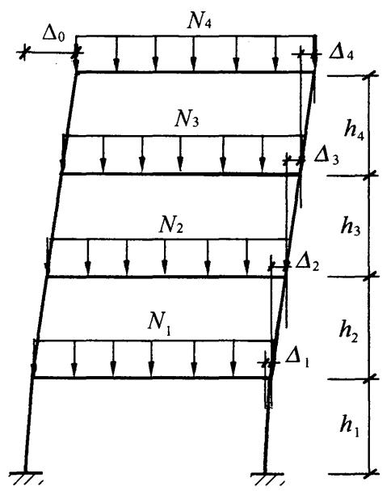  
(a) 框架整体初始几何缺陷代表值

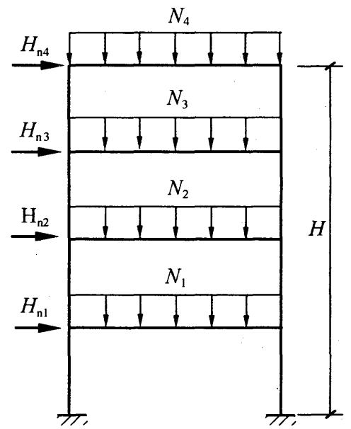  
(b) 框架结构等效水平力  
图5.2.1-1 框架结构整体初始几何缺陷代表值及等效水平力

5.2.2 构件的初始缺陷代表值可按式（5.2.2-1）计算确定，该缺陷值包括了残余应力的影响[图5.2.2(a)]。构件的初始缺陷也可采用假想均布荷载进行等效简化计算，假想均布荷载可按式（5.2.2-2）确定[图5.2.2(b)]。

图5.2.1-2 框架结构计算模型  
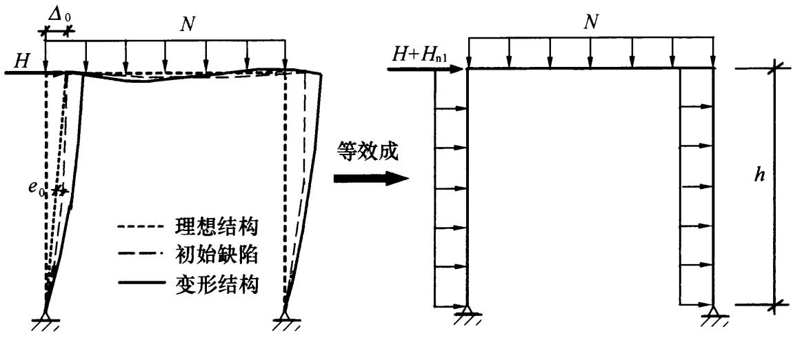  
$h$ —层高； $H$ —水平力； $H_{\mathrm{nl}}$ —假想水平力； $e_0$ —构件中点处的初始变形值

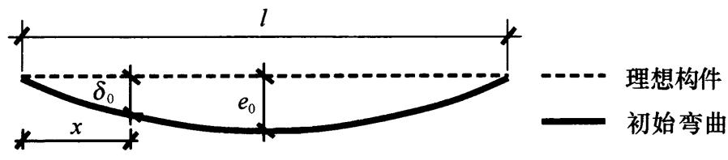

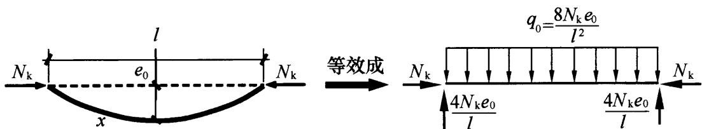  
(a) 等效几何缺陷   
(b) 假想均布荷载  
图5.2.2 构件的初始缺陷

$$\delta_{0} = e _{0} \sin \frac {\pi x}{l} \tag {5.2.2-1}$$

$$q _{0} = \frac {8 N _{\mathrm {k}} e _{0}}{l ^{2}} \tag {5.2.2-2}$$

式中： $\delta_0$ ——离构件端部 $x$ 处的初始变形值（mm）；

$e_0$ ——构件中点处的初始变形值（mm）；

$x$ ——离构件端部的距离（mm）；

$l$ ——构件的总长度（mm）；

$q_{0}$ ——等效分布荷载（ $\mathrm{N} / \mathrm{mm}$ ）；

$N_{\mathrm{k}}$ ——构件承受的轴力标准值（N）。

构件初始弯曲缺陷值 $\frac{e_0}{l}$ ，当采用直接分析不考虑材料弹塑性发展时，可按表5.2.2取构件综合缺陷代表值；当按本标准第5.5节采用直接分析考虑材料弹塑性发展时，应按本标准第5.5.8条或第5.5.9条考虑构件初始缺陷。

表 5.2.2 构件综合缺陷代表值  

| 对应于表7.2.1-1和表7.2.1-2中的柱子曲线 | 二阶分析采用的$\frac{e_0}{l}$值 |
| --- | --- |
| a类 | 1/400 |
| b类 | 1/350 |
| c类 | 1/300 |
| d类 | 1/250 |

## 5.3 一阶弹性分析与设计

5.3.1 钢结构的内力和位移计算采用一阶弹性分析时，应按本标准第6章～第8章的有关规定进行构件设计，并应按本标准有关规定进行连接和节点设计。  
5.3.2 对于形式和受力复杂的结构，当采用一阶弹性分析方法进行结构分析与设计时，应按结构弹性稳定理论确定构件的计算长度系数，并应按本标准第6章～第8章的有关规定进行构件设计。

## 5.4 二阶 $P - \Delta$ 弹性分析与设计

5.4.1 采用仅考虑 $P - \Delta$ 效应的二阶弹性分析时，应按本标准第5.2.1条考虑结构的整体初始缺陷，计算结构在各种荷载或作用设计值下的内力和标准值下的位移，并应按本标准第6章～第8章的有关规定进行各结构构件的设计，同时应按本标准的有关规

定进行连接和节点设计。计算构件轴心受压稳定承载力时，构件计算长度系数 $\mu$ 可取1.0或其他认可的值。

5.4.2 二阶 $P - \Delta$ 效应可按近似的二阶理论对一阶弯矩进行放大来考虑。对无支撑框架结构，杆件杆端的弯矩 $M_{\Delta}^{\mathrm{II}}$ 也可采用下列近似公式进行计算：

$$M _{\Delta} ^{\mathrm {I I}} = M _{\mathrm {q}} + \alpha_{i} ^{\mathrm {I I}} M _{\mathrm {H}} \tag {5.4.2-1}$$

$$\alpha_{i} ^{\mathrm {I I}} = \frac {1}{1 - \theta_{i} ^{\mathrm {I I}}} \tag {5.4.2-2}$$

式中： $M_{\mathrm{q}}$ ——结构在竖向荷载作用下的一阶弹性弯矩（N·mm）；

$M_{\Delta}^{\mathrm{II}}$ ——仅考虑 $P - \Delta$ 效应的二阶弯矩（ $\mathrm{N} \cdot \mathrm{mm}$ ）；

$M_{\mathrm{H}}$ ——结构在水平荷载作用下的一阶弹性弯矩（N·mm）；

$\theta_{i}^{\mathrm{II}}$ 二阶效应系数，可按本标准第5.1.6条规定采用； $\alpha_{i}^{\mathrm{II}}$ 第 $i$ 层杆件的弯矩增大系数，当 $\alpha_{i}^{\mathrm{II}} > 1.33$ 时，宜增大结构的侧移刚度。

## 5.5 直接分析设计法

5.5.1 直接分析设计法应采用考虑二阶 $P - \Delta$ 和 $P - \delta$ 效应，按本标准第 5.2.1 条、第 5.2.2 条、第 5.5.8 条和第 5.5.9 条同时考虑结构和构件的初始缺陷、节点连接刚度和其他对结构稳定性有显著影响的因素，允许材料的弹塑性发展和内力重分布，获得各种荷载设计值（作用）下的内力和标准值（作用）下位移，同时在分析的所有阶段，各结构构件的设计均应符合本标准第 6 章～第 8 章的有关规定，但不需要按计算长度法进行构件受压稳定承载力验算。  
5.5.2 直接分析不考虑材料弹塑性发展时，结构分析应限于第一个塑性铰的形成，对应的荷载水平不应低于荷载设计值，不允许进行内力重分布。  
5.5.3 直接分析法按二阶弹塑性分析时宜采用塑性铰法或塑性

区法。塑性铰形成的区域，构件和节点应有足够的延性保证以便内力重分布，允许一个或者多个塑性铰产生，构件的极限状态应根据设计目标及构件在整个结构中的作用来确定。

5.5.4 直接分析法按二阶弹塑性分析时，钢材的应力-应变关系可为理想弹塑性，屈服强度可取本标准规定的强度设计值，弹性模量可按本标准第4.4.8条采用。

5.5.5 直接分析法按二阶弹塑性分析时，钢结构构件截面应为双轴对称截面或单轴对称截面，塑性铰处截面板件宽厚比等级应为S1级、S2级，其出现的截面或区域应保证有足够的转动能力。

5.5.6 当结构采用直接分析设计法进行连续倒塌分析时，结构材料的应力-应变关系宜考虑应变率的影响；进行抗火分析时，应考虑结构材料在高温下的应力-应变关系对结构和构件内力产生的影响。

5.5.7 结构和构件采用直接分析设计法进行分析和设计时，计算结果可直接作为承载能力极限状态和正常使用极限状态下的设计依据，应按下列公式进行构件截面承载力验算：

1 当构件有足够侧向支撑以防止侧向失稳时：

$$\frac {N}{A f} + \frac {M _{\mathrm {x}} ^{\mathrm {I I}}}{M _{\mathrm {c x}}} + \frac {M _{\mathrm {y}} ^{\mathrm {I I}}}{M _{\mathrm {c y}}} \leqslant 1. 0 \tag {5.5.7-1}$$

当构件可能产生侧向失稳时：

$$\frac {N}{A f} + \frac {M _{\mathrm {x}} ^{\mathrm {I I}}}{\varphi_{\mathrm {b}} W _{\mathrm {x}} f} + \frac {M _{\mathrm {y}} ^{\mathrm {I I}}}{M _{\mathrm {c y}}} \leqslant 1. 0 \tag {5.5.7-2}$$

2 当截面板件宽厚比等级不符合S2级要求时，构件不允许形成塑性铰，受弯承载力设计值应按式（5.5.7-3）、式（5.5.7-4）确定：

$$M _{\mathrm {c x}} = \gamma_{\mathrm {x}} W _{\mathrm {x}} f \tag {5.5.7-3}$$

$$M _{\mathrm {c y}} = \gamma_{\mathrm {y}} W _{\mathrm {y}} f \tag {5.5.7-4}$$

当截面板件宽厚比等级符合S2级要求时，不考虑材料弹塑性发展时，受弯承载力设计值应按式（5.5.7-3）、式（5.5.7-4）

确定，按二阶弹塑性分析时，受弯承载力设计值应按式（5.5.7-5）、式（5.5.7-6）确定：

$$M _{\mathrm {c x}} = W _{\mathrm {p x}} f \tag {5.5.7-5}$$

$$M _{\mathrm {c y}} = W _{\mathrm {p y}} f \tag {5.5.7-6}$$

式中： $M_{\mathrm{x}}^{\mathrm{II}}, M_{\mathrm{y}}^{\mathrm{II}}$ ——分别为绕 $x$ 轴、 $y$ 轴的二阶弯矩设计值，可由结构分析直接得到（ $\mathrm{N} \cdot \mathrm{mm}$ ）；

$A$ ——构件的毛截面面积 $(\mathrm{mm}^2)$ ；

$M_{\mathrm{cx}}$ 、 $M_{\mathrm{cy}}$ ——分别为绕 $x$ 轴、 $y$ 轴的受弯承载力设计值 $(\mathbf{N} \cdot \mathbf{mm})$ ；

$W_{\mathrm{x}}$ 、 $W_{\mathrm{y}}$ ——当构件板件宽厚比等级为S1级、S2级、S3级或S4级时，为构件绕 $x$ 轴、 $y$ 轴的毛截面模量；当构件板件宽厚比等级为S5级时，为构件绕 $x$ 轴、 $y$ 轴的有效截面模量 $(\mathrm{mm}^3)$

$W_{\mathrm{px}}$ 、 $W_{\mathrm{py}}$ ——构件绕 $x$ 轴、 $y$ 轴的塑性毛截面模量 $(\mathrm{mm}^3)$ ；

$\gamma_{\mathrm{x}}$ 、 $\gamma_{\mathrm{y}}$ ——截面塑性发展系数，应按本标准第6.1.2条的规定采用；

$\varphi_{\mathrm{b}}$ ——梁的整体稳定系数，应按本标准附录C确定。

5.5.8 采用塑性铰法进行直接分析设计时，除应按本标准第5.2.1条、第5.2.2条考虑初始缺陷外，当受压构件所受轴力大于 $0.5A f$ 时，其弯曲刚度还应乘以刚度折减系数0.8。  
5.5.9 采用塑性区法进行直接分析设计时，应按不小于1/1000的出厂加工精度考虑构件的初始几何缺陷，并考虑初始残余应力。  
5.5.10 大跨度钢结构体系的稳定性分析宜采用直接分析法。结构整体初始几何缺陷模式可按最低阶整体屈曲模态采用，最大缺陷值可取 $L / 300, L$ 为结构跨度。构件的初始缺陷可按本标准第5.2.2条的规定采用。

# 6 受弯构件

## 6.1 受弯构件的强度

6.1.1 在主平面内受弯的实腹式构件，其受弯强度应按下式计算：

$$\frac {M _{\mathrm {x}}}{\gamma_{\mathrm {x}} W _{\mathrm {n x}}} + \frac {M _{\mathrm {y}}}{\gamma_{\mathrm {y}} W _{\mathrm {n y}}} \leqslant f \tag {6.1.1}$$

式中： $M_{\mathrm{x}}, M_{\mathrm{y}}$ ——同一截面处绕 $x$ 轴和 $y$ 轴的弯矩设计值（ $\mathbf{N} \cdot \mathrm{mm}$ ）；

$W_{\mathrm{nx}}$ 、 $W_{\mathrm{ny}}$ 对 $\mathcal{X}$ 轴和 $_y$ 轴的净截面模量，当截面板件宽厚比等级为S1级、S2级、S3级或S4级时，应取全截面模量，当截面板件宽厚比等级为S5级时，应取有效截面模量，均匀受压翼缘有效外伸宽度可取 $15\varepsilon_{\mathrm{k}}$ ，腹板有效截面可按本标准第8.4.2条的规定采用（ $\mathrm{mm}^3$ ）；

$\gamma_{\mathbf{x}}$ 、 $\gamma_{\mathrm{y}}$ ——对主轴 $x$ 、 $y$ 的截面塑性发展系数，应按本标准第6.1.2条的规定取值；

$f$ ——钢材的抗弯强度设计值（ $\mathrm{N} / \mathrm{mm}^2$ ）。

6.1.2 截面塑性发展系数应按下列规定取值：

1 对工字形和箱形截面，当截面板件宽厚比等级为S4或S5级时，截面塑性发展系数应取为1.0，当截面板件宽厚比等级为S1级、S2级及S3级时，截面塑性发展系数应按下列规定取值：

1）工字形截面（ $x$ 轴为强轴， $y$ 轴为弱轴)： $\gamma_{\mathrm{x}} = 1.05$ $\gamma_{\mathrm{y}} = 1.20$   
2）箱形截面： $\gamma_{\mathrm{x}} = \gamma_{\mathrm{y}} = 1.05$

2 其他截面的塑性发展系数可按本标准表8.1.1采用。

3 对需要计算疲劳的梁，宜取 $\gamma_{\mathrm{x}} = \gamma_{\mathrm{y}} = 1.0$ 。

6.1.3 在主平面内受弯的实腹式构件，除考虑腹板屈曲后强度者外，其受剪强度应按下式计算：

$$\tau = \frac {V S}{I t _{\mathrm {w}}} \leqslant f _{\mathrm {v}} \tag {6.1.3}$$

式中： $V$ ——计算截面沿腹板平面作用的剪力设计值（N）；

S——计算剪应力处以上（或以下）毛截面对中和轴的面积矩 $(\mathrm{mm}^3)$ ；

$I$ ——构件的毛截面惯性矩 $(\mathrm{mm}^4)$ ；

$t_{\mathrm{w}}$ ——构件的腹板厚度（mm）；

$f_{\mathrm{v}}$ ——钢材的抗剪强度设计值（ $\mathrm{N} / \mathrm{mm}^2$ ）。

6.1.4 当梁受集中荷载且该荷载处又未设置支承加劲肋时，其计算应符合下列规定：

1 当梁上翼缘受有沿腹板平面作用的集中荷载且该荷载处又未设置支承加劲肋时，腹板计算高度上边缘的局部承压强度应按下列公式计算：

$$\sigma_{\mathrm {c}} = \frac {\psi F}{t _{\mathrm {w}} l _{\mathrm {z}}} \leqslant f \tag {6.1.4-1}$$

$$l _{z} = 3. 2 5 \sqrt [ 3 ]{\frac {I _{\mathrm {R}} + I _{\mathrm {f}}}{t _{\mathrm {w}}}} \tag {6.1.4-2}$$

或 $l_{\mathrm{z}} = a + 5h_{\mathrm{y}} + 2h_{\mathrm{R}}$ (6.1.4-3)

式中： $F$ ——集中荷载设计值，对动力荷载应考虑动力系数(N)；

$\psi$ ——集中荷载的增大系数；对重级工作制吊车梁， $\psi = 1.35$ ；对其他梁， $\psi = 1.0$

$l_{z}$ ——集中荷载在腹板计算高度上边缘的假定分布长度，宜按式（6.1.4-2）计算，也可采用简化式（6.1.4-3）计算（ $\mathrm{mm}$ ）；

$I_{\mathrm{R}}$ ——轨道绕自身形心轴的惯性矩 $(\mathrm{mm}^4)$ ；

$I_{\mathrm{f}}$ ——梁上翼缘绕翼缘中面的惯性矩 $(\mathrm{mm}^4)$ ；

$a$ ——集中荷载沿梁跨度方向的支承长度（ $\mathrm{mm}$ ），对钢轨上的轮压可取 $50\mathrm{mm}$ ；

$h_{\mathrm{y}}$ ——自梁顶面至腹板计算高度上边缘的距离；对焊接梁为上翼缘厚度，对轧制工字形截面梁，是梁顶面到腹板过渡完成点的距离（mm）；

$h_{\mathrm{R}}$ ——轨道的高度，对梁顶无轨道的梁取值为0（mm）；

$f$ ——钢材的抗压强度设计值（ $\mathrm{N} / \mathrm{mm}^2$ ）。

2 在梁的支座处，当不设置支承加劲肋时，也应按式(6.1.4-1）计算腹板计算高度下边缘的局部压应力，但 $\psi$ 取1.0。支座集中反力的假定分布长度，应根据支座具体尺寸按式(6.1.4-3）计算。

6.1.5 在梁的腹板计算高度边缘处，若同时承受较大的正应力、剪应力和局部压应力，或同时承受较大的正应力和剪应力时，其折算应力应按下列公式计算：

$$\sqrt {\sigma^{2} + \sigma_{\mathrm {c}} ^{2} - \sigma \sigma_{\mathrm {c}} + 3 \tau^{2}} \leqslant \beta_{1} f \tag {6.1.5-1}$$

$$\sigma = \frac {M}{I _{\mathrm {n}}} y _{1} \tag {6.1.5-2}$$

式中： $\sigma$ 、 $\tau$ 、 $\sigma_{\mathrm{c}}$ ——腹板计算高度边缘同一点上同时产生的正应力、剪应力和局部压应力， $\tau$ 和 $\sigma_{\mathrm{c}}$ 应按本标准式（6.1.3）和式（6.1.4-1）计算， $\sigma$ 应按式（6.1.5-2）计算， $\sigma$ 和 $\sigma_{\mathrm{c}}$ 以拉应力为正值，压应力为负值（ $\mathrm{N} / \mathrm{mm}^2$ ）；

$I_{\mathrm{n}}$ ——梁净截面惯性矩 $(\mathrm{mm}^4)$ ；

$y_{1}$ ——所计算点至梁中和轴的距离（mm）；

$\beta_{1}$ ——强度增大系数；当 $\sigma$ 与 $\sigma_{\mathrm{c}}$ 异号时，取 $\beta_{1} = 1.2$ ；当 $\sigma$ 与 $\sigma_{\mathrm{c}}$ 同号或 $\sigma_{\mathrm{c}} = 0$ 时，取 $\beta_{1} = 1.1$ 。

## 6.2 受弯构件的整体稳定

6.2.1 当铺板密铺在梁的受压翼缘上并与其牢固相连，能阻止梁受压翼缘的侧向位移时，可不计算梁的整体稳定性。

6.2.2 除本标准第6.2.1条所规定情况外，在最大刚度主平面内受弯的构件，其整体稳定性应按下式计算：

$$\frac {M _{\mathrm {x}}}{\varphi_{\mathrm {b}} W _{\mathrm {x}} f} \leqslant 1. 0 \tag {6.2.2}$$

式中： $M_{\mathrm{x}}$ ——绕强轴作用的最大弯矩设计值（ $\mathrm{N} \cdot \mathrm{mm}$ ）；

$W_{\mathrm{x}}$ ——按受压最大纤维确定的梁毛截面模量，当截面板件宽厚比等级为S1级、S2级、S3级或S4级时，应取全截面模量；当截面板件宽厚比等级为S5级时，应取有效截面模量，均匀受压翼缘有效外伸宽度可取 $15\varepsilon_{\mathrm{k}}$ ，腹板有效截面可按本标准第8.4.2条的规定采用（ $\mathrm{mm}^3$ ）；

$\varphi_{\mathrm{b}}$ ——梁的整体稳定性系数，应按本标准附录C确定。

6.2.3 除本标准第6.2.1条所指情况外，在两个主平面受弯的H型钢截面或工字形截面构件，其整体稳定性应按下式计算：

$$\frac {M _{\mathrm {x}}}{\varphi_{\mathrm {b}} W _{\mathrm {x}} f} + \frac {M _{\mathrm {y}}}{\gamma_{\mathrm {y}} W _{\mathrm {y}} f} \leqslant 1. 0 \tag {6.2.3}$$

式中： $W_{y}$ ——按受压最大纤维确定的对 $y$ 轴的毛截面模量 $(\mathrm{mm}^3)$ ；

$\varphi_{\mathrm{b}}$ ——绕强轴弯曲所确定的梁整体稳定系数，应按本标准附录C计算。

6.2.4 当箱形截面简支梁符合本标准第6.2.1条的要求或其截面尺寸（图6.2.4）满足 $h / b_{0} \leqslant 6$ ， $l_{1} / b_{0} \leqslant 95\varepsilon_{\mathrm{k}}^{2}$ 时，可不计算整体稳定性， $l_{1}$ 为受压翼缘侧向支承点间的距离（梁的支座处视为有侧向支承）。

6.2.5 梁的支座处应采取构造措施，以防止梁端截面的扭转。当简支梁仅腹板与相邻构件相连，

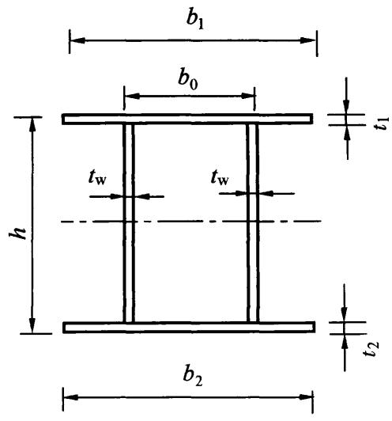  
图6.2.4 箱形截面

钢梁稳定性计算时侧向支承点距离应取实际距离的1.2倍。

6.2.6 用作减小梁受压翼缘自由长度的侧向支撑，其支撑力应将梁的受压翼缘视为轴心压杆计算。

6.2.7 支座承担负弯矩且梁顶有混凝土楼板时，框架梁下翼缘的稳定性计算应符合下列规定：

1 当 $\lambda_{\mathrm{n,b}} \leqslant 0.45$ 时，可不计算框架梁下翼缘的稳定性。

2 当不满足本条第1款时，框架梁下翼缘的稳定性应按下列公式计算：

$$\frac {M _{\mathrm {x}}}{\varphi_{\mathrm {d}} W _{1 \mathrm {x}} f} \leqslant 1. 0 \tag {6.2.7-1}$$

$$\lambda_{\mathrm {e}} = \pi \lambda_{\mathrm {n}, \mathrm {b}} \sqrt {\frac {E}{f _{\mathrm {y}}}} \tag {6.2.7-2}$$

$$\lambda_{n, b} = \sqrt {\frac {f _{y}}{\sigma_{c r}}} \tag {6.2.7-3}$$

$$\sigma_{\mathrm {c r}} = \frac {3 . 4 6 b _{1} t _{1} ^{3} + h _{\mathrm {w}} t _{\mathrm {w}} ^{3} (7 . 2 7 \gamma + 3 . 3) \varphi_{1}}{h _{\mathrm {w}} ^{2} \left(1 2 b _{1} t _{1} + 1 . 7 8 h _{\mathrm {w}} t _{\mathrm {w}}\right)} E \tag {6.2.7-4}$$

$$\gamma = \frac {b _{1}}{t _{\mathrm {w}}} \sqrt {\frac {b _{1} t _{1}}{h _{\mathrm {w}} t _{\mathrm {w}}}} \tag {6.2.7-5}$$

$$\varphi_{1} = \frac {1}{2} \left(\frac {5 . 4 3 6 \gamma h _{\mathrm {w}} ^{2}}{l ^{2}} + \frac {l ^{2}}{5 . 4 3 6 \gamma h _{\mathrm {w}} ^{2}}\right) \tag {6.2.7-6}$$

式中： $b_{1}$ ——受压翼缘的宽度（mm）；

$t_1$ ——受压翼缘的厚度（mm）；

$W_{1x}$ ——弯矩作用平面内对受压最大纤维的毛截面模量 $(\mathrm{mm}^3)$ ;

$\varphi_{\mathrm{d}}$ ——稳定系数，根据换算长细比 $\lambda_{\mathrm{e}}$ 按本标准附录D表D.0.2采用；

$\lambda_{\mathrm{n,b}}$ 一 正则化长细比；

$\sigma_{\mathrm{cr}}$ ——畸变屈曲临界应力 $(\mathrm{N} / \mathrm{mm}^2)$ ；

$l$ ——当框架主梁支承次梁且次梁高度不小于主梁高度一半时，取次梁到框架柱的净距；除此情况外，取梁

净距的一半（mm）。

3 当不满足本条第1款、第2款时，在侧向未受约束的受压翼缘区段内，应设置隅撑或沿梁长设间距不大于2倍梁高并与梁等宽的横向加劲肋。

## 6.3 局部稳定

6.3.1 承受静力荷载和间接承受动力荷载的焊接截面梁可考虑腹板屈曲后强度，按本标准第6.4节的规定计算其受弯和受剪承载力。不考虑腹板屈曲后强度时，当 $h_0 / t_{\mathrm{w}} > 80 \varepsilon_{\mathrm{k}}$ ，焊接截面梁应计算腹板的稳定性。 $h_0$ 为腹板的计算高度， $t_{\mathrm{w}}$ 为腹板的厚度。轻级、中级工作制吊车梁计算腹板的稳定性时，吊车轮压设计值可乘以折减系数0.9。

6.3.2 焊接截面梁腹板配置加劲肋应符合下列规定：

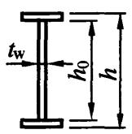

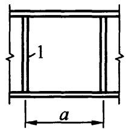  
(a)

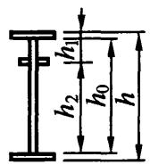

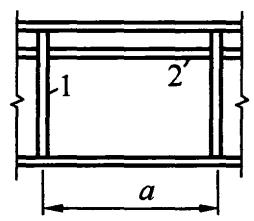  
(b)

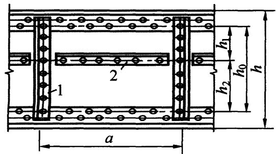  
(c)

(d)   
图6.3.2 加劲肋布置  
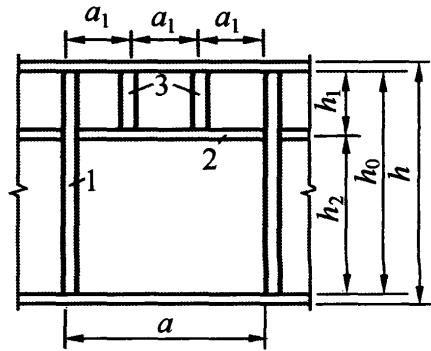  
1—横向加劲肋；2—纵向加劲肋；3—短加劲肋

1 当 $h_0 / t_{\mathrm{w}} \leqslant 80 \varepsilon_{\mathrm{k}}$ 时，对有局部压应力的梁，宜按构造配置横向加劲肋；当局部压应力较小时，可不配置加劲肋。

2 直接承受动力荷载的吊车梁及类似构件，应按下列规定配置加劲肋（图6.3.2）：

1) 当 $h_{0} / t_{\mathrm{w}} > 80 \varepsilon_{\mathrm{k}}$ 时, 应配置横向加劲肋;  
2）当受压翼缘扭转受到约束且 $h_{0} / t_{\mathrm{w}} > 170 \varepsilon_{\mathrm{k}}$ 、受压翼缘扭转未受到约束且 $h_{0} / t_{\mathrm{w}} > 150 \varepsilon_{\mathrm{k}}$ ，或按计算需要时，应在弯曲应力较大区格的受压区增加配置纵向加劲肋。局部压应力很大的梁，必要时尚宜在受压区配置短加劲肋；对单轴对称梁，当确定是否要配置纵向加劲肋时， $h_{0}$ 应取腹板受压区高度 $h_{\mathrm{c}}$ 的2倍。

3 不考虑腹板屈曲后强度时，当 $h_0 / t_{\mathrm{w}} > 80 \varepsilon_{\mathrm{k}}$ 时，宜配置横向加劲肋。

4 $h_0 / t_{\mathrm{w}}$ 不宜超过250。

5 梁的支座处和上翼缘受有较大固定集中荷载处，宜设置支承加劲肋。

6 腹板的计算高度 $h_0$ 应按下列规定采用：对轧制型钢梁，为腹板与上、下翼缘相接处两内弧起点间的距离；对焊接截面梁，为腹板高度；对高强度螺栓连接（或铆接）梁，为上、下翼缘与腹板连接的高强度螺栓（或铆钉）线间最近距离（图6.3.2）。

6.3.3 仅配置横向加劲肋的腹板 [图 6.3.2 (a)], 其各区格的局部稳定应按下列公式计算:

$$\left(\frac {\sigma}{\sigma_{\mathrm {c r}}}\right) ^{2} + \left(\frac {\tau}{\tau_{\mathrm {c r}}}\right) ^{2} + \frac {\sigma_{\mathrm {c}}}{\sigma_{\mathrm {c , c r}}} \leqslant 1. 0 \tag {6.3.3-1}$$

$$\tau = \frac {V}{h _{\mathrm {w}} t _{\mathrm {w}}} \tag {6.3.3-2}$$

$\sigma_{\mathrm{cr}}$ 应按下列公式计算：

当 $\lambda_{\mathrm{n,b}}\leqslant 0.85$ 时：

$$\sigma_{\mathrm {c r}} = f \tag {6.3.3-3}$$

当 $0.85 < \lambda_{\mathrm{n,b}} \leqslant 1.25$ 时：

$$\sigma_{\mathrm {c r}} = \left[ 1 - 0. 7 5 \left(\lambda_{\mathrm {n}, \mathrm {b}} - 0. 8 5\right) \right] f \tag {6.3.3-4}$$

当 $\lambda_{\mathrm{n,b}} > 1.25$ 时：

$$\sigma_{\mathrm {c r}} = 1. 1 f / \lambda_{\mathrm {n}, \mathrm {b}} ^{2} \tag {6.3.3-5}$$

当梁受压翼缘扭转受到约束时：

$$\lambda_{\mathrm {n}, \mathrm {b}} = \frac {2 h _{\mathrm {c}} / t _{\mathrm {w}}}{1 7 7} \cdot \frac {1}{\varepsilon_{\mathrm {k}}} \tag {6.3.3-6}$$

当梁受压翼缘扭转未受到约束时：

$$\lambda_{\mathrm {n}, \mathrm {b}} = \frac {2 h _{\mathrm {c}} / t _{\mathrm {w}}}{1 3 8} \cdot \frac {1}{\varepsilon_{\mathrm {k}}} \tag {6.3.3-7}$$

$\tau_{\mathrm{cr}}$ 应按下列公式计算：

当 $\lambda_{\mathrm{n,s}} \leqslant 0.8$ 时：

$$\tau_{\mathrm {c r}} = f _{\mathrm {v}} \tag {6.3.3-8}$$

当 $0.8 < \lambda_{\mathrm{n,s}} \leqslant 1.2$ 时：

$$\tau_{\mathrm {c r}} = \left[ 1 - 0. 5 9 \left(\lambda_{\mathrm {n}, \mathrm {s}} - 0. 8\right) \right] f _{\mathrm {v}} \tag {6.3.3-9}$$

当 $\lambda_{\mathrm{n,s}} > 1.2$ 时：

$$\tau_{\mathrm {c r}} = 1. 1 f _{\mathrm {v}} / \lambda_{\mathrm {n}, \mathrm {s}} ^{2} \tag {6.3.3-10}$$

当 $a / h_0 \leqslant 1$ 时：

$$\lambda_{\mathrm {n}, \mathrm {s}} = \frac {h _{0} / t _{\mathrm {w}}}{3 7 \eta \sqrt {4 + 5 . 3 4 \left(h _{0} / a\right) ^{2}}} \cdot \frac {1}{\varepsilon_{\mathrm {k}}} \tag {6.3.3-11}$$

当 $a / h_0 > 1$ 时：

$$\lambda_{\mathrm {n}, \mathrm {s}} = \frac {h _{0} / t _{\mathrm {w}}}{3 7 \eta \sqrt {5 . 3 4 + 4 \left(h _{0} / a\right) ^{2}}} \cdot \frac {1}{\varepsilon_{\mathrm {k}}} \tag {6.3.3-12}$$

$\sigma_{\mathrm{c,cr}}$ 应按下列公式计算：

当 $\lambda_{\mathrm{n,c}} \leqslant 0.9$ 时：

$$\sigma_{\mathrm {c}, \mathrm {c r}} = f \tag {6.3.3-13}$$

当 $0.9 < \lambda_{\mathrm{n,c}} \leqslant 1.2$ 时：

$$\sigma_{\mathrm {c}, \mathrm {c r}} = [ 1 - 0. 7 9 (\lambda_{\mathrm {n}, \mathrm {c}} - 0. 9) ] f \tag {6.3.3-14}$$

当 $\lambda_{\mathrm{n,c}} > 1.2$ 时：

$$\sigma_{\mathrm {c}, \mathrm {c r}} = 1. 1 f / \lambda_{\mathrm {n}, \mathrm {c}} ^{2} \tag {6.3.3-15}$$

当 $0.5 \leqslant a / h_0 \leqslant 1.5$ 时：

$$\lambda_{\mathrm {n}, \mathrm {c}} = \frac {h _{0} / t _{\mathrm {w}}}{2 8 \sqrt {1 0 . 9 + 1 3 . 4 (1 . 8 3 - a / h _{0}) ^{3}}} \cdot \frac {1}{\varepsilon_{\mathrm {k}}} \tag {6.3.3-16}$$

当 $1.5 < a / h_0 \leqslant 2.0$ 时：

$$\lambda_{\mathrm {n}, \mathrm {c}} = \frac {h _{0} / t _{\mathrm {w}}}{2 8 \sqrt {1 8 . 9 - 5 a / h _{0}}} \cdot \frac {1}{\varepsilon_{\mathrm {k}}} \tag {6.3.3-17}$$

式中： $\sigma$ ——计算腹板区格内，由平均弯矩产生的腹板计算高度边缘的弯曲压应力（ $\mathrm{N} / \mathrm{mm}^2$ ）；

$\tau$ ——所计算腹板区格内，由平均剪力产生的腹板平均剪应力 $(\mathrm{N} / \mathrm{mm}^2)$ ；

$\sigma_{\mathrm{c}}$ ——腹板计算高度边缘的局部压应力，应按本标准式（6.1.4-1）计算，但取式中的 $\psi = 1.0(\mathrm{N} / \mathrm{mm}^2)$ ；

$h_{\mathrm{w}}$ ——腹板高度（mm）；

$\sigma_{\mathrm{cr}}$ 、 $\tau_{\mathrm{cr}}$ 、 $\sigma_{\mathrm{c,cr}}$ ——各种应力单独作用下的临界应力（ $\mathrm{N} / \mathrm{mm}^2$ ）；

$\lambda_{\mathrm{n,b}}$ ——梁腹板受弯计算的正则化宽厚比；

$h_{\mathrm{c}}$ ——梁腹板弯曲受压区高度，对双轴对称截面 $2h_{\mathrm{c}}$

$$= h _{0} (\mathrm {m m});$$

$\lambda_{\mathrm{n,s}}$ ——梁腹板受剪计算的正则化宽厚比；

$\eta$ ——简支梁取1.11，框架梁梁端最大应力区取1；

$\lambda_{\mathrm{n,c}}$ ——梁腹板受局部压力计算时的正则化宽厚比。

6.3.4 同时用横向加劲肋和纵向加劲肋加强的腹板 [图 6.3.2 (b)、图 6.3.2 (c)]，其局部稳定性应按下列公式计算：

1 受压翼缘与纵向加劲肋之间的区格：

$$\frac {\sigma}{\sigma_{\mathrm {c r} 1}} + \left(\frac {\sigma_{\mathrm {c}}}{\sigma_{\mathrm {c} , \mathrm {c r} 1}}\right) ^{2} + \left(\frac {\tau}{\tau_{\mathrm {c r} 1}}\right) ^{2} \leqslant 1. 0 \tag {6.3.4-1}$$

其中 $\sigma_{\mathrm{cr1}}$ 、 $\tau_{\mathrm{cr1}}$ 、 $\sigma_{\mathrm{c,cr1}}$ 应分别按下列方法计算：

1） $\sigma_{\mathrm{cr1}}$ 应按本标准式（6.3.3-3）～式（6.3.3-5）计算：

但式中的 $\lambda_{\mathrm{n,b}}$ 改用下列 $\lambda_{\mathrm{n,b1}}$ 代替。

当梁受压翼缘扭转受到约束时：

$$\lambda_{\mathrm {n}, \mathrm {b} 1} = \frac {h _{1} / t _{\mathrm {w}}}{7 5 \varepsilon_{\mathrm {k}}} \tag {6.3.4-2}$$

当梁受压翼缘扭转未受到约束时：

$$\lambda_{\mathrm {n}, \mathrm {b l}} = \frac {h _{1} / t _{\mathrm {w}}}{6 4 \varepsilon_{\mathrm {k}}} \tag {6.3.4-3}$$

2） $\tau_{\mathrm{cr1}}$ 应按本标准式（6.3.3-8）～式（6.3.3-12）计算，但将式中的 $h_0$ 改为 $h_1$ 。  
3） $\sigma_{\mathrm{c,cr1}}$ 应按本标准式（6.3.3-3）～式（6.3.3-5）计算，但式中的 $\lambda_{\mathrm{n,b}}$ 改用 $\lambda_{\mathrm{n,cl}}$ 代替。

当梁受压翼缘扭转受到约束时：

$$\lambda_{\mathrm {n}, \mathrm {c l}} = \frac {h _{1} / t _{\mathrm {w}}}{5 6 \varepsilon_{\mathrm {k}}} \tag {6.3.4-4}$$

当梁受压翼缘扭转未受到约束时：

$$\lambda_{\mathrm {n}, \mathrm {c l}} = \frac {h _{1} / t _{\mathrm {w}}}{4 0 \varepsilon_{\mathrm {k}}} \tag {6.3.4-5}$$

2 受拉翼缘与纵向加劲肋之间的区格：

$$\left(\frac {\sigma_{2}}{\sigma_{\mathrm {c r} 2}}\right) ^{2} + \left(\frac {\tau}{\tau_{\mathrm {c r} 2}}\right) ^{2} + \frac {\sigma_{\mathrm {c} 2}}{\sigma_{\mathrm {c} , \mathrm {c r} 2}} \leqslant 1. 0 \tag {6.3.4-6}$$

其中 $\sigma_{\mathrm{cr2}}$ 、 $\tau_{\mathrm{cr2}}$ 、 $\sigma_{\mathrm{c,cr2}}$ 应分别按下列方法计算：

1） $\sigma_{\mathrm{cr2}}$ 应按本标准式（6.3.3-3）～式（6.3.3-5）计算，但式中的 $\lambda_{\mathrm{n,b}}$ 改用 $\lambda_{\mathrm{n,b2}}$ 代替。

$$\lambda_{\mathrm {n}, \mathrm {b} 2} = \frac {h _{2} / t _{\mathrm {w}}}{1 9 4 \varepsilon_{\mathrm {k}}} \tag {6.3.4-7}$$

2） $\tau_{\mathrm{cr2}}$ 应按本标准式（6.3.3-8）～式（6.3.3-12）计算，但将式中的 $h_0$ 改为 $h_2(h_2 = h_0 - h_1)$ 。  
3） $\sigma_{\mathrm{c,cr2}}$ 应按本标准式（6.3.3-13）～式（6.3.3-17）计算，但式中的 $h_0$ 改为 $h_2$ ，当 $a / h_2 > 2$ 时，取 $a / h_2 = 2$ 。

式中： $h_1$ ——纵向加劲肋至腹板计算高度受压边缘的距离（mm）；

$\sigma_{2}$ ——所计算区格内由平均弯矩产生的腹板在纵向加劲肋处的弯曲压应力 $(\mathrm{N} / \mathrm{mm}^{2})$ ；

$\sigma_{c2}$ ——腹板在纵向加劲肋处的横向压应力，取 $0.3\sigma_{c}(\mathrm{N}/\mathrm{mm}^{2})$ 。

6.3.5 在受压翼缘与纵向加劲肋之间设有短加劲肋的区格[图

6.3.2(d)], 其局部稳定性应按本标准式（6.3.4-1）计算。该式中的 $\sigma_{\mathrm{cr1}}$ 仍按本标准第6.3.4条第1款计算； $\tau_{\mathrm{cr1}}$ 按本标准式(6.3.3-8)～式（6.3.3-12）计算，但将 $h_0$ 和 $a$ 改为 $h_1$ 和 $a_1, a_1$ 为短加劲肋间距； $\sigma_{\mathrm{c,cr1}}$ 按本标准式（6.3.3-3）～式（6.3.3-5）计算，但式中 $\lambda_{\mathrm{n,b}}$ 改用下列 $\lambda_{\mathrm{n,cl}}$ 代替。

当梁受压翼缘扭转受到约束时：

$$\lambda_{\mathrm {n}, \mathrm {c l}} = \frac {a _{1} / t _{\mathrm {w}}}{8 7 \varepsilon_{\mathrm {k}}} \tag {6.3.5-1}$$

当梁受压翼缘扭转未受到约束时：

$$\lambda_{\mathrm {n}, \mathrm {c l}} = \frac {a _{1} / t _{\mathrm {w}}}{7 3 \varepsilon_{\mathrm {k}}} \tag {6.3.5-2}$$

对 $a_1 / h_1 > 1.2$ 的区格，式（6.3.5-1）或式（6.3.5-2）右侧应乘以 $\frac{1}{\sqrt{0.4 + 0.5a_1 / h_1}}$ 。

6.3.6 加劲肋的设置应符合下列规定：

1 加劲肋宜在腹板两侧成对配置，也可单侧配置，但支承加劲肋、重级工作制吊车梁的加劲肋不应单侧配置。  
2 横向加劲肋的最小间距应为 $0.5h_{0}$ ，除无局部压应力的梁，当 $h_0 / t_{\mathrm{w}} \leqslant 100$ 时，最大间距可采用 $2.5h_{0}$ 外，最大间距应为 $2h_{0}$ 。纵向加劲肋至腹板计算高度受压边缘的距离应为 $h_{\mathrm{c}} / 2.5 \sim h_{\mathrm{c}} / 2$ 。  
3 在腹板两侧成对配置的钢板横向加劲肋，其截面尺寸应符合下列公式规定：

外伸宽度：

$$b _{\mathrm {s}} = \frac {h _{0}}{3 0} + 4 0 \quad (\mathrm {m m}) \tag {6.3.6-1}$$

厚度：

承压加劲肋 $t_{\mathrm{s}} \geqslant \frac{b_{\mathrm{s}}}{15}$ , 不受力加劲肋 $t_{\mathrm{s}} \geqslant \frac{b_{\mathrm{s}}}{19}$ (6.3.6-2)

4 在腹板一侧配置的横向加劲肋，其外伸宽度应大于按式（6.3.6-1）算得的1.2倍，厚度应符合式（6.3.6-2）的规定。

5 在同时采用横向加劲肋和纵向加劲肋加强的腹板中，横向加劲肋的截面尺寸除符合本条第1款～第4款规定外，其截面惯性矩 $I_{z}$ 尚应符合下式要求：

$$I _{z} \geqslant 3 h _{0} t _{\mathrm {w}} ^{3} \tag {6.3.6-3}$$

纵向加劲肋的截面惯性矩 $I_{\mathrm{y}}$ ，应符合下列公式要求：

当 $a / h_0 \leqslant 0.85$ 时：

$$I _{\mathrm {y}} \geqslant 1. 5 h _{0} t _{\mathrm {w}} ^{3} \tag {6.3.6-4}$$

当 $a / h_0 > 0.85$ 时：

$$I _{\mathrm {y}} \geqslant \left(2. 5 - 0. 4 5 \frac {a}{h _{0}}\right) \left(\frac {a}{h _{0}}\right) ^{2} h _{0} t _{\mathrm {w}} ^{3} \tag {6.3.6-5}$$

6 短加劲肋的最小间距为 $0.75h_{1}$ 。短加劲肋外伸宽度应取横向加劲肋外伸宽度的 0.7 倍 $\sim 1.0$ 倍，厚度不应小于短加劲肋外伸宽度的 1/15。

7 用型钢（H型钢、工字钢、槽钢、肢尖焊于腹板的角钢）做成的加劲肋，其截面惯性矩不得小于相应钢板加劲肋的惯性矩。在腹板两侧成对配置的加劲肋，其截面惯性矩应按梁腹板中心线为轴线进行计算。在腹板一侧配置的加劲肋，其截面惯性矩应按加劲肋相连的腹板边缘为轴线进行计算。

8 焊接梁的横向加劲肋与翼缘板、腹板相接处应切角，当作为焊接工艺孔时，切角宜采用半径 $R = 30\mathrm{mm}$ 的1/4圆弧。

6.3.7 梁的支承加劲肋应符合下列规定：

1 应按承受梁支座反力或固定集中荷载的轴心受压构件计算其在腹板平面外的稳定性；此受压构件的截面应包括加劲肋和加劲肋每侧 $15h_{\mathrm{w}}\varepsilon_{\mathrm{k}}$ 范围内的腹板面积，计算长度取 $h_0$ ；  
2 当梁支承加劲肋的端部为刨平顶紧时，应按其所承受的支座反力或固定集中荷载计算其端面承压应力；突缘支座的突缘加劲肋的伸出长度不得大于其厚度的2倍；当端部为焊接时，应按传力情况计算其焊缝应力；  
3 支承加劲肋与腹板的连接焊缝，应按传力需要进行计算。

## 6.4 焊接截面梁腹板考虑屈曲后强度的计算

6.4.1 腹板仅配置支承加劲肋且较大荷载处尚有中间横向加劲肋，同时考虑屈曲后强度的工字形焊接截面梁[图6.3.2（a)]，应按下列公式验算受弯和受剪承载能力：

$$\left(\frac {V}{0 . 5 V _{\mathrm {u}}} - 1\right) ^{2} + \frac {M - M _{\mathrm {f}}}{M _{\mathrm {e u}} - M _{\mathrm {f}}} \leqslant 1. 0 \tag {6.4.1-1}$$

$$M _{\mathrm {f}} = \left(A _{\mathrm {f} 1} \frac {h _{\mathrm {m} 1} ^{2}}{h _{\mathrm {m} 2}} + A _{\mathrm {f} 2} h _{\mathrm {m} 2}\right) f \tag {6.4.1-2}$$

梁受弯承载力设计值 $M_{\mathrm{eu}}$ 应按下列公式计算:

$$M _{\mathrm {e u}} = \gamma_{\mathrm {x}} \alpha_{\mathrm {e}} W _{\mathrm {x}} f \tag {6.4.1-3}$$

$$\alpha_{\mathrm {e}} = 1 - \frac {(1 - \rho) h _{\mathrm {c}} ^{3} t _{\mathrm {w}}}{2 I _{\mathrm {x}}} \tag {6.4.1-4}$$

当 $\lambda_{\mathrm{n,b}} \leqslant 0.85$ 时：

$$\rho = 1. 0 \tag {6.4.1-5}$$

当 $0.85 < \lambda_{\mathrm{n,b}} \leqslant 1.25$ 时：

$$\rho = 1 - 0. 8 2 \left(\lambda_{\mathrm {n}, \mathrm {b}} - 0. 8 5\right) \tag {6.4.1-6}$$

当 $\lambda_{\mathrm{n,b}} > 1.25$ 时：

$$\rho = \frac {1}{\lambda_{\mathrm {n} , \mathrm {b}}} \left(1 - \frac {0 . 2}{\lambda_{\mathrm {n} , \mathrm {b}}}\right) \tag {6.4.1-7}$$

梁受剪承载力设计值 $V_{\mathrm{u}}$ 应按下列公式计算：

当 $\lambda_{\mathrm{n,s}}\leqslant 0.8$ 时：

$$V _{\mathrm {u}} = h _{\mathrm {w}} t _{\mathrm {w}} f _{\mathrm {v}} \tag {6.4.1-8}$$

当 $0.8 < \lambda_{\mathrm{n,s}} \leqslant 1.2$ 时：

$$V _{\mathrm {u}} = h _{\mathrm {w}} t _{\mathrm {w}} f _{\mathrm {v}} \left[ 1 - 0. 5 \left(\lambda_{\mathrm {n}, \mathrm {s}} - 0. 8\right) \right] \tag {6.4.1-9}$$

当 $\lambda_{\mathrm{n,s}} > 1.2$ 时：

$$V _{\mathrm {u}} = h _{\mathrm {w}} t _{\mathrm {w}} f _{\mathrm {v}} / \lambda_{\mathrm {n}, \mathrm {s}} ^{1. 2} \tag {6.4.1-10}$$

式中： $M$ 、 $V$ ——所计算同一截面上梁的弯矩设计值（ $\mathrm{N} \cdot \mathrm{mm}$ ）和剪力设计值（N）；计算时，当 $V < 0.5 V_{\mathrm{u}}$ ，取 $V = 0.5 V_{\mathrm{u}}$ ；当 $M < M_{\mathrm{f}}$ ，取 $M = M_{\mathrm{f}}$

$M_{\mathrm{f}}$ ——梁两翼缘所能承担的弯矩设计值（ $\mathrm{N} \cdot \mathrm{mm}$ ）；

$A_{\mathrm{fl}}$ 、 $h_{\mathrm{ml}}$ ——较大翼缘的截面积（ $\mathrm{mm}^2$ ）及其形心至梁中和轴的距离（ $\mathrm{mm}$ ）；

$A_{\mathrm{f2}}$ 、 $h_{\mathrm{m2}}$ ——较小翼缘的截面积（ $\mathrm{mm}^2$ ）及其形心至梁中和轴的距离（ $\mathrm{mm}$ ）；

$\alpha_{\mathrm{e}}$ ——梁截面模量考虑腹板有效高度的折减系数；

$W_{\mathrm{x}}$ ——按受拉或受压最大纤维确定的梁毛截面模量 $(\mathrm{mm}^3)$ ；

$I_{\mathbf{x}}$ ——按梁截面全部有效算得的绕 $x$ 轴的惯性矩 $(\mathrm{mm}^4)$ ;

$h_{\mathrm{c}}$ ——按梁截面全部有效算得的腹板受压区高度（mm）；

$\gamma_{\mathrm{x}}$ ——梁截面塑性发展系数；

$\rho$ ——腹板受压区有效高度系数；

$\lambda_{n,b}$ ——用于腹板受弯计算时的正则化宽厚比，按本标准式（6.3.3-6）、式（6.3.3-7）计算；

$\lambda_{\mathrm{n,s}}$ ——用于腹板受剪计算时的正则化宽厚比，按本标准式（6.3.3-11）、式（6.3.3-12）计算，当焊接截面梁仅配置支座加劲肋时，取本标准式(6.3.3-12）中的 $h_0 / a = 0$ 。

6.4.2 加劲肋的设计应符合下列规定：

1 当仅配置支座加劲肋不能满足本标准式（6.4.1-1）的要求时，应在两侧成对配置中间横向加劲肋。中间横向加劲肋和上端受有集中压力的中间支承加劲肋，其截面尺寸除应满足本标准式（6.3.6-1）和式（6.3.6-2）的要求外，尚应按轴心受压构件计算其在腹板平面外的稳定性，轴心压力应按下式计算：

$$N _{\mathrm {s}} = V _{\mathrm {u}} - \tau_{\mathrm {c r}} h _{\mathrm {w}} t _{\mathrm {w}} + F \tag {6.4.2-1}$$

式中： $V_{\mathrm{u}}$ ——按本标准式（6.4.1-8）～式（6.4.1-10）计算（N）；

$h_{\mathrm{w}}$ ——腹板高度（mm）；

$\tau_{\mathrm{cr}}$ ——按本标准式（6.3.3-8）～式（6.3.3-10）计算 $(\mathrm{N} / \mathrm{mm}^2)$ ；

$F$ ——作用于中间支承加劲肋上端的集中压力 $(N)$ 。

2 当腹板在支座旁的区格 $\lambda_{\mathrm{n,s}} > 0.8$ 时，支座加劲肋除承受梁的支座反力外，尚应承受拉力场的水平分力 $H$ ，应按压弯构件计算其强度和在腹板平面外的稳定，支座加劲肋截面和计算长度应符合本标准第6.3.6条的规定， $H$ 的作用点在距腹板计算高度上边缘 $h_0 / 4$ 处，其值应按下式计算：

$$H = \left(V _{\mathrm {u}} - \tau_{\mathrm {c r}} h _{\mathrm {w}} t _{\mathrm {w}}\right) \sqrt {1 + \left(a / h _{0}\right) ^{2}} \tag {6.4.2-2}$$

式中： $a$ ——对设中间横向加劲肋的梁，取支座端区格的加劲肋间距；对不设中间加劲肋的腹板，取梁支座至跨内剪力为零点的距离（ $\mathrm{mm}$ ）。

3 当支座加劲肋采用图6.4.2的构造形式时，可按下述简化方法进行计算：加劲肋1作为承受支座反力 $R$ 的轴心压杆计算，封头肋板2的截面积不应小于按下式计算的数值：

$$A _{\mathrm {c}} = \frac {3 h _{0} H}{1 6 e f} \tag {6.4.2-3}$$

4 考虑腹板屈曲后强度的梁，腹板高厚比不应大于250，可按构造需要设置中间横向加劲肋。 $a > 2.5h_0$ 和不设中间横向加劲肋的腹板，当满足本标准式（6.3.3-1）时，可取水平分力 $H = 0$ 。

图6.4.2 设置封头肋板的梁端构造  
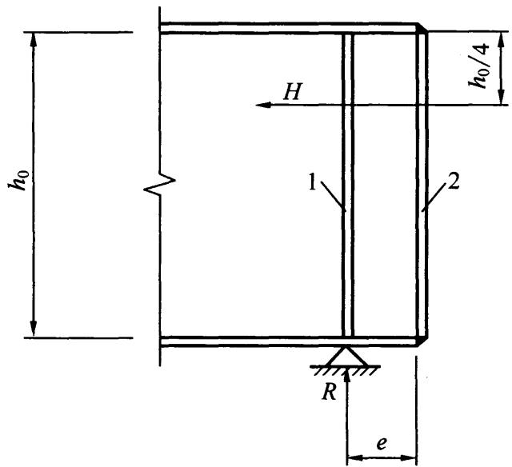  
1—加劲肋；2—封头肋板

## 6.5 腹板开孔要求

6.5.1 腹板开孔梁应满足整体稳定及局部稳定要求，并应进行下列计算：

1 实腹及开孔截面处的受弯承载力验算；  
2 开孔处顶部及底部T形截面受弯剪承载力验算。

6.5.2 腹板开孔梁，当孔型为圆形或矩形时，应符合下列规定：

1 圆孔孔口直径不宜大于梁高的0.70倍，矩形孔口高度不宜大于梁高的0.50倍，矩形孔口长度不宜大于梁高及3倍孔高。  
2 相邻圆形孔口边缘间的距离不宜小于梁高的0.25倍，矩形孔口与相邻孔口的距离不宜小于梁高及矩形孔口长度。  
3 开孔处梁上下T形截面高度均不宜小于梁高的0.15倍，矩形孔口上下边缘至梁翼缘外皮的距离不宜小于梁高的0.25倍。  
4 开孔长度（或直径）与T形截面高度的比值不宜大于12。  
5 不应在距梁端相当于梁高范围内设孔，抗震设防的结构不应在隅撑与梁柱连接区域范围内设孔。  
6 开孔腹板补强宜符合下列规定：

1）圆形孔直径小于或等于 $1 / 3$ 梁高时，可不予补强。当大于 $1 / 3$ 梁高时，可用环形加劲肋加强[图6.5.2(a)]，也可用套管［图6.5.2（b)]或环形补强板[图6.5.2(c)]加强；

2）圆形孔口加劲肋截面不宜小于 $100\mathrm{mm} \times 10\mathrm{mm}$ ，加劲肋边缘至孔口边缘的距离不宜大于 $12\mathrm{mm}$ ；圆形孔口用套管补强时，其厚度不宜小于梁腹板厚度；用环形板补强时，若在梁腹板两侧设置，环形板的厚度可稍小于腹板厚度，其宽度可取 $75\mathrm{mm} \sim 125\mathrm{mm}$ ；

3）矩形孔口的边缘宜采用纵向和横向加劲肋加强，矩形孔口上下边缘的水平纵向加劲肋端部宜伸至孔口边缘

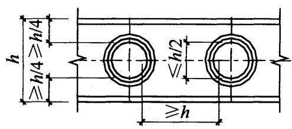

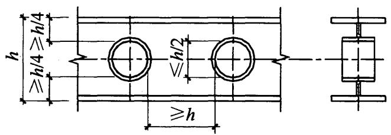

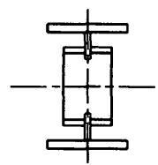  
(a)

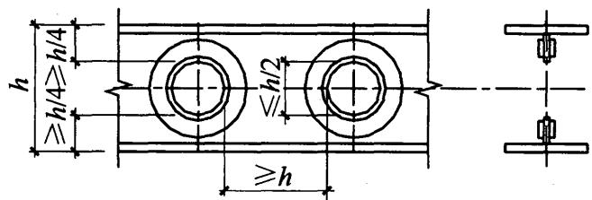  
(b)   
(c)   
图6.5.2 钢梁圆形孔口的补强

以外单面加劲肋宽度的 2 倍，当矩形孔口长度大于梁高时，其横向加劲肋应沿梁全高设置；

4）矩形孔口加劲肋截面总宽度不宜小于翼缘宽度的 $1 / 2$ 厚度不宜小于翼缘厚度；当孔口长度大于 $500\mathrm{mm}$ 时，应在梁腹板两面设置加劲肋。

7 腹板开孔梁材料的屈服强度不应大于 $420\mathrm{N} / \mathrm{mm}^2$ 。

## 6.6 梁的构造要求

6.6.1 当弧曲杆沿弧面受弯时宜设置加劲肋，在强度和稳定计算中应考虑其影响。  
6.6.2 焊接梁的翼缘宜采用一层钢板，当采用两层钢板时，外层钢板与内层钢板厚度之比宜为 $0.5 \sim 1.0$ 。不沿梁通长设置的外层钢板，其理论截断点处的外伸长度 $l_{1}$ 应符合下列规定：

1 端部有正面角焊缝：

当 $h_{\mathrm{f}} \geqslant 0.75t$ 时： $l_{1} \geqslant b$ (6.6.2-1)

当 $h_{\mathrm{f}} < 0.75t$ 时： $l_{1}\geqslant 1.5b$ (6.6.2-2)

2 端部无正面角焊缝：

$$l _{1} \geqslant 2 b \tag {6.6.2-3}$$

式中： $b$ ——外层翼缘板的宽度（mm）；

$t$ ——外层翼缘板的厚度（ $\mathrm{mm}$ ）；

$h_{\mathrm{f}}$ ——侧面角焊缝和正面角焊缝的焊脚尺寸（mm）。

# 7 轴心受力构件

## 7.1 截面强度计算

7.1.1 轴心受拉构件，当端部连接及中部拼接处组成截面的各板件都由连接件直接传力时，其截面强度计算应符合下列规定：

1 除采用高强度螺栓摩擦型连接者外，其截面强度应采用下列公式计算：

毛截面屈服：

$$\sigma = \frac {N}{A} \leqslant f \tag {7.1.1-1}$$

净截面断裂：

$$\sigma = \frac {N}{A _{\mathrm {n}}} \leqslant 0. 7 f _{\mathrm {u}} \tag {7.1.1-2}$$

2 采用高强度螺栓摩擦型连接的构件，其毛截面强度计算应采用式（7.1.1-1），净截面断裂应按下式计算：

$$\sigma = \left(1 - 0. 5 \frac {n _{1}}{n}\right) \frac {N}{A _{\mathrm {n}}} \leqslant 0. 7 f _{\mathrm {u}} \tag {7.1.1-3}$$

3 当构件为沿全长都有排列较密螺栓的组合构件时，其截面强度应按下式计算：

$$\frac {N}{A _{\mathrm {n}}} \leqslant f \tag {7.1.1-4}$$

式中： $N$ ——所计算截面处的拉力设计值（N）；

$f$ ——钢材的抗拉强度设计值（ $\mathrm{N} / \mathrm{mm}^2$ ）；

$A$ ——构件的毛截面面积（ $\mathrm{mm}^2$ ）；

$A_{\mathrm{n}}$ ——构件的净截面面积，当构件多个截面有孔时，取最不利的截面（ $\mathrm{mm}^2$ ）；

$f_{\mathrm{u}}$ ——钢材的抗拉强度最小值（ $\mathrm{N} / \mathrm{mm}^2$ ）；

$n$ ——在节点或拼接处，构件一端连接的高强度螺栓

数目；

$n_1$ ——所计算截面（最外列螺栓处）高强度螺栓数目。

7.1.2 轴心受压构件，当端部连接及中部拼接处组成截面的各板件都由连接件直接传力时，截面强度应按本标准式（7.1.1-1）计算。但含有虚孔的构件尚需在孔心所在截面按本标准式(7.1.1-2）计算。  
7.1.3 轴心受拉构件和轴心受压构件，当其组成板件在节点或拼接处并非全部直接传力时，应将危险截面的面积乘以有效截面系数 $\eta$ ，不同构件截面形式和连接方式的 $\eta$ 值应符合表7.1.3的规定。

表 7.1.3 轴心受力构件节点或拼接处危险截面有效截面系数  

| 构件截面形式 | 连接形式 | η | 图例 |
| --- | --- | --- | --- |
| 角钢 | 单边连接 | 0.85 |  |
| 工字形、H形 | 翼缘连接 | 0.90 |  |
| 工字形、H形 | 腹板连接 | 0.70 |  |

## 7.2 轴心受压构件的稳定性计算

7.2.1 除可考虑屈服后强度的实腹式构件外，轴心受压构件的稳定性计算应符合下式要求：

$$\frac {N}{\varphi A f} \leqslant 1. 0 \tag {7.2.1}$$

式中： $\varphi$ ——轴心受压构件的稳定系数（取截面两主轴稳定系数中的较小者），根据构件的长细比（或换算长细比）、钢材屈服强度和表7.2.1-1、表7.2.1-2的截面分类，按本标准附录D采用。

表 7.2.1-1 轴心受压构件的截面分类 (板厚 $t < {40}\mathrm{\;{mm}}$ )  

| 截面形式 | 截面形式 | 截面形式 | 对x轴 | 对y轴 |
| --- | --- | --- | --- | --- |
| x 轧制 | x 轧制 | x 轧制 | a类 | a类 |
| x 轧制 | b/h≤0.8 | b/h≤0.8 | a类 | b类 |
| x 轧制 | b/h>0.8 | b/h>0.8 | a*类 | b*类 |
| x 轧制等边角钢 | x 轧制等边角钢 | x 轧制等边角钢 | a*类 | a*类 |
| x 轧、翼缘为焰切边 | x 轧 | 焊接 | b类 | b类 |
| x 轧、翼缘为焰切边 | x 轧 | 焊接 | b类 | b类 |

续表 7.2.1-1  

| 截面形式 | 截面形式 | 截面形式 | 对x轴 | 对y轴 |
| --- | --- | --- | --- | --- |
| 轧制、焊接(板件宽厚比>20) | 轧制或焊接 | 轧制或焊接 | b类 | b类 |
| x y y x y y y y y y y y y y y y y y y y y y y y y y y y y y y y y y y y y y y y y y y y y y y y y y y y y y y y y y y y y y y y y y y y y y y y y y y y y y y y y y y y y y y y y y y y y y y y y y y y y y y y | x y y x y y y y y y y y y y y y y y y y y y y y y y y y y y y y y y y y y y y y y y y y y y y y y y y y y y y y y y y y y y y y y y y y y y y y y y y y y y y y y y y y y y y y y y y y y y y y y y | x y y x y y y 轧制截面和翼缘为 焰切边的焊接截面 | b类 | b类 |
| x y y x x x y y y y y y y y y y y y y y y y y y y y y y y y y y y y y y y y y y y y y y y y y y y y y y y y y y y y y y y y y y y y y y y y y y y y y y y y y y y y y y y y y y y y y y y y y y y y y y y y y y | y y y x y y y y y y y y y y y y y y y y y y y y y y y y y y y y y y y y y y y y y y y y y y y y y y y y y y y y y y y y y y y y y y y y y y y y y y y y y y y y y y y y y y y y y y y y y y y y y y y y | x y y y y y y y y y y y y y y y y y y y y y y y y y y y y y y y y y y y y y y y y y y y y y y y y y y y x y y y y y y y y y y y y y y y y y y y y y y y y y y y y y y y y y y y y y y y y y y y y y y y y y g构式 | x y y y y y y y y y y y y y y y y y y y y y y y y y y y y y y y y y y y y y y y y y y y y y y y y y | b类 |
| x y y x y y y x y y y x y y y x y y y x y y y x y y y x y y y x y y y x y y y x y y y x y y y x y y y x y y y x y y y x y y y x y y y x y y y x y y y x y y y x y y y x x y y x x y y x x y y x x y y x x y y x x y y x x y y x x y y x x y y x x y y x x y y x x y y x x y y x x y y x x y y x x y y x x y y x x y y x x y y x x y y x y y y x y y y x y y y x y y y x y y y x y y y x y y y x y y y x y y y x y y y x y y y x y y y x y y y x y y y x y y y x y y y x y y y x y y y x y y y x | x y y y y y y y y y y y y y y y y y y y y y y y y y y y y y y y y y y y y y y y y y y y y y y y y y |  |  |  |

注：1 a* 类含义为 Q235 钢取 b 类，Q345、Q390、Q420 和 Q460 钢取 a 类；b* 类含义为 Q235 钢取 c 类，Q345、Q390、Q420 和 Q460 钢取 b 类；  
2 无对称轴且剪心和形心不重合的截面，其截面分类可按有对称轴的类似截面确定，如不等边角钢采用等边角钢的类别；当无类似截面时，可取c类。

表 7.2.1-2 轴心受压构件的截面分类 (板厚 $t \geqslant 40\mathrm{\;{mm}}$ )  

| 截面形式 | 截面形式 | 对x轴 | 对y轴 |
| --- | --- | --- | --- |
| 轧制工字形或H形截面 | t<80mm | b类 | c类 |
| 轧制工字形或H形截面 | t≥80mm | c类 | d类 |
| 焊接工字形截面 | 翼缘为焰切边 | b类 | b类 |
| 焊接工字形截面 | 翼缘为轧制或剪切边 | c类 | d类 |
| 焊接箱形截面 | 板件宽厚比>20 | b类 | b类 |
| 焊接箱形截面 | 板件宽厚比≤20 | c类 | c类 |

7.2.2 实腹式构件的长细比 $\lambda$ 应根据其失稳模式，由下列公式确定：

1 截面形心与剪心重合的构件：

1）当计算弯曲屈曲时，长细比按下列公式计算：

$$\lambda_{\mathrm {x}} = \frac {l _{0 \mathrm {x}}}{i _{\mathrm {x}}} \tag {7.2.2-1}$$

$$\lambda_{\mathrm {y}} = \frac {l _{0 \mathrm {y}}}{i _{\mathrm {y}}} \tag {7.2.2-2}$$

式中： $l_{0\mathrm{x}}$ 、 $l_{0\mathrm{y}}$ ——分别为构件对截面主轴 $x$ 和 $y$ 的计算长度，根据本标准第7.4节的规定采用（ $\mathrm{mm}$ ）；

$i_{\mathrm{x}}, i_{\mathrm{y}}$ ——分别为构件截面对主轴 $x$ 和 $y$ 的回转半径 $(\mathrm{mm})$ 。

2）当计算扭转屈曲时，长细比应按下式计算，双轴对称十字形截面板件宽厚比不超过 $15\varepsilon_{\mathrm{k}}$ 者，可不计算扭转屈曲。

$$\lambda_{z} = \sqrt {\frac {I _{0}}{I _{t} / 2 5 . 7 + I _{\omega} / l _{\omega} ^{2}}} \tag {7.2.2-3}$$

式中： $I_{0}, I_{t}, I_{\omega}$ ——分别为构件毛截面对剪心的极惯性矩 $(\mathrm{mm}^{4})$ 、自由扭转常数（ $\mathrm{mm}^{4}$ ）和扇性惯性矩 $(\mathrm{mm}^{6})$ ，对十字形截面可近似取 $I_{\omega} = 0$ ； $l_{\omega}$ ——扭转屈曲的计算长度，两端铰支且端截面可自由翘曲者，取几何长度 $l$ ；两端嵌固且端部截面的翘曲完全受到约束者，取 $0.5l$ （20（mm）。

2 截面为单轴对称的构件：

1）计算绕非对称主轴的弯曲屈曲时，长细比应由式(7.2.2-1)、式（7.2.2-2）计算确定。计算绕对称主轴的弯扭屈曲时，长细比应按下式计算确定：

$$\lambda_{\mathrm {y z}} = \left[ \frac {\left(\lambda_{\mathrm {y}} ^{2} + \lambda_{\mathrm {z}} ^{2}\right) + \sqrt {\left(\lambda_{\mathrm {y}} ^{2} + \lambda_{\mathrm {z}} ^{2}\right) ^{2} - 4 \left(1 - \frac {y _{\mathrm {s}} ^{2}}{i _{0} ^{2}}\right) \lambda_{\mathrm {y}} ^{2} \lambda_{\mathrm {z}} ^{2}}}{2} \right] ^{1 / 2} \tag {7.2.2-4}$$

式中： $y_{\mathrm{s}}$ ——截面形心至剪心的距离（mm）；

$i_0$ ——截面对剪心的极回转半径，单轴对称截面 $i_0^2 = y_s^2 + i_x^2 + i_y^2$ (mm);

$\lambda_{z}$ ——扭转屈曲换算长细比，由式（7.2.2-3）确定。

2）等边单角钢轴心受压构件当绕两主轴弯曲的计算长度相等时，可不计算弯扭屈曲。塔架单角钢压杆应符合本标准第7.6节的相关规定。  
3）双角钢组合T形截面构件绕对称轴的换算长细比 $\lambda_{yz}$ 可按下列简化公式确定：

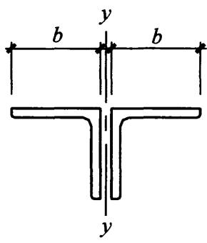  
(a)

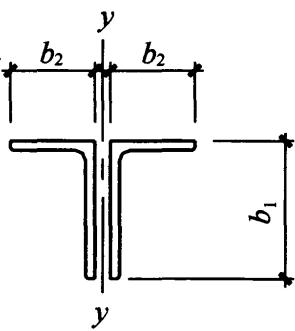  
(b)

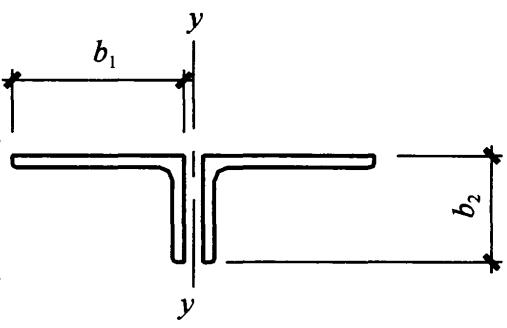  
(c)   
图7.2.2-1 双角钢组合T形截面

$b$ 一等边角钢肢宽度； $b_{1}$ 一不等边角钢长肢宽度； $b_{2}$ 一不等边角钢短肢宽度

等边双角钢[图7.2.2-1（a）]：

当 $\lambda_{\mathrm{y}}\geqslant \lambda_{\mathrm{z}}$ 时：

$$\lambda_{y z} = \lambda_{y} \left[ 1 + 0. 1 6 \left(\frac {\lambda_{z}}{\lambda_{y}}\right) ^{2} \right] \tag {7.2.2-5}$$

当 $\lambda_{\mathrm{y}} < \lambda_{\mathrm{z}}$ 时：

$$\lambda_{y z} = \lambda_{z} \left[ 1 + 0. 1 6 \left(\frac {\lambda_{y}}{\lambda_{z}}\right) ^{2} \right] \tag {7.2.2-6}$$

$$\lambda_{z} = 3. 9 \frac {b}{t} \tag {7.2.2-7}$$

长肢相并的不等边双角钢[图7.2.2-1（b）]:

当 $\lambda_{\mathrm{y}}\geqslant \lambda_{\mathrm{z}}$ 时：

$$\lambda_{y z} = \lambda_{y} \left[ 1 + 0. 2 5 \left(\frac {\lambda_{z}}{\lambda_{y}}\right) ^{2} \right] \tag {7.2.2-8}$$

当 $\lambda_{\mathrm{y}} < \lambda_{\mathrm{z}}$ 时：

$$\lambda_{y z} = \lambda_{z} \left[ 1 + 0. 2 5 \left(\frac {\lambda_{y}}{\lambda_{z}}\right) ^{2} \right] \tag {7.2.2-9}$$

$$\lambda_{z} = 5. 1 \frac {b _{2}}{t} \tag {7.2.2-10}$$

短肢相并的不等边双角钢[图7.2.2-1（c）]：

当 $\lambda_{\mathrm{y}}\geqslant \lambda_{\mathrm{z}}$ 时：

$$\lambda_{y z} = \lambda_{y} \left[ 1 + 0. 0 6 \left(\frac {\lambda_{z}}{\lambda_{y}}\right) ^{2} \right] \tag {7.2.2-11}$$

当 $\lambda_{\mathrm{y}} < \lambda_{\mathrm{z}}$ 时：

$$\lambda_{y z} = \lambda_{z} \left[ 1 + 0. 0 6 \left(\frac {\lambda_{y}}{\lambda_{z}}\right) ^{2} \right] \tag {7.2.2-12}$$

$$\lambda_{z} = 3. 7 \frac {b _{1}}{t} \tag {7.2.2-13}$$

3 截面无对称轴且剪心和形心不重合的构件，应采用下列换算长细比：

$$\lambda_{\mathrm {x y z}} = \pi \sqrt {\frac {E A}{N _{\mathrm {x y z}}}} \tag {7.2.2-14}$$

$$\left(N _{\mathrm {x}} - N _{\mathrm {x y z}}\right) \left(N _{\mathrm {y}} - N _{\mathrm {x y z}}\right) \left(N _{\mathrm {z}} - N _{\mathrm {x y z}}\right) - N _{\mathrm {x y z}} ^{2}$$

$$\left(N _{\mathrm {x}} - N _{\mathrm {x y z}}\right) \left(\frac {y _{\mathrm {s}}}{i _{0}}\right) ^{2} - N _{\mathrm {x y z}} ^{2} \left(N _{\mathrm {y}} - N _{\mathrm {x y z}}\right) \left(\frac {x _{\mathrm {s}}}{i _{0}}\right) ^{2} = 0 \tag {7.2.2-15}$$

$$i _{0} ^{2} = i _{\mathrm {x}} ^{2} + i _{\mathrm {y}} ^{2} + x _{\mathrm {s}} ^{2} + y _{\mathrm {s}} ^{2} \tag {7.2.2-16}$$

$$N _{\mathrm {x}} = \frac {\pi^{2} E A}{\lambda_{\mathrm {x}} ^{2}} \tag {7.2.2-17}$$

$$N _{\mathrm {y}} = \frac {\pi^{2} E A}{\lambda_{\mathrm {y}} ^{2}} \tag {7.2.2-18}$$

$$N _{z} = \frac {1}{i _{0} ^{2}} \left(\frac {\pi^{2} E I _{\omega}}{l _{\omega} ^{2}} + G I _{t}\right) \tag {7.2.2-19}$$

式中： $N_{xyz}$ ——弹性完善杆的弯扭屈曲临界力，由式（7.2.2-15）确定（N）：

$x_{\mathrm{s}}$ 、 $y_{\mathrm{s}}$ ——截面剪心的坐标（mm）；

$i_0$ ——截面对剪心的极回转半径（mm）；

$N_{\mathbf{x}}$ 、 $N_{\mathrm{y}}$ 、 $N_{z}$ ——分别为绕 $x$ 轴和 $y$ 轴的弯曲屈曲临界力和扭转屈曲临界力（N）；

$E, G$ ——分别为钢材弹性模量和剪变模量（ $\mathrm{N} / \mathrm{mm}^2$ ）。

4 不等边角钢轴心受压构件的换算长细比可按下列简化公

式确定（图7.2.2-2）：

当 $\lambda_{\mathrm{v}}\geqslant \lambda_{\mathrm{z}}$ 时：

$$\lambda_{\mathrm {x y z}} = \lambda_{\mathrm {v}} \left[ 1 + 0. 2 5 \left(\frac {\lambda_{\mathrm {z}}}{\lambda_{\mathrm {v}}}\right) ^{2} \right] \tag {7.2.2-20}$$

当 $\lambda_{\mathrm{v}} < \lambda_{\mathrm{z}}$ 时：

$$\lambda_{\mathrm {x y z}} = \lambda_{\mathrm {z}} \left[ 1 + 0. 2 5 \left(\frac {\lambda_{\mathrm {v}}}{\lambda_{\mathrm {z}}}\right) ^{2} \right] \tag {7.2.2-21}$$

$$\lambda_{z} = 4. 2 1 \frac {b _{1}}{t} \tag {7.2.2-22}$$

7.2.3 格构式轴心受压构件的稳定性应按本标准式（7.2.1）计算，对实轴的长细比应按本标准式(7.2.2-1）或式（7.2.2-2）计算，对虚轴［图7.2.3（a)]的 $x$ 轴及图7.2.3（b）、图7.2.3（c）的 $x$ 轴和 $y$ 轴应取换算长细比。换算长细比应按下列公式计算：

1 双肢组合构件[图7.2.3(a)]：

图7.2.2-2 不等边角钢  
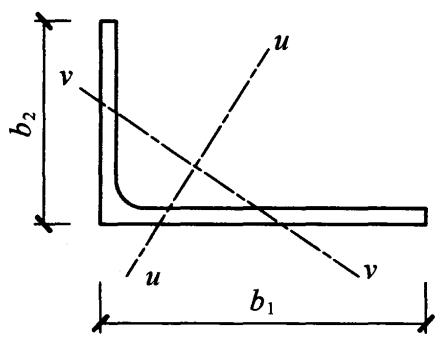  
注： $\pmb{\nu}$ 轴为角钢的弱轴， $b_{1}$ 为角钢长肢宽度

当缀件为缀板时:

$$\lambda_{0 \mathbf {x}} = \sqrt {\lambda_{\mathbf {x}} ^{2} + \lambda_{1} ^{2}} \tag {7.2.3-1}$$

当缀件为缀条时：

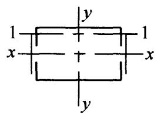  
(a) 双肢组合构件

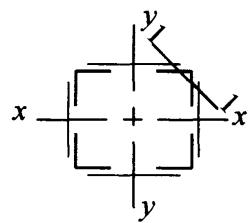  
(b) 四肢组合构件

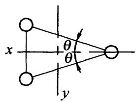  
(c) 三肢组合构件  
图7.2.3 格构式组合构件截面

$$\lambda_{0 x} = \sqrt {\lambda_{x} ^{2} + 2 7 \frac {A}{A _{1 x}}} \tag {7.2.3-2}$$

式中： $\lambda_{\mathrm{x}}$ ——整个构件对 $x$ 轴的长细比；

$\lambda_{1}$ ——分肢对最小刚度轴 1-1 的长细比，其计算长度取为：焊接时，为相邻两缀板的净距离；螺栓连接时，为相邻两缀板边缘螺栓的距离；

$A_{1x}$ ——构件截面中垂直于 $x$ 轴的各斜缀条毛截面面积之和 $(\mathrm{mm}^2)$ 。

2 四肢组合构件 [图 7.2.3 (b)]:

当缀件为缀板时:

$$\lambda_{0 x} = \sqrt {\lambda_{x} ^{2} + \lambda_{1} ^{2}} \tag {7.2.3-3}$$

$$\lambda_{0 \mathrm {y}} = \sqrt {\lambda_{\mathrm {y}} ^{2} + \lambda_{1} ^{2}} \tag {7.2.3-4}$$

当缀件为缀条时:

$$\lambda_{0 x} = \sqrt {\lambda_{x} ^{2} + 4 0 \frac {A}{A _{1 x}}} \tag {7.2.3-5}$$

$$\lambda_{0 \mathrm {y}} = \sqrt {\lambda_{\mathrm {y}} ^{2} + 4 0 \frac {A}{A _{1 \mathrm {y}}}} \tag {7.2.3-6}$$

式中： $\lambda_{y}$ ——整个构件对 $y$ 轴的长细比；

$A_{\mathrm{ly}}$ ——构件截面中垂直于 $y$ 轴的各斜缀条毛截面面积之和 $(\mathrm{mm}^{2})$ 。

3 缀件为缀条的三肢组合构件[图7.2.3（c）]：

$$\lambda_{0 x} = \sqrt {\lambda_{x} ^{2} + \frac {4 2 A}{A _{1} (1 . 5 - \cos^{2} \theta)}} \tag {7.2.3-7}$$

$$\lambda_{0 y} = \sqrt {\lambda_{y} ^{2} + \frac {4 2 A}{A _{1} \cos^{2} \theta}} \tag {7.2.3-8}$$

式中： $A_{1}$ ——构件截面中各斜缀条毛截面面积之和（ $\mathrm{mm}^2$ ）；

$\theta$ ——构件截面内缀条所在平面与 $x$ 轴的夹角。

7.2.4 缀件面宽度较大的格构式柱宜采用缀条柱，斜缀条与构件轴线间的夹角应为 $40^{\circ} \sim 70^{\circ}$ 。缀条柱的分肢长细比 $\lambda_{1}$ 不应大于构件两方向长细比较大值 $\lambda_{\max}$ 的0.7倍，对虚轴取换算长细比。格构式柱和大型实腹式柱，在受有较大水平力处和运送单元的端部应设置横隔，横隔的间距不宜大于柱截面长边尺寸的9倍且不宜大于 $8\mathrm{m}$ 。

7.2.5 缀板柱的分肢长细比 $\lambda_{1}$ 不应大于 $40\varepsilon_{\mathrm{k}}$ ，并不应大于 $\lambda_{\max}$ 的0.5倍，当 $\lambda_{\max} < 50$ 时，取 $\lambda_{\max} = 50$ 。缀板柱中同一截面处缀板或型钢横杆的线刚度之和不得小于柱较大分肢线刚度的6倍。  
7.2.6 用填板连接而成的双角钢或双槽钢构件，采用普通螺栓连接时应按格构式构件进行计算；除此之外，可按实腹式构件进行计算，但受压构件填板间的距离不应超过 $40i$ ，受拉构件填板间的距离不应超过 $80i$ 。 $i$ 为单肢截面回转半径，应按下列规定采用：

1 当为图 7.2.6（a）、图 7.2.6（b）所示的双角钢或双槽钢截面时，取一个角钢或一个槽钢对与填板平行的形心轴的回转半径；  
2 当为图7.2.6（c）所示的十字形截面时，取一个角钢的最小回转半径。

受压构件的两个侧向支承点之间的填板数不应少于2个。

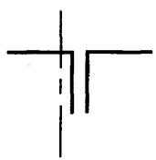  
(a) T字形双角钢截面

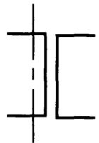  
(b）双槽钢截面

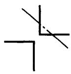  
(c) 十字形双角钢截面  
图7.2.6 计算截面回转半径时的轴线示意图

7.2.7 轴心受压构件剪力 $V$ 值可认为沿构件全长不变，格构式轴心受压构件的剪力 $V$ 应由承受该剪力的缀材面（包括用整体板连接的面）分担，其值应按下式计算：

$$V = \frac {A f}{8 5 \varepsilon_{\mathrm {k}}} \tag {7.2.7}$$

7.2.8 两端铰支的梭形圆管或方管状截面轴心受压构件（图7.2.8）的稳定性应按本标准式（7.2.1）计算。其中 $A$ 取端截面的截面面积 $A_{1}$ ，稳定系数 $\varphi$ 应根据按下列公式计算的换算长细比 $\lambda_{\mathrm{e}}$ 确定：

$$\lambda_{\mathrm {e}} = \frac {l _{0} / i _{1}}{(1 + \gamma) ^{3 / 4}} \tag {7.2.8-1}$$

$$l _{0} = \frac {l}{2} [ 1 + (1 + 0. 8 5 3 \gamma) ^{- 1} ] \tag {7.2.8-2}$$

$$\gamma = (D _{2} - D _{1}) / D _{1} \text {或} (b _{2} - b _{1}) / b _{1} \tag {7.2.8-3}$$

式中： $l_{0}$ ——构件计算长度（mm）；

$i_{1}$ ——端截面回转半径（mm）；

$\gamma$ ——构件楔率；

$D_{2}, b_{2}$ ——分别为跨中截面圆管外径和方管边长（ $\mathrm{mm}$ ）；

$D_{1}, b_{1}$ ——分别为端截面圆管外径和方管边长（ $\mathrm{mm}$ ）。

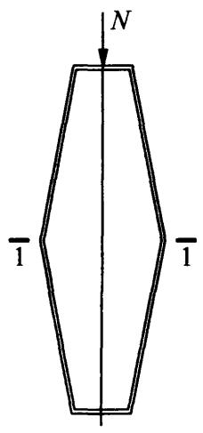

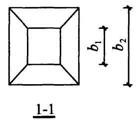  
图7.2.8 梭形管状轴心受压构件

7.2.9 钢管梭形格构柱的跨中截面应设置横隔。横隔可采用水平放置的钢板且与周边缀管焊接，也可采用水平放置的钢管并使跨中截面成为稳定截面。两端铰支的三肢钢管梭形格构柱应按本

标准式（7.2.1）计算整体稳定。稳定系数 $\varphi$ 应根据下列公式计算的换算长细比 $\lambda_0$ 确定：

$$\lambda_{0} = \pi \sqrt {\frac {3 A _{\mathrm {s}} E}{N _{\mathrm {c r}}}} \tag {7.2.9-1}$$

$$N _{\mathrm {c r}} = \min  \left(N _{\mathrm {c r}, \mathrm {s}}, N _{\mathrm {c r}, \mathrm {a}}\right) \tag {7.2.9-2}$$

$N_{\mathrm{cr,s}}$ 应按下列公式计算：

$$N _{\mathrm {c r}, \mathrm {s}} = N _{\mathrm {c r} 0, \mathrm {s}} / \left(1 + \frac {N _{\mathrm {c r} 0 , \mathrm {s}}}{K _{\mathrm {v} , \mathrm {s}}}\right) \tag {7.2.9-3}$$

$$N _{\mathrm {c r} 0, \mathrm {s}} = \frac {\pi^{2} E I _{0}}{L ^{2}} \left(1 + 0. 7 2 \eta_{1} + 0. 2 8 \eta_{2}\right) \tag {7.2.9-4}$$

$N_{\mathrm{cr,a}}$ 应按下列公式计算：

$$N _{\mathrm {c r}, \mathrm {a}} = N _{\mathrm {c r} 0, \mathrm {a}} / \left(1 + \frac {N _{\mathrm {c r} 0 , \mathrm {a}}}{K _{\mathrm {v} , \mathrm {a}}}\right) \tag {7.2.9-5}$$

$$N _{\mathrm {c r} 0, \mathrm {a}} = \frac {4 \pi^{2} E I _{0}}{L ^{2}} (1 + 0. 4 8 \eta_{1} + 0. 1 2 \eta_{2}) \tag {7.2.9-6}$$

$\eta_{1}, \eta_{2}$ 应按下列公式计算：

$$\eta_{1} = \left(4 I _{\mathrm {m}} - I _{1} - 3 I _{0}\right) / I _{0} \tag {7.2.9-7}$$

$$\eta_{2} = 2 \left(I _{0} + I _{1} - 2 I _{\mathrm {m}}\right) / I _{0} \tag {7.2.9-8}$$

$$I _{0} = 3 I _{\mathrm {s}} + 0. 5 b _{0} ^{2} A _{\mathrm {s}} \tag {7.2.9-9}$$

$$I _{\mathrm {m}} = 3 I _{\mathrm {s}} + 0. 5 b _{\mathrm {m}} ^{2} A _{\mathrm {s}} \tag {7.2.9-10}$$

$$I _{1} = 3 I _{\mathrm {s}} + 0. 5 b _{1} ^{2} A _{\mathrm {s}} \tag {7.2.9-11}$$

$$K _{\mathrm {v}, \mathrm {s}} = 1 / \left(\frac {l _{\mathrm {s} 0} b _{0}}{1 8 E I _{\mathrm {d}}} + \frac {5 l _{\mathrm {s} 0} ^{2}}{1 4 4 E I _{\mathrm {s}}}\right) \tag {7.2.9-12}$$

$$K _{\mathrm {v}, \mathrm {a}} = 1 / \left(\frac {l _{\mathrm {s} 0} b _{\mathrm {m}}}{1 8 E I _{\mathrm {d}}} + \frac {5 l _{\mathrm {s} 0} ^{2}}{1 4 4 E I _{\mathrm {s}}}\right) \tag {7.2.9-13}$$

式中： $A_{s}$ ——单根分肢的截面面积 $(\mathrm{mm}^2)$ ；

$N_{\mathrm{cr}}$ 、 $N_{\mathrm{cr,s}}$ 、 $N_{\mathrm{cr,a}}$ ——分别为屈曲临界力、对称屈曲模态与反对称屈曲模态对应的屈曲临界力（N）；

$I_{0}, I_{\mathrm{m}}, I_{1}$ ——分别为钢管梭形格构柱柱端、1/4跨处以及跨中截面对应的惯性矩（图7.2.9） $(\mathrm{mm}^4)$ ；

$K_{\mathrm{v,s}}$ 、 $K_{\mathrm{v,a}}$ ——分别为对称屈曲与反对称屈曲对应的截面抗剪刚度（N）；

$\eta_{1}$ 、 $\eta_{2}$ ——与截面惯性矩有关的计算系数；

$b_{0}, b_{\mathrm{m}}, b_{1}$ ——分别为梭形柱柱端、1/4跨处和跨中截面的边长（mm）；

$l_{\mathrm{s0}}$ ——梭形柱节间高度（mm）；

$I_{\mathrm{d}}$ 、 $I_{\mathrm{s}}$ ——横缀杆和弦杆的惯性矩（ $\mathrm{mm}^4$ ）；

$A_{\mathrm{s}}$ ——单个分肢的截面面积 $(\mathrm{mm}^2)$ ;

$E$ ——材料的弹性模量（ $\mathrm{N} / \mathrm{mm}^2$ ）。

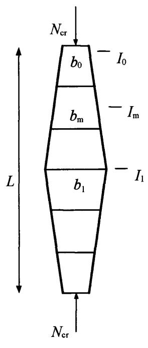

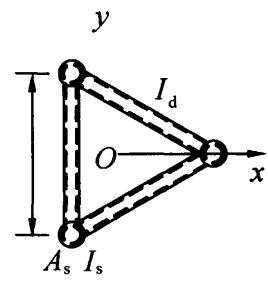  
图7.2.9 钢管梭形格构柱

## 7.3 实腹式轴心受压构件的局部稳定和屈曲后强度

7.3.1 实腹轴心受压构件要求不出现局部失稳者，其板件宽厚比应符合下列规定：

1 H形截面腹板

$$h _{0} / t _{\mathrm {w}} \leqslant (2 5 + 0. 5 \lambda) \varepsilon_{\mathrm {k}} \tag {7.3.1-1}$$

式中： $\lambda$ ——构件的较大长细比；当 $\lambda < 30$ 时，取为30；当 $\lambda > 100$ 时，取为100；

$h_0, t_{\mathrm{w}}$ ——分别为腹板计算高度和厚度，按本标准表3.5.1注2取值（mm）。

2 H形截面翼缘

$$b / t _{\mathrm {f}} \leqslant (1 0 + 0. 1 \lambda) \varepsilon_{\mathrm {k}} \tag {7.3.1-2}$$

式中： $b$ 、 $t_{\mathrm{f}}$ ——分别为翼缘板自由外伸宽度和厚度，按本标准表3.5.1注2取值。

3 箱形截面壁板

$$b / t \leqslant 4 0 \varepsilon_{k} \tag {7.3.1-3}$$

式中： $b$ ——壁板的净宽度，当箱形截面设有纵向加劲肋时，为壁板与加劲肋之间的净宽度。

4 T形截面翼缘宽厚比限值应按式（7.3.1-2）确定。

T形截面腹板宽厚比限值为：

热轧剖分T形钢

$$h _{0} / t _{\mathrm {w}} \leqslant (1 5 + 0. 2 \lambda) \varepsilon_{\mathrm {k}} \tag {7.3.1-4}$$

焊接T形钢

$$h _{0} / t _{\mathrm {w}} \leqslant (1 3 + 0. 1 7 \lambda) \varepsilon_{\mathrm {k}} \tag {7.3.1-5}$$

对焊接构件， $h_0$ 取腹板高度 $h_{\mathrm{w}}$ ；对热轧构件， $h_0$ 取腹板平直段长度，简要计算时，可取 $h_0 = h_{\mathrm{w}} - t_{\mathrm{f}}$ ，但不小于 $(h_{\mathrm{w}} - 20)\mathrm{mm}$ 。

5 等边角钢轴心受压构件的肢件宽厚比限值为：

当 $\lambda \leqslant 80\varepsilon_{\mathrm{k}}$ 时：

$$w / t \leqslant 1 5 \varepsilon_{\mathrm {k}} \tag {7.3.1-6}$$

当 $\lambda > 80\varepsilon_{\mathrm{k}}$ 时：

$$w / t \leqslant 5 \varepsilon_{\mathrm {k}} + 0. 1 2 5 \lambda \tag {7.3.1-7}$$

式中： $w, t$ ——分别为角钢的平板宽度和厚度，简要计算时 $w$ 可取为 $b - 2t$ ， $b$ 为角钢宽度；

$\lambda$ ——按角钢绕非对称主轴回转半径计算的长细比。

6 圆管压杆的外径与壁厚之比不应超过 $100 \varepsilon_{\mathrm{k}}^{2}$ 。

7.3.2 当轴心受压构件的压力小于稳定承载力 $\varphi A f$ 时，可将其板件宽厚比限值由本标准第7.3.1条相关公式算得后乘以放大系数 $\alpha = \sqrt{\varphi A f / N}$ 确定。  
7.3.3 板件宽厚比超过本标准第 7.3.1 条规定的限值时，可采用纵向加劲肋加强；当可考虑屈曲后强度时，轴心受压杆件的强度和稳定性可按下列公式计算：

强度计算

$$\frac {N}{A _{\mathrm {n e}}} \leqslant f \tag {7.3.3-1}$$

稳定性计算

$$\frac {N}{\varphi A _{\mathrm {e}} f} \leqslant 1. 0 \tag {7.3.3-2}$$

$$A _{\mathrm {n e}} = \sum \rho_{i} A _{\mathrm {n i}} \tag {7.3.3-3}$$

$$A _{\mathrm {e}} = \sum \rho_{i} A _{i} \tag {7.3.3-4}$$

式中： $A_{\mathrm{ne}}$ 、 $A_{\mathrm{e}}$ ——分别为有效净截面面积和有效毛截面面积 $(\mathrm{mm}^2)$ ；

$A_{ni}, A_i$ ——分别为各板件净截面面积和毛截面面积 $(\mathrm{mm}^2)$ ；

$\varphi$ ——稳定系数，可按毛截面计算；

$\rho_{i}$ ——各板件有效截面系数，可按本标准第7.3.4条的规定计算。

7.3.4 H形、工字形、箱形和单角钢截面轴心受压构件的有效截面系数 $\rho$ 可按下列规定计算：

1 箱形截面的壁板、H形或工字形的腹板：

1）当 $b / t \leqslant 42\varepsilon_{\mathrm{k}}$ 时：

$$\rho = 1. 0 \tag {7.3.4-1}$$

2）当 $b / t > 42\varepsilon_{\mathrm{k}}$ 时：

$$\rho = \frac {1}{\lambda_{\mathrm {n} , \mathrm {p}}} \left(1 - \frac {0 . 1 9}{\lambda_{\mathrm {n} , \mathrm {p}}}\right) \tag {7.3.4-2}$$

$$\lambda_{\mathrm {n}, \mathrm {p}} = \frac {b / t}{5 6 . 2 \varepsilon_{\mathrm {k}}} \tag {7.3.4-3}$$

当 $\lambda > 52\varepsilon_{\mathrm{k}}$ 时：

$$\rho \geqslant (2 9 \varepsilon_{\mathrm {k}} + 0. 2 5 \lambda) t / b \tag {7.3.4-4}$$

式中： $b$ 、 $t$ ——分别为壁板或腹板的净宽度和厚度。

2 单角钢：

当 $w / t > 15\varepsilon_{\mathrm{k}}$ 时：

$$\rho = \frac {1}{\lambda_{\mathrm {n} , \mathrm {p}}} \left(1 - \frac {0 . 1}{\lambda_{\mathrm {n} , \mathrm {p}}}\right) \tag {7.3.4-5}$$

$$\lambda_{\mathrm {n}, \mathrm {p}} = \frac {w / t}{1 6 . 8 \varepsilon_{\mathrm {k}}} \tag {7.3.4-6}$$

当 $\lambda > 80\varepsilon_{\mathrm{k}}$ 时：

$$\rho \geqslant \left(5 \varepsilon_{\mathrm {k}} + 0. 1 3 \lambda\right) t / w \tag {7.3.4-7}$$

7.3.5 H形、工字形和箱形截面轴心受压构件的腹板，当用纵向加劲肋加强以满足宽厚比限值时，加劲肋宜在腹板两侧成对配置，其一侧外伸宽度不应小于 $10t_{\mathrm{w}}$ ，厚度不应小于 $0.75t_{\mathrm{w}}$ 。

## 7.4 轴心受力构件的计算长度和容许长细比

7.4.1 确定桁架弦杆和单系腹杆的长细比时，其计算长度 $l_{0}$ 应按表7.4.1-1的规定采用；采用相贯焊接连接的钢管桁架，其构件计算长度 $l_{0}$ 可按表7.4.1-2的规定取值；除钢管结构外，无节点板的腹杆计算长度在任意平面内均应取其等于几何长度。桁架再分式腹杆体系的受压主斜杆及K形腹杆体系的竖杆等，在桁架平面内的计算长度则取节点中心间距离。

表 7.4.1-1 桁架弦杆和单系腹杆的计算长度 $l_{0}$   

| 弯曲方向 | 弦杆 | 腹杆 | 腹杆 |
| --- | --- | --- | --- |
| 弯曲方向 | 弦杆 | 支座斜杆和支座竖杆 | 其他腹杆 |
| 桁架平面内 | l | l | 0.8l |
| 桁架平面外 | l1 | l | l |
| 斜平面 | - | l | 0.9l |

注：1 $l$ 为构件的几何长度（节点中心间距离）， $l_{1}$ 为桁架弦杆侧向支承点之间的距离；  
2 斜平面系指与桁架平面斜交的平面，适用于构件截面两主轴均不在桁架平面内的单角钢腹杆和双角钢十字形截面腹杆。

表 7.4.1-2 钢管桁架构件计算长度 $l_{0}$   

| 桁架类别 | 弯曲方向 | 弦杆 | 腹杆 | 腹杆 |
| --- | --- | --- | --- | --- |
| 桁架类别 | 弯曲方向 | 弦杆 | 支座斜杆和支座竖杆 | 其他腹杆 |
| 平面桁架 | 平面内 | 0.9l | l | 0.8l |
| 平面桁架 | 平面外 | l1 | l | l |
| 立体桁架 | 立体桁架 | 0.9l | l | 0.8l |

注：1 $l_{1}$ 为平面外无支撑长度， $l$ 为杆件的节间长度；  
2 对端部缩头或压扁的圆管腹杆，其计算长度取 $l$   
3 对于立体桁架，弦杆平面外的计算长度取0.9l，同时尚应以 $0.9l_{1}$ 按格构式压杆验算其稳定性。

7.4.2 确定在交叉点相互连接的桁架交叉腹杆的长细比时，在桁架平面内的计算长度应取节点中心到交叉点的距离；在桁架平面外的计算长度，当两交叉杆长度相等且在中点相交时，应按下列规定采用：

1 压杆。

1）相交另一杆受压，两杆截面相同并在交叉点均不中断，则：

$$l _{0} = l \sqrt {\frac {1}{2} \left(1 + \frac {N _{0}}{N}\right)} \tag {7.4.2-1}$$

2）相交另一杆受压，此另一杆在交叉点中断但以节点板

搭接，则：

$$l _{0} = l \sqrt {1 + \frac {\pi^{2}}{1 2} \cdot \frac {N _{0}}{N}} \tag {7.4.2-2}$$

3）相交另一杆受拉，两杆截面相同并在交叉点均不中断，则：

$$l _{0} = l \sqrt {\frac {1}{2} \left(1 - \frac {3}{4} \cdot \frac {N _{0}}{N}\right)} \geqslant 0. 5 l \tag {7.4.2-3}$$

4）相交另一杆受拉，此拉杆在交叉点中断但以节点板搭接，则：

$$l _{0} = l \sqrt {1 - \frac {3}{4} \cdot \frac {N _{0}}{N}} \geqslant 0. 5 l \tag {7.4.2-4}$$

5）当拉杆连续而压杆在交叉点中断但以节点板搭接，若 $N_0 \geqslant N$ 或拉杆在桁架平面外的弯曲刚度 $EI_y \geqslant \frac{3N_0l^2}{4\pi^2}\left(\frac{N}{N_0} - 1\right)$ 时，取 $l_0 = 0.5l$ 。

式中： $l$ ——桁架节点中心间距离（交叉点不作为节点考虑） $(\mathrm{mm})$ ；

$N 、 N_{0}$ ——所计算杆的内力及相交另一杆的内力，均为绝对值；两杆均受压时，取 $N_{0} \leqslant N$ ，两杆截面应相同（N）。

2 拉杆, 应取 $l_{0} = l$ 。当确定交叉腹杆中单角钢杆件斜平面内的长细比时, 计算长度应取节点中心至交叉点的距离。当交叉腹杆为单边连接的单角钢时, 应按本标准第 7.6.2 条的规定确定杆件等效长细比。

7.4.3 当桁架弦杆侧向支承点之间的距离为节间长度的2倍（图7.4.3）且两节间的弦杆轴心压力不相同时，该弦杆在桁架平面外的计算长度应按下式确定（但不应小于 $0.5l_{1}$ ）：

$$l _{0} = l _{1} \left(0. 7 5 + 0. 2 5 \frac {N _{2}}{N _{1}}\right) \tag {7.4.3}$$

式中： $N_{1}$ ——较大的压力，计算时取正值；

$N_{2}$ ——较小的压力或拉力，计算时压力取正值，拉力取负值。

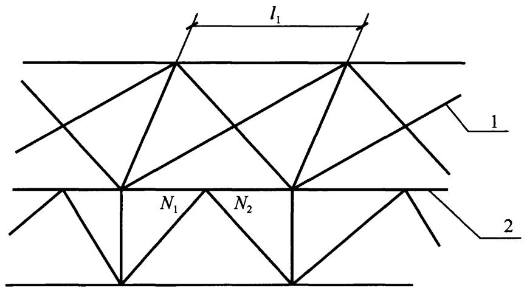  
图7.4.3 弦杆轴心压力在侧向支承点间有变化的桁架简图1—支撑；2—桁架

7.4.4 塔架的单角钢主杆，应按所在两个侧面的节点分布情况，采用下列长细比确定稳定系数 $\varphi$

1 当两个侧面腹杆体系的节点全部重合时[图7.4.4(a)]：

$$\lambda = l / i _{\mathrm {y}} \tag {7.4.4-1}$$

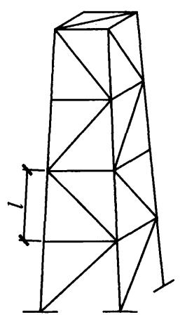  
(a)两个侧面腹杆体系的节点全部重合

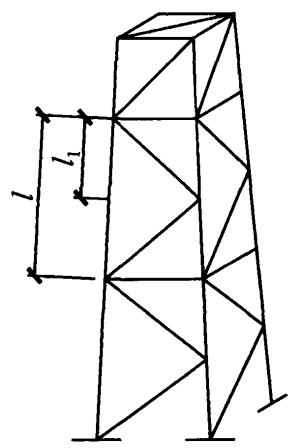  
(b)两个侧面腹杆体系的节点部分重合

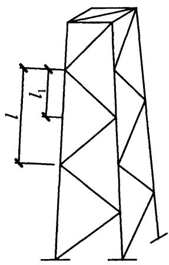  
(c) 两个侧面腹杆体系的节点全部都不重合  
图7.4.4 不同腹杆体系的塔架

2 当两个侧面腹杆体系的节点部分重合时[图7.4.4(b)]：

$$\lambda = 1. 1 l / i _{\mathrm {u}} \tag {7.4.4-2}$$

3 当两个侧面腹杆体系的节点全部都不重合时[图7.4.4(c)]：

$$\lambda = 1. 2 l / i _{\mathrm {u}} \tag {7.4.4-3}$$

式中： $i_{\mathrm{y}}$ ——截面绕非对称主轴的回转半径；

$l$ 、 $i_{\mathrm{u}}$ ——分别为较大的节间长度和绕平行轴的回转半径。

4 当角钢宽厚比符合本标准第7.3.4条第2款要求时，应按该款规定确定系数 $\varphi$ ，并按本标准第7.3.3条的规定计算主杆的承载力。

7.4.5 塔架单角钢人字形或 V 形主斜杆，当辅助杆多于两道时，宜连接两相邻侧面的主斜杆以减小其计算长度。当连接有不多于两道辅助杆时，其长细比宜乘以 1.1 的放大系数。

7.4.6 验算容许长细比时，可不考虑扭转效应，计算单角钢受压构件的长细比时，应采用角钢的最小回转半径，但计算在交叉点相互连接的交叉杆件平面外的长细比时，可采用与角钢肢边平行轴的回转半径。轴心受压构件的容许长细比宜符合下列规定：

1 跨度等于或大于 $60\mathrm{m}$ 的桁架，其受压弦杆、端压杆和直接承受动力荷载的受压腹杆的长细比不宜大于 120；  
2 轴心受压构件的长细比不宜超过表7.4.6规定的容许值，但当杆件内力设计值不大于承载能力的 $50\%$ 时，容许长细比值可取200。

表 7.4.6 受压构件的长细比容许值  

| 构件名称 | 容许长细比 |
| --- | --- |
| 轴心受压柱、桁架和天窗架中的压杆 | 150 |
| 柱的缀条、吊车梁或吊车桁架以下的柱间支撑 | 150 |
| 支撑 | 200 |
| 用以减小受压构件计算长度的杆件 | 200 |

7.4.7 验算容许长细比时，在直接或间接承受动力荷载的结构中，计算单角钢受拉构件的长细比时，应采用角钢的最小回转半径，但计算在交叉点相互连接的交叉杆件平面外的长细比时，可采用与角钢肢边平行轴的回转半径。受拉构件的容许长细比宜符合下列规定：

1 除对腹杆提供平面外支点的弦杆外，承受静力荷载的结构受拉构件，可仅计算竖向平面内的长细比；  
2 中级、重级工作制吊车桁架下弦杆的长细比不宜超过 200；  
3 在设有夹钳或刚性料耙等硬钩起重机的厂房中，支撑的长细比不宜超过 300；  
4 受拉构件在永久荷载与风荷载组合作用下受压时，其长细比不宜超过250；  
5 跨度等于或大于 $60 \mathrm{~m}$ 的桁架，其受拉弦杆和腹杆的长细比，承受静力荷载或间接承受动力荷载时不宜超过 300，直接承受动力荷载时不宜超过 250；  
6 受拉构件的长细比不宜超过表7.4.7规定的容许值。柱间支撑按拉杆设计时，竖向荷载作用下柱子的轴力应按无支撑时考虑。

表 7.4.7 受拉构件的容许长细比  

| 构件名称 | 承受静力荷载或间接承受动力荷载的结构 | 承受静力荷载或间接承受动力荷载的结构 | 承受静力荷载或间接承受动力荷载的结构 | 直接承受动力荷载的结构 |
| --- | --- | --- | --- | --- |
| 构件名称 | 一般建筑结构 | 对腹杆提供平面外支点的弦杆 | 有重级工作制起重机的厂房 | 直接承受动力荷载的结构 |
| 桁架的构件 | 350 | 250 | 250 | 250 |
| 吊车梁或吊车桁架以下柱间支撑 | 300 | - | 200 |  |
| 除张紧的圆钢外的其他拉杆、支撑、系杆等 | 400 | - | 350 | - |

7.4.8 上端与梁或桁架铰接且不能侧向移动的轴心受压柱，计算长度系数应根据柱脚构造情况采用，对铰轴柱脚应取1.0，对底板厚度不小于柱翼缘厚度2倍的平板支座柱脚可取为0.8。由侧向支撑分为多段的柱，当各段长度相差 $10\%$ 以上时，宜根据

相关屈曲的原则确定柱在支撑平面内的计算长度。

## 7.5 轴心受压构件的支撑

7.5.1 用作减小轴心受压构件自由长度的支撑，应能承受沿被撑构件屈曲方向的支撑力，其值应按下列方法计算：

1 长度为 $l$ 的单根柱设置一道支撑时，支撑力 $F_{\mathrm{bl}}$ 应按下列公式计算：

当支撑杆位于柱高度中央时：

$$F _{\mathrm {b} 1} = N / 6 0 \tag {7.5.1-1}$$

当支撑杆位于距柱端 $\alpha l$ 处时（ $0 < \alpha < 1$ ）：

$$F _{\mathrm {b} 1} = \frac {N}{2 4 0 \alpha (1 - \alpha)} \tag {7.5.1-2}$$

2 长度为 $l$ 的单根柱设置 $m$ 道等间距及间距不等但与平均间距相比相差不超过 $20\%$ 的支撑时，各支承点的支撑力 $F_{bm}$ 应按下式计算：

$$F _{\mathrm {b m}} = \frac {N}{4 2 \sqrt {m + 1}} \tag {7.5.1-3}$$

3 被撑构件为多根柱组成的柱列，在柱高度中央附近设置一道支撑时，支撑力应按下式计算：

$$F _{\mathrm {b} n} = \frac {\sum N _{i}}{6 0} \left(0. 6 + \frac {0 . 4}{n}\right) \tag {7.5.1-4}$$

式中： $N$ ——被撑构件的最大轴心压力（N）；

$n$ ——柱列中被撑柱的根数；

$\sum N_{i}$ ——被撑柱同时存在的轴心压力设计值之和（N）。

4 当支撑同时承担结构上其他作用的效应时，应按实际可能发生的情况与支撑力组合。  
5 支撑的构造应使被撑构件在撑点处既不能平移，又不能扭转。

7.5.2 桁架受压弦杆的横向支撑系统中系杆和支承斜杆应能承受下式给出的节点支撑力（图7.5.2）：

$$F = \frac {\sum N}{4 2 \sqrt {m + 1}} \left(0. 6 + \frac {0 . 4}{n}\right) \tag {7.5.2}$$

式中： $\Sigma N$ ——被撑各桁架受压弦杆最大压力之和（N）；

$m$ ——纵向系杆道数（支撑系统节间数减去1）；

$n$ ——支撑系统所撑桁架数。

7.5.3 塔架主杆与主斜杆之间的辅助杆（图7.5.3）应能承受下列公式给出的节点支撑力：

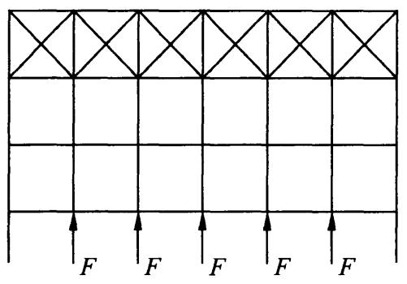  
图7.5.2 桁架受压弦杆横向支撑系统的节点支撑

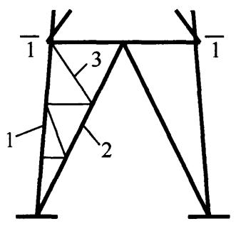

图7.5.3 塔架下端示意图  
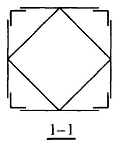  
1—主杆；2—主斜杆；3—辅助杆

当节间数不超过4时：

$$F = N / 8 0 \tag {7.5.3-1}$$

当节间数大于4时：

$$F = N / 1 0 0 \tag {7.5.3-2}$$

式中： $N$ ——主杆压力设计值（N）。

## 7.6 单边连接的单角钢

7.6.1 桁架的单角钢腹杆，当以一个肢连接于节点板时（图7.6.1)，除弦杆亦为单角钢，并位于节点板同侧者外，应符合下列规定：

1 轴心受力构件的截面强度应按本标准式（7.1.1-1）和式(7.1.1-2）计算，但强度设计值应乘以折减系数0.85。  
2 受压构件的稳定性应按下列公式计算：

$$\frac {N}{\eta \varphi A f} \leqslant 1. 0 \tag {7.6.1-1}$$

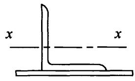  
图7.6.1 角钢的平行轴

等边角钢

$$\eta = 0. 6 + 0. 0 0 1 5 \lambda \tag {7.6.1-2}$$

短边相连的不等边角钢

$$\eta = 0. 5 + 0. 0 0 2 5 \lambda \tag {7.6.1-3}$$

长边相连的不等边角钢

$$\eta = 0. 7 \tag {7.6.1-4}$$

式中： $\lambda$ ——长细比，对中间无联系的单角钢压杆，应按最小回转半径计算，当 $\lambda < 20$ 时，取 $\lambda = 20$ ；

$\eta$ ——折减系数，当计算值大于1.0时取为1.0。

3 当受压斜杆用节点板和桁架弦杆相连接时，节点板厚度不宜小于斜杆肢宽的 $1 / 8$ 。

7.6.2 塔架单边连接单角钢交叉斜杆中的压杆, 当两杆截面相同并在交叉点均不中断, 计算其平面外的稳定性时, 稳定系数 $\phi$ 应由下列等效长细比查本标准附录 D 表格确定:

$$\lambda_{0} = \alpha_{\mathrm {e}} \mu_{\mathrm {u}} \lambda_{\mathrm {e}} \geqslant \frac {l _{1}}{l} \lambda_{\mathrm {x}} \tag {7.6.2-1}$$

当 $20 \leqslant \lambda_{\mathrm{u}} \leqslant 80$ 时：

$$\lambda_{\mathrm {e}} = 8 0 + 0. 6 5 \lambda_{\mathrm {u}} \tag {7.6.2-2}$$

当 $80 < \lambda_{\mathrm{u}} \leqslant 160$ 时：

$$\lambda_{\mathrm {e}} = 5 2 + \lambda_{\mathrm {u}} \tag {7.6.2-3}$$

当 $\lambda_{\mathrm{u}} > 160$ 时：

$$\lambda_{\mathrm {e}} = 2 0 + 1. 2 \lambda_{\mathrm {u}} \tag {7.6.2-4}$$

$$\lambda_{\mathrm {u}} = \frac {l}{i _{\mathrm {u}}} \cdot \frac {1}{\varepsilon_{\mathrm {k}}} \tag {7.6.2-5}$$

$$\mu_{\mathrm {u}} = l _{0} / l \tag {7.6.2-6}$$

式中： $\alpha_{\mathrm{e}}$ ——系数，应按表7.6.2的规定取值；

$\mu_{\mathrm{u}}$ 计算长度系数；

$l_{1}$ ——交叉点至节点间的较大距离（图7.6.2）（mm）；

$\lambda_{\mathrm{e}}$ ——换算长细比；

$l_{0}$ ——计算长度，当相交另一杆受压，应按本标准式（7.4.2-1）计算；当相交另一杆受拉，应按本标准式（7.4.2-3）计算（mm）。

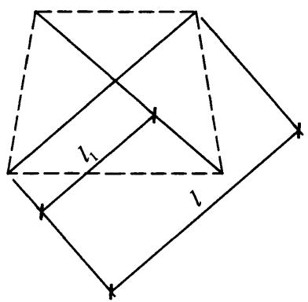  
图7.6.2 在非中点相交的斜杆

表 7.6.2 系数 ${\mathbf{\alpha }}_{\mathrm{e}}$ 取值  

| 主杆截面 | 另杆受拉 | 另杆受压 | 另杆不受力 |
| --- | --- | --- | --- |
| 单角钢 | 0.75 | 0.90 | 0.75 |
| 双轴对称截面 | 0.90 | 0.75 | 0.90 |

7.6.3 单边连接的单角钢压杆，当肢件宽厚比 $w / t$ 大于 $14\varepsilon_{\mathrm{k}}$ 时，由本标准式（7.2.1）和式（7.6.1-1）确定的稳定承载力应乘以按下式计算的折减系数 $\rho_{\mathrm{e}}$ ：

$$\rho_{\mathrm {e}} = 1. 3 - \frac {0 . 3 w}{1 4 t \varepsilon_{\mathrm {k}}} \tag {7.6.3}$$

# 8 拉弯、压弯构件

## 8.1 截面强度计算

8.1.1 弯矩作用在两个主平面内的拉弯构件和压弯构件，其截面强度应符合下列规定：

1 除圆管截面外，弯矩作用在两个主平面内的拉弯构件和压弯构件，其截面强度应按下式计算：

$$\frac {N}{A _{\mathrm {n}}} \pm \frac {M _{\mathrm {x}}}{\gamma_{\mathrm {x}} W _{\mathrm {n x}}} \pm \frac {M _{\mathrm {y}}}{\gamma_{\mathrm {y}} W _{\mathrm {n y}}} \leqslant f \tag {8.1.1-1}$$

2 弯矩作用在两个主平面内的圆形截面拉弯构件和压弯构件，其截面强度应按下式计算：

$$\frac {N}{A _{\mathrm {n}}} + \frac {\sqrt {M _{\mathrm {x}} ^{2} + M _{\mathrm {y}} ^{2}}}{\gamma_{\mathrm {m}} W _{\mathrm {n}}} \leqslant f \tag {8.1.1-2}$$

式中： $N$ ——同一截面处轴心压力设计值（N）；

$M_{\mathrm{x}}$ 、 $M_{\mathrm{y}}$ ——分别为同一截面处对 $\pmb{x}$ 轴和 $\mathcal{V}$ 轴的弯矩设计值 $(\mathrm{N}\cdot \mathrm{mm})$

$\gamma_{\mathrm{x}}$ 、 $\gamma_{\mathrm{y}}$ ——截面塑性发展系数，根据其受压板件的内力分布情况确定其截面板件宽厚比等级，当截面板件宽厚比等级不满足S3级要求时，取1.0，满足S3级要求时，可按本标准表8.1.1采用；需要验算疲劳强度的拉弯、压弯构件，宜取1.0；

$\gamma_{\mathrm{m}}$ ——圆形构件的截面塑性发展系数，对于实腹圆形截面取1.2，当圆管截面板件宽厚比等级不满足S3级要求时取1.0，满足S3级要求时取1.15；需要验算疲劳强度的拉弯、压弯构件，宜取1.0；

$A_{\mathrm{n}}$ ——构件的净截面面积（ $\mathrm{mm}^2$ ）；

$W_{\mathrm{n}}$ ——构件的净截面模量（ $\mathrm{mm}^3$ ）。

表 8.1.1 截面塑性发展系数 ${\gamma }_{\mathrm{x}}$ 、 ${\gamma }_{\mathrm{y}}$   

| 项次 | 截面形式 | γx | γy |
| --- | --- | --- | --- |
| 1 | x y x y y x y x y x y y | 1.05 | 1.2 |
| 2 | x y x y x y x y x y x y y | γx1=1.05γx2=1.2 | 1.05 |
| 3 | x y 1 x y 1/2 x y | γx1=1.05γx2=1.2 | 1.2 |
| 4 | x y 1 x y 1/2 x y 1/2 x | γx1=1.05γx2=1.2 | 1.05 |
| 5 | x y x x y y x y y | 1.2 | 1.2 |
| 6 | x y x y | 1.15 | 1.15 |
| 7 | x y x x y y | 1.0 | 1.05 |
| 8 | x y x x y y | 1.0 | 1.0 |

## 8.2 构件的稳定性计算

8.2.1 除圆管截面外，弯矩作用在对称轴平面内的实腹式压弯构件，弯矩作用平面内稳定性应按式（8.2.1-1）计算，弯矩作用平面外稳定性应按式（8.2.1-3）计算；对于本标准表8.1.1第3项、第4项中的单轴对称压弯构件，当弯矩作用在对称平面内且翼缘受压时，除应按式（8.2.1-1）计算外，尚应按式(8.2.1-4）计算；当框架内力采用二阶弹性分析时，柱弯矩由无侧移弯矩和放大的侧移弯矩组成，此时可对两部分弯矩分别乘以无侧移柱和有侧移柱的等效弯矩系数。

平面内稳定性计算：

$$\frac {N}{\varphi_{\mathrm {x}} A f} + \frac {\beta_{\mathrm {m x}} M _{\mathrm {x}}}{\gamma_{\mathrm {x}} W _{1 \mathrm {x}} \left(1 - 0 . 8 N / N _{\mathrm {E x}} ^{\prime}\right) f} \leqslant 1. 0 \tag {8.2.1-1}$$

$$N _{\mathrm {F x}} ^{\prime} = \pi^{2} E A / \left(1. 1 \lambda_{\mathrm {x}} ^{2}\right) \tag {8.2.1-2}$$

平面外稳定性计算：

$$\frac {N}{\varphi_{\mathrm {y}} A f} + \eta \frac {\beta_{\mathrm {t x}} M _{\mathrm {x}}}{\varphi_{\mathrm {b}} W _{1 \mathrm {x}} f} \leqslant 1. 0 \tag {8.2.1-3}$$

$$\left| \frac {N}{A f} - \frac {\beta_{\mathrm {m x}} M _{\mathrm {x}}}{\gamma_{\mathrm {x}} W _{2 \mathrm {x}} \left(1 - 1 . 2 5 N / N _{\mathrm {E x}} ^{\prime}\right) f} \right| \leqslant 1. 0 \tag {8.2.1-4}$$

式中： $N$ ——所计算构件范围内轴心压力设计值（N）；

$N_{\mathrm{Ex}}^{\prime}$ ——参数，按式（8.2.1-2）计算（mm）；

$\varphi_{\mathrm{x}}$ ——弯矩作用平面内轴心受压构件稳定系数；

$M_{\mathrm{x}}$ ——所计算构件段范围内的最大弯矩设计值（N·mm）；

$W_{1\mathrm{x}}$ ——在弯矩作用平面内对受压最大纤维的毛截面模量 $(\mathrm{mm}^3)$ ;

$\varphi_{y}$ ——弯矩作用平面外的轴心受压构件稳定系数，按本标准第7.2.1条确定；

$\phi_{\mathrm{b}}$ ——均匀弯曲的受弯构件整体稳定系数，按本标准附录 C 计算，其中工字形和 T 形截面的非悬臂构件，可

按本标准附录C第C.0.5条的规定确定；对闭口截面， $\varphi_{\mathrm{b}} = 1.0$

$\eta$ ——截面影响系数，闭口截面 $\eta = 0.7$ ，其他截面 $\eta = 1.0$

$W_{2x}$ ——无翼缘端的毛截面模量（ $\mathrm{mm}^3$ ）。

等效弯矩系数 $\beta_{\mathrm{mx}}$ 应按下列规定采用：

1 无侧移框架柱和两端支承的构件：

1）无横向荷载作用时， $\beta_{\mathrm{mx}}$ 应按下式计算：

$$\beta_{\mathrm {m x}} = 0. 6 + 0. 4 \frac {M _{2}}{M _{1}} \tag {8.2.1-5}$$

式中： $M_{1}$ ， $M_2$ 一端弯矩（ $\mathrm{N}\cdot \mathrm{mm})$ ，构件无反弯点时取同号；构件有反弯点时取异号， $|M_1|\geqslant |M_2|$ 。

2）无端弯矩但有横向荷载作用时， $\beta_{\mathrm{mx}}$ 应按下列公式计算：

跨中单个集中荷载：

$$\beta_{\mathrm {m x}} = 1 - 0. 3 6 N / N _{\mathrm {c r}} \tag {8.2.1-6}$$

全跨均布荷载：

$$\beta_{\mathrm {m x}} = 1 - 0. 1 8 N / N _{\mathrm {c r}} \tag {8.2.1-7}$$

$$N _{\mathrm {c r}} = \frac {\pi^{2} E I}{(\mu l) ^{2}} \tag {8.2.1-8}$$

式中： $N_{\mathrm{cr}}$ ——弹性临界力（N）；

$\mu$ ——构件的计算长度系数。

3）端弯矩和横向荷载同时作用时，式（8.2.1-1）的 $\beta_{\mathrm{mx}}$ $M_{\mathrm{x}}$ 应按下式计算：

$$\beta_{\mathrm {m x}} M _{\mathrm {x}} = \beta_{\mathrm {m q x}} M _{\mathrm {q x}} + \beta_{\mathrm {m l x}} M _{1} \tag {8.2.1-9}$$

式中： $M_{\mathrm{qx}}$ ——横向均布荷载产生的弯矩最大值（ $\mathrm{N} \cdot \mathrm{mm}$ ）；

$M_{1}$ ——跨中单个横向集中荷载产生的弯矩 $(\mathrm{N} \cdot \mathrm{mm})$ ；

$\beta_{\mathrm{mlx}}$ ——取按本条第1款第1项计算的等效弯矩系数；

$\beta_{\mathrm{mqx}}$ ——取本条第1款第2项计算的等效弯矩系数。

2 有侧移框架柱和悬臂构件，等效弯矩系数 $\beta_{\mathrm{mx}}$ 应按下列规

定采用：

1）除本款第2项规定之外的框架柱， $\beta_{\mathrm{mx}}$ 应按下式计算：

$$\beta_{\mathrm {m x}} = 1 - 0. 3 6 N / N _{\mathrm {c r}} \tag {8.2.1-10}$$

2）有横向荷载的柱脚铰接的单层框架柱和多层框架的底层柱， $\beta_{\mathrm{mx}} = 1.0$ 。

3）自由端作用有弯矩的悬臂柱， $\beta_{\mathrm{mx}}$ 应按下式计算：

$$\beta_{\mathrm {m x}} = 1 - 0. 3 6 (1 - m) N / N _{\mathrm {c r}} \tag {8.2.1-11}$$

式中： $m$ ——自由端弯矩与固定端弯矩之比，当弯矩图无反弯点时取正号，有反弯点时取负号。

等效弯矩系数 $\beta_{\mathrm{tx}}$ 应按下列规定采用：

1 在弯矩作用平面外有支承的构件，应根据两相邻支承间构件段内的荷载和内力情况确定：

1）无横向荷载作用时， $\beta_{\mathrm{tx}}$ 应按下式计算：

$$\beta_{\mathrm {t x}} = 0. 6 5 + 0. 3 5 \frac {M _{2}}{M _{1}} \tag {8.2.1-12}$$

2）端弯矩和横向荷载同时作用时， $\beta_{\mathrm{tx}}$ 应按下列规定取值：使构件产生同向曲率时：

$$\beta_{\mathrm {t x}} = 1. 0$$

使构件产生反向曲率时

$$\beta_{\mathrm {t x}} = 0. 8 5$$

3）无端弯矩有横向荷载作用时， $\beta_{\mathrm{tx}} = 1.0$ 。

2 弯矩作用平面外为悬臂的构件， $\beta_{\mathrm{tx}} = 1.0$ 。

8.2.2 弯矩绕虚轴作用的格构式压弯构件整体稳定性计算应符合下列规定：

1 弯矩作用平面内的整体稳定性应按下列公式计算：

$$\frac {N}{\varphi_{\mathrm {x}} A f} + \frac {\beta_{\mathrm {m x}} M _{\mathrm {x}}}{W _{1 \mathrm {x}} \left(1 - \frac {N}{N _{\mathrm {E x}} ^{\prime}}\right) f} \leqslant 1. 0 \tag {8.2.2-1}$$

$$W _{1 x} = I _{x} / y _{0} \tag {8.2.2-2}$$

式中： $I_{\mathrm{x}}$ ——对虚轴的毛截面惯性矩（ $\mathrm{mm}^4$ ）；

$y_{0}$ ——由虚轴到压力较大分肢的轴线距离或者到压力较大

分肢腹板外边缘的距离，二者取较大者（mm）；

$\varphi_{\mathrm{x}}$ 、 $N_{\mathrm{Ex}}^{\prime}$ ——分别为弯矩作用平面内轴心受压构件稳定系数和参数，由换算长细比确定。

2 弯矩作用平面外的整体稳定性可不计算，但应计算分肢的稳定性，分肢的轴心力应按桁架的弦杆计算。对缀板柱的分肢尚应考虑由剪力引起的局部弯矩。

8.2.3 弯矩绕实轴作用的格构式压弯构件，其弯矩作用平面内和平面外的稳定性计算均与实腹式构件相同。但在计算弯矩作用平面外的整体稳定性时，长细比应取换算长细比， $\varphi_{\mathrm{b}}$ 应取1.0。  
8.2.4 当柱段中没有很大横向力或集中弯矩时，双向压弯圆管的整体稳定按下列公式计算：

$$\frac {N}{\varphi A f} + \frac {\beta M}{\gamma_{\mathrm {m}} W \left(1 - 0 . 8 \frac {N}{N _{\mathrm {E x}} ^{\prime}}\right) f} \leqslant 1. 0 \tag {8.2.4-1}$$

$$M = \max  \left(\sqrt {M _{\mathrm {x A}} ^{2} + M _{\mathrm {y A}} ^{2}}, \sqrt {M _{\mathrm {x B}} ^{2} + M _{\mathrm {y B}} ^{2}}\right) \tag {8.2.4-2}$$

$$\beta = \beta_{\mathrm {x}} \beta_{\mathrm {y}} \tag {8.2.4-3}$$

$$\beta_{\mathrm {x}} = 1 - 0. 3 5 \sqrt {N / N _{\mathrm {E}}} + 0. 3 5 \sqrt {N / N _{\mathrm {E}}} \left(M _{2 \mathrm {x}} / M _{1 \mathrm {x}}\right) \tag {8.2.4-4}$$

$$\beta_{\mathrm {y}} = 1 - 0. 3 5 \sqrt {N / N _{\mathrm {E}}} + 0. 3 5 \sqrt {N / N _{\mathrm {E}}} \left(M _{2 \mathrm {y}} / M _{1 \mathrm {y}}\right) \tag {8.2.4-5}$$

$$N _{\mathrm {E}} = \frac {\pi^{2} E A}{\lambda^{2}} \tag {8.2.4-6}$$

式中： $\varphi$ ——轴心受压构件的整体稳定系数，按构件最大长细比取值；

M——计算双向压弯圆管构件整体稳定时采用的弯矩值，按式（8.2.4-2）计算 $(\mathrm{N}\cdot \mathrm{mm})$ ；

$M_{\mathrm{xA}}$ 、 $M_{\mathrm{yA}}$ 、 $M_{\mathrm{xB}}$ 、 $M_{\mathrm{yB}}$ ——分别为构件A端关于 $x$ 轴、 $y$ 轴的弯矩和构件B端关于 $x$ 轴、 $y$ 轴的弯矩 $(\mathbf{N} \cdot \mathbf{mm})$ ；

$\beta$ ——计算双向压弯整体稳定时采用的等效弯矩系数；

$M_{1\mathrm{x}}$ 、 $M_{2\mathrm{x}}$ 、 $M_{1\mathrm{y}}$ 、 $M_{2\mathrm{y}}$ ——分别为 $x$ 轴、 $y$ 轴端弯矩（ $\mathbf{N}\cdot \mathbf{mm}$ ）；

构件无反弯点时取同号，构件有反弯

点时取异号； $|M_{1\mathrm{x}}|\geqslant |M_{2\mathrm{x}}|$

$$\left| M _{1 y} \right| \geqslant \left| M _{2 y} \right|;$$

$N_{\mathrm{E}}$ ——根据构件最大长细比计算的欧拉力，按式（8.2.4-6）计算。

8.2.5 弯矩作用在两个主平面内的双轴对称实腹式工字形和箱形截面的压弯构件，其稳定性应按下列公式计算：

$$\frac {N}{\varphi_{\mathrm {x}} A f} + \frac {\beta_{\mathrm {m x}} M _{\mathrm {x}}}{\gamma_{\mathrm {x}} W _{\mathrm {x}} \left(1 - 0 . 8 \frac {N}{N _{\mathrm {E x}} ^{\prime}}\right) f} + \eta \frac {\beta_{\mathrm {t y}} M _{\mathrm {y}}}{\varphi_{\mathrm {b y}} W _{\mathrm {y}} f} \leqslant 1. 0 \tag {8.2.5-1}$$

$$\frac {N}{\varphi_{\mathrm {y}} A f} + \eta \frac {\beta_{\mathrm {t x}} M _{\mathrm {x}}}{\varphi_{\mathrm {b x}} W _{\mathrm {x}} f} + \frac {\beta_{\mathrm {m y}} M _{\mathrm {y}}}{\gamma_{\mathrm {y}} W _{\mathrm {y}} \left(1 - 0 . 8 \frac {N}{N _{\mathrm {E y}} ^{\prime}}\right) f} \leqslant 1. 0 \tag {8.2.5-2}$$

$$N _{\mathrm {E y}} ^{\prime} = \pi^{2} E A / \left(1. 1 \lambda_{\mathrm {y}} ^{2}\right) \tag {8.2.5-3}$$

式中： $\varphi_{\mathrm{x}}$ 、 $\varphi_{\mathrm{y}}$ ——对强轴 $x - x$ 和弱轴 $y - y$ 的轴心受压构件整体稳定系数；

$\varphi_{\mathrm{bx}}$ 、 $\varphi_{\mathrm{by}}$ 均匀弯曲的受弯构件整体稳定性系数，应按本标准附录C计算，其中工字形截面的非悬臂构件的 $\varphi_{\mathrm{bx}}$ 可按本标准附录C第C.0.5条的规定确定， $\varphi_{\mathrm{by}}$ 可取为1.0；对闭合截面，取 $\varphi_{\mathrm{bx}} = \varphi_{\mathrm{by}} = 1.0$

$M_{\mathrm{x}}$ 、 $M_{\mathrm{y}}$ ——所计算构件段范围内对强轴和弱轴的最大弯矩设计值（ $\mathrm{N} \cdot \mathrm{mm}$ ）；

$W_{\mathrm{x}}$ 、 $W_{\mathrm{y}}$ ——对强轴和弱轴的毛截面模量（ $\mathrm{mm}^3$ ）；

$\beta_{\mathrm{mx}}$ 、 $\beta_{\mathrm{my}}$ ——等效弯矩系数，应按本标准第8.2.1条弯矩作用平面内的稳定计算有关规定采用；

$\beta_{\mathrm{tx}}$ 、 $\beta_{\mathrm{ty}}$ ——等效弯矩系数，应按本标准第8.2.1条弯矩作用平面外的稳定计算有关规定采用。

8.2.6 弯矩作用在两个主平面内的双肢格构式压弯构件，其稳定性应按下列规定计算：

1 按整体计算：

$$\frac {N}{\varphi_{\mathrm {x}} A f} + \frac {\beta_{\mathrm {m x}} M _{\mathrm {x}}}{W _{1 \mathrm {x}} \left(1 - \frac {N}{N _{\mathrm {E x}} ^{\prime}}\right) f} + \frac {\beta_{\mathrm {t y}} M _{\mathrm {y}}}{W _{1 \mathrm {y}} f} \leqslant 1. 0 \tag {8.2.6-1}$$

式中： $W_{1y}$ ——在 $M_y$ 作用下，对较大受压纤维的毛截面模量 $(\mathrm{mm}^3)$ 。

2 按分肢计算：

在 $N$ 和 $M_{\mathrm{x}}$ 作用下，将分肢作为桁架弦杆计算其轴心力， $M_{\mathrm{y}}$ 按式（8.2.6-2）和式（8.2.6-3）分配给两分肢（图8.2.6），然后按本标准第8.2.1条的规定计算分肢稳定性。

分肢1： $M_{\mathrm{y1}} = \frac{I_1 / y_1}{I_1 / y_1 + I_2 / y_2}\cdot M_{\mathrm{y}}$ (8.2.6-2)

分肢2： $M_{\mathrm{y2}} = \frac{I_2 / y_2}{I_1 / y_1 + I_2 / y_2}\cdot M_{\mathrm{y}}$ (8.2.6-3)

式中： $I_{1}$ 、 $I_{2}$ ——分肢1、分肢2对 $\mathcal{V}$ 轴的惯性矩（ $\mathrm{mm}^4$ ）；

$y_{1}$ 、 $y_{2}$ —— $M_{\mathrm{y}}$ 作用的主轴平面至分肢1、分肢2的轴线距离（mm）。

8.2.7 计算格构式缀件时，应取构件的实际剪力和按本标准式

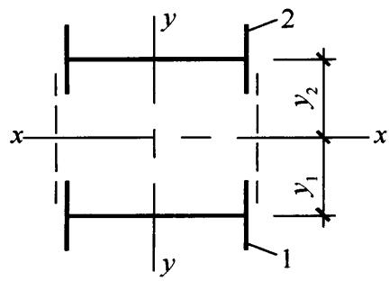  
图8.2.6 格构式构件截面1一分肢1；2一分肢2

（7.2.7）计算的剪力两者中的较大值进行计算。

8.2.8 用作减小压弯构件弯矩作用平面外计算长度的支撑，对实腹式构件应将压弯构件的受压翼缘，对格构式构件应将压弯构件的受压分肢视为轴心受压构件，并按本标准第7.5节

的规定计算各自的支撑力。

## 8.3 框架柱的计算长度

8.3.1 等截面柱，在框架平面内的计算长度应等于该层柱的高度乘以计算长度系数 $\mu$ 。框架应分为无支撑框架和有支撑框架。当采用二阶弹性分析方法计算内力且在每层柱顶附加考虑假想水平力 $H_{\mathrm{ni}}$ 时，框架柱的计算长度系数可取1.0或其他认可的值。当采用一阶弹性分析方法计算内力时，框架柱的计算长度系数 $\mu$ 应按下列规定确定：

1 无支撑框架：

1）框架柱的计算长度系数 $\mu$ 应按本标准附录E表E.0.2有侧移框架柱的计算长度系数确定，也可按下列简化公式计算：

$$\mu = \sqrt {\frac {7 . 5 K _{1} K _{2} + 4 \left(K _{1} + K _{2}\right) + 1 . 5 2}{7 . 5 K _{1} K _{2} + K _{1} + K _{2}}} \tag {8.3.1-1}$$

式中： $K_{1}$ 、 $K_{2}$ ——分别为相交于柱上端、柱下端的横梁线刚度之和与柱线刚度之和的比值， $K_{1}$ 、 $K_{2}$ 的修正应按本标准附录E表E.0.2注确定。

2）设有摇摆柱时，摇摆柱自身的计算长度系数应取1.0，框架柱的计算长度系数应乘以放大系数 $\eta$ ， $\eta$ 应按下式计算：

$$\eta = \sqrt {1 + \frac {\sum \left(N _{1} / h _{1}\right)}{\sum \left(N _{\mathrm {f}} / h _{\mathrm {f}}\right)}} \tag {8.3.1-2}$$

式中： $\Sigma (N_{\mathrm{f}} / h_{\mathrm{f}})$ ——本层各框架柱轴心压力设计值与柱子高度比值之和；

$\Sigma (N_{1} / h_{1})$ ——本层各摇摆柱轴心压力设计值与柱子高度比值之和。

3）当有侧移框架同层各柱的 $N / I$ 不相同时，柱计算长度系数宜按式（8.3.1-3）计算；当框架附有摇摆柱时，框架柱的计算长度系数宜按式（8.3.1-5）确定；当根

据式（8.3.1-3）或式（8.3.1-5）计算而得的 $\mu_{i}$ 小于1.0时，应取 $\mu_{i} = 1$ 。

$$\mu_{i} = \sqrt {\frac {N _{\mathrm {E i}}}{N _{i}} \cdot \frac {1 . 2}{K} \Sigma \frac {N _{i}}{h _{i}}} \tag {8.3.1-3}$$

$$N _{\mathrm {E i}} = \pi^{2} E I _{i} / h _{i} ^{2} \tag {8.3.1-4}$$

$$\mu_{i} = \sqrt {\frac {N _{\mathrm {E i}}}{N _{i}} \cdot \frac {1 . 2 \sum \left(N _{i} / h _{i}\right) + \sum \left(N _{1 j} / h _{j}\right)}{K}} \tag {8.3.1-5}$$

式中： $N_{i}$ ——第 $i$ 根柱轴心压力设计值（N）；

$N_{\mathrm{Ei}}$ ——第 $i$ 根柱的欧拉临界力（N）；

$h_i$ ——第 $i$ 根柱高度（ $\mathrm{mm}$ ）；

$K$ ——框架层侧移刚度，即产生层间单位侧移所需的力 $(\mathrm{N} / \mathrm{mm})$ ；

$N_{1j}$ ——第 $j$ 根摇摆柱轴心压力设计值（N）；

$h_j$ ——第 $j$ 根摇摆柱的高度（mm）。

4）计算单层框架和多层框架底层的计算长度系数时， $K$ 值宜按柱脚的实际约束情况进行计算，也可按理想情况（铰接或刚接）确定 $K$ 值，并对算得的系数 $\mu$ 进行修正。

5）当多层单跨框架的顶层采用轻型屋面，或多跨多层框架的顶层抽柱形成较大跨度时，顶层框架柱的计算长度系数应忽略屋面梁对柱子的转动约束。

2 有支撑框架：

当支撑结构（支撑桁架、剪力墙等）满足式（8.3.1-6）要求时，为强支撑框架，框架柱的计算长度系数 $\mu$ 可按本标准附录E表E.0.1无侧移框架柱的计算长度系数确定，也可按式(8.3.1-7）计算。

$$S _{\mathrm {b}} \geqslant 4. 4 \left[ \left(1 + \frac {1 0 0}{f _{\mathrm {y}}}\right) \Sigma N _{\mathrm {b} i} - \Sigma N _{0 i} \right] \tag {8.3.1-6}$$

$$\mu = \sqrt {\frac {\left(1 + 0 . 4 1 K _{1}\right) \left(1 + 0 . 4 1 K _{2}\right)}{\left(1 + 0 . 8 2 K _{1}\right) \left(1 + 0 . 8 2 K _{2}\right)}} \tag {8.3.1-7}$$

式中： $\sum N_{bi}$ 、 $\sum N_{0i}$ 分别为第 $i$ 层层间所有框架柱用无侧移框架和有侧移框架柱计算长度系数算得的轴压杆稳定承载力之和（N）；

$S_{\mathrm{b}}$ ——支撑结构层侧移刚度，即施加于结构上的水平力与其产生的层间位移角的比值(N)；

$K_{1}$ 、 $K_{2}$ ——分别为相交于柱上端、柱下端的横梁线刚度之和与柱线刚度之和的比值。 $K_{1}$ 、 $K_{2}$ 的修正见本标准附录E表E.0.1注。

8.3.2 单层厂房框架下端刚性固定的带牛腿等截面柱在框架平面内的计算长度应按下列公式确定：

$$H _{0} = \alpha_{\mathrm {N}} \left[ \sqrt {\frac {4 + 7 . 5 K _{\mathrm {b}}}{1 + 7 . 5 K _{\mathrm {b}}}} - \alpha_{\mathrm {K}} \left(\frac {H _{1}}{H}\right) ^{1 + 0. 8 k _ {\mathrm {b}}} \right] H (8. 3. 2 - 1)$$

$$K _{\mathrm {b}} = \frac {\sum \left(I _{\mathrm {b i}} / l _{i}\right)}{I _{\mathrm {c}} / H} \tag {8.3.2-2}$$

当 $K_{\mathrm{b}} < 0.2$ 时：

$$\alpha_{K} = 1. 5 - 2. 5 K _{b} \tag {8.3.2-3}$$

当 $0.2 \leqslant K_{\mathrm{b}} < 2.0$ 时：

$$\alpha_{K} = 1. 0 \tag {8.3.2-4}$$

$$\gamma = \frac {N _{1}}{N _{2}} \tag {8.3.2-5}$$

当 $\gamma \leqslant 0.2$ 时：

$$\alpha_{\mathrm {N}} = 1. 0 \tag {8.3.2-6}$$

当 $\gamma > 0.2$ 时：

$$\alpha_{\mathrm {N}} = 1 + \frac {H _{1}}{H _{2}} \frac {(\gamma - 0 . 2)}{1 . 2} \tag {8.3.2-7}$$

式中： $H_{1}$ 、 $H$ ——分别为柱在牛腿表面以上的高度和柱总高度（图8.3.2） $(\mathbf{m})$

$K_{\mathrm{b}}$ 与柱连接的横梁线刚度之和与柱线刚度之比；

$\alpha_{\mathrm{K}}$ ——和比值 $K_{\mathrm{b}}$ 有关的系数；

$\alpha_{\mathrm{N}}$ ——考虑压力变化的系数；

柱上、下段压力比；

$N_{1}$ 、 $N_{2}$ ——分别为上、下段柱的轴心压力设计值（N）；

$I_{\mathrm{bi}}$ 、 $l_{i}$ ——分别为第 $i$ 根梁的截面惯性矩（ $\mathrm{mm}^4$ ）和跨度（mm）；

$I_{\mathrm{c}}$ ——为柱截面惯性矩 $(\mathrm{mm}^4)$ 。

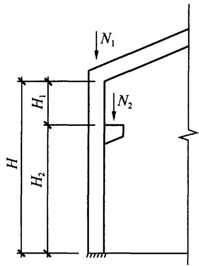  
图8.3.2 单层厂房框架示意

8.3.3 单层厂房框架下端刚性固定的阶形柱，在框架平面内的计算长度应按下列规定确定：

1 单阶柱：

1）下段柱的计算长度系数 $\mu_{2}$ ：当柱上端与横梁铰接时，应按本标准附录E表E.0.3的数值乘以表8.3.3的折减系数；当柱上端与桁架型横梁刚接时，应按本标准附录E表E.0.4的数值乘以表8.3.3的折减系数。

2）当柱上端与实腹梁刚接时，下段柱的计算长度系数 $\mu_{2}$ ，应按下列公式计算的系数 $\mu_{2}^{1}$ 乘以表8.3.3的折减系数，系数 $\mu_{2}^{1}$ 不应大于按柱上端与横梁铰接计算时得到的 $\mu_{2}$ 值，且不小于按柱上端与桁架型横梁刚接计算时得到的 $\mu_{2}$ 值。

$$K _{\mathrm {c}} = \frac {I _{1} / H _{1}}{I _{2} / H _{2}} \tag {8.3.3-1}$$

$$\mu_{2} ^{1} = \frac {\eta_{1} ^{2}}{2 (\eta_{1} + 1)} \cdot \sqrt [ 3 ]{\frac {\eta_{1} - K _{\mathrm {b}}}{K _{\mathrm {b}}}} + (\eta_{1} - 0. 5) K _{\mathrm {c}} + 2 \tag {8.3.3-2}$$

$$\eta_{1} = \frac {H _{1}}{H _{2}} \sqrt {\frac {N _{1}}{N _{2}} \cdot \frac {I _{2}}{I _{1}}} \tag {8.3.3-3}$$

式中： $I_{1}$ 、 $H_{1}$ ——阶形柱上段柱的惯性矩（ $\mathrm{mm}^4$ ）和柱高(mm)；

$I_{2}$ 、 $H_{2}$ ——阶形柱下段柱的惯性矩（ $\mathrm{mm}^4$ ）和柱高（ $\mathrm{mm}$ ）； $K_{\mathrm{c}}$ ——阶形柱上段柱线刚度与下段柱线刚度的比值； $\eta_{1}$ ——参数，根据式（8.3.3-3）计算。

表 8.3.3 单层厂房阶形柱计算长度的折减系数  

| 厂房类型 | 厂房类型 | 厂房类型 | 厂房类型 | 折减系数 |
| --- | --- | --- | --- | --- |
| 单跨或多跨 | 纵向温度区段内一个柱列的柱子数 | 屋面情况 | 厂房两侧是否有通长的屋盖纵向水平支撑 | 折减系数 |
| 单跨 | 等于或少于6个 | - | - | 0.9 |
| 单跨 | 多于6个 | 非大型混凝土屋面板的屋面 | 无纵向水平支撑 | 0.9 |
| 单跨 | 多于6个 | 非大型混凝土屋面板的屋面 | 有纵向水平支撑 | 0.8 |
| 单跨 | 多于6个 | 大型混凝土屋面板的屋面 | - | 0.8 |
| 多跨 | - | 非大型混凝土屋面板的屋面 | 无纵向水平支撑 | 0.8 |
| 多跨 | - | 非大型混凝土屋面板的屋面 | 有纵向水平支撑 | 0.7 |
| 多跨 | - | 大型混凝土屋面板的屋面 | - | 0.7 |

3）上段柱的计算长度系数 $\mu_{1}$ 应按下式计算：

$$\mu_{1} = \frac {\mu_{2}}{\eta_{1}} \tag {8.3.3-4}$$

2 双阶柱：

1）下段柱的计算长度系数 $\mu_{3}$ ：当柱上端与横梁铰接时，应取本标准附录E表E.0.5的数值乘以表8.3.3的折减系数；当柱上端与横梁刚接时，应取本标准附录E表E.0.6的数值乘以表8.3.3的折减系数。  
2）上段柱和中段柱的计算长度系数 $\mu_{1}$ 和 $\mu_{2}$ ，应按下列公式计算：

$$\mu_{1} = \frac {\mu_{3}}{\eta_{1}} \tag {8.3.3-5}$$

$$\mu_{2} = \frac {\mu_{3}}{\eta_{2}} \tag {8.3.3-6}$$

式中： $\eta_{1}$ 、 $\eta_{2}$ ——参数，可根据本标准式（8.3.3-3）计算；计算 $\eta_{1}$ 时， $H_{1}$ 、 $N_{1}$ 、 $I_{1}$ 分别为上柱的柱高（m）、轴力压力设计值（N）和惯性矩（ $\mathrm{mm}^{4}$ ）， $H_{2}$ 、 $N_{2}$ 、 $I_{2}$ 分别为下柱的柱高（m）、轴力压力设计值（N）和惯性矩（ $\mathrm{mm}^{4}$ ）；计算 $\eta_{2}$ 时， $H_{1}$ 、 $N_{1}$ 、 $I_{1}$ 分别为中柱的柱高（m）、轴力压力设计值（N）和惯性矩（ $\mathrm{mm}^{4}$ ）， $H_{2}$ 、 $N_{2}$ 、 $I_{2}$ 分别为下柱的柱高（m）、轴力压力设计值（N）和惯性矩（ $\mathrm{mm}^{4}$ ）。

8.3.4 当计算框架的格构式柱和桁架式横梁的惯性矩时，应考虑柱或横梁截面高度变化和缀件（或腹杆）变形的影响。  
8.3.5 框架柱在框架平面外的计算长度可取面外支撑点之间距离。

## 8.4 压弯构件的局部稳定和屈曲后强度

8.4.1 实腹压弯构件要求不出现局部失稳者，其腹板高厚比、

翼缘宽厚比应符合本标准表3.5.1规定的压弯构件S4级截面要求。

8.4.2 工字形和箱形截面压弯构件的腹板高厚比超过本标准表3.5.1规定的S4级截面要求时，其构件设计应符合下列规定：

1 应以有效截面代替实际截面按本条第2款计算杆件的承载力。

1）工字形截面腹板受压区的有效宽度应取为：

$$h _{\mathrm {e}} = \rho h _{\mathrm {c}} \tag {8.4.2-1}$$

当 $\lambda_{\mathrm{n,p}}\leqslant 0.75$ 时： $\rho = 1,0$ (8.4.2-2a)

当 $\lambda_{\mathrm{n,p}} > 0.75$ 时：

$$\rho = \frac {1}{\lambda_{\mathrm {n} , \mathrm {p}}} \left(1 - \frac {0 . 1 9}{\lambda_{\mathrm {n} , \mathrm {p}}}\right) \tag {8.4.2-2b}$$

$$\lambda_{\mathrm {n}, \mathrm {p}} = \frac {h _{\mathrm {w}} / t _{\mathrm {w}}}{2 8 . 1 \sqrt {k _{\sigma}}} \cdot \frac {1}{\varepsilon_{\mathrm {k}}} \tag {8.4.2-3}$$

$$k _{\sigma} = \frac {1 6}{2 - \alpha_{0} + \sqrt {(2 - \alpha_{0}) ^{2} + 0 . 1 1 2 \alpha_{0} ^{2}}} \tag {8.4.2-4}$$

式中： $h_{\mathrm{c}}$ 、 $h_{\mathrm{e}}$ ——分别为腹板受压区宽度和有效宽度，当腹板全部受压时， $h_{\mathrm{c}} = h_{\mathrm{w}}$ （ $\mathrm{mm}$ ）；

$\rho$ ——有效宽度系数，按式（8.4.2-2）计算；

$\alpha_0$ ——参数，应按式（3.5.1）计算。

2）工字形截面腹板有效宽度 $h_{\mathrm{e}}$ 应按下列公式计算：

当截面全部受压，即 $\alpha_0\leqslant 1$ 时[图8.4.2(a)]：

$$h _{\mathrm {e l}} = 2 h _{\mathrm {e}} / \left(4 + \alpha_{0}\right) \tag {8.4.2-5}$$

$$h _{\mathrm {e} 2} = h _{\mathrm {e}} - h _{\mathrm {e l}} \tag {8.4.2-6}$$

当截面部分受拉，即 $\alpha_0 > 1$ 时[图8.4.2(b)]：

$$h _{\mathrm {e l}} = 0. 4 h _{\mathrm {e}} \tag {8.4.2-7}$$

$$h _{\mathrm {e} 2} = 0. 6 h _{\mathrm {e}} \tag {8.4.2-8}$$

3）箱形截面压弯构件翼缘宽厚比超限时也应按式（8.4.2-1）计算其有效宽度，计算时取 $k_{\sigma} = 4.0$ 。有效宽度在两侧均等分布。

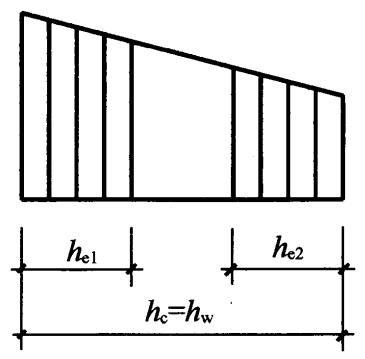  
(a) 截面全部受压

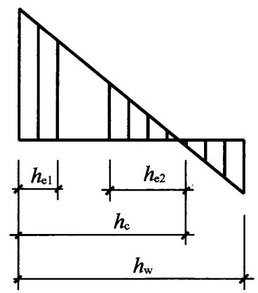  
(b) 截面部分受拉  
图8.4.2 有效宽度的分布

2 应采用下列公式计算其承载力：

强度计算：

$$\frac {N}{A _{\mathrm {n e}}} \pm \frac {M _{\mathrm {x}} + N e}{\gamma_{\mathrm {x}} W _{\mathrm {n e x}}} \leqslant f \tag {8.4.2-9}$$

平面内稳定计算：

$$\frac {N}{\varphi_{\mathrm {x}} A _{\mathrm {e}} f} + \frac {\beta_{\mathrm {m x}} M _{\mathrm {x}} + N e}{\gamma_{\mathrm {x}} W _{\mathrm {e l x}} \left(1 - 0 . 8 N / N _{\mathrm {E x}} ^{\prime}\right) f} \leqslant 1. 0 \tag {8.4.2-10}$$

平面外稳定计算：

$$\frac {N}{\varphi_{\mathrm {y}} A _{\mathrm {e}} f} + \eta \frac {\beta_{\mathrm {t x}} M _{\mathrm {x}} + N e}{\varphi_{\mathrm {b}} W _{\mathrm {e l x}} f} \leqslant 1. 0 \tag {8.4.2-11}$$

式中： $A_{\mathrm{ne}}$ 、 $A_{\mathrm{e}}$ ——分别为有效净截面面积和有效毛截面面积 $(\mathrm{mm}^2)$

$W_{\mathrm{nex}}$ ——有效截面的净截面模量（ $\mathrm{mm}^3$ ）；

$W_{\mathrm{elx}}$ 有效截面对较大受压纤维的毛截面模量 $(\mathrm{mm}^3)$

$e$ ——有效截面形心至原截面形心的距离（mm）。

8.4.3 压弯构件的板件当用纵向加劲肋加强以满足宽厚比限值时，加劲肋宜在板件两侧成对配置，其一侧外伸宽度不应小于板件厚度 $t$ 的10倍，厚度不宜小于 $0.75t$ 。

## 8.5 承受次弯矩的桁架杆件

8.5.1 除本标准第5.1.5条第3款规定的结构外，杆件截面为H形或箱形的桁架，应计算节点刚性引起的弯矩。在轴力和弯矩共同作用下，杆件端部截面的强度计算可考虑塑性应力重分布，按本标准第8.5.2条计算，杆件的稳定计算应按本标准第8.2节压弯构件的规定进行。  
8.5.2 只承受节点荷载的杆件截面为 $\mathrm{H}$ 形或箱形的桁架，当节点具有刚性连接的特征时，应按刚接桁架计算杆件次弯矩，拉杆和板件宽厚比满足本标准表3.5.1压弯构件S2级要求的压杆，截面强度宜按下列公式计算：

当 $\varepsilon = \frac{MA}{NW} \leqslant 0.2$ 时：

$$\frac {N}{A} \leqslant f \tag {8.5.2-1}$$

当 $\varepsilon > 0.2$ 时：

$$\frac {N}{A} + \alpha \frac {M}{W _{\mathrm {p}}} \leqslant \beta f \tag {8.5.2-2}$$

式中： $W$ 、 $W_{\mathrm{p}}$ ——分别为弹性截面模量和塑性截面模量 $(\mathrm{mm}^3)$

$M$ ——为杆件在节点处的次弯矩 $(\mathrm{N} \cdot \mathrm{mm})$ ；

$\alpha$ 、 $\beta$ ——系数，应按表8.5.2的规定采用。

表 8.5.2 系数 $\alpha$ 和 $\beta$   

| 杆件截面形式 | α | β |
| --- | --- | --- |
| H形截面,腹板位于桁架平面内 | 0.85 | 1.15 |
| H形截面,腹板垂直于桁架平面 | 0.60 | 1.08 |
| 正方箱形截面 | 0.80 | 1.13 |

# 9 加劲钢板剪力墙

## 9.1 一般规定

9.1.1 钢板剪力墙可采用纯钢板剪力墙、防屈曲钢板剪力墙及组合剪力墙，纯钢板剪力墙可采用无加劲钢板剪力墙和加劲钢板剪力墙。  
9.1.2 宜采取减少恒荷载传递至剪力墙的措施。竖向加劲肋宜双面或交替双面设置，水平加劲肋可单面、双面或交替双面设置。

## 9.2 加劲钢板剪力墙的计算

9.2.1 本节适用于不考虑屈曲后强度的钢板剪力墙。  
9.2.2 宜采取减少重力荷载传递至竖向加劲肋的构造措施。  
9.2.3 同时设置水平和竖向加劲肋的钢板剪力墙，纵横加劲肋划分的剪力墙板区格的宽高比宜接近1，剪力墙板区格的宽厚比宜符合下列规定：

采用开口加劲肋时：

$$\frac {a _{1} + h _{1}}{t _{\mathrm {w}}} \leqslant 2 2 0 \varepsilon_{\mathrm {k}} \tag {9.2.3-1}$$

采用闭口加劲肋时：

$$\frac {a _{1} + h _{1}}{t _{\mathrm {w}}} \leqslant 2 5 0 \varepsilon_{\mathrm {k}} \tag {9.2.3-2}$$

式中： $a_1$ ——剪力墙板区格宽度（mm）；

$h_1$ ——剪力墙板区格高度（mm）；

$\varepsilon_{\mathrm{k}}$ ——钢号调整系数；

$t_{\mathrm{w}}$ ——钢板剪力墙的厚度（mm）。

9.2.4 同时设置水平和竖向加劲肋的钢板剪力墙，加劲肋的刚

度参数宜符合下列公式的要求。

$$\eta_{\mathrm {x}} = \frac {E I _{\mathrm {s x}}}{D h _{1}} \geqslant 3 3 \tag {9.2.4-1}$$

$$\eta_{\mathrm {y}} = \frac {E I _{\mathrm {s y}}}{D a _{1}} \geqslant 5 0 \tag {9.2.4-2}$$

$$D = \frac {E t _{\mathrm {w}} ^{3}}{1 2 \left(1 - \nu^{2}\right)} \tag {9.2.4-3}$$

式中： $\eta_{\mathrm{x}}$ 、 $\eta_{\mathrm{y}}$ ——分别为水平、竖向加劲肋的刚度参数；

$E$ ——钢材的弹性模量（ $\mathrm{N} / \mathrm{mm}^2$ ）；

$I_{\mathrm{sx}}$ 、 $I_{\mathrm{sy}}$ ——分别为水平、竖向加劲肋的惯性矩（ $\mathrm{mm}^4$ ），可考虑加劲肋与钢板剪力墙有效宽度组合截面，单侧钢板加劲剪力墙的有效宽度取15倍的钢板厚度；

$D$ ——单位宽度的弯曲刚度（ $\mathrm{N} \cdot \mathrm{mm}$ ）；

$\nu$ ——钢材的泊松比。

9.2.5 设置加劲肋的钢板剪力墙，应根据下列规定计算其稳定性：

1 正则化宽厚比 $\lambda_{\mathrm{n,s}}$ 、 $\lambda_{\mathrm{n,\sigma}}$ 、 $\lambda_{\mathrm{n,b}}$ 应根据下列公式计算：

$$\lambda_{\mathrm {n}, \mathrm {s}} = \sqrt {\frac {f _{\mathrm {y v}}}{\tau_{\mathrm {c r}}}} \tag {9.2.5-1}$$

$$\lambda_{n, \sigma} = \sqrt {\frac {f _{\mathrm {y}}}{\sigma_{\mathrm {c r}}}} \tag {9.2.5-2}$$

$$\lambda_{n, b} = \sqrt {\frac {f _{y}}{\sigma_{b c r}}} \tag {9.2.5-3}$$

式中： $f_{\mathrm{yv}}$ ——钢材的屈服抗剪强度（ $\mathrm{N} / \mathrm{mm}^2$ ），取钢材屈服强度的 $58\%$

$f_{\mathrm{y}}$ ——钢材屈服强度 $(\mathrm{N} / \mathrm{mm}^2)$ ；

$\tau_{\mathrm{cr}}$ ——弹性剪切屈曲临界应力（ $\mathrm{N} / \mathrm{mm}^2$ ），按本标准附录F的规定计算；

$\sigma_{\mathrm{cr}}$ ——竖向受压弹性屈曲临界应力 $(\mathrm{N} / \mathrm{mm}^2)$ ，按本标准附录F的规定计算；

$\sigma_{\mathrm{bcr}}$ ——竖向受弯弹性屈曲临界应力 $(\mathrm{N} / \mathrm{mm}^2)$ , 按本标准附录 F 的规定计算。

2 弹塑性稳定系数 $\varphi_{\mathrm{s}}$ 、 $\varphi_{\sigma}$ 、 $\varphi_{\mathrm{bs}}$ 应根据下列公式计算：

$$\varphi_{\mathrm {s}} = \frac {1}{\sqrt [ 3 ]{0 . 7 3 8 + \lambda_{\mathrm {n} , \mathrm {s}} ^{6}}} \leqslant 1. 0 \tag {9.2.5-4}$$

$$\varphi_{\sigma} = \frac {1}{\left(1 + \lambda_{\mathrm {n} , \sigma} ^{2 . 4}\right) ^{5 / 6}} \leqslant 1. 0 \tag {9.2.5-5}$$

$$\varphi_{\mathrm {b s}} = \frac {1}{\sqrt [ 3 ]{0 . 7 3 8 + \lambda_{\mathrm {n} , \mathrm {b}} ^{6}}} \leqslant 1. 0 \tag {9.2.5-6}$$

3 稳定性计算应符合下列公式要求：

$$\frac {\sigma_{\mathrm {b}}}{\varphi_{\mathrm {b s}} f} \leqslant 1. 0 \tag {9.2.5-7}$$

$$\frac {\tau}{\varphi_{\mathrm {s}} f _{\mathrm {v}}} \leqslant 1. 0 \tag {9.2.5-8}$$

$$\frac {\sigma_{G}}{0 . 3 5 \varphi_{\sigma} f} \leqslant 1. 0 \tag {9.2.5-9}$$

$$\left(\frac {\sigma_{\mathrm {b}}}{\varphi_{\mathrm {b s}} f}\right) ^{2} + \left(\frac {\tau}{\varphi_{\mathrm {s}} f _{\mathrm {v}}}\right) ^{2} + \frac {\sigma_{\sigma}}{\varphi_{\sigma} f} \leqslant 1. 0 \tag {9.2.5-10}$$

式中： $\sigma_{\mathrm{b}}$ ——由弯矩产生的弯曲压应力设计值（ $\mathrm{N} / \mathrm{mm}^2$ ）；

$\tau$ ——钢板剪力墙的剪应力设计值（ $\mathrm{N} / \mathrm{mm}^2$ ）；

$\sigma_{\mathrm{G}}$ ——竖向重力荷载产生的应力设计值（ $\mathrm{N} / \mathrm{mm}^2$ ）；

$f_{\mathrm{v}}$ ——钢板剪力墙的抗剪强度设计值（ $\mathrm{N} / \mathrm{mm}^2$ ）；

$f$ ——钢板剪力墙的抗压和抗弯强度设计值（ $\mathrm{N} / \mathrm{mm}^2$ ）；

$\sigma_{\sigma}$ ——钢板剪力墙承受的竖向应力设计值。

## 9.3 构造要求

9.3.1 加劲钢板墙可采用横向加劲、竖向加劲、井字加劲等形式。加劲肋宜采用型钢且与钢板墙焊接。为运输方便，当设置水平加劲肋时，可采用横向加劲肋贯通、钢板剪力墙水平切断等形式。

9.3.2 加劲钢板剪力墙与边缘构件的连接应符合下列规定：

1 钢板剪力墙与钢柱连接可采用角焊缝，焊缝强度应满足等强连接要求；  
2 钢板剪力墙跨的钢梁，腹板厚度不应小于钢板剪力墙厚度，翼缘可采用加劲肋代替，其截面不应小于所需要的钢梁截面。

9.3.3 加劲钢板剪力墙在有洞口时应符合下列规定：

1 计算钢板剪力墙的水平受剪承载力时，不应计算洞口水平投影部分。  
2 钢板剪力墙上开设门洞时，门洞口边的加劲肋应符合下列规定：

1）加劲肋的刚度参数 $\eta_{\mathrm{x}}$ 、 $\eta_{\mathrm{y}}$ 不应小于150；  
2）竖向边加劲肋应延伸至整个楼层高度，门洞上边的边缘加劲肋延伸的长度不宜小于 $600\mathrm{mm}$ 。

# 10 塑性及弯矩调幅设计

## 10.1 一般规定

10.1.1 本章规定宜用于不直接承受动力荷载的下列结构或构件：

1 超静定梁;
2 由实腹式构件组成的单层框架结构；  
3 2层～6层框架结构其层侧移不大于容许侧移的 $50\%$ 。  
4 满足下列条件之一的框架-支撑（剪力墙、核心筒等）结构中的框架部分：

1）结构下部 $1 / 3$ 楼层的框架部分承担的水平力不大于该层总水平力的 $20\%$ ；  
2）支撑（剪力墙）系统能够承担所有水平力。

10.1.2 塑性及弯矩调幅设计时，容许形成塑性铰的构件应为单向弯曲的构件。  
10.1.3 结构或构件采用塑性或弯矩调幅设计时应符合下列规定：

1 按正常使用极限状态设计时，应采用荷载的标准值，并应按弹性理论进行计算；  
2 按承载能力极限状态设计时，应采用荷载的设计值，用简单塑性理论进行内力分析；  
3 柱端弯矩及水平荷载产生的弯矩不得进行调幅。

10.1.4 采用塑性设计的结构及进行弯矩调幅的构件，钢材性能应符合本标准第4.3.6条的规定。  
10.1.5 采用塑性及弯矩调幅设计的结构构件，其截面板件宽厚比等级应符合下列规定：

1 形成塑性铰并发生塑性转动的截面，其截面板件宽厚比

等级应采用S1级；

2 最后形成塑性铰的截面，其截面板件宽厚比等级不应低于S2级截面要求；  
3 其他截面板件宽厚比等级不应低于S3级截面要求。

10.1.6 构成抗侧力支撑系统的梁、柱构件，不得进行弯矩调幅设计。  
10.1.7 采用塑性设计，或采用弯矩调幅设计且结构为有侧移失稳时，框架柱的计算长度系数应乘以1.1的放大系数。

## 10.2 弯矩调幅设计要点

10.2.1 当采用一阶弹性分析的框架-支撑结构进行弯矩调幅设计时，框架柱计算长度系数可取为1.0，支撑系统应满足本标准式（8.3.1-6）的要求。  
10.2.2 当采用一阶弹性分析时，对于连续梁、框架梁和钢梁及钢-混凝土组合梁的调幅幅度限值及挠度和侧移增大系数应按表10.2.2-1及表10.2.2-2的规定采用。

表 10.2.2-1 钢梁调幅幅度限值及侧移增大系数  

| 调幅幅度限值 | 梁截面板件宽厚比等级 | 侧移增大系数 |
| --- | --- | --- |
| 15% | S1级 | 1.00 |
| 20% | S1级 | 1.05 |

表 10.2.2-2 钢-混凝土组合梁调幅幅度限值及挠度和侧移增大系数  

| 梁分析模型 | 调幅幅度限值 | 梁截面板件宽厚比等级 | 挠度增大系数 | 侧移增大系数 |
| --- | --- | --- | --- | --- |
| 变截面模型 | 5% | S1级 | 1.00 | 1.00 |
| 变截面模型 | 10% | S1级 | 1.05 | 1.05 |
| 等截面模型 | 15% | S1级 | 1.00 | 1.00 |
| 等截面模型 | 20% | S1级 | 1.00 | 1.05 |

## 10.3 构件的计算

10.3.1 除塑性铰部位的强度计算外，受弯构件的强度和稳定性计算应符合本标准第6章的规定。

10.3.2 受弯构件的剪切强度应符合下式要求：

$$V \leqslant h _{\mathrm {w}} t _{\mathrm {w}} f _{\mathrm {v}} \tag {10.3.2}$$

式中： $h_{\mathrm{w}}$ 、 $t_\mathrm{w}$ ——腹板高度和厚度（mm）；

$V$ ——构件的剪力设计值（N）；

$f_{\mathrm{v}}$ ——钢材抗剪强度设计值（ $\mathrm{N} / \mathrm{mm}^2$ ）。

10.3.3 除塑性铰部位的强度计算外，压弯构件的强度和稳定性计算应符合本标准第8章的规定。

10.3.4 塑性铰部位的强度计算应符合下列规定：

1 采用塑性设计和弯矩调幅设计时，塑性铰部位的强度计算应符合下列公式的规定：

$$N \leqslant 0. 6 A _{n} f \tag {10.3.4-1}$$

当 $\frac{N}{A_{\mathrm{n}}f} \leqslant 0.15$ 时：

塑性设计：

$$M _{\mathrm {x}} \leqslant 0. 9 W _{\mathrm {n p x}} f \tag {10.3.4-2}$$

弯矩调幅设计：

$$M _{\mathrm {x}} \leqslant \gamma_{\mathrm {x}} w _{\mathrm {x}} f \tag {10.3.4-3}$$

当 $\frac{N}{A_{\mathrm{n}}f} > 0.15$ 时：

塑性设计：

$$M _{\mathrm {x}} \leqslant 1. 0 5 \left(1 - \frac {N}{A _{\mathrm {n}} f}\right) W _{\mathrm {n p x}} f \tag {10.3.4-4}$$

弯矩调幅设计：

$$M _{\mathrm {x}} \leqslant 1. 1 5 \left(1 - \frac {N}{A _{\mathrm {n}} f}\right) \gamma_{\mathrm {x}} W _{\mathrm {x}} f \tag {10.3.4-5}$$

2 当 $V > 0.5h_{\mathrm{w}}t_{\mathrm{w}}f_{\mathrm{v}}$ 时，验算受弯承载力所用的腹板强度设计值 $f$ 可折减为 $(1 - \rho)f$ ，折减系数 $\rho$ 应按下式计算：

$$\rho = \left[ 2 V / \left(h _{\mathrm {w}} t _{\mathrm {w}} f _{\mathrm {v}}\right) - 1 \right] ^{2} \tag {10.3.4-6}$$

式中： $N$ ——构件的压力设计值（N）；

$M_{\mathrm{x}}$ ——构件的弯矩设计值（ $\mathrm{N} \cdot \mathrm{mm}$ ）；

$A_{\mathrm{n}}$ ——净截面面积 $(\mathrm{mm}^2)$ ；

$W_{\mathrm{npx}}$ ——对 $x$ 轴的塑性净截面模量（ $\mathrm{mm}^3$ ）；

$f$ ——钢材的抗弯强度设计值（ $\mathrm{N} / \mathrm{mm}^2$ ）。

## 10.4 容许长细比和构造要求

10.4.1 受压构件的长细比不宜大于 $130\varepsilon_{\mathrm{k}}$ 。  
10.4.2 当钢梁的上翼缘没有通长的刚性铺板或防止侧向弯扭屈曲的构件时，在构件出现塑性铰的截面处应设置侧向支承。该支承点与其相邻支承点间构件的长细比 $\lambda_{\mathrm{y}}$ 应符合下列规定：

当 $-1 \leqslant \frac{M_{1}}{\gamma_{\mathrm{x}} W_{\mathrm{x}} f} \leqslant 0.5$ 时：

$$\lambda_{\mathrm {y}} \leqslant \left(6 0 - 4 0 \frac {M _{1}}{\gamma_{\mathrm {x}} W _{\mathrm {x}} f}\right) \varepsilon_{\mathrm {k}} \tag {10.4.2-1}$$

当 $0.5 < \frac{M_1}{\gamma_{\mathrm{x}}W_{\mathrm{x}}f} \leqslant 1$ 时：

$$\lambda_{\mathrm {y}} \leqslant \left(4 5 - 1 0 \frac {M _{1}}{\gamma_{\mathrm {x}} W _{\mathrm {x}} f}\right) \varepsilon_{\mathrm {k}} \tag {10.4.2-2}$$

$$\lambda_{\mathrm {y}} = \frac {l _{1}}{i _{\mathrm {y}}} \tag {10.4.2-3}$$

式中： $\lambda_{\mathrm{y}}$ ——弯矩作用平面外的长细比；

$l_{1}$ ——侧向支承点间距离（ $\mathrm{mm}$ ）；对不出现塑性较的构件区段，其侧向支承点间距应由本标准第6章和第8章内有关弯矩作用平面外的整体稳定计算确定；

$i_{\mathrm{y}}$ ——截面绕弱轴的回转半径（mm）；

$M_{1}$ ——与塑性铰距离为 $l_{1}$ 的侧向支承点处的弯矩 $(\mathrm{N} \cdot \mathrm{mm})$ ；当长度 $l_{1}$ 内为同向曲率时， $M_{1} / (\gamma_{\mathrm{x}}'W_{\mathrm{x}}f)$ 为正；当为反向曲率时， $M_{1} / (\gamma_{\mathrm{x}}W_{\mathrm{x}}f)$ 为负。

10.4.3 当工字钢梁受拉的上翼缘有楼板或刚性铺板与钢梁可靠

连接时，形成塑性铰的截面应满足下列要求之一：

1 根据本标准公式（6.2.7-3）计算的正则化长细比不大于0.3；  
2 布置间距不大于2倍梁高的加劲肋；  
3 受压下翼缘设置侧向支撑。

10.4.4 用作减少构件弯矩作用平面外计算长度的侧向支撑，其轴心力应按本标准第7.5.1条确定。  
10.4.5 所有节点及其连接应有足够的刚度，应保证在出现塑性铰前节点处各构件间的夹角保持不变。构件拼接和构件间的连接应能传递该处最大弯矩设计值的 1.1 倍，且不得低于 $0.5\gamma_{\mathrm{x}}W_{\mathrm{x}}f$ 。  
10.4.6 当构件采用手工气割或剪切机割时，应将出现塑性铰部位的边缘刨平。当螺栓孔位于构件塑性铰部位的受拉板件上时，应采用钻成孔或先冲后扩钻孔。

# 11 连接

## 11.1 一般规定

11.1.1 钢结构构件的连接应根据施工环境条件和作用力的性质选择其连接方法。  
11.1.2 同一连接部位中不得采用普通螺栓或承压型高强度螺栓与焊接共用的连接；在改、扩建工程中作为加固补强措施，可采用摩擦型高强度螺栓与焊接承受同一作用力的栓焊并用连接，其计算与构造宜符合行业标准《钢结构高强度螺栓连接技术规程》JGJ 82-2011第5.5节的规定。  
11.1.3 C级螺栓宜用于沿其杆轴方向受拉的连接，在下列情况下可用于抗剪连接：

1 承受静力荷载或间接承受动力荷载结构中的次要连接；  
2 承受静力荷载的可拆卸结构的连接；  
3 临时固定构件用的安装连接。

11.1.4 沉头和半沉头铆钉不得用于其杆轴方向受拉的连接。  
11.1.5 钢结构焊接连接构造设计应符合下列规定：

1 尽量减少焊缝的数量和尺寸；  
2 焊缝的布置宜对称于构件截面的形心轴；  
3 节点区留有足够空间，便于焊接操作和焊后检测；  
4 应避免焊缝密集和双向、三向相交；  
5 焊缝位置宜避开最大应力区；  
6 焊缝连接宜选择等强匹配；当不同强度的钢材连接时，可采用与低强度钢材相匹配的焊接材料。

11.1.6 焊缝的质量等级应根据结构的重要性、荷载特性、焊缝形式、工作环境以及应力状态等情况，按下列原则选用：

1 在承受动荷载且需要进行疲劳验算的构件中，凡要求与

母材等强连接的焊缝应焊透，其质量等级应符合下列规定：

(1) 作用力垂直于焊缝长度方向的横向对接焊缝或 T 形对接与角接组合焊缝, 受拉时应为一级, 受压时不应低于二级;  
2）作用力平行于焊缝长度方向的纵向对接焊缝不应低于二级；  
3）重级工作制（A6～A8）和起重量 $Q \geqslant 50t$ 的中级工作制（A4、A5）吊车梁的腹板与上翼缘之间以及吊车桁架上弦杆与节点板之间的T形连接部位焊缝应焊透，焊缝形式宜为对接与角接的组合焊缝，其质量等级不应低于二级。

2 在工作温度等于或低于 $-20^{\circ} \mathrm{C}$ 的地区，构件对接焊缝的质量不得低于二级。  
3 不需要疲劳验算的构件中，凡要求与母材等强的对接焊缝宜焊透，其质量等级受拉时不应低于二级，受压时不宜低于二级。  
4 部分焊透的对接焊缝、采用角焊缝或部分焊透的对接与角接组合焊缝的 T 形连接部位，以及搭接连接角焊缝，其质量等级应符合下列规定：

1）直接承受动荷载且需要疲劳验算的结构和吊车起重量等于或大于50t的中级工作制吊车梁以及梁柱、牛腿等重要节点不应低于二级；  
2）其他结构可为三级。

11.1.7 焊接工程中，首次采用的新钢种应进行焊接性试验，合格后应根据现行国家标准《钢结构焊接规范》GB 50661 的规定进行焊接工艺评定。  
11.1.8 钢结构的安装连接应采用传力可靠、制作方便、连接简单、便于调整的构造形式，并应考虑临时定位措施。

## 11.2 焊缝连接计算

11.2.1 全熔透对接焊缝或对接与角接组合焊缝应按下列规定进

行强度计算：

1 在对接和T形连接中，垂直于轴心拉力或轴心压力的对接焊接或对接与角接组合焊缝，其强度应按下式计算：

$$\sigma = \frac {N}{l _{\mathrm {w}} h _{\mathrm {e}}} \leqslant f _{\mathrm {t}} ^{\mathrm {w}} \text {或} f _{\mathrm {c}} ^{\mathrm {w}} \tag {11.2.1-1}$$

式中： $N$ ——轴心拉力或轴心压力（N）；

$l_{\mathrm{w}}$ ——焊缝长度（mm）；

$h_{\mathrm{e}}$ ——对接焊缝的计算厚度（mm），在对接连接节点中取连接件的较小厚度，在T形连接节点中取腹板的厚度；

$f_{\mathrm{t}}^{\mathrm{w}}$ 、 $f_{\mathrm{c}}^{\mathrm{w}}$ ——对接焊缝的抗拉、抗压强度设计值（ $\mathrm{N} / \mathrm{mm}^2$ ）。

2 在对接和 T 形连接中，承受弯矩和剪力共同作用的对接焊缝或对接与角接组合焊缝，其正应力和剪应力应分别进行计算。但在同时受有较大正应力和剪应力处（如梁腹板横向对接焊缝的端部）应按下式计算折算应力：

$$\sqrt {\sigma^{2} + 3 \tau^{2}} \leqslant 1. 1 f _{\mathrm {t}} ^{\mathrm {w}} \tag {11.2.1-2}$$

11.2.2 直角角焊缝应按下列规定进行强度计算：

1 在通过焊缝形心的拉力、压力或剪力作用下：

正面角焊缝（作用力垂直于焊缝长度方向）：

$$\sigma_{\mathrm {f}} = \frac {N}{h _{\mathrm {e}} l _{\mathrm {w}}} \leqslant \beta_{\mathrm {f}} f _{\mathrm {f}} ^{\mathrm {w}} \tag {11.2.2-1}$$

侧面角焊缝（作用力平行于焊缝长度方向）：

$$\tau_{\mathrm {f}} = \frac {N}{h _{\mathrm {e}} l _{\mathrm {w}}} \leqslant f _{\mathrm {f}} ^{\mathrm {w}} \tag {11.2.2-2}$$

2 在各种力综合作用下， $\sigma_{\mathrm{f}}$ 和 $\tau_{\mathrm{f}}$ 共同作用处：

$$\sqrt {\left(\frac {\sigma_{\mathrm {f}}}{\beta_{\mathrm {f}}}\right) ^{2} + \tau_{\mathrm {f}} ^{2}} \leqslant f _{\mathrm {f}} ^{\mathrm {w}} \tag {11.2.2-3}$$

式中： $\sigma_{\mathrm{f}}$ ——按焊缝有效截面（ $h_{\mathrm{e}}l_{\mathrm{w}}$ ）计算，垂直于焊缝长度方向的应力（ $\mathrm{N/mm^2}$ ）；

$\tau_{\mathrm{f}}$ ——按焊缝有效截面计算，沿焊缝长度方向的剪应力 $(\mathrm{N} / \mathrm{mm}^2)$ ；

$h_{\mathrm{e}}$ ——直角角焊缝的计算厚度（ $\mathrm{mm}$ ），当两焊件间隙 $b \leqslant 1.5\mathrm{mm}$ 时， $h_{\mathrm{e}} = 0.7h_{\mathrm{f}}$ ； $1.5\mathrm{mm} < b \leqslant 5\mathrm{mm}$ 时， $h_{\mathrm{e}} = 0.7(h_{\mathrm{f}} - b)$ ， $h_{\mathrm{f}}$ 为焊脚尺寸（图11.2.2）；

$l_{\mathrm{w}}$ ——角焊缝的计算长度（mm），对每条焊缝取其实际长度减去 $2h_{\mathrm{f}}$ ；

$f_{\mathrm{f}}^{\mathrm{w}}$ ——角焊缝的强度设计值（ $\mathrm{N} / \mathrm{mm}^2$ ）；

$\beta_{\mathrm{f}}$ ——正面角焊缝的强度设计值增大系数，对承受静力荷载和间接承受动力荷载的结构， $\beta_{\mathrm{f}} = 1.22$ ；对直接承受动力荷载的结构， $\beta_{\mathrm{f}} = 1.0$ 。

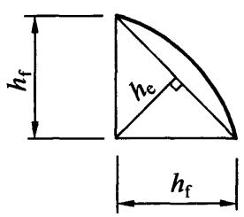  
(a) 等边直角焊缝截面

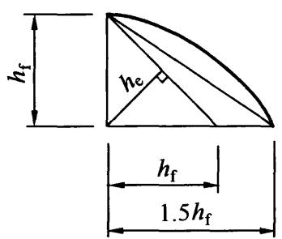  
(b) 不等边直角焊缝截面

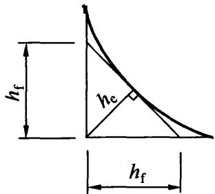  
(c) 等边凹形直角焊缝截面  
图11.2.2 直角角焊缝截面

11.2.3 两焊脚边夹角为 $60^{\circ} \leqslant \alpha \leqslant 135^{\circ}$ 的 T 形连接的斜角角焊缝（图 11.2.3-1），其强度应按本标准式（11.2.2-1）～式（11.2.2-3）计算，但取 $\beta_{\mathrm{f}} = 1.0$ ，其计算厚度 $h_{\mathrm{e}}$ （图 11.2.3-2）的计算应符合下列规定：

1 当根部间隙 $b$ 、 $b_{1}$ 或 $b_{2} \leqslant 15\mathrm{mm}$ 时， $h_{\mathrm{e}} = h_{\mathrm{f}}\cos \frac{\alpha}{2}$   
2 当根部间隙 $b$ 、 $b_{1}$ 或 $b_{2} > 15\mathrm{mm}$ 但 $\leqslant 5\mathrm{mm}$ 时， $h_{\mathrm{e}} = \left[h_{\mathrm{f}} - \frac{b(\text{或}b_{1},b_{2})}{\sin\alpha}\right]\cos \frac{\alpha}{2}$

3 当 $30^{\circ} \leqslant \alpha \leqslant 60^{\circ}$ 或 $\alpha < 30^{\circ}$ 时，斜角角焊缝计算厚度 $h_{\mathrm{e}}$ 应按现行国家标准《钢结构焊接规范》GB50661的有关规定计算取值。

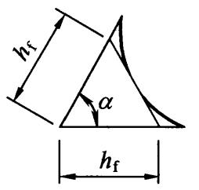  
(a) 凹形锐角焊缝截面

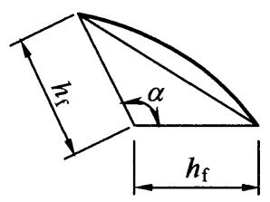  
(b) 钝角焊缝截面

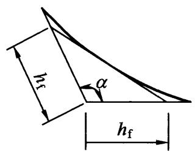  
(c) 凹形钝角焊缝截面

  
图11.2.3-1 T形连接的斜角角焊缝截面

  
图11.2.3-2 T形连接的根部间隙和焊缝截面

11.2.4 部分熔透的对接焊缝（图 11.2.4）和 T 形对接与角接组合焊缝 [图 11.2.4 (c)] 的强度，应按式（11.2.2-1）～式（11.2.2-3）计算，当熔合线处焊缝截面边长等于或接近于最短距离 $s$ 时，抗剪强度设计值应按角焊缝的强度设计值乘以 0.9。在垂直于焊缝长度方向的压力作用下，取 $\beta_{\mathrm{f}} = 1.22$ ，其他情况取 $\beta_{\mathrm{f}} = 1.0$ ，其计算厚度 $h_{\mathrm{e}}$ 宜按下列规定取值，其中 $s$ 为坡口深度，即根部至焊缝表面（不考虑余高）的最短距离（mm）； $\alpha$ 为 V 形、单边 V 形或 K 形坡口角度：

1 V形坡口[图11.2.4(a)]：当 $\alpha \geqslant 60^{\circ}$ 时， $h_{\mathrm{e}} = s$ ；当 $\alpha < 60^{\circ}$ 时， $h_{\mathrm{e}} = 0.75\mathrm{s}$   
2 单边 $\mathrm{V}$ 形和K形坡口[图11.2.4(b)、图11.2.4(c)]：

当 $\alpha = 45^{\circ}\pm 5^{\circ}$ 时， $h_\mathrm{e} = s - 3$

3 U形和J形坡口[图11.2.4(d)、图11.2.4(e)]：当 $\alpha = 45^{\circ} \pm 5^{\circ}$ 时， $h_{\mathrm{e}} = s$ 。

  
(a) V形坡口

  
(b) 单边V形坡口

  
(d)U形坡口

  
(e) J形坡口  
图11.2.4 部分熔透的对接焊缝和T形对接与角接组合焊缝截面

11.2.5 圆形塞焊焊缝和圆孔或槽孔内角焊缝的强度应分别按式（11.2.5-1）和式（11.2.5-2）计算：

$$\tau_{\mathrm {f}} = \frac {N}{A _{\mathrm {w}}} \leqslant f _{\mathrm {f}} ^{\mathrm {w}} \tag {11.2.5-1}$$

$$\tau_{\mathrm {f}} = \frac {N}{h _{\mathrm {e}} l _{\mathrm {w}}} \leqslant f _{\mathrm {f}} ^{\mathrm {w}} \tag {11.2.5-2}$$

式中： $A_{\mathrm{w}}$ ——塞焊圆孔面积；

$l_{\mathrm{w}}$ ——圆孔内或槽孔内角焊缝的计算长度。

11.2.6 角焊缝的搭接焊缝连接中，当焊缝计算长度 $l_{\mathrm{w}}$ 超过 $60h_{\mathrm{f}}$ 时，焊缝的承载力设计值应乘以折减系数 $\alpha_{\mathrm{f}}$ ， $\alpha_{\mathrm{f}} = 1.5 - \frac{l_{\mathrm{w}}}{120h_{\mathrm{f}}}$ ，并不小于0.5。

11.2.7 焊接截面工字形梁翼缘与腹板的焊缝连接强度计算应符合下列规定：

1 双面角焊缝连接，其强度应按下式计算，当梁上翼缘受有固定集中荷载时，宜在该处设置顶紧上翼缘的支承加劲肋，按

式（11.2.7）计算时取 $F = 0$ 。

$$\frac {1}{2 h _{\mathrm {e}}} \sqrt {\left(\frac {V S _{\mathrm {f}}}{I}\right) ^{2} + \left(\frac {\psi F}{\beta_{\mathrm {f}} l _{z}}\right) ^{2}} \leqslant f _{\mathrm {f}} ^{\mathrm {w}} \tag {11.2.7}$$

式中： $S_{\mathrm{f}}$ ——所计算翼缘毛截面对梁中和轴的面积矩（ $\mathrm{mm}^3$ ）；

$I$ ——梁的毛截面惯性矩 $(\mathrm{mm}^4)$ ；

$F$ 、 $\psi$ 、 $l_{z}$ ——按本标准第6.1.4条采用。

2 当腹板与翼缘的连接焊缝采用焊透的T形对接与角接组合焊缝时，其焊缝强度可不计算。

11.2.8 圆管与矩形管 T、Y、K 形相贯节点焊缝的构造与计算厚度取值应符合现行国家标准《钢结构焊接规范》GB 50661 的相关规定。

## 11.3 焊缝连接构造要求

11.3.1 受力和构造焊缝可采用对接焊缝、角接焊缝、对接与角接组合焊缝、塞焊焊缝、槽焊焊缝，重要连接或有等强要求的对接焊缝应为熔透焊缝，较厚板件或无需焊透时可采用部分熔透焊缝。  
11.3.2 对接焊缝的坡口形式，宜根据板厚和施工条件按现行国家标准《钢结构焊接规范》GB50661要求选用。  
11.3.3 不同厚度和宽度的材料对接时，应作平缓过渡，其连接处坡度值不宜大于 $1:25$ （图 11.3.3-1 和图 11.3.3-2）。

  
图11.3.3-1 不同宽度或厚度钢板的拼接

11.3.4 承受动荷载时，塞焊、槽焊、角焊、对接连接应符合下列规定：

1 承受动荷载不需要进行疲劳验算的构件，采用塞焊、槽

  
(a) 不同宽度对接

  
(b) 不同厚度对接  
图11.3.3-2 不同宽度或厚度铸钢件的拼接

焊时，孔或槽的边缘到构件边缘在垂直于应力方向上的间距不应小于此构件厚度的5倍，且不应小于孔或槽宽度的2倍；构件端部搭接连接的纵向角焊缝长度不应小于两侧焊缝间的垂直间距 $a$ ，且在无塞焊、槽焊等其他措施时，间距 $a$ 不应大于较薄件厚度 $t$ 的16倍（图11.3.4）；

  
图11.3.4 承受动载不需进行疲劳验算时

构件端部纵向角焊缝长度及间距要求

$a$ —不应大于 $16t$ （中间有塞焊焊缝或槽焊焊缝时除外）

2 不得采用焊脚尺寸小于 $5\mathrm{mm}$ 的角焊缝；  
3 严禁采用断续坡口焊缝和断续角焊缝；  
4 对接与角接组合焊缝和T形连接的全焊透坡口焊缝应采用角焊缝加强，加强焊脚尺寸不应大于连接部位较薄件厚度的1/2，但最大值不得超过 $10\mathrm{mm}$ ；  
5 承受动荷载需经疲劳验算的连接，当拉应力与焊缝轴线垂直时，严禁采用部分焊透对接焊缝；  
6 除横焊位置以外，不宜采用L形和J形坡口；  
7 不同板厚的对接连接承受动载时，应按本标准第11.3.3

条的规定做成平缓过渡。

11.3.5 角焊缝的尺寸应符合下列规定：

1 角焊缝的最小计算长度应为其焊脚尺寸 $h_{\mathrm{f}}$ 的8倍，且不应小于 $40\mathrm{mm}$ ；焊缝计算长度应为扣除引弧、收弧长度后的焊缝长度；  
2 断续角焊缝焊段的最小长度不应小于最小计算长度；  
3 角焊缝最小焊脚尺寸宜按表11.3.5取值，承受动荷载时角焊缝焊脚尺寸不宜小于 $5\mathrm{mm}$ ；  
4 被焊构件中较薄板厚度不小于 $25\mathrm{mm}$ 时，宜采用开局部坡口的角焊缝；  
5 采用角焊缝焊接连接，不宜将厚板焊接到较薄板上。

表 11.3.5 角焊缝最小焊脚尺寸 (mm)  

| 母材厚度t | 角焊缝最小焊脚尺寸hf |
| --- | --- |
| t≤6 | 3 |
| 6＜t≤12 | 5 |
| 12＜t≤20 | 6 |
| t>20 | 8 |

注：1 采用不预热的非低氢焊接方法进行焊接时， $t$ 等于焊接连接部位中较厚件厚度，宜采用单道焊缝；采用预热的非低氢焊接方法或低氢焊接方法进行焊接时， $t$ 等于焊接连接部位中较薄件厚度；  
2 焊缝尺寸 $h_{\mathrm{f}}$ 不要求超过焊接连接部位中较薄件厚度的情况除外。

11.3.6 搭接连接角焊缝的尺寸及布置应符合下列规定：

1 传递轴向力的部件，其搭接连接最小搭接长度应为较薄件厚度的5倍，且不应小于 $25\mathrm{mm}$ （图11.3.6-1），并应施焊纵向或横向双角焊缝；

图11.3.6-1 搭接连接双角焊缝的要求  
  
$t - t_{1}$ 和 $t_2$ 中较小者； $h_\mathrm{f}$ 一焊脚尺寸，按设计要求

2 只采用纵向角焊缝连接型钢杆件端部时，型钢杆件的宽度不应大于 $200\mathrm{mm}$ ，当宽度大于 $200\mathrm{mm}$ 时，应加横向角焊缝或中间塞焊；型钢杆件每一侧纵向角焊缝的长度不应小于型钢杆件的宽度；  
3 型钢杆件搭接连接采用围焊时，在转角处应连续施焊。杆件端部搭接角焊缝作绕焊时，绕焊长度不应小于焊脚尺寸的2倍，并应连续施焊；  
4 搭接焊缝沿母材棱边的最大焊脚尺寸，当板厚不大于 $6\mathrm{mm}$ 时，应为母材厚度，当板厚大于 $6\mathrm{mm}$ 时，应为母材厚度减去 $1\mathrm{mm} \sim 2\mathrm{mm}$ （图11.3.6-2）；

  
(a) 母材厚度小于等于 $6\mathrm{mm}$ 时

  
(b) 母材厚度大于 $6\mathrm{mm}$ 时  
图11.3.6-2 搭接焊缝沿母材棱边的最大焊脚尺寸

5 用搭接焊缝传递荷载的套管连接可只焊一条角焊缝，其管材搭接长度 $L$ 不应小于 $5\left(t_{1} + t_{2}\right)$ ，且不应小于 $25\mathrm{mm}$ 。搭接焊缝焊脚尺寸应符合设计要求（图11.3.6-3）。

11.3.7 塞焊和槽焊焊缝的尺寸、间距、焊缝高度应符合下列

图11.3.6-3 管材套管连接  
  
的搭接焊缝最小长度  
$h_{\mathrm{f}}$ —焊脚尺寸，按设计要求

规定：

1 塞焊和槽焊的有效面积应为贴合面上圆孔或长槽孔的标称面积。  
2 塞焊焊缝的最小中心间隔应为孔径的4倍，槽焊焊缝的纵向最小间距应为槽孔长度的2倍，垂直于槽孔长度方向的两排槽孔的最

小间距应为槽孔宽度的4倍。

3 塞焊孔的最小直径不得小于开孔板厚度加 $8\mathrm{mm}$ ，最大直径应为最小直径加 $3\mathrm{mm}$ 和开孔件厚度的2.25倍两值中较大者。槽孔长度不应超过开孔件厚度的10倍，最小及最大槽宽规定应与塞焊孔的最小及最大孔径规定相同。

4 塞焊和槽焊的焊缝高度应符合下列规定：

1）当母材厚度不大于 $16\mathrm{mm}$ 时，应与母材厚度相同；  
2）当母材厚度大于 $16\mathrm{mm}$ 时，不应小于母材厚度的一半和 $16\mathrm{mm}$ 两值中较大者。

5 塞焊焊缝和槽焊焊缝的尺寸应根据贴合面上承受的剪力计算确定。

11.3.8 在次要构件或次要焊接连接中，可采用断续角焊缝。断续角焊缝焊段的长度不得小于 $10h_{\mathrm{f}}$ 或 $50\mathrm{mm}$ ，其净距不应大于 $15t$ （对受压构件）或 $30t$ （对受拉构件）， $t$ 为较薄焊件厚度。腐蚀环境中不宜采用断续角焊缝。

## 11.4 紧固件连接计算

11.4.1 普通螺栓、锚栓或铆钉的连接承载力应按下列规定计算：

1 在普通螺栓或铆钉抗剪连接中，每个螺栓的承载力设计值应取受剪和承压承载力设计值中的较小者。受剪和承压承载力设计值应分别按式（11.4.1-1）、式（11.4.1-2）和式（11.4.1-3）、式（11.4.1-4）计算。

普通螺栓： $N_{\mathrm{v}}^{\mathrm{b}} = n_{\mathrm{v}}\frac{\pi d^{2}}{4} f_{\mathrm{v}}^{\mathrm{b}}$ (11.4.1-1)

铆钉： $N_{\mathrm{v}}^{\mathrm{r}} = n_{\mathrm{v}}\frac{\pi d_0^2}{4} f_{\mathrm{v}}^{\mathrm{r}}$ (11.4.1-2)

普通螺栓： $N_{\mathrm{c}}^{\mathrm{b}} = d\sum tf_{\mathrm{c}}^{\mathrm{b}}$ (11.4.1-3)

铆钉： $N_{\mathrm{c}}^{\mathrm{r}} = d_0 \sum tf_{\mathrm{c}}^{\mathrm{r}}$ (11.4.1-4)

式中： $n_{\mathrm{v}}$ ——受剪面数目；

$d$ ——螺杆直径（mm）；

$d_0$ ——铆钉孔直径（mm）；

$\sum t$ ——在不同受力方向中一个受力方向承压构件总厚度的较小值（mm）；

$f_{\mathrm{v}}^{\mathrm{b}}$ 、 $f_{\mathrm{c}}^{\mathrm{b}}$ ——螺栓的抗剪和承压强度设计值（ $\mathrm{N} / \mathrm{mm}^2$ ）；

$f_{\mathrm{v}}^{\mathrm{r}}, f_{\mathrm{c}}^{\mathrm{r}}$ ——铆钉的抗剪和承压强度设计值（ $\mathrm{N} / \mathrm{mm}^2$ ）。

2 在普通螺栓、锚栓或铆钉杆轴向方向受拉的连接中，每个普通螺栓、锚栓或铆钉的承载力设计值应按下列公式计算：

普通螺栓 $N_{\mathrm{t}}^{\mathrm{b}} = \frac{\pi d_{\mathrm{e}}^{2}}{4} f_{\mathrm{t}}^{\mathrm{b}}$ (11.4.1-5)

锚栓 $N_{\mathrm{t}}^{\mathrm{a}} = \frac{\pi d_{\mathrm{e}}^{2}}{4} f_{\mathrm{t}}^{\mathrm{a}}$ (11.4.1-6)

铆钉 $N_{\mathrm{t}}^{\mathrm{r}} = \frac{\pi d_{0}^{2}}{4} f_{\mathrm{t}}^{\mathrm{r}}$ (11.4.1-7)

式中： $d_{\mathrm{e}}$ ——螺栓或锚栓在螺纹处的有效直径（mm）；

$f_{\mathrm{t}}^{\mathrm{b}}$ 、 $f_{\mathrm{t}}^{\mathrm{a}}$ 、 $f_{\mathrm{t}}^{\mathrm{r}}$ ——普通螺栓、锚栓和铆钉的抗拉强度设计值（N/mm²）。

3 同时承受剪力和杆轴方向拉力的普通螺栓和铆钉，其承载力应分别符合下列公式的要求：

普通螺栓

$$\sqrt {\left(\frac {N _{\mathrm {v}}}{N _{\mathrm {v}} ^{\mathrm {b}}}\right) ^{2} + \left(\frac {N _{\mathrm {t}}}{N _{\mathrm {t}} ^{\mathrm {b}}}\right) ^{2}} \leqslant 1. 0 \tag {11.4.1-8}$$

$$N _{\mathrm {v}} \leqslant N _{\mathrm {c}} ^{\mathrm {b}} \tag {11.4.1-9}$$

铆钉

$$\sqrt {\left(\frac {N _{\mathrm {v}}}{N _{\mathrm {v}} ^{\mathrm {r}}}\right) ^{2} + \left(\frac {N _{\mathrm {t}}}{N _{\mathrm {t}} ^{\mathrm {r}}}\right) ^{2}} \leqslant 1. 0 \tag {11.4.1-10}$$

$$N _{\mathrm {v}} \leqslant N _{\mathrm {c}} ^{\mathrm {r}} \tag {11.4.1-11}$$

式中： $N_{\mathrm{v}}$ 、 $N_{\mathrm{t}}$ ——分别为某个普通螺栓所承受的剪力和拉力(N)；

$N_{\mathrm{v}}^{\mathrm{b}}$ 、 $N_{\mathrm{t}}^{\mathrm{b}}$ 、 $N_{\mathrm{c}}^{\mathrm{b}}$ ——一个普通螺栓的抗剪、抗拉和承压承载力设计值（N）；

$N_{\mathrm{v}}^{\mathrm{r}}, N_{\mathrm{t}}^{\mathrm{r}}, N_{\mathrm{c}}^{\mathrm{r}}$ ——一个铆钉抗剪、抗拉和承压承载力设计值 (N)。

11.4.2 高强度螺栓摩擦型连接应按下列规定计算：

1 在受剪连接中，每个高强度螺栓的承载力设计值按下式计算：

$$N _{\mathrm {v}} ^{\mathrm {b}} = 0. 9 k n _{\mathrm {f}} \mu P \tag {11.4.2-1}$$

式中： $N_{\mathrm{v}}^{\mathrm{b}}$ ——一个高强度螺栓的受剪承载力设计值（N）；

$k$ ——孔型系数，标准孔取1.0；大圆孔取0.85；内力与槽孔长向垂直时取0.7；内力与槽孔长向平行时取0.6；

$n_{\mathrm{f}}$ ——传力摩擦面数目；

$\mu$ ——摩擦面的抗滑移系数，可按表11.4.2-1取值；

$P$ ——一个高强度螺栓的预拉力设计值（N），按表11.4.2-2取值。

2 在螺栓杆轴方向受拉的连接中，每个高强度螺栓的承载力应按下式计算：

$$N _{t} ^{b} = 0. 8 P \tag {11.4.2-2}$$

3 当高强度螺栓摩擦型连接同时承受摩擦面间的剪力和螺栓杆轴方向的外拉力时，承载力应符合下式要求：

$$\frac {N _{\mathrm {v}}}{N _{\mathrm {v}} ^{\mathrm {b}}} + \frac {N _{\mathrm {t}}}{N _{\mathrm {t}} ^{\mathrm {b}}} \leqslant 1. 0 \tag {11.4.2-3}$$

式中: $N_{\mathrm{v}} 、 N_{\mathrm{t}}$ ——分别为某个高强度螺栓所承受的剪力和拉力 (N);

$N_{\mathrm{v}}^{\mathrm{b}}$ 、 $N_{\mathrm{t}}^{\mathrm{b}}$ ——一个高强度螺栓的受剪、受拉承载力设计值(N)。

表 11.4.2-1 钢材摩擦面的抗滑移系数 $\mu$   

| 连接处构件接触面的处理方法 | 构件的钢材牌号 | 构件的钢材牌号 | 构件的钢材牌号 |
| --- | --- | --- | --- |
| 连接处构件接触面的处理方法 | Q235钢 | Q345钢或Q390钢 | Q420钢或Q460钢 |
| 喷硬质石英砂或铸钢棱角砂 | 0.45 | 0.45 | 0.45 |
| 抛丸(喷砂) | 0.40 | 0.40 | 0.40 |
| 钢丝刷清除浮锈或未经处理的干净轧制面 | 0.30 | 0.35 | - |

注：1 钢丝刷除锈方向应与受力方向垂直；  
2 当连接构件采用不同钢材牌号时， $\mu$ 按相应较低强度者取值；  
3 采用其他方法处理时，其处理工艺及抗滑移系数值均需经试验确定。

表 11.4.2-2 一个高强度螺栓的预拉力设计值 $\mathbf{P}$ (kN)  

| 螺栓的承载性能等级 | 螺栓公称直径（mm） | 螺栓公称直径（mm） | 螺栓公称直径（mm） | 螺栓公称直径（mm） | 螺栓公称直径（mm） | 螺栓公称直径（mm） |
| --- | --- | --- | --- | --- | --- | --- |
| 螺栓的承载性能等级 | M16 | M20 | M22 | M24 | M27 | M30 |
| 8.8级 | 80 | 125 | 150 | 175 | 230 | 280 |
| 10.9级 | 100 | 155 | 190 | 225 | 290 | 355 |

11.4.3 高强度螺栓承压型连接应按下列规定计算：

1 承压型连接的高强度螺栓预拉力 $P$ 的施拧工艺和设计值取值应与摩擦型连接高强度螺栓相同；  
2 承压型连接中每个高强度螺栓的受剪承载力设计值，其计算方法与普通螺栓相同，但当计算剪切面在螺纹处时，其受剪承载力设计值应按螺纹处的有效截面积进行计算；  
3 在杆轴受拉的连接中，每个高强度螺栓的受拉承载力设计值的计算方法与普通螺栓相同；  
4 同时承受剪力和杆轴方向拉力的承压型连接，承载力应符合下列公式的要求：

$$\sqrt {\left(\frac {N _{\mathrm {v}}}{N _{\mathrm {v}} ^{\mathrm {b}}}\right) ^{2} + \left(\frac {N _{\mathrm {t}}}{N _{\mathrm {t}} ^{\mathrm {b}}}\right) ^{2}} \leqslant 1. 0 \tag {11.4.3-1}$$

$$N _{\mathrm {v}} \leqslant N _{\mathrm {c}} ^{\mathrm {b}} / 1. 2 \tag {11.4.3-2}$$

式中： $N_{\mathrm{v}}$ 、 $N_{\mathrm{t}}$ ——所计算的某个高强度螺栓所承受的剪力和拉力（N）；

$N_{\mathrm{v}}^{\mathrm{b}}$ 、 $N_{\mathrm{t}}^{\mathrm{b}}$ 、 $N_{\mathrm{c}}^{\mathrm{b}}$ ——一个高强度螺栓按普通螺栓计算时的受剪、受拉和承压承载力设计值；

11.4.4 在下列情况的连接中，螺栓或铆钉的数目应予增加：

1 一个构件借助填板或其他中间板与另一构件连接的螺栓（摩擦型连接的高强度螺栓除外）或铆钉数目，应按计算增加 $10\%$   
2 当采用搭接或拼接板的单面连接传递轴心力，因偏心引起连接部位发生弯曲时，螺栓（摩擦型连接的高强度螺栓除外）数目应按计算增加 $10\%$ ；  
3 在构件的端部连接中，当利用短角钢连接型钢（角钢或槽钢）的外伸肢以缩短连接长度时，在短角钢两肢中的一肢上，所用的螺栓或铆钉数目应按计算增加 $50\%$ ；  
4 当铆钉连接的铆合总厚度超过铆钉孔径的5倍时，总厚度每超过 $2\mathrm{mm}$ ，铆钉数目应按计算增加 $1\%$ （至少应增加1个铆钉），但铆合总厚度不得超过铆钉孔径的7倍。

11.4.5 在构件连接节点的一端，当螺栓沿轴向受力方向的连接长度 $l_{1}$ 大于 $15d_{0}$ 时（ $d_{0}$ 为孔径），应将螺栓的承载力设计值乘以折减系数 $\left(1.1 - \frac{l_{1}}{150d_{0}}\right)$ ，当大于 $60d_{0}$ 时，折减系数取为定值 0.7。

## 11.5 紧固件连接构造要求

11.5.1 螺栓孔的孔径与孔型应符合下列规定：

1 B级普通螺栓的孔径 $d_0$ 较螺栓公称直径 $d$ 大 $0.2\mathrm{mm} \sim 0.5\mathrm{mm}$ , C级普通螺栓的孔径 $d_0$ 较螺栓公称直径 $d$ 大 $1.0\mathrm{mm} \sim 1.5\mathrm{mm}$ ;  
2 高强度螺栓承压型连接采用标准圆孔时，其孔径 $d_0$ 可按

表 11.5.1 采用;

3 高强度螺栓摩擦型连接可采用标准孔、大圆孔和槽孔，孔型尺寸可按表11.5.1采用；采用扩大孔连接时，同一连接面只能在盖板和芯板其中之一的板上采用大圆孔或槽孔，其余仍采用标准孔；

表 11.5.1 高强度螺栓连接的孔型尺寸匹配 (mm)  

| 螺栓公称直径 | 螺栓公称直径 | 螺栓公称直径 | M12 | M16 | M20 | M22 | M24 | M27 | M30 |
| --- | --- | --- | --- | --- | --- | --- | --- | --- | --- |
| 孔型 | 标准孔 | 直径 | 13.5 | 17.5 | 22 | 24 | 26 | 30 | 33 |
| 孔型 | 大圆孔 | 直径 | 16 | 20 | 24 | 28 | 30 | 35 | 38 |
| 孔型 | 槽孔 | 短向 | 13.5 | 17.5 | 22 | 24 | 26 | 30 | 33 |
| 孔型 | 槽孔 | 长向 | 22 | 30 | 37 | 40 | 45 | 50 | 55 |

4 高强度螺栓摩擦型连接盖板按大圆孔、槽孔制孔时，应增大垫圈厚度或采用连续型垫板，其孔径与标准垫圈相同，对M24及以下的螺栓，厚度不宜小于 $8\mathrm{mm}$ ；对M24以上的螺栓，厚度不宜小于 $10\mathrm{mm}$ 。

11.5.2 螺栓（铆钉）连接宜采用紧凑布置，其连接中心宜与被连接构件截面的重心相一致。螺栓或铆钉的间距、边距和端距容许值应符合表11.5.2的规定。

表 11.5.2 螺栓或铆钉的孔距、边距和端距容许值  

| 名称 | 位置和方向 | 位置和方向 | 位置和方向 | 最大容许间距(取两者的较小值) | 最小容许间距 |
| --- | --- | --- | --- | --- | --- |
| 中心间距 | 外排(垂直内力方向或顺内力方向) | 外排(垂直内力方向或顺内力方向) | 外排(垂直内力方向或顺内力方向) | 8d0或12t | 3d0 |
| 中心间距 | 中间排 | 垂直内力方向 | 垂直内力方向 | 16d0或24t | 3d0 |
| 中心间距 | 中间排 | 顺内力方向 | 构件受压力 | 12d0或18t | 3d0 |
| 中心间距 | 中间排 | 顺内力方向 | 构件受拉力 | 16d0或24t | 3d0 |
| 中心间距 | 沿对角线方向 | 沿对角线方向 | 沿对角线方向 | - | 3d0 |

续表 11.5.2  

| 名称 | 位置和方向 | 位置和方向 | 位置和方向 | 最大容许间距(取两者的较小值) | 最小容许间距 |
| --- | --- | --- | --- | --- | --- |
| 中心至构件边缘距离 | 顺内力方向 | 顺内力方向 | 顺内力方向 | 4d0或8t | 2d0 |
| 中心至构件边缘距离 | 垂直内力方向 | 剪切边或手工切割边 | 剪切边或手工切割边 | 4d0或8t | 1.5d0 |
| 中心至构件边缘距离 | 垂直内力方向 | 轧制边、自动气割或锯割边 | 高强度螺栓 | 4d0或8t | 1.5d0 |
| 中心至构件边缘距离 | 垂直内力方向 | 轧制边、自动气割或锯割边 | 其他螺栓或铆钉 | 4d0或8t | 1.2d0 |

注：1 $d_0$ 为螺栓或铆钉的孔径，对槽孔为短向尺寸， $t$ 为外层较薄板件的厚度；  
2 钢板边缘与刚性构件（如角钢，槽钢等）相连的高强度螺栓的最大间距，可按中间排的数值采用；  
3 计算螺栓孔引起的截面削弱时可取 $d + 4\mathrm{mm}$ 和 $d_0$ 的较大者。

11.5.3 直接承受动力荷载构件的螺栓连接应符合下列规定：

1 抗剪连接时应采用摩擦型高强度螺栓；  
2 普通螺栓受拉连接应采用双螺帽或其他能防止螺帽松动的有效措施。

11.5.4 高强度螺栓连接设计应符合下列规定：

1 本章的高强度螺栓连接均应按本标准表11.4.2-2施加预拉力；  
2 采用承压型连接时，连接处构件接触面应清除油污及浮锈，仅承受拉力的高强度螺栓连接，不要求对接触面进行抗滑移处理；  
3 高强度螺栓承压型连接不应用于直接承受动力荷载的结构，抗剪承压型连接在正常使用极限状态下应符合摩擦型连接的设计要求；  
4 当高强度螺栓连接的环境温度为 $100^{\circ}\mathrm{C} \sim 150^{\circ}\mathrm{C}$ 时，其承载力应降低 $10\%$ 。

11.5.5 当型钢构件拼接采用高强度螺栓连接时，其拼接件宜采

用钢板。

11.5.6 螺栓连接设计应符合下列规定：

1 连接处应有必要的螺栓施拧空间；  
2 螺栓连接或拼接节点中，每一杆件一端的永久性的螺栓数不宜少于 2 个；对组合构件的缀条，其端部连接可采用 1 个螺栓；  
3 沿杆轴方向受拉的螺栓连接中的端板（法兰板），宜设置加劲肋。

## 11.6 销轴连接

11.6.1 销轴连接适用于铰接柱脚或拱脚以及拉索、拉杆端部的连接，销轴与耳板宜采用Q345、Q390与Q420，也可采用45号钢、 $35\mathrm{CrMo}$ 或 $40\mathrm{Cr}$ 等钢材。当销孔和销轴表面要求机加工时，其质量要求应符合相应的机械零件加工标准的规定。当销轴直径大于 $120\mathrm{mm}$ 时，宜采用锻造加工工艺制作。  
11.6.2 销轴连接的构造应符合下列规定（图11.6.2）：

  
图11.6.2 销轴连接耳板

1 销轴孔中心应位于耳板的中心线上，其孔径与直径相差不应大于 $1\mathrm{mm}$ 。  
2 耳板两侧宽厚比 $b / t$ 不宜大于 4，几何尺寸应符合下列公式规定：

$$a \geqslant \frac {4}{3} b _{\mathrm {e}} \tag {11.6.2-1}$$

$$b _{\mathrm {e}} = 2 t + 1 6 \leqslant b \tag {11.6.2-2}$$

式中： $b$ ——连接耳板两侧边缘与销轴孔边缘净距（mm）；

$t$ ——耳板厚度（mm）；

$a$ ——顺受力方向，销轴孔边距板边缘最小距离（mm）。

3 销轴表面与耳板孔周表面宜进行机加工。

11.6.3 连接耳板应按下列公式进行抗拉、抗剪强度的计算：

1 耳板孔净截面处的抗拉强度:

$$\sigma = \frac {N}{2 t b _{1}} \leqslant f \tag {11.6.3-1}$$

$$b _{1} = \min  \left(2 t + 1 6, b - \frac {d _{0}}{3}\right) \tag {11.6.3-2}$$

2 耳板端部截面抗拉（劈开）强度：

$$\sigma = \frac {N}{2 t \left(a - \frac {2 d _{0}}{3}\right)} \leqslant f \tag {11.6.3-3}$$

3 耳板抗剪强度：

$$\tau = \frac {N}{2 t Z} \leqslant f _{\mathrm {v}} \tag {11.6.3-4}$$

$$Z = \sqrt {(a + d _{0} / 2) ^{2} - (d _{0} / 2) ^{2}} \tag {11.6.3-5}$$

式中： $N$ —杆件轴向拉力设计值（N）；

$b_{1}$ 计算宽度（mm）；

$d_0$ ——销轴孔径（mm）；

$f$ ——耳板抗拉强度设计值（ $\mathrm{N} / \mathrm{mm}^2$ ）。

Z——耳板端部抗剪截面宽度（图11.6.3）（mm）；

$f_{\mathrm{v}}$ ——耳板钢材抗剪强度设计值（ $\mathrm{N} / \mathrm{mm}^2$ ）。

11.6.4 销轴应按下列公式进行承压、抗剪与抗弯强度的计算：

1 销轴承压强度：

$$\sigma_{\mathrm {c}} = \frac {N}{d t} \leqslant f _{\mathrm {c}} ^{\mathrm {b}} \tag {11.6.4-1}$$

  
图11.6.3 销轴连接耳板受剪面示意图

2 销轴抗剪强度：

$$\tau_{\mathrm {b}} = \frac {N}{n _{\mathrm {v}} \pi \frac {d ^{2}}{4}} \leqslant f _{\mathrm {v}} ^{\mathrm {b}} \tag {11.6.4-2}$$

3 销轴的抗弯强度：

$$\sigma_{\mathrm {b}} = \frac {M}{1 5 \frac {\pi d ^{3}}{3 2}} \leqslant f ^{\mathrm {b}} \tag {11.6.4-3}$$

$$M = \frac {N}{8} \left(2 t _{\mathrm {e}} + t _{\mathrm {m}} + 4 s\right) \tag {11.6.4-4}$$

4 计算截面同时受弯受剪时组合强度应按下式验算：

$$\sqrt {\left(\frac {\sigma_{\mathrm {b}}}{f ^{\mathrm {b}}}\right) ^{2} + \left(\frac {\tau_{\mathrm {b}}}{f _{\mathrm {v}} ^{\mathrm {b}}}\right) ^{2}} \leqslant 1. 0 \tag {11.6.4-5}$$

式中： $d$ ——销轴直径（mm）；

$f_{\mathrm{c}}^{\mathrm{b}}$ ——销轴连接中耳板的承压强度设计值（ $\mathrm{N} / \mathrm{mm}^2$ ）；

$n_{\mathrm{v}}$ ——受剪面数目；

$f_{\mathrm{v}}^{\mathrm{b}}$ ——销轴的抗剪强度设计值（ $\mathrm{N / mm}^2$ ）；

$M$ ——销轴计算截面弯矩设计值（ $\mathrm{N} \cdot \mathrm{mm}$ ）；

$f^{\mathrm{b}}$ ——销轴的抗弯强度设计值（ $\mathrm{N} / \mathrm{mm}^2$ ）；

$t_{\mathrm{e}}$ ——两端耳板厚度（mm）；

$t_{\mathrm{m}}$ ——中间耳板厚度（mm）；

$s$ ——端耳板和中间耳板间间距（mm）。

## 11.7 钢管法兰连接构造

11.7.1 法兰板可采用环状板或整板，并宜设置加劲肋。  
11.7.2 法兰板上螺孔应均匀分布，螺栓宜采用较高强度等级。  
11.7.3 当钢管内壁不作防腐蚀处理时，管端部法兰应作气密性焊接封闭。当钢管用热浸镀锌作内外防腐蚀处理时，管端不应封闭。

# 12 节点

## 12.1 一般规定

12.1.1 钢结构节点设计应根据结构的重要性、受力特点、荷载情况和工作环境等因素选用节点形式、材料与加工工艺。  
12.1.2 节点设计应满足承载力极限状态要求，传力可靠，减少应力集中。  
12.1.3 节点构造应符合结构计算假定，当构件在节点偏心相交时，尚应考虑局部弯矩的影响。  
12.1.4 构造复杂的重要节点应通过有限元分析确定其承载力，并宜进行试验证证。  
12.1.5 节点构造应便于制作、运输、安装、维护，防止积水、积尘，并应采取防腐与防火措施。  
12.1.6 拼接节点应保证被连接构件的连续性。

## 12.2 连接板节点

12.2.1 连接节点处板件在拉、剪作用下的强度应按下列公式计算：

$$\frac {N}{\Sigma \left(\eta_{i} A _{i}\right)} \leqslant f \tag {12.2.1-1}$$

$$A _{i} = t l _{i} \tag {12.2.1-2}$$

$$\eta_{i} = \frac {1}{\sqrt {1 + 2 \cos^{2} \alpha_{i}}} \tag {12.2.1-3}$$

式中： $N$ —作用于板件的拉力（N）；

$A_{i}$ ——第 $i$ 段破坏面的截面积，当为螺栓连接时，应取净截面面积 $(\mathrm{mm}^2)$ ；

$t$ ——板件厚度（ $\mathrm{mm}$ ）；

$l_{i}$ ——第 $i$ 破坏段的长度，应取板件中最危险的破坏线长度（图12.2.1）（mm）；

$\eta_{i}$ ——第 $i$ 段的拉剪折算系数；

$\alpha_{i}$ ——第 $i$ 段破坏线与拉力轴线的夹角。

  
(a) 焊缝连接

  
(b)螺栓连接

  
(c)螺栓连接   
图12.2.1 板件的拉、剪撕裂

12.2.2 桁架节点板（杆件轧制T形和双板焊接T形截面者除外）的强度除可按本标准第12.2.1条相关公式计算外，也可用有效宽度法按下式计算：

$$\sigma = \frac {N}{b _{\mathrm {e}} t} \leqslant f \tag {12.2.2}$$

式中： $b_{\mathrm{e}}$ ——板件的有效宽度（图12.2.2）（mm）；当用螺栓（或铆钉）连接时，应减去孔径，孔径应取比螺栓（或铆钉）标称尺寸大 $4\mathrm{mm}$ 。

12.2.3 桁架节点板在斜腹杆压力作用下的稳定性可用下列方法进行计算：

1. 对有竖腹杆相连的节点板，当 $c / t \leqslant 15\varepsilon_{\mathrm{k}}$ 时，可不计算稳定，否则应按本标准附录 G 进行稳定计算，在任何情况下， $c / t$ 不得大于 $22\varepsilon_{\mathrm{k}}$ ， $c$ 为受压腹杆连接肢端面中点沿腹杆轴线方向至弦杆的净距离；

  
(a) 焊缝连接

  
(b)螺栓（铆钉）连接

图12.2.2 板件的有效宽度  
  
$\theta$ —应力扩散角，焊接及单排螺栓时可取 $30^{\circ}$ ，多排螺栓时可取 $22^{\circ}$

(c)螺栓（铆钉）连接

2 对无竖腹杆相连的节点板，当 $c / t \leqslant 10\varepsilon_{\mathrm{k}}$ 时，节点板的稳定承载力可取为 $0.8b_{\mathrm{e}}tf$ ；当 $c / t > 10\varepsilon_{\mathrm{k}}$ 时，应按本标准附录G进行稳定计算，但在任何情况下， $c / t$ 不得大于 $17.5\varepsilon_{\mathrm{k}}$ 。

12.2.4 当采用本标准第 12.2.1 条～第 12.2.3 条方法计算桁架节点板时，尚应符合下列规定：

1 节点板边缘与腹杆轴线之间的夹角不应小于 $15^{\circ}$ ；  
2 斜腹杆与弦杆的夹角应为 $30^{\circ} \sim 60^{\circ}$   
3 节点板的自由边长度 $l_{\mathrm{f}}$ 与厚度 $t$ 之比不得大于 $60\varepsilon_{\mathrm{k}}$ 。

12.2.5 垂直于杆件轴向设置的连接板或梁的翼缘采用焊接方式与工字形、H形或其他截面的未设水平加劲肋的杆件翼缘相连，形成T形接合时，其母材和焊缝均应根据有效宽度进行强度计算。

1 工字形或 H 形截面杆件的有效宽度应按下列公式计算[图 12.2.5(a)]：

$$b _{\mathrm {e}} = t _{\mathrm {w}} + 2 s + 5 k t _{\mathrm {f}} \tag {12.2.5-1}$$

$$k = \frac {t _{\mathrm {f}}}{t _{\mathrm {p}}} \cdot \frac {f _{\mathrm {y c}}}{f _{\mathrm {y p}}} \text {; 当} k > 1. 0 \text {时 取} 1 \tag {12.2.5-2}$$

式中： $b_{\mathrm{e}}$ ——T形接合的有效宽度（mm）；

$f_{\mathrm{yc}}$ ——被连接杆件翼缘的钢材屈服强度（ $\mathrm{N} / \mathrm{mm}^2$ ）；

$f_{\mathrm{yp}}$ ——连接板的钢材屈服强度 $(\mathrm{N} / \mathrm{mm}^2)$ ；

$t_{\mathrm{w}}$ ——被连接杆件的腹板厚度（mm）；

$t_{\mathrm{f}}$ ——被连接杆件的翼缘厚度（mm）；

$t_{\mathrm{p}}$ ——连接板厚度（mm）；

s——对于被连接杆件，轧制工字形或H形截面杆件取为圆角半径r；焊接工字形或H形截面杆件取为焊脚尺寸 $h_{\mathrm{f}}$ （mm）。

  
(a)被连接截面为T形或H形

  
(b) 被连接截面为箱形或槽形  
图12.2.5 未加劲T形连接节点的有效宽度

2 当被连接杆件截面为箱形或槽形，且其翼缘宽度与连接板件宽度相近时，有效宽度应按下式计算[图12.2.5(b)]：

$$b _{\mathrm {e}} = 2 t _{\mathrm {w}} + 5 k t _{\mathrm {f}} \tag {12.2.5-3}$$

3 有效宽度 $b_{\mathrm{e}}$ 尚应满足下式要求：

$$b _{\mathrm {e}} \geqslant \frac {f _{\mathrm {y p}} b _{\mathrm {p}}}{f _{\mathrm {u p}}} \tag {12.2.5-4}$$

式中： $f_{\mathrm{up}}$ ——连接板的极限强度（ $\mathrm{N} / \mathrm{mm}^2$ ）；

$b_{\mathrm{p}}$ ——连接板宽度（mm）。

4 当节点板不满足式（12.2.5-4）要求时，被连接杆件的翼缘应设置加劲肋。

5 连接板与翼缘的焊缝应按能传递连接板的抗力 $b_{\mathrm{p}}t_{\mathrm{p}}f_{\mathrm{yp}}$

（假定为均布应力）进行设计。

12.2.6 杆件与节点板的连接焊缝（图 12.2.6）宜采用两面侧焊，也可以三面围焊，所有围焊的转角处必须连续施焊；弦杆与腹杆、腹杆与腹杆之间的间隙不应小于 $20\mathrm{mm}$ ，相邻角焊缝焊趾间净距不应小于 $5\mathrm{mm}$ 。

  
(a) 两面侧焊

  
(b) 三面围焊  
图12.2.6 杆件与节点板的焊缝连接

12.2.7 节点板厚度宜根据所连接杆件内力的计算确定，但不得小于 $6\mathrm{mm}$ 。节点板的平面尺寸应考虑制作和装配的误差。

## 12.3 梁柱连接节点

12.3.1 梁柱连接节点可采用栓焊混合连接、螺栓连接、焊接连接、端板连接、顶底角钢连接等构造。  
12.3.2 梁柱采用刚性或半刚性节点时，节点应进行在弯矩和剪力作用下的强度验算。  
12.3.3 当梁柱采用刚性连接，对应于梁翼缘的柱腹板部位设置横向加劲肋时，节点域应符合下列规定：

1 当横向加劲肋厚度不小于梁的翼缘板厚度时，节点域的受剪正则化宽厚比 $\lambda_{\mathrm{n,s}}$ 不应大于0.8；对单层和低层轻型建筑， $\lambda_{\mathrm{n,s}}$ 不得大于1.2。节点域的受剪正则化宽厚比 $\lambda_{\mathrm{n,s}}$ 应按下式计算：

当 $h_{\mathrm{c}} / h_{\mathrm{b}} \geqslant 10$ 时：

$$\lambda_{\mathrm {n}, \mathrm {s}} = \frac {h _{\mathrm {b}} / t _{\mathrm {w}}}{3 7 \sqrt {5 . 3 4 + 4 \left(h _{\mathrm {b}} / h _{\mathrm {c}}\right) ^{2}}} \frac {1}{\varepsilon_{\mathrm {k}}} \tag {12.3.3-1}$$

当 $h_{\mathrm{c}} / h_{\mathrm{b}} < 10$ 时：

$$\lambda_{\mathrm {n}, \mathrm {s}} = \frac {h _{\mathrm {b}} / t _{\mathrm {w}}}{3 7 \sqrt {4 + 5 . 3 4} \left(h _{\mathrm {b}} / h _{\mathrm {c}}\right) ^{2}} \frac {1}{\varepsilon_{\mathrm {k}}} \tag {12.3.3-2}$$

式中： $h_{\mathrm{c}}$ 、 $h_\mathrm{b}$ ——分别为节点域腹板的宽度和高度。

2 节点域的承载力应满足下式要求：

$$\frac {M _{\mathrm {b} 1} + M _{\mathrm {b} 2}}{V _{\mathrm {p}}} \leqslant f _{\mathrm {p s}} \tag {12.3.3-3}$$

H形截面柱：

$$V _{\mathrm {p}} = h _{\mathrm {b l}} h _{\mathrm {c l}} t _{\mathrm {w}} \tag {12.3.3-4}$$

箱形截面柱：

$$V _{\mathrm {p}} = 1. 8 h _{\mathrm {b l}} h _{\mathrm {c l}} t _{\mathrm {w}} \tag {12.3.3-5}$$

圆管截面柱：

$$V _{\mathrm {p}} = (\pi / 2) h _{\mathrm {b l}} d _{\mathrm {c}} t _{\mathrm {c}} \tag {12.3.3-6}$$

式中： $M_{\mathrm{b1}}$ 、 $M_{\mathrm{b2}}$ ——分别为节点域两侧梁端弯矩设计值（N·mm）；

$V_{\mathrm{p}}$ ——节点域的体积（ $\mathrm{mm}^3$ ）；

$h_{\mathrm{cl}}$ ——柱翼缘中心线之间的宽度和梁腹板高度（mm）；

$h_{\mathrm{bl}}$ ——梁翼缘中心线之间的高度（mm）；

$t_{\mathrm{w}}$ ——柱腹板节点域的厚度（mm）；

$d_{\mathrm{c}}$ ——钢管直径线上管壁中心线之间的距离（mm）；

$t_{\mathrm{c}}$ ——节点域钢管壁厚（mm）；

$f_{\mathrm{ps}}$ ——节点域的抗剪强度（ $\mathrm{N} / \mathrm{mm}^2$ ）。

3 节点域的受剪承载力 $f_{\mathrm{ps}}$ 应据节点域受剪正则化宽厚比 $\lambda_{\mathrm{n,s}}$ 按下列规定取值：

1）当 $\lambda_{\mathrm{n,s}} \leqslant 0.6$ 时， $f_{\mathrm{ps}} = \frac{4}{3} f_{\mathrm{v}}$ ；  
2）当 $0.6 < \lambda_{\mathrm{n,s}} \leqslant 0.8$ 时， $f_{\mathrm{ps}} = \frac{1}{3} (7 - 5\lambda_{\mathrm{n,s}}) f_{\mathrm{v}}$ ；  
3）当 $0.8 < \lambda_{\mathrm{n,s}} \leqslant 1.2$ 时， $f_{\mathrm{ps}} = [1 - 0.75(\lambda_{\mathrm{n,s}} - 0.8)] f_{\mathrm{v}}$ ；

4）当轴压比 $\frac{N}{A f} > 0.4$ 时，受剪承载力 $f_{\mathrm{ps}}$ 应乘以修正系数，当 $\lambda_{\mathrm{n,s}} \leqslant 0.8$ 时，修正系数可取为 $\sqrt{1 - \left(\frac{N}{A f}\right)^2}$ 。

4 当节点域厚度不满足式（12.3.3-3）的要求时，对H形截面柱节点域可采用下列补强措施：

1）加厚节点域的柱腹板，腹板加厚的范围应伸出梁的上下翼缘外不小于 $150\mathrm{mm}$ ；  
2）节点域处焊贴补强板加强，补强板与柱加劲肋和翼缘可采用角焊缝连接，与柱腹板采用塞焊连成整体，塞焊点之间的距离不应大于较薄焊件厚度的 $21\varepsilon_{\mathrm{k}}$ 倍。  
3）设置节点域斜向加劲肋加强。

12.3.4 梁柱刚性节点中当工字形梁翼缘采用焊透的T形对接焊缝与H形柱的翼缘焊接，同时对应的柱腹板未设置水平加劲肋时，柱翼缘和腹板厚度应符合下列规定：

1 在梁的受压翼缘处，柱腹板厚度 $t_{\mathrm{w}}$ 应同时满足：

$$t _{\mathrm {w}} \geqslant \frac {A _{\mathrm {f b}} f _{\mathrm {b}}}{b _{\mathrm {e}} f _{\mathrm {c}}} \tag {12.3.4-1}$$

$$t _{\mathrm {w}} \geqslant \frac {h _{\mathrm {c}}}{3 0} \frac {1}{\varepsilon_{\mathrm {k} , \mathrm {c}}} \tag {12.3.4-2}$$

$$b _{\mathrm {e}} = t _{\mathrm {f}} + 5 h _{\mathrm {y}} \tag {12.3.4-3}$$

2 在梁的受拉翼缘处，柱翼缘板的厚度 $t_{\mathrm{c}}$ 应满足下式要求：

$$t _{\mathrm {c}} \geqslant 0. 4 \sqrt {A _{\mathrm {f t}} f _{\mathrm {b}} / f _{\mathrm {c}}} \tag {12.3.4-4}$$

式中： $A_{\mathrm{fb}}$ ——梁受压翼缘的截面积（ $\mathrm{mm}^2$ ）；

$f_{\mathrm{b}}$ 、 $f_{\mathrm{c}}$ ——分别为梁和柱钢材抗拉、抗压强度设计值（ $\mathrm{N} / \mathrm{mm}^2$ ）；

$b_{\mathrm{e}}$ ——在垂直于柱翼缘的集中压力作用下，柱腹板计算高度边缘处压应力的假定分布长度（mm）；

$h_{\mathrm{y}}$ ——自柱顶面至腹板计算高度上边缘的距离，对轧制型钢截面取柱翼缘边缘至内弧起点间的距离，对

焊接截面取柱翼缘厚度（mm）；

$t_{\mathrm{f}}$ ——梁受压翼缘厚度（mm）；

$h_{\mathrm{c}}$ ——柱腹板的宽度（mm）；

$\varepsilon_{\mathrm{k,c}}$ ——柱的钢号修正系数；

$A_{\mathrm{ft}}$ ——梁受拉翼缘的截面积 $(\mathrm{mm}^{2})$ 。

12.3.5 采用焊接连接或栓焊混合连接（梁翼缘与柱焊接，腹板与柱高强度螺栓连接）的梁柱刚接节点，其构造应符合下列规定：

1 H形钢柱腹板对应于梁翼缘部位宜设置横向加劲肋，箱形（钢管）柱对应于梁翼缘的位置宜设置水平隔板。  
2 梁柱节点宜采用柱贯通构造，当柱采用冷成型管截面或壁板厚度小于翼缘厚度较多时，梁柱节点宜采用隔板贯通式构造。  
3 节点采用隔板贯通式构造时，柱与贯通式隔板应采用全熔透坡口焊缝连接。贯通式隔板挑出长度 $l$ 宜满足 $25\mathrm{mm} \leqslant l \leqslant 60\mathrm{mm}$ ；隔板宜采用拘束度较小的焊接构造与工艺，其厚度不应小于梁翼缘厚度和柱壁板的厚度。当隔板厚度不小于 $36\mathrm{mm}$ 时，宜选用厚度方向钢板。  
4 梁柱节点区柱腹板加劲肋或隔板应符合下列规定：

1）横向加劲肋的截面尺寸应经计算确定，其厚度不宜小于梁翼缘厚度；其宽度应符合传力、构造和板件宽厚比限值的要求；  
2）横向加劲肋的上表面宜与梁翼缘的上表面对齐，并以焊透的T形对接焊缝与柱翼缘连接，当梁与H形截面柱弱轴方向连接，即与腹板垂直相连形成刚接时，横向加劲肋与柱腹板的连接宜采用焊透对接焊缝；  
3）箱形柱中的横向隔板与柱翼缘的连接宜采用焊透的T形对接焊缝，对无法进行电弧焊的焊缝且柱壁板厚度不小于 $16\mathrm{mm}$ 的可采用熔化嘴电渣；  
4）当采用斜向加劲肋加强节点域时，加劲肋及其连接应

能传递柱腹板所能承担剪力之外的剪力；其截面尺寸应符合传力和板件宽厚比限值的要求。

12.3.6 端板连接的梁柱刚接节点应符合下列规定：

1 端板宜采用外伸式端板。端板的厚度不宜小于螺栓直径；  
2 节点中端板厚度与螺栓直径应由计算决定，计算时宜计入撬力的影响；  
3 节点区柱腹板对应于梁翼缘部位应设置横向加劲肋，其与柱翼缘围隔成的节点域应按本标准第12.3.3条进行抗剪强度的验算，强度不足时宜设斜加劲肋加强。  
12.3.7 采用端板连接的节点，应符合下列规定：

1 连接应采用高强度螺栓，螺栓间距应满足本标准表11.5.2的规定；

2 螺栓应成对称布置，并应满足拧紧螺栓的施工要求。

## 12.4 铸钢节点

12.4.1 铸钢节点应满足结构受力、铸造工艺、连接构造与施工安装的要求，适用于几何形式复杂、杆件汇交密集、受力集中的部位。铸钢节点与相邻构件可采取焊接、螺纹或销轴等连接方式。

12.4.2 铸钢节点应满足承载力极限状态的要求，节点应力应符合下式要求：

$$\sqrt {\frac {1}{2} \left[ \left(\sigma_{1} - \sigma_{2}\right) ^{2} + \left(\sigma_{2} - \sigma_{3}\right) ^{2} + \left(\sigma_{3} - \sigma_{1}\right) ^{2} \right]} \leqslant \beta_{\mathrm {f}} f \tag {12.4.2}$$

式中： $\sigma_{1}$ 、 $\sigma_{2}$ 、 $\sigma_{3}$ ——计算点处在相邻构件荷载设计值作用下的第一、第二、第三主应力；

$\beta_{\mathrm{f}}$ ——强度增大系数。当各主应力均为压应力时， $\beta_{\mathrm{f}} = 1.2$ ；当各主应力均为拉应力时， $\beta_{\mathrm{f}} = 1.0$ ，且最大主应力应满足 $\sigma_{l} \leqslant 1.1 f$ ；其他情况时， $\beta_{\mathrm{f}} = 1.1$ 。

12.4.3 铸钢节点可采用有限元法确定其受力状态，并可根据实际情况对其承载力进行试验验证。   
12.4.4 焊接结构用铸钢节点材料的碳当量及硫、磷含量应符合现行国家标准《焊接结构用铸钢件》GB/T7659的规定。  
12.4.5 铸钢节点应根据铸件轮廓尺寸、夹角大小与铸造工艺确定最小壁厚、内圆角半径与外圆角半径。铸钢件壁厚不宜大于 $150 \mathrm{~mm}$ , 应避免壁厚急剧变化, 壁厚变化斜率不宜大于 $1 / 5$ 。内部肋板厚度不宜大于外侧壁厚。  
12.4.6 铸造工艺应保证铸钢节点内部组织致密、均匀，铸钢件宜进行正火或调质热处理，设计文件应注明铸钢件毛皮尺寸的容许偏差。

## 12.5 预应力索节点

12.5.1 预应力高强拉索的张拉节点应保证节点张拉区有足够的施工空间，便于施工操作，且锚固可靠。预应力索张拉节点与主体结构的连接应考虑超张拉和使用荷载阶段拉索的实际受力大小，确保连接安全。  
12.5.2 预应力索锚固节点应采用传力可靠、预应力损失低且施工便利的锚具，应保证锚固区的局部承压强度和刚度。应对锚固节点区域的主要受力杆件、板域进行应力分析和连接计算。节点区应避免焊缝重叠、开孔等。  
12.5.3 预应力索转折节点应设置滑槽或孔道，滑槽或孔道内可涂润滑剂或加衬垫，或采用摩擦系数低的材料；应验算转折节点处的局部承压强度，并采取加强措施。

## 12.6 支座

12.6.1 梁或桁架支于砌体或混凝土上的平板支座，应验算下部砌体或混凝土的承压强度，底板厚度应根据支座反力对底板产生的弯矩进行计算，且不宜小于 $12 \mathrm{~mm}$ 。

梁的端部支承加劲肋的下端，按端面承压强度设计值进行计

算时，应刨平顶紧，其中突缘加劲板的伸出长度不得大于其厚度的2倍，并宜采取限位措施（图12.6.1）。

  
(a) 平板支座

(b) 突缘支座  
图12.6.1 梁的支座  
  
1—刨平顶紧； $t$ —端板厚度

12.6.2 弧形支座（图12.6.2a）和辊轴支座（图12.6.2b）的支座反力 $R$ 应满足下式要求：

$$R \leqslant 4 0 n d l f ^{2} / E \tag {12.6.2}$$

式中： $d$ ——弧形表面接触点曲率半径 $r$ 的2倍；

$n$ ——辊轴数目，对弧形支座 $n = 1$ ；

$l$ ——弧形表面或滚轴与平板的接触长度（ $\mathrm{mm}$ ）。

  
(a) 弧形支座

  
(b) 辊轴支座  
图12.6.2 弧形支座与辊轴支座示意图

12.6.3 铰轴支座节点（图 12.6.3）中，当两相同半径的圆柱形弧面自由接触面的中心角 $\theta \geqslant 90^{\circ}$ 时，其圆柱形枢轴的承压应力

应按下式计算：

$$\sigma = \frac {2 R}{d l} \leqslant f \tag {12.6.3}$$

式中： $d$ ——枢轴直径（mm）；

$l$ ——枢轴纵向接触面长度（mm）。

12.6.4 板式橡胶支座设计应符合下列规定：

1 板式橡胶支座的底面面积可根据承压条件确定；  
2 橡胶层总厚度应根据橡胶剪切变形条件确定；  
3 在水平力作用下，板式橡胶支座应满足稳定性和抗滑移要求；  
4 支座锚栓按构造设置时数量宜为2个 $\sim 4$ 个，直径不宜小于 $20\mathrm{mm}$ ；对于受拉锚栓，其直径及数

  
图12.6.3 铰轴式支座示意图

量应按计算确定，并应设置双螺母防止松动；

5 板式橡胶支座应采取防老化措施，并应考虑长期使用后因橡胶老化进行更换的可能性；  
6 板式橡胶支座宜采取限位措施。

12.6.5 受力复杂或大跨度结构宜采用球形支座。球形支座应根据使用条件采用固定、单向滑动或双向滑动等形式。球形支座上盖板、球芯、底座和箱体均应采用铸钢加工制作，滑动面应采取相应的润滑措施、支座整体应采取防尘及防锈措施。

## 12.7 柱 脚

I 一般规定

12.7.1 多高层结构框架柱的柱脚可采用埋入式柱脚、插入式柱脚及外包式柱脚，多层结构框架柱尚可采用外露式柱脚，单层厂

房刚接柱脚可采用插入式柱脚、外露式柱脚，铰接柱脚宜采用外露式柱脚。

12.7.2 外包式、埋入式及插入式柱脚，钢柱与混凝土接触的范围内不得涂刷油漆；柱脚安装时，应将钢柱表面的泥土、油污、铁锈和焊渣等用砂轮清刷干净。  
12.7.3 轴心受压柱或压弯柱的端部为铣平端时，柱身的最大压力应直接由铣平端传递，其连接焊缝或螺栓应按最大压力的 $15\%$ 与最大剪力中的较大值进行抗剪计算；当压弯柱出现受拉区时，该区的连接尚应按最大拉力计算。

Ⅱ 外露式柱脚

12.7.4 柱脚锚栓不宜用以承受柱脚底部的水平反力，此水平反力由底板与混凝土基础间的摩擦力（摩擦系数可取0.4）或设置抗剪键承受。  
12.7.5 柱脚底板尺寸和厚度应根据柱端弯矩、轴心力、底板的支承条件和底板下混凝土的反力以及柱脚构造确定。外露式柱脚的锚栓应考虑使用环境由计算确定。  
12.7.6 柱脚锚栓应有足够的埋置深度，当埋置深度受限或锚栓在混凝土中的锚固较长时，则可设置锚板或锚梁。

外包式柱脚

12.7.7 外包式柱脚（图12.7.7）的计算与构造应符合下列规定：

1 外包式柱脚底板应位于基础梁或筏板的混凝土保护层内；外包混凝土厚度，对H形截面柱不宜小于 $160\mathrm{mm}$ ，对矩形管或圆管柱不宜小于 $180\mathrm{mm}$ ，同时不宜小于钢柱截面高度的 $30\%$ ；混凝土强度等级不宜低于C30；柱脚混凝土外包高度，H形截面柱不宜小于柱截面高度的2倍，矩形管柱或圆管柱宜为矩形管截面长边尺寸或圆管直径的2.5倍；当没有地下室时，外包宽度和高度宜增大 $20\%$ ；当仅有一层地下室时，外包宽度宜增大 $10\%$ ；

图12.7.7 外包式柱脚  
  
1—钢柱；2—水平加劲肋；3—柱底板；4—栓钉（可选）；5—锚栓；6—外包混凝土；7—基础梁； $L_{\mathrm{r}}$ —外包混凝土顶部箍筋至柱底板的距离

2 柱脚底板尺寸和厚度应按结构安装阶段荷载作用下轴心力、底板的支承条件计算确定，其厚度不宜小于 $16\mathrm{mm}$ ；  
3 柱脚锚栓应按构造要求设置，直径不宜小于 $16\mathrm{mm}$ ，锚固长度不宜小于其直径的20倍；  
4 柱在外包混凝土的顶部箍筋处应设置水平加劲肋或横隔板，其宽厚比应符合本标准第6.4节的相关规定；  
5 当框架柱为圆管或矩形管时，应在管内浇灌混凝土，强度等级不应小于基础混凝土。浇灌高度应高于外包混凝土，且不宜小于圆管直径或矩形管的长边；  
6 外包钢筋混凝土的受弯和受剪承载力验算及受拉钢筋和箍筋的构造要求应符合现行国家标准《混凝土结构设计规范》GB50010的有关规定，主筋伸入基础内的长度不应小于25倍直径，四角主筋两端应加弯钩，下弯长度不应小于 $150\mathrm{mm}$ ，下弯段宜与钢柱焊接，顶部箍筋应加强加密，并不应小于3根直径

12mm的HRB335级热轧钢筋。

IV 埋入式柱脚

12.7.8 埋入式柱脚应符合下列规定：

1 柱埋入部分四周设置的主筋、箍筋应根据柱脚底部弯矩和剪力按现行国家标准《混凝土结构设计规范》GB50010计算确定，并应符合相关的构造要求。柱翼缘或管柱外边缘混凝土保护层厚度（图12.7.8）、边列柱的翼缘或管柱外边缘至基础梁端部的距离不应小于 $400\mathrm{mm}$ ，中间柱翼缘或管柱外边缘至基础梁梁边相交线的距离不应小于 $250\mathrm{mm}$ ；基础梁梁边相交线的夹角应做成钝角，其坡度不应大于 $1:4$ 的斜角；在基础护筏板的边

  
(a) 工字形柱边柱

  
(b) 工字形柱角柱

  
(c）圆钢管角柱   
(d) 方钢管中柱   
(e）圆钢管中柱  
图12.7.8 柱翼缘或管柱外边缘混凝土保护层厚度

部，应配置水平U形箍筋抵抗柱的水平冲切；

2 柱脚端部及底板、锚栓、水平加劲肋或横隔板的构造要求应符合本标准第12.7.7条的有关规定；  
3 圆管柱和矩形管柱应在管内浇灌混凝土；  
4 对于有拔力的柱，宜在柱埋入混凝土部分设置栓钉。

12.7.9 埋入式柱脚埋入钢筋混凝土的深度 $d$ 应符合下列公式的要求与本标准表 12.7.10 的规定：

H形、箱形截面柱：

$$\frac {V}{b _{\mathrm {f}} d} + \frac {2 M}{b _{\mathrm {f}} d ^{2}} + \frac {1}{2} \sqrt {\left(\frac {2 V}{b _{\mathrm {f}} d} + \frac {4 M}{b _{\mathrm {f}} d ^{2}}\right) ^{2} + \frac {4 V ^{2}}{b _{\mathrm {f}} ^{2} d ^{2}}} \leqslant f _{\mathrm {c}} \tag {12.7.9-1}$$

圆管柱:

$$\frac {V}{D d} + \frac {2 M}{D d ^{2}} + \frac {1}{2} \sqrt {\left(\frac {2 V}{D d} + \frac {4 M}{D d ^{2}}\right) ^{2} + \frac {4 V ^{2}}{D ^{2} d ^{2}}} \leqslant 0. 8 f _{\mathrm {c}} \tag {12.7.9-2}$$

式中： $M$ 、V—柱脚底部的弯矩（ $\mathrm{N}\cdot \mathrm{mm}$ ）和剪力设计值(N)；

$d$ ——柱脚埋深（mm）；

$b_{\mathrm{f}}$ ——柱翼缘宽度（mm）；

$D$ ——钢管外径（ $\mathrm{mm}$ ）；

$f_{\mathrm{c}}$ ——混凝土抗压强度设计值，应按现行国家标准《混凝土结构设计规范》GB50010的规定采用 $(\mathrm{N} / \mathrm{mm}^{2})$ 。

V 插入式柱脚

12.7.10 插入式柱脚插入混凝土基础杯口的深度应符合表 12.7.10 的规定，实腹截面柱柱脚应根据本标准第 12.7.9 条的规定计算，双肢格构柱柱脚应根据下列公式计算：

$$d \geqslant \frac {N}{f _{\mathrm {t}} S} \tag {12.7.10-1}$$

$$S = \pi (D + 1 0 0) \tag {12.7.10-2}$$

式中： $N$ ——柱肢轴向拉力设计值（N）；

$f_{\mathrm{t}}$ ——杯口内二次浇灌层细石混凝土抗拉强度设计值 $(\mathrm{N} / \mathrm{mm}^2)$ ；

S——柱肢外轮廓线的周长，对圆管柱可按式（12.7.10-2）计算。

表 12.7.10 钢柱插入杯口的最小深度  

| 柱截面形式 | 实腹柱 | 双肢格构柱(单杯口或双杯口) |
| --- | --- | --- |
| 最小插入深度dmin | 1.5hc或1.5D | 0.5hc和1.5bc(或D)的较大值 |

注：1 实腹H形柱或矩形管柱的 $h_c$ 为截面高度（长边尺寸）， $b_c$ 为柱截面宽度， $D$ 为圆管柱的外径；  
2 格构柱的 $h_{\mathrm{c}}$ 为两肢垂直于虚轴方向最外边的距离， $b_{\mathrm{c}}$ 为沿虚轴方向的柱肢宽度；  
3 双肢格构柱柱脚插入混凝土基础杯口的最小深度不宜小于 $500\mathrm{mm}$ ，亦不宜小于吊装时柱长度的1/20。

12.7.11 插入式柱脚设计应符合下列规定：

1 H形钢实腹柱宜设柱底板，钢管柱应设柱底板，柱底板应设排气孔或浇筑孔；  
2 实腹柱柱底至基础杯口底的距离不应小于 $50\mathrm{mm}$ ，当有柱底板时，其距离可采用 $150\mathrm{mm}$ ；  
3 实腹柱、双肢格构柱杯口基础底板应验算柱吊装时的局部受压和冲切承载力；  
4 宜采用便于施工时临时调整的技术措施；  
5 杯口基础的杯壁应根据柱底部内力设计值作用于基础顶面配置钢筋，杯壁厚度不应小于现行国家标准《建筑地基基础设计规范》GB 50007 的有关规定。

# 13 钢管连接节点

## 13.1 一般规定

13.1.1 本章规定适用于不直接承受动力荷载的钢管桁架、拱架、塔架等结构中的钢管间连接节点。  
13.1.2 圆钢管的外径与壁厚之比不应超过 $100 \varepsilon_{\mathrm{k}}^{2}$ ; 方(矩)形管的最大外缘尺寸与壁厚之比不应超过 $40 \varepsilon_{\mathrm{k}}, \varepsilon_{\mathrm{k}}$ 为钢号修正系数。  
13.1.3 采用无加劲直接焊接节点的钢管材料应符合本标准第4.3.7条的规定。  
13.1.4 采用无加劲直接焊接节点的钢管桁架，当节点偏心不超过本标准式（13.2.1）限制时，在计算节点和受拉主管承载力时，可忽略因偏心引起的弯矩的影响，但受压主管应考虑按下式计算的偏心弯矩影响：

$$M = \Delta N \cdot e \tag {13.1.4}$$

式中： $\Delta N$ ——节点两侧主管轴力之差值；

$e$ ——偏心矩（图13.1.4）。

  
(a)有间隙的K形节点

  
(b) 有间隙的N形节点

  
(c) 搭接的K形节点

(d) 搭接的N形节点   
图13.1.4 K形和N形管节点的偏心和间隙  
  
1—搭接管；2—被搭接管

13.1.5 无斜腹杆的空腹桁架采用无加劲钢管直接焊接节点时，应符合本标准附录H的规定。

## 13.2 构造要求

13.2.1 钢管直接焊接节点的构造应符合下列规定：

1 主管的外部尺寸不应小于支管的外部尺寸，主管的壁厚不应小于支管的壁厚，在支管与主管的连接处不得将支管插入主管内。  
2 主管与支管或支管轴线间的夹角不宜小于 $30^{\circ}$ 。  
3 支管与主管的连接节点处宜避免偏心；偏心不可避免时，其值不宜超过下式的限制；

$$- 0. 5 5 \leqslant e / D (\text {或} e / h) \leqslant 0. 2 5 \tag {13.2.1}$$

式中： $e$ —偏心距（图13.1.4）；

$D$ ——圆管主管外径（ $\mathrm{mm}$ ）；

$h$ ——连接平面内的方（矩）形管主管截面高度（mm）。

4 支管端部应使用自动切管机切割，支管壁厚小于 $6\mathrm{mm}$ 时可不切坡口。  
5 支管与主管的连接焊缝，除支管搭接应符合本标准第13.2.2条的规定外，应沿全周连续焊接并平滑过渡；焊缝形式可沿全周采用角焊缝，或部分采用对接焊缝，部分采用角焊缝，其中支管管壁与主管管壁之间的夹角大于或等于 $120^{\circ}$ 的区域宜采用对接焊缝或带坡口的角焊缝；角焊缝的焊脚尺寸不宜大于支管壁厚的2倍；搭接支管周边焊缝宜为2倍支管壁厚。  
6 在主管表面焊接的相邻支管的间隙 $a$ 不应小于两支管壁厚之和[图13.1.4(a)、图13.1.4(b)]。

13.2.2 支管搭接型的直接焊接节点的构造尚应符合下列规定：

1 支管搭接的平面K形或N形节点[图13.2.2(a)、图13.2.2(b)]，其搭接率 $\eta_{\mathrm{ov}} = q / p \times 100\%$ 应满足 $25\% \leqslant \eta_{\mathrm{ov}} \leqslant 100\%$ ，且应确保在搭接的支管之间的连接焊缝能可靠地传递内力；

2 当互相搭接的支管外部尺寸不同时，外部尺寸较小者应搭接在尺寸较大者上；当支管壁厚不同时，较小壁厚者应搭接在较大壁厚者上；承受轴心压力的支管宜在下方。

图13.2.2 支管搭接的构造  
  
1—搭接支管；2—被搭接支管

13.2.3 无加劲直接焊接方式不能满足承载力要求时，可按下列规定在主管内设置横向加劲板：

1 支管以承受轴力为主时，可在主管内设1道或2道加劲板[图13.2.3-1(a)、图13.2.3-1(b)]；节点需满足抗弯连接要求时，应设2道加劲板；加劲板中面宜垂直于主管轴线；当主管为圆管，设置1道加劲板时，加劲板宜设置在支管与主管相贯面的鞍点处，设置2道加劲板时，加劲板宜设置在距相贯面冠点 $0.1D_{1}$ 附近[图13.2.3-1(b)], $D_{1}$ 为支管外径；主管为方管时，加劲肋宜设置2块（图13.2.3-2）；  
2 加劲板厚度不得小于支管壁厚，也不宜小于主管壁厚的2/3和主管内径的1/40；加劲板中央开孔时，环板宽度与板厚的比值不宜大于 $15\varepsilon_{\mathrm{k}}$   
3 加劲板宜采用部分熔透焊缝焊接，主管为方管的加劲板靠支管一边与两侧边宜采用部分熔透焊接，与支管连接反向一边可不焊接；  
4 当主管直径较小，加劲板的焊接必须断开主管钢管时，

主管的拼接焊缝宜设置在距支管相贯焊缝最外侧冠点 $80\mathrm{mm}$ 以外处[图13.2.3-1(c)]。

  
(a) 主管内设1道加劲板

  
(b) 主管内设2道加劲板

(c) 主管拼接焊缝位置  
图13.2.3-1 支管为圆管时横向加劲板的位置  
  
1—冠点；2—鞍点；3—加劲板；4—主管拼缝

  
图13.2.3-2 支管为方管或矩形管时加劲板的位置 1—加劲板

13.2.4 钢管直接焊接节点采用主管表面贴加强板的方法加强时，应符合下列规定：

1 主管为圆管时，加强板宜包覆主管半圆[图13.2.4(a)]，长度方向两侧均应超过支管最外侧焊缝 $50\mathrm{mm}$ 以上，但不宜超过支管直径的 $2/3$ ，加强板厚度不宜小于 $4\mathrm{mm}$ 。  
2 主管为方（矩）形管且在与支管相连表面设置加强板[图13.2.4(b)]时，加强板长度 $l_{\mathrm{p}}$ 可按下列公式确定，加强板宽度 $b_{\mathrm{p}}$ 宜接近主管宽度，并预留适当的焊缝位置，加强板厚度不宜小于支管最大厚度的2倍。

T、Y和X形节点

$$l _{\mathrm {p}} \geqslant \frac {h _{1}}{\sin \theta_{1}} + \sqrt {b _{\mathrm {p}} \left(b _{\mathrm {p}} - b _{1}\right)} \tag {13.2.4-1}$$

K形间隙节点

$$l _{\mathrm {p}} \geqslant 1. 5 \left(\frac {h _{1}}{\sin \theta_{1}} + a + \frac {h _{2}}{\sin \theta_{2}}\right) \tag {13.2.4-2}$$

式中： $l_{\mathrm{p}},b_{\mathrm{p}}$ 一 加强板的长度和宽度（ $\mathrm{mm}$ ）；

$h_1, h_2$ ——支管 1、2 的截面高度（ $\mathrm{mm}$ ）；

$b_{1}$ ——支管 1 的截面宽度（ $\mathrm{mm}$ ）；

$\theta_{1}, \theta_{2}$ ——支管 1、2 轴线和主管轴线的夹角；

$a$ ——两支管在主管表面的距离（mm）。

3 主管为方（矩）形管且在主管两侧表面设置加强板[图13.2.4(c)]时，K形间隙节点：加强板长度 $l_{\mathrm{p}}$ 可按式（13.2.4-2）确定，T和Y形节点的加强板长度 $l_{\mathrm{p}}$ 可按下式确定：

$$l _{\mathrm {p}} \geqslant \frac {1 . 5 h _{1}}{\sin \theta_{1}} \tag {13.2.4-3}$$

4 加强板与主管应采用四周围焊。对K、N形节点焊缝有效高度不应小于腹杆壁厚。焊接前宜在加强板上先钻一个排气小

(a) 圆管表面的加强板  
图13.2.4 主管外表面贴加强板的加劲方式  
  
1—四周围焊；2—加强板

孔，焊后应用塞焊将孔封闭。

## 13.3 圆钢管直接焊接节点和局部加劲节点的计算

13.3.1 采用本节进行计算时，圆钢管连接节点应符合下列规定：

1 支管与主管外径及壁厚之比均不得小于0.2，且不得大于1.0；  
2 主支管轴线间的夹角不得小于 $30^{\circ}$   
3 支管轴线在主管横截面所在平面投影的夹角不得小于 $60^{\circ}$ , 且不得大于 $120^{\circ}$ 。

13.3.2 无加劲直接焊接的平面节点，当支管按仅承受轴心力的构件设计时，支管在节点处的承载力设计值不得小于其轴心力设计值。

1 平面X形节点（图13.3.2-1）：

图13.3.2-1 X形节点  
  
1—主管；2—支管

1）受压支管在管节点处的承载力设计值 $N_{\mathrm{cX}}$ 应按下列公式计算：

$$N _{\mathrm {c X}} = \frac {5 . 4 5}{(1 - 0 . 8 1 \beta) \sin \theta} \psi_{\mathrm {n}} t ^{2} f \tag {13.3.2-1}$$

$$\beta = D _{i} / D \tag {13.3.2-2}$$

$$\psi_{\mathrm {n}} = 1 - 0. 3 \frac {\sigma}{f _{\mathrm {y}}} - 0. 3 \left(\frac {\sigma}{f _{\mathrm {y}}}\right) ^{2} \tag {13.3.2-3}$$

式中： $\psi_{\mathrm{n}}$ ——参数，当节点两侧或者一侧主管受拉时，取 $\psi_{\mathrm{n}} = 1$ ，其余情况按式（13.3.2-3）计算；

$t$ ——主管壁厚（mm）；

$f$ ——主管钢材的抗拉、抗压和抗弯强度设计值（ $\mathrm{N} / \mathrm{mm}^2$ ）；

$\theta$ ——主支管轴线间小于直角的夹角；

$D, D_{i}$ ——分别为主管和支管的外径（ $\mathrm{mm}$ ）；

$f_{\mathrm{y}}$ ——主管钢材的屈服强度（ $\mathrm{N} / \mathrm{mm}^2$ ）；

$\sigma$ ——节点两侧主管轴心压应力中较小值的绝对值（N/mm²）。

2）受拉支管在管节点处的承载力设计值 $N_{\mathrm{tx}}$ 应按下式计算：

$$N _{\mathrm {t X}} = 0. 7 8 \left(\frac {D}{t}\right) ^{0. 2} N _{\mathrm {c X}} \tag {13.3.2-4}$$

2 平面T形（或Y形）节点（图13.3.2-2和图13.3.2-3）：

图13.3.2-2 T形（或Y形）受拉节点  
  
1—主管；2—支管

1）受压支管在管节点处的承载力设计值 $N_{c\mathrm{T}}$ 应按下式计算：

图13.3.2-3 T形（或Y形）受压节点  
  
1—主管；2—支管

$$N _{\mathrm {c T}} = \frac {1 1 . 5 1}{\sin \theta} \left(\frac {D}{t}\right) ^{0. 2} \psi_{\mathrm {n}} \psi_{\mathrm {d}} t ^{2} f \tag {13.3.2-5}$$

当 $\beta \leqslant 0.7$ 时：

$$\psi_{\mathrm {d}} = 0. 0 6 9 + 0. 9 3 \beta \tag {13.3.2-6}$$

当 $\beta > 0.7$ 时：

$$\psi_{\mathrm {d}} = 2 \beta - 0. 6 8 \tag {13.3.2-7}$$

2）受拉支管在管节点处的承载力设计值 $N_{\mathrm{tT}}$ 应按下列公式计算：

当 $\beta \leqslant 0.6$ 时：

$$N _{\mathrm {t T}} = 1. 4 N _{\mathrm {c T}} \tag {13.3.2-8}$$

当 $\beta > 0.6$ 时：

$$N _{\mathrm {t T}} = (2 - \beta) N _{\mathrm {c T}} \tag {13.3.2-9}$$

3 平面K形间隙节点（图13.3.2-4）：

1）受压支管在管节点处的承载力设计值 $N_{\mathrm{cK}}$ 应按下列公式计算：

$$N _{\mathrm {c K}} = \frac {1 1 . 5 1}{\sin \theta_{\mathrm {c}}} \left(\frac {D}{t}\right) ^{0. 2} \psi_{\mathrm {n}} \psi_{\mathrm {d}} \psi_{\mathrm {a}} t ^{2} f \tag {13.3.2-10}$$

$$\psi_{\mathrm {a}} = 1 + \left(\frac {2 . 1 9}{1 + 7 . 5 a / D}\right) \left(1 - \frac {2 0 . 1}{6 . 6 + D / t}\right) (1 - 0. 7 7 \beta) \tag {13.3.2-11}$$

式中： $\theta_{\mathrm{c}}$ ——受压支管轴线与主管轴线的夹角；

$\psi_{\mathrm{a}}$ ——参数，按式（13.3.2-11）计算；

图13.3.2-4 平面K形间隙节点  
  
1—主管；2—支管

$\psi_{\mathrm{d}}$ ——参数，按式（13.3.2-6）或式（13.3.2-7）计算； $a$ ——两支管之间的间隙（mm）。

2）受拉支管在管节点处的承载力设计值 $N_{\mathrm{tK}}$ 应按下式计算：

$$N _{\mathrm {t K}} = \frac {\sin \theta_{\mathrm {c}}}{\sin \theta_{\mathrm {t}}} N _{\mathrm {c K}} \tag {13.3.2-12}$$

式中： $\theta_{t}$ ——受拉支管轴线与主管轴线的夹角。

4 平面K形搭接节点（图13.3.2-5）：

支管在管节点处的承载力设计值 $N_{\mathrm{cK}}$ 、 $N_{\mathrm{tK}}$ 应按下列公式计算：

受压支管

$$N _{\mathrm {c K}} = \left(\frac {2 9}{\psi_{\mathrm {q}} + 2 5 . 2} - 0. 0 7 4\right) A _{\mathrm {c}} f \tag {13.3.2-13}$$

受拉支管

$$N _{\mathrm {t K}} = \left(\frac {2 9}{\psi_{\mathrm {q}} + 2 5 . 2} - 0. 0 7 4\right) A _{\mathrm {t}} f \tag {13.3.2-14}$$

$$\psi_{\mathrm {q}} = \beta^{\eta_ {\mathrm {o v}}} \gamma \tau^{0. 8 - \eta_ {\mathrm {o v}}} \tag {13.3.2-15}$$

$$\gamma = D / (2 t) \tag {13.3.2-16}$$

$$\tau = t _{i} / t \tag {13.3.2-17}$$

图13.3.2-5 平面K形搭接节点  
  
1—主管；2—搭接支管；3—被搭接支管；  
4—被搭接支管内隐藏部分

式中： $\psi_{\mathrm{q}}$ ——参数；

$A_{\mathrm{c}}$ ——受压支管的截面面积 $(\mathrm{mm}^2)$ ；

$A_{\mathrm{t}}$ ——受拉支管的截面面积 $(\mathrm{mm}^2)$ ；

$f$ ——支管钢材的强度设计值（ $\mathrm{N} / \mathrm{mm}^2$ ）；

$t_i$ ——支管壁厚（mm）。

5 平面 DY 形节点（图 13.3.2-6）：

两受压支管在管节点处的承载力设计值 $N_{\mathrm{cDY}}$ 应按下式计算:

$$N _{\mathrm {c D Y}} = N _{\mathrm {c X}} \tag {13.3.2-18}$$

式中： $N_{\mathrm{cX}}$ ——X形节点中受压支管极限承载力设计值（N）。

6 平面DK形节点：

1）荷载正对称节点（图13.3.2-7）：

四支管同时受压时，支管在管节点处的承载力应按下

图13.3.2-6 平面DY形节点  
  
1—主管；2—支管

列公式验算：

$$N _{1} \sin \theta_{1} + N _{2} \sin \theta_{2} \leqslant N _{c X i} \sin \theta_{i} \tag {13.3.2-19}$$

$$N _{\mathrm {c X i}} \sin \theta_{i} = \max  \left(N _{\mathrm {c X l}} \sin \theta_{1}, N _{\mathrm {c X 2}} \sin \theta_{2}\right) \tag {13.3.2-20}$$

四支管同时受拉时，支管在管节点处的承载力应按下列公式验算：

$$N _{1} \sin \theta_{1} + N _{2} \sin \theta_{2} \leqslant N _{\mathrm {t X} i} \sin \theta_{i} \tag {13.3.2-21}$$

$$N _{\mathrm {t X i}} \sin \theta_{i} = \max  \left(N _{\mathrm {t X l}} \sin \theta_{1}, N _{\mathrm {t X 2}} \sin \theta_{2}\right) \tag {13.3.2-22}$$

式中： $N_{\mathrm{cX1}}$ 、 $N_{\mathrm{cX2}}$ ——X形节点中支管受压时节点承载力设计值(N)；

$N_{\mathrm{tX1}}$ 、 $N_{\mathrm{tX2}}$ ——X形节点中支管受拉时节点承载力设计值(N)。

2）荷载反对称节点（图13.3.2-8）：

$$N _{1} \leqslant N _{\mathrm {c K}} \tag {13.3.2-23}$$

$$N _{2} \leqslant N _{\mathrm {t K}} \tag {13.3.2-24}$$

对于荷载反对称作用的间隙节点（图13.3.2-8），还需补充验算截面a-a的塑性剪切承载力：

$$\sqrt {\left(\frac {\sum N _{i} \sin \theta_{i}}{V _{\mathrm {p l}}}\right) ^{2} + \left(\frac {N _{\mathrm {a}}}{N _{\mathrm {p l}}}\right) ^{2}} \leqslant 1. 0 \tag {13.3.2-25}$$

$$V _{\mathrm {p l}} = \frac {2}{\pi} A f _{\mathrm {v}} \tag {13.3.2-26}$$

$$N _{\mathrm {p l}} = \pi (D - t) t f \tag {13.3.2-27}$$

式中： $N_{\mathrm{cK}}$ ——平面 $\mathbf{K}$ 形节点中受压支管承载力设计值（N）；

$N_{\mathrm{tK}}$ ——平面 $\mathbf{K}$ 形节点中受拉支管承载力设计值（N）；

$V_{\mathrm{pl}}$ ——主管剪切承载力设计值（N）；

$A$ ——主管截面面积 $(\mathrm{mm}^2)$ ；

$f_{\mathrm{v}}$ ——主管钢材抗剪强度设计值（ $\mathrm{N} / \mathrm{mm}^2$ ）；

$N_{\mathrm{pl}}$ ——主管轴向承载力设计值（N）；

$N_{\mathrm{a}}$ ——截面 $\mathbf{a} - \mathbf{a}$ 处主管轴力设计值（N）。

  
图13.3.2-7 荷载正对称平面DK形节点1—主管；2—支管

  
图13.3.2-8 荷载反对称平面DK形节点1—主管；2—支管

7 平面KT形（图13.3.2-9）：

对有间隙的KT形节点，当竖杆不受力，可按没有竖杆的K形节点计算，其间隙值 $a$ 取为两斜杆的趾间距；当竖杆受压力

图13.3.2-9 平面KT形节点  
  
1--主管；2一支管

时，可按下列公式计算：

$$N _{1} \sin \theta_{1} + N _{3} \sin \theta_{3} \leqslant N _{\mathrm {c K l}} \sin \theta_{1} \tag {13.3.2-28}$$

$$N _{2} \sin \theta_{2} \leqslant N _{\mathrm {c K 1}} \sin \theta_{1} \tag {13.3.2-29}$$

当竖杆受拉力时，尚应按下式计算：

$$N _{1} \leqslant N _{\mathrm {c K 1}} \tag {13.3.2-30}$$

式中： $N_{\mathrm{cK1}}$ ——K形节点支管承载力设计值，由式（13.3.2-11）计算，式（13.3.2-11）中 $\beta = (D_1 + D_2 + D_3) / 3D, a$ 为受压支管与受拉支管在主管表面的间隙。

8 T、Y、X形和有间隙的K、N形、平面KT形节点的冲剪验算，支管在节点处的冲剪承载力设计值 $N_{si}$ 应按下式进行补充验算：

$$N _{\mathrm {s i}} = \pi \frac {1 + \sin \theta_{i}}{2 \sin^{2} \theta_{i}} t D _{i} f _{\mathrm {v}} \tag {13.3.2-31}$$

13.3.3 无加劲直接焊接的空间节点，当支管按仅承受轴力的构件设计时，支管在节点处的承载力设计值不得小于其轴心力设计值。

1 空间TT形节点（图13.3.3-1）：

1）受压支管在管节点处的承载力设计值 $N_{\mathrm{cTT}}$ 应按下列公式计算：

$$N _{\mathrm {c T T}} = \psi_{\mathrm {a} 0} N _{\mathrm {c T}} \tag {13.3.3-1}$$

$$\psi_{a 0} = 1. 2 8 - 0. 6 4 \frac {a _{0}}{D} \leqslant 1. 1 \tag {13.3.3-2}$$

式中： $a_0$ ——两支管的横向间隙。

2）受拉支管在管节点处的承载力设计值 $N_{\mathrm{tTT}}$ 应按下式计算：

$$N _{\mathrm {t T T}} = N _{\mathrm {c T T}} \tag {13.3.3-3}$$

1-1
图13.3.3-1 空间TT形节点  
  
1—主管；2—支管

2 空间KK形节点（图13.3.3-2）：

受压或受拉支管在空间管节点处的承载力设计值 $N_{\mathrm{eKK}}$ 或 $N_{\mathrm{tKK}}$ 应分别按平面K形节点相应支管承载力设计值 $N_{\mathrm{cK}}$ 或 $N_{\mathrm{tK}}$ 乘以空间调整系数 $\mu_{\mathrm{KK}}$ 计算。

支管为非全搭接型

$$\mu_{\mathrm {K K}} = 0. 9 \tag {13.3.3-4}$$

支管为全搭接型

$$\mu_{\mathrm {K K}} = 0. 7 4 \gamma^{0. 1} \exp (0. 6 \zeta_{\mathrm {t}}) \tag {13.3.3-5}$$

$$\zeta_{\mathrm {t}} = \frac {q _{0}}{D} \tag {13.3.3-6}$$

图13.3.3-2 空间KK形节点  
  
1—主管；2—支管

式中： $\zeta_{t}$ ——参数；

$q_{0}$ ——平面外两支管的搭接长度（mm）。

3 空间KT形圆管节点（图13.3.3-3、图13.3.3-4）：

图13.3.3-3 空间KT形节点  
  
1—主管；2—支管

1）K形受压支管在管节点处的承载力设计值 $N_{\mathrm{cKT}}$ 应按下列公式计算：

$$N _{\mathrm {c K T}} = Q _{\mathrm {n}} \mu_{\mathrm {K T}} N _{\mathrm {c K}} \tag {13.3.3-7}$$

$$Q _{\mathrm {n}} = \frac {1}{1 + \frac {0 . 7 n _{\mathrm {T K}} ^{2}}{1 + 0 . 6 n _{\mathrm {T K}} ^{2}}} \tag {13.3.3-8}$$

$$n _{\mathrm {T K}} = N _{\mathrm {T}} / \left| N _{\mathrm {c K}} \right| \tag {13.3.3-9}$$

$$\mu_{\mathrm {K T}} = \left\{ \begin{array}{l l} 1. 1 5 \beta_{\mathrm {T}} ^{0. 0 7} \exp (- 0. 2 \zeta_{0}) & \text {空 间 K T 形 间 隙 节 点} \\ 1. 0 & \text {空 间 K T 形 平 面 内 搭 接 节 点} \\ 0. 7 4 \gamma^{0. 1} \exp (- 0. 2 5 \zeta_{0}) & \text {空 间 K T 形 全 搭 接 节 点} \end{array} \right. \tag {13.3.3-10}$$

$$\zeta_{0} = \frac {a _{0}}{D} \text {或} \frac {q _{0}}{D} \tag {13.3.3-11}$$

2）K形受拉支管在管节点处的承载力设计值 $N_{\mathrm{tKT}}$ 应按下式计算：

$$N _{\mathrm {t K T}} = Q _{\mathrm {n}} \mu_{\mathrm {K T}} N _{\mathrm {t K}} \tag {13.3.3-12}$$

3）T形支管在管节点处的承载力设计值 $N_{\mathrm{KT}}$ 应按下式计算：

$$N _{\mathrm {K T}} = \left| n _{\mathrm {T K}} \right| N _{\mathrm {c K T}} \tag {13.3.3-13}$$

式中： $Q_{\mathrm{n}}$ ——支管轴力比影响系数；

$n_{\mathrm{TK}}$ ——T形支管轴力与K形支管轴力比， $-1 \leqslant n_{\mathrm{TK}} \leqslant 1$ 。 $N_{\mathrm{T}}, N_{\mathrm{cK}}$ ——分别为T形支管和K形受压支管的轴力设计值，以拉为正，以压为负（N）；

$\mu_{\mathrm{KT}}$ ——空间调整系数，根据图13.3.3-4的支管搭接方式分别取值；

  
(a) 空间KT形间隙节点

  
(b) 空间KT形平面内搭接节点

(c) 空间KT形全搭接节点  
图13.3.3-4 空间KT形节点分类  
  
1—主管；2—支管；3—贯通支管；4—搭接支管；5—内隐蔽部分

$\beta_{\mathrm{T}}$ ——T形支管与主管的直径比；

$\zeta_0$ ——参数；

$a_0$ ——K形支管与T形支管的平面外间隙（mm）；  
$q_{0}$ ——K形支管与T形支管的平面外搭接长度（mm）。

13.3.4 无加劲直接焊接的平面 T、Y、X 形节点，当支管承受弯矩作用时（图 13.3.4-1 和图 13.3.4-2），节点承载力应按下列规定计算：

  
图13.3.4-1 T形（或Y形）节点的平面内受弯与平面外受弯1—主管；2—支管

  
图13.3.4-2 X形节点的平面内受弯与平面外受弯 1—主管；2—支管

1 支管在管节点处的平面内受弯承载力设计值 $M_{\mathrm{iT}}$ 应按下列公式计算（图13.3.4-2）：

$$M _{\mathrm {i T}} = Q _{\mathrm {x}} Q _{\mathrm {f}} \frac {D _{i} t ^{2} f}{\sin \theta} \tag {13.3.4-1}$$

$$Q _{x} = 6. 0 9 \beta y ^{0. 4 2} \tag {13.3.4-2}$$

当节点两侧或一侧主管受拉时：

$$Q _{\mathrm {f}} = 1 \tag {13.3.4-3}$$

当节点两侧主管受压时：

$$Q _{\mathrm {f}} = 1 - 0. 3 n _{\mathrm {p}} - 0. 3 n _{\mathrm {p}} ^{2} \tag {13.3.4-4}$$

$$n _{\mathrm {p}} = \frac {N _{\mathrm {0 p}}}{A f _{\mathrm {y}}} + \frac {M _{\mathrm {o p}}}{W f _{\mathrm {y}}} \tag {13.3.4-5}$$

当 $D_{i} \leqslant D - 2t$ 时，平面内弯矩不应大于下式规定的抗冲剪承载力设计值：

$$M _{\mathrm {s i T}} = \left(\frac {1 + 3 \sin \theta}{4 \sin^{2} \theta}\right) D _{i} ^{2} t f _{\mathrm {v}} \tag {13.3.4-6}$$

式中： $Q_{\mathrm{x}}$ ——参数；

$Q_{\mathrm{f}}$ ——参数；

$N_{0p}$ ——节点两侧主管轴心压力的较小绝对值（N）；

$M_{\mathrm{op}}$ ——节点与 $N_{0\mathrm{p}}$ 对应一侧的主管平面内弯矩绝对值 $(\mathbf{N}\cdot \mathbf{mm})$

$A$ 与 $N_{0\mathrm{p}}$ 对应一侧的主管截面积 $(\mathrm{mm}^2)$

$W$ ——与 $N_{0\mathrm{p}}$ 对应一侧的主管截面模量（ $\mathrm{mm}^3$ ）。

2 支管在管节点处的平面外受弯承载力设计值 $M_{\mathrm{oT}}$ 应按下列公式计算：

$$M _{\mathrm {o T}} = Q _{\mathrm {y}} Q _{\mathrm {f}} \frac {D _{i} t ^{2} f}{\sin \theta} \tag {13.3.4-7}$$

$$Q _{\mathrm {y}} = 3. 2 \gamma^{(0. 5 \beta^ {2})} \tag {13.3.4-8}$$

当 $D_{i} \leqslant D - 2t$ 时，平面外弯矩不应大于下式规定的抗冲剪承载力设计值：

$$M _{\mathrm {s o T}} = \left(\frac {3 + \sin \theta}{4 \sin^{2} \theta}\right) D _{i} ^{2} t f _{\mathrm {v}} \tag {13.3.4-9}$$

3 支管在平面内、外弯矩和轴力组合作用下的承载力应按下式验算：

$$\frac {N}{N _{j}} + \frac {M _{\mathrm {i}}}{M _{\mathrm {i T}}} + \frac {M _{\mathrm {o}}}{M _{\mathrm {o T}}} \leqslant 1. 0 \tag {13.3.4-10}$$

式中： $N$ 、 $M_{\mathrm{i}}$ 、 $M_{\circ}$ ——支管在管节点处的轴心力（N）、平面内弯矩、平面外弯矩设计值（ $\mathrm{N} \cdot \mathrm{mm}$ ）；

$N_{j}$ ——支管在管节点处的承载力设计值，根据节点形式按本标准第13.3.2条的规定计算（N）。

13.3.5 主管呈弯曲状的平面或空间圆管焊接节点，当主管曲率半径 $R \geqslant 5\mathrm{m}$ 且主管曲率半径 $R$ 与主管直径 $D$ 之比不小于12时，可采用本标准第13.3.2条和第13.3.4条所规定的计算公式进行承载力计算。

13.3.6 主管采用本标准第 13.2.4 条第 1 款外贴加强板方式的节点：当支管受压时，节点承载力设计值取相应未加强时节点承载力设计值的 $(0.23\tau_{\mathrm{r}}^{1.18}\beta^{-0.68} + 1)$ 倍；当支管受拉时，节点承载力设计值取相应未加强时节点承载力设计值的 $1.13\tau_{\mathrm{r}}^{0.59}$ 倍； $\tau_{\mathrm{r}}$ 为加强板厚度与主管壁厚的比值。

13.3.7 支管为方（矩）形管的平面 T、X 形节点，支管在节点处的承载力应按下列规定计算：

1 T形节点：

1）支管在节点处的轴向承载力设计值应按下式计算：

$$N _{\mathrm {T R}} = \left(4 + 2 0 \beta_{\mathrm {R C}} ^{2}\right) \left(1 + 0. 2 5 \eta_{\mathrm {R C}}\right) \psi_{\mathrm {n}} t ^{2} f \tag {13.3.7-1}$$

$$\beta_{\mathrm {R C}} = \frac {b _{1}}{D} \tag {13.3.7-2}$$

$$\eta_{\mathrm {R C}} = \frac {h _{1}}{D} \tag {13.3.7-3}$$

2）支管在节点处的平面内受弯承载力设计值应按下式

计算：

$$M _{\mathrm {i T R}} = h _{1} N _{\mathrm {T R}} \tag {13.3.7-4}$$

3）支管在节点处的平面外受弯承载力设计值应按下式计算：

$$M _{\mathrm {o T R}} = 0. 5 b _{1} N _{\mathrm {T R}} \tag {13.3.7-5}$$

式中： $\beta_{\mathrm{RC}}$ ——支管的宽度与主管直径的比值，且需满足 $\beta_{\mathrm{RC}} \geqslant 0.4$ ；

$\eta_{\mathrm{RC}}$ ——支管的高度与主管直径的比值，且需满足 $\eta_{\mathrm{RC}} \leqslant 4$ ；

$b_{1}$ ——支管的宽度（mm）；

$h_1$ ——支管的平面内高度（mm）；

$t$ ——主管壁厚（mm）；

$f$ ——主管钢材的抗拉、抗压和抗弯强度设计值（ $\mathrm{N} / \mathrm{mm}^2$ ）。

2 X形节点：

1）节点轴向承载力设计值应按下式计算：

$$N _{\mathrm {X R}} = \frac {5 (1 + 0 . 2 5 \eta_{\mathrm {R C}})}{1 - 0 . 8 1 \beta_{\mathrm {R C}}} \psi_{\mathrm {n}} t ^{2} f \tag {13.3.7-6}$$

2）节点平面内受弯承载力设计值应按下式计算：

$$M _{\mathrm {i X R}} = h _{i} N _{\mathrm {X R}} \tag {13.3.7-7}$$

3）节点平面外受弯承载力设计值应按下式计算：

$$M _{\mathrm {o X R}} = 0. 5 b _{i} N _{\mathrm {X R}} \tag {13.3.7-8}$$

3 节点尚应按下式进行冲剪计算：

$$\left(N _{1} / A _{1} + M _{\mathrm {x l}} / W _{\mathrm {x l}} + M _{\mathrm {y l}} / W _{\mathrm {y l}}\right) t _{1} \leqslant t f _{\mathrm {v}} \tag {13.3.7-9}$$

式中： $N_{1}$ ——支管的轴向力（N）；

$A_{1}$ ——支管的横截面积 $(\mathrm{mm}^2)$ ;

$M_{\mathrm{x1}}$ ——支管轴线与主管表面相交处的平面内弯矩 $(\mathrm{N} \cdot \mathrm{mm})$ ；

$W_{\mathrm{x1}}$ ——支管在其轴线与主管表面相交处的平面内弹性抗弯截面模量（ $\mathrm{mm}^3$ ）；

$M_{\mathrm{y1}}$ ——支管轴线与主管表面相交处的平面外弯矩（N·mm）；

$W_{\mathrm{y1}}$ ——支管在其轴线与主管表面相交处的平面外弹性抗弯截面模量（ $\mathrm{mm}^3$ ）；

$t_1$ ——支管壁厚（mm）；

$f_{\mathrm{v}}$ ——主管钢材的抗剪强度设计值（ $\mathrm{N} / \mathrm{mm}^2$ ）。

13.3.8 在节点处，支管沿周边与主管相焊；支管互相搭接处，搭接支管沿搭接边与被搭接支管相焊。焊缝承载力不应小于节点承载力。  
13.3.9 T(Y)、X或K形间隙节点及其他非搭接节点中，支管为圆管时的焊缝承载力设计值应按下列规定计算：

1 支管仅受轴力作用时：

非搭接支管与主管的连接焊缝可视为全周角焊缝进行计算。角焊缝的计算厚度沿支管周长取 $0.7h_{\mathrm{f}}$ ，焊缝承载力设计值 $N_{\mathrm{f}}$ 可按下列公式计算：

$$N _{\mathrm {f}} = 0. 7 h _{\mathrm {f}} l _{\mathrm {w}} f _{\mathrm {f}} ^{\mathrm {w}} \tag {13.3.9-1}$$

当 $D_{i} / D \leqslant 0.65$ 时：

$$l _{\mathrm {w}} = \left(3. 2 5 D _{i} - 0. 0 2 5 D\right) \left(\frac {0 . 5 3 4}{\sin \theta_{i}} + 0. 4 4 6\right) \tag {13.3.9-2}$$

当 $0.65 < D_{i} / D \leqslant 1$ 时：

$$l _{\mathrm {w}} = \left(3. 8 1 D _{i} - 0. 3 8 9 D\right) \left(\frac {0 . 5 3 4}{\sin \theta_{i}} + 0. 4 4 6\right) \tag {13.3.9-3}$$

式中： $h_\mathrm{f}$ ——焊脚尺寸（mm）；

$f_{\mathrm{f}}^{\mathrm{w}}$ ——角焊缝的强度设计值（ $\mathrm{N} / \mathrm{mm}^2$ ）；

$l_{\mathrm{w}}$ ——焊缝的计算长度（mm）。

2 平面内弯矩作用下：

支管与主管的连接焊缝可视为全周角焊缝进行计算。角焊缝的计算厚度沿支管周长取 $0.7h_{\mathrm{f}}$ ，焊缝承载力设计值 $M_{\mathrm{fi}}$ 可按下列公式计算：

$$M _{\mathrm {f i}} = W _{\mathrm {f i}} f _{\mathrm {f}} ^{\mathrm {w}} \tag {13.3.9-4}$$

$$W _{\mathrm {f i}} = \frac {I _{\mathrm {f i}}}{x _{\mathrm {c}} + D / (2 \sin \theta_{i})} \tag {13.3.9-5}$$

$$x _{\mathrm {c}} = (- 0. 3 4 \sin \theta_{i} + 0. 3 4) \cdot (2. 1 8 8 \beta^{2} + 0. 0 5 9 \beta + 0. 1 8 8) \cdot D _{i} \tag {13.3.9-6}$$

$$I _{\mathrm {f i}} = \left(\frac {0 . 8 2 6}{\sin^{2} \theta} + 0. 1 1 3\right) \cdot (1. 0 4 + 0. 1 2 4 \beta - 0. 3 2 2 \beta^{2})$$

$$\cdot \frac {\pi}{6 4} \cdot \frac {(D + 1 . 4 h _{\mathrm {f}}) ^{4} - D ^{4}}{\cos \phi_{\mathrm {f i}}} \tag {13.3.9-7}$$

$$\phi_{\mathrm {f i}} = \arcsin \left(D _{i} / D\right) = \arcsin \beta \tag {13.3.9-8}$$

式中： $W_{\mathrm{fi}}$ ——焊缝有效截面的平面内抗弯模量，按式（13.3.9-5）计算 $(\mathrm{mm}^3)$ ；

$x_{\mathrm{c}}$ ——参数，按式（13.3.9-6）计算（mm）；

$I_{\mathrm{fi}}$ ——焊缝有效截面的平面内抗弯惯性矩，按式（13.3.9-7）计算 $(\mathrm{mm}^4)$ 。

3 平面外弯矩作用下：

支管与主管的连接焊缝可视为全周角焊缝进行计算。角焊缝的计算厚度沿支管周长取 $0.7h_{\mathrm{f}}$ ，焊缝承载力设计值 $M_{\mathrm{fo}}$ 可按下列公式计算：

$$M _{\mathrm {f o}} = W _{\mathrm {f o}} f _{\mathrm {f}} ^{\mathrm {w}} \tag {13.3.9-9}$$

$$W _{\mathrm {f o}} = \frac {I _{\mathrm {f o}}}{D / \left(2 \cos \phi_{\mathrm {f o}}\right)} \tag {13.3.9-10}$$

$$\phi_{\mathrm {f o}} = \arcsin \left(D _{i} / D\right) = \arcsin \beta \tag {13.3.9-11}$$

$$\begin{array}{l} I _{\mathrm {f o}} = (0. 2 6 \sin \theta + 0. 7 4) \cdot (1. 0 4 - 0. 0 6 \beta) \cdot \frac {\pi}{6 4} \\ \cdot \frac {\left(D + 1 . 4 h _{\mathrm {f}}\right) ^{4} - D ^{4}}{\cos^{3} \phi_{\mathrm {f o}}} \tag {13.3.9-12} \\ \end{array}$$

式中： $W_{\mathrm{fo}}$ ——焊缝有效截面的平面外抗弯模量，按式（13.3.9-10）计算 $(\mathrm{mm}^3)$ ；

$I_{\mathrm{fo}}$ ——焊缝有效截面的平面外抗弯惯性矩，按式（13.3.9-12）计算 $(\mathrm{mm}^4)$ 。

## 13.4 矩形钢管直接焊接节点和局部加劲节点的计算

13.4.1 本节规定适用于直接焊接且主管为矩形管，支管为矩形管或圆管的钢管节点（图13.4.1），其适用范围应符合表13.4.1的要求。

  
(a) T、Y形节点

  
(c) 有间隙的K、N形节点

  
(d) 搭接的K、N形节点   
图13.4.1 矩形管直接焊接平面节点 1—搭接支管；2—被搭接支管

表 13.4.1 主管为矩形管, 支管为矩形管或圆管的节点几何参数适用范围  

| 截面及节点形式 | 截面及节点形式 | 节点几何参数,i=1或2,表示支管;j表示被搭接支管 | 节点几何参数,i=1或2,表示支管;j表示被搭接支管 | 节点几何参数,i=1或2,表示支管;j表示被搭接支管 | 节点几何参数,i=1或2,表示支管;j表示被搭接支管 | 节点几何参数,i=1或2,表示支管;j表示被搭接支管 | 节点几何参数,i=1或2,表示支管;j表示被搭接支管 |
| --- | --- | --- | --- | --- | --- | --- | --- |
| 截面及节点形式 | 截面及节点形式 | b1/b、hi/b或Di/b | bi/ti、hi/ti或Di/ti | bi/ti、hi/ti或Di/ti | hi/bi | b/t、h/t | a或ηov/bi/bj、ti/tj |
| 截面及节点形式 | 截面及节点形式 | b1/b、hi/b或Di/b | 受压 | 受拉 | hi/bi | b/t、h/t | a或ηov/bi/bj、ti/tj |
| 支管为矩形管 | T、Y与X | ≥0.25 | ≤37εk,i且≤35 | ≤35 | 0.5≤hi/bi≤2.0 | ≤35 | - |
| 支管为矩形管 | K与N间隙节点 | ≥0.1+0.01b/tβ≥0.35 | ≤37εk,i且≤35 | ≤35 | 0.5≤hi/bi≤2.0 | ≤35 | 0.5(1-β)≤a/b≤1.5(1-β)a≥t1+t2 |
| 支管为矩形管 | K与N搭接节点 | ≥0.25 | ≤33εk,i | ≤35 | 0.5≤hi/bi≤2.0 | ≤40 | 25%≤ηov≤100%ti/tj≤1.00.75≤bi/bj≤1.0 |
| 支管为圆管 | 支管为圆管 | 0.4≤Di/b≤0.8 | ≤44εk,i | ≤50 | 取bi=Di仍能满足上述相应条件 | 取bi=Di仍能满足上述相应条件 | 取bi=Di仍能满足上述相应条件 |

注：1.当 $\frac{a}{b} > 1.5(1 - \beta)$ ，则按T形或Y形节点计算；  
2. $b_{i}, h_{i}, t_{i}$ 分别为第 $i$ 个矩形支管的截面宽度、高度和壁厚； $D_{i}, t_{i}$ 分别为第 $i$ 个圆支管的外径和壁厚； $b, h, t$ 分别为矩形主管的截面宽度、高度和壁厚； $a$ 为支管间的间隙； $\eta_{\mathrm{ov}}$ 为搭接率； $\varepsilon_{\mathrm{k},i}$ 为第 $i$ 个支管钢材的钢号调整系数； $\beta$ 为参数：对T、Y、X形节点， $\beta = \frac{b_1}{b}$ 或 $\frac{D_1}{b}$ ，对K、N形节点， $\beta = \frac{b_1 + b_2 + h_1 + h_2}{4b}$ 或 $\beta = \frac{D_1 + D_2}{b}$ 。

13.4.2 无加劲直接焊接的平面节点，当支管按仅承受轴心力的构件设计时，支管在节点处的承载力设计值不得小于其轴心力设计值。

1 支管为矩形管的平面 T、Y 和 X 形节点：

1）当 $\beta \leqslant 0.85$ 时，支管在节点处的承载力设计值 $N_{\mathrm{ui}}$ 应按下列公式计算：

$$N _{\mathrm {u} i} = 1. 8 \left(\frac {h _{i}}{b C \sin \theta_{i}} + 2\right) \frac {t ^{2} f}{C \sin \theta_{i}} \psi_{\mathrm {n}} \tag {13.4.2-1}$$

$$C = (1 - \beta) ^{0. 5} \tag {13.4.2-2}$$

主管受压时：

$$\psi_{\mathrm {n}} = 1. 0 - \frac {0 . 2 5 \sigma}{\beta f} \tag {13.4.2-3}$$

主管受拉时：

$$\psi_{\mathrm {n}} = 1. 0 \tag {13.4.2-4}$$

式中： $C$ ——参数，按式（13.4.2-2）计算；

$\psi_{\mathrm{n}}$ ——参数，按式（13.4.2-3）或式（13.4.2-4）计算；

$\sigma$ ——节点两侧主管轴心压应力的较大绝对值（ $\mathrm{N} / \mathrm{mm}^2$ ）。

2）当 $\beta = 1.0$ 时，支管在节点处的承载力设计值 $N_{\mathrm{ui}}$ 应按下式计算：

$$N _{u i} = \left(\frac {2 h _{i}}{\sin \theta_{i}} + 1 0 t\right) \frac {t f _{\mathrm {k}}}{\sin \theta_{i}} \psi_{\mathrm {n}} \tag {13.4.2-5}$$

对于X形节点，当 $\theta_{i} < 90^{\circ}$ 且 $h\geqslant h_i / \cos \theta_i$ 时，尚应按下式计算：

$$N _{\mathrm {u} i} = \frac {2 h t f _{\mathrm {v}}}{\sin \theta_{i}} \tag {13.4.2-6}$$

当支管受拉时：

$$f _{k} = f \tag {13.4.2-7}$$

当支管受压时：

对 $\mathrm{T}$ 、Y形节点：

$$f _{\mathrm {k}} = 0. 8 \varphi f \tag {13.4.2-8}$$

对X形节点：

$$f _{k} = (0. 6 5 \sin \theta_{i}) \varphi f \tag {13.4.2-9}$$

$$\lambda = 1. 7 3 \left(\frac {h}{t} - 2\right) \sqrt {\frac {1}{\sin \theta_{i}}} \tag {13.4.2-10}$$

式中： $f_{\mathrm{v}}$ ——主管钢材抗剪强度设计值（ $\mathrm{N} / \mathrm{mm}^2$ ）；

$f_{\mathrm{k}}$ ——主管强度设计值，按式(13.4.2-7)～式(13.4.2-9)计算 $(\mathrm{N} / \mathrm{mm}^2)$ ；

$\varphi$ ——长细比按式（13.4.2-10）确定的轴心受压构件的稳定系数。

3）当 $0.85 < \beta < 1.0$ 时，支管在节点处的承载力设计值 $N_{\mathrm{ui}}$ 应按式（13.4.2-1）、式（13.4.2-5）或式（13.4.2-6）所计算的值，根据 $\beta$ 进行线性插值。此外，尚应不超过式（13.4.2-11）的计算值：

$$N _{u i} = 2. 0 \left(h _{i} - 2 t _{i} + b _{e i}\right) t _{i} f _{i} \tag {13.4.2-11}$$

$$b _{e i} = \frac {1 0}{b / t} \cdot \frac {t f _{\mathrm {y}}}{t _{i} f _{\mathrm {y i}}} \cdot b _{i} \leqslant b _{i} \tag {13.4.2-12}$$

4）当 $0.85 \leqslant \beta \leqslant 1 - 2t / b$ 时， $N_{\mathrm{ui}}$ 尚应不超过下列公式的计算值：

$$N _{u i} = 2. 0 \left(\frac {h _{i}}{\sin \theta_{i}} + b _{e i} ^{\prime}\right) \frac {t f _{v}}{\sin \theta_{i}} \tag {13.4.2-13}$$

$$b _{\mathrm {e} i} ^{\prime} = \frac {1 0}{b / t} \cdot b _{i} \leqslant b _{i} \tag {13.4.2-14}$$

式中： $f_{i}$ ——支管钢材抗拉、抗压和抗弯强度设计值（N/mm²）。

2 支管为矩形管的有间隙的平面K形和N形节点：

1）节点处任一支管的承载力设计值应取下列各式的较小值：

$$N _{\mathrm {u} i} = \frac {8}{\sin \theta_{i}} \beta \left(\frac {b}{2 t}\right) ^{0. 5} t ^{2} f \psi_{\mathrm {n}} \tag {13.4.2-15}$$

$$N _{\mathrm {u} i} = \frac {A _{\mathrm {v}} f _{\mathrm {v}}}{\sin \theta_{i}} \tag {13.4.2-16}$$

$$N _{u i} = 2. 0 \left(h _{i} - 2 t _{i} + \frac {b _{i} + b _{e i}}{2}\right) t _{i} f _{i} \tag {13.4.2-17}$$

当 $\beta \leqslant 1 - 2t / b$ 时，尚应不超过式（13.4.2-18）的计算值：

$$N _{\mathrm {u} i} = 2. 0 \left(\frac {h _{i}}{\sin \theta_{i}} + \frac {b _{i} + b _{\mathrm {e} i} ^{\prime}}{2}\right) \frac {t f _{\mathrm {v}}}{\sin \theta_{i}} \tag {13.4.2-18}$$

$$A _{\mathrm {v}} = (2 h + \alpha b) t \tag {13.4.2-19}$$

$$\alpha = \sqrt {\frac {3 t ^{2}}{3 t ^{2} + 4 a ^{2}}} \tag {13.4.2-20}$$

式中： $A_{\mathrm{v}}$ ——主管的受剪面积，应按式（13.4.2-19）计算 $(\mathrm{mm}^2)$ ；

$\alpha$ ——参数，应按式（13.4.2-20）计算，（支管为圆管时 $\alpha = 0$ ）。

2）节点间隙处的主管轴心受力承载力设计值为：

$$N = \left(A - \alpha_{\mathrm {v}} A _{\mathrm {v}}\right) f \tag {13.4.2-21}$$

$$\alpha_{\mathrm {v}} = 1 - \sqrt {1 - \left(\frac {V}{V _{\mathrm {p}}}\right) ^{2}} \tag {13.4.2-22}$$

$$V _{\mathrm {p}} = A _{\mathrm {v}} f _{\mathrm {v}} \tag {13.4.2-23}$$

式中： $\alpha_{\mathrm{v}}$ ——剪力对主管轴心承载力的影响系数，按式（13.4.2-22）计算；

$V$ ——节点间隙处弦杆所受的剪力，可按任一支管的竖向分力计算（N）；

$A$ ——主管横截面面积 $(\mathrm{mm}^2)$ 。

3 支管为矩形管的搭接的平面K形和N形节点：

搭接支管的承载力设计值应根据不同的搭接率 $\eta_{\mathrm{ov}}$ 按下列公式计算（下标j表示被搭接支管）：

1）当 $25\% \leqslant \eta_{\mathrm{ov}} < 50\%$ 时：

$$N _{\mathrm {u} i} = 2. 0 \left[ \left(h _{i} - 2 t _{i}\right) \frac {\eta_{\mathrm {o v}}}{0 . 5} + \frac {b _{\mathrm {e} i} + b _{\mathrm {e j}}}{2} \right] t _{i} f _{i} \tag {13.4.2-24}$$

$$b _{\mathrm {e j}} = \frac {1 0}{b _{\mathrm {j}} / t _{\mathrm {j}}} \cdot \frac {t _{\mathrm {j}} f _{\mathrm {y j}}}{t _{\mathrm {i}} f _{\mathrm {y i}}} \cdot b _{i} \leqslant b _{i} \tag {13.4.2-25}$$

2）当 $50\% \leqslant \eta_{\mathrm{ov}} < 80\%$ 时：

$$N _{\mathrm {u} i} = 2. 0 \left(h _{i} - 2 t _{i} + \frac {b _{\mathrm {e} i} + b _{\mathrm {e} j}}{2}\right) t _{i} f _{i} \tag {13.4.2-26}$$

3）当 $80\% \leqslant \eta_{\mathrm{ov}} < 100\%$ 时：

$$N _{\mathrm {u} i} = 2. 0 \left(h _{i} - 2 t _{i} + \frac {b _{i} + b _{\mathrm {e j}}}{2}\right) t _{i} f _{i} \tag {13.4.2-27}$$

被搭接支管的承载力应满足下式要求：

$$\frac {N _{\mathrm {u j}}}{A _{\mathrm {j}} f _{\mathrm {y j}}} \leqslant \frac {N _{\mathrm {u i}}}{A _{i} f _{\mathrm {y i}}} \tag {13.4.2-28}$$

4 支管为矩形管的平面KT形节点：

1）当为间隙KT形节点时，若垂直支管内力为零，则假设垂直支管不存在，按K形节点计算。若垂直支管内力不为零，可通过对K形和N形节点的承载力公式进行修正来计算，此时 $\beta \leqslant (b_{1} + b_{2} + b_{3} + h_{1} + h_{2} + h_{3}) / (6b)$ ，间隙值取为两根受力较大且力的符号相反（拉或压）的腹杆间的最大间隙。对于图13.4.2(a)、图13.4.2(b)所示受荷情况（ $P$ 为节点横向荷载，可为零），应满足式（13.4.2-29）与式（13.4.2-30）的要求：

$$N _{\mathrm {u} 1} \sin \theta_{1} \geqslant N _{2} \sin \theta_{2} + N _{3} \sin \theta_{3} \tag {13.4.2-29}$$

$$N _{\mathrm {u} 1} \geqslant N _{1} \tag {13.4.2-30}$$

式中： $N_{1}$ 、 $N_{2}$ 、 $N_{3}$ ——腹杆所受的轴向力（N）。

  
(a)

  
(b)   
图13.4.2 KT形节点受荷情况

2）当为搭接KT形方管节点时，可采用搭接K形和N形节点的承载力公式检验每一根支管的承载力。计算支管有效宽度时应注意支管搭接次序。

5 支管为圆管的各种形式平面节点：

支管为圆管的 T、Y、X、K 及 N 形节点时，支管在节点处的承载力可用上述相应的支管为矩形管的节点的承载力公式计算，这时需用 $D_{i}$ 替代 $b_{i}$ 和 $h_{i}$ ，并将计算结果乘以 $\pi / 4$ 。

13.4.3 无加劲直接焊接的T形方管节点，当支管承受弯矩作用时，节点承载力应按下列规定计算：

1 当 $\beta \leqslant 0.85$ 且 $n \leqslant 0.6$ 时，按式（13.4.3-1）验算；当 $\beta \leqslant 0.85$ 且 $n > 0.6$ 时，按式（13.4.3-2）验算；当 $\beta > 0.85$ 时，按式（13.4.3-2）验算。

$$\left(\frac {N}{N _{\mathrm {u l}} ^{*}}\right) ^{2} + \left(\frac {M}{M _{\mathrm {u l}}}\right) ^{2} \leqslant 1. 0 \tag {13.4.3-1}$$

$$\frac {N}{N _{\mathrm {u l}} ^{*}} + \frac {M}{M _{\mathrm {u l}}} \leqslant 1. 0 \tag {13.4.3-2}$$

式中： $N_{\mathrm{ul}}^{*}$ ——支管在节点处的轴心受压承载力设计值，应按本条第2款的规定计算（N）；

$M_{\mathrm{ul}}$ ——支管在节点处的受弯承载力设计值，应按本条第3款的规定计算（ $\mathrm{N} \cdot \mathrm{mm}$ ）。

2 $N_{\mathrm{ul}}^{*}$ 的计算应符合下列规定：

1）当 $\beta \leqslant 0.85$ 时，按下式计算：

$$N _{\mathrm {u} 1} ^{*} = t ^{2} f \left[ \frac {h _{1} / b}{1 - \beta} (2 - n ^{2}) + \frac {4}{\sqrt {1 - \beta}} (1 - n ^{2}) \right] \tag {13.4.3-3}$$

2）当 $\beta > 0.85$ 时，按本标准第13.4.2条中的相关规定计算。

3 $M_{\mathrm{ul}}$ 的计算应符合下列规定：

当 $\beta \leqslant 0.85$ 时：

$$M _{\mathrm {u l}} = t ^{2} h _{1} f \left(\frac {b}{2 h _{1}} + \frac {2}{\sqrt {1 - \beta}} + \frac {h _{1} / b}{1 - \beta}\right) (1 - n ^{2}) \tag {13.4.3-4}$$

$$n = \frac {\sigma}{f} \tag {13.4.3-5}$$

当 $\beta > 0.85$ 时，其受弯承载力设计值取式（13.4.3-6）和式（13.4.3-8）或式（13.4.3-9）计算结果的较小值：

$$M _{\mathrm {u l}} = \left[ W _{1} - \left(1 - \frac {b _{\mathrm {e}}}{b}\right) b _{1} t _{1} \left(h _{1} - t _{1}\right) \right] f _{1} \tag {13.4.3-6}$$

$$b _{\mathrm {e}} = \frac {1 0}{b / t} \cdot \frac {t f _{\mathrm {y}}}{t _{1} f _{\mathrm {y l}}} b _{1} \leqslant b _{1} \tag {13.4.3-7}$$

当 $t \leqslant 2.75\mathrm{mm}$

$$M _{\mathrm {u l}} = 0. 5 9 5 t \left(h _{1} + 5 t\right) ^{2} (1 - 0. 3 n) f \tag {13.4.3-8}$$

当 $2.75\mathrm{mm} < t \leqslant 14\mathrm{mm}$

$$M _{\mathrm {u l}} = 0. 0 0 2 5 t \left(t ^{2} - 2 6. 8 t + 3 0 4. 6\right) \left(h _{1} + 5 t\right) ^{2} (1 - 0. 3 n) f \tag {13.4.3-9}$$

式中： $n$ ——参数，按式（13.4.3-5）计算，受拉时取 $n = 0$

$b_{\mathrm{e}}$ ——腹杆翼缘的有效宽度，按式（13.4.3-7）计算 $(\mathrm{mm})$ ；

$W_{1}$ ——支管截面模量（ $\mathrm{mm}^3$ ）。

13.4.4 采用局部加强的方（矩）形管节点时，支管在节点加强处的承载力设计值应按下列规定计算：

1 主管与支管相连一侧采用加强板 [图 13.2.4(b)]:

1）对支管受拉的T、Y和X形节点，支管在节点处的承载力设计值应按下列公式计算：

$$N _{u i} = 1. 8 \left(\frac {h _{i}}{b _{\mathrm {p}} C _{\mathrm {p}} \sin \theta_{i}} + 2\right) \frac {t _{\mathrm {p}} ^{2} f _{\mathrm {p}}}{C _{\mathrm {p}} \sin \theta_{i}} \tag {13.4.4-1}$$

$$C _{\mathrm {p}} = \left(1 - \beta_{\mathrm {p}}\right) ^{0. 5} \tag {13.4.4-2}$$

$$\beta_{\mathrm {p}} = b _{i} / b _{\mathrm {p}} \tag {13.4.4-3}$$

式中： $f_{\mathrm{p}}$ ——加强板强度设计值（ $\mathrm{N} / \mathrm{mm}^2$ ）；

$C_{\mathrm{p}}$ ——参数，按式（13.4.4-2）计算。

2）对支管受压的 $\mathrm{T}$ 、Y和X形节点，当 $\beta_{\mathrm{p}}\leqslant 0.8$ 时可应用下式进行加强板的设计：

$$l _{\mathrm {p}} \geqslant 2 b / \sin \theta_{i} \tag {13.4.4-4}$$

$$t _{\mathrm {p}} \geqslant 4 t _{1} - t \tag {13.4.4-5}$$

3）对K形间隙节点，可按本标准第13.4.2条中相应的公式计算承载力，这时用 $t_{\mathrm{p}}$ 代替 $t$ ，用加强板设计强度 $f_{\mathrm{p}}$ 代替主管设计强度 $f$ 。

2 对于侧板加强的 T、Y、X 和 K 形间隙方管节点 [图 13.2.4(c)], 可用本标准第 13.4.2 条中相应的计算主管侧壁承载力的公式计算, 此时用 $t + t_{\mathrm{p}}$ 代替侧壁厚 $t$ , $A_{\mathrm{v}}$ 取为 $2h(t + t_{\mathrm{p}})$ 。

13.4.5 方（矩）形管节点处焊缝承载力不应小于节点承载力，支管沿周边与主管相焊时，连接焊缝的计算应符合下列规定：

1. 直接焊接的方（矩）形管节点中，轴心受力支管与主管的连接焊缝可视为全周角焊缝，焊缝承载力设计值 $N_{\mathrm{f}}$ 可按下式计算：

$$N _{\mathrm {f}} = h _{\mathrm {e}} l _{\mathrm {w}} f _{\mathrm {f}} ^{\mathrm {w}} \tag {13.4.5-1}$$

式中： $h_{\mathrm{e}}$ ——角焊缝计算厚度，当支管承受轴力时，平均计算厚度可取 $0.7h_{\mathrm{f}}$ （mm）；

$l_{\mathrm{w}}$ ——焊缝的计算长度，按本条第2款或第3款计算（mm）；

$f_{\mathrm{f}}^{\mathrm{w}}$ ——角焊缝的强度设计值（ $\mathrm{N} / \mathrm{mm}^2$ ）。

2 支管为方（矩）形管时，角焊缝的计算长度可按下列公式计算：

1）对于有间隙的K形和N形节点：

当 $\theta_{i}\geqslant 60^{\circ}$ 时：

$$l _{\mathrm {w}} = \frac {2 h _{i}}{\sin \theta_{i}} + b _{i} \tag {13.4.5-2}$$

当 $\theta_{i} \leqslant 50^{\circ}$ 时：

$$l _{\mathrm {w}} = \frac {2 h _{i}}{\sin \theta_{i}} + 2 b _{i} \tag {13.4.5-3}$$

当 $50^{\circ} < \theta_{i} < 60^{\circ}$ 时： $l_{\mathrm{w}}$ 按插值法确定。

2）对于T、Y和X形节点：

$$l _{\mathrm {w}} = \frac {2 h _{i}}{\sin \theta_{i}} \tag {13.4.5-4}$$

3 当支管为圆管时，焊缝计算长度应按下列公式计算：

$$l _{\mathrm {w}} = \pi \left(a _{0} + b _{0}\right) - D _{i} \tag {13.4.5-5}$$

$$a _{0} = \frac {R _{i}}{\sin \theta_{i}} \tag {13.4.5-6}$$

$$b _{0} = R _{i} \tag {13.4.5-7}$$

式中： $a_0$ ——椭圆相交线的长半轴（mm）；

$b_{0}$ ——椭圆相交线的短半轴（mm）；

$R_{i}$ ——圆支管半径（mm）；

$\theta_{i}$ ——支管轴线与主管轴线的交角。

# 14 钢与混凝土组合梁

## 14.1 一般规定

14.1.1 本章规定适用于不直接承受动力荷载的组合梁。对于直接承受动力荷载的组合梁，应按本标准附录J的要求进行疲劳计算，其承载能力应按弹性方法进行计算。组合梁的翼板可采用现浇混凝土板、混凝土叠合板或压型钢板混凝土组合板等，其中混凝土板除应符合本章的规定外，尚应符合现行国家标准《混凝土结构设计规范》GB50010的有关规定。

14.1.2 在进行组合梁截面承载能力验算时，跨中及中间支座处混凝土翼板的有效宽度 $b_{\mathrm{e}}$ （图14.1.2）应按下式计算：

$$b _{\mathrm {e}} = b _{0} + b _{1} + b _{2} \tag {14.1.2}$$

式中： $b_{0}$ ——板托顶部的宽度；当板托倾角 $\alpha < 45^{\circ}$ 时，应按 $\alpha = 45^{\circ}$ 计算；当无板托时，则取钢梁上翼缘的宽度；当混凝土板和钢梁不直接接触（如之间有压型钢板分隔）时，取栓钉的横向间距，仅有一列栓钉时取 $0(\mathrm{mm})$ ；

$b_{1}$ 、 $b_{2}$ ——梁外侧和内侧的翼板计算宽度，当塑性中和轴位于混凝土板内时，各取梁等效跨径 $l_{\mathrm{e}}$ 的 $1 / 6$ 。此外， $b_{1}$ 尚不应超过翼板实际外伸宽度 $S_{1}$ ； $b_{2}$ 不应超过相邻钢梁上翼缘或板托间净距 $S_{0}$ 的 $1 / 2 \, (\mathrm{mm})$ ；

$l_{\mathrm{e}}$ ——等效跨径。对于简支组合梁，取为简支组合梁的跨度；对于连续组合梁，中间跨正弯矩区取为 $0.6l$ ，边跨正弯矩区取为 $0.8l$ ， $l$ 为组合梁跨度，支座负弯矩区取为相邻两跨跨度之和的 $20\%$ （ $\mathrm{mm}$ ）。

14.1.3 组合梁进行正常使用极限状态验算时应符合下列

  
(a) 不设板托的组合梁

(b) 设板托的组合梁  
图14.1.2 混凝土翼板的计算宽度  
  
1—混凝土翼板；2—板托；3—钢梁

规定：

1 组合梁的挠度应按弹性方法进行计算，弯曲刚度宜按本标准第 14.4.2 条的规定计算；对于连续组合梁，在距中间支座两侧各 $0.15l$ （ $l$ 为梁的跨度）范围内，不应计入受拉区混凝土对刚度的影响，但宜计入翼板有效宽度 $b_{\mathrm{e}}$ 范围内纵向钢筋的作用；  
2 连续组合梁应按本标准第14.5节的规定验算负弯矩区段混凝土最大裂缝宽度，其负弯矩内力可按不考虑混凝土开裂的弹性分析方法计算并进行调幅；  
3 对于露天环境下使用的组合梁以及直接受热源辐射作用的组合梁，应考虑温度效应的影响。钢梁和混凝土翼板间的计算温度差应按实际情况采用；  
4 混凝土收缩产生的内力及变形可按组合梁混凝土板与钢梁之间的温差 $-15^{\circ}\mathrm{C}$ 计算；

5 考虑混凝土徐变影响时，可将钢与混凝土的弹性模量比放大一倍。

14.1.4 组合梁施工时，混凝土硬结前的材料重量和施工荷载应由钢梁承受，钢梁应根据实际临时支撑的情况按本标准第3章和第7章的规定验算其强度、稳定性和变形。

计算组合梁挠度和负弯矩区裂缝宽度时应考虑施工方法及工序的影响。计算组合梁挠度时，应将施工阶段的挠度和使用阶段续加荷载产生的挠度相叠加，当钢梁下有临时支撑时，应考虑拆除临时支撑时引起的附加变形。计算组合梁负弯矩区裂缝宽度时，可仅考虑形成组合截面后引入的支座负弯矩值。

14.1.5 在强度和变形满足要求时，组合梁可按部分抗剪连接进行设计。

14.1.6 按本章进行设计的组合梁，钢梁受压区的板件宽厚比应符合本标准第10章中塑性设计的相关规定。当组合梁受压上翼缘不符合塑性设计要求的板件宽厚比限值，但连接件满足下列要求时，仍可采用塑性方法进行设计：

1 当混凝土板沿全长和组合梁接触（如现浇楼板）时，连接件最大间距不大于 $22t_{\mathrm{f}} \varepsilon_{\mathrm{k}}$ ；当混凝土板和组合梁部分接触（如压型钢板横肋垂直于钢梁）时，连接件最大间距不大于 $15t_{\mathrm{f}} \varepsilon_{\mathrm{k}}$ ； $\varepsilon_{\mathrm{k}}$ 为钢号修正系数， $t_{\mathrm{f}}$ 为钢梁受压上翼缘厚度。

2 连接件的外侧边缘与钢梁翼缘边缘之间的距离不大于 $9t_{\mathrm{f}} \varepsilon_{\mathrm{k}}$ 。

14.1.7 组合梁承载能力按塑性分析方法进行计算时，连续组合梁和框架组合梁在竖向荷载作用下的内力可采用不考虑混凝土开裂的模型进行弹性分析，并按本标准第10章的规定对弯矩进行调幅，楼板的设计应符合现行国家标准《混凝土结构设计规范》GB50010的有关规定。

14.1.8 组合梁应按本标准第 14.6 节的规定进行混凝土翼板的纵向抗剪验算；在组合梁的强度、挠度和裂缝计算中，可不考虑板托截面。

## 14.2 组合梁设计

14.2.1 完全抗剪连接组合梁的受弯承载力应符合下列规定：

1 正弯矩作用区段：

1）塑性中和轴在混凝土翼板内（图14.2.1-1)，即 $A f \leqslant b_{\mathrm{e}} h_{\mathrm{c1}} f_{\mathrm{c}}$ 时：

$$M \leqslant b _{\mathrm {e}} x f _{\mathrm {c}} y \tag {14.2.1-1}$$

$$x = A f / \left(b _{\mathrm {e}} f _{\mathrm {c}}\right) \tag {14.2.1-2}$$

式中： $M$ ——正弯矩设计值（ $\mathrm{N} \cdot \mathrm{mm}$ ）；

$A$ ——钢梁的截面面积 $(\mathrm{mm}^2)$ ；

$x$ ——混凝土翼板受压区高度（mm）；

$y$ ——钢梁截面应力的合力至混凝土受压区截面应力的合力间的距离（ $\mathrm{mm}$ ）；

$f_{\mathrm{c}}$ ——混凝土抗压强度设计值（ $\mathrm{N} / \mathrm{mm}^2$ ）。

  
图14.2.1-1 塑性中和轴在混凝土翼板内时的组合梁截面及应力图形

2）塑性中和轴在钢梁截面内（图14.2.1-2)，即 $A f > b_{\mathrm{e}} h_{\mathrm{cl}} f_{\mathrm{c}}$ 时：

$$M \leqslant b _{\mathrm {e}} h _{\mathrm {c l}} f _{\mathrm {c}} y _{1} + A _{\mathrm {c}} f y _{2} \tag {14.2.1-3}$$

$$A _{\mathrm {c}} = 0. 5 \left(A - b _{\mathrm {e}} h _{\mathrm {c l}} f _{\mathrm {c}} / f\right) \tag {14.2.1-4}$$

式中： $A_{\mathrm{c}}$ ——钢梁受压区截面面积（ $\mathrm{mm}^2$ ）；

$y_{1}$ ——钢梁受拉区截面形心至混凝土翼板受压区截面形

心的距离（mm）；

$y_{2}$ ——钢梁受拉区截面形心至钢梁受压区截面形心的距离（mm）。

  
图14.2.1-2 塑性中和轴在钢梁内时的组合梁截面及应力图形

2 负弯矩作用区段（图14.2.1-3）：

$$M ^{\prime} \leqslant M _{\mathrm {s}} + A _{\mathrm {s t}} f _{\mathrm {s t}} \left(y _{3} + y _{4} / 2\right) \tag {14.2.1-5}$$

$$M _{\mathrm {s}} = \left(S _{1} + S _{2}\right) f \tag {14.2.1-6}$$

$$f _{\mathrm {s t}} A _{\mathrm {s t}} + f \left(A - A _{\mathrm {c}}\right) = f A _{\mathrm {c}} \tag {14.2.1-7}$$

式中： $M^{\prime}$ ——负弯矩设计值（ $\mathrm{N} \cdot \mathrm{mm}$ ）；

$S_{1}, S_{2}$ ——钢梁塑性中和轴（平分钢梁截面积的轴线）以上和以下截面对该轴的面积矩 $(\mathrm{mm}^{3})$ ；

$A_{\mathrm{st}}$ ——负弯矩区混凝土翼板有效宽度范围内的纵向钢筋截面面积（ $\mathrm{mm}^2$ ）；

$f_{\mathrm{st}}$ ——钢筋抗拉强度设计值（ $\mathrm{N} / \mathrm{mm}^2$ ）；

$y_{3}$ ——纵向钢筋截面形心至组合梁塑性中和轴的距离，根据截面轴力平衡式（14.2.1-7）求出钢梁受压区面积 $A_{\mathrm{c}}$ ，取钢梁拉压区交界处位置为组合梁塑性中和轴位置（mm）；

$y_{4}$ ——组合梁塑性中和轴至钢梁塑性中和轴的距离。当组合梁塑性中和轴在钢梁腹板内时，取 $y_{4} = A_{\mathrm{st}}f_{\mathrm{st}} / (2t_{\mathrm{w}}f)$ ，当该中和轴在钢梁翼缘内时，可取 $y_{4}$ 等于钢梁塑性中和轴至腹板上边缘的距离（mm）。

  
图14.2.1-3 负弯矩作用时组合梁截面及应力图形 1—组合截面塑性中和轴；2—钢梁截面塑性中和轴

14.2.2 部分抗剪连接组合梁在正弯矩区段的受弯承载力宜符合下列公式规定（图14.2.2）：

$$x = n _{\mathrm {r}} N _{\mathrm {v}} ^{\mathrm {c}} / \left(b _{\mathrm {e}} f _{\mathrm {c}}\right) \tag {14.2.2-1}$$

$$A _{\mathrm {c}} = \left(A f - n _{\mathrm {r}} N _{\mathrm {v}} ^{\mathrm {c}}\right) / (2 f) \tag {14.2.2-2}$$

$$M _{\mathrm {u}, \mathrm {r}} = n _{\mathrm {r}} N _{\mathrm {v}} ^{\mathrm {c}} y _{1} + 0. 5 \left(A f - n _{\mathrm {r}} N _{\mathrm {v}} ^{\mathrm {c}}\right) y _{2} \tag {14.2.2-3}$$

式中： $M_{\mathrm{u,r}}$ ——部分抗剪连接时组合梁截面正弯矩受弯承载力 $(\mathrm{N} \cdot \mathrm{mm})$ ；

$n_{\mathrm{r}}$ ——部分抗剪连接时最大正弯矩验算截面到最近零弯矩点之间的抗剪连接件数目；

$N_{\mathrm{v}}^{\mathrm{c}}$ ——每个抗剪连接件的纵向受剪承载力，按本标准第14.3节的有关公式计算（N）；

$y_{1}, y_{2}$ 如图 14.2.2 所示，可按式（14.2.2-2）所示的轴力平衡关系式确定受压钢梁的面积 $A_{\mathrm{c}}$ ，进而确定组合梁塑性中和轴的位置（ $\mathrm{mm}$ ）。

计算部分抗剪连接组合梁在负弯矩作用区段的受弯承载力时，仍按本标准式（14.2.1-5）计算，但 $A_{\mathrm{st}}f_{\mathrm{st}}$ 应取 $n_{\mathrm{r}}N_{\mathrm{v}}^{\mathrm{c}}$ 和 $A_{\mathrm{st}}f_{\mathrm{st}}$ 两者中的较小值， $n_{\mathrm{r}}$ 取为最大负弯矩验算截面到最近零弯矩点之间的抗剪连接件数目。

14.2.3 组合梁的受剪强度应按本标准式（10.3.2）计算。

  
图14.2.2 部分抗剪连接组合梁计算简图 1—组合梁塑性中和轴

14.2.4 用弯矩调幅设计法计算组合梁强度时，按下列规定考虑弯矩与剪力的相互影响：

1 受正弯矩的组合梁截面不考虑弯矩和剪力的相互影响；  
2 受负弯矩的组合梁截面，当剪力设计值 $V \leqslant 0.5 h_{\mathrm{w}} t_{\mathrm{w}} f_{\mathrm{v}}$ 时，可不对验算负弯矩受弯承载力所用的腹板钢材强度设计值进行折减；当 $V > 0.5 h_{\mathrm{w}} t_{\mathrm{w}} f_{\mathrm{v}}$ 时，验算负弯矩受弯承载力所用的腹板钢材强度设计值 $f$ 按本标准第10.3.4条的规定计算。

## 14.3 抗剪连接件的计算

14.3.1 组合梁的抗剪连接件宜采用圆柱头焊钉，也可采用槽钢或有可靠依据的其他类型连接件（图 14.3.1）。单个抗剪连接件的受剪承载力设计值应由下列公式确定：

1 圆柱头焊钉连接件：

$$N _{\mathrm {v}} ^{\mathrm {c}} = 0. 4 3 A _{\mathrm {s}} \sqrt {E _{\mathrm {c}} f _{\mathrm {c}}} \leqslant 0. 7 A _{\mathrm {s}} f _{\mathrm {u}} \tag {14.3.1-1}$$

  
(a) 圆柱头焊钉连接件

  
(b)槽钢连接件  
图14.3.1 连接件的外形

式中： $E_{\mathrm{c}}$ ——混凝土的弹性模量（ $\mathrm{N} / \mathrm{mm}^2$ ）；

$A_{\mathrm{s}}$ ——圆柱头焊钉钉杆截面面积 $(\mathrm{mm}^2)$ ；

$f_{\mathrm{u}}$ ——圆柱头焊钉极限抗拉强度设计值，需满足现行国家标准《电弧螺柱焊用圆柱头焊钉》GB/T10433的要求（ $\mathrm{N} / \mathrm{mm}^2$ ）。

2 槽钢连接件：

$$N _{\mathrm {v}} ^{\mathrm {c}} = 0. 2 6 (t + 0. 5 t _{\mathrm {w}}) l _{\mathrm {c}} \sqrt {E _{\mathrm {c}} f _{\mathrm {c}}} \tag {14.3.1-2}$$

式中： $t$ ——槽钢翼缘的平均厚度（mm）；

$t_{\mathrm{w}}$ ——槽钢腹板的厚度（mm）；

$l_{\mathrm{c}}$ ——槽钢的长度（mm）。

槽钢连接件通过肢尖肢背两条通长角焊缝与钢梁连接，角焊缝按承受该连接件的受剪承载力设计值 $N_{\mathrm{v}}^{\mathrm{c}}$ 进行计算。

14.3.2 对于用压型钢板混凝土组合板做翼板的组合梁（图14.3.2），其焊钉连接件的受剪承载力设计值应分别按以下两种情况予以降低：

  
(a) 肋与钢梁平行的组合梁截面

  
(b) 肋与钢梁垂直的组合梁截面

  
(c)压型钢板作底模的楼板剖面   
图14.3.2 用压型钢板作混凝土翼板底模的组合梁

1 当压型钢板肋平行于钢梁布置[图14.3.2(a)], $b_{\mathrm{w}} / h_{\mathrm{e}} < 1.5$ 时, 按本标准式（14.3.1-1）算得的 $N_{\mathrm{v}}^{\mathrm{c}}$ 应乘以折减系数 $\beta_{\mathrm{v}}$ 后取用。 $\beta_{\mathrm{v}}$ 值按下式计算:

$$\beta_{\mathrm {v}} = 0. 6 \frac {b _{\mathrm {w}}}{h _{\mathrm {e}}} \left(\frac {h _{\mathrm {d}} - h _{\mathrm {e}}}{h _{\mathrm {e}}}\right) \leqslant 1 \tag {14.3.2-1}$$

式中： $b_{\mathrm{w}}$ ——混凝土凸肋的平均宽度，当肋的上部宽度小于下部宽度时[图14.3.2(c)]，改取上部宽度（mm）；

$h_{\mathrm{e}}$ ——混凝土凸肋高度（mm）；

$h_{\mathrm{d}}$ ——焊钉高度（mm）。

2 当压型钢板肋垂直于钢梁布置时[图14.3.2(b)]，焊钉连接件承载力设计值的折减系数按下式计算：

$$\beta_{\mathrm {v}} = \frac {0 . 8 5}{\sqrt {n _{0}}} \frac {b _{\mathrm {w}}}{h _{\mathrm {e}}} \left(\frac {h _{\mathrm {d}} - h _{\mathrm {e}}}{h _{\mathrm {e}}}\right) \leqslant 1 \tag {14.3.2-2}$$

式中： $n_0$ ——在梁某截面处一个肋中布置的焊钉数，当多于3个时，按3个计算。

14.3.3 位于负弯矩区段的抗剪连接件，其受剪承载力设计值 $N_{\mathrm{v}}^{\mathrm{c}}$ 应乘以折减系数0.9。  
14.3.4 当采用柔性抗剪连接件时，抗剪连接件的计算应以弯矩绝对值最大点及支座为界限，划分为若干个区段（图 14.3.4），逐段进行布置。每个剪跨区段内钢梁与混凝土翼板交界面的纵向剪力 $V_{s}$ 应按下列公式确定：

  
图14.3.4 连续梁剪跨区划分图

1 正弯矩最大点到边支座区段，即 $m_{1}$ 区段， $V_{\mathrm{s}}$ 取 $Af$ 和 $b_{\mathrm{e}}h_{\mathrm{cl}}f_{\mathrm{c}}$ 中的较小者。  
2 正弯矩最大点到中支座（负弯矩最大点）区段，即 $m_{2}$ 和 $m_{3}$ 区段：

$$V _{\mathrm {s}} = \min  \left\{A f, b _{\mathrm {e}} h _{\mathrm {c l}} f _{\mathrm {c}} \right\} + A _{\mathrm {s t}} f _{\mathrm {s t}} \tag {14.3.4-1}$$

按完全抗剪连接设计时，每个剪跨区段内需要的连接件总数 $n_{\mathrm{f}}$ ，按下式计算：

$$n _{\mathrm {f}} = V _{\mathrm {s}} / N _{\mathrm {v}} ^{\mathrm {c}} \tag {14.3.4-2}$$

部分抗剪连接组合梁，其连接件的实配个数不得少于 $n_{\mathrm{f}}$

的 $50\%$ 。

按式（14.3.4-2）算得的连接件数量，可在对应的剪跨区段内均匀布置。当在此剪跨区段内有较大集中荷载作用时，应将连接件个数 $n_{\mathrm{f}}$ 按剪力图面积比例分配后再各自均匀布置。

## 14.4 挠度计算

14.4.1 组合梁的挠度应分别按荷载的标准组合和准永久组合进行计算，以其中的较大值作为依据。挠度可按结构力学方法进行计算，仅受正弯矩作用的组合梁，其弯曲刚度应取考虑滑移效应的折减刚度，连续组合梁宜按变截面刚度梁进行计算。按荷载的标准组合和准永久组合进行计算时，组合梁应各取其相应的折减刚度。

14.4.2 组合梁考虑滑移效应的折减刚度 $B$ 可按下式确定：

$$B = \frac {E I _{\mathrm {e q}}}{1 + \xi} \tag {14.4.2}$$

式中： $E$ ——钢梁的弹性模量（ $\mathrm{N} / \mathrm{mm}^2$ ）；

$I_{\mathrm{eq}}$ ——组合梁的换算截面惯性矩；对荷载的标准组合，可将截面中的混凝土翼板有效宽度除以钢与混凝土弹性模量的比值 $\alpha_{\mathrm{E}}$ 换算为钢截面宽度后，计算整个截面的惯性矩；对荷载的准永久组合，则除以 $2\alpha_{\mathrm{E}}$ 进行换算；对于钢梁与压型钢板混凝土组合板构成的组合梁，应取其较弱截面的换算截面进行计算，且不计压型钢板的作用（ $\mathrm{mm}^4$ ）；

$\xi$ ——刚度折减系数，宜按本标准第14.4.3条进行计算。

14.4.3 刚度折减系数 $\xi$ 宜按下列公式计算（当 $\xi \leqslant 0$ 时，取 $\xi = 0$ ）：

$$\xi = \eta \left[ 0. 4 - \frac {3}{(j l) ^{2}} \right] \tag {14.4.3-1}$$

$$\eta = \frac {3 6 E d _{\mathrm {c}} p A _{0}}{n _{\mathrm {s}} k h l ^{2}} \tag {14.4.3-2}$$

$$j = 0. 8 1 \sqrt {\frac {n _{\mathrm {s}} N _{\mathrm {v}} ^{\mathrm {c}} A _{1}}{E I _{0} p}} (\mathrm {m m} ^{- 1}) \tag {14.4.3-3}$$

$$A _{0} = \frac {A _{\mathrm {c f}} A}{\alpha_{\mathrm {E}} A + A _{\mathrm {c f}}} \tag {14.4.3-4}$$

$$A _{1} = \frac {I _{0} + A _{0} d _{\mathrm {c}} ^{2}}{A _{0}} \tag {14.4.3-5}$$

$$I _{0} = I + \frac {I _{\mathrm {c f}}}{\alpha_{\mathrm {E}}} \tag {14.4.3-6}$$

式中： $A_{\mathrm{cf}}$ ——混凝土翼板截面面积；对压型钢板混凝土组合板的翼板，应取其较弱截面的面积，且不考虑压型钢板（ $\mathrm{mm}^2$ ）；

$I$ ——钢梁截面惯性矩 $(\mathrm{mm}^4)$ ；

$I_{\mathrm{cf}}$ ——混凝土翼板的截面惯性矩；对压型钢板混凝土组合板的翼板，应取其较弱截面的惯性矩，且不考虑压型钢板（ $\mathrm{mm}^4$ ）；

$d_{\mathrm{c}}$ ——钢梁截面形心到混凝土翼板截面（对压型钢板混凝土组合板为其较弱截面）形心的距离（mm）；

$h$ ——组合梁截面高度（mm）；

$p$ ——抗剪连接件的纵向平均间距（mm）；

$k$ ——抗剪连接件刚度系数， $k = N_{\mathrm{v}}^{\mathrm{c}}$ (N/mm)；

$n_{\mathrm{s}}$ ——抗剪连接件在一根梁上的列数。

## 14.5 负弯矩区裂缝宽度计算

14.5.1 组合梁负弯矩区段混凝土在正常使用极限状态下考虑长期作用影响的最大裂缝宽度 $w_{\mathrm{max}}$ 应按现行国家标准《混凝土结构设计规范》GB 50010 的规定按轴心受拉构件进行计算，其值不得大于现行国家标准《混凝土结构设计规范》GB 50010 所规

定的限值。

14.5.2 按荷载效应的标准组合计算的开裂截面纵向受拉钢筋的应力 $\sigma_{\mathrm{sk}}$ 按下列公式计算：

$$\sigma_{\mathrm {s k}} = \frac {M _{\mathrm {k}} y _{\mathrm {s}}}{I _{\mathrm {c r}}} \tag {14.5.2-1}$$

$$M _{\mathrm {k}} = M _{\mathrm {e}} \left(1 - \alpha_{\mathrm {r}}\right) \tag {14.5.2-2}$$

式中： $I_{\mathrm{cr}}$ ——由纵向普通钢筋与钢梁形成的组合截面的惯性矩 $(\mathrm{mm}^4)$ ；

$y_{\mathrm{s}}$ ——钢筋截面重心至钢筋和钢梁形成的组合截面中和轴的距离（mm）；

$M_{\mathrm{k}}$ ——钢与混凝土形成组合截面之后，考虑了弯矩调幅的标准荷载作用下支座截面负弯矩组合值，对于悬臂组合梁，式（14.5.2-2）中的 $M_{\mathrm{k}}$ 应根据平衡条件计算得到 $(\mathrm{N} \cdot \mathrm{mm})$ ；

$M_{\mathrm{e}}$ ——钢与混凝土形成组合截面之后，标准荷载作用下按未开裂模型进行弹性计算得到的连续组合梁中支座负弯矩值（ $\mathbf{N} \cdot \mathbf{mm}$ ）；

$\alpha_{\mathrm{r}}$ ——正常使用极限状态连续组合梁中支座负弯矩调幅系数，其取值不宜超过 $15\%$ 。

## 14.6 纵向抗剪计算

14.6.1 组合梁板托及翼缘板纵向受剪承载力验算时，应分别验算图 14.6.1 所示的纵向受剪界面 a-a、b-b、c-c 及 d-d。

14.6.2 单位纵向长度内受剪界面上的纵向剪力设计值应按下列公式计算：

1 单位纵向长度上 b-b、c-c 及 d-d 受剪界面（图 14.6.1）的计算纵向剪力为：

$$v _{1, 1} = \frac {V _{\mathrm {s}}}{m _{i}} \tag {14.6.2-1}$$

2 单位纵向长度上 a-a 受剪界面（图 14.6.1）的计算纵向

图14.6.1 混凝土板纵向受剪界面  
  
$A_{\mathrm{t}}$ —混凝土板顶部附近单位长度内钢筋面积的总和（ $\mathrm{mm}^2 /\mathrm{mm}$ ）。  
包括混凝土板内抗弯和构造钢筋； $A_{\mathrm{b}}$ 、 $A_{\mathrm{bh}}$ —分别为混凝土板底部、  
承托底部单位长度内钢筋面积的总和（ $\mathrm{mm}^2 /\mathrm{mm}$ ）

剪力为:

$$v _{1, 1} = \max  \left(\frac {V _{\mathrm {s}}}{m _{i}} \times \frac {b _{1}}{b _{\mathrm {e}}}, \frac {V _{\mathrm {s}}}{m _{i}} \times \frac {b _{2}}{b _{\mathrm {e}}}\right) \tag {14.6.2-2}$$

式中： $v_{1,1}$ ——单位纵向长度内受剪界面上的纵向剪力设计值 $(\mathrm{N} / \mathrm{mm})$ ；

$V_{s}$ ——每个剪跨区段内钢梁与混凝土翼板交界面的纵向剪力，按本标准第14.3.4条的规定计算（N）；

$m_{i}$ ——剪跨区段长度（图14.3.4）（mm）；

$b_{1}, b_{2}$ ——分别为混凝土翼板左右两侧挑出的宽度（图 14.6.1）（ $\mathrm{mm}$ ）；

$b_{\mathrm{e}}$ ——混凝土翼板有效宽度，应按对应跨的跨中有效宽度取值，有效宽度应按本标准第14.1.2条的规定计算（mm）。

14.6.3 组合梁承托及翼缘板界面纵向受剪承载力计算应符合下列公式规定：

$$v _{l, 1} \leqslant v _{\mathrm {l u}, 1} \tag {14.6.3-1}$$

$$v _{\mathrm {l u}, 1} = 0. 7 f _{\mathrm {t}} b _{\mathrm {f}} + 0. 8 A _{\mathrm {e}} f _{\mathrm {r}} \tag {14.6.3-2}$$

$$v _{\mathrm {l u}, 1} = 0. 2 5 b _{\mathrm {f}} f _{\mathrm {c}} \tag {14.6.3-3}$$

式中： $v_{\mathrm{lu,1}}$ ——单位纵向长度内界面受剪承载力（ $\mathrm{N / mm}$ ），取式(14.6.3-2）和式（14.6.3-3）的较小值；

$f_{\mathrm{t}}$ ——混凝土抗拉强度设计值（ $\mathrm{N} / \mathrm{mm}^2$ ）；

$b_{\mathrm{f}}$ ——受剪界面的横向长度，按图14.6.1所示的a-a、b-b、c-c及d-d连线在抗剪连接件以外的最短长度取值（mm）；

$A_{\mathrm{e}}$ ——单位长度上横向钢筋的截面面积 $(\mathrm{mm}^2/\mathrm{mm})$ ，按图14.6.1和表14.6.3取值；

$f_{\mathrm{r}}$ ——横向钢筋的强度设计值（ $\mathrm{N} / \mathrm{mm}^2$ ）。

表 14.6.3 单位长度上横向钢筋的截面积 $A_{\mathrm{e}}$   

| 剪切面 | a-a | b-b | c-c | d-d |
| --- | --- | --- | --- | --- |
| Ae | Ab+At | 2Ab | 2(Ab+Abh) | 2Abh |

14.6.4 横向钢筋的最小配筋率应满足下式要求：

$$A _{\mathrm {e}} f _{\mathrm {r}} / b _{\mathrm {f}} > 0. 7 5 (\mathrm {N} / \mathrm {m m} ^{2}) \tag {14.6.4}$$

## 14.7 构造要求

14.7.1 组合梁截面高度不宜超过钢梁截面高度的2倍，混凝土板托高度 $h_{\mathrm{c2}}$ 不宜超过翼板厚度 $h_{\mathrm{c1}}$ 的1.5倍。

14.7.2 组合梁边梁混凝土翼板的构造应满足下列要求：

1 有板托时，伸出长度不宜小于 $h_{c2}$ ；  
2 无板托时，应同时满足伸出钢梁中心线不小于 $150\mathrm{mm}$ 、伸出钢梁翼缘边不小于 $50\mathrm{mm}$ 的要求（图14.7.2）。

14.7.3 连续组合梁在中间支座负弯矩区的上部纵向钢筋及分布钢筋，应按现行国家标准《混凝土结构设计规范》GB50010的规定设置。

14.7.4 抗剪连接件的设置应符合下列规定：

1 圆柱头焊钉连接件钉头下表面或槽钢连接件上翼缘下表面与翼板底部钢筋顶面的距离 $h_{\mathrm{e0}}$ 不宜小于 $30 \mathrm{~mm}$ ;

  
图14.7.2 边梁构造图

2 连接件沿梁跨度方向的最大间距不应大于混凝土翼板（包括板托）厚度的3倍，且不大于 $300\mathrm{mm}$ ；连接件的外侧边缘与钢梁翼缘边缘之间的距离不应小于 $20\mathrm{mm}$ ；连接件的外侧边缘至混凝土翼板边缘间的距离不应小于 $100\mathrm{mm}$ ；连接件顶面的混凝土保护层厚度不应小于 $15\mathrm{mm}$ 。

14.7.5 圆柱头焊钉连接件除应满足本标准第 14.7.4 条的要求外，尚应符合下列规定：

1 当焊钉位置不正对钢梁腹板时，如钢梁上翼缘承受拉力，则焊钉钉杆直径不应大于钢梁上翼缘厚度的1.5倍；如钢梁上翼缘不承受拉力，则焊钉钉杆直径不应大于钢梁上翼缘厚度的2.5倍；  
2 焊钉长度不应小于其杆径的4倍；  
3 焊钉沿梁轴线方向的间距不应小于杆径的6倍，垂直于梁轴线方向的间距不应小于杆径的4倍；  
4 用压型钢板作底模的组合梁，焊钉钉杆直径不宜大于 $19\mathrm{mm}$ ，混凝土凸肋宽度不应小于焊钉钉杆直径的2.5倍；焊钉高度 $h_{\mathrm{d}}$ 应符合 $h_{\mathrm{d}} \geqslant h_{\mathrm{e}} + 30$ 的要求（本标准图14.3.2）。

14.7.6 槽钢连接件一般采用Q235钢，截面不宜大于[12.6。

14.7.7 横向钢筋的构造要求应符合下列规定：

1 横向钢筋的间距不应大于 $4h_{\mathrm{e0}}$ ，且不应大于 $200\mathrm{mm}$   
2 板托中应配U形横向钢筋加强（本标准图14.6.1）。板托中横向钢筋的下部水平段应该设置在距钢梁上翼缘 $50\mathrm{mm}$ 的

范围以内。

14.7.8 对于承受负弯矩的箱形截面组合梁，可在钢箱梁底板上方或腹板内侧设置抗剪连接件并浇筑混凝土。

# 15 钢管混凝土柱及节点

## 15.1 一般规定

15.1.1 本章适用于不直接承受动力荷载的钢管混凝土柱及节点的设计和计算。  
15.1.2 钢管混凝土柱可用于框架结构、框架-剪力墙结构、框架-核心筒结构、框架-支撑结构、筒中筒结构、部分框支-剪力墙结构和杆塔结构。  
15.1.3 在工业与民用建筑中，与钢管混凝土柱相连的框架梁宜采用钢梁或钢-混凝土组合梁，也可采用现浇钢筋混凝土梁。  
15.1.4 钢管的选用应符合本标准第 4 章的有关规定，混凝土的强度等级应与钢材强度相匹配，不得使用对钢管有腐蚀作用的外加剂，混凝土的抗压强度和弹性模量应按现行国家标准《混凝土结构设计规范》GB 50010 的规定采用。  
15.1.5 钢管混凝土柱和节点的计算应符合现行国家标准《钢管混凝土结构技术规范》GB50936的有关规定。  
15.1.6 钢管混凝土柱除应进行使用阶段的承载力设计外，尚应进行施工阶段的承载力验算。进行施工阶段的承载力验算时，应采用空钢管截面，空钢管柱在施工阶段的轴向应力，不应大于其抗压强度设计值的 $60\%$ ，并应满足稳定性要求。  
15.1.7 钢管内浇筑混凝土时，应采取有效措施保证混凝土的密实性。  
15.1.8 钢管混凝土柱宜考虑混凝土徐变对稳定承载力的不利影响。

## 15.2 矩形钢管混凝土柱

15.2.1 矩形钢管可采用冷成型的直缝钢管或螺旋缝焊接管及热

轧管，也可采用冷弯型钢或热轧钢板、型钢焊接成型的矩形管。连接可采用高频焊、自动或半自动焊和手工对接焊缝。当矩形钢管混凝土构件采用钢板或型钢组合时，其壁板间的连接焊缝应采用全熔透焊缝。

15.2.2 矩形钢管混凝土柱边长尺寸不宜小于 $150\mathrm{mm}$ ，钢管壁厚不应小于 $3\mathrm{mm}$ 。  
15.2.3 矩形钢管混凝土柱应考虑角部对混凝土约束作用的减弱，当长边尺寸大于 $1\mathrm{m}$ 时，应采取构造措施增强矩形钢管对混凝土的约束作用和减小混凝土收缩的影响。  
15.2.4 矩形钢管混凝土柱受压计算时，混凝土的轴心受压承载力承担系数可考虑钢管与混凝土的变形协调来分配；受拉计算时，可不考虑混凝土的作用，仅计算钢管的受拉承载力。

## 15.3 圆形钢管混凝土柱

15.3.1 圆钢管可采用焊接圆钢管或热轧无缝钢管等。  
15.3.2 圆形钢管混凝土柱截面直径不宜小于 $180\mathrm{mm}$ ，壁厚不应小于 $3\mathrm{mm}$ 。  
15.3.3 圆形钢管混凝土柱应采取有效措施保证钢管对混凝土的环箍作用；当直径大于 $2 \mathrm{~m}$ 时，应采取有效措施减小混凝土收缩的影响。  
15.3.4 圆形钢管混凝土柱受拉弹性阶段计算时，可不考虑混凝土的作用，仅计算钢管的受拉承载力；钢管屈服后，可考虑钢管和混凝土共同工作，受拉承载力可适当提高。

## 15.4 钢管混凝土柱与钢梁连接节点

15.4.1 矩形钢管混凝土柱与钢梁连接节点可采用隔板贯通节点、内隔板节点、外环板节点和外肋环板节点。   
15.4.2 圆形钢管混凝土柱与钢梁连接节点可采用外加强环节点、内加强环节点、钢梁穿心式节点、牛腿式节点和承重销式节点。

15.4.3 柱内隔板上应设置混凝土浇筑孔和透气孔，混凝土浇筑孔孔径不应小于 $200\mathrm{mm}$ ，透气孔孔径不宜小于 $25\mathrm{mm}$ 。  
15.4.4 节点设置外环板或外加强环时，外环板的挑出宽度应满足可靠传递梁端弯矩和局部稳定要求。

# 16 疲劳计算及防脆断设计

## 16.1 一般规定

16.1.1 直接承受动力荷载重复作用的钢结构构件及其连接，当应力变化的循环次数 $n$ 等于或大于 $5 \times 10^{4}$ 次时，应进行疲劳计算。  
16.1.2 本章规定的结构构件及其连接的疲劳计算，不适用于下列条件：

1 构件表面温度高于 $150^{\circ}\mathrm{C}$   
2 处于海水腐蚀环境；
3 焊后经热处理消除残余应力；  
4 构件处于低周-高应变疲劳状态。

16.1.3 疲劳计算应采用基于名义应力的容许应力幅法，名义应力应按弹性状态计算，容许应力幅应按构件和连接类别、应力循环次数以及计算部位的板件厚度确定。对非焊接的构件和连接，其应力循环中不出现拉应力的部位可不计算疲劳强度。  
16.1.4 在低温下工作或制作安装的钢结构构件应进行防脆断设计。  
16.1.5 需计算疲劳构件所用钢材应具有冲击韧性的合格保证，钢材质量等级的选用应符合本标准第4.3.3条的规定。

## 16.2 疲劳计算

16.2.1 在结构使用寿命期间，当常幅疲劳或变幅疲劳的最大应力幅符合下列公式时，则疲劳强度满足要求。

1 正应力幅的疲劳计算：

$$\Delta \sigma <   \gamma_{t} \left[ \Delta \sigma_{\mathrm {L}} \right] _{1 \times 1 0 ^ {8}} \tag {16.2.1-1}$$

对焊接部位：

$$\Delta \sigma = \sigma_{\max } - \sigma_{\min } \tag {16.2.1-2}$$

对非焊接部位：

$$\Delta \sigma = \sigma_{\max } - 0. 7 \sigma_{\min } \tag {16.2.1-3}$$

2 剪应力幅的疲劳计算：

$$\Delta \tau <   \left[ \Delta \tau_{\mathrm {L}} \right] _{1 \times 1 0 ^ {8}} \tag {16.2.1-4}$$

对焊接部位：

$$\Delta \tau <   \tau_{\max } - \tau_{\min } \tag {16.2.1-5}$$

对非焊接部位：

$$\Delta \tau <   \tau_{\max } - 0. 7 \tau_{\min } \tag {16.2.1-6}$$

3 板厚或直径修正系数 $\gamma_{\mathrm{t}}$ 应按下列规定采用：

1）对于横向角焊缝连接和对接焊缝连接，当连接板厚 $t$ （ $\mathrm{mm}$ ）超过 $25\mathrm{mm}$ 时，应按下式计算：

$$\gamma_{t} = \left(\frac {2 5}{t}\right) ^{0. 2 5} \tag {16.2.1-7}$$

2）对于螺栓轴向受拉连接，当螺栓的公称直径 $d$ （mm）大于 $30\mathrm{mm}$ 时，应按下式计算：

$$\gamma_{t} = \left(\frac {3 0}{d}\right) ^{0. 2 5} \tag {16.2.1-8}$$

3）其余情况取 $\gamma_{\mathrm{t}} = 1.0$ 。

式中： $\Delta \sigma$ ——构件或连接计算部位的正应力幅（ $\mathrm{N} / \mathrm{mm}^2$ ）；

$\sigma_{\mathrm{max}}$ ——计算部位应力循环中的最大拉应力（取正值） $(\mathrm{N} / \mathrm{mm}^2)$ ；

$\sigma_{\min}$ ——计算部位应力循环中的最小拉应力或压应力 $(\mathrm{N} / \mathrm{mm}^2)$ ，拉应力取正值，压应力取负值；

$\Delta \tau$ ——构件或连接计算部位的剪应力幅（ $\mathrm{N} / \mathrm{mm}^2$ ）；

$\tau_{\mathrm{max}}$ ——计算部位应力循环中的最大剪应力 $(\mathrm{N} / \mathrm{mm}^2)$ ；

$\tau_{\mathrm{min}}$ ——计算部位应力循环中的最小剪应力 $(\mathrm{N} / \mathrm{mm}^2)$ ；

$\left[\Delta \sigma_{\mathrm{L}}\right]_{1\times 10^{8}}$ 正应力幅的疲劳截止限，根据本标准附录K规定的构件和连接类别按表16.2.1-1采用（ $\mathrm{N / mm^2}$ ）；

$\left[\Delta \tau_{\mathrm{L}}\right]_{1\times 10^{8}}$ 剪应力幅的疲劳截止限，根据本标准附录K规定

的构件和连接类别按表16.2.1-2采用（ $\mathrm{N} / \mathrm{mm}^2$ ）。

表 16.2.1-1 正应力幅的疲劳计算参数  

| 构件与连接类别 | 构件与连接相关系数 | 构件与连接相关系数 | 循环次数n为2×10^6次的容许正应力幅[Δσ]2×10^6(N/mm²) | 循环次数n为5×10^6次的容许正应力幅[Δσ]5×10^6(N/mm²) | 疲劳截止限[ΔσL]1×10^8(N/mm²) |
| --- | --- | --- | --- | --- | --- |
| 构件与连接类别 | Cz | βz | 循环次数n为2×10^6次的容许正应力幅[Δσ]2×10^6(N/mm²) | 循环次数n为5×10^6次的容许正应力幅[Δσ]5×10^6(N/mm²) | 疲劳截止限[ΔσL]1×10^8(N/mm²) |
| Z1 | 1920×10^12 | 4 | 176 | 140 | 85 |
| Z2 | 861×10^12 | 4 | 144 | 115 | 70 |
| Z3 | 3.91×10^12 | 3 | 125 | 92 | 51 |
| Z4 | 2.81×10^12 | 3 | 112 | 83 | 46 |
| Z5 | 2.00×10^12 | 3 | 100 | 74 | 41 |
| Z6 | 1.46×10^12 | 3 | 90 | 66 | 36 |
| Z7 | 1.02×10^12 | 3 | 80 | 59 | 32 |
| Z8 | 0.72×10^12 | 3 | 71 | 52 | 29 |
| Z9 | 0.50×10^12 | 3 | 63 | 46 | 25 |
| Z10 | 0.35×10^12 | 3 | 56 | 41 | 23 |
| Z11 | 0.25×10^12 | 3 | 50 | 37 | 20 |
| Z12 | 0.18×10^12 | 3 | 45 | 33 | 18 |
| Z13 | 0.13×10^12 | 3 | 40 | 29 | 16 |
| Z14 | 0.09×10^12 | 3 | 36 | 26 | 14 |

注：构件与连接的分类应符合本标准附录K的规定。

表 16.2.1-2 剪应力幅的疲劳计算参数  

| 构件与连接类别 | 构件与连接的相关系数 | 构件与连接的相关系数 | 循环次数n为2×10^6次的容许剪应力幅[Δτ]2×10^6(N/mm²) | 疲劳截止限[ΔτL]1×10^8(N/mm²) |
| --- | --- | --- | --- | --- |
| 构件与连接类别 | CJ | βj | 循环次数n为2×10^6次的容许剪应力幅[Δτ]2×10^6(N/mm²) | 疲劳截止限[ΔτL]1×10^8(N/mm²) |
| J1 | 4.10×10^11 | 3 | 59 | 16 |
| J2 | 2.00×10^16 | 5 | 100 | 46 |
| J3 | 8.61×10^21 | 8 | 90 | 55 |

注：构件与连接的类别应符合本标准附录K的规定。

16.2.2 当常幅疲劳计算不能满足本标准式（16.2.1-1）或式（16.2.1-4）要求时，应按下列规定进行计算：

1 正应力幅的疲劳计算应符合下列公式规定：

$$\Delta \sigma \leqslant \gamma_{\mathrm {t}} [ \Delta \sigma ] \tag {16.2.2-1}$$

当 $n \leqslant 5 \times 10^{6}$ 时：

$$\left[ \Delta \sigma \right] = \left(\frac {C _{z}}{n}\right) ^{1 / \beta_ {z}} \tag {16.2.2-2}$$

当 $5 \times 10^{6} < n \leqslant 1 \times 10^{8}$ 时：

$$\left[ \Delta \sigma \right] = \left[ \left(\left[ \Delta \sigma \right] _{5 \times 1 0 ^ {6}}\right) \frac {C _{z}}{n} \right] ^{1 / \left(\beta_ {z} + 2\right)} \tag {16.2.2-3}$$

当 $n > 1 \times 10^8$ 时：

$$[ \Delta \sigma ] = [ \Delta \sigma_{\mathrm {L}} ] _{1 \times 1 0 ^ {8}} \tag {16.2.2-4}$$

2 剪应力幅的疲劳计算应符合下列公式规定：

$$\Delta \tau \leqslant [ \Delta \tau ] \tag {16.2.2-5}$$

当 $n \leqslant 1 \times 10^8$ 时：

$$\left[ \Delta \tau \right] = \left(\frac {C _{\mathrm {J}}}{n}\right) ^{1 / \beta_ {\mathrm {J}}} \tag {16.2.2-6}$$

当 $n > 1 \times 10^8$ 时：

$$\left[ \Delta \tau \right] = \left[ \Delta \tau_{\mathrm {L}} \right] _{1 \times 1 0 ^ {8}} \tag {16.2.2-7}$$

式中： $[\Delta \sigma ]$ —常幅疲劳的容许正应力幅（ $\mathrm{N / mm^2}$ ）：

$n$ ——应力循环次数；

$C_{z}, \beta_{z}$ ——构件和连接的相关参数，应根据本标准附录K规定的构件和连接类别，按本标准表16.2.1-1采用；

$\left[\Delta \sigma\right]_{5 \times 10^{6}}$ ——循环次数 $n$ 为 $5 \times 10^{6}$ 次的容许正应力幅（N/mm²），应根据本标准附录K规定的构件和连接类别，按本标准表16.2.1-1采用；

$[\Delta \tau]$ ——常幅疲劳的容许剪应力幅（ $\mathrm{N} / \mathrm{mm}^2$ ）；

$C_{\mathrm{J}}, \beta_{\mathrm{J}}$ ——构件和连接的相关系数，应根据本标准附录K规定的构件和连接类别，按本标准表16.2.1-2采用。

16.2.3 当变幅疲劳的计算不能满足本标准式（16.2.1-1）、式（16.2.1-4）要求，可按下列公式规定计算：

1 正应力幅的疲劳计算应符合下列公式规定：

$$\Delta \sigma_{\mathrm {e}} \leqslant \gamma_{\mathrm {t}} \left[ \Delta \sigma \right] _{2 \times 1 0 ^ {6}} \tag {16.2.3-1}$$

$$\Delta \sigma_{\mathrm {e}} = \left[ \frac {\sum n _{i} (\Delta \sigma_{i}) ^{\beta_ {\mathrm {z}}} + \left([ \Delta \sigma ] _{5 \times 1 0 ^ {6}}\right) ^{- 2} \sum n _{j} (\Delta \sigma_{j}) ^{\beta_ {\mathrm {z}} + 2}}{2 \times 1 0 ^{6}} \right] ^{1 / \beta_ {\mathrm {z}}} \tag {16.2.3-2}$$

2 剪应力幅的疲劳计算应符合下列公式规定：

$$\Delta \tau_{\mathrm {e}} \leqslant \left[ \Delta \tau \right] _{2 \times 1 0 ^ {6}} \tag {16.2.3-3}$$

$$\Delta \tau_{\mathrm {e}} = \left[ \frac {\sum n _{i} \left(\Delta \tau_{i}\right) ^{\beta_ {\mathrm {J}}}}{2 \times 1 0 ^{6}} \right] ^{1 / \beta_ {\mathrm {J}}} \tag {16.2.3-4}$$

式中： $\Delta \sigma_{\mathrm{e}}$ ——由变幅疲劳预期使用寿命（总循环次数 $n = \sum n_{i} + \sum n_{j}$ ）折算成循环次数 $n$ 为 $2 \times 10^{6}$ 次的等效正应力幅（ $\mathrm{N/mm^2}$ ）；

$[\Delta \sigma]_{2 \times 10^6}$ ——循环次数 $n$ 为 $2 \times 10^6$ 次的容许正应力幅（N/mm²），应根据本标准附录 K 规定的构件和连接类别，按本标准表 16.2.1-1 采用；

$\Delta \sigma_{i}, n_{i}$ ——应力谱中在 $\Delta \sigma_{i} \geqslant [\Delta \sigma]_{5 \times 10^{6}}$ 范围内的正应力幅（ $(\mathrm{N} / \mathrm{mm}^{2})$ ）及其频次；

$\Delta \sigma_{j}, n_{j}$ ——应力谱中在 $[\Delta \sigma_{\mathrm{L}}]_{1 \times 10^{6}} \leqslant \Delta \sigma_{j} < [\Delta \sigma]_{5 \times 10^{6}}$ 范围内的正应力幅（ $\mathrm{N} / \mathrm{mm}^{2}$ ）及其频次；

$\Delta \tau_{\mathrm{e}}$ ——由变幅疲劳预期使用寿命（总循环次数 $n = \sum n_i$ ）折算成循环次数 $n$ 为 $2 \times 10^{6}$ 次常幅疲劳的等效剪应力幅（ $\mathrm{N} / \mathrm{mm}^2$ ）；

$[\Delta \tau]_{2 \times 10^6}$ ——循环次数 $n$ 为 $2 \times 10^6$ 次的容许剪应力幅（ $\mathrm{N} / \mathrm{mm}^2$ ），应根据本标准附录 K 规定的构件和连接类别，按本标准表 16.2.1-2 采用；

$\Delta \tau_{i} 、 n_{i}$ ——应力谱中在 $\Delta \tau_{i} \geqslant \left[\Delta \tau_{\mathrm{L}}\right]_{1 \times 10^{6}}$ 范围内的剪应力幅 $(\mathrm{N} / \mathrm{mm}^{2})$ 及其频次。

16.2.4 重级工作制吊车梁和重级、中级工作制吊车桁架的变幅

疲劳可取应力循环中最大的应力幅按下列公式计算：

1 正应力幅的疲劳计算应符合下式要求：

$$\alpha_{\mathrm {f}} \Delta \sigma \leqslant \gamma_{\mathrm {t}} [ \Delta \sigma ] _{2 \times 1 0 ^ {6}} \tag {16.2.4-1}$$

2 剪应力幅的疲劳计算应符合下式要求：

$$\alpha_{\mathrm {f}} \Delta \tau \leqslant \left[ \Delta \tau \right] _{2 \times 1 0 ^ {6}} \tag {16.2.4-2}$$

式中： $\alpha_{\mathrm{f}}$ ——欠载效应的等效系数，按表16.2.4采用。

表 16.2.4 吊车梁和吊车桁架欠载效应的等效系数 $\alpha_{\mathrm{f}}$   

| 吊车类别 | αf |
| --- | --- |
| A6、A7、A8工作级别（重级）的硬钩吊车 | 1.0 |
| A6、A7工作级别（重级）的软钩吊车 | 0.8 |
| A4、A5工作级别（中级）的吊车 | 0.5 |

16.2.5 直接承受动力荷载重复作用的高强度螺栓连接，其疲劳计算应符合下列原则：

1 抗剪摩擦型连接可不进行疲劳验算，但其连接处开孔主体金属应进行疲劳计算；  
2 栓焊并用连接应力应按全部剪力由焊缝承担的原则，对焊缝进行疲劳计算。

## 16.3 构造要求

16.3.1 直接承受动力重复作用并需进行疲劳验算的焊接连接除应符合本标准第11.3.4的规定外，尚应符合下列规定：

1 严禁使用塞焊、槽焊、电渣焊和气电立焊连接；  
2 焊接连接中，当拉应力与焊缝轴线垂直时，严禁采用部分焊透对接焊缝、背面不清根的无衬垫焊缝；  
3 不同厚度板材或管材对接时，均应加工成斜坡过渡；接口的错边量小于较薄板件厚度时，宜将焊缝焊成斜坡状，或将较厚板的一面（或两面）及管材的外壁（或内壁）在焊前加工成斜坡，其坡度最大允许值为 $1:4$ 。

16.3.2 需要验算疲劳的吊车梁、吊车桁架及类似结构应符合下列规定：

1 焊接吊车梁的翼缘板宜用一层钢板，当采用两层钢板时，外层钢板宜沿梁通长设置，并应在设计和施工中采用措施使上翼缘两层钢板紧密接触。  
2 支承夹钳或刚性料耙硬钩起重机以及类似起重机的结构，不宜采用吊车桁架和制动桁架。  
3 焊接吊车桁架应符合下列规定：

1）在桁架节点处，腹杆与弦杆之间的间隙 $a$ 不宜小于 $50\mathrm{mm}$ ，节点板的两侧边宜做成半径 $r$ 不小于 $60\mathrm{mm}$ 的圆弧；节点板边缘与腹杆轴线的夹角 $\theta$ 不应小于 $30^{\circ}$ （图16.3.2-1)；节点板与角钢弦杆的连接焊缝，起落弧点应至少缩进 $5\mathrm{mm}$ [图16.3.2-1(a)]；节点板与H形截面弦杆的T形对接与角接组合焊缝应予焊透，圆弧处不得有起落弧缺陷，其中重级工作制吊车桁架的圆弧处应予打磨，使之与弦杆平缓过渡［图16.3.2-1(b)];

2）杆件的填板当用焊缝连接时，焊缝起落弧点应缩进至少 $5\mathrm{mm}$ [图16.3.2-1(c)]，重级工作制吊车桁架杆件的填板应采用高强度螺栓连接。

  
(a) 节点板与角钢弦杆的连接焊缝

  
(b）节点板与弦杆的T形对接与角接组合焊缝   
(c）角钢与填板焊接  
图16.3.2-1 吊车桁架节点  
1—用砂轮磨去

4 吊车梁翼缘板或腹板的焊接拼接应采用加引弧板和引出板的焊透对接焊缝，引弧板和引出板割去处应予打磨平整。焊接吊车梁和焊接吊车桁架的工地整段拼接应采用焊接或高强度螺栓的摩擦型连接。  
5 在焊接吊车梁或吊车桁架中，焊透的T形连接对接与角接组合焊缝焊趾距腹板的距离宜采用腹板厚度的一半和 $10\mathrm{mm}$ 中的较小值（图16.3.2-2）。

  
图16.3.2-2 焊透的T形连接对接与角接组合焊缝

6 吊车梁横向加劲肋宽度不宜小于 $90\mathrm{mm}$ 。在支座处的横向加劲肋应在腹板两侧成对设置，并与梁上下翼缘刨平顶紧。中间横向加劲肋的上端应与梁上翼缘刨平顶紧，在重级工作制吊车梁中，中间横向加劲肋亦应在腹板两侧成对布置，而中、轻级工作制吊车梁则可单侧设置或两侧错开设置。在焊接吊车梁中，横向加劲肋（含短加劲肋）不得与受拉翼缘相焊，但可与受压翼缘焊接。端部支承加劲肋可与梁上下翼缘相焊，中间横向加劲肋的下端宜在距受拉下翼缘 $50\mathrm{mm} \sim 100\mathrm{mm}$ 处断开，其与腹板的连接焊缝不宜在肋下端起落弧。当吊车梁受拉翼缘（或吊车桁架下弦）与支撑连接时，不宜采用焊接。

7 直接铺设轨道的吊车桁架上弦，其构造要求应与连续吊车梁相同。  
8 重级工作制吊车梁中，上翼缘与柱或制动桁架传递水平力的连接宜采用高强度螺栓的摩擦型连接，而上翼缘与制动梁的连接可采用高强度螺栓摩擦型连接或焊缝连接。吊车梁端部与柱

的连接构造应设法减少由于吊车梁弯曲变形而在连接处产生的附加应力。

9 当吊车桁架和重级工作制吊车梁跨度等于或大于 $12\mathrm{m}$ 或轻、中级工作制吊车梁跨度等于或大于 $18\mathrm{m}$ 时，宜设置辅助桁架和下翼缘（下弦）水平支撑系统。当设置垂直支撑时，其位置不宜在吊车梁或吊车桁架竖向挠度较大处。对吊车桁架，应采取构造措施，以防止其上弦因轨道偏心而扭转。  
10 重级工作制吊车梁的受拉翼缘板（或吊车桁架的受拉弦杆）边缘，宜为轧制边或自动气割边，当用手工气割或剪切机切割时，应沿全长刨边。  
11 吊车梁的受拉翼缘（或吊车桁架的受拉弦杆）上不得焊接悬挂设备的零件，并不宜在该处打火或焊接夹具。  
12 起重机钢轨的连接构造应保证车轮平稳通过。当采用焊接长轨且用压板与吊车梁连接时，压板与钢轨间应留有水平空隙（约 $1\mathrm{mm}$ ）。  
13 起重量 $Q \geqslant 1000 \mathrm{kN}$ （包括吊具重量）的重级工作制（A6～A8级）吊车梁，不宜采用变截面。简支变截面吊车梁不宜采用圆弧式突变支座，宜采用直角式突变支座。重级工作制（A6～A8级）简支变截面吊车梁应采用直角式突变支座，支座截面高度 $h_2$ 不宜小于原截面高度的 $2/3$ ，支座加劲板距变截面处距离 $a$ 不宜大于 $0.5h_2$ ，下翼缘连接长度 $b$ 不宜小于 $1.5a$ （图16.3.2-3）。

  
图16.3.2-3 直角式突变支座构造

## 16.4 防脆断设计

16.4.1 钢结构设计时应符合下列规定：

1 钢结构连接构造和加工工艺的选择应减少结构的应力集中和焊接约束应力，焊接构件宜采用较薄的板件组成；  
2 应避免现场低温焊接；
3 减少焊缝的数量和降低焊缝尺寸，同时避免焊缝过分集中或多条焊缝交汇。

16.4.2 在工作温度等于或低于 $-30^{\circ} \mathrm{C}$ 的地区，焊接构件宜采用实腹式构件，避免采用手工焊接的格构式构件。  
16.4.3 在工作温度等于或低于 $-20^{\circ} \mathrm{C}$ 的地区，焊接连接的构造应符合下列规定：

1 在桁架节点板上，腹杆与弦杆相邻焊缝焊趾间净距不宜小于 $2.5t$ ， $t$ 为节点板厚度；  
2 节点板与构件主材的焊接连接处（图16.3.2-1）宜做成半径 $r$ 不小于 $60\mathrm{mm}$ 的圆弧并予以打磨，使之平缓过渡；  
3 在构件拼接连接部位，应使拼接件自由段的长度不小于 $5t$ ， $t$ 为拼接件厚度（图16.4.3）。

  
图16.4.3 盖板拼接处的构造

16.4.4 在工作温度等于或低于 $-20^{\circ} \mathrm{C}$ 的地区，结构设计及施工应符合下列规定：

1 承重构件和节点的连接宜采用螺栓连接，施工临时安装连接应避免采用焊缝连接；  
2 受拉构件的钢材边缘宜为轧制边或自动气割边，对厚度大于 $10\mathrm{mm}$ 的钢材采用手工气割或剪切边时，应沿全长刨边；

3 板件制孔应采用钻成孔或先冲后扩钻孔；  
4 受拉构件或受弯构件的拉应力区不宜使用角焊缝；  
5 对接焊缝的质量等级不得低于二级。

16.4.5 对于特别重要或特殊的结构构件和连接节点，可采用断裂力学和损伤力学的方法对其进行抗脆断验算。

# 17 钢结构抗震性能化设计

## 17.1 一般规定

17.1.1 本章适用于抗震设防烈度不高于8度（0.20g），结构高度不高于 $100\mathrm{m}$ 的框架结构、支撑结构和框架-支撑结构的构件和节点的抗震性能化设计。地震动参数和性能化设计原则应符合现行国家标准《建筑抗震设计规范》GB50011的规定。  
17.1.2 钢结构建筑的抗震设防类别应按现行国家标准《建筑工程抗震设防分类标准》GB50223的规定采用。  
17.1.3 钢结构构件的抗震性能化设计应根据建筑的抗震设防类别、设防烈度、场地条件、结构类型和不规则性，结构构件在整个结构中的作用、使用功能和附属设施功能的要求、投资大小、震后损失和修复难易程度等，经综合分析比较选定其抗震性能目标。构件塑性耗能区的抗震承载性能等级及其在不同地震动水准下的性能目标可按表17.1.3划分。

表 17.1.3 构件塑性耗能区的抗震承载性能等级和目标  

| 承载性能等级 | 地震动水准 | 地震动水准 | 地震动水准 |
| --- | --- | --- | --- |
| 承载性能等级 | 多遇地震 | 设防地震 | 罕遇地震 |
| 性能1 | 完好 | 完好 | 基本完好 |
| 性能2 | 完好 | 基本完好 | 基本完好~轻微变形 |
| 性能3 | 完好 | 实际承载力满足高性能系数的要求 | 轻微变形 |
| 性能4 | 完好 | 实际承载力满足较高性能系数的要求 | 轻微变形~中等变形 |
| 性能5 | 完好 | 实际承载力满足中性能系数的要求 | 中等变形 |

续表 17.1.3  

| 承载性能等级 | 地震动水准 | 地震动水准 | 地震动水准 |
| --- | --- | --- | --- |
| 承载性能等级 | 多遇地震 | 设防地震 | 罕遇地震 |
| 性能6 | 基本完好 | 实际承载力满足低性能系数的要求 | 中等变形~显著变形 |
| 性能7 | 基本完好 | 实际承载力满足最低性能系数的要求 | 显著变形 |

注：性能 $1\sim$ 性能7性能目标依次降低，性能系数的高、低取值见本标准第17.2节。

17.1.4 钢结构构件的抗震性能化设计可采用下列基本步骤和方法：

1 按现行国家标准《建筑抗震设计规范》GB50011的规定进行多遇地震作用验算，结构承载力及侧移应满足其规定，位于塑性耗能区的构件进行承载力计算时，可考虑将该构件刚度折减形成等效弹性模型。  
2 抗震设防类别为标准设防类（丙类）的建筑，可按表17.1.4-1初步选择塑性耗能区的承载性能等级。

表 17.1.4-1 塑性耗能区承载性能等级参考选用表  

| 设防烈度 | 单层 | H≤50m | 50m＜H≤100m |
| --- | --- | --- | --- |
| 6度（0.05g） | 性能3~7 | 性能4~7 | 性能5~7 |
| 7度（0.10g） | 性能3~7 | 性能5~7 | 性能6~7 |
| 7度（0.15g） | 性能4~7 | 性能5~7 | 性能6~7 |
| 8度（0.20g） | 性能4~7 | 性能6~7 | 性能7 |

注： $H$ 为钢结构房屋的高度，即室外地面到主要屋面板板顶的高度（不包括局部突出屋面的部分）。

3 按本标准第17.2节的有关规定进行设防地震下的承载力抗震验算：

1）建立合适的结构计算模型进行结构分析；  
2）设定塑性耗能区的性能系数、选择塑性耗能区截面，

使其实际承载性能等级与设定的性能系数尽量接近；

3）其他构件承载力标准值应进行计入性能系数的内力组合效应验算，当结构构件承载力满足延性等级为V级的内力组合效应验算时，可忽略机构控制验算；  
4）必要时可调整截面或重新设定塑性耗能区的性能系数。

4 构件和节点的延性等级应根据设防类别及塑性耗能区最低承载性能等级按表17.1.4-2确定，并按本标准第17.3节的规定对不同延性等级的相应要求采取抗震措施。

表 17.1.4-2 结构构件最低延性等级  

| 设防类别 | 塑性耗能区最低承载性能等级 | 塑性耗能区最低承载性能等级 | 塑性耗能区最低承载性能等级 | 塑性耗能区最低承载性能等级 | 塑性耗能区最低承载性能等级 | 塑性耗能区最低承载性能等级 | 塑性耗能区最低承载性能等级 |
| --- | --- | --- | --- | --- | --- | --- | --- |
| 设防类别 | 性能1 | 性能2 | 性能3 | 性能4 | 性能5 | 性能6 | 性能7 |
| 适度设防类(丁类) | - | - | - | V级 | IV级 | III级 | II级 |
| 标准设防类(丙类) | - | - | V级 | IV级 | III级 | II级 | I级 |
| 重点设防类(乙类) | - | V级 | IV级 | III级 | II级 | I级 | - |
| 特殊设防类(甲类) | V级 | IV级 | III级 | II级 | I级 | - | - |

注：I级至V级，结构构件延性等级依次降低。

5 当塑性耗能区的最低承载性能等级为性能 5、性能 6 或性能 7 时，通过罕遇地震下结构的弹塑性分析或按构件工作状态形成新的结构等效弹性分析模型，进行竖向构件的弹塑性层间位移角验算，应满足现行国家标准《建筑抗震设计规范》GB 50011 的弹塑性层间位移角限值；当所有构造要求均满足结构构件延性等级为 I 级的要求时，弹塑性层间位移角限值可增加 $25\%$ 。

17.1.5 钢结构构件的性能系数应符合下列规定：

1 整个结构中不同部位的构件、同一部位的水平构件和竖向构件，可有不同的性能系数；塑性耗能区及其连接的承载力应符合强节点弱杆件的要求；  
2 对框架结构，同层框架柱的性能系数宜高于框架梁；  
3 对支撑结构和框架-中心支撑结构的支撑系统，同层框架柱的性能系数宜高于框架梁，框架梁的性能系数宜高于支撑；  
4 框架-偏心支撑结构的支撑系统，同层框架柱的性能系数宜高于支撑，支撑的性能系数宜高于框架梁，框架梁的性能系数应高于消能梁段；  
5 关键构件的性能系数不应低于一般构件。

17.1.6 采用抗震性能化设计的钢结构构件，其材料应符合下列规定：

1 钢材的质量等级应符合下列规定：

1）当工作温度高于 $0^{\circ}\mathrm{C}$ 时，其质量等级不应低于B级；  
2）当工作温度不高于 $0^{\circ} \mathrm{C}$ 但高于 $-20^{\circ} \mathrm{C}$ 时，Q235、Q345 钢不应低于 B 级，Q390、Q420 及 Q460 钢不应低于 C 级；  
3）当工作温度不高于 $-20^{\circ} \mathrm{C}$ 时，Q235、Q345 钢不应低于 C 级，Q390、Q420 及 Q460 钢不应低于 D 级。

2 构件塑性耗能区采用的钢材尚应符合下列规定：

1）钢材的屈服强度实测值与抗拉强度实测值的比值不应大于0.85；  
2）钢材应有明显的屈服台阶，且伸长率不应小于 $20\%$   
3）钢材应满足屈服强度实测值不高于上一级钢材屈服强度规定值的条件；   
4）钢材工作温度时夏比冲击韧性不宜低于27J。

3 钢结构构件关键性焊缝的填充金属应检验 V 形切口的冲击韧性，其工作温度时夏比冲击韧性不应低于 27J。

17.1.7 钢结构布置应符合现行国家标准《建筑抗震设计规范》

GB 50011 的规定。

## 17.2 计算要点

17.2.1 结构的分析模型及其参数应符合下列规定：

1 模型应正确反映构件及其连接在不同地震动水准下的工作状态；  
2 整个结构的弹性分析可采用线性方法，弹塑性分析可根据预期构件的工作状态，分别采用增加阻尼的等效线性化方法及静力或动力非线性设计方法；  
3 在罕遇地震下应计入重力二阶效应；  
4 弹性分析的阻尼比可按现行国家标准《建筑抗震设计规范》GB50011的规定采用，弹塑性分析的阻尼比可适当增加，采用等效线性化方法时不宜大于 $5\%$ ；  
5 构成支撑系统的梁柱，计算重力荷载代表值产生的效应时，不宜考虑支撑作用。

17.2.2 钢结构构件的性能系数应符合下列规定：

1 钢结构构件的性能系数应按下式计算：

$$\Omega_{i} \geqslant \beta_{\mathrm {e}} \Omega_{i, \min } ^{\mathrm {a}} \tag {17.2.2-1}$$

2 塑性耗能区的性能系数应符合下列规定：

1）对框架结构、中心支撑结构、框架-支撑结构，规则结构塑性耗能区不同承载性能等级对应的性能系数最小值宜符合表17.2.2-1的规定：

表 17.2.2-1 规则结构塑性耗能区不同承载性能  
等级对应的性能系数最小值   

| 承载性能等级 | 性能1 | 性能2 | 性能3 | 性能4 | 性能5 | 性能6 | 性能7 |
| --- | --- | --- | --- | --- | --- | --- | --- |
| 性能系数最小值 | 1.10 | 0.9 | 0.70 | 0.55 | 0.45 | 0.35 | 0.28 |

2）不规则结构塑性耗能区的构件性能系数最小值，宜比规则结构增加 $15\% \sim 50\%$ 。  
3）塑性耗能区实际性能系数可按下列公式计算：

框架结构：

$$\Omega_{0} ^{\mathrm {a}} = \left(W _{\mathrm {E}} f _{\mathrm {y}} - M _{\mathrm {G E}} - 0. 4 M _{\mathrm {E h k 2}}\right) / M _{\mathrm {E v k 2}} \tag {17.2.2-2}$$

支撑结构：

$$\Omega_{0} ^{\mathrm {a}} = \frac {\left(N _{\mathrm {b r}} ^{\prime} - N _{\mathrm {G E}} ^{\prime} - 0 . 4 N _{\mathrm {E v k 2}} ^{\prime}\right)}{\left(1 + 0 . 7 \beta_{i}\right) N _{\mathrm {E h k 2}} ^{\prime}} \tag {17.2.2-3}$$

框架-偏心支撑结构：

设防地震性能组合的消能梁段轴力 $N_{\mathrm{p},l}$ ，可按下式计算：

$$N _{\mathrm {p}, l} = N _{\mathrm {G E}} + 0. 2 8 N _{\mathrm {E h k 2}} + 0. 4 N _{\mathrm {E v k 2}} \tag {17.2.2-4}$$

当 $N_{\mathrm{p},l}\leqslant 0.15Af_{\mathrm{y}}$ 时，实际性能系数应取式（17.2.2-5）和式（17.2.2-6）的较小值：

$$\Omega_{0} ^{\mathrm {a}} = \left(W _{\mathrm {p}, l} f _{\mathrm {y}} - M _{\mathrm {G E}} - 0. 4 M _{\mathrm {E v k 2}}\right) / M _{\mathrm {E h k 2}} \tag {17.2.2-5}$$

$$\Omega_{0} ^{\mathrm {a}} = \left(V _{l} - V _{\mathrm {G E}} - 0. 4 V _{\mathrm {E v k 2}}\right) / V _{\mathrm {E h k 2}} \tag {17.2.2-6}$$

当 $N_{\mathrm{p},l} > 0.15Af_{\mathrm{y}}$ 时，实际性能系数应取式（17.2.2-7）和式（17.2.2-8）的较小值：

$$\begin{array}{l} \Omega_{0} ^{\mathrm {a}} = \left(1. 2 W _{\mathrm {p}, l} f _{\mathrm {y}} \left[ 1 - N _{\mathrm {p}, l} / \left(A f _{\mathrm {y}}\right) \right] - M _{\mathrm {G E}} - 0. 4 M _{\mathrm {E v k 2}}\right) / M _{\mathrm {E h k 2}} (17.2.2-7) \\ \Omega_{0} ^{\mathrm {a}} = \left(V _{\mathrm {l c}} - V _{\mathrm {G E}} - 0. 4 V _{\mathrm {E v k 2}}\right) / V _{\mathrm {E h k 2}} (17.2.2-8) \\ \end{array}$$

4）支撑系统的水平地震作用非塑性耗能区内力调整系数应按下式计算：

$$\beta_{\mathrm {b r}, \mathrm {e} i} = 1. 1 \eta_{\mathrm {y}} (1 + 0. 7 \beta_{i}) \tag {17.2.2-9}$$

5）支撑结构及框架-中心支撑结构的同层支撑性能系数最大值与最小值之差不宜超过最小值的 $20\%$ 。

3 当支撑结构的延性等级为 $\mathrm{V}$ 级时，支撑的实际性能系数应按下式计算：

$$\Omega_{\mathrm {b r}} ^{\mathrm {a}} = \frac {\left(N _{\mathrm {b r}} - N _{\mathrm {G E}} - 0 . 4 N _{\mathrm {E v k} 2}\right)}{N _{\mathrm {E h k} 2}} \tag {17.2.2-10}$$

式中： $\Omega_{i}$ —— $i$ 层构件性能系数；

$\eta_{\mathrm{y}}$ ——钢材超强系数，可按本标准第17.2.2-3采用，其中塑性耗能区、弹性区分别采用梁、柱替代；

$\beta_{\mathrm{e}}$ ——水平地震作用非塑性耗能区内力调整系数，塑性耗能区构件应取1.0，其余构件不宜小于 $1.1\eta_{\mathrm{y}}$ ，支撑系统应按式（17.2.2-9）计算确定；

$\Omega_{i,\min}^{\mathrm{a}}$ —— $i$ 层构件塑性耗能区实际性能系数最小值；

$\Omega_0^{\mathrm{a}}$ ——构件塑性耗能区实际性能系数；

$W_{\mathrm{E}}$ ——构件塑性耗能区截面模量（ $\mathrm{mm}^3$ ），按表17.2.2-2取值；

$f_{\mathrm{y}}$ ——钢材屈服强度（ $\mathrm{N} / \mathrm{mm}^2$ ）；

$M_{\mathrm{GE}}$ 、 $N_{\mathrm{GE}}$ 、 $V_{\mathrm{GE}}$ ——分别为重力荷载代表值产生的弯矩效应 $(\mathrm{N} \cdot \mathrm{mm})$ 、轴力效应 (N) 和剪力效应 (N)，可按现行国家标准《建筑抗震设计规范》GB50011 的规定采用；

$M_{\mathrm{Ehk2}}$ 、 $M_{\mathrm{Evk2}}$ ——分别为按弹性或等效弹性计算的构件水平设防地震作用标准值的弯矩效应、8度且高度大于50m时按弹性或等效弹性计算的构件竖向设防地震作用标准值的弯矩效应（N·mm）；

$V_{\mathrm{Ehk2}}$ 、 $V_{\mathrm{Evk2}}$ ——分别为按弹性或等效弹性计算的构件水平设防地震作用标准值的剪力效应、8度且高度大于50m时按弹性或等效弹性计算的构件竖向设防地震作用标准值的剪力效应（N）；

$N_{\mathrm{br}}^{\prime}, N_{\mathrm{GE}}^{\prime}$ ——支撑对承载力标准值、重力荷载代表值产生的轴力效应（N）。计算承载力标准值时，压杆的承载力应乘以按式（17.2.4-3）计算的受压支撑剩余承载力系数 $\eta$ ；

$N_{\mathrm{Ehk2}}^{\prime}, N_{\mathrm{Evk2}}^{\prime}$ ——分别为按弹性或等效弹性计算的支撑对水平设防地震作用标准值的轴力效应、8度且高度大于 $50 \mathrm{~m}$ 时按弹性或等效弹性计算的支撑对竖向设防地震作用标准值的轴力效应（N）；

$N_{\mathrm{Ehk2}}$ 、 $N_{\mathrm{Evk2}}$ ——分别为按弹性或等效弹性计算的支撑水平设防

地震作用标准值的轴力效应、8度且高度大于 $50\mathrm{m}$ 时按弹性或等效弹性计算的支撑竖向设防地震作用标准值的轴力效应（N）；

$W_{\mathrm{p},l}$ ——消能梁段塑性截面模量（ $\mathrm{mm}^3$ ）；

$V_{l}, V_{lc}$ ——分别为消能梁段受剪承载力和计入轴力影响的受剪承载力（N）；

$\beta_{i}$ —— $i$ 层支撑水平地震剪力分担率，当大于0.714时，取为0.714。

表 17.2.2-2 构件截面模量 $W_{\mathrm{E}}$ 取值  

| 截面板件宽厚比等级 | S1 | S2 | S3 | S4 | S5 |
| --- | --- | --- | --- | --- | --- |
| 构件截面模量 | WE=Wp | WE=Wp | WE=γxW | WE=W | 有效截面模量 |

注： $W_{\mathrm{p}}$ 为塑性截面模量； $\gamma_{\mathrm{x}}$ 为截面塑性发展系数，按本标准表8.1.1采用； $W$ 为弹性截面模量；有效截面模量，均匀受压翼缘有效外伸宽度不大于 $15\varepsilon_{\mathrm{k}}$ ，腹板可按本标准第8.4.2条的规定采用。

表 17.2.2-3 钢材超强系数 ${\mathbf{\eta }}_{\mathrm{y}}$   

| 弹性区\塑性耗能区 | Q235 | Q345、Q345GJ |
| --- | --- | --- |
| Q235 | 1.15 | 1.05 |
| Q345、Q345GJ、Q390、Q420、Q460 | 1.2 | 1.1 |

注：当塑性耗能区的钢材为管材时， $\eta_{y}$ 可取表中数值乘以1.1。

4 当钢结构构件延性等级为V级时，非塑性耗能区内力调整系数可采用1.0。

17.2.3 钢结构构件的承载力应按下列公式验算：

$$S _{\mathrm {E} 2} = S _{\mathrm {G E}} + \Omega_{i} S _{\mathrm {E h k} 2} + 0. 4 S _{\mathrm {E v k} 2} \tag {17.2.3-1}$$

$$S _{\mathrm {E} 2} \leqslant R _{\mathrm {k}} \tag {17.2.3-2}$$

式中： $S_{\mathrm{E2}}$ ——构件设防地震内力性能组合值（N）；

$S_{\mathrm{GE}}$ ——构件重力荷载代表值产生的效应，按现行国家标准《建筑抗震设计规范》GB50011或《构筑物抗震设计规范》GB50191的规定采用（N）；

$S_{\text{Ehk2}}$ 、 $S_{\text{Evk2}}$ ——分别为按弹性或等效弹性计算的构件水平设防地震作用标准值效应、8度且高度大于 $50\mathrm{m}$ 时按弹性或等效弹性计算的构件竖向设防地震作用标准值效应；

$R_{\mathrm{k}}$ ——按屈服强度计算的构件实际截面承载力标准值 $(\mathrm{N} / \mathrm{mm}^2)$ 。

17.2.4 框架梁的抗震承载力验算应符合下列规定：

1 框架结构中框架梁进行受剪计算时，剪力应按下式计算：

$$V _{\mathrm {p b}} = V _{\mathrm {G b}} + \frac {W _{\mathrm {E b , A}} f _{\mathrm {y}} + W _{\mathrm {E b , B}} f _{\mathrm {y}}}{l _{\mathrm {n}}} \tag {17.2.4-1}$$

2 框架-偏心支撑结构中非消能梁段的框架梁，应按压弯构件计算；计算弯矩及轴力效应时，其非塑性耗能区内力调整系数宜按 $1.1\eta_{y}$ 采用。

3 交叉支撑系统中的框架梁，应按压弯构件计算；轴力可按式（17.2.4-2）计算，计算弯矩效应时，其非塑性耗能区内力调整系数宜按式（17.2.2-9）确定。

$$N = A _{\mathrm {b r} 1} f _{\mathrm {y}} \cos \alpha_{1} - \eta \varphi A _{\mathrm {b r} 2} f _{\mathrm {y}} \cos \alpha_{2} \tag {17.2.4-2}$$

$$\eta = 0. 6 5 + 0. 3 5 \tanh  (4 - 1 0. 5 \lambda_{n, b r}) \tag {17.2.4-3}$$

$$\lambda_{\mathrm {n , b r}} = \frac {\lambda_{\mathrm {b r}}}{\pi} \sqrt {\frac {f _{\mathrm {y}}}{E}} \tag {17.2.4-4}$$

4 人字形、V形支撑系统中的框架梁在支撑连接处应保持连续，并按压弯构件计算；轴力可按式（17.2.4-2）计算；弯矩效应宜按不计入支撑支点作用的梁承受重力荷载和支撑屈曲时不平衡力作用计算，竖向不平衡力计算宜符合下列规定：

1）除顶层和出屋面房间的框架梁外，竖向不平衡力可按下列公式计算：

$$V = \eta_{\text {r e d}} (1 - \eta \varphi) A _{\mathrm {b r}} f _{\mathrm {y}} \sin \alpha \tag {17.2.4-5}$$

$$\eta_{\mathrm {r e d}} = 1. 2 5 - 0. 7 5 \frac {V _{\mathrm {P} , \mathrm {F}}}{V _{\mathrm {b r} , \mathrm {k}}} \tag {17.2.4-6}$$

2）顶层和出屋面房间的框架梁，竖向不平衡力宜按式

（17.2.4-5）计算的 $50\%$ 取值。

3）当为屈曲约束支撑，计算轴力效应时，非塑性耗能区内力调整系数宜取1.0；弯矩效应宜按不计入支撑支点作用的梁承受重力荷载和支撑拉压力标准组合下的不平衡力作用计算，在恒载和支撑最大拉压力标准组合下的变形不宜超过不考虑支撑支点的梁跨度的1/240。

式中： $V_{\mathrm{Gb}}$ ——梁在重力荷载代表值作用下截面的剪力值（N）；

$W_{\mathrm{Eb,A}}$ 、 $W_{\mathrm{Eb,B}}$ ——梁端截面 A 和 B 处的构件截面模量，可按本标准表 17.2.2-2 的规定采用 $(\mathrm{mm}^3)$ ；

$l_{\mathrm{n}}$ ——梁的净跨（mm）；

$A_{\mathrm{br1}}$ 、 $A_{\mathrm{br2}}$ ——分别为上、下层支撑截面面积（ $\mathrm{mm}^2$ ）；

$\alpha_{1}$ 、 $\alpha_{2}$ ——分别为上、下层支撑斜杆与横梁的交角；

$\lambda_{\mathrm{br}}$ ——支撑最小长细比；

$\eta$ ——受压支撑剩余承载力系数，应按式（17.2.4-3）计算；

$\lambda_{\mathrm{n,br}}$ ——支撑正则化长细比；

$E$ ——钢材弹性模量（ $\mathrm{N} / \mathrm{mm}^2$ ）；

$\alpha$ ——支撑斜杆与横梁的交角；

$\eta_{\mathrm{red}}$ ——竖向不平衡力折减系数；当按式（17.2.4-6）计算的结果小于0.3时，应取为0.3；大于1.0时，应取1.0；

$A_{\mathrm{br}}$ ——支撑杆截面面积 $(\mathrm{mm}^2)$ ；

$\varphi$ ——支撑的稳定系数；

$V_{\mathrm{P,F}}$ ——框架独立形成侧移机构时的抗侧承载力标准值 (N);

$V_{\mathrm{br,k}}$ ——支撑发生屈曲时，由人字形支撑提供的抗侧承载力标准值（N）。

17.2.5 框架柱的抗震承载力验算应符合下列规定：

1 柱端截面的强度应符合下列规定:

1）等截面梁：

柱截面板件宽厚比等级为S1、S2时：

$$\sum W _{\mathrm {E c}} \left(f _{\mathrm {y c}} - N _{\mathrm {p}} / A _{\mathrm {c}}\right) \geqslant \eta_{\mathrm {y}} \sum W _{\mathrm {E b}} f _{\mathrm {y b}} \tag {17.2.5-1}$$

柱截面板件宽厚比等级为S3、S4时：

$$\sum W _{\mathrm {E c}} \left(f _{\mathrm {y c}} - N _{\mathrm {p}} / A _{\mathrm {c}}\right) \geqslant 1. 1 \eta_{\mathrm {y}} \sum W _{\mathrm {E b}} f _{\mathrm {y b}} \tag {17.2.5-2}$$

2）端部翼缘为变截面的梁：

柱截面板件宽厚比等级为S1、S2时：

$$\sum W _{\mathrm {E c}} \left(f _{\mathrm {y c}} - N _{\mathrm {p}} / A _{\mathrm {c}}\right) \geqslant \eta_{\mathrm {y}} \left(\sum W _{\mathrm {E b 1}} f _{\mathrm {y b}} + V _{\mathrm {p b}} s\right) \tag {17.2.5-3}$$

柱截面板件宽厚比等级为 S3、S4 时：

$$\sum W _{\mathrm {E c}} \left(f _{\mathrm {y c}} - N _{\mathrm {p}} / A _{\mathrm {c}}\right) \geqslant 1. 1 \eta_{\mathrm {y}} \left(\sum W _{\mathrm {E b l}} f _{\mathrm {y b}} + V _{\mathrm {p b}} s\right) \tag {17.2.5-4}$$

2 符合下列情况之一的框架柱可不按本条第1款的要求验算：

1）单层框架和框架顶层柱；  
2）规则框架，本层的受剪承载力比相邻上一层的受剪承载力高出 $25\%$ ；  
3）不满足强柱弱梁要求的柱子提供的受剪承载力之和，不超过总受剪承载力的 $20\%$   
4）与支撑斜杆相连的框架柱；  
5）框架柱轴压比 $(N_{\mathrm{p}} / N_{\mathrm{y}})$ 不超过0.4且柱的截面板件宽厚比等级满足S3级要求；  
6）柱满足构件延性等级为V级时的承载力要求。

3 框架柱应按压弯构件计算，计算弯矩效应和轴力效应时，其非塑性耗能区内力调整系数不宜小于 $1.1\eta_{y}$ 。对于框架结构，进行受剪计算时，剪力应按式（17.2.5-5）计算；计算弯矩效应时，多高层钢结构底层柱的非塑性耗能区内力调整系数不应小于1.35。对于框架-中心支撑结构和支撑结构，框架柱计算长度系数不宜小于1。计算支撑系统框架柱的弯矩效应和轴力效应时，其非塑性耗能区内力调整系数宜按式（17.2.2-9）采用，支撑处重力荷载代表值产生的效应宜由框架柱承担。

$$V _{\mathrm {p c}} = V _{\mathrm {G c}} + \frac {W _{\mathrm {E c , A}} f _{\mathrm {y}} + W _{\mathrm {E c , B}} f _{\mathrm {y}}}{h _{\mathrm {n}}} \tag {17.2.5-5}$$

式中： $W_{\mathrm{Ec}}$ 、 $W_{\mathrm{Eb}}$ ——分别为交汇于节点的柱和梁的截面模量（ $\mathrm{mm}^3$ ），应按本标准表17.2.2-2的规定采用；

$W_{\mathrm{Ebl}}$ ——梁塑性铰截面的截面模量（ $\mathrm{mm}^3$ ），应按本标准表17.2.2-2的规定采用；

$f_{\mathrm{yc}}$ 、 $f_{\mathrm{yb}}$ ——分别是柱和梁的钢材屈服强度（ $\mathrm{N} / \mathrm{mm}^2$ ）；

$N_{\mathrm{p}}$ ——设防地震内力性能组合的柱轴力（N），应按本标准式（17.2.3-1）计算，非塑性耗能区内力调整系数可取1.0，性能系数可根据承载性能等级按本标准表17.2.2-1采用；

$A_{\mathrm{c}}$ ——框架柱的截面面积 $(\mathrm{mm}^{2})$ ；

$V_{\mathrm{pb}}$ 、 $V_{\mathrm{pc}}$ ——产生塑性铰时塑性铰截面的剪力(N)，应分别按本标准式(17.2.4-1)、式(17.2.5-5)计算；

$s$ ——塑性铰截面至柱侧面的距离（ $\mathrm{mm}$ ）；

$V_{\mathrm{Gc}}$ ——在重力荷载代表值作用下柱的剪力效应 (N);

$W_{\mathrm{Ec,A}}$ 、 $W_{\mathrm{Ec,B}}$ ——柱端截面A和B处的构件截面模量，应按本标准表（17.2.2-2）的规定采用 $(\mathrm{mm}^2)$ ； $h_{\mathrm{n}}$ ——柱的净高（mm）。

17.2.6 受拉构件或构件受拉区域的截面应符合下式要求：

$$A f _{\mathrm {y}} \leqslant A _{\mathrm {n}} f _{\mathrm {u}} \tag {17.2.6}$$

式中： $A$ ——受拉构件或构件受拉区域的毛截面面积（ $\mathrm{mm}^2$ ）；

$A_{\mathrm{n}}$ ——受拉构件或构件受拉区域的净截面面积（ $\mathrm{mm}^2$ ），当构件多个截面有孔时，应取最不利截面；

$f_{\mathrm{y}}$ ——受拉构件或构件受拉区域钢材屈服强度 $(\mathrm{N} / \mathrm{mm}^2)$ ； $f_{\mathrm{u}}$ ——受拉构件或构件受拉区域钢材抗拉强度最小值 $(\mathrm{N} / \mathrm{mm}^2)$ 。

17.2.7 偏心支撑结构中支撑的非塑性耗能区内力调整系数应取 $1.1\eta_{\mathrm{y}}$ 。  
17.2.8 消能梁段的受剪承载力计算应符合下列规定：

当 $N_{\mathrm{p},l}\leqslant 0.15Af_{\mathrm{y}}$ 时，受剪承载力应取式（17.2.8-1）和式(17.2.8-2）的较小值。

$$V _{l} = A _{\mathrm {w}} f _{\mathrm {y v}} \tag {17.2.8-1}$$

$$V _{l} = 2 W _{\mathrm {p}, l} f _{\mathrm {y}} / a \tag {17.2.8-2}$$

当 $N_{\mathrm{p},l} > 0.15Af_{\mathrm{y}}$ 时，受剪承载力应取式（17.2.8-3）和式(17.2.8-4）的较小值。

$$V _{l c} = 2. 4 W _{\mathrm {p}, l} f _{\mathrm {y}} \left[ 1 - N _{\mathrm {p}, l} / \left(A f _{\mathrm {y}}\right) \right] / a \tag {17.2.8-3}$$

$$V _{l c} = A _{\mathrm {w}} f _{\mathrm {y v}} \sqrt {1 - \left[ N _{\mathrm {p} , l} / \left(A f _{\mathrm {y}}\right) \right] ^{2}} \tag {17.2.8-4}$$

式中： $A_{\mathrm{w}}$ ——消能梁段腹板截面面积（ $\mathrm{mm}^2$ ）；

$f_{\mathrm{yv}}$ ——钢材的屈服抗剪强度，可取钢材屈服强度的0.58倍（ $\mathrm{N} / \mathrm{mm}^2$ ）；

$a$ ——消能梁段的净长（mm）。

17.2.9 塑性耗能区的连接计算应符合下列规定：

1 与塑性耗能区连接的极限承载力应大于与其连接构件的屈服承载力。

2 梁与柱刚性连接的极限承载力应按下列公式验算：

$$M _{\mathrm {u}} ^{\mathrm {j}} \geqslant \eta_{\mathrm {j}} W _{\mathrm {E}} f _{\mathrm {y}} \tag {17.2.9-1}$$

$$V _{\mathrm {u}} ^{\mathrm {j}} \geqslant 1. 2 \left[ 2 \left(W _{\mathrm {E}} f _{\mathrm {y}}\right) / l _{\mathrm {n}} \right] + V _{\mathrm {G b}} \tag {17.2.9-2}$$

3 与塑性耗能区的连接及支撑拼接的极限承载力应按下列公式验算：

支撑连接和拼接 $N_{\mathrm{ubr}}^{\mathrm{j}} \geqslant \eta_{\mathrm{j}} A_{\mathrm{br}} f_{\mathrm{y}}$ (17.2.9-3)

梁的连接 $M_{\mathrm{ub,sp}}^{\mathrm{j}} \geqslant \eta_{\mathrm{j}} W_{\mathrm{Ec}} f_{\mathrm{y}}$ (17.2.9-4)

4 柱脚与基础的连接极限承载力应按下式验算：

$$M _{\mathrm {u}, \text {b a s e}} ^{\mathrm {j}} \geqslant \eta_{\mathrm {j}} M _{\mathrm {p c}} \tag {17.2.9-5}$$

式中： $V_{\mathrm{Gb}}$ ——梁在重力荷载代表值作用下，按简支梁分析的梁端截面剪力效应（N）；

$M_{\mathrm{pc}}$ ——考虑轴心影响时柱的塑性受弯承载力；

$M_{\mathrm{u}}^{\mathrm{j}}$ 、 $V_{\mathrm{u}}^{\mathrm{j}}$ ——分别为连接的极限受弯、受剪承载力（N/mm²）；

$N_{\mathrm{ubr}}^{\mathrm{j}}, M_{\mathrm{ub,sp}}^{\mathrm{j}}$ ——分别为支撑连接和拼接的极限受拉（压）承载力(N)、梁拼接的极限受弯承载力 $(\mathrm{N} \cdot \mathrm{mm})$ ；

$M_{\mathrm{u,base}}^{\mathrm{j}}$ ——柱脚的极限受弯承载力（ $\mathbf{N}\cdot \mathbf{mm}$ ）；

$\eta_{1}$ ——连接系数，可按表17.2.9采用，当梁腹板采用改进型过焊孔时，梁柱刚性连接的连接系数可乘以不小于0.9的折减系数。

表 17.2.9 连接系数  

| 母材牌号 | 梁柱连接 | 梁柱连接 | 支撑连接、构件拼接 | 支撑连接、构件拼接 | 柱脚 | 柱脚 |
| --- | --- | --- | --- | --- | --- | --- |
| 母材牌号 | 焊接 | 螺栓连接 | 焊接 | 螺栓连接 | 柱脚 | 柱脚 |
| Q235 | 1.40 | 1.45 | 1.25 | 1.30 | 埋入式 | 1.2 |
| Q345 | 1.30 | 1.35 | 1.20 | 1.25 | 外包式 | 1.2 |
| Q345GJ | 1.25 | 1.30 | 1.15 | 1.20 | 外露式 | 1.2 |

注：1 屈服强度高于Q345的钢材，按Q345的规定采用；  
2 屈服强度高于Q345GJ的GJ钢材，按Q345GJ的规定采用；  
3 翼缘焊接腹板栓接时，连接系数分别按表中连接形式取用。

17.2.10 当框架结构的梁柱采用刚性连接时，H形和箱形截面柱的节点域抗震承载力应符合下列规定：

1 当与梁翼缘平齐的柱横向加劲肋的厚度不小于梁翼缘厚度时，H形和箱形截面柱的节点域抗震承载力验算应符合下列规定：

1）当结构构件延性等级为I级或Ⅱ级时，节点域的承载力验算应符合下式要求：

$$\alpha_{\mathrm {p}} \frac {M _{\mathrm {p b 1}} + M _{\mathrm {p b 2}}}{V _{\mathrm {p}}} \leqslant \frac {4}{3} f _{\mathrm {y v}} \tag {17.2.10-1}$$

2）当结构构件延性等级为Ⅲ级、Ⅳ级或V级时，节点域的承载力应符合下列要求：

$$\frac {M _{\mathrm {b} 1} + M _{\mathrm {b} 2}}{V _{\mathrm {p}}} \leqslant f _{\mathrm {p s}} \tag {17.2.10-2}$$

式中： $M_{\mathrm{b1}}$ 、 $M_{\mathrm{b2}}$ ——分别为节点域两侧梁端的设防地震性能组合的弯矩，应按本标准式（17.2.3-1）计算，非塑性耗能区内力调整系数可取1.0 $(\mathrm{N} \cdot \mathrm{mm})$ ；

$M_{\mathrm{pb1}}$ 、 $M_{\mathrm{pb2}}$ ——分别为与框架柱节点域连接的左、右梁端截面的全塑性受弯承载力（ $\mathrm{N} \cdot \mathrm{mm}$ ）；

$V_{\mathrm{p}}$ ——节点域的体积，应按本标准第12.3.3条规定计算 $(\mathrm{mm}^3)$ ；

$f_{\mathrm{ps}}$ ——节点域的抗剪强度，应按本标准第12.3.3条的规定计算（ $\mathrm{N / mm^2}$ ）；

$\alpha_{\mathrm{p}}$ ——节点域弯矩系数，边柱取0.95，中柱取0.85。

2 当节点域的计算不满足第1款规定时，应根据本标准第12.3.3条的规定采取加厚柱腹板或贴焊补强板的构造措施。补强板的厚度及其焊接应按传递补强板所分担剪力的要求设计。

17.2.11 支撑系统的节点计算应符合下列规定：

1 交叉支撑结构、成对布置的单斜支撑结构的支撑系统，上、下层支撑斜杆交汇处节点的极限承载力不宜小于按下列公式确定的竖向不平衡剪力 $V$ 的 $\eta_{j}$ 倍，其中， $\eta_{j}$ 为连接系数，应按表17.2.9采用。

$$V = \eta \varphi A _{\mathrm {b r} 1} f _{\mathrm {y}} \sin \alpha_{1} + A _{\mathrm {b r} 2} f _{\mathrm {y}} \sin \alpha_{2} + V _{\mathrm {G}} (1 7. 2. 1 1 - 1)$$

$$V = A _{\mathrm {b r} 1} f _{\mathrm {y}} \sin \alpha_{1} + \eta \rho A _{\mathrm {b r} 2} f _{\mathrm {y}} \sin \alpha_{2} - V _{\mathrm {G}} (1 7. 2. 1 1 - 2)$$

2 人字形或 V 形支撑，支撑斜杆、横梁与立柱的汇交点，节点的极限承载力不宜小于按下式计算的剪力 $V$ 的 $\eta_{j}$ 倍。

$$V = A _{\mathrm {b r}} f _{\mathrm {y}} \sin \alpha + V _{\mathrm {G}} \tag {17.2.11-3}$$

式中： $V$ ——支撑斜杆交汇处的竖向不平衡剪力；

$\varphi$ ——支撑稳定系数；

$V_{\mathrm{G}}$ ——在重力荷载代表值作用下的横梁梁端剪力（对于人字形或 $\mathbf{V}$ 形支撑，不应计入支撑的作用）；

$\eta$ ——受压支撑剩余承载力系数，可按本标准式

(17.2.4-3) 计算。

3 当同层同一竖向平面内有两个支撑斜杆汇交于一个柱子时，该节点的极限承载力不宜小于左右支撑屈服和屈曲产生的不平衡力的 $\eta_{\mathrm{h}}$ 倍。

17.2.12 柱脚的承载力验算应符合下列规定：

1 支撑系统的立柱柱脚的极限承载力，不宜小于与其相连斜撑的1.2倍屈服拉力产生的剪力和组合拉力。  
2 柱脚进行受剪承载力验算时，剪力性能系数不宜小于1.0。  
3 对于框架结构或框架承担总水平地震剪力 $50\%$ 以上的双重抗侧力结构中框架部分的框架柱柱脚，采用外露式柱脚时，锚栓宜符合下列规定：

1）实腹柱刚接柱脚，按锚栓毛截面屈服计算的受弯承载力不宜小于钢柱全截面塑性受弯承载力的 $50\%$ ；  
2）格构柱分离式柱脚，受拉肢的锚栓毛截面受拉承载力标准值不宜小于钢柱分肢受拉承载力标准值的 $50\%$ ；  
3）实腹柱铰接柱脚，锚栓毛截面受拉承载力标准值不宜小于钢柱最薄弱截面受拉承载力标准值的 $50\%$ 。

## 17.3 基本抗震措施

I 一般规定

17.3.1 抗震设防的钢结构节点连接应符合《钢结构焊接规范》GB50661-2011第5.7节的规定，结构高度大于 $50\mathrm{m}$ 或地震烈度高于7度的多高层钢结构截面板件宽厚比等级不宜采用S5级；截面板件宽厚比等级采用S5级的构件，其板件经 $\sqrt{\sigma_{\mathrm{max}} / f_{\mathrm{y}}}$ 修正后宜满足S4级截面要求。

17.3.2 构件塑性耗能区应符合下列规定：

1 塑性耗能区板件间的连接应采用完全焊透的对接焊缝；  
2 位于塑性耗能区的梁或支撑宜采用整根材料，当热轧型

钢超过材料最大长度规格时，可进行等强拼接；

3 位于塑性耗能区的支撑不宜进行现场拼接。

17.3.3 在支撑系统之间，直接与支撑系统构件相连的刚接钢梁，当其在受压斜杆屈曲前屈服时，应按框架结构的框架梁设计，非塑性耗能区内力调整系数可取1.0，截面板件宽厚比等级宜满足受弯构件S1级要求。

II 框 架 结 构

17.3.4 框架梁应符合下列规定：

1 结构构件延性等级对应的塑性耗能区（梁端）截面板件宽厚比等级和设防地震性能组合下的最大轴力 $N_{\mathrm{E2}}$ 、按本标准式(17.2.4-1）计算的剪力 $V_{\mathrm{pb}}$ 应符合表17.3.4-1的要求：

表 17.3.4-1 结构构件延性等级对应的塑性耗能区 (梁端) 截面板件宽厚比等级和轴力、剪力限值  

| 结构构件延性等级 | V级 | IV级 | III级 | II级 | I级 |
| --- | --- | --- | --- | --- | --- |
| 截面板件宽厚比最低等级 | S5 | S4 | S3 | S2 | S1 |
| NE2 | - | ≤0.15Af | ≤0.15Af | ≤0.15Af_y | ≤0.15Af_y |
| Vpb(未设置纵向加劲肋) | - | ≤0.5hwtfv | ≤0.5hwtfv | ≤0.5hwtfv_y | ≤0.5hwtfv_y |

注：单层或顶层无需满足最大轴力与最大剪力的限值。

2 当梁端塑性耗能区为工字形截面时，尚应符合下列要求之一：

1）工字形梁上翼缘有楼板且布置间距不大于2倍梁高的加劲肋；  
2）工字形梁受弯正则化长细比 $\lambda_{\mathrm{n,b}}$ 限值符合表17.3.4-2的要求；  
3）上、下翼缘均设置侧向支承。

表 17.3.4-2 工字形梁受弯正则化长细比 $\lambda_{\mathrm{n,b}}$ 限值  

| 结构构件延性等级 | I级、II级 | III级 | IV级 | V级 |
| --- | --- | --- | --- | --- |
| 上翼缘有楼板 | 0.25 | 0.40 | 0.55 | 0.80 |

注：受弯正则化长细比 $\lambda_{\mathrm{n,b}}$ 应按本标准式（6.2.7-3）计算。

17.3.5 框架柱长细比宜符合表17.3.5的要求：

表 17.3.5 框架柱长细比要求  

| 结构构件延性等级 | V级 | IV级 | I级、II级、III级 |
| --- | --- | --- | --- |
| Np/(Afy)≤0.15 | 180 | 150 | 120εk |
| Np/(Afy)>0.15 | 125 [1-Np/(Afy)] εk | 125 [1-Np/(Afy)] εk | 125 [1-Np/(Afy)] εk |

17.3.6 当框架结构的梁柱采用刚性连接时，H形和箱形截面柱的节点域受剪正则化宽厚比 $\lambda_{\mathrm{n,s}}$ 限值应符合表17.3.6的规定。

表 17.3.6 H 形和箱形截面柱节点域受剪正则化宽厚比 ${\lambda }_{\mathrm{n},\mathrm{s}}$ 的限值  

| 结构构件延性等级 | I级、II级 | III级 | IV级 | V级 |
| --- | --- | --- | --- | --- |
| λn,s | 0.4 | 0.6 | 0.8 | 1.2 |

注：节点受剪正则化宽厚比 $\lambda_{\mathrm{n,s}}$ ，应按本标准式（12.3.3-1）或式（12.3.3-2）计算。

17.3.7 当框架结构塑性耗能区延性等级为I级或Ⅱ级时，梁柱刚性节点应符合下列规定：

1 梁翼缘与柱翼缘焊接时，应采用全熔透焊缝。  
2 在梁翼缘上下各 $600\mathrm{mm}$ 的节点范围内，柱翼缘与柱腹板间或箱形柱壁板间的连接焊缝应采用全熔透焊缝。在梁上、下翼缘标高处设置的柱水平加劲肋或隔板的厚度不应小于梁翼缘厚度。  
3 梁腹板的过焊孔应使其端部与梁翼缘和柱翼缘间的全熔透坡口焊缝完全隔开，并宜采用改进型过焊孔，亦可采用常规型过焊孔。  
4 梁翼缘和柱翼缘焊接孔下焊接衬板长度不应小于翼缘宽度加 $50\mathrm{mm}$ 和翼缘宽度加两倍翼缘厚度；与柱翼缘的焊接构造（图17.3.7）应符合下列规定：

1）上翼缘的焊接衬板可采用角焊缝，引弧部分应采用绕角焊；

2）下翼缘衬板应采用从上部往下熔透的焊缝与柱翼缘焊接。

图17.3.7 衬板与柱翼缘的焊接构造  
  
1—下翼缘；2—上翼缘

17.3.8 当梁柱刚性节点采用骨形节点（图17.3.8）时，应符合下列规定：

  
图17.3.8 骨形节点

1 内力分析模型按未削弱截面计算时，无支撑框架结构侧移限值应乘以0.95；钢梁的挠度限值应乘以0.90；  
2 进行削弱截面的受弯承载力验算时，削弱截面的弯矩可按梁端弯矩的0.80倍进行验算；  
3 梁的线刚度可按等截面计算的数值乘以 0.90 倍计算；  
4 强柱弱梁应满足本标准式（17.2.5-3）、式（17.2.5-4）

要求；

5 骨形削弱段应采用自动切割，可按图17.3.8设计，尺寸 $a$ 、 $b$ 、 $c$ 可按下列公式计算：

$$a = (0. 5 \sim 0. 7 5) b _{\mathrm {f}} \tag {17.3.8-1}$$

$$b = (0. 6 5 \sim 0. 8 5) h _{\mathrm {b}} \tag {17.3.8-2}$$

$$c = (0. 1 5 \sim 0. 2 5) b _{\mathrm {f}} \tag {17.3.8-3}$$

式中： $b_{\mathrm{f}}$ ——框架梁翼缘宽度（mm）；

$h_{\mathrm{b}}$ ——框架梁截面高度（mm）。

17.3.9 当梁柱节点采用梁端加强的方法来保证塑性铰外移要求时，应符合下列规定：

1 加强段的塑性弯矩的变化宜与梁端形成塑性铰时的弯矩图相接近；  
2 采用盖板加强节点时，盖板的计算长度应以离开柱子表面 $50\mathrm{mm}$ 处为起点；  
3 采用翼缘加宽的方法时，翼缘边的斜角不应大于 $1:2.5$ ；加宽的起点和柱翼缘间的距离宜为 $(0.3 \sim 0.4) h_{\mathrm{b}}$ ， $h_{\mathrm{b}}$ 为梁截面高度；翼缘加宽后的宽厚比不应超过 $13\varepsilon_{\mathrm{k}}$ ；  
4 当柱子为箱形截面时，宜增加翼缘厚度。

17.3.10 当框架梁上覆混凝土楼板时，其楼板钢筋应可靠锚固。

Ⅲ 支撑结构及框架-支撑结构

17.3.11 框架-中心支撑结构的框架部分，即不传递支撑内力的梁柱构件，其抗震构造应根据本标准表 17.1.4-2 确定的延性等级按框架结构采用。  
17.3.12 支撑长细比、截面板件宽厚比等级应根据其结构构件延性等级符合表 17.3.12 的要求，其中支撑截面板件宽厚比应按本标准表 3.5.2 对应的构件板件宽厚比等级的限值采用。

表 17.3.12 支撑长细比、截面板件宽厚比等级  

| 抗侧力构件 | 结构构件延性等级 | 结构构件延性等级 | 结构构件延性等级 | 支撑长细比 | 支撑截面板件宽厚比最低等级 | 备注 |
| --- | --- | --- | --- | --- | --- | --- |
| 抗侧力构件 | 支撑结构 | 框架-中心支撑结构 | 框架-偏心支撑结构 | 支撑长细比 | 支撑截面板件宽厚比最低等级 | 备注 |
| 交叉中心支撑或对称设置的单斜杆支撑 | V级 | V级 | - | 符合本标准第7.4.6 条的规定,当内力计算时不计入压杆作用按只受拉斜杆计算时,符合本标准第7.4.7 条的规定 | 符合本标准第7.3.1 条的规定 | - |
| 交叉中心支撑或对称设置的单斜杆支撑 | IV级 | III级 | - | 65εk<λ≤130 | BS3 | - |
| 交叉中心支撑或对称设置的单斜杆支撑 | III级 | II级 | - | 33εk<λ≤65εk | BS2 | - |
| 交叉中心支撑或对称设置的单斜杆支撑 | III级 | II级 | - | 130<λ≤180 | BS2 | - |
| 交叉中心支撑或对称设置的单斜杆支撑 | II级 | I级 | - | λ≤33εk | BS1 | - |
| 人字形或V形中心支撑 | V级 | V级 | - | 符合本标准第7.4.6 条的规定 | 符合本标准第7.3.1 条的规定 | - |
| 人字形或V形中心支撑 | IV级 | III级 | - | 65εk<λ≤130 | BS3 | 与支撑相连的梁截面板件宽厚比等级不低于S3 级 |
| 人字形或V形中心支撑 | III级 | II级 | - | 33εk<λ≤65εk | BS2 | 与支撑相连的梁截面板件宽厚比等级不低于S2 级 |

续表 17.3.12  

| 抗侧力构件 | 结构构件延性等级 | 结构构件延性等级 | 结构构件延性等级 | 支撑长细比 | 支撑截面板件宽厚比最低等级 | 备注 |
| --- | --- | --- | --- | --- | --- | --- |
| 抗侧力构件 | 支撑结构 | 框架-中心支撑结构 | 框架-偏心支撑结构 | 支撑长细比 | 支撑截面板件宽厚比最低等级 | 备注 |
| 人字形或V形中心支撑 | III级 | II级 | - | 130<λ≤180 | BS2 | 框架承担50%以上总水平地震剪力;与支撑相连的梁截面板件宽厚比等级不低于S1级 |
| 人字形或V形中心支撑 | II级 | I级 | - | λ≤33εk | BS1 | 与支撑相连的梁截面板件宽厚比等级不低于S1级 |
| 人字形或V形中心支撑 | II级 | I级 | - | 采用屈曲约束支撑 | - | - |
| 偏心支撑 | - | - | I级 | λ≤120εk | 符合本标准第7.3.1条的规定 | 消能梁段截面板件宽厚比要求应符合现行国家标准《建筑抗震设计规范》GB 50011的有关规定 |

注： $\lambda$ 为支撑的最小长细比。

17.3.13 中心支撑结构应符合下列规定：

1 支撑宜成对设置，各层同一水平地震作用方向的不同倾斜方向杆件截面水平投影面积之差不宜大于 $10\%$ ；

2 交叉支撑结构、成对布置的单斜杆支撑结构的支撑系统，当支撑斜杆的长细比大于130，内力计算时可不计入压杆作用仅按受拉斜杆计算，当结构层数超过两层时，长细比不应大于180。

17.3.14 钢支撑连接节点应符合下列规定：

1 支撑和框架采用节点板连接时，支撑端部至节点板最近嵌固点在沿支撑杆件轴线方向的距离，不宜小于节点板的2倍；  
2 人字形支撑与横梁的连接节点处应设置侧向支承，轴力设计值不得小于梁轴向承载力设计值的 $2\%$ 。

17.3.15 当结构构件延性等级为I级时，消能梁段的构造应符合下列规定：

1. 当 $N_{\mathrm{p}, l} > 0.16 A f_{\mathrm{y}}$ 时，消能梁段的长度应符合下列规定：当 $\rho (A_{\mathrm{w}} / A) < 0.3$ 时：

$$a <   1. 6 W _{\mathrm {p}, l} f _{\mathrm {y}} / V _{l} \tag {17.3.15-1}$$

当 $\rho (A_{\mathrm{w}} / A)\geqslant 0.3$ 时：

$$a <   \left[ 1. 1 5 - 0. 5 \rho \left(A _{\mathrm {w}} / A\right) \right] 1. 6 W _{\mathrm {p}, l} f _{\mathrm {y}} / V _{l} \tag {17.3.15-2}$$

$$\rho = N _{\mathrm {p}, l} / V _{\mathrm {p}, l} \tag {17.3.15-3}$$

式中： $a$ ——消能梁段的长度（mm）；

$V_{\mathrm{p},l}$ ——设防地震性能组合的消能梁段剪力（N）。

2 消能梁段的腹板不得贴焊补强板，也不得开孔。  
3 消能梁段与支撑连接处应在其腹板两侧配置加劲肋，加劲肋的高度应为梁腹板高度，一侧的加劲肋宽度不应小于 $(b_{\mathrm{f}} / 2 - t_{\mathrm{w}})$ ，厚度不应小于 $0.75t_{\mathrm{w}}$ 和 $10\mathrm{mm}$ 中的较大值。  
4 消能梁段应按下列要求在其腹板上设置中间加劲肋：

(1) 当 $a \leqslant 1.6 W_{\mathrm{p}, l} f_{\mathrm{y}} / V_{l}$ 时, 加劲肋间距不应大于 $(30 t_{\mathrm{w}} - h / 5)$ ;  
2）当 $2.6W_{\mathrm{p},l}f_{\mathrm{y}} / V_{l} < a \leqslant 5W_{\mathrm{p},l}f_{\mathrm{y}} / V_{l}$ 时，应在距消能梁端部 $1.5b_{\mathrm{f}}$ 处配置中间加劲肋，且中间加劲肋间距不应大于 $(52t_{\mathrm{w}} - h / 5)$ ；

(3) 当 $1.6 W_{\mathrm{p}, l} f_{\mathrm{y}} / V_{l}< a \leqslant 2.6 W_{\mathrm{p}, l} f_{\mathrm{y}} / V_{l}$ 时, 中间加劲肋的间距宜在上述二者间采用线性插入法确定;  
4）当 $a > 5W_{\mathrm{p},l}f_{\mathrm{y}} / V_{l}$ 时，可不配置中间加劲肋；  
5）中间加劲肋应与消能梁段的腹板等高；当消能梁段截面高度不大于 $640 \mathrm{~mm}$ 时，可配置单向加劲肋；当消能梁段截面高度大于 $640 \mathrm{~mm}$ 时，应在两侧配置加劲肋，一侧加劲肋的宽度不应小于 $(b_{\mathrm{f}} / 2 - t_{\mathrm{w}})$ ，厚度不应小于 $t_{\mathrm{w}}$ 和 $10 \mathrm{~mm}$ 中的较大值。

5 消能梁段与柱连接时，其长度不得大于 $1.6W_{\mathrm{p},l}f_{\mathrm{y}} / V_{l}$ 且应满足相关标准的规定。  
6 消能梁段两端上、下翼缘应设置侧向支撑，支撑的轴力设计值不得小于消能梁段翼缘轴向承载力设计值的 $6\%$ 。

IV 柱 脚

17.3.16 实腹式柱脚采用外包式、埋入式及插入式柱脚的埋入深度应符合现行国家标准《建筑抗震设计规范》GB50011或《构筑物抗震设计规范》GB50191的有关规定。

# 18 钢结构防护

## 18.1 抗火设计

18.1.1 钢结构防火保护措施及其构造应根据工程实际，考虑结构类型、耐火极限要求、工作环境等因素，按照安全可靠、经济合理的原则确定。  
18.1.2 建筑钢构件的设计耐火极限应符合现行国家标准《建筑设计防火规范》GB50016中的有关规定。  
18.1.3 当钢构件的耐火时间不能达到规定的设计耐火极限要求时，应进行防火保护设计，建筑钢结构应按现行国家标准《建筑钢结构防火技术规范》GB51249进行抗火性能验算。  
18.1.4 在钢结构设计文件中，应注明结构的设计耐火等级，构件的设计耐火极限、所需要的防火保护措施及其防火保护材料的性能要求。  
18.1.5 构件采用防火涂料进行防火保护时，其高强度螺栓连接处的涂层厚度不应小于相邻构件的涂料厚度。

## 18.2 防腐蚀设计

18.2.1 钢结构应遵循安全可靠、经济合理的原则，按下列要求进行防腐蚀设计：

1 钢结构防腐蚀设计应根据建筑物的重要性、环境腐蚀条件、施工和维修条件等要求合理确定防腐蚀设计年限；  
2 防腐蚀设计应考虑环保节能的要求；  
3钢结构除必须采取防腐蚀措施外，尚应尽量避免加速腐蚀的不良设计；  
4 防腐蚀设计中应考虑钢结构全寿命期内的检查、维护和大修。

18.2.2 钢结构防腐蚀设计应综合考虑环境中介质的腐蚀性、环境条件、施工和维修条件等因素，因地制宜，从下列方案中综合选择防腐蚀方案或其组合：

1 防腐蚀涂料；
2 各种工艺形成的锌、铝等金属保护层；  
3 阴极保护措施；
4 耐候钢。

18.2.3 对危及人身安全和维修困难的部位，以及重要的承重结构和构件应加强防护。对处于严重腐蚀的使用环境且仅靠涂装难以有效保护的主要承重钢结构构件，宜采用耐候钢或外包混凝土。

当某些次要构件的设计使用年限与主体结构的设计使用年限不相同时，次要构件应便于更换。

18.2.4 结构防腐蚀设计应符合下列规定：

1 当采用型钢组合的杆件时，型钢间的空隙宽度宜满足防护层施工、检查和维修的要求；  
2 不同金属材料接触会加速腐蚀时，应在接触部位采用隔离措施；  
3 焊条、螺栓、垫圈、节点板等连接构件的耐腐蚀性能，不应低于主材材料；螺栓直径不应小于 $12\mathrm{mm}$ 。垫圈不应采用弹簧垫圈。螺栓、螺母和垫圈应采用镀锌等方法防护，安装后再采用与主体结构相同的防腐蚀方案；  
4 设计使用年限大于或等于25年的建筑物，对不易维修的结构应加强防护；  
5 避免出现难于检查、清理和涂漆之处，以及能积留湿气和大量灰尘的死角或凹槽；闭口截面构件应沿全长和端部焊接封闭；  
6 柱脚在地面以下的部分应采用强度等级较低的混凝土包裹（保护层厚度不应小于 $50\mathrm{mm}$ ），包裹的混凝土高出室外地面不应小于 $150\mathrm{mm}$ ，室内地面不宜小于 $50\mathrm{mm}$ ，并宜采取措施防

止水分残留；当柱脚底面在地面以上时，柱脚底面高出室外地面不应小于 $100\mathrm{mm}$ ，室内地面不宜小于 $50\mathrm{mm}$ 。

18.2.5 钢材表面原始锈蚀等级和钢材除锈等级标准应符合现行国家标准《涂覆涂料前钢材表面处理 表面清洁度的目视评定》GB/T 8923 的规定。

1 表面原始锈蚀等级为D级的钢材不应用作结构钢；  
2 喷砂或抛丸用的磨料等表面处理材料应符合防腐蚀产品对表面清洁度和粗糙度的要求，并符合环保要求。

18.2.6 钢结构防腐蚀涂料的配套方案，可根据环境腐蚀条件、防腐蚀设计年限、施工和维修条件等要求设计。修补和焊缝部位的底漆应能适应表面处理的条件。  
18.2.7 在钢结构设计文件中应注明防腐蚀方案，如采用涂（镀）层方案，须注明所要求的钢材除锈等级和所要用的涂料（或镀层）及涂（镀）层厚度，并注明使用单位在使用过程中对钢结构防腐蚀进行定期检查和维修的要求，建议制订防腐蚀维护计划。

## 18.3 隔 热

18.3.1 处于高温工作环境中的钢结构，应考虑高温作用对结构的影响。高温工作环境的设计状况为持久状况，高温作用为可变荷载，设计时应按承载力极限状态和正常使用极限状态设计。  
18.3.2 钢结构的温度超过 $100^{\circ} \mathrm{C}$ 时，进行钢结构的承载力和变形验算时，应该考虑长期高温作用对钢材和钢结构连接性能的影响。  
18.3.3 高温环境下的钢结构温度超过 $100^{\circ}\mathrm{C}$ 时，应进行结构温度作用验算，并应根据不同情况采取防护措施：

1 当钢结构可能受到炽热熔化金属的侵害时，应采用砌块或耐热固体材料做成的隔热层加以保护；  
2 当钢结构可能受到短时间的火焰直接作用时，应采用加耐热隔热涂层、热辐射屏蔽等隔热防护措施；

3 当高温环境下钢结构的承载力不满足要求时，应采取增大构件截面、采用耐火钢或采用加耐热隔热涂层、热辐射屏蔽、水套隔热降温措施等隔热降温措施；  
4 当高强度螺栓连接长期受热达 $150^{\circ}\mathrm{C}$ 以上时，应采用加耐热隔热涂层、热辐射屏蔽等隔热防护措施。

18.3.4 钢结构的隔热保护措施在相应的工作环境下应具有耐久性，并与钢结构的防腐、防火保护措施相容。

# 附录A 常用建筑结构体系

## A.1 单层钢结构

A.1.1 单层钢结构可采用框架、支撑结构。厂房主要由横向、纵向抗侧力体系组成，其中横向抗侧力体系可采用框架结构，纵向抗侧力体系宜采用中心支撑体系，也可采用框架结构。

A.1.2 每个结构单元均应形成稳定的空间结构体系。  
A.1.3 柱间支撑的间距应根据建筑的纵向柱距、受力情况和安装条件确定。当房屋高度相对于柱间距较大时，柱间支撑宜分层设置。  
A.1.4 屋面板、檩条和屋盖承重结构之间应有可靠连接，一般应设置完整的屋面支撑系统。

## A.2 多高层钢结构

A.2.1 按抗侧力结构的特点，多高层钢结构常用的结构体系可按表A.2.1分类。

表 A. 2.1 多高层钢结构常用体系  

| 结构体系 | 结构体系 | 支撑、墙体和筒形式 |
| --- | --- | --- |
| 框架 |  |  |
| 支撑结构 | 中心支撑 | 普通钢支撑,屈曲约束支撑 |
| 框架-支撑 | 中心支撑 | 普通钢支撑,屈曲约束支撑 |
| 框架-支撑 | 偏心支撑 | 普通钢支撑 |
| 框架-剪力墙板 |  | 钢板墙,延性墙板 |
| 筒体结构 | 筒体 | 普通桁架筒 |
| 筒体结构 | 框架-筒体 | 密柱深梁筒 |
| 筒体结构 | 筒中筒 | 斜交网格筒 |
| 筒体结构 | 束筒 | 剪力墙板筒 |

续表 A. 2.1  

| 结构体系 | 结构体系 | 支撑、墙体和筒形式 |
| --- | --- | --- |
| 巨型结构 | 巨型框架 | - |
| 巨型结构 | 巨型框架-支撑 | - |

注：为增加结构刚度，高层钢结构可设置伸臂桁架或环带桁架，伸臂桁架设置处宜同时设置环带桁架。伸臂桁架应贯穿整个楼层，伸臂桁架与环带桁架构件的尺度应与相连构件的尺度相协调。

A.2.2 结构布置应符合下列原则：

1 建筑平面宜简单、规则，结构平面布置宜对称，水平荷载的合力作用线宜接近抗侧力结构的刚度中心；高层钢结构两个主轴方向动力特性宜相近；  
2 结构竖向体型宜规则、均匀，竖向布置宜使侧向刚度和受剪承载力沿竖向均匀变化；  
3 高层建筑不应采用单跨框架结构，多层建筑不宜采用单跨框架结构；  
4 高层钢结构宜选用风压和横风向振动效应较小的建筑体型，并应考虑相邻高层建筑对风荷载的影响；  
5 支撑布置平面上宜均匀、分散，沿竖向宜连续布置，设置地下室时，支撑应延伸至基础或在地下室相应位置设置剪力墙；支撑无法连续时应适当增加错开支撑并加强错开支撑之间的上下楼层水平刚度。

## A.3 大跨度钢结构

A.3.1 大跨度钢结构体系可按表A.3.1分类。

表 A. 3.1 大跨度钢结构体系分类  

| 体系分类 | 常见形式 |
| --- | --- |
| 以整体受弯为主的结构 | 平面桁架、立体桁架、空腹桁架、网架、组合网架钢结构以及与钢索组合形成的各种预应力钢结构 |

续表 A. 3.1  

| 体系分类 | 常见形式 |
| --- | --- |
| 以整体受压为主的结构 | 实腹钢拱、平面或立体桁架形式的拱形结构、网壳、组合网壳钢结构以及与钢索组合形成的各种预应力钢结构 |
| 以整体受拉为主的结构 | 悬索结构、索桁架结构、索穹顶等 |

A.3.2 大跨度钢结构的设计原则应符合下列规定：

1 大跨度钢结构的设计应结合工程的平面形状、体型、跨度、支承情况、荷载大小、建筑功能综合分析确定，结构布置和支承形式应保证结构具有合理的传力途径和整体稳定性；平面结构应设置平面外的支撑体系；  
2 预应力大跨度钢结构应进行结构张拉形态分析，确定索或拉杆的预应力分布，不得因个别索的松弛导致结构失效；  
3 对以受压为主的拱形结构、单层网壳以及跨厚比较大的双层网壳应进行非线性稳定分析；  
4 地震区的大跨度钢结构，应按抗震规范考虑水平及竖向地震作用效应；对于大跨度钢结构楼盖，应按使用功能满足相应的舒适度要求；  
5 应对施工过程复杂的大跨度钢结构或复杂的预应力大跨度钢结构进行施工过程分析；  
6 杆件截面的最小尺寸应根据结构的重要性、跨度、网格大小按计算确定，普通型钢不宜小于 $\mathrm{L}50 \times 3$ ，钢管不宜小于 $\phi 48 \times 3$ ，对大、中跨度的结构，钢管不宜小于 $\phi 60 \times 3.5$ 。

# 附录B 结构或构件的变形容许值

## B.1 受弯构件的挠度容许值

B.1.1 吊车梁、楼盖梁、屋盖梁、工作平台梁以及墙架构件的挠度不宜超过表B.1.1所列的容许值。

表 B. 1. 1 受弯构件的挠度容许值  

| 项次 | 构件类别 | 挠度容许值 | 挠度容许值 |
| --- | --- | --- | --- |
| 项次 | 构件类别 | [νT] | [νQ] |
| 1 | 吊车梁和吊车桁架(按自重和起重量最大的一台吊车计算挠度)1)手动起重机和单梁起重机(含悬挂起重机)2)轻级工作制桥式起重机3)中级工作制桥式起重机4)重级工作制桥式起重机 | l/500l/750l/900l/1000 | - |
| 2 | 手动或电动葫芦的轨道梁 | l/400 | - |
| 3 | 有重轨(重量等于或大于38kg/m)轨道的工作平台梁有轻轨(重量等于或小于24kg/m)轨道的工作平台梁 | l/600l/400 | - |

续表 B. 1. 1  

| 项次 | 构件类别 | 挠度容许值 | 挠度容许值 |
| --- | --- | --- | --- |
| 项次 | 构件类别 | [νT] | [νQ] |
| 4 | 楼(屋)盖梁或桁架、工作平台梁(第3项除外)和平台板1)主梁或桁架(包括设有悬挂起重设备的梁和桁架)2)仅支承压型金属板屋面和冷弯型钢檩条3)除支承压型金属板屋面和冷弯型钢檩条外,尚有吊顶4)抹灰顶棚的次梁5)除第1)款~第4)款外的其他梁(包括楼梯梁)6)屋盖檩条支承压型金属板屋面者支承其他屋面材料者有吊顶7)平台板 | l/400l/180l/240l/250l/250l/150l/200l/240l/150 | l/500l/350l/300l-——— |
| 5 | 墙架构件(风荷载不考虑阵风系数)1)支柱(水平方向)2)抗风桁架(作为连续支柱的支承时,水平位移)3)砌体墙的横梁(水平方向)4)支承压型金属板的横梁(水平方向)5)支承其他墙面材料的横梁(水平方向)6)带有玻璃窗的横梁(竖直和水平方向) | ———l/300l/100l/200l/200 | l/400l/1000l/300l/100l/200l/200 |

注：1 $l$ 为受弯构件的跨度（对悬臂梁和伸臂梁为悬臂长度的2倍）；  
2 $\left[\nu_{\mathrm{T}}\right]$ 为永久和可变荷载标准值产生的挠度（如有起拱应减去拱度）的容许值， $\left[\nu_{\mathrm{Q}}\right]$ 为可变荷载标准值产生的挠度的容许值；  
3 当吊车梁或吊车桁架跨度大于 $12\mathrm{m}$ 时，其挠度容许值 $[\nu_{\mathrm{T}}]$ 应乘以0.9的系数；  
4. 当墙面采用延性材料或与结构采用柔性连接时，墙架构件的支柱水平位移容许值可采用 $l / 300$ ，抗风桁架（作为连续支柱的支承时）水平位移容许值可采用 $l / 800$ 。

B.1.2 冶金厂房或类似车间中设有工作级别为A7、A8级起重机的车间，其跨间每侧吊车梁或吊车桁架的制动结构，由一台最大起重机横向水平荷载（按荷载规范取值）所产生的挠度不宜超过制动结构跨度的1/2200。

## B.2 结构的位移容许值

B.2.1 单层钢结构水平位移限值宜符合下列规定：

1 在风荷载标准值作用下，单层钢结构柱顶水平位移宜符合下列规定

1）单层钢结构柱顶水平位移不宜超过表B.2.1-1的数值；  
(2) 无桥式起重机时, 当围护结构采用砌体墙, 柱顶水平位移不应大于 $H / 240$ , 当围护结构采用轻型钢墙板且房屋高度不超过 $18 \mathrm{~m}$ 时, 柱顶水平位移可放宽至 $H / 60$ ;  
3）有桥式起重机时，当房屋高度不超过 $18 \mathrm{~m}$ ，采用轻型屋盖，吊车起重量不大于 $20 \mathrm{t}$ 工作级别为 $\mathrm{A} 1 \sim \mathrm{A} 5$ 且吊车由地面控制时，柱顶水平位移可放宽至 $H / 180$ 。

表 B. 2.1-1 风荷载作用下单层钢结构柱顶水平位移容许值  

| 结构体系 | 吊车情况 | 柱顶水平位移 |
| --- | --- | --- |
| 排架、框架 | 无桥式起重机 | H/150 |
| 排架、框架 | 有桥式起重机 | H/400 |

注： $H$ 为柱高度，当围护结构采用轻型钢墙板时，柱顶水平位移要求可适当放宽。

2 在冶金厂房或类似车间中设有 A7、A8 级吊车的厂房柱和设有中级和重级工作制吊车的露天栈桥柱，在吊车梁或吊车桁架的顶面标高处，由一台最大吊车水平荷载（按荷载规范取值）所产生的计算变形值，不宜超过表 B.2.1-2 所列的容许值。

表 B.2.1-2 吊车水平荷载作用下柱水平位移（计算值）容许值  

| 项次 | 位移的种类 | 按平面结构图形计算 | 按空间结构图形计算 |
| --- | --- | --- | --- |
| 1 | 厂房柱的横向位移 | Hc/1250 | Hc/2000 |

续表 B. 2.1-2  

| 项次 | 位移的种类 | 按平面结构图形计算 | 按空间结构图形计算 |
| --- | --- | --- | --- |
| 2 | 露天栈桥柱的横向位移 | Hc/2500 | - |
| 3 | 厂房和露天栈桥柱的纵向位移 | Hc/4000 | - |

注：1 $H_{\mathrm{c}}$ 为基础顶面至吊车梁或吊车桁架的顶面的高度；  
2 计算厂房或露天栈桥柱的纵向位移时，可假定吊车的纵向水平制动力分配在温度区段内所有的柱间支撑或纵向框架上；  
3 在设有A8级吊车的厂房中，厂房柱的水平位移（计算值）容许值不宜大于表中数值的 $90\%$ ；  
4 在设有A6级吊车的厂房柱的纵向位移宜符合表中的要求。

B.2.2 多层钢结构层间位移角限值宜符合下列规定：

1 在风荷载标准值作用下，有桥式起重机时，多层钢结构的弹性层间位移角不宜超过 $1 / 400$ 。  
2 在风荷载标准值作用下，无桥式起重机时，多层钢结构的弹性层间位移角不宜超过表B.2.2的数值。

表 B.2.2 层间位移角容许值  

| 结构体系 | 结构体系 | 结构体系 | 层间位移角 |
| --- | --- | --- | --- |
| 框架、框架-支撑 | 框架、框架-支撑 | 框架、框架-支撑 | 1/250 |
| 框-排架 | 侧向框-排架 | 侧向框-排架 | 1/250 |
| 框-排架 | 竖向框-排架 | 排架 | 1/150 |
| 框-排架 | 竖向框-排架 | 框架 | 1/250 |

注：1 对室内装修要求较高的建筑，层间位移角宜适当减小；无墙壁的建筑，层间位移角可适当放宽；  
2 当围护结构可适应较大变形时，层间位移角可适当放宽；  
3 在多遇地震作用下多层钢结构的弹性层间位移角不宜超过 $1 / 250$ 。

B.2.3 高层建筑钢结构在风荷载和多遇地震作用下弹性层间位移角不宜超过 $1 / 250$ 。

B.2.4 大跨度钢结构位移限值宜符合下列规定：

1 在永久荷载与可变荷载的标准组合下，结构挠度宜符合下列规定：

1）结构的最大挠度值不宜超过表B.2.4-1中的容许挠度值；  
2）网架与桁架可预先起拱，起拱值可取不大于短向跨度的 $1 / 300$ ；当仅为改善外观条件时，结构挠度可取永久荷载与可变荷载标准值作用下的挠度计算值减去起拱值，但结构在可变荷载下的挠度不宜大于结构跨度的 $1 / 400$ ；  
3）对于设有悬挂起重设备的屋盖结构，其最大挠度值不宜大于结构跨度的1/400，在可变荷载下的挠度不宜大于结构跨度的1/500。

2 在重力荷载代表值与多遇竖向地震作用标准值下的组合最大挠度值不宜超过表B.2.4-2的限值。

表 B.2.4-1 非抗震组合时大跨度钢结构容许挠度值  

| 结构类型 | 结构类型 | 跨中区域 | 悬挑结构 |
| --- | --- | --- | --- |
| 受弯为主的结构 | 桁架、网架、斜拉结构、张弦结构等 | L/250（屋盖）L/300（楼盖） | L/125（屋盖）L/150（楼盖） |
| 受压为主的结构 | 双层网壳 | L/250 | L/125 |
| 受压为主的结构 | 拱架、单层网壳 | L/400 | - |
| 受拉为主的结构 | 单层单索屋盖 | L/200 |  |
| 受拉为主的结构 | 单层索网、双层索系以及横向加劲索系的屋盖、索穹顶屋盖 | L/250 |  |

注：1 表中 $L$ 为短向跨度或者悬挑跨度；  
2 索网结构的挠度为预应力之后的挠度。

表 B.2.4-2 地震作用组合时大跨度钢结构容许挠度值  

| 结构类型 | 结构类型 | 跨中区域 | 悬挑结构 |
| --- | --- | --- | --- |
| 受弯为主的结构 | 桁架、网架、斜拉结构、张弦结构等 | L/250（屋盖） | L/125（屋盖） |
| 受弯为主的结构 | 桁架、网架、斜拉结构、张弦结构等 | L/300（楼盖） | L/150（楼盖） |
| 受压为主的结构 | 双层网壳、弦支穹顶 | L/300 | L/150 |
| 受压为主的结构 | 拱架、单层网壳 | L/400 | - |

注：表中 $L$ 为短向跨度或者悬挑跨度。

# 附录C 梁的整体稳定系数

C.0.1 等截面焊接工字形和轧制 H 型钢（图 C.0.1）简支梁的整体稳定系数 $\varphi_{\mathrm{b}}$ 应按下列公式计算：

$$\varphi_{\mathrm {b}} = \beta_{\mathrm {b}} \frac {4 3 2 0}{\lambda_{\mathrm {y}} ^{2}} \cdot \frac {A h}{W _{\mathrm {x}}} \left[ \sqrt {1 + \left(\frac {\lambda_{\mathrm {y}} t _{1}}{4 . 4 h}\right) ^{2}} + \eta_{\mathrm {b}} \right] \varepsilon_{\mathrm {k}} (\text {C}. 0. 1 - 1)$$

$$\lambda_{\mathrm {y}} = \frac {l _{1}}{i _{\mathrm {y}}} \tag {C.0.1-2}$$

  
(a) 双轴对称焊接工字形截面 (b) 加强受压翼缘的单轴对称焊接工字形截面

  
(c) 加强受拉翼缘的单轴对称焊接工字形截面 (d) 轧制H型钢截面   
图C.0.1 焊接工字形和轧制H型钢

截面不对称影响系数 $\eta_{\mathrm{b}}$ 应按下列公式计算：

对双轴对称截面[图C.0.1(a)、图C.0.1(d)]：

$$\eta_{b} = 0 \tag {C.0.1-3}$$

对单轴对称工字形截面[图C.0.1（b）、图C.0.1（c）]：

加强受压翼缘 $\eta_{\mathrm{b}} = 0.8(2\alpha_{\mathrm{b}} - 1)$ (C.0.1-4)

加强受拉翼缘 $\eta_{\mathrm{b}} = 2\alpha_{\mathrm{b}} - 1$ (C.0.1-5)

$$\alpha_{\mathrm {b}} = \frac {I _{1}}{I _{1} + I _{2}} \tag {C.0.1-6}$$

当按公式（C.0.1-1）算得的 $\varphi_{\mathrm{b}}$ 值大于0.6时，应用下式计算的 $\varphi_{\mathrm{b}}^{\prime}$ 代替 $\varphi_{\mathrm{b}}$ 值：

$$\varphi_{b} ^{\prime} = 1. 0 7 - \frac {0 . 2 8 2}{\varphi_{b}} \leqslant 1. 0 \tag {C.0.1-7}$$

式中： $\beta_{\mathrm{b}}$ ——梁整体稳定的等效弯矩系数，应按表C.0.1采用；

$\lambda_{y}$ ——梁在侧向支承点间对截面弱轴 $y - y$ 的长细比；

$A$ ——梁的毛截面面积 $(\mathrm{mm}^2)$ ;

$h 、 t_{1}$ ——梁截面的全高和受压翼缘厚度，等截面铆接（或高强度螺栓连接）简支梁，其受压翼缘厚度 $t_{1}$ 包括翼缘角钢厚度在内（ $\mathrm{mm}$ ）；

$l_{1}$ ——梁受压翼缘侧向支承点之间的距离（mm）；

$i_{y}$ ——梁毛截面对 $y$ 轴的回转半径（ $\mathrm{mm}$ ）；

$I_{1}$ 、 $I_{2}$ ——分别为受压翼缘和受拉翼缘对 $y$ 轴的惯性矩 $(\mathrm{mm}^{3})$ 。

表 C. 0.1 H 型钢和等截面工字形简支梁的系数 ${\mathbf{\beta }}_{\mathrm{b}}$   

| 项次 | 侧向支承 | 荷载 | 荷载 | ξ≤2.0 | ξ>2.0 | 适用范围 |
| --- | --- | --- | --- | --- | --- | --- |
| 1 | 跨中无侧向支承 | 均布荷载作用在 | 上翼缘 | 0.69+0.13ξ | 0.95 | 图C.0.1(a)、(b)和(d)的截面 |
| 2 | 跨中无侧向支承 | 均布荷载作用在 | 下翼缘 | 1.73-0.20ξ | 1.33 | 图C.0.1(a)、(b)和(d)的截面 |
| 3 | 跨中无侧向支承 | 集中荷载作用在 | 上翼缘 | 0.73+0.18ξ | 1.09 | 图C.0.1(a)、(b)和(d)的截面 |
| 4 | 跨中无侧向支承 | 集中荷载作用在 | 下翼缘 | 2.23-0.28ξ | 1.67 | 图C.0.1(a)、(b)和(d)的截面 |

续表 C. 0.1  

| 项次 | 侧向支承 | 荷载 | 荷载 | ξ≤2.0 | ξ>2.0 | 适用范围 |
| --- | --- | --- | --- | --- | --- | --- |
| 5 | 跨度中点有一个侧向支承点 | 均布荷载作用在 | 上翼缘 | 1.15 | 1.15 | 图C.0.1中的所有截面 |
| 6 | 跨度中点有一个侧向支承点 | 均布荷载作用在 | 下翼缘 | 1.40 | 1.40 | 图C.0.1中的所有截面 |
| 7 | 跨度中点有一个侧向支承点 | 集中荷载作用在截面高度的任意位置 | 集中荷载作用在截面高度的任意位置 | 1.75 | 1.75 | 图C.0.1中的所有截面 |
| 8 | 跨中有不少于两个等距离侧向支承点 | 任意荷载作用在 | 上翼缘 | 1.20 | 1.20 | 图C.0.1中的所有截面 |
| 9 | 跨中有不少于两个等距离侧向支承点 | 任意荷载作用在 | 下翼缘 | 1.40 | 1.40 | 图C.0.1中的所有截面 |
| 10 | 梁端有弯矩,但跨中无荷载作用 | 梁端有弯矩,但跨中无荷载作用 | 梁端有弯矩,但跨中无荷载作用 | 1.75-1.05(M2/M1)+0.3(M2/M1)2但≤2.3 | 1.75-1.05(M2/M1)+0.3(M2/M1)2但≤2.3 | 图C.0.1中的所有截面 |

注：1 $\xi$ 为参数， $\xi = \frac{l_1t_1}{b_1h}$ ，其中 $b_{1}$ 为受压翼缘的宽度；

2 $M_{1}$ 和 $M_{2}$ 为梁的端弯矩，使梁产生同向曲率时 $M_{1}$ 和 $M_{2}$ 取同号，产生反向曲率时取异号， $|M_{1}| \geqslant |M_{2}|$ ；  
3 表中项次 3、4 和 7 的集中荷载是指一个或少数几个集中荷载位于跨中央附近的情况，对其他情况的集中荷载，应按表中项次 1、2、5、6 内的数值采用；  
4 表中项次 8、9 的 $\beta_{\mathrm{b}}$ ，当集中荷载作用在侧向支承点处时，取 $\beta_{\mathrm{b}} = 1.20$   
5 荷载作用在上翼缘系指荷载作用点在翼缘表面，方向指向截面形心；荷载作用在下翼缘系指荷载作用点在翼缘表面，方向背向截面形心；  
6 对 $\alpha_{\mathrm{b}} > 0.8$ 的加强受压翼缘工字形截面，下列情况的 $\beta_{\mathrm{b}}$ 值应乘以相应的系数：

项次1：当 $\xi \leqslant 1.0$ 时，乘以0.95；

项次3：当 $\xi \leqslant 0.5$ 时，乘以0.90；当 $0.5 < \xi \leqslant 1.0$ 时，乘以0.95。

C.0.2 轧制普通工字形简支梁的整体稳定系数 $\varphi_{\mathrm{b}}$ 应按表 C.0.2 采用，当所得的 $\varphi_{\mathrm{b}}$ 值大于 0.6 时，应取本标准式（C.0.1-7）算得的代替值。

表 C. 0.2 轧制普通工字钢简支梁的 ${\varphi }_{\mathrm{b}}$   

| 项次 | 荷载情况 | 荷载情况 | 荷载情况 | 工字钢型号 | 自由长度l1(mm) | 自由长度l1(mm) | 自由长度l1(mm) | 自由长度l1(mm) | 自由长度l1(mm) | 自由长度l1(mm) | 自由长度l1(mm) | 自由长度l1(mm) | 自由长度l1(mm) |
| --- | --- | --- | --- | --- | --- | --- | --- | --- | --- | --- | --- | --- | --- |
| 项次 | 荷载情况 | 荷载情况 | 荷载情况 | 工字钢型号 | 2 | 3 | 4 | 5 | 6 | 7 | 8 | 9 | 10 |
| 1 | 跨中无侧向支承点的梁 | 集中荷载作用于 | 上翼缘 | 10~20 | 2.00 | 1.30 | 0.99 | 0.80 | 0.68 | 0.58 | 0.53 | 0.48 | 0.43 |
| 1 | 跨中无侧向支承点的梁 | 集中荷载作用于 | 上翼缘 | 22~32 | 2.40 | 1.48 | 1.09 | 0.86 | 0.72 | 0.62 | 0.54 | 0.49 | 0.45 |
| 1 | 跨中无侧向支承点的梁 | 集中荷载作用于 | 上翼缘 | 36~63 | 2.80 | 1.60 | 1.07 | 0.83 | 0.68 | 0.56 | 0.50 | 0.45 | 0.40 |
| 2 | 跨中无侧向支承点的梁 | 集中荷载作用于 | 下翼缘 | 10~20 | 3.10 | 1.95 | 1.34 | 1.01 | 0.82 | 0.69 | 0.63 | 0.57 | 0.52 |
| 2 | 跨中无侧向支承点的梁 | 集中荷载作用于 | 下翼缘 | 22~40 | 5.50 | 2.80 | 1.84 | 1.37 | 1.07 | 0.86 | 0.73 | 0.64 | 0.56 |
| 2 | 跨中无侧向支承点的梁 | 集中荷载作用于 | 下翼缘 | 45~63 | 7.30 | 3.60 | 2.30 | 1.62 | 1.20 | 0.96 | 0.80 | 0.69 | 0.60 |
| 3 | 跨中无侧向支承点的梁 | 均布荷载作用于 | 上翼缘 | 10~20 | 1.70 | 1.12 | 0.84 | 0.68 | 0.57 | 0.50 | 0.45 | 0.41 | 0.37 |
| 3 | 跨中无侧向支承点的梁 | 均布荷载作用于 | 上翼缘 | 22~40 | 2.10 | 1.30 | 0.93 | 0.73 | 0.60 | 0.51 | 0.45 | 0.40 | 0.36 |
| 3 | 跨中无侧向支承点的梁 | 均布荷载作用于 | 上翼缘 | 45~63 | 2.60 | 1.45 | 0.97 | 0.73 | 0.59 | 0.50 | 0.44 | 0.38 | 0.35 |
| 4 | 跨中无侧向支承点的梁 | 均布荷载作用于 | 下翼缘 | 10~20 | 2.50 | 1.55 | 1.08 | 0.83 | 0.68 | 0.56 | 0.52 | 0.47 | 0.42 |
| 4 | 跨中无侧向支承点的梁 | 均布荷载作用于 | 下翼缘 | 22~40 | 4.00 | 2.20 | 1.45 | 1.10 | 0.85 | 0.70 | 0.60 | 0.52 | 0.46 |
| 4 | 跨中无侧向支承点的梁 | 均布荷载作用于 | 下翼缘 | 45~63 | 5.60 | 2.80 | 1.80 | 1.25 | 0.95 | 0.78 | 0.65 | 0.55 | 0.49 |
| 5 | 跨中有侧向支承点的梁(不论荷载作用点在截面高度上的位置) | 跨中有侧向支承点的梁(不论荷载作用点在截面高度上的位置) | 跨中有侧向支承点的梁(不论荷载作用点在截面高度上的位置) | 10~20 | 2.20 | 1.39 | 1.01 | 0.79 | -0.66 | 0.57 | 0.52 | 0.47 | 0.42 |
| 5 | 跨中有侧向支承点的梁(不论荷载作用点在截面高度上的位置) | 跨中有侧向支承点的梁(不论荷载作用点在截面高度上的位置) | 跨中有侧向支承点的梁(不论荷载作用点在截面高度上的位置) | 22~40 | 3.00 | 1.80 | 1.24 | 0.96 | 0.76 | 0.65 | 0.56 | 0.49 | 0.43 |
| 5 | 跨中有侧向支承点的梁(不论荷载作用点在截面高度上的位置) | 跨中有侧向支承点的梁(不论荷载作用点在截面高度上的位置) | 跨中有侧向支承点的梁(不论荷载作用点在截面高度上的位置) | 45~63 | 4.00 | 2.20 | 1.38 | 1.01 | 0.80 | 0.66 | 0.56 | 0.49 | 0.43 |

注：1 同表 C.0.1 的注 3、注 5；  
2 表中的 $\varphi_{\mathrm{b}}$ 适用于Q235钢。对其他钢号，表中数值应乘以 $\varepsilon_{\mathbf{k}}^{2}$ 。

C.0.3 轧制槽钢简支梁的整体稳定系数，不论荷载的形式和荷载作用点在截面高度上的位置，均可按下式计算：

$$\varphi_{\mathrm {b}} = \frac {5 7 0 b t}{l _{1} h} \cdot \varepsilon_{\mathrm {k}} ^{2} \tag {C.0.3}$$

式中： $h$ 、 $b$ 、 $t$ ——槽钢截面的高度、翼缘宽度和平均厚度。

当按公式（C.0.3）算得的 $\varphi_{\mathrm{b}}$ 值大于0.6时，应按本标准式(C.0.1-7）算得相应的 $\varphi_{\mathrm{b}}^{\prime}$ 代替 $\varphi_{\mathrm{b}}$ 值。

C.0.4 双轴对称工字形等截面悬臂梁的整体稳定系数，可按本标准式（C.0.1-1）计算，但式中系数 $\beta_{\mathrm{b}}$ 应按表C.0.4查得，当按本标准式（C.0.1-2）计算长细比 $\lambda_{\mathrm{y}}$ 时， $l_{1}$ 为悬臂梁的悬伸长度。当求得的 $\varphi_{\mathrm{b}}$ 值大于0.6时，应按本标准式（C.0.1-7）算得的 $\varphi_{\mathrm{b}}^{\prime}$ 代替 $\varphi_{\mathrm{b}}$ 值。

表 C. 0.4 双轴对称工字形等截面悬臂梁的系数 ${\mathbf{\beta }}_{\mathrm{b}}$   

| 项次 | 荷载形式 | 荷载形式 | 0.60≤ξ≤1.24 | 1.24＜ξ≤1.96 | 1.96＜ξ≤3.10 |
| --- | --- | --- | --- | --- | --- |
| 1 | 自由端一个集中荷载作用在 | 上翼缘 | 0.21+0.67ξ | 0.72+0.26ξ | 1.17+0.03ξ |
| 2 | 自由端一个集中荷载作用在 | 下翼缘 | 2.94-0.65ξ | 2.64-0.40ξ | 2.15-0.15ξ |
| 3 | 均布荷载作用在上翼缘 | 均布荷载作用在上翼缘 | 0.62+0.82ξ | 1.25+0.31ξ | 1.66+0.10ξ |

注：1 本表是按支承端为固定的情况确定的，当用于由邻跨延伸出来的伸臂梁时，应在构造上采取措施加强支承处的抗扭能力；  
2 表中 $\xi$ 见表C.0.1注1。

C.0.5 均匀弯曲的受弯构件，当 $\lambda_{\mathrm{y}} \leqslant 120 \varepsilon_{\mathrm{k}}$ 时，其整体稳定系数 $\varphi_{\mathrm{b}}$ 可按下列近似公式计算：

1 工字形截面：

双轴对称

$$\varphi_{\mathrm {b}} = 1. 0 7 - \frac {\lambda_{\mathrm {y}} ^{2}}{4 4 0 0 0 \varepsilon_{\mathrm {k}} ^{2}} \tag {C.0.5-1}$$

单轴对称

$$\varphi_{\mathrm {b}} = 1. 0 7 - \frac {W _{\mathrm {x}}}{(2 \alpha_{\mathrm {b}} + 0 . 1) A h} \cdot \frac {\lambda_{\mathrm {y}} ^{2}}{1 4 0 0 0 \varepsilon_{\mathrm {k}} ^{2}} \quad (\mathrm {C}. 0. 5 - 2)$$

2 弯矩作用在对称轴平面，绕 $x$ 轴的T形截面：

1）弯矩使翼缘受压时：

双角钢T形截面

$$\varphi_{\mathrm {b}} = 1 - 0. 0 0 1 7 \lambda_{\mathrm {y}} / \varepsilon_{\mathrm {k}} \tag {C.0.5-3}$$

剖分T型钢和两板组合T形截面

$$\varphi_{\mathrm {b}} = 1 - 0. 0 0 2 2 \lambda_{\mathrm {y}} / \varepsilon_{\mathrm {k}} \tag {C.0.5-4}$$

2）弯矩使翼缘受拉且腹板宽厚比不大于 $18\varepsilon_{\mathrm{k}}$ 时：

$$\varphi_{\mathrm {b}} = 1 - 0. 0 0 0 5 \lambda_{\mathrm {y}} / \varepsilon_{\mathrm {k}} \tag {C.0.5-5}$$

当按公式（C.0.5-1）和公式（C.0.5-2）算得的 $\varphi_{\mathrm{b}}$ 值大于1.0时，取 $\varphi_{\mathrm{b}} = 1.0$ 。

# 附录D 轴心受压构件的稳定系数

D.0.1 a类截面轴心受压构件的稳定系数应按表D.0.1取值。

表 D.0.1 a 类截面轴心受压构件的稳定系数 $\varphi$   

| λ/εk | 0 | 1 | 2 | 3 | 4 | 5 | 6 | 7 | 8 | 9 |
| --- | --- | --- | --- | --- | --- | --- | --- | --- | --- | --- |
| 0 | 1.000 | 1.000 | 1.000 | 1.000 | 0.999 | 0.999 | 0.998 | 0.998 | 0.997 | 0.996 |
| 10 | 0.995 | 0.994 | 0.993 | 0.992 | 0.991 | 0.989 | 0.988 | 0.986 | 0.985 | 0.983 |
| 20 | 0.981 | 0.979 | 0.977 | 0.976 | 0.974 | 0.972 | 0.970 | 0.968 | 0.966 | 0.964 |
| 30 | 0.963 | 0.961 | 0.959 | 0.957 | 0.954 | 0.952 | 0.950 | 0.948 | 0.946 | 0.944 |
| 40 | 0.941 | 0.939 | 0.937 | 0.934 | 0.932 | 0.929 | 0.927 | 0.924 | 0.921 | 0.918 |
| 50 | 0.916 | 0.913 | 0.910 | 0.907 | 0.903 | 0.900 | 0.897 | 0.893 | 0.890 | 0.886 |
| 60 | 0.883 | 0.879 | 0.875 | 0.871 | 0.867 | 0.862 | 0.858 | 0.854 | 0.849 | 0.844 |
| 70 | 0.839 | 0.834 | 0.829 | 0.824 | 0.818 | 0.813 | 0.807 | 0.801 | 0.795 | 0.789 |
| 80 | 0.783 | 0.776 | 0.770 | 0.763 | 0.756 | 0.749 | 0.742 | 0.735 | 0.728 | 0.721 |
| 90 | 0.713 | 0.706 | 0.698 | 0.691 | 0.683 | 0.676 | 0.668 | 0.660 | 0.653 | 0.645 |
| 100 | 0.637 | 0.630 | 0.622 | 0.614 | 0.607 | 0.599 | 0.592 | 0.584 | 0.577 | 0.569 |
| 110 | 0.562 | 0.555 | 0.548 | 0.541 | 0.534 | 0.527 | 0.520 | 0.513 | 0.507 | 0.500 |
| 120 | 0.494 | 0.487 | 0.481 | 0.475 | 0.469 | 0.463 | 0.457 | 0.451 | 0.445 | 0.439 |
| 130 | 0.434 | 0.428 | 0.423 | 0.417 | 0.412 | 0.407 | 0.402 | 0.397 | 0.392 | 0.387 |
| 140 | 0.382 | 0.378 | 0.373 | 0.368 | 0.364 | 0.360 | 0.355 | 0.351 | 0.347 | 0.343 |
| 150 | 0.339 | 0.335 | 0.331 | 0.327 | 0.323 | 0.319 | 0.316 | 0.312 | 0.308 | 0.305 |
| 160 | 0.302 | 0.298 | 0.295 | 0.292 | 0.288 | 0.285 | 0.282 | 0.279 | 0.276 | 0.273 |
| 170 | 0.270 | 0.267 | 0.264 | 0.261 | 0.259 | 0.256 | 0.253 | 0.250 | 0.248 | 0.245 |
| 180 | 0.243 | 0.240 | 0.238 | 0.235 | 0.233 | 0.231 | 0.228 | 0.226 | 0.224 | 0.222 |
| 190 | 0.219 | 0.217 | 0.215 | 0.213 | 0.211 | 0.209 | 0.207 | 0.205 | 0.203 | 0.201 |
| 200 | 0.199 | 0.197 | 0.196 | 0.194 | 0.192 | 0.190 | 0.188 | 0.187 | 0.185 | 0.183 |
| 210 | 0.182 | 0.180 | 0.178 | 0.177 | 0.175 | 0.174 | 0.172 | 0.171 | 0.169 | 0.168 |
| 220 | 0.166 | 0.165 | 0.163 | 0.162 | 0.161 | 0.159 | 0.158 | 0.157 | 0.155 | 0.154 |
| 230 | 0.153 | 0.151 | 0.150 | 0.149 | 0.148 | 0.147 | 0.145 | 0.144 | 0.143 | 0.142 |
| 240 | 0.141 | 0.140 | 0.139 | 0.137 | 0.136 | 0.135 | 0.134 | 0.133 | 0.132 | 0.131 |

注：表中值系按本标准第D.0.5条中的公式计算而得。

D.0.2 b类截面轴心受压构件的稳定系数应按表D.0.2取值。

表 D.0.2 b 类截面轴心受压构件的稳定系数 $\pmb{\varphi}$   

| λ/εk | 0 | 1 | 2 | 3 | 4 | 5 | 6 | 7 | 8 | 9 |
| --- | --- | --- | --- | --- | --- | --- | --- | --- | --- | --- |
| 0 | 1.000 | 1.000 | 1.000 | 0.999 | 0.999 | 0.998 | 0.997 | 0.996 | 0.995 | 0.994 |
| 10 | 0.992 | 0.991 | 0.989 | 0.987 | 0.985 | 0.983 | 0.981 | 0.978 | 0.976 | 0.973 |
| 20 | 0.970 | 0.967 | 0.963 | 0.960 | 0.957 | 0.953 | 0.950 | 0.946 | 0.943 | 0.939 |
| 30 | 0.936 | 0.932 | 0.929 | 0.925 | 0.921 | 0.918 | 0.914 | 0.910 | 0.906 | 0.903 |
| 40 | 0.899 | 0.895 | 0.891 | 0.886 | 0.882 | 0.878 | 0.874 | 0.870 | 0.865 | 0.861 |
| 50 | 0.856 | 0.852 | 0.847 | 0.842 | 0.837 | 0.833 | 0.828 | 0.823 | 0.818 | 0.812 |
| 60 | 0.807 | 0.802 | 0.796 | 0.791 | 0.785 | 0.780 | 0.774 | 0.768 | 0.762 | 0.757 |
| 70 | 0.751 | 0.745 | 0.738 | 0.732 | 0.726 | 0.720 | 0.713 | 0.707 | 0.701 | 0.694 |
| 80 | 0.687 | 0.681 | 0.674 | 0.668 | 0.661 | 0.654 | 0.648 | 0.641 | 0.634 | 0.628 |
| 90 | 0.621 | 0.614 | 0.607 | 0.601 | 0.594 | 0.587 | 0.581 | 0.574 | 0.568 | 0.561 |
| 100 | 0.555 | 0.548 | 0.542 | 0.535 | 0.529 | 0.523 | 0.517 | 0.511 | 0.504 | 0.498 |
| 110 | 0.492 | 0.487 | 0.481 | 0.475 | 0.469 | 0.464 | 0.458 | 0.453 | 0.447 | 0.442 |
| 120 | 0.436 | 0.431 | 0.426 | 0.421 | 0.416 | 0.411 | 0.406 | 0.401 | 0.396 | 0.392 |
| 130 | 0.387 | 0.383 | 0.378 | 0.374 | 0.369 | 0.365 | 0.361 | 0.357 | 0.352 | 0.348 |
| 140 | 0.344 | 0.340 | 0.337 | 0.333 | 0.329 | 0.325 | 0.322 | 0.318 | 0.314 | 0.311 |
| 150 | 0.308 | 0.304 | 0.301 | 0.297 | 0.294 | 0.291 | 0.288 | 0.285 | 0.282 | 0.279 |
| 160 | 0.276 | 0.273 | 0.270 | 0.267 | 0.264 | 0.262 | 0.259 | 0.256 | 0.253 | 0.251 |
| 170 | 0.248 | 0.246 | 0.243 | 0.241 | 0.238 | 0.236 | 0.234 | 0.231 | 0.229 | 0.227 |
| 180 | 0.225 | 0.222 | 0.220 | 0.218 | 0.216 | 0.214 | 0.212 | 0.210 | 0.208 | 0.206 |
| 190 | 0.204 | 0.202 | 0.200 | 0.198 | 0.196 | 0.195 | 0.193 | 0.191 | 0.189 | 0.188 |
| 200 | 0.186 | 0.184 | 0.183 | 0.181 | 0.179 | 0.178 | 0.176 | 0.175 | 0.173 | 0.172 |
| 210 | 0.170 | 0.169 | 0.167 | 0.166 | 0.164 | 0.163 | 0.162 | 0.160 | 0.159 | 0.158 |
| 220 | 0.156 | 0.155 | 0.154 | 0.152 | 0.151 | 0.150 | 0.149 | 0.147 | 0.146 | 0.145 |
| 230 | 0.144 | 0.143 | 0.142 | 0.141 | 0.139 | 0.138 | 0.137 | 0.136 | 0.135 | 0.134 |
| 240 | 0.133 | 0.132 | 0.131 | 0.130 | 0.129 | 0.128 | 0.127 | 0.126 | 0.125 | 0.124 |
| 250 | 0.123 | - | - | - | - | - | - | - | - | - |

注：表中值系按本标准第D.0.5条中的公式计算而得。

D.0.3 c类截面轴心受压构件的稳定系数应按表D.0.3取值。

表 D. 0.3 c 类截面轴心受压构件的稳定系数 $\varphi$   

| λ/εk | 0 | 1 | 2 | 3 | 4 | 5 | 6 | 7 | 8 | 9 |
| --- | --- | --- | --- | --- | --- | --- | --- | --- | --- | --- |
| 0 | 1.000 | 1.000 | 1.000 | 0.999 | 0.999 | 0.998 | 0.997 | 0.996 | 0.995 | 0.993 |
| 10 | 0.992 | 0.990 | 0.988 | 0.986 | 0.983 | 0.981 | 0.978 | 0.976 | 0.973 | 0.970 |
| 20 | 0.966 | 0.959 | 0.953 | 0.947 | 0.940 | 0.934 | 0.928 | 0.921 | 0.915 | 0.909 |
| 30 | 0.902 | 0.896 | 0.890 | 0.883 | 0.877 | 0.871 | 0.865 | 0.858 | 0.852 | 0.845 |
| 40 | 0.839 | 0.833 | 0.826 | 0.820 | 0.813 | 0.807 | 0.800 | 0.794 | 0.787 | 0.781 |
| 50 | 0.774 | 0.768 | 0.761 | 0.755 | 0.748 | 0.742 | 0.735 | 0.728 | 0.722 | 0.715 |
| 60 | 0.709 | 0.702 | 0.695 | 0.689 | 0.682 | 0.675 | 0.669 | 0.662 | 0.656 | 0.649 |
| 70 | 0.642 | 0.636 | 0.629 | 0.623 | 0.616 | 0.610 | 0.603 | 0.597 | 0.591 | 0.584 |
| 80 | 0.578 | 0.572 | 0.565 | 0.559 | 0.553 | 0.547 | 0.541 | 0.535 | 0.529 | 0.523 |
| 90 | 0.517 | 0.511 | 0.505 | 0.499 | 0.494 | 0.488 | 0.483 | 0.477 | 0.471 | 0.467 |
| 100 | 0.462 | 0.458 | 0.453 | 0.449 | 0.445 | 0.440 | 0.436 | 0.432 | 0.427 | 0.423 |
| 110 | 0.419 | 0.415 | 0.411 | 0.407 | 0.402 | 0.398 | 0.394 | 0.390 | 0.386 | 0.383 |
| 120 | 0.379 | 0.375 | 0.371 | 0.367 | 0.363 | 0.360 | 0.356 | 0.352 | 0.349 | 0.345 |
| 130 | 0.342 | 0.338 | 0.335 | 0.332 | 0.328 | 0.325 | 0.322 | 0.318 | 0.315 | 0.312 |
| 140 | 0.309 | 0.306 | 0.303 | 0.300 | 0.297 | 0.294 | 0.291 | 0.288 | 0.285 | 0.282 |
| 150 | 0.279 | 0.277 | 0.274 | 0.271 | 0.269 | 0.266 | 0.263 | 0.261 | 0.258 | 0.256 |
| 160 | 0.253 | 0.251 | 0.248 | 0.246 | 0.244 | 0.241 | 0.239 | 0.237 | 0.235 | 0.232 |
| 170 | 0.230 | 0.228 | 0.226 | 0.224 | 0.222 | 0.220 | 0.218 | 0.216 | 0.214 | 0.212 |
| 180 | 0.210 | 0.208 | 0.206 | 0.204 | 0.203 | 0.201 | 0.199 | 0.197 | 0.195 | 0.194 |
| 190 | 0.192 | 0.190 | 0.189 | 0.187 | 0.185 | 0.184 | 0.182 | 0.181 | 0.179 | 0.178 |
| 200 | 0.176 | 0.175 | 0.173 | 0.172 | 0.170 | 0.169 | 0.167 | 0.166 | 0.165 | 0.163 |
| 210 | 0.162 | 0.161 | 0.159 | 0.158 | 0.157 | 0.155 | 0.154 | 0.153 | 0.152 | 0.151 |
| 220 | 0.149 | 0.148 | 0.147 | 0.146 | 0.145 | 0.144 | 0.142 | 0.141 | 0.140 | 0.139 |
| 230 | 0.138 | 0.137 | 0.136 | 0.135 | 0.134 | 0.133 | 0.132 | 0.131 | 0.130 | 0.129 |
| 240 | 0.128 | 0.127 | 0.126 | 0.125 | 0.124 | 0.123 | 0.123 | 0.122 | 0.121 | 0.120 |
| 250 | 0.119 | - | - | - | - | - | - | - | - | - |

注：表中值系按本标准第D.0.5条中的公式计算而得。

D.0.4 d类截面轴心受压构件的稳定系数应按表D.0.4取值。

表 D. 0.4 d 类截面轴心受压构件的稳定系数 $\varphi$   

| λ/εk | 0 | 1 | 2 | 3 | 4 | 5 | 6 | 7 | 8 | 9 |
| --- | --- | --- | --- | --- | --- | --- | --- | --- | --- | --- |
| 0 | 1.000 | 1.000 | 0.999 | 0.999 | 0.998 | 0.996 | 0.994 | 0.992 | 0.990 | 0.987 |
| 10 | 0.984 | 0.981 | 0.978 | 0.974 | 0.969 | 0.965 | 0.960 | 0.955 | 0.949 | 0.944 |
| 20 | 0.937 | 0.927 | 0.918 | 0.909 | 0.900 | 0.891 | 0.883 | 0.874 | 0.865 | 0.857 |
| 30 | 0.848 | 0.840 | 0.831 | 0.823 | 0.815 | 0.807 | 0.798 | 0.790 | 0.782 | 0.774 |
| 40 | 0.766 | 0.758 | 0.751 | 0.743 | 0.735 | 0.727 | 0.720 | 0.712 | 0.705 | 0.697 |
| 50 | 0.690 | 0.682 | 0.675 | 0.668 | 0.660 | 0.653 | 0.646 | 0.639 | 0.632 | 0.625 |
| 60 | 0.618 | 0.611 | 0.605 | 0.598 | 0.591 | 0.585 | 0.578 | 0.571 | 0.565 | 0.559 |
| 70 | 0.552 | 0.546 | 0.540 | 0.534 | 0.528 | 0.521 | 0.516 | 0.510 | 0.504 | 0.498 |
| 80 | 0.492 | 0.487 | 0.481 | 0.476 | 0.470 | 0.465 | 0.459 | 0.454 | 0.449 | 0.444 |
| 90 | 0.439 | 0.434 | 0.429 | 0.424 | 0.419 | 0.414 | 0.409 | 0.405 | 0.401 | 0.397 |
| 100 | 0.393 | 0.390 | 0.386 | 0.383 | 0.380 | 0.376 | 0.373 | 0.369 | 0.366 | 0.363 |
| 110 | 0.359 | 0.356 | 0.353 | 0.350 | 0.346 | 0.343 | 0.340 | 0.337 | 0.334 | 0.331 |
| 120 | 0.328 | 0.325 | 0.322 | 0.319 | 0.316 | 0.313 | 0.310 | 0.307 | 0.304 | 0.301 |
| 130 | 0.298 | 0.296 | 0.293 | 0.290 | 0.288 | 0.285 | 0.282 | 0.280 | 0.277 | 0.275 |
| 140 | 0.272 | 0.270 | 0.267 | 0.265 | 0.262 | 0.260 | 0.257 | 0.255 | 0.253 | 0.250 |
| 150 | 0.248 | 0.246 | 0.244 | 0.242 | 0.239 | 0.237 | 0.235 | 0.233 | 0.231 | 0.229 |
| 160 | 0.227 | 0.225 | 0.223 | 0.221 | 0.219 | 0.217 | 0.215 | 0.213 | 0.211 | 0.210 |
| 170 | 0.208 | 0.206 | 0.204 | 0.202 | 0.201 | 0.199 | 0.197 | 0.196 | 0.194 | 0.192 |
| 180 | 0.191 | 0.189 | 0.187 | 0.186 | 0.184 | 0.183 | 0.181 | 0.180 | 0.178 | 0.177 |
| 190 | 0.175 | 0.174 | 0.173 | 0.171 | 0.170 | 0.168 | 0.167 | 0.166 | 0.164 | 0.163 |
| 200 | 0.162 | - | - | - | - | - | - | - | - | - |

注：表中值系按本标准第D.0.5条中的公式计算而得。

D.0.5 当构件的 $\lambda / \varepsilon_{\mathrm{k}}$ 超出表 D.0.1～表 D.0.4 范围时，轴心受压构件的稳定系数应按下列公式计算：

当 $\lambda_{\mathrm{n}} \leqslant 0.215$ 时：

$$\varphi = 1 - \alpha_{1} \lambda_{\mathrm {n}} ^{2} \tag {D.0.5-1}$$

$$\lambda_{\mathrm {n}} = \frac {\lambda}{\pi} \sqrt {f _{\mathrm {y}} / E} \tag {D.0.5-2}$$

当 $\lambda_{\mathrm{n}} > 0.215$ 时：

$$\varphi = \frac {1}{2 \lambda_{\mathrm {n}} ^{2}} \left[ \left(\alpha_{2} + \alpha_{3} \lambda_{\mathrm {n}} + \lambda_{\mathrm {n}} ^{2}\right) - \sqrt {\left(\alpha_{2} + \alpha_{3} \lambda_{\mathrm {n}} + \lambda_{\mathrm {n}} ^{2}\right) ^{2} - 4 \lambda_{\mathrm {n}} ^{2}} \right] \tag {D.0.5-3}$$

式中： $\alpha_{1}$ 、 $\alpha_{2}$ 、 $\alpha_{3}$ ——系数，应根据本标准表7.2.1的截面分类，按表D.0.5采用。

表 D. 0.5 系数 ${\mathbf{\alpha }}_{1}$ 、 ${\mathbf{\alpha }}_{2}$ 、 ${\mathbf{\alpha }}_{3}$   

| 截面类别 | 截面类别 | α1 | α2 | α3 |
| --- | --- | --- | --- | --- |
| a类 | a类 | 0.41 | 0.986 | 0.152 |
| b类 | b类 | 0.65 | 0.965 | 0.300 |
| c类 | λn≤1.05 | 0.73 | 0.906 | 0.595 |
| c类 | λn>1.05 | 0.73 | 1.216 | 0.302 |
| d类 | λn≤1.05 | 1.35 | 0.868 | 0.915 |
| d类 | λn>1.05 | 1.35 | 1.375 | 0.432 |

# 附录E 柱的计算长度系数

E.0.1 无侧移框架柱的计算长度系数 $\mu$ 应按表 E.0.1 取值，同时符合下列规定：

1 当横梁与柱铰接时，取横梁线刚度为零。  
2 对低层框架柱，当柱与基础铰接时，应取 $K_{2} = 0$ ，当柱与基础刚接时，应取 $K_{2} = 10$ ，平板支座可取 $K_{2} = 0.1$ 。  
3 当与柱刚接的横梁所受轴心压力 $N_{\mathrm{b}}$ 较大时，横梁线刚度折减系数 $\alpha_{\mathrm{N}}$ 应按下列公式计算：

横梁远端与柱刚接和横梁远端与柱铰接时：

$$\alpha_{\mathrm {N}} = 1 - N _{\mathrm {b}} / N _{\mathrm {E b}} \tag {E.0.1-1}$$

横梁远端嵌固时：

$$\alpha_{\mathrm {N}} = 1 - N _{\mathrm {b}} / \left(2 N _{\mathrm {E b}}\right) \tag {E.0.1-2}$$

$$N _{\mathrm {E b}} = \pi^{2} E I _{\mathrm {b}} / l ^{2} \tag {E.0.1-3}$$

式中： $I_{\mathrm{b}}$ ——横梁截面惯性矩（ $\mathrm{mm}^4$ ）；

$l$ ——横梁长度（mm）。

表 E. 0.1 无侧移框架柱的计算长度系数 $\mu$   

| K1K2 | 0 | 0.05 | 0.1 | 0.2 | 0.3 | 0.4 | 0.5 | 1 | 2 | 3 | 4 | 5 | ≥10 |
| --- | --- | --- | --- | --- | --- | --- | --- | --- | --- | --- | --- | --- | --- |
| 0 | 1.000 | 0.990 | 0.981 | 0.964 | 0.949 | 0.935 | 0.922 | 0.875 | 0.820 | 0.791 | 0.773 | 0.760 | 0.732 |
| 0.05 | 0.990 | 0.981 | 0.971 | 0.955 | 0.940 | 0.926 | 0.914 | 0.867 | 0.814 | 0.784 | 0.766 | 0.754 | 0.726 |
| 0.1 | 0.981 | 0.971 | 0.962 | 0.946 | 0.931 | 0.918 | 0.906 | 0.860 | 0.807 | 0.778 | 0.760 | 0.748 | 0.721 |
| 0.2 | 0.964 | 0.955 | 0.946 | 0.930 | 0.916 | 0.903 | 0.891 | 0.846 | 0.795 | 0.767 | 0.749 | 0.737 | 0.711 |
| 0.3 | 0.949 | 0.940 | 0.931 | 0.916 | 0.902 | 0.889 | 0.878 | 0.834 | 0.784 | 0.756 | 0.739 | 0.728 | 0.701 |
| 0.4 | 0.935 | 0.926 | 0.918 | 0.903 | 0.889 | 0.877 | 0.866 | 0.823 | 0.774 | 0.747 | 0.730 | 0.719 | 0.693 |
| 0.5 | 0.922 | 0.914 | 0.906 | 0.891 | 0.878 | 0.866 | 0.855 | 0.813 | 0.765 | 0.738 | 0.721 | 0.710 | 0.685 |
| 1 | 0.875 | 0.867 | 0.860 | 0.846 | 0.834 | 0.823 | 0.813 | 0.774 | 0.729 | 0.704 | 0.688 | 0.677 | 0.654 |

续表E0.1   

| K1 K2 | 0 | 0.05 | 0.1 | 0.2 | 0.3 | 0.4 | 0.5 | 1 | 2 | 3 | 4 | 5 | ≥10 |
| --- | --- | --- | --- | --- | --- | --- | --- | --- | --- | --- | --- | --- | --- |
| 2 | 0.820 | 0.814 | 0.807 | 0.795 | 0.784 | 0.774 | 0.765 | 0.729 | 0.686 | 0.663 | 0.648 | 0.638 | 0.615 |
| 3 | 0.791 | 0.784 | 0.778 | 0.767 | 0.756 | 0.747 | 0.738 | 0.704 | 0.663 | 0.640 | 0.625 | 0.616 | 0.593 |
| 4 | 0.773 | 0.766 | 0.760 | 0.749 | 0.739 | 0.730 | 0.721 | 0.688 | 0.648 | 0.625 | 0.611 | 0.601 | 0.580 |
| 5 | 0.760 | 0.754 | 0.748 | 0.737 | 0.728 | 0.719 | 0.710 | 0.677 | 0.638 | 0.616 | 0.601 | 0.592 | 0.570 |
| ≥10 | 0.732 | 0.726 | 0.721 | 0.711 | 0.701 | 0.693 | 0.685 | 0.654 | 0.615 | 0.593 | 0.580 | 0.570 | 0.549 |

注：表中的计算长度系数 $\mu$ 值系按下式计算得出：

$$\begin{array}{l} \left[ \left(\frac {\pi}{\mu}\right) ^{2} + 2 \left(K _{1} + K _{2}\right) - 4 K _{1} K _{2} \right] \frac {\pi}{\mu} \cdot \sin \frac {\pi}{\mu} - 2 \left[ \left(K _{1} + K _{2}\right) \left(\frac {\pi}{\mu}\right) ^{2} \right. \\ \left. + 4 K _{1} K _{2} \right] \cos \frac {\pi}{\mu} + 8 K _{1} K _{2} = 0 \\ \end{array}$$

式中， $K_{1}$ 、 $K_{2}$ 分别为相交于柱上端、柱下端的横梁线刚度之和与柱线刚度之和的比值。当梁远端为铰接时，应将横梁线刚度乘以 1.5；当横梁远端为嵌固时，则将横梁线刚度乘以 2。

E.0.2 有侧移框架柱的计算长度系数 $\mu$ 应按表 E.0.2 取值，同时符合下列规定：

1 当横梁与柱铰接时，取横梁线刚度为零。  
2 对低层框架柱，当柱与基础铰接时，应取 $K_{2} = 0$ ，当柱与基础刚接时，应取 $K_{2} = 10$ ，平板支座可取 $K_{2} = 0.1$ 。  
3 当与柱刚接的横梁所受轴心压力 $N_{\mathrm{b}}$ 较大时, 横梁线刚度折减系数 $\alpha_{\mathrm{N}}$ 应按下列公式计算:

横梁远端与柱刚接时：

$$\alpha_{\mathrm {N}} = 1 - N _{\mathrm {b}} / \left(4 N _{\mathrm {E b}}\right) \tag {E.0.2-1}$$

横梁远端与柱铰接时：

$$\alpha_{\mathrm {N}} = 1 - N _{\mathrm {b}} / N _{\mathrm {E b}} \tag {E.0.2-2}$$

横梁远端嵌固时：

$$\alpha_{\mathrm {N}} = 1 - N _{\mathrm {b}} / \left(2 N _{\mathrm {E b}}\right) \tag {E.0.2-3}$$

表 E. 0.2 有侧移框架柱的计算长度系数 $\mu$   

| K1K2 | 0 | 0.05 | 0.1 | 0.2 | 0.3 | 0.4 | 0.5 | 1 | 2 | 3 | 4 | 5 | ≥10 |
| --- | --- | --- | --- | --- | --- | --- | --- | --- | --- | --- | --- | --- | --- |
| 0 | ∞ | 6.02 | 4.46 | 3.42 | 3.01 | 2.78 | 2.64 | 2.33 | 2.17 | 2.11 | 2.08 | 2.07 | 2.03 |
| 0.05 | 6.02 | 4.16 | 3.47 | 2.86 | 2.58 | 2.42 | 2.31 | 2.07 | 1.94 | 1.90 | 1.87 | 1.86 | 1.83 |
| 0.1 | 4.46 | 3.47 | 3.01 | 2.56 | 2.33 | 2.20 | 2.11 | 1.90 | 1.79 | 1.75 | 1.73 | 1.72 | 1.70 |
| 0.2 | 3.42 | 2.86 | 2.56 | 2.23 | 2.05 | 1.94 | 1.87 | 1.70 | 1.60 | 1.57 | 1.55 | 1.54 | 1.52 |
| 0.3 | 3.01 | 2.58 | 2.33 | 2.05 | 1.90 | 1.80 | 1.74 | 1.58 | 1.49 | 1.46 | 1.45 | 1.44 | 1.42 |
| 0.4 | 2.78 | 2.42 | 2.20 | 1.94 | 1.80 | 1.71 | 1.65 | 1.50 | 1.42 | 1.39 | 1.37 | 1.37 | 1.35 |
| 0.5 | 2.64 | 2.31 | 2.11 | 1.87 | 1.74 | 1.65 | 1.59 | 1.45 | 1.37 | 1.34 | 1.32 | 1.32 | 1.30 |
| 1 | 2.33 | 2.07 | 1.90 | 1.70 | 1.58 | 1.50 | 1.45 | 1.32 | 1.24 | 1.21 | 1.20 | 1.19 | 1.17 |
| 2 | 2.17 | 1.94 | 1.79 | 1.60 | 1.49 | 1.42 | 1.37 | 1.24 | 1.16 | 1.14 | 1.12 | 1.12 | 1.10 |
| 3 | 2.11 | 1.90 | 1.75 | 1.57 | 1.46 | 1.39 | 1.34 | 1.21 | 1.14 | 1.11 | 1.10 | 1.09 | 1.07 |
| 4 | 2.08 | 1.87 | 1.73 | 1.55 | 1.45 | 1.37 | 1.32 | 1.20 | 1.12 | 1.10 | 1.08 | 1.08 | 1.06 |
| 5 | 2.07 | 1.86 | 1.72 | 1.54 | 1.44 | 1.37 | 1.32 | 1.19 | 1.12 | 1.09 | 1.08 | 1.07 | 1.05 |
| ≥10 | 2.03 | 1.83 | 1.70 | 1.52 | 1.42 | 1.35 | 1.30 | 1.17 | 1.10 | 1.07 | 1.06 | 1.05 | 1.03 |

注：表中的计算长度系数 $\mu$ 值系按下式计算得出：

$$\left[ 3 6 K _{1} K _{2} - \left(\frac {\pi}{\mu}\right) ^{2} \right] \sin \frac {\pi}{\mu} + 6 (K _{1} + K _{2}) \frac {\pi}{\mu} \cdot \cos \frac {\pi}{\mu} = 0$$

式中， $K_{1}$ 、 $K_{2}$ 分别为相交于柱上端、柱下端的横梁线刚度之和与柱线刚度之和的比值。当横梁远端为铰接时，应将横梁线刚度乘以0.5；当横梁远端为嵌固时，则应乘以 $2/3$ 。

E.0.3 柱上端为自由的单阶柱下段的计算长度系数 $\mu_{2}$ 应按表 E.0.3 取值。

表 E. 0.3 柱上端为自由的单阶柱下段的计算长度系数 ${\mathbf{\mu }}_{2}$   

| 简 图 | K1η1 | 0.06 | 0.08 | 0.10 | 0.12 | 0.14 | 0.16 | 0.18 | 0.20 | 0.22 | 0.24 | 0.26 | 0.28 | 0.3 | 0.4 | 0.5 | 0.6 | 0.7 | 0.8 |
| --- | --- | --- | --- | --- | --- | --- | --- | --- | --- | --- | --- | --- | --- | --- | --- | --- | --- | --- | --- |
| I1H1H2 | 0.2 | 2.00 | 2.01 | 2.01 | 2.01 | 2.01 | 2.01 | 2.01 | 2.02 | 2.02 | 2.02 | 2.02 | 2.02 | 2.02 | 2.03 | 2.04 | 2.05 | 2.06 | 2.07 |
| I1H1H2 | 0.3 | 2.01 | 2.02 | 2.02 | 2.02 | 2.02 | 2.03 | 2.03 | 2.04 | 2.04 | 2.05 | 2.05 | 2.06 | 2.08 | 2.10 | 2.12 | 2.13 | 2.15 |  |
| I1H1H2 | 0.4 | 2.02 | 2.03 | 2.04 | 2.04 | 2.05 | 2.06 | 2.07 | 2.07 | 2.08 | 2.09 | 2.09 | 2.10 | 2.11 | 2.14 | 2.21 | 2.25 | 2.28 |  |
| I1H1H2 | 0.5 | 2.04 | 2.05 | 2.06 | 2.07 | 2.09 | 2.10 | 2.11 | 2.12 | 2.13 | 2.15 | 2.16 | 2.17 | 2.18 | 2.24 | 2.29 | 2.35 | 2.40 | 2.45 |
| I1H1H2 | 0.6 | 2.06 | 2.08 | 2.10 | 2.12 | 2.14 | 2.16 | 2.18 | 2.19 | 2.21 | 2.23 | 2.25 | 2.26 | 2.28 | 2.36 | 2.44 | 2.52 | 2.59 | 2.66 |
| I1H1H2 | 0.7 | 2.10 | 2.13 | 2.16 | 2.18 | 2.21 | 2.24 | 2.26 | 2.29 | 2.31 | 2.34 | 2.36 | 2.38 | 2.41 | 2.52 | 2.62 | 2.72 | 2.81 | 2.90 |
| I1H1H2 | 0.8 | 2.15 | 2.20 | 2.24 | 2.27 | 2.31 | 2.34 | 2.38 | 2.41 | 2.44 | 2.47 | 2.50 | 2.53 | 2.56 | 2.70 | 2.82 | 2.94 | 3.06 | 3.16 |
| K1=I1/I2·H2/H1 | 0.9 | 2.24 | 2.29 | 2.35 | 2.39 | 2.44 | 2.48 | 2.52 | 2.56 | 2.60 | 2.63 | 2.67 | 2.71 | 2.74 | 2.90 | 3.05 | 3.19 | 3.32 | 3.44 |
| K1=I1/I2·H2/H1 | 1.0 | 2.36 | 2.43 | 2.48 | 2.54 | 2.59 | 2.64 | 2.69 | 2.73 | 2.77 | 2.82 | 2.86 | 2.90 | 2.94 | 3.12 | 3.29 | 3.45 | 3.59 | 3.74 |
| η1=H1/H2√N1/N2·I2/I1 | 1.2 | 2.69 | 2.76 | 2.83 | 2.89 | 2.95 | 3.01 | 3.07 | 3.12 | 3.17 | 3.22 | 3.27 | 3.32 | 3.37 | 3.59 | 3.80 | 3.99 | 4.17 | 4.34 |
| η1=H1/H2√N1/N2·I2/I1 | 1.4 | 3.07 | 3.14 | 3.22 | 3.29 | 3.36 | 3.42 | 3.48 | 3.55 | 3.61 | 3.66 | 3.72 | 3.78 | 3.83 | 4.09 | 4.33 | 4.56 | 4.77 | 4.97 |
| N1—上段柱的轴心力; | 1.6 | 3.47 | 3.55 | 3.63 | 3.71 | 3.78 | 3.85 | 3.92 | 3.99 | 4.07 | 4.12 | 4.18 | 4.25 | 4.31 | 4.61 | 4.88 | 5.14 | 5.38 | 5.62 |
| N1—上段柱的轴心力; | 1.8 | 3.88 | 3.97 | 4.05 | 4.13 | 4.21 | 4.29 | 4.37 | 4.44 | 4.52 | 4.59 | 4.66 | 4.73 | 4.80 | 5.13 | 5.44 | 5.73 | 6.00 | 6.26 |
| N2—下段柱的轴心力 | 2.0 | 4.29 | 4.39 | 4.48 | 4.57 | 4.65 | 4.74 | 4.82 | 4.90 | 4.99 | 5.07 | 5.14 | 5.22 | 5.30 | 5.66 | 6.00 | 6.32 | 6.63 | 6.92 |
| N2—下段柱的轴心力 | 2.2 | 4.71 | 4.81 | 4.91 | 5.00 | 5.10 | 5.19 | 5.28 | 5.37 | 5.46 | 5.54 | 5.63 | 5.71 | 5.80 | 6.19 | 6.57 | 6.92 | 7.26 | 7.58 |
| N2—下段柱的轴心力 | 2.4 | 5.13 | 5.24 | 5.34 | 5.44 | 5.54 | 5.64 | 5.74 | 5.84 | 5.93 | 6.03 | 6.12 | 6.21 | 6.30 | 6.73 | 7.14 | 7.52 | 7.89 | 8.24 |
| N2—下段柱的轴心力 | 2.6 | 5.55 | 5.66 | 5.77 | 5.88 | 5.99 | 6.10 | 6.20 | 6.31 | 6.41 | 6.51 | 6.61 | 6.71 | 6.80 | 7.27 | 7.71 | 8.13 | 8.52 | 8.90 |
| N2—下段柱的轴心力 | 2.8 | 5.97 | 6.09 | 6.21 | 6.33 | 6.44 | 6.55 | 6.67 | 6.78 | 6.89 | 6.99 | 7.10 | 7.21 | 7.31 | 7.81 | 8.28 | 8.73 | 9.16 | 9.57 |
| N2—下段柱的轴心力 | 3.0 | 6.39 | 6.52 | 6.64 | 6.77 | 6.89 | 7.01 | 7.13 | 7.25 | 7.37 | 7.48 | 7.59 | 7.71 | 7.82 | 8.35 | 8.86 | 9.34 | 9.80 | 10.24 |

注：表中的计算长度系数 $\mu_{2}$ 值系按下式计算得出：

$$\eta_{1} K _{1} \cdot \operatorname {t g} \frac {\pi}{\mu_{2}} \cdot \operatorname {t g} \frac {\pi \eta_{1}}{\mu_{2}} - 1 = 0$$

E.0.4 柱上端可移动但不转动的单阶柱下段的计算长度系数 $\mu_{2}$ 应按表 E.0.4 取值。

表 E. 0.4 柱上端可移动但不转动的单阶柱下段的计算长度系数 ${\mu }_{2}$   

| 简 图 | K1η1 | 0.06 | 0.08 | 0.10 | 0.12 | 0.14 | 0.16 | 0.18 | 0.20 | 0.22 | 0.24 | 0.26 | 0.28 | 0.3 | 0.4 | 0.5 | 0.6 | 0.7 | 0.8 |
| --- | --- | --- | --- | --- | --- | --- | --- | --- | --- | --- | --- | --- | --- | --- | --- | --- | --- | --- | --- |
| I1H1H2 | 0.2 | 1.96 | 1.94 | 1.93 | 1.91 | 1.90 | 1.89 | 1.88 | 1.86 | 1.85 | 1.84 | 1.83 | 1.82 | 1.81 | 1.76 | 1.72 | 1.68 | 1.65 | 1.62 |
| I1H1H2 | 0.3 | 1.96 | 1.94 | 1.93 | 1.92 | 1.91 | 1.89 | 1.88 | 1.87 | 1.86 | 1.85 | 1.84 | 1.83 | 1.82 | 1.77 | 1.73 | 1.70 | 1.66 | 1.63 |
| I1H1H2 | 0.4 | 1.96 | 1.95 | 1.94 | 1.92 | 1.91 | 1.90 | 1.89 | 1.88 | 1.87 | 1.86 | 1.85 | 1.84 | 1.83 | 1.79 | 1.75 | 1.72 | 1.68 | 1.66 |
| I1H1H2 | 0.5 | 1.96 | 1.95 | 1.94 | 1.93 | 1.92 | 1.91 | 1.90 | 1.89 | 1.88 | 1.87 | 1.86 | 1.85 | 1.85 | 1.81 | 1.77 | 1.74 | 1.71 | 1.69 |
| I1H1H2 | 0.6 | 1.97 | 1.96 | 1.95 | 1.94 | 1.93 | 1.92 | 1.91 | 1.90 | 1.90 | 1.89 | 1.88 | 1.87 | 1.87 | 1.83 | 1.80 | 1.78 | 1.75 | 1.73 |
| I1H1H2 | 0.7 | 1.97 | 1.97 | 1.96 | 1.95 | 1.94 | 1.93 | 1.92 | 1.92 | 1.91 | 1.90 | 1.90 | 1.90 | 1.89 | 1.86 | 1.84 | 1.82 | 1.80 | 1.78 |
| I1H1H2 | 0.8 | 1.98 | 1.98 | 1.97 | 1.96 | 1.96 | 1.95 | 1.95 | 1.94 | 1.94 | 1.93 | 1.93 | 1.93 | 1.92 | 1.90 | 1.88 | 1.87 | 1.86 | 1.84 |
| I1H1H2 | 0.9 | 1.99 | 1.99 | 1.98 | 1.98 | 1.98 | 1.97 | 1.97 | 1.97 | 1.96 | 1.96 | 1.96 | 1.96 | 1.96 | 1.95 | 1.94 | 1.93 | 1.92 | 1.92 |
| I1H1H2 | 1.0 | 2.00 | 2.00 | 2.00 | 2.00 | 2.00 | 2.00 | 2.00 | 2.00 | 2.00 | 2.00 | 2.00 | 2.00 | 2.00 | 2.00 | 2.00 | 2.00 | 2.00 | 2.00 |
| K1=I1/I2·H2/H1 | 1.2 | 2.03 | 2.04 | 2.04 | 2.05 | 2.06 | 2.07 | 2.08 | 2.08 | 2.09 | 2.10 | 2.10 | 2.10 | 2.11 | 2.13 | 2.15 | 2.17 | 2.18 | 2.20 |
| K1=I1/I2·H2/H1 | 1.4 | 2.07 | 2.09 | 2.11 | 2.12 | 2.14 | 2.16 | 2.17 | 2.18 | 2.20 | 2.21 | 2.22 | 2.23 | 2.24 | 2.29 | 2.33 | 2.37 | 2.40 | 2.42 |
| η1=H1/H2√N1/N2·I2/I1 | 1.6 | 2.13 | 2.16 | 2.19 | 2.22 | 2.25 | 2.27 | 2.30 | 2.32 | 2.34 | 2.36 | 2.37 | 2.39 | 2.41 | 2.48 | 2.54 | 2.59 | 2.63 | 2.67 |
| η1=H1/H2√N1/N2·I2/I1 | 1.8 | 2.22 | 2.27 | 2.31 | 2.35 | 2.39 | 2.42 | 2.45 | 2.48 | 2.50 | 2.53 | 2.55 | 2.57 | 2.59 | 2.69 | 2.76 | 2.83 | 2.88 | 2.93 |
| η1=H1/H2√N1/N2·I2/I1 | 2.0 | 2.35 | 2.41 | 2.46 | 2.50 | 2.55 | 2.59 | 2.62 | 2.66 | 2.69 | 2.72 | 2.75 | 2.77 | 2.80 | 2.91 | 3.00 | 3.08 | 3.14 | 3.20 |
| N1—上段柱的轴心力; N2—下段柱的轴心力 | 2.2 | 2.51 | 2.57 | 2.63 | 2.68 | 2.73 | 2.77 | 2.81 | 2.85 | 2.89 | 2.92 | 2.95 | 2.98 | 3.01 | 3.14 | 3.25 | 3.33 | 3.41 | 3.47 |
| N1—上段柱的轴心力; N2—下段柱的轴心力 | 2.4 | 2.68 | 2.75 | 2.81 | 2.87 | 2.92 | 2.97 | 3.01 | 3.05 | 3.09 | 3.13 | 3.17 | 3.20 | 3.24 | 3.38 | 3.50 | 3.59 | 3.68 | 3.75 |
| N1—上段柱的轴心力; N2—下段柱的轴心力 | 2.6 | 2.87 | 2.94 | 3.00 | 3.06 | 3.12 | 3.17 | 3.22 | 3.27 | 3.31 | 3.35 | 3.39 | 3.43 | 3.46 | 3.62 | 3.75 | 3.86 | 3.95 | 4.03 |
| N1—上段柱的轴心力; N2—下段柱的轴心力 | 2.8 | 3.06 | 3.14 | 3.20 | 3.27 | 3.33 | 3.38 | 3.43 | 3.48 | 3.53 | 3.58 | 3.62 | 3.66 | 3.70 | 3.87 | 4.01 | 4.13 | 4.23 | 4.32 |
| N1—上段柱的轴心力; N2—下段柱的轴心力 | 3.0 | 3.26 | 3.34 | 3.41 | 3.47 | 3.54 | 3.60 | 3.65 | 3.70 | 3.75 | 3.80 | 3.85 | 3.89 | 3.93 | 4.12 | 4.27 | 4.40 | 4.51 | 4.61 |

注：表中的计算长度系数 $\mu_{2}$ 值系按下式计算得出：

$$\mathrm {t g} \frac {\pi \eta_{1}}{\mu_{2}} + \eta_{1} K _{1} \cdot \mathrm {t g} \frac {\pi}{\mu_{2}} = 0$$

E.0.5 柱上端为自由的双阶柱下段的计算长度系数 $\mu_{3}$ 应按下列公式计算，也可按表 E.0.5 取值。

表 E. 0.5 柱上端为自由的双阶柱  

| 简 图 | K1η1η2 | K1η1η2 | 0.05 | 0.05 | 0.05 | 0.05 | 0.05 | 0.05 | 0.05 | 0.05 |
| --- | --- | --- | --- | --- | --- | --- | --- | --- | --- | --- |
| 简 图 | K1η1η2 | K1η1η2 | 0.2 | 0.3 | 0.4 | 0.5 | 0.6 | 0.7 | 0.8 | 0.9 |
| K1=I1/I3·H3/H1 | 0.2 | 0.2 | 2.02 | 2.03 | 2.04 | 2.05 | 2.05 | 2.06 | 2.07 | 2.08 |
| K1=I1/I3·H3/H1 | 0.2 | 0.4 | 2.08 | 2.11 | 2.15 | 2.19 | 2.22 | 2.25 | 2.29 | 2.32 |
| K1=I1/I3·H3/H1 | 0.2 | 0.6 | 2.20 | 2.29 | 2.37 | 2.45 | 2.52 | 2.60 | 2.67 | 2.73 |
| K1=I1/I3·H3/H1 | 0.2 | 0.8 | 2.42 | 2.57 | 2.71 | 2.83 | 2.95 | 3.06 | 3.17 | 3.27 |
| K1=I1/I3·H3/H1 | 0.2 | 1.0 | 2.75 | 2.95 | 3.13 | 3.30 | 3.45 | 3.60 | 3.74 | 3.87 |
| K1=I1/I3·H3/H1 | 0.2 | 1.2 | 3.13 | 3.38 | 3.60 | 3.80 | 4.00 | 4.18 | 4.35 | 4.51 |
| K1=I1/I3·H3/H1 | 0.4 | 0.2 | 2.04 | 2.05 | 2.05 | 2.06 | 2.07 | 2.08 | 2.09 | 2.09 |
| K1=I1/I3·H3/H1 | 0.4 | 0.4 | 2.10 | 2.14 | 2.17 | 2.20 | 2.24 | 2.27 | 2.31 | 2.34 |
| K1=I1/I3·H3/H1 | 0.4 | 0.6 | 2.24 | 2.32 | 2.40 | 2.47 | 2.54 | 2.62 | 2.68 | 2.75 |
| K1=I1/I3·H3/H1 | 0.4 | 0.8 | 2.47 | 2.60 | 2.73 | 2.85 | 2.97 | 3.08 | 3.19 | 3.29 |
| K1=I1/I3·H3/H1 | 0.4 | 1.0 | 2.79 | 2.98 | 3.15 | 3.32 | 3.47 | 3.62 | 3.75 | 3.89 |
| K1=I1/I3·H3/H1 | 0.4 | 1.2 | 3.18 | 3.41 | 3.62 | 3.82 | 4.01 | 4.19 | 4.36 | 4.52 |
| K1=I1/I3·H3/H1 | 0.6 | 0.2 | 2.09 | 2.09 | 2.10 | 2.10 | 2.11 | 2.12 | 2.12 | 2.13 |
| K1=I1/I3·H3/H1 | 0.6 | 0.4 | 2.17 | 2.19 | 2.22 | 2.25 | 2.28 | 2.31 | 2.34 | 2.38 |
| K1=I1/I3·H3/H1 | 0.6 | 0.6 | 2.32 | 2.38 | 2.45 | 2.52 | 2.59 | 2.66 | 2.72 | 2.79 |
| K1=I1/I3·H3/H1 | 0.6 | 0.8 | 2.56 | 2.67 | 2.79 | 2.90 | 3.01 | 3.11 | 3.22 | 3.32 |
| K1=I1/I3·H3/H1 | 0.6 | 1.0 | 2.88 | 3.04 | 3.20 | 3.36 | 3.50 | 3.65 | 3.78 | 3.91 |
| K1=I1/I3·H3/H1 | 0.6 | 1.2 | 3.26 | 3.46 | 3.66 | 3.86 | 4.04 | 4.22 | 4.38 | 4.55 |
| K1=I1/I3·H3/H1 | 0.8 | 0.2 | 2.29 | 2.24 | 2.22 | 2.21 | 2.21 | 2.22 | 2.22 | 2.22 |
| K1=I1/I3·H3/H1 | 0.8 | 0.4 | 2.37 | 2.34 | 2.34 | 2.36 | 2.38 | 2.40 | 2.43 | 2.45 |
| K1=I1/I3·H3/H1 | 0.8 | 0.6 | 2.52 | 2.52 | 2.56 | 2.61 | 2.67 | 2.73 | 2.79 | 2.85 |
| K1=I1/I3·H3/H1 | 0.8 | 0.8 | 2.74 | 2.79 | 2.88 | 2.98 | 3.08 | 3.17 | 3.27 | 3.36 |
| K1=I1/I3·H3/H1 | 0.8 | 1.0 | 3.04 | 3.15 | 3.28 | 3.42 | 3.56 | 3.69 | 3.82 | 3.95 |
| K1=I1/I3·H3/H1 | 0.8 | 1.2 | 3.39 | 3.55 | 3.73 | 3.91 | 4.08 | 4.25 | 4.42 | 4.58 |
| K1=I1/I3·H3/H1 | 1.0 | 0.2 | 2.69 | 2.57 | 2.51 | 2.48 | 2.46 | 2.45 | 2.45 | 2.44 |
| K1=I1/I3·H3/H1 | 1.0 | 0.4 | 2.75 | 2.64 | 2.60 | 2.59 | 2.59 | 2.59 | 2.60 | 2.62 |
| K1=I1/I3·H3/H1 | 1.0 | 0.6 | 2.86 | 2.78 | 2.77 | 2.79 | 2.83 | 2.87 | 2.91 | 2.96 |
| K1=I1/I3·H3/H1 | 1.0 | 0.8 | 3.04 | 3.01 | 3.05 | 3.11 | 3.19 | 3.27 | 3.35 | 3.44 |
| K1=I1/I3·H3/H1 | 1.0 | 1.0 | 3.29 | 3.32 | 3.41 | 3.52 | 3.64 | 3.76 | 3.89 | 4.01 |
| K1=I1/I3·H3/H1 | 1.0 | 1.2 | 3.60 | 3.69 | 3.83 | 3.99 | 4.15 | 4.31 | 4.47 | 4.62 |
| K1=I1/I3·H3/H1 | 1.2 | 0.2 | 3.16 | 3.00 | 2.92 | 2.87 | 2.84 | 2.81 | 2.80 | 2.79 |
| K1=I1/I3·H3/H1 | 1.2 | 0.4 | 3.21 | 3.05 | 2.98 | 2.94 | 2.92 | 2.90 | 2.90 | 2.90 |
| K1=I1/I3·H3/H1 | 1.2 | 0.6 | 3.30 | 3.15 | 3.10 | 3.08 | 3.08 | 3.10 | 3.12 | 3.15 |
| K1=I1/I3·H3/H1 | 1.2 | 0.8 | 3.43 | 3.32 | 3.30 | 3.33 | 3.37 | 3.43 | 3.49 | 3.56 |
| K1=I1/I3·H3/H1 | 1.2 | 1.0 | 3.62 | 3.57 | 3.60 | 3.68 | 3.77 | 3.87 | 3.98 | 4.09 |
| K1=I1/I3·H3/H1 | 1.2 | 1.2 | 3.88 | 3.88 | 3.98 | 4.11 | 4.25 | 4.39 | 4.54 | 4.68 |
| K1=I1/I3·H3/H1 | 1.4 | 0.2 | 3.66 | 3.46 | 3.36 | 3.29 | 3.25 | 3.23 | 3.20 | 3.19 |
| K1=I1/I3·H3/H1 | 1.4 | 0.4 | 3.70 | 3.50 | 3.40 | 3.35 | 3.31 | 3.29 | 3.27 | 3.26 |
| K1=I1/I3·H3/H1 | 1.4 | 0.6 | 3.77 | 3.58 | 3.49 | 3.45 | 3.43 | 3.42 | 3.42 | 3.43 |
| K1=I1/I3·H3/H1 | 1.4 | 0.8 | 3.87 | 3.70 | 3.64 | 3.63 | 3.64 | 3.67 | 3.70 | 3.75 |
| K1=I1/I3·H3/H1 | 1.4 | 1.0 | 4.02 | 3.89 | 3.87 | 3.90 | 3.96 | 4.04 | 4.12 | 4.22 |
| K1=I1/I3·H3/H1 | 1.4 | 1.2 | 4.23 | 4.15 | 4.19 | 4.27 | 4.39 | 4.51 | 4.64 | 4.77 |

下段的计算长度系数 $\pmb{\mu}_{3}$   

|  |  |  | 0.10 | 0.10 | 0.10 | 0.10 | 0.10 | 0.10 | 0.10 | 0.10 | 0.10 | 0.10 | 0.10 | 0.10 |
| --- | --- | --- | --- | --- | --- | --- | --- | --- | --- | --- | --- | --- | --- | --- |
| 1.0 | 1.1 | 1.2 | 0.2 | 0.3 | 0.4 | 0.5 | 0.6 | 0.7 | 0.8 | 0.9 | 1.0 | 1.1 | 1.2 |  |
| 2.09 | 2.10 | 2.10 | 2.03 | 2.03 | 2.04 | 2.05 | 2.06 | 2.07 | 2.08 | 2.08 | 2.09 | 2.10 | 2.11 |  |
| 2.35 | 2.39 | 2.42 | 2.09 | 2.12 | 2.16 | 2.19 | 2.23 | 2.26 | 2.29 | 2.33 | 2.36 | 2.39 | 2.42 |  |
| 2.80 | 2.87 | 2.93 | 2.21 | 2.30 | 2.38 | 2.46 | 2.53 | 2.60 | 2.67 | 2.74 | 2.81 | 2.87 | 2.93 |  |
| 3.37 | 3.47 | 3.56 | 2.44 | 2.58 | 2.71 | 2.84 | 2.96 | 3.07 | 3.17 | 3.28 | 3.37 | 3.47 | 3.56 |  |
| 4.00 | 4.13 | 4.25 | 2.76 | 2.96 | 3.14 | 3.30 | 3.46 | 3.60 | 3.74 | 3.88 | 4.01 | 4.13 | 4.25 |  |
| 4.67 | 4.82 | 4.97 | 3.15 | 3.39 | 3.61 | 3.81 | 4.00 | 4.18 | 4.35 | 4.52 | 4.68 | 4.83 | 4.98 |  |
| 2.10 | 2.11 | 2.12 | 2.07 | 2.07 | 2.08 | 2.08 | 2.09 | 2.10 | 2.11 | 2.12 | 2.12 | 2.13 | 2.14 |  |
| 2.37 | 2.40 | 2.43 | 2.14 | 2.17 | 2.20 | 2.23 | 2.26 | 2.30 | 2.33 | 2.36 | 2.39 | 2.42 | 2.46 |  |
| 2.82 | 2.88 | 2.94 | 2.28 | 2.36 | 2.43 | 2.50 | 2.57 | 2.64 | 2.71 | 2.77 | 2.84 | 2.90 | 2.96 |  |
| 3.38 | 3.48 | 3.57 | 2.53 | 2.65 | 2.77 | 2.88 | 3.00 | 3.10 | 3.21 | 3.31 | 3.40 | 3.50 | 3.59 |  |
| 4.02 | 4.14 | 4.26 | 2.85 | 3.02 | 3.19 | 3.34 | 3.49 | 3.64 | 3.77 | 3.91 | 4.03 | 4.16 | 4.28 |  |
| 4.68 | 4.83 | 4.98 | 3.24 | 3.45 | 3.65 | 3.85 | 4.03 | 4.21 | 4.38 | 4.54 | 4.70 | 4.85 | 4.99 |  |
| 2.14 | 2.15 | 2.15 | 2.22 | 2.19 | 2.18 | 2.17 | 2.18 | 2.18 | 2.19 | 2.19 | 2.20 | 2.20 | 2.21 |  |
| 2.41 | 2.44 | 2.47 | 2.31 | 2.30 | 2.31 | 2.33 | 2.35 | 2.38 | 2.41 | 2.44 | 2.47 | 2.49 | 2.52 |  |
| 2.85 | 2.91 | 2.97 | 2.48 | 2.49 | 2.54 | 2.60 | 2.66 | 2.72 | 2.78 | 2.84 | 2.90 | 2.96 | 3.02 |  |
| 3.41 | 3.50 | 3.60 | 2.72 | 2.78 | 2.87 | 2.97 | 3.07 | 3.17 | 3.27 | 3.36 | 3.46 | 3.55 | 3.64 |  |
| 4.04 | 4.16 | 4.26 | 3.04 | 3.15 | 3.28 | 3.42 | 3.56 | 3.70 | 3.83 | 3.95 | 4.08 | 4.20 | 4.31 |  |
| 4.70 | 4.85 | 5.00 | 3.40 | 3.56 | 3.74 | 3.91 | 4.09 | 4.26 | 4.42 | 4.58 | 4.73 | 4.88 | 5.03 |  |
| 2.23 | 2.23 | 2.24 | 2.63 | 2.49 | 2.43 | 2.40 | 2.38 | 2.37 | 2.37 | 2.36 | 2.36 | 2.37 | 2.37 |  |
| 2.48 | 2.51 | 2.54 | 2.71 | 2.59 | 2.55 | 2.54 | 2.54 | 2.55 | 2.57 | 2.59 | 2.61 | 2.63 | 2.65 |  |
| 2.91 | 2.96 | 3.02 | 2.86 | 2.76 | 2.76 | 2.78 | 2.82 | 2.86 | 2.91 | 2.96 | 3.01 | 3.07 | 3.12 |  |
| 3.46 | 3.55 | 3.63 | 3.06 | 3.02 | 3.06 | 3.13 | 3.20 | 3.29 | 3.37 | 3.46 | 3.54 | 3.63 | 3.71 |  |
| 4.07 | 4.19 | 4.31 | 3.33 | 3.35 | 3.44 | 3.55 | 3.67 | 3.79 | 3.90 | 4.03 | 4.15 | 4.26 | 4.37 |  |
| 4.73 | 4.88 | 5.02 | 3.65 | 3.73 | 3.86 | 4.02 | 4.18 | 4.34 | 4.49 | 4.64 | 4.79 | 4.94 | 5.08 |  |
| 2.44 | 2.44 | 2.44 | 3.18 | 2.95 | 2.84 | 2.77 | 2.73 | 2.70 | 2.68 | 2.67 | 2.66 | 2.65 | 2.65 |  |
| 2.63 | 2.65 | 2.67 | 3.24 | 3.03 | 2.93 | 2.88 | 2.85 | 2.84 | 2.84 | 2.84 | 2.85 | 2.86 | 2.87 |  |
| 3.01 | 3.06 | 3.10 | 3.36 | 3.16 | 3.09 | 3.07 | 3.08 | 3.09 | 3.12 | 3.15 | 3.19 | 3.23 | 3.27 |  |
| 3.52 | 3.61 | 3.69 | 3.52 | 3.37 | 3.34 | 3.36 | 3.41 | 3.46 | 3.53 | 3.60 | 3.67 | 3.75 | 3.82 |  |
| 4.13 | 4.24 | 4.35 | 3.74 | 3.64 | 3.67 | 3.74 | 3.83 | 3.93 | 4.03 | 4.14 | 4.25 | 4.35 | 4.46 |  |
| 4.77 | 4.92 | 5.06 | 4.00 | 3.97 | 4.05 | 4.17 | 4.31 | 4.45 | 4.59 | 4.73 | 4.87 | 5.01 | 5.14 |  |
| 2.78 | 2.77 | 2.77 | 3.77 | 3.47 | 3.32 | 3.23 | 3.17 | 3.12 | 3.09 | 3.07 | 3.05 | 3.04 | 3.03 |  |
| 2.90 | 2.91 | 2.92 | 3.82 | 3.53 | 3.39 | 3.31 | 3.26 | 3.22 | 3.20 | 3.19 | 3.19 | 3.19 | 3.19 |  |
| 3.18 | 3.22 | 3.26 | 3.91 | 3.64 | 3.51 | 3.45 | 3.42 | 3.42 | 3.42 | 3.43 | 3.45 | 3.48 | 3.50 |  |
| 3.63 | 3.71 | 3.78 | 4.04 | 3.80 | 3.71 | 3.68 | 3.69 | 3.72 | 3.76 | 3.81 | 3.86 | 3.92 | 3.98 |  |
| 4.20 | 4.31 | 4.42 | 4.21 | 4.02 | 3.97 | 3.99 | 4.05 | 4.12 | 4.20 | 4.29 | 4.39 | 4.48 | 4.58 |  |
| 4.83 | 4.97 | 5.10 | 4.43 | 4.30 | 4.31 | 4.38 | 4.48 | 4.60 | 4.72 | 4.85 | 4.98 | 5.11 | 5.24 |  |
| 3.18 | 3.17 | 3.16 | 4.37 | 4.01 | 3.82 | 3.71 | 3.63 | 3.58 | 3.54 | 3.51 | 3.49 | 3.47 | 3.45 |  |
| 3.26 | 3.26 | 3.26 | 4.41 | 4.06 | 3.88 | 3.77 | 3.70 | 3.66 | 3.63 | 3.60 | 3.59 | 3.58 | 3.57 |  |
| 3.45 | 3.47 | 3.49 | 4.48 | 4.15 | 3.98 | 3.89 | 3.83 | 3.80 | 3.79 | 3.78 | 3.79 | 3.80 | 3.81 |  |
| 3.81 | 3.86 | 3.92 | 4.59 | 4.28 | 4.13 | 4.07 | 4.04 | 4.04 | 4.06 | 4.08 | 4.12 | 4.16 | 4.21 |  |
| 4.31 | 4.41 | 4.51 | 4.74 | 4.45 | 4.35 | 4.32 | 4.34 | 4.38 | 4.43 | 4.50 | 4.58 | 4.66 | 4.74 |  |
| 4.91 | 5.04 | 5.17 | 4.92 | 4.69 | 4.63 | 4.65 | 4.72 | 4.80 | 4.90 | 5.10 | 5.13 | 5.24 | 5.36 |  |

续表  

| 简 图 | K1η1η2 | K1η1η2 | 0.20 | 0.20 | 0.20 | 0.20 | 0.20 | 0.20 | 0.20 | 0.20 |
| --- | --- | --- | --- | --- | --- | --- | --- | --- | --- | --- |
| 简 图 | K1η1η2 | K1η1η2 | 0.2 | 0.3 | 0.4 | 0.5 | 0.6 | 0.7 | 0.8 | 0.9 |
| I1I2H3H1H3K1=I1I3·H3K2=I2I3·H3η1=H1H3√N1·I3η2=H2H3√N2·I3N1—上段柱的轴心力；N2—中段柱的轴心力；N3—下段柱的轴心力 | 0.2 | 0.2 | 2.04 | 2.04 | 2.05 | 2.06 | 2.07 | 2.08 | 2.08 | 2.09 |
| I1I2H3H1H3K1=I1I3·H3K2=I2I3·H3η1=H1H3√N1·I3η2=H2H3√N2·I3N1—上段柱的轴心力；N2—中段柱的轴心力；N3—下段柱的轴心力 | 0.2 | 0.4 | 2.10 | 2.13 | 2.17 | 2.20 | 2.24 | 2.27 | 2.30 | 2.34 |
| I1I2H3H1H3K1=I1I3·H3K2=I2I3·H3η1=H1H3√N1·I3η2=H2H3√N2·I3N1—上段柱的轴心力；N2—中段柱的轴心力；N3—下段柱的轴心力 | 0.2 | 0.6 | 2.23 | 2.31 | 2.39 | 2.47 | 2.54 | 2.61 | 2.68 | 2.75 |
| I1I2H3H1H3K1=I1I3·H3K2=I2I3·H3η1=H1H3√N1·I3η2=H2H3√N2·I3N1—上段柱的轴心力；N2—中段柱的轴心力；N3—下段柱的轴心力 | 0.2 | 0.8 | 2.46 | 2.60 | 2.73 | 2.85 | 2.97 | 3.08 | 3.18 | 3.29 |
| I1I2H3H1H3K1=I1I3·H3K2=I2I3·H3η1=H1H3√N1·I3η2=H2H3√N2·I3N1—上段柱的轴心力；N2—中段柱的轴心力；N3—下段柱的轴心力 | 0.2 | 1.0 | 2.79 | 2.98 | 3.15 | 3.32 | 3.47 | 3.61 | 3.75 | 3.89 |
| I1I2H3H1H3K1=I1I3·H3K2=I2I3·H3η1=H1H3√N1·I3η2=H2H3√N2·I3N1—上段柱的轴心力；N2—中段柱的轴心力；N3—下段柱的轴心力 | 0.2 | 1.2 | 3.18 | 3.41 | 3.62 | 3.82 | 4.01 | 4.19 | 4.36 | 4.52 |
| I1I2H3H1H3K1=I1I3·H3K2=I2I3·H3η1=H1H3√N1·I3η2=H2H3√N2·I3N1—上段柱的轴心力；N2—中段柱的轴心力；N3—下段柱的轴心力 | 0.4 | 0.2 | 2.15 | 2.13 | 2.13 | 2.14 | 2.14 | 2.15 | 2.15 | 2.16 |
| I1I2H3H1H3K1=I1I3·H3K2=I2I3·H3η1=H1H3√N1·I3η2=H2H3√N2·I3N1—上段柱的轴心力；N2—中段柱的轴心力；N3—下段柱的轴心力 | 0.4 | 0.4 | 2.24 | 2.24 | 2.26 | 2.29 | 2.32 | 2.35 | 2.38 | 2.41 |
| I1I2H3H1H3K1=I1I3·H3K2=I2I3·H3η1=H1H3√N1·I3η2=H2H3√N2·I3N1—上段柱的轴心力；N2—中段柱的轴心力；N3—下段柱的轴心力 | 0.4 | 0.6 | 2.40 | 2.44 | 2.50 | 2.56 | 2.63 | 2.69 | 2.76 | 2.82 |
| I1I2H3H1H3K1=I1I3·H3K2=I2I3·H3η1=H1H3√N1·I3η2=H2H3√N2·I3N1—上段柱的轴心力；N2—中段柱的轴心力；N3—下段柱的轴心力 | 0.4 | 0.8 | 2.66 | 2.74 | 2.84 | 2.95 | 3.05 | 3.15 | 3.25 | 3.35 |
| I1I2H3H1H3K1=I1I3·H3K2=I2I3·H3η1=H1H3√N1·I3η2=H2H3√N2·I3N1—上段柱的轴心力；N2—中段柱的轴心力；N3—下段柱的轴心力 | 0.4 | 1.0 | 2.98 | 3.12 | 3.25 | 3.40 | 3.54 | 3.68 | 3.81 | 3.94 |
| I1I2H3H1H3K1=I1I3·H3K2=I2I3·H3η1=H1H3√N1·I3η2=H2H3√N2·I3N1—上段柱的轴心力；N2—中段柱的轴心力；N3—下段柱的轴心力 | 0.4 | 1.2 | 3.35 | 3.53 | 3.71 | 3.90 | 4.08 | 4.25 | 4.41 | 4.57 |
| I1I2H3H1H3K1=I1I3·H3K2=I2I3·H3η1=H1H3√N1·I3η2=H2H3√N2·I3N1—上段柱的轴心力；N2—中段柱的轴心力；N3—下段柱的轴心力 | 0.6 | 0.2 | 2.57 | 2.42 | 2.37 | 2.34 | 2.33 | 2.32 | 2.32 | 2.32 |
| I1I2H3H1H3K1=I1I3·H3K2=I2I3·H3η1=H1H3√N1·I3η2=H2H3√N2·I3N1—上段柱的轴心力；N2—中段柱的轴心力；N3—下段柱的轴心力 | 0.6 | 0.4 | 2.67 | 2.54 | 2.50 | 2.50 | 2.51 | 2.52 | 2.54 | 2.56 |
| I1I2H3H1H3K1=I1I3·H3K2=I2I3·H3η1=H1H3√N1·I3η2=H2H3√N2·I3N1—上段柱的轴心力；N2—中段柱的轴心力；N3—下段柱的轴心力 | 0.6 | 0.6 | 2.83 | 2.74 | 2.73 | 2.76 | 2.80 | 2.85 | 2.90 | 2.96 |
| I1I2H3H1H3K1=I1I3·H3K2=I2I3·H3η1=H1H3√N1·I3η2=H2H3√N2·I3N1—上段柱的轴心力；N2—中段柱的轴心力；N3—下段柱的轴心力 | 0.6 | 0.8 | 3.06 | 3.01 | 3.05 | 3.12 | 3.20 | 3.29 | 3.38 | 3.46 |
| I1I2H3H1H3K1=I1I3·H3K2=I2I3·H3η1=H1H3√N1·I3η2=H2H3√N2·I3N1—上段柱的轴心力；N2—中段柱的轴心力；N3—下段柱的轴心力 | 0.6 | 1.0 | 3.34 | 3.35 | 3.44 | 3.56 | 3.68 | 3.80 | 3.92 | 4.04 |
| I1I2H3H1H3K1=I1I3·H3K2=I2I3·H3η1=H1H3√N1·I3η2=H2H3√N2·I3N1—上段柱的轴心力；N2—中段柱的轴心力；N3—下段柱的轴心力 | 0.6 | 1.2 | 3.67 | 3.74 | 3.88 | 4.03 | 4.19 | 4.35 | 4.50 | 4.65 |
| I1I2H3H1H3K1=I1I3·H3K2=I2I3·H3η1=H1H3√N1·I3η2=H2H3√N2·I3N1—上段柱的轴心力；N2—中段柱的轴心力；N3—下段柱的轴心力 | 0.8 | 0.2 | 3.25 | 2.96 | 2.82 | 2.74 | 2.69 | 2.66 | 2.64 | 2.62 |
| I1I2H3H1H3K1=I1I3·H3K2=I2I3·H3η1=H1H3√N1·I3η2=H2H3√N2·I3N1—上段柱的轴心力；N2—中段柱的轴心力；N3—下段柱的轴心力 | 0.8 | 0.4 | 3.33 | 3.05 | 2.93 | 2.87 | 2.84 | 2.83 | 2.83 | 2.83 |
| I1I2H3H1H3K1=I1I3·H3K2=I2I3·H3η1=H1H3√N1·I3η2=H2H3√N2·I3N1—上段柱的轴心力；N2—中段柱的轴心力；N3—下段柱的轴心力 | 0.8 | 0.6 | 3.45 | 3.21 | 3.12 | 3.10 | 3.10 | 3.12 | 3.14 | 3.18 |
| I1I2H3H1H3K1=I1I3·H3K2=I2I3·H3η1=H1H3√N1·I3η2=H2H3√N2·I3N1—上段柱的轴心力；N2—中段柱的轴心力；N3—下段柱的轴心力 | 0.8 | 0.8 | 3.63 | 3.44 | 3.39 | 3.41 | 3.45 | 3.51 | 3.57 | 3.64 |
| I1I2H3H1H3K1=I1I3·H3K2=I2I3·H3η1=H1H3√N1·I3η2=H2H3√N2·I3N1—上段柱的轴心力；N2—中段柱的轴心力；N3—下段柱的轴心力 | 0.8 | 1.0 | 3.86 | 3.73 | 3.73 | 3.80 | 3.88 | 3.98 | 4.08 | 4.18 |
| I1I2H3H1H3K1=I1I3·H3K2=I2I3·H3η1=H1H3√N1·I3η2=H2H3√N2·I3N1—上段柱的轴心力；N2—中段柱的轴心力；N3—下段柱的轴心力 | 0.8 | 1.2 | 4.13 | 4.07 | 4.13 | 4.24 | 4.36 | 4.50 | 4.64 | 4.78 |
| I1I2H3H1H3K1=I1I3·H3K2=I2I3·H3η1=H1H3√N1·I3η2=H2H3√N2·I3N1—上段柱的轴心力；N2—中段柱的轴心力；N3—下段柱的轴心力 | 1.0 | 0.2 | 4.00 | 3.60 | 3.39 | 3.26 | 3.18 | 3.13 | 3.08 | 3.05 |
| I1I2H3H1H3K1=I1I3·H3K2=I2I3·H3η1=H1H3√N1·I3η2=H2H3√N2·I3N1—上段柱的轴心力；N2—中段柱的轴心力；N3—下段柱的轴心力 | 1.0 | 0.4 | 4.06 | 3.67 | 3.48 | 3.37 | 3.30 | 3.26 | 3.23 | 3.21 |
| I1I2H3H1H3K1=I1I3·H3K2=I2I3·H3η1=H1H3√N1·I3η2=H2H3√N2·I3N1—上段柱的轴心力；N2—中段柱的轴心力；N3—下段柱的轴心力 | 1.0 | 0.6 | 4.15 | 3.79 | 3.63 | 3.54 | 3.50 | 3.48 | 3.49 | 3.50 |
| I1I2H3H1H3K1=I1I3·H3K2=I2I3·H3η1=H1H3√N1·I3η2=H2H3√N2·I3N1—上段柱的轴心力；N2—中段柱的轴心力；N3—下段柱的轴心力 | 1.0 | 0.8 | 4.29 | 3.97 | 3.84 | 3.80 | 3.79 | 3.81 | 3.85 | 3.90 |
| I1I2H3H1H3K1=I1I3·H3K2=I2I3·H3η1=H1H3√N1·I3η2=H2H3√N2·I3N1—上段柱的轴心力；N2—中段柱的轴心力；N3—下段柱的轴心力 | 1.0 | 1.0 | 4.48 | 4.21 | 4.13 | 4.13 | 4.17 | 4.23 | 4.31 | 4.39 |
| I1I2H3H1H3K1=I1I3·H3K2=I2I3·H3η1=H1H3√N1·I3η2=H2H3√N2·I3N1—上段柱的轴心力；N2—中段柱的轴心力；N3—下段柱的轴心力 | 1.0 | 1.2 | 4.70 | 4.49 | 4.47 | 4.52 | 4.60 | 4.71 | 4.82 | 4.94 |
| I1I2H3H1H3K1=I1I3·H3K2=I2I3·H3η1=H1H3√N1·I3η2=H2H3√N2·I3N1—上段柱的轴心力；N2—中段柱的轴心力；N3—下段柱的轴心力 | 1.2 | 0.2 | 4.76 | 4.26 | 4.00 | 3.83 | 3.72 | 3.65 | 3.59 | 3.54 |
| I1I2H3H1H3K1=I1I3·H3K2=I2I3·H3η1=H1H3√N1·I3η2=H2H3√N2·I3N1—上段柱的轴心力；N2—中段柱的轴心力；N3—下段柱的轴心力 | 1.2 | 0.4 | 4.81 | 4.32 | 4.07 | 3.91 | 3.82 | 3.75 | 3.70 | 3.67 |
| I1I2H3H1H3K1=I1I3·H3K2=I2I3·H3η1=H1H3√N1·I3η2=H2H3√N2·I3N1—上段柱的轴心力；N2—中段柱的轴心力；N3—下段柱的轴心力 | 1.2 | 0.6 | 4.89 | 4.43 | 4.19 | 4.05 | 3.98 | 3.93 | 3.91 | 3.89 |
| I1I2H3H1H3K1=I1I3·H3K2=I2I3·H3η1=H1H3√N1·I3η2=H2H3√N2·I3N1—上段柱的轴心力；N2—中段柱的轴心力；N3—下段柱的轴心力 | 1.2 | 0.8 | 5.00 | 4.57 | 4.36 | 4.26 | 4.21 | 4.20 | 4.21 | 4.23 |
| I1I2H3H1H3K1=I1I3·H3K2=I2I3·H3η1=H1H3√N1·I3η2=H2H3√N2·I3N1—上段柱的轴心力；N2—中段柱的轴心力；N3—下段柱的轴心力 | 1.2 | 1.0 | 5.15 | 4.76 | 4.59 | 4.53 | 4.53 | 4.55 | 4.60 | 4.66 |
| I1I2H3H1H3K1=I1I3·H3K2=I2I3·H3η1=H1H3√N1·I3η2=H2H3√N2·I3N1—上段柱的轴心力；N2—中段柱的轴心力；N3—下段柱的轴心力 | 1.2 | 1.2 | 5.34 | 5.00 | 4.88 | 4.87 | 4.91 | 4.98 | 5.07 | 5.17 |
| I1I2H3H1H3K1=I1I3·H3K2=I2I3·H3η1=H1H3√N1·I3η2=H2H3√N2·I3N1—上段柱的轴心力；N2—中段柱的轴心力；N3—下段柱的轴心力 | 1.4 | 0.2 | 5.53 | 4.94 | 4.62 | 4.42 | 4.29 | 4.19 | 4.12 | 4.06 |
| I1I2H3H1H3K1=I1I3·H3K2=I2I3·H3η1=H1H3√N1·I3η2=H2H3√N2·I3N1—上段柱的轴心力；N2—中段柱的轴心力；N3—下段柱的轴心力 | 1.4 | 0.4 | 5.57 | 4.99 | 4.68 | 4.49 | 4.36 | 4.27 | 4.21 | 4.16 |
| I1I2H3H1H3K1=I1I3·H3K2=I2I3·H3η1=H1H3√N1·I3η2=H2H3√N2·I3N1—上段柱的轴心力；N2—中段柱的轴心力；N3—下段柱的轴心力 | 1.4 | 0.6 | 5.64 | 5.07 | 4.78 | 4.60 | 4.49 | 4.42 | 4.38 | 4.35 |
| I1I2H3H1H3K1=I1I3·H3K2=I2I3·H3η1=H1H3√N1·I3η2=H2H3√N2·I3N1—上段柱的轴心力；N2—中段柱的轴心力；N3—下段柱的轴心力 | 1.4 | 0.8 | 5.74 | 5.19 | 4.92 | 4.77 | 4.69 | 4.64 | 4.62 | 4.62 |
| I1I2H3H1H3K1=I1I3·H3K2=I2I3·H3η1=H1H3√N1·I3η2=H2H3√N2·I3N1—上段柱的轴心力；N2—中段柱的轴心力；N3—下段柱的轴心力 | 1.4 | 1.0 | 5.86 | 5.35 | 5.12 | 5.00 | 4.95 | 4.94 | 4.96 | 4.99 |
| I1I2H3H1H3K1=I1I3·H3K2=I2I3·H3η1=H1H3√N1·I3η2=H2H3√N2·I3N1—上段柱的轴心力；N2—中段柱的轴心力；N3—下段柱的轴心力 | 1.4 | 1.2 | 6.02 | 5.55 | 5.36 | 5.29 | 5.28 | 5.31 | 5.37 | 5.44 |

注：表中的计算长度系数 $\mu_{3}$ 值系按下式计算得出：

$$\frac {\eta_{1} K _{1}}{\eta_{2} K _{2}} \cdot \operatorname {t g} \frac {\pi \eta_{1}}{\mu_{3}} \cdot \operatorname {t g} \frac {\pi \eta_{2}}{\mu_{3}} + \eta_{1} K _{1} \cdot \operatorname {t g} \frac {\pi \eta_{1}}{\mu_{3}} \cdot \operatorname {t g} \frac {\pi}{\mu_{3}} + \eta_{2} K _{2} \cdot \operatorname {t g} \frac {\pi \eta_{2}}{\mu_{3}} \cdot \operatorname {t g} \frac {\pi}{\mu_{3}} - 1 = 0$$

E. 0.5   

|  |  |  | 0.30 | 0.30 | 0.30 | 0.30 | 0.30 | 0.30 | 0.30 | 0.30 | 0.30 | 0.30 | 0.30 | 0.30 |
| --- | --- | --- | --- | --- | --- | --- | --- | --- | --- | --- | --- | --- | --- | --- |
| 1.0 | 1.1 | 1.2 | 0.2 | 0.3 | 0.4 | 0.5 | 0.6 | 0.7 | 0.8 | 0.9 | 1.0 | 1.1 | 1.2 |  |
| 2.10 | 2.11 | 2.12 | 2.05 | 2.05 | 2.06 | 2.07 | 2.08 | 2.09 | 2.09 | 2.10 | 2.11 | 2.12 | 2.13 |  |
| 2.37 | 2.40 | 2.43 | 2.15 | 2.18 | 2.21 | 2.25 | 2.28 | 2.31 | 2.35 | 2.38 | 2.41 | 2.44 | 2.44 |  |
| 2.82 | 2.88 | 2.94 | 2.33 | 2.41 | 2.48 | 2.56 | 2.63 | 2.69 | 2.76 | 2.83 | 2.89 | 2.95 | 2.95 |  |
| 3.38 | 3.48 | 3.57 | 2.62 | 2.75 | 2.87 | 2.98 | 3.09 | 3.20 | 3.30 | 3.39 | 3.49 | 3.58 | 3.58 |  |
| 4.02 | 4.14 | 4.26 | 3.00 | 3.17 | 3.33 | 3.48 | 3.63 | 3.76 | 3.90 | 4.02 | 4.15 | 4.27 | 4.27 |  |
| 4.68 | 4.83 | 4.98 | 3.43 | 3.64 | 3.83 | 4.02 | 4.20 | 4.37 | 4.53 | 4.69 | 4.84 | 4.99 | 4.99 |  |
| 2.17 | 2.17 | 2.18 | 2.26 | 2.21 | 2.20 | 2.19 | 2.20 | 2.20 | 2.21 | 2.21 | 2.22 | 2.23 | 2.23 |  |
| 2.44 | 2.47 | 2.50 | 2.36 | 2.33 | 2.35 | 2.38 | 2.40 | 2.43 | 2.46 | 2.49 | 2.51 | 2.54 | 2.54 |  |
| 2.88 | 2.94 | 3.00 | 2.54 | 2.58 | 2.63 | 2.69 | 2.75 | 2.87 | 2.93 | 3.07 | 3.57 | 3.66 | 3.66 |  |
| 3.44 | 3.53 | 3.62 | 2.83 | 2.91 | 3.01 | 3.10 | 3.20 | 3.30 | 3.39 | 3.48 | 4.22 | 4.33 | 4.33 |  |
| 4.07 | 4.19 | 4.30 | 3.20 | 3.32 | 3.46 | 3.59 | 3.72 | 3.85 | 3.98 | 4.10 | 4.22 | 4.33 | 4.33 |  |
| 4.73 | 4.87 | 5.02 | 3.60 | 3.77 | 3.95 | 4.12 | 4.28 | 4.45 | 4.60 | 4.75 | 4.90 | 5.04 | 5.04 |  |
| 2.32 | 2.32 | 2.33 | 2.68 | 2.57 | 2.52 | 2.49 | 2.47 | 2.46 | 2.45 | 2.45 | 2.45 | 2.45 | 2.45 |  |
| 2.58 | 2.61 | 2.63 | 2.79 | 2.71 | 2.67 | 2.66 | 2.66 | 2.67 | 2.69 | 2.70 | 2.72 | 2.74 | 2.74 |  |
| 3.01 | 3.06 | 3.12 | 2.98 | 2.93 | 2.93 | 2.95 | 2.98 | 3.02 | 3.07 | 3.11 | 3.16 | 3.21 | 3.21 |  |
| 3.55 | 3.63 | 3.72 | 3.24 | 3.23 | 3.27 | 3.33 | 3.41 | 3.48 | 3.56 | 3.64 | 3.72 | 3.80 | 3.80 |  |
| 4.15 | 4.27 | 4.38 | 3.56 | 3.60 | 3.69 | 3.79 | 3.90 | 4.01 | 4.12 | 4.23 | 4.34 | 4.45 | 4.45 |  |
| 4.80 | 4.94 | 5.08 | 3.94 | 4.02 | 4.15 | 4.29 | 4.43 | 4.58 | 4.72 | 4.87 | 5.01 | 5.14 | 5.14 |  |
| 2.61 | 2.61 | 2.60 | 3.78 | 3.18 | 3.06 | 2.98 | 2.93 | 2.89 | 2.86 | 2.84 | 2.83 | 2.82 | 2.82 |  |
| 2.84 | 2.85 | 2.87 | 3.85 | 3.28 | 3.18 | 3.12 | 3.09 | 3.07 | 3.06 | 3.06 | 3.06 | 3.06 | 3.06 |  |
| 3.22 | 3.26 | 3.30 | 3.96 | 3.61 | 3.46 | 3.36 | 3.35 | 3.36 | 3.38 | 3.41 | 3.44 | 3.44 | 3.44 |  |
| 3.71 | 3.79 | 3.86 | 4.12 | 3.82 | 3.70 | 3.68 | 3.72 | 3.76 | 3.82 | 3.88 | 4.52 | 4.52 | 4.52 |  |
| 4.29 | 4.39 | 4.50 | 4.07 | 4.01 | 4.03 | 4.08 | 4.16 | 4.24 | 4.33 | 4.43 | 4.43 | 4.43 | 4.43 |  |
| 4.91 | 5.05 | 5.18 | 4.38 | 4.38 | 4.44 | 4.54 | 4.66 | 4.78 | 4.90 | 5.03 | 5.16 | 5.16 | 5.16 |  |
| 3.03 | 3.01 | 3.00 | 4.68 | 4.15 | 3.86 | 3.57 | 3.49 | 3.43 | 3.38 | 3.35 | 3.32 | 3.30 | 3.30 |  |
| 3.21 | 3.20 | 3.20 | 4.73 | 4.21 | 3.94 | 3.68 | 3.61 | 3.54 | 3.51 | 3.50 | 3.50 | 3.49 | 3.49 |  |
| 3.51 | 3.54 | 3.57 | 4.82 | 4.33 | 4.08 | 3.87 | 3.83 | 3.80 | 3.80 | 3.80 | 3.81 | 3.81 | 3.81 |  |
| 3.95 | 4.01 | 4.07 | 4.94 | 4.49 | 4.18 | 4.14 | 4.13 | 4.14 | 4.17 | 4.20 | 4.25 | 4.25 | 4.25 |  |
| 4.48 | 4.57 | 4.66 | 5.10 | 4.70 | 4.53 | 4.48 | 4.48 | 4.56 | 4.62 | 4.70 | 4.77 | 4.77 | 4.77 |  |
| 5.07 | 5.19 | 5.31 | 5.30 | 4.95 | 4.84 | 4.88 | 4.96 | 5.05 | 5.15 | 5.26 | 5.37 | 5.48 | 5.48 |  |
| 3.51 | 3.48 | 3.46 | 5.58 | 4.93 | 4.57 | 4.20 | 4.10 | 4.01 | 3.95 | 3.90 | 3.86 | 3.83 | 3.83 |  |
| 3.65 | 3.63 | 3.62 | 5.62 | 4.98 | 4.64 | 4.29 | 4.19 | 4.12 | 4.07 | 4.03 | 4.01 | 4.01 | 4.01 |  |
| 3.89 | 3.90 | 3.91 | 5.70 | 5.08 | 4.75 | 4.44 | 4.37 | 4.32 | 4.29 | 4.27 | 4.26 | 4.26 | 4.26 |  |
| 4.26 | 4.30 | 4.34 | 5.80 | 5.21 | 4.91 | 4.66 | 4.61 | 4.59 | 4.59 | 4.60 | 4.62 | 4.62 | 4.62 |  |
| 4.73 | 4.80 | 4.88 | 5.93 | 5.38 | 5.12 | 5.00 | 4.95 | 4.94 | 4.99 | 5.03 | 5.09 | 5.09 | 5.09 |  |
| 5.27 | 5.38 | 5.49 | 6.10 | 5.59 | 5.38 | 5.31 | 5.30 | 5.33 | 5.39 | 5.54 | 5.63 | 5.63 | 5.63 |  |
| 4.02 | 3.98 | 3.95 | 6.49 | 5.72 | 5.30 | 5.03 | 4.85 | 4.72 | 4.62 | 4.54 | 4.48 | 4.43 | 4.38 |  |
| 4.13 | 4.10 | 4.08 | 6.53 | 5.77 | 5.35 | 5.10 | 4.93 | 4.71 | 4.64 | 4.59 | 4.55 | 4.55 | 4.55 |  |
| 4.33 | 4.32 | 4.32 | 6.59 | 5.85 | 5.45 | 5.21 | 5.05 | 4.87 | 4.82 | 4.78 | 4.76 | 4.76 | 4.76 |  |
| 4.63 | 4.65 | 4.67 | 6.68 | 5.96 | 5.59 | 5.37 | 5.24 | 5.10 | 5.08 | 5.06 | 5.06 | 5.06 | 5.06 |  |
| 5.03 | 5.09 | 5.15 | 6.79 | 6.10 | 5.76 | 5.58 | 5.48 | 5.43 | 5.41 | 5.41 | 5.44 | 5.44 | 5.44 |  |
| 5.52 | 5.61 | 5.71 | 6.93 | 6.28 | 5.98 | 5.84 | 5.78 | 5.79 | 5.83 | 5.89 | 5.95 | 5.95 | 5.95 |  |

E.0.6 柱顶可移动但不转动的双阶柱下段的计算长度系数 $\mu_{3}$ 应按表 E.0.6 取值。

表 E. 0.6 柱顶可移动但不转动的  

| 简 图 | K1η1η2 | K1η1η2 | 0.05 | 0.05 | 0.05 | 0.05 | 0.05 | 0.05 | 0.05 | 0.05 |
| --- | --- | --- | --- | --- | --- | --- | --- | --- | --- | --- |
| 简 图 | K1η1η2 | K1η1η2 | 0.2 | 0.3 | 0.4 | 0.5 | 0.6 | 0.7 | 0.8 | 0.9 |
| K1=I1/I3·H3/K2=I2/I3·H3η1=H1/N3·I3η2=H2/N3·I3N1—上段柱的轴心力；N2—中段柱的轴心力；N3—下段柱的轴心力 | 0.2 | 0.2 | 1.99 | 1.99 | 2.00 | 2.00 | 2.01 | 2.02 | 2.02 | 2.03 |
| K1=I1/I3·H3/K2=I2/I3·H3η1=H1/N3·I3η2=H2/N3·I3N1—上段柱的轴心力；N2—中段柱的轴心力；N3—下段柱的轴心力 | 0.2 | 0.4 | 2.03 | 2.06 | 2.09 | 2.12 | 2.16 | 2.19 | 2.22 | 2.25 |
| K1=I1/I3·H3/K2=I2/I3·H3η1=H1/N3·I3η2=H2/N3·I3N1—上段柱的轴心力；N2—中段柱的轴心力；N3—下段柱的轴心力 | 0.2 | 0.6 | 2.12 | 2.20 | 2.28 | 2.36 | 2.43 | 2.50 | 2.57 | 2.64 |
| K1=I1/I3·H3/K2=I2/I3·H3η1=H1/N3·I3η2=H2/N3·I3N1—上段柱的轴心力；N2—中段柱的轴心力；N3—下段柱的轴心力 | 0.2 | 0.8 | 2.28 | 2.43 | 2.57 | 2.70 | 2.82 | 2.94 | 3.04 | 3.15 |
| K1=I1/I3·H3/K2=I2/I3·H3η1=H1/N3·I3η2=H2/N3·I3N1—上段柱的轴心力；N2—中段柱的轴心力；N3—下段柱的轴心力 | 0.2 | 1.0 | 2.53 | 2.76 | 2.96 | 3.13 | 3.29 | 3.44 | 3.59 | 3.72 |
| K1=I1/I3·H3/K2=I2/I3·H3η1=H1/N3·I3η2=H2/N3·I3N1—上段柱的轴心力；N2—中段柱的轴心力；N3—下段柱的轴心力 | 0.2 | 1.2 | 2.86 | 3.15 | 3.39 | 3.61 | 3.80 | 3.99 | 4.16 | 4.33 |
| K1=I1/I3·H3/K2=I2/I3·H3η1=H1/N3·I3η2=H2/N3·I3N1—上段柱的轴心力；N2—中段柱的轴心力；N3—下段柱的轴心力 | 0.4 | 0.2 | 1.99 | 1.99 | 2.00 | 2.01 | 2.01 | 2.02 | 2.03 | 2.04 |
| K1=I1/I3·H3/K2=I2/I3·H3η1=H1/N3·I3η2=H2/N3·I3N1—上段柱的轴心力；N2—中段柱的轴心力；N3—下段柱的轴心力 | 0.4 | 0.4 | 2.03 | 2.06 | 2.09 | 2.13 | 2.16 | 2.19 | 2.23 | 2.26 |
| K1=I1/I3·H3/K2=I2/I3·H3η1=H1/N3·I3η2=H2/N3·I3N1—上段柱的轴心力；N2—中段柱的轴心力；N3—下段柱的轴心力 | 0.4 | 0.6 | 2.12 | 2.20 | 2.28 | 2.36 | 2.44 | 2.51 | 2.58 | 2.64 |
| K1=I1/I3·H3/K2=I2/I3·H3η1=H1/N3·I3η2=H2/N3·I3N1—上段柱的轴心力；N2—中段柱的轴心力；N3—下段柱的轴心力 | 0.4 | 0.8 | 2.29 | 2.44 | 2.58 | 2.71 | 2.83 | 2.94 | 3.05 | 3.15 |
| K1=I1/I3·H3/K2=I2/I3·H3η1=H1/N3·I3η2=H2/N3·I3N1—上段柱的轴心力；N2—中段柱的轴心力；N3—下段柱的轴心力 | 0.4 | 1.0 | 2.54 | 2.77 | 2.96 | 3.14 | 3.30 | 3.45 | 3.59 | 3.73 |
| K1=I1/I3·H3/K2=I2/I3·H3η1=H1/N3·I3η2=H2/N3·I3N1—上段柱的轴心力；N2—中段柱的轴心力；N3—下段柱的轴心力 | 0.4 | 1.2 | 2.87 | 3.15 | 3.40 | 2.61 | 3.81 | 3.99 | 4.17 | 4.33 |
| K1=I1/I3·H3/K2=I2/I3·H3η1=H1/N3·I3η2=H2/N3·I3N1—上段柱的轴心力；N2—中段柱的轴心力；N3—下段柱的轴心力 | 0.6 | 0.2 | 1.99 | 1.98 | 2.00 | 2.01 | 2.02 | 2.03 | 2.04 | 2.04 |
| K1=I1/I3·H3/K2=I2/I3·H3η1=H1/N3·I3η2=H2/N3·I3N1—上段柱的轴心力；N2—中段柱的轴心力；N3—下段柱的轴心力 | 0.6 | 0.4 | 2.04 | 2.07 | 2.10 | 2.14 | 2.17 | 2.20 | 2.23 | 2.27 |
| K1=I1/I3·H3/K2=I2/I3·H3η1=H1/N3·I3η2=H2/N3·I3N1—上段柱的轴心力；N2—中段柱的轴心力；N3—下段柱的轴心力 | 0.6 | 0.6 | 2.13 | 2.21 | 2.29 | 2.37 | 2.45 | 2.52 | 2.59 | 2.65 |
| K1=I1/I3·H3/K2=I2/I3·H3η1=H1/N3·I3η2=H2/N3·I3N1—上段柱的轴心力；N2—中段柱的轴心力；N3—下段柱的轴心力 | 0.6 | 0.8 | 2.30 | 2.45 | 2.59 | 2.72 | 2.84 | 2.95 | 3.06 | 3.16 |
| K1=I1/I3·H3/K2=I2/I3·H3η1=H1/N3·I3η2=H2/N3·I3N1—上段柱的轴心力；N2—中段柱的轴心力；N3—下段柱的轴心力 | 0.6 | 1.0 | 2.56 | 2.78 | 2.97 | 3.15 | 3.31 | 3.46 | 3.60 | 3.73 |
| K1=I1/I3·H3/K2=I2/I3·H3η1=H1/N3·I3η2=H2/N3·I3N1—上段柱的轴心力；N2—中段柱的轴心力；N3—下段柱的轴心力 | 0.6 | 1.2 | 2.89 | 3.17 | 3.41 | 3.62 | 3.82 | 4.00 | 4.17 | 4.34 |
| K1=I1/I3·H3/K2=I2/I3·H3η1=H1/N3·I3η2=H2/N3·I3N1—上段柱的轴心力；N2—中段柱的轴心力；N3—下段柱的轴心力 | 0.8 | 0.2 | 2.00 | 2.01 | 2.02 | 2.02 | 2.03 | 2.04 | 2.05 | 2.05 |
| K1=I1/I3·H3/K2=I2/I3·H3η1=H1/N3·I3η2=H2/N3·I3N1—上段柱的轴心力；N2—中段柱的轴心力；N3—下段柱的轴心力 | 0.8 | 0.4 | 2.05 | 2.08 | 2.12 | 2.15 | 2.18 | 2.21 | 2.25 | 2.28 |
| K1=I1/I3·H3/K2=I2/I3·H3η1=H1/N3·I3η2=H2/N3·I3N1—上段柱的轴心力；N2—中段柱的轴心力；N3—下段柱的轴心力 | 0.8 | 0.6 | 2.15 | 2.23 | 2.31 | 2.39 | 2.46 | 2.53 | 2.60 | 2.67 |
| K1=I1/I3·H3/K2=I2/I3·H3η1=H1/N3·I3η2=H2/N3·I3N1—上段柱的轴心力；N2—中段柱的轴心力；N3—下段柱的轴心力 | 0.8 | 0.8 | 2.32 | 2.47 | 2.61 | 2.73 | 2.85 | 2.96 | 3.07 | 3.17 |
| K1=I1/I3·H3/K2=I2/I3·H3η1=H1/N3·I3η2=H2/N3·I3N1—上段柱的轴心力；N2—中段柱的轴心力；N3—下段柱的轴心力 | 0.8 | 1.0 | 2.59 | 2.80 | 2.99 | 3.16 | 3.32 | 3.47 | 3.61 | 3.74 |
| K1=I1/I3·H3/K2=I2/I3·H3η1=H1/N3·I3η2=H2/N3·I3N1—上段柱的轴心力；N2—中段柱的轴心力；N3—下段柱的轴心力 | 0.8 | 1.2 | 2.92 | 3.19 | 3.42 | 3.63 | 3.83 | 4.01 | 4.18 | 4.35 |
| K1=I1/I3·H3/K2=I2/I3·H3η1=H1/N3·I3η2=H2/N3·I3N1—上段柱的轴心力；N2—中段柱的轴心力；N3—下段柱的轴心力 | 1.0 | 0.2 | 2.02 | 2.02 | 2.03 | 2.04 | 2.05 | 2.05 | 2.06 | 2.07 |
| K1=I1/I3·H3/K2=I2/I3·H3η1=H1/N3·I3η2=H2/N3·I3N1—上段柱的轴心力；N2—中段柱的轴心力；N3—下段柱的轴心力 | 1.0 | 0.4 | 2.07 | 2.10 | 2.14 | 2.17 | 2.20 | 2.23 | 2.26 | 2.30 |
| K1=I1/I3·H3/K2=I2/I3·H3η1=H1/N3·I3η2=H2/N3·I3N1—上段柱的轴心力；N2—中段柱的轴心力；N3—下段柱的轴心力 | 1.0 | 0.6 | 2.17 | 2.26 | 2.33 | 2.41 | 2.48 | 2.55 | 2.62 | 2.68 |
| K1=I1/I3·H3/K2=I2/I3·H3η1=H1/N3·I3η2=H2/N3·I3N1—上段柱的轴心力；N2—中段柱的轴心力；N3—下段柱的轴心力 | 1.0 | 0.8 | 2.36 | 2.50 | 2.63 | 2.76 | 2.87 | 2.98 | 3.08 | 3.19 |
| K1=I1/I3·H3/K2=I2/I3·H3η1=H1/N3·I3η2=H2/N3·I3N1—上段柱的轴心力；N2—中段柱的轴心力；N3—下段柱的轴心力 | 1.0 | 1.0 | 2.62 | 2.83 | 3.01 | 3.18 | 3.34 | 3.48 | 3.62 | 3.75 |
| K1=I1/I3·H3/K2=I2/I3·H3η1=H1/N3·I3η2=H2/N3·I3N1—上段柱的轴心力；N2—中段柱的轴心力；N3—下段柱的轴心力 | 1.0 | 1.2 | 2.95 | 3.21 | 3.44 | 3.65 | 3.82 | 4.02 | 4.20 | 4.36 |
| K1=I1/I3·H3/K2=I2/I3·H3η1=H1/N3·I3η2=H2/N3·I3N1—上段柱的轴心力；N2—中段柱的轴心力；N3—下段柱的轴心力 | 1.2 | 0.2 | 2.04 | 2.05 | 2.06 | 2.06 | 2.07 | 2.08 | 2.09 | 2.09 |
| K1=I1/I3·H3/K2=I2/I3·H3η1=H1/N3·I3η2=H2/N3·I3N1—上段柱的轴心力；N2—中段柱的轴心力；N3—下段柱的轴心力 | 1.2 | 0.4 | 2.10 | 2.13 | 2.17 | 2.20 | 2.23 | 2.26 | 2.29 | 2.32 |
| K1=I1/I3·H3/K2=I2/I3·H3η1=H1/N3·I3η2=H2/N3·I3N1—上段柱的轴心力；N2—中段柱的轴心力；N3—下段柱的轴心力 | 1.2 | 0.6 | 2.22 | 2.29 | 2.37 | 2.44 | 2.51 | 2.58 | 2.64 | 2.71 |
| K1=I1/I3·H3/K2=I2/I3·H3η1=H1/N3·I3η2=H2/N3·I3N1—上段柱的轴心力；N2—中段柱的轴心力；N3—下段柱的轴心力 | 1.2 | 0.8 | 2.41 | 2.54 | 2.67 | 2.78 | 2.90 | 3.00 | 3.11 | 3.20 |
| K1=I1/I3·H3/K2=I2/I3·H3η1=H1/N3·I3η2=H2/N3·I3N1—上段柱的轴心力；N2—中段柱的轴心力；N3—下段柱的轴心力 | 1.2 | 1.0 | 2.68 | 2.87 | 3.04 | 3.21 | 3.36 | 3.50 | 3.64 | 3.77 |
| K1=I1/I3·H3/K2=I2/I3·H3η1=H1/N3·I3η2=H2/N3·I3N1—上段柱的轴心力；N2—中段柱的轴心力；N3—下段柱的轴心力 | 1.2 | 1.2 | 3.00 | 3.25 | 3.47 | 3.67 | 3.86 | 4.04 | 4.21 | 4.37 |
| K1=I1/I3·H3/K2=I2/I3·H3η1=H1/N3·I3η2=H2/N3·I3N1—上段柱的轴心力；N2—中段柱的轴心力；N3—下段柱的轴心力 | 1.4 | 0.2 | 2.10 | 2.10 | 2.10 | 2.11 | 2.11 | 2.12 | 2.13 | 2.13 |
| K1=I1/I3·H3/K2=I2/I3·H3η1=H1/N3·I3η2=H2/N3·I3N1—上段柱的轴心力；N2—中段柱的轴心力；N3—下段柱的轴心力 | 1.4 | 0.4 | 2.17 | 2.19 | 2.21 | 2.24 | 2.27 | 2.30 | 2.33 | 2.36 |
| K1=I1/I3·H3/K2=I2/I3·H3η1=H1/N3·I3η2=H2/N3·I3N1—上段柱的轴心力；N2—中段柱的轴心力；N3—下段柱的轴心力 | 1.4 | 0.6 | 2.29 | 2.35 | 2.41 | 2.48 | 2.55 | 2.61 | 2.67 | 2.74 |
| K1=I1/I3·H3/K2=I2/I3·H3η1=H1/N3·I3η2=H2/N3·I3N1—上段柱的轴心力；N2—中段柱的轴心力；N3—下段柱的轴心力 | 1.4 | 0.8 | 2.48 | 2.60 | 2.71 | 2.82 | 2.93 | 3.03 | 3.13 | 3.23 |
| K1=I1/I3·H3/K2=I2/I3·H3η1=H1/N3·I3η2=H2/N3·I3N1—上段柱的轴心力；N2—中段柱的轴心力；N3—下段柱的轴心力 | 1.4 | 1.0 | 2.74 | 2.92 | 3.08 | 3.24 | 3.39 | 3.53 | 3.66 | 3.79 |
| K1=I1/I3·H3/K2=I2/I3·H3η1=H1/N3·I3η2=H2/N3·I3N1—上段柱的轴心力；N2—中段柱的轴心力；N3—下段柱的轴心力 | 1.4 | 1.2 | 3.06 | 3.29 | 3.50 | 3.70 | 3.89 | 4.06 | 4.23 | 4.39 |

双阶柱下段的计算长度系数 $\pmb{\mu}_{3}$   

|  |  |  | 0.10 | 0.10 | 0.10 | 0.10 | 0.10 | 0.10 | 0.10 | 0.10 | 0.10 | 0.10 | 0.10 | 0.10 |
| --- | --- | --- | --- | --- | --- | --- | --- | --- | --- | --- | --- | --- | --- | --- |
| 1.0 | 1.1 | 1.2 | 0.2 | 0.3 | 0.4 | 0.5 | 0.6 | 0.7 | 0.8 | 0.9 | 1.0 | 1.1 | 1.2 |  |
| 2.04 | 2.05 | 2.06 | 1.96 | 1.96 | 1.97 | 1.97 | 1.98 | 1.98 | 1.99 | 2.00 | 2.00 | 2.01 | 2.02 |  |
| 2.29 | 2.32 | 2.35 | 2.00 | 2.02 | 2.05 | 2.08 | 2.11 | 2.14 | 2.17 | 2.20 | 2.23 | 2.26 | 2.29 |  |
| 2.71 | 2.77 | 2.83 | 2.07 | 2.14 | 2.22 | 2.29 | 2.36 | 2.43 | 2.50 | 2.56 | 2.63 | 2.69 | 2.75 |  |
| 3.25 | 3.34 | 3.43 | 2.20 | 2.35 | 2.48 | 2.61 | 2.73 | 2.84 | 2.94 | 3.05 | 3.14 | 3.24 | 3.33 |  |
| 3.85 | 3.98 | 4.10 | 2.41 | 2.64 | 2.83 | 3.01 | 3.17 | 3.32 | 3.46 | 3.59 | 3.72 | 3.85 | 3.97 |  |
| 4.49 | 4.64 | 4.79 | 2.70 | 2.99 | 3.23 | 3.45 | 3.65 | 3.84 | 4.01 | 4.18 | 4.34 | 4.49 | 4.64 |  |
| 2.04 | 2.05 | 2.06 | 1.96 | 1.97 | 1.97 | 1.98 | 1.98 | 1.99 | 2.00 | 2.00 | 2.01 | 2.02 | 2.03 |  |
| 2.29 | 2.32 | 2.35 | 2.00 | 2.03 | 2.06 | 2.09 | 2.12 | 2.15 | 2.18 | 2.21 | 2.24 | 2.27 | 2.30 |  |
| 2.71 | 2.77 | 2.84 | 2.08 | 2.15 | 2.23 | 2.30 | 2.37 | 2.44 | 2.51 | 2.57 | 2.64 | 2.70 | 2.76 |  |
| 3.25 | 3.35 | 3.44 | 2.21 | 2.36 | 2.49 | 2.62 | 2.73 | 2.85 | 2.95 | 3.05 | 3.15 | 3.24 | 3.34 |  |
| 3.85 | 3.98 | 4.10 | 2.43 | 2.65 | 2.84 | 3.02 | 3.18 | 3.33 | 3.47 | 3.60 | 3.73 | 3.85 | 3.97 |  |
| 4.49 | 4.65 | 4.79 | 2.71 | 3.00 | 3.24 | 3.46 | 3.66 | 3.85 | 4.02 | 4.19 | 4.34 | 4.49 | 4.64 |  |
| 2.05 | 2.06 | 2.07 | 1.97 | 1.98 | 1.98 | 1.99 | 2.00 | 2.00 | 2.01 | 2.02 | 2.02 | 2.03 | 2.04 |  |
| 2.30 | 2.33 | 2.36 | 2.01 | 2.04 | 2.07 | 2.10 | 2.13 | 2.16 | 2.19 | 2.22 | 2.26 | 2.29 | 2.32 |  |
| 2.72 | 2.78 | 2.84 | 2.09 | 2.17 | 2.24 | 2.32 | 2.39 | 2.46 | 2.52 | 2.59 | 2.65 | 2.71 | 2.77 |  |
| 3.26 | 3.35 | 3.44 | 2.23 | 2.38 | 2.51 | 2.64 | 2.75 | 2.86 | 2.97 | 3.07 | 3.16 | 3.26 | 3.35 |  |
| 3.86 | 3.99 | 4.11 | 2.45 | 2.68 | 2.86 | 3.03 | 3.19 | 3.34 | 3.48 | 3.61 | 3.74 | 3.86 | 3.98 |  |
| 4.50 | 4.65 | 4.80 | 2.74 | 3.02 | 3.26 | 3.48 | 3.67 | 3.86 | 4.03 | 4.20 | 4.35 | 4.50 | 4.65 |  |
| 2.06 | 2.07 | 2.08 | 1.99 | 1.99 | 2.00 | 2.01 | 2.01 | 2.02 | 2.03 | 2.04 | 2.04 | 2.05 | 2.06 |  |
| 2.31 | 2.34 | 2.37 | 2.03 | 2.06 | 2.09 | 2.12 | 2.15 | 2.19 | 2.22 | 2.25 | 2.28 | 2.31 | 2.34 |  |
| 2.73 | 2.79 | 2.85 | 2.12 | 2.19 | 2.27 | 2.34 | 2.41 | 2.48 | 2.55 | 2.61 | 2.67 | 2.73 | 2.79 |  |
| 3.27 | 3.36 | 3.45 | 2.27 | 2.41 | 2.54 | 2.66 | 2.78 | 2.89 | 2.99 | 3.09 | 3.18 | 3.28 | 3.37 |  |
| 3.87 | 3.99 | 4.11 | 2.49 | 2.70 | 2.89 | 3.06 | 3.21 | 3.36 | 3.50 | 3.63 | 3.76 | 3.88 | 4.00 |  |
| 4.51 | 4.66 | 4.81 | 2.78 | 3.05 | 3.29 | 3.50 | 3.69 | 3.88 | 4.05 | 4.21 | 4.37 | 4.52 | 4.66 |  |
| 2.08 | 2.09 | 2.09 | 2.01 | 2.02 | 2.03 | 2.04 | 2.04 | 2.05 | 2.06 | 2.07 | 2.07 | 2.08 | 2.09 |  |
| 2.33 | 2.36 | 2.39 | 2.06 | 2.10 | 2.13 | 2.16 | 2.19 | 2.22 | 2.25 | 2.28 | 2.31 | 2.34 | 2.37 |  |
| 2.75 | 2.81 | 2.87 | 2.16 | 2.24 | 2.31 | 2.38 | 2.45 | 2.51 | 2.58 | 2.64 | 2.70 | 2.76 | 2.82 |  |
| 3.28 | 3.38 | 3.47 | 2.32 | 2.46 | 2.58 | 2.70 | 2.81 | 2.92 | 3.02 | 3.12 | 3.21 | 3.30 | 3.39 |  |
| 3.88 | 4.01 | 4.12 | 2.55 | 2.75 | 2.93 | 3.09 | 3.25 | 3.39 | 3.53 | 3.66 | 3.78 | 3.90 | 4.02 |  |
| 4.52 | 4.67 | 4.81 | 2.84 | 3.10 | 3.32 | 3.53 | 3.72 | 3.90 | 4.07 | 4.23 | 4.39 | 4.54 | 4.68 |  |
| 2.10 | 2.11 | 2.12 | 2.07 | 2.08 | 2.08 | 2.09 | 2.09 | 2.10 | 2.11 | 2.11 | 2.12 | 2.13 | 2.13 |  |
| 2.35 | 2.38 | 2.41 | 2.13 | 2.16 | 2.18 | 2.21 | 2.24 | 2.27 | 2.30 | 2.33 | 2.35 | 2.38 | 2.41 |  |
| 2.77 | 2.83 | 2.89 | 2.24 | 2.30 | 2.37 | 2.43 | 2.50 | 2.56 | 2.63 | 2.68 | 2.74 | 2.80 | 2.86 |  |
| 3.30 | 3.39 | 3.48 | 2.41 | 2.53 | 2.64 | 2.75 | 2.86 | 2.96 | 3.06 | 3.15 | 3.24 | 3.33 | 3.42 |  |
| 3.90 | 4.02 | 4.14 | 2.64 | 2.82 | 2.98 | 3.14 | 3.29 | 3.43 | 3.56 | 3.69 | 3.81 | 3.93 | 4.04 |  |
| 4.53 | 4.68 | 4.83 | 2.92 | 3.16 | 3.37 | 3.57 | 3.76 | 3.93 | 4.10 | 4.26 | 4.41 | 4.56 | 4.70 |  |
| 2.14 | 2.15 | 2.15 | 2.20 | 2.18 | 2.17 | 2.17 | 2.17 | 2.18 | 2.18 | 2.19 | 2.19 | 2.20 | 2.20 |  |
| 2.39 | 2.41 | 2.44 | 2.26 | 2.26 | 2.27 | 2.29 | 2.32 | 2.34 | 2.37 | 2.39 | 2.42 | 2.44 | 2.47 |  |
| 2.80 | 2.86 | 2.91 | 2.37 | 2.41 | 2.46 | 2.51 | 2.57 | 2.63 | 2.68 | 2.74 | 2.80 | 2.85 | 2.91 |  |
| 3.32 | 3.41 | 3.50 | 2.53 | 2.62 | 2.72 | 2.82 | 2.92 | 3.01 | 3.11 | 3.20 | 3.29 | 3.37 | 3.46 |  |
| 3.92 | 4.04 | 4.15 | 2.75 | 3.05 | 3.05 | 3.20 | 3.34 | 3.47 | 3.60 | 3.72 | 3.84 | 3.96 | 4.07 |  |
| 4.55 | 4.70 | 4.84 | 3.02 | 3.23 | 3.43 | 3.62 | 3.80 | 3.97 | 4.13 | 4.29 | 4.44 | 4.59 | 4.73 |  |

续表  

| 简 图 | K1η1η2 | 0.2 | 0.3 | 0.4 | 0.5 | 0.6 | 0.7 | 0.8 | 0.9 |
| --- | --- | --- | --- | --- | --- | --- | --- | --- | --- |
| K1=I1/I3·H3/H1K2=I2/I3·H3η1=H1/N1·I3/η2=H2/N3·I3/N1—上段柱的轴心力；N2—中段柱的轴心力；N3—下段柱的轴心力 | 0.2 | 0.2 | 1.94 | 1.93 | 1.93 | 1.93 | 1.93 | 1.94 | 1.94 |
| K1=I1/I3·H3/H1K2=I2/I3·H3η1=H1/N1·I3/η2=H2/N3·I3/N1—上段柱的轴心力；N2—中段柱的轴心力；N3—下段柱的轴心力 | 0.2 | 0.4 | 1.96 | 1.98 | 1.99 | 2.02 | 2.04 | 2.07 | 2.12 |
| K1=I1/I3·H3/H1K2=I2/I3·H3η1=H1/N1·I3/η2=H2/N3·I3/N1—上段柱的轴心力；N2—中段柱的轴心力；N3—下段柱的轴心力 | 0.2 | 0.6 | 2.02 | 2.07 | 2.13 | 2.19 | 2.26 | 2.32 | 2.44 |
| K1=I1/I3·H3/H1K2=I2/I3·H3η1=H1/N1·I3/η2=H2/N3·I3/N1—上段柱的轴心力；N2—中段柱的轴心力；N3—下段柱的轴心力 | 0.2 | 0.8 | 2.12 | 2.23 | 2.35 | 2.47 | 2.58 | 2.68 | 2.78 |
| K1=I1/I3·H3/H1K2=I2/I3·H3η1=H1/N1·I3/η2=H2/N3·I3/N1—上段柱的轴心力；N2—中段柱的轴心力；N3—下段柱的轴心力 | 0.2 | 1.0 | 2.28 | 2.47 | 2.65 | 2.82 | 2.97 | 3.12 | 3.26 |
| K1=I1/I3·H3/H1K2=I2/I3·H3η1=H1/N1·I3/η2=H2/N3·I3/N1—上段柱的轴心力；N2—中段柱的轴心力；N3—下段柱的轴心力 | 0.2 | 1.2 | 2.50 | 2.77 | 3.01 | 3.22 | 3.42 | 3.60 | 3.77 |
| K1=I1/I3·H3/H1K2=I2/I3·H3η1=H1/N1·I3/η2=H2/N3·I3/N1—上段柱的轴心力；N2—中段柱的轴心力；N3—下段柱的轴心力 | 0.4 | 0.2 | 1.93 | 1.93 | 1.93 | 1.93 | 1.94 | 1.95 | 1.95 |
| K1=I1/I3·H3/H1K2=I2/I3·H3η1=H1/N1·I3/η2=H2/N3·I3/N1—上段柱的轴心力；N2—中段柱的轴心力；N3—下段柱的轴心力 | 0.4 | 0.4 | 1.97 | 1.98 | 2.00 | 2.03 | 2.05 | 2.08 | 2.11 |
| K1=I1/I3·H3/H1K2=I2/I3·H3η1=H1/N1·I3/η2=H2/N3·I3/N1—上段柱的轴心力；N2—中段柱的轴心力；N3—下段柱的轴心力 | 0.4 | 0.6 | 2.03 | 2.08 | 2.14 | 2.21 | 2.27 | 2.33 | 2.40 |
| K1=I1/I3·H3/H1K2=I2/I3·H3η1=H1/N1·I3/η2=H2/N3·I3/N1—上段柱的轴心力；N2—中段柱的轴心力；N3—下段柱的轴心力 | 0.4 | 0.8 | 2.13 | 2.25 | 2.37 | 2.48 | 2.59 | 2.70 | 2.80 |
| K1=I1/I3·H3/H1K2=I2/I3·H3η1=H1/N1·I3/η2=H2/N3·I3/N1—上段柱的轴心力；N2—中段柱的轴心力；N3—下段柱的轴心力 | 0.4 | 1.0 | 2.29 | 2.49 | 2.67 | 2.83 | 2.99 | 3.13 | 3.27 |
| K1=I1/I3·H3/H1K2=I2/I3·H3η1=H1/N1·I3/η2=H2/N3·I3/N1—上段柱的轴心力；N2—中段柱的轴心力；N3—下段柱的轴心力 | 0.4 | 1.2 | 2.52 | 2.79 | 3.02 | 3.23 | 3.43 | 3.61 | 3.78 |
| K1=I1/I3·H3/H1K2=I2/I3·H3η1=H1/N1·I3/η2=H2/N3·I3/N1—上段柱的轴心力；N2—中段柱的轴心力；N3—下段柱的轴心力 | 0.6 | 0.2 | 1.95 | 1.95 | 1.95 | 1.95 | 1.96 | 1.97 | 1.97 |
| K1=I1/I3·H3/H1K2=I2/I3·H3η1=H1/N1·I3/η2=H2/N3·I3/N1—上段柱的轴心力；N2—中段柱的轴心力；N3—下段柱的轴心力 | 0.6 | 0.4 | 1.98 | 2.00 | 2.02 | 2.05 | 2.08 | 2.10 | 2.13 |
| K1=I1/I3·H3/H1K2=I2/I3·H3η1=H1/N1·I3/η2=H2/N3·I3/N1—上段柱的轴心力；N2—中段柱的轴心力；N3—下段柱的轴心力 | 0.6 | 0.6 | 2.04 | 2.10 | 2.17 | 2.23 | 2.30 | 2.36 | 2.42 |
| K1=I1/I3·H3/H1K2=I2/I3·H3η1=H1/N1·I3/η2=H2/N3·I3/N1—上段柱的轴心力；N2—中段柱的轴心力；N3—下段柱的轴心力 | 0.6 | 0.8 | 2.15 | 2.27 | 2.39 | 2.51 | 2.62 | 2.72 | 2.82 |
| K1=I1/I3·H3/H1K2=I2/I3·H3η1=H1/N1·I3/η2=H2/N3·I3/N1—上段柱的轴心力；N2—中段柱的轴心力；N3—下段柱的轴心力 | 0.6 | 1.0 | 2.32 | 2.52 | 2.70 | 2.86 | 3.01 | 3.16 | 3.29 |
| K1=I1/I3·H3/H1K2=I2/I3·H3η1=H1/N1·I3/η2=H2/N3·I3/N1—上段柱的轴心力；N2—中段柱的轴心力；N3—下段柱的轴心力 | 0.6 | 1.2 | 2.55 | 2.82 | 3.05 | 3.26 | 3.45 | 3.63 | 3.80 |
| K1=I1/I3·H3/H1K2=I2/I3·H3η1=H1/N1·I3/η2=H2/N3·I3/N1—上段柱的轴心力；N2—中段柱的轴心力；N3—下段柱的轴心力 | 0.8 | 0.2 | 1.97 | 1.97 | 1.98 | 1.98 | 1.99 | 1.99 | 2.00 |
| K1=I1/I3·H3/H1K2=I2/I3·H3η1=H1/N1·I3/η2=H2/N3·I3/N1—上段柱的轴心力；N2—中段柱的轴心力；N3—下段柱的轴心力 | 0.8 | 0.4 | 2.00 | 2.03 | 2.06 | 2.08 | 2.11 | 2.14 | 2.17 |
| K1=I1/I3·H3/H1K2=I2/I3·H3η1=H1/N1·I3/η2=H2/N3·I3/N1—上段柱的轴心力；N2—中段柱的轴心力；N3—下段柱的轴心力 | 0.8 | 0.6 | 2.08 | 2.14 | 2.21 | 2.27 | 2.34 | 2.40 | 2.46 |
| K1=I1/I3·H3/H1K2=I2/I3·H3η1=H1/N1·I3/η2=H2/N3·I3/N1—上段柱的轴心力；N2—中段柱的轴心力；N3—下段柱的轴心力 | 0.8 | 0.8 | 2.19 | 2.32 | 2.44 | 2.55 | 2.66 | 2.76 | 2.86 |
| K1=I1/I3·H3/H1K2=I2/I3·H3η1=H1/N1·I3/η2=H2/N3·I3/N1—上段柱的轴心力；N2—中段柱的轴心力；N3—下段柱的轴心力 | 0.8 | 1.0 | 2.37 | 2.57 | 2.74 | 2.90 | 3.05 | 3.19 | 3.33 |
| K1=I1/I3·H3/H1K2=I2/I3·H3η1=H1/N1·I3/η2=H2/N3·I3/N1—上段柱的轴心力；N2—中段柱的轴心力；N3—下段柱的轴心力 | 0.8 | 1.2 | 2.61 | 2.87 | 3.09 | 3.30 | 3.49 | 3.66 | 3.83 |
| K1=I1/I3·H3/H1K2=I2/I3·H3η1=H1/N1·I3/η2=H2/N3·I3/N1—上段柱的轴心力；N2—中段柱的轴心力；N3—下段柱的轴心力 | 1.0 | 0.2 | 2.01 | 2.02 | 2.03 | 2.03 | 2.04 | 2.05 | 2.06 |
| K1=I1/I3·H3/H1K2=I2/I3·H3η1=H1/N1·I3/η2=H2/N3·I3/N1—上段柱的轴心力；N2—中段柱的轴心力；N3—下段柱的轴心力 | 1.0 | 0.4 | 2.06 | 2.09 | 2.11 | 2.14 | 2.17 | 2.20 | 2.23 |
| K1=I1/I3·H3/H1K2=I2/I3·H3η1=H1/N1·I3/η2=H2/N3·I3/N1—上段柱的轴心力；N2—中段柱的轴心力；N3—下段柱的轴心力 | 1.0 | 0.6 | 2.14 | 2.21 | 2.27 | 2.34 | 2.40 | 2.46 | 2.52 |
| K1=I1/I3·H3/H1K2=I2/I3·H3η1=H1/N1·I3/η2=H2/N3·I3/N1—上段柱的轴心力；N2—中段柱的轴心力；N3—下段柱的轴心力 | 1.0 | 0.8 | 2.27 | 2.39 | 2.51 | 2.62 | 2.72 | 2.82 | 2.91 |
| K1=I1/I3·H3/H1K2=I2/I3·H3η1=H1/N1·I3/η2=H2/N3·I3/N1—上段柱的轴心力；N2—中段柱的轴心力；N3—下段柱的轴心力 | 1.0 | 1.0 | 2.46 | 2.64 | 2.81 | 2.96 | 3.10 | 3.24 | 3.37 |
| K1=I1/I3·H3/H1K2=I2/I3·H3η1=H1/N1·I3/η2=H2/N3·I3/N1—上段柱的轴心力；N2—中段柱的轴心力；N3—下段柱的轴心力 | 1.0 | 1.2 | 2.69 | 2.94 | 3.15 | 3.35 | 3.53 | 3.71 | 3.87 |
| K1=I1/I3·H3/H1K2=I2/I3·H3η1=H1/N1·I3/η2=H2/N3·I3/N1—上段柱的轴心力；N2—中段柱的轴心力；N3—下段柱的轴心力 | 1.2 | 0.2 | 2.13 | 2.12 | 2.12 | 2.13 | 2.13 | 2.14 | 2.15 |
| K1=I1/I3·H3/H1K2=I2/I3·H3η1=H1/N1·I3/η2=H2/N3·I3/N1—上段柱的轴心力；N2—中段柱的轴心力；N3—下段柱的轴心力 | 1.2 | 0.4 | 2.18 | 2.19 | 2.21 | 2.24 | 2.26 | 2.29 | 2.31 |
| K1=I1/I3·H3/H1K2=I2/I3·H3η1=H1/N1·I3/η2=H2/N3·I3/N1—上段柱的轴心力；N2—中段柱的轴心力；N3—下段柱的轴心力 | 1.2 | 0.6 | 2.27 | 2.32 | 2.37 | 2.43 | 2.49 | 2.54 | 2.60 |
| K1=I1/I3·H3/H1K2=I2/I3·H3η1=H1/N1·I3/η2=H2/N3·I3/N1—上段柱的轴心力；N2—中段柱的轴心力；N3—下段柱的轴心力 | 1.2 | 0.8 | 2.41 | 2.50 | 2.60 | 2.70 | 2.80 | 2.89 | 2.98 |
| K1=I1/I3·H3/H1K2=I2/I3·H3η1=H1/N1·I3/η2=H2/N3·I3/N1—上段柱的轴心力；N2—中段柱的轴心力；N3—下段柱的轴心力 | 1.2 | 1.0 | 2.59 | 2.74 | 3.04 | 3.17 | 3.30 | 3.30 | 3.43 |
| K1=I1/I3·H3/H1K2=I2/I3·H3η1=H1/N1·I3/η2=H2/N3·I3/N1—上段柱的轴心力；N2—中段柱的轴心力；N3—下段柱的轴心力 | 1.2 | 1.2 | 2.81 | 3.03 | 3.23 | 3.42 | 3.59 | 3.76 | 3.92 |
| K1=I1/I3·H3/H1K2=I2/I3·H3η1=H1/N1·I3/η2=H2/N3·I3/N1—上段柱的轴心力；N2—中段柱的轴心力；N3—下段柱的轴心力 | 1.4 | 0.2 | 2.35 | 2.31 | 2.29 | 2.28 | 2.27 | 2.27 | 2.27 |
| K1=I1/I3·H3/H1K2=I2/I3·H3η1=H1/N1·I3/η2=H2/N3·I3/N1—上段柱的轴心力；N2—中段柱的轴心力；N3—下段柱的轴心力 | 1.4 | 0.4 | 2.40 | 2.37 | 2.37 | 2.38 | 2.39 | 2.41 | 2.43 |
| K1=I1/I3·H3/H1K2=I2/I3·H3η1=H1/N1·I3/η2=H2/N3·I3/N1—上段柱的轴心力；N2—中段柱的轴心力；N3—下段柱的轴心力 | 1.4 | 0.6 | 2.48 | 2.49 | 2.52 | 2.56 | 2.61 | 2.65 | 2.70 |
| K1=I1/I3·H3/H1K2=I2/I3·H3η1=H1/N1·I3/η2=H2/N3·I3/N1—上段柱的轴心力；N2—中段柱的轴心力；N3—下段柱的轴心力 | 1.4 | 0.8 | 2.60 | 2.66 | 2.73 | 2.82 | 2.90 | 2.98 | 3.07 |
| K1=I1/I3·H3/H1K2=I2/I3·H3η1=H1/N1·I3/η2=H2/N3·I3/N1—上段柱的轴心力；N2—中段柱的轴心力；N3—下段柱的轴心力 | 1.4 | 1.0 | 2.77 | 2.88 | 3.01 | 3.14 | 3.26 | 3.38 | 3.50 |
| K1=I1/I3·H3/H1K2=I2/I3·H3η1=H1/N1·I3/η2=H2/N3·I3/N1—上段柱的轴心力；N2—中段柱的轴心力；N3—下段柱的轴心力 | 1.4 | 1.2 | 2.97 | 3.15 | 3.33 | 3.50 | 3.67 | 3.83 | 3.98 |

注：表中的计算长度系数 $\mu_{3}$ 值系按下式计算得出：

$$\frac {\eta_{1} K _{1}}{\eta_{2} K _{2}} \cdot \operatorname {c t g} \frac {\pi \eta_{1}}{\mu_{3}} \cdot \operatorname {c t g} \frac {\pi \eta_{2}}{\mu_{3}} + \frac {\eta_{1} K _{1}}{(\eta_{2} K _{2}) ^{2}} \cdot \operatorname {c t g} \frac {\pi \eta_{1}}{\mu_{3}} \cdot \operatorname {c t g} \frac {\pi}{\mu_{3}} + \frac {1}{\eta_{2} K _{2}} \cdot \operatorname {c t g} \frac {\pi \eta_{2}}{\mu_{3}} \cdot \operatorname {c t g} \frac {\pi}{\mu_{3}} - 1 = 0$$

E. 0.6   

|  |  |  | 0.30 | 0.30 | 0.30 | 0.30 | 0.30 | 0.30 | 0.30 | 0.30 | 0.30 | 0.30 | 0.30 | 0.30 |
| --- | --- | --- | --- | --- | --- | --- | --- | --- | --- | --- | --- | --- | --- | --- |
| 1.0 | 1.1 | 1.2 | 0.2 | 0.3 | 0.4 | 0.5 | 0.6 | 0.7 | 0.8 | 0.9 | 1.0 | 1.1 | 1.2 |  |
| 1.95 | 1.95 | 1.96 | 1.92 | 1.91 | 1.90 | 1.89 | 1.89 | 1.89 | 1.90 | 1.90 | 1.90 | 1.90 | 1.91 |  |
| 2.15 | 2.17 | 2.20 | 1.95 | 1.95 | 1.96 | 1.97 | 1.99 | 2.01 | 2.04 | 2.06 | 2.08 | 2.11 | 2.13 |  |
| 2.50 | 2.56 | 2.62 | 1.99 | 2.03 | 2.08 | 2.13 | 2.18 | 2.24 | 2.29 | 2.35 | 2.41 | 2.46 | 2.52 |  |
| 2.98 | 3.07 | 3.15 | 2.07 | 2.16 | 2.27 | 2.37 | 2.47 | 2.57 | 2.66 | 2.75 | 2.84 | 2.93 | 3.01 |  |
| 3.51 | 3.63 | 3.75 | 2.20 | 2.37 | 2.53 | 2.69 | 2.83 | 2.97 | 3.10 | 3.23 | 3.35 | 3.46 | 3.57 |  |
| 4.09 | 4.23 | 4.38 | 2.39 | 2.63 | 2.85 | 3.05 | 3.24 | 3.42 | 3.58 | 3.74 | 3.89 | 4.03 | 4.17 |  |
| 1.96 | 1.96 | 1.97 | 1.92 | 1.91 | 1.91 | 1.90 | 1.90 | 1.91 | 1.91 | 1.91 | 1.92 | 1.92 | 1.92 |  |
| 2.16 | 2.19 | 2.22 | 1.95 | 1.96 | 1.97 | 1.99 | 2.01 | 2.03 | 2.05 | 2.08 | 2.10 | 2.12 | 2.15 |  |
| 2.52 | 2.58 | 2.63 | 2.00 | 2.04 | 2.09 | 2.14 | 2.20 | 2.26 | 2.31 | 2.37 | 2.42 | 2.48 | 2.53 |  |
| 2.99 | 3.08 | 3.17 | 2.08 | 2.18 | 2.28 | 2.39 | 2.49 | 2.59 | 2.68 | 2.77 | 2.86 | 2.95 | 3.03 |  |
| 3.53 | 3.64 | 3.76 | 2.22 | 2.39 | 2.55 | 2.71 | 2.85 | 2.99 | 3.12 | 3.24 | 3.36 | 3.48 | 3.59 |  |
| 4.10 | 4.24 | 4.39 | 2.41 | 2.65 | 2.87 | 3.07 | 3.26 | 3.43 | 3.60 | 3.75 | 3.90 | 4.04 | 4.18 |  |
| 1.98 | 1.98 | 1.99 | 1.93 | 1.93 | 1.92 | 1.92 | 1.93 | 1.93 | 1.93 | 1.94 | 1.94 | 1.95 | 1.95 |  |
| 2.19 | 2.21 | 2.24 | 1.96 | 1.97 | 1.99 | 2.01 | 2.03 | 2.06 | 2.08 | 2.11 | 2.13 | 2.16 | 2.18 |  |
| 2.54 | 2.60 | 2.66 | 2.02 | 2.06 | 2.12 | 2.17 | 2.23 | 2.29 | 2.35 | 2.40 | 2.46 | 2.51 | 2.57 |  |
| 3.01 | 3.10 | 3.19 | 2.11 | 2.21 | 2.32 | 2.42 | 2.52 | 2.62 | 2.71 | 2.80 | 2.89 | 2.98 | 3.06 |  |
| 3.55 | 3.66 | 3.78 | 2.25 | 2.42 | 2.59 | 2.74 | 2.88 | 3.02 | 3.15 | 3.27 | 3.39 | 3.50 | 3.61 |  |
| 4.11 | 4.26 | 4.40 | 2.44 | 2.69 | 2.91 | 3.11 | 3.29 | 3.46 | 3.62 | 3.78 | 3.93 | 4.07 | 4.20 |  |
| 2.01 | 2.02 | 2.03 | 1.96 | 1.95 | 1.96 | 1.96 | 1.97 | 1.97 | 1.98 | 1.98 | 1.99 | 1.99 | 2.00 |  |
| 2.22 | 2.25 | 2.28 | 1.99 | 2.01 | 2.03 | 2.05 | 2.08 | 2.10 | 2.13 | 2.15 | 2.18 | 2.21 | 2.23 |  |
| 2.58 | 2.64 | 2.69 | 2.05 | 2.10 | 2.16 | 2.22 | 2.28 | 2.34 | 2.40 | 2.45 | 2.51 | 2.56 | 2.81 |  |
| 3.05 | 3.13 | 3.22 | 2.15 | 2.26 | 2.37 | 2.47 | 2.57 | 2.67 | 2.76 | 2.85 | 2.94 | 3.02 | 3.10 |  |
| 3.58 | 3.69 | 3.81 | 2.30 | 2.48 | 2.64 | 2.79 | 2.93 | 3.07 | 3.19 | 3.31 | 3.43 | 3.54 | 3.65 |  |
| 4.14 | 4.29 | 4.42 | 2.50 | 2.74 | 2.96 | 3.15 | 3.33 | 3.50 | 3.66 | 3.81 | 3.96 | 4.10 | 4.23 |  |
| 2.07 | 2.07 | 2.08 | 2.01 | 2.02 | 2.02 | 2.03 | 2.04 | 2.04 | 2.05 | 2.06 | 2.06 | 2.07 | 2.07 |  |
| 2.28 | 2.31 | 2.33 | 2.05 | 2.08 | 2.10 | 2.13 | 2.16 | 2.18 | 2.21 | 2.23 | 2.26 | 2.28 | 2.31 |  |
| 2.63 | 2.69 | 2.74 | 2.13 | 2.19 | 2.25 | 2.30 | 2.36 | 2.42 | 2.47 | 2.53 | 2.58 | 2.63 | 2.68 |  |
| 3.09 | 3.18 | 3.26 | 2.24 | 2.35 | 2.45 | 2.55 | 2.65 | 2.74 | 2.83 | 2.92 | 3.00 | 3.08 | 3.16 |  |
| 3.61 | 3.73 | 3.84 | 2.40 | 2.57 | 2.72 | 2.86 | 3.00 | 3.13 | 3.25 | 3.37 | 3.48 | 3.59 | 3.70 |  |
| 4.17 | 4.32 | 4.46 | 2.60 | 2.83 | 3.03 | 3.22 | 3.39 | 3.56 | 3.71 | 3.86 | 4.01 | 4.14 | 4.28 |  |
| 2.15 | 2.16 | 2.16 | 2.17 | 2.16 | 2.16 | 2.16 | 2.16 | 2.16 | 2.17 | 2.17 | 2.18 | 2.18 | 2.19 |  |
| 2.36 | 2.38 | 2.41 | 2.22 | 2.22 | 2.24 | 2.26 | 2.28 | 2.30 | 2.32 | 2.34 | 2.36 | 2.39 | 2.41 |  |
| 2.70 | 2.76 | 2.81 | 2.29 | 2.33 | 2.38 | 2.43 | 2.48 | 2.53 | 2.58 | 2.62 | 2.67 | 2.72 | 2.77 |  |
| 3.15 | 3.23 | 3.32 | 2.41 | 2.49 | 2.58 | 2.67 | 2.75 | 2.84 | 2.92 | 3.00 | 3.08 | 3.16 | 3.23 |  |
| 3.66 | 3.78 | 3.89 | 2.56 | 2.69 | 2.83 | 3.09 | 3.13 | 3.21 | 3.33 | 3.44 | 3.55 | 3.66 | 3.76 |  |
| 4.22 | 4.36 | 4.49 | 2.74 | 2.94 | 3.13 | 3.30 | 3.47 | 3.63 | 3.78 | 3.92 | 4.06 | 4.20 | 4.33 |  |
| 2.27 | 2.28 | 2.28 | 2.45 | 2.40 | 2.37 | 2.35 | 2.35 | 2.34 | 2.34 | 2.34 | 2.34 | 2.34 | 2.34 |  |
| 2.47 | 2.49 | 2.51 | 2.48 | 2.45 | 2.44 | 2.44 | 2.45 | 2.46 | 2.48 | 2.49 | 2.51 | 2.53 | 2.55 |  |
| 2.80 | 2.85 | 2.89 | 2.55 | 2.54 | 2.56 | 2.60 | 2.63 | 2.67 | 2.71 | 2.75 | 2.80 | 2.84 | 2.88 |  |
| 3.31 | 3.38 | 3.38 | 2.64 | 2.68 | 2.74 | 2.81 | 2.89 | 3.32 | 3.43 | 3.53 | 3.64 | 3.74 | 3.83 |  |
| 3.73 | 3.84 | 3.94 | 2.77 | 2.87 | 3.09 | 3.09 | 3.57 | 3.72 | 3.86 | 4.00 | 4.13 | 4.26 | 4.39 |  |

# 附录F 加劲钢板剪力墙的弹性屈曲临界应力

## F.1 仅设置竖向加劲的钢板剪力墙

F.1.1 仅设置竖向加劲的钢板剪力墙，其弹性剪切屈曲临界应力 $\tau_{\mathrm{cr}}$ 计算应符合下列规定：

1 参数 $\eta_{\mathrm{y}}$ 、 $\eta_{\mathrm{rth}}$ 应按下列公式计算：

$$\eta_{\mathrm {y}} = \frac {E I _{\mathrm {s y}}}{D a _{1}} \tag {F.1.1-1}$$

$$\eta_{\tau \text {t h}} = 6 \eta_{\mathrm {k}} (7 \beta^{2} - 5) \geqslant 1 0 \tag {F.1.1-2}$$

$$\eta_{\mathrm {k}} = 0. 4 2 + \frac {0 . 5 8}{[ 1 + 5 . 4 2 (I _{\mathrm {t} , \mathrm {s y}} / I _{\mathrm {s y}}) ^{2 . 6} ] ^{0 . 7 7}} \quad (\text {F}. 1. 1 - 3)$$

$$0. 8 \leqslant \beta = \frac {H _{\mathrm {n}}}{a _{1}} \leqslant 5 \tag {F.1.1-4}$$

式中： $E$ ——加劲肋的弹性模量（ $\mathrm{N} / \mathrm{mm}^2$ ）；

$I_{\mathrm{sy}}$ ——竖向加劲肋的惯性矩（ $\mathrm{mm}^4$ ），可考虑加劲肋与钢板剪力墙有效宽度组合截面，单侧钢板剪力墙的有效宽度取15倍的钢板厚度；

$D$ ——单位宽度的弯曲刚度（ $\mathrm{N} \cdot \mathrm{mm}$ ），根据本标准式（9.2.4-3）计算；

$a_{1}$ ——剪力墙板区格宽度（mm）；

$H_{\mathrm{n}}$ ——钢板剪力墙的净高度（mm）；

$I_{\mathrm{t,sy}}$ ——竖向加劲肋自由扭转常数（ $\mathrm{mm}^4$ ）。

2 当 $\eta_{\mathrm{y}} \geqslant \eta_{\tau \mathrm{th}}$ 时，弹性剪切屈曲临界应力 $\tau_{\mathrm{cr}}$ 应按下列公式计算：

$$\tau_{\mathrm {c r}} = \tau_{\mathrm {c r p}} = k _{\tau \mathrm {p}} \frac {\pi^{2} D}{a _{1} ^{2} t _{\mathrm {w}}} \tag {F.1.1-5}$$

当 $\frac{H_{\mathrm{n}}}{a_1} \geqslant 1$ 时：

$$k _{\tau p} = \chi \left[ 5. 3 4 + \frac {4}{\left(H _{\mathrm {n}} / a _{1}\right) ^{2}} \right] \tag {F.1.1-6}$$

当 $\frac{H_{\mathrm{n}}}{a_1} < 1$ 时：

$$k _{\tau p} = \chi \left[ 4 + \frac {5 . 3 4}{\left(H _{\mathrm {n}} / a _{1}\right) ^{2}} \right] \tag {F.1.1-7}$$

式中： $t_{\mathrm{w}}$ ——剪力墙板的厚度（mm）；

$\chi$ ——采用闭口加劲肋时取1.23，开口加劲肋时取1.0。

3 当 $\eta_{\mathrm{y}} < \eta_{\mathrm{rth}}$ 时，弹性剪切屈曲临界应力 $\tau_{\mathrm{cr}}$ 应按下列公式计算：

$$\tau_{\mathrm {c r}} = k _{\mathrm {s s}} \frac {\pi^{2} D}{a _{1} ^{2} t _{\mathrm {w}}} \tag {F.1.1-8}$$

$$k _{\mathrm {s s}} = k _{\mathrm {s s} 0} \left(\frac {a _{1}}{L _{\mathrm {n}}}\right) ^{2} + \left[ k _{\tau \mathrm {p}} - k _{\mathrm {s s} 0} \left(\frac {a _{1}}{L _{\mathrm {n}}}\right) ^{2} \right] \left(\frac {n _{\mathrm {y}}}{\eta_{\tau \mathrm {t h}}}\right) ^{0. 6} \tag {F.1.1-9}$$

当 $\frac{H_{\mathrm{n}}}{L_{\mathrm{n}}} \geqslant 1$ 时：

$$k _{\mathrm {s s} 0} = 6. 5 + \frac {5}{\left(H _{\mathrm {n}} / L _{\mathrm {n}}\right) ^{2}} \tag {F.1.1-10}$$

当 $\frac{H_{\mathrm{n}}}{L_{\mathrm{n}}} < 1$ 时：

$$k _{\mathrm {s s} 0} = 5 + \frac {6 . 5}{\left(H _{\mathrm {n}} / L _{\mathrm {n}}\right) ^{2}} \tag {F.1.1-11}$$

式中： $L_{\mathrm{n}}$ ——钢板剪力墙的净宽度（mm）。

F.1.2 仅设置竖向加劲肋的钢板剪力墙，其竖向受压弹性屈曲临界应力 $\sigma_{\mathrm{cr}}$ 的计算应符合下列规定：

1 参数 $\eta_{\mathrm{oth}}$ 应按下列公式计算：

$$\eta_{\sigma \text {t h}} = 1. 5 \left(1 + \frac {1}{n _{\mathrm {v}}}\right) \left[ k _{\text {p a n}} \left(n _{\mathrm {v}} + 1\right) ^{2} - k _{\sigma 0} \right] \left(\frac {H _{\mathrm {n}}}{L _{\mathrm {n}}}\right) ^{2} \tag {F.1.2-1}$$

$$k _{\sigma 0} = \chi \left(\frac {L _{\mathrm {n}}}{H _{\mathrm {n}}} + \frac {H _{\mathrm {n}}}{L _{\mathrm {n}}}\right) ^{2} \tag {F.1.2-2}$$

式中： $k_{\mathrm{pan}}$ ——小区格竖向受压屈曲系数，可以取 $k_{\mathrm{pan}} = 4\chi$ ， $\chi$ 是嵌固系数，闭口加劲肋时取1.23，开口加劲肋时取1；

$n_{\mathrm{v}}$ ——竖向加劲肋的道数。

2 竖向受压弹性屈曲临界应力 $\sigma_{\mathrm{cr}}$ 应按下列公式计算：

当 $\eta_{\mathrm{y}} \geqslant \eta_{\sigma \mathrm{th}}$ 时：

$$\sigma_{\mathrm {c r}} = \sigma_{\mathrm {c r p}} = k _{\mathrm {p a n}} \frac {\pi^{2} D}{a _{1} ^{2} t _{\mathrm {w}}} \tag {F.1.2-3}$$

当 $\eta_{\mathrm{y}} < \eta_{\mathrm{sth}}$ 时：

$$\sigma_{\mathrm {c r}} = \sigma_{\mathrm {c r} 0} + \left(\sigma_{\mathrm {c r p}} - \sigma_{\mathrm {c r} 0}\right) \frac {\eta_{\mathrm {y}}}{\eta_{\mathrm {o t h}}} \tag {F.1.2-4}$$

$$\sigma_{\mathrm {c r} 0} = \frac {\pi^{2} k _{\sigma 0} D}{L _{\mathrm {n}} ^{2} t _{\mathrm {w}}} \tag {F.1.2-5}$$

式中： $k_{\sigma 0}$ ——参数，按本标准式（F.1.2-2）计算。

F.1.3 仅设置竖向加劲肋的钢板剪力墙，其竖向抗弯弹性屈曲临界应力 $\sigma_{\mathrm{bcr}}$ 应按下列公式计算：

当 $\eta_{\mathrm{y}}\geqslant \eta_{\sigma \mathrm{th}}$ 时：

$$\sigma_{\mathrm {b c r}} = \sigma_{\mathrm {b c r p}} = k _{\mathrm {b p a n}} \frac {\pi^{2} D}{a _{1} ^{2} t _{\mathrm {w}}} \tag {F.1.3-1}$$

$$k _{\text {b p a n}} = 4 + 2 \beta_{\sigma} + 2 \beta_{\sigma} ^{3} \tag {F.1.3-2}$$

当 $\eta_{\mathrm{y}} < \eta_{\mathrm{oth}}$ 时：

$$\sigma_{\mathrm {b c r}} = \sigma_{\mathrm {b c r} 0} + \left(\sigma_{\mathrm {b c r p}} - \sigma_{\mathrm {b c r} 0}\right) \frac {\eta_{\mathrm {y}}}{\eta_{\sigma \text {t h}}} \tag {F.1.3-3}$$

$$\sigma_{\mathrm {b c r 0}} = \frac {\pi^{2} k _{\mathrm {b 0}} D}{L _{\mathrm {n}} ^{2} t _{\mathrm {w}}} \tag {F.1.3-4}$$

$$k _{\mathrm {b} 0} = 1 4 + 1 1 \left(\frac {H _{\mathrm {n}}}{L _{\mathrm {n}}}\right) ^{2} + 2. 2 \left(\frac {L _{\mathrm {n}}}{H _{\mathrm {n}}}\right) ^{2} \tag {F.1.3-5}$$

式中： $k_{\mathrm{bpan}}$ ——小区格竖向不均匀受压屈曲系数；

$\beta_{\sigma}$ ——区格两边的应力差除以较大的压应力。

## F.2 设置水平加劲的钢板剪力墙

F.2.1 仅设置水平加劲的钢板剪力墙，其弹性剪切屈曲临界应

力 $\tau_{\mathrm{cr}}$ 计算应符合下列规定：

1 参数 $\eta_{\mathrm{x}}$ 、 $\eta_{\mathrm{rth,h}}$ 应按下列公式计算：

$$\eta_{\mathrm {x}} = \frac {E I _{\mathrm {s x}}}{D h _{1}} \tag {F.2.1-1}$$

$$\eta_{\tau \mathrm {t h}, \mathrm {h}} = 6 \eta_{\mathrm {h}} \left(7 \beta_{\mathrm {h}} ^{2} - 4\right) \geqslant 5 \tag {F.2.1-2}$$

$$\eta_{\mathrm {h}} = 0. 4 2 + \frac {0 . 5 8}{[ 1 + 5 . 4 2 \left(I _{\mathrm {t} , \mathrm {s x}} / I _{\mathrm {s x}}\right) ^{2 . 6} ] ^{0 . 7 7}} \tag {F.2.1-3}$$

$$0. 8 \leqslant \beta_{\mathrm {h}} = \frac {L _{\mathrm {n}}}{h _{1}} \leqslant 5 \tag {F.2.1-4}$$

式中： $I_{\mathrm{sx}}$ ——水平方向加劲肋的惯性矩（ $\mathrm{mm}^4$ ），可考虑加劲肋与钢板剪力墙有效宽度组合截面，单侧钢板剪力墙的有效宽度取15倍的钢板厚度；

$h_1$ ——剪力墙板区格高度（mm）；

$I_{\mathrm{t,sx}}$ ——水平加劲肋自由扭转常数（ $\mathrm{mm}^4$ ）。

2 当 $\eta_{\mathrm{x}} \geqslant \eta_{\mathrm{rth,h}}$ 时，弹性剪切屈曲临界应力 $\tau_{\mathrm{cr}}$ 应按下列公式计算：

$$\tau_{\mathrm {c r}} = \tau_{\mathrm {c r p}} = k _{\tau \mathrm {p}} \frac {\pi^{2} D}{L _{\mathrm {n}} ^{2} t _{\mathrm {w}}} \tag {F.2.1-5}$$

当 $\frac{h_1}{L_{\mathrm{n}}}\geqslant 1$ 时：

$$k _{\tau p} = \chi \left[ 5. 3 4 + \frac {4}{\left(h _{1} / L _{n}\right) ^{2}} \right] \tag {F.2.1-6}$$

当 $\frac{h_1}{L_{\mathrm{n}}} < 1$ 时：

$$k _{\tau p} = \chi \left[ 4 + \frac {5 . 3 4}{\left(h _{1} / L _{\mathrm {n}}\right) ^{2}} \right] \tag {F.2.1-7}$$

3 当 $\eta_{\mathrm{x}} < \eta_{\mathrm{rth,h}}$ 时，弹性剪切屈曲临界应力 $\tau_{\mathrm{cr}}$ 应按下列公式计算：

$$\tau_{\mathrm {c r}} = k _{\mathrm {s s}} \frac {\pi^{2} D}{L _{\mathrm {n}} ^{2} t _{\mathrm {w}}} \tag {F.2.1-8}$$

$$k _{\mathrm {s s}} = k _{\mathrm {s s 0}} + \left[ k _{\tau \mathrm {p}} - k _{\mathrm {s s 0}} \right] \left(\frac {\eta_{\mathrm {x}}}{\eta_{\tau \mathrm {t h} , \mathrm {h}}}\right) ^{0. 6} \tag {F.2.1-9}$$

式中： $k_{\mathrm{ss0}}$ ——参数，根据本标准式（F.1.1-10）、式（F.1.1-11）计算。

F.2.2 仅设置水平加劲肋的钢板剪力墙，其竖向受压弹性屈曲临界应力 $\sigma_{\mathrm{cr}}$ 的计算应符合下列规定：

1 参数 $\eta_{\mathrm{x0}}$ 应按下式计算：

$$\eta_{\mathrm {x} 0} = 0. 3 \left(1 + \cos \frac {\pi}{n _{\mathrm {h}} + 1}\right) \left[ 1 + \left(\frac {L _{\mathrm {n}}}{h _{1}}\right) ^{2} \right] ^{2} \tag {F.2.2-1}$$

式中： $n_{\mathrm{h}}$ ——水平加劲肋的道数。

2 竖向受压弹性屈曲临界应力 $\sigma_{\mathrm{cr}}$ 应按下列公式计算：

当 $\eta_{\mathrm{x}} \geqslant \eta_{\mathrm{x0}}$ 时

$$\sigma_{\mathrm {c r}} = \sigma_{\mathrm {c r p}} = k _{\mathrm {p a n}} \frac {\pi^{2} D}{L _{\mathrm {n}} ^{2} t _{\mathrm {w}}} \tag {F.2.2-2}$$

$$k _{\text {p a n}} = \left(\frac {L _{\mathrm {n}}}{h _{1}} + \frac {h _{1}}{L _{\mathrm {n}}}\right) ^{2} \tag {F.2.2-3}$$

当 $\eta_{\mathrm{x}} < \eta_{\mathrm{x0}}$ 时：

$$\sigma_{\mathrm {c r}} = \sigma_{\mathrm {c r} 0} + \left(\sigma_{\mathrm {c r p}} - \sigma_{\mathrm {c r} 0}\right) \left(\frac {\eta_{\mathrm {y}}}{\eta_{\mathrm {c t h}}}\right) ^{0. 6} \tag {F.2.2-4}$$

式中： $\sigma_{\mathrm{cr0}}$ ——未加劲钢板剪力墙的竖向弯曲屈曲应力（ $\mathrm{N} / \mathrm{mm}^2$ ），按本标准式（F.1.2-5）计算。

F.2.3 仅设置水平加劲肋的钢板剪力墙，其竖向抗弯弹性屈曲临界应力 $\sigma_{\mathrm{bcr}}$ 应按下列公式计算：

当 $\eta_{\mathrm{x}}\geqslant \eta_{\mathrm{x0}}$ 时：

$$\sigma_{\mathrm {b c r}} = \sigma_{\mathrm {b c r p}} = k _{\mathrm {b p a n}} \frac {\pi^{2} D}{L _{\mathrm {n}} ^{2} t _{\mathrm {w}}} \tag {F.2.3-1}$$

$$k _{\text {b p a n}} = 1 4 + 1 1 \left(\frac {h _{1}}{L _{\mathrm {n}}}\right) ^{2} + 2. 2 \left(\frac {L _{\mathrm {n}}}{h _{1}}\right) ^{2} \tag {F.2.3-2}$$

当 $\eta_{\mathrm{x}} < \eta_{\mathrm{x0}}$ 时：

$$\sigma_{\mathrm {b c r}} = \sigma_{\mathrm {b c r} 0} + \left(\sigma_{\mathrm {b c r p}} - \sigma_{\mathrm {b c r} 0}\right) \left(\frac {\eta_{\mathrm {y}}}{\eta_{\mathrm {o t h}}}\right) ^{0. 6} \tag {F.2.3-3}$$

式中: $\sigma_{\mathrm{bcr0}}$ ——未加劲钢板剪力墙的竖向弯曲屈曲应力（N/mm²），按本标准式（F.1.3-4）计算。

## F.3 同时设置水平和竖向加劲肋的钢板剪力墙

F.3.1 同时设置水平和竖向加劲肋的钢板剪力墙（图F.3.1），其弹性剪切屈曲临界应力 $\tau_{\mathrm{cr}}$ 的计算应符合下列规定：

  
图F.3.1 带加劲肋的钢板剪力墙

1 当加劲肋的刚度满足本标准第9.2.4条的要求时，其弹性剪切屈曲临界应力 $\tau_{\mathrm{cr}}$ 应按下列公式计算：

$$\tau_{\mathrm {c r}} = \tau_{\mathrm {c r p}} = k _{\mathrm {s s}} ^{1} \frac {\pi^{2} D}{a _{1} ^{2} t _{\mathrm {w}}} \tag {F.3.1-1}$$

当 $\frac{h_1}{a_1} \geqslant 1$ 时

$$k _{\mathrm {s s}} ^{1} = 6. 5 + \frac {5}{\left(h _{1} / a _{1}\right) ^{2}} \tag {F.3.1-2}$$

当 $\frac{h_1}{a_1} < 1$ 时

$$k _{\mathrm {s s}} ^{1} = 5 + \frac {6 . 5}{\left(a _{1} / h _{1}\right) ^{2}} \tag {F.3.1-3}$$

2 当加劲肋的刚度不满足本标准第9.2.4条的要求时，其弹性剪切屈曲临界应力 $\tau_{\mathrm{cr}}$ 应按下列公式计算：

$$\tau_{\mathrm {c r}} = \tau_{\mathrm {c r} 0} + \left(\tau_{\mathrm {c r p}} - \tau_{\mathrm {c r} 0}\right) \left(\frac {\eta_{\mathrm {a v}}}{3 3}\right) ^{0. 7} \leqslant \tau_{\mathrm {c r p}} \quad (F. 3. 1 - 4)$$

$$\tau_{\mathrm {c r} 0} = k _{\mathrm {s s} 0} \frac {\pi^{2} D}{L _{\mathrm {n}} ^{2} t _{\mathrm {w}}} \tag {F.3.1-5}$$

$$\eta_{\mathrm {a v}} = \sqrt {0 . 6 6 \frac {E I _{\mathrm {s x}}}{D a _{1}} \cdot \frac {E I _{\mathrm {s y}}}{D h _{1}}} \tag {F.3.1-6}$$

式中： $\tau_{\mathrm{crp}}$ ——小区格的剪切屈曲临界应力（ $\mathrm{N} / \mathrm{mm}^2$ ）；

$\tau_{\mathrm{cr0}}$ ——未加劲板的剪切屈曲临界应力 $(\mathrm{N} / \mathrm{mm}^2)$ 。

F.3.2 同时设置水平和竖向加劲肋的钢板剪力墙，其竖向受压弹性屈曲临界应力 $\sigma_{\mathrm{cr}}$ 的计算应符合下列规定：

1 当加劲肋的刚度满足本标准第9.2.4条的要求时，其竖向受压弹性屈曲临界应力 $\sigma_{\mathrm{cr}}$ 应按下列公式计算：

$$\sigma_{\mathrm {c r}} = k _{\sigma 0} ^{1} \frac {\pi^{2} D}{a _{1} ^{2} t _{\mathrm {w}}} \tag {F.3.2-1}$$

$$k _{\sigma 0} ^{1} = \chi \left(\frac {a _{1}}{h _{1}} + \frac {h _{1}}{a _{1}}\right) ^{2} \tag {F.3.2-2}$$

2 当加劲肋的刚度不满足本标准第9.2.4条的要求时，其竖向受压弹性屈曲临界应力 $\sigma_{\mathrm{cr}}$ 的计算应符合下列规定：

1）参数 $D_{\mathrm{x}}$ 、 $D_{\mathrm{y}}$ 、 $D_{\mathrm{xy}}$ 应按下列公式计算：

$$D _{\mathrm {x}} = D + \frac {E I _{\mathrm {s x}}}{h _{1}} \tag {F.3.2-3}$$

$$D _{\mathrm {y}} = D + \frac {E I _{\mathrm {s y}}}{a _{1}} \tag {F.3.2-4}$$

$$D _{\mathrm {x y}} = D + \frac {1}{2} \left[ \frac {G I _{\mathrm {t , s y}}}{a _{1}} + \frac {G I _{\mathrm {t , s x}}}{h _{1}} \right] \tag {F.3.2-5}$$

式中： $G$ ——加劲肋的剪变模量（ $\mathrm{N} / \mathrm{mm}^2$ ）。

2）竖向临界应力应按下列公式计算：

当 $\frac{H_{\mathrm{n}}}{L_{\mathrm{n}}} \leqslant \left(\frac{D_{\mathrm{y}}}{D_{\mathrm{x}}}\right)^{0.25}$ 时：

$$\sigma_{\mathrm {c r}} = \frac {\pi^{2}}{L _{\mathrm {n}} ^{2} t _{\mathrm {w}}} \left[ \left(\frac {H _{\mathrm {n}}}{L _{\mathrm {n}}}\right) ^{2} D _{\mathrm {x}} + \left(\frac {L _{\mathrm {n}}}{H _{\mathrm {n}}}\right) ^{2} D _{\mathrm {y}} + 2 D _{\mathrm {x y}} \right] \tag {F.3.2-6}$$

当 $\frac{H_{\mathrm{n}}}{L_{\mathrm{n}}} >\left(\frac{D_{\mathrm{y}}}{D_{\mathrm{x}}}\right)^{0.25}$ 时：

$$\sigma_{\mathrm {c r}} = \frac {2 \pi^{2}}{L _{\mathrm {n}} ^{2} t _{\mathrm {w}}} \left[ \sqrt {D _{\mathrm {x}} D _{\mathrm {y}}} + D _{\mathrm {x y}} \right] \tag {F.3.2-7}$$

F.3.3 同时设置水平和竖向加劲肋的钢板剪力墙，其竖向抗弯

弹性屈曲临界应力 $\sigma_{\mathrm{bcr}}$ 应按下列公式计算：

当 $\frac{H_{\mathrm{n}}}{L_{\mathrm{n}}} \leqslant \frac{2}{3}\left(\frac{D_{\mathrm{y}}}{D_{\mathrm{x}}}\right)^{0.25}$ 时：

$$\sigma_{\mathrm {b c r}} = \frac {6 \pi^{2}}{L _{\mathrm {n}} ^{2} t _{\mathrm {w}}} \left[ \left(\frac {H _{\mathrm {n}}}{L _{\mathrm {n}}}\right) ^{2} D _{\mathrm {x}} + \left(\frac {L _{\mathrm {n}}}{H _{\mathrm {n}}}\right) ^{2} D _{\mathrm {y}} + 2 D _{\mathrm {x y}} \right] (\text {F . 3 . 3 - 1})$$

当 $\frac{H_{\mathrm{n}}}{L_{\mathrm{n}}} > \frac{2}{3}\left(\frac{D_{\mathrm{y}}}{D_{\mathrm{x}}}\right)^{0.25}$ 时：

$$\sigma_{\mathrm {b c r}} = \frac {1 2 \pi^{2}}{L _{\mathrm {n}} ^{2} t _{\mathrm {w}}} \left[ \sqrt {D _{\mathrm {x}} D _{\mathrm {y}}} + D _{\mathrm {x y}} \right] \tag {F.3.3-2}$$

# 附录G 桁架节点板在斜腹杆压力作用下的稳定计算

G.0.1 桁架节点板在斜腹杆压力作用下的稳定计算宜采用下列基本假定:

1 图G.0.1中 $B - A - C - D$ 为节点板失稳时的屈折线，其中 $\overline{BA}$ 平行于弦杆， $\overline{CD} \perp \overline{BA}$ 。

  
(a)有竖杆时

  
(b) 无竖杆时  
图G.0.1 节点板稳定计算简图

2 在斜腹杆轴向压力 $N$ 的作用下， $\overline{BA}$ 区（FBGHA 板件）、 $\overline{AC}$ 区（AIJC 板件）和 $\overline{CD}$ 区（CKMP 板件）同时受压，当其中某一区先失稳后，其他区即相继失稳。

G.0.2 桁架节点板在斜腹杆压力作用下宜采用下列公式分别计算各区的稳定：

$\overline{BA}$ 区：

$$\frac {b _{1}}{\left(b _{1} + b _{2} + b _{3}\right)} N \sin \theta_{1} \leqslant l _{1} t \varphi_{1} f \tag {G.0.2-1}$$

$\overline{AC}$ 区：

$$\frac {b _{2}}{\left(b _{1} + b _{2} + b _{3}\right)} N \leqslant l _{2} t \varphi_{2} f \tag {G.0.2-2}$$

$\overline{CD}$ 区:

$$\frac {b _{3}}{\left(b _{1} + b _{2} + b _{3}\right)} N \cos \theta_{1} \leqslant l _{3} t \varphi_{3} f \tag {G.0.2-3}$$

式中： $t$ ——节点板厚度（mm）；

$N$ ——受压斜腹杆的轴向力（N）；

$l_{1}$ 、 $l_{2}$ 、 $l_{3}$ ——分别为屈折线 $\overline{BA}$ 、 $\overline{AC}$ 、 $\overline{CD}$ 的长度（mm）；

$\varphi_{1}$ 、 $\varphi_{2}$ 、 $\varphi_{3}$ ——各受压区板件的轴心受压稳定系数，可按b类截面查取；其相应的长细比分别为： $\lambda_{1} = 2.77$ $\frac{QR}{t}$ ， $\lambda_{2} = 2.77\frac{\overline{ST}}{t}$ ， $\lambda_{3} = 2.77\frac{\overline{UV}}{t}$ ；式中 $\overline{QR}$ 产 $\overline{ST}$ 、 $\overline{UV}$ 为 $\overline{BA}$ 、 $\overline{AC}$ 、 $\overline{CD}$ 三区受压板件的中线长度；其中 $\overline{ST} = c$ ； $b_{1}$ （W）、 $b_{2}$ （AC）、 $b_{3}$ （CZ）为各屈折线段在有效长度线上的投影长度。

G.0.3 对 $l_{\mathrm{f}} / t > 60 \varepsilon_{\mathrm{k}}$ 且沿自由边加劲的无竖腹杆节点板（ $l_{\mathrm{f}}$ 为节点板自由边的长度），亦可按本标准第 G.0.2 条计算，只是仅需验算 $\overline{BA}$ 区和 $\overline{AC}$ 区，而不必验算 $\overline{CD}$ 区。

# 附录H 无加劲钢管直接焊接节点刚度判别

H.0.1 空腹桁架、单层网格结构中无加劲圆钢管直接焊接节点的刚度应按下列规定计算。

1 平面T形（或Y形）节点：

1）支管轴力作用下的节点刚度 $K_{\mathrm{nT}}^{\mathrm{j}}$ （N/mm）应按下式计算（图13.3.2-2和图13.3.2-3）：

$$K _{\mathrm {n T}} ^{\mathrm {j}} = 0. 1 0 5 E D (\sin \theta) ^{- 2. 3 6} \gamma^{- 1. 9 0} \tau^{- 0. 1 2} e ^{2. 4 4 \beta} (H. 0. 1 - 1)$$

2）支管平面内弯矩作用下的节点刚度 $K_{\mathrm{mT}}^{\mathrm{j}}$ （ $\mathrm{Nmm}^2/\mathrm{mm}$ ）应按下式计算（图13.3.3-1）：

$$K _{\mathrm {m T}} ^{\mathrm {j}} = 0. 3 6 2 E D ^{3} (\sin \theta) ^{- 1. 4 7} \gamma^{- 1. 7 9} \tau^{- 0. 0 8} \beta^{2. 2 9} (\mathrm {H}. 0. 1 - 2)$$

其中， $30^{\circ}\leqslant \theta \leqslant 90^{\circ}$ ， $0.2\leqslant \beta \leqslant 1.0$ ， $5\leqslant \gamma \leqslant 50$ ， $0.2\leqslant \tau \leqslant 1.0$ 。

2 平面/微曲面X形节点：

1）支管轴力作用下的节点刚度 $K_{\mathrm{nX}}^{\mathrm{j}}$ （ $\mathrm{N / mm}$ ）应按下式计算（图13.3.2-1）：

$$K _{\mathrm {n X}} ^{\mathrm {j}} = 0. 9 5 2 E D (\sin \theta) ^{- 1. 7 4} \gamma^{0. 9 7 \beta^ {2. 5 8} - 2. 6 5} \exp (1. 1 6 \beta) \tag {H.0.1-3}$$

其中， $60^{\circ}\leqslant \theta \leqslant 90^{\circ}$ ， $0.5\leqslant \beta \leqslant 0.9$ ， $5\leqslant \gamma \leqslant 25$ ， $0.5\leqslant \tau \leqslant 1.0$ 。

2）支管平面内弯矩作用下的节点刚度 $K_{\mathrm{mX}}^{\mathrm{j}}$ （N·mm²/mm）应按下式计算（图13.3.3-2）：

$$K _{\mathrm {m X}} ^{\mathrm {j}} = 0. 3 0 3 E D ^{3} \beta^{2. 3 5} \gamma^{0. 3 \beta^ {1 3. 6 2} - 1. 7 5} (\sin \theta) ^{2. 8 9 \beta - 2. 5 2} \tag {H.0.1-4}$$

3）支管平面外弯矩作用下的节点刚度 $K_{\mathrm{moX}}^{\mathrm{j}}$ 应按下式计算（图13.3.3-2）：

$$K _{\mathrm {m o X}} ^{\mathrm {j}} = 2. 0 8 3 E D ^{3} (\sin \theta) ^{- 1. 2 3} (\cos \varphi^{\prime}) ^{6. 8 5} \gamma^{- 2. 4 4} \beta^{2. 2 7} \tag {H.0.1-5}$$

其中， $30^{\circ} \leqslant \theta \leqslant 90^{\circ}$ ， $0^{\circ} \leqslant \varphi' \leqslant 30^{\circ}$ ， $0.2 \leqslant \beta \leqslant 0.9$ ， $5 \leqslant \gamma \leqslant 50$ ， $0.2 \leqslant \tau \leqslant 0.8$ 。

式中： $E$ ——弹性模量（ $\mathrm{N} / \mathrm{mm}^2$ ）；

$D$ ——主管的外径（ $\mathrm{mm}$ ）；

$\beta$ ——支管和主管的外径比值；

$\gamma$ ——主管的半径和壁厚的比值；

$\tau$ ——支管和主管的壁厚比值；

$\theta$ ——主支管轴线间小于直角的夹角；

$\varphi^{\prime}$ ——支管轴线在平面外的抬起角度。

H.0.2 空腹桁架中无加劲方管直接焊接节点的刚度计算宜符合下列规定。

1 当 $\beta \leqslant 0.85$ 时，T形节点的轴向刚度 $K_{\mathrm{n}}$ （ $\mathrm{N} / \mathrm{mm}$ ）可按下列公式计算：

$$K _{\mathrm {n}} = \frac {5 E t ^{2 . 2}}{b ^{2} (1 - \beta) ^{3}} \left[ (1 + \beta) (1 - \beta) ^{3 / 2} + 2 \eta + \sqrt {1 - \beta} \right] \mu_{1} \tag {H.0.2-1}$$

$$\mu_{1} = (2. 0 6 - 1. 7 5 \beta) (1. 0 9 \eta^{2} - 1. 3 7 \eta + 1. 4 3) \tag {H.0.2-2}$$

2 当 $\beta \leqslant 0.85$ 时，T形节点的弯曲刚度 $K_{\mathrm{m}}$ （ $\mathrm{N} \cdot \mathrm{mm}^2/$ mm）可按下式计算：

$$\begin{array}{l} K _{\mathrm {m}} = 5. 4 9 \times 1 0 ^{8} \left(\beta^{3} - 1. 2 9 8 \beta^{2} + 0. 5 9 \beta - 0. 0 7 3\right) \left(\eta^{2} + 0. 0 6 6 \eta + 0. 1\right) \\ \left(t ^{2} - 1. 6 5 9 t + 0. 7 1 1\right) \tag {H.0.2-3} \\ \end{array}$$

式中： $t$ ——矩形主管的壁厚（mm）；

$b$ ——矩形主管的宽度（mm）；

$\beta$ ——支管截面宽度与主管截面宽度的比值；

$\eta$ ——支管截面高度与主管截面宽度的比值。

H.0.3 空腹桁架采用无加劲钢管直接焊接节点时应按下列规定进行刚度判别：

1 符合 T 形节点相应的几何参数的适用范围；  
2 当空腹桁架跨数为偶数时，在节点平面内弯曲刚度与支管线刚度之比不小于 $\frac{60}{1 + G}$ 时，可将节点视为刚接，否则应视为半刚接；其中 $G$ 为该节点相邻的支管线刚度与主管线刚度的比值；  
3 当空腹桁架跨数为奇数时，在与跨中相邻节点的平面内弯曲刚度与支管线刚度之比不小于 $\frac{1080G}{(3G + 1)(3G + 4)}$ 时，可将该节点视为刚接；在除与跨中相邻节点以外的其他节点的平面内弯曲刚度与支管线刚度之比不小于 $\frac{60}{1 + G}$ 时，可将该节点视为刚接。

# 附录J 钢与混凝土组合梁的疲劳验算

J.0.1 本附录规定仅针对直接承受动力荷载的组合梁。组合梁的疲劳验算应符合本标准第16章的规定。  
J.0.2 当抗剪连接件为圆柱头焊钉时，应按本标准第16章的规定对承受剪力的圆柱头焊钉进行剪应力幅疲劳验算，构件和连接类别取为J3。  
J.0.3 当抗剪连接件焊于承受拉应力的钢梁翼缘时，应按本标准第16章的规定对焊有焊钉的受拉钢板进行正应力幅疲劳验算，构件和连接类别取为Z7。同时尚应满足下列要求：

对常幅疲劳或变幅疲劳：

$$\frac {\Delta \tau}{[ \Delta \tau ]} + \frac {\Delta \sigma}{[ \Delta \sigma ]} \leqslant 1. 3 \tag {J.0.3-1}$$

对于重级工作制吊车梁和重级、中级工作制吊车桁架：

$$\frac {\alpha_{f} \Delta \tau}{[ \Delta \tau ] _{2 \times 1 0 ^ {6}}} + \frac {\alpha_{f} \Delta \sigma}{[ \Delta \sigma ] _{2 \times 1 0 ^ {6}}} \leqslant 1. 3 \tag {J.0.3-2}$$

式中： $\Delta \tau$ ——焊钉名义剪应力幅或等效名义剪应力幅（N/mm²），按本标准第16.2节的规定计算；

$[\Delta \tau]$ ——焊钉容许剪应力幅（ $\mathrm{N} / \mathrm{mm}^2$ ），按本标准式(16.2.2-4)计算，构件和连接类别取为J3；

$\Delta \sigma$ ——焊有焊钉的受拉钢板名义正应力幅或等效名义正应力幅 $(\mathrm{N} / \mathrm{mm}^{2})$ ，按本标准16.2节的规定计算；

$[\Delta \sigma]$ ——焊有焊钉的受拉钢板容许正应力幅（ $\mathrm{N} / \mathrm{mm}^2$ ），按本标准式（16.2.2-2）计算，构件和连接类别取为Z7；

$\alpha_{\mathrm{f}}$ ——欠载系数，按本标准表16.2.4的规定计算；

$[\Delta \tau]_{2 \times 10^6}$ ——循环次数 $n$ 为 $2 \times 10^6$ 次焊钉的容许剪应力幅 $(\mathrm{N} / \mathrm{mm}^2)$ ，按本标准表16.2.1-2的规定计算，构件和连接类别取为J3；

$\left[\Delta \sigma\right]_{2 \times 10^{6}}$ ——循环次数 $n$ 为 $2 \times 10^{6}$ 次焊有焊钉受拉钢板的容许正应力幅（ $\mathrm{N} / \mathrm{mm}^{2}$ ），按本标准表16.2.1-1的规定计算，构件和连接类别取为Z7。

# 附录K 疲劳计算的构件和连接分类

K.0.1 非焊接的构件和连接分类应符合表K.0.1的规定。

表 K.0.1 非焊接的构件和连接分类  

| 项次 | 构造细节 | 说明 | 类别 |
| --- | --- | --- | --- |
| 1 |  | ●无连接处的母材轧制型钢 | Z1 |
| 2 |  | ●无连接处的母材钢板(1)两边为轧制边或刨边(2)两侧为自动、半自动切割边(切割质量标准应符合现行国家标准《钢结构工程施工质量验收规范》GB 50205) | Z1Z2 |
| 3 |  | ●连系螺栓和虚孔处的母材应力以净截面面积计算 | Z4 |
| 4 |  | ●螺栓连接处的母材高强度螺栓摩擦型连接应力以毛截面面积计算;其他螺栓连接应力以净截面面积计算●铆钉连接处的母材连接应力以净截面面积计算 | Z2Z4 |

续表 K.0.1  

| 项次 | 构造细节 | 说明 | 类别 |
| --- | --- | --- | --- |
| 5 | d d | ●受拉螺栓的螺纹处母材 连接板件应有足够的刚度，保证不产生撬力。否则受拉正应力应考虑撬力及其他因素产生的全部附加应力 对于直径大于30mm螺栓，需要考虑尺寸效应对容许应力幅进行修正，修正系数γt:γt=(30/d)0.25d——螺栓直径，单位为mm | Z11 |

注：箭头表示计算应力幅的位置和方向。

K.0.2 纵向传力焊缝的构件和连接分类应符合表K.0.2的规定。

表 K. 0.2 纵向传力焊缝的构件和连接分类  

| 项次 | 构造细节 | 说明 | 类别 |
| --- | --- | --- | --- |
| 6 |  | ●无垫板的纵向对接焊缝附近的母材焊缝符合二级焊缝标准 | Z2 |
| 7 |  | ●有连续垫板的纵向自动对接焊缝附近的母材(1)无起弧、灭弧(2)有起弧、灭弧 | Z4Z5 |
| 8 |  | ●翼缘连接焊缝附近的母材翼缘板与腹板的连接焊缝自动焊,二级T形对接与角接组合焊缝自动焊,角焊缝,外观质量标准符合二级手工焊,角焊缝,外观质量标准符合二级双层翼缘板之间的连接焊缝自动焊,角焊缝,外观质量标准符合二级手工焊,角焊缝,外观质量标准符合二级 | Z2Z4Z5Z4Z5 |

续表 K.0.2  

| 项次 | 构造细节 | 说明 | 类别 |
| --- | --- | --- | --- |
| 9 |  | ●仅单侧施焊的手工或自动对接焊缝附近的母材,焊缝符合二级焊缝标准,翼缘与腹板很好贴合 | Z5 |
| 10 |  | ●开工艺孔处焊缝符合二级焊缝标准的对接焊缝、焊缝外观质量符合二级焊缝标准的角焊缝等附近的母材 | Z8 |
| 11 |  | ●节点板搭接的两侧面角焊缝端部的母材●节点板搭接的三面围焊时两侧角焊缝端部的母材●三面围焊或两侧面角焊缝的节点板母材(节点板计算宽度按应力扩散角θ等于30°考虑) | Z10Z8Z8 |

注：箭头表示计算应力幅的位置和方向。

K.0.3 横向传力焊缝的构件和连接分类应符合表K.0.3的规定。

表 K.0.3 横向传力焊缝的构件和连接分类  

| 项次 | 构造细节 | 说明 | 类别 |
| --- | --- | --- | --- |
| 12 |  | ●横向对接焊缝附近的母材，轧制梁对接焊缝附近的母材 符合现行国家标准《钢结构工程施工质量验收规范》GB 50205的一级焊缝，且经加工、磨平 符合现行国家标准《钢结构工程施工质量验收规范》GB 50205的一级焊缝 | Z2 Z4 |

续表 K.0.3  

| 项次 | 构造细节 | 说明 | 类别 |
| --- | --- | --- | --- |
| 13 | 坡度≤1/4 | ●不同厚度(或宽度)横向对接焊缝附近的母材符合现行国家标准《钢结构工程施工质量验收规范》GB 50205的一级焊缝,且经加工、磨平符合现行国家标准《钢结构工程施工质量验收规范》GB 50205的一级焊缝 | Z2Z4 |
| 14 |  | ●有工艺孔的轧制梁对接焊缝附近的母材,焊缝加工成平滑过渡并符合一级焊缝标准 | Z6 |
| 15 | d d d | ●带垫板的横向对接焊缝附近的母材垫板端部超出母板距离d d≥10mm d<10mm | Z8Z11 |
| 16 |  | ●节点板搭接的端面角焊缝的母材 | Z7 |

续表 K.0.3  

| 项次 | 构造细节 | 说明 | 类别 |
| --- | --- | --- | --- |
| 17 | t1≤t2坡度≤1/2t2 | ●不同厚度直接横向对接焊缝附近的母材,焊缝等级为一级,无偏心 | Z8 |
| 18 |  | ●翼缘盖板中断处的母材(板端有横向端焊缝) | Z8 |
| 19 |  | ●十字形连接、T形连接(1)K形坡口、T形对接与角接组合焊缝处的母材,十字型连接两侧轴线偏离距离小于0.15t,焊缝为二级,焊趾角α≤45°(2)角焊缝处的母材,十字形连接两侧轴线偏离距离小于0.15t | Z6Z8 |
| 20 |  | ●法兰焊缝连接附近的母材(1)采用对接焊缝,焊缝为一级(2)采用角焊缝 | Z8Z13 |

注：箭头表示计算应力幅的位置和方向。

K.0.4 非传力焊缝的构件和连接分类应符合表K.0.4的规定。

表 K.0.4 非传力焊缝的构件和连接分类  

| 项次 | 构造细节 | 说明 | 类别 |
| --- | --- | --- | --- |
| 21 | t肋端焊缝断弧 | ●横向加劲肋端部附近的母材肋端焊缝不断弧(采用回焊)肋端焊缝断弧 | Z5Z6 |
| 22 | t肋端焊缝断弧 | ●横向焊接附件附近的母材(1)t≤50mm(2)50mm<t≤80mmt为焊接附件的板厚 | Z7Z8 |
| 23 | LtR≥60mmR≥60mm | ●矩形节点板焊接于构件翼缘或腹板处的母材(节点板焊缝方向的长度L>150mm) | Z8 |
| 24 | LtR≥60mmR≥60mm | ●带圆弧的梯形节点板用对接焊缝焊于梁翼缘、腹板以及桁架构件处的母材,圆弧过渡处在焊后铲平、磨光、圆滑过渡,不得有焊接起弧、灭弧缺陷 | Z6 |
| 25 | LtR≥60mmR≥60mm | ●焊接剪力栓钉附近的钢板母材 | Z7 |

注：箭头表示计算应力幅的位置和方向。

K.0.5 钢管截面的构件和连接分类应符合表K.0.5的规定。

表 K.0.5 钢管截面的构件和连接分类  

| 项次 | 构造细节 | 说明 | 类别 |
| --- | --- | --- | --- |
| 26 | ←→ | ·钢管纵向自动焊缝的母材(1)无焊接起弧、灭弧点(2)有焊接起弧、灭弧点 | Z3Z6 |
| 27 | ←→ | ·圆管端部对接焊缝附近的母材,焊缝平滑过渡并符合现行国家标准《钢结构工程施工质量验收规范》GB 50205的一级焊缝标准,余高不大于焊缝宽度的10%(1)圆管壁厚8mm<t≤12.5mm(2)圆管壁厚t≤8mm | Z6Z8 |
| 28 | ←→ | ·矩形管端部对接焊缝附近的母材,焊缝平滑过渡并符合一级焊缝标准,余高不大于焊缝宽度的10%(1)方管壁厚8mm<t≤12.5mm(2)方管壁厚t≤8mm | Z8Z10 |
| 29 | 矩形或圆管≤100mm矩形或圆管≤100mm | ·焊有矩形管或圆管的构件,连接角焊缝附近的母材,角焊缝为非承载焊缝,其外观质量标准符合二级,矩形管宽度或圆管直径不大于100mm | Z8 |

续表K.0.5   

| 项次 | 构造细节 | 说明 | 类别 |
| --- | --- | --- | --- |
| 30 | ←→ | ·通过端板采用对接焊缝拼接的圆管母材,焊缝符合一级质量标准(1)圆管壁厚8mm<t≤12.5mm(2)圆管壁厚t≤8mm | Z10Z11 |
| 31 | ←→ | ·通过端板采用对接焊缝拼接的矩形管母材,焊缝符合一级质量标准(1)方管壁厚8mm<t≤12.5mm(2)方管壁厚t≤8mm | Z11Z12 |
| 32 | ←→ | ·通过端板采用角焊缝拼接的圆管母材,焊缝外观质量标准符合二级,管壁厚度t≤8mm | Z13 |
| 33 | ←→ | ·通过端板采用角焊缝拼接的矩形管母材,焊缝外观质量标准符合二级,管壁厚度t≤8mm | Z14 |
| 34 | ←→ | ·钢管端部压扁与钢板对接焊缝连接(仅适用于直径小于200mm的钢管),计算时采用钢管的应力幅 | Z8 |

续表 K.0.5  

| 项次 | 构造细节 | 说明 | 类别 |
| --- | --- | --- | --- |
| 35 |  | ●钢管端部开设槽口与钢板角焊缝连接,槽口端部为圆弧,计算时采用钢管的应力幅(1)倾斜角α≤45°(2)倾斜角α>45° | Z8Z9 |

注：箭头表示计算应力幅的位置和方向。

K.0.6 剪应力作用下的构件和连接分类应符合表K.0.6的规定。

表 K.0.6 剪应力作用下的构件和连接分类  

| 项次 | 构造细节 | 说明 | 类别 |
| --- | --- | --- | --- |
| 36 |  | ●各类受剪角焊缝剪应力按有效截面计算 | J1 |
| 37 |  | ●受剪力的普通螺栓采用螺杆截面的剪应力 | J2 |
| 38 |  | ●焊接剪力栓钉采用栓钉名义截面的剪应力 | J3 |

注：箭头表示计算应力幅的位置和方向。

本标准用词说明

1 为了便于在执行本标准条文时区别对待，对要求严格程度不同的用词说明如下：

1）表示很严格，非这样做不可的：

正面词采用“必须”；反面词采用“严禁”；

2）表示严格，在正常情况下均应这样做的：

正面词采用“应”；反面词采用“不应”或“不得”；

3）表示允许稍有选择，在条件许可时首先应这样做的：

正面词采用“宜”或“可”；反面词采用“不宜”；

4）表示有选择，在一定条件可以这样做的，采用“可”。

2 条文中指定应按其他有关标准、规范执行时，写法为“应符合……规定”或“应按……执行”。

引用标准名录

1 《建筑地基基础设计规范》GB50007  
2 《建筑结构荷载规范》GB50009  
3 《混凝土结构设计规范》GB50010  
4 《建筑抗震设计规范》GB50011-2010  
5 《建筑设计防火规范》GB50016  
6 《建筑结构可靠度设计统一标准》GB50068  
7 《工程结构可靠性设计统一标准》GB50153  
8 《构筑物抗震设计规范》GB50191  
9 《钢结构工程施工质量验收规范》GB50205  
10 《建筑工程抗震设防分类标准》GB50223  
11 《钢结构焊接规范》GB50661-2011  
12 《钢管混凝土结构技术规范》GB50936  
13 《门式刚架轻型房屋钢结构技术规范》GB51022  
14 《建筑钢结构防火技术规范》GB51249  
15 《碳素结构钢》GB/T700  
16 《钢结构用高强度大六角头螺栓》GB/T 1228  
17 《钢结构用高强度大六角螺母》GB/T 1229  
18 《钢结构用高强度垫圈》GB/T1230  
19《钢结构用高强度大六角头螺栓、大六角螺母、垫圈技术条件》GB/T1231  
20 《低合金高强度结构钢》GB/T1591  
21《紧固件机械性能 螺栓、螺钉和螺柱》GB/T3098.1  
22 《紧固件公差 螺栓、螺钉、螺柱和螺母》GB/T3103.1  
23《钢结构用扭剪型高强度螺栓连接副》GB/T3632   
24 《耐候结构钢》GB/T4171

25 《非合金钢及细晶粒钢焊条》GB/T 5117  
26 《埋弧焊用碳钢焊丝和焊剂》GB/T5293  
27 《厚度方向性能钢板》GB/T5313  
28 《六角头螺栓 C 级》GB/T 5780  
29 《六角头螺栓》GB/T5782  
30 《焊接结构用铸钢件》GB/T7659  
31《气体保护电弧焊用碳钢、低合金钢焊丝》GB/T8110  
32《涂覆涂料前钢材表面处理 表面清洁度的目视评定》GB/T8923  
33 《碳钢药芯焊丝》GB/T10045  
34 《电弧螺柱焊用圆柱头焊钉》GB/T10433  
35 《一般工程用铸造碳钢件》GB/T11352  
36 《埋弧焊用低合金钢焊丝和焊剂》GB/T12470  
37 《熔化焊用钢丝》GB/T14957  
38 《钢网架螺栓球节点用高强度螺栓》GB/T16939  
39 《低合金钢药芯焊丝》GB/T17493  
40 《建筑结构用钢板》GB/T19879  
41《高层民用建筑钢结构技术规程》JGJ99  
42《钢结构高强度螺栓连接技术规程》JGJ82-2011  
43《标准件用碳素钢热轧圆钢及盘条》YB/T4155-2006

  
正版溯源码

统一书号：15112·31398

（共二册）

钢结构设计标准

Standard for design of steel structures

# 条文说明

中华人民共和国住房和城乡建设部

中华人民共和国国家质量监督检验检疫总局

联合发布

中华人民共和国国家标准

钢结构设计标准

GB 50017 - 2017

条文说明

中国建筑工业出版社

# 1 总 则

1.0.1 本次修订根据多年来的工程经验和研究成果，同时总结《钢结构设计规范》GB50017-2003（以下简称原规范）的应用情况和存在的问题，对部分内容进行了补充和调整，使钢结构规范从构件规范成为真正的结构标准，切实指导设计人员的钢结构设计，并为合理的钢结构规范体系的完善奠定基础。本次修订调整较大，增加了结构分析与稳定性设计、加劲钢板剪力墙、钢管混凝土柱及节点、钢结构抗震性能化设计等方面内容，引入了Q345GJ、Q460等钢材，补充完善了材料及材料选用、各种钢结构构件及节点的承载力极限设计方法、弯矩调幅设计法、钢结构防护等方面内容。

本次修订力求实现房屋、铁路、公路、港口和水利水电工程钢结构共性技术问题、设计方法的统一。

1.0.3 对有特殊设计要求（如抗震设防要求、防火设计要求等）和在特殊情况下的钢结构（如高耸结构、板壳结构、特殊构筑物以及受高温、高压或强烈侵蚀作用的结构）尚应符合国家现行有关专门规范和标准的规定。当进行构件的强度和稳定性及节点的强度计算时，除钢管连接节点外，由冷弯成型钢材制作的构件及其连接尚应符合相关标准规范的规定。另外，本标准与相关的标准规范间有一定的分工和衔接，执行时尚应符合相关标准规范的规定。

# 2 术语和符号

## 2.1 术语

本次修订根据现行国家标准《工程结构设计通用符号标准》GB/T50132、《工程结构设计基本术语标准》GB/T50083并结合本标准的具体情况进行部分修改，删除了原规范中非钢结构专用术语及不推荐使用的结构术语，具体有：强度、承载能力、强度标准值、强度设计值、橡胶支座、弱支撑框架；增加了部分常用的钢结构术语及与抗震相关的术语，具体有：直接分析设计法、框架-支撑结构、钢板剪力墙、支撑系统、消能梁段、中心支撑框架、偏心支撑框架、屈曲约束支撑、弯矩调幅设计、畸变屈曲、塑性耗能区、弹性区。修改了下列术语：组合构件修改为焊接截面；通用高厚比修改为正则化宽厚比，对于构件定义为正则化长细比。

## 2.2符号

基本沿用了原规范的符号，只列出常用的符号，并且对其中部分符号进行了修改，以求与国际通用符号保持一致；当采用多个下标时，一般按材料类别、受力状态、部位、方向、原因和性质的顺序排列。对于其他不常用的符号，标准条文及说明中已进行解答。增加的符号钢号修正系数 $\varepsilon_{\mathrm{k}}$ 取值按表1采用。

表 1 钢号修正系数 ${\varepsilon }_{\mathrm{k}}$ 取值  

| 钢材牌号 | Q235 | Q345 | Q390 | Q420 | Q460 |
| --- | --- | --- | --- | --- | --- |
| εk | 1 | 0.825 | 0.776 | 0.748 | 0.715 |

# 3 基本设计规定

## 3.1 一般规定

3.1.1 为满足建筑方案的要求并从根本上保证结构安全，设计内容除构件设计外还应包括整个结构体系的设计。本次修订补充有关钢结构设计的基本要求，包括结构方案、材料选用、内力分析、截面设计、连接构造、耐久性、施工要求、抗震设计等。

进行钢结构设计时，本条所规定的设计内容必须完成。关于结构方案的选择，可根据相关理论及工程实践经验按照本标准第3章的规定进行，材料选择的规定见第4.3节，内力分析方面的规定见第5章，第6章～第9章规定了主要受力构件的截面设计，第11章、第12章为连接及节点设计的相关规定，与抗震相关的规定统一见第17章，钢结构防护方面的规定见第18章，其他各章为关于特定构件或节点的规定。对于某些结构可采用本标准第10章规定的塑性或弯矩调幅设计法，值得说明的是，这类结构进行抗震设计时，不管采用何种抗震设计途径，采用的内力均应为经过调整后的内力。

3.1.2 原规范采用以概率理论为基础的极限状态设计法，其中设计的目标安全度是按可靠指标校准值的平均值进行总体控制的。

遵照现行国家标准《建筑结构可靠度设计统一标准》GB50068，本标准继续沿用以概率论为基础的极限设计方法并以应力形式表达的分项系数设计表达式进行设计计算，钢结构设计标准采用的最低 $\beta$ 值为3.2。

关于钢结构的疲劳计算，由于疲劳极限状态的概念还不够确切，对各种有关因素研究不足，只能沿用过去传统的容许应力设计法，即将过去以应力比概念为基础的疲劳设计改为以应力幅为

准的疲劳强度设计。

3.1.3 本标准继续沿用原规范采用的以概率理论为基础的极限状态设计方法，同时以应力表达式的分项系数设计表达式进行强度设计计算，以设计值与承载力的比值的表达方式进行稳定承载力设计。

承载能力极限状态可理解为结构或构件发挥允许的最大承载功能的状态。结构或构件由于塑性变形而使其几何形状发生显著改变，虽未到达最大承载能力，但已彻底不能使用，也属于达到这种极限状态；另外，如结构或构件的变形导致内力发生显著变化，致使结构或构件超过最大承载功能，同样认为达到承载能力极限状态。

正常使用极限状态可理解为结构或构件达到使用功能上允许的某个限值的状态。如某些结构必须控制变形、裂缝才能满足使用要求，因为过大的变形会造成房屋内部粉刷层脱落、填充墙和隔断墙开裂，以及屋面积水等后果，过大的裂缝会影响结构的耐久性，同时过大的变形或裂缝也会使人们在心理上产生不安全感。

3.1.4 本条基本沿用原规范第3.1.3条，增加补充规定：可以根据实际情况调整构件的安全等级；对破坏后将产生严重后果的重要构件和关键传力部位，宜适当提高其安全等级；对一般结构中的次要构件及可更换构件，可根据具体情况适当降低其重要性系数。

3.1.5 荷载效应的组合原则是根据现行国家标准《建筑结构可靠度设计统一标准》GB50068的规定，结合钢结构的特点提出来的。对荷载效应的偶然组合，统一标准只作出原则性的规定，具体的设计表达式及各种系数应符合专门标准规范的有关规定。对于正常使用极限状态，钢结构一般只考虑荷载效应的标准组合，当有可靠依据和实践经验时，亦可考虑荷载效应的频遇组合。对钢与混凝土组合梁及钢管混凝土柱，因需考虑混凝土在长期荷载作用下的蠕变影响，除应考虑荷载效应的标准组合外，尚

应考虑准永久组合。

3.1.6 根据现行国家标准《建筑结构可靠度设计统一标准》GB50068，结构或构件的变形属于正常使用极限状态，应采用荷载标准值进行计算；而强度、疲劳和稳定属于承载能力极限状态，在设计表达式中均考虑了荷载分项系数，采用荷载设计值（荷载标准值乘以荷载分项系数）进行计算，但其中疲劳的极限状态设计目前还处在研究阶段，所以仍沿用原规范按弹性状态计算的容许应力幅的设计方法，采用荷载标准值进行计算。钢结构的连接强度虽然统计数据有限，尚无法按可靠度进行分析，但已将其容许应力用校准的方法转化为以概率理论为基础的极限状态设计表达式（包括各种抗力分项系数），故采用荷载设计值进行计算。  
3.1.7 直接承受动力荷载指直接承受冲击等，不包括风荷载和地震作用。虽然对于疲劳计算是应该乘以动力系数的，但由于一般的动力系数已在各个构造细节分类的疲劳强度（ $S - N$ ）曲线上反映，因此，疲劳计算时采用的标准值不乘动力系数。  
3.1.8 由于不同的施工张拉方法可能对预应力索膜结构成型后的受力状态产生影响，故为了确保结构安全，一般情况下均应对其进行从张拉开始到张拉成型后加载的全过程仿真分析。  
3.1.9 本条为承载能力极限状态设计的基本表达式，适用于本标准结构构件的承载力计算。

符号 $S$ 在现行国家标准《建筑结构荷载规范》GB50009中为荷载组合的效应设计值；在现行国家标准《建筑抗震设计规范》GB50011中为地震作用效应与其他荷载效应基本组合的设计值；在现行国家标准《混凝土结构设计规范》GB50010中为以内力形式表达。在本条中，强度计算时，以应力形式表达；稳定计算时，以内力设计值与承载力比值的形式表达。

式（3.1.9-3）适用于按本标准第17章的规定采用抗震性能化设计的钢结构。

3.1.10 在各种偶然作用（罕遇自然灾害、人为过失及灾害）

下，结构应能保证必要的鲁棒性（防连续倒塌能力）。本次修订对倒塌可能引起严重后果的重要结构，增加了防连续倒塌的设计要求。

3.1.11 钢结构设计对钢结构工程的造价和质量产生决定性的影响，因此除考虑合理选择结构体系外，还应考虑制作、运输和安装的便利性和经济性。  
3.1.12、3.1.13 本条提出在设计文件（如图纸和材料订货单等）中应注明的一些事项，这些事项都与保证工程质量密切相关。其中钢材的牌号应与有关钢材的现行国家标准或其他技术标准相符；对钢材性能的要求，凡我国钢材标准中各牌号能基本保证的项目可不再列出，只提附加保证和协议要求的项目；设计文件中还应注明所选用焊缝或紧固件连接材料的型号、强度级别及其应符合的材料标准和检验、验收应符合的技术标准。

## 3.2 结构体系

3.2.1 本条为选择钢结构体系时需要遵循的基本原则。

1 结构体系的选择不只是单一的结构合理性问题，同时受到建筑及工艺要求、经济性、结构材料和施工条件的制约，是一个综合的技术经济问题，应全面考虑确定；  
2 成熟结构体系是在长期工程实践基础上形成的，有利于保证设计质量。钢结构材料性能的优越性给结构设计提供了更多的自由度，应该鼓励选用新型结构体系，但由于新型结构体系缺少实践检验，因此必须进行更为深入的分析，必要时需结合试验研究加以验证。

3.2.2 本条是建筑结构体系布置的一般原则，也是钢结构体系布置时要遵循的基本原则。

钢结构本身具有自重较小的优势，采用轻质隔墙和围护等可以使这一轻质的优势充分发挥；同时由于钢结构刚度较小，一般轻质隔墙和围护能适应较大的变形，而且轻质隔墙对结构刚度的影响也相对较小。

3.2.3 结构刚度是随着结构的建造过程逐步形成的，荷载也是分步作用在刚度逐步形成的结构上，其内力分布与将全部荷载一次性施加在最终成形结构上进行受力分析的结果有一定的差异，对于超高层钢结构，这一差异会比较显著，因此应采用能够反映结构实际内力分布的分析方法；对于大跨度和复杂空间钢结构，特别是非线性效应明显的索结构和预应力钢结构，不同的结构安装方式会导致结构刚度形成路径的不同，进而影响结构最终成形时的内力和变形。结构分析中，应充分考虑这些因素，必要时进行施工模拟分析。

## 3.3 作用

3.3.1 结构重要性系数 $\gamma_0$ 应按结构构件的安全等级、设计工作寿命并考虑工作经验确定。对设计寿命为25年的结构构件，大体上属于替换性构件，其可靠度可适当降低，重要性系数可按经验取为0.95。

在现行国家标准《建筑结构荷载规范》GB50009中，将屋面均布活荷载标准值规定为 $0.5\mathrm{kN} / \mathrm{mm}^2$ ，并注明“对不同结构可按有关设计规范的规定采用，但不得低于 $0.3\mathrm{kN} / \mathrm{mm}^2$ ”。本标准沿用原规范的规定，对支承轻屋面的构件或结构，当受荷的水平投影面积超过 $60\mathrm{m}^2$ 时，屋面均布活荷载标准值取为 $0.3\mathrm{kN} / \mathrm{mm}^2$ 。这个取值仅适用于只有一个可变荷载的情况，当有两个及以上可变荷载考虑荷载组合值系数参与组合时（如尚有积灰荷载)，屋面活荷载仍应取 $0.5\mathrm{kN} / \mathrm{mm}^2$ 。另外，由于门式刚架轻型房屋的风荷载和雪荷载等另有规定，故需按相关标准规范取值。

3.3.2 本条中关于吊车横向水平荷载的增大系数 $\alpha$ 沿用原规范的规定。

现行国家标准《起重机设计规范》GB/T3811规定起重机工作级别为A1～A8级，它是利用等级（设计寿命期内总的工作循环次数）和荷载谱系数综合划分的。为便于计算，本标准所指的工作制与现行国家标准《建筑结构荷载规范》GB50009中的

荷载状态相同，即轻级工作制（轻级载荷状态）吊车相当于 A1～A3 级，中级工作制相当于 A4、A5 级，重级工作制相当于 A6～A8 级，其中 A8 为特重级。这样区分在一般情况下是可以的，但并没有全面反映工作制的含义，因为起重机工作制与其使用等级关系很大，故设计人员在按工艺专业提供的起重机级别来确定吊车的工作制时，尚应根据起重机的具体操作情况及实践经验考虑，必要时可做适当调整。

3.3.3 本条规定的屋盖结构悬挂起重机和电动葫芦在每一跨间每条运行线路上考虑的台数，系按设计单位的使用经验确定。  
3.3.5 本条为原规范第8.1.5条的修改和补充，增加了对于温度作用的原则性规定和围护构件为金属压型钢板房屋的温度区段规定。

## 3.4 结构或构件变形及舒适度的规定

3.4.1 结构位移限值与结构体系密切相关，该部分内容见本标准附录B第B.2节。

多遇地震和风荷载下结构层间位移的限制，主要是防止非结构构件和装饰材料的损坏，与非结构构件本身的延性性能及其与主体结构连接方式的延性相关。玻璃幕墙、砌块隔墙等视为脆性非结构构件，金属幕墙、各类轻质隔墙等视为延性非结构构件，砂浆砌筑、无平动或转动余地的连接视为刚性连接，通过柔性材料过渡的或有平动、转动余地的连接可视为柔性连接。脆性非结构构件采用刚性连接时，层间位移角限值宜适当减小。

3.4.2 由于孔洞对整个构件抗弯刚度的影响一般很小，故习惯上均按毛截面计算。  
3.4.3 起拱的目的是为了改善外观和符合使用条件，因此起拱的大小应视实际需要而定，不能硬性规定单一的起拱值。例如，大跨度吊车梁的起拱度应与安装吊车轨道时的平直度要求相协调，位于飞机库大门上面的大跨度桁架的起拱度应与大门顶部的吊挂条件相适应，等等。但在一般情况下，起拱度可以用恒载标

准值加 $1 / 2$ 活载标准值所产生的挠度来表示。这是国内外习惯用的，亦是合理的。按照这个数值起拱，在全部荷载作用下构件的挠度将等于 $\frac{1}{2} \nu_{\mathrm{Q}}$ ，由可变荷载产生的挠度将围绕水平线在 $\pm \frac{1}{2} \nu_{\mathrm{Q}}$ 范围内变动。当然用这个方法计算起拱度往往比较麻烦，有经验的设计人员可以参考某些技术资料用简化方法处理，如对跨度 $L \geqslant 15 \mathrm{~m}$ 的三角形屋架和 $L \geqslant 24 \mathrm{~m}$ 的梯形或平行弦桁架，其起拱度可取为 $L / 500$ 。

3.4.4 钢结构由于材料强度高，满足承载力要求所需的结构刚度相对较小，从而使结构的振动问题显现出来，主要包括活载引起的楼面局部竖向振动和大悬挑体块的整体竖向振动、风荷载作用下超高层结构的水平向振动，一般以控制结构的加速度响应为目标。

## 3.5 截面板件宽厚比等级

截面板件宽厚比指截面板件平直段的宽度和厚度之比，受弯或压弯构件腹板平直段的高度与腹板厚度之比也可称为板件高厚比。

3.5.1 绝大多数钢构件由板件构成，而板件宽厚比大小直接决定了钢构件的承载力和受弯及压弯构件的塑性转动变形能力，因此钢构件截面的分类，是钢结构设计技术的基础，尤其是钢结构抗震设计方法的基础。原规范关于截面板件宽厚比的规定分散在受弯构件、压弯构件的计算及塑性设计各章节中。

根据截面承载力和塑性转动变形能力的不同，国际上一般将钢构件截面分为四类，考虑到我国在受弯构件设计中采用截面塑性发展系数 $\gamma_{\mathrm{x}}$ ，本次修订将截面根据其板件宽厚比分为5个等级。

1 S1 级：可达全截面塑性，保证塑性铰具有塑性设计要求的转动能力，且在转动过程中承载力不降低，称为一级塑性截面，也可称为塑性转动截面；此时图 1 所示的曲线 1 可以表示其

弯矩-曲率关系， $\phi_{\mathrm{p_2}}$ 一般要求达到塑性弯矩 $M_{\mathrm{p}}$ 除以弹性初始刚度得到的曲率 $\phi_{\mathrm{p}}$ 的8倍～15倍；

2 S2级截面：可达全截面塑性，但由于局部屈曲，塑性铰转动能力有限，称为二级塑性截面；此时的弯矩-曲率关系见图1所示的曲线 $2, \phi_{\mathrm{p}_1}$ 大约是 $\phi_{\mathrm{p}}$ 的2倍～3倍；  
3 S3级截面：翼缘全部屈服，腹板可发展不超过1/4截面高度的塑性，称为弹塑性截面；作为梁时，其弯矩-曲率关系如图1所示的曲线3；  
4 S4级截面：边缘纤维可达屈服强度，但由于局部屈曲而不能发展塑性，称为弹性截面；作为梁时，其弯矩-曲率关系如图1所示的曲线4；  
5 S5级截面：在边缘纤维达屈服应力前，腹板可能发生局部屈曲，称为薄壁截面；作为梁时，其弯矩-曲率关系为图1所示的曲线5。

  
4,5

  
1,2
图1 截面的分类及其转动能力

截面的分类决定于组成截面板件的分类。

对工字形截面的翼缘，三边简支一边自由的板件的屈曲系数 $K$ 为0.43，按式（1）计算，临界应力达到屈服应力 $f_{\mathrm{y}} = 235 \, \mathrm{N/mm}^2$ 时板件宽厚比为18.6。

$$\left(\frac {b _{1}}{t}\right) _{\mathrm {y}} = \sqrt {\frac {K \pi^{2} E}{1 2 \left(1 - \nu^{2}\right) f _{\mathrm {y}}}} \tag {1}$$

式中： $K$ ——屈曲系数；

$E$ ——钢材弹性模量；

$f_{\mathrm{y}}$ ——钢材屈服强度；

钢材的泊松比。

五级分类的界限宽厚比分别是 $\left(\frac{b_1}{t}\right)_y$ 的0.5、0.6、0.7、0.8和1.1倍取整数。带有自由边的板件，局部屈曲后可能带来截面刚度中心的变化，从而改变构件的受力，所以即使S5级可采用有效截面法计算承载力，本次修订时仍然对板件宽厚比给予限制。

对箱形截面的翼缘，四边简支板的屈曲系数 $K$ 为4，按式（1）计算，临界应力达到屈服应力 $f_{\mathrm{y}} = 235 \mathrm{~N} / \mathrm{mm}^{2}$ 时板件宽厚比为56.29。S1级、S2级、S3级和S4级分类的界限宽厚比分别为 $\left(\frac{b}{t}\right)_{\mathrm{y}}$ 的0.5、0.6、0.7和0.8倍并适当调整成整数。对S5级，因为两纵向边支承的翼缘有屈曲后强度，所以板件宽厚比不再作额外限制。四边简支腹板承受压弯荷载时，屈曲系数按下式计算，其中参数 $\alpha_{0}$ 按本标准式（3.5.1）计算：

$$K = \frac {1 6}{\sqrt {\left(2 - \alpha_{0}\right) ^{2} + 0 . 1 1 2 \alpha_{0} {} ^{2}} + 2 - \alpha_{0}} \tag {2}$$

屈服宽厚比、0.5倍 $\sim 0.8$ 倍的屈服宽厚比，以及四个分级界限宽厚比的对比见图2，考虑到不同等级的宽厚比的用途不同，没有严格地按照屈服高厚比的倍数，如厂房跨度大，截面高，截面希望高一些，腹板较薄，得到翼缘的约束大，宽厚比适当放大，而截面宽厚比等级为S1级或S2级的，往往是抗震设计的民用建筑，在作为框架梁设计为塑性耗能区时（ $\alpha_0 = 2$ ），要求在设防烈度的地震作用下形成塑性铰，所以宽厚比反而比0.5、0.6的倍数更加严格。

缺陷敏感型的理想圆柱壳，其临界应力是 $\sigma_{\mathrm{cr}} = 0.3\frac{Et}{D}$ ，其屈曲荷载严重依赖于圆柱壳初始缺陷的大小，而民用建筑的钢管构件不属于薄壳范畴，初始弯曲相对于板厚一般小于 $w_0 / t <$

  
图2 腹板分级的界限高厚比的对比
 0.2, 此时真实的临界荷载与理想弹性临界荷载的比值在 0.5 左右, 即 $\sigma_{\mathrm{cr}} \approx 0.15 \frac{Et}{D} = f_{\mathrm{y}}$ , 临界应力达到屈服应力的直径厚度比值计算如下:

$$\left[ \frac {D}{t} \right] _{\mathrm {y}} = \frac {0 . 1 5 E}{f _{\mathrm {y}}} = 1 3 1. 5 \tag {3}$$

宽厚比/屈服径厚比为0.5、0.6、0.7和0.8的数据也在表2给出，本次修订的S1级、S2级、S3级和S4级分级界限采用了欧洲钢结构设计规范EC3：Design of steel structures的规定。

综上所述，各种截面屈曲宽厚比和标准取值比较见表2。

表 2 各种截面屈曲宽厚比和标准取值比较  

|  | 宽厚比/屈服 宽厚比 | 1.0 | 0.5 | 0.6 | 0.7 | 0.8 | 备注 |
| --- | --- | --- | --- | --- | --- | --- | --- |
| 翼缘 | 三边支承一边自由 | 18.46 | 9.23 | 11.07 | 12.92 | 14.77 | 屈曲系数K=0.43 |
| 翼缘 | 标准取值 | - | 9 | 11 | 13 | 15 | - |

续表 2  

|  | 宽厚比/屈服宽厚比 | 宽厚比/屈服宽厚比 | 1.0 | 0.5 | 0.6 | 0.7 | 0.8 | 备注 |
| --- | --- | --- | --- | --- | --- | --- | --- | --- |
| 箱形截面翼缘 | 四边支承,轴压 | 四边支承,轴压 | 56.29 | 28.15 | 33.78 | 39.41 | 45.04 | 屈曲系数K=4 |
| 箱形截面翼缘 | 标准取值 | 箱形柱 | - | 30 | 35 | 40 | 45 | 用作柱子时,因为腹板的存在,当翼缘的屈曲波长变化,屈曲系数提高,所以标准取值略有放大,用作梁时则因为塑性变形要求高,所以适当加严 |
| 箱形截面翼缘 | 标准取值 | 箱形梁 | - | 25 | 32 | 37 | 42 | 用作柱子时,因为腹板的存在,当翼缘的屈曲波长变化,屈曲系数提高,所以标准取值略有放大,用作梁时则因为塑性变形要求高,所以适当加严 |
| 圆钢管 | 两边支承,轴压 | 两边支承,轴压 | 131.5 | 65.8 | 78.9 | 92.05 | 105.2 | - |
| 圆钢管 | 标准取值 | 标准取值 | - | 50 | 70 | 90 | 100 | 参照了欧洲钢结构设计规范EC3 |

另外，表3.5.1压弯构件腹板的截面板件宽厚比等级限值与其应力状态相关，除塑性耗能区部分及S5级截面，其值可考虑采用 $\varepsilon_{\sigma}$ 修正， $\varepsilon_{\sigma}$ 为应力修正因子， $\varepsilon_{\sigma} = \sqrt{f_{\mathrm{y}} / \sigma_{\max}}$ 。

# 4材料

## 4.1 钢材牌号及标准

4.1.1 钢结构用钢材应为按国家现行标准所规定的性能、技术与质量要求生产的钢材。本条增列了近年来已成功使用的Q460钢及《建筑结构用钢板》GB/T 19879-2015中的GJ系列钢材。《建筑结构用钢板》GB/T 19879-2015中的Q345GJ钢与《低合金高强度结构钢》GB/T 1591-2008中的Q345钢的力学性能指标相近，二者在各厚度组别的强度设计值十分接近。因此一般情况下采用Q345钢比较经济，但Q345GJ钢中微合金元素含量得到了控制，塑性性能较好，屈服强度变化范围小，有冷加工成型要求（如方矩管）或抗震要求的构件宜优先采用。需要说明的是，符合现行国家标准《建筑结构用钢板》GB/T 19879的GJ系列钢材各项指标均优于普通钢材的同级别产品。如采用GJ钢代替普通钢材，对于设计而言可靠度更高。

Q420钢、Q460钢厚板已在大型钢结构工程中批量应用，成为关键受力部位的主选钢材。调研和试验结果表明，其整体质量水平还有待提高，在工程应用中应加强监测。

结构用钢板、型钢等产品的尺寸规格、外形、重量和允许偏差应符合相关的现行国家标准的规定，但当前钢结构材料市场的产品厚度负偏差现象普遍，调研发现在厚度小于 $16\mathrm{mm}$ 时尤其严重。因此必要时设计可附加要求，限定厚度负偏差（现行国家标准《建筑结构用钢板》GB/T19879规定不得超过 $0.3\mathrm{mm}$ ）。

4.1.2 在钢结构制造中，由于钢材质量和焊接构造等原因，当构件沿厚度方向产生较大应变时，厚板容易出现层状撕裂，对沿厚度方向受拉的接头更为不利。为此，需要时应采用厚度方向性能钢板。防止板材产生层状撕裂的节点、选材和工艺措施可参照

现行国家标准《钢结构焊接规范》GB50661。

4.1.3 通过添加少量合金元素 $\mathrm{Cu}$ 、 $\mathrm{P}$ 、 $\mathrm{Cr}$ 、 $\mathrm{Ni}$ 等，使其在金属基体表面形成保护层，以提高耐大气腐蚀性能的钢称为耐候钢。耐候结构钢分为高耐候钢和焊接耐候钢两类，高耐候结构钢具有较好的耐大气腐蚀性能，而焊接耐候钢具有较好的焊接性能。耐候结构钢的耐大气腐蚀性能为普通钢的2倍～8倍。因此，当有技术经济依据时，将耐候钢用于外露大气环境或有中度侵蚀性介质环境中的重要钢结构，可取得较好的效果。  
4.1.4 本条关于铸钢件的材料，增加了应用于焊接结构的铸钢。  
4.1.5 采用本标准未列出的其他牌号钢材时宜按照现行国家标准《建筑结构可靠度设计统一标准》GB50068进行统计分析，经试验研究、专家论证，确定其设计指标。为保证钢材质量与性能要求，采用新钢材或国外钢材时可按下列要求进行设计控制：（1）产品符合相关的国家或国际钢材标准要求和设计文件要求，对新研制的钢材，以经国家产品鉴定认可的企业产品标准作为依据，有质量证明文件；（2）钢材生产厂要求通过国际或国内生产过程质量控制认证；（3）对实际产品进行专门的验证试验和统计分析，判定质量等级，得出设计强度取值。检测内容包括钢材的化学成分、力学性能、外形尺寸、表面质量、工艺性能及约定的其他附加保证性能的指标或参数。其中，力学性能的检测，按照以下规定：

1 对于已有国家材料标准，但尚未列入钢结构设计标准的钢材：

1）对每一牌号每个厚度组别的钢材，至少应提供30组钢材力学性能和化学成分数据；  
(2) 提交 30 个样本试件（取自不同型材和炉号）进行复核性试验；  
3）汇总两组数据进行统计分析，初步确定抗力分项系数和设计强度，由《钢结构设计标准》国家标准管理组审核、试用；

4）经过对3个（或3个以上）钢厂的同类产品进行调研、试验和统计分析后，列入设计标准；  
5）当有可靠依据时，可参照同类产品的设计指标使用，比如应用Q420GJ钢可采用Q420钢材指标。

2 对国外进口且满足国际材料标准的钢材：

1）如既有国外标准，又有相同或相近中国标准，应按中国钢结构工程施工质量验收规范要求验收，可就近就低按中国标准规范取用设计强度，在具体工程中使用；  
2）如有国外标准，但无相近中国标准可供参照，则将材料质量证明文件和验收试验资料提供给《钢结构设计标准》国家标准管理组，经统计分析和专家会商后确定设计强度，在具体工程中使用。

3 常用的钢材国家标准如下：

《碳素结构钢》GB/T700

《低合金高强度结构钢》GB/T1591

《建筑结构用钢板》GB/T19879

《厚度方向性能钢板》GB/T5313

《结构用无缝钢管》GB/T8162

《建筑结构用冷成型焊接圆钢管》JG/T381

《建筑结构用冷弯矩形钢管》JG/T178

《耐候结构钢》GB/T4171

《一般工程用铸造碳钢件》GB/T11352

《焊接结构用铸钢件》GB/T7659

《钢拉杆》GB/T20934

《热轧型钢》GB/T706

《热轧H型钢和剖分T型钢》GB/T11263

《焊接H型钢》YB3301

《重要用途钢丝绳》GB8918

《预应力混凝土用钢绞线》GB/T5224

《高强度低松弛预应力热镀锌钢绞线》YB/T 152

## 4.2 连接材料型号及标准

4.2.1 在钢结构用焊接材料中，新增加了埋弧焊用焊丝及焊剂的相关标准。  
4.2.2 在钢结构紧固件中，新列入了螺栓球节点用的高强度螺栓。铆钉连接目前极少采用，鉴于在旧结构的修复工程中或有特殊需要处仍有可能遇到铆钉连接，故本标准予以保留。

## 4.3 材料选用

4.3.1 本条提出了合理选用钢材应综合考虑的基本要素。荷载特征即静荷载、直接动荷载或地震作用，应力状态要考虑是否为疲劳应力、残余应力，连接方法要考虑焊接还是螺栓连接，钢材厚度对于其强度、韧性、抗层状撕裂性能均有较大的影响，工作环境包括温度、湿度及环境腐蚀性能。  
4.3.2 本条为强制性条文。规定了承重结构的钢材应具有的力学性能和化学成分等合格保证的项目，分述如下：

1 抗拉强度。钢材的抗拉强度是衡量钢材抵抗拉断的性能指标，它不仅是一般强度的指标，而且直接反映钢材内部组织的优劣，并与疲劳强度有着比较密切的关系。  
2 断后伸长率。钢材的伸长率是衡量钢材塑性性能的指标。钢材的塑性是在外力作用下产生永久变形时抵抗断裂的能力。因此承重结构用的钢材，不论在静力荷载或动力荷载作用下，还是在加工制作过程中，除了应具有较高的强度外，尚应要求具有足够的伸长率。  
3 屈服强度（或屈服点）。钢材的屈服强度（或屈服点）是衡量结构的承载能力和确定强度设计值的重要指标。碳素结构钢和低合金结构钢在受力到达屈服强度以后，应变急剧增长，从而使结构的变形迅速增加以致不能继续使用。所以钢结构的强度设计值一般都是以钢材屈服强度为依据而确定的。对于一般非承重或由构造决定的构件，只要保证钢材的抗拉强度和断后伸长率即

能满足要求；对于承重的结构则必须具有钢材的抗拉强度、伸长率、屈服强度三项合格的保证。

4 冷弯试验。钢材的冷弯试验是衡量其塑性指标之一，同时也是衡量其质量的一个综合性指标。通过冷弯试验，可以检查钢材颗粒组织、结晶情况和非金属夹杂物分布等缺陷，在一定程度上也是鉴定焊接性能的一个指标。结构在制作、安装过程中要进行冷加工，尤其是焊接结构焊后变形的调直等工序，都需要钢材有较好的冷弯性能。而非焊接的重要结构（如吊车梁、吊车桁架、有振动设备或有大吨位吊车厂房的屋架、托架，大跨度重型桁架等）以及需要弯曲成型的构件等，亦都要求具有冷弯试验合格的保证。

5 硫、磷含量。硫、磷都是建筑钢材中的主要杂质，对钢材的力学性能和焊接接头的裂纹敏感性都有较大影响。硫能生成易于熔化的硫化铁，当热加工或焊接的温度达到 $800^{\circ}\mathrm{C} \sim 1200^{\circ}\mathrm{C}$ 时，可能出现裂纹，称为热脆；硫化铁又能形成夹杂物，不仅会促使钢材起层，还会引起应力集中，降低钢材的塑性和冲击韧性。硫又是钢中偏析最严重的杂质之一，偏析程度越大越不利。磷是以固溶体的形式溶解于铁素体中，这种固溶体很脆，加以磷的偏析比硫更严重，形成的富磷区促使钢变脆（冷脆），降低钢的塑性、韧性及可焊性。因此，所有承重结构对硫、磷的含量均应有合格保证。

6 碳当量。在焊接结构中，建筑钢的焊接性能主要取决于碳当量，碳当量宜控制在 $0.45\%$ 以下，超出该范围的幅度愈多，焊接性能变差的程度愈大。《钢结构焊接规范》GB50661根据碳当量的高低等指标确定了焊接难度等级。因此，对焊接承重结构尚应具有碳当量的合格保证。

7 冲击韧性（或冲击吸收能量）表示材料在冲击载荷作用下抵抗变形和断裂的能力。材料的冲击韧性值随温度的降低而减小，且在某一温度范围内发生急剧降低，这种现象称为冷脆，此温度范围称为“韧脆转变温度”。因此，对直接承受动力荷载或需验算疲劳的构件或处于低温工作环境的钢材尚应具有冲击韧性

合格保证。

4.3.3、4.3.4 规定了选材时对钢材的冲击韧性的要求，原规范中仅对需要验算疲劳的结构钢材提出了冲击韧性的要求，本次修订将范围扩大，针对低温条件和钢板厚度作出更详细的规定，可总结为表3的要求。

表 3 钢板质量等级选用  

|  |  | 工作温度(℃) | 工作温度(℃) | 工作温度(℃) | 工作温度(℃) |
| --- | --- | --- | --- | --- | --- |
|  |  | T>0 | -20<T≤0 | -40<T≤-20 | -40<T≤-20 |
| 不需验算疲劳 | 非焊接结构 | B(允许用A) | B | B | 受拉构件及承重结构的受拉板件:1.板厚或直径小于40mm:C;2.板厚或直径不小于40mm:D;3.重要承重结构的受拉板材宜选建筑结构用钢板 |
| 不需验算疲劳 | 焊接结构 | B(允许用Q345A~Q420A) | B | B | 受拉构件及承重结构的受拉板件:1.板厚或直径小于40mm:C;2.板厚或直径不小于40mm:D;3.重要承重结构的受拉板材宜选建筑结构用钢板 |
| 需验算疲劳 | 非焊接结构 | B | Q235B Q390CQ345GJC Q420CQ345B Q460C | Q235C Q390DQ345GJC Q420DQ345C Q460D | 受拉构件及承重结构的受拉板件:1.板厚或直径小于40mm:C;2.板厚或直径不小于40mm:D;3.重要承重结构的受拉板材宜选建筑结构用钢板 |
| 需验算疲劳 | 焊接结构 | B | Q235C Q390DQ345GJC Q420DQ345C Q460D | Q235D Q390EQ345GJD Q420EQ345D Q460E | 受拉构件及承重结构的受拉板件:1.板厚或直径小于40mm:C;2.板厚或直径不小于40mm:D;3.重要承重结构的受拉板材宜选建筑结构用钢板 |

由于钢板厚度增大，硫、磷含量过高会对钢材的冲击韧性和抗脆断性能造成不利影响，因此承重结构在低于 $-20^{\circ}\mathrm{C}$ 环境下工作时，钢材的硫、磷含量不宜大于 $0.030\%$ ；焊接构件宜采用较薄的板件；重要承重结构的受拉厚板宜选用细化晶粒的钢板。

严格来说，结构工作温度的取值与可靠度相关。为便于使用，在室外工作的构件，本标准的结构工作温度可按国家标准《采暖通风与空气调节设计规范》GBJ 19-87（2001年版）的最低日平均气温采用，见表4。

对于室内工作的构件，如能确保始终在某一温度以上，可将

表 4 最低日平均气温 (℃)  

| 省市名 | 北京 | 天津 | 河北 | 河北 | 山西 | 内蒙古 | 辽宁 | 吉林 | 吉林 | 黑龙江 | 黑龙江 | 上海 |
| --- | --- | --- | --- | --- | --- | --- | --- | --- | --- | --- | --- | --- |
| 城市名 | 北京 | 天津 | 唐山 | 石家庄 | 太原 | 呼和浩特 | 沈阳 | 吉林 | 长春 | 齐齐哈尔 | 哈尔滨 | 上海 |
| 最低日气温 | -15.9 | -13.1 | -15.0 | -17.1 | -17.8 | -25.1 | -24.9 | -33.8 | -29.8 | -32.0 | -33.0 | -6.9 |
| 省市名 | 江苏 | 江苏 | 浙江 | 浙江 | 浙江 | 安徽 | 安徽 | 福建 | 福建 | 江西 | 江西 | 山东 |
| 城市名 | 连云港 | 南京 | 杭州 | 宁波 | 温州 | 蚌埠 | 合肥 | 福州 | 厦门 | 九江 | 南昌 | 烟台 |
| 最低日气温 | -11.4 | -9.0 | -6.0 | -4.3 | -1.8 | -12.3 | -12.5 | 1.6 | 4.9 | -6.8 | -5.6 | -11.9 |
| 省市名 | 山东 | 山东 | 河南 | 河南 | 湖北 | 湖南 | 广东 | 广东 | 广东 | 海南 | 广西 | 广西 |
| 城市名 | 济南 | 青岛 | 洛阳 | 郑州 | 武汉 | 长沙 | 汕头 | 广州 | 湛江 | 海口 | 桂林 | 南宁 |
| 最低日气温 | -13.7 | -12.5 | -11.6 | -11.4 | -11.3 | -6.9 | 5.1 | 2.9 | 4.2 | 6.9 | -2.9 | 2.4 |
| 省市名 | 广西 | 四川 | 四川 | 贵州 | 云南 | 西藏 | 陕西 | 甘肃 | 青海 | 宁夏 | 新疆 | 新疆 |
| 城市名 | 北海 | 成都 | 重庆 | 贵阳 | 昆明 | 拉萨 | 西安 | 兰州 | 西宁 | 银川 | 乌鲁木齐 | 吐鲁番 |
| 最低日气温 | 2.6 | -1.1 | 0.9 | -5.9 | 3.5 | -10.3 | -12.3 | -15.8 | -20.3 | -23.4 | -33.3 | -23.7 |
| 省市名 | 台湾 | 台湾 | 香港 | - | - | - | - | - | - | - | - | - |
| 城市名 | 台北 | 花莲 | 香港 | - | - | - | - | - | - | - | - | - |
| 最低日气温 | 7.0 | 9.8 | 6.0 | - | - | - | - | - | - | - | - | - |

其作为工作温度，如采暖房间的工作温度可视为 $0^{\circ}\mathrm{C}$ 以上；否则可按表4最低日气温增加 $5^{\circ}\mathrm{C}$ 采用。

4.3.5 由于当焊接熔融面平行于材料表面时，层状撕裂较易发生，因此T形、十字形、角形焊接连接节点宜满足下列要求：

1 当翼缘板厚度等于或大于 $40\mathrm{mm}$ 且连接焊缝熔透高度等于或大于 $25\mathrm{mm}$ 或连接角焊缝单面高度大于 $35\mathrm{mm}$ 时，设计宜采用对厚度方向性能有要求的抗层状撕裂钢板，其Z向承载性能等级不宜低于Z15（限制钢板的含硫量不大于 $0.01\%$ ）；当翼缘板厚度等于或大于 $40\mathrm{mm}$ 且连接焊缝熔透高度大于 $40\mathrm{mm}$ 或连接角焊缝单面高度大于 $60\mathrm{mm}$ 时，Z向承载性能等级宜为Z25（限制钢板的含硫量不大于 $0.007\%$ ）；

2 翼缘板厚度大于或等于 $25\mathrm{mm}$ ，且连接焊缝熔透高度等于或大于 $16\mathrm{mm}$ 时，宜限制钢板的含硫量不大于 $0.01\%$ 。

4.3.6 根据工程调研和独立试验实测数据，国产建筑钢材Q235～Q460钢的屈强比标准值都小于0.83，伸长率都大于 $20\%$ ，故均可采用。塑性区不宜采用屈服强度过高的钢材。

4.3.7 本条对无加劲的直接焊接的相贯节点部位钢管提出材料使用上的注意点。无加劲钢管的主要破坏模式之一是贯通钢管管壁局部弯曲导致的塑性破坏，若无一定的塑性性能保证，相关的计算方法并不适用。因目前国内外在钢管节点的试验研究中，其钢材的屈服强度仅限于 $355\mathrm{N} / \mathrm{mm}^2$ 及其以下，屈强比均不大于0.8。而对于Q420和Q460级钢材，在钢管节点中试验研究和工程中应用尚少，参照欧洲钢结构设计规范EC3：Design of steel structures（EN1993-1-8）第7章的规定，可按本标准给出的公式计算节点静力承载力，然后乘以0.9的折减系数。对我国的Q390级钢，难以找到国外强度级别与其对应的钢材，其静力承载力折减系数可按相关工程设计经验确定（或近似取0.95）。根据欧洲钢结构设计规范EC3：Design of steel structures的规定，主管管壁厚度不应超过 $25\mathrm{mm}$ ，除非采取措施能充分保证钢板厚度方向的性能。当主管壁厚超过 $25\mathrm{mm}$ 时，管节点施焊时应采

取焊前预热等措施降低焊接残余应力，防止出现层状撕裂，或采用具有厚度方向性能要求的Z向钢。

此外，由于兼顾外观尺寸和承载强度两者的需求，将遇到不得不采用径厚比为10左右的钢管的情况。如果采用非轧制厚壁钢管，则必须确认有可行、可靠的加工工艺，不会因之造成成型钢管的材质劣化。

钢管结构中对钢材性能的要求是基于最终成品（钢管及方矩管），而不是基于母材的性能，对冷成型的钢管（如方矩管的弯角处），其性能的变化设计者应予以重视，特别是用于抗震或者直接承受疲劳荷载的管节点，对钢管成品的材料性能应作出规定。

钢管结构中的钢管主要承受轴力，因此成品钢管材料的轴向性能必须得到保证。钢板的性能与轧制方向有关，一般塑性和冲击韧性沿轧制方向的性能指标较高，平行于轧制方向的冲击韧性要比横向高 $5\% \sim 10\%$ ，因此在卷制或压制钢管时，应优先选取卷曲方向与轧制方向垂直，以保证成品钢管轴向的强度、塑性和冲击韧性均能满足设计要求。当卷曲方向与轧制方向相同时，宜附加要求钢板横向冲击韧性的合格保证。

钢管按照成型方法不同可分为热轧无缝钢管和冷弯焊接钢管，热轧钢管又分为热挤压和热扩两种；冷弯圆管则分为冷卷制与冷压制两种；而冷弯矩形管也有圆变方与直接成方两种。不同的成型方法会对管材产品的性能有不同的影响，热轧无缝钢管和最终热成型钢管残余应力小，在轴心受压构件的截面分类中属于 $a$ 类；冷弯焊接钢管品种规格范围广，但是其残余应力大，在轴心受压构件的截面分类中属于 $b$ 类。

对冷成型钢管的径厚比及成型工艺的限制，是要避免冷成型后钢材塑性及韧性过度降低，保证冷成型后圆管、方矩管的材料质量等级（塑性和冲击韧性）。在条件许可时，设计可要求冷成型后再进行热处理。冷成型钢管选材宜采用同强度级GJ钢或高一质量等级的碳素结构钢、低合金结构钢作为原材。

4.3.8 与常用结构钢材相匹配的焊接材料可按表5的规定选用。

表 5 常用钢材的焊接材料选用匹配推荐表  

| 母材 | 母材 | 母材 | 母材 | 焊接材料 | 焊接材料 | 焊接材料 | 焊接材料 |
| --- | --- | --- | --- | --- | --- | --- | --- |
| GB/T 700和GB/T 1591标准钢材 | GB/T 19879标准钢材 | GB/T 4171标准钢材 | GB/T 7659标准钢材 | 焊条电弧焊SMAW | 实心焊丝气体保护焊GMAW | 药芯焊丝气体保护焊FCAW | 埋弧焊SAW |
| Q235 | Q235GJ | Q235NHQ295NHQ295GNH | ZG270-480H | GB/T 5117:E43XXE50XXE50XX-X | GB/T 8110:ER49-XER50-X | GB/T 10045E43XTX-XE50XTX-XGB/T 17493:E43XTX-XE49XTX-X | GB/T 5293:F4XX-H08AGB/T 12470:F48XX-H08MnA |
| Q345Q390 | Q345GJQ390GJ | Q355NHQ345GNHQ345GNHLQ390GNH | - | GB/T 5117:E50XXE5015、16-X | GB/T 8110:ER50-XER55-X | GB/T 10045:E50XTX-XGB/T 17493:E50XTX-X | GB/T 5293:F5XX-H08MnAF5XX-H10Mn2GB/T12470:F48XX-H08MnAF48XX-H10Mn2F48XX-H10Mn2A |
| Q420 | Q420GJ | Q415NH | - | GB/T 5117:E5515、16-X | GB/T 8110:ER55-X | GB/T 17493:E55XTX-X | GB/T12470:F55XX-H10Mn2AF55XX-H08MnMoA |
| Q460 | Q460GJ | Q460NH | - | GB/T5117:E5515、16-X | GB/T 8110:ER55-X | GB/T 17493:E55XTX-XE60XTX-X | GB/T12470:F55XX-H08MnMoAF55XX-H08Mn2MoVA |

注：1 表中 X 为对应焊材标准中的焊材类别；  
2 当所焊接头的板厚大于或等于 $25 \mathrm{~mm}$ 时，宜采用低氢型焊接材料；  
3 被焊母材有冲击要求时，熔敷金属的冲击功不应低于母材的规定。

## 4.4 设计指标和设计参数

4.4.1 本条为强制性条文。对于钢材强度的设计取值，本次修订在大量调研和试验的基础上，新增了Q460钢材；钢材强度设计值按板厚或直径的分组，遵照现行钢材标准进行修改；对抗力分项系数作了较大的调整和补充。

1 调研工作的内容

为配合《钢结构设计标准》修编，确定各类钢材抗力分项系数和强度设计值，调研和试验工作包括以下五个方面：

1）收集整理大型工程如中央电视台新址工程、国贸三期、国家游泳馆、深圳证券大楼、石家庄开元环球中心、锦州国际会展中心、新加坡圣淘沙名胜世界等所用钢材的质检报告和钢材的复检报告，其中包括Q235、Q345、Q390、Q420和Q460钢。钢材生产年限从2004年到2009年，厚度范围为 $5\mathrm{mm}\sim 100\mathrm{mm}$ （少量为 $100\mathrm{mm}\sim 135\mathrm{mm}$ )，数据既包括力学性能，还包括化学元素含量等，总计为14608组；  
2）从钢材生产厂舞钢、湘钢、首钢、武钢、太钢、鞍钢、安阳、新余、济钢、宝钢征集指定钢材牌号、规定钢板厚度的拉伸试件，板厚范围为 $16\mathrm{mm} \sim 100\mathrm{mm}$ ，牌号为Q345、Q390、Q420和Q460钢，集中后统一由独立的第三方进行试验，在人员、设备和方法一致的条件下，获得公正客观的数据，力学和化学分析数据合计为557组；  
3）对影响材性不定性的试验因素（如加载速度和试验机柔度）进行系统的测试分析，以3种牌号钢材、3种板厚、3种加载速度、2种刚度的试验机为试验参数，共进行245件试验；  
4）通过十一家钢结构制造厂（安徽鸿路、安徽富煌、江苏沪宁、上海宝冶、宝钢钢构、浙江恒达、东南网架、

杭萧钢构、二十二冶、鞍钢建设、中建阳光)，测定钢厂生产的钢板、型钢和钢结构厂制作构件的厚度和几何尺寸偏差，共计25578组，进行截面几何参数不定性统计分析；

5）其他试验及统计分析，如延伸率、屈强比、裂纹敏感性指数和碳当量、硫含量及厚度方向断面收缩率等。

独立的第三方试验数据和工程调研数据相互印证，能够反映我国钢材生产的真实水平，在各钢材牌号、厚度组别一致时，二者的屈服强度平均值、标准差、统计标准值接近，可以以工程调研和独立试验的组合数据作为钢结构设计标准确定抗力分项系数和强度设计指标的基础。

2 钢材力学性能统计分析结果

本次钢材力学性能数据和此前各次相比，其统计分布情况有新的变化，且更为复杂。各牌号钢材质量情况如下：

1）Q235 钢的屈服强度平均值比 1988 年统计有明显增加，但其标准差却成倍增加，屈服强度波动范围加大，统计标准值变化不大，整体质量水平比以前稍有下降；

2）Q345钢在板厚小于或等于 $16\mathrm{mm}$ 时，屈服强度平均值比旧统计值稍有增加，波动区间增大，统计标准差略增，计算标准值反而有些下降；当板厚大于 $16\mathrm{mm}$ 且不超过 $35\mathrm{mm}$ 时，屈服强度平均值、标准差、标准值与原统计值十分接近，基本符合《低合金高强度结构钢》GB/T1591-1994标准要求，也接近《低合金高强度结构钢》GB/T1591-2008标准要求；板厚在大于 $35\mathrm{mm}$ 且不超过 $50\mathrm{mm}$ 时，屈服强度平均值、标准值已超过《低合金高强度结构钢》GB/T1591-1994标准，接近《低合金高强度结构钢》GB/T1591-2008标准要求；当板厚大于 $50\mathrm{mm}$ 且不超过 $100\mathrm{mm}$ 时，屈服强度平均值和标准值均较高，超过《低合金高强度结构钢》GB/T1591-1994标准，并达到《低

合金高强度结构钢》GB/T1591-2008标准要求。由 $2004\sim 2009$ 年生产的Q345钢厚板统计数据表明，Q345的实际质量水平已接近或达到《低合金高强度结构钢》GB/T1591-2008材料标准；

3）Q390钢各厚度组屈服强度平均值普遍较高，强度波动较小，变异系数也普遍较低，屈服强度统计标准值都高于钢材标准规定值，各项指标全都符合要求；  
4）Q420 钢板厚分为 $35\mathrm{mm} \sim 50\mathrm{mm}$ （不包括 $35\mathrm{mm}$ ）、 $50\mathrm{mm} \sim 100\mathrm{mm}$ （不包括 $50\mathrm{mm}$ ）两组，钢厂质检数据和工程复检数据中存在一定数量屈服强度低于标准较多的数据，不仅屈服强度平均值低、标准差大，并且统计标准值普遍低于材料标准的规定值，是各牌号钢材中最差的一组，因而使抗力分项系数增大，强度设计值仅略大于 Q390 钢相应厚度组；  
5）Q460 钢板厚分为 $35\mathrm{mm} \sim 50\mathrm{mm}$ （不包括 $35\mathrm{mm}$ ）、 $50\mathrm{mm} \sim 100\mathrm{mm}$ （不包括 $50\mathrm{mm}$ ）两组，也存在少量屈服强度略低于标准规定的数据，屈服强度平均值稍低，个别统计标准值低于材料标准的规定，就整体而言，已接近合格标准。

国产Q420、Q460钢在建筑中应用仅几年时间，基本上满足了国内重大钢结构工程关键部位的需要，统计结果表明，产品还不能全面达到《低合金高强度结构钢》GB/T1591-2008的要求。钢厂质检和工地复检也出现了不合格的事例，总体水平还有待提高，在工程使用中应加强复检。

3 抗力分项系数取值

《低合金高强度结构钢》GB/T1591-1994编制时，用户曾要求提高 $16\mathrm{Mn}$ 钢的强度，并减小厚度组别的强度级差，当时因炼钢、轧制技术和管理方面的差距，没有仿照国外同类标准缩小级差。《低合金高强度结构钢》GB/T1591-2008修改了厚度组距，并明确了屈服强度为下屈服强度。Q345钢的屈服强度普遍提高，

各厚度组的屈服强度级差降为 $10\mathrm{N} / \mathrm{mm}^2$ ，其中 $63\mathrm{mm}\sim 80\mathrm{mm}$ （不包括 $63\mathrm{mm}$ ）厚度组的屈服强度由 $275~\mathrm{N} / \mathrm{mm}^2$ 提高至 $315~\mathrm{N} / \mathrm{mm}^2$ ； $80\mathrm{mm}\sim 100\mathrm{mm}$ （不包括 $80\mathrm{mm}$ ）厚度组的屈服强度由 $275~\mathrm{N} / \mathrm{mm}^2$ 提高到 $300~\mathrm{N} / \mathrm{mm}^2$ ，分别提高了 $14.5\%$ 和 $10.9\%$ 。由于Q390、Q420和Q460钢与《低合金高强度结构钢》GB/T1591-1994相比，除厚度组距变化外，屈服强度值并未变化，因此原统计分析结果仍可适用。本统计钢材都是2009年前生产的，独立试验取样的钢板也是2009年～2010年按《低合金高强度结构钢》GB/T1591-1994标准生产的。从统计结果看，在厚度为 $40\mathrm{mm}\sim 100\mathrm{mm}$ （不包括 $40\mathrm{mm}$ ）范围内，工程调研、独立试验的屈服强度都较高，与《低合金高强度结构钢》GB/T1591-1994标准相比有一定余量，且已达到《低合金高强度结构钢》GB/T1591-2008标准要求。基于各牌号钢材和各厚度组别调研和试验数据，按照现行国家标准《建筑结构可靠度设计统一标准》GB50068的要求进行数理统计和可靠度分析，并考虑设计使用方便，最终确定钢材的抗力分项系数值（见表6）。

表 6 Q235、Q345、Q390、Q420、Q460 钢材抗力分项系数 ${\gamma }_{\mathrm{R}}$   

| 厚度分组（mm） | 厚度分组（mm） | 6~40 | >40，≤100 | 原规范值 |
| --- | --- | --- | --- | --- |
| 钢牌号 | Q235 钢 | 1.090 | 1.090 | 1.087 |
| 钢牌号 | Q345 钢 | 1.125 | 1.125 | 1.111 |
| 钢牌号 | Q390 钢 | 1.125 | 1.125 | 1.111 |
| 钢牌号 | Q420 钢 | 1.125 | 1.180 | 1.111 |
| 钢牌号 | Q460 钢 | 1.125 | 1.180 | - |

4 抗力分项系数变化原因分析

根据国家标准《建筑结构可靠度设计统一标准》GB50068-2001规定，本标准采用的最低可靠指标 $\beta$ 值应为3.2，而原规范最低可靠指标 $\beta$ 值可为 $3.2 - 0.25 = 2.95$ 。

通过编程运算得出的抗力分项系数，一般以国家标准《建筑结构荷载规范》GB50009-2001新增加的荷载组合 $S = 1.35S_{\mathrm{GK}} + 1.4 \times 0.7S_{\mathrm{QK}}$ 在应力比 $\rho = S_{\mathrm{GK}} / S_{\mathrm{QK}} = 0.25$ 为最大。

近年来，钢材屈服强度分布规律发生变化，突出表现在Q235、Q345钢屈服强度平均值提高的同时，离散性明显增大，变异系数成倍加大。而Q420、Q460钢厚板强度整体偏低，迫使增大抗力分项系数，还导致低合金钢及不同厚度组之间抗力分项系数有一定的差异。但为了方便设计使用，需要将其适当归并，为了保证安全度，归并后的抗力分项系数对于某些厚度组会偏大。

钢板、型钢厚度负偏差情况较以往严重，在公称厚度较小时更为严重，存在超过现行国家标准《热轧钢板和钢带的尺寸、外形、重量及允许偏差》GB/T709规定的现象。

以上诸因素导致本次采用的抗力分项系数比《钢结构设计规范》GBJ 17-88（以下简称88版规范）和原规范普遍有所增大。

本标准表4.4.1～表4.4.5的各项强度设计值是根据表7的换算关系并取5的修约成整倍数而得。

表 7 强度设计值的换算关系  

| 材料和连接种类 | 材料和连接种类 | 应力种类 | 应力种类 | 换算关系 |
| --- | --- | --- | --- | --- |
| 钢材 | 钢材 | 抗拉、抗压和抗弯 | Q235钢 | f=fy/γR=fy/1.090 |
| 钢材 | 钢材 | 抗拉、抗压和抗弯 | Q345钢、Q390钢 | f=fy/γR=fy/1.125 |
| 钢材 | 钢材 | 抗拉、抗压和抗弯 | Q420钢、Q460钢 | f=fy/γR |
| 钢材 | 钢材 | 抗剪 | 抗剪 | fv=f/√3 |
| 钢材 | 钢材 | 端面承压(刨平顶紧) | Q235钢 | fce=fu/1.15 |
| 钢材 | 钢材 | 端面承压(刨平顶紧) | Q345钢、Q390钢、Q420钢、Q460钢 | fce=fu/1.175 |
| 焊缝 | 对接焊缝 | 抗压 | 抗压 | fw= f |
| 焊缝 | 对接焊缝 | 抗拉 | 焊缝质量为一级、二级 | fw= f |
| 焊缝 | 对接焊缝 | 抗拉 | 焊缝质量为三级 | fw= 0.85f |
| 焊缝 | 对接焊缝 | 抗剪 | 抗剪 | fw= fv |
| 焊缝 | 角焊缝 | 抗拉、抗压和抗剪 | Q235钢 | fw= 0.38fw |
| 焊缝 | 角焊缝 | 抗拉、抗压和抗剪 | Q345、Q390、Q420、Q460钢 | fw= 0.41fw |

续表7   

| 材料和连接种类 | 材料和连接种类 | 应力种类 | 应力种类 | 换算关系 |
| --- | --- | --- | --- | --- |
| 螺栓连接 | 普通螺栓 | C级螺栓 | 抗拉 | f′b′t=0.42f′b′u |
| 螺栓连接 | 普通螺栓 | C级螺栓 | 抗剪 | f′b′v=0.35f′b′u |
| 螺栓连接 | 普通螺栓 | C级螺栓 | 承压 | f′b′c=0.82f′u |
| 螺栓连接 | 普通螺栓 | A级B级螺栓 | 抗拉 | f′b′t=0.42f′b′u(5.6级) |
| 螺栓连接 | 普通螺栓 | A级B级螺栓 | 抗拉 | f′b′t=0.50f′b′u(8.8级) |
| 螺栓连接 | 普通螺栓 | A级B级螺栓 | 抗剪 | f′b′v=0.38f′b′u(5.6级) |
| 螺栓连接 | 普通螺栓 | A级B级螺栓 | 抗剪 | f′b′v=0.40f′b′u(8.8级) |
| 螺栓连接 | 普通螺栓 | A级B级螺栓 | 承压 | f′b′c=1.08f′u |
| 螺栓连接 | 承压型高强度螺栓 | 承压型高强度螺栓 | 抗拉 | f′b′t=0.48f′b′u |
| 螺栓连接 | 承压型高强度螺栓 | 承压型高强度螺栓 | 抗剪 | f′b′v=0.30f′b′u |
| 螺栓连接 | 承压型高强度螺栓 | 承压型高强度螺栓 | 承压 | f′b′c=1.26f′u |
| 螺栓连接 | 锚栓 | 锚栓 | 抗拉 | f′a′t=0.38f′b′u |
| 铸钢件 | 铸钢件 | 铸钢件 | 抗拉、抗压和抗弯 | f=f′y/1.282 |
| 铸钢件 | 铸钢件 | 铸钢件 | 抗剪 | fv=f/√3 |
| 铸钢件 | 铸钢件 | 铸钢件 | 端面承压(刨平顶紧) | fce=0.65f′u |

4.4.2 本条为新增条文，Q345GJ 钢计算模式不定性 $K_{\mathrm{P}}$ 的均值和变异系数仍采用 88 版规范 $16 \mathrm{Mn}$ 的数据，故指标偏于保守。表 4.4.2 Q345GJ 钢抗力分项系数见表 8。

表 8 Q345GJ 钢材料抗力分项系数  

| 厚度分组（mm） | 6~16 | >16, ≤50 | >50, ≤100 |
| --- | --- | --- | --- |
| 抗力分项系数γR | 1.059 | 1.059 | 1.120 |

根据国内Q345GJ钢强度设计值研究，提出了Q345GJ钢材的强度设计建议值（表9)，简要情况如下：

2011年完成轴心受压构件足尺试验（试件12件），计算模式不定性 $K_{\mathrm{P}}$ 的均值和变异系数分别可取1.100和0.071；其抗力不定性的均值和变异系数经计算分别为1.15和0.09。2012年

进行受弯构件足尺试验（试件32件)，试验数据稳定且优于预期。其计算模式不定性 $K_{\mathrm{P}}$ 抗力不定性优于上述轴心受压构件。

按照《结构可靠性总原则》（《General Principles on Reliability for Structures》）ISO 2394 和现行国家标准《建筑结构可靠度设计统一标准》GB 50068 的相关规定，材料性能、几何特征、计算模式三个主要影响因素的统计代表值均可通过 Q345GJ 试验获得。综合可靠性分析以后，出于慎重再将其分析结果适当降低，抗力分项系数取 1.05，从而求得表 9 的数值，复核结果可靠度水平全部符合现行国家标准《工程结构可靠性设计统一标准》GB 50153 和《建筑结构可靠度设计统一标准》GB 50068 的强制规定。

表 9 Q345GJ 钢材的强度设计建议值 $\left( {\mathrm{N}/{\mathrm{{mm}}}^{2}}\right)$   

| 牌号 | 钢材标准号 | 厚度或直径(mm) | 钢材屈服强度标准值 | 抗拉、抗压、和抗弯f | 抗剪fv | 端面承压(刨平顶紧)fce |
| --- | --- | --- | --- | --- | --- | --- |
| Q345GJ | GB/T 19879 | ≤16 | 345 | 330 | 190 | 450 |
| Q345GJ | GB/T 19879 | >16, ≤35 | 345 | 330 | 190 | 450 |
| Q345GJ | GB/T 19879 | >35, ≤50 | 335 | 320 | 185 | 450 |
| Q345GJ | GB/T 19879 | >50, ≤100 | 325 | 310 | 180 | 450 |

符合现行国家标准《建筑结构用钢板》GB/T19879的GJ类钢材为高性能优质钢材，其性能明显好于符合现行国家标准《碳素结构钢》GB/T700或《低合金高强度结构钢》GB/T1591的普通钢材，同等级GJ类钢材强度设计值理应高于普通钢材，戴国欣教授的研究结果也证明了这一点，但由于Q345GJ钢试件来源单一，数据量有限，因此本次修订暂不采用表9，当有可靠依据时，Q345GJ钢设计强度值可参考表9适当提高。

4.4.3 本条为新增强制性条文，由于现行国家标准《结构用无缝钢管》GB/T8162中，钢管壁厚的分组、材料的屈服强度、抗拉强度均与现行国家标准《低合金高强度结构钢》GB/T1591

有所不同，表4.4.3的强度设计值是由钢管材料标准中的屈服强度除以相应的抗力分项系数得出的。

4.4.4 本条为强制性条文。  
4.4.5 本条为强制性条文，焊缝强度设计指标中，对接焊缝的抗拉强度采用了相匹配的焊条和焊丝二者的较小值。角焊缝的抗拉强度取对接焊缝的抗拉强度的 $58\%$ 。  
4.4.6 本条为强制性条文，表中各项强度设计值的换算关系与原规范相同。增加了网架用高强度螺栓，螺栓球节点网架用的高强度螺栓的外形、连接副、受力机理、施工安装方法及强度设计值均与普钢钢结构用的高强度螺栓不同。增加了Q390钢作为锚栓，柱脚锚栓一般不能用于承受水平剪力（本标准第12.7.4条）；表中还增加了螺栓与Q460钢、Q345GJ钢构件连接的承压强度设计值，为适应钢结构抗震性能化设计要求增加了高强度螺栓的抗拉强度最小值。

由于螺栓球网架一般采用根据内力选择螺栓的设计思路，因此螺栓球节点用高强度螺栓未给出抗拉强度最小值。高强度螺栓连接进入极限状态产生的破坏模式有两种：摩擦面滑移后螺栓螺杆和螺纹部分进入承压状态后出现螺栓或连接板剪切破坏。摩擦型连接和承压型连接在极限状态下破坏模式一致，因此，本标准给出的承压型高强度螺栓的抗拉强度最小值同样适用于摩擦型高强度螺栓连接。

# 5 结构分析与稳定性设计

## 5.1 一般规定

5.1.1 本条规定结构分析时可根据分析方法相应地对材料采用弹性或者弹塑性假定。在进行弹性分析时，延性好的S1、S2、S3级截面允许采用截面塑性发展系数 $\gamma_{\mathrm{x}}$ 、 $\gamma_{\mathrm{y}}$ 来考虑塑性变形发展。当允许多个塑性铰形成、结构产生内力重分布时，一般应采用二阶弹塑性分析。  
5.1.2 二阶效应是稳定性的根源，一阶分析采用计算长度法时这些效应在设计阶段考虑；而二阶弹性 $P - \Delta$ 分析法在结构分析中仅考虑了 $P - \Delta$ 效应，应在设计阶段附加考虑 $P - \delta$ 效应；直接分析则将这些效应直接在结构分析中进行考虑，故设计阶段不再考虑二阶效应。  
5.1.5 本条为原规范第8.4.5条、第10.1.4条的修改和补充。把结构分析时可以当成铰接节点的情况在本条进行了集中说明。  
5.1.6 本条为新增条文。本条对结构分析方法的选择进行了原则性的规定。对于二阶效应明显的有侧移框架结构，应采用二阶弹性分析方法。当二阶效应系数大于0.25时，二阶效应影响显著，设计时需要更高的分析，不能把握时，宜增加结构刚度。直接分析法可适用于任意的二阶效应系数、任意的结构类型。

钢结构根据抗侧力构件在水平力作用下的变形形态，可分为剪切型（框架结构）、弯曲型（如高跨比为6以上的支撑架）和弯剪型。式（5.1.6-1）只适用于剪切型结构，对于弯曲型和弯剪型结构，采用式（5.1.6-2）计算二阶效应系数。强调整体屈曲模态，是要排除可能出现的一些最薄弱构件的屈曲模态。

二阶效应系数也可以采用下式计算：

$$\theta_{i} ^{\mathrm {I I}} = 1 - \frac {\Delta u _{i}}{\Delta u _{i} ^{\mathrm {I I}}} \tag {4}$$

式中 $\Delta u_{i}^{\mathrm{II}}$ ——按二阶弹性分析求得的计算 $i$ 楼层的层间侧移； $\Delta u_{i}$ ——按一阶弹性分析求得的计算 $i$ 楼层的层间侧移。

5.1.7 初始几何缺陷是结构或者构件失稳的诱因，残余应力则会降低构件的刚度，故采用二阶 $P - \Delta$ 弹性分析时考虑结构整体的初始几何缺陷，采用直接分析时考虑初始几何缺陷和残余应力的影响。

5.1.8 本条规定在连续倒塌、抗火分析、极端荷载（作用）等涉及严重的材料非线性、内力需要重分布的情况下，应采用直接分析法以反映结构的真实响应。上述情况，若采用一阶弹性分析，则不满足安全设计的原则。考虑到经济性，一般应采用考虑材料弹塑性发展的直接分析法。当结构因材料非线性产生若干个塑性铰时，系统刚度可能发生较大变化，此时基于未变形结构而获得计算长度系数已不再适用，因此无法用于稳定性设计。

5.1.9 以整体受拉或受压为主的结构如张拉体系、各种单层网壳等，其二阶效应通常难以用传统的计算长度法进行考虑，尤其是一些大跨度结构，其失稳模态具有整体性或者局部整体性，甚至可能产生跃越屈曲，基于构件稳定的计算长度法已不能解决此类结构的稳定性问题，故增加本条。

## 5.2 初始缺陷

结构的初始缺陷包含结构整体的初始几何缺陷和构件的初始几何缺陷、残余应力及初偏心。结构的初始几何缺陷包括节点位置的安装偏差、杆件的初弯曲、杆件对节点的偏心等。一般，结构的整体初始几何缺陷的最大值可根据施工验收规范所规定的最大允许安装偏差取值，按最低阶屈曲模态分布，但由于不同的结构形式对缺陷的敏感程度不同，所以各规范可根据各自结构体系的特点规定其整体缺陷值，如现行行业标准《空间网格结构技术规程》JGJ7-2010规定：网壳缺陷最大计算值可按网壳跨度的

1/300 取值。

5.2.1 本条对框架结构整体初始几何缺陷值给出了具体取值，经国内外规范对比分析，显示框架结构的初始几何缺陷值不仅跟结构层间高度有关，而且也与结构层数的多少有关，式（5.2.1-1）是从式（5.2.1-2）推导而来，即：

$$\Delta_{i} = \frac {H _{\mathrm {n}} h _{i}}{G _{i}} = \frac {h _{i}}{2 5 0} \sqrt {0 . 2 + \frac {1}{n _{\mathrm {s}}}} \tag {5}$$

按照现行国家标准《钢结构工程施工质量验收规范》GB50205的有关要求，结构的最大水平安装误差不大于 $h_i / 1000$ 。综合各种因素，框架结构的初始几何缺陷代表值取为 $\Delta_{i}$ 和 $h_i / 1000$ 中的较大值。根据规定， $\sqrt{0.2 + \frac{1}{n_{\mathrm{s}}}}$ 不小于 $\frac{2}{3}$ ，可知 $\Delta_{i} = \frac{H_{ni}h_{i}}{G_{i}} = \frac{h_{i}}{250}\sqrt{0.2 + \frac{1}{n_{\mathrm{s}}}} \geqslant \frac{h_{i}}{250} \cdot \frac{2}{3} = \frac{h_{i}}{375} > \frac{h_{i}}{1000}$ ，因此规定框架结构的初始几何缺陷代表值取为 $\Delta_{i}$ 。

当采用二阶 $P - \Delta$ 弹性分析时，因初始几何缺陷不可避免地存在，且有可能对结构的整体稳定性起很大作用，故应在此类分析中充分考虑其对结构变形和内力的影响。对于框架结构也可通过在框架每层柱的柱顶作用附加的假想水平力 $H_{\mathrm{ni}}$ 来替代整体初始几何缺陷。研究表明，框架的层数越多，构件的缺陷影响越小，且每层柱数的影响亦不大。采用假想水平力的方法来替代初始侧移时，假想水平力取值大小即是使得结构侧向变形为初始侧移值时所对应的水平力，与钢材强度没有直接关系，因此本次修订取消了原规范式（3.2.8-1）中钢材强度影响系数。本标准假想水平力计算公式的形式与欧洲钢结构设计规范EC3：Design of steel structures类似，并考虑了框架总层数的影响；通过对典型工况的计算对比得到，本次修订后公式的计算结果与欧洲钢结构设计规范EC3较为接近。需要注意的是，采用假想水平力法时，应施加在最不利的方向，即假想力不能起到抵消外荷载（作用）的效果。

5.2.2 表 5.2.2 构件综合缺陷代表值同时考虑了初始几何缺陷

和残余应力的等效缺陷。

构件的初始几何缺陷形状可用正弦波来模拟，构件初始几何缺陷代表值由柱子失稳曲线拟合而来，故本标准针对不同的截面和主轴，给出了4个值，分别对应a、b、c、d四条柱子失稳曲线。为了便于计算，构件的初始几何缺陷也可用均布荷载和支座反力代替，均布荷载数值可由结构力学求解方法得到，支座反力值为 $q_{0}l / 2$ ，如图3所示。

  
图3 均布荷载计算简图

推导过程如下：

根据 $\Sigma M = 0$ ，得

$$N _{\mathrm {k}} e _{0} + q _{0} \cdot \frac {l}{2} \cdot \frac {l}{4} - \frac {q _{0} l}{2} \cdot \frac {l}{2} = 0 \tag {6}$$

$$q _{0} = \frac {8 N _{\mathrm {k}} e _{0}}{l ^{2}} \tag {7}$$

## 5.3 一阶弹性分析与设计

本节所有条文均为新增条文。本节着重对一阶弹性分析设计方法的适用条件和设计过程进行了说明，基本延续了原规范对无侧移框架和有侧移框架的设计方法。

## 5.4 二阶 $P\Delta$ 弹性分析与设计

5.4.1 二阶 $P-\Delta$ 弹性分析设计方法考虑了结构在荷载作用下产生的变形 $(P-\Delta)$ 、结构整体初始几何缺陷 $(P-\Delta_0)$ 、节点刚度等对结构和构件变形和内力产生的影响。进行计算分析时，可直接建立带有初始整体几何缺陷的结构，也可把此类缺陷的影响用等效水平荷载来代替，并应考虑假想力与设计荷载的最不利组合。

采用仅考虑 $P - \Delta$ 效应的二阶弹性分析与设计方法只考虑了

结构整体层面上的二阶效应的影响，并未涉及构件的对结构整体变形和内力的影响，因此这部分的影响还应通过稳定系数来进行考虑，此时的构件计算长度系数应取1.0或其他认可的值。当结构无侧移影响时，如近似一端固接、一端铰接的柱子，其计算长度系数小于1.0。

采用本方法进行设计时，不能采用荷载效应的组合，而应采用荷载组合进行非线性求解。本方法作为一种全过程的非线性分析方法，不允许进行荷载效应的迭加。

5.4.2 本条基本沿用原规范第3.2.8条，用等效水平荷载来代替初始几何缺陷的影响。与原规范的式（3.2.8-2）相比，式(5.4.2-1）将二阶效应仅与框架受水平荷载相关联，不需要在楼层和屋顶标高设置虚拟水平支座和计算其反力，只需分别计算框架在竖向荷载和水平荷载下的一阶弹性内力，即可求得近似的二阶弹性弯矩。该式概念清楚、计算简便，研究表明适用于 $0.1 < \theta_{i}^{\mathrm{II}} \leqslant 0.25$ 范围。

## 5.5 直接分析设计法

5.5.1 当采用直接分析设计法时，可以直接建立带有初始几何缺陷的结构和构件单元模型，也可以用等效荷载来替代。在直接分析设计法中，应能充分考虑各种对结构刚度有贡献的因素，如初始缺陷、二阶效应、材料弹塑性、节点半刚性等，以便能准确预测结构行为。

采用直接分析设计法时，分析和设计阶段是不可分割的。两者既有同时进行的部分（如初始缺陷应在分析的时候引入），也有分开的部分（如分析得到应力状态，再采用设计准则判断是否塑性）。两者在非线性迭代中不断进行修正、相互影响，直至达到设计荷载水平下的平衡为止。这也是直接分析法区别于一般非线性分析方法之处，传统的非线性强调了分析却忽略了设计上的很多要求，因而其结果是不可以“直接”作为设计依据的。

由于直接分析设计法已经在分析过程中考虑了一阶弹性设计中计算长度所要考虑的因素，故不再需要进行基于计算长度的稳定性验算了。

对于一些特殊荷载下的结构分析，比如连续倒塌分析、抗火分析等，因涉及几何非线性、材料非线性、全过程弹塑性分析，采用一阶弹性分析或者二阶 $P - \Delta$ 弹性分析并不能得到正确的内力结果，应采用直接分析设计法进行结构分析和设计。

直接分析设计法作为一种全过程的非线性分析方法，不允许进行荷载效应的迭加，而应采用荷载组合进行非线性求解。

5.5.2 二阶 $P - \Delta -\delta$ 弹性分析是直接分析法的一种特例，也是常用的一种分析手段。该方法不考虑材料非线性，只考虑几何非线性，以第一塑性较为准则，不允许进行内力重分布。

5.5.3 二阶弹塑性分析作为一种设计工具，虽然在学术界和工程界仍有争议，但世界各主流规范均将其纳入规范，以便适应各种需要考虑材料弹塑性发展的情况。

工程界常采用一维梁柱单元来进行弹塑性分析，二维的板壳元和三维的实体元因涉及大量计算一般仅在学术界中采用，塑性铰法和塑性区法是基于梁柱单元的两种常用的考虑材料非线性的方法。

本条规定针对给定的设计目标，二阶弹塑性分析可生成多个塑性铰，直至达到设计荷载水平为止。

对结构进行二阶弹塑性分析，由材料和截面确定的弯矩-曲率关系、节点的半刚性直接影响计算结果，同时分析结果的可靠性有时依赖于结构的破坏模式，不同破坏模式适用的非线性分析增量-迭代策略可能不一样。另外，由于可靠度不同，正常荷载工况下的设计和非正常荷载工况下的设计（如抗倒塌分析或罕遇地震作用下的设计等）对构件极限状态的要求不同。

一般来说，进行二阶弹塑性分析应符合下列规定：

1 除非有充分依据证明一根构件能可靠地由一个单元所模拟（如只受拉支撑），一般构件划分单元数不宜小于4。构件的

几何缺陷和残余应力应能在所划分的单元里考虑到。

2 钢材的应力-应变曲线为理想弹塑性，混凝土的应力-应变曲线可按现行国家标准《混凝土结构设计规范》GB50010的要求采用。  
3 工字形（H形）截面柱与钢梁刚接时，应有足够的措施防止节点域的变形，否则应在结构整体分析时予以考虑。  
4 当工字形（H形）截面构件缺少翘曲扭转约束时，应在结构整体分析时予以考虑。  
5 可按现行国家标准《建筑结构荷载规范》GB50009的规定考虑活荷载折减。抗震设计的结构，采用重力荷载代表值后，不得进行活荷载折减。  
6 应输出下列计算结果以验证是否符合设计要求：

1）荷载标准组合的效应设计值作用下的挠度和侧移；  
2）各塑性铰的曲率；
3）没有出现塑性变形的部位，应输出应力比。

5.5.7 直接分析设计法是一种全过程二阶非线性弹塑性分析设计方法，可以全面考虑结构和构件的初始缺陷、几何非线性、材料非线性等对结构和构件内力的影响，其分析设计过程可用式（8）来表达。用直接分析设计法求得的构件的内力可以直接作为校核构件的依据，进行如下的截面验算即可。

$$\frac {N}{A} + \frac {M _{\mathrm {x}} + N \left(\Delta_{\mathrm {x}} + \Delta_{\mathrm {x i}} + \delta_{\mathrm {x}} + \delta_{\mathrm {x 0}}\right)}{M _{\mathrm {c x}}} + \frac {M _{\mathrm {y}} + N \left(\Delta_{\mathrm {y}} + \Delta_{\mathrm {y i}} + \delta_{\mathrm {y}} + \delta_{\mathrm {y 0}}\right)}{M _{\mathrm {c y}}} \leqslant f \tag {8}$$

直接分析法不考虑材料弹塑性发展，或按弹塑性分析截面板件宽厚比等级不符合S2级要求时， $M_{\mathrm{cx}} = \gamma_{\mathrm{x}}W_{\mathrm{x}}f$ ， $M_{\mathrm{cy}} = \gamma_{\mathrm{y}}W_{\mathrm{y}}f$ ；按弹塑性分析，截面板件宽厚比等级符合S2级要求时， $M_{\mathrm{cx}} = W_{\mathrm{px}}f$ ， $M_{\mathrm{cy}} = W_{\mathrm{py}}f$ 。

式中： $N$ ——构件的轴力设计值（N）；

A——构件的毛截面面积（ $\mathrm{mm}^2$ ）；

$M_{\mathrm{x}}$ 、 $M_{\mathrm{y}}$ ——绕着构件 $x$ 、 $y$ 轴的一阶弯矩承载力设计值（N·

$$\mathrm {m m})  ;$$

$W_{\mathrm{x}}$ 、 $W_{\mathrm{y}}$ ——绕着构件 $x$ 、 $y$ 轴的毛截面模量（ $\mathrm{mm}^3$ ）；

$W_{\mathrm{px}}$ 、 $W_{\mathrm{py}}$ ——绕着构件 $x$ 、 $y$ 轴的毛截面塑性模量（ $\mathrm{mm}^3$ ）；

$\gamma_{\mathrm{x}}, \gamma_{\mathrm{y}}$ ——截面塑性发展系数；

$\Delta_{\mathrm{x}}$ 、 $\Delta_{\mathrm{y}}$ ——由于结构在荷载作用下的变形所产生的构件两端相对位移值（mm）；

$\Delta_{xi}$ 、 $\Delta_{yi}$ ——由于结构的整体初始几何缺陷所产生的构件两端相对位移值（mm）；

$\delta_{\mathrm{x}}$ 、 $\delta_{\mathrm{y}}$ ——荷载作用下构件在 $x, y$ 轴方向的变形值（mm）；

$\delta_{\mathrm{x0}}$ 、 $\delta_{\mathrm{y0}}$ ——构件在 $x, y$ 轴方向的初始缺陷值（mm）。

值得注意的是，上式截面的 $N - M$ 相关公式是相对保守的，当有足够资料证明时可采用更为精确的 $N - M$ 相关公式进行验算。

5.5.8 本条对采用塑性铰法进行直接分析设计做了补充要求。因塑生铰法一般只将塑性集中在构件两端，而假定构件的中段保持弹性，当轴力较大时通常高估其刚度，为考虑该效应，故需折减其刚度。

5.5.9 本条对采用塑性区法进行直接分析设计给出了一种开放性的方案，一方面可以精确计算出结构响应，另一方面也为新材料、新截面类型的应用创造了条件。

# 6 受弯构件

## 6.1 受弯构件的强度

6.1.1 计算梁的抗弯强度时，考虑截面部分发展塑性变形，因此在计算公式（6.1.1）中引进了截面塑性发展系数 $\gamma_{\mathrm{x}}$ 和 $\gamma_{\mathrm{y}}$ 。 $\gamma_{\mathrm{x}}$ 和 $\gamma_{\mathrm{y}}$ 的取值原则是：使截面的塑性发展深度不致过大；与本标准第8章压弯构件的计算规定表8.1.1相衔接。当考虑截面部分发展塑性时，为了保证翼缘不丧失局部稳定，受压翼缘自由外伸宽度与其厚度之比应不大于 $13\varepsilon_{\mathrm{k}}$ 。

直接承受动力荷载的梁也可以考虑塑性发展，但为了可靠，对需要计算疲劳的梁还是以不考虑截面塑性发展为宜。

考虑腹板屈曲后强度时，腹板弯曲受压区已部分退出工作，本条采用有效截面模量考虑其影响，本标准第6.4节采用另外的方法计算其抗弯强度。

6.1.2 本条为新增条文。截面板件宽厚比等级可按本标准表3.5.1根据各板件受压区域应力状态确定。

条文中箱形截面的塑性发展系数偏低，箱形截面的塑性发展系数应该介于 $1.05 \sim 1.2$ 之间，参见表10。

表 10 箱形截面的塑性发展系数  

| 截面号 | B | H | tf | tw | Fx | γx | Fy | γy |
| --- | --- | --- | --- | --- | --- | --- | --- | --- |
| J1-1 | 400 | 400 | 10 | 10 | 1.153 | 1.05 | 1.153 | 1.05 |
| J1-2 | 400 | 400 | 15 | 10 | 1.131 | 1.05 | 1.197 | 1.05 |
| J1-3 | 400 | 400 | 20 | 10 | 1.125 | 1.05 | 1.233 | 1.05 |
| J1.5-1 | 400 | 600 | 15 | 15 | 1.197 | 1.066 | 1.131 | 1.05 |
| J1.5-2 | 400 | 600 | 20 | 15 | 1.175 | 1.066 | 1.156 | 1.05 |
| J1.5-3 | 400 | 600 | 25 | 15 | 1.162 | 1.066 | 1.179 | 1.05 |

续表 10  

| 截面号 | B | H | tf | tw | Fx | γx | Fy | γy |
| --- | --- | --- | --- | --- | --- | --- | --- | --- |
| J2-1 | 400 | 800 | 20 | 20 | 1.233 | 1.081 | 1.125 | 1.05 |
| J2-2 | 400 | 800 | 30 | 20 | 1.199 | 1.081 | 1.155 | 1.05 |
| J2-3 | 400 | 800 | 40 | 20 | 1.182 | 1.081 | 1.182 | 1.05 |
| J3-1 | 400 | 1200 | 30 | 30 | 1.288 | 1.108 | 1.129 | 1.05 |
| J3-2 | 400 | 1200 | 35 | 30 | 1.273 | 1.108 | 1.137 | 1.05 |
| J3-3 | 400 | 1200 | 40 | 30 | 1.260 | 1.108 | 1.145 | 1.05 |

6.1.3 考虑腹板屈曲后强度的梁，其受剪承载力有较大的提高，不必受公式（6.1.3）的抗剪强度计算控制。

6.1.4 计算腹板计算高度边缘的局部承压强度时，集中荷载的分布长度 $l_{z}$ ，早在20世纪40年代中期，苏联的科学家已经利用半无限空间上的弹性地基梁上模型的级数解，获得了地基梁下反力分布的近似解析解，并被英国、欧洲、美国和苏联钢结构设计规范用于轨道下的等效分布长度计算。最新的数值分析表明，基于弹性地基梁的模型得到的承压长度[式（6.1.4-2）中的系数改为3.25就是苏联、英国、欧洲、日本、ISO等采用的公式]偏大，应改为2.83；随后进行的理论上更加严密的解析分析表明，弹性地基梁的变形集中在荷载作用点附近很短的一段，应考虑轨道梁的剪切变形，因此改用半无限空间上的Timoshenko梁的模型，这样得到的承压长度的解析公式的系数从3.25下降到2.17，在梁模型中承压应力的计算应计入荷载作用高度的影响，考虑到轮压作用在轨道上表面，承压应力的扩散更宽，系数可增加到2.83，经综合考虑条文式（6.1.4-2）中系数取3.25，相当于利用塑性发展系数是1.1484。

集中荷载的分布长度 $l_{z}$ 的简化计算方法，为原规范计算公式，也与式（6.1.4-2）直接计算的结果颇为接近。因此该式中的 $50\mathrm{mm}$ 应该被理解为为了拟合式（6.1.4-2）而引进的，不宜被理解为轮子和轨道的接触面的长度。真正的接触面长度应在

$20\mathrm{mm}\sim 30\mathrm{mm}$ 之间。

表 11 式 (6.1.4-2) 和式 (6.1.4-3) 计算的  
承压长度对比  

| 腹板厚度(mm) | 参数 | 轨道规格及其惯性矩(cm4) | 轨道规格及其惯性矩(cm4) | 轨道规格及其惯性矩(cm4) | 轨道规格及其惯性矩(cm4) | 轨道规格及其惯性矩(cm4) | 轨道规格及其惯性矩(cm4) | 轨道规格及其惯性矩(cm4) | 轨道规格及其惯性矩(cm4) | 轨道规格及其惯性矩(cm4) |
| --- | --- | --- | --- | --- | --- | --- | --- | --- | --- | --- |
| 腹板厚度(mm) | 参数 | 24kg | 33kg | 38kg | 43kg | 50kg | QU70 | QU80 | QU100 | QU120 |
| 腹板厚度(mm) | 参数 | 486 | 821.9 | 1204.4 | 1489 | 2037 | 1082 | 1547.4 | 2864.73 | 4923.79 |
| 5 | - | 322.2 | 383.7 | 435.7 | 467.7 | 519.2 |  |  |  |  |
| 6 | - | 303.4 | 361.3 | 410.3 | 440.3 | 488.6 | 395.9 |  |  |  |
| 8 | - | 276.0 | 328.5 | 372.9 | 400.2 | 444.1 | 359.9 | 405.3 |  |  |
| 10 | - | 257.9 | 306.2 | 347.1 | 372.2 | 412.9 | 335.1 | 377.0 | 462.3 |  |
| 12 | - | 244.0 | 289.0 | 327.4 | 350.9 | 389.0 | 316.1 | 355.4 | 435.5 | 520.1 |
| 14 | - |  | 277.4 | 313.2 | 335.3 | 371.2 | 302.7 | 339.5 | 414.9 | 495.8 |
| 16 | - |  |  | 302.4 | 323.2 | 357.1 | 292.5 | 327.2 | 398.5 | 475.4 |
| 18 | - |  |  |  | 313.6 | 345.6 | 284.7 | 317.3 | 385.0 | 458.5 |
| 20 | - |  |  |  |  | 336.4 | 278.7 | 309.5 | 373.9 | 444.2 |
| - | 2hR | 214 | 240 | 268 | 280 | 304 | 240 | 260 | 300 | 340 |
| - | 2hR+50 | 264 | 290 | 318 | 330 | 354 | 290 | 310 | 350 | 390 |
| - | 5×30+2hR+50 |  |  |  |  | 504 | 440 | 460 | 500 | 540 |
| - | 5×7.5+2hR+50 | 301.5 | 327.5 | 355.5 | 367.5 | 391.5 | - | - | - | - |

轨道上作用轮压，压力穿过具有抗弯刚度的轨道向梁腹板内扩散，可以判断：轨道的抗弯刚度越大，扩散的范围越大，下部腹板越薄（即下部越软弱），则扩散的范围越大，因此式(6.1.4-2）正确地反映了这个规律。而为了简化计算，本条给出了式（6.1.4-3)，但是考虑到腹板越厚翼缘也越厚的规律，式(6.1.4-3）实际上反映了与式（6.1.4-2）不同的规律，应用时应注意。

6.1.5 同时受有较大的正应力和剪应力处，指连续梁中部支座处或梁的翼缘截面改变处等。

折算应力公式（6.1.5-1）是根据能量强度理论保证钢材在复杂受力状态下处于弹性状态的条件。考虑到需验算折算应力的部位只是梁的局部区域，故公式中取 $\beta_{1}$ 大于 1。当 $\sigma$ 和 $\sigma_{\mathrm{c}}$ 同号时，其塑性变形能力低于 $\sigma$ 和 $\sigma_{\mathrm{c}}$ 异号时的数值，因此对前者取 $\beta_{1} = 1.1$ ，而对后者取 $\beta_{1} = 1.2$ 。

复合应力作用下允许应力少量放大，不应理解为钢材的屈服强度增大，而应理解为允许塑性开展。这是因为最大应力出现在局部个别部位，基本不影响整体性能。

## 6.2 受弯构件的整体稳定

6.2.1 钢梁整体失去稳定性时，梁将发生较大的侧向弯曲和扭转变形，因此为了提高梁的稳定承载能力，任何钢梁在其端部支承处都应采取构造措施，以防止其端部截面的扭转。当有铺板密铺在梁的受压翼缘上并与其牢固相连，能阻止受压翼缘的侧向位移时，梁就不会丧失整体稳定，因此也不必计算梁的整体稳定性。

6.2.3 在两个主平面内受弯的构件，其整体稳定性计算很复杂，本条所列公式（6.2.3）是一个经验公式。1978年国内曾进行过少数几根双向受弯梁的荷载试验，分三组共7根，包括热轧工字钢I18和I24a与一组单轴对称加强上翼缘的焊接工字梁。每组梁中1根为单向受弯，其余1根或2根为双向受弯（最大刚度平面内受纯弯和跨度中点上翼缘处受一水平集中力）以资对比。试验结果表明，双向受弯梁的破坏荷载都比单向低，三组梁破坏荷载的比值各为0.91、0.90和0.88。双向受弯梁跨度中点上翼缘的水平位移和跨度中点截面扭转角也都远大于单向受弯梁。

用上述少数试验结果验证本条公式（6.2.3），证明是可行的。公式左边第二项分母中引进绕弱轴的截面塑性发展系数 $\gamma_{\mathrm{y}}$ ，并不意味绕弱轴弯曲出现塑性，而是适当降低第二项的影响，并使公式与本章式（6.1.1）和式（6.2.2）形式上相协调。

6.2.4 对箱形截面简支梁，本条直接给出了其应满足的最大

$h / b_{0}$ 和 $l_{1} / b_{0}$ 比值。满足了这些比值，梁的整体稳定性就得到保证。由于箱形截面的抗侧向弯曲刚度和抗扭转刚度远远大于工字形截面，整体稳定性很强，本条规定的 $h / b_{0}$ 和 $l_{1} / b_{0}$ 值很容易得到满足。

6.2.5 梁端支座，弯曲铰支容易理解也容易达成，扭转铰支却往往被疏忽，因此本条特别规定。对仅腹板连接的钢梁，因为钢梁腹板容易变形，抗扭刚度小，并不能保证梁端截面不发生扭转，因此在稳定性计算时，计算长度应放大。  
6.2.6 减小梁侧向计算长度的支撑，应设置在受压翼缘，此时对支撑的设计可以参照本标准第7.5.1条用于减小压杆计算长度的侧向支撑。  
6.2.7 本条针对框架主梁的负弯矩区的稳定性计算提出，负弯矩区下翼缘受压，上翼缘受拉，且上翼缘有楼板起侧向支撑和提供扭转约束，因此负弯矩区的失稳是畸变失稳。

将下翼缘作为压杆，腹板作为对下翼缘提供侧向弹性支撑的部件，上翼缘看成固定，则可以求出纯弯简支梁下翼缘发生畸变屈曲的临界应力，考虑到支座条件接近嵌固，弯矩快速下降变成正弯矩等有利因素，以及实际结构腹板高厚比的限值，腹板对翼缘能够提供强大的侧向约束，因此框架梁负弯矩区的畸变屈曲并不是一个需要特别加以精确计算的问题，因此本条提出了很简单的畸变屈曲临界应力公式（6.2.7-4）。

正则化长细比小于或等于0.45时，弹塑性畸变屈曲应力基本达到钢材的屈服强度，此时截面尺寸刚好满足式（6.2.7-1）。对于抗震设计，要求应更加严格。

不满足式（6.2.7-1），则设置加劲肋能够为下翼缘提供更加刚强的约束，并带动楼板对框架梁提供扭转约束。设置加劲肋后，刚度很大，一般不再需要计算整体稳定和畸变屈曲。

## 6.3 局部稳定

6.3.1 对无局部压应力且承受静力荷载的工字形截面梁推荐按

本标准第6.4节利用腹板屈曲后强度。保留了原规范对轻、中级吊车轮压允许乘以0.9系数的规定，是为了保持与原规范在一定程度上的连续性。

6.3.2 需要配置纵向加劲肋的腹板高厚比，不是按硬性规定的界限值来确定而是根据计算需要配置，但仍然给出高厚比的限值，并按梁受压翼缘扭转受到约束与否分为两档，即 $170 \varepsilon_{\mathrm{k}}$ 和 $150 \varepsilon_{\mathrm{k}}$ ；在任何情况下高厚比不应超过 250，以免高厚比过大时产生焊接翘曲。

6.3.3 本条基本保留了原规范的规定。由于腹板应力最大处翼缘应力也很大，后者对前者并不提供约束。将原规范式（4.3.3-2e）分母的153改为138。

式（6.3.3-1）代表弯曲应力、承压应力和剪应力共同作用下腹板发生屈曲的近似的相关公式。在设计简支吊车梁时，需要计算部位是弯矩最大部位和靠近支座的区格，弯矩最大截面，剪应力的影响比较小，支座区格弯曲应力较小。

相关公式各项的分母，在各自的正则化长细比较小的时候，弹塑性局部屈曲的承载力都能够达到各自对应的屈服强度。在最不利的均匀受压的情况下，局部屈曲的稳定系数取1.0对应的正则化长细比大约在0.7（美国AISI规范是0.673）。钢梁腹板稳定性计算的三种应力的稳定性应好于均匀受压的，稳定系数取1.0的正则化长细比应大于0.7，本条对弯曲、剪切和局部承压三种情况，分别取0.85，0.8和0.9；弹性失稳的起点位置的正则化长细比分别取1.25，1.2和1.2，弹性失稳阶段，式(6.3.3-5)、式（6.3.3-10）、式（6.3.3-15）的分子均有1.1，这同样是为了与原规范保持一定程度上的连续性。弹塑性阶段，承载力和正则化长细比的关系是直线。

6.3.4 有纵向加劲肋时，多种应力作用下的临界条件也有改变。受拉翼缘和纵向加劲肋之间的区格，相关公式和仅设横向加劲肋者形式上相同，而受压翼缘和纵向加劲肋之间的区格则在原公式的基础上对局部压应力项加上平方。这一区格的特点是高度比宽

度小很多，在 $\sigma_{\mathrm{c}}$ 和 $\sigma$ （或 $\tau$ ）的相关曲线上凸得比较显著。单项临界应力的计算公式都和仅设横向加劲肋时一样，只是由于屈曲系数不同，正则化宽厚比的计算公式有些变化。

局部横向压应力作用下，由于纵横加劲肋及上翼缘围合而成的区格高宽比常在4以上，宜作为上下两边支承的均匀受压板看待，取腹板有效宽度为 $h_1$ 的2倍。当受压翼缘扭转未受到约束时，上下两端均视为铰支，计算长度为 $h_1$ ；扭转受到完全约束时，则计算长度取 $0.7h_1$ 。规范式（6.3.4-4）、式（6.3.4-5）就是这样得出的。

6.3.5 在受压翼缘与纵向加劲肋之间设置短加劲肋使腹板上部区格宽度减小，对弯曲压应力的临界值并无影响。对剪应力的临界值虽有影响，仍可用仅设横向加劲肋的临界应力公式计算，计算时以区格高度 $h_1$ 和宽度 $a_1$ 代替 $h_0$ 和 $a$ 。影响最大的是横向局部压应力的临界值，需要用式（6.3.5-1）、式（6.3.5-2）代替式（6.3.4-2）、式（6.3.4-3）来计算 $\lambda_{\mathrm{n,cl}}$ 。

6.3.6 为使梁的整体受力不致产生人为的侧向偏心，加劲肋最好两侧成对配置。但考虑到有些构件不得不在腹板一侧配置横向加劲肋的情况（见图4），故本条增加了一侧配置横向加劲肋的规定。其外伸宽度应大于按公式（6.3.6-1）算得值的1.2倍，厚度应大于其外伸宽度的 $1 / 15$ 。其理由如下：

  
图4 横向加劲肋的配置方式

钢板横向加劲肋成对配置时，其对腹板水平轴（z-z轴）的惯性矩 $I_{z}$ 为：

$$I _{z} \approx \frac {1}{1 2} \left(2 b _{\mathrm {s}}\right) ^{3} t _{\mathrm {s}} = \frac {2}{3} b _{\mathrm {s}} ^{3} t _{\mathrm {s}} \tag {9}$$

一侧配置时，其惯性矩为：

$$I _{z} ^{\prime} \approx \frac {1}{1 2} \left(b _{s} ^{\prime}\right) ^{3} t _{s} ^{\prime} + b _{s} ^{\prime} t _{s} ^{\prime} \left(\frac {b _{s} ^{\prime}}{2}\right) ^{2} = \frac {1}{3} \left(b _{s} ^{\prime}\right) ^{3} t _{s} ^{\prime} \tag {10}$$

两者的线刚度相等，才能使加劲效果相同。即：

$$\frac {I _{\mathrm {z}}}{h _{0}} = \frac {I _{\mathrm {z}} ^{\prime}}{h _{0}} \tag {11}$$

$$\left(b _{\mathrm {s}} ^{\prime}\right) ^{3} t _{\mathrm {s}} ^{\prime} = 2 b _{\mathrm {s}} ^{3} t _{\mathrm {s}} \tag {12}$$

取： $t_{\mathrm{s}}^{\prime} = \frac{1}{15} b_{\mathrm{s}}^{\prime}$ (13)

$$t _{\mathrm {s}} = \frac {1}{1 5} b _{\mathrm {s}} \tag {14}$$

则： $(b_{\mathrm{s}}^{\prime})^{4} = 2b_{\mathrm{s}}^{4}$ (15)

$$b _{\mathrm {s}} ^{\prime} = 1. 2 b _{\mathrm {s}} \tag {16}$$

纵向加劲肋截面对腹板竖直轴线的惯性矩，本标准规定了分界线 $a / h_0 = 0.85$ 。当 $a / h_0 \leqslant 0.85$ 时，用公式（6.3.6-4）计算；当 $a / h_0 > 0.85$ 时，用公式（6.3.6-5）计算。

对于不受力加劲肋的厚度可以适当放宽，借鉴欧洲相关规范的规定，故取 $t_{\mathrm{s}} \geqslant \frac{1}{19} b_{\mathrm{s}}$ 。

对短加劲肋外伸宽度及其厚度均提出规定，其根据是要求短加劲肋的线刚度等于横向加劲肋的线刚度。即：

$$\frac {I _{\mathrm {z}}}{h _{0}} = \frac {I _{\mathrm {z s}}}{h _{1}} \tag {17}$$

$$\frac {2 b _{\mathrm {s}} ^{3} t _{\mathrm {s}}}{3 h _{0}} = \frac {2 b _{\mathrm {s s}} ^{3} t _{\mathrm {s s}}}{3 h _{1}} \tag {18}$$

取： $t_{\mathrm{ss}} = \frac{b_{\mathrm{ss}}}{15}, t_{\mathrm{s}} = \frac{b_{\mathrm{s}}}{15}, \frac{h_{1}}{h_{0}} = \frac{1}{4}$ (19)

得： $b_{\mathrm{ss}} = 0.7b_{\mathrm{s}}$ (20)

故规定短加劲肋外伸宽度为横向加劲肋外伸宽度的0.7倍～1.0倍。

本条还规定了短加劲肋最小间距为 $0.75h_{1}$ ，这是根据 $a / h_2 = 1 / 2, h_2 = 3h_1, a_1 = a / 2$ 等常用边长之比的情况导出的。

为了避免三向焊缝交叉，加劲肋与翼缘板相接处应切角，但直接受动力荷载的梁（如吊车梁）的中间加劲肋下端不宜与受拉翼缘焊接，一般在距受拉翼缘不少于 $50\mathrm{mm}$ 处断开，故对此类梁的中间加劲肋，本条第8款关于切角尺寸的规定仅适用于与受压翼缘相连接处。

## 6.4 焊接截面梁腹板考虑屈曲后强度的计算

本节条款暂不适用于吊车梁，原因是多次反复屈曲可能导致腹板边缘出现疲劳裂纹。有关资料还不充分。

利用腹板屈曲后强度，一般不再考虑纵向加劲肋。对Q235钢，受压翼缘扭转受到约束的梁，当腹板高厚比达到200时（或受压翼缘扭转不受约束的梁，当腹板高厚比达到175时），受弯承载力与按全截面有效的梁相比，仅下降 $5\%$ 以内。

6.4.1 工字形截面梁考虑腹板屈曲后强度，包括单纯受弯、单纯受剪和弯剪共同作用三种情况。就腹板强度而言，当边缘正应力达到屈服点时，还可承受剪力 $0.6V_{\mathrm{u}}$ 。弯剪联合作用下的屈曲后强度与此有些类似，剪力不超过 $0.5V_{\mathrm{u}}$ 时，腹板受弯屈曲后强度不下降。相关公式和欧洲钢结构设计规范EC3：Design of steel structures相同。

梁腹板受弯屈曲后强度的计算是利用有效截面的概念。腹板受压区有效高度系数 $\rho$ 和局部稳定计算一样以正则化宽厚比作为参数。 $\rho$ 值也分为三个区段，分界点和局部稳定计算相同。梁截面模量的折减系数 $\alpha_{\mathrm{e}}$ 的计算公式是按截面塑性发展系数 $\gamma_{\mathrm{x}} = 1$ 得出的偏安全的近似公式，也可用于 $\gamma_{\mathrm{x}} = 1.05$ 的情况。如图5所示，忽略腹板受压屈曲后梁中和轴的变动，并把受压区的有效高度 $\rho$ 、 $h_{\mathrm{c}}$ 等分在两边，同时在受拉区也和受压区一样扣去（ $1 - \rho)h_{\mathrm{c}}t_{\mathrm{w}}$ ，在计算腹板有效截面的惯性矩时不计扣除截面绕自身形心轴的惯性矩。算得梁的有效截面惯性矩为：

$$I _{\mathrm {x e}} = \alpha_{\mathrm {e}} I _{\mathrm {x}} \tag {21}$$

$$\alpha_{\mathrm {e}} = 1 - \frac {(1 - \rho) h _{\mathrm {c}} ^{3} t _{\mathrm {w}}}{2 I _{\mathrm {x}}} \tag {22}$$

此式虽由双轴对称工字形截面得出，也可用于单轴对称工字形截面。

  
图5 梁截面模量折减系数简化计算简图

梁腹板受剪屈曲后强度计算是利用拉力场概念。腹板的极限剪力大于屈曲剪力。精确确定拉力场剪力值需要算出拉力场宽度，比较复杂。为简化计算，条文采用相当于下限的近似公式。极限剪力计算也以相应的正则化宽厚比 $\lambda_{\mathrm{n,s}}$ 为参数。计算 $\lambda_{\mathrm{n,s}}$ 时保留了原来采用的嵌固系数1.23。拉力场剪力值参考了欧盟规范的“简单屈曲后方法”。但是，由于拉力带还有弯曲应力，因此把欧盟规范的拉力场乘以0.8。欧盟规范不计嵌固系数，极限剪应力并不比我们采用的高。

6.4.2 当利用腹板受剪屈曲后强度时，拉力场对横向加劲肋的作用可以分成竖向和水平两个分力。对中间加劲肋来说，可以认为两相邻区格的水平力由翼缘承受。因此这类加劲肋只按轴心压力计算其在腹板平面外的稳定。

对于支座加劲肋，当和它相邻的区格利用屈曲后强度时，则必须考虑拉力场水平分力的影响，按压弯构件计算其在腹板平面外的稳定。本条除给出支座反力的计算公式和作用部位外，还给出多加一块封头板时的近似计算公式。

## 6.5 腹板开孔要求

6.5.1 本条只给出了原则性的规定。实际腹板开孔梁多用于布设设备管线，避免管线从梁下穿过使建筑物层高增加的问题，尤其对高层建筑非常有利。  
6.5.2 本条提出的梁腹板开洞时孔口及其位置的尺寸规定，主要参考美国钢结构标准节点构造大样。

用套管补强有孔梁的承载力时，可根据以下三点考虑：（1）可分别验算受弯和受剪时的承载力；（2）弯矩仅由翼缘承受；（3）剪力由套管和梁腹板共同承担，即：

$$V = V _{\mathrm {s}} + V _{\mathrm {w}} \tag {23}$$

式中： $V_{s}$ ——套管的受剪承载力；

$V_{\mathrm{w}}$ ——梁腹板的受剪承载力。

补强管的长度一般等于梁翼缘宽度或稍短，管壁厚度宜比梁腹板厚度大一级。角焊缝的焊脚长度可取 $0.7t$ ， $t$ 为梁腹板厚度。

研究表明，腹板开孔梁的受力特性与焊接截面梁类似。当需要进行补强时，采用孔上下纵向加劲肋的方法明显优于横向或沿孔外围加劲效果。钢梁矩形孔被补强以后，弯矩可以仅由翼缘承担，剪力由腹板和补强板共同承担。对于矩形开孔，美国Steel Design Guide Series 2中给出了下面一些计算公式：

1 不带补强的腹板开孔梁最大受弯承载力 $M_{\mathrm{m}}$ 按下列公式进行计算[见图6(a)]：

$$M _{\mathrm {m}} = M _{\mathrm {p}} \left[ 1 - \frac {\Delta A _{\mathrm {s}} \left(\frac {h _{0}}{4} + e\right)}{Z} \right] \tag {24}$$

式中： $M_{\mathrm{p}}$ ——塑性极限弯矩， $M_{\mathrm{p}} = f_{\mathrm{y}}Z$ （ $\mathrm{N}\cdot \mathrm{mm}$ ）；

$\Delta A_{s}$ ——腹板开孔削弱面积， $\Delta A_{s} = h_{0}t_{w}(\mathrm{mm}^{2})$

$h_0$ ——腹板开孔高度（mm）；

$t_{\mathrm{w}}$ ——腹板厚度（mm）；

$e$ ——开孔偏心量，取正值（mm）；

$Z$ ——未开孔截面塑性截面模量（ $\mathrm{mm}^3$ ）；

$f_{\mathrm{y}}$ ——钢材的屈服强度（ $\mathrm{N} / \mathrm{mm}^2$ ）。

  
(a) 开孔不带补强

  
(b) 开孔带补强  
图6 腹板开孔梁计算几何图形

2 带补强的腹板开孔梁最大受弯承载力 $M_{\mathrm{m}}$ 按下列公式进行计算 [见图6（b）]:

当 $t_{\mathrm{w}}e < A_{\mathrm{r}}$ 时：

$$M _{\mathrm {m}} = M _{\mathrm {p}} \left[ 1 - \frac {t _{\mathrm {w}} \left(\frac {h _{0} ^{2}}{4} + h _{0} e - e ^{2}\right) - A _{\mathrm {r}} h _{0}}{Z} \right] \leqslant M _{\mathrm {p}} \tag {25}$$

当 $t_{\mathrm{w}}e\geqslant A_{\mathrm{r}}$ 时：

$$M _{\mathrm {m}} = M _{\mathrm {p}} \left[ 1 - \frac {\Delta A _{\mathrm {s}} \left(\frac {h _{0}}{4} + e - \frac {A _{\mathrm {r}}}{2 t _{\mathrm {w}}}\right)}{Z} \right] \leqslant M _{\mathrm {p}} \tag {26}$$

式中： $\Delta A_{s}$ ——腹板开孔削弱面积， $\Delta A_{s} = h_{0}t_{w} - 2A_{r}$ ；

$A_{\mathrm{r}}$ ——腹板单侧加劲肋截面积。

上式中带补强指的是腹板矩形开孔上下用加劲肋对称补强的情况，对其他形状的孔可以适当简化成矩形孔的情况进行处理。更多的情况详见美国Steel Design Guide Series 2。

## 6.6 梁的构造要求

6.6.1 本条为新增条文。弧曲杆受弯时，上下翼缘产生平面外应力（图7），对于圆弧，其值和曲率半径成反比，未设置加劲肋时，由梁腹板承受其产生的拉力或压力，设置加劲肋后，则由加劲肋和梁腹板共同承担。翼缘除原有应力外，还应考虑其平面外应力，按三边支承板计算。

图7 弧曲杆受力示意  
  
(上翼缘受压下翼缘受拉)   
1—翼缘；2—腹板；3—加劲肋

另外，需要注意的是，由于接近腹板处翼缘的刚度较大，因此按弹性计算时翼缘平面外应力分布呈距离腹板越近数值越大的规律，沿翼缘平面内应力的分布也呈同样特点。

6.6.2 多层板焊接组成的焊接梁，由于其翼缘板间是通过焊缝连接，在施焊过程中将会产生较大的焊接应力和焊接变形，且受力不均匀，尤其在翼缘变截面处内力线突变，出现应力集中，使梁处于不利的工作状态，因此推荐采用一层翼缘板。当荷载较大，单层翼缘板无法满足强度或可焊性的要求时，可采用双层翼

缘板。

当外层翼缘板不通长设置时，理论截断点处的外伸长度 $l_{1}$ 的取值是根据国内外的试验研究结果确定的。在焊接双层翼缘板梁中，翼缘板内的实测应力与理论计算值在距翼缘板端部一定长度 $l_{1}$ 范围内是有差别的，在端部差别最大，往里逐渐缩小，直至距端部 $l_{1}$ 处及以后，两者基本一致。 $l_{1}$ 的大小与有无端焊缝、焊缝厚度与翼缘板厚度的比值等因素有关。

# 7 轴心受力构件

## 7.1 截面强度计算

7.1.1 原规范在条文说明中给出了式（7.1.1-1）和式（7.1.1-2），并指出“如果今后采用屈强比更大的钢材，宜用这两个公式来计算，以确保安全”。当前，屈强比高于0.8的Q460钢已开始采用，为此，用这两个公式取代了净截面屈服的计算公式。对于Q235和Q345钢，用这两个公式可以节约钢材。

当沿构件长度有排列较密的螺栓孔时，应由净截面屈服控制，以免变形过大。

7.1.2 轴压构件孔洞有螺栓填充者，不必验算净截面强度。  
7.1.3 有效截面系数是考虑了杆端非全部直接传力造成的剪切滞后和截面上正应力分布不均匀的影响。

## 7.2 轴心受压构件的稳定性计算

7.2.1 式（7.2.1）改用轴心压力设计值与构件承载力之比的表达式，有别于截面强度的应力表达式，使概念明确。

热轧型钢的残余应力峰值和钢材强度无关，它的不利影响随钢材强度的提高而减弱，因此，对屈服强度达到和超过 $345\mathrm{MPa}$ 的 $b / h > 0.8$ 的H型钢和等边角钢的稳定系数 $\varphi$ 可提高一类采用。

板件宽厚比超过本标准第7.3.1条规定的实腹式构件应按本标准式（7.3.3-1）计算轴心受压构件的稳定性。

7.2.2 本条对原规范第5.1.2条进行了局部修改。截面单轴对称构件换算长细比的计算公式（7.2.2-4）和单、双角钢的简化公式，都来自弹性稳定理论，这些公式用于弹塑性范围时偏于保守，原因是当构件进入非弹性后其弹性模量下降为 $E_{\mathrm{t}} = \tau E$ ，但

剪切模量 $G$ 并不和 $E$ 同步下降，在构件截面全部屈服之前可以认为 $G$ 保持常量。计算分析和试验都表明，等边单角钢轴压构件当两端铰支且没有中间支点时，绕强轴弯扭屈曲的承载力总是高于绕弱轴弯曲屈曲承载力，因此条文明确指出这类构件无须计算弯扭屈曲，并删去了原公式（5.1.2-5）。双角钢截面轴压构件抗扭刚度较强，对弯扭屈曲承载力的影响较弱，仍保留原来的弹性公式，只是表达方式上作了改变。绕平行轴屈曲的单角钢压杆，一般在端部用一个肢连接，压力有偏心，并且中间常连有其他构件，其换算长细比的规定见本标准第7.6节。

本条增加了截面无对称轴构件弯扭屈曲换算长细比的计算公式（7.2.2-14）和不等边单角钢的简化公式（7.2.2-20）、公式(7.2.2-21)，这些公式用于弹性构件，在非弹性范围偏于安全，若要提高计算精度，可以在式（7.2.2-22）的右端乘以

$$\sqrt {\tau} = \lambda_{\mathrm {n}} \sqrt {1 - 0 . 2 1 \lambda_{\mathrm {n}} ^{2}} (\text {用 于} \lambda_{\mathrm {n}} \leqslant 1. 1 9) \tag {27}$$

式中： $\lambda_{\mathrm{n}}$ ——构件正则化长细比， $\lambda_{\mathrm{n}} = \frac{\lambda}{93} \cdot \frac{1}{\varepsilon_{\mathrm{k}}}$ ，可取弱主轴 $y$ 的长细比 $\lambda_{\mathrm{y}}$ 。

用式（7.2.2-20）、式（7.2.2-21）计算 $\lambda_{xyz}$ 时，所有 $\lambda_z$ （包括公式适用条件）都乘以 $\sqrt{\tau}$ 。

7.2.3 对实腹式构件，剪力对弹性屈曲的影响很小，一般不予考虑。但是格构式轴心受压构件，当绕虚轴弯曲时，剪切变形较大，对弯曲屈曲临界力有较大影响，因此计算式应采用换算长细比来考虑此不利影响。换算长细比的计算公式是按弹性稳定理论公式经简化而得。

一般来说，四肢构件截面总的刚度比双肢的差，构件截面形状保持不变的假定不一定能完全做到，而且分肢的受力也较不均匀，因此换算长细比宜取值偏大一些。

7.2.4、7.2.5 对格构式受压构件的分肢长细比 $\lambda_{1}$ 的要求，主要是为了不使分肢先于构件整体失去承载能力。对缀条组合的轴心受压构件，由于初弯曲等缺陷的影响，构件受力时呈弯曲状

态，使两分肢的内力不等。对缀板组合轴心受压构件，与缀条组合的构件类似。

缀条柱在缀材平面内的抗剪与抗弯刚度比缀板柱好，故对缀材面剪力较大的格构式柱宜采用缀条柱。但缀板柱构件简单，故常用作轴心受压构件。

在格构式柱和大型实腹柱中设置横隔是为了增加抗扭刚度，根据我国的实践经验，本条对横隔的间距作了具体规定。

7.2.6 对双角钢或双槽钢构件的填板间距作了规定，对于受压构件是为了保证一个角钢或一个槽钢的稳定；对于受拉构件是为了保证两个角钢和两个槽钢共同工作并受力均匀。由于此种构件两分肢的距离很小，填板的刚度很大，根据我国多年的使用经验，满足本条要求的构件可按实腹构件进行计算，不必对虚轴采用换算长细比。但是用普通螺栓和填板连接的构件，由于孔隙情况不同，容易造成两肢受力不等，连接变形达不到实腹构件的水平，影响杆件的承载力，因此需要按格构式计算，公式为本标准式（7.2.3-1）。

7.2.8 本条为新增内容，式（7.2.8）是基于稳定分析得出的。梭形钢管柱整体稳定性计算及设计方法主要参考清华大学的研究工作。首先，通过对梭形钢管柱整体弹性屈曲荷载的理论推导与数值计算结果的比对，提出了其换算长细比的计算公式。其次，利用大挠度弹塑性有限元数值分析方法，取多组算例对梭形钢管柱的稳定承载力进行研究，并形成梭形钢管柱的稳定承载力与换算长细比之间的曲线关系。最后，仍以上述换算长细比为基本参数，比较梭形钢管柱弹塑性计算稳定承载力与等截面柱子曲线之间的关系，进而合理确定梭形钢管柱整体稳定承载力的设计方法。在梭形柱弹塑性承载力数值计算中，考虑了柱子初始缺陷的不利影响，其楔率的变化范围在 $0 \sim 1.5$ 之间。

7.2.9 空间多肢钢管梭形格构柱常用于轴心受压构件，在工程上应用愈来愈多，但目前缺乏设计理论指导。清华大学与同济大学的理论和试验研究结果表明，挺直钢管梭形格构柱的屈曲模态

（最低阶）依据其几何及截面尺寸可能发生单波形的对称屈曲和反对称屈曲。通过理论推导与对大量的弹性屈曲有限元计算结果进行分析，证明公式（7.2.9-3）与（7.2.9-5）能够比较准确地估算钢管梭形格构柱的对称与反对称屈曲荷载。考虑其几何初始缺陷的影响，其破坏时的变形模式表现为单波形、非对称“S”形及反对称三种，取决于挺直钢管梭形格构柱的失稳模态与初始缺陷的分布及幅值大小。考虑钢管梭形格构柱的整体几何初始缺陷的影响（幅值取 $L / 750$ ），对其承载力进行了大挠度弹塑性分析以及试验研究。研究结果表明，按照式（7.2.9-1）计算获得的换算长细比并采用b类截面柱子曲线确定钢管梭形格构柱整体稳定系数比较合适且偏于安全。

## 7.3 实腹式轴心受压构件的局部稳定和屈曲后强度

7.3.1 由于高强度角钢应用的需要，增加了等边角钢肢的宽厚比限值。不等边角钢没有对称轴，失稳时总是呈弯扭屈曲，稳定计算包含了肢件宽厚比影响，不再对局部稳定作出规定。  
7.3.2 根据等稳准则，构件实际压力低于其承载力时，相应的局部屈曲临界力可以降低，从而使宽厚比限值放宽。  
7.3.4 为计算简便起见，本条区分 $\rho$ 是否小于1.0的界限由本标准式（7.3.1-3）、式（7.3.1-6）及式（7.3.1-8）确定，虽然对长细比大于 $52\varepsilon_{\mathrm{k}}$ 的箱形截面和长细比大于 $80\varepsilon_{\mathrm{k}}$ 的单角钢偏于安全。但和原规范第5.4.6条相比，本条已有较大的改进。

## 7.4 轴心受力构件的计算长度和容许长细比

7.4.1 本条沿用原规范第5.3.1条的一部分并补充了钢管桁架构件的计算长度系数。由于立体钢管桁架应用非常普遍，钢管桁架构件的计算长度系数应反映出立体钢管桁架与平面钢管桁架的区别。一般情况下，立体桁架杆件的端部约束比平面桁架强，故在本标准中对立体桁架与平面桁架杆件的计算长度系数的取值稍有区分，以反映其约束强弱的影响。

对于弦杆平面内计算长度系数的取值，考虑到平面桁架与立体桁架对杆件面内约束的差别不大，故均取0.9。对于支座斜杆和支座竖杆，由于其受力较大，受周边构件的约束较弱，其计算长度系数取1.0。

关于再分式腹杆体系的主斜杆和K形腹杆体系的竖杆在桁架平面内的计算长度，由于此种杆件的上段与受压弦杆相连，端部的约束作用较差，因此规定该段在桁架平面内的计算长度系数采用1.0而不采用0.8。

7.4.2 桁架交叉腹杆的压杆在桁架平面外的计算长度，参考德国规范进行了修改，列出了四种情况的计算公式，适用两杆长度和截面均相同的情况。  
7.4.3 桁架弦杆侧向支承点之间相邻两节间的压力不等时，通常按较大压力计算稳定，这比实际受力情况有利。通过理论分析并加以简化，采用了公式（7.4.3）的折减计算长度办法来考虑此有利因素的影响。

桁架再分式腹杆体系的受压主斜杆及K形腹杆体系的竖杆等，在桁架平面外的计算长度也应按式（7.4.3）确定（受拉主斜杆仍取 $l_{1}$ ）。  
7.4.4 相邻侧面节点全部重合者，主杆绕非对称主轴（即最小轴）屈曲。节点部分重合者绕平行轴屈曲并伴随着扭转，计算长度因扭转因素而增大。节点全部不重合者同时绕两个主轴弯曲并伴随着扭转，计算长度增大得更多。  
7.4.5 主斜杆对辅助杆提供平面外支点，因而计算长度需要增大。  
7.4.6 构件容许长细比的规定，主要是避免构件柔度太大，在本身自重作用下产生过大的挠度和运输、安装过程中造成弯曲，以及在动力荷载作用下发生较大振动。对受压构件来说，由于刚度不足产生的不利影响远比受拉构件严重。

调查证明，主要受压构件的容许长细比值取为150，一般的支撑压杆取为200，能满足正常使用的要求。考虑到国外多数规

范对压杆的容许长细比值的规定均较宽泛，一般不分压杆受力情况均规定为200，经研究并参考国外资料，在第2款中增加了内力不大于承载能力 $50\%$ 的杆件，其长细比可放宽到200。

相比原规范，本条适当增加了容许长细比为200的构件范围。

7.4.7 受拉构件的容许长细比值，基本上保留了我国多年使用经验所规定的数值。

吊车梁下的交叉支撑在柱压缩变形影响下有可能产生压力，因此，当其按拉杆进行柱设计时不应考虑由于支撑的作用而导致的轴力降低。

桁架受压腹杆在平面外的计算长度取 $l_{0}$ （见表7.4.1-1）是以下端为不动点为条件的。为此，起支承作用的下弦杆必须有足够的平面外刚度。

7.4.8 平板柱脚在柱压力作用下有一定转动刚度，刚度大小和底板厚度有关，当底板厚度不小于柱翼缘厚度2倍时，柱计算长度系数可取0.8。

柱屈曲时上、下两段为一整体。考虑两段的相互约束关系，可以充分利用材料的潜力。

  
图8 有支撑的二段柱

当柱分为两段时，计算长度可由下式确定（图8）：

$$l _{0} = \mu l \tag {28}$$

$$\mu = 1 - 0. 3 (1 - \beta) ^{0. 7} \tag {29}$$

式中： $\beta$ ——短段与长段长度之比， $\beta = a / l$ 。

当采用平板柱脚，其底板厚度不小于翼缘厚度两倍时，下段长度可乘以系数0.8。

## 7.5 轴心受压构件的支撑

7.5.1 本条除第4款、第5款外均沿用原规范第5.1.7条。当

其他荷载效应使支撑杆件受压时，它的支撑作用相应减弱，原规范第4款规定有可能导致可靠度不足，现加以修改，还新增了第5款以保证支撑能够起应有的作用。

支撑多根柱的支撑，往往承受较大的支撑力，因此不能再只按容许长细比选择截面，需要按支撑力进行计算，且一道支撑架在一个方向所撑柱数不宜超过8根。

7.5.2 式（7.5.2）相当于本标准式（7.5.1-3）和式（7.5.1-4）的组合。  
7.5.3 式（7.5.3）也可用于两主斜杆之间的辅助杆，此时 $N$ 应取两主斜杆压力之和。

## 7.6 单边连接的单角钢

7.6.1 本条基本沿用原规范的规定。若腹杆与弦杆在节点板同侧（图9），偏心较小，可按一般单角钢对待。  
7.6.2 单边连接的单角钢交叉斜杆平面外稳定性计算，既要考虑杆与杆的约束作用，又要考虑端部偏心和约束的影响。端部偏心的状况随主杆截面不同而有所区别，需要采用不同的系数 $\alpha_{\mathrm{e}}$ 。  
7.6.3 单边连接的单角钢受压后，不仅呈现弯曲，还同时呈现扭转。限制肢件宽厚比的目的主要是保证杆件扭转刚度达到一定水平，以免过早失稳。对于高强度钢材，这一限值有时难以达到，因此给出超限时的承载力计算公式。

  
图9 腹板与弦杆的同侧连接1—弦杆；2—腹杆；3—节点板

# 8 拉弯、压弯构件

## 8.1 截面强度计算

8.1.1 在轴心力 $N$ 和弯矩 $M$ 的共同作用下，当截面出现塑性铰时，拉弯或压弯构件达到强度极限，这时 $N / N_{\mathrm{p}}$ 和 $M / M_{\mathrm{p}}$ 的相关曲线是凸曲线（这里的 $N_{\mathrm{p}}$ 是无弯矩作用时全截面屈服的应力， $M_{\mathrm{p}}$ 是无轴力作用时截面的塑性铰弯矩），其承载力极限值大于按直线公式计算所得的结果。本标准对承受静力荷载或不需验算疲劳的承受动力荷载的拉弯和压弯构件，用塑性发展系数的方式将此有影响的部分计入设计中。对需要验算疲劳的构件则不考虑截面塑性的发展。

截面塑性发展系数 $\gamma$ 的数值是与截面形式、塑性发展深度和截面高度的比值 $\mu$ 、腹板面积和一个翼缘面积的比值 $\alpha$ 以及应力状态有关。截面板件宽厚比等级可按本标准表3.5.1根据各板件受压区域应力状态确定。

相比原规范，本条补充了圆形截面拉弯构件和压弯构件的计算。采用式（8.1.1-2）计算圆管构件的双向压弯的应力，计算概念清晰。

## 8.2 构件的稳定性计算

8.2.1 压弯构件的（整体）稳定，对实腹式构件来说，要进行弯矩作用平面内和弯矩作用平面外稳定计算。

1 弯矩平面内的稳定。实腹式压弯构件，当弯矩作用在对称轴平面内时（绕 $x$ 轴），其弯矩作用平面内的稳定性应按最大强度理论进行分析。  
2 弯矩作用平面外的稳定性。压弯构件弯矩作用平面外的稳定性计算的相关公式是以屈曲理论为依据导出的。

原规范对等效弯矩系数的规定不够细致，大多偏于安全。此项系数不仅和弯矩图形有关，也和轴心压力与临界力之比有关，引进参数 $N / N_{\mathrm{cr}}$ 可以提高系数的精度，并且不增加很多计算工作量，因为它和式（8.2.1-1）中的 $N / N_{\mathrm{Ex}}^{\prime}$ 只差一个1.1的系数。

另一方面，原规范对采用二阶内力分析时 $\beta_{\mathrm{mx}}$ 系数的规定不够恰当，本条进行了必要的改正。

和原规范类似，在本标准附录C中给出了工字形和H形截面 $\varphi_{\mathrm{b}}$ 系数的简化公式，用于压弯构件弯矩作用平面外的稳定计算。

8.2.2 弯矩绕虚轴作用的格构式压弯构件，其弯矩作用平面内稳定性的计算宜采用边缘屈服准则。弯矩作用平面外的整体稳定性不必计算，但要求计算分肢的稳定性。这是因为受力最大的分肢平均应力大于整体构件的平均应力，只要分肢在两个方向的稳定得到保证，整个构件在弯矩作用平面外的稳定也可以得到保证。

本条对原规范公式进行了修改，原公式是承载力的上限，尤其不适用 $\varphi_{\mathrm{x}} \leqslant 0.8$ 的格构柱。

8.2.4 对双向压弯圆管柱而言，当沿构件长度分布的弯矩主矢量不在一个方向上时，根据有限元数值分析，适合于开口截面构件和箱形截面构件的线性叠加公式在许多情况下有较大误差，并可能偏于不安全。为此，本标准对两主轴方向不同端弯矩比值的双向压弯圆管柱进行了大量计算，回归总结了本条相关公式。当结构按平面分析或圆管柱仅为平面压弯时，按 $\beta = \beta_{\mathrm{x}}^{2}$ 设定等效弯矩系数，这里的 $x$ 方向为弯曲轴方向。计算分析表明，该公式具有良好精度。本条规定适合于计算柱段中没有很大横向力或集中弯矩的情况。

8.2.5 双向弯矩的压弯构件，其稳定承载力极限值的计算，需要考虑几何非线性和物理非线性问题。即使只考虑问题的弹性解，所得到的结果也是非线性的表达式。本标准采用的线性相关

公式是偏于安全的。

采用此种线性相关公式的形式，使双向弯矩压弯构件的稳定计算与轴心受压构件、单向弯曲压弯构件以及双向弯曲构件的稳定计算都能互相衔接。

8.2.6 对于双肢格构式压弯构件，当弯矩作用在两个主平面内时，应分两次计算构件的稳定性。第一次按整体计算时，把截面视为箱形截面。第二次按分肢计算时，将构件的轴心力 $N$ 和最大弯矩设计值 $M_{\mathrm{x}}$ 按桁架弦杆那样换算为分肢的轴心力 $N_{1}$ 和 $N_{2}$ 。  
8.2.7 格构式压弯构件缀材计算时取用的剪力值：按道理，实际剪力与构件有初弯曲时导出的剪力是有可能叠加的，但考虑到这样叠加的机率很小，本标准规定的取两者中的较大值还是可行的。  
8.2.8 压弯构件弯矩作用平面外的支撑，应将压弯构件的受压翼缘（对实腹式构件）或受压分肢（对格构式构件）视为轴心压杆计算各自的支撑力。应用本标准第7.5.1条时，轴心力 $N$ 为受压翼缘或分肢所受应力的合力。应注意到，弯矩较小的压弯构件往往两侧翼缘或两侧分肢均受压；另外，对框架柱和墙架柱等压弯构件，弯矩有正、反两个方向，两侧翼缘或两侧分肢都有受压的可能性。这些情况的 $N$ 应取为两侧翼缘或两侧分肢压力之和，最好设置双片支撑，每片支撑按各自翼缘或分肢的压力进行计算。

## 8.3 框架柱的计算长度

8.3.1 本条综合了原规范第5.3.3条、第5.3.6条的规定，增加了无支撑框架和有支撑框架 $\mu$ 系数的简化公式（8.3.1-1）和式（8.3.1-7）；改进了强弱支撑框架的分界准则和强支撑框架柱稳定系数计算公式，考虑到不推荐采用弱支撑框架，因此取消了弱支撑框架柱稳定系数的计算公式。

(1) 材料是线弹性的;  
(2) 框架只承受作用在节点上的竖向荷载;

（3）框架中的所有柱子是同时丧失稳定的，即各柱同时达到其临界荷载；  
（4）当柱子开始失稳时，相交于同一节点的横梁对柱子提供的约束弯矩，按柱子的线刚度之比分配给柱子；  
（5）在无侧移失稳时，横梁两端的转角大小相等方向相反；在有侧移失稳时，横梁两端的转角不但大小相等而且方向亦相同。

根据以上基本假定，并为简化计算起见，只考虑直接与所研究的柱子相连的横梁约束作用，略去不直接与该柱子连接的横梁约束影响，将框架按其侧向支撑情况用位移法进行稳定分析。

附有摇摆柱的框（刚）架柱，其计算长度应乘以增大系数 $\eta$ 。多跨框架可以把一部分柱和梁组成框架体系来抵抗侧力，而把其余的柱做成两端铰接。这些不参与承受侧力的柱称为摇摆柱，它们的截面较小，连接构造简单，从而造价较低。不过这种上下均为铰接的摇摆柱承受荷载的倾覆作用必然由支持它的框（刚）架来抵抗，使框（刚）架柱的计算长度增大。公式（8.3.1-2）表达的增大系数 $\eta$ 为近似值，与按弹性稳定导出的值接近且略偏安全。

8.3.2 带牛腿的常截面柱属于变轴力的压弯构件。过去设计这类构件，按照全柱都承受 $(N_{1} + N_{2})$ 轴力计算其稳定性，偏于保守。式（8.3.2-1）考虑了压力变化的实际条件，经济而合理。式（8.3.2-1）并未考虑相邻柱的支撑作用（相邻柱的起重机压力较小）。同时柱脚实际上并非完全刚性，这一不利因素没有加以考虑。两个因素同时忽略的结果略偏安全。

8.3.3 原规范的规定适用于重型厂房，框架横梁均为桁架。因桁架线刚度较大，与柱刚接时可视为无限刚性，原规范附录D表D.0.4就是按柱顶不能转动算得的。现在中型框架也采用单阶钢柱，但横梁为实腹钢梁，其线刚度不及桁架。虽然实腹梁对单阶柱也提供一定的转动约束，但还不到转角可以忽略的程度，为此，需要增添上端有一定约束时 $\mu_{2}$ 系数的计算公式。

8.3.4 由于缀件或腹杆变形的影响，格构式柱和桁架式横梁的变形比具有相同截面惯性矩的实腹式构件大，因此计算框架的格构式柱和桁架式横梁的线刚度时，所用截面惯性矩要根据上述变形增大影响进行折减。对于截面高度变化的横梁或柱，计算线刚度时习惯采用截面高度最大处的截面惯性矩，根据同样理由，也应对其数值进行折减。

8.3.5 本条只是对原规范第5.3.7条进行了少量文字修改。

## 8.4 压弯构件的局部稳定和屈曲后强度

8.4.2 本条对原规范第5.4.6条进行了修改和补充。

1. 本条有效宽度系数和本标准第7.3.3条有效屈服截面系数完全相同。第7.3.3条均匀受压正方箱形截面，四块壁板的宽厚比同样超限，整个截面的承载力乘以系数 $\rho$ 进行折减，既可看作是 $A$ 的折减系数，也可看作是 $f$ 的折减系数。  
2 当压弯构件的弯矩效应在相关公式中占有重要地位，且最大弯矩出现在构件端部截面时，强度验算显然应该针对该截面计算， $A_{\mathrm{ne}}$ 和 $W_{\mathrm{nex}}$ 都取自该截面。但构件稳定计算也取此截面的 $A_{\mathrm{e}}$ 和 $W_{\mathrm{elx}}$ 则将低估构件的承载力，原因是各个截面的有效面积不相同。由于有效截面的形心偏离原截面形心，增加了式(8.4.2-9)～式（8.4.2-11）。

此时，计算构件在框架平面外的稳定性，可取计算段中间1/3范围内弯矩最大截面的有效截面特性。平面内稳定计算在没有适当计算方法之前则仍取弯矩最大处的有效截面特性，不过必然偏于安全。

## 8.5 承受次弯矩的桁架杆件

8.5.2 原规范第 8.4.5 条规定杆件为 H 形、箱形截面的桁架，当杆件较为短粗时，需要考虑节点刚性所引起的次弯矩，但如何考虑次弯矩的效应并未作出具体规定。拉杆和少数压杆在次弯矩和轴力共同作用下，杆端可能会出现塑性铰。在出现塑性铰后，

由于塑性重分布，轴力仍然可以增大，直至达到 $N = A f_{\mathrm{y}}$ 。但是，从工程实践角度弯曲次应力不宜超过主应力的 $20\%$ ，否则桁架变形过大。因此只有杆件细长的桁架，次弯矩值相对较小，才能忽略次弯矩效应。此外，忽略次弯矩效应只限于拉杆和不先行失稳的压杆。次弯矩对压杆稳定性的不利影响始终存在，即使是次应力相对较小，也不能忽视。

# 9 加劲钢板剪力墙

## 9.1 一般规定

9.1.2 主要用于抗震的抗侧力构件不宜承担竖向荷载，但是具体构造很难做到这一点，对这个要求应灵活理解：设置钢板剪力墙的开间的框架梁和柱，不能因为钢板剪力墙承担了竖向荷载而减小截面。这样即使钢板剪力墙发生了屈曲，在弹性阶段由钢板剪力墙承担的竖向荷载会转移到框架梁和柱，框架梁、柱也能够承担这部分转移过来的荷载，较大的梁柱截面还能够限制钢板剪力墙屈曲变形的发展。竖向加劲肋宜优先采用闭口截面加劲肋。

## 9.2 加劲钢板剪力墙的计算

9.2.2 加劲肋采取不承担竖向应力的构造的办法是在每层的钢梁部位，竖向加劲肋中断。不承担竖向荷载，使得地震作用下，加劲肋可以起到类似屈曲约束支撑的外套管那样的作用，能够提高钢板剪力墙的抗震性能（延性和耗能能力）。  
9.2.3 为简化设计，本标准直接给出了加劲肋的间距要求，式（9.2.3-2）适用于竖向加劲肋采用闭口截面的情况，即加劲肋采用槽形或类似截面，其翼缘的开口边与钢板墙焊接形成闭口截面的情况。图10为加劲钢板剪力墙示意。

设计时，加劲肋分隔的区格，边长比宜限制在 $0.66 \sim 1.5$ 之间。

9.2.4 经过分析表明，在设置了水平加劲肋的情况下，只要 $\eta_{\mathrm{x}}$ 、 $\eta_{\mathrm{y}} \geqslant 22$ ，就不会发生整体的屈曲，计入一部分缺陷影响放大1.5倍即 $\eta_{\mathrm{x}}$ 、 $\eta_{\mathrm{y}} \geqslant 33$ 。

竖向加劲肋，虽然不要求它承担竖向应力，但是无论采用何种构造，它都会承担荷载，其抗弯刚度就要折减，因此对竖向加

图10 加劲钢板剪力墙示意  
  
1—钢梁；2—钢柱；3—水平加劲肋；4—竖向开口加劲肋；  
5—竖向闭口加劲肋；6—贯通式加劲肋兼梁的翼缘

劲肋的刚度要求增加 $50\%$ 。

9.2.5 剪切应力作用下，竖向和水平加劲肋不受力，加劲肋的刚度完全被用来对钢板提供支撑，使其剪切屈曲应力得到提高，此时按照支撑的概念来对设置加劲肋以后的临界剪应力提出计算公式。ANSYS分析表明，《高层民用建筑钢结构技术规程》JGJ 99-98的公式，即式（30）不够安全：

$$\tau_{\mathrm {c r}} = 3. 5 \frac {\pi^{2}}{h _{\mathrm {s}} ^{2} t _{\mathrm {s}}} D _{\mathrm {x}} ^{1 / 4} D _{\mathrm {y}} ^{3 / 4} \tag {30}$$

这个公式本身，按照正交异性板剪切失稳的理论分析来判断，已经非常保守，但与ANSYS的剪切临界应力计算结果相比

仍然偏大。因此在剪切临界应力的计算上，我们放弃正交异性板的理论。

在竖向应力作用下，加劲钢板剪力墙的屈曲则完全不同，此时竖向加劲肋参与承受竖向荷载，并且还可能是钢板对加劲肋提供支承。

## 9.3 构造要求

9.3.2 虽然按本标准第9.2节计算加劲钢板剪力墙时不考虑屈曲后强度，但考虑到钢板剪力墙主要使用对象为多高层钢结构，同时一般均需考虑地震作用而且采用高延性-低承载力的抗震设计思路，在地震作用下考虑钢板剪力墙发生屈曲，弹性阶段由钢板剪力墙承担的竖向荷载将转移到框架梁和柱，因此钢板剪力墙与柱的连接应满足等强要求。但由于强烈地震后钢板剪力墙属可替换构件，连接构造要求可适当放宽，采用对接焊缝时焊缝质量可采用三级。另外，考虑施工安装的便利性，也可采用钢板与框架梁柱连接。

# 10 塑性及弯矩调幅设计

## 10.1 一般规定

10.1.1 本条规定了塑性设计及弯矩调幅设计的应用范围。连续梁是塑性及弯矩调幅设计最适合应用的领域，多层框架在层侧移不大于允许侧移的 $50\%$ 时，如果当单层框架或采用塑性设计的多层框架的框架柱形成塑性铰，则框架柱需符合本标准第10.3.4条的规定。

对框架-支撑结构，按照协同分析，支撑架（核心筒）承担的水平荷载达到 $80\%$ 以上或支撑架（核心筒）实际上能够承担 $100\%$ 的水平力时，均可以对框架部分进行塑性设计。

当采用塑性或弯矩调幅设计时，构件计算及抗震设计（包括本标准第17章抗震性能化设计）采用的内力均应采用调整后的内力。

10.1.2 双向受弯构件，达到塑性铰弯矩、发生塑性转动后，相互垂直的两个弯矩如何发生塑性流动是很难掌握的，由此本条规定，塑性设计只适用于单向弯曲的构件。

10.1.3 本条规定了塑性设计承载力和使用极限状态验算时采用的荷载。梁式塑性机构，是指仅在梁内形成塑性铰，是一种局部的塑性机构，一根梁形成塑性机构，使用极限状态的挠度应比照弹性计算的增大 $15\%$ ，然后与容许挠度进行比较。另外，本条允许采用弯矩调幅代替塑性机构分析，使得塑性设计能够结合到弹性分析的程序中去，将使得塑性设计实用化。目前规定弯矩调幅的最大幅度是 $20\%$ ，而等截面梁形成塑性机构相当于调幅 $30\%$ ，因此，目前的规定较为保守，确有经验时调幅幅度可适当增加。

10.1.4 塑性设计采用的钢材应保证塑性变形能力。

10.1.5 本条规定对构件的宽厚比采用区别对待的原则，形成塑性铰、发生塑性转动的部位，宽厚比要求较严，不形成塑性铰的部位，宽厚比放宽要求，使得塑性设计和采用弯矩调幅法设计的结构具有更好的经济性。  
10.1.6 抗侧力系统的梁，承受较大的轴力，类似于柱子，不建议对其进行调幅。  
10.1.7 塑性或弯矩调幅设计，直观上理解，其抗侧移刚度要比弹性设计的有所下降，因此本条规定框架柱发生有侧移失稳时，计算长度系数加大 $10\%$ ，相当于假设刚度下降了 $20\%$ 。框架发生无侧移失稳时，计算长度系数可以取为 1.0。

## 10.2 弯矩调幅设计要点

10.2.1 本条规定了框架-支撑结构，如果采用弯矩调幅设计框架梁，支撑架必须满足的条件。  
10.2.2 弯矩调幅幅度不同，塑性开展的程度不一样，因此宽厚比的限值也不一样；对钢梁和组合梁的挠度计算也有所区别。

## 10.3 构件的计算

10.3.1 本条规定了塑性或弯矩调幅设计时，受弯构件的强度和稳定性计算方法。对于受弯构件采用弯矩调幅设计进行强度计算时，原规范塑性设计采用的截面塑性弯矩 $M_{\mathrm{p}}$ ，本次修订为 $\gamma_{\mathrm{x}}W_{\mathrm{nx}}f$ ，原因如下：

1 对连续梁，采用 $\gamma_{\mathrm{x}}W_{\mathrm{nx}}f$ ，可以使得正常使用状态下，弯矩最大截面的屈服区深度得到一定程度的控制，减小使用阶段的变形；  
2 对单层和没有设置支撑架的多层框架，如果形成塑性机构，则框架结构的物理刚度已经达到0的状态，但是此时框架上还有竖向重力荷载，重力荷载对于结构是一种负的刚度（几何刚度），因此在物理刚度已经为0的情况下，结构的总刚度（物理刚度与几何刚度之和）为负，按照结构稳定理论，此时已经超过

了稳定承载力极限状态，荷载-位移曲线进入了卸载阶段。为避免这种情况的出现，在塑性弯矩的利用上应进行限制。

10.3.4 同时承受压力和弯矩的塑性铰截面，塑性铰转动时，会发生弯矩-轴力极限曲面上的塑性流动，受力性能复杂化，因此形成塑性铰的截面，轴压比不宜过大。

## 10.4 容许长细比和构造要求

10.4.2 形成塑性铰的梁，侧向长细比应加以限制，以避免塑性弯矩达到之前发生弯扭失稳。  
10.4.3 钢梁上翼缘有楼板时，不会发生侧向弯扭失稳，但可能发生受压下翼缘的侧向失稳，这是一种畸变屈曲。满足本条第1款，畸变屈曲不再会发生，因而无需采取措施，不满足则要采取额外的措施防止下翼缘的侧向屈曲。

本条的规定为住宅钢结构和办公楼避免角部设置不受欢迎的隅撑创造了条件。

# 11 连接

## 11.1 一般规定

11.1.1 一般工厂加工构件采用焊接，主要承重构件的现场连接或拼接采用高强螺栓连接或焊接。  
11.1.2 普通螺栓连接受力状态下容易产生较大变形，而焊接连接刚度大，两者难以协同工作，在同一连接接头中不得考虑普通螺栓和焊接的共同工作受力；同样，承压型高强度螺栓连接与焊缝变形不协调，难以共同工作；而摩擦型高强度螺栓连接刚度大，受静力荷载作用可考虑与焊缝协同工作，但仅限于在钢结构加固补强中采用栓焊并用连接。  
11.1.3 C级螺栓与孔壁间有较大空隙，故不宜用于重要的连接。例如：

1 制动梁与吊车梁上翼缘的连接：承受着反复的水平制动力和卡轨力，应优先采用高强度螺栓，其次是低氢型焊条的焊接，不得采用C级螺栓；  
2 制动梁或吊车梁上翼缘与柱的连接：由于传递制动梁的水平支承反力，同时受到反复的动力荷载作用，不得采用C级螺栓；  
3 在柱间支撑处吊车梁下翼缘与柱的连接，柱间支撑与柱的连接等承受剪力较大的部位，均不得用C级螺栓承受剪力。

11.1.5 本条参考了《钢结构焊接规范》GB50661-2011的第5.1.1条，对焊缝连接构造提出基本要求。值得说明的是，根据目前的疲劳试验结果，预留过焊孔的疲劳构造比实施交叉焊缝的疲劳构造性能差很多，该结果主要归功于近年焊接制造工艺技术的提升和改进，因此在精细工艺控制下允许部分交叉焊缝的存在。

1 根据试验，Q235 钢与 Q345 钢钢材焊接时，若用 E50XX 型焊条，焊缝强度比用 E43XX 型焊条时提高不多，设计时只能取用 E43XX 型焊条的焊缝强度设计值；此外，从连接的韧性和经济方面考虑，故规定宜采用与低强度钢材相适应的焊接材料；  
2 焊缝在施焊后，由于冷却引起了收缩应力，施焊的焊脚尺寸愈大，则收缩应力愈大，故规定焊脚尺寸不要过分加大；  
3 在大面积板材（如实腹梁的腹板）的拼接中，往往会遇到纵横两个方向的拼接焊缝。过去这种焊缝一般采用T形交叉，有意避开十字形交叉。但根据国内有关单位的试验研究和使用经验以及两种焊缝形式机械性能的比较，十字形焊缝可以应用于各种结构的板材拼接中。从焊缝应力的观点看，无论十字形或T形，其中只有一条后焊焊缝的内应力起主导作用，先焊好的一条焊缝在焊缝交叉点附近受后焊焊缝的热影响已释放了应力。因此可采用十字形或T形交叉。当采用T形交叉时，一般将交叉点的距离控制在 $200\mathrm{mm}$ 以上。  
11.1.6 本条参考了《钢结构焊接规范》GB50661-2011的第5.1.5条。条文对焊缝质量等级的选用作了较具体的规定，这是多年实践经验的总结。众所周知，焊缝的质量等级是由现行国家标准《钢结构工程施工质量验收规范》GB50205规定，为避免设计中的某些模糊认识，本条内容实质上是对过去工程实践经验的系统总结，并根据本标准修订过程中收集到的意见加以补充修改而成。条文所遵循的原则为：  
1 焊缝质量等级主要与其受力情况有关，受拉焊缝的质量等级要高于受压或受剪的焊缝；受动力荷载的焊缝质量等级要高于受静力荷载的焊缝；  
2 凡对接焊缝，除非作为角焊缝考虑的部分熔透的焊缝，一般都要求熔透并与母材等强，故需要进行无损探伤；对接焊缝的质量等级不宜低于二级；  
3 在建筑钢结构中，角焊缝一般不进行无损探伤检验，但对外观缺陷的等级见《钢结构工程施工质量验收规范》GB

50205-2001附录A，可按实际需要选用二级或三级；

4 根据现行国家标准《焊接术语》GB/T3375，凡T形、十字形或角接接头的对接焊缝基本上都没有焊脚，这不符合建筑钢结构对这类接头焊缝截面形状的要求。为避免混淆，对上述对接焊缝应一律按现行国家标准《焊接术语》GB/T3375书写为“对接与角接组合焊缝”（下同）。

本条是供设计人员如何根据焊缝的重要性、受力情况、工作条件和设计要求等对焊缝质量等级的选用作出原则和具体规定，而本标准表4.4.5则是根据对接焊缝的不同质量等级对各种受力情况下的强度设计值作出规定，这是两种性质不同的规定。在表4.4.5中，虽然受压和受剪的对接焊缝不论其质量等级如何均具有相同的强度设计值，但不能据此就误认为这种焊缝可以不考虑其重要性和其他条件而一律采用三级焊缝。正如质量等级为一、二级的受拉对接焊缝虽具有相同的强度设计值，但设计时不能据此一律选用二级焊缝的情况相同。

另外，为了在工程质量标准上与国际接轨，对要求熔透的与母材等强的对接焊缝（不论是承受动力荷载或静力荷载，亦不论是受拉或受压），其焊缝质量等级均不宜低于二级，因为在美国《钢结构焊接规范》AWS中对上述焊缝的质量均要求进行无损探伤，而我国规范对三级焊缝是不进行无损探伤的。

11.1.7 焊接性试验指评定母材金属的试验，钢材的焊接性指钢材对焊接加工的适应性，是用以衡量钢材在一定工艺条件下获得优质接头的难易程度和该接头能否在使用条件下可靠运行的具体技术指标。焊接性试验是对设计首次使用的钢种可焊性的具有探索性的科研试验，具有一定的风险性。

新钢种焊接性试验主要分为直接性试验和间接性试验，间接性试验包括SH-CCT图、WM-CCT图，冷、热裂纹敏感性试验，再热裂纹敏感性试验，层状撕裂窗口试验等。焊接性试验是焊接工艺评定的技术依据，国际上明确规定由钢材供应商和科研机构进行这样的工作，而我国没有明确规定，在采用新钢种设计

的焊接工程中，本条规定避免了遗漏不可缺少的焊接性试验。

焊接工艺评定是在钢结构工程开始焊接前，按照焊接性试验结果所拟定的焊接工艺，根据现行国家标准《钢结构焊接规范》GB50661的有关规定测定焊接接头是否具有所要求的使用性能，从而验证所拟定的焊接工艺是否正确的技术工作。钢结构进行焊接工艺评定的主要目的如下：

1 验证所拟定的焊接工艺是否正确。

这项工作包括通过金属焊接性试验或根据有关焊接性能的技术资料所拟定的工艺，也包括已经评定合格，但由于某种原因需要改变一个或一个以上的焊接工艺参数的工艺。

金属焊接性试验制定的工艺也经历了一系列试验，是具有探索性，同时也具有一定风险性的科研工作，主要任务是研究钢材的焊接性能。由于目的不同，与实际工程相比，焊接条件尚存在一定的差距，需要把实验室的数据变为工程的工艺，因此需要进行检验。

2 评价施工单位是否能焊出符合有关要求的焊接接头。

焊接工艺评定具有不可输入性，不可以转让。焊接工艺评定必须根据本单位的实际情况来进行。因为焊接质量由“人员、机器、物料、方法、环境”五大管理要素决定，单位不同其管理要素也不同，所完成的焊接工艺评定的水平也不同，进而带来的焊接技术也不同。事实上，在进行焊接工艺评定的过程中，有的单位经常有不合格的情况发生，充分证实了这一点。

11.1.8 结构的安装连接构造除应考虑连接的可靠性外，还必须考虑施工方便。

1 根据连接的受力和安装误差情况分别采用C级螺栓、焊接、高强螺栓或栓焊接头连接。其选用原则是：

1) 凡沿螺栓杆轴方向受拉的连接或受剪力较小的次要连接, 宜用 C 级螺栓;  
2）凡安装误差较大的，受静力荷载或间接受动力荷载的连接，可优先选用焊接或者栓焊连接；

3）凡直接承受动力荷载的连接或高空施焊困难的重要连接，均宜采用高强度螺栓摩擦型连接或者栓焊连接。

2 梁或桁架的铰接支承宜采用平板支座直接支于柱顶或牛腿上。  
3 当梁或桁架与柱侧面连接时，应设置承力支托或安装支托。安装时，先将构件放在支托上，再上紧螺栓，比较方便。此外，这类构件的长度不能有正公差，以便于插接，承力支托的焊接，计算时应考虑施工误差造成的偏心影响。  
4 除特殊情况外，一般不采用铆钉连接。

## 11.2 焊缝连接计算

11.2.1 凡要求等强的对接焊缝施焊时均应采用引弧板和引出板，以避免焊缝两端的起、落弧缺陷。在某些特殊情况下无法采用引弧板和引出板时，计算每条焊缝长度时应减去 $2t$ （ $t$ 为焊件的较小厚度），因为缺陷长度与焊件的厚度有关，这是参照苏联钢结构设计规范的规定。

当承受轴心力的板件用斜焊缝对接，焊缝与作用力间的夹角 $\theta$ 符合 $\tan \theta \leqslant 1.5$ 时，其强度可不计算。

11.2.2 角焊缝两焊脚边夹角为直角的称为直角角焊缝，两焊脚边夹角为锐角或钝角的称为斜角角焊缝。角焊缝的有效面积应为焊缝计算长度与计算厚度 $(h_{\mathrm{e}})$ 的乘积。对任何方向的荷载，角焊缝上的应力应视为作用在这一有效面积上。本条规定的计算方法仅适用于直角角焊缝的计算。

角焊缝按它与外力方向的不同可分为侧面焊缝、正面焊缝、斜焊缝以及由它们组合而成的围焊缝。由于角焊缝的应力状态极为复杂，因而建立角焊缝计算公式要靠试验分析。国内外的大量试验结果证明，角焊缝的强度和外力的方向有直接关系。其中，侧面焊缝的强度最低，正面焊缝的强度最高，斜焊缝的强度介于二者之间。

国内对直角角焊缝的大批试验结果表明：正面焊缝的破坏强

度是侧面焊缝的1.35倍 $\sim 1.55$ 倍。并且通过有关的试验数据，通过加权回归分析和偏于安全方面的修正，对任何方向的直角角焊缝的强度条件可用下式表达（图11）：

$$\sqrt {\sigma_{\perp} ^{2} + 3 \left(\tau_{\perp} ^{2} + \tau_{/ /} ^{2}\right)} \leqslant \sqrt {3} f _{\mathrm {f}} ^{\mathrm {w}} \tag {31}$$

式中： $\sigma_{\perp}$ ——垂直于焊缝有效截面（ $h_{\mathrm{e}}l_{\mathrm{w}}$ ）的正应力（N/mm²）；

$\tau_{\perp}$ ——有效截面上垂直焊缝长度方向的剪应力（N/mm²）；

$\tau_{//}$ 有效截面上平行于焊缝长度方向的剪应力（N/mm²）；

$f_{\mathrm{f}}^{\mathrm{w}}$ ——角焊缝的强度设计值（即侧面焊缝的强度设计值） $(\mathrm{N} / \mathrm{mm}^{2})$ 。

式（31）的计算结果与国外的试验和推荐的计算方法的计算结果是相符的。

  
图11 角焊缝的计算

现将式（31）转换为便于使用的计算式，如图11所示，令 $\sigma_{\mathrm{f}}$ 为垂直于焊缝长度方向按焊缝有效截面计算的应力：

$$\sigma_{\mathrm {f}} = \frac {N _{\mathrm {x}}}{h _{\mathrm {e}} l _{\mathrm {w}}} \tag {32}$$

它既不是正应力也不是剪应力，但可分解为：

$$\sigma_{\perp} = \frac {\sigma_{\mathrm {f}}}{\sqrt {2}}, \tau_{\perp} = \frac {\sigma_{\mathrm {f}}}{\sqrt {2}} \tag {33}$$

又令 $\tau_{\mathrm{f}}$ 为沿焊缝长度方向按焊缝有效截面计算的剪应力，显然：

$$\tau_{/ /} = \tau_{\mathrm {f}} = \frac {N _{\mathrm {y}}}{h _{\mathrm {e}} l _{\mathrm {w}}} \tag {34}$$

将上述 $\sigma_{\perp}, \tau_{\perp}, \tau_{//}$ 代入公式（31）中，得：

$$\sqrt {\left(\frac {\sigma_{\mathrm {f}}}{\beta_{\mathrm {f}}}\right) ^{2} + \tau_{\mathrm {f}} ^{2}} \leqslant f _{\mathrm {f}} ^{\mathrm {w}} \tag {35}$$

式中： $\beta_{\mathrm{f}}$ ——正面角焊缝强度的增大系数， $\beta_{\mathrm{f}} = 1.22$ 。

对正面角焊缝， $N_{\mathrm{y}} = 0$ ，只有垂直于焊缝长度方向的轴心力 $N_{\mathrm{x}}$ 作用：

$$\sigma_{\mathrm {f}} = \frac {N _{\mathrm {x}}}{h _{\mathrm {e}} l _{\mathrm {w}}} \leqslant \beta_{\mathrm {f}} f _{\mathrm {f}} ^{\mathrm {w}} \tag {36}$$

对侧面角焊缝， $N_{\mathrm{x}} = 0$ ，只有平行于焊缝长度方向的轴心力 $N_{\mathrm{y}}$ 作用：

$$\tau_{\mathrm {f}} = \frac {N _{\mathrm {y}}}{h _{\mathrm {e}} l _{\mathrm {w}}} \leqslant f _{\mathrm {f}} ^{\mathrm {w}} \tag {37}$$

对承受静力荷载和间接承受动力荷载的结构，采用上述公式，令 $\beta_{\mathrm{f}} = 1.22$ ，可以保证安全。但对直接承受动力荷载的结构，正面角焊缝强度虽高但刚度较大，应力集中现象也较严重，又缺乏足够的试验依据，故规定取 $\beta_{\mathrm{f}} = 1$ 。

当垂直于焊缝长度方向的应力有分别垂直于焊缝两个直角边的应力 $\sigma_{\mathrm{fx}}$ 和 $\sigma_{\mathrm{fy}}$ 时（图12），可从公式（31）导出下式：

$$\sqrt {\frac {\sigma_{\mathrm {f x}} ^{2} + \sigma_{\mathrm {f y}} ^{2} - \sigma_{\mathrm {f x}} \sigma_{\mathrm {f y}}}{\beta_{\mathrm {f}} ^{2}} + \tau_{\mathrm {f}} ^{2}} \leqslant f _{\mathrm {f}} ^{\mathrm {w}} \tag {38}$$

式中对使用焊缝有效截面受拉的 $\sigma_{\mathrm{fx}}$ 或 $\sigma_{\mathrm{fy}}$ 取为正值，反之取负值。

由于此种受力复杂的角焊缝还研究得不够，在工程实践中又极少遇到，所以未将此种情况列入标准。建议这种角焊缝采用不考虑应力方向的计算式进行计算，即：

$$\sqrt {\sigma_{\mathrm {f x}} ^{2} + \sigma_{\mathrm {f y}} ^{2} + \tau_{\mathrm {f}} ^{2}} \leqslant f _{\mathrm {f}} ^{\mathrm {w}} \tag {39}$$

  
(a)

  
(b)   
图12 角焊缝 $\sigma_{\mathrm{fx}}, \sigma_{\mathrm{fy}}, \tau_{\mathrm{f}}$ 共同作用

11.2.3 在T形接头直角和斜角角焊缝的强度计算中，原规范规定锐角角焊缝 $\alpha \geqslant 60^{\circ}$ ，钝角 $\alpha \leqslant 135^{\circ}$ 。T形接头角焊缝的计算厚度应按图13中的 $h_{\mathrm{el}}$ 或 $h_{\mathrm{e2}}$ 取用。

  
(a)

(b)   
图13 T形接头的根部间隙和焊缝截面  
  
$b$ 一根部间隙； $h_\mathrm{f}$ 一焊脚尺寸； $h_e$ 一焊缝计算厚度

由图13中几何关系可知：

在锐角 $\alpha_{2}$ 一侧， $h_{\mathrm{e}2} = \left[h_{\mathrm{f}2} - \frac{b(\text{或} b_{2})}{\sin\alpha_{2}}\right]\frac{\cos\alpha_{2}}{2}$ (40)

在钝角 $\alpha_{1}$ 一侧， $h_{\mathrm{el}} = \left[h_{\mathrm{fl}} - \frac{b(\text{或} b_{1})}{\sin\alpha_{1}}\right]\frac{\cos\alpha_{1}}{2}$ (41)

由此可得斜角角焊缝计算厚度 $h_{ei}$ 的通式：

$$h _{\mathrm {e} i} = \left[ h _{\mathrm {f}} - \frac {b (\text {或} b _{1} , b _{2})}{\sin \alpha_{i}} \right] \frac {\cos \alpha_{i}}{2} \tag {42}$$

当 $b_{i} \leqslant 1.5\mathrm{mm}$ 时，可取 $b_{i} = 0$ ，代入式（42）后，即得 $h_{\mathrm{ei}} = h_{\mathrm{fi}}\cos \alpha_{i} / 2$

当 $b_{i} \geqslant 5\mathrm{mm}$ 时，焊缝质量不能保证，应采取专门措施解决。一般是图13（a）中的 $b_{1}$ 可能大于 $5\mathrm{mm}$ ，则可将板边切成图13（b）的形式，并使 $b \leqslant 5\mathrm{mm}$ 。

另外，本次修订增加了当 $30^{\circ} \leqslant \alpha < 60^{\circ}$ 及 $\alpha < 30^{\circ}$ 时，斜角焊缝计算厚度的计算取值规定。

上述规定与现行国家标准《钢结构焊接规范》GB50661的规定相同。对于斜T形接头的角焊缝，在设计图中应绘制大样，详细标明两侧角焊缝的焊脚尺寸。

11.2.4 本条为原规范第7.1.5条的修改和补充。部分熔透对接焊缝及对接与角接组合焊缝，其焊缝计算厚度 $h_{\mathrm{e}}$ 应根据焊接方法、坡口形状及尺寸、焊接位置分别对坡口深度予以折减，其计算方法可按现行国家标准《钢结构焊接规范》GB50661执行。

部分焊透的对接焊缝，包括部分焊透的对接与角接组合焊缝，其工作情况与角焊缝类似，取 $\beta_{\mathrm{f}} = 1.0$ ，即不考虑应力方向。

考虑到 $\alpha \geqslant 60^{\circ}$ 的 $\mathrm{V}$ 形坡口，焊缝根部可以焊满，故取 $h_{\mathrm{e}} = s$ ；当 $\alpha < 60^{\circ}$ 时，取 $h_{\mathrm{e}} = 0.75s$ ，是考虑焊缝根部不易焊满和在熔合线上强度较低的情况。

参照AWS1998，并与现行国家标准《钢结构焊接规范》GB50661相协调，将单边V形和K形坡口从V形坡口中分离出来，单独立项，并补充规定了这种焊缝计算厚度的计算方法。

严格地说，上述各种焊缝的计算厚度应根据焊接方法、坡口形式及尺寸和焊缝位置的不同分别确定，详见现行国家标准《钢结构焊接规范》GB50661。由于差别较小，本条采用了简化的表达方式，其计算结果与现行国家标准《钢结构焊接规范》GB50661基本相同。

另外，由于熔合线上的焊缝强度比有效截面处低约 $10\%$ 所以规定为：当熔合线处焊缝截面边长等于或接近于最小距离 $s$ 时，抗剪强度设计值应按角焊缝的强度设计值乘以0.9。对于垂直于焊缝长度方向受力的不予焊透对接焊缝，因取 $\beta_{\mathrm{f}} = 1.0$ ，已

具有一定的潜力，此种情况不再乘以0.9。

在垂直于焊缝长度方向的压力作用下，由于可以通过焊件直接传递一部分内力，根据试验研究，可将强度设计值乘以1.22，相当于取 $\beta_{\mathrm{f}} = 1.22$ ，而且不论熔合线处焊缝截面边长是否等于最小距离 $s$ ，均可如此处理。

11.2.5 塞焊焊缝、圆孔或槽孔内焊缝在抗剪连接和防止板件屈曲的约束连接中有较多应用，参照角焊缝的抗剪计算方法给出圆形塞焊焊缝、圆孔或槽孔内焊缝的抗剪承载力计算公式，参考了Eurocode 3 part1.8的规定。

11.2.6 考虑到大于 $60h_{\mathrm{f}}$ 的长角焊缝在工程中的应用增多，在计算焊缝强度时可以不考虑超过 $60h_{\mathrm{f}}$ 部分的长度，也可对全长焊缝的承载力进行折减，以考虑长焊缝内力分布不均匀的影响，但有效焊缝计算长度不应超过 $180h_{\mathrm{f}}$ ，本条参考了Eurocode3 part1.8的规定。

11.2.7 本条所列公式是工程中常用的方法，引入系数 $\beta_{\mathrm{f}}$ 是为了区分因荷载状态的不同使焊缝连接的承载力有差异。

对直接承受动力荷载的梁（如吊车梁），取 $\beta_{\mathrm{f}} = 1.0$ ，对承受静力荷载或间接承受动力荷载的梁（当集中荷载处无支承加劲肋时），取 $\beta_{\mathrm{f}} = 1.22$ 。

## 11.3 焊缝连接构造要求

11.3.1 本条为新增内容，原规范中对圆形塞焊焊缝、圆孔或槽孔内角焊缝没有作出规定，考虑工程中已有较多应用，因此将圆形塞焊焊缝、圆孔或槽孔内角焊缝列入标准，且只能用于抗剪和防止板件屈曲的约束连接。

11.3.3 本条与现行国家标准《钢结构焊接规范》GB50661的规定基本一致，取消了原规范直接承受动力荷载且需要进行疲劳计算的结构斜角坡度不大于 $1:4$ 的规定。

当较薄板件厚度大于 $12\mathrm{mm}$ 且一侧厚度差不大于 $4\mathrm{mm}$ 时，焊缝表面的斜度已足以满足和缓传递的要求；当较薄板件厚度不

大于 $9\mathrm{mm}$ 且不采用斜角时，一侧厚度差容许值为 $2\mathrm{mm}$ ；其他情况下，一侧厚度差容许值均为 $3\mathrm{mm}$ 。

考虑到改变厚度时对钢板的切削很费事，故一般不宜改变厚度。

11.3.4 本条为塞焊、槽焊、角焊、对接焊接头承受动荷载时的规定，与现行国家标准《钢结构焊接规范》GB50661的规定保持一致。

对受动力荷载的构件，当垂直于焊缝长度方向受力时，未焊透处的应力集中会产生不利的影响，因此规定不宜采用。但当外荷载平行于焊缝长度方向时，如起重机臂的纵向焊缝[图14(b)]、吊车梁下翼缘焊缝等，只承受剪应力，则可用于受动力荷载的结构。

  
(a)

  
(b)   
图14 部分焊透的对接焊

11.3.5 本条为角焊缝的尺寸要求，与现行国家标准《钢结构焊接规范》GB50661的规定保持一致。  
11.3.6 本条对搭接焊缝的要求，为原规范第8.2.10条～第8.2.13条的修改和补充，与现行国家标准《钢结构焊接规范》GB50661的规定保持一致。

为防止搭接部位角焊缝在荷载作用下张开，规定搭接连接角焊缝在传递部件受轴向力时应采用双角焊缝；同时为防止搭接部位受轴向力时发生偏转，规定了搭接连接的最小搭接长度。

为防止构件因翘曲一致使贴合不好，规定了搭接部位采用纵

向角焊缝连接构件端部时的最小搭接长度，必要时增加横向角焊缝或塞焊。

使用绕角焊时可避免起落弧的缺陷发生在应力集中较大处，但在施焊时必须在转角处连续焊，不能断弧。

为防止焊接时材料棱边熔塌，规定了搭接焊缝与材料棱边的最小间距。

此外，根据实践经验，增加了薄板搭接长度不得小于 $25\mathrm{mm}$ 的规定。

11.3.7 本条对塞焊焊缝和槽焊焊缝的尺寸等细部构造做出了规定。  
11.3.8 断续角焊缝是应力集中的根源，故不宜用于重要结构或重要的焊接连接。为保证构件受拉力时有效传递荷载，受压时保持稳定，规定了断续角焊缝最大纵向间距。此外，断续角焊缝焊段的长度与现行国家标准《钢结构焊接规范》GB50661的规定保持一致。

## 11.4 紧固件连接计算

11.4.1 式（11.4.1-1）和式（11.4.1-2）的相关公式是保证普通螺栓或铆钉的杆轴不致在剪力和拉力联合作用下破坏；式（11.4.1-3）和式（11.4.1-4）是保证连接板件不致因承压强度不足而破坏。  
11.4.2 本条参考了《钢结构高强度螺栓连接技术规程》JGJ 82-2011第4.1.1条，当高强度螺栓摩擦型连接采用大圆孔或槽孔时应对抗剪承载力进行折减，乘以孔形折减系数 $k_{2}$ 。国内外研究和工程实践表明，摩擦型连接的摩擦面抗滑移系数 $\mu$ 主要与钢材表面处理工艺和涂层厚度有关，本条补充规定了对应不同接触面处理方法的抗滑移系数值。另外，根据工程实践及相关研究，本次修订调整了抗滑移系数，使其最大值不超过0.45。

1 高强度螺栓摩擦型连接是靠被连接板叠间的摩擦阻力传递内力，以摩擦阻力刚被克服作为连接承载能力的极限状态。摩

擦阻力值取决于板叠间的法向压力即螺栓预拉力 $P$ 、接触表面的抗滑移系数 $\mu$ 以及传力摩擦面数目 $n_{\mathrm{f}}$ ，故一个摩擦型高强度螺栓的最大受剪承载力为 $n_{\mathrm{f}} \mu P$ 除以抗力分项系数 1.111，即得：

$$N _{\mathrm {v}} ^{\mathrm {b}} = 0. 9 n _{\mathrm {f}} \mu P \tag {43}$$

2 关于表11.4.2-1的抗滑移系数，这次修订时增加了Q460钢的 $\mu$ 值，考虑到高强度钢材连接需要较高的连接强度，故未列入接触面处理为钢丝刷清除浮锈或未经处理的干净轧制面的抗滑移系数。另外，原规范规定了当接触面处理为喷砂（丸）或喷砂（丸）后生赤锈时的 $\mu$ 值，本次修订考虑到生赤锈程度很难规范也无检验标准，故予取消。

考虑到酸洗除锈在建筑结构上很难做到，即使小型构件能用酸洗，但往往有残存的酸液会继续腐蚀摩擦面，故未列入。

在实际工程中，还可能采用砂轮打磨（打磨方向应与受力方向垂直）等接触面处理方法，其抗滑移系数应根据试验确定。

另外，按本标准式（11.4.2-1）计算时，没有限定板束的总厚度和连接板叠的块数，当总厚度超出螺栓直径的10倍时，宜在工程中进行试验以确定施工时的技术参数（如转角法的转角）以及受剪承载力。

3 高强度螺栓预拉力 $P$ 的取值根据原规范的规定采用，预拉力 $P$ 值以螺栓的抗拉强度为准，再考虑必要的系数，用螺栓的有效截面经计算确定。

拧紧螺栓时，除使螺栓产生拉应力外，还产生剪应力。在正常施工条件下，即螺母的螺纹和下支承面涂黄油润滑剂，或在供货状态原润滑剂未干的情况下拧紧螺栓，对应力会产生显著影响，根据试验结果其影响系数考虑为1.2。

考虑螺栓材质的不均匀性，引进一折减系数0.9。

施工时为了补偿螺栓预拉力的松弛，一般超张拉 $5\% \sim 10\%$ ，为此采用一个超张拉系数0.9。由于以螺栓的抗拉强度为准，为安全起见再引入一个附加安全系数0.9，这样高强度螺栓预拉力值应由下式计算：

$$P = \frac {0 . 9 \times 0 . 9 \times 0 . 9}{1 . 2} f _{\mathrm {u}} A _{\mathrm {e}} \tag {44}$$

式中： $f_{\mathrm{u}}$ ——螺栓经热处理后的最低抗拉强度（ $\mathrm{N} / \mathrm{mm}^2$ ）；对8.8级，取 $f_{\mathrm{u}} = 830 \mathrm{~N} / \mathrm{mm}^2$ ，对10.9级，取 $f_{\mathrm{u}} = 1040 \mathrm{~N} / \mathrm{mm}^2$

$A_{\mathrm{e}}$ ——螺纹处的有效面积 $(\mathrm{mm}^{2})$ 。

本标准表11.4.2-2中的 $P$ 值就是按式（44）计算的（取 $5\mathrm{kN}$ 的整倍数值)，计算结果小于国外规范的规定值，AISC1939和Eurocode31993均取预拉力 $P = 0.7A_{\mathrm{e}}f_{\mathrm{u}}^{\mathrm{b}}$ ，日本的取值亦与此相仿（日本《钢构造限界状态设计指针》1998)。

扭剪型螺栓虽然不存在超张拉问题，但国标中对10.9级螺栓连接副紧固轴力的最小值与本标准表11.4.2-2的 $P$ 值基本相等，而此紧固轴力的最小值（即 $P$ 值）却为其公称值的0.9倍。

4 关于摩擦型连接的高强度螺栓，其杆轴方向受拉的承载力设计值 $N_{\mathrm{t}}^{\mathrm{b}} = 0.8P$ 的问题：试验证明，当外拉力 $N_{\mathrm{t}}$ 过大时，螺栓将发生松弛现象，这样就丧失了摩擦型连接高强度螺栓的优越性。为避免螺栓松弛并保留一定的余量，因此本标准规定为：每个高强度螺栓在其杆轴方向的外拉力的设计值 $N_{\mathrm{t}}$ 不得大于 $0.8P$ 。

5 同时承受剪力 $N_{\mathrm{v}}$ 和栓杆轴向外拉力 $N_{\mathrm{t}}$ 的高强度螺栓摩擦型连接，其承载力可以采用直线相关公式表达，即本标准公式(11.4.2-3)。

11.4.3 本条为高强度螺栓承压型连接的计算要求。

1 制造厂生产供应的高强度螺栓并无用于摩擦型连接和承压型连接之分，采用的预应力也无区别；

2 由于高强度螺栓承压型连接是以承载力极限值作为设计准则，其最后破坏形式与普通螺栓相同，即栓杆被剪断或连接板被挤压破坏，因此其计算方法也与普通螺栓相同。但要注意：当剪切面在螺纹处时，其受剪承载力设计值应按螺栓螺纹处的有效面积计算（普通螺栓的抗剪强度设计值是根据连接的试验数据统

计而定的，试验时不分剪切面是否在螺纹处，故普通螺栓没有这个问题）；

3 当承压型连接高强度螺栓沿杆轴方向受拉时，本标准表4.4.6给出了螺栓的抗拉强度设计值 $f_{\mathrm{t}}^{\mathrm{b}} \approx 0.48f_{\mathrm{u}}^{\mathrm{b}}$ ，抗拉承载力的计算公式与普通螺栓相同，本款亦适用于未施加预拉力的高强度螺栓沿杆轴方向受拉连接的计算；  
4 同时承受剪力和杆轴方向拉力的高强度螺栓承压型连接：当满足本标准公式（11.4.3-1）、式（11.4.3-2）的要求时，可保证栓杆不致在剪力和拉力联合作用下破坏。

本标准公式（11.4.3-2）是保证连接板件不致因承压强度不足而破坏。由于只承受剪力的连接中，高强度螺栓对板叠有强大的压紧作用，使承压的板件孔前区形成三向压应力场，因而其承压强度设计值比普通螺栓的要高得多。但对受有杆轴方向拉力的高强度螺栓，板叠之间的压紧作用随外拉力的增加而减小，因而承压强度设计值也随之降低。承压型高强度螺栓的承压强度设计值是随外拉力的变化而变化的。为了计算方便，本标准规定只要有外拉力作用，就将承压强度设计值除以1.2予以降低。所以本标准公式（11.4.3-2）中右侧的系数1.2实质上是承压强度设计值的降低系数。计算 $N_{\mathrm{c}}^{\mathrm{b}}$ 时，仍应采用本标准表4.4.6中的承压强度设计值。

11.4.5 当构件的节点处或拼接接头的一端，螺栓（包括普通螺栓和高强度螺栓）或铆钉的连接长度 $l_{1}$ 过大时，螺栓或铆钉的受力很不均匀，端部的螺栓或铆钉受力最大，往往首先破坏，并将依次向内逐个破坏。因此规定当 $l_{1} > 15d_{0}$ 时，应将承载力设计值乘以折减系数。

## 11.5 紧固件连接构造要求

11.5.1 本条与现行行业标准《钢结构高强度螺栓连接技术规程》JGJ82的规定基本一致。对普通螺栓的孔径 $d_0$ 做出补充规定，并提出高强度螺栓摩擦型连接可采用大圆孔和槽孔。值得注

意的是，只有采用标准孔时，高强度螺栓摩擦型连接的极限状态可转变为承压型连接，对于需要进行极限状态设计的连接节点尤其需要强调这一点。

11.5.2 本条是基于铆接结构的规定而统一用之于普通螺栓和高强度螺栓，其中高强度螺栓是经试验研究结果确定的，现将表11.5.2的取值说明如下：

1 紧固件的最小中心距和边距。

1）在垂直于作用力方向：

(1) 应使钢材净截面的抗拉强度大于或等于钢材的承压强度；  
(2) 尽量使毛截面屈服先于净截面破坏;   
(3) 受力时避免在孔壁周围产生过度的应力集中；  
(4) 施工时的影响, 如打铆时不振松邻近的铆钉和便于拧紧螺帽等。

2）顺内力方向，按母材抗挤压和抗剪切等强度的原则而定：

(1) 端距 $2d_{0}$ 是考虑钢板在端部不致被紧固件撕裂;  
(2) 紧固件的中心距, 其理论值约为 $2.5 d$ , 考虑上述其他因素取为 $3 d_{0}$ 。

2 紧固件最大中心距和边距。

1）顺内力方向：取决于钢板的紧密贴合以及紧固件间钢板的稳定；  
2）垂直内力方向：取决于钢板间的紧密贴合条件。

11.5.3 本条为原规范第8.3.6条。防止螺栓松动的措施中除采用双螺帽外，尚有用弹簧垫圈，或将螺帽和螺杆焊死等方法。  
11.5.4 当摩擦面处理方法相同且用于使螺栓受剪的连接时，从单个螺栓受剪的工作曲线（图15）可以看出：当以曲线上的“1”作为连接受剪承载力的极限时，即仅靠板叠间的摩擦阻力传递剪力，这就是摩擦型的计算准则。但实际上此连接尚有较大的承载潜力。承压型高强度螺栓是以曲线的最高点“3”作为连接

承载力极限，因此更加充分利用了螺栓的承载能力。由于承压型连接和摩擦型连接是同一高强度螺栓连接的两个不同阶段，因此可将摩擦型连接定义为承压型连接的正常使用状态。另外，进行连接极限承载力计算时，承压型连接可视为摩擦型连接的损伤极限状态。

  
图15 单个螺栓受剪时的工作曲线

因高强度螺栓承压型连接的剪切变形比摩擦型的大，所以只适于承受静力荷载或间接承受动力荷载的结构中。另外，高强度螺栓承压型连接在荷载设计值作用下将产生滑移，也不宜用于承受反向内力的连接。

11.5.5 本条为原规范第8.3.7条。主要原因是型钢的抗弯刚度大，用高强度螺栓不易使摩擦面贴紧。  
11.5.6 根据实践经验，允许在组合构件的缀条中采用 1 个螺栓（或铆钉）。某些塔枪结构的腹杆已有用 1 个螺栓的。

因撬力很难精确计算，故沿杆轴方向受拉的螺栓（铆钉）连接中的端板（法兰板），应采取构造措施（如设置加劲肋等）适当增强其刚度，以免有时撬力过大影响紧固件的安全。

## 11.6 销轴连接

11.6.1 本节所有条文均为新增条文。结构工程中的销轴常用Q235或Q345等结构用钢，也有用45号钢、35CrMo和 $40\mathrm{Cr}$ 等

非结构常用钢材。现行国家标准《销轴》GB/T 882 对公称直径 $3\mathrm{mm} \sim 100\mathrm{mm}$ 的销轴作了规定。结构工程中荷载较大时需要用到直径大于 $100\mathrm{mm}$ 的销轴，目前没有标准的规格。也没有像精制螺栓这样的标准规定销轴的精度要求。因此设计人员在设计文件中应注明对销轴和耳板销轴孔精度、表面质量和销轴表面处理的要求。

对于非结构常用钢材按本标准4.1.5条规定的原则确定设计强度指标。

11.6.2 本条连接耳板的构造要求除宽厚比外，其余是参考美国标准ANSI/AISC360-05 Specification forStructuralSteelBuilding给出。宽厚比要求主要是考虑避免连接耳板端部平面外失稳而提出的。  
11.6.3、11.6.4 这两条规定了销轴与连接板的计算。

销轴连接中耳板可能进入四种承载力极限状态（图16）。

  
(a) 耳板净截面受拉

  
(b) 耳板端部劈开

  
(c) 耳板端部受剪

  
(d) 耳板面外失稳   
图16 销轴连接中耳板四种承载力极限状

1 耳板净截面受拉

美国标准 ANSI/AISC 360-05 Specification for Structural

Steel Building、欧洲标准 EN 1993-1-8：2005 和我国行业标准《公路桥涵钢结构及木结构设计规范》JTJ 025-86 计算耳板净截面的受拉承载力可分别表达如下：

1) ANSI/AISC360-05:

$$\sigma = \frac {N}{2 t b _{\text {e f f}}} \leqslant 0. 7 5 f _{\mathrm {u}} \tag {45}$$

2) EN1993-1-8: 2005:

$$\sigma = \frac {N}{2 t \left(b - d _{0} / 3\right)} \leqslant f \tag {46}$$

3)《公路桥涵钢结构及木结构设计规范》JTJ 025-86：

$$\sigma = k _{1} \frac {N}{2 t b} \leqslant f \tag {47}$$

式中： $k_{1} = 1.4$ 。

若用美国标准构造要求假定销轴连接的几何尺寸然后分别按美国标准和欧洲标准计算耳板净截面的抗拉承载力，发现两者相差很大，前者约为后者的 $1.2 \sim 4$ 倍。根据我国钢结构构件弹性设计极限状态的含义并考虑耳板净截面处应力分布不均匀性，我们参考欧洲标准并同时参考美国标准最大有效计算宽度提出本标准的计算公式。与我国行业标准《公路桥涵钢结构及木结构设计规范》JTJ 025-86 比较，本标准计算公式对应于 $k_{1} = 1.33 \sim 1.54$ 。

2 耳板端部劈开强度计算

美国标准ANSI/AISC360-05没有耳板端部劈开强度计算公式。但通过构造要求可有：

$$a \geqslant \frac {4}{3} b _{\text {e f f}} \tag {48}$$

1）参考ASME2006定义的公式可表达成：

$$\sigma = \frac {N}{t \left(1 . 1 3 a + \frac {0 . 9 2 b}{1 + b / d _{0}}\right)} \leqslant f \tag {49}$$

2）参考欧洲标准EN1993-1-8：2005计算耳板端部尺

寸 a 的公式，可表达成：

$$\sigma = \frac {N}{2 t \left(a - \frac {2 d _{0}}{3}\right)} \leqslant f \tag {50}$$

3）参考《公路桥涵钢结构及木结构设计规范》JTJ 025-86 可表达成：

$$\sigma = k _{2} \frac {N}{t a} \leqslant f \tag {51}$$

式中： $k_{2} = 2$ 。

我们用式（49）、式（50）试算，结果若满足式（50）则一般均能满足式（49）。本标准采纳式（50），与我国行业标准JTJ 025-86比较，对应于 $k_{2} = 1.65 \sim 2.08$ 。

3 耳板端部受剪承载力计算

美国标准ANSI/AISC360-05：

$$\tau = \frac {N}{2 t \left(a + d _{0} / 2\right)} \leqslant 0. 7 5 \times 0. 6 f _{\mathrm {u}} \tag {52}$$

本标准根据两个受剪面实际尺寸，则：

$$\tau = \frac {N}{2 t Z} \leqslant f _{\mathrm {v}} \tag {53}$$

4 耳板面外失稳

在净截面抗拉强度计算中规定了有效宽度 $b_{\mathrm{eff}} = 2t + 16$ ，一般能满足 $b_{\mathrm{eff}} \leqslant 4t$ ，ASME有关文献表明，当 $b_{\mathrm{eff}} \leqslant 4t$ 时不会发生耳板面外失稳。

## 11.7 钢管法兰连接构造

11.7.1 当钢管直径较大时，法兰板一般采用环状，钢管与环板的连接应采用双面角焊缝；当钢管直径较小时，法兰板也可采用整板，当钢管与法兰板的连接采用单面角焊缝时，必须设置加劲肋。一般钢管法兰连接均需设置加劲肋。

另外，加劲板应保持平面稳定。焊缝尽量避免三向交汇。

11.7.2 法兰连接的用钢量较大，为提高连接效率，减少用钢

量，宜采用高强度螺栓并尽量使螺栓贴紧管壁。

11.7.3 一般钢管内壁不作防腐蚀处理的方法为涂料防腐蚀或热喷锌铝复合涂层防腐蚀，两端作气密性封闭后内部不涂防腐蚀层，亦可防腐。热浸镀锌防腐蚀时，内外同浸锌，封闭后浸锌易爆裂，故不应封闭。

# 12 节 点

## 12.1 一般规定

12.1.1 随着钢结构的迅速发展，节点的形式与复杂性也大大增加，本章给出了典型钢结构节点的设计原则与设计方法。  
12.1.2 节点的安全性主要决定于其强度与刚度，应防止焊缝与螺栓等连接部位开裂引起节点失效，或节点变形过大造成结构内力重分配。  
12.1.3 应通过合理的节点构造设计，使结构受力与计算简图中的刚接、铰接等假定相一致，节点传力应顺畅，尽量做到相邻构件的轴线交汇于一点。  
12.1.4 本标准未明确给出设计方法的特殊节点应通过有限元分析确定其承载力。由于对节点安全性的影响因素很多，经验往往不足，故新型节点宜通过试验验证其承载力。当采用有限元法计算节点的承载力时，一般节点允许局部进入塑性，但应严格控制节点板件、侧壁的变形量。重要节点应保持弹性。  
12.1.5 节点设计应考虑加工制作、交通运输、现场安装的简单便捷，便于使用维护，防止积水、积尘，并采取有效的防腐、防火措施。

## 12.2 连接板节点

12.2.1 本条基本沿用原规范第7.5.1条。连接节点处板件在拉、剪共同作用下的强度计算公式是根据我国对双角钢杆件桁架节点板的试验研究中拟合出来的，它同样适用于连接节点处的其他板件，如本标准中图12.2.1。

试验的桁架节点板大多数是弦杆和腹杆均为双角钢的 $K$ 形节点，仅少数是竖杆为工字钢的 $N$ 形节点。抗拉试验共有 6 种

不同形式的16个试件。所有试件的破坏特征均为沿最危险的线段撕裂破坏，即图17中的 $\overline{BA} -\overline{AC} -\overline{CD}$ 二折线撕裂，其中 $\overline{AB}$ 、 $\overline{CD}$ 与节点板的边界线基本垂直。

  
图17 节点板受拉计算简图

本标准式（12.2.1-1）的推导过程如下：

在图17中，沿BACD撕裂线割取自由体，由于板内塑性区的发展引起的应力重分布，假定在破坏时撕裂面上各线段的应力 $\sigma_{i}^{\prime}$ 在线段内均匀分布且平行于腹杆轴力，当各撕裂段上的折算应力同时达到抗拉强度 $f_{\mathrm{u}}$ 时，试件破坏。根据平衡条件并忽略很小的 $M$ 和 $V$ ，则：

$$\sum N _{i} = \sum \sigma_{i} ^{\prime} \cdot l _{i} \cdot t = N$$

式中 $l_{i}$ 为第 $i$ 撕裂段的长度, $t$ 为节点板厚度。设 $\alpha_{i}$ 为第 $i$ 段撕裂线与腹杆轴线的夹角, 则第 $i$ 段撕裂面上的平均正应力 $\sigma_{i}$ 和平均剪应力 $\tau_{i}$ 为:

$$\sigma_{i} = \sigma_{i} ^{\prime} \sin \alpha_{i} = \frac {N _{i}}{l _{i} t} \sin \alpha_{i}$$

$$\tau_{i} = \sigma_{i} ^{\prime} \cos \alpha_{i} = \frac {N _{i}}{l _{i} t} \cos \alpha_{i}$$

$$\begin{array}{l} \sigma_{\mathrm {r e d}} = \sqrt {\sigma_{i} ^{2} + 3 \tau_{i} ^{2}} = \frac {N _{i}}{l _{i} t} \sqrt {\sin^{2} \alpha_{i} + 3 \cos^{2} \alpha_{i}} = \frac {N _{i}}{l _{i} t} \sqrt {1 + 2 \cos^{2} \alpha_{i}} \leqslant f _{\mathrm {u}} \\ N _{i} \leqslant \frac {1}{\sqrt {1 + 2 \cos^{2} \alpha_{i}}} l _{i} t f _{\mathrm {u}} \\ \end{array}$$

令 $\eta_{i} = 1 / \sqrt{1 + 2\cos^{2}\alpha_{i}}$ 则：

$$N _{i} \leqslant \eta_{i} l _{i} t f _{\mathrm {u}} \leqslant \eta_{i} A _{i} f _{\mathrm {u}}$$

$$\Sigma N _{i} = \Sigma \eta_{i} A _{i} f _{\mathrm {u}} \geqslant N _{\mathrm {u}} \tag {54}$$

按极限状态设计法，即： $\sum \eta_{i}A_{i}f \geqslant N$

式中： $f$ ——节点板钢材的强度设计值（ $\mathrm{N} / \mathrm{mm}^2$ ）；

$N$ ——斜腹杆的轴向内力设计值 (N);

$A_{i}$ ——为第 $i$ 段撕裂面的净截面积（ $\mathrm{mm}^2$ ）。

式（54）符合破坏机理，其计算值与试验值之比平均为 $87.5\%$ ，略偏于安全且离散性较小。

12.2.2 考虑到桁架节点板的外形往往不规则，用本标准式（12.2.1-1）计算比较麻烦，加之一些受动力荷载的桁架需要计算节点板的疲劳时，该公式更不适用，故参照国外多数国家的经验，建议对桁架节点板可采用有效宽度法进行承载力计算。所谓有效宽度即认为腹杆轴力 $N$ 将通过连接件在节点板内按照某一个应力扩散角度传至连接件端部与 $N$ 相垂直的一定宽度范围内，该一定宽度即称为有效宽度 $b_{\mathrm{e}}$ 。

在试验研究中，假定 $b_{\mathrm{e}}$ 范围内的节点板应力达到 $f_{\mathrm{u}}$ ，并令 $b_{\mathrm{e}} t f_{\mathrm{u}} = N_{\mathrm{u}} (N_{\mathrm{u}}$ 为节点板破坏时的腹杆轴力)，按此法拟合的结果：

当应力扩散角 $\theta = 27^{\circ}$ 时精确度最高，计算值与试验值的比值平均为 $98.9\%$ ；当 $\theta = 30^{\circ}$ 时此比值为 $106.8\%$ 。考虑到国外多数国家对应力扩散角均取 $30^{\circ}$ ，为与国际接轨且误差较小，故亦建议取 $\theta = 30^{\circ}$ 。

有效宽度法计算简单，概念清楚，适用于腹杆与节点板的多种连接情况，如侧焊、围焊和铆钉、螺栓连接等（当采用钢钉或螺栓连接时， $b_{\mathrm{e}}$ 应取为有效净宽度）。

当桁架弦杆或腹杆为T型钢或双板焊接T形截面时，节点构造方式有所不同，节点内的应力状态更加复杂，故本标准公式（12.2.1）和式（12.2.2）均不适用。

用有效宽度法可以制作腹杆内力 $N$ 与节点板厚度 $t$ 的关系表, 我们先制作了 $N - \frac{t}{b}$ 表, 反映了影响有效宽度的斜腹杆连

接肢宽度 $b$ 和侧焊缝焊脚尺寸 $h_{\mathrm{fl}} 、 h_{\mathrm{f2}}$ 的作用，因而该表比以往的 $N - t$ 表更精确。但由于表形较复杂且参数 $b$ 和 $h_{\mathrm{f}}$ 的可变性较大，使用不便。为方便设计，便在 $N - \frac{t}{b}$ 表的基础上按不同参数组合下的最不利情况整理出 $N - t$ 包络图（表12），使该表具有较充分的依据，而且在常用不同参数 $b 、 h_{\mathrm{f}}$ 下亦是安全的。

表 12 单壁式桁架节点板厚度选用  

| 桁架腹板内力或三角形屋架弦杆端节点内力N(kN) | ≤170 | 171~290 | 291~510 | 511~680 | 681~910 | 911~1290 | 1291~1770 | 1771~3090 |
| --- | --- | --- | --- | --- | --- | --- | --- | --- |
| 中间节点板厚度t(mm) | 6 | 8 | 10 | 12 | 14 | 16 | 18 | 20 |

表 12 的适用范围为:

1 适用于焊接桁架的节点板强度验算，节点板钢材为Q235，焊条E43；  
2 节点板边缘与腹杆轴线之间的夹角应不小于 $30^{\circ}$ ；  
3 节点板与腹杆周侧焊缝连接，当采用围焊时，节点板的厚度应通过计算确定；  
4 对有竖腹杆的节点板，当 $c / t \leqslant 15\varepsilon_{\mathrm{k}}$ 时，可不验算节点板的稳定；对无竖杆的节点板，当 $c / t \leqslant 10\varepsilon_{\mathrm{k}}$ 时，可将受压腹杆的内力乘以增大系数1.25后再查表求节点饭厚度，此时亦可不验算节点极的稳定；式中 $c$ 为受压腹杆连接肢端面中点沿腹杆轴线方向至弦杆的净距离。

对于表12中的单壁式桁架节点，支座节点板的厚度宜较中间节点板增加 $2\mathrm{mm}$ 。

12.2.3 参照国外研究资料，补充了净截面计算时孔径扣除尺寸要求和修改了多排螺栓时应力扩散角的取值。本条为桁架节点板的稳定计算要求。

1 共做了8个节点板在受压斜腹杆作用下的试验，其中有无竖腹杆的各4个试件。试验表明：

1) 当节点板自由边长度 $l_{\mathrm{f}}$ 与其厚度 $t$ 之比 $l_{\mathrm{f}} / t > 60 \varepsilon_{\mathrm{k}}$ 时, 节点板的稳定性很差, 将很快失稳, 故此时应沿自由边加劲。  
2）有竖腹杆的节点板或 $l_{\mathrm{f}} / t \leqslant 60\varepsilon_{\mathrm{k}}$ 的无竖腹杆节点板在斜腹杆压力作用下，失稳均呈 $\overline{BA} - \overline{AC} - \overline{CD}$ 三折线屈折破坏，其屈折线的位置和方向，均与受拉时的撕裂线类同。  
3）节点板的抗压性能取决于 $c / t$ 的大小（ $c$ 为受压斜腹杆连接肢端面中点沿腹杆轴线方向至弦杆的净距， $t$ 为节点板厚度）。在一般情况下， $c / t$ 愈大，稳定承载力愈低。

对有竖腹杆的节点板，当 $c / t \leqslant 15\varepsilon_{\mathrm{k}}$ 时，节点板的抗压极限承载力 $N_{\mathrm{R,c}}$ 与抗拉极限承载力 $N_{\mathrm{R,t}}$ 大致相等，破坏的安全度相同，故此时可不进行稳定验算。当 $c / t > 15\varepsilon_{\mathrm{k}}$ 时， $N_{\mathrm{R,c}} < N_{\mathrm{R,t}}$ ，应按本标准附录F的近似法验算稳定；当 $c / t > 22\varepsilon_{\mathrm{k}}$ 时，近似法算出的计算值将大于试验值，不安全，故规定 $c / t \leqslant 22\varepsilon_{\mathrm{k}}$ 。

对无竖腹杆的节点板， $N_{\mathrm{R,c}} < N_{\mathrm{R,t}}$ ，故一般都应该验算稳定，当 $c / t > 17.5\varepsilon_{\mathrm{k}}$ 时，节点板用近似法的计算值将大于试验值，不安全，故规定 $c / t \leqslant 17.5\varepsilon_{\mathrm{k}}$ 。

4) $l_{\mathrm{f}} / t > 60 \varepsilon_{\mathrm{k}}$ 的无竖腹杆节点板沿自由边加劲后, 在受压斜腹杆作用下, 节点板呈 $\overline{BA} - \overline{AC}$ 两折线屈折, 这是由于 $\overline{CD}$ 区因加劲加强后, 稳定承载力有较大提高所致。但此时 $N_{\mathrm{R}, \mathrm{c}} < N_{\mathrm{R}, \mathrm{t}}$ , 故仍需验算稳定, 不过仅需验算 $\overline{BA}$ 区和 $\overline{AC}$ 区而不必验算 $\overline{CD}$ 区而已。

2 本标准附录F所列桁架节点板在斜腹杆轴压力作用下的稳定计算公式是根据8个试件的试验结果拟合出来的。根据破坏特征，节点板失稳时的屈折线主要是 $\overline{BA} -\overline{AC} -\overline{CD}$ 三折线形（见本标准附录G图G.0.1）。为计算方便且与实际情况基本相符，假定 $\overline{BA}$ 平行于弦杆， $\overline{CD}\perp \overline{BA}$ 。

从试验可知，在斜腹杆轴压力 $N$ 作用下，节点板内存在三

个受压区，即 $\overline{BA}$ 区（FBGHA板件）、 $\overline{AC}$ 区（AIJC板件）和 $\overline{CD}$ 区（CKMP板件）。当其中某一个受压区先失稳后，其他各区立即相继失稳，因此有必要对三个区分别进行验算。其中 $\overline{AC}$ 区往往起控制作用。

计算时要先将腹杆轴压力 $N$ 分解为三个平行分力各自作用于三个受压区屈折线的中点。平行分力的分配比例假定为各屈折线段在有效宽度线（在本标准附录G图G.0.1中为 $\overline{AC}$ 的延长线）上投影长度 $b_{i}$ 与 $\Sigma b_{i}$ 的比值。然后再将此平行分力分解为垂直于各屈折线的力 $N_{i}$ ； $N_{i}$ 应小于或等于各受压区板件的稳定承载力。而受压区板件则可假定为宽度等于屈折线长度的钢板，按轴压构件计算其稳定承载力。铜板长度取为板件的中线长度 $c_{i}$ ，计算长度系数经拟合后取为0.8，长细比 $\lambda_{i} = \frac{l_{0i}}{i} = \frac{0.8c_{i}}{t / \sqrt{12}} = 2.77\frac{c_{i}}{t}$ 。

这样各受压板区稳定验算的表达式为：

$$\overline {{{B A}}} \text {区}: N _{1} (N _{\mathrm {B A}}) = \frac {b _{1}}{b _{1} + b _{2} + b _{3}} N \sin \theta_{1} \leqslant l _{1} t \varphi_{1} f$$

$$\overline {{A C}} \text {区}: N _{2} (N _{\mathrm {A C}}) = \frac {b _{1}}{b _{1} + b _{2} + b _{3}} N \leqslant l _{2} t \varphi_{2} f$$

$$\overline {{C D}} \text {区}: N _{3} (N _{\mathrm {C D}}) = \frac {b _{1}}{b _{1} + b _{2} + b _{3}} N \cos \theta_{1} \leqslant l _{3} t \varphi_{3} f$$

其中 $l_{1}, l_{2}, l_{3}$ 分别为各区屈折线 $\overline{BA} 、 \overline{AC} 、 \overline{CD}$ 的长度； $b_{1}, b_{2}, b_{3}$ 为各屈折线在有效宽度线上的投影长度； $t$ 为板厚； $\varphi_{i}$ 为各受压板区的轴压稳定系数，按 $\lambda_{i}$ 计算。

对 $l_{\mathrm{f}} / t > 60 \varepsilon_{\mathrm{k}}$ 且沿自由边加劲的无竖腹杆节点板失稳时，一般呈 $\overline{BA} - \overline{AC}$ 两屈折线屈曲，显然，在 $\overline{CD}$ 区因加劲后其稳定承载力大为提高，已不起控制作用，故只需用上述方法验算 $\overline{BA}$ 区和 $\overline{AC}$ 区的稳定。

用上述拟合的近似法计算稳定的结果表明，试件的极限承载力计算值 $N_{\mathrm{R,c}}^{\mathrm{c}}$ 与试验值 $N_{\mathrm{R,c}}^0$ 之比平均为 $85\%$ ，计算值偏于

安全。

3 为了尽量缩小稳定计算的范围，对于无竖腹杆的节点板，我们利用国家标准图集《梯形钢屋架》05G511和《钢托架》05G513中的16个节点，用同一根斜腹杆对节点板做稳定和强度计算，并进行对比以达到用强度计算的方法来代替稳定计算的目的。对比结果表明：

当 $c / t \leqslant 10\varepsilon_{\mathrm{k}}$ 时，大多数节点的 $N_{\mathrm{c}}^{\mathrm{c}}$ 大于 $0.9N_{\mathrm{t}}^{\mathrm{c}}(N_{\mathrm{c}}^{\mathrm{c}}, N_{\mathrm{t}}^{\mathrm{c}}$ 为节点板的稳定和强度计算承载力)，仅少数节点的 $N_{\mathrm{c}}^{\mathrm{c}} = (0.83 \sim 0.9)N_{\mathrm{t}}^{\mathrm{c}}$ ，此时的斜腹杆倾角 $\theta_{1}$ 大多接近 $60^{\circ}$ ，这说明 $\theta_{1}$ 的大小对稳定承载力的影响较大。

因为强度计算时的有效宽度 $b_{\mathrm{e}} = \overline{AC} + (l_{\mathrm{fl}} + l_{\mathrm{f2}}) \tan 30^{\circ}$ ，而稳定计算中假定斜腹杆轴压力 $N$ 分配的有效宽度 $\Sigma b_{i} = b_{\mathrm{e}}' = \overline{AC} + (l_{\mathrm{fl}} + l_{\mathrm{f2}}) \sin \theta_{1} \cos \theta_{1}$ （式中 $l_{\mathrm{fl}}$ 、 $l_{\mathrm{f2}}$ 为斜腹杆两侧角焊缝的长度）。当 $\theta_{1} = 60^{\circ}$ 或 $30^{\circ}$ 时， $\sin \theta_{1} \cos \theta_{1} = 0.433$ ，与 $\tan 30^{\circ} (= 0.577)$ 相差最大，此时的稳定计算承载力亦最低。设 $\overline{AC} = k(l_{\mathrm{fl}} + l_{\mathrm{f2}})$ ，经统计， $k \approx 0.356$ ，因此当 $\theta_{1} = 60^{\circ}$ 或 $30^{\circ}$ 时的 $b_{\mathrm{e}}'$ 、 $b_{\mathrm{e}}$ 值分别为：

$$\begin{array}{l} b _{\mathrm {e}} ^{\prime} = (k + 0. 4 3 3) \left(l _{\mathrm {f} 1} + l _{\mathrm {f} 2}\right) = 0. 7 8 9 \left(l _{\mathrm {f} 1} + l _{\mathrm {f} 2}\right) \\ b _{\mathrm {e}} = (k + 0. 5 7 7) \left(l _{\mathrm {f} 1} + l _{\mathrm {f} 2}\right) = 0. 9 3 3 \left(l _{\mathrm {f} 1} + l _{\mathrm {f} 2}\right) \\ \end{array}$$

由本标准附录G式（G.0.2-2），则 $N_{\mathrm{c}}^{\mathrm{c}} = l_{2}t\varphi_{2}f(b_{1} + b_{2} + b_{3}) / b_{2}$

$$\begin{array}{l} \because l _{2} = b _{2}, b _{1} + b _{2} + b _{3} = b _{\mathrm {e}} ^{\prime} \\ \therefore N _{\mathrm {c}} ^{\mathrm {c}} = b _{\mathrm {e}} ^{\prime} t f \varphi_{2} \\ \end{array}$$

当 $c / t = 10$ 时， $\lambda = 27.71$ ， $\varphi_{2} = 0.94$ （Q235钢）和0.91(Q420钢)，这样，稳定承载力计算值 $N_{\mathrm{c}}^{\mathrm{c}}$ 与受拉计算抗力 $N_{\mathrm{t}}^{\mathrm{c}}$ 之比为：

$$\frac {N _{\mathrm {c}} ^{\mathrm {c}}}{N _{\mathrm {t}} ^{\mathrm {c}}} = \frac {b _{\mathrm {e}} ^{\prime} t f \varphi_{2}}{b _{\mathrm {e}} t f} = \frac {0 . 7 8 9}{0 . 9 3 3} \times 0. 9 4 4 (\text {或} 0. 9 1 0) \approx 0. 7 9 8 \sim 0. 7 7 0,$$

平均为0.784。

因此对无竖腹杆的节点板，当 $c / t = 10\varepsilon_{\mathrm{k}}$ 且 $30^{\circ} \leqslant \theta_{\mathrm{t}} \leqslant 60^{\circ}$ 时，可将按强度计算［公式（54）］的节点板抗力乘以折减系数

## 0.784 作为稳定承载力。考虑到稳定计算公式偏安全近 $15\%$ ，故可将折减系数取为 0.8（ $0.8 / 0.784 = 1.020$ ），以方便计算。

当然，必要时亦可专门进行稳定计算，若 $c / t > 10 \varepsilon_{\mathrm{k}}$ 时，则应按近似公式计算稳定。

12.2.5 本条为新增条文。根据试验研究，在节点板板件（或梁翼缘）拉力作用下，柱翼缘有如两块受线荷载作用的三边嵌固板ABCD、 $A'B'C'D'$ （见图18），拉力在柱翼缘板的影响长度为 $p \approx 12t_{\mathrm{c}}$ ，每块板所能承受的拉力可近似取为 $3.5f_{\mathrm{yc}}t_{\mathrm{fc}}^{2}$ ，两嵌固边之间 $CC'$ 范围的受拉板（或梁翼缘）屈服，因此板件（或梁翼缘）传来拉力平衡式为：

$$2 \times 3. 5 t _{\mathrm {c}} ^{2} f _{\mathrm {y}, \mathrm {c}} + f _{\mathrm {y}, \mathrm {p}} t _{\mathrm {p}} \left(t _{\mathrm {w}} + 2 s\right) = T \tag {55}$$

引入有效宽度 $b_{\mathrm{e}}$ 概念，令：

$$b _{\mathrm {e}} t _{\mathrm {p}} f _{\mathrm {y}, \mathrm {p}} = T \tag {56}$$

即可化为：

$$f _{\mathrm {y}, \mathrm {p}} t _{\mathrm {p}} \left[ 7 \frac {t _{\mathrm {c}} ^{2} f _{\mathrm {y} , \mathrm {c}}}{t _{\mathrm {p}} f _{\mathrm {y} , \mathrm {p}}} + (t _{\mathrm {w}} + 2 s) \right] = b _{\mathrm {e}} f _{\mathrm {y}, \mathrm {p}} t _{\mathrm {p}} \tag {57}$$

得：

图18 柱翼缘受力示意  
  
1—荷载； $T$ —拉力； $P$ —影响长度

$$b _{\mathrm {e}} = 7 k t _{\mathrm {c}} + t _{\mathrm {w}} + 2 s \tag {58}$$

$$k = \frac {t _{\mathrm {c}} f _{\mathrm {y} , \mathrm {c}}}{t _{\mathrm {p}} f _{\mathrm {y} , \mathrm {p}}} \tag {59}$$

式（58）即是欧洲钢结构设计规范EC3：Design of steel structuresEurocode-3（BS EN1993-1-8：2005）中采用的板件或工字形、H形截面梁的翼缘与工字形、H形截面的未设水平加劲肋的柱相连，形成T形接合时，板件或梁的翼缘的有效宽度计算公式。考虑到柱翼缘中间和两侧部分刚度不同，难以充分发挥共同作用，翼缘承担的部分应有所折减，为安全起见，同时与本标准第12.3.4条翼缘受拉情况公式建立条件（考虑了0.8折减系数）协调，系数7改为5，这样与按有限元模拟加载试验所得结果较为接近。

12.2.6 本条沿用原规范第8.4.6条、第8.2.11条，取消了角钢的L形围焊。在桁架节点处各相互杆件连接焊缝之间宜留有一定的净距，以利施焊且改善焊缝附近钢材的抗脆断性能。本条根据我国的实践经验对节点处相邻焊缝之间的最小净距作出了具体规定。管结构相贯连接节点处的焊缝连接另有较详细的规定（见本标准第13.2节），故不受此限制。

围焊中有端焊缝和侧焊缝，端焊缝的刚度较大，弹性模量 $E\approx 1.5\times 10^{6}$ ；而侧焊缝的刚度较小， $E\approx (0.7\sim 1)\times 10^{6}$ ，所以在弹性工作阶段，端焊缝的实际负担要高于侧焊缝；但围焊试验中，在静力荷载作用下，届临塑性阶段时，应力渐趋于平均，其破坏强度与仅有侧焊缝时差不多，但其破坏较为突然且塑性变形较小。此外，从国内外几个单位所做的动力试验证明，就焊缝本身来说围焊比例焊的疲劳强度高，国内某些单位曾在桁架的加固中使用了围焊，效果亦较好。但从“焊接桁架式钢吊车梁下弦及腹杆的疲劳性能”的研究报告中，认为当腹杆端部采用围焊时，对桁架节点板受力不利，节点板有开裂现象，故建议在直接承受动力荷载的桁架腹杆中，节点板应适当加大或加厚。鉴于上述情况，本标准规定：宜采用两面侧焊，也可用三面围焊。

围焊的转角处是连接的重要部位，如在此处熄火或起落弧会加剧应力集中的影响，故规定在转角处必须连续施焊。

## 12.3 梁柱连接节点

12.3.1、12.3.2 这两条为新增条文。

12.3.3 原规范以及现行国家标准《建筑抗震设计规范》GB50011的节点域计算公式，系参考日本AIJ-ASD的规定给出。AIJ-ASD的节点域承载力验算公式，采用节点域受剪承载力提高到4/3倍的方式，以考虑略去柱剪力（一般的框架结构中，略去柱端剪力项，会导致节点域弯矩增加约1.1倍～1.2倍）、节点域弹性变形占结构整体的份额小、节点域屈服后的承载力有所提高等有利因素。鉴于节点域承载力的这种简化验算已施行了10多年，工程师已很习惯，故条文未改变其形式，只是根据最新资料和具体情况作一些修正。

节点域的受剪承载力与其宽厚比紧密相关。AIJ《钢结构接合部设计指针》介绍了受剪承载力提高系数取4/3的定量评估。定量评估均基于试验结果，并给出了试验的范围。据核算，试验范围的节点域受剪正则化宽厚比 $\lambda_{\mathrm{n,s}}$ 上限为0.52。鉴于本标准中 $\lambda_{\mathrm{n,s}} = 0.8$ 是腹板塑性和弹塑性屈曲的拐点，此时节点域受剪承载力已不适宜提高到4/3倍。为方便设计应用，本次修订把节点域受剪承载力提高到4/3倍的上限宽厚比确定为 $\lambda_{\mathrm{n,s}} = 0.6$ ；而在 $0.6 < \lambda_{\mathrm{n,s}} \leqslant 0.8$ 的过渡段，节点域受剪承载力按 $\lambda_{\mathrm{n,s}}$ 在 $f_{\mathrm{v}}$ 和 $4 / 3f_{\mathrm{v}}$ 之间插值计算。

参考日本AIJ-LSD，轴力对节点域抗剪承载力的影响在轴压比较小时可略去，而轴压比大于0.4时，则按屈服条件进行修正。

$0.8 < \lambda_{\mathrm{n,s}} \leqslant 1.2$ 仅用于门式刚架轻型房屋等采用薄柔截面的单层和低层结构。条文中的承载力验算式的适用范围为 $0.8 < \lambda_{\mathrm{n,s}} \leqslant 1.4$ ，但考虑到节点域腹板不宜过薄，故节点域 $\lambda_{\mathrm{n,s}}$ 的上限取为1.2。同时，由于一般情况下这类结构的柱轴力较小，其

对节点域受剪承载力的影响可略去。如轴力较大，则可按板件局部稳定承载力相关公式采用 $\sqrt{1 - N / (A\sigma_{\mathrm{cr}})}$ ( $\sigma_{\mathrm{cr}}$ 为受压临界应力)系数对节点域受剪承载力进行修正。但这种修正比较复杂，宜采用在节点域设置斜向加劲肋加强的措施。

12.3.4 梁与柱刚性连接时，如不设置柱腹板的横向加劲肋，对柱腹板和翼缘厚度的要求是：

1 在梁受压翼缘处，柱腹板的厚度应满足强度和局部稳定的要求。公式（12.3.4-1）是根据梁受压翼缘与柱腹板在有效宽度 $b_{\mathrm{e}}$ 范围内等强的条件来计算柱腹板所需的厚度。计算时忽略了柱腹板轴向（竖向）内力的影响，因为在主框架节点内，框架梁的支座反力主要通过柱翼缘传递，而连于柱腹板上的纵向梁的支座反力主要通过柱翼缘传递，而连于柱腹板上的纵向梁的支座反力一般较小，可忽略不计。日本和美国均不考虑柱腹板竖向应力的影响。

公式（12.3.4-2）是根据柱腹板在梁受压翼缘集中力作用下的局部稳定条件，偏安全地采用的柱腹板宽厚比的限值。

2 柱翼缘板按强度计算所需的厚度 $t_{\mathrm{c}}$ 可用本标准公式（12.3.4-4）表示，此式源于AISC，其他各国亦沿用之。现简要推演如下（图19）：

  
图19 柱翼缘在拉力下的受力情况 1一线荷载 $T$ ； $T$ —拉力； $P$ —影响长度

在梁受拉翼缘处，柱翼缘板受到梁翼缘传来的拉力 $T = A_{\mathrm{ft}}f_{\mathrm{b}}(A_{\mathrm{ft}}$ 为梁受拉翼缘截面积， $f_{\mathrm{b}}$ 为梁钢材抗拉强度设计值）。 $T$ 由柱翼缘板的三个组成部分承担，中间部分（分布长度为 $m$ ）直接传给柱腹板的力为 $f_{\mathrm{c}}t_{\mathrm{b}}m$ ，其余各由两侧ABCD部分的板件承担。根据试验研究，拉力在柱翼缘板上的影响长度 $p \approx 12t_{\mathrm{c}}$ 并可将此受力部分视为三边固定一边自由的板件，在固定边将因受弯而形成塑性铰。因此可用屈服线理论导出此板的承载力设计值为 $p = C_1f_{\mathrm{c}}t_{\mathrm{c}}^2$ ，式中 $C_1$ 为系数，与几何尺寸 $p, h, q$ 等有关。对实际工程中常用的宽翼缘梁和柱， $C_1 = 3.5 \sim 5.0$ ，可偏安全地取 $p = 3.5f_{\mathrm{c}}t_{\mathrm{c}}^2$ 。这样，柱翼缘板受拉时的总承载力为： $2 \times 3.5f_{\mathrm{c}}t_{\mathrm{c}}^2 + f_{\mathrm{c}}t_{\mathrm{b}}m$ 。考虑到翼板中间和两侧部分的抗拉刚度不同，难以充分发挥共同工作，可乘以0.8的折减系数后再与拉力 $T$ 相平衡：

$$\begin{array}{l} \because 0. 8 \left(7 f _{\mathrm {c}} t _{\mathrm {c}} ^{2} + f _{\mathrm {c}} t _{\mathrm {b}} m\right) \geqslant A _{\mathrm {f t}} f _{\mathrm {b}} \\ \therefore t _{\mathrm {c}} \geqslant \sqrt {\frac {A _{\mathrm {f t}} f _{\mathrm {b}}}{7 f _{\mathrm {c}}} \left(1 . 2 5 - \frac {f _{\mathrm {c}} t _{\mathrm {b}} m}{A _{\mathrm {f t}} f _{\mathrm {b}}}\right)} \\ \end{array}$$

在上式中 $\frac{f_{\mathrm{c}}t_{\mathrm{b}}m}{A_{\mathrm{ft}}f_{\mathrm{b}}} = \frac{f_{\mathrm{c}}t_{\mathrm{b}}m}{b_{\mathrm{b}}t_{\mathrm{b}}f_{\mathrm{b}}} = \frac{f_{\mathrm{c}}m}{b_{\mathrm{b}}f_{\mathrm{b}}}$ , $m / b_{\mathrm{b}}$ 愈小, $t_{\mathrm{c}}$ 愈大。按统计分析, $f_{\mathrm{c}}m / (b_{\mathrm{b}}f_{\mathrm{b}})$ 的最小值约为 0.15, 以此代入, 即得 $t_{\mathrm{c}} \geqslant 0.396\sqrt{\frac{A_{\mathrm{ft}}f_{\mathrm{b}}}{f_{\mathrm{c}}}}$ , 即 $t_{\mathrm{c}} \geqslant 0.4\sqrt{\frac{A_{\mathrm{ft}}f_{\mathrm{b}}}{f_{\mathrm{c}}}}$ 。

12.3.6 本条为新增条文，由于端板连接施工方便、做法简单、施工速度较快、受弯承载力和刚度大，在实际工程中应用较多，故此在本次修订中增加了对端板连接的梁柱刚性节点的规定。  
12.3.7 本条为新增条文，具体规定了端板连接节点的连接方式，并规定了对高强螺栓设计与施工方面的要求。

## 12.4 铸钢节点

12.4.1 本条为新增条文，铸钢节点主要适用于特殊部位、复杂

部位、重点部位，其节点形式多种多样。

12.4.2 本条为新增条文，根据铸钢材料的特点，可以采用第四强度理论进行节点极限承载力计算。  
12.4.3 本条为新增条文，铸钢节点的有限元分析应采用实体单元，径厚比不小于10的部位可采用板壳单元。作用于节点的外荷载和约束力的平衡条件应与设计内力保持一致，并应根据节点的具体情况确定与实际相似的边界条件。

铸钢节点属于下列情况之一时，宜进行节点试验：设计或建设方认为对结构安全至关重要的节点；8度、9度抗震设防时，对结构安全有重要影响的节点；铸钢件与其他构件采用复杂连接方式的节点。铸钢节点试验可根据需要进行验证性试验或破坏性试验。试件应采用与实际铸钢节点相同的加工制作参数。验证性试验的荷载值不应小于荷载设计值的1.3倍，根据破坏性试验确定的荷载设计值不应大于试验值的 $1/2$ 。

12.4.4 本条为新增条文，非焊接结构用铸钢节点的材料应符合现行国家标准《一般工程用铸造碳钢件》GB/T 11352的要求，焊接结构用铸钢节点的材料应具有良好的可焊性，符合现行国家标准《焊接结构用铸钢件》GB/T 7659的要求。铸钢节点与构件母材焊接时，在碳当量基本相同的情况下，可按与构件母材相同技术要求选用相应的焊条、焊丝与焊剂，并应进行焊接工艺评定。  
12.4.5 根据铸造工艺的特点，提出对铸钢节点外形、壁厚等几何尺寸方面的要求。  
12.4.6 提出对铸钢节点铸造质量、热处理工艺与容许误差等方面的要求。

## 12.5 预应力索节点

本节所有条文均为新增条文，包括了预应力索张拉节点、锚固节点与转折节点三种节点形式，分别对其计算分析要点、构造要求以及施工性能做出了相关规定。

12.5.3 本条规定主要针对钢结构中允许预应力索滑动时的情况，不适用于大跨度空间结构环向索与径向索不允许滑动的索夹节点等情况。

## 12.6 支座

12.6.1 对工程中最常用的平板支座的设计作出了具体规定。

从钢材小试件的受压试验中看到，当高厚比不大于2时，一般不会产生明显的弯扭现象，应力超过屈服点时，试件虽明显缩短，但压力尚能继续增加。所以突缘支座的伸出长度不大于2倍端加劲肋厚度时，可用端面承压的强度设计值 $f_{\mathrm{ce}}$ 进行计算。否则，应将伸出部分作为轴心受压构件来验算其强度和稳定性。  
12.6.2 本条沿用原规范第7.6.2条，弧形支座在目前应用比较多，辊轴支座目前仍有应用。  
12.6.3 本条沿用原规范第7.6.3条。  
12.6.4 本条在沿用原规范第7.6.5条的基础上增加了相关具体规定。橡胶支座有板式和盆式两种，板式承载力小，盆式承载力大，构造简单，安装方便。盆式橡胶支座除压力外还可承受剪力，但不能承受较大拔力，不能防震，容许位移值可达 $150\mathrm{mm}$ 。但橡胶易老化，各项指标不易确定且随时间改变。  
12.6.5 本条为原规范第7.6.4条的修改和补充。万向球形钢支座和新型双曲型钢支座可分为固定支座和可移动支座，其计算方法按计算机程序进行。在地震区则可采用相应的抗震、减震支座，其减震效果可由计算得出，最多能降低地震力10倍以上。这种支座可承受压力、拔力和各向剪力，其抗拔力可达 $20000\mathrm{kN}$ 。

## 12.7 柱脚

I 一般规定

12.7.1 刚接柱脚按柱脚位置分为外露式、外包式、埋入式和插入式四种。四种柱脚的适用范围主要与现行行业标准《高层民用

建筑钢结构技术规程》JGJ 99 的有关规定相协调，同时参考了国内相关试验研究以及多年来的工程实践总结。

Ⅱ 外露式柱脚

12.7.4 按我国习惯，柱脚锚栓不考虑承受剪力，特别是有靴梁的锚栓更不能承受剪力。但对于没有靴梁的锚栓，国外有两种意见，一种认为可以承受剪力，另一种则不考虑（见G.BALLIO, F.M.MAZZOLANI著《钢结构理论与设计》，冶金部建筑研究总院译，1985年12月）。另外，在我国亦有资料建议，在抗震设计中可用半经验半理论的方法适当考虑外露式钢柱脚（不管有无靴梁）受压侧锚栓的抗剪作用，因此条文中采用“不宜”。至于摩擦系数的取值，现在国内外已普遍采用0.4，故列入。  
12.7.5 柱脚锚栓的工作环境变化较大，露天和室内工作的腐蚀情况不尽相同，对于容易锈蚀的环境，锚栓应按计算面积为基准预留适当腐蚀量。  
12.7.6 本条主要是根据工程实践经验总结，对外露式柱脚的设计和构造做出了具体的规定。

非受力锚栓宜采用Q235B钢制成，锚栓在混凝土基础中的锚固长度不宜小于直径的20倍。当锚栓直径大于 $40\mathrm{mm}$ 时，锚栓端部宜焊锚板，其锚固长度不宜小于直径的12倍。

外包式柱脚

12.7.7 外包式柱脚属于钢和混凝土组合结构，内力传递复杂，影响因素多，目前还存在一些未充分明晰的内容。因此，诸如各部分的形状、尺寸以及补强方法等构造要求较多。

混凝土外包式柱脚的钢柱弯矩（图20），大致上外包柱脚顶部钢筋位置处最大，底板处约为零。在此弯矩分布假定下所对应的承载机构如图21所示。也即在外包混凝土刚度较大且充分配置顶部钢筋的条件下，主要假定外包柱脚顶部开始从钢柱向混凝土传递内力。

外包式柱脚典型的破坏模式（图22）有：钢柱的压力导致顶部混凝土压坏；外包混凝土剪力引起的斜裂缝；主筋在外包混凝土锚固区破坏；主筋弯曲屈服。

  
图20 外包式柱脚的弯矩

  
图21 计算简图

  
图22 外包式柱脚的主要破坏模式

其中，前三种破坏模式会导致承载力急剧下降，变形能力较差。因此外包混凝土顶部应配置足够的抗剪补强钢筋，通常集中配置3道构造箍筋，以防止顶部混凝土被压碎和保证水平剪力传递。外包式柱脚箍筋按 $100\mathrm{mm}$ 的间距配置，以避免出现受剪斜裂缝，并应保证钢筋的锚固长度和混凝土的外包厚度。

随外包柱脚加高，外包混凝土上作用的剪力相应变小，但主筋锚固力变大，可有效提高破坏承载力。外包混凝土高度通常取柱宽的2.5倍及以上。

综上所述，钢柱向外包混凝土传递内力在顶部钢筋处实现，因此外包混凝土部分按钢筋混凝土悬臂梁设计（图23）即可。

  
图23 外包式柱脚的计算概念图

外包混凝土尺寸较大时，放大柱脚底板宽度，柱外侧配置锚栓，可按这些锚栓承担一定程度的弯矩来设计外包式柱脚，其传力机构如图24所示，此时底板下部轴力和弯矩可分开处理。简言之，轴力由底板直接传递至基础，对于弯矩，受拉侧纵向钢筋和锚栓看作受拉钢筋，用柱脚内力中减去锚栓传递部分的弯矩。

  
图24 外包式柱脚地脚螺栓的计算方法

柱脚受拉时，当在弯矩较小的钢柱中性轴附近追加设置锚栓时，较为简便的设计方法是由锚栓承担拉力。

外包式柱脚的柱底钢板可根据计算确定，但其厚度不宜小于 $16\mathrm{mm}$ ；锚栓直径规格不宜小于M16，且应有足够的锚固深度。

IV 埋入式柱脚

12.7.8 将钢柱直接埋入混凝土构件（如地下室墙、基础梁等）

中的柱脚称为埋入式柱脚（图25）；而将钢柱置于混凝土构件上又伸出钢筋，在钢柱四周外包一段钢筋混凝土者为外包式柱脚，亦称为非埋入式柱脚。这两种柱脚常用于多、高层钢结构建筑物。本条规定与现行行业标准《高层民用建筑钢结构技术规程》JGJ99以及《钢骨混凝土结构设计规程》YB9082中相类似的构造要求相协调。

图25 埋入式柱脚  
  
1—加劲肋；2—栓钉；3—钢筋混凝土基础

研究表明，栓钉对于传递弯矩

和剪力没有支配作用，但对于抗拉，由于栓钉受剪，能传递内力。因此对于有拔力的柱，规定了宜设栓钉的要求。

12.7.9 柱脚边缘混凝土的承压应力主要依据钢柱侧面混凝土受压区的支承反力形成的抗力与钢柱的弯距和剪力平衡，便可得出钢柱与基础的刚性连接的埋入深度以及柱脚边缘混凝土的承压应力小于或等于混凝土抗压强度设计值的计算式。

V 插入式柱脚

12.7.10 当钢柱直接插入混凝土杯口基础内用二次浇灌层固定时，即为插入式柱脚（图26）。近年来，北京钢铁设计研究总院和重庆钢铁设计研究院等单位均对插入式钢柱脚进行过试验研究，并曾在多项单层工业厂房工程中使用，效果较好，并不影响安装调整。本条规定是参照北京钢铁设计研究总院士建三室于1991年6月编写的“钢柱杯口式柱脚设计规定”（土三结规2-91）提出来的，同时还参考了有关钢管混凝土结构设计规程，其中钢柱插入杯口的最小深度与我国电力行业标准《钢-混凝土组

合结构设计规程》DL/T 5085-1999的插入深度比较接近，而国家建材局《钢管混凝土结构设计与施工规程》JC J01-89中对插入深度的取值过大，故未予采用。另外，本条规定的数值大于预制混凝土柱插入杯口的深度，这是合适的。

对双肢柱的插入深度，北京钢铁设计研究总院原取为 $(1/3 \sim 1/2) h_{\mathrm{c}}$ 。而混凝土双肢柱为 $(1/3 \sim 2/3) h_{\mathrm{c}}$ ，并说明当柱安装采用缆绳固定时才用 $1/3 h_{\mathrm{c}}$ 。为安全计，本条将最小插入深度改为 $0.5 h_{\mathrm{c}}$ 。

在原规范第8.4.15条的基础上，增加了单层、多层、高层和单层厂房双肢格构柱插入基础深度的计算。插入式柱脚是指钢柱直接插入已浇筑好的杯口内，经校准后用细石混凝土浇灌至基础顶面，使钢柱与基础刚性连接。柱脚的作用是将钢柱下端的内力（轴力、弯矩、剪力）通过二次浇灌的细石混凝土传给基础，其作用力的传递机理与埋入式柱脚基本相同。钢柱下部的弯矩和剪力，主要是通过二次浇灌层细石混凝土对钢柱翼缘的侧向压力所产生的弯矩来平衡，轴向力由二次浇灌层的粘结力和柱底反力承受。钢柱侧面混凝土的支承反力形成的抵抗弯矩和承压高度范围内混凝土的抗力与钢柱的弯矩和剪力平衡，便可得出保证钢柱与基础刚性连接的插入深度。20世纪80年代～90年代国内对双

  
(a) 双肢柱脚

  
(b) 单肢柱脚  
图26 插入式柱脚

肢格构柱插入式钢柱脚进行了试验研究，并已在单层工业厂房和多高层房屋工程得到使用，效果很好。这种柱脚构造简单、节约钢材、安全可靠。

12.7.11 柱脚构造及杯口基础的设计规定主要是工程设计实践经验的总结。

# 13 钢管连接节点

## 13.1 一般规定

13.1.1 本章关于“钢管连接节点”的规定，适用于被连接构件中至少有一根为圆钢管或方管、矩形管，不包含椭圆钢管与其他异形钢管，也不含用四块钢板焊接而成的箱形截面构件。

钢管不仅用于桁架、拱架、塔架和网架、网壳等结构，也广泛用于框架结构，本标准关于框架结构中的钢管连接节点设计与构造由本标准第12章规定。

本章不涉及高周疲劳计算。疲劳计算相关问题由本标准第16章规定。

13.1.2 限制钢管的径厚比或宽厚比是为了防止钢管发生局部屈曲。本条规定的限值与国外第3类截面（边缘纤维达到屈服，但局部屈曲阻碍全塑性发展）比较接近。  
13.1.4 本条沿用原规范第10.1.5条的一部分。主管上因节间荷载产生的弯矩应在设计主管和节点时加以考虑。此时可将主管按连续杆件单元模型进行计算（图27）。

  
图27 无偏心的腹杆端铰接桁架内力计算模型

当节点偏心超过本标准第13.2.1条的规定时，应考虑偏心弯矩对节点强度和杆件承载力的影响，可按图28和图29所示模型进行计算。对分配有弯矩的每一个支管应按照节点在支管轴力

和弯矩共同作用下的相关公式验算节点的强度，同时对分配有弯矩的主管和支管按偏心受力构件进行验算。

  
图28 节点偏心的腹杆端铰接桁架内力计算模型

  
图29 节点偏心的腹杆端刚接桁架内力计算模型

13.1.5 本条部分沿用原规范第 10.1.4 条，根据国外的经验（参见钢结构设计规范 EC3：Design of steel structures Eurocode 3 1993），钢管结构满足本标准第 5.1.5 条第 3 款的规定时，可忽略节点刚性和偏心的影响，按铰接体系分析桁架杆件的内力，不满足时，T 形节点的刚度判别参见本标准附录 H 的条文说明。

## 13.2 构造要求

13.2.1 本条沿用原规范第10.1.5条的一部分及第10.2.1条、第10.2.2条、第10.2.5条。本节各项构造规定是用于保证节点连接的施工质量，从而保证实现计算规定的各种性能。

1 当主管采用冷成型方矩形管时，其弯角部位的钢材受加工硬化作用产生局部变脆，不宜在此部位焊接支管；另一方面，如果支管与主管同宽，弯角部位的焊缝构造处理困难，因此支管宽度宜小于主管宽度。

2 “连接处主管与支管轴线间夹角以及各支管轴线间夹角不宜小于 $30^{\circ}$ ”的规定是为了保证施焊条件，便于焊根熔透，也有利于减少尖端处焊缝的撕裂应力。

3 格构式构件在一定条件下可近似按铰接杆件体系进行内力分析，因此节点连接处应尽可能避免偏心。但当偏心不可避免（如为使支管间隙满足本条第6款要求而调整支管位置）但未超过式（13.2.1）限制时，在计算节点和受拉主管承载力时，可不考虑偏心引起的弯矩作用，在计算受压主管承载力时应考虑偏心弯矩 $M = \Delta N \cdot e (\Delta N$ 为节点两侧主管轴力之差值）的影响；搭接型连接时，由于受到搭接率规定的影响（本标准第13.2.2条第1款)，可能突破式（13.2.1）的限制，此时格构式构件（桁架、拱架、塔架等）可按有偏心刚架进行内力分析。

4 支管端部形状及焊缝形式随支管和主管相交位置、支管壁厚不同以及焊接条件变化而异，如果不采用精密的机械加工，不易保证装配焊缝质量。我国成规模的钢结构加工制造企业已经普遍装备了自动切管机，因此本次修订要求支管端部加工都采用自动切管机。

5 由于断续焊缝易产生咬边、夹渣等焊缝缺陷，以及不均匀热影响区的材质缺陷，恶化焊缝的性能，故主管和支管的连续焊缝应沿全周连续焊接，焊缝尺寸应适中，形状合理。在保证节点设计承载力大于支管设计内力的条件下，多数情况下角焊缝焊脚尺寸达到1.5倍支管厚度是可以满足承载要求的；但当支管设计内力接近支管设计承载力时，角焊缝尺寸只有达到2倍支管厚度才能满足承载要求。角焊缝尺寸应由计算确定，满足受力条件时不必过分加大，限制最大焊脚尺寸的目的在于防止过度焊接的不利影响。

13.2.2 本条基本沿用原规范第10.2.3条、第10.2.4条。空间节点中，支管轴线不在同一平面内时，如采用搭接型连接，构造措施可参照本条规定。

K形搭接节点中，两支管间应有足够的搭接区域以保证支

管间内力平顺地传递。研究表明（图30），搭接率小于 $25\%$ 时，节点承载力将有较大程度地降低，故搭接节点中需限制搭接率。

  
图30 搭接率对节点承载力的影响

支管互相搭接时，从传力合理、施焊可行的原则出发，需对不同搭接支管（位于上方）与被搭接支管（位于下方）的相对关系予以规定。原规范规定“当支管钢材强度等级不同时，低强度管应搭接在高强度管上”，考虑到实际工程中很少出现这种情况，本次修订从正文中删去这一规定，但如遇见此种情况仍可按此原则处理。实际工程中还可能遇到如外部尺寸较大支管反而壁厚较小的情况，此时因外部尺寸较大管置于下方，对被搭接支管在搭接处的管壁承载力应进行计算，不能满足强度要求时，被搭接部位应考虑加劲措施。

搭接型连接中，位于下方的被搭接支管在组装、定位后，该支管与主管接触的一部分区域被搭接支管从上方覆盖，称为隐蔽部位。隐蔽部位无法从外部直接焊接，施焊十分困难。圆钢管直接焊接节点中，当搭接支管轴线在同一平面内时，除需要进行疲劳计算的节点、按中震弹性设计的节点以及对结构整体性能有重要影响的节点外，被搭接支管的隐蔽部位（图31）可不焊接；被搭接支管隐蔽部位必须焊接时，允许在搭接管上设焊接手孔

图31 搭接连接的隐蔽部位  
  
1—搭接支管；2—被搭接支管；3—趾部；4—跟部；5—主管；6—被搭接支管内隐蔽部分

（图32），在隐蔽部位施焊结束后封闭，或将搭接管在节点近旁处断开，隐蔽部位施焊后再接上其余管段（图33）。

日本建筑学会（AIJ）1990年版《钢管结构设计指南与解说》在6.7条解说中指出“组装后的隐蔽部位即使不焊也没有什么影响”。近年来同济大学进行了多批次搭接节点隐蔽部位焊接与否的对比试验，包括承受单调静力荷载与低周反复荷载的节点试件；这些试验涉及的节点形式为平面K形和KT形。试验结果

表明，在单调荷载作用下，当搭接率在不小于 $25\%$ 且不大于 $100\%$ 范围内时，隐蔽部分焊接与否对节点部位弹性阶段的变形以及极限承载力没有显著影响。Eutocode3中指出，两支管垂直于主管的内力分量相差 $20\%$ 以上时，内隐蔽部位应予焊接；但同济大学的试验表明，此时节点承载力并未降低，同时国际焊接协会（IIW）最新规程亦无此规定。但是隐蔽部位的疲劳性能还缺乏实验的支持。节点承受低周反复荷载时，试验结果表明，如果发生很大的非弹性变形，也会导致承载后期节点性能的劣化，

  
图32 焊接手孔示意1—焊接手孔

  
图33 隐蔽部分施焊时搭接支管断开示意1一断开位置

故支管隐蔽部位可不焊接的适用范围暂宜在6度、7度抗震设防地区的建筑结构考虑。

K形搭接节点的隐蔽部位焊接时，在搭接率小于 $60\%$ 时，受拉支管在下时承载力略高；但如隐蔽部位不焊接，则其承载力大为降低。相反，受压支管在下时，无论隐蔽部位焊接与否，其承载力均变化不大（ $<7\%$ ），综合考虑，建议搭接节点中，承受轴心压力的支管宜在下方。

13.2.3 本条为新增条文。无加劲节点直接焊接节点不能满足承载能力要求时，在节点区域采用管壁厚于杆件部分的钢管是提高其承载力有效的方法之一，也是便于制作的首选办法。此外也可以采用其他局部加强措施，如：在主管内设实心的或开孔的横向加劲板（本标准第13.2.3条）；在主管外表面贴加强板（本标准第13.2.4条）；在主管内设置纵向加劲板；在主管外周设环肋等。加强板件和主管是共同工作的，但其共同工作的机理分析复杂，因此在采取局部加强措施时，除能采用验证过的计算公式确定节点承载力或采用数值方法计算节点承载力外，应以所采取的措施能够保证节点承载力高于支管承载力为原则。

有限元数值计算结果表明，设置主管内的横向加劲板对提高节点极限承载力有显著作用，但在单一支管的下方如设置第3道加劲板所取得的增强效应就不明显了。数值分析还表明，满足本条第1款～第3款的构造规定，可以实现节点承载力高于相连支管承载力的要求。

在主管内设置纵向加劲板［图34（a)]时应使加劲板与主管管壁可靠焊接，当主管孔径较小难以施焊时，应在主管上下开槽后将加劲板插入焊接。目前的研究还未提出针对这种构造的节点承载力计算公式。纵向加劲板也可伸出主管外部连接支管或其他开口截面的构件［图34（b)]。在主管外周设环肋（图35）有助于提高节点强度，但可能影响外观；目前其受力性能的研究也很少。

钢管间直接焊接节点采用本章未予规定的措施进行加劲时，

应有充分依据。

  
图34 主管内纵向加劲的节点1—内部焊接；2—开槽后焊接

  
图35 主管外周设置加劲环的节点1—外周加劲环

13.2.4 本条为新增条文。主管为圆管的表面贴加强板方式，适用于支管与主管的直径比 $\beta$ 不超过0.7时，此时主管管壁塑性可能成为控制模式。主管为方矩形管时，如为提高与支管相连的主管表面的受弯承载力，可采用该连接表面贴加强板的方式，如主管侧壁承载力不足时，则可采用主管侧表面贴加强板的方式。

方（矩）形主管与支管连接一侧采用加强板，主要针对主管受弯塑性破坏模式；主管侧壁承载力不足时采用侧壁加强的方式。加强板长度公式（13.2.4-1）～式（13.2.4-3）可参见

J.A.Packer等著《空心管结构连接设计指南》第3.7节（曹俊杰译，科学出版社，1997）。考虑到连接焊缝以及主管可能存在弯角的原因，加强板的宽度通常小于主管的名义宽度。加强板最小厚度的建议来自上述同一文献。

## 13.3 圆钢管直接焊接节点和局部加劲节点的计算

13.3.1 本条沿用原规范第10.3.3条的一部分。主管为圆钢管的节点，本标准将其归为圆钢管节点；主管为方矩形钢管时，本标准将其归为方钢管节点。  
13.3.2 本条第1款～第3款基本沿用原规范第10.3.1条、第10.3.3条，第4款～第8款为新增条款。对主要计算公式和规定说明如下：

关于第1款～第3款。88版规范对平面X、Y、T形和K形节点处主管强度的支管轴心承载力设计值的公式是比较、分析国外有关规范和国内外有关资料的基础上，根据近300个各类型管节点的承载力极限值试验数据，通过回归分析归纳得出的承载力极限值经验公式，然后采用校准法换算得到的。原规范修订时，根据同济大学的研究成果，对平面节点承载力计算公式进行了若干修正。修正时主要对照了新建立的国际管节点数据库中的试验结果，并考虑了公式表达的合理性。经与日本建筑学会（AIJ）公式、国际管结构研究和发展委员会（CIDECT）公式的比较，所修正的计算公式与试验数据对比，其均值和置信区间都较之前更加合理。本次修订时，除了对K形节点考虑搭接影响之外未作进一步改动（本条第1款～第3款），详见原规范条文说明第10.3.3条。

关于第4款K形搭接节点中，两支管中垂直于主管的内力分量可相互平衡一部分，使得主管连接面所承受的作用力相对减小；同时搭接部位的存在也增大了约束主管管壁局部变形的刚度。近年来的搭接节点试验和有限元分析结果均表明，搭接节点的破坏模式主要为支管局部屈曲破坏、支管局部屈曲与主管管壁

塑性的联合破坏、支管轴向屈服破坏等三种模式，与平面圆钢管连接节点的主管壁塑性破坏模式相比有很大差别。因此，目前国外各规程中均将搭接节点的承载力计算公式特别列出，有两种主要方法：其一，是如Eurocode3规程，保持与K形间隙节点公式的连续性，通过调整搭接（间隙）关系参数，给出搭接节点的计算公式；其二，是如ISO规程（草案)，根据搭接节点的破坏模式，摒弃了原来环模型计算公式（ft2)，给出与间隙节点完全不同的计算公式。本标准采用方法二。由于搭接节点的破坏主要发生在支管而非主管上，因此将节点效率表示为几何参数的函数，即采用 $N_{i} = f(\beta ,\gamma ,\tau ,\eta^{\mathrm{Ov}})\times A_{i}f_{i}$ 的公式形式；通过研究节点几何参数对节点效率的影响，选定 $f(\beta ,\gamma ,\tau ,\eta^{\mathrm{Ov}})$ 的函数形式；以同济大学11个搭接节点的单调加载试验、540个节点有限元计算结果以及国际管节点数据库的资料为基础，经回归分析得到K形搭接节点承载力计算公式。

对于节点有限元分析结果，以下述两个准则中最先达到的一个准则决定节点的极限承载力：受压支管轴力-节点变形曲线达到峰值，节点变形达到 $3\%$ 。

有限元参数分析结果表明，当其他参数相同时， $\theta = 45^{\circ}$ 与 $\theta = 60^{\circ}$ 的节点承载力相比，提高幅度均在 $10\%$ 以内，平均仅 $2.4\%$ ，基本可以忽略； $\theta = 30^{\circ}$ 与 $\theta = 60^{\circ}$ 的节点承载力相比，提高幅度不等，平均提高约 $20\%$ 。若承载力公式中与原规范相似地采用 $\theta$ 函数 $1 / \sin \theta$ ，则难以准确反映 $\theta$ 的影响。考虑到实际工程中 $\theta < 45^{\circ}$ 的情况相对少见，在建立K形搭接节点承载力公式时，以 $\theta = 60^{\circ}$ 节点的承载力数据作为基础，略偏保守但不失经济性。

影响K形搭接节点性能的因素除几何参数外，还包括搭接支管和贯通支管的搭接顺序、隐蔽部分焊接与否等。根据搭接顺序的不同（C—贯通支管受压，T—贯通支管受拉）和隐蔽部位是否焊接（W—焊接，N—不焊），可将K形搭接节点分别记为CW、TW、CN、TN四种类型。研究发现：

1 在隐蔽部位焊接的情况下，贯通支管受拉相比贯通支管受压，节点承载力平均高 $6\%$ ；在隐蔽部位不焊的情况下，贯通支管受压相比贯通支管受拉，节点承载力平均高出 $4\%$   
2 隐蔽部位不焊，会造成承载力某种程度的降低，且在贯通支管受拉的情况下，这种降低要显著得多（贯通支管受压时平均降低 $4\%$ 、最大降低 $11\%$ ，贯通支管受拉时平均降低 $13\%$ 、最大降低 $30\%$ 。CW、TW、CN、TN四种类型的搭接节点承载力的变化如图36所示，综合考虑其变化规律以及规范的简洁性和设计的经济性，将CW、TW、CN、TN四种类型的搭接节点承载力计算公式统一。本标准公式计算值（ $95\%$ 保证率）与四种类型搭接节点有限元数据的对比见图36。

  
图36 本标准公式计算值与四种类型搭接节点有限元数据的对比

表13给出了本标准公式计算值与相关试验数据的对比，表中公式计算值所采用的钢材强度值为试验给出的钢材强度平均值。

关于第5款和第6款。目前平面DY和DK形节点已经应用于网架、网壳结构中。本标准平面DY和DK形节点承载力设计值公式引自钢结构设计规范EC3：Design of steel structures

表 13 平面 K 形圆钢管搭接节点承载力设计公式计算结果与相关试验数据的比较  

| 选取的数据 | 试件数 | 公式计算值/试验值 | 公式计算值/试验值 | 公式计算值/试验值 | 公式计算值/试验值 | 公式计算值/试验值 |
| --- | --- | --- | --- | --- | --- | --- |
| 选取的数据 | 试件数 | 平均值 | 标准差 | 离散系数 | 最大值 | 最小值 |
| 同济大学试验数据 | 11 | 0.811 | 0.067 | 0.083 | 0.930 | 0.714 |
| 经筛选的国际管节点数据库 | 41 | 0.870 | 0.153 | 0.176 | 1.569 | 0.631 |
| 经筛选的国际管节点数据库,剔除fyb/fyc>1.2的数据 | 36 | 0.826 | 0.074 | 0.089 | 0.950 | 0.631 |

关于第7款。平面KT形节点计算公式（13.3.2-29）、式（13.3.2-30）来源于Eurocode3-1-8：2005，本条补充了关于间隙 $a$ 的取值规定。Eurocode的计算方公式是依据各支管垂直于主管轴线的竖向分力合力为零的假定，但当竖杆受拉力时，仅按式（13.3.2-28）计算，可能对节点受压的计算偏于不安全，本条补充了按式（13.3.2-30）进行计算的规定。

关于第8款，J.A.Packer在《空心管结构连接设计指南》（曹俊杰译，科学出版社，1997）中认为，平面节点的失效模式由主管管壁塑性控制，因而可以不计算主管管壁冲剪破坏。但是在管节点数据库中仍存在冲剪破坏的记录。日本建筑学会（AIJ）设计指南（1990）和欧洲钢结构设计规范EC3：Design of steel structures（Eurocode 3-1-8：2005）要求T、Y、X形节点和有间隙的K、N形节点需进行冲剪承载力计算。考虑到这类破坏发生的可能性，本次修订规定对这类节点进行支管在节点处的冲剪承载力补充验算。本条公式引自欧洲钢结构设计规范EC3：Design of steel structures（Eurocode3-1-8：2005）。

13.3.3 本条在原规范的基础上增加了部分规定。原规范修订时，在分析管节点数据库相关数据和对照同济大学实施的试验基础上，补充了空间TT形和KK形节点的计算规定。与日本建筑

学会（AIJ）公式、国际管结构研究和发展委员会（CIDECT）公式相比，按所提出的计算公式和试验数据比较，无论其均值还是置信区间都更加合理。详见原规范条文说明第10.3.3条的条文说明表12最后2组数据。

但制订原规范时所依据的管节点数据库和国内大学试验研究的空间KK形节点都是间隙节点，即图13.3.3-1的情况，而工程实践中，因支管搭接与否有多种组合，除全间隙节点外，还可能遇到图37所示另3种典型情况，其中图37（d）的情况为支管全搭接型，而前3种情况称为支管非全搭接型。

  
(a) 空间KK-Gap形节点

  
(b) 空间KK-OPOv形节点

  
(c) 空间KK-IPOv形节点

(d) 空间KK-Ov形节点   
图37 空间KK形节点分类  
  
1—支管；2—主管；3—搭接支管；4—被搭接支管；5—内隐蔽部分

对图37中（b）、（c）、（d）三种形式节点的极限承载力进行分析，将支管全搭接型的KK形节点的空间调整系数采用不同于原规范的形式，其余情况则仍采用0.9，与实验数据和有限元计算数据的对比分别见表13和表14。表中还列出了欧洲钢结构设计规范EC3：Design of steel structuresEurocode3公式和日本建筑学会（AIJ）公式的相应比较结果。

表 13 空间 KK 形节点承载力计算公式与试验数据的比较  

| 试件编号 | 节点类型 | 试验值(kN)(1) | 本标准公式 | 本标准公式 | Eurocode3 | Eurocode3 | AIJ | AIJ |
| --- | --- | --- | --- | --- | --- | --- | --- | --- |
| 试件编号 | 节点类型 | 试验值(kN)(1) | 计算值(kN)(2) | (2)/(1) | 计算值(kN)(3) | (3)/(1) | 计算值(kN)(4) | (4)/(1) |
| DKS-55 | KK-OPOv | 279.1 | 242.7 | 0.87 | 225.9 | 0.81 | 266.9 | 0.96 |
| DKS-63 | KK-OPOv | 110.0 | 109.1 | 0.99 | 89.0 | 0.81 | 106.6 | 0.97 |
| KK-M6 | KK-OPOv | 923.0 | 696.3 | 0.75 | 648.8 | 0.70 | 811.2 | 0.88 |
| SJ17 | KK-OPOv | 1197.0 | 818.1 | 0.68 | 727.1 | 0.61 | 906.8 | 0.76 |
| SJ18 | KK-OPOv | 1023.0 | 818.1 | 0.80 | 727.1 | 0.71 | 906.8 | 0.89 |
| SJ16 | KK-IPOv | 916.0 | 716.2 | 0.78 | 681.9 | 0.74 | 874.6 | 0.95 |
| W1 | KK-Ov | 442.0 | 300.6 | 0.68 | 279.7 | 0.63 | 363.1 | 0.82 |
| W2 | KK-Ov | 425.0 | 295.9 | 0.70 | 274.1 | 0.64 | 357.0 | 0.84 |
| DKS-59 | KK-Ov | 285.0 | 227.4 | 0.80 | 230.1 | 0.81 | 300.8 | 1.06 |

原规范没有空间KT形圆管节点强度计算公式，而近年的工程实践表明这类形式的节点在空间桁架和空间网壳中并不少见。本条第3款的计算公式采用在平面K形节点强度计算公式基础上乘以支管轴力比影响系数 $Q_{\mathrm{n}}$ 和空间调整系数 $\mu_{\mathrm{KT}}$ 的方法。其中， $\mu_{\mathrm{KT}}$ 反映了空间几何效应， $Q_{\mathrm{n}}$ 反映了荷载效应。分三种情况规定了 $\mu_{\mathrm{KT}}$ 的取值，即：三支管间均有间隙（空间KT-Gap型）；

K形支管搭接，但与T形支管间有间隙（空间KT-IPOv型）；三支管均搭接（空间KT-Ov型）。

图38显示了空间KT形节点极限承载力比值 $N_{\mathrm{KT^{\prime}K}} / N_{\mathrm{KT^{\prime}K}}^{\theta}$ （即 $Q_{\mathrm{n}}$ ）与T形支管轴力比 $n_{\mathrm{TK}}$ 的关系曲线。其中 $N_{\mathrm{KT^{\prime}K}}$ 为空间KT型节点中K形受压支管承载力， $N_{\mathrm{KT^{\prime}K}}^{\theta}$ 为相同几何尺寸但轴力比 $n_{\mathrm{TK}} = 0$ （即T形支管轴力为0）的空间KT型节点中K形

  
(a) $Q_{\mathrm{n}} - n_{\mathrm{TK}}$ 曲线I

$$\left(\beta_{K} = 0. 6, \tau_{K} = 0. 7, \gamma = 2 0, \beta_{T} = 0. 6, \tau_{T} = 0. 7, \zeta_{d} = 0. 2\right)$$

  
图38 支管轴力比影响系数 $Q_{\mathrm{n}} - n_{\mathrm{TK}}$ 关系曲线

(b) $Q_{\mathrm{n}} - n_{\mathrm{TK}}$ 曲线Ⅱ

$$\left(\beta_{\mathrm {K}} = 0. 6, \tau_{\mathrm {K}} = 0. 7, \beta_{\mathrm {T}} = 0. 6, \tau_{\mathrm {T}} = 0. 7, \zeta_{\mathrm {d}} = 0. 2, \Phi = 1 0 0\right)$$

受压支管承载力。轴力比 $n_{\mathrm{TK}}$ 是反映 T 形支管所受轴力相对大小的一个参数, $n_{\mathrm{TK}}$ 为正, 表示 T 形支管受拉, $n_{\mathrm{TK}}$ 为负, 表示支管受压, 实际工程中 T 形支管一般不是主要受力构件, 其所受轴力往往小于 K 形支管轴力, 即 $n_{\mathrm{TK}}$ 的范围为 $[-1, 1]$ 。

表 14 空间 KK 形节点承载力计算公式与有限元计算结果的比较  

| 节点型式 | 算例数 | 统计量 | 本标准公式 | EC3 | AIJ |
| --- | --- | --- | --- | --- | --- |
| 空间KK-OPOv型 | 216 | 最大值 | 1.1526 | 0.9838 | 1.2404 |
| 空间KK-OPOv型 | 216 | 最小值 | 0.7386 | 0.5405 | 0.6729 |
| 空间KK-OPOv型 | 216 | 平均值 | 0.9118 | 0.7589 | 0.9353 |
| 空间KK-OPOv型 | 216 | 标准差 | 0.0787 | 0.1074 | 0.1351 |
| 空间KK-OPOv型 | 216 | 离散度 | 0.0863 | 0.1416 | 0.1444 |
| 空间KK-IPOv型 | 174 | 最大值 | 0.9442 | 1.1012 | 1.2765 |
| 空间KK-IPOv型 | 174 | 最小值 | 0.5242 | 0.5596 | 0.6646 |
| 空间KK-IPOv型 | 174 | 平均值 | 0.7162 | 0.7779 | 0.9177 |
| 空间KK-IPOv型 | 174 | 标准差 | 0.1102 | 0.1294 | 0.1486 |
| 空间KK-IPOv型 | 174 | 离散度 | 0.1538 | 0.1664 | 0.1620 |
| 空间KK-Ov型 | 230 | 最大值 | 1.1183 | 1.5755 | 2.0439 |
| 空间KK-Ov型 | 230 | 最小值 | 0.5813 | 0.5026 | 0.6627 |
| 空间KK-Ov型 | 230 | 平均值 | 0.8207 | 0.9083 | 1.1972 |
| 空间KK-Ov型 | 230 | 标准差 | 0.1283 | 0.2836 | 0.3732 |
| 空间KK-Ov型 | 230 | 离散度 | 0.1563 | 0.3122 | 0.3117 |

图38表明：

1 对于几何尺寸不同但轴力比 $n_{\mathrm{TK}}$ 相同的节点， $Q_{\mathrm{n}}$ 大致相同，说明轴力比 $n_{\mathrm{TK}}$ 对节点极限承载力的影响是独立的，不受节点几何参数变化的影响；

2 在 $-0.2 \leqslant n_{\mathrm{TK}} \leqslant 0.2$ 范围内， $Q_{\mathrm{n}}$ 值大体为1，变化较小；  
3 在 $n_{\mathrm{TK}} < -0.2$ 或 $n_{\mathrm{TK}} > 0.2$ 范围内， $Q_{\mathrm{n}}$ 值均呈下降趋势，说明T形支管轴力增大导致节点极限承载力降低，从图中可看出T形支管受轴压时更为不利。

有限元分析表明，对空间KT-Gap节点的空间调整系数 $\mu_{\mathrm{KT}}$ 无量纲参数 $\beta_{\mathrm{T}}$ 、 $\zeta_{\mathrm{t}}$ 的影响较大，其他参数则可不予考虑；对于空间KT-Ov节点， $\gamma$ 、 $\zeta_{\mathrm{t}}$ 有较大影响；对于空间KK-IPOv节点，各无量纲几何参数对 $\mu_{\mathrm{KT}}$ 均无显著影响，为简单计，取 $\mu_{\mathrm{KT}} = 1.0$ 。

拟合的空间KT形节点强度计算公式与试验数据和有限元数据的比较分别见表15和表16。

表 15 空间 KT 形节点承载力计算公式与试验数据的比较  

| 试件编号 | 节点类型 | 试验值(kN) | 建议公式计算值 | 建议公式计算值 | 建议公式计算值 | 建议公式计算值 | 建议公式计算值 |
| --- | --- | --- | --- | --- | --- | --- | --- |
| 试件编号 | 节点类型 | 试验值(kN) | nTK | Qn | μKT | 计算值(kN) | 计算值/试验值 |
| TK4E0 | KT-Gap | 1622.3 | 0.091 | 0.995 | 1.06 | 1537.0 | 0.95 |
| TK3E1 | KT-Gap | 1584.5 | 0.016 | 1.000 | 1.08 | 1209.7 | 0.76 |
| J-2 | KT-IPOv | 1215 | 0 | 1.000 | 1.00 | 1184.6 | 0.97 |
| W3 | KT-Ov | 518 | -0.143 | 0.985 | 1.04 | 316.0 | 0.61 |

表 16 空间 KT 形节点承载力计算公式与有限元数据的比较  

| 节点型式 | 算例数 | 统计量 | 本标准公式 |
| --- | --- | --- | --- |
| 空间KT-Gap型 | 233 | 最大值 | 1.1787 |
| 空间KT-Gap型 | 233 | 最小值 | 0.6214 |
| 空间KT-Gap型 | 233 | 平均值 | 0.8438 |
| 空间KT-Gap型 | 233 | 标准差 | 0.0676 |
| 空间KT-Gap型 | 233 | 离散度 | 0.0801 |

续表 16  

| 节点型式 | 算例数 | 统计量 | 本标准公式 |
| --- | --- | --- | --- |
| 空间KT-IPOv型 | 237 | 最大值 | 1.2383 |
| 空间KT-IPOv型 | 237 | 最小值 | 0.6297 |
| 空间KT-IPOv型 | 237 | 平均值 | 0.8467 |
| 空间KT-IPOv型 | 237 | 标准差 | 0.0705 |
| 空间KT-IPOv型 | 237 | 离散度 | 0.0833 |
| 空间KT-Ov型 | 235 | 最大值 | 1.1507 |
| 空间KT-Ov型 | 235 | 最小值 | 0.3986 |
| 空间KT-Ov型 | 235 | 平均值 | 0.7905 |
| 空间KT-Ov型 | 235 | 标准差 | 0.0832 |
| 空间KT-Ov型 | 235 | 离散度 | 0.1053 |

13.3.4 本条为新增条文。无斜腹杆的桁架（空腹桁架）、单层网壳等结构，其构件承受的弯矩在设计中是不可忽略的。这类结构采用无加劲直接焊接节点时，设计中应考虑节点的抗弯计算。本次标准修订时，在分析国外有关规范和国内外有关资料的基础上，根据近160个管节点的受弯承载力极限值试验数据，通过回归分析，考虑了可靠度与安全系数后得出了主管和支管均为圆管的平面T、Y、X形相贯节点受弯承载力设计值公式。

表 17 对应于主管塑性破坏模式的受弯承载力公式拟合试验数据的统计分析  

| 试件数 |  |  | EC 3 | AIJ | ISO | HSE | API | Van der Vegte | 标准公式 |
| --- | --- | --- | --- | --- | --- | --- | --- | --- | --- |
| 36 | Mui / Mui | m | 0.849 | 0.702 | 0.788 | 0.875 | 0.905 | 0.815 | 0.852 |
| 36 | Mui / Mui | σ | 0.087 | 0.068 | 0.081 | 0.090 | 0.169 | 0.075 | 0.082 |
| 36 | Mui / Mui | v | 0.103 | 0.096 | 0.103 | 0.103 | 0.187 | 0.092 | 0.096 |
| 24 | Muo / Muo | m | 0.795 | 0.482 | 0.803 | 0.955 | 1.044 | 1.935 | 0.803 |
| 24 | Muo / Muo | σ | 0.142 | 0.094 | 0.114 | 0.184 | 0.248 | 1.505 | 0.114 |
| 24 | Muo / Muo | v | 0.179 | 0.196 | 0.142 | 0.192 | 0.237 | 0.778 | 0.142 |

表17给出了对各国受弯承载力规范公式拟合试验数据的统计分析结果， $m$ 、 $\sigma$ 和 $v$ 分别表示公式计算值与试验值之比的均值、方差和离散度。其中 $M_{ui}^{i}$ 、 $M_{uo}^{i}$ 分别为根据公式计算得到的节点平面内与平面外受弯承载力，计算时已将各规范中的强度设计值置换为钢材屈服值， $M_{ui}$ 、 $M_{uo}$ 分别为试验测得的节点平面内与平面外受弯承载力。从表17中的对比可以看出，在平面内受弯承载力方面，API公式与试验结果最为接近，但离散度较大，HSE与Eurocode3公式比试验结果低，但数据离散度较小。在平面外受弯承载力方面，HSE公式与试验结果最为接近，API公式次之，但数据离散度较大。Vander Vegte公式与试验结果差别较大，且计算异常繁琐，不便于工程应用。

由于各规范公式考虑了一定的承载力安全储备，所以计算值均低于节点实际承载力。为此在上述公式的基础上提出了以下未考虑强度折减的相贯节点平面内受弯承载力计算公式：

$$M _{\mathrm {u i}} = 7. 5 5 \beta \gamma^{0. 4 2} Q _{\mathrm {f}} \frac {d _{i} t ^{2} f}{\sin \theta} \tag {60}$$

统计分析表明，该公式能够较好地预测相贯节点的实际平面内受弯承载力。在此基础上考虑可靠度后得到本次标准修订公式。标准修订公式拟合试验数据的统计分析结果列于表17中。

对应于主管冲剪破坏模式的相贯节点受弯承载力计算公式的主要来源为CIDECT设计指南。

无斜腹杆的桁架（空腹桁架）、单层网壳结构中的杆件，同时承受轴力和弯矩作用。本条第3款适用于这种条件下的节点计算。规范修订时，对比了各国规范对于节点在弯矩与轴力共同作用下的承载力相关方程，其中 $N_{\mathrm{c}}$ 、 $N_{\mathrm{cu}}$ 分别为组合荷载下支管轴压力与节点仅受轴压力作用时的极限承载力公式计算值， $N_{\mathrm{t}}$ 、 $N_{\mathrm{tu}}$ 分别为组合荷载下支管轴拉力与节点仅受轴拉力作用时的极限承载力公式计算值， $M_{\mathrm{i}}$ 、 $M_{\mathrm{ui}}$ 分别为组合荷载下支管平面内弯矩与节点仅受平面内弯矩作用时的极限承载力公式计算值， $M_{\mathrm{o}}$ 、 $M_{\mathrm{uo}}$ 分别为组合荷载下支管平面外弯矩与节点仅受平面外弯矩作

用时的极限承载力公式计算值。

1 API-LRFD相关方程：

$$1 - \cos \left[ \frac {\pi}{2} \left(\frac {N}{N _{\mathrm {u}}}\right) \right] + \sqrt {\left(\frac {M _{\mathrm {i}}}{M _{\mathrm {u i}}}\right) ^{2} + \left(\frac {M _{\mathrm {o}}}{M _{\mathrm {u o}}}\right) ^{2}} = 1 \tag {61}$$

2 AIJ相关方程：

$$\frac {N}{N _{\mathrm {u}}} + \frac {M _{\mathrm {i}}}{M _{\mathrm {u i}}} + \frac {M _{\mathrm {o}}}{M _{\mathrm {u o}}} = 1 \tag {62}$$

3 Eurocode 3、HSE、ISO、NORSOK 相关方程：

$$\frac {N}{N _{\mathrm {u}}} + \left(\frac {M _{\mathrm {i}}}{M _{\mathrm {u i}}}\right) ^{2} + \frac {M _{\mathrm {o}}}{M _{\mathrm {u o}}} = 1 \tag {63}$$

上述公式的比较表明，钢结构设计规范EC3：Design of steel structures认为平面内弯矩对节点组合荷载作用下承载力的影响较平面外弯矩小，而API规范和日本标准则认为两者权重相同。图 $39\sim$ 图42给出了不同荷载组合下试验值与相关方程曲线的比较。可以看出，AIJ相关公式在所有情况下都是偏于安全

  
图39 $N_{\mathrm{c}} - M_{\mathrm{i}}$ 相关方程与试验数据的比较

的，Eurocode3相关公式在大多数情况下是安全的，仅有个别数据点越界，而API-LRFD相关公式相对来说安全度稍低，有少数数据点越界。表18还给出了节点在轴力、平面内弯矩、平

  
图40 $N_{\mathrm{c}} - M_{\mathrm{o}}$ 相关方程与试验数据的比较

  
图41 $N_{\mathrm{t}} - M_{\mathrm{o}}$ 相关方程与试验数据的比较

面外弯矩共同作用下试验值代入各相关公式中的计算结果，同样显示了上述现象。从安全和简化出发，标准修订时直接采用了Aij公式的形式。

  
图42 $M_{\mathrm{i}} - M_{\mathrm{o}}$ 相关方程与试验数据的比较

表 18 $N_{\mathrm{c}} - M_{\mathrm{i}} - M_{\mathrm{o}}$ 相关方程与试验数据的比较  

| 试件号 | Nc(kN) | Mi(kN·m) | Mo(kN·m) | AIJ相关公式 | Eurocode 3相关公式 | API-LRFD相关公式 | 本标准相关公式 |
| --- | --- | --- | --- | --- | --- | --- | --- |
| TCM-40 | -34.5 | 2.0 | 1.3 | 2.35 | 1.26 | 0.70 | 1.45 |
| TCM-41 | -56.5 | 2.2 | 1.4 | 2.95 | 1.60 | 0.96 | 1.75 |
| TCM-42 | -42.0 | 3.2 | 1.3 | 2.88 | 1.74 | 0.97 | 1.83 |
| TCM-43 | -17.9 | 1.2 | 0.8 | 3.41 | 1.87 | 1.18 | 2.02 |
| TCM-44 | -140.0 | 7.1 | 5.3 | 4.05 | 2.69 | 1.22 | 2.59 |
| TCM-45 | -32.5 | 2.9 | 2.2 | 2.82 | 1.48 | 1.22 | 1.66 |
| TCM-46 | -50.0 | 2.3 | 1.5 | 2.77 | 1.41 | 1.35 | 1.60 |
| TCM-47 | -81.0 | 7.4 | 4.0 | 2.17 | 1.14 | 0.84 | 1.39 |
| TCM-48 | -113.0 | 5.3 | 2.9 | 2.13 | 1.08 | 0.86 | 1.30 |
| TCM-49 | -66.0 | 8.3 | 6.4 | 2.77 | 1.46 | 1.55 | 1.64 |
| TCM-50 | -145.0 | 19.8 | 13.5 | 2.27 | 1.23 | 1.10 | 1.54 |
| TCM-51 | -194.0 | 17.0 | 12.4 | 2.86 | 1.67 | 1.07 | 1.99 |

13.3.5 本条为新增条文。国内大学进行了主管为向内弯曲、向外弯曲和无弯曲（直线状）的圆管焊接节点静力加载对比试验共

15 件，节点形式有平面 K 形、空间 TT 形、KK 形、KTT 形。同时，应用有限元分析方法对节点进行了弹塑性分析，考虑的节点参数包括 $\beta$ 变化范围 $0.5 \sim 0.8$ ，主管径厚比 $2\gamma$ 变化范围 $36 \sim 50$ ，支管与主管的厚度比 $\tau$ 变化范围 $0.5 \sim 1.0$ ，主管轴线弯曲曲率半径 $R$ 变化范围 $5\mathrm{m} \sim 35\mathrm{m}$ ，以及轴线弯曲曲率半径 $R$ 与主管直径 $d$ 之比变化范围 $12 \sim 110$ 。研究表明，无论主管轴线向内还是向外弯曲，以上各种形式的圆管节点与直线状的主管节点相比，节点受力性能没有大的差别，节点极限承载力相差不超过 $5\%$ 。

13.3.6 本条为新增条文。圆管加强板的几何尺寸，国外有若干试验数据发表，国内大学补充实施了新的试验，据此校验了有限元模型。采用校验过的模型对T形连接的极限承载力进行了数值计算。计算表明，当支管受压时，加强板和主管分担支管传递的内力，但并非如此前文献认为的那样，可以用加强板的厚度加上主管壁厚代入强度公式；根据计算结果回归分析，采用本标准图13.2.4（a）加强板的节点承载力，是无加强时节点承载力的 $(0.23\tau_{\mathrm{r}}^{1.18}\beta^{-0.68} + 1)$ 倍，其中 $\tau_{\mathrm{r}}$ 是加强板厚度与主管壁厚的比值。计算也表明，当支管受拉时，由于主管对加强板有约束，并非只有加强板在起作用，根据回归分析，用按本标准图13.2.4（a）加强板的节点承载力是无加强时节点承载力的 $1.13\tau_{\mathrm{r}}^{0.59}$ 倍。  
13.3.7 本条为新增条文。近年来，工程实践中出现了主管为圆管、支管为方矩形管的情况。但国内对此研究不多，仅有少数几例试验。参考 Eurocode3-1-8 的规定给出相关计算公式，与国内大学的试验资料相比较，见表 19。

表 19 X 形节点矩形支管-圆形主管连接节点公式计算值与试验结果的比较  

| 试件 | d | t | br | hR | t1 | MoXRC（试验）(kN·m) | MoXRC（公式）(kN·m) | 破坏模式 |
| --- | --- | --- | --- | --- | --- | --- | --- | --- |
| GGJD-X1 | 610 | 12.7 | 300 | 200 | 7 | 165.6 | 83.75 | 主管塑性 |
| GGJD-X2 | 610 | 12.7 | 300 | 200 | 7 | 175.9 | 83.75 | 主管塑性、焊缝断裂 |

13.3.8 为防止焊缝先于节点发生破坏，故规定焊缝承载力不应小于节点承载力。  
13.3.9 本条为原规范第10.3.2条的修改和补充。非搭接管连接焊缝在轴力作用下的强度计算公式（13.3.9-1）～式（13.3.9-3）沿用原规范的有关规定。

本标准关于非搭接管连接焊缝在平面内与平面外弯矩作用下的强度计算公式是采用空间解析几何原理，经数值计算与回归分析后提出的。

钢管节点关于 $x - o - z$ 平面对称。根据对称性原理，可取对称面一侧结构施加总荷载的一半进行研究，如图43（a）所示。

  
(a)

  
(b)

(c)   
图43 焊缝截面的简化  
  
1—焊缝；2—水平面；3—焊缝截面；4—弦杆外壁

假设焊缝截面符合平截面假定。钢管相贯节点中连接主管与支管的焊缝截面实际为一空间曲面，建立空间坐标系 $x'y'z'$ [图43（a)]，将焊缝曲面投影至 $x'oy'$ 平面，并将平截面假定不加证明地推广至该焊缝投影平面。此外，还假定主管与支管的连接焊缝可视为全周角焊缝进行抗弯计算，角焊缝有效截面的计算厚度 $h_{\mathrm{e}}$ 为焊脚尺寸 $h_{\mathrm{f}}$ 的 $70\%$ 。

为计算钢管相贯节点焊缝截面的几何特性，将焊缝有效截面的形成方式假定如下：焊缝有效截面的内边缘线即为主管与支管外表面的相贯线，外边缘线则由主管外表面与半径为 $r_1$ 且同支

管共轴线的圆柱面相贯形成，其中 $r_1 = d / 2 + 0.7h_{\mathrm{f}}\sin \theta$ 。

当T形节点焊缝截面边缘相贯线在 $x^{\prime}oy^{\prime}$ 平面的投影近似为椭圆时，其平面内与平面外抗弯的有效截面惯性矩分别按式（64）与式（65）计算：

$$I _{\mathrm {f i}} ^{\mathrm {T}} = \frac {\pi}{6 4} \cdot \frac {(d + 1 . 4 h _{\mathrm {f}}) ^{4} - d ^{4}}{\cos \phi} \tag {64}$$

$$I _{\mathrm {f o}} ^{\mathrm {T}} = \frac {\pi}{6 4} \cdot \frac {(d + 1 . 4 h _{\mathrm {f}}) ^{4} - d ^{4}}{\cos^{3} \phi} \tag {65}$$

本标准将Y形节点焊缝有效截面在 $x^{\prime}oy^{\prime}$ 平面投影的惯性矩表示为T形节点焊缝惯性矩乘以相应的调整系数：

$$I _{\mathrm {f i}} = \eta_{\mathrm {i}} \cdot I _{\mathrm {f i}} ^{\mathrm {T}} \tag {66}$$

$$I _{\mathrm {f o}} = \eta_{\mathrm {o}} \times I _{\mathrm {f o}} ^{\mathrm {T}} \tag {67}$$

经过数值积分与回归分析，得到了调整系数的表达式。

Y形节点焊缝截面投影的形心至冠点边缘的最大距离经数值积分与回归分析后表达为：

$$\Delta_{\mathrm {i}} = x _{\mathrm {c}} + d / (2 \sin \theta) \tag {68}$$

其中， $x_{\mathrm{c}} = (-0.34\sin \theta +0.34)\cdot (2.188\beta^{2} + 0.059\beta +0.188)\cdot d_{\circ}$

Y形节点焊缝截面投影的形心至鞍点边缘的距离可表达为：

$$\Delta_{0} = d / (2 \cos \phi) \tag {69}$$

因此，非搭接管节点焊缝在平面内与平面外的抗弯截面模量分别为式（13.3.9-5）与式（13.3.9-10）的形式。

经对所收集的近70个管节点的极限承载力、杆件承载力、焊缝承载力与破坏模式的计算比较（如表20和表21所示，表中破坏模式符号含义如下：CLD-主管塑性；CPS-主管冲剪；BY-支管屈服；CY-主管屈服；WF-焊缝断裂；CC-主管表面焊趾裂纹），可以保证静力荷载下焊缝验算公式的适用性。

表 20 T、Y 形节点平面外受弯实测承载力与公式计算值的比较  

| 试件 | D(mm) | T(mm) | d(mm) | t(mm) | θ(°) | 破坏模式 | 实测承载力Muo(kN·m) | 焊缝承载力计算值Mwui(kN·m) | 支管承载力计算值Mbp(kN·m) | 节点承载力计算值(主管塑性)Mgi(kN·m) | 节点承载力计算值(冲剪)Mgi(kN·m) |
| --- | --- | --- | --- | --- | --- | --- | --- | --- | --- | --- | --- |
| TM-1 | 216 | 4.5 | 216.4 | 4.56 | 90 | CLD | 36.1 | 137.0 | 75.3 | 25.5 | 45.8 |
| TM-2 | 216 | 4.5 | 165.6 | 4.53 | 90 | CLD、CPS | 14.5 | 50.8 | 38.9 | 9.5 | 26.8 |
| TM-3 | 216 | 4.58 | 114.3 | 4.56 | 90 | CLD、CPS | 6.47 | 22.8 | 17.5 | 4.8 | 13.0 |
| TM-4 | 216 | 4.58 | 60.7 | 3.96 | 90 | CLD、CPS | 2.73 | 5.8 | 3.7 | 2.4 | 3.7 |
| TM-5 | 217 | 6.24 | 114.2 | 4.62 | 90 | CLD、CPS | 10.4 | 18.3 | 17.6 | 7.1 | 14.0 |
| TM-6 | 218 | 6.83 | 114.4 | 7.09 | 90 | CLD | 16.8 | 58.6 | 22.0 | 16.6 | 29.9 |
| TM-7 | 217 | 6.65 | 114.6 | 6.96 | 90 | CLD | 19.7 | 82.6 | 21.8 | 22.6 | 41.9 |
| TM-8 | 217 | 8.12 | 216.5 | 8.03 | 90 | CLD、CPS | 71.0 | 258.0 | 126.8 | 83.3 | 83.0 |
| TM-9 | 217 | 8.02 | 114.3 | 7.00 | 90 | CLD、CPS | 17.1 | 37.6 | 21.8 | 14.9 | 22.8 |
| TM-10 | 217 | 8.01 | 60.2 | 10.2 | 90 | CLD、CPS | 6.80 | 20.1 | 6.6 | 7.3 | 6.3 |
| TM-11 | 165 | 4.7 | 42.7 | 3.3 | 90 | - | 1.81 | 3.1 | 1.6 | 2.2 | 2.3 |
| TM-12 | 165 | 4.5 | 76.3 | 2.9 | 90 | - | 3.97 | 7.9 | 5.6 | 3.7 | 7.1 |
| TM-13 | 319 | 4.4 | 60.5 | 3.0 | 90 | BY、CLD | 2.21 | 4.8 | 3.1 | 2.8 | 4.1 |
| TM-14 | 319 | 4.4 | 139.8 | 4.4 | 90 | CLD、CY、BY | 6.62 | 36.9 | 26.8 | 6.0 | 21.9 |

续表 20  

| 试件 | D(mm) | T(mm) | d(mm) | t(mm) | θ(°) | 破坏模式 | 实测承载力Muo(kN·m) | 焊缝承载力计算值Mwui(kN·m) | 支管承载力计算值Mbp(kN·m) | 节点承载力计算值(主管塑性)Mgj(kN·m) | 节点承载力计算值(冲剪)Mgs(kN·m) |
| --- | --- | --- | --- | --- | --- | --- | --- | --- | --- | --- | --- |
| TM-15 | 457 | 4.8 | 89.1 | 3.0 | 90 | CLD、CY | 3.53 | 9.1 | 7.8 | 4.5 | 8.8 |
| TM-16 | 457 | 4.8 | 165.2 | 4.7 | 90 | CLD、CY、BY | 6.67 | 49.0 | 55.3 | 7.5 | 30.4 |
| TM-23 | 169 | 10.55 | 59.8 | 11.10 | 90 | CLD、BY | 8.4 | 15.9 | 8.5 | 8.6 | 5.7 |
| TM-24 | 168 | 10.28 | 114.5 | 11.3 | 90 | CLD、BY | 28.5 | 44.9 | 32.1 | 18.4 | 18.3 |
| TM-25 | 168 | 5.78 | 60.6 | 5.63 | 90 | CLD | 3.1 | 6.8 | 4.9 | 2.8 | 3.5 |
| TM-26 | 168 | 5.90 | 114.6 | 5.95 | 90 | CLD | 8.0 | 29.0 | 22.3 | 8.6 | 14.9 |
| TM-27 | 169 | 5.79 | 168.3 | 5.78 | 90 | CLD | 24.5 | 80.9 | 42.1 | 25.2 | 27.6 |
| TM-28 | 169 | 3.45 | 60.8 | 3.81 | 90 | CLD | 1.28 | 4.4 | 3.4 | 1.1 | 2.2 |
| TM-29 | 169 | 3.42 | 114.7 | 3.90 | 90 | CLD | 3.7 | 16.4 | 11.5 | 2.6 | 7.9 |
| TM-30 | 169 | 3.55 | 168.3 | 3.54 | 90 | CLD | 12.0 | 49.0 | 28.4 | 9.9 | 17.7 |
| TM-42 | 456 | 15.6 | 319.0 | 8.7 | 90 | CLD、BY | 215 | 351.3 | - | 196.5 | 347.8 |
| TM-44 | 457 | 21.5 | 317.4 | 8.7 | 90 | WF | 374 | 320.2 | - | 340.1 | 437.8 |
| TM-114 | 1067 | 30 | 400 | 12.5 | 82.9 | CLD | 781 | 1054.3 | - | 980.8 | 1533.0 |
| TM-115 | 1067 | 30 | 400 | 12.5 | 82.9 | CLD | 818 | 1054.3 | - | 980.8 | 1533.0 |

表 21 T、Y 形节点平面内受弯实测承载力与公式计算值的比较  

| 试件 | D(mm) | T(mm) | d(mm) | t(mm) | θ(°) | 破坏模式 | 实测承载力Mui(kN·m) | 焊缝承载力计算值Mwu(kN·m) | 支管承载力计算值Mbp(kN·m) | 节点承载力计算值(主管塑性)Mi(pj)(kN·m) | 节点承载力计算值(冲剪)Mi(sj)(kN·m) |
| --- | --- | --- | --- | --- | --- | --- | --- | --- | --- | --- | --- |
| TM-31 | 168.7 | 10.55 | 59.8 | 11.10 | 90 | CLD、BY | 11.6 | 21.5 | 8.5 | 9.0 | 5.7 |
| TM-32 | 168.4 | 10.28 | 114.5 | 11.31 | 90 | CLD、BY | 36.0 | 47.8 | 32.1 | 28.5 | 18.3 |
| TM-33 | 168.3 | 5.78 | 60.6 | 5.63 | 90 | CLD | 4.4 | 7.2 | 4.9 | 3.9 | 3.5 |
| TM-34 | 168.3 | 5.90 | 114.6 | 5.95 | 90 | CLD | 14.8 | 25.0 | 22.3 | 16.8 | 14.9 |
| TM-35 | 168.1 | 5.68 | 168.3 | 5.78 | 90 | CLD | 36.5 | 51.3 | 42.1 | 31.3 | 28.3 |
| TM-36 | 168.5 | 3.45 | 60.8 | 3.81 | 90 | CLD | 2.1 | 4.2 | 3.4 | 1.8 | 2.2 |
| TM-37 | 168.5 | 3.42 | 114.7 | 3.90 | 90 | CLD | 7.3 | 14.0 | 11.5 | 6.5 | 7.9 |
| TM-38 | 168.8 | 3.55 | 168.8 | 3.55 | 90 | CLD | 19.6 | 30.4 | 28.9 | 15.0 | 17.8 |
| TM-45 | 165.2 | 4.7 | 42.7 | 3.3 | 90 | - | 2.11 | 3.0 | 2.1 | 2.3 | 2.3 |
| TM-46 | 165.2 | 4.5 | 76.3 | 2.9 | 90 | - | 6.28 | 7.3 | 5.6 | 6.9 | 7.1 |
| TM-47 | 318.5 | 4.4 | 60.5 | 3.0 | 90 | CLD、CY、BY | 3.33 | 4.6 | 3.1 | 2.7 | 4.1 |
| TM-48 | 318.5 | 4.4 | 139.8 | 4.4 | 90 | CLD、CY、BY | 14.9 | 34.4 | 26.8 | 14.4 | 21.9 |
| TM-49 | 457.2 | 4.8 | 89.1 | 3.0 | 90 | CLD、CY | 6.08 | 8.7 | 7.8 | 5.0 | 8.8 |
| TM-50 | 457.2 | 4.8 | 165.2 | 4.7 | 90 | CLD、CY、BY | 18.0 | 54.2 | 55.3 | 17.1 | 30.4 |
| TM-81 | 219.1 | 6.3 | 71.6 | 18.5 | 90 | CLD | 8.24 | 56.1 | 14.5 | 5.9 | 5.9 |
| TM-82 | 219.1 | 8.9 | 71.6 | 18.5 | 90 | CLD、CC | 17.8 | 70.6 | 14.5 | 13.7 | 11.1 |
| TM-83 | 298.5 | 7.2 | 101.6 | 16.0 | 90 | CLD | 14.3 | 91.3 | 42.5 | 11.5 | 12.6 |
| TM-84 | 219.1 | 5.5 | 101.6 | 16.0 | 90 | CLD | 11.7 | 91.1 | 42.5 | 9.3 | 10.0 |
| TM-85 | 219.1 | 8.4 | 101.6 | 16.0 | 90 | CLD、CC | 25.8 | 91.1 | 42.5 | 21.8 | 18.4 |

续表 21  

| 试件 | D(mm) | T(mm) | d(mm) | t(mm) | θ(°) | 破坏模式 | 实测承载力Mui(kN·m) | 焊缝承载力计算值Mwu(kN·m) | 支管承载力计算值Mbp(kN·m) | 节点承载力计算值(主管塑性)Mi(kN·m) | 节点承载力计算值(冲剪)Mi(kN·m) |
| --- | --- | --- | --- | --- | --- | --- | --- | --- | --- | --- | --- |
| TM-86 | 219.1 | 10.0 | 101.6 | 16.0 | 90 | CLD、CC | 34.9 | 91.1 | 42.5 | 28.8 | 21.9 |
| TM-87 | 219.1 | 12.3 | 101.6 | 16.0 | 90 | CLD、CC | 53.9 | 91.1 | 42.5 | 43.9 | 29.6 |
| TM-88 | 219.1 | 6.0 | 139.7 | 17.5 | 90 | CLD | 25.8 | 169.2 | 96.5 | 20.8 | 21.2 |
| TM-89 | 219.1 | 8.8 | 139.7 | 17.5 | 90 | CLD、CC | 58.8 | 172.0 | 96.5 | 51.1 | 41.8 |
| TM-90 | 219.1 | 12.3 | 139.7 | 17.5 | 90 | CLD、CC | 88.3 | 169.2 | 96.5 | 80.7 | 54.4 |
| TM-91 | 298.5 | 7.3 | 193.7 | 7.1 | 90 | CLD | 53.5 | 82.6 | 81.0 | 42.9 | 46.8 |
| TM-92 | 298.5 | 10.0 | 193.7 | 7.1 | 90 | WF | 78.5 | 82.6 | 81.0 | 70.1 | 63.7 |
| TM-93 | 298.5 | 10.0 | 193.7 | 7.1 | 90 | CLD | 85.6 | 82.6 | 81.0 | 70.1 | 63.7 |
| TM-94 | 219.1 | 5.9 | 177.8 | 16.0 | 90 | CLD | 40.5 | 215.4 | 153.2 | 32.7 | 33.8 |
| TM-95 | 219.1 | 8.6 | 177.8 | 16.0 | 90 | CLD、CC | 98.1 | 227.6 | 153.2 | 79.8 | 66.2 |
| TM-96 | 219.1 | 12.5 | 177.8 | 16.0 | 90 | CLD、CC | 161 | 215.4 | 153.2 | 134.0 | 89.5 |
| TM-97 | 508.0 | 12.7 | 193.7 | 6.35 | 90 | - | 77.2 | 73.3 | 67.8 | 86.3 | 93.0 |
| TM-98 | 508.0 | 12.7 | 193.7 | 6.35 | 90 | - | 79.1 | 73.3 | 67.8 | 86.3 | 93.0 |
| TM-99 | 508.0 | 7.9 | 168.3 | 7.94 | 90 | - | 37.0 | 71.7 | 60.7 | 30.5 | 43.3 |
| TM-100 | 508.0 | 7.9 | 168.3 | 7.94 | 90 | - | 35.9 | 71.7 | 60.7 | 30.5 | 43.3 |
| TM-101 | 273.4 | 12.65 | 219.5 | 12.4 | 90 | CLD | 128 | 181.9 | 158.7 | 135.3 | 102.0 |
| TM-102 | 272.6 | 8.00 | 218.8 | 8.16 | 90 | CLD | 70.8 | 100.7 | 96.1 | 64.0 | 62.8 |
| TM-103 | 273.0 | 5.95 | 219.0 | 6.27 | 90 | CLD | 54.4 | 80.8 | 79.8 | 42.9 | 50.1 |
| TM-104 | 273.0 | 12.48 | 114.3 | 6.00 | 90 | CLD | 32.0 | 27.8 | 24.5 | 28.9 | 21.9 |
| TM-105 | 273.0 | 7.70 | 114.3 | 6.00 | 90 | CLD | 18.8 | 27.8 | 24.5 | 16.4 | 16.5 |
| TM-106 | 273.0 | 5.98 | 114.3 | 6.00 | 90 | CLD | 15.5 | 27.8 | 24.5 | 11.8 | 13.7 |
| TM-107 | 168.3 | 6.64 | 76.1 | 4.85 | 90 | CLD | 6.64 | 9.9 | 8.0 | 9.5 | 7.8 |

## 13.4 矩形钢管直接焊接节点和局部加劲节点的计算

在原规范的基础上，根据国内大学研究成果并结合国外资料，增加了KT形矩形管节点的承载力设计公式，弯矩及弯矩轴力组合作用下T形矩形管节点承载力设计公式。

13.4.1 本条基本沿用原规范第 10.3.4 条的相关规定。规定了直接焊接且主管为矩形管，支管为矩形管或圆管的平面节点承载力计算公式适用的节点几何参数范围。对于间隙 K、N 形节点，如果间隙尺寸过大，满足 $a / b > 1.5(1 - \beta)$ ，则两支管间产生错动变形时，两支管间的主管表面不形成或形成较弱的张拉场作用，可以不考虑其对节点承载力的影响，节点分解成单独的 T 形或 Y 形节点计算。  
13.4.2 本条为原规范第10.3.4条的修改和补充。本条第1款第1项针对主管与支管相连一面发生弯曲塑性破坏的模式，第2项针对主管侧壁破坏的模式。T形节点是Y形节点的特殊情况。 $\beta \leqslant 0.85$ 的节点承载力主要取决于主管表面形成的塑性铰线状况。公式（13.4.2-1）来源于塑性铰线模型，但其中考虑轴压力影响的系数 $\psi_{\mathrm{n}}$ 则为经验公式。与国外相关公式比较， $\psi_{\mathrm{n}}$ 没有突变，符合有限元分析和试验结果，并可用于 $\beta = 1.0$ 的节点。

$\beta = 1.0$ 的节点主要发生主管侧壁失稳破坏，承载力计算中 $\lambda$ 取为 $1.73(h / t - 2)\sqrt{1 / \sin\theta_i}$ ，与国外规范取值相比，相当于将计算长度减少了一倍。这与主管侧壁的实际约束情况及试验结果吻合的更好。经与收集到的国外27个试验结果和国内大学5个主管截面高宽比 $h / b \geq 2$ 的等宽T形节点的有限元分析结果相比，精度远高于国外公式。以屈服应力 $f_{\mathrm{y}}$ 代入修订后的公式所得结果与试验结果的比值作为统计值，27个试验的平均值为0.830，其方差为0.111，而按国外的公式计算，这两个值分别为0.531和0.195。此外，式（13.4.2-5）比国外相关公式多考虑了主管轴向应力影响的系数 $\psi_{\mathrm{n}}$ ，在 $f_{\mathrm{k}}$ 的取值上考虑了一个1.25的安全系数（受压情况）。对于X形节点，主管侧壁变形较T形节点

大很多, 因此 $f_{\mathrm{k}}$ 的取值减少到 $\mathrm{T}$ 形节点的 $0.81 \sin \theta_{i}$ 倍; 当 $\theta_{i}< 90^{\circ}$ 且 $h \geqslant h_{i} / \cos \theta_{i}$ 时, 尚应验算主管侧壁的受剪承载力。

对于所有 $\beta \geqslant 0.85$ 的节点，支管荷载主要由平行主管的支管侧壁承担，另外两个侧壁承担的荷载较少，需按公式（13.4.2-11）计算“有效宽度”失效模式控制的承载力。此时，主管表面也存在冲剪破坏的可能，需按公式（13.4.2-13）验算节点抗冲剪的承载能力。由于主管表面冲剪破坏面应在支管外侧与主管壁内侧，因此进行冲剪承载力验算的上限为 $\beta = 1 - 2t / b$ 。

对于间隙K、N形节点，公式（13.4.2-15）计算主管壁面塑性失效承载力；公式（13.4.2-16）和（13.4.2-21）计算主管在节点间隙处的受剪承载力；公式（13.4.2-17）依据有效宽度计算支管承载力；公式（13.4.2-18）计算主管抗冲剪承载力。

采用有效宽度概念计算搭接节点的承载力。搭接节点最小搭接率为 $25\%$ ，搭接率从 $25\%$ 增至 $50\%$ 的过程中，承载力线性增长；从 $50\%$ 至 $80\%$ ，承载力为常数； $80\%$ 以上，承载力为另一较高常数。

KT形节点的计算是本标准新增条文，采用了CIDECT建议的设计方法。

13.4.3 本条为新增条文。根据压弯组合作用下T形矩形管节点有限元分析结果，针对 $\beta \leqslant 0.85$ 的T形方管节点，当 $n \leqslant 0.6$ 时，按公式（13.4.3-1）验算其承载力；当 $n > 0.6$ 或 $\beta > 0.85$ 时，按公式（13.4.3-2）验算承载力，与有限元分析结果吻合的更好。式（13.4.3-3）、（13.4.3-4）源于考虑轴压力影响的塑性铰线模型的推导结果。在塑性铰线模型中，考虑轴向压应力的影响，得到倾斜塑性铰线承载力为 $m_{\mathrm{r}} = \frac{1 - n^{2}}{\sqrt{1 - 0.97n^{2}}} m_{\mathrm{p}}$ ，式中 $m_{\mathrm{p}} = tf_{\mathrm{y}}^2 / 4$ 。进而根据虚功原理得到考虑轴向压力影响的在支管轴力或弯矩作用下的节点承载力公式。

13.4.4 本条为新增条文。当桁架中个别节点承载力不能满足要求时，进行节点加强是一个可行的方法。如果主管连接面塑性破

坏模式起控制作用，可以采用主管与支管相连一侧采用加强板的方式加强节点，这通常发生在 $\beta < 0.85$ 的节点中。对于主管侧壁失稳起控制作用的节点，可采用侧板加强方式。主管连接面使用加强板加强的节点，当存在受拉的支管时，只考虑加强板的作用，而不考虑主管壁面。

13.4.5 本条部分沿用原规范第 10.3.2 条第 2 款，其余为新增条文。根据已有 K 形间隙节点的研究成果，当支管与主管夹角大于 $60^{\circ}$ 时，支管跟部的焊缝可以认为是无效的。在 $50^{\circ} \sim 60^{\circ}$ 间跟部焊缝从全部有效过渡到全部无效。尽管有些区域焊缝可能不是全部有效的，但从结构连续性以及产生较少其他影响角度考虑，建议沿支管四周采用同样强度的焊缝。

# 14 钢与混凝土组合梁

## 14.1 一般规定

14.1.1 本章规定适用于将钢梁和混凝土翼缘板通过抗剪连接件连成整体的钢-混凝土简支及连续组合梁。

所谓“适用于不直接承受动力荷载”主要考虑本章给出的组合梁设计方法为塑性设计法，不适用于直接承受动力荷载的组合梁。在已有研究成果和工程实践经验的基础上，本条给出了直接承受动力荷载组合梁的设计原则，与不直接承受动力荷载的组合梁相比在设计方法上有两点不同：一是需要进行疲劳验算，在本标准附录J中给出了具体的验算方法，主要参考国内试验结果和欧洲组合结构设计规范EC4：Design of composite steel and concrete structures的相关条文；二是不能采用塑性方法进行承载能力计算，应按照弹性理论进行计算，即采用换算截面法验算荷载效应设计值在组合梁截面产生的应力（包括正应力和剪应力等）小于材料的设计强度。此外，弹性设计方法还适用于板件宽厚比不符合塑性设计法要求的组合梁。

组合梁的翼缘板可用现浇混凝土板，亦可用混凝土叠合板。清华大学对钢-混凝土叠合板组合梁进行了大量的试验研究，证明叠合板组合梁具有与现浇混凝土翼缘的组合梁一样的受力性能，并且钢-混凝土叠合板组合梁在实际工程中也获得了大量的成功应用，取得了显著的技术经济效益和社会效益。混凝土叠合板翼缘是由预制板和现浇层混凝土所构成，预制板既作为模板，又作为楼板的一部分参与楼板和组合梁翼缘的受力。混凝土叠合板的设计按照现行国家标准《混凝土结构设计规范》GB50010的规定进行，在预制板表面采取拉毛及设置抗剪钢筋等措施以保证预制板和现浇层形成整体。

14.1.2 钢-混凝土组合梁的混凝土翼缘板既可带板托，也可不带板托。由于板托构造复杂，施工不便，在没有必要采用板托的前提下优先采用不带板托的组合梁。

与混凝土结构类似，组合梁混凝土板同样存在剪力滞后效应。目前各国规范均采用有效宽度的方法考虑混凝土板剪力滞后效应的影响，但有效宽度计算方法不尽相同：

1 美国钢结构协会《钢结构建筑荷载及抗力系数设计规范》（AISC-LRFD，1999）规定，混凝土翼缘板的有效宽度 $b_{\mathrm{e}}$ 取为钢梁轴线两侧有效宽度之和，其中一侧的混凝土有效宽度为以下三者中的较小值：组合梁跨度的 $1/8$ ，其中梁跨度取为支座中线之间的距离；相邻组合梁间距的 $1/2$ ；钢梁至混凝土翼板边缘的距离。  
2 欧洲组合结构设计规范 EC4 规定，当采用弹性方法对组合梁进行整体分析时，每一跨的有效宽度可以采用定值：对于中间跨和简支边跨可采用如下规定的中间跨有效宽度 $b_{\mathrm{eff},1}$ ，对于悬臂跨则采用如下规定的支座有效宽度 $b_{\mathrm{eff},2}$ ，如图 44 所示。

  
图44 混凝土翼板的等效跨径及有效宽度（欧洲组合结构设计规范EC4）

1: 对于 $b_{\mathrm{eff},1}$ , $L_{\mathrm{e}} = 0.85L_{1}$   
2: 对于 $b_{\mathrm{eff},2}$ , $L_{\mathrm{e}} = 0.25(L_{1} + L_{2})$   
3: 对于 $b_{\mathrm{eff,1}}$ , $L_{\mathrm{e}} = 0.70L_{2}$   
4: 对于 $b_{\mathrm{eff},2}$ , $L_{\mathrm{e}} = 2L_{3}$

1）中间跨和中间支座的有效宽度按下式计算：

$$b _{\text {e f f}, 1} = b _{0} + \sum b _{e i} \tag {70}$$

式中： $b_{0}$ ——同一截面最外侧抗剪连接件间的横向间距；

$b_{\mathrm{ei}}$ ——钢梁腹板一侧的混凝土翼缘板有效宽度，取 $L_{\mathrm{e}} / 8$ ，但不超过板的实际宽度 $b_{i}$ 。 $b_{i}$ 应取为最外侧的抗剪连接件至两根钢梁间中线的距离，对于自由端则取混凝土悬臂板的长度。 $L_{\mathrm{e}}$ 为反弯点间的近似长度。对于一根典型的连续组合梁，应根据控制设计的弯矩包络图来确定 $L_{\mathrm{e}}$ （如图44所示）。

2）边支座的有效宽度按下式计算：

$$b _{\text {e f f}, 2} = b _{0} + \sum \beta_{i} b _{\text {e i}} \tag {71}$$

$$\beta_{i} = \left(0. 5 5 + 0. 0 2 5 L _{\mathrm {e}} / b _{\mathrm {e i}}\right) \leqslant 1. 0 \tag {72}$$

组合梁各区段的混凝土板有效宽度取值见图44。

根据欧洲组合结构设计规范EC4，简支组合梁的有效跨径 $L_{\mathrm{e}}$ 取为梁的实际跨度。对于连续组合梁，其正弯矩区有效宽度与正弯矩区的长度有关，负弯矩区有效宽度则与负弯矩区（中支座区）的长度有关。图44中相邻的正负弯矩区存在长度重叠的部分，这与设计时应考虑结构的弯矩包络图的要求是一致的。需要指出的是，当忽略混凝土的抗拉作用后，负弯矩区的有效宽度主要用于定义混凝土翼板内纵向受拉钢筋的有效截面积。

3 美国各州公路及运输工作者协会（AASHTO）制定的公路桥梁设计规范规定，混凝土翼板有效宽度 $b_{\mathrm{e}}$ 应等于或小于1/4的跨度以及12倍的最小板厚。对于边梁，外侧部分的有效宽度不应超过其实际悬挑长度。如果边梁仅一侧有混凝土板时，则有效宽度应等于或小于跨度的1/12以及6倍的最小板厚。  
4 英国桥梁规范（BS5400）第5部分根据有限元分析及试验研究的成果，以表格的形式给出了对应于不同宽跨比的组合梁混凝土翼缘板有效宽度。

相比较而言，欧洲组合结构设计规范EC4对组合梁混凝土板有效宽度的计算方法概念明确，并将简支组合梁和连续组合梁的计算方法统一起来，摒弃了混凝土板有效宽度与混凝土板厚相

关的规定，适用性更强。

本标准给出的组合梁混凝土翼板的有效宽度，基于近年来国内大量组合梁板结构试验，并系参考现行国家标准《混凝土结构设计规范》GB50010的相关规定，同时根据已有的研究成果并借鉴欧洲组合结构设计规范EC4的相关条文，考虑到组合梁混凝土板的有效宽度主要和梁跨度有关，和混凝土板的厚度关系不大，故取消了混凝土板有效宽度与厚度相关的规定。此外，借鉴欧洲组合结构设计规范EC4的方法引入连续组合梁等效跨径的概念，将混凝土板有效宽度的规定推广至连续组合梁。

严格而言，组合梁采用极限状态设计法，应使用与之相匹配的塑性有效翼缘宽度，近年来，组合梁的塑性阶段有效宽度试验研究已开展较多，也积累了较多的数据，形成了较为可靠的设计公式（详见清华大学的相关研究）。本条计算组合梁混凝土翼板有效宽度的方法是基于组合梁在弹性阶段的受力性能所建立起来的，且比实际值略偏小，而当组合梁达到极限承载力时，混凝土翼板已进入塑性状态，此时翼板中的应力分布趋向均匀，塑性阶段混凝土翼板的有效宽度远大于弹性阶段，因此本条规定低估了极限状态时楼板对承载力的实际贡献，与组合梁的极限状态设计法并不完全匹配。因此将根据弹性分析得到的翼板有效宽度应用于塑性计算，计算结果偏于安全。

本条主要针对组合梁截面的承载能力验算，在进行结构整体内力和变形计算时，当组合梁和柱铰接或组合梁作为次梁时，仅承受竖向荷载，不参与结构整体抗侧，试验结果表明，混凝土翼板的有效宽度可统一按跨中截面的有效宽度取值。

14.1.3 组合梁的正常使用极限状态验算包括挠度和负弯矩区裂缝宽度验算，应采用弹性分析方法，并考虑混凝土板剪力滞后、混凝土开裂、混凝土收缩徐变、温度效应等因素的影响。原规范仅具体给出了组合梁的挠度计算方法，并提出要验算连续组合梁负弯矩区段裂缝宽度的要求。本次修订明确了正常使用极限状态组合梁的验算内容以及需要考虑的因素，同时还对计算模型和各

因素的考虑方法进行了具体说明，方便设计人员操作。组合梁的正常使用极限状态验算可按弹性理论进行，原因是在荷载的标准组合作用下产生的截面弯矩小于组合梁在弹性阶段的极限弯矩，即此时的组合梁在正常使用阶段仍处于弹性工作状态。温度荷载以及混凝土收缩徐变效应可能会影响组合梁正常使用阶段的内力、变形以及负弯矩区裂缝宽度，应在正常使用极限状态验算中予以充分的考虑。

在计算组合梁的挠度时，可假定钢和混凝土都是理想的弹塑性体，从而将混凝土翼板的有效截面除以钢与混凝土弹性模量的比值 $\alpha_{\mathrm{E}}$ ，换算为钢截面（为使混凝土翼板的形心位置不变，将翼板的有效宽度除以 $\alpha_{\mathrm{E}}$ 即可），再求出整个梁截面的换算截面刚度 $EI_{\mathrm{eq}}$ 。此外，国内外的试验研究结果表明，由混凝土翼板和钢梁间相对滑移引起的附加挠度在 $10\% \sim 15\%$ ，采用焊钉等柔性连接件时（特别是部分抗剪连接时)，该滑移效应对挠度的影响不能忽略，否则将偏于不安全，因此在计算挠度时需要对换算截面刚度进行折减。对连续组合梁，因负弯矩区混凝土翼板开裂后退出工作，所以实际上是变截面梁。故欧洲组合结构设计规范EC4规定：在中间支座两侧各 $0.15l$ （ $l$ 为一个跨间的跨度）的范围内确定梁的截面刚度时，不考虑混凝土翼板而只计入在翼板有效宽度 $b_{\circ}$ 范围内负弯矩钢筋截面对截面刚度的影响，在其余区段不应取组合梁的换算截面刚度而应取其折减刚度，按变截面梁来计算其变形，计算值与试验结果吻合良好。

连续组合梁除需验算变形外，还应验算负弯矩区混凝土翼板的裂缝宽度。验算裂缝宽度首先需要进行内力分析，得到支座负弯矩截面的内力值，由于支座负弯矩区混凝土板的开裂，连续组合梁在正常使用阶段会出现明显的内力重分布现象，为方便设计，可以采用弯矩调幅法来计算连续组合梁的支座负弯矩值，即先按未开裂弹性分析得到支座负弯矩，然后对该支座负弯矩进行折减，折减幅度即为调幅系数，调幅系数的取值建议根据已有的试验数据确定，具体可见本标准第10.2.2条。

钢材与混凝土材料的温度线膨胀系数几乎相等（约为 $1.0 \times 10^{-5} \sim 1.2 \times 10^{-5}$ ）。当二者温度同时提高或降低时，其温度变形基本协调，可以忽略由此引起的温度应力。但是，由于钢材的导热系数是混凝土的50倍左右，当外界环境温度剧烈变化时，钢材的温度很快就接近环境温度，而混凝土的温度则变化较慢，两种材料间的温度差将会在组合梁内产生自平衡应力，即为温度应力。对于简支组合梁，温度差会引起梁的挠曲变形和截面应力重分布；对于连续组合梁或者其他超静定结构，温度差还会引起进一步的约束弯矩，从而对组合梁的变形和负弯矩抗裂造成影响。对于一般情况下在室内使用的组合梁，温度应力可以忽略。对于露天环境下使用的组合梁以及直接受热源辐射作用的组合梁，则需要计算温度应力。露天使用的组合梁，截面温度场的分布非常复杂。为简化分析，计算时通常可以假定：忽略同一截面内混凝土翼板和钢梁内部各自的温度梯度，整个截面内只存在混凝土与钢梁两个温度，温度差由两个温度决定；沿梁长度方向各截面的温度分布相同。一般情况下，钢梁和混凝土翼板间的计算温度差可采用 $10^{\circ}\mathrm{C} \sim 15^{\circ}\mathrm{C}$ ，在有可能发生更显著温差的情况下则另作考虑。

混凝土在空气中凝固和硬化的过程中会发生水分散发和体积收缩。影响混凝土收缩变形的主要因素有组成成分、养护条件、使用环境以及构件的形状和尺寸等。对于素混凝土，其长期收缩变形在几十年后可达（ $300\sim 600$ ） $\times 10^{-6}$ ，在不利条件下甚至可达到 $1000\times 10^{-6}$ 。混凝土收缩也会在组合梁内引起自平衡的内力，效果类似于组合梁的温度应力。由于翼板内配置的钢筋可以阻止混凝土的收缩变形，钢筋混凝土翼板的收缩可取为（ $150\sim 200$ ） $\times 10^{-6}$ ，相当于混凝土的温度比钢梁降低 $15^{\circ}\mathrm{C}\sim 20^{\circ}\mathrm{C}$ ，本标准的建议值为 $15^{\circ}\mathrm{C}$ 。

混凝土徐变会影响组合梁的长期性能，可采用有效弹性模量法进行计算。当计算考虑混凝土徐变影响的组合梁长期挠度时，应采用荷载准永久值组合，混凝土弹性模型折减为原来的 $50\%$

即钢与混凝土弹性模量的比值取为原来的2倍。而在荷载标准组合下计算裂缝的公式中已经考虑了荷载长期作用的影响，因此无需在组合梁负弯矩区裂缝宽度验算中另行考虑混凝土徐变的影响因素。

14.1.4 组合梁的受力状态与施工条件有关，主要体现在两个方面：第一，混凝土未达到强度前，需要对钢梁进行施工阶段验算；第二，正常使用极限状态验算需要考虑施工方法和顺序的影响，包括变形和裂缝宽度验算。对于不直接承受动力荷载以及板件宽厚比满足塑性调幅设计法要求的组合梁，由于采用塑性调幅设计法，组合梁的承载力极限状态验算不必考虑施工方法和顺序的影响。而对于其他采用弹性设计方法的组合梁，其承载力极限状态验算也需考虑施工方法和顺序的影响。

具体而言，可按施工时钢梁下有无临时支撑分别考虑：

对于施工时钢梁下无临时支撑的组合梁，应分两个阶段进行计算：第一阶段在混凝土翼板强度达到 $75\%$ 以前，组合梁的自重以及作用在其上的全部施工荷载由钢梁单独承受，此时按一般钢梁计算其强度、挠度和稳定性，但按弹性计算的钢梁强度和梁的挠度均应留有余地，梁的跨中挠度除满足本标准附录A的要求外，尚不应超过 $25\mathrm{mm}$ ，以防止梁下凹段增加混凝土的用量和自重；第二阶段当混凝土翼板的强度达到 $75\%$ 以后，所增加的荷载全部由组合梁承受，在验算组合梁的挠度以及按弹性分析方法计算组合梁的强度时，应将第一阶段和第二阶段计算所得的挠度或应力相叠加，在验算组合梁的裂缝宽度时，支座负弯矩值仅考虑第二阶段形成组合截面之后产生的弯矩值，在第二阶段计算中，可不考虑钢梁的整体稳定性，而组合梁按塑性分析法计算强度时，则不必考虑应力叠加，可不分阶段按照组合梁一次承受全部荷载进行计算。

对于施工时钢梁下设临时支撑的组合梁，则应按实际支承情况验算钢梁的强度、稳定及变形，并且在计算使用阶段组合梁承受的续加荷载产生的变形和弹性应力时，应把临时支承点的反力

反向作为续加荷载。如果组合梁的设计是变形控制时，可考虑将钢梁起拱等措施。对于塑性分析，有无临时支承对组合梁的极限抗弯承载力均无影响，故在计算极限抗弯承载力时，可以不分施工阶段，按组合梁一次承受全部荷载进行计算。同样，验算连续组合梁的裂缝宽度时，支座负弯矩值仅考虑形成组合截面之后施工阶段荷载及正常使用续加荷载产生的弯矩值，因此为了有效控制连续组合梁的负弯矩区裂缝宽度，可以先浇筑正弯矩区混凝土，待混凝土强度达到 $75\%$ 后，拆除临时支承，然后再浇筑负弯矩区混凝土，此时临时支承点的反力产生的反向续加荷载就无需计入用于验算裂缝宽度的支座负弯矩值。

在连续组合梁中，栓钉用于组合梁正弯矩区时，能充分保证钢梁与混凝土板的组合作用，提高结构刚度和承载力，但用于负弯矩区时，组合作用会使混凝土板受拉而易于开裂，可能会影响结构的使用性能和耐久性。针对该问题，可以采用优化混凝土板浇筑顺序、合理确定支撑拆除时机等施工措施，降低负弯矩区混凝土板的拉应力，达到理想的抗裂效果。

14.1.5 部分抗剪连接组合梁是指配置的抗剪连接件数量少于完全抗剪连接所需要的抗剪连接件数量，如压型钢板混凝土组合梁等，此时应按照部分抗剪连接计算其受弯承载力。国内外研究成果表明，在承载力和变形都能满足要求时，采用部分抗剪连接组合梁是可行的。

14.1.6、14.1.7 尽管连续组合梁负弯矩区是混凝土受拉而钢梁受压，但组合梁具有良好的内力重分布性能，故仍然具有很好的经济效益。负弯矩区可以利用混凝土板钢筋和钢梁共同抵抗弯矩，通过弯矩调幅后可使连续组合梁的结构高度进一步减小。欧洲组合结构设计规范EC4建议，当采用非开裂分析时，对于第一类截面，调幅系数可取 $40\%$ ，第二类截面 $30\%$ ，第三类截面 $20\%$ ，第四类截面 $10\%$ ，而原规范给出的符合塑性调幅设计法要求的截面基本满足第一类截面要求，且全部满足第二类截面要求。因此原规范规定的不超过 $15\%$ 的调幅系数比欧洲钢结构设

计规范EC3：Design of steel structures保守得多，根据连续组合梁的试验结果， $15\%$ 也低估了连续组合梁良好的内力重分布性能，影响了连续组合梁经济效益的发挥。由于发展组合梁塑性不仅需要钢结构的特殊规定，同时混凝土楼板也应满足相应的要求，本次修订将连续组合梁承载能力验算时的弯矩调幅系数上限定为 $20\%$ 。

板件宽厚比不符合本标准第10.1.5条规定的截面要求时，组合梁应采用弹性设计方法。此外，焊钉能为钢板提供有效的面外约束，因此具有提高板件受压局部稳定性的作用，若焊钉的间距足够小，则即使板件不符合塑性调幅设计法要求的宽厚比限值，同样能够在达到塑性极限承载力之前不发生局部屈曲，此时也可采用塑性方法进行设计而不受板件宽厚比限制，本次修订参考了欧洲组合结构设计规范EC4的相关条文，给出了不满足板件宽厚比限值仍可采用塑性调幅设计法的焊钉最大间距要求。

14.1.8 组合梁的纵向抗剪验算作为组合梁设计最为特殊的一部分，应引起足够的重视。本次修订增加了第14.6节，专门就组合梁的纵向抗剪验算进行详细说明。

因为板托对组合梁的强度、变形和裂缝宽度的影响很小，故可不考虑其作用。

## 14.2 组合梁设计

14.2.1 完全抗剪连接组合梁是指混凝土翼板与钢梁之间抗剪连接件的数量足以充分发挥组合梁截面的抗弯能力。组合梁设计可按简单塑性理论形成塑性铰的假定来计算组合梁的抗弯承载能力。即：

1 位于塑性中和轴一侧的受拉混凝土因为开裂而不参加工作，板托部分亦不予考虑，混凝土受压区假定为均匀受压，并达到轴心抗压强度设计值；  
2 根据塑性中和轴的位置，钢梁可能全部受拉或部分受压部分受拉，但都假定为均匀受力，并达到钢材的抗拉或抗压强度

设计值。此外，忽略钢筋混凝土翼板受压区中钢筋的作用。用塑性设计法计算组合梁最终承载力时，可不考虑施工过程中有无支承及混凝土的徐变、收缩与温度作用的影响。

14.2.2 当抗剪连接件的布置受构造等原因影响不足以承受组合梁剪跨区段内总的纵向水平剪力时，可采用部分抗剪连接设计法。对于单跨简支梁，是采用简化塑性理论按下列假定确定的：

1. 在所计算截面左右两个剪跨内，取连接件受剪承载力设计值之和 $n_{\mathrm{r}}N_{\mathrm{v}}^{\mathrm{c}}$ 中的较小值，作为混凝土翼板中的剪力；  
2 抗剪连接件必须具有一定的柔性，即理想的塑性状态，连接件工作时全截面进入塑性状态；  
3 钢梁与混凝土翼板间产生相对滑移，以致在截面的应变图中混凝土翼板与钢梁有各自的中和轴。

部分抗剪连接组合梁的受弯承载力计算公式，实际上是考虑最大弯矩截面到零弯矩截面之间混凝土翼板的平衡条件。混凝土翼板等效矩形应力块合力的大小，取决于最大弯矩截面到零弯矩截面之间抗剪连接件能够提供的总剪力。

为了保证部分抗剪连接的组合梁能有较好的工作性能，在任一剪跨区内，部分抗剪连接时连接件的数量不得少于按完全抗剪连接设计时该剪跨区内所需抗剪连接件总数 $n_{\mathrm{f}}$ 的 $50\%$ ，否则，将按单根钢梁计算，不考虑组合作用。

14.2.3 试验研究表明，按照公式（10.3.2）计算组合梁的受剪承载力是偏于安全的，国内外的试验表明，混凝土翼板的抗剪作用亦较大。  
14.2.4 连续组合梁的中间支座截面的弯矩和剪力都较大。钢梁由于同时受弯、剪作用，截面的极限抗弯承载能力会有所降低。原规范只给出了不考虑弯矩和剪力相互影响的条件，对于不满足此条件的情况如何考虑弯矩和剪力的相互影响没有给出相应设计方法。本次修订采用了欧洲组合结构设计规范EC4建议的相关设计方法，对于正弯矩区组合梁截面不用考虑弯矩和剪力的相互影响，对于负弯矩区组合梁截面，通过对钢梁腹板强度的折减来

考虑剪力和弯矩的相互作用，其代表的组合梁负弯矩弯剪承载力相关关系为：

1 如果竖向剪力设计值 $V$ 不大于竖向塑性受剪承载力 $V_{\mathrm{p}}$ 的一半，即 $V \leqslant 0.5 V_{\mathrm{p}}$ 时，竖向剪力对受弯承载力的不利影响可以忽略，抗弯计算时可以利用整个组合截面；  
2 如果竖向剪力设计值 $V$ 等于竖向塑性受剪承载力 $V_{\mathrm{p}}$ ，即 $V = V_{\mathrm{p}}$ ，则钢梁腹板只用于抗剪，不能再承担外荷载引起的弯矩，此时的设计弯矩由混凝土翼板有效宽度内的纵向钢筋和钢梁上下翼缘共同承担；  
3 如果 $0.5V_{\mathrm{p}} < V < V_{\mathrm{p}}$ ，弯剪作用的相关曲线则用一段抛物线表示。

## 14.3 抗剪连接件的计算

14.3.1 目前应用最广泛的抗剪连接件为圆柱头焊钉连接件，在没有条件使用焊钉连接件的地区，可以采用槽钢连接件代替。原规范中给出的弯筋连接件施工不便，质量难以保证，不推荐使用，故此次修订取消了弯筋连接件的相关条文内容。

本条给出的连接件受剪承载力设计值计算公式是通过推导与试验确定的。

1 圆柱头焊钉连接件：试验表明，焊钉在混凝土中的抗剪工作类似于弹性地基梁，在焊钉根部混凝土受局部承压作用，因而影响受剪承载力的主要因素有：焊钉的直径（或焊钉的截面积 $A_{\mathrm{s}} = d^{2} / 4$ ）、混凝土的弹性模量 $E_{\mathrm{c}}$ 以及混凝土的强度等级。当焊钉长度为直径的4倍以上时，焊钉受剪承载力为：

$$N _{\mathrm {v}} ^{\mathrm {c}} = 0. 5 A _{\mathrm {s}} \sqrt {E _{\mathrm {c}} f _{\mathrm {c}} ^{\text {A c t u a l}}} \tag {73}$$

该公式既可用于普通混凝土，也可用于轻骨料混凝土。

考虑可靠度的因素后，式（73）中的 $f_{\mathrm{c}}^{\mathrm{Actual}}$ 除应以混凝土的轴心抗压强度 $f_{\mathrm{c}}$ 代替外，尚应乘以折减系数0.85，这样就得到条文中的焊钉受剪承载力设计公式（14.3.1-1）。

试验研究表明，焊钉的受剪承载力并非随着混凝土强度的提

高而无限提高，存在一个与焊钉抗拉强度有关的上限值，该上限值为 $0.7A_{\mathrm{s}}f_{\mathrm{u}}$ ，约相当于焊钉的极限抗剪强度。根据现行国家标准《电弧螺柱焊用圆柱头焊钉》GB/T10433的相关规定，圆柱头焊钉的极限强度设计值 $f_{\mathrm{u}}$ 不得小于 $400\mathrm{MPa}$ 。本次标准修订采用焊钉极限抗剪强度 $f_{\mathrm{u}}$ 替代了原规范公式中的 $\gamma f$ ，两者相差了一个抗力分项系数，修订后的新公式物理意义更明确，计算更简便，和试验结果吻合更好，且和欧洲钢结构设计规范EC3：Design of steel structures 的建议公式一致。

2 槽钢连接件：其工作性能与焊钉相似，混凝土对其影响的因素亦相同，只是槽钢连接件根部的混凝土局部承压区局限于槽钢上翼缘下表面范围内。各国规范中采用的公式基本上是一致的，我国在这方面的试验也极为接近，即：

$$N _{\mathrm {v}} ^{\mathrm {c}} = 0. 3 (t + 0. 5 t _{\mathrm {w}}) l _{\mathrm {c}} \sqrt {E _{\mathrm {c}} f _{\mathrm {c}} ^{\text {A c t u a l}}} \tag {74}$$

考虑可靠度的因素后，式（74）中 $f_{\mathrm{c}}^{\mathrm{Actual}}$ 除应以混凝土的轴心抗压强度设计值 $f_{\mathrm{c}}$ 代替外，尚应再乘以折减系数0.85，这样就得到条文中的受剪承载力设计值公式（14.3.1-2）。

抗剪连接件起抗剪和抗拔作用，一般情况下，连接件的抗拔要求自然满足，不需要专门验算。在负弯矩区，为了释放混凝土板的拉应力，也可以采用只有抗拔作用而无抗剪作用的特殊连接件。

14.3.2 采用压型钢板混凝土组合板时，其抗剪连接件一般用圆柱头焊钉。由于焊钉需穿过压型钢板而焊接至钢梁上，且焊钉根部周围没有混凝土的约束，当压型钢板肋垂直于钢梁时，由压型钢板的波纹形成的混凝土肋是不连续的，故对焊钉的受剪承载力应予以折减。本条规定的折减系数是根据试验分析而得到的。  
14.3.3 当焊钉位于负弯矩区时，混凝土翼缘处于受拉状态，焊钉周围的混凝土对其约束程度不如位于正弯矩区的焊钉受到其周围混凝土的约束程度高，故位于负弯矩区的焊钉受剪承载力也应予以折减。  
14.3.4 试验研究表明，焊钉等柔性抗剪连接件具有很好的剪力

重分布能力，所以没有必要按照剪力图布置连接件，这给设计和施工带来了极大的方便。原规范以最大正、负弯矩截面以及零弯矩截面作为界限，把组合梁分为若干剪跨区段，然后在每个剪跨区段进行均匀布置，但这样划分对于连续组合梁仍然不太方便，同时也没有充分发挥柔性抗剪连接件良好的剪力重分布能力。此次修订为了进一步方便设计人员设计，进一步合并剪跨区段，以最大弯矩点和支座为界限划分区段，并在每个区段内均匀布置连接件，计算时应注意在各区段内混凝土翼板隔离体的平衡。

## 14.4 挠度计算

14.4.1 组合梁的挠度计算与钢筋混凝土梁类似，需要分别计算在荷载标准组合及荷载准永久组合下的截面折减刚度并以此来计算组合梁的挠度。

14.4.2 国内外试验研究表明，采用焊钉、槽钢等柔性抗剪连接件的钢-混凝土组合梁，连接件在传递钢梁与混凝土翼缘交界面的剪力时，本身会发生变形，其周围的混凝土也会发生压缩变形，导致钢梁与混凝土翼缘的交界面产生滑移应变，引起附加曲率，从而引起附加挠度。可以通过对组合梁的换算截面抗弯刚度 $EI_{\mathrm{eq}}$ 进行折减的方法来考虑滑移效应。式（14.4.2）是考虑滑移效应的组合梁折减刚度的计算方法，它既适用于完全抗剪连接组合梁，也适用于部分抗剪连接组合梁和钢梁与压型钢板混凝土组合板构成的组合梁。

14.4.3 对于压型钢板混凝土组合板构成的组合梁，式（14.4.3-3）中抗剪连接件承载力应按本标准14.3.2条予以折减。

## 14.5 负弯矩区裂缝宽度计算

14.5.1 混凝土的抗拉强度很低，因此对于没有施加预应力的连续组合梁，负弯矩区的混凝土翼板很容易开裂，且往往贯通混凝土翼板的上、下表面，但下表面裂缝宽度一般均小于上表面，计

算时可不予验算。引起组合梁翼板开裂的因素很多，如材料质量、施工工艺、环境条件以及荷载作用等。混凝土翼板开裂后会降低结构的刚度，并影响其外观及耐久性，如板顶面的裂缝容易渗入水分或其他腐蚀性物质，加速钢筋的锈蚀和混凝土的碳化等。因此应对正常使用条件下的连续组合梁的裂缝宽度进行验算，其最大裂缝宽度不得超过现行国家标准《混凝土结构设计规范》GB50010的限值。

相关试验研究结果表明，组合梁负弯矩区混凝土翼板的受力状况与钢筋混凝土轴心受拉构件相似，因此可采用现行国家标准《混凝土结构设计规范》GB50010的有关公式计算组合梁负弯矩区的最大裂缝宽度。在验算混凝土裂缝时，可仅按荷载的标准组合进行计算，因为在荷载标准组合下计算裂缝的公式中已考虑了荷载长期作用的影响。

14.5.2 连续组合梁负弯矩开裂截面纵向受拉钢筋的应力水平 $\sigma_{\mathrm{sk}}$ 是决定裂缝宽度的重要因素之一，要计算该应力值，需要得到标准荷载作用下截面负弯矩组合值 $M_{\mathrm{k}}$ ，由于支座混凝土的开裂导致截面刚度下降，正常使用极限状态连续组合梁会出现内力重分布现象，可以采用调幅系数法考虑内力重分布对支座负弯矩的降低，试验证明，正常使用极限状态弯矩调幅系数上限取为 $15\%$ 是可行的。

需要指出的是， $M_{\mathrm{k}}$ 的计算需要考虑施工步骤的影响，但仅考虑形成组合截面之后施工阶段荷载及使用阶段续加荷载产生的弯矩值。

此外，对于悬臂组合梁， $M_{\mathrm{k}}$ 应根据平衡条件计算。

## 14.6 纵向抗剪计算

14.6.1 国内外众多试验表明，在剪力连接件集中剪力作用下，组合梁混凝土板可能发生纵向开裂现象。组合梁纵向抗剪能力与混凝土板尺寸及板内横向钢筋的配筋率等因素密切相关，作为组合梁设计最为特殊的一部分，组合梁纵向抗剪验算应引起足够的

重视。

沿着一个既定的平面抗剪称为界面抗剪，组合梁的混凝土板（承托、翼板）在纵向水平剪力作用时属于界面抗剪。图14.6.1给出了对应不同翼板形式的组合梁纵向抗剪最不利界面， $a - a$ 抗剪界面长度为混凝土板厚度； $b - b$ 抗剪截面长度取刚好包络焊钉外缘时对应的长度； $c - c$ 、 $d - d$ 抗剪界面长度取最外侧的焊钉外边缘连线长度加上距承托两侧斜边轮廓线的垂线长度。

14.6.2 组合梁单位纵向长度内受剪界面上的纵向剪力 $v_{l1}$ 可以按实际受力状态计算，也可以按极限状态下的平衡关系计算。按实际受力状态计算时，采用弹性分析方法，计算较为繁琐；而按极限状态下的平衡关系计算时，采用塑性简化分析方法，计算方便，且和承载能力塑性调幅设计法的方法相统一，同时公式偏于安全，故本标准建议采用塑性简化分析方法计算组合梁单位纵向长度内受剪界面上的纵向剪力。

14.6.3 国内外众多研究成果表明，组合梁混凝土板纵向抗剪能力主要由混凝土和横向钢筋两部分提供，横向钢筋配筋率对组合梁纵向受剪承载力影响最为显著。1972年，A.H.Mattock和N.M.Hawkins通过对剪力传递的研究，提出了普通钢筋混凝土板的抗剪强度公式： $V_{\mathrm{Lu,1}} = 1.38b_{\mathrm{f}} + 0.8A_{\mathrm{e}}f_{\mathrm{r}} \leqslant 0.3f_{\mathrm{c}}b_{\mathrm{f}}$ 。本条基于上述纵向抗剪计算模型，结合国内外已有的试验研究成果，对混凝土抗剪贡献一项作适当调整，得到了式（14.6.3-2）和式(14.6.3-3)，这两个公式考虑了混凝土强度等级对混凝土板抗剪贡献的影响。

组合梁混凝土翼板的横向钢筋中，除了板托中的横向钢筋 $A_{\mathrm{bh}}$ 外，其余的横向钢筋 $A_{\mathrm{t}}$ 和 $A_{\mathrm{b}}$ 可同时作为混凝土板的受力钢筋和构造钢筋使用，并应满足现行国家标准《混凝土结构设计规范》GB50010的有关构造要求。

14.6.4 本条规定的组合梁横向钢筋最小配筋率要求是为了保证组合梁在达到承载力极限状态之前不发生纵向剪切破坏，并考虑到荷载长期效应和混凝土收缩等不利因素的影响。

## 14.7 构造要求

14.7.1 组合梁的高跨比一般为 $1 / 20 \sim 1 / 15$ ，为使钢梁的抗剪强度与组合梁的抗弯强度相协调，钢梁截面高度 $h_{\mathrm{s}}$ 宜大于组合梁截面高度 $h$ 的 $1 / 2$ ，即 $h \leqslant 2 h_{\mathrm{s}}$ 。  
14.7.4 本条为抗剪连接件的构造要求。

圆柱头焊钉钉头下表面或槽钢连接件上翼缘下表面应满足距混凝土底部钢筋不低于 $30\mathrm{mm}$ 的要求，一是为了保证连接件在混凝土翼板与钢梁之间发挥抗掀起作用；二是底部钢筋能作为连接件根部附近混凝土的横向配筋，防止混凝土由于连接件的局部受压作用而开裂。

连接件沿梁跨度方向的最大间距规定，主要是为了防止在混凝土翼板与钢梁接触面间产生过大的裂缝，影响组合梁的整体工作性能和耐久性。

14.7.5 本条中关于焊钉最小间距的规定，主要是为了保证焊钉的受剪承载力能充分发挥作用。从经济方面考虑，焊钉高度一般不大于 $(h_{\mathrm{e}} + 75) \mathrm{mm}$ 。  
14.7.7 本条中关于板托中U形横向加强钢筋的规定，主要是因为板托中邻近钢梁上翼缘的部分混凝土受到抗剪连接件的局部压力作用，容易产生劈裂，需要配筋加强。  
14.7.8 组合梁承受负弯矩时，钢箱梁底板受压，在其上方浇筑混凝土可与钢箱梁底板形成组合作用，共同承受压力，有效提高受压钢板的稳定性。此外，在梁端负弯矩区剪力较大的区域，为提高其受剪承载力和刚度，可在钢箱梁腹板内侧设置抗剪连接件并浇筑混凝土以充分发挥钢梁腹板和内填混凝土的组合抗剪作用。

# 15 钢管混凝土柱及节点

## 15.1 一般规定

本章为新增章节，包括矩形钢管混凝土柱、圆钢管混凝土柱以及梁柱连接节点。钢管混凝土柱是钢结构的一种主要构件，近年来得到广泛应用。本章内容均根据近年来科学研究成果和工程经验编制而成。

15.1.1 本章规定的钢管混凝土柱的设计和计算不适用于直接承受动力荷载的情况，本标准编制的理论分析、试验研究和工程应用总结都是建立在静力荷载或间接动力荷载作用的基础上的。  
15.1.3 框架梁也可采用现浇钢筋混凝土梁，但节点构造要采取不同的措施。采用钢筋混凝土梁或钢骨混凝土梁时，应考虑混凝土徐变导致的应力重分布。  
15.1.4 钢管混凝土柱中混凝土强度不应低于C30级，对Q235钢管，宜配 $\mathrm{C}30\sim \mathrm{C}40$ 级混凝土；对Q345钢管，宜配 $\mathrm{C}40\sim \mathrm{C}50$ 级的混凝土；对Q390、Q420钢管，宜配不低于C50级的混凝土。当采用C80以上高强混凝土时，应有可靠的依据。混凝土的强度等级、力学性能和质量标准应分别符合现行国家标准《混凝土结构设计规范》GB50010和《混凝土强度检验评定标准》GB50107的规定。对钢管有腐蚀作用的外加剂，易造成构件强度的损伤，对结构安全带来隐患，因此不得使用。  
15.1.6 混凝土的湿密度在现行国家标准《建筑结构荷载规范》GB 50009 中未作规定，可以参考现行国家标准《建筑结构荷载规范》GB 50009 给出的素混凝土自重 $22\mathrm{kN} / \mathrm{m}^3 \sim 24\mathrm{kN} / \mathrm{m}^3$ 而取用。在高层建筑和单层厂房中，一般可先安装空钢管，然后一次性向管内浇灌混凝土或连续施工浇筑混凝土。这时钢管中存在初

应力，将影响柱的稳定承载力。为了控制此影响在 $5\%$ 以内，经分析，应控制初应力不超过钢材受压强度设计值的 $60\%$ 。

15.1.7 混凝土可采用自密实混凝土。浇筑方式可采用自下而上的压力泵送方式或者自上而下的自密实混凝土高抛工艺。  
15.1.8 混凝土徐变主要发生在前3个月内，之后徐变放缓；徐变的产生会造成内力重分布现象，导致钢管和混凝土应力的改变，构件的稳定承载力下降，考虑混凝土徐变的影响，构件承载力最大可折减 $10\%$ 。

## 15.2 矩形钢管混凝土柱

15.2.3 由于矩形钢管的约束作用相比圆钢管较弱，因此对于矩形钢管混凝土柱，一般规定当边长大于 $1.0\mathrm{m}$ 时，应考虑混凝土收缩的影响。目前工程中的常用措施包括柱子内壁焊接栓钉、纵向加劲肋等。  
15.2.4 矩形钢管混凝土受拉时，由于钢管对混凝土的约束作用较弱，不论钢管是否屈服，混凝土都不能承受拉应力，因而只有钢管承担拉力。矩形钢管混凝土受压柱中，混凝土工作承担系数 $\alpha_{\mathrm{c}}$ 应控制在 $0.1 \sim 0.7$ 之间，其值可按钢管内混凝土的截面面积对应的承载力与钢管截面面积对应的承载力的比例关系确定。矩形钢管混凝土计算方法可以采用拟钢理论、统一理论或者叠加理论。

## 15.3 圆形钢管混凝土柱

15.3.3 圆钢管混凝土的环箍系数与含钢率有直接的关系，是决定构件延性、承载力及经济性的重要指标。钢管混凝土柱的环箍系数过小，对钢管内混凝土的约束作用不大；若环箍系数过大，则钢管壁可能较厚、不经济。当钢管直径过大时，管内混凝土收缩会造成钢管与混凝土脱开，影响钢管和混凝土的共同受力，而且管内过大的素混凝土对整个构件的受力性能也产生了不利影响，因此一般规定当直径大于 $2\mathrm{m}$ 时，圆钢管混凝土构件需要采

取有效措施减少混凝土收缩的影响，目前工程中常用的方法包括管内设置钢筋笼、钢管内壁设置栓钉等。

15.3.4 钢管混凝土构件受拉力作用时，管内混凝土将开裂，不承受拉力作用，只有钢管承担全部拉力。不过当钢管受拉力作用而伸长时，径向将收缩；由于受到管内混凝土的阻碍，因此成为纵向受拉和环向也受拉的双向拉应力状态，其受拉强度将提高 $10\%$ 。圆钢管混凝土柱计算方法可以采用拟混凝土理论或者统一理论。

## 15.4 钢管混凝土柱与钢梁连接节点

15.4.1 钢管混凝土柱梁节点是钢结构的主要连接形式之一，其要求应满足钢结构节点的一般规定。  
15.4.3 隔板厚度应满足板件的宽厚比限值，且不小于钢梁翼缘的厚度。柱内隔板上的混凝土浇筑孔孔径不应小于 $200\mathrm{mm}$ ，透气孔孔径不宜小于 $25\mathrm{mm}$ ，如图45所示。

图45 矩形钢管混凝土柱隔板开孔  
  
1—浇筑孔；2—内隔板；3—透气孔；4—柱钢管壁；  
5—梁翼缘

15.4.4 矩形钢管混凝土柱的外环板节点中，外环板的挑出宽度宜大于 $100\mathrm{mm}$ ，且不宜大于 $15t_{\mathrm{d}}\varepsilon_{\mathrm{k}}$ ， $t_{\mathrm{d}}$ 为隔板厚度， $\varepsilon_{\mathrm{k}}$ 为钢号修正系数。圆钢管混凝土柱可采用外加强环节点，外加强环板的挑出宽度宜大于 $70\%$ 的梁翼缘宽度，其厚度不宜小于梁翼缘厚度。

# 16 疲劳计算及防脆断设计

## 16.1 一般规定

16.1.1 本条基本沿用原规范第6.1.1条。本条阐述本章的适用范围为直接承受动力荷载重复作用的钢结构（例如工业厂房吊车梁、有悬挂吊车的屋盖结构、桥梁、海洋钻井平台、风力发电机结构、大型旋转游乐设施等），当其荷载产生的应力变化的循环次数 $n \geqslant 5 \times 10^{4}$ 时的高周疲劳计算。需要进行疲劳计算的循环次数，88版规范为 $n \geqslant 10^{5}$ 次，考虑到在某些情况下可能不安全，原规范修订时参考国外规定并结合建筑钢结构的实际情况，改为 $n \geqslant 5 \times 10^{4}$ 次。本次修订仍旧保留了原规范对循环次数的规定，当钢结构承受的应力循环次数小于本条要求时，可不进行疲劳计算，且可按照不需要验算疲劳的要求选用钢材。直接承受动力荷载重复作用并需进行疲劳验算的钢结构，均应符合本标准第16.3节规定的相关构造要求。  
16.1.2 本条沿用原规范第6.1.2条。本条说明本章的适用范围为在常温、无强烈腐蚀作用环境中的结构构件和连接。对于海水腐蚀环境、低周-高应变疲劳等特殊使用条件中疲劳的破坏机理与表达式各有特点，分别另属专门范畴；高温下使用和焊接经回火消除残余应力的结构构件及其连接则有不同于本章的疲劳强度值，均应另行考虑。  
16.1.3 本条基本沿用原规范第6.1.3条。本次标准修订中有关疲劳强度计算仍采用荷载标准值按容许应力幅法进行计算，是因为目前我国对基于可靠度理论的疲劳极限状态设计方法研究还缺乏基础性研究，对不同类型构件连接的裂纹形成、扩展以致断裂这一全过程的极限状态，包括其严格的定义和影响发展过程的有关因素都还未明确，掌握的疲劳强度数据只是结构抗力表达式中

的材料强度部分。

为适应焊接结构在钢结构中普遍应用的状况，本章采用目前已为国际上公认的应力幅计算表达式。多年来国内外大量的试验研究和理论分析证实：对于焊接钢结构疲劳强度起控制作用的是应力幅 $\Delta \sigma$ ，而几乎与最大应力、最小应力及应力比这些参量无关。这是因为：焊接及其随后的冷却，构成不均匀热循环过程，使焊接结构内部产生自相平衡的内应力，在焊接附近出现局部的残余拉应力高峰，横截面其余部分则形成残余压应力与之平衡。焊接残余拉应力最高峰值往往可达到钢材的屈服强度。此外，焊接连接部位因为原状截面的改变，总会产生不同程度的应力集中现象。残余应力和应力集中两个因素的同时存在，使疲劳裂纹发生于焊接熔合线的表面缺陷处或焊缝内部缺陷处，然后沿垂直于外力作用方向扩展，直到最后的断裂。产生裂纹部位的实际应力状态与名义应力有很大差别，在裂纹形成过程中，循环内应力的变化是以高达钢材屈服强度的最大内应力为起点，往下波动应力幅 $\Delta \sigma = \sigma_{\mathrm{max}} - \sigma_{\mathrm{min}}$ 与该处应力集中系数的乘积。此处 $\sigma_{\mathrm{max}}$ 和 $\sigma_{\mathrm{min}}$ 分别为名义最大应力和最小应力，在裂纹扩展阶段，裂纹扩展速率主要受控于该处的应力幅值。

试验证明，钢材静力强度不同，对大多数焊接连接类别的疲劳强度并无显著区别，仅在少数连接类别（如轧制钢材的主体金属、经切割加工的钢材和对接焊缝经严密检验和细致的表面加工时）的疲劳强度有随钢材强度提高稍微增加的趋势，而这些连接类别一般不在构件疲劳计算中起控制作用。因此为简化表达式，可认为所有类别的容许应力幅都与钢材的静力强度无关，即疲劳强度所控制的构件采用强度较高的钢材是不经济的。

钢结构的疲劳计算采用传统的基于名义应力幅的构造分类法。分类法的基本思路是，以名义应力幅作为衡量疲劳性能的指标，通过大量试验得到各种构件和连接构造的疲劳性能的统计数据，将疲劳性能相近的构件和连接构造归为一类，同一类构件和连接构造具有相同的 $S-N$ 曲线。设计时，根据构件和连接构造

形式找到相应的类别，即可确定其疲劳强度。

连接类别是影响疲劳强度的主要因素之一，主要是因为它将引起不同的应力集中（包括连接的外形变化和内在缺陷的影响）。设计中应注意尽可能不采用应力集中严重的连接构造。

容许应力幅数值的确定是根据疲劳试验数据统计分析而得，在试验结果中包括了局部应力集中可能产生屈服区的影响，因而整个构件可按弹性工作进行计算。连接形式本身的应力集中不予考虑，其他因断面突变等构造产生应力集中则应另行计算。

按应力幅概念计算，承受压应力循环与承受拉应力循环是完全相同的，国内外焊接结构的试验资料中也有压应力区发现疲劳开裂的现象。焊接结构的疲劳强度之所以与应力幅密切相关，本质上是由于焊接部位存在较大的残余拉应力，造成名义上受压应力的部位仍旧会疲劳开裂，只是裂纹扩展的速度比较缓慢，裂纹扩展的长度有限，当裂纹扩展到残余拉应力释放后便会停止。考虑到疲劳破坏通常发生在焊接部位，而钢结构连接节点的重要性和受力的复杂性，一般不容许开裂，因此本次修订规定了仅在非焊接构件和连接的条件下，在应力循环中不出现拉应力的部位可不计算疲劳。

16.1.4 本条为新增条文。所指的低温，通常指不高于 $-20^{\circ}\mathrm{C}$ ；但对于厚板及高强度钢材，高于 $-20^{\circ}\mathrm{C}$ 时，也宜考虑防脆断设计。

## 16.2 疲劳计算

16.2.1 本条在原规范第6.2.1条的基础上，增补了许多内容和说明，并将原规范第6.2.1条一分为二，形成第16.2.1条、第16.2.2条两条。当结构所受的应力幅较低时，可采用式（16.2.1-1）和式（16.2.1-4）快速验算疲劳强度。国际上的试验研究表明，无论是常幅疲劳还是变幅疲劳，低于疲劳截止限的应力幅一般不会导致疲劳破坏。

本次修订参考欧洲钢结构设计规范EC3：Design of steel

structures—Part1-9：Fatigue，增加了少量针对构造细节受剪应力幅的疲劳强度计算；同时针对正应力幅的疲劳问题，引入板厚修正系数 $\gamma_{\mathrm{t}}$ 来考虑壁厚效应对横向受力焊缝疲劳强度的影响。国内外大量的疲劳试验采用的试件钢板厚度一般都小于 $25\mathrm{mm}$ 。对于板厚大于 $25\mathrm{mm}$ 的构件和连接，主要是横向角焊缝和对接焊缝等横向传力焊缝，试验和理论分析表明，由于板厚引起的焊趾位置的应力集中或应力梯度变化，疲劳强度随着板厚的增加有一定程度的降低，因此需要对容许应力幅针对具体的板厚进行修正。板厚修正系数 $\gamma_{\mathrm{t}}$ 的计算公式（16.2.1-7）参考了国际上钢结构疲劳设计规范，如日本标准JSSC，欧洲钢结构设计规范EC3。

考虑到非焊接与焊接构件以及连接的不同，即前者一般不存在很高的残余应力，其疲劳寿命不仅与应力幅有关，也与名义最大应力有关，因此为了疲劳强度计算统一采用应力幅的形式，对非焊接构件以及连接引入折算应力幅，以考虑 $\sigma_{\mathrm{max}}$ 的影响。折算应力幅的表达方式为：

$$\Delta \sigma = \sigma_{\max } - 0. 7 \sigma_{\min } \leqslant [ \Delta \sigma ] \tag {75}$$

若按 $\sigma_{\mathrm{max}}$ 计算的表达式为：

$$\sigma_{\max } \leqslant \frac {\left[ \sigma_{0} ^{\mathrm {p}} \right]}{1 - k \frac {\sigma_{\min }}{\sigma_{\max }}} \tag {76}$$

即：

$$\sigma_{\max } - k \sigma_{\min } \leqslant \left[ \sigma_{0} ^{\mathrm {p}} \right] \tag {77}$$

式中： $k$ ——系数，按《钢结构设计规范》TJ 17-74规定：对主体金属：3号钢取 $k = 0.5$ ，16Mn钢取 $k = 0.6$ ；对角焊缝：3号钢取 $k = 0.8$ ，16Mn钢取 $k = 0.85$ ； $[\sigma_0^{\mathrm{p}}]$ ——应力比 $\rho (\rho = \sigma_{\min} / \sigma_{\max}) = 0$ 时疲劳容许拉应力，其值与 $[\Delta \sigma]$ 相当。

在《钢结构设计规范》TJ 17-74 中， $\left[\sigma_0^{\mathrm{p}}\right]$ 考虑了欠载效应系数 1.15 和动力系数 1.1，故其值较高。但本条仅考虑常幅疲

劳，应取消欠载效应系数，且 $\left[\Delta \sigma\right]$ 是试验值，已包含动载效应，所以亦不考虑动力系数。因此 $\left[\Delta \sigma\right]$ 的取值相当于 $\left[\sigma_0^{\mathrm{p}}\right] / (1.15\times 1.1) = 0.79\left[\sigma_0^{\mathrm{p}}\right]$ 。另外88版规范以高强螺栓摩擦型连接和带孔试件为代表，将试验数据统计分析，取 $k = 0.7$ ，因此 $\Delta \sigma = \sigma_{\max} - 0.7\sigma_{\min}$ 。

原规范之前的修订工作，针对常幅疲劳容许应力幅做了两方面的工作，一是收集和汇总各种构件和连接形式的疲劳试验资料；二是以几种主要的形式为出发点，把众多的构件和连接形式归纳分类，每种具体连接以其所属类别给出 $S - N$ 疲劳曲线和相关参数。为进行统计分析工作，汇集了国内现有资料，个别连接形式（如 $T$ 形对接焊接等）适当参考了国外资料。根据不同钢号、不同尺寸的同一连接形式的所有试验资料，汇总后按应力幅计算式进行统计分析，以 $95\%$ 置信度取 $2 \times 10^{6}$ 次疲劳应力幅下限值，也就是疲劳试验数据线性回归值（平均值）减去2倍标准差。按各种连接形式疲劳强度的统计参数［非焊接连接形式考虑了最大应力（应力比）实际存在的影响]，以构件母材、高强度螺栓连接、带孔、翼缘焊缝、横向加劲肋、横向角焊缝连接和节点板连接等几种主要形式为出发点，适当照顾 $S - N$ 曲线族的等间距设置，把连接方式和受力特点相似、疲劳强度相近的形式归成同一类，最后确定构件和连接分类有8种。分类后，需要确定 $S - N$ 曲线斜率值，根据试验结果，绝大多数焊接连接的斜率在 $-3.0 \sim -3.5$ 之间，部分介于 $-2.5 \sim -3.0$ 之间，构件母材和非焊接连接则按斜率小于-4，为简化计算取用3和4两种斜率，而在 $N = 2 \times 10^{6}$ 次疲劳强度取值略予调整，以免在低循环次数出现疲劳强度过高的现象。 $S - N$ 曲线确定后，可据此求出任何循环次数下的容许应力幅（即疲劳强度）。

近20多年来，世界上一些先进国家在钢结构疲劳性能和设计方面开展了大量基础性的试验研究工作，取得了许多成果，发展了钢结构疲劳设计水平，提出了许多构造细节的疲劳强度数据，而我国这方面所做的基础性工作十分有限。鉴于此现状，本

次标准修订时，对国际上各国的研究状况和成果进行了广泛的调研和对比分析，在保持原规范疲劳设计已有特点的基础上，借鉴和吸收了欧洲钢结构设计规范EC3钢结构疲劳设计的概念和做法，增加了许多新的内容，使我国可进行钢结构疲劳计算的构造细节更加丰富，具体如下：

1 将原来 8 个类别的 $S - N$ 曲线增加到：针对正应力幅疲劳计算的，有 14 个类别，为 $Z1 \sim Z14$ （见正文表 16.2.1-1）；针对剪应力幅疲劳计算的，有 3 个类别，为 $J1 \sim J3$ （详见正文表 16.2.1-2）。  
2 原来的类别 1 和 2 保持不变，即为现在的类别 Z1 和 Z2。原来的类别 3、4、5、6、7、8 分别放入到最接近现在的类别 Z4、Z5、Z6、Z7、Z8、Z10 中，在 $N = 2 \times 10^{6}$ 时的新老容许应力幅的差别均在 $5\%$ 以内，在工程上可以接受。原来针对角焊缝疲劳计算的类别 8，放入到现在的类别 J1。  
3 国际上研究表明，对变幅疲劳问题，低应力幅在高周循环阶段的疲劳损伤程度有所较低，且存在一个不会疲劳损伤的截止限。为此，针对正应力幅疲劳强度计算的 $S - N$ 曲线，在 $N = 5 \times 10^{6}$ 次之前的斜率为 $\beta_{\mathrm{Z}}$ ，在 $N = 5 \times 10^{6} \sim 1 \times 10^{8}$ 次之间的斜率为 $\beta_{\mathrm{Z}} + 2$ （见图46）。但是，针对剪应力幅疲劳强度计算的 $S - N$ 曲线，斜率保持仍不变，为 $\beta_{\mathrm{J}}$ （见图47）。无论是正应力幅还是剪应力幅，均取 $N = 1 \times 10^{8}$ 次时的应力幅为疲劳截止限。  
4 在保持原规范 19 个项次的构造细节的基础上，新增加了 23 个细节，构成共计 38 个项次，并按照非焊接、纵向传力焊缝、横向传力焊缝、非传力焊缝、钢管截面、剪应力作用等情况将构造细节进行归类重新编排，同时构造细节的图例表示得更清楚，见附录表 K-1～K-6。

表22以200万次的疲劳强度为例，给出了原有构造细节在修订前后的比较，并指明了新增加的构造细节。欧洲钢结构设计规范EC3构造细节的疲劳强度确定的方法与我国是一致的，即依据疲劳试验数据的线性回归值（平均值）减去2倍标准差。

表 22 各构造细节 200 万次的类别及其疲劳强度 (针对附录 K-1~K-6)  

| 本次标准修订 | 本次标准修订 | 本次标准修订 | 本次标准修订 | 原规范 | 原规范 | 原规范 | 欧洲钢结构设计规范EC3 |
| --- | --- | --- | --- | --- | --- | --- | --- |
| 项次 | 修订情况 | 类别 | 疲劳强度(MPa) | 项次 | 类别 | 疲劳强度(MPa) | 类别(即疲劳强度)(MPa) |
| 1 | 原有 | Z1 | 176 | 1 | 1 | 176 | - |
| 2 | 原有 | Z1,Z2 | 176,144 | 1 | 1,2 | 176,144 | - |
| 3 | 原有 | Z4 | 112 | 18 | 3 | 118 | - |
| 4 | 原有 | Z2 | 144 | 19 | 2 | 144 | - |
| 4 | 原有 | Z4 | 112 | 17 | 3 | 118 | - |
| 5 | 新增 | Z11 | 50 |  | 无 | 无 | 50 |
| 6 | 原有 | Z2 | 144 | 4 | 2 | 144 | - |
| 7 | 新增 | Z4,Z5 | 112,100 |  | 无 | 无 | 112,100 |
| 8 | 原有 | Z2,Z4,Z5 | 144,112,100 | 5 | 2,3,4 | 144,118,103 | - |
| 8 | 原有 | Z4,Z5 | 112,100 | 5 | 3,4 | 118,103 | - |
| 9 | 新增 | Z5 | 100 |  | 无 | 无 | 100 |
| 10 | 新增 | Z8 | 71 |  | 无 | 无 | 71 |
| 11 | 原有 | Z10 | 56 | 11 | 8 | 59 | - |
| 11 | 原有 | Z8 | 71 | 12 | 7 | 69 | - |
| 11 | 原有 | Z8 | 71 | 13 | 7 | 69 | - |
| 12 | 原有 | Z2,Z4 | 144,112 | 2 | 2,3 | 144,118 | - |
| 13 | 原有 | Z2 | 144 | 3 | 2 | 144 | - |
| 13 | 新增 | Z4 | 112 |  | 无 | 无 | 112 |
| 14 | 新增 | Z6 | 90 |  | 无 | 无 | 90 |
| 15 | 新增 | Z8,Z11 | 71,50 |  | 无 | 无 | 71,50 |
| 16 | 原有 | Z7 | 80 | 10 | 6 | 78 | - |
| 17 | 新增 | Z8 | 71 |  | 无 | 无 | 71 |
| 18 | 原有 | Z8 | 71 | 9 | 7 | 69 | - |
| 19 | 原有 | Z6 | 90 | 14 | 5 | 90 | - |
| 19 | 原有 | Z8 | 71 | 15 | 7 | 69 | - |

续表 22  

| 本次标准修订 | 本次标准修订 | 本次标准修订 | 本次标准修订 | 原规范 | 原规范 | 原规范 | 欧洲钢结构设计规范EC3 |
| --- | --- | --- | --- | --- | --- | --- | --- |
| 项次 | 修订情况 | 类别 | 疲劳强度(MPa) | 项次 | 类别 | 疲劳强度(MPa) | 类别(即疲劳强度)(MPa) |
| 20 | 新增 | Z8,Z13 | 71,40 |  | 无 | 无 | 71,40 |
| 21 | 原有 | Z5,Z6 | 100,90 | 6 | 4,5 | 103,90 | - |
| 22 | 新增 | Z7,Z8 | 80,71 |  | 无 | 无 | 80,71 |
| 23 | 原有 | Z8 | 71 | 8 | 7 | 69 | - |
| 24 | 原有 | Z6 | 90 | 7 | 5 | 90 | - |
| 25 | 新增 | Z7 | 80 |  | 无 | 无 | 80 |
| 26 | 新增 | Z3,Z6 | 125,90 |  | 无 | 无 | 125,90 |
| 27 | 新增 | Z6,Z8 | 90,71 |  | 无 | 无 | 90,71 |
| 28 | 新增 | Z8,Z10 | 71,56 |  | 无 | 无 | 71,56 |
| 29 | 新增 | Z8 | 71 |  | 无 | 无 | 71 |
| 30 | 新增 | Z10,Z11 | 56,50 |  | 无 | 无 | 56,50 |
| 31 | 新增 | Z11,Z12 | 50,45 |  | 无 | 无 | 50,45 |
| 32 | 新增 | Z13 | 40 |  | 无 | 无 | 40 |
| 33 | 新增 | Z8 | 71 |  | 无 | 无 | 71 |
| 34 | 新增 | Z8,Z9 | 71,63 |  | 无 | 无 | 71,63 |
| 35 | 新增 | Z14 | 36 |  | 无 | 无 | 36 |
| 36 | 原有 | J1 | 59 | 17 | 8 | 59 | - |
| 37 | 新增 | J2 | 100 |  | 无 | 无 | 100 |
| 38 | 新增 | J3 | 90 |  | 无 | 无 | 90 |

正应力幅及剪应力幅的疲劳强度 $S - N$ 曲线见图46、图47。

  
图46 关于正应力幅的疲劳强度 $S - N$ 曲线

16.2.2 对不满足第 16.2.1 条中式（16.2.1-1）（正应力幅疲劳）、式（16.2.1-4）（剪应力幅疲劳）的常幅疲劳问题，应按照结构预期使用寿命，采用式（16.2.2-1）、式（16.2.2-5）进行疲劳强度计算。

原规范第6.2.1条对常幅疲劳的计算，无论正应力幅大小如何，将 $S - N$ 曲线的斜率 $\beta_{Z}$ 保持不变，并且一直往下延伸。本次标准修订时，本条文正应力幅的常幅疲劳计算为了与第16.2.3条的变幅疲劳计算相协调和合理衔接，对应力循环次数 $n$ 在 $5\times$ $10^{6}$ 之内的容许正应力幅计算， $S - N$ 曲线的斜率采用 $\beta_{Z}$ ；对应力循环次数 $n$ 在 $5\times 10^{6}$ 与 $1\times 10^{8}$ 之间的容许正应力幅计算， $S - N$ 曲线的斜率采用 $\beta_{Z} + 2$ 。同时，对正应力幅和剪应力幅的常幅疲劳计算，都在应力循环次数 $n = 1\times 10^8$ 处分别设置疲劳截止限 $[\Delta \sigma_{\mathrm{L}}]$ 和 $[\Delta \tau_{\mathrm{L}}]$ 。

16.2.3 本条为原规范第6.2.2条和第6.2.3条的综合补充说

  
图47 关于剪应力幅的疲劳强度 $S - N$ 曲线

明。对不满足本标准第 16.2.1 条中式（16.2.1-1）（正应力幅疲劳）、式（16.2.1-4）（剪应力幅疲劳）的变幅疲劳问题，提供了按照结构预期使用寿命的等效常幅疲劳强度的计算方法。实际结构中重复作用的荷载，一般并不是固定值，若能根据结构实际的应力状况（应力的测定资料），并按雨流法或泄水法等计数方法进行应力幅的频次统计、预测或估算得到结构的设计应力谱，则可按本条将变幅疲劳转换为应力循环 200 万次常幅疲劳计算。

假设设计应力谱包括应力幅水平 $\Delta \sigma_{1}$ 、 $\Delta \sigma_{2}$ 、…、 $\Delta \sigma_{i}$ 、…及对应的循环次数 $n_{1} 、 n_{2} 、 \cdots n_{i} 、 \cdots$ ，然后按目前国际上通用的Miner线性累计损伤定律进行计算，其原理如下：

计算部位在某应力幅水平 $\Delta \sigma_{i}$ 作用有 $n_{i}$ 次循环, 由 $S - N$ 曲线计算得 $\Delta \sigma_{i}$ 对应的疲劳寿命为 $N_{i}$ , 则 $\Delta \sigma_{i}$ 应力幅所占损伤率为 $n_{i} / N_{i}$ , 对设计应力谱内所有应力幅均做类似的损伤计算, 则得:

$$\Sigma \frac {n _{i}}{N _{i}} = \frac {n _{1}}{N _{1}} + \frac {n _{2}}{N _{2}} + \dots + \frac {n _{i}}{N _{i}} + \dots \tag {78}$$

从工程应用的角度，粗略地可认为当 $\Sigma \frac{n_i}{N_i} = 1$ 时发生疲劳破坏。

计算疲劳累计损伤时还应涉及 $S - N$ 曲线斜率的变化和截止应力问题。国际上的研究表明：对变幅疲劳问题，常幅疲劳所谓的疲劳极限并不适用；随着疲劳裂纹的扩展，一些低于疲劳极限的低应力幅将成为裂纹扩展的应力幅而加速疲劳累积损伤；低应力幅比高应力幅的疲劳损伤作用要弱，并且也不是任何小的低应力幅都有疲劳损伤作用，小到一定程度就没有损伤作用了。

原规范采用最简单的损伤处理方式，即保持 $S - N$ 曲线的斜率不变，认为高应力幅与低应力幅具有相同的损伤效应，且无论多少小的应力幅始终存在损伤作用，这是过于保守的做法，并不切合实际。为此，本次标准修订时，采用欧洲钢结构设计规范EC3国际上认可的做法，即采用本标准第16.2.1条文说明中3的方法来处理低应力幅的损伤作用。

按照图46与图47及以上Miner损伤定律，可将变幅疲劳问题换算成应力循环200万次的等效常幅疲劳进行计算。以变幅疲劳的等效正应力幅为例（图47），推导过程如下：

设有一变幅疲劳，其应力谱由 $(\Delta \sigma_{i}, n_{i})$ 和 $(\Delta \sigma_{j}, n_{j})$ 两部分组成，总应力循环 $\sum n_{i} + \sum n_{j}$ 次后发生疲劳破坏，则按照 $S-N$ 曲线的方程，分别对每 $i$ 级的应力幅 $\Delta \sigma_{i}$ 、频次 $n_{i}$ 和 $j$ 级的应力幅 $\Delta \sigma_{j}$ 、频次 $n_{j}$ 有：

$$N _{i} = C _{Z} / \left(\Delta \sigma_{i}\right) ^{\beta_ {z}} \tag {79}$$

$$N _{j} = C _{2} ^{\prime} / \left(\Delta \sigma_{j}\right) ^{\beta_ {z} + 2} \tag {80}$$

$$\Sigma \frac {n _{i}}{N _{i}} + \Sigma \frac {n _{j}}{N _{j}} = 1 \tag {81}$$

式中: $C_{Z} 、 C_{Z}^{\prime}$ ——斜率 $\beta_{z}$ 和 $\beta_{z} + 2$ 的 $S-N$ 曲线参数。

由于斜率 $\beta_{z}$ 与 $\beta_{z} + 2$ 的两条 $S - N$ 曲线在 $N = 5\times 10^{6}$ 处交汇，则满足下式：

$$C _{\mathrm {Z}} ^{\prime} = \frac {\left(\Delta \sigma_{5 \times 1 0 ^ {6}}\right) ^{\beta_ {\mathrm {z}} + 2}}{\left(\Delta \sigma_{5 \times 1 0 ^ {6}}\right) ^{\beta_ {\mathrm {z}}}} C _{\mathrm {Z}} = \left(\Delta \sigma_{5 \times 1 0 ^ {6}}\right) ^{2} C _{\mathrm {Z}} \tag {82}$$

设想上述的变幅疲劳破坏与一常幅疲劳（应力幅为 $\Delta \sigma_{\mathrm{e}}$ ，循环200万次）的疲劳破坏具有等效的疲劳损伤效应，则：

$$C _{z} = 2 \times 1 0 ^{6} \left(\Delta \sigma_{\mathrm {e}}\right) ^{\beta_ {z}} \tag {83}$$

将式（79）、式（80）、式（82）和式（83）代入式（81），可得到式（16.2.3-2）常幅疲劳200万次的等效应力幅表达式：

$$\Delta \sigma_{\mathrm {e}} = \left[ \frac {\sum n _{i} (\Delta \sigma_{i}) ^{\beta_ {\mathrm {z}}} + \left(\left[ \Delta \sigma \right] _{5 \times 1 0 ^ {6}}\right) ^{- 2} \sum n _{j} (\Delta \sigma_{j}) ^{\beta_ {\mathrm {z}} + 2}}{2 \times 1 0 ^{6}} \right] ^{1 / \beta_ {\mathrm {z}}}$$

16.2.4 本条为原规范第6.2.3条的补充说明。本条提出适用于重级工作制吊车梁和重级、中级工作制吊车桁架的简化的疲劳计算公式（16.2.4-1）、式（16.2.4-2）。88版规范在修订时，为掌握吊车梁的实际应力情况，实测了20世纪70年代一些有代表性的车间吊车梁。根据吊车梁应力测定资料，按雨流法进行应力幅频次统计，得到几种主要车间吊车梁的设计应力谱以及用应力循环次数表示的结构设计寿命，并推导了各类车间实测吊车梁的等效应力幅 $\alpha_{\mathrm{f}}\Delta \sigma$ ，此处 $\Delta \sigma$ 为设计应力谱中最大的应力幅， $\alpha_{\mathrm{f}}$ 为变幅荷载的欠载效应系数。因不同车间实测的应力循环次数不同，为便于比较，统一以 $n = 2\times 10^{6}$ 次的疲劳强度为基准，进一步折算出相对的欠载效应等效系数 $\alpha_{\mathrm{f}}$ ，结果如表23所示：

表 23 不同车间的欠载效应等效系数  

| 车间名称 | 推算的50年内应力循环次数 | 欠载效应系数α1 | 以n=2×10^6为基准的欠载效应等效系数αf |
| --- | --- | --- | --- |
| 某钢厂850车间（第一次测） | 9.68×10^6 | 0.56 | 0.94 |
| 某钢厂850车间（第二次测） | 12.4×10^6 | 0.48 | 0.88 |
| 某钢厂炼钢车间 | 6.81×10^6 | 0.42 | 0.64 |
| 某钢厂炼钢厂 | 4.83×10^6 | 0.60 | 0.81 |
| 某重机厂水压机车间 | 9.90×10^6 | 0.40 | 0.68 |

分析测定数据时，都将最大实测值视为吊车满负荷设计应力 $\Delta \sigma$ ，然后划分应力幅水平级别。事实上，实测应力与设计应力相比，随车间生产工艺的不同（吊车吊重物后，实际运行位置与设计采用的最不利位置不完全相符）而有悬殊差异。如均热炉车间正常的最大实测应力为设计应力的 $80\%$ 以上，炼钢车间为设计应力的 $50\%$ 左右，而水压机车间仅为设计应力的 $30\%$ 。

考虑到实测条件中的应力状态，难以包括长期使用时各种错综复杂的状况，忽略这一部分欠载效益是偏于安全的。

根据实测结果，提出本标准表16.2.4供吊车梁疲劳计算的 $\alpha_{\mathrm{f}}$ 值：A6、A7、A8工作级别的重级工作制硬钩吊车取用1.0，A6、A7工作级别的重级工作制软钩吊车为0.8。有关A4、A5工作级别的中级工作制吊车桁架需要进行疲劳验算的规定，是由于实际工程中确有使用尚属频繁而满负荷率较低的一些吊车（如机械工厂的金工、锻工车间），特别是当采用吊车桁架时，有补充疲劳验算的必要，故根据以往分析资料（中级工作制欠载约为重级工作制的1.3倍）推算出相应于 $n = 2\times 10^{6}$ 的 $\alpha_{\mathrm{f}}$ 值约为0.5。至于轻级工作制吊车梁和吊车桁架以及大多数中级工作制吊车梁，根据多年来使用的情况和设计经验，可不进行疲劳计算。

需要说明的是：表23的计算结果都是基于当时有关“低应力幅与高应力幅有着相同损伤作用（即斜率保持不变），且无论如何小的低应力幅始终有损伤作用”这一保守方法的处理结果，得到的欠载效应等效系数 $\alpha_{\mathrm{f}}$ 会偏高，实际上应该有所减小。然而近30年来工业厂房吊车梁的应用状况发生了很大的变化，吊车使用的频繁程度大幅度提高，依据近10年来的测试数据，采用与88版规范相同的分析方法，得出欠载效应等效系数 $\alpha_{\mathrm{f}}$ 相比过去已有所提高。由于此消彼长的因素，故自88版规范修订以来提出的欠载效应等效系数 $\alpha_{\mathrm{f}}$ 在数值上目前还是适用于吊车梁的疲劳强度计算。

## 16.3 构造要求

16.3.1 本条基本沿用原规范第8.2.4条的一部分，同时参考

《钢结构焊接规范》GB 50661-2011第5.7节的规定。本节的构造要求主要针对直接承受动力荷载且需计算疲劳的结构的构造要求。

16.3.2 本条基本沿用原规范第8.5节。增加了直角式突变支座的相关规定。

宝钢一期工程中，日本设计的吊车梁构件采用圆弧式突变支座，西德设计的则采用直角式突变支座。宝钢采用圆弧式突变支座的重级工作制变截面吊车梁，由于腹板在与圆弧端封板连接附近沿切向和径向呈双向受拉工作状态，使用10年左右普遍出现疲劳裂缝。直角式突变支座有较好的抗疲劳性能，宝钢、中冶赛迪、中冶京诚等单位都结合实际工程进行了试验研究或有限元分析。一般情况下，本标准图16.3.2-3的直角式突变支座构造中，在 $h_1$ 高度范围内的竖向端封板厚度可取与腹板等厚，并与插入板坡口焊接；插入板厚度不小于1.5倍腹板厚度，在 $b$ 长度范围内开槽并与腹板焊接。大量工程实践表明，采用图16.3.2-3直角式突变支座构造的吊车梁，迄今尚未见有出现疲劳裂缝的情况。

直角式突变支座与圆弧式突变支座相比，造价和工厂制作的方便程度相当，因此条文要求存在疲劳破坏可能性的中级工作制变截面吊车梁、高架道路变截面钢梁等皆宜采用直角式突变支座，而不宜采用圆弧式突变支座。无论直角式突变支座还是圆弧式突变支座都不宜用于重级工作制吊车梁。

## 16.4 防脆断设计

16.4.1、16.4.2 这两条为原规范第8.7.1条的补充。从结构及构件的形式、材料的选用、焊缝的布置和焊接施工方面提出了定性的要求。

根据苏联对脆断事故调查的结果，格构式板式节点桁架结构占事故总数的 $48\%$ ，而梁结构仅占 $18\%$ ，板结构占 $34\%$ ，可见桁架结构板式节点容易发生脆断。以往由于钢结构在寒冷地区很少使用，因此脆断情况并不严重，近年来，寒冷地区脆断事故时

有发生，因此增加了防脆断设计的要求。

16.4.3 本条沿用原规范第8.7.2条，从焊接结构的构造方面作出规定。  
16.4.4 本条沿用原规范第8.7.3条，从施工方面作出规定。其中对受拉构件钢材边缘加工要求的厚度限值（ $\leqslant 10\mathrm{mm}$ ），是根据苏联1981年规范表84中在空气温度 $\mathrm{T} \geq -30^{\circ}\mathrm{C}$ 的地区，考虑脆断的应力折减系数为1.0而得出的。

虽然在我国的寒冷地区过去很少发生脆断问题，但当时的建筑物都不大，钢材亦不太厚。根据“我国低温地区钢结构使用情况调查”（《钢结构设计规范》材料二组低温冷脆分组，1973年1月），所调查构件的钢材厚度为：吊车梁不大于 $25\mathrm{mm}$ ，柱子不大于 $20\mathrm{mm}$ ，屋架下弦不大于 $10\mathrm{mm}$ 。随着大型钢结构建筑的兴建，钢材厚度的增加以及对结构安全重视程度的提高，钢结构的防脆断问题理应在设计中加以考虑。我们认为若能在构造上采取本节所提出的措施，对提高结构抗脆断的能力肯定是有利的，从我国目前的国情来看，亦是可以做得到的，不会增加多少投资。同时为了缩小应用范围以节约投资，建议在 $T \leq -20^{\circ}\mathrm{C}$ 的地区采用。在 $T > -20^{\circ}\mathrm{C}$ 的地区，对重要结构亦宜在受拉区采用一些减少应力集中和焊接残余应力的构造措施。

16.4.5 本条为此次修订新增的内容，对于特别重要或特殊的结构构件和连接节点，如板厚大于 $50\mathrm{mm}$ 的厚板或超厚板构件和节点、承受较大冲击荷载的构件和节点、低温和疲劳共同作用的构件和节点、强腐蚀或强辐射环境中的构件和节点等，可采用断裂力学的方法对结构构件和连接节点进行抗脆断验算。采用断裂力学方法进行构件和连接的抗脆断验算，包括含初始缺陷构件、连接节点的断裂力学参量的计算和材料断裂韧性的选取等两方面。断裂力学参量的计算首先是需要确定初始缺陷模型，可参考构件和连接的疲劳类别、施工条件、工程质量验收规范、当前的施工水平、探伤水平等因素，假定初始缺陷的位置、形状和尺寸；断裂力学参量的计算当受力状态和几何条件较为简单时可采

用简化裂纹模型，当受力状态和几何条件复杂时可采用数值模型。材料断裂韧性的确定可利用已有的相应材料的断裂韧性值，当缺乏数据时需要通过试验对材料的断裂韧性进行测定，可按现行国家标准《金属材料准静态断裂韧度的统一试验方法》GB/T21143进行。具体步骤如下：

1 根据构件和连接的疲劳类别，以及结构构件的受力特征和应力状态，确定存在脆性断裂危险的构件和连接节点；根据疲劳类别的细节、质量验收要求等，假定构件和连接中可能存在的初始缺陷的位置、形状和尺寸；  
2 选取断裂力学参数和断裂判据，如线弹性条件下的应力强度因子 $K$ 判据，弹塑性条件下的围道积分 $J$ 判据、裂纹尖端张开位移CTOD判据等；对含初始缺陷的结构构件或连接节点进行断裂力学计算，得到设计应力水平下的裂纹尖端断裂参量 $K_{\mathrm{I}}$ 、 $J_{\mathrm{I}}$ 或CTOD;  
3 确定相应设计条件（温度、板厚、焊接等）下，构件和连接节点材料的断裂韧性，如平面应变断裂韧度 $K_{\mathrm{IC}}$ 、延性断裂韧度 $J_{\mathrm{IC}}$ 和裂纹尖端张开位移CTOD特征值等；  
4 选取合理的断裂判据，对断裂力学计算得到的设计应力水平下的断裂参量和相应设计条件下的材料断裂韧性进行比较，从而完成抗脆断验算。

# 17 钢结构抗震性能化设计

## 17.1 一般规定

近年来，随着国家经济形势的变化，钢结构的应用急剧增加，结构形式日益丰富。不同结构体系和截面特性的钢结构，彼此间结构延性差异较大，为贯彻国家提出的“鼓励用钢、合理用钢”的经济政策，根据现行国家标准《建筑抗震设计规范》GB50011及《构筑物抗震设计规范》GB50191规定的抗震设计原则，针对钢结构特点，增加了钢结构构件和节点的抗震性能化设计内容。根据性能化设计的钢结构，其抗震设计准则如下：验算本地区抗震设防烈度的多遇地震作用的构件承载力和结构弹性变形（小震不坏）、根据其延性验算设防地震作用的承载力（中震可修）、验算其罕遇地震作用的弹塑性变形（大震不倒）。

本章所有规定均针对结构体系中承受地震作用的结构部分。虽然结构真正的设防目标为设防地震，但由于结构具有一定的延性，因此无需采用中震弹性的设计。在满足一定强度要求的前提下，让结构在设防地震强度最强的时段到来之前，结构部分构件先行屈服，削减刚度，增大结构的周期，使结构的周期与地震波强度最大时段的特征周期避开，从而使结构对地震具有一定程度的免疫功能。这种利用某些构件的塑性变形削减地震输入的抗震设计方法可降低假想弹性结构的受震承载力要求。基于这样的观点，结构的抗震设计均允许结构在地震过程中发生一定程度的塑性变形，但塑性变形必须控制在对结构整体危害较小的部位。如梁端形成塑性铰是可以接受的，因为轴力较小，塑性转动能力很强，能够适应较大的塑性变形，因此结构的延性较好；而当柱子截面内出现塑性变形时，其后果就不易预料，因为柱子内出现塑性铰后，需要抵抗随后伴随侧移增加而出现的新增弯矩，而柱子

内的轴力由竖向重力荷载产生的部分无法卸载，这样结构整体内将会发生较难把握的内力重分配。因此抗震设防的钢结构除应满足基本性能目标的承载力要求外，尚应采用能力设计法进行塑性机构控制，无法达成预想的破坏机构时，应采取补偿措施。

另外，对于很多结构，地震作用并不是结构设计的主要控制因素，其构件实际具有的受震承载力很高，因此抗震构造可适当降低，从而降低能耗，节省造价。

众所周知，抗震设计的本质是控制地震施加给建筑物的能量，弹性变形与塑性变形（延性）均可消耗能量。在能量输入相同的条件下，结构延性越好，弹性承载力要求越低，反之，结构延性差，则弹性承载力要求高，本标准简称为“高延性-低承载力”和“低延性-高承载力”两种抗震设计思路，均可达成大致相同的设防目标。结构根据预先设定的延性等级确定对应的地震作用的设计方法，本标准称为“性能化设计方法”。采用低延性-高承载力思路设计的钢结构，在本标准中特指在规定的设防类别下延性要求最低的钢结构。

17.1.1 我国是一个多地震国家，性能化设计的适用面广，只要提出合适的性能目标，基本可适用于所有的结构，由于目前相关设计经验不多，本章的适用范围暂时压缩在较小的范围内，在有可靠的设计经验和理论依据后，适用范围可放宽。

由于现行国家标准《构筑物抗震设计规范》GB50191的抗震设计原则与现行国家标准《建筑抗震设计规范》GB50011一致，因此本章既适用于建筑物，又适用于构筑物。

结构遵循现有抗震规范的规定，采用的也是某种性能化设计的手段，不同点仅在于地震作用按小震设计意味着延性仅有一种选择，由于设计条件及要求的多样化，实际工程按照某类特定延性的要求实施，有时将导致设计不合理，甚至难以实现。

大部分钢结构构件由薄壁板件构成，因此针对结构体系的多样性及其不同的设防要求，采用合理的抗震设计思路才能在保证抗震设防目标的前提下减少结构的用钢量。如虽然大部分多高层

钢结构适合采用高延性-低承载力设计思路，但对于多层钢框架结构，在低烈度区，采用低延性-高承载力的抗震思路可能更为合理，单层工业厂房也更适合采用低延性-高承载力的抗震思路，本章可为工程师的选择提供依据。满足本章规定的钢结构无需满足现行国家标准《建筑抗震设计规范》GB50011及《构筑物抗震设计规范》GB50191中针对特定结构的构造要求和规定。应用本章规定时尚应根据各类建筑的实际情况选择合适的抗震策略，如高烈度区民用高层建筑不应采用低延性结构。

17.1.2 本章条文主要针对标准设防类钢结构。本标准采用延性等级反映构件延性，承载性能等级反映构件承载力，延性等级和承载性能等级的合理匹配实现“高延性-低承载力、低延性-高承载力”的设计思路。对于不同设防类别的设防标准，本标准按现行国家标准《建筑工程抗震设防分类标准》GB50223规定的原则，在其他要求一致的情况下，相对于标准设防类钢结构，重点设防类钢结构拟采用承载性能等级保持不变、延性等级提高一级或延性等级保持不变、承载性能等级提高一级的设计手法，特殊设防类钢结构采用承载性能等级保持不变、延性等级提高两级或延性等级保持不变、承载性能等级提高两级的设计手法，在延性等级保持不变的情况下，重点设防类钢结构承载力约提高 $25\%$ ，特殊设防类钢结构承载力约提高 $55\%$ 。

17.1.3 本条为现行国家标准《建筑抗震设计规范》GB50011性能化设计指标要求的具体化。本章钢结构抗震设计思路是进行塑性机构控制，由于非塑性耗能区构件和节点的承载力设计要求取决于结构体系及构件塑性耗能区的性能，因此本条仅规定了构件塑性耗能区的抗震性能目标。对于框架结构，除单层和顶层框架外，塑性耗能区宜为框架梁端；对于支撑结构，塑性耗能区宜为成对设置的支撑；对于框架-中心支撑结构，塑性耗能区宜为成对设置的支撑、框架梁端；对于框架-偏心支撑结构，塑性耗能区宜为耗能梁段、框架梁端。

完好指承载力设计值满足弹性计算内力设计值的要求，基本

完好指承载力设计值满足刚度适当折减后的内力设计值要求或承载力标准值满足要求，轻微变形指层间侧移约1/200时塑性耗能区的变形，显著变形指层间侧移为 $1 / 50\sim 1 / 40$ 时塑性耗能区的变形。“多遇地震不坏”，即允许耗能构件的损坏处于日常维修范围内，此时可采用耗能构件刚度适当折减的计算模型进行弹性分析并满足承载力设计值的要求，故称之为“基本完好”。

17.1.4 为引导合理设计，避免不必要的抗震构造，本条对标准设防类的建筑根据设防烈度和结构高度提出了构件塑性耗能区不同的抗震性能要求范围，由于地震的复杂性，表17.1.4-1仅作为参考，不需严格执行。抗震设计仅是利用有限的财力，使地震造成的损失控制在合理的范围内，设计者应根据国家制定的安全度标准，权衡承载力和延性，采用合理的承载性能等级。

需要特别指出的是本条第1款，结构满足多遇地震下承载力要求，并不是要求结构所有构件满足小震承载力设计要求，比如偏心支撑的耗能梁段在多遇地震作用下即可进入塑性状态，另外，进行小震计算时，仅塑性耗能区屈服的结构可考虑刚度折减。实际上按照本章通过能力设计后，满足设防地震作用下考虑性能系数的承载力要求后，在多遇地震作用下，除塑性耗能区外，通常其余构件与节点可处于弹性状态并满足设计承载力要求。因此侧移限值要求和现行国家标准《建筑抗震设计规范》GB50011一致即能保证当遭受低于本地区抗震设防烈度的多遇地震影响时，主体结构不受损坏或不需修理可继续使用。

钢结构的性能化抗震设计可通过以下四个方面实现：

1 根据结构要求的不同，选用不同的性能系数，见表17.2.2-1。一般来说，由于地震作用的不确定性，对于结构来说，延性比承载力更为重要，因此，对于多高层民用钢结构，首先必须保证必要的延性，一般应采用高延性一低承载力的设计思路；而对于工业建筑，为降低造价，宜采用低延性-高承载力的设计思路。

2 按高延性-低承载力思路进行的设计，采用下列措施进行

延性开展机构的控制：

1）采用能力设计法，进行塑性开展机构的控制；  
2）引入非塑性耗能区内力调整系数，引导构件相对强弱符合延性开展的要求；  
3）引入相邻构件材料相对强弱系数，确保延性开展机构的实现。

3 根据不同的性能要求，采用不同的抗震构造。  
4 通过对承载力和延性间权衡，使得结构在相同的安全度下，更具经济性。

为避免结构在罕遇地震下倒塌，除单层钢结构外，当结构延性较差时，宜提高侧移要求，即层间位移角限值要求适当加严。

本条表17.1.4-2为实现高延性-低承载力、低延性-高承载力设计思路的具体规定。不同结构对不同楼层的延性需求均不相同，在大多数情况下，结构底层是所有楼层延性需求最高的部分，为简化设计，整个结构可采用相同的结构构件延性等级来保证满足延性需求，当不同楼层的实际性能系数明显不同时，各楼层也可采用不同的结构构件延性等级。

当按本标准进行性能化设计，采用低延性-高承载力设计思路时，无须进行机构控制验算，本标准第17.2.4条～第17.2.12条为机构控制验算的具体规定，但当性能系数小于1时，支撑系统构件尚应考虑压杆屈曲和卸载的影响。

17.1.5 本条为性能化设计的基本原则，本标准第17.2节及第17.3节为这些原则的具体化，塑性耗能区性能系数取值最低，关键构件和节点取值较高，关键构件和节点可按下列原则确定：

1 通过增加其承载力保证结构预定传力途径的构件和节点；  
2 关键传力部位；
3 薄弱部位。

柱脚、多高层钢结构中低于 $1 / 3$ 总高度的框架柱、伸臂结构竖向桁架的立柱、水平伸臂与竖向桁架交汇区杆件、直接传递转换构件内力的抗震构件等都应按关键构件处理。关键构件和节点

的性能系数不宜小于0.55。

采用低延性-高承载力设计思路时，本条要求可适当放宽。

17.1.6 本条是对有抗震设防要求的钢结构的材料要求。

1 良好的可焊性和合格的冲击韧性是抗震结构的基本要求，本款规定了弹性区钢材在不同的工作温度下相应的质量等级要求，基本与需验算疲劳的非焊接结构的性能相当；弹性区在强烈地震作用下仍处于弹性设计阶段，因此可适当降低对材料屈强比要求，一般来说，屈强比不应高于0.9，但此时应采取可靠措施保证其处于弹性状态。  
2 本款要求与现行国家标准《建筑抗震设计规范》GB50011及《构筑物抗震设计规范》GB50191类似，但增加了对结构屈服强度上限的规定。

根据材料调研结果显示，我国钢材平均屈服强度是名义屈服强度的1.2倍，离散性很大，尤其是Q235钢，由于实际工程中经常发生高钢号钢材由于各种原因降级使用的情况，因此，为了避免塑性铰发生在非预期部位，补充规定了塑性耗能区钢材应满足屈服强度实测值不高于上一级钢材屈服强度的条件。值得特别注意的是本标准规定的材料要求，是对加工后的构件的要求，我国目前很多型材的材质报告，给出的是型材加工前的钢材特性。设计人员应避免选择在加工过程中已损失部分塑性的钢材作为塑性耗能区的钢材。当超强系数按 $\eta_{\mathrm{y}} = f_{\mathrm{y,act}} / f_{\mathrm{y}}$ 计算确定时，塑性耗能区钢材可不满足屈服强度实测值不高于上一级钢材屈服强度的条件。 $f_{\mathrm{y,act}}$ 为塑性耗能区钢材屈服强度实测值； $f_{\mathrm{y}}$ 为塑性耗能区钢材设计用屈服强度。

3 按照钢结构房屋连接焊缝的重要性，并参照AISC341-05规范，首次提出了关键性焊缝的概念，4条关键性焊缝分别为：

1）框架结构的梁翼缘与柱的连接焊缝；  
2）框架结构的抗剪连接板与柱的连接焊缝；  
3）框架结构的梁腹板与柱的连接焊缝；  
4）节点域及其上下各 $600\mathrm{mm}$ 范围内的柱翼缘与柱腹板

间或箱形柱壁板间的连接焊缝。

本款主要是为了保证焊缝和构件具有足够的塑性变形能力，真正做到“强连接弱构件”和实现设计确定的屈服机制。

17.1.7 由于地震作用的不确定性，抗震设计最重要的是概念设计，当结构均匀对称并具有清晰直接的地震力传递路径时，则对地震性能的预测更为可靠。比如，当竖向不均匀则可能出现应力集中或产生延性要求较高的区域而导致结构过早破坏，如首层为薄弱层时，屈服将限制在第一层，我们在汶川地震见到了许多此类破坏案例，当然隔震设计也是利用此原理进行。因此，按本章进行性能化设计时，除采用低延性-高承载力设计思路且采用地震危害较小的结构外，应符合现行国家标准《建筑抗震设计规范》GB50011第1章～第5章的规定。

## 17.2 计算要点

为保证结构按设计预定的破坏路径进行，应满足本节各条文的规定。在进行各构件承载力计算时，抗弯强度标准值应按屈服强度 $f_{\mathrm{y}}$ 采用，抗剪强度标准值应按0.58 $f_{\mathrm{y}}$ 采用， $\gamma_{\mathrm{x}}W_{\mathrm{x}},\gamma_{\mathrm{y}}W_{\mathrm{y}}$ 可根据截面宽厚比等级按表17.2.2-2中 $W_{\mathrm{E}}$ 采用。计算重力荷载代表值产生的效应时，可采用本标准第10章塑性及弯矩调幅设计。

17.2.1 本条第5款的规定原因如下：构成支撑系统的支撑实际会承担竖向荷载，但地震作用下这些抗侧力构件将首先达到极限状态，随着地震的往复作用，这些构件承载力将出现退化，导致原先承受的竖向力重新转移到相邻柱子。

采用弹性计算模型进行弹塑性设计时，需要选用合适的计算模型，采用合理的计算假定。

另外，由于允许结构进入塑性，因此阻尼比可采用0.05。

17.2.2 所有构件性能系数均根据本条要求采用。

1 本款采用非塑性耗能区内力调整系数 $\beta_{\mathrm{e}}$ 区分结构中不同构件的差异化要求，对于关键构件和节点，非塑性耗能区内力调整系数需要适当增大。

2 由于塑性耗能区即为设计预定的屈服部位，其性能系数依据塑性耗能区的实际承载力确定，即结构在设防地震作用下，按弹性设计所需屈服强度的折减系数，由此可知，当性能系数符合表17.2.2-1的规定时，塑性耗能区无需进行承载力验算。

在《建筑抗震设计规范》GB50011-2010第3.4节中，对建筑的规则性作了具体的规定，当结构布置不符合抗震规范规定的要求时，结构延性将受到不利影响，承载力要求必须提高。在欧洲抗震设计规范EC8：Design of structures for earthquake resistance中，不规则系数一般取为1.25。

由于机构控制即控制结构的破坏路径，所以非塑性耗能区的性能系数必须高于塑性耗能区，本标准非塑性耗能区内力调整系数采用 $1.1\eta_{\mathrm{y}}$ ，1.1是考虑材料硬化， $\eta_{\mathrm{y}}$ 是考虑实际屈服强度超出设计屈服强度，当超强系数取值太高，将增加结构的用钢量；太低，则现有钢材合格率太低，综合权衡，本标准采用了结合钢号考虑的系数。

由于普通支撑结构延性较差，因此计算支撑结构的性能系数时除以1.5的系数。

框架-中心支撑结构中，为了接近框架结构的能量吸收能力，支撑系统的承载力根据其剪力分担率的不同乘以相应的增大系数。

结构的抗震设计具有循环论证、自我实现的性质，即塑性耗能区构件承载力越高，则结构的地震作用越大。当取某一性能系数乘以设防地震作用作为地震作用，进行内力分析并据此验证塑性耗能区构件满足承载力要求时，则塑性耗能区构件的性能系数将不低于事先设定的性能系数，这种性质可极大地简化性能化设计方法。

17.2.4 框架-中心支撑结构中非支撑系统的框架梁计算与框架结构的框架梁相同，此时可采用支撑屈曲后的计算模型。

支撑斜杆应在支撑与梁柱连接节点失效、支撑系统梁柱屈服或屈曲前发生屈服。根据研究，受压支撑的卸载系数与长细比有

关，如图48所示。

  
图48 受压支撑卸载系数与支撑正则化长细比的关系

为了保证屈曲约束支撑在预期的楼层侧移下，拉压支撑均达到屈服，梁应有足够的刚度。梁在恒载和支撑最大拉压力组合下的变形要求参考了美国抗震规范FEMA450（2003）8.6.3.4.1.2款的规定。

本条第4款是考虑支撑杆件屈曲后压杆卸载情况的影响，与《建筑抗震设计规范》GB50011-2010第9.2.10条的规定基本一致。

17.2.5 强柱弱梁免除验算条款的说明如下：

1 多层框架的顶层柱顶不会随着侧移的增加而出现二阶弯矩，弯矩不会增大，而按照塑性屈服面的规则，弯矩不增大，轴力就无需减小，因此在顶层的柱顶形成塑性铰，没有不利影响；单层框架柱顶形成塑性铰，只是演变为所谓的排架，结构不丧失稳定性；  
2 当规则框架层受剪承载力比相邻上一层的受剪承载力高出 $25\%$ 时，表明本层非薄弱层，因此层间侧移发展有限，无需满足强柱弱梁的要求；  
3 当柱子提供的受剪承载力之和不超过总受剪承载力的 $20\%$ 时，此类柱子承担的剪力有限，因此无需满足强柱弱梁的

要求；

4 非耗能梁端、柱子和斜撑形成了一个几何不变的三角形，梁柱节点不会发生相对的塑性转动，因此无需满足强柱弱梁的要求。  
17.2.6 本条为钢构件的延性要求，目的是避免构件在净截面处断裂。  
17.2.9 本条与《建筑抗震设计规范》GB50011-2010第8.2.8条第2款～第5款的规定基本一致，但未包括梁的拼接。塑性耗能区最好不设拼接区，当无法避免时，应考虑剪应力集中于腹板中央区。

栓焊混合节点，因为腹板采用螺栓连接，螺栓孔孔径比栓径大 $1.5\mathrm{mm} \sim 2.5\mathrm{mm}$ ，在罕遇地震作用下，螺栓克服摩擦力滑动，滑动过程也是剪应力重分布过程，滑移后，上、下翼缘的焊缝承担了不该承担的剪应力，导致上、下翼缘，特别是下翼缘焊缝的开裂，因此应优先采用能够把塑性变形分布在更长长度上的延性较好的改进型工艺孔。

另外，考虑到极限状态时高强螺栓一般已滑移，因此计算高强螺栓的极限承载力应按螺杆剪断或连接板拉断作为其极限破坏的判别，可按现行行业标准《高层民用建筑钢结构技术规程》JGJ 99 计算。

17.2.10 参考日本相关规定，一般要求节点域不先于梁柱进入塑性；如果节点域先于梁柱屈服，则在框架二次设计的保有承载力（水平受剪承载力）验算时必须考虑节点域屈服带来的影响。考虑到我国规范体系尚未引入这类计算，因此当框架梁采用S1、S2级截面时，仍要求节点域不先于框架梁端屈服。公式表达为梁端全截面塑性弯矩的形式，中柱采用0.85的系数系考虑了H形截面梁全截面塑性弯矩一般为边缘屈服弯矩的1.15倍左右。

柱轴压比较小时一般无需考虑轴力对节点域承载力的影响。参考日本的相关规定，在轴压比超过0.4时，需进行节点域受剪

承载力的修正。

本条节点域验算是基于节点验算满足强柱弱梁要求。当不满足强柱弱梁验算时，梁端的受弯承载力替换为柱端的受弯承载力即可。

17.2.11 交叉支撑的节点竖向不平衡剪力示意见图49。

  
图49 交叉支撑节点不平衡力示意

17.2.12 外露式柱脚是钢结构的关键节点，也是震害多发部位，其表现形式是锚栓剪断、拉断或拔出，原因就是锚栓的承载力不足。条文根据一般钢结构的连续性要求，结合抗震钢结构考虑结构延性采用折减的地震作用（或者小震）分析得到结构内力进行锚栓设计的特征，规定了柱脚锚栓群的最小截面积（最小抗拉承载力）。

## 17.3 基本抗震措施

本节各条文的目的是保证节点破坏不先于构件破坏，同时根据不同的结构延性要求相应的构造来保证设计的经济性。

I 一般规定

17.3.1 由于地震作用为强烈的动力作用，因此节点连接应满足承受动力荷载的构造要求。另外，由于地震作用的不确定性，而截面板件宽厚比为S5级的构件延性较差，因此对其使用范围作

了一定的限制。

17.3.2 本条是为保证塑性耗能区性能所作的规定。  
17.3.3 在支撑系统之间直接与支撑系统构件相连的刚接钢梁可视为连梁。连梁可设计为塑性耗能区，此时连梁类似偏心支撑的消能梁段，当构造满足消能梁段的规定时，可按消能梁段确定承载力，否则按框架梁要求设计。

II 框架结构

17.3.4 本条为保证框架结构抗震性能的重要规定，通过控制梁内轴力和剪力来保证潜在耗能区的塑性耗能能力。

本条第2款与欧洲抗震设计规范EC8第6.6.2条的规定类似但不相同。宝钢在本标准课题《腹板加肋框架梁柱刚性节点抗震性能研究》中，根据5个框架H形截面子结构试件的反复加载试验，并通过有限元分析发现，无加劲的平腹板梁，塑性机构转动点会偏离截面中心轴，而腹板中央的屈服和屈曲由剪应力控制，而且剪应力集中于腹板中央区；而设置纵向加劲肋可均化塑性铰区腹板中央集中的剪应力，使整个加劲区域的腹板应力场均匀分布。因此当塑性耗能区位于梁端时，梁端无纵向加劲肋的腹板剪力不大于截面受剪承载力 $50\%$ 的规定是恰当的，而只要纵向加劲肋设置合理，剪力可由腹板全截面承受。

17.3.5 一般情况下，柱长细比越大、轴压比越大，则结构承载能力和塑性变形能力越小，侧向刚度降低，易引起整体失稳。遭遇强烈地震时，框架柱有可能进入塑性，因此有抗震设防要求的钢结构需要控制的框架柱长细比与轴压比相关。

考虑压弯柱的结构整体弹塑性稳定性和柱塑性铰形成时的变形能力，控制长细比和轴压比的结构弹塑性失稳限界，可由弹塑性稳定分析求得。日本AIJ《钢结构塑性设计指针》采用解析并少量试验，提出满足 $N / N_{\mathrm{E}} \leqslant 0.25$ （ $N_{\mathrm{E}}$ ——结构弹性屈曲对应的轴压力）即可避免结构整体屈曲引起的承载力显著降低。

为方便结构设计，引入轴压比 $N / N_{\mathrm{y}}$ 和长细比 $\lambda$ 表示的控制

条件，得：

$$\frac {N}{N _{\mathrm {y}}} \leqslant 0. 2 5 \frac {\pi^{2}}{\lambda^{2}} \left(\frac {E}{f _{\mathrm {y}}}\right) \tag {84}$$

进一步简化为直线方程，则为：

$$\mathrm {S N} 4 0 0 \text {、 S S} 4 0 0: \quad \frac {N}{N _{\mathrm {y}}} + \frac {\lambda}{1 2 0} \leqslant 1. 0 \tag {85}$$

$$\mathrm {S N} 4 9 0 \text {、 S S} 4 9 0: \quad \frac {N}{N _{\mathrm {y}}} + \frac {\lambda}{1 0 0} \leqslant 1. 0 \tag {86}$$

式中： $E$ ——钢材的弹性模量；

$f_{\mathrm{y}}$ ——钢材的屈服强度。

轴压比 $N / N_{\mathrm{y}} \leqslant 0.15$ 时，轴压力较小，对结构失稳的影响也较小，最大长细比取150，可不考虑轴压比和长细比耦合。

表 17.3.5 与上述 AIJ 的要求基本等价。

17.3.6 比较美国、日本及钢结构设计规范 EC3: Design of steel structures 关于 H 形和箱形截面柱的节点域计算和宽厚比限值的规定, 并总结试验数据提出本条要求。本条为低弹性承载力-高延性构造, 高弹性承载力-低延性构造的具体体现。  
17.3.7 本条改进型过焊孔及常规型过焊孔具体规定见现行行业标准《高层民用建筑钢结构技术规程》JGJ99。  
17.3.9 在采用梁端加腋、梁端换厚板、梁翼缘楔形加宽和上下翼缘加盖板等方法，如果能够做到加强后的柱表面处的梁截面的塑性铰弯矩等于 $(W_{\mathrm{pb}}f_{\mathrm{yb}} + V_{\mathrm{pb}}s)(V_{\mathrm{pb}}$ ——梁内塑性铰截面的剪力； $s$ ——塑性铰至柱面的距离，也即梁开始变截面或开始加强的位置到柱表面的距离）可以预计梁加强段及其等截面部分长度内均能够产生一定的塑性变形，能够将对梁端塑性铰的转动需求分散在更长的长度上，从而改善结构的延性，或减小对节点的转动需求。  
17.3.10 抗弯框架上覆混凝土楼板时，在地震作用下，梁端的塑性铰区受拉，因此钢柱周边的楼板钢筋应可靠锚固，钢筋可按图50设置。

  
图50 钢柱周边钢筋锚固示意图

Ⅲ 支撑结构及框架-支撑结构

17.3.12 中心支撑在各类结构中应用非常广泛，在地震往复荷载作用下，支撑必然经历失稳-拉直的过程，滞回曲线随长细比的不同变化很大。当长细比小时滞回曲线丰满而对称，当长细比大时，滞回曲线形状复杂、不对称，受压承载力不断退化，存在一个拉直的不受力的滑移阶段。因此支撑的长细比与结构构件延性等级相关。

在美国，中心支撑体系分为特殊中心支撑体系（SCB）和普通中心支撑体系（OCB），前者的抗震性能更好，地震力可以取得更小。但是在对支撑杆的长细比的限值上，前者放得更宽。欧洲抗震设计规范EC8则规定，中心交叉支撑的长细比，对Q235，应该在 $120\sim 196$ 之间。日本也将长细比大于130的支撑杆与长细比为 $32\sim 59$ 之间的划为同一类，反而比长细比为 $59\sim$ 130之间的更好，这是由于延性决定了结构的抗震能力。因此支撑设计时，长细比不是最关键的，关键的是防止局部屈曲部位过大的、集中的塑性变形而导致的开裂。长细比较大的支撑杆，因为传递的力较小，在节点部位更加容易设计成延性好的节点。长细比大的构件，结构的刚度小，更容易处在长周期范围，地震力更小。

虽然欧美同行认为长细比大的支撑，抗震性能更好，但配套的设计规定使得其应用是有条件的：美国AISC的SPSSB指出，每一列支撑，由受拉的支撑提供的抗力不得大于 $70\%$ ，也不得小于 $30\%$ 。如果水平力全由支撑承担，这意味着支撑杆的长细比对Q235不超过120。如果是框架-中心支撑体系，支撑长细比很大，受压承载力很小，则框架部分应能够承担 $30\% \sim 70\%$ 的水平地震作用。

本标准参照日本的规定，除普通钢结构外，将支撑分为3个等级，长细比大的放在第2个等级，并且规定了使用条件。同样的支撑，框架-中心支撑结构和支撑结构相比较具有更好的延性，延性等级更高。

17.3.13 本条第1款的规定使得结构在任意方向荷载作用下表现出相似的荷载变形特征，从而具有更好的延性。  
17.3.14 本条第1款的规定是为了尽量减小应力集中，使节点板在支撑杆平面外屈曲时不至于产生过大的计算中未能考虑的应力而导致焊缝的过早破坏。  
17.3.15 偏心支撑的设计基本上与现行国家标准《建筑抗震设计规范》GB50011的规定一致。

# 18 钢结构防护

## 18.1 抗火设计

18.1.1 钢结构的抗火性能较差，其原因主要有两个方面：一是钢材热传导系数很大，火灾下钢构件升温快；二是钢材强度随温度升高而迅速降低，致使钢结构不能承受外部荷载作用而失效破坏。无防火保护的钢结构的耐火时间通常仅为 $15\mathrm{min} \sim 20\mathrm{min}$ ，故极易在火灾下破坏。因此，为了防止和减小建筑钢结构的火灾危害，必须对钢结构进行科学的抗火设计，采取安全可靠、经济合理的防火保护措施。

钢结构工程中常用的防火保护措施有：外包混凝土或砌筑砌体、涂覆防火涂料、包覆防火板、包覆柔性毡状隔热材料等。这些保护措施各有其特点及适用条件。钢结构抗火设计时应立足于保护有效的条件下，针对现场的具体条件，考虑构件的具体承载形式、空间位置及环境因素等，选择施工简便、易于保证施工质量的方法。

18.1.3 本条规定了钢结构抗火设计方法以及钢构件的抗火能力不符合规定的要求时的处理方法。无防火保护的钢结构的耐火时间通常仅为 $15\mathrm{min} \sim 20\mathrm{min}$ ，达不到规定的设计耐火极限要求，因此需要进行防火保护。防火保护的具体措施，如防火涂料类型、涂层厚度等，应根据相应规范进行抗火设计确定，保证构件的耐火时间达到规定的设计耐火极限要求，并做到经济合理。  
18.1.4 本条为新增条文。本条规定了钢结构抗火设计技术文件编制的要求。其中，防火保护材料的性能要求具体包括：防火保护材料的等效热传导系数或防火保护层的等效热阻、防火保护层的厚度、防火保护的构造、防火保护材料的使用年限等。

当工程实际使用的防火保护方法有更改时，应由设计单位出

具设计修改文件。当工程实际使用的防火保护材料的等效热传导系数与设计文件不一致时，应按“防火保护层的等效热阻相等”原则调整防火保护层的厚度，并由设计单位确认。

18.1.5 本条为新增条文。

## 18.2 防腐蚀设计

18.2.1 本条及本标准第18.2.5条、第18.2.6条为原规范第8.9.1条、第8.9.2条的修改和补充。本条规定了钢结构防腐蚀设计应遵循的原则。

1 钢结构腐蚀是一个电化学过程，腐蚀速度与环境腐蚀条件、钢材质量、钢结构构造等有关，其所处的环境中水气含量和电解质含量越高，腐蚀速度越快。

防腐蚀方案的实施与施工条件有关，因此选择防腐蚀方案的时候应考虑施工条件，避免选择可能会造成施工困难的防腐蚀方案。

一般钢结构防腐蚀设计年限不宜低于5年；重要结构不宜低于15年，应权衡设计使用年限中一次投入和维护费用的高低选择合理的防腐蚀设计年限。由于钢结构防腐蚀设计年限通常低于建筑物设计年限，建筑物寿命期内通常需要对钢结构防腐蚀措施进行维修，因此选择防腐蚀方案的时候，应考虑维修条件，维修困难的钢结构应加强防腐蚀方案。同一结构不同部位的钢结构可采用不同的防腐蚀设计年限。

2 防腐蚀设计与环保节能相关的内容主要有：防腐蚀材料的挥发性有机物含量，重金属、有毒溶剂等危害健康的物质含量，防腐蚀材料生产和运输的能耗，防腐蚀施工过程的能耗等。防腐蚀设计方案本身的设计寿命越长，建筑物生命周期内大修的次数越少，消耗的材料和能源越少，这本身也是环保节能的有效措施。  
3 本款将原规范第8.9.1条中的“防锈措施（除锈后涂以油漆或金属镀层等）”改为“防腐蚀措施”，随着对钢结构腐蚀的

进一步深入研究，钢结构腐蚀已经不能仅用“防锈”概括。

删除了原规范第8.9.1条中关于防腐蚀方案和除锈等级等内容的简单规定，作另行规定。

加速腐蚀的不良设计是指容易导致水积聚，或者不能使水正常干燥的凹槽、死角、焊缝缝隙等。水的存在会加速钢铁腐蚀。这些不良设计的表现形式包括但不限于原规范的这些描述，因此将那些简要的描述删除。

4 如前所述，由于钢结构防腐蚀设计年限通常低于建筑物设计年限，为延长钢结构防腐蚀方案的实际使用年限，应对钢结构防腐蚀方案进行定期检查，并根据检查结果进行合适的维修。钢结构防腐蚀方案在正确定期维护下，可有效延长大修间隔期，建筑物生命周期内大修的次数越少，消耗的人力和物力就越少。因此设计中应考虑全寿命期内的检查、维护和大修，宜建议工程业主、防腐蚀施工单位、防腐蚀材料供应商等制订维护计划。

18.2.2 本条为新增条文。本条列出了常用的防腐蚀方案，其中防腐蚀涂料是最常用的防腐蚀方案，各种工艺形成的锌、铝等金属保护层包括热喷锌、热喷铝、热喷锌铝合金、热浸锌、电镀锌、冷喷铝、冷喷锌等。

对于其他内容的解释，请参考本标准第18.2.1条第1款的条文说明。

18.2.3 本条为新增条文。本条重点强调了重要构件和难以维护的构件要加强防护。  
18.2.4 防腐蚀涂料施工方法有喷涂、辊涂、刷涂等，通常刷涂对空隙宽度的要求最小。防护层质量检查和维护检查采用的反光镜一般配有伸缩杆，能够刷涂到的部位都能检查到。对于维修情况，这里要求的型钢间的空隙宽度是指安装之后的宽度。

不同金属材料之间存在电位差，直接接触时会发生电偶腐蚀，电位低的金属会被腐蚀。如铁与铜直接接触时，由于铁的电位低于铜，铁会发生电偶腐蚀。

弹簧垫圈由于存在缝隙，水气和电解质易积留，易产生缝隙腐蚀。

本款将原规范第8.9.2条中的“对使用期间不能重新油漆的结构部位应采取特殊的防锈措施”更改成“对不易维修的结构应加强防护”。

另将原规范第8.9.1条关于构造的要求和第8.9.3条编写在此。本条第6款仅适用于可能接触水或腐蚀性介质的柱脚，对无水的办公楼、宾馆不适用。

18.2.5 本条为新增条文。一般来说，钢材表面处理状态是影响防腐性能最重要的因素，本条规定了钢材表面原始锈蚀等级、钢材除锈等级标准。

1 表面原始锈蚀等级为D级的钢材由于存在一些深入钢板内部的点蚀，这些点蚀还会进一步锈蚀，影响钢结构强度，因此不宜用作结构钢；

2 喷砂和抛丸是钢结构表面处理的常用方法，所采用的磨料特性对表面处理的效果影响很大，某些磨料难以达到某些防腐蚀产品要求的粗糙度和清洁度，有些磨料会嵌在钢材内部，这些情况都不能符合防腐蚀产品的特性；若表面处理材料的含水量、含盐量较高，会导致钢材表面处理后又快速返锈；河沙、海沙除了含水量、含盐量通常超标之外，还含有游离硅，喷砂过程产生的大量粉尘中也会含有游离硅，人体吸入一定量的游离硅之后，会导致严重的肺部疾病，因此磨料产品还应符合环保要求。

18.2.6 涂料作为防腐蚀方案，通常由几种涂料产品组成配套方案。底漆通常具有化学防腐蚀或者电化学防腐蚀的功能，中间漆通常具有隔离水气的功能，面漆通常具有保光保色等耐候性能，因此需要结合工程实际，根据环境腐蚀条件、防腐蚀设计年限、施工和维修条件等要求进行配套设计。面漆、中间漆和底漆应相容匹配，当配套方案未经工程实践，应进行相容性试验。

18.2.7 维护计划通常由工程业主和防腐蚀施工单位、防腐蚀材

料供应商在工程建造时制定。投入使用后按照该维护计划进行定期检查，并根据检查结果进行维护，这些工作通常由工程业主邀请防腐蚀施工单位、防腐蚀材料供应商等专业人员进行。何时需要进行大修的标准通常依据ISO4628Paintsandvarnishes-Evaluationofdegradation ofcoatings-Designationofquantity and sizeof defects,and of intensity of uniform changes in appearance规定的等级划分，由业主方的专业防腐蚀工程师或其他专业工程师协商确定。一种通行的做法是当检查中发现锈蚀比例高于 $1\%$ （ISO4628-3Assessmentofdegreeofrusting）时，有必要进行大修。

## 18.3 隔 热

18.3.1 本条为新增条文。高温工作环境对钢结构的影响主要是温度效应，包括结构的热膨胀效应和高温对钢结构材料的力学性能的影响。在进行结构设计时，应通过传热分析确定处于高温环境下的钢结构温度分布及温度值，在结构分析中应考虑热膨胀效应的影响及高温对钢材的力学性能参数的影响。

18.3.2 高温工作环境下的温度作用是一种持续作用，与火灾这类短期高温作用有所不同。在这种持续高温下的结构钢的力学性能与火灾高温下结构钢的力学性能也不完全相同，主要体现在蠕变和松弛上。对于长时间高温环境下的钢结构，分析高温对其影响时，钢材的强度和弹性模量可按下列方法确定：当钢结构的温度不大于 $100^{\circ}\mathrm{C}$ 时，钢材的设计强度和弹性模量与常温下相同；当钢结构的温度超过 $100^{\circ}\mathrm{C}$ 时，高温下钢材的强度设计值与常温下强度设计值的比值 $\eta_{\mathrm{T}}$ 、高温下的弹性模量与常温下弹性模量的比值 $\chi_{\mathrm{T}}$ 可按表24确定，表中 $T_{s}$ 为温度。钢材的热膨胀系数可采用 $\alpha_{\mathrm{s}} = 1.2 \times 10^{-6} \mathrm{~m} / (\mathrm{m} \cdot {}^{\circ}\mathrm{C})$ 。

当高温环境下的钢结构温度超过 $100^{\circ}\mathrm{C}$ 时，对于依靠预应力工作的构件或连接应专门评估蠕变或松弛对其承载能力或正常使用性能的影响。

表 24 高温环境下钢材的强度设计值、弹性模量  

| Ts(℃) | $\eta_{\mathrm {T}}$ | $\chi_{\mathrm {T}}$ | $T_{s}$(℃) | $\eta_{\mathrm {T}}$ | $\chi_{\mathrm {T}}$ |
| --- | --- | --- | --- | --- | --- |
| 100 | 1.000 | 1.000 | 410 | 0.632 | 0.812 |
| 120 | 0.942 | 0.986 | 420 | 0.616 | 0.797 |
| 140 | 0.928 | 0.980 | 440 | 0.584 | 0.763 |
| 160 | 0.913 | 0.974 | 460 | 0.551 | 0.722 |
| 180 | 0.897 | 0.968 | 480 | 0.516 | 0.673 |
| 200 | 0.880 | 0.961 | 500 | 0.480 | 0.617 |
| 210 | 0.871 | 0.957 | 510 | 0.461 | 0.585 |
| 220 | 0.862 | 0.953 | 520 | 0.441 | 0.551 |
| 240 | 0.842 | 0.945 | 540 | 0.401 | 0.475 |
| 260 | 0.822 | 0.937 | 560 | 0.359 | 0.388 |
| 280 | 0.801 | 0.927 | 580 | 0.315 | 0.288 |
| 300 | 0.778 | 0.916 | 600 | 0.269 | 0.173 |
| 310 | 0.766 | 0.910 |  |  |  |
| 320 | 0.754 | 0.904 |  |  |  |
| 340 | 0.729 | 0.889 |  |  |  |
| 360 | 0.703 | 0.872 |  |  |  |
| 380 | 0.676 | 0.851 |  |  |  |
| 400 | 0.647 | 0.826 |  |  |  |

18.3.3 本条为强制性条文，为原规范第8.9.5条的修改和补充。对于处于高温环境下的钢结构，当承载力或变形不能满足要求时，可通过采取措施降低构件内的应力水平、提高构件材料在高温下的强度、提高构件的截面刚度或降低构件在高温环境下的温度来使其满足要求。对于处于长时间高温环境工作的钢结构，不应采用膨胀型防火涂料作为隔热保护措施。

本条第1款、第2款均指钢结构处于特定工作状态时应该采取的防护措施，其中第2款中的钢结构包括高强度螺栓连接；第3款为高温环境下钢构件承载力不足时可采取的措施，第4款为

针对高强度螺栓连接的隔热要求。

处于高温环境的钢构件，一般可分为两类，一类为本身处于热环境的钢构件，另一类为受热辐射影响的钢构件。对于本身处于热环境的钢构件，当钢构件散热不佳即吸收热量大于散发热量时，除非采用降温措施，否则钢构件温度最终将等于环境温度，所以必须满足高温环境下的承载力设计要求，如高温下烟道的设计；对于受热辐射影响的钢构件，一般采用有效的隔热降温措施，如加耐热隔热层、热辐射屏蔽或水套等，当采取隔热降温措施后钢结构温度仍然超过 $100^{\circ}\mathrm{C}$ 时，仍然需要进行高温环境下的承载力验算，不够时还可采取增大构件截面、采用耐火钢提高承载力或增加隔热降温措施等，当然也可不采用隔热降温措施，直接采取增大构件截面、采用耐火钢等措施。因此有多种设计途径均能满足本条第3款要求，应根据工程实际情况综合考虑采取合适的措施。

由于超过 $150^{\circ}\mathrm{C}$ 时，高强度螺栓承载力设计缺乏依据，因此采取隔热防护措施后高强度螺栓温度不应超过 $150^{\circ}\mathrm{C}$ 。

18.3.4 本条为新增条文。

# 附录A 常用建筑结构体系

## A.1 单层钢结构

A.1.1 对于厂房结构，排架和门式刚架是常用的横向抗侧力体系，对应的纵向抗侧力体系一般采用柱间支撑结构，当条件受限时纵向抗侧力体系也可采用框架结构。当采用框架作为横向抗侧力体系时，纵向抗侧力体系通常采用框架结构（包括有支撑和无支撑情况）。因此为简便起见，将单层钢结构归纳为由横向抗侧力体系和纵向抗侧力体系组成的结构体系。

轻型钢结构建筑和普通钢结构建筑没有严格的定义，一般来说，轻型钢结构建筑指采用薄壁构件、轻型屋盖和轻型围护结构的钢结构建筑。薄壁构件包括：冷弯薄壁型钢、热轧轻型型钢（工字钢、槽钢、H钢、L钢、T钢等）、焊接和高频焊接轻型型钢、圆管、方管、矩形管、由薄钢板焊成的构件等；轻型屋盖指压型钢板、瓦楞铁等有檩屋盖；轻型围护结构包括：彩色镀锌压型钢板、夹芯压型复合板、玻璃纤维增强水泥（GRC）外墙板等。一般轻型钢结构的截面板件宽厚比等级为S5级，因此构件延性较差，但由于质量较小的原因，很多结构都能满足大震弹性的要求，所以本标准专门把轻型钢结构的归类从普通钢结构中分离，使设计人员概念清晰，既能避免一些不必要的抗震构造，达到节约造价的目的；又能避免一些错误的应用，防止工程事故的发生。

除了轻型钢结构以外的钢结构建筑，统称为普通钢结构建筑。

混合形式是指排架、框架和门式刚架的组合形式，常见的混合形式见图51所示。

  
(a) 门式刚架和框架

  
(b) 排架和框架

  
(c) 门式刚架和排架   
图51 混合形式

## A.2 多高层钢结构

A.2.1 本节所列结构类型仅限于纯钢结构。

本标准将10层以下、总高度小于 $24\mathrm{m}$ 的民用建筑和6层以下、总高度小于 $40\mathrm{m}$ 的工业建筑定义为多层钢结构；超过上述高度的定义为高层钢结构。其中民用建筑层数和高度的界限与我国建筑防火规范相协调，工业建筑一般层高较高，根据实际工程经验确定。

组成结构体系的单元中，除框架的形式比较明确，支撑、剪力墙、筒体的形式都比较丰富，结构体系分类表中专门列出了常用的形式。其中消能支撑一般用于中心支撑的框架-支撑结构中，也可用于组成筒体结构的普通桁架筒或斜交网格筒中，在偏心支撑的结构中由于与耗能梁端的功能重叠，一般不同时采用；斜交网格筒是全部由交叉斜杆编织成，可以提供很大的刚度，在广州电视塔和广州西塔等 $400\mathrm{m}$ 以上结构中已有应用；剪力墙板筒国内已有的实例是以钢板填充框架而形成筒体，在 $300\mathrm{m}$ 以上的天津津塔中应用。

筒体结构的细分以筒体与框架间或筒体间的位置关系为依据：筒与筒间为内外位置关系的为筒中筒，筒与筒间为相邻组合位置关系的为束筒，筒体与框架组合的为框架-筒体；又可进一步分为传统意义上抗侧效率最高的外周为筒体、内部为主要承受竖向荷载的框架的外筒内框结构，与传统钢筋混凝土框筒结构相似的核心为筒体、周边为框架的外框内筒结构，以及多个筒体在

框架中自由布置的框架多筒结构。

巨型结构是一个比较宽泛的概念，当竖向荷载或水平荷载在结构中以多个楼层作为其基本尺度而不是传统意义上的一个楼层进行传递时，即可视为巨型结构，如将框架或桁架的一部分当作单个组合式构件，以层或跨的尺度作为“截面”高度构成巨型梁或柱，进而形成巨大的框架体系，即为巨型框架结构，巨型梁间的次结构的竖向荷载通过巨型梁分段传递至巨型柱；在巨型框架的“巨型梁”、“巨型柱”节点间设置支撑，即形成巨型框架-支撑结构；当框架为普通尺度，而支撑的布置以建筑的面宽度为尺度时，可以称为巨型支撑结构，如香港的中国银行。

不同的结构体系由于受力和变形特点的不同，延性上也有较大差异，具有多道抗侧力防线和以非屈曲方式破坏的结构体系延性更高；同时，结构的延性还取决于节点区是否会发生脆性破坏以及构件塑性区是否有足够的延性。所列的体系分类中，框架-偏心支撑结构、采用消能支撑的框架-中心支撑结构，采用钢板墙的框架-抗震墙结构，不采用斜交网格筒的筒中筒和束筒结构，一般具有较高延性；支撑结构和全部采用斜交网格筒的筒体结构一般延性较低。

具有较高延性的结构在塑性阶段可以承受更大的变形而不发生构件屈曲和整体倒塌，因而具有更好的耗能能力，如果以设防烈度下结构应具有等量吸收地震能量的能力作为抗震设计准则，则较高延性的结构应该可以允许比较低延性结构更早进入塑性。

屈曲约束支撑可以提高结构的延性，且相比较框架-偏心支撑结构，其延性的提高更为可控。伸臂桁架和周边桁架都可以提高周边框架的抗侧贡献度，当二者同时设置时，效果更为明显，一般用于框筒结构，也可用于需要提高周边构件抗侧贡献度的各种结构体系中。伸臂桁架的上下弦杆必须在筒体范围内拉通，同时在弦杆间的筒体内设置充分的斜撑或抗剪墙以利于上下弦杆轴力在筒体内的自平衡。设置伸臂桁架的数量和位置既要考虑其总体抗侧效率，同时也要兼顾与其相连构件及节点的承受能力。

A.2.2 本条阐述了多高层建筑钢结构概念设计时在结构平面、竖向设计时应遵循的原则。

对于超高层钢结构，风荷载经常起控制作用，选择风压小的形状有重要的意义；在一定条件下，涡流脱落引起的结构横风向振动效应非常显著，结构平、立面的选择及角部处理会对横风向振动产生明显影响，应通过气弹模型风洞试验或数值模拟对风敏感结构的横风向振动效应进行研究。

多高层钢结构设置地下室时，钢框架柱宜延伸至地下一层。框架-支撑结构中沿竖向连续布置的支撑，为避免在地震反应最大的底层形成刚度突变，对抗震不利，支撑需延伸到地下室，或采取其他有效措施提高地下室抗侧移刚度。

## A.3 大跨度钢结构

A.3.1 大跨度结构的形式和种类繁多，也存在不同的分类方法，可以按照大跨度钢结构的受力特点分类；也可以按照传力途径，将大跨度钢结构可分为平面结构和空间结构，平面结构又可细分为桁架、拱及钢索、钢拉杆形成的各种预应力结构，空间结构也可细分为薄壳结构、网架结构、网壳结构及各种预应力结构；浙江大学董石麟教授提出采用组成结构的基本构件或基本单元即板壳单元、梁单元、杆单元、索单元和膜单元对空间结构分类。

按照大跨度结构的受力特点进行分类，简单、明确，能够体现结构的受力特性，设计人员比较熟悉，因此本标准根据结构受力特点对大跨度钢结构进行分类。

A.3.2 本条对大跨度钢结构的设计原则作了规定。

1 设计人员应根据工程的具体情况选择合适的大跨结构体系。结构的支承形式要和结构的受力特点匹配，支承应对以整体受弯为主的结构提供竖向约束和必要的水平约束，对整体受压为主的结构提供可靠的水平约束，对整体受拉为主的结构提供可靠的锚固，对平面结构设置可靠的平面外支撑体系。

2 分析网架、双层网壳时可假定节点为铰接，杆件只承受轴向力，采用杆单元模型；分析单层网壳时节点应假定为刚接，杆件除承受轴向力外，还承受弯矩、剪力，采用梁单元模型；分析桁架时，应根据节点的构造形式和杆件的节间长度或杆件长度与截面高度（或直径）的比例，按照现行国家标准《钢管混凝土结构技术规范》GB50936中的相关规定确定。模型中的钢索和钢拉杆等模拟为柔性构件时，各种杆件的计算模型应能够反应结构的受力状态。

设计大跨钢结构时，应考虑下部支承结构的影响，特别是在温度和地震荷载作用下，应考虑下部支承结构刚度的影响。考虑结构影响时，可以采用简化方法模拟下部结构刚度，如必要时需采用上部大跨钢结构和下部支承结构组成的整体模型进行分析。

3 在大跨钢结构分析、设计时，应重视以下因素：

1）当大跨钢结构的跨度较大或者平面尺寸较大且支座水平约束作用较强时，大跨钢结构的温度作用不可忽视，对结构构件和支座设计都有较大影响；除考虑正常使用阶段的温度荷载外，建议根据工程的具体情况，必要时考虑施工过程的温度荷载，与相应的荷载进行组合；  
2）当大跨钢结构的屋面恒荷载较小时，风荷载影响较大，可能成为结构的控制荷载，应重视结构抗风分析；  
3）应重视支座变形对结构承载力影响的分析，支座沉降会引起受弯为主的大跨钢结构的附加弯矩，会释放受压为主的大跨钢结构的水平推力、增大结构应力，支座变形也会使预应力结构、张拉结构的预应力状态和结构形态发生改变。

预应力结构的计算应包括初始预应力状态的确定及荷载状态的计算，初始预应力状态确定和荷载状态分析应考虑几何非线性影响。

4 单层网壳或者跨度较大的双层网壳、拱桁架的受力特征

以受压为主，存在整体失稳的可能性。结构的稳定性甚至有可能成为结构设计的控制因素，因此应该对这类结构进行几何非线性稳定分析，重要的结构还应当考虑几何和材料双非线性对结构进行承载力分析。

5 大跨度钢结构的地震作用效应和其他荷载效应组合时，同时计算竖向地震和水平地震作用，应包括竖向地震为主的组合。大跨钢结构的关键杆件和关键节点的地震组合内力设计值应按照现行国家标准《建筑抗震设计规范》GB50011的规定调整。  
6 大跨钢结构用于楼盖时，除应满足承载力、刚度和稳定性要求外，还应根据使用功能的不同，满足相应舒适度的要求。可以采用提高结构刚度或采取耗能减震技术满足结构舒适度要求。  
7 结构形态和结构状态随施工过程发生改变，施工过程不同阶段的结构内力同最终状态的数值不同，应通过施工过程分析，对结构的承载力、稳定性进行验算。

# 附录H 无加劲钢管直接焊接节点刚度判别

H.0.1 本条为新增条文。近年来的研究表明，在工程常见的几何尺寸范围内，无加劲钢管直接焊接节点受荷载作用后，其相邻杆件的连接面会发生局部变形，从而引起相对位移或转动，表现出不同于铰接或完全刚接的非刚性性能。因此，相比原规范，本次修订增加了平面T形、Y形和平面或微曲面X形节点的刚度计算公式，与节点的刚度判别原则配套使用，可以确定结构计算时节点的合理约束模型。

本次修订列入的平面T形、Y形和平面或微曲面X形节点的刚度计算公式是在比较、分析国外有关规范和国内外有关资料的基础上，根据国内大学近十年来进行的试验、有限元分析和数值计算结果，通过回归分析归纳得出的。同时，将这些刚度公式的计算结果与23个管节点刚度试验数据进行了对比验证（表 $25\sim$ 表29)，吻合良好。

表 25 T、Y 形节点轴向刚度公式计算值与试验结果的比较  

| 试件 | β | γ | τ | θ | KNT(试验)(kN/mm) | KNTj(公式)(kN/mm) | KNT/KNTj |
| --- | --- | --- | --- | --- | --- | --- | --- |
| TC-12 | 0.44 | 35.4 | 0.98 | 90° | 24.5 | 23.0 | 1.07 |
| TC-13 | 0.20 | 46.7 | 0.61 | 90° | 12.7 | 11.4 | 1.11 |
| TC-14 | 0.36 | 46.7 | 0.96 | 90° | 19.6 | 16.2 | 1.21 |
| TC-17 | 0.36 | 46.9 | 0.97 | 90° | 16.7 | 16.0 | 1.04 |
| TC-115 | 1.00 | 23.8 | 1.00 | 90° | 86.1 | 101.0 | 0.85 |

表 26 T、Y 形节点平面内弯曲刚度公式计算值与试验结果的比较  

| 试件 | β | γ | τ | θ | KMiT(试验)(kN·m) | KMiTj(公式)(kN·m) | KMiT/KMiTj |
| --- | --- | --- | --- | --- | --- | --- | --- |
| TM-33 | 0.36 | 14.6 | 0.97 | 90° | 279 | 284 | 0.98 |
| TM-35 | 1.00 | 14.8 | 1.0 | 90° | 2680 | 2852 | 0.94 |
| TM-36 | 0.36 | 24.4 | 1.0 | 90° | 115 | 112 | 1.02 |
| TM-38 | 1.00 | 23.8 | 1.0 | 90° | 1430 | 1234 | 1.16 |
| SXN | 0.76 | 7.0 | 0.67 | 90° | 5003 | 5910 | 0.85 |
| JB-1 | 0.80 | 14.4 | 0.86 | 90° | 27000 | 25234 | 1.07 |

表 27 X 形节点轴向刚度公式计算值和试验结果的比较  

| 试件 | D(mm) | β | γ | τ | θ | φ | KNxj(公式)(kN/m) | KNX(试验)(kN/m) | KNX/KNxj |
| --- | --- | --- | --- | --- | --- | --- | --- | --- | --- |
| XC-67 | 318.50 | 0.52 | 36.19 | 1.07 | 90° | 0° | 16.01 | 16.18 | 1.01 |
| XC-74 | 140.05 | 0.36 | 7.78 | 1.03 | 90° | 0° | 210.95 | 152.00 | 0.72 |
| XC-77 | 165.23 | 1.00 | 19.35 | 1.05 | 90° | 0° | 712.21 | 774.73 | 1.09 |
| XC-78 | 114.41 | 1.00 | 13.40 | 1.05 | 90° | 0° | 913.69 | 637.43 | 0.70 |

表 28 X 形节点平面内抗弯刚度公式计算值和试验结果的比较  

| 试件 | D(mm) | β | γ | τ | θ | φ | K Mixj(kN·m) | K Mix(kN·m) | K Mix/J K Mixj |
| --- | --- | --- | --- | --- | --- | --- | --- | --- | --- |
| XM-18 | 408.5 | 0.60 | 20.43 | 1.04 | 90° | 0° | 6542 | 7519 | 1.15 |
| SXN3 | 168 | 0.76 | 7.00 | 0.67 | 90° | 0° | 5236 | 5288.46 | 1.01 |

表 29 X 形节点平面外弯曲刚度公式计算值与试验结果的比较  

| 试件 | β | γ | θ | φ | KMoX(kN·m) | KMoX/KMoXj | KMoX/KMoXj |
| --- | --- | --- | --- | --- | --- | --- | --- |
| 试件 | β | γ | θ | φ | KMoX(kN·m) | 日本AIJ公式 | 本标准公式 |
| B1-1 | 0.9 | 8.53 | 91° | 6.5° | 67507 | 7.05 | 2.08 |
| B1-2 | 0.9 | 8.53 | 88° | 6.5° | 85216 | 8.90 | 2.63 |
| B2-1 | 0.9 | 8.53 | 78° | 0° | 76895 | 8.03 | 2.21 |
| B2-2 | 0.9 | 8.53 | 78° | 0° | 95578 | 9.98 | 2.74 |
| B3-1 | 0.7 | 10.97 | 86° | 12° | 18926 | 3.19 | 1.00 |
| B3-2 | 0.7 | 10.97 | 94° | 12° | 22032 | 3.71 | 1.16 |

H.0.2 本条为新增条文。

H.0.3 本条为新增条文。空腹桁架的主管与支管以 $90^{\circ}$ 夹角相互连接，因此支管与主管连接节点不能作为铰接处理，需承担弯矩，否则体系几何可变。

采用若干子结构模型来近似表达图52中的多跨空腹“桁架”的不同节点位置。这些子结构的选取原则是能够反映空腹“桁架”不同节点部位如图53所示的变形模式。所采用的子结构模

型见图54。

  
(a) 偶数跨

  
(b) 奇数跨

  
图52 多跨空腹桁架

  
图53 空腹格构梁的变形模式

  
A

  
B

  
C   
图54 子结构模型

节点刚度对格构梁在正常使用极限状态的行为有较大的影响。因此采用以下通过位移定义的标准来区分节点的刚性与半刚性：

$$\Delta = \left(\delta_{\mathrm {s}} - \delta_{\mathrm {r}}\right) / \delta_{\mathrm {r}} \tag {87}$$

其中， $\delta_{\mathrm{s}}$ 为具有半刚性连接的格构梁的位移； $\delta_{\mathrm{r}}$ 为具有刚性连接的格构梁的位移。

用于计算位移的荷载条件如图54所示。下文基于格构梁的变形行为推导节点刚度介于刚性与半刚性之间的分界线。在位移

$\delta_{s}$ 和 $\delta_{r}$ 的计算中由于基于格构梁正常使用极限状态，所以采用小位移理论，且半刚性连接的刚度假定为线弹性。

对于具有半刚性连接的子结构A，竖向位移 $\delta_{s}$ 经理论推导得：

$$\begin{array}{l} \delta_{\mathrm {s}} = \frac {V l _{\mathrm {c}} ^{2}}{1 2 K _{\mathrm {c}} K _{\mathrm {b}}} \left(K _{\mathrm {b}} + K _{\mathrm {c}}\right) + \frac {V l _{\mathrm {c}} ^{2}}{4 K _{\mathrm {M}}} \\ = \frac {V l _{\mathrm {c}} ^{2}}{1 2 K _{\mathrm {c}} K _{\mathrm {b}} K _{\mathrm {M}}} \left(K _{\mathrm {M}} K _{\mathrm {b}} + K _{\mathrm {M}} K _{\mathrm {c}} + 3 K _{\mathrm {c}} K _{\mathrm {b}}\right) \tag {88} \\ \end{array}$$

$$K _{\mathrm {b}} = \frac {E I _{\mathrm {b}}}{l _{\mathrm {b}}} \tag {89}$$

$$K _{\mathrm {c}} = \frac {E I _{\mathrm {c}}}{l _{\mathrm {c}}} \tag {90}$$

同理，对于具有刚性连接的子结构A，竖向位移 $\delta_{\mathrm{s}}$ 经理论推导得：

$$\delta_{\mathrm {s}} = \frac {V l _{\mathrm {c}} ^{2}}{1 2 K _{\mathrm {c}} K _{\mathrm {b}}} \left(K _{\mathrm {b}} + K _{\mathrm {c}}\right) \tag {91}$$

$$\frac {K _{\mathrm {M}}}{K _{\mathrm {b}}} = \frac {3}{(1 + G) \cdot \Delta} \tag {92}$$

$$G = \frac {K _{\mathrm {b}}}{K _{\mathrm {c}}} \tag {93}$$

对于子结构B，格构梁的竖向位移与节点弯曲刚度无关，所以无需进行分界值的推导。对于具有半刚性连接的子结构C，竖向位移 $\delta_{\mathrm{s}}$ 经理论推导得：

$$\begin{array}{l} \delta_{\mathrm {s}} = \frac {V l _{\mathrm {c}} ^{2}}{2 4 K _{\mathrm {c}} \left(3 K _{\mathrm {b}} + K _{\mathrm {c}}\right)} \cdot \left(3 K _{\mathrm {b}} + 4 K _{\mathrm {c}}\right) + \frac {9 V l _{\mathrm {c}} ^{2} \cdot K _{\mathrm {b}} ^{2}}{4 K _{\mathrm {M}} \left(3 K _{\mathrm {b}} + K _{\mathrm {c}}\right) ^{2}} \\ = \delta_{\mathrm {r}} + \frac {9 V l _{\mathrm {c}} ^{2} \cdot K _{\mathrm {b}} ^{2}}{4 K _{\mathrm {M}} \left(3 K _{\mathrm {b}} + K _{\mathrm {c}}\right) ^{2}} \tag {94} \\ \end{array}$$

同理，对于具有刚性连接的子结构C，竖向位移 $\delta_{\mathrm{s}}$ 经理论推导得：

$$\begin{array}{l} \frac {K _{\mathrm {M}}}{K _{\mathrm {b}}} = \frac {5 4 K _{\mathrm {b}} K _{\mathrm {c}}}{\Delta \cdot \left(3 K _{\mathrm {b}} + K _{\mathrm {c}}\right) \left(3 K _{\mathrm {b}} + 4 K _{\mathrm {c}}\right)} = \frac {5 4 G}{\Delta \cdot (3 G + 1) (3 G + 4)} (95) \\ \delta_{\mathrm {s}} = \frac {V l _{\mathrm {c}} ^{2}}{2 4 K _{\mathrm {c}} \left(3 K _{\mathrm {b}} + K _{\mathrm {c}}\right)} \cdot \left(3 K _{\mathrm {b}} + 4 K _{\mathrm {c}}\right) (96) \\ \end{array}$$

若取 $\Delta = 0.05$ ，则得到本标准条文中所述的节点弯曲刚度分界值。

# 附录J 钢与混凝土组合梁的疲劳验算

J.0.1 对于直接承受动力荷载的组合梁，除按照本标准第 16 章的相关要求同纯钢结构一样进行疲劳验算外，还需特别注意以下两个问题：

1 需专门对承受剪力的焊钉连接件进行疲劳验算；  
2 若焊钉连接件焊于承受拉应力的钢梁翼缘时，应对焊有焊钉的受拉钢板进行疲劳验算，同时应考虑焊钉受剪和钢板受拉两者共同作用对组合梁疲劳寿命的不利影响。本附录的相关规定主要针对上述两个问题。  
J.0.2 焊钉连接件的疲劳寿命问题是组合梁疲劳设计的关键问题，各国规范给出的焊钉连接件疲劳寿命和剪应力幅的关系不尽相同：

日本《钢-混凝土组合梁设计规范草案》规定焊钉的容许剪应力幅由下式计算：

$$\log N + 8. 5 5 \log \Delta \tau = 2 3. 4 2 \tag {97}$$

式中： $N$ ——失效的循环次数，即疲劳寿命；

$\Delta \tau$ ——焊钉连接件焊接处平均剪应力幅（ $\mathrm{N} / \mathrm{mm}^2$ ）。

英国规范BS5400对67个焊钉的疲劳试验数据进行回归分析，得到了单个焊钉设计疲劳寿命的计算公式：

$$N r ^{8} = 1 9. 5 4 \tag {98}$$

式中： $r$ ——单个焊钉的剪力幅（kN）和名义静力极限受剪承载力（kN）的比值；

$N$ ——失效的循环次数，即疲劳寿命。

美国《公路桥梁设计规范》AASHTO中所采用的焊钉疲劳寿命计算公式为1966年Slutter和Fisher等人拟合的公式：

$$N \sigma_{r} ^{5. 4} = 1. 7 6 4 \times 1 0 ^{1 6} \tag {99}$$

式中： $\sigma_{\mathrm{r}}$ ——焊钉焊接处的平均剪应力幅（ $\mathrm{N} / \mathrm{mm}^2$ ）。

在上式的基础上，AASHTO规范发展了单个焊钉的疲劳受剪承载力计算公式。规范规定，单个焊钉的疲劳受剪承载力按下式计算：

$$Z _{\mathrm {r}} = \alpha d ^{2} \geqslant \frac {3 8 . 0 d ^{2}}{2} \tag {100}$$

$$\alpha = 2 3 8 - 2 9. 5 \log N \tag {101}$$

式中： $Z_{\mathrm{r}}$ ——单个焊钉能够承受的最大剪力幅（N）；

$d$ ——焊钉钉杆直径（mm）；

$N$ ——失效的循环次数，即疲劳寿命。

欧洲组合结构设计规范EC4：Design of composite steel and concrete structures规定，对于埋于普通混凝土的圆柱头焊钉，其疲劳寿命计算公式如下：

$$\left(\Delta \tau\right) ^{m} N = \left(\Delta \tau_{\mathrm {c}}\right) ^{m} N _{\mathrm {c}} \tag {102}$$

式中： $\Delta \tau$ ——焊钉焊接处的平均剪应力幅（ $\mathrm{N} / \mathrm{mm}^2$ ）；

$N$ ——疲劳循环次数；

$m$ ——常数，取 $m = 8$

$\Delta \tau_{\mathrm{c}}$ ——循环次数为 $2 \times 10^{6}$ 对应的允许剪应力幅，其值为 $90 \mathrm{~N} / \mathrm{mm}^{2}$ 。

本次修订增加“承受剪力的圆柱头焊钉”作为一种新的构件和连接类别，定为J3类别，其疲劳计算的参数取值采用欧洲组合结构设计规范EC4给出的相关建议。

J.0.3 对于焊有焊钉的受拉钢板，其疲劳裂纹会发生在焊趾和钢板的交界处，和焊钉本身的剪切疲劳破坏不同，要进行单独的疲劳验算。参考欧洲钢结构设计规范EC3：Design of steel structures，定为Z7类构造。

参考欧洲组合结构设计规范EC4的建议，除按Z7类构件和连接进行疲劳验算外，焊有焊钉的受拉钢板还应同时满足式(J.0.3-1）或式（J.0.3-2）的要求，以充分考虑焊钉受剪和钢板受拉两者共同作用对组合梁疲劳寿命的不利影响。

统一书号：15112·31398

定价：125.00元（共二册）