冷湾薄壁型钢结构技术规范

Technical code of cold-formed thin-wall steel structures

2002-09-27 发布

2003-01-01 实施

中 华 人 民 共 和 国 建 设 部

中华人民共和国国家质量监督检验检疫总局

联合发布

中华人民共和国国家标准

冷湾薄壁型钢结构技术规范

Technical code of cold-formed thin-wall steel structures

GB 50018━2002

主编部门：湖北省发展计划委员会

批准部门：中华人民共和国建设部

施行日期： 2 0 0 3 年 1 月 1 日

中华人民共和国建设部公告

第 63 号

建设部关于发布国家标准

《冷湾薄壁型钢结构技术规范》的公告

现批准《冷湾薄壁型钢结构技术规范》为国家标准，编号为 GB50018—2002，自 2003年 1 月 1 日起实施。其中，第 3.0.6、4.1.3、4.1.7、4.2.1、4.2.3、4.2.4、4.2.5、4.2.7、9.2.2、10.2.3条为强制性条文，必须严格执行。原《冷弯薄壁型钢结构技术规范》GBJ18—87同时废止。

中华人民共和国建设部

二○○二年九月二十七日

# 前 言

本规范是根据建设部建标[1998]94号文的要求，由主编部门湖北省发展计划委员会、主编单位中南建筑设计院会同有关单位、对 1987 年国家计划委员会批准颁布的《冷弯薄壁型钢结构技术规范》GBJ 18—87进行全面修订而成的。

本规范共11章5个附录，这次修订的主要内容有：

1.按新修订的国家标准《建筑结构可靠度设计统一标准》的规定，增加了在采用不同安全等级时需结合考虑设计使用年限的内容；  
2.增列了在单层房屋设计中考虑受力蒙皮作用的设计原则；  
3.补充了弯矩作用于非对称平面内的单轴对称开口截面压弯构件稳定性的计算公式；  
4.对三种不同的受压板件的有效宽厚比计算修改成以板组为计算单元，考虑相邻板件的约束影响，并采用统一的计算公式；  
5.新增了自攻（自钻）螺钉、拉铆钉、射钉及喇叭形焊缝等新型连接方式的内容；  
6.对广泛应用的压型钢板增加了用作非组合效应楼板、同时承受弯矩和剪力作用的计算方法；  
7.新增了应用十分广泛的薄壁型钢墙梁的设计规定与构造要求；  
8.补充了多跨门式刚架体系中刚架在的计算长度计算公式，补充了刚架梁垂直挠度限值、柱顶侧移限值等规定。

本规范将来可能进行局部修订，有关局部修订的信息和条文内容将刊登在《工程建设标准化》杂志上。

本规范以黑体字标志的条文力强制性条文，必须严格执行。

本规范由建设部负责管理和对强制性条文的解释，中南建筑设计院负责具体技术内容的解释。

为了提高规范的质量，请各单位在执行本规范过程中，结合工程实践，认真总结经验，并将意见和建议寄至：湖北省武汉市武昌中南二路十号中南建筑设计院《冷弯薄壁型钢结构技术规范》国家标准管理组（邮编：430071，Email：lwssc＠public.wh．hb．cn）。

本规范主编单位、参编单位和主要起草人：

主编单位：中南建筑设计院

参 编 单 位：同济大学

深圳大学

西安建筑科技大学

哈尔滨工业大学

福州大学

湖南大学

东风汽车公司基建管理部

武汉大学

上海交通大学

中国建筑标准设计研究所

浙江杭萧钢构股份有限公司

南昌大学

福建长祥建筑钢结构有限公司

喜利得（中国）有限公司

主要起草人： 陈雪庭 陆祖欣 沈祖炎 张中权 何保康 徐厚军 张耀春

魏潮文 周绪红 孔次融 方山峰 周国樑 蔡益燕 陈国津

郭耀杰 高轩能 单银木 熊 皓 王 稚

# 1 总 则

1.0.1 为使冷弯薄壁型钢结构的设计和施工贯彻执行国家的技术经济政策，做到技术先进、经济合理、安全适用、确保质量，特制定本规范。  
1.0.2 本规范适用于建筑工程的冷弯薄壁型钢结构的设计与施工。  
1.0.3 本规范未考虑直接承受动力荷载的承重结构和受有强烈侵蚀作用的冷弯薄壁型钢结构的特殊要求。  
1.0.4 本规范的设计原则是根据现行国家标准《建筑结构可靠度设计统一标准》GB50068 制定的。  
1.0.5 设计冷弯薄壁型钢结构时，应结合工程实际，合理选用材料、结构方案和构造措施，保证结构在运输、安装和使用过程中满足强度、稳定性和刚度要求，符合防火、防腐要求。  
1.0.6 冷弯薄壁型钢结构的设计和施工，除应符合本规范外，尚应符合现行有关国家标准的规定。

# 2 术语、符号

## 2.1 术 语

2.1.1 板件 elements

薄壁型钢杆件中相邻两纵边之间的平板部分。

2.1.2 加劲板件 stiffened elements

两纵边均与其他板件相连接的板件。

2.1.3 部分加劲板件 partial1y stiffened elements

一纵边与其他板件相连接，另一纵边由符合要求的边缘卷边加劲的板件。

2.1.4 非加劲板件 unstiffened elements

一纵边与其他板件相连接，另一纵边为自由的板件。

2.1.5 均匀受压板件 uniform1y compressed elements

承受轴心均匀压力作用的板件。

2.1.6 非均匀受压板件 non-uniformly compressed elements

承受线性非均匀分布应力作用的板件。

2.1.7 子板件 sub-elements

一纵边与其他板件相连接，另一纵边与符合要求的中间加劲肋相连接或两纵边均与符合要求的中间加劲肋相连接的板件。

2.1.8 宽厚比 width-to-thickness ratio

板件的宽度与厚度之比。

2.1.9 有效宽厚比 effective width-to-thickness ratio

考虑受压板件利用屈曲后强度时，为了简化计算，将板件的宽度予以折减，折减后板件的计算宽度与板厚之比。

2.1.10 冷弯效应 effect of cold forming

因冷弯引起钢材性能改变的现象。

2.1.11 受力蒙皮作用 stressed skin action

与支承构件可靠连接的压型钢板体系所具有的抵抗板自身平面内剪切变形的能力。

2.1.12 喇叭形焊缝 flare groove welds

连接圆角与圆角或圆角与平板间隙处的焊缝。

## 2.2 符 号

2.2.1 作用及作用效应

B — —双力矩；

F 集中荷载；

M — 弯矩；

N — 轴心力；

$N _{ { t } }$ — 个连接件所承受的拉力；

$N _{ \nu }$ — 个连接件所承受的剪力；

P 高强度螺栓的预拉力；

V ——剪力。

2.2.2 计算指标

E — 钢材的弹性模量；

G 钢材的剪变模量；

$N _{ \nu } ^{ s }$ — 电阻点焊每个焊点的抗剪承载力设计值；

$\boldsymbol { N } _{ t } ^{ b }$ — 一个螺栓的抗拉承载力设计值；

$\boldsymbol { N } _{ \nu } ^{ b }$ — 个螺栓的抗剪承载力设计值；

${ \cal N } _{ c } ^{ b }$ — 个螺栓的承压承载力设计值；

$N _{ t } ^{ f }$ — 一个自攻螺钉或射钉的抗拉承载力设计值；

$N _{ \nu } ^{ f }$ — 个连接件的抗剪承载力设计值；

f 钢材的抗拉、抗压和抗弯强度设计值；

$f _{ c e }$ — 钢材的端面承压强度设计值；

$f _{ \nu }$ — 钢材的抗剪强度设计值；

$f _{ y }$ — 钢材的屈服强度；

$\begin{array} { r } { f _{ c } ^{ b } , \ f _{ t } ^{ b } , \ f _{ \nu } ^{ b } } \end{array}$ — 螺栓的承压、抗拉和抗剪强度设计值；

$f _{ c } ^{ w } , \quad f _{ t } ^{ w } , \quad f _{ \nu } ^{ w }$ — 对接焊缝的抗压、抗拉和抗剪强度设计值；

$f _{ f } ^{ w }$ — 角焊缝的抗压、抗拉和抗剪强度设计值；

$\sigma$ -正应力；

$\tau$ -剪应力。

2.2.3 几何参数

A 毛截面面积；

$A _{ n }$ — 净截面面积；

$A _{ e }$ 有效截面面积；

$A _{ e n }$ 有效净截面面积；

H — — 柱的高度；

$H _{ o }$ Ho 柱的计算高度；

I 毛截面惯性矩；

$I _{ n }$ — 净截面惯性矩；

$I _{ \ d _ { t } }$ — 毛截面抗扭惯性矩；

$I _{ \omega }$ 毛截面扇性惯性矩；

$I _{ e s }$ 压型钢板边加劲肋的惯性矩；

$I _{ i s }$ — 压型钢板中加劲肋的惯性矩；

$S$ — 毛截面面积矩；

W — 毛截面模量；

Wn $W _{ n }$ 净截面模量；

$W _{ \omega }$ Wω 毛截面扇性模量；

$W _{ e }$ — 有效截面模量；

$W _{ e n }$ 有效净截面模量；

a— 卷边的高度；格构式檩条上弦节间长度；连接件的间距；

$a _{ \mathrm { m a x } }$ 连接件的最大容许间距；

b — 截面或板件的宽度；

$b _{ 0 }$ 0b 截面的计算宽度（或高度）；

$b _{ s }$ — 压型钢板中子板件的宽度；

$b _{ e }$ — 板件的有效宽度；

c 与计算板件邻接的板件的宽度；

$d$ — —直径；

0d — $d _{ 0 }$ —构件中孔洞的直径；

$d _{ e }$ — 螺栓螺纹处的有效直径；

e 偏心距；

$e _{ a }$ e 荷载作用点到弯心的距离；

$e _{ 0 }$ 截面弯心在对称轴上的坐标（以形心为原点）；

$e _{ x }$ xe 等效偏心距；

h— 截面或板件的高度；

$h _{ 0 }$ — 腹板的计算高度；

$h _{ f }$ — 角焊缝的焊脚尺寸；

i 回转半径；

l——长度或跨度；侧向支承点间的距离；型钢截面中心线长度；

$l _{ w }$ — 焊缝的计算长度；

$l _{ 0 }$ — 计算长度；

$l _{ \omega }$ 扭转屈曲的计算长度；

$r _{ i }$ — 截面第i个棱角内表面的弯曲半径；

t 厚度；

0 一夹角；

2- 一长细比；

$\lambda _{ 0 }$ 一换算长细比;

$\lambda _{ \scriptscriptstyle w }$ -弯扭屈曲的换算长细比。

2.2.4 计算系数

k — 受压板件的稳定系数；

$k _{ 1 }$ — 板组约束系数；

n 连接处的螺栓数；两侧向支承点间的节间总数；

$n _{ c }$ — 内力为压力的节间数；

$n _{ \nu }$ — 每个螺栓的剪切面数；

$n _{ 1 }$ — 同一截面处的连接件数；

$\alpha$ $\beta$ -构件的约束系数；

$\beta _{ m }$ 等效弯矩系数；

-钢材抗拉强度与屈服强度的比值；

$\gamma _{ _ R }$ — 抗力分项系数；

5，5 -计算受弯构件整体稳定系数时采用的系数；

n —计算受弯构件整体稳定系数时采用的系数；计算考虑冷弯效应的强度设计值时采用的系数；截面系数；

s -计算受弯构件整体稳定系数时采用的系数;

μ -刚架柱的计算长度系数；

$\mu _{ b }$ -梁的侧向计算长度系数;

p -质量密度；受压板件有效宽厚比计算系数；

p -轴心受压构件的稳定系数；

$\varphi _{ b } , \varphi _{ b } ^{ \prime }$ -受弯构件的整体稳定系数；

-应力分布不均匀系数。

# 3 材 料

3.0.1 用于承重结构的冷弯薄壁型钢的带钢或钢板，应采用符合现行国家标准《碳素结构钢》GB/T 700 规定的 Q235 钢和《低合金高强度结构钢》GB/T 1591 规定的 Q345 钢。当有可靠根据时，可采用其他牌号的钢材，但应符合相应有关国家标准的要求。  
3.0.2 用于承重结构的冷弯薄壁型钢的带钢或钢板，应具有抗拉强度、伸长率、屈服强度、冷弯试验和硫、磷含量的合格保证；对焊接结构尚应具有碳含量的合格保证。  
3.0.3 在技术经济合理的情况下，可在同一构件中采用不同牌号的钢材。  
3.0.4 焊接采用的材料应符合下列要求：

1 手工焊接用的焊条，应符合现行国家标准《碳钢焊条》GB/T 5117或《低合金钢焊条》GB/T 5118的规定。选择的焊条型号应与主体金属力学性能相适应。  
2 自动焊接或半自动焊接用的焊丝，应符合现行国家标准《熔化焊用钢丝》GB/T 14957的规定。选择的焊丝和焊剂应与主体金属相适应。  
3 二氧化碳气体保护焊接用的焊丝，应符合现行国家标准《气体保护电弧焊用碳钢、低合金钢焊丝》GB/T 8110 的规定。  
4 当Q235钢和Q345钢相焊接时，宜采用与 Q235钢相适应的焊条或焊丝。

3.0.5 连接件（连接材料）应符合下列要求：

1 普通螺栓应符合现行国家标准《六角头螺栓C级》GB/T 5780的规定，其机械性能应符合现行国家标准《紧固件机械性能、螺栓、螺钉和螺柱》GB/T 3089.1 的规定。  
2 高强度螺栓应符合现行国家标准《钢结构用高强度大六角头螺栓、大六角螺母、垫圈与技术条件》GB/T 1228～1231 或《钢结构用扭剪型高强度螺栓连接副》GB/T 3632～3633 的规定。  
3 连接薄钢板或其他金属板采用的自攻螺钉应符合现行国家标准《自钻自攻螺钉》GB/T 15856.1～4、GB/T 3098.11 或《自攻螺栓》GB/T 5282～5285 的规定。

3.0.6 在冷弯薄壁型钢结构设计图纸和材料订货文件中，应注明所采用的钢材的牌号和质量等级、拱货条件等以及连接材料的型号（或钢材的牌号）。必要时尚应注明对钢材所要求的机械性能和化学成分的附加保证项目。

# 4 基本设计规定

## 4.1 设 计 原 则

4.1.1 本规范采用以概率理论为基础的极限状态设计方法，以分项系数设计表达式进行计算。  
4.1.2 冷弯薄壁型钢承重结构应按承载能力极限状态和正常使用极限状态进行设计。

4.1.3 设计冷宵簿壁型钢结构时的重要性系数 应根据结构的安全等级、设计使用年限确定。

一般工业与民用建筑冷弯簿壁型钢结构的安全等级取为二级，设计使用年限为 50年时，其重要性系数不应小于1.0；设计使用年限为25年时，其重要性系数不应小于0.95。特殊建筑冷弯簿壁型钢结构安全等级、设计使用年限另行确定。

4.1.4 按承载能力极限状态设计冷弯薄壁型钢结构，应考虑荷载效应的基本组合，必要时尚应考虑荷载效应的偶然组合，采用荷载设计值和强度设计值进行计算。荷载设计值等于荷载标准值乘以荷载分项系数；强度设计值等于材料强度标准值除以抗力分项系数，冷弯薄壁型钢结构的抗力分项系数 R =1.165。γ  
4.1.5 按正常使用极限状态设计冷弯薄壁型钢结构，应考虑荷载效应的标准组合，采用荷载标准值和变形限值进行计算。  
4.1.6 计算结构构件和连接时，荷载、荷载分项系数、荷载效应组合和荷载组合值系数的取值，应符合现行国家标准《建筑结构荷载规范》GB 50009 的规定。

注：对支承轻屋面的构件或结构（屋架、框架等），当仅承受一个可变荷载，其水平投影面积

超过 $6 0 \mathrm { m } ^{ 2 }$ 时，屋面均布活荷载标准值宜取 0.3kN/m2。

4.1.7 设计刚架、屋架、檩条和墙梁时，应考虑由于风吸力作用引起构件内力变化的不利影响，此时永久荷载的荷载分项系数应取1.0。  
4.1.8 结构构件的受拉强度应按净截面计算；受压强度应按有效净截面计算；稳定性应按有效截面计算。  
4.1.9 构件的变形和各种稳定系数可按毛截面计算。  
4.1.10 当采用不能滑动的连接件连接压型钢板及其支承构件形成屋面和墙面等围护体系时，可在单层房屋的设计中考虑受力蒙皮作用，但应同时满足下列要求：

1 应由试验或可靠的分析方法获得蒙皮组合体的强度和刚度参数，对结构进行整体分析和设计；  
2 屋脊、檐口和山墙等关键部位的模条、墙梁、立柱及其连接等，除了考虑直接作用的荷载产生的内力外，还必须考虑由整体分析算得的附加内力进行承载力验算；  
3 必须在建成的建筑物的显眼位置设立永久性标牌，标明在使用和维护过程中，不得随意拆卸压型钢板，只有设置了临时支撑后方可拆换压型钢板，并在设计文件中加以规定。

## 4.2 设 计 指 标

4.2.1 钢材的强度设计值应按表4.2.1采用。

表 4.2.1 钢材的强应设计值（N/mm2 ）  

| 钢材牌号 | 抗拉、抗压和抗弯f | 抗剪fv | 端面承压(磨平顶紧)fce |
| --- | --- | --- | --- |
| Q235钢 | 205 | 120 | 310 |
| Q345钢 | 300 | 175 | 400 |

4.2.2 计算全截面有效的受拉、受压或受弯构件的强度，可采用按本规范附录 C 确定的考虑冷弯效应的强度设计值。  
4.2.3 经退火、焊接和热镀锌等热处理的冷弯簿壁型钢构件不得采用考虑冷弯效应的强度设计值。  
4.2.4 焊缝的强度设计值应按表 4.2.4 采用。

表 4.2.4 焊缝的强度设计值 $( \mathrm { N } / \mathrm { m m } ^{ 2 } )$   

| 构件钢材牌号 | 对接焊缝 | 对接焊缝 | 对接焊缝 | 角焊缝 |
| --- | --- | --- | --- | --- |
| 构件钢材牌号 | 抗压fwc | 抗拉ftw | 抗剪fv | 抗压、抗拉和抗剪fhw |
| Q235钢 | 205 | 175 | 120 | 140 |
| Q345钢 | 300 | 255 | 175 | 195 |
| 注:1当Q235钢与Q345钢对接焊接时,焊缝的强度设计值应按表4.2.4中Q235钢栏的数值采用;2经X射线检查符合一、二级焊缝质量标准的对接焊缝的抗拉强度设计值采用抗压强度设计值。 | 注:1当Q235钢与Q345钢对接焊接时,焊缝的强度设计值应按表4.2.4中Q235钢栏的数值采用;2经X射线检查符合一、二级焊缝质量标准的对接焊缝的抗拉强度设计值采用抗压强度设计值。 | 注:1当Q235钢与Q345钢对接焊接时,焊缝的强度设计值应按表4.2.4中Q235钢栏的数值采用;2经X射线检查符合一、二级焊缝质量标准的对接焊缝的抗拉强度设计值采用抗压强度设计值。 | 注:1当Q235钢与Q345钢对接焊接时,焊缝的强度设计值应按表4.2.4中Q235钢栏的数值采用;2经X射线检查符合一、二级焊缝质量标准的对接焊缝的抗拉强度设计值采用抗压强度设计值。 | 注:1当Q235钢与Q345钢对接焊接时,焊缝的强度设计值应按表4.2.4中Q235钢栏的数值采用;2经X射线检查符合一、二级焊缝质量标准的对接焊缝的抗拉强度设计值采用抗压强度设计值。 |

4.2.5 C级普通螺栓连接的强度设计值应按表4.2.5采用。

表 4.2.5C 级普通螺栓连接的强应设计值 $( \mathrm { N } / \mathrm { m m } ^{ 2 } )$   

| 类别 | 性能等级 | 构件钢材的牌号 | 构件钢材的牌号 |
| --- | --- | --- | --- |
| 类别 | 4.6级、4.8级 | Q235钢 | Q345钢 |
| 抗拉$f_{t}^{b}$ | 165 | - | - |
| 抗剪$f_{v}^{b}$ | 125 | - | - |
| 承压$f_{c}^{b}$ | - | 290 | 370 |

4.2.6 电阻点焊每个焊点的抗剪承载力设计值应按表 4.2.6 采用。

表 4.2.6 电阻点焊的抗剪承载力设计值  

| 相焊板件中外层较薄板件的厚度t(mm) | 每个焊点的抗剪承载力设计值Nv^s(KN) | 相焊板件中的外层较薄板件的厚度t(mm) | 每个焊点的抗剪承载力设计值Nv^s(KN) |
| --- | --- | --- | --- |
| 0.4 | 0.6 | 2.0 | 5.9 |
| 0.6 | 1.1 | 2.5 | 8.0 |
| 0.8 | 1.7 | 3.0 | 10.2 |
| 1.0 | 2.3 | 3.5 | 12.6 |
| 1.5 | 4.0 | - | - |

4.2.7 计算下列情况的结构构件和连接时，本规范4.2.1至4.2.6条规定的强度设计值，应乘以下列相应的折减系数。

1 平面格构式檩条的端部主要受压腹杆：0.85；

2 单画连接的单角钢杆件：

1）按轴心受力计算强度和连接：0.85；  
2）按轴心受压计算稳定性：0.6＋0.0014λ ；

注：对中间无联系的单角钢压杆，λ为按最小回转半径计算的杆件长细比。

3 无垫板的单面对接焊缝：0.85；  
4 施工条件较差的高室安装焊缝：0.90；  
5 两构件的连接采用搭接或其间填有垫板的连接以及单盖板的不对称连接：0.90。

上述几种情况同时存在时，其折减系数应连乘。

4.2.8 钢材的物理性能应符合表4.2.8的规定。

表 4.2.8 铜材的物理性能  

| 弹性模量E (N/mm2) | 剪变模量G (N/mm2) | 线膨胀系数a (以每℃计) | 质量密度ρ (kg/m3) |
| --- | --- | --- | --- |
| 206×103 | 79×103 | 12×10-6 | 7850 |

## 4.3 构造的一般规定

4.3.1 冷弯薄壁型钢结构构件的壁厚不宜大于6mm，也不宜小于1.5mm（压型钢板除外），主要承重结构构件的壁厚不宜小于 2mm。  
4.3.2 构件受压部分的壁厚尚应符合下列要求：

1 构件中受压板件的最大宽厚比应符合表 4.3.2 的规定。

表 4.3.2 受压板件的责厚比限值  

| 板材牌号 板件类别 | Q235钢 | Q345钢 |
| --- | --- | --- |
| 非加劲板件 | 45 | 35 |
| 部分加劲板件 | 60 | 50 |
| 加劲板件 | 250 | 200 |

2 圆管截面构件的外径与壁厚之比，对于Q235钢，不宜大子100；对于Q345钢，不宜大于 68。

4.3.3 构件的长细比应符合下列要求：

1 受压构件的长细比不宜超过表 4.3.3 中所列数值；

表 4.3.3 受压构件的容许长细比  

| 项次 | 构件类别 | 容许长细 |
| --- | --- | --- |
| 1 | 主要构件（如主要承重柱、刚架柱、桁架和格构式刚架的弦杆及支座压杆等） | 150 |
| 2 | 其他构件及支撑 | 200 |

2 受拉构件的长细比不宜超过350，但张紧的圆钢拉条的长纲比不受此限。当受拉构件在永久荷载和风荷载组合作用下受压时，长细比不宜超过 250；在吊车荷载作用下受压时，长细比不宜超过200。  
4.3.4 用缀板或缀条连接的格构式柱宜设置横隔，其间距不宜大子 2～3m，在每个运输单元的两端均应设置横隔。实腹式受弯及压弯构件的两端和较大集中荷载作用处应设置横向加劲肋，当构件腹板高厚比较大时，构造上宜设置横向加劲肋。

# 5 构件的计算

## 5.1 轴心受拉构件

5.1.1 轴心受拉构件的强度应按下式计算：

$$\sigma = \frac {N}{A _{n}} \leqslant f \tag {5.1.1-1}$$

式中 σ — 正应力；

N — 轴心力；

$A _{ n }$ — 净截面面积；

f 钢材的抗拉、抗压和抗弯强度设计值。

高强度螺栓摩擦型连接处的强度应按下列公式计算：

$$\begin{array}{l} \sigma = (1 - 0. 5 \frac {n _{1}}{n}) \frac {N}{A _{n}} \leqslant f (5.1.1-2) \\ \sigma = \frac {N}{A} \leqslant f (5.1.1-3) \\ \end{array}$$

式中 $n _{ 1 }$ ——所计算截面（最外列螺栓）处的高强度螺栓数；

n 在节点或拼接处，构件一端连接的高强度螺栓数；

A 毛截面面积。

5.1.2 计算开口截面的轴心受拉构件的强度时，若轴心力不通过截面弯心（或不通过Z形截面的扇性零点），则应考虑双力矩的影响。

注：本条规定也适用于轴心受压、拉弯、压弯构件。

## 5.2 轴心受压构件

5.2.1 轴心受压构件的强度应按下式计算：

$$\sigma = \frac {N}{A _{e n}} \leqslant f \tag {5.2.1}$$

式中 $A _{ e n }$ — 有效净截面面积。

5.2.2 轴心受压构件的稳定性应按下式计算：

$$\frac {N}{\varphi A _{e}} \leqslant f \tag {5.2.2}$$

式中 $\varphi$ ——轴心受压构件的稳定系数，应按本规范表 A.1.1-1 或表 A.1.1-2 采用；Ae ——有效截面面积。 $A _{ e }$

5.2.3 计算闭口截面、双轴对称的开口截面和截面全部有效的不卷边的等边单角钢轴心受压构件的稳定系数时，其长细比应取按下列公式算得的较大值：

$$\lambda_{x} = \frac {l _{o x}}{i _{x}} \tag {5.2.3-1}$$

$$\lambda_{y} = \frac {l _{o y}}{i _{y}} \tag {5.2.3-2}$$

式中 $\lambda _{ x }$ 、 $\lambda _{ y }$ ——构件对截面主轴 轴和 轴的长细比；x y

$l _{ o x }$ 、 $l _{ o y }$ — 构件在垂直于截面主轴 轴和 轴的平面内的计算长度；x y

$i _{ x }$ 、 $i _{ y }$ — 构件毛截面对其主轴 轴和 轴的回转半径。x y

5.2.4 计算单轴对称开口截面（如图 5.2.4 所示）轴心受压构件的稳定系数时，其长细比应取按公式5.2.3（和下式算得的较大值：

$$\lambda_{\omega} = \lambda_{X} \sqrt {\frac {s ^{2} + i _{0} ^{2}}{2 s ^{2}} + \sqrt {\left(\frac {s ^{2} + i _{0} ^{2}}{2 s ^{2}}\right) ^{2} - \frac {i _{0} ^{2} - a e _{0} ^{2}}{s ^{2}}}} \tag {5.2.4-1}$$

$$s ^{2} = \frac {\lambda_{x} ^{2}}{A} \left(\frac {I _{\omega}}{l _{\omega} ^{2}} + 0. 0 3 9 I _{t}\right) \tag {5.2.4-2}$$

$$i _{0} ^{2} = e _{0} ^{2} + i _{x} ^{2} + i _{y} ^{2} \tag {5.2.4-3}$$

式中 $\lambda _{ \omega }$ λω 弯扭屈曲的换算长细比；

$I _{ \omega }$ -毛截面扇性惯性矩；  
$I _{ t }$ 毛截面抗扭惯性矩；  
$e _{ 0 }$ — 毛截面的弯心在对称轴上的坐标；  
$l _{ \omega }$ 扭转屈曲的计算长度，  
l — 无缀板时，为构件的几何长度；有缀板时，取两相邻缀板中心线的最大间距；$\alpha$ $\beta .$ —约束系数，按表5.2.4采用。

表 5.2.4 开口截面轴心爱压和压弯构件的约束系数  

| 项次 | 构件两端的支承情况 | 无缀板 | 无缀板 | 有缀板 | 有缀板 |
| --- | --- | --- | --- | --- | --- |
| 项次 | 构件两端的支承情况 | α | β | α | β |
| 1 | 两端铰接,端部截面可以自由翘起 | 1.00 | 1.00 | — | — |
| 2 | 两端嵌固,端部截面的翘曲完全受到约束 | 1.00 | 0.50 | 0.80 | 1.00 |
| 3 | 两端铰接,端部截面的翘曲完全受到约束 | 0.72 | 0.50 | 0.80 | 1.00 |

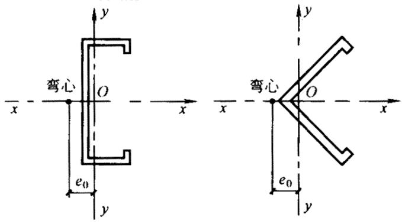  
图5.2.4单轴对称开口截面示意图

5.2.5 有缀板的单轴对称开口截面轴心受压构件弯扭屈曲的换算长细比 $\lambda _{ \omega }$ 可按公式  
5.2.4-1 计算，约束系数划 ， $\beta$ 按表 5.2.4 采用，但扭转屈曲的计算长度 $l _{ \omega } = \beta \bullet a$ ，a为缀板中心线的最大间距。

构件两支承点间至少应设置2块缀板（不包括构件支承点处的缀板或封头板在内）。

5.2.6 格构式轴心受压构件的稳定性应按公式 5.2.2 计算，其长细比应按下列规定取$\lambda _{ o x }$ 和 $\lambda _{ o y }$ 中的较大值：

1 缀板连接的双肢格构式构件（如图 5.2.6a 所示）。

$$\lambda_{a x} = \lambda_{x} \tag {5.2.6-1}$$

$$\lambda_{o y} = \sqrt {\lambda_{y} ^{2} + \lambda_{1} ^{2}} \tag {5.2.6-2}$$

2 缀条连接的双肢格构式构件（如图 5.2.6b 所示）。

$$\lambda_{o x} = \lambda_{x}$$

$$\lambda_{o y} = \sqrt {\lambda_{y} ^{2} + 2 7 \frac {A}{A _{1}}} \tag {5.2.6-3}$$

3 缀条连接的三肢格构式构件（如图5.2.6c所示）。

$$\lambda_{o x} = \sqrt {\lambda_{x} ^{2} + \frac {4 2 A}{A _{1} \left(1 . 5 - \cos^{2} \theta\right)}} \tag {5.2.6-4}$$

$$\lambda_{o y} = \lambda_{t} ^{2} + \frac {4 2 A}{A _{1} \cdot \cos^{2} \theta} \tag {5.2.6-5}$$

式中 $\lambda _{ o x }$ 、 $\lambda _{ o y }$ — 格构式构件的换算长细比；

$\lambda _{ x }$ 整个构件对x轴的长细比;

$\lambda _{ y }$ 整个构件对虚轴（y轴）的长细比；

$\lambda _{ \mathrm { 1 } }$ ——单肢对其自身主轴（1轴）的长细比，计算长度取缀板间净距；

A— 所有单肢毛截面的面积之和；

$A _{ 1 }$ —— 构件横截面所截各斜缀条毛截面面积之和。

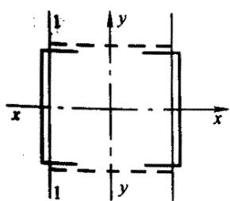  
(a）

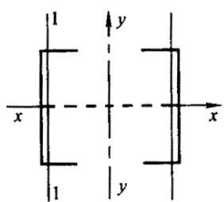  
(b)

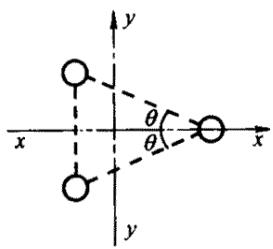  
（c）

格构式轴心受压构件，当缀材为缀条时，其分肢的长细比 $\lambda _{ \mathrm { 1 } }$ 不应大于构件最大长细

比 $\lambda _{ m z x }$ 的 0.7 倍；当缀材为缀板时， $\lambda _{ \mathrm { { \scriptscriptstyle 1 } } }$ 不应大于 40，且不应大于 $\lambda _{ m z x }$ 的 0.5 倍（当 $\lambda _{ m z x } <$ 50 时，取 $\lambda _{ m z x } = 5 0 ~ )$ ，此时可不计算单肢的强度和稳定性。

斜缀条与构件轴线间的夹角宜不小于 $4 0 ^{ \circ }$ °不大于 70°。

5.2.7 格构式轴心受压构件的剪力应按下式计算：

$$V = \frac {f A}{8 0} \sqrt {\frac {f _{y}}{2 3 5}} \tag {5.2.7}$$

式中 V ——剪力；

A— 构件所有单肢毛截面面积之和；

$f _{ y }$ ——钢材的屈服强度，Q235 钢的 $f _{ y } { = } 2 3 5 \mathrm { N / m m } ^{ 2 }$ ，Q345 钢的 $f _{ y } = 3 4 5 \mathrm { N / m m } ^{ 2 }$

剪力V 值沿构件全长不变，由承受该剪力的有关缀板或缀条分担。

## 5.3 受 弯 构 件

5.3.1 荷载通过截面弯心并与主轴平行的受弯构件（如图 5.3.1 所示）的强度和稳定性应按下列公式计算：

强度 $\sigma = \frac { M _{ \mathrm { m a x } } } { W _{ e n x } } \leqslant f$ M max ≤ f （5.3.1-1） Wenx

$$\tau = \frac {V _{m z x} S}{I t} \leqslant f _{v} \tag {5.3.1-2}$$

稳定性： $\frac { M _{ \operatorname* { m a x } } } { \varphi _{ b x } W _{ e x } } \leqslant f$ （ 5.3.1-3）

式中 $M _{ \mathrm { m a x } }$ 跨间对主轴x轴的最大弯矩；

V $V _{ m z x }$ 最大剪力；

$W _{ e n x }$ enxW 对主轴x轴的较小有效净截面模量；

T -剪应力；

S — 计算剪应力处以上截面对中和轴的面积矩；

I 毛截面惯性矩；

腹板厚度之和；

$\varphi _{ b x }$ Pbx -受弯构件的整体稳定系数，应按本规范附录A中A.2的规定计算；

$W _{ e x }$ — 对截面主轴x轴的受压边缘的有效截面模量；

$f _{ \nu }$ — 钢材抗剪强度设计值。

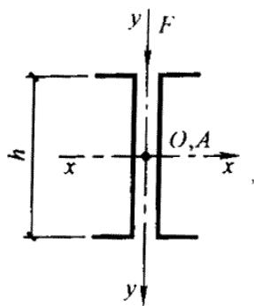

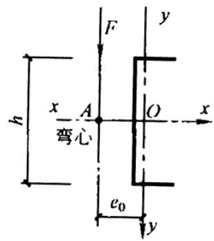

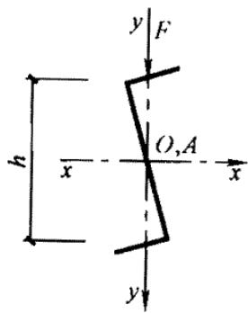  
图5.3.1 荷载通过弯心并与主轴平行的受弯构件截面示意图

5.3.2 荷载偏离截面弯心但与主轴平行的受弯构件（如图 5.3.2 所示）的强度和稳定性应按下列公式计算：

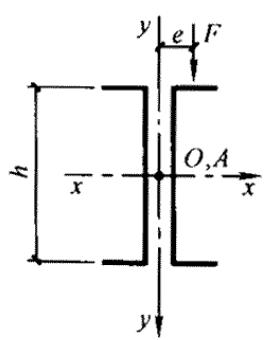

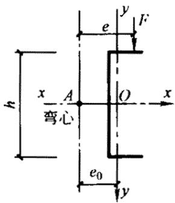

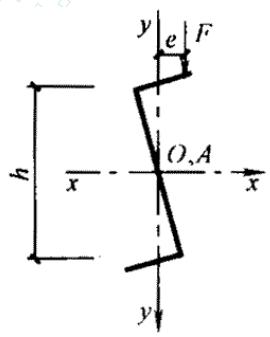  
图5.3.2荷载偏离弯心但与主轴平行的受弯构件截面示意图

强度： $\sigma = \frac { M } { W _{ e n x } } + \frac { B } { W _{ \omega } } \leq f$ （5.3.2-1）

稳定性： $\frac { M _{ \operatorname* { m a x } } } { \varphi _{ b x } W _{ e x } } + \frac { B } { W _{ \omega } } \ : \leqslant f$ （5.3.2-2） bx

式中 M ——计算弯矩；

B ——与所取弯矩同一截面的双力矩，当受弯构件的受压翼缘上有铺板，且与受压翼缘牢固相连并能阻止受压翼缘侧向变位和扭转时， =0，此时可不验B算受弯构件的稳定性。其他情况，B 可按本规范附录 A 中 A. 4 的规定计算；Wω — $W _{ \omega }$ 与弯矩引起的应力同一验算点处的毛截面扇性模量。

剪应力可按公式5.3.1-2验算。

5.3.3 荷载偏离截面弯心且与主轴倾斜的受弯构件（如图 5.3.3 所示），当在构造上能

保证整体稳定性时，其强度可按式5.3.3-1 计算：

$$\sigma = \frac {M _{x}}{W _{e n x}} + \frac {M _{y}}{W _{e n y}} + \frac {B}{W _{\omega}} \leqslant f \tag {5.3.3-1}$$

式中 $M _{ x } \setminus M _{ y }$ — 对截面主轴 、y轴的弯矩（图5.3.3所示的截面中，x轴为强轴，x轴为弱轴）；y

$W _{ e n y }$ eny 对截面主轴y轴的有效净截面模量。

x 轴和 y 轴方向的剪应力可分别按公式 5.3.1-2 验算。

上述受弯构件，当不能在构造上保证整体稳定性时，可按公式5.3.3-2计算其稳定性：

$$\frac {M _{x}}{\varphi_{b x} W _{e x}} + \frac {M}{W _{e y}} + \frac {B}{W _{\omega}} \tag {5.3.3-2}$$

式中 $W _{ e y }$ Wey 对截面主轴Y轴的受压边缘的有效截面模量。

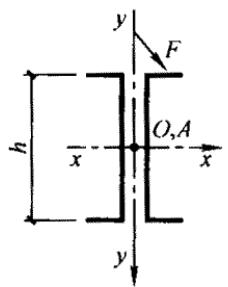  
(a)

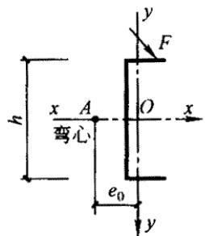

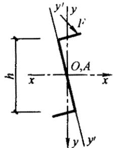

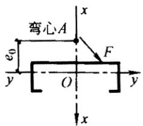  
(d）  
图5.3.3荷载偏离弯心且与主轴倾斜的受弯构件截面示意图

5.3.4 受弯构件支座处的腹板，当有加劲肋时应按公式 5.2.2 计算其平面外的稳定性，计算长度取受弯构件截面的高度，截面积取加劲肋截面积及加劲肋两侧各 $1 5 t \sqrt { 2 3 5 / f _{ y } }$ 宽度范围内的腹板截面积之和（t为腹板厚度）。

支座处无加劲肋时，应按第 7.1.7 条的规定验算局部受压承载力。

## 5.4 拉 弯 构 件

5.4.1 拉弯构件的强度应按下式计算：

$$\sigma = \frac {N}{A _{n}} \pm \frac {M _{x}}{W _{n x}} \pm \frac {M _{y}}{W _{n y}} \leqslant f \tag {5.4.1}$$

式中 $W _{ n x }$ 、 $W _{ n y }$ — 对截面主轴 、 轴的净截面模量。x y

若拉弯构件截面内出现受压区，且受压板件的宽厚比大于第 5.6.1 条规定的有效宽厚比时，则在计算其净截面特性时应按图5.6.5所示位置扣除受压板件的超出部分。

## 5.5 压 弯 构 件

5.5.1 压弯构件的强度应按下式计算：

$$\sigma = \frac {N}{A _{e n}} \pm \frac {M _{x}}{W _{e n x}} \pm \frac {M _{y}}{W _{e n y}} \leqslant f \tag {5.5.1}$$

5.5.2 双轴对称截面的压弯构件，当弯矩作用于对称平面内时，应按公式 5.5.5.2-1 计算弯矩作用平面内的稳定性：

$$\frac {N}{\varphi A _{e}} + \frac {\beta_{m} M}{\left(1 - \frac {N}{N _{E} ^{\prime}} \varphi\right) W _{e}} \leqslant f \tag {5.5.2-1}$$

式中 M — 计算弯矩，取构件全长范围内的最大弯矩；

$\beta _{ m }$ βm 等效弯矩系数；

$N _{ E } ^{ \prime }$ — 钢材的弹性模量；

E — 钢材的弹性模量。

一 -构件在弯矩作用平面内的长细比;

$W _{ e }$ — 对最大受压边缘的有效截面模量。

当弯矩作用在最大刚度平面内时（如图5.5.2所示），尚应按公式5.5.2-2计算弯矩作用平面外的稳定性：

$$\frac {N}{\varphi_{y} A _{e}} + \frac {\eta M _{x}}{\varphi_{b x} W _{e x}} \leqslant f \tag {5.5.2-2}$$

式中 η ——截面系数，对闭口截面η =0.7，对其他截面η =1.0；

$\varphi _{ y }$ -对y轴的轴心受压构件的稳定系数，其长细比应按公式5.2.3-2计算；

$\varphi _{ b x }$ -当弯矩作用于最大刚度平面内时，受弯构件的整体稳定系数，应按本规范附录 A 中 A.2 的规定计算，对于闭口截面可取 ${ { \varphi } _{ b x } } ^{ = 1 , 0 }$ 。

$M _{ x }$ 应取构件计算段的最大弯矩。

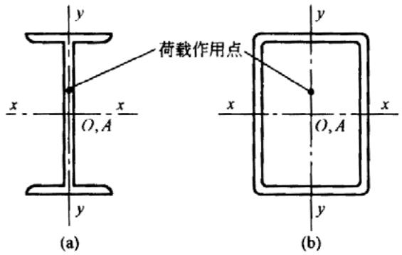  
图5.5.2双轴对称截面示意图

5.5.3 压弯构件的等效弯矩系数 $\beta _{ m }$ 应按下列规定采用：

1 构件端部无侧移且无中间横向荷载时：

$$\beta_{m} = 0. 6 + 0. 4 \frac {M _{2}}{M _{1}} \tag {5.5.3}$$

式中 $M _{ 1 }$ 、 $M _{ 2 }$ ——分别为绝对值较大和较小的端弯矩，当构件以单曲率弯曲时 2M 取 $\frac { M _{ 2 } } { M _{ 1 } }$ 正值，当构件以双曲率弯曲时， $\frac { M _{ 2 } } { M _{ 1 } }$ 2 取负值。1M

2 构件端部无侧移但有中间横向荷载时：

$$\beta_{m} = 1. 0$$

3 构件端部有侧移时：

$$\beta_{m} = 1. 0$$

5.5.4 单轴对称开口截面（如图5.2.4所示）的压弯构件，当弯矩作用于对称平面内时，除应按第5.5.2条计算弯矩作用平面内的稳定性外，尚应按公式 5.2.2计算其弯矩作用平面外的稳定性，此时，公式 5.2.2 中的轴心受压构件稳定系数 $\varphi$ 应按公式 5.5.4-1 算得的弯扭屈曲的换算长细比 $\lambda _{ \omega }$ 由本规范表 A.1.1-1 或表 A.1.1-2 查得。

$$\lambda_{\omega} = \lambda_{x} \sqrt {\frac {s ^{2} + a ^{2}}{2 s ^{2}} + \sqrt {\left(\frac {s ^{2} + a ^{2}}{2 s ^{2}}\right) ^{2} - \frac {a ^{2} - a \left(e _{0} - e _{x}\right) ^{2}}{s ^{2}}}} \tag {5.5.4-1}$$

$$a ^{2} = e _{0} ^{2} + i _{x} ^{2} + 2 e _{x} \left(\frac {U _{y}}{2 I _{y}} - e _{0} - \xi_{2} e _{a}\right) \tag {5.5.4-2}$$

$$U _{y} = \int_{A} x \left(x ^{2} + y ^{2}\right) d A \tag {5.5.4-3}$$

式中 $e _{ x }$ — 等效偏心距， $e _{ x } = \pm \frac { \beta _{ m } M } { N }$ 当偏心在截面弯心一侧时 $e _{ x }$ 为负，当偏心在与截面弯心相对的另一侧时 $e _{ x }$ 为正。 取构件计算段的最大弯矩；M

$\boldsymbol { \xi } _{ 2 }$ -横向荷载作用位置影响系数，查表A.2.1;

s 计算系数，按公式 5.2.4-2 计算；

$e _{ a }$ — —横向荷载作用点到弯心的距离：对于偏心压杆或当横向荷载作用在弯心时$e _{ a } { = } 0$ ；当荷载不作用在弯心且荷载方向指向弯心时 $e _{ a }$ ，为负，而离开弯心时 $e _{ a }$ ，为正。

若 $l _{ o x } \leqslant l _{ 0 y }$ 当压弯构件采用本规范表B.1.1-3或表B.1.1-4中所列型钢或当 $e _{ x } + { \frac { e _{ 0 } } { 2 } }$ ≤O 时，可不计算其弯矩作用平面外的稳定性。

当弯矩作用在对称平面内（如图5.2.4所示），且使截面在弯心一侧受压时，尚应按下式计算：

$$\left| \frac {N}{A _{e}} - \frac {\beta_{m y} M _{Y}}{\left(1 - \frac {N}{N _{E Y} ^{\prime}}\right) W _{e y} ^{\prime}} \right| \leqslant f \tag {5.5.4-4}$$

式中 $\beta _{ m y }$ — 对 轴的等效弯矩系数，应按第 5.5.3 条的规定采用；y

$W _{ e y } ^{ \prime }$ — 截面的较小有效截面模量；

$N _{ E Y } ^{ \prime }$ — —系数， $N _{ _ { E Y } } ^{ \prime } = \frac { \pi ^{ 2 } E A } { 1 . 6 5 \lambda _{ _ Y } ^{ 2 } }$

5.5.5 单轴对称开口截面压弯构件，当弯矩作用于非对称主平面内时（如图5.5.5所示），除应按公式5.5.5-1计算其弯矩作用平面内的稳定性外，尚应按公式 5.5.5-2计算其弯矩作用平面外的稳定性。

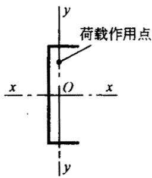  
图5.5.5单轴对称开口截面绕对称轴弯曲示意图

$$\begin{array}{l} \frac {N}{\varphi_{x} A _{e}} + \frac {\beta_{m} M _{x}}{\left(1 - \frac {N}{N _{E X} ^{\prime}} \varphi_{x}\right) W _{e x}} + \frac {B}{W _{\omega}} \leqslant f (5.5.5-1) \\ \frac {N}{\varphi_{y} A _{e}} + \frac {M _{x}}{\varphi_{b x} W _{e x}} + \frac {B}{W _{\omega}} \leqslant f (5.5.5-2) \\ \end{array}$$

式中 $\varphi _{ x }$ ——对 轴的轴心受压构件的稳定系数，其长细比应按公式 5.2.4-1 计算；x

$N _{ E X } ^{ \prime }$ — 系数， $N _{ _ { E X } } ^{ \prime } = \frac { \pi ^{ 2 } E A } { 1 . 1 6 5 \lambda _{ _ X } ^{ 2 } }$ 。

5.5.6 双轴对称截面双向压弯构件的稳定性应按下列公式计算：

$$\begin{array}{l} \frac {N}{\varphi_{X} A _{c}} + \frac {\beta_{m x} M _{x}}{\left(1 - \frac {N}{N _{E X} ^{\prime}} \varphi_{X}\right) W _{e x}} + \frac {\eta M _{y}}{\varphi_{b y} W _{e y}} \leqslant f (5.5.6-1) \\ \frac {N}{\varphi_{X} A _{c}} + \frac {\eta M _{x}}{\varphi_{b x} W _{e x}} + \frac {\beta_{m y} M _{y}}{\left(1 - \frac {N}{N _{E Y} ^{\prime}} \varphi_{y}\right) W _{e y}} \leqslant f (5.5.6-2) \\ \end{array}$$

式中 — $\varphi _{ b y }$ 当弯矩作用于最小刚度平面内时，受弯构件的整体稳定系数，应按本规范附录 A 中 A.2 的规定计算；

$\beta _{ m y }$ βmy -对x轴的等效弯矩系数，应按第5.5.3条的规定采用。

5.5.7 格构式压弯构件，除应计算整个构件的强度和稳定性外，尚应计算单肢的强度和稳定性。

计算缀板或缀条内力用的剪力，应取构件的实际剪力和按第5.2.7条算得的剪力中的较大值。

5.5.8 格构式压弯构件，当弯矩绕实轴（X 轴）作用时，其弯矩作用平面内和平面外的

整体稳定性计算均与实腹式构件相同，但在计算弯矩作用平面外的整体稳定性时，公式5.5.2-2 中的 $\varphi _{ y }$ ，应按第 5.2.6 条中的换算长细比 $\lambda _{ o y }$ 确定， $\varphi _{ b }$ 应取 1.0；当弯矩绕虚轴（Y 轴）作用时，其弯矩作用平面内的整体稳定性应按下式计算：

$$\frac {N}{\varphi_{X} A _{c}} + \frac {\beta_{m y} M _{y}}{\left(1 - \frac {N}{N _{E Y} ^{\prime}} \varphi_{y}\right) W _{e y}} \leqslant f \tag {5.5.8}$$

式中 $\varphi _{ y } \setminus N _{ E Y } ^{ \prime }$ 均应按换算长细比 $\lambda _{ 0 y }$ ，确定，弯矩作用平面外的整体稳定性可不计算，但应计算分肢的稳定性。

## 5.6 构件中的受压板件

5.6.1 加劲板件、部分加劲板件和非加劲板件的有效宽厚比应按下列公式计算：

当 $\frac { b } { t } \leqslant 1 8 \alpha \rho$ 时：

$$\frac {b _{e}}{t} = \frac {b _{c}}{t} \tag {5.6.1-1}$$

$\ Y \vert 9 \alpha \rho < \frac { b } { t } < 3 8 \alpha \rho$ 时：

$$\frac {b _{c}}{t} = \left[ \sqrt {\frac {2 1 . 8 \alpha \rho}{\frac {b}{t}}} - 0. 1 \right] \frac {b _{c}}{t} \tag {5.6.1-2}$$

当 $\frac { b } { t } \geqslant 3 8 \alpha \rho$ 时：

$$\frac {b _{c}}{t} = \frac {2 5 \alpha \rho}{\frac {b}{t}} \cdot \frac {b _{c}}{t} \tag {5.6.1-3}$$

式中 b ——板件宽度；

t 板件厚度；

$b _{ e }$ eb 板件有效宽度；

$\alpha$ -计算系数，α=1.15-0.15，当 $\psi < 0$ 时，取α=1.15;

y 压应力分布不均匀系数， $\psi = \frac { \sigma _{ \mathrm { m i n } } } { \sigma _{ \mathrm { m a x } } }$

$\sigma _{ \mathrm { m a x } }$ 受压板件边缘的最大压应力 $\mathrm { { ( N / m m ^{ 2 } ) } }$ ），取正值；

$\sigma _{ \mathrm { m i n } }$ Omin 受压板件另一边缘的应力 $\mathrm { { ( N / m m ^{ 2 } ) } }$ ），以压应力为正，拉应力为负；

$b _{ c }$ ——板件受压区宽度，当 $\psi \geqslant 0$ 时， $b _{ c } ^{ = } b$ ；当 $\psi < 0$ 时， $b _{ c } = \frac { b } { 1 - \psi }$ ；

$\rho$ 一 计算系数，p=√ $\rho = \sqrt { \frac { 2 0 5 k _{ \mathrm { l } } k } { \sigma _{ \mathrm { l } } } }$ 其中 $\sigma _{ 1 }$ 按本规范第5.6.7条、5.6.8条的规定确定；

—k —板件受压稳定系数，按第 5.6.2 条的规定确定；

$k _{ 1 }$ ——板组约束系数，按第 5.6.3 条的规定采用；若不计相邻板件的约束作用，可取 $k _{ 1 } { = } 1$ 。

5.6.2 受压板件的稳定系数可按下列公式计算：

1 加劲板件。

当 $1 > \psi > 0$ 时：

$$k = 7. 8 - 8. 1 5 \psi + 4. 3 5 \psi^{2} \tag {5.6.2-1}$$

当 $0 \geqslant \psi \geqslant - 1$ 时：

$$k = 7. 8 - 6. 2 9 \psi + 9. 7 8 \psi^{2} \tag {5.6.2-2}$$

2 部分加劲板件。

1）最大压应力作用于支承边（如图 5.6.2a 所示）。

当 $\psi \geqslant - 1$ 时：

$$k = 5. 8 9 - 1 1. 5 9 \psi + 6. 6 8 \psi^{2} \tag {5.6.2-3}$$

2）最大压应力作用于部分加劲边（如图 5.6.2b 所示）。

当 $\psi \geqslant _{ - 1 }$ 时：

$$k = 1. 1 5 - 0. 2 2 \psi + 0. 0 4 5 \psi^{2} \tag {5.6.2-4}$$

3 非加劲板件。

1）最大压应力作用于支承边（如图 5.6.2c 所示）。

当 $1 \geqslant \psi > 0$ 时：

$$k = 1. 7 0 - 3. 0 2 5 \psi + 1. 7 5 \psi^{2} \tag {5.6.2-5}$$

当 0≥ψ -0.4 时：

$$k = 1. 7 0 - 1. 7 5 \psi + 5 5 \psi^{2} \tag {5.6.2-6}$$

当-0. $4 \geqslant { \psi }$ -1 时：

$$k = 6. 0 7 - 9. 5 1 \psi + 8. 3 3 \psi^{2} \tag {5.6.2-7}$$

2）最大压应力作用于自由边（如图 5.6.2d 所示）。

当 $\psi \geqslant - 1$ 时：

$$k = 0. 5 6 7 - 0. 2 1 3 \psi + 0. 0 7 1 \psi^{2} \tag {5.6.2-8}$$

注：当ψ ＜-1 时，以上各式的 k 值按ψ ＝-1：的值采用。

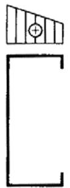  
(a)

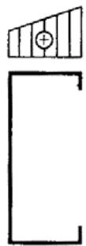  
(b)

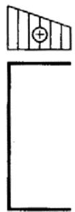  
(c）

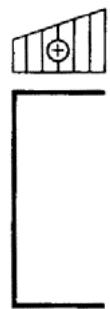  
(d）  
图5.6.2部分加劲板件和非加劲板件的应力分布示意图

5.6.3 受压板件的板组约束系数应按下列公式计算：

当 $\xi \leqslant 1$ .1

$$k _{1} = \frac {1}{\sqrt {\xi}} \tag {5.6.3-1}$$

当 $\xi > 1$ .1 时

$$k _{1} = 0. 1 1 + \frac {0 . 9 3}{(\xi - 0 . 0 5) ^{2}} \tag {5.6.3-2}$$

$$\xi = \frac {c}{b} \sqrt {\frac {k}{k _{c}}} \tag {5.6.3-3}$$

式中 b —— 计算板件的宽度；

c 与计算板件邻接的板件的宽度，如果计算板件两边均有邻接板件时，即计算板件为加劲板件时，取压应力较大一边的邻接板件的宽度；

k — 计算板件的受压稳定系数，由第5.6.2条确定；

$k _{ c }$ — 邻接板件的受压稳定系数，由第 5.6.2 条确定。

当 $k _{ 1 } > k _{ 1 } ^{ \prime }$ 时，取 $k _{ 1 } { = } k _{ 1 } ^{ \prime } , \quad k _{ 1 } ^{ \prime }$ 为 $k _{ 1 }$ 的上限值。对于加劲板件 $k _{ 1 } ^{ \prime } { = } 1 . ~ 7$ ；对于部分加劲板件 $k _{ 1 } ^{ \prime } { = } 2 . ~ 4$ ；对于非加劲板件 $k _{ 1 } ^{ \prime } { = } 3 . 0 .$ .当计算板件只有一边有邻接板件，即计算板件为非加劲板件或部分加劲板件，且邻接板件受拉时，取 $k _{ 1 } ^{ \prime } = k _{ 1 } ^{ \prime }$ 。

5.6.4 部分加劲板件中卷边的高厚比不宜大于12，卷边的最小高厚比应根据部分加劲板的宽厚比按表5.6.4采用。

表 5.6.4 卷边的最小高厚比  

| b/t | 15 | 20 | 25 | 30 | 35 | 40 | 45 | 50 | 55 | 60 |
| --- | --- | --- | --- | --- | --- | --- | --- | --- | --- | --- |
| a/t | 5.4 | 6.3 | 7.2 | 8.0 | 8.5 | 9.0 | 9.5 | 10.0 | 10.5 | 11.0 |
| 注：a——卷边的高度；b——带卷边的板件的宽度；t——板厚。 | 注：a——卷边的高度；b——带卷边的板件的宽度；t——板厚。 | 注：a——卷边的高度；b——带卷边的板件的宽度；t——板厚。 | 注：a——卷边的高度；b——带卷边的板件的宽度；t——板厚。 | 注：a——卷边的高度；b——带卷边的板件的宽度；t——板厚。 | 注：a——卷边的高度；b——带卷边的板件的宽度；t——板厚。 | 注：a——卷边的高度；b——带卷边的板件的宽度；t——板厚。 | 注：a——卷边的高度；b——带卷边的板件的宽度；t——板厚。 | 注：a——卷边的高度；b——带卷边的板件的宽度；t——板厚。 | 注：a——卷边的高度；b——带卷边的板件的宽度；t——板厚。 | 注：a——卷边的高度；b——带卷边的板件的宽度；t——板厚。 |

5.6.5 当受压板件的宽厚比大于第5.6.1条规定的有效宽厚比时，受压板件的有效截面应自截面的受压部分按图5.6.5所示位置扣除其超出部分（即图中不带斜线部分）来确定，截面的受拉部分全部有效。

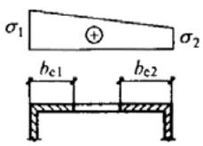

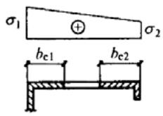

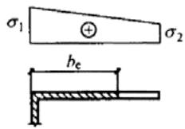

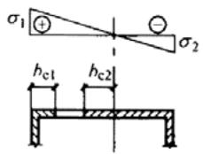  
(a)加劲板件

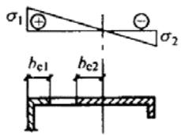  
(b)部分加劲板件

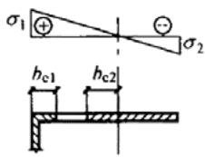  
(c）非加劲板件  
图5.6.5受压板件的有效截面图

图 5.6.5 中的 $b _{ e 1 }$ 和 $b _{ e 2 }$ 按下列规定计算：

对于加劲板件：

当 $\psi \geqslant 0$ 时：

$$b _{e 1} = \frac {2 b _{c}}{5 - \psi}, \quad b _{c 2} = b _{c} - b _{c 1} \tag {5.6.5-1}$$

当ψ ＜0 时：

$$b _{e 1} = 0. 4 b, \quad b _{e 2} = 0. 6 b _{c} \tag {5.6.5-2}$$

对于部分加劲板件及非加劲板件：

$$b _{e 1} = 0. 4 b _{e}, \quad b _{e 2} = 0. 6 b _{e} \tag {5.6.5-3}$$

式中 $b _{ e }$ 按第 5.6.1 条确定。

5.6.6 圆管截面构件的外径与壁厚之比符合第4.3.2条的规定时，在计算中可取其截面全部有效。  
5.6.7 在轴心受压构件中板件的有效宽厚比应根据由构件最大长细比所确定的轴心受压构件的稳定系数与钢材强度设计值的乘积（ϕf ）作为 $\sigma _{ 1 }$ ，按第 5.6.1 条的规定计算。  
5.6.8 在拉弯、压弯和受弯构件中板件的有效宽厚比应按下列规定确定：

1 对于压弯构件，截面上各板件的压应力分布不均匀系数 $\psi$ 应由构件毛截面按强度计算，不考虑双力矩的影响。最大压应力板件的 $\sigma _{ 1 }$ 取钢材的强度设计值 其余板件的最大压应力按推算。有效宽厚比按第5.6.1条的规定计算。

2 对于受弯及拉弯构件，截面上各板件的压应力分布不均匀系数ψ 及最大压应力应由构件毛截面按强度计算，不考虑双力矩的影响。有效宽厚比按第 5.6.1 条的规定计算。  
3 板件的受拉部分全部有效。

# 6 连接的计算与构造

## 6.1 连接的计算

6.1.1 对接焊缝和角焊缝的强度应按下列公式计算：

1 对接焊缝轴心受拉。

$$\sigma = \frac {N}{l _{w} t} \leqslant f _{t} ^{w} \tag {6.1.1-1}$$

2 对接焊缝轴心受压。

$$\sigma = \frac {N}{l _{w} t} \leqslant f _{c} ^{w} \tag {6.1.1-2}$$

3 对接焊缝受弯同时受剪。

拉应力：

$$\sigma = \frac {M}{W _{f}} \leqslant f _{t} ^{w} \tag {6.1.1-3}$$

剪应力：

$$\tau = \frac {V S _{f}}{I _{f} t} \leqslant f _{v} ^{w} \tag {6.1.1-4}$$

对接焊缝中剪应力τ 和正应力 $\sigma$ 均较大处：

$$\sqrt {\sigma^{2} + 3 \tau^{2}} \leqslant 1. 0 f _{t} ^{w} \tag {6.1.1-5}$$

4 正面直角角焊缝受剪（作用力垂直于焊缝长度方向）。

$$\sigma_{f} = \frac {N}{0 . 7 h _{f} l _{w}} \leqslant 1. 2 2 f _{f} ^{w} \tag {6.1.1-6}$$

5 侧面直角角焊缝受剪（作用力平行于焊缝长度方向）。

$$\tau_{f} = \frac {N}{0 . 7 h _{f} l _{w}} \leqslant f _{f} ^{w} \tag {6.1.1-7}$$

6 在垂直于角焊缝长度方向的应力 $\sigma _{ f }$ 和沿角焊缝长度方向的剪应力 $\tau _{ f }$ 共同作用处。

$$\sqrt {\left(\frac {\sigma_{f}}{1 . 2 2}\right) ^{2} + \tau_{f} ^{2}} \leqslant f _{f} ^{w} \tag {6.1.1-8}$$

式中 $l _{ w }$ ——焊缝计算长度之和。采用引弧板或引出板施焊的对接焊缝，每条焊缝的计算长度可取其实际长度l ；不符合上述施焊方法的对接焊缝和所有角焊缝，每条焊缝的计算长度均取实际长度l 减去 $2 h _{ f }$ ；

$h _{ f }$ — 角焊缝的焊脚尺寸；

连接构件中较薄板件的厚度；

$W _{ f }$ — 焊缝截面模量；

$S _{ f }$ — 焊缝截面的最大面积矩；

$I _{ f }$ — 焊缝截面惯性矩；

$\sigma _{ f }$ -垂直于焊缝长度方向的应力，按焊缝有效截面 $( 0 . 7 h _{ f } l _{ w } )$ 计算；

$\tau _{ f }$ — 沿焊缝长度方向的剪应力，按焊缝有效截面 $( 0 . 7 h _{ f } l _{ w } )$ ）计算；

$f _{ c } ^{ w }$ 、 $f _{ t } ^{ w }$ — 对接焊缝的抗压、抗拉强度设计值；

$f _{ \nu } ^{ w }$ 对接焊缝的抗剪强度设计值；

$f _{ f } ^{ w }$ — 角焊缝的抗压、抗拉和抗剪强度设计值。

6.1.2 喇叭形焊缝的强度应按下列公式计算：

1 当连接板件的最小厚度小于或等于4mm时，轴力 垂直于焊缝轴线方向作用的焊N缝（如图6.1.2-1所示）的抗剪强度应按下式计算：

$$\tau = \frac {N}{l _{w} t} \leqslant 0. 8 f \tag {6.1.2-1}$$

轴力 平行于焊缝轴线方向作用的焊缝（如图6.1.2-2所示）的抗剪强度应按下式N计算：

$$\tau = \frac {N}{l _{w} t} \leqslant 0. 7 f \tag {6.1.2-2}$$

式中 t — 连接钢板的最小厚度；

$l _{ w }$ 焊缝计算长度之和，每条焊缝的计算长度均取实际长度l 减去 $2 h _{ f } \ h _{ f }$ 应按

图 6.1.2-3 确定；

f — 连接钢板的抗拉强度设计值。

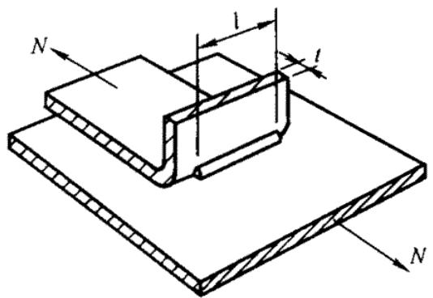  
图6.1.2-1端缝受剪的单边喇叭形焊缝

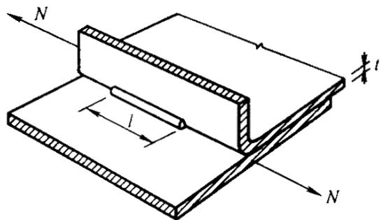  
（a）单边喇叭形焊缝

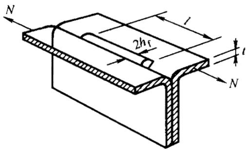  
(b）喇叭形焊缝

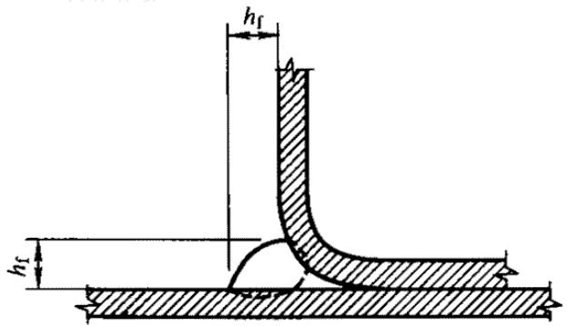  
图6.1.2-2 纵向受剪的喇叭形焊缝  
图6.1.2-3单边喇叭形焊缝

2 当连接板件的最小厚度大于4mm时，纵向受剪的喇叭形焊缝的强度除按公式6.1.2-2 计算外，尚应按公式 6.1.1-7 做补充验算，但 $h _{ f }$ 应按图 6.1.2-2b 或图 6.1.2-3确定。

6.1.3 电阻点焊可用于构件的缀合或组合连接，每个焊点所承受的最大剪力不得大于本规范表4.2.6中规定的抗剪承载力设计值。  
6.1.4 普通螺栓的强度应按下列规定计算：

1 在普通螺栓杆轴方向受拉的连接中，每个螺栓所受的拉力不应大于按下式计算的抗拉承载力设计值 $\boldsymbol { N } _{ t } ^{ b }$ 。

$$N _{t} ^{b} = \frac {\pi d _{e} ^{2}}{4} f _{t} ^{b} \tag {6.1.4-1}$$

式中 $d _{ e }$ — 螺栓螺纹处的有效直径；

$\boldsymbol { f } _{ t } ^{ b }$ — 螺栓的抗拉强度设计值。

2 在普通螺栓的受剪连接中，每个螺栓所受的剪力不应大于按下列公式计算的抗剪承载力设计值 $\boldsymbol { N } _{ \nu } ^{ b }$ 和承压承载力设计值 $\boldsymbol { N } _{ c } ^{ b }$ 的较小者。

抗剪承载力设计值：

$$N _{v} ^{b} = n _{v} \frac {\pi d ^{2}}{4} f _{v} ^{b} \tag {6.1.4-2}$$

承压承载力设计值：

$$N _{c} ^{b} = d \sum t f _{c} ^{b} \tag {6.1.4-3}$$

式中 $n _{ \nu }$ — 剪切面数；

d 螺杆直径，对于全螺纹螺栓，取 $d = d _{ e }$ ；

∑ t ——同一受力方向的承压构件的较小总厚度；

$f _{ c } ^{ b }$ 、 $\boldsymbol { f } _{ \nu } ^{ b }$ — 螺栓的承压、抗剪强度设计值。

3 同时承受剪力和杆轴方向拉力的普通螺栓连接，应符合下列公式要求：

$$\sqrt {\left(\frac {N _{v}}{N _{v} ^{b}}\right) ^{2} + \left(\frac {N _{t}}{N _{t} ^{b}}\right) ^{2}} \leqslant 1 \tag {6.1.4-4}$$

$$N _{v} \leqslant N _{c} ^{b} \tag {6.1.4-5}$$

式中 $N _{ \nu }$ 、 $N _{ { t } }$ —— 每个螺栓所承受的剪力和拉力。

6.1.5 高强度螺栓摩擦型连接中，高强度螺栓的强度应按下列公式计算：

1 每个螺栓所受的剪力不应大于按下式计算的抗剪承载力设计值 $\boldsymbol { N } _{ \nu } ^{ b }$ 。

$$N _{v} ^{b} = \alpha \bullet n _{f} \bullet \mu \bullet P \tag {6.1.5-1}$$

式中 $\alpha$ ——系数，当最小板厚， $t < 6 \mathrm { m m }$ 时取 0.8，当最小板厚， $t > 6 \mathrm { m m }$ 时取 0.9；

$n _{ f }$ — 传力摩擦面数；

$\mu$ -抗滑移系数，应按表6.1.5-1采用；

$P$ 高强度螺栓的预拉力，应按表6.1.5-2采用。

表 6.1.5-1 抗滑移系数 µ 值  

| 连接处构件接触面的处理方法 | 构件的钢材牌号 | 构件的钢材牌号 |
| --- | --- | --- |
| 连接处构件接触面的处理方法 | Q235 | Q345 |
| 喷砂(丸) | 0.40 | 0.45 |
| 热轧钢材轧制表面清除浮锈 | 0.30 | 0.35 |
| 冷轧钢材轧制表面清除浮锈 | 0.25 | - |
| 注:除锈方向应与受力方相垂直 | 注:除锈方向应与受力方相垂直 | 注:除锈方向应与受力方相垂直 |

表 6.1.5-2 高强度螺栓的预拉力P值（KN）  

| 螺栓的性能等能 | 螺栓公称直径（mm） | 螺栓公称直径（mm） | 螺栓公称直径（mm） |
| --- | --- | --- | --- |
| 螺栓的性能等能 | M12 | M14 | M16 |
| 8.8级 | 45 | 60 | 80 |
| 10.9级 | 55 | 75 | 100 |

2 每个螺栓所受的沿螺栓杆轴方向的拉力不应大于按下式计算的抗拉承载力设计值$\boldsymbol { N } _{ t } ^{ b }$ 。

$$N _{t} ^{b} = 0. 8 P \tag {6.1.5-2}$$

3 同时承受摩擦面间的剪力 $N _{ \nu }$ 和沿螺栓杆轴方向的拉力 $N _{ t }$ 作用的高强度螺栓应符合下列公式要求：

$$N _{v} = N _{v} ^{b} = \alpha \bullet n _{f} \bullet \mu \bullet (P - 1. 2 5 N _{t}) \tag {6.1.5-3}$$

$$N _{t} \leqslant 0. 8 P \tag {6.1.5-4}$$

6.1.6 在构件的节点处或拼接接头的一端，当螺栓沿受力方向的连接长度 $l _{ b }$ 大于 15 $d _{ 0 }$

时，应将螺栓的承载力设计值乘以折减系数 $( 1 . 1 - \frac { l _{ b } } { 1 5 0 d _{ 0 } } )$ ；当 $l _{ b }$ 大于 $6 0 d _{ 0 }$ 时，折减系数为 0.7， $d _{ 0 }$ 为孔径。

6.1.7 用于压型钢板之间和压型钢板与冷弯型钢构件之间紧密连接的抽芯铆钉（拉铆钉）、自攻螺钉和射钉连接的强度可按下列规定计算：

1 在压型钢板与冷弯型钢等支承构件之间的连接件杆轴方向受拉的连接中，每个自攻螺钉或射钉所受的拉力应不大于按下列公式计算的抗拉承载力设计值。

当只受静荷载作用时：

$$N _{t} ^{f} = 1 7 t f \tag {6.1.7-1}$$

当受含有风荷载的组合荷载作用时：

$$N _{t} ^{f} = 8. 5 t f \tag {6.1.7-2}$$

式中 $N _{ t } ^{ f }$ — 个自攻螺钉或射钉的抗拉承载力设计值（ N ）；

紧挨钉头侧的压型钢板厚度（mm），应满足 0.5mm≤t ≤1.5mm；

f — 被连接钢板的抗拉强度设计值（N/mm2）。

当连接件位于压型钢板波谷的一个四分点时（如图 6.1.7b 所示），其抗拉承载力设计值应乘以折减系数0.9；当两个四分点均设置连接件时（如图 6.1.7c所示）则应乘以折减系数0.7。

自攻螺钉在基材中的钻入深度 $t _{ c }$ 应大于0.9mm，其所受的拉力应不大于按下式计算的抗拉承载力设计值。

$$N _{t} ^{f} = 0. 7 5 t _{c} d f \tag {6.1.7-3}$$

式中 $d$ ——自攻螺钉的直径（mm）；

$t _{ c }$ 钉杆的圆柱状螺纹部分钻入基材中的深度（mm）；

f — 基材的抗拉强度设计值（N/mm2）。

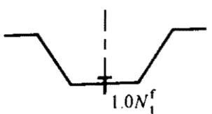

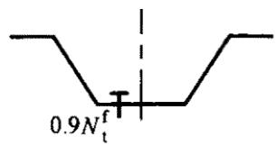  
(b)

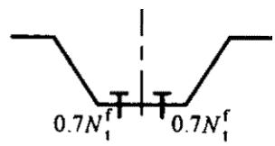  
  
图6.1.7压型钢板连接示意图

2 当连接件受剪时，每个连接件所承受的剪力应不大于按下列公式计算的抗剪承载力设计值。

抽芯铆钉和自攻螺钉：

当 $\frac { t _{ 1 } } { t } = 1$ 时：

$$N _{v} ^{f} = 3. 7 \sqrt {t ^{3} d f} \tag {6.1.7-4}$$

且 $N _{ \nu } ^{ f } \leqslant 2 . 4 t d f$ （6.1.7-5）

当 $\frac { t _{ 1 } } { t } \geqslant 2 . 5$ 时：

$$N _{v} ^{f} = 2. 4 t d f \tag {6.1.7-6}$$

当 $\frac { t _{ 1 } } { t }$ ≥介于 1 和 2.5 之间时， $N _{ _ { \nu } } ^{ f }$ 可由公式 6.1.7-4 和 6.1.7-6 插值求得。式中 $N _{ \nu } ^{ f }$ — 一个连接件的抗剪承载力设计值（N）；

d 铆钉或螺钉直径（mm）；

t 较薄板（钉头接触侧的钢板）的厚度（mm）；

$t _{ 1 }$ ——较厚板（在现场形成钉头一侧的板或钉尖侧的板）的厚度（mm）；

f — 被连接钢板的抗拉强度设计值 $\mathrm { { ( N / m m ^{ 2 } ) } }$ ）。

射钉：

$$N _{v} ^{f} = 3. 7 \text {t d f} \tag {6.1.7-7}$$

式中 t— 被固定的单层钢板的厚度（mm）；

$d$ 射钉直径（mm）；

f — 被固定钢板的抗拉强度设计值 $\mathrm { { ( N / m m ^{ 2 } ) } }$ ）。

当抽芯铆钉或自攻螺钉用于压型钢板端部与支承构件（如檩条）的连接时，其抗剪承载力设计值应乘以折减系数0.8。

3 同时承受剪力和拉力作用的自攻螺钉和射钉连接，应符合下式要求：

$$\sqrt {\left(\frac {N _{v}}{N _{v} ^{f}}\right) ^{2} + \left(\frac {N _{t}}{N _{t} ^{f}}\right) ^{2}} \leqslant 1 \tag {6.1.7-8}$$

式中 $N _{ \nu } \setminus N _{ t }$ — 个连接件所承受的剪力和拉力；

$N _{ _ { \nu } } ^{ f }$ 、 $N _{ t } ^{ f }$ — 个连接件的抗剪和抗拉承载力设计值。

6.1.8 由两槽钢（或卷边槽钢）连接而成的组合工形截面（如图 6.1.8 所示），其连接件（如焊缝、点焊、螺栓等）的最大纵向间距 $a _{ \mathrm { m a x } }$ 应按下列规定采用：

1 对于压弯构件，应取按下列公式算得之较小者。

$$a _{\max } = \frac {n _{1} N _{v} ^{f} I _{y}}{V S _{y}} \tag {6.1.8-1}$$

$$a _{\max } = \frac {l i _{1}}{2 i _{y}} \tag {6.1.8-2}$$

式中 $n _{ 1 }$ ——同一截面处的连接件数；

$N _{ _ { \nu } } ^{ f }$ — 个连接件的抗剪承载力设计值，对于电阻点焊可取 $\begin{array} { r } { N _{ \nu } ^{ f } = \ N _{ \nu } ^{ s } } \end{array}$ ；

$I _{ y }$ — 组合工形截面对平行于腹板的重心轴 y 的惯性矩；

V — 剪力，取实际剪力及按第 5.2.7 条算得的剪力中的较大值；

yS $S _{ y }$ 单个槽钢对y轴的面积矩；

构件支承点间的长度；

$i _{ 1 }$ 单个槽钢对其自身平行于腹板的重心轴的回转半径：

$i _{ \nu }$ — 组合工形截面对y轴的回转半径。

2 对于受弯构件：

$$a _{\max } = \frac {2 N _{t} ^{f} h _{0}}{d q _{0}} \tag {6.1.8-3}$$

式中 $N _{ t } ^{ f }$ — 个连接件的抗拉承载力设计值，对电阻点焊可取 $N _{ t } ^{ f } { = } 0 . 3 N _{ \nu } ^{ s }$

$h _{ 0 }$ — 最靠近上、下翼缘的两排连接件间的垂直距离；

$d$ — 单个槽钢的腹板中面至其弯心的距离；

$q _{ 0 }$ — 等效荷载集度。

受弯构件的等效荷载集度应按下列规定采用：对于分布荷载应取实际荷载集度的3倍；对于集中荷载或反力，应将集中力除以荷载分布长度或连接件的纵向间距，取其中的较大值。

图6.1.8组合工形截面示意图  
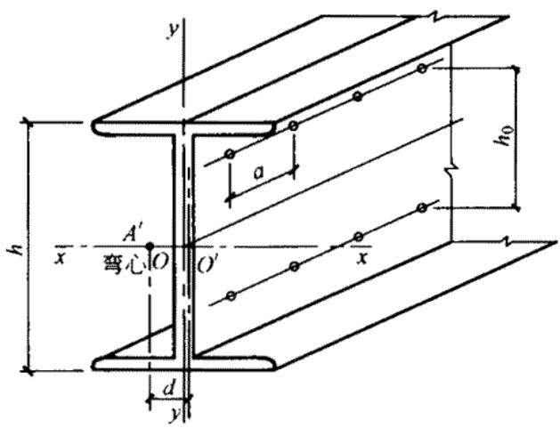  
注： $A ^{ \prime }$ 系单个槽钢的弯心；  
O系单个槽钢腹板中心线与对称轴x的交点。

## 6.2 连接的构造

6.2.1 当被连接板件的厚度t≤6mm时，焊缝的计算长度不得小于30mm；当t＞6mm时，不得小于40mm。角焊缝的焊脚尺寸不宜大于 1.5t（t为相连板件中较薄板件的厚度）。直接相贯的钢管节点的角焊缝焊脚尺寸可放大到 2.0t。  
6.2.2 当采用喇叭形焊缝时，单边喇叭形焊缝的焊脚尺寸 $h _{ f }$ （如图 6.1.2-3 所示）不得小于被连接板件的最小厚度的1.4倍。  
6.2.3 电阻点焊的焊点中距不宜小于 $1 5 \sqrt { t } \quad ( \mathrm { m m } )$ ），焊点边距不宜小于 $1 0 \sqrt { t } \quad \left( \mathrm { m m } \right)$ ）（ t系被连接板件中较薄板件的厚度）。  
6.2.4 螺栓的中距不得小于螺栓孔径 $d _{ 0 }$ 的 3 倍，端距不得小于螺栓孔径的 2 倍，边距不得小于螺栓孔径的 1.5 倍（如图 6.2.4 所示）。在靠近弯角边缘处的螺栓孔边距，尚应满足使用紧固工具的要求。

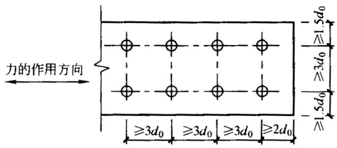  
图6.2.4螺栓最小间距示意图

6.2.5 抽芯铆钉（拉铆钉）和自攻螺钉的钉头部分应靠在较薄的板件一侧。连接件的中距和端距不得小于连接件直径的3倍，边距不得小于连接件直径的1.5倍。受力连接中的连接件数不宜少于2个。  
6.2.6 抽芯铆钉的适用直径为 2.6～6.4mm，在受力蒙皮结构中宜选用直径不小于 4mm的抽芯铆钉；自攻螺钉的适用直径为3.0～8.0mm，在受力蒙皮结构中宜选用直径不小于5mm的自攻螺钉。  
6.2.7 自攻螺钉连接的板件上的预制孔径 $d _{ 0 }$ 应符合下式要求：

$$d _{0} = 0. 7 d + 0. 2 t _{t} \tag {6.2.7-1}$$

且 $d _{ 0 } \leqslant 0 . 9 d$ （6.2.7-2）

式中 $d$ — 自攻螺钉的公称直径（mm）

$t _{ t }$ 被连接板的总厚度（mm）。

6.2.8 射钉只用于薄板与支承构件（即基材如檩条）的连接。射钉的间距不得小于射钉直径的 4.5 倍，且其中距不得小于 20mm，到基材的端部和边缘的距离不得小于 15mm，射钉的适用直径为 3.7～6.0mm。

射钉的穿透深度（指射钉尖端到基材表面的深度，如图 6.2.8 所示）应不小于 10mm。

基材的屈服强度应不小于 $1 5 0 \mathrm { N / m m ^{ 2 } }$ ，被连钢板的最大屈服强度应不大于 $3 6 0 \mathrm { N / m m ^{ 2 } }$ 。基材和被连钢板的厚度应满足表6.2.8-1 和表6.2.8-2的要求。

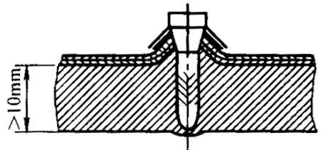

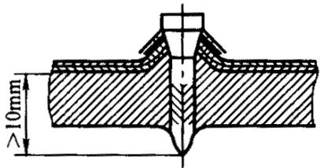  
图6.2.8射钉的穿透深度

表 6.2.8-1 被连钢板的最大厚度（mm）  

| 射钉直径（mm） | ≥3.7 | ≥4.5 | ≥5.2 |
| --- | --- | --- | --- |
| 单一方向 |  |  |  |
| 单层被固定钢板最大厚度 | 1.0 | 2.0 | 3.0 |
| 多层被固定钢板最大厚度 | 1.4 | 2.5 | 3.5 |
| 相反方向 |  |  |  |
| 所有被固定钢板最大厚度 | 2.8 | 5.0 | 7.0 |

表 6.2.8-1 基材的最小厚度  

| 射钉直径（mm） | ≥3.7 | ≥4.5 | ≥5.2 |
| --- | --- | --- | --- |
| 最小厚度（mm） | 4.0 | 6.0 | 8.0 |

6.2.9 在抗拉连接中，自攻螺钉和射钉的钉头或垫圈直径不得小于14mm；且应通过试验保证连接件由基材中的拔出强度不小于连接件的抗拉承载力设计值。

# 7 压 型 钢 板

## 7.1 压型钢板的计算

7.1.1 本节有关压型钢板计算的规定仅适用于屋面板、墙板和非组合效应的压型钢板楼板。  
7.1.2 压型钢板（如图7.1.2所示）受压翼缘的有效宽厚比应按下列规定采用：

1 两纵边均与腹板相连，或一纵边与腹板相连、另一纵边与符合第7.1.4条要求的中间加劲肋相连的受压翼缘，可按加劲板件由本规范第5.6.1条确定其有效宽厚比；  
2 有一纵边与符合第7.1.4条要求的边加劲肋相连的受压翼缘，可按部分加劲板件由本规范第5.6.1条确定其有效宽厚比。

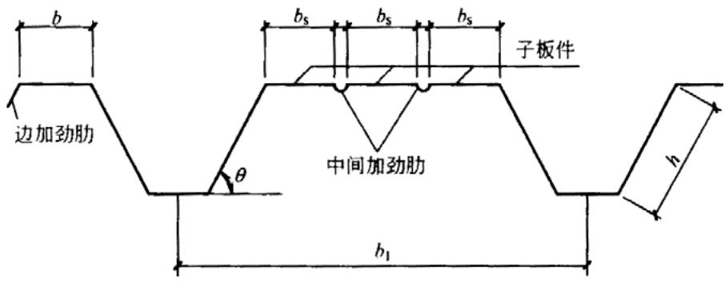  
图7.1.2压型钢板截面示意图

7.1.3 压型钢板腹板的有效宽厚比应按本规范第5.6.1条规定采用。  
7.1.4 压型钢板受压翼缘的纵向加劲肋应符合下列规定：

边加劲肋:

$$I _{e s} \geqslant 1. 8 3 t ^{4} \sqrt {\left(\frac {b}{t}\right) ^{2} - \frac {2 7 1 0 0}{f _{y}}} \tag {7.1.4-1}$$

且 $I _{ e s } \geqslant 9 t ^{ 4 }$

中间加劲肋：

$$I _{i s} \geqslant 3. 6 6 t ^{4} \sqrt {\left(\frac {b}{t}\right) ^{2} - \frac {2 7 1 0 0}{f _{y}}} \tag {7.1.4-2}$$

且 $I _{ i s } \geqslant 1 8 t ^{ 4 }$

式中 $I _{ e s }$ ——边加劲肋截面对平行于被加劲板件截面之重心轴的惯性矩；

$I _{ i s }$ — 中间加劲肋截面对平行于被加劲板件截面之重心轴的惯性矩；

$b _{ s }$ — 子板件的宽度；

b — —边加劲板件的宽度；

板件的厚度。

7.1.5 压型钢板的强度可取一个波距或整块压型钢板的有效截面，按受弯构件计算。  
7.1.6 压型钢板腹板的剪应力应符合下列公式的要求：

当 $h / t < 1 0 0$ 时：

$$\tau \leqslant \tau_{c r} = \frac {8 5 5 0}{(h / t)} \tag {7.1-6-1}$$

$$\tau \leqslant f _{v} \tag {7.1-6-1}$$

式中 τ — 腹板的平均剪应力 $\mathrm { { ( N / m m ^{ 2 } ) } }$ ）；

crτ $\tau _{ c r }$ 腹板的剪切屈曲临界剪应力；

$h / t$ — 腹板的高厚比。

7.1.7 压型钢板支座处的腹板，应按下式验算其局部受压承载力：

$$R \leqslant R _{w} \tag {7.1.7-1}$$

$$R _{w} = a t ^{2} \sqrt {f E} \left(0. 5 + \sqrt {0 . 0 2 l _{c} / t}\right) \left[ 2. 4 + (\theta / 9 0) ^{2} \right] \tag {7.1.7-2}$$

式中 R ——支座反力；

$R _{ w }$ — 块腹板的局部受压承载力设计值；

a 系数，中间支座取 $a = 0 . 1 2$ ，端部支座取 $a = 0 . 0 6$ ；

腹板厚度（mm）；

$l _{ c }$ ——支座处的支承长度， $1 0 \mathrm { m m } { < } l _{ c } { < } 2 0 0 \mathrm { m m }$ ，端部支座可取 $l _{ c } { = } 1 0 \mathrm { m m }$ ：

$\theta ^{ . }$ -腹板倾角 $( 4 5 ^{ \circ } < \theta < 9 0 ^{ \circ } )$

7.1.8 压型钢板同时承受弯矩M 和支座反力 R 的截面，应满足下列要求：

$$M / M _{u} \leqslant 1. 0 \tag {7.1.8-1}$$

$$R / R _{w} \leqslant 1. 0 \tag {7.1.8-2}$$

$$M / M _{u} + R / R _{w} \leqslant 1. 2 5 \tag {7.1.8-3}$$

式中 $\boldsymbol { M } _{ u }$ — 截面的弯曲承载力设计值， $\textstyle M _{ \mathbf { u } } = W _{ e } f$ 。

7.1.9 压型钢板同时承受弯矩M 和剪力V 的截面，应满足下列要求：

$$\left(\frac {M}{M}\right) ^{2} + \left(\frac {V}{V _{u}}\right) ^{2} \leqslant 1 \tag {7.1.9}$$

式中 $V _{ u }$ ——腹板的抗剪承载力设计值， $V _{ _ { u } } = ( h t \bullet \sin \theta ) \tau _{ _ { c r } }$ , $\tau _{ c r }$ 按第 7.1.6 条的规定计算。

7.1.10 在压型钢板的一个波距上作用集中荷载 $F$ 时，可按下式将集中荷载下折算成沿板宽方向的均布线荷载 $q _{ r e }$ ，并按 $q _{ r e }$ 进行单个波距或整块压型钢板有效截面的弯曲计算。

$$q _{r e} = \eta \frac {F}{b _{1}} \tag {7.1.10}$$

式中 F — 集中荷载；

$b _{ 1 }$ — 压型钢板的波距；

n -折算系数，由试验确定；无试验依据时，可取 $\eta = 0 . 5$

屋面压型钢板的施工或检修集中荷载按 1.0kN 计算，当施工荷载超过 1.0kN 时，则

应按实际情况取用。

7.1.11 压型钢板的挠度与跨度之比不宜超过下列限值：

屋面板：屋面坡度＜1/20 时 1/250，屋面坡度≥1/20 时 1/200；

墙板：1/150；

楼板：1/200。

7.1.12 仅作模板使用的压型钢板上的荷载，除自重外，尚应计入湿钢筋混凝土楼板重和可能出现的施工荷载。如施工中采取了必要的措施，可不考虑浇注混凝上的冲击力，挠度计算时可不计施工荷载。

## 7.2 压型钢板的构造

7.2.1 压型钢板腹板与翼缘水平面之间的夹角θ 不宜小于45 。  
7.2.2 压型钢板宜采用镀锌钢板、镀铝锌钢板或在其基材上涂有彩色有机涂层的钢板辊压成型。  
7.2.3 屋面、墙面压型钢板的基材厚度宜取0.4～1.6mm，用作楼面模板的压型钢板厚度不宜小于0.5mm。压型钢板宜采用长尺板材，以减少板长方向之搭接。  
7.2.4 压型钢板长度方向的搭接端必须与支承构件（如檩条、墙梁等）有可靠的连接，搭接部位应设置防水密封胶带，搭接长度不宜小于下列限值：

波高≥70mm的高波屋面压型钢板：350mm；波高＜70mm 的低波屋面压型钢板：屋面坡度≤1/10 时 250mm，屋面坡度≥1/10 时 200mm；

墙面压型钢板：120mm。

7.2.5 屋面压型钢板侧向可采用搭接式、扣合式或咬合式等连接方式。当侧向采用搭接式连接时，一般搭接一波，特殊要求时可搭接两波。搭接处用连接件紧固，连接件应设置在波峰上，连接件应采用带有防水密封胶垫的自攻螺钉。对于高波压型钢板，连接件间距一般为 700～800mm；对于低波压型钢板，连接件间距一般为 300～400mm。  
当侧向采用扣合式或咬合式连接时，应在檩条上设置与压型钢板波形相配套的专门固定支座，固定支座与擦条用自攻螺钉或射钉连接，压型钢板搁置在固定支座上。两片压型钢板的侧边应确保在风吸力等因素作用下的扣合或咬合连接可靠。  
7.2.6 墙面压型钢板之间的侧向连接宜采用搭接连接，通常搭接一个波峰，板与板的连接件可设在波峰，亦可设在波谷。连接件宜采用带有防水密封胶垫的自攻螺钉。  
7.2.7 辅设高波压型钢板屋面时，应在檩条上设置固定支架，檩条上翼缘宽度应比固定

支架宽度大10mm。固定支架用自攻螺钉或射钉与檩条连接，每波设置一个；低波压型钢板可不设固定支架，宜在波峰处采用带有防水密封胶垫的自攻螺钉或射钉与檩条连接，连接件可每波或隔波设置一个，但每块低波压型钢板不得小于3个连接件。  
7.2.8 用作非组合楼面的压型钢板支承在钢梁上时，其支承长度不得小于50mm；支承在混凝土、砖石砌体等其他材料上时，支承长度不得小于75mm。在浇注混凝土前，应将压型钢板上的油脂、污垢等有害物质清除干净。  
7.2.9 铺设楼面压型钢板时，应避免过大的施工集中荷载，必要时可设置临时支撑。

# 8 檩条与墙梁

## 8.1 檩条的计算

8.1.1 屋面能起阻止檩条侧向失稳和扭转作用的实腹式檩条（如图 8.1.1 所示）的强度可按下式计算：

$$\sigma = \frac {M}{W _{e n x}} + \frac {M _{y}}{W _{e n y}} \leqslant f \tag {8.1.1-1}$$

屋面不能阻止檩条侧向失稳和扭转的实腹式檩条的稳定性可按下式计算：

$$\frac {M _{x}}{\varphi_{b} W _{e x}} + \frac {M _{y}}{W _{e y}} \leqslant f \tag {8.1.1-2}$$

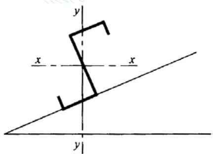  
图8.1.1实腹式標条示意图

8.1.2 当风荷载使实腹式檩条下翼缘受压时，其稳定性可按公式8.1.1-2计算。  
8.1.3 平面格构式檩条上弦的强度按公式5.5.1计算，稳定性可按下式计算：

$$\frac {N}{\varphi_{\min} A _{e}} + \frac {M _{x}}{W _{e x}} + \frac {M _{Y}}{W _{e y}} \leqslant f \tag {8.1.3-1}$$

式中 Pmin $\varphi _{ \mathrm { m i n } }$ 轴心受压构件的稳定系数，根据构件的最大长细比按本规范附录A表A.1.1 采用；

$M _{ x }$ 、 $M _{ \scriptscriptstyle Y }$ ——对檩条上弦截面主轴 x 和 y 的弯矩， x 轴垂直于屋面。

公式中的弯矩 $M _{ x }$ 和 $M _{ \scriptscriptstyle { Y } }$ 可按下列规定采用：

1 计算 $M _{ x }$ 时，拉条可作为侧向支承点。计算强度时，支承点处的 $M _{ x }$ 可按下式计算：

$$M _{x} = \frac {q _{y} l _{1} ^{2}}{1 0} \tag {8.1.3-2}$$

计算稳定性时， $M _{ x }$ 可取侧向支承点间全长范围内的最大弯矩。

2 节点和跨中处：

$$M _{Y} = \frac {q _{x} a ^{2}}{1 0} \tag {8.1.3-3}$$

式中： $l _{ 1 }$ —— 侧向支承点间的距离；

$a$ 上弦的节间长度；

$q _{ x }$ — 垂直于屋面方向的均布荷载分量；

$q _{ y }$ — 平行于屋面方向的均布荷载分量。

8.1.4 当风荷载作用下平面格构式檩条下弦受压时，下弦应采用型钢，其强度和稳定性可按下列公式计算：

强度：

$$\sigma = \frac {N}{A _{e n}} \leqslant f \tag {8.1.4-1}$$

稳定性：

$$\frac {N}{\varphi_{\min} A _{e}} \leqslant f \tag {8.1.4-2}$$

8.1.5 平面格构式檩条受压弦杆在平面内的计算长度应取节间长度，平面外的计算长度应取侧向支承点间的距离（布置在弦杆处的拉条可作为侧向支承点），腹杆在平面内、外的计算长度均取节点几何长度。

端压腹杆的长细比不得大于150。

8.1.6 檩条在垂直屋面方向的容许挠度与其跨度之比，可按下列规定采用：

1 瓦楞铁屋面：1/150；  
2 压型钢板、钢丝网水泥瓦和其他水泥制品瓦材屋面：V200。

## 8.2 檩条的构造

8.2.1 实腹式檩条可采用檩托与屋架、刚架相连接（如图8.2.1所示）。

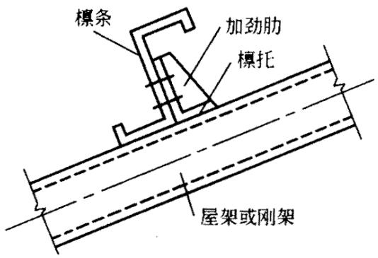  
图8.2.1实腹式標条端部连接示意图

8.2.2 平面格构式檩条的高度可取跨度的1/12～1/20。平面格构式檩条的端压腹杆应采用型钢。

当风荷载使平面格构式模条下弦受压时，宜在檩条上、下弦杆处均设置拉条和撑杆。  
8.2.3 实腹式檩条跨度大于 4m 时，在受压翼缘应设置拉条或撑杆，拉条和撑杆的截面应按计算确定。圆钢拉条直径不宜小于10mm，撑杆的长细比不得大于200。当檩条上、下翼缘表面均设置压型钢板，并与檩条牢固连接时，可不设拉条和撑杆。  
8.2.4 利用檩条作为水平支撑压杆时，檩条长细比不得大于 200（拉条和撑杆可作为侧向支承点），并应按压弯构件验算其强度和稳定性。

## 8.3 墙梁的计算

8.3.1 简支墙梁（如图 5.3.3b 所示）的强度应按公式 5.3.3-1 和下列公式计算：

$$\tau_{x} = \frac {3 V _{x \max}}{4 b _{0} t} \leqslant f _{v} \tag {8.3.1-1}$$

$$\tau_{y} = \frac {3 V _{y \max}}{2 h _{0} t} \leqslant f _{v} \tag {8.3.1-2}$$

式中 $V _{ x \operatorname* { m a x } } \cdot \ V _{ y \operatorname* { m a x } }$ — 竖向荷载设计值 $( \boldsymbol { q } _{ x } )$ ）和水平风荷载设计值 $( q _{ y } )$ 所产生的剪力的最大值；

$b _{ 0 } \setminus \ h _{ 0 }$ ——墙梁截面沿截面主轴 、 方向的计算高度，取相交板件连接处两x y内弧起点间的距离；

t 墙梁截面的厚度。

两侧挂墙板的墙梁和一侧挂墙板、另一侧设有可阻止其扭转变形的拉杆的墙梁，可不计弯扭双力矩的影响（即可取 B =0）。

8.3.2 若构造上不能保证墙梁的整体稳定时，尚需按公式 5.3.3-2 计算其稳定性，但公式中的 $\varphi _{ b x }$ 应按仅作用着 $M _{ x }$ （忽略 $M _{ y }$ 及 B 的影响）的情况由附录 A 中 A.2 的规定计算。  
8.3.3 墙梁的容许挠度与其跨度之比，可按下列规定采用：

1 压型钢板、瓦楞铁墙面（水平方向）：1/150；  
2 窗洞顶部的墙梁（水平方向和竖向）：1/200。

且其竖向挠度不得大于10mm。

## 8.4 墙梁的构造

8.4.1 墙梁主要承受水平风荷载，宜将其刚度较大主平面置于水平方向。  
8.4.2 当墙梁跨度大于 4m 时，宜在跨中设置一道拉条；当墙梁跨度大于 6m 时，可在跨间三分点处各设置一道拉条。拉条承担的墙体自重通过斜拉条传至承重柱或墙架柱，一般每隔5道拉条设置一对斜拉条（如图8.4.2所示），以分段传递墙体自重。

圆钢拉条直径不宜小于 10mm，所需截面面积应通过计算确定。

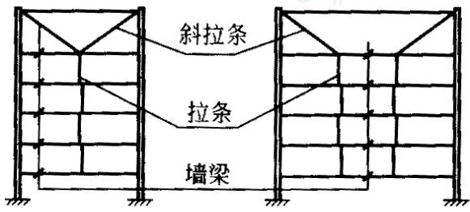  
图8.4.2拉条布置示意图

# 9 屋 架

## 9.1 屋架的计算

9.1.1 计算屋架各杆件内力时，假定各节点均为铰接，次应力可不计算，但应考虑在屋面风吸力的作用下，可能导致屋架杆件内力变号的不利影响，并核算屋架支座锚栓的抗拉承载力。  
9.1.2 屋架杆件的计算长度（如图 9.1.2 所示）可按下列规定采用：

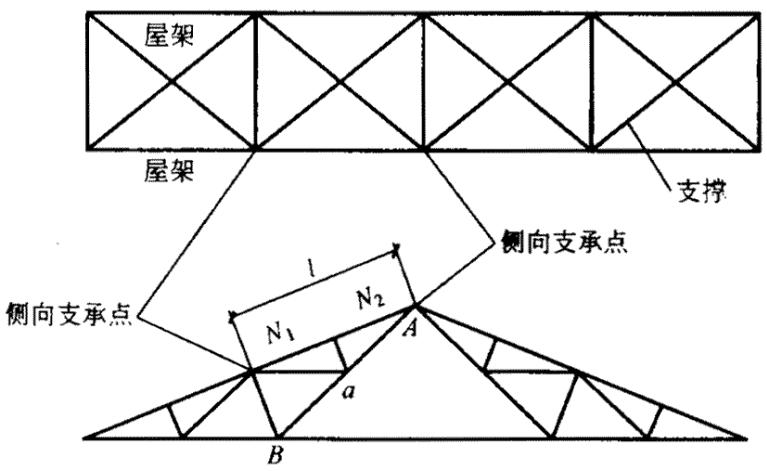  
图9.1.2屋架杆件计算长度示意图

1 在屋架平面内，各杆件的计算长度可取节点间的距离；  
2 在屋架平面外，弦杆应取侧向支承点间的距离；腹杆取节点间的距离（图 9.1.2中的腹杆a 应取 间的距离），如等节间的受压弦杆或腹杆之侧向支承点间的距离为节AB间长度的2倍，且内力不等时，其计算长度应按下式确定：

$$l _{0} = \left(0. 7 5 + 0. 2 5 \frac {N _{2}}{N _{1}}\right) l \tag {9.1.2-1}$$

且 $l _{ 0 } \geqslant 0 . 5 l$ （9.1.2-1）

式中 $l _{ 0 }$ — 杆件的计算长度；

杆件的侧向支承点间的距离；

$N _{ \scriptscriptstyle 1 }$ —— 较大的压力，计算时取正值；

$N _{ 2 }$ — 较小的压力或拉力，计算时压力取正值，拉力取负值。

侧向不能移动的点（支撑点或节点），可作为屋架的侧向支承点。当檩条、系杆或其他杆件未与水平（或垂直）支撑节点或其他不移动点相连接时，不能作为侧向支承点。

## 9.2 屋架的构造

9.2.1 两端简支的跨度不小于15m的三角形屋架和跨度不小于24m的梯形或平行弦屋架，当下弦无曲折时，宜起拱，拱度可取跨度的 1/500。  
9.2.2 屋盖应设置支撑体系。当支撑采用圆钢时，必须具有拉紧装置。  
9.2.3 屋架杆件宜采用薄壁钢管（方管、矩形管、圆管）。  
9.2.4 屋架杆件的接长宜采用焊接或螺栓连接，且须与杆件等强。接长连接应设置在杆

件内力较小的节间内。屋架拼装接头的数量及位置应按施工及运输条件确定。

9.2.5 屋架节点的构造应符合下列要求：

1 杆件重心轴线宜汇交于节点中心；  
2 应在薄弱处增设加强板或采取其他措施增强节点的刚度；  
3 应便于施焊、清除污物和涂刷油漆。

# 10 刚 架

## 10.1 刚架的计算

10.1.1 刚架梁、柱的强度和稳定性应按下列规定计算：

1 刚架梁在刚架平面内可仅按压弯构件计算其强度；实腹式刚架梁应按压弯构件计算其在刚架平面外的稳定性；  
2 实腹式刚架柱应按压弯构件计算其强度和稳定性；  
3 格构式刚架柱应按压弯构件计算其强度和弯矩作用平面内的稳定性；  
4 格构式刚架梁和柱的弦杆、腹杆以及缀条等应分别按轴心受拉及轴心受压构件计算各单个杆件的强度和稳定性；  
5 变截面刚架柱的稳定性可按最大弯矩处的有效截面进行计算，此时，轴心力应取与最大弯矩同一截面处的轴心力。

10.1.2 单跨门式刚架柱，在刚架平面内的计算长度 $H _{ 0 }$ 应按下式计算：

$$H _{0} = \mu H \tag {10.1.2-1}$$

式中 H ——柱的高度，取基础顶面到柱与梁轴线交点的距离（如图 10.1.2 所示）；

μ 刚架柱的计算长度系数，按下列方法确定。

1 刚架梁为等截面构件时，µ 可按表 A.3.1 或表 A.3.2 取用；  
2 刚架梁为变截面构件时，µ可按下式计算：

$$\mu = \sqrt {\frac {2 4 E I _{1}}{K \cdot H ^{3}}} \tag {10.1.2-2}$$

$$K = \frac {1}{\Delta} \tag {10.1.2-3}$$

式中 K——刚架在柱顶单位水平荷载作用下的侧移刚度；

∆——刚架按一阶弹性分析得到的在柱顶单位水平荷载作用下的柱顶侧移；

$I _{ 1 }$ — 刚架柱大头截面的惯性矩。

3 对于板式柱脚上述刚架柱计算长度系数 宜根据柱脚构造情况乘以下列调整系数。

柱脚铰接：0.85

柱脚刚接：1.2

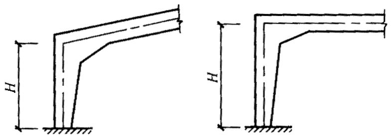  
图10.1.2刚架柱的高度示意图

10.1.3 多跨门式刚架柱在刚架平面内的计算长度应按公式 10.1.2-1 计算，其计算长度系数可按下列规定确定。

1 当中间柱为两端铰接柱（即摇摆柱）时，边柱的计算长度系数 $\mu _{ { } _ { R } }$ 可按下列公式计算：

$$\mu_{R} = \eta \cdot \mu \tag {10.1.3-1}$$

$$\eta = \sqrt {1 + \frac {\sum \left(N _{1 i} / H _{1 i}\right)}{\sum \left(N _{f f} / H _{f f}\right)}} \tag {10.1.3-2}$$

式中 η ——放大系数；

$\mu$ -按第10.1.2条确定的单跨门式刚架柱的计算长度系数；

$N _{ 1 i }$ — 中间第i 个摇摆柱的轴向力；

N fj $N _{ f }$ 第 j 个边柱的轴向力；

$H _{ 1 i }$ — 中间第i个摇摆柱的高度；

$H _{ \mathit { f } }$ H fj 第 j 个边柱的高度。

查表 A.3.1 或表 A.3.2 计算 $\mu$ 时，刚架梁的长度应取梁的跨度（即边柱到相邻中间柱之间的距离）的2倍。

摇摆柱的计算长度系数取1.0。

2 当中间柱为非摇摆柱时，各刚架柱的计算长度系数可按下式计算：

$$\mu_{i} = \sqrt {\frac {1 . 2 N _{E I}}{K \cdot N _{i}} \cdot \sum \frac {N _{i}}{H _{i}}} \tag {10.1.3-3}$$

$$N _{E I} = \frac {\pi^{2} E I _{i}}{H _{i} ^{2}} \tag {10.1.3-4}$$

式中 $\mu _{ i }$ ——第i 根刚架柱的计算长度系数，宜根据柱脚构造情况按第 10.1.2 条第 3 款乘以相应的调整系数；

$N _{ \mathit { \Pi } _ { E I } }$ — 第i根刚架柱以大头截面为准的欧拉临界力；

$H _{ i }$ 、 $N _{ i }$ — 第i根刚架柱的高度、轴压力；

$I _{ i } ^{ \phantom { } }$ 第i根刚架柱大头截面的惯性矩。

10.1.4 实腹式刚架梁和柱在刚架平面外的计算长度，应取侧向支承点间的距离，侧向支承点间可取设置隅撑处及柱间支撑连接点。当梁（或柱）两翼缘的侧向支承点间的距离不等时，应取最大受压翼缘侧向支承点问的距离。

10.1.5 格构式刚架梁和柱的弦杆、腹杆和缀条等单个构件的计算长度 $l _{ 0 }$ （如图 10.1.5所示）应按下列规定采用：

1 在刚架平面内，各杆件均取节点间的距离；  
2 在刚架平面外，腹杆和缀条取节点间的距离，弦杆取侧向支承点间的距离，若受压弦杆在该长度范围内的内力有变化时，按下列规定计算：

1）当内力均为压力时，可按公式 9.1.2-1、9.1.2-2 计算，此时式中 $N _{ \scriptscriptstyle 1 }$ 应取最大的压力， $N _{ 2 }$ 应取最小的压力；  
2）当内力在侧向支承点间的几个节间内为压力，另几个节间内为拉力时，可按下式计算，但不得小于受压节间的总长。

$$l _{0} = \left(1. 5 + 0. 5 \frac {\bar {N} _{t}}{\bar {N} _{c}}\right) \cdot \frac {n _{c}}{n} \cdot l \tag {10.1.5-1}$$

且 $l _{ 0 } \leqslant l$ （10.1.5-2）

式中 l ——侧向支承点间的距离；

$\overline { { N } } _{ t }$ — 所有拉力的平均值，计算时取负值；

$\overline { { N } } _{ c }$ ——所有压力的平均值，计算时取正值；

n 两侧向支承点间节间总数；

$n _{ c }$ nc 内力为压力的节间数。

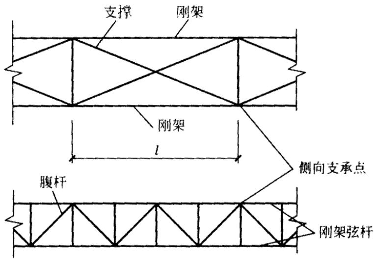  
图10.1.5格构式刚架弦杆平面外计算长度示意图

10.1.6 刚架梁的竖向挠度与其跨度的比值，不宜大于表 10.1.6-1 所列限值；刚架柱在风荷载标准值作用下的柱顶水平位移与柱高度的比值，不宜大于表10.1.6-2所列限值，以保证刚架有足够的刚度及屋面墙面等的正常使用。

表 10.1.6-1 刚架梁的竖向挠度限值  

| 屋盖情况 | 挠度限值 |
| --- | --- |
| 仅支撑压型钢板屋面和檩条（承受活荷载或雪荷载） | l/1800 |
| 尚有吊顶 | l/2400 |
| 有吊顶且抹灰 | l/360 |
| 注：1 对于单跨山形门式刚架，l系一侧斜梁的坡面长度，对于多跨山形门式刚回，l指相邻两柱之间斜梁一坡的坡面长度。2 对于悬壁梁，l取其悬伸长度的2倍。 | 注：1 对于单跨山形门式刚架，l系一侧斜梁的坡面长度，对于多跨山形门式刚回，l指相邻两柱之间斜梁一坡的坡面长度。2 对于悬壁梁，l取其悬伸长度的2倍。 |

表 10.1.6-2 刚架柱顶侧移限值  

| 吊车情况 | 其他情况 | 柱顶侧移限值 |
| --- | --- | --- |
| 无吊车 | 采用压型钢板等轻型钢墙板时采用砖墙时 | H/75H/100 |
| 有桥式吊车 | 吊车由驾驶室操作时吊车由地面操作时 | H/400H/180 |
| 注:表中H为钢架柱高度。 | 注:表中H为钢架柱高度。 | 注:表中H为钢架柱高度。 |

## 10.2 刚架的构造

10.2.1 用于刚架梁、柱的冷弯薄壁型钢，其壁厚不应小于 2mm。  
10.2.2 刚架梁的最小高度与其跨度之比：格构式梁可取1/15～1/25；实腹式梁可取1/30～1/45。  
10.2.3 门式刚架房屋应设置支撑体系。在每个温度区段或分期建设的区段，应设置横梁上弦横向水平支撑及柱间支撑；刚架转折处（即边往往顶和屋脊）及多跨房屋适当位置的中间柱顶，应沿房屋全长设置刚性系杆。  
10.2.4 刚架梁及柱的内翼缘（或内肢）需设置侧向支承点时，可利用作为外翼缘（或外肢）侧向支承点用的檩条或墙梁设置隅撑（如图 10.2.4 所示），隅撑应按压杆计算。

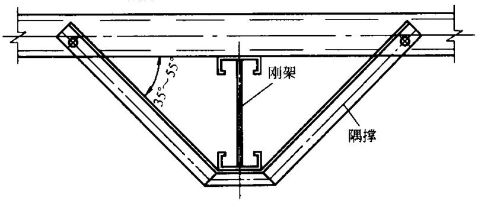  
图10.2.4刚架梁或柱的隅撑

10.2.5 刚架梁应与檩条或屋盖的其他刚性构件可靠连接。

# 11 制作、安装和防腐蚀

## 11.1 制作和安装

11.1.1 构件上应避免刻伤。放样和号料应根据工艺要求预留制作和安装时的焊接收缩

余量及切割、刨边和铣平等加工余量。

11.1.2 应保证切割部位准确、切口整齐，切割前应将钢材切割区域表面的铁锈、污物等清除干净，切割后应清除毛刺、熔渣和飞溅物。  
11.1.3 钢材和构件的矫正，应符合下列要求：

1 钢材的机械矫正，应在常温下用机械设备进行。冷弯薄壁型钢结构的主要受压构件当采用方管时，其局部变形的纵向量测值（如图11.1.3所示）应符合下式要求：

$$\delta \leqslant 0. 0 1 \mathrm {b} \tag {11.1.3}$$

式中 δ ——局部变形的纵向量测值；

b — 局部变形的量测标距，取变形所在面的宽度。

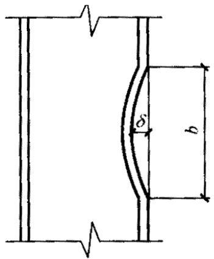

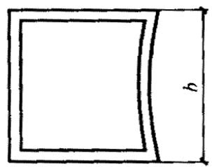  
图11.1.3局部变形纵向量测示意图

2 碳素结构钢在环境温度低于-16℃，低合金结构钢在环境温度低于-120C时，不得进行冷矫正和冷弯曲。  
3 碳素结构钢和低合金结构钢，加热温度应根据钢材性能选定，但不得超过900OC。低合金结构钢在加热矫正后，应在自然状态下缓慢冷却。  
4 构件矫正后，挠曲矢高不应超过构件长度的 1/1000，且不得大于 10mm。

11.1.4 构件的制孔应符合下列要求：

1 高强度螺栓孔应采用钻成孔；  
2 螺栓孔周边应无毛刺、破裂、喇叭口和凹凸的痕迹，切屑应清除干净。

11.1.5 构件的组装和工地拼装应符合下列要求：

1 构件组装应在合适的工作平台及装配胎模上进行，工作平台及胎模应测平，并加以固定，使构件重心线在同一水平面上，其误差不得大于 3mm。  
2 应按施工图严格控制几何尺寸，结构的工作线与杆件的重心线应交汇于节点中心，

两者误差不得大于3mm。

3 组装焊接构件时，构件的几何尺寸应依据焊缝等收缩变形情况，预放收缩余量；对有起拱要求的构件，必须在组装前按规定的起拱量做好起拱，起拱偏差应不大于构件长度的 1/1000，且不大于 6mm。  
4 杆件应防止弯扭，拼装时其表面中心线的偏差不得大于3mm。  
5 杆件搭接和对接时的错缝或错位不得大于 0.5mm。  
6 构件的定位焊位置应在正式焊缝部位内，不得将钢材烧穿，定位焊采用的焊接材料型号应与正式焊接用的相同。  
7 构件之间连接孔中心线位置的误差不得大于 2mm。

11.1.6 冷弯薄壁型钢结构的焊接应符合下列要求：

1 焊接前应熟悉冷弯薄壁型钢的特点和焊接工艺所规定的焊接方法、焊接程序和技术措施，根据试验确定具体焊接参数，保证焊接质量。  
2焊接前应把焊接部位的铁锈、污垢、积水等清除干净，焊条、焊剂应进行烘于处理。  
3型钢对接焊接或沿截面围焊时，不得在同一位置起弧灭弧，而应盖过起弧处一段距离后方能灭弧，不得在母材的非焊接部位和焊缝端部起弧或灭弧。  
4焊接完毕，应清除焊缝表面的熔渣及两侧飞溅物，并检查焊缝外观质量。  
5 构件在焊接前应采取减少焊接变形的措施。  
6对接焊缝施焊时，必须根据具体情况采用适宜的焊接措施（如预留空隙、垫衬板单面焊及双面焊等方法），以保证焊透。  
7电阻点焊的各项工艺参数（如通电时间、焊接电流、电极压力等）的选择应保证焊点抗剪强度试验合格，在施焊过程中，各项参数均应保持相对稳定，焊件接触面应紧密贴合。  
8 电阻点焊宜采用圆锥形的电极头，其直径应不小于 5 $\sqrt { t }$ （t 为焊件中外侧较薄板件的厚度），施焊过程中，直径的变动幅度不得大于1/5。

11.1.7 冷弯薄壁型钢结构构件应在涂层干燥后进行包装，包装应保护构件涂层不受损伤，且应保证构件在运输、装卸、堆放过程中不变形、不损坏、不散失。

11.1.8 冷弯薄壁型钢结构的安装应符合下列要求：

1 结构安装前应对构件的质量进行检查。构件的变形、缺陷超出允许偏差时，应进行处理。  
2结构吊装时，应采取适当措施，防止产生永久性变形，并应垫好绳扣与构件的接触

部位。

3 不得利用已安装就位的冷弯薄壁型钢构件起吊其他重物。

不得在主要受力部位加焊其他物件。

4安装屋面板前，应采取措施保证拉条拉紧和模条的位置正确。

5安装压型钢板屋面时，应采取有效措施将施工荷载分布至较大面积，防止因施工集中荷载造成构件局部压屈。

11.1.9 冷弯薄壁型钢结构制作和安装质量除应符合本规范规定外，尚应符合现行国家标准《钢结构工程施工质量验收规范》GB 50205的规定。当喷涂防火涂料时，应符合现行国家标准《钢结构防火涂料通用技术条件》GB 14907 的规定。

## 11.2 防 腐 蚀

11.2.1 冷弯薄壁型钢结构必须采取有效的防腐蚀措施，构造上应考虑便于检查、清刷、油漆及避免积水，闭口截面构件沿全长和端部均应焊接封闭。  
11.2.2 冷弯薄壁型钢结构应根据其使用条件和所处环境，选择相应的表面处理方法和防腐措施。

对冷弯薄壁型钢结构的侵蚀作用分类可参见本规范表 D.0.1。

11.2.3 冷弯薄壁型钢结构应按设计要求进行表面处理，除锈方法和除锈等级应符合现行国家标准《涂装前钢材表面锈蚀等级和除锈等级》GB 8923 的规定。  
11.2.4 冷弯薄壁型钢结构采用化学除锈方法时，应选用具备除锈、磷化、钝化两个以上功能的处理液，其质量应符合现行国家标准《多功能钢铁表面处理液通用技术条件》GB/T 12612 的规定。  
11.2.5 冷弯薄壁型钢结构应根据具体情况选用下列相适应的防腐措施：

1 金属保护层（表面合金化镀锌、镀铝锌等）。  
2 防腐涂料：

1）无侵蚀性或弱侵蚀性条件下，可采用油性漆、酚醛漆或醇酸漆；  
2）中等侵蚀性条件下，宜采用环氧漆、环氧酯漆、过氯乙烯漆、氯化橡胶漆或氯醋漆；  
3）防腐涂料的底漆和面漆应相互配套。

3 复合保护：

l）用镀锌钢板制作的构件，涂装前应进行除油、磷化、钝化处理（或除油后涂磷

化底漆）；

2）表面合金化镀锌钢板、镀锌钢板（如压型钢板、瓦楞铁等）的表面不宜涂红丹防锈漆，宜涂H06-2锌黄环氧酯底漆或其他专用涂料进行防护。  
11.2.6 冷弯薄壁型钢采用的涂装材料，应具有出厂质量证明书，并应符合设计要求。涂覆方法除设计规定外，可采用手刷或机械喷涂。  
11.2.7 涂料、涂装遍数、涂层厚度均应符合设计要求。当设计对涂装无明确规定时，一般宜涂 4～5 遍，干膜总厚度室外构件应大于 $1 5 0 \mu \mathrm { m }$ ，室内构件应大于 $1 2 0 \mu \mathrm { m }$ ，允许偏差为 $\pm 2 5 \mu \mathrm { m }$ 。  
11.2.8 涂装时的环境温度和相对湿度应符合涂料产品说明书的要求，当产品说明书无要求时，环境温度宜在 $5 \mathrm { \sim } 3 8 \mathrm { ‰ }$ 之间，相对湿度不应大于85%，构件表面有结露时不得涂装，涂装后4h内不得淋雨。  
11.2.9 冷弯薄壁型钢结构目测涂装质量应均匀、细致、无明显色差、无流挂、失光、起皱、针孔、气泡、裂纹、脱落、脏物粘附、漏涂等，必须附着良好（用划痕法或粘力计检查）。漆膜干透后，应用于膜测厚仪测出于膜厚度，做出记录，不合规定的应补涂。涂装质量不合格的应重新处理。  
11.2.10 冷弯薄壁型钢结构的防腐处理应符合下列要求：

1 钢材表面处理后6h内应及时涂刷防腐涂料，以免再度生锈。  
2 施工图中注明不涂装的部位不得涂装，安装焊缝处应留出 30～50mm 暂不涂装。  
3 冷弯薄壁型钢结构安装就位后，应对在运输、吊装过程中漆膜脱落部位以及安装焊缝两侧未油漆部位补涂油漆，使之不低于相邻部位的防护等级。  
4 冷弯薄壁型钢结构外包、埋入混凝土的部位可不做涂装。  
5 易淋雨或积水的构件且不易再次油漆维护的部位，应采取措施密封。

11.2.11 冷弯薄壁型钢结构在使用期间应定期进行检查与维护。

维护年限可根据结构的使用条件、表面处理方法、涂料品种及漆膜厚度分别按本规范表 D.0.2 采用。

11.2.12 冷弯薄壁型钢结构重新涂装的质量应符合现行国家标准《钢结构工程施工质量验收规范》GB 50205的规定。

# 附录A
## A.1轴心受压构件的稳定系数

A.1.1轴心受压构件的稳定系数可根据钢材的牌号按下列表格查得。

表A.1.1-1Q235钢轴心受压构件的稳定系数  

| λ | 0 | 1 | 2 | 3 | 4 | 5 | 6 | 7 | 8 | 9 |
| --- | --- | --- | --- | --- | --- | --- | --- | --- | --- | --- |
| 0 | 1.000 | 0.997 | 0.995 | 0.992 | 0.989 | 0.987 | 0.984 | 0.981 | 0.979 | 0.976 |
| 10 | 0.974 | 0.971 | 0.968 | 0.966 | 0.963 | 0.960 | 0.958 | 0.955 | 0.952 | 0.949 |
| 20 | 0.947 | 0.944 | 0.941 | 0.938 | 0.936 | 0.933 | 0.930 | 0.927 | 0.924 | 0.921 |
| 30 | 0.918 | 0.915 | 0.912 | 0.909 | 0.906 | 0.903 | 0.899 | 0.896 | 0.893 | 0.889 |
| 40 | 0.886 | 0.882 | 0.879 | 0.875 | 0.872 | 0.868 | 0.864 | 0.861 | 0.858 | 0.855 |
| 50 | 0.852 | 0.849 | 0.846 | 0.843 | 0.839 | 0.836 | 0.832 | 0.829 | 0.825 | 0.822 |
| 60 | 0.818 | 0.814 | 0.810 | 0.806 | 0.802 | 0.797 | 0.793 | 0.789 | 0.784 | 0.779 |
| 70 | 0.775 | 0.770 | 0.765 | 0.760 | 0.755 | 0.750 | 0.744 | 0.739 | 0.733 | 0.728 |
| 80 | 0.722 | 0.716 | 0.710 | 0.704 | 0.698 | 0.692 | 0.686 | 0.680 | 0.673 | 0.667 |
| 90 | 0.661 | 0.654 | 0.648 | 0.641 | 0.634 | 0.626 | 0.618 | 0.611 | 0.603 | 0.595 |
| 100 | 0.588 | 0.580 | 0.573 | 0.566 | 0.558 | 0.551 | 0.544 | 0.537 | 0.530 | 0.523 |
| 110 | 0.516 | 0.509 | 0.502 | 0.496 | 0.489 | 0.483 | 0.476 | 0.470 | 0.464 | 0.458 |
| 120 | 0.452 | 0.446 | 0.440 | 0.434 | 0.428 | 0.423 | 0.417 | 0.412 | 0.406 | 0.401 |
| 130 | 0.396 | 0.391 | 0.386 | 0.381 | 0.376 | 0.371 | 0.367 | 0.362 | 0.357 | 0.353 |
| 140 | 0.349 | 0.344 | 0.340 | 0.336 | 0.332 | 0.328 | 0.324 | 0.320 | 0.316 | 0.312 |
| 150 | 0.308 | 0.305 | 0.301 | 0.298 | 0.294 | 0.291 | 0.287 | 0.284 | 0.281 | 0.277 |
| 160 | 0.274 | 0.271 | 0.268 | 0.265 | 0.262 | 0.259 | 0.256 | 0.253 | 0.251 | 0.248 |
| 170 | 0.245 | 0.243 | 0.240 | 0.237 | 0.235 | 0.232 | 0.230 | 0.227 | 0.225 | 0.223 |
| 180 | 0.220 | 0.218 | 0.216 | 0.214 | 0.211 | 0.209 | 0.207 | 0.205 | 0.203 | 0.201 |

续表A.1.1-1   

| λ | 0 | 1 | 2 | 3 | 4 | 5 | 6 | 7 | 8 | 9 |
| --- | --- | --- | --- | --- | --- | --- | --- | --- | --- | --- |
| 190 | 0.199 | 0.197 | 0.195 | 0.193 | 0.191 | 0.189 | 0.188 | 0.186 | 0.184 | 0.182 |
| 200 | 0.180 | 0.179 | 0.177 | 0.175 | 0.174 | 0.172 | 0.171 | 0.169 | 0.167 | 0.166 |
| 210 | 0.164 | 0.163 | 0.161 | 0.160 | 0.159 | 0.157 | 0.156 | 0.154 | 0.153 | 0.152 |
| 220 | 0.150 | 0.149 | 0.148 | 0.146 | 0.145 | 0.144 | 0.143 | 0.141 | 0.140 | 0.139 |
| 230 | 0.138 | 0.137 | 0.136 | 0.135 | 0.133 | 0.132 | 0.131 | 0.130 | 0.129 | 0.128 |
| 240 | 0.127 | 0.126 | 0.125 | 0.124 | 0.123 | 0.122 | 0.121 | 0.120 | 0.119 | 0.118 |
| 250 | 0.117 | - | - | - | - | - | - | - | - | - |

表A.1.1-2Q345钢轴心受压构件的稳定系数φ  

| λ | 0 | 1 | 2 | 3 | 4 | 5 | 6 | 7 | 8 | 9 |
| --- | --- | --- | --- | --- | --- | --- | --- | --- | --- | --- |
| 0 | 1.000 | 0.997 | 0.994 | 0.991 | 0.988 | 0.985 | 0.982 | 0.979 | 0.976 | 0.973 |
| 10 | 0.971 | 0.968 | 0.965 | 0.962 | 0.959 | 0.956 | 0.952 | 0.949 | 0.946 | 0.943 |
| 20 | 0.940 | 0.937 | 0.934 | 0.930 | 0.927 | 0.924 | 0.920 | 0.917 | 0.913 | 0.909 |
| 30 | 0.906 | 0.902 | 0.898 | 0.894 | 0.890 | 0.886 | 0.882 | 0.878 | 0.874 | 0.870 |
| 40 | 0.867 | 0.864 | 0.860 | 0.857 | 0.853 | 0.849 | 0.845 | 0.841 | 0.837 | 0.833 |
| 50 | 0.829 | 0.824 | 0.819 | 0.815 | 0.810 | 0.805 | 0.800 | 0.794 | 0.789 | 0.783 |
| 60 | 0.777 | 0.771 | 0.765 | 0.759 | 0.752 | 0.746 | 0.739 | 0.732 | 0.725 | 0.718 |
| 70 | 0.710 | 0.703 | 0.695 | 0.688 | 0.680 | 0.672 | 0.664 | 0.656 | 0.648 | 0.640 |
| 80 | 0.632 | 0.623 | 0.615 | 0.607 | 0.599 | 0.591 | 0.583 | 0.574 | 0.566 | 0.558 |
| 90 | 0.550 | 0.542 | 0.535 | 0.527 | 0.519 | 0.512 | 0.504 | 0.497 | 0.489 | 0.482 |
| 100 | 0.475 | 0.467 | 0.460 | 0.452 | 0.445 | 0.438 | 0.431 | 0.424 | 0.418 | 0.411 |
| 110 | 0.405 | 0.398 | 0.392 | 0.386 | 0.380 | 0.375 | 0.369 | 0.363 | 0.358 | 0.352 |
| 120 | 0.347 | 0.342 | 0.337 | 0.332 | 0.327 | 0.322 | 0.318 | 0.313 | 0.309 | 0.304 |
| 130 | 0.300 | 0.296 | 0.292 | 0.288 | 0.284 | 0.280 | 0.276 | 0.272 | 0.269 | 0.265 |
| 140 | 0.261 | 0.258 | 0.255 | 0.251 | 0.248 | 0.245 | 0.242 | 0.238 | 0.235 | 0.232 |
| 150 | 0.229 | 0.227 | 0.224 | 0.221 | 0.218 | 0.216 | 0.213 | 0.210 | 0.208 | 0.205 |
| 160 | 0.203 | 0.201 | 0.198 | 0.196 | 0.194 | 0.191 | 0.189 | 0.187 | 0.185 | 0.183 |
| 170 | 0.181 | 0.179 | 0.177 | 0.175 | 0.173 | 0.171 | 0.169 | 0.167 | 0.165 | 0.163 |

续表A.1.1-2   

| λ | 0 | 1 | 2 | 3 | 4 | 5 | 6 | 7 | 8 | 9 |
| --- | --- | --- | --- | --- | --- | --- | --- | --- | --- | --- |
| 180 | 0.162 | 0.160 | 0.158 | 0.157 | 0.155 | 0.153 | 0.152 | 0.150 | 0.149 | 0.147 |
| 190 | 0.146 | 0.144 | 0.143 | 0.141 | 0.140 | 0.138 | 0.137 | 0.136 | 0.134 | 0.133 |
| 200 | 0.132 | 0.130 | 0.129 | 0.128 | 0.127 | 0.126 | 0.124 | 0.123 | 0.122 | 0.121 |
| 210 | 0.120 | 0.119 | 0.118 | 0.116 | 0.115 | 0.114 | 0.113 | 0.112 | 0.111 | 0.110 |
| 220 | 0.109 | 0.108 | 0.107 | 0.106 | 0.106 | 0.105 | 0.104 | 0.103 | 0.101 | 0.101 |
| 230 | 0.100 | 0.099 | 0.098 | 0.098 | 0.097 | 0.096 | 0.095 | 0.094 | 0.094 | 0.093 |
| 240 | 0.092 | 0.091 | 0.091 | 0.090 | 0.089 | 0.088 | 0.088 | 0.087 | 0.086 | 0.086 |
| 250 | 0.085 | - | - | - | - | - | - | - | - | - |

## A.2 受弯构件的整体稳定系数

A.2.1 对于图 5.3.1 所示单轴或双轴对称截面（包括反对称截面）的简支梁，当绕对称轴（x轴）弯曲时，其整体稳定系数应按下式计算：

$$\varphi_{b x} = \frac {4 3 2 0 A h}{\lambda_{y} ^{2} W _{x}} \xi_{1} \left(\sqrt {\eta^{2} + \zeta + \eta}\right) \cdot \left(\frac {2 3 5}{f _{y}}\right) \tag {A.2.1-1}$$

$$\eta = 2 \xi_{2} e _{a} / h \tag {A.2.1-2}$$

$$\xi = \frac {4 I _{\omega}}{h ^{2} I _{y}} + \frac {0 . 1 6 5 I _{t}}{I _{y}} \left(\frac {l _{0}}{h}\right) ^{2} \tag {A.2.1-3}$$

式 $\lambda _{ y }$ — 梁在弯矩作用平面外的长细比；

A— 毛截面面积；

h— —截面高度；

$l _{ 0 }$ — 梁的侧向计算长度， $l _{ 0 } = \mu _{ b } l$ ；

$\mu _{ b }$ 梁的侧向计算长度系数，按表A.2.1采用;

梁的跨度；

$\xi _{ 1 }$ 、 $\boldsymbol { \xi } _{ 2 }$ ——系数，按表 A.2.1 采用；

$e _{ a }$ ae 横向荷载作用点到弯心的距离：对于偏心压杆或当横向荷载作用在弯心时

$e _{ a } = 0$ ；当荷载不作用在弯心且荷载方向指向弯心时 $e _{ a }$ 为负，而离开弯心时 $e _{ a }$ 为正；

WX $W _{ \chi }$ x对 轴的受压边缘毛截面模量；

$I _{ \omega }$ 毛截面扇性惯性矩；

$I _{ y }$ — y对 轴的毛截面惯性矩；

$I _{ t }$ — 扭转惯性矩。

如按上列公式算得的 $\varphi _{ b x } > 0 . 7$ ，则应以 $\varphi _{ b x } ^{ \prime }$ 值代替甲 $\varphi _{ b x }$ ， $\varphi _{ b x } ^{ \prime }$ 值应按下式计算：

$$\varphi_{b x} ^{\prime} = 1. 0 9 1 - \frac {0 . 2 7 4}{\varphi_{b x}} \tag {A.2.1-4}$$

表 A.2.1 两端及跨间侧向均为简支的受弯构件的 $\xi _{ 1 }$ 、 $\boldsymbol { \xi } _{ 2 }$ 和 $\mu _{ b }$   

| 序号 | 变矩作用平面内的荷截及支承情况 | 跨间无侧向支承 | 跨间无侧向支承 | 跨中设一道侧向支承 | 跨中设一道侧向支承 | 跨间有不少于两个等距离布置的侧向支承 | 跨间有不少于两个等距离布置的侧向支承 |
| --- | --- | --- | --- | --- | --- | --- | --- |
| 序号 | 变矩作用平面内的荷截及支承情况 | μb=1.00 | μb=1.00 | μb=0.50 | μb=0.50 | μb=0.33 | μb=0.33 |
| 序号 | 变矩作用平面内的荷截及支承情况 | ξ1 | ξ2 | ξ1 | ξ2 | ξ1 | ξ2 |
| 1 | q | 1.13 | 0.46 | 1.35 | 0.14 | 1.37 | 0.06 |
| 2 | F | 1.35 | 0.55 | 1.83 | 0 | 1.68 | 0.08 |
| 3 | M | 1.00 | 0 | 1.00 | 0 | 1.00 | 0 |
| 4 | M 1 M/2 | 1.32 | 0 | 1.31 | 0 | 1.31 | 0 |
| 5 | M 1 M/2 | 1.83 | 0 | 1.77 | 0 | 1.75 | 0 |
| 6 | M 1 M/2 | 2.39 | 0 | 2.13 | 0 | 2.03 | 0 |
| 7 | M 1 M | 2.24 | 0 | 1.89 | 0 | 1.77 | 0 |

A.2.2 对于图 A.2.2 所示单轴对称截面简支梁， 轴（强轴）为不对称轴，当然 轴弯x x曲时，其整体稳定系数仍可按公式（A.2.1-1）计算，但需以下式代替公式 A.2.1-2。

$$\eta = 2 \left(\xi_{2} e _{a} + \beta_{y}\right) / h \tag {A.2.2-1}$$

$$\beta_{y} = \frac {U _{x}}{2 I _{x}} - e _{o y} \tag {A.2.2-2}$$

$$U _{x} = \int_{A} y \left(x ^{2} + y ^{2}\right) d A \tag {A.2.2-3}$$

式中 $I _{ x }$ — 对 轴的毛截面惯性矩；x

$e _{ o y }$ oye 弯心的 y 轴坐标。

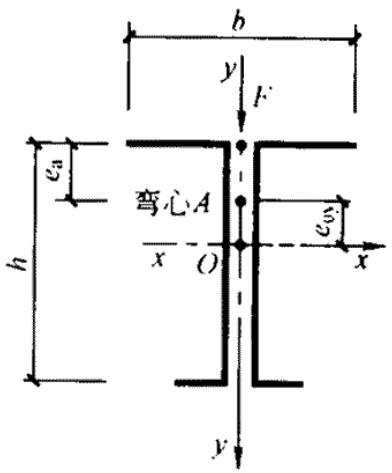  
第 66 页

A.2.3 对于图 5.3.1 所示单轴或双轴对称截面的简支梁，当绕 轴（弱轴）弯曲时（如y图 A.2.3 所示），如需计算稳定性，其整体稳定系数 $\varphi _{ b y }$ 可按下式计算：

$$\varphi_{b y} = \frac {4 3 2 0 A b}{\lambda_{x} ^{2} W _{y}} \xi_{1} \left(\sqrt {\eta^{2} + \zeta} + \eta\right) \left(\frac {2 3 5}{f _{y}}\right) \tag {A.2.3-1}$$

$$\eta = 2 \left(\xi_{2} e _{a} + \beta_{x}\right) / b \tag {A.2.3-2}$$

$$\xi = \frac {4 I _{\omega}}{b ^{2} I _{x}} + \frac {0 . 1 5 6 I _{t}}{I _{x}} \left(\frac {l _{0}}{b}\right) ^{2} \tag {A.2.3-3}$$

当 y 轴为对称轴时：

$$\beta_{x} = 0$$

当 y 轴为非对称轴时：

$$\beta_{x} = \frac {U _{y}}{2 I _{y}} - e _{o x} \tag {A.2.3-4}$$

$$U _{y} \int_{A} x \left(x ^{2} + y ^{2}\right) d A \tag {A.2.3-5}$$

式中 b — 截面宽度；

$\lambda _{ \scriptscriptstyle { X } }$ -弯矩作用平面外的长细比（对x轴）；

$W _{ y }$ — 对 y 轴的受压边缘毛截面模量；

$e _{ 0 x }$ xe0 弯心的 x 轴坐标。

当 $\varphi _{ b \nu } > 0 . 7$ 时，应以 $\varphi _{ b y } ^{ \prime }$ ，代替 $\varphi _{ b y }$ 、 $\varphi _{ b y } ^{ \prime }$ 按下式计算：

$$\varphi_{b y} ^{\prime} = 1. 0 9 1 - \frac {0 . 2 7 4}{\varphi_{b y}} \tag {A.2.3-5}$$

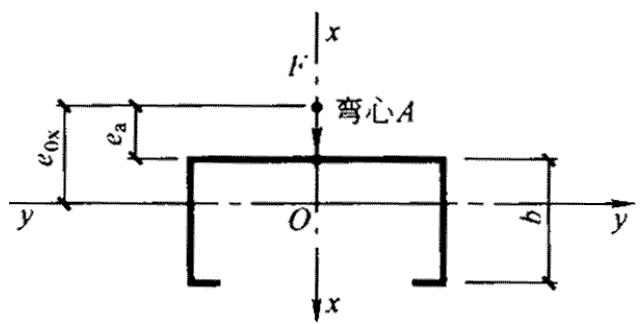

## A.3 刚架柱的计算长度系数

A.3.1 等截面刚架柱的计算长度系数µ 见表 A.3.1。

表 A.3.1 等截面刚架柱的计算长度系数 µ  

| K2/K1柱与基础的连接方式 | 0 | 0.2 | 0.3 | 0.5 | 1.0 | 2.0 | 3.0 | 4.0 | 7.0 | ≥10.0 |
| --- | --- | --- | --- | --- | --- | --- | --- | --- | --- | --- |
| 刚接 | 2.00 | 1.50 | 1.40 | 1.28 | 1.16 | 1.08 | 1.06 | 1.04 | 1.02 | 1.00 |
| 铰接 | ∞ | 3.42 | 3.00 | 2.63 | 2.33 | 2.17 | 2.11 | 2.08 | 2.05 | 2.00 |
| 注:1 K1=I1/H, K2=I2/l;2 I1系柱顶处的截面贯性矩;I2系刚架梁的截面惯性矩;H系刚架柱的高度;l系刚架梁的长度,在山形门式刚架中为斜梁沿折线的总长度;3 当横梁与柱铰接时,取K2=0 | 注:1 K1=I1/H, K2=I2/l;2 I1系柱顶处的截面贯性矩;I2系刚架梁的截面惯性矩;H系刚架柱的高度;l系刚架梁的长度,在山形门式刚架中为斜梁沿折线的总长度;3 当横梁与柱铰接时,取K2=0 | 注:1 K1=I1/H, K2=I2/l;2 I1系柱顶处的截面贯性矩;I2系刚架梁的截面惯性矩;H系刚架柱的高度;l系刚架梁的长度,在山形门式刚架中为斜梁沿折线的总长度;3 当横梁与柱铰接时,取K2=0 | 注:1 K1=I1/H, K2=I2/l;2 I1系柱顶处的截面贯性矩;I2系刚架梁的截面惯性矩;H系刚架柱的高度;l系刚架梁的长度,在山形门式刚架中为斜梁沿折线的总长度;3 当横梁与柱铰接时,取K2=0 | 注:1 K1=I1/H, K2=I2/l;2 I1系柱顶处的截面贯性矩;I2系刚架梁的截面惯性矩;H系刚架柱的高度;l系刚架梁的长度,在山形门式刚架中为斜梁沿折线的总长度;3 当横梁与柱铰接时,取K2=0 | 注:1 K1=I1/H, K2=I2/l;2 I1系柱顶处的截面贯性矩;I2系刚架梁的截面惯性矩;H系刚架柱的高度;l系刚架梁的长度,在山形门式刚架中为斜梁沿折线的总长度;3 当横梁与柱铰接时,取K2=0 | 注:1 K1=I1/H, K2=I2/l;2 I1系柱顶处的截面贯性矩;I2系刚架梁的截面惯性矩;H系刚架柱的高度;l系刚架梁的长度,在山形门式刚架中为斜梁沿折线的总长度;3 当横梁与柱铰接时,取K2=0 | 注:1 K1=I1/H, K2=I2/l;2 I1系柱顶处的截面贯性矩;I2系刚架梁的截面惯性矩;H系刚架柱的高度;l系刚架梁的长度,在山形门式刚架中为斜梁沿折线的总长度;3 当横梁与柱铰接时,取K2=0 | 注:1 K1=I1/H, K2=I2/l;2 I1系柱顶处的截面贯性矩;I2系刚架梁的截面惯性矩;H系刚架柱的高度;l系刚架梁的长度,在山形门式刚架中为斜梁沿折线的总长度;3 当横梁与柱铰接时,取K2=0 | 注:1 K1=I1/H, K2=I2/l;2 I1系柱顶处的截面贯性矩;I2系刚架梁的截面惯性矩;H系刚架柱的高度;l系刚架梁的长度,在山形门式刚架中为斜梁沿折线的总长度;3 当横梁与柱铰接时,取K2=0 | 注:1 K1=I1/H, K2=I2/l;2 I1系柱顶处的截面贯性矩;I2系刚架梁的截面惯性矩;H系刚架柱的高度;l系刚架梁的长度,在山形门式刚架中为斜梁沿折线的总长度;3 当横梁与柱铰接时,取K2=0 |

A.3.2 变截面刚架柱的计算长度系数µ 见表 A.3.2。

表 A.3.2 变截面刚架柱的计算长度系数µ  

| 柱与基础的连接方式 | K2/K1I0/I1 | 0.1 | 0.2 | 0.3 | 0.5 | 0.75 | 1.0 | 2.0 | ≥10.0 |
| --- | --- | --- | --- | --- | --- | --- | --- | --- | --- |
| 铰接 | 0.01 | 5.03 | 4.33 | 4.10 | 3.89 | 3.77 | 3.74 | 3.70 | 3.65 |
| 铰接 | 0.05 | 4.90 | 3.98 | 3.65 | 3.39 | 3.25 | 3.19 | 3.10 | 3.05 |
| 铰接 | 0.10 | 4.66 | 3.82 | 3.84 | 3.19 | 3.04 | 2.98 | 2.94 | 2.75 |
| 铰接 | 0.15 | 4.61 | 3.75 | 3.37 | 3.10 | 2.93 | 2.85 | 2.72 | 2.65 |
| 铰接 | 0.20 | 4.59 | 3.67 | 3.30 | 3.00 | 2.84 | 2.75 | 2.63 | 2.55 |
| 注：I0系柱脚处的截面惯性矩。 | 注：I0系柱脚处的截面惯性矩。 | 注：I0系柱脚处的截面惯性矩。 | 注：I0系柱脚处的截面惯性矩。 | 注：I0系柱脚处的截面惯性矩。 | 注：I0系柱脚处的截面惯性矩。 | 注：I0系柱脚处的截面惯性矩。 | 注：I0系柱脚处的截面惯性矩。 | 注：I0系柱脚处的截面惯性矩。 | 注：I0系柱脚处的截面惯性矩。 |

## A.4 简支梁的双力矩 B 的计算

A.4.1 简支梁的双力矩 B 可根据荷载情况按表 A.4.1 中所列公式计算。

表A.4.1简支梁双力矩B的计算公式  

| 序号 | Ⅰ | Ⅱ | Ⅲ |
| --- | --- | --- | --- |
| 荷载简图 | O,Ae1z1/21/2 | Z1O,Ae1FZ21/31/31/3 | O,AeZq1l |
| B(任意截面处) | F·e/2k·shkz/chkl/2 | 当z=zi时,F·e·chkl/6·shkz1当z=zi时F·e·shkl/3·chkl/2·ch(k/2-zi) | q·e/k2[1-CHK(l/2-z)/chkl/2] |
| Bmax(跨中) | 0.02δ·F·e·l | 0.02δ·F·e·l | 0.01δ·q·e·l² |
| 注: k——弯扭特性系数, k=√GI1/ELω;G——钢材的剪变模量,G=0.79×10^5N/mm^2;δ——Bmax的计算系数,可由下图查得。 | 注: k——弯扭特性系数, k=√GI1/ELω;G——钢材的剪变模量,G=0.79×10^5N/mm^2;δ——Bmax的计算系数,可由下图查得。 | 注: k——弯扭特性系数, k=√GI1/ELω;G——钢材的剪变模量,G=0.79×10^5N/mm^2;δ——Bmax的计算系数,可由下图查得。 | 注: k——弯扭特性系数, k=√GI1/ELω;G——钢材的剪变模量,G=0.79×10^5N/mm^2;δ——Bmax的计算系数,可由下图查得。 |

表A.4.2由双力矩B所引起的正应力符号  

| 荷载与截面简图 截面上的点 | y 2 x O A弯心 | e F y A 3 | y 2 x O A 3 | y 2 x O,A x 4 y 3 | y 2 x O,A x 3 y 4 |
| --- | --- | --- | --- | --- | --- |
| 1 | - | + | + | - |  |
| 2 | + | - | - | + |  |
| 3 | + | - | + | - |  |
| 4 | - | + | - | + |  |
| 注:1 表中正应力符号“+”代表压应力,“-”代表拉应力; 2 表中外荷载F绕截面弯心A顺时针方向旋转;如外荷载F绕截面弯心A逆时针方向旋转,则表中所有符号均应反号。 | 注:1 表中正应力符号“+”代表压应力,“-”代表拉应力; 2 表中外荷载F绕截面弯心A顺时针方向旋转;如外荷载F绕截面弯心A逆时针方向旋转,则表中所有符号均应反号。 | 注:1 表中正应力符号“+”代表压应力,“-”代表拉应力; 2 表中外荷载F绕截面弯心A顺时针方向旋转;如外荷载F绕截面弯心A逆时针方向旋转,则表中所有符号均应反号。 | 注:1 表中正应力符号“+”代表压应力,“-”代表拉应力; 2 表中外荷载F绕截面弯心A顺时针方向旋转;如外荷载F绕截面弯心A逆时针方向旋转,则表中所有符号均应反号。 | 注:1 表中正应力符号“+”代表压应力,“-”代表拉应力; 2 表中外荷载F绕截面弯心A顺时针方向旋转;如外荷载F绕截面弯心A逆时针方向旋转,则表中所有符号均应反号。 | 注:1 表中正应力符号“+”代表压应力,“-”代表拉应力; 2 表中外荷载F绕截面弯心A顺时针方向旋转;如外荷载F绕截面弯心A逆时针方向旋转,则表中所有符号均应反号。 |

# 附 录 B 截 面 特 性

## B.1常用截面特性表

B.1.1 常用截面特性表见表B.1.1-1～表B.1.1-8。

表B.1.1-1方钢管  

| 尺寸(mm) | 尺寸(mm) | 截面面积(cm2) | 每米长质量(kg/m) | Ix(cm4) | ix(cm) | Wx(cm3) |
| --- | --- | --- | --- | --- | --- | --- |
| h | t | 截面面积(cm2) | 每米长质量(kg/m) | Ix(cm4) | ix(cm) | Wx(cm3) |
| 25 | 1.5 | 1.31 | 1.03 | 1.16 | 0.94 | 0.92 |
| 30 | 1.5 | 1.61 | 1.27 | 2.11 | 1.14 | 1.40 |
| 40 | 1.5 | 2.21 | 1.74 | 5.33 | 1.55 | 2.67 |
| 40 | 2.0 | 2.87 | 2.25 | 6.66 | 1.52 | 3.33 |
| 50 | 1.5 | 2.81 | 2.21 | 10.82 | 1.96 | 4.33 |
| 50 | 2.0 | 3.67 | 2.88 | 13.71 | 1.93 | 5.48 |
| 60 | 2.0 | 4.47 | 3.51 | 24.51 | 2.34 | 8.17 |
| 60 | 2.5 | 5.48 | 4.30 | 29.36 | 2.31 | 9.79 |
| 80 | 2.0 | 6.07 | 4.76 | 60.58 | 3.16 | 15.15 |
| 80 | 2.5 | 7.48 | 5.87 | 73.40 | 3.13 | 18.35 |
| 100 | 2.5 | 9.48 | 7.44 | 147.91 | 3.95 | 29.58 |

续表B.1.1-1   

| 尺寸(mm) | 尺寸(mm) | 截面面积(cm2) | 每米长质量(kg/m) | Ix(cm4) | ix(cm) | Wx(cm3) |
| --- | --- | --- | --- | --- | --- | --- |
| h | t | 截面面积(cm2) | 每米长质量(kg/m) | Ix(cm4) | ix(cm) | Wx(cm3) |
| 100 | 3.0 | 11.25 | 8.83 | 173.12 | 3.92 | 34.62 |
| 120 | 2.5 | 11.48 | 9.01 | 260.88 | 4.77 | 43.48 |
| 120 | 3.0 | 13.65 | 10.72 | 306.71 | 4.74 | 51.12 |
| 140 | 3.0 | 16.05 | 12.60 | 495.68 | 5.56 | 70.81 |
| 140 | 3.5 | 18.58 | 14.59 | 568.22 | 5.53 | 81.17 |
| 140 | 4.0 | 21.07 | 16.44 | 637.97 | 5.50 | 91.14 |
| 160 | 3.0 | 18.45 | 14.49 | 749.64 | 6.37 | 93.71 |
| 160 | 3.5 | 21.38 | 16.77 | 861.34 | 6.35 | 107.67 |
| 160 | 4.0 | 24.27 | 19.05 | 969.35 | 6.32 | 121.17 |
| 160 | 4.5 | 27.12 | 21.05 | 1073.66 | 6.29 | 134.21 |
| 160 | 5.0 | 29.93 | 23.35 | 1174.44 | 6.26 | 146.81 |

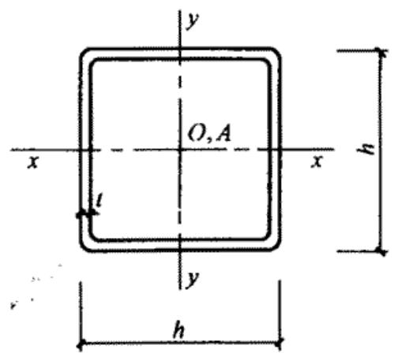

| 尺寸(mm) | 尺寸(mm) | 截面面积(cm2) | 每米长质量(kg/m) | y0(cm) | x0-x0 | x0-x0 | x0-x0 | x0-x0 | x-x | x-x | y-y | y-y | x1-x1 | e0(cm) | It(cm4) |
| --- | --- | --- | --- | --- | --- | --- | --- | --- | --- | --- | --- | --- | --- | --- | --- |
| b | t | 截面面积(cm2) | 每米长质量(kg/m) | y0(cm) | Ix0(cm4) | ix0(cm) | Wx0max(cm3) | Wx0min(cm3) | Ix(cm4) | ix(cm) | Iy(cm4) | iy(cm) | Ixl(cm4) | e0(cm) | It(cm4) |
| 30 | 1.5 | 0.85 | 0.67 | 0.828 | 0.77 | 0.95 | 0.93 | 0.35 | 1.25 | 1.21 | 0.29 | 0.58 | 1.35 | 1.07 | 0.0064 |
| 30 | 2.0 | 1.12 | 0.88 | 0.855 | 0.99 | 0.94 | 1.16 | 0.46 | 1.63 | 1.21 | 0.36 | 0.57 | 1.81 | 1.07 | 0.0149 |
| 40 | 2.0 | 1.52 | 1.19 | 1.105 | 2.43 | 1.27 | 2.20 | 0.84 | 3.95 | 1.61 | 0.90 | 0.77 | 4.28 | 1.42 | 0.0203 |
| 40 | 2.5 | 1.87 | 1.47 | 1.132 | 2.96 | 1.26 | 2.62 | 1.03 | 4.85 | 1.61 | 1.07 | 0.76 | 5.36 | 1.42 | 0.0390 |
| 50 | 2.5 | 2.37 | 1.86 | 1.381 | 5.93 | 1.58 | 4.29 | 1.64 | 9.65 | 2.02 | 2.20 | 0.96 | 10.44 | 1.78 | 0.0494 |
| 50 | 3.0 | 2.81 | 2.21 | 1.408 | 6.97 | 1.57 | 4.95 | 1.94 | 11.40 | 2.01 | 2.54 | 0.95 | 12.55 | 1.78 | 0.0843 |
| 60 | 2.5 | 2.87 | 2.25 | 1.630 | 10.41 | 1.90 | 6.38 | 2.38 | 16.90 | 2.43 | 3.91 | 1.17 | 18.03 | 2.13 | 0.0598 |
| 60 | 3.0 | 3.41 | 2.68 | 1.657 | 12.29 | 1.90 | 7.42 | 2.83 | 20.02 | 2.42 | 4.56 | 1.16 | 21.66 | 2.13 | 0.1023 |
| 75 | 2.5 | 3.62 | 2.84 | 2.005 | 20.65 | 2.39 | 10.30 | 3.76 | 33.43 | 3.04 | 7.87 | 1.48 | 35.20 | 2.66 | 0.0755 |
| 75 | 3.0 | 4.31 | 3.39 | 2.031 | 24.47 | 2.38 | 12.05 | 4.47 | 39.70 | 3.03 | 9.23 | 1.46 | 42.26 | 2.66 | 0.1293 |

钢 槽   

| 尺寸(mm) | 尺寸(mm) | 尺寸(mm) | 截面面积(cm2) | 每米长质量(kg/m) | x0(cm) | x-x | x-x | x-x | y-y | y-y | y-y | y-y | y1-y1 | e0(cm) | It(cm4) | Iω(cm6) | k(cm-1) | Wω1(cm4) | Wω2(cm4) |  |
| --- | --- | --- | --- | --- | --- | --- | --- | --- | --- | --- | --- | --- | --- | --- | --- | --- | --- | --- | --- | --- |
| h | b | t | 截面面积(cm2) | 每米长质量(kg/m) | x0(cm) | Ix(cm4) | ix(cm) | Wx(cm3) | Iy(cm4) | iy(cm) | Wymax(cm3) | Wymin(cm3) | Iyl(cm4) | e0(cm) | It(cm4) | Iω(cm6) | k(cm-1) | Wω1(cm4) | Wω2(cm4) |  |
| 60 | 30 | 2.5 | 2.74 | 2.15 | 0.883 | 14.38 | 2.31 | 4.89 | 2.40 | 0.94 | 2.71 | 1.13 | 4.53 | 1.88 | 0.0571 | 12.21 | 0.0425 | 4.72 | 2.51 |  |
| 80 | 40 | 2.5 | 3.74 | 2.94 | 1.132 | 36.70 | 3.13 | 9.18 | 5.92 | 1.26 | 5.23 | 2.06 | 10.71 | 2.51 | 0.0779 | 57.36 | 0.0229 | 11.61 | 6.37 |  |
| 80 | 40 | 3.0 | 4.43 | 3.48 | 1.159 | 42.66 | 3.10 | 10.67 | 6.93 | 1.25 | 5.98 | 2.44 | 12.87 | 2.51 | 0.1328 | 64.58 | 0.0282 | 13.64 | 7.34 |  |
| 100 | 40 | 2.5 | 4.24 | 3.33 | 1.013 | 62.07 | 3.83 | 12.41 | 6.37 | 1.23 | 6.29 | 2.13 | 10.72 | 2.30 | 0.0884 | 99.70 | 0.0185 | 17.07 | 8.44 |  |
| 100 | 40 | 3.0 | 5.03 | 3.95 | 1.039 | 72.44 | 3.80 | 14.49 | 7.47 | 1.22 | 7.19 | 2.52 | 12.89 | 2.30 | 0.1508 | 113.23 | 0.0227 | 20.20 | 9.79 |  |
| 120 | 40 | 2.5 | 4.74 | 3.72 | 0.919 | 95.92 | 4.50 | 15.99 | 6.72 | 1.19 | 7.32 | 2.18 | 10.73 | 2.13 | 0.0988 | 156.19 | 0.0156 | 23.62 | 10.59 |  |
| 120 | 40 | 3.0 | 5.63 | 4.42 | 0.944 | 112.28 | 4.47 | 18.71 | 7.90 | 1.19 | 8.37 | 2.58 | 12.91 | 2.12 | 0.1688 | 178.49 | 0.0191 | 28.13 | 12.33 |  |
| 140 | 50 | 3.0 | 6.83 | 5.36 | 1.187 | 191.53 | 5.30 | 27.36 | 15.52 | 1.51 | 13.08 | 4.07 | 25.13 | 2.75 | 0.2048 | 487.60 | 0.0128 | 48.99 | 22.93 |  |
| 140 | 50 | 3.5 | 7.89 | 6.20 | 1.211 | 218.88 | 5.27 | 31.27 | 17.79 | 1.50 | 14.69 | 4.70 | 29.37 | 2.74 | 0.3223 | 546.44 | 0.0151 | 56.72 | 26.09 |  |
| 160 | 60 | 3.0 | 8.03 | 6.30 | 1.432 | 300.87 | 6.12 | 37.61 | 26.90 | 1.83 | 18.79 | 5.89 | 43.35 | 3.37 | 0.2408 | 1119.78 | 0.0091 | 78.25 | 38.21 |  |
| 160 | 60 | 3.5 | 9.29 | 7.20 | 1.456 | 344.94 | 6.09 | 43.12 | 30.92 | 1.82 | 21.23 | 6.81 | 50.63 | 3.37 | 0.3794 | 1264.16 | 0.0108 | 90.71 | 43.68 |  |

| 尺寸(mm) | 尺寸(mm) | 尺寸(mm) | 尺寸(mm) | 截面面积(cm2) | 每米长质量(kg/m) | x0(cm) | x-x | x-x | x-x | y-y | y-y | y-y | y-y | y1-y1 | e0(cm) | It(cm4) | Iω(cm6) | k(cm-1) | Wω1(cm4) | Wω2(cm4) |
| --- | --- | --- | --- | --- | --- | --- | --- | --- | --- | --- | --- | --- | --- | --- | --- | --- | --- | --- | --- | --- |
| 尺寸(mm) | 尺寸(mm) | 尺寸(mm) | 尺寸(mm) | 截面面积(cm2) | 每米长质量(kg/m) | x0(cm) | Ix(cm4) | ix(cm) | Wx(cm3) | Iy(cm4) | iy(cm) | Wymax(cm3) | Wymin(cm3) | Iyl(cm4) | e0(cm) | It(cm4) | Iω(cm6) | k(cm-1) | Wω1(cm4) | Wω2(cm4) |
| h | b | a | t | 截面面积(cm2) | 每米长质量(kg/m) | x0(cm) | Ix(cm4) | ix(cm) | Wx(cm3) | Iy(cm4) | iy(cm) | Wymax(cm3) | Wymin(cm3) | Iyl(cm4) | e0(cm) | It(cm4) | Iω(cm6) | k(cm-1) | Wω1(cm4) | Wω2(cm4) |
| 80 | 40 | 15 | 2.0 | 3.47 | 2.72 | 1.452 | 34.16 | 3.14 | 8.54 | 7.79 | 1.50 | 5.36 | 3.06 | 15.10 | 3.36 | 0.0462 | 112.9 | 0.0126 | 16.03 | 15.74 |
| 100 | 50 | 15 | 2.5 | 5.23 | 4.11 | 1.706 | 81.34 | 3.94 | 16.27 | 17.19 | 1.81 | 10.08 | 5.22 | 32.41 | 3.94 | 0.1090 | 352.8 | 0.0109 | 34.47 | 29.41 |
| 120 | 50 | 20 | 2.5 | 5.98 | 4.70 | 1.706 | 129.40 | 4.65 | 21.57 | 20.96 | 1.87 | 12.28 | 6.36 | 38.36 | 4.03 | 0.1246 | 660.9 | 0.0085 | 51.04 | 48.36 |
| 120 | 60 | 20 | 3.0 | 7.65 | 6.01 | 2.106 | 170.68 | 4.72 | 28.45 | 37.36 | 2.21 | 17.74 | 9.59 | 71.31 | 4.87 | 0.2296 | 1153.2 | 0.0087 | 75.68 | 68.84 |
| 140 | 50 | 20 | 2.0 | 5.27 | 4.14 | 1.590 | 154.03 | 5.41 | 22.00 | 18.56 | 1.88 | 11.68 | 5.44 | 31.86 | 3.87 | 0.0703 | 794.79 | 0.0058 | 51.44 | 52.22 |
| 140 | 50 | 20 | 2.2 | 5.76 | 4.52 | 1.590 | 167.40 | 5.39 | 23.91 | 20.03 | 1.87 | 12.62 | 5.87 | 34.53 | 3.84 | 0.0929 | 852.46 | 0.0065 | 55.98 | 56.84 |
| 140 | 50 | 20 | 2.5 | 6.48 | 5.09 | 1.580 | 186.78 | 5.39 | 26.68 | 22.11 | 1.85 | 13.96 | 6.47 | 38.38 | 3.80 | 0.1351 | 931.89 | 0.0075 | 62.56 | 63.56 |
| 140 | 60 | 20 | 3.0 | 8.25 | 6.48 | 1.964 | 245.42 | 5.45 | 35.06 | 39.49 | 2.19 | 20.11 | 9.79 | 71.33 | 4.61 | 0.2476 | 1589.8 | 0.0078 | 92.69 | 79.00 |
| 160 | 60 | 20 | 2.0 | 6.07 | 4.76 | 1.850 | 236.59 | 6.24 | 29.57 | 29.99 | 2.22 | 16.19 | 7.23 | 50.83 | 4.52 | 0.0809 | 1596.28 | 0.0044 | 76.92 | 71.30 |
| 160 | 60 | 20 | 2.2 | 6.64 | 5.21 | 1.850 | 257.57 | 6.23 | 32.20 | 32.45 | 2.21 | 17.53 | 7.82 | 55.19 | 4.50 | 0.1071 | 1717.82 | 0.0049 | 83.82 | 77.55 |
| 160 | 60 | 20 | 2.5 | 7.48 | 5.87 | 1.850 | 288.13 | 6.21 | 36.02 | 35.96 | 2.19 | 19.47 | 8.66 | 61.49 | 4.45 | 0.1559 | 1887.71 | 0.0056 | 93.87 | 86.63 |
| 160 | 70 | 20 | 3.0 | 9.45 | 7.42 | 2.224 | 373.64 | 6.29 | 46.71 | 60.42 | 2.53 | 27.17 | 12.65 | 107.20 | 5.25 | 0.2836 | 3070.5 | 0.0060 | 135.49 | 109.92 |
| 180 | 70 | 20 | 2.0 | 6.87 | 5.39 | 2.110 | 343.93 | 7.08 | 38.21 | 45.18 | 2.57 | 21.37 | 9.25 | 75.87 | 5.17 | 0.0916 | 2934.34 | 0.0035 | 109.50 | 95.22 |

| 尺寸(mm) | 尺寸(mm) | 尺寸(mm) | 尺寸(mm) | 截面面积(cm2) | 每米长质量(kg/m) | x0(cm) | x-x | x-x | x-x | y-y | y-y | y-y | y-y | y1-y1 | e0(cm) | I1(cm4) | Iω(cm6) | k(cm-1) | Wω1(cm4) | Wω2(cm4) |
| --- | --- | --- | --- | --- | --- | --- | --- | --- | --- | --- | --- | --- | --- | --- | --- | --- | --- | --- | --- | --- |
| 尺寸(mm) | 尺寸(mm) | 尺寸(mm) | 尺寸(mm) | 截面面积(cm2) | 每米长质量(kg/m) | x0(cm) | Ix(cm4) | ix(cm) | Wx(cm3) | Iy(cm4) | iy(cm) | Wymax(cm3) | Wymin(cm3) | Iyl(cm4) | e0(cm) | I1(cm4) | Iω(cm6) | k(cm-1) | Wω1(cm4) | Wω2(cm4) |
| h | b | a | t | 截面面积(cm2) | 每米长质量(kg/m) | x0(cm) | Ix(cm4) | ix(cm) | Wx(cm3) | Iy(cm4) | iy(cm) | Wymax(cm3) | Wymin(cm3) | Iyl(cm4) | e0(cm) | I1(cm4) | Iω(cm6) | k(cm-1) | Wω1(cm4) | Wω2(cm4) |
| 180 | 70 | 20 | 2.2 | 7.52 | 5.90 | 2.110 | 374.90 | 7.06 | 41.66 | 48.97 | 2.55 | 23.19 | 10.02 | 82.49 | 5.14 | 0.1213 | 3165.62 | 0.0038 | 119.44 | 103.58 |
| 180 | 70 | 20 | 2.5 | 8.48 | 6.66 | 2.110 | 420.20 | 7.04 | 46.69 | 54.42 | 2.53 | 25.82 | 11.12 | 92.08 | 5.10 | 0.1767 | 3492.15 | 0.0044 | 133.99 | 115.73 |
| 200 | 70 | 20 | 2.0 | 7.27 | 5.71 | 2.000 | 440.04 | 7.78 | 44.00 | 46.71 | 2.54 | 23.32 | 9.35 | 75.88 | 4.96 | 0.0969 | 3672.33 | 0.0032 | 126.74 | 106.15 |
| 200 | 70 | 20 | 2.2 | 7.96 | 6.25 | 2.000 | 479.87 | 7.77 | 47.99 | 50.64 | 2.52 | 25.31 | 10.13 | 82.49 | 4.93 | 0.1284 | 3963.82 | 0.0035 | 138.26 | 115.74 |
| 200 | 70 | 20 | 2.5 | 8.98 | 7.05 | 2.000 | 538.21 | 7.74 | 53.82 | 56.27 | 2.50 | 28.18 | 11.25 | 92.09 | 4.89 | 0.1871 | 4376.18 | 0.0041 | 155.14 | 129.75 |
| 220 | 75 | 20 | 2.0 | 7.87 | 6.18 | 2.080 | 574.45 | 8.54 | 52.22 | 56.88 | 2.69 | 27.35 | 10.50 | 90.93 | 5.18 | 0.1049 | 5313.52 | 0.0028 | 158.43 | 127.32 |
| 220 | 75 | 20 | 2.2 | 8.62 | 6.77 | 2.080 | 626.85 | 8.53 | 56.99 | 61.71 | 2.68 | 29.70 | 11.38 | 98.91 | 5.15 | 0.1391 | 5742.07 | 0.0031 | 172.92 | 138.93 |
| 220 | 75 | 20 | 2.5 | 9.73 | 7.64 | 2.070 | 703.76 | 8.50 | 63.98 | 68.66 | 2.66 | 33.11 | 12.65 | 110.51 | 5.11 | 0.2028 | 6351.05 | 0.0035 | 194.18 | 155.94 |

表B.1.1-5  

| 尺寸(mm) | 尺寸(mm) | 尺寸(mm) | 尺寸(mm) | 截面面积(cm2) | 每米长质量(kg/m) | θ(°) | x1-x1 | x1-x1 | x1-x1 | y1-y1 | y1-y1 | y1-y1 | x-x | x-x |
| --- | --- | --- | --- | --- | --- | --- | --- | --- | --- | --- | --- | --- | --- | --- |
| 尺寸(mm) | 尺寸(mm) | 尺寸(mm) | 尺寸(mm) | 截面面积(cm2) | 每米长质量(kg/m) | θ(°) | Ix1(cm4) | ix1(cm) | Wx1(cm3) | Iy1(cm4) | iy1(cm) | Wyl(cm3) | Ix(cm4) | ix(cm) |
| h | b | a | t | 截面面积(cm2) | 每米长质量(kg/m) | θ(°) | Ix1(cm4) | ix1(cm) | Wx1(cm3) | Iy1(cm4) | iy1(cm) | Wyl(cm3) | Ix(cm4) | ix(cm) |
| 100 | 40 | 20 | 2.0 | 4.07 | 3.19 | 24.017 | 60.04 | 3.84 | 12.01 | 17.02 | 2.05 | 4.36 | 70.70 | 4.17 |
| 100 | 40 | 20 | 2.5 | 4.98 | 3.91 | 23.767 | 72.10 | 3.80 | 14.42 | 20.02 | 2.00 | 5.17 | 84.63 | 4.12 |
| 120 | 50 | 20 | 2.0 | 4.87 | 3.82 | 24.050 | 106.97 | 4.69 | 17.83 | 30.23 | 2.49 | 6.17 | 126.06 | 5.09 |
| 120 | 50 | 20 | 2.5 | 5.98 | 4.70 | 23.833 | 129.39 | 4.65 | 21.57 | 35.91 | 2.45 | 7.37 | 152.05 | 5.04 |
| 120 | 50 | 20 | 3.0 | 7.05 | 5.54 | 23.600 | 150.14 | 4.61 | 25.02 | 40.88 | 2.41 | 8.43 | 175.92 | 4.99 |
| 140 | 50 | 20 | 2.5 | 6.48 | 5.09 | 19.417 | 186.77 | 5.37 | 26.68 | 35.91 | 2.35 | 7.37 | 209.19 | 5.67 |
| 140 | 50 | 20 | 3.0 | 7.65 | 6.01 | 19.200 | 217.26 | 5.33 | 31.04 | 40.83 | 2.31 | 8.43 | 241.62 | 5.62 |
| 160 | 60 | 20 | 2.5 | 7.48 | 5.87 | 19.983 | 288.12 | 6.21 | 36.01 | 58.15 | 2.79 | 9.90 | 323.13 | 6.57 |
| 160 | 60 | 20 | 3.0 | 8.85 | 6.95 | 19.783 | 336.66 | 6.17 | 42.08 | 66.66 | 2.74 | 11.39 | 376.76 | 6.52 |
| 160 | 70 | 20 | 2.5 | 7.98 | 6.27 | 23.767 | 319.13 | 6.32 | 39.89 | 87.74 | 3.32 | 12.76 | 374.76 | 6.85 |
| 160 | 70 | 20 | 3.0 | 9.45 | 7.42 | 23.567 | 373.64 | 6.29 | 46.71 | 101.10 | 3.27 | 14.76 | 437.72 | 6.80 |
| 180 | 70 | 20 | 2.5 | 8.48 | 6.66 | 20.367 | 420.18 | 7.04 | 46.69 | 87.74 | 3.22 | 12.76 | 473.34 | 7.47 |
| 180 | 70 | 20 | 3.0 | 10.05 | 7.89 | 20.183 | 492.61 | 7.00 | 54.73 | 101.11 | 3.17 | 14.76 | 553.83 | 7.42 |

卷边Z形钢  

|  |  | y-y | y-y | y-y | y-y | y-y | $I_{x1y1}$ (cm4) | $I_t$ (cm4) | $I_\omega$ (cm6) | k (cm-1) | $W_{\omega 1}$ (cm4) | $W_{\omega 2}$ (cm4) |
| --- | --- | --- | --- | --- | --- | --- | --- | --- | --- | --- | --- | --- |
| $W_{x1}$ (cm3) | $W_{x2}$ (cm3) | $I_y$ (cm4) | $i_y$ (cm) | $W_{y1}$ (cm3) | $W_{y2}$ (cm3) |  | $I_{x1y1}$ (cm4) | $I_t$ (cm4) | $I_\omega$ (cm6) | k (cm-1) | $W_{\omega 1}$ (cm4) | $W_{\omega 2}$ (cm4) |
| 15.93 | 11.94 | 6.36 | 1.25 | 3.36 | 4.42 | 23.93 | 0.0542 | 325.0 | 0.0081 | 49.97 | 29.16 |  |
| 19.18 | 14.47 | 7.49 | 1.23 | 4.07 | 5.28 | 28.45 | 0.1038 | 381.9 | 0.0102 | 62.25 | 35.03 |  |
| 23.55 | 17.40 | 11.14 | 1.51 | 4.83 | 5.74 | 42.77 | 0.0649 | 785.2 | 0.0057 | 84.05 | 43.96 |  |
| 28.55 | 21.21 | 13.25 | 1.49 | 5.89 | 6.89 | 51.30 | 0.1246 | 930.9 | 0.0072 | 104.68 | 52.94 |  |
| 33.18 | 24.80 | 15.11 | 1.46 | 6.89 | 7.92 | 58.99 | 0.2116 | 1058.9 | 0.0087 | 125.37 | 61.22 |  |
| 32.55 | 26.34 | 14.48 | 1.49 | 6.69 | 6.78 | 60.75 | 0.1350 | 1289.0 | 0.0064 | 137.04 | 60.03 |  |
| 37.76 | 30.70 | 16.52 | 1.47 | 7.84 | 7.81 | 69.93 | 0.2296 | 1468.2 | 0.0077 | 164.94 | 69.51 |  |
| 44.00 | 34.95 | 23.14 | 1.76 | 9.00 | 8.71 | 96.32 | 0.1559 | 2634.3 | 0.0048 | 205.98 | 86.28 |  |
| 51.48 | 41.08 | 26.56 | 1.73 | 10.58 | 10.07 | 111.51 | 0.2656 | 3019.4 | 0.0058 | 247.41 | 100.15 |  |
| 52.35 | 38.23 | 32.11 | 2.01 | 10.53 | 10.86 | 126.37 | 0.1663 | 3793.3 | 0.0041 | 238.87 | 106.91 |  |
| 61.33 | 45.01 | 37.03 | 1.98 | 12.39 | 12.58 | 146.86 | 0.2836 | 4365.0 | 0.0050 | 285.78 | 124.26 |  |
| 57.27 | 44.88 | 34.58 | 2.02 | 11.66 | 10.86 | 143.18 | 0.1767 | 4907.9 | 0.0037 | 294.53 | 119.41 |  |
| 67.22 | 52.89 | 39.89 | 1.99 | 13.72 | 12.59 | 166.47 | 0.3016 | 5652.2 | 0.0045 | 353.32 | 138.92 |  |

表B.1.1-6  

| 尺寸(mm) | 尺寸(mm) | 尺寸(mm) | 尺寸(mm) | 截面面积(cm2) | 每米长质量(kg/m) | θ(°) | x1-x1 | x1-x1 | x1-x1 | y1-y1 | y1-y1 | y1-y1 | x-x | x-x |
| --- | --- | --- | --- | --- | --- | --- | --- | --- | --- | --- | --- | --- | --- | --- |
| 尺寸(mm) | 尺寸(mm) | 尺寸(mm) | 尺寸(mm) | 截面面积(cm2) | 每米长质量(kg/m) | θ(°) | Ix1(cm4) | ix1(cm) | Wxl(cm3) | Iyl(cm4) | iy1(cm) | Wyl(cm3) | Ix(cm4) | Ix(cm) |
| h | b | a | t | 截面面积(cm2) | 每米长质量(kg/m) | θ(°) | Ix1(cm4) | ix1(cm) | Wxl(cm3) | Iyl(cm4) | iy1(cm) | Wyl(cm3) | Ix(cm4) | Ix(cm) |
| 140 | 50 | 20 | 2.0 | 5.392 | 4.233 | 21.986 | 162.065 | 5.482 | 23.152 | 39.363 | 2.702 | 6.234 | 185.962 | 5.872 |
| 140 | 50 | 20 | 2.2 | 5.909 | 4.638 | 21.998 | 176.813 | 5.470 | 25.259 | 42.928 | 2.695 | 6.809 | 202.926 | 5.860 |
| 140 | 50 | 20 | 2.5 | 6.676 | 5.240 | 22.018 | 198.446 | 5.452 | 28.349 | 48.154 | 2.686 | 7.657 | 227.828 | 5.842 |
| 160 | 60 | 20 | 2.0 | 6.192 | 4.861 | 22.104 | 246.830 | 6.313 | 30.854 | 60.271 | 3.120 | 8.240 | 283.680 | 6.768 |
| 160 | 60 | 20 | 2.2 | 6.789 | 5.329 | 22.113 | 269.592 | 6.302 | 33.699 | 65.802 | 3.113 | 9.009 | 309.891 | 6.756 |
| 160 | 60 | 20 | 2.5 | 7.676 | 6.025 | 22.128 | 303.090 | 6.284 | 37.886 | 73.935 | 3.104 | 10.143 | 348.487 | 6.738 |
| 180 | 70 | 20 | 2.0 | 6.992 | 5.489 | 22.185 | 356.620 | 7.141 | 39.624 | 87.417 | 3.536 | 10.514 | 410.315 | 7.660 |
| 180 | 70 | 20 | 2.2 | 7.669 | 6.020 | 22.193 | 389.835 | 7.130 | 43.315 | 95.518 | 3.529 | 11.502 | 448.592 | 7.648 |
| 180 | 70 | 20 | 2.5 | 8.676 | 6.810 | 22.205 | 438.835 | 7.112 | 48.759 | 107.460 | 3.519 | 12.964 | 505.087 | 7.630 |
| 200 | 70 | 20 | 2.0 | 7.392 | 5.803 | 19.305 | 455.430 | 7.849 | 45.543 | 87.418 | 3.439 | 10.514 | 506.903 | 8.281 |
| 200 | 70 | 20 | 2.2 | 8.109 | 6.365 | 19.309 | 498.023 | 7.837 | 49.802 | 95.520 | 3.432 | 11.503 | 554.346 | 8.268 |
| 200 | 70 | 20 | 2.5 | 9.176 | 7.203 | 19.314 | 560.921 | 7.819 | 56.092 | 107.462 | 3.422 | 12.964 | 624.421 | 8.249 |
| 220 | 75 | 20 | 2.0 | 7.992 | 6.274 | 18.300 | 592.787 | 8.612 | 53.890 | 103.580 | 3.600 | 11.751 | 652.866 | 9.038 |
| 220 | 75 | 20 | 2.2 | 8.769 | 6.884 | 18.302 | 648.520 | 8.600 | 58.956 | 113.220 | 3.593 | 12.860 | 714.276 | 9.025 |
| 220 | 75 | 20 | 2.5 | 9.926 | 7.792 | 18.305 | 730.926 | 8.581 | 66.448 | 127.443 | 3.583 | 14.500 | 805.086 | 9.006 |
| 250 | 75 | 20 | 2.0 | 8.592 | 6.745 | 15.389 | 799.640 | 9.647 | 63.791 | 103.580 | 3.472 | 11.752 | 856.690 | 9.985 |
| 250 | 75 | 20 | 2.2 | 9.429 | 7.402 | 15.387 | 875.145 | 9.634 | 70.012 | 113.223 | 3.465 | 12.860 | 937.579 | 9.972 |
| 250 | 75 | 20 | 2.5 | 10.676 | 8.380 | 15.385 | 986.898 | 9.615 | 78.952 | 127.447 | 3.455 | 14.500 | 1057.30 | 9.952 |

斜卷边Z形钢  

|  |  | y-y | y-y | y-y | y-y | Ix1y1(cm4) | It(cm4) | Iω(cm6) | k(cm-1) | Wω1(cm4) | Wω2(cm4) |
| --- | --- | --- | --- | --- | --- | --- | --- | --- | --- | --- | --- |
| Wx1(cm3) | Wx2(cm3) | Iy(cm4) | iy(cm) | Wyl(cm3) | Wy2(cm3) | Ix1y1(cm4) | It(cm4) | Iω(cm6) | k(cm-1) | Wω1(cm4) | Wω2(cm4) |
| 30.377 | 22.470 | 15.466 | 1.694 | 6.107 | 8.067 | 59.189 | 0.0719 | 1298.621 | 0.0046 | 118.281 | 59.185 |
| 33.352 | 24.544 | 16.814 | 1.687 | 6.659 | 8.823 | 64.638 | 0.0953 | 1407.575 | 0.0051 | 130.014 | 64.382 |
| 37.792 | 27.598 | 18.771 | 1.667 | 7.468 | 9.941 | 72.659 | 0.1391 | 1563.520 | 0.0058 | 147.558 | 71.926 |
| 40.271 | 29.603 | 23.422 | 1.945 | 8.018 | 9.554 | 90.733 | 0.0826 | 2559.036 | 0.0035 | 175.940 | 82.223 |
| 44.225 | 32.367 | 25.503 | 1.938 | 8.753 | 10.450 | 99.179 | 0.1095 | 2779.796 | 0.0039 | 193.430 | 89.569 |
| 50.132 | 36.445 | 28.537 | 1.928 | 9.834 | 11.775 | 111.642 | 0.1599 | 3098.400 | 0.0044 | 219.605 | 100.26 |
| 51.502 | 37.679 | 33.722 | 2.196 | 10.191 | 11.289 | 131.674 | 0.0932 | 4643.994 | 0.0028 | 249.609 | 111.10 |
| 56.570 | 41.226 | 36.761 | 2.189 | 11.136 | 12.351 | 144.034 | 0.1237 | 5052.769 | 0.0031 | 274.455 | 121.13 |
| 61.143 | 46.471 | 41.208 | 2.179 | 12.528 | 13.923 | 162.307 | 0.1807 | 5654.157 | 0.0035 | 311.661 | 135.81 |
| 56.094 | 43.435 | 35.944 | 2.205 | 11.109 | 11.339 | 146.944 | 0.0986 | 5882.294 | 0.0025 | 302.430 | 123.44 |
| 61.618 | 47.533 | 39.197 | 2.200 | 12.138 | 12.419 | 160.756 | 0.1308 | 6403.010 | 0.0028 | 332.826 | 134.66 |
| 69.876 | 53.596 | 43.962 | 2.189 | 13.654 | 14.021 | 181.182 | 0.1912 | 7160.113 | 0.0032 | 378.452 | 151.08 |
| 65.085 | 51.328 | 43.500 | 2.333 | 12.829 | 12.343 | 181.661 | 0.1066 | 8483.845 | 0.0022 | 383.110 | 148.38 |
| 71.501 | 56.190 | 47.465 | 2.327 | 14.023 | 13.524 | 198.803 | 0.1415 | 9242.136 | 0.0024 | 421.750 | 161.95 |
| 81.096 | 63.392 | 53.283 | 2.317 | 15.783 | 15.278 | 224.175 | 0.2068 | 10347.65 | 0.0028 | 479.804 | 181.87 |
| 71.976 | 61.841 | 46.532 | 2.327 | 14.553 | 12.090 | 207.280 | 0.1146 | 11298.92 | 0.0020 | 485.919 | 169.98 |
| 78.870 | 67.773 | 50.789 | 2.321 | 15.946 | 14.211 | 226.864 | 0.1521 | 12314.34 | 0.0022 | 535.491 | 184.53 |
| 89.108 | 76.584 | 57.044 | 2.312 | 18.014 | 16.169 | 255.870 | 0.2224 | 13797.02 | 0.0025 | 610.188 | 207.38 |

11   

| 尺寸(mm) | 尺寸(mm) | 尺寸(mm) | 截面面积(cm2) | 每米长质量(kg/m) | y0(cm) | x0-x0 | x0-x0 | x0-x0 | x0-x0 | x-x | x-x | y-y | y-y | x1-x1 | e0(cm) | It(cm4) | Iw(cm6) |
| --- | --- | --- | --- | --- | --- | --- | --- | --- | --- | --- | --- | --- | --- | --- | --- | --- | --- |
| b | a | t | 截面面积(cm2) | 每米长质量(kg/m) | y0(cm) | Ix0(cm4) | ix0(cm) | Wx0max(cm3) | Wx0min(cm3) | Ix(cm4) | ix(cm) | Iy(cm4) | iy(cm) | Ixl(cm4) | e0(cm) | It(cm4) | Iw(cm6) |
| 40 | 15 | 2.0 | 1.95 | 1.53 | 1.404 | 3.93 | 1.42 | 2.80 | 1.51 | 5.74 | 1.72 | 2.12 | 1.04 | 7.78 | 2.37 | 0.0260 | 3.88 |
| 60 | 20 | 2.0 | 2.95 | 2.32 | 2.026 | 13.83 | 2.17 | 6.83 | 3.48 | 20.56 | 2.64 | 7.11 | 1.55 | 25.94 | 3.38 | 0.0394 | 22.64 |
| 75 | 20 | 2.0 | 3.55 | 2.79 | 2.396 | 25.60 | 2.69 | 10.68 | 5.02 | 39.01 | 3.31 | 12.19 | 1.85 | 45.99 | 3.82 | 0.0473 | 36.55 |
| 75 | 20 | 2.5 | 4.36 | 3.42 | 2.401 | 30.76 | 2.66 | 12.81 | 6.03 | 46.91 | 3.28 | 14.60 | 11.83 | 55.90 | 3.80 | 0.0909 | 43.33 |

表B.1.1-8焊接薄壁圆钢管  

| 尺寸(mm) | 尺寸(mm) | 截面面积(cm2) | 每米长质量(kg/m) | I(cm4) | i(cm) | W(cm3) |
| --- | --- | --- | --- | --- | --- | --- |
| d | t | 截面面积(cm2) | 每米长质量(kg/m) | I(cm4) | i(cm) | W(cm3) |
| 25 | 1.5 | 1.11 | 0.87 | 0.77 | 0.83 | 0.61 |
| 30 | 1.5 | 1.34 | 1.05 | 1.37 | 1.01 | 0.91 |
| 30 | 2.0 | 1.76 | 1.38 | 1.73 | 0.99 | 1.16 |
| 40 | 1.5 | 1.81 | 1.42 | 3.37 | 1.36 | 1.68 |
| 40 | 2.0 | 2.39 | 1.88 | 4.32 | 1.35 | 2.16 |
| 51 | 2.0 | 3.08 | 2.42 | 9.26 | 1.73 | 3.63 |
| 57 | 2.0 | 3.46 | 2.71 | 13.08 | 1.95 | 4.59 |
| 60 | 2.0 | 3.64 | 2.86 | 15.34 | 2.05 | 5.10 |
| 70 | 2.0 | 4.27 | 3.35 | 24.72 | 2.41 | 7.06 |
| 76 | 2.0 | 4.65 | 3.65 | 31.85 | 2.62 | 8.38 |
| 83 | 2.0 | 5.09 | 4.00 | 41.76 | 2.87 | 10.06 |
| 83 | 2.5 | 6.32 | 4.96 | 51.26 | 2.85 | 12.35 |
| 89 | 2.0 | 5.47 | 4.29 | 51.74 | 3.08 | 11.63 |
| 89 | 2.5 | 6.79 | 5.33 | 63.59 | 3.06 | 14.29 |
| 95 | 2.0 | 5.84 | 4.59 | 63.20 | 3.29 | 13.31 |
| 95 | 2.5 | 7.26 | 5.70 | 77.76 | 3.27 | 16.37 |
| 102 | 2.0 | 6.28 | 4.93 | 78.55 | 3.54 | 15.40 |
| 102 | 2.5 | 7.81 | 6.14 | 96.76 | 3.52 | 18.97 |
| 102 | 3.0 | 9.33 | 7.33 | 114.40 | 3.50 | 22.43 |
| 108 | 2.0 | 6.66 | 5.23 | 93.60 | 3.75 | 17.33 |
| 108 | 2.5 | 8.29 | 6.51 | 115.40 | 3.73 | 21.37 |
| 108 | 3.0 | 9.90 | 7.77 | 136.50 | 3.72 | 25.28 |
| 114 | 2.0 | 7.04 | 5.52 | 110.40 | 3.96 | 19.37 |
| 114 | 2.5 | 8.76 | 6.87 | 136.20 | 3.94 | 23.89 |
| 114 | 3.0 | 10.46 | 8.21 | 161.30 | 3.93 | 28.30 |
| 121 | 2.0 | 7.48 | 5.87 | 132.40 | 4.21 | 21.88 |
| 121 | 2.5 | 9.31 | 7.31 | 163.50 | 4.19 | 27.02 |
| 121 | 3.0 | 11.12 | 8.73 | 193.70 | 4.17 | 32.02 |
| 127 | 2.0 | 7.85 | 6.17 | 153.40 | 4.42 | 24.16 |
| 127 | 2.5 | 9.78 | 7.68 | 189.50 | 4.40 | 29.84 |
| 127 | 3.0 | 11.69 | 9.18 | 224.70 | 4.39 | 35.39 |
| 133 | 2.5 | 10.25 | 8.05 | 218.20 | 4.62 | 32.81 |
| 133 | 3.0 | 12.25 | 9.62 | 259.00 | 4.60 | 38.95 |
| 133 | 3.5 | 14.24 | 11.18 | 298.70 | 4.58 | 44.92 |
| 140 | 2.5 | 10.80 | 8.48 | 255.30 | 4.86 | 36.47 |

续表B.1.1-8   

| 尺寸(mm) | 尺寸(mm) | 截面面积(cm2) | 每米长质量(kg/m) | I(cm4) | i(cm) | W(cm3) |
| --- | --- | --- | --- | --- | --- | --- |
| d | t | 截面面积(cm2) | 每米长质量(kg/m) | I(cm4) | i(cm) | W(cm3) |
| 140 | 3.0 | 12.91 | 10.13 | 303.10 | 4.85 | 43.29 |
| 140 | 3.5 | 15.01 | 11.78 | 349.80 | 4.83 | 49.97 |
| 152 | 3.0 | 14.04 | 11.02 | 389.90 | 5.27 | 51.30 |
| 152 | 3.5 | 16.33 | 12.82 | 450.30 | 5.25 | 59.25 |
| 152 | 4.0 | 18.60 | 14.60 | 509.60 | 5.24 | 67.05 |
| 159 | 3.0 | 14.70 | 11.54 | 447.40 | 5.52 | 56.27 |
| 159 | 3.5 | 17.10 | 13.42 | 517.00 | 5.50 | 65.02 |
| 159 | 4.0 | 19.48 | 15.29 | 585.30 | 5.48 | 73.62 |
| 168 | 3.0 | 15.55 | 12.21 | 529.40 | 5.84 | 63.02 |
| 168 | 3.5 | 18.09 | 14.20 | 612.10 | 5.82 | 72.87 |
| 168 | 4.0 | 20.61 | 16.18 | 693.30 | 5.80 | 82.53 |
| 180 | 3.0 | 16.68 | 13.09 | 653.50 | 6.26 | 72.61 |
| 180 | 3.5 | 19.41 | 15.24 | 756.00 | 6.24 | 84.00 |
| 180 | 4.0 | 22.12 | 17.36 | 856.80 | 6.22 | 95.20 |
| 194 | 3.0 | 18.00 | 14.13 | 821.10 | 6.75 | 84.64 |
| 194 | 3.5 | 20.95 | 16.45 | 950.50 | 6.74 | 97.99 |
| 194 | 4.0 | 23.88 | 18.75 | 1078.00 | 6.72 | 111.10 |
| 203 | 3.0 | 18.85 | 15.00 | 943.00 | 7.07 | 92.87 |
| 203 | 3.5 | 21.94 | 17.22 | 1092.00 | 7.06 | 107.55 |
| 203 | 4.0 | 25.01 | 19.63 | 1238.00 | 7.04 | 122.01 |
| 219 | 3.0 | 20.36 | 15.98 | 1187.00 | 7.64 | 108.44 |
| 219 | 3.5 | 23.70 | 18.61 | 1376.00 | 7.62 | 125.65 |
| 219 | 4.0 | 27.02 | 21.81 | 1562.00 | 7.60 | 142.62 |
| 245 | 3.0 | 22.81 | 17.91 | 1670.00 | 8.56 | 136.30 |
| 245 | 3.5 | 26.55 | 20.84 | 1936.00 | 8.54 | 158.10 |
| 245 | 4.0 | 30.28 | 23.77 | 2199.00 | 8.52 | 179.50 |

## B.2 截面物性的近似计算公式

下列近似计算公式均按截面中心线进行计算。

x轴向右为正,y轴向上为正。

B.2.1半圆钢管。

$$A = \pi r t$$

$$z _{0} = 0. 3 6 3 r$$

$$I _{x} = 1. 5 7 1 r ^{3} t$$

$$I _{y} = 0. 2 9 8 r ^{3} t$$

$$I _{t} = 1. 0 4 7 r t ^{3}$$

$$I _{\omega} = 0. 0 3 7 4 r ^{5} \mathrm {t}$$

$$e _{0} = 0. 6 3 6 r$$

B.2.2等边角钢。

$$A = 2 b t$$

$$e _{0} = \frac {b}{2 \sqrt {2}}$$

$$I _{x} = \frac {1}{3} b ^{3} t$$

$$I _{y} = \frac {1}{1 2} b ^{3} t$$

$$I _{1} = \frac {2}{3} b t ^{3}$$

$$I _{\omega} = 0$$

$$I _{x _ {0}} = I _{y _ {0}} = \frac {5}{2 4} b ^{3} t$$

$$y _{0} = \frac {b}{4}$$

$$U _{y} = \frac {b ^{4} t}{1 2 \sqrt {2}}$$

B.2.3卷边等边角钢。

$$A = 2 (b + a) t$$

$$z _{0} = \frac {b + a}{2 \sqrt {2}}$$

$$I _{x} = \frac {1}{3} (b ^{3} + a ^{3}) t + b a (b - a) t$$

$$I _{y} = \frac {1}{1 2} (b + a) ^{3} t$$

$$I _{t} = \frac {2}{3} (b + a) t ^{3}$$

$$I _{\omega} = d ^{2} b ^{2} \left(\frac {b}{3} + \frac {a}{4}\right) t + \frac {2}{3} a \left[ \frac {d}{\sqrt {2}} \left(\frac {3}{2} b - a\right) - b a \right] ^{2} t$$

$$d = \frac {b a ^{2} (3 b - 2 a)}{3 \sqrt {2} \cdot I _{x}} \cdot t$$

$$e _{0} = d + z _{0}$$

$$y _{0} = \frac {a + b}{4}$$

$$I _{x _ {0}} = I _{y _ {0}} = \frac {5}{2 4} (a - b) ^{3} t + \frac {a ^{2} b t}{4} + \frac {5}{1 2} b ^{3} t$$

$$U _{y} = \frac {t}{1 2 \sqrt {2}} \left(b ^{4} + 4 b ^{3} a - 6 b ^{2} a ^{2} + a ^{4}\right)$$

B.2.4槽钢。

$$A = (2 b + h) t$$

$$z _{0} = \frac {b ^{2}}{2 b + h}$$

$$I _{x} = \frac {1}{1 2} h ^{3} t + \frac {1}{2} b h ^{2} t$$

$$I _{y} = h z _{0} ^{2} t + \frac {1}{6} b ^{3} t + 2 b \cdot \left(\frac {b}{2} - z _{0}\right) ^{2} t$$

$$I _{t} = \frac {1}{3} (2 b + h) t ^{3}$$

$$I _{\omega} = \frac {b ^{3} h ^{2} t}{1 2} \cdot \frac {2 h + 3 b}{6 b + h}$$

$$e _{0} = d + z _{0}$$

$$d = \frac {3 b ^{2}}{6 b + h}$$

$$U _{y} = \frac {1}{2} (b - z _{0}) ^{4} t - \frac {1}{2} z _{0} ^{4} t - z _{0} ^{3} h t + \frac {1}{4} (b - z _{0}) ^{2} h ^{2} t - \frac {1}{4} z _{0} ^{2} h ^{2} t -$$

$$\frac {1}{1 2} z _{0} h ^{3} t$$

B.2.5向外卷边槽钢。

$$A = (h + 2 b + 2 a) t$$

$$z _{0} = \frac {b (b + 2 a)}{h + 2 b + 2 a}$$

$$\begin{array}{l} I _{x} = \frac {1}{1 2} h ^{3} t + \frac {1}{2} b h ^{2} t + \\ \frac {1}{6} a ^{3} t + \frac {1}{2} a (h + a) ^{2} t \\ \end{array}$$

$$I _{y} = h z _{0} ^{2} t + \frac {1}{6} b ^{3} t + 2 b \cdot \left(\frac {b}{2} - z _{0}\right) ^{2} t + 2 a (b - z _{0}) ^{2} t$$

$$I _{1} = \frac {1}{3} (h + 2 b + 2 a) t ^{3}$$

$$\begin{array}{l} I _{\omega} = \frac {d ^{2} h ^{3} t}{1 2} + \frac {h ^{2}}{6} [ d ^{3} + (b - d) ^{3} ] t + \\ \frac {a}{6} \left[ 3 h ^{2} (d - b) ^{2} + 6 h a \left(d ^{2} - b ^{2}\right) + 4 a ^{2} (d + b) ^{2} \right] t \\ \end{array}$$

$$\begin{array}{l} d = \frac {b}{I _{\mathrm {x}}} \left(\frac {1}{4} b h ^{2} + \frac {1}{2} a h ^{2} - \frac {2}{3} a ^{3}\right) t \\ e _{0} = d + z _{0} \\ U _{y} = t \left[ \frac {(b - z _{0}) ^{4}}{2} - \frac {z _{0} ^{4}}{2} - z _{0} ^{3} h + \frac {(b - z _{0}) ^{2} h ^{2}}{4} - \frac {z _{0} ^{2} h ^{2}}{4} - \frac {z _{0} h ^{3}}{1 2} + \right. \\ \left. 2 a \left(b - z _{0}\right) ^{3} + 2 \left(b - z _{0}\right) \left(\frac {a ^{3}}{3} + \frac {a ^{2} h}{2} + \frac {a h ^{2}}{4}\right) \right] \\ \end{array}$$

B.2.6向内卷边槽钢。

$$A = (h + 2 b + 2 a) t$$

$$z _{0} = \frac {b (b + 2 a)}{h + 2 b + 2 a}$$

$$\begin{array}{l} I _{x} = \frac {1}{1 2} h ^{3} t + \frac {1}{2} b h ^{2} t + \\ \frac {1}{6} a ^{3} t + \frac {1}{2} a (h - a) ^{2} t \\ \end{array}$$

$$\begin{array}{l} I _{y} = h z _{0} ^{2} t + \frac {1}{6} b ^{3} t + 2 b \cdot \left(\frac {b}{2} - z _{0}\right) ^{2} t + \\ 2 a (b - z _{0}) ^{2} t \\ \end{array}$$

$$I _{t} = \frac {1}{3} (h + 2 b + 2 a) t ^{3}$$

$$\begin{array}{l} I _{\omega} = \frac {d ^{2} h ^{3} t}{1 2} + \frac {h ^{2}}{6} [ d ^{3} + (b - d) ^{3} ] t + \\ \frac {a}{6} \left[ 3 h ^{2} (d - b) ^{2} - 6 h a \left(d ^{2} - b ^{2}\right) + 4 a ^{2} (d + b) ^{2} \right] t \\ \end{array}$$

$$\begin{array}{l} d = \frac {b}{I _{\mathrm {x}}} \left(\frac {1}{4} b h ^{2} + \frac {1}{2} a h ^{2} - \frac {2}{3} a ^{3}\right) t \\ e _{0} = d + z _{0} \\ \end{array}$$

$$\begin{array}{l} U _{y} = t \left[ \frac {(b - z _{0}) ^{4}}{2} - \frac {z _{0} ^{4}}{2} - z _{0} ^{3} h + \frac {(b - z _{0}) ^{2} h ^{2}}{4} - \frac {z _{0} ^{2} h ^{2}}{4} - \frac {z _{0} h ^{3}}{1 2} + \right. \\ \left. 2 a \left(b - z _{0}\right) ^{3} + 2 \left(b - z _{0}\right) \left(\frac {a ^{3}}{3} - \frac {a ^{2} h}{2} + \frac {a h ^{2}}{4}\right) \right] \\ \end{array}$$

B.2.7 Z形钢。

$$\begin{array}{l} A = (h + 2 b) t \\ I _{x 1} = \frac {1}{1 2} h ^{3} t + \frac {1}{2} b h ^{2} t \\ I _{y 1} = \frac {2}{3} b ^{3} t \\ I _{1} = \frac {1}{3} (h + 2 b) t ^{3} \\ \end{array}$$

$$I _{x 1 y 1} = - \frac {1}{2} b ^{2} h t$$

$$\mathrm {t g} 2 \theta = \frac {2 I _{\mathrm {x l y l}}}{I _{\mathrm {y l}} - I _{\mathrm {x l}}}$$

$$I _{x} = I _{x 1} \cos^{2} \theta + I _{y 1} \sin^{2} \theta - 2 I _{x 1 y 1} \sin \theta \cos \theta$$

$$I _{y} = I _{x 1} \sin^{2} \theta + I _{y 1} \cos^{2} \theta + 2 I _{x 1 y 1} \sin \theta \cos \theta$$

$$I _{\omega} = \frac {b ^{3} h ^{2} t}{1 2} \cdot \frac {b + 2 h}{h + 2 b}$$

$$m = \frac {b ^{2}}{h + 2 b}$$

B.2.8 卷边Z形钢。

$$A = (h + 2 b + 2 a) t$$

$$I _{x 1} = \frac {1}{1 2} h ^{3} t + \frac {1}{2} b h ^{2} t + \frac {1}{6} a ^{3} t + \frac {1}{2} a t (h - a) ^{2}$$

$$I _{y 1} = b ^{2} t \left(\frac {2}{3} b + 2 a\right)$$

$$I _{x 1 y 1} = - \frac {1}{2} b t [ b h + 2 a (h - a) ]$$

$$\mathrm {t g} 2 \theta = \frac {2 I _{\mathrm {x l y l}}}{I _{\mathrm {y l}} - I _{\mathrm {x l}}}$$

$$I _{x} = I _{x 1} \cos^{2} \theta + I _{y 1} \sin^{2} \theta - 2 I _{x 1 y 1} \sin \theta \cos \theta$$

$$I _{y} = I _{x 1} \sin^{2} \theta + I _{y 1} \cos^{2} \theta + 2 I _{x 1 y 1} \sin \theta \cos \theta$$

$$I _{1} = \frac {1}{3} (h + 2 b + 2 a) t ^{3}$$

$$\begin{array}{l} I _{\omega} = \frac {b ^{2} t}{1 2 (h + 2 b + 2 a)} [ h ^{2} b (2 h + b) + 2 a h (3 h ^{2} + 6 a h + 4 a ^{2}) + \\ \left. 4 a b h (h + 3 a) + 4 a ^{3} (4 b + a) \right] \\ \end{array}$$

$$m = \frac {2 a b (h + a) + b ^{2} h}{(h + 2 b + 2 a) h}$$

B.2.9斜卷边Z形钢。

$$A = (h + 2 b + 2 a) t$$

$$I _{x 1} = \frac {1}{1 2} h ^{3} t + \frac {1}{2} h ^{2} t (a + b) - a ^{2} h t \sin \theta_{1} + \frac {2}{3} a ^{3} t \sin^{2} \theta_{1}$$

$$I _{y 1} = \frac {2}{3} b ^{3} t + 2 a b ^{2} t + 2 a ^{2} b t \cos \theta_{1} + \frac {2}{3} a ^{3} t \cos^{2} \theta_{1}$$

$$I _{x 1 y 1} = - \frac {1}{2} h b ^{2} t - h a b t + a ^{2} b t \sin \theta_{1} - \frac {1}{2} h a ^{2} t \cos \theta_{1} + \frac {2}{3} a ^{3} t$$

$$\sin \theta_{1} \cos \theta_{1}$$

$$\mathrm {t g} 2 \theta = \frac {2 I _{\mathrm {x l y l}}}{I _{\mathrm {y l}} - I _{\mathrm {x l}}}$$

$$I _{x} = I _{x 1} \cos^{2} \theta + I _{y 1} \sin^{2} \theta - 2 I _{x 1 y 1} \sin \theta \cos \theta$$

$$I _{y} = I _{x 1} \sin^{2} \theta + I _{y 1} \cos^{2} \theta + 2 I _{x 1 y 1} \sin \theta \cos \theta$$

$$I _{t} = \frac {1}{3} (h + 2 b + 2 a) t ^{3}$$

$$I _{\omega} = \frac {t}{1 2} \left[ 2 h ^{2} m ^{3} + 3 h ^{3} m ^{2} + 2 h ^{2} (b - m) ^{3} + \right.$$

$$\left. 6 a h ^{2} (b - m) ^{2} + 6 a ^{2} h (b - m) n + 2 a ^{3} n ^{2} \right]$$

$$m = \frac {b h (b + 2 a) + a ^{2} n}{(h + 2 b + 2 a) h}$$

$$n = 2 b \sin \theta_{1} + h \cos \theta_{1}$$

B.2.10圆钢管。

$$A = \pi d t$$

$$I _{x} = I _{y} = \frac {1}{8} \pi t d ^{3}$$

$$i _{x} = \frac {d}{2 \sqrt {2}}$$

# 附录 C 考虑冷弯效应的强度设计值的计算方法

C.0.1 考虑冷弯效应的强度设计值 f ′可按下式计算：

$$f ^{\prime} = \left[ 1 + \frac {\eta (1 2 \gamma - 1 0 t)}{l} \sum_{i = 1} ^{n} \frac {\theta_{i}}{2 \pi} \right] f \tag {C.0.1-1}$$

式中 η ——成型方式系数，对于冷弯高频焊（圆变）方、矩形管，取η ＝1.7；对于圆管和其他方式成型的方、矩形管及开口型钢，取η =1.0；

2 钢材的抗拉强度与屈服强度的比值，对于 Q235 钢可取 =1.58，对于 Q345钢可取 =1.48；

n 型钢截面所含棱角数目；

θ 型钢截面上第i个棱角所对应的圆周角（如图C.0.1所示），以弧度为单位；l — 型钢截面中心线的长度，可取型钢截面积与其厚度的比值。

  
图C.0.1冷弯薄壁型钢截面示意图

型钢截面中心线的长度l，亦可按下式计算：

$$l = l ^{\prime} + \frac {1}{2} \sum_{i = 1} ^{n} \theta_{i} \left(2 \gamma_{i} + t\right) \tag {C.0.1-2}$$

式中 l′— 型钢平板部分宽度之和；

$\gamma _{ i }$ — 型钢截面上第i个棱角内表面的弯曲半径

t 型钢厚度。

# 附录 D 侵蚀作用分类和防腐涂料底、面漆配套及维护年限

D.0.1 界条件对冷弯薄壁型钢结构的侵蚀作用分类可按表D.0.1采用。

表 D.0.1 外界条件对冷弯簿壁型钢结构的侵蚀作用分类  

| 序号 | 地区 | 相对温度(%) | 对结构的侵蚀作用分类 | 对结构的侵蚀作用分类 | 对结构的侵蚀作用分类 |
| --- | --- | --- | --- | --- | --- |
| 序号 | 地区 | 相对温度(%) | 室内(采暖房屋) | 室内(非采暖房屋) | 露天 |
| 1 | 农村、一般城市的商业区及住宅 | 干燥,<60 | 无侵蚀性 | 无侵蚀性 | 弱侵蚀性 |
| 2 | 农村、一般城市的商业区及住宅 | 普通,60~75 | 无侵蚀性 | 弱侵蚀性 | 中等侵蚀性 |
| 3 | 农村、一般城市的商业区及住宅 | 潮湿,>75 | 弱侵蚀性 | 弱侵蚀性 | 中等侵蚀性 |
| 4 | 工业区、沿海地区 | 干燥,<60 | 弱侵蚀性 | 中等侵蚀性 | 中等侵蚀性 |
| 5 | 工业区、沿海地区 | 普通,60~75 | 弱侵蚀性 | 中等侵蚀性 | 中等侵蚀性 |
| 6 | 工业区、沿海地区 | 潮湿,>75 | 中等侵蚀性 | 中等侵蚀性 | 中等侵蚀性 |
| 注:1表中的相对温度系指当地的年平均相对湿度,对于恒温恒湿或有相对湿度指标的建筑物,则按室内相对湿度采用;2一般城市的商业区及住宅区泛指无侵蚀性介质的地区,工业区是包括受侵蚀介质影响及散发轻微侵蚀性介质的地区。 | 注:1表中的相对温度系指当地的年平均相对湿度,对于恒温恒湿或有相对湿度指标的建筑物,则按室内相对湿度采用;2一般城市的商业区及住宅区泛指无侵蚀性介质的地区,工业区是包括受侵蚀介质影响及散发轻微侵蚀性介质的地区。 | 注:1表中的相对温度系指当地的年平均相对湿度,对于恒温恒湿或有相对湿度指标的建筑物,则按室内相对湿度采用;2一般城市的商业区及住宅区泛指无侵蚀性介质的地区,工业区是包括受侵蚀介质影响及散发轻微侵蚀性介质的地区。 | 注:1表中的相对温度系指当地的年平均相对湿度,对于恒温恒湿或有相对湿度指标的建筑物,则按室内相对湿度采用;2一般城市的商业区及住宅区泛指无侵蚀性介质的地区,工业区是包括受侵蚀介质影响及散发轻微侵蚀性介质的地区。 | 注:1表中的相对温度系指当地的年平均相对湿度,对于恒温恒湿或有相对湿度指标的建筑物,则按室内相对湿度采用;2一般城市的商业区及住宅区泛指无侵蚀性介质的地区,工业区是包括受侵蚀介质影响及散发轻微侵蚀性介质的地区。 | 注:1表中的相对温度系指当地的年平均相对湿度,对于恒温恒湿或有相对湿度指标的建筑物,则按室内相对湿度采用;2一般城市的商业区及住宅区泛指无侵蚀性介质的地区,工业区是包括受侵蚀介质影响及散发轻微侵蚀性介质的地区。 |

D.0.2 常用防腐涂料底、面漆配套及维护年限可按表 D.0.2 采用。

70   

| 侵蚀作用类别 | 侵蚀作用类别 | 表面处理 | 涂料类别 | 底面漆配套涂料 | 底面漆配套涂料 | 底面漆配套涂料 | 底面漆配套涂料 | 底面漆配套涂料 | 底面漆配套涂料 | 底面漆配套涂料 | 维护年限(年) |
| --- | --- | --- | --- | --- | --- | --- | --- | --- | --- | --- | --- |
| 侵蚀作用类别 | 侵蚀作用类别 | 表面处理 | 涂料类别 | 底漆 | 道数 | 膜厚(μ) | 面漆 | 道数 | 膜厚(μ) |  |  |
| 室内 | 无侵蚀性 | 喷砂(丸)除锈,酸洗除锈,手工或半机械化除锈 | 第一类 | Y53-31红丹油性防锈漆Y53-32铁红油性防锈漆F53-31红丹酚醛防锈漆F53-33铁红酚醛防锈漆C53-31红丹醇酸防锈漆C06-1铁红醇酸底漆F53-40云铁醇酸防锈漆 | 222222222 | 6060606060606060 | C04-2各色醇酸磁漆C04-45灰醇酸磁漆C04-5灰云铁醇酸磁漆 | 2222 | 606060 | 15~20 |  |
| 室内 | 弱侵蚀性 | 喷砂(丸)除锈,酸洗除锈,手工或半机械化除锈 | 第一类 | Y53-31红丹油性防锈漆Y53-32铁红油性防锈漆F53-31红丹酚醛防锈漆F53-33铁红酚醛防锈漆C53-31红丹醇酸防锈漆C06-1铁红醇酸底漆F53-40云铁醇酸防锈漆 | 222222222 | 6060606060606060 | C04-2各色醇酸磁漆C04-45灰醇酸磁漆C04-5灰云铁醇酸磁漆 | 2222 | 606060 | 10~15 |  |
| 室外 | 弱侵蚀性 | 喷砂(丸)除锈,酸洗除锈,手工或半机械化除锈 | 第一类 | Y53-31红丹油性防锈漆Y53-32铁红油性防锈漆F53-31红丹酚醛防锈漆F53-33铁红酚醛防锈漆C53-31红丹醇酸防锈漆C06-1铁红醇酸底漆F53-40云铁醇酸防锈漆 | 222222222 | 6060606060606060 | C04-2各色醇酸磁漆C04-45灰醇酸磁漆C04-5灰云铁醇酸磁漆 | 2222 | 606060 | 8~10 |  |
| 室内 | 中等侵蚀性 | 酸洗磷化处理、喷砂(丸)除锈 | 第二类 | H06-2铁红环氧树脂底漆铁红环氧化改性M树脂底漆H53-30云铁环氧树脂底漆 | 222 | 606060 | 灰醇酸改性过氯乙烯磁漆醇酸改性氯化橡胶磁漆醇酸改性氯醋磁漆聚氨酯改性氯醋磁漆 | 22222 | 60606060 | 10~15 |  |
| 室外 | 中等侵蚀性 | 酸洗磷化处理、喷砂(丸)除锈 | 第二类 | H06-2铁红环氧树脂底漆铁红环氧化改性M树脂底漆H53-30云铁环氧树脂底漆 | 222 | 606060 | 灰醇酸改性过氯乙烯磁漆醇酸改性氯化橡胶磁漆醇酸改性氯醋磁漆聚氨酯改性氯醋磁漆 | 22222 | 60606060 | 5~7 |  |
| 室外 | 中等侵蚀性 | 酸洗磷化处理、喷砂(丸)除锈 | 第二类 | 氯磺化聚乙烯防腐底漆 | 2 | 60 | 氯磺化聚乙烯防腐面漆 | 2 | 60 | 5~7 |  |
| 注:表中所列第一类或第二类中任何一种底漆(氯磺化聚乙烯防腐底漆除外)可和同一类别中的任一种面漆配套使用。 | 注:表中所列第一类或第二类中任何一种底漆(氯磺化聚乙烯防腐底漆除外)可和同一类别中的任一种面漆配套使用。 | 注:表中所列第一类或第二类中任何一种底漆(氯磺化聚乙烯防腐底漆除外)可和同一类别中的任一种面漆配套使用。 | 注:表中所列第一类或第二类中任何一种底漆(氯磺化聚乙烯防腐底漆除外)可和同一类别中的任一种面漆配套使用。 | 注:表中所列第一类或第二类中任何一种底漆(氯磺化聚乙烯防腐底漆除外)可和同一类别中的任一种面漆配套使用。 | 注:表中所列第一类或第二类中任何一种底漆(氯磺化聚乙烯防腐底漆除外)可和同一类别中的任一种面漆配套使用。 | 注:表中所列第一类或第二类中任何一种底漆(氯磺化聚乙烯防腐底漆除外)可和同一类别中的任一种面漆配套使用。 | 注:表中所列第一类或第二类中任何一种底漆(氯磺化聚乙烯防腐底漆除外)可和同一类别中的任一种面漆配套使用。 | 注:表中所列第一类或第二类中任何一种底漆(氯磺化聚乙烯防腐底漆除外)可和同一类别中的任一种面漆配套使用。 | 注:表中所列第一类或第二类中任何一种底漆(氯磺化聚乙烯防腐底漆除外)可和同一类别中的任一种面漆配套使用。 | 注:表中所列第一类或第二类中任何一种底漆(氯磺化聚乙烯防腐底漆除外)可和同一类别中的任一种面漆配套使用。 | 注:表中所列第一类或第二类中任何一种底漆(氯磺化聚乙烯防腐底漆除外)可和同一类别中的任一种面漆配套使用。 |

本规范用词说明

1 为便于在执行本规范条文时区别对待，对要求严格程度不同的用词说明如下：  
1）表示很严格，非这样做不可的用同：

正面词采用“必须”；反面词采用“严禁”。

2）表示严格，在正常情况下均应这样做的用同：

正面词采用“应”；反面同采用“不应”或“不得”。

3）表示允许稍有选择，在条件许可时首先应这样做的用词：

正面词采用“宜”或“可”；反面词采用“不宜” 。

2 规范中指明应按其他有关标准和规范执行的写法为：“应符合……要求（或规定）”或“应按……执行”。

冷湾薄壁型钢结构技术规范

Technical code of cold-formed thin-wall steel structures

2002-09-27 发布

2003-01-01 实施

中 华 人 民 共 和 国 建 设 部

中华人民共和国国家质量监督检验检疫总局

联合发布

中华人民共和国国家标准

冷湾薄壁型钢结构技术规范

Technical code of cold-formed thin-wall steel structures

GB 50018━2002

# 条 文 说 明

主编部门：湖北省发展计划委员会

批准部门：中华人民共和国建设部

施行日期： 2 0 0 3 年 1 月 1 日

# 1 总 则

1.0.2 本条明确指出本规范仅适用于工业与民用房屋和一般构筑物的经冷弯（或冷压）成型的冷弯薄壁型钢结构的设计与施工，而热轧型钢的钢结构设计应符合现行国家标准《钢结构设计规范》GB 50017 的规定。  
1.0.3 本条对原规范“不适用于受有强烈侵蚀作用的冷弯薄壁型钢结构”有所放宽，虽然本次修订仍保持原规范钢材壁厚不宜大于6mm 的规定，锈蚀后果比较严重，但随着钢材材质及防腐涂料的改进，冷弯型钢的应用范围日益扩大，目前我国已能生产壁厚12.5mm或更厚的冷弯型钢，与普通热轧型钢已无多大区别，故适当放宽。但受强烈侵蚀介质作用的薄壁型钢结构，必须综合考虑其防腐蚀的特殊要求。现行国家标准《工业建筑防腐蚀设计规范》GB 50046 中将气态介质、腐蚀性水、酸碱盐溶液、固态介质和污染土对建筑物长期作用下的腐蚀性分为四个等级，在有强烈侵蚀作用的环境中一般不采用冷弯薄壁型钢结构。

# 3 材 料

3.0.1 本规范仍仅推荐现行国家标准《碳素结构钢》GB/T 700 中规定的Q235 钢和《低合金高强度结构钢》GB/T 1951 中规定的Q345 钢，原因是这两种牌号的钢材具有多年生产与使用的经验，材质稳定，性能可靠，经济指标较好，而其他牌号的钢材或因产量有限、性能尚不稳定，或因技术经济效果不佳、使用经验不多，而未获推荐应用。但本条中加列了“当有可靠根据时，可采用其他牌号的钢材”的规定，此外，在现行国家标准《碳素结构钢》中提出：“A 级钢的含碳量可以不作交货条件”，由于焊接结构对钢材含碳量要求严格，所以Q235A 级钢不宜在焊接结构中使用。  
3.0.6 本条提出在设计和材料订货中应具体考虑的一些注意事项。

# 4 基本设计规定

## 4.1 设 计 原 则

4.1.3 新修订的国家标准《建筑结构可靠度设计统一标准》GB 50068 对结构重要性系数 $\gamma _{ 0 }$ 做了两点改变：其一， $\gamma _{ 0 }$ 不仅仍考虑结构的安全等级，还考虑了结构的设计使用年限；其二，将原标准 $\gamma _{ 0 }$ 取值中的“等于”均改为“不应小于”，给予不同投资者对结构安全度设计要求选择的余地。对于一般工业与民用建筑冷弯薄壁型钢结构，经统计分析

其安全等级多为二级，其设计使用年限为50 年，故其重要性系数不应小于1；对于设计使用年限为 25 年的易于替换的构件（如作为围护结构的压型钢板等），其重要性系数适当降低，取为不小于 0.95；对于特殊建筑物，其安全等级及设计使用年限应根据具体情况另行确定。

4.1.5 本条系参照现行国家标准《建筑结构荷载规范》GB 50009 规定对于正常使用极限状态，应根据不同的设计要求，采用荷载的标准组合、频遇值组合或准永久组合。对于冷弯薄壁型钢结构来说，只考虑荷载效应的标准组合，采用荷载标准值和容许变形进行计算。  
4.1.9 构件的变形和各种稳定系数，按理也应分别按净截面、有效截面或有效净截面计算，但计算比较繁琐，为了简化计算而作此规定，采用毛截面计算其精度在允许范围内。  
4.1.10 现场实测表明，具有可靠连接的压型钢板围护体系的建筑物，其承载能力和刚度均大于按裸骨架算得的值。这种因围护墙体在自身平面内的抗剪能力而加强了的结构整体工作性能的效应称为受力蒙皮作用。考虑受力蒙皮作用不仅能节省材料和工程造价，还能反映结构的真实工作性能，提高结构的可靠性。

连接件的类型是发挥受力蒙皮作用的关键。用自攻螺钉、抽芯铆钉（拉铆钉）和射钉等紧固件可靠连接的压型钢板和檩条、墙梁等支承构件组成的蒙皮组合体具有可观的抗剪能力，可发挥受力蒙皮作用。采用挂钩螺栓等可滑移的连接件组成的组合体不具有抗剪能力，不能发挥受力蒙皮作用。

受力蒙皮作用的大小与压型钢板的类型、屋面和墙面是否开洞、支承檩条或墙梁的布置形式以及连接件的种类和布置形式等因素有关，为了对结构进行整体分析，应由试验方法对上述各部件组成的蒙皮组合体（包括开洞的因素在内）开展试验研究，确定相应的强度和刚度等参数。

图1a 表示有蒙皮围护的平梁门式刚架体系在水平风荷载作用下的变形情况，整个屋面像平放的深梁一样工作，檐口檩条类似上、下弦杆，除受弯外，还承受轴向压、拉作用。

为把风荷载传给基础，山墙处可设置墙梁蒙皮体系，也可设交叉支撑体系。图 lb 表示有蒙皮围护的山形门式刚架体系，在竖向屋面荷载作用下的变形情况。两侧屋面类似于斜放的深梁受弯，屋脊檩条受压，檐口檩条受拉。为保证受力蒙皮作用，山墙柱顶水平处应设置拉杆。当承受水平风荷作用时，也有类似于图 1a 的受力情况。因此脊檩、檐口檩条和山墙部位是关键部位，设计中应予重视。

  
  
图1受力蒙皮作用示意图

由于考虑受力蒙皮作用，压型钢板及其连接等就成了整体受力结构体系的重要组成部分，不能随便拆卸。

## 4.2 设 计 指 标

4.2.1、4.2.4、4.2.5 本规范对钢材的强度设计值、焊缝强度设计值仍按原规范取值，但4.2.5 条中普通粗制螺栓，改为 C 级普通螺栓并对构件钢材为 Q345 钢中螺栓的承压强度设计值 $f _{ c } ^{ b }$ 之值有所降低。  
4.2.2 （含附录 C）冷弯薄壁型钢系由钢板或钢带经冷加工成型的。由于冷作硬化的影响，冷弯型钢的屈服强度将较母材有较大的提高，提高的幅度与材质、截面形状、尺寸及成型工艺等项因素有关，原规范利用塑性理论导得了此冷弯效应的理论公式，并经试验证实作了简化处理以方便使用。由于 80 年代方、矩形钢管的成型方式均为先将钢板经冷弯高频焊成圆管，然后再冲成方、矩形钢管（即圆变方）形成两次冷加工，故其与屈服强度提高因素有关的成型方式系数η 取 1.7，对于圆管和其他开口型钢η 取 1.0.近年来冷弯成型方式不断改进，由圆变方的已不是唯一的成型方式，可以由钢板一次成型成方、矩管，即少了一道冷加工工序，故本规范规定其他方式成型的方矩管η =1.0。  
4.2.3 经退火、焊接和热镀锌等热处理的冷弯薄壁型钢构件其冷弯硬化的影响已不复存

在，故作此规定。

## 4.3 构造的一般规定

4.3.1 本条仍保持了原规范对壁厚不宜大于 6mm 的限制。由于冷弯型钢结构与普通钢结构的主要区别在于结构材料成型方式的不同以及由此导致截面特性、材性及计算理论等方面的差异，按理不宜对冷弯型钢的壁厚加以限制，且随着冷弯型钢生产状况的改善及设备生产能力的日益发展，我国已能生产壁厚 12.5mm（部分生产厂的可达 22mm、国外为25.4mm）的冷弯型钢，但由于实验数据不足及使用经验不多，所以仍保留壁厚的限制，但如有可靠依据，冷弯型钢结构的壁厚可放宽至 12.5mm。

# 5 构件的计算

## 5.1 轴心受拉构件

5.1.1 轴心受拉构件中的高强度螺栓摩擦型连接处，应按公式5.1.1-2 和5.1.1-3 计算其强度。这是因为高强度螺栓摩擦型连接系藉板间摩擦传力，而在每个螺栓孔中心截面处，该高强度螺栓所传递的力的一部分已在孔前传走，原规范考虑孔前板间的接触面可能存在缺陷，孔前传力系数可能不足一半，为安全起见，取孔前传力系数为0.4，但根据试验，孔前传力系数大多数情况为 0.6，少数情况为 0.5，同时，为了与现行国家标准《钢结构设计规范》GB 50017 协调一致，故在公式 5.1.1-2 中取孔前传力系数为 0.5。此外由于 $( 1 - 0 . 5 \frac { n _{ 1 } } { n } ) N < N$ ，因此，除应按公式 5.1.1（计算螺栓孔处构件的净截面强度外，尚需按公式 5.1.1-3 计算构件的毛截面强度。

5.1.2 当轴心拉力不通过截面弯心（或不通过 形截面的扇性零点）时，受拉构件将处Z于拉、扭组合的复杂受力状态，其强度应按下式计算：

$$\sigma = \frac {N}{A _{n}} \pm \frac {B}{W _{\omega}} \leqslant f \tag {1}$$

式中 N ——轴心拉力；

$A _{ n }$ An 净截面面积；

$B$ — —双力矩；

$W _{ \omega }$ 毛截面的扇性模量。

有时，公式（1）中第 2 项翘曲应力 $\sigma _{ \omega } ( = B / W _{ \omega } )$ 可能占总应力的 30%以上，在这种情况下，不计双力矩 的影响是不安全的。B

但是，双力矩 及截面弯扭特性（除有现成图表可查者外）的计算比较繁冗，为了B简化设计计算，对于闭口截面、双轴对称开口截面等的轴心受拉构件，则可不计双力矩的影响，直接按第5.1.1 条的规定计算其强度。

由于轴心受压构件、拉弯及压弯构件均有类似情况，故亦一并列入本条。

## 5.2 轴心受压构件

5.2.1 当轴心受压构件截面有所削弱（如开孔或缺口等）时，应按公式5.2.1计算其强度，式中 $A _{ e n }$ 、为有效净截面面积，应按下列规定确定：

1 有效截面面积 $A _{ e }$ ，按本规范第 5.6.7 条中的规定算得；  
2 若孔洞或缺口位于截面的无效部位，则 $A _{ e n } = A _{ e } ;$ ；若孔洞或缺口位于截面的有效部位，则 $A _{ e n } = A _{ e }$ —（位于有效部位的孔洞或缺口的面积）。  
3 开圆孔的均匀受压加劲板件的有效宽度 $b _{ e } ^{ \prime }$ ，可按下列公式确定。

当 $d _{ 0 } / b \leqslant 0$ .1 时：

$$b _{e} ^{\prime} = b _{e}$$

当 0. $1 < d _{ \mathrm { 0 } } / b \leqslant 0 . 5$ 时：

$$b _{e} ^{\prime} = b _{e} - \frac {0 . 9 1 d _{0}}{\lambda_{c} ^{2}}$$

当 0. $5 { < } d _{ 0 } / b { \leqslant } 0 . 7$ 时：

$$b _{e} ^{\prime} = b _{e} - \frac {1 . 1 1 d _{0}}{\lambda_{c} ^{2}}$$

$$\lambda_{c} = 0. 5 3 \frac {b}{t} \cdot \sqrt {\frac {f _{y}}{E}}$$

式中 $d _{ 0 }$ ——孔径；

$b _{ e }$ ——相应未开孔均匀受压加劲板件的有效宽度，按第 5.6 节的规定计算；

b 、t— 板件的实际宽度、厚度；

$f _{ y }$ — 钢材的屈服强度；

E 钢材的弹性模量。

若轴心受压构件截面没有削弱，则仅需按公式5.2.2 计算其稳定性而毋须计算其强度。

5.2.2 轴心受压构件应按公式 5.2.2 计算其稳定性。

通过理论分析和对各类开口、闭口截面冷弯薄壁型钢轴心受压构件的试验研究，证实轴心受压杆件的稳定性可采用单一柱子曲线进行计算。根据对现有试验结果的统计分析和计算比较，柱子曲线可由基于边缘屈服准则的Perry 公式计算，式中之初始相对偏心率 $\varepsilon _{ 0 }$ 系按试验结果经分析比较确定。

5.2.3 闭口截面、双轴对称开口截面的轴心受压构件多系在刚度较小的主平面内弯曲失稳。不卷边的等边单角钢轴心受压构件系单轴对称截面，由于截面形心和剪心不重合，因此在轴心压力作用下，此类构件有可能发生弯扭屈曲。但若能保证等边单角钢各外伸肢截面全部有效，则在轴心压力作用下此类构件的扭转失稳承载能力比弯曲失稳承载能力降低不多。鉴于在冷弯薄壁型钢结构中，单角钢通常用于支撑等较为次要的构件，为避免计算过于繁琐，故近似将其归入本条。

对于受力较大的不卷边等边单角钢压杆，则宜作为单轴对称开口截面按第5.2.4 条的规定计算。

5.2.4、5.2.5 近年来，国内有关单位对单轴对称开口截面轴心受压构件弯扭失稳问题所进行的更为深入的理论分析和试验研究表明，采用“换算长细比法”来计算此类构件的整体稳定性是可行的，故本规范仍沿用原规范的规定，但对其中扭转屈曲计算长度和约束系数 $\beta$ 的取值作了更明确的定义，以使有关规定的物理意义更为明晰。

5.2.6 实腹式轴心受压直杆的弹性屈曲临界力通常均可不考虑剪切的影响，据计算，因剪切所致附加弯曲仅将使此类构件的欧拉临界力降低约0.3%左右。但是，对于格构式轴心受压构件来说，当其绕截面虚轴弯曲时，剪切变形较大，对构件弯曲屈曲临界力有显著影响，故计算此类构件的整体稳定性时，对虚轴应采用换算长细比来考虑剪切的影响。

本条根据理论推导，列出了几种常用的以缀板或缀条连接的双肢或三肢格构式构件换算长细比的计算公式。

本条有关格构式轴心受压构件单肢长细比 $\lambda _{ \mathrm { 1 } }$ 的要求是为了保证单肢不先于构件整体

失稳。

5.2.7 格构式轴心受压构件应能承受按公式5.2.7 算得的剪力。

格构式轴心受压构件由于在制作、运输及安装过程中会产生初始弯曲（通常假定构件的初始挠曲为一正弦半波，构件中点处的最大初挠曲值不大于构件全长的 1/750），同时，轴心力的作用存在着不可避免的初始偏心（根据实测统计分析，一般可取此初始偏心值为 0.05 ， 系此构件的截面核心距），在轴心力作用下，此格构式轴心受压构件内将会产生剪力，以受力最大截面边缘屈服作为临界条件，即可求得公式 5.2.7 所示之杆内最大剪力V 。

## 5.3 受 弯 构 件

5.3.1～5.3.4 内容与原规范第4.5.1 条～第4.5.4 条基本相同。为了方便使用，在下述 3 个方面做了修订：

1 在计算梁的整体稳定系数时，一般都是对 轴（强轴）进行计算，而且本规范中x的 轴大都是对称轴，因此对薄壁型钢粱而言，主要是计算 x $\varphi _{ b x }$ ，故在附录 A 中第 A.2.1条列出了 轴为对称轴的 x $\varphi _{ b x }$ 计算公式，而 轴为非对称轴的情况，在梁中也可能碰到，x在压弯杆件中常用，故在第 A.2.2 条列出了 轴为非对称轴时 x $\varphi _{ b x }$ 的计算方法，以上本来都是写成一个公式，这次把一个公式分两条，突出了 轴是对称轴时的计算，也考虑了x x轴为非对称轴时的情况，最大的好处是避免了可能出现的误解。  
2 有时还要计算截面绕 轴（弱轴、弯曲时梁的整体稳定系数 y $\varphi _{ b y }$ 。一般都不写出 $\varphi _{ b y }$ 的计算公式，而是由计算者自己按计算 $\varphi _{ b y }$ 的公式来代换其中相对应的几何特性，不仅使用不方便，而且可能出错。故在第 A.2.3 条列出了 $\varphi _{ b y }$ 的计算公式，不仅解决了上述问题，而且可以提高计算工效。  
3 以往在计算梁的整体稳定系数时，还要用到一个计算系数 $\boldsymbol { \xi } _{ 3 }$ ，对于承受横向荷载的梁它小于1。现在按更完善的理论分析和试验证明，它的值可取为1，它在梁的整体稳定系数计算中不起任何作用，故取消了这个计算系数，更简化了计算。

## 5.4 拉 弯 构 件

5.4.1 冷弯薄壁型钢结构构件的设计计算均不考虑截面发展塑性，而以边缘屈服作为其

承载能力的极限状态，故本条规定，在轴心拉力和2 个主平面内弯矩的作用下，拉弯构件应按公式 5.4.1 计算强度，式中的截面特性均以净截面为准。考虑到在小拉力、大弯矩情况下截面上可能出现受压区，故在条文中加列了这种情况下净截面算法的规定。

## 5.5 压 弯 构 件

5.5.1 在轴心压力和 2 个主平面内弯矩的共同作用下，压弯构件的强度应按公式 5.5.1计算，考虑到构件截面削弱的可能性，式中的截面特性均应按有效净截面确定。  
5.5.2 双轴对称截面的压弯构件，当弯矩作用于对称平面内时，计算其弯矩作用平面内稳定性的相关公式 5.5.2-1 是根据边缘屈服准则，假定钢材为理想弹塑性体，构件两端简支，作用着轴心压力和两端等弯矩，并考虑了初弯曲和初偏心的综合影响，构件的变形曲线为半个正弦波，这些理想条件均满足的前提下导得的，在此基础上，引入计算长度系数来考虑其他端部约束条件的影响，以等效弯矩系数 $\beta _{ m }$ 来表征其他荷载情况（如不等端弯矩，横向荷载等）的影响，此外，公式5.5. 2-1 还考虑了轴心力所致附加弯矩的影响，因此，该式可用于各类双轴对称截面压弯构件弯矩作用平面内稳定性的计算。

双轴对称截面的压弯构件，当弯矩作用在最大刚度平面内时，应按公式 5.5.2-2 计算弯矩作用平面外的稳定性，此式系按弹性稳定理论导出的直线相关公式（对双轴对称截面的压弯构件，一般是偏于安全的），与轴心受压构件及受弯构件整体稳定性的计算公式自然衔接，且考虑了不同截面形状（开口或闭口截面）、荷载情况及侧向支承条件的影响，适用范围较为广泛。

5.5.4 对于图 2 所示的单轴对称开口截面压弯构件，当弯矩作用于对称平面内时，除应按公式 5.5.2-1 计算其弯矩作用平面内的稳定性外，尚应按公式 5.2.2 计算其弯矩作用平面外的稳定性，但式中的轴心受压构件稳定系数 $\varphi$ 应按由单轴对称开口截面压弯构件弯扭屈曲理论算得的用公式 5.5.4-1：表述的换算长细比 $\lambda _{ \omega }$ 确定。近年来所进行的大量较为系统的试验结果证实，上述“换算长细比法”是可行的。此外，考虑到横向荷载作用位置对构件平面外稳定性的影响，在公式 5.5.4-2 中加列了 $\xi _{ 2 } e _{ a }$ 项，其中 $\boldsymbol { \xi } _{ 2 }$ 是横向荷载作用位置的影响系数， $e _{ a }$ 系横向荷载作用点到弯心的距离，规定当横向荷载指向弯心时， $e _{ a }$ 为负值，横向荷载离开弯心时， $e _{ a }$ 为正值。

理论计算和试验研究表明，对于常用的单轴对称开口截面压弯构件而言，若作用于

对称平面内的弯矩所致等效偏心距位于截面夸心一侧，且其绝对值不小于 0 e $\frac { e _{ 0 } } { 2 } \quad ( e _{ 0 }$ 为截面形心至弯心距离）时，构件将不会发生弯扭屈曲，故本条规定此时毋需计算其弯矩作用平面外的稳定性，以方便设计计算。

  
(a)

  
(b)   
图2单轴对称开口截面压弯构件示意图

5.5.5 公式 5.5.5-1 和公式 5.5.5-2 均系半经验公式，是考虑到与轴心受压构件及受弯构件的整体稳定性计算公式的自然衔接和协调，并与有限试验结果做了分析、比较后确定的。  
5.5.6 双轴对称截面的双向压弯构件稳定性的计算公式 5.5.6-1 和公式 5.5.6-2 均系半经验式，是考虑到和轴心受压构件、受弯构件及单向压弯构件的稳定性计算公式的衔接和协调，且与有关理论研究成果及少量试验资料作了对比分析后确定的。  
5.5.7、5.5.8 格构式压弯构件，除应计算整个构件的强度和稳定性外，尚应计算单肢的强度和稳定性，以保证单肢不致先于整体破坏。

计算缀板和缀条的内力时，不考虑实际剪力和由构件初始缺陷所产生的剪力（由本规范第5.2.7 条确定）的叠加作用（因为两者叠加的概率是很小的），而取两者的较大剪力较为合理。

## 5.6 构件中的受压板件

5.6.1 本条所指的加劲板件即为两纵边均与其他板件相连接的板件；部分加劲板件即为一纵边与其他板件相连接，另一纵边由符合第 5.6.4 条要求的卷边加劲的板件；非加劲板件即为一纵边与其他板件相连接，另一纵边为自由边的板件。例如箱形截面构件的腹板和翼板都是加劲板件；槽形截面构件的腹板是加劲板件，翼缘是非加劲板件；卷边槽形截面构件的腹板是加劲板件，翼缘是部分加劲板件。

根据上海交通大学、湖南大学和南昌大学对箱形截面、卷边槽形截面和槽形截面的轴心受压、偏心受压板件的 132 个试验所得数据的分析，发现不论是哪一类板件都具有屈曲后强度，都可以采用有效截面的方式进行计算。因此本次修改不再采用原规范第4.6.4 条关于非加劲板件及非均匀受压的部分加劲板件应全截面有效的规定。

板件按有效宽厚比计算时，有效宽厚比除与板件的宽厚比、所受应力的大小和分布情况、板件纵边的支承类型等因素有关外，还与邻接板件对它的约束程度有关。原规范在确定板件的有效宽厚比时，没有考虑邻接板件的约束影响。本条对此做了修改，增加了邻接板件的约束影响。

以上两点是本次修改时根据试验结果对本条所做的主要修改。

由于考虑相邻板件的约束影响后，确定板件有效宽厚比的参数数目又有增加，如仍采用列表的方式确定板件的有效宽厚比，表格量将大幅增加，于使用不便，因此本条采用公式确定板件的有效宽厚比。

根据对试验数据的分析，对于加劲板件、部分加劲板件和非加劲板件的有效宽厚比的计算，都可以采用一个统一的公式，即公式5.6.1-1 至公式 5.6.1-3 公式中的计算系数 $\rho$ 考虑了相邻板件的约束影响、板件纵边的支承类型和板件所受应力的大小和分布情况。

$$\rho = \sqrt {\frac {2 0 5 k _{1} k}{\sigma_{1}}} \tag {2}$$

式中 k ——板件受压稳定系数，与板件纵边的支承类型和板件所受应力的分布情况有关；

$k _{ 1 }$ — 板组约束系数，与邻接板件的约束程度有关；

$\sigma _{ 1 }$ 0 受压板件边缘的最大控制应力 $( \mathrm { N / m m ^{ 2 } } )$ ），与板件所受力的各种情况有关。

如计算中不考虑板组约束影响，可取板组约束系数 $k _{ 1 } { = } 1$ ，此时计算得到的有效宽厚比的值与原规范的基本相符。

目前国际上已有不少国家采用统一的公式计算加劲板件、部分加劲板和非加劲板件的有效宽厚比，而统一公式的表达形式因各国依据的实验数据而有所不同。

本次修改对受压板件有效截面的取法及分布位置也做了修改（见第5.6.5 条），规定截面的受拉部分全部有效，有效宽度按一定比例分置在受压的两侧。因此，有效宽厚

比计算公式 5.6.1-1 至公式 5.6.1-3 的右侧为板件受压区的宽度 $b _{ c }$ ，即有效宽厚比用受压区宽厚比的一部分来表示。

有效宽厚比的计算公式由三段组成：第一段为当 $b / t \leqslant 1 8 a \rho$ 时，板件全部有效；第三段为当 $b / t > 3 8 a \rho$ 时，板件的有效宽厚比为一常数 $2 5 a \rho \frac { b _{ c } } { b }$ ρ bc ；第二段即 18 a ＜ b ＜/ t $1 8 a \rho < b / t <$ $3 8 a \rho$ 时为过渡段，衔接第一段与第三段。对于均匀受压的加劲板件（即 $a = 1 , \rho = 2 , b _{ c } = b \ )$ ），当 $b / t \leqslant 3 6$ 时，板件全部有效；当 $b / t \geqslant 7 6$ 时，板件有效宽厚比为常数50。原规范为当$b / t \leqslant 3 0$ 时，板件全部有效；当 $b / t \geq 6 0$ 时，板件有效宽厚比为常数 45；但当 ≥130b t/后，板件有效宽厚比又有增加。原规范的数值是根据当时所做试验结果制订的，当时箱形截面试件是由两槽形截面焊接而成。由于焊接应力较大，使数值有所降低。考虑到目前型材供应的改善，焊接应力会相应降低，这次修改对数值适当提高。美国和欧洲规范的数值为：当b ≤38 时，板件全部有效；当b 巨大时，板件有效宽厚比渐近于56.8/t /t当 $b / t = 7 6$ 时，有效宽厚比为 47.5，相当于本规范的 95%。因此，本规范的数值与美国和欧洲规范的比较接近。

5.6.2 本条给出了第5.6.1 条有关公式中需要的板件受压稳定系数 的计算公式。这些k公式均为根据薄板稳定理论计算的结果经过回归得到的。  
5.6.3 本条给出了第 5.6.1 条有关公式中需要的板组约束系数 $k _{ 1 }$ 的计算公冬板组约束系数与构件截面的形式、截面组成的几何尺寸以及所受的应力大小和分布情况等有关。根据上海交通大学、湖南大学和南昌大学对箱形截面、带卷边槽形截面和槽形截面的轴心受压、偏心受压构件 132 个试验所得数据的分析，发现不同的截面形式和不同的受力状况时，板组约束系数是有区别的，但对于常用的冷弯薄壁型钢构件的截面形式和尺寸其变化幅度不大。

考虑到构件的有效截面特性与板组约束系数的关系并不十分敏感，为了使用上的方便，对加劲板件、部分加劲板件和非加劲板件采用了统一的板组约束系数计算公式。

板件的弹性失稳临界应力为：

$$\sigma_{c r} = \frac {\pi^{2} E k}{1 2 \left(1 - \mu^{2}\right)} \cdot \left(\frac {t}{b}\right) ^{2} \tag {3}$$

式中 k ——板件的受压稳定系数：

E — 弹性模量；

μ -泊桑系数;

b 板件的宽度；

t 板件的厚度。

式（3）表明板件的临界应力与稳定系数 和宽厚比 有关，为了简便，式（3）可k b/t表示为：

$$\sigma_{c r} = A \frac {k}{\left(\frac {b}{t}\right) ^{2}} \tag {4}$$

图3 表示一由板件组成的卷边槽形截面，腹板宽度为 ，翼缘宽度为 厚度均为t 。作用于腹板的板组约束系数用 $k _{ \scriptscriptstyle { 1 w } }$ 表示，作用于翼缘的板组约束系数用的表示，腹板的弹性临界应力了 $\sigma _{ c r w }$ 和翼缘的弹性临界应力 $\sigma _{ c r f }$ 可分别用下式表示：

$$\sigma_{c r w} = A \frac {k _{w} k _{1 w}}{\left(\frac {\omega}{t}\right) ^{2}} \tag {5}$$

$$\sigma_{c r f} = A \frac {k _{f} k _{1 f}}{\left(\frac {f}{t}\right) ^{2}} \tag {6}$$

  
图3卷边槽形截面

当考虑板组稳定时，应有 $\sigma _{ _ { c r w } } { = } \sigma _{ _ { c r f } }$ 将式（5）和式（6）代入，则有：

$$\frac {k _{1 f}}{k _{1 w}} = \left(\frac {f}{\omega} \sqrt {\frac {k _{w}}{k _{f}}}\right) ^{2} \tag {7}$$

ww f k $\xi _{ w } = \frac { f } { \omega } \sqrt { \frac { k _{ w } } { k _{ f } } }$ （8）

得

$$\frac {k _{1 f}}{k _{1 w}} = \xi_{w} ^{2} \tag {9}$$

式（9）表示按板组弹性失稳时，两块相邻板的板组约束系数之间的应有关系，即翼缘的板组约束系数 $k _{ 1 f }$ 和腹板的板组约束系数 $k _{ \scriptscriptstyle { 1 w } }$ 之间应有的关系。

本条在根据试验数据拟合板组约束系数 $k _{ 1 }$ 的计算公式（3）至公式（5）时，也考虑了公式（9）所表示的关系。

表1 至表6 是试验数据与按第5.6.1 条至第5.6.3 条的规定计算得到的理论结果的比较，表中还列出了按原规范和按美国规范的计算结果。比较结果表明，这次修改是比较满意的。

表 1 34 根箱形截面试件的试验结果 $N _{ t }$ 与各种方法计算结果 $N _{ c }$ 的比较 $N _{ t } \mathrm { ~ / ~ } N _{ c }$   
表 3 8 根短柱、7 根长柱卷边槽形载面最大压应力在卷边边的试件的  

| 指标\方法 | 本规范方法考 虑板组约束 | 本规范方法不 考虑板组约束 $\left( {{k}_{1} = 1}\right)$ | 原规范方法 (GBJ 18-87) | 美国规范方法 |
| --- | --- | --- | --- | --- |
| 平均值 | 1.14 | 1.14 | 1.06 | 1.20 |
| 均方差 | 0.199 | 0.195 | 0.240 | 0.200 |
| 最大值 | 1.72 | 1.72 | 1.72 | 1.72 |
| 最小值 | 0.88 | 0.85 | 0.77 | 0.89 |

试验结果 $N _{ t }$ 与各种方法计算结果 $N _{ c }$ 的比较 $N _{ t } \mathrm { ~ / ~ } N _{ c }$   

| 指标\方法 | 本规范方法考虑板组约束 | 本规范方法考虑板组约束 | 本规范方法不考虑板组约束 (k1=1) | 本规范方法不考虑板组约束 (k1=1) | 原规范方法(GBJ 18-87) | 原规范方法(GBJ 18-87) | 美国规范方法 | 美国规范方法 |
| --- | --- | --- | --- | --- | --- | --- | --- | --- |
| 指标\方法 | 短柱 | 长柱 | 短柱 | 长柱 | 短柱 | 长柱 | 短柱 | 长柱 |
| 平均值 | 1.081 | 1.113 | 0.991 | 1.080 | 1.024 | 1.072 | 0.881 | 0.907 |
| 均方差 | 0.188 | 0.102 | 0.159 | 0.075 | 0.156 | 0.095 | 0.083 | 0.068 |
| 最大值 | 1.318 | 1.361 | 1.202 | 1.268 | 1.211 | 1.259 | 1.054 | 0.031 |
| 最小值 | 0.740 | 0.910 | 0.727 | 0.967 | 0.754 | 0.902 | 0.732 | 0.749 |

表 4 14 根槽形截面最大压应力在支承边的试件的

试验结果 $N _{ t }$ 与各种方法计算结果 $N _{ c }$ 的比较 $N _{ t } / N _{ c }$

表 5 24 根槽形截面最大压应力在自由边的试件的  

| 指标\方法 | 本规范方法考 虑板组约束 | 本规范方法不 考虑板组约束 (k1=1) | 原规范方法 (GBJ 18-87) | 美国规范方法 |
| --- | --- | --- | --- | --- |
| 平均值 | 0.138 | 1.106 | 1.993 | 1.480 |
| 均方差 | 0.141 | 0.143 | 0.250 | 0.498 |
| 最大值 | 1.349 | 1.356 | 2.480 | 2.510 |
| 最小值 | 0.879 | 0.873 | 1.640 | 0.900 |

试验结果 $N _{ t }$ 与各种方法计算结果 $\boldsymbol { { N } } _{ c }$ 的比较 $N _{ t } \mathrm { ~ / ~ } N _{ c }$

表 6 10 根槽形截面腹板非均受压试件的  

| 指标\方法 | 本规范方法考 虑板组约束 | 本规范方法不 考虑板组约束 (k1=1) | 原规范方法 (GBJ 18-87) | 美国规范方法 |
| --- | --- | --- | --- | --- |
| 平均值 | 1.097 | 1.180 | 2.227 | 1.318 |
| 均方差 | 0.199 | 0.246 | 0.655 | 0.471 |
| 最大值 | 1.591 | 1.763 | 4.091 | 2.348 |
| 最小值 | 0.800 | 0.785 | 1.276 | 0.675 |

试验结果 $N _{ t }$ 与各种方法计算结果 $N _{ c }$ 的比较 $N _{ t } \mathrm { ~ / ~ } N _{ c }$

| 指标\方法 | 本规范方法考 虑板组约束 | 本规范方法不 考虑板组约束 (k1=1) | 原规范方法 (GBJ 18-87) | 美国规范方法 |
| --- | --- | --- | --- | --- |
| 平均值 | 0.967 | 0.967 | 1.261 | 0.989 |
| 均方差 | 0.136 | 0.137 | 0.400 | 0.450 |
| 最大值 | 1.190 | 1.194 | 1.806 | 1.245 |
| 最小值 | 0.758 | 0.762 | 0.762 | 0.802 |

表1 至表6 表明，与试验结果相比考虑板组约束与不考虑板组约束的计算结果在平均值与均方差方面差别不大，但在某些情况下，两者可以有较大差别，不考虑板组约束有时会偏于不安全，有时则会偏于过分保守，可由下列两例看出。

例 1：箱形截面，轴心受压。

1.不考虑板组约束。

k =4， k =1， =205， =21 σ 1 ρ

$$b / t = 1 2 0$$

短边： $b / t = 2 0 { < } 1 8 \rho { = } 3 6 , b _{ \rho } / t { = } 2 0$

长边： $b / t = 1 2 0 > 3 8 \rho = 7 6 , b _{ e } / t = 5 0$

故： $A _{ e } = ( 2 \times 2 0 + 2 \times 5 0 ) t ^{ 2 } = 1 4 0 t ^{ 2 }$

2.考虑反组约束。

$$k = 4, \quad k _{c} = 4, \quad \psi = 1, \quad b _{c} = b, \quad a = 1, \quad \sigma_{1} = 2 0 5$$

$k _{ 1 }$ 计算：

长边： $\xi = 2 0 / 1 2 0 = 1 / 6 , k _{ 1 } = 1 / \sqrt { \xi } = 2 . 5 > 1 . 7$ ，取 1.7

短边： $\xi = 2 0 / 1 2 0 = 6 , k _{ \scriptscriptstyle 1 } = 0 . 1 1 + 0 . 9 3 / ( \xi - 0 . 0 5 ) ^{ 2 } = 0 . 1 3 6$

$b _{ e } / t$ 计算：

长边： $\rho = \sqrt { k _{ 1 } k } = 2 . 6 \ , b / t = 1 2 0 > 3 8 \rho = 9 9 , b _{ e } / t = 2 5 \rho = 6 5$

短边： $\rho = \sqrt { k _{ 1 } k } = 0 . 7 4$ ， $\scriptstyle 1 8 \rho = 1 3 < b / t = 2 0 < 3 8 \rho = 2 8$

$$b _{e} / t = \left(\sqrt {\frac {2 1 . 8 \rho}{b / t}} - 0. 1\right) \cdot \frac {b _{c}}{t} = 1 6$$

故： $A _{ e } = ( 2 \times 1 6 + 2 \times 6 5 ) t ^{ 2 } = 1 6 2 t ^{ 2 }$

结论：不考虑板组约速过于保守。

例 2 箱形截面，轴心受压。

1.不考虑板组约束。

$$k = 4, \quad k _{1} = 1, \quad \sigma_{1} = 2 0 5, \quad \rho = 2$$

短边： $b / t = 7 6 \AA = 3 8 \rho = 7 6 \AA , b _{ c } / t = 2 5 \rho = 5 0$

长边： $b / t = 1 2 0 { > } 3 8 \rho { = } 7 6$ ， $b _{ c } / t = 5 0$ b =180/ t

故： $A _{ e } = ( 2 \times 5 0 + 2 \times 5 0 ) t ^{ 2 } = 2 0 0 t ^{ 2 }$ $\sqsubset$

2.考虑板组约束

$$k = 4, \quad k _{c} = 4, \quad \psi = 1, \quad b _{c} = b, \quad a = 1, \quad \sigma_{1} = 2 0 5$$

$k _{ 1 }$ 计算：

长边： $\xi = 7 6 / 1 8 0 = 0 . 4 2 2$ ， $k _{ 1 } = 1 / \sqrt { \xi } = 1 . 5 4$

短边； $\xi = 1 8 0 / 7 6 = 2 . 3 6 8$ ， $k _{ 1 } = = 0 . 1 1 + 0 . 9 3 / ( \xi - 0 . 0 5 ) ^{ 2 } = 0 . 2 8 3$

$b _{ e } / t$ 计算：

长边： $\rho = \sqrt { k _{ 1 } k } = 2 . 4 8$ ， $b / t = 1 8 0 > 3 8 \rho = 9 4$ ， $b _{ e } / t = 2 5 \rho = 6 2$

短边： $\rho = \sqrt { k _{ 1 } k } = 1 . 0 6$ ， $b / t = 7 6 > 3 8 \rho = 4 0 . 2 8$ ， $b _{ e } / t = 2 5 \rho = 2 6 . 5$

故： $A _{ e } = ( 2 \times 2 6 . 5 + 2 \times 6 2 ) t ^{ 2 } = 1 7 7 t ^{ 2 }$

结论：不考虑板组约束编于不安全。

结论：不考虑板组约束偏于不安全。

对于其他截面形式及受力状况也都有这种情况，不再列举。

从以上例子可以看出，考虑板组约束作用是合理的。

5.6.4 本条规定的卷边高厚比限值是按其作为边加劲的最小刚度要求以及在保证卷边不先于平板局部屈曲的基础上确定的。  
5.6.5 本条规定了受压板件有效截面的取法及位置。原规范为了方便设计计算，采用了将有效宽度平均置于板件两侧的方法。

但当板件上的应力分布有拉应力时，往往会出现截面中受拉应力作用的部位也不一定全部有效，这不尽合理。本条做了修改，规定截面的受拉部分全部有效，板件的有效宽度则按一定比例分置在受压部分的两侧。

5.6.6 本条规定了轴心受压圆管构件保证局部稳定的圆管外径与壁厚之比的限值，该限值是按理想弹塑性材料推导得到的。  
5.6.7 轴心受压构件截面上承受的最大应力是由压杆整体稳定控制的，其值为 $\varphi f$ 。因此，在确定截面上板件的有效宽度时，宜将 $\varphi f$ 作为板件的最大控制应力 $\sigma _{ 1 }$ 。

5.6.8 构件中板件的有效宽厚比与板件所受的压应力分布不均匀系数ψ 及最大压应力$\sigma _{ \mathrm { m a x } }$ 有关。本条规定是关于拉弯、压弯和受弯构件中受压板件不均匀系数和最大压应力值的计算，并据此按照第 5.6.1 条的规定计算受压板件的有效宽厚比。

压弯构件在受力过程中由于压力的 效应，其受力具有几何非线性性质，使截面P−∆上的内力和应力分布的计算比较复杂，为了简化计算，同时考虑到压弯构件一般由稳定控制，计及 效应后截面上的最大应力大多是用足的或相差不大，因此本条规定截面P − ∆上最大控制应力值可取为钢材的强度设计值 ，同时截面上各板件的压应力分布不均匀f系数可取按构件毛截面作强度计算时得到的值，不考虑双力矩的影响。各板件中的最大控制应力则由截面上的强渣设计值 f 和各板件的应力分布不均匀系数ψ推算得到。

受弯及拉弯构件因没有或可以不考虑 效应，截面上各板件的应力分布下不均匀P − ∆系数及最大压应力值均取按构件毛截面作强度计算得到的值，不考虑双力矩的影响。

# 6 连接的计算与构造

## 6.1 连接的计算

6.1.2 以美国康奈尔大学为主的 AWS 结构焊接委员会第 11 分委员会，在试验研究的基础上，于1976 年提出了薄板结构焊接标准的建议，其中给出了喇叭形焊缝的设计方法。试验证明，当被连板件的厚度t ≤4.5mm 时，沿焊缝的横向和纵向传递剪力的连接的破坏模式均为沿焊缝轮廊线处的薄板撕裂。

美国1986 年《冷弯型钢结构构件设计规范》规定，当被连板件的厚度t ≤44mm 时，单边喇叭形焊缝端缝受剪时，考虑传力有一定的偏心，取标准强度为 $0 . 8 3 3 F _{ u }$ ；喇叭形焊缝纵向受剪时考虑了两种情况：当焊脚高度和被连板厚满足 $t \leqslant 0 . 7 h _{ f } < 2 t$ ，或当卷边高度小于焊缝长度时，卷边部分传力甚少，薄板为单剪破坏，标准强度为 $0 . 7 5 F _{ u }$ ；当焊脚高度满足 $0 . 7 h _{ f } \geqslant 2 t$ ，或卷边高度大于焊缝长度时，卷边部分也可传递较大的剪力，能在焊缝的两侧发生薄板的双剪破坏，标准强度成倍增长为 1.5 $F _{ u }$ 。该规范的安全系数取为 2.5，则上述各种情况的相应允许强度分别为： $0 . 3 3 3 F _{ u }$ 、 $0 . 3 F _{ u }$ 和 $0 . 6 F _{ u }$ 。该规范还规定，当被连板件的厚度t ＞4mm 时，尚应按一般角焊缝进行验算。

在制定本规范条文时，参考美国86 规范，按着相同的安全系数，转化为我国的表达形式。设[R]为美国规范所给的允许强度，为按我国规范设计时的标准强度，则有：

$$\frac {R _{k}}{\gamma_{s} \cdot \gamma_{R}} = [ R ] \tag {10}$$

式中 $\gamma _{ s }$ 和 $\gamma _{ _ R }$ 分别为我国的荷载平均分项系数和钢材的抗力分项系数。

将上式写成我国规范的强度设计表达式，有：

$$\frac {R _{k}}{\gamma_{R}} = \gamma_{s} [ R ]$$

或 $\frac { R _{ k } } { \gamma _{ _ { R } } } = [ R ] \frac { f } { f _{ _ u } } \bullet \gamma _{ _ { s } } \bullet \gamma _{ _ { R } } \bullet \frac { f _{ u } } { f _{ y } }$ （11）

由（11）式，将美国规范[ 中的 R] $F _{ u }$ 用 代换后得到转化为我国设计强度的转化系f数为 s R $\gamma _{ s } \bullet \gamma _{ R } \bullet { \frac { f _{ u } } { f _{ y } } }$ 。近似取平均荷载分项系数 $\gamma _{ s } = 1 . 3$ ，钢材的抗力分项系数 $\gamma _{ _ { R } } { = } 1 . 1 6 5$ 。对Q235 钢，最小强屈比为 1.6，则转化系数为 2.423，相应的设计强度分别为 0.81 、0.71f ff和 1.42 取整数即分别为 0.8 、0.7 和 1.4 ；对板厚小于 4mm 的 Q345 钢，其最小强f f f屈比为1.5，相应的转化系数为2.272，设计强度分别为0.76 、0.6 和1.36 。考虑ff f到喇叭形焊缝在我国的研究和应用尚不充分，在本条文的编写中，偏于安全的将双剪破坏的设计强度按单剪取值。同时将 Q345 钢的相应设计强度表达式近似取为 Q235 钢的相应式子。  
6.1.4 为了与其他机械式连接件的承载力设计值表达式相协调，将普通螺栓连接强度的应力表达式改为单个螺栓的承载力设计值表达式。  
6.1.7 用于压型钢板之间和压型钢板与冷弯型钢等支承构件之间的紧固件连接的承载力设计值，一般应由生产厂家通过试验确定，欧洲建议（Recommendations for SteeLConstruction ECCS-TC7 ，The Design and Testing of Connections inStee1 Sheeting and Sections）对常用的抽芯铆钉、自攻螺钉和射钉等的连接强度做过大量试验研究工作，总结出保证连接不出现脆性破坏的构造要求和偏于安全的计算方法。

大量试验表明，承受拉力的压型钢板与冷弯型钢等支承构件间的紧固件有可能被从

基材中拔出而失效；也可能被连接的薄钢板沿连接件头部被剪脱或拉脱而失效。后者在承受风力作用时有可能出现疲劳破坏，因此欧洲建议中规定，遇风组合作用时，连接件的抗剪脱和抗拉脱的抗拉承载力设计值取静荷作用时的一半。建议还采用不同的折减系数，考虑连接件在压型钢板波谷的不同部位设置时，可能产生的杠杆力和两个连接件传力不等而带来的不利影响。

试验表明传递剪力的连接不存在遇风组合的疲劳问题，抗剪连接的破坏模式主要以被连接板件的撕裂和连接件的倾斜拔出为主。单个连接件的抗剪承载力设计值仅与被连板件的厚度和其屈服强度的标准值以及连接件的直径有关。

我国一些单位也对抽芯铆钉和自攻螺钉连接做过试验研究，并证实了欧洲建议所建议的公式是偏于安全保守的。因此本规范采用了这些公式，只做了强度设计值的代换。

欧洲建议规定：永久荷载的荷载分项系数为 1.3，活荷载的为 1.5，与薄钢板连接的紧固件的抗力分项系数为 $\overline { { \Gamma } } \gamma _{ m } { =      } 1 . 1$ ，因此当取平均荷载分项系数为1.4时，欧洲建议在连接的承载力设计值之外的安全系数为 $1 . 4 \times 1 . 1 { = } 1 . 5 4$ .我国的相应平均荷载分项系数为1.3，取连接的抗力分项系数与钢材的相同，即 $\gamma _{ _ { R } } { = } 1 . 1 6 5$ ，则相应的安全系数为 1.3×1.165=1.52.可见中、欧双方在冷弯薄壁型钢结构方面的安全系数基本相当。欧洲建议中所用的屈服强度的设计值 $\sigma _{ e }$ ，相当于我国的钢材标准强度 $f _{ y }$ ，因此取 $\gamma _{ _ { R } } f = 1 . 1 6 5 f = \sigma _{ _ { e } }$ ，对公式进行代换。也就是说对欧洲建议的公式的右侧均乘以 1.165，并用 取代 f $\sigma _{ e }$ ，即得规范中的相应公式。需要说明的是，为了简化公式，将抽芯铆钉的抗剪强度设计值计算表达式取与自攻螺钉相当的表达式。

## 6.2 连接的构造

6.2.1 本条补充了直接相贯的钢管节点的角焊缝尺寸可放大到 2.0 的规定。由于这种t节点的角焊缝只在钢管壁的外侧施焊，不存在两侧施焊的过烧问题，是可以被接受的。另外，在具体设计中应参考现行国家标准《钢结构设计规范》GB 50017 中有关侧面角焊缝最大计算长度的规定。  
6.2.5、6.2.6、6.2.8、6.2.9 这四条的规定来源于欧洲建议，这些构造规定是 6.1.7条中各公式的适用条件，因此必须满足。  
6.2.7 被连板件上安装自攻螺钉（非自钻自攻螺钉）用的钻孔孔径直接影响连接的强度和柔度。孔径的大小应由螺钉的生产厂家规定。1981 年的欧洲建议曾以表格形式给出了

孔径的建议值。

本规范采用了由归纳出的公式形式给出的预制孔建议值。

# 7 压 型 钢 板

## 7.1 压型钢板的计算

7.1.6 计算公式 7.1.6-1 和 7.1.6-3 分别为腹板弹塑性和弹性剪切屈曲临界应力设计值。  
7.1.7 楼面压型钢板施工期间，可能出现较大的支座反力或集中荷载，由于压型钢板的腹板厚度 相对较薄，在局部集中荷载作用下，可能出现一种称之为腹板压跤（WebCrippling）现象。腹板压跛涉及因素较多，很难用理论精确分析， $R _{ w }$ 计算公式 7.1.7-2是根据大量试验后给出的。该式取自欧洲建议，但公式 7.1.7-2 是取 ＝5 代入欧洲建r t议公式得出的。  
7.1.8 支座反力处同时作用有弯矩的验算的相关公式 7.1.8，是欧洲各国做了 1500 余个试件试验整理给出的。欧洲规范EC3—ENV1993—1—3，1996 也取用该相关公式。  
7.1.9 弯矩 和剪力V 共同作用截面验算的相关公式 7.1.9 取自欧洲规范EC3—MENV1993—1—3，1996。  
7.1.10 集中荷载 作用下的压型钢板计算，根据国内外试验资料分析，集中荷载主要F由荷载作用点相邻的槽口协同工作，究竟由几个槽口参与工作，这与板型、尺寸等有关，目前尚无精确的计算方法，一般根据试验结果确定。规范给出的将集中荷载 沿板宽方F向折算成均布线荷载 $q _{ r e }$ （公式 7.1.10）是一个近似简化公式，该式取自欧洲建议，式中折算系数n由试验确定，若无试验资料，欧洲建议规定取 $\eta = 0 . 5 .$ 。此时，用该式的计算方法，近似假定为集中荷载 F 由两个槽口承受，这对多数压型钢板的板型是偏安全的。

屋面压型钢板上的集中荷载主要是施工或使用期间的检修荷载。按我国荷载规范规定，屋面板施工或检修荷载 =1.0kN；验算时，荷载 不乘荷载分项系数，除自重外，F F不与其他荷载组合。但当施工期间的施工集中荷载超过 1.0kN，则应按实际情况取用。

7.1.11 屋面和墙面压型钢板挠度控制值是根据近十多年我国实践经验给出的。近几年，压型钢板出现不少新的板型，对特殊异形的压型钢板，建议其承载力、挠度通过试验确定。

## 7.2 压型钢板的构造

7.2.1～7.2.9 这些条文均是关于屋面、墙面和作为永久性模板的楼面压型钢板的构造要求规定。条文中增加了近几年在实际工程中采用的压型钢板侧向扣合式和咬合式连接方式，这两种连接方法，连接件隐藏在压型板下面，可避免渗漏现象。此外，近几年勾头螺栓在工程中已很少采用，因此，条文中对于压型钢板连接件主要选用自攻螺栓（或射钉），但这类连接件必须带有较好的防水密封胶垫材料，以防连接点渗漏。

# 8 檩条与墙梁

## 8.1 檩条的计算

8.1.1 实腹式檩条在屋面荷载作用下，系双向受弯构件，当采用开口薄壁型钢（如卷边形钢和槽形钢）时，由于荷载作用点对截面弯心存在偏心，因而必须考虑弯扭双力矩Z的影响，严格说来，应按规范公式5.3.3-1 验算截面强度，即：

$$\sigma = \frac {M _{x}}{W _{e n x}} + \frac {W _{y}}{W _{e n y}} + \frac {B}{W _{\omega}} \leqslant f$$

但是，在实际工程中，由于屋面板与檩条的连接能阻止或部分阻止檩条的侧向弯曲和扭转， $W _{ y }$ 和 的数值相应减少，如按上式计算，则算得的檩条应力过大，偏于保守；B如果根据试验数据反算 $W _{ y }$ 和 的折减系数，又由于屋面和擦条的形式多样，很难定出恰B当的系数，因此，本规范仍采用公式8.1.1-1 作为强度计算公式，即：

$$\sigma = \frac {M _{x}}{W _{e n x}} + \frac {W _{y}}{W _{e n y}} \leqslant f$$

采用上式的根据是：

1 利用 $W _{ y } \ : / W _{ e n y }$ 项来包络由于侧向弯曲和双力矩引起的应力，按照近年来工程实践的检验，一般是偏于安全的同时也简化了计算，便于设计者使用；  
2 根据对收集到的之形薄壁擦条试验数据的统计分析，当活载效应与恒载效应之比为0.5、1、2、3 时，用一次二阶矩概率方法，算得其可靠度指标 $\beta$ 均大于 3.2（Q345 钢平均为 3.287，Q235.F 钢平均为 3.378；Q235 钢平均为 4.044），可见该公式是可靠的；  
3 只有屋面板材与檩条有牢固的连接，即用自攻螺钉、螺栓、拉铆钉和射钉等与檩条牢固连接，且屋面板材有足够的刚度（例如压型钢板），才可认为能阻止檩条侧向失

稳和扭转，可不验算其稳定性。

对塑料瓦材料等刚度较弱的瓦材或屋面板材与模条未牢固连接的情况，例如卡固在檩条支架上的压型钢板（扣板），板材在使用状态下可自由滑动，即屋面板材与檩条未牢固连接，不能阻止檩条侧向失稳和扭转，应按公式8.1.1-2 验算檩条的稳定性，即：

$$\frac {M _{x}}{\varphi_{B} W _{e x}} + \frac {M _{y}}{W _{e y}}$$

8.1.2 实腹式檩条在风荷载作用下，下翼缘受压时受压下翼缘将产生侧向失稳和扭转，虽然与屋面牢固连接的上翼缘对受压下翼的失稳和扭转有一定的约束作用，但受力较复杂。本规范仍按公式 8.1.1-2 验算其稳定性。  
8.1.3 平面格构式檩条（包括衍架式与下撑式）上弦受力情况比较复杂，一般除了轴心力 和弯矩 N $M _{ x }$ 、 $M _{ y }$ 以外，还有双力矩 的影响，因此，计算比较繁琐。为了简化计算，B通过对收集到的已建成工程的调查资料及大量试验数据的研究、分析，规范推荐公式  
5.5.1 和 8.1.3-1 来计算其强度和稳定性，但对公式中的 、 N $M _{ x }$ 、 $M _{ y }$ ，的计算作了具体规定，使之能包络双力矩 的影响。此外，在构造上，则建议平面格构式檩条的上弦B节点采用缀板与腹杆连接，以减少上弦杆的弯扭变形，减小双力矩 的影响。B

通过近 20 根各种平面格构式檩条的试验资料表明，这两个计算公式具有足够的可靠度。

8.1.4 平面格构式模条，过去主要用于较重屋面，风吸力使下弦内力变号问题不突出，广泛采用压型钢板屋面后，对于跨度大、檩距大等不宜采用实腹檩条的情况，格构式檩条仍具有一定的用途。

本条规定平面格构式檩条在风吸力作用下下弦受压时下弦应采用型钢。同时为确保下弦平面外的稳定，应在下弦平面内布置必要的拉条和撑杆。

8.1.5 平面格构式檩条受压弦杆平面外计算长度应取侧向支承点间的距离（拉条可作为侧向支承点）。通常为了减少檩条在使用阶段和施工过程中的侧向变形和扭转，在其两侧都设置了拉条，而拉条又与端部的刚性构件（如钢筋混凝土天沟或有刚性撑杆的桁架）相连，故拉条可作为侧向支承点。  
8.1.6 檩条的容许挠度限值属于正常使用极限状态，其值主要根据使用条件而定。为了保证屋面的正常使用，避免因檩条挠度过大致使屋面瓦材断裂而出现漏水现象，必须控制檩条的挠度限值。

本条所列檩条挠度限值与原规范基本相同，通过对实际工程使用情况的调查和檩条的挠度试验，均表明这些限值基本上是合适的。新增加的压型钢板虽属轻屋面，但因这种板材屋面坡度较小，通常均小于 1/10，为了防止由于檩条过大变形导致板面积水，加速钢板的锈蚀，故对其作出了较为严格的规定，将这种屋面檩条的容许挠度值提高为1/200。

## 8.2 檩条的构造

8.2.1 实腹式擦条目前常用截面形式为 形钢、槽钢和卷边槽钢，其截面重心较高，在Z屋面荷载作用下，常产生较大的扭矩，使檩条扭转和倾覆。因此，条文规定在檩条两端与屋架、刚架连接处宜采用檩托，并且上、下用两个螺栓固定，使檩条的端部形成对扭转的约束支座，籍以防止檩条在支座处的扭转变形和倾覆，并保证檩条支座范围内腹板的稳定性。当檩条高度小于100mm 时，也可只用一排两个螺栓固定。

8.2.2 通常平面格构式檩条的高度与跨度及荷载有关。根据调查，目前工业厂房的檩条跨度l大多为6m，当为中等屋面荷载（檩距为1.5m 的钢丝网水泥瓦）时，檩条高度 一h般采用 300mm，即h =1/20；当为重屋面荷载（檩距为3m的预应力钢筋混凝土单槽瓦）/l时，檩条高度一般采用500mm，即 =1/12，这些檩条的实测挠度在 1/250～1/500 之间，h/l可以满足正常使用的要求。故本规范仍采用平面格构式檩条的高度可取跨度的 1/12～1/20 的规定。

此外，平面格构式檩条的试验结果表明，端部受压腹杆如采用型钢，不但其承载能力高，而且也易于保证施工质量，因此，本条明确规定端部受压腹杆应采用型钢，以确保质量。

第 8.1.4 条规定风荷载作用下，平面格构式檩条下弦受压时，下弦应采用型钢，但下弦平面外的稳定应在下弦平面上设置支承点，一般宜用拉条和撑杆组成。支撑点的间距以不大于3m 为宜。

8.2.3 拉条和撑杆的布置，系参照多年来的工程实践经验提出的，它能够起到提高檩条侧向稳定与屋面整体刚度的作用，故仍维持原规范的规定。

实腹檩条下翼缘在风荷载作用下受压时，布置在靠近下翼缘的拉条和撑杆可作为受压下翼缘平面外的侧向支承点。但此时上翼缘应与屋面板材牢固连接。

当前有较多的工程为了保温或隔热或建筑需要，在檩条上下翼缘上均设压型钢板（双层构造）。当上下压型钢板均与檩条牢固连接时，这种构造可保证檩条的整体稳定，可

不设拉条和撑杆。但安装压型钢板时，应采取临时措施，以防施工过程中檩条失稳。

8.2.4 利用檩条作屋盖水平支撑压杆时，檩条的最大长细比应满足本规范第4.3.3 条的规定，即 ≤200，这时檩条的拉条和撑杆可作为平面外的侧向支承点。当风荷载或吊车荷载作用时檩条应按压弯构件验算其强度和稳定性。

## 8.3 墙梁的计算

8.3.1 墙梁的强度按公式 5.3.3-1 计算，是构造上能保证墙梁整体稳定的情况。例如墙梁两侧均设置墙板或一侧设置墙板另一侧设置可阻止其扭转变形的拉杆和撑杆时，可认为构造上能保证墙梁整体稳定性。且可不计弯扭双力矩的影响，即 B =0。  
8.3.2 构造上不能保证墙梁的整体稳定，系指第8.3.1以外的情况。例如墙板未与墙梁牢固连接或采用挂板形式；拉条或撑杆在构造上不能阻止墙梁侧向扭转等情况，均应按公式5.3.3-2 验算其整体稳定性。  
8.3.3 窗顶墙梁的挠度规定比其他墙梁的挠度严格，主要保证窗和门的开启，以及墙梁变形时门窗玻璃不致损坏。

# 9 屋 架

## 9.1 屋架的计算

9.1.1 由于屋架上弦杆件一般都是连续的，屋架节点并非理想铰接，因此，必然存在着次应力的影响，有时还是相当大的，但通常屋架的计算都忽略了次应力的影响，按节点为铰接考虑，一般都能达到应有的安全度，在实际工程中也未发现因简化计算出现安全事故。为了避免次应力的繁琐计算，采用按屋架各节点均为铰接的简化计算方法，是切实可行的，故本规范仍沿用原规范的规定。至于特别重要的工业与民用建筑中的屋架，则应在计算中考虑次应力的影响。  
9.1.2 根据现行国家标准《钢结构设计规范》GB 50017 的规定，桁架腹杆（支座竖杆与支座斜杆除外）的计算长度，在屋架平面内应取 0.8l （l 为节点中心间的距离）。这是考虑到一般钢结构腹杆与弦杆的连接，均采用节点板或其他加劲措施，能使腹杆端部在屋架平面内的转动受到弦杆的约束，故应予折减。而冷弯薄壁型钢结构中腹杆与弦杆的连接，大都采用顶接方式，仅能起到一定的约束作用，所以，仍采用节点中心间的距离作为腹杆的计算长度。

在屋架平面外，弦杆的计算长度一般取侧向支承点间的距离。

如等节间的受压弦杆或腹杆之侧向支承点为节点长度的2 倍，且内力不等时，则可根据压弯构件或拉弯构件弹性曲线的一般方程，利用初参数法来确定其临界力及计算长度。

公式 9.1.2-1 系简化公式，其计算结果与精确公式相当接近。

## 9.2 屋架的构造

9.2.1 冷弯薄壁型钢屋架平面内的刚度还是比较好的，一般均能满足正常使用要求，但为了消除由于视差的错觉所引起之屋架下挠的不安全感，确保屋架下弦与吊车顶部的净空尺寸，15m 以上的屋架均宜起拱。大量试验数据证明，在设计荷载作用下相对挠度的实测值均小于跨度的 1/500，因此，规定屋架的起拱高度可取跨度的1/500。  
9.2.2 为了保证屋盖结构的空间工作，提高其整体刚度，承担或传递水平力，避免压杆的侧向失稳，以及保证屋盖在安装和使用时的稳定，应分别根据屋架跨度及其载荷的不同情况设置横向水平支撑、纵向水平支撑、垂直支撑及系杆等可靠的支撑体系。  
9.2.3 为了充分发挥冷弯型钢断面性能和提高冷弯型钢屋架杆件的防腐能力及便于维修，规范推荐冷弯型钢屋架采用封闭断面。  
9.2.4 屋架杆件的接长主要指弦杆。屋架拼装接头的数量和位置，应结合施工及运输的具体条件确定。拼装接头可采用焊接或螺栓连接。  
9.2.5 本条主要是指在设计屋架节点时，构造上应注意的有关事项。

# 10 刚 架

## 10.1 刚架的计算

10.1.1 刚架梁是以承受弯矩为主、轴力为次的压弯构件，其轴力随坡度的减小而减小（对于山形门式刚架，斜梁轴力沿梁长是逐渐改变的），当屋面坡度不大于 1︰2.5 时，由于轴力很小，可仅按压弯构件计算其在刚架平面内的强度（此时轴压力产生的应力一般不超过总应力的 5%），而不必验算其在刚架平面内的稳定性。

刚架在其平面内的整体稳定，可由刚架柱的稳定计算来保证，变截面柱（通常为楔形柱）在刚架平面内的稳定验算可以套用等截面压弯构件的计算公式。

刚架梁、柱在刚架平面外的稳定性可由檩条和墙梁设置隅撑来保证，设置隅撑的间距可参照现行国家标准《钢结构设计规范》GB 50017 中受弯构件不验算整体稳定性的条件来确定。

10.1.2 刚架的失稳有无侧移失稳和有侧移失稳之分，而有侧移失稳一般具有最小的临界力，实际工程中，门式刚架通常在刚架平面内没有侧向支撑，且刚架梁、柱线刚度比并不太小，因此在确定刚架柱在刚架平面内的计算长度时，只考虑有侧移失稳的情况。

表 A.3.1 适用于梁、柱均为等截面的单跨刚架，表 A.3.2 适用于等截面梁、楔形柱的单跨刚架。当刚架横梁为变截面时，不能采用上述方法，本条给出的计算公式有相当好的精度。

由于常用的柱脚构造并不能完全做到理想铰接或完全刚接的要求，考虑到柱脚的实际约束情况，对柱的计算长度系数予以修正。

10.1.3 多跨刚架的中间柱多采用摇摆柱，此时，摇摆柱自身的稳定性依赖刚架的抗侧移刚度，作用于摇摆柱中的轴力将起促进刚架失稳的作用，因此，边柱的计算长度系数按第10.1.2 条的规定计算时，应乘以放大系数。而摇摆柱的计算长度系数应取1.0。  
10.1.4 在刚架平面外，实腹式梁和柱的计算长度，应取侧向支承点间的距离。作为侧向支承点的檩条、墙梁必须与水平支撑、柱间支撑或其他刚性杆件相连，否则，一般不能作为侧向支承点。但当屋面板、墙面板采用压型钢板、夹芯板等板材，而板与檩条、墙梁有可靠连接时，檩条、墙梁可以作为侧向支承点。当梁（或柱）两翼缘的侧向支承点间的距离不等时，为安全起见，应取最大受压翼缘侧向支承点间的距离。  
10.1.6 为了保证刚架有足够的刚度以及屋面、墙面以及吊车梁的正常使用，必须限制刚架梁的竖向挠度和柱顶水平位移（侧移）。

根据国内的研究结果并参考国外的有关资料，规范给出了表10.1.6-1 和表10.1.6-2的规定。当屋面梁没有悬挂荷载时，刚架梁垂直于屋面的挠度一般均能满足表10.1.6-1的要求而不必验算。表10.1.6-2 是按照平板式铰接柱脚的情况给出的，平板式柱脚按刚接计算时，表10.1.6-2 中所列限值尚应除以 1.2。

## 10.2 刚架的构造

10.2.2 刚架梁的最小高度与其跨度之比的建议值，是根据工程经验给出的，但只是建议值，并非硬性规定。  
10.2.3 门式刚架基本上是作为平面刚架工作的，其平面外刚度较差，设置适当的支撑体系是极为重要的，因此本规范这次修订对此作了原则规定。

支撑体系的主要作用有：平面刚架与支撑一起组成几何不变的空间稳定体系：提高其整体刚度，保证刚架的平面外稳定性；承担并传递纵向水平力；以及保证安装时的整

体性和稳定性。

支撑体系包括屋盖横向水平支撑、柱间支撑及系杆等。

支撑桅架的弦杆为刚架梁（或柱），斜腹杆为交叉支撑，竖腹杆可以是模条（或墙梁），为了保持模条（或墙梁）的规格一致，或者当

刚架间距较大，为了保证安装时有较大的整体刚度，竖腹杆及刚性系杆亦可用另加的焊接钢管、方管、 型钢或其他截面形式的杆件。位于温度区段或分期建设区段两端H的支撑衍架竖腹杆或刚性系杆按所传递的纵向水平力或所支撑构件轴力的 $\left. \sqrt [ ] { ( 8 0 \sqrt { \frac { 2 3 5 } { f _{ y } } } ) } \right.$ 之较大者设计（当所支撑构件为实腹梁的翼缘时，其轴力为 A· f ）。

# 11 制作、安装和防腐蚀

## 11.1 制作和安装

11.1.3 钢材和构件的矫正：

1 钢材的机械矫正，一般应在常温下用机械设备进行，矫正后的钢材，在表面上不应有凹、凹痕及其他损伤。  
2 对冷矫正和冷弯曲的最低环境温度进行限制，是为了保证钢材在低温情况下受到外力时不致产生冷脆断裂。在低温下钢材受到外力脆断要比冲孔和剪切加工时而断裂更敏感，故环境温度应作严格限制。  
3 碳素结构钢和低合金结构钢，允许加热矫正，但不得超过正火温度（900℃）。低合金结构钢在加热矫正后，应在自然状态下缓慢冷却，缓慢冷却是为了防止加热区脆化，故低合金结构钢加热后不应强制冷却。

11.1.4 构件用螺栓、高强度螺栓、铆钉等连接的孔，其加工方法有钻孔、冲孔等，应根据技术要求合理选择加工方法。钻孔是一种机械切削加工，孔壁损伤小，加工质量较好。冲孔是在压力下的剪切加工，孔壁周围会产生冷作硬化现象，孔壁质量较差，但其生产效率较高。  
11.1.5 焊接构件组装后，经焊接矫正后产生收缩变形，影响构件的几何尺寸的正确性，因此在放组装大样或制作组装胎模时，应根据构件的规格、焊接、组装方法等不同情况，预放不同的收缩余量。

对有起拱要求的构件，除在零件加工时做出起拱外，在组装时还应按规定做好起拱。

构件的定位焊是正式缝的一部分，因此定位焊缝不允许存在最终熔入正式焊缝的缺

陷，定位焊采用的焊接材料型号，应与焊接材质相同匹配。

## 11.2 防 腐 蚀

11.2.3 钢材表面的锈蚀度和清洁度可按现行国家标准《涂装前钢材表面锈蚀等级和除锈等级》GB 8923，目视外观或做样板、照片对比。  
11.2.4 化学除锈方法在一般钢结构制造厂已逐步淘汰，因冷弯薄壁型钢结构部分构件尚在应用化学处理方法进行表面处理，如喷（镀）锌、铝等，故本规范仍将其列入。  
11.2.6 对涂覆方法，一般不作具体限制要求，可用手刷，也可采用无气或有气喷涂，但从美观看，高压无气喷涂漆面较为均匀。  
11.2.8 本条规定涂装时的环境温度以 $5 \mathrm { \sim } 3 8 \mathrm { ‰ }$ 为宜，只适合在室内无阳光直射情况。如在阳光直射情况下，钢材表面温度会比气温高 $8 \mathrm { \sim } 1 2 \mathrm { ‰ }$ ，涂装时漆膜的耐热性只能在40℃以下，当超过漆膜耐热性温度时，钢材表面上的漆膜就容易产生气泡而局部鼓起，使附着力降低。

低于 $0 \mathrm { ‰}$ 时，室外钢材表面涂装容易使漆膜冻结不易固化，湿度超过 85%时，钢材表面有露点凝结，漆膜附着力变差。

涂装后 4h 内不得淋雨，是因漆膜表面尚未固化，容易被雨水冲坏。