加微信308492256入土木精英群

门式刚架轻型房屋钢结构技术规范

中国建筑工业出版社

UDC

中华人民共和国国家标准

P

GB 51022-2015

门式刚架轻型房屋钢结构技术规范

Technical code for steel structure of light-weight building with gabled frames

2015-12-03 发布

 2016-08-01 实施

中华人民共和国住房和城乡建设部

公告

第991号

中华人民共和国国家标准

门式刚架轻型房屋钢结构技术规范

Technical code for steel structure of light-weight

building with gabled frames

GB 51022-2015

￥

中国建筑工业出版社出版、发行（北京西郊百万庄）

各地新华书店、建筑书店经销

北京红光制版公司制版

北京同文印刷有限责任公司印刷

关

开本： $850\times 1168$ 毫米 1/32 印张： $5 \%$ 字数：150千字

2016年7月第一版 2016年7月第一次印刷

定价：28.00元

统一书号：15112·26603

版权所有 翻印必究

如有印装质量问题，可寄本社退换

（邮政编码100037）

本社网址：http://www.cabp.com.cn

网上书店：http://www.china-building.com.cn

住房城乡建设部关于发布国家标准

《门式刚架轻型房屋钢结构技术规范》的公告

现批准《门式刚架轻型房屋钢结构技术规范》为国家标准，编号为GB51022-2015，自2016年8月1日起实施。其中，第14.2.5条为强制性条文，必须严格执行。

本规范由我部标准定额研究所组织中国建筑工业出版社出版发行。

中华人民共和国住房和城乡建设部

2015年12月3日

前言

根据住房和城乡建设部《关于印发（2008年工程建设标准规范制订、修订计划（第一批）的通知》（建标[2008]102号）的要求，规范编制组经广泛调查研究，认真总结工程实践经验，参考有关国际标准和国外先进标准，在广泛征求意见的基础上，编制了本规范。

本规范的主要技术内容是：1. 总则；2. 术语和符号；3. 基本设计规定；4. 荷载和荷载组合的效应；5. 结构形式和布置；6. 结构计算分析；7. 构件设计；8. 支撑系统设计；9. 檩条与墙梁设计；10. 连接和节点设计；11. 围护系统设计；12. 钢结构防护；13. 制作；14. 运输、安装与验收。

本规范中以黑体字标志的条文为强制性条文，必须严格执行。

本规范由住房和城乡建设部负责管理和对强制性条文的解释，由中国建筑标准设计研究院有限公司负责具体技术内容的解释。执行过程中如有意见和建议，请寄送中国建筑标准设计研究院有限公司（地址：北京市海淀区首体南路9号主语国际2号楼，邮编100048）。

本规范主编单位：中国建筑标准设计研究院有限公司  
本规范参编单位：浙江大学

同济大学

西安建筑科技大学

清华大学

浙江杭萧钢构股份有限公司

巴特勒（上海）有限公司

美建建筑系统（中国）有限公司

中国建筑科学研究院

中国建筑金属结构协会建筑钢结构委员会

江西省建筑设计研究总院

本规范主要起草人员：郁银泉 蔡益燕 童根树 张其林

陈友泉 刘承宗 王赛宁 苏明周

王喆陈绍蕃 沈祖炎 张伟

吴梓伟 石永久 金新阳 张跃锋

张航许秋华 申林 胡天兵

本规范主要审查人员：汪大绥 顾强 徐厚军 贺明玄

陈基发 王元清 姜学诗 丁大益

朱丹郭兵郭海山

# 1 总 则

1.0.1 为规范门式刚架轻型房屋钢结构的设计、制作、安装及验收，做到安全适用、技术先进、经济合理、确保质量，制定本规范。  
1.0.2本规范适用于房屋高度不大于 $18\mathrm{m}$ ，房屋高宽比小于1，承重结构为单跨或多跨实腹门式刚架、具有轻型屋盖、无桥式吊车或有起重量不大于20t的 $\mathrm{A}1\sim \mathrm{A}5$ 工作级别桥式吊车或3t悬挂式起重机的单层钢结构房屋。

本规范不适用于按现行国家标准《工业建筑防腐蚀设计规范》GB50046规定的对钢结构具有强腐蚀介质作用的房屋。

1.0.3 门式刚架轻型房屋钢结构的设计、制作、安装及验收，除应符合本规范外，尚应符合国家现行有关标准的规定。

# 2 术语和符号

## 2.1术语

2.1.1 门式刚架轻型房屋 light-weight building with gabled frames

承重结构采用变截面或等截面实腹刚架，围护系统采用轻型钢屋面和轻型外墙的单层房屋。

2.1.2 房屋高度 height of building

自室外地面至屋面的平均高度。当屋面坡度角不大于 $10^{\circ}$ 时可取檐口高度。当屋面坡度角大于 $10^{\circ}$ 时应取檐口高度和屋脊高度的平均值。单坡房屋当屋面坡度角不大于 $10^{\circ}$ 时，可取较低的檐口高度。

2.1.3 夹层 mezzanine

为一侧与刚架柱连接的室内平台，通常沿房屋纵向设置，少数情况沿山墙设置。

2.1.4 摇摆柱 leaning stanchion

上、下端铰接的轴心受压构件。

2.1.5 隔撑 diagonal brace

用于支承斜梁和柱受压翼缘的支撑构件。

2.1.6 抗风柱 end wall column

设置于山墙，用于将山墙风荷载传到屋盖水平支撑的柱子。

2.1.7 孔口 opening

在房屋的外包面（墙面和屋面）上未设置永久性有效封闭装置的部分。

2.1.8 开式房屋 opening building

各墙面都至少有 $80\%$ 面积为孔口的房屋。

2.1.9 部分封闭式房屋 partially enclosed building

受外部正风压力的墙面上孔口总面积超过该房屋其余外包面（墙面和屋面）上孔口面积的总和，并超过该墙毛面积的 $10\%$ 且其余外包面的开孔率不超过 $20\%$ 的房屋。

2.1.10 封闭式房屋 enclosed building

在所封闭的空间中无符合部分封闭式房屋或敞开式房屋定义的那类孔口的房屋。

2.1.11 边缘带 edge strip

确定围护结构构件和面板上风荷载系数时，在外墙和屋面上划分的位于房屋端部和边缘的区域。

2.1.12 端区 end zone

确定主刚架上风荷载系数时，在外墙和屋面上划分的位于房屋端部和边缘的区域。

2.1.13 中间区 middle zone

在外墙和屋面上划分的不属于边缘带和端区的区域。

2.1.14 有效受风面积 effective wind load area

确定风荷载系数时取用的承受风荷载的有效面积。

## 2.2符号

2.2.1 作用和作用效应

$F$ ——上翼缘所受的集中荷载；

$M_{\mathrm{cr}}$ ——楔形变截面梁弹性屈曲临界弯矩；

$M_{\mathrm{f}}$ ——两翼缘所承担的弯矩；

$M_{\mathrm{e}}$ ——构件有效截面所承担的弯矩；

$M_{\mathrm{f}}^{N}$ ——兼承压力 $N$ 时两翼缘所能承受的弯矩；

$N$ ——轴心拉力或轴心压力设计值；

$N_{\mathrm{cr}}$ ——欧拉临界力；

$N_{\mathrm{s}}$ ——拉力场产生的压力；

$N_{\mathrm{t}}$ ——一个高强度螺栓的受拉承载力设计值；

$N_{t2}$ ——翼缘内第二排一个螺栓的轴向拉力设计值；

$R_{\mathrm{d}}$ ——结构构件承载力的设计值；

$S_{E}$ ——考虑多遇地震作用时，荷载和地震作用效应组合的设计值；

$S_{\mathrm{Ehk}}$ ——水平地震作用标准值的效应；

$S_{\mathrm{Evk}}$ ——竖向地震作用标准值的效应；

$S_{\mathrm{k}}$ ——雪荷载标准值；

$S_{0}$ ——基本雪压；

$S_{\mathrm{Gk}}$ ——永久荷载效应标准值；

$S_{\mathrm{Qk}}$ ——竖向可变荷载效应标准值；

$S_{\mathrm{wk}}$ ——风荷载效应标准值；

$S_{\mathrm{GE}}$ 重力荷载代表值的效应；

$V_{\mathrm{d}}$ ——腹板受剪承载力设计值；

$V_{\mathrm{max}}$ ——標条的最大剪力；

$V_{x^{\prime},\max}, V_{y^{\prime},\max}$ ——分别为竖向荷载和水平荷载产生的剪力；

$V_{y}$ ——檩条支座反力；

$W$ ——1个柱距内檩间支撑承担受力区域的屋面总竖向荷载设计值；

$\varpi_{\mathrm{k}}$ ——风荷载标准值；

$w_{0}$ ——基本风压。

2.2.2 材料性能和抗力

$E$ ——钢材的弹性模量；

$f$ ——钢材的强度设计值；

$f_{\mathrm{v}}$ ——钢材的抗剪强度设计值；

$f_{\mathrm{t}}$ ——被连接板件钢材抗拉强度设计值；

$f_{\mathrm{f}}^{\mathrm{w}}$ ——角焊缝强度设计值；

$G$ ——钢材的剪切模量；

$R_{1}$ 与节点域剪切变形对应的刚度；

$R_{2}$ ——连接的弯曲刚度。

2.2.3 几何参数

$A_0, A_1$ ——小端和大端截面的毛截面面积；

$A_{\mathrm{e}}$ 有效截面面积；

$A_{\mathrm{el}}$ ——大端的有效截面面积；

$A_{\mathrm{f}}$ ——构件翼缘的截面面积；

$A_{\mathrm{k}}$ ——隅撑杆的截面面积；

$A_{\mathrm{nl}}$ ——单杆件的净截面面积；

$A_{\mathrm{p}}$ ——檩条的截面面积；

$A_{\mathrm{st}}$ ——两条斜加劲肋的总截面面积；

$d_{\mathrm{b}}$ ——斜梁端部高度或节点域高度；

$e_1$ ——梁截面的剪切中心到檩条形心线的距离；

$e_{\mathrm{w}}$ 、 $e_{\mathrm{f}}$ ——分别为螺栓中心至腹板和翼缘板表面的距离；

$h_1$ ——梁端翼缘板中心间的距离；

$h_{\mathrm{b}}$ ——按屋面基本雪压确定的雪荷载高度；

$h_c$ ——腹板受压区宽度；

$h_\mathrm{d}$ ——积雪堆积高度；

$h_0$ ——標条腹板扣除冷弯半径后的平直段高度；

$h_\mathrm{r}$ ——高低屋面的高差；

$h_{\mathrm{sT0}}$ 、 $h_{\mathrm{sB0}}$ ——分别是小端截面上、下翼缘的中面到剪切中心的距离；

$h_{\mathrm{w}}$ ——腹板的高度；

$h_{\mathrm{w1}}, h_{\mathrm{w0}}$ ——楔形腹板大端和小端腹板高度；

$I_{1}$ ——被隅撑支撑的翼缘绕弱轴的惯性矩；

$I_{2}$ 与檩条连接的翼缘绕弱轴的惯性矩；

$I_{\mathrm{p}}$ ——檩条截面绕强轴的惯性矩；

$I_{\omega 0}$ ——小端截面的翘曲惯性矩；

$I_{\omega \eta}$ ——变截面梁的等效翘曲惯性矩；

$i_{\mathrm{x1}}$ ——大端截面绕强轴的回转半径；

$I_{y}$ ——变截面梁绕弱轴惯性矩；

$i_{\mathrm{y1}}$ ——大端截面绕弱轴的回转半径；

$I_{\mathrm{yT}}, I_{\mathrm{yB}}$ ——弯矩最大截面受压翼缘和受拉翼缘绕弱轴的惯性矩；

$J, I_y, I_\omega$ ——大端截面的自由扭转常数、绕弱轴惯性矩、

翘曲惯性矩；

$J_{0}$ ——小端截面自由扭转常数；

$J_{\eta}$ ——变截面梁等效圣维南扭转常数；

$W_{\mathrm{e}}$ ——构件有效截面最大受压纤维的截面模量；

$W_{\mathrm{el}}$ ——大端有效截面最大受压纤维的截面模量；

$W_{\mathrm{ex}}, W_{\mathrm{ey}}$ ——对截面主轴 $x$ 、 $y$ 轴的有效净截面模量或净截面模量；

$W_{\mathrm{nlx}}$ ——杆件的净截面模量；

$W_{\mathrm{x1}}$ ——弯矩较大截面受压边缘的截面模量；

$\gamma$ ——变截面梁楔率；

$\gamma_{\mathrm{p}}$ ——腹板区格的楔率；

$\lambda_{s}$ ——腹板剪切屈曲通用高厚比；

$\eta_{i}$ ——惯性矩比。

2.2.4 计算系数及其他

$k_{\tau}$ ——受剪板件的屈曲系数；

$n_{\mathrm{p}}$ ——標間支撑承担受力区域的標条数；

$\beta_{\mathrm{mx}}, \beta_{\mathrm{tx}}$ ——等效弯矩系数；

$\beta_{\mathrm{xn}}$ ——截面不对称系数；

$\gamma_{\mathrm{Eh}}$ ——水平地震作用分项系数；

$\gamma_{\mathrm{Ev}}$ 一竖向地震作用分项系数；

$\gamma_{\mathrm{G}}$ ——永久或重力荷载分项系数；

$\gamma_0$ ——结构重要性系数；

$\gamma_{\mathrm{Q}}$ ——竖向可变荷载分项系数；

$\gamma_{\mathrm{RE}}$ ——承载力抗震调整系数；

$\gamma_{\mathrm{w}}$ ——风荷载分项系数；

$\gamma_{\mathrm{x}}$ ——截面塑性开展系数；

$\lambda_{1}$ ——按大端截面计算的，考虑计算长度系数的长细比；

$\overline{\lambda}_1$ 通用长细比；

$\lambda_{\mathrm{p}}$ ——与板件受弯、受压有关的参数；

$\lambda_{s}$ ——与板件受剪有关的参数；

$\lambda_{1y}$ ——绕弱轴的长细比；

$\overline{\lambda}_{1y}$ ——绕弱轴的通用长细比；

$\lambda_{\mathrm{b}}$ ——梁的通用长细比；

$\mu_{\mathrm{r}}$ ——屋面积雪分布系数；

$\mu_{\mathrm{w}}$ ——风荷载系数；

$\mu_{z}$ ——风压高度变化系数；

$\rho$ 有效宽度系数；

$\varphi_{\mathrm{by}}$ ——梁的整体稳定系数；

$\varphi_{\mathrm{min}}$ ——腹杆的轴压稳定系数；

$\varphi_{s}$ ——腹板剪切屈曲稳定系数；

$\varphi_{\mathrm{x}}$ ——杆件轴心受压稳定系数；

$\chi_{\mathrm{top}}$ ——腹板屈曲后抗剪强度的楔率折减系数；

$\psi_{\mathrm{Q}}, \psi_{\mathrm{w}}$ ——分别为可变荷载组合值系数和风荷载组合值系数。

加微信308492256入土木精英群

土木吧

权威专家团队打造

中国土木人综合交流平台

微信扫描二维码查看更多资料

# 3 基本设计规定

## 3.1 设计原则

3.1.1 门式刚架轻型房屋钢结构采用以概率理论为基础的极限状态设计方法，以可靠指标度量结构构件的可靠度，采用分项系数的设计表达式进行设计。  
3.1.2 门式刚架轻型房屋钢结构的承重构件，应按承载能力极限状态和正常使用极限状态进行设计。  
3.1.3 当结构构件按承载能力极限状态设计时，持久设计状况、短暂设计状况应满足下式要求：

$$\gamma_{0} S_{\mathrm{d}} \leqslant R_{\mathrm{d}} \tag{3.1.3}$$

式中： $\gamma_0$ ——结构重要性系数。对安全等级为一级的结构构件不小于1.1，对安全等级为二级的结构构件不小于1.0，门式刚架钢结构构件安全等级可取二级，对于设计使用年限为25年的结构构件， $\gamma_0$ 不应小于0.95；

$S_{\mathrm{d}}$ ——不考虑地震作用时，荷载组合的效应设计值，应符合本规范第4.5.2条的规定。

$R_{\mathrm{d}}$ ——结构构件承载力设计值。

3.1.4 当抗震设防烈度7度（ $0.15g$ ）及以上时，应进行地震作用组合的效应验算，地震设计状况应满足下式要求：

$$S_{\mathrm{E}} \leqslant R_{\mathrm{d}} / \gamma_{\mathrm{R E}} \tag{3.1.4}$$

式中： $S_{\mathrm{E}}$ ——考虑多遇地震作用时，荷载和地震作用组合的效应设计值，应符合本规范第4.5.4条的规定； $\gamma_{\mathrm{RE}}$ ——承载力抗震调整系数。

3.1.5 承载力抗震调整系数应按表3.1.5采用。

表 3.1.5 承载力抗震调整系数 ${\gamma }_{\mathrm{{RE}}}$   

| 构件或连接 | 受力状态 | γRE |
| --- | --- | --- |
| 梁、柱、支撑、螺栓、节点、焊缝 | 强度 | 0.85 |
| 柱、支撑 | 稳定 | 0.90 |

3.1.6 当结构构件按正常使用极限状态设计时，应根据现行国家标准《建筑结构荷载规范》GB50009的规定采用荷载的标准组合计算变形，并应满足本规范第3.3节的要求。  
3.1.7 结构构件的受拉强度应按净截面计算，受压强度应按有效净截面计算，稳定性应按有效截面计算，变形和各种稳定系数均可按毛截面计算。

## 3.2 材料选用

3.2.1 钢材选用应符合下列规定：

1 用于承重的冷弯薄壁型钢、热轧型钢和钢板，应采用现行国家标准《碳素结构钢》GB/T700规定的Q235和《低合金高强度结构钢》GB/T1591规定的Q345钢材。  
2 门式刚架、吊车梁和焊接的檩条、墙梁等构件宜采用Q235B或Q345A及以上等级的钢材。非焊接的檩条和墙梁等构件可采用Q235A钢材。当有根据时，门式刚架、檩条和墙梁可采用其他牌号的钢材制作。  
3 用于围护系统的屋面及墙面板材应采用符合现行国家标准《连续热镀锌钢板及钢带》GB/T2518、《连续热镀铝锌合金镀层钢板及钢带》GB/T14978和《彩色涂层钢板及钢带》GB/T12754规定的钢板，采用的压型钢板应符合现行国家标准《建筑用压型钢板》GB/T12755的规定。

3.2.2 连接件应符合下列规定：

1 普通螺栓应符合现行国家标准《六角头螺栓C级》GB/T5780和《六角头螺栓》GB/T5782的规定，其机械性能与尺

寸规格应符合现行国家标准《紧固件机械性能 螺栓、螺钉和螺柱》GB/T3098.1的规定；

2 高强度螺栓应符合现行国家标准《钢结构用高强度大六角头螺栓》GB/T1228、《钢结构用高强度大六角螺母》GB/T1229、《钢结构用高强度垫圈》GB/T1230、《钢结构用高强度大六角头螺栓、大六角螺母、垫圈技术条件》GB/T1231或《钢结构用扭剪型高强度螺栓连接副》GB/T3632的规定；

3 连接屋面板和墙面板采用的自攻、自钻螺栓应符合现行国家标准《十字槽盘头自钻自攻螺钉》GB/T15856.1、《十字槽沉头自钻自攻螺钉》GB/T15856.2、《十字槽半沉头自钻自攻螺钉》GB/T15856.3、《六角法兰面自钻自攻螺钉》GB/T15856.4、《六角凸缘自钻自攻螺钉》GB/T15856.5或《开槽盘头自攻螺钉》GB/T5282、《开槽沉头自攻螺钉》GB/T5283、《开槽半沉头自攻螺钉》GB/T5284、《六角头自攻螺钉》GB/T5285的规定；

4 抽芯铆钉应采用现行行业标准《标准件用碳素钢热轧圆钢及盘条》YB/T4155中规定的BL2或BL3号钢制成，同时应符合现行国家标准《封闭型平圆头抽芯铆钉》GB/T12615.1～GB/T12615.4、《封闭型沉头抽芯铆钉》GB/T12616.1、《开口型沉头抽芯铆钉》GB/T12617.1～GB/T12617.5、《开口型平圆头抽芯铆钉》GB/T12618.1～GB/T12618.6的规定；

5 射钉应符合现行国家标准《射钉》GB/T18981的规定；

6 锚栓钢材可采用符合现行国家标准《碳素结构钢》GB/T700规定的Q235级钢或符合现行国家标准《低合金高强度结构钢》GB/T1591规定的Q345级钢。

3.2.3 焊接材料应符合下列规定：

1 手工焊焊条或自动焊焊丝的牌号和性能应与构件钢材性能相适应，当两种强度级别的钢材焊接时，宜选用与强度较低钢材相匹配的焊接材料；  
2 焊条的材质和性能应符合现行国家标准《非合金钢及细晶粒钢焊条》GB/T5117、《热强钢焊条》GB/T5118的有关

规定；

3 焊丝的材质和性能应符合现行国家标准《熔化焊用钢丝》GB/T14957、《气体保护电弧焊用碳钢、低合金钢焊丝》GB/T8110及《碳钢药芯焊丝》GB/T10045、《低合金钢药芯焊丝》GB/T17493的有关规定；  
4 埋弧焊用焊丝和焊剂的材质和性能应符合现行国家标准《埋弧焊用碳钢焊丝和焊剂》GB/T5293、《埋弧焊用低合金钢焊丝和焊剂》GB/T12470的有关规定。

3.2.4 钢材设计指标应符合下列规定：

1 各牌号钢材的设计用强度值，应按表3.2.4-1采用。

表 3.2.4-1 设计用钢材强度值 $\left( {\mathrm{N}/{\mathrm{{mm}}}^{2}}\right)$   

| 牌号 | 钢材厚度或直径(mm) | 抗拉、抗压、抗弯强度设计值f | 抗剪强度设计值fv | 屈服强度最小值fy | 端面承压强度设计值(刨平顶紧)fce |
| --- | --- | --- | --- | --- | --- |
| Q235 | ≤6 | 215 | 125 | 235 | 320 |
| Q235 | >6,≤16 | 215 | 125 | 235 | 320 |
| Q235 | >16,≤40 | 205 | 120 | 225 | 320 |
| Q345 | ≤6 | 305 | 175 | 345 | 400 |
| Q345 | >6,≤16 | 305 | 175 | 345 | 400 |
| Q345 | >16,≤40 | 295 | 170 | 335 | 400 |
| LQ550 | ≤0.6 | 455 | 260 | 530 | - |
| LQ550 | >0.6,≤0.9 | 430 | 250 | 500 | - |
| LQ550 | >0.9,≤1.2 | 400 | 230 | 460 | - |
| LQ550 | >1.2,≤1.5 | 360 | 210 | 420 | - |

注：本规范将550级钢材定名为LQ550仅用于屋面及墙面板。

2 焊缝强度设计值应按表3.2.4-2采用。

表 3.2.4-2 焊缝强度设计值 $\left( {\mathrm{N}/{\mathrm{{mm}}}^{2}}\right)$   

| 焊接方法和焊条型号 | 牌号 | 厚度或直径(mm) | 对接焊缝 | 对接焊缝 | 对接焊缝 | 对接焊缝 | 角焊缝 |
| --- | --- | --- | --- | --- | --- | --- | --- |
| 焊接方法和焊条型号 | 牌号 | 厚度或直径(mm) | 抗压fCw | 抗拉、抗弯f1 | 抗拉、抗弯f1 | 抗剪fW | 抗拉、压、剪fF |
| 焊接方法和焊条型号 | 牌号 | 厚度或直径(mm) | 抗压fCw | 一、二级焊缝 | 三级焊缝 | 抗剪fW | 抗拉、压、剪fF |
| 自动焊、半自动焊和E43型焊条的手工焊 | Q235 | ≤6 | 215 | 215 | 185 | 125 | 160 |
| 自动焊、半自动焊和E43型焊条的手工焊 | Q235 | >6, ≤16 | 215 | 215 | 185 | 125 | 160 |
| 自动焊、半自动焊和E43型焊条的手工焊 | Q235 | >16, ≤40 | 205 | 205 | 175 | 120 | 160 |
| 自动焊、半自动焊和E50型焊条的手工焊 | Q345 | ≤6 | 305 | 305 | 260 | 175 | 200 |
| 自动焊、半自动焊和E50型焊条的手工焊 | Q345 | >6, ≤16 | 305 | 305 | 265 | 175 | 200 |
| 自动焊、半自动焊和E50型焊条的手工焊 | Q345 | >16, ≤40 | 295 | 295 | 250 | 170 | 200 |

注：1 焊缝质量等级应符合现行国家标准《钢结构工程施工质量验收规范》GB50205的规定。其中厚度小于 $8\mathrm{mm}$ 的对接焊缝，不宜用超声波探伤确定焊缝质量等级。  
2 对接焊缝抗弯受压区强度设计值取 $f_{\mathrm{c}}^{\mathrm{w}}$ ，抗弯受拉区强度设计值取 $f_{\mathrm{t}}^{\mathrm{w}}$ 。  
3 表中厚度系指计算点钢材的厚度，对轴心受力构件系指截面中较厚板件的厚度。

3 螺栓连接的强度设计值应按表3.2.4-3采用。

表 3.2.4-3 螺栓连接的强度设计值 $\left( {\mathrm{N}/{\mathrm{{mm}}}^{2}}\right)$   

| 钢材牌号/或性能等级 | 钢材牌号/或性能等级 | 普通螺栓 | 普通螺栓 | 普通螺栓 | 普通螺栓 | 普通螺栓 | 普通螺栓 | 锚栓 | 锚栓 | 承压型连接高强度螺栓 | 承压型连接高强度螺栓 | 承压型连接高强度螺栓 |
| --- | --- | --- | --- | --- | --- | --- | --- | --- | --- | --- | --- | --- |
| 钢材牌号/或性能等级 | 钢材牌号/或性能等级 | C级螺栓 | C级螺栓 | C级螺栓 | A级、B级螺栓 | A级、B级螺栓 | A级、B级螺栓 | 锚栓 | 锚栓 | 承压型连接高强度螺栓 | 承压型连接高强度螺栓 | 承压型连接高强度螺栓 |
| 钢材牌号/或性能等级 | 钢材牌号/或性能等级 | 抗拉$f_{\mathrm{t}}^{\mathrm{b}}$ | 抗剪$f_{\mathrm{v}}^{\mathrm{b}}$ | 承压$f_{\mathrm{c}}^{\mathrm{b}}$ | 抗拉$f_{\mathrm{t}}^{\mathrm{b}}$ | 抗剪$f_{\mathrm{v}}^{\mathrm{b}}$ | 承压$f_{\mathrm{c}}^{\mathrm{b}}$ | 抗拉$f_{\mathrm{t}}^{\mathrm{a}}$ | 抗剪$f_{\mathrm{v}}^{\mathrm{a}}$ | 抗拉$f_{\mathrm{t}}^{\mathrm{b}}$ | 抗剪$f_{\mathrm{v}}^{\mathrm{b}}$ | 承压$f_{\mathrm{c}}^{\mathrm{b}}$ |
| 普通螺栓 | 4.6级4.8级 | 170 | 140 | - | - | - | - | - | - | - | - | - |
| 普通螺栓 | 5.6级 | - | - | - | 210 | 190 | - | - | - | - | - | - |
| 普通螺栓 | 8.8级 | - | - | - | 400 | 320 | - | - | - | - | - | - |
| 锚栓 | Q235 | - | - | - | - | - | - | 140 | 80 | - | - | - |
| 锚栓 | Q345 | - | - | - | - | - | - | 180 | 105 | - | - | - |

续表 3.2.4-3  

| 钢材牌号/或性能等级 | 钢材牌号/或性能等级 | 普通螺栓 | 普通螺栓 | 普通螺栓 | 普通螺栓 | 普通螺栓 | 普通螺栓 | 锚栓 | 锚栓 | 承压型连接高强度螺栓 | 承压型连接高强度螺栓 | 承压型连接高强度螺栓 |
| --- | --- | --- | --- | --- | --- | --- | --- | --- | --- | --- | --- | --- |
| 钢材牌号/或性能等级 | 钢材牌号/或性能等级 | C级螺栓 | C级螺栓 | C级螺栓 | A级、B级螺栓 | A级、B级螺栓 | A级、B级螺栓 | 锚栓 | 锚栓 | 承压型连接高强度螺栓 | 承压型连接高强度螺栓 | 承压型连接高强度螺栓 |
| 钢材牌号/或性能等级 | 钢材牌号/或性能等级 | 抗拉$f_{\mathrm{t}}^{\mathrm{b}}$ | 抗剪$f_{\mathrm{v}}^{\mathrm{b}}$ | 承压$f_{\mathrm{c}}^{\mathrm{b}}$ | 抗拉$f_{\mathrm{t}}^{\mathrm{b}}$ | 抗剪$f_{\mathrm{v}}^{\mathrm{b}}$ | 承压$f_{\mathrm{c}}^{\mathrm{b}}$ | 抗拉$f_{\mathrm{t}}^{\mathrm{a}}$ | 抗剪$f_{\mathrm{v}}^{\mathrm{a}}$ | 抗拉$f_{\mathrm{t}}^{\mathrm{b}}$ | 抗剪$f_{\mathrm{v}}^{\mathrm{b}}$ | 承压$f_{\mathrm{c}}^{\mathrm{b}}$ |
| 承压型连接高强度螺栓 | 8.8级 | - | - | - | - | - | - | - | - | 400 | 250 | - |
| 承压型连接高强度螺栓 | 10.9级 | - | - | - | - | - | - | - | - | 500 | 310 | - |
| 构件 | Q235 | - | - | 305 | - | - | 405 | - | - | - | - | 470 |
| 构件 | Q345 | - | - | 385 | - | - | 510 | - | - | - | - | 590 |

注：1 A级螺栓用于 $d \leqslant 24\mathrm{mm}$ 和 $l \leqslant 10d$ 或 $l \leqslant 150\mathrm{mm}$ （按较小值）的螺栓；B级螺栓用于 $d > 24\mathrm{mm}$ 和 $l > 10d$ 或 $l > 150\mathrm{mm}$ （按较小值）的螺栓。 $d$ 为公称直径， $l$ 为螺杆公称长度。  
2 A、B级螺栓孔的精度和孔壁表面粗糙度，C级螺栓孔的允许偏差和孔壁表面粗糙度，均应符合现行国家标准《钢结构工程施工质量验收规范》GB50205的要求。

4冷弯薄壁型钢采用电阻点焊时，每个焊点的受剪承载力设计值应符合现行国家标准《冷弯薄壁型钢结构技术规范》GB50018的规定。当冷弯薄壁型钢构件全截面有效时，可采用现行国家标准《冷弯薄壁型钢结构技术规范》GB50018规定的考虑冷弯效应的强度设计值计算构件的强度。经退火、焊接、热镀锌等热处理的构件不予考虑。

5 钢材的物理性能指标应按现行国家标准《钢结构设计规范》GB50017的规定采用。

3.2.5 当计算下列结构构件或连接时，本规范第3.2.4条规定的强度设计值应乘以相应的折减系数。当下列几种情况同时存在时，相应的折减系数应连乘。

1 单面连接的角钢：

1）按轴心受力计算强度和连接时，应乘以系数0.85。

2）按轴心受压计算稳定性时：

等边角钢应乘以系数 $0.6 + 0.0015\lambda$ ，但不大于1.0。

短边相连的不等边角钢应乘以系数 $0.5 + 0.0025\lambda$ ，但不大于1.0。

长边相连的不等边角钢应乘以系数0.70。

注： $\lambda$ 为长细比，对中间无连系的单角钢压杆，应按最小回转半径计算确定。当 $\lambda < 20$ 时，取 $\lambda = 20$

2 无垫板的单面对接焊缝应乘以系数0.85。  
3 施工条件较差的高空安装焊缝应乘以系数0.90。  
4 两构件采用搭接连接或其间填有垫板的连接以及单盖板的不对称连接应乘以系数0.90。  
5 平面桁架式檩条端部的主要受压腹杆应乘以系数0.85。3.2.6 高强度螺栓连接时，钢材摩擦面的抗滑移系数 $\mu$ 应按表3.2.6-1的规定采用，涂层连接面的抗滑移系数 $\mu$ 应按表3.2.6-2的规定采用。

表 3.2.6-1 钢材摩擦面的抗滑移系数 $\mu$   

| 连接处构件接触面的处理方法 | 连接处构件接触面的处理方法 | 构件钢号 | 构件钢号 |
| --- | --- | --- | --- |
| 连接处构件接触面的处理方法 | 连接处构件接触面的处理方法 | Q235 | Q345 |
| 普通钢结构 | 抛丸(喷砂) | 0.35 | 0.40 |
| 普通钢结构 | 抛丸(喷砂)后生赤锈 | 0.45 | 0.45 |
| 普通钢结构 | 钢丝刷清除浮锈或未经处理的干净轧制面 | 0.30 | 0.35 |
| 冷弯薄壁型钢结构 | 抛丸(喷砂) | 0.35 | 0.40 |
| 冷弯薄壁型钢结构 | 热轧钢材轧制面清除浮锈 | 0.30 | 0.35 |
| 冷弯薄壁型钢结构 | 冷轧钢材轧制面清除浮锈 | 0.25 | - |

注：1 钢丝刷除锈方向应与受力方向垂直；  
2 当连接构件采用不同钢号时， $\mu$ 按相应较低的取值；  
3 采用其他方法处理时，其处理工艺及抗滑移系数值均需要由试验确定。

表 3.2.6-2 涂层连接面的抗滑移系数 $\mu$   

| 表面处理要求 | 涂装方法及涂层厚度 | 涂层类别 | 抗滑移系数μ |
| --- | --- | --- | --- |
| 抛丸除锈,达到Sa2 1/2级 | 喷涂或手工涂刷,50μm~75μm | 醇酸铁红 | 0.15 |
| 抛丸除锈,达到Sa2 1/2级 | 喷涂或手工涂刷,50μm~75μm | 聚氨酯富锌 | 0.15 |
| 抛丸除锈,达到Sa2 1/2级 | 喷涂或手工涂刷,50μm~75μm | 环氧富锌 | 0.15 |
| 抛丸除锈,达到Sa2 1/2级 | 喷涂或手工涂刷,50μm~75μm | 无机富锌 | 0.35 |
| 抛丸除锈,达到Sa2 1/2级 | 喷涂或手工涂刷,50μm~75μm | 水性无机富锌 | 0.35 |
| 抛丸除锈,达到Sa2 1/2级 | 喷涂,30μm~60μm | 锌加(ZINA) | 0.45 |
| 抛丸除锈,达到Sa2 1/2级 | 喷涂,80μm~120μm | 防滑防锈硅酸锌漆(HES-2) | 0.45 |

注：当设计要求使用其他涂层（热喷铝、镀锌等）时，其钢材表面处理要求、涂层厚度及抗滑移系数均需由试验确定。

3.2.7 单个高强度螺栓的预拉力设计值应按表3.2.7的规定采用。

表 3.2.7 单个高强度螺栓的预拉力设计值 $P\left( \mathrm{{kN}}\right)$   

| 螺栓的性能等级 | 螺栓公称直径（mm） | 螺栓公称直径（mm） | 螺栓公称直径（mm） | 螺栓公称直径（mm） | 螺栓公称直径（mm） | 螺栓公称直径（mm） |
| --- | --- | --- | --- | --- | --- | --- |
| 螺栓的性能等级 | M16 | M20 | M22 | M24 | M27 | M30 |
| 8.8级 | 80 | 125 | 150 | 175 | 230 | 280 |
| 10.9级 | 100 | 155 | 190 | 225 | 290 | 355 |

## 3.3 变形规定

3.3.1 在风荷载或多遇地震标准值作用下的单层门式刚架的柱顶位移值，不应大于表3.3.1规定的限值。夹层处柱顶的水平位移限值宜为 $H / 250$ ， $H$ 为夹层处柱高度。

表 3.3.1 刚架柱顶位移限值 (mm)  

| 吊车情况 | 其他情况 | 柱顶位移限值 |
| --- | --- | --- |
| 当采用轻型钢墙板时 | h/60 |  |
| 当采用砌体墙时 | h/240 |  |

续表3.3.1   

| 吊车情况 | 其他情况 | 柱顶位移限值 |
| --- | --- | --- |
| 当吊车有驾驶室时 | h/400 |  |
| 当吊车由地面操作时 | h/180 |  |

注：表中 $h$ 为刚架柱高度。

3.3.2 门式刚架受弯构件的挠度值，不应大于表3.3.2规定的限值。

表 3.3.2 受弯构件的挠度与跨度比限值 (mm)  

|  | 构件类别 | 构件类别 | 构件挠度限值 |
| --- | --- | --- | --- |
| 竖向挠度 | 门式刚架斜梁 | 仅支承压型钢板屋面和冷弯型钢檩条 | L/180 |
| 竖向挠度 | 门式刚架斜梁 | 尚有吊顶 | L/240 |
| 竖向挠度 | 门式刚架斜梁 | 有悬挂起重机 | L/400 |
| 竖向挠度 | 夹层 | 主梁 | L/400 |
| 竖向挠度 | 夹层 | 次梁 | L/250 |
| 竖向挠度 | 檩条 | 仅支承压型钢板屋面 | L/150 |
| 竖向挠度 | 檩条 | 尚有吊顶 | L/240 |
| 竖向挠度 | 压型钢板屋面板 | 压型钢板屋面板 | L/150 |
| 水平挠度 | 墙板 | 墙板 | L/100 |
| 水平挠度 | 抗风柱或抗风桁架 | 抗风柱或抗风桁架 | L/250 |
| 水平挠度 | 墙梁 | 仅支承压型钢板墙 | L/100 |
| 水平挠度 | 墙梁 | 支承砌体墙 | L/180且≤50mm |

注：1 表中 $L$ 为跨度；  
2 对门式刚架斜梁， $L$ 取全跨；  
3 对悬臂梁，按悬伸长度的2倍计算受弯构件的跨度。

3.3.3 由柱顶位移和构件挠度产生的屋面坡度改变值，不应大于坡度设计值的 $1 / 3$

## 3.4构造要求

3.4.1钢结构构件的壁厚和板件宽厚比应符合下列规定：

1 用于檩条和墙梁的冷弯薄壁型钢，壁厚不宜小于 $1.5\mathrm{mm}$ 。用于焊接主刚架构件腹板的钢板，厚度不宜小于 $4\mathrm{mm}$ ；当有根据时，腹板厚度可取不小于 $3\mathrm{mm}$ 。  
2 构件中受压板件的宽厚比，不应大于现行国家标准《冷弯薄壁型钢结构技术规范》GB50018规定的宽厚比限值；主刚架构件受压板件中，工字形截面构件受压翼缘板自由外伸宽度 $b$ 与其厚度 $t$ 之比，不应大于 $15\sqrt{235 / f_y}$ ；工字形截面梁、柱构件腹板的计算高度 $h_{\mathrm{w}}$ 与其厚度 $t_{\mathrm{w}}$ 之比，不应大于250。当受压板件的局部稳定临界应力低于钢材屈服强度时，应按实际应力验算板件的稳定性，或采用有效宽度计算构件的有效截面，并验算构件的强度和稳定。

3.4.2 构件长细比应符合下列规定：

1 受压构件的长细比，不宜大于表3.4.2-1规定的限值。

表 3.4.2-1 受压构件的长细比限值  

| 构件类别 | 长细比限值 |
| --- | --- |
| 主要构件 | 180 |
| 其他构件及支撑 | 220 |

2 受拉构件的长细比，不宜大于表3.4.2-2规定的限值。

表 3.4.2-2 受拉构件的长细比限值  

| 构件类别 | 承受静力荷载或间接承受动力荷载的结构 | 直接承受动力荷载的结构 |
| --- | --- | --- |
| 桁架杆件 | 350 | 250 |
| 吊车梁或吊车桁架以下的柱间支撑 | 300 | - |
| 除张紧的圆钢或钢索支撑除外的其他支撑 | 400 | - |

注：1 对承受静力荷载的结构，可仅计算受拉构件在竖向平面内的长细比；  
2 对直接或间接承受动力荷载的结构，计算单角钢受拉构件的长细比时，应采用角钢的最小回转半径；在计算单角钢交叉受拉杆件平面外长细比时，应采用与角钢肢边平行轴的回转半径；  
3在永久荷载与风荷载组合作用下受压时，其长细比不宜大于250。

3.4.3 当地震作用组合的效应控制结构设计时，门式刚架轻型房屋钢结构的抗震构造措施应符合下列规定：

1 工字形截面构件受压翼缘板自由外伸宽度 $b$ 与其厚度 $t$ 之比，不应大于 $13\sqrt{235 / f_{\mathrm{y}}}$ ；工字形截面梁、柱构件腹板的计算高度 $h_{\mathrm{w}}$ 与其厚度 $t_{\mathrm{w}}$ 之比，不应大于160；  
2 在檐口或中柱的两侧三个標距范围内，每道標条处屋面梁均应布置双侧隅撑；边柱的檐口墙標处均应双侧设置隅撑；  
3 当柱脚刚接时，锚栓的面积不应小于柱子截面面积的0.15倍；  
4 纵向支撑采用圆钢或钢索时，支撑与柱子腹板的连接应采用不能相对滑动的连接；  
5 柱的长细比不应大于150。

加微信308492256入土木精英群

土木吧权威专家团队打造中国土木人综合交流平台微信扫描二维码查看更多资料

# 4 荷载和荷载组合的效应

## 4.1 一般规定

4.1.1 门式刚架轻型房屋钢结构采用的设计荷载应包括永久荷载、竖向可变荷载、风荷载、温度作用和地震作用。  
4.1.2 吊挂荷载宜按活荷载考虑。当吊挂荷载位置固定不变时，也可按恒荷载考虑。屋面设备荷载应按实际情况采用。  
4.1.3 当采用压型钢板轻型屋面时，屋面按水平投影面积计算的竖向活荷载的标准值应取 $0.5\mathrm{kN} / \mathrm{m}^2$ ，对承受荷载水平投影面积大于 $60\mathrm{m}^2$ 的刚架构件，屋面竖向均布活荷载的标准值可取不小于 $0.3\mathrm{kN} / \mathrm{m}^2$ 。  
4.1.4 设计屋面板和檩条时，尚应考虑施工及检修集中荷载，其标准值应取 $1.0\mathrm{kN}$ 且作用在结构最不利位置上；当施工荷载有可能超过时，应按实际情况采用。

## 4.2 风荷载

4.2.1 门式刚架轻型房屋钢结构计算时，风荷载作用面积应取垂直于风向的最大投影面积，垂直于建筑物表面的单位面积风荷载标准值应按下式计算：

$$w_{\mathrm{k}} = \beta \mu_{\mathrm{w}} \mu_{\mathrm{z}} w_{0} \tag{4.2.1}$$

式中： $\omega_{\mathrm{k}}$ ——风荷载标准值（ $\mathrm{kN / m^2}$ ）；

$w_{0}$ ——基本风压 （$\mathrm{kN} / \mathrm{m}^{2})$ ，按现行国家标准《建筑结构荷载规范》GB50009的规定值采用；

$\mu_{z}$ ——风压高度变化系数，按现行国家标准《建筑结构荷载规范》GB50009的规定采用；当高度小于 $10\mathrm{m}$ 时，应按 $10\mathrm{m}$ 高度处的数值采用；

$\mu_{\mathrm{w}}$ ——风荷载系数，考虑内、外风压最大值的组合，按

本规范第4.2.2条的规定采用；

$\beta$ ——系数，计算主刚架时取 $\beta = 1.1$ ；计算檩条、墙梁、屋面板和墙面板及其连接时，取 $\beta = 1.5$ 。

4.2.2 对于门式刚架轻型房屋，当房屋高度不大于 $18\mathrm{m}$ 、房屋高宽比小于1时，风荷载系数 $\mu_{\mathrm{w}}$ 应符合下列规定。

1 主刚架的横向风荷载系数，应按表4.2.2-1的规定采用（图4.2.2-1a、图4.2.2-1b）；

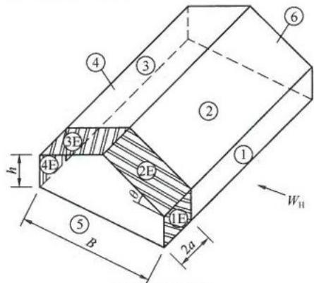

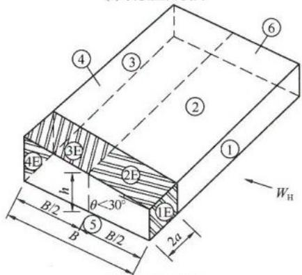  
(a)双坡屋面横向  
(b) 单坡屋面横向  
图4.2.2-1 主刚架的横向风荷载系数分区

$\theta$ 一屋面坡度角，为屋面与水平的夹角； $B$ 一房屋宽度； $h$ 一屋顶至室外地面的平均高度；双坡屋面可近似取檐口高度，单坡屋面可取跨中高度； $a$ 一计算围护结构构件时的房屋边缘带宽度，取房屋最小水平尺寸的 $10\%$ 或 $0.4h$ 之中较小值，但不得小于房屋最小尺寸的 $4\%$ 或 $1m$ 。图中①、②、③、④、⑤、⑥、⑦、⑧、⑨、⑩为分区编号； $W_{\mathrm{H}}$ 为横风向来风

表 4.2.2-1 主刚架横向风荷载系数  

| 房屋类型 | 屋面坡度角θ | 荷载工况 | 端区系数 | 端区系数 | 端区系数 | 端区系数 | 中间区系数 | 中间区系数 | 中间区系数 | 中间区系数 | 山墙 |
| --- | --- | --- | --- | --- | --- | --- | --- | --- | --- | --- | --- |
| 房屋类型 | 屋面坡度角θ | 荷载工况 | 1E | 2E | 3E | 4E | 1 | 2 | 3 | 4 | 5和6 |
| 封闭式 | 0°≤θ≤5° | (+) | +0.43 | -1.25 | -0.71 | -0.60 | +0.22 | -0.87 | -0.55 | -0.47 | -0.63 |
| 封闭式 | 0°≤θ≤5° | (-i) | +0.79 | -0.89 | -0.35 | -0.25 | +0.58 | -0.51 | -0.19 | -0.11 | -0.27 |
| 封闭式 | θ=10.5° | (+) | +0.49 | -1.25 | -0.76 | -0.67 | +0.26 | -0.87 | -0.58 | -0.51 | -0.63 |
| 封闭式 | θ=10.5° | (-i) | +0.85 | -0.89 | -0.40 | -0.31 | +0.62 | -0.51 | -0.22 | -0.15 | -0.27 |
| 封闭式 | θ=15.6° | (+) | +0.54 | -1.25 | -0.81 | -0.74 | +0.30 | -0.87 | -0.62 | -0.55 | -0.63 |
| 封闭式 | θ=15.6° | (-i) | +0.90 | -0.89 | -0.45 | -0.38 | +0.66 | -0.51 | -0.26 | -0.19 | -0.27 |
| 封闭式 | θ=20° | (+) | +0.62 | -1.25 | -0.87 | -0.82 | +0.35 | -0.87 | -0.66 | -0.61 | -0.63 |
| 封闭式 | θ=20° | (-i) | +0.98 | -0.89 | -0.51 | -0.46 | +0.71 | -0.51 | -0.30 | -0.25 | -0.27 |
| 封闭式 | 30°≤θ≤45° | (+) | +0.51 | +0.09 | -0.71 | -0.66 | +0.38 | +0.03 | -0.61 | -0.55 | -0.63 |
| 封闭式 | 30°≤θ≤45° | (-i) | +0.87 | +0.45 | -0.35 | -0.30 | +0.74 | +0.39 | -0.25 | -0.19 | -0.27 |
| 部分封闭式 | 0°≤θ≤5° | (+) | +0.06 | -1.62 | -1.08 | -0.98 | -0.15 | -1.24 | -0.92 | -0.84 | -1.00 |
| 部分封闭式 | 0°≤θ≤5° | (-i) | +1.16 | -0.52 | +0.02 | +0.12 | +0.95 | -0.14 | +0.18 | +0.26 | +0.10 |
| 部分封闭式 | θ=10.5° | (+) | +0.12 | -1.62 | -1.13 | -1.04 | -0.11 | -1.24 | -0.95 | -0.88 | -1.00 |
| 部分封闭式 | θ=10.5° | (-i) | +1.22 | -0.52 | -0.03 | +0.06 | +0.99 | -0.14 | +0.15 | +0.22 | +0.10 |
| 部分封闭式 | θ=15.6° | (+) | +0.17 | -1.62 | -1.20 | -1.11 | +0.07 | -1.24 | -0.99 | -0.92 | -1.00 |
| 部分封闭式 | θ=15.6° | (-i) | +1.27 | -0.52 | -0.10 | -0.01 | +1.03 | -0.14 | +0.11 | +0.18 | +0.10 |

续表 4.2.2-1  

| 房屋类型 | 屋面坡度角θ | 荷载工况 | 端区系数 | 端区系数 | 端区系数 | 端区系数 | 中间区系数 | 中间区系数 | 中间区系数 | 中间区系数 | 山墙 |
| --- | --- | --- | --- | --- | --- | --- | --- | --- | --- | --- | --- |
| 房屋类型 | 屋面坡度角θ | 荷载工况 | 1E | 2E | 3E | 4E | 1 | 2 | 3 | 4 | 5和6 |
| 部分封闭式 | θ=20° | (+) | +0.25 | -1.62 | -1.24 | -1.19 | -0.02 | -0.24 | -1.03 | -0.98 | -1.00 |
| 部分封闭式 | θ=20° | (-i) | +1.35 | -0.52 | -0.14 | -0.09 | +1.08 | -0.14 | +0.07 | +0.12 | +0.10 |
| 部分封闭式 | 30°≤θ≤45° | (+) | +0.14 | -0.28 | -1.08 | -1.03 | +0.01 | -0.34 | -0.98 | -0.92 | -1.00 |
| 部分封闭式 | 30°≤θ≤45° | (-i) | +1.24 | +0.82 | +0.02 | +0.07 | +1.11 | +0.76 | +0.12 | +0.18 | +0.10 |
| 敞开式 | 0°≤θ≤10° | 平衡 | +0.75 | -0.50 | -0.50 | -0.75 | +0.75 | -0.50 | -0.50 | -0.75 | -0.75 |
| 敞开式 | 0°≤θ≤10° | 不平衡 | +0.75 | -0.20 | -0.60 | -0.75 | +0.75 | -0.20 | -0.60 | -0.75 | -0.75 |
| 敞开式 | 10°<θ≤25° | 平衡 | +0.75 | -0.50 | -0.50 | -0.75 | +0.75 | -0.50 | -0.50 | -0.75 | -0.75 |
| 敞开式 | 10°<θ≤25° | 不平衡 | +0.75 | +0.50 | -0.50 | -0.75 | +0.75 | +0.50 | -0.50 | -0.75 | -0.75 |
| 敞开式 | 10°<θ≤25° | 不平衡 | +0.75 | +0.15 | -0.65 | -0.75 | +0.75 | +0.15 | -0.65 | -0.75 | -0.75 |
| 敞开式 | 25°<θ≤45° | 平衡 | +0.75 | -0.50 | -0.50 | -0.75 | +0.75 | -0.50 | -0.50 | -0.75 | -0.75 |
| 敞开式 | 25°<θ≤45° | 不平衡 | +0.75 | +1.40 | +0.20 | -0.75 | +0.75 | +1.40 | -0.20 | -0.75 | -0.75 |

注：1封闭式和部分封闭式房屋荷载工况中的（+i）表示内压为压力，（-i）表示内压为吸力。开式房屋荷载工况中的平衡表示  
2和3区、2E和3E区风荷载情况相同，不平衡表示  
表2 表中正号和负号分别表示风力朝向  
3. 未给出的 $\theta$ 值系数可用线性插值。  
4.当2区的层面压力系数为负时，设  
4 当2区的屋面压力系数为负时，该值适用于3区从屋面连接处至屋脊下部10米以内（含10米）的范围，取二者中的较小值。2区的其余面积，直到屋脊线，应采用3区的系数。  
__________

2 主刚架的纵向风荷载系数，应按表4.2.2-2的规定采用（图4.2.2-2a、图4.2.2-2b、图4.2.2-2c）；  
3 外墙的风荷载系数，应按表4.2.2-3a、表4.2.2-3b的规定采用（图4.2.2-3）；  
4 双坡屋面和挑檐的风荷载系数，应按表4.2.2-4a、表4.2.2-4b、表4.2.2-4c、表4.2.2-4d、表4.2.2-4e、表4.2.2-4f、表4.2.2-4g、表4.2.2-4h、表4.2.2-4i的规定采用（图4.2.2-4a、图4.2.2-4b、图4.2.2-4c）；  
5 多个双坡屋面和挑檐的风荷载系数，应按表4.2.2-5a、表4.2.2-5b、表4.2.2-5c、表4.2.2-5d的规定采用（图4.2.2-5）；  
6 单坡屋面的风荷载系数，应按表4.2.2-6a、表4.2.2-6b、表4.2.2-6c、表4.2.2-6d的规定采用（图4.2.2-6a、图4.2.2-6b）；  
7 锯齿形屋面的风荷载系数，应按表4.2.2-7a、表4.2.2-7b的规定采用（图4.2.2-7）。

表 4.2.2-2 主刚架纵向风荷载系数 (各种坡度角 $\theta$ )  

| 房屋类型 | 荷载工况 | 端区系数 | 端区系数 | 端区系数 | 端区系数 | 中间区系数 | 中间区系数 | 中间区系数 | 中间区系数 | 侧墙 |
| --- | --- | --- | --- | --- | --- | --- | --- | --- | --- | --- |
| 房屋类型 | 荷载工况 | 1E | 2E | 3E | 4E | 1 | 2 | 3 | 4 | 5和6 |
| 封闭式 | (+) | +0.43 | -1.25 | -0.71 | -0.61 | +0.22 | -0.87 | -0.55 | -0.47 | -0.63 |
| 封闭式 | (-i) | +0.79 | -0.89 | -0.35 | -0.25 | +0.58 | -0.51 | -0.19 | -0.11 | -0.27 |
| 部分封闭式 | (+) | +0.06 | -1.62 | -1.08 | -0.98 | -0.15 | -1.24 | -0.92 | -0.84 | -1.00 |
| 部分封闭式 | (-i) | +1.16 | -0.52 | +0.02 | +0.12 | +0.95 | -0.14 | +0.18 | +0.26 | +0.10 |
| 敞开式 | 按图4.2.2-2(c)取值 | 按图4.2.2-2(c)取值 | 按图4.2.2-2(c)取值 | 按图4.2.2-2(c)取值 | 按图4.2.2-2(c)取值 | 按图4.2.2-2(c)取值 | 按图4.2.2-2(c)取值 | 按图4.2.2-2(c)取值 | 按图4.2.2-2(c)取值 | 按图4.2.2-2(c)取值 |

注：1 开开式房屋中的 0.75 风荷载系数适用于房屋表面的任何覆盖面；  
2. 开式屋面在垂直于屋脊的平面上，刚架投影实腹区最大面积应乘以 $1.3N$ 系数，采用该系数时，应满足下列条件： $0.1 \leqslant \varphi \leqslant 0.3$ ， $1/6 \leqslant h/B \leqslant 6$ ， $S/B \leqslant 0.5$ 。其中， $\varphi$ 是刚架实腹部分与山墙毛面积的比值； $N$ 是横向刚架的数量。

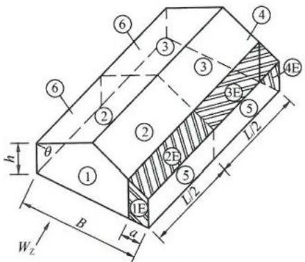  
(a) 双坡屋面纵向

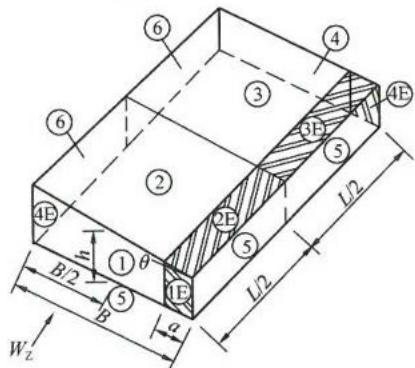

(b) 单坡屋面纵向  
(c)敞开式房屋纵向   
图4.2.2-2 主刚架的纵向风荷载系数分区  
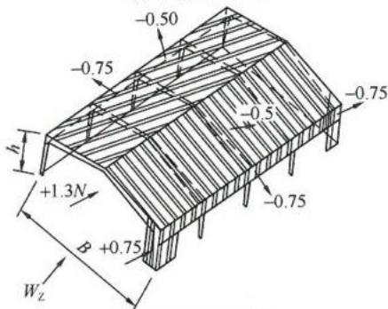  
图中①、②、③、④、⑤、⑥、⑮、⑯、⑰、⑱为分区编号； $W_{Z}$ 为纵风向来风

表 4.2.2-3a 外墙风荷载系数 (风吸力)  

| 外墙风吸力系数μw,用于围护构件和外墙板 | 外墙风吸力系数μw,用于围护构件和外墙板 | 外墙风吸力系数μw,用于围护构件和外墙板 | 外墙风吸力系数μw,用于围护构件和外墙板 |
| --- | --- | --- | --- |
| 分区 | 有效风荷载面积A(m2) | 封闭式房屋 | 部分封闭式房屋 |
| 角部(5) | A≤11<A<50A≥50 | -1.58+0.353logA-1.58-0.98 | -1.95+0.353logA-1.95-1.35 |
| 中间区(4) | A≤11<A<50A≥50 | -1.28+0.176logA-1.28-0.98 | -1.65+0.176logA-1.65-1.35 |

表 4.2.2-3b 外墙风荷载系数 (风压力)  

| 外墙风压力系数μw,用于围护构件和外墙板 | 外墙风压力系数μw,用于围护构件和外墙板 | 外墙风压力系数μw,用于围护构件和外墙板 | 外墙风压力系数μw,用于围护构件和外墙板 |
| --- | --- | --- | --- |
| 分区 | 有效风荷载面积A(m2) | 封闭式房屋 | 部分封闭式房屋 |
| 各区 | A≤11<A<50A≥50 | +1.18-0.176logA+1.18+0.88 | +1.55-0.176logA+1.55+1.25 |

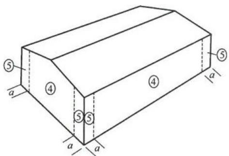  
图4.2.2-3 外墙风荷载系数分区

表 4.2.2-4a 双坡屋面风荷载系数 (风吸力)  
（$0^{\circ}\leqslant \theta \leqslant 10^{\circ})$   
表 4.2.2-4b 双坡屋面风荷载系数 (风压力)  

| 屋面风吸力系数μw,用于围护构件和屋面板 | 屋面风吸力系数μw,用于围护构件和屋面板 | 屋面风吸力系数μw,用于围护构件和屋面板 | 屋面风吸力系数μw,用于围护构件和屋面板 |
| --- | --- | --- | --- |
| 分区 | 有效风荷载面积A(m2) | 封闭式房屋 | 部分封闭式房屋 |
| 角部(3) | A≤11<A<10A≥10 | -2.98+1.70logA-2.98-1.28 | -3.35+1.70logA-3.35-1.65 |
| 边区(2) | A≤11<A<10A≥10 | -1.98+0.70logA-1.98-1.28 | -2.35+0.70logA-2.35-1.65 |
| 中间区(1) | A≤11<A<10A≥10 | -1.18+0.10logA-1.18-1.08 | -1.55+0.10logA-1.55-1.45 |

（$0^{\circ}\leqslant \theta \leqslant 10^{\circ})$   
表 4.2.2-4c 挑檐风荷载系数 (风吸力)  

| 屋面风压力系数μw,用于围护构件和屋面板 | 屋面风压力系数μw,用于围护构件和屋面板 | 屋面风压力系数μw,用于围护构件和屋面板 | 屋面风压力系数μw,用于围护构件和屋面板 |
| --- | --- | --- | --- |
| 分区 | 有效风荷载面积A(m2) | 封闭式房屋 | 部分封闭式房屋 |
| 各区 | A≤11<A<10A≥10 | +0.48-0.10logA+0.48+0.38 | +0.85-0.10logA+0.85+0.75 |

（$0^{\circ}\leqslant \theta \leqslant 10^{\circ})$   

| 挑檐风吸力系数μw,用于围护构件和屋面板 | 挑檐风吸力系数μw,用于围护构件和屋面板 | 挑檐风吸力系数μw,用于围护构件和屋面板 |
| --- | --- | --- |
| 分区 | 有效风荷载面积A(m2) | 封闭或部分封闭房屋 |
| 角部(3) | A≤11<A<10A≥10 | -2.80+2.00logA-2.80-0.80 |
| 边区(2)中间区(1) | A≤11<A≤1010<A<50A≥50 | -1.70+0.10logA-1.70+0.715logA-2.32-1.10 |

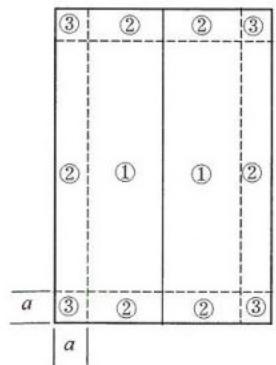

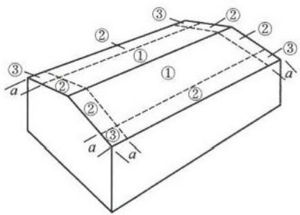  
图4.2.2-4a 双坡屋面和挑檐风荷载系数分区（ $0^{\circ}\leqslant \theta \leqslant 10^{\circ}$

表 4.2.2-4d 双坡屋面风荷载系数 (风吸力)  
（$10^{\circ}\leqslant \theta \leqslant 30^{\circ})$   
表 4.2.2-4e 双坡屋面风荷载系数 (风压力)  

| 屋面风吸力系数μw,用于围护构件和屋面板 | 屋面风吸力系数μw,用于围护构件和屋面板 | 屋面风吸力系数μw,用于围护构件和屋面板 | 屋面风吸力系数μw,用于围护构件和屋面板 |
| --- | --- | --- | --- |
| 分区 | 有效风荷载面积A(m2) | 封闭式房屋 | 部分封闭式房屋 |
| 角部(3)边区(2) | A≤11<A<10A≥10 | -2.28+0.70logA-2.28-1.58 | -2.65+0.70logA-2.65-1.95 |
| 中间区(1) | A≤11<A<10A≥10 | -1.08+0.10logA-1.08-0.98 | -1.45+0.10logA-1.45-1.35 |

（$10^{\circ}\leqslant \theta \leqslant 30^{\circ})$   

|  |  |  |  |
| --- | --- | --- | --- |
| 分区 | 有效风荷载面积 A(m2) | 封闭式房屋 | 部分封闭式房屋 |
| 各区 | A≤1 1<A<10 A≥10 | +0.68 -0.20logA+0.68 +0.48 | +1.05 -0.20logA+1.05 +0.85 |

表 4.2.2-4f 挑檐风荷载系数 (风吸力)

（$10^{\circ} \leqslant \theta \leqslant 30^{\circ})$

| 挑檐风吸力系数μw,用于围护构件和屋面板 | 挑檐风吸力系数μw,用于围护构件和屋面板 | 挑檐风吸力系数μw,用于围护构件和屋面板 |
| --- | --- | --- |
| 分区 | 有效风荷载面积A(m2) | 封闭或部分封闭房屋 |
| 角部(3) | A≤11<A<10A≥10 | -3.70+1.20logA-3.70-2.50 |
| 边区(2) | 全部面积 | -2.20 |

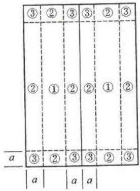

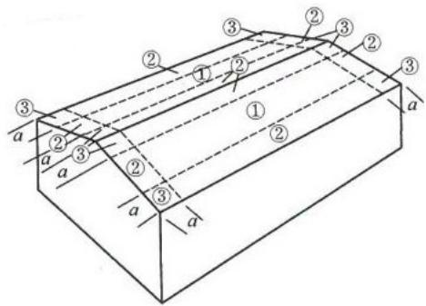  
图4.2.2-4b 双坡屋面和挑檐风荷载系数分区

$$(10^{\circ} \leqslant \theta \leqslant 30^{\circ})$$

表 4.2.2-4g 双坡屋面风荷载系数 (风吸力)

$$(30^{\circ} \leqslant \theta \leqslant 45^{\circ})$$

表 4.2.2-4h 双坡屋面风荷载系数 (风压力)  

| 屋面风吸力系数μw,用于围护构件和屋面板 | 屋面风吸力系数μw,用于围护构件和屋面板 | 屋面风吸力系数μw,用于围护构件和屋面板 | 屋面风吸力系数μw,用于围护构件和屋面板 |
| --- | --- | --- | --- |
| 分区 | 有效风荷载面积A(m2) | 封闭式房屋 | 部分封闭式房屋 |
| 角部(3)边区(2) | A≤11<A<10A≥10 | -1.38+0.20logA-1.38-1.18 | -1.75+0.20logA-1.75-1.55 |
| 中间区(1) | A≤11<A<10A≥10 | -1.18+0.20logA-1.18-0.98 | -1.55+0.20logA-1.55-1.35 |

（$30^{\circ}\leqslant \theta \leqslant 45^{\circ})$

表 4.2.2-4i 挑檐风荷载系数 (风吸力)  

| 屋面风压力系数 μw, 用于围护构件和屋面板 | 屋面风压力系数 μw, 用于围护构件和屋面板 | 屋面风压力系数 μw, 用于围护构件和屋面板 | 屋面风压力系数 μw, 用于围护构件和屋面板 |
| --- | --- | --- | --- |
| 分区 | 有效风荷载面积A (m2) | 封闭式房屋 | 部分封闭式房屋 |
| 各区 | A≤11<A<10A≥10 | +1.08-0.10logA+1.08+0.98 | +1.45-0.10logA+1.45+1.35 |

（$30^{\circ}\leqslant \theta \leqslant 45^{\circ})$

| 挑檐风吸力系数μw,用于围护构件和屋面板 | 挑檐风吸力系数μw,用于围护构件和屋面板 | 挑檐风吸力系数μw,用于围护构件和屋面板 |
| --- | --- | --- |
| 分区 | 有效风荷载面积A(m2) | 封闭或部分封闭房屋 |
| 角部(3)边区(2) | A≤11<A<10A≥10 | -2.00+0.20logA-2.00-1.80 |

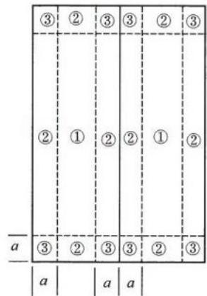

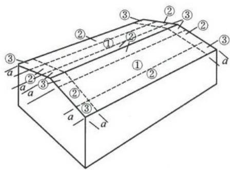  
图4.2.2-4c 双坡屋面和挑檐风荷载系数分区

$$(30^{\circ} \leqslant \theta \leqslant 45^{\circ})$$

表 4.2.2-5a 多跨双坡屋面风荷载系数 (风吸力)  
（$10^{\circ} < \theta \leqslant 30^{\circ})$   
表 4.2.2-5b 多跨双坡屋面风荷载系数 (风压力)  

| 屋面风吸力系数μw,用于围护构件和屋面板 | 屋面风吸力系数μw,用于围护构件和屋面板 | 屋面风吸力系数μw,用于围护构件和屋面板 | 屋面风吸力系数μw,用于围护构件和屋面板 |
| --- | --- | --- | --- |
| 分区 | 有效风荷载面积A(m2) | 封闭式房屋 | 部分封闭式房屋 |
| 角部(3) | A≤11<A<10A≥10 | -2.88+1.00logA-2.88-1.88 | -3.25+1.00logA-3.25-2.25 |
| 边区(2) | A≤11<A<10A≥10 | -2.38+0.50logA-2.38-1.88 | -2.75+0.50logA-2.75-2.25 |
| 中间区(1) | A≤11<A<10A≥10 | -1.78+0.20logA-1.78-1.58 | -2.15+0.20logA-2.15-1.95 |

（$10^{\circ} < \theta \leqslant 30^{\circ})$   

| 屋面风压力系数μw,用于围护构件和屋面板 | 屋面风压力系数μw,用于围护构件和屋面板 | 屋面风压力系数μw,用于围护构件和屋面板 | 屋面风压力系数μw,用于围护构件和屋面板 |
| --- | --- | --- | --- |
| 分区 | 有效风荷载面积A(m2) | 封闭式房屋 | 部分封闭式房屋 |
| 各区 | A≤11<A<10A≥10 | +0.78-0.20logA+0.78+0.58 | +1.15-0.20logA+1.15+0.95 |

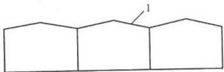  
图4.2.2-5 多跨双坡屋面风荷载系数分区  
1—每个双坡屋面分区按图4.2.2-4c执行

表 4.2.2-5c 多跨双坡屋面风荷载系数 (风吸力)  
（$30^{\circ} <   \theta \leqslant 45^{\circ})$   
表 4.2.2-5d 多跨双坡屋面风荷载系数 (风压力)  

| 屋面风吸力系数μw,用于围护构件和屋面板 | 屋面风吸力系数μw,用于围护构件和屋面板 | 屋面风吸力系数μw,用于围护构件和屋面板 | 屋面风吸力系数μw,用于围护构件和屋面板 |
| --- | --- | --- | --- |
| 分区 | 有效风荷载面积A(m2) | 封闭式房屋 | 部分封闭式房屋 |
| 角部(3) | A≤11<A<10A≥10 | -2.78+0.90logA-2.78-1.88 | -3.15+0.90logA-3.15-2.25 |
| 边区(2) | A≤11<A<10A≥10 | -2.68+0.80logA-2.68-1.88 | -3.05+0.80logA-3.05-2.25 |
| 中间区(1) | A≤11<A<10A≥10 | -2.18+0.90logA-2.18-1.28 | -2.55+0.90logA-2.55-1.65 |

（$30^{\circ} < \theta \leqslant 45^{\circ})$   
表 4.2.2-6a 单坡屋面风荷载系数 (风吸力)  

| 屋面风压力系数μw,用于围护构件和屋面板 | 屋面风压力系数μw,用于围护构件和屋面板 | 屋面风压力系数μw,用于围护构件和屋面板 | 屋面风压力系数μw,用于围护构件和屋面板 |
| --- | --- | --- | --- |
| 分区 | 有效风荷载面积A(m2) | 封闭式房屋 | 部分封闭式房屋 |
| 各区 | A≤11<A<10A≥10 | +1.18-0.20logA+1.18+0.98 | +1.55-0.20logA+1.55+1.35 |

（$3^{\circ} < \theta \leqslant 10^{\circ})$   

| 屋面风吸力系数μw,用于围护构件和屋面板 | 屋面风吸力系数μw,用于围护构件和屋面板 | 屋面风吸力系数μw,用于围护构件和屋面板 | 屋面风吸力系数μw,用于围护构件和屋面板 |
| --- | --- | --- | --- |
| 分区 | 有效风荷载面积A(m2) | 封闭式房屋 | 部分封闭式房屋 |
| 高区角部(3') | A≤11<A<10A≥10 | -2.78+1.0logA-2.78-1.78 | -3.15+1.0logA-3.15-2.15 |
| 低区角部(3) | A≤11<A<10A≥10 | -1.98+0.60logA-1.98-1.38 | -2.35+0.60logA-2.35-1.75 |

续表4.2.2-6a   
表 4.2.2-6b 单坡屋面风荷载系数 (风压力)  

| 屋面风吸力系数μw,用于围护构件和屋面板 | 屋面风吸力系数μw,用于围护构件和屋面板 | 屋面风吸力系数μw,用于围护构件和屋面板 | 屋面风吸力系数μw,用于围护构件和屋面板 |
| --- | --- | --- | --- |
| 分区 | 有效风荷载面积A(m2) | 封闭式房屋 | 部分封闭式房屋 |
| 高区边区(2') | A≤11<A<10A≥10 | -1.78+0.10logA-1.78-1.68 | -2.15+0.10logA-2.15-2.05 |
| 低区边区(2) | A≤11<A<10A≥10 | -1.48+0.10logA-1.48-1.38 | -1.85+0.10logA-1.85-1.75 |
| 中间区(1) | 全部面积 | -1.28 | -1.65 |

（$3^{\circ} < \theta \leqslant 10^{\circ})$   

| 屋面风压力系数μw,用于围护构件和屋面板 | 屋面风压力系数μw,用于围护构件和屋面板 | 屋面风压力系数μw,用于围护构件和屋面板 | 屋面风压力系数μw,用于围护构件和屋面板 |
| --- | --- | --- | --- |
| 分区 | 有效风荷载面积A(m2) | 封闭式房屋 | 部分封闭式房屋 |
| 各区 | A≤11<A<10A≥10 | +0.48-0.10logA+0.48+0.38 | +0.85-0.10logA+0.85+0.75 |

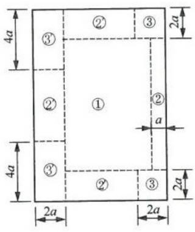

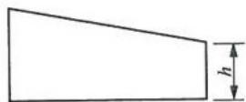  
图4.2.2-6a 单坡屋面风荷载系数分区（ $3^{\circ} < \theta \leqslant 10^{\circ}$

表 4.2.2-6c 单坡屋面风荷载系数 (风吸力)  
（$10^{\circ} < \theta \leqslant 30^{\circ})$   
表 4.2.2-6d 单坡屋面风荷载系数 (风压力)  

| 屋面风吸力系数μw,用于围护构件和屋面板 | 屋面风吸力系数μw,用于围护构件和屋面板 | 屋面风吸力系数μw,用于围护构件和屋面板 | 屋面风吸力系数μw,用于围护构件和屋面板 |
| --- | --- | --- | --- |
| 分区 | 有效风荷载面积A(m2) | 封闭式房屋 | 部分封闭式房屋 |
| 高区角部(3) | A≤11<A<10A≥10 | -3.08+0.90logA-3.08-2.18 | -3.45+0.90logA-3.45-2.55 |
| 边区(2) | A≤11<A<10A≥10 | -1.78+0.40logA-1.78-1.38 | -2.15+0.40logA-2.15-1.75 |
| 中间区(1) | A≤11<A<10A≥10 | -1.48+0.20logA-1.48-1.28 | -1.85+0.20logA-1.85-1.65 |

（$10^{\circ} < \theta \leqslant 30^{\circ})$   

| 屋面风压力系数μw,用于围护构件和屋面板 | 屋面风压力系数μw,用于围护构件和屋面板 | 屋面风压力系数μw,用于围护构件和屋面板 | 屋面风压力系数μw,用于围护构件和屋面板 |
| --- | --- | --- | --- |
| 分区 | 有效风荷载面积A(m2) | 封闭式房屋 | 部分封闭式房屋 |
| 各区 | A≤11<A<10A≥10 | +0.58-0.10logA+0.58+0.48 | +0.95-0.10logA+0.95+0.85 |

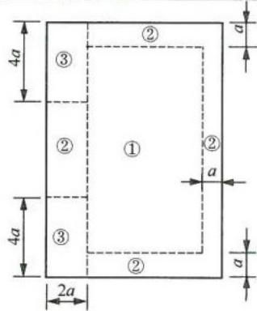

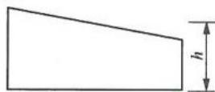  
图4.2.2-6b 单坡屋面风荷载系数分区（ $10^{\circ} < \theta \leqslant 30^{\circ}$

表 4.2.2-7a 锯齿形屋面风荷载系数 (风吸力)  

| 锯齿形屋面风吸力系数μw,用于围护构件和屋面板 | 锯齿形屋面风吸力系数μw,用于围护构件和屋面板 | 锯齿形屋面风吸力系数μw,用于围护构件和屋面板 | 锯齿形屋面风吸力系数μw,用于围护构件和屋面板 |
| --- | --- | --- | --- |
| 分区 | 有效风荷载面积A(m2) | 封闭式房屋 | 部分封闭式房屋 |
| 第1跨角部(3) | A≤11<A≤1010<A<50A≥50 | -4.28+0.40logA-4.28+2.289logA-6.169-2.28 | -4.65+0.40logA-4.65+2.289logA-6.539-2.65 |
| 第2、3、4跨角部(3) | A≤1010<A<50A≥50 | -2.78+1.001logA-3.781-2.08 | -3.15+1.001logA-4.151-2.45 |
| 边区(2) | A≤11<A<50A≥50 | -3.38+0.942logA-3.38-1.78 | -3.75+0.942logA-3.75-2.15 |
| 中间区(1) | A≤11<A<50A≥50 | -2.38+0.647logA-2.38-1.28 | -2.75+0.647logA-2.75-1.65 |

表 4.2.2-7b 锯齿形屋面风荷载系数 (风压力)  

| 锯齿形屋面风压力系数μw,用于围护构件和屋面板 | 锯齿形屋面风压力系数μw,用于围护构件和屋面板 | 锯齿形屋面风压力系数μw,用于围护构件和屋面板 | 锯齿形屋面风压力系数μw,用于围护构件和屋面板 |
| --- | --- | --- | --- |
| 分区 | 有效风荷载面积A(m2) | 封闭式房屋 | 部分封闭式房屋 |
| 角部(3) | A≤11<A<10A≥10 | +0.98-0.10logA+0.98+0.88 | +1.35-0.10logA+1.35+1.25 |
| 边区(2) | A≤11<A<10A≥10 | +1.28-0.30logA+1.28+0.98 | +1.65-0.30logA+1.65+1.35 |
| 中间区(1) | A≤11<A<50A≥50 | +0.88-0.177logA+0.88+0.58 | +1.25-0.177logA+1.25+0.95 |

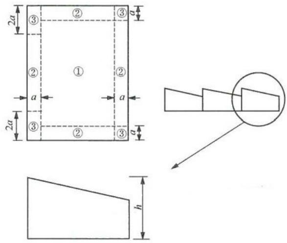  
图4.2.2-7 锯齿形屋面风荷载系数分区

4.2.3 门式刚架轻型房屋构件的有效风荷载面积（A）可按下式计算：

$$A = l c \tag{4.2.3}$$

式中： $l$ ——所考虑构件的跨度（m）；

$c$ ——所考虑构件的受风宽度（m），应大于 （$a + b) / 2$ 或 $l / 3$ ； $a, b$ 分别为所考虑构件（墙架柱、墙梁、檩条等）在左、右侧或上、下侧与相邻构件间的距离；无确定宽度的外墙和其他板式构件采用 $c = l / 3$ 。

## 4.3 屋面雪荷载

4.3.1 门式刚架轻型房屋钢结构屋面水平投影面上的雪荷载标准值，应按下式计算：

$$S_{\mathrm{k}} = \mu_{\mathrm{r}} S_{0} \tag{4.3.1}$$

式中： $S_{\mathrm{k}}$ ——雪荷载标准值（ $\mathrm{kN / m^2}$ ）；

$\mu_{\mathrm{r}}$ ——屋面积雪分布系数；

$S_{0}$ ——基本雪压 （$\mathrm{kN} / \mathrm{m}^{2})$ ，按现行国家标准《建筑结构荷载规范》GB50009规定的100年重现期的雪压采用。

4.3.2 单坡、双坡、多坡房屋的屋面积雪分布系数应按表4.3.2采用。

表 4.3.2 屋面积雪分布系数  

| 项次 | 类别 | 屋面形式及积雪分布系数 μr | 屋面形式及积雪分布系数 μr | 屋面形式及积雪分布系数 μr | 屋面形式及积雪分布系数 μr | 屋面形式及积雪分布系数 μr | 屋面形式及积雪分布系数 μr | 屋面形式及积雪分布系数 μr | 屋面形式及积雪分布系数 μr |
| --- | --- | --- | --- | --- | --- | --- | --- | --- | --- |
| 1 | 单跨单坡屋面 | μrθ≤25°30°35°40°45°50°55°≥60°μr1.000.850.700.550.400.250.100 | μrθ≤25°30°35°40°45°50°55°≥60°μr1.000.850.700.550.400.250.100 | μrθ≤25°30°35°40°45°50°55°≥60°μr1.000.850.700.550.400.250.100 | μrθ≤25°30°35°40°45°50°55°≥60°μr1.000.850.700.550.400.250.100 | μrθ≤25°30°35°40°45°50°55°≥60°μr1.000.850.700.550.400.250.100 | μrθ≤25°30°35°40°45°50°55°≥60°μr1.000.850.700.550.400.250.100 | μrθ≤25°30°35°40°45°50°55°≥60°μr1.000.850.700.550.400.250.100 | μrθ≤25°30°35°40°45°50°55°≥60°μr1.000.850.700.550.400.250.100 |
| 1 | 单跨单坡屋面 | μr1.000.850.700.550.400.250.100 | μr1.000.850.700.550.400.250.100 | μr1.000.850.700.550.400.250.100 | μr1.000.850.700.550.400.250.100 | μr1.000.850.700.550.400.250.100 | μr1.000.850.700.550.400.250.100 | μr1.000.850.700.550.400.250.100 | μr1.000.850.700.550.400.250.100 |
| 2 | 单跨双坡屋面 | 均匀分布的情况μr不均匀分布的情况0.75μr1.25μr按第1项规定采用 | 均匀分布的情况μr不均匀分布的情况0.75μr1.25μr按第1项规定采用 | 均匀分布的情况μr不均匀分布的情况0.75μr1.25μr按第1项规定采用 | 均匀分布的情况μr不均匀分布的情况0.75μr1.25μr按第1项规定采用 | 均匀分布的情况μr不均匀分布的情况0.75μr1.25μr按第1项规定采用 | 均匀分布的情况μr不均匀分布的情况0.75μr1.25μr按第1项规定采用 | 均匀分布的情况μr不均匀分布的情况0.75μr1.25μr按第1项规定采用 | 均匀分布的情况μr不均匀分布的情况0.75μr1.25μr按第1项规定采用 |
| 3 | 双跨双坡屋面 | 均匀分布情况1.0不均匀分布情况1μr1.4μr2.0μrμr按第1项规定采用 | 均匀分布情况1.0不均匀分布情况1μr1.4μr2.0μrμr按第1项规定采用 | 均匀分布情况1.0不均匀分布情况1μr1.4μr2.0μrμr按第1项规定采用 | 均匀分布情况1.0不均匀分布情况1μr1.4μr2.0μrμr按第1项规定采用 | 均匀分布情况1.0不均匀分布情况1μr1.4μr2.0μrμr按第1项规定采用 | 均匀分布情况1.0不均匀分布情况1μr1.4μr2.0μrμr按第1项规定采用 | 均匀分布情况1.0不均匀分布情况1μr1.4μr2.0μrμr按第1项规定采用 | 均匀分布情况1.0不均匀分布情况1μr1.4μr2.0μrμr按第1项规定采用 |

注：1 对于双跨双坡屋面，当屋面坡度不大于1/20时，内屋面可不考虑表中第3项规定的不均匀分布的情况，即表中的雪分布系数1.4及2.0均按1.0考虑。  
2 多跨屋面的积雪分布系数，可按第3项的规定采用。

4.3.3 当高低屋面及相邻房屋屋面高低满足 （$h_{\mathrm{r}} - h_{\mathrm{b}}) / h_{\mathrm{b}}$ 大于0.2时，应按下列规定考虑雪堆积和漂移：

1 高低屋面应考虑低跨屋面雪堆积分布（图4.3.3-1）；  
2 当相邻房屋的间距 $s$ 小于 $6\mathrm{m}$ 时，应考虑低屋面雪堆积分布（图4.3.3-2）；

图4.3.3-1 高低屋面低屋面雪堆积分布示意  
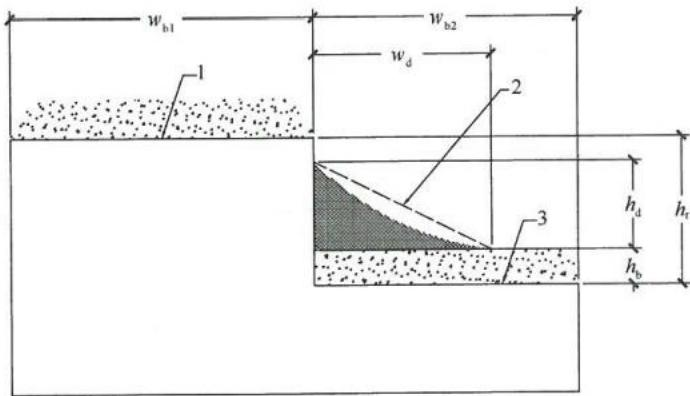  
1—高屋面；2—积雪区；3—低屋面

图4.3.3-2 相邻房屋低屋面雪堆积分布示意  
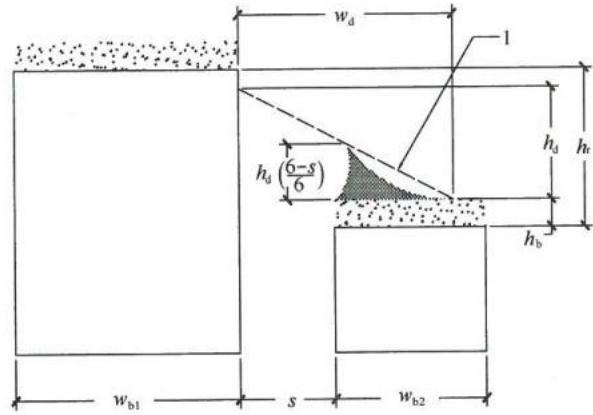  
1—积雪区

3 当高屋面坡度 $\theta$ 大于 $10^{\circ}$ 且未采取防止雪下滑的措施时，应考虑高屋面的雪漂移，积雪高度应增加 $40\%$ ，但最大取 $h_{\mathrm{r}} - h_{\mathrm{b}}$ ；当相邻房屋的间距大于 $h_{\mathrm{r}}$ 或 $6\mathrm{m}$ 时，不考虑高屋面的雪漂移（图4.3.3-3）；

4 当屋面突出物的水平长度大于 $4.5\mathrm{m}$ 时，应考虑屋面雪堆积分布（图4.3.3-4）；

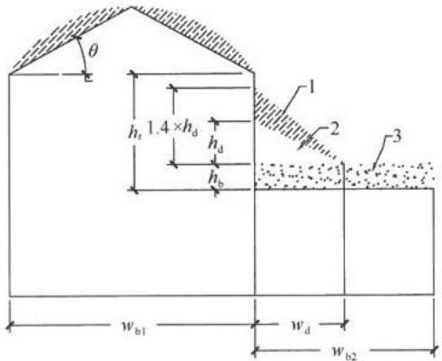

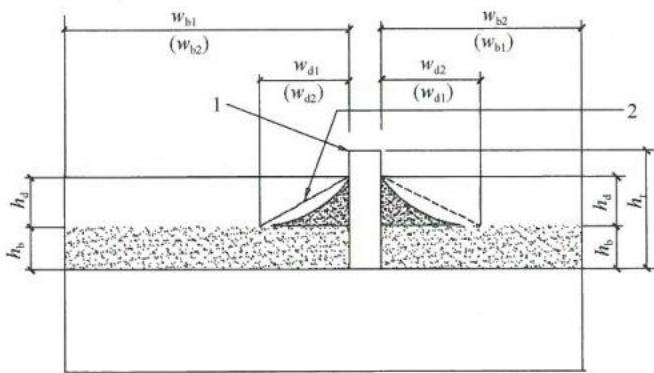  
图4.3.3-3 高屋面雪漂移低屋面雪堆积分布示意 1—漂移积雪；2—积雪区；3—屋面雪载  
图4.3.3-4 屋面有突出物雪堆积分布示意 1—屋面突出物；2—积雪区

5 积雪堆积高度 $h_{\mathrm{d}}$ 应按下列公式计算，取两式计算高度的较大值：

$$h_{\mathrm{d}} = 0. 416 \sqrt [ 3 ]{w_{\mathrm{b l}}} \sqrt [ 4 ]{S_{0} + 0 . 479} - 0. 457 \leqslant h_{\mathrm{r}} - h_{\mathrm{b}} \tag{4.3.3-1}$$

$$h_{\mathrm{d}} = 0. 208 \sqrt [ 3 ]{w_{\mathrm{b} 2}} \sqrt [ 4 ]{S_{0} + 0 . 479} - 0. 457 \leqslant h_{\mathrm{r}} - h_{\mathrm{b}} \tag{4.3.3-2}$$

式中： $h_\mathrm{d}$ ——积雪堆积高度（m）；

$h_\mathrm{r}$ ——高低屋面的高差 （$\mathrm{m})$

$h_{\mathrm{b}}$ ——按屋面基本雪压确定的雪荷载高度 （$\mathrm{m})$ ， $h_{\mathrm{b}} = \frac{100S_0}{\rho}$ ， $\rho$ 为积雪平均密度 （$\mathrm{kg} / \mathrm{m}^3)$

$w_{\mathrm{bl}}, w_{\mathrm{b2}}$ ——屋面长（宽）度（m），最小取 $7.5 \mathrm{~m}$ 。

6 积雪堆积长度 $w_{\mathrm{d}}$ 应按下列规定确定：

$$\text{当} h_{\mathrm{d}} \leqslant h_{\mathrm{r}} - h_{\mathrm{b}} \text{时}, w_{\mathrm{d}} = 4 h_{\mathrm{d}} \tag{4.3.3-3}$$

$$\text{当} h_{\mathrm{d}} > h_{\mathrm{r}} - h_{\mathrm{b}} \text{时}, w_{\mathrm{d}} = 4 h_{\mathrm{d}}^{2} / (h_{\mathrm{r}} - h_{\mathrm{b}}) \leqslant 8 (h_{\mathrm{r}} - h_{\mathrm{b}}) \tag{4.3.3-4}$$

7 堆积雪荷载的最高点荷载值 $S_{\mathrm{max}}$ 应按下式计算：

$$S_{\max } = h_{\mathrm{d}} \times \rho \tag{4.3.3-5}$$

4.3.4 各地区积雪的平均密度 $\rho$ 应符合下列规定：

1 东北及新疆北部地区取 $180\mathrm{kg / m^3}$   
2华北及西北地区取 $160\mathrm{kg / m^3}$ ，其中青海取 $150\mathrm{kg / m^3}$   
3 淮河、秦岭以南地区一般取 $180\mathrm{kg / m^3}$ ，其中江西、浙江取 $230\mathrm{kg / m^3}$ 。

4.3.5 设计时应按下列规定采用积雪的分布情况：

1 屋面板和檩条按积雪不均匀分布的最不利情况采用；  
2 刚架斜梁按全跨积雪的均匀分布、不均匀分布和半跨积雪的均匀分布，按最不利情况采用；  
3 刚架柱可按全跨积雪的均匀分布情况采用。

## 4.4地震作用

4.4.1 门式刚架轻型房屋钢结构的抗震设防类别和抗震设防标准，应按现行国家标准《建筑工程抗震设防分类标准》GB50223的规定采用。  
4.4.2 门式刚架轻型房屋钢结构应按下列原则考虑地震作用：

1 一般情况下，按房屋的两个主轴方向分别计算水平地震作用；  
2 质量与刚度分布明显不对称的结构，应计算双向水平地震作用并计入扭转的影响；  
3 抗震设防烈度为8度、9度时，应计算竖向地震作用，可分别取该结构重力荷载代表值的 $10\%$ 和 $20\%$ ，设计基本地震加速度为 $0.30\mathrm{g}$ 时，可取该结构重力荷载代表值的 $15\%$   
4 计算地震作用时尚应考虑墙体对地震作用的影响。

## 4.5 荷载组合和地震作用组合的效应

4.5.1 荷载组合应符合下列原则：

1 屋面均布活荷载不与雪荷载同时考虑，应取两者中的较大值；  
2 积灰荷载与雪荷载或屋面均布活荷载中的较大值同时考虑；  
3 施工或检修集中荷载不与屋面材料或檩条自重以外的其他荷载同时考虑；  
4 多台吊车的组合应符合现行国家标准《建筑结构荷载规范》GB50009的规定；  
5 风荷载不与地震作用同时考虑。

4.5.2 持久设计状况和短暂设计状况下，当荷载与荷载效应按线性关系考虑时，荷载基本组合的效应设计值应按下式确定：

$$S_{\mathrm{d}} = \gamma_{\mathrm{G}} S_{\mathrm{G k}} + \psi_{\mathrm{Q}} \gamma_{\mathrm{Q}} S_{\mathrm{Q k}} + \psi_{\mathrm{w}} \gamma_{\mathrm{w}} S_{\mathrm{w k}} \tag{4.5.2}$$

式中： $S_{\mathrm{d}}$ ——荷载组合的效应设计值；

$\gamma_{\mathrm{G}}$ ——永久荷载分项系数；

$\gamma_{Q}$ ——竖向可变荷载分项系数；

$\gamma_{\mathrm{w}}$ ——风荷载分项系数；

$S_{\mathrm{Gk}}$ ——永久荷载效应标准值；

$S_{\mathrm{Qk}}$ ——竖向可变荷载效应标准值；

$S_{\mathrm{wk}}$ ——风荷载效应标准值；

$\psi_{\mathrm{Q}}, \psi_{\mathrm{w}}$ 分别为可变荷载组合值系数和风荷载组合值系数，当永久荷载效应起控制作用时应分别取0.7和0；当可变荷载效应起控制作用时应分别取1.0和0.6或0.7和1.0。

4.5.3 持久设计状况和短暂设计状况下，荷载基本组合的分项系数应按下列规定采用：

1 永久荷载的分项系数 $\gamma_{\mathrm{G}}$ ：当其效应对结构承载力不利时，对由可变荷载效应控制的组合应取1.2，对由永久荷载效应控制的组合应取1.35；当其效应对结构承载力有利时，应取1.0；

2 竖向可变荷载的分项系数 $\gamma_{\mathrm{Q}}$ 应取1.4；

3 风荷载分项系数 $\gamma_{\mathrm{w}}$ 应取1.4。

4.5.4 地震设计状况下，当作用与作用效应按线性关系考虑时，荷载与地震作用基本组合效应设计值应按下式确定：

$$S_{\mathrm{E}} = \gamma_{\mathrm{G}} S_{\mathrm{G E}} + \gamma_{\mathrm{E h}} S_{\mathrm{E h k}} + \gamma_{\mathrm{E v}} S_{\mathrm{E v k}} \tag{4.5.4}$$

式中： $S_{\mathrm{E}}$ ——荷载和地震效应组合的效应设计值；

$S_{\mathrm{GE}}$ ——重力荷载代表值的效应；

$S_{\mathrm{Ehk}}$ ——水平地震作用标准值的效应；

$S_{\mathrm{Evk}}$ ——竖向地震作用标准值的效应；

$\gamma_{\mathrm{G}}$ ——重力荷载分项系数；

$\gamma_{\mathrm{Eh}}$ ——水平地震作用分项系数；

$\gamma_{\mathrm{Ev}}$ ——竖向地震作用分项系数。

4.5.5 地震设计状况下，荷载和地震作用基本组合的分项系数应按表4.5.5采用。当重力荷载效应对结构的承载力有利时，表4.5.5中 $\gamma_{\mathrm{G}}$ 不应大于1.0。

表 4.5.5 地震设计状况时荷载和作用的分项系数  

| 参与组合的荷载和作用 | γG | γEh | γEv | 说明 |
| --- | --- | --- | --- | --- |
| 重力荷载及水平地震作用 | 1.2 | 1.3 | - | - |
| 重力荷载及竖向地震作用 | 1.2 | - | 1.3 | 8度、9度抗震设计时考虑 |
| 重力荷载、水平地震及 竖向地震作用 | 1.2 | 1.3 | 0.5 | 8度、9度抗震设计时考虑 |

加微信308492256入土木精英群

土木吧权威专家团队打造中国土木人综合交流平台微信扫描二维码查看更多资料

# 5 结构形式和布置

## 5.1 结构形式

5.1.1 在门式刚架轻型房屋钢结构体系中，屋盖宜采用压型钢板屋面板和冷弯薄壁型钢檩条，主刚架可采用变截面实腹刚架，外墙宜采用压型钢板墙面板和冷弯薄壁型钢墙梁。主刚架斜梁下翼缘和刚架柱内翼缘平面外的稳定性，应由隅撑保证。主刚架间的交叉支撑可采用张紧的圆钢、钢索或型钢等。

5.1.2 门式刚架分为单跨（图5.1.2a）、双跨（图5.1.2b）、多跨（图5.1.2c）刚架以及带挑檐的（图5.1.2d）和带毗屋的（图5.1.2e）刚架等形式。多跨刚架中间柱与斜梁的连接可采用铰接。多跨刚架宜采用双坡或单坡屋盖（图5.1.2f），也可采用由多个双坡屋盖组成的多跨刚架形式。

当设置夹层时，夹层可沿纵向设置（图5.1.2g）或在横向端跨设置（图5.1.2h）。夹层与柱的连接可采用刚性连接或铰接。

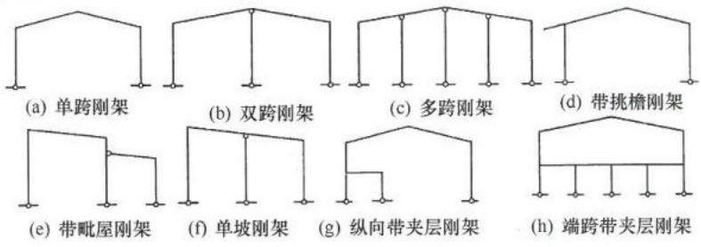  
图5.1.2 门式刚架形式示例

5.1.3 根据跨度、高度和荷载不同，门式刚架的梁、柱可采用变截面或等截面实腹焊接工字形截面或轧制H形截面。设有桥式吊车时，柱宜采用等截面构件。变截面构件宜做成改变腹板高

度的楔形；必要时也可改变腹板厚度。结构构件在制作单元内不宜改变翼缘截面，当必要时，仅可改变翼缘厚度；邻接的制作单元可采用不同的翼缘截面，两单元相邻截面高度宜相等。

5.1.4 门式刚架的柱脚宜按铰接支承设计。当用于工业厂房且有 $5\mathrm{t}$ 以上桥式吊车时，可将柱脚设计成刚接。

5.1.5 门式刚架可由多个梁、柱单元构件组成。柱宜为单独的单元构件，斜梁可根据运输条件划分为若干个单元。单元构件本身应采用焊接，单元构件之间宜通过端板采用高强度螺栓连接。

## 5.2 结构布置

5.2.1 门式刚架轻型房屋钢结构的尺寸应符合下列规定：

1 门式刚架的跨度，应取横向刚架柱轴线间的距离。

2 门式刚架的高度，应取室外地面至柱轴线与斜梁轴线交点的高度。高度应根据使用要求的室内净高确定，有吊车的厂房应根据轨顶标高和吊车净空要求确定。

3 柱的轴线可取通过柱下端（较小端）中心的竖向轴线。斜梁的轴线可取通过变截面梁段最小端中心与斜梁上表面平行的轴线。

4 门式刚架轻型房屋的檐口高度，应取室外地面至房屋外侧檩条上缘的高度。门式刚架轻型房屋的最大高度，应取室外地面至屋盖顶部檩条上缘的高度。门式刚架轻型房屋的宽度，应取房屋侧墙墙梁外皮之间的距离。门式刚架轻型房屋的长度，应取两端山墙墙梁外皮之间的距离。

5.2.2 门式刚架的单跨跨度宜为 $12\mathrm{m}\sim 48\mathrm{m}$ 。当有根据时，可采用更大跨度。当边柱宽度不等时，其外侧应对齐。门式刚架的间距，即柱网轴线在纵向的距离宜为 $6\mathrm{m}\sim 9\mathrm{m}$ ，挑檐长度可根据使用要求确定，宜为 $0.5\mathrm{m}\sim 1.2\mathrm{m}$ ，其上翼缘坡度宜与斜梁坡度相同。

5.2.3 门式刚架轻型房屋的屋面坡度宜取 $1/8 \sim 1/20$ ，在雨水较多的地区宜取其中的较大值。

5.2.4 门式刚架轻型房屋钢结构的温度区段长度，应符合下列规定：

1 纵向温度区段不宜大于 $300\mathrm{m}$

2 横向温度区段不宜大于 $150\mathrm{m}$ ，当横向温度区段大于 $150\mathrm{m}$ 时，应考虑温度的影响；

3 当有可靠依据时，温度区段长度可适当加大。

5.2.5 需要设置伸缩缝时，应符合下列规定：

1 在搭接檩条的螺栓连接处宜采用长圆孔，该处屋面板在构造上应允许胀缩或设置双柱；

2 吊车梁与柱的连接处宜采用长圆孔。

5.2.6 在多跨刚架局部抽掉中间柱或边柱处，宜布置托梁或托架。

5.2.7 屋面檩条的布置，应考虑天窗、通风屋脊、采光带、屋面材料、檩条供货规格等因素的影响。屋面压型钢板厚度和檩条间距应按计算确定。

5.2.8 山墙可设置由斜梁、抗风柱、墙梁及其支撑组成的山墙墙架，或采用门式刚架。

5.2.9 房屋的纵向应有明确、可靠的传力体系。当某一柱列纵向刚度和强度较弱时，应通过房屋横向水平支撑，将水平力传递至相邻柱列。

## 5.3 墙架布置

5.3.1 门式刚架轻型房屋钢结构侧墙墙梁的布置，应考虑设置门窗、挑檐、遮阳和雨篷等构件和围护材料的要求。

5.3.2 门式刚架轻型房屋钢结构的侧墙，当采用压型钢板作围护面时，墙梁宜布置在刚架柱的外侧，其间距应随墙板板型和规格确定，且不应大于计算要求的间距。

5.3.3 门式刚架轻型房屋的外墙，当抗震设防烈度在8度及以下时，宜采用轻型金属墙板或非嵌砌砌体；当抗震设防烈度为9度时，应采用轻型金属墙板或与柱柔性连接的轻质墙板。

# 6 结构计算分析

## 6.1 门式刚架的计算

6.1.1 门式刚架应按弹性分析方法计算。  
6.1.2 门式刚架不宜考虑应力蒙皮效应，可按平面结构分析内力。  
6.1.3 当未设置柱间支撑时，柱脚应设计成刚接，柱应按双向受力进行设计计算。  
6.1.4 当采用二阶弹性分析时，应施加假想水平荷载。假想水平荷载应取竖向荷载设计值的 $0.5\%$ ，分别施加在竖向荷载的作用处。假想荷载的方向与风荷载或地震作用的方向相同。

## 6.2 地震作用分析

6.2.1 计算门式刚架地震作用时，其阻尼比取值应符合下列规定：

1封闭式房屋可取0.05；  
2 开式房屋可取0.035；  
3其余房屋应按外墙面积开孔率插值计算。

6.2.2 单跨房屋、多跨等高房屋可采用基底剪力法进行横向刚架的水平地震作用计算，不等高房屋可按振型分解反应谱法计算。  
6.2.3 有吊车厂房，在计算地震作用时，应考虑吊车自重，平均分配于两牛腿处。  
6.2.4 当采用砌体墙做围护墙体时，砌体墙的质量应沿高度分配到不少于两个质量集中点作为钢柱的附加质量，参与刚架横向的水平地震作用计算。  
6.2.5 纵向柱列的地震作用采用基底剪力法计算时，应保证每

一集中质量处，均能将按高度和质量大小分配的地震力传递到纵向支撑或纵向框架。

6.2.6 当房屋的纵向长度不大于横向宽度的1.5倍，且纵向和横向均有高低跨，宜按整体空间刚架模型对纵向支撑体系进行计算。  
6.2.7 门式刚架可不进行强柱弱梁的验算。在梁柱采用端板连接或梁柱节点处是梁柱下翼缘圆弧过渡时，也可不进行强节点弱杆件的验算。其他情况下，应进行强节点弱杆件计算，计算方法应按现行国家标准《建筑抗震设计规范》GB50011的规定执行。  
6.2.8 门式刚架轻型房屋带夹层时，夹层的纵向抗震设计可单独进行，对内侧柱列的纵向地震作用应乘以增大系数1.2。

## 6.3 温度作用分析

6.3.1 当房屋总宽度或总长度超出本规范第5.2.4条规定的温度区段最大长度时，应采取释放温度应力的措施或计算温度作用效应。  
6.3.2 计算温度作用效应时，基本气温应按现行国家标准《建筑结构荷载规范》GB50009的规定采用。温度作用效应的分项系数宜采用1.4。  
6.3.3 房屋纵向结构采用全螺栓连接时，可对温度作用效应进行折减，折减系数可取0.35。

# 7构件设计

## 7.1 刚架构件计算

7.1.1 板件屈曲后强度利用应符合下列规定：

1 当工字形截面构件腹板受弯及受压板幅利用屈曲后强度时，应按有效宽度计算截面特性。受压区有效宽度应按下式计算：

$$h_{\mathrm{c}} = \rho h_{\mathrm{c}} \tag{7.1.1-1}$$

式中： $h_{\mathrm{e}}$ ——腹板受压区有效宽度（mm）

$h_c$ ——腹板受压区宽度（mm）；

$\rho$ ——有效宽度系数， $\rho > 1.0$ 时，取1.0。

2 有效宽度系数 $\rho$ 应按下列公式计算。

$$\rho = \frac{1}{(0 . 243 + \lambda_{\mathrm{p}}^{1 . 25})^{0 . 9}} \tag{7.1.1-2}$$

$$\lambda_{\mathrm{p}} = \frac{h_{\mathrm{w}} / t_{\mathrm{w}}}{28 . 1 \sqrt{k_{\sigma}} \sqrt{235 / f_{\mathrm{y}}}} \tag{7.1.1-3}$$

$$k_{\sigma} = \frac{16}{\sqrt{(1 + \beta)^{2} + 0 . 112 (1 - \beta)^{2}} + (1 + \beta)} \tag{7.1.1-4}$$

$$\beta = \sigma_{2} / \sigma_{1} \tag{7.1.1-5}$$

式中： $\lambda_{\mathrm{p}}$ 与板件受弯、受压有关的参数，当 $\sigma_{1} < f$ 时，计算 $\lambda_{\mathrm{p}}$ 可用 $\gamma_{\mathrm{R}}\sigma_{1}$ 代替式（7.1.1-3）中的 $f_{y}$ ， $\gamma_{\mathrm{R}}$ 为抗力分项系数，对Q235和Q345钢， $\gamma_{\mathrm{R}}$ 取1.1；

$h_{\mathrm{w}}$ ——腹板的高度（mm），对楔形腹板取板幅平均高度； $t_{\mathrm{w}}$ ——腹板的厚度（mm）；

$k_{\sigma}$ ——杆件在正应力作用下的屈曲系数；

$\beta$ ——截面边缘正应力比值（图7.1.1）， $-1 \leqslant \beta \leqslant 1$

$\sigma_{1}, \sigma_{2}$ ——分别为板边最大和最小应力，且 $|\sigma_{2}| \leqslant |\sigma_{1}|$ 。

3 腹板有效宽度 $h_{\mathrm{e}}$ 应按下列规则分布（图7.1.1）：

当截面全部受压，即 $\beta \geq 0$ 时

$$h_{\mathrm{e l}} = 2 h_{\mathrm{e}} / (5 - \beta) \tag{7.1.1-6}$$

$$h_{\mathrm{e} 2} = h_{\mathrm{e}} - h_{\mathrm{e l}} \tag{7.1.1-7}$$

当截面部分受拉，即 $\beta < 0$ 时

$$h_{\mathrm{e l}} = 0. 4 h_{\mathrm{e}} \tag{7.1.1-8}$$

$$h_{\mathrm{e} 2} = 0. 6 h_{\mathrm{e}} \tag{7.1.1-9}$$

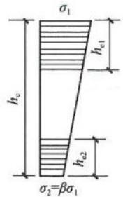  
(a) $\beta \geq 0$

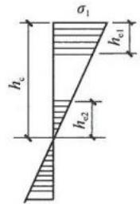  
(b) $\beta < 0$   
图7.1.1 腹板有效宽度的分布

4 工字形截面构件腹板的受剪板幅，考虑屈曲后强度时，应设置横向加劲肋，板幅的长度与板幅范围内的大端截面高度相比不应大于3。  
5 腹板高度变化的区格，考虑屈曲后强度，其受剪承载力设计值应按下列公式计算：

$$\begin{array}{l} V_{\mathrm{d}} = \chi_{\mathrm{t a p}} \varphi_{\mathrm{p s}} h_{\mathrm{w l}} t_{\mathrm{w}} f_{\mathrm{v}} \leqslant h_{\mathrm{w 0}} t_{\mathrm{w}} f_{\mathrm{v}} (7.1.1-10) \\ \varphi_{\mathrm{p s}} = \frac{1}{(0 . 51 + \lambda_{\mathrm{s}}^{3 . 2})^{1 / 2 . 6}} \leqslant 1. 0 (7.1.1-11) \\ \chi_{\mathrm{t a p}} = 1 - 0. 35 \alpha^{0. 2} \gamma_{\mathrm{p}}^{2 / 3} (7.1.1-12) \\ \gamma_{\mathrm{p}} = \frac{h_{\mathrm{w l}}}{h_{\mathrm{w 0}}} - 1 (7.1.1-13) \\ \alpha = \frac{a}{h_{\mathrm{w l}}} (7.1.1-14) \\ \end{array}$$

式中： $f_{\mathrm{v}}$ ——钢材抗剪强度设计值（ $\mathrm{N} / \mathrm{mm}^2$ ）；

$h_{\mathrm{w1}}, h_{\mathrm{w0}}$ ——楔形腹板大端和小端腹板高度（mm）；

$t_{\mathrm{w}}$ ——腹板的厚度（mm）；

$\lambda_{s}$ 与板件受剪有关的参数，按本条第6款的规定采用；

$\chi_{\mathrm{tap}}$ ——腹板屈曲后抗剪强度的楔率折减系数；

$\gamma_{\mathrm{p}}$ ——腹板区格的楔率；

$\alpha$ ——区格的长度与高度之比；

$a$ ——加劲肋间距（mm）。

6 参数 $\lambda_{s}$ 应按下列公式计算：

$$\lambda_{\mathrm{s}} = \frac{h_{\mathrm{w l}} / t_{\mathrm{w}}}{37 \sqrt{k_{\tau}} \sqrt{235 / f_{\mathrm{y}}}} \tag{7.1.1-15}$$

当 $a / h_{\mathrm{wl}} < 1$ 时 $k_{\tau} = 4 + 5.34 / (a / h_{\mathrm{wl}})^2$ (7.1.1-16)

当 $a / h_{\mathrm{wl}} \geqslant 1$ 时 $k_{\tau} = \eta_{\mathrm{s}}[5.34 + 4 / (a / h_{\mathrm{wl}})^{2}]$ (7.1.1-17)

$$\eta_{\mathrm{s}} = 1 - \omega_{1} \sqrt{\gamma_{\mathrm{p}}} \tag{7.1.1-18}$$

$$\omega_{1} = 0. 41 - 0. 897 \alpha + 0. 363 \alpha^{2} - 0. 041 \alpha^{3} (7. 1. 1 - 19)$$

式中： $k_{\tau}$ ——受剪板件的屈曲系数；当不设横向加劲肋时，取 $k_{\tau} = 5.34\eta_{s}$ 。

7.1.2 刚架构件的强度计算和加劲肋设置应符合下列规定：

1 工字形截面受弯构件在剪力 $V$ 和弯矩 $M$ 共同作用下的强度，应满足下列公式要求：

当 $V \leqslant 0.5 V_{\mathrm{d}}$ 时

$$M \leqslant M_{\mathrm{e}} \tag{7.1.2-1}$$

当 $0.5V_{\mathrm{d}} < V \leqslant V_{\mathrm{d}}$ 时

$$M \leqslant M_{\mathrm{f}} + (M_{\mathrm{e}} - M_{\mathrm{f}}) \left[ 1 - \left(\frac{V}{0 . 5 V_{\mathrm{d}}} - 1\right)^{2} \right] \tag{7.1.2-2}$$

当截面为双轴对称时

$$M_{\mathrm{f}} = A_{\mathrm{f}} \left(h_{\mathrm{w}} + t_{\mathrm{f}}\right) f \tag{7.1.2-3}$$

式中： $M_{\mathrm{f}}$ ——两翼缘所承担的弯矩（ $\mathrm{N} \cdot \mathrm{mm}$ ）；

$M_{\mathrm{e}}$ ——构件有效截面所承担的弯矩（ $\mathrm{N} \cdot \mathrm{mm}$ ）， $M_{\mathrm{c}} = W_{\mathrm{c}} f$

$W_{\mathrm{e}}$ ——构件有效截面最大受压纤维的截面模量（ $\mathrm{mm}^3$ ）；

$A_{\mathrm{f}}$ ——构件翼缘的截面面积（ $\mathrm{mm}^2$ ）；

$h_{\mathrm{w}}$ ——计算截面的腹板高度（mm）；

$t_\mathrm{f}$ 计算截面的翼缘厚度（mm）；

$V_{\mathrm{d}}$ ——腹板受剪承载力设计值（N），按本规范式（7.1.1-10）计算。

2 工字形截面压弯构件在剪力 $V$ 、弯矩 $M$ 和轴压力 $N$ 共同作用下的强度，应满足下列公式要求：

当 $V \leqslant 0.5 V_{\mathrm{d}}$ 时

$$\frac{N}{A_{\mathrm{e}}} + \frac{M}{W_{\mathrm{e}}} \leqslant f \tag{7.1.2-4}$$

当 $0.5V_{\mathrm{d}} \leqslant V < V_{\mathrm{d}}$ 时

$$M \leqslant M_{\mathrm{f}}^{\mathrm{N}} + \left(M_{\mathrm{e}}^{\mathrm{N}} - M_{\mathrm{f}}^{\mathrm{N}}\right) \left[ 1 - \left(\frac{V}{0 . 5 V_{\mathrm{d}}} - 1\right)^{2} \right] \tag{7.1.2-5}$$

$$M_{\mathrm{e}}^{\mathrm{N}} = M_{\mathrm{e}} - N W_{\mathrm{e}} / A_{\mathrm{e}} \tag{7.1.2-6}$$

当截面为双轴对称时

$$M_{\mathrm{f}}^{\mathrm{N}} = A_{\mathrm{f}} \left(h_{\mathrm{w}} + t\right) \left(f - N / A_{\mathrm{e}}\right) \tag{7.1.2-7}$$

式中： $A_{\mathrm{e}}$ —有效截面面积 （$\mathrm{mm}^2)$

$M_{\mathrm{f}}^{\mathrm{N}}$ ——兼承压力 $N$ 时两翼缘所能承受的弯矩（ $\mathrm{N} \cdot \mathrm{mm}$ ）。

3 梁腹板应在与中柱连接处、较大集中荷载作用处和翼缘转折处设置横向加劲肋，并符合下列规定：

1）梁腹板利用屈曲后强度时，其中间加劲肋除承受集中荷载和翼缘转折产生的压力外，尚应承受拉力场产生的压力。该压力应按下列公式计算：

$$N_{\mathrm{s}} = V - 0. 9 \varphi_{\mathrm{s}} h_{\mathrm{w}} t_{\mathrm{w}} f_{\mathrm{v}} \tag{7.1.2-8}$$

$$\varphi_{\mathrm{s}} = \frac{1}{\sqrt [ 3 ]{0 . 738 + \lambda_{\mathrm{s}}^{6}}} \tag{7.1.2-9}$$

式中： $N_{\mathrm{s}}$ ——拉力场产生的压力（N）；

V——梁受剪承载力设计值（N）；

$\varphi_{s}$ ——腹板剪切屈曲稳定系数， $\varphi_{s} \leqslant 1.0$

$\lambda_{s}$ ——腹板剪切屈曲通用高厚比，按本规范式（7.1.1-15）计算；

$h_{\mathrm{w}}$ ——腹板的高度（mm）；

$t_{\mathrm{w}}$ ——腹板的厚度（mm）。

2）当验算加劲肋稳定性时，其截面应包括每侧 $15t_{\mathrm{w}}\sqrt{235 / f_{\mathrm{y}}}$ 宽度范围内的腹板面积，计算长度取 $h_\mathrm{w}$

4 小端截面应验算轴力、弯矩和剪力共同作用下的强度。7.1.3 变截面柱在刚架平面内的稳定应按下列公式计算：

$$\frac{N_{1}}{\eta_{\mathrm{t}} \varphi_{\mathrm{x}} A_{\mathrm{e l}}} + \frac{\beta_{\mathrm{m x}} M_{1}}{(1 - N_{1} / N_{\mathrm{c r}}) W_{\mathrm{e l}}} \leqslant f \tag{7.1.3-1}$$

$$N_{\mathrm{c r}} = \pi^{2} E A_{\mathrm{c l}} / \lambda_{1}^{2} \tag{7.1.3-2}$$

$$\text{当} \bar{\lambda}_{1} \geqslant 1. 2 \text{时} \eta_{\mathrm{t}} = 1 \tag{7.1.3-3}$$

$$\text{当} \overline{{\lambda}}_{1} <   1. 2 \text{时} \eta_{t} = \frac{A_{0}}{A_{1}} + \left(1 - \frac{A_{0}}{A_{1}}\right) \times \frac{\overline{{\lambda}}_{1}^{2}}{1 . 44} (7. 1. 3 - 4)$$

$$\lambda_{1} = \frac{\mu H}{i_{\mathrm{x l}}} \tag{7.1.3-5}$$

$$\bar{\lambda}_{1} = \frac{\lambda_{1}}{\pi} \sqrt{\frac{E}{f_{\mathrm{y}}}} \tag{7.1.3-6}$$

式中： $N_{1}$ 一大端的轴向压力设计值（N）；

$M_{1}$ ——大端的弯矩设计值（ $\mathrm{N} \cdot \mathrm{mm}$ ）；

$A_{\mathrm{el}}$ ——大端的有效截面面积（ $\mathrm{mm}^2$ ）；

$W_{\mathrm{el}}$ ——大端有效截面最大受压纤维的截面模量（ $\mathrm{mm}^3$ ）；

$\varphi_{\mathrm{x}}$ ——杆件轴心受压稳定系数，楔形柱按本规范附录A规定的计算长度系数由现行国家标准《钢结构设计规范》GB50017查得，计算长细比时取大端截面的回转半径；

$\beta_{\mathrm{mx}}$ 等效弯矩系数，有侧移刚架柱的等效弯矩系数 $\beta_{\mathrm{mx}}$ 取1.0；

$N_{\mathrm{cr}}$ ——欧拉临界力（N）；

$\lambda_{1}$ ——按大端截面计算的，考虑计算长度系数的长细比；

$\bar{\lambda}_{1}$ ——通用长细比；

$i_{\mathrm{x1}}$ 一大端截面绕强轴的回转半径（mm）；

$\mu$ ——柱计算长度系数，按本规范附录A计算；

$H$ ——柱高（mm）；

$A_{0}, A_{1}$ ——小端和大端截面的毛截面面积（ $\mathrm{mm}^2$ ）；

$E$ ——柱钢材的弹性模量（ $\mathrm{N} / \mathrm{mm}^2$ ）；

$f_{\mathrm{y}}$ ——柱钢材的屈服强度值（ $\mathrm{N / mm^2}$ ）。

注：当柱的最大弯矩不出现在大端时， $M_{1}$ 和 $W_{\mathrm{el}}$ 分别取最大弯矩和该弯矩所在截面的有效截面模量。

7.1.4 变截面刚架梁的稳定性应符合下列规定：

1承受线性变化弯矩的楔形变截面梁段的稳定性，应按下列公式计算：

$$\frac{M_{\mathrm{l}}}{\gamma_{\mathrm{x}} \varphi_{\mathrm{b}} W_{\mathrm{x l}}} \leqslant f \tag{7.1.4-1}$$

$$\varphi_{\mathrm{b}} = \frac{1}{\left(1 - \lambda_{\mathrm{b} 0}^{2 n} + \lambda_{\mathrm{b}}^{2 n}\right)^{1 / n}} \tag{7.1.4-2}$$

$$\lambda_{\mathrm{b 0}} = \frac{0 . 55 - 0 . 25 k_{\sigma}}{(1 + \gamma)^{0 . 2}} \tag{7.1.4-3}$$

$$n = \frac{1 . 51}{\lambda_{\mathrm{b}}^{0 . 1}} \sqrt [ 3 ]{\frac{b_{1}}{h_{1}}} \tag{7.1.4-4}$$

$$k_{\sigma} = k_{\mathrm{M}} \frac{W_{\mathrm{x l}}}{W_{\mathrm{x 0}}} \tag{7.1.4-5}$$

$$\lambda_{\mathrm{b}} = \sqrt{\frac{\gamma_{\mathrm{x}} W_{\mathrm{x l}} f_{\mathrm{y}}}{M_{\mathrm{c r}}}} \tag{7.1.4-6}$$

$$k_{M} = \frac{M_{0}}{M_{1}} \tag{7.1.4-7}$$

$$\gamma = \left(h_{1} - h_{0}\right) / h_{0} \tag{7.1.4-8}$$

式中： $\varphi_{\mathrm{b}}$ ——楔形变截面梁段的整体稳定系数， $\varphi_{\mathrm{b}} \leqslant 1.0$

$k_{\alpha}$ ——小端截面压应力除以大端截面压应力得到的比值；

$k_{\mathrm{M}}$ ——弯矩比，为较小弯矩除以较大弯矩；

$\lambda_{\mathrm{b}}$ ——梁的通用长细比；

$\gamma_{\mathrm{x}}$ ——截面塑性开展系数，按现行国家标准《钢结构设计规范》GB50017的规定取值；

$M_{\mathrm{cr}}$ ——楔形变截面梁弹性屈曲临界弯矩（ $\mathrm{N} \cdot \mathrm{mm}$ ），按本条第2款计算；

$b_{1}, h_{1}$ ——弯矩较大截面的受压翼缘宽度和上、下翼缘中面之间的距离（mm）；

$W_{\mathrm{x1}}$ ——弯矩较大截面受压边缘的截面模量（ $\mathrm{mm}^3$ ）；

$\gamma$ ——变截面梁楔率；

$h_0$ ——小端截面上、下翼缘中面之间的距离（mm）；

$M_0$ ——小端弯矩（ $\mathrm{N} \cdot \mathrm{mm}$ ）；

$M_{1}$ ——大端弯矩 （$\mathrm{N} \cdot \mathrm{mm})$ 。

2 弹性屈曲临界弯矩应按下列公式计算：

$$M_{\mathrm{c r}} = C_{1} \frac{\pi^{2} E I_{\mathrm{y}}}{L^{2}} \left[ \beta_{\mathrm{x} \eta} + \sqrt{\beta_{\mathrm{x} \eta}^{2} + \frac{I_{\omega \eta}}{I_{\mathrm{y}}} \left(1 + \frac{G J_{\eta} L^{2}}{\pi^{2} E I_{\omega \eta}}\right)} \right] \tag{7.1.4-9}$$

$$C_{1} = 0. 46 k_{\mathrm{M}}^{2} \eta_{i}^{0. 346} - 1. 32 k_{\mathrm{M}} \eta_{i}^{0. 132} + 1. 86 \eta_{i}^{0. 023} \tag{7.1.4-10}$$

$$\beta_{x \eta} = 0. 45 (1 + \gamma \eta) h_{0} \frac{I_{y T} - I_{y B}}{I_{y}} \tag{7.1.4-11}$$

$$\eta = 0. 55 + 0. 04 \left(1 - k_{\sigma}\right) \sqrt [ 3 ]{\eta_{i}} \tag{7.1.4-12}$$

$$I_{\omega \eta} = I_{\omega 0} (1 + \gamma \eta)^{2} \tag{7.1.4-13}$$

$$I_{\omega 0} = I_{\mathrm{y T}} h_{\mathrm{s T 0}}^{2} + I_{\mathrm{y B}} h_{\mathrm{s B 0}}^{2} \tag{7.1.4-14}$$

$$J_{\eta} = J_{0} + \frac{1}{3} \gamma \eta \left(h_{0} - t_{1}\right) t_{w}^{3} \tag{7.1.4-15}$$

$$\eta_{i} = \frac{I_{\mathrm{y B}}}{I_{\mathrm{y T}}} \tag{7.1.4-16}$$

式中： $C_1$ ——等效弯矩系数， $C_1 \leqslant 2.75$

$\eta_{i}$ ——惯性矩比；

$I_{\mathrm{yT}}, I_{\mathrm{yB}}$ ——弯矩最大截面受压翼缘和受拉翼缘绕弱轴的惯性矩 （$\mathrm{mm}^4)$ ；

$\beta_{\mathrm{x}\eta}$ ——截面不对称系数；

$I_{\mathrm{y}}$ ——变截面梁绕弱轴惯性矩（ $\mathrm{mm}^4$ ）；

$I_{\omega \eta}$ ——变截面梁的等效翘曲惯性矩（ $\mathrm{mm}^4$ ）；

$I_{\omega 0}$ 小端截面的翘曲惯性矩（ $\mathrm{mm}^4$ ）；

$J_{\eta}$ ——变截面梁等效圣维南扭转常数；

$J_{0}$ ——小端截面自由扭转常数；

$h_{\mathrm{sT0}}$ 、 $h_{\mathrm{sB0}}$ ——分别是小端截面上、下翼缘的中面到剪切中心的距离（mm）；

$t_\mathrm{f}$ ——翼缘厚度（mm）；

$t_{\mathrm{w}}$ ——腹板厚度（mm）；

$L$ ——梁段平面外计算长度（mm）。

7.1.5 变截面柱的平面外稳定应分段按下列公式计算，当不能满足时，应设置侧向支撑或隅撑，并验算每段的平面外稳定。

$$\frac{N_{\mathrm{l}}}{\eta_{\mathrm{t y}} \varphi_{\mathrm{y}} A_{\mathrm{e l}} f} + \left(\frac{M_{\mathrm{l}}}{\varphi_{\mathrm{b}} \gamma_{\mathrm{x}} W_{\mathrm{e l}} f}\right)^{1. 3 - 0. 3 k_{\sigma}} \leqslant 1 \tag{7.1.5-1}$$

当 $\bar{\lambda}_{1y} \geqslant 1.3$ 时 $\eta_{\mathrm{ly}} = 1$ (7.1.5-2)

当 $\overline{\lambda}_{1y} < 1.3$ 时 $\eta_{\mathrm{ty}} = \frac{A_0}{A_1} +\left(1 - \frac{A_0}{A_1}\right)\times \frac{\overline{\lambda}_{1y}^2}{1.69}$

(7.1.5-3)

$$\bar{\lambda}_{1 y} = \frac{\lambda_{1 y}}{\pi} \sqrt{\frac{f_{y}}{E}} \tag{7.1.5-4}$$

$$\lambda_{1 y} = \frac{L}{i_{y 1}} \tag{7.1.5-5}$$

式中： $\overline{\lambda}_{1y}$ ——绕弱轴的通用长细比；

$\lambda_{1y}$ ——绕弱轴的长细比；

$i_{\mathrm{y1}}$ 一大端截面绕弱轴的回转半径（mm）；

$\varphi_{y}$ ——轴心受压构件弯矩作用平面外的稳定系数，以大端为准，按现行国家标准《钢结构设计规范》GB50017的规定采用，计算长度取纵向柱间支撑点间的距离；

$N_{1}$ ——所计算构件段大端截面的轴压力（N）；

$M_{1}$ ——所计算构件段大端截面的弯矩 （$\mathrm{N} \cdot \mathrm{mm})$ ；

$\varphi_{\mathrm{b}}$ ——稳定系数，按本规范第7.1.4条计算。

7.1.6 斜梁和隅撑的设计，应符合下列规定：

1 实腹式刚架斜梁在平面内可按压弯构件计算强度，在平面外应按压弯构件计算稳定。  
2 实腹式刚架斜梁的平面外计算长度，应取侧向支承点间的距离；当斜梁两翼缘侧向支承点间的距离不等时，应取最大受压翼缘侧向支承点间的距离。  
3 当实腹式刚架斜梁的下翼缘受压时，支承在屋面斜梁上翼缘的檩条，不能单独作为屋面斜梁的侧向支承。  
4 屋面斜梁和檩条之间设置的隅撑满足下列条件时，下翼缘受压的屋面斜梁的平面外计算长度可考虑隅撑的作用：

1）在屋面斜梁的两侧均设置隅撑（图7.1.6）；

图7.1.6 屋面斜梁的隅撑   
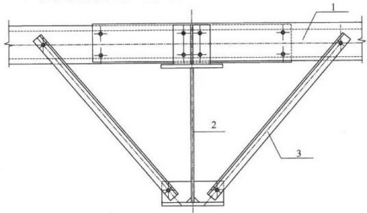  
1—檩条；2—钢梁；3—隅撑

2）偶撑的上支承点的位置不低于檩条形心线；  
3）符合对隅撑的设计要求。

5 隅撑单面布置时，应考虑隅撑作为檩条的实际支座承受的压力对屋面斜梁下翼缘的水平作用。屋面斜梁的强度和稳定性计算宜考虑其影响。  
6 当斜梁上翼缘承受集中荷载处不设横向加劲肋时，除应按现行国家标准《钢结构设计规范》GB50017的规定验算腹板上边缘正应力、剪应力和局部压应力共同作用时的折算应力外，尚应满足下列公式要求：

$$F \leqslant 15 \alpha_{\mathrm{m}} t_{\mathrm{w}}^{2} f \sqrt{\frac{t_{\mathrm{f}}}{t_{\mathrm{w}}}} \sqrt{\frac{235}{f_{\mathrm{y}}}} \tag{7.1.6-1}$$

$$\alpha_{\mathrm{m}} = 1. 5 - M / \left(W_{\mathrm{e}} f\right) \tag{7.1.6-2}$$

式中： $F$ ——上翼缘所受的集中荷载（N）；

$t_{\mathrm{f}}, t_{\mathrm{w}}$ ——分别为斜梁翼缘和腹板的厚度（mm）；

$\alpha_{\mathrm{m}}$ ——参数， $\alpha_{\mathrm{m}} \leqslant 1.0$ ，在斜梁负弯矩区取1.0；

$M$ ——集中荷载作用处的弯矩 （$\mathrm{N} \cdot \mathrm{mm})$ ；

$W_{\mathrm{e}}$ ——有效截面最大受压纤维的截面模量（ $\mathrm{mm}^3$ ）。

7 隔撑支撑梁的稳定系数应按本规范第7.1.4条的规定确定，其中 $k_{\circ}$ 为大、小端应力比，取三倍隅撑间距范围内的梁段的应力比，楔率 $\gamma$ 取三倍隅撑间距计算；弹性屈曲临界弯矩应按下列公式计算：

$$M_{\mathrm{c r}} = \frac{G J + 2 e \sqrt{k_{\mathrm{b}} (E I_{\mathrm{y}} e_{\mathrm{l}}^{2} + E I_{\omega})}}{2 (e_{\mathrm{l}} - \beta_{\mathrm{x}})} \tag{7.1.6-3}$$

$$\begin{array}{l} k_{\mathrm{b}} = \frac{1}{l_{\mathrm{k k}}} \left[ \frac{(1 - 2 \beta) l_{\mathrm{p}}}{2 E A_{\mathrm{p}}} + (a + h) \frac{(3 - 4 \beta)}{6 E I_{\mathrm{p}}} \beta l_{\mathrm{p}}^{2} \tan \alpha + \frac{l_{\mathrm{k}}^{2}}{\beta l_{\mathrm{p}} E A_{\mathrm{k}} \cos \alpha} \right]^{-1} (7.1.6-4) \\ \beta_{\mathrm{x}} = 0. 45 h \frac{I_{1} - I_{2}}{I_{\mathrm{y}}} (7.1.6-5) \\ \end{array}$$

式中： $J$ 、 $I_{\mathrm{y}}$ 、 $I_{\omega}$ ——大端截面的自由扭转常数，绕弱轴惯性矩和翘曲惯性矩（ $\mathrm{mm^4}$ ）；

$G$ ——斜梁钢材的剪切模量（ $\mathrm{N} / \mathrm{mm}^2$ ）；

$E$ —斜梁钢材的弹性模量（ $\mathrm{N / mm^2}$ ）；

$a$ ——標条截面形心到梁上翼缘中心的距离（mm）；

$h$ ——大端截面上、下翼缘中面间的距离（mm）；

$\alpha$ ——隅撑和檩条轴线的夹角（°）；

$\beta$ ——隅撑与檩条的连接点离开主梁的距离与檩条跨度的比值；

$l_{\mathrm{p}}$ ——標条的跨度（mm）；

$I_{\mathrm{p}}$ ——檩条截面绕强轴的惯性矩 （$\mathrm{mm}^4)$ ；

$A_{\mathrm{p}}$ ——檩条的截面面积（ $\mathrm{mm}^2$ ）；

$A_{\mathrm{k}}$ ——隅撑杆的截面面积（ $\mathrm{mm}^2$ ）；

$l_{\mathrm{k}}$ ——隅撑杆的长度（mm）；

$l_{\mathrm{kk}}$ ——隅撑的间距（mm）；

$e$ ——偶撑下支撑点到標条形心线的垂直距离（mm）；

$e_1$ ——梁截面的剪切中心到檩条形心线的距离（mm）；

$I_{1}$ ——被隅撑支撑的翼缘绕弱轴的惯性矩 （$\mathrm{mm}^4)$ ；

$I_{2}$ ——与檩条连接的翼缘绕弱轴的惯性矩（ $\mathrm{mm}^4$ ）。

## 7.2 端部刚架的设计

7.2.1 抗风柱下端与基础的连接可铰接也可刚接。在屋面材料能够适应较大变形时，抗风柱柱顶可采用固定连接（图7.2.1），

图7.2.1 抗风柱与端部刚架连接   
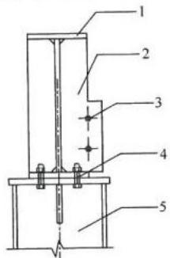  
1—厂房端部屋面梁；2—加劲肋；3—屋面支撑连接孔；4—抗风柱与屋面梁的连接；5—抗风柱

作为屋面斜梁的中间竖向铰支座。

7.2.2 端部刚架的屋面斜梁与檩条之间，除本规范第7.2.3条规定的抗风柱位置外，不宜设置隅撑。  
7.2.3 抗风柱处，端开间的两根屋面斜梁之间应设置刚性系杆。屋脊高度小于 $10\mathrm{m}$ 的房屋或基本风压不小于 $0.55\mathrm{kN} / \mathrm{m}^2$ 时，屋脊高度小于 $8\mathrm{m}$ 的房屋，可采用隅撑一双檩条体系代替刚性系杆，此时隅撑应采用高强度螺栓与屋面斜梁和檩条连接，与冷弯型钢檩条的连接应增设双面填板增强局部承压强度，连接点不应低于型钢檩条中心线；在隅撑与双檩条的连接点处，沿屋面坡度方向对檩条施加隅撑轴向承载力设计值 $3\%$ 的力，验算双檩条在组合内力作用下的强度和稳定性。  
7.2.4 抗风柱作为压弯杆件验算强度和稳定性，可在抗风柱和墙梁之间设置隅撑，平面外弯扭稳定的计算长度，应取不小于两倍隅撑间距。

加微信308492256入土木精英群

土木吧

权威专家团队打造

中国土木人综合交流平台

微信扫描二维码查看更多资料

# 8 支撑系统设计

## 8.1 一般规定

8.1.1 每个温度区段、结构单元或分期建设的区段、结构单元应设置独立的支撑系统，与刚架结构一同构成独立的空间稳定体系。施工安装阶段，结构临时支撑的设置尚应符合本规范第14章的相关规定。

8.1.2 柱间支撑与屋盖横向支撑宜设置在同一开间。

## 8.2 柱间支撑系统

8.2.1 柱间支撑应设在侧墙柱列，当房屋宽度大于 $60\mathrm{m}$ 时，在内柱列宜设置柱间支撑。当有吊车时，每个吊车跨两侧柱列均应设置吊车柱间支撑。  
8.2.2 同一柱列不宜混用刚度差异大的支撑形式。在同一柱列设置的柱间支撑共同承担该柱列的水平荷载，水平荷载应按各支撑的刚度进行分配。  
8.2.3 柱间支撑采用的形式宜为：门式框架、圆钢或钢索交叉支撑、型钢交叉支撑、方管或圆管人字支撑等。当有吊车时，吊车牛腿以下交叉支撑应选用型钢交叉支撑。  
8.2.4 当房屋高度大于柱间距2倍时，柱间支撑宜分层设置。当沿柱高有质量集中点、吊车牛腿或低屋面连接点处应设置相应支撑点。  
8.2.5 柱间支撑的设置应根据房屋纵向柱距、受力情况和温度区段等条件确定。当无吊车时，柱间支撑间距宜取 $30\mathrm{m}\sim 45\mathrm{m}$ 端部柱间支撑宜设置在房屋端部第一或第二开间。当有吊车时，吊车牛腿下部支撑宜设置在温度区段中部，当温度区段较长时，宜设置在三分点内，且支撑间距不应大于 $50\mathrm{m}$ 。牛腿上部支撑设

置原则与无吊车时的柱间支撑设置相同。

8.2.6 柱间支撑的设计，应按支承于柱脚基础上的竖向悬臂桁架计算；对于圆钢或钢索交叉支撑应按拉杆设计，型钢可按拉杆设计，支撑中的刚性系杆应按压杆设计。

## 8.3 屋面横向和纵向支撑系统

8.3.1 屋面端部横向支撑应布置在房屋端部和温度区段第一或第二开间，当布置在第二开间时应在房屋端部第一开间抗风柱顶部对应位置布置刚性系杆。  
8.3.2 屋面支撑形式可选用圆钢或钢索交叉支撑；当屋面斜梁承受悬挂吊车荷载时，屋面横向支撑应选用型钢交叉支撑。屋面横向交叉支撑节点布置应与抗风柱相对应，并应在屋面梁转折处布置节点。  
8.3.3 屋面横向支撑应按支承于柱间支撑柱顶水平桁架设计；圆钢或钢索应按拉杆设计，型钢可按拉杆设计，刚性系杆应按压杆设计。  
8.3.4 对设有带驾驶室且起重量大于15t桥式吊车的跨间，应在屋盖边缘设置纵向支撑；在有抽柱的柱列，沿托架长度应设置纵向支撑。

## 8.4 隔撑设计

8.4.1 当实腹式门式刚架的梁、柱翼缘受压时，应在受压翼缘侧布置隅撑与檩条或墙梁相连接。  
8.4.2 隔撑应按轴心受压构件设计。轴力设计值 $N$ 可按下式计算，当隅撑成对布置时，每根隅撑的计算轴力可取计算值的 $\frac{1}{2}$

$$N = A f / (60 \cos \theta) \tag{8.4.2}$$

式中： $A$ ——被支撑翼缘的截面面积（ $\mathrm{mm}^2$ ）；

$f$ ——被支撑翼缘钢材的抗压强度设计值（ $\mathrm{N} / \mathrm{mm}^2$ ）；

$\theta$ ——隅撑与檩条轴线的夹角（°）。

## 8.5 圆钢支撑与刚架连接节点设计

8.5.1 圆钢支撑与刚架连接节点可用连接板连接（图8.5.1）。

图8.5.1 圆钢支撑与连接板连接  
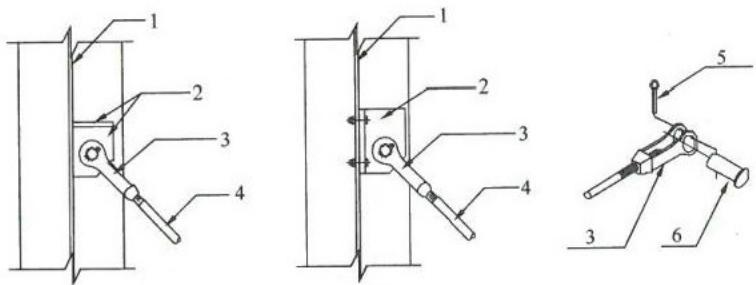  
1—腹板；2—连接板；3—U形连接夹；  
4—圆钢；5—开口销；6—插销

8.5.2 当圆钢支撑直接与梁柱腹板连接，应设置垫块或垫板且尺寸 $B$ 不小于4倍圆钢支撑直径（图8.5.2）。

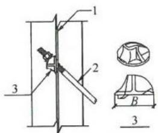

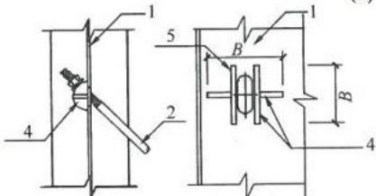  
(a) 弧形垫块   
（b）弧形垫板

（c）角钢垫块  
图8.5.2 圆钢支撑与腹板连接  
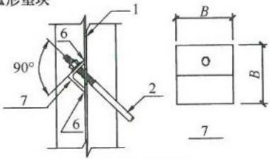  
1—腹板；2—圆钢；3—弧形垫块；4—弧形垫板，厚度 $\geq 10\mathrm{mm}$   
5—单面焊；6—焊接；7—角钢垫块，厚度 $\geq 12\mathrm{mm}$

# 9 檀条与墙梁设计

## 9.1 实腹式標条设计

9.1.1 榄条宜采用实腹式构件，也可采用桁架式构件；跨度大于 $9\mathrm{m}$ 的简支檩条宜采用桁架式构件。  
9.1.2 实腹式檩条宜采用直卷边槽形和斜卷边Z形冷弯薄壁型钢，斜卷边角度宜为 $60^{\circ}$ ，也可采用直卷边Z形冷弯薄壁型钢或高频焊接H型钢。  
9.1.3 实腹式標条可设计成单跨简支构件也可设计成连续构件，连续构件可采用嵌套搭接方式组成，计算標条挠度和内力时应考虑因嵌套搭接方式松动引起刚度的变化。

实腹式標条也可采用多跨静定梁模式（图9.1.3），跨内標条的长度 $l$ 宜为0.8L，標条端头的节点应有刚性连接件夹住构件的腹板，使节点具有抗扭转能力，跨中標条的整体稳定按节点间標条或反弯点之间標条为简支梁模式计算。

图9.1.3 多跨静定梁模式  
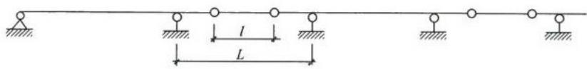  
$L$ 一檩条跨度； $l$ 一跨内檩条长度

9.1.4 实腹式標条卷边的宽厚比不宜大于13，卷边宽度与翼缘宽度之比不宜小于0.25，不宜大于0.326。  
9.1.5 实腹式標条的计算，应符合下列规定：

1 当屋面能阻止檩条侧向位移和扭转时，实腹式檩条可仅做强度计算，不做整体稳定性计算。强度可按下列公式计算：

$$\frac{M_{\mathrm{x}^{\prime}}}{W_{\mathrm{e n x}^{\prime}}} \leqslant f \tag{9.1.5-1}$$

$$\frac{3 V_{\mathrm{y} \max}}{2 h_{0} t} \leqslant f_{\mathrm{v}} \tag{9.1.5-2}$$

式中： $M_{\mathrm{x}}$ ——腹板平面内的弯矩设计值（ $\mathrm{N} \cdot \mathrm{mm}$ ）；

$W_{\mathrm{ex}}$ 按腹板平面内（图9.1.5，绕 $x^{\prime} - x^{\prime}$ 轴）计算的有效净截面模量（对冷弯薄壁型钢）或净截面模量（对热轧型钢） （$\mathrm{mm}^3)$ ，冷弯薄壁型钢的有效净截面，应按现行国家标准《冷弯薄壁型钢结构技术规范》GB50018的方法计算，其中，翼缘屈曲系数可取3.0，腹板屈曲系数可取23.9，卷边屈曲系数可取0.425；对于双檩条搭接段，可取两檩条有效净截面模量之和并乘以折减系数0.9；

$V_{y^{\prime}\max}$ ——腹板平面内的剪力设计值（N）；

$h_0$ ——檩条腹板扣除冷弯半径后的平直段高度（ $\mathrm{mm}$ ）；

$t$ ——標条厚度（mm），当双標条搭接时，取两標条厚度之和并乘以折减系数0.9；

$f$ ——钢材的抗拉、抗压和抗弯强度设计值（ $\mathrm{N} / \mathrm{mm}^2$ ）；

$f_{\mathrm{v}}$ ——钢材的抗剪强度设计值（ $\mathrm{N} / \mathrm{mm}^2$ ）。

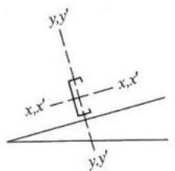

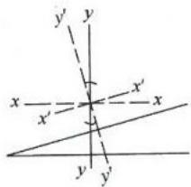  
图9.1.5 椭条的计算惯性轴

2 当屋面不能阻止檩条侧向位移和扭转时，应按下式计算檩条的稳定性：

$$\frac{M_{\mathrm{x}}}{\varphi_{\mathrm{b y}} W_{\mathrm{e n x}}} + \frac{M_{\mathrm{y}}}{W_{\mathrm{e n y}}} \leqslant f \tag{9.1.5-3}$$

式中： $M_{\mathrm{x}}$ 、 $M_{\mathrm{y}}$ ——对截面主轴 $x$ 、 $y$ 轴的弯矩设计值（ $\mathrm{N} \cdot \mathrm{mm}$ ）； $W_{\mathrm{ex}}$ 、 $W_{\mathrm{eny}}$ ——对截面主轴 $x$ 、 $y$ 轴的有效净截面模量（对冷

弯薄壁型钢）或净截面模量（对热轧型钢） （$\mathrm{mm}^3)$ ；

$\varphi_{\mathrm{by}}$ ——梁的整体稳定系数，冷弯薄壁型钢构件按现行国家标准《冷弯薄壁型钢结构技术规范》GB50018，热轧型钢构件按现行国家标准《钢结构设计规范》GB50017的规定计算。

3 在风吸力作用下，受压下翼缘的稳定性应按现行国家标准《冷弯薄壁型钢结构技术规范》GB50018的规定计算；当受压下翼缘有内衬板约束且能防止檩条截面扭转时，整体稳定性可不做计算。

9.1.6 当檩条腹板高厚比大于200时，应设置檩托板连接檩条腹板传力；当腹板高厚比不大于200时，也可不设置檩托板，由翼缘支承传力，但应按下列公式计算檩条的局部屈曲承压能力。当不满足下列规定时，对腹板应采取局部加强措施。

1 对于翼缘有卷边的檩条

$$P_{\mathrm{n}} = 4 t^{2} f (1 - 0. 14 \sqrt{R / t}) (1 + 0. 35 \sqrt{b / t}) (1 - 0. 02 \sqrt{h_{0} / t}) \tag{9.1.6-1}$$

2 对于翼缘无卷边的檩条

$$P_{\mathrm{n}} = 4 t^{2} f (1 - 0. 4 \sqrt{R / t}) (1 + 0. 6 \sqrt{b / t}) (1 - 0. 03 \sqrt{h_{0} / t}) \tag{9.1.6-2}$$

式中： $P_{\mathrm{n}}$ ——檩条的局部屈曲承压能力；

$t$ ——標条的壁厚（mm）；

$f$ ——檩条钢材的强度设计值（ $\mathrm{N} / \mathrm{mm}^2$ ）；

$R$ ——檩条冷弯的内表面半径（ $\mathrm{mm}$ ），可取 $1.5t$ ；

$b$ ——檩条传力的支承长度（mm），不应小于 $20\mathrm{mm}$

$h_0$ ——檩条腹板扣除冷弯半径后的平直段高度（mm）。

3 对于连续檩条在支座处，尚应按下式计算檩条的弯矩和局部承压组合作用。

$$\left(\frac{V_{\mathrm{y}}}{P_{\mathrm{n}}}\right)^{2} + \left(\frac{M_{\mathrm{x}}}{M_{\mathrm{n}}}\right)^{2} \leqslant 1. 0 \tag{9.1.6-3}$$

式中： $V_{\mathrm{y}}$ ——標条支座反力（N）；

$P_{\mathrm{n}}$ ——由式（9.1.6-1）或式（9.1.6-2）得到的檩条局部屈曲承压能力（N），当为双檩条时，取两者之和； $M_{\mathrm{x}}$ ——檩条支座处的弯矩 （$\mathrm{N} \cdot \mathrm{mm})$

$M_{\mathrm{n}}$ ——標条的受弯承载能力（ $\mathrm{N} \cdot \mathrm{mm}$ ），当为双標条时，取两者之和乘以折减系数0.9。

9.1.7 榷条兼做屋面横向水平支撑压杆和纵向系杆时，檩条长细比不应大于200。

9.1.8 兼做压杆、纵向系杆的檩条应按压弯构件计算，在本规范式（9.1.5-1）和式（9.1.5-3）中叠加轴向力产生的应力，其压杆稳定系数应按构件平面外方向计算，计算长度应取拉条或撑杆的间距。

9.1.9 吊挂在屋面上的普通集中荷载宜通过螺栓或自攻钉直接作用在檩条的腹板上，也可在檩条之间加设冷弯薄壁型钢作为扁担支承吊挂荷载，冷弯薄壁型钢扁担与檩条间的连接宜采用螺栓或自攻钉连接。

9.1.10 檬条与刚架的连接和檩条与拉条的连接应符合下列规定：

1 屋面檩条与刚架斜梁宜采用普通螺栓连接，檩条每端应设两个螺栓（图9.1.10-1）。檩条连接宜采用標托板，標条高度较大时，標托板处宜设加劲板。嵌套搭接方式的Z形连续檩条，

图9.1.10-1 槌条与刚架斜梁连接   
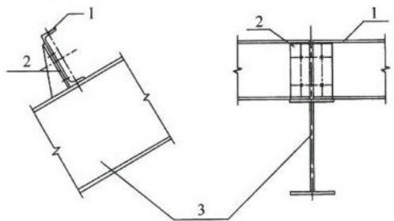  
1—檩条；2—檩托；3—屋面斜梁

当有可靠依据时，可不设標托，由Z形標条翼缘用螺栓连于刚架上。

2 连续檩条的搭接长度 $2a$ 不宜小于 $10\%$ 的檩条跨度（图9.1.10-2），嵌套搭接部分的檩条应采用螺栓连接，按连续檩条支座处弯矩验算螺栓连接强度。

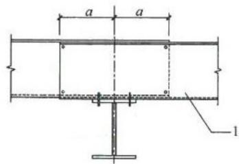  
图9.1.10-2 连续標条的搭接 1-標条

3 椭条之间的拉条和撑杆应直接连于標条腹板上，并采用普通螺栓连接（图9.1.10-3a），斜拉条端部宜弯折或设置垫块（图9.1.10-3b、图9.1.10-3c）。

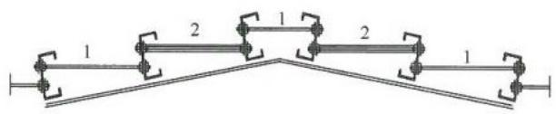  
(a)

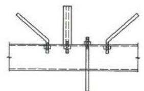  
(b)

(c)   
图9.1.10-3 拉条和撑杆与檩条连接  
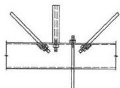  
1—拉条；2—撑杆

4 屋脊两侧檩条之间可用槽钢、角钢和圆钢相连（图9.1.10-4）。

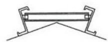  
(a)屋脊檩条用槽钢相连

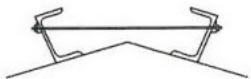  
(b)屋脊檩条用圆钢相连   
图9.1.10-4 屋脊檩条连接

## 9.2 桁架式檩条设计

9.2.1 桁架式檩条可采用平面桁架式，平面桁架式檩条应设置拉条体系。  
9.2.2 平面桁架式檩条的计算，应符合下列规定：

1 所有节点均应按铰接进行计算，上、下弦杆轴向力应按下式计算：

$$N_{\mathrm{s}} = M_{\mathrm{x}} / h \tag{9.2.2-1}$$

对上弦杆应计算节间局部弯矩，应按下式计算：

$$M_{1 x} = q_{x} a^{2} / 10 \tag{9.2.2-2}$$

腹杆受轴向压力应按下式计算：

$$N_{\mathrm{w}} = V_{\max } / \sin \theta \tag{9.2.2-3}$$

式中： $N_{\mathrm{s}}$ ——檩条上、下弦杆的轴向力（N）；

$N_{\mathrm{w}}$ ——腹杆的轴向压力（N）；

$M_{\mathrm{x}}, M_{1\mathrm{x}}$ ——垂直于屋面板方向的主弯矩和节间次弯矩（N·mm）；

$h$ ——檩条上、下弦杆中心的距离（mm）；

$q_{\mathrm{x}}$ —垂直于屋面的荷载（ $\mathrm{N / mm}$ ）；

$a$ ——上弦杆节间长度（mm）；

$V_{\mathrm{max}}$ ——標条的最大剪力（N）；

$\theta$ ——腹杆与弦杆之间的夹角（°）。

2 在重力荷载作用下，当屋面板能阻止檩条侧向位移时，上、下弦杆强度验算应符合下列规定：

1）上弦杆的强度应按下式验算：

$$\frac{N_{\mathrm{s}}}{A_{\mathrm{n l}}} + \frac{M_{\mathrm{l x}}}{W_{\mathrm{n l x}}} \leqslant 0. 9 f \tag{9.2.2-4}$$

式中： $A_{\mathrm{nl}}$ ——杆件的净截面面积（ $\mathrm{mm}^2$ ）；

$W_{\mathrm{nlx}}$ ——杆件的净截面模量（ $\mathrm{mm}^3$ ）；

$f$ ——钢材强度设计值（ $\mathrm{N} / \mathrm{mm}^2$ ）。

2）下弦杆的强度应按下式验算：

$$\frac{N_{\mathrm{s}}}{A_{\mathrm{n l}}} \leqslant 0. 9 f \tag{9.2.2-5}$$

3）腹杆应按下列公式验算：

强度

$$\frac{N_{\mathrm{w}}}{A_{\mathrm{n l}}} \leqslant 0. 9 f \tag{9.2.2-6}$$

稳定

$$\frac{N_{\mathrm{w}}}{\varphi_{\min} A_{\mathrm{n l}}} \leqslant 0. 9 f \tag{9.2.2-7}$$

式中： $\varphi_{\mathrm{min}}$ ——腹杆的轴压稳定系数，为 （$\varphi_{\mathrm{x}},\varphi_{\mathrm{y}})$ 两者的较小值，计算长度取节点间距离。

3 在重力荷载作用下，当屋面板不能阻止檩条侧向位移时，应按下式计算上弦杆的平面外稳定：

$$\frac{N_{\mathrm{s}}}{\varphi_{\mathrm{y}} A_{\mathrm{n l}}} + \frac{\beta_{\mathrm{t x}} M_{\mathrm{l x}}}{\varphi_{\mathrm{b}} W_{\mathrm{n l x c}}} \leqslant 0. 9 f \tag{9.2.2-8}$$

式中： $\varphi_{\mathrm{y}}$ 一上弦杆轴心受压稳定系数，计算长度取侧向支撑点的距离；

$\varphi_{\mathrm{b}}$ 一上弦杆均匀受弯整体稳定系数，计算长度取上弦杆侧向支撑点的距离。上弦杆 $I_{\mathrm{y}}\geqslant I_{\mathrm{x}}$ 时可取 $\varphi_{\mathrm{b}} =$ 1.0;

$\beta_{\mathrm{tx}}$ ——等效弯矩系数，可取0.85；

$W_{\mathrm{nlxc}}$ 上弦杆在 $M_{1x}$ 作用下受压纤维的净截面模量（ $\mathrm{mm}^3$ ）。

4 在风吸力作用下，下弦杆的平面外稳定应按下式计算：

$$\frac{N_{\mathrm{s}}}{\varphi_{\mathrm{y}} A_{\mathrm{n l}}} \leqslant 0. 9 f \tag{9.2.2-9}$$

式中： $\varphi_{y}$ ——下弦杆平面外受压稳定系数，计算长度取侧向支撑点的距离。

## 9.3 拉条设计

9.3.1 实腹式標条跨度不宜大于 $12\mathrm{m}$ ，当標条跨度大于 $4\mathrm{m}$ 时，宜在標条间跨中位置设置拉条或撑杆；当標条跨度大于 $6\mathrm{m}$ 时，宜在標条跨度三分点处各设一道拉条或撑杆；当標条跨度大于 $9\mathrm{m}$ 时，宜在標条跨度四分点处各设一道拉条或撑杆。斜拉条和刚性撑杆组成的桁架结构体系应分别设在檐口和屋脊处（图9.3.1)，当构造能保证屋脊处拉条互相拉结平衡，在屋脊处可不设斜拉条和刚性撑杆。

当单坡长度大于 $50\mathrm{m}$ ，宜在中间增加一道双向斜拉条和刚性撑杆组成的桁架结构体系（图9.3.1）。

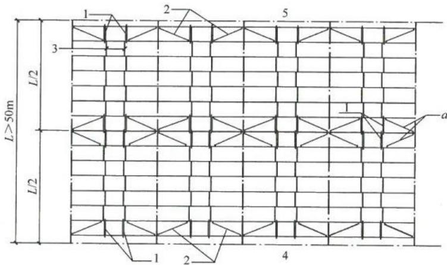  
图9.3.1 双向斜拉条和撑杆体系

1—刚性撑杆；2—斜拉条；3—拉条；4—檐口位置；5—屋脊位置；6— $L$ —单坡长度； $a$ —斜拉条与刚性撑杆组成双向斜拉条和刚性撑杆体系。

9.3.2 撑杆长细比不应大于220；当采用圆钢做拉条时，圆钢

直径不宜小于 $10\mathrm{mm}$ 。圆钢拉条可设在距檩条翼缘1/3腹板高度的范围内。

9.3.3 榄间支撑的形式可采用刚性支撑系统或柔性支撑系统。应根据標条的整体稳定性设置一层標间支撑或上、下二层標间支撑。

9.3.4 屋面对檩条产生倾覆力矩，可采取变化檩条翼缘的朝向使之相互平衡，当不能平衡倾覆力矩时，应通过檩间支撑传递至屋面梁，檩间支撑由拉条和斜拉条共同组成。应根据屋面荷载、坡度计算檩条的倾覆力大小和方向，验算檩间支撑体系的承载力。倾覆力 $P_{\mathrm{L}}$ 作用在靠近檩条上翼缘的拉条上，以朝向屋脊方向为正，应按下列公式计算：

1 当C形檩条翼缘均朝屋脊同一方向时：

$$P = 0. 05 W \tag{9.3.4-1}$$

2 简支Z形標条

当1道標间支撑：

$$P_{\mathrm{L}} = \left(\frac{0 . 224 b^{1 . 32}}{n_{\mathrm{p}}^{0 . 65} d^{0 . 83} t^{0 . 50}} - \sin \theta\right) W \tag{9.3.4-2}$$

当2道標间支撑：

$$P_{\mathrm{L}} = 0. 5 \left(\frac{0 . 474 b^{1 . 22}}{n_{\mathrm{p}}^{0 . 57} d^{0 . 89} t^{0 . 33}} - \sin \theta\right) W \tag{9.3.4-3}$$

多于2道標间支撑：

$$P_{\mathrm{L}} = 0. 35 \left(\frac{0 . 474 b^{1 . 22}}{n_{\mathrm{p}}^{0 . 57} d^{0 . 89} t^{0 . 33}} - \sin \theta\right) W \tag{9.3.4-4}$$

3 连续Z形標条

当1道標间支撑：

$$P_{\mathrm{L}} = C_{\mathrm{m s}} \left(\frac{0 . 116 b^{1 . 32} L^{0 . 18}}{n_{\mathrm{p}}^{0 . 70} d t^{0 . 50}} - \sin \theta\right) W \tag{9.3.4-5}$$

当2道標间支撑：

$$P_{\mathrm{L}} = C_{\mathrm{t h}} \left(\frac{0 . 181 b^{1 . 15} L^{0 . 25}}{n_{\mathrm{p}}^{0 . 54} d^{1 . 11} t^{0 . 29}} - \sin \theta\right) W \tag{9.3.4-6}$$

当多于2道檩间支撑：

$$P_{\mathrm{L}} = 0. 7 C_{\mathrm{t h}} \left(\frac{0 . 181 b^{1 . 15} L^{0 . 25}}{n_{\mathrm{p}}^{0 . 54} d^{1 . 11} t^{0 . 29}} - \sin \theta\right) W \tag{9.3.4-7}$$

式中： $P$ ——1个柱距内拉条的总内力设计值（N），当有多道拉条时由其平均分担；

$P_{\mathrm{L}}$ ——1根拉条的内力设计值（N）；

$b$ ——標条翼缘宽度（mm）；

$d$ ——標条截面高度（mm）；

$t$ ——檩条壁厚（mm）；

$L$ ——標条跨度（mm）；

$\theta$ ——屋面坡度角（°）；

$n_{\mathrm{p}}$ ——標间支撑承担受力区域的標条数，当 $n_{\mathrm{p}} < 4$ 时， $n_{\mathrm{p}}$ 取4；当 $4 \leqslant n_{\mathrm{p}} \leqslant 20$ 时， $n_{\mathrm{p}}$ 取实际值；当 $n_{\mathrm{p}} > 20$ 时， $n_{\mathrm{p}}$ 取20；

$C_{\mathrm{ms}}$ —系数，当横间支撑位于端跨时， $C_{\mathrm{ms}}$ 取1.05；位于其他位置处， $C_{\mathrm{ms}}$ 取0.90；

$C_{\mathrm{th}}$ —系数，当横间支撑位于端跨时， $C_{\mathrm{th}}$ 取0.57；位于其他位置处， $C_{\mathrm{th}}$ 取0.48；

$W$ ——1个柱距内横间支撑承担受力区域的屋面总竖向荷载设计值（N），向下为正。

## 9.4 墙梁设计

9.4.1 轻型墙体结构的墙梁宜采用卷边槽形或卷边Z形的冷弯薄壁型钢或高频焊接H型钢，兼做窗框的墙梁和门框等构件宜采用卷边槽形冷弯薄壁型钢或组合矩形截面构件。  
9.4.2 墙梁可设计成简支或连续构件，两端支承在刚架柱上，墙梁主要承受水平风荷载，宜将腹板置于水平面。当墙板底部端头自承重且墙梁与墙板间有可靠连接时，可不考虑墙面自重引起

的弯矩和剪力。当墙梁需承受墙板重量时，应考虑双向弯曲。

9.4.3 当墙梁跨度为 $4\mathrm{m}\sim 6\mathrm{m}$ 时，宜在跨中设一道拉条；当墙梁跨度大于 $6\mathrm{m}$ 时，宜在跨间三分点处各设一道拉条。在最上层墙梁处宜设斜拉条将拉力传至承重柱或墙架柱；当墙板的竖向荷载有可靠途径直接传至地面或托梁时，可不设传递竖向荷载的拉条。

9.4.4 单侧挂墙板的墙梁，应按下列公式计算其强度和稳定：

1 在承受朝向面板的风压时，墙梁的强度可按下列公式验算：

$$\frac{M_{\mathrm{x}^{\prime}}}{W_{\mathrm{e n x}^{\prime}}} + \frac{M_{\mathrm{y}^{\prime}}}{W_{\mathrm{e n y}^{\prime}}} \leqslant f \tag{9.4.4-1}$$

$$\frac{3 V_{\mathrm{y}^{\prime} , \max}}{2 h_{0} t} \leqslant f_{\mathrm{v}} \tag{9.4.4-2}$$

$$\frac{3 V_{\mathrm{x}^{\prime} , \max}}{4 b_{0} t} \leqslant f_{\mathrm{v}} \tag{9.4.4-3}$$

式中： $M_{\mathrm{x^{\prime}}} 、 M_{\mathrm{y^{\prime}}}$ ——分别为水平荷载和竖向荷载产生的弯矩（N·mm），下标 $x^{\prime}$ 和 $y^{\prime}$ 分别表示墙梁的竖向轴和水平轴，当墙板底部端头自承重时， $M_{\mathrm{y}} = 0$

$V_{\mathrm{x}^{\prime},\max},V_{\mathrm{y}^{\prime},\max}$ 分别为竖向荷载和水平荷载产生的剪力(N)；当墙板底部端头自承重时， $V_{\mathrm{x}^{\prime},\max} = 0$ $W_{\mathrm{enx}^{\prime}},W_{\mathrm{eny}^{\prime}}$ 分别为绕竖向轴 $x^{\prime}$ 和水平轴 $\mathcal{V}^{\prime}$ 的有效净截面模量（对冷弯薄壁型钢）或净截面模量（对热轧型钢） （$\mathrm{mm}^3)$

$b_{0}, h_{0}$ ——分别为墙梁在竖向和水平方向的计算高度（mm），取板件弯折处两圆弧起点之间的距离；

$t$ —墙梁壁厚（mm）。

2 仅外侧设有压型钢板的墙梁在风吸力作用下的稳定性，可按现行国家标准《冷弯薄壁型钢结构技术规范》GB50018的

规定计算。

9.4.5 双侧挂墙板的墙梁，应按本规范第9.4.4条计算朝向面板的风压和风吸力作用下的强度；当有一侧墙板底部端头自承重时， $M_{\mathrm{y}}^{\prime}$ 和 $V_{\mathrm{x},\max}$ 均可取0。

加微信308492256入土木精英群

土木吧权威专家团队打造中国土木人综合交流平台微信扫描二维码查看更多资料

# 10 连接和节点设计

## 10.1 焊接

10.1.1 当被连接板件的最小厚度大于 $4\mathrm{mm}$ 时，其对接焊缝、角焊缝和部分熔透对接焊缝的强度，应分别按现行国家标准《钢结构设计规范》GB50017的规定计算。当最小厚度不大于 $4\mathrm{mm}$ 时，正面角焊缝的强度增大系数 $\beta_{\mathrm{f}}$ 取1.0。焊接质量等级的要求应按现行国家标准《钢结构工程施工质量验收规范》GB50205的规定执行。

10.1.2 当T形连接的腹板厚度不大于 $8\mathrm{mm}$ ，并符合下列规定时，可采用自动或半自动埋弧焊接单面角焊缝（图10.1.2）。

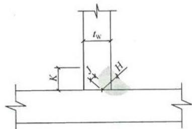  
图10.1.2 单面角焊缝

1 单面角焊缝适用于仅承受剪力的焊缝；  
2 单面角焊缝仅可用于承受静力荷载和间接承受动力荷载的、非露天和不接触强腐蚀介质的结构构件；  
3 焊脚尺寸、焊喉及最小根部熔深应符合表10.1.2的要求；  
4 经工艺评定合格的焊接参数、方法不得变更；  
5 柱与底板的连接，柱与牛腿的连接，梁端板的连接，吊车梁及支承局部吊挂荷载的吊架等，除非设计专门规定，不得采

用单面角焊缝；

6 由地震作用控制结构设计的门式刚架轻型房屋钢结构构件不得采用单面角焊缝连接。

表 10.1.2 单面角焊缝参数(mm)  

| 腹板厚度tw | 最小焊脚尺寸k | 有效厚度H | 最小根部熔深J(焊丝直径1.2~2.0) |
| --- | --- | --- | --- |
| 3 | 3.0 | 2.1 | 1.0 |
| 4 | 4.0 | 2.8 | 1.2 |
| 5 | 5.0 | 3.5 | 1.4 |
| 6 | 5.5 | 3.9 | 1.6 |
| 7 | 6.0 | 4.2 | 1.8 |
| 8 | 6.5 | 4.6 | 2.0 |

10.1.3 刚架构件的翼缘与端板或柱底板的连接，当翼缘厚度大于 $12\mathrm{mm}$ 时宜采用全熔透对接焊缝，并应符合现行国家标准《气焊、焊条电弧焊、气体保护焊和高能束焊的推荐坡口》GB/T985.1和《埋弧焊的推荐坡口》GB/T985.2的相关规定；其他情况宜采用等强连接的角焊缝或角对接组合焊缝，并应符合现行国家标准《钢结构焊接规范》GB50661的相关规定。

10.1.4 牛腿上、下翼缘与柱翼缘的焊接应采用坡口全熔透对接焊缝，焊缝等级为二级；牛腿腹板与柱翼缘板间的焊接应采用双面角焊缝，焊脚尺寸不应小于牛腿腹板厚度的0.7倍。

10.1.5 柱子在牛腿上、下翼缘 $600\mathrm{mm}$ 范围内，腹板与翼缘的连接焊缝应采用双面角焊缝。

10.1.6 当采用喇叭形焊缝时应符合下列规定：

1喇叭形焊缝可分为单边喇叭形焊缝（图10.1.6-1）和双边喇叭形焊缝（图10.1.6-2）。单边喇叭形焊缝的焊脚尺寸 $h_\mathrm{f}$ 不得小于被连接板的厚度。  
2 当连接板件的最小厚度不大于 $4\mathrm{mm}$ 时，喇叭形焊缝连接的强度应按对接焊缝计算，其焊缝的抗剪强度可按下式计算：

$$\tau = \frac{N}{t l_{\mathrm{w}}} \leqslant \beta f_{\mathrm{t}} \tag{10.1.6-1}$$

式中： $N$ ——轴心拉力或轴心压力设计值（N）；

$t$ ——被连接板件的最小厚度（mm）；

$l_{\mathrm{w}}$ ——焊缝有效长度（mm），等于焊缝长度扣除2倍焊脚尺寸；

$\beta$ 强度折减系数；当通过焊缝形心的作用力垂直于焊缝轴线方向时（图10.1.6-1a）， $\beta = 0.8$ 当通过焊缝形心的作用力平行于焊缝轴线方向时（图10.1.6-1b）， $\beta = 0.7$

$f_{\mathrm{t}}$ ——被连接板件钢材抗拉强度设计值（ $\mathrm{N} / \mathrm{mm}^2$ ）。

3 当连接板件的最小厚度大于 $4\mathrm{mm}$ 时，喇叭形焊缝连接的强度应按角焊缝计算。

1）单边喇叭形焊缝的抗剪强度可按下式计算：

$$\tau = \frac{N}{h_{\mathrm{f}} l_{\mathrm{w}}} \leqslant \beta f_{\mathrm{f}}^{\mathrm{w}} \tag{10.1.6-2}$$

2）双边喇叭形焊缝的抗剪强度可按下式计算：

$$\tau = \frac{N}{2 h_{\mathrm{f}} l_{\mathrm{w}}} \leqslant \beta f_{\mathrm{f}}^{\mathrm{w}} \tag{10.1.6-3}$$

式中： $h_\mathrm{f}$ ——焊脚尺寸（mm）；

$\beta$ ——强度折减系数；当通过焊缝形心的作用力垂直于焊缝轴线方向时（图10.1.6-1a）， $\beta = 0.75$ ；当通过焊缝形心的作用力平行于焊缝轴线方向时（图10.1.6-1b）， $\beta = 0.7$

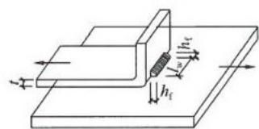  
(a) 作用力垂直于焊缝轴线方向

(b) 作用力平行于焊缝轴线方向  
图10.1.6-1 单边喇叭形焊缝  
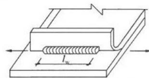  
$t$ —被连接板的最小厚度； $h_\mathrm{f}$ 一焊脚尺寸； $l_{\mathrm{w}}$ 一焊缝有效长度

$f_{\mathrm{f}}^{\mathrm{w}}$ ——角焊缝强度设计值（ $\mathrm{N / mm}^2$ ）。

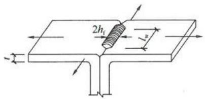  
图10.1.6-2双边喇叭形焊缝

$t$ —被连接板的最小厚度； $h_\mathrm{f}$ 一焊脚尺寸； $l_{\mathrm{w}}$ 一焊缝有效长度

4 在组合构件中，组合件间的喇叭形焊缝可采用断续焊缝。断续焊缝的长度不得小于 $8t$ 和 $40\mathrm{mm}$ ，断续焊缝间的净距不得大于 $15t$ （对受压构件）或 $30t$ （对受拉构件）， $t$ 为焊件的最小厚度。

## 10.2 节点设计

10.2.1 节点设计应传力简捷，构造合理，具有必要的延性；应便于焊接，避免应力集中和过大的约束应力；应便于加工及安装，容易就位和调整。  
10.2.2 刚架构件间的连接，可采用高强度螺栓端板连接。高强度螺栓直径应根据受力确定，可采用 $\mathrm{M}16\sim \mathrm{M}24$ 螺栓。高强度螺栓承压型连接可用于承受静力荷载和间接承受动力荷载的结构；重要结构或承受动力荷载的结构应采用高强度螺栓摩擦型连接；用来耗能的连接接头可采用承压型连接。  
10.2.3 门式刚架横梁与立柱连接节点，可采用端板竖放（图10.2.3a）、平放（图10.2.3b）和斜放（图10.2.3c）三种形式。斜梁与刚架柱连接节点的受拉侧，宜采用端板外伸式，与斜梁端板连接的柱的翼缘部位应与端板等厚；斜梁拼接时宜使端板与构件外边缘垂直（图10.2.3d），应采用外伸式连接，并使翼缘内外螺栓群中心与翼缘中心重合或接近。连接节点处的三角形短加劲板长边与短边之比宜大于 $1.5:1.0$ ，不满足时可增加板厚。

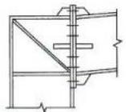  
(a)端板竖放

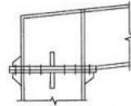  
(b)端板平放

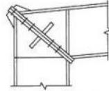  
(c)端板斜放

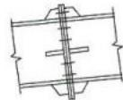  
(d) 斜梁拼接   
图10.2.3 刚架连接节点

10.2.4 端板螺栓宜成对布置。螺栓中心至翼缘板表面的距离，应满足拧紧螺栓时的施工要求，不宜小于 $45\mathrm{mm}$ 。螺栓端距不应小于2倍螺栓孔径；螺栓中距不应小于3倍螺栓孔径。当端板上两对螺栓间最大距离大于 $400\mathrm{mm}$ 时，应在端板中间增设一对螺栓。

10.2.5 当端板连接只承受轴向力和弯矩作用或剪力小于其抗滑移承载力时，端板表面可不作摩擦面处理。  
10.2.6 端板连接应按所受最大内力和按能够承受不小于较小被连接截面承载力的一半设计，并取两者的大值。  
10.2.7 端板连接节点设计应包括连接螺栓设计、端板厚度确定、节点域剪应力验算、端板螺栓处构件腹板强度、端板连接刚度验算，并应符合下列规定：

1 连接螺栓应按现行国家标准《钢结构设计规范》GB50017验算螺栓在拉力、剪力或拉剪共同作用下的强度。  
2 端板厚度 $t$ 应根据支承条件确定（图10.2.7-1），各种支承条件端板区格的厚度应分别按下列公式计算：

1）伸臂类区格

$$t \geqslant \sqrt{\frac{6 e_{\mathrm{f}} N_{\mathrm{t}}}{b f}} \tag{10.2.7-1}$$

2）无加劲肋类区格

$$t \geqslant \sqrt{\frac{3 e_{\mathrm{w}} N_{\mathrm{t}}}{(0 . 5 a + e_{\mathrm{w}}) f}} \tag{10.2.7-2}$$

3）两邻边支承类区格当端板外伸时

  
图10.2.7-1 端板支承条件

1—伸臂；2—两边；3—无肋；4—三边

$$t \geqslant \sqrt{\frac{6 e_{\mathrm{f}} e_{\mathrm{w}} N_{\mathrm{t}}}{\left[ e_{\mathrm{w}} b + 2 e_{\mathrm{f}} \left(e_{\mathrm{f}} + e_{\mathrm{w}}\right) \right] f}} \tag{10.2.7-3}$$

当端板平齐时

$$t \geqslant \sqrt{\frac{12 e_{\mathrm{f}} e_{\mathrm{w}} N_{\mathrm{t}}}{\left[ e_{\mathrm{w}} b + 4 e_{\mathrm{f}} \left(e_{\mathrm{f}} + e_{\mathrm{w}}\right) \right] f}} \tag{10.2.7-4}$$

4）三边支承类区格

$$t \geqslant \sqrt{\frac{6 e_{\mathrm{f}} e_{\mathrm{w}} N_{\mathrm{t}}}{\left[ e_{\mathrm{w}} (b + 2 b_{\mathrm{s}}) + 4 e_{\mathrm{f}}^{2} \right] f}} \tag{10.2.7-5}$$

式中： $N_{\mathrm{t}}$ ——一个高强度螺栓的受拉承载力设计值（ $\mathrm{N / mm^2}$ ）； $e_{\mathrm{w}}, e_{\mathrm{f}}$ ——分别为螺栓中心至腹板和翼缘板表面的距离（mm）；

$b_{\mathrm{v}}b_{\mathrm{s}}$ ——分别为端板和加劲肋板的宽度（ $\mathrm{mm}$ ）；

$a$ ——螺栓的间距（mm）；

$f$ ——端板钢材的抗拉强度设计值（ $\mathrm{N} / \mathrm{mm}^2$ ）。

5）端板厚度取各种支承条件计算确定的板厚最大值，但不应小于 $16\mathrm{mm}$ 及0.8倍的高强度螺栓直径。

3 门式刚架斜梁与柱相交的节点域（图10.2.7-2a），应按下式验算剪应力，当不满足式（10.2.7-6）要求时，应加厚腹板或设置斜加劲肋（图10.2.7-2b）。

  
(a)

  
(b)   
图10.2.7-2 节点域

1—节点域；2—使用斜向加劲肋补强的节点域

$$\tau = \frac{M}{d_{\mathrm{b}} d_{\mathrm{c}} t_{\mathrm{c}}} \leqslant f_{\mathrm{v}} \tag{10.2.7-6}$$

式中： $d_{\mathrm{c}},t_{\mathrm{c}}$ ——分别为节点域的宽度和厚度（ $\mathrm{mm}$ ）；

$d_{\mathrm{b}}$ ——斜梁端部高度或节点域高度（mm）；

$M$ ——节点承受的弯矩（ $\mathrm{N} \cdot \mathrm{mm}$ ），对多跨刚架中间柱处，应取两侧斜梁端弯矩的代数和或柱端弯矩； $f_{\mathrm{v}}$ ——节点域钢材的抗剪强度设计值（ $\mathrm{N} / \mathrm{mm}^2$ ）。

4 端板螺栓处构件腹板强度应按下列公式计算：

当 $N_{\mathrm{t2}} \leqslant 0.4P$ 时 $\frac{0.4P}{e_{\mathrm{w}}t_{\mathrm{w}}} \leqslant f$ (10.2.7-7)

当 $N_{\mathrm{t2}} > 0.4P$ 时 $\frac{N_{\mathrm{t2}}}{e_{\mathrm{w}}t_{\mathrm{w}}} \leqslant f$ (10.2.7-8)

式中： $N_{\mathrm{t2}}$ ——翼缘内第二排一个螺栓的轴向拉力设计值（ $\mathrm{N} / \mathrm{mm}^2$ ）；

$P$ ——1个高强度螺栓的预拉力设计值（N）；

$e_{\mathrm{w}}$ ——螺栓中心至腹板表面的距离（mm）；

$t_{\mathrm{w}}$ ——腹板厚度（mm）；

$f$ ——腹板钢材的抗拉强度设计值（ $\mathrm{N/mm^2}$ ）。

5 端板连接刚度应按下列规定进行验算：

1）梁柱连接节点刚度应满足下式要求：

$$R \geqslant 25 E I_{\mathrm{b}} / l_{\mathrm{b}} \tag{10.2.7-9}$$

式中： $R$ ——刚架梁柱转动刚度（ $\mathrm{N} \cdot \mathrm{mm}$ ）；

$I_{\mathrm{b}}$ ——刚架横梁跨间的平均截面惯性矩（ $\mathrm{mm}^4$ ）；

$l_{\mathrm{b}}$ ——刚架横梁跨度（mm），中柱为摇摆柱时，取摇摆柱与刚架柱距离的2倍；

$E$ ——钢材的弹性模量（ $\mathrm{N} / \mathrm{mm}^2$ ）。

2）梁柱转动刚度应按下列公式计算：

$$R = \frac{R_{1} R_{2}}{R_{1} + R_{2}} \tag{10.2.7-10}$$

$$R_{1} = G h_{1} d_{\mathrm{c}} t_{\mathrm{p}} + E d_{\mathrm{b}} A_{\mathrm{s t}} \cos^{2} \alpha \sin \alpha \tag{10.2.7-11}$$

$$R_{2} = \frac{6 E I_{\mathrm{e}} h_{1}^{2}}{1 . 1 e_{\mathrm{f}}^{3}} \tag{10.2.7-12}$$

式中： $R_{1}$ 与节点域剪切变形对应的刚度（ $\mathrm{N} \cdot \mathrm{mm}$ ）；

$R_{2}$ ——连接的弯曲刚度，包括端板弯曲、螺栓拉伸和柱翼缘弯曲所对应的刚度（ $\mathrm{N} \cdot \mathrm{mm}$ ）；

$h_1$ ——梁端翼缘板中心间的距离（mm）；

$t_{\mathrm{p}}$ ——柱节点域腹板厚度（mm）；

$I_{\mathrm{e}}$ ——端板惯性矩（ $\mathrm{mm}^4$ ）；

$e_{\mathrm{f}}$ ——端板外伸部分的螺栓中心到其加劲肋外边缘的距离（mm）；

$A_{\mathrm{st}}$ ——两条斜加劲肋的总截面积（ $\mathrm{mm}^2$ ）；

$\alpha$ ——斜加劲肋倾角 （$^{\circ})$

$G$ ——钢材的剪切模量（ $\mathrm{N} / \mathrm{mm}^2$ ）。

10.2.8 屋面梁与摇摆柱连接节点应设计成铰接节点，采用端板横放的顶接连接方式（图10.2.8）。  
10.2.9 吊车梁承受动力荷载，其构造和连接节点应符合下列规定：

  
(a)

  
(b)

  
(c)   
图10.2.8 屋面梁和摇摆柱连接节点

1 焊接吊车梁的翼缘板与腹板的拼接焊缝宜采用加引弧板的熔透对接焊缝，引弧板割去处应予打磨平整。焊接吊车梁的翼缘与腹板的连接焊缝严禁采用单面角焊缝。  
2 在焊接吊车梁或吊车桁架中，焊透的T形接头宜采用对接与角接组合焊缝（图10.2.9-1）。

  
图10.2.9-1 焊透的T形连接焊缝 $t_\mathrm{w}$ 一腹板厚度

3 焊接吊车梁的横向加劲肋不得与受拉翼缘相焊，但可与受压翼缘焊接。横向加劲肋宜在距受拉下翼缘 $50\mathrm{mm}\sim 100\mathrm{mm}$ 处断开（图10.2.9-2），其与腹板的连接焊缝不宜在肋下端起落弧。当吊车梁受拉翼缘与支撑相连时，不宜采用焊接。  
4吊车梁与制动梁的连接，可采用高强度螺栓摩擦型连接或焊接。吊车梁与刚架上柱的连接处宜设长圆孔（图10.2.9-3a)；吊车梁与牛腿处垫板宜采用焊接连接（图10.2.9-3b）；吊车梁之间应采用高强度螺栓连接。

图10.2.9-2 横向加劲肋设置  
(a)吊车梁与上柱连接   
（b）吊车梁与牛腿连接  
图10.2.9-3 吊车梁连接节点  
  
1—上柱；2—长圆孔；3—吊车梁中心线；4—吊车梁；5—垫板；6—牛腿

10.2.10 用于支承吊车梁的牛腿可做成等截面，也可做成变截面；采用变截面牛腿时，牛腿悬臂端截面高度不应小于根部高度的 $1 / 2$ （图10.2.10）。柱在牛腿上、下翼缘的相应位置处应设置横向加劲肋；在牛腿上翼缘吊车梁支座处应设置垫板，垫板与牛腿上翼缘连接应采用围焊；在吊车梁支座对应的牛腿腹板处应设置横向加劲肋。牛腿与柱连接处承受剪力 $V$ 和弯矩M的作用，其截面强度和连接焊缝应按现行国家标准《钢结构设计规范》

  
(a)等截面牛腿

  
(b)变截面牛腿   
图10.2.10 牛腿节点

GB50017的规定进行计算，弯矩 $M$ 应按下式计算。

$$M = V e \tag{10.2.10}$$

式中： $V$ —吊车梁传来的剪力（N）；

$e$ —吊车梁中心线离柱面的距离（mm）。

10.2.11 在设有夹层的结构中，夹层梁与柱可采用刚接，也可采用铰接（图10.2.11）。当采用刚接连接时，夹层梁翼缘与柱翼缘应采用全熔透焊接，腹板采用高强度螺栓与柱连接。柱与夹层梁上、下翼缘对应处应设置水平加劲肋。

10.2.12 抽柱处托架或托梁宜与柱采用铰接连接（图

  
(a)梁与边柱刚接

  
(b)梁与边柱铰接

  
(c)梁与中柱刚接

  
(d)梁与中柱铰接   
图10.2.11 夹层梁与柱连接节点

10.2.12a)。当托架或托梁挠度较大时，也可采用刚接连接，但柱应考虑由此引起的弯矩影响。屋面梁搁置在托架或托梁上宜采用铰接连接（图10.2.12b），当采用刚接，则托梁应选择抗扭性能较好的截面。托架或托梁连接尚应考虑屋面梁产生的水平推力。

  
图10.2.12 托梁连接节点 1—托梁

10.2.13 女儿墙立柱可直接焊于屋面梁上（图10.2.13），应按悬臂构件计算其内力，并应对女儿墙立柱与屋面梁连接处的焊缝进行计算。

  
(a)角部立柱连接

  
(b)中间立柱连接   
图10.2.13 女儿墙连接节点

10.2.14 气楼或天窗可直接焊于屋面梁或槽钢托梁上（图10.2.14），当气楼间距与屋面钢梁相同时，槽钢托梁可取消。气楼支架及其连接应进行计算。

  
图10.2.14 气楼大样

10.2.15 柱脚节点应符合下列规定：

1 门式刚架柱脚宜采用平板式铰接柱脚（图10.2.15-1）；

  
(a)两个锚栓柱脚

  
(b) 四个锚栓柱脚  
图10.2.15-1 铰接柱脚

1—柱；2—双螺母及垫板；3—底板；4—锚栓

也可采用刚接柱脚（图10.2.15-2）。

图10.2.15-2 刚接柱脚  
  
1—柱；2—加劲板；3—锚栓支承托座；4—底板；5—锚栓

2 计算带有柱间支撑的柱脚锚栓在风荷载作用下的上拔力时，应计入柱间支撑产生的最大竖向分力，且不考虑活荷载、雪荷载、积灰荷载和附加荷载影响，恒载分项系数应取1.0。计算柱脚锚栓的受拉承载力时，应采用螺纹处的有效截面面积。  
3 带靴梁的锚栓不宜受剪，柱底受剪承载力按底板与混凝土基础间的摩擦力取用，摩擦系数可取0.4，计算摩擦力时应考虑屋面风吸力产生的上拔力的影响。当剪力由不带靴梁的锚栓承担时，应将螺母、垫板与底板焊接，柱底的受剪承载力可按0.6倍的锚栓受剪承载力取用。当柱底水平剪力大于受剪承载力时，应设置抗剪键。  
4 柱脚锚栓应采用Q235钢或Q345钢制作。锚栓端部应设置弯钩或锚件，且应符合现行国家标准《混凝土结构设计规范》

GB50010的有关规定。锚栓的最小锚固长度 $l_{\mathrm{a}}$ （投影长度）应符合表10.2.15的规定，且不应小于 $200\mathrm{mm}$ 。锚栓直径 $d$ 不宜小于 $24\mathrm{mm}$ ，且应采用双螺母。

表 10.2.15 锚栓的最小锚固长度  

| 锚栓钢材 | 混凝土强度等级 | 混凝土强度等级 | 混凝土强度等级 | 混凝土强度等级 | 混凝土强度等级 | 混凝土强度等级 |
| --- | --- | --- | --- | --- | --- | --- |
| 锚栓钢材 | C25 | C30 | C35 | C40 | C45 | ≥C50 |
| Q235 | 20d | 18d | 16d | 15d | 14d | 14d |
| Q345 | 25d | 23d | 21d | 19d | 18d | 17d |

加微信308492256入土木精英群

土木吧

权威专家团队打造

中国土木人综合交流平台

微信扫描二维码查看更多资料

# 11 围护系统设计

## 11.1 屋面板和墙面板的设计

11.1.1 屋面及墙面板可选用镀层或涂层钢板、不锈钢板、铝镁锰合金板、钛锌板、铜板等金属板材或其他轻质材料板材。  
11.1.2 一般建筑用屋面及墙面彩色镀层压型钢板，其计算和构造应按现行国家标准《冷弯薄壁型钢结构技术规范》GB50018的规定执行。  
11.1.3 屋面板与檩条的连接方式可分为直立缝锁边连接型、扣合式连接型、螺钉连接型。  
11.1.4 屋面及墙面板的材料性能，应符合下列规定：

1 采用彩色镀层压型钢板的屋面及墙面板的基板力学性能应符合现行国家标准《建筑用压型钢板》GB/T12755的要求，基板屈服强度不应小于 $350\mathrm{N} / \mathrm{mm}^2$ ，对扣合式连接板基板屈服强度不应小于 $500\mathrm{N} / \mathrm{mm}^2$ 。  
2 采用热镀锌基板的镀锌量不应小于 $275\mathrm{g} / \mathrm{m}^2$ ，并应采用涂层；采用镀铝锌基板的镀铝锌量不应小于 $150\mathrm{g} / \mathrm{m}^2$ ，并应符合现行国家标准《彩色涂层钢板及钢带》GB/T12754及《连续热镀铝锌合金镀层钢板及钢带》GB/T14978的要求。  
11.1.5 屋面及墙面外板的基板厚度不应小于 $0.45\mathrm{mm}$ ，屋面及墙面内板的基板厚度不应小于 $0.35\mathrm{mm}$ 。  
11.1.6 当采用直立缝锁边连接或扣合式连接时，屋面板不应作为檩条的侧向支撑；当屋面板采用螺钉连接时，屋面板可作为檩条的侧向支撑。  
11.1.7 对房屋内部有自然采光要求时，可在金属板屋面设置点状或带状采光板。当采用带状采光板时，应采取释放温度变形的措施。

11.1.8 金属板材屋面板与相配套的屋面采光板连接时，必须在长度方向和宽度方向上使用有效的密封胶进行密封，连接方式宜和金属板材之间的连接方式一致。  
11.1.9 金属屋面以上附件的材质宜优先采用铝合金或不锈钢，与屋面板的连接要有可靠的防水措施。  
11.1.10 屋面板沿板长方向的搭接位置宜在屋面檩条上，搭接长度不应小于 $150\mathrm{mm}$ ，在搭接处应做防水处理；墙面板搭接长度不应小于 $120\mathrm{mm}$ 。  
11.1.11 屋面排水坡度不应小于表11.1.11的限值：

表 11.1.11 屋面排水坡度限值  

| 连接方式 | 屋面排水坡度 |
| --- | --- |
| 直立缝锁边连接板 | 1/30 |
| 扣合式连接板及螺钉连接板 | 1/20 |

11.1.12 在风荷载作用下，屋面板及墙面板与檩条之间连接的抗拔承载力应有可靠依据。

## 11.2 保温与隔热

11.2.1 门式刚架轻型房屋的屋面和墙面其保温隔热在满足节能环保要求的前提下，应选用导热系数较小的保温隔热材料，并应结合防水、防潮与防火要求进行设计。钢结构房屋的隔热应主要采用轻质纤维状保温材料和轻质有机发泡材料，墙面也可采用轻质砌块或加气混凝土板材。  
11.2.2 屋面和墙面的保温隔热构造应根据热工计算确定。保温隔热材料应相互匹配。  
11.2.3 屋面保温隔热可采用下列方法之一：

1 在压型钢板下设带铝箔防潮层的玻璃纤维毡或矿棉毡卷材；当防潮层未用纤维增强，尚应在底部设置钢丝网或玻璃纤维织物等具有抗拉能力的材料，以承托隔热材料的自重；

2 金属面复合夹芯板；

3 在双层压型钢板中间填充保温材料；  
4 在压型钢板上铺设刚性发泡保温材料，外铺热熔柔性防水卷材。

11.2.4 外墙保温隔热可采用下列方法之一：

1 采用与屋面相同的保温隔热做法；  
2 外侧采用压型钢板，内侧采用预制板、纸面石膏板或其他纤维板，中间填充保温材料；  
3 采用加气混凝土砌块或加气混凝土板，外侧涂装防水涂料；  
4 采用多孔砖等轻质砌体。

## 11.3 屋面排水设计

11.3.1 天沟截面形式可采用矩形或梯形。外天沟可用彩色金属镀层钢板制作，钢板厚度不应小于 $0.45\mathrm{mm}$ 。内天沟宜用不锈钢材料制作，钢板厚度不宜小于 $1.0\mathrm{mm}$ 。采用其他材料时应做可靠防腐处理，普通钢板天沟的钢板厚度不应小于 $3.0\mathrm{mm}$ 。

11.3.2 天沟应符合下列构造要求：

1 房屋的伸缩缝或沉降缝处的天沟应对应设置变形缝。  
2 屋面板应延伸入天沟。当采用内天沟时，屋面板与天沟连接应采取密封措施。  
3 内天沟应设置溢流口，溢流口顶低于天沟上檐 $50\mathrm{mm}\sim$ $100\mathrm{mm}$ 。当无法设置溢流口时，应适当增加落水管数量。  
4 屋面排水采用内排水时，集水盒外应有网罩防止垃圾堵塞落水管。

11.3.3 落水管的截面形式可采用圆形或方形截面，落水管材料可用金属镀层钢板、不锈钢、PVC等材料。集水盒与天沟应密封连接。落水管应与墙面结构或其他构件可靠连接。

# 12 钢结构防护

## 12.1 一般规定

12.1.1 门式刚架轻型房屋钢结构应进行防火与防腐设计。钢结构防腐设计应按结构构件的重要性、大气环境侵蚀性分类和防护层设计使用年限确定合理的防腐涂装设计方案。  
12.1.2 钢结构防护层设计使用年限不应低于5年；使用中难以维护的钢结构构件，防护层设计使用年限不应低于10年。  
12.1.3 钢结构设计文件中应注明钢结构定期检查和维护要求。

## 12.2 防火设计

12.2.1 钢结构的防火设计、钢结构构件的耐火极限应符合现行国家标准《建筑设计防火规范》GB50016的规定，合理确定房屋的防火类别与防火等级。  
12.2.2 防火涂料施工前，钢结构构件应按本规范第12.3节的规定进行除锈，并进行防锈底漆涂装。防火涂料应与底漆相容，并能结合良好。  
12.2.3 应根据钢结构构件的耐火极限确定防火涂层的形式、性能及厚度等要求。  
12.2.4 防火涂料的粘结强度、抗压强度应满足设计要求，检查方法应符合现行国家标准《建筑构件耐火试验方法》GB/T9978的规定。  
12.2.5 采用板材外包防火构造时，钢结构构件应按本规范第12.3节的规定进行除锈，并进行底漆和面漆涂装保护；板材外包防火构造的耐火性能，应符合现行国家标准《建筑设计防火规范》GB50016的有关规定或通过试验确定。  
12.2.6 当采用混凝土外包防火构造时，钢结构构件应进行除

锈，不应涂装防锈漆；其混凝土外包厚度及构造要求应符合现行国家标准《建筑设计防火规范》GB50016的有关规定。

12.2.7 对于直接承受振动作用的钢结构构件，采用防火厚型涂层或外包构造时，应采取构造补强措施。

## 12.3 涂装

12.3.1 设计时应对构件的基材种类、表面除锈等级、涂层结构、涂层厚度、涂装方法、使用状况以及预期耐蚀寿命等综合考虑，提出合理的除锈方法和涂装要求。

12.3.2 钢材表面原始锈蚀等级，除锈方法与等级要求应符合现行国家标准《涂覆涂料前钢材表面处理 表面清洁度的目视测定第1部分：未涂覆过的钢材表面和全面清除原有涂层后的钢材表面的锈蚀等级和处理等级》GB/T8923.1的规定。

12.3.3 处于弱腐蚀环境和中等腐蚀环境的承重构件，工厂制作涂装前，其表面应采用喷射或抛射除锈方法，除锈等级不应低于Sa2；现场采用手工和动力工具除锈方法，除锈等级不应低于St2。防锈漆的种类与钢材表面除锈等级要匹配，应符合表12.3.3的规定。

表 12.3.3 钢材表面最低除锈等级  

| 涂料品种 | 除锈等级 |
| --- | --- |
| 油性酚醛、醇酸等底漆或防锈漆 | St2 |
| 高氯化聚乙烯、氯化橡胶、氯磺化聚乙烯、 环氧树脂、聚氨酯等底漆或防锈漆 | Sa2 |
| 无机富锌、有机硅、过氯乙烯等底漆 | Sa2½ |

12.3.4 钢结构除锈和涂装工程应在构件制作质量经检验合格后进行。表面处理后到涂底漆的时间间隔不应超过 $4\mathrm{h}$ ，处理后的钢材表面不应有焊渣、灰尘、油污、水和毛刺等。  
12.3.5 应根据环境侵蚀性分类和钢结构涂装系统的设计使用年限合理选用涂料品种。

12.3.6 当环境腐蚀作用分类为弱腐蚀和中等腐蚀时，室内外钢结构漆膜干膜总厚度分别不宜小于 $125\mu \mathrm{m}$ 和 $150\mu \mathrm{m}$ ，位于室外和有特殊要求的部位，宜增加涂层厚度 $20\mu \mathrm{m} \sim 40\mu \mathrm{m}$ ，其中室内钢结构底漆厚度不宜小于 $50\mu \mathrm{m}$ ，室外钢结构底漆厚度不宜小于 $75\mu \mathrm{m}$ 。

12.3.7 涂装应在适宜的温度、湿度和清洁环境中进行。涂装固化温度应符合涂料产品说明书的要求；当产品说明书无要求时，涂装固化温度为 $5^{\circ}\mathrm{C} \sim 38^{\circ}\mathrm{C}$ 。施工环境相对湿度大于 $85\%$ 时不得涂装。漆膜固化时间与环境温度、相对湿度和涂料品种有关，每道涂层涂装后，表面至少在4h内不得被雨淋和沾污。  
12.3.8 涂层质量及厚度的检查方法应按现行国家标准《漆膜附着力测定法》GB1720或《色漆和清漆漆膜的划格试验》GB/T9286的规定执行，并应按构件数的 $1\%$ 抽查，且不应少于3件，每件检测3处。  
12.3.9 涂装完成后，构件的标志、标记和编号应清晰完整。  
12.3.10 涂装工程验收应包括在中间检查和竣工验收中。

## 12.4钢结构防腐其他要求

12.4.1 宜采用易于涂装和维护的实腹式或闭口构件截面形式，闭口截面应进行封闭；当采用缀合截面的杆件时，型钢间的空隙宽度应满足涂装施工和维护的要求。  
12.4.2 对于屋面檩条、墙梁、隅撑、拉条等冷弯薄壁构件，以及压型钢板，宜采用表面热浸镀锌或镀铝锌防腐。  
12.4.3 采用热浸镀锌等防护措施的连接件及构件，其防腐蚀要求不应低于主体结构，安装后宜采用与主体结构相同的防腐蚀措施，连接处的缝隙，处于不低于弱腐蚀环境时，应采取封闭措施。  
12.4.4 采用镀锌防腐时，室内钢构件表面双面镀锌量不应小于 $275\mathrm{g / m^2}$ ；室外钢构件表面双面镀锌量不应小于 $400\mathrm{g / m^2}$ 。  
12.4.5 不同金属材料接触的部位，应采取避免接触腐蚀的隔离措施。

# 13 制作

## 13.1 一般规定

13.1.1 钢材抽样复验、焊接材料检查验收、钢结构的制作应按现行国家标准《钢结构工程施工质量验收规范》GB50205和《钢结构工程施工规范》GB50755的规定执行。  
13.1.2 钢结构所采用的钢材、辅材、连接和涂装材料应具有质量证明书，并应符合设计文件和国家现行有关标准的规定。  
13.1.3 钢构件在制作前，应根据设计文件、施工详图的要求和制作单位的技术条件编制加工工艺文件，制定合理的工艺流程和建立质量保证体系。

## 13.2 钢构件加工

13.2.1 材料放样、号料、切割、标注时应根据设计和工艺要求进行。  
13.2.2 焊条、焊丝等焊接材料应根据材质、种类、规格分类堆放在干燥的焊材储藏室，保持完好整洁。  
13.2.3 焊接H型截面构件时，翼缘和腹板以及端板必须校正平直。焊接变形过大的构件，可采用冷作或局部加热方式矫正。  
13.2.4 过焊孔宜用锁口机加工，也可采用划线切割，其切割面的平面度、割纹深度及局部缺口深度均应符合现行国家标准《钢结构工程施工质量验收规范》GB50205的规定。  
13.2.5 较厚钢板上数量较多的相同孔组宜采用钻模的方式制孔，较薄钢板和冷弯薄壁型钢构件宜采用冲孔的方式制孔。冷弯薄壁型钢构件上两孔中心间距不得小于 $80\mathrm{mm}$   
13.2.6冷弯薄壁型钢的切割面和剪切面应无裂纹、锯齿和大于 $5\mathrm{mm}$ 的非设计缺角。冷弯薄壁型钢切割允许偏差应为 $\pm 2\mathrm{mm}$

## 13.3 构件外形尺寸

13.3.1 钢构件外观要求无明显弯曲变形，翼缘板、端部边缘平直。翼缘表面和腹板表面不应有明显的凹凸面、损伤和划痕，以及焊瘤、油污、泥砂、毛刺等。  
13.3.2 单层钢柱外形尺寸的偏差不应大于表13.3.2规定的允许偏差。

表 13.3.2 单层钢柱外形尺寸允许偏差  

| 序号 | 项 目 | 允许偏差(mm) | 图 例 |
| --- | --- | --- | --- |
| 1 | 柱底面到柱端与斜梁连接的最上一个安装孔的距离(H2) | ±H2/1500±5.0 | H2H1H1aH1d |
| 2 | 柱底面到牛腿支承面距离(H1) | ±H1/2000±4.0 | H2H1H1aH1d |
| 3 | 受力托板表面到第一个安装孔的距离(a) | ±1.0 | H2H1H1aH1d |
| 4 | 牛腿面的翘曲(d) | 2.0 | H2H1H1aH1d |
| 5 | 柱身扭转:牛腿处其他处 | 3.05.0 | H2H1H1aH1d |
| 6 | 柱截面的宽度和高度 | +3.0-2.0 | H2H1H1aH1d |
| 7 | 柱身弯曲矢高(f) | H/10009.0 | H2H1H1aH1d |

续表 13.3.2  

| 序号 | 项目 | 允许偏差(mm) | 图例 |
| --- | --- | --- | --- |
| 8 | 翼缘板对腹板的垂直度(d):连接处其他处 | 1.5b/1003.0 |  |
| 9 | 柱脚底板平面度 | 3.0 |  |
| 10 | 柱脚螺栓孔中心对柱轴线的距离(a) | 2.0 |  |

13.3.3 焊接实腹梁外形尺寸的偏差不应大于表13.3.3规定的允许偏差。

表 13.3.3 焊接实腹梁外形尺寸的允许偏差  

| 序号 | 项目 | 允许偏差(mm) | 图例 |
| --- | --- | --- | --- |
| 1 | 端板上靠近梁中心线第一个螺栓孔距离(a) | ±1.0 | a b a1 a2 |
| 2 | 端板与翼缘板倾斜度(a1,a2) h≤300;b≤200 h>300;b>200 | ±1.0 ±1.5 | a b a1 a2 |

续表 13.3.3  

| 序号 | 项 目 | 允许偏差(mm) | 图 例 |
| --- | --- | --- | --- |
| 3 | 梁上下翼缘中点偏离梁中心线(a1,a2) | ±3.0 | a1a2c h |
| 4 | 端板外角孔中心到梁中心距离(a3,a4) | ±1.5 | a1a2c h |
| 5 | 端板内凹弯曲度(c) | h/300 | a1a2c h |
| 6 | 翼缘板倾斜度(d)连接处:其他处: | 2.03.0 | b d e h |
| 7 | 梁截面的宽度和高度 | +3.0,-2.0 | b d e h |
| 8 | 腹板偏离翼缘中心线(e) | 2.0 | b d e h |
| 9 | 腹板局部不平直度(f)且:板厚(mm)6~1010~12≥14 | h/1005.04.03.0 | 一个波长f111 |
| 10 | 侧弯及拱弯(c1,c2)L≤9mL>9m | 6.09.0 | Lc1c2 |
| 11 | 梁的长度(L) | ±L/2000±10.0 | Lc1c2 |

续表 13.3.3  

| 序号 | 项目 | 允许偏差(mm) | 图例 |
| --- | --- | --- | --- |
| 12 | 扭曲 | h/25010.0 |  |

13.3.4 檩条和墙梁外形尺寸的偏差不应大于表13.3.4规定的允许偏差。

表 13.3.4 槭条和墙梁外形尺寸的允许偏差  

| 序号 | 项目 | 符号 | 允许偏差(mm) |
| --- | --- | --- | --- |
| 1 | 截面高度 | h | ±3 |
| 2 | 翼缘宽度 | b | +5-2 |
| 3 | 斜卷边或直角卷边长度 | a1 | +6-3 |
| 4 | 翼缘不平整 | θ1 | ±3° |
| 5 | 斜卷边角度 | θ2 | ±5° |
| 6 | 腹板孔中心至构件中线距离 | a2 | ±1.0 |
| 7 | 腹板孔中心至构件中心距离 | a3 | ±1.5 |
| 8 | 翼缘孔中心至构件中心距离 | a4 | ±3 |
| 9 | 翼缘孔中心至腹板外缘距离 | a5 | ±3 |
| 10 | 同一组内腹板横向孔间距离 | s1 | ±1.5 |
| 11 | 同一组内腹板纵向孔间距离 | s2 | ±1.5 |
| 12 | 两端螺栓群中心距离 | s3 | ±3 |
| 13 | 构件的长度 | L | ≤9m时±3,>9m时±4 |
| 14 | 弯曲度 | c | ≤L/500 |
| 15 | 最小厚度 | t | 按所用钢带的现行国家标准执行 |

续表 13.3.4  

| 序号 | 项目 | 项目 | 符号 | 允许偏差(mm) |
| --- | --- | --- | --- | --- |
| 16 | 示意图 | bθ1hθ2t a1a5 | hθ1a5 | bθ1t |
| 16 | 示意图 | a1a3sL | s2 | L |

13.3.5 压型金属板的偏差不应大于表13.3.5规定的允许偏差。

表 13.3.5 压型金属板允许偏差  

| 项目 | 项目 | 项目 | 允许偏差(mm) |
| --- | --- | --- | --- |
| 波距 | 波距 | 波距 | ±2.0 |
| 波高 | 压型板 | h≤70 | ±1.5 |
| 波高 | 压型板 | h>70 | ±2 |
| 覆盖宽度 | 波纹压型板 | h≤70 | -3,+9 |
| 覆盖宽度 | 波纹压型板 | h>70 | -2,+6 |
| 覆盖宽度 | 卷边锁缝压型板 | h≤70 | -2,+6 |
| 覆盖宽度 | 卷边锁缝压型板 | h>70 | -3,+9 |

续表 13.3.5  

| 项目 | 项目 | 允许偏差(mm) |
| --- | --- | --- |
| 板长 | 板长 | -3,+6 |
| 板横向剪断偏差 | 板横向剪断偏差 | 5 |
| 板端横向切断变形 | 板端横向切断变形 | 10 |
| 折弯面夹角 | 边缘折弯面夹角 | ±2° |
| 折弯面夹角 | 其他折弯面夹角 | ±3° |
| 边线及板肋侧弯 | 边线及板肋侧弯 | ≤L/500 |
| 板平整区和自由边不平直度(0.1m长度范围内偏离板边中心线) | 板平整区和自由边不平直度(0.1m长度范围内偏离板边中心线) | 2 |
| 最小厚度 | 最小厚度 | 按所用材料的现行国家标准执行 |

注： $L$ 为板的长度； $h$ 为板断面高度（mm）。

13.3.6 金属泛水和收边件的几何尺寸偏差不应大于表13.3.6规定的允许偏差。

表 13.3.6 金属泛水和收边件加工允许偏差  

| 检查项目 | 允许偏差(mm) |
| --- | --- |
| 长度 | ±6 |
| 横向剪断偏差 | 5 |
| 截面尺寸 | ±3 |
| 角度 | ±3° |
| 最小厚度 | 按所用材料的现行国家标准执行 |

## 13.4 构件焊缝

13.4.1钢结构构件的各种连接焊缝，应根据产品加工图样要求的焊缝质量等级选择相应的焊接工艺进行施焊，在产品加工时，同一断面上拼板焊缝间距不宜小于 $200\mathrm{mm}$   
13.4.2 焊接作业环境应符合现行国家标准《钢结构焊接规范》

GB50661的有关规定。

13.4.3 焊缝无损探伤应按国家现行标准《焊缝无损检测 超声检测 技术、检测等级和评定》GB/T11345和《钢结构超声波探伤及质量分级法》JG/T203的规定进行探伤。焊缝质量等级和探伤比例应符合表13.4.3的规定。

表 13.4.3 焊缝质量等级  

| 一级 | 二级 | 三级 |  |
| --- | --- | --- | --- |
| 评定等级 | II | III | - |
| 检验等级 | B级 | B级 | - |
| 探伤比例 | 100% | 20% | - |

注：探伤比例的计数方法：对同一类型的焊缝，工厂制作焊缝按每条焊缝计算百分比；现场安装焊缝按每一接头焊缝累计长度计算百分比；当探伤长度不小于 $200\mathrm{mm}$ 时，不应少于一条焊缝。

13.4.4 经探伤检验不合格的焊缝，除应将不合格部位的焊缝返修外，尚应加倍进行复检；当复检仍不合格时，应将该焊缝进行 $100\%$ 探伤检查。

加微信308492256入土木精英群

土木吧

权威专家团队打造

中国土木人综合交流平台

微信扫描二维码查看更多资料

# 14 运输、安装与验收

## 14.1 一般规定

14.1.1钢结构的运输与安装应按施工组织设计进行，运输与安装程序必须保证结构的稳定性和不导致永久性变形。  
14.1.2 钢构件安装前，应对构件的外形尺寸，螺栓孔位置及直径、连接件位置、焊缝、摩擦面处理、防腐涂层等进行详细检查，对构件的变形、缺陷，应在地面进行矫正、修复，合格后方可安装。  
14.1.3钢结构安装过程中，现场进行制孔、焊接、组装、涂装等工序的施工应符合现行国家标准《钢结构工程施工质量验收规范》GB50205的有关规定。  
14.1.4钢结构构件在运输、存放、吊装过程损坏的涂层，应先补涂底漆，再补涂面漆。  
14.1.5 钢构件在吊装前应清除表面上的油污、冰雪、泥沙和灰尘等杂物。

## 14.2 安装与校正

14.2.1钢结构安装前应对房屋的定位轴线，基础轴线和标高，地脚螺栓位置进行检查，并应进行基础复测和与基础施工方办理交接验收。  
14.2.2 刚架柱脚的锚栓应采用可靠方法定位，房屋的平面尺寸除应测量直角边长外，尚应测量对角线长度。在钢结构安装前，均应校对锚栓的空间位置，确保基础顶面的平面尺寸和标高符合设计要求。  
14.2.3 基础顶面直接作为柱的支承面和基础顶面预埋钢板或支座作为柱的支承面时，支承面、地脚螺栓（锚栓）的偏差不应大

于表14.2.3规定的允许偏差。

表 14.2.3 支承面、地脚螺栓 (锚栓) 的允许偏差  

| 项目 | 项目 | 允许偏差(mm) |
| --- | --- | --- |
| 支承面 | 标高 | ±3.0 |
| 支承面 | 水平度 | L/1000 |
| 地脚螺栓 | 螺栓中心偏差 | 5.0 |
| 地脚螺栓 | 螺栓露出长度 | +20.00 |
| 地脚螺栓 | 螺纹长度 | +20.00 |
| 预留孔中心偏差 | 预留孔中心偏差 | 10.0 |

注： $L$ 为柱脚底板的最大平面尺寸。

14.2.4 柱基础二次浇筑的预留空间，当柱脚铰接时不宜大于 $50\mathrm{mm}$ ，柱脚刚接时不宜大于 $100\mathrm{mm}$ 。柱脚安装时柱标高精度控制，可采用在底板下的地脚螺栓上加调整螺母的方法进行（图14.2.4）。

  
图14.2.4 柱脚的安装

1—地脚螺栓；2—止退螺母；3—紧固螺母；4—螺母垫板；

5—钢柱底板；6—底部螺母垫板；7—调整螺母；8—钢筋混凝土基础

14.2.5 门式刚架轻型房屋钢结构在安装过程中，应根据设计和施工工况要求，采取措施保证结构整体稳固性。

14.2.6 主构件的安装应符合下列规定：

1 安装顺序宜先从靠近山墙的有柱间支撑的两端刚架开始。在刚架安装完毕后应将其间的檩条、支撑、隅撑等全部装好，并检查其垂直度。以这两榀刚架为起点，向房屋另一端顺序安装。  
2 刚架安装宜先立柱子，将在地面组装好的斜梁吊装就位，并与柱连接。  
3钢结构安装在形成空间刚度单元并校正完毕后，应及时对柱底板和基础顶面的空隙采用细石混凝土二次浇筑。  
4 对跨度大、侧向刚度小的构件，在安装前要确定构件重心，应选择合理的吊点位置和吊具，对重要的构件和细长构件应进行吊装前的稳定性验算，并根据验算结果进行临时加固，构件安装过程中宜采取必要的牵拉、支撑、临时连接等措施。  
5 在安装过程中，应减少高空安装工作量。在起重设备能力允许的条件下，宜在地面组拼成扩大安装单元，对受力大的部位宜进行必要的固定，可增加铁扁担、滑轮组等辅助手段，应避免盲目冒险吊装。  
6 对大型构件的吊点应进行安装验算，使各部位产生的内力小于构件的承载力，不至于产生永久变形。

14.2.7 钢结构安装的校正应符合下列规定：

1 钢结构安装的测量和校正，应事前根据工程特点编制测量工艺和校正方案。  
2 刚架柱、梁、支撑等主要构件安装就位后，应立即校正。校正后，应立即进行永久性固定。

14.2.8 有可靠依据时，可利用已安装完成的钢结构吊装其他构件和设备。操作前应采取相应的保证措施。  
14.2.9 设计要求顶紧的节点，接触面应有 $70\%$ 的面紧贴，用 $0.3\mathrm{mm}$ 厚塞尺检查，可插入的面积之和不得大于顶紧节点总面积的 $30\%$ ，边缘最大间隙不应大于 $0.8\mathrm{mm}$ 。  
14.2.10 刚架柱安装的偏差不应大于表14.2.10规定的允许偏差。

表 14.2.10 刚架柱安装的允许偏差  

| 序号 | 项目 | 项目 | 项目 | 允许偏差(mm) | 图示 |
| --- | --- | --- | --- | --- | --- |
| 1 | 柱脚底座中心线对定位轴线的偏移(△) | 柱脚底座中心线对定位轴线的偏移(△) | 柱脚底座中心线对定位轴线的偏移(△) | 5.0 | 基准点 |
| 2 | 柱基准标高 | 有吊车梁的柱 | 有吊车梁的柱 | +3.0-5.0 | 基准点 |
| 3 | 柱基准标高 | 无吊车梁的柱 | 无吊车梁的柱 | +5.0-8.0 | 基准点 |
| 4 | 挠曲矢高 | 挠曲矢高 | 挠曲矢高 | H/100010.0 |  |
| 5 | 柱轴线垂直度(△) | 单层柱 | H≤12m | 10.0 | ΔHΔ |
| 6 | 柱轴线垂直度(△) | 单层柱 | H>12m | H/100020.0 | ΔHΔ |
| 7 | 柱轴线垂直度(△) | 多层柱 | 底层柱 | 10.0 | ΔHΔ |
| 8 | 柱轴线垂直度(△) | 多层柱 | 柱全高 | 20.0 | ΔHΔ |
| 9 | 柱顶标高(△) | 柱顶标高(△) | 柱顶标高(△) | ≤±10.0 |  |

14.2.11 刚架斜梁安装的偏差不应大于表14.2.11规定的允许偏差。

表 14.2.11 刚架斜梁安装的允许偏差  

| 项 目 | 项 目 | 允许偏差(mm) |
| --- | --- | --- |
| 梁跨中垂直度 | 梁跨中垂直度 | H/500 |
| 梁翘曲 | 侧向 | L/1000 |
| 梁翘曲 | 垂直方向 | +10.0,-5.0 |
| 相邻梁接头部位 | 中心错位 | 3.0 |
| 相邻梁接头部位 | 顶面高差 | 2.0 |
| 相邻梁顶面高差 | 支承处 | 1.0 |
| 相邻梁顶面高差 | 其他处 | L/500 |

注： $H$ 为梁跨中断面高度， $L$ 为相邻梁跨度的最大值。

14.2.12 吊车梁安装的偏差不应大于表14.2.12规定的允许偏差。

表 14.2.12 吊车梁安装的允许偏差  

| 序号 | 项 目 | 允许偏差(mm) | 图 例 |
| --- | --- | --- | --- |
| 1 | 梁的跨中垂直度(△) | h/500 | Δh |
| 2 | 侧向弯曲失高 | L/150010.0 |  |
| 3 | 垂直上拱矢高 | 10.0 |  |

续表14.2.12   

| 序号 | 项 目 | 允许偏差(mm) | 图 例 |  |
| --- | --- | --- | --- | --- |
| 4 | 两端支座中心位移(△):安装在钢柱上时,对牛腿中心的偏移 | 5.0 | Δ 1 2 L L L L L L L L L L L L L L L L L L L L L L L L L L L L L L L L L L L L L L L L L L L L L L L L L L 1 2 3 4 5 6 7 8 | Δ 1 2 3 4 5 6 7 8 9 10 11 12 13 14 15 16 17 18 19 20 21 22 23 24 25 26 27 28 29 30 31 32 33 34 35 36 37 38 39 40 41 42 43 44 45 46 47 48 49 50 51 52 53 54 55 56 57 58 59 60 61 62 63 64 65 66 67 68 69 70 71 72 73 74 75 76 77 78 79 80 81 82 83 84 85 86 87 88 89 90 91 92 93 94 95 96 97 98 99 100 101 102 103 104 105 106 107 108 109 110 111 112 113 114 115 116 117 118 119 120 121 122 123 124 125 126 127 128 129 130 131 132 133 134 135 136 137 138 139 140 141 142 143 144 145 146 147 148 149 150 151 152 153 154 155 156 157 158 159 160 161 162 163 164 165 166 167 168 169 170 171 172 173 174 175 176 177 178 179 180 181 182 183 184 185 186 187 188 189 190 191 192 193 194 195 196 197 198 199 200 201 202 203 204 205 206 207 208 209 210 211 212 213 214 215 216 217 218 219 220 221 222 223 224 225 226 227 228 229 230 231 232 233 234 235 236 237 238 239 240 241 242 243 244 245 246 247 248 249 250 251 252 253 254 255 256 257 258 259 260 261 262 263 264 265 266 267 268 269 270 271 272 273 274 275 276 277 278 279 280 281 282 283 284 285 286 287 288 289 290 291 292 293 294 295 296 297 298 299 300 301 302 303 304 305 306 307 308 309 310 311 312 313 314 315 316 317 318 319 320 321 322 323 324 325 326 327 328 329 330 331 332 333 334 335 336 337 338 339 340 341 342 343 344 345 346 347 348 349 350 351 352 353 354 355 356 357 358 359 360 361 362 363 364 365 366 367 368 369 370 371 372 373 374 375 376 377 378 379 380 381 382 383 384 385 386 387 388 389 390 391 392 393 394 395 396 397 398 399 400 401 402 403 404 405 406 407 408 409 410 411 412 413 414 415 416 417 418 419 420 421 422 423 424 425 426 427 428 429 430 431 432 433 434 435 436 437 438 439 440 441 442 443 444 445 446 447 448 449 450 451 452 453 454 455 456 457 458 459 460 461 462 463 464 465 466 467 468 469 470 471 472 473 474 475 476 477 478 479 480 481 482 483 484 485 486 487 488 489 490 491 492 493 494 495 496 497 498 499 500 501 502 503 504 505 506 507 508 509 510 511 512 513 514 515 516 517 518 519 520 521 522 523 524 525 526 527 528 529 530 531 532 533 534 535 536 537 538 539 540 541 542 543 544 545 546 547 548 549 550 551 552 553 554 555 556 557 558 559 560 561 562 563 564 565 566 567 568 569 570 571 572 573 574 575 576 577 578 579 580 581 582 583 584 585 586 587 588 589 590 591 592 593 594 595 596 597 598 599 600 601 602 603 604 605 606 607 608 609 610 611 612 613 614 615 616 617 618 619 620 621 622 623 624 625 626 627 628 629 630 631 632 633 634 635 636 637 638 639 640 641 642 643 644 645 646 647 648 649 650 651 652 653 654 655 656 657 658 659 660 661 662 663 664 665 666 667 668 669 670 671 672 673 674 675 676 677 678 679 680 681 682 683 684 685 686 687 688 689 690 691 692 693 694 695 696 697 698 699 700 701 702 703 704 705 706 707 708 709 710 711 712 713 714 715 716 717 718 719 720 721 722 723 724 725 726 727 728 729 730 731 732 733 734 735 736 737 738 739 740 741 742 743 744 745 746 747 748 749 750 751 752 753 754 755 756 757 758 759 760 761 762 763 764 765 766 767 768 769 770 771 772 773 774 775 776 777 778 779 780 781 782 783 784 785 786 787 788 789 790 791 792 793 794 795 796 797 798 799 800 801 802 803 804 805 806 807 808 809 810 811 812 813 814 815 816 817 818 819 820 821 822 823 824 825 826 827 828 829 830 831 832 833 834 835 836 837 838 839 840 841 842 843 844 845 846 847 848 849 850 851 852 853 854 855 856 857 858 859 860 861 862 863 864 865 866 867 868 869 870 871 872 873 874 875 876 877 878 879 880 881 882 883 884 885 886 887 888 889 890 891 892 893 894 895 896 897 898 899 900 901 902 903 904 905 906 907 908 909 910 911 912 913 914 915 916 917 918 919 920 921 922 923 924 925 926 927 928 929 930 931 932 933 934 935 936 937 938 939 940 941 942 943 944 945 946 947 948 949 950 951 952 953 954 955 956 957 958 959 960 961 962 963 964 965 966 967 968 969 970 971 972 973 974 975 976 977 978 979 980 981 982 983 984 985 986 987 988 989 990 991 992 993 994 995 996 997 998 999 |

续表 14.2.12  

| 序号 | 项目 | 允许偏差(mm) | 图例 |
| --- | --- | --- | --- |
| 9 | 相邻两吊车梁接头部位错位(△):中心错位顶面高差 | 2.01.0 |  |

14.2.13 主钢结构安装调整好后，应张紧柱间支撑、屋面支撑等受拉支撑构件。

## 14.3 高强度螺栓

14.3.1 对进入现场的高强度螺栓连接副应进行复检，复检的数据应符合现行国家标准《钢结构工程施工质量验收规范》GB50205的规定，对于大六角头高强度螺栓连接副的扭矩系数复检数据除应符合规定外，尚可作为施拧的参数。  
14.3.2 对于高强度螺栓摩擦型连接，应按现行国家标准《钢结构工程施工质量验收规范》GB50205的规定和设计文件要求对摩擦面的抗滑移系数进行测试。  
14.3.3 安装时使用临时螺栓的数量，应能承受构件自重和连接校正时外力作用，每个节点上穿入的数量不宜少于2个。连接用高强度螺栓不得兼作临时螺栓。  
14.3.4 高强度螺栓的安装严禁强行敲打入孔，扩孔可采用合适的铰刀及专用扩孔工具进行，修正后的最大孔径应小于1.2倍螺栓直径，不应采用气割扩孔。  
14.3.5 高强度螺栓连接的钢板接触面应平整，接触面间隙小于1.0mm时可不处理； $1.0\mathrm{mm}\sim 3.0\mathrm{mm}$ 时，应将高出的一侧磨成 $1:10$ 的斜面，打磨方向应与受力方向垂直；大于 $3.0\mathrm{mm}$ 的间隙应加垫板，垫板两面的处理方法应与连接板摩擦面处理方法相同。
14.3.6 高强度螺栓连接副的拧紧应分为初拧、复拧、终拧，宜按由螺栓群节点中心位置顺序向外缘拧紧的方法施拧，初拧、复拧、终拧应在24h内完成。  
14.3.7 大六角头高强度螺栓施工扭矩的验收，可先在螺杆和螺母的侧面划一直线，然后将螺母拧松约 $60^{\circ}$ ，再用扭矩扳手重新拧紧，使端线重合，此时测得的扭矩应在施工前测得扭矩 $\pm 10\%$ 范围内方为合格。  
14.3.8 每个节点扭矩抽检螺栓连接副数应为 $10\%$ ，且不应少于一个螺栓连接副。抽验不符合要求的，应重新抽样 $10\%$ 检查，当仍不合格，欠拧、漏拧的应补拧，超拧的应更换螺栓。扭矩检查应在施工 $1\mathrm{h}$ 后， $24\mathrm{h}$ 内完成。

## 14.4 焊接及其他紧固件

14.4.1 安装定位焊接应符合下列规定：

1 现场焊接应由具有焊接合格证的焊工操作，严禁无合格证者施焊；  
2 采用的焊接材料型号应与焊件材质相匹配；  
3 焊缝厚度不应超过设计焊缝高度的2/3，且不应大于 $8\mathrm{mm}$   
4 焊缝长度不宜小于 $25\mathrm{mm}$

14.4.2 普通螺栓连接应符合下列规定：

1 每个螺栓一端不得垫两个以上垫圈，不得用大螺母代替垫圈；  
2 螺栓拧紧后，尾部外露螺纹不得少于2个螺距；  
3 螺栓孔不应采用气割扩孔。  
14.4.3 当构件的连接为焊接和高强度螺栓混用的连接方式时，

应按先栓接后焊接的顺序施工。

14.4.4 自钻自攻螺钉、拉铆钉、射钉等与连接钢板应紧固密贴，外观排列整齐。其规格尺寸应与被连接钢板相匹配，其间距、边距等应符合设计要求。

14.4.5 射钉、拉铆钉、地脚锚栓应根据制造厂商的相关技术文件和设计要求进行工程质量验收。

## 14.5 槽条和墙梁的安装

14.5.1 根据安装单元的划分，主构件安装完毕后应立即进行檩条、墙梁等次构件的安装。  
14.5.2 除最初安装的两榀刚架外，其余刚架间檩条、墙梁和檐檩等的螺栓均应在校准后再拧紧。  
14.5.3 檬条和墙梁安装时，应及时设置撑杆或拉条并拉紧，但不应将檩条和墙梁拉弯。  
14.5.4 檬条和墙梁等冷弯薄壁型钢构件吊装时应采取适当措施，防止产生永久变形，并应垫好绳扣与构件的接触部位。  
14.5.5 不得利用已安装就位的檩条和墙梁构件起吊其他重物。

## 14.6 围护系统安装

14.6.1 在安装墙板和屋面板时，墙梁和檩条应保持平直。  
14.6.2 隔热材料应平整铺设，两端应固定到结构主体上，采用单面隔汽层时，隔汽层应置于建筑物的内侧。隔汽层的纵向和横向搭接处应粘接或缝合。位于端部的毡材应利用隔汽层反折封闭。当隔汽层材料不能承担隔热材料自重时，应在隔汽层下铺设支承网。  
14.6.3 固定式屋面板与檩条连接及墙板与墙梁连接时，螺钉中心距不宜大于 $300\mathrm{mm}$ 。房屋端部与屋面板端头连接，螺钉的间距宜加密。屋面板侧边搭接处钉距可适当放大，墙板侧边搭接处钉距可比屋面板侧边搭接处进一步加大。  
14.6.4 在屋面板的纵横方向搭接处，应连续设置密封胶条。檐

口处的搭接边除设置胶条外，尚应设置与屋面板剖面形状相同的堵头。

14.6.5 在角部、屋脊、檐口、屋面板孔口或突出物周围，应设置具有良好密封性能和外观的泛水板或包边板。  
14.6.6 安装压型钢板屋面时，应采取有效措施将施工荷载分布至较大面积，防止因施工集中荷载造成屋面板局部压屈。  
14.6.7 在屋面上施工时，应采用安全绳等安全措施，必要时应采用安全网。  
14.6.8 压型钢板铺设要注意常年风向，板肋搭接应与常年风向相背。   
14.6.9 每安装5块～6块压型钢板，应检查板两端的平整度，当有误差时，应及时调整。  
14.6.10 压型钢板安装的偏差不应大于表14.6.10规定的允许偏差。

表 14.6.10 压型钢板安装的允许偏差  

| 项目 | 允许偏差(mm) |
| --- | --- |
| 在梁上压型钢板相邻列的错位 | 10.0 |
| 檐口处相邻两块压型钢板端部的错位 | 5.0 |
| 压型钢板波纹线对屋脊的垂直度 | L/1000 |
| 墙面板波纹线的垂直度 | H/1000 |
| 墙面包角板的垂直度 | H/1000 |
| 墙面相邻两块压型钢板下端的错位 | 5.0 |

注： $H$ 为房屋高度； $L$ 为压型钢板长度。

## 14.7 验收

14.7.1 根据现行国家标准《建筑工程施工质量验收统一标准》GB50300的规定，钢结构应按分部工程竣工验收，大型钢结构工程可划分成若干个子分部工程进行竣工验收。  
14.7.2 钢结构分部工程合格质量标准应符合下列规定：

1 各分项工程质量均应符合合格质量标准；  
2 质量控制资料和文件应完整；  
3 各项检验应符合现行国家标准《钢结构工程施工质量验收规范》GB50205的规定。

14.7.3钢结构分部工程竣工验收时，应提供下列文件和记录：

1钢结构工程竣工图纸及相关设计文件；  
2 施工现场质量管理检查记录；  
3有关安全及功能的检验和见证检测项目检查记录；  
4 有关观感质量检验项目检查记录；  
5 分部工程所含各分项工程质量验收记录；  
6 分项工程所含各检验批质量验收记录；  
7 强制性条文检验项目检查记录及证明文件；  
8 隐蔽工程检验项目检查验收记录；  
9 原材料、成品质量合格证明文件、中文标志及性能检测报告；  
10 不合格项的处理记录及验收记录；  
11 重大质量、技术问题实施方案及验收记录；  
12 其他有关文件和记录。

14.7.4 钢结构工程质量验收记录应符合下列规定：

1 施工现场质量管理检查记录应按现行国家标准《建筑工程施工质量验收统一标准》GB50300的有关规定执行；  
2分项工程验收记录应按现行国家标准《建筑工程施工质量验收统一标准》GB50300的有关规定执行；  
3分项工程验收批验收记录应按现行国家标准《钢结构工程施工质量验收规范》GB50205的有关规定执行；  
4分部（子分部）工程验收记录应按现行国家标准《建筑工程施工质量验收统一标准》GB50300的有关规定执行。

# 附录A 刚架柱的计算长度

A.0.1 小端铰接的变截面门式刚架柱有侧移弹性屈曲临界荷载及计算长度系数可按下列公式计算：

$$N_{\mathrm{c r}} = \frac{\pi^{2} E I_{1}}{(\mu H)^{2}} \tag{A.0.1-1}$$

$$\mu = 2 \left(\frac{I_{1}}{I_{0}}\right)^{0. 145} \sqrt{1 + \frac{0 . 38}{K}} \tag{A.0.1-2}$$

$$K = \frac{K_{\mathrm{z}}}{6 i_{\mathrm{c l}}} \left(\frac{I_{1}}{I_{0}}\right)^{0. 29} \tag{A.0.1-3}$$

式中： $\mu$ ——变截面柱换算成以大端截面为准的等截面柱的计算长度系数；

$I_0$ ——立柱小端截面的惯性矩 （$\mathrm{mm}^4)$ ；

$I_{1}$ ——立柱大端截面惯性矩（ $\mathrm{mm}^4$ ）；

$H$ ——楔形变截面柱的高度（mm）；

$K_{z}$ ——梁对柱子的转动约束（ $\mathrm{N} \cdot \mathrm{mm}$ ）；

$i_{\mathrm{cl}}$ ——柱的线刚度 （$\mathrm{N} \cdot \mathrm{mm})$ ， $i_{\mathrm{cl}} = EI_1 / H$ 。

A.0.2 确定刚架梁对刚架柱的转动约束，应符合下列规定：

1 在梁的两端都与柱子刚接时，假设梁的变形形式使得反弯点出现在梁的跨中，取出半跨梁，远端铰支，在近端施加弯矩 （$M)$ ，求出近端的转角（ $\theta$ ），应由下式计算转动约束：

$$K_{z} = \frac{M}{\theta} \tag{A.0.2}$$

2 当刚架梁远端简支，或刚架梁的远端是摇摆柱时，本规范第A.0.3条中的 $s$ 应为全跨的梁长；  
3 刚架梁近端与柱子简支，转动约束应为0。

A.0.3 楔形变截面梁对刚架柱的转动约束，应按刚架梁变截面情况分别按下列公式计算：

1 刚架梁为一段变截面（图A.0.3-1）：

$$K_{z} = 3 i_{1} \left(\frac{I_{0}}{I_{1}}\right)^{0. 2} \tag{A.0.3-1}$$

$$i_{1} = \frac{E I_{1}}{s} \tag{A.0.3-2}$$

式中： $I_{0}$ ——变截面梁跨中小端截面的惯性矩（ $\mathrm{mm}^4$ ）；

$I_{1}$ ——变截面梁檐口大端截面的惯性矩（ $\mathrm{mm}^4$ ）；

$s$ ——变截面梁的斜长（mm）。

  
图A.0.3-1 刚架梁为一段变截面及其转动刚度计算模型

2 刚架梁为二段变截面（图A.0.3-2）：

$$\frac{1}{K_{z}} = \frac{1}{K_{11 , 1}} + \frac{2 s_{2}}{s} \frac{1}{K_{12 , 1}} + \left(\frac{s_{2}}{s}\right)^{2} \frac{1}{K_{22 , 1}} + \left(\frac{s_{2}}{s}\right)^{2} \frac{1}{K_{22 , 2}}$$

(A.0.3-3)

$K_{11,1} = 3i_{11}R_1^{0.2}$ (A.0.3-4)

$K_{12,1} = 6i_{11}R_1^{0.44}$ (A.0.3-5)

$K_{22,1} = 3i_{11}R_1^{0.712}$ (A.0.3-6)

$K_{22,2} = 3i_{21}R_2^{0.712}$ (A.0.3-7)

$R_{1} = \frac{I_{10}}{I_{11}}$ (A.0.3-8)

$R_{2} = \frac{I_{20}}{I_{21}}$ (A.0.3-9)

$i_{11} = \frac{EI_{11}}{s_1}$ (A.0.3-10)

$i_{21} = \frac{EI_{21}}{s_2}$ (A.0.3-11)

$s = s_1 + s_2$ (A.0.3-12)

式中： $R_{1}$ 与立柱相连的第1变截面梁段，远端截面惯性矩与近端截面惯性矩之比；

$R_{2}$ ——第2变截面梁段，近端截面惯性矩与远端截面惯性矩之比；

$s_1$ 与立柱相连的第1段变截面梁的斜长（mm）；

$s_2$ ——第2段变截面梁的斜长（mm）；

$s$ ——变截面梁的斜长（mm）；

$i_{11}$ ——以大端截面惯性矩计算的线刚度（ $\mathrm{N} \cdot \mathrm{mm}$ ）；

$i_{21}$ ——以第2段远端截面惯性矩计算的线刚度（N·mm）；

$I_{10}, I_{11}, I_{20}, I_{21}$ ——变截面梁惯性矩（ $\mathrm{mm}^4$ ）（图A.0.3-2）。

  
图A.0.3-2 刚架梁为二段变截面及其转动刚度计算模型

3 刚架梁为三段变截面（图A.0.3-3）：

$$\frac{1}{K_{z}} = \frac{1}{K_{11 , 1}} + 2 \left(1 - \frac{s_{1}}{s}\right) \frac{1}{K_{12 , 1}} + \left(1 - \frac{s_{1}}{s}\right)^{2} \left(\frac{1}{K_{22 , 1}} + \frac{1}{3 i_{2}}\right)$$

$$+ \frac{2 s_{3} (s_{2} + s_{3})}{s^{2}} \frac{1}{6 i_{2}} + \left(\frac{s_{3}}{s}\right)^{2} \left(\frac{1}{3 i_{2}} + \frac{1}{K_{22 , 3}}\right) \tag{A.0.3-13}$$

$$K_{11, 1} = 3 i_{11} R_{1}^{0. 2} \tag{A.0.3-14}$$

$$K_{12, 1} = 6 i_{11} R_{1}^{0. 44} \tag{A.0.3-15}$$

$$K_{22, 1} = 3 i_{11} R_{1}^{0. 712} \tag{A.0.3-16}$$

$$K_{22, 3} = 3 i_{31} R_{3}^{0. 712} \tag{A.0.3-17}$$

$$R_{1} = \frac{I_{10}}{I_{11}}, R_{3} = \frac{I_{30}}{I_{31}} \tag{A.0.3-18}$$

$$i_{11} = \frac{E I_{11}}{s_{1}}, i_{2} = \frac{E I_{2}}{s_{2}}, i_{31} = \frac{E I_{31}}{s_{3}} \tag{A.0.3-19}$$

式中： $I_{10}, I_{11}, I_{2}, I_{30}, I_{31}$ ——变截面梁惯性矩 （$\mathrm{mm}^4)$ （图A.0.3-3）。

  
图A.0.3-3 刚架梁为三段变截面及其转动刚度计算模型

A.0.4 当为阶形柱或两段柱子时，下柱和上柱的计算长度应按下列公式确定：

下柱计算长度系数

$$\mu_{1} = \sqrt{\gamma} \cdot \mu_{2} \tag{A.0.4-1}$$

上柱计算长度系数

$$\mu_{2} = \sqrt{\frac{6 K_{1} K_{2} + 4 (K_{1} + K_{2}) + 1 . 52}{6 K_{1} K_{2} + K_{1} + K_{2}}} \tag{A.0.4-2}$$

$$K_{2} = \frac{K_{z 2}}{6 i_{c 2}} \tag{A.0.4-3}$$

$$K_{1} = \frac{K_{z 1}}{6 i_{c 2}} + \frac{b + \sqrt{b^{2} - 4 a c}}{12 a} \tag{A.0.4-4}$$

$$a = \left(a_{1} b_{1} \gamma - a_{2} b_{2}\right) i_{c 2}^{2} \tag{A.0.4-5}$$

$$b = \left(K_{z 0} i_{\mathrm{c l}} \gamma b_{1} - \gamma c_{2} a_{1} - i_{\mathrm{c l}} a_{3} b_{2} + c_{1} a_{2}\right) i_{\mathrm{c l}} (A. 0. 4 - 6)$$

$$c = i_{\mathrm{c l}} \left(c_{1} a_{3} - K_{z 0} c_{2} \gamma\right) \tag{A.0.4-7}$$

$$a_{1} = K_{\mathrm{z 0}} + i_{\mathrm{c l}} \tag{A.0.4-8}$$

$$a_{2} = K_{\mathrm{z 0}} + 4 i_{\mathrm{c l}} \tag{A.0.4-9}$$

$$a_{3} = 4 K_{z 0} + 9. 12 i_{\mathrm{c l}} \tag{A.0.4-10}$$

$$b_{1} = K_{z 2} + 4 i_{c 2} \tag{A.0.4-11}$$

$$b_{2} = K_{z 2} + i_{c 2} \tag{A.0.4-12}$$

$$c_{1} = K_{z 1} K_{z 2} + \left(K_{z 1} + K_{z 2}\right) i_{c 2} \tag{A.0.4-13}$$

$$c_{2} = K_{z 1} K_{z 2} + 4 \left(K_{z 1} + K_{z 2}\right) i_{c 2} + 9. 12 i_{c 2}^{2} (A. 0. 4 - 14)$$

$$\gamma = \frac{N_{2} H_{2}}{N_{1} H_{1}} \frac{i_{\mathrm{c l}}}{i_{\mathrm{c 2}}} \tag{A.0.4-15}$$

$$i_{\mathrm{c l}} = \frac{E I_{11}}{H_{1}} \left(\frac{I_{10}}{I_{11}}\right)^{0. 29} \tag{A.0.4-16}$$

$$i_{c 2} = \frac{E I_{2}}{H_{2}} \tag{A.0.4-17}$$

式中： $K_{z0}$ ——柱脚对柱子提供的转动约束（ $\mathrm{N} \cdot \mathrm{mm}$ ）；柱脚铰支时， $K_{z0} = 0.5i_{\mathrm{cl}}$ ；柱脚固定时， $K_{z0} = 50i_{\mathrm{cl}}$

$K_{\mathrm{z1}}$ ——中间梁（低跨屋面梁，夹层梁）对柱子提供的转动约束 （$\mathrm{N} \cdot \mathrm{mm})$ ，按本规范第A.0.3条确定；

$K_{z2}$ ——屋面梁对上柱柱顶的转动约束（ $\mathrm{N} \cdot \mathrm{mm}$ ），按本规范第A.0.3条确定；

$i_{\mathrm{c1}}$ ——下柱为变截面时，下柱线刚度 （$\mathrm{N} \cdot \mathrm{mm})$ ； $i_{\mathrm{c2}}$ ——上柱线刚度 （$\mathrm{N} \cdot \mathrm{mm})$ ；

$I_{1}, I_{2}, I_{10}, I_{11}$ ——柱子的惯性矩（ $\mathrm{mm}^4$ ）（图A.0.4）；

$N_{1}, N_{2}$ ——分别为下柱和上柱的轴力（N）；

$H_{1}, H_{2}$ ——分别为下柱和上柱的高度（ $\mathrm{mm}$ ）。

A.0.5当为二阶柱或三段柱子时，下柱、中柱和上柱的计算长度，应按不同的计算模型确定（图A.0.5），或按下列公式计算：

$$\mu_{2} = \sqrt{\frac{6 K_{1} K_{2} + 4 (K_{1} + K_{2}) + 1 . 52}{6 K_{1} K_{2} + K_{1} + K_{2}}} \tag{A.0.5-1}$$

$$\mu_{1} = \sqrt{\gamma_{1}} \cdot \mu_{2} \tag{A.0.5-2}$$

  
图A.0.4 变截面阶形刚架柱的计算模型  
图A.0.5 三阶刚架柱的计算模型

$$\mu_{3} = \sqrt{\gamma_{3}} \cdot \mu_{2} \tag{A.0.5-3}$$

中段柱： $K_{1} = K_{\mathrm{b1}} - \frac{\eta}{6},K_{2} = K_{\mathrm{b2}} - \frac{\xi}{6}$ (A.0.5-4)

$\xi, \eta$ 由下列公式给出的三组解中之一确定，且三组解中满足式（A.0.5-7，A.0.5-8，A.0.5-9）的 $K_{1}$ ， $K_{2}$ 为唯一有效解。

$$\eta_{j} = 2 \sqrt [ 3 ]{r} \cos \left[ \frac{\theta + 2 (j - 2) \pi}{3} \right] - \frac{b}{3 a} \quad (j = 1, 2, 3) \tag{A.0.5-5}$$

$$\xi_{j} = \frac{6 \left(e_{3} \eta + e_{4}\right)}{e_{1} \eta + e_{2}} (j = 1, 2, 3) \tag{A.0.5-6}$$

$$K_{1} > - \frac{1}{6} \tag{A.0.5-7}$$

$$K_{2} > - \frac{1}{6} \tag{A.0.5-8}$$

$$6 K_{1} K_{2} + K_{1} + K_{2} > 0 \tag{A.0.5-9}$$

其中： $r = \sqrt{\frac{m^3}{27}}$ ； $\theta = \arccos \frac{-n}{\sqrt{-4m^3 / 27}}$ ； $\Delta = \frac{n^2}{4} +\frac{m^3}{27}$ ； $m =$

$$\frac{3 a c - b^{2}}{3 a^{2}}; n = \frac{2 b^{3} - 9 a b c + 27 a^{2} d}{27 a^{3}}; a = \gamma_{1} a_{2} g_{4} - a_{1} g_{1}; b =$$

$$\gamma_{1} a_{2} g_{5} + 6 \gamma_{1} K_{\mathrm{b} 0} K_{\mathrm{c} 1} g_{4} - a_{1} g_{2} - 6 K_{\mathrm{c l}} a_{3} g_{1}; c = \gamma_{1} a_{2} g_{6} +$$

$$6 \gamma_{1} K_{\mathrm{b} 0} K_{\mathrm{c l}} g_{5} - a_{1} g_{3} - 6 K_{\mathrm{c l}} a_{3} g_{2}; d = 6 K_{\mathrm{c l}} \left(\gamma_{1} K_{\mathrm{b} 0} g_{6} - a_{3} g_{3}\right); e_{1}$$

$$= a_{2} b_{1} \gamma_{1} - a_{1} b_{2} \gamma_{3}; e_{2} = 6 K_{\mathrm{c l}} \left(K_{\mathrm{b} 0} \gamma_{1} b_{1} - a_{3} b_{2} \gamma_{3}\right); e_{3} =$$

$$K_{c 3} \left(\gamma_{3} K_{b 3} a_{1} - b_{3} a_{2} \gamma_{1}\right); e_{4} = 6 K_{c 1} K_{c 3} \left(\gamma_{3} K_{b 3} a_{3} - \gamma_{1} K_{b 0} b_{3}\right); a_{1} =$$

$$6 K_{\mathrm{b} 0} + 4 K_{\mathrm{c l}}; a_{2} = 6 K_{\mathrm{b} 0} + K_{\mathrm{c l}}; a_{3} = 4 K_{\mathrm{b} 0} + 1. 52 K_{\mathrm{c l}}; b_{1} = 6 K_{\mathrm{b} 3}$$

$$+ 4 K_{c 3}; b_{2} = 6 K_{b 3} + K_{c 3}; b_{3} = 4 K_{b 3} + 1. 52 K_{c 3}; c_{1} = 6 K_{b 1} + 4;$$

$$c_{2} = 6 K_{\mathrm{b l}} + 1; d_{1} = 6 K_{\mathrm{b 2}} + 4; d_{2} = 6 K_{\mathrm{b 2}} + 1; f_{1} = 6 K_{\mathrm{b l}} K_{\mathrm{b 2}} +$$

$$K_{\mathrm{b} 2} + K_{\mathrm{b} 1}; f_{2} = 6 K_{\mathrm{b} 1} K_{\mathrm{b} 2} + 4 \left(K_{\mathrm{b} 2} + K_{\mathrm{b} 1}\right) + 1. 52;$$

$$g_{1} = e_{3} - \frac{1}{6} d_{2} e_{1}; g_{2} = f_{1} e_{1} - c_{2} e_{3} - \frac{1}{6} d_{2} e_{2} + e_{4}; g_{3} = f_{1} e_{2}$$

$$- c_{2} e_{4}; g_{4} = e_{3} - \frac{1}{6} d_{1} e_{1}; g_{5} = f_{2} e_{1} - c_{1} e_{3} - \frac{1}{6} d_{1} e_{2} + e_{4}; g_{6} =$$

$$f_{2} e_{2} - c_{1} e_{4}; K_{\mathrm{b 0}} = \frac{K_{\mathrm{z 0}}}{6 i_{\mathrm{c 2}}}; K_{\mathrm{b 1}} = \frac{K_{\mathrm{z 1}}}{6 i_{\mathrm{c 2}}}; K_{\mathrm{b 2}} = \frac{K_{\mathrm{z 2}}}{6 i_{\mathrm{c 2}}}; K_{\mathrm{b 3}} = \frac{K_{\mathrm{z 3}}}{6 i_{\mathrm{c 2}}}; K_{\mathrm{c 1}}$$

$$= \frac{i_{\mathrm{c l}}}{i_{\mathrm{c 2}}} ; K_{\mathrm{c 3}} = \frac{i_{\mathrm{c 3}}}{i_{\mathrm{c 2}}} ; \gamma_{1} = \frac{N_{2} H_{2}}{N_{1} H_{1}} \frac{i_{\mathrm{c l}}}{i_{\mathrm{c 2}}} ; \gamma_{3} = \frac{N_{2} H_{2}}{N_{3} H_{3}} \frac{i_{\mathrm{c 3}}}{i_{\mathrm{c 2}}} ; i_{\mathrm{c l}} = \frac{E I_{1}}{H_{1}}; i_{\mathrm{c 2}}$$

$$= \frac{E I_{2}}{H_{2}}; i_{\mathrm{c} 3} = \frac{E I_{3}}{H_{3}};$$

式中： $\mu_1, \mu_2, \mu_3$ ——分别为下段柱、中段柱和上段柱的计算长度系数；

$i_{\mathrm{c1}}, i_{\mathrm{c2}}, i_{\mathrm{c3}}$ ——分别为下段柱、中段柱和上段柱的线刚度 （$\mathrm{N} \cdot \mathrm{mm})$ 。

A.0.6 当有摇摆柱（图A.0.6）时，确定梁对刚架柱的转动约束时应假设梁远端铰支在摇摆柱的柱顶，且确定的框架柱的计算

长度系数应乘以放大系数 $\eta$ 。

  
图A.0.6 带有摇摆柱的框架

1 放大系数 $\eta$ 应按下列公式计算：

$$\eta = \sqrt{1 + \frac{\sum N_{j} / h_{j}}{1 . 1 \sum P_{i} / H_{i}}} \tag{A.0.6-1}$$

$$N_{j} = \frac{1}{h_{j}} \sum_{k} N_{\mathrm{j k}} h_{\mathrm{j k}} \tag{A.0.6-2}$$

$$P_{i} = \frac{1}{H_{i}} \sum_{k} P_{\mathrm{i k}} H_{\mathrm{i k}} \tag{A.0.6-3}$$

式中： $N_{j}$ ——换算到柱顶的摇摆柱的轴压力（N）；

$N_{\mathrm{jk}}$ 、 $h_\mathrm{jk}$ 第 $j$ 个摇摆柱上第 $k$ 个竖向荷载（N）和其作用的高度（mm）；

$P_{i}$ ——换算到柱顶的框架柱的轴压力（N）；

$P_{\mathrm{ik}}$ 、 $H_{\mathrm{ik}}$ ——第 $i$ 个柱子上第 $k$ 个竖向荷载和其作用的高度（mm）；

$h_j$ ——第 $j$ 个摇摆柱高度（ $\mathrm{mm}$ ）；

$H_{i}$ ——第 $i$ 个刚架柱高度（ $\mathrm{mm}$ ）。

2 当摇摆柱的柱子中间无竖向荷载时，摇摆柱的计算长度系数取1.0；  
3 当摇摆柱的柱子中间作用有竖向荷载时，可考虑上、下柱段的相互作用，决定各柱段的计算长度系数。

A.0.7 采用二阶分析时，柱的计算长度应符合下列规定：

1 等截面单段柱的计算长度系数可取 1.0；  
2有吊车厂房，二阶或三阶柱各柱段的计算长度系数，应

按柱顶无侧移，柱顶铰接的模型确定。有夹层或高低跨，各柱段的计算长度系数可取1.0；

3 柱脚铰接的单段变截面柱子的计算长度系数 $\mu_{\mathrm{r}}$ 应按下列公式计算：

$$\mu_{r} = \frac{1 + 0 . 035 \gamma}{1 + 0 . 54 \gamma} \sqrt{\frac{I_{1}}{I_{0}}} \tag{A.0.7-1}$$

$$\gamma = \frac{h_{1}}{h_{0}} - 1 \tag{A.0.7-2}$$

式中： $\gamma$ ——变截面柱的楔率；

$h_0,h_1$ ——分别是小端和大端截面的高度（ $\mathrm{mm}$ ）；

$I_{0}, I_{1}$ ——分别是小端和大端截面的惯性矩（ $\mathrm{mm}^4$ ）。

A.0.8 单层多跨房屋，当各跨屋面梁的标高无突变（无高低跨）时，可考虑各柱相互支援作用，采用修正的计算长度系数进行刚架柱的平面内稳定计算。修正的计算长度系数应按下列公式计算。当计算值小于1.0时，应取1.0。

$$\mu_{j}^{\prime} = \frac{\pi}{h_{j}} \sqrt{\frac{E I_{\mathrm{c j}} \left[ 1 . 2 \sum \left(P_{i} / H_{i}\right) + \sum \left(N_{\mathrm{k}} / h_{\mathrm{k}}\right) \right]}{P_{j} \cdot K}} \tag{A.0.8-1}$$

$$\mu_{j}^{\prime} = \frac{\pi}{h_{j}} \sqrt{\frac{E I_{\mathrm{c j}} \left[ 1 . 2 \sum \left(P_{i} / H_{i}\right) + \sum \left(N_{\mathrm{k}} / h_{\mathrm{k}}\right) \right]}{1 . 2 P_{j} \sum \left(P_{\mathrm{c r j}} / H_{j}\right)}} \tag{A.0.8-2}$$

式中： $N_{\mathrm{k}},h_{\mathrm{k}}$ ——分别为摇摆柱上的轴力（N）和高度（mm）；

$K$ ——在檐口高度作用水平力求得的刚架抗侧刚度 （$\mathrm{N} / \mathrm{mm})$

$P_{\mathrm{crj}}$ ——按传统方法计算的框架柱的临界荷载，其计算长度系数可按式（A.0.1-2）计算。

A.0.9 按本附录确定的刚架柱计算长度系数适用于屋面坡度不大于 $1 / 5$ 的情况，超过此值时应考虑横梁轴向力的不利影响。

本规范用词说明

1 为便于在执行本规范条文时区别对待，对于要求严格程度不同的用词说明如下：

（1）表示很严格，非这样做不可的：  
正面词采用“必须”，反面词采用“严禁”；  
（2）表示严格，在正常情况下均应这样做的：  
正面词采用“应”，反面词采用“不应”或“不得”；  
3）表示允许稍有选择，在条件许可时首先应这样做的：  
正面词采用“宜”，反面词采用“不宜”；  
4）表示有选择，在一定条件下可以这样做的，采用“可”。  
2 条文中指明应按其他标准执行的写法为：“应符合……的规定”或“应按……执行”。

引用标准名录

1 《建筑结构荷载规范》GB50009  
2 《混凝土结构设计规范》GB50010  
3 《建筑抗震设计规范》GB50011  
4《建筑设计防火规范》GB50016  
5 《钢结构设计规范》GB50017  
6 《冷弯薄壁型钢结构技术规范》GB50018  
7 《工业建筑防腐蚀设计规范》GB50046  
8 《钢结构工程施工质量验收规范》GB50205  
9 《建筑工程抗震设防分类标准》GB50223  
10 《建筑工程施工质量验收统一标准》GB50300  
11 《钢结构焊接规范》GB50661  
12 《钢结构工程施工规范》GB50755  
13 《碳素结构钢》GB/T700  
14《气焊、焊条电弧焊、气体保护焊和高能束焊的推荐坡口》GB/T985.1   
15 《埋弧焊的推荐坡口》GB/T985.2  
16 《钢结构用高强度大六角头螺栓》GB/T1228  
17 《钢结构用高强度大六角螺母》GB/T1229  
18 《钢结构用高强度垫圈》GB/T1230  
19《钢结构用高强度大六角头螺栓、大六角螺母、垫圈技术条件》GB/T1231  
20 《低合金高强度结构钢》GB/T1591  
21 《漆膜附着力测定法》GB1720  
22 《连续热镀锌钢板及钢带》GB/T2518  
23 《紧固件机械性能 螺栓、螺钉和螺柱》GB/T3098.1

24 《钢结构用扭剪型高强度螺栓连接副》GB/T3632  
25 《非合金钢及细晶粒钢焊条》GB/T5117  
26 《热强钢焊条》GB/T5118  
27 《开槽盘头自攻螺钉》GB/T5282  
28 《开槽沉头自攻螺钉》GB/T5283  
29 《开槽半沉头自攻螺钉》GB/T5284  
30 《六角头自攻螺钉》GB/T5285  
31 《埋弧焊用碳钢焊丝和焊剂》GB/T5293  
32 《六角头螺栓C级》GB/T5780  
33 《六角头螺栓》GB/T5782  
34《气体保护电弧焊用碳钢、低合金钢焊丝》GB/T8110  
35 《涂覆涂料前钢材表面处理 表面清洁度的目视测定 第1部分：未涂覆过的钢材表面和全面清除原有涂层后的钢材表面的锈蚀等级和处理等级》GB/T8923.1  
36 《色漆和清漆 漆膜的划格试验》GB/T9286  
37 《建筑构件耐火试验方法》GB/T9978.1～GB/T9978.9  
38 《碳钢药芯焊丝》GB/T10045  
39 《焊缝无损检测 超声检测 技术、检测等级和评定》GB/T11345  
40 《埋弧焊用低合金钢焊丝和焊剂》GB/T12470  
41《封闭型平圆头抽芯铆钉》GB/T12615.1～GB/T12615.4   
42 《封闭型沉头抽芯铆钉》GB/T12616.1  
43 《开口型沉头抽芯铆钉》GB/T12617.1～GB/T12617.5  
44《开口型平圆头抽芯铆钉》GB/T12618.1～GB/T12618.6   
45 《彩色涂层钢板及钢带》GB/T12754  
46 《建筑用压型钢板》GB/T12755

47 《熔化焊用钢丝》GB/T14957  
48 《连续热镀铝锌合金镀层钢板及钢带》GB/T14978  
49 《十字槽盘头自钻自攻螺钉》GB/T15856.1  
50 《十字槽沉头自钻自攻螺钉》GB/T15856.2  
51 《十字槽半沉头自钻自攻螺钉》GB/T15856.3  
52 《六角法兰面自钻自攻螺钉》GB/T15856.4  
53 《六角凸缘自钻自攻螺钉》GB/T15856.5  
54 《低合金钢药芯焊丝》GB/T17493  
55 《射钉》GB/T18981  
56 《钢结构超声波探伤及质量分级法》JG/T203  
57 《标准件用碳素钢热轧圆钢及盘条》YB/T4155

加微信308492256入土木精英群

土木吧

权威专家团队打造

中国土木人综合交流平台

微信扫描二维码查看更多资料

中华人民共和国国家标准

门式刚架轻型房屋钢结构技术规范

GB51022-2015

# 条文说明

制订说明

《门式刚架轻型房屋钢结构技术规范》GB51022-2015，经住房和城乡建设部2015年12月3日以第991号公告批准、发布。

本规范在编制过程中，编制组进行了广泛的调查研究，认真总结了工程实践经验，参考了有关国际标准和国外先进标准，开展了多项专题研究，并以多种方式广泛征求了有关单位和专家的意见，对主要问题进行了反复讨论、协调，最终确定各项技术参数和技术要求。

为了便于广大设计、施工、科研、学校等单位有关人员在使用本规范时正确理解和执行条文规定，《门式刚架轻型房屋钢结构技术规范》编制组按章、节、条顺序编制了本规范的条文说明。对条文规定的目的、依据及执行中需注意的有关事项进行了说明，还着重对强制性条文的强制性理由作了解释。但是，本条文说明不具备与标准正文同等的法律效力，仅供使用者作为理解和把握规范规定的参考。

# 1总则

1.0.2 本条明确了本规范的适用范围。房屋高度不大于 $18\mathrm{m}$ 高宽比小于1，主要是针对本规范的风荷载系数的要求而规定的。本规范的风荷载系数主要是根据美国金属房屋制造商协会（MBMA）低矮房屋的风压系数借鉴而来。MBMA的《金属房屋系统手册2006》中的系数就是对高度不大于 $18\mathrm{m}$ ，高宽比小于1的单层房屋经风洞试验的结果。

悬挂式吊车的起重量通常不大于3t，当有需要并采取可靠技术措施时，起重量允许不大于5t。

考虑到此种结构构件的截面较薄，因此不适用于有强腐蚀介质作用的房屋。强腐蚀介质的划分可参照现行国家标准《工业建筑防腐蚀设计规范》GB50046的规定。

房屋高度超过 $18\mathrm{m}$ 的类似建筑，构件的强度、稳定性设计可参照本规范。

# 2 术语和符号

“门式刚架轻型房屋”是房屋高度不大于 $18\mathrm{m}$ ，房屋高宽比小于1，采用变截面或等截面实腹刚架，围护系统采用轻型钢屋面和轻型外墙（有时也采用非嵌砌砌体墙），设置起重量不超过20t的轻中级工作制桥式吊车或悬挂式吊车的钢结构单层房屋。

“摇摆柱”是指上、下端铰接的轴心受压构件，用于刚架的中间支承可有效地减小刚架梁在竖向荷载下的挠度和弯矩，但不能提供侧向刚度，不能用于支承吊车梁。

“隅撑”是用于支承斜梁和柱受压翼缘的支撑构件，应根据设计方案设置。单面设置的隅撑受压时对斜梁产生不利影响，应将该处隅撑截面适当加强。隅撑截面应符合规范的规定。隅撑应采用直径不小于M14的单个螺栓连接。

加微信308492256入土木精英群

土木吧权威专家团队打造中国土木人综合交流平台微信扫描二维码查看更多资料

# 3 基本设计规定

## 3.1 设计原则

3.1.4 由于单层门式刚架轻型房屋钢结构的自重较小，设计经验和振动台试验表明，当抗震设防烈度为7度（ $0.1g$ ）及以下时，一般不需要做抗震验算；当为7度（ $0.15g$ ）及以上时，横向刚架和纵向框架均需进行抗震验算。当设有夹层或有与门式刚架相连接的附属房屋时，应进行抗震验算。国家标准《建筑抗震设计规范》GB50011-2010考虑到轻型房屋钢结构的特点，在第9.2.1条中指出：单层的轻型钢结构厂房的抗震设计，应符合专门的规定。

3.1.5 承载力抗震调整系数 $\gamma_{\mathrm{RE}}$ 对强度破坏取0.85，稳定破坏取0.9，是鉴于门式刚架轻型房屋钢结构构件的延性一般，塑性发展有限。

## 3.2 材料选用

3.2.1 因Q235A级钢的含碳量不能保证焊接要求，故焊接结构不宜采用，只能用于非焊接结构。  
3.2.4 本条推荐LQ550钢板用于屋面板或墙面板，是参考了现行行业标准《低层冷弯薄壁型钢房屋建筑技术规程》JGJ227的规定给出的。对LQ550级钢材，由于厚度较薄，不会采用端面承压的构造，因此不再给出端面承压的强度设计值。其他级别的钢板，可参照Q235、Q345钢材采用相应的强度设计值。  
3.2.5 本规范第3.2.4条规定的强度设计值是结构处于正常工作情况下求得的，对一些工作情况处于不利的结构构件或连接，其强度设计值应乘以相应的折减系数。几种情况同时存在，相应的折减系数应连乘是指有几种情况存在，那么这几种情况的折减

系数应连乘。

## 3.3 变形规定

3.3.1 门式刚架轻型房屋钢结构的使用经验表明，门式刚架平面内的柱顶位移的限值，对设有桥式吊车的房屋应该严格，从而拟定了限值。

研究表明，由于平板柱脚的嵌固性、围护结构的蒙皮效应以及结构空间作用等因素的影响，门式刚架柱顶的实际位移一般小于其计算值。对于铰接柱脚刚架，若按位移限值设计，刚架柱顶实际位移仅为规定值的 $50\%$ 左右。

3.3.2 为减小跨度大于 $30\mathrm{m}$ 的钢斜梁的竖向挠度，建议应起拱。

## 3.4构造要求

3.4.1 根据目前国内材料供应情况，檩条壁厚不宜小于 $1.5\mathrm{mm}$ ；根据我国目前制作和安装的一般水平，刚架构件的腹板厚度不宜小于 $4\mathrm{mm}$ ；由技术条件较好的企业制作，当有可靠的质量保证措施时，允许采用 $3\mathrm{mm}$ 。  
3.4.2 轻型房屋钢结构受压构件的长细比，可比普通钢结构的规定适当放宽，表3.4.2-1所列数值系参照国外的有关规定和现行国家标准《钢结构设计规范》GB50017的规定拟定的。  
3.4.3 本条是针对轻型房屋钢结构由地震作用组合的效应控制结构设计时，根据轻型钢结构的特点采取的相应抗震构造措施。除本条外，还可采取将构件之间的连接尽量采用螺栓连接；刚性系杆的布置应确保梁或柱截面的受压侧得到可靠的侧向支撑等措施。

# 4 荷载和荷载组合的效应

## 4.1 一般规定

4.1.2 吊挂的管道、桥架、屋顶风机等，工程上常称为“吊挂荷载”或“附加荷载”。当其作用的位置和（或）作用时间具有不确定性时，宜按活荷载考虑。当作用位置固定不变，也可按恒荷载考虑。  
4.1.3 本条所指活荷载仅指屋面施工及检修时的人员荷载，当屋面均布活荷载的标准值取 $0.5\mathrm{kN} / \mathrm{m}^2$ 时，可不考虑其最不利布置。

## 4.2 风荷载

4.2.1 本次制定增加了开式结构的风荷载系数。本规范未做规定的，设计者应按现行国家标准《建筑结构荷载规范》GB50009的规定采用，也可借鉴国外规范。本条风荷载系数采用了MBMA手册中规定的风荷载系数，该系数已考虑内、外风压力最大值的组合。按照现行国家标准《建筑结构荷载规范》GB50009的规定，对风荷载比较敏感的结构，基本风压应适当提高。门式刚架轻型房屋钢结构属于对风荷载比较敏感的结构，因此，计算主钢架时， $\beta$ 系数取1.1是对基本风压的适当提高；计算檩条、墙梁和屋面板及其连接时取1.5，是考虑阵风作用的要求。通过 $\beta$ 系数使本规范的风荷载和现行国家标准《建筑结构荷载规范》GB50009的风荷载基本协调一致。

本规范将 $\mu_{\mathrm{w}}$ 称为风荷载系数，以示与现行国家标准《建筑结构荷载规范》GB50009中风荷载体型系数 $\mu_{s}$ 的区别。

4.2.2 本条是借鉴美国金属房屋制造商协会MBMA《金属房屋系统手册2006》拟定的。本条给出了本规范所规定风荷载的适

用条件。必须注意，对于本规范未做规定的房屋类型、体型和房屋高度，如采用现行国家标准《建筑结构荷载规范》GB50009规定的风荷载体型系数 $\mu_{\mathrm{s}}$ 则阵风系数也应配套采用相应的规定值。

由于风可以从任意方向吹来，内部压力系数应根据最不利原则与外部压力系数组合，从而得到风荷载的控制工况，也就是本条给出的风荷载系数。通过“鼓风效应”和“吸风效应”分别与外部压力系数组合得到两种工况：一种为“鼓风效应”（+i）与外部压力系数组合，另一种为“吸风效应”（-i）与外部压力系数组合。结构设计时，两种工况均应考虑，并取用最不利工况下的荷载。这种低矮房屋屋面风吸力较大，这是本规范与现行国家标准《建筑结构荷载规范》GB50009最大的不同点，檩条在风吸力作用下有可能产生下翼缘失稳，在设计时应予以注意。

4.2.3 构件风荷载系数是按构件的有效风荷载面积确定的，但结构受力分析需按实际受荷面积计算。

## 4.3 屋面雪荷载

4.3.1 按照现行国家标准《建筑结构荷载规范》GB50009的规定，对雪荷载敏感的结构，应采用100年重现期的雪压。门式刚架轻型房屋钢结构屋盖较轻，属于对雪荷载敏感的结构。雪荷载经常是控制荷载，极端雪荷载作用下容易造成结构整体破坏，后果特别严重，基本雪压应适当提高。因此，本条明确了设计门式刚架轻型房屋钢结构时应按100年重现期的雪压采用。  
4.3.2 本条选择了3种典型的屋面形式，按现行国家标准《建筑结构荷载规范》GB50009的规定给出了屋面积雪分布系数。其他类型的屋面形式可参照现行国家标准《建筑结构荷载规范》GB50009的规定采用。  
4.3.3 轻型钢结构房屋自重轻，对雪荷载较为敏感。近几年雪灾调查表明，雪荷载的堆积是造成破坏的主要原因。从实际积雪分布形态看，与美国MBMA规定的计算较为接近，实例证明参

照美国MBMA进行雪荷载设计的结构在雪灾中表现良好，故本次制定主要参考了美国规范对雪荷载设计的相关规定。

为减小雪灾事故，轻型钢结构房屋宜采用单坡或双坡屋面的形式；对高低跨屋面，宜采用较小的屋面坡度；减少女儿墙、屋面突出物等，以减低积雪危害。

4.3.4 本条是按现行国家标准《建筑结构荷载规范》GB50009的条文说明等相关资料拟定的。  
4.3.5 设计时原则上应按表 4.3.2 中给出的积雪分布情况，分别计算荷载效应值，并按最不利的情况确定结构构件的截面，但这样的设计计算工作量较大，根据设计经验允许设计人员按本条规定进行简化设计。

## 4.4地震作用

4.4.2 本条是按现行国家标准《建筑抗震设计规范》GB50011的规定，结合门式刚架轻型房屋钢结构的特点拟定的。

## 4.5 荷载组合和地震作用组合的效应

4.5.2、4.5.3 这两条是门式刚架轻型房屋钢结构承载能力极限状态设计时作用组合效应的基本要求，主要根据现行国家标准《工程结构可靠性设计统一标准》GB50153以及《建筑结构荷载规范》GB50009的有关规定制定。1）规定了持久、短暂设计状况下作用基本组合时的作用效应设计值的计算公式。2）明确了不适用于作用和作用效应呈非线性关系的情况。

持久设计状况和短暂设计状况作用基本组合的效应，当永久荷载效应起控制作用时，永久荷载分项系数取1.35，此时参与组合的可变作用（如屋面活荷载）应考虑相应的组合值系数；持久设计状况和短暂设计状况的作用基本组合的效应，当可变荷载效应起控制作用（永久荷载分项系数取1.2）的组合，如风荷载作为主要可变荷载、屋面活荷载作为次要可变荷载时，其组合值系数分别取1.0和0.7；持久设计状况和短暂设计状况的作用基

本组合的效应，当屋面活荷载作为主要可变荷载、风荷载作为次要可变荷载时，其组合值系数分别取1.0和0.6。

关于不同设计状况的定义以及作用的标准组合、偶然组合的有关规定，可参照现行国家标准《工程结构可靠性设计统一标准》GB50153。

加微信308492256入土木精英群

土木吧

权威专家团队打造

中国土木人综合交流平台

微信扫描二维码查看更多资料

# 5 结构形式和布置

## 5.1 结构形式

5.1.2 实践表明，多跨刚架采用双坡或单坡屋顶有利于屋面排水，在多雨地区宜采用这些形式。

## 5.2 结构布置

5.2.1 研究表明，按本条规定的刚架构件轴线与按构件实际重心线的计算结果相比，前者偏于安全。  
5.2.2 门式刚架的边柱柱宽不等是常见的，例如，当采用山墙墙架时，以及双跨结构中部分刚架的中间柱被抽掉时。  
5.2.3 当取屋面坡度小于1/20时，应考虑结构变形后雨水顺利排泄的能力。核算时应考虑安装误差、支座沉降、构件挠度、侧移和起拱等的影响。

# 6 结构计算分析

## 6.1 门式刚架的计算

6.1.2应力蒙皮效应是指通过屋面板的面内刚度，将分摊到屋面的水平力传递到山墙结构的一种效应。应力蒙皮效应可以减小门式刚架梁柱受力，减小梁柱截面，从而节省用钢量。但是，应力蒙皮效应的实现需要满足一定的构造措施：自攻螺钉连接屋面板与檩条；传力途径不要中断，即屋面不得大开口（坡度方向的条形采光带）；屋面与屋面梁之间要增设剪力传递件（剪力传递件是与檩条相同截面的短的C形或Z形钢，安装在屋面梁上，顺坡方向，上翼缘与屋面板采用自攻螺钉连接，下翼缘与屋面梁采用螺栓连接或焊接）；房屋的总长度不大于总跨度的2倍；山墙结构增设柱间支撑以传递应力蒙皮效应传递来的水平力至基础。

在立柱采用箱形柱的情况下，门式刚架宜采用空间模型分析，箱形柱应按照双向压弯构件计算。

## 6.2 地震作用分析

6.2.7 本条所指的其他情况是全焊接或栓焊混合梁柱连接节点。

## 6.3 温度作用分析

6.3.1房屋纵向释放温度应力的措施是采用长圆孔；吊车轨道采用斜切留缝的措施；吊车梁与吊车梁端部连接采用碟形弹簧。

门式刚架轻型房屋钢结构横向无吊车跨可以在屋面梁支承处采用椭圆孔或可以滑动的支座释放温度应力。

门式刚架轻型房屋钢结构横向每一跨均有吊车时，应计算温度应力；设置高低跨可显著降低温度应力。

图1是横向刚架设置温度缝的一个构造，其要点是：①滑动面要采取措施减小摩擦力。采用滚轴或者聚四氟乙烯板（特氟隆板）摩擦系数为0.04，可以最大限度减小摩擦力，可以在轻型钢结构屋面采用（屋面无额外的设备荷载）。采用滚轴时，应验算梁和牛腿腹板的局部承压强度。②起支承作用的一侧钢柱，宜适当加强。

  
3-3
图1 刚架横向温度缝节点图

1—梁下翼缘；2—1mm不锈钢板包裹；3—4mm聚四氟乙烯板；  
—聚四氟乙烯专用表面处理剂；5—强力结构胶；6—牛腿上翼缘板；  
7—钢柱；8—钢梁；9—前挡；10—侧挡板；11—纵向刚性系杆

# 7构件设计

## 7.1 刚架构件计算

7.1.1 本条取消了中国工程建设标准化协会标准《门式刚架轻型房屋钢结构技术规程》CECS102：2002（以下简称CECS102：2002规程）中要求腹板高度变化不超过每米 $60\mathrm{mm}$ 的限制；剪切屈曲系数和屈曲后强度采用的计算方法是在等截面区格的公式上乘以一个楔率折减系数。

另外受弯时局部屈曲后有效宽度系数 $\rho$ 和考虑屈曲后强度的剪切屈曲稳定系数 $\varphi_{\mathrm{ps}}$ ，从CECS102：2002规程的三段式改为连续的公式，以简化规范的书写。新的公式与原分段的表达式的对比见图2、图3。

  
图2

  
图3

7.1.2 这里参照了CECS102：2002规程，但是剪切屈曲稳定系数的公式做了连续化处理。

7.1.3 本条将CECS102：2002规程的规定修改为轴力和弯矩采用同一个截面，即大端截面，以便能够退化成等截面构件；另外弯矩放大系数从 $\frac{1}{1 - \varphi N / N_{\mathrm{cr}}}$ 的形式修改为 $\frac{1}{1 - N / N_{\mathrm{cr}}}$ 的形式，因为前者使得弯矩放大偏小很多，偏不安全。

7.1.4 本条专门为房屋抽柱而增设的托梁进行稳定性计算而制定的（图4），也可用于类似情况。屋面梁如果不设隅撑，有明确的侧向支承点，侧向支承点之间的区段稳定性按照本条计算。

变截面梁的稳定性，在弹性阶段失稳时，弯扭失稳的二阶效应只与弯矩大小等有关，因此 $k_{\mathrm{M}}$ 是重要的参数；但是在弹塑性阶段，更重要的是应力比 $k_{\sigma}$ ，所以就有了 $k_{\sigma}$ 这一应力比作为参数。

$\lambda_0$ 是规定一个起始的长细比，小于这个长细比，稳定系数等于1。研究表明，热轧构件纯弯时，在通用长细比为0.4时稳定系数已经是1.0。焊接构件的稳定系数低于热轧构件，因此取在0.3处作为稳定系数等于1.0的终止点。对楔形变截面构件， $\lambda_{b0}$

会略微变小。

研究发现，式（7.1.4-2）中的指数与截面高宽比发生关系，这与欧洲钢结构设计规范EC3的规定类似，只是更加细致了。EC3规定，高宽比以2为界，小于2的稳定系数较高，大于2的稳定系数较小。

  
图4 变截面托梁（抽柱引起）的稳定性计算

7.1.5 本条的确定有如下考虑：

1 轴力项也取自大端，便于退化成等截面的公式。  
2 CECS102：2002规程的等效弯矩系数 $\beta_{\mathrm{t}}$ 取1.0或与平面内欧拉临界荷载发生关系且接近于1，不合理，因此进行较大修改。  
3 压弯杆的平面外稳定，等截面构件的等效弯矩系数 $\beta_{\mathrm{tx}} = 0.65 + 0.35\frac{M_0}{M_1}$ ，因为实际框架柱的两端弯矩往往引起双曲率弯曲， $\beta_{\mathrm{tx}}$ 将小于0.65，这样对弯矩的折减很大，在特定的区域会偏于不安全。本条采用的相关公式，弯矩项的指数在 $1.0\sim 1.6$ 之间变化，曲线外凸。相关曲线外凸，等效于考虑弯矩变号对稳定性的有利作用，又避免了特定区域的不安全。

压弯杆的平面外计算长度通常取侧向支承点之间的距离，若各段线刚度差别较大，确定计算长度时可考虑各段间的相互约束。

7.1.6 屋面斜梁的平面外计算长度取两倍標距，似乎已成了一个默认的选项，有设计人员因此而认为隅撑可以间隔布置，这是不对的。本条特别强调隅撑不能作为梁的固定的侧向支撑，不能

充分地给梁提供侧向支撑，而仅仅是弹性支座。根据理论分析，隅撑支撑的梁的计算长度不小于2倍隅撑间距，梁下翼缘面积越大，则隅撑的支撑作用相对越弱，计算长度就越大。

单面隅撑，虽然可能可以作为屋面斜梁的平面外侧向非完全支撑，但是其副作用很严重，如何考虑其副作用，本条第5款特别加以规定。

## 7.2 端部刚架的设计

7.2.1～7.2.4 抗风柱的上端，以前常采用弹簧板连接，在轻钢房屋中，弹簧板连接的理由已经不存在，应采用直接的能够有效传递竖向荷载和水平力的连接。

端部屋面斜梁，因为只能单面设置隅撑，隅撑对屋面斜梁施加了侧向推力，有潜在的危害，因此特别加以规定。

檩条一隅撑体系，兼作刚性系杆，有一定的经济性，但用在端部开间，因为风荷载较大，有一定问题，因此，本条作了一些限制和更为严格的要求。

加微信308492256入土木精英群

土木吧

权威专家团队打造

中国土木人综合交流平台

微信扫描二维码查看更多资料

# 8 支撑系统设计

## 8.1 一般规定

8.1.2 屋面支撑与柱间支撑应布置在同一开间，以组成完整的空间稳定体系。如支撑布置在同一开间有困难时，应布置在相邻开间内，且应设置可靠的传力构件。

## 8.2 柱间支撑系统

8.2.1 屋面钢斜梁多跨连续时，连续跨内屋面横向支撑可以形成横向水平放置桁架，柱间支撑是水平放置桁架的支座。设置柱间支撑的内柱列的距离一般不宜大于 $60\mathrm{m}$ 。吊车支撑的柱间支撑根据实际需要，也可不延伸至屋面。  
8.2.2 在同一温度区段内，门式刚架纵向支撑系统的设置应力求支撑形式统一，不同柱列间的支撑抗侧刚度与其承担的屋面面积相匹配。在同一柱列刚度差异大的支撑形式，不能协同工作，造成支撑内力分配不均衡。引起在支撑开间的相邻开间内纵向杆件产生附加内力。

每个柱列承受柱列两（单）侧临跨中线围成范围内的山墙风荷载或按屋面重力荷载代表值计算的地震作用。

在同一柱列上为单一支撑形式的情况，假定各支撑分得的水平力均相同。

若无法实现不同柱列间的抗侧刚度与其承受的风或地震作用相匹配，应进行空间分析，以确定内力在各列支撑上的分配。

8.2.3 交叉支撑一般选用张紧的圆钢或钢索，当支撑承受吊车等动力荷载时，应选用型钢交叉支撑。  
8.2.4 框架柱支撑工作平台、大的工艺荷载、吊车牛腿荷载以及低屋面时，在这些连接点处应对应分层设置支撑点。

8.2.5 下部支撑布置间距过长时，会约束吊车梁因温度变化所产生的伸缩变形，从而在支撑内产生温度附加内力。

## 8.3 屋面横向和纵向支撑系统

8.3.1 刚性系杆承受抗风柱顶传递来的风荷载，按压杆设计。也可用抗风柱顶临近的两根檩条兼做，按压弯杆件设计。  
8.3.2 屋面横向支撑承受端部抗风柱荷载，其作用点应布置交叉撑节点。当屋面梁承受悬挂吊车荷载时，吊车梁位置也应布置交叉撑节点。  
8.3.3 刚性系杆可以用临近节点的两根檩条兼做，按压弯杆件设计。  
8.3.4 纵向支撑可设置在吊车跨间单侧边缘；当提供刚架平面内侧向刚度的柱抽柱时，刚架平面内侧向刚度削弱，在托架处应设置纵向支撑。纵向支撑形式一般宜选用圆钢或钢索交叉支撑，檩条可兼作撑杆用。

## 8.4 隔撑设计

8.4.1 门式刚架轻型房屋的檩条和墙梁可以对刚架构件提供支撑，减小钢架构件平面外无支撑长度；檩条、墙梁与钢架梁、柱外翼缘相连点是钢构件的外侧支点，隅撑与钢架梁、柱内翼缘相连点是钢构件的内侧支点。隅撑宜连接在内翼缘（图5(a)），也可连接内翼缘附近的腹板（图5(b)）或连接板上（图5(c)），距内翼缘的距离不大于 $100\mathrm{mm}$

  
(a) 隅撑与梁柱内翼缘连接

  
(b) 隅撑与梁柱腹板连接

(c) 隅撑与连接板连接   
图5 隔撑与梁柱的连接  
  
1—檩条或墙梁；2—隅撑；3—梁或柱

# 9 檩条与墙梁设计

## 9.1 实腹式標条设计

9.1.2 部分钢结构手册Z形檩条斜卷边角度按 $45^{\circ}$ ，偏小，对翼缘的约束不利。在浙江大学等单位所做的连续檩条受力试验中，可观察到斜卷边为 $45^{\circ}$ 时的檩条嵌套搭接端头有明显的展平趋势。按有限元理论分析，卷边对翼缘的约束与卷边角度的 $\sin^2\theta$ 成正比，故建议斜卷边角度 $60^{\circ}$ 为宜。

9.1.3 计算嵌套搭接方式组成的连续檩条的挠度和内力时，需考虑嵌套搭接松动的影响。浙江大学和杭萧钢构所做的嵌套搭接连续檩条的试验情况是：斜卷边角度为 $60^{\circ}$ ，嵌套搭接的内檩条翼缘宽度小于外檩条宽度 $5\mathrm{mm}$ ，嵌套搭接长度为檩条跨度的 $10\%$ （单边为 $5\%$ ）。试验结果表明，为考虑嵌套搭接的松动影响，计算挠度时，双檩条搭接段可按0.5倍的单檩条刚度拟合；计算内力时，可按均匀连续单檩条计算，但支座处要释放 $10\%$ 的弯矩转移到跨中。钢构企业需根据各自的技术标准，由试验确定檩条因嵌套搭接松动引起的刚度变化。

檩条采用多跨静定梁模式，挠度小、内力小，当跨度较大时，有较好的经济性。如以连续梁模式的反弯点作为多跨静定梁的分段节点，跨中檩条长度约为0.7L，考虑到安装施工的方便，建议跨中檩条长度宜为0.8L，檩条的稳定性按节点间檩条或反弯点之间檩条为简支梁模式计算，要求檩条端头节点处应有抗扭转能力，宜用槽钢、角钢或冷弯薄壁型钢在两面夹住檩条的腹板，连接点的两侧各布置不少于两个竖向排列的螺栓。

9.1.4 建议卷边的宽厚比（过去习惯称卷边高厚比，对于斜卷边容易引起混乱，故统一改称宽厚比）不宜大于13，根据如下：

① 卷边屈曲临界值 $\frac{0.425\pi^2E}{12(1 - \mu^2)} \cdot \left(\frac{t}{a}\right)^2 = f_y = 345$ ，得 $a / t = 15$ ；  
② 按美国钢铁协会《冷弯型钢设计手册》（AISI Cold-Formed Steel Design Manual）的建议为 $a / t \leqslant 14$ （注：AISI 的 $a$ 值扣除了弯曲段仅按直线段计算，故实际的宽厚比限值还要更大些）；  
③ 现行国家标准《冷弯薄壁型钢结构技术规范》GB50018建议 $a / t \leqslant 12$ ，本规范综合考虑取 $a / t \leqslant 13$ 。

设计卷边的宽度与翼缘宽度及板件宽厚比密切相关，卷边宽度与翼缘宽度之比不宜小于0.25，是为了保证卷边对翼缘有较充分的约束，使翼缘屈曲系数不小于3.0，此根据AISI设计指南卷边充分加劲条件下的翼缘屈曲系数 $k_{\mathrm{a}} = 5.25 - 5a / b \leqslant 4.0$ ；卷边宽度与翼缘宽度之比不宜大于0.326，是为了保证任何情况下卷边不先于翼缘局部屈曲，即翼缘和卷边的弹性临界屈曲应力符合 $\frac{4.0\pi^2E}{12(1 - \mu^2)} \cdot \left(\frac{t}{b}\right)^2 \leqslant \frac{0.425\pi^2E}{12(1 - \mu^2)} \cdot \left(\frac{t}{a}\right)^2$ 。为满足这两个条件，可按下式确定卷边宽度：

$$a = 15 + (b - 50) \times 0. 2 \tag{1}$$

式中： $a$ ——卷边宽度（mm）；

$b$ ——翼缘宽度（mm）。

常规的檩条规格按照式（1）可得到表1的数值，值得注意的是：当翼缘宽度大于 $80\mathrm{mm}$ 时，所需檩条壁厚超过本规范基本设计规定的最小用材厚度 $1.5\mathrm{mm}$ 。按本条规定檩条设计符合经济合理性。

表 1 檬条合适的卷边宽度和最小用材厚度(mm)  

| b | 40 | 50 | 60 | 70 | 80 | 90 | 100 |
| --- | --- | --- | --- | --- | --- | --- | --- |
| a | 13 | 15 | 17 | 19 | 21 | 23 | 25 |
| a/b | 0.325 | 0.300 | 0.283 | 0.271 | 0.262 | 0.256 | 0.250 |
| tmin | 1.5 | 1.5 | 1.5 | 1.5 | 1.6 | 1.8 | 1.9 |

注： $t_{\mathrm{min}}$ 为按本规范第3.4节的构造要求及本条规定得到的最小板件厚度。

9.1.5 本条对CECS102：2002规程作了较大修改，说明如下：

1 轻钢结构的屋面坡度通常不大于 $1 / 10$ ，且屋面板的蒙皮效应对于檩条有显著的侧向支撑效果，故仅需依据腹板平面内计算其几何特性、荷载、内力等，无需计算垂直于腹板的荷载分量作用，无需对Z形檩条按主惯性矩计算应力和挠度，可大大简化计算。澳大利亚G.J.Hancock教授来华所做的研究报告称：“气囊试验表明，檩条在风吸力作用下的变形仅发生在腹板平面内”，支持上述的计算方法；另一方面，主惯性矩虽然比垂直于腹板的惯性矩大，但主轴的截面高度也比腹板平面内的截面高度大，因此这两者计算的抗弯模量相差并不大，按主轴计算的抗弯模量稍小，而风荷载（风荷载垂直于翼缘）作用弯矩按主轴计算也稍小，显然，按腹板平面内计算其几何特性、荷载、内力等是方便的、合理的。对于屋面坡度大于 $1 / 10$ 且屋面板蒙皮效应较小者，宜考虑计算侧向荷载作用。

2 国家标准《冷弯薄壁型钢结构技术规范》GB50018-2002的翼缘屈曲系数是0.98，考虑板组效应后约为1.3（板组效应系数大于1.0），过于保守，根据陈绍蕃教授的“卷边槽钢的局部相关屈曲和畸变屈曲”（2002年第23卷第1期《建筑结构学报》）、浙江大学吴金秋的硕士论文“斜卷边檩条的弹性屈曲分析”及美国AISI设计指南的计算公式，宜取翼缘的屈曲系数为3.0，经过国家标准《冷弯薄壁型钢结构技术规范》GB50018-2002规定的板组效应（翼缘板组效应系数稍小于1.0）方法修正后，屈曲系数可能会稍有减小，但仍远大于1.3。当翼缘的板组效应系数大于1.0，则说明腹板屈曲能力大于翼缘屈曲能力，腹板设计高度不足，意味在相同用钢量前提下，有效截面几何特性可随腹板高度的增加而增加，构件的承载能力可随之提高；反之，则说明腹板屈曲能力小于翼缘屈曲能力，其设计高度已用足，再仅仅提高截面高度效果不好。

对于嵌套搭接构成的连续檩条，在嵌套搭接段内，具有双檩条强度。根据浙江大学和杭萧钢构所做的试验研究，5根在支座

处破坏的双檩条强度承载能力平均值为理论计算值的 $93.8\%$ 故其承载能力需要0.9系数予以折减，本条采用几何特性值折减为0.9的办法。

3 当有内衬板固定在受压下翼缘时，相当于有密集的小拉条在侧向约束下翼缘，故无需考虑其整体稳定性。

9.1.6 檀托焊在屋面梁上使运输不方便，较容易碰坏，当檩条高厚比不超过200时，可考虑取消檩托，直接在檩条的下翼缘冲孔用螺栓连接，此时檩条由腹板承压传力，需验算腹板的承压屈曲能力（即WebCrippling），本条直接引用《North American Specification for the Design of Cold-Formed Steel Structural Members》2001年版本的计算公式，该计算公式由试验研究得出。

9.1.9 吊挂集中荷载直接作用在檩条的翼缘上有较大的偏心扭矩，檩条易产生畸性变形，故集中荷载宜通过螺栓或自攻钉直接作用在檩条的腹板上传力。镀锌的冷弯薄壁型钢构件，不适合采用焊接施工方式：一是高空焊接质量难以控制；二是焊点防锈困难，故建议采用螺栓或自攻钉连接。

9.1.10 采用连续檩条有很好的经济效益，根据浙江大学和同济大学所做的连续檩条力学试验，连续檩条的刚度随嵌套搭接长度的增加而增加。当嵌套搭接长度趋近 $10\%$ 的檩条跨度时，再增加搭接长度对檩条刚度影响很小；另一方面，嵌套搭接长度取 $10\%$ （单边为 $5\%$ ）的跨度可满足搭接端头的弯矩值不大于跨中弯矩，由此，跨中截面成为构件验算的控制截面，故规定连续檩条的搭接长度 $2a$ 宜不小于 $10\%$ 的檩条跨度，但需注意，对于端跨的檩条，为满足搭接端头的弯矩不大于跨中弯矩，需要加大搭接长度 $50\%$

檩条之间的拉条和撑杆应设置在檩条的受压部位，由于恒载和活载组合下檩条上部受压，恒载和风载组合下檩条下部受压，需同时考虑这两种工况，故应采用双层拉条体系，当檩条下翼缘连接有内衬板时，该内衬板可代替下层拉条体系的作用，可仅设

上层拉条体系；如拉条采用两端分别靠近上、下翼缘的连接方式（图9.1.10-3（a)），则要求屋面板能约束檩条上翼缘的侧向位移。

## 9.2 桁架式檩条设计

9.2.2 所有的强度和稳定验算考虑节点的偏心影响，设计强度值均乘以折减系数0.9。

## 9.3 拉条设计

本节规定是针对屋面檩条中的拉条设计。

9.3.1 一般情况下，多道拉条宜均匀间隔布置，如考虑弯矩图按不均匀间隔布置拉条对標条稳定更为有利，也可按非均匀布置。

如果屋面单坡长度太大时，斜拉条的强度有可能不足以承受檩条倾覆荷载，但其计算较复杂（见本规范第9.3.4条），故建议当屋面单坡长度每超过 $50\mathrm{m}$ 时，增加一道斜拉条体系，此规则与屋面板温度（伸缩缝）区间长度不宜超过 $50\mathrm{m}$ 有对应关系。

9.3.3 檬间支撑的作用是：其一，对檩条侧向支撑提高其稳定承载能力；其二，将屋面荷载对檩条产生的倾覆力传递到屋面梁，如何考虑设置一层檩间支撑或上、下二层檩间支撑，见本规范第9.1.10条条文说明。

9.3.4 本条直接引自美国钢铁协会《冷弯型钢设计手册1996》（AISI Cold-Formed Steel Design Manual 1996）。

## 9.4 墙梁设计

9.4.1 当墙梁兼做窗框和门框时应采用卷边槽形冷弯薄壁型钢或组合矩形截面构件以使窗、门框洞形成平台面。  
9.4.3 当墙板的竖向荷载有可靠途径直接传至地面或托梁时，可不设传递竖向荷载的拉条。墙板可以约束檩条外侧翼缘的侧向位移，故无需验算墙梁外侧翼缘受压时的稳定性；在风吸力作用

下，檩条的内侧翼缘受压，如果没有内衬板约束墙梁的内侧翼缘，则需考虑靠近内侧翼缘设置拉条作为其侧向支撑点以提高墙梁的稳定承载能力。

9.4.4 当墙面板是采用自承重方式，即其下端直接支承在矮墙或地面上，则对檩条计算强度和稳定时，令 $M_{\mathrm{y}} = 0$ 和 $V_{\mathrm{x},\max} = 0$ 。

加微信308492256入土木精英群

土木吧

权威专家团队打造

中国土木人综合交流平台

微信扫描二维码查看更多资料

# 10 连接和节点设计

## 10.1 焊接

10.1.2 根据同济大学所做的试验研究，T形连接单面焊已列入上海市《轻型钢结构制作及安装验收规程》DGTJ 08-010-2001。本条规定了单面角焊缝的适用范围。  
10.1.3 本条规定当翼缘厚度大于 $12\mathrm{mm}$ 时宜采用全熔透对接焊缝，这是根据国内一些大型钢结构企业的意见而确定的。  
10.1.4 考虑牛腿承受吊车的动力荷载，故本条规定牛腿上下翼缘和柱翼缘应采用坡口全熔透对接焊缝连接。  
10.1.6 喇叭形焊缝的计算，系参考美国AISI规定拟定的。试验表明，当板厚 $t \leqslant 4\mathrm{mm}$ 时，破坏将出现在钢板而不是焊缝上，故计算公式右侧采用了钢板的强度设计值。

## 10.2 节点设计

10.2.2 在端板连接中可采用高强度螺栓摩擦型或承压型连接，目前工程上以摩擦型连接居多，但不得用普通螺栓来代替高强度螺栓，因为端板厚度是根据端板屈服线发挥的承载力确定的，只有采用按规范施加预拉力的高强度螺栓，才可能出现上述屈服线。  
10.2.3 连接节点一般采用端板平放和竖放的形式，当节点设计时螺栓较多而不能布置时，可采用端板斜放的连接形式，有利于布置螺栓，加长抗弯连接的力臂。近几年的实验与工程破坏事故表明，长、短边长之比小于 $1.5:1.0$ 的三角形短加劲板不能确保外伸端板强度。  
10.2.4此处螺栓主要受拉而不是受剪，其作用方向与端板垂直。美国金属房屋制造商协会MBMA规定螺栓间距不得大于

$600\mathrm{mm}$ ，本条结合我国情况适当减小。

10.2.5 同济大学进行的系列实验表明：在抗滑移承载力计算时，考虑涂刷防锈漆的干净表面情况，抗滑移系数可取0.2。具体可根据涂装方法及涂层厚度，按本规范表3.2.6-2取值来计算抗滑移承载力。  
10.2.7 确定端板厚度时，根据支承条件将端板划分为外伸板区、无加劲肋板区、两相邻边支承板区（其中，端板平齐式连接时将平齐边视为简支边，外伸式连接时才将该边视为固定边）和三边支承板区，然后分别计算各板区在其特定屈服模式下螺栓达极限拉力、板区材料达全截面屈服时的板厚。在此基础上，考虑到限制其塑性发展和保证安全性的需要，将螺栓极限拉力用抗拉承载力设计值代换，将板区材料的屈服强度用强度设计值代换，并取各板区厚度最大值作为所计算端板的厚度。这种端板厚度计算方法，大体上相当于塑性分析和弹性设计时得出的板厚。当允许端板发展部分塑性时，可将所得板厚乘以0.9。

门式刚架梁柱连接节点的转动刚度如与理想刚接条件相差太大时，如仍按理想刚接计算内力与确定计算长度，将导致结构可靠度不足，成为安全隐患。本条关于节点端板连接刚度的规定参考欧洲钢结构设计规范EC3，符合本条相关公式的梁柱节点接近于理想刚接。试验表明：节点域设置斜加劲肋可使梁柱连接刚度明显提高，斜加劲肋可作为提高节点刚度的重要措施。

10.2.9 吊车梁腹板宜机械加工开坡口，其坡口角度应按腹板厚度以焊透要求为前提，但宜满足图10.2.9-1中规定的焊脚尺寸的要求。

关于焊接吊车梁中间横向加劲肋端部是否与受压翼缘焊接的问题，国外有两种不同的意见：一种认为焊接后几年就出现开裂，故不主张焊接；另一种认为没有什么问题，可以相焊。根据我国的实践经验，若仅顶紧不焊，则当横向加劲肋与腹板焊接后，由于温度收缩而使加劲肋脱离翼缘，顶不紧了，只好再补充焊接，故本条规定横向加劲肋可与受压翼缘相焊，在实际工程应

用中也没有发现什么问题。由于吊车梁的疲劳破坏一般是从受拉区开裂开始，故横向加劲肋不得与受拉翼缘相焊，也不应另加零件与受拉翼缘焊接，加劲肋宜在距受拉翼缘不少于 $50\mathrm{mm}\sim$ $100\mathrm{mm}$ 处断开。

吊车梁上翼缘与制动梁的连接，重庆大学等单位对此进行了专门研究，通过静力、疲劳试验和理论分析，科学地论证了只要能保证焊接质量和控制焊接变形仅用单面角焊缝连接的可行性，并已在一些工程中应用。吊车梁上翼缘与柱的连接，既要传递水平力，又要防止因构造欠妥使吊车梁在垂直平面内弯曲时形成的端部嵌固作用而产生较大的负弯矩，导致连接件开裂，故宜采用高强度螺栓连接，国内有些设计单位采用板铰连接的方式，效果较好。

10.2.15 在进行柱脚锚栓抗拔计算和设计时，与柱间支撑相连的柱要考虑支撑竖向风荷载的影响。

柱底水平剪力由底板与基础表面之间的摩擦力承受，摩擦系数取0.4。当剪力超过摩擦力，剪力仅由锚栓承受时，要采取措施。底板和锚栓间的间隙要小，应将螺母，垫板与底板焊接，以防止底板移动。另外，锚栓的混凝土保护层厚度要确保。考虑锚栓部分受剪，柱底承受的水平剪力按0.6倍的锚栓受剪承载力取用。

当需要设置抗剪键时，抗剪键可采用钢板、角钢或工字钢等垂直焊于柱底板的底面，并应对其截面和连接焊缝的受剪承载力进行计算。抗剪键不应与基础表面的定位钢板接触。

# 11 围护系统设计

## 11.1 屋面板和墙面板的设计

11.1.3 直立缝锁边连接型是指压制时预先将屋面板与板的横向连接处弯折一定的角度，现场再用专用卷边机弯卷一定的角度，并且在板与板之间预涂密封胶，其屋面板与檩条间通过嵌入板缝的连接片连接，有较高的防水性能和释放温度变形的能力。

扣合式连接型是指将叠合后的屋面板通过卡座与檩条间连接。

螺钉连接型是指将叠合后的屋面板通过螺钉与檩条间连接。

## 11.2 保温与隔热

11.2.2 屋面和墙面的保温隔热材料在具体施工和构造设计时，应满足热工计算设定的条件，例如，铺设屋面保温棉时，应保证檩条间保温棉的厚度不要受到过多挤压，檩条间保温棉适当下垂是有利于保温的。

## 11.3 屋面排水设计

11.3.1 屋面雨水排水系统可分为两种：内天沟（图6（a）、图6（b））系统和外天沟（图6（c））系统；内天沟材料一般采用304不锈钢制造；寒冷地区优先采用外天沟系统，如采用内天沟系统，内天沟及落水管宜有防冻措施。金属屋面一般采用无纵向坡度天沟。

11.3.2 雨水从屋面流入天沟时，会在天沟内壁产生冲击和飞溅，仅靠屋面板伸入到内天沟一定长度不能保证达到防水效果，必须在屋面板与天沟之间有密封防水措施。

网罩一般用不锈钢丝等防腐蚀性能良好的材料制造。

  
(a) 内天沟典型节点

  
(b) 内天沟与墙面连接节点

(c) 外天沟典型节点  
图6天沟典型节点  
  
1—檩条；2—密封堵头；3—屋面板；4—保湿棉；5—支撑角钢；6—网罩；   
7—集水盆；8—落水管；9—泛水板；10—密封胶；11—堵面板；12—管箍

# 12钢结构防护

## 12.1 一般规定

12.1.2 防护层设计使用年限指在合理设计、正确施工、正常使用和维护的条件下，轻型钢结构防护层预估的使用年限（即达到第一次大修或维护前的使用年限）。

难以维护的轻型钢结构指不便于检查或维护施工难度大、成本高的情况。如钢结构因为外观或防火需要外包板材等。对使用中难以维护的轻型钢结构，其防护层应提出更高的要求。

目前条件下，为控制投资在可承受的范围内，本条提出最低的要求。一般轻型钢结构防护层设计使用年限采用了ISO12944中钢结构涂装系统的设计使用年限中期下限的要求。难以维护的轻型钢结构采用了ISO12944中钢结构涂装系统的设计使用年限中期中限的要求。当条件许可时，设计可提出更高的要求（表2）。

表 2 ISO 12944 钢结构涂装系统的设计使用年限  

| 等级 | 耐久年限 |
| --- | --- |
| 短期 | 2~5年 |
| 中期 | 5~15年 |
| 长期 | 15年以上 |

## 12.2 防火设计

12.2.2 一般防火涂料主要功能为防火，防锈功能主要由底漆完成；防锈底漆品种与防火涂料，设计需提出兼容性与附着力要求。  
12.2.3钢结构构件耐火极限宜采用消防机构实际构件耐火试验

的数据。当构件形式与试验构件不同时，可按有关标准进行推算。

12.2.5、12.2.6钢结构构件进行除锈后，可视情况进行涂装保护；外包或板材外贴的厚度及构造要求见现行国家标准《建筑设计防火规范》GB50016的有关规定或通过试验确定。

12.2.7 本条所提的构造补强措施可采用点焊挂钢丝网片后涂装防火涂料；外包防火板时应加密连接件并采用合适的螺钉。

## 12.3 涂装

12.3.1 涂装有防火涂料的钢构件，当防火涂料形成完整的密闭面层时，可以不涂装防腐面漆。

12.3.3 研究表明，钢材表面除锈等级是保证钢结构涂装质量最重要的环节，钢结构设计文件应注明钢材表面除锈等级。某些涂料品种，如无机富锌底漆、有机硅、过氯乙烯等底漆，钢材表面除锈等级应达到 $\mathrm{Sa}2\%$

12.3.5 不同的涂料品种，在不同环境中，其耐候性、耐久性并不相同。应注意环境的酸碱性，空气湿度，光线（紫外线）等对涂料耐久性的影响。如醇酸涂料，可适应弱酸性介质环境，但不适用偏碱性介质环境；环氧涂料，不适应室外环境等。确定涂料品种时，应结合技术经济比较，合理选用。底漆、中间漆及面漆，应采用相互结合良好的配套涂层。

12.3.6 防锈涂层一般由底漆、中间漆及面漆组成。对于薄浆型涂层，通常采用底漆、中间漆2遍～3遍，面漆2遍～3遍，每遍涂层厚度 $20\mu \mathrm{m}\sim 40\mu \mathrm{m}$ 为宜，满足涂层总厚度要求。当涂层总厚度要求大于 $150\mu \mathrm{m}$ 时，其中间漆或面漆可采用厚浆型涂料。

## 12.4钢结构防腐其他要求

12.4.2 对双角钢，双槽钢等肢背相靠缀合截面的杆件形式，不利于涂装和检查维护，在不低于中等腐蚀环境中应避免采用。  
12.4.3 应采用热浸镀锌连接件、紧固件及构件，对于板材其镀

锌量不应小于 $275\mathrm{g} / \mathrm{m}^2$ （双面）；必要时，细薄的紧固件可采用不锈钢制作，不应采用电镀锌紧固件及构件。

当采用热浸镀锌连接件、紧固件及构件需进行防火防腐面层涂装保护时，镀锌面应先涂刷磷化底漆，以保证外涂层与镀锌层良好附着力。

12.4.4 本条所指的钢构件是主要和次要的受力构件。  
12.4.5 为避免不同金属材料间引起接触腐蚀，可采用绝缘层隔离措施。

加微信308492256入土木精英群

土木吧

权威专家团队打造

中国土木人综合交流平台

微信扫描二维码查看更多资料

# 13 制作

## 13.1 一般规定

13.1.2 当对钢材的质量有疑义时，应按国家现行有关标准的规定进行抽样检验。

## 13.2 钢构件加工

13.2.1 应优先采用数控切割，按设计和工艺要求的尺寸、焊接收缩、加工余量及割缝宽度等尺寸，编制切割程序。厚度不大于 $6\mathrm{mm}$ 薄板宜采用等离子切割，厚度不大于 $12\mathrm{mm}$ 的钢板可采用剪板机剪切，更厚的钢板可采用气割。不大于 $\mathrm{L90\times 10}$ 的型钢可剪切，更大的型钢宜锯切，也可采用气割。切割允许偏差为 $\pm 2\mathrm{mm}_{\circ}$ 碳素结构钢在环境温度低于一 $16^{\circ}C$ 、低合金高强度结构钢在环境温度低于一 $12^{\circ}C$ 时，不得进行剪切。号料时应在零件、部件上标注原材料厂家的炉批号、工程项目的验收批号、构件号、零件号、零件数量以及加工方法符号等。  
13.2.2 焊条不得有锈蚀、破损、脏物；焊丝不得有锈蚀、油污；焊条应按焊条产品说明书要求烘干。低氢型焊条烘干温度应为 $300^{\circ}\mathrm{C} \sim 430^{\circ}\mathrm{C}$ ，保温时间应为 $1\mathrm{h} \sim 2\mathrm{h}$ ，烘干后应放置于 $120^{\circ}\mathrm{C}$ 保温箱中存放、待用，领用时应置于保温筒中，随用随取。烘干后的低氢型焊条在大气中放置时间超过 $4\mathrm{h}$ 应重新烘干，焊条重复烘干次数不应超过2次。受潮的焊条不应使用。气体保护焊用的焊丝盘卷应按焊接工艺规定领用。  
13.2.3 焊接H型截面构件时，翼缘和腹板必须校正平直，并用活动胎具卡紧，严格按顺序施焊，减小焊接变形。组装用的平台和胎架应符合构件组装的精度要求，并具有足够的强度和刚度，经检查验收后才能使用。冷矫正可直接在设备上进行，碳素

结构钢在环境温度低于 $-16^{\circ}\mathrm{C}$ 、低合金高强度结构钢在环境温度低于 $-12^{\circ}\mathrm{C}$ 时，不能进行冷矫正和冷弯曲。当无条件冷矫正时，应首先确定加热位置和加热顺序，宜先矫正刚性大的方向和变形大的部位。

## 13.3 构件外形尺寸

13.3.2 H型钢断面形状不符合要求的，应采用冷作方法矫正，不适合采用冷作方法矫正的构件，也可采用火攻方法矫正。  
13.3.3 表 13.3.3 中的“腹板局部不平直度 （$f)$ ”的定义：因腹板鼓曲变形在其纵向符合正弦波规律，因此鼓曲度“ $f$ ”的定义应是正弦波的单向波幅，即：以腹板中性面为基准线测量鼓曲度，按此定义的鼓曲度符合腹板变形后的力学特征，用做验收标准更为科学。  
13.3.5 压型金属板的尺寸偏差通常对安全性没有影响，由于板的面内刚度很小，叠放加卷曲包装、运输和搬运可能会改变板在全自由状态下的宽度。这并不影响板的使用，只需在铺设到位后，保证板的覆盖宽度偏差符合要求即可。由于原材料残余应力或加工工艺的影响，压型板成型后，平整区和自由边可能出现连续波浪形变形，影响外观和搭接处防水。为此，规定局部区域（0.1m范围）最大偏差不大于 $2\mathrm{mm}$ ，相当于局部面外弯曲变形小于1/50。本条文规定的偏差适用于目前广泛使用的冷轧钢板、不锈钢板、镀层钢板、铝板以及铝锰镁板等各种金属板。  
13.3.6 金属泛水和收边件对房屋外观影响较大，应保持平直，不允许有褶皱。

# 14 运输、安装与验收

## 14.2 安装与校正

14.2.5 门式刚架轻型房屋钢结构在安装过程中，应及时安装屋面水平支撑和柱间支撑。采取措施对于保证施工阶段结构稳定非常重要，临时稳定缆风绳就是临时措施之一。要求每一施工步完成时，结构均具有临时稳定的特征。安装过程中形成的临时空间结构稳定体系应能承受结构自重、风荷载、雪荷载、施工荷载以及吊装过程冲击荷载的作用。

## 14.3 高强度螺栓

14.3.2 抗滑移系数试件与钢结构连接构件应为同一材质、同一批制作、同一性能等级、同一摩擦面处理工艺，使用同一直径的高强度螺栓。

# 附录A 刚架柱的计算长度

A.0.1 变截面柱子的平面内稳定计算公式改为以大端截面为准，因此需要以大端截面为准的计算长度系数，式（A.0.1-2）由弹性稳定分析得到。  
A.0.2 实际工程梁的变截面方式多样，本条规定如何求梁对柱子的转动约束，这个转动约束用以确定框架柱的计算长度系数。  
A.0.4 本条提供了两层柱或两段柱（单阶柱）如何确定上下柱的计算长度系数，采用的是初等代数法，也可以采用有限元方法确定。  
A.0.5 本条提供了二阶柱或三段柱（双阶柱）如何确定上中下三段柱子的计算长度系数，采用的是初等代数法，也可以采用有限元方法确定。  
A.0.6 本条为摇摆柱中间支承竖向荷载提供了稳定性的计算方法。  
A.0.7 二阶分析，柱子的计算长度取1.0。变截面柱子，要换算成大端截面， $\mu_{\mathrm{r}}$ 是换算系数。  
A.0.8 屋面梁在一个标高上时，框架有侧移失稳是一种整体失稳，存在着柱子与柱子间的相互支援作用，考虑这种相互支援后的计算长度系数计算公式就是式（A.0.8-1）或式（A.0.8-2），求得的计算长度系数如果小于1.0，应取1.0。