# 前言

根据住房城乡建设部《关于印发<2009年工程建设标准规范制订、修订计划>的通知》（建标[2009]88号）的要求，标准编制组经广泛调查研究，认真总结实践经验，参考有关国际标准和国外先进标准，并在广泛征求意见的基础上，修订了本标准。

本标准主要技术内容：总则，术语和符号，基本设计规定，材料，构件的计算，连接的计算与构造，抗震设计，压型钢板，檩条与墙梁，屋架，门式刚架，制作、安装和涂装等。

本标准修订的主要内容：

1. 适用范围调整为 $0.6\mathrm{mm} \sim 20\mathrm{mm}$ 厚的冷弯型钢，标准名称去掉了“薄壁”（对应原壁厚 $2\mathrm{mm} \sim 6\mathrm{mm}$ ）二字。  
2. 补充了Q390热轧钢材及S280、S350、S550冷轧钢材的强度设计指标，增加了“厚壁”（对应壁厚 $6\mathrm{mm}\sim 20\mathrm{mm}$ )冷弯型钢的强度设计指标，增加了“厚壁”和“超薄壁”（对应壁厚 $0.6\mathrm{mm}\sim$ $2\mathrm{mm}$ )冷弯型钢的构造规定。  
3. 修订了部分加劲板件稳定系数计算公式；在附录中列出了直接强度法的计算公式。  
4. 增加了压型钢板波峰采用自攻螺钉连接的计算方法及相应构造规定。  
  5.增加了冷弯型钢抗震设计的内容。  
5. 改进了压型钢板计算的有关公式，补充了防锈蚀、防漏、防火等指标。  
6. 增加了连续檩条的计算及构造内容；改进了檩条整体稳定的计算方法。  
7. 将原“刚架”部分改为冷弯型钢“门式刚架”，补充了相关设计内容和构造要求。
8. 补充了制作、安装、防腐蚀和防火方面的内容。

本标准由住房城乡建设部负责管理。

本标准主编单位：中南建筑设计院股份有限公司（地址：湖北省武汉市武昌区中南二路2号，邮政编码：430071）

同济大学

本标准参编单位：深圳大学

哈尔滨工业大学

沈阳建筑大学

西安建筑科技大学

重庆大学

湖南大学

华侨大学

武汉大学

中国建筑标准设计研究院有限公司

浙江大学

南昌大学

东南大学

太原理工大学

南昌工程学院

华东建筑设计研究院有限公司

美建建筑系统（中国）有限公司

浙江杭萧钢构股份有限公司

宝钢建筑系统集成有限公司

喜利得（中国)商贸有限公司

上海绿筑住宅系统科技有限公司

华北建设集团有限公司

上海钢之杰钢结构建筑有限公司

美联钢结构建筑系统（上海）有限公司

上海宝钢型钢有限公司

中冶建筑研究总院有限公司

上海金艺材料检测技术有限公司

武汉钢铁江北集团冷弯型钢有限公司

中建三局第二建设工程有限责任公司

本标准主要起草人员：徐厚军 沈祖炎 李霆 李元齐

马越峰 王春刚 石朝花 申林

朱少文 任慧军 刘毅 刘承宗

刘晓光 刘晴云 杜兆宇 李海旺

吴明超 何慧文 张中权 张耀春

陈友泉 陈雪庭 武振宇 郁宏

郁银泉 周绪红 郑瑾 郝际平

钟炜辉 饶淇 姚行友 秦贵锋

袁志军 徐长征 高光虎 高轩能

郭耀杰 唐雅文 舒兴平 舒赣平

童根树 端华飞

本标准主要审查人员：傅学怡 王立军 王元清 陈志华

顾强包联进李盛勇刘琼祥

周观根 贺明玄 杨铁荣

# 1 总 则

1.0.1 为使冷弯型钢结构的设计和施工贯彻执行国家技术经济政策，做到安全适用、经济合理、技术先进、确保质量，制定本标准。  
1.0.2 本标准适用于建筑工程中厚度为 $0.6\mathrm{mm} \sim 20\mathrm{mm}$ 的冷弯型钢结构的设计与施工。本标准不适用于直接承受动力荷载的壁厚小于 $6\mathrm{mm}$ 的冷弯型钢承重结构，也不适用于受强烈侵蚀作用的壁厚小于 $6\mathrm{mm}$ 的非预涂镀冷弯型钢结构。  
1.0.3 冷弯型钢结构的设计和施工除应符合本标准外，尚应符合国家现行有关标准的规定。

# 2 术语和符号

## 2.1 术语

2.1.1 冷弯型钢 cold-formed steel

以冷加工方式成型的各种开口、闭口截面型钢的总称。

2.1.2 板件 element

冷弯型钢杆件中相邻两纵边之间的平板部分。

2.1.3 加劲板件 stiffened element

两纵边均与其他板件相连接的板件。

2.1.4 部分加劲板件 partially stiffened element

一纵边与其他板件相连接，另一纵边由符合要求的边缘卷边加劲的板件。

2.1.5 非加劲板件 unstiffened element

一纵边与其他板件相连接，另一纵边自由的板件。

2.1.6 均匀受压板件 uniformly compressed element

承受轴心均匀分布压力作用的板件。

2.1.7 非均匀受压板件 non-uniformly compressed element

承受线性非均匀分布应力作用的板件。

2.1.8 子板件 sub-element

一纵边与其他板件相连接，另一纵边与符合要求的中间加劲肋相连接，或两纵边均与符合要求的中间加劲肋相连接的板件。

2.1.9 宽厚比 width-to-thickness ratio

板件的宽度与厚度之比。

2.1.10 有效宽厚比 effective width-to-thickness ratio

利用受压板件屈曲后强度时，为了简化计算，将板件的宽度予以折减，折减后板件的计算宽度与板厚之比。

2.1.11 冷弯效应 effect of cold-forming

因冷弯加工引起钢材性能改变的现象。

2.1.12 受力蒙皮作用 stressed skin action

与支承构件可靠连接的结构用覆面板体系所具有的抵抗板自身平面内剪切变形的能力。

2.1.13 喇叭形焊缝 flaregrooveweld

连接圆角与圆角或圆角与平板间隙处的焊缝。

2.1.14 拼合截面 built-up section

由两个或多个单一截面通过不同方式组合而成的截面。

2.1.15 标准试验 standard test

为获得特定构件或连接件的承载性能指标而专门规定的试验方法。

## 2.2符号

2.2.1 作用及作用效应

$B$ —— 双力矩；

$F$ ——集中荷载；

$M$ ——弯矩；

$N$ ——轴力；

$N_{\mathrm{t}}$ ——一个连接件所承受的拉力；

$N_{\mathrm{v}}$ ——一个连接件所承受的剪力；

$P$ ——高强度螺栓的预拉力；

$V$ ——剪力。

2.2.2 计算指标

$E$ ——钢材的弹性模量；

$G$ ——钢材的剪变模量；

$N_{\mathrm{v}}^{\mathrm{s}}$ ——电阻点焊每个焊点的抗剪承载力设计值；

$N_{\mathrm{t}}^{\mathrm{b}}$ ——一个螺栓的抗拉承载力设计值；

$N_{\mathrm{v}}^{\mathrm{b}}$ ——一个螺栓的抗剪承载力设计值；

$N_{\mathrm{c}}^{\mathrm{b}}$ ——一个螺栓的承压承载力设计值；

$N_{\mathrm{t}}^{\mathrm{f}}$ ——一个自攻螺钉或射钉的抗拉承载力设计值；

$N_{\mathrm{v}}^{\mathrm{f}}$ ——一个连接件的抗剪承载力设计值；

$f$ ——钢材的抗拉、抗压和抗弯强度设计值；

$f_{\mathrm{cc}}$ ——钢材的端面承压强度设计值；

$f_{\mathrm{v}}$ ——钢材的抗剪强度设计值；

$f_{\mathrm{y}}$ ——钢材的屈服强度；

$f_{\mathrm{yv}}$ ——钢材的屈服抗剪强度；

$f_{\mathrm{c}}^{\mathrm{b}}, f_{\mathrm{t}}^{\mathrm{b}}, f_{\mathrm{v}}^{\mathrm{b}}$ ——螺栓的承压、抗拉和抗剪强度设计值；

$f_{\mathrm{c}}^{\mathrm{w}}, f_{\mathrm{t}}^{\mathrm{w}}, f_{\mathrm{y}}^{\mathrm{w}}$ ——对接焊缝的抗压、抗拉和抗剪强度设计值；

$f_{\mathrm{f}}^{\mathrm{w}}$ ——角焊缝的抗压、抗拉和抗剪强度设计值；

$\rho$ ——钢材的质量密度；

$\tau$ ——受弯构件腹板的平均剪应力；

$\tau_{\mathrm{cr}}$ ——腹板的剪切屈曲临界剪应力。

2.2.3 几何参数

$A$ ——毛截面面积；

$A_{\mathrm{n}}$ ——净截面面积；

$A_{\mathrm{e}}$ ——有效截面面积；

$A_{\mathrm{en}}$ —有效净截面面积；

$H$ ——柱的高度；

$H_{0}$ ——柱的计算高度；

$I$ ——毛截面惯性矩；

$I_{\mathrm{t}}$ ——毛截面抗扭惯性矩；

$I_{\infty}$ ——毛截面扇性惯性矩；

$I_{\mathrm{es}}$ ——压型钢板边加劲肋的惯性矩；

$I_{\mathrm{is}}$ ——压型钢板中间加劲肋的惯性矩；

$S$ ——计算剪应力处以上截面对中和轴的面积矩；

$W$ ——毛截面模量；

$W_{\mathrm{n}}$ ——净截面模量；

$W_{\omega}$ ——毛截面扇性模量；

$W_{\mathrm{e}}$ ——有效截面模量；

$W_{\mathrm{en}}$ —有效净截面模量；

$a_{\mathrm{max}}$ ——连接件的最大纵向间距；

$b_{0}$ ——截面的计算宽度或高度；

$b_{\mathrm{s}}$ ——子板件的宽度；

$b_{\mathrm{c}}$ ——板件有效宽度；

$c$ ——与计算板件邻接的板件的宽度；

$d$ ——直径；

$d_{\mathrm{e}}$ ——螺栓螺纹处的有效直径；

$e$ ——偏心距；

$e_{\mathrm{a}}$ ——横向荷载作用点到剪心的距离；

$e_0$ ——截面剪心在对称轴上的坐标，以形心为原点；

$e_{\mathrm{x}}$ ——等效偏心距；

$h_{\mathrm{f}}$ ——角焊缝的焊脚尺寸；

$l_{\text{焊}}$ ——焊缝计算长度之和；

$l_{\mathrm{m}}$ ——扭转屈曲的计算长度；

$r_{i}$ ——截面第 $i$ 个棱角内表面的弯曲半径；

$t$ —厚度；

$t_{\mathrm{s}}$ ——等效板件厚度；

$\theta$ —夹角；

$\lambda$ ——长细比；

$\lambda_0$ ——换算长细比；

$\lambda_{\omega}$ ——弯扭屈曲的换算长细比。

2.2.4 计算系数

$\gamma_0$ —重要性系数；

$k$ ——受压板件的稳定系数；

$k_{1}$ ——板组约束系数；

$n_{\mathrm{c}}$ ——内力为压力的节间数；

$n_{\mathrm{v}}$ ——每个螺栓的剪切面数；

$n_1$ ——同一截面处的连接件数；

$\alpha_{\mathrm{e}}, \rho_{\mathrm{e}}$ ——受压板件有效宽厚比的计算系数；

$\beta_{\mathrm{m}}$ ——等效弯矩系数；

$\gamma$ ——钢材抗拉强度与屈服强度的比值；

$\gamma_{\mathrm{R}}$ ——抗力分项系数；

$\xi_{1}, \xi_{2}, \xi_{3}$ ——计算受弯构件整体稳定系数时采用的系数；

$\eta_{\mathrm{b}}$ ——折减系数；

$\mu$ ——刚架柱的计算长度系数；

$\mu_{\mathrm{b}}$ ——梁的侧向计算长度系数；

$\varphi$ ——轴心受压构件的稳定系数；

$\varphi_{\mathrm{b}}$ ——受弯构件的整体稳定系数；

$\psi$ ——压应力分布不均匀系数。

# 3 基本设计规定

## 3.1 设计原则

3.1.1 本标准采用以概率理论为基础的极限状态设计方法，以分项系数设计表达式进行设计。冷弯型钢承重结构应按承载能力极限状态和正常使用极限状态进行设计。按承载能力极限状态设计冷弯型钢结构时，应采用荷载的基本组合或偶然组合；按正常使用极限状态设计冷弯型钢结构时，应采用荷载的标准组合。  
3.1.2 设计冷弯型钢结构时采用的重要性系数 $\gamma_0$ 应根据结构的安全等级、设计工作年限确定。一般工业与民用建筑冷弯型钢结构的安全等级不应低于二级，设计工作年限为50年时，其重要性系数不应小于1.0；设计工作年限为25年时，其重要性系数不应小于0.95。  
3.1.3 计算结构或构件的强度、稳定性以及连接的强度时，应采用荷载设计值；计算变形时，应采用荷载标准值。荷载设计值应取荷载标准值乘以荷载分项系数。  
3.1.4 材料强度设计值应取强度标准值除以抗力分项系数。冷弯型钢结构的抗力分项系数 $\gamma_{\mathrm{R}}$ ，对牌号Q390钢材应取1.125，对其余牌号钢材应取1.165。  
3.1.5 对于直接承受动力荷载的结构，在计算强度和稳定性时，动力荷载设计值应乘以动力系数；计算疲劳和变形时，动力荷载标准值不应乘以动力系数。  
3.1.6 计算结构构件和连接时，荷载、荷载分项系数、荷载组合和荷载组合值系数的取值，除应符合现行强制性工程建设规范《工程结构通用规范》GB55001的规定外，尚应符合下列规定：

1 对支承轻屋面的构件或结构（檩条、屋架、框架等），当仅有

一个可变荷载且受荷水平投影面积超过 $60\mathrm{m}^2$ 时，屋面均布活荷载标准值取值不应小于 $0.3\mathrm{kN / m}^2$

2 门式刚架轻型房屋的风荷载和雪荷载应符合现行国家标准《门式刚架轻型房屋钢结构技术规范》GB51022的规定。  
3.1.7 刚架、屋架和檩条设计应符合现行强制性工程建设规范《钢结构通用规范》GB55006的有关规定，计算风吸力作用工况时，永久荷载的荷载分项系数应取1.0。  
3.1.8 结构构件应按净截面计算受拉强度，应按有效净截面计算受压强度，应按有效截面计算稳定性。构件的变形和各种稳定系数可按毛截面计算。  
3.1.9 当采用不能滑动的连接件连接结构用覆面板及其支承构件形成屋面和墙面等围护体系时，可在低层房屋的设计中利用受力蒙皮作用，但应同时满足下列要求：

1 应由试验或可靠的分析方法获得蒙皮组合体的强度和刚度参数，对结构进行整体分析和设计；  
2 屋脊、檐口和山墙等关键部位的檩条、墙梁、立柱及其连接等，除了直接作用的荷载产生的内力外，还应计入整体的附加内力进行承载力验算；  
3 建筑物建成后应在明显位置设立永久性标牌，标明在使用和维护过程中不得随意拆卸结构用覆面板。

3.1.10 设计冷弯型钢结构时，应结合工程实际，合理选用材料、结构方案和构造措施，保证结构在运输、安装和使用过程中满足强度、稳定性和刚度要求，符合防火、防腐要求。

## 3.2 构造的一般规定

3.2.1冷弯型钢结构构件的壁厚不宜大于 $20\mathrm{mm}$ ，也不宜小于 $1.5\mathrm{mm}$ ，主要承重结构构件的壁厚不宜小于 $2\mathrm{mm}$ 。对采用预涂镀薄钢板的龙骨体系结构，主要承重构件的壁厚不宜小于 $0.75\mathrm{mm}$ 厚度小于 $0.6\mathrm{mm}$ 的S550钢材不得用于主要承重构件。

3.2.2 构件受压部分的壁厚应符合下列规定：

1 构件中受压板件的最大宽厚比应符合表3.2.2的规定。

表 3.2.2 受压板件的最大宽厚比  

| 板件类别 | 最大宽厚比 |
| --- | --- |
| 非加劲板件 | 45 |
| 部分加劲板件 | 60 |
| 加劲板件 | 250 |

2 圆管截面构件的外径与壁厚之比，对于Q235钢，不宜大于100；对于Q355钢，不宜大于68；对于Q390钢，不宜大于60。

3.2.3 构件的长细比应符合下列规定：

1 受压构件的容许长细比宜符合表3.2.3的规定。

表 3.2.3 受压构件的容许长细比  

| 项次 | 构件类别 | 容许长细比 |
| --- | --- | --- |
| 1 | 主要构件 | 150 |
| 2 | 其他构件及支撑 | 200 |

2 受拉构件的长细比不宜超过350，但张紧的圆钢拉条的长细比不受此限。当受拉构件在永久荷载和风荷载组合作用下受压时，长细比不宜超过250；在吊车荷载作用下受压时，长细比不宜超过200。  
3.2.4 用缀板或缀条连接的格构式柱宜设置横隔，其间距不宜大于 $3\mathrm{m}$ ，在每个运输单元的两端均应设置横隔。实腹式受弯及压弯构件的两端和较大集中荷载作用处应设置横向加劲肋，当构件腹板高厚比较大时，构造上宜设置横向加劲肋。  
3.2.5冷弯超薄壁型钢构件的腹板开孔时（图3.2.5）应符合下列规定，当不满足时，应根据本标准第3.2.6条的要求对孔口加强：

1 孔口的中心距不应小于 $600\mathrm{mm}$   
2 水平构件的孔高不应大于腹板高度的 $1 / 2$ ，且不应大于 $65\mathrm{mm}$

3 竖向构件的孔高不应大于腹板高度的 $1 / 2$ ，且不应大于 $40\mathrm{mm}$   
4 孔宽不宜大于 $110\mathrm{mm}$   
5孔口边至最近端部边缘的距离不得小于 $250\mathrm{mm}$

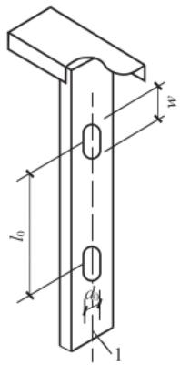

图3.2.5 构件开孔示意图  
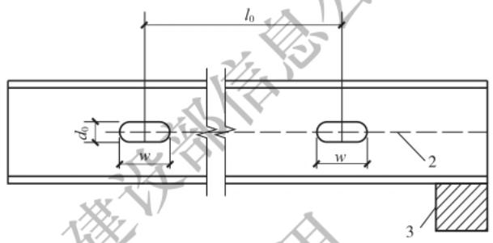  
1 柱腹板中线；2—梁腹板中线；3 支承条件； $l_{0}$ —孔口的中心距； $d_{0}$ —孔高； $w$ —孔宽

3.2.6冷弯超薄壁型钢构件孔口加强件可采用平板、槽形构件或卷边槽形构件(图3.2.6)。孔口加强件的厚度不应小于所要加强腹板的厚度，伸出孔口四周不应小于 $25\mathrm{mm}$ 。加强件与腹板应采用螺钉连接，螺钉中心间距不宜大于 $25\mathrm{mm}$ ，不宜小于 $12\mathrm{mm}$

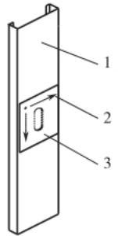

图3.2.6 孔口加强示意图  
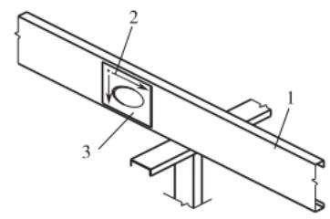  
1—构件；2—螺钉；3—加强件

# 4材料

## 4.1 材料选用

4.1.1 用于承重结构的冷弯型钢的钢带或钢板，应采用符合现行国家标准《碳素结构钢》GB/T700规定的Q235钢、《低合金高强度结构钢》GB/T1591规定的Q355钢、Q390钢，以及《连续热镀锌和锌合金镀层钢板及钢带》GB/T2518规定的结构钢S280、S350和S550。当有可靠根据时，可采用其他牌号的钢材。  
4.1.2 承重结构的钢材牌号和材质，应根据结构或构件的重要性、荷载特征、连接方法、结构所处的工作条件等不同情况选用。  
4.1.3 用于承重结构的冷弯型钢的钢带或钢板，应具有抗拉强度、伸长率、屈服强度、冷弯试验和硫、磷含量的合格保证；对焊接结构尚应具有碳当量的合格保证。  
4.1.4 用于板厚大于 $6\mathrm{mm}$ 的冷弯型钢结构中的钢材应符合下列规定：

1 当工作温度高于 $0^{\circ}\mathrm{C}$ 且不直接承受动力荷载时，可采用A级钢，但Q235A级钢不应用于焊接结构。  
2 对直接承受动力荷载的焊接结构，应符合下列规定：

1)当工作温度高于 $0^{\circ}\mathrm{C}$ 时，不应低于B级钢；  
2)当工作温度不高于 $0^{\circ}\mathrm{C}$ 但高于 $-20^{\circ}\mathrm{C}$ 时，Q235钢和Q355钢不应低于C级，Q390钢不应低于D级；  
3)当工作温度不高于 $-20^{\circ}\mathrm{C}$ 时，Q235钢和Q355钢不应低于D级，Q390钢不应低于E级。

3 对直接承受动力荷载的非焊接结构，其钢材质量等级可较焊接结构降低一级，但不应低于B级。

4.1.5 用于承重结构的冷弯型钢的钢带或钢板的镀锌或镀铝锌

要求应符合现行国家标准《连续热镀锌和锌合金镀层钢板及钢带》GB/T2518的规定。

4.1.6 焊接采用的材料应符合下列规定：

1 手工焊接采用的焊条应符合现行国家标准《非合金钢及细晶粒钢焊条》GB/T5117或《热强钢焊条》GB/T5118的规定。选择的焊条型号应与主体金属力学性能相适应。  
2 自动焊接或半自动焊接采用的焊丝应符合现行国家标准《熔化焊用钢丝》GB/T14957、《非合金钢及细晶粒钢药芯焊丝》GB/T10045、《热强钢药芯焊丝》GB/T17493的规定。选择的焊丝和焊剂应与主体金属相适应。  
3 埋弧焊接采用的焊丝和焊剂应符合现行国家标准《埋弧焊用非合金钢及细晶粒钢实心焊丝、药芯焊丝和焊丝-焊剂组合分类要求》GB/T5293、《埋弧焊用热强钢实心焊丝、药芯焊丝和焊丝-焊剂组合分类要求》GB/T12470的规定，并应与主体金属的力学性能相适应。  
4 气体保护焊采用的焊丝应符合现行国家标准《熔化极气体保护电弧焊用非合金钢及细晶粒钢实心焊丝》GB/T8110的规定，使用的氩气或二氧化碳气体应符合现行国家标准《氩》GB/T4842或现行行业标准《焊接用混合气体二氧化碳-氧/氩》HG/T4984的规定。  
5 当Q235钢、Q355钢、Q390钢相焊接时，宜采用与低强度钢材相适应的焊接材料。

4.1.7 连接件应符合下列规定：

1 普通螺栓应符合现行国家标准《六角头螺栓》GB/T5782和《六角头螺栓C级》GB/T5780的规定，其机械性能应符合现行国家标准《紧固件机械性能 螺栓、螺钉和螺柱》GB/T3098.1的规定；  
2 高强度螺栓应符合现行国家标准《钢结构用高强度大六角头螺栓》GB/T1228、《钢结构用高强度大六角螺母》GB/T1229、

《钢结构用高强度垫圈》GB/T1230、《钢结构用高强度大六角头螺栓连接副》GB/T1231或《钢结构用扭剪型高强度螺栓连接副》GB/T3632的规定；

3 连接冷弯薄壁型钢、其他金属板或其他板材采用的自攻螺钉应符合现行国家标准《紧固件机械性能 自钻自攻螺钉》GB/T3098.11或《开槽盘头自攻螺钉》GB/T5282、《开槽沉头自攻螺钉》GB/T5283、《开槽半沉头自攻螺钉》GB/T5284、《六角头自攻螺钉》GB/T5285的规定；  
4 抽芯铆钉应符合现行国家标准《紧固件机械性能 抽芯铆钉》GB/T3098.19的规定；  
5 射钉应符合现行国家标准《射钉》GB/T18981的规定。

4.1.8 结构用围护板材应符合下列规定：

1 结构用压型钢板的性能应符合现行国家标准《建筑用压型钢板》GB/T12755的规定；  
2 彩色涂层钢板的性能应符合现行国家标准《彩色涂层钢板及钢带》GB/T12754的规定。

4.1.9 在冷弯型钢结构的设计图纸和材料订货文件中，应注明所采用的钢材牌号、质量等级、供货条件、连接材料的型号以及对钢材所要求的力学性能和化学成分的附加保证项目。

## 4.2 设计指标

4.2.1 钢材的强度设计值应按表4.2.1采用。

表 4.2.1 钢材的强度设计值  

| 牌号 | 钢材厚度 $t$ (mm) | 屈服强度 ${f}_{\mathrm{y}}$ $\left( {\mathrm{N}/{\mathrm{{mm}}}^{2}}\right)$ | 抗拉、抗压和 抗弯 $f\left( {\mathrm{\;N}/{\mathrm{{mm}}}^{2}}\right)$ | 抗剪 ${f}_{\mathrm{v}}$ $\left( {\mathrm{N}/{\mathrm{{mm}}}^{2}}\right)$ | 端面承压 ${f}_{\mathrm{{ce}}}$ $\left( {\mathrm{N}/{\mathrm{{mm}}}^{2}}\right)$ |
| --- | --- | --- | --- | --- | --- |
| Q235 | $2 \leq t \leq {16}$ | 235 | 205 | 120 | 310 |
| Q235 | ${16} < t \leq {20}$ | 225 | 195 | 115 | 310 |
| Q355 | $2 \leq t \leq {16}$ | 355 | 300 | 175 | 400 |
| Q355 | ${16} < t \leq {20}$ | 345 | 290 | 170 | 400 |

续表 4.2.1  

| 牌号 | 钢材厚度 $t$ (mm) | 屈服强度 ${f}_{\mathrm{y}}$ $\left( {\mathrm{N}/{\mathrm{{mm}}}^{2}}\right)$ | 抗拉、抗压和 抗弯 $f\left( {\mathrm{\;N}/{\mathrm{{mm}}}^{2}}\right)$ | 抗剪 ${f}_{\mathrm{v}}$ $\left( {\mathrm{N}/{\mathrm{{mm}}}^{2}}\right)$ | 端面承压 ${f}_{\mathrm{{ce}}}$ $\left( {\mathrm{N}/{\mathrm{{mm}}}^{2}}\right)$ |
| --- | --- | --- | --- | --- | --- |
| Q390 | $2 \leq t \leq {16}$ | 390 | 345 | 200 | 415 |
| Q390 | ${16} < t \leq {20}$ | 370 | 330 | 190 | 415 |
| S280 | 0.6 $\leq t \leq 2$ | 280 | 240 | 135 | 320 |
| S350 | 0.6 $\leq t \leq 2$ | 350 | 300 | 175 | 400 |
| S550 | $t \leq {0.6}$ | 530 | 455 | 260 | - |
| S550 | 0.6 $< t \leq {0.9}$ | 500 | 430 | 250 | - |
| S550 | 0.9 $< t \leq {1.2}$ | 460 | 400 | 230 | - |
| S550 | 1. $2 < t \leq {1.5}$ | 420 | 360 | 210 | - |

4.2.2 计算全截面有效的受拉、受压或受弯构件的强度，可采用本标准附录A确定的利用冷弯效应的强度设计值。  
4.2.3 经退火、焊接和热镀锌等热处理的冷弯型钢构件强度设计值应符合现行强制性工程建设规范《钢结构通用规范》GB55006的有关规定。  
4.2.4 焊缝的强度设计值应按表4.2.4采用。

表 4.2.4 焊缝的强度设计值  

| 构件钢材 | 构件钢材 | 对接焊缝 | 对接焊缝 | 对接焊缝 | 角焊缝 |
| --- | --- | --- | --- | --- | --- |
| 牌号 | 厚度或直径 $t$ (mm) | 抗压 ${f}_{\mathrm{c}}^{\mathrm{w}}$ $\left( {\mathrm{N}/{\mathrm{{mm}}}^{2}}\right)$ | 抗拉 ${f}_{\mathrm{t}}^{\mathrm{w}}$ $\left( {\mathrm{N}/{\mathrm{{mm}}}^{2}}\right)$ | 抗剪 ${f}_{\mathrm{v}}^{\mathrm{w}}$ $\left( {\mathrm{N}/{\mathrm{{mm}}}^{2}}\right)$ | 抗压、抗拉和抗剪 ${f}_{\mathrm{f}}^{\mathrm{w}}\left( {\mathrm{N}/{\mathrm{{mm}}}^{2}}\right)$ |
| Q235 | $2 \leq t \leq {16}$ | 205 | 175 | 120 | 140 |
| Q235 | ${16} < t \leq {20}$ | 195 | 175 | 115 | 140 |
| Q355 | $2 \leq t \leq {16}$ | 300 | 255 | 175 | 195 |
| Q355 | ${16} < t \leq {20}$ | 290 | 250 | 170 | 195 |

续表 4.2.4  

| 构件钢材 | 构件钢材 | 对接焊缝 | 对接焊缝 | 对接焊缝 | 角焊缝 |
| --- | --- | --- | --- | --- | --- |
| 牌号 | 厚度或直径 $t$ (mm) | 抗压 ${f}_{\mathrm{c}}^{\mathrm{w}}$ $\left( {\mathrm{N}/{\mathrm{{mm}}}^{2}}\right)$ | 抗拉 ${f}_{\mathrm{t}}^{\mathrm{w}}$ $\left( {\mathrm{N}/{\mathrm{{mm}}}^{2}}\right)$ | 抗剪 ${f}_{\mathrm{v}}^{\mathrm{w}}$ $\left( {\mathrm{N}/{\mathrm{{mm}}}^{2}}\right)$ | 抗压、抗拉和抗剪 ${f}_{\mathrm{f}}^{\mathrm{w}}\left( {\mathrm{N}/{\mathrm{{mm}}}^{2}}\right)$ |
| Q390 | $2 \leq t \leq {16}$ | 345 | 295 | 200 | 200 |
| Q390 | ${16} < t \leq {20}$ | 320 | 280 | 190 | 200 |

注：1 当Q235钢、Q355钢、Q390钢不同等级对接焊接时，焊缝的强度设计值应按本标准表4.2.4中低强度钢材对应的数值采用。  
2 经探伤检查符合一、二级焊缝质量标准的对接焊缝的抗拉强度设计值应采用其抗压强度设计值。

4.2.5 C级普通螺栓连接的强度设计值应按表4.2.5采用。

表 4.2.5 C 级普通螺栓连接的强度设计值  

| 类别 | 性能等级 | 构件钢材的牌号 | 构件钢材的牌号 | 构件钢材的牌号 |
| --- | --- | --- | --- | --- |
| 类别 | 4. 6 级、4. 8 级 | Q235 钢 | Q355 钢 | Q390 钢 |
| 抗拉 ${f}_{\mathrm{t}}^{\mathrm{b}}\left( {\mathrm{N}/{\mathrm{{mm}}}^{2}}\right)$ | 165 | - | - | - |
| 抗剪 ${f}_{\mathrm{v}}^{\mathrm{b}}\left( {\mathrm{N}/{\mathrm{{mm}}}^{2}}\right)$ | 125 | - | - | - |
| 承压 ${f}_{\mathrm{c}}^{\mathrm{b}}\left( {\mathrm{N}/{\mathrm{{mm}}}^{2}}\right)$ | - | 290(305) | 370(385) | 380(400) |

注：对承压强度设计值，括号内、外的数值分别针对构件壁厚 $t$ 大于 $6\mathrm{mm}$ 和 $t$ 不大于 $6\mathrm{mm}$ 的情况。

4.2.6 电阻点焊每个焊点的抗剪承载力设计值应按表4.2.6采用。

表 4.2.6 电阻点焊的抗剪承载力设计值  

| 相焊板件中外层较薄板件的厚度 $t\left( \mathrm{\;{mm}}\right)$ | 每个焊点的抗剪承载力设计值 ${N}_{\mathrm{v}}^{\mathrm{s}}\left( \mathrm{{kN}}\right)$ |
| --- | --- |
| 0.4 | 0.6 |
| 0.6 | 1.1 |
| 0.8 | 1.7 |
| 1.0 | 2.3 |

续表 4.2.6  

| 相焊板件中外层较薄板件的厚度 $t\left( \mathrm{\;{mm}}\right)$ | 每个焊点的抗剪承载力设计值 ${N}_{\mathrm{v}}^{\mathrm{s}}\left( \mathrm{{kN}}\right)$ |
| --- | --- |
| 1.5 | 4.0 |
| 2.0 | 5.9 |
| 2.5 | 8. 0 |
| 3.0 | 10.2 |
| 3.5 | 12.6 |

4.2.7 计算下列结构构件和连接时，构件和连接的强度设计值应按本标准第4.2.1条～第4.2.6条的相关规定取值并进行折减，折减系数应不大于下列规定；当几种情况同时存在时，折减系数应连乘：

1 平面桁架式檩条的端部主要受压腹杆折减系数不应大于0.85。  
2 单面连接的单角钢杆件：

1)按轴心受力计算强度和连接时折减系数不应大于0.85；  
2)按轴心受压计算稳定性时折减系数不应大于 $0.6+$ 0.0014λ（λ为按最小回转半径计算的杆件长细比）。

3 无垫板的单面对接焊缝折减系数不应大于0.85。  
4 施工条件较差的高空安装焊缝折减系数不应大于0.90。  
5 两构件的连接采用搭接或其间填有垫板的连接以及单盖板的不对称连接折减系数不应大于0.90。

4.2.8 钢材的物理性能应符合表4.2.8的规定。

表 4.2.8 钢材的物理性能  

| 弹性模量 $E$ $\left( {\mathrm{N}/{\mathrm{{mm}}}^{2}}\right)$ | 剪变模量 $G$ $\left( {\mathrm{N}/{\mathrm{{mm}}}^{2}}\right)$ | 线膨胀系数 $\alpha$ (1/℃) | 质量密度 $\rho$ $\left( {\mathrm{{kg}}/{\mathrm{m}}^{3}}\right)$ |
| --- | --- | --- | --- |
| ${206} \times {10}^{3}$ | ${79} \times {10}^{3}$ | ${12} \times {10}^{-6}$ | 7850 |

# 5 构件的计算

## 5.1 轴心受拉构件

5.1.1 轴心受拉构件的强度计算应符合下列规定：

1 除高强度螺栓摩擦型连接处外，截面强度应符合下式规定：

$$\frac {N}{A _{\mathrm {n}}} \leqslant f \tag {5.1.1-1}$$

式中： $N$ ——轴力 $(\mathrm{N})$

$A_{\mathrm{n}}$ ——净截面面积 $(\mathrm{mm}^2)$ ；

$f$ ——钢材的抗拉强度设计值（ $\mathrm{N} / \mathrm{mm}^2$ ）。

2 高强度螺栓摩擦型连接处的强度应符合下列公式规定：

$$\left(1 - 0. 5 \frac {n ^{\prime}}{n}\right) \frac {N}{A _{\mathrm {n}}} \leqslant f \tag {5.1.1-2}$$

$$\frac {N}{A} \leqslant f \tag {5.1.1-3}$$

式中： $n^{\prime}$ ——所计算截面（最外列螺栓）处的高强度螺栓数；

$n$ ——在节点或拼接处，构件一端连接的高强度螺栓数；

$A$ ——毛截面面积 $(\mathrm{mm}^2)$ 。

5.1.2 计算开口截面的轴心受拉构件的强度时，若轴力不通过截面剪心，或不通过Z形截面的扇性零点，则应计入双力矩的影响。

## 5.2 轴心受压构件

5.2.1 轴心受压构件的强度应符合下式规定：

$$\frac {N}{A _{\mathrm {e n}}} \leqslant f \tag {5.2.1}$$

式中： $f$ ——钢材的抗压强度设计值 $(\mathrm{N} / \mathrm{mm}^2)$

$A_{\mathrm{en}}$ —有效净截面面积 $(\mathrm{mm}^2)$ 。

5.2.2 轴心受压构件的稳定性应符合下式规定：

$$\frac {N}{\varphi A _{\mathrm {e}}} \leqslant f \tag {5.2.2}$$

式中： $\varphi$ ——轴心受压构件的稳定系数，应根据构件的长细比 $\lambda$ 、材料的屈服强度 $f_{\mathrm{y}}$ 按本标准表B.1取得；

$A_{\mathrm{e}}$ ——有效截面面积 $(\mathrm{mm}^2)$ 。

5.2.3 计算闭口截面、双轴对称开口截面和截面全部有效的不卷边等边单角钢轴心受压构件的稳定系数时，其长细比应取按下列公式计算的较大值：

$$\lambda_{x} = \frac {l _{0 x}}{i _{x}} \tag {5.2.3-1}$$

$$\lambda_{y} = \frac {l _{0 y}}{i _{y}} \tag {5.2.3-2}$$

式中： $\lambda_{x}$ 、 $\lambda_{y}$ ——构件对截面主轴 $x$ 轴和 $y$ 轴的长细比；

$l_{0x}, l_{0y}$ ——构件在垂直于截面主轴 $x$ 轴和 $y$ 轴的平面内的计算长度（ $\mathrm{mm}$ ）；

$i_{x}, i_{y}$ ——构件毛截面对其主轴 $x$ 轴和 $y$ 轴的回转半径 $(\mathrm{mm})$ 。

5.2.4 计算单轴对称开口截面（图5.2.4）轴心受压构件的稳定系数时，其长细比应取按本标准公式(5.2.3-2)和下式计算的较大值：

$$\lambda_{\omega} = \lambda_{x} \sqrt {\frac {s ^{2} + i _{0} ^{2}}{2 s ^{2}} + \sqrt {\left(\frac {s ^{2} + i _{0} ^{2}}{2 s ^{2}}\right) ^{2} - \frac {i _{0} ^{2} - \alpha e _{0} ^{2}}{s ^{2}}}} \tag {5.2.4-1}$$

$$s ^{2} = \frac {\lambda_{x} ^{2}}{A} \left(\frac {I _{\omega}}{l _{\omega} ^{2}} + 0. 0 3 9 I _{\tau}\right) \tag {5.2.4-2}$$

$$i _{0} ^{2} = e _{0} ^{2} + i _{x} ^{2} + i _{y} ^{2} \tag {5.2.4-3}$$

$$l _{\omega} = \beta l \tag {5.2.4-4}$$

式中： $\lambda _{ \text{公} }$ —弯扭屈曲的换算长细比；

$I_{\infty}$ ——毛截面扇性惯性矩 $(\mathrm{mm}^{6})$

$I_{\mathrm{t}}$ ——毛截面抗扭惯性矩 $(\mathrm{mm}^4)$ ；

$e_0$ ——毛截面的剪心在对称轴上的坐标 $(\mathrm{mm})$ ；

$l_{\infty}$ ——扭转屈曲的计算长度（ $\mathrm{mm}$ ）；

$l$ ——无缀板时，为构件的几何长度；有缀板时，取两相邻缀板中心线的最大间距 $(\mathrm{mm})$

$s$ ——计算系数；

$\alpha, \beta$ ——约束系数，应按表5.2.4采用。

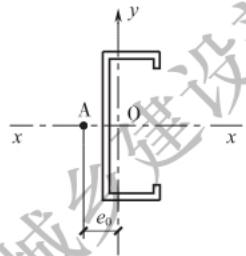

图5.2.4 单轴对称开口截面示意图  
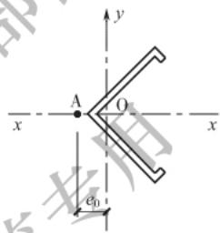  
A一剪心

表 5.2.4 开口截面轴心受压和压弯构件的约束系数  

| 项次 | 构件两端的支承情况 | 无缀板 | 无缀板 | 有缀板 | 有缀板 |
| --- | --- | --- | --- | --- | --- |
| 项次 | 构件两端的支承情况 | α | β | α | β |
| 1 | 两端铰接,端部截面可以自由翘曲 | 1.00 | 1.00 | — | — |
| 2 | 两端嵌固,端部截面的翘曲完全受到约束 | 1.00 | 0.50 | 0.80 | 1.00 |
| 3 | 两端铰接,端部截面的翘曲完全受到约束 | 0.72 | 0.50 | 0.80 | 1.00 |

5.2.5 有缀板的单轴对称开口截面轴心受压构件弯扭屈曲的换算长细比 $\lambda_{\omega}$ 可按本标准公式(5.2.4-1)计算，并应符合下列规定：

1 约束系数 $\alpha$ 、 $\beta$ 可按本标准表5.2.4采用。

2 扭转屈曲的计算长度应按下式计算：

$$l _{\omega} = \beta l _{z} \tag {5.2.5}$$

式中： $l_{\mathrm{z}}$ —— 缀板中心线的最大间距（mm）。

3 构件两支承点间至少应设置2块缀板，且不应包括构件支承点处的缀板或封头板。

5.2.6 格构式轴心受压构件的稳定性应符合本标准公式(5.2.2)的规定，其长细比应按下列规定取 $\lambda_{0x}$ 和 $\lambda_{0y}$ 中的较大值：

1 缀板连接的双肢格构式构件[图5.2.6(a)]：

$$\lambda_{0 x} = \lambda_{x} \tag {5.2.6-1}$$

$$\lambda_{0 y} = \sqrt {\lambda_{y} ^{2} + \lambda_{1} ^{2}} \tag {5.2.6-2}$$

2 缀条连接的双肢格构式构件[图5.2.6(b)]：

$$\lambda_{0 x} = \lambda_{x} \tag {5.2.6-1}$$

$$\lambda_{0 y} = \sqrt {\lambda_{y} ^{2} + 2 7 \frac {A}{A _{1}}} \tag {5.2.6-3}$$

3 缀条连接的三肢格构式构件[图5.2.6(c)]：

$$\lambda_{0 x} = \sqrt {\lambda_{x} ^{2} + \frac {4 2 A}{A _{1} (1 . 5 - \cos^{2} \theta)}} \tag {5.2.6-4}$$

$$\lambda_{0 y} = \sqrt {\lambda_{y} ^{2} + \frac {4 2 A}{A _{1} \cos^{2} \theta}} \tag {5.2.6-5}$$

式中： $\lambda_{0x},\lambda_{0y}$ —格构式构件的换算长细比；

$\lambda_{x}$ ——整个构件对 $x$ 轴的长细比；

$\lambda_{y}$ ——整个构件对虚轴 $y$ 轴的长细比；

$\lambda_{1}$ ——单肢对其自身主轴1轴的长细比，计算长度可取缀板间净距；

$A$ ——所有单肢毛截面面积之和 $(\mathrm{mm}^2)$ ；

$A_{1}$ ——构件横截面所截各斜缀条毛截面面积之和 $(\mathrm{mm}^2)$ ；

$\theta$ ——夹角 $(^{\circ})$ ，见图5.2.6(c)。

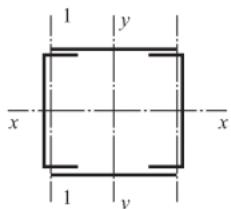  
（a）缀板连接的双肢格构式构件

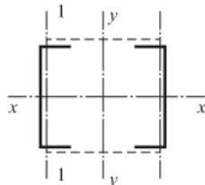  
（b）缀条连接的双肢格构式构件

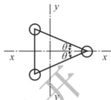  
（c）缆条连接的三股格构式构件  
图5.2.6 格构式构件截面示意图

5.2.7 对格构式轴心受压构件，当缀材为缀条时，其单肢的长细比 $\lambda_{1}$ 不应大于构件最大长细比 $\lambda_{\mathrm{max}}$ 的 $70\%$ ；当缀材为缀板时， $\lambda_{1}$ 不应大于40，且不应大于 $\lambda_{\mathrm{max}}$ 的 $50\%$ ，当 $\lambda_{\mathrm{max}} < 50$ 时，取 $\lambda_{\mathrm{max}} = 50$ ；斜缀条与构件轴线间的夹角不宜小于 $40^{\circ}$ ，不宜大于 $70^{\circ}$ 。  
5.2.8 格构式轴心受压构件的剪力应由承受该剪力的有关缀板或缀条分担，剪力值沿构件全长不变，应按下式计算：

$$V = \frac {A f}{8 0} \sqrt {\frac {f _{y}}{2 3 5}} \tag {5.2.8}$$

式中： $V$ —剪力（N）；

$A$ ——构件所有单肢毛截面面积之和 $(\mathrm{mm}^2)$ ；

$f_{y}$ ——钢材的屈服强度 $(\mathrm{N} / \mathrm{mm}^{2})$ 。

5.2.9 拼合截面（图5.2.9）的强度应符合本标准公式(5.2.1)的规定；稳定性应符合下式规定：

$$N \leqslant N _{\mathrm {R u}} \tag {5.2.9}$$

式中： $N_{\mathrm{Ru}}$ ——稳定承载力设计值（N）。

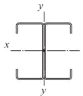  
（a）工字形截面

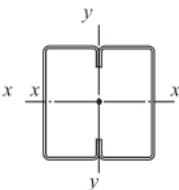  
（b）箱形截面

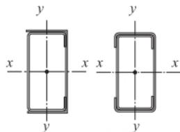  
（c）抱合箱形截面  
图5.2.9 冷弯薄壁型钢构件常用的拼合截面类型

5.2.10 拼合截面的稳定承载力设计值 $N_{\mathrm{Ru}}$ 宜按整体截面计算，并宜计入拼合连接、构件长细比等因素的影响。对本标准图5.2.9所示拼合截面的 $N_{\mathrm{Ru}}$ 应按下列简化方法计算：

1 对 $x$ 轴，取单个开口截面弯曲失稳对应的稳定承载力乘以截面的个数；  
2 对 $y$ 轴，本标准图5.2.9(a)、图5.2.9(b)所示截面，其拼合连接符合本标准第6.1.10条的规定时，取整体截面计算的稳定承载力设计值；本标准图5.2.9(c)所示截面，取整体截面计算的稳定承载力设计值乘以折减系数，当拼合连接可靠且构件长细比大于50时折减系数可取0.7，其他情况下折减系数应通过试验确定；  
3 对本标准图5.2.9(c)所示截面 $y$ 轴，当拼合连接可靠且构件长细比大于50时，也可简单地取各单个开口截面对自身形心 $y$ 轴的弯曲稳定承载力设计值之和乘以放大系数1.2。

5.2.11 计算开口截面的轴心受压构件的强度时，若轴力不通过截面剪心，或不通过Z形截面的扇性零点，则应计入双力矩的影响。  
5.2.12 轴心受压构件的承载力也可按本标准附录C规定的轴心受压构件承载力计算的直接强度法进行计算。

## 5.3 受弯构件

5.3.1 荷载通过截面剪心并与主轴平行的受弯构件（图5.3.1）的强度和稳定性应符合下列公式规定：

1 强度：

$$\frac {M _{\mathrm {m a x}}}{W _{\mathrm {e n r}}} \leqslant f \tag {5.3.1-1}$$

$$\frac {V _{\mathrm {m a x}} S}{I t} \leqslant f _{\mathrm {v}} \tag {5.3.1-2}$$

式中： $f$ ——钢材的抗弯强度设计值 $(\mathrm{N} / \mathrm{mm}^2)$

$M_{\mathrm{max}}$ ——跨间对主轴 $x$ 轴的最大弯矩设计值 $(\mathrm{N} \cdot \mathrm{mm})$ ；

$V_{\mathrm{max}}$ 最大剪力设计值（N）；

$W_{\mathrm{exr}}$ ——对主轴 $x$ 轴的较小有效净截面模量 $(\mathrm{mm}^3)$ ；

$S$ ——计算剪应力处以上截面对中和轴的面积矩 $(\mathrm{mm}^3)$ ；

$I$ ——毛截面惯性矩 $(\mathrm{mm}^4)$ ；

$t$ ——腹板厚度之和（mm）；

$f_{\mathrm{v}}$ ——钢材抗剪强度设计值 $(\mathrm{N} / \mathrm{mm}^2)$ 。

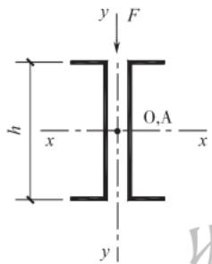

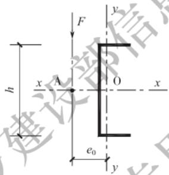

图5.3.1 荷载通过剪心并与主轴平行的受弯构件截面示意图 $F$ 一集中荷载； $A$ 一剪心； $h$ 一腹板高度  
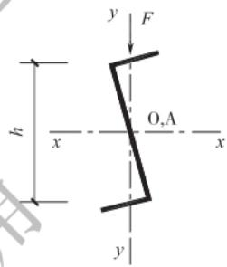  
注：当受弯构件斜置时，腹板高度 $h$ 为腹板沿 $y$ 轴的高度（受剪高度）。

2 稳定性：

$$\frac {M _{\mathrm {m a x}}}{\varphi_{\mathrm {b x}} W _{\mathrm {e x}}} \leqslant f \tag {5.3.1-3}$$

式中： $\varphi_{\mathrm{bx}}$ ——受弯构件的整体稳定系数，应按本标准第B.2节的规定计算；

$W_{\mathrm{ex}}$ ——对截面主轴 $x$ 轴的受压边缘的有效截面模量 $(\mathrm{mm}^3)$ 。

5.3.2 受弯构件腹板的平均剪应力应符合下列规定：

1 当 $h / t < 100\sqrt{235 / f_y}$ 时：

$$\tau_{\mathrm {c r}} = \frac {8 5 5 0}{h / t} \sqrt {\frac {f _{\mathrm {y}}}{2 3 5}} \tag {5.3.2-1}$$

$$\tau \leqslant \tau_{\mathrm {c r}} \tag {5.3.2-2}$$

$$\tau \leqslant f _{\mathrm {v}} \tag {5.3.2-3}$$

式中： $\tau$ ——腹板的平均剪应力 $(\mathrm{N} / \mathrm{mm}^2)$ ；

$\tau_{\mathrm{cr}}$ ——腹板的剪切屈曲临界剪应力 $(\mathrm{N} / \mathrm{mm}^2)$ ；

$h / t$ ——腹板的高厚比。

2 当 $h / t \geqslant 100\sqrt{235 / f_y}$ 时：

$$\tau_{\mathrm {c r}} = \frac {8 5 5 0 0 0}{(h / t) ^{2}} \tag {5.3.2-4}$$

$$\tau \leqslant \tau_{\mathrm {c r}} \tag {5.3.2-5}$$

5.3.3 荷载偏离截面剪心但与主轴平行的受弯构件（图5.3.3）的强度和稳定性应符合下列公式规定：

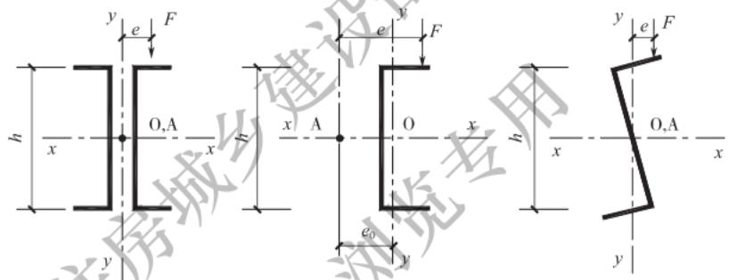  
图5.3.3 荷载偏离剪心但与主轴平行的受弯构件截面示意图 $e$ 一偏心距；A一剪心

1 正应力：

$$\frac {M}{W _{\mathrm {e n x}}} + \frac {B}{W _{\omega}} \leqslant f \tag {5.3.3-1}$$

式中： $M$ ——计算弯矩 $(\mathrm{N} \cdot \mathrm{mm})$

$B$ ——与所取弯矩同一截面的双力矩 $(\mathrm{N} \cdot \mathrm{mm}^2)$ ，可按本标准第 B.3 节的规定计算；当受弯构件的受压翼缘上有铺板，且与受压翼缘牢固相连并能阻止受压翼缘侧向变位和扭转时， $B$ 可取 0，同时可不验算受弯构件的稳定性；

$W_{\omega}$ ——与弯矩引起的应力同一验算点处的毛截面扇性模量 $(\mathrm{mm}^4)$ 。

2 剪应力可按本标准公式(5.3.1-2)和公式(5.3.2-1)～公式(5.3.2-5)验算。

3 稳定性：

$$\frac {M _{\max}}{\varphi_{\mathrm {b r}} W _{\mathrm {e x}}} + \frac {B}{W _{\omega}} \leqslant f \tag {5.3.3-2}$$

5.3.4 荷载偏离截面剪心且与主轴倾斜的受弯构件（图5.3.4）的强度和稳定性应符合下列规定：

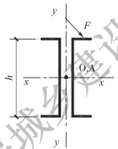  
（a）双槽钢

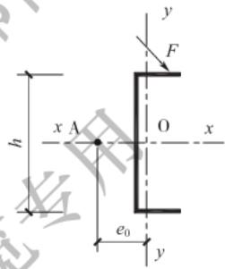  
（b）单槽钢

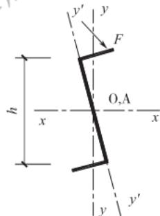  
（c）Z形钢

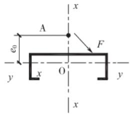  
（d）卷边槽钢  
图5.3.4 荷载偏离剪心且与主轴倾斜的受弯构件截面示意图A一剪心

1 当在构造上能保证整体稳定性时，强度应符合下式规定：

$$\frac {M _{x}}{W _{\mathrm {e n} x}} + \frac {M _{y}}{W _{\mathrm {e n} y}} + \frac {B}{W _{\omega}} \leqslant f \tag {5.3.4-1}$$

式中： $M_{x}, M_{y}$ ——对截面主轴 $x$ 轴、 $y$ 轴的弯矩 $(\mathrm{N} \cdot \mathrm{mm})$ ；

$W_{\mathrm{eny}}$ ——对截面主轴 $y$ 轴的有效净截面模量 $(\mathrm{mm}^3)$ 。

2 当不能在构造上保证整体稳定性时，稳定性应符合下式规定：

$$\frac {M _{x}}{\varphi_{\mathrm {b x}} W _{\mathrm {e x}}} + \frac {M _{\mathrm {y}}}{W _{\mathrm {e y}}} + \frac {B}{W _{\omega}} \leqslant f \tag {5.3.4-2}$$

式中： $W_{\mathrm{cy}}$ ——对截面主轴 $y$ 轴的受压边缘的有效截面模量（ $\mathrm{mm}^3$ ）。

3 $x$ 轴和 $y$ 轴方向的剪应力可分别按本标准公式(5.3.1-2)和公式(5.3.2-1)～公式(5.3.2-5)验算。

5.3.5 本标准图5.2.9所示拼合截面受弯构件的强度和稳定性应按本标准第5.3.1条～第5.3.4条的规定计算。当截面拼合连接可靠时，可取整体截面计算的弯曲承载力设计值乘以折减系数，折减系数应通过试验确定；也可在计算拼合截面几何特性时按下列简化方法计算，此时折减系数应取1：

1 对本标准图5.2.9(a)、图5.2.9(b)所示截面，几何特性可取各单个开口截面绕本身形心主轴几何特性之和；  
2 对本标准图5.2.9（c）所示截面，计算几何特性时可将构件翼缘部分作为部分加劲板件按照叠加后的厚度来计算组合后截面的有效宽厚比。  
5.3.6 受弯构件支座或受集中荷载处的腹板，当有加劲肋时，平面外的稳定性应符合本标准公式(5.2.2)的规定，其计算长度可取受弯构件截面的高度，截面面积可取加劲肋截面面积及加劲肋两侧各 $\omega_{\mathrm{e}}$ 宽度范围内的腹板截面面积之和， $\omega_{\mathrm{e}}$ 可按下式计算：

$$w _{\mathrm {c}} = 1 5 t _{\mathrm {w}} \sqrt {2 3 5 / f _{\mathrm {y}}} \tag {5.3.6}$$

式中： $t_{\mathrm{w}}$ ——腹板厚度（mm）。

5.3.7 受弯构件支座或受集中荷载处腹板无加劲肋时，腹板局部

受压承载力应符合下列规定：

1 只受集中荷载或支座反力作用时：

$$R \leqslant R _{\mathrm {w}} \tag {5.3.7-1}$$

2 同时受集中荷载或支座反力和弯矩作用时；

$$\frac {M}{M _{\mathrm {u}}} \leqslant 1. 0 \tag {5.3.7-2}$$

$$\frac {R}{R _{\mathrm {w}}} \leqslant 1. 0 \tag {5.3.7-3}$$

$$\frac {M}{M _{\mathrm {u}}} + \frac {R}{R _{\mathrm {w}}} \leqslant 1. 2 5 \tag {5.3.7-4}$$

$$M _{\mathrm {w}} = W _{\mathrm {c}} f \tag {5.3.7-5}$$

式中： $R$ ——集中荷载或支座反力（N）；

$R_{\mathrm{w}}$ ——腹板局部受压承载力设计值（N），按本标准公式(5.3.9)计算；

$M_{\mathrm{u}}$ ——截面的抗弯承载力设计值 $(\mathrm{N} \cdot \mathrm{mm})$ ；

$W_{\mathrm{c}}$ ——有效截面模量 $(\mathrm{mm}^3)$ 。

5.3.8 受弯构件的承载力也可按本标准附录C规定的纯弯构件承载力计算的直接强度法进行计算。

5.3.9 冷弯型钢实腹构件的翼缘上作用有较大的集中荷载或支座反力时，与上、下翼缘相连的一块腹板局部受压承载力设计值应按下式计算：

$$R _{\mathrm {w}} = C t _{\mathrm {w}} ^{2} f \sin \theta \left(1 - C _{\mathrm {r}} \sqrt {\frac {r _{i}}{t _{\mathrm {w}}}}\right) \left(1 + C _{\mathrm {l}} \sqrt {\frac {l _{\mathrm {b}}}{t _{\mathrm {w}}}}\right) \left(1 - C _{\mathrm {w}} \sqrt {\frac {h _{\mathrm {w}}}{t _{\mathrm {w}}}}\right) \tag {5.3.9}$$

式中： $R_{\mathrm{w}}$ ——与上、下翼缘相连的一块腹板局部受压承载力设计值（N）；

$C$ ——计算系数，可按表5.3.9选取；

$\theta$ ——腹板与承压面的夹角 $(^{\circ})$ ，其适用范围为 $45^{\circ}\sim 90^{\circ}$

$C_{\mathrm{r}}$ ——型钢棱角内表面的弯曲半径系数，可按表5.3.9。

选取；

$r_i$ ——截面第 $i$ 个棱角内表面的弯曲半径 $(\mathrm{mm})$ ；

$C_1$ ——集中荷载或支座反力的承压长度系数，可按表5.3.9选取；

$l_{\mathrm{b}}$ ——集中荷载或支座反力的支承长度 $(\mathrm{mm})$ ，当有两个大小相等、方向相反的集中荷载分别作用在上、下翼缘且支承长度不同时， $l_{\mathrm{b}}$ 应取其中较小值；

$C_{\mathrm{w}}$ ——腹板的柔度系数，可按表5.3.9选取；

$h_{\mathrm{w}}$ ——腹板的高度（mm）。

表 5.3.9 腹板局部受压承载力的计算系数取值  

| 截面形式 | 荷载条件 | 荷载条件 | $C$ | ${C}_{\mathrm{r}}$ | ${C}_{1}$ | ${C}_{\mathrm{w}}$ | 适用范围 |
| --- | --- | --- | --- | --- | --- | --- | --- |
| 卷边单 槽形截面 | 一个翼缘上作用有 集中荷载或支座反力 | 端部 | 3.2 | 0.14 | 0.35 | 0.02 | ${r}_{i}/{t}_{\mathrm{w}} \leq 5$ |
| 卷边单 槽形截面 | 一个翼缘上作用有 集中荷载或支座反力 | 中部 | 11.8 | 0.23 | 0.14 | 0.01 | ${r}_{i}/{t}_{\mathrm{w}} \leq 5$ |
| 卷边单 槽形截面 | 两个翼缘上作用有 集中荷载或支座反力 | 端部 | 11.8 | 0.32 | 0.05 | 0.04 | ${r}_{i}/{t}_{\mathrm{w}} \leq 3$ |
| 卷边单 槽形截面 | 两个翼缘上作用有 集中荷载或支座反力 | 中部 | 19.4 | 0.52 | 0.15 | 0.001 | ${r}_{i}/{t}_{\mathrm{w}} \leq 3$ |
| 卷边单 Z 形截面 | 一个翼缘上作用有 集中荷载或支座反力 | 端部 | 4. 2 | 0.09 | 0.02 | 0.001 | ${r}_{i}/{t}_{\mathrm{w}} \leq 5$ |
| 卷边单 Z 形截面 | 一个翼缘上作用有 集中荷载或支座反力 | 中部 | 11.8 | 0.23 | 0.14 | 0.01 | ${r}_{i}/{t}_{\mathrm{w}} \leq 5$ |
| 卷边单 Z 形截面 | 两个翼缘上作用有 集中荷载或支座反力 | 端部 | 11.8 | 0,32 | 0.05 | 0.04 | ${r}_{i}/{t}_{\mathrm{w}} \leq 3$ |
| 卷边单 Z 形截面 | 两个翼缘上作用有 集中荷载或支座反力 | 中部 | 19.4 | 0.52 | 0.15 | 0.001 | ${r}_{i}/{t}_{\mathrm{w}} \leq 3$ |
| 非卷边 单槽形、 单 Z 形 截面 | 一个翼缘上作用有 集中荷载或支座反力 | 端部 | 3.4 | 0.40 | 0.60 | 0.03 | ${r}_{i}/{t}_{\mathrm{w}} \leq 2$ |
| 非卷边 单槽形、 单 Z 形 截面 | 一个翼缘上作用有 集中荷载或支座反力 | 中部 | 11.1 | 0.32 | 0.10 | 0.01 | ${r}_{i}/{t}_{\mathrm{w}} \leq 1$ |
| 非卷边 单槽形、 单 Z 形 截面 | 两个翼缘上作用有 集中荷载或支座反力 | 端部 | 1.4 | 0.11 | 0.37 | 0.01 | ${r}_{i}/{t}_{\mathrm{w}} \leq 1$ |
| 非卷边 单槽形、 单 Z 形 截面 | 两个翼缘上作用有 集中荷载或支座反力 | 中部 | 10.4 | 0.47 | 0.25 | 0.04 | ${r}_{i}/{t}_{\mathrm{w}} \leq 1$ |
| 工字形 组合截面 | 一个翼缘上作用有 集中荷载或支座反力 | 端部 | 7.6 | 0.14 | 0.28 | 0.001 | ${r}_{i}/{t}_{\mathrm{w}} \leq 5$ |
| 工字形 组合截面 | 一个翼缘上作用有 集中荷载或支座反力 | 中部 | 17.6 | 0.17 | 0.11 | 0.001 | ${r}_{i}/{t}_{\mathrm{w}} \leq 3$ |
| 工字形 组合截面 | 两个翼缘上作用有 集中荷载或支座反力 | 端部 | 11.7 | 0.09 | 0.08 | 0.001 | ${r}_{i}/{t}_{\mathrm{w}} \leq 3$ |
| 工字形 组合截面 | 两个翼缘上作用有 集中荷载或支座反力 | 中部 | 27.2 | 0.14 | 0.08 | 0.04 | ${r}_{i}/{t}_{\mathrm{w}} \leq 3$ |

5.3.10 按本标准表5.3.9确定腹板局部受压承载力的计算系数时，实腹构件尚应满足下列要求：

1 各类构件在支座处均应设有支座连接件；  
2 各类构件截面应由加劲或部分加劲翼缘板件组成；  
3 对工字形组合截面， $h_{\mathrm{w}} / t_{\mathrm{w}}$ 不应大于 $200, l_{\mathrm{b}} / t_{\mathrm{w}}$ 不应大于 $210, l_{\mathrm{b}} / h_{\mathrm{w}}$ 不应大于1.0；对其他截面， $l_{\mathrm{b}} / h_{\mathrm{w}}$ 不应大于2.0；  
4 各类截面腹板与承压面的夹角均应为 $90^{\circ}$   
5 在一个或两个翼缘上作用的集中荷载或支座反力，其承压边缘至相邻方向相反的集中荷载或支座反力之间的距离应大于 $1.5h_{\mathrm{w}}$ ；  
6 在构件端部处作用的集中荷载或支座反力，其承压边缘至构件端部的距离不应大于 $1.5h_{\mathrm{w}}$   
7 在构件跨内作用的集中荷载或支座反力，其承压边缘至构件端部的距离应大于 $1.5h_{\mathrm{w}}$ 。

5.3.11 受弯构件同时承受弯矩 $M$ 和剪力 $V$ 的截面应符合下式规定：

$$\left(\frac {M}{M _{\mathrm {u}}}\right) ^{2} + \left(\frac {V}{V _{\mathrm {v}}}\right) ^{2} \leqslant 1. 0 \tag {5.3.11}$$

式中： $M_{\mathrm{u}}$ ——梁的抗弯承载力设计值 $(\mathrm{N} \cdot \mathrm{mm})$

$V_{\mathrm{v}}$ ——梁腹板的抗剪承载力设计值（N），腹板的剪切屈曲临界剪应力可按本标准公式（5.3.2-1）或公式(5.3.2-4)计算。

## 5.4 拉弯构件

5.4.1 拉弯构件的强度应符合下式规定：

$$\frac {N}{A _{\mathrm {n}}} \pm \frac {M _{x}}{W _{\mathrm {n} x}} \pm \frac {M _{y}}{W _{\mathrm {n} y}} \leqslant f \tag {5.4.1}$$

式中： $W_{\mathrm{nr}}$ 、 $W_{\mathrm{ny}}$ ——对截面主轴 $x$ 轴、 $y$ 轴的净截面模量（ $\mathrm{mm}^3$ ）。

5.4.2 当拉弯构件截面内出现受压区，且受压板件的宽厚比大于

本标准第5.6.1条规定的有效宽厚比时，其净截面特性计算应按本标准图5.6.8所示位置扣除受压板件的超出部分。

5.4.3 本标准图5.2.9所示拼合截面的拉弯构件的强度应按本标准第5.4.1条的规定计算，其几何特性可按本标准第5.3.5条的规定计算。  
5.4.4 计算开口截面的拉弯构件的强度时，若轴力不通过截面剪心，或不通过Z形截面的扇性零点，则应计入双力矩的影响。

## 5.5 压弯构件

5.5.1 压弯构件的强度应符合下式规定：

$$\frac {N}{A _{\mathrm {e n}}} \pm \frac {M _{x}}{W _{\mathrm {e n x}}} \pm \frac {M _{y}}{W _{\mathrm {e n y}}} \leqslant f \tag {5.5.1}$$

5.5.2 双轴对称截面压弯构件的稳定性应符合下列规定：

1 当弯矩作用于对称平面内时，弯矩作用平面内的稳定性应符合下列公式规定：

$$\frac {N}{\varphi A _{\mathrm {e}}} + \frac {\beta_{\mathrm {m}} M}{\left(1 - \frac {N}{N _{\mathrm {E}} ^{\prime}} \varphi\right) W _{\mathrm {e}}} \leqslant f \tag {5.5.2-1}$$

$$N _{\mathrm {E}} ^{\prime} = \frac {\pi^{2} E A}{\gamma_{\mathrm {R}} \lambda^{2}} \tag {5.5.2-2}$$

式中： $M$ ——计算弯矩，应取构件全长范围内的最大弯矩（N·mm）；

$\beta_{\mathrm{m}}$ ——等效弯矩系数；

$\gamma_{\mathrm{R}}$ ——抗力分项系数，对Q390钢，应取1.125；对其他钢材，应取1.165；

$E$ ——钢材的弹性模量 $(\mathrm{N} / \mathrm{mm}^2)$ ；

$\lambda$ ——构件在弯矩作用平面内的长细比；

$W_{\mathrm{e}}$ ——对最大受压边缘的有效截面模量 $(\mathrm{mm}^3)$ ；

$N_{\mathrm{E}}^{\prime}$ 计算系数（N）。

2 当弯矩作用在最大刚度平面内时[本标准图5.2.9（b）、图5.2.9(c)]，弯矩作用平面外的稳定性尚应符合下式规定：

$$\frac {N}{\varphi_{y} A _{\mathrm {e}}} + \frac {\eta M _{x}}{\varphi_{\mathrm {b x}} W _{\mathrm {e x}}} \leqslant f \tag {5.5.2-3}$$

式中： $\eta$ ——截面系数，对闭口截面可取0.7；对其他截面可取1.0；

$\varphi_{y}$ 对 $y$ 轴的轴心受压构件的稳定系数，其长细比应按本标准公式(5.2.3-2)计算；

$\varphi_{\mathrm{bx}}$ ——当弯矩作用于最大刚度平面内时，受弯构件的整体稳定系数，应按本标准第B.2节的规定计算，闭口截面可取1.0；

$M_{x}$ ——构件计算段的最大弯矩 $(\mathrm{N} \cdot \mathrm{mm})$ 。

5.5.3 压弯构件的等效弯矩系数 $\beta_{\mathrm{m}}$ 应按下列规定采用：

1 构件端部无侧移且无中间横向荷载时：

$$\beta_{\mathrm {m}} = 0. 6 + 0. 4 \frac {M _{2}}{M _{1}} \tag {5.5.3}$$

式中： $M_{1}, M_{2}$ ——分别为绝对值较大和较小的端弯矩 $(\mathrm{N} \cdot \mathrm{mm})$ ，当构件以单曲率弯曲时， $\frac{M_1}{M_1}$ 应取正值；当构件以双曲率弯曲时， $\frac{M_1}{M_1}$ 应取负值。

2 构件端部无侧移但有中间横向荷载，或构件端部有侧移时， $\beta_{\mathrm{m}}$ 应取1.0。

5.5.4 单轴对称开口截面（本标准图5.2.4）压弯构件的稳定性应符合下列规定：

1 当弯矩作用于对称平面内时，弯矩作用平面内的稳定性应符合本标准第5.5.2条的规定，其弯矩作用平面外的稳定性尚应符合本标准公式(5.2.2)的规定。此时，本标准公式(5.2.2)中的轴心受压构件的稳定系数 $\varphi$ 应按公式(5.5.4-1)算得的弯扭屈曲的换算长细比 $\lambda_{\omega}$ 由本标准表B.1查得。

$$\lambda_{\omega} = \lambda_{x} \sqrt {\frac {s ^{2} + a _{\mathrm {e}} ^{2}}{2 s ^{2}} + \sqrt {\left(\frac {s ^{2} + a _{\mathrm {e}} ^{2}}{2 s ^{2}}\right) ^{2} - \frac {a _{\mathrm {e}} ^{2} - \alpha \left(e _{0} - e _{\mathrm {x}}\right) ^{2}}{s ^{2}}}} \tag {5.5.4-1}$$

$$a _{\mathrm {e}} ^{2} = e _{0} ^{2} + i _{x} ^{2} + i _{y} ^{2} + 2 e _{\mathrm {x}} \left(\frac {U _{\mathrm {y}}}{2 I _{\mathrm {y}}} - e _{0} - \xi_{2} e _{\mathrm {a}}\right) \tag {5.5.4-2}$$

$$U _{y} = \int_{A} x \left(x ^{2} + y ^{2}\right) \mathrm {d} A \tag {5.5.4-3}$$

$$e _{\mathrm {x}} = \pm \frac {\beta_{\mathrm {m}} M}{N} \tag {5.5.4-4}$$

式中： $e_{\mathrm{x}}$ ——等效偏心距，当偏心在截面剪心一侧时， $e_{\mathrm{x}}$ 应为负；当偏心在与截面剪心相对的另一侧时， $e_{\mathrm{x}}$ 应为正；计算时 $M$ 应取构件计算段的最大弯矩；

$\xi_{2}$ ——横向荷载作用位置影响系数，可查本标准表B.2.1； $s$ ——计算系数，可按本标准公式(5.2.4-2)计算；

$e_{\mathrm{a}}$ ——横向荷载作用点到剪心的距离；对于偏心压杆或当横向荷载作用在剪心时， $e_{\mathrm{a}}$ 应取0；当荷载不作用在剪心且荷载方向指向剪心时， $e_{\mathrm{a}}$ 应为负，而离开剪心时 $e_{\mathrm{a}}$ 应为正。

2 若 $l_{0x}$ 不大于 $l_{0y}$ ，当压弯构件采用本标准表D.1.3或表D.1.4中所列型钢或当 $e_{\mathrm{x}}$ 与 $e_0 / 2$ 之和不大于0时，可不计算其弯矩作用平面外的稳定性。  
3 当弯矩作用在对称平面内（本标准图5.2.4)且使截面在剪心一侧受压时，尚应符合下式规定：

$$\left| \frac {N}{A _{\mathrm {e}}} - \frac {\beta_{\mathrm {m y}} M _{\mathrm {y}}}{\left(1 - \frac {N}{N _{\mathrm {E y}} ^{\prime}}\right) W _{\mathrm {e y}} ^{\prime}} \right| \leqslant f \tag {5.5.4-5}$$

式中： $\beta_{\mathrm{my}}$ ——对 $y$ 轴的等效弯矩系数，应按本标准第5.5.3条的规定采用；

$W_{\mathrm{ey}}^{\prime}$ ——截面的较小有效截面模量 $(\mathrm{mm}^{3})$ ；

$N_{\mathrm{Ey}}^{\prime}$ ——计算系数（N），应按本标准公式(5.5.2-2)计算，但 $\lambda$ 应取 $\lambda_{y}$ 。

5.5.5 单轴对称开口截面压弯构件，当弯矩作用于非对称主平面内时（图5.5.5），其弯矩作用平面内的稳定性应符合公式（5.5.5-1）的规定，其弯矩作用平面外的稳定性应符合公式（5.5.5-2）的规定：

$$\frac {N}{\varphi_{x} A _{\mathrm {e}}} + \frac {\beta_{\mathrm {m}} M _{x}}{\left(1 - \frac {N}{N _{\mathrm {E x}} ^{\prime}} \varphi_{x}\right) W _{\mathrm {e r}}} + \frac {B}{W _{\infty}} \leqslant f \tag {5.5.5-1}$$

$$\frac {N}{\varphi_{\mathrm {y}} A _{\mathrm {e}}} + \frac {M _{\mathrm {r}}}{\varphi_{\mathrm {b r}} W _{\mathrm {e r}}} + \frac {B}{W _{\infty}} \leqslant f \tag {5.5.5-2}$$

式中： $\varphi_{x}$ ——对 $x$ 轴的轴心受压构件的稳定系数，其长细比应按本标准公式(5.2.4-1)计算；

$N_{\mathrm{Ex}}^{\prime}$ ——计算系数(N)，应按本标准公式(5.5.2-2)计算，但 $\lambda$ 应取 $\lambda_{x}$ 。

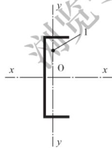  
图5.5.5 单轴对称开口截面绕对称轴弯曲示意图1—荷载作用点

5.5.6 双轴对称截面双向压弯构件的稳定性应符合下列公式规定：

$$\frac {N}{\varphi_{x} A _{\mathrm {e}}} + \frac {\beta_{\mathrm {m x}} M _{x}}{\left(1 - \frac {N}{N _{\mathrm {E x}} ^{\prime}} \varphi_{x}\right) W _{\mathrm {e x}}} + \frac {\eta M _{y}}{\varphi_{\mathrm {b y}} W _{\mathrm {e y}}} \leqslant f \tag {5.5.6-1}$$

$$\frac {N}{\varphi_{y} A _{\mathrm {e}}} + \frac {\eta M _{x}}{\varphi_{\mathrm {b x}} W _{\mathrm {e x}}} + \frac {\beta_{\mathrm {m y}} M _{y}}{\left(1 - \frac {N}{N _{\mathrm {E y}} ^{\prime}} \varphi_{y}\right) W _{\mathrm {e y}}} \leqslant f \tag {5.5.6-2}$$

式中： $\varphi_{\mathrm{by}}$ ——当弯矩作用于最小刚度平面内时，受弯构件的整体稳定系数应按本标准第B.2节的规定计算；

$\beta_{\mathrm{mx}}$ 对 $x$ 轴的等效弯矩系数，应按本标准第5.5.3条的规定采用。

5.5.7 格构式压弯构件除应计算整个构件的强度和稳定性外，尚应计算单肢的强度和稳定性。此时，计算缀板或缀条内力用的剪力，应取构件的实际剪力和按本标准第5.2.8条计算的剪力中的较大值。  
5.5.8 格构式压弯构件，当弯矩绕实轴 $(x$ 轴)作用时，其弯矩作用平面内和平面外的整体稳定性应符合本标准公式(5.5.2-1)、公式(5.5.2-3)的规定，但本标准公式(5.5.2-3)中的 $\varphi_{y}$ 应按本标准第5.2.6条中的换算长细比 $\lambda_{0y}$ 确定， $\varphi_{\mathrm{bx}}$ 应取1.0。  
5.5.9 格构式压弯构件，当弯矩绕虚轴 $y$ 轴作用时，其整体稳定性应符合下列规定：

1 弯矩作用平面内的整体稳定性应符合下式规定：

$$\frac {N}{\varphi_{y} A _{\mathrm {e}}} + \frac {\beta_{\mathrm {m y}} M _{y}}{\left(1 - \frac {N}{N _{\mathrm {E y}} ^{\prime}} \varphi_{y}\right) W _{\mathrm {e y}}} \leqslant f \tag {5.5.9}$$

2 $\varphi_{y},N_{\mathrm{E}_{y}}^{\prime}$ 均应按换算长细比 $\lambda_{0y}$ 确定；

3 弯矩作用平面外的整体稳定性可不计算，但应计算分肢的稳定性。

5.5.10 计算开口截面的压弯构件的强度时，若轴力不通过截面剪心，或不通过Z形截面的扇性零点，则应计入双力矩的影响。  
5.5.11 当弯矩作用在非对称平面内时，压弯构件弯矩作用平面内的承载力也可按本标准附录C规定的压弯构件承载力计算的直接强度法进行计算。

## 5.6 构件中的受压板件

5.6.1 加劲板件、部分加劲板件和非加劲板件的有效宽厚比应按下列公式计算：

当 $\frac{b}{t} \leqslant 18\alpha_{\mathrm{c}}\rho_{\mathrm{c}}$ 时：

$$\frac {b _{\mathrm {c}}}{t} = \frac {b _{\mathrm {c}}}{t} \tag {5.6.1-1}$$

当 $18\alpha_{\mathrm{e}}\rho_{\mathrm{e}} < \frac{b}{t} < 38\alpha_{\mathrm{e}}\rho_{\mathrm{e}}$ 时：

$$\frac {b _{\mathrm {c}}}{t} = \left(\sqrt {\frac {2 1 . 8 \alpha_{\mathrm {c}} \rho_{\mathrm {c}}}{\frac {b}{t}}} - 0. 1\right) \frac {b _{\mathrm {c}}}{t} \tag {5.6.1-2}$$

当 $\frac{b}{t} \geqslant 38\alpha_{\mathrm{c}}\rho_{\mathrm{c}}$ 时：

$$\frac {b _{\mathrm {e}}}{t} = \frac {2 5 \alpha_{\mathrm {e}} \rho_{\mathrm {e}}}{\frac {b}{t}} \cdot \frac {b _{\mathrm {c}}}{t} \tag {5.6.1-3}$$

$$\alpha_{\mathrm {c}} = 1. 1 5 - 0. 1 5 \psi \tag {5.6.1-4}$$

$$\psi = \frac {\sigma_{\mathrm {m i n}}}{\sigma_{\mathrm {m a x}}} \tag {5.6.1-5}$$

$$b _{\mathrm {c}} = \frac {b}{1 - \psi} \tag {5.6.1-6}$$

$$\rho_{\mathrm {e}} = \sqrt {\frac {2 0 5 k _{1} k}{\sigma_{1}}} \tag {5.6.1-7}$$

式中： $b$ ——板件宽度（ $\mathrm{mm}$ ）；

$t$ ——板件厚度（ $\mathrm{mm}$ ）；

$b_{\mathrm{e}}$ ——板件有效宽度（ $\mathrm{mm}$ ）；

$b_{\mathrm{c}}$ ——板件受压区宽度 $(\mathrm{mm})$ ，当 $\phi \geq 0$ 时， $b_{\mathrm{c}}$ 应取板件宽度 $b$

$\alpha_{\mathrm{e}}, \rho_{\mathrm{e}}$ ——受压板件有效宽厚比的计算系数；当 $\psi < 0$ 时， $\alpha_{\mathrm{e}}$ 应取1.15；

$\psi$ ——压应力分布不均匀系数；

$\sigma_{\mathrm{max}}$ ——受压板件边缘的最大压应力，取正值；

$\sigma_{\mathrm{min}}$ ——受压板件另一边缘的应力，以压应力为正，拉应力为负； $\sigma_{1}$ ——最大压应力板件的应力（ $\mathrm{N} / \mathrm{mm}^2$ ），应按本标准第5.6.10条、第5.6.11条的规定确定；

$k$ ——受压板件的稳定系数，应按本标准第5.6.3条的规定确定；

$k_{1}$ ——板组约束系数，应按本标准第5.6.4条的规定采用；若不计相邻板件的约束作用， $k_{1}$ 可取1。

5.6.2 中间加劲板件的有效宽度[图5.6.2(a)]可按等效板件的有效宽度采用，等效板件厚度[图5.6.2(b)]可按下式计算：

$$t _{\mathrm {s}} = \sqrt [ 3 ]{1 2 I _{\mathrm {s p}} / b} \tag {5.6.2}$$

式中： $t_{\mathrm{s}}$ ——等效板件厚度（ $\mathrm{mm}$ ）；

$I_{\mathrm{sp}}$ 加劲板件对中和轴的惯性矩 $(\mathrm{mm}^4)$

$b$ ——加劲板件宽度（mm）。

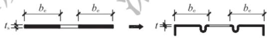  
（a）有效宽度示意图

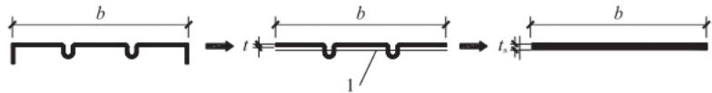  
（b）等效厚度示意图  
图5.6.2 多加劲板件有效宽度计算  
1—中和轴

5.6.3 受压板件的稳定系数可按下列规定计算：

1 加劲板件：

当 $0 < \psi \leqslant 1$ 时：

$$k = 7. 8 - 8. 1 5 \psi + 4. 3 5 \psi^{2} \tag {5.6.3-1}$$

当 $-1\leqslant \psi \leqslant 0$ 时：

$$k = 7. 8 - 6. 2 9 \psi + 9. 7 8 \psi^{2} \tag {5.6.3-2}$$

2 部分加劲板件：

1)最大压应力作用于支承边[图5.6.3（a）]时应符合下列规定，且不得大于按公式(5.6.3-1)和公式(5.6.3-2)计算的 $k$ 值：

当 $-1\leqslant \psi \leqslant -\frac{1}{3 + 12a / b}$ 时，应按公式(5.6.3-2)计算。

当 $-\frac{1}{3 + 12a / b} < \psi \leqslant 1$ 时：

$$k = \frac {(b / \lambda_{\mathrm {n}}) ^{2} / 3 + 0 . 1 4 2 + 1 0 . 9 2 I b / (\lambda_{\mathrm {n}} ^{2} t ^{3})}{0 . 0 8 3 + (0 . 2 5 + a / b) \psi} \tag {5.6.3-3}$$

2)最大压应力作用于部分加劲边[图5.6.3(b)]，当 $\psi \geq -1$ 时应符合下列规定，且不得大于按公式(5.6.3-1)和公式(5.6.3-2)计算的 $k$ 值：

$$k = \frac {\left(b / \lambda_{\mathrm {n}}\right) ^{2} / 3 + 0 . 1 4 2 + 1 0 . 9 2 I b / \left(\lambda_{\mathrm {n}} ^{2} t ^{3}\right)}{\psi / 1 2 + a / b + 0 . 2 5} \tag {5.6.3-4}$$

$$I = a ^{3} t (1 + 4 b / a) / [ 1 2 (1 + b / a) ] \tag {5.6.3-5}$$

$$\lambda_{\mathrm {d}} = \pi \sqrt [ 4 ]{\frac {b ^{2} h}{3 (3 - \psi)} \left(b + \frac {3 2 . 8 I}{t ^{3}}\right)} \tag {5.6.3-6}$$

式中： $b$ ——带卷边板件的宽度（ $\mathrm{mm}$ ）；

$a$ ——卷边的高度（mm）；

$t$ ——板件的厚度（ $\mathrm{mm}$ ）；

$I$ ——卷边对卷边板件形心轴的惯性矩 $(\mathrm{mm}^4)$ ；

$\lambda_{\mathrm{n}}$ ——畸变屈曲半波长和构件计算长度中的较小值（ $\mathrm{mm}$ ）；

$\lambda_{\mathrm{d}}$ ——畸变屈曲半波长（mm）。

3 非加劲板件：

1)最大压应力作用于支承边[图5.6.3(c)]时应符合下列

规定：

当 $0 < \psi \leqslant 1$ 时：

$$k = 1. 7 0 - 3. 0 2 5 \psi + 1. 7 5 \psi^{2} \tag {5.6.3-7}$$

当 $-0.4 < \psi \leqslant 0$ 时：

$$k = 1. 7 0 - 1. 7 5 \psi + 5 5 \psi^{2} \tag {5.6.3-8}$$

当 $-1\leqslant \psi \leqslant -0.4$ 时：

$$k = 6. 0 7 - 9. 5 1 \psi + 8. 3 3 \psi^{2} \tag {5.6.3-9}$$

2)最大压应力作用于自由边[图5.6.3(d)],当 $\psi \geq -1$ 时应符合下列规定：

$$k = 0. 5 6 7 - 0. 2 1 3 \psi + 0. 0 7 1 \psi^{2} \tag {5.6.3-10}$$

4 对加劲板件、部分加劲板件和非加劲板件，当 $\psi < -1$ 时， $k$ 值可按 $\psi = -1$ 取值。

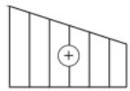

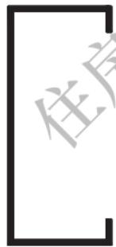  
（a）部分加劲板件最大压应力作用于支承边

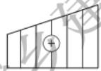

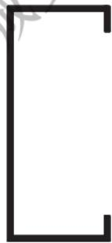  
（b）部分加劲板件最大压应力作用于部分加劲边

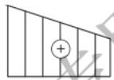

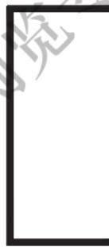  
（c）非加劲板件最大压应力作用于支承边

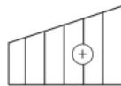

  
（d）非加劲板件最大压应力作用于自由边  
图5.6.3 部分加劲板件和非加劲板件的应力分布示意图

5.6.4 受压板件的板组约束系数的取值应符合下列规定：

1 当 $\xi \leqslant 1.1$ 时，可按下式计算：

$$k _{1} = \frac {1}{\sqrt {\xi}} \tag {5.6.4-1}$$

2 当 $\xi > 1.1$ 时，可按下列公式计算：

$$k _{1} = 0. 1 1 + \frac {0 . 9 3}{(\xi - 0 . 0 5) ^{2}} \tag {5.6.4-2}$$

$$\xi = \frac {c}{b} \sqrt {\frac {k}{k _{\mathrm {c}}}} \tag {5.6.4-3}$$

式中： $b$ ——计算板件的宽度（ $\mathrm{mm}$ ）；

$c$ ——与计算板件邻接的板件的宽度（ $\mathrm{mm}$ ），如果计算板件两边均有邻接板件时，应取压应力较大一边的邻接板件的宽度；

$k$ ——计算板件的受压稳定系数，应由本标准第5.6.3条确定；

$k_{\mathrm{c}}$ ——邻接板件的受压稳定系数，应由本标准第5.6.3条确定。

3 当 $k_{1} > k_{1}^{\prime}$ 时， $k_{1}$ 应取 $k_{1}^{\prime}, k_{1}^{\prime}$ 为 $k_{1}$ 的上限值。对于加劲板件 $k_{1}^{\prime}$ 可取1.7，对于部分加劲板件 $k_{1}^{\prime}$ 可取2.4，对于非加劲板件 $k_{1}^{\prime}$ 可取3.0。  
4 当计算板件只有一边有邻接板件，且邻接板件受拉时， $k_{1}$ 应取 $k_{1}^{\prime}$ 。

5.6.5 当板厚小于 $2\mathrm{mm}$ 时，构件中受压板件有效宽度宜按本标准第5.6.4条的规定计算。

5.6.6 构件中受压板件的中间加劲肋(图5.6.6)应符合下列规定：

$$I _{\mathrm {i s}} \geqslant 3. 6 6 t ^{4} \sqrt {\left(\frac {b _{\mathrm {s}}}{t}\right) ^{2} - \frac {2 7 1 0 0}{f _{\mathrm {y}}}} \tag {5.6.6-1}$$

且

$$I _{\mathrm {i s}} \geqslant 1 8 t ^{4} \tag {5.6.6-2}$$

式中： $I_{\mathrm{is}}$ ——压型钢板中间加劲肋的惯性矩（ $\mathrm{mm}^4$ ），其为中间加劲肋截面对平行于被加劲板件截面之形心轴的惯性矩；

$b_{\mathrm{s}}$ ——子板件的宽度（mm）；

$t$ ——板件的厚度（mm）。

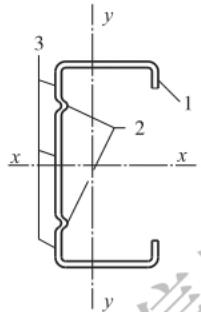  
（a）卷边槽形截面

（b）压型钢板  
图5.6.6 带中间加劲肋截面示意  
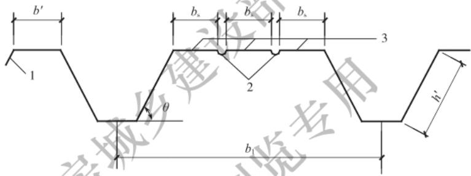  
1—卷边或边加劲肋；2—中间加劲肋；3—子板件；  
$b^{\prime}$ 一带卷边板件宽度； $b_{1}$ 一波宽； $h^\prime$ 一带卷边板件高度

5.6.7 部分加劲板件中卷边应符合下列规定：

1 卷边[本标准图5.6.6(a)]的高厚比不宜大于12，卷边的最小高厚比应根据部分加劲板的宽厚比按表5.6.7采用。

表 5.6.7 卷边的最小高厚比  

| b/t | a/t | b/t | a/t |
| --- | --- | --- | --- |
| 15 | 5.4 | 30 | 8.0 |
| 20 | 6.3 | 35 | 8.5 |
| 25 | 7.2 | 40 | 9.0 |

续表 5.6.7  

| b/t | a/t | b/t | a/t |
| --- | --- | --- | --- |
| 45 | 9.5 | 55 | 10.5 |
| 50 | 10.0 | 60 | 11.0 |

2 作为受压翼缘的边加劲肋[图5.6.6（b）]，尚应符合下列规定：

$$I _{\mathrm {e s}} \geqslant 1. 8 3 t ^{4} \sqrt {\left(\frac {b}{t}\right) ^{2} - \frac {2 7 1 0 0}{f _{\mathrm {y}}}} \tag {5.6.7-1}$$

且

$$I _{\mathrm {e s}} \geqslant 9 t ^{4} \tag {5.6.7-2}$$

式中： $I_{\mathrm{es}}$ ——压型钢板边加劲肋的惯性矩（ $\mathrm{mm}^4$ ），其为边加劲肋截面对平行于被加劲板件截面之形心轴的惯性矩；

$b$ ——边加劲板件的宽度（mm）。

5.6.8 当受压板件的宽厚比大于本标准第5.6.1条规定的有效宽厚比时，受压板件的有效截面计算应符合下列规定：

1 有效截面应自截面的受压部分按图5.6.8所示位置扣除其超出部分来确定，截面的受拉部分全部有效。  
2 有效宽度 $b_{\mathrm{e}}$ 按本标准第5.6.1条确定。  
3 当 $\psi \geqslant 0$ 时， $b_{c1}$ 和 $b_{c2}$ （图5.6.8）可按下列规定计算：

$$b _{\mathrm {e l}} = \frac {2 b _{\mathrm {e}}}{5 - \psi} \tag {5.6.8-1}$$

$$b _{\mathrm {e} 2} = b _{\mathrm {e}} - b _{\mathrm {e} 1} \tag {5.6.8-2}$$

4 当 $\psi \geq 0$ 时， $b_{\mathrm{e1}}$ 可取 $0.4b_{\mathrm{e}}, b_{\mathrm{e2}}$ 可取 $0.6b_{\mathrm{e}}$ 。

5 对于部分加劲板件及非加劲板件， $b_{\mathrm{e1}}$ 可取 $0.4b_{\mathrm{e}}$ ， $b_{\mathrm{e2}}$ 可取 $0.6b_{\mathrm{e}}$ 。

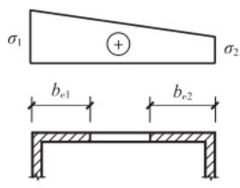

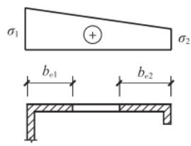

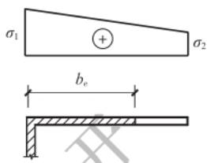

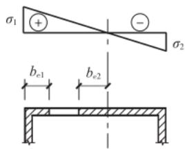  
（a）加劲板件

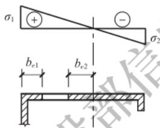  
（b）部分加劲板件

（c）非加劲板件  
图5.6.8 受压板件的有效截面图  
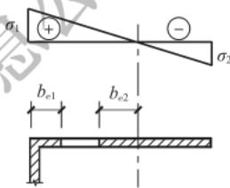  
$b_{\mathrm{e1}}, b_{\mathrm{e2}}$ ——板件受压部分两端的有效截面宽度；  
$\sigma_{1}$ 、 $\sigma_{2}$ 一板件两端的应力值，受压为正、受拉为负

5.6.9 圆管截面构件的外径与壁厚之比符合本标准第3.2.2条的规定时，在计算中可取其截面全部有效。  
5.6.10 在轴心受压构件中，板件的有效宽厚比应按本标准第5.6.1条的规定计算，其中 $\sigma_{1}$ 取构件最大长细比所确定的轴心受压构件的稳定系数与钢材强度设计值的乘积。  
5.6.11 在拉弯、压弯和受弯构件中板件的有效宽厚比应按下列规定确定：
1 对压弯构件，截面上各板件的压应力分布不均匀系数 $\psi$ 应由构件毛截面按强度计算，不计入双力矩的影响。最大压应力板件的应力 $\sigma_{1}$ 取钢材的强度设计值 $f$ ，其余板件的最大压应力按 $\psi$ 推算。有效宽厚比按本标准第5.6.1条的规定计算。  
2 对受弯及拉弯构件，截面上各板件的压应力分布不均匀系数 $\psi$ 及最大压应力应由构件毛截面按强度计算，不计入双力矩的影响。有效宽厚比按本标准第5.6.1条的规定计算。

3 板件的受拉部分全部有效。

5.6.12 冷弯薄壁型钢结构开口截面构件符合下列情况之一时，可不计算畸变屈曲对构件承载力的影响：

1 构件受压翼缘有可靠的限制畸变屈曲变形的约束；  
2构件自由长度小于构件畸变屈曲半波长的一半；  
3 构件截面采取了其他有效抑制畸变屈曲发生的措施。

# 6 连接的计算与构造

## 6.1 连接的计算

6.1.1 对接焊缝和角焊缝的强度应符合下列公式规定：

1 对接焊缝轴心受拉：

$$\frac {N}{l _{\mathrm {w}} t} \leqslant f _{\mathrm {c}} ^{\mathrm {w}} \tag {6.1.1-1}$$

2 对接焊缝轴心受压：

$$\frac {N}{l _{\mathrm {w}} t} \leqslant f _{\mathrm {c}} ^{\mathrm {w}} \tag {6.1.1-2}$$

3 对接焊缝受弯同时受剪：

1)拉应力：

$$\frac {M}{W _{\mathrm {f}}} \leqslant f _{\mathrm {f}} ^{\mathrm {w}} \tag {6.1.1-3}$$

2)剪应力：

$$\frac {V S _{\mathrm {f}}}{I _{\mathrm {f}} t} \leqslant f _{\mathrm {v}} ^{\mathrm {w}} \tag {6.1.1-4}$$

3)对接焊缝中剪应力和正应力均较大处：

$$\sqrt {\left(\frac {M}{W _{\mathrm {f}}}\right) ^{2} + 3 \left(\frac {V S _{\mathrm {f}}}{I _{\mathrm {f}} t}\right) ^{2}} \leqslant 1. 1 f _{\mathrm {t}} ^{\mathrm {w}} \tag {6.1.1-5}$$

4 作用力垂直于焊缝长度方向的正面直角角焊缝受剪：

$$\sigma_{\mathrm {f}} = \frac {N}{0 . 7 h _{\mathrm {f}} l _{\mathrm {w}}} \tag {6.1.1-6}$$

$$\sigma_{\mathrm {f}} \leqslant 1. 2 2 f _{\mathrm {f}} ^{\mathrm {w}} \tag {6.1.1-7}$$

5 作用力平行于焊缝长度方向的侧面直角角焊缝受剪：

$$\tau_{\mathrm {f}} = \frac {N}{0 . 7 h _{\mathrm {f}} l _{\mathrm {w}}} \tag {6.1.1-8}$$

$$\tau_{\mathrm {f}} \leqslant f _{\mathrm {f}} ^{\mathrm {w}} \tag {6.1.1-9}$$

6 在垂直于角焊缝长度方向的应力和平行于角焊缝长度方向的剪应力共同作用处：

$$\sqrt {\left(\frac {\sigma_{\mathrm {f}}}{\beta_{\mathrm {f}}}\right) ^{2} + \tau_{\mathrm {f}} ^{2}} \leqslant f _{\mathrm {f}} ^{\mathrm {w}} \tag {6.1.1-10}$$

式中： $l_{\mathrm{w}}$ ——焊缝计算长度之和（ $\mathrm{mm}$ ），采用引弧板和引出板施焊的对接焊缝，每条对接焊缝的计算长度可取其实际长度；对其他方法施焊的对接焊缝，每条对接焊缝的计算长度均应取实际长度减去连接构件中较薄板件厚度的2倍；每条角焊缝的计算长度均应取实际长度减去焊脚尺寸的2倍；当单条侧面角焊缝的计算长度大于焊脚尺寸的60倍时，其超过部分在计算中应予扣除；

$h_\mathrm{f}$ ——角焊缝的焊脚尺寸 $(\mathrm{mm})$

$t$ ——连接构件中较薄板件的厚度（ $\mathrm{mm}$ ）；

$W_{\mathrm{f}}$ ——焊缝截面模量（ $\mathrm{mm}^3$ ）；

$S_{\mathrm{f}}$ ——焊缝截面的最大面积矩 $(\mathrm{mm}^3)$ ；

$I_{\mathrm{f}}$ ——焊缝截面惯性矩 $(\mathrm{mm}^4)$ ；

$\sigma_{\mathrm{f}}$ —垂直于角焊缝长度方向的应力；

$\tau_{\mathrm{f}}$ ——平行于角焊缝长度方向的剪应力；

$f_{\mathrm{c}}^{\mathrm{w}}, f_{\mathrm{t}}^{\mathrm{w}}$ ——对接焊缝的抗压、抗拉强度设计值 $(\mathrm{N} / \mathrm{mm}^{2})$ ；

$f_{\mathrm{v}}^{\mathrm{w}}$ ——对接焊缝的抗剪强度设计值（ $\mathrm{N / mm}^2$ ）；

$f_{\mathrm{f}}^{\mathrm{w}}$ ——角焊缝的抗压、抗拉和抗剪强度设计值 $(\mathrm{N} / \mathrm{mm}^{2})$

$\beta_{\mathrm{f}}$ ——正面角焊缝的强度设计值增大系数；对承受静力荷载和间接承受动力荷载的结构， $\beta_{\mathrm{f}}$ 应取1.22。

6.1.2 当喇叭形焊缝被连接板件的最小厚度大于 $4\mathrm{mm}$ 时，焊缝强度应按本标准第6.1.1条的相关公式计算；当被连接板件的最小厚度不大于 $4\mathrm{mm}$ 时，焊缝强度应符合下列公式规定：

1 轴力 $N$ 垂直于焊缝轴线方向作用的焊缝（图6.1.2-1），抗

剪强度应符合下式规定：

$$\frac {N}{l _{\mathrm {w}} t} \leqslant 0. 7 5 f \tag {6.1.2-1}$$

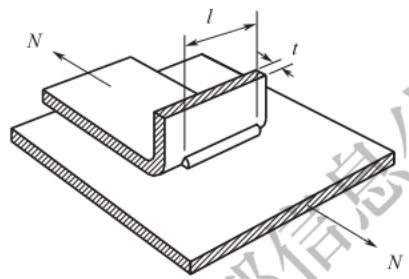  
图6.1.2-1 端缝受剪的单边喇叭形焊缝 $l$ —焊缝实际长度

2 轴力 $N$ 平行于焊缝轴线方向作用的焊缝（图6.1.2-2），抗剪强度应符合下式规定：

$$\frac {N}{l _{\mathrm {w}} t} \leqslant 0. 6 f \tag {6.1.2-2}$$

式中： $t$ ——连接钢板的最小厚度（ $\mathrm{mm}$ ）；

$l_{\mathrm{w}}$ ——焊缝计算长度之和 $(\mathrm{mm})$ ；

$f$ ——连接钢板的抗拉强度设计值（ $\mathrm{N} / \mathrm{mm}^2$ ）。

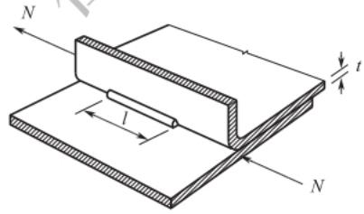  
（a）单边喇叭形焊缝

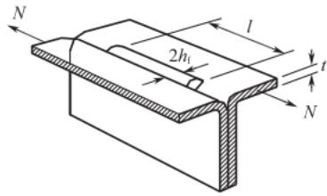  
（b）喇叭形焊缝  
图6.1.2-2 纵向受剪的喇叭形焊缝  
$l$ 一焊缝实际长度

3 每条喇叭形焊缝的计算长度均应取实际长度 $l$ 减去焊脚尺寸 $h_{\mathrm{f}}$ 的2倍，焊脚尺寸 $h_\mathrm{f}$ 应按图6.1.2-2(b)或图6.1.2-3确定。

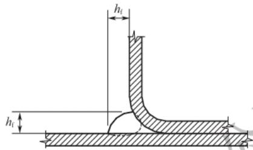  
图6.1.2-3 单边喇叭形焊缝

6.1.3 电阻点焊可用于构件的缀合或组合连接，每个焊点所承受的最大剪力不应大于本标准表4.2.6中规定的抗剪承载力设计值。  
6.1.4 普通螺栓的强度应符合下列规定：

1 在普通螺栓杆轴方向受拉的连接中，每个螺栓所受的拉力不应大于按下式计算的抗拉承载力设计值 $N_{\mathrm{a}}^{\mathrm{b}}$

$$N _{\mathrm {t}} ^{\mathrm {b}} = \frac {\pi d _{\mathrm {e}} ^{2}}{4} f _{\mathrm {t}} ^{\mathrm {b}} \tag {6.1.4-1}$$

式中： $d_{\mathrm{c}}$ —螺栓螺纹处的有效直径 $(\mathrm{mm})$

$f_{\mathrm{t}}^{\mathrm{b}}$ 螺栓的抗拉强度设计值（ $\mathrm{N / mm}^2$ ）。

2 在普通螺栓的受剪连接中，每个螺栓所受的剪力不应大于按下列公式计算的抗剪承载力设计值 $N_{\mathrm{v}}^{\mathrm{b}}$ 和承压承载力设计值 $N_{\mathrm{c}}^{\mathrm{b}}$ 的较小者：

1)抗剪承载力设计值：

$$N _{\mathrm {v}} ^{\mathrm {b}} = n _{\mathrm {v}} \frac {\pi d ^{2}}{4} f _{\mathrm {v}} ^{\mathrm {b}} \tag {6.1.4-2}$$

2)承压承载力设计值：

$$N _{\mathrm {c}} ^{\mathrm {b}} = d \sum t f _{\mathrm {c}} ^{\mathrm {b}} \tag {6.1.4-3}$$

式中： $n_{\mathrm{v}}$ —剪切面数；

$d$ ——螺杆直径 $(\mathrm{mm})$ ，对全螺纹螺栓，可取 $d = d_{\mathrm{c}}$

$\sum t$ ——同一受力方向的承压构件的较小总厚度 $(\mathrm{mm})$ ；

$f_{\mathrm{c}}^{\mathrm{b}}, f_{\mathrm{v}}^{\mathrm{b}}$ ——螺栓的承压、抗剪强度设计值 $(\mathrm{N} / \mathrm{mm}^{2})$ 。

3 同时承受剪力和杆轴方向拉力的普通螺栓连接，应符合下列公式规定：

$$\sqrt {\left(\frac {N _{\mathrm {v}}}{N _{\mathrm {v}} ^{\mathrm {b}}}\right) ^{2} + \left(\frac {N _{\mathrm {t}}}{N _{\mathrm {t}} ^{\mathrm {b}}}\right) ^{2}} \leqslant 1 \tag {6.1.4-4}$$

$$N _{\mathrm {v}} \leqslant N _{\mathrm {c}} ^{\mathrm {b}} \tag {6.1.4-5}$$

式中： $N_{\mathrm{v}}$ 、 $N_{\mathrm{t}}$ ——一个螺栓所承受的剪力、拉力（N）；

$N_{\mathrm{t}}^{\mathrm{b}}$ ——一个螺栓的抗拉承载力设计值（N）。

6.1.5 高强度螺栓摩擦型连接中，高强度螺栓的强度应符合下列规定：

1 每个螺栓所受的剪力不应大于按下式计算的抗剪承载力设计值 $N_{\mathrm{v}}^{\mathrm{b}}$

$$N _{\mathrm {f}} ^{\Phi} = \alpha k ^{\prime} n _{\mathrm {f}} \mu^{\prime} P \tag {6.1.5-1}$$

式中： $\alpha$ ——系数，当最小板厚 $t$ 不大于 $6\mathrm{mm}$ 时可取0.8，当最小板厚 $t$ 大于 $6\mathrm{mm}$ 时可取0.9；

$k^{\prime}$ ——孔型系数；标准孔可取1.0，大圆孔可取0.85，内力与槽孔长向垂直时可取0.7，内力与槽孔长向平行时可取0.6；

$n_{\mathrm{f}}$ ——传力摩擦面数；

$\mu^{\prime}$ ——抗滑移系数，应按表6.1.5-1采用；

$P$ ——高强度螺栓的预拉力(N)，应按表6.1.5-2采用。

表 6.1.5-1 抗滑移系数 ${\mu }^{\prime }$ 值  

| 连接处构件接触面的处理方法 | 构件的钢材牌号 | 构件的钢材牌号 |
| --- | --- | --- |
| 连接处构件接触面的处理方法 | Q235 | Q355、Q390 |
| 抛丸或喷砂 | 0.40 | 0.45 |
| 热轧钢材轧制表面清除浮锈 | 0.30 | 0.35 |
| 冷轧钢材轧制表面清除浮锈 | 0.25 | - |

注：1 钢板厚度小于 $3\mathrm{mm}$ 时，不可采用喷砂处理。  
2 采用钢丝刷除锈方向应与受力方向相垂直。

表 6.1.5-2 高强度螺栓的预拉力 $P$ 值 (N)  

| 螺栓的 性能等级 | 螺栓型号 | 螺栓型号 | 螺栓型号 | 螺栓型号 | 螺栓型号 | 螺栓型号 | 螺栓型号 | 螺栓型号 |
| --- | --- | --- | --- | --- | --- | --- | --- | --- |
| 螺栓的 性能等级 | M12 | M14 | M16 | M20 | M22 | M24 | M27 | M30 |
| 8. 8 级 | 45000 | 60000 | 80000 | 125000 | 150000 | 175000 | 230000 | 280000 |
| 10.9 级 | 55000 | 75000 | 100000 | 155000 | 190000 | 225000 | 290000 | 355000 |

2 每个螺栓所受的沿螺栓杆轴方向的拉力不应大于按下式计算的抗拉承载力设计值 $N_{\mathrm{t}}^{\mathrm{b}}$

$$N _{\mathrm {t}} ^{\mathrm {b}} = 0. 8 P \tag {6.1.5-2}$$

3 同时承受摩擦面间的剪力 $N_{\mathrm{v}}$ 和沿螺栓杆轴方向的拉力 $N_{\mathrm{t}}$ 作用的高强度螺栓， $N_{\mathrm{t}}$ 不应大于按公式(6.1.5-2)计算的抗拉承载力设计值 $N_{\mathrm{t}}^{\mathrm{b}}$ ，且 $N_{\mathrm{v}}$ 不应大于按下式计算的抗剪承载力设计值 $N_{\mathrm{v}}^{\mathrm{b}}$ ：

$$N _{\mathrm {v}} ^{\mathrm {b}} = \alpha n _{\mathrm {f}} \mu^{\prime} (P - 1. 2 5 N _{\mathrm {t}}) \tag {6.1.5-3}$$

6.1.6 承压型连接中高强度螺栓的强度应符合下列规定：

1 承压型连接中高强度螺栓的预拉力 $P$ 的施拧工艺和设计值取值应与摩擦型连接高强度螺栓相同。高强度螺栓承压型连接不应用于直接承受动力荷载的结构。  
2 承压型连接中每个高强度螺栓的抗剪承载力设计值的计算方法与普通螺栓相同，但当计算剪切面在螺纹处时应按螺纹处的有效截面积进行计算。  
3 在杆轴受拉的连接中，每个高强度螺栓的抗拉承载力设计值的计算方法与普通螺栓相同。  
4 同时承受剪力和杆轴方向拉力的承压型连接中，所计算的高强度螺栓的承载力应符合下式规定：

$$\sqrt {\left(\frac {N _{\mathrm {v}}}{N _{\mathrm {v}} ^{\mathrm {b}}}\right) ^{2} + \left(\frac {N _{\mathrm {t}}}{N _{\mathrm {t}} ^{\mathrm {b}}}\right) ^{2}} \leqslant 1. 0 \tag {6.1.6}$$

式中： $N_{\mathrm{v}},N_{\mathrm{t}}$ ——所计算的某个高强度螺栓所承受的剪力、拉力(N)；

$N_{\mathrm{v}}^{\mathrm{b}}, N_{\mathrm{t}}^{\mathrm{b}}$ ——一个高强度螺栓按普通螺栓计算时的抗剪、抗拉承载力设计值（N）。

6.1.7 在构件的节点处或拼接接头的一端，当螺栓沿轴向受力方向的连接长度 $l_{\mathrm{b}} > 15d_{0}$ 时，应将螺栓的承载力设计值乘以按下式计算的折减系数 $\eta_{\mathrm{b}}$ ；当 $l_{\mathrm{b}} > 60d_{0}$ 时，折减系数 $\eta_{\mathrm{b}}$ 应取0.7。

$$\eta_{\mathrm {b}} = 1. 1 - \frac {l _{\mathrm {b}}}{1 5 0 d _{0}} \tag {6.1.7}$$

式中： $d_{0}$ —孔径。

6.1.8 用于压型钢板之间和压型钢板或薄壁构件与冷弯型钢构件之间紧密连接的抽芯铆钉、自攻螺钉和射钉连接的强度应符合下列规定：

1 在压型钢板或薄壁构件与冷弯型钢等支承构件之间的连接件沿杆轴向受拉的连接中，每个自攻螺钉或射钉所受的拉力不应大于按下列公式计算的抗拉承载力设计值：

1)当只受静荷载作用时：

$$N _{\mathrm {t o v}} ^{\mathrm {f}} = 1. 2 d _{\omega} t f \tag {6.1.8-1}$$

2）当受含有风荷载的组合荷载作用时：

$$N _{\text {t o v}} ^{\mathrm {f}} = 0. 6 d _{\omega} t f \tag {6.1.8-2}$$

式中： $N_{\mathrm{tot}}^{\mathrm{f}}$ ——一个自攻螺钉或射钉的抗拉脱承载力设计值（N）；

$d_{\omega}$ ——一个自攻螺钉或射钉的钉头直径，当有垫圈时可取垫圈的直径（mm）；

$t$ ——紧挨钉头侧的钢板厚度（ $\mathrm{mm}$ ），应在 $0.5\mathrm{mm}$ 和 $1.5\mathrm{mm}$ 之间；

$f$ ——被连接钢板的抗拉强度设计值（ $\mathrm{N} / \mathrm{mm}^2$ ）；当连接件位于压型钢板波谷的一个四分点时[图6.1.8(b)]，其抗拉承载力设计值应乘以折减系数0.9，当压型钢板波谷的两个四分点均设置连接件时[图6.1.8(c)]，则应乘以折减系数0.7。

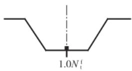  
（a）连接件位于波谷中心

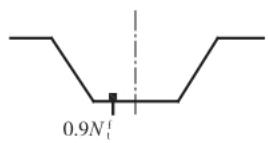  
（b）连接件位于波谷一个四分点处

（c）连接件位于波谷两个四分点处  
图6.1.8 压型钢板连接示意图  
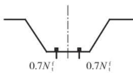  
$N_{\mathrm{t}}^{\mathrm{f}}$ —一个自攻螺钉或射钉的抗拉承载力设计值

3)自攻螺钉在基材中的钻入深度 $t_{\mathrm{c}}$ 应大于 $0.9\mathrm{mm}$ ，其所受的拉力不应大于按下式计算的抗拔承载力设计值 $N_{\mathrm{tot}}^{\mathrm{f}}$

$$N _{\mathrm {t o t}} ^{\mathrm {f}} = 0. 7 5 t _{\mathrm {c}} d f \tag {6.1.8-3}$$

式中： $N_{\mathrm{tot}}^{\mathrm{f}}$ ——一个自攻螺钉的抗拔承载力设计值（N）；

$d$ ——自攻螺钉的直径（ $\mathrm{mm}$ ）；

$t_{\mathrm{c}}$ ——钉杆的圆柱状螺纹部分钻入基材中的深度（mm）；

$f$ ——基材的抗拉强度设计值 $(\mathrm{N} / \mathrm{mm}^2)$ 。

4)自攻螺钉或射钉所受的拉力设计值不应超过由标准试验确定的钉杆拉断破坏的承载力设计值的 $80\%$ 。标准试验方法应按本标准第E.3节执行。

2 当连接件受剪时，每个连接件所承受的剪力不应大于按下列公式计算的抗剪承载力设计值 $N_{\mathrm{v}}^{\mathrm{f}}$

1)抽芯铆钉和自攻螺钉：

当 $\frac{t_1}{t} = 1$ 时：

$$N _{\mathrm {v}} ^{\mathrm {f}} = 3. 7 \sqrt {t ^{3} d} f \tag {6.1.8-4}$$

且

$$N _{\mathrm {v}} ^{\mathrm {f}} \leqslant 2. 4 t d f \tag {6.1.8-5}$$

当 $\frac{t_1}{t} \geq 2.5$ 时：

$$N _{\mathrm {v}} ^{\mathrm {f}} = 2. 4 t d f \tag {6.1.8-6}$$

当 $1 < \frac{t_1}{t} < 2.5$ 时， $N_{\mathrm{v}}^{\mathrm{f}}$ 可由公式(6.1.8-4)和公式(6.1.8-6)插值求得。

式中： $N_{\mathrm{v}}^{\mathrm{f}}$ ——一个连接件的抗剪承载力设计值（N）；

$d$ ——铆钉或螺钉直径（ $\mathrm{mm}$ ）；

$t$ ——较薄板或钉头接触侧的钢板的厚度（ $\mathrm{mm}$ ）；

$t_1$ ——较厚板或在现场形成钉头一侧的板或钉尖侧的板的厚度（mm）；

$f$ ——被连接钢板的抗拉强度设计值 $(\mathrm{N} / \mathrm{mm}^2)$ 。

2)射钉：

$$N _{\mathrm {v}} ^{\mathrm {f}} = 3. 7 t d f \tag {6.1.8-7}$$

式中： $t$ ——被固定的单层钢板的厚度（ $\mathrm{mm}$ ）；

$d$ ——射钉直径（ $\mathrm{mm}$ ）；

$f$ ——被固定钢板的抗拉强度设计值 $(\mathrm{N} / \mathrm{mm}^2)$ 。

3)当抽芯铆钉或自攻螺钉用于压型钢板端部与檩条等支承构件的连接时，其抗剪承载力设计值应乘以折减系数0.8。  
4)每个自攻螺钉、抽芯铆钉或射钉所承受的剪力设计值不应超过由标准试验确定的钉杆抗剪强度设计值的 $80\%$ 标准试验方法应按本标准第E.2节执行。

3 同时承受剪力和拉力作用的自攻螺钉和射钉连接，应符合下式规定：

$$\sqrt {\left(\frac {N _{\mathrm {v}}}{N _{\mathrm {v}} ^{\mathrm {f}}}\right) ^{2} + \left(\frac {N _{\mathrm {t}}}{N _{\mathrm {t}} ^{\mathrm {f}}}\right) ^{2}} \leqslant 1 \tag {6.1.8-8}$$

式中： $N_{\mathrm{v}}$ 、 $N_{\mathrm{t}}$ ——一个连接件所承受的剪力、拉力(N)；

$N_{\mathrm{v}}^{\mathrm{f}}, N_{\mathrm{t}}^{\mathrm{f}}$ ——一个连接件的抗剪、抗拉承载力设计值(N)； $N_{\mathrm{t}}^{\mathrm{f}}$ 应取 $N_{\mathrm{tot}}^{\mathrm{f}}$ 和 $N_{\mathrm{tot}}^{\mathrm{f}}$ 中的较小值。

4 当采用自攻螺钉连接S550等低延性钢板时，单个自攻螺钉连接应按本标准公式(6.1.8-1)～公式(6.1.8-6)的计算结果乘

以折减系数0.8确定其设计承载力。

6.1.9 当存在剪切滞后效应的抗剪连接部位采用多于7个自攻螺钉时，单个自攻螺钉连接应按本标准第6.1.8条的计算结果乘以折减系数0.85确定其设计承载力。  
6.1.10 由两槽钢或卷边槽钢连接而成的拼合工形截面（图6.1.10），其焊缝、点焊或螺栓等连接件的最大纵向间距 $a_{\mathrm{max}}$ 应符合下列规定：

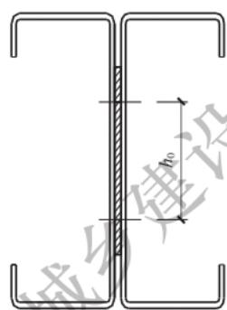  
（a）电阻点焊连接

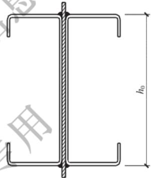  
（b）带垫板的焊接连接

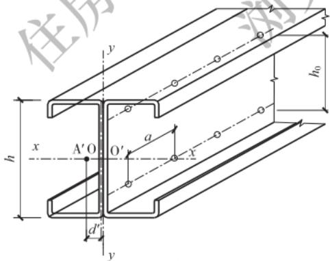  
（c）带垫板或不设垫板的螺栓连接

（d）喇叭形焊缝连接  
图6.1.10 拼合工形截面示意图  
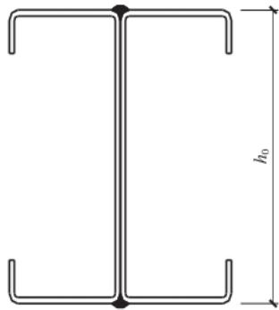  
$\mathrm{A}^{\prime}$ 一单个槽钢的剪心； $\mathrm{O}^{\prime}$ 一单个槽钢腹板中心线与对称轴 $x$ 的交点； $a$ 一连接件间的纵向间距； $h$ 一腹板高度； $h_0$ 一连接件间的垂直距离

1 对于轴心压杆和绕 $y$ 轴弯曲的压弯构件，应取按下列公式计算的较小值：

$$a _{\max } = \frac {n _{1} N _{\mathrm {v}} ^{\mathrm {f}} I _{\mathrm {y}}}{V S _{\mathrm {y}}} \tag {6.1.10-1}$$

$$a _{\max } = \frac {l i _{1}}{2 i _{y}} \tag {6.1.10-2}$$

式中： $n_1$ ——同一截面处的连接件数；

$N_{\mathrm{v}}^{\mathrm{f}}$ ——一个连接件的抗剪承载力设计值（N），对于电阻点焊可取 $N_{\mathrm{v}}^{\mathrm{s}}$

$I_{\mathrm{y}}$ ——拼合工形截面对平行于腹板的形心轴 $y$ 轴的惯性矩 $(\mathrm{mm}^4)$ ；

V——剪力(N)，应取实际剪力及按本标准第5.2.8条计算的剪力中的较大值；

$S_{y}$ ——单个槽钢对 $y$ 轴的面积矩 $(\mathrm{mm}^3)$ ；

$l$ ——构件支承点间的长度 $(\mathrm{mm})$ ；

$i_{1}$ ——单个槽钢对其自身平行于腹板的形心轴的回转半径（mm）；

$i_{y}$ ——拼合工形截面对 $y$ 轴的回转半径（ $\mathrm{mm}$ ）。

2 对于绕 $x$ 轴弯曲的受弯构件应按下式计算，且 $a_{\mathrm{max}}$ 不应超过 $l$ 的 $1 / 6$

$$a _{\max } = \frac {2 N _{\mathrm {t}} ^{\mathrm {f}} h _{0}}{d ^{\prime} q _{0}} \tag {6.1.10-3}$$

式中： $N_{\mathrm{t}}^{\mathrm{f}}$ ——一个连接件的抗拉承载力设计值（N），对电阻点焊可取 $0.3N_{\mathrm{v}}^{\mathrm{s}}$

$h_0$ ——最靠近上、下翼缘的两排连接件间的垂直距离（mm）；

$d^{\prime}$ ——单个槽钢的腹板中面至其剪心的距离 $(\mathrm{mm})$

$q_{0}$ ——等效荷载集度（ $\mathrm{N / mm}$ ）；对于承受均布荷载的梁应取实际荷载集度的3倍；对于集中荷载或反力，应将

集中力除以荷载分布长度或连接件的纵向间距，取其中的较大值。

3 对于绕 $x$ 轴弯曲的压弯构件，除满足公式(6.1.10-3)的要求外，尚应满足公式(6.1.10-1)和公式(6.1.10-2)的要求。

6.1.11 用于压型钢板波峰与型钢构件之间的自攻螺钉连接的强度应按下列规定确定：

1 在沿杆轴方向受拉的连接中，每个自攻螺钉的抗拉承载力设计值可按本标准公式(6.1.8-3)计算，也可由标准抗拉脱承载力试验确定。每个自攻螺钉的抗拉脱承载力设计值，应按本标准附录E的有关规定确定。  
2 在垂直于杆轴方向受剪的连接中，当波峰处只有一层钢板相连，或虽有多层钢板相连，但计算自攻螺钉与型钢构件之间的连接强度时，每个自攻螺钉的抗剪承载力设计值应按本标准附录E的有关规定确定。当计算波峰处钢板之间的连接时，每个自攻螺钉的抗剪承载力设计值，可按本标准公式（6.1.8-4）～公式(6.1.8-6)计算。

## 6.2 连接的构造

6.2.1 当被连接板件的厚度 $t \leqslant 6\mathrm{mm}$ 时，焊缝的计算长度不应小于 $30\mathrm{mm}$ ；当 $t > 6\mathrm{mm}$ 时，焊缝的计算长度不应小于 $40\mathrm{mm}$ 。角焊缝的焊脚尺寸不宜大于 $1.5t, t$ 为相连板件中较薄板件的厚度。直接相贯的钢管节点的角焊缝焊脚尺寸不宜大于 $2.0t$ 。  
6.2.2 当采用喇叭形焊缝且最小板厚大于 $4\mathrm{mm}$ 时，单边喇叭形焊缝的焊脚尺寸 $h_{\mathrm{f}}$ （本标准图6.1.2-3）不应小于 $1.5\sqrt{t_{\mathrm{b}}}, t_{\mathrm{b}}$ 为相连板件中较厚板件的厚度，单位为 $\mathrm{mm}$ ，也不应大于 $1.5t_{\mathrm{a}}, t_{\mathrm{a}}$ 为相连板件中较薄板件的厚度；当最小板厚不大于 $4\mathrm{mm}$ 时，单边喇叭形焊缝的焊脚尺寸 $h_{\mathrm{f}}$ 不应小于被连接板件最小厚度的1.4倍。  
6.2.3 电阻点焊的焊点中距不宜小于 $15\sqrt{t}$ ，焊点边距不宜小于

$10\sqrt{t}, t$ 为被连接板件中较薄板件的厚度，单位为 $\mathrm{mm}$ 。

6.2.4 螺栓的中距不应小于螺栓孔径 $d_{0}$ 的3倍，端距不应小于螺栓孔径的2倍，边距不应小于螺栓孔径的1.5倍（图6.2.4）。在靠近弯角边缘处的螺栓孔边距，尚应满足使用紧固工具的要求。

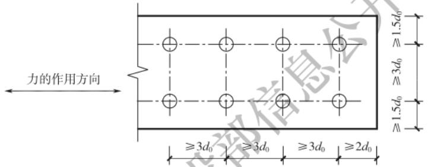  
图6.2.4 螺栓最小间距示意图

6.2.5 抽芯铆钉的原始钉头和自攻螺钉的钉头部分应靠在较薄的板件一侧。连接件的中距和端距不应小于连接件直径的3倍，边距不应小于连接件直径的1.5倍。受力连接中的连接件的数量不宜少于两个。  
6.2.6 在受力蒙皮结构中，宜选用直径不小于 $4\mathrm{mm}$ 的抽芯铆钉或直径不小于 $5\mathrm{mm}$ 的自攻螺钉。  
6.2.7 自攻螺钉连接的板件上的预制孔径 $d_{0}$ 应符合下列公式规定：

$$d _{0} = 0. 7 d + 0. 2 t _{\mathrm {t}} \tag {6.2.7-1}$$

且

$$d _{0} \leqslant 0. 9 d \tag {6.2.7-2}$$

式中： $d$ ——自攻螺钉的公称直径 $(\mathrm{mm})$ ；

$t_\mathrm{t}$ ——被连接板的总厚度（mm）。

6.2.8 射钉连接应符合下列规定：

1 射钉间距不应小于射钉直径的4.5倍，且其中距不应小于 $20\mathrm{mm}$ ；到基材的端部和边缘的距离不应小于 $15\mathrm{mm}$ ；穿透深度不应小于 $10\mathrm{mm}$ （图6.2.8）。

  
图6.2.8 射钉的穿透深度

2 射钉连接中基材的屈服强度不应小于 $150\mathrm{N} / \mathrm{mm}^2$ ，被连接钢板的最大屈服强度不应大于 $360\mathrm{N} / \mathrm{mm}^2$ 。被连接钢板的最大厚度和基材的最小厚度应分别符合表6.2.8-1和表6.2.8-2的规定。

表 6.2.8-1 被连接钢板的最大厚度  

| 射钉直径(mm) | $\geq {3.7}$ | $\geq {4.5}$ | $\geq {5.2}$ |
| --- | --- | --- | --- |
| 单一方向 | 单一方向 | 单一方向 | 单一方向 |
| 单层被固定钢板最大厚度(mm) | 1.0 | 2.0 | 3.0 |
| 多层被固定钢板最大厚度(mm) | 1.4 | 2.5 | 3.5 |
| 相反方向 | 相反方向 | 相反方向 | 相反方向 |
| 所有被固定钢板最大厚度(mm) | 2.8 | 5.0 | 7.0 |

表 6.2.8-2 基材的最小厚度  

| 射钉直径(mm) | ≥3.7 | ≥4.5 | ≥5.2 |
| --- | --- | --- | --- |
| 最小厚度(mm) | 4.0 | 6.0 | 8.0 |

6.2.9 在抗拉连接中，自攻螺钉和射钉的钉头或垫圈直径不应小于 $8\mathrm{mm}$ ，垫圈的厚度不应小于 $1.3\mathrm{mm}$ 。

# 7抗震设计

## 7.1 一般规定

7.1.1 含有闭口厚壁冷弯型钢柱或冷弯型钢支撑的框架或框架-支撑结构建筑的抗震设防类别及其抗震设防标准应按现行国家标准《建筑工程抗震设防分类标准》GB50223的规定采用。  
7.1.2 设计地震动参数应符合现行国家标准《建筑抗震设计标准》GB/T50011的规定。  
7.1.3 含有冷弯型钢构件的框架或框架-支撑结构的抗震设计宜采用性能化设计，构件塑性耗能区的抗震承载性能等级在不同地震动水准下的性能目标应符合表7.1.3的规定。

表 7.1.3 构件塑性耗能区的抗震承载性能等级的性能目标  

| 承载性能等级 | 多遇地震 | 设防地震 | 罕遇地震 |
| --- | --- | --- | --- |
| 性能1 | 完好,变形远小于弹性位移限值 | 完好,变形小于弹性位移限值 | 基本完好,有轻微塑性变形,主体结构不受损坏或日常维修即可 |
| 性能2 | 完好,变形明显小于弹性位移限值 | 基本完好,实际承载力满足高性能系数的要求,变形略大于弹性位移限值 | 轻微破坏,有可见的塑性变形,主体结构构件稍加修理可继续使用 |
| 性能3 | 完好,变形小于弹性位移限值 | 实际承载力满足低性能系数的要求,结构构件出现允许的塑性变形 | 会发生破坏,但不会发生危及生命的严重破坏,结构构件出现塑性变形,经一般修理后可继续使用 |

续表 7.1.3  

| 承载性能 等级 | 多遇地震 | 设防地震 | 罕遇地震 |
| --- | --- | --- | --- |
| 性能 4 | 基本完好,少量结 构构件出现轻微的塑 性应变 | 实际承载力满足最 低性能系数的要求, 结构构件出现允许的 塑性变形 | 不严重破坏,结构构 件出现允许的明显塑 性变形,经一般修理后 可继续使用 |

注：1 完好指所有构件保持弹性状态；基本完好指构件基本保持弹性状态，仅有少量构件在预期的塑性耗能区出现允许的轻微塑性应变。  
2 轻微塑性变形指层间侧移角小于 $1 / 100$ ，明显塑性变形指层间侧移角为 $1 / 50\sim 1 / 20$

7.1.4 含有冷弯型钢构件的结构中，不同部位的构件、同一部位的水平构件和竖向构件可选用相同或不同的抗震承载性能等级。

7.1.5 不同承载性能等级的结构构件和节点的最低延性等级应按表7.1.5-1的规定确定，如有需要也可适当提高其延性等级，再按表7.1.5-2和表7.1.5-3的规定采用与结构构件延性等级对应的构件截面板件宽厚比限值及与结构节点延性等级对应的节点抗震性能要求。

表 7.1.5-1 不同承载性能等级的结构构件和节点的最低延性等级  

| 设防类别 | 塑性耗能区的承载性能等级 | 塑性耗能区的承载性能等级 | 塑性耗能区的承载性能等级 | 塑性耗能区的承载性能等级 |
| --- | --- | --- | --- | --- |
| 设防类别 | 性能1 | 性能2 | 性能3 | 性能4 |
| 适度设防类(丁类) | III级 | III级 | II级 | I级 |
| 标准设防类(丙类) | III级 | III级 | II级 | I级 |
| 重点设防类(乙类) | III级 | II级 | I级 | I级 |
| 特殊设防类(甲类) | II级 | II级 | I级 | I级 |

注：延性等级 I 级至 III 级表示构件延性性能依次降低。

表 7.1.5-2 与结构构件延性等级对应的构件截面板件宽厚比限值  

| 构件延性等级 | 构件延性等级 | 构件延性等级 | I 级 | II 级 | III 级 |
| --- | --- | --- | --- | --- | --- |
| 框架柱 | 箱形截面 | 壁板宽厚比 | 35 | 40 | >40 |
| 框架柱 | 箱形截面 | 长细比 | 60 | 120 | - |
| 框架柱 | 箱形截面 | 长细比 | 且 $\leq {125}\left\lbrack {1 - {N}_{\mathrm{{GE}}}/\left( A{f}_{y}\right) }\right\rbrack$ | 且 $\leq {125}\left\lbrack {1 - {N}_{\mathrm{{GE}}}/\left( A{f}_{y}\right) }\right\rbrack$ | 且 $\leq {125}\left\lbrack {1 - {N}_{\mathrm{{GE}}}/\left( A{f}_{y}\right) }\right\rbrack$ |
| 框架柱 | 圆管 | 径厚比 | 60 | 100 | >100 |
| 框架柱 | 圆管 | 长细比 | 60 | 120 | - |
| 框架柱 | 圆管 | 长细比 | 且 $\leq {125}\left\lbrack {1 - {N}_{\mathrm{{GE}}}/\left( A{f}_{y}\right) }\right\rbrack$ | 且 $\leq {125}\left\lbrack {1 - {N}_{\mathrm{{GE}}}/\left( A{f}_{y}\right) }\right\rbrack$ | 且 $\leq {125}\left\lbrack {1 - {N}_{\mathrm{{GE}}}/\left( A{f}_{y}\right) }\right\rbrack$ |
| 中心支撑 | 箱形截面 | 壁板宽厚比 | 21 | 23 | >23 |
| 中心支撑 | 箱形截面 | 长细比 | 60 | 120 | - |
| 中心支撑 | 箱形截面 | 长细比 | 且 $\leq {125}\left\lbrack {1 - {N}_{\mathrm{{GE}}}/\left( A{f}_{y}\right) }\right\rbrack$ | 且 $\leq {125}\left\lbrack {1 - {N}_{\mathrm{{GE}}}/\left( A{f}_{y}\right) }\right\rbrack$ | 且 $\leq {125}\left\lbrack {1 - {N}_{\mathrm{{GE}}}/\left( A{f}_{y}\right) }\right\rbrack$ |
| 中心支撑 | 圆管 | 径厚比 | 40 | 70 | >70 |
| 中心支撑 | 圆管 | 长细比 | 60 | 120 | - |
| 中心支撑 | 圆管 | 长细比 | 且 $\leq {125}\left\lbrack {1 - {N}_{\mathrm{{GE}}}/\left( A{f}_{y}\right) }\right\rbrack$ | 且 $\leq {125}\left\lbrack {1 - {N}_{\mathrm{{GE}}}/\left( A{f}_{y}\right) }\right\rbrack$ | 且 $\leq {125}\left\lbrack {1 - {N}_{\mathrm{{GE}}}/\left( A{f}_{y}\right) }\right\rbrack$ |
| 中心支撑 | 角钢 | 肢宽厚比 | 8 | 10 | >10 |
| 中心支撑 | 角钢 | 长细比 | 60 | 120 | - |
| 中心支撑 | 角钢 | 长细比 | 且 $\leq {125}\left\lbrack {1 - {N}_{\mathrm{{GE}}}/\left( A{f}_{y}\right) }\right\rbrack$ | 且 $\leq {125}\left\lbrack {1 - {N}_{\mathrm{{GE}}}/\left( A{f}_{y}\right) }\right\rbrack$ | 且 $\leq {125}\left\lbrack {1 - {N}_{\mathrm{{GE}}}/\left( A{f}_{y}\right) }\right\rbrack$ |

注：1 表中数值适用于 Q235 钢,当钢材为其他牌号时,应乘以 $\sqrt{{235}/{f}_{\mathrm{y}}}$ ,但对于圆管的径厚比,应乘以 ${235}/{f}_{\mathrm{y}}$ 。  
2 $N_{\mathrm{GE}}$ 为轴压力标准值， $A$ 为截面面积， $f_{\mathrm{y}}$ 为钢材的屈服强度。

表 7.1.5-3 与结构节点延性等级对应的节点抗震性能要求  

| 节点延性等级 | I 级 | II 级 | III 级 |
| --- | --- | --- | --- |
| 节点塑性转动能力 | 0.03rad | 0.02rad | 无要求 |

7.1.6 用于抗震设防区且板厚大于 $6\mathrm{mm}$ 的冷弯型钢结构中的钢材应符合下列规定：

1冷加工前所用钢板的材料性能，当工作温度高于 $0^{\circ}\mathrm{C}$ 时，不应低于B级；当工作温度不高于 $0^{\circ}\mathrm{C}$ 但高于 $-20^{\circ}\mathrm{C}$ 时，Q235钢

和Q355钢不应低于B级，Q390钢不应低于C级；当工作温度不高于 $-20^{\circ}\mathrm{C}$ 时，Q235钢和Q355钢不应低于C级，Q390钢不应低于D级。构件塑性耗能区的钢材，屈服强度实测值不应大于上一级钢材屈服强度规定值。

2冷加工后矩形钢管平板部位材料的屈服强度与抗拉强度之比不应大于0.85，断后伸长率不应小于 $20\%$ ，工作温度时的V形缺口冲击功不宜低于27J；对有塑性设计或疲劳计算要求的区域，弯角部位材料的屈服强度与抗拉强度之比不应大于0.9，断后伸长率不应小于 $15\%$   
7.1.7 建筑设计宜择优选用规则的形体，其抗侧力构件的平面布置宜规则对称，侧向刚度沿竖向宜均匀变化，竖向抗侧力构件的截面尺寸和材料强度宜自下而上逐渐减小，避免侧向刚度和承载力突变。  
7.1.8 建筑形体及其构件布置的平面、竖向不规则性的划分及其需采取的抗震措施应符合现行国家标准《建筑抗震设计标准》GB/T50011的相关规定。  
7.1.9冷弯型钢门式刚架采用非箱形截面构件时，其抗震设计的抗震承载性能等级应选用性能2，并按本章有关规定进行地震作用的验算，可不考虑抗震构造措施的要求。  
7.1.10 低多层房屋采用冷弯超薄壁型钢龙骨体系时，其抗震设计的抗震承载性能等级应选用性能1，并按本章有关规定进行地震作用的验算，可不考虑抗震构造措施的要求，但应符合本标准第9章和第10章的规定。

## 7.2 计算要点

7.2.1 含有冷弯型钢构件的结构的抗震设计采用性能化设计时，结构构件的抗震验算应按下列步骤进行：

1 根据实际需要和可能，选用构件塑性耗能区的抗震承载性能等级，确定构件和节点的延性等级及其对应的构造要求。整个

结构可选用相同的结构构件抗震承载性能等级，各楼层也可选用不同的性能等级：对框架结构，同层框架柱的抗震承载性能等级序号不应大于框架梁；对框架-中心支撑结构的支撑系统，同层框架柱的性能等级序号不应大于框架梁，框架梁的性能等级序号不宜大于支撑；对框架-偏心支撑结构的支撑系统，同层框架柱的性能等级序号不应大于支撑，支撑的性能等级序号不应大于框架梁，框架梁的性能等级序号不应大于消能梁段；关键构件的性能等级不应大于一般构件，如有需要还可同时提高延性等级。

2 建立合适的结构计算模型，可按现行国家标准《建筑抗震设计标准》GB/T50011规定的抗震分析方法进行结构分析。地震作用分析时，采用设防烈度的地震作用，其设计基本地震加速度值可按表7.2.1-1取用，阻尼比可取0.04。

表 7.2.1-1 抗震设防烈度和设计基本地震加速度最大值的对应关系  

| 抗震设防烈度 | 设计基本地震加速度值 |
| --- | --- |
| 6 度 | 0.05g |
| 7 度 | 0.10g(0.15g) |
| 8 度 | 0.20g(0.30g) |
| 9 度 | 0.40g |

注： $g$ 为重力加速度。

3 应按下式进行设防地震作用下的承载力抗震验算：

$$S _{\mathrm {E}} = S _{\mathrm {G E}} + \Omega_{i} S _{\mathrm {E h k}} + 0. 4 S _{\mathrm {E v k}} \leqslant R _{\mathrm {k}} \tag {7.2.1-1}$$

式中： $S_{\mathrm{E}}$ ——地震作用效应和其他荷载效应基本组合的标准值，包括弯矩、轴向力和剪力标准值；

$S_{\mathrm{GE}}$ ——重力荷载代表值的效应；

$S_{\mathrm{Ehk}}$ ——水平设防地震作用标准值的效应；

$S_{\mathrm{Evk}}$ ——竖向设防地震作用标准值的效应；

$\Omega_{i}$ —— $i$ 构件性能系数；

$R_{\mathrm{k}}$ ——按钢材屈服强度标准值计算的构件承载力。

4 多遇地震、设防地震和罕遇地震作用下的结构最边缘层间位移做抗震变形验算时，应分别符合公式(7.2.1-2)、公式(7.2.1-3)及公式(7.2.1-4)的规定：

$$\Delta_{\mathrm {f}} / h \leqslant 1 / 2 5 0 \tag {7.2.1-2}$$

$$\Delta_{\mathrm {d}} / h \leqslant 1 / 1 0 0 \tag {7.2.1-3}$$

$$\Delta_{\mathrm {u}} / h \leqslant 1 / 5 0 \tag {7.2.1-4}$$

式中： $\Delta_{\mathrm{f}},\Delta_{\mathrm{d}},\Delta_{\mathrm{u}}$ 一 多遇地震、设防地震和罕遇地震作用标准值产生的结构最大层间位移，做位移分析时，各作用的分项系数和性能系数 $\Omega_{i}$ 均应采用1.0； $h$ 计算楼层层高。

5 多遇地震和罕遇地震的加速度值可按表7.2.1-2取用。

表 7.2.1-2 多遇地震和罕遇地震作用的地震加速度最大值 $\left( {\mathrm{{cm}}/{\mathrm{s}}^{2}}\right)$   

| 地震影响 | 多遇地震 | 罕遇地震 |
| --- | --- | --- |
| 6 度 | 18 | 125 |
| 7 度 | 35(55) | 220(310) |
| 8 度 | 70(110) | 400(510) |
| 9 度 | 140 | 620 |

注：括号内的数值分别用于设计基本地震加速度为 $0.15g$ 和 $0.30g$ 的地区。

6 应对结构在罕遇地震标准值作用下的塑性发展路径进行校验。

7.2.2 结构构件的性能系数应按下式确定：

$$\Omega_{i} = \beta_{\mathrm {e}} \Omega_{i, \min } \tag {7.2.2}$$

式中： $\Omega_{i,\min}$ ——第 $i$ 构件塑性耗能区的性能系数最小值，规则结构可按表7.2.2-1取用，不规则结构宜再增加 $15\%$

$\beta_{\mathrm{e}}$ ——水平地震作用非塑性耗能区内力调整系数，塑性耗能区构件可取1.0，其余构件不宜小于 $1.1\eta_{\mathrm{y}}$ ； $\eta_{\mathrm{y}}$ 为钢材超强系数，可按表7.2.2-2取用。

表 7.2.2-1 与不同承载性能等级对应的性能系数最小值  

| 承载性能等级 | 性能系数最小值 |
| --- | --- |
| 性能1 | 1.10 |
| 性能2 | 0.70 |
| 性能3 | 0.35 |
| 性能4 | 0.28 |

表 7.2.2-2 钢材超强系数 ${\eta }_{y}$   

| 弹性区 | 塑性耗能区 | 塑性耗能区 |
| --- | --- | --- |
| 弹性区 | Q235 | Q355、Q390 |
| Q235 | 1.10 | 1.05 |
| Q355、Q390 | 1.20 | 1.10 |

注：当塑性耗能区的钢材为管材时， $\eta_{\mathrm{y}}$ 可取表中数值乘以1.1。

7.2.3 结构构件塑性耗能区的实际性能系数应符合下式规定，并宜接近计算用的性能系数：

$$\Omega_{i} ^{\mathrm {a}} \geqslant \Omega_{\mathrm {i , m i n}} \tag {7.2.3}$$

式中： $\Omega_{i}^{\mathrm{a}}$ —— $i$ 构件塑性耗能区的实际性能系数。

7.2.4 框架结构的横梁采用热轧钢材时，其塑性耗能区实际性能系数可按下式计算：

$$\Omega^{\mathrm {a}} = \left(W _{\mathrm {E}} f _{\mathrm {y}} - M _{\mathrm {G E}} - 0. 4 M _{\mathrm {E v k}}\right) / M _{\mathrm {E h k}} \tag {7.2.4}$$

式中： $\Omega^{\mathrm{a}}$ ——塑性耗能区实际性能系数；

$W_{\mathrm{E}}$ ——框架梁塑性耗能区的截面模量；

$M_{\mathrm{GE}}$ ——重力荷载代表值产生的弯矩；

$M_{\mathrm{Ehk}}$ 、 $M_{\mathrm{Evk}}$ ——按弹性计算的水平和竖向设防地震作用标准值产生的弯矩；

$f_{\mathrm{y}}$ ——钢材屈服强度。

7.2.5 支撑结构的支撑斜杆塑性耗能区实际性能系数可按下式计算，且同层支撑实际性能系数最大值与最小值之差不宜超过最小值的 $20\%$ ：

$$\Omega^{\mathrm {a}} = \left(N _{\mathrm {b r}} - N _{\mathrm {G E}} - 0. 4 N _{\mathrm {E v k}}\right) / N _{\mathrm {E h k}} \tag {7.2.5}$$

式中： $N_{\mathrm{br}}$ ——支撑斜杆的轴向承载力标准值；

$N_{\mathrm{GE}}$ ——重力荷载代表值产生的支撑斜杆轴向力；

$N_{\mathrm{Ehk}}$ 、 $N_{\mathrm{Evk}}$ ——按弹性计算得到的水平和竖向设防地震作用标准值对支撑斜杆产生的轴向力。

7.2.6 框架-偏心支撑结构的消能梁段塑性耗能区实际性能系数可按下列公式计算：

1 当 $N \leqslant 0.15Af_{\mathrm{y}}$ 时，可取按公式(7.2.6-1)和公式(7.2.6-2)计算的较小值：

$$\Omega^{\mathrm {a}} = \left(W _{\mathrm {p}} f _{\mathrm {y}} - M _{\mathrm {G E}} - 0. 4 M _{\mathrm {E v k}}\right) / M _{\mathrm {E h k}} \tag {7.2.6-1}$$

$$\Omega^{\mathrm {a}} = \left(A _{\mathrm {w}} f _{\mathrm {y v}} - V _{\mathrm {G E}} - 0. 4 V _{\mathrm {E v k}}\right) / V _{\mathrm {E h k}} \tag {7.2.6-2}$$

2 当 $N > 0.15Af_{\mathrm{y}}$ 时，可取按公式(7.2.6-3)和公式(7.2.6-4)计算的较小值：

$$\Omega^{\mathrm {a}} = \left\{1. 2 W _{\mathrm {p}} f _{\mathrm {y}} \left[ 1 - N / \left(A f _{\mathrm {y}}\right) \right] - M _{\mathrm {G E}} - 0. 4 M _{\mathrm {E v k}} \right\} / M _{\mathrm {E h k}} \tag {7.2.6-3}$$

$$\Omega^{\mathrm {a}} = \left\{A _{\mathrm {w}} f _{\mathrm {y v}} \sqrt {1 - \left[ N / \left(A f _{\mathrm {y}}\right) \right] ^{2}} - V _{\mathrm {G E}} - 0. 4 V _{\mathrm {E v k}} \right\} / V _{\mathrm {E h k}} \tag {7.2.6-4}$$

式中： $N$ 一重力荷载代表值以及水平和竖向设防地震作用标准值对消能梁段产生的轴力，可按本标准公式(7.2.1-1)的 $S_{\mathrm{E}}$ 计算，式中的性能系数可取0.28；

$W_{\mathrm{p}}$ ——消能梁段的塑性截面模量，可按消能梁段内最小截面进入全塑性的状态计算；

$A_{\mathrm{w}}$ ——消能梁段腹板截面面积；

$f_{\mathrm{yv}}$ ——钢材的屈服抗剪强度，可取钢材屈服强度的 $58\%$

$V_{\mathrm{GE}}$ ——重力荷载代表值产生的剪力；

$V_{\mathrm{Ehk}}$ 、 $V_{\mathrm{Evk}}$ ——按弹性计算得到的水平和竖向设防地震作用标准值对消能梁段产生的剪力。

7.2.7 框架结构、支撑结构以及框架-偏心支撑结构的构件和节

点的承载力验算可根据现行国家规范《建筑抗震设计标准》GB/T50011和《钢结构设计标准》GB50017的有关规定进行。

## 7.3 基本抗震措施

7.3.1 非双轴对称的开口冷弯型钢构件不应用作塑性耗能构件，也不宜在地震烈度高于7度 $(0.10g)$ 的多高层钢结构中采用。  
7.3.2 构件塑性耗能区应符合下列规定：

1 塑性耗能区板件间的连接应采用完整焊透的对接焊缝；  
2 位于塑性耗能区的梁或支撑宜采用整根构件，当超过最大长度规格时，可采用等强拼接；  
3 用作塑性耗能构件的支撑不宜进行现场拼接。

7.3.3 延性等级为I级的框架梁柱刚性节点应采用改进形式梁柱节点，即梁端用盖板加强或用水平加腋或竖向加腋等构造的梁端加强式节点和将梁端翼缘削弱的狗骨式节点。这类节点的构造及计算可按现行国家标准《钢结构设计标准》GB50017的有关规定执行。  
7.3.4 延性等级为Ⅱ级的框架梁柱刚性节点应采用传统改进形式梁柱节点，即腋板连接板补焊形式节点和工厂全焊外伸段形式节点。这类节点的构造及计算可按现行国家标准《建筑抗震设计标准》GB/T50011和《钢结构设计标准》GB50017的有关规定进行。  
7.3.5 当柱采用冷成型管截面时，梁柱刚性节点宜采用隔板贯通式构造。柱与贯通式隔板应采用全熔透坡口焊缝连接。贯通式隔板挑出长度 $l$ 宜在 $25\mathrm{mm}$ 到 $60\mathrm{mm}$ 之间。贯通式隔板厚度不应小于梁翼缘厚度和柱壁板厚度。当贯通式隔板厚度不小于 $36\mathrm{mm}$ 时，宜选用厚度方向性能钢板。  
7.3.6 抗震承载性能等级为性能3和性能4的框架梁柱刚性节点应符合下列规定：

1 采用等截面梁时：

$$\sum W _{\mathrm {p c}} \left(f _{\mathrm {y c}} - N / A _{\mathrm {c}}\right) \geqslant 1. 1 \eta_{\mathrm {y}} \sum W _{\mathrm {p b}} f _{\mathrm {y b}} \tag {7.3.6-1}$$

2 采用端部变截面梁时：

$$\sum W _{\mathrm {p c}} \left(f _{\mathrm {y c}} - N / A _{\mathrm {c}}\right) \geqslant 1. 1 \eta_{\mathrm {y}} \left(\sum W _{\mathrm {p b}} f _{\mathrm {y b}} + V _{\mathrm {p b}} s\right) \tag {7.3.6-2}$$

式中： $W_{\mathrm{pc}}\setminus W_{\mathrm{pb}}$ 一 交汇于节点的柱和梁的塑性截面模量；

$f_{\mathrm{ye}}\setminus f_{\mathrm{yb}}$ ——柱和梁的钢材屈服强度；

$N$ ——按设防地震作用组合得出的柱轴力；

$A_{\mathrm{c}}$ ——框架柱的截面面积；

$\eta_{y}$ ——钢材超强系数，可按本标准表7.2.2-2取用，其中塑性耗能区和弹性区分别用梁和柱替代；

$V_{\mathrm{pb}}$ ——梁塑性铰截面的剪力；

$s$ ——塑性铰截面至柱侧面的距离。

3 符合下列情况之一时，框架梁柱刚性节点可不按公式(7.3.6-1)和公式(7.3.6-2)验算：

1)单层框架和框架顶层柱的节点；  
2)框架节点所在楼层的受剪承载力比相邻上一层的受剪承载力高出 $25\%$   
3)框架柱轴压比不超过0.4；  
4)框架柱抗震承载性能等级为性能1和性能2；  
5)与支撑斜杆相连的节点。

7.3.7 抗震承载性能等级为性能3和性能4的框架梁柱刚性节点，其节点域应符合下式规定：

$$\Psi \frac {M _{\mathrm {p b 1}} + M _{\mathrm {p b 2}}}{V _{\mathrm {p}}} \leqslant \frac {4}{3} f _{\mathrm {y v}} \tag {7.3.7}$$

式中： $\Psi$ ——折减系数，抗震承载性能等级为性能3时可取0.6，为性能4时可取0.7；

$M_{\mathrm{pb1}}$ 、 $M_{\mathrm{pb2}}$ ——节点域两侧梁端部截面的全截面塑性弯矩；

$V_{\mathrm{p}}$ ——节点域体积，箱形截面柱的节点域体积可按 $1.8h_{\mathrm{b}}h_{\mathrm{c}}t_{\mathrm{w}}$ 计算； $h_\mathrm{b},h_\mathrm{c}$ 分别为梁腹板和柱腹板高度， $t_\mathrm{w}$ 为柱节点域的腹板厚度；

$f_{\mathrm{yv}}$ ——节点域钢材的屈服抗剪强度。

7.3.8 框架梁柱刚性节点的梁柱连接、支撑斜杆与框架节点的连接以及梁、柱、支撑斜杆的拼接应符合下列公式规定：

1 梁与柱的刚性连接：

$$M _{\mathrm {u}} ^{i} \geqslant \eta_{i} M _{\mathrm {p}} \tag {7.3.8-1}$$

$$V _{\mathrm {u}} ^{i} \geqslant 1. 2 \left(2 M _{\mathrm {p}} / l _{\mathrm {n}}\right) + V _{\mathrm {G b}} \tag {7.3.8-2}$$

2 支撑斜杆与节点连接，以及支撑斜杆的拼接：

$$N _{\mathrm {u b r}} ^{i} = \eta_{i} A _{\mathrm {b r}} f _{\mathrm {v}} \tag {7.3.8-3}$$

3 梁的拼接：

$$N _{\mathrm {u b s p}} ^{i} \geqslant \eta_{i} M _{\mathrm {p}} \tag {7.3.8-4}$$

4 柱的拼接：

$$N _{\mathrm {u c}, \mathrm {s p}} ^{i} \geqslant \eta_{i} M _{\mathrm {p c}} \tag {7.3.8-5}$$

式中： $M_{\mathrm{u}}^{i}$ ——基于抗拉强度最小值的连接极限抗弯承载力，仅由梁的上下翼缘连接承担；

$M_{\mathrm{p}}, M_{\mathrm{pc}}$ ——梁的塑性受弯承载力和计入轴力影响时柱的塑性受弯承载力；

$\eta_{i}$ ——连接系数，可按表7.3.8采用；

$V_{\mathrm{u}}^{i}$ ——仅由梁的腹板部分的连接承担的连接极限抗剪承载力；

$l_{\mathrm{n}}$ ——梁的净跨；

$V_{\mathrm{Gb}}$ ——梁在重力荷载代表值作用下，按简支梁分析的梁端剪力值；

$N_{\mathrm{ubr}}^i$ ——支撑斜杆连接和拼接在支撑杆轴线方向的极限承载力；

$A_{\mathrm{br}}$ ——支撑斜杆的截面面积；

$N_{\mathrm{ub,sp}}^{i}, N_{\mathrm{uc,sp}}^{i}$ ——梁和柱拼接的极限受弯承载力。

表 7.3.8 抗震设计的连接系数  

| 母材牌号 | 梁柱连接 | 梁柱连接 | 支撑连接,构件拼接 | 支撑连接,构件拼接 |
| --- | --- | --- | --- | --- |
| 母材牌号 | 焊接 | 螺栓连接 | 焊接 | 螺栓连接 |
| Q235 | 1.40 | 1.45 | 1.25 | 1.30 |
| Q355 | 1.30 | 1.35 | 1.20 | 1.25 |

注：1 屈服强度高于 Q355 的钢材,按 Q355 的规定采用。  
2 厚度大于 $6\mathrm{mm}$ 的冷弯型钢构件，采用高强度螺栓连接时，极限强度承载力可采用承压型连接计算。  
3翼缘焊接、腹板螺栓连接时，连接系数分别按表中连接形式取用。

7.3.9 框架结构、支撑结构以及框架-偏心支撑结构的构件和节点的基本抗震构造措施，除本章规定外，应按现行国家标准《建筑抗震设计标准》GB/T50011和《钢结构设计标准》GB50017的有关规定执行。

# 8 压型钢板

## 8.1 压型钢板的计算

8.1.1 本节有关压型钢板计算的规定仅适用于屋面板、墙板和非组合效应的压型钢板楼板。  
8.1.2 压型钢板承载能力计算可按有效宽度法或直接强度法进行。当采用有效宽度法时，压型钢板受压翼缘和腹板的有效宽厚比应按本标准第5.6.1条的规定采用；当采用直接强度法时，压型钢板承载力计算应按本标准第5.3.8条的规定进行。  
8.1.3 压型钢板[本标准图5.6.6(b)]受压翼缘有效宽厚比，应根据受压翼缘两纵边的约束情况按下列规定采用：

1 若受压翼缘两纵边均与腹板相连，或一纵边与腹板相连、另一纵边与符合本条第3款要求的中间加劲肋相连时，可按加劲板件确定其有效宽厚比；  
2 若受压翼缘有一纵边与符合本条第3款要求的边加劲肋相连时，可按部分加劲板件确定其有效宽厚比；  
3 压型钢板受压翼缘的纵向加劲肋应符合本标准第5.6.6条和第5.6.7条的规定。

8.1.4 压型钢板的强度可取一个波距或整块压型钢板的有效截面按受弯构件计算。  
8.1.5 承受集中荷载或支座反力的压型钢板腹板，应按本标准公式（5.3.7-1）验算其腹板的局部受压承载力。按本标准公式(5.3.9)计算腹板局部受压承载力设计值 $R_{\mathrm{w}}$ 时，计算系数应按非卷边单槽形、单Z形截面情况取值，其中系数 $C$ 应乘以1.25。  
8.1.6 压型钢板同时承受弯矩 $M$ 和集中荷载或支座反力 $R$ 作用的截面应符合本标准第5.3.7条第2款的规定。

8.1.7 压型钢板同时承受弯矩 $M$ 和剪力 $V$ 作用的截面应符合本标准第5.3.11条的规定，但本标准公式(5.3.11)中的 $V_{\mathrm{v}}$ 为压型钢板腹板的抗剪承载力设计值，可按下式计算：

$$V _{\mathrm {v}} = h t \sin \theta \tau_{\mathrm {c r}} \tag {8.1.7}$$

式中： $h$ 、 $t$ ——腹板的斜高、厚度 $(\mathrm{mm})$ ；

$\theta$ ——腹板的倾角；

$\tau_{\mathrm{cr}}$ ——腹板的剪切屈曲临界剪应力 $(\mathrm{N} / \mathrm{mm}^2)$ ，可按本标准公式(5.3.2-1)和公式(5.3.2-4)计算。

8.1.8 在压型钢板的一个波距上作用集中荷载 $F$ 时，可按下式将集中荷载 $F$ 折算成沿板宽方向的均布线荷载 $q_{\mathrm{re}}$ ，进行单个波距或整块压型钢板有效截面的弯曲计算：

$$q _{\mathrm {r e}} = \eta \frac {F}{b _{1}} \tag {8.1.8}$$

式中： $F$ ——集中荷载（N）；

$b_{1}$ ——压型钢板的波距（mm）；

$\eta$ —折算系数，可由试验确定；当无试验依据时，可取0.5。

8.1.9 屋面压型钢板的施工或检修集中荷载可按 $1.0\mathrm{kN}$ 计算，当施工荷载超过 $1.0\mathrm{kN}$ 时，则应按实际情况取用。

8.1.10 压型钢板翼缘沿其长度方向开圆孔时（图8.1.10），可按下列公式计算翼缘的有效厚度 $t_{\mathrm{e}}$ 来代替原厚度 $t$ 进行截面特性计算：

1 毛截面：

$$t _{\mathrm {e}} = 1. 1 8 t \left(1 - 0. 9 \frac {d}{a}\right) \tag {8.1.10-1}$$

2 有效截面：

$$t _{\mathrm {e}} = t \left[ 1. 1 8 \left(1 - \frac {d}{a}\right) \right] ^{\frac {1}{3}} \tag {8.1.10-2}$$

式中： $d$ —圆孔或圆洞直径 $(\mathrm{mm})$

$a$ ——两孔或洞的中心间距（mm）。

3 公式(8.1.10-1)和公式(8.1.10-2)的适用范围应为 $d$ 和 $a$ 之比在0.2到0.9之间。

  
图8.1.10 压型钢板翼缘开圆孔示意图

8.1.11 压型钢板翼缘尺寸应符合下式规定：

$$\frac {b _{\mathrm {f}} ^{2}}{h _{\mathrm {l}} t} \leqslant \frac {4 6 0 0 0 \alpha^{\prime}}{\sigma_{\mathrm {f}}} \tag {8.1.11}$$

式中： $\sigma_{i}$ ——由毛截面计算的翼缘平均弯曲应力（ $\mathrm{N} / \mathrm{mm}^2$ ）；

$b_{\mathrm{f}}$ ——对中间翼缘取翼缘宽度的一半，对悬挑翼缘取翼缘宽度，受压翼缘局部屈曲时，可按有效宽度取值（ $\mathrm{mm}$ ）；

$\alpha^{\prime}$ ——翼缘至截面中性轴的距离与截面高度的比值；

$t$ ——翼缘厚度（ $\mathrm{mm}$ ）；

$h_{1}$ ——压型钢板高度 $(\mathrm{mm})$ 。

8.1.12 压型钢板的挠度与跨度之比不宜超过下列限值：

1 屋面板：屋面坡度小于 $1 / 20$ 时为 $1 / 250$ ，屋面坡度不小于 $1 / 20$ 时为 $1 / 200$   
2 墙板：1/150；
3 楼板：1/200。

8.1.13 仅作模板使用的压型钢板上的荷载，除自重外，尚应计入湿钢筋混凝土楼板重和可能出现的施工荷载。如施工中采取了必要的措施，可不计算浇筑混凝土的冲击力，挠度计算时可不计施工荷载。

## 8.2 压型钢板的构造

8.2.1 压型钢板腹板与翼缘水平面之间的夹角 $\theta$ 不宜小于 $45^{\circ}$

8.2.2 压型钢板宜采用镀锌钢板、镀铝锌钢板或彩色涂层钢板辊压成型。  
8.2.3 屋面、墙面压型钢板的基材厚度宜为 $0.4\mathrm{mm}\sim 1.6\mathrm{mm}$ 用作楼面模板的压型钢板厚度不宜小于 $0.5\mathrm{mm}$ 。压型钢板宜采用长尺板材。  
8.2.4 压型钢板长度方向的搭接端必须与檩条、墙梁等支承构件有可靠的连接，并在下部设置硬质支撑或刚性衬板，搭接部位应设置防水密封胶带，搭接长度不宜小于表8.2.4规定的限值。

表 8.2.4 压型钢板长度方向的搭接长度限值  

| 压型钢板类型 | 限值 |
| --- | --- |
| 波高不小于70mm的屋面高波压型钢板 | 350mm |
| 波高小于70mm的屋面低波压型钢板 | 屋面坡度不大于1/10时为250mm;屋面坡度大于1/10时为200mm |
| 墙面压型钢板 | 120mm |

8.2.5 屋面压型钢板侧向可采用搭接式、扣合式或咬合式等连接方式，并应符合下列规定：

1 当侧向采用搭接式连接时，应至少搭接一波，特殊要求时可搭接两波。搭接处用连接件紧固，连接件应设置在波峰上，连接件应采用带有防水密封胶垫的自攻螺钉。对于高波压型钢板，连接件间距应为 $700\mathrm{mm}\sim 800\mathrm{mm}$ ；对于低波压型钢板，连接件间距应为 $300\mathrm{mm}\sim 400\mathrm{mm}$ 。  
2 当侧向采用扣合式或咬合式连接时，应在檩条上设置与压型钢板波形相配套的专门固定支座或支架，固定支座或支架与檩条或支撑用自攻螺钉或射钉连接，压型钢板搁置在固定支座或支架上。两片压型钢板的侧边应确保在风吸力等因素作用下的扣合或咬合连接可靠。

8.2.6 墙面压型钢板之间的侧向连接宜采用搭接式连接，应至少搭接一个波峰，板与板的连接件可设在波峰或波谷。连接件宜采

用带有防水密封胶垫的自攻螺钉。当墙面压型钢板的侧向连接采用扣合式连接时，可参照本标准第8.2.5条关于屋面压型钢板的构造方法。

8.2.7 铺设屋面高波压型钢板时，应在檩条上设置固定支架，檩条上翼缘宽度宜比固定支架宽度大 $10\mathrm{mm}$ 。固定支架用自攻螺钉或射钉与檩条连接时，每波应设置一个；低波压型钢板可不设固定支架，宜在波峰处采用带有防水密封胶垫的自攻螺钉或射钉与檩条连接，连接件可每波或隔波设置一个，但每块低波压型钢板不得小于3个连接件。  
8.2.8 用作非组合楼面的压型钢板支承在钢梁上时，其支承长度不应小于 $50\mathrm{mm}$ ；支承在混凝土、砖石砌体等其他材料上时，支承长度不应小于 $75\mathrm{mm}$ 。在浇筑混凝土前，应将压型钢板上的油脂、污垢等有害物质清除干净。  
8.2.9 铺设楼面压型钢板时，应避免过大的施工集中荷载，必要时可设置临时支撑。

# 9 檩条与墙梁

## 9.1 一般规定

9.1.1 实腹式標条宜采用卷边槽形和带斜卷边的Z形冷弯薄壁型钢，也可采用直卷边的Z形冷弯薄壁型钢。格构式標条可采用下撑式[图9.1.1(a)]、平面桁架式[图9.1.1(b)]或空间桁架式標条[图9.1.1(c)]。平面桁架式或下撑式標条应设置拉条体系。

  
（a）下撑式

  
B-B

  
（b）平面桁架式

  
A—A

（c）空间桁架式（三种截面形式）  
图9.1.1 格构式標条  
  
1—上弦杆；2—下弦杆；3—腹杆；4—立撑；5—上弦腹杆

9.1.2 榷条可设计成单跨简支构件。实腹式標条也可设计成连续构件。Z形標条可采用嵌套的方法实现部分或完全连续。  
9.1.3 不同构造下屋面对檩条上翼缘的约束能力可按下列规定确定：

1 当压型钢板屋面板厚度不小于 $0.5\mathrm{mm}$ 且采用自攻螺钉连接，自攻螺钉间距不超过 $300\mathrm{mm}$ ，屋面板与屋面板侧向板缝有拉铆钉连接时，可认为能够对檩条上翼缘的侧移提供完全约束；  
2 当压型钢板屋面板厚度不小于 $0.5\mathrm{mm}$ 且采用暗扣式连接固定于檩条时，可认为能够对檩条上翼缘的侧移提供完全约束；  
3 当压型钢板屋面板厚度不小于 $0.5\mathrm{mm}$ ，屋面采用 $180^{\circ}$ 以上直立锁缝连接，与固定支座只能滑动而不能相对转动且固定支座与檩条采用两颗以上自攻螺钉连接，滑动片厚度大于 $1.2\mathrm{mm}$ 时，可认为能够对檩条的上翼缘提供扭转约束。

9.1.4 利用檩条作为水平支撑压杆时，檩条长细比不得大于200，并应按压弯构件验算其强度和稳定性。  
9.1.5 桁架式檩条（本标准图9.1.1）可按普通钢桁架的规定进行稳定性计算。当屋面与上弦杆采用自攻螺钉连接时，可不计算上弦杆的平面外的稳定性。  
9.1.6 当檩条的上下翼缘均有屋面板提供侧向变形约束时，可按单向弯曲构件采用本标准第5.3.1条和第5.3.2条的规定计算檩条的强度。  
9.1.7 计算標条时，不宜将隅撑作为標条的支承点；隅撑与標条的连接，应靠近屋面板布置；在隅撑附近，屋面板应有自攻螺钉与標条连接，或者有暗扣支架；连续標条的受压区在压应力较大的 $1 / 2$ 范围内不应连接隅撑。  
9.1.8 吊挂在屋面上的集中荷载宜通过螺栓或自攻螺钉直接作用在檩条的腹板上，也可在檩条之间加设局部冷弯薄壁型钢梁承担吊挂荷载，该冷弯薄壁型钢梁与檩条间的连接宜采用螺栓或自攻螺钉连接。当吊挂为动力荷载且吊杆是刚性构件时，应采用防

松动螺栓连接。

9.1.9 平面桁架式標条[本标准图9.1.1(b)]受压弦杆在平面内的计算长度应取节间长度，平面外的计算长度应取侧向支承点间的距离，布置在弦杆处的拉条可作为侧向支承点，腹杆在平面内、外的计算长度均取节点几何长度。端压腹杆的长细比不得大于150。  
9.1.10 椭条在垂直屋面方向的容许挠度与其跨度之比，可按下列规定采用：

1 瓦楞铁屋面： $1 / 150$   
2 压型钢板、钢丝网水泥瓦和其他水泥制品瓦材屋面：1/200。

## 9.2 椭条的计算

9.2.1 实腹式屋面檩条（图9.2.1）应按下列规定进行设计：

1 当屋面能阻止檩条侧向失稳和扭转时，檩条的强度宜符合下式规定：

$$\frac {M _{x}}{W _{\mathrm {e n r}}} + \frac {M _{y}}{W _{\mathrm {e n y}}} \leqslant f \tag {9.2.1-1}$$

  
（a）C形標条

  
（b）Z形標条  
图9.2.1 椭条的主轴

2 当屋面不能阻止檩条侧向失稳和扭转时，檩条的稳定性宜符合下式规定：

$$\frac {M _{x}}{\varphi_{\mathrm {b x}} W _{\mathrm {e x}}} + \frac {M _{y}}{W _{\mathrm {e y}}} \leqslant f \tag {9.2.1-2}$$

3 在风吸力作用下，当屋面能阻止檩条上翼缘侧移和扭转时，可不计算 $M_{y}$ 的作用，檩条下翼缘的稳定性应符合下式规定：

$$\frac {M _{x}}{0 . 9 \varphi_{\mathrm {b r}} W _{x}} \leqslant f \tag {9.2.1-3}$$

式中： $W_{x}$ ——对主轴 $x$ 轴的截面模量（ $\mathrm{mm}^3$ ）。

4 在风吸力作用下，当屋面不能阻止檩条上翼缘侧移和扭转时，对于C形檩条，其下翼缘的稳定性仍宜符合公式(9.2.1-3)的规定；对于Z形檩条，其下翼缘的稳定性宜符合下式规定：

$$\frac {M _{x}}{0 . 7 2 \varphi_{\mathrm {b} x} W _{x}} \leqslant f \tag {9.2.1-4}$$

9.2.2 平面桁架式標条[本标准图9.1.1(b)]的上弦杆应按下列规定进行设计：

1 上弦杆的强度宜符合本标准公式(5.5.1)的规定，稳定性宜符合下式规定：

$$\frac {N}{\varphi_{\min} A _{\mathrm {e}}} + \frac {M _{x}}{W _{\mathrm {e x}}} + \frac {M _{y}}{W _{\mathrm {e y}}} \leqslant f \tag {9.2.2-1}$$

式中： $\varphi_{\mathrm{min}}$ ——轴心受压构件的稳定系数，可根据构件的最大长细比按本标准表B.1采用；

$M_{x}, M_{y}$ ——对檩条上弦杆截面主轴 $x$ 和 $y$ 的弯矩 $(\mathrm{N} \cdot \mathrm{mm})$ ， $x$ 轴垂直于屋面。

2 公式(9.2.2-1)中的弯矩 $M_{x}$ 和 $M_y$ 可按下列规定采用：

1)计算 $M_{x}$ 时，拉条可作为侧向支承点。计算稳定性时， $M_{x}$ 可取侧向支承点间全长范围内的最大弯矩；计算强度时，支承点处的 $M_{x}$ 可按下式计算：

$$M _{x} = \frac {q _{\mathrm {y}} l _{1} ^{2}}{1 0} \tag {9.2.2-2}$$

2)节点和跨中处 $M_y$ 可按下式计算：

$$M _{y} = \frac {q _{x} a ^{2}}{1 0} \tag {9.2.2-3}$$

式中： $l_{1}$ ——侧向支承点间的距离 $(\mathrm{mm})$

$a$ ——上弦杆的节间长度 $(\mathrm{mm})$

$q_{x}$ —垂直于屋面方向的均布荷载分量 $(\mathrm{N} / \mathrm{mm})$

$q_{y}$ ——平行于屋面方向的均布荷载分量（ $\mathrm{N / mm}$ ）。

9.2.3 当风荷载作用下平面桁架式檩条[本标准图9.1.1(b)]下弦杆受压时，下弦杆应采用型钢，其强度和稳定性宜符合下列公式规定：

1 强度：

$$\frac {N}{A _{\mathrm {e n}}} \leqslant f \tag {9.2.3-1}$$

2 稳定性：

$$\frac {N}{\varphi_{\min} A _{\mathrm {e}}} \leqslant f \tag {9.2.3-2}$$

9.2.4 轻型空间桁架式檩条[本标准图9.1.1(c)]可按假想平面式桁架计算，上弦杆内力由弦杆两肢共同承受；腹杆内力由两侧的腹杆共同承受，每个腹杆的轴力 $N_{1}$ 可按下式计算：

$$N _{1} = \frac {N}{2 \cos (\theta / 2)} \tag {9.2.4}$$

式中： $\theta$ ——两腹杆在横截面上的投影夹角。

9.2.5 当屋面板不能阻止轻型空间桁架式檩条侧向位移，需要计算檩条稳定性时，上弦杆轴心受压稳定系数 $\varphi_{y}$ 可按两肢格构式压杆计算，其换算长细比应按现行国家标准《钢结构设计标准》GB50017的方法计算；风吸力作用下的下弦杆稳定计算长度可取节间距离。

## 9.3 椰条的构造

9.3.1 当实腹式檩条腹板高厚比大于200时，应设置標托板连接檩条传力（图9.3.1）；当腹板高厚比不大于200时，也可不设置標

托板，但需按本标准第5.3.9条计算標条的局部屈曲承压力。

  
图9.3.1 实腹式檩条端部连接示意图 1—檩条；2—加劲肋；3—檩托；4—屋架或刚架

9.3.2 平面桁架式檩条[本标准图9.1.1(b)]的高度可取跨度的 $1 / 12$ 到 $1 / 20$ 。端压腹杆应采用型钢。当风荷载使下弦杆受压时，宜在檩条上、下弦杆处均设置拉条和撑杆。  
9.3.3 拉条和刚性撑杆的布置应符合以下规定：

1 当檩条跨度为 $4\mathrm{m}\sim 6\mathrm{m}$ 时，宜在檩条跨中位置受压翼缘设置拉条或刚性撑杆（图9.3.3-1）；当檩条跨度大于 $6\mathrm{m}$ 时，应在檩条跨度三分点处各设一道拉条或刚性撑杆（图9.3.3-2）。  
2 斜拉条应配合刚性撑杆布置。C形標条应在檐口和屋脊处同时设置斜拉条和刚性撑杆，Z形標条宜在檐口增加一道斜拉条和刚性撑杆。当屋面单坡长度超过 $24\mathrm{m}$ 时，应增设一道斜拉条和刚性撑杆。  
3拉条之间或拉条与標条支座之间的距离不宜超过 $3\mathrm{m}$   
4 刚性撑杆的长细比不得大于200。当采用圆钢作拉条时，圆钢直径不宜小于 $10\mathrm{mm}$   
5 当在风吸力作用下檩条跨中下翼缘受压时，拉条宜在檩条上、下翼缘附近适当布置。  
6 当采用扣合式屋面板时，拉条的设置应根据檩条的稳定性计算确定。  
7当仅在屋脊设斜拉条时，拉条应采用双侧螺母与檩条腹板

夹紧，檩条兼作刚性系杆，刚性系杆两侧的拉条应采用双侧螺母将檩条夹紧连接。

8 当檩条上、下翼缘表面均设置压型钢板，并与檩条牢固连接时，可不设拉条和撑杆。

图9.3.3-1 拉条的设置  
  
1—屋脊线；2—刚性拉条；3—斜拉条；4—拉条

图9.3.3-2 拉条与檩条的连接  
  
1—屋面板；2—檩条；3—拉条

9.3.4 槽条的支座构造应符合下列规定：

1 冷弯薄壁连续檩条应设置標托，標托应能够承担分摊面积内的重力荷载在屋面坡度方向上分力的2倍。

2冷弯薄壁简支檩条可直接支承在屋面梁上，但是每隔 $12\mathrm{m}$ 应设置抗倾覆件。抗倾覆件应能够承担分摊面积内的重力荷载在屋面坡度方向上分力的1.5倍。

9.3.5 轻型空间桁架式檩条[图9.1.1(c)]腹杆宜用圆钢连续弯折成形，圆钢直径不宜小于 $10\mathrm{mm}$ ，腹杆在横截面的投影夹角不宜小于 $60^{\circ}$ 。  
9.3.6 对以嵌套搭接方式实现连续的实腹檩条（图9.3.6），搭接段的长度应满足在中心线的两侧各不小于2倍的檩条高度 $h$ 加 $35\mathrm{mm}$ 。在搭接段两端，腹板应采用螺栓连接。在搭接段，上翼缘应用自攻螺钉将两段连接在一起，自攻螺钉宜靠近搭接起始处，也可由固定屋面板的自攻螺钉代替。

  
图9.3.6 搭接段的构造

## 9.4 墙梁的计算

9.4.1 简支墙梁[本标准图5.3.4(d)]的强度应符合本标准公式(5.3.4-1)和下列公式的规定：

$$\frac {3 V _{x \max}}{4 b _{0} t} \leqslant f _{\mathrm {v}} \tag {9.4.1-1}$$

$$\frac {3 V _{\mathrm {y m a x}}}{2 h _{0} t} \leqslant f _{\mathrm {v}} \tag {9.4.1-2}$$

式中： $V_{x\mathrm{max}}$ 、 $V_{y\mathrm{max}}$ ——竖向荷载设计值 $q_{x}$ 和水平风荷载设计值 $q_{y}$ 所产生的剪力的最大值（N）；

$b_{0}, h_{0}$ ——墙梁截面沿截面主轴 $x, y$ 方向的计算高度，取相交板件连接处两内弧起点间的距离 $(\mathrm{mm})$ ；

$t$ —墙梁截面的厚度（ $\mathrm{mm}$ ）。

9.4.2 两侧挂墙板的墙梁和一侧挂墙板、另一侧设有可阻止其扭转变形的拉杆的墙梁，可不计弯扭双力矩 $B$ 的影响， $B$ 可取为0。  
9.4.3 若构造上不能保证墙梁的整体稳定时，其稳定性尚应符合本标准公式(5.3.4-2)的规定，但公式中的 $\varphi_{\mathrm{bx}}$ 应按仅作用有 $M_{x}$ 的情况由本标准第B.2节的规定计算。  
9.4.4 墙梁的容许挠度与其跨度之比，可按下列规定采用：

1 压型钢板、瓦楞铁墙面（水平方向）：1/150；  
2 窗洞顶部的墙梁（水平方向）：1/200；  
3 窗洞顶部的墙梁（竖向）：1/200且竖向挠度不大于 $10\mathrm{mm}$

## 9.5 墙梁的构造

9.5.1 轻型墙体结构的墙梁宜采用卷边槽形或Z形的冷弯薄壁型钢。  
9.5.2 墙梁宜将其刚度较大的主平面置于水平方向。  
9.5.3 墙梁可设计成简支或连续构件，两端应支承在刚架柱的檩托上。当墙梁有一定竖向承载力、墙板落地且墙梁与墙板间有可靠连接时，可不设中间墙架柱，并可不计算自重引起的弯矩和剪力；若有条形窗或房屋较高且墙梁跨度较大时，墙架柱的数量应由计算确定；当墙梁需承受墙板重、窗户重及自重时，应按双向弯曲和扭转构件设计。  
9.5.4 当墙梁跨度为 $4\mathrm{m}\sim 6\mathrm{m}$ 时，宜在跨中设一道拉条；当墙梁跨度大于 $6\mathrm{m}$ 时，宜在跨间三分点处各设一道拉条。在最上层墙梁处宜设斜拉条将拉力传至承重柱或墙架柱，每隔5道拉条宜设置一对斜拉条（图9.5.4）。圆钢拉条直径不宜小于 $10\mathrm{mm}$ ，所需截面面积应通过计算确定。当墙板的竖向荷载有可靠途径直接传

至地面或托梁时，可根据墙梁在风吸力作用下的稳定性计算确定拉条的数量和间距，此时拉条可起侧向支撑作用，其长细比不宜超过250。

图9.5.4 拉条布置示意图  
  
1—斜拉条；2—拉条；3—墙梁

9.5.5 单侧挂墙板的墙梁，当墙板与墙梁采用自攻螺钉连接，自攻螺钉间距不大于300且墙板与墙板之间的侧缝采用间距不大于 $300\mathrm{mm}$ 的抽芯铆钉连接时，可认为墙板的自重由墙板直接传递到刚架柱。此时，墙梁的强度和稳定性应按下列规定计算：

1 在承受朝向面板的风压时，可参照檩条承受重力荷载的计算方法，但在自由翼缘的计算中，荷载应增加墙梁自重的一半；在墙標承受窗户荷载的情况下，尚应根据窗户的位置将一部分荷载传到自由翼缘上；  
2 外侧设有压型钢板的墙梁在风吸力作用下的稳定性，可参照檩条在风吸力作用下的稳定性计算；  
3 当外侧设有压型钢板的实腹式刚架柱的内侧翼缘受压时，可沿内侧翼缘设置成对的隅撑作为柱的侧向支承。隅撑的另一端应连接在墙梁上。

# 10 屋 架

## 10.1 普通冷弯型钢屋架

10.1.1 计算屋架各杆件内力时，可假定各节点均为铰接，次应力可不计算，且应按本标准第3.1.7条的要求计算风吸力作用下屋架杆件的内力，并核算屋架支座锚栓的抗拉承载力。  
10.1.2 屋架杆件的计算长度（图10.1.2）应按下列规定采用：

  
图10.1.2 屋架杆件计算长度示意图 1—屋架；2—支撑；3—侧向支承点

1 在屋架平面内，各杆件的计算长度均可取节点间的距离。  
2 在屋架平面外，弦杆应取侧向支承点间的距离；腹杆应取节点间的距离（图10.1.2），如等节间的受压弦杆或腹杆的侧向支承点间的距离为节间长度的2倍，且内力不等时，其计算长度应按下列公式确定：

$$l _{0} = \left(0. 7 5 + 0. 2 5 \frac {N _{2}}{N _{1}}\right) l \tag {10.1.2-1}$$

且

$$l _{0} \geqslant 0. 5 l \tag {10.1.2-2}$$

式中： $l_{0}$ ——杆件的计算长度 $(\mathrm{mm})$ ；

$l$ ——杆件的侧向支承点间的距离（ $\mathrm{mm}$ ）；

$N_{1}$ ——较大的压力（N），计算时取正值；

$N_{2}$ ——较小的压力或拉力(N)，计算时压力取正值，拉力取负值。

3 支撑点或节点等侧向不能移动的点，可作为屋架的侧向支承点。当檩条、系杆或其他杆件未与水平或垂直支撑节点或其他不移动点相连接时，不能作为侧向支承点。  
10.1.3 两端简支、跨度不小于 $15\mathrm{m}$ 的三角形屋架和跨度不小于 $24\mathrm{m}$ 的梯形或平行弦屋架，当下弦无曲折时，宜起拱，拱度可取跨度的1/500。  
10.1.4 屋盖应在其平面内设置支撑体系保证其平面内的稳定性。当采用圆钢作为支撑系统中的拉杆时，应设置拉紧装置。  
10.1.5 屋架杆件宜采用方管、矩形管、圆管等薄管。  
10.1.6 屋架杆件的接长宜采用焊接或螺栓连接，且应与杆件等强。接长连接应设置在杆件内力较小的节间内。屋架拼装接头的数量及位置应按施工及运输条件确定。  
10.1.7 屋架节点的构造应符合下列规定：

1 杆件形心轴线宜汇交于节点中心；  
2 应在薄弱处增设加强板或采取其他措施增强节点的刚度；  
3 应便于施焊、清除污物和涂刷油漆。

## 10.2 超薄壁冷弯型钢屋架

10.2.1 超薄壁冷弯型钢屋架的形式可为桁架形式，也可采用由下弦和上弦组成的人字形斜梁形式（图10.2.1）。

  
（a）桁架

（b）斜梁  
图10.2.1 屋架形式  
  
1—腹杆支撑；2—斜梁下翼缘支撑；3—下弦上翼缘支撑；  
4—柱；5—屋脊梁；6—屋面梁上翼缘支撑

10.2.2 超薄壁冷弯型钢屋架的结构布置应符合下列规定：

1 在屋架上弦平面应铺设结构板或设置屋面钢带支撑。当屋架采用钢带支撑时，支撑与所有屋架的交点处应用自攻螺钉连接。钢带支撑的厚度不应小于 $0.8\mathrm{mm}$ 。屋架下弦宜铺设结构板或设置纵向支撑杆件。  
2 在屋架腹杆处宜设置纵向通长撑杆和钢带交叉支撑（图10.2.2）。

图10.2.2 腹秤刚性支撑   
  
1—桁架上弦；2—钢带交叉支撑；3—腹杆纵向通长撑杆；  
4—桁架腹杆；5—桁架下弦

10.2.3 计算屋架各杆件内力时，可假定上、下弦杆为连续杆，端部为铰接；腹杆与上、下弦杆连接为铰接。  
10.2.4 屋架杆件的计算长度可按下列规定采用：

1 在屋架平面内，各杆件的计算长度可取杆件节点间的距离；  
2 在屋架平面外，当屋架上弦铺设结构面板时，上弦杆计算长度可取结构面板与弦杆连接自攻螺钉间距的2倍；当采用檩条约束时，上弦杆计算长度可取檩条间的距离；当屋架腹杆处无纵向通长撑杆时，腹杆计算长度可取节点间距离；当设有撑杆时，腹杆计算长度可取节点到屋架腹杆与撑杆连接点间的距离；当屋架下弦铺设结构面板时，下弦杆计算长度可取结构面板与弦杆连接自攻螺钉间距的2倍；当采用纵向撑杆时，下弦杆计算长度可取侧向不动点间的距离。

10.2.5 当屋架腹杆与弦杆采用槽形截面并背靠背连接时（图10.2.5），设计腹杆时应计算面外偏心距产生的附加弯矩，按绕弱轴的压弯或拉弯构件计算，偏心距可取腹杆背到弦杆形心的距离。

  
图10.2.5 腹杆与弦杆连接节点 1—腹杆；2—弦杆

10.2.6 屋架结构的连接构造应符合下列规定：

1 当腹杆与弦杆在弦杆中部连接时，可直接连接或通过连接板连接；  
2 当屋架腹杆与弦杆直接连接时，腹杆端头可切角，切角外伸长度不宜大于 $30\mathrm{mm}$ ，腹杆端部卷边连线以内应设置不少于2个螺钉[图10.2.6-1(a)]；  
3 当腹杆与弦杆采用连接板连接时，应至少有一根腹杆与弦杆直接连接[图10.2.6-1(b)]。必要时，弦杆连接节点处可采用拼合闭口截面进行加强，加劲件的长度不应小于 $200\mathrm{mm}$ （图10.2.6-2）。

  
（a）直接连接

（b）连接板连接  
图10.2.6-1 腹杆与弦杆连接  
  
1—外伸切角；2—外伸长度；3—连接板

图10.2.6-2 腹杆与弦杆连接的加强  
  
1—桁架下弦；2—桁架腹杆；3—水平加劲

10.2.7 屋脊处无集中荷载时，屋架的腹杆与弦杆在屋脊处可直接连接[图10.2.7(a)]；屋脊处有集中荷载时，应通过连接板连接[图10.2.7(b)、图10.2.7(c)]。当采用连接板连接时，连接板宜卷边加强[图10.2.7(b)]或设置加强件[图10.2.7(c)]。弦杆与腹杆或与连接板之间连接的自攻螺钉数目不宜少于4个。采用直接连接时，屋脊处应设置纵向刚性支撑。

  
（a）直接连接

  
（b）连接板卷边加强

（c）连接板设置加强件  
图10.2.7 屋架屋脊节点  
  
1—连接板；2—卷边加强；3—加强件

10.2.8 当上弦杆和下弦杆采用开口同向连接方式连接时，宜在下弦腹板设置垂直加劲或水平加劲，加劲件厚度不应小于弦杆构件的厚度（图10.2.8），桁架下弦在支座节点处端部下翼缘应延伸

与上弦杆下翼缘相交。当采用水平加劲件时，水平加劲件的长度不应小于 $200\mathrm{mm}$

图10.2.8 桁架支座节点  
  
1—桁架上弦；2—垂直加劲；3—桁架下弦；4—水平加劲

10.2.9 斜梁式屋架中，斜梁应通过连接件与屋脊梁相连（图10.2.9）。

图10.2.9 斜梁屋脊节点  
  
1—屋脊梁；2—连接件；3—斜梁

10.2.10 当屋架与外墙顶导梁连接时，应采用三向连接件或其他类型的抗拉连接件(图10.2.10)传递屋架与墙体之间的竖向力和水平力。连接的自攻螺钉数量不宜少于3个。

图10.2.10 屋架与顶导梁连接  
  
1—抗拉连接件；2—桁架下弦；3—桁架上弦；4—顶导梁；  
5—连接件；6—顶梁；7—止掀连接件；8—墙体立柱

10.2.11 山墙屋架的腹杆与山墙立柱宜上下对应，并应沿外侧设置间距不大于 $2\mathrm{m}$ 的条形连接件（图10.2.11）。

图10.2.11 桁架与山墙连接   
  
1—山墙屋架；2—底导梁；3—顶导梁；4—山墙；5—条形连接件

# 11 门式刚架

## 11.1 一般规定

11.1.1冷弯型钢门式刚架房屋的屋盖系统宜采用冷弯薄壁型钢檩条和压型钢板屋面板。在抗震设防烈度不低于7度的地区，宜采用轻型钢墙板或非嵌砌砌体。  
11.1.2 冷弯型钢门式刚架房屋的屋面坡度宜取 $1/8 \sim 1/20$ ，在少雨水地区宜取较小的屋面坡度。  
11.1.3冷弯型钢门式刚架房屋应在屋盖平面内设置横向水平支撑，在柱间设置柱间支撑。屋盖横向水平支撑与柱间支撑应布置在同一跨间，且宜在建筑物两端或在温度区段端部的第二开间内设置。建筑物的纵向温度区段间距不宜大于 $300\mathrm{m}$ ，柱间支撑的纵向间距不宜大于 $60\mathrm{m}$ 。边柱柱顶和屋脊等刚架转折处应沿房屋全长设置刚性系杆。  
11.1.4冷弯型钢门式刚架的支撑系统可采用交叉圆钢或钢板条等柔性支撑，也可采用圆钢管或冷弯型钢等刚性支撑。当房屋两端跨未设支撑时，应设置满足刚度和强度要求的刚性檩条或撑杆。  
11.1.5冷弯型钢门式刚架梁的下翼缘和柱的内翼缘应设置隅撑与檩条或墙梁相连（图11.1.5）。隅撑与刚架梁或柱的夹角不宜小于 $45^{\circ}$ ，除端跨单侧布置外，均应双侧布置。当隅撑作为刚架梁下翼缘和柱内翼缘的侧向支承点时，隅撑应按轴心受压杆设计，单侧布置时，其轴心压力 $N$ 可按下式计算；双侧布置时，可取其值的一半。

$$N = \frac {A f}{6 0 \cos \theta} \sqrt {\frac {f _{\mathrm {y}}}{2 3 5}} \tag {11.1.5}$$

式中： $A$ ——实腹式横梁或柱被支承翼缘的截面面积 $(\mathrm{mm}^2)$ ；

$f$ ——实腹式横梁或柱钢材的强度设计值 $(\mathrm{N} / \mathrm{mm}^2)$

$f_{\mathrm{y}}$ ——实腹式横梁或柱钢材的屈服强度 $(\mathrm{N} / \mathrm{mm}^2)$

$\theta$ ——隅撑与檩条轴线间的夹角。

  
（a）隅撑连于腹板

  
（b）隅撑连于翼缘

（c）隅撑连于连接板  
图11.1.5 隔撑与檩条或墙梁连接示意图  
  
1—檩条；2—隔撑；3—梁或柱

11.1.6 冷弯型钢门式刚架的构件长细比应符合本标准第3.2.3条的规定。  
11.1.7冷弯型钢门式刚架的变形限值宜符合表11.1.7的规定。刚架梁挠度和柱顶位移产生的屋面坡度改变值不宜大于坡度设计值的 $1 / 3$

表 11.1.7 冷弯型钢门式刚架的变形限值  

| 构件类别 | 构件类别 | 竖向挠度限值 | 柱顶侧移限值 |
| --- | --- | --- | --- |
| 刚架(斜)梁 | 仅支撑压型钢板屋面和冷弯型钢檩条(承受活荷载或雪荷载) | L/180 | - |
| 刚架(斜)梁 | 尚有吊顶 | L/240 | - |
| 刚架(斜)梁 | 有吊顶且吊顶为抹灰等脆性材料 | L/360 | - |

续表 11.1.7  

| 构件类别 | 构件类别 | 竖向挠度限值 | 柱顶侧移限值 |
| --- | --- | --- | --- |
| 刚架柱 | 当采用压型钢板等轻型钢墙板时 | - | H/75 |
| 刚架柱 | 当采用砌体墙时 | - | H/100 |

注：1 对于单跨山形门式刚架， $L$ 指一侧斜梁的坡面长度；对于多跨山形门式刚架， $L$ 指相邻两柱之间斜梁一坡的坡面长度；对于悬臂梁， $L$ 取其悬伸长度的2倍。  
2 表中 $H$ 为刚架柱高度。

## 11.2 刚架梁、柱设计

11.2.1 冷弯型钢门式刚架可按平面结构采用弹性分析方法确定其内力。  
11.2.2 冷弯型钢门式刚架的梁、柱强度和稳定性应按下列规定计算：

1 刚架梁在刚架平面内可仅按压弯构件计算其强度；实腹式刚架梁尚应按压弯构件计算其在刚架平面外的稳定性；  
2 实腹式刚架柱应按压弯构件计算其强度和稳定性；  
3 格构式刚架柱应按压弯构件计算其强度和弯矩作用平面内的稳定性；  
4 格构式刚架梁和柱的弦杆、腹杆以及缀条等应分别按轴心受拉及轴心受压构件计算其强度和稳定性。

11.2.3冷弯型钢门式刚架柱在刚架平面内的计算长度 $H_{0}$ 应按下式计算：

$$H _{0} = \mu H \tag {11.2.3}$$

式中： $H$ ——刚架柱的高度 $(\mathrm{mm})$ ，取基础顶面到柱与梁轴线交点的距离；

$\mu$ ——刚架柱的计算长度系数，可按本标准附录F取用；当采用平板式柱脚时，计算长度系数 $\mu$ 宜根据柱脚构造情况乘以调整系数，铰接柱脚时，调整系数可取0.85；刚接柱脚时，调整系数可取1.2。

11.2.4冷弯型钢实腹式刚架梁、柱在刚架平面外的计算长度，应取侧向支承点间的距离，侧向支承点可取屋面横向水平支撑或柱间支撑的连接点。当梁或柱两翼缘的侧向支承点间的距离不等时，应取最大受压翼缘侧向支承点间的距离。  
11.2.5 格构式刚架梁和柱的弦杆、腹杆和缀条等单个构件的计算长度 $l_{0}$ （图11.2.5）应按下列规定采用：

1 在刚架平面内，各杆件均应取节点间的距离。

  
图11.2.5 格构式刚架弦杆平面外计算长度示意图；1—门式刚架；2—支撑；3—侧向支承点；4—腹杆；5—刚架弦杆

2 在刚架平面外，腹杆和缀条应取节点间的距离，弦杆应取侧向支承点间的距离，若受压弦杆在该长度范围内的内力有变化时，应按下列规定计算：

1)当内力均为压力时，可按本标准公式(10.1.2-1)计算，此时式中 $N_{1}$ 应取最大的压力， $N_{2}$ 应取最小的压力；  
2)当内力在侧向支承点间的几个节间内为压力，另几个节间内为拉力时，可按下列公式计算，但不得小于受压节间的总长：

$$l _{0} = \left(1. 5 + 0. 5 \frac {\overline {{N}} _{\mathrm {t}}}{\overline {{N}} _{\mathrm {c}}}\right) \frac {n _{\mathrm {c}}}{n} l \tag {11.2.5-1}$$

且

$$l _{0} \leqslant l \tag {11.2.5-2}$$

式中： $l$ ——侧向支承点间的距离 $(\mathrm{mm})$ ；

$\overline{N}_{\mathrm{t}}$ ——所有受拉节间拉力的平均值(N)，计算时取负值；

$\overline{N}_{\mathrm{c}}$ ——所有受压节间压力的平均值（N），计算时取正值；

$n$ ——两侧向支承点间节间总数；

$n_{\mathrm{c}}$ ——内力为压力的节间数。

11.2.6冷弯型钢实腹式刚架梁或柱的翼缘上作用有较大的集中荷载或支座反力时，应按本标准公式(5.3.7-1)验算其腹板的局部受压承载力。  
11.2.7冷弯型钢实腹式刚架构件同时承受弯矩 $M$ 和集中荷载或支座反力 $R$ 的截面，应满足本标准公式(5.3.7-2)～公式（5.3.7-4）的要求。

## 11.3 连接和节点构造

11.3.1冷弯型钢门式刚架铰接或刚接柱脚均可采用平板式柱脚构造（图11.3.1），刚架柱通过螺栓和连接板与柱脚底板相连。柱脚底板尺寸和地脚螺栓数应根据不同的连接要求计算确定，底板厚度不宜小于 $12\mathrm{mm}$ ，地脚螺栓直径不宜小于 $16\mathrm{mm}$

  
（a）平板式铰接柱脚

  
（b）平板式刚接柱脚  
图11.3.1 平板式柱脚构造示意

11.3.2冷弯型钢门式刚架的梁柱连接构造可分为无挑檐（图11.3.2-1)和有挑檐(图11.3.2-2)两种。无挑檐构造中，工字形组合截面的梁柱构件应各有一肢在节点边缘处中断。

  
图11.3.2-1 无挑檐梁柱连接构造示意图

  
图11.3.2-2 有挑檐梁柱连接构造示意图

11.3.3冷弯型钢门式刚架的屋脊节点可分为无竖杆[图11.3.3(a)]和有竖杆[图11.3.3(b)]两种。有竖杆的屋脊节点应在刚架梁上翼缘处设置连接板。

  
（a）无竖杆

  
（b）有竖杆  
图11.3.3 屋脊节点构造示意图

# 12 制作、安装和涂装

## 12.1 制作

12.1.1 构件的制作宜采用机械辊压方式，辊压时工作环境温度应符合下列规定：

1 材料为碳素结构钢时，环境温度不得低于 $-16^{\circ}\mathrm{C}$   
2 材料为低合金高强度钢时，环境温度不得低于 $-12^{\circ}\mathrm{C}$ 。

12.1.2 构件的外观应无明显的弯曲变形，翼缘板边缘、构件端切口应整齐平直、无毛刺，构件表面无明显刻伤，弯折处无细微裂纹。  
12.1.3冷弯薄壁型构件（图12.1.3）的制作允许偏差应符合表12.1.3-1的规定。压型钢板的制作允许偏差应符合表12.1.3-2的规定。

  
图12.1.3 构件尺寸示意图

表 12.1.3-1 冷弯薄壁型钢构件允许偏差  

| 项目 | 符号 | 允许偏差 |
| --- | --- | --- |
| 截面高度 | h | ±3.0mm |
| 翼缘宽度 | b | +5.0mm |
| 翼缘宽度 | b | -2.0mm |
| 斜卷边或直卷边长度 | a1 | +6.0mm |
| 斜卷边或直卷边长度 | a1 | -3.0mm |
| 翼缘不平度 | θ1 | ±3° |
| 卷边角度 | θ2 | ±5° |
| 腹板孔中心至构件中心线距离 | a2 | ±1.0mm |

续表 12.1.3-1  

| 项目 | 符号 | 允许偏差 |
| --- | --- | --- |
| 腹板孔中心至构件中心距离 | ${a}_{3}$ | $\pm {1.5}\mathrm{\;{mm}}$ |
| 翼缘孔中心至构件中心距离 | ${a}_{4}$ | $\pm {3.0}\mathrm{\;{mm}}$ |
| 翼缘孔中心至腹板外缘距离 | ${a}_{5}$ | $\pm {3.0}\mathrm{\;{mm}}$ |
| 同一组内腹板横向间孔距离 | ${s}_{1}$ | $\pm {1.5}\mathrm{\;{mm}}$ |
| 同一组内腹板纵向间孔距离 | ${S}_{2}$ | $\pm {1.5}\mathrm{\;{mm}}$ |
| 两端螺栓群中心距离 | ${S}_{3}$ | $\pm {3.0}\mathrm{\;{mm}}$ |
| 构件长度 | 1 | $l \leq 9\mathrm{\;m}$ 时为 $\pm {3.0}\mathrm{\;{mm}}$ |
| 构件长度 | 1 | $l > 9\mathrm{\;m}$ 时为 $\pm {4.0}\mathrm{\;{mm}}$ |
| 构件弯曲度 | ${c}_{0}$ | $\leq l/{500}$ |
| 板厚度 | $t$ | 按所用钢带相应现行标准的规定 |

表 12.1.3-2 压型金属板允许偏差  

| 项目 | 项目 | 允许偏差 |
| --- | --- | --- |
| 波距 | 波距 | $\pm {2.0}\mathrm{\;{mm}}$ |
| 波高 | $h \leq {70}\mathrm{\;{mm}}$ | $\pm {1.5}\mathrm{\;{mm}}$ |
| 波高 | $h > {70}\mathrm{\;{mm}}$ | $\pm {2.0}\mathrm{\;{mm}}$ |
| 侧向弯曲 | 侧向弯曲 | $\leq l/{500}$ ,且不大于 ${20.0}\mathrm{\;{mm}}$ |
| 压型板覆盖宽度 | $h \leq {70}\mathrm{\;{mm}}$ | $+ {10.0}\mathrm{\;{mm}}, - {2.0}\mathrm{\;{mm}}$ |
| 压型板覆盖宽度 | $h > {70}\mathrm{\;{mm}}$ | $+ {6.0}\mathrm{\;{mm}}, - {2.0}\mathrm{\;{mm}}$ |
| 板长 | 板长 | 0.0mm, -9.0mm |
| 冲孔位置偏差 | 冲孔位置偏差 | $\pm {1.0}\mathrm{\;{mm}}$ |
| 折弯面夹角 | 折弯面夹角 | $\pm {2}^{ \circ }$ |
| 横向剪切偏差 (沿截面全宽) | 横向剪切偏差 (沿截面全宽) | $b/{100}$ 或 $\pm 6\mathrm{\;{mm}}$ |
| 板边线与肋中心线平行度 | 板边线与肋中心线平行度 | $\leq l/{1000}$ ,且不大于 ${30.0}\mathrm{\;{mm}}$ |
| 板厚度 | 板厚度 | 按照现行国家标准《建筑用压型钢板》 GB/T 12755 的规定 |

注： $l$ 为板长度， $b$ 为板宽度， $h$ 为波高。

12.1.4 制作构件的卷材宽度应计入辊压过程中因延展性带来的板宽度增加量，厚度较大的冷弯构件制作偏差可根据设计要求按照现行国家标准《钢结构工程施工质量验收标准》GB50205的规定或本标准表12.1.3-1的规定执行。  
12.1.5 构件的制孔可采用冲孔方式，孔口应无毛刺、破裂、喇叭形等现象，对于板件厚度大于 $3\mathrm{mm}$ 且采用高强度螺栓摩擦型连接的构件，其制孔宜采用钻孔方式。  
12.1.6 焊接组合构件应符合下列规定：

1 构件组装应在工作平台及装备胎模上进行，工作平台及胎模应测平，并加以固定，其水平面的平整度误差不宜大于 $3\mathrm{mm}$ 。  
2 应按施工图严格控制几何尺寸，结构的基准线与构件的形心线应交汇于节点中心，两者误差不宜大于 $3\mathrm{mm}$ 。  
3 构件下料和组装时应根据焊接收缩情况预留余量。组合构件的焊缝应根据施工图采用连续焊或间断焊，对需要预起拱的构件应在组装时预留。  
4 定位焊位置应在正式焊缝部位内，不得将钢材烧穿；定位焊采用的焊接材料应与正式焊接时一致。  
5 构件对接焊的错边不得大于 $0.5\mathrm{mm}$   
6 组合构件制作的允许偏差应符合本标准表12.1.3-1的规定。

12.1.7 电阻点焊应符合下列规定：

1 电阻点焊宜采用圆锥形的电极头，其直径不应小于 $5\sqrt{t}$ ， $t$ 为焊件中外侧较薄板件的厚度，单位为 $\mathrm{mm}$ ；  
2 应根据焊点抗剪强度工艺评定试验确定各项焊接工艺参数，施焊过程中应严格遵守；   
3 施焊过程中，直径的变动幅度不得大于 $1 / 5$   
4 焊件接触面应紧密贴合。

## 12.2 安装

12.2.1冷弯型钢结构的安装应符合现行国家标准《钢结构工程

施工规范》GB50755的规定。

12.2.2 结构安装前应对构件的质量进行检查。对超出允许偏差的构件应进行处理。  
12.2.3 构件吊装时，应采取防护措施保证构件不被损坏。  
12.2.4 结构施工中应及时安装支撑保证结构的整体稳定性，必要时应加设揽风绳进行临时固定。  
12.2.5 不得利用已安装就位的冷弯薄壁构件起吊其他重物，不得在构件的主要受力部位加焊其他物件。  
12.2.6 檬条和墙梁安装时，应及时安装拉条，包括斜拉条和撑杆。拉条应适度张紧，不可将檩条和墙梁拉弯。对于跨度大、截面高度大的檩条和墙梁宜设置必要的临时支撑保证构件安装时的稳定性和平直度。  
12.2.7 主体刚架安装的允许偏差应符合现行国家标准《钢结构工程施工质量验收标准》GB50205的规定，檩条和墙梁安装的允许偏差应符合表12.2.7的规定。

表 12.2.7 檬条和墙梁安装的允许偏差  

| 项目 | 允许偏差 |
| --- | --- |
| 檩条、墙梁的间距 | $\pm {5.0}\mathrm{\;{mm}}$ |
| 檩条的弯曲矢高 | $l/{750}$ ,且不宜大于 ${12.0}\mathrm{\;{mm}}$ |
| 墙梁的弯曲矢高 | $l/{750}$ ,且不宜大于 ${10.0}\mathrm{\;{mm}}$ |
| 檩条、墙梁的端头错位 | 不宜大于 ${4.0}\mathrm{\;{mm}}$ |

注： $l$ 为檩条、墙梁的跨度。

12.2.8 在铺设屋面板时，应边铺设边固定，不得将未固定的屋面板大面积搁置在屋面上，对当天不能完成固定的屋面板应将其用绳索临时固定在檩条上。  
12.2.9 安装压型钢板屋面板时，应采取措施将施工荷载分布至较大面积，不得集中堆放。  
12.2.10 泛水板、包边板等应固定可靠，密封材料应敷设完好，连接件数量、间距应符合设计要求和国家现行相关标准的规定。

12.2.11 压型钢板端部之间的搭接长度应能防雨水渗漏，屋面板可取 $150\mathrm{mm}\sim 250\mathrm{mm}$ ；墙面板可取 $60\mathrm{mm}\sim 100\mathrm{mm}$ 。  
12.2.12 压型钢板与主体结构（梁）的锚固支承长度应符合设计要求，且不应小于 $50\mathrm{mm}$ ，端部锚固件连接应可靠，设置位置应符合设计要求。  
12.2.13 压型钢板楼板在铺设时，与肋平行的钢-混凝土组合梁上的抗剪栓钉应避免焊接在压型钢板的波峰位置上。  
12.2.14 压型钢板安装的允许偏差应符合表12.2.14的规定。

表 12.2.14 压型钢板安装的允许偏差  

| 项目 | 项目 | 允许偏差 |
| --- | --- | --- |
| 屋面 | 压型钢板波纹线对屋脊的垂直度 | $L/{800}$ ,且不宜大于 ${25.0}\mathrm{\;{mm}}$ |
| 屋面 | 檐口与屋脊的平行度 | 不宜大于 12.0mm |
| 屋面 | 檐口相邻两块压型钢板端部错位 | 不宜大于 6.0mm |
| 屋面 | 压型钢板卷边板件最大波浪高 | 不宜大于 4.0mm |
| 墙面 | 墙板波纹线的垂直度 | $H/{7800}$ ,且不宜大于 ${25.0}\mathrm{\;{mm}}$ |
| 墙面 | 墙角包边板的垂直度 | $H/{800}$ ,且不宜大于 ${25.0}\mathrm{\;{mm}}$ |
| 墙面 | 相邻两块压型钢板下端错位 | 不宜大于 6.0mm |

注： $L$ 为屋面半坡或单坡长度， $H$ 为墙面高度。

12.2.15 保证射钉正确安装应使用专用卡尺测量。射钉露出基材长度过长、过短都应判定为安装不合格，应将露出部分敲除后，选择其他合适位置重新安装。  
12.2.16 用于屋面的自攻螺钉和射钉钉头处必须设置橡胶垫圈，并应采取措施保证钉位的准确。  
12.2.17 冷弯型钢结构的安装质量应符合现行国家标准《钢结构工程施工质量验收标准》GB50205的规定。

## 12.3 防腐涂装

12.3.1冷弯型钢结构的防腐涂装施工应符合现行国家标准《钢

结构工程施工规范》GB50755的规定。

12.3.2冷弯型钢结构必须采取有效的防腐蚀措施，构造上应便于检查、清刷、油漆及避免积水，闭口截面构件沿全长和端部均应焊接封闭。  
12.3.3冷弯型钢结构应根据其使用条件和所处环境，按照本标准表G.0.1的侵蚀作用分类选择相应的表面处理方法和防腐措施。  
12.3.4 冷弯型钢结构应根据工程情况选用下列相适应的防腐措施：

1 表面合金化镀锌、镀铝锌等金属保护层。  
2 防腐涂料：

1)无侵蚀性或弱侵蚀性条件下，可采用油性漆、酚醛漆或醇酸漆等；  
2)中等侵蚀性条件下，宜采用环氧漆、环氧酯漆、过氧乙烯漆、氯化橡胶漆或氯醋漆等；  
3)防腐涂料的底漆、中间漆和面漆应相互配套，具有相容性。

3 复合保护：

1)用镀锌钢板制作的构件，涂装前应进行除油、磷化、钝化处理，也可除油后涂磷化底漆；  
2)表面合金化镀锌钢板、镀铝锌钢板的表面不宜涂红丹防锈漆，宜涂H06-2锌黄环氧酯底漆或其他专用涂料进行防护。

12.3.5 当采用防腐涂料时，冷弯型钢结构应按设计要求进行表面处理。除锈方法和除锈等级应符合现行国家标准《钢结构防护涂装通用技术条件》GB/T28699的规定。  
12.3.6 冷弯型钢结构采用的涂装材料应具有出厂质量证明书，并应符合设计要求。涂覆方法可采用手刷或机械喷涂。  
12.3.7 涂料、涂装遍数、涂层厚度应符合设计要求，当设计无要

求时，应符合现行国家标准《钢结构工程施工质量验收标准》GB50205的规定。

12.3.8 涂装时的环境温度和相对湿度应符合涂料产品说明书的要求，当产品说明书无要求时，环境温度宜为 $5^{\circ}\mathrm{C} \sim 38^{\circ}\mathrm{C}$ ，相对湿度不应大于 $85\%$ ，结构表面有结露时不得涂装，涂装后4h内不得搬运，不得淋雨。  
12.3.9 涂装质量应均匀、细致、无明显色差，并无流挂、失光、起皱、针孔、气泡、裂纹、脱落、脏物粘附、漏涂等，必须附着良好。漆膜干透后，应用干膜测厚仪测量干膜厚度，不符合要求的应补涂。  
12.3.10 冷弯型钢结构的防腐处理应符合下列规定：

1 钢材表面处理后宜在 $4\mathrm{h}$ 内及时涂刷防腐涂料，在室内或湿度较低的晴天不应超过 $12\mathrm{h}$   
2 施工图中注明不涂装的部位不得涂装，安装焊缝处应留出 $30\mathrm{mm}\sim 50\mathrm{mm}$ 暂不涂装；  
3 冷弯型钢结构安装就位后，应对运输、吊装过程中的漆膜脱落部位以及安装焊缝两侧的未油漆部位补涂油漆，使之不低于相邻部位的防护等级；  
4冷弯型钢结构外包、埋入混凝土的部位可不做涂装；  
5 易淋雨或积水的构件且不易再次油漆维护的部位，应采取措施进行密封。

12.3.11冷弯型钢结构在使用期间应对防腐涂料定期进行检查与维护。维护年限可根据结构的使用条件、表面处理方法、涂料品种及漆膜厚度分别按本标准表G.0.2采用。  
12.3.12 当环境侵蚀作用分类为弱侵蚀性和中等侵蚀性时，室内钢结构漆膜总厚度分别不宜小于 $125\mu \mathrm{m}$ 和 $150\mu \mathrm{m}$ ，位于室外和有特殊要求的部位时，宜增加涂层厚度 $20\mu \mathrm{m} \sim 40\mu \mathrm{m}$ ，其中室内钢结构底漆厚度不宜小于 $50\mu \mathrm{m}$ ，室外钢结构底漆厚度不宜小于 $75\mu \mathrm{m}$ 。  
12.3.13 冷弯薄壁型钢龙骨体系的型钢结构构件宜采用热浸镀锌防腐。对处于中等侵蚀性及以下环境的建筑，承重型钢构件双

面热浸镀锌不应小于 $180\mathrm{g / m^2}$ ；对处于恶劣环境的建筑，承重型钢构件双面热浸镀锌不应小于 $270\mathrm{g / m^2}$ 。非承重型钢构件双面热浸镀锌不应小于 $120\mathrm{g / m^2}$ 。也可采用防护效果不低于以上要求的铝锌合金镀层或其他金属镀层防腐。必要时，构件截面应根据腐蚀情况预留裕量。

12.3.14冷弯薄壁型钢龙骨体系的型钢结构构件配套使用的自攻螺钉等紧固件宜采用涂镀锌工艺防腐，涂镀锌层厚度不应小于 $10\mu \mathrm{m}$   
12.3.15 冷弯型钢结构的防腐涂装和维修时重新涂装的质量应符合现行国家标准《钢结构工程施工质量验收标准》GB50205的规定。

## 12.4 防火涂装

12.4.1冷弯型钢结构防火涂料施工应符合现行国家标准《钢结构防火涂料》GB14907和《钢结构工程施工规范》GB50755的规定。  
12.4.2 防火涂料涂装前构件表面处理及防腐底漆应符合国家现行相关标准的规定。  
12.4.3 对冷弯型钢结构防火涂料，薄涂型涂料应检验其粘结强度；厚度型涂料粘结强度和抗压强度应符合国家现行相关标准的规定，检验方法应符合现行国家标准《建筑构件耐火试验方法第1部分：通用要求》GB/T9978.1的规定。  
12.4.4 对采用涂装防腐的构件使用防火涂料时，应采用与防腐涂料具有相容性的防火涂料。  
12.4.5 防火涂料涂装基层不应有油污、灰尘、泥沙等污垢。  
12.4.6 涂装质量不应有误涂、漏涂，涂层应闭合无脱层、空鼓、明显凹陷、粉化松散和浮浆等外观缺陷，乳突已剔除。  
12.4.7 薄涂型防火涂料涂层表面裂纹宽度不应大于 $0.5\mathrm{mm}$ ；厚涂型防火涂料涂层表面裂纹宽度不应大于 $1.0\mathrm{mm}$ 。

12.4.8 薄涂型防火涂料的涂层厚度应符合有关耐火极限的设计要求。厚涂型防火涂料的涂层厚度， $80\%$ 及以上涂层面积应符合耐火极限的设计要求，且最薄处厚度不应低于设计要求的 $85\%$ 。厚度的测量方法应按现行国家标准《钢结构工程施工质量验收标准》GB50205附录F的规定执行。  
12.4.9 冷弯型钢结构在使用期间应定期对防火涂料进行检查与维护，维护年限可根据结构的使用条件、表面处理方法、涂料品种及厚度确定。  
12.4.10冷弯型钢结构的防火涂装和维修时重新涂装的质量应符合现行国家标准《钢结构工程施工质量验收标准》GB50205的规定。  
12.4.11 对冷弯型钢构件可采用包覆防火板的措施来满足防火设计要求，防火板产品应符合国家现行有关标准的规定。

# 附录A 利用冷弯效应的强度设计值的计算方法

A.0.1 利用冷弯效应的强度设计值 $f^{\prime}$ 可按下式计算：

$$f ^{\prime} = \left[ 1 + \frac {\eta (1 2 \gamma - 1 0) t}{l} \sum_{i = 1} ^{n} \frac {\theta_{i}}{2 \pi} \right] f \tag {A.0.1}$$

式中： $\eta$ ——成型方式系数，对于冷弯高频焊圆变方、矩形管，可取 $\eta = 1.7$ ，对于圆管和其他方式成型的方、矩形管及开口型钢，可取 $\eta = 1.0$

$\gamma$ ——钢材抗拉强度与屈服强度的比值，对于Q235钢 $\gamma$ 值可取1.58，对于Q355钢 $\gamma$ 值可取1.48；

$n$ ——型钢截面所含棱角数目；  
$\theta$ ——型钢截面上第 $i$ 个棱角所对应的圆周角(rad)(图A.0.1)； $t$ ——型钢厚度；  
型钢截面中心线的长度（mm），可取型钢截面积与其厚度的比值。

  
图A.0.1 冷弯薄壁型钢截面示意图

A.0.2 型钢截面中心线的长度 $l$ ，也可按下式计算：

$$l = l ^{\prime} + \frac {1}{2} \sum_{i = 1} ^{n} \theta_{i} (2 r _{i} + t) \tag {A.0.2}$$

式中： $l^{\prime}$ ——型钢平板部分宽度之和 $(\mathrm{mm})$

$r_i$ ——型钢截面上第 $i$ 个棱角内表面的弯曲半径（ $\mathrm{mm}$ ）。

# 附录B 计算系数

## B.1 轴心受压构件的稳定系数

表 B. 1 轴心受压构件的稳定系数 $\phi$   

| $\lambda$ | 0 | 1 | 2 | 3 | 4 | 5 | 6 | 7 | 8 | 9 |
| --- | --- | --- | --- | --- | --- | --- | --- | --- | --- | --- |
| 0 | 1.000 | 0.997 | 0.995 | 0.992 | 0.989 | 0.987 | 0.984 | 0.981 | 0.979 | 0.976 |
| 10 | 0.974 | 0.971 | 0.968 | 0.966 | 0.963 | 0.960 | 0.958 | 0.955 | 0.952 | 0.949 |
| 20 | 0.947 | 0.944 | 0.941 | 0.938 | 0.936 | 0.933 | 0.930 | 0.927 | 0.924 | 0.921 |
| 30 | 0.918 | 0.915 | 0.912 | 0.909 | 0.906 | 0.903 | 0.899 | 0.896 | 0.893 | 0.889 |
| 40 | 0.886 | 0.882 | 0.879 | 0.875 | 0.872 | 0.868 | 0.864 | 0.861 | 0.858 | 0.855 |
| 50 | 0.852 | 0.849 | 0.846 | 0.843 | 0.839 | 0.836 | 0.832 | 0.829 | 0.825 | 0.822 |
| 60 | 0.818 | 0.814 | 0.810 | 0.806 | 0.802 | 0.797 | 0.793 | 0.789 | 0.784 | 0.779 |
| 70 | 0.775 | 0.770 | 0.765 | 0.760 | 0.755 | 0.750 | 0.744 | 0.739 | 0.733 | 0.728 |
| 80 | 0.722 | 0.716 | 0.710 | 0.704 | 0.698 | 0.692 | 0.686 | 0.680 | 0.673 | 0.667 |
| 90 | 0.661 | 0.654 | 0.648 | 0.611 | 0.634 | 0.626 | 0.618 | 0.611 | 0.603 | 0.595 |
| 100 | 0.588 | 0.580 | 0.573 | 0.566 | 0.558 | 0.551 | 0.544 | 0.537 | 0.530 | 0.523 |
| 110 | 0.516 | 0.509 | 0.502 | 0.496 | 0.489 | 0.483 | 0.476 | 0.470 | 0.464 | 0.458 |
| 120 | 0.452 | 0.446 | 0.440 | 0.434 | 0.428 | 0.423 | 0.417 | 0.412 | 0.406 | 0.401 |
| 130 | 0.396 | 0.391 | 0.386 | 0.381 | 0.376 | 0.371 | 0.367 | 0.362 | 0.357 | 0.353 |
| 140 | 0.349 | 0.344 | 0.340 | 0.336 | 0.332 | 0.328 | 0.324 | 0.320 | 0.316 | 0.312 |
| 150 | 0.308 | 0.305 | 0.301 | 0.298 | 0.294 | 0.291 | 0.287 | 0.284 | 0.281 | 0.277 |
| 160 | 0.274 | 0.271 | 0.268 | 0.265 | 0.262 | 0.259 | 0.256 | 0.253 | 0.251 | 0.248 |
| 170 | 0.245 | 0.243 | 0.240 | 0.237 | 0.235 | 0.232 | 0.230 | 0.227 | 0.225 | 0.223 |
| 180 | 0.220 | 0.218 | 0.216 | 0.214 | 0.211 | 0.209 | 0.207 | 0.205 | 0.203 | 0.201 |
| 190 | 0.199 | 0.197 | 0.195 | 0.193 | 0.191 | 0.189 | 0.188 | 0.186 | 0.184 | 0.182 |
| 200 | 0.180 | 0.179 | 0.177 | 0.175 | 0.174 | 0.172 | 0.171 | 0.169 | 0.167 | 0.166 |
| 210 | 0.164 | 0.163 | 0.161 | 0.160 | 0.159 | 0.157 | 0.156 | 0.154 | 0.153 | 0.152 |

续表 B. 1  

| λ | 0 | 1 | 2 | 3 | 4 | 5 | 6 | 7 | 8 | 9 |
| --- | --- | --- | --- | --- | --- | --- | --- | --- | --- | --- |
| 220 | 0.150 | 0.149 | 0.148 | 0.146 | 0.145 | 0.144 | 0.143 | 0.141 | 0.140 | 0.139 |
| 230 | 0.138 | 0.137 | 0.136 | 0.135 | 0.133 | 0.132 | 0.131 | 0.130 | 0.129 | 0.128 |
| 240 | 0.127 | 0.126 | 0.125 | 0.124 | 0.123 | 0.122 | 0.121 | 0.120 | 0.119 | 0.118 |
| 250 | 0.117 | - | - | - | - | - | - | - | - | - |

## B.2 受弯构件的整体稳定系数

### B.2.1 
本标准图5.3.1所示的单轴或双轴对称截面及反对称截面的简支梁绕对称轴 $x$ 轴弯曲时，整体稳定系数计算应符合下列规定：

1 整体稳定系数应按下列公式计算：

$$\varphi_{\mathrm {b x}} = \frac {4 3 2 0 A h}{\lambda_{\mathrm {y}} ^{2} W _{\mathrm {x}}} \xi_{1} (\sqrt {\eta^{2} + \zeta} + \eta) \cdot \frac {2 3 5}{f _{\mathrm {y}}} \tag {B.2.1-1}$$

$$\eta = 2 \xi_{2} e _{\mathrm {a}} / h \tag {B.2.1-2}$$

$$\zeta = \frac {4 I _{\mathrm {w}}}{h ^{2} I _{\mathrm {y}}} + \frac {0 . 1 5 6 I _{\mathrm {t}}}{I _{\mathrm {y}}} \left(\frac {I _{\mathrm {0}}}{h}\right) ^{2} \tag {B.2.1-3}$$

$$l _{0} = \mu_{\mathrm {b}} l \tag {B.2.1-4}$$

式中： $\lambda$ ——梁在弯矩作用平面外的长细比；

$\Lambda$ ——毛截面面积 $(\mathrm{mm}^2)$ ；

$h$ ——截面高度（mm）；

$l_{0}$ ——梁的侧向计算长度 $(\mathrm{mm})$ ；

$\mu_{\mathrm{b}}$ ——梁的侧向计算长度系数，按表B.2.1采用；

$l$ ——梁的跨度 $(\mathrm{mm})$ ；

$\xi_{1}, \xi_{2}$ ——系数，按表B.2.1采用；

$e_{\mathrm{a}}$ ——横向荷载作用点到剪心的距离；对于偏心压杆或当横向荷载作用在剪心时 $e_{\mathrm{a}} = 0$ ；当荷载不作用在剪心且荷载方向指向剪心时 $e_{\mathrm{a}}$ 为负，而离开剪心时 $e_{\mathrm{a}}$ 为正；

$W_{x}$ ——对 $x$ 轴的受压边缘毛截面模量 $(\mathrm{mm}^3)$ ；

$I_{\omega}$ ——毛截面扇性惯性矩 $(\mathrm{mm}^{6})$ ；

$I_{y}$ ——对 $y$ 轴的毛截面惯性矩 $(\mathrm{mm}^4)$ ；

$I_{\mathrm{t}}$ ——扭转惯性矩 $(\mathrm{mm}^4)$ 。

2 如按上列公式算得的 $\varphi_{\mathrm{bx}}$ 值大于0.7，则应以 $\varphi_{\mathrm{bx}}^{\prime}$ 值代替 $\varphi_{\mathrm{br}},\varphi_{\mathrm{br}}^{\prime}$ 值应按下式计算：

$$\varphi_{\mathrm {b x}} ^{\prime} = 1. 0 9 1 - \frac {0 . 2 7 4}{\varphi_{\mathrm {b x}}} \tag {B.2.1-5}$$

表 B. 2.1 两端及跨间侧向均为简支的受弯构件的 ${\xi }_{1}\text{、}{\xi }_{2}\text{、}{\xi }_{3}$ 和 ${\mu }_{\mathrm{b}}$ 值  

| 序号 | 弯矩作用平面内的 荷载及支承情况 | 跨间无侧 向支承 | 跨间无侧 向支承 | 跨间无侧 向支承 | 跨中设一道 侧向支承 | 跨中设一道 侧向支承 | 跨中设一道 侧向支承 | 跨间有不少于 两个等距离布 置的侧向支承 | 跨间有不少于 两个等距离布 置的侧向支承 | 跨间有不少于 两个等距离布 置的侧向支承 |
| --- | --- | --- | --- | --- | --- | --- | --- | --- | --- | --- |
| 序号 | 弯矩作用平面内的 荷载及支承情况 | ${\mu }_{\mathrm{b}} = {1.00}$ | ${\mu }_{\mathrm{b}} = {1.00}$ | ${\mu }_{\mathrm{b}} = {1.00}$ | ${\mu }_{\mathrm{b}} = {0.50}$ | ${\mu }_{\mathrm{b}} = {0.50}$ | ${\mu }_{\mathrm{b}} = {0.50}$ | ${\mu }_{\mathrm{b}} = {0.33}$ | ${\mu }_{\mathrm{b}} = {0.33}$ | ${\mu }_{\mathrm{b}} = {0.33}$ |
| 序号 | 弯矩作用平面内的 荷载及支承情况 | ${\xi }_{1}$ | ${\xi }_{2}$ | ${\xi }_{3}$ | ${\xi }_{1}$ | ${\xi }_{2}$ | ${\xi }_{3}$ | ${\xi }_{1}$ | ${\xi }_{2}$ | ${\xi }_{3}$ |
| 1 |  | 1.13 | 0.46 | 0.53 | 1.35 | 0.14 | 0.83 | 1.37 | 0.06 | 0.88 |
| 2 |  | 1.35 | 0.55 | 0.41 | 1.83 | 0 | 0.94 | 1.68 | 0.08 | 0.80 |
| 3 |  | 1.00 | 0 | 1.00 | 1.00 | 0 | 1.00 | 1.00 | 0 | 1.00 |
| 4 |  | 1.32 | 0 | 0.99 | 1. 31 | 0 | 0.98 | 1. 31 | 0 | 0.98 |
| 5 |  | 1.83 | 0 | 0.94 | 1.77 | 0 | 0.88 | 1.75 | 0 | 0.87 |

续表 B. 2.1  

| 序号 | 弯矩作用平面内的 荷载及支承情况 | 跨间无侧 向支承 | 跨间无侧 向支承 | 跨间无侧 向支承 | 跨中设一道 侧向支承 | 跨中设一道 侧向支承 | 跨中设一道 侧向支承 | 跨间有不少于 两个等距离布 置的侧向支承 | 跨间有不少于 两个等距离布 置的侧向支承 | 跨间有不少于 两个等距离布 置的侧向支承 |
| --- | --- | --- | --- | --- | --- | --- | --- | --- | --- | --- |
| 序号 | 弯矩作用平面内的 荷载及支承情况 | ${\mu }_{\mathrm{b}} = {1.00}$ | ${\mu }_{\mathrm{b}} = {1.00}$ | ${\mu }_{\mathrm{b}} = {1.00}$ | ${\mu }_{\mathrm{b}} = {0.50}$ | ${\mu }_{\mathrm{b}} = {0.50}$ | ${\mu }_{\mathrm{b}} = {0.50}$ | ${\mu }_{\mathrm{b}} = {0.33}$ | ${\mu }_{\mathrm{b}} = {0.33}$ | ${\mu }_{\mathrm{b}} = {0.33}$ |
| 序号 | 弯矩作用平面内的 荷载及支承情况 | ${\xi }_{1}$ | ${\xi }_{2}$ | ${\xi }_{3}$ | ${\xi }_{1}$ | ${\xi }_{2}$ | ${\xi }_{3}$ | ${\xi }_{1}$ | ${\xi }_{2}$ | ${\xi }_{3}$ |
| 6 |  | 2.39 | 0 | 0.68 | 2.13 | 0 | 0.53 | 2.03 | 0 | 0.59 |
| 7 |  | 2.24 | 0 | 0 | 1.89 | 0 | 0 | 1.77 | 0 | 0 |

### B.2.2 
对于图B.2.2所示单轴对称截面简支梁，强轴 $x$ 轴为不对称轴，当绕 $x$ 轴弯曲时，其整体稳定系数仍可按本标准公式(B.2.1-1)计算，但 $\eta$ 应按下列公式计算：

$$\eta = 2 \left(\xi_{2} e _{\mathrm {a}} + \xi_{3} \beta_{\mathrm {y}}\right) / h \tag {B.2.2-1}$$

$$\beta_{y} = \frac {U _{x}}{2 I _{x}} - e _{0 y} \tag {B.2.2-2}$$

$$U _{x} = \int_{A} y (x ^{2} + y ^{2}) \mathrm {d} A \tag {B.2.2-3}$$

图B.2.2 单轴对称截面示意图  
  
A—剪心

式中： $I_{x}$ ——对 $x$ 轴的毛截面惯性矩 $(\mathrm{mm}^4)$

$e_{0y}$ ——剪心的 $y$ 轴坐标 $(\mathrm{mm})$

$\xi_{3}$ ——系数，可按本标准表B.2.1采用。

### B.2.3 
本标准图5.3.1所示的单轴或双轴对称截面的简支梁绕弱轴 $y$ 轴弯曲时（图B.2.3），整体稳定系数计算应符合下列规定：

1 整体稳定系数应按下列公式计算：

$$\varphi_{\mathrm {b y}} = \frac {4 3 2 0 A b}{\lambda_{x} ^{2} W _{y}} \xi_{1} (\sqrt {\eta^{2} + \zeta} + \eta) \cdot \frac {2 3 5}{f _{y}} \tag {B.2.3-1}$$

$$\eta = 2 \left(\xi_{2} e _{\mathrm {a}} + \xi_{3} \beta_{x}\right) / b \tag {B.2.3-2}$$

$$\zeta = \frac {4 I _{\omega}}{b ^{2} I _{x}} + \frac {0 . 1 5 6 I _{\mathrm {t}}}{I _{x}} \left(\frac {l _{0}}{b}\right) ^{2} \tag {B.2.3-3}$$

  
图B.2.3 单轴对称卷边槽钢A一剪心

2 $\beta_{x}$ 的取值应符合下列规定：

1)当 $y$ 轴为对称轴时， $\beta_{x}$ 应取0；  
2)当 $y$ 轴为非对称轴时， $\beta_{x}$ 应按下列公式计算：

$$\beta_{x} = \frac {U _{y}}{2 I _{y}} - e _{0 x} \tag {B.2.3-4}$$

$$U _{y} = \int_{A} x (x ^{2} + y ^{2}) \mathrm {d} A \tag {B.2.3-5}$$

式中： $b$ ——截面宽度 $(\mathrm{mm})$ ；

$\lambda_{x}$ ——弯矩作用平面外的长细比（对 $x$ 轴）；

$W_{y}$ ——对 $y$ 轴的受压边缘毛截面模量 $(\mathrm{mm}^{3})$ ；

$e_{0x}$ 剪心的 $x$ 轴坐标 $(\mathrm{mm})$ 。

3 当 $\varphi_{\mathrm{by}} > 0.7$ 时，应以 $\varphi_{\mathrm{by}}^{\prime}$ 代替 $\varphi_{\mathrm{by}}$ ， $\varphi_{\mathrm{by}}^{\prime}$ 按下式计算：

$$\varphi_{\mathrm {b y}} ^{\prime} = 1. 0 9 1 - \frac {0 . 2 7 4}{\varphi_{\mathrm {b y}}} \tag {B.2.3-6}$$

## B.3 简支梁的双力矩 $B$ 的计算

B.3.1 简支梁的双力矩 $B$ 可根据荷载情况按表B.3.1中所列公式计算。

表 B. 3.1 简支梁双力矩 $\mathbf{B}$ 的计算公式  

| 序号 | I | II | III |
| --- | --- | --- | --- |
| 荷载简图 | O A e F z 1/2 l/2 | O A e F z 1/3 l/3 x | O A e F z q l x |
| 任意截面处B | Fe sh(kωz) /2kω·ch(kωl/2) | 当z=z1时: Fe ch(kωl/5) /ch(kωl/2) sh(kωz1) 当z=z2时: Fe sh(kωl/3) /ch(kωl/2) ch[kω(l/2-z2)] | qe kω2{1-ch[kω(l/2-z)]} /ch(kωl/2) |
| 跨中Bmax | 0.02δFel | 0.02δFel | 0.01δqel2 |

注：1 $k_{\omega}$ 为弯扭特性系数， $k_{\omega} = \sqrt{GI_{\mathrm{t}} / EI_{\omega}}$ $G$ 为钢材的剪变模量，可按本标准表4.2.8采用。  
2 $\delta$ 为 $B_{\mathrm{max}}$ 的计算系数，可由图B.3.1查得。

  
图B.3.1 $\delta - k_{\mathrm{w}}l$ 图

B.3.2 由双力矩 $B$ 所产生的正向应力符号可按表B.3.2采用。

表 B. 3.2 由双力矩 $\mathbf{B}$ 所引起的正应力符号  

| 截面上的点 | 荷载与截面简图 | 荷载与截面简图 | 荷载与截面简图 | 荷载与截面简图 |
| --- | --- | --- | --- | --- |
| 截面上的点 | 2yFxOxA4y3 | 1yFxOxA3y4 | 1yFxOxA4y3 | 2yFxOxA3y4 |
| 1 | - | + | + | - |
| 2 | + | - | - | + |
| 3 | + | - | + | - |
| 4 | - | + | - | + |

注：1 正应力符号“+”代表压应力，“-”代表拉应力。  
 2 A代表剪心。
3 外荷载 $F$ 绕截面剪心A顺时针方向旋转；如外荷载 $F$ 绕截面剪心A逆时针方向旋转，则表中所有符号均应反号。

# 附录C 构件承载力计算的直接强度法

## C.1 轴心受压构件

C.1.1 局部与整体相关屈曲承载力应按下列公式计算：

$$N _{\mathrm {n l}} = \left\{ \begin{array}{l l} N _{\mathrm {n e}} / \gamma_{\mathrm {R}} & \lambda_{1} \leqslant 0. 8 4 7 \\ \left[ 1 - 0. 1 0 \left(\frac {N _{\mathrm {c r l}}}{N _{\mathrm {n e}}}\right) ^{0. 3 6} \right] \left(\frac {N _{\mathrm {c r l}}}{N _{\mathrm {n e}}}\right) ^{0. 3 6} N _{\mathrm {n e}} / \gamma_{\mathrm {R}} & \lambda_{1} > 0. 8 4 7 \end{array} \right. \tag {C.1.1-1}$$

$$\lambda_{1} = \sqrt {N _{\mathrm {n e}} / N _{\mathrm {c r l}}} \tag {C.1.1-2}$$

$$N _{\mathrm {c r l}} = A \sigma_{\mathrm {c r l}} \tag {C.1.1-3}$$

$$N _{\mathrm {n e}} = \varphi A f _{\mathrm {y}} \tag {C.1.1-4}$$

$$\sigma_{\mathrm {c r l}} = \frac {k _{\mathrm {w}} \pi^{2} E}{1 2 (1 - \nu^{2})} \left(\frac {t}{h}\right) ^{2} \tag {C.1.1-5}$$

$$k _{\mathrm {w}} = 7 - \frac {1 . 8 \frac {b}{h}}{0 . 1 5 + \frac {b}{h}} - 1. 4 3 \left(\frac {b}{h}\right) ^{3} \tag {C.1.1-6}$$

式中： $\lambda_{1}$ ——无量纲长细比；

$\gamma_{\mathrm{R}}$ ——冷弯型钢结构的抗力分项系数；

$N_{\mathrm{crl}}$ ——局部屈曲临界荷载；

$N_{\mathrm{ne}}$ ——构件整体稳定承载力（N）；

$k_{\mathrm{w}}$ ——腹板的局部相关屈曲系数；

$E$ ——钢材的弹性模量 $(\mathrm{N} / \mathrm{mm}^2)$

$\nu$ —泊松比；

$t$ ——板厚（mm）；

$b$ ——翼缘宽度（mm）；

$h$ ——腹板高度（mm）；

$A$ ——毛截面面积 $(\mathrm{mm}^2)$ ；

$f_{\mathrm{y}}$ ——钢材的屈服强度 $(\mathrm{N} / \mathrm{mm}^2)$

$\varphi$ ——轴心受压构件稳定系数，应根据构件的长细比、材料的屈服强度按本标准表B.1取得。

C.1.2 畸变与整体相关屈曲承载力应按下列公式计算：

$$N _{\mathrm {n d}} = \left\{ \begin{array}{c c} N _{\mathrm {n e}} / \gamma_{\mathrm {R}} & \lambda_{\mathrm {d}} \leqslant 0. 5 6 1 \\ \left[ 1 - 0. 2 5 \left(\frac {N _{\mathrm {c r d}}}{N _{\mathrm {n e}}}\right) ^{0. 6} \right] \left(\frac {N _{\mathrm {c r d}}}{N _{\mathrm {n e}}}\right) ^{0. 6} N _{\mathrm {n e}} / \gamma_{\mathrm {R}} & \lambda_{\mathrm {d}} > 0. 5 6 1 \end{array} \right. \tag {C.1.2-1}$$

$$\lambda_{\mathrm {d}} = \sqrt {N _{\mathrm {n e}} / N _{\mathrm {c r d}}} \tag {C.1.2-2}$$

$$N _{\mathrm {c r d}} = A \sigma_{\mathrm {c r d}} \tag {C.1.2-3}$$

式中： $\lambda_{\mathrm{d}}$ ——无量纲长细比；

$N_{\mathrm{crd}}$ ——畸变屈曲临界荷载（N）；

$\sigma_{\mathrm{crd}}$ ——弹性畸变屈曲临界应力 $(\mathrm{N} / \mathrm{mm}^2)$ ，可按本标准公式（C.4.1-1）计算。

C.1.3 轴心受压构件的承载力应取按本标准公式(C.1.1-1)和公式(C.1.2-1)计算的较小值。

## C.2 纯弯构件

C.2.1 局部和整体相关屈曲弯矩应按下列公式计算：

$$M _{\mathrm {n l}} = \left\{ \begin{array}{c c} M _{\mathrm {n e}} / \gamma_{\mathrm {R}} & \lambda_{1} \leqslant 0. 6 8 3 \\ \left[ 1 - 0. 2 2 \left(\frac {M _{\mathrm {c r l}}}{M _{\mathrm {n e}}}\right) ^{0. 5 2} \right] \left(\frac {M _{\mathrm {c r l}}}{M _{\mathrm {n e}}}\right) ^{0. 5 2} M _{\mathrm {n e}} / \gamma_{\mathrm {R}} & \lambda_{1} > 0. 6 8 3 \end{array} \right. \tag {C.2.1-1}$$

$$\lambda_{1} = \sqrt {M _{\mathrm {n e}} / M _{\mathrm {c r l}}} \tag {C.2.1-2}$$

$$M _{\mathrm {c r l}} = W _{x} \sigma_{\mathrm {c r l}} \tag {C.2.1-3}$$

$$\sigma_{\mathrm {c r l}} = \frac {k _{\mathrm {f}} \pi^{2} E}{1 2 (1 - \nu^{2})} \left(\frac {t}{b}\right) ^{2} \tag {C.2.1-4}$$

$$k _{\mathrm {f}} = 5. 4 - \frac {1 . 4 \frac {h}{b}}{0 . 6 + \frac {h}{b}} - 0. 0 2 \left(\frac {h}{b}\right) ^{3} \tag {C.2.1-5}$$

$$M _{\mathrm {n e}} = \varphi_{\mathrm {b x}} W _{x} f _{\mathrm {y}} \tag {C.2.1-6}$$

式中： $\lambda_{1}$ ——无量纲长细比；

$M_{\mathrm{crl}}$ ——弹性局部屈曲临界弯矩 $(\mathrm{N} \cdot \mathrm{mm})$

$M_{\mathrm{ne}}$ ——构件整体屈曲弯矩 $(\mathrm{N} \cdot \mathrm{mm})$

$k_{\mathrm{f}}$ ——翼缘的局部相关屈曲系数；

$W_{x}$ ——毛截面模量 $(\mathrm{mm}^{3})$ ；

$\varphi_{bx}$ ——受弯构件的整体稳定系数，应按本标准第B.2节的规定计算。

C.2.2 畸变屈曲弯矩应按下列公式计算：

$$M _{\mathrm {n d}} = \left\{ \begin{array}{c c} M _{\mathrm {y}} / \gamma_{\mathrm {R}} & \lambda_{\mathrm {d}} \leqslant 0. 7 0 2 \\ \left[ 1 - 0. 1 8 \left(\frac {M _{\mathrm {c r d}}}{M _{\mathrm {y}}}\right) ^{0. 3 8} \right] \left(\frac {M _{\mathrm {c r d}}}{M _{\mathrm {y}}}\right) ^{0. 3 8} M _{\mathrm {y}} / \gamma_{\mathrm {R}} & \lambda_{\mathrm {d}} > 0. 7 0 2 \end{array} \right. \tag {C.2.2-1}$$

$$\lambda_{\mathrm {d}} = \sqrt {M _{\mathrm {y}} / M _{\mathrm {c r d}}} \tag {C.2.2-2}$$

$$M _{\mathrm {c r d}} = W _{x} \sigma_{\mathrm {c r d}} \tag {C.2.2-3}$$

$$M _{\mathrm {y}} = W _{x} f _{\mathrm {y}} \tag {C.2.2-4}$$

式中： $\lambda_{\mathrm{d}}$ ——无量纲长细比；

$M_{\mathrm{crd}}$ ——弹性畸变屈曲临界弯矩 $(\mathrm{N} \cdot \mathrm{mm})$

$\sigma_{\mathrm{crd}}$ ——弹性畸变屈曲临界应力（ $\mathrm{N / mm^2}$ ），按本标准第C.4.3条的规定计算；

$M_{\mathrm{y}}$ ——截面边缘纤维屈服弯矩 $(\mathrm{N} \cdot \mathrm{mm})$ 。

C.2.3 纯弯构件的承载力应取按本标准公式(C.2.1-1)和公式(C.2.2-1)计算的较小值。

## C.3 压弯构件

C.3.1 压弯构件承载力应按下列公式计算：

$$\frac {N}{N _{\mathrm {R}}} + \frac {\beta_{\mathrm {m}} M}{M _{\mathrm {R}}} \leqslant 1. 0 \tag {C.3.1-1}$$

$$N _{\mathrm {R}} = \min  \left(N _{\mathrm {n l}}, N _{\mathrm {n d}}\right) \tag {C.3.1-2}$$

$$M _{\mathrm {R}} = \left(1 - \frac {N}{N _{\mathrm {E}} ^{\prime}} \varphi\right) M _{\mathrm {D S M}} \tag {C.3.1-3}$$

式中： $\beta_{\mathrm{m}}$ ——等效弯矩系数；

$N_{\mathrm{E}}^{\prime}$ ——系数，可按本标准公式（5.5.2-2）计算；

$\varphi$ ——轴心受压构件的稳定系数；

$M_{\mathrm{DSM}}$ ——按纯弯构件计算的受弯承载力。

C.3.2 按纯弯构件计算的受弯承载力应按下式计算：

$$M _{\mathrm {D S M}} = \min  \left(M _{\mathrm {n l}}, M _{\mathrm {n d}}\right) \tag {C.3.2}$$

## C.4 弹性畸变屈曲临界应力计算

C.4.1 复杂卷边槽形轴心受压构件弹性畸变屈曲临界应力的计算应符合下列规定：

1 弹性畸变屈曲临界应力应按下列公式计算：

$$\sigma_{\mathrm {c r d}} = \frac {E}{2 A _{\mathrm {f}}} \left[ \alpha_{1} + \alpha_{2} - \sqrt {\left(\alpha_{1} + \alpha_{2}\right) ^{2} - 4 \alpha_{3}} \right] \tag {C.4.1-1}$$

$$\alpha_{1} = \frac {\eta}{\beta_{1}} \left(\beta_{2} + 0. 0 3 9 I _{\mathrm {t f}} \lambda^{2}\right) + \frac {k _{\phi}}{\beta_{1} \eta E} \tag {C.4.1-2}$$

$$\alpha_{2} = \eta \left(I _{\mathrm {y f}} - 2 y _{\mathrm {o f}} \frac {\beta_{3}}{\beta_{1}}\right) \tag {C.4.1-3}$$

$$\alpha_{3} = \eta \left(\alpha_{1} I _{\mathrm {y f}} - \frac {\eta}{\beta_{1}} \beta_{3} ^{2}\right) \tag {C.4.1-4}$$

$$\beta_{1} = h _{x \mathrm {f}} ^{2} + \left(I _{x \mathrm {f}} + I _{y \mathrm {f}}\right) / A _{\mathrm {f}} \tag {C.4.1-5}$$

$$\beta_{2} = I _{\omega \mathrm {f}} + I _{x \mathrm {f}} \left(x _{\omega \mathrm {f}} - h _{x \mathrm {f}}\right) ^{2} \tag {C.4.1-6}$$

$$\beta_{3} = I _{x y \mathrm {f}} \left(x _{\mathrm {o f}} - h _{x \mathrm {f}}\right) \tag {C.4.1-7}$$

$$\beta_{4} = \beta_{2} + \left(y _{\text {o f}} - h _{\text {y f}}\right) \left[ I _{\text {y f}} \left(y _{\text {o f}} - h _{\text {y f}}\right) - 2 \beta_{3} \right] \tag {C.4.1-8}$$

$$\lambda = 4. 8 0 \left(\frac {\beta_{4} h}{t ^{3}}\right) ^{0. 2 5} \tag {C.4.1-9}$$

$$\eta = (\pi / \lambda) ^{2} \tag {C.4.1-10}$$

$$k _{\phi} = \frac {E t ^{3}}{5 . 4 6 (h + 0 . 0 6 \lambda)} \left[ 1 - \frac {1 . 1 1 \sigma^{\prime}}{E t ^{2}} \left(\frac {h ^{2} \lambda}{h ^{2} + \lambda^{2}}\right) ^{2} \right] \tag {C.4.1-11}$$

其中， $\sigma^{\prime}$ 应由本标准公式(C.4.1-1)计算，此时 $\alpha_{1}$ 可按下式计算：

$$\alpha_{1} = \frac {\eta}{\beta_{1}} \left(\beta_{2} + 0. 0 3 9 I _{\mathrm {t f}} \lambda^{2}\right) \tag {C.4.1-12}$$

2 复杂卷边与翼缘组合截面特性（图C.4.1）应按下列公式计算：

  
图C.4.1 复杂卷边与翼缘组合截面示意

$c_{\mathrm{f}},s_{\mathrm{f}}$ 一截面的形心和剪心； $x_{\mathrm{f2}},y_{\mathrm{f2}}$ 一截面主惯性轴；

$h_{x\mathrm{f}},h_{y\mathrm{f}}$ 一翼缘与腹板交点A在 $x_{\mathrm{f}}c_{\mathrm{f}}y_{\mathrm{f}}$ 坐标系下的坐标

$$A _{\mathrm {f}} = (b + a + a _{1} + a _{2}) t \tag {C.4.1-13}$$

$$\begin{array}{l} h _{x f} = - \left[ b ^{2} + 2 b \left(a + a _{1} + a _{2}\right) - a _{1} ^{2} - 2 a _{1} a _{2} \right] / \left[ 2 (b + a \right. \\ \left. + a _{1} + a _{2}\right) ] \tag {C.4.1-14} \\ \end{array}$$

$$h _{y f} = - \left[ a ^{2} + 2 a \left(a _{1} + a _{2}\right) - a _{2} ^{2} \right] / \left[ 2 \left(b + a + a _{1} + a _{2}\right) \right] \tag {C.4.1-15}$$

$$I _{x f} = t \left[ (b + a _{1}) t ^{2} + a ^{3} + a _{2} ^{3} \right] / 1 2 + b t h _{y f} ^{2} + a t (a / 2 + h _{y f}) ^{2} +$$

$$a _{1} t \left(a + h _{\mathrm {y f}}\right) ^{2} + a _{2} t \left(a + h _{\mathrm {y f}} - a _{2} / 2\right) ^{2} \tag {C.4.1-16}$$

$$\begin{array}{l} I _{y f} = t \left[ a _{1} ^{3} + b ^{3} + (a + a _{2}) t ^{2} \right] / 1 2 + b t (b / 2 + h _{x f}) ^{2} + a t (b + h _{x f}) ^{2} \\ + a _{1} t \left(b + h _{x \mathrm {f}} - a _{1} / 2\right) ^{2} + a _{2} t \left(b + h _{x \mathrm {f}} - a _{1}\right) ^{2} \tag {C.4.1-17} \\ \end{array}$$

$$\begin{array}{l} I _{x y f} = b t h _{y f} \left(b / 2 + h _{x f}\right) + a t \left(b + h _{x f}\right) \left(a / 2 + h _{y f}\right) + a _{1} t \left(a + h _{y f}\right) \\ (b + h _{x \mathrm {f}} - a _{1} / 2) + a _{2} t (a + h _{y \mathrm {f}} - a _{2} / 2) (b + h _{x \mathrm {f}} - a _{1}) (C.4.1-18) \\ I _{\mathrm {t f}} = t ^{3} \left(b + a + a _{1} + a _{2}\right) / 3 (C.4.1-19) \\ \alpha = - \frac {1}{2} \tan^{- 1} \left(\frac {2 I _{x y f}}{I _{x f} - I _{y f}}\right) (C.4.1-20) \\ \left\{ \begin{array}{l} I _{x f 2} \\ I _{y f 2} \end{array} \right\} = \frac {I _{x f} + I _{y f}}{2} \mp \sqrt {\left(\frac {I _{x f} - I _{y f}}{2}\right) ^{2} + I _{x y f} ^{2}} (C.4.1-21) \\ \end{array}$$

3 剪心在 $x_{\mathrm{f1}}Dy_{\mathrm{f1}}$ 坐标系下的坐标 $sf(x_{\mathrm{of1}},y_{\mathrm{of1}})$ 可按下列公式计算：

$$\begin{array}{l} x _{o f 1} = - t b ^{2} a \sin \alpha \left(3 h _{y f} \cot \alpha - 3 h _{x f} - b\right) / \left(6 I _{x f 2}\right) + t a _{1} a _{2} ^{2} \sin \alpha [ (3 a \\ \left. + 3 h _{y \mathrm {f}} - 2 a _{2}\right) \cot \alpha - 3 \left(b + h _{x \mathrm {f}} - a _{1}\right) ] / \left(6 I _{x \mathrm {f} 2}\right) \tag {C.4.1-22} \\ \end{array}$$

$$\begin{array}{l} y _{o f 1} = t b ^{2} a \cos \alpha \left(3 h _{x f} + 3 h _{y f} \tan \alpha + b\right) / \left(6 I _{y f 2}\right) - t a _{1} a _{2} ^{2} \cos \alpha [ 3 (b \\ + h _{x \mathrm {f}} - a _{1}) + (3 a + 3 h _{y \mathrm {f}} - 2 a _{2}) \tan \alpha ] / (6 I _{y \mathrm {f} 2}) \tag {C.4.1-23} \\ \end{array}$$

$$x _{o f} = x _{o f 1} \cos \alpha - y _{o f 1} \sin \alpha + b + h _{x f} \tag {C.4.1-24}$$

$$y _{\mathrm {o f}} = y _{\mathrm {o f l}} \cos \alpha + x _{\mathrm {o f l}} \sin \alpha + a + h _{\mathrm {y f}} \tag {C.4.1-25}$$

4 截面的主扇性惯性矩可按下列公式计算：

$$\begin{array}{l} I _{\omega \mathrm {f}} = t \left[ \left(g _{0} ^{2} + g _{0} + g _{1} + g _{1} ^{2}\right) b + \left(g _{1} ^{2} + g _{1} g _{2} + g _{2} ^{2}\right) a + \right. \\ \left. \left(g _{2} ^{2} + g _{2} g _{3} + g _{3} ^{2}\right) a _{1} + \left(g _{3} ^{2} + g _{3} g _{4} + g _{4} ^{2}\right) a _{2} \right] / 3 \tag {C.4.1-26} \\ \end{array}$$

其中， $g_{0} = -G;g_{1} = G_{1} - G;g_{2} = G_{2} - G;g_{3} = G_{3} - G;g_{4} =$ $G_{4} - G$ 。截面为内向弯折复杂卷边槽钢时无 $g_{4}$ 和 $G_{4}$ 项。 $G,G_{1},$ $G_{2},G_{3}$ 和 $G_{4}$ 可按下列公式计算：

$$G = t \left[ b G _{1} + a \left(G _{1} + G _{2}\right) + a _{1} \left(G _{2} + G _{3}\right) + a _{2} \left(G _{3} + G _{4}\right) \right] / \left(2 A _{\mathrm {f}}\right) \tag {C.4.1-27}$$

$$G _{1} = - b \left(y _{\mathrm {o f}} - h _{\mathrm {y f}}\right) \tag {C.4.1-28}$$

$$G _{2} = G _{1} + a \left(x _{\text {o f}} - h _{\text {x f}} - b\right) \tag {C.4.1-29}$$

$$G _{3} = G _{2} - a _{1} \left(a - y _{\text {o f}} + h _{\text {y f}}\right) \tag {C.4.1-30}$$

$$G _{4} = G _{3} - a _{2} \left(x _{\text {o f}} - h _{\text {x f}} - b + a _{1}\right) \tag {C.4.1-31}$$

C.4.2 简单卷边槽形轴心受压构件弹性畸变屈曲临界应力的计算应符合下列规定：

1 弹性畸变屈曲临界应力 $\sigma_{\mathrm{crd}}$ 应按本标准公式(C.4.1-1)计算，但其中 $\alpha_{1},\alpha_{2},\alpha_{3},\lambda$ 可按下列公式计算：

$$\alpha_{\mathrm {f}} = \frac {\eta}{\beta_{1}} \left(I _{x \mathrm {f}} b ^{2} + 0. 0 3 9 I _{\mathrm {t f}} \lambda^{2}\right) + \frac {k _{\phi}}{\beta_{1} \eta E} \tag {C.4.2-1}$$

$$\alpha_{2} = \eta \left(I _{y f} - \frac {2}{\beta_{1}} y _{o f} b I _{x y f}\right) \tag {C.4.2-2}$$

$$\alpha_{3} = \eta \left(\alpha_{1} I _{y f} - \frac {\eta}{\beta_{1}} I _{x y f} ^{2} b ^{2}\right) \tag {C.4.2-3}$$

$$\lambda = 4. 8 0 \left(\frac {I _{x \mathrm {f}} b ^{2} h}{t ^{3}}\right) ^{0. 2 5} \tag {C.4.2-4}$$

其中， $k_{\phi}$ 可按本标准公式（C.4.1-11）计算， $\sigma^{\prime}$ 应由本标准公式(C.4.1-1)计算，此时 $\alpha_{1}$ 应改用公式(C.4.2-5)计算。

$$\alpha_{1} = \frac {\eta}{\beta_{1}} \left(I _{x \mathrm {f}} b ^{2} + 0. 0 3 9 I _{\mathrm {t f}} \lambda^{2}\right) \tag {C.4.2-5}$$

2 简单直卷边和斜卷边与翼缘组合体的截面几何特性（图C.4.2）可按下列公式计算，其中截面参数应按截面中心线进行选取：

$$A _{\mathrm {f}} = (b + a) t \tag {C.4.2-6}$$

$$x _{\mathrm {o f}} = \left(b ^{2} - a ^{2} \cos \theta\right) / \left[ 2 (b + a) \right] \tag {C.4.2-7}$$

$$y _{\mathrm {o f}} = - a ^{2} \sin \theta / [ 2 (b + a) ] \tag {C.4.2-8}$$

$$I _{x f} = t \left[ (b + a) b t ^{2} + (4 b + a) a ^{3} \sin^{2} \theta \right] / [ 1 2 (b + a) ] \tag {C.4.2-9}$$

$$I _{y f} = t \left[ b ^{4} + 4 b ^{3} a + 6 b ^{2} a ^{2} \cos \theta + (4 b + a) a ^{3} \cos^{2} \theta \right] / [ 1 2 (b + a) ] \tag {C.4.2-10}$$

$$\begin{array}{l} I _{x y f} = t b a ^{2} (b + a \cos \theta) \sin \theta / [ 4 (b + a) ] (C.4.2-11) \\ I _{\mathrm {t f}} = t ^{3} (b + a) / 3 (C.4.2-12) \\ I _{\omega \mathrm {f}} = 0 (C.4.2-13) \\ \end{array}$$

  
图C.4.2 简单卷边与翼缘组合截面示意

C.4.3 纯弯构件绕强轴弯曲时的弹性畸变屈曲临界应力的计算应符合下列规定：

1 弹性畸变屈曲临界应力 $\sigma_{\mathrm{crd}}$ 应按本标准公式(C.4.1-1)计算，但应将 $\lambda$ 和 $k_{\phi}$ 做如下改变：

$$\lambda = 4. 8 0 \left(\frac {I _{x \mathrm {f}} b ^{2} h}{2 t ^{3}}\right) ^{0. 2 5} \tag {C.4.3-1}$$

$$k _{\phi} = \frac {2 E t ^{3}}{5 . 4 6 (h + 0 . 0 6 \lambda)} \left(1 - \frac {1 . 1 1 \sigma^{\prime}}{E t ^{2}} \cdot \frac {h ^{4} \lambda^{2}}{2 . 1 9 2 h ^{4} + 1 3 . 3 9 h ^{2} \lambda^{2} + 1 2 . 5 6 \lambda^{4}}\right) \tag {C.4.3-2}$$

2 若 $k_{\phi}$ 为负值， $k_{\phi}$ 按公式(C.4.3-2)计算时， $\sigma^{\prime}$ 应取0。  
3 若完全约束带卷边翼缘畸变屈曲的支撑间距小于由公式

(C.4.3-1)计算得到的 $\lambda$ 时， $\lambda$ 应取支撑间距。

4 $\sigma^{\prime}$ 可由本标准公式(C.4.1-1)计算，但 $\alpha_{1}$ 应改用本标准公式(C.4.2-5)计算。

# 附录D 截面特性

## D. 1 常用截面特性表

D.1.1 方钢管(图D.1.1)的常用截面特性可按表D.1.1采用。

  
图D.1.1 方钢管截面示意图

表 D. 1.1 方钢管  

| 尺寸(mm) | 尺寸(mm) | 截面面积 ( ${\mathrm{{cm}}}^{2}$ ) | 每米长质量 (kg/m) | ${I}_{x}$ ( ${\mathrm{{cm}}}^{4}$ ) | ${i}_{x}$ (cm) | ${W}_{x}$ ( ${\mathrm{{cm}}}^{3}$ ) |
| --- | --- | --- | --- | --- | --- | --- |
| $h$ | $t$ | 截面面积 ( ${\mathrm{{cm}}}^{2}$ ) | 每米长质量 (kg/m) | ${I}_{x}$ ( ${\mathrm{{cm}}}^{4}$ ) | ${i}_{x}$ (cm) | ${W}_{x}$ ( ${\mathrm{{cm}}}^{3}$ ) |
| 25 | 1.5 | 1. 31 | 1.03 | 1. 16 | 0.94 | 0.92 |
| 30 | 1.5 | 1.61 | 1.27 | 2. 11 | 1.14 | 1.40 |
| 40 | 1.5 | 2.21 | 1.74 | 5.33 | 1. 55 | 2.67 |
| 40 | 2.0 | 2.87 | 2.25 | 6. 66 | 1.52 | 3.33 |
| 50 | 1.5 | 2.81 | 2.21 | 10.82 | 1. 96 | 4.33 |
| 50 | 2.0 | 3.67 | 2.88 | 13.71 | 1.93 | 5.48 |
| 60 | 2.0 | 4.47 | 3. 51 | 24. 51 | 2.34 | 8. 17 |
| 60 | 2.5 | 5.48 | 4.30 | 29.36 | 2. 31 | 9.79 |
| 80 | 2.0 | 6.07 | 4.76 | 60.58 | 3. 16 | 15. 15 |

续表 D. 1. 1  

| 尺寸(mm) | 尺寸(mm) | 截面面积 ( ${\mathrm{{cm}}}^{2}$ ) | 每米长质量 (kg/m) | ${I}_{x}$ ( ${\mathrm{{cm}}}^{4}$ ) | ${i}_{x}$ (cm) | ${W}_{x}$ ( ${\mathrm{{cm}}}^{3}$ ) |
| --- | --- | --- | --- | --- | --- | --- |
| $h$ | $t$ | 截面面积 ( ${\mathrm{{cm}}}^{2}$ ) | 每米长质量 (kg/m) | ${I}_{x}$ ( ${\mathrm{{cm}}}^{4}$ ) | ${i}_{x}$ (cm) | ${W}_{x}$ ( ${\mathrm{{cm}}}^{3}$ ) |
| 80 | 2.5 | 7.48 | 5.87 | 73.40 | 3.13 | 18. 35 |
| 100 | 2.5 | 9.48 | 7.44 | 147.91 | 3.95 | 29.58 |
| 100 | 3.0 | 11. 25 | 8.83 | 173.12 | 3.92 | 34.62 |
| 120 | 2.5 | 11. 48 | 9.01 | 260.88 | 4.77 | 43.48 |
| 120 | 3.0 | 13.65 | 10.72 | 306.71 | 4.74 | 51. 12 |
| 140 | 3.0 | 16.05 | 12.60 | 495.68 | 5.56 | 70.81 |
| 140 | 3.5 | 18.58 | 14.59 | 568.22 | 5.53 | 81. 17 |
| 140 | 4.0 | 21.07 | 16.44 | 637.97 | 5.50 | 91.14 |
| 160 | 3.0 | 18.45 | 14.49 | 749.64 | 6.37 | 93.71 |
| 160 | 3.5 | 21. 38 | 16.77 | 861.34 | 6.35 | 107.67 |
| 160 | 4.0 | 24.27 | 19.05 | 969.35 | 6.32 | 121.17 |
| 160 | 4.5 | 27. 12 | 21. 05 | 1073.66 | 6.29 | 134.21 |
| 160 | 5.0 | 29.93 | 23.35 | 1174.44 | 6.26 | 146.81 |

D.1.2 等边角钢（图D.1.2）的常用截面特性可按表D.1.2采用。

  
图D.1.2 等边角钢截面示意图

表 D. 1.2 等边角钢  

| 尺寸(mm) | 尺寸(mm) | 截面 面积 ( ${\mathrm{{cm}}}^{2}$ ) | 每米长 质量 (kg/m) | ${y}_{0}$ (cm) | ${x}_{0} - {x}_{0}$ | ${x}_{0} - {x}_{0}$ | ${x}_{0} - {x}_{0}$ | ${x}_{0} - {x}_{0}$ | $x - x$ | $x - x$ | $y - y$ | $y - y$ | ${x}_{1} - {x}_{1}$ | ${e}_{0}$ (cm) | ${I}_{\mathrm{t}}$ ( ${\mathrm{{cm}}}^{4}$ ) |
| --- | --- | --- | --- | --- | --- | --- | --- | --- | --- | --- | --- | --- | --- | --- | --- |
| $h$ | $t$ | 截面 面积 ( ${\mathrm{{cm}}}^{2}$ ) | 每米长 质量 (kg/m) | ${y}_{0}$ (cm) | ${I}_{x0}$ ( ${\mathrm{{cm}}}^{4}$ ) | ${i}_{x0}$ (cm) | ${W}_{x0\max }$ ( ${\mathrm{{cm}}}^{3}$ ) | ${W}_{x0\min }$ ( ${\mathrm{{cm}}}^{3}$ ) | ${I}_{x}$ ( ${\mathrm{{cm}}}^{4}$ ) | ${i}_{x}$ (cm) | ${I}_{y}$ ( ${\mathrm{{cm}}}^{4}$ ) | ${i}_{y}$ (cm) | ${I}_{x1}$ ( ${\mathrm{{cm}}}^{4}$ ) | ${e}_{0}$ (cm) | ${I}_{\mathrm{t}}$ ( ${\mathrm{{cm}}}^{4}$ ) |
| 30 | 1.5 | 0.85 | 0.67 | 0.828 | 0.77 | 0.95 | 0.93 | 0.35 | 1.25 | 1. 21 | 0.29 | 0.58 | 1.35 | 1.07 | 0.0064 |
| 30 | 2.0 | 1. 12 | 0.88 | 0.855 | 0.99 | 0.94 | 1. 16 | 0.46 | 1.63 | 1. 21 | 0.36 | 0.57 | 1.81 | 1.07 | 0.0149 |
| 40 | 2.0 | 1.52 | 1.19 | 1.105 | 2.43 | 1.27 | 2.20 | 0.84 | 3. 95 | 1.61 | 0.90 | 0.77 | 4. 28 | 1.42 | 0.0203 |
| 40 | 2.5 | 1.87 | 1.47 | 1.132 | 2.96 | 1.26 | 2.62 | 1.03 | 4.85 | 1.61 | 1.07 | 0.76 | 5.36 | 1.42 | 0.0390 |
| 50 | 2.5 | 2.37 | 1.86 | 1.381 | 5.93 | 1.58 | 4.29 | 1.64 | 9.65 | 2.02 | 2.20 | 0.96 | 10.44 | 1.78 | 0.0494 |
| 50 | 3.0 | 2.81 | 2.21 | 1.408 | 6. 97 | 1.57 | 4. 95 | 1. 94 | 11.40 | 2.01 | 2.54 | 0.95 | 12.55 | 1.78 | 0.0843 |
| 60 | 2.5 | 2.87 | 2.25 | 1.630 | 10.41 | 1.90 | 6. 38 | 2.38 | 16. 90 | 2.43 | 3. 91 | 1. 17 | 18.03 | 2.13 | 0.0598 |
| 60 | 3.0 | 3.41 | 2.68 | 1.657 | 12.29 | 1.90 | 7.42 | 2.83 | 20.02 | 2.42 | 4. 56 | 1. 16 | 21.66 | 2.13 | 0.1023 |
| 75 | 2.5 | 3.62 | 2.84 | 2.005 | 20.65 | 2.39 | 10.30 | 3.76 | 33.43 | 3.04 | 7.87 | 1.48 | 35.20 | 2.66 | 0.0755 |
| 75 | 3.0 | 4. 31 | 3.39 | 2.031 | 24.47 | 2.38 | 12.05 | 4.47 | 39.70 | 3.03 | 9.23 | 1.46 | 42.26 | 2.66 | 0.1293 |

D.1.3 槽钢(图D.1.3)的常用截面特性可按表D.1.3采用。

图D.1.3 槽钢截面示意图

表 D. 1.3 槽钢  

| 尺寸(mm) | 尺寸(mm) | 尺寸(mm) | 截面 面积 ( ${\mathrm{{cm}}}^{2}$ ) | 每米长 质量 (kg/m) | ${x}_{0}$ (cm) | $x - x$ | $x - x$ | $x - x$ | $y - y$ | $y - y$ | $y - y$ | $y - y$ | ${y}_{1} - {y}_{1}$ | ${e}_{0}$ (cm) | ${I}_{\mathrm{t}}$ ( ${\mathrm{{cm}}}^{4}$ ) | ${I}_{\mathrm{u}}$ ( ${\mathrm{{cm}}}^{6}$ ) | $k$ ( ${\mathrm{{cm}}}^{-1}$ ) | ${W}_{\text{wl }}$ ( ${\mathrm{{cm}}}^{4}$ ) | ${W}_{\text{w2 }}$ ( ${\mathrm{{cm}}}^{4}$ ) |
| --- | --- | --- | --- | --- | --- | --- | --- | --- | --- | --- | --- | --- | --- | --- | --- | --- | --- | --- | --- |
| $h$ | $b$ | $t$ | 截面 面积 ( ${\mathrm{{cm}}}^{2}$ ) | 每米长 质量 (kg/m) | ${x}_{0}$ (cm) | ${I}_{x}$ ( ${\mathrm{{cm}}}^{4}$ ) | ${i}_{x}$ (cm) | ${W}_{x}$ ( ${\mathrm{{cm}}}^{3}$ ) | ${I}_{y}$ ( ${\mathrm{{cm}}}^{4}$ ) | ${i}_{y}$ (cm) | ${W}_{\max }$ ( ${\mathrm{{cm}}}^{3}$ ) | ${W}_{\text{ymin }}$ ( ${\mathrm{{cm}}}^{3}$ ) | ${I}_{y1}$ ( ${\mathrm{{cm}}}^{4}$ ) | ${e}_{0}$ (cm) | ${I}_{\mathrm{t}}$ ( ${\mathrm{{cm}}}^{4}$ ) | ${I}_{\mathrm{u}}$ ( ${\mathrm{{cm}}}^{6}$ ) | $k$ ( ${\mathrm{{cm}}}^{-1}$ ) | ${W}_{\text{wl }}$ ( ${\mathrm{{cm}}}^{4}$ ) |  |
| 60 | 30 | 2.5 | 2.74 | 2.15 | 0.883 | 14. 38 | 2. 31 | 4.89 | 2.40 | 0.94 | 2.71 | 1.13 | 4.53 | 1.88 | 0.0571 | 12.21 | 0.0425 | 4.72 | 2.51 |
| 80 | 40 | 2.5 | 3.74 | 2.94 | 1.132 | 36.70 | 3.13 | 9. 18 | 5.92 | 1.26 | 5.23 | 2.06 | 10.71 | 2.51 | 0.0779 | 57.36 | 0.0229 | 11. 61 | 6.37 |
| 80 | 40 | 3.0 | 4.43 | 3.48 | 1. 159 | 42.66 | 3.10 | 10.67 | 6.93 | 1.25 | 5. 98 | 2.44 | 12.87 | 2.51 | 0.1328 | 64. 58 | 0.0282 | 13.64 | 7. 34 |
| 100 | 40 | 2.5 | 4. 24 | 3.33 | 1.013 | 62.07 | 3.83 | 12.41 | 6.37 | 1.23 | 6.29 | 2.13 | 10.72 | 2.30 | 0.0884 | 99.70 | 0.0185 | 17.07 | 8. 44 |
| 100 | 40 | 3.0 | 5.03 | 3.95 | 1.039 | 72.44 | 3.80 | 14.49 | 7.47 | 1.22 | 7. 19 | 2.52 | 12.89 | 2.30 | 0.1508 | 113.23 | 0.0227 | 20.20 | 9.79 |

续表 D. 1.3  

| 尺寸(mm) | 尺寸(mm) | 尺寸(mm) | 截面 面积 ( ${\mathrm{{cm}}}^{2}$ ) | 每米长 质量 (kg/m) | ${x}_{0}$ (cm) | $x - x$ | $x - x$ | $x - x$ | $y - y$ | $y - y$ | $y - y$ | $y - y$ | ${y}_{1} - {y}_{1}$ | ${e}_{0}$ (cm) | ${I}_{\mathrm{t}}$ ( ${\mathrm{{cm}}}^{4}$ ) | ${I}_{\omega }$ ( ${\mathrm{{cm}}}^{6}$ ) | $k$ ( ${\mathrm{{cm}}}^{-1}$ ) | ${W}_{\omega 1}$ ( ${\mathrm{{cm}}}^{4}$ ) | ${W}_{\omega 2}$ ( ${\mathrm{{cm}}}^{4}$ ) |
| --- | --- | --- | --- | --- | --- | --- | --- | --- | --- | --- | --- | --- | --- | --- | --- | --- | --- | --- | --- |
| $h$ | $b$ | $t$ | 截面 面积 ( ${\mathrm{{cm}}}^{2}$ ) | 每米长 质量 (kg/m) | ${x}_{0}$ (cm) | ${I}_{x}$ ( ${\mathrm{{cm}}}^{4}$ ) | ${i}_{x}$ (cm) | ${W}_{x}$ ( ${\mathrm{{cm}}}^{3}$ ) | ${I}_{y}$ ( ${\mathrm{{cm}}}^{4}$ ) | ${i}_{y}$ (cm) | ${W}_{\text{ymax }}$ ( ${\mathrm{{cm}}}^{3}$ ) | ${W}_{\text{ymin }}$ ( ${\mathrm{{cm}}}^{3}$ ) | ${I}_{y1}$ ( ${\mathrm{{cm}}}^{4}$ ) | ${e}_{0}$ (cm) | ${I}_{\mathrm{t}}$ ( ${\mathrm{{cm}}}^{4}$ ) | ${I}_{\omega }$ ( ${\mathrm{{cm}}}^{6}$ ) | $k$ ( ${\mathrm{{cm}}}^{-1}$ ) | ${W}_{\omega 1}$ ( ${\mathrm{{cm}}}^{4}$ ) |  |
| 120 | 40 | 2.5 | 4.74 | 3.72 | 0.919 | 95.92 | 4.50 | 15.99 | 6.72 | 1.19 | 7.32 | 2.18 | 10.73 | 2.13 | 0.0988 | 156.19 | 0.0156 | 23.62 | 10.59 |
| 120 | 40 | 3.0 | 5.63 | 4.42 | 0.944 | 112.28 | 4.47 | 18.71 | 7.90 | 1.19 | 8.37 | 2.58 | 12.91 | 2.12 | 0.1688 | 178.49 | 0.0191 | 28.13 | 12.33 |
| 140 | 50 | 3.0 | 6.83 | 5.36 | 1.187 | 191.53 | 5.30 | 27.36 | 15.52 | 1.51 | 13.08 | 4.07 | 25.13 | 2.75 | 0.2048 | 487.60 | 0.0128 | 48.99 | 22.93 |
| 140 | 50 | 3.5 | 7.89 | 6.20 | 1.211 | 218.88 | 5.27 | 31.27 | 17.79 | 1.50 | 14.69 | 4.70 | 29.37 | 2.74 | 0.3223 | 546.44 | 0.0151 | 56.72 | 26.09 |
| 160 | 60 | 3.0 | 8.03 | 6.30 | 1.432 | 300.87 | 6. 12 | 37.61 | 26.90 | 1.83 | 18.79 | 5.89 | 43.35 | 3.37 | 0.2408 | 1119.78 | 0.0091 | 78.25 | 38.21 |
| 160 | 60 | 3.5 | 9.29 | 7.20 | 1.456 | 344. 94 | 6.09 | 43. 12 | 30.92 | 1.82 | 21.23 | 6.81 | 50.63 | 3.37 | 0.3794 | 1264. 16 | 0.0108 | 90.71 | 43.68 |

  
D.1.4卷边槽钢(图D.1.4)的常用截面特性可按表D.1.4采用。  
图D.1.4 卷边槽钢截面示意图

表 D. 1.4 卷边槽钢  

| 尺寸(mm) | 尺寸(mm) | 尺寸(mm) | 尺寸(mm) | 截面 面积 ( ${\mathrm{{cm}}}^{2}$ ) | 每米长 质量 (kg/m) | ${x}_{0}$ (cm) | $x - x$ | $x - x$ | $x - x$ | $y - y$ | $y - y$ | $y - y$ | $y - y$ | ${y}_{1} - {y}_{1}$ | ${e}_{\omega }$ (cm) | ${I}_{\mathrm{f}}$ (cm4) | ${I}_{\omega }$ (cm6) | $k$ (cm ${}^{-1}$ ) | ${W}_{\omega 1}$ (cm4) | ${W}_{\omega 2}$ (cm4) |
| --- | --- | --- | --- | --- | --- | --- | --- | --- | --- | --- | --- | --- | --- | --- | --- | --- | --- | --- | --- | --- |
| $h$ | $b$ | $a$ | $t$ | 截面 面积 ( ${\mathrm{{cm}}}^{2}$ ) | 每米长 质量 (kg/m) | ${x}_{0}$ (cm) | ${I}_{x}$ ( ${\mathrm{{cm}}}^{4}$ ) | ${i}_{x}$ (cm) | ${W}_{x}$ ( ${\mathrm{{cm}}}^{3}$ ) | ${I}_{y}$ ( ${\mathrm{{cm}}}^{4}$ ) | ${\bar{i}}_{y}$ (cm) | ${W}_{y\max }$ ( ${\mathrm{{cm}}}^{3}$ ) | ${W}_{y\min }$ ( ${\mathrm{{cm}}}^{3}$ ) | ${I}_{y1}$ ( ${\mathrm{{cm}}}^{4}$ ) | ${e}_{\omega }$ (cm) | ${I}_{\mathrm{f}}$ (cm4) | ${I}_{\omega }$ (cm6) | $k$ (cm ${}^{-1}$ ) | ${W}_{\omega 1}$ (cm4) |  |
| 80 | 40 | 15 | 2.0 | 3.47 | 2.72 | 1.452 | 34. 16 | 3. 14 | 8. 54 | 7.79 | 1.50 | 5.36 | 3.06 | 15.10 | 3.36 | 0.0462 | 112.90 | 0.0126 | 16.03 | 15.74 |
| 100 | 50 | 15 | 2.5 | 5.23 | 4. 11 | 1.706 | 81. 34 | 3. 94 | 16.27 | 17. 19 | 1.81 | 10.08 | 5.22 | 32.41 | 3. 94 | 0.1090 | 352.80 | 0.0109 | 34.47 | 29.41 |
| 120 | 50 | 20 | 2.5 | 5. 98 | 4.70 | 1.706 | 129.40 | 4. 65 | 21.57 | 20.96 | 1.87 | 12.28 | 6.36 | 38.36 | 4.03 | 0.1246 | 660.90 | 0.0085 | 51.04 | 48.36 |
| 120 | 60 | 20 | 3.0 | 7.65 | 6.01 | 2.106 | 170.68 | 4.72 | 28.45 | 37.36 | 2.21 | 17.74 | 9.59 | 71. 31 | 4.87 | 0.2296 | 1153.20 | 0.0087 | 75.68 | 68.84 |

续表 D. 1.4  

| 尺寸(mm) | 尺寸(mm) | 尺寸(mm) | 尺寸(mm) | 截面 面积 ( ${\mathrm{{cm}}}^{2}$ ) | 每米长 质量 (kg/m) | ${x}_{0}$ (cm) | $x - x$ | $x - x$ | $x - x$ | $y - y$ | $y - y$ | $y - y$ | $y - y$ | ${y}_{1} - {y}_{1}$ | ${e}_{0}$ (cm) | ${I}_{\mathrm{t}}$ ( ${\mathrm{{cm}}}^{4}$ ) | ${I}_{\omega }$ ( ${\mathrm{{cm}}}^{6}$ ) | $k$ ( ${\mathrm{{cm}}}^{-1}$ ) | ${W}_{\omega 1}$ ( ${\mathrm{{cm}}}^{4}$ ) | ${W}_{\omega 2}$ ( ${\mathrm{{cm}}}^{4}$ ) |
| --- | --- | --- | --- | --- | --- | --- | --- | --- | --- | --- | --- | --- | --- | --- | --- | --- | --- | --- | --- | --- |
| $h$ | $b$ | $a$ | $t$ | 截面 面积 ( ${\mathrm{{cm}}}^{2}$ ) | 每米长 质量 (kg/m) | ${x}_{0}$ (cm) | ${I}_{x}$ ( ${\mathrm{{cm}}}^{4}$ ) | ${i}_{x}$ (cm) | ${W}_{x}$ ( ${\mathrm{{cm}}}^{3}$ ) | ${I}_{y}$ ( ${\mathrm{{cm}}}^{4}$ ) | ${i}_{y}$ (cm) | ${W}_{y\max }$ ( ${\mathrm{{cm}}}^{3}$ ) | ${W}_{y\min }$ ( ${\mathrm{{cm}}}^{3}$ ) | ${I}_{y1}$ ( ${\mathrm{{cm}}}^{4}$ ) | ${e}_{0}$ (cm) | ${I}_{\mathrm{t}}$ ( ${\mathrm{{cm}}}^{4}$ ) | ${I}_{\omega }$ ( ${\mathrm{{cm}}}^{6}$ ) | $k$ ( ${\mathrm{{cm}}}^{-1}$ ) | ${W}_{\omega 1}$ ( ${\mathrm{{cm}}}^{4}$ ) |  |
| 140 | 50 | 20 | 2.0 | 5.27 | 4. 14 | 1.590 | 154.03 | 5.41 | 22.00 | 18.56 | 1.88 | 11. 68 | 5.44 | 31. 86 | 3.87 | 0.0703 | 794.79 | 0.0058 | 51.44 | 52.22 |
| 140 | 50 | 20 | 2.2 | 5.76 | 4.52 | 1.590 | 167.40 | 5.39 | 23. 91 | 20.03 | 1.87 | 12.62 | 5.87 | 34.53 | 3.84 | 0.0929 | 852.46 | 0.0065 | 55.98 | 56.84 |
| 140 | 50 | 20 | 2.5 | 6. 48 | 5.09 | 1. 580 | 186.78 | 5.39 | 26.68 | 22.11 | 1.85 | 13. 96 | 6.47 | 38. 38 | 3.80 | 0.1351 | 931.89 | 0.0075 | 62.56 | 63.56 |
| 140 | 60 | 20 | 3.0 | 8. 25 | 6. 48 | 1. 964 | 245.42 | 5.45 | 35.06 | 39.49 | 2.19 | 20. 11 | 9.79 | 71.33 | 4.61 | 0.2476 | 1589.80 | 0.0078 | 92.69 | 79.00 |
| 160 | 60 | 20 | 2.0 | 6.07 | 4.76 | 1.850 | 236.59 | 6. 24 | 29.57 | 29.99 | 2.22 | 16. 19 | 7.23 | 50.83 | 4.52 | 0.0809 | 1596.28 | 0.0044 | 76.92 | 71.30 |
| 160 | 60 | 20 | 2.2 | 6.64 | 5.21 | 1.850 | 257.57 | 6.23 | 32.20 | 32.45 | 2.21 | 17.53 | 7.82 | 58.19 | 4.50 | 0.1071 | 1717.82 | 0.0049 | 83.82 | 77.55 |
| 160 | 60 | 20 | 2.5 | 7.48 | 5.87 | 1.850 | 288.13 | 6. 21 | 36.02 | 35.96 | 2.19 | 19.47 | 8. 66 | 61.49 | 4. 45 | 0.1559 | 1887.71 | 0.0056 | 93.87 | 86.63 |
| 160 | 70 | 20 | 3.0 | 9.45 | 7.42 | 2.224 | 373.64 | 6.29 | 46.71 | 60.42 | 2.53 | 27. 17 | 12.65 | 107.20 | 5.25 | 0.2836 | 3070.50 | 0.0060 | 135.49 | 109.92 |
| 180 | 70 | 20 | 2.0 | 6.87 | 5.39 | 2.110 | 343.93 | 7.08 | 38.21 | 45.18 | 2.57 | 21.37 | 9.25 | 75.87 | 5. 17 | 0.0916 | 2934. 34 | 0.0035 | 109.50 | 95.22 |
| 180 | 70 | 20 | 2.2 | 7.52 | 5.90 | 2.110 | 374.90 | 7.06 | 41. 66 | 48.97 | 2.55 | 23.19 | 10.02 | 82.49 | 5. 14 | 0.1213 | 3165.62 | 0.0038 | 119.44 | 103.58 |
| 180 | 70 | 20 | 2.5 | 8. 48 | 6. 66 | 2.110 | 420.20 | 7.04 | 46.69 | 54.42 | 2.53 | 25.82 | 11. 12 | 92.08 | 5.10 | 0.1767 | 3492.15 | 0.0044 | 133.99 | 115.73 |
| 200 | 70 | 20 | 2.0 | 7.27 | 5.71 | 2.000 | 440.04 | 7.78 | 44.00 | 46.71 | 2.54 | 23.32 | 9.35 | 75.88 | 4. 96 | 0.0969 | 3672.33 | 0.0032 | 126.74 | 106.15 |
| 200 | 70 | 20 | 2.2 | 7.96 | 6.25 | 2.000 | 479.87 | 7.77 | 47.99 | 50.64 | 2.52 | 25. 31 | 10.13 | 82.49 | 4.93 | 0.1284 | 3963.82 | 0.0035 | 138.26 | 115.74 |

续表 D. 1.4  

| 尺寸(mm) | 尺寸(mm) | 尺寸(mm) | 尺寸(mm) | 截面 面积 ( ${\mathrm{{cm}}}^{2}$ ) | 每米长 质量 (kg/m) | ${x}_{0}$ (cm) | $x - x$ | $x - x$ | $x - x$ | $y - y$ | $y - y$ | $y - y$ | $y - y$ | ${y}_{1} - {y}_{1}$ | ${e}_{0}$ (cm) | ${I}_{\mathrm{t}}$ ( ${\mathrm{{cm}}}^{4}$ ) | ${I}_{\omega }$ ( ${\mathrm{{cm}}}^{6}$ ) | $k$ ( ${\mathrm{{cm}}}^{-1}$ ) | ${W}_{\text{sol }}$ ( ${\mathrm{{cm}}}^{4}$ ) | ${W}_{\omega 2}$ ( ${\mathrm{{cm}}}^{4}$ ) |
| --- | --- | --- | --- | --- | --- | --- | --- | --- | --- | --- | --- | --- | --- | --- | --- | --- | --- | --- | --- | --- |
| $h$ | $b$ | $a$ | $t$ | 截面 面积 ( ${\mathrm{{cm}}}^{2}$ ) | 每米长 质量 (kg/m) | ${x}_{0}$ (cm) | ${I}_{x}$ ( ${\mathrm{{cm}}}^{4}$ ) | ${i}_{x}$ (cm) | ${W}_{x}$ ( ${\mathrm{{cm}}}^{3}$ ) | ${I}_{y}$ ( ${\mathrm{{cm}}}^{4}$ ) | ${i}_{y}$ (cm) | ${W}_{y\max }$ ( ${\mathrm{{cm}}}^{3}$ ) | ${W}_{y\min }$ ( ${\mathrm{{cm}}}^{3}$ ) | ${I}_{y1}$ ( ${\mathrm{{cm}}}^{4}$ ) | ${e}_{0}$ (cm) | ${I}_{\mathrm{t}}$ ( ${\mathrm{{cm}}}^{4}$ ) | ${I}_{\omega }$ ( ${\mathrm{{cm}}}^{6}$ ) | $k$ ( ${\mathrm{{cm}}}^{-1}$ ) | ${W}_{\text{sol }}$ ( ${\mathrm{{cm}}}^{4}$ ) |  |
| 200 | 70 | 20 | 2.5 | 8. 98 | 7.05 | 2.000 | 538.21 | 7.74 | 53.82 | 56.27 | 2.50 | 28. 18 | 11. 25 | 92.09 | 4.89 | 0.1871 | 4376.18 | 0.0041 | 155.14 | 129.75 |
| 220 | 75 | 20 | 2.0 | 7.87 | 6. 18 | 2.080 | 574.45 | 8. 54 | 52.22 | 56.88 | 2.69 | 27. 35 | 10.50 | 90.93 | 5. 18 | 0.1049 | 5313.52 | 0.0028 | 158.43 | 127.32 |
| 220 | 75 | 20 | 2.2 | 8.62 | 6.77 | 2.080 | 626.85 | 8.53 | 56.99 | 61.71 | 2.68 | 29.70 | 11. 38 | 98.91 | 5. 15 | 0.1391 | 5742.07 | 0.0031 | 172.92 | 138.93 |
| 220 | 75 | 20 | 2.5 | 9.73 | 7.64 | 2.070 | 703.76 | 8.50 | 63. 98 | 68.66 | 2.66 | 33. 11 | 12.65 | 110.51 | 5. 11 | 0.2028 | 6351.05 | 0.0035 | 194. 18 | 155.94 |

D.1.5卷边Z形钢（图D.1.5）的常用截面特性可按表D.1.5采用。

  
图D.1.5 卷边Z形钢截面示意图

D.1.6 斜卷边Z形钢(图D.1.6)的常用截面特性可按表D.1.6采用。

  
图D.1.6 斜卷边Z形钢截面示意图

表 D. 1.5  

| 尺寸(mm) | 尺寸(mm) | 尺寸(mm) | 尺寸(mm) | 截面 面积 ( ${\mathrm{{cm}}}^{2}$ ) | 每米 长质 量(kg /m) | $\theta$ (°) | ${x}_{1} - {x}_{1}$ | ${x}_{1} - {x}_{1}$ | ${x}_{1} - {x}_{1}$ | ${y}_{1} - {y}_{1}$ | ${y}_{1} - {y}_{1}$ | ${y}_{1} - {y}_{1}$ | $x -$ | $x -$ |
| --- | --- | --- | --- | --- | --- | --- | --- | --- | --- | --- | --- | --- | --- | --- |
| $h$ | $b$ | $a$ | $t$ | 截面 面积 ( ${\mathrm{{cm}}}^{2}$ ) | 每米 长质 量(kg /m) | $\theta$ (°) | ${I}_{x1}$ ( ${\mathrm{{cm}}}^{4}$ ) | ${i}_{x1}$ (cm) | ${W}_{x1}$ ( ${\mathrm{{cm}}}^{3}$ ) | ${I}_{y1}$ ( ${\mathrm{{cm}}}^{4}$ ) | ${i}_{y1}$ (cm) | ${W}_{y1}$ ( ${\mathrm{{cm}}}^{3}$ ) | ${I}_{x}$ ( ${\mathrm{{cm}}}^{4}$ ) | ${i}_{x}$ (cm) |
| 100 | 40 | 20 | 2.0 | 4.07 | 3. 19 | 24.017 | 60.04 | 3.84 | 12.01 | 17.02 | 2.05 | 4. 36 | 70.70 | 4. 17 |
| 100 | 40 | 20 | 2.5 | 4. 98 | 3. 91 | 23.767 | 72.10 | 3.80 | 14.42 | 20.02 | 2.00 | 5. 17 | 84.63 | 4. 12 |
| 120 | 50 | 20 | 2.0 | 4.87 | 3.82 | 24.050 | 106.97 | 4.69 | 17.83 | 30.23 | 2.49 | 6. 17 | 126.06 | 5.09 |
| 120 | 50 | 20 | 2.5 | 5. 98 | 4.70 | 23.833 | 129.39 | 4.65 | 21.57 | 35.91 | 2.45 | 7.37 | 152.05 | 5.04 |
| 120 | 50 | 20 | 3.0 | 7.05 | 5.54 | 23.600 | 150.14 | 4.61 | 25.02 | 40.88 | 2.41 | 8.43 | 175.92 | 4. 99 |
| 140 | 50 | 20 | 2.5 | 6. 48 | 5.09 | 19.417 | 186.77 | 5.37 | 26.68 | 35.91 | 2.35 | 7.37 | 209.19 | 5.67 |
| 140 | 50 | 20 | 3.0 | 7.65 | 6.01 | 19.200 | 217.26 | 5.33 | 31.04 | 40.83 | 2.31 | 8.43 | 241.62 | 5.62 |
| 160 | 60 | 20 | 2.5 | 7.48 | 5.87 | 19. 983 | 288. 12 | 6.21 | 36.01 | 58.15 | 2.79 | 9.90 | 323.13 | 6.57 |
| 160 | 60 | 20 | 3.0 | 8.85 | 6.95 | 19.783 | 336.66 | 6. 17 | 42.08 | 66.66 | 2.74 | 11. 39 | 376.76 | 6.52 |
| 160 | 70 | 20 | 2.5 | 7. 98 | 6.27 | 23.767 | 319.13 | 6.32 | 39.89 | 87.74 | 3.32 | 12.76 | 374.76 | 6.85 |
| 160 | 70 | 20 | 3.0 | 9.45 | 7.42 | 23.567 | 373.64 | 6.29 | 46.71 | 101.10 | 3.27 | 14.76 | 437.72 | 6.80 |
| 180 | 70 | 20 | 2.5 | 8. 48 | 6. 66 | 20.367 | 420.18 | 7.01 | 46.69 | 87.74 | 3.22 | 12.76 | 473.34 | 7.47 |
| 180 | 70 | 20 | 3.0 | 10.05 | 7.89 | 20.183 | 492.61 | 7.00 | 54.73 | 101.11 | 3. 17 | 14.76 | 553.83 | 7.42 |

卷边Z形钢  

| $x$ | $x$ | $y - y$ | $y - y$ | $y - y$ | $y - y$ | ${I}_{x1y1}$ ( ${\mathrm{{cm}}}^{4}$ ) | ${I}_{\mathrm{t}}$ ( ${\mathrm{{cm}}}^{4}$ ) | ${I}_{\omega }$ ( ${\mathrm{{cm}}}^{6}$ ) | $k$ ( ${\mathrm{{cm}}}^{-1}$ ) | ${W}_{\omega 1}$ ( ${\mathrm{{cm}}}^{4}$ ) | ${W}_{\omega 2}$ ( ${\mathrm{{cm}}}^{4}$ ) |
| --- | --- | --- | --- | --- | --- | --- | --- | --- | --- | --- | --- |
| ${W}_{x1}$ ( ${\mathrm{{cm}}}^{3}$ ) | ${W}_{x2}$ ( ${\mathrm{{cm}}}^{3}$ ) | ${I}_{y}$ ( ${\mathrm{{cm}}}^{4}$ ) | ${i}_{y}$ (cm) | ${W}_{y1}$ ( ${\mathrm{{cm}}}^{3}$ ) | ${W}_{y2}$ ( ${\mathrm{{cm}}}^{3}$ ) | ${I}_{x1y1}$ ( ${\mathrm{{cm}}}^{4}$ ) | ${I}_{\mathrm{t}}$ ( ${\mathrm{{cm}}}^{4}$ ) | ${I}_{\omega }$ ( ${\mathrm{{cm}}}^{6}$ ) | $k$ ( ${\mathrm{{cm}}}^{-1}$ ) | ${W}_{\omega 1}$ ( ${\mathrm{{cm}}}^{4}$ ) | ${W}_{\omega 2}$ ( ${\mathrm{{cm}}}^{4}$ ) |
| 15.93 | 11. 94 | 6.36 | 1.25 | 3.36 | 4.42 | 23.93 | 0.0542 | 325.0 | 0.0081 | 49.97 | 29.16 |
| 19. 18 | 14.47 | 7.49 | 1.23 | 4.07 | 5.28 | 28.45 | 0.1038 | 381.9 | 0.0102 | 62.25 | 35.03 |
| 23.55 | 17.40 | 11. 14 | 1.51 | 4.83 | 5.74 | 42.77 | 0.0649 | 785.2 | 0.0057 | 84.05 | 43.96 |
| 28.55 | 21. 21 | 13.25 | 1.49 | 5.89 | 6.89 | 51.30 | 0.1246 | 930.9 | 0.0072 | 104.68 | 52.94 |
| 33. 18 | 24.80 | 15. 11 | 1.46 | 6.89 | 7.92 | 58.99 | 0.2116 | 1058.9 | 0.0087 | 125.37 | 61.22 |
| 32.55 | 26. 34 | 14.48 | 1.49 | 6.69 | 6.78 | 60.75 | 0.1350 | 1289.0 | 0.0064 | 137.04 | 60.03 |
| 37.76 | 30.70 | 16.52 | 1.47 | 7.84 | 7.81 | 69.93 | 0.2296 | 1468.2 | 0.0077 | 164. 94 | 69.51 |
| 44.00 | 34.95 | 23.14 | 1.76 | 9.00 | 8.71 | 96.32 | 0.1559 | 2634.3 | 0.0048 | 205.98 | 86.28 |
| 51.48 | 41.08 | 26.56 | 1.73 | 10.58 | 10.07 | 111.51 | 0.2656 | 3019.4 | 0.0058 | 247.41 | 100.15 |
| 52.35 | 38.23 | 32. 11 | 2.01 | 10.53 | 10.86 | 126.37 | 0.1663 | 3793.3 | 0.0041 | 238.87 | 106.91 |
| 61.33 | 45.01 | 37.03 | 1. 98 | 12.39 | 12.58 | 146.86 | 0.2836 | 4365.0 | 0.0050 | 285.78 | 124.26 |
| 57.27 | 44. 88 | 34.58 | 2.02 | 11. 66 | 10.86 | 143.18 | 0.1767 | 4907.9 | 0.0037 | 294.53 | 119.41 |
| 67.22 | 52.89 | 39.89 | 1.99 | 13.72 | 12.59 | 166.47 | 0.3016 | 5652.2 | 0.0045 | 353.32 | 138.92 |

表 D. 1.6 斜  

| 尺寸(mm) | 尺寸(mm) | 尺寸(mm) | 尺寸(mm) | 截面 面积 ( ${\mathrm{{cm}}}^{2}$ ) | 每米 长质 量(kg /m) | $\theta$ (°) | ${x}_{1} - {x}_{1}$ | ${x}_{1} - {x}_{1}$ | ${x}_{1} - {x}_{1}$ | ${y}_{1} - {y}_{1}$ | ${y}_{1} - {y}_{1}$ | ${y}_{1} - {y}_{1}$ | $x -$ | $x -$ |
| --- | --- | --- | --- | --- | --- | --- | --- | --- | --- | --- | --- | --- | --- | --- |
| $H$ | $b$ | $a$ | $t$ | 截面 面积 ( ${\mathrm{{cm}}}^{2}$ ) | 每米 长质 量(kg /m) | $\theta$ (°) | ${I}_{x1}$ ( ${\mathrm{{cm}}}^{4}$ ) | ${i}_{x1}$ (cm) | ${W}_{x1}$ ( ${\mathrm{{cm}}}^{3}$ ) | ${I}_{y1}$ ( ${\mathrm{{cm}}}^{4}$ ) | ${i}_{y1}$ (cm) | ${W}_{y1}$ ( ${\mathrm{{cm}}}^{3}$ ) | ${I}_{x}$ ( ${\mathrm{{cm}}}^{4}$ ) | ${i}_{x}$ (cm) |
| 140 | 50 | 20 | 2.0 | 5.392 | 4.233 | 21. 986 | 162.065 | 5.482 | 23. 152 | 39.363 | 2.702 | 6.234 | 185.962 | 5.872 |
| 140 | 50 | 20 | 2.2 | 5.909 | 4.638 | 21. 998 | 176.813 | 5.470 | 25.259 | 42.928 | 2.695 | 6.809 | 202.926 | 5.860 |
| 140 | 50 | 20 | 2.5 | 6.676 | 5.240 | 22.018 | 198. 446 | 5.452 | 28. 349 | 48. 154 | 2.686 | 7.657 | 227.828 | 5.842 |
| 160 | 60 | 20 | 2.0 | 6. 192 | 4.861 | 22.104 | 246.830 | 6.313 | 30.854 | 60.271 | 3. 120 | 8. 240 | 283. 680 | 6.768 |
| 160 | 60 | 20 | 2.2 | 6.789 | 5.329 | 22.113 | 269.592 | 6.302 | 33.699 | 65.802 | 3. 113 | 9.009 | 309.891 | 6.756 |
| 160 | 60 | 20 | 2.5 | 7.676 | 6.025 | 22.128 | 303.090 | 6.284 | 37.886 | 73.935 | 3. 104 | 10.143 | 348.487 | 6.738 |
| 180 | 70 | 20 | 2.0 | 6.992 | 5.489 | 22.185 | 356.620 | 7. 141 | 39.624 | 87.417 | 3.536 | 10.514 | 410.315 | 7. 660 |
| 180 | 70 | 20 | 2.2 | 7. 669 | 6.020 | 22.193 | 389.835 | 7.130 | 43.315 | 95.518 | 3.529 | 11.502 | 448.592 | 7.648 |
| 180 | 70 | 20 | 2.5 | 8.676 | 6.810 | 22.205 | 438.835 | 7. 112 | 48.759 | 107.460 | 3.519 | 12.964 | 505.087 | 7.630 |
| 200 | 70 | 20 | 2.0 | 7.392 | 5.803 | 19.305 | 455.430 | 7.849 | 45.543 | 87.418 | 3.439 | 10.514 | 506.903 | 8. 281 |
| 200 | 70 | 20 | 2.2 | 8.109 | 6.365 | 19.309 | 498.023 | 7.837 | 49.802 | 95.520 | 3.432 | 11.503 | 554.346 | 8. 268 |
| 200 | 70 | 20 | 2.5 | 9.176 | 7.203 | 19. 314 | 560.921 | 7.819 | 56.092 | 107.462 | 3.422 | 12.964 | 624.421 | 8. 249 |
| 220 | 75 | 20 | 2.0 | 7.992 | 6.274 | 18.300 | 592.787 | 8.612 | 53.890 | 103.580 | 3.600 | 11.751 | 652.866 | 9.038 |
| 220 | 75 | 20 | 2.2 | 8.769 | 6.884 | 18.302 | 648.520 | 8.600 | 58.956 | 113.220 | 3.593 | 12.860 | 714.276 | 9.025 |
| 220 | 75 | 20 | 2.5 | 9.926 | 7.792 | 18.305 | 730.926 | 8. 581 | 66.448 | 127.443 | 3.583 | 14.500 | 805.086 | 9.006 |
| 250 | 75 | 20 | 2.0 | 8.592 | 6.745 | 15.389 | 799.640 | 9.647 | 63.791 | 103.580 | 3.472 | 11.752 | 856.690 | 9.985 |
| 250 | 75 | 20 | 2.2 | 9.429 | 7.402 | 15.387 | 875.145 | 9.634 | 70.012 | 113.223 | 3.465 | 12.860 | 937.579 | 9.972 |
| 250 | 75 | 20 | 2.5 | 10.676 | 8. 380 | 15.385 | 986.898 | 9.615 | 78.952 | 127.447 | 3.455 | 14.500 | 1057.30 | 9.952 |

卷边Z形钢  

| $x$ | $x$ | $y - y$ | $y - y$ | $y - y$ | $y - y$ | ${I}_{x1y1}$ ( ${\mathrm{{cm}}}^{4}$ ) | ${I}_{\mathrm{t}}$ ( ${\mathrm{{cm}}}^{4}$ ) | ${I}_{\omega }$ ( ${\mathrm{{cm}}}^{4}$ ) | $k$ ( ${\mathrm{{cm}}}^{-1}$ ) | ${W}_{\omega 1}$ ( ${\mathrm{{cm}}}^{4}$ ) | ${W}_{\omega 2}$ ( ${\mathrm{{cm}}}^{4}$ ) |
| --- | --- | --- | --- | --- | --- | --- | --- | --- | --- | --- | --- |
| ${W}_{x1}$ ( ${\mathrm{{cm}}}^{3}$ ) | ${W}_{x2}$ ( ${\mathrm{{cm}}}^{3}$ ) | ${I}_{y}$ ( ${\mathrm{{cm}}}^{4}$ ) | ${i}_{y}$ (cm) | ${W}_{y1}$ ( ${\mathrm{{cm}}}^{3}$ ) | ${W}_{y2}$ ( ${\mathrm{{cm}}}^{3}$ ) | ${I}_{x1y1}$ ( ${\mathrm{{cm}}}^{4}$ ) | ${I}_{\mathrm{t}}$ ( ${\mathrm{{cm}}}^{4}$ ) | ${I}_{\omega }$ ( ${\mathrm{{cm}}}^{4}$ ) | $k$ ( ${\mathrm{{cm}}}^{-1}$ ) | ${W}_{\omega 1}$ ( ${\mathrm{{cm}}}^{4}$ ) | ${W}_{\omega 2}$ ( ${\mathrm{{cm}}}^{4}$ ) |
| 30.377 | 22.470 | 15.466 | 1.694 | 6.107 | 8.067 | 59.189 | 0.0719 | 1298.621 | 0.0046 | 118.281 | 59.185 |
| 33.352 | 24.544 | 16.814 | 1.687 | 6.659 | 8.823 | 64.638 | 0.0953 | 1407.575 | 0.0051 | 130.014 | 64.382 |
| 37.792 | 27.598 | 18.771 | 1.667 | 7.468 | 9.941 | 72.659 | 0.1391 | 1563.520 | 0.0058 | 147.558 | 71.926 |
| 40.271 | 29.603 | 23.422 | 1.945 | 8.018 | 9.554 | 90.733 | 0.0826 | 2559.036 | 0.0035 | 175.940 | 82.223 |
| 44.225 | 32.367 | 25.503 | 1.938 | 8.753 | 10.450 | 99.179 | 0.1095 | 2779.796 | 0.0039 | 193.430 | 89.569 |
| 50.132 | 36.445 | 28.537 | 1.928 | 9.834 | 11.775 | 111.642 | 0.1599 | 3098.400 | 0.0044 | 219.605 | 100.260 |
| 51.502 | 37.679 | 33.722 | 2.196 | 10.191 | 11.289 | 131.674 | 0.0932 | 4643.994 | 0.0028 | 249.609 | 111.100 |
| 56.570 | 41.226 | 36.761 | 2.189 | 11.136 | 12.351 | 144.034 | 0.1237 | 5052.769 | 0.0031 | 274.455 | 121.130 |
| 64.143 | 46.471 | 41.208 | 2.179 | 12.528 | 13.923 | 162.307 | 0.1807 | 5654.157 | 0.0035 | 311.661 | 135.810 |
| 56.094 | 43.435 | 35.944 | 2.205 | 11.109 | 11.339 | 146.944 | 0.0986 | 5882.294 | 0.0025 | 302.430 | 123.440 |
| 61.618 | 47.533 | 35.197 | 2.200 | 12.138 | 12.419 | 160.756 | 0.1308 | 6403.010 | 0.0028 | 332.826 | 134.660 |
| 69.876 | 53.596 | 43.962 | 2.189 | 13.654 | 14.021 | 181.182 | 0.1912 | 7160.113 | 0.0032 | 378.452 | 151.080 |
| 65.085 | 51.328 | 43.500 | 2.333 | 12.829 | 12.343 | 181.661 | 0.1066 | 8483.845 | 0.0022 | 383.110 | 148.380 |
| 71.501 | 56.190 | 47.465 | 2.327 | 14.023 | 13.524 | 198.803 | 0.1415 | 9242.136 | 0.0024 | 421.750 | 161.950 |
| 81.096 | 63.392 | 53.283 | 2.317 | 15.783 | 15.278 | 224.175 | 0.2068 | 10347.65 | 0.0028 | 479.804 | 181.870 |
| 71.976 | 61.841 | 46.532 | 2.327 | 14.553 | 12.090 | 207.280 | 0.1146 | 11298.92 | 0.0020 | 485.919 | 169.980 |
| 78.870 | 67.773 | 50.789 | 2.321 | 15.946 | 14.211 | 226.864 | 0.1521 | 12314.34 | 0.0022 | 535.491 | 184.530 |
| 89.108 | 76.584 | 57.044 | 2.312 | 18.014 | 16.169 | 255.870 | 0.2224 | 13797.02 | 0.0025 | 610.188 | 207.380 |

D.1.7 卷边等边角钢(图D.1.7)的常用截面特性可按表D.1.7采用。

  
图D.1.7 卷边等边角钢截面示意图

表 D. 1.7 卷边等边角钢  

| 尺寸(mm) | 尺寸(mm) | 尺寸(mm) | 截面 面积 ( ${\mathrm{{cm}}}^{2}$ ) | 每米长 质量 (kg/m) | ${y}_{0}$ (cm) | ${x}_{0} - {x}_{0}$ | ${x}_{0} - {x}_{0}$ | ${x}_{0} - {x}_{0}$ | ${x}_{0} - {x}_{0}$ | $x - x$ | $x - x$ | $y - y$ | $y - y$ | ${x}_{1} - {x}_{1}$ | ${e}_{0}$ (cm) | ${I}_{\mathrm{t}}$ ( ${\mathrm{{cm}}}^{4}$ ) | ${I}_{\infty }$ ( ${\mathrm{{cm}}}^{6}$ ) |
| --- | --- | --- | --- | --- | --- | --- | --- | --- | --- | --- | --- | --- | --- | --- | --- | --- | --- |
| $b$ | $a$ | $t$ | 截面 面积 ( ${\mathrm{{cm}}}^{2}$ ) | 每米长 质量 (kg/m) | ${y}_{0}$ (cm) | ${I}_{x0}$ ( ${\mathrm{{cm}}}^{4}$ ) | ${i}_{x0}$ (cm) | ${W}_{x0\max }$ ( ${\mathrm{{cm}}}^{3}$ ) | ${W}_{x0\min }$ ( ${\mathrm{{cm}}}^{3}$ ) | ${I}_{x}$ ( ${\mathrm{{cm}}}^{4}$ ) | ${i}_{x}$ (cm) | ${I}_{y}$ ( ${\mathrm{{cm}}}^{4}$ ) | ${i}_{y}$ (cm) | ${I}_{x1}$ ( ${\mathrm{{cm}}}^{4}$ ) | ${e}_{0}$ (cm) | ${I}_{\mathrm{t}}$ ( ${\mathrm{{cm}}}^{4}$ ) | ${I}_{\infty }$ ( ${\mathrm{{cm}}}^{6}$ ) |
| 40 | 15 | 2.0 | 1.95 | 1.53 | 1.404 | 3.93 | 1.42 | 2.80 | 1.51 | 5.74 | 1.72 | 2. 12 | 1.04 | 7.78 | 2.37 | 0.0260 | 3. 88 |
| 60 | 20 | 2.0 | 2.95 | 2.32 | 2.026 | 13.83 | 2.17 | 6.83 | 3.48 | 20.56 | 2.64 | 7. 11 | 1. 55 | 25.94 | 3. 38 | 0.0394 | 22.64 |
| 75 | 20 | 2.0 | 3. 55 | 2.79 | 2.396 | 25.60 | 2.69 | 10.68 | 5.02 | 39.01 | 3. 31 | 12.19 | 1.85 | 45.99 | 3.82 | 0.0473 | 36.55 |
| 75 | 20 | 2.5 | 4. 36 | 3.42 | 2.401 | 30.76 | 2.66 | 12.81 | 6.03 | 46.91 | 3.28 | 14.60 | 11.83 | 55.90 | 3.80 | 0.0909 | 43.33 |

D.1.8 焊接薄壁圆钢管(图D.1.8)的常用截面特性可按表D.1.8采用。

  
图D.1.8 焊接薄壁圆钢管截面示意图

表 D. 1.8 焊接薄壁圆钢管  

| 尺寸(mm) | 尺寸(mm) | 截面面积 ( ${\mathrm{{cm}}}^{2}$ ) | 每米长质量 (kg/m) | $I$ ( ${\mathrm{{cm}}}^{4}$ ) | $i$ (cm) | $W$ ( ${\mathrm{{cm}}}^{3}$ ) |
| --- | --- | --- | --- | --- | --- | --- |
| $d$ | $t$ | 截面面积 ( ${\mathrm{{cm}}}^{2}$ ) | 每米长质量 (kg/m) | $I$ ( ${\mathrm{{cm}}}^{4}$ ) | $i$ (cm) | $W$ ( ${\mathrm{{cm}}}^{3}$ ) |
| 25 | 1.5 | 1. 11 | 0.87 | 0.77 | 0.83 | 0.61 |
| 30 | 1.5 | 1.34 | 1.05 | 1.37 | 1.01 | 0.91 |
| 30 | 2.0 | 1.76 | 1.38 | 1.73 | 0.99 | 1. 16 |
| 40 | 1.5 | 1.81 | 1.42 | 3.37 | 1.36 | 1. 68 |
| 40 | 2.0 | 2.39 | 1.88 | 4.32 | 1.35 | 2. 16 |
| 51 | 2.0 | 3.08 | 2.42 | 9.26 | 1.73 | 3.63 |
| 57 | 2.0 | 3.46 | 2.71 | 13.08 | 1.95 | 4.59 |
| 60 | 2.0 | 3.64 | 2.86 | 15.34 | 2.05 | 5.10 |
| 70 | 2.0 | 4.27 | 3.35 | 24.72 | 2.41 | 7.06 |
| 76 | 2.0 | 4.65 | 3.65 | 31.85 | 2.62 | 8. 38 |
| 83 | 2.0 | 5.09 | 4.00 | 41.76 | 2.87 | 10.06 |
| 83 | 2.5 | 6.32 | 4. 96 | 51.26 | 2.85 | 12.35 |
| 89 | 2.0 | 5.47 | 4.29 | 51.74 | 3.08 | 11.63 |
| 89 | 2.5 | 6.79 | 5.33 | 63.59 | 3.06 | 14.29 |
| 95 | 2.0 | 5.84 | 4.59 | 63.20 | 3.29 | 13. 31 |

续表 D. 1.8  

| 尺寸(mm) | 尺寸(mm) | 截面面积 ( ${\mathrm{{cm}}}^{2}$ ) | 每米长质量 (kg/m) | $I$ ( ${\mathrm{{cm}}}^{4}$ ) | $i$ (cm) | $W$ ( ${\mathrm{{cm}}}^{3}$ ) |
| --- | --- | --- | --- | --- | --- | --- |
| $d$ | $t$ | 截面面积 ( ${\mathrm{{cm}}}^{2}$ ) | 每米长质量 (kg/m) | $I$ ( ${\mathrm{{cm}}}^{4}$ ) | $i$ (cm) | $W$ ( ${\mathrm{{cm}}}^{3}$ ) |
| 95 | 2.5 | 7.26 | 5.70 | 77.76 | 3.27 | 16.37 |
| 102 | 2.0 | 6.28 | 4.93 | 78.55 | 3.54 | 15.40 |
| 102 | 2.5 | 7.81 | 6. 14 | 96.76 | 3.52 | 18.97 |
| 102 | 3.0 | 9.33 | 7.33 | 114.40 | 3.50 | 22.43 |
| 108 | 2.0 | 6.66 | 5.23 | 93.60 | 3.75 | 17.33 |
| 108 | 2.5 | 8.29 | 6.51 | 115.40 | 3.73 | 21.37 |
| 108 | 3.0 | 9.90 | 7.77 | 136.50 | 3.72 | 25.28 |
| 114 | 2.0 | 7.04 | 5.52 | 110.40 | 3. 96 | 19.37 |
| 114 | 2.5 | 8.76 | 6.87 | 136.20 | 3. 94 | 23.89 |
| 114 | 3.0 | 10.46 | 8. 21 | 161.30 | 3.93 | 28.30 |
| 121 | 2.0 | 7.48 | 5.87 | 132.40 | 4. 21 | 21.88 |
| 121 | 2.5 | 9. 31 | 7. 31 | 163.50 | 4. 19 | 27.02 |
| 121 | 3.0 | 11. 12 | 8.73 | 193.70 | 4. 17 | 32.02 |
| 127 | 2.0 | 7.85 | 6. 17 | 153.40 | 4.42 | 24. 16 |
| 127 | 2.5 | 9.78 | 7.68 | 189.50 | 4.40 | 29.84 |
| 127 | 3.0 | 11.69 | 9. 18 | 224.70 | 4. 39 | 35.39 |
| 133 | 2.5 | 10.25 | 8. 05 | 218.20 | 4.62 | 32.81 |
| 133 | 3.0 | 12.25 | 9.62 | 259.00 | 4.60 | 38.95 |
| 133 | 3.5 | 14.24 | 11. 18 | 298.70 | 4. 58 | 44.92 |
| 140 | 2.5 | 10.80 | 8. 48 | 255.30 | 4. 86 | 36.47 |
| 140 | 3.0 | 12.91 | 10.13 | 303.10 | 4.85 | 43.29 |
| 140 | 3.5 | 15.01 | 11.78 | 349.80 | 4.83 | 49.97 |
| 152 | 3.0 | 14.04 | 11.02 | 389.90 | 5.27 | 51.30 |

续表 D. 1.8  

| 尺寸(mm) | 尺寸(mm) | 截面面积 ( ${\mathrm{{cm}}}^{2}$ ) | 每米长质量 (kg/m) | $I$ ( ${\mathrm{{cm}}}^{4}$ ) | $i$ (cm) | $W$ ( ${\mathrm{{cm}}}^{3}$ ) |
| --- | --- | --- | --- | --- | --- | --- |
| $d$ | $t$ | 截面面积 ( ${\mathrm{{cm}}}^{2}$ ) | 每米长质量 (kg/m) | $I$ ( ${\mathrm{{cm}}}^{4}$ ) | $i$ (cm) | $W$ ( ${\mathrm{{cm}}}^{3}$ ) |
| 152 | 3.5 | 16.33 | 12.82 | 450.30 | 5.25 | 59.25 |
| 152 | 4.0 | 18.60 | 14.60 | 509.60 | 5.24 | 67.05 |
| 159 | 3.0 | 14.70 | 11. 54 | 447.40 | 5.52 | 56.27 |
| 159 | 3.5 | 17.10 | 13.42 | 517.00 | 5.50 | 65.02 |
| 159 | 4.0 | 19.48 | 15.29 | 585.30 | 5.48 | 73.62 |
| 168 | 3.0 | 15.55 | 12.21 | 529.40 | 5.84 | 63.02 |
| 168 | 3.5 | 18.09 | 14.20 | 612.10 | 5.82 | 72.87 |
| 168 | 4.0 | 20.61 | 16. 18 | 693.30 | 5.80 | 82.53 |
| 180 | 3.0 | 16.68 | 13.09 | 653.50 | 6.26 | 72.61 |
| 180 | 3.5 | 19.41 | 15.24 | 756.00 | 6.24 | 84.00 |
| 180 | 4.0 | 22.12 | 17.36 | 856.80 | 6.22 | 95.20 |
| 194 | 3.0 | 18.00 | 14.13 | 821.10 | 6.75 | 84.64 |
| 194 | 3.5 | 20.95 | 16.45 | 950.50 | 6.74 | 97.99 |
| 194 | 4.0 | 23.88 | 18.75 | 1078.00 | 6.72 | 111.10 |
| 203 | 3.0 | 18.85 | 15.00 | 943.00 | 7.07 | 92.87 |
| 203 | 3.5 | 21. 94 | 17.22 | 1092.00 | 7.06 | 107.55 |
| 203 | 4.0 | 25.01 | 19.63 | 1238.00 | 7.04 | 122.01 |
| 219 | 3.0 | 20.36 | 15. 98 | 1187.00 | 7.64 | 108.44 |
| 219 | 3.5 | 23.70 | 18.61 | 1376.00 | 7.62 | 125.65 |
| 219 | 4.0 | 27.02 | 21.81 | 1562.00 | 7.60 | 142.62 |
| 245 | 3.0 | 22.81 | 17.91 | 1670.00 | 8. 56 | 136.30 |
| 245 | 3.5 | 26.55 | 20.84 | 1936.00 | 8. 54 | 158.10 |
| 245 | 4.0 | 30.28 | 23.77 | 2199.00 | 8.52 | 179.50 |

## D.2 截面特性的近似计算公式

D.2.1 半圆钢管截面特性（图D.2.1）的近似计算可采用下列公式：

图D.2.1 半圆钢管  
  
A—剪心（下同）

$$A = \pi r t \tag {D.2.1-1}$$

$$z _{0} = 0. 3 6 3 r \tag {D.2.1-2}$$

$$I _{x} = 1. 5 7 1 r ^{3} t \tag {D.2.1-3}$$

$$I _{y} = 0. 2 9 8 r ^{3} t \tag {D.2.1-4}$$

$$I _{\mathrm {t}} = 1. 0 4 7 r t ^{3} \tag {D.2.1-5}$$

$$I _{\omega} = 0. 0 3 7 4 r ^{5} t \tag {D.2.1-6}$$

$$e _{0} = 0. 6 3 6 r \tag {D.2.1-7}$$

D.2.2 等边角钢截面特性（图D.2.2）的近似计算可采用下列公式：

$$A = 2 b t \tag {D.2.2-1}$$

$$e _{0} = \frac {b}{2 \sqrt {2}} \tag {D.2.2-2}$$

  
图D.2.2 等边角钢

$$I _{x} = \frac {1}{3} b ^{3} t \tag {D.2.2-3}$$

$$I _{y} = \frac {1}{1 2} b ^{3} t \tag {D.2.2-4}$$

$$I _{1} = \frac {2}{3} b t ^{3} \tag {D.2.2-5}$$

$$I _{\infty} = 0 \tag {D.2.2-6}$$

$$I _{x _ {0}} = I _{y _ {0}} = \frac {5}{2 4} b ^{3} t \tag {D.2.2-7}$$

$$y _{0} = \frac {b}{4} \tag {D.2.2-8}$$

$$U _{y} = \frac {b ^{4} t}{1 2 \sqrt {2}} \tag {D.2.2-9}$$

D.2.3卷边等边角钢截面特性（图D.2.3）的近似计算可采用下列公式：

$$A = 2 (b + a) t \tag {D.2.3-1}$$

$$z _{0} = \frac {b + a}{2 \sqrt {2}} \tag {D.2.3-2}$$

  
图D.2.3 卷连等边角钢

$$I _{x} = \frac {1}{3} \left(b ^{3} + a ^{3}\right) t + b a (b - a) t \tag {D.2.3-3}$$

$$I _{y} = \frac {1}{1 2} (b + a) ^{3} t \tag {D.2.3-4}$$

$$I _{\mathrm {t}} = \frac {2}{3} (b + a) t ^{3} \tag {D.2.3-5}$$

$$I _{s} = d ^{2} b ^{2} \left(\frac {b}{3} + \frac {a}{4}\right) t + \frac {2}{3} a \left[ \frac {d}{\sqrt {2}} \left(\frac {3}{2} b - a\right) - b a \right] ^{2} t \tag {D.2.3-6}$$

$$d = \frac {b a ^{2} (3 b - 2 a)}{3 \sqrt {2} I _{x}} t \tag {D.2.3-7}$$

$$e _{0} = d + z _{0} \tag {D.2.3-8}$$

$$y _{0} = \frac {a + b}{4} \tag {D.2.3-9}$$

$$I _{x _ {0}} = I _{y _ {0}} = \frac {5}{2 4} (a - b) ^{3} t + \frac {a ^{2} b t}{4} + \frac {5}{1 2} b ^{3} t \tag {D.2.3-10}$$

$$U _{y} = \frac {t}{1 2 \sqrt {2}} \left(b ^{4} + 4 b ^{3} a - 6 b ^{2} a ^{2} + a ^{4}\right) \tag {D.2.3-11}$$

D.2.4 槽钢截面特性(图D.2.4)的近似计算可采用下列公式：

  
图D.2.4 槽钢

$$A = (2 b + h) t \tag {D.2.4-1}$$

$$z _{0} = \frac {b ^{2}}{2 b + h} \tag {D.2.4-2}$$

$$I _{x} = \frac {1}{1 2} h ^{3} t + \frac {1}{2} b h ^{2} t \tag {D.2.4-3}$$

$$I _{y} = h z _{0} ^{2} t + \frac {1}{6} b ^{3} t + 2 b \left(\frac {b}{2} - z _{0}\right) ^{2} t \tag {D.2.4-4}$$

$$I _{\mathrm {t}} = \frac {1}{3} (2 b + h) t ^{3} \tag {D.2.4-5}$$

$$I _{\infty} = \frac {b ^{3} h ^{2} t}{1 2} \cdot \frac {2 h + 3 b}{6 b + h} \tag {D.2.4-6}$$

$$e _{0} = d + z _{0} \tag {D.2.4-7}$$

$$d = \frac {3 b ^{2}}{6 b + h} \tag {D.2.4-8}$$

$$U _{y} = \frac {1}{2} (b - z _{0}) ^{4} t - \frac {1}{2} z _{0} ^{4} t - z _{0} ^{3} h t + \frac {1}{4} (b - z _{0}) ^{2} h ^{2} t -$$

$$\frac {1}{4} z _{0} ^{2} h ^{2} t - \frac {1}{1 2} z _{0} h ^{3} t \tag {D.2.4-9}$$

D.2.5 向外卷边槽钢截面特性（图D.2.5）的近似计算可采用下

列公式：

  
图D.2.5 向外卷边槽钢

$$A = (h + 2 b + 2 a) t \tag {D.2.5-1}$$

$$z _{0} = \frac {b (b + 2 a)}{h + 2 b + 2 a} \tag {D.2.5-2}$$

$$I _{x} = \frac {1}{1 2} h ^{3} t + \frac {1}{2} b h ^{2} t + \frac {1}{6} a ^{3} t + \frac {1}{2} a (h + a) ^{2} t \tag {D.2.5-3}$$

$$I _{y} = h z _{0} ^{2} t + \frac {1}{6} b ^{3} t + 2 b \left(\frac {b}{2} - z _{0}\right) ^{2} t + 2 a (b - z _{0}) ^{2} t \tag {D.2.5-4}$$

$$I _{\mathrm {t}} = \frac {1}{3} (h + 2 b + 2 a) t ^{3} \tag {D.2.5-5}$$

$$I _{\omega} = \frac {d ^{2} h ^{3} t}{1 2} + \frac {h ^{2}}{6} [ d ^{3} + (b - d) ^{3} ] t + \frac {a}{6} [ 3 h ^{2} (d - b) ^{2} +$$

$$\left. 6 h a \left(d ^{2} - b ^{2}\right) + 4 a ^{2} (d + b) ^{2} \right] t \tag {D.2.5-6}$$

$$d = \frac {b}{I _{x}} \left(\frac {1}{4} b h ^{2} + \frac {1}{2} a h ^{2} - \frac {2}{3} a ^{3}\right) t \tag {D.2.5-7}$$

$$e _{0} = d + z _{0} \tag {D.2.5-8}$$

$$\begin{array}{l} U _{y} = t \left[ \frac {(b - z _{0}) ^{4}}{2} - \frac {z _{0} ^{4}}{2} - z _{0} ^{3} h + \frac {(b - z _{0}) ^{2} h ^{2}}{4} - \frac {z _{0} ^{2} h ^{2}}{4} - \frac {z _{0} h ^{3}}{1 2} + \right. \\ \left. 2 a \left(b - z _{0}\right) ^{3} + 2 \left(b - z _{0}\right) \left(\frac {a ^{3}}{3} + \frac {a ^{2} h}{2} + \frac {a h ^{2}}{4}\right) \right] \tag {D.2.5-9} \\ \end{array}$$

D.2.6 向内卷边槽钢截面特性（图D.2.6）的近似计算可采用下列公式：

  
图D.2.6 向内卷边槽钢

$$A = (h + 2 b + 2 a) t \tag {D.2.6-1}$$

$$z _{0} = \frac {b (b + 2 a)}{h + 2 b + 2 a} \tag {D.2.6-2}$$

$$I _{x} = \frac {1}{1 2} h ^{3} t + \frac {1}{2} b h ^{2} t + \frac {1}{6} a ^{3} t + \frac {1}{2} a (h - a) ^{2} t \tag {D.2.6-3}$$

$$I _{y} = h z _{0} ^{2} t + \frac {1}{6} b ^{3} t + 2 b \left(\frac {b}{2} - z _{0}\right) ^{2} t + 2 a (b - z _{0}) ^{2} t \tag {D.2.6-4}$$

$$I _{\mathrm {t}} = \frac {1}{3} (h + 2 b + 2 a) t ^{3} \tag {D.2.6-5}$$

$$\begin{array}{l} I _{\omega} = \frac {d ^{2} h ^{3} t}{1 2} + \frac {h ^{2}}{6} [ d ^{3} + (b - d) ^{3} ] t + \frac {a}{6} [ 3 h ^{2} (d - b) ^{2} - \\ 6 h a \left(d ^{2} - b ^{2}\right) + 4 a ^{2} (d + b) ^{2} ] t \tag {D.2.6-6} \\ \end{array}$$

$$d = \frac {b}{I _{x}} \left(\frac {1}{4} b h ^{2} + \frac {1}{2} a h ^{2} - \frac {2}{3} a ^{3}\right) t \tag {D.2.6-7}$$

$$e _{0} = d + z _{0} \tag {D.2.6-8}$$

$$\begin{array}{l} U _{y} = t \left[ \frac {(b - z _{0}) ^{4}}{2} - \frac {z _{0} ^{4}}{2} - z _{0} ^{3} h + \frac {(b - z _{0}) ^{2} h ^{2}}{4} - \frac {z _{0} ^{2} h ^{2}}{4} - \frac {z _{0} h ^{3}}{1 2} + \right. \\ \left. 2 a \left(b - z _{0}\right) ^{3} + 2 \left(b - z _{0}\right) \left(\frac {a ^{3}}{3} - \frac {a ^{2} h}{2} + \frac {a h ^{2}}{4}\right) \right] \tag {D.2.6-9} \\ \end{array}$$

D.2.7 Z形钢截面特性（图D.2.7）的近似计算可采用下列公式：

  
图D.2.7 Z形钢

$$A = (h + 2 b) t \tag {D.2.7-1}$$

$$I _{x 1} = \frac {1}{1 2} h ^{3} t + \frac {1}{2} b h ^{2} t \tag {D.2.7-2}$$

$$I _{y 1} = \frac {2}{3} b ^{3} t \tag {D.2.7-3}$$

$$I _{\mathrm {t}} = \frac {1}{3} (h + 2 b) t ^{3} \tag {D.2.7-4}$$

$$I _{x 1 y 1} = - \frac {1}{2} b ^{2} h t \tag {D.2.7-5}$$

$$\tan 2 \theta = \frac {2 I _{x 1 y 1}}{I _{y 1} - I _{x 1}} \tag {D.2.7-6}$$

$$I _{x} = I _{x 1} \cos^{2} \theta + I _{y 1} \sin^{2} \theta - 2 I _{x 1 y 1} \sin \theta \cos \theta \tag {D.2.7-7}$$

$$I _{y} = I _{x 1} \sin^{2} \theta + I _{y 1} \cos^{2} \theta + 2 I _{x 1 y 1} \sin \theta \cos \theta \tag {D.2.7-8}$$

$$I _{\omega} = \frac {b ^{3} h ^{2} t}{1 2} \cdot \frac {b + 2 h}{h + 2 b} \tag {D.2.7-9}$$

$$m = \frac {b ^{2}}{h + 2 b} \tag {D.2.7-10}$$

D.2.8 卷边Z形钢截面特性(图D.2.8)的近似计算可采用下列公式：

  
图D.2.8 卷边Z形钢

$$A = (h + 2 b + 2 a) t \tag {D.2.8-1}$$

$$I _{x 1} = \frac {1}{1 2} h ^{3} t + \frac {1}{2} b h ^{2} t + \frac {1}{6} a ^{3} t + \frac {1}{2} a t (h - a) ^{2} \tag {D.2.8-2}$$

$$I _{y 1} = b ^{2} t \left(\frac {2}{3} b + 2 a\right) \tag {D.2.8-3}$$

$$I _{x 1 y 1} = - \frac {1}{2} b t [ b h + 2 a (h - a) ] \tag {D.2.8-4}$$

$$\tan 2 \theta = \frac {2 I _{x 1 y 1}}{I _{y 1} - I _{x 1}} \tag {D.2.8-5}$$

$$I _{x} = I _{x 1} \cos^{2} \theta + I _{y 1} \sin^{2} \theta - 2 I _{x 1 y 1} \sin \theta \cos \theta \tag {D.2.8-6}$$

$$I _{y} = I _{x 1} \sin^{2} \theta + I _{y 1} \cos^{2} \theta + 2 I _{x 1 y 1} \sin \theta \cos \theta \tag {D.2.8-7}$$

$$I _{t} = \frac {1}{3} (h + 2 b + 2 a) t ^{3} \tag {D.2.8-8}$$

$$\begin{array}{l} I _{\omega} = \frac {b ^{2} t}{1 2 (h + 2 b + 2 a)} [ h ^{2} b (2 h + b) + 2 a h (3 h ^{2} + 6 a h + 4 a ^{2}) \\ \left. + 4 a b h (h + 3 a) + 4 a ^{3} (4 b + a) \right] (D.2.8-9) \\ m = \frac {2 a b (h + a) + b ^{2} h}{(h + 2 b + 2 a) h} (D.2.8-10) \\ \end{array}$$

D.2.9 斜卷边Z形钢截面特性(图D.2.9)的近似计算可采用下列公式：

  
图D.2.9 斜卷边Z形钢

$$A = (h + 2 b + 2 a) t \tag {D.2.9-1}$$

$$I _{x 1} = \frac {1}{1 2} h ^{3} t + \frac {1}{2} h ^{2} t (a + b) - a ^{2} h t \sin \theta_{1} + \frac {2}{3} a ^{3} t \sin^{2} \theta_{1} \tag {D.2.9-2}$$

$$I _{y 1} = \frac {2}{3} b ^{3} t + 2 a b ^{2} t + 2 a ^{2} b t \cos \theta_{1} + \frac {2}{3} a ^{3} t \cos^{2} \theta_{1} \tag {D.2.9-3}$$

$$I _{x 1 y 1} = - \frac {1}{2} h b ^{2} t - h a b t + a ^{2} b t \sin \theta_{1} - \frac {1}{2} h a ^{2} t \cos \theta_{1} +$$

$$\frac {2}{3} a ^{3} t \sin \theta_{1} \cos \theta_{1} \tag {D.2.9-4}$$

$$\tan 2 \theta = \frac {2 I _{x 1 y 1}}{I _{y 1} - I _{x 1}} \tag {D.2.9-5}$$

$$I _{x} = I _{x 1} \cos^{2} \theta + I _{y 1} \sin^{2} \theta - 2 I _{x y 1} \sin \theta \cos \theta \tag {D.2.9-6}$$

$$I _{y} = I _{x 1} \sin^{2} \theta + I _{y 1} \cos^{2} \theta + 2 I _{x y 1} \sin \theta \cos \theta \tag {D.2.9-7}$$

$$I _{\mathrm {t}} = \frac {1}{3} (h + 2 b + 2 a) t ^{3} \tag {D.2.9-8}$$

$$I _{\omega} = \frac {t}{1 2} \left[ 2 h ^{2} m ^{3} + 3 h ^{3} m ^{2} + 2 h ^{2} (b - m) ^{3} + 6 a h ^{2} (b - m) ^{2} + \right.$$

$$\left. 6 a ^{2} h (b - m) n + 2 a ^{3} n ^{2} \right] \tag {D.2.9-9}$$

$$m = \frac {b h (b + 2 a) + a ^{2} n}{(h + 2 b + 2 a) h} \tag {D.2.9-10}$$

$$n = 2 b \sin \theta_{1} + h \cos \theta_{1} \tag {D.2.9-11}$$

D.2.10 圆钢管截面特性（图D.2.10）的近似计算可采用下列公式：

  
图D.2.10 圆钢管

$$A = \pi r t \tag {D.2.10-1}$$

$$I _{x} = I _{y} = \frac {1}{8} \pi t d ^{3} \tag {D.2.10-2}$$

$$i _{x} = \frac {d}{2 \sqrt {2}} \tag {D.2.10-3}$$

D.2.11 复杂卷边槽钢截面特性（图D.2.11）的近似计算可采用

下列公式：

  
图D.2.11 复杂卷边槽钢

$$A = (h + 2 b + 2 a + 2 a _{1} + 2 a _{2}) t \tag {D.2.11-1}$$

$$\begin{array}{l} z _{0} = \left[ b ^{2} + 2 b \left(a + a _{1} + a _{2}\right) - a _{1} \left(a _{1} + 2 a _{2}\right) \right] / \left[ h + 2 (b + a + \right. \\ \left. \left. a _{1} + a _{2}\right) \right] (D.2.11-2) \\ I _{x} = h ^{3} t / 1 2 + 2 I _{x 1} + 2 \left(b + a + a _{1} + a _{2}\right) \left(h / 2 + h _{\mathrm {y f}}\right) ^{2} t (D.2.11-3) \\ \end{array}$$

$$\begin{array}{l} I _{x f} = t \left[ (b + a _{1}) t ^{\frac {1}{2}} + a ^{3} + a _{2} ^{3} \right] / 1 2 + b h _{y f} ^{2} + a t (a / 2 + h _{y f}) ^{2} + \\ a _{1} t \left(a + h _{\mathrm {y f}}\right) ^{2} + a _{2} t \left(a + h _{\mathrm {y f}} - a _{2} / 2\right) ^{2} \tag {D.2.11-4} \\ \end{array}$$

$$h _{y 1} = - \left[ a ^{2} + 2 a \left(a _{1} + a _{2}\right) - a _{2} ^{2} \right] / \left[ 2 \left(b + a + a _{1} + a _{2}\right) \right] \tag {D.2.11-5}$$

$$I _{y} = h t ^{3} / 1 2 + h t z _{0} ^{2} + 2 I _{y \mathrm {f}} + 2 (b + a + a _{1} + a _{2}) \left(z _{0} + h _{x \mathrm {f}}\right) ^{2} t \tag {D.2.11-6}$$

$$\begin{array}{l} I _{y f} = t \left[ a _{1} ^{3} + b ^{3} + (a + a _{2}) t ^{2} \right] / 1 2 + b t (b / 2 + h _{x f}) ^{2} + a t (b + h _{x f}) ^{2} \\ + a _{1} t \left(b + h _{x f} - a _{1} / 2\right) ^{2} + a _{2} t \left(b + h _{x f} - a _{1}\right) ^{2} \tag {D.2.11-7} \\ \end{array}$$

$$\begin{array}{r l} h _{x \mathrm {f}} & = - \left[ b ^{2} + 2 b \left(a + a _{1} + a _{2}\right) - a _{1} ^{2} - 2 a _{1} a _{2} \right] / \left[ 2 (b + a + a _{1} + a _{2}) \right] \\ & \end{array} \tag {D.2.11-8}$$

$$\begin{array}{l} d = t \left\{3 h ^{2} \left(b ^{2} + 2 b a + 2 b a _{1} - a _{1} ^{2}\right) + 1 2 a _{1} a \left(a _{1} h - a _{1} a - 2 b a\right) - \right. \\ 8 b a ^{3} + 8 (a _{1} - b) a _{2} ^{3} + 2 4 b a a _{2} ^{2} + 6 a _{2} \left[ (b - a _{1}) h ^{2} - \right. \\ \left. 4 \left(b + a _{1}\right) a ^{2} + 4 a _{1} a h \right] \} / \left(1 2 I _{x}\right) \tag {D.2.11-9} \\ \end{array}$$

$$\begin{array}{l} I _{\omega} = 2 t \left[ (b + a) c _{1} ^{2} + (a + a _{1}) c _{2} ^{2} + (a _{1} + a _{2}) c _{3} ^{2} + a _{2} c _{4} ^{2} + a c _{1} c _{2} + \right. \\ \left. \left. a _{1} c _{2} c _{3} + a _{2} c _{3} c _{4} - b d h c _{1} / 2 + d ^{2} h ^{2} (2 b + h) / 8 \right] / 3 \right. (D.2.11-10) \\ c _{1} = (b - d) h / 2 (D.2.11-11) \\ c _{2} = c _{1} + a (d + b) (D.2.11-12) \\ c _{3} = c _{2} - a _{1} (h / 2 - a) (D.2.11-13) \\ c _{4} = c _{3} - a _{2} (b + d - a _{1}) (D.2.11-14) \\ I _{\mathrm {t}} = t ^{3} (h + 2 b + 2 a + 2 a _{1} + 2 a _{2}) / 3 (D.2.11-15) \\ \end{array}$$

D.2.12 斜卷边槽钢截面特性（图D.2.12）的近似计算可采用下列公式：

  
图D.2.12 斜卷边槽钢

$$A = (h + 2 b + 2 a) t \tag {D.2.12-1}$$

$$z _{0} = \left(b ^{2} + 2 b a + a ^{2} \cos \theta\right) / (h + 2 b + 2 a) \tag {D.2.12-2}$$

$$I _{x} = t \left[ h ^{3} + 6 (b + a) h ^{2} + 2 b t ^{2} - 1 2 h a ^{2} \sin \theta + 8 a ^{3} \sin^{2} \theta \right] / 1 2 \tag {D.2.12-3}$$

$$I _{y} = h t ^{3} / 1 2 + h t z _{0} ^{2} + 2 I _{y \mathrm {f}} + 2 (b - x _{\mathrm {o f}} - z _{0}) ^{2} (b + a) t \tag {D.2.12-4}$$

$$\begin{array}{l} I _{y f} = t \left[ b ^{4} + 4 b ^{3} a + 6 b ^{2} a ^{2} \cos \theta + (4 b + a) a ^{3} \cos^{2} \theta \right] / [ 1 2 (b + a) ] (D.2.12-5) \\ x _{\mathrm {o f}} = \left(b ^{2} - a ^{2} \cos \theta\right) / \left[ 2 (b + a) \right] (D.2.12-6) \\ \end{array}$$

$$\begin{array}{l} d = t \left[ 3 h ^{2} \left(b ^{2} + 2 b a + a ^{2} \cos \theta\right) - 2 a ^{3} \left(h \sin 2 \theta + 4 b \sin^{2} \theta\right) \right] / \left(1 2 I _{x}\right) (D.2.12-7) \\ I _{\omega} = t \left[ b ^{3} h ^{2} + a ^{3} \left(^{2} b \sin \theta + h \cos \theta\right) 2 + 3 b ^{2} h ^{2} a + 3 b h a ^{2} \left(2 b \sin \theta + h \cos \theta\right) + d a ^{2} \left(8 b a \sin^{2} \theta + 2 h a \sin 2 \theta - 3 h ^{2} \cos \theta\right) \right. \\ \left. d b h ^{2} (3 b + 6 a) \right] / 6 + d ^{2} \left(I _{x} - b t ^{3} / 6\right) (D.2.12-8) \\ I _{\mathrm {t}} = t ^{3} (h + 2 b + 2 a) / 3 (D.2.12-9) \\ \end{array}$$

# 附录E 自攻螺钉的强度承载力试验方法

## E.1 用于压型钢板波峰连接的自攻螺钉的强度承载力试验方法

E.1.1 抗拉脱承载力试验方法：可截取实际使用的压型钢板的波峰一段，长 $100\mathrm{mm}$ ，正放于下支承板上，自攻螺钉钻设于波峰部位的正中，如图E.1.1所示。

  
（a）试件立体图

  
（b）试件断面图

  
（c）底板尺寸详图

  
（d）底板剖面图  
图E.1.1 抗拉脱试验装置（单位：mm）

E.1.2 抗弯剪承载力试验方法：

1 可截取实际使用的压型钢板的波峰两段，每段长 $120\mathrm{mm}$ 端面要求垂直于母线且平直。另制备厚 $10\mathrm{mm}$ 、长 $120\mathrm{mm}$ 的矩形钢支承板一块，可选Q235、Q355钢，要求两端面平行且平直。按

图E.1.2分别于相应位置根据本标准第6.2.7条的要求制备预制孔洞 $d_{0}$ ，用实际使用的自攻螺钉，将波峰段安装于支承板两侧，并按施工要求拧紧两侧的自攻螺钉。

  
（a）抗弯剪试件

  
（b）试件剖面图1

  
（c）试件剖面图2

  
（d）试件剖面图3  
（e）底板尺寸详图

  
（f）底板剖面图  
图E.1.2 抗弯剪试验装置（单位： $\mathrm{mm}$ ）

2 试验时，将试件立放于小吨位的压力机上，几何对中后，对支承板竖向加压。可在支承板侧边安装位移计，测量自攻螺钉钉头相对支承板的位移。试验加载程序应按本标准第E.1.3条执行。

E.1.3 试验加载程序：在达到预期极限荷载的 $50\%$ 之前，可以预期极限荷载的 $10\%$ 的增量加载；施加2级预载后卸载，正式开始试验。分级加载至 $50\%$ 荷载后，可以每级荷载不大于 $0.5\mathrm{mm / min}$ 的变形速率加载，每级荷载持时不少于 $1\mathrm{min}$ 。试验进行到不能保持为止。

E.1.4 连接的强度取值：

1 每组试验至少应有5个试件，如果有任何一个试件的极限

荷载超过5个试件平均极限荷载的 $10\%$ ，应至少再增加3个试件进行试验。

2 每个自攻螺钉的连接强度标准值可按下式计算：

$$N _{\mathrm {k}} = N _{\mathrm {m}} - C S _{\mathrm {c}} \tag {E.1.4-1}$$

式中： $N_{\mathrm{m}}$ ——每个连接件的极限荷载平均值；

$S_{\mathrm{c}}$ ——每个连接件的极限荷载的标准差；

$C$ ——按保证率 $95\%$ 的置信水平，且与试件数量等因素有关的统计参数，可按表E.1.4取用。

表 E. 1.4 C 值  

| 试件数(个) | C | 试件数(个) | C |
| --- | --- | --- | --- |
| 4 | 2.63 | 10 | 1.92 |
| 5 | 2.33 | 20 | 1.76 |
| 6 | 2.18 | 30 | 1.73 |
| 8 | 2.00 | ∞ | 1.64 |

3 每个自攻螺钉的连接强度设计值可按下式计算：

$$N _{\mathrm {d}} = N _{\mathrm {k}} / \gamma_{1} \tag {E.1.4-2}$$

式中： $\gamma_{1}$ ——钢材的抗力调整系数，可取为1.45。

## E.2 自攻螺钉钉杆抗剪强度承载力试验方法

E.2.1 自攻螺钉钉杆抗剪强度设计值的确定可采用图E.2.1所示的试验方法，并应满足下列要求：

1 应在试验装置夹头处设置垫块，以确保试验装置施加的荷载通过搭接节点中心。  
2 连接板应采用钢板，其厚度不得小于自攻螺钉直径，以保证自攻螺钉被剪断；自攻螺钉至少应有3圈螺纹穿过钢板。  
3 自攻螺钉的端距和边距均不得小于其直径的3倍，且不宜小于 $20\mathrm{mm}$ ；连接板宽度不得小于自攻螺钉直径的6倍，且不宜小于 $40\mathrm{mm}$ 。

4 单块连接板不包括夹头夹住部分的长度 $L_{\mathrm{s}}$ 不宜小于 $100\mathrm{mm}$ ，连接板搭接后不包括夹头夹住部分的总长度 $L$ 不宜小于 $160\mathrm{mm}$   
5 若自攻螺钉不能钻穿钢板，应在钢板上预开孔，预开孔径为 $0.9d, d$ 为自攻螺钉公称直径。

图E.2.1 试验装置示意图  
  
1—土夹头；2—垫块；3—下夹头； $L$ —连接板搭接后的总长度（不包括夹头夹住部分）；  
$L_{\mathrm{c}}$ ——单块连接板长度（不包括夹头夹住部分）； $w$ ——连接板宽度； $e$ ——端距；  
$t$ 一连接板厚度

E.2.2 试验加载程序应按本标准第E.1.3条执行。  
E.2.3 自攻螺钉钉杆抗剪强度设计值可按本标准第E.1.4条确定。

## E.3 自攻螺钉及射钉抗拉及钉头抗拉脱承载力试验方法

E.3.1自攻螺钉及射钉抗拉及钉头抗拉脱承载力试验可按下列方法执行：取 $100\mathrm{mm}\times 100\mathrm{mm}\times 10\mathrm{mm}$ 方钢板一块，在板的正中钻一孔，孔径比自攻螺钉或射钉直径大 $0.5\mathrm{mm}$ 。将带垫圈的自攻螺钉或射钉穿过孔洞，在钉尖一侧，采用小型拉拔千斤顶，抵住钢板，夹住钉杆施加垂直板面的拉力。

E.3.2 试验加载程序应按本标准第E.1.3条执行。  
E.3.3 自攻螺钉或射钉抗拉及钉头抗拉脱强度设计值可按本标准第E.1.4条确定。

# 附录F 刚架柱的计算长度系数

表F等截面刚架柱的计算长度系数 $\mu$   

| 柱与基础的 连接方式 | ${K}_{2}/{K}_{1}$ | ${K}_{2}/{K}_{1}$ | ${K}_{2}/{K}_{1}$ | ${K}_{2}/{K}_{1}$ | ${K}_{2}/{K}_{1}$ | ${K}_{2}/{K}_{1}$ | ${K}_{2}/{K}_{1}$ | ${K}_{2}/{K}_{1}$ | ${K}_{2}/{K}_{1}$ | ${K}_{2}/{K}_{1}$ |
| --- | --- | --- | --- | --- | --- | --- | --- | --- | --- | --- |
| 柱与基础的 连接方式 | 0 | 0.2 | 0.3 | 0.5 | 1.0 | 2.0 | 3.0 | 4.0 | 7.0 | $\geq {10.0}$ |
| 刚接 | 2.00 | 1.50 | 1.40 | 1.28 | 1. 16 | 1.08 | 1.06 | 1.04 | 1.02 | 1.00 |
| 铰接 | $\infty$ | 3.42 | 3.00 | 2.63 | 2.33 | 2. 17 | 2. 11 | 2.08 | 2.05 | 2.00 |

注：1 $K_{1} = I_{1} / H, K_{2} = I_{2} / l$ ；其中， $I_{1}$ 为柱脚处的截面惯性矩， $I_{2}$ 为刚架梁的截面惯性矩， $H$ 为刚架柱的高度， $l$ 为刚架梁的长度，在山形门式刚架中为斜梁沿折线的总长度。  
2 当横梁与柱铰接时，取 $K_{2} = 0$

# 附录G 侵蚀作用分类和防腐涂料底、面漆配套及维护年限

G.0.1 环境条件对冷弯薄壁型钢结构的侵蚀作用分类可按表G.0.1采用。

表 G. 0.1 环境条件对冷弯薄壁型钢结构的侵蚀作用分类  

| 序号 | 地区 | 相对湿度 (%) | 对结构的侵蚀作用分类 | 对结构的侵蚀作用分类 | 对结构的侵蚀作用分类 |
| --- | --- | --- | --- | --- | --- |
| 序号 | 地区 | 相对湿度 (%) | 采暖 房屋室内 | 非采暖 房屋室内 | 露天 |
| 1 | 农村、一般城市的 商业区及住宅区 | 干燥, $< {60}$ | 无侵蚀性 | 无侵蚀性 | 弱侵蚀性 |
| 2 | 农村、一般城市的 商业区及住宅区 | 普通,60~75 | 无侵蚀性 | 弱侵蚀性 | 中等侵蚀性 |
| 3 | 农村、一般城市的 商业区及住宅区 | 潮湿,＞75 | 弱侵蚀性 | 弱侵蚀性 | 中等侵蚀性 |
| 4 | 工业区、沿海地区 | 干燥, $< {60}$ | 弱侵蚀性 | 中等侵蚀性 | 中等侵蚀性 |
| 5 | 工业区、沿海地区 | 普通,60~75 | 弱侵蚀性 | 中等侵蚀性 | 中等侵蚀性 |
| 6 | 工业区、沿海地区 | 潮湿,＞75 | 中等侵蚀性 | 中等侵蚀性 | 中等侵蚀性 |

注：1 表中的相对湿度是指当地的年平均相对湿度，对于恒温恒湿或有相对湿度指标的建筑物，则按室内相对湿度采用。  
2一般城市的商业区及住宅区泛指无侵蚀性介质的地区，工业区包括受侵蚀介质影响及散发轻微侵蚀性介质的地区。  
G.0.2 常用防腐涂料底、面漆配套及维护年限可按表G.0.2采用。

表 G. 0.2 常用防腐涂料底、面漆配套及维护年限  

| 侵蚀作用类别 | 侵蚀作用类别 | 表面处理 | 涂料 类别 | 底面漆配套涂料 | 底面漆配套涂料 | 底面漆配套涂料 | 底面漆配套涂料 | 底面漆配套涂料 | 底面漆配套涂料 | 维护 年限 (年) |
| --- | --- | --- | --- | --- | --- | --- | --- | --- | --- | --- |
| 侵蚀作用类别 | 侵蚀作用类别 | 表面处理 | 涂料 类别 | 底漆 | 道数 | 膜厚 $\left( {\mu \mathrm{m}}\right)$ | 面漆 | 道数 | 膜厚 $\left( {\mu \mathrm{m}}\right)$ | 维护 年限 (年) |
| 室内 | 无侵蚀性 | 喷砂(丸)除锈、 酸洗除锈、手工或 半机械化除锈 | 第一类 | Y51-31 红丹油性防锈漆 | 2 | 60 |  |  |  | 15~ 20 |
| 室内 | 无侵蚀性 | 喷砂(丸)除锈、 酸洗除锈、手工或 半机械化除锈 | 第一类 | Y51-32 铁红油性防锈漆 | 2 | 60 |  |  |  | 15~ 20 |
| 室内 | 弱侵蚀性 | 喷砂(丸)除锈、 酸洗除锈、手工或 半机械化除锈 | 第一类 | F53-31 红丹酚醛防锈漆 | 2 | 60 | C04-2 各色醇酸磁漆 | 2 | 60 | 10~ 15 |
| 室内 | 弱侵蚀性 | 喷砂(丸)除锈、 酸洗除锈、手工或 半机械化除锈 | 第一类 | F53-33 铁红酚醛防锈漆 | 2 | 60 | C04-45 灰醇酸磁漆 | 2 | 60 | 10~ 15 |
| 室内 | 弱侵蚀性 | 喷砂(丸)除锈、 酸洗除锈、手工或 半机械化除锈 | 第一类 | C53-31 红丹醇酸防锈漆 | 2 | 60 | C04-5 灰云铁醇酸磁漆 | 2 | 60 | 10~ 15 |
| 室外 | 弱侵蚀性 | 喷砂(丸)除锈、 酸洗除锈、手工或 半机械化除锈 | 第一类 | C06-1 铁红醇酸底漆 | 2 | 60 |  |  |  | 8~ 10 |
| 室外 | 弱侵蚀性 | 喷砂(丸)除锈、 酸洗除锈、手工或 半机械化除锈 | 第一类 | F53-40 云铁醇酸防锈漆 | 2 | 60 |  |  |  | 8~ 10 |
| 室内 | 中等 侵蚀性 | 酸洗磷化处理、 喷砂(丸)除锈 | 第二类 | H06-2 铁红环氧树脂底漆 | 2 | 60 | 灰醇酸改性过氯乙烯磁漆 | 2 | 60 | 10~ 15 |
| 室内 | 中等 侵蚀性 | 酸洗磷化处理、 喷砂(丸)除锈 | 第二类 | 铁红环氧化改性 M 树脂底漆 | 2 | 60 | 醇酸改性氯化橡胶磁漆 | 2 | 60 | 10~ 15 |
| 室外 | 中等 侵蚀性 | 酸洗磷化处理、 喷砂(丸)除锈 | 第二类 | H53-30 云铁环氧树脂底漆 | 2 | 60 | 醇酸改性氯醋磁漆 | 2 | 60 | $5 \sim 7$ |
| 室外 | 中等 侵蚀性 | 酸洗磷化处理、 喷砂(丸)除锈 | 第二类 |  |  |  | 聚氨酯改性氯醋磁漆 | 2 | 60 | $5 \sim 7$ |
| 室外 | 中等 侵蚀性 | 酸洗磷化处理、 喷砂(丸)除锈 | 第二类 | 氯磺化聚乙烯防腐底漆 | 2 | 60 | 氯磺化聚乙烯防腐面漆 | 2 | 60 | $5 \sim 7$ |

注：表中所列第一类或第二类中任何一种底漆(氯磺化聚乙烯防腐底漆除外)可和同一类别中的任何一种面漆配套使用。

本标准用词说明

1 为便于在执行本标准条文时区别对待，对要求严格程度不同的用词说明如下：

1)表示很严格，非这样做不可的；

正面词采用“必须”，反面词采用“严禁”；

2)表示严格，在正常情况下均应这样做的：

正面词采用“应”，反面词采用“不应”或“不得”；

3)表示允许稍有选择，在条件许可时首先应这样做的：

正面词采用“宜”，反面词采用“不宜”；

4)表示有选择，在一定条件下可以这样做的，采用“可”。

2 条文中指明应按其他有关标准执行的写法为：“应符合……的规定”或“应按……执行”。

引用标准名录

《工程结构通用规范》GB55001

《钢结构通用规范》GB55006

《建筑抗震设计标准》GB/T50011

《钢结构设计标准》GB50017

《钢结构工程施工质量验收标准》GB50205

《建筑工程抗震设防分类标准》GB50223

《钢结构工程施工规范》GB50755

《门式刚架轻型房屋钢结构技术规范》GB51022

《碳素结构钢》GB/T700

《钢结构用高强度大六角头螺栓》GB/T1228

《钢结构用高强度大六角螺母》GB/T1229

《钢结构用高强度垫圈》GB/T1230

《钢结构用高强度大六角头螺栓连接副》GB/T1231

《低合金高强度结构钢》GB/T1591

《连续热镀锌和锌合金镀层钢板及钢带》GB/T2518

《紧固件机械性能 螺栓、螺钉和螺柱》GB/T3098.1

《紧固件机械性能 自钻自攻螺钉》GB/T3098.11

《紧固件机械性能 抽芯铆钉》GB/T3098.19

《钢结构用扭剪型高强度螺栓连接副》GB/T3632

《氯》GB/T4842

《非合金钢及细晶粒钢焊条》GB/T5117

《热强钢焊条》GB/T5118

《开槽盘头自攻螺钉》GB/T5282

《开槽沉头自攻螺钉》GB/T5283

《开槽半沉头自攻螺钉》GB/T5284  
《六角头自攻螺钉》GB/T5285  
《埋弧焊用非合金钢及细晶粒钢实心焊丝、药芯焊丝和焊丝-焊剂组合分类要求》GB/T5293  
《六角头螺栓 C级》GB/T5780  
《六角头螺栓》GB/T5782  
《熔化极气体保护电弧焊用非合金钢及细晶粒钢实心焊丝》GB/T 18110  
《建筑构件耐火试验方法 第1部分：通用要求》GB/T9978.1  
《非合金钢及细晶粒钢药芯焊丝》GB/T10045  
《埋弧焊用热强钢实心焊丝、药芯焊丝和焊丝-焊剂组合分类要求》GB/T12470  
《彩色涂层钢板及钢带》GB/T12754  
《建筑用压型钢板》GB/T12755  
《钢结构防火涂料》GB14907  
《熔化焊用钢丝》GB/T14957  
《热强钢药芯焊丝》GB/T17493  
《射钉》GB/T18981  
《钢结构防护涂装通用技术条件》GB/T28699  
《焊接用混合气体 二氧化碳-氧/氩》HG/T4984