# 建筑桩基技术规范

Technical code for building pile foundations

2008-04-22 发布

2008-10-01 实施

中华人民共和国行业标准

建筑桩基技术规范

Technical code for building pile foundations

JGJ 94 - 2008

J 793 - 2008

批准部门：中华人民共和国住房和城乡建设部

施行日期：2008年10月1日

中国建筑工业出版社

2008 北京

中华人民共和国行业标准

建筑桩基技术规范

Technical code for building pile foundations

JGJ 94-2008

中国建筑工业出版社出版、发行（北京西郊百万庄）

各地新华书店、建筑书店经销

北京红光制版公司制版

北京市密东印刷有限公司印刷

开本： $850\times 1168$ 毫米 1/32 印张： $10\%$ 字数：275千字

2008年8月第一版 2008年8月第一次印刷

印数：1—80000册

统一书号：15112·14762

版权所有 翻印必究

如有印装质量问题，可寄本社退换

（邮政编码100037）

本社网址：http://www.cabp.com.cn

网上书店：http://www.china-building.com.cn

中华人民共和国住房和城乡建设部公告

第18号

关于发布行业标准《建筑桩基技术规范》的公告

现批准《建筑桩基技术规范》为行业标准，编号为JGJ94-2008，自2008年10月1日起实施。其中，第3.1.3、3.1.4、5.2.1、5.4.2、5.5.1、5.5.4、5.9.6、5.9.9、5.9.15、8.1.5、8.1.9、9.4.2条为强制性条文，必须严格执行。原行业标准《建筑桩基技术规范》JGJ94-94同时废止。

本规范由我部标准定额研究所组织中国建筑工业出版社出版发行。

中华人民共和国住房和城乡建设部

2008年4月22日

# 前言

本规范是根据建设部《关于印发〈二〇〇二～二〇〇三年度工程建设城建、建工行业标准制订、修订计划〉的通知》建标[2003]104号文的要求，由中国建筑科学研究院会同有关设计、勘察、施工、研究和教学单位，对《建筑桩基技术规范》JGJ94-94修订而成。

在修订过程中，开展了专题研究，进行了广泛的调查分析，总结了近年来我国桩基础设计、施工经验，吸纳了该领域新的科研成果，以多种方式广泛征求了全国有关单位的意见，并进行了试设计，对主要问题进行了反复修改，最后经审查定稿。

本规范主要技术内容有：基本设计规定、桩基构造、桩基计算、灌注桩施工、混凝土预制桩与钢桩施工、承台施工、桩基工程质量检查和验收及有关附录。

本规范修订增加的内容主要有：减少差异沉降和承台内力的变刚度调平设计；桩基耐久性规定；后注浆灌注桩承载力计算与施工工艺；软土地基减沉复合疏桩基础设计；考虑桩径因素的Mindlin解计算单桩、单排桩和疏桩基础沉降；抗压桩与抗拔桩桩身承载力计算；长螺旋钻孔压灌混凝土后插钢筋笼灌注桩施工方法；预应力混凝土空心桩承载力计算与沉桩等。调整的主要内容有：基桩和复合基桩承载力设计取值与计算；单桩侧阻力和端阻力经验参数；嵌岩桩嵌岩段侧阻和端阻综合系数；等效作用分层总和法计算桩基沉降经验系数；钻孔灌注桩孔底沉渣厚度控制标准等。

本规范中以黑体字标志的条文为强制性条文，必须严格执行。

本规范由住房和城乡建设部负责管理和对强制性条文的解

释，由中国建筑科学研究院负责具体技术内容的解释。

本规范主编单位：中国建筑科学研究院（地址：北京市北三环东路30号；邮编：100013）。

本规范参编单位：北京市勘察设计研究院有限公司现代设计集团华东建筑设计研究院有限公司上海岩土工程勘察设计研究院有限公司天津大学福建省建筑科学研究院中冶集团建筑研究总院机械工业勘察设计研究院中国建筑东北设计院广东省建筑科学研究院北京筑都方圆建筑设计有限公司广州大学

本规范主要起草人：黄强 刘金砺 高文生 刘金波

沙志国 侯伟生 邱明兵 顾晓鲁

吴春林 顾国荣 王卫东 张炜

杨志银 唐建华 张丙吉 杨斌

曹华先 张季超

# 1 总 则

1.0.1 为了在桩基设计与施工中贯彻执行国家的技术经济政策，做到安全适用、技术先进、经济合理、确保质量、保护环境，制定本规范。  
1.0.2 本规范适用于建筑（包括构筑物）桩基的设计、施工及验收。  
1.0.3 桩基的设计与施工，应综合考虑工程地质与水文地质条件、上部结构类型、使用功能、荷载特征、施工技术条件与环境；应重视地方经验，因地制宜，注重概念设计，合理选择桩型、成桩工艺和承台形式，优化布桩，节约资源；应强化施工质量控制与管理。  
1.0.4 在进行桩基设计、施工及验收时，除应符合本规范外，尚应符合国家现行有关标准、规范的规定。

# 2 术语、符号

## 2.1 术语

2.1.1 桩基 pile foundation

由设置于岩土中的桩和与桩顶连接的承台共同组成的基础或由柱与桩直接连接的单桩基础。

2.1.2 复合桩基 composite pile foundation

由基桩和承台下地基土共同承担荷载的桩基础。

2.1.3 基桩 foundation pile

桩基础中的单桩。

2.1.4 复合基桩 composite foundation pile

单桩及其对应面积的承台下地基土组成的复合承载基桩。

2.1.5 减沉复合疏桩基础 composite foundation with settlement-reducing piles

软土地基天然地基承载力基本满足要求的情况下，为减小沉降采用疏布摩擦型桩的复合桩基。

2.1.6 单桩竖向极限承载力 ultimate vertical bearing capacity of a single pile

单桩在竖向荷载作用下到达破坏状态前或出现不适于继续承载的变形时所对应的最大荷载，它取决于土对桩的支承阻力和桩身承载力。

2.1.7 极限侧阻力 ultimate shaft resistance

相应于桩顶作用极限荷载时，桩身侧表面所发生的岩土阻力。

2.1.8 极限端阻力 ultimate tip resistance

相应于桩顶作用极限荷载时，桩端所发生的岩土阻力。

2.1.9 单桩竖向承载力特征值 characteristic value of the ver-

tical bearing capacity of a single pile

单桩竖向极限承载力标准值除以安全系数后的承载力值。

2.1.10 变刚度调平设计 optimized design of pile foundation stiffness to reduce differential settlement

考虑上部结构形式、荷载和地层分布以及相互作用效应，通过调整桩径、桩长、桩距等改变基桩支承刚度分布，以使建筑物沉降趋于均匀、承台内力降低的设计方法。

2.1.11 承台效应系数 pile cap effect coefficient

竖向荷载下，承台底地基土承载力的发挥率。

2.1.12 负摩阻力 negative skin friction, negative shaft resistance

桩周土由于自重固结、湿陷、地面荷载作用等原因而产生大于基桩的沉降所引起的对桩表面的向下摩阻力。

2.1.13 下拉荷载 downdrag

作用于单桩中性点以上的负摩阻力之和。

2.1.14 土塞效应 plugging effect

敞口空心桩沉桩过程中土体涌入管内形成的土塞，对桩端阻力的发挥程度的影响效应。

2.1.15 灌注桩后注浆 post grouting for cast-in-situ pile

灌注桩成桩后一定时间，通过预设于桩身内的注浆导管及与之相连的桩端、桩侧注浆阀注入水泥浆，使桩端、桩侧土体（包括沉渣和泥皮）得到加固，从而提高单桩承载力，减小沉降。

2.1.16 桩基等效沉降系数 equivalent settlement coefficient for calculating settlement of pile foundations

弹性半无限体中群桩基础按Mindlin（明德林）解计算沉降量 $\omega_{\mathrm{M}}$ 与按等代墩基Boussinesq（布辛奈斯克）解计算沉降量 $\omega_{\mathrm{B}}$ 之比，用以反映Mindlin解应力分布对计算沉降的影响。

## 2.2符号

2.2.1 作用和作用效应

$F_{\mathbf{k}}$ ——按荷载效应标准组合计算的作用于承台顶面的竖向力；

$G_{\mathbf{k}}$ ——桩基承台和承台上土自重标准值；

$H_{\mathrm{k}}$ ——按荷载效应标准组合计算的作用于承台底面的水平力；

$H_{ik}$ ——按荷载效应标准组合计算的作用于第 $i$ 基桩或复合基桩的水平力；

$M_{\mathrm{Xk}}$ 、 $M_{\mathrm{Yk}}$ ——按荷载效应标准组合计算的作用于承台底面的外力，绕通过桩群形心的 $x$ 、 $y$ 主轴的力矩；

$N_{ik}$ ——荷载效应标准组合偏心竖向力作用下第 $i$ 基桩或复合基桩的竖向力；

$Q_{\mathbf{g}}^{n}$ ——作用于群桩中某一基桩的下拉荷载；

$q_{\mathrm{f}}$ ——基桩切向冻胀力。

2.2.2 抗力和材料性能

$E_{s}$ ——土的压缩模量；

$f_{\mathrm{t}}$ 、 $f_{\mathrm{c}}$ ——混凝土抗拉、抗压强度设计值；

$f_{\mathrm{rk}}$ ——岩石饱和单轴抗压强度标准值；

$f_{\mathrm{s}}$ 、 $q_{\mathrm{c}}$ ——静力触探双桥探头平均侧阻力、平均端阻力；

$m$ ——桩侧地基土水平抗力系数的比例系数；

$p_{s}$ ——静力触探单桥探头比贯入阻力；

$q_{\mathrm{sk}}$ ——单桩第 $i$ 层土的极限侧阻力标准值；

$q_{\mathrm{pk}}$ ——单桩极限端阻力标准值；

$Q_{\mathrm{sk}}$ 、 $Q_{\mathrm{pk}}$ ——单桩总极限侧阻力、总极限端阻力标准值；

$Q_{\mathrm{uk}}$ ——单桩竖向极限承载力标准值；

$R$ ——基桩或复合基桩竖向承载力特征值；

$R_{\mathrm{a}}$ ——单桩竖向承载力特征值；

$R_{\mathrm{ha}}$ ——单桩水平承载力特征值；

$R_{\mathrm{h}}$ ——基桩水平承载力特征值；

$T_{\mathrm{gk}}$ ——群桩呈整体破坏时基桩抗拔极限承载力标准值；

$T_{\mathrm{uk}}$ ——群桩呈非整体破坏时基桩抗拔极限承载力标

准值；

$\gamma_{\mathrm{e}}$ ——土的重度、有效重度。

2.2.3 几何参数

$A_{\mathrm{p}}$ ——桩端面积；

$A_{\mathrm{ps}}$ ——桩身截面面积；

$A_{\mathrm{c}}$ ——计算基桩所对应的承台底净面积；

$B_{\mathrm{c}}$ ——承台宽度；

$d$ ——桩身设计直径；

$D$ ——桩端扩底设计直径；

$l$ ——桩身长度；

$L_{\mathrm{c}}$ ——承台长度；

$s_{\mathrm{a}}$ ——基桩中心距；

$u$ ——桩身周长；

$z_{n}$ ——桩基沉降计算深度（从桩端平面算起）。

2.2.4 计算系数

$\alpha_{\mathrm{E}}$ ——钢筋弹性模量与混凝土弹性模量的比值；

$\eta_{c}$ ——承台效应系数；

$\eta_{i}$ ——冻胀影响系数；

$\zeta_{\mathrm{r}}$ ——桩嵌岩段侧阻和端阻综合系数；

$\psi_{si}$ 、 $\psi_{\mathrm{p}}$ ——大直径桩侧阻力、端阻力尺寸效应系数；

$\lambda_{\mathrm{p}}$ ——桩端土塞效应系数；

$\lambda$ ——基桩抗拔系数；

$\psi$ —— 桩基沉降计算经验系数；

$\psi_{\mathrm{c}}$ ——成桩工艺系数；

$\psi_{\mathrm{e}}$ ——桩基等效沉降系数；

$\alpha$ 、 $\overline{\alpha}$ ——Boussinesq解的附加应力系数、平均附加应力系数。

# 3 基本设计规定

## 3.1 一般规定

3.1.1 桩基础应按下列两类极限状态设计：

1 承载能力极限状态：桩基达到最大承载能力、整体失稳或发生不适于继续承载的变形；  
2 正常使用极限状态：桩基达到建筑物正常使用所规定的变形限值或达到耐久性要求的某项限值。

3.1.2 根据建筑规模、功能特征、对差异变形的适应性、场地地基和建筑物体形的复杂性以及由于桩基问题可能造成建筑破坏或影响正常使用的程度，应将桩基设计分为表3.1.2所列的三个设计等级。桩基设计时，应根据表3.1.2确定设计等级。

表 3.1.2 建筑桩基设计等级  

| 设计等级 | 建筑类型 |
| --- | --- |
| 甲级 | (1)重要的建筑;(2)30层以上或高度超过100m的高层建筑;(3)体型复杂且层数相差超过10层的高低层(含纯地下室)连体建筑;(4)20层以上框架-核心筒结构及其他对差异沉降有特殊要求的建筑;(5)场地和地基条件复杂的7层以上的一般建筑及坡地、岸边建筑;(6)对相邻既有工程影响较大的建筑 |
| 乙级 | 除甲级、丙级以外的建筑 |
| 丙级 | 场地和地基条件简单、荷载分布均匀的7层及7层以下的一般建筑 |

3.1.3 桩基应根据具体条件分别进行下列承载能力计算和稳定性验算：

1 应根据桩基的使用功能和受力特征分别进行桩基的竖向承载力计算和水平承载力计算；

2 应对桩身和承台结构承载力进行计算；对于桩侧土不排水抗剪强度小于 $10\mathrm{kPa}$ 且长径比大于50的桩，应进行桩身压屈验算；对于混凝土预制桩，应按吊装、运输和锤击作用进行桩身承载力验算；对于钢管桩，应进行局部压屈验算；

3 当桩端平面以下存在软弱下卧层时，应进行软弱下卧层承载力验算；

4 对位于坡地、岸边的桩基，应进行整体稳定性验算；  
5 对于抗浮、抗拔桩基，应进行基桩和群桩的抗拔承载力计算；  
6 对于抗震设防区的桩基，应进行抗震承载力验算。

3.1.4 下列建筑桩基应进行沉降计算：

1 设计等级为甲级的非嵌岩桩和非深厚坚硬持力层的建筑桩基；  
2 设计等级为乙级的体形复杂、荷载分布显著不均匀或桩端平面以下存在软弱土层的建筑桩基；  
3 软土地基多层建筑减沉复合疏桩基础。

3.1.5 对受水平荷载较大，或对水平位移有严格限制的建筑桩基，应计算其水平位移。  
3.1.6 应根据桩基所处的环境类别和相应的裂缝控制等级，验算桩和承台正截面的抗裂和裂缝宽度。  
3.1.7 桩基设计时，所采用的作用效应组合与相应的抗力应符合下列规定：

1 确定桩数和布桩时，应采用传至承台底面的荷载效应标准组合；相应的抗力应采用基桩或复合基桩承载力特征值。  
2 计算荷载作用下的桩基沉降和水平位移时，应采用荷载效应准永久组合；计算水平地震作用、风载作用下的桩基水平位

移时，应采用水平地震作用、风载效应标准组合。

3 验算坡地、岸边建筑桩基的整体稳定性时，应采用荷载效应标准组合；抗震设防区，应采用地震作用效应和荷载效应的标准组合。  
4 在计算桩基结构承载力、确定尺寸和配筋时，应采用传至承台顶面的荷载效应基本组合。当进行承台和桩身裂缝控制验算时，应分别采用荷载效应标准组合和荷载效应准永久组合。  
5 桩基结构安全等级、结构设计使用年限和结构重要性系数 $\gamma_0$ 应按现行有关建筑结构规范的规定采用，除临时性建筑外，重要性系数 $\gamma_0$ 应不小于1.0。  
6 对桩基结构进行抗震验算时，其承载力调整系数 $\gamma_{\mathrm{RE}}$ 应按现行国家标准《建筑抗震设计规范》GB50011的规定采用。

3.1.8 以减小差异沉降和承台内力为目标的变刚度调平设计，宜结合具体条件按下列规定实施：

1 对于主裙楼连体建筑，当高层主体采用桩基时，裙房（含纯地下室）的地基或桩基刚度宜相对弱化，可采用天然地基、复合地基、疏桩或短桩基础。  
2 对于框架-核心筒结构高层建筑桩基，应强化核心筒区域桩基刚度（如适当增加桩长、桩径、桩数、采用后注浆等措施），相对弱化核心筒外围桩基刚度（采用复合桩基，视地层条件减小桩长）。  
3 对于框架-核心筒结构高层建筑天然地基承载力满足要求的情况下，宜于核心筒区域局部设置增强刚度、减小沉降的摩擦型桩。  
4 对于大体量筒仓、储罐的摩擦型桩基，宜按内强外弱原则布桩。  
5 对上述按变刚度调平设计的桩基，宜进行上部结构—承台—桩一土共同工作分析。

3.1.9 软土地基上的多层建筑物，当天然地基承载力基本满足要求时，可采用减沉复合疏桩基础。

3.1.10 对于本规范第 3.1.4 条规定应进行沉降计算的建筑桩基，在其施工过程及建成后使用期间，应进行系统的沉降观测直至沉降稳定。

## 3.2 基本资料

3.2.1 桩基设计应具备以下资料：

1 岩土工程勘察文件：

1）桩基按两类极限状态进行设计所需用岩土物理力学参数及原位测试参数；  
2）对建筑场地的不良地质作用，如滑坡、崩塌、泥石流、岩溶、土洞等，有明确判断、结论和防治方案；  
3）地下水位埋藏情况、类型和水位变化幅度及抗浮设计水位，土、水的腐蚀性评价，地下水浮力计算的设计水位；  
4）抗震设防区按设防烈度提供的液化土层资料；  
5）有关地基土冻胀性、湿陷性、膨胀性评价。

2 建筑场地与环境条件的有关资料：

(1) 建筑场地现状，包括交通设施、高压架空线、地下管线和地下构筑物的分布；  
2）相邻建筑物安全等级、基础形式及埋置深度；  
3）附近类似工程地质条件场地的桩基工程试桩资料和单桩承载力设计参数；  
4）周围建筑物的防振、防噪声的要求；  
5）泥浆排放、弃土条件；  
6）建筑物所在地区的抗震设防烈度和建筑场地类别。

3 建筑物的有关资料：

1）建筑物的总平面布置图；  
2）建筑物的结构类型、荷载，建筑物的使用条件和设备对基础竖向及水平位移的要求；  
3）建筑结构的安全等级。

4 施工条件的有关资料：

1）施工机械设备条件，制桩条件，动力条件，施工工艺对地质条件的适应性；  
2）水、电及有关建筑材料的供应条件；  
3）施工机械的进出场及现场运行条件。

5 供设计比较用的有关桩型及实施的可行性的资料。

3.2.2 桩基的详细勘察除应满足现行国家标准《岩土工程勘察规范》GB50021的有关要求外，尚应满足下列要求：

1 勘探点间距：

1）对于端承型桩（含嵌岩桩）：主要根据桩端持力层顶面坡度决定，宜为 $12\sim 24\mathrm{m}$ 。当相邻两个勘察点揭露出的桩端持力层层面坡度大于 $10\%$ 或持力层起伏较大、地层分布复杂时，应根据具体工程条件适当加密勘探点。  
2）对于摩擦型桩：宜按 $20\sim 35\mathrm{m}$ 布置勘探孔，但遇到土层的性质或状态在水平方向分布变化较大，或存在可能影响成桩的土层时，应适当加密勘探点。  
3）复杂地质条件下的柱下单桩基础应按柱列线布置勘探点，并宜每桩设一勘探点。

2 勘探深度：

1）宜布置 $1/3 \sim 1/2$ 的勘探孔为控制性孔。对于设计等级为甲级的建筑桩基，至少应布置3个控制性孔；设计等级为乙级的建筑桩基，至少应布置2个控制性孔。控制性孔应穿透桩端平面以下压缩层厚度；一般性勘探孔应深入预计桩端平面以下 $3 \sim 5$ 倍桩身设计直径，且不得小于 $3\mathrm{m}$ ；对于大直径桩，不得小于 $5\mathrm{m}$ 。  
2）嵌岩桩的控制性钻孔应深入预计桩端平面以下不小于 $3\sim 5$ 倍桩身设计直径，一般性钻孔应深入预计桩端平面以下不小于 $1\sim 3$ 倍桩身设计直径。当持力层

较薄时，应有部分钻孔钻穿持力岩层。在岩溶、断层破碎带地区，应查明溶洞、溶沟、溶槽、石笋等的分布情况，钻孔应钻穿溶洞或断层破碎带进入稳定土层，进入深度应满足上述控制性钻孔和一般性钻孔的要求。

3 在勘探深度范围内的每一地层，均应采取不扰动试样进行室内试验或根据土质情况选用有效的原位测试方法进行原位测试，提供设计所需参数。

## 3.3 桩的选型与布置

3.3.1 基桩可按下列规定分类：

1 按承载性状分类：

1）摩擦型桩：

摩擦桩：在承载能力极限状态下，桩顶竖向荷载由桩侧阻力承受，桩端阻力小到可忽略不计；

端承摩擦桩：在承载能力极限状态下，桩顶竖向荷载主要由桩侧阻力承受。

2）端承型桩：

端承桩：在承载能力极限状态下，桩顶竖向荷载由桩端阻力承受，桩侧阻力小到可忽略不计；

摩擦端承桩：在承载能力极限状态下，桩顶竖向荷载主要由桩端阻力承受。

2 按成桩方法分类：

1）非挤土桩：干作业法钻（挖）孔灌注桩、泥浆护壁法钻（挖）孔灌注桩、套管护壁法钻（挖）孔灌注桩；  
2）部分挤土桩：冲孔灌注桩、钻孔挤扩灌注桩、搅拌劲芯桩、预钻孔打入（静压）预制桩、打入（静压）式敞口钢管桩、敞口预应力混凝土空心桩和H型钢桩；

3）挤土桩：沉管灌注桩、沉管夯（挤）扩灌注桩、打入（静压）预制桩、闭口预应力混凝土空心桩和闭口钢管桩。

3 按桩径（设计直径 $d$ ）大小分类：

1）小直径桩： $d \leqslant 250\mathrm{mm}$   
2）中等直径桩： $250\mathrm{mm} < d < 800\mathrm{mm}$   
3）大直径桩： $d\geqslant 800\mathrm{mm}$

3.3.2 桩型与成桩工艺应根据建筑结构类型、荷载性质、桩的使用功能、穿越土层、桩端持力层、地下水位、施工设备、施工环境、施工经验、制桩材料供应条件等，按安全适用、经济合理的原则选择。选择时可按本规范附录A进行。

1 对于框架-核心筒等荷载分布很不均匀的桩筏基础，宜选择基桩尺寸和承载力可调性较大的桩型和工艺。  
2 挤土沉管灌注桩用于淤泥和淤泥质土层时，应局限于多层住宅桩基。  
3 抗震设防烈度为8度及以上地区，不宜采用预应力混凝土管桩（PC）和预应力混凝土空心方桩（PS）。

3.3.3 基桩的布置应符合下列条件：

1 基桩的最小中心距应符合表3.3.3的规定；当施工中采取减小挤土效应的可靠措施时，可根据当地经验适当减小。

表 3.3.3 基桩的最小中心距  

| 土类与成桩工艺 | 土类与成桩工艺 | 排数不少于3排且桩数不少于9根的摩擦型桩桩基 | 其他情况 |
| --- | --- | --- | --- |
| 非挤土灌注桩 | 非挤土灌注桩 | 3.0d | 3.0d |
| 部分挤土桩 | 非饱和土、饱和非黏性土 | 3.5d | 3.0d |
| 部分挤土桩 | 饱和黏性土 | 4.0d | 3.5d |
| 挤土桩 | 非饱和土、饱和非黏性土 | 4.0d | 3.5d |
| 挤土桩 | 饱和黏性土 | 4.5d | 4.0d |

续表3.3.3   

| 土类与成桩工艺 | 土类与成桩工艺 | 排数不少于3排且桩数不少于9根的摩擦型桩桩基 | 其他情况 |
| --- | --- | --- | --- |
| 钻、挖孔扩底桩 | 钻、挖孔扩底桩 | 2D或D+2.0m(当D>2m) | 1.5D或D+1.5m(当D>2m) |
| 沉管夯扩、钻孔挤扩桩 | 非饱和土、饱和非黏性土 | 2.2D且4.0d | 2.0D且3.5d |
| 沉管夯扩、钻孔挤扩桩 | 饱和黏性土 | 2.5D且4.5d | 2.2D且4.0d |

注：1 $d$ ——圆桩设计直径或方桩设计边长， $D$ ——扩大端设计直径。  
2 当纵横向桩距不相等时，其最小中心距应满足“其他情况”一栏的规定。  
3 当为端承桩时，非挤土灌注桩的“其他情况”一栏可减小至 $2.5d$ 。

2 排列基桩时，宜使桩群承载力合力点与竖向永久荷载合力作用点重合，并使基桩受水平力和力矩较大方向有较大抗弯截面模量。  
3 对于桩箱基础、剪力墙结构桩筏（含平板和梁板式承台）基础，宜将桩布置于墙下。  
4 对于框架-核心筒结构桩筏基础应按荷载分布考虑相互影响，将桩相对集中布置于核心筒和柱下；外围框架柱宜采用复合桩基，有合适桩端持力层时，桩长宜减小。  
5 应选择较硬土层作为桩端持力层。桩端全断面进入持力层的深度，对于黏性土、粉土不宜小于 $2d$ ，砂土不宜小于 $1.5d$ ，碎石类土不宜小于 $1d$ 。当存在软弱下卧层时，桩端以下硬持力层厚度不宜小于 $3d$ 。  
6 对于嵌岩桩，嵌岩深度应综合荷载、上覆土层、基岩、桩径、桩长诸因素确定；对于嵌入倾斜的完整和较完整岩的全断面深度不宜小于 $0.4d$ 且不小于 $0.5\mathrm{m}$ ，倾斜度大于 $30\%$ 的中风化岩，宜根据倾斜度及岩石完整性适当加大嵌岩深度；对于嵌入平整、完整的坚硬岩和较硬岩的深度不宜小于 $0.2d$ ，且不应小于 $0.2\mathrm{m}$ 。

## 3.4 特殊条件下的桩基

3.4.1 软土地基的桩基设计原则应符合下列规定：

1 软土中的桩基宜选择中、低压缩性土层作为桩端持力层；  
2 桩周围软土因自重固结、场地填土、地面大面积堆载、降低地下水位、大面积挤土沉桩等原因而产生的沉降大于基桩的沉降时，应视具体工程情况分析计算桩侧负摩阻力对基桩的影响；  
3 采用挤土桩和部分挤土桩时，应采取消减孔隙水压力和挤土效应的技术措施，并应控制沉桩速率，减小挤土效应对成桩质量、邻近建筑物、道路、地下管线和基坑边坡等产生的不利影响；  
4 先成桩后开挖基坑时，必须合理安排基坑挖土顺序和控制分层开挖的深度，防止土体侧移对桩的影响。

3.4.2 湿陷性黄土地区的桩基设计原则应符合下列规定：

1 基桩应穿透湿陷性黄土层，桩端应支承在压缩性低的黏性土、粉土、中密和密实砂土以及碎石类土层中；  
2 湿陷性黄土地基中，设计等级为甲、乙级建筑桩基的单桩极限承载力，宜以浸水载荷试验为主要依据；  
3 自重湿陷性黄土地基中的单桩极限承载力，应根据工程具体情况分析计算桩侧负摩阻力的影响。

3.4.3 季节性冻土和膨胀土地基中的桩基设计原则应符合下列规定：

1 桩端进入冻深线或膨胀土的大气影响急剧层以下的深度，应满足抗拔稳定性验算要求，且不得小于4倍桩径及1倍扩大端直径，最小深度应大于 $1.5\mathrm{m}$   
2 为减小和消除冻胀或膨胀对桩基的作用，宜采用钻（挖）孔灌注桩；  
3 确定基桩竖向极限承载力时，除不计入冻胀、膨胀深度范围内桩侧阻力外，还应考虑地基土的冻胀、膨胀作用，验算桩

基的抗拔稳定性和桩身受拉承载力；

4 为消除桩基受冻胀或膨胀作用的危害，可在冻胀或膨胀深度范围内，沿桩周及承台作隔冻、隔胀处理。

3.4.4 岩溶地区的桩基设计原则应符合下列规定：

1 岩溶地区的桩基，宜采用钻、冲孔桩；  
2 当单桩荷载较大，岩层埋深较浅时，宜采用嵌岩桩；  
3 当基岩面起伏很大且埋深较大时，宜采用摩擦型灌注桩。

3.4.5 坡地、岸边桩基的设计原则应符合下列规定：

1 对建于坡地、岸边的桩基，不得将桩支承于边坡潜在的滑动体上。桩端进入潜在滑裂面以下稳定岩土层内的深度，应能保证桩基的稳定；  
2 建筑桩基与边坡应保持一定的水平距离；建筑场地内的边坡必须是完全稳定的边坡，当有崩塌、滑坡等不良地质现象存在时，应按现行国家标准《建筑边坡工程技术规范》GB50330的规定进行整治，确保其稳定性；  
3 新建坡地、岸边建筑桩基工程应与建筑边坡工程统一规划，同步设计，合理确定施工顺序；  
4 不宜采用挤土桩；
5 应验算最不利荷载效应组合下桩基的整体稳定性和基桩水平承载力。

3.4.6 抗震设防区桩基的设计原则应符合下列规定：

1 桩进入液化土层以下稳定土层的长度（不包括桩尖部分）应按计算确定；对于碎石土，砾、粗、中砂，密实粉土，坚硬黏性土尚不应小于 $(2\sim 3)d$ ，对其他非岩石土尚不宜小于 $(4\sim 5)d$   
2 承台和地下室侧墙周围应采用灰土、级配砂石、压实性较好的素土回填，并分层夯实，也可采用素混凝土回填；  
3 当承台周围为可液化土或地基承载力特征值小于 $40\mathrm{kPa}$ （或不排水抗剪强度小于 $15\mathrm{kPa}$ ）的软土，且桩基水平承载力不满足计算要求时，可将承台外每侧 $1/2$ 承台边长范围内的土进行加固；  
4 对于存在液化扩展的地段，应验算桩基在土流动的侧向

作用力下的稳定性。

3.4.7 可能出现负摩阻力的桩基设计原则应符合下列规定：

1 对于填土建筑场地，宜先填土并保证填土的密实性，软土场地填土前应采取预设塑料排水板等措施，待填土地基沉降基本稳定后方可成桩；  
2 对于有地面大面积堆载的建筑物，应采取减小地面沉降对建筑物桩基影响的措施；  
3 对于自重湿陷性黄土地基，可采用强夯、挤密土桩等先行处理，消除上部或全部土的自重湿陷；对于欠固结土宜采取先期排水预压等措施；  
4 对于挤土沉桩，应采取消减超孔隙水压力、控制沉桩速率等措施；  
5 对于中性点以上的桩身可对表面进行处理，以减少负摩阻力。

3.4.8 抗拔桩基的设计原则应符合下列规定：

1 应根据环境类别及水、土对钢筋的腐蚀、钢筋种类对腐蚀的敏感性和荷载作用时间等因素确定抗拔桩的裂缝控制等级；  
2 对于严格要求不出现裂缝的一级裂缝控制等级，桩身应设置预应力筋；对于一般要求不出现裂缝的二级裂缝控制等级，桩身宜设置预应力筋；  
3 对于三级裂缝控制等级，应进行桩身裂缝宽度计算；  
4 当基桩抗拔承载力要求较高时，可采用桩侧后注浆、扩底等技术措施。

## 3.5 耐久性规定

3.5.1 桩基结构的耐久性应根据设计使用年限、现行国家标准《混凝土结构设计规范》GB50010的环境类别规定以及水、土对钢、混凝土腐蚀性的评价进行设计。  
3.5.2 二类和三类环境中，设计使用年限为50年的桩基结构混凝土耐久性应符合表3.5.2的规定。

表 3.5.2 二类和三类环境桩基结构混凝土  
耐久性的基本要求  

| 环境类别 | 环境类别 | 最大水灰比 | 最小水泥用量(kg/m3) | 混凝土最低强度等级 | 最大氯离子含量(%) | 最大碱含量(kg/m3) |
| --- | --- | --- | --- | --- | --- | --- |
| 二 | a | 0.60 | 250 | C25 | 0.3 | 3.0 |
| 二 | b | 0.55 | 275 | C30 | 0.2 | 3.0 |
| 三 | 三 | 0.50 | 300 | C30 | 0.1 | 3.0 |

注：1 氯离子含量系指其与水泥用量的百分率；  
2 预应力构件混凝土中最大氯离子含量为 $0.06\%$ ，最小水泥用量为 $300\mathrm{kg / m^3}$ ；混凝土最低强度等级应按表中规定提高两个等级；  
3 当混凝土中加入活性掺合料或能提高耐久性的外加剂时，可适当降低最小水泥用量；  
4 当使用非碱活性骨料时，对混凝土中碱含量不作限制；  
5 当有可靠工程经验时，表中混凝土最低强度等级可降低一个等级。

3.5.3 桩身裂缝控制等级及最大裂缝宽度应根据环境类别和水、土介质腐蚀性等级按表3.5.3规定选用。

表 3.5.3 桩身的裂缝控制等级及最大裂缝宽度限值  

| 环境类别 | 环境类别 | 钢筋混凝土桩 | 钢筋混凝土桩 | 预应力混凝土桩 | 预应力混凝土桩 |
| --- | --- | --- | --- | --- | --- |
| 环境类别 | 环境类别 | 裂缝控制等级 | wlim(mm) | 裂缝控制等级 | wlim(mm) |
| 二 | a | 三 | 0.2(0.3) | 二 | 0 |
| 二 | b | 三 | 0.2 | 二 | 0 |
| 三 | 三 | 三 | 0.2 | 一 | 0 |

注：1 水、土为强、中腐蚀性时, 抗拔桩裂缝控制等级应提高一级;  
2 二a类环境中，位于稳定地下水位以下的基桩，其最大裂缝宽度限值可采用括弧中的数值。

3.5.4 四类、五类环境桩基结构耐久性设计可按国家现行标准《港口工程混凝土结构设计规范》JTJ267和《工业建筑防腐蚀设计规范》GB50046等执行。

3.5.5 对三、四、五类环境桩基结构，受力钢筋宜采用环氧树脂涂层带肋钢筋。

# 4 桩基构造

## 4.1 基桩构造

I 灌注桩

4.1.1 灌注桩应按下列规定配筋：

1 配筋率：当桩身直径为 $300\sim 2000\mathrm{mm}$ 时，正截面配筋率可取 $0.65\% \sim 0.2\%$ （小直径桩取高值）；对受荷载特别大的桩、抗拔桩和嵌岩端承桩应根据计算确定配筋率，并不应小于上述规定值；

2 配筋长度：

1）端承型桩和位于坡地、岸边的基桩应沿桩身等截面或变截面通长配筋；  
2）摩擦型灌注桩配筋长度不应小于2/3桩长；当受水平荷载时，配筋长度尚不宜小于 $4.0 / \alpha$ （ $\alpha$ 为桩的水平变形系数）；  
3）对于受地震作用的基桩，桩身配筋长度应穿过可液化土层和软弱土层，进入稳定土层的深度不应小于本规范第3.4.6条的规定；  
4）受负摩阻力的桩、因先成桩后开挖基坑而随地基土回弹的桩，其配筋长度应穿过软弱土层并进入稳定土层，进入的深度不应小于 $(2\sim 3)d$   
5）抗拔桩及因地震作用、冻胀或膨胀力作用而受拔力的桩，应等截面或变截面通长配筋。

3 对于受水平荷载的桩，主筋不应小于 $8\phi 12$ ；对于抗压桩和抗拔桩，主筋不应少于 $6\phi 10$ ；纵向主筋应沿桩身周边均匀布置，其净距不应小于 $60\mathrm{mm}$ ；

4 箍筋应采用螺旋式，直径不应小于 $6\mathrm{mm}$ ，间距宜为 $200\sim 300\mathrm{mm}$ ；受水平荷载较大的桩基、承受水平地震作用的桩基以及考虑主筋作用计算桩身受压承载力时，桩顶以下 $5d$ 范围内的箍筋应加密，间距不应大于 $100\mathrm{mm}$ ；当桩身位于液化土层范围内时箍筋应加密；当考虑箍筋受力作用时，箍筋配置应符合现行国家标准《混凝土结构设计规范》GB50010的有关规定；当钢筋笼长度超过 $4\mathrm{m}$ 时，应每隔 $2\mathrm{m}$ 设一道直径不小于 $12\mathrm{mm}$ 的焊接加劲箍筋。

4.1.2 桩身混凝土及混凝土保护层厚度应符合下列要求：

1 桩身混凝土强度等级不得小于C25，混凝土预制桩尖强度等级不得小于C30；  
2 灌注桩主筋的混凝土保护层厚度不应小于 $35\mathrm{mm}$ ，水下灌注桩的主筋混凝土保护层厚度不得小于 $50\mathrm{mm}$ ；  
3 四类、五类环境中桩身混凝土保护层厚度应符合国家现行标准《港口工程混凝土结构设计规范》JTJ267、《工业建筑防腐蚀设计规范》GB50046的相关规定。

4.1.3 扩底灌注桩扩底端尺寸应符合下列规定（见图4.1.3）：1 对于持力层承载力较高、上覆土层较差的抗压桩和桩端

以上有一定厚度较好土层的抗拔桩，可采用扩底；扩底端直径与桩身直径之比 $D / d$ ，应根据承载力要求及扩底端侧面和桩端持力层土性特征以及扩底施工方法确定；挖孔桩的 $D / d$ 不应大于3，钻孔桩的 $D / d$ 不应大于2.5；

2 扩底端侧面的斜率应根据实际成孔及土体自立条件确定， $a / h_{\mathrm{c}}$ 可取 $1/4 \sim 1/2$ ，砂土可取 $1/4$ ，粉土、黏性土可取 $1/3 \sim 1/2$   
3 抗压桩扩底端底面宜呈锅底形，矢高 $h_{\mathrm{b}}$ 可取（ $0.15 \sim 0.20$ ） $D$ 。

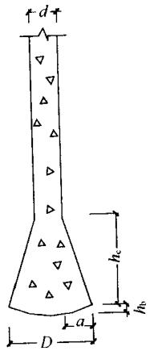  
图4.1.3 扩底桩构造

II 混凝土预制桩

4.1.4 混凝土预制桩的截面边长不应小于 $200\mathrm{mm}$ ；预应力混凝土预制实心桩的截面边长不宜小于 $350\mathrm{mm}$ 。   
4.1.5 预制桩的混凝土强度等级不宜低于C30；预应力混凝土实心桩的混凝土强度等级不应低于C40；预制桩纵向钢筋的混凝土保护层厚度不宜小于 $30\mathrm{mm}$ 。  
4.1.6 预制桩的桩身配筋应按吊运、打桩及桩在使用中的受力等条件计算确定。采用锤击法沉桩时，预制桩的最小配筋率不宜小于 $0.8\%$ 。静压法沉桩时，最小配筋率不宜小于 $0.6\%$ ，主筋直径不宜小于 $14\mathrm{mm}$ ，打入桩桩顶以下 $(4\sim 5)d$ 长度范围内箍筋应加密，并设置钢筋网片。  
4.1.7 预制桩的分节长度应根据施工条件及运输条件确定；每根桩的接头数量不宜超过3个。   
4.1.8 预制桩的桩尖可将主筋合拢焊在桩尖辅助钢筋上，对于持力层为密实砂和碎石类土时，宜在桩尖处包以钢钣桩靴，加强桩尖。

Ⅲ 预应力混凝土空心桩

4.1.9 预应力混凝土空心桩按截面形式可分为管桩、空心方桩；按混凝土强度等级可分为预应力高强混凝土管桩（PHC）和空心方桩（PHS）、预应力混凝土管桩（PC）和空心方桩（PS）。离心成型的先张法预应力混凝土桩的截面尺寸、配筋、桩身极限弯矩、桩身竖向受压承载力设计值等参数可按本规范附录B确定。

4.1.10 预应力混凝土空心桩桩尖形式宜根据地层性质选择闭口形或敞口形；闭口形分为平底十字形和锥形。  
4.1.11 预应力混凝土空心桩质量要求，尚应符合国家现行标准《先张法预应力混凝土管桩》GB13476和《预应力混凝土空心方桩》JG197及其他的有关标准规定。

4.1.12 预应力混凝土桩的连接可采用端板焊接连接、法兰连接、机械啮合连接、螺纹连接。每根桩的接头数量不宜超过3个。  
4.1.13 桩端嵌入遇水易软化的强风化岩、全风化岩和非饱和土的预应力混凝土空心桩，沉桩后，应对桩端以上约 $2\mathrm{m}$ 范围内采取有效的防渗措施，可采用微膨胀混凝土填芯或在内壁预涂柔性防水材料。

IV 钢 桩

4.1.14 钢桩可采用管型、H型或其他异型钢材。  
4.1.15 钢桩的分段长度宜为 $12\sim 15\mathrm{m}$   
4.1.16 钢桩焊接接头应采用等强度连接。  
4.1.17 钢桩的端部形式，应根据桩所穿越的土层、桩端持力层性质、桩的尺寸、挤土效应等因素综合考虑确定，并可按下列规定采用：

1 钢管桩可采用下列桩端形式：

1）敞口：

带加强箍（带内隔板、不带内隔板）；不带加强箍（带内隔板、不带内隔板）。

2）闭口：

平底；锥底。

2 H型钢桩可采用下列桩端形式：

1）带端板；
2）不带端板：

锥底；

平底（带扩大翼、不带扩大翼）。

4.1.18 钢桩的防腐处理应符合下列规定：

1 钢桩的腐蚀速率当无实测资料时可按表4.1.18确定；  
2 钢桩防腐处理可采用外表面涂防腐层、增加腐蚀余量及阴极保护；当钢管桩内壁同外界隔绝时，可不考虑内壁防腐。

表 4.1.18 钢桩年腐蚀速率  

| 钢桩所处环境 | 钢桩所处环境 | 单面腐蚀率（mm/y） |
| --- | --- | --- |
| 地面以上 | 无腐蚀性气体或腐蚀性挥发介质 | 0.05~0.1 |
| 地面以下 | 水位以上 | 0.05 |
| 地面以下 | 水位以下 | 0.03 |
| 地面以下 | 水位波动区 | 0.1~0.3 |

## 4.2 承台构造

4.2.1 桩基承台的构造，除应满足抗冲切、抗剪切、抗弯承载力和上部结构要求外，尚应符合下列要求：

1 柱下独立桩基承台的最小宽度不应小于 $500\mathrm{mm}$ ，边桩中心至承台边缘的距离不应小于桩的直径或边长，且桩的外边缘至承台边缘的距离不应小于 $150\mathrm{mm}$ 。对于墙下条形承台梁，桩的外边缘至承台梁边缘的距离不应小于 $75\mathrm{mm}$ ，承台的最小厚度不应小于 $300\mathrm{mm}$ 。  
2 高层建筑平板式和梁板式筏形承台的最小厚度不应小于 $400\mathrm{mm}$ ，墙下布桩的剪力墙结构筏形承台的最小厚度不应小于 $200\mathrm{mm}$ 。  
3 高层建筑箱形承台的构造应符合《高层建筑筏形与箱形基础技术规范》JGJ6的规定。

4.2.2 承台混凝土材料及其强度等级应符合结构混凝土耐久性的要求和抗渗要求。

4.2.3 承台的钢筋配置应符合下列规定：

1 柱下独立桩基承台钢筋应通长配置[见图4.2.3(a)]，对四桩以上(含四桩)承台宜按双向均匀布置，对三桩的三角形承台应按三向板带均匀布置，且最里面的三根钢筋围成的三角形应在柱截面范围内[见图4.2.3(b)]。钢筋锚固长度自边桩内侧（当为圆桩时，应将其直径乘以0.8等效为方桩）算起，不应

小于 $35d_{\mathrm{g}}(d_{\mathrm{g}}$ 为钢筋直径)；当不满足时应将钢筋向上弯折，此时水平段的长度不应小于 $25d_{\mathrm{g}}$ ，弯折段长度不应小于 $10d_{\mathrm{g}}$ 。承台纵向受力钢筋的直径不应小于 $12\mathrm{mm}$ ，间距不应大于 $200\mathrm{mm}$ 。柱下独立桩基承台的最小配筋率不应小于 $0.15\%$ 。

2 柱下独立两桩承台，应按现行国家标准《混凝土结构设计规范》GB50010中的深受弯构件配置纵向受拉钢筋、水平及竖向分布钢筋。承台纵向受力钢筋端部的锚固长度及构造应与柱下多桩承台的规定相同。

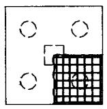  
(a)

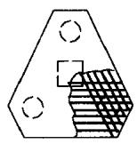  
(b)

(c)   
图4.2.3 承台配筋示意  
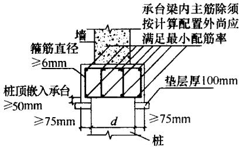  
（a）矩形承台配筋；（b）三桩承台配筋；（c）墙下承台梁配筋图

3 条形承台梁的纵向主筋应符合现行国家标准《混凝土结构设计规范》GB50010关于最小配筋率的规定[见图4.2.3(c)], 主筋直径不应小于 $12\mathrm{mm}$ , 架立筋直径不应小于 $10\mathrm{mm}$ , 箍筋直径不应小于 $6\mathrm{mm}$ 。承台梁端部纵向受力钢筋的锚固长度及构造应与柱下多桩承台的规定相同。  
4 筏形承台板或箱形承台板在计算中当仅考虑局部弯矩作用时，考虑到整体弯曲的影响，在纵横两个方向的下层钢筋配筋率不宜小于 $0.15\%$ ；上层钢筋应按计算配筋率全部连通。当筏板的厚度大于 $2000\mathrm{mm}$ 时，宜在板厚中间部位设置直径不小于 $12\mathrm{mm}$ 、间距不大于 $300\mathrm{mm}$ 的双向钢筋网。  
5 承台底面钢筋的混凝土保护层厚度，当有混凝土垫层时，不应小于 $50\mathrm{mm}$ ，无垫层时不应小于 $70\mathrm{mm}$ ；此外尚不应小于桩

头嵌入承台内的长度。

4.2.4 桩与承台的连接构造应符合下列规定：

1 桩嵌入承台内的长度对中等直径桩不宜小于 $50\mathrm{mm}$ ；对大直径桩不宜小于 $100\mathrm{mm}$ 。  
2 混凝土桩的桩顶纵向主筋应锚入承台内，其锚入长度不宜小于35倍纵向主筋直径。对于抗拔桩，桩顶纵向主筋的锚固长度应按现行国家标准《混凝土结构设计规范》GB50010确定。  
3 对于大直径灌注桩，当采用一柱一桩时可设置承台或将桩与柱直接连接。

4.2.5 柱与承台的连接构造应符合下列规定：

1 对于一柱一桩基础，柱与桩直接连接时，柱纵向主筋锚入桩身内长度不应小于35倍纵向主筋直径。  
2 对于多桩承台，柱纵向主筋应锚入承台不小于35倍纵向主筋直径；当承台高度不满足锚固要求时，竖向锚固长度不应小于20倍纵向主筋直径，并向柱轴线方向呈 $90^{\circ}$ 弯折。  
3 当有抗震设防要求时，对于一、二级抗震等级的柱，纵向主筋锚固长度应乘以1.15的系数；对于三级抗震等级的柱，纵向主筋锚固长度应乘以1.05的系数。

4.2.6 承台与承台之间的连接构造应符合下列规定：

1 一柱一桩时，应在桩顶两个主轴方向上设置联系梁。当桩与柱的截面直径之比大于2时，可不设联系梁。  
2 两桩桩基的承台，应在其短向设置联系梁。  
3 有抗震设防要求的柱下桩基承台，宜沿两个主轴方向设置联系梁。  
4 联系梁顶面宜与承台顶面位于同一标高。联系梁宽度不宜小于 $250\mathrm{mm}$ ，其高度可取承台中心距的 $1/10 \sim 1/15$ ，且不宜小于 $400\mathrm{mm}$ 。  
5 联系梁配筋应按计算确定，梁上下部配筋不宜小于2根直径 $12\mathrm{mm}$ 钢筋；位于同一轴线上的相邻跨联系梁纵筋应连通。

4.2.7 承台和地下室外墙与基坑侧壁间隙应灌注素混凝土或搅拌流动性水泥土，或采用灰土、级配砂石、压实性较好的素土分层夯实，其压实系数不宜小于0.94。

# 5 桩基计算

## 5.1 桩顶作用效应计算

5.1.1 对于一般建筑物和受水平力（包括力矩与水平剪力）较小的高层建筑群桩基础，应按下列公式计算柱、墙、核心筒群桩中基桩或复合基桩的桩顶作用效应：

1 竖向力

轴心竖向力作用下

$$N _{\mathrm {k}} = \frac {F _{\mathrm {k}} + G _{\mathrm {k}}}{n} \tag {5.1.1-1}$$

偏心竖向力作用下

$$N _{\mathrm {r k}} = \frac {F _{\mathrm {k}} + G _{\mathrm {k}}}{n} \pm \frac {M _{\mathrm {x k}} y _{i}}{\sum y _{j} ^{2}} \pm \frac {M _{\mathrm {y k}} x _{i}}{\sum x _{j} ^{2}} \tag {5.1.1-2}$$

2 水平力

$$H _{\mathrm {k}} = \frac {H _{\mathrm {k}}}{n} \tag {5.1.1-3}$$

式中 $F_{\mathrm{k}}$ ——荷载效应标准组合下，作用于承台顶面的竖向力；

$G_{\mathrm{k}}$ ——桩基承台和承台上土自重标准值，对稳定的地下水位以下部分应扣除水的浮力；

$N_{\mathrm{k}}$ ——荷载效应标准组合轴心竖向力作用下，基桩或复合基桩的平均竖向力；

$N_{ik}$ ——荷载效应标准组合偏心竖向力作用下，第 $i$ 基桩或复合基桩的竖向力；

$M_{\mathrm{xk}}$ 、 $M_{\mathrm{yk}}$ ——荷载效应标准组合下，作用于承台底面，绕通过桩群形心的 $x$ 、 $y$ 主轴的力矩；

$x_{i}, x_{j}, y_{i}, y_{j}$ ——第 $i, j$ 基桩或复合基桩至 $y, x$ 轴的距离；

$H_{\mathrm{k}}$ ——荷载效应标准组合下，作用于桩基承台底面的水平力；

$H_{ik}$ ——荷载效应标准组合下，作用于第 $i$ 基桩或复合基桩的水平力；

$n$ ——桩基中的桩数。

5.1.2 对于主要承受竖向荷载的抗震设防区低承台桩基，在同时满足下列条件时，桩顶作用效应计算可不考虑地震作用：

1 按现行国家标准《建筑抗震设计规范》GB50011规定可不进行桩基抗震承载力验算的建筑物；  
2 建筑场地位于建筑抗震的有利地段。

5.1.3 属于下列情况之一的桩基，计算各基桩的作用效应、桩身内力和位移时，宜考虑承台（包括地下墙体）与基桩协同工作和土的弹性抗力作用，其计算方法可按本规范附录C进行：

1 位于8度和8度以上抗震设防区的建筑，当其桩基承台刚度较大或由于上部结构与承台协同作用能增强承台的刚度时；  
2 其他受较大水平力的桩基。

## 5.2 桩基竖向承载力计算

5.2.1 桩基竖向承载力计算应符合下列要求：

1 荷载效应标准组合：

轴心竖向力作用下

$$N _{\mathrm {k}} \leqslant R \tag {5.2.1-1}$$

偏心竖向力作用下，除满足上式外，尚应满足下式的要求：

$$N _{\mathrm {k m a x}} \leqslant 1. 2 R \tag {5.2.1-2}$$

2 地震作用效应和荷载效应标准组合：

轴心竖向力作用下

$$N _{\mathrm {E x}} \leqslant 1. 2 5 R \tag {5.2.1-3}$$

偏心竖向力作用下，除满足上式外，尚应满足下式的要求：

$$N _{\mathrm {E k m a x}} \leqslant 1. 5 R \tag {5.2.1-4}$$

式中 $N_{\mathrm{k}}$ ——荷载效应标准组合轴心竖向力作用下，基桩或复

合基桩的平均竖向力；

$N_{\mathrm{kmax}}$ ——荷载效应标准组合偏心竖向力作用下，桩顶最大竖向力；

$N_{\mathrm{Ek}}$ ——地震作用效应和荷载效应标准组合下，基桩或复合基桩的平均竖向力；

$N_{\mathrm{Ekmax}}$ ——地震作用效应和荷载效应标准组合下，基桩或复合基桩的最大竖向力；

$R$ ——基桩或复合基桩竖向承载力特征值。

5.2.2 单桩竖向承载力特征值 $R_{\mathrm{a}}$ 应按下式确定：

$$R _{\mathrm {a}} = \frac {1}{K} Q _{\mathrm {u k}} \tag {5.2.2}$$

式中 $Q_{\mathrm{uk}}$ ——单桩竖向极限承载力标准值；

$K$ ——安全系数，取 $K = 2$ 。

5.2.3 对于端承型桩基、桩数少于4根的摩擦型柱下独立桩基、或由于地层土性、使用条件等因素不宜考虑承台效应时，基桩竖向承载力特征值应取单桩竖向承载力特征值。  
5.2.4 对于符合下列条件之一的摩擦型桩基，宜考虑承台效应确定其复合基桩的竖向承载力特征值：

1 上部结构整体刚度较好、体型简单的建（构）筑物；  
2 对差异沉降适应性较强的排架结构和柔性构筑物；  
3 按变刚度调平原则设计的桩基刚度相对弱化区；  
4 软土地基的减沉复合疏桩基础。

5.2.5 考虑承台效应的复合基桩竖向承载力特征值可按下列公式确定：

不考虑地震作用时 $R = R_{\mathrm{a}} + \eta_{\mathrm{c}}f_{\mathrm{ak}}A_{\mathrm{c}}$ (5.2.5-1)

考虑地震作用时 $R = R_{\mathrm{a}} + \frac{\zeta_{\mathrm{a}}}{1.25}\eta_{\mathrm{c}}f_{\mathrm{ak}}A_{\mathrm{c}}$ (5.2.5-2)

$$A _{\mathrm {c}} = (A - n A _{\mathrm {p s}}) / n \tag {5.2.5-3}$$

式中 $\eta_{\mathrm{c}}$ ——承台效应系数，可按表5.2.5取值；

$f_{\mathrm{ak}}$ ——承台下 $1 / 2$ 承台宽度且不超过 $5\mathrm{m}$ 深度范围内各层

土的地基承载力特征值按厚度加权的平均值；

$A_{\mathrm{c}}$ ——计算基桩所对应的承台底净面积；

$A_{\mathrm{ps}}$ ——桩身截面面积；

$A$ ——承台计算域面积对于柱下独立桩基， $A$ 为承台总面积；对于桩筏基础， $A$ 为柱、墙筏板的 $1/2$ 跨距和悬臂边2.5倍筏板厚度所围成的面积；桩集中布置于单片墙下的桩筏基础，取墙两边各 $1/2$ 跨距围成的面积，按条形承台计算 $\eta_{\mathrm{c}}$ ；

$\zeta_{a}$ ——地基抗震承载力调整系数，应按现行国家标准《建筑抗震设计规范》GB50011采用。

当承台底为可液化土、湿陷性土、高灵敏度软土、欠固结土、新填土时，沉桩引起超孔隙水压力和土体隆起时，不考虑承台效应，取 $\eta_{\mathrm{c}} = 0$ 。

表 5.2.5 承台效应系数 ${\mathbf{\eta }}_{\mathrm{c}}$   

| $\frac{{s}_{\mathrm{a}}/d}{{B}_{\mathrm{c}}/l}$ | 3 | 4 | 5 | 6 | >6 |
| --- | --- | --- | --- | --- | --- |
| ≤0.4 | 0.06~0.08 | 0.14~0.17 | 0.22~0.26 | 0.32~0.38 | 0.50~0.80 |
| 0.4~0.8 | 0.08~0.10 | 0.17~0.20 | 0.26~0.30 | 0.38~0.44 | 0.50~0.80 |
| >0.8 | 0.10~0.12 | 0.20~0.22 | 0.30~0.34 | 0.44~0.50 | 0.50~0.80 |
| 单排桩条形承台 | 0.15~0.18 | 0.25~0.30 | 0.38~0.45 | 0.50~0.60 | 0.50~0.80 |

注：1 表中 $s_{\mathrm{a}} / d$ 为桩中心距与桩径之比； $B_{\mathrm{c}} / l$ 为承台宽度与桩长之比。当计算基桩为非正方形排列时， $s_{\mathrm{a}} = \sqrt{A / n}$ ， $A$ 为承台计算域面积， $n$ 为总桩数。  
2 对于桩布置于墙下的箱、筏承台， $\eta_{\mathrm{c}}$ 可按单排桩条形承台取值。  
3 对于单排桩条形承台，当承台宽度小于 $1.5d$ 时， $\eta_{c}$ 按非条形承台取值。  
4 对于采用后注浆灌注桩的承台， $\eta_{\mathrm{c}}$ 宜取低值。  
5 对于饱和黏性土中的挤土桩基、软土地基上的桩基承台， $\eta_{c}$ 宜取低值的0.8倍。

## 5.3 单桩竖向极限承载力

I 一般规定

5.3.1 设计采用的单桩竖向极限承载力标准值应符合下列规定：

1 设计等级为甲级的建筑桩基，应通过单桩静载试验确定；  
2 设计等级为乙级的建筑桩基，当地质条件简单时，可参照地质条件相同的试桩资料，结合静力触探等原位测试和经验参数综合确定；其余均应通过单桩静载试验确定；  
3 设计等级为丙级的建筑桩基，可根据原位测试和经验参数确定。

5.3.2 单桩竖向极限承载力标准值、极限侧阻力标准值和极限端阻力标准值应按下列规定确定：

1 单桩竖向静载试验应按现行行业标准《建筑基桩检测技术规范》JGJ 106执行；  
2 对于大直径端承型桩，也可通过深层平板（平板直径应与孔径一致）载荷试验确定极限端阻力；  
3 对于嵌岩桩，可通过直径为 $0.3\mathrm{m}$ 岩基平板载荷试验确定极限端阻力标准值，也可通过直径为 $0.3\mathrm{m}$ 嵌岩短墩载荷试验确定极限侧阻力标准值和极限端阻力标准值；  
4 桩的极限侧阻力标准值和极限端阻力标准值宜通过埋设桩身轴力测试元件由静载试验确定。并通过测试结果建立极限侧阻力标准值和极限端阻力标准值与土层物理指标、岩石饱和单轴抗压强度以及与静力触探等土的原位测试指标间的经验关系，以经验参数法确定单桩竖向极限承载力。

Ⅱ 原位测试法

5.3.3 当根据单桥探头静力触探资料确定混凝土预制桩单桩竖向极限承载力标准值时，如无当地经验，可按下式计算：

$$Q _{\mathrm {u k}} = Q _{\mathrm {s k}} + Q _{\mathrm {p k}} = u \sum q _{\mathrm {s i k}} l _{i} + \alpha p _{\mathrm {s k}} A _{\mathrm {p}} \tag {5.3.3-1}$$

当 $p_{\mathrm{skl}} \leqslant p_{\mathrm{sk2}}$ 时

$$p _{\mathrm {s k}} = \frac {1}{2} \left(p _{\mathrm {s k 1}} + \beta \cdot p _{\mathrm {s k 2}}\right) \tag {5.3.3-2}$$

当 $p_{\mathrm{sk1}} > p_{\mathrm{sk2}}$ 时

$$p _{\mathrm {s k}} = p _{\mathrm {s k 2}} \tag {5.3.3-3}$$

式中 $Q_{\mathrm{sk}}$ 、 $Q_{\mathrm{pk}}$ ——分别为总极限侧阻力标准值和总极限端阻力标准值；

$u$ ——桩身周长；

$q_{\mathrm{sik}}$ ——用静力触探比贯入阻力值估算的桩周第 $i$ 层土的极限侧阻力；

$l_{i}$ ——桩周第 $i$ 层土的厚度；

$\alpha$ ——桩端阻力修正系数，可按表5.3.3-1取值；

$p_{\mathrm{sk}}$ ——桩端附近的静力触探比贯入阻力标准值（平均值）；

$A_{\mathrm{p}}$ ——桩端面积；

$p_{\mathrm{sl}}$ ——桩端全截面以上8倍桩径范围内的比贯入阻力平均值；

$p_{\mathrm{sk2}}$ ——桩端全截面以下4倍桩径范围内的比贯入阻力平均值，如桩端持力层为密实的砂土层，其比贯入阻力平均值超过 $20\mathrm{MPa}$ 时，则需乘以表5.3.3-2中系数C予以折减后，再计算 $p_{\mathrm{sk}}$ ；

$\beta$ ——折减系数，按表5.3.3-3选用。

表 5.3.3-1 桩端阻力修正系数 $\alpha$ 值  

| 桩长(m) | l<15 | 15≤l≤30 | 30 |
| --- | --- | --- | --- |
| α | 0.75 | 0.75~0.90 | 0.90 |

注：桩长 $15\mathrm{m}\leqslant l\leqslant 30\mathrm{m},\alpha$ 值按 $l$ 值直线内插； $l$ 为桩长（不包括桩尖高度）。

表 5.3.3-2 系 数 C  

| ${p}_{\mathrm{{sk}}}\left( \mathrm{{MPa}}\right)$ | 20~30 | 35 | >40 |
| --- | --- | --- | --- |
| 系数 $C$ | 5/6 | $2/3$ | 1/2 |

图5.3.3 $q_{\mathrm{sk}} - p_{\mathrm{sk}}$ 曲线  
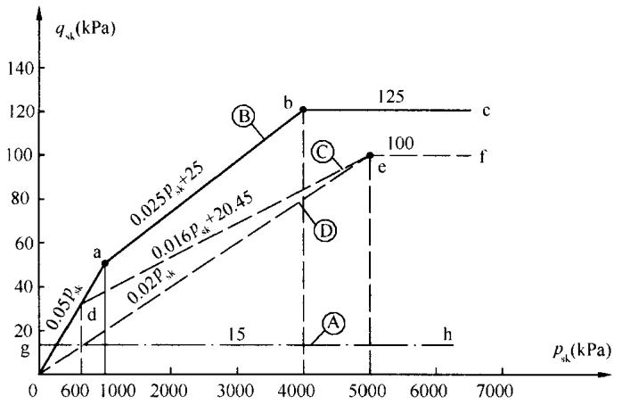  
注：1 $q_{\mathrm{sk}}$ 值应结合土工试验资料，依据土的类别、埋藏深度、排列次序，按图5.3.3折线取值；图5.3.3中，直线 $\mathbf{A}$ （线段gh）适用于地表下 $6\mathrm{m}$ 范围内的土层；折线B（线段oabc）适用于粉土及砂土土层以上（或无粉土及砂土土层地区）的黏性土；折线C（线段odef）适用于粉土及砂土土层以下的黏性土；折线①（线段oef）适用于粉土、粉砂、细砂及中砂。  
2 $p_{\mathrm{sk}}$ 为桩端穿过的中密～密实砂土、粉土的比贯入阻力平均值； $p_{sl}$ 为砂土、粉土的下卧软土层的比贯入阻力平均值。  
3 采用的单桥探头，圆锥底面积为 $15\mathrm{cm}^2$ ，底部带 $7\mathrm{cm}$ 高滑套，锥角 $60^{\circ}$ 。  
4 当桩端穿过粉土、粉砂、细砂及中砂层底面时，折线①估算的 $q_{\mathrm{stk}}$ 值需乘以表5.3.3-4中系数 $\eta_{s}$ 值。

表 5.3.3-3 折减系数 $\mathbf{\beta }$   

| ${p}_{\mathrm{{sk}}2}/{p}_{\mathrm{{skl}}}$ | $\leq 5$ | 7.5 | 12.5 | $\geq {15}$ |
| --- | --- | --- | --- | --- |
| $\beta$ | 1 | 5/6 | 2/3 | 1/2 |

注：表5.3.3-2、表5.3.3-3可内插取值。

表 5.3.3-4 系数 ${\mathbf{\eta }}_{\mathrm{s}}$ 值  

| ${p}_{\mathrm{{sk}}}/{p}_{\mathrm{{sl}}}$ | $\leq 5$ | 7.5 | ≥10 |
| --- | --- | --- | --- |
| ${\eta }_{\mathrm{s}}$ | 1.00 | 0.50 | 0.33 |

5.3.4 当根据双桥探头静力触探资料确定混凝土预制桩单桩竖向极限承载力标准值时，对于黏性土、粉土和砂土，如无当地经验时可按下式计算：

$$Q _{\mathrm {u k}} = Q _{\mathrm {s k}} + Q _{\mathrm {p k}} = u \sum l _{i} \cdot \beta_{i} \cdot f _{\mathrm {s i}} + \alpha \cdot q _{\mathrm {c}} \cdot A _{\mathrm {p}} \tag {5.3.4}$$

式中 $f_{\mathrm{si}}$ ——第 $i$ 层土的探头平均侧阻力（ $\mathrm{kPa}$ ）；

$q_{c}$ ——桩端平面上、下探头阻力，取桩端平面以上 $4d(d$ 为桩的直径或边长）范围内按土层厚度的探头阻力加权平均值（ $\mathrm{kPa}$ ），然后再和桩端平面以下1d范围内的探头阻力进行平均；

$\alpha$ ——桩端阻力修正系数，对于黏性土、粉土取2/3，饱和砂土取1/2；

$\beta_{i}$ ——第 $i$ 层土桩侧阻力综合修正系数，黏性土、粉土： $\beta_{i} = 10.04(f_{si})^{-0.55}$ ；砂土： $\beta_{i} = 5.05(f_{si})^{-0.45}$ 。

注：双桥探头的圆锥底面积为 $15\mathrm{cm}^2$ ，锥角 $60^{\circ}$ ，摩擦套筒高 $21.85\mathrm{cm}$ ，侧面积 $300\mathrm{cm}^2$ 。

Ⅲ 经验参数法

5.3.5 当根据土的物理指标与承载力参数之间的经验关系确定单桩竖向极限承载力标准值时，宜按下式估算：

$$Q _{\mathrm {u k}} = Q _{\mathrm {s k}} + Q _{\mathrm {p k}} = u \sum q _{\mathrm {s k}} l _{i} + q _{\mathrm {p k}} A _{\mathrm {p}} \tag {5.3.5}$$

式中 $q_{\mathrm{si k}}$ ——桩侧第 $i$ 层土的极限侧阻力标准值，如无当地经验时，可按表5.3.5-1取值；

$q_{\mathrm{pk}}$ ——极限端阻力标准值，如无当地经验时，可按表5.3.5-2取值。

表 5.3.5-1 桩的极限侧阻力标准值 $q_{\mathrm{sk}}$ (kPa)  

| 土的名称 | 土的状态 | 混凝土预制桩 | 泥浆护壁钻(冲)孔桩 | 干作业钻孔桩 |
| --- | --- | --- | --- | --- |
| 填土 | - | 22~30 | 20~28 | 20~28 |
| 淤泥 | - | 14~20 | 12~18 | 12~18 |
| 淤泥质土 | - | 22~30 | 20~28 | 20~28 |

续表 5.3.5-1  

| 土的名称 | 土的状态 | 土的状态 | 混凝土预制桩 | 泥浆护壁钻(冲)孔桩 | 干作业钻孔桩 |
| --- | --- | --- | --- | --- | --- |
| 黏性土 | 流塑软塑可塑硬可塑硬塑坚硬 | $I_{\mathrm {L}}>1$0.75$<I_{\mathrm {L}}≤1$0.50$<I_{\mathrm {L}}≤0.75$0.25$<I_{\mathrm {L}}≤0.50$0$<I_{\mathrm {L}}≤0.25$ $I_{\mathrm {L}}≤0$ | 24~4040~5555~7070~8686~9898~105 | 21~3838~5353~6868~8484~9696~102 | 21~3838~5353~6666~8282~9494~104 |
| 红黏土 | 0.7$<a_{\mathrm {w}}≤1$0.5$<a_{\mathrm {w}}≤0.7$ | 0.7$<a_{\mathrm {w}}≤1$0.5$<a_{\mathrm {w}}≤0.7$ | 13~3232~74 | 12~3030~70 | 12~3030~70 |
| 粉土 | 稍密中密密实 | $e>0.9$0.75$≤e≤0.9$e<0.75 | 26~4646~6666~88 | 24~4242~6262~82 | 24~4242~6262~82 |
| 粉细砂 | 稍密中密密实 | 10$<N≤15$15$<N≤30$N>30 | 24~4848~6666~88 | 22~4646~6464~86 | 22~4646~6464~86 |
| 中砂 | 中密密实 | 15$<N≤30$N>30 | 54~7474~95 | 53~7272~94 | 53~7272~94 |
| 粗砂 | 中密密实 | 15$<N≤30$N>30 | 74~9595~116 | 74~9595~116 | 76~9898~120 |
| 砾砂 | 稍密中密(密实) | $5<N_{63.5}≤15$ $N_{63.5}>15$ | 70~110116~138 | 50~90116~130 | 60~100112~130 |
| 圆砾、角砾 | 中密、密实 | $N_{63.5}>10$ | 160~200 | 135~150 | 135~150 |
| 碎石、卵石 | 中密、密实 | $N_{63.5}>10$ | 200~300 | 140~170 | 150~170 |
| 全风化软质岩 | - | 30$<N≤50$ | 100~120 | 80~100 | 80~100 |
| 全风化硬质岩 | - | 30$<N≤50$ | 140~160 | 120~140 | 120~150 |
| 强风化软质岩 | - | $N_{63.5}>10$ | 160~240 | 140~200 | 140~220 |
| 强风化硬质岩 | - | $N_{63.5}>10$ | 220~300 | 160~240 | 160~260 |

注：1 对于尚未完成自重固结的填土和以生活垃圾为主的杂填土，不计算其侧阻力；  
2 $a_{w}$ 为含水比， $a_{w} = w / w_{l},w$ 为土的天然含水量， $\omega_{l}$ 为土的液限；  
3 $N$ 为标准贯入击数； $N_{63.5}$ 为重型圆锥动力触探击数；  
4 全风化、强风化软质岩和全风化、强风化硬质岩系指其母岩分别为 $f_{\mathrm{rk}} \leqslant 15\mathrm{MPa}$ 、 $f_{\mathrm{rk}} > 30\mathrm{MPa}$ 的岩石。

表 5.3.5-2 桩的极限端阻力标准值 ${q}_{\mathrm{{pk}}}$ (kPa)  

| 土名称 | 桩型 土的状态 | 桩型 土的状态 | 混凝土预制桩桩长l(m) | 混凝土预制桩桩长l(m) | 混凝土预制桩桩长l(m) | 混凝土预制桩桩长l(m) | 泥浆护壁钻(冲)孔桩桩长l(m) | 泥浆护壁钻(冲)孔桩桩长l(m) | 泥浆护壁钻(冲)孔桩桩长l(m) | 泥浆护壁钻(冲)孔桩桩长l(m) | 干作业钻孔桩桩长l(m) | 干作业钻孔桩桩长l(m) | 干作业钻孔桩桩长l(m) |
| --- | --- | --- | --- | --- | --- | --- | --- | --- | --- | --- | --- | --- | --- |
| 土名称 | 桩型 土的状态 | 桩型 土的状态 | l≤9 | 9l≤16 | 16l≤30 | l>30 | 5≤l<10 | 10≤l<15 | 15≤l<30 | 30≤l | 5≤l<10 | 10≤l<15 | 15≤l |
| 黏性土 | 软塑 | 0.75<I≤1 | 210~850 | 650~1400 | 1200~1800 | 1300~1900 | 150~250 | 250~300 | 300~450 | 300~450 | 200~400 | 400~700 | 700~950 |
| 黏性土 | 可塑 | 0.50<I≤0.75 | 850~1700 | 1400~2200 | 1900~2800 | 2300~3600 | 350~450 | 450~600 | 600~750 | 750~800 | 500~700 | 800~1100 | 1000~1600 |
| 黏性土 | 硬可塑 | 0.25<I≤0.50 | 1500~2300 | 2300~3300 | 2700~3600 | 3600~4400 | 800~900 | 900~1000 | 1000~1200 | 1200~1400 | 850~1100 | 1500~1700 | 1700~1900 |
| 黏性土 | 硬塑 | 0<I≤0.25 | 2500~3800 | 3800~5500 | 5500~6000 | 6000~6800 | 1100~1200 | 1200~1400 | 1400~1600 | 1600~1800 | 1600~1800 | 2200~2400 | 2600~2800 |
| 粉土 | 中密 | 0.75≤e≤0.9 | 950~1700 | 1400~2100 | 1900~2700 | 2500~3400 | 300~500 | 500~650 | 650~750 | 750~850 | 800~1200 | 1200~1400 | 1400~1600 |
| 粉土 | 密实 | e<0.75 | 1500~2600 | 2100~3000 | 2700~3600 | 3600~4400 | 650~900 | 750~950 | 900~1100 | 1100~1200 | 1200~1700 | 1400~1900 | 1600~2100 |
| 粉砂 | 稍密 | 10<N≤15 | 1000~1600 | 1500~2300 | 1900~2700 | 2100~3000 | 350~500 | 450~600 | 600~700 | 650~750 | 500~950 | 1300~1600 | 1500~1700 |
| 粉砂 | 中密、密实 | N>15 | 1400~2200 | 2100~3000 | 3000~4500 | 3800~5500 | 600~750 | 750~900 | 900~1100 | 1100~1200 | 900~1000 | 1700~1900 | 1700~1900 |
| 细砂 | 中密、密实 | N>15 | 2500~4000 | 3600~5000 | 4400~6000 | 5300~7000 | 650~850 | 900~1200 | 1200~1500 | 1500~1800 | 1200~1600 | 2000~2400 | 2400~2700 |
| 中砂 | 中密、密实 | N>15 | 4000~6000 | 5500~7000 | 6500~8000 | 7500~9000 | 850~1050 | 1100~1500 | 1500~1900 | 1900~2100 | 1800~2400 | 2800~3800 | 3600~4400 |
| 粗砂 | 中密、密实 | N>15 | 5700~7500 | 7500~8500 | 8500~10000 | 9500~11000 | 1500~1800 | 2100~2400 | 2400~2600 | 2600~2800 | 2900~3600 | 4000~4600 | 4600~5200 |

续表5.3.5-2   

| 土名称 | 桩型土的状态 | 桩型土的状态 | 混凝土预制桩桩长l(m) | 混凝土预制桩桩长l(m) | 混凝土预制桩桩长l(m) | 混凝土预制桩桩长l(m) | 泥浆护壁钻(冲)孔桩桩长l(m) | 泥浆护壁钻(冲)孔桩桩长l(m) | 泥浆护壁钻(冲)孔桩桩长l(m) | 泥浆护壁钻(冲)孔桩桩长l(m) | 干作业钻孔桩桩长l(m) | 干作业钻孔桩桩长l(m) | 干作业钻孔桩桩长l(m) |
| --- | --- | --- | --- | --- | --- | --- | --- | --- | --- | --- | --- | --- | --- |
| 土名称 | 桩型土的状态 | 桩型土的状态 | l≤9 | 9l≤16 | 16l≤30 | l>30 | 5≤l<10 | 10≤l<15 | 15≤l<30 | 30≤l | 5≤l<10 | 10≤l<15 | 15≤l |
| 砾砂 | 中密、密实 | N>15 | 6000~9500 | 6000~9500 | 9000~10500 | 9000~10500 | 1400~2000 | 1400~2000 | 2000~3200 | 2000~3200 | 3500~5000 | 3500~5000 | 3500~5000 |
| 角砾、圆砾 | 中密、密实 | N63.5>10 | 7000~10000 | 7000~10000 | 9500~11500 | 9500~11500 | 1800~2200 | 1800~2200 | 2200~3600 | 2200~3600 | 4000~5500 | 4000~5500 | 4000~5500 |
| 碎石、卵石 | 中密、密实 | N63.5>10 | 8000~11000 | 8000~11000 | 10500~13000 | 10500~13000 | 2000~3000 | 2000~3000 | 3000~4000 | 3000~4000 | 4500~6500 | 4500~6500 | 4500~6500 |
| 全风化软质岩 |  | 30<N≤50 | 4000~6000 | 4000~6000 | 4000~6000 | 4000~6000 | 1000~1600 | 1000~1600 | 1000~1600 | 1000~1600 | 1200~2000 | 1200~2000 | 1200~2000 |
| 全风化硬质岩 |  | 30<N≤50 | 5000~8000 | 5000~8000 | 5000~8000 | 5000~8000 | 1200~2000 | 1200~2000 | 1200~2000 | 1200~2000 | 1400~2400 | 1400~2400 | 1400~2400 |
| 强风化软质岩 |  | N63.5>10 | 6000~9000 | 6000~9000 | 6000~9000 | 6000~9000 | 1400~2200 | 1400~2200 | 1400~2200 | 1400~2200 | 1600~2600 | 1600~2600 | 1600~2600 |
| 强风化硬质岩 |  | N63.5>10 | 7000~11000 | 7000~11000 | 7000~11000 | 7000~11000 | 1800~2800 | 1800~2800 | 1800~2800 | 1800~2800 | 2000~3000 | 2000~3000 | 2000~3000 |

取值愈高；  
2 预制桩的岩石极限端阻力指桩端支承于中、微风化基岩表面或进入强风化岩、软质岩一定深度条件下极限端阻力；  
3. 主风化、强风化软质岩和全风化、强风化硬质岩指其母岩分别为 $f_{\mathrm{rk}} \leqslant 15\mathrm{MPa}$ 、 $f_{\mathrm{rk}} > 30\mathrm{MPa}$ 的岩石。

5.3.6 根据土的物理指标与承载力参数之间的经验关系，确定大直径桩单桩极限承载力标准值时，可按下式计算：

$$Q _{\mathrm {u k}} = Q _{\mathrm {s k}} + Q _{\mathrm {p k}} = u \sum \psi_{\mathrm {s i}} q _{\mathrm {s i k}} l _{i} + \psi_{\mathrm {p}} q _{\mathrm {p k}} A _{\mathrm {p}} \tag {5.3.6}$$

式中 $q_{\mathrm{sk}}$ ——桩侧第 $i$ 层土极限侧阻力标准值，如无当地经验值时，可按本规范表5.3.5-1取值，对于扩底桩变截面以上 $2d$ 长度范围不计侧阻力；

$q_{\mathrm{pk}}$ ——桩径为 $800\mathrm{mm}$ 的极限端阻力标准值，对于干作业挖孔（清底干净）可采用深层载荷板试验确定；当不能进行深层载荷板试验时，可按表5.3.6-1取值；

$\psi_{si}$ 、 $\psi_{\mathrm{p}}$ ——大直径桩侧阻力、端阻力尺寸效应系数，按表5.3.6-2取值。

$u$ ——桩身周长，当人工挖孔桩桩周护壁为振捣密实的混凝土时，桩身周长可按护壁外直径计算。

表 5.3.6-1 干作业挖孔桩 (清底干净, $D = {800}\mathrm{\;{mm}}$ )  
极限端阻力标准值 $q_{\mathrm{pk}}$ (kPa)   

| 土名称 | 土名称 | 状态 | 状态 | 状态 |
| --- | --- | --- | --- | --- |
| 黏性土 | 黏性土 | 0.25800~1800 | 0<1800 | I1≤0 |
| 黏性土 | 黏性土 | 0.25800~1800 | 1800~2400 | 2400~3000 |
| 粉土 | 粉土 | - | 0.75000~1500 | e<0.751500~2000 |
| 粉土 | 粉土 | - | 0.75000~1500 | e<0.751500~2000 |
| 砂土、碎石类土 |  | 稍密 | 中密 | 密实 |
| 砂土、碎石类土 | 粉砂 | 500~700 | 800~1100 | 1200~2000 |
| 砂土、碎石类土 | 细砂 | 700~1100 | 1200~1800 | 2000~2500 |
| 砂土、碎石类土 | 中砂 | 1000~2000 | 2200~3200 | 3500~5000 |
| 砂土、碎石类土 | 粗砂 | 1200~2200 | 2500~3500 | 4000~5500 |
| 砂土、碎石类土 | 砾砂 | 1400~2400 | 2600~4000 | 5000~7000 |
| 砂土、碎石类土 | 圆砾、角砾 | 1600~3000 | 3200~5000 | 6000~9000 |
| 砂土、碎石类土 | 卵石、碎石 | 2000~3000 | 3300~5000 | 7000~11000 |

注：1 当桩进入持力层的深度 $h_{\mathrm{b}}$ 分别为： $h_{\mathrm{b}} \leqslant D$ ， $D < h_{\mathrm{b}} \leqslant 4D$ ， $h_{\mathrm{b}} > 4D$ 时， $q_{\mathrm{pk}}$ 可相应取低、中、高值。  
2 砂土密实度可根据标贯击数判定， $N \leqslant 10$ 为松散， $10 < N \leqslant 15$ 为稍密， $15 < N \leqslant 30$ 为中密， $N > 30$ 为密实。  
3 当桩的长径比 $l / d \leqslant 8$ 时， $q_{\mathrm{pk}}$ 宜取较低值。  
4 当对沉降要求不严时， $q_{\mathrm{pk}}$ 可取高值。

表 5.3.6-2 大直径灌注桩侧阻力尺寸效应系数 ${\psi }_{\mathrm{{bi}}}$ 、  
端阻力尺寸效应系数 $\psi_{\mathrm{b}}$   

| 土类型 | 黏性土、粉土 | 砂土、碎石类土 |
| --- | --- | --- |
| ψsi | (0.8/d)1/5 | (0.8/d)1/3 |
| ψp | (0.8/D)1/4 | (0.8/D)1/3 |

注：当为等直径桩时，表中 $D = d$ 。

IV 钢管桩

5.3.7 当根据土的物理指标与承载力参数之间的经验关系确定钢管桩单桩竖向极限承载力标准值时，可按下列公式计算：

$$Q _{\mathrm {u k}} = Q _{\mathrm {s k}} + Q _{\mathrm {p k}} = u \sum q _{\mathrm {s i k}} l _{i} + \lambda_{\mathrm {p}} q _{\mathrm {p k}} A _{\mathrm {p}} \tag {5.3.7-1}$$

当 $h_{\mathrm{b}} / d < 5$ 时， $\lambda_{\mathrm{p}} = 0.16h_{\mathrm{b}} / d$ (5.3.7-2)

当 $h_{\mathrm{b}} / d \geqslant 5$ 时， $\lambda_{\mathrm{p}} = 0.8$ (5.3.7-3)

式中 $q_{\mathrm{sk}}$ 、 $q_{\mathrm{pk}}$ ——分别按本规范表5.3.5-1、表5.3.5-2取与混凝土预制桩相同值；

$\lambda_{\mathrm{p}}$ ——桩端土塞效应系数，对于闭口钢管桩 $\lambda_{\mathrm{p}} = 1$ ，对于敞口钢管桩按式（5.3.7-2）、(5.3.7-3）取值；

$h_{\mathrm{b}}$ ——桩端进入持力层深度；

$d$ ——钢管桩外径。

对于带隔板的半敞口钢管桩，应以等效直径 $d_{\mathrm{e}}$ 代替 $d$ 确定 $\lambda_{\mathbf{p}}; d_{\mathrm{e}} = d / \sqrt{n}$ ；其中 $n$ 为桩端隔板分割数（见图5.3.7）。

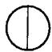  
$n = 2$

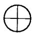  
$n = 4$

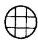  
n=9   
图5.3.7 隔板分割

V 混凝土空心桩

5.3.8 当根据土的物理指标与承载力参数之间的经验关系确定

敞口预应力混凝土空心桩单桩竖向极限承载力标准值时，可按下列公式计算：

$$Q _{\mathrm {u k}} = Q _{\mathrm {s k}} + Q _{\mathrm {p k}} = u \sum q _{\mathrm {s i k}} l _{i} + q _{\mathrm {p k}} \left(A _{j} + \lambda_{\mathrm {p}} A _{\mathrm {p l}}\right) \tag {5.3.8-1}$$

当 $h_{\mathrm{b}} / d < 5$ 时， $\lambda_{\mathrm{p}} = 0.16h_{\mathrm{b}} / d$ (5.3.8-2)

当 $h_{\mathrm{b}} / d \geqslant 5$ 时， $\lambda_{\mathrm{p}} = 0.8$ (5.3.8-3)

式中 $q_{\mathrm{sk}}$ 、 $q_{\mathrm{pk}}$ ——分别按本规范表5.3.5-1、表5.3.5-2取与混凝土预制桩相同值；

$A_{j}$ ——空心桩桩端净面积：

管桩： $A_{j} = \frac{\pi}{4} (d^{2} - d_{1}^{2})$

空心方桩： $A_{j} = b^{2} - \frac{\pi}{4} d_{1}^{2}$

$A_{\mathrm{pl}}$ ——空心桩敞口面积； $A_{\mathrm{pl}} = \frac{\pi}{4} d_1^2$

$\lambda_{\mathrm{p}}$ ——桩端土塞效应系数；

$d, b$ ——空心桩外径、边长；

$d_{1}$ ——空心桩内径。

VI 嵌岩桩

5.3.9 桩端置于完整、较完整基岩的嵌岩桩单桩竖向极限承载力，由桩周土总极限侧阻力和嵌岩段总极限阻力组成。当根据岩石单轴抗压强度确定单桩竖向极限承载力标准值时，可按下列公式计算：

$$Q _{\mathrm {u k}} = Q _{\mathrm {s k}} + Q _{\mathrm {r k}} \tag {5.3.9-1}$$

$$Q _{\mathrm {s k}} = u \sum q _{\mathrm {s k}} l _{i} \tag {5.3.9-2}$$

$$Q _{\mathrm {r k}} = \zeta_{\mathrm {r}} f _{\mathrm {r k}} A _{\mathrm {p}} \tag {5.3.9-3}$$

式中 $Q_{\mathrm{sk}}$ 、 $Q_{\mathrm{rk}}$ ——分别为土的总极限侧阻力标准值、嵌岩段总极限阻力标准值；

$q_{\mathrm{sk}}$ ——桩周第 $i$ 层土的极限侧阻力，无当地经验时，可根据成桩工艺按本规范表5.3.5-1

取值；

$f_{\mathrm{rk}}$ ——岩石饱和单轴抗压强度标准值，黏土岩取天然湿度单轴抗压强度标准值；

$\zeta_{\mathrm{r}}$ ——桩嵌岩段侧阻和端阻综合系数，与嵌岩深径比 $h_{\mathrm{r}} / d$ 、岩石软硬程度和成桩工艺有关，可按表5.3.9采用；表中数值适用于泥浆护壁成桩，对于干作业成桩（清底干净）和泥浆护壁成桩后注浆， $\zeta_{\mathrm{r}}$ 应取表列数值的1.2倍。

表 5.3.9 桩嵌岩段侧阻和端阻综合系数 ${\zeta }_{\mathrm{r}}$   

| 嵌岩深径比hr/d | 0 | 0.5 | 1.0 | 2.0 | 3.0 | 4.0 | 5.0 | 6.0 | 7.0 | 8.0 |
| --- | --- | --- | --- | --- | --- | --- | --- | --- | --- | --- |
| 极软岩、软岩 | 0.60 | 0.80 | 0.95 | 1.18 | 1.35 | 1.48 | 1.57 | 1.63 | 1.66 | 1.70 |
| 较硬岩、坚硬岩 | 0.45 | 0.65 | 0.81 | 0.90 | 1.00 | 1.04 | - | - | - | - |

注：1 极软岩、软岩指 $f_{\mathrm{rk}} \leqslant 15\mathrm{MPa}$ ，较硬岩、坚硬岩指 $f_{\mathrm{rk}} > 30\mathrm{MPa}$ ，介于二者之间可内插取值。  
2 $h_r$ 为桩身嵌岩深度，当岩面倾斜时，以坡下方嵌岩深度为准；当 $h_r / d$ 为非表列值时， $\zeta_r$ 可内插取值。

VII 后注浆灌注桩

5.3.10 后注浆灌注桩的单桩极限承载力，应通过静载试验确定。在符合本规范第6.7节后注浆技术实施规定的条件下，其后注浆单桩极限承载力标准值可按下式估算：

$$\begin{array}{l} Q _{\mathrm {u k}} = Q _{\mathrm {s k}} + Q _{\mathrm {g s k}} + Q _{\mathrm {g p k}} \\ = u \sum q _{s j k} l _{j} + u \sum \beta_{s i} q _{s i k} l _{g i} + \beta_{\mathrm {p}} q _{\mathrm {p k}} A _{\mathrm {p}} \tag {5.3.10} \\ \end{array}$$

式中 $Q_{\mathrm{sk}}$ ——后注浆非竖向增强段的总极限侧阻力标准值；

$Q_{\mathrm{gs,k}}$ ——后注浆竖向增强段的总极限侧阻力标准值；  
$Q_{\mathrm{gpk}}$ ——后注浆总极限端阻力标准值；

$u$ ——桩身周长；

$l_{j}$ ——后注浆非竖向增强段第 $j$ 层土厚度；

$l_{\mathrm{gi}}$ ——后注浆竖向增强段内第 $i$ 层土厚度：对于泥浆护壁成孔灌注桩，当为单一桩端后注浆时，竖向增强段为桩端以上 $12\mathrm{m}$ ；当为桩端、桩侧复式注浆时，竖向增强段为桩端以上 $12\mathrm{m}$ 及各桩侧注浆断面以上 $12\mathrm{m}$ ，重叠部分应扣除；对于干作业灌注桩，竖向增强段为桩端以上、桩侧注浆断面上下各 $6\mathrm{m}$ ；

$q_{\mathrm{sk}}$ 、 $q_{\mathrm{sjk}}$ 、 $q_{\mathrm{pk}}$ ——分别为后注浆竖向增强段第 $i$ 土层初始极限侧阻力标准值、非竖向增强段第 $j$ 土层初始极限侧阻力标准值、初始极限端阻力标准值；根据本规范第5.3.5条确定；

$\beta_{\mathrm{si}}$ 、 $\beta_{\mathrm{p}}$ ——分别为后注浆侧阻力、端阻力增强系数，无当地经验时，可按表5.3.10取值。对于桩径大于 $800\mathrm{mm}$ 的桩，应按本规范表5.3.6-2进行侧阻和端阻尺寸效应修正。

表 5.3.10 后注浆侧阻力增强系数 ${\mathbf{\beta }}_{\mathrm{i}}$ ,端阻力增强系数 ${\mathbf{\beta }}_{\mathrm{p}}$   

| 土层名称 | 淤泥 淤泥质土 | 黏性土 粉土 | 粉砂 细砂 | 中砂 | 粗砂 砾砂 | 砾石 卵石 | 全风化岩 强风化岩 |
| --- | --- | --- | --- | --- | --- | --- | --- |
| βsi | 1.2~1.3 | 1.4~1.8 | 1.6~2.0 | 1.7~2.1 | 2.0~2.5 | 2.4~3.0 | 1.4~1.8 |
| βp | - | 2.2~2.5 | 2.4~2.8 | 2.6~3.0 | 3.0~3.5 | 3.2~4.0 | 2.0~2.4 |

注：下作业钻、挖孔桩， $\beta_{\mathrm{p}}$ 按表列值乘以小于1.0的折减系数。当桩端持力层为黏性土或粉土时，折减系数取0.6；为砂土或碎石土时，取0.8。

5.3.11 后注浆钢导管注浆后可等效替代纵向主筋。

VIII 液化效应

5.3.12 对于桩身周围有液化土层的低承台桩基，当承台底面上

下分别有厚度不小于 $1.5\mathrm{m}$ 、 $1.0\mathrm{m}$ 的非液化土或非软弱土层时，可将液化土层极限侧阻力乘以土层液化影响折减系数计算单桩极限承载力标准值。土层液化影响折减系数 $\psi_{l}$ 可按表5.3.12确定。

表 5.3.12 土层液化影响折减系数 ${\psi }_{j}$   

| λN= N/Ncr | 自地面算起的液化 土层深度 dL (m) | ψl |
| --- | --- | --- |
| λN≤0.6 | dL≤10 | 0 |
| λN≤0.6 | 10<dL≤20 | 1/3 |
| 0.6<λN≤0.8 | dL≤10 | 1/3 |
| 0.6<λN≤0.8 | 10<dL≤20 | 2/3 |
| 0.8<λN≤1.0 | dL≤10 | 2/3 |
| 0.8<λN≤1.0 | 10<dL≤20 | 1.0 |

注：1 $N$ 为饱和土标贯击数实测值； $N_{\mathrm{cr}}$ 为液化判别标贯击数临界值；  
2 对于挤土桩当桩距不大于 $4d$ ，且桩的排数不少于5排、总桩数不少于25根时，土层液化影响折减系数可按表列值提高一档取值；桩间土标贯击数达到 $N_{\mathrm{cr}}$ 时，取 $\psi_l = 1$ 。

当承台底面上下非液化土层厚度小于以上规定时，土层液化影响折减系数 $\psi_{l}$ 取0。

## 5.4 特殊条件下桩基竖向承载力验算

I 软弱下卧层验算

5.4.1 对于桩距不超过 $6d$ 的群桩基础，桩端持力层下存在承载力低于桩端持力层承载力 $1/3$ 的软弱下卧层时，可按下列公式验算软弱下卧层的承载力（见图5.4.1）：

$$\sigma_{z} + \gamma_{\mathrm {m}} z \leqslant f _{\mathrm {a z}} \tag {5.4.1-1}$$

$$\sigma_{z} = \frac {\left(F _{\mathrm {k}} + G _{\mathrm {k}}\right) - 3 / 2 \left(A _{0} + B _{0}\right) \cdot \sum q _{\mathrm {s i k}} l _{i}}{\left(A _{0} + 2 t \cdot \tan \theta\right) \left(B _{0} + 2 t \cdot \tan \theta\right)} \tag {5.4.1-2}$$

式中 $\sigma_{z}$ ——作用于软弱下卧层顶面的附加应力；

$\gamma_{\mathrm{m}}$ ——软弱层顶面以上各土层重度（地下水位以下取浮重度）按厚度加权平均值；

$t$ ——硬持力层厚度；

$f_{\mathrm{az}}$ ——软弱下卧层经深度 $z$ 修正的地基承载力特征值；

$A_0$ 、 $B_0$ ——桩群外缘矩形底面的长、短边边长；

$q_{\mathrm{sk}}$ ——桩周第 $i$ 层土的极限侧阻力标准值，无当地经验时，可根据成桩工艺按本规范表5.3.5-1取值；

$\theta$ ——桩端硬持力层压力扩散角，按表5.4.1取值。

表 5.4.1 桩端硬持力层压力扩散角 $\theta$   

| ${E}_{\mathrm{{si}}}/{E}_{\mathrm{s}2}$ | $t = {0.25}{B}_{0}$ | $t \geq {0.50}{B}_{0}$ |
| --- | --- | --- |
| 1 | ${4}^{ \circ }$ | ${12}^{ \circ }$ |
| 3 | ${6}^{ \circ }$ | ${23}^{ \circ }$ |
| 5 | ${10}^{ \circ }$ | ${25}^{ \circ }$ |
| 10 | ${20}^{ \circ }$ | ${30}^{ \circ }$ |

注：1 $E_{s1}$ 、 $E_{s2}$ 为硬持力层、软弱下卧层的压缩模量；  
2 当 $t < 0.25B_{0}$ 时，取 $\theta = 0^{\circ}$ ，必要时，宜通过试验确定；当 $0.25B_{0} < t < 0.50B_{0}$ 时，可内插取值。

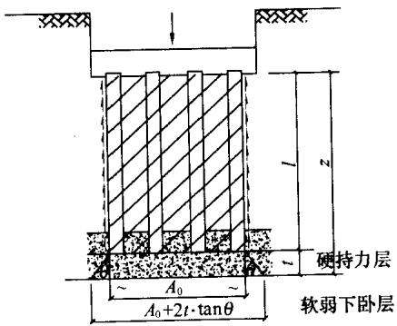  
图5.4.1 软弱下卧层承载力验算

Ⅱ 负摩阻力计算

5.4.2 符合下列条件之一的桩基，当桩周土层产生的沉降超过

基桩的沉降时，在计算基桩承载力时应计入桩侧负摩阻力：

1 桩穿越较厚松散填土、自重湿陷性黄土、欠固结土、液化土层进入相对较硬土层时；  
2 桩周存在软弱土层，邻近桩侧地面承受局部较大的长期荷载，或地面大面积堆载（包括填土）时；  
3 由于降低地下水位，使桩周土有效应力增大，并产生显著压缩沉降时。

5.4.3 桩周土沉降可能引起桩侧负摩阻力时，应根据工程具体情况考虑负摩阻力对桩基承载力和沉降的影响；当缺乏可参照的工程经验时，可按下列规定验算。

1 对于摩擦型基桩可取桩身计算中性点以上侧阻力为零，并可按下式验算基桩承载力：

$$N _{\mathrm {k}} \leqslant R _{\mathrm {a}} \tag {5.4.3-1}$$

2 对于端承型基桩除应满足上式要求外，尚应考虑负摩阻力引起基桩的下拉荷载 $Q_{\mathrm{g}}^{\mathrm{n}}$ ，并可按下式验算基桩承载力：

$$N _{\mathrm {k}} + Q _{\mathrm {g}} ^{\mathrm {n}} \leqslant R _{\mathrm {a}} \tag {5.4.3-2}$$

3 当土层不均匀或建筑物对不均匀沉降较敏感时，尚应将负摩阻力引起的下拉荷载计入附加荷载验算桩基沉降。

注：本条中基桩的竖向承载力特征值 $R_{\mathrm{n}}$ 只计中性点以下部分侧阻值及端阻值。

5.4.4 桩侧负摩阻力及其引起的下拉荷载，当无实测资料时可按下列规定计算：

1 中性点以上单桩桩周第 $i$ 层土负摩阻力标准值，可按下列公式计算：

$$q _{s i} ^{\mathrm {n}} = \xi_{n i} \sigma_{i} ^{\prime} \tag {5.4.4-1}$$

当填土、自重湿陷性黄土湿陷、欠固结土层产生固结和地下水降低时： $\sigma_{i}^{\prime} = \sigma_{\gamma i}^{\prime}$

当地面分布大面积荷载时： $\sigma_{i}^{\prime} = p + \sigma_{\gamma i}^{\prime}$

$$\sigma_{\gamma i} ^{\prime} = \sum_{e = 1} ^{i - 1} \gamma_{e} \Delta z _{e} + \frac {1}{2} \gamma_{i} \Delta z _{i} \tag {5.4.4-2}$$

式中 $q_{si}^{\mathrm{n}}$ ——第 $i$ 层土桩侧负摩阻力标准值；当按式（5.4.4-1）计算值大于正摩阻力标准值时，取正摩阻力标准值进行设计；

$\xi_{\mathrm{w}}$ ——桩周第 $i$ 层土负摩阻力系数，可按表5.4.4-1取值；

$\sigma_{yi}^{\prime}$ ——由土自重引起的桩周第 $i$ 层土平均竖向有效应力；桩群外围桩自地面算起，桩群内部桩自承台底算起；

$\sigma_{i}^{\prime}$ ——桩周第 $i$ 层土平均竖向有效应力；

$\gamma_{i}, \gamma_{e}$ ——分别为第 $i$ 计算土层和其上第 $e$ 土层的重度，地下水位以下取浮重度；

$\Delta z_{i}, \Delta z_{e}$ ——第 $i$ 层土、第 $e$ 层土的厚度；

$p$ ——地面均布荷载。

表 5.4.4-1 负摩阻力系数 ${\xi }_{\mathrm{n}}$

2 考虑群桩效应的基桩下拉荷载可按下式计算：  

| 土 类 | ξn |
| --- | --- |
| 饱和软土 | 0.15~0.25 |
| 黏性土、粉土 | 0.25~0.40 |
| 砂土 | 0.35~0.50 |
| 自重湿陷性黄土 | 0.20~0.35 |

注：1 在同一类土中，对于挤土桩，取表中较大值，对于非挤土桩，取表中较小值；  
2 填土按其组成取表中同类土的较大值。

$$Q _{\mathrm {g}} ^{\mathrm {n}} = \eta_{\mathrm {n}} \cdot u \sum_{i = 1} ^{n} q _{\mathrm {s i}} ^{\mathrm {n}} l _{i} \tag {5.4.4-3}$$

$$\eta_{\mathrm {n}} = s _{\mathrm {a x}} \cdot s _{\mathrm {a y}} / \left[ \pi d \left(\frac {q _{\mathrm {s}} ^{\mathrm {n}}}{\gamma_{\mathrm {m}}} + \frac {d}{4}\right) \right] \tag {5.4.4-4}$$

式中 $n$ ——中性点以上土层数；

$l_{i}$ ——中性点以上第 $i$ 土层的厚度；

$\eta_{\mathrm{n}}$ ——负摩阻力群桩效应系数；

$s_{\mathrm{ax}}$ 、 $s_{\mathrm{ay}}$ ——分别为纵、横向桩的中心距；

$q_{\mathrm{s}}^{\mathrm{n}}$ ——中性点以上桩周土层厚度加权平均负摩阻力标准值；

$\gamma_{\mathrm{m}}$ ——中性点以上桩周土层厚度加权平均重度（地下水位以下取浮重度）。

对于单桩基础或按式(5.4.4-4)计算的群桩效应系数 $\eta_{\mathrm{n}} > 1$ 时，取 $\eta_{\mathrm{n}} = 1$ 。

3 中性点深度 $l_{\mathrm{n}}$ 应按桩周土层沉降与桩沉降相等的条件计算确定，也可参照表5.4.4-2确定。

表 5.4.4-2 中性点深度 ${l}_{\mathrm{n}}$   

| 持力层性质 | 黏性土、粉土 | 中密以上砂 | 砾石、卵石 | 基岩 |
| --- | --- | --- | --- | --- |
| 中性点深度比ln/lo | 0.5~0.6 | 0.7~0.8 | 0.9 | 1.0 |

注：1 $l_{\mathrm{n}}$ 、 $l_{0}$ ——分别为自桩顶算起的中性点深度和桩周软弱土层下限深度；  
2 桩穿过自重湿陷性黄土层时， $l_{\mathrm{n}}$ 可按表列值增大 $10\%$ （持力层为基岩除外）；  
3 当桩周土层固结与桩基固结沉降同时完成时，取 $l_{\mathrm{n}} = 0$   
4 当桩周土层计算沉降量小于 $20\mathrm{mm}$ 时， $l_{\mathrm{n}}$ 应按表列值乘以 $0.4\sim 0.8$ 折减。

Ⅲ 抗拔桩基承载力验算

5.4.5 承受拔力的桩基，应按下列公式同时验算群桩基础呈整体破坏和呈非整体破坏时基桩的抗拔承载力：

$$N _{\mathrm {k}} \leqslant T _{\mathrm {g k}} / 2 + G _{\mathrm {g p}} \tag {5.4.5-1}$$

$$N _{\mathrm {k}} \leqslant T _{\mathrm {u k}} / 2 + G _{\mathrm {p}} \tag {5.4.5-2}$$

式中 $N_{\mathrm{k}}$ ——按荷载效应标准组合计算的基桩拔力；

$T_{\mathrm{gk}}$ ——群桩呈整体破坏时基桩的抗拔极限承载力标准值，可按本规范第5.4.6条确定；

$T_{\mathrm{uk}}$ ——群桩呈非整体破坏时基桩的抗拔极限承载力标准值，可按本规范第5.4.6条确定；

$G_{\mathrm{gp}}$ ——群桩基础所包围体积的桩土总自重除以总桩数，地下水位以下取浮重度；

$G_{\mathrm{P}}$ ——基桩自重，地下水位以下取浮重度，对于扩底桩应按本规范表5.4.6-1确定桩、土柱体周长，计算桩、土自重。

5.4.6 群桩基础及其基桩的抗拔极限承载力的确定应符合下列规定：

1 对于设计等级为甲级和乙级建筑桩基，基桩的抗拔极限承载力应通过现场单桩上拔静载荷试验确定。单桩上拔静载荷试验及抗拔极限承载力标准值取值可按现行行业标准《建筑基桩检测技术规范》JGJ106进行。  
2 如无当地经验时，群桩基础及设计等级为丙级建筑桩基，基桩的抗拔极限载力取值可按下列规定计算：

1）群桩呈非整体破坏时，基桩的抗拔极限承载力标准值可按下式计算：

$$T _{\mathrm {u k}} = \sum \lambda_{i} q _{\mathrm {s i k}} u _{i} l _{i} \tag {5.4.6-1}$$

式中 $T_{\mathrm{uk}}$ ——基桩抗拔极限承载力标准值；

$u_{i}$ ——桩身周长，对于等直径桩取 $u = \pi d$ ；对于扩底桩按表5.4.6-1取值；

$q_{\mathrm{sk}}$ ——桩侧表面第 $i$ 层土的抗压极限侧阻力标准值，可按本规范表5.3.5-1取值；

$\lambda_{i}$ ——抗拔系数，可按表5.4.6-2取值。

表 5.4.6-1 扩底桩破坏表面周长 ${u}_{i}$   

| 自桩底起算的长度li | ≤(4~10)d | >(4~10)d |
| --- | --- | --- |
| ui | πD | πd |

注： $l_{i}$ 对于软土取低值，对于卵石、砾石取高值； $l_{i}$ 取值按内摩擦角增大而增加。

表 5.4.6-2 抗拔系数 $\lambda$   

| 土 类 | λ 值 |
| --- | --- |
| 砂土 | 0.50~0.70 |
| 黏性土、粉土 | 0.70~0.80 |

注：桩长 $l$ 与桩径 $d$ 之比小于20时， $\lambda$ 取小值。

2）群桩呈整体破坏时，基桩的抗拔极限承载力标准值可按下式计算：

$$T _{\mathrm {R k}} = \frac {1}{n} u _{l} \sum \lambda_{i} q _{\mathrm {s i k}} l _{i} \tag {5.4.6-2}$$

式中 $u_{i}$ ——桩群外围周长。

5.4.7 季节性冻土上轻型建筑的短桩基础，应按下列公式验算其抗冻拔稳定性：

$$\eta_{\mathrm {f}} q _{\mathrm {f}} u z _{0} \leqslant T _{\mathrm {g k}} / 2 + N _{\mathrm {G}} + G _{\mathrm {g p}} \tag {5.4.7-1}$$

$$\eta_{i} q _{\mathrm {f}} u z _{0} \leqslant T _{\mathrm {u k}} / 2 + N _{\mathrm {G}} + G _{\mathrm {p}} \tag {5.4.7-2}$$

式中 $\eta_{\mathrm{f}}$ ——冻深影响系数，按表5.4.7-1采用；

$q_{\mathrm{f}}$ ——切向冻胀力，按表5.4.7-2采用；

$z_{0}$ ——季节性冻土的标准冻深；

$T_{\mathrm{rk}}$ ——标准冻深线以下群桩呈整体破坏时基桩抗拔极限承载力标准值，可按本规范第5.4.6条确定；

$T_{\mathrm{uk}}$ ——标准冻深线以下单桩抗拔极限承载力标准值，可按本规范第5.4.6条确定；

$N_{G}$ ——基桩承受的桩承台底面以上建筑物自重、承台及其上土重标准值。

表 5.4.7-1 冻深影响系数 ${\mathbf{\eta }}_{\mathrm{f}}$ 值  

| 标准冻深(m) | z0≤2.0 | 2.0＜z0≤3.0 | z0＞3.0 |
| --- | --- | --- | --- |
| ηf | 1.0 | 0.9 | 0.8 |

表 5.4.7-2 切向冻胀力 ${q}_{\mathrm{f}}\left( \mathrm{{kPa}}\right)$ 值  

| 冻胀性分类 土类 | 弱冻胀 | 冻胀 | 强冻胀 | 特强冻胀 |
| --- | --- | --- | --- | --- |
| 黏性土、粉土 | 30~60 | 60~80 | 80~120 | 120~150 |
| 砂土、砾(碎)石 (黏、粉粒含量>15%) | <10 | 20~30 | 40~80 | 90~200 |

注：1 表面粗糙的灌注桩，表中数值应乘以系数 $1.1\sim 1.3$   
2 本表不适用于含盐量大于 $0.5\%$ 的冻土。

5.4.8 膨胀土上轻型建筑的短桩基础，应按下列公式验算群桩基础呈整体破坏和非整体破坏的抗拔稳定性：

$$u \sum q _{e i} l _{e i} \leqslant T _{\mathrm {g k}} / 2 + N _{\mathrm {G}} + G _{\mathrm {k p}} \tag {5.4.8-1}$$

$$u \sum q _{\mathrm {e} i} l _{\mathrm {e} i} \leqslant T _{\mathrm {u k}} / 2 + N _{\mathrm {G}} + G _{\mathrm {p}} \tag {5.4.8-2}$$

式中 $T_{\mathrm{gk}}$ ——群桩呈整体破坏时，大气影响急剧层下稳定土层中基桩的抗拔极限承载力标准值，可按本规范第5.4.6条计算；

$T_{\mathrm{uk}}$ ——群桩呈非整体破坏时，大气影响急剧层下稳定土层中基桩的抗拔极限承载力标准值，可按本规范第5.4.6条计算；

$q_{ei}$ ——大气影响急剧层中第 $i$ 层土的极限胀切力，由现场浸水试验确定；

$l_{ci}$ ——大气影响急剧层中第 $i$ 层土的厚度。

## 5.5 桩基沉降计算

5.5.1 建筑桩基沉降变形计算值不应大于桩基沉降变形允许值。  
5.5.2 桩基沉降变形可用下列指标表示：

1 沉降量；
2 沉降差；
3 整体倾斜：建筑物桩基础倾斜方向两端点的沉降差与其距离之比值；  
4 局部倾斜：墙下条形承台沿纵向某一长度范围内桩基础两点的沉降差与其距离之比值。

5.5.3 计算桩基沉降变形时，桩基变形指标应按下列规定选用：

1 由于土层厚度与性质不均匀、荷载差异、体形复杂、相互影响等因素引起的地基沉降变形，对于砌体承重结构应由局部倾斜控制；  
2 对于多层或高层建筑和高耸结构应由整体倾斜值控制；  
3 当其结构为框架、框架-剪力墙、框架-核心筒结构时，尚应控制柱（墙）之间的差异沉降。

5.5.4 建筑桩基沉降变形允许值，应按表5.5.4规定采用。

表 5.5.4 建筑桩基沉降变形允许值  

| 变形特征 | 变形特征 | 允许值 |
| --- | --- | --- |
| 砌体承重结构基础的局部倾斜 | 砌体承重结构基础的局部倾斜 | 0.002 |
| 各类建筑相邻柱(墙)基的沉降差(1)框架、框架一剪力墙、框架一核心筒结构(2)砌体墙填充的边排柱(3)当基础不均匀沉降时不产生附加应力的结构单层排架结构(柱距为6m)桩基的沉降量(mm) | 各类建筑相邻柱(墙)基的沉降差(1)框架、框架一剪力墙、框架一核心筒结构(2)砌体墙填充的边排柱(3)当基础不均匀沉降时不产生附加应力的结构单层排架结构(柱距为6m)桩基的沉降量(mm) | 0.002 l00.0007l00.005l0120 |
| 桥式吊车轨面的倾斜(按不调整轨道考虑)纵向横向 | 桥式吊车轨面的倾斜(按不调整轨道考虑)纵向横向 | 0.0040.003 |
| 多层和高层建筑的整体倾斜 | Hg≤2424＜Hg≤6060＜Hg≤100Hg>100 | 0.0040.0030.00250.002 |
| 高耸结构桩基的整体倾斜 | Hg≤2020＜Hg≤5050＜Hg≤100100＜Hg≤150150＜Hg≤200200＜Hg≤250 | 0.0080.0060.0050.0040.0030.002 |
| 高耸结构基础的沉降量(mm) | Hg≤100100＜Hg≤200200＜Hg≤250 | 350250150 |
| 体型简单的剪力墙结构高层建筑桩基最大沉降量(mm) | - | 200 |

注： $l_{0}$ 为相邻柱（墙）二测点间距离， $\pmb{H}_{\mathrm{g}}$ 为自室外地面算起的建筑物高度 $(\mathbf{m})$ 。

5.5.5 对于本规范表 5.5.4 中未包括的建筑桩基沉降变形允许值，应根据上部结构对桩基沉降变形的适应能力和使用要求确定。

I 桩中心距不大于6倍桩径的桩基

5.5.6 对于桩中心距不大于 6 倍桩径的桩基，其最终沉降量计算可采用等效作用分层总和法。等效作用面位于桩端平面，等效作用面积为桩承台投影面积，等效作用附加压力近似取承台底平均附加压力。等效作用面以下的应力分布采用各向同性均质直线变形体理论。计算模式如图 5.5.6 所示，桩基任一点最终沉降量

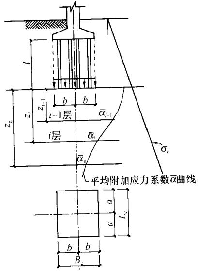  
图5.5.6 桩基沉降计算示意图

可用角点法按下式计算：

$$s = \psi \cdot \psi_{\mathrm {e}} \cdot s ^{\prime} = \psi \cdot \psi_{\mathrm {c}} \cdot \sum_{j = 1} ^{m} p _{0 j} \sum_{i = 1} ^{n} \frac {z _{i j} \bar {\alpha} _{i j} - z _{(i - 1) j} \bar {\alpha} _{(i - 1) j}}{E _{\mathrm {s i}}} \tag {5.5.6}$$

式中 $s$ ——桩基最终沉降量（ $\mathrm{mm}$ ）；

$s^{\prime}$ ——采用布辛奈斯克（Boussinesq）解，按实体深基础分层总和法计算出的桩基沉降量（mm）；

$\psi$ ——桩基沉降计算经验系数，当无当地可靠经验时

可按本规范第5.5.11条确定；

$\psi_{\mathrm{e}}$ ——桩基等效沉降系数，可按本规范第5.5.9条确定；

$m$ ——角点法计算点对应的矩形荷载分块数；

$p_{0j}^{-}$ 第 $j$ 块矩形底面在荷载效应准永久组合下的附加压力（kPa）；

$n$ ——桩基沉降计算深度范围内所划分的土层数；

$E_{si}$ ——等效作用面以下第 $i$ 层土的压缩模量（ $\mathrm{MPa}$ ），采用地基土在自重压力至自重压力加附加压力作用时的压缩模量；

$z_{ij}, z_{(i-1)j}$ ——桩端平面第 $j$ 块荷载作用面至第 $i$ 层土、第 $i-1$ 层土底面的距离（m）；

$\overline{\alpha}_{ij}, \overline{\alpha}_{(i-1)j}$ ——桩端平面第 $j$ 块荷载计算点至第 $i$ 层土、第 $i-1$ 层土底面深度范围内平均附加应力系数，可按本规范附录D选用。

5.5.7 计算矩形桩基中点沉降时，桩基沉降量可按下式简化计算：

$$s = \psi \cdot \psi_{\mathrm {c}} \cdot s ^{\prime} = 4 \cdot \psi \cdot \psi_{\mathrm {c}} \cdot p _{0} \sum_{i - 1} ^{n} \frac {z _{i} \overline {{\alpha}} _{i} - z _{i - 1} \overline {{\alpha}} _{i - 1}}{E _{s i}} \tag {5.5.7}$$

式中 $p_0$ ——在荷载效应准永久组合下承台底的平均附加压力； $\overline{\alpha}_i, \overline{\alpha}_{i-1}$ ——平均附加应力系数，根据矩形长宽比 $a/b$ 及深宽比 $\frac{z_i}{b} = \frac{2z_i}{B_c}, \frac{z_{i-1}}{b} = \frac{2z_{i-1}}{B_c}$ ，可按本规范附录D选用。

5.5.8 桩基沉降计算深度 $z_{\mathrm{n}}$ 应按应力比法确定，即计算深度处的附加应力 $\sigma_z$ 与土的自重应力 $\sigma_{\mathrm{c}}$ 应符合下列公式要求：

$$\sigma_{z} \leqslant 0. 2 \sigma_{c} \tag {5.5.8-1}$$

$$\sigma_{z} = \sum_{j = 1} ^{m} a _{j} p _{0 j} \tag {5.5.8-2}$$

式中 $a_{j}$ ——附加应力系数，可根据角点法划分的矩形长宽比及深宽比按本规范附录D选用。

5.5.9 桩基等效沉降系数 $\psi_{\mathrm{e}}$ 可按下列公式简化计算：

$$\psi_{\mathrm {e}} = C _{0} + \frac {n _{\mathrm {b}} - 1}{C _{1} (n _{\mathrm {b}} - 1) + C _{2}} \tag {5.5.9-1}$$

$$n _{\mathrm {b}} = \sqrt {n \cdot B _{c} / L _{c}} \tag {5.5.9-2}$$

式中 $n_{\mathrm{b}}$ ——矩形布桩时的短边布桩数，当布桩不规则时可按式（5.5.9-2）近似计算， $n_{\mathrm{b}} > 1$ ； $n_{\mathrm{b}} = 1$ 时，可按本规范式（5.5.14）计算；

$C_0$ 、 $C_1$ 、 $C_2$ ——根据群桩距径比 $s_{\mathrm{a}} / d$ 、长径比 $l / d$ 及基础长宽比 $L_{\mathrm{c}} / B_{\mathrm{c}}$ ，按本规范附录E确定；

$L_{c}, B_{c}, n$ ——分别为矩形承台的长、宽及总桩数。

5.5.10 当布桩不规则时，等效距径比可按下列公式近似计算：

圆形桩 $s_{\mathrm{a}} / d = \sqrt{A} /(\sqrt{n}\bullet d)$ (5.5.10-1)

$\frac{s_{\mathrm{a}}}{d} = 0.886\sqrt{A} /(\sqrt{n}\bullet b)$ (5.5.10-2)

式中 $A$ ——桩基承台总面积；

$b$ ——方形桩截面边长。

5.5.11 当无当地可靠经验时，桩基沉降计算经验系数 $\psi$ 可按表5.5.11选用。对于采用后注浆施工工艺的灌注桩，桩基沉降计算经验系数应根据桩端持力土层类别，乘以0.7（砂、砾、卵石） $\sim 0.8$ （黏性土、粉土）折减系数；饱和土中采用预制桩（不含复打、复压、引孔沉桩）时，应根据桩距、土质、沉桩速率和顺序等因素，乘以 $1.3\sim 1.8$ 挤土效应系数，土的渗透性低，桩距小，桩数多，沉降速率快时取大值。

表 5.5.11 桩基沉降计算经验系数 $\psi$   

| Ea(MPa) | ≤10 | 15 | 20 | 35 | ≥50 |
| --- | --- | --- | --- | --- | --- |
| ψ | 1.2 | 0.9 | 0.65 | 0.50 | 0.40 |

注：1 $\overline{E}_{\mathrm{s}}$ 为沉降计算深度范围内压缩模量的当量值，可按下式计算： $\overline{E}_{\mathrm{s}} = \sum A_{i} / \sum \frac{A_{i}}{E_{\mathrm{si}}}$ ，式中 $A_{i}$ 为第 $i$ 层土附加压力系数沿土层厚度的积分值，可近似按分块面积计算；  
2 $\psi$ 可根据 $\overline{E}_{\mathrm{s}}$ 内插取值。

5.5.12 计算桩基沉降时，应考虑相邻基础的影响，采用叠加原理计算；桩基等效沉降系数可按独立基础计算。

5.5.13 当桩基形状不规则时，可采用等效矩形面积计算桩基等效沉降系数，等效矩形的长宽比可根据承台实际尺寸和形状确定。

Ⅱ 单桩、单排桩、疏桩基础

5.5.14 对于单桩、单排桩、桩中心距大于6倍桩径的疏桩基础的沉降计算应符合下列规定：

1 承台底地基土不分担荷载的桩基。桩端平面以下地基中由基桩引起的附加应力，按考虑桩径影响的明德林（Mindlin）解附录F计算确定。将沉降计算点水平面影响范围内各基桩对应力计算点产生的附加应力叠加，采用单向压缩分层总和法计算土层的沉降，并计入桩身压缩 $s_{\mathrm{c}}$ 。桩基的最终沉降量可按下列公式计算：

$$s = \psi \sum_{i = 1} ^{n} \frac {\sigma_{z i}}{E _{s i}} \Delta z _{i} + s _{\mathrm {e}} \tag {5.5.14-1}$$

$$\sigma_{z i} = \sum_{j = 1} ^{m} \frac {Q _{j}}{l _{j} ^{2}} \left[ \alpha_{j} I _{\mathrm {p}, i j} + (1 - \alpha_{j}) I _{\mathrm {s}, i j} \right] \tag {5.5.14-2}$$

$$s _{\mathrm {e}} = \xi_{\mathrm {e}} \frac {Q _{j} l _{j}}{E _{\mathrm {c}} A _{\mathrm {p s}}} \tag {5.5.14-3}$$

2 承台底地基土分担荷载的复合桩基。将承台底土压力对地基中某点产生的附加应力按 Boussinesq 解（附录 D）计算，与基桩产生的附加应力叠加，采用与本条第 1 款相同方法计算沉降。其最终沉降量可按下列公式计算：

$$s = \psi \sum_{i = 1} ^{n} \frac {\sigma_{z i} + \sigma_{z c i}}{E _{s i}} \Delta z _{i} + s _{\mathrm {e}} \tag {5.5.14-4}$$

$$\sigma_{z c i} = \sum_{k - 1} ^{u} a _{k i} \cdot p _{\mathrm {c}, k} \tag {5.5.14-5}$$

式中 $m$ ——以沉降计算点为圆心，0.6倍桩长为半径的水平

面影响范围内的基桩数；

$n$ ——沉降计算深度范围内土层的计算分层数；分层数应结合土层性质，分层厚度不应超过计算深度的0.3倍；

$\sigma_{zi}$ ——水平面影响范围内各基桩对应力计算点桩端平面以下第 $i$ 层土 $1/2$ 厚度处产生的附加竖向应力之和；应力计算点应取与沉降计算点最近的桩中心点；

$\sigma_{zci}$ ——承台压力对应力计算点桩端平面以下第 $i$ 计算土层 $1/2$ 厚度处产生的应力；可将承台板划分为 $u$ 个矩形块，可按本规范附录D采用角点法计算；

$\Delta z_{i}$ ——第 $i$ 计算土层厚度（m）；

$E_{si}$ ——第 $i$ 计算土层的压缩模量（ $\mathrm{MPa}$ ），采用土的自重压力至土的自重压力加附加压力作用时的压缩模量；

$Q_{j}$ ——第 $j$ 桩在荷载效应准永久组合作用下（对于复合桩基应扣除承台底土分担荷载），桩顶的附加荷载(kN)；当地下室埋深超过 $5\mathrm{m}$ 时，取荷载效应准永久组合作用下的总荷载为考虑回弹再压缩的等代附加荷载；

$l_{j}$ ——第 $j$ 桩桩长（m）；

$A_{\mathrm{ps}}$ ——桩身截面面积；

$\alpha_{j}$ ——第 $j$ 桩总桩端阻力与桩顶荷载之比，近似取极限总端阻力与单桩极限承载力之比；

$I_{\mathrm{p},ij}$ 、 $I_{s,ij}$ ——分别为第 $j$ 桩的桩端阻力和桩侧阻力对计算轴线第 $i$ 计算土层1/2厚度处的应力影响系数，可按本规范附录F确定；

$E_{c}$ ——桩身混凝土的弹性模量；

$p_{c,k}$ ——第 $k$ 块承台底均布压力，可按 $p_{c,k} = \eta_{c,k} \cdot f_{ak}$ 取值，其中 $\eta_{c,k}$ 为第 $k$ 块承台底板的承台效应系数，

按本规范表5.2.5确定； $f_{\mathrm{ak}}$ 为承台底地基承载力特征值；

$\alpha_{ki}$ ——第 $k$ 块承台底角点处，桩端平面以下第 $i$ 计算土层 $1/2$ 厚度处的附加应力系数，可按本规范附录D确定；

$s_{\mathrm{e}}$ 计算桩身压缩；

$\xi_{\mathrm{e}}$ ——桩身压缩系数。端承型桩，取 $\xi_{\mathrm{e}} = 1.0$ ；摩擦型桩，当 $l / d \leqslant 30$ 时，取 $\xi_{\mathrm{e}} = 2 / 3$ ； $l / d \geqslant 50$ 时，取 $\xi_{\mathrm{e}} = 1 / 2$ ；介于两者之间可线性插值；

$\psi$ ——沉降计算经验系数，无当地经验时，可取1.0。

5.5.15 对于单桩、单排桩、疏桩复合桩基础的最终沉降计算深度 $Z_{\mathrm{n}}$ ，可按应力比法确定，即 $Z_{\mathrm{n}}$ 处由桩引起的附加应力 $\sigma_{z}$ 、由承台土压力引起的附加应力 $\sigma_{\mathrm{zc}}$ 与土的自重应力 $\sigma_{\mathrm{c}}$ 应符合下式要求：

$$\sigma_{z} + \sigma_{z c} = 0. 2 \sigma_{c} \tag {5.5.15}$$

## 5.6 软土地基减沉复合疏桩基础

5.6.1 当软土地基上多层建筑，地基承载力基本满足要求（以底层平面面积计算）时，可设置穿过软土层进入相对较好土层的疏布摩擦型桩，由桩和桩间土共同分担荷载。该种减沉复合疏桩基础，可按下列公式确定承台面积和桩数：

$$A _{\mathrm {c}} = \xi \frac {F _{\mathrm {k}} + G _{\mathrm {k}}}{f _{\mathrm {a k}}} \tag {5.6.1-1}$$

$$n \geqslant \frac {F _{\mathrm {k}} + G _{\mathrm {k}} - \eta_{\mathrm {c}} f _{\mathrm {a k}} A _{\mathrm {c}}}{R _{\mathrm {a}}} \tag {5.6.1-2}$$

式中 $A_{\mathrm{c}}$ ——桩基承台总净面积；

$f_{\mathrm{ak}}$ ——承台底地基承载力特征值；

$\xi$ ——承台面积控制系数， $\xi \geqslant 0.60$

$n$ ——基桩数；

$\eta_{c}$ ——桩基承台效应系数，可按本规范表5.2.5取值。

5.6.2 减沉复合疏桩基础中点沉降可按下列公式计算：

$$s = \psi \left(s _{\mathrm {s}} + s _{\mathrm {s p}}\right) \tag {5.6.2-1}$$

$$s _{\mathrm {s}} = 4 p _{0} \sum_{i = 1} ^{m} \frac {z _{i} \bar {\alpha} _{i} - z _{(i - 1)} \bar {\alpha} _{(i - 1)}}{E _{\mathrm {s i}}} \tag {5.6.2-2}$$

$$s _{\mathrm {s p}} = 2 8 0 \frac {\bar {q} _{\mathrm {s u}}}{\bar {E} _{\mathrm {s}}} \cdot \frac {d}{(s _{\mathrm {a}} / d) ^{2}} \tag {5.6.2-3}$$

$$p _{0} = \eta_{\mathrm {p}} \frac {F - n R _{\mathrm {a}}}{A _{\mathrm {c}}} \tag {5.6.2-4}$$

式中 $s$ ——桩基中心点沉降量；

$s_{\mathrm{s}}$ ——由承台底地基土附加压力作用下产生的中点沉降（见图5.6.2）；

$s_{\mathrm{sp}}$ ——由桩土相互作用产生的沉降；

$p_0$ ——按荷载效应准永久值组合计算的假想天然地基平均附加压力（ $\mathrm{kPa}$ ）；

$E_{si}$ ——承台底以下第 $i$ 层土的压缩模量，应取自重压力至自重压力与附加压力段的模量值；

$m$ ——地基沉降计算深度范围的土层数；沉降计算深度按 $\sigma_z = 0.1\sigma_c$ 确定， $\sigma_z$ 可按本规范第5.5.8条确定；

$\overline{q}_{\mathrm{su}}$ 、 $\overline{E}_{s}$ ——桩身范围内按厚度加权的平均桩侧极限摩阻力、平均压缩模量；

$d$ ——桩身直径，当为方形桩时， $d = 1.27b$ （ $b$ 为方形桩截面边长）；

$s_{\mathrm{a}} / d$ ——等效距径比，可按本规范第5.5.10条执行；

$z_{i}, z_{i-1}$ ——承台底至第 $i$ 层、第 $i-1$ 层土底面的距离；

$\overline{\alpha}_i, \overline{\alpha}_{i-1}$ ——承台底至第 $i$ 层、第 $i-1$ 层土层底范围内的角点平均附加应力系数；根据承台等效面积的计算分块矩形长宽比 $a/b$ 及深宽比 $z_i/b = 2z_i / B_c$ ，由本规范附录D确定；其中承台等效宽度 $B_c = B \sqrt{A_c} / L$ ； $B$ 、 $L$ 为建筑物基础外缘平面的宽度和长度；

$F$ ——荷载效应准永久值组合下，作用于承台底的总附加

荷载（kN）；

$\eta_{\mathbf{p}}$ ——基桩刺入变形影响系数；按桩端持力层土质确定，砂土为1.0，粉土为1.15，黏性土为1.30。

$\psi$ ——沉降计算经验系数，无当地经验时，可取1.0。

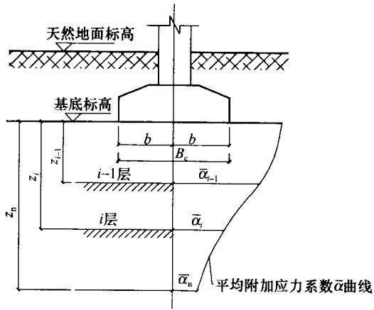  
图5.6.2 复合疏桩基础沉降计算的分层示意图

## 5.7 桩基水平承载力与位移计算

I 单桩基础

5.7.1 受水平荷载的一般建筑物和水平荷载较小的高大建筑物单桩基础和群桩中基桩应满足下式要求：

$$H _{i k} \leqslant R _{\mathrm {h}} \tag {5.7.1}$$

式中 $H_{ik}$ ——在荷载效应标准组合下，作用于基桩 $i$ 桩顶处的水平力；

$R_{\mathrm{h}}$ ——单桩基础或群桩中基桩的水平承载力特征值，对于单桩基础，可取单桩的水平承载力特征值 $R_{\mathrm{ha}}$ 。

5.7.2 单桩的水平承载力特征值的确定应符合下列规定：

1 对于受水平荷载较大的设计等级为甲级、乙级的建筑桩基，单桩水平承载力特征值应通过单桩水平静载试验确定，试验

方法可按现行行业标准《建筑基桩检测技术规范》JGJ106执行。

2 对于钢筋混凝土预制桩、钢桩、桩身配筋率不小于 $0.65\%$ 的灌注桩，可根据静载试验结果取地面处水平位移为 $10\mathrm{mm}$ （对于水平位移敏感的建筑物取水平位移 $6\mathrm{mm}$ ）所对应的荷载的 $75\%$ 为单桩水平承载力特征值。  
3 对于桩身配筋率小于 $0.65\%$ 的灌注桩，可取单桩水平静载试验的临界荷载的 $75\%$ 为单桩水平承载力特征值。  
4 当缺少单桩水平静载试验资料时，可按下列公式估算桩身配筋率小于 $0.65\%$ 的灌注桩的单桩水平承载力特征值：

$$R _{\mathrm {h a}} = \frac {0 . 7 5 \alpha \gamma_{\mathrm {m}} f _{\mathrm {t}} W _{0}}{\nu_{\mathrm {M}}} (1. 2 5 + 2 2 \rho_{\mathrm {g}}) \left(1 \pm \frac {\zeta_{\mathrm {N}} N _{k}}{\gamma_{\mathrm {m}} f _{\mathrm {t}} A _{\mathrm {n}}}\right) \tag {5.7.2-1}$$

式中 $\alpha$ ——桩的水平变形系数，按本规范第5.7.5条确定；

$R_{\mathrm{ha}}$ ——单桩水平承载力特征值， $\pm$ 号根据桩顶竖向力性质确定，压力取“+”，拉力取“-”；

$\gamma_{\mathrm{m}}$ ——桩截面模量塑性系数，圆形截面 $\gamma_{\mathrm{m}} = 2$ ，矩形截面 $\gamma_{\mathrm{m}} = 1.75$

$f_{\mathrm{t}}$ ——桩身混凝土抗拉强度设计值；

$W_{0}$ ——桩身换算截面受拉边缘的截面模量，圆形截面为：

$$W _{0} = \frac {\pi d}{3 2} \left[ d ^{2} + 2 \left(\alpha_{\mathrm {E}} - 1\right) \rho_{\mathrm {g}} d _{0} ^{2} \right]$$

方形截面为： $W_{0} = \frac{b}{6} [b^{2} + 2(\alpha_{\mathrm{E}} - 1)\rho_{\mathrm{g}}b_{0}^{2}],$

其中 $d$ 为桩直径， $d_0$ 为扣除保护层厚度的桩直径； $b$ 为方形截面边长， $b_{0}$ 为扣除保护层厚度的桩截面宽度； $\alpha_{E}$ 为钢筋弹性模量与混凝土弹性模量的比值；

$\nu_{\mathrm{M}}$ ——桩身最大弯距系数，按表5.7.2取值，当单桩基础和单排桩基纵向轴线与水平力方向相垂直时，按桩

顶铰接考虑；

$\rho_{\mathrm{K}}$ ——桩身配筋率；

$A_{\mathrm{n}}$ ——桩身换算截面积, 圆形截面为: $A_{\mathrm{n}} = \frac{\pi d^{2}}{4} [1 + (\alpha_{\mathrm{E}} - 1)\rho_{\mathrm{g}}]$ ;

方形截面为： $A_{\mathrm{n}} = b^{2}\left[1 + (\alpha_{\mathrm{E}} - 1)\rho_{\mathrm{g}}\right]$

$\zeta_{N}$ ——桩顶竖向力影响系数，竖向压力取0.5；竖向拉力取1.0； $N_{k}$ ——在荷载效应标准组合下桩顶的竖向力（kN）。

表 5.7.2 桩顶 (身) 最大弯矩系数 ${\mathbf{v}}_{\mathrm{M}}$ 和桩顶水平位移系数 ${\mathbf{v}}_{\mathrm{x}}$   

| 桩顶约束情况 | 桩的换算埋深(αh) | νM | νx |
| --- | --- | --- | --- |
| 铰接、自由 | 4.0 | 0.768 | 2.441 |
| 铰接、自由 | 3.5 | 0.750 | 2.502 |
| 铰接、自由 | 3.0 | 0.703 | 2.727 |
| 铰接、自由 | 2.8 | 0.675 | 2.905 |
| 铰接、自由 | 2.6 | 0.639 | 3.163 |
| 铰接、自由 | 2.4 | 0.601 | 3.526 |
| 固接 | 4.0 | 0.926 | 0.940 |
| 固接 | 3.5 | 0.934 | 0.970 |
| 固接 | 3.0 | 0.967 | 1.028 |
| 固接 | 2.8 | 0.990 | 1.055 |
| 固接 | 2.6 | 1.018 | 1.079 |
| 固接 | 2.4 | 1.045 | 1.095 |

注：1 铰接（自由）的 $\nu_{\mathrm{M}}$ 系桩身的最大弯矩系数，固接的 $\nu_{\mathrm{M}}$ 系桩顶的最大弯矩系数；  
2 当 $\alpha h > 4$ 时取 $\alpha h = 4.0$ 。

5 对于混凝土护壁的挖孔桩，计算单桩水平承载力时，其设计桩径取护壁内直径。  
6 当桩的水平承载力由水平位移控制，且缺少单桩水平静载试验资料时，可按下式估算预制桩、钢桩、桩身配筋率不小于 $0.65\%$ 的灌注桩单桩水平承载力特征值：

$$R _{\mathrm {b a}} = 0. 7 5 \frac {\alpha^{3} E I}{\nu_{\mathrm {x}}} \chi_{0 \mathrm {a}} \tag {5.7.2-2}$$

式中 $EI$ ——桩身抗弯刚度，对于钢筋混凝土桩， $EI = 0.85E_{\mathrm{c}}I_{0}$ ；其中 $E_{\mathrm{c}}$ 为混凝土弹性模量， $I_0$ 为桩身换算截面惯性矩：圆形截面为 $I_0 = W_0d_0 / 2$ ；矩形

截面为 $I_0 = W_0 b_0 / 2$

$\chi_{0a}$ ——桩顶允许水平位移；

$\nu_{x}$ ——桩顶水平位移系数，按表5.7.2取值，取值方法同 $\nu_{M}$ 。

7 验算永久荷载控制的桩基的水平承载力时，应将上述 $2 \sim 5$ 款方法确定的单桩水平承载力特征值乘以调整系数0.80；验算地震作用桩基的水平承载力时，应将按上述 $2 \sim 5$ 款方法确定的单桩水平承载力特征值乘以调整系数1.25。

II 群桩基础

5.7.3 群桩基础（不含水平力垂直于单排桩基纵向轴线和力矩较大的情况）的基桩水平承载力特征值应考虑由承台、桩群、土相互作用产生的群桩效应，可按下列公式确定：

$$R _{\mathrm {h}} = \eta_{\mathrm {h}} R _{\mathrm {h a}} \tag {5.7.3-1}$$

考虑地震作用且 $s_{\mathrm{a}} / d \leqslant 6$ 时：

$$\eta_{\mathrm {h}} = \eta_{i} \eta_{\mathrm {r}} + \eta_{\mathrm {l}} \tag {5.7.3-2}$$

$$\eta_{i} = \frac {\left(\frac {s _{\mathrm {a}}}{d}\right) ^{0 . 0 1 5 n _ {2} + 0 . 4 5}}{0 . 1 5 n _{1} + 0 . 1 0 n _{2} + 1 . 9} \tag {5.7.3-3}$$

$$\eta_{1} = \frac {m \chi_{0 a} B _{c} ^{\prime} h _{c} ^{2}}{2 n _{1} n _{2} R _{b a}} \tag {5.7.3-4}$$

$$\chi_{0 \mathrm {a}} = \frac {R _{\mathrm {h a}} \nu_{\mathrm {x}}}{\alpha^{3} E I} \tag {5.7.3-5}$$

其他情况： $\eta_{\mathrm{b}} = \eta_{\mathrm{f}}\eta_{\mathrm{r}} + \eta_{\mathrm{f}} + \eta_{\mathrm{b}}$ (5.7.3-6)

$$\eta_{\mathrm {b}} = \frac {\mu P _{\mathrm {c}}}{n _{1} n _{2} R _{\mathrm {h}}} \tag {5.7.3-7}$$

$$B _{\mathrm {c}} ^{\prime} = B _{\mathrm {c}} + 1 \tag {5.7.3-8}$$

$$P _{\mathrm {c}} = \eta_{\mathrm {c}} f _{\mathrm {a k}} (A - n A _{\mathrm {p s}}) \tag {5.7.3-9}$$

式中 $\eta_{\mathrm{b}}$ ——群桩效应综合系数；

$\eta_{i}$ ——桩的相互影响效应系数；

$\eta_{t}$ ——桩顶约束效应系数（桩顶嵌入承台长度 $50 \sim 100 \mathrm{~mm}$ 时），按表5.7.3-1取值；

$\eta_{l}$ ——承台侧向土水平抗力效应系数（承台外围回填土为松散状态时取 $\eta_{l} = 0$ ）；

$\eta_{b}$ ——承台底摩阻效应系数；

$s_{\mathrm{a}} / d$ ——沿水平荷载方向的距径比；

$n_1, n_2$ ——分别为沿水平荷载方向与垂直水平荷载方向每排桩中的桩数；

$m$ ——承台侧向土水平抗力系数的比例系数，当无试验资料时可按本规范表5.7.5取值；

$\chi_{0a}$ ——桩顶（承台）的水平位移允许值，当以位移控制时，可取 $\chi_{0a} = 10\mathrm{mm}$ （对水平位移敏感的结构物取 $\chi_{0a} = 6\mathrm{mm}$ ；当以桩身强度控制（低配筋率灌注桩）时，可近似按本规范式（5.7.3-5）确定；

$B_{\mathrm{c}}^{\prime}$ ——承台受侧向土抗力一边的计算宽度（m）；

$B_{\mathrm{c}}$ ——承台宽度（m）；

$h_{\mathrm{c}}$ ——承台高度（m）；

$\mu$ ——承台底与地基土间的摩擦系数，可按表5.7.3-2取值；

$P_{\mathrm{c}}$ ——承台底地基土分担的竖向总荷载标准值；

$\eta_{c}$ ——按本规范第5.2.5条确定；

$A$ ——承台总面积；

$A_{\mathrm{ps}}$ ——桩身截面面积。

表 5.7.3-1 桩顶约束效应系数 ${\mathbf{\eta }}_{\mathrm{r}}$   

| 换算深度 αh | 2.4 | 2.6 | 2.8 | 3.0 | 3.5 | ≥4.0 |
| --- | --- | --- | --- | --- | --- | --- |
| 位移控制 | 2.58 | 2.34 | 2.20 | 2.13 | 2.07 | 2.05 |
| 强度控制 | 1.44 | 1.57 | 1.71 | 1.82 | 2.00 | 2.07 |

注： $\alpha = \sqrt[5]{\frac{mb_0}{EI}}$ ， $h$ 为桩的人土长度。

表 5.7.3-2 承台底与地基土间的摩擦系数 $\mu$   

| 土的类别 | 土的类别 | 摩擦系数μ |
| --- | --- | --- |
| 黏性土 | 可塑 | 0.25~0.30 |
| 黏性土 | 硬塑 | 0.30~0.35 |
| 黏性土 | 坚硬 | 0.35~0.45 |
| 粉土 | 密实、中密(稍湿) | 0.30~0.40 |
| 中砂、粗砂、砾砂 | 中砂、粗砂、砾砂 | 0.40~0.50 |
| 碎石土 | 碎石土 | 0.40~0.60 |
| 软岩、软质岩 | 软岩、软质岩 | 0.40~0.60 |
| 表面粗糙的较硬岩、坚硬岩 | 表面粗糙的较硬岩、坚硬岩 | 0.65~0.75 |

5.7.4 计算水平荷载较大和水平地震作用、风载作用的带地下室的高大建筑物桩基的水平位移时，可考虑地下室侧墙、承台、桩群、土共同作用，按本规范附录C方法计算基桩内力和变位，与水平外力作用平面相垂直的单排桩基础可按本规范附录C中表C.0.3-1计算。

5.7.5 桩的水平变形系数和地基土水平抗力系数的比例系数 $m$ 可按下列规定确定：

1 桩的水平变形系数 $\alpha (1 / m)$

$$\alpha = \sqrt [ 5 ]{\frac {m b _{0}}{E I}} \tag {5.7.5}$$

式中 $m$ ——桩侧土水平抗力系数的比例系数；

$b_{0}$ ——桩身的计算宽度（m）；

圆形桩：当直径 $d \leqslant 1\mathrm{m}$ 时， $b_{0} = 0.9(1.5d + 0.5)$ ；

当直径 $d > 1\mathrm{m}$ 时， $b_{0} = 0.9(d + 1)$

方形桩：当边宽 $b \leqslant 1\mathrm{m}$ 时， $b_{0} = 1.5b + 0.5$

当边宽 $b > 1\mathrm{m}$ 时， $b_{0} = b + 1$

$EI$ ——桩身抗弯刚度，按本规范第5.7.2条的规定计算。

2 地基土水平抗力系数的比例系数 $m$ ，宜通过单桩水平静载试验确定，当无静载试验资料时，可按表5.7.5取值。

表 5.7.5 地基土水平抗力系数的比例系数 $m$ 值  

| 序号 | 地基土类别 | 预制桩、钢桩 | 预制桩、钢桩 | 灌注桩 | 灌注桩 |
| --- | --- | --- | --- | --- | --- |
| 序号 | 地基土类别 | m(MN/m4) | 相应单桩在地面处水平位移(mm) | m(MN/m1) | 相应单桩在地面处水平位移(mm) |
| 1 | 淤泥；淤泥质土；饱和湿陷性黄土 | 2~4.5 | 10 | 2.5~6 | 6~12 |
| 2 | 流塑(IL>1)、软塑(0.75<IL≤1)状黏性土；e>0.9粉土；松散粉细砂；松散、稍密填土 | 4.5~6.0 | 10 | 6~14 | 4~8 |
| 3 | 可塑(0.25<IL≤0.75)状黏性土、湿陷性黄土；e=0.75~0.9粉土；中密填土；稍密细砂 | 6.0~10 | 10 | 14~35 | 3~6 |
| 4 | 硬塑(0<IL≤0.25)、坚硬(IL≤0)状黏性土、湿陷性黄土；e<0.75粉土；中密的中粗砂；密实老填土 | 10~22 | 10 | 35~100 | 2~5 |
| 5 | 中密、密实的砾砂、碎石类土 | -- | - | 100~300 | 1.5~3 |

注：1 当桩顶水平位移大于表列数值或灌注桩配筋率较高（ $\geq 0.65\%$ ）时， $m$ 值应适当降低；当预制桩的水平向位移小于 $10\mathrm{mm}$ 时， $m$ 值可适当提高；  
2 当水平荷载为长期或经常出现的荷载时，应将表列数值乘以0.4降低采用；  
3 当地基为可液化土层时，应将表列数值乘以本规范表5.3.12中相应的系数 $\psi_{1}$ 。

## 5.8 桩身承载力与裂缝控制计算

5.8.1 桩身应进行承载力和裂缝控制计算。计算时应考虑桩身

材料强度、成桩工艺、吊运与沉桩、约束条件、环境类别等因素，除按本节有关规定执行外，尚应符合现行国家标准《混凝土结构设计规范》GB50010、《钢结构设计规范》GB50017和《建筑抗震设计规范》GB50011的有关规定。

I受压桩

5.8.2 钢筋混凝土轴心受压桩正截面受压承载力应符合下列规定：

1 当桩顶以下5d范围的桩身螺旋式箍筋间距不大于 $100\mathrm{mm}$ ，且符合本规范第4.1.1条规定时：

$$N \leqslant \psi_{\mathrm {c}} f _{\mathrm {c}} A _{\mathrm {p s}} + 0. 9 f _{\mathrm {y}} ^{\prime} A _{\mathrm {s}} ^{\prime} \tag {5.8.2-1}$$

2 当桩身配筋不符合上述1款规定时：

$$N \leqslant \psi_{\mathrm {c}} f _{\mathrm {c}} A _{\mathrm {p s}} \tag {5.8.2-2}$$

式中 $N$ ——荷载效应基本组合下的桩顶轴向压力设计值；

$\psi_{c}$ ——基桩成桩工艺系数，按本规范第5.8.3条规定取值；

$f_{\mathrm{c}}$ ——混凝土轴心抗压强度设计值；

$f_{\mathrm{y}}^{\prime}$ ——纵向主筋抗压强度设计值；

$A_{\mathrm{s}}^{\prime}$ —纵向主筋截面面积。

5.8.3 基桩成桩工艺系数 $\psi_{c}$ 应按下列规定取值：

1 混凝土预制桩、预应力混凝土空心桩： $\psi_{\mathrm{c}} = 0.85$   
2 干作业非挤土灌注桩： $\psi_{\mathrm{c}} = 0.90$   
3 泥浆护壁和套管护壁非挤土灌注桩、部分挤土灌注桩、挤土灌注桩： $\psi_{\mathrm{c}} = 0.7 \sim 0.8$ ；  
4 软土地区挤土灌注桩： $\psi_{\mathrm{c}} = 0.6$ 。

5.8.4 计算轴心受压混凝土桩正截面受压承载力时，一般取稳定系数 $\varphi = 1.0$ 。对于高承台基桩、桩身穿越可液化土或不排水抗剪强度小于 $10\mathrm{kPa}$ 的软弱土层的基桩，应考虑压屈影响，可按本规范式（5.8.2-1）、式（5.8.2-2）计算所得桩身正截面受压承载力乘以 $\varphi$ 折减。其稳定系数 $\varphi$ 可根据桩身压屈计算长度 $l$ 。

和桩的设计直径 $d$ （或矩形桩短边尺寸 $b$ ）确定。桩身压屈计算长度可根据桩顶的约束情况、桩身露出地面的自由长度 $l_{0}$ 、桩的入土长度 $h$ 、桩侧和桩底的土质条件按表5.8.4-1确定。桩的稳定系数 $\varphi$ 可按表5.8.4-2确定。

表 5.8.4-1 桩身压屈计算长度 ${l}_{\mathrm{c}}$   

| 桩顶铰接 | 桩顶铰接 | 桩顶铰接 | 桩顶铰接 |
| --- | --- | --- | --- |
| 桩底支于非岩石土中 | 桩底支于非岩石土中 | 桩底嵌于岩石内 | 桩底嵌于岩石内 |
| h<4.0/α | h≥4.0/α | h<4.0/α | h≥4.0/α |
|  |  |  |  |
| lc=1.0×(l0+h) | lc=0.7×(l0+4.0/α) | lc=0.7×(l0+h) | lc=0.7×(l0+4.0/α) |
| 桩顶固接 | 桩顶固接 | 桩顶固接 | 桩顶固接 |
| 桩底支于非岩石土中 | 桩底支于非岩石土中 | 桩底嵌于岩石内 | 桩底嵌于岩石内 |
| h<4.0/α | h≥4.0/α | h<4.0/α | h≥4.0/α |
|  |  |  |  |
| lc=0.7×(l0+h) | lc=0.5×(l0+4.0/α) | lc=0.5×(l0+h) | lc=0.5×(l0+4.0/α) |

注：1 表中 $\alpha = \sqrt[5]{\frac{mb_0}{EI}}$   
2 $l_{0}$ 为高承台基桩露出地面的长度，对于低承台桩基， $l_{0} = 0$   
3 $h$ 为桩的人土长度，当桩侧有厚度为 $d_{l}$ 的液化土层时，桩露出地面长度 $l_{0}$ 和桩的人土长度 $h$ 分别调整为， $l_{0}^{\prime} = l_{0} + \psi_{1} d_{l}, h^{\prime} = h - \psi_{1} d_{l}, \psi_{1}$ 按表5.3.12取值。

表 5.8.4-2 桩身稳定系数 $\varphi$   

| ${l}_{\mathrm{c}}/d$ | $\leq 7$ | 8.5 | 10.5 | 12 | 14 | 15.5 | 17 | 19 | 21 | 22.5 | 24 |
| --- | --- | --- | --- | --- | --- | --- | --- | --- | --- | --- | --- |
| ${l}_{\mathrm{c}}/b$ | $\leq 8$ | 10 | 12 | 14 | 16 | 18 | 20 | 22 | 24 | 26 | 28 |
| $\varphi$ | 1.00 | 0.98 | 0.95 | 0.92 | 0.87 | 0.81 | 0.75 | 0.70 | 0.65 | 0.60 | 0.56 |
|  |  |  |  |  |  |  |  |  |  |  |  |
| ${l}_{\mathrm{c}}/d$ | 26 | 28 | 29.5 | 31 | 33 | 34.5 | 36.5 | 38 | 40 | 41.5 | 43 |
| ${l}_{\mathrm{c}}/b$ | 30 | 32 | 34 | 36 | 38 | 40 | 42 | 44 | 46 | 48 | 50 |
| $\varphi$ | 0.52 | 0.48 | 0.44 | 0.40 | 0.36 | 0.32 | 0.29 | 0.26 | 0.23 | 0.21 | 0.19 |

注： $b$ 为矩形桩短边尺寸， $d$ 为桩直径。

5.8.5 计算偏心受压混凝土桩正截面受压承载力时，可不考虑偏心距的增大影响，但对于高承台基桩、桩身穿越可液化土或不排水抗剪强度小于 $10\mathrm{kPa}$ 的软弱土层的基桩，应考虑桩身在弯矩作用平面内的挠曲对轴向力偏心距的影响，应将轴向力对截面重心的初始偏心矩 $e_i$ 乘以偏心矩增大系数 $\eta$ ，偏心距增大系数 $\eta$ 的具体计算方法可按现行国家标准《混凝土结构设计规范》GB50010执行。

5.8.6 对于打入式钢管桩，可按以下规定验算桩身局部压屈：

1 当 $t / d = \frac{1}{50} \sim \frac{1}{80}$ ， $d \leqslant 600\mathrm{mm}$ ，最大锤击压应力小于钢材强度设计值时，可不进行局部压屈验算；

2 当 $d > 600\mathrm{mm}$ ，可按下式验算：

$$t / d \geqslant f _{\mathrm {y}} ^{\prime} / 0. 3 8 8 E \tag {5.8.6-1}$$

3 当 $d \geqslant 900\mathrm{mm}$ ，除按（5.8.6-1）式验算外，尚应按下式验算：

$$t / d \geqslant \sqrt {f _{\mathrm {y}} ^{\prime} / 1 4 . 5 E} \tag {5.8.6-2}$$

式中 $t, d$ ——钢管桩壁厚、外径；

$E, f_{y}^{\prime}$ ——钢材弹性模量、抗压强度设计值。

Ⅱ抗拔桩

5.8.7 钢筋混凝土轴心抗拔桩的正截面受拉承载力应符合下式规定：

$$N \leqslant f _{\mathrm {y}} A _{\mathrm {s}} + f _{\mathrm {p y}} A _{\mathrm {p y}} \tag {5.8.7}$$

式中 $N$ ——荷载效应基本组合下桩顶轴向拉力设计值；

$f_{\mathrm{y}}$ 、 $f_{\mathrm{py}}$ ——普通钢筋、预应力钢筋的抗拉强度设计值；

$A_{\mathrm{s}}$ 、 $A_{\mathrm{py}}$ ——普通钢筋、预应力钢筋的截面面积。

5.8.8 对于抗拔桩的裂缝控制计算应符合下列规定：

1 对于严格要求不出现裂缝的一级裂缝控制等级预应力混凝土基桩，在荷载效应标准组合下混凝土不应产生拉应力，应符合下式要求：

$$\sigma_{\mathrm {c k}} - \sigma_{\mathrm {p c}} \leqslant 0 \tag {5.8.8-1}$$

2 对于一般要求不出现裂缝的二级裂缝控制等级预应力混凝土基桩，在荷载效应标准组合下的拉应力不应大于混凝土轴心受拉强度标准值，应符合下列公式要求：

在荷载效应标准组合下： $\sigma_{\mathrm{ck}} - \sigma_{\mathrm{pc}}\leqslant f_{\mathrm{tk}}$ (5.8.8-2)

在荷载效应准永久组合下： $\sigma_{\mathrm{c1}} - \sigma_{\mathrm{pc}}\leqslant 0$ (5.8.8-3)

3 对于允许出现裂缝的三级裂缝控制等级基桩，按荷载效应标准组合计算的最大裂缝宽度应符合下列规定：

$$w _{\max } \leqslant w _{\lim } \tag {5.8.8-4}$$

式中 $\sigma_{\mathrm{ck}}$ 、 $\sigma_{\mathrm{cq}}$ ——荷载效应标准组合、准永久组合下正截面法向应力；

$\sigma_{\mathrm{pc}}$ ——扣除全部应力损失后，桩身混凝土的预应力；

$f_{\mathrm{tk}}$ ——混凝土轴心抗拉强度标准值；

$w_{\max}$ ——按荷载效应标准组合计算的最大裂缝宽度，可按现行国家标准《混凝土结构设计规范》GB50010计算；

$\varpi_{\mathrm{lim}}$ 最大裂缝宽度限值，按本规范表3.5.3取用。

5.8.9 当考虑地震作用验算桩身抗拔承载力时，应根据现行国家标准《建筑抗震设计规范》GB50011的规定，对作用于桩顶的地震作用效应进行调整。

Ⅲ 受水平作用桩

5.8.10 对于受水平荷载和地震作用的桩，其桩身受弯承载力和

受剪承载力的验算应符合下列规定：

1 对于桩顶固端的桩，应验算桩顶正截面弯矩；对于桩顶自由或铰接的桩，应验算桩身最大弯矩截面处的正截面弯矩；  
2 应验算桩顶斜截面的受剪承载力；  
3 桩身所承受最大弯矩和水平剪力的计算，可按本规范附录C计算；  
4 桩身正截面受弯承载力和斜截面受剪承载力，应按现行国家标准《混凝土结构设计规范》GB50010执行；  
5 当考虑地震作用验算桩身正截面受弯和斜截面受剪承载力时，应根据现行国家标准《建筑抗震设计规范》GB50011的规定，对作用于桩顶的地震作用效应进行调整。

IV 预制桩吊运和锤击验算

5.8.11 预制桩吊运时单吊点和双吊点的设置，应按吊点（或支点）跨间正弯矩与吊点处的负弯矩相等的原则进行布置。考虑预制桩吊运时可能受到冲击和振动的影响，计算吊运弯矩和吊运拉力时，可将桩身重力乘以1.5的动力系数。  
5.8.12 对于裂缝控制等级为一级、二级的混凝土预制桩、预应力混凝土管桩，可按下列规定验算桩身的锤击压应力和锤击拉应力：

1 最大锤击压应力 $\sigma_{\mathrm{p}}$ 可按下式计算：

$$\sigma_{\mathrm {p}} = \frac {\alpha \sqrt {2 e E \gamma_{\mathrm {p}} H}}\left[ 1 + \frac {A _{\mathrm {c}}}{A _{\mathrm {H}}} \sqrt {\frac {E _{\mathrm {c}} \cdot \gamma_{\mathrm {c}}}{E _{\mathrm {H}} \cdot \gamma_{\mathrm {H}}}} \right] \left[ 1 + \frac {A}{A _{\mathrm {c}}} \sqrt {\frac {E \cdot \gamma_{\mathrm {p}}}{E _{\mathrm {c}} \cdot \gamma_{\mathrm {c}}} \right]} \tag {5.8.12}$$

式中 $\sigma_{\mathrm{p}}$ ——桩的最大锤击压应力；

$\alpha$ ——锤型系数；自由落锤为1.0；柴油锤取1.4；

$e$ ——锤击效率系数；自由落锤为0.6；柴油锤取0.8；

$A_{\mathrm{H}}$ 、 $A_{\mathrm{c}}$ 、 $A$ ——锤、桩垫、桩的实际断面面积；

$E_{\mathrm{H}}$ 、 $E_{\mathrm{c}}$ 、 $E$ ——锤、桩垫、桩的纵向弹性模量；

$\gamma_{\mathrm{H}}$ 、 $\gamma_{\mathrm{c}}$ 、 $\gamma_{\mathrm{p}}$ ——锤、桩垫、桩的重度；

$H$ ——锤落距。

2 当桩需穿越软土层或桩存在变截面时，可按表5.8.12确定桩身的最大锤击拉应力。

表 5.8.12 最大锤击拉应力 ${\sigma }_{\mathrm{t}}$ 建议值 (kPa)  

| 应力类别 | 桩类 | 建议值 | 出现部位 |
| --- | --- | --- | --- |
| 桩轴向拉应力值 | 预应力混凝土管桩 | (0.33~0.5)σp | ①桩刚穿越软土层时;②距桩尖(0.5~0.7)倍桩长处 |
| 桩轴向拉应力值 | 混凝土及预应力混凝土桩 | (0.25~0.33)σp | ①桩刚穿越软土层时;②距桩尖(0.5~0.7)倍桩长处 |
| 桩截面环向拉应力或侧向拉应力 | 预应力混凝土管桩 | 0.25σp | 最大锤击压应力相应的截面 |
| 桩截面环向拉应力或侧向拉应力 | 混凝土及预应力混凝土桩(侧向) | (0.22~0.25)σp | 最大锤击压应力相应的截面 |

3 最大锤击压应力和最大锤击拉应力分别不应超过混凝土的轴心抗压强度设计值和轴心抗拉强度设计值。

## 5.9 承台计算

I 受弯计算

5.9.1 桩基承台应进行正截面受弯承载力计算。承台弯距可按本规范第 $5.9.2 \sim 5.9.5$ 条的规定计算，受弯承载力和配筋可按现行国家标准《混凝土结构设计规范》GB50010的规定进行。

5.9.2 柱下独立桩基承台的正截面弯矩设计值可按下列规定计算：

1 两桩条形承台和多桩矩形承台弯矩计算截面取在柱边和承台变阶处[见图5.9.2(a)]，可按下列公式计算：

$$M _{x} = \sum N _{i} y _{i} \tag {5.9.2-1}$$

$$M _{y} = \sum N _{i} x _{i} \tag {5.9.2-2}$$

式中 $M_{\mathrm{x}}$ 、 $M_{\mathrm{y}}$ ——分别为绕 $X$ 轴和绕 $Y$ 轴方向计算截面处的弯矩设计值；

$x_{i}, y_{i}$ ——垂直 $Y$ 轴和 $X$ 轴方向自桩轴线到相应计算截面的距离；

$N_{i}$ ——不计承台及其上土重，在荷载效应基本组合下的第 $i$ 基桩或复合基桩竖向反力设计值。

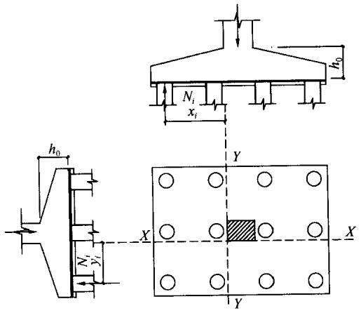  
(a)

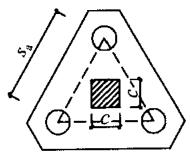  
(b)

(c)   
图5.9.2 承台弯矩计算示意  
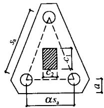  
（a）矩形多桩承台；（b）等边三桩承台；（c）等腰三桩承台

2 三桩承台的正截面弯距值应符合下列要求：

1）等边三桩承台[见图5.9.2（b)]

$$M = \frac {N _{\max}}{3} \left(s _{\mathrm {a}} - \frac {\sqrt {3}}{4} c\right) \tag {5.9.2-3}$$

式中 $M$ ——通过承台形心至各边边缘正交截面范围内板带的弯矩设计值；

$N_{\max}$ ——不计承台及其上土重，在荷载效应基本组合下三桩中最大基桩或复合基桩竖向反力设计值；

$s_{\mathrm{a}}$ ——桩中心距；

$c$ ——方柱边长，圆柱时 $c = 0.8d$ （ $d$ 为圆柱直径）。

2）等腰三桩承台［见图5.9.2（c)]

$$M _{1} = \frac {N _{\max}}{3} \left(s _{\mathrm {a}} - \frac {0 . 7 5}{\sqrt {4 - \alpha^{2}}} c _{1}\right) \tag {5.9.2-4}$$

$$M _{2} = \frac {N _{\max}}{3} \left(\alpha s _{a} - \frac {0 . 7 5}{\sqrt {4 - \alpha^{2}}} c _{2}\right) \tag {5.9.2-5}$$

式中 $M_{1}, M_{2}$ ——分别为通过承台形心至两腰边缘和底边边缘正交截面范围内板带的弯矩设计值；

$s_{\mathrm{a}}$ ——长向桩中心距；

$\alpha$ ——短向桩中心距与长向桩中心距之比，当 $\alpha$ 小于0.5时，应按变截面的二桩承台设计；

$c_{1}, c_{2}$ ——分别为垂直于、平行于承台底边的柱截面边长。

5.9.3 箱形承台和筏形承台的弯矩可按下列规定计算：

1 箱形承台和筏形承台的弯矩宜考虑地基土层性质、基桩分布、承台和上部结构类型和刚度，按地基一桩一承台一上部结构共同作用原理分析计算；  
2 对于箱形承台，当桩端持力层为基岩、密实的碎石类土、砂土且深厚均匀时；或当上部结构为剪力墙；或当上部结构为框架-核心筒结构且按变刚度调平原则布桩时，箱形承台底板可仅按局部弯矩作用进行计算；  
3 对于筏形承台，当桩端持力层深厚坚硬、上部结构刚度较好，且柱荷载及柱间距的变化不超过 $20\%$ 时；或当上部结构为框架-核心筒结构且按变刚度调平原则布桩时，可仅按局部弯矩作用进行计算。

5.9.4 柱下条形承台梁的弯矩可按下列规定计算：

1 可按弹性地基梁（地基计算模型应根据地基土层特性选取）进行分析计算；  
2 当桩端持力层深厚坚硬且桩柱轴线不重合时，可视桩为不动铰支座，按连续梁计算。

5.9.5 砌体墙下条形承台梁，可按倒置弹性地基梁计算弯矩和剪力，并应符合本规范附录G的要求。对于承台上的砌体墙，

尚应验算桩顶部位砌体的局部承压强度。

Ⅱ 受冲切计算

5.9.6 桩基承台厚度应满足柱（墙）对承台的冲切和基桩对承台的冲切承载力要求。

5.9.7 轴心竖向力作用下桩基承台受柱（墙）的冲切，可按下列规定计算：

1 冲切破坏锥体应采用自柱（墙）边或承台变阶处至相应桩顶边缘连线所构成的锥体，锥体斜面与承台底面之夹角不应小于 $45^{\circ}$ （见图5.9.7）。

2 受柱（墙）冲切承载力可按下列公式计算：

$$F _{l} \leqslant \beta_{\mathrm {h p}} \beta_{0} u _{\mathrm {m}} f _{1} h _{0} \tag {5.9.7-1}$$

$$F _{l} = F - \sum Q _{i} \tag {5.9.7-2}$$

$$\beta_{0} = \frac {0 . 8 4}{\lambda + 0 . 2} \tag {5.9.7-3}$$

式中 $F_{l}$ ——不计承台及其上土重，在荷载效应基本组合下作用于冲切破坏锥体上的冲切力设计值；

$f_{1}$ ——承台混凝土抗拉强度设计值；

$\beta_{\mathrm{hp}}$ ——承台受冲切承载力截面高度影响系数，当 $h \leqslant 800\mathrm{mm}$ 时， $\beta_{\mathrm{hp}}$ 取 $1.0, h \geqslant 2000\mathrm{mm}$ 时， $\beta_{\mathrm{hp}}$ 取 0.9，其间按线性内插法取值；

$u_{\mathrm{m}}$ ——承台冲切破坏锥体一半有效高度处的周长；

$h_0$ ——承台冲切破坏锥体的有效高度；

$\beta_0$ ——柱（墙）冲切系数；

$\lambda$ ——冲跨比， $\lambda = a_0 / h_0$ ， $a_0$ 为柱（墙）边或承台变阶处到桩边水平距离；当 $\lambda < 0.25$ 时，取 $\lambda = 0.25$ 当 $\lambda > 1.0$ 时，取 $\lambda = 1.0$

$F$ ——不计承台及其上土重，在荷载效应基本组合作用下柱（墙）底的竖向荷载设计值；

$\Sigma Q_{i}$ ——不计承台及其上土重，在荷载效应基本组合下冲

切破坏锥体内各基桩或复合基桩的反力设计值之和。

3 对于柱下矩形独立承台受柱冲切的承载力可按下列公式计算（图5.9.7）：

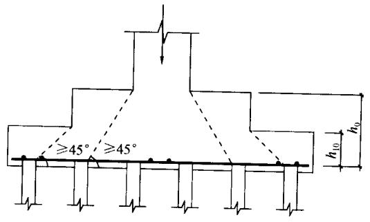

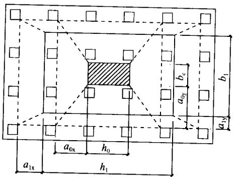

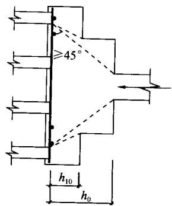  
图5.9.7 柱对承台的冲切计算示意

$$F _{l} \leqslant 2 \left[ \beta_{0 x} \left(b _{c} + a _{0 y}\right) + \beta_{0 y} \left(h _{c} + a _{0 x}\right) \right] \beta_{\mathrm {h p}} f _{t} h _{0} \tag {5.9.7-4}$$

式中 $\beta_{0x},\beta_{0y}$ 由式（5.9.7-3）求得， $\lambda_{0x} = a_{0x} / h_0$ ， $\lambda_{0y} =$ $a_{0y} / h_0;\lambda_{0x},\lambda_{0y}$ 均应满足 $0.25\sim 1.0$ 的要求； $h_c,b_c$ 分别为 $x,y$ 方向的柱截面的边长； $a_{0x},a_{0y}$ ——分别为 $x,y$ 方向柱边至最近桩边的水平距离。

4 对于柱下矩形独立阶形承台受上阶冲切的承载力可按下

列公式计算（见图5.9.7）：

$$F _{l} \leqslant 2 \left[ \beta_{1 x} \left(b _{1} + a _{1 y}\right) + \beta_{1 y} \left(h _{1} + a _{1 x}\right) \right] \beta_{\mathrm {h p}} f _{\mathrm {t}} h _{1 0} \tag {5.9.7-5}$$

式中 $\beta_{1x},\beta_{1y}$ 由式（5.9.7-3）求得， $\lambda_{1x} = a_{1x} / h_{10},\lambda_{1y} =$ $a_{1y} / h_{10};\lambda_{1x},\lambda_{1y}$ 均应满足 $0.25\sim 1.0$ 的要求；

$h_1, b_1$ ——分别为 $x, y$ 方向承台上阶的边长；

$a_{1x}, a_{1y}$ ——分别为 $x, y$ 方向承台上阶边至最近桩边的水平距离。

对于圆柱及圆桩，计算时应将其截面换算成方柱及方桩，即取换算柱截面边长 $b_{\mathrm{c}} = 0.8d_{\mathrm{c}}$ （ $d_{\mathrm{c}}$ 为圆柱直径），换算桩截面边长 $b_{\mathrm{p}} = 0.8d$ （ $d$ 为圆柱直径）。

对于柱下两桩承台，宜按深受弯构件（ $l_0 / h < 5.0$ ， $l_0 = 1.15l_{\mathrm{n}}$ ， $l_{\mathrm{n}}$ 为两桩净距）计算受弯、受剪承载力，不需要进行受冲切承载力计算。

5.9.8 对位于柱（墙）冲切破坏锥体以外的基桩，可按下列规定计算承台受基桩冲切的承载力：

1 四桩以上（含四桩）承台受角桩冲切的承载力可按下列公式计算（见图5.9.8-1）：

$$N _{l} \leqslant \left[ \beta_{1 x} \left(c _{2} + a _{1 y} / 2\right) + \beta_{1 y} \left(c _{1} + a _{1 x} / 2\right) \right] \beta_{\mathrm {h p}} f _{\mathrm {t}} h _{0} \tag {5.9.8-1}$$

$$\beta_{1 x} = \frac {0 . 5 6}{\lambda_{1 x} + 0 . 2} \tag {5.9.8-2}$$

$$\beta_{1 y} = \frac {0 . 5 6}{\lambda_{1 y} + 0 . 2} \tag {5.9.8-3}$$

式中 $N_{l}$ ——不计承台及其上土重，在荷载效应基本组合作用下角桩（含复合基桩）反力设计值；

$\beta_{1x}, \beta_{1y}$ ——角桩冲切系数；

$a_{1\mathrm{x}}, a_{1\mathrm{y}}$ ——从承台底角桩顶内边缘引 $45^{\circ}$ 冲切线与承台顶面相交点至角桩内边缘的水平距离；当柱（墙）边或承台变阶处位于该 $45^{\circ}$ 线以内时，则

取由柱（墙）边或承台变阶处与桩内边缘连线为冲切锥体的锥线（见图5.9.8-1）；

$h_0$ ——承台外边缘的有效高度；

$\lambda_{1x}$ 、 $\lambda_{1y}$ ——角桩冲跨比， $\lambda_{1x} = a_{1x} / h_0$ ， $\lambda_{1y} = a_{1y} / h_0$ ，其值均应满足 $0.25\sim 1.0$ 的要求。

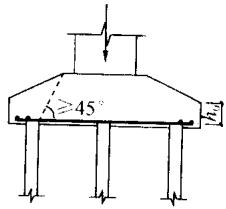

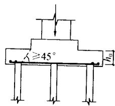

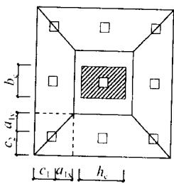  
(a)

(b)   
图5.9.8-1 四桩以上（含四桩）承台角桩冲切计算示意  
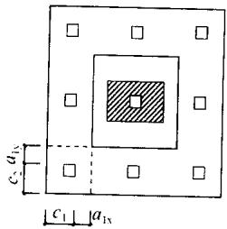  
（a）锥形承台；（b）阶形承台

2 对于三桩三角形承台可按下列公式计算受角桩冲切的承载力（见图5.9.8-2）：

底部角桩：

$$N _{l} \leqslant \beta_{1 1} (2 c _{1} + a _{1 1}) \beta_{\mathrm {h p}} \tan \frac {\theta_{1}}{2} f _{\mathrm {t}} h _{0} \tag {5.9.8-4}$$

$$\beta_{1 1} = \frac {0 . 5 6}{\lambda_{1 1} + 0 . 2} \tag {5.9.8-5}$$

顶部角桩：

$$N _{l} \leqslant \beta_{1 2} \left(2 c _{2} + a _{1 2}\right) \beta_{\mathrm {h p}} \tan \frac {\theta_{2}}{2} f _{\mathrm {t}} h _{0} \tag {5.9.8-6}$$

$$\beta_{1 2} = \frac {0 . 5 6}{\lambda_{1 2} + 0 . 2} \tag {5.9.8-7}$$

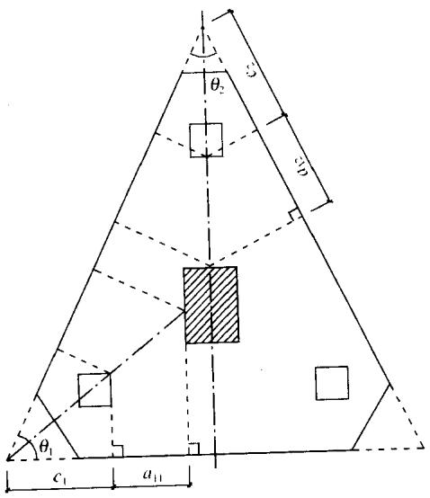  
图5.9.8-2 三桩三角形承台角桩冲切计算示意

式中 $\lambda_{11},\lambda_{12}$ ——角桩冲跨比， $\lambda_{11} = a_{11} / h_0$ ， $\lambda_{12} = a_{12} / h_0$ ，其值均应满足 $0.25\sim 1.0$ 的要求；

$a_{11}, a_{12}$ 从承台底角桩顶内边缘引 $45^{\circ}$ 冲切线与承台顶面相交点至角桩内边缘的水平距离；当柱（墙）边或承台变阶处位于该 $45^{\circ}$ 线以内时，则取由柱（墙）边或承台变阶处与桩内边缘连线为冲切锥体的锥线。

3 对于箱形、筏形承台，可按下列公式计算承台受内部基桩的冲切承载力：

1）应按下式计算受基桩的冲切承载力，如图5.9.8-3（a）所示：

$$N _{1} \leqslant 2. 8 \left(b _{\mathrm {p}} + h _{0}\right) \beta_{\mathrm {h p}} f _{t} h _{0} \tag {5.9.8-8}$$

2）应按下式计算受桩群的冲切承载力，如图5.9.8-3

（b）所示：

$$\Sigma N _{\mathrm {l i}} \leqslant 2 \left[ \beta_{0 \mathrm {x}} \left(b _{\mathrm {y}} + a _{0 \mathrm {y}}\right) + \beta_{0 \mathrm {y}} \left(b _{\mathrm {x}} + a _{0 \mathrm {x}}\right) \right] \beta_{\mathrm {h p}} f _{\mathrm {t}} h _{0} \tag {5.9.8-9}$$

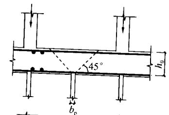

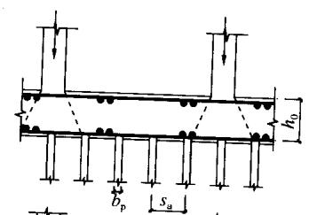

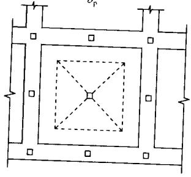  
(a)

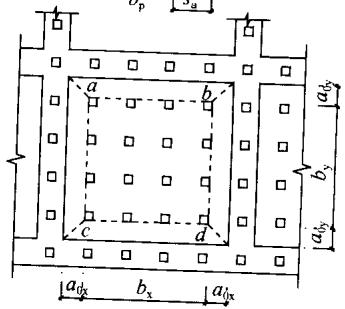  
(b)   
图5.9.8-3 基桩对筏形承台的冲切和墙对筏形承台的冲切计算示意（a）受基桩的冲切；（b）受桩群的冲切

式中 $\beta_{0\mathrm{x}}$ 、 $\beta_{0\mathrm{y}}$ ——由式（5.9.7-3）求得，其中 $\lambda_{0\mathrm{x}} = a_{0\mathrm{x}} / h_0$ ， $\lambda_{0\mathrm{y}} = a_{0\mathrm{y}} / h_0, \lambda_{0\mathrm{x}}, \lambda_{0\mathrm{y}}$ 均应满足 $0.25 \sim 1.0$ 的要求；

$N_{\mathrm{I}}$ 、 $\Sigma N_{\mathrm{H}}$ ——不计承台和其上土重，在荷载效应基本组合下，基桩或复合基桩的净反力设计值、冲切锥体内各基桩或复合基桩反力设计值之和。

Ⅲ受剪计算

5.9.9 柱（墙）下桩基承台，应分别对柱（墙）边、变阶处和桩边联线形成的贯通承台的斜截面的受剪承载力进行验算。当承台悬挑边有多排基桩形成多个斜截面时，应对每个斜截面的受剪承载力进行验算。

5.9.10 柱下独立桩基承台斜截面受剪承载力应按下列规定计算：

1 承台斜截面受剪承载力可按下列公式计算（见图5.9.10-1）：

$$V \leqslant \beta_{\mathrm {h s}} \alpha f _{\mathrm {t}} b _{0} h _{0} \tag {5.9.10-1}$$

$$\alpha = \frac {1 . 7 5}{\lambda + 1} \tag {5.9.10-2}$$

$$\beta_{\mathrm {h s}} = \left(\frac {8 0 0}{h _{0}}\right) ^{1 / 4} \tag {5.9.10-3}$$

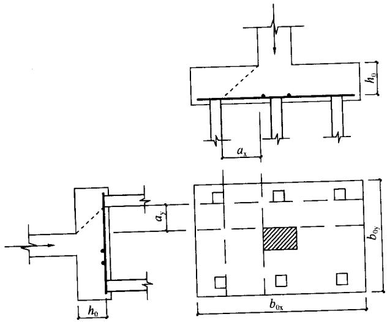  
图5.9.10-1 承台斜截面受剪计算示意

式中 $V$ ——不计承台及其上土自重，在荷载效应基本组合下，斜截面的最大剪力设计值；

$f_{\mathrm{t}}$ ——混凝土轴心抗拉强度设计值；

$b_{0}$ ——承台计算截面处的计算宽度；

$h_0$ ——承台计算截面处的有效高度；

$\alpha$ ——承台剪切系数；按式（5.9.10-2）确定；

$\lambda$ ——计算截面的剪跨比， $\lambda_{\mathrm{x}} = a_{\mathrm{x}} / h_0, \lambda_{\mathrm{y}} = a_{\mathrm{y}} / h_0$ ，此处， $a_{\mathrm{x}}, a_{\mathrm{y}}$ 为柱边（墙边）或承台变阶处至 $y$ 、 $x$ 方向计算一排桩的桩边的水平距离，当 $\lambda < 0.25$ 时，取 $\lambda = 0.25$ ；当 $\lambda > 3$ 时，取 $\lambda = 3$

$\beta_{\mathrm{hs}}$ ——受剪切承载力截面高度影响系数；当 $h_0 < 800\mathrm{mm}$ 时，取 $h_0 = 800\mathrm{mm}$ ；当 $h_0 > 2000\mathrm{mm}$ 时，取 $h_0 = 2000\mathrm{mm}$ ；其间按线性内插法取值。

2 对于阶梯形承台应分别在变阶处 $(A_{1} - A_{1}, B_{1} - B_{1})$ 及柱边处 $(A_{2} - A_{2}, B_{2} - B_{2})$ 进行斜截面受剪承载力计算（见图5.9.10-2）。

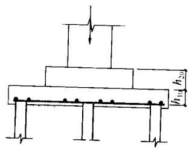

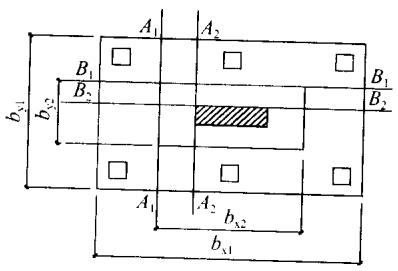  
图5.9.10-2 阶梯形承台斜截面受剪计算示意

计算变阶处截面 $(A_{1} - A_{1}, B_{1} - B_{1})$ 的斜截面受剪承载力时，其截面有效高度均为 $h_{10}$ ，截面计算宽度分别为 $b_{\mathrm{y1}}$ 和 $b_{\mathrm{x1}}$ 。

计算柱边截面 $(A_{2} - A_{2}, B_{2} - B_{2})$ 的斜截面受剪承载力时，其截面有效高度均为 $h_{10} + h_{20}$ ，截面计算宽度分别为：

对 $A_{2} - A_{2}$ $b_{y0} = \frac{b_{y1}\bullet h_{10} + b_{y2}\bullet h_{20}}{h_{10} + h_{20}}$ (5.9.10-4)

对 $B_{2} - B_{2}$ $b_{\mathbf{x0}} = \frac{b_{\mathbf{x1}}\bullet h_{10} + b_{\mathbf{x2}}\bullet h_{20}}{h_{10} + h_{20}}$ (5.9.10-5)

3 对于锥形承台应对变阶处及柱边处（ $A - A$ 及 $B - B$ ）两个截面进行受剪承载力计算（见图5.9.10-3），截面有效高度均

为 $h_0$ ，截面的计算宽度分别为：

对 $A - A$ （20 $b_{y0} = \left[1 - 0.5\frac{h_{20}}{h_0}\left(1 - \frac{b_{y2}}{b_{y1}}\right)\right]b_{y1}$ (5.9.10-6)

对 $B - B$ $b_{\mathrm{x0}} = \left[1 - 0.5\frac{h_{20}}{h_0}\left(1 - \frac{b_{\mathrm{x2}}}{b_{\mathrm{x1}}}\right)\right]b_{\mathrm{x1}}$ (5.9.10-7)

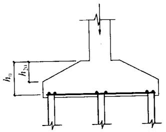

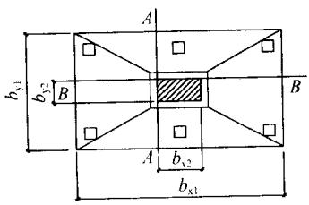  
图5.9.10-3 锥形承台斜截面受剪计算示意

5.9.11 梁板式筏形承台的梁的受剪承载力可按现行国家标准《混凝土结构设计规范》GB50010计算。  
5.9.12 砌体墙下条形承台梁配有箍筋，但未配弯起钢筋时，斜截面的受剪承载力可按下式计算：

$$V \leqslant 0. 7 f _{\mathrm {t}} b h _{0} + 1. 2 5 f _{\mathrm {y v}} \frac {A _{\mathrm {s v}}}{s} h _{0} \tag {5.9.12}$$

式中 $V$ ——不计承台及其上土自重，在荷载效应基本组合下，计算截面处的剪力设计值；

$A_{\mathrm{sv}}$ ——配置在同一截面内箍筋各肢的全部截面面积；

$s$ ——沿计算斜截面方向箍筋的间距；

$f_{\mathrm{yv}}$ ——箍筋抗拉强度设计值；

$b$ ——承台梁计算截面处的计算宽度；

$h_0$ ——承台梁计算截面处的有效高度。

5.9.13 砌体墙下承台梁配有箍筋和弯起钢筋时，斜截面的受剪承载力可按下式计算：

$$V \leqslant 0. 7 f _{\mathrm {t}} b h _{0} + 1. 2 5 f _{\mathrm {y}} \frac {A _{\mathrm {s v}}}{s} h _{0} + 0. 8 f _{\mathrm {y}} A _{\mathrm {s b}} \sin \alpha_{\mathrm {s}} \tag {5.9.13}$$

式中 $A_{\mathrm{sb}}$ ——同一截面弯起钢筋的截面面积；

$f_{y}$ ——弯起钢筋的抗拉强度设计值；

$\alpha_{s}$ ——斜截面上弯起钢筋与承台底面的夹角。

5.9.14 柱下条形承台梁，当配有箍筋但未配弯起钢筋时，其斜截面的受剪承载力可按下式计算：

$$V \leqslant \frac {1 . 7 5}{\lambda + 1} f _{\mathrm {t}} b h _{0} + f _{\mathrm {y}} \frac {A _{\mathrm {s v}}}{s} h _{0} \tag {5.9.14}$$

式中 $\lambda$ ——计算截面的剪跨比， $\lambda = a / h_0$ ， $a$ 为柱边至桩边的水平距离；当 $\lambda < 1.5$ 时，取 $\lambda = 1.5$ ；当 $\lambda > 3$ 时，取 $\lambda = 3$ 。

IV 局部受压计算

5.9.15 对于柱下桩基，当承台混凝土强度等级低于柱或桩的混凝土强度等级时，应验算柱下或桩上承台的局部受压承载力。

V 抗震验算

5.9.16 当进行承台的抗震验算时，应根据现行国家标准《建筑抗震设计规范》GB50011的规定对承台顶面的地震作用效应和承台的受弯、受冲切、受剪承载力进行抗震调整。

# 6 灌注桩施工

## 6.1 施工准备

6.1.1 灌注桩施工应具备下列资料：

1 建筑场地岩土工程勘察报告；  
2 桩基工程施工图及图纸会审纪要；  
3 建筑场地和邻近区域内的地下管线、地下构筑物、危房、精密仪器车间等的调查资料；  
4 主要施工机械及其配套设备的技术性能资料；  
5 桩基工程的施工组织设计；  
6 水泥、砂、石、钢筋等原材料及其制品的质检报告；  
7 有关荷载、施工工艺的试验参考资料。

6.1.2 钻孔机具及工艺的选择，应根据桩型、钻孔深度、土层情况、泥浆排放及处理条件综合确定。

6.1.3 施工组织设计应结合工程特点，有针对性地制定相应质量管理措施，主要应包括下列内容：

1 施工平面图：标明桩位、编号、施工顺序、水电线路和临时设施的位置；采用泥浆护壁成孔时，应标明泥浆制备设施及其循环系统；  
2 确定成孔机械、配套设备以及合理施工工艺的有关资料，泥浆护壁灌注桩必须有泥浆处理措施；  
3 施工作业计划和劳动力组织计划；  
4 机械设备、备件、工具、材料供应计划；  
5 桩基施工时，对安全、劳动保护、防火、防雨、防台风、爆破作业、文物和环境保护等方面应按有关规定执行；  
6 保证工程质量、安全生产和季节性施工的技术措施。

6.1.4 成桩机械必须经鉴定合格，不得使用不合格机械。

6.1.5 施工前应组织图纸会审，会审纪要连同施工图等应作为施工依据，并应列入工程档案。  
6.1.6 桩基施工用的供水、供电、道路、排水、临时房屋等临时设施，必须在开工前准备就绪，施工场地应进行平整处理，保证施工机械正常作业。  
6.1.7 基桩轴线的控制点和水准点应设在不受施工影响的地方。开工前，经复核后应妥善保护，施工中应经常复测。  
6.1.8 用于施工质量检验的仪表、器具的性能指标，应符合现行国家相关标准的规定。

## 6.2 一般规定

6.2.1 不同桩型的适用条件应符合下列规定：

1 泥浆护壁钻孔灌注桩宜用于地下水位以下的黏性土、粉土、砂土、填土、碎石土及风化岩层；  
2 旋挖成孔灌注桩宜用于黏性土、粉土、砂土、填土、碎石土及风化岩层；  
3 冲孔灌注桩除宜用于上述地质情况外，还能穿透旧基础、建筑垃圾填土或大孤石等障碍物。在岩溶发育地区应慎重使用，采用时，应适当加密勘察钻孔；  
4 长螺旋钻孔压灌桩后插钢筋笼宜用于黏性土、粉土、砂土、填土、非密实的碎石类土、强风化岩；  
5 干作业钻、挖孔灌注桩宜用于地下水位以上的黏性土、粉土、填土、中等密实以上的砂土、风化岩层；  
6 在地下水位较高，有承压水的砂土层、滞水层、厚度较大的流塑状淤泥、淤泥质土层中不得选用人工挖孔灌注桩；  
7 沉管灌注桩宜用于黏性土、粉土和砂土；夯扩桩宜用于桩端持力层为埋深不超过 $20\mathrm{m}$ 的中、低压缩性黏性土、粉土、砂土和碎石类土。

6.2.2 成孔设备就位后，必须平整、稳固，确保在成孔过程中不发生倾斜和偏移。应在成孔钻具上设置控制深度的标尺，并应

在施工中进行观测记录。

6.2.3 成孔的控制深度应符合下列要求：

1 摩擦型桩：摩擦桩应以设计桩长控制成孔深度；端承摩擦桩必须保证设计桩长及桩端进入持力层深度。当采用锤击沉管法成孔时，桩管入土深度控制应以标高为主，以贯入度控制为辅。  
2 端承型桩：当采用钻（冲）、挖掘成孔时，必须保证桩端进入持力层的设计深度；当采用锤击沉管法成孔时，桩管入土深度控制以贯入度为主，以控制标高为辅。

6.2.4 灌注桩成孔施工的允许偏差应满足表6.2.4的要求。

表 6.2.4 灌注桩成孔施工允许偏差  

| 成孔方法 | 成孔方法 | 成孔方法 | 桩径允许偏差(mm) | 垂直度允许偏差(%) | 桩位允许偏差(mm) | 桩位允许偏差(mm) |
| --- | --- | --- | --- | --- | --- | --- |
| 成孔方法 | 成孔方法 | 成孔方法 | 桩径允许偏差(mm) | 垂直度允许偏差(%) | 1~3根桩、条形桩基沿垂直轴线方向和群桩基础中的边桩 | 条形桩基沿轴线方向和群桩基础的中间桩 |
| 泥浆护壁钻、挖、冲孔桩 | 泥浆护壁钻、挖、冲孔桩 | d≤1000mm | ±50 | 1 | d/6且不大于100 | d/4且不大于150 |
| 泥浆护壁钻、挖、冲孔桩 | 泥浆护壁钻、挖、冲孔桩 | d>1000mm | ±50 | 1 | 100+0.01H | 150+0.01H |
| 锤击(振动)沉管振动冲击沉管成孔 | 锤击(振动)沉管振动冲击沉管成孔 | d≤500mm | -20 | 1 | 70 | 150 |
| 锤击(振动)沉管振动冲击沉管成孔 | 锤击(振动)沉管振动冲击沉管成孔 | d>500mm | -20 | 1 | 100 | 150 |
| 螺旋钻、机动洛阳铲干作业成孔 | 螺旋钻、机动洛阳铲干作业成孔 | 螺旋钻、机动洛阳铲干作业成孔 | -20 | 1 | 70 | 150 |
| 人工挖孔桩 | 现浇混凝土护壁 | 现浇混凝土护壁 | ±50 | 0.5 | 50 | 150 |
| 人工挖孔桩 | 长钢套管护壁 | 长钢套管护壁 | ±20 | 1 | 100 | 200 |

注：1 桩径允许偏差的负值是指个别断面；  
2 $H$ 为施工现场地面标高与桩顶设计标高的距离； $d$ 为设计桩径。

6.2.5 钢筋笼制作、安装的质量应符合下列要求：

1 钢筋笼的材质、尺寸应符合设计要求，制作允许偏差应符合表6.2.5的规定；

表 6.2.5 钢筋笼制作允许偏差  

| 项 目 | 允许偏差(mm) |
| --- | --- |
| 主筋间距 | ±10 |
| 箍筋间距 | ±20 |
| 钢筋笼直径 | ±10 |
| 钢筋笼长度 | ±100 |

2 分段制作的钢筋笼，其接头宜采用焊接或机械式接头（钢筋直径大于 $20\mathrm{mm}$ ），并应遵守国家现行标准《钢筋机械连接通用技术规程》JGJ107、《钢筋焊接及验收规程》JGJ18和《混凝土结构工程施工质量验收规范》GB50204的规定；  
3 加劲箍宜设在主筋外侧，当因施工工艺有特殊要求时也可置于内侧；  
4 导管接头处外径应比钢筋笼的内径小 $100\mathrm{mm}$ 以上；  
5 搬运和吊装钢筋笼时，应防止变形，安放应对准孔位，避免碰撞孔壁和自由落下，就位后应立即固定。  
6.2.6 粗骨料可选用卵石或碎石，其粒径不得大于钢筋间最小净距的 $1/3$ 。  
6.2.7 检查成孔质量合格后应尽快灌注混凝土。直径大于 $1\mathrm{m}$ 或单桩混凝土量超过 $25\mathrm{m}^3$ 的桩，每根桩桩身混凝土应留有1组试件；直径不大于 $1\mathrm{m}$ 的桩或单桩混凝土量不超过 $25\mathrm{m}^3$ 的桩，每个灌注台班不得少于1组；每组试件应留3件。  
6.2.8 在正式施工前，宜进行试成孔。  
6.2.9 灌注桩施工现场所有设备、设施、安全装置、工具配件以及个人劳保用品必须经常检查，确保完好和使用安全。

## 6.3 泥浆护壁成孔灌注桩

I 泥浆的制备和处理

6.3.1 除能自行造浆的黏性土层外，均应制备泥浆。泥浆制备

应选用高塑性黏土或膨润土。泥浆应根据施工机械、工艺及穿越土层情况进行配合比设计。

6.3.2 泥浆护壁应符合下列规定：

1 施工期间护筒内的泥浆面应高出地下水位 $1.0\mathrm{m}$ 以上，在受水位涨落影响时，泥浆面应高出最高水位 $1.5\mathrm{m}$ 以上；  
2 在清孔过程中，应不断置换泥浆，直至灌注水下混凝土；  
3 灌注混凝土前，孔底 $500\mathrm{mm}$ 以内的泥浆相对密度应小于1.25；含砂率不得大于 $8\%$ ；黏度不得大于28s；  
4 在容易产生泥浆渗漏的土层中应采取维持孔壁稳定的措施。

6.3.3 废弃的浆、渣应进行处理，不得污染环境。

Ⅱ 正、反循环钻孔灌注桩的施工

6.3.4 对孔深较大的端承型桩和粗粒土层中的摩擦型桩，宜采用反循环工艺成孔或清孔，也可根据土层情况采用正循环钻进，反循环清孔。  
6.3.5 泥浆护壁成孔时，宜采用孔口护筒，护筒设置应符合下列规定：

1 护筒埋设应准确、稳定，护筒中心与桩位中心的偏差不得大于 $50\mathrm{mm}$ ；  
2 护筒可用 $4 \sim 8 \mathrm{~mm}$ 厚钢板制作，其内径应大于钻头直径 $100 \mathrm{~mm}$ ，上部宜开设 $1 \sim 2$ 个溢浆孔；  
3 护筒的埋设深度：在黏性土中不宜小于 $1.0\mathrm{m}$ ；砂土中不宜小于 $1.5\mathrm{m}$ 。护筒下端外侧应采用黏土填实；其高度尚应满足孔内泥浆面高度的要求；  
4 受水位涨落影响或水下施工的钻孔灌注桩，护筒应加高加深，必要时应打入不透水层。

6.3.6 当在软土层中钻进时，应根据泥浆补给情况控制钻进速度；在硬层或岩层中的钻进速度应以钻机不发生跳动为准。  
6.3.7 钻机设置的导向装置应符合下列规定：

1 潜水钻的钻头上应有不小于 $3d$ 长度的导向装置；  
2 利用钻杆加压的正循环回转钻机，在钻具中应加设扶正器。

6.3.8 如在钻进过程中发生斜孔、塌孔和护筒周围冒浆、失稳等现象时，应停钻，待采取相应措施后再进行钻进。  
6.3.9 钻孔达到设计深度，灌注混凝土之前，孔底沉渣厚度指标应符合下列规定：

1 对端承型桩，不应大于 $50\mathrm{mm}$   
2 对摩擦型桩，不应大于 $100\mathrm{mm}$   
3 对抗拔、抗水平力桩，不应大于 $200\mathrm{mm}$

Ⅲ 冲击成孔灌注桩的施工

6.3.10 在钻头锥顶和提升钢丝绳之间应设置保证钻头自动转向的装置。  
6.3.11 冲孔桩孔口护筒，其内径应大于钻头直径 $200\mathrm{mm}$ ，护筒应按本规范第6.3.5条设置。  
6.3.12 泥浆的制备、使用和处理应符合本规范第 $6.3.1\sim$ 6.3.3条的规定。  
6.3.13 冲击成孔质量控制应符合下列规定：

1 开孔时，应低锤密击，当表土为淤泥、细砂等软弱土层时，可加黏土块夹小片石反复冲击造壁，孔内泥浆面应保持稳定；  
2 在各种不同的土层、岩层中成孔时，可按照表6.3.13的操作要点进行；  
3 进入基岩后，应采用大冲程、低频率冲击，当发现成孔偏移时，应回填片石至偏孔上方 $300 \sim 500\mathrm{mm}$ 处，然后重新冲孔；  
4 当遇到孤石时，可预爆或采用高低冲程交替冲击，将大孤石击碎或挤入孔壁；  
5 应采取有效的技术措施防止扰动孔壁、塌孔、扩孔、卡

钻和掉钻及泥浆流失等事故；

6 每钻进 $4 \sim 5 \mathrm{~m}$ 应验孔一次，在更换钻头前或容易缩孔处，均应验孔；  
7 进入基岩后，非桩端持力层每钻进 $300 \sim 500\mathrm{mm}$ 和桩端持力层每钻进 $100 \sim 300\mathrm{m}$ 时，应清孔取样一次，并应做记录。

表 6.3.13 冲击成孔操作要点  

| 项 目 | 操作要点 |
| --- | --- |
| 在护筒刃脚以下2m范围内 | 小冲程1m左右,泥浆相对密度1.2~1.5,软弱土层投入黏土块夹小片石 |
| 黏性土层 | 中、小冲程1~2m,泵入清水或稀泥浆,经常清除钻头上的泥块 |
| 粉砂或中粗砂层 | 中冲程2~3m,泥浆相对密度1.2~1.5,投入黏土块,勤冲、勤掏渣 |
| 砂卵石层 | 中、高冲程3~4m,泥浆相对密度1.3左右,勤掏渣 |
| 软弱土层或塌孔回填重钻 | 小冲程反复冲击,加黏土块夹小片石,泥浆相对密度1.3~1.5 |

注：1 土层不好时提高泥浆相对密度或加黏土块；  
2 防黏钻可投入碎砖石。

6.3.14 排渣可采用泥浆循环或抽渣筒等方法，当采用抽渣筒排渣时，应及时补给泥浆。  
6.3.15 冲孔中遇到斜孔、弯孔、梅花孔、塌孔及护筒周围冒浆、失稳等情况时，应停止施工，采取措施后方可继续施工。  
6.3.16 大直径桩孔可分级成孔，第一级成孔直径应为设计桩径的 $0.6 \sim 0.8$ 倍。  
6.3.17 清孔宜按下列规定进行：

1 不易塌孔的桩孔，可采用空气吸泥清孔；  
2 稳定性差的孔壁应采用泥浆循环或抽渣筒排渣，清孔后灌注混凝土之前的泥浆指标应按本规范第6.3.1条执行；  
3 清孔时，孔内泥浆面应符合本规范第6.3.2条的规定；  
4 灌注混凝土前，孔底沉渣允许厚度应符合本规范第6.3.9条的规定。

IV 旋挖成孔灌注桩的施工

6.3.18 旋挖钻成孔灌注桩应根据不同的地层情况及地下水位埋深，采用干作业成孔和泥浆护壁成孔工艺，干作业成孔工艺可按本规范第6.6节执行。  
6.3.19 泥浆护壁旋挖钻机成孔应配备成孔和清孔用泥浆及泥浆池（箱），在容易产生泥浆渗漏的土层中可采取提高泥浆相对密度，掺入锯末、增黏剂提高泥浆黏度等维持孔壁稳定的措施。  
6.3.20 泥浆制备的能力应大于钻孔时的泥浆需求量，每台套钻机的泥浆储备量不应少于单桩体积。  
6.3.21 旋挖钻机施工时，应保证机械稳定、安全作业，必要时可在场地铺设能保证其安全行走和操作的钢板或垫层（路基板）。  
6.3.22 每根桩均应安设钢护筒，护筒应满足本规范第6.3.5条的规定。   
6.3.23 成孔前和每次提出钻斗时，应检查钻斗和钻杆连接销子、钻斗门连接销子以及钢丝绳的状况，并应清除钻斗上的渣土。  
6.3.24 旋挖钻机成孔应采用跳挖方式，钻斗倒出的土距桩孔口的最小距离应大于 $6\mathrm{m}$ ，并应及时清除。应根据钻进速度同步补充泥浆，保持所需的泥浆面高度不变。  
6.3.25 钻孔达到设计深度时，应采用清孔钻头进行清孔，并应满足本规范第6.3.2条和第6.3.3条要求。孔底沉渣厚度控制指标应符合本规范第6.3.9条规定。

V 水下混凝土的灌注

6.3.26 钢筋笼吊装完毕后，应安置导管或气泵管二次清孔，并应进行孔位、孔径、垂直度、孔深、沉渣厚度等检验，合格后应立即灌注混凝土。  
6.3.27 水下灌注的混凝土应符合下列规定：

1 水下灌注混凝土必须具备良好的和易性，配合比应通过试验确定；坍落度宜为 $180 \sim 220\mathrm{mm}$ ；水泥用量不应少于

$360\mathrm{kg / m^3}$ （当掺入粉煤灰时水泥用量可不受此限）；

2 水下灌注混凝土的含砂率宜为 $40\% \sim 50\%$ ，并宜选用中粗砂；粗骨料的最大粒径应小于 $40\mathrm{mm}$ ；并应满足本规范第6.2.6条的要求；  
3 水下灌注混凝土宜掺外加剂。

6.3.28 导管的构造和使用应符合下列规定：

1 导管壁厚不宜小于 $3\mathrm{mm}$ ，直径宜为 $200 \sim 250\mathrm{mm}$ ；直径制作偏差不应超过 $2\mathrm{mm}$ ，导管的分节长度可视工艺要求确定，底管长度不宜小于 $4\mathrm{m}$ ，接头宜采用双螺纹方扣快速接头；  
2 导管使用前应试拼装、试压，试水压力可取为 $0.6 \sim 1.0 \mathrm{MPa}$ ；  
3 每次灌注后应对导管内外进行清洗。

6.3.29 使用的隔水栓应有良好的隔水性能，并应保证顺利排出；隔水栓宜采用球胆或与桩身混凝土强度等级相同的细石混凝土制作。  
6.3.30 灌注水下混凝土的质量控制应满足下列要求：

1 开始灌注混凝土时，导管底部至孔底的距离宜为 $300 \sim 500 \mathrm{~mm}$ ；  
2 应有足够的混凝土储备量，导管一次埋入混凝土灌注面以下不应少于 $0.8\mathrm{m}$ ；  
3 导管埋入混凝土深度宜为 $2 \sim 6 \mathrm{~m}$ 。严禁将导管提出混凝土灌注面，并应控制提拔导管速度，应有专人测量导管埋深及管内外混凝土灌注面的高差，填写水下混凝土灌注记录；  
4 灌注水下混凝土必须连续施工，每根桩的灌注时间应按初盘混凝土的初凝时间控制，对灌注过程中的故障应记录备案；  
5 应控制最后一次灌注量，超灌高度宜为 $0.8 \sim 1.0\mathrm{m}$ ，凿除泛浆后必须保证暴露的桩顶混凝土强度达到设计等级。

## 6.4 长螺旋钻孔压灌桩

6.4.1 当需要穿越老黏土、厚层砂土、碎石土以及塑性指数大

于25的黏土时，应进行试钻。

6.4.2 钻机定位后，应进行复检，钻头与桩位点偏差不得大于 $20\mathrm{mm}$ ，开孔时下钻速度应缓慢；钻进过程中，不宜反转或提升钻杆。  
6.4.3 钻进过程中，当遇到卡钻、钻机摇晃、偏斜或发生异常声响时，应立即停钻，查明原因，采取相应措施后方可继续作业。  
6.4.4 根据桩身混凝土的设计强度等级，应通过试验确定混凝土配合比；混凝土坍落度宜为 $180\sim 220\mathrm{mm}$ ；粗骨料可采用卵石或碎石，最大粒径不宜大于 $30\mathrm{mm}$ ；可掺加粉煤灰或外加剂。  
6.4.5 混凝土泵型号应根据桩径选择，混凝土输送泵管布置宜减少弯道，混凝土泵与钻机的距离不宜超过 $60\mathrm{m}$ 。  
6.4.6 桩身混凝土的泵送压灌应连续进行，当钻机移位时，混凝土泵料斗内的混凝土应连续搅拌，泵送混凝土时，料斗内混凝土的高度不得低于 $400\mathrm{mm}$ 。  
6.4.7 混凝土输送泵管宜保持水平，当长距离泵送时，泵管下面应垫实。  
6.4.8 当气温高于 $30^{\circ}\mathrm{C}$ 时，宜在输送泵管上覆盖隔热材料，每隔一段时间应洒水降温。  
6.4.9 钻至设计标高后，应先泵入混凝土并停顿 $10\sim 20\mathrm{s}$ ，再缓慢提升钻杆。提钻速度应根据土层情况确定，且应与混凝土泵送量相匹配，保证管内有一定高度的混凝土。  
6.4.10 在地下水位以下的砂土层中钻进时，钻杆底部活门应有防止进水的措施，压灌混凝土应连续进行。  
6.4.11 压灌桩的充盈系数宜为 $1.0 \sim 1.2$ 。桩顶混凝土超灌高度不宜小于 $0.3 \sim 0.5 \mathrm{~m}$ 。  
6.4.12 成桩后，应及时清除钻杆及泵管内残留混凝土。长时间停置时，应采用清水将钻杆、泵管、混凝土泵清洗干净。  
6.4.13 混凝土压灌结束后，应立即将钢筋笼插至设计深度。钢筋笼插设宜采用专用插筋器。

## 6.5 沉管灌注桩和内夯沉管灌注桩

I 锤击沉管灌注桩施工

6.5.1 锤击沉管灌注桩施工应根据土质情况和荷载要求，分别选用单打法、复打法或反插法。  
6.5.2 锤击沉管灌注桩施工应符合下列规定：

1 群桩基础的基桩施工，应根据土质、布桩情况，采取消减负面挤土效应的技术措施，确保成桩质量；  
2 桩管、混凝土预制桩尖或钢桩尖的加工质量和埋设位置应与设计相符，桩管与桩尖的接触应有良好的密封性。

6.5.3 灌注混凝土和拔管的操作控制应符合下列规定：

1 沉管至设计标高后，应立即检查和处理桩管内的进泥、进水和吞桩尖等情况，并立即灌注混凝土；  
2 当桩身配置局部长度钢筋笼时，第一次灌注混凝土应先灌至笼底标高，然后放置钢筋笼，再灌至桩顶标高。第一次拔管高度应以能容纳第二次灌入的混凝土量为限。在拔管过程中应采用测锤或浮标检测混凝土面的下降情况；  
3 拔管速度应保持均匀，对一般土层拔管速度宜为 $1\mathrm{m}/$ min，在软弱土层和软硬土层交界处拔管速度宜控制在 $0.3\sim$ $0.8\mathrm{m / min}$   
4 采用倒打拔管的打击次数，单动汽锤不得少于50次/min，自由落锤小落距轻击不得少于40次/min；在管底未拔至桩顶设计标高之前，倒打和轻击不得中断。

6.5.4 混凝土的充盈系数不得小于1.0；对于充盈系数小于1.0的桩，应全长复打，对可能断桩和缩颈桩，应进行局部复打。成桩后的桩身混凝土顶面应高于桩顶设计标高 $500\mathrm{mm}$ 以内。全长复打时，桩管入土深度宜接近原桩长，局部复打应超过断桩或缩颈区 $1\mathrm{m}$ 以上。

6.5.5 全长复打桩施工时应符合下列规定：

1 第一次灌注混凝土应达到自然地面；  
2 拔管过程中应及时清除粘在管壁上和散落在地面上的混凝土；  
3 初打与复打的桩轴线应重合；  
4 复打施工必须在第一次灌注的混凝土初凝之前完成。

6.5.6 混凝土的坍落度宜为 $80\sim 100\mathrm{mm}$

Ⅱ 振动、振动冲击沉管灌注桩施工

6.5.7 振动、振动冲击沉管灌注桩应根据土质情况和荷载要求，分别选用单打法、复打法、反插法等。单打法可用于含水量较小的土层，且宜采用预制桩尖；反插法及复打法可用于饱和土层。  
6.5.8 振动、振动冲击沉管灌注桩单打法施工的质量控制应符合下列规定：

1 必须严格控制最后30s的电流、电压值，其值按设计要求或根据试桩和当地经验确定；  
2 桩管内灌满混凝土后，应先振动 $5 \sim 10\mathrm{s}$ ，再开始拔管，应边振边拔，每拔出 $0.5 \sim 1.0\mathrm{m}$ ，停拔，振动 $5 \sim 10\mathrm{s}$ ；如此反复，直至桩管全部拔出；  
3 在一般土层内，拔管速度宜为 $1.2 \sim 1.5 \mathrm{~m} / \mathrm{min}$ ，用活瓣桩尖时宜慢，用预制桩尖时可适当加快；在软弱土层中宜控制在 $0.6 \sim 0.8 \mathrm{~m} / \mathrm{min}$ 。

6.5.9 振动、振动冲击沉管灌注桩反插法施工的质量控制应符合下列规定：

1 桩管灌满混凝土后，先振动再拔管，每次拔管高度 $0.5 \sim 1.0\mathrm{m}$ ，反插深度 $0.3 \sim 0.5\mathrm{m}$ ；在拔管过程中，应分段添加混凝土，保持管内混凝土面始终不低于地表面或高于地下水位 $1.0 \sim 1.5\mathrm{m}$ 以上，拔管速度应小于 $0.5\mathrm{m / min}$ ；  
2 在距桩尖处 $1.5\mathrm{m}$ 范围内，宜多次反插以扩大桩端部断面；  
3 穿过淤泥夹层时，应减慢拔管速度，并减少拔管高度和

反插深度，在流动性淤泥中不宜使用反插法。

6.5.10 振动、振动冲击沉管灌注桩复打法的施工要求可按本规范第6.5.4条和第6.5.5条执行。

Ⅲ 内夯沉管灌注桩施工

6.5.11 当采用外管与内夯管结合锤击沉管进行夯压、扩底、扩径时，内夯管应比外管短 $100\mathrm{mm}$ ，内夯管底端可采用闭口平底或闭口锥底（见图6.5.11）。

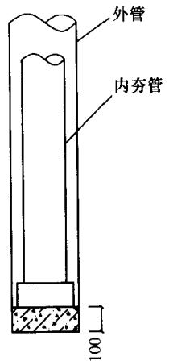  
(a)

(b)   
图6.5.11 内外管及管塞  
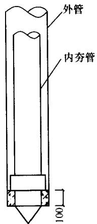  
（a）平底内夯管；（b）锥底内夯管

6.5.12 外管封底可采用干硬性混凝土、无水混凝土配料，经夯击形成阻水、阻泥管塞，其高度可为 $100\mathrm{mm}$ 。当内、外管间不会发生间隙涌水、涌泥时，亦可不采用上述封底措施。

6.5.13 桩端夯扩头平均直径可按下列公式估算：

一次夯扩 $D_{1} = d_{0}\sqrt{\frac{H_{1} + h_{1} - C_{1}}{h_{1}}}$ (6.5.13-1)

二次夯扩 $D_{2} = d_{0}\sqrt{\frac{H_{1} + H_{2} + h_{2} - C_{1} - C_{2}}{h_{2}}}$ (6.5.13-2)

式中 $D_{1}$ 、 $D_{2}$ ——第一次、第二次夯扩扩头平均直径 $(\mathrm{m})$

$d_{0}$ ——外管直径（m）；

$H_{1}$ 、 $H_{2}$ ——第一次、第二次夯扩工序中，外管内灌注混凝土面从桩底算起的高度 $(\mathrm{m})$ ；

$h_1$ 、 $h_2$ ——第一次、第二次夯扩工序中，外管从桩底算起的上拔高度 $(\mathrm{m})$ ，分别可取 $H_{1} / 2$ ， $H_{2} / 2$

$C_1$ 、 $C_2$ ——第一次、二次夯扩工序中，内外管同步下沉至离桩底的距离，均可取为 $0.2\mathrm{m}$ （见图6.5.13）。

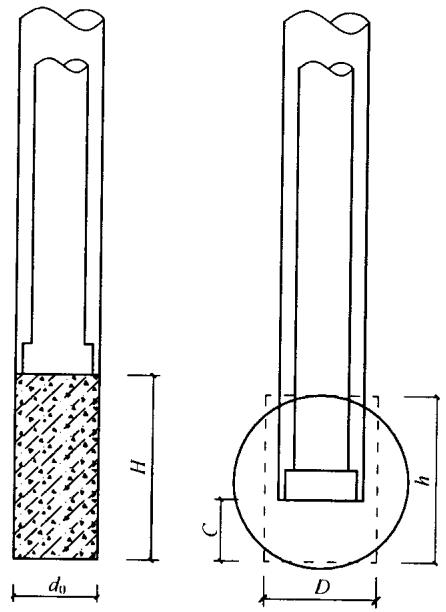  
图6.5.13 扩底端

6.5.14 桩身混凝土宜分段灌注；拔管时内夯管和桩锤应施压于外管中的混凝土顶面，边压边拔。  
6.5.15 施工前宜进行试成桩，并应详细记录混凝土的分次灌注量、外管上拔高度、内管夯击次数、双管同步沉入深度，并应检查外管的封底情况，有无进水、涌泥等，经核定后可作为施工控制依据。

## 6.6 干作业成孔灌注桩

I 钻孔（扩底）灌注桩施工

6.6.1 钻孔时应符合下列规定：

1 钻杆应保持垂直稳固，位置准确，防止因钻杆晃动引起扩大孔径；  
2 钻进速度应根据电流值变化，及时调整；  
3 钻进过程中，应随时清理孔口积土，遇到地下水、塌孔、缩孔等异常情况时，应及时处理。

6.6.2 钻孔扩底桩施工，直孔部分应按本规范第6.6.1、6.6.3、6.6.4条规定执行，扩底部位尚应符合下列规定：

1 应根据电流值或油压值，调节扩孔刀片削土量，防止出现超负荷现象；  
2 扩底直径和孔底的虚土厚度应符合设计要求。  
6.6.3 成孔达到设计深度后，孔口应予保护，应按本规范第6.2.4条规定验收，并应做好记录。  
6.6.4 灌注混凝土前，应在孔口安放护孔漏斗，然后放置钢筋笼，并应再次测量孔内虚土厚度。扩底桩灌注混凝土时，第一次应灌到扩底部位的顶面，随即振捣密实；浇筑桩顶以下 $5\mathrm{m}$ 范围内混凝土时，应随浇筑随振捣，每次浇筑高度不得大于 $1.5\mathrm{m}$ 。

Ⅱ 人工挖孔灌注桩施工

6.6.5 人工挖孔桩的孔径（不含护壁）不得小于 $0.8\mathrm{m}$ ，且不宜大于 $2.5\mathrm{m}$ ；孔深不宜大于 $30\mathrm{m}$ 。当桩净距小于 $2.5\mathrm{m}$ 时，应采用间隔开挖。相邻排桩跳挖的最小施工净距不得小于 $4.5\mathrm{m}$ 。  
6.6.6 人工挖孔桩混凝土护壁的厚度不应小于 $100\mathrm{mm}$ ，混凝土强度等级不应低于桩身混凝土强度等级，并应振捣密实；护壁应配置直径不小于 $8\mathrm{mm}$ 的构造钢筋，竖向筋应上下搭接或拉接。  
6.6.7 人工挖孔桩施工应采取下列安全措施：

1 孔内必须设置应急软爬梯供人员上下；使用的电葫芦、吊笼等应安全可靠，并配有自动卡紧保险装置，不得使用麻绳和尼龙绳吊挂或脚踏井壁凸缘上下；电葫芦宜用按钮式开关，使用前必须检验其安全起吊能力；  
2 每日开工前必须检测井下的有毒、有害气体，并应有相应的安全防范措施；当桩孔开挖深度超过 $10\mathrm{m}$ 时，应有专门向井下送风的设备，风量不宜少于 $25\mathrm{L} / \mathrm{s}$   
3 孔口四周必须设置护栏，护栏高度宜为 $0.8\mathrm{m}$   
4 挖出的土石方应及时运离孔口，不得堆放在孔口周边 $1\mathrm{m}$ 范围内，机动车辆的通行不得对井壁的安全造成影响；  
5 施工现场的一切电源、电路的安装和拆除必须遵守现行行业标准《施工现场临时用电安全技术规范》JGJ46的规定。

6.6.8 开孔前，桩位应准确定位放样，在桩位外设置定位基准桩，安装护壁模板必须用桩中心点校正模板位置，并应由专人负责。  
6.6.9 第一节井圈护壁应符合下列规定：

1 井圈中心线与设计轴线的偏差不得大于 $20\mathrm{mm}$   
2 井圈顶面应比场地高出 $100 \sim 150\mathrm{mm}$ ，壁厚应比下面井壁厚度增加 $100 \sim 150\mathrm{mm}$ 。

6.6.10 修筑井圈护壁应符合下列规定：

1 护壁的厚度、拉接钢筋、配筋、混凝土强度等级均应符合设计要求；  
2 上下节护壁的搭接长度不得小于 $50\mathrm{mm}$   
3 每节护壁均应在当日连续施工完毕；  
4 护壁混凝土必须保证振捣密实，应根据土层渗水情况使用速凝剂；  
5 护壁模板的拆除应在灌注混凝土24h之后；  
6 发现护壁有蜂窝、漏水现象时，应及时补强；

7 同一水平面上的井圈任意直径的极差不得大于 $50\mathrm{mm}$ 。

6.6.11 当遇有局部或厚度不大于 $1.5\mathrm{m}$ 的流动性淤泥和可能出

现涌土涌砂时，护壁施工可按下列方法处理：

1 将每节护壁的高度减小到 $300 \sim 500 \mathrm{~mm}$ ，并随挖、随验、随灌注混凝土；  
2 采用钢护筒或有效的降水措施。

6.6.12 挖至设计标高后，应清除护壁上的泥土和孔底残渣、积水，并应进行隐蔽工程验收。验收合格后，应立即封底和灌注桩身混凝土。  
6.6.13 灌注桩身混凝土时，混凝土必须通过溜槽；当落距超过 $3\mathrm{m}$ 时，应采用串筒，串筒末端距孔底高度不宜大于 $2\mathrm{m}$ ；也可采用导管泵送；混凝土宜采用插入式振捣器振实。  
6.6.14 当渗水量过大时，应采取场地截水、降水或水下灌注混凝土等有效措施。严禁在桩孔中边抽水边开挖，同时不得灌注相邻桩。

## 6.7 灌注桩后注浆

6.7.1 灌注桩后注浆工法可用于各类钻、挖、冲孔灌注桩及地下连续墙的沉渣（虚土）、泥皮和桩底、桩侧一定范围土体的加固。  
6.7.2 后注浆装置的设置应符合下列规定：

1 后注浆导管应采用钢管，且应与钢筋笼加劲筋绑扎固定或焊接；  
2 桩端后注浆导管及注浆阀数量宜根据桩径大小设置：对于直径不大于 $1200\mathrm{mm}$ 的桩，宜沿钢筋笼圆周对称设置2根；对于直径大于 $1200\mathrm{mm}$ 而不大于 $2500\mathrm{mm}$ 的桩，宜对称设置3根；  
3 对于桩长超过 $15\mathrm{m}$ 且承载力增幅要求较高者，宜采用桩端桩侧复式注浆；桩侧后注浆管阀设置数量应综合地层情况、桩长和承载力增幅要求等因素确定，可在离桩底 $5\sim 15\mathrm{m}$ 以上、桩顶 $8\mathrm{m}$ 以下，每隔 $6\sim 12\mathrm{m}$ 设置一道桩侧注浆阀，当有粗粒土时，宜将注浆阀设置于粗粒土层下部，对于干作业成孔灌注桩宜设于粗粒土层中部；

4 对于非通长配筋桩，下部应有不少于2根与注浆管等长的主筋组成的钢筋笼通底；  
5 钢筋笼应沉放到底，不得悬吊，下笼受阻时不得撞笼、墩笼、扭笼。

6.7.3 后注浆阀应具备下列性能：

1 注浆阀应能承受 $1\mathrm{MPa}$ 以上静水压力；注浆阀外部保护层应能抵抗砂石等硬质物的刮撞而不致使注浆阀受损；  
2 注浆阀应具备逆止功能。

6.7.4 浆液配比、终止注浆压力、流量、注浆量等参数设计应符合下列规定：

1 浆液的水灰比应根据土的饱和度、渗透性确定，对于饱和土，水灰比宜为 $0.45 \sim 0.65$ ；对于非饱和土，水灰比宜为 $0.7 \sim 0.9$ （松散碎石土、砂砾宜为 $0.5 \sim 0.6$ ）；低水灰比浆液宜掺入减水剂；  
2 桩端注浆终止注浆压力应根据土层性质及注浆点深度确定，对于风化岩、非饱和黏性土及粉土，注浆压力宜为 $3\sim 10\mathrm{MPa}$ ；对于饱和土层注浆压力宜为 $1.2\sim 4\mathrm{MPa}$ ，软土宜取低值，密实黏性土宜取高值；  
3 注浆流量不宜超过 $75\mathrm{L / min}$   
4 单桩注浆量的设计应根据桩径、桩长、桩端桩侧土层性质、单桩承载力增幅及是否复式注浆等因素确定，可按下式估算：

$$G _{\mathrm {c}} = \alpha_{\mathrm {p}} d + \alpha_{\mathrm {s}} n d \tag {6.7.4}$$

式中 $\alpha_{\mathrm{p}}$ 、 $\alpha_{\mathrm{s}}$ ——分别为桩端、桩侧注浆量经验系数， $\alpha_{\mathrm{p}} = 1.5 \sim 1.8$ ， $\alpha_{\mathrm{s}} = 0.5 \sim 0.7$ ；对于卵、砾石、中粗砂取较高值；

$n$ ——桩侧注浆断面数；

$d$ ——基桩设计直径（m）；

$G_{\mathrm{c}}$ —注浆量，以水泥质量计（t）。

对独立单桩、桩距大于 $6d$ 的群桩和群桩初始注浆的数根基

桩的注浆量应按上述估算值乘以1.2的系数；

5 后注浆作业开始前，宜进行注浆试验，优化并最终确定注浆参数。

6.7.5 后注浆作业起始时间、顺序和速率应符合下列规定：

1 注浆作业宜于成桩2d后开始；不宜迟于成桩30d后；  
2 注浆作业与成孔作业点的距离不宜小于 $8\sim 10\mathrm{m}$   
3 对于饱和土中的复式注浆顺序宜先桩侧后桩端；对于非饱和土宜先桩端后桩侧；多断面桩侧注浆应先上后下；桩侧桩端注浆间隔时间不宜少于 $2\mathrm{h}$   
桩端注浆应对同一根桩的各注浆导管依次实施等量注浆；  
5 对于桩群注浆宜先外围、后内部。

6.7.6 当满足下列条件之一时可终止注浆：

1 注浆总量和注浆压力均达到设计要求；  
2 注浆总量已达到设计值的 $75\%$ ，且注浆压力超过设计值。

6.7.7 当注浆压力长时间低于正常值或地面出现冒浆或周围桩孔串浆，应改为间歇注浆，间歇时间宜为 $30\sim 60\mathrm{min}$ ，或调低浆液水灰比。  
6.7.8 后注浆施工过程中，应经常对后注浆的各项工艺参数进行检查，发现异常应采取相应处理措施。当注浆量等主要参数达不到设计值时，应根据工程具体情况采取相应措施。  
6.7.9 后注浆桩基工程质量检查和验收应符合下列要求：

1 后注浆施工完成后应提供水泥材质检验报告、压力表检定证书、试注浆记录、设计工艺参数、后注浆作业记录、特殊情况处理记录等资料；  
2 在桩身混凝土强度达到设计要求的条件下，承载力检验应在注浆完成20d后进行，浆液中掺入早强剂时可于注浆完成15d后进行。

# 7 混凝土预制桩与钢桩施工

## 7.1 混凝土预制桩的制作

7.1.1 混凝土预制桩可在施工现场预制，预制场地必须平整、坚实。   
7.1.2 制桩模板宜采用钢模板，模板应具有足够刚度，并应平整，尺寸应准确。  
7.1.3 钢筋骨架的主筋连接宜采用对焊和电弧焊，当钢筋直径不小于 $20\mathrm{mm}$ 时，宜采用机械接头连接。主筋接头配置在同一截面内的数量，应符合下列规定：

1 当采用对焊或电弧焊时，对于受拉钢筋，不得超过 $50\%$   
2 相邻两根主筋接头截面的距离应大于 $35d_{\mathrm{g}}$ （ $d_{\mathrm{g}}$ 为主筋直径），并不应小于 $500\mathrm{mm}$ ；  
3 必须符合现行行业标准《钢筋焊接及验收规程》JGJ 18 和《钢筋机械连接通用技术规程》JGJ 107 的规定。

7.1.4 预制桩钢筋骨架的允许偏差应符合表7.1.4的规定。

表 7.1.4 预制桩钢筋骨架的允许偏差  

| 项次 | 项 目 | 允许偏差(mm) |
| --- | --- | --- |
| 1 | 主筋间距 | ±5 |
| 2 | 桩尖中心线 | 10 |
| 3 | 箍筋间距或螺旋筋的螺距 | ±20 |
| 4 | 吊环沿纵轴线方向 | ±20 |
| 5 | 吊环沿垂直于纵轴线方向 | ±20 |
| 6 | 吊环露出桩表面的高度 | ±10 |
| 7 | 主筋距桩顶距离 | ±5 |
| 8 | 桩顶钢筋网片位置 | ±10 |
| 9 | 多节桩桩顶预埋件位置 | ±3 |

7.1.5 确定桩的单节长度时应符合下列规定：

1 满足桩架的有效高度、制作场地条件、运输与装卸能力；  
2 避免在桩尖接近或处于硬持力层中时接桩。

7.1.6 浇注混凝土预制桩时，宜从桩顶开始灌筑，并应防止另一端的砂浆积聚过多。  
7.1.7 锤击预制桩的骨料粒径宜为 $5\sim 40\mathrm{mm}$   
7.1.8 锤击预制桩，应在强度与龄期均达到要求后，方可锤击。  
7.1.9 重叠法制作预制桩时，应符合下列规定：

1 桩与邻桩及底模之间的接触面不得粘连；  
2 上层桩或邻桩的浇筑，必须在下层桩或邻桩的混凝土达到设计强度的 $30\%$ 以上时，方可进行；  
3 桩的重叠层数不应超过4层。

7.1.10 混凝土预制桩的表面应平整、密实，制作允许偏差应符合表7.1.10的规定。

表 7.1.10 混凝土预制桩制作允许偏差  

| 桩型 | 项 目 | 允许偏差(mm) |
| --- | --- | --- |
| 钢筋混凝土实心桩 | 横截面边长 | ±5 |
| 钢筋混凝土实心桩 | 桩顶对角线之差 | ≤5 |
| 钢筋混凝土实心桩 | 保护层厚度 | ±5 |
| 钢筋混凝土实心桩 | 桩身弯曲矢高 | 不大于1‰桩长且不大于20 |
| 钢筋混凝土实心桩 | 桩尖偏心 | ≤10 |
| 钢筋混凝土实心桩 | 桩端面倾斜 | ≤0.005 |
| 钢筋混凝土实心桩 | 桩节长度 | ±20 |
| 钢筋混凝土管桩 | 直径 | ±5 |
| 钢筋混凝土管桩 | 长度 | ±0.5%桩长 |
| 钢筋混凝土管桩 | 管壁厚度 | -5 |
| 钢筋混凝土管桩 | 保护层厚度 | +10,-5 |
| 钢筋混凝土管桩 | 桩身弯曲(度)矢高 | 1‰桩长 |
| 钢筋混凝土管桩 | 桩尖偏心 | ≤10 |
| 钢筋混凝土管桩 | 桩头板平整度 | ≤2 |
| 钢筋混凝土管桩 | 桩头板偏心 | ≤2 |

7.1.11 本规范未作规定的预应力混凝土桩的其他要求及离心混凝土强度等级评定方法，应符合国家现行标准《先张法预应力混

凝土管桩》GB13476和《预应力混凝土空心方桩》JG197的规定。

## 7.2 混凝土预制桩的起吊、运输和堆放

7.2.1 混凝土实心桩的吊运应符合下列规定：

1 混凝土设计强度达到 $70\%$ 及以上方可起吊，达到 $100\%$ 方可运输；  
2 桩起吊时应采取相应措施，保证安全平稳，保护桩身质量；  
3 水平运输时，应做到桩身平稳放置，严禁在场地上直接拖拉桩体。

7.2.2 预应力混凝土空心桩的吊运应符合下列规定：

1 出厂前应作出厂检查，其规格、批号、制作日期应符合所属的验收批号内容；  
2 在吊运过程中应轻吊轻放，避免剧烈碰撞；  
3 单节桩可采用专用吊钩勾住桩两端内壁直接进行水平起吊；  
4 运至施工现场时应进行检查验收，严禁使用质量不合格及在吊运过程中产生裂缝的桩。

7.2.3 预应力混凝土空心桩的堆放应符合下列规定：

1 堆放场地应平整坚实，最下层与地面接触的垫木应有足够的宽度和高度。堆放时桩应稳固，不得滚动；  
2 应按不同规格、长度及施工流水顺序分别堆放；  
3 当场地条件许可时，宜单层堆放；当叠层堆放时，外径为 $500 \sim 600\mathrm{mm}$ 的桩不宜超过4层，外径为 $300 \sim 400\mathrm{mm}$ 的桩不宜超过5层；  
4叠层堆放桩时，应在垂直于桩长度方向的地面上设置2道垫木，垫木应分别位于距桩端1/5桩长处；底层最外缘的桩应在垫木处用木楔塞紧；  
5 垫木宜选用耐压的长木枋或枕木，不得使用有棱角的金

属构件。

7.2.4 取桩应符合下列规定：

1 当桩叠层堆放超过2层时，应采用吊机取桩，严禁拖拉取桩；  
2 三点支撑自行式打桩机不应拖拉取桩。

## 7.3 混凝土预制桩的接桩

7.3.1 桩的连接可采用焊接、法兰连接或机械快速连接（螺纹式、啮合式）。  
7.3.2 接桩材料应符合下列规定：

1 焊接接桩：钢钣宜采用低碳钢，焊条宜采用E43；并应符合现行行业标准《建筑钢结构焊接技术规程》JGJ81要求。  
2 法兰接桩：钢钣和螺栓宜采用低碳钢。

7.3.3 采用焊接接桩除应符合现行行业标准《建筑钢结构焊接技术规程》JGJ81的有关规定外，尚应符合下列规定：

1 下节桩段的桩头宜高出地面 $0.5\mathrm{m}$   
2 下节桩的桩头处宜设导向箍；接桩时上下节桩段应保持顺直，错位偏差不宜大于 $2\mathrm{mm}$ ；接桩就位纠偏时，不得采用大锤横向敲打；  
3 桩对接前，上下端钣表面应采用铁刷子清刷干净，坡口处应刷至露出金属光泽；  
4 焊接宜在桩四周对称地进行，待上下桩节固定后拆除导向箍再分层施焊；焊接层数不得少于2层，第一层焊完后必须把焊渣清理干净，方可进行第二层（的）施焊，焊缝应连续、饱满；  
5 焊好后的桩接头应自然冷却后方可继续锤击，自然冷却时间不宜少于 $8\mathrm{min}$ ；严禁采用水冷却或焊好即施打；  
6 雨天焊接时，应采取可靠的防雨措施；  
7 焊接接头的质量检查宜采用探伤检测，同一工程探伤抽样检验不得少于3个接头。

7.3.4 采用机械快速螺纹接桩的操作与质量应符合下列规定：

1 接桩前应检查桩两端制作的尺寸偏差及连接件，无受损后方可起吊施工，其下节桩端宜高出地面 $0.8\mathrm{m}$ ；  
2 接桩时，卸下上下节桩两端的保护装置后，应清理接头残物，涂上润滑脂；  
3 应采用专用接头锥度对中，对准上下节桩进行旋紧连接；  
4 可采用专用链条式扳手进行旋紧，（臂长 $1\mathrm{m}$ ，卡紧后人工旋紧再用铁锤敲击板臂，）锁紧后两端板尚应有 $1\sim 2\mathrm{mm}$ 的间隙。

7.3.5 采用机械啮合接头接桩的操作与质量应符合下列规定：

1 将上下接头钣清理干净，用扳手将已涂抹沥青涂料的连接销逐根旋入上节桩I型端头钣的螺栓孔内，并用钢模板调整好连接销的方位；  
2 剔除下节桩Ⅱ型端头钣连接槽内泡沫塑料保护块，在连接槽内注入沥青涂料，并在端头钣面周边抹上宽度 $20\mathrm{mm}$ 、厚度 $3\mathrm{mm}$ 的沥青涂料；当地基土、地下水含中等以上腐蚀介质时，桩端钣板面应满涂沥青涂料；  
3 将上节桩吊起，使连接销与Ⅱ型端头钣上各连接口对准，随即将连接销插入连接槽内；  
4 加压使上下节桩的桩头钣接触，完成接桩。

## 7.4 锤击沉桩

7.4.1 沉桩前必须处理空中和地下障碍物，场地应平整，排水应畅通，并应满足打桩所需的地面承载力。  
7.4.2 桩锤的选用应根据地质条件、桩型、桩的密集程度、单桩竖向承载力及现有施工条件等因素确定，也可按本规范附录H选用。

7.4.3 桩打入时应符合下列规定：

1 桩帽或送桩帽与桩周围的间隙应为 $5\sim 10\mathrm{mm}$   
2锤与桩帽、桩帽与桩之间应加设硬木、麻袋、草垫等弹

性衬垫；

3 桩锤、桩帽或送桩帽应和桩身在同一中心线上；  
4 桩插入时的垂直度偏差不得超过 $0.5\%$

7.4.4 打桩顺序要求应符合下列规定：

1 对于密集桩群，自中间向两个方向或四周对称施打；  
2 当一侧毗邻建筑物时，由毗邻建筑物处向另一方向施打；  
3 根据基础的设计标高，宜先深后浅；  
4 根据桩的规格，宜先大后小，先长后短。

7.4.5 打入桩（预制混凝土方桩、预应力混凝土空心桩、钢桩）的桩位偏差，应符合表7.4.5的规定。斜桩倾斜度的偏差不得大于倾斜角正切值的 $15\%$ （倾斜角系桩的纵向中心线与铅垂线间夹角）。

表 7.4.5 打入桩桩位的允许偏差  

| 项 目 | 允许偏差(mm) |
| --- | --- |
| 带有基础梁的桩:(1)垂直基础梁的中心线(2)沿基础梁的中心线 | 100+0.01H150+0.01H |
| 桩数为1~3根桩基中的桩 | 100 |
| 桩数为4~16根桩基中的桩 | 1/2桩径或边长 |
| 桩数大于16根桩基中的桩:(1)最外边的桩(2)中间桩 | 1/3桩径或边长1/2桩径或边长 |

注： $H$ 为施工现场地面标高与桩顶设计标高的距离。

7.4.6 桩终止锤击的控制应符合下列规定：

1 当桩端位于一般土层时，应以控制桩端设计标高为主，贯入度为辅；  
2 桩端达到坚硬、硬塑的黏性土、中密以上粉土、砂土、碎石类土及风化岩时，应以贯入度控制为主，桩端标高为辅；  
3 贯入度已达到设计要求而桩端标高未达到时，应继续锤击3阵，并按每阵10击的贯入度不应大于设计规定的数值确认，必要时，施工控制贯入度应通过试验确定。

7.4.7 当遇到贯入度剧变，桩身突然发生倾斜、位移或有严重

回弹、桩顶或桩身出现严重裂缝、破碎等情况时，应暂停打桩，并分析原因，采取相应措施。

7.4.8 当采用射水法沉桩时，应符合下列规定：

1 射水法沉桩宜用于砂土和碎石土；  
2 沉桩至最后 $1\sim 2\mathrm{m}$ 时，应停止射水，并采用锤击至规定标高，终锤控制标准可按本规范第7.4.6条有关规定执行。

7.4.9 施打大面积密集桩群时，应采取下列辅助措施：

1 对预钻孔沉桩，预钻孔孔径可比桩径（或方桩对角线）小 $50\sim 100\mathrm{mm}$ ，深度可根据桩距和土的密实度、渗透性确定，宜为桩长的 $1/3\sim 1/2$ ；施工时应随钻随打；桩架宜具备钻孔锤击双重性能；  
2 对饱和黏性土地基，应设置袋装砂井或塑料排水板；袋装砂井直径宜为 $70\sim 80\mathrm{mm}$ ，间距宜为 $1.0\sim 1.5\mathrm{m}$ ，深度宜为10 $\sim 12\mathrm{m}$ ；塑料排水板的深度、间距与袋装砂井相同；  
3 应设置隔离板桩或地下连续墙；  
4 可开挖地面防震沟，并可与其他措施结合使用，防震沟宽可取 $0.5 \sim 0.8 \mathrm{~m}$ ，深度按土质情况决定；  
5 应控制打桩速率和日打桩量，24小时内休止时间不应少于8h；  
6 沉桩结束后，宜普遍实施一次复打；  
7 应对不少于总桩数 $10\%$ 的桩顶上涌和水平位移进行监测；  
8 沉桩过程中应加强邻近建筑物、地下管线等的观测、监护。

7.4.10 预应力混凝土管桩的总锤击数及最后 $1.0\mathrm{m}$ 沉桩锤击数应根据桩身强度和当地工程经验确定。

7.4.11 锤击沉桩送桩应符合下列规定：

1 送桩深度不宜大于 $2.0\mathrm{m}$   
2 当桩顶打至接近地面需要送桩时，应测出桩的垂直度并检查桩顶质量，合格后应及时送桩；

3 送桩的最后贯入度应参考相同条件下不送桩时的最后贯入度并修正；

4 送桩后遗留的桩孔应立即回填或覆盖；  
5 当送桩深度超过 $2.0\mathrm{m}$ 且不大于 $6.0\mathrm{m}$ 时，打桩机应为三点支撑履带自行式或步履式柴油打桩机；桩帽和桩锤之间应用竖纹硬木或盘圆层叠的钢丝绳作“锤垫”，其厚度宜取 $150\sim 200\mathrm{mm}$ 。

7.4.12 送桩器及衬垫设置应符合下列规定：

1 送桩器宜做成圆筒形，并应有足够的强度、刚度和耐打性。送桩器长度应满足送桩深度的要求，弯曲度不得大于1/1000；  
2 送桩器上下两端面应平整，且与送桩器中心轴线相垂直；  
3 送桩器下端面应开孔，使空心桩内腔与外界连通；  
4 送桩器应与桩匹配：套筒式送桩器下端的套筒深度宜取 $250 \sim 350\mathrm{mm}$ ，套管内径应比桩外径大 $20 \sim 30\mathrm{mm}$ ；插销式送桩器下端的插销长度宜取 $200 \sim 300\mathrm{mm}$ ，杆销外径应比（管）桩内径小 $20 \sim 30\mathrm{mm}$ ，对于腔内存有余浆的管桩，不宜采用插销式送桩器；  
5 送桩作业时，送桩器与桩头之间应设置 $1\sim 2$ 层麻袋或硬纸板等衬垫。内填弹性衬垫压实后的厚度不宜小于 $60\mathrm{mm}$

7.4.13 施工现场应配备桩身垂直度观测仪器（长条水准尺或经纬仪）和观测人员，随时量测桩身的垂直度。

## 7.5 静压沉桩

7.5.1 采用静压沉桩时，场地地基承载力不应小于压桩机接地压强的1.2倍，且场地应平整。  
7.5.2 静力压桩宜选择液压式和绳索式压桩工艺；宜根据单节桩的长度选用顶压式液压压桩机和抱压式液压压桩机。

7.5.3 选择压桩机的参数应包括下列内容：

1 压桩机型号、桩机质量（不含配重）、最大压桩力等；  
2 压桩机的外型尺寸及拖运尺寸；

3 压桩机的最小边桩距及最大压桩力；  
4 长、短船型履靴的接地压强；  
5 夹持机构的型式；
6 液压油缸的数量、直径，率定后的压力表读数与压桩力的对应关系；  
7 吊桩机构的性能及吊桩能力。

7.5.4 压桩机的每件配重必须用量具核实，并将其质量标记在该件配重的外露表面；液压式压桩机的最大压桩力应取压桩机的机架重量和配重之和乘以0.9。  
7.5.5 当边桩空位不能满足中置式压桩机施压条件时，宜利用压边桩机构或选用前置式液压压桩机进行压桩，但此时应估计最大压桩能力减少造成的影响。  
7.5.6 当设计要求或施工需要采用引孔法压桩时，应配备螺旋钻孔机，或在压桩机上配备专用的螺旋钻。当桩端需进入较坚硬的岩层时，应配备可入岩的钻孔桩机或冲孔桩机。  
7.5.7 最大压桩力不宜小于设计的单桩竖向极限承载力标准值，必要时可由现场试验确定。  
7.5.8 静力压桩施工的质量控制应符合下列规定：

1 第一节桩下压时垂直度偏差不应大于 $0.5\%$   
2 宜将每根桩一次性连续压到底，且最后一节有效桩长不宜小于 $5\mathrm{m}$ ；  
3 抱压力不应大于桩身允许侧向压力的1.1倍；  
4 对于大面积桩群，应控制日压桩量。

7.5.9 终压条件应符合下列规定：

1 应根据现场试压桩的试验结果确定终压标准；  
2 终压连续复压次数应根据桩长及地质条件等因素确定。对于入土深度大于或等于 $8\mathrm{m}$ 的桩，复压次数可为 $2 \sim 3$ 次；对于入土深度小于 $8\mathrm{m}$ 的桩，复压次数可为 $3 \sim 5$ 次；

3 稳压压桩力不得小于终压力，稳定压桩的时间宜为 $5 \sim 10\mathrm{s}$ 。

7.5.10 压桩顺序宜根据场地工程地质条件确定，并应符合下列规定：

1 对于场地地层中局部含砂、碎石、卵石时，宜先对该区域进行压桩；  
2 当持力层埋深或桩的人土深度差别较大时，宜先施压长桩后施压短桩。

7.5.11 压桩过程中应测量桩身的垂直度。当桩身垂直度偏差大于 $1\%$ 时，应找出原因并设法纠正；当桩尖进入较硬土层后，严禁用移动机架等方法强行纠偏。  
7.5.12 出现下列情况之一时，应暂停压桩作业，并分析原因，采用相应措施：

1 压力表读数显示情况与勘察报告中的土层性质明显不符；  
2 桩难以穿越硬夹层；
3 实际桩长与设计桩长相差较大；  
4 出现异常响声；压桩机械工作状态出现异常；  
5 桩身出现纵向裂缝和桩头混凝土出现剥落等异常现象；  
6 夹持机构打滑；
7 压桩机下陷。

7.5.13 静压送桩的质量控制应符合下列规定：

1 测量桩的垂直度并检查桩头质量，合格后方可送桩，压桩、送桩作业应连续进行；  
2 送桩应采用专制钢质送桩器，不得将工程桩用作送桩器；  
3 当场地上多数桩的有效桩长小于或等于 $15\mathrm{m}$ 或桩端持力层为风化软质岩，需要复压时，送桩深度不宜超过 $1.5\mathrm{m}$ ；  
4 除满足本条上述3款规定外，当桩的垂直度偏差小于 $1\%$ ，且桩的有效桩长大于 $15\mathrm{m}$ 时，静压桩送桩深度不宜超过 $8\mathrm{m}$   
5 送桩的最大压桩力不宜超过桩身允许抱压压桩力的1.1倍。

7.5.14 引孔压桩法质量控制应符合下列规定：

1 引孔宜采用螺旋钻干作业法；引孔的垂直度偏差不宜大于 $0.5\%$   
2 引孔作业和压桩作业应连续进行，间隔时间不宜大于12h；在软土地基中不宜大于3h；  
3 引孔中有积水时，宜采用开口型桩尖。

7.5.15 当桩较密集，或地基为饱和淤泥、淤泥质土及黏性土时，应设置塑料排水板、袋装砂井消减超孔压或采取引孔等措施，并可按本规范第7.4.9条执行。在压桩施工过程中应对总桩数 $10\%$ 的桩设置上涌和水平偏位观测点，定时检测桩的上浮量及桩顶水平偏位值，若上涌和偏位值较大，应采取复压等措施。

7.5.16 对预制混凝土方桩、预应力混凝土空心桩、钢桩等压入桩的桩位偏差，应符合本规范表7.4.5的规定。

## 7.6 钢桩（钢管桩、H型桩及其他异型钢桩）施工

I 钢桩的制作

7.6.1 制作钢桩的材料应符合设计要求，并应有出厂合格证和试验报告。  
7.6.2 现场制作钢桩应有平整的场地及挡风防雨措施。  
7.6.3 钢桩制作的允许偏差应符合表7.6.3的规定，钢桩的分段长度应满足本规范第7.1.5条的规定，且不宜大于 $15\mathrm{m}$ 。

表 7.6.3 钢桩制作的允许偏差  

| 项 目 | 项 目 | 容许偏差(mm) |
| --- | --- | --- |
| 外径或断面尺寸 | 桩端部 | ±0.5%外径或边长 |
| 外径或断面尺寸 | 桩身 | ±0.1%外径或边长 |
| 长度 | 长度 | >0 |
| 矢 高 | 矢 高 | ≤1‰桩长 |
| 端部平整度 | 端部平整度 | ≤2(H型桩≤1) |
| 端部平面与桩身中心线的倾斜值 | 端部平面与桩身中心线的倾斜值 | ≤2 |

7.6.4 用于地下水有侵蚀性的地区或腐蚀性土层的钢桩，应按设计要求作防腐处理。

Ⅱ 钢桩的焊接

7.6.5 钢桩的焊接应符合下列规定：

1 必须清除桩端部的浮锈、油污等脏物，保持干燥；下节桩顶经锤击后变形的部分应割除；  
2 上下节桩焊接时应校正垂直度，对口的间隙宜为 $2\sim 3\mathrm{mm}$   
3 焊丝（自动焊）或焊条应烘干；  
4 焊接应对称进行；
5 应采用多层焊，钢管桩各层焊缝的接头应错开，焊渣应清除；  
6 当气温低于 $0^{\circ}\mathrm{C}$ 或雨雪天及无可靠措施确保焊接质量时，不得焊接；  
7 每个接头焊接完毕，应冷却 $1\mathrm{min}$ 后方可锤击；  
8 焊接质量应符合国家现行标准《钢结构工程施工质量验收规范》GB50205和《建筑钢结构焊接技术规程》JGJ81的规定，每个接头除应按表7.6.5规定进行外观检查外，还应按接头总数的 $5\%$ 进行超声或 $2\%$ 进行X射线拍片检查，对于同一工程，探伤抽样检验不得少于3个接头。

表 7.6.5 接桩焊缝外观允许偏差  

| 项 目 | 允许偏差(mm) |
| --- | --- |
| 上下节桩错口: |  |
| ①钢管桩外径≥700mm | 3 |
| ②钢管桩外径<700mm | 2 |
| H型钢桩 | 1 |
| 咬边深度(焊缝) | 0.5 |
| 加强层高度(焊缝) | 2 |
| 加强层宽度(焊缝) | 3 |

7.6.6 H型钢桩或其他异型薄壁钢桩，接头处应加连接板，可按等强度设置。

Ⅲ 钢桩的运输和堆放

7.6.7 钢桩的运输与堆放应符合下列规定：

1 堆放场地应平整、坚实、排水通畅；  
2 桩的两端应有适当保护措施，钢管桩应设保护圈；  
3 搬运时应防止桩体撞击而造成桩端、桩体损坏或弯曲；  
4 钢桩应按规格、材质分别堆放，堆放层数： $\phi 900\mathrm{mm}$ 的钢桩，不宜大于3层； $\phi 600\mathrm{mm}$ 的钢桩，不宜大于4层； $\phi 400\mathrm{mm}$ 的钢桩，不宜大于5层；H型钢桩不宜大于6层。支点设置应合理，钢桩的两侧应采用木楔塞住。

VI 钢桩的沉桩

7.6.8 当钢桩采用锤击沉桩时，可按本规范第7.4节有关条文实施；当采用静压沉桩时，可按本规范第7.5节有关条文实施。  
7.6.9 对敞口钢管桩，当锤击沉桩有困难时，可在管内取土助沉。  
7.6.10 锤击H型钢桩时，锤重不宜大于4.5t级（柴油锤），且在锤击过程中桩架前应有横向约束装置。  
7.6.11 当持力层较硬时，H型钢桩不宜送桩。  
7.6.12 当地表层遇有大块石、混凝土块等回填物时，应在插入H型钢桩前进行触探，并应清除桩位上的障碍物。

# 8 承台施工

## 8.1 基坑开挖和回填

8.1.1 桩基承台施工顺序宜先深后浅。  
8.1.2 当承台埋置较深时，应对邻近建筑物及市政设施采取必要的保护措施，在施工期间应进行监测。  
8.1.3 基坑开挖前应对边坡支护形式、降水措施、挖土方案、运土路线及堆土位置编制施工方案，若桩基施工引起超孔隙水压力，宜待超孔隙水压力大部分消散后开挖。  
8.1.4 当地下水位较高需降水时，可根据周围环境情况采用内降水或外降水措施。  
8.1.5 挖土应均衡分层进行，对流塑状软土的基坑开挖，高差不应超过 $1\mathrm{m}$ 。  
8.1.6 挖出的土方不得堆置在基坑附近。  
8.1.7 机械挖土时必须确保基坑内的桩体不受损坏。  
8.1.8 基坑开挖结束后，应在基坑底做出排水盲沟及集水井，如有降水设施仍应维持运转。  
8.1.9 在承台和地下室外墙与基坑侧壁间隙回填土前，应排除积水，清除虚土和建筑垃圾，填土应按设计要求选料，分层夯实，对称进行。

## 8.2 钢筋和混凝土施工

8.2.1 绑扎钢筋前应将灌注桩桩头浮浆部分和预制桩桩顶锤击面破碎部分去除，桩体及其主筋埋入承台的长度应符合设计要求；钢管桩尚应加焊桩顶连接件；并应按设计施作桩头和垫层防水。  
8.2.2 承台混凝土应一次浇筑完成，混凝土入槽宜采用平铺法。对大体积混凝土施工，应采取有效措施防止温度应力引起裂缝。

# 9 桩基工程质量检查和验收

## 9.1 一般规定

9.1.1 桩基工程应进行桩位、桩长、桩径、桩身质量和单桩承载力的检验。  
9.1.2 桩基工程的检验按时间顺序可分为三个阶段：施工前检验、施工检验和施工后检验。  
9.1.3 对砂、石子、水泥、钢材等桩体原材料质量的检验项目和方法应符合国家现行有关标准的规定。

## 9.2 施工前检验

9.2.1 施工前应严格对桩位进行检验。  
9.2.2 预制桩（混凝土预制桩、钢桩）施工前应进行下列检验：

1 成品桩应按选定的标准图或设计图制作，现场应对其外观质量及桩身混凝土强度进行检验；  
2 应对接桩用焊条、压桩用压力表等材料和设备进行检验。

9.2.3 灌注桩施工前应进行下列检验：

1 混凝土拌制应对原材料质量与计量、混凝土配合比、坍落度、混凝土强度等级等进行检查；  
2 钢筋笼制作应对钢筋规格、焊条规格、品种、焊口规格、焊缝长度、焊缝外观和质量、主筋和箍筋的制作偏差等进行检查，钢筋笼制作允许偏差应符合本规范表6.2.5的要求。

## 9.3 施工检验

9.3.1 预制桩（混凝土预制桩、钢桩）施工过程中应进行下列检验：

1 打入（静压）深度、停锤标准、静压终止压力值及桩身

（架）垂直度检查；

2 接桩质量、接桩间歇时间及桩顶完整状况；  
3 每米进尺锤击数、最后 $1.0\mathrm{m}$ 进尺锤击数、总锤击数、最后三阵贯入度及桩尖标高等。

9.3.2 灌注桩施工过程中应进行下列检验：

1 灌注混凝土前，应按照本规范第6章有关施工质量要求，对已成孔的中心位置、孔深、孔径、垂直度、孔底沉渣厚度进行检验；  
2 应对钢筋笼安放的实际位置等进行检查，并填写相应质量检测、检查记录；  
3 干作业条件下成孔后应对大直径桩桩端持力层进行检验。

9.3.3 对于沉管灌注桩施工工序的质量检查宜按本规范第 $9.1.1\sim 9.3.2$ 条有关项目进行。  
9.3.4 对于挤土预制桩和挤土灌注桩，施工过程均应对桩顶和地面土体的竖向和水平位移进行系统观测；若发现异常，应采取复打、复压、引孔、设置排水措施及调整沉桩速率等措施。

## 9.4 施工后检验

9.4.1 根据不同桩型应按本规范表6.2.4及表7.4.5规定检查成桩桩位偏差。  
9.4.2 工程桩应进行承载力和桩身质量检验。  
9.4.3 有下列情况之一的桩基工程，应采用静荷载试验对工程桩单桩竖向承载力进行检测，检测数量应根据桩基设计等级、施工前取得试验数据的可靠性因素，按现行行业标准《建筑基桩检测技术规范》JGJ106确定：

1 工程施工前已进行单桩静载试验，但施工过程变更了工艺参数或施工质量出现异常时；  
2 施工前工程未按本规范第5.3.1条规定进行单桩静载试验的工程；  
3 地质条件复杂、桩的施工质量可靠性低；

4 采用新桩型或新工艺。

9.4.4 有下列情况之一的桩基工程，可采用高应变动测法对工程桩单桩竖向承载力进行检测：

1 除本规范第9.4.3条规定条件外的桩基；  
2 设计等级为甲、乙级的建筑桩基静载试验检测的辅助检测。

9.4.5 桩身质量除对预留混凝土试件进行强度等级检验外，尚应进行现场检测。检测方法可采用可靠的动测法，对于大直径桩还可采取钻芯法、声波透射法；检测数量可根据现行行业标准《建筑基桩检测技术规范》JGJ106确定。  
9.4.6 对专用抗拔桩和对水平承载力有特殊要求的桩基工程，应进行单桩抗拔静载试验和水平静载试验检测。

## 9.5 基桩及承台工程验收资料

9.5.1 当桩顶设计标高与施工场地标高相近时，基桩的验收应待基桩施工完毕后进行；当桩顶设计标高低于施工场地标高时，应待开挖到设计标高后进行验收。  
9.5.2 基桩验收应包括下列资料：

1 岩土工程勘察报告、桩基施工图、图纸会审纪要、设计变更单及材料代用通知单等；

2 经审定的施工组织设计、施工方案及执行中的变更单；  
3 桩位测量放线图，包括工程桩位线复核签证单；  
4 原材料的质量合格和质量鉴定书；  
5 半成品如预制桩、钢桩等产品的合格证；  
6 施工记录及隐蔽工程验收文件；  
7 成桩质量检查报告；
8 单桩承载力检测报告；
9 基坑挖至设计标高的基桩竣工平面图及桩顶标高图；  
10 其他必须提供的文件和记录。

9.5.3 承台工程验收时应包括下列资料：

1 承台钢筋、混凝土的施工与检查记录；  
2 桩头与承台的锚筋、边桩离承台边缘距离、承台钢筋保护层记录；  
3 桩头与承台防水构造及施工质量；  
4 承台厚度、长度和宽度的量测记录及外观情况描述等。

9.5.4 承台工程验收除符合本节规定外，尚应符合现行国家标准《混凝土结构工程施工质量验收规范》GB50204的规定。

# 附录A 桩型与成桩工艺选择

A.0.1 桩型与成桩工艺应根据建筑结构类型、荷载性质、桩的使用功能、穿越土层、桩端持力层、地下水位、施工设备、施工环境、施工经验、制桩材料供应等条件选择。可按表A.0.1进行。

表 A. 0.1 桩型与成桩工艺选择  

| 桩 类 | 桩 类 | 桩 类 | 桩径 | 桩径 | 最大桩长(m) | 穿越土层 | 穿越土层 | 穿越土层 | 穿越土层 | 穿越土层 | 穿越土层 | 穿越土层 | 穿越土层 | 穿越土层 | 穿越土层 | 穿越土层 | 穿越土层 | 桩端进入持力层 | 桩端进入持力层 | 桩端进入持力层 | 桩端进入持力层 | 地下水位 | 地下水位 | 对环境影响 | 对环境影响 | 孔底有无挤密 |  |
| --- | --- | --- | --- | --- | --- | --- | --- | --- | --- | --- | --- | --- | --- | --- | --- | --- | --- | --- | --- | --- | --- | --- | --- | --- | --- | --- | --- |
| 桩 类 | 桩 类 | 桩 类 | 桩身(mm) | 扩底端(mm) | 最大桩长(m) | 一般黏性土及其填土 | 淤泥和淤泥质土 | 粉土 | 砂土 | 碎石土 | 季节性冻土膨胀土 | 黄土 | 黄土 | 非自重湿陷性黄土 | 自重湿陷性黄土 | 中间有硬夹层 | 中间有砂夹层 | 中間有砾石夹层 | 硬黏性土 | 密实砂土 | 碎石土 | 软质岩石和风化岩石 | 以上 | 以下 | 振动和噪声 | 排浆 |  |
| 非挤土成桩 | 干作业法 | 长螺旋钻孔灌注桩 | 300~800 | - | 28 | ○ | × | ○ | △ | × | ○ | ○ | △ | × | △ | × | × | ○ | ○ | △ | △ | ○ | × | 无 | 无 | 无 |  |
| 非挤土成桩 | 干作业法 | 短螺旋钻孔灌注桩 | 300~800 | - | 20 | ○ | × | ○ | △ | × | ○ | ○ | × | × | △ | × | × | ○ | ○ | × | × | ○ | × | 无 | 无 | 无 |  |
| 非挤土成桩 | 干作业法 | 钻孔扩底灌注桩 | 300~600 | 800~1200 | 30 | ○ | × | ○ | × | × | ○ | ○ | △ | × | △ | × | ○ | ○ | △ | △ | ○ | × | 无 | 无 | 无 | 无 |  |
| 非挤土成桩 | 干作业法 | 机动洛阳铲成孔灌注桩 | 300~500 | - | 20 | ○ | × | △ | × | × | ○ | ○ | △ | △ | × | △ | ○ | ○ | × | × | ○ | × | 无 | 无 | 无 | 无 |  |
| 非挤土成桩 | 干作业法 | 人工挖孔扩底灌注桩 | 800~2000 | 1600~3000 | 30 | ○ | × | △ | △ | △ | ○ | ○ | ○ | ○ | △ | △ | ○ | △ | △ | ○ | ○ | △ | 无 | 无 | 无 | 无 |  |

续表 A. 0.1  

| 桩 类 | 桩 类 | 桩 类 | 桩径 | 桩径 | 最大桩长(m) | 穿越土层 | 穿越土层 | 穿越土层 | 穿越土层 | 穿越土层 | 穿越土层 | 穿越土层 | 穿越土层 | 穿越土层 | 穿越土层 | 穿越土层 | 桩端进入持力层 | 桩端进入持力层 | 桩端进入持力层 | 桩端进入持力层 | 地下水位 | 地下水位 | 对环境影响 | 对环境影响 | 孔底有无挤密 |
| --- | --- | --- | --- | --- | --- | --- | --- | --- | --- | --- | --- | --- | --- | --- | --- | --- | --- | --- | --- | --- | --- | --- | --- | --- | --- |
| 桩 类 | 桩 类 | 桩 类 | 桩身(mm) | 扩底端(mm) | 最大桩长(m) | 一般黏性土及其填土 | 淤泥和淤泥质土 | 粉土 | 砂土 | 碎石土 | 季节性冻土膨胀土 | 黄土 | 黄土 | 中间有硬夹层 | 中间有砂夹层 | 中间有砾石夹层 | 硬黏性土 | 密实砂土 | 碎石土 | 软质岩石和风化岩石 | 以上 | 以下 | 振动和噪声 | 排浆 | 孔底有无挤密 |
| 非挤土成桩 | 泥浆护壁法 | 潜水钻成孔灌注桩 | 500~800 | - | 50 | ○ | ○ | ○ | △ | × | △ | △ | × | × | △ | × | ○ | ○ | △ | × | ○ | ○ | 无 | 有 | 无 |
| 非挤土成桩 | 泥浆护壁法 | 反循环钻成孔灌注桩 | 600~1200 | - | 80 | ○ | ○ | ○ | △ | △ | △ | ○ | ○ | ○ | ○ | △ | ○ | ○ | △ | ○ | ○ | ○ | 无 | 有 | 无 |
| 非挤土成桩 | 泥浆护壁法 | 正循环钻成孔灌注桩 | 600~1200 | - | 80 | ○ | ○ | ○ | △ | △ | △ | ○ | ○ | ○ | ○ | △ | ○ | ○ | △ | ○ | ○ | ○ | 无 | 有 | 无 |
| 非挤土成桩 | 泥浆护壁法 | 旋挖成孔灌注桩 | 600~1200 | - | 60 | ○ | △ | ○ | △ | △ | △ | ○ | ○ | ○ | ○ | △ | ○ | ○ | ○ | ○ | ○ | ○ | 无 | 有 | 无 |
| 非挤土成桩 | 泥浆护壁法 | 钻孔扩底灌注桩 | 600~1200 | 1000~1600 | 30 | ○ | ○ | ○ | △ | △ | △ | ○ | ○ | ○ | ○ | △ | ○ | △ | △ | ○ | ○ | 无 | 有 | 无 |  |
| 非挤土成桩 | 套管护壁 | 贝诺托灌注桩 | 800~1600 | - | 50 | ○ | ○ | ○ | ○ | ○ | △ | ○ | △ | ○ | ○ | ○ | ○ | ○ | ○ | ○ | ○ | 无 | 无 | 无 |  |
| 非挤土成桩 | 套管护壁 | 短螺旋钻孔灌注桩 | 300~800 | - | 20 | ○ | ○ | ○ | ○ | × | △ | ○ | △ | △ | △ | △ | ○ | ○ | △ | △ | ○ | ○ | 无 | 无 | 无 |
| 部分挤土成桩 | 灌注桩 | 冲击成孔灌注桩 | 600~1200 | - | 50 | ○ | △ | △ | △ | ○ | △ | × | × | ○ | ○ | ○ | ○ | ○ | ○ | ○ | ○ | 有 | 有 | 无 |  |
| 部分挤土成桩 | 灌注桩 | 长螺旋钻孔压灌桩 | 300~800 | - | 25 | ○ | △ | ○ | ○ | △ | ○ | ○ | ○ | △ | △ | △ | ○ | ○ | △ | △ | ○ | △ | 无 | 无 | 无 |
| 部分挤土成桩 | 灌注桩 | 钻孔挤扩多支盘桩 | 700~900 | 1200~1600 | 40 | ○ | ○ | ○ | △ | △ | △ | ○ | ○ | ○ | ○ | △ | ○ | ○ | △ | × | ○ | ○ | 无 | 有 | 无 |

续表 A. 0.1  

| 桩 类 | 桩 类 | 桩 类 | 桩径 | 桩径 | 最大桩长(m) | 穿越土层 | 穿越土层 | 穿越土层 | 穿越土层 | 穿越土层 | 穿越土层 | 穿越土层 | 穿越土层 | 穿越土层 | 穿越土层 | 穿越土层 | 穿越土层 | 桩端进入持力层 | 桩端进入持力层 | 桩端进入持力层 | 桩端进入持力层 | 地下水位 | 地下水位 | 对环境影响 | 对环境影响 | 孔底有无挤密 |
| --- | --- | --- | --- | --- | --- | --- | --- | --- | --- | --- | --- | --- | --- | --- | --- | --- | --- | --- | --- | --- | --- | --- | --- | --- | --- | --- |
| 桩 类 | 桩 类 | 桩 类 | 桩身(mm) | 扩底端(mm) | 最大桩长(m) | 一般黏性土及其填土 | 淤泥和淤泥质土 | 粉土 | 砂土 | 碎石土 | 季节性冻土膨胀土 | 黄土 | 黄土 | 中间有硬夹层 | 中间有砂夹层 | 中间有砾石夹层 | 硬黏性土 | 密实砂土 | 碎石土 | 软质岩石和风化岩石 | 以上 | 以下 | 振动和噪声 | 排浆 |  |  |
| 部分挤土成桩 | 预制桩 | 预钻孔打入式预制桩 | 500 | - | 50 | ○ | ○ | ○ | △ | × | ○ | ○ | ○ | ○ | ○ | △ | ○ | ○ | △ | △ | ○ | ○ | 有 | 无 | 有 |  |
| 部分挤土成桩 | 预制桩 | 静压混凝土(预应力混凝土)敞口管桩 | 800 | - | 60 | ○ | ○ | ○ | △ | × | △ | ○ | ○ | △ | △ | △ | ○ | ○ | ○ | △ | ○ | ○ | 无 | 无 | 有 |  |
| 部分挤土成桩 | 预制桩 | H型钢桩 | 规格 | - | 80 | ○ | ○ | ○ | ○ | ○ | △ | △ | △ | ○ | ○ | ○ | ○ | ○ | ○ | ○ | ○ | ○ | 有 | 无 | 无 |  |
| 部分挤土成桩 | 预制桩 | 敞口钢管桩 | 600~900 | - | 80 | ○ | ○ | ○ | ○ | △ | △ | ○ | ○ | ○ | ○ | ○ | ○ | ○ | ○ | ○ | ○ | ○ | 有 | 无 | 有 |  |
| 挤土成桩 | 灌注桩 | 内夯沉管灌注桩 | 325,377 | 460~700 | 25 | ○ | ○ | ○ | △ | △ | ○ | ○ | ○ | × | △ | × | ○ | △ | △ | × | ○ | ○ | 有 | 无 | 有 |  |
| 挤土成桩 | 预制桩 | 打入式混凝土预制桩闭口钢管桩、混凝土管桩 | 500×5001000 | - | 60 | ○ | ○ | ○ | △ | △ | △ | ○ | ○ | ○ | ○ | △ | ○ | ○ | △ | △ | ○ | ○ | 有 | 无 | 有 |  |
| 挤土成桩 | 预制桩 | 静压桩 | 1000 | - | 60 | ○ | ○ | △ | △ | △ | △ | ○ | △ | △ | △ | × | ○ | ○ | △ | × | ○ | ○ | 无 | 无 | 有 |  |

注：表中符号 $\bigcirc$ 表示比较合适； $\triangle$ 表示有可能采用； $\times$ 表示不宜采用。

# 附录B 预应力混凝土空心桩基本参数

B.0.1 离心成型的先张法预应力混凝土管桩的基本参数可按表B.0.1选用。

表 B. 0.1 预应力混凝土管桩的配筋和力学性能  

| 品种 | 外径d(mm) | 壁厚t(mm) | 单节桩长(m) | 混凝土强度等级 | 型号 | 预应力钢筋 | 螺旋筋规格 | 混凝土有效预压应力(MPa) | 抗裂弯矩检验值Mtr(kN·m) | 极限弯矩检验值Mu(kN·m) | 桩身竖向承载力设计值Rp(kN) | 理论质量(kg/m) |
| --- | --- | --- | --- | --- | --- | --- | --- | --- | --- | --- | --- | --- |
| 预应力高强混凝土管桩(PHC) | 300 | 70 | ≤11 | C80 | A | 6Φ7.1 | Φb4 | 3.8 | 23 | 34 | 1410 | 131 |
| 预应力高强混凝土管桩(PHC) | 300 | 70 | ≤11 | C80 | AB | 6Φ9.0 | Φb4 | 5.3 | 28 | 45 | 1410 | 131 |
| 预应力高强混凝土管桩(PHC) | 300 | 70 | ≤11 | C80 | B | 8Φ9.0 | Φb4 | 7.2 | 33 | 59 | 1410 | 131 |
| 预应力高强混凝土管桩(PHC) | 300 | 70 | ≤11 | C80 | C | 8Φ10.7 | Φb4 | 9.3 | 38 | 76 | 1410 | 131 |
| 预应力高强混凝土管桩(PHC) | 400 | 95 | ≤12 | C80 | A | 10Φ7.1 | Φb4 | 3.6 | 52 | 77 | 2550 | 249 |
| 预应力高强混凝土管桩(PHC) | 400 | 95 | ≤12 | C80 | AB | 10Φ9.0 | Φb4 | 4.9 | 63 | 704 | 2550 | 249 |
| 预应力高强混凝土管桩(PHC) | 400 | 95 | ≤12 | C80 | B | 12Φ9.0 | Φb4 | 6.6 | 75 | 135 | 2550 | 249 |
| 预应力高强混凝土管桩(PHC) | 400 | 95 | ≤12 | C80 | C | 12Φ10.7 | Φb4 | 8.5 | 87 | 174 | 2550 | 249 |
| 预应力高强混凝土管桩(PHC) | 500 | 100 | ≤15 | C80 | A | 10Φ9.0 | Φb5 | 3.9 | 99 | 148 | 3570 | 327 |
| 预应力高强混凝土管桩(PHC) | 500 | 100 | ≤15 | C80 | AB | 10Φ10.7 | Φb5 | 5.3 | 121 | 200 | 3570 | 327 |
| 预应力高强混凝土管桩(PHC) | 500 | 100 | ≤15 | C80 | B | 13Φ10.7 | Φb5 | 7.2 | 144 | 258 | 3570 | 327 |
| 预应力高强混凝土管桩(PHC) | 500 | 100 | ≤15 | C80 | C | 13Φ12.6 | Φb5 | 9.5 | 166 | 332 | 3570 | 327 |
| 预应力高强混凝土管桩(PHC) | 500 | 125 | ≤15 | C80 | A | 10Φ9.0 | Φb5 | 3.5 | 99 | 148 | 4190 | 368 |
| 预应力高强混凝土管桩(PHC) | 500 | 125 | ≤15 | C80 | AB | 10Φ10.7 | Φb5 | 4.7 | 121 | 200 | 4190 | 368 |
| 预应力高强混凝土管桩(PHC) | 500 | 125 | ≤15 | C80 | B | 13Φ10.7 | Φb5 | 6.2 | 144 | 258 | 4190 | 368 |
| 预应力高强混凝土管桩(PHC) | 500 | 125 | ≤15 | C80 | C | 13Φ12.6 | Φb5 | 8.2 | 166 | 332 | 4190 | 368 |
| 预应力高强混凝土管桩(PHC) | 550 | 100 | ≤15 | C80 | A | 11Φ9.0 | Φb5 | 3.9 | 125 | 188 | 4020 | 368 |
| 预应力高强混凝土管桩(PHC) | 550 | 100 | ≤15 | C80 | AB | 11Φ10.7 | Φb5 | 5.3 | 154 | 254 | 4020 | 368 |
| 预应力高强混凝土管桩(PHC) | 550 | 100 | ≤15 | C80 | B | 15Φ10.7 | Φb5 | 6.9 | 182 | 328 | 4020 | 368 |
| 预应力高强混凝土管桩(PHC) | 550 | 100 | ≤15 | C80 | C | 15Φ12.6 | Φb5 | 9.2 | 211 | 422 | 4020 | 368 |

续表 B. 0.1  

| 品种 | 外径d(mm) | 壁厚t(mm) | 单节桩长(m) | 混凝土强度等级 | 型号 | 预应力钢筋 | 螺旋筋规格 | 混凝土有效预压应力(MPa) | 抗裂弯矩检验值Mm(kN·m) | 极限弯矩检验值Mu(kN·m) | 桩身竖向承载力设计值Rp(kN) | 理论质量(kg/m) |
| --- | --- | --- | --- | --- | --- | --- | --- | --- | --- | --- | --- | --- |
| 预应力高强混凝土管桩(PHC) | 550 | 125 | ≤15 | C80 | A | 11Φ9.0 | Φb5 | 3.4 | 125 | 188 | 4700 | 434 |
| 预应力高强混凝土管桩(PHC) | 550 | 125 | ≤15 | C80 | AB | 11Φ10.7 | Φb5 | 4.7 | 154 | 254 | 4700 | 434 |
| 预应力高强混凝土管桩(PHC) | 550 | 125 | ≤15 | C80 | B | 15Φ10.7 | Φb5 | 6.1 | 182 | 328 | 4700 | 434 |
| 预应力高强混凝土管桩(PHC) | 550 | 125 | ≤15 | C80 | C | 15Φ12.6 | Φb5 | 7.9 | 211 | 422 | 4700 | 434 |
| 预应力高强混凝土管桩(PHC) | 600 | 110 | ≤15 | C80 | A | 13Φ9.0 | Φb5 | 3.9 | 164 | 246 | 4810 | 440 |
| 预应力高强混凝土管桩(PHC) | 600 | 110 | ≤15 | C80 | AB | 13Φ10.7 | Φb5 | 5.5 | 201 | 332 | 4810 | 440 |
| 预应力高强混凝土管桩(PHC) | 600 | 110 | ≤15 | C80 | B | 17Φ10.7 | Φb5 | 7 | 239 | 430 | 4810 | 440 |
| 预应力高强混凝土管桩(PHC) | 600 | 110 | ≤15 | C80 | C | 17Φ12.6 | Φb5 | 9.1 | 276 | 552 | 4810 | 440 |
| 预应力高强混凝土管桩(PHC) | 600 | 130 | ≤15 | C80 | A | 13Φ9.0 | Φb5 | 3.5 | 164 | 246 | 5440 | 499 |
| 预应力高强混凝土管桩(PHC) | 600 | 130 | ≤15 | C80 | AB | 13Φ10.7 | Φb5 | 4.8 | 201 | 332 | 5440 | 499 |
| 预应力高强混凝土管桩(PHC) | 600 | 130 | ≤15 | C80 | B | 17Φ10.7 | Φb5 | 6.2 | 239 | 430 | 5440 | 499 |
| 预应力高强混凝土管桩(PHC) | 600 | 130 | ≤15 | C80 | C | 17Φ12.6 | Φb5 | 8.2 | 276 | 552 | 5440 | 499 |
| 预应力高强混凝土管桩(PHC) | 800 | 110 | ≤15 | C80 | A | 15Φ10.7 | Φb6 | 4.4 | 367 | 550 | 6800 | 620 |
| 预应力高强混凝土管桩(PHC) | 800 | 110 | ≤15 | C80 | AB | 15Φ12.6 | Φb6 | 6.1 | 451 | 743 | 6800 | 620 |
| 预应力高强混凝土管桩(PHC) | 800 | 110 | ≤15 | C80 | B | 22Φ12.6 | Φb6 | 8.2 | 535 | 962 | 6800 | 620 |
| 预应力高强混凝土管桩(PHC) | 800 | 110 | ≤15 | C80 | C | 27Φ12.6 | Φb6 | 11 | 619 | 1238 | 6800 | 620 |
| 预应力高强混凝土管桩(PHC) | 1000 | 130 | ≤15 | C80 | A | 22Φ10.7 | Φb6 | 4.4 | 689 | 1030 | 10080 | 924 |
| 预应力高强混凝土管桩(PHC) | 1000 | 130 | ≤15 | C80 | AB | 22Φ12.6 | Φb6 | 6 | 845 | 1394 | 10080 | 924 |
| 预应力高强混凝土管桩(PHC) | 1000 | 130 | ≤15 | C80 | B | 30Φ12.6 | Φb6 | 8.3 | 1003 | 1805 | 10080 | 924 |
| 预应力高强混凝土管桩(PHC) | 1000 | 130 | ≤15 | C80 | C | 40Φ12.6 | Φb6 | 10.9 | 1161 | 2322 | 10080 | 924 |
| 预应力混凝土管桩(PC) | 300 | 70 | ≤11 | C60 | A | 6Φ7.1 | Φb4 | 3.8 | 23 | 34 | 1070 | 131 |
| 预应力混凝土管桩(PC) | 300 | 70 | ≤11 | C60 | AB | 6Φ9.0 | Φb4 | 5.2 | 28 | 45 | 1070 | 131 |
| 预应力混凝土管桩(PC) | 300 | 70 | ≤11 | C60 | B | 8Φ9.0 | Φb4 | 7.1 | 33 | 59 | 1070 | 131 |
| 预应力混凝土管桩(PC) | 300 | 70 | ≤11 | C60 | C | 8Φ10.7 | Φb4 | 9.3 | 38 | 76 | 1070 | 131 |
| 预应力混凝土管桩(PC) | 400 | 95 | ≤12 | C60 | A | 10Φ7.1 | Φb4 | 3.7 | 52 | 77 | 1980 | 249 |
| 预应力混凝土管桩(PC) | 400 | 95 | ≤12 | C60 | AB | 10Φ9.0 | Φb4 | 5.0 | 63 | 104 | 1980 | 249 |
| 预应力混凝土管桩(PC) | 400 | 95 | ≤12 | C60 | B | 13Φ9.0 | Φb4 | 6.7 | 75 | 135 | 1980 | 249 |
| 预应力混凝土管桩(PC) | 400 | 95 | ≤12 | C60 | C | 13Φ10.7 | Φb4 | 9.0 | 87 | 174 | 1980 | 249 |

续表 B. 0.1  

| 品种 | 外径d(mm) | 壁厚t(mm) | 单节桩长(m) | 混凝土强度等级 | 型号 | 预应力钢筋 | 螺旋筋规格 | 混凝土有效预压应力(MPa) | 抗裂弯矩检验值Mm(kN·m) | 极限弯矩检验值Mu(kN·m) | 桩身竖向承载力设计值Rp(kN) | 理论质量(kg/m) |
| --- | --- | --- | --- | --- | --- | --- | --- | --- | --- | --- | --- | --- |
| 预应力混凝土管桩(PC) | 500 | 100 | ≤15 | C60 | A | 10Φ9.0 | Φb5 | 3.9 | 99 | 148 | 2720 | 327 |
| 预应力混凝土管桩(PC) | 500 | 100 | ≤15 | C60 | AB | 10Φ10.7 | Φb5 | 5.4 | 121 | 200 | 2720 | 327 |
| 预应力混凝土管桩(PC) | 500 | 100 | ≤15 | C60 | B | 14Φ10.7 | Φb5 | 7.2 | 144 | 258 | 2720 | 327 |
| 预应力混凝土管桩(PC) | 500 | 100 | ≤15 | C60 | C | 14Φ12.6 | Φb5 | 9.8 | 166 | 332 | 2720 | 327 |
| 预应力混凝土管桩(PC) | 550 | 100 | ≤15 | C60 | A | 11Φ9.0 | Φb5 | 3.9 | 125 | 188 | 3060 | 368 |
| 预应力混凝土管桩(PC) | 550 | 100 | ≤15 | C60 | AB | 11Φ10.7 | Φb5 | 5.4 | 154 | 254 | 3060 | 368 |
| 预应力混凝土管桩(PC) | 550 | 100 | ≤15 | C60 | B | 15Φ10.7 | Φb5 | 7.2 | 182 | 328 | 3060 | 368 |
| 预应力混凝土管桩(PC) | 550 | 100 | ≤15 | C60 | C | 15Φ12.6 | Φb5 | 9.7 | 211 | 422 | 3060 | 368 |
| 预应力混凝土管桩(PC) | 600 | 110 | ≤15 | C60 | A | 13Φ9.0 | Φb5 | 3.9 | 164 | 246 | 3680 | 440 |
| 预应力混凝土管桩(PC) | 600 | 110 | ≤15 | C60 | AB | 13Φ10.7 | Φb5 | 5.4 | 201 | 332 | 3680 | 440 |
| 预应力混凝土管桩(PC) | 600 | 110 | ≤15 | C60 | B | 18Φ10.7 | Φb5 | 7.2 | 239 | 430 | 3680 | 440 |
| 预应力混凝土管桩(PC) | 600 | 110 | ≤15 | C60 | C | 18Φ12.6 | Φb5 | 9.8 | 276 | 552 | 3680 | 440 |

B.0.2 离心成型的先张法预应力混凝土空心方桩的基本参数可按表B.0.2选用。

表 B. 0.2 预应力混凝土空心方桩的配筋和力学性能  

| 品种 | 边长b(mm) | 内径dl(mm) | 单节桩长(m) | 混凝土强度等级 | 预应力钢筋 | 螺旋筋规格 | 混凝土有效预压应力(MPa) | 抗裂弯矩Mcr(kN·m) | 极限弯矩Mu(kN·m) | 桩身竖向承载力设计值Rp(kN) | 理论质量(kg/m) |
| --- | --- | --- | --- | --- | --- | --- | --- | --- | --- | --- | --- |
| 预应力高强混凝土空心方桩(PHS) | 300 | 160 | ≤12 | C80 | 8ΦD7.1 | Φb4 | 3.7 | 37 | 48 | 1880 | 185 |
| 预应力高强混凝土空心方桩(PHS) | 300 | 160 | ≤12 | C80 | 8ΦD9.0 | Φb4 | 5.9 | 48 | 77 | 1880 | 185 |
| 预应力高强混凝土空心方桩(PHS) | 350 | 190 | ≤12 | C80 | 8ΦD9.0 | Φb4 | 4.4 | 66 | 93 | 2535 | 245 |
| 预应力高强混凝土空心方桩(PHS) | 400 | 250 | ≤14 | C80 | 8ΦD9.0 | Φb4 | 3.8 | 88 | 110 | 2985 | 290 |
| 预应力高强混凝土空心方桩(PHS) | 400 | 250 | ≤14 | C80 | 8ΦD10.7 | Φb4 | 5.3 | 102 | 155 | 2985 | 290 |
| 预应力高强混凝土空心方桩(PHS) | 450 | 250 | ≤15 | C80 | 12ΦD9.0 | Φb5 | 4.1 | 135 | 185 | 4130 | 400 |
| 预应力高强混凝土空心方桩(PHS) | 450 | 250 | ≤15 | C80 | 12ΦD10.7 | Φb5 | 5.7 | 160 | 261 | 4130 | 400 |
| 预应力高强混凝土空心方桩(PHS) | 450 | 250 | ≤15 | C80 | 12ΦD12.6 | Φb5 | 7.9 | 190 | 352 | 4130 | 400 |

续表 B. 0.2  

| 品种 | 边长b(mm) | 内径d1(mm) | 单节桩长(m) | 混凝土强度等级 | 预应力钢筋 | 螺旋筋规格 | 混凝土有效预压应力(MPa) | 抗裂弯矩Mm(kN·m) | 极限弯矩Mu(kN·m) | 桩身竖向承载力设计值Rp(kN) | 理论质量(kg/m) |
| --- | --- | --- | --- | --- | --- | --- | --- | --- | --- | --- | --- |
| 预应力高强混凝土空心方桩(PHS) | 500 | 300 | ≤15 | C80 | 12ΦD9.0 | Φb5 | 3.5 | 170 | 210 | 4830 | 470 |
| 预应力高强混凝土空心方桩(PHS) | 500 | 300 | ≤15 | C80 | 12ΦD10.7 | Φb5 | 4.9 | 198 | 295 | 4830 | 470 |
| 预应力高强混凝土空心方桩(PHS) | 500 | 300 | ≤15 | C80 | 12ΦD12.6 | Φb5 | 6.8 | 234 | 406 | 4830 | 470 |
| 预应力高强混凝土空心方桩(PHS) | 550 | 350 | ≤15 | C80 | 16ΦD9.0 | Φb5 | 4.1 | 237 | 310 | 5550 | 535 |
| 预应力高强混凝土空心方桩(PHS) | 550 | 350 | ≤15 | C80 | 16ΦD10.7 | Φb5 | 5.7 | 278 | 440 | 5550 | 535 |
| 预应力高强混凝土空心方桩(PHS) | 550 | 350 | ≤15 | C80 | 16ΦD12.6 | Φb5 | 7.8 | 331 | 582 | 5550 | 535 |
| 预应力高强混凝土空心方桩(PHS) | 600 | 380 | ≤15 | C80 | 20ΦD9.0 | Φb5 | 4.2 | 315 | 430 | 6640 | 645 |
| 预应力高强混凝土空心方桩(PHS) | 600 | 380 | ≤15 | C80 | 20ΦD10.7 | Φb5 | 5.9 | 370 | 596 | 6640 | 645 |
| 预应力高强混凝土空心方桩(PHS) | 600 | 380 | ≤15 | C80 | 20ΦD12.6 | Φb5 | 8.1 | 440 | 782 | 6640 | 645 |
| 预应力混凝土空心方桩(PS) | 300 | 160 | ≤12 | C60 | 8ΦD7.1 | Φb4 | 3.7 | 35 | 48 | 1440 | 185 |
| 预应力混凝土空心方桩(PS) | 300 | 160 | ≤12 | C60 | 8ΦD9.0 | Φb4 | 5.9 | 46 | 77 | 1440 | 185 |
| 预应力混凝土空心方桩(PS) | 350 | 190 | ≤12 | C60 | 8ΦD9.0 | Φb4 | 4.4 | 63 | 93 | 1940 | 245 |
| 预应力混凝土空心方桩(PS) | 400 | 250 | ≤14 | C60 | 8ΦD9.0 | Φb4 | 3.8 | 85 | 110 | 2285 | 290 |
| 预应力混凝土空心方桩(PS) | 400 | 250 | ≤14 | C60 | 8ΦD10.7 | Φb4 | 5.3 | 99 | 155 | 2285 | 290 |
| 预应力混凝土空心方桩(PS) | 450 | 250 | ≤15 | C60 | 12ΦD9.0 | Φb5 | 4.1 | 129 | 185 | 3160 | 400 |
| 预应力混凝土空心方桩(PS) | 450 | 250 | ≤15 | C60 | 12ΦD10.7 | Φb5 | 5.7 | 152 | 256 | 3160 | 400 |
| 预应力混凝土空心方桩(PS) | 450 | 250 | ≤15 | C60 | 12ΦD12.6 | Φb5 | 7.8 | 182 | 331 | 3160 | 400 |
| 预应力混凝土空心方桩(PS) | 500 | 300 | ≤15 | C60 | 12ΦD9.0 | Φb5 | 3.5 | 163 | 210 | 3700 | 470 |
| 预应力混凝土空心方桩(PS) | 500 | 300 | ≤15 | C60 | 12ΦD10.7 | Φb5 | 4.9 | 189 | 295 | 3700 | 470 |
| 预应力混凝土空心方桩(PS) | 500 | 300 | ≤15 | C60 | 12ΦD12.6 | Φb5 | 6.7 | 223 | 388 | 3700 | 470 |
| 预应力混凝土空心方桩(PS) | 550 | 350 | ≤15 | C60 | 16ΦD9.0 | Φb5 | 4.1 | 225 | 310 | 4250 | 535 |
| 预应力混凝土空心方桩(PS) | 550 | 350 | ≤15 | C60 | 16ΦD10.7 | Φb5 | 5.6 | 266 | 426 | 4250 | 535 |
| 预应力混凝土空心方桩(PS) | 550 | 350 | ≤15 | C60 | 16ΦD12.6 | Φb5 | 7.7 | 317 | 558 | 4250 | 535 |
| 预应力混凝土空心方桩(PS) | 600 | 380 | ≤15 | C60 | 20ΦD9.0 | Φb5 | 4.2 | 300 | 430 | 5085 | 645 |
| 预应力混凝土空心方桩(PS) | 600 | 380 | ≤15 | C60 | 20ΦD10.7 | Φb5 | 5.9 | 355 | 576 | 5085 | 645 |
| 预应力混凝土空心方桩(PS) | 600 | 380 | ≤15 | C60 | 20ΦD12.6 | Φb5 | 8.0 | 425 | 735 | 5085 | 645 |

# 附录C 考虑承台（包括地下墙体）、基桩协同工作和土的弹性抗力作用计算受水平荷载的桩基

C.0.1 基本假定：

1 将土体视为弹性介质，其水平抗力系数随深度线性增加(m法)，地面处为零。  
对于低承台桩基，在计算桩基时，假定桩顶标高处的水平抗力系数为零并随深度增长。  
2 在水平力和竖向压力作用下，基桩、承台、地下墙体表面上任一点的接触应力（法向弹性抗力）与该点的法向位移 $\delta$ 成正比。  
3 忽略桩身、承台、地下墙体侧面与土之间的黏着力和摩擦力对抵抗水平力的作用。  
4 按复合桩基设计时，即符合本规范第5.2.5条规定，可考虑承台底土的竖向抗力和水平摩阻力。  
5 桩顶与承台刚性连接（固接），承台的刚度视为无穷大。因此，只有当承台的刚度较大，或由于上部结构与承台的协同作用使承台的刚度得到增强的情况下，才适于采用此种方法计算。

计算中考虑土的弹性抗力时，要注意土体的稳定性。

C.0.2 基本计算参数：

1 地基土水平抗力系数的比例系数 $m$ ，其值按本规范第5.7.5条规定采用。

当基桩侧面为几种土层组成时，应求得主要影响深度

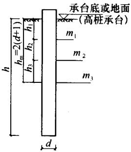  
图C.0.2

$h_{\mathrm{m}} = 2$ （ $d + 1$ ）米范围内的 $m$ 值作为计算值（见图C.0.2）。当 $h_\mathrm{m}$ 深度内存在两层不同土时：

$$m = \frac {m _{1} h _{1} ^{2} + m _{2} \left(2 h _{1} + h _{2}\right) h _{2}}{h _{\mathrm {m}} ^{2}} \tag {C.0.2-1}$$

当 $h_{\mathrm{m}}$ 深度内存在三层不同土时：

$$m = \frac {m _{1} h _{1} ^{2} + m _{2} \left(2 h _{1} + h _{2}\right) h _{2} + m _{3} \left(2 h _{1} + 2 h _{2} + h _{3}\right) h _{3}}{h _{\mathrm {m}} ^{2}} \tag {C.0.2-2}$$

2 承台侧面地基土水平抗力系数 $C_{\mathrm{n}}$

$$C _{\mathrm {n}} = m \cdot h _{\mathrm {n}} \tag {C.0.2-3}$$

式中 $m$ ——承台埋深范围地基土的水平抗力系数的比例系数 $(\mathrm{MN} / \mathrm{m}^4)$ ；

$h_{\mathrm{n}}$ ——承台埋深（m）。

3 地基土竖向抗力系数 $C_0$ 、 $C_{\mathrm{b}}$ 和地基土竖向抗力系数的比例系数 $m_0$ ：

1）桩底面地基土竖向抗力系数 $C_0$

$$C _{0} = m _{0} h \tag {C.0.2-4}$$

式中 $m_0$ ——桩底面地基土竖向抗力系数的比例系数 $(\mathrm{MN} / \mathrm{m}^4)$ ，近似取 $m_0 = m$ ；

$h$ ——桩的人土深度（m），当 $h$ 小于 $10\mathrm{m}$ 时，按 $10\mathrm{m}$ 计算。

2）承台底地基土竖向抗力系数 $C_{\mathrm{b}}$

$$C _{\mathrm {b}} = m _{0} h _{\mathrm {n}} \eta_{\mathrm {c}} \tag {C.0.2-5}$$

式中 $h_n$ ——承台埋深（m），当 $h_n$ 小于 $1\mathrm{m}$ 时，按 $1\mathrm{m}$ 计算；

$\eta_{c}$ ——承台效应系数，按本规范第5.2.5条确定。

不随岩层埋深而增长，其值按表C.0.2采用。

表 C. 0.2 岩石地基竖向抗力系数 ${\mathbf{C}}_{\mathbf{R}}$   

| 岩石饱和单轴抗压强度标准值 ${f}_{\mathrm{{rk}}}\left( \mathrm{{kPa}}\right)$ | ${\mathrm{C}}_{\mathrm{R}}\left( {\mathrm{{MN}}/{\mathrm{m}}^{3}}\right)$ |
| --- | --- |
| 1000 | 300 |
| ≥25000 | 15000 |

注： $f_{\mathrm{rk}}$ 为表列数值的中间值时， $C_\mathrm{R}$ 采用插入法确定。

4 岩石地基的竖向抗力系数 $C_{\mathrm{R}}$

5 桩身抗弯刚度 $EI$ ：按本规范第5.7.2条第6款的规定计算确定。

6 桩身轴向压力传递系数 $\xi_{\mathrm{N}}$

$$\boldsymbol {\xi} _{N} = 0. 5 \sim 1. 0$$

摩擦型桩取小值，端承型桩取大值。

7 地基土与承台底之间的摩擦系数 $\mu$ ，按本规范表5.7.3-2取值。

C.0.3 计算公式：

1 单桩基础或垂直于外力作用平面的单排桩基础，见表C.0.3-1。  
2 位于（或平行于）外力作用平面的单排（或多排）桩低承台桩基，见表C.0.3-2。  
3 位于（或平行于）外力作用平面的单排（或多排）桩高承台桩基，见表C.0.3-3。

C.0.4 确定地震作用下桩基计算参数和图式的几个问题：

1 当承台底面以上土层为液化层时，不考虑承台侧面土体的弹性抗力和承台底土的竖向弹性抗力与摩阻力，此时，令 $C_{\mathrm{n}} = C_{\mathrm{b}} = 0$ ，可按表C.0.3-3高承台公式计算。  
2 当承台底面以上为非液化层，而承台底面与承台底面下土体可能发生脱离时（承台底面以下有欠固结、自重湿陷、震陷、液化土体时），不考虑承台底地基土的竖向弹性抗力和摩阻力，只考虑承台侧面土体的弹性抗力，宜按表C.0.3-3高承台图式进行计算；但计算承台单位变位引起的桩顶、承台、地下墙体的反力和时，应考虑承台和地下墙体侧面土体弹性抗力的影响。可按表C.0.3-2的步骤5的公式计算 $(C_{\mathrm{b}} = 0)$ 。  
3 当桩顶以下2（ $d + 1$ ）米深度内有液化夹层时，其水平抗力系数的比例系数综合计算值 $m$ ，系将液化层的 $m$ 值按本规范表5.3.12折减后，代入式（C.0.2-1）或式（C.0.2-2）中计算确定。

表 C. 0.3-1 单桩基础或垂直于外力作用平面的单排桩基础  

| 计算步骤 | 计算步骤 | 计算步骤 | 计算步骤 | 内容 | 内容 | 备注 |  |  |  |
| --- | --- | --- | --- | --- | --- | --- | --- | --- | --- |
| 1 | 确定荷载和计算图式 | 确定荷载和计算图式 | 确定荷载和计算图式 | 地面 h Mh N+G Δ M H L M Mh M Mh M Mh M Mh M Mh M Mh M Mh M Mh M Mh M Mh M Mh M Mh M Mh M Mh M Mh M Mh M Mh M Mh M Mh M Mh M M Mh M Mh M Mh M Mh M Mh M Mh M Mh M Mh M Mh M Mh M Mh M Mh M Mh M Mh M Mh M Mh M Mh M Mh M Mh M Mn M Mn M Mn M Mn M Mn M Mn M Mn M Mn M Mn M Mn M Mn M Mn M Mn M Mn M Mn M Mn M Mn M Mn M Mn M Mn M M M M M M M M M M M M M M M M M M M M M M M M M M M M M M M M M M M M M M M M M M M M M M M M M M m Ei、α | 地面 h Mh N+G Δ M H L M Mh M Mh M Mh M Mh M Mh M Mh M Mh M Mh M Mh M Mh M Mh M Mh M Mh M Mh M Mh M Mh M Mh M Mh M Mh M Mh M M Mh M Mh M Mh M Mh M Mh M Mh M Mh M Mh M Mh M Mh M Mh M Mh M Mh M Mh M Mh M Mh M Mh M Mh M Mh M Mn M Mn M Mn M Mn M Mn M Mn M Mn M Mn M Mn M Mn M Mn M Mn M Mn M Mn M Mn M Mn M Mn M Mn M Mn M Mn M M M M M M M M M M M M M M M M M M M M M M M M M M M M M M M M M M M M M M M M M M M M M M M M M M m Ei、α | 地面 h Mh N+G Δ M H L M Mh M Mh M Mh M Mh M Mh M Mh M Mh M Mh M Mh M Mh M Mh M Mh M Mh M Mh M Mh M Mh M Mh M Mh M Mh M Mh M M Mh M Mh M Mh M Mh M Mh M Mh M Mh M Mh M Mh M Mh M Mh M Mh M Mh M Mh M Mh M Mh M Mh M Mh M Mh M Mn M Mn M Mn M Mn M Mn M Mn M Mn M Mn M Mn M Mn M Mn M Mn M Mn M Mn M Mn M Mn M Mn M Mn M Mn M Mn M M M M M M M M M M M M M M M M M M M M M M M M M M M M M M M M M M M M M M M M M M M M M M M M M M m Ei、α | 地面 h Mh N+G Δ M H L M Mh M Mh M Mh M Mh M Mh M Mh M Mh M Mh M Mh M Mh M Mh M Mh M Mh M Mh M Mh M Mh M Mh M Mh M Mh M Mh M M Mh M Mh M Mh M Mh M Mh M Mh M Mh M Mh M Mh M Mh M Mh M Mh M Mh M Mh M Mh M Mh M Mh M Mh M Mh M Mn M Mn M Mn M Mn M Mn M Mn M Mn M Mn M Mn M Mn M Mn M Mn M Mn M Mn M Mn M Mn M Mn M Mn M Mn M Mn M M M M M M M M M M M M M M M M M M M M M M M M M M M M M M M M M M M M M M M M M M M M M M M M M M m Ei、α | 地面 h Mh N+G Δ M H L M Mh M Mh M Mh M Mh M Mh M Mh M Mh M Mh M Mh M Mh M Mh M Mh M Mh M Mh M Mh M Mh M Mh M Mh M Mh M Mh M M Mh M Mh M Mh M Mh M Mh M Mh M Mh M Mh M Mh M Mh M Mh M Mh M Mh M Mh M Mh M Mh M Mh M Mh M Mh M Mn M Mn M Mn M Mn M Mn M Mn M Mn M Mn M Mn M Mn M Mn M Mn M Mn M Mn M Mn M Mn M Mn M Mn M Mn M Mn M M M M M M M M M M M M M M M M M M M M M M M M M M M M M M M M M M M M M M M M M M M M M M M M M M m Ei、α | 地面 h Mh N+G Δ M H L M Mh M Mh M Mh M Mh M Mh M Mh M Mh M Mh M Mh M Mh M Mh M Mh M Mh M Mh M Mh M Mh M Mh M Mh M Mh M Mh M M Mh M Mh M Mh M Mh M Mh M Mh M Mh M Mh M Mh M Mh M Mh M Mh M Mh M Mh M Mh M Mh M Mh M Mh M Mh M Mn M Mn M Mn M Mn M Mn M Mn M Mn M Mn M Mn M Mn M Mn M Mn M Mn M Mn M Mn M Mn M Mn M Mn M Mn M Mn M M M M M M M M M M M M M M M M M M M M M M M M M M M M M M M M M M M M M M M M M M M M M M M M M M m Ei、α |
| 2 | 确定基本参数 | 确定基本参数 | 确定基本参数 | m、EI、α | m、EI、α | 详见附录C.0.2 |  |  |  |
| 3 | 求地面处桩身内力 | 求地面处桩身内力 | 求地面处桩身内力 | 弯距(F×L)水平力(F) | M0=M/n+H/nl0H0=H/n | n-单排桩的桩数；低承台桩时，令l0=0 |  |  |  |
| 4 | 求单位力作用于桩身地面处，桩身在该处产生的变位 | H0=1作用时 | 水平位移(F-1×L) | δHH=1/α3EI×(B3D4-B4D3)+Kh(B2D4-B4D2)/(A3B4-A4B3)+Kh(A2B4-A4B2) | δHH=1/α3EI×(B3D4-B4D3)+Kh(B2D4-B4D2)/(A3B4-A4B3)+Kh(A2B4-A4B2) | 桩底支承于非岩石类土中，且当h≥2.5/α，可令Kh=0；桩底支承于基岩面上，且当h≥3.5/α，可令Kh=0。Kh计算见本表注③。系数A1……D4、Af、Bf、Cf根据h=ah查表C.0.3-4中相应h的值确定 |  |  |  |
| 4 | 求单位力作用于桩身地面处，桩身在该处产生的变位 | H0=1作用时 | 转角(F-1) | δMH=1/α2EI×(A3D4-A4D3)+Kh(A2D4-A4D2)/(A3B4-A4B3)+Kh(A2B4-A4B2) | δMH=1/α2EI×(A3D4-A4D3)+Kh(A2D4-A4D2)/(A3B4-A4B3)+Kh(A2B4-A4B2) | 桩底支承于非岩石类土中，且当h≥2.5/α，可令Kh=0；桩底支承于基岩面上，且当h≥3.5/α，可令Kh=0。Kh计算见本表注③。系数A1……D4、Af、Bf、Cf根据h=ah查表C.0.3-4中相应h的值确定 |  |  |  |
| 4 | 求单位力作用于桩身地面处，桩身在该处产生的变位 | M0=1作用时 | 水平位移(F-1) | δHM=δMH | δHM=δMH | 桩底支承于非岩石类土中，且当h≥2.5/α，可令Kh=0；桩底支承于基岩面上，且当h≥3.5/α，可令Kh=0。Kh计算见本表注③。系数A1……D4、Af、Bf、Cf根据h=ah查表C.0.3-4中相应h的值确定 |  |  |  |
| 4 | 求单位力作用于桩身地面处，桩身在该处产生的变位 | M0=1作用时 | 转角(F-1×L-1) | δMM=1/αEI×(A3C4-A4C3)+Kh(A2C4-A4C2)/(A3B4-A4B3)+Kh(A2B4-A4B2) | δMM=1/αEI×(A3C4-A4C3)+Kh(A2C4-A4C2)/(A3B4-A4B3)+Kh(A2B4-A4B2) | 桩底支承于非岩石类土中，且当h≥2.5/α，可令Kh=0；桩底支承于基岩面上，且当h≥3.5/α，可令Kh=0。Kh计算见本表注③。系数A1……D4、Af、Bf、Cf根据h=ah查表C.0.3-4中相应h的值确定 |  |  |  |

续表 C. 0.3-1  

| 计算步骤 | 计算步骤 | 计算步骤 | 内容 | 备注 |
| --- | --- | --- | --- | --- |
| 5 | 求地面处桩身的变位 | 水平位移(L)转角(弧度) | x0=H0δHH+M0δHMφ0=- (H0δMH+M0δMM) |  |
| 6 | 求地面以下任一深度的桩身内力 | 弯距(F×L)水平力(F) | My=α2EI(x0A3+φ0/αB3+M0/α2EI C3+H0/α3EI D3)Hy=α3EI(x0A4+φ0/αB4+M0/α2EI C4+H0/α3EI D4) |  |
| 7 | 求桩顶水平位移 | (L) | Δ=x0-φ0l0+Δ0其中 Δ0=Hl03/3nEI+Ml02/2nEI |  |
| 8 | 求桩身最大弯距及其位置 | 最大弯距位置(L) | 由aMo/H0=C1查表C.0.3-5得相应的αy,yMmax=αy/α | CI、DII查表C.0.3-5 |
| 8 | 求桩身最大弯距及其位置 | 最大弯距(F×L) | Mmax=H0/DII | CI、DII查表C.0.3-5 |

注：1 $\delta_{\mathrm{HH}}$ 、 $\delta_{\mathrm{MH}}$ 、 $\delta_{\mathrm{HM}}$ 、 $\delta_{\mathrm{MM}}$ 的图示意义：  
2 当桩底嵌固于基岩中时， $\delta_{\mathrm{HH}} \dots \delta_{\mathrm{MM}}$ 按下列公式计算：  
1 $B_{2}D_{1} - B_{1}D_{2}$ 1 A2D1-A1D2   
$\delta_{\mathrm{HH}} = \overline{\alpha^3EI}\times \overline{A_2B_1 - A_1B_2};$ $\delta_{\mathrm{MH}} = \overline{\alpha^2EI}\times \overline{A_2B_1 - A_1B_2},$   
$\delta_{\mathrm{HM}} = \delta_{\mathrm{MH}}$   
$\delta_{\mathrm{MM}} = \frac{1}{\alpha E I} \times \frac{A_2C_1 - A_1C_2}{A_2B_1 - A_1B_2}$   
C0I0   
3 系数 $K_{\mathrm{h}}$ $K_{\mathrm{h}} = \frac{\alpha EI}{\alpha EI}$   
式中： $C_0$ 、 $\alpha$ 、 $E$ 、 $I$ ——详见附录C.0.2； $I_0$ ——桩底截面惯性矩；对于非扩底 $I_0 = I$ 。  
4 表中 $F$ 、 $L$ 分别为表示力、长度的量纲。

表 C. 0.3-2 位于(或平行于)外力作用平面的单排(或多排)桩低承台桩基  

| 计算步骤 | 计算步骤 | 计算步骤 | 计算步骤 | 内容 | 备注 |
| --- | --- | --- | --- | --- | --- |
| 1 | 确定荷载和计算图式 | 确定荷载和计算图式 | 确定荷载和计算图式 | 坐标原点应选在桩群对称点上或重心上 | 坐标原点应选在桩群对称点上或重心上 |
| 2 | 确定基本计算参数 | 确定基本计算参数 | 确定基本计算参数 | m、mo、EI、α、ξN、C0、Cb、μ | 详见附录C.0.2 |
| 3 | 求单位力作用于桩顶时,桩顶产生的变位 | H=1作用时 | 水平位移(F-1×L) | δHH | 公式同表C.0.3-1中步骤4,且Kh=0;当桩底嵌入基岩中时,应按表C.0.3-1注2计算。 |
| 3 | 求单位力作用于桩顶时,桩顶产生的变位 | H=1作用时 | 转角(F-1) | δMH | 公式同表C.0.3-1中步骤4,且Kh=0;当桩底嵌入基岩中时,应按表C.0.3-1注2计算。 |
| 3 | 求单位力作用于桩顶时,桩顶产生的变位 | M=1作用时 | 水平位移(F-1) | δHM=δMH | 公式同表C.0.3-1中步骤4,且Kh=0;当桩底嵌入基岩中时,应按表C.0.3-1注2计算。 |
| 3 | 求单位力作用于桩顶时,桩顶产生的变位 | M=1作用时 | 转角(F-1×L-1) | δMM | 公式同表C.0.3-1中步骤4,且Kh=0;当桩底嵌入基岩中时,应按表C.0.3-1注2计算。 |
| 4 | 求桩顶发生单位变位时,在桩顶引起的内力 | 发生单位竖向位移时 | 轴向力(F×L-1) | ρNN=1/ζnh+1/EA+1/C0A0 | ξN、C0、A0——见附录C.0.2E、A——桩身弹性模量和横截面面积 |
| 4 | 求桩顶发生单位变位时,在桩顶引起的内力 | 发生单位水平位移时 | 水平力(F×L-1) | ρHH=δMM/δHHδMM-δMH2 | ξN、C0、A0——见附录C.0.2E、A——桩身弹性模量和横截面面积 |
| 4 | 求桩顶发生单位变位时,在桩顶引起的内力 | 发生单位水平位移时 | 弯距(F) | ρMH=δMH/δHHδMM-δMH2 | ξN、C0、A0——见附录C.0.2E、A——桩身弹性模量和横截面面积 |
| 4 | 求桩顶发生单位变位时,在桩顶引起的内力 | 发生单位转角时 | 水平力(F) | ρHM=ρMH | ξN、C0、A0——见附录C.0.2E、A——桩身弹性模量和横截面面积 |
| 4 | 求桩顶发生单位变位时,在桩顶引起的内力 | 发生单位转角时 | 弯距(F×L) | ρMM=δHH/δHHδMM-δMH2 | ξN、C0、A0——见附录C.0.2E、A——桩身弹性模量和横截面面积 |

续表 C. 0.3-2  

| 计算步骤 | 计算步骤 | 计算步骤 | 计算步骤 | 内容 | 备注 |
| --- | --- | --- | --- | --- | --- |
| 5 | 求承台发生单位变位时所有桩顶、承台和侧墙引起的反力和 | 发生单位竖向位移时 | 竖向反力(F×L-1) | γVV=ρNN+CbAb | B0=B+1B垂直于力作用面方向的承台宽;Ab、Ib、Fc、Sc和Ic—详见本表附注3、4n—基桩数xi—坐标原点至各桩的距离Ki—第i排桩的桩数 |
| 5 | 求承台发生单位变位时所有桩顶、承台和侧墙引起的反力和 | 发生单位竖向位移时 | 水平反力(F×L-1) | γUV=μCbAb | B0=B+1B垂直于力作用面方向的承台宽;Ab、Ib、Fc、Sc和Ic—详见本表附注3、4n—基桩数xi—坐标原点至各桩的距离Ki—第i排桩的桩数 |
| 5 | 求承台发生单位变位时所有桩顶、承台和侧墙引起的反力和 | 发生单位水平位移时 | 水平反力(F×L-1) | γUU=ρHH+B0Fc | B0=B+1B垂直于力作用面方向的承台宽;Ab、Ib、Fc、Sc和Ic—详见本表附注3、4n—基桩数xi—坐标原点至各桩的距离Ki—第i排桩的桩数 |
| 5 | 求承台发生单位变位时所有桩顶、承台和侧墙引起的反力和 | 发生单位水平位移时 | 反弯距(F) | γBU=-ρMH+BuS | B0=B+1B垂直于力作用面方向的承台宽;Ab、Ib、Fc、Sc和Ic—详见本表附注3、4n—基桩数xi—坐标原点至各桩的距离Ki—第i排桩的桩数 |
| 5 | 求承台发生单位变位时所有桩顶、承台和侧墙引起的反力和 | 发生单位转角时 | 水平反力(F) | γUB=γBU | B0=B+1B垂直于力作用面方向的承台宽;Ab、Ib、Fc、Sc和Ic—详见本表附注3、4n—基桩数xi—坐标原点至各桩的距离Ki—第i排桩的桩数 |
| 5 | 求承台发生单位变位时所有桩顶、承台和侧墙引起的反力和 | 发生单位转角时 | 反弯距(F×L) | γBB=nPMM+ρNNΣKix2+BOIc+CbIc | B0=B+1B垂直于力作用面方向的承台宽;Ab、Ib、Fc、Sc和Ic—详见本表附注3、4n—基桩数xi—坐标原点至各桩的距离Ki—第i排桩的桩数 |
| 6 | 求承台变位 | 竖向位移(L) | 竖向位移(L) | V=(N+G)/γVV |  |
| 6 | 求承台变位 | 水平位移(L) | 水平位移(L) | U=γBBH-γUBM/(N+G)γUVγBB/γUUγBB-γUB2-γVV(γUUγBB-γUB2) |  |
| 6 | 求承台变位 | 转角(弧度) | 转角(弧度) | β=γUU M-γUB H/(N+G)γUVγUB/γUUγBB-γUB2+γVV(γUUγBB-γUB2) |  |
| 7 | 求任一基桩桩顶内力 | 轴向力(F) | 轴向力(F) | Noi=(V+β·xi)ρNN | xi在原点以右取正,以左取负 |
| 7 | 求任一基桩桩顶内力 | 水平力(F) | 水平力(F) | Hoi=UρHH-βρHM | xi在原点以右取正,以左取负 |
| 7 | 求任一基桩桩顶内力 | 弯距(F×L) | 弯距(F×L) | Moi=βρMM-UρHM | xi在原点以右取正,以左取负 |
| 8 | 求任一深度桩身弯距 | 弯距(F×L) | 弯距(F×L) | My=α2EI (UA3+β/aB3+M0a2EI C3+H0a3EI D3) | A3、B3、C3、D3查表C.0.3-4,当桩身变截面配筋时作该项计算 |

续表 C. 0.3-2

式中 $h$ ——桩入土深度；  

| 计算步骤 | 计算步骤 | 计算步骤 | 内容 | 备注 |
| --- | --- | --- | --- | --- |
| 9 | 求任一基桩桩身最大弯距及其位置 | 最大弯矩位置(L) | yMmax | 计算公式同表C.0.3-1 |
| 9 | 求任一基桩桩身最大弯距及其位置 | 最大弯距(F×L) | Mmax | 计算公式同表C.0.3-1 |
| 10 | 求承台和侧墙的弹性抗力 | 水平抗力(F) | HE=UB0Fc+βBOSc | 10、11、12项为非必算内容 |
| 10 | 求承台和侧墙的弹性抗力 | 反弯距(F×L) | ME=UB0Sc+βBOIc | 10、11、12项为非必算内容 |
| 11 | 求承台底地基土的弹性抗力和摩阻力 | 竖向抗力(F) | Nb=VCbAb |  |
| 11 | 求承台底地基土的弹性抗力和摩阻力 | 水平抗力(F) | Hb=μNb |  |
| 11 | 求承台底地基土的弹性抗力和摩阻力 | 反弯距(F×L) | Mb=βCbIb |  |
| 12 | 校核水平力的计算结果 | 校核水平力的计算结果 | ΣHt+HE+Hb=H |  |

注：1 $\rho_{\mathrm{NN}}$ 、 $\rho_{\mathrm{HH}}$ 、 $\rho_{\mathrm{MH}}$ 、 $\rho_{\mathrm{HM}}$ 和 $\rho_{\mathrm{MM}}$ 的图示意义：  
2 $A_0$ ——单桩桩底压力分布面积，对于端承型桩， $A_0$ 为单桩的底面积，对于摩擦型桩，可取下列公式计算：  
1. 二元二次方程的解法：对于满足 $x = 0$ ， $y = 0$ 的单根，取下列二公式计算值之较小者：  
$A_0 = \pi \left(h\mathrm{tg}\frac{\varphi_{\mathrm{m}}}{4} +\frac{d}{2}\right)^2$

$\varphi_{\mathrm{m}}$ ——桩周各土层内摩擦角的加权平均值；

$d$ ——桩的设计直径；

$s$ ——桩的中心距。

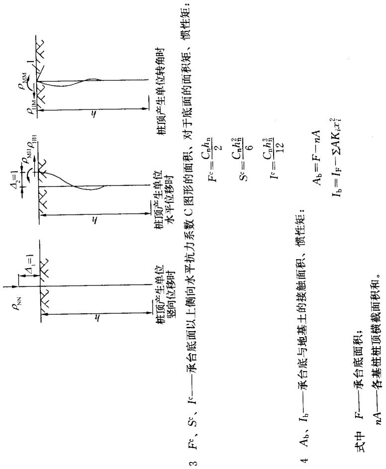

表 C. 0.3-3 位于 (或平行于) 外力作用平面的单排 (或多排) 桩高承台桩基  

| 计算步骤 | 计算步骤 | 计算步骤 | 计算步骤 | 内容 | 备注 |
| --- | --- | --- | --- | --- | --- |
| 1 | 确定荷载和计算图式 | 确定荷载和计算图式 | 确定荷载和计算图式 | 坐标原点应选在桩群对称点上或重心上 | 坐标原点应选在桩群对称点上或重心上 |
| 2 | 确定基本计算参数 | 确定基本计算参数 | 确定基本计算参数 | m、m0、EI、α、ξN、C0 | 详见附录C.0.2 |
| 3 | 求单位力作用于桩身地面处,桩身在该处产生的变位 | 求单位力作用于桩身地面处,桩身在该处产生的变位 | 求单位力作用于桩身地面处,桩身在该处产生的变位 | δHH、δMH、δHM、δMM | 公式同表C.0.3-2 |
| 4 | 求单位力作用于桩顶时,桩顶产生的变位 | H1=1作用时 | 水平位移(F-1×L) | δ'HH=l03/3EI+σmml02+2δMHl0+δHH |  |
| 4 | 求单位力作用于桩顶时,桩顶产生的变位 | H1=1作用时 | 转角(F-1) | δ'HM=l02/2EI+δMMl0+δMH |  |
| 4 | 求单位力作用于桩顶时,桩顶产生的变位 | Mi=1作用时 | 水平位移(F-1) | δ'HM=δ'MH |  |
| 4 | 求单位力作用于桩顶时,桩顶产生的变位 | Mi=1作用时 | 转角(F-1×L-1) | δ'MM=l0/EI+δMM |  |
| 5 | 求桩顶发生单位变位时,桩顶引起的内力 | 发生单位竖向位移时 | 轴向力(F×L-1) | ρNN=l0+ζNh/EA+1/C0A0 |  |
| 5 | 求桩顶发生单位变位时,桩顶引起的内力 | 发生单位水平位移时 | 水平力(F×L-1) | ρHH=δ'MM/δ'HMδ'MM-δ'MM |  |
| 5 | 求桩顶发生单位变位时,桩顶引起的内力 | 发生单位水平位移时 | 弯距(F) | ρMH=δ'MH/δ'HHδ'MM-δ'MH |  |

续表 C. 0.3-3  

| 计算步骤 | 计算步骤 | 计算步骤 | 计算步骤 | 内容 | 备注 |
| --- | --- | --- | --- | --- | --- |
| 5 | 求桩顶发生单位变位时,桩顶引起的内力 | 发生单位转角时 | 水平力(F) | ρHM=ρMH |  |
| 5 | 求桩顶发生单位变位时,桩顶引起的内力 | 发生单位转角时 | 弯距(F×L) | ρMM=δ'HH/δ'HHδ'MM-δ'MH |  |
| 6 | 求承台发生单位变位时,所有桩顶引起的反力和 | 发生单位竖向位移时 | 竖向反力(F×L-1) | γVV=nρNN | n基桩数xi坐标原点至各桩的距离Ki-第i排桩的根数 |
| 6 | 求承台发生单位变位时,所有桩顶引起的反力和 | 发生单位水平位移时 | 水平反力(F×L-1) | γUU=nρHH | n基桩数xi坐标原点至各桩的距离Ki-第i排桩的根数 |
| 6 | 求承台发生单位变位时,所有桩顶引起的反力和 | 发生单位水平位移时 | 反弯距(F) | γβU=-nρMH | n基桩数xi坐标原点至各桩的距离Ki-第i排桩的根数 |
| 6 | 求承台发生单位变位时,所有桩顶引起的反力和 | 发生单位转角时 | 水平反力(F) | γUB=γβU | n基桩数xi坐标原点至各桩的距离Ki-第i排桩的根数 |
| 6 | 求承台发生单位变位时,所有桩顶引起的反力和 | 发生单位转角时 | 反弯距(F×L) | γBB=nρMM+ρNNΣKix2 | n基桩数xi坐标原点至各桩的距离Ki-第i排桩的根数 |
| 7 | 求承台变位 | 竖直位移(L) | 竖直位移(L) | V=N+G/γVV |  |
| 7 | 求承台变位 | 水平位移(L) | 水平位移(L) | U=γBBH-γUBM/γUUγBB-γUB2 |  |
| 7 | 求承台变位 | 转角(弧度) | 转角(弧度) | β=γUUH-γUBH/γUUγBB-γUB2 |  |
| 8 | 求任一基桩桩顶内力 | 竖向力(F) | 竖向力(F) | Ni=(V+β·xi)ρNN | xi在原点O以右取正,以左取负 |
| 8 | 求任一基桩桩顶内力 | 水平力(F) | 水平力(F) | Hi=uρHH-βρHM=H/n | xi在原点O以右取正,以左取负 |
| 8 | 求任一基桩桩顶内力 | 弯距(F×L) | 弯距(F×L) | Mi=βρMM-UρMH | xi在原点O以右取正,以左取负 |

续表 C. 0.3-3  

| 计算步骤 | 计算步骤 | 计算步骤 | 内容 | 备注 |
| --- | --- | --- | --- | --- |
| 9 | 求地面处任一基桩桩身截面上的内力 | 水平力(F) | H0i=Hi |  |
| 9 | 求地面处任一基桩桩身截面上的内力 | 弯距(F×L) | M0i=Mi+Hi l0 |  |
| 10 | 求地面处任一基桩桩身的变位 | 水平位移(L) | x0i=H0iδHH+M0iδHM |  |
| 10 | 求地面处任一基桩桩身的变位 | 转角(弧度) | φ0i=- (H0iδMH+M0iδMM) |  |
| 11 | 求任一基桩地面下任一深度桩身截面内力 | 弯距(F×L) | Myi=α2EI (x0iA3+φ0i/αB3+M0i/α2EI C3+H0i/α3EI D3) | A3……D4查表C.0.3-4,当桩身变截面配筋时作该项计算 |
| 11 | 求任一基桩地面下任一深度桩身截面内力 | 水平力(F) | Hyi=α3EI (x0iA4+φ0i/αB4+M0i/α2EI C4+H0i/α3EI D4) | A3……D4查表C.0.3-4,当桩身变截面配筋时作该项计算 |
| 12 | 求任一基桩桩身最大弯距及其位置 | 最大弯距位置(L) | yMmax | 计算公式同表C.0.3-1 |
| 12 | 求任一基桩桩身最大弯距及其位置 | 最大弯距(F×L) | Mmax | 计算公式同表C.0.3-1 |

表 C. 0.3-4 影响函数值表  

| 换算深度h=αy | A3 | B3 | C3 | D3 | A4 | B4 | C4 | D4 | B3D4-B4D3 | A3B4-A4B3 | B2D4-B4D2 |
| --- | --- | --- | --- | --- | --- | --- | --- | --- | --- | --- | --- |
| 0 | 0.00000 | 0.00000 | 1.00000 | 0.00000 | 0.00000 | 0.00000 | 0.00000 | 1.00000 | 0.00000 | 0.00000 | 1.00000 |
| 0.1 | -0.00017 | -0.00001 | 1.00000 | 0.10000 | -0.00500 | -0.00033 | -0.00001 | 1.00000 | 0.00002 | 0.00000 | 1.00000 |
| 0.2 | -0.00133 | -0.00013 | 0.99999 | 0.20000 | -0.02000 | -0.00267 | -0.00020 | 0.99999 | 0.00040 | 0.00000 | 1.00004 |
| 0.3 | -0.00450 | -0.00067 | 0.99994 | 0.30000 | -0.04500 | -0.00900 | -0.00101 | 0.99992 | 0.00203 | 0.00001 | 1.00029 |
| 0.4 | -0.01067 | -0.00213 | 0.99974 | 0.39998 | -0.08000 | -0.02133 | -0.00320 | 0.99966 | 0.00640 | 0.00006 | 1.00120 |
| 0.5 | -0.02083 | -0.00521 | 0.99922 | 0.49991 | -0.12499 | -0.04167 | -0.00781 | 0.99896 | 0.01563 | 0.00022 | 1.00365 |
| 0.6 | -0.03600 | -0.01080 | 0.99806 | 0.59974 | -0.17997 | -0.07199 | -0.01620 | 0.99741 | 0.03240 | 0.00065 | 1.00917 |
| 0.7 | -0.05716 | -0.02001 | 0.99580 | 0.69935 | -0.24490 | -0.11433 | -0.03001 | 0.99440 | 0.06006 | 0.00163 | 1.01962 |
| 0.8 | -0.08532 | -0.03412 | 0.99181 | 0.79854 | -0.31975 | -0.17060 | -0.05120 | 0.98908 | 0.10248 | 0.00365 | 1.03824 |
| 0.9 | -0.12144 | -0.05466 | 0.98524 | 0.89705 | -0.40443 | -0.24284 | -0.08198 | 0.98032 | 0.16426 | 0.00738 | 1.06893 |
| 1.0 | -0.16652 | -0.08329 | 0.97501 | 0.99445 | -0.49881 | -0.33298 | -0.12493 | 0.96667 | 0.25062 | 0.01390 | 1.11679 |
| 1.1 | -0.22152 | -0.12192 | 0.95975 | 1.09016 | -0.60268 | -0.44292 | -0.18285 | 0.94634 | 0.36747 | 0.02464 | 1.18823 |
| 1.2 | -0.28737 | -0.17260 | 0.93783 | 1.18342 | -0.71573 | -0.57450 | -0.25886 | 0.91712 | 0.52158 | 0.04156 | 1.29111 |
| 1.3 | -0.36496 | -0.23760 | 0.90727 | 1.27320 | -0.83753 | -0.72950 | -0.35631 | 0.87638 | 0.72057 | 0.06724 | 1.43498 |
| 1.4 | -0.45515 | -0.31933 | 0.86575 | 1.35821 | -0.96746 | -0.90954 | -0.47883 | 0.82102 | 0.97317 | 0.10504 | 1.63125 |

续表 C. 0.3-4  

| 换算 深度 h=αy | A3 | B3 | C3 | D3 | A4 | B4 | C4 | D4 | B3D4-B4D3 | A3B4-A4B3 | B2D4-B4D2 |
| --- | --- | --- | --- | --- | --- | --- | --- | --- | --- | --- | --- |
| 1.5 | -0.55870 | -0.42039 | 0.81054 | 1.43680 | -1.10468 | -1.11609 | -0.63027 | 0.74745 | 1.28938 | 0.15916 | 1.89349 |
| 1.6 | -0.67629 | -0.54348 | 0.73859 | 1.50695 | -1.24808 | -1.35042 | -0.81466 | 0.65156 | 1.68091 | 0.23497 | 2.23776 |
| 1.7 | -0.80848 | -0.69144 | 0.64637 | 1.56621 | -1.39623 | -1.61346 | -1.03616 | 0.52871 | 2.16145 | 0.33904 | 2.68296 |
| 1.8 | -0.95564 | -0.86715 | 0.52997 | 1.61162 | -1.54728 | -1.90577 | -1.29909 | 0.37368 | 2.74734 | 0.47951 | 3.25143 |
| 1.9 | -1.11796 | -1.07357 | 0.38503 | 1.63969 | -1.69889 | -2.22745 | -1.60770 | 0.18071 | 3.45833 | 0.66632 | 3.96945 |
| 2.0 | -1.29535 | -1.31361 | 0.20676 | 1.64628 | -1.84818 | -2.57798 | -1.96620 | -0.05652 | 4.31831 | 0.91158 | 4.86824 |
| 2.2 | -1.69334 | -1.90567 | -0.27087 | 1.57538 | -2.12481 | -3.35952 | -2.84858 | -0.69158 | 6.61044 | 1.63962 | 7.36356 |
| 2.4 | -2.14117 | -2.66329 | -0.94885 | 1.35201 | -2.33901 | -4.22811 | -3.97323 | -1.59151 | 9.95510 | 2.82366 | 11.13130 |
| 2.6 | -2.62126 | -3.59987 | -1.87734 | 0.91679 | -2.43695 | -5.14023 | -5.35541 | -2.82106 | 14.86800 | 4.70118 | 16.74660 |
| 2.8 | -3.10341 | -4.71748 | -3.10791 | 0.19729 | -2.34558 | -6.02299 | -6.99007 | -4.44491 | 22.15710 | 7.62658 | 25.06510 |
| 3.0 | -3.54058 | -5.99979 | -4.68788 | -0.89126 | -1.96928 | -6.76460 | -8.84029 | -6.51972 | 33.08790 | 12.13530 | 37.38070 |
| 3.5 | -3.91921 | -9.54367 | -10.34040 | -5.85402 | 1.07408 | -6.78895 | -13.69240 | -13.82610 | 92.20900 | 36.85800 | 101.36900 |
| 4.0 | -1.61428 | -11.7307 | -17.91860 | -15.07550 | 9.24368 | -0.35762 | -15.61050 | -23.14040 | 266.06100 | 109.01200 | 279.99600 |

注：表中 $y$ 为桩身计算截面的深度； $\alpha$ 为桩的水平变形系数。

续表 C. 0.3-4  

| 换算深度h=αy | A2B4-A4B2 | A3D4-A4D3 | A2D4-A4D2 | A3C4-A4C3 | A2C4-A4C2 | Af=B3D4-B4D3/A3B4-A4B3 | Bf=A3D4-A4D3/A3B4-A4B3 | Cf=A3C4-A4C3/A3B4-A4B3 | B2D1-B1D2/A2B1-A1B2 | A2D1-A1D2/A2B1-A1B2 | A2C1-C2A1/A2B1-A1B2 |
| --- | --- | --- | --- | --- | --- | --- | --- | --- | --- | --- | --- |
| 0 | 0.00000 | 0.00000 | 0.00000 | 0.00000 | 0.00000 | ∞ | ∞ | ∞ | 0.00000 | 0.00000 | 0.00000 |
| 0.1 | 0.00500 | 0.00033 | 0.00003 | 0.00500 | 0.00050 | 1800.00 | 24000.00 | 36000.00 | 0.00033 | 0.00500 | 0.10000 |
| 0.2 | 0.02000 | 0.00267 | 0.00033 | 0.02000 | 0.00400 | 450.00 | 3000.000 | 22500.10 | 0.00269 | 0.02000 | 0.20000 |
| 0.3 | 0.04500 | 0.00900 | 0.00169 | 0.04500 | 0.01350 | 200.00 | 888.898 | 4444.590 | 0.00900 | 0.04500 | 0.30000 |
| 0.4 | 0.07999 | 0.02133 | 0.00533 | 0.08001 | 0.03200 | 112.502 | 375.017 | 1406.444 | 0.02133 | 0.07999 | 0.39996 |
| 0.5 | 0.12504 | 0.04167 | 0.01302 | 0.12505 | 0.06251 | 72.102 | 192.214 | 576.825 | 0.04165 | 0.12495 | 0.49988 |
| 0.6 | 0.18013 | 0.07203 | 0.02701 | 0.18020 | 0.10804 | 50.012 | 111.179 | 278.134 | 0.07192 | 0.17893 | 0.59962 |
| 0.7 | 0.24535 | 0.11443 | 0.05004 | 0.24559 | 0.17161 | 36.740 | 70.001 | 150.236 | 0.11406 | 0.24448 | 0.69902 |
| 0.8 | 0.32091 | 0.17094 | 0.03539 | 0.32150 | 0.25632 | 28.108 | 46.884 | 88.179 | 0.16985 | 0.31867 | 0.79783 |
| 0.9 | 0.40709 | 0.24374 | 0.13685 | 0.40842 | 0.36533 | 22.245 | 33.009 | 55.312 | 0.24092 | 0.40199 | 0.89562 |
| 1.0 | 0.50436 | 0.33507 | 0.20873 | 0.50714 | 0.50194 | 18.028 | 24.102 | 36.480 | 0.32855 | 0.49374 | 0.99179 |
| 1.1 | 0.61351 | 0.44739 | 0.30600 | 0.61893 | 0.66965 | 14.915 | 18.160 | 25.122 | 0.43351 | 0.59294 | 1.08560 |
| 1.2 | 0.73565 | 0.58346 | 0.43412 | 0.74562 | 0.87232 | 12.550 | 14.039 | 17.941 | 0.55589 | 0.69811 | 1.17605 |
| 1.3 | 0.87244 | 0.74650 | 0.59910 | 0.88991 | 1.11429 | 10.716 | 11.102 | 13.235 | 0.69488 | 0.80737 | 1.26199 |
| 1.4 | 1.02612 | 0.94032 | 0.80887 | 1.05550 | 1.40059 | 9.265 | 8.952 | 10.049 | 0.84855 | 0.91831 | 1.34213 |

续表 C. 0.3-4  

| 换算深度h=αy | A2B4-A4B2 | A3D4-A4D3 | A2D4-A4D2 | A3C4-A4C3 | A2C4-A4C2 | Af=B3D4-B4D3/A3B4-A4B3 | Bf=A3D4-A4D3/A3B4-A4B3 | Cf=A3C4-A4C3/A3B4-A4B3 | B2D1-B1D2/A2B1-A1B2 | A2D1-A1D2/A2B1-A1B2 | A2C1-C2A1/A2B1-A1B2 |
| --- | --- | --- | --- | --- | --- | --- | --- | --- | --- | --- | --- |
| 1.5 | 1.19981 | 1.16960 | 1.07061 | 1.24752 | 1.73720 | 8.101 | 7.349 | 7.838 | 1.01382 | 1.02816 | 1.41516 |
| 1.6 | 1.39771 | 1.44015 | 1.39379 | 1.47277 | 2.13135 | 7.154 | 6.129 | 6.268 | 1.18632 | 1.13380 | 1.47990 |
| 1.7 | 1.62522 | 1.75934 | 1.78918 | 1.74019 | 2.59200 | 6.375 | 5.189 | 5.133 | 1.36088 | 1.23219 | 1.53540 |
| 1.8 | 1.88946 | 2.13653 | 2.26933 | 2.06147 | 3.13039 | 5.730 | 4.456 | 4.300 | 1.53179 | 1.32058 | 1.58115 |
| 1.9 | 2.19944 | 2.58362 | 2.84909 | 2.45147 | 3.76049 | 5.190 | 3.878 | 3.680 | 1.69343 | 1.39688 | 1.61718 |
| 2.0 | 2.56664 | 3.11583 | 3.54638 | 2.92905 | 4.49999 | 4.737 | 3.418 | 3.213 | 1.84091 | 1.43979 | 1.64405 |
| 2.2 | 3.53366 | 4.51846 | 5.38469 | 4.24806 | 6.40196 | 4.032 | 2.756 | 2.591 | 2.08041 | 1.54549 | 1.67490 |
| 2.4 | 4.95288 | 6.57004 | 8.02219 | 6.28800 | 9.09220 | 3.526 | 2.327 | 2.227 | 2.23974 | 1.58566 | 1.68520 |
| 2.6 | 7.07178 | 9.62890 | 11.82060 | 9.46294 | 12.97190 | 3.161 | 2.048 | 2.013 | 2.32965 | 1.59617 | 1.68665 |
| 2.8 | 10.26420 | 14.25710 | 17.33620 | 14.40320 | 18.66360 | 2.905 | 1.869 | 1.889 | 2.37119 | 1.59262 | 1.68717 |
| 3.0 | 15.09220 | 21.32850 | 25.42750 | 22.06800 | 27.12570 | 2.727 | 1.758 | 1.818 | 2.38547 | 1.58606 | 1.69051 |
| 3.5 | 41.01820 | 60.47600 | 67.49820 | 64.76960 | 72.04850 | 2.502 | 1.641 | 1.757 | 2.38891 | 1.58435 | 1.71100 |
| 4.0 | 114.7220 | 176.7060 | 185.9960 | 190.8340 | 200.0470 | 2.441 | 1.625 | 1.751 | 2.40074 | 1.59979 | 1.73218 |

表 C. 0.3-5 桩身最大弯距截面系数 ${\mathbf{C}}_{1}$ 、最大弯距系数 ${\mathbf{D}}_{\mathrm{{II}}}$   

| 换算 深度 $\bar{h} = \alpha y$ | $C_I$ | $C_I$ | $C_I$ | $C_I$ | $C_I$ | $C_I$ | $D_{\text{II}}$ | $D_{\text{II}}$ | $D_{\text{II}}$ | $D_{\text{II}}$ | $D_{\text{II}}$ | $D_{\text{II}}$ |
| --- | --- | --- | --- | --- | --- | --- | --- | --- | --- | --- | --- | --- |
| 换算 深度 $\bar{h} = \alpha y$ | $\alpha h=4.0$ | $\alpha h=3.5$ | $\alpha h=3.0$ | $\alpha h=2.8$ | $\alpha h=2.6$ | $\alpha h=2.4$ | $\alpha h=4.0$ | $\alpha h=3.5$ | $\alpha h=3.0$ | $\alpha h=2.8$ | $\alpha h=2.6$ | $\alpha h=2.4$ |
| 0.0 | ∞ | ∞ | ∞ | ∞ | ∞ | ∞ | ∞ | ∞ | ∞ | ∞ | ∞ | ∞ |
| 0.1 | 131.252 | 129.489 | 120.507 | 112.954 | 102.805 | 90.196 | 131.250 | 129.551 | 120.515 | 113.017 | 102.839 | 90.226 |
| 0.2 | 34.186 | 33.699 | 31.158 | 29.090 | 26.326 | 22.939 | 34.315 | 33.818 | 31.282 | 29.218 | 26.451 | 23.065 |
| 0.3 | 15.544 | 15.282 | 14.013 | 13.003 | 11.671 | 10.064 | 15.738 | 15.476 | 14.206 | 13.197 | 11.864 | 10.258 |
| 0.4 | 8.781 | 8.605 | 7.799 | 7.176 | 6.368 | 5.409 | 9.039 | 8.862 | 8.057 | 7.434 | 6.625 | 5.667 |
| 0.5 | 5.539 | 5.403 | 4.821 | 4.385 | 3.829 | 3.183 | 5.855 | 5.720 | 5.138 | 4.702 | 4.147 | 3.502 |
| 0.6 | 3.710 | 3.597 | 3.141 | 2.811 | 2.400 | 1.931 | 4.086 | 3.973 | 3.519 | 3.189 | 2.778 | 2.310 |
| 0.7 | 2.566 | 2.465 | 2.089 | 1.826 | 1.506 | 1.150 | 2.999 | 2.899 | 2.525 | 2.263 | 1.943 | 1.587 |
| 0.8 | 1.791 | 1.699 | 1.377 | 1.160 | 0.902 | 0.623 | 2.282 | 2.191 | 1.871 | 1.655 | 1.398 | 1.119 |
| 0.9 | 1.238 | 1.151 | 0.867 | 0.683 | 0.471 | 0.248 | 1.784 | 1.698 | 1.417 | 1.235 | 1.024 | 0.800 |
| 1.0 | 0.824 | 0.740 | 0.484 | 0.327 | 0.149 | -0.032 | 1.425 | 1.342 | 1.091 | 0.934 | 0.758 | 0.577 |
| 1.1 | 0.503 | 0.420 | 0.187 | 0.049 | -0.100 | -0.247 | 1.157 | 1.077 | 0.848 | 0.713 | 0.564 | 0.416 |
| 1.2 | 0.246 | 0.163 | -0.052 | -0.172 | -0.299 | -0.418 | 0.952 | 0.873 | 0.664 | 0.546 | 0.420 | 0.299 |
| 1.3 | 0.034 | -0.049 | -0.249 | -0.355 | -0.465 | -0.557 | 0.792 | 0.714 | 0.522 | 0.418 | 0.311 | 0.212 |
| 1.4 | -0.145 | -0.229 | -0.416 | -0.508 | -0.597 | -0.672 | 0.666 | 0.588 | 0.410 | 0.319 | 0.229 | 0.148 |
| 1.5 | -0.299 | -0.384 | -0.559 | -0.639 | -0.712 | -0.769 | 0.563 | 0.486 | 0.321 | 0.241 | 0.166 | 0.101 |

续表 C. 0.3-5  

| 换算 深度 $\bar{h} = \alpha y$ | $C_I$ | $C_I$ | $C_I$ | $C_I$ | $C_I$ | $C_I$ | $D_{\text{II}}$ | $D_{\text{II}}$ | $D_{\text{II}}$ | $D_{\text{II}}$ | $D_{\text{II}}$ | $D_{\text{II}}$ |
| --- | --- | --- | --- | --- | --- | --- | --- | --- | --- | --- | --- | --- |
| 换算 深度 $\bar{h} = \alpha y$ | $\alpha h=4.0$ | $\alpha h=3.5$ | $\alpha h=3.0$ | $\alpha h=2.8$ | $\alpha h=2.6$ | $\alpha h=2.4$ | $\alpha h=4.0$ | $\alpha h=3.5$ | $\alpha h=3.0$ | $\alpha h=2.8$ | $\alpha h=2.6$ | $\alpha h=2.4$ |
| 1.6 | -0.434 | -0.521 | -0.634 | -0.753 | -0.812 | -0.853 | 0.480 | 0.402 | 0.250 | 0.181 | 0.118 | 0.067 |
| 1.7 | -0.555 | -0.645 | -0.796 | -0.854 | -0.898 | -0.025 | 0.411 | 0.333 | 0.193 | 0.134 | 0.082 | 0.043 |
| 1.8 | -0.665 | -0.756 | -0.896 | -0.943 | -0.975 | -0.987 | 0.353 | 0.276 | 0.147 | 0.097 | 0.055 | 0.026 |
| 1.9 | -0.768 | -0.862 | -0.988 | -1.024 | -1.043 | -1.043 | 0.304 | 0.227 | 0.110 | 0.068 | 0.035 | 0.014 |
| 2.0 | -0.865 | -0.961 | -1.073 | -1.098 | -1.105 | -1.092 | 0.263 | 0.186 | 0.081 | 0.046 | 0.022 | 0.007 |
| 2.2 | -1.048 | -1.148 | -1.225 | -1.227 | -1.210 | -1.176 | 0.196 | 0.122 | 0.040 | 0.019 | 0.006 | 0.001 |
| 2.4 | -1.230 | -1.328 | -1.360 | -1.338 | -1.299 | 0 | 0.145 | 0.075 | 0.016 | 0.005 | 0.001 | 0 |
| 2.6 | -1.420 | -1.507 | -1.482 | -1.434 | 0 |  | 0.106 | 0.043 | 0.005 | 0.001 | 0 |  |
| 2.8 | -1.635 | -1.692 | -1.593 | 0 |  |  | 0.074 | 0.021 | 0.001 | 0 |  |  |
| 3.0 | -1.893 | -1.886 | 0 |  |  |  | 0.049 | 0.008 | 0 |  |  |  |
| 3.5 | -2.994 | 0 |  |  |  |  | 0.010 | 0 |  |  |  |  |
| 4.0 | 0 |  |  |  |  |  | 0 |  |  |  |  |  |

注：表中 $\alpha$ 为桩的水平变形系数； $y$ 为桩身计算截面的深度； $h$ 为桩长。当 $\alpha h > 4.0$ 时，按 $\alpha h = 4.0$ 计算。

# 附录D Boussinesq（布辛奈斯克）解的附加应力系数 $\alpha$ 、平均附加应力系数 $\bar{\alpha}$

D.0.1 矩形面积上均布荷载作用下角点的附加应力系数 $\alpha$ 、平均附加应力系数 $\bar{\alpha}$ 应按表 D.0.1-1、D.0.1-2 确定。

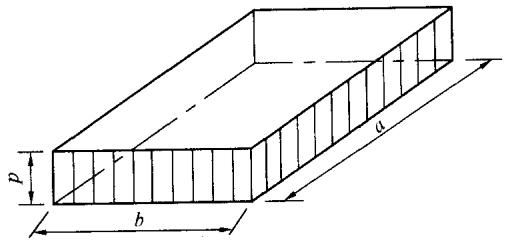

表 D. 0.1-1 矩形面积上均布荷载作用下角点附加应力系数 $\alpha$   

| \a/b z/b | 1.0 | 1.2 | 1.4 | 1.6 | 1.8 | 2.0 | 3.0 | 4.0 | 5.0 | 6.0 | 10.0 | 条形 |
| --- | --- | --- | --- | --- | --- | --- | --- | --- | --- | --- | --- | --- |
| 0.0 | 0.250 | 0.250 | 0.250 | 0.250 | 0.250 | 0.250 | 0.250 | 0.250 | 0.250 | 0.250 | 0.250 | 0.250 |
| 0.2 | 0.249 | 0.249 | 0.249 | 0.249 | 0.249 | 0.249 | 0.249 | 0.249 | 0.249 | 0.249 | 0.249 | 0.249 |
| 0.4 | 0.240 | 0.242 | 0.243 | 0.243 | 0.244 | 0.244 | 0.244 | 0.244 | 0.244 | 0.244 | 0.244 | 0.244 |
| 0.6 | 0.223 | 0.228 | 0.230 | 0.232 | 0.232 | 0.233 | 0.234 | 0.234 | 0.234 | 0.234 | 0.234 | 0.234 |
| 0.8 | 0.200 | 0.207 | 0.212 | 0.215 | 0.216 | 0.218 | 0.220 | 0.220 | 0.220 | 0.220 | 0.220 | 0.220 |
| 1.0 | 0.175 | 0.185 | 0.191 | 0.195 | 0.198 | 0.200 | 0.203 | 0.204 | 0.204 | 0.204 | 0.205 | 0.205 |
| 1.2 | 0.152 | 0.163 | 0.171 | 0.176 | 0.179 | 0.182 | 0.187 | 0.188 | 0.189 | 0.189 | 0.189 | 0.189 |
| 1.4 | 0.131 | 0.142 | 0.151 | 0.157 | 0.161 | 0.164 | 0.171 | 0.173 | 0.174 | 0.174 | 0.174 | 0.174 |
| 1.6 | 0.112 | 0.124 | 0.133 | 0.140 | 0.145 | 0.148 | 0.157 | 0.159 | 0.160 | 0.160 | 0.160 | 0.160 |
| 1.8 | 0.097 | 0.108 | 0.117 | 0.124 | 0.129 | 0.133 | 0.143 | 0.146 | 0.147 | 0.148 | 0.148 | 0.148 |
| 2.0 | 0.084 | 0.095 | 0.103 | 0.110 | 0.116 | 0.120 | 0.131 | 0.135 | 0.136 | 0.137 | 0.137 | 0.137 |
| 2.2 | 0.073 | 0.083 | 0.092 | 0.098 | 0.104 | 0.108 | 0.121 | 0.125 | 0.126 | 0.127 | 0.128 | 0.128 |
| 2.4 | 0.064 | 0.073 | 0.081 | 0.088 | 0.093 | 0.098 | 0.111 | 0.116 | 0.118 | 0.118 | 0.119 | 0.119 |
| 2.6 | 0.057 | 0.065 | 0.072 | 0.079 | 0.084 | 0.089 | 0.102 | 0.107 | 0.110 | 0.111 | 0.112 | 0.112 |

续表 D. 0.1-1  

| $\frac{a/b}{z/b}$ | 1.0 | 1.2 | 1.4 | 1.6 | 1.8 | 2.0 | 3.0 | 4.0 | 5.0 | 6.0 | 10.0 | 条形 |
| --- | --- | --- | --- | --- | --- | --- | --- | --- | --- | --- | --- | --- |
| 2.8 | 0.050 | 0.058 | 0.065 | 0.071 | 0.076 | 0.080 | 0.094 | 0.100 | 0.102 | 0.104 | 0.105 | 0.105 |
| 3.0 | 0.045 | 0.052 | 0.058 | 0.064 | 0.069 | 0.073 | 0.087 | 0.093 | 0.096 | 0.097 | 0.099 | 0.099 |
| 3.2 | 0.040 | 0.047 | 0.053 | 0.058 | 0.063 | 0.067 | 0.081 | 0.087 | 0.090 | 0.092 | 0.093 | 0.094 |
| 3.4 | 0.036 | 0.042 | 0.048 | 0.053 | 0.057 | 0.061 | 0.075 | 0.081 | 0.085 | 0.086 | 0.088 | 0.089 |
| 3.6 | 0.033 | 0.038 | 0.043 | 0.048 | 0.052 | 0.056 | 0.069 | 0.076 | 0.080 | 0.082 | 0.084 | 0.084 |
| 3.8 | 0.030 | 0.035 | 0.040 | 0.044 | 0.048 | 0.052 | 0.065 | 0.072 | 0.075 | 0.077 | 0.080 | 0.080 |
| 4.0 | 0.027 | 0.032 | 0.036 | 0.040 | 0.044 | 0.048 | 0.060 | 0.067 | 0.071 | 0.073 | 0.076 | 0.076 |
| 4.2 | 0.025 | 0.029 | 0.033 | 0.037 | 0.041 | 0.044 | 0.056 | 0.063 | 0.067 | 0.070 | 0.072 | 0.073 |
| 4.4 | 0.023 | 0.027 | 0.031 | 0.034 | 0.038 | 0.041 | 0.053 | 0.060 | 0.064 | 0.066 | 0.069 | 0.070 |
| 4.6 | 0.021 | 0.025 | 0.028 | 0.032 | 0.035 | 0.038 | 0.049 | 0.056 | 0.061 | 0.063 | 0.066 | 0.067 |
| 4.8 | 0.019 | 0.023 | 0.026 | 0.029 | 0.032 | 0.035 | 0.046 | 0.053 | 0.058 | 0.060 | 0.064 | 0.064 |
| 5.0 | 0.018 | 0.021 | 0.024 | 0.027 | 0.030 | 0.033 | 0.043 | 0.050 | 0.055 | 0.057 | 0.061 | 0.062 |
| 6.0 | 0.013 | 0.015 | 0.017 | 0.020 | 0.022 | 0.024 | 0.033 | 0.039 | 0.043 | 0.046 | 0.051 | 0.052 |
| 7.0 | 0.009 | 0.011 | 0.013 | 0.015 | 0.016 | 0.018 | 0.025 | 0.031 | 0.035 | 0.038 | 0.043 | 0.045 |
| 8.0 | 0.007 | 0.009 | 0.010 | 0.011 | 0.013 | 0.014 | 0.020 | 0.025 | 0.028 | 0.031 | 0.037 | 0.039 |
| 9.0 | 0.006 | 0.007 | 0.008 | 0.009 | 0.010 | 0.011 | 0.016 | 0.020 | 0.024 | 0.026 | 0.032 | 0.035 |
| 10.0 | 0.005 | 0.006 | 0.007 | 0.007 | 0.008 | 0.009 | 0.013 | 0.017 | 0.020 | 0.022 | 0.028 | 0.032 |
| 12.0 | 0.003 | 0.004 | 0.005 | 0.005 | 0.006 | 0.006 | 0.009 | 0.012 | 0.014 | 0.017 | 0.022 | 0.026 |
| 14.0 | 0.002 | 0.003 | 0.003 | 0.004 | 0.004 | 0.005 | 0.007 | 0.009 | 0.011 | 0.013 | 0.018 | 0.023 |
| 16.0 | 0.002 | 0.002 | 0.003 | 0.003 | 0.003 | 0.004 | 0.005 | 0.007 | 0.009 | 0.010 | 0.014 | 0.020 |
| 18.0 | 0.001 | 0.002 | 0.002 | 0.002 | 0.003 | 0.003 | 0.004 | 0.006 | 0.007 | 0.008 | 0.012 | 0.018 |
| 20.0 | 0.001 | 0.001 | 0.002 | 0.002 | 0.002 | 0.002 | 0.004 | 0.005 | 0.006 | 0.007 | 0.010 | 0.016 |
| 25.0 | 0.001 | 0.001 | 0.001 | 0.001 | 0.001 | 0.002 | 0.002 | 0.003 | 0.004 | 0.004 | 0.007 | 0.013 |
| 30.0 | 0.001 | 0.001 | 0.001 | 0.001 | 0.001 | 0.001 | 0.002 | 0.002 | 0.003 | 0.003 | 0.005 | 0.011 |
| 35.0 | 0.000 | 0.000 | 0.001 | 0.001 | 0.001 | 0.001 | 0.001 | 0.002 | 0.002 | 0.002 | 0.004 | 0.009 |
| 40.0 | 0.000 | 0.000 | 0.000 | 0.000 | 0.001 | 0.001 | 0.001 | 0.001 | 0.001 | 0.002 | 0.003 | 0.008 |

注： $a$ ——矩形均布荷载长度（m）； $b$ ——矩形均布荷载宽度（m）； $z$ ——计算点离桩端平面垂直距离（m）。

表 D. 0.1-2 矩形面积上均布荷载作用下角点平均附加应力系数 $\bar{\alpha }$   

| a/bz/b | 1.0 | 1.2 | 1.4 | 1.6 | 1.8 | 2.0 | 2.4 | 2.8 | 3.2 | 3.6 | 4.0 | 5.0 | 10.0 |
| --- | --- | --- | --- | --- | --- | --- | --- | --- | --- | --- | --- | --- | --- |
| 0.0 | 0.2500 | 0.2500 | 0.2500 | 0.2500 | 0.2500 | 0.2500 | 0.2500 | 0.2500 | 0.2500 | 0.2500 | 0.2500 | 0.2500 | 0.2500 |
| 0.2 | 0.2496 | 0.2497 | 0.2497 | 0.2498 | 0.2498 | 0.2498 | 0.2498 | 0.2498 | 0.2498 | 0.2498 | 0.2498 | 0.2498 | 0.2498 |
| 0.4 | 0.2474 | 0.2479 | 0.2481 | 0.2483 | 0.2483 | 0.2484 | 0.2485 | 0.2485 | 0.2485 | 0.2485 | 0.2485 | 0.2485 | 0.2485 |
| 0.6 | 0.2423 | 0.2437 | 0.2444 | 0.2448 | 0.2451 | 0.2452 | 0.2454 | 0.2455 | 0.2455 | 0.2455 | 0.2455 | 0.2455 | 0.2456 |
| 0.8 | 0.2346 | 0.2372 | 0.2387 | 0.2395 | 0.2400 | 0.2403 | 0.2407 | 0.2408 | 0.2409 | 0.2409 | 0.2410 | 0.2410 | 0.2410 |
| 1.0 | 0.2252 | 0.2291 | 0.2313 | 0.2326 | 0.2335 | 0.2340 | 0.2346 | 0.2349 | 0.2351 | 0.2352 | 0.2352 | 0.2353 | 0.2353 |
| 1.2 | 0.2149 | 0.2199 | 0.2229 | 0.2248 | 0.2260 | 0.2268 | 0.2278 | 0.2282 | 0.2285 | 0.2286 | 0.2287 | 0.2288 | 0.2289 |
| 1.4 | 0.2043 | 0.2102 | 0.2140 | 0.2146 | 0.2180 | 0.2191 | 0.2204 | 0.2211 | 0.2215 | 0.2217 | 0.2218 | 0.2220 | 0.2221 |
| 1.6 | 0.1939 | 0.2006 | 0.2049 | 0.2079 | 0.2099 | 0.2113 | 0.2130 | 0.2138 | 0.2143 | 0.2146 | 0.2148 | 0.2150 | 0.2152 |
| 1.8 | 0.1840 | 0.1912 | 0.1960 | 0.1994 | 0.2018 | 0.2034 | 0.2055 | 0.2066 | 0.2073 | 0.2077 | 0.2079 | 0.2082 | 0.2084 |
| 2.0 | 0.1746 | 0.1822 | 0.1875 | 0.1912 | 0.1980 | 0.1958 | 0.1982 | 0.1996 | 0.2004 | 0.2009 | 0.2012 | 0.2015 | 0.2018 |
| 2.2 | 0.1659 | 0.1737 | 0.1793 | 0.1833 | 0.1862 | 0.1883 | 0.1911 | 0.1927 | 0.1937 | 0.1943 | 0.1947 | 0.1952 | 0.1955 |
| 2.4 | 0.1578 | 0.1657 | 0.1715 | 0.1757 | 0.1789 | 0.1812 | 0.1843 | 0.1862 | 0.1873 | 0.1880 | 0.1885 | 0.1890 | 0.1895 |
| 2.6 | 0.1503 | 0.1583 | 0.1642 | 0.1686 | 0.1719 | 0.1745 | 0.1779 | 0.1799 | 0.1812 | 0.1820 | 0.1825 | 0.1832 | 0.1838 |
| 2.8 | 0.1433 | 0.1514 | 0.1574 | 0.1619 | 0.1654 | 0.1680 | 0.1717 | 0.1739 | 0.1753 | 0.1763 | 0.1769 | 0.1777 | 0.1784 |
| 3.0 | 0.1369 | 0.1449 | 0.1510 | 0.1556 | 0.1592 | 0.1619 | 0.1658 | 0.1682 | 0.1698 | 0.1708 | 0.1715 | 0.1725 | 0.1733 |
| 3.2 | 0.1310 | 0.1390 | 0.1450 | 0.1497 | 0.1533 | 0.1562 | 0.1602 | 0.1628 | 0.1645 | 0.1657 | 0.1664 | 0.1675 | 0.1685 |
| 3.4 | 0.1256 | 0.1334 | 0.1394 | 0.1441 | 0.1478 | 0.1508 | 0.1550 | 0.1577 | 0.1595 | 0.1607 | 0.1616 | 0.1628 | 0.1639 |
| 3.6 | 0.1205 | 0.1282 | 0.1342 | 0.1389 | 0.1427 | 0.1456 | 0.1500 | 0.1528 | 0.1548 | 0.1561 | 0.1570 | 0.1583 | 0.1595 |
| 3.8 | 0.1158 | 0.1234 | 0.1293 | 0.1340 | 0.1378 | 0.1408 | 0.1452 | 0.1482 | 0.1502 | 0.1516 | 0.1526 | 0.1541 | 0.1554 |
| 4.0 | 0.1114 | 0.1189 | 0.1248 | 0.1294 | 0.1332 | 0.1362 | 0.1408 | 0.1438 | 0.1459 | 0.1474 | 0.1485 | 0.1500 | 0.1516 |
| 4.2 | 0.1073 | 0.1147 | 0.1205 | 0.1251 | 0.1289 | 0.1319 | 0.1365 | 0.1396 | 0.1418 | 0.1434 | 0.1445 | 0.1462 | 0.1479 |
| 4.4 | 0.1035 | 0.1107 | 0.1164 | 0.1210 | 0.1248 | 0.1279 | 0.1325 | 0.1357 | 0.1379 | 0.1396 | 0.1407 | 0.1425 | 0.1444 |
| 4.6 | 0.1000 | 0.1070 | 0.1127 | 0.1172 | 0.1209 | 0.1240 | 0.1287 | 0.1319 | 0.1342 | 0.1359 | 0.1371 | 0.1390 | 0.1410 |
| 4.8 | 0.0967 | 0.1036 | 0.1091 | 0.1136 | 0.1173 | 0.1204 | 0.1250 | 0.1283 | 0.1307 | 0.1324 | 0.1337 | 0.1357 | 0.1379 |
| 5.0 | 0.0935 | 0.1003 | 0.1057 | 0.1102 | 0.1139 | 0.1169 | 0.1216 | 0.1249 | 0.1273 | 0.1291 | 0.1304 | 0.1325 | 0.1348 |
| 5.2 | 0.0906 | 0.0972 | 0.1026 | 0.1070 | 0.1106 | 0.1136 | 0.1183 | 0.1217 | 0.1241 | 0.1259 | 0.1273 | 0.1295 | 0.1320 |
| 5.4 | 0.0878 | 0.0943 | 0.0996 | 0.1039 | 0.1075 | 0.1105 | 0.1152 | 0.1186 | 0.1210 | 0.1229 | 0.1243 | 0.1265 | 0.1292 |
| 5.6 | 0.0852 | 0.0916 | 0.0968 | 0.1010 | 0.1046 | 0.1076 | 0.1122 | 0.1156 | 0.1181 | 0.1200 | 0.1215 | 0.1238 | 0.1266 |
| 5.8 | 0.0828 | 0.0890 | 0.0941 | 0.0983 | 0.1018 | 0.1047 | 0.1094 | 0.1128 | 0.1153 | 0.1172 | 0.1187 | 0.1211 | 0.1240 |

续表 D. 0.1-2  

| $\frac{a/b}{z/b}$ | 1.0 | 1.2 | 1.4 | 1.6 | 1.8 | 2.0 | 2.4 | 2.8 | 3.2 | 3.6 | 4.0 | 5.0 | 10.0 |
| --- | --- | --- | --- | --- | --- | --- | --- | --- | --- | --- | --- | --- | --- |
| 6.0 | 0.0805 | 0.0866 | 0.0916 | 0.0957 | 0.0991 | 0.1021 | 0.1067 | 0.1101 | 0.1126 | 0.1146 | 0.1161 | 0.1185 | 0.1216 |
| 6.2 | 0.0783 | 0.0842 | 0.0891 | 0.0932 | 0.0966 | 0.0995 | 0.1041 | 0.1075 | 0.1101 | 0.1120 | 0.1136 | 0.1161 | 0.1193 |
| 6.4 | 0.0762 | 0.0820 | 0.0869 | 0.0909 | 0.0942 | 0.0971 | 0.1016 | 0.1050 | 0.1076 | 0.1096 | 0.1111 | 0.1137 | 0.1171 |
| 6.6 | 0.0742 | 0.0799 | 0.0847 | 0.0886 | 0.0919 | 0.0948 | 0.0993 | 0.1027 | 0.1053 | 0.1073 | 0.1088 | 0.1114 | 0.1149 |
| 6.8 | 0.0723 | 0.0779 | 0.0826 | 0.0865 | 0.0898 | 0.0926 | 0.0970 | 0.1004 | 0.1030 | 0.1050 | 0.1066 | 0.1092 | 0.1129 |
| 7.0 | 0.0705 | 0.0761 | 0.0806 | 0.0844 | 0.0877 | 0.0904 | 0.0949 | 0.0982 | 0.1008 | 0.1028 | 0.1044 | 0.1071 | 0.1109 |
| 7.2 | 0.0688 | 0.0742 | 0.0787 | 0.0825 | 0.0857 | 0.0884 | 0.0928 | 0.0962 | 0.0987 | 0.1008 | 0.1023 | 0.1051 | 0.1090 |
| 7.4 | 0.0672 | 0.0725 | 0.0769 | 0.0806 | 0.0838 | 0.0865 | 0.0908 | 0.0942 | 0.0967 | 0.0988 | 0.1004 | 0.1031 | 0.1071 |
| 7.6 | 0.0656 | 0.0709 | 0.0752 | 0.0789 | 0.0820 | 0.0846 | 0.0889 | 0.0922 | 0.0948 | 0.0968 | 0.0984 | 0.1012 | 0.1054 |
| 7.8 | 0.0642 | 0.0693 | 0.0736 | 0.0771 | 0.0802 | 0.0828 | 0.0871 | 0.0904 | 0.0929 | 0.0950 | 0.0966 | 0.0994 | 0.1036 |
| 8.0 | 0.0627 | 0.0678 | 0.0720 | 0.0755 | 0.0785 | 0.0811 | 0.0853 | 0.0886 | 0.0912 | 0.0932 | 0.0948 | 0.0976 | 0.1020 |
| 8.2 | 0.0614 | 0.0663 | 0.0705 | 0.0739 | 0.0769 | 0.0795 | 0.0837 | 0.0869 | 0.0894 | 0.0914 | 0.0931 | 0.0959 | 0.1004 |
| 8.4 | 0.0601 | 0.0649 | 0.0690 | 0.0724 | 0.0754 | 0.0779 | 0.0820 | 0.0852 | 0.0878 | 0.0893 | 0.0914 | 0.0943 | 0.0938 |
| 8.6 | 0.0588 | 0.0636 | 0.0676 | 0.0710 | 0.0739 | 0.0764 | 0.0805 | 0.0836 | 0.0862 | 0.0882 | 0.0898 | 0.0927 | 0.0973 |
| 8.8 | 0.0576 | 0.0623 | 0.0663 | 0.0696 | 0.0724 | 0.0749 | 0.0790 | 0.0821 | 0.0846 | 0.0866 | 0.0882 | 0.0912 | 0.0959 |
| 9.2 | 0.0554 | 0.0599 | 0.0637 | 0.0670 | 0.0697 | 0.0721 | 0.0761 | 0.0792 | 0.0817 | 0.0837 | 0.0853 | 0.0882 | 0.0931 |
| 9.6 | 0.0533 | 0.0577 | 0.0614 | 0.0645 | 0.0672 | 0.0696 | 0.0734 | 0.0765 | 0.0789 | 0.0809 | 0.0825 | 0.0855 | 0.0905 |
| 10.0 | 0.0514 | 0.0556 | 0.0592 | 0.0622 | 0.0649 | 0.0672 | 0.0710 | 0.0739 | 0.0763 | 0.0783 | 0.0799 | 0.0829 | 0.0880 |
| 10.4 | 0.0496 | 0.0537 | 0.0572 | 0.0601 | 0.0627 | 0.0649 | 0.0686 | 0.0716 | 0.0739 | 0.0759 | 0.0775 | 0.0804 | 0.0857 |
| 10.8 | 0.0479 | 0.0519 | 0.0553 | 0.0581 | 0.0606 | 0.0628 | 0.0664 | 0.0693 | 0.0717 | 0.0736 | 0.0751 | 0.0781 | 0.0834 |
| 11.2 | 0.0463 | 0.0502 | 0.0535 | 0.0563 | 0.0587 | 0.0609 | 0.0664 | 0.0672 | 0.0695 | 0.0714 | 0.0730 | 0.0759 | 0.0813 |
| 11.6 | 0.0448 | 0.0486 | 0.0518 | 0.0545 | 0.0569 | 0.0590 | 0.0625 | 0.0652 | 0.0675 | 0.0694 | 0.0709 | 0.0738 | 0.0793 |
| 12.0 | 0.0435 | 0.0471 | 0.0502 | 0.0529 | 0.0552 | 0.0573 | 0.0606 | 0.0634 | 0.0656 | 0.0674 | 0.0690 | 0.0719 | 0.0774 |
| 12.8 | 0.0409 | 0.0444 | 0.0474 | 0.0499 | 0.0521 | 0.0541 | 0.0573 | 0.0599 | 0.0621 | 0.0639 | 0.0654 | 0.0682 | 0.0739 |
| 13.6 | 0.0387 | 0.0420 | 0.0448 | 0.0472 | 0.0493 | 0.0512 | 0.0543 | 0.0568 | 0.0589 | 0.0607 | 0.0621 | 0.0649 | 0.0707 |
| 14.4 | 0.0367 | 0.0398 | 0.0425 | 0.0488 | 0.0468 | 0.0486 | 0.0516 | 0.0540 | 0.0561 | 0.0577 | 0.0592 | 0.0619 | 0.0677 |
| 15.2 | 0.0349 | 0.0379 | 0.0404 | 0.0426 | 0.0446 | 0.0463 | 0.0492 | 0.0515 | 0.0535 | 0.0551 | 0.0565 | 0.0592 | 0.0650 |
| 16.0 | 0.0332 | 0.0361 | 0.0385 | 0.0407 | 0.0425 | 0.0442 | 0.0469 | 0.0492 | 0.0511 | 0.0527 | 0.0540 | 0.0567 | 0.0625 |
| 18.0 | 0.0297 | 0.0323 | 0.0345 | 0.0364 | 0.0381 | 0.0396 | 0.0422 | 0.0442 | 0.0460 | 0.0475 | 0.0487 | 0.0512 | 0.0570 |
| 20.0 | 0.0269 | 0.0292 | 0.0312 | 0.0330 | 0.0345 | 0.0359 | 0.0383 | 0.0402 | 0.0418 | 0.0432 | 0.0444 | 0.0468 | 0.0524 |

D.0.2 矩形面积上三角形分布荷载作用下角点的附加应力系数 $\alpha$ 、平均附加应力系数 $\bar{\alpha}$ 应按表 D.0.2

确定。

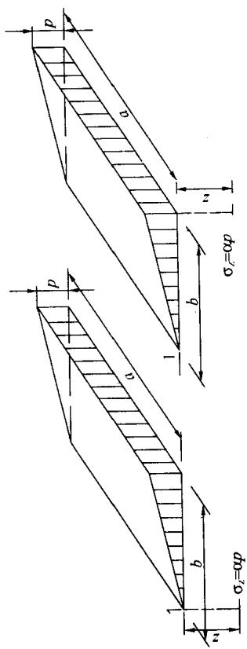  
表 D. 0.2 矩形面积上三角形分布荷载作用下的附加

应力系数 $\alpha$ 与平均附加应力系数 $\bar{\alpha}$   

| a/b 点 系数 z/b | 0.2 | 0.2 | 0.2 | 0.2 | 0.4 | 0.4 | 0.4 | 0.4 | 0.6 | 0.6 | 0.6 | 0.6 | a/b |
| --- | --- | --- | --- | --- | --- | --- | --- | --- | --- | --- | --- | --- | --- |
| a/b 点 系数 z/b | 1 | 1 | 2 | 2 | 1 | 1 | 2 | 2 | 1 | 1 | 2 | 2 | 点 系数 z/b |
| a/b 点 系数 z/b | α | -α | α | -α | α | -α | α | -α | α | -α | α | -α | 点 系数 z/b |
| 0.0 | 0.0000 | 0.0000 | 0.2500 | 0.2500 | 0.0000 | 0.0000 | 0.2500 | 0.2500 | 0.0000 | 0.0000 | 0.2500 | 0.2500 | 0.0 |
| 0.2 | 0.0223 | 0.0112 | 0.1821 | 0.2161 | 0.0280 | 0.0140 | 0.2115 | 0.2308 | 0.0296 | 0.0148 | 0.2165 | 0.2333 | 0.2 |
| 0.4 | 0.0269 | 0.0179 | 0.1094 | 0.1810 | 0.0420 | 0.0245 | 0.1604 | 0.2084 | 0.0487 | 0.0270 | 0.1781 | 0.2153 | 0.4 |

续表 D. 0.2  

| a/b z/b | 0.2 | 0.2 | 0.2 | 0.2 | 0.4 | 0.4 | 0.4 | 0.4 | 0.6 | 0.6 | 0.6 | 0.6 | a/b 点 系数 z/b |
| --- | --- | --- | --- | --- | --- | --- | --- | --- | --- | --- | --- | --- | --- |
| a/b z/b | 1 | 1 | 2 | 2 | 1 | 1 | 2 | 2 | 1 | 1 | 2 | 2 | a/b 点 系数 z/b |
| a/b z/b | α | -α | α | -α | α | -α | α | -α | α | -α | α | -α | a/b 点 系数 z/b |
| 0.6 | 0.0259 | 0.0207 | 0.0700 | 0.1505 | 0.0448 | 0.0308 | 0.1165 | 0.1851 | 0.0560 | 0.0355 | 0.1405 | 0.1966 | 0.6 |
| 0.8 | 0.0232 | 0.0217 | 0.0480 | 0.1277 | 0.0421 | 0.0340 | 0.0853 | 0.1640 | 0.0553 | 0.0405 | 0.1093 | 0.1787 | 0.8 |
| 1.0 | 0.0201 | 0.0217 | 0.0346 | 0.1104 | 0.0375 | 0.0351 | 0.0638 | 0.1461 | 0.0508 | 0.0430 | 0.0852 | 0.1624 | 1.0 |
| 1.2 | 0.0171 | 0.0212 | 0.0260 | 0.0970 | 0.0324 | 0.0351 | 0.0491 | 0.1312 | 0.0450 | 0.0439 | 0.0673 | 0.1480 | 1.2 |
| 1.4 | 0.0145 | 0.0204 | 0.0202 | 0.0865 | 0.0278 | 0.0344 | 0.0386 | 0.1187 | 0.0392 | 0.0436 | 0.0540 | 0.1356 | 1.4 |
| 1.6 | 0.0123 | 0.0195 | 0.0160 | 0.0779 | 0.0238 | 0.0333 | 0.0310 | 0.1082 | 0.0339 | 0.0427 | 0.0440 | 0.1247 | 1.6 |
| 1.8 | 0.0105 | 0.0186 | 0.0130 | 0.0709 | 0.0204 | 0.0321 | 0.0254 | 0.0993 | 0.0294 | 0.0415 | 0.0363 | 0.1153 | 1.8 |
| 2.0 | 0.0090 | 0.0178 | 0.0108 | 0.0650 | 0.0176 | 0.0308 | 0.0211 | 0.0917 | 0.0255 | 0.0401 | 0.0304 | 0.1071 | 2.0 |
| 2.5 | 0.0063 | 0.0157 | 0.0072 | 0.0538 | 0.0125 | 0.0276 | 0.0140 | 0.0769 | 0.0183 | 0.0365 | 0.0205 | 0.0908 | 2.5 |
| 3.0 | 0.0046 | 0.0140 | 0.0051 | 0.0458 | 0.0092 | 0.0248 | 0.0100 | 0.0661 | 0.0135 | 0.0330 | 0.0148 | 0.0786 | 3.0 |
| 5.0 | 0.0018 | 0.0097 | 0.0019 | 0.0289 | 0.0036 | 0.0175 | 0.0038 | 0.0424 | 0.0054 | 0.0236 | 0.0056 | 0.0476 | 5.0 |
| 7.0 | 0.0009 | 0.0073 | 0.0010 | 0.0211 | 0.0019 | 0.0133 | 0.0019 | 0.0311 | 0.0028 | 0.0180 | 0.0029 | 0.0352 | 7.0 |
| 10.0 | 0.0005 | 0.0053 | 0.0004 | 0.0150 | 0.0009 | 0.0097 | 0.0010 | 0.0222 | 0.0014 | 0.0133 | 0.0014 | 0.0253 | 10.0 |

续表 D. 0.2  

| a/bz/b | 0.8 | 0.8 | 0.8 | 0.8 | 1.0 | 1.0 | 1.0 | 1.0 | 1.2 | 1.2 | 1.2 | 1.2 | a/b点系数z/b |
| --- | --- | --- | --- | --- | --- | --- | --- | --- | --- | --- | --- | --- | --- |
| a/bz/b | 1 | 1 | 2 | 2 | 1 | 1 | 2 | 2 | 1 | 1 | 2 | 2 | a/b点系数z/b |
| a/bz/b | α | $\overline{\alpha}$ | α | $\overline{\alpha}$ | α | $\overline{\alpha}$ | α | $\overline{\alpha}$ | α | $\overline{\alpha}$ | α | $\overline{\alpha}$ | a/b点系数z/b |
| 0.0 | 0.0000 | 0.0000 | 0.2500 | 0.2500 | 0.0000 | 0.0000 | 0.2500 | 0.2500 | 0.0000 | 0.0000 | 0.2500 | 0.2500 | 0.0 |
| 0.2 | 0.0301 | 0.0151 | 0.2178 | 0.2339 | 0.0304 | 0.0152 | 0.2182 | 0.2341 | 0.0305 | 0.0153 | 0.2184 | 0.2342 | 0.2 |
| 0.4 | 0.0517 | 0.0280 | 0.1844 | 0.2175 | 0.0531 | 0.0285 | 0.1870 | 0.2184 | 0.0539 | 0.0288 | 0.1881 | 0.2187 | 0.4 |
| 0.6 | 0.6210 | 0.0376 | 0.1520 | 0.2011 | 0.0654 | 0.0388 | 0.1575 | 0.2030 | 0.0673 | 0.0394 | 0.1602 | 0.2039 | 0.6 |
| 0.8 | 0.0637 | 0.0440 | 0.1232 | 0.1852 | 0.0688 | 0.0459 | 0.1311 | 0.1883 | 0.0720 | 0.0470 | 0.1355 | 0.1899 | 0.8 |
| 1.0 | 0.0602 | 0.0476 | 0.0996 | 0.1704 | 0.0666 | 0.0502 | 0.1086 | 0.1746 | 0.0708 | 0.0518 | 0.1143 | 0.1769 | 1.0 |
| 1.2 | 0.0546 | 0.0492 | 0.0807 | 0.1571 | 0.0615 | 0.0525 | 0.0901 | 0.1621 | 0.0664 | 0.0546 | 0.0962 | 0.1649 | 1.2 |
| 1.4 | 0.0483 | 0.0495 | 0.0661 | 0.1451 | 0.0554 | 0.0534 | 0.0751 | 0.1507 | 0.0606 | 0.0559 | 0.0817 | 0.1541 | 1.4 |
| 1.6 | 0.0424 | 0.0490 | 0.0547 | 0.1345 | 0.0492 | 0.0533 | 0.0628 | 0.1405 | 0.0545 | 0.0561 | 0.0696 | 0.1443 | 1.6 |
| 1.8 | 0.0371 | 0.0480 | 0.0457 | 0.1252 | 0.0435 | 0.0525 | 0.0534 | 0.1313 | 0.0487 | 0.0556 | 0.0596 | 0.1354 | 1.8 |
| 2.0 | 0.0324 | 0.0467 | 0.0387 | 0.1169 | 0.0384 | 0.0513 | 0.0456 | 0.1232 | 0.0434 | 0.0547 | 0.0513 | 0.1274 | 2.0 |
| 2.5 | 0.0236 | 0.0429 | 0.0265 | 0.1000 | 0.0284 | 0.0478 | 0.0318 | 0.1063 | 0.0326 | 0.0513 | 0.0365 | 0.1107 | 2.5 |
| 3.0 | 0.0176 | 0.0392 | 0.0192 | 0.0871 | 0.0214 | 0.0439 | 0.0233 | 0.0931 | 0.0249 | 0.0476 | 0.0270 | 0.0976 | 3.0 |
| 5.0 | 0.0071 | 0.0285 | 0.0074 | 0.0576 | 0.0088 | 0.0324 | 0.0091 | 0.0624 | 0.0104 | 0.0356 | 0.0108 | 0.0661 | 5.0 |
| 7.0 | 0.0038 | 0.0219 | 0.0038 | 0.0427 | 0.0047 | 0.0251 | 0.0047 | 0.0465 | 0.0056 | 0.0277 | 0.0056 | 0.0496 | 7.0 |
| 10.0 | 0.0019 | 0.0162 | 0.0019 | 0.0308 | 0.0023 | 0.0186 | 0.0024 | 0.0336 | 0.0028 | 0.0207 | 0.0028 | 0.0359 | 10.0 |

续表 D. 0.2  

| a/b 点系数z/b | 1.4 | 1.4 | 1.4 | 1.4 | 1.6 | 1.6 | 1.6 | 1.6 | 1.8 | 1.8 | 1.8 | 1.8 | a/b 点系数z/b |
| --- | --- | --- | --- | --- | --- | --- | --- | --- | --- | --- | --- | --- | --- |
| a/b 点系数z/b | 1 | 1 | 2 | 2 | 1 | 1 | 2 | 2 | 1 | 1 | 2 | 2 | a/b 点系数z/b |
| a/b 点系数z/b | α | $\overline{\alpha}$ | α | $\overline{\alpha}$ | α | $\overline{\alpha}$ | α | $\overline{\alpha}$ | α | $\overline{\alpha}$ | α | $\overline{\alpha}$ | a/b 点系数z/b |
| 0.0 | 0.0000 | 0.0000 | 0.2500 | 0.2500 | 0.0000 | 0.0000 | 0.2500 | 0.2500 | 0.0000 | 0.0000 | 0.2500 | 0.2500 | 0.0 |
| 0.2 | 0.0305 | 0.0153 | 0.2185 | 0.2343 | 0.0306 | 0.0153 | 0.2185 | 0.2343 | 0.0306 | 0.0153 | 0.2185 | 0.2343 | 0.2 |
| 0.4 | 0.0543 | 0.0289 | 0.1886 | 0.2189 | 0.0545 | 0.0290 | 0.1889 | 0.2190 | 0.0546 | 0.0290 | 0.1891 | 0.2190 | 0.4 |
| 0.6 | 0.0684 | 0.0397 | 0.1616 | 0.2043 | 0.0690 | 0.0399 | 0.1625 | 0.2046 | 0.0649 | 0.0400 | 0.1630 | 0.2047 | 0.6 |
| 0.8 | 0.0739 | 0.0476 | 0.1381 | 0.1907 | 0.0751 | 0.0480 | 0.1396 | 0.1912 | 0.0759 | 0.0482 | 0.1405 | 0.1915 | 0.8 |
| 1.0 | 0.0735 | 0.0528 | 0.1176 | 0.1781 | 0.0753 | 0.0534 | 0.1202 | 0.1789 | 0.0766 | 0.0538 | 0.1215 | 0.1794 | 1.0 |
| 1.2 | 0.0698 | 0.0560 | 0.1007 | 0.1666 | 0.0721 | 0.0568 | 0.1037 | 0.1678 | 0.0738 | 0.0574 | 0.1055 | 0.1684 | 1.2 |
| 1.4 | 0.0644 | 0.0575 | 0.0864 | 0.1562 | 0.0672 | 0.0586 | 0.0897 | 0.1576 | 0.0692 | 0.0594 | 0.0921 | 0.1585 | 1.4 |
| 1.6 | 0.0586 | 0.0580 | 0.0743 | 0.1467 | 0.0616 | 0.0594 | 0.0780 | 0.1484 | 0.0639 | 0.0603 | 0.0806 | 0.1494 | 1.6 |
| 1.8 | 0.0528 | 0.0578 | 0.0644 | 0.1381 | 0.0560 | 0.0593 | 0.0681 | 0.1400 | 0.0585 | 0.0604 | 0.0709 | 0.1413 | 1.8 |
| 2.0 | 0.0474 | 0.0570 | 0.0560 | 0.1303 | 0.0507 | 0.0587 | 0.0596 | 0.1324 | 0.0533 | 0.0599 | 0.0625 | 0.1338 | 2.0 |
| 2.5 | 0.0362 | 0.0540 | 0.0405 | 0.1139 | 0.0393 | 0.0560 | 0.0440 | 0.1163 | 0.0419 | 0.0575 | 0.0469 | 0.1180 | 2.5 |
| 3.0 | 0.0280 | 0.0503 | 0.0303 | 0.1008 | 0.0307 | 0.0525 | 0.0333 | 0.1033 | 0.0331 | 0.0541 | 0.0359 | 0.1052 | 3.0 |
| 5.0 | 0.0120 | 0.0382 | 0.0123 | 0.0690 | 0.0135 | 0.0403 | 0.0139 | 0.0714 | 0.0148 | 0.0421 | 0.0154 | 0.0734 | 5.0 |
| 7.0 | 0.0064 | 0.0299 | 0.0066 | 0.0520 | 0.0073 | 0.0318 | 0.0074 | 0.0541 | 0.0081 | 0.0333 | 0.0083 | 0.0558 | 7.0 |
| 10.0 | 0.0033 | 0.0224 | 0.0032 | 0.0379 | 0.0037 | 0.0239 | 0.0037 | 0.0395 | 0.0041 | 0.0252 | 0.0042 | 0.0409 | 10.0 |

续表 D. 0.2  

| a/b点系数z/b | 2.0 | 2.0 | 2.0 | 2.0 | 3.0 | 3.0 | 3.0 | 3.0 | 4.0 | 4.0 | 4.0 | 4.0 | a/b点系数z/b |
| --- | --- | --- | --- | --- | --- | --- | --- | --- | --- | --- | --- | --- | --- |
| a/b点系数z/b | 1 | 1 | 2 | 2 | 1 | 1 | 2 | 2 | 1 | 1 | 2 | 2 | a/b点系数z/b |
| a/b点系数z/b | α | $\overline{\alpha}$ | α | $\overline{\alpha}$ | α | $\overline{\alpha}$ | α | $\overline{\alpha}$ | α | $\overline{\alpha}$ | α | $\overline{\alpha}$ | a/b点系数z/b |
| 0.0 | 0.0000 | 0.0000 | 0.2500 | 0.2500 | 0.0000 | 0.0000 | 0.2500 | 0.2500 | 0.0000 | 0.0000 | 0.2500 | 0.2500 | 0.0 |
| 0.2 | 0.0306 | 0.0153 | 0.2185 | 0.2343 | 0.0306 | 0.0153 | 0.2186 | 0.2343 | 0.0306 | 0.0153 | 0.2186 | 0.2343 | 0.2 |
| 0.4 | 0.0547 | 0.0290 | 0.1892 | 0.2191 | 0.0548 | 0.0290 | 0.1894 | 0.2192 | 0.0549 | 0.0291 | 0.1894 | 0.2192 | 0.4 |
| 0.6 | 0.0696 | 0.0401 | 0.1633 | 0.2048 | 0.0701 | 0.0402 | 0.1638 | 0.2050 | 0.0702 | 0.0402 | 0.1639 | 0.2050 | 0.6 |
| 0.8 | 0.0764 | 0.0483 | 0.1412 | 0.1917 | 0.0773 | 0.0486 | 0.1423 | 0.1920 | 0.0776 | 0.0487 | 0.1424 | 0.1920 | 0.8 |
| 1.0 | 0.0774 | 0.0540 | 0.1225 | 0.1797 | 0.0790 | 0.0545 | 0.1244 | 0.1803 | 0.0794 | 0.0546 | 0.1248 | 0.1803 | 1.0 |
| 1.2 | 0.0749 | 0.0577 | 0.1069 | 0.1689 | 0.0774 | 0.0584 | 0.1096 | 0.1697 | 0.0779 | 0.0586 | 0.1103 | 0.1699 | 1.2 |
| 1.4 | 0.0707 | 0.0599 | 0.0937 | 0.1591 | 0.0739 | 0.0609 | 0.0973 | 0.1603 | 0.0748 | 0.0612 | 0.0982 | 0.1605 | 1.4 |
| 1.6 | 0.0656 | 0.0609 | 0.0826 | 0.1502 | 0.0697 | 0.0623 | 0.0870 | 0.1517 | 0.0708 | 0.0626 | 0.0882 | 0.1521 | 1.6 |
| 1.8 | 0.0604 | 0.0611 | 0.0730 | 0.1422 | 0.0652 | 0.0628 | 0.0782 | 0.1441 | 0.0666 | 0.0633 | 0.0797 | 0.1445 | 1.8 |
| 2.0 | 0.0553 | 0.0608 | 0.0649 | 0.1348 | 0.0607 | 0.0629 | 0.0707 | 0.1371 | 0.0624 | 0.0634 | 0.0726 | 0.1377 | 2.0 |
| 2.5 | 0.0440 | 0.0586 | 0.0491 | 0.1193 | 0.0504 | 0.0614 | 0.0559 | 0.1223 | 0.0529 | 0.0623 | 0.0585 | 0.1233 | 2.5 |
| 3.0 | 0.0352 | 0.0554 | 0.0380 | 0.1067 | 0.0419 | 0.0589 | 0.0451 | 0.1104 | 0.0449 | 0.0600 | 0.0482 | 0.1116 | 3.0 |
| 5.0 | 0.0161 | 0.0435 | 0.0167 | 0.0749 | 0.0214 | 0.0480 | 0.0221 | 0.0797 | 0.0248 | 0.0500 | 0.0256 | 0.0817 | 5.0 |
| 7.0 | 0.0089 | 0.0347 | 0.0091 | 0.0572 | 0.0124 | 0.0391 | 0.0126 | 0.0619 | 0.0152 | 0.0414 | 0.0154 | 0.0642 | 7.0 |
| 10.0 | 0.0046 | 0.0263 | 0.0046 | 0.0403 | 0.0066 | 0.0302 | 0.0066 | 0.0462 | 0.0084 | 0.0325 | 0.0083 | 0.0485 | 10.0 |

续表 D. 0.2  

| a/b 点 系数 z/b | 6.0 | 6.0 | 6.0 | 6.0 | 8.0 | 8.0 | 8.0 | 8.0 | 10.0 | 10.0 | 10.0 | 10.0 | a/b 点 系数 z/b |
| --- | --- | --- | --- | --- | --- | --- | --- | --- | --- | --- | --- | --- | --- |
| a/b 点 系数 z/b | 1 | 1 | 2 | 2 | 1 | 1 | 2 | 2 | 1 | 1 | 2 | 2 | a/b 点 系数 z/b |
| a/b 点 系数 z/b | α | -α | α | -α | α | -α | α | -α | α | -α | α | -α | a/b 点 系数 z/b |
| 0.0 | 0.0000 | 0.0000 | 0.2500 | 0.2500 | 0.0000 | 0.0000 | 0.2500 | 0.2500 | 0.0000 | 0.0000 | 0.2500 | 0.2500 | 0.0 |
| 0.2 | 0.0306 | 0.0153 | 0.2186 | 0.2343 | 0.0306 | 0.0153 | 0.2186 | 0.2343 | 0.0306 | 0.0153 | 0.2186 | 0.2343 | 0.2 |
| 0.4 | 0.0549 | 0.0291 | 0.1894 | 0.2192 | 0.0549 | 0.0291 | 0.1894 | 0.2192 | 0.0549 | 0.0291 | 0.1894 | 0.2192 | 0.4 |
| 0.6 | 0.0702 | 0.0402 | 0.1640 | 0.2050 | 0.0702 | 0.0402 | 0.1640 | 0.2050 | 0.0702 | 0.0402 | 0.1640 | 0.2050 | 0.6 |
| 0.8 | 0.0776 | 0.0487 | 0.1426 | 0.1921 | 0.0776 | 0.0487 | 0.1426 | 0.1921 | 0.0776 | 0.0487 | 0.1426 | 0.1921 | 0.8 |
| 1.0 | 0.0795 | 0.0546 | 0.1250 | 0.1804 | 0.0796 | 0.0546 | 0.1250 | 0.1804 | 0.0796 | 0.0546 | 0.1250 | 0.1804 | 1.0 |
| 1.2 | 0.0782 | 0.0587 | 0.1105 | 0.1700 | 0.0783 | 0.0587 | 0.1105 | 0.1700 | 0.0783 | 0.0587 | 0.1105 | 0.1700 | 1.2 |
| 1.4 | 0.0752 | 0.0613 | 0.0986 | 0.1606 | 0.0752 | 0.0613 | 0.0987 | 0.1606 | 0.0753 | 0.0613 | 0.0987 | 0.1606 | 1.4 |
| 1.6 | 0.0714 | 0.0628 | 0.0887 | 0.1523 | 0.0715 | 0.0628 | 0.0888 | 0.1523 | 0.0715 | 0.0628 | 0.0889 | 0.1523 | 1.6 |
| 1.8 | 0.0673 | 0.0635 | 0.0805 | 0.1447 | 0.0675 | 0.0635 | 0.0806 | 0.1448 | 0.0675 | 0.0635 | 0.0808 | 0.1448 | 1.8 |
| 2.0 | 0.0634 | 0.0637 | 0.0734 | 0.1380 | 0.0636 | 0.0638 | 0.0736 | 0.1380 | 0.0636 | 0.0638 | 0.0738 | 0.1380 | 2.0 |
| 2.5 | 0.0543 | 0.0627 | 0.0601 | 0.1237 | 0.0547 | 0.0628 | 0.0604 | 0.1238 | 0.0548 | 0.0628 | 0.0605 | 0.1239 | 2.5 |
| 3.0 | 0.0469 | 0.0607 | 0.0504 | 0.1123 | 0.0474 | 0.0609 | 0.0509 | 0.1124 | 0.0476 | 0.0609 | 0.0511 | 0.1125 | 3.0 |
| 5.0 | 0.0283 | 0.0515 | 0.0290 | 0.0833 | 0.0296 | 0.0519 | 0.0303 | 0.0837 | 0.0301 | 0.0521 | 0.0309 | 0.0839 | 5.0 |
| 7.0 | 0.0186 | 0.0435 | 0.0190 | 0.0663 | 0.0204 | 0.0442 | 0.0207 | 0.0671 | 0.0212 | 0.0445 | 0.0216 | 0.0674 | 7.0 |
| 10.0 | 0.0111 | 0.0349 | 0.0111 | 0.0509 | 0.0128 | 0.0359 | 0.0130 | 0.0520 | 0.0139 | 0.0364 | 0.0141 | 0.0526 | 10.0 |

D.0.3 圆形面积上均布荷载作用下中点的附加应力系数 $\alpha$ 、平均附加应力系数 $\bar{\alpha}$ 应按表 D.0.3 确定。

表D.0.3 $(d)$ 圆形面积上均布荷载作用下中点的附加应力系数 $\alpha$ 与平均附加应力系数 $\overline{\alpha}$   

| z/r | 圆形 | 圆形 | z/r | 圆形 | 圆形 |
| --- | --- | --- | --- | --- | --- |
| z/r | α | α | z/r | α | α |
| 0.0 | 1.000 | 1.000 | 2.6 | 0.187 | 0.560 |
| 0.1 | 0.999 | 1.000 | 2.7 | 0.175 | 0.546 |
| 0.2 | 0.992 | 0.998 | 2.8 | 0.165 | 0.532 |
| 0.3 | 0.976 | 0.993 | 2.9 | 0.155 | 0.519 |
| 0.4 | 0.949 | 0.986 | 3.0 | 0.146 | 0.507 |
| 0.5 | 0.911 | 0.974 | 3.1 | 0.138 | 0.495 |
| 0.6 | 0.864 | 0.960 | 3.2 | 0.130 | 0.484 |
| 0.7 | 0.811 | 0.942 | 3.3 | 0.124 | 0.473 |
| 0.8 | 0.756 | 0.923 | 3.4 | 0.117 | 0.463 |
| 0.9 | 0.701 | 0.901 | 3.5 | 0.111 | 0.453 |
| 1.0 | 0.647 | 0.878 | 3.6 | 0.106 | 0.443 |
| 1.1 | 0.595 | 0.855 | 3.7 | 0.101 | 0.434 |
| 1.2 | 0.547 | 0.831 | 3.8 | 0.096 | 0.425 |
| 1.3 | 0.502 | 0.808 | 3.9 | 0.091 | 0.417 |
| 1.4 | 0.461 | 0.784 | 4.0 | 0.087 | 0.409 |
| 1.5 | 0.424 | 0.762 | 4.1 | 0.083 | 0.401 |
| 1.6 | 0.390 | 0.739 | 4.2 | 0.079 | 0.393 |
| 1.7 | 0.360 | 0.718 | 4.3 | 0.076 | 0.386 |
| 1.8 | 0.332 | 0.697 | 4.4 | 0.073 | 0.379 |
| 1.9 | 0.307 | 0.677 | 4.5 | 0.070 | 0.372 |
| 2.0 | 0.285 | 0.658 | 4.6 | 0.067 | 0.365 |
| 2.1 | 0.264 | 0.640 | 4.7 | 0.064 | 0.359 |
| 2.2 | 0.245 | 0.623 | 4.8 | 0.062 | 0.353 |
| 2.3 | 0.229 | 0.606 | 4.9 | 0.059 | 0.347 |
| 2.4 | 0.210 | 0.590 | 5.0 | 0.057 | 0.341 |
| 2.5 | 0.200 | 0.574 |  |  |  |

D.0.4 圆形面积上三角形分布荷载作用下边点的附加应力系数 $\alpha$ 、平均附加应力系数 $\bar{\alpha}$ 应按表 D.0.4 确定。

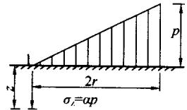

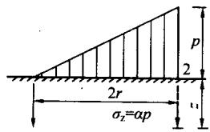  
$\pmb{r}$ 一圆形面积的半径

表D.0.4 圆形面积上三角形分布荷载作用下边点的附加应力系数 $\alpha$ 与平均附加应力系数 $\bar{\alpha}$   

| 系数\点z/r | 1 | 1 | 2 | 2 |
| --- | --- | --- | --- | --- |
| 系数\点z/r | α | α | α | α |
| 0.0 | 0.000 | 0.000 | 0.500 | 0.500 |
| 0.1 | 0.016 | 0.008 | 0.465 | 0.483 |
| 0.2 | 0.031 | 0.016 | 0.433 | 0.466 |
| 0.3 | 0.044 | 0.023 | 0.403 | 0.450 |
| 0.4 | 0.054 | 0.030 | 0.376 | 0.435 |
| 0.5 | 0.063 | 0.035 | 0.349 | 0.420 |
| 0.6 | 0.071 | 0.041 | 0.324 | 0.406 |
| 0.7 | 0.078 | 0.045 | 0.300 | 0.393 |
| 0.8 | 0.083 | 0.050 | 0.279 | 0.380 |
| 0.9 | 0.088 | 0.054 | 0.258 | 0.368 |
| 1.0 | 0.091 | 0.057 | 0.238 | 0.356 |
| 1.1 | 0.092 | 0.061 | 0.221 | 0.344 |
| 1.2 | 0.093 | 0.063 | 0.205 | 0.333 |
| 1.3 | 0.092 | 0.065 | 0.190 | 0.323 |
| 1.4 | 0.091 | 0.067 | 0.177 | 0.313 |
| 1.5 | 0.089 | 0.069 | 0.165 | 0.303 |
| 1.6 | 0.087 | 0.070 | 0.154 | 0.294 |
| 1.7 | 0.085 | 0.071 | 0.144 | 0.286 |
| 1.8 | 0.083 | 0.072 | 0.134 | 0.278 |
| 1.9 | 0.080 | 0.072 | 0.126 | 0.270 |
| 2.0 | 0.078 | 0.073 | 0.117 | 0.263 |
| 2.1 | 0.075 | 0.073 | 0.110 | 0.255 |
| 2.2 | 0.072 | 0.073 | 0.104 | 0.249 |
| 2.3 | 0.070 | 0.073 | 0.097 | 0.242 |

续表 D. 0.4  

| 系数z/r\点 | 1 | 1 | 2 | 2 |
| --- | --- | --- | --- | --- |
| 系数z/r\点 | α | a | α | a |
| 2.4 | 0.067 | 0.073 | 0.091 | 0.236 |
| 2.5 | 0.064 | 0.072 | 0.086 | 0.230 |
| 2.6 | 0.062 | 0.072 | 0.081 | 0.225 |
| 2.7 | 0.059 | 0.071 | 0.078 | 0.219 |
| 2.8 | 0.057 | 0.071 | 0.074 | 0.214 |
| 2.9 | 0.055 | 0.070 | 0.070 | 0.209 |
| 3.0 | 0.052 | 0.070 | 0.067 | 0.204 |
| 3.1 | 0.050 | 0.069 | 0.064 | 0.200 |
| 3.2 | 0.048 | 0.069 | 0.061 | 0.196 |
| 3.3 | 0.046 | 0.068 | 0.059 | 0.192 |
| 3.4 | 0.045 | 0.067 | 0.055 | 0.188 |
| 3.5 | 0.043 | 0.067 | 0.053 | 0.184 |
| 3.6 | 0.041 | 0.066 | 0.051 | 0.180 |
| 3.7 | 0.040 | 0.065 | 0.048 | 0.177 |
| 3.8 | 0.038 | 0.065 | 0.046 | 0.173 |
| 3.9 | 0.037 | 0.064 | 0.043 | 0.170 |
| 4.0 | 0.036 | 0.063 | 0.041 | 0.167 |
| 4.2 | 0.033 | 0.062 | 0.038 | 0.161 |
| 4.4 | 0.031 | 0.061 | 0.034 | 0.155 |
| 4.6 | 0.029 | 0.059 | 0.031 | 0.150 |
| 4.8 | 0.027 | 0.058 | 0.029 | 0.145 |
| 5.0 | 0.025 | 0.057 | 0.027 | 0.140 |

# 附录E 桩基等效沉降系数 $\psi_{\mathrm{e}}$ 计算参数

E.0.1 桩基等效沉降系数应按表 E.0.1-1～表 E.0.1-5 中列出的参数，采用本规范式（5.5.9-1）和式（5.5.9-2）计算。

表E.0.1-1 $(s_{\mathrm{a}} / d = 2)$   

| $L_c/B_c$l/d | $L_c/B_c$l/d | 1 | 2 | 3 | 4 | 5 | 6 | 7 | 8 | 9 | 10 |
| --- | --- | --- | --- | --- | --- | --- | --- | --- | --- | --- | --- |
| 5 | $C_0$ | 0.203 | 0.282 | 0.329 | 0.363 | 0.389 | 0.410 | 0.428 | 0.443 | 0.456 | 0.468 |
| 5 | $C_1$ | 1.543 | 1.687 | 1.797 | 1.845 | 1.915 | 1.949 | 1.981 | 2.047 | 2.073 | 2.098 |
| 5 | $C_2$ | 5.563 | 5.356 | 5.086 | 5.020 | 4.878 | 4.843 | 4.817 | 4.704 | 4.690 | 4.681 |
| 10 | $C_0$ | 0.125 | 0.188 | 0.228 | 0.258 | 0.282 | 0.301 | 0.318 | 0.333 | 0.346 | 0.357 |
| 10 | $C_1$ | 1.487 | 1.573 | 1.653 | 1.676 | 1.731 | 1.750 | 1.768 | 1.828 | 1.844 | 1.860 |
| 10 | $C_2$ | 7.000 | 6.260 | 5.737 | 5.535 | 5.292 | 5.191 | 5.114 | 4.949 | 4.903 | 4.865 |
| 15 | $C_0$ | 0.093 | 0.146 | 0.180 | 0.207 | 0.228 | 0.246 | 0.262 | 0.275 | 0.287 | 0.298 |
| 15 | $C_1$ | 1.508 | 1.568 | 1.637 | 1.647 | 1.696 | 1.707 | 1.718 | 1.776 | 1.787 | 1.798 |
| 15 | $C_2$ | 8.413 | 7.252 | 6.520 | 6.208 | 5.878 | 5.722 | 5.604 | 5.393 | 5.320 | 5.259 |
| 20 | $C_0$ | 0.075 | 0.120 | 0.151 | 0.175 | 0.194 | 0.211 | 0.225 | 0.238 | 0.249 | 0.260 |
| 20 | $C_1$ | 1.548 | 1.592 | 1.654 | 1.656 | 1.701 | 1.706 | 1.712 | 1.770 | 1.777 | 1.783 |
| 20 | $C_2$ | 9.783 | 8.236 | 7.310 | 6.897 | 6.486 | 6.280 | 6.123 | 5.870 | 5.771 | 5.689 |
| 25 | $C_0$ | 0.063 | 0.103 | 0.131 | 0.152 | 0.170 | 0.186 | 0.199 | 0.211 | 0.221 | 0.231 |
| 25 | $C_1$ | 1.596 | 1.628 | 1.686 | 1.679 | 1.722 | 1.722 | 1.724 | 1.783 | 1.786 | 1.789 |
| 25 | $C_2$ | 11.118 | 9.205 | 8.094 | 7.583 | 7.095 | 6.841 | 6.647 | 6.353 | 6.230 | 6.128 |
| 30 | $C_0$ | 0.055 | 0.090 | 0.116 | 0.135 | 0.152 | 0.166 | 0.179 | 0.190 | 0.200 | 0.209 |
| 30 | $C_1$ | 1.646 | 1.669 | 1.724 | 1.711 | 1.753 | 1.748 | 1.745 | 1.806 | 1.806 | 1.806 |
| 30 | $C_2$ | 12.426 | 10.159 | 8.868 | 8.264 | 7.700 | 7.400 | 7.170 | 6.836 | 6.689 | 6.568 |
| 40 | $C_0$ | 0.044 | 0.073 | 0.095 | 0.112 | 0.126 | 0.139 | 0.150 | 0.160 | 0.169 | 0.177 |
| 40 | $C_1$ | 1.754 | 1.761 | 1.812 | 1.787 | 1.827 | 1.814 | 1.803 | 1.867 | 1.861 | 1.855 |
| 40 | $C_2$ | 14.984 | 12.036 | 10.396 | 9.610 | 8.900 | 8.509 | 8.211 | 7.797 | 7.605 | 7.446 |

续表 E. 0.1-1  

| $L_c/B_c$l/d | $L_c/B_c$l/d | 1 | 2 | 3 | 4 | 5 | 6 | 7 | 8 | 9 | 10 |
| --- | --- | --- | --- | --- | --- | --- | --- | --- | --- | --- | --- |
| 50 | $C_0$ | 0.036 | 0.062 | 0.081 | 0.096 | 0.108 | 0.120 | 0.129 | 0.138 | 0.147 | 0.154 |
| 50 | $C_1$ | 1.865 | 1.860 | 1.909 | 1.873 | 1.911 | 1.889 | 1.872 | 1.939 | 1.927 | 1.916 |
| 50 | $C_2$ | 17.492 | 13.885 | 11.905 | 10.945 | 10.090 | 9.613 | 9.247 | 8.755 | 8.519 | 8.323 |
| 60 | $C_0$ | 0.031 | 0.054 | 0.070 | 0.084 | 0.095 | 0.105 | 0.114 | 0.122 | 0.130 | 0.137 |
| 60 | $C_1$ | 1.979 | 1.962 | 2.010 | 1.962 | 1.999 | 1.970 | 1.945 | 2.016 | 1.998 | 1.981 |
| 60 | $C_2$ | 19.967 | 15.719 | 13.406 | 12.274 | 11.278 | 10.715 | 10.284 | 9.713 | 9.433 | 9.200 |
| 70 | $C_0$ | 0.028 | 0.048 | 0.063 | 0.075 | 0.085 | 0.094 | 0.102 | 0.110 | 0.117 | 0.123 |
| 70 | $C_1$ | 2.095 | 2.067 | 2.114 | 2.055 | 2.091 | 2.054 | 2.021 | 2.097 | 2.072 | 2.049 |
| 70 | $C_2$ | 22.423 | 17.546 | 14.901 | 13.602 | 12.465 | 11.818 | 11.322 | 10.672 | 10.349 | 10.080 |
| 80 | $C_0$ | 0.025 | 0.043 | 0.056 | 0.067 | 0.077 | 0.085 | 0.093 | 0.100 | 0.106 | 0.112 |
| 80 | $C_1$ | 2.213 | 2.174 | 2.220 | 2.150 | 2.185 | 2.139 | 2.099 | 2.178 | 2.147 | 2.119 |
| 80 | $C_2$ | 24.868 | 19.370 | 16.398 | 14.933 | 13.655 | 12.925 | 12.364 | 11.635 | 11.270 | 10.964 |
| 90 | $C_0$ | 0.022 | 0.039 | 0.051 | 0.061 | 0.070 | 0.078 | 0.085 | 0.091 | 0.097 | 0.103 |
| 90 | $C_1$ | 2.333 | 2.283 | 2.328 | 2.245 | 2.280 | 2.225 | 2.177 | 2.261 | 2.223 | 2.189 |
| 90 | $C_2$ | 27.307 | 21.195 | 17.897 | 16.267 | 14.849 | 14.036 | 13.411 | 12.603 | 12.194 | 11.853 |
| 100 | $C_0$ | 0.021 | 0.036 | 0.047 | 0.057 | 0.065 | 0.072 | 0.078 | 0.084 | 0.090 | 0.095 |
| 100 | $C_1$ | 2.453 | 2.392 | 2.436 | 2.341 | 2.375 | 2.311 | 2.256 | 2.344 | 2.299 | 2.259 |
| 100 | $C_2$ | 29.744 | 23.024 | 19.400 | 17.608 | 16.049 | 15.153 | 14.464 | 13.575 | 13.123 | 12.745 |

注： $L_{c}$ —群桩基础承台长度； $B_{c}$ —群桩基础承台宽度； $l$ —桩长； $d$ —桩径。

表E.0.1-2 $(s_{\mathrm{a}} / d = 3)$   

| $L_c/B_c$l/d | $L_c/B_c$l/d | 1 | 2 | 3 | 4 | 5 | 6 | 7 | 8 | 9 | 10 |
| --- | --- | --- | --- | --- | --- | --- | --- | --- | --- | --- | --- |
| 5 | $C_0$ | 0.203 | 0.318 | 0.377 | 0.416 | 0.445 | 0.468 | 0.486 | 0.502 | 0.516 | 0.528 |
| 5 | $C_1$ | 1.483 | 1.723 | 1.875 | 1.955 | 2.045 | 2.098 | 2.144 | 2.218 | 2.256 | 2.290 |
| 5 | $C_2$ | 3.679 | 4.036 | 4.006 | 4.053 | 3.995 | 4.007 | 4.014 | 3.938 | 3.944 | 3.948 |
| 10 | $C_0$ | 0.125 | 0.213 | 0.263 | 0.298 | 0.324 | 0.346 | 0.364 | 0.380 | 0.394 | 0.406 |
| 10 | $C_1$ | 1.419 | 1.559 | 1.662 | 1.705 | 1.770 | 1.801 | 1.828 | 1.891 | 1.913 | 1.935 |
| 10 | $C_2$ | 4.861 | 4.723 | 4.460 | 4.384 | 4.237 | 4.193 | 4.158 | 4.038 | 4.017 | 4.000 |

续表E.0.1-2   

| $L_c/B_c$l/d | $L_c/B_c$l/d | 1 | 2 | 3 | 4 | 5 | 6 | 7 | 8 | 9 | 10 |
| --- | --- | --- | --- | --- | --- | --- | --- | --- | --- | --- | --- |
| 15 | $C_0$ | 0.093 | 0.166 | 0.209 | 0.240 | 0.265 | 0.285 | 0.302 | 0.317 | 0.330 | 0.342 |
| 15 | $C_1$ | 1.430 | 1.533 | 1.619 | 1.646 | 1.703 | 1.723 | 1.741 | 1.801 | 1.817 | 1.832 |
| 15 | $C_2$ | 5.900 | 5.435 | 5.010 | 4.855 | 4.641 | 4.559 | 4.496 | 4.340 | 4.300 | 4.267 |
| 20 | $C_0$ | 0.075 | 0.138 | 0.176 | 0.205 | 0.227 | 0.246 | 0.262 | 0.276 | 0.288 | 0.299 |
| 20 | $C_1$ | 1.461 | 1.542 | 1.619 | 1.635 | 1.687 | 1.700 | 1.712 | 1.772 | 1.783 | 1.793 |
| 20 | $C_2$ | 6.879 | 6.137 | 5.570 | 5.346 | 5.073 | 4.958 | 4.869 | 4.679 | 4.623 | 4.577 |
| 25 | $C_0$ | 0.063 | 0.118 | 0.153 | 0.179 | 0.200 | 0.218 | 0.233 | 0.246 | 0.258 | 0.268 |
| 25 | $C_1$ | 1.500 | 1.565 | 1.637 | 1.644 | 1.693 | 1.699 | 1.706 | 1.767 | 1.774 | 1.780 |
| 25 | $C_2$ | 7.822 | 6.826 | 6.127 | 5.839 | 5.511 | 5.364 | 5.252 | 5.030 | 4.958 | 4.899 |
| 30 | $C_0$ | 0.055 | 0.104 | 0.136 | 0.160 | 0.180 | 0.196 | 0.210 | 0.223 | 0.234 | 0.244 |
| 30 | $C_1$ | 1.542 | 1.595 | 1.663 | 1.662 | 1.709 | 1.711 | 1.712 | 1.775 | 1.777 | 1.780 |
| 30 | $C_2$ | 8.741 | 7.506 | 6.680 | 6.331 | 5.949 | 5.772 | 5.638 | 5.383 | 5.297 | 5.226 |
| 40 | $C_0$ | 0.044 | 0.085 | 0.112 | 0.133 | 0.150 | 0.165 | 0.178 | 0.189 | 0.199 | 0.208 |
| 40 | $C_1$ | 1.632 | 1.667 | 1.729 | 1.715 | 1.759 | 1.750 | 1.743 | 1.808 | 1.804 | 1.799 |
| 40 | $C_2$ | 10.535 | 8.845 | 7.774 | 7.309 | 6.822 | 6.588 | 6.410 | 6.093 | 5.978 | 5.883 |
| 50 | $C_0$ | 0.036 | 0.072 | 0.096 | 0.114 | 0.130 | 0.143 | 0.155 | 0.165 | 0.174 | 0.182 |
| 50 | $C_1$ | 1.726 | 1.746 | 1.805 | 1.778 | 1.819 | 1.801 | 1.786 | 1.855 | 1.843 | 1.832 |
| 50 | $C_2$ | 12.292 | 10.168 | 8.860 | 8.284 | 7.694 | 7.405 | 7.185 | 6.805 | 6.662 | 6.543 |
| 60 | $C_0$ | 0.031 | 0.063 | 0.084 | 0.101 | 0.115 | 0.127 | 0.137 | 0.146 | 0.155 | 0.163 |
| 60 | $C_1$ | 1.822 | 1.828 | 1.885 | 1.845 | 1.885 | 1.858 | 1.834 | 1.907 | 1.888 | 1.870 |
| 60 | $C_2$ | 14.029 | 11.486 | 9.944 | 9.259 | 8.568 | 8.224 | 7.962 | 7.520 | 7.348 | 7.206 |
| 70 | $C_0$ | 0.028 | 0.056 | 0.075 | 0.090 | 0.103 | 0.114 | 0.123 | 0.132 | 0.140 | 0.147 |
| 70 | $C_1$ | 1.920 | 1.913 | 1.968 | 1.916 | 1.954 | 1.918 | 1.885 | 1.962 | 1.936 | 1.911 |
| 70 | $C_2$ | 15.756 | 12.801 | 11.029 | 10.237 | 9.444 | 9.047 | 8.742 | 8.238 | 8.038 | 7.871 |
| 80 | $C_0$ | 0.025 | 0.050 | 0.068 | 0.081 | 0.093 | 0.103 | 0.112 | 0.120 | 0.127 | 0.134 |
| 80 | $C_1$ | 2.019 | 2.000 | 2.053 | 1.988 | 2.025 | 1.979 | 1.938 | 2.019 | 1.985 | 1.954 |
| 80 | $C_2$ | 17.478 | 14.120 | 12.117 | 11.220 | 10.325 | 9.874 | 9.527 | 8.959 | 8.731 | 8.540 |
| 90 | $C_0$ | 0.022 | 0.045 | 0.062 | 0.074 | 0.085 | 0.095 | 0.103 | 0.110 | 0.117 | 0.123 |
| 90 | $C_1$ | 2.118 | 2.087 | 2.139 | 2.060 | 2.096 | 2.041 | 1.991 | 2.076 | 2.036 | 1.998 |
| 90 | $C_2$ | 19.200 | 15.442 | 13.210 | 12.208 | 11.211 | 10.705 | 10.316 | 9.684 | 9.427 | 9.211 |

续表E.0.1-2   

| ${I}_{\mathrm{c}}/{B}_{\mathrm{c}}$ l/d | ${I}_{\mathrm{c}}/{B}_{\mathrm{c}}$ l/d | 1 | 2 | 3 | 4 | 5 | 6 | 7 | 8 | 9 | 10 |
| --- | --- | --- | --- | --- | --- | --- | --- | --- | --- | --- | --- |
| 100 | ${\mathrm{C}}_{0}$ | 0.021 | 0.042 | 0.057 | 0.069 | 0.097 | 0.087 | 0.095 | 0.102 | 0.108 | 0.114 |
| 100 | ${\mathrm{C}}_{1}$ | 2.218 | 2.174 | 2.225 | 2.133 | 2. 168 | 2.103 | 2.044 | 2.133 | 2.086 | 2.042 |
| 100 | ${\mathrm{C}}_{2}$ | 20.925 | 16.770 | 14.307 | 13.201 | 12.101 | 11. 541 | 11. 110 | 10.413 | 10.127 | 9.886 |

注： $L_{c} =$ —群桩基础承台长度； $B_{c}$ —群桩基础承台宽度； $l$ —桩长； $d$ —桩径。

表E.0.1-3 $(s_{\mathrm{a}} / d = 4)$   

| $I_{x}/B_{c}$l/d | $I_{x}/B_{c}$l/d | 1 | 2 | 3 | 4 | 5 | 6 | 7 | 8 | 9 | 10 |
| --- | --- | --- | --- | --- | --- | --- | --- | --- | --- | --- | --- |
| 5 | $C_0$ | 0.203 | 0.354 | 0.422 | 0.464 | 0.495 | 0.519 | 0.538 | 0.555 | 0.568 | 0.580 |
| 5 | $C_1$ | 1.445 | 1.786 | 1.986 | 2.101 | 2.213 | 2.286 | 2.349 | 2.434 | 2.484 | 2.530 |
| 5 | $C_2$ | 2.633 | 3.243 | 3.340 | 3.444 | 3.431 | 3.466 | 3.488 | 3.433 | 3.447 | 3.457 |
| 10 | $C_0$ | 0.125 | 0.237 | 0.294 | 0.332 | 0.361 | 0.384 | 0.403 | 0.419 | 0.433 | 0.445 |
| 10 | $C_1$ | 1.378 | 1.570 | 1.695 | 1.756 | 1.830 | 1.870 | 1.906 | 1.972 | 2.000 | 2.027 |
| 10 | $C_2$ | 3.707 | 3.873 | 3.743 | 3.729 | 3.630 | 3.612 | 3.597 | 3.500 | 3.490 | 3.482 |
| 15 | $C_0$ | 0.093 | 0.185 | 0.234 | 0.269 | 0.296 | 0.317 | 0.335 | 0.351 | 0.364 | 0.376 |
| 15 | $C_1$ | 1.384 | 1.524 | 1.626 | 1.666 | 1.729 | 1.757 | 1.781 | 1.843 | 1.863 | 1.881 |
| 15 | $C_2$ | 4.571 | 4.458 | 4.188 | 4.107 | 3.951 | 3.904 | 3.866 | 3.736 | 3.712 | 3.693 |
| 20 | $C_0$ | 0.075 | 0.153 | 0.198 | 0.230 | 0.254 | 0.275 | 0.291 | 0.306 | 0.319 | 0.331 |
| 20 | $C_1$ | 1.408 | 1.521 | 1.611 | 1.638 | 1.695 | 1.713 | 1.730 | 1.791 | 1.805 | 1.818 |
| 20 | $C_2$ | 5.361 | 5.021 | 4.636 | 4.502 | 4.297 | 4.225 | 4.169 | 4.009 | 3.973 | 3.941 |
| 25 | $C_0$ | 0.063 | 0.132 | 0.173 | 0.202 | 0.225 | 0.244 | 0.260 | 0.274 | 0.286 | 0.297 |
| 25 | $C_1$ | 1.411 | 1.534 | 1.616 | 1.633 | 1.686 | 1.698 | 1.708 | 1.770 | 1.779 | 1.786 |
| 25 | $C_2$ | 6.114 | 5.578 | 5.081 | 4.900 | 4.650 | 4.555 | 4.482 | 4.293 | 4.246 | 4.208 |
| 30 | $C_0$ | 0.055 | 0.117 | 0.154 | 0.181 | 0.203 | 0.221 | 0.236 | 0.249 | 0.261 | 0.271 |
| 30 | $C_1$ | 1.477 | 1.555 | 1.633 | 1.640 | 1.691 | 1.696 | 1.701 | 1.764 | 1.768 | 1.771 |
| 30 | $C_2$ | 6.843 | 6.122 | 5.524 | 5.298 | 5.004 | 4.887 | 4.799 | 4.581 | 4.524 | 4.477 |

续表E0.1-3   

| $L_c/B_c$l/d | $L_c/B_c$l/d | 1 | 2 | 3 | 4 | 5 | 6 | 7 | 8 | 9 | 10 |
| --- | --- | --- | --- | --- | --- | --- | --- | --- | --- | --- | --- |
| 40 | $C_0$ | 0.044 | 0.095 | 0.127 | 0.151 | 0.170 | 0.186 | 0.200 | 0.212 | 0.223 | 0.233 |
| 40 | $C_1$ | 1.555 | 1.611 | 1.681 | 1.673 | 1.720 | 1.714 | 1.708 | 1.774 | 1.770 | 1.765 |
| 40 | $C_2$ | 8.261 | 7.195 | 6.402 | 6.093 | 5.713 | 5.556 | 5.436 | 5.163 | 5.085 | 5.021 |
| 50 | $C_0$ | 0.036 | 0.081 | 0.109 | 0.130 | 0.148 | 0.162 | 0.175 | 0.186 | 0.196 | 0.205 |
| 50 | $C_1$ | 1.636 | 1.674 | 1.740 | 1.718 | 1.762 | 1.745 | 1.730 | 1.800 | 1.787 | 1.775 |
| 50 | $C_2$ | 9.648 | 8.258 | 7.277 | 6.887 | 6.424 | 6.227 | 6.077 | 5.749 | 5.650 | 5.569 |
| 60 | $C_0$ | 0.031 | 0.071 | 0.096 | 0.115 | 0.131 | 0.144 | 0.156 | 0.166 | 0.175 | 0.183 |
| 60 | $C_1$ | 1.719 | 1.742 | 1.805 | 1.768 | 1.810 | 1.783 | 1.758 | 1.832 | 1.811 | 1.791 |
| 60 | $C_2$ | 11.021 | 9.319 | 8.152 | 7.684 | 7.138 | 6.902 | 6.721 | 6.338 | 6.219 | 6.120 |
| 70 | $C_0$ | 0.028 | 0.063 | 0.086 | 0.103 | 0.117 | 0.130 | 0.140 | 0.150 | 0.158 | 0.166 |
| 70 | $C_1$ | 1.803 | 1.811 | 1.872 | 1.821 | 1.861 | 1.824 | 1.789 | 1.867 | 1.839 | 1.812 |
| 70 | $C_2$ | 12.387 | 10.381 | 9.029 | 8.485 | 7.856 | 7.580 | 7.369 | 6.929 | 6.789 | 6.672 |
| 80 | $C_0$ | 0.025 | 0.057 | 0.077 | 0.093 | 0.107 | 0.118 | 0.128 | 0.137 | 0.145 | 0.152 |
| 80 | $C_1$ | 1.887 | 1.882 | 1.940 | 1.876 | 1.914 | 1.866 | 1.822 | 1.904 | 1.868 | 1.834 |
| 80 | $C_2$ | 13.753 | 11.447 | 9.911 | 9.291 | 8.578 | 8.262 | 8.020 | 7.524 | 7.362 | 7.226 |
| 90 | $C_0$ | 0.022 | 0.051 | 0.071 | 0.085 | 0.098 | 0.108 | 0.117 | 0.126 | 0.133 | 0.140 |
| 90 | $C_1$ | 1.972 | 1.953 | 2.009 | 1.931 | 1.967 | 1.909 | 1.857 | 1.943 | 1.899 | 1.858 |
| 90 | $C_2$ | 15.119 | 12.518 | 10.799 | 10.102 | 9.305 | 8.949 | 8.674 | 8.122 | 7.938 | 7.782 |
| 100 | $C_0$ | 0.021 | 0.047 | 0.065 | 0.079 | 0.090 | 0.100 | 0.109 | 0.117 | 0.123 | 0.130 |
| 100 | $C_1$ | 2.057 | 2.025 | 2.079 | 1.986 | 2.021 | 1.953 | 1.891 | 1.981 | 1.931 | 1.883 |
| 100 | $C_2$ | 16.490 | 13.595 | 11.691 | 10.918 | 10.036 | 9.639 | 9.331 | 8.722 | 8.515 | 8.339 |

注： $L_{\mathrm{c}}$ —群桩基础承台长度； $B_{\mathrm{c}}$ —群桩基础承台宽度； $l$ —桩长； $d$ —桩径。

表E.0.1-4 $(s_{\mathrm{a}} / d = 5)$   

| $L_c/B_c$l/d | $L_c/B_c$l/d | 1 | 2 | 3 | 4 | 5 | 6 | 7 | 8 | 9 | 10 |
| --- | --- | --- | --- | --- | --- | --- | --- | --- | --- | --- | --- |
| 5 | $C_0$ | 0.203 | 0.389 | 0.464 | 0.510 | 0.543 | 0.567 | 0.587 | 0.603 | 0.617 | 0.628 |
| 5 | $C_1$ | 1.416 | 1.864 | 2.120 | 2.277 | 2.416 | 2.514 | 2.599 | 2.695 | 2.761 | 2.821 |
| 5 | $C_2$ | 1.941 | 2.652 | 2.824 | 2.957 | 2.973 | 3.018 | 3.045 | 3.008 | 3.023 | 3.033 |

续表E.0.1-4   

| $L_c/B_c$l/d | $L_c/B_c$l/d | 1 | 2 | 3 | 4 | 5 | 6 | 7 | 8 | 9 | 10 |
| --- | --- | --- | --- | --- | --- | --- | --- | --- | --- | --- | --- |
| 10 | $C_0$ | 0.125 | 0.260 | 0.323 | 0.364 | 0.394 | 0.417 | 0.437 | 0.453 | 0.467 | 0.480 |
| 10 | $C_1$ | 1.349 | 1.593 | 1.740 | 1.818 | 1.902 | 1.952 | 1.996 | 2.065 | 2.099 | 2.131 |
| 10 | $C_2$ | 2.959 | 3.301 | 3.255 | 3.278 | 3.208 | 3.206 | 3.201 | 3.120 | 3.116 | 3.112 |
| 15 | $C_0$ | 0.093 | 0.202 | 0.257 | 0.295 | 0.323 | 0.345 | 0.364 | 0.379 | 0.393 | 0.405 |
| 15 | $C_1$ | 1.351 | 1.528 | 1.645 | 1.697 | 1.766 | 1.800 | 1.829 | 1.893 | 1.916 | 1.938 |
| 15 | $C_2$ | 3.724 | 3.825 | 3.649 | 3.614 | 3.492 | 3.465 | 3.442 | 3.329 | 3.314 | 3.301 |
| 20 | $C_0$ | 0.075 | 0.168 | 0.218 | 0.252 | 0.278 | 0.299 | 0.317 | 0.332 | 0.345 | 0.357 |
| 20 | $C_1$ | 1.372 | 1.513 | 1.615 | 1.651 | 1.712 | 1.735 | 1.755 | 1.818 | 1.834 | 1.849 |
| 20 | $C_2$ | 4.407 | 4.316 | 4.036 | 3.957 | 3.792 | 3.745 | 3.708 | 3.566 | 3.542 | 3.522 |
| 25 | $C_0$ | 0.063 | 0.145 | 0.190 | 0.222 | 0.246 | 0.267 | 0.283 | 0.298 | 0.310 | 0.322 |
| 25 | $C_1$ | 1.399 | 1.517 | 1.609 | 1.633 | 1.690 | 1.705 | 1.717 | 1.781 | 1.791 | 1.800 |
| 25 | $C_2$ | 5.049 | 4.792 | 4.418 | 4.301 | 4.096 | 4.031 | 3.982 | 3.812 | 3.780 | 3.754 |
| 30 | $C_0$ | 0.055 | 0.128 | 0.170 | 0.199 | 0.222 | 0.241 | 0.257 | 0.271 | 0.283 | 0.294 |
| 30 | $C_1$ | 1.431 | 1.531 | 1.617 | 1.630 | 1.684 | 1.692 | 1.697 | 1.762 | 1.767 | 1.770 |
| 30 | $C_2$ | 5.668 | 5.258 | 4.796 | 4.644 | 4.401 | 4.320 | 4.259 | 4.063 | 4.022 | 3.990 |
| 40 | $C_0$ | 0.044 | 0.105 | 0.141 | 0.167 | 0.188 | 0.205 | 0.219 | 0.232 | 0.243 | 0.253 |
| 40 | $C_1$ | 1.498 | 1.573 | 1.650 | 1.646 | 1.695 | 1.689 | 1.683 | 1.751 | 1.746 | 1.741 |
| 40 | $C_2$ | 6.865 | 6.176 | 5.547 | 5.331 | 5.013 | 4.902 | 4.817 | 4.568 | 4.512 | 4.467 |
| 50 | $C_0$ | 0.036 | 0.089 | 0.121 | 0.144 | 0.163 | 0.179 | 0.192 | 0.204 | 0.214 | 0.224 |
| 50 | $C_1$ | 1.569 | 1.623 | 1.695 | 1.675 | 1.720 | 1.703 | 1.868 | 1.758 | 1.743 | 1.730 |
| 50 | $C_2$ | 8.034 | 7.085 | 6.296 | 6.018 | 5.628 | 5.486 | 5.379 | 5.078 | 5.006 | 4.948 |
| 60 | $C_0$ | 0.031 | 0.078 | 0.106 | 0.128 | 0.145 | 0.159 | 0.171 | 0.182 | 0.192 | 0.201 |
| 60 | $C_1$ | 1.642 | 1.678 | 1.745 | 1.710 | 1.753 | 1.724 | 1.697 | 1.772 | 1.749 | 1.727 |
| 60 | $C_2$ | 9.192 | 7.994 | 7.046 | 6.709 | 6.246 | 6.074 | 5.943 | 5.590 | 5.502 | 5.429 |

续表E.0.1-4   

| Lc/Bcl/d | Lc/Bcl/d | 1 | 2 | 3 | 4 | 5 | 6 | 7 | 8 | 9 | 10 |
| --- | --- | --- | --- | --- | --- | --- | --- | --- | --- | --- | --- |
| 70 | C0 | 0.028 | 0.069 | 0.095 | 0.114 | 0.130 | 0.143 | 0.155 | 0.165 | 0.174 | 0.182 |
| 70 | C1 | 1.715 | 1.735 | 1.799 | 1.748 | 1.789 | 1.749 | 1.712 | 1.791 | 1.760 | 1.730 |
| 70 | C2 | 10.345 | 8.905 | 7.800 | 7.403 | 6.868 | 6.664 | 6.509 | 6.104 | 5.999 | 5.911 |
| 80 | C0 | 0.025 | 0.063 | 0.086 | 0.104 | 0.118 | 0.131 | 0.141 | 0.151 | 0.159 | 0.167 |
| 80 | C1 | 1.788 | 1.793 | 1.854 | 1.788 | 1.827 | 1.776 | 1.730 | 1.812 | 1.773 | 1.737 |
| 80 | C2 | 11.498 | 9.820 | 8.558 | 8.102 | 7.493 | 7.258 | 7.077 | 6.620 | 6.497 | 6.393 |
| 90 | C0 | 0.022 | 0.057 | 0.079 | 0.095 | 0.109 | 0.120 | 0.130 | 0.139 | 0.147 | 0.154 |
| 90 | C1 | 1.861 | 1.851 | 1.909 | 1.830 | 1.866 | 1.805 | 1.749 | 1.835 | 1.789 | 1.745 |
| 90 | C2 | 12.653 | 10.741 | 9.321 | 8.805 | 8.123 | 7.854 | 7.647 | 7.138 | 6.996 | 6.876 |
| 100 | C0 | 0.021 | 0.052 | 0.072 | 0.088 | 0.100 | 0.111 | 0.120 | 0.129 | 0.136 | 0.143 |
| 100 | C1 | 1.934 | 1.909 | 1.966 | 1.871 | 1.905 | 1.834 | 1.769 | 1.859 | 1.805 | 1.755 |
| 100 | C2 | 13.812 | 11.667 | 10.089 | 9.512 | 8.755 | 8.453 | 8.218 | 7.657 | 7.495 | 7.358 |

注： $L_{\mathrm{c}}$ ——群桩基础承台长度； $B_{\mathrm{c}}$ ——群桩基础承台宽度； $l$ ——桩长； $d$ ——桩径。

表E.0.1-5 $(s_{\mathrm{a}} / d = 6)$   

| ${L}_{\mathrm{c}}/{B}_{\mathrm{c}}$ l/d | ${L}_{\mathrm{c}}/{B}_{\mathrm{c}}$ l/d | 1 | 2 | 3 | 4 | 5 | 6 | 7 | 8 | 9 | 10 |
| --- | --- | --- | --- | --- | --- | --- | --- | --- | --- | --- | --- |
| 5 | ${\mathrm{C}}_{0}$ | 0.203 | 0.423 | 0.506 | 0.555 | 0.588 | 0.613 | 0.633 | 0.649 | 0.663 | 0.674 |
| 5 | ${\mathrm{C}}_{1}$ | 1.393 | 1.956 | 2.277 | 2.485 | 2.658 | 2.789 | 2.902 | 3.021 | 3.099 | 3. 179 |
| 5 | ${\mathrm{C}}_{2}$ | 1.438 | 2. 152 | 2.365 | 2.503 | 2.538 | 2.581 | 2.603 | 2.586 | 2.596 | 2.599 |
| 10 | ${\mathrm{C}}_{0}$ | 0.125 | 0.281 | 0.350 | 0.393 | 0.424 | 0.449 | 0.468 | 0.485 | 0.499 | 0.511 |
| 10 | ${\mathrm{C}}_{1}$ | 1.328 | 1.623 | 1.793 | 1.889 | 1.983 | 2.044 | 2.096 | 2. 169 | 2.210 | 2.247 |
| 10 | ${\mathrm{C}}_{2}$ | 2.421 | 2.870 | 2.881 | 2.927 | 2.879 | 2.886 | 2.887 | 2.818 | 2.817 | 2.815 |
| 15 | ${\mathrm{C}}_{0}$ | 0.093 | 0.219 | 0.279 | 0.318 | 0.348 | 0.371 | 0.390 | 0.406 | 0.419 | 0.423 |
| 15 | ${\mathrm{C}}_{1}$ | 1.327 | 1.540 | 1.671 | 1.733 | 1.809 | 1.848 | 1.882 | 1.949 | 1.975 | 1.999 |
| 15 | ${\mathrm{C}}_{2}$ | 3. 126 | 3. 366 | 3.256 | 3.250 | 3. 153 | 3.139 | 3. 126 | 3.024 | 3.015 | 3.007 |

续表E.0.1-5   

| $L_c/B_c$l/d | $L_c/B_c$l/d | 1 | 2 | 3 | 4 | 5 | 6 | 7 | 8 | 9 | 10 |
| --- | --- | --- | --- | --- | --- | --- | --- | --- | --- | --- | --- |
| 20 | $C_0$C1C2 | 0.0751.3443.740 | 0.1821.5133.815 | 0.2361.6253.607 | 0.2721.6693.565 | 0.3001.7353.428 | 0.3221.7623.398 | 0.3401.7853.374 | 0.3551.8503.243 | 0.3691.8683.227 | 0.3801.8843.214 |
| 25 | $C_0$C1C2 | 0.0631.3684.311 | 0.1571.5094.242 | 0.2071.6103.950 | 0.0241.6403.877 | 0.2661.7003.703 | 0.2871.7173.659 | 0.3041.7313.625 | 0.3191.7963.468 | 0.3321.8073.445 | 0.3431.8163.427 |
| 30 | $C_0$C1C2 | 0.0551.3954.858 | 0.1391.5164.659 | 0.1841.6084.288 | 0.2161.6274.187 | 0.2401.6833.977 | 0.2601.6923.921 | 0.2761.6993.879 | 0.2911.7653.694 | 0.3031.7693.666 | 0.3141.7733.643 |
| 40 | $C_0$C1C2 | 0.0441.4555.912 | 0.1141.5455.477 | 0.1531.6274.957 | 0.1811.6264.804 | 0.2031.6764.528 | 0.2211.6714.447 | 0.2361.6644.386 | 0.2491.7334.151 | 0.2611.7274.111 | 0.2711.7214.078 |
| 50 | $C_0$C1C2 | 0.0361.5176.939 | 0.0971.5846.287 | 0.1321.6595.624 | 0.1571.6405.423 | 0.1771.6875.080 | 0.1931.6694.974 | 0.2071.6504.896 | 0.2191.7234.610 | 0.2301.7074.557 | 0.2401.6914.514 |
| 60 | $C_0$C1C2 | 0.0311.5817.956 | 0.0851.6277.097 | 0.1161.6986.292 | 0.1391.6626.043 | 0.1571.7065.634 | 0.1721.6755.504 | 0.1851.6455.406 | 0.1961.7225.071 | 0.2071.6975.004 | 0.2161.6724.948 |
| 70 | $C_0$C1C2 | 0.0281.6458.968 | 0.0761.6737.908 | 0.1041.7406.964 | 0.1251.6886.667 | 0.1411.7286.191 | 0.1561.6866.035 | 0.1681.6465.917 | 0.1781.7265.532 | 0.1881.6925.450 | 0.1961.6605.382 |
| 80 | $C_0$C1C2 | 0.0251.7089.981 | 0.0681.7208.724 | 0.0941.7837.640 | 0.1131.7167.293 | 0.1291.7546.751 | 0.1421.7006.569 | 0.1531.6506.428 | 0.1631.7345.994 | 0.1721.6925.896 | 0.1801.6525.814 |
| 90 | $C_0$C1C2 | 0.0221.77210.997 | 0.0621.7689.544 | 0.0861.8278.319 | 0.1041.7457.924 | 0.1181.7807.314 | 0.1311.7167.103 | 0.1411.6576.939 | 0.1501.7446.457 | 0.1591.6946.342 | 0.1671.6486.244 |
| 100 | $C_0$C1C2 | 0.0211.83512.016 | 0.0571.81510.370 | 0.0791.8729.004 | 0.0961.7758.557 | 0.1101.8087.879 | 0.1211.7337.639 | 0.1311.6657.450 | 0.1401.7556.919 | 0.1481.6986.787 | 0.1551.6466.673 |

注： $I_{c}$ ——群桩基础承台长度； $B_{c}$ ——群桩基础承台宽度； $l$ ——桩长； $d$ ——桩径

# 附录F 考虑桩径影响的Mindlin（明德林）解应力影响系数

F.0.1 本规范第5.5.14条规定基桩引起的附加应力应根据考虑桩径影响的明德林解按下列公式计算：

$$\sigma_{z} = \sigma_{\mathrm {z p}} + \sigma_{\mathrm {z s r}} + \sigma_{\mathrm {z s t}} \tag {F.0.1-1}$$

$$\sigma_{z p} = \frac {\alpha Q}{l ^{2}} I _{p} \tag {F.0.1-2}$$

$$\sigma_{\mathrm {z s r}} = \frac {\beta Q}{l ^{2}} I _{\mathrm {s r}} \tag {F.0.1-3}$$

$$\sigma_{\mathrm {z s t}} = \frac {(1 - \alpha - \beta) Q}{l ^{2}} I _{\mathrm {s t}} \tag {F.0.1-4}$$

式中 $\sigma_{\mathrm{sp}}$ ——端阻力在应力计算点引起的附加应力；

$\sigma_{\mathrm{zsr}}$ ——均匀分布侧阻力在应力计算点引起的附加应力；

$\sigma_{\mathrm{zst}}$ ——三角形分布侧阻力在应力计算点引起的附加应力；

$\alpha$ ——桩端阻力比；

$\beta$ ——均匀分布侧阻力比；

$l$ ——桩长；

$I_{\mathrm{p}}, I_{\mathrm{sr}}, I_{\mathrm{st}}$ ——考虑桩径影响的明德林解应力影响系数，按F.0.2条确定。

F.0.2 考虑桩径影响的明德林解应力影响系数，将端阻力和侧阻力简化为图F.0.2的形式，求解明德林解应力影响系数。

1 考虑桩径影响，沿桩身轴线的竖向应力系数解析式：

$$I _{\mathrm {p}} = \frac {l ^{2}}{\pi \cdot r ^{2}} \cdot \frac {1}{4 (1 - \mu)} \left\{2 (1 - \mu) - \frac {(1 - 2 \mu) (z - l)}{\sqrt {r ^{2} + (z - l) ^{2}}} \right.$$

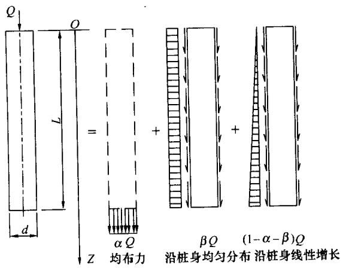  
图F.0.2 单桩荷载分担及侧阻力、端阻力分布

$$\begin{array}{l} - \frac {(1 - 2 \mu) (z - l)}{z + l} + \frac {(1 - 2 \mu) (z - l)}{\sqrt {r ^{2} + (z + l) ^{2}}} - \frac {(z - l) ^{3}}{\left[ r ^{2} + (z - l) ^{2} \right] ^{3 / 2}} \\ + \frac {(3 - 4 \mu) z}{z + l} - \frac {(3 - 4 \mu) z (z + l) ^{2}}{\left[ r ^{2} + (z + l) ^{2} \right] ^{3 / 2}} - \frac {l (5 z - l)}{(z + l) ^{2}} \\ \left. + \frac {l (z + l) (5 z - l)}{\left[ r ^{2} + (z + l) ^{2} \right] ^{3 / 2}} + \frac {6 l z}{(z + l) ^{2}} - \frac {6 z l (z + l) ^{3}}{\left[ r ^{2} + (z + l) ^{2} \right] ^{5 / 2}} \right\} \tag {F.0.2-1} \\ \end{array}$$

$$\begin{array}{l} I _{\mathrm {s r}} = \frac {l}{2 \pi r} \cdot \frac {1}{4 (1 - \mu)} \left\{\frac {2 (2 - \mu) r}{\sqrt {r ^{2} + (z - l) ^{2}}} \right. \\ - \frac {2 (2 - \mu) r ^{2} + 2 (1 - 2 \mu) z (z + l)}{r \sqrt {r ^{2} + (z + l) ^{2}}} + \frac {2 (1 - 2 \mu) z ^{2}}{r \sqrt {r ^{2} + z ^{2}}} \\ - \frac {4 z ^{2} \left[ r ^{2} - (1 + \mu) z ^{2} \right]}{r \left(r ^{2} + z ^{2}\right) ^{3 / 2}} - \frac {4 (1 + \mu) z (z + l) ^{3} - 4 z ^{2} r ^{2} - r ^{4}}{r \left[ r ^{2} + (z + l) ^{2} \right] ^{3 / 2}} \\ \left. - \frac {r ^{3}}{\left[ r ^{2} + (z - l) ^{2} \right] ^{3 / 2}} - \frac {6 z ^{2} \left[ z ^{4} - r ^{4} \right]}{r \left(r ^{2} + z ^{2}\right) ^{5 / 2}} - \frac {6 z \left[ z r ^{4} - (z + l) ^{5} \right]}{r \left[ r ^{2} + (z + l) ^{2} \right] ^{5 / 2}} \right\} \tag {F.0.2-2} \\ \end{array}$$

$$\begin{array}{l} I _{\mathrm {s t}} = \frac {l}{\pi r} \cdot \frac {1}{4 (1 - \mu)} \left\{\frac {2 (2 - \mu) r}{\sqrt {r ^{2} + (z - l) ^{2}}} \right. \\ + \frac {2 (1 - 2 \mu) z ^{2} (z + l) - 2 (2 - \mu) (4 z + l) r ^{2}}{l r \sqrt {r ^{2} + (z + l) ^{2}}} \\ + \frac {8 (2 - \mu) z r ^{2} - 2 (1 - 2 \mu) z ^{3}}{l r \sqrt {r ^{2} + z ^{2}}} + \frac {1 2 z ^{7} + 6 z r ^{4} (r ^{2} - z ^{2})}{l r (r ^{2} + z ^{2}) ^{5 / 2}} \\ + \frac {1 5 z r ^{4} + 2 (5 + 2 \mu) z ^{2} (z + l) ^{3} - 4 \mu z r ^{4} - 4 z ^{3} r ^{2} - r ^{2} (z + l) ^{3}}{b r [ r ^{2} + (z + l) ^{2} ] ^{3 / 2}} \\ - \frac {6 z r ^{4} \left(r ^{2} - z ^{2}\right) + 1 2 z ^{2} (z + l) ^{5}}{l r \left[ r ^{2} + (z + l) ^{2} \right] ^{5 / 2}} \\ + \frac {6 z ^{3} r ^{2} - 2 (5 + 2 \mu) z ^{5} - 2 (7 - 2 \mu) z r ^{4}}{l r [ r ^{2} + z ^{2} ] ^{3 / 2}} \\ - \frac {z r ^{3} + (z - l) ^{3} r}{l \left[ r ^{2} + (z - l) ^{2} \right] ^{3 / 2}} + 2 (2 - \mu) \frac {r}{l} \\ \end{array}$$

$$\left. \ln \frac {\left(\sqrt {r ^{2} + (z - l) ^{2}} + z - l\right) \left(\sqrt {r ^{2} + (z + l) ^{2}} + z + l\right)}{\left[ \sqrt {r ^{2} + z ^{2}} + z \right] ^{2}} \right\} \tag {F.0.2-3}$$

式中 $\mu$ ——地基土的泊松比；

$r$ ——桩身半径；

$l$ ——桩长；

$z$ ——计算应力点离桩顶的竖向距离。

2 考虑桩径影响，明德林解竖向应力影响系数表，1）桩端以下桩身轴线上 $(n = \rho / l = 0)$ 各点的竖向应力影响系数，系按式（F.0.2-1）～式（F.0.2-3）计算，其值列于表F.0.2-1～表F.0.2-3。2）水平向有效影响范围内桩的竖向应力影响系数，系按数值积分法计算，其值列于表F.0.2-1～表F.0.2-3。表中： $m = z / l$ ； $n = \rho / l$ ； $\rho$ 为相邻桩至计算桩轴线的水平距离。

表 F. 0.2-1 考虑桩径影响, 均布桩端阻力竖向应力影响系数 $I_{\mathrm{p}}$   

| l/d | 10 | 10 | 10 | 10 | 10 | 10 | 10 | 10 | 10 | 10 | 10 | 10 | 10 |
| --- | --- | --- | --- | --- | --- | --- | --- | --- | --- | --- | --- | --- | --- |
| l/d | 0.000 | 0.020 | 0.040 | 0.060 | 0.080 | 0.100 | 0.120 | 0.160 | 0.200 | 0.300 | 0.400 | 0.500 | 0.600 |
| m/n |  |  |  | -0.600 | -0.581 | -0.558 | -0.531 | -0.468 | -0.400 | -0.236 | -0.113 | -0.037 | 0.004 |
| 0.500 |  |  |  | -0.779 | -0.751 | -0.716 | -0.675 | -0.585 | -0.488 | -0.270 | -0.119 | -0.034 | 0.010 |
| 0.550 |  |  |  | -1.021 | -0.976 | -0.922 | -0.860 | -0.725 | -0.587 | -0.297 | -0.119 | -0.026 | 0.018 |
| 0.600 |  |  |  | -1.357 | -1.283 | -1.196 | -1.099 | -0.893 | -0.694 | -0.314 | -0.109 | -0.013 | 0.027 |
| 0.650 |  |  |  | -1.846 | -1.717 | -1.568 | -1.408 | -1.086 | -0.797 | -0.311 | -0.088 | 0.003 | 0.038 |
| 0.700 |  |  |  | -2.589 | -2.349 | -2.080 | -1.805 | -1.289 | -0.873 | -0.279 | -0.057 | 0.022 | 0.049 |
| 0.750 |  |  |  | -3.781 | -3.289 | -2.772 | -2.276 | -1.448 | -0.875 | -0.212 | -0.018 | 0.041 | 0.059 |
| 0.800 |  |  |  | -5.787 | -4.666 | -3.606 | -2.701 | -1.434 | -0.737 | -0.117 | 0.023 | 0.059 | 0.067 |
| 0.850 |  |  |  | -9.175 | -6.341 | -4.137 | -2.625 | -1.047 | -0.426 | -0.015 | 0.057 | 0.072 | 0.072 |
| 0.900 |  |  |  | -13.522 | -6.132 | -2.699 | -1.262 | -0.327 | -0.078 | 0.059 | 0.079 | 0.080 | 0.075 |
| 0.950 |  |  |  |  |  |  |  |  |  |  |  |  |  |
| 1.004 | 62.563 | 62.378 | 60.503 | 1.756 | 0.367 | 0.208 | 0.157 | 0.123 | 0.111 | 0.100 | 0.093 | 0.085 | 0.078 |
| 1.008 | 61.245 | 60.784 | 55.653 | 4.584 | 0.705 | 0.325 | 0.214 | 0.144 | 0.121 | 0.102 | 0.093 | 0.086 | 0.078 |
| 1.012 | 59.708 | 58.836 | 50.294 | 7.572 | 1.159 | 0.468 | 0.280 | 0.166 | 0.131 | 0.105 | 0.094 | 0.086 | 0.078 |
| 1.016 | 57.894 | 56.509 | 45.517 | 9.951 | 1.729 | 0.643 | 0.356 | 0.190 | 0.142 | 0.108 | 0.095 | 0.086 | 0.078 |
| 1.020 | 55.793 | 53.863 | 41.505 | 11.637 | 2.379 | 0.853 | 0.446 | 0.217 | 0.154 | 0.110 | 0.096 | 0.087 | 0.078 |
| 1.024 | 53.433 | 51.008 | 38.145 | 12.763 | 3.063 | 1.094 | 0.549 | 0.248 | 0.167 | 0.113 | 0.097 | 0.087 | 0.078 |
| 1.028 | 50.868 | 48.054 | 35.286 | 13.474 | 3.737 | 1.360 | 0.666 | 0.282 | 0.181 | 0.116 | 0.098 | 0.087 | 0.078 |
| 1.040 | 42.642 | 39.423 | 28.667 | 14.106 | 5.432 | 2.227 | 1.084 | 0.406 | 0.230 | 0.126 | 0.101 | 0.089 | 0.079 |
| 1.060 | 30.269 | 27.845 | 21.170 | 13.000 | 6.839 | 3.469 | 1.849 | 0.677 | 0.342 | 0.148 | 0.108 | 0.091 | 0.080 |
| 1.080 | 21.437 | 19.955 | 16.036 | 11.179 | 6.992 | 4.152 | 2.467 | 0.980 | 0.481 | 0.176 | 0.117 | 0.094 | 0.081 |
| 1.100 | 15.575 | 14.702 | 12.379 | 9.386 | 6.552 | 4.348 | 2.834 | 1.254 | 0.631 | 0.211 | 0.127 | 0.098 | 0.083 |
| 1.120 | 11.677 | 11.153 | 9.734 | 7.831 | 5.896 | 4.240 | 2.977 | 1.465 | 0.773 | 0.250 | 0.140 | 0.103 | 0.085 |
| 1.140 | 9.017 | 8.692 | 7.795 | 6.548 | 5.208 | 3.977 | 2.960 | 1.601 | 0.893 | 0.292 | 0.154 | 0.109 | 0.087 |
| 1.160 | 7.146 | 6.937 | 6.349 | 5.509 | 4.565 | 3.650 | 2.845 | 1.669 | 0.985 | 0.334 | 0.170 | 0.115 | 0.090 |
| 1.180 | 5.791 | 5.651 | 5.254 | 4.672 | 3.996 | 3.310 | 2.678 | 1.684 | 1.048 | 0.374 | 0.187 | 0.122 | 0.094 |
| 1.200 | 4.782 | 4.686 | 4.410 | 3.996 | 3.503 | 2.986 | 2.489 | 1.659 | 1.083 | 0.411 | 0.204 | 0.130 | 0.097 |
| 1.300 | 2.252 | 2.230 | 2.167 | 2.067 | 1.938 | 1.788 | 1.627 | 1.302 | 1.010 | 0.513 | 0.277 | 0.170 | 0.119 |
| 1.400 | 1.312 | 1.306 | 1.284 | 1.250 | 1.204 | 1.149 | 1.087 | 0.949 | 0.807 | 0.506 | 0.312 | 0.201 | 0.140 |
| 1.500 | 0.866 | 0.863 | 0.854 | 0.839 | 0.820 | 0.795 | 0.767 | 0.701 | 0.629 | 0.451 | 0.311 | 0.215 | 0.154 |
| 1.600 | 0.619 | 0.617 | 0.613 | 0.606 | 0.596 | 0.583 | 0.569 | 0.534 | 0.494 | 0.387 | 0.290 | 0.215 | 0.160 |

续表 F. 0.2-1  

| l/d | 15 | 15 | 15 | 15 | 15 | 15 | 15 | 15 | 15 | 15 | 15 | 15 | 15 |
| --- | --- | --- | --- | --- | --- | --- | --- | --- | --- | --- | --- | --- | --- |
| m/n | 0.000 | 0.020 | 0.040 | 0.060 | 0.080 | 0.100 | 0.120 | 0.160 | 0.200 | 0.300 | 0.400 | 0.500 | 0.600 |
| 0.500 |  |  | -0.619 | -0.605 | -0.585 | -0.562 | -0.534 | -0.471 | -0.402 | -0.236 | -0.113 | -0.037 | 0.004 |
| 0.550 |  |  | -0.808 | -0.786 | -0.757 | -0.721 | -0.680 | -0.588 | -0.490 | -0.269 | -0.119 | -0.033 | 0.010 |
| 0.600 |  |  | -1.067 | -1.032 | -0.986 | -0.930 | -0.867 | -0.729 | -0.589 | -0.297 | -0.118 | -0.025 | 0.018 |
| 0.650 |  |  | -1.433 | -1.375 | -1.299 | -1.208 | -1.108 | -0.898 | -0.695 | -0.312 | -0.108 | -0.013 | 0.028 |
| 0.700 |  |  | -1.981 | -1.876 | -1.742 | -1.587 | -1.422 | -1.091 | -0.797 | -0.308 | -0.087 | 0.004 | 0.038 |
| 0.750 |  |  | -2.850 | -2.645 | -2.389 | -2.108 | -1.820 | -1.290 | -0.868 | -0.275 | -0.056 | 0.023 | 0.049 |
| 0.800 |  |  | -4.342 | -3.889 | -3.355 | -2.805 | -2.286 | -1.437 | -0.862 | -0.207 | -0.016 | 0.042 | 0.059 |
| 0.850 |  |  | -7.174 | -5.996 | -4.747 | -3.609 | -2.668 | -1.395 | -0.713 | -0.112 | 0.024 | 0.059 | 0.067 |
| 0.900 |  |  | -13.179 | -9.428 | -6.231 | -3.949 | -2.469 | -0.980 | -0.401 | -0.012 | 0.057 | 0.072 | 0.072 |
| 0.950 |  |  | -25.874 | -11.676 | -4.925 | -2.196 | -1.061 | -0.288 | -0.067 | 0.060 | 0.079 | 0.080 | 0.076 |
| 1.004 | 139.202 | 137.028 | 6.771 | 0.657 | 0.288 | 0.189 | 0.151 | 0.122 | 0.111 | 0.100 | 0.093 | 0.085 | 0.078 |
| 1.008 | 134.212 | 127.885 | 16.907 | 1.416 | 0.502 | 0.283 | 0.201 | 0.141 | 0.120 | 0.102 | 0.093 | 0.086 | 0.078 |
| 1.012 | 127.849 | 116.582 | 24.338 | 2.473 | 0.771 | 0.392 | 0.256 | 0.161 | 0.130 | 0.105 | 0.094 | 0.086 | 0.078 |
| 1.016 | 120.095 | 104.985 | 28.589 | 3.784 | 1.109 | 0.522 | 0.320 | 0.184 | 0.140 | 0.107 | 0.095 | 0.086 | 0.078 |
| 1.020 | 111.316 | 94.178 | 30.723 | 5.224 | 1.516 | 0.677 | 0.394 | 0.209 | 0.152 | 0.110 | 0.096 | 0.087 | 0.078 |
| 1.024 | 102.035 | 84.503 | 31.544 | 6.655 | 1.981 | 0.858 | 0.478 | 0.236 | 0.164 | 0.113 | 0.097 | 0.087 | 0.078 |
| 1.028 | 92.751 | 75.959 | 31.545 | 7.976 | 2.487 | 1.062 | 0.575 | 0.267 | 0.177 | 0.116 | 0.098 | 0.087 | 0.078 |
| 1.040 | 67.984 | 55.962 | 29.127 | 10.814 | 4.040 | 1.776 | 0.927 | 0.379 | 0.223 | 0.126 | 0.101 | 0.089 | 0.079 |
| 1.060 | 40.837 | 35.291 | 22.966 | 12.108 | 5.919 | 2.983 | 1.625 | 0.627 | 0.328 | 0.147 | 0.108 | 0.091 | 0.080 |
| 1.080 | 26.159 | 23.586 | 17.507 | 11.187 | 6.586 | 3.808 | 2.255 | 0.914 | 0.460 | 0.174 | 0.116 | 0.094 | 0.081 |
| 1.100 | 17.897 | 16.610 | 13.391 | 9.640 | 6.442 | 4.160 | 2.679 | 1.187 | 0.605 | 0.208 | 0.127 | 0.098 | 0.083 |
| 1.120 | 12.923 | 12.226 | 10.406 | 8.106 | 5.921 | 4.162 | 2.881 | 1.406 | 0.746 | 0.246 | 0.139 | 0.103 | 0.085 |
| 1.140 | 9.737 | 9.332 | 8.241 | 6.781 | 5.281 | 3.962 | 2.911 | 1.555 | 0.868 | 0.288 | 0.153 | 0.108 | 0.087 |
| 1.160 | 7.588 | 7.339 | 6.652 | 5.693 | 4.648 | 3.666 | 2.827 | 1.637 | 0.963 | 0.329 | 0.169 | 0.115 | 0.090 |
| 1.180 | 6.075 | 5.915 | 5.463 | 4.813 | 4.073 | 3.340 | 2.678 | 1.663 | 1.030 | 0.369 | 0.185 | 0.122 | 0.093 |
| 1.200 | 4.973 | 4.866 | 4.558 | 4.104 | 3.570 | 3.019 | 2.499 | 1.647 | 1.070 | 0.406 | 0.202 | 0.130 | 0.097 |
| 1.300 | 2.291 | 2.269 | 2.202 | 2.097 | 1.962 | 1.807 | 1.640 | 1.307 | 1.010 | 0.511 | 0.276 | 0.170 | 0.118 |
| 1.400 | 1.325 | 1.318 | 1.296 | 1.261 | 1.214 | 1.157 | 1.094 | 0.953 | 0.809 | 0.505 | 0.311 | 0.201 | 0.139 |
| 1.500 | 0.871 | 0.868 | 0.859 | 0.844 | 0.824 | 0.799 | 0.770 | 0.704 | 0.630 | 0.451 | 0.310 | 0.215 | 0.154 |
| 1.600 | 0.621 | 0.620 | 0.615 | 0.608 | 0.598 | 0.586 | 0.571 | 0.536 | 0.496 | 0.388 | 0.290 | 0.215 | 0.160 |

续表 F. 0.2-1  

| l/d | 20 | 20 | 20 | 20 | 20 | 20 | 20 | 20 | 20 | 20 | 20 | 20 | 20 |
| --- | --- | --- | --- | --- | --- | --- | --- | --- | --- | --- | --- | --- | --- |
| m/n | 0.000 | 0.020 | 0.040 | 0.060 | 0.080 | 0.100 | 0.120 | 0.160 | 0.200 | 0.300 | 0.400 | 0.500 | 0.600 |
| 0.500 |  |  | -0.621 | -0.606 | -0.587 | -0.563 | -0.535 | -0.472 | -0.402 | -0.236 | -0.113 | -0.037 | 0.004 |
| 0.550 |  |  | -0.811 | -0.789 | -0.759 | -0.723 | -0.682 | -0.589 | -0.491 | -0.269 | -0.118 | -0.033 | 0.010 |
| 0.600 |  |  | -1.071 | -1.036 | -0.989 | -0.933 | -0.869 | -0.731 | -0.590 | -0.296 | -0.117 | -0.025 | 0.018 |
| 0.650 |  |  | -1.440 | -1.381 | -1.304 | -1.213 | -1.112 | -0.899 | -0.696 | -0.312 | -0.107 | -0.013 | 0.028 |
| 0.700 |  |  | -1.993 | -1.887 | -1.751 | -1.594 | -1.426 | -1.092 | -0.797 | -0.307 | -0.086 | 0.004 | 0.038 |
| 0.750 |  |  | -2.875 | -2.665 | -2.404 | -2.117 | -1.826 | -1.290 | -0.867 | -0.273 | -0.055 | 0.023 | 0.049 |
| 0.800 |  |  | -4.396 | -3.927 | -3.378 | -2.816 | -2.288 | -1.432 | -0.857 | -0.205 | -0.016 | 0.042 | 0.059 |
| 0.850 |  |  | -7.309 | -6.069 | -4.773 | -3.608 | -2.656 | -1.382 | -0.705 | -0.110 | 0.024 | 0.059 | 0.067 |
| 0.900 |  |  | -13.547 | -9.494 | -6.176 | -3.877 | -2.414 | -0.957 | -0.392 | -0.011 | 0.058 | 0.072 | 0.072 |
| 0.950 |  |  | -25.714 | -10.848 | -4.530 | -2.043 | -1.000 | -0.275 | -0.064 | 0.060 | 0.079 | 0.080 | 0.076 |
| 1.004 | 244.665 | 222.298 | 2.507 | 0.549 | 0.270 | 0.184 | 0.149 | 0.121 | 0.111 | 0.100 | 0.093 | 0.085 | 0.078 |
| 1.008 | 231.267 | 181.758 | 6.607 | 1.118 | 0.459 | 0.271 | 0.196 | 0.140 | 0.120 | 0.102 | 0.093 | 0.086 | 0.078 |
| 1.012 | 213.422 | 152.271 | 11.947 | 1.893 | 0.691 | 0.372 | 0.249 | 0.160 | 0.130 | 0.105 | 0.094 | 0.086 | 0.078 |
| 1.016 | 192.367 | 130.925 | 17.172 | 2.882 | 0.981 | 0.491 | 0.309 | 0.182 | 0.140 | 0.107 | 0.095 | 0.086 | 0.078 |
| 1.020 | 170.266 | 114.368 | 21.429 | 4.037 | 1.330 | 0.632 | 0.379 | 0.206 | 0.151 | 0.110 | 0.096 | 0.087 | 0.078 |
| 1.024 | 148.975 | 100.844 | 24.487 | 5.275 | 1.735 | 0.796 | 0.458 | 0.232 | 0.163 | 0.113 | 0.097 | 0.087 | 0.078 |
| 1.028 | 129.596 | 89.450 | 26.439 | 6.511 | 2.184 | 0.983 | 0.549 | 0.262 | 0.175 | 0.116 | 0.098 | 0.087 | 0.078 |
| 1.040 | 85.457 | 63.853 | 27.680 | 9.582 | 3.636 | 1.647 | 0.881 | 0.370 | 0.221 | 0.126 | 0.101 | 0.089 | 0.079 |
| 1.060 | 46.430 | 38.661 | 23.310 | 11.634 | 5.588 | 2.825 | 1.554 | 0.611 | 0.323 | 0.146 | 0.108 | 0.091 | 0.080 |
| 1.080 | 28.320 | 25.133 | 17.998 | 11.118 | 6.418 | 3.685 | 2.183 | 0.893 | 0.453 | 0.174 | 0.116 | 0.094 | 0.081 |
| 1.100 | 18.875 | 17.385 | 13.759 | 9.705 | 6.387 | 4.088 | 2.623 | 1.164 | 0.597 | 0.207 | 0.126 | 0.098 | 0.083 |
| 1.120 | 13.422 | 12.647 | 10.654 | 8.197 | 5.921 | 4.130 | 2.846 | 1.386 | 0.737 | 0.245 | 0.139 | 0.103 | 0.085 |
| 1.140 | 10.016 | 9.577 | 8.407 | 6.863 | 5.303 | 3.953 | 2.892 | 1.539 | 0.859 | 0.286 | 0.153 | 0.108 | 0.087 |
| 1.160 | 7.755 | 7.490 | 6.763 | 5.758 | 4.676 | 3.670 | 2.819 | 1.626 | 0.955 | 0.327 | 0.169 | 0.115 | 0.090 |
| 1.180 | 6.181 | 6.013 | 5.540 | 4.863 | 4.099 | 3.349 | 2.677 | 1.656 | 1.024 | 0.367 | 0.185 | 0.122 | 0.093 |
| 1.200 | 5.044 | 4.931 | 4.612 | 4.142 | 3.593 | 3.030 | 2.502 | 1.643 | 1.065 | 0.404 | 0.202 | 0.129 | 0.097 |
| 1.300 | 2.306 | 2.283 | 2.215 | 2.108 | 1.971 | 1.813 | 1.645 | 1.308 | 1.010 | 0.510 | 0.275 | 0.170 | 0.118 |
| 1.400 | 1.330 | 1.323 | 1.301 | 1.265 | 1.218 | 1.160 | 1.096 | 0.954 | 0.810 | 0.505 | 0.311 | 0.201 | 0.139 |
| 1.500 | 0.873 | 0.870 | 0.861 | 0.846 | 0.826 | 0.801 | 0.772 | 0.705 | 0.631 | 0.451 | 0.310 | 0.215 | 0.154 |
| 1.600 | 0.622 | 0.621 | 0.616 | 0.609 | 0.599 | 0.586 | 0.572 | 0.536 | 0.496 | 0.388 | 0.290 | 0.214 | 0.160 |

续表 F. 0.2-1  

| l/d | 25 | 25 | 25 | 25 | 25 | 25 | 25 | 25 | 25 | 25 | 25 | 25 | 25 |
| --- | --- | --- | --- | --- | --- | --- | --- | --- | --- | --- | --- | --- | --- |
| m/n | 0.000 | 0.020 | 0.040 | 0.060 | 0.080 | 0.100 | 0.120 | 0.160 | 0.200 | 0.300 | 0.400 | 0.500 | 0.600 |
| 0.500 |  |  | -0.622 | -0.607 | -0.588 | -0.564 | -0.536 | -0.472 | -0.402 | -0.236 | -0.112 | -0.037 | 0.004 |
| 0.550 |  |  | -0.812 | -0.790 | -0.760 | -0.724 | -0.683 | -0.590 | -0.491 | -0.269 | -0.118 | -0.033 | 0.010 |
| 0.600 |  |  | -1.073 | -1.037 | -0.991 | -0.934 | -0.870 | -0.731 | -0.590 | -0.296 | -0.117 | -0.025 | 0.018 |
| 0.650 |  |  | -1.444 | -1.384 | -1.306 | -1.215 | -1.113 | -0.900 | -0.696 | -0.311 | -0.107 | -0.012 | 0.028 |
| 0.700 |  |  | -1.999 | -1.892 | -1.755 | -1.597 | -1.428 | -1.093 | -0.796 | -0.307 | -0.086 | 0.004 | 0.038 |
| 0.750 |  |  | -2.886 | -2.674 | -2.411 | -2.122 | -1.828 | -1.290 | -0.866 | -0.273 | -0.055 | 0.023 | 0.049 |
| 0.800 |  |  | -4.422 | -3.945 | -3.389 | -2.821 | -2.290 | -1.430 | -0.855 | -0.205 | -0.016 | 0.042 | 0.059 |
| 0.850 |  |  | -7.373 | -6.103 | -4.785 | -3.607 | -2.650 | -1.375 | -0.701 | -0.109 | 0.024 | 0.059 | 0.067 |
| 0.900 |  |  | -13.719 | -9.519 | -6.147 | -3.843 | -2.388 | -0.946 | -0.388 | -0.011 | 0.058 | 0.072 | 0.072 |
| 0.950 |  |  | -25.463 | -10.446 | -4.355 | -1.975 | -0.973 | -0.270 | -0.062 | 0.060 | 0.079 | 0.080 | 0.076 |
| 1.004 | 377.628 | 178.408 | 1.913 | 0.511 | 0.263 | 0.182 | 0.148 | 0.121 | 0.111 | 0.100 | 0.093 | 0.085 | 0.078 |
| 1.008 | 348.167 | 161.588 | 4.792 | 1.019 | 0.442 | 0.267 | 0.195 | 0.140 | 0.120 | 0.102 | 0.093 | 0.086 | 0.078 |
| 1.012 | 309.027 | 146.104 | 8.847 | 1.700 | 0.660 | 0.364 | 0.246 | 0.159 | 0.129 | 0.105 | 0.094 | 0.086 | 0.078 |
| 1.016 | 265.983 | 131.641 | 13.394 | 2.574 | 0.930 | 0.478 | 0.305 | 0.181 | 0.140 | 0.107 | 0.095 | 0.086 | 0.078 |
| 1.020 | 224.824 | 118.197 | 17.660 | 3.613 | 1.257 | 0.613 | 0.372 | 0.205 | 0.150 | 0.110 | 0.096 | 0.087 | 0.078 |
| 1.024 | 188.664 | 105.842 | 21.169 | 4.756 | 1.637 | 0.770 | 0.450 | 0.231 | 0.162 | 0.113 | 0.097 | 0.087 | 0.078 |
| 1.028 | 158.336 | 94.627 | 23.753 | 5.931 | 2.062 | 0.949 | 0.537 | 0.260 | 0.175 | 0.116 | 0.098 | 0.087 | 0.078 |
| 1.040 | 96.846 | 67.688 | 26.679 | 9.029 | 3.464 | 1.592 | 0.860 | 0.366 | 0.220 | 0.125 | 0.101 | 0.089 | 0.079 |
| 1.060 | 49.548 | 40.374 | 23.390 | 11.390 | 5.436 | 2.754 | 1.522 | 0.603 | 0.321 | 0.146 | 0.108 | 0.091 | 0.080 |
| 1.080 | 29.440 | 25.906 | 18.214 | 11.073 | 6.336 | 3.628 | 2.151 | 0.883 | 0.450 | 0.173 | 0.116 | 0.094 | 0.081 |
| 1.100 | 19.363 | 17.765 | 13.931 | 9.731 | 6.358 | 4.054 | 2.598 | 1.154 | 0.593 | 0.206 | 0.126 | 0.098 | 0.083 |
| 1.120 | 13.666 | 12.851 | 10.772 | 8.237 | 5.920 | 4.114 | 2.829 | 1.376 | 0.732 | 0.244 | 0.139 | 0.103 | 0.085 |
| 1.140 | 10.150 | 9.695 | 8.485 | 6.901 | 5.313 | 3.949 | 2.883 | 1.532 | 0.855 | 0.285 | 0.153 | 0.108 | 0.087 |
| 1.160 | 7.835 | 7.562 | 6.816 | 5.788 | 4.689 | 3.671 | 2.815 | 1.621 | 0.952 | 0.327 | 0.168 | 0.115 | 0.090 |
| 1.180 | 6.232 | 6.059 | 5.576 | 4.887 | 4.112 | 3.353 | 2.677 | 1.653 | 1.021 | 0.366 | 0.185 | 0.122 | 0.093 |
| 1.200 | 5.077 | 4.963 | 4.637 | 4.160 | 3.604 | 3.035 | 2.503 | 1.641 | 1.063 | 0.403 | 0.202 | 0.129 | 0.097 |
| 1.300 | 2.312 | 2.289 | 2.221 | 2.113 | 1.975 | 1.816 | 1.647 | 1.309 | 1.010 | 0.509 | 0.275 | 0.170 | 0.118 |
| 1.400 | 1.332 | 1.325 | 1.303 | 1.267 | 1.219 | 1.162 | 1.097 | 0.955 | 0.810 | 0.505 | 0.310 | 0.201 | 0.139 |
| 1.500 | 0.874 | 0.871 | 0.862 | 0.847 | 0.826 | 0.801 | 0.772 | 0.705 | 0.631 | 0.451 | 0.310 | 0.215 | 0.154 |
| 1.600 | 0.623 | 0.621 | 0.617 | 0.609 | 0.599 | 0.587 | 0.572 | 0.537 | 0.496 | 0.388 | 0.290 | 0.214 | 0.160 |

续表 F. 0.2-1  

| l/d | 30 | 30 | 30 | 30 | 30 | 30 | 30 | 30 | 30 | 30 | 30 | 30 | 30 |
| --- | --- | --- | --- | --- | --- | --- | --- | --- | --- | --- | --- | --- | --- |
| m/n | 0.000 | 0.020 | 0.040 | 0.060 | 0.080 | 0.100 | 0.120 | 0.160 | 0.200 | 0.300 | 0.400 | 0.500 | 0.600 |
| 0.500 |  | -0.631 | -0.622 | -0.608 | -0.588 | -0.564 | -0.536 | -0.472 | -0.403 | -0.236 | -0.112 | -0.037 | 0.004 |
| 0.550 |  | -0.827 | -0.813 | -0.791 | -0.761 | -0.725 | -0.683 | -0.590 | -0.491 | -0.269 | -0.118 | -0.033 | 0.010 |
| 0.600 |  | -1.096 | -1.074 | -1.038 | -0.991 | -0.935 | -0.871 | -0.732 | -0.590 | -0.296 | -0.117 | -0.025 | 0.018 |
| 0.650 |  | -1.483 | -1.445 | -1.386 | -1.308 | -1.216 | -1.114 | -0.900 | -0.696 | -0.311 | -0.107 | -0.012 | 0.028 |
| 0.700 |  | -2.071 | -2.002 | -1.895 | -1.757 | -1.598 | -1.429 | -1.093 | -0.796 | -0.306 | -0.086 | 0.004 | 0.038 |
| 0.750 |  | -3.032 | -2.892 | -2.679 | -2.414 | -2.124 | -1.829 | -1.290 | -0.865 | -0.272 | -0.054 | 0.023 | 0.049 |
| 0.800 |  | -4.764 | -4.436 | -3.955 | -3.395 | -2.824 | -2.290 | -1.429 | -0.854 | -0.204 | -0.015 | 0.042 | 0.059 |
| 0.850 |  | -8.367 | -7.408 | -6.122 | -4.791 | -3.606 | -2.646 | -1.372 | -0.699 | -0.109 | 0.025 | 0.059 | 0.067 |
| 0.900 |  | -17.766 | -13.813 | -9.532 | -6.130 | -3.824 | -2.374 | -0.941 | -0.386 | -0.010 | 0.058 | 0.072 | 0.072 |
| 0.950 |  | -53.070 | -25.276 | -10.224 | -4.262 | -1.940 | -0.959 | -0.267 | -0.062 | 0.060 | 0.079 | 0.080 | 0.076 |
| 1.004 | 536.535 | 67.314 | 1.695 | 0.493 | 0.259 | 0.181 | 0.148 | 0.121 | 0.111 | 0.100 | 0.093 | 0.085 | 0.078 |
| 1.008 | 480.071 | 114.047 | 4.129 | 0.973 | 0.433 | 0.264 | 0.194 | 0.140 | 0.120 | 0.102 | 0.093 | 0.086 | 0.078 |
| 1.012 | 407.830 | 125.866 | 7.619 | 1.610 | 0.644 | 0.359 | 0.245 | 0.159 | 0.129 | 0.105 | 0.094 | 0.086 | 0.078 |
| 1.016 | 335.065 | 123.804 | 11.742 | 2.429 | 0.905 | 0.471 | 0.302 | 0.180 | 0.139 | 0.107 | 0.095 | 0.086 | 0.078 |
| 1.020 | 271.631 | 116.207 | 15.857 | 3.410 | 1.220 | 0.603 | 0.369 | 0.204 | 0.150 | 0.110 | 0.096 | 0.087 | 0.078 |
| 1.024 | 220.202 | 106.561 | 19.459 | 4.502 | 1.587 | 0.757 | 0.445 | 0.230 | 0.162 | 0.113 | 0.097 | 0.087 | 0.078 |
| 1.028 | 179.778 | 96.493 | 22.283 | 5.641 | 1.999 | 0.932 | 0.531 | 0.259 | 0.174 | 0.116 | 0.098 | 0.087 | 0.078 |
| 1.040 | 104.344 | 69.738 | 26.055 | 8.735 | 3.375 | 1.563 | 0.850 | 0.364 | 0.219 | 0.125 | 0.101 | 0.089 | 0.079 |
| 1.060 | 51.415 | 41.346 | 23.409 | 11.251 | 5.354 | 2.717 | 1.505 | 0.599 | 0.320 | 0.146 | 0.108 | 0.091 | 0.080 |
| 1.080 | 30.085 | 26.343 | 18.329 | 11.045 | 6.290 | 3.597 | 2.133 | 0.878 | 0.448 | 0.173 | 0.116 | 0.094 | 0.081 |
| 1.100 | 19.639 | 17.978 | 14.025 | 9.744 | 6.342 | 4.035 | 2.584 | 1.148 | 0.591 | 0.206 | 0.126 | 0.098 | 0.083 |
| 1.120 | 13.802 | 12.964 | 10.836 | 8.259 | 5.919 | 4.105 | 2.820 | 1.371 | 0.730 | 0.244 | 0.139 | 0.103 | 0.085 |
| 1.140 | 10.224 | 9.760 | 8.528 | 6.921 | 5.318 | 3.946 | 2.878 | 1.528 | 0.853 | 0.285 | 0.153 | 0.108 | 0.087 |
| 1.160 | 7.879 | 7.602 | 6.845 | 5.805 | 4.695 | 3.672 | 2.813 | 1.618 | 0.950 | 0.326 | 0.168 | 0.115 | 0.090 |
| 1.180 | 6.259 | 6.084 | 5.596 | 4.900 | 4.118 | 3.356 | 2.676 | 1.651 | 0.109 | 0.366 | 0.185 | 0.122 | 0.093 |
| 1.200 | 5.095 | 4.980 | 4.651 | 4.170 | 3.610 | 3.038 | 2.503 | 1.640 | 1.062 | 0.403 | 0.202 | 0.129 | 0.097 |
| 1.300 | 2.316 | 2.293 | 2.224 | 2.116 | 1.977 | 1.818 | 1.648 | 1.310 | 1.010 | 0.509 | 0.275 | 0.169 | 0.118 |
| 1.400 | 1.333 | 1.326 | 1.304 | 1.268 | 1.220 | 1.163 | 1.098 | 0.955 | 0.811 | 0.505 | 0.310 | 0.200 | 0.139 |
| 1.500 | 0.874 | 0.872 | 0.862 | 0.847 | 0.827 | 0.802 | 0.773 | 0.705 | 0.631 | 0.451 | 0.310 | 0.215 | 0.154 |

续表 F. 0.2-1  

| t/a | 40 | 40 | 40 | 40 | 40 | 40 | 40 | 40 | 40 | 40 | 40 | 40 | 40 |
| --- | --- | --- | --- | --- | --- | --- | --- | --- | --- | --- | --- | --- | --- |
| t/a | 0.000 | 0.020 | 0.040 | 0.060 | 0.080 | 0.100 | 0.120 | 0.160 | 0.200 | 0.300 | 0.400 | 0.500 | 0.600 |
| m | -0.631 | -0.622 | -0.608 | -0.588 | -0.564 | -0.536 | -0.472 | -0.403 | -0.236 | -0.112 | -0.036 | 0.004 |  |
| 0.500 | -0.827 | -0.814 | -0.791 | -0.762 | -0.725 | -0.684 | -0.590 | -0.491 | -0.269 | -0.118 | -0.033 | 0.010 |  |
| 0.550 | -1.097 | -1.075 | -1.039 | -0.992 | -0.936 | -0.872 | -0.732 | -0.591 | -0.296 | -0.117 | -0.025 | 0.018 |  |
| 0.600 | -1.485 | -1.447 | -1.387 | -1.309 | -1.217 | -1.115 | -0.901 | -0.696 | -0.311 | -0.107 | -0.012 | 0.028 |  |
| 0.650 | -2.074 | -2.006 | -1.898 | -1.759 | -1.600 | -1.431 | -1.094 | -0.796 | -0.306 | -0.086 | 0.004 | 0.038 |  |
| 0.700 | -3.039 | -2.899 | -2.684 | -2.418 | -2.126 | -1.831 | -1.290 | -0.865 | -0.272 | -0.054 | 0.023 | 0.049 |  |
| 0.750 | -4.781 | -4.449 | -3.965 | -3.401 | -2.826 | -2.291 | -1.428 | -0.853 | -0.204 | -0.015 | 0.042 | 0.059 |  |
| 0.800 | -8.418 | -7.443 | -6.140 | -4.797 | -3.606 | -2.643 | -1.368 | -0.696 | -0.108 | 0.025 | 0.059 | 0.067 |  |
| 0.850 | -17.982 | -13.906 | -9.543 | -6.114 | -3.805 | -2.360 | -0.935 | -0.384 | -0.010 | 0.058 | 0.072 | 0.072 |  |
| 0.900 | -54.543 | -25.054 | -10.003 | -4.171 | -1.905 | -0.945 | -0.264 | -0.061 | 0.060 | 0.079 | 0.080 | 0.076 |  |
| 0.950 | 924.755 | 26.114 | 1.523 | 0.477 | 0.255 | 0.180 | 0.147 | 0.121 | 0.111 | 0.100 | 0.093 | 0.085 | 0.078 |
| 1.004 | 769.156 | 68.377 | 3.614 | 0.931 | 0.425 | 0.262 | 0.193 | 0.139 | 0.120 | 0.102 | 0.093 | 0.086 | 0.078 |
| 1.012 | 595.591 | 97.641 | 6.633 | 1.529 | 0.630 | 0.355 | 0.243 | 0.159 | 0.129 | 0.105 | 0.094 | 0.086 | 0.078 |
| 1.016 | 449.984 | 109.641 | 10.343 | 2.298 | 0.881 | 0.465 | 0.300 | 0.180 | 0.139 | 0.107 | 0.095 | 0.086 | 0.078 |
| 1.020 | 341.526 | 110.416 | 14.244 | 3.224 | 1.185 | 0.594 | 0.366 | 0.203 | 0.150 | 0.110 | 0.096 | 0.087 | 0.078 |
| 1.024 | 263.543 | 105.215 | 17.851 | 4.267 | 1.541 | 0.744 | 0.441 | 0.229 | 0.162 | 0.113 | 0.097 | 0.087 | 0.078 |
| 1.028 | 207.450 | 97.302 | 20.843 | 5.369 | 1.940 | 0.916 | 0.526 | 0.258 | 0.174 | 0.116 | 0.098 | 0.087 | 0.079 |
| 1.040 | 112.989 | 71.701 | 25.382 | 8.448 | 3.288 | 1.535 | 0.839 | 0.362 | 0.219 | 0.125 | 0.101 | 0.089 | 0.079 |
| 1.060 | 53.411 | 42.340 | 23.410 | 11.109 | 5.272 | 2.680 | 1.488 | 0.596 | 0.319 | 0.146 | 0.108 | 0.091 | 0.080 |
| 1.080 | 30.754 | 26.788 | 18.440 | 11.014 | 6.245 | 3.566 | 2.116 | 0.872 | 0.447 | 0.173 | 0.116 | 0.094 | 0.081 |
| 1.100 | 19.920 | 18.194 | 14.119 | 9.755 | 6.325 | 4.016 | 2.570 | 1.143 | 0.589 | 0.206 | 0.126 | 0.098 | 0.083 |
| 1.120 | 13.939 | 13.078 | 10.900 | 8.281 | 5.917 | 4.096 | 2.811 | 1.366 | 0.728 | 0.244 | 0.139 | 0.103 | 0.085 |
| 1.140 | 10.300 | 9.825 | 8.571 | 6.941 | 5.323 | 3.944 | 2.873 | 1.524 | 0.850 | 0.284 | 0.153 | 0.108 | 0.087 |
| 1.160 | 7.923 | 7.642 | 6.874 | 5.822 | 4.702 | 3.673 | 2.811 | 1.615 | 0.948 | 0.326 | 0.168 | 0.115 | 0.090 |
| 1.180 | 6.287 | 6.110 | 5.616 | 4.912 | 4.125 | 3.358 | 2.676 | 1.649 | 1.018 | 0.366 | 0.185 | 0.122 | 0.093 |
| 1.200 | 5.113 | 4.997 | 4.665 | 4.180 | 3.615 | 3.040 | 2.504 | 1.639 | 1.061 | 0.402 | 0.201 | 0.129 | 0.097 |
| 1.300 | 2.320 | 2.297 | 2.227 | 2.119 | 1.980 | 1.820 | 1.649 | 1.310 | 1.009 | 0.509 | 0.275 | 0.169 | 0.118 |
| 1.400 | 1.334 | 1.327 | 1.305 | 1.269 | 1.221 | 1.163 | 1.098 | 0.956 | 0.811 | 0.505 | 0.310 | 0.200 | 0.139 |
| 1.500 | 0.875 | 0.872 | 0.863 | 0.848 | 0.827 | 0.802 | 0.773 | 0.706 | 0.632 | 0.451 | 0.310 | 0.215 | 0.154 |
| 1.600 | 0.623 | 0.622 | 0.617 | 0.610 | 0.600 | 0.587 | 0.572 | 0.537 | 0.496 | 0.388 | 0.290 | 0.214 | 0.160 |

续表 F.0.2-1  

| l/d | 50 | 50 | 50 | 50 | 50 | 50 | 50 | 50 | 50 | 50 | 50 | 50 | 50 |
| --- | --- | --- | --- | --- | --- | --- | --- | --- | --- | --- | --- | --- | --- |
| l/d | 0.000 | 0.020 | 0.040 | 0.060 | 0.080 | 0.100 | 0.120 | 0.160 | 0.200 | 0.300 | 0.400 | 0.500 | 0.600 |
| m/n |  | -0.632 | -0.623 | -0.608 | -0.589 | -0.564 | -0.537 | -0.473 | -0.403 | -0.236 | -0.112 | -0.036 | 0.004 |
| 0.500 |  | -0.828 | -0.814 | -0.792 | -0.762 | -0.725 | -0.684 | -0.590 | -0.491 | -0.269 | -0.118 | -0.033 | 0.010 |
| 0.550 |  | -1.097 | -1.075 | -1.040 | -0.993 | -0.936 | -0.872 | -0.732 | -0.591 | -0.296 | -0.117 | -0.025 | 0.018 |
| 0.600 |  | -1.486 | -1.448 | -1.388 | -1.310 | -1.217 | -1.115 | -0.901 | -0.696 | -0.311 | -0.107 | -0.012 | 0.028 |
| 0.650 |  | -2.076 | -2.007 | -1.899 | -1.760 | -1.601 | -1.431 | -1.094 | -0.796 | -0.306 | -0.086 | 0.004 | 0.038 |
| 0.700 |  | -3.042 | -2.902 | -2.686 | -2.420 | -2.127 | -1.831 | -1.290 | -0.865 | -0.272 | -0.054 | 0.023 | 0.049 |
| 0.750 |  | -4.789 | -4.456 | -3.969 | -3.403 | -2.828 | -2.291 | -1.428 | -0.852 | -0.203 | -0.015 | 0.042 | 0.059 |
| 0.800 |  | -8.441 | -7.460 | -6.149 | -4.800 | -3.605 | -2.641 | -1.367 | -0.696 | -0.108 | 0.025 | 0.059 | 0.067 |
| 0.850 |  | -18.083 | -13.950 | -9.548 | -6.106 | -3.797 | -2.354 | -0.933 | -0.383 | -0.010 | 0.058 | 0.072 | 0.072 |
| 0.900 |  | -55.231 | -24.939 | -9.900 | -4.129 | -1.889 | -0.938 | -0.263 | -0.060 | 0.060 | 0.079 | 0.080 | 0.076 |
| 0.950 |  |  |  |  |  |  |  |  |  |  |  |  |  |
| 1.004 | 1392.355 | 18.855 | 1.455 | 0.470 | 0.254 | 0.180 | 0.147 | 0.121 | 0.111 | 0.100 | 0.093 | 0.085 | 0.078 |
| 1.008 | 1063.621 | 53.265 | 3.413 | 0.913 | 0.421 | 0.261 | 0.192 | 0.139 | 0.120 | 0.102 | 0.093 | 0.086 | 0.078 |
| 1.012 | 754.349 | 84.366 | 6.241 | 1.495 | 0.623 | 0.353 | 0.242 | 0.159 | 0.129 | 0.105 | 0.094 | 0.086 | 0.078 |
| 1.016 | 533.576 | 101.473 | 9.768 | 2.241 | 0.871 | 0.462 | 0.299 | 0.180 | 0.139 | 0.107 | 0.095 | 0.086 | 0.078 |
| 1.020 | 387.082 | 106.414 | 13.556 | 3.143 | 1.170 | 0.590 | 0.364 | 0.203 | 0.150 | 0.110 | 0.096 | 0.087 | 0.078 |
| 1.024 | 289.666 | 103.778 | 17.142 | 4.164 | 1.520 | 0.738 | 0.438 | 0.229 | 0.161 | 0.113 | 0.097 | 0.087 | 0.078 |
| 1.028 | 223.218 | 97.234 | 20.188 | 5.248 | 1.914 | 0.908 | 0.523 | 0.257 | 0.174 | 0.116 | 0.098 | 0.087 | 0.079 |
| 1.040 | 117.472 | 72.569 | 25.055 | 8.317 | 3.249 | 1.522 | 0.835 | 0.361 | 0.219 | 0.125 | 0.101 | 0.089 | 0.079 |
| 1.060 | 54.386 | 42.810 | 23.404 | 11.042 | 5.235 | 2.663 | 1.481 | 0.594 | 0.318 | 0.146 | 0.108 | 0.091 | 0.080 |
| 1.080 | 31.073 | 26.999 | 18.490 | 10.999 | 6.223 | 3.552 | 2.108 | 0.870 | 0.446 | 0.173 | 0.116 | 0.094 | 0.081 |
| 1.100 | 20.053 | 18.296 | 14.162 | 9.760 | 6.317 | 4.007 | 2.563 | 1.140 | 0.588 | 0.206 | 0.126 | 0.098 | 0.083 |
| 1.120 | 14.004 | 13.132 | 10.930 | 8.290 | 5.916 | 4.092 | 2.806 | 1.364 | 0.727 | 0.244 | 0.139 | 0.103 | 0.085 |
| 1.140 | 10.335 | 9.856 | 8.591 | 6.951 | 5.325 | 3.942 | 2.870 | 1.522 | 0.849 | 0.284 | 0.153 | 0.108 | 0.087 |
| 1.160 | 7.944 | 7.660 | 6.887 | 5.829 | 4.705 | 3.673 | 2.810 | 1.613 | 0.947 | 0.326 | 0.168 | 0.115 | 0.090 |
| 1.180 | 6.300 | 6.122 | 5.625 | 4.918 | 4.128 | 3.359 | 2.676 | 1.648 | 1.017 | 0.365 | 0.185 | 0.122 | 0.093 |
| 1.200 | 5.122 | 5.005 | 4.672 | 4.184 | 3.618 | 3.042 | 2.504 | 1.639 | 1.060 | 0.402 | 0.201 | 0.129 | 0.097 |
| 1.300 | 2.321 | 2.298 | 2.229 | 2.120 | 1.981 | 1.821 | 1.650 | 1.310 | 1.009 | 0.509 | 0.275 | 0.169 | 0.118 |
| 1.400 | 1.335 | 1.328 | 1.305 | 1.269 | 1.221 | 1.164 | 1.099 | 0.956 | 0.811 | 0.505 | 0.310 | 0.200 | 0.139 |
| 1.500 | 0.875 | 0.872 | 0.863 | 0.848 | 0.827 | 0.802 | 0.773 | 0.706 | 0.632 | 0.451 | 0.310 | 0.215 | 0.154 |
| 1.600 | 0.623 | 0.622 | 0.617 | 0.610 | 0.600 | 0.587 | 0.572 | 0.537 | 0.497 | 0.388 | 0.290 | 0.214 | 0.160 |

续表 F. 0.2-1  

| n m | 60 | 60 | 60 | 60 | 60 | 60 | 60 | 60 | 60 | 60 | 60 | 60 | 60 |
| --- | --- | --- | --- | --- | --- | --- | --- | --- | --- | --- | --- | --- | --- |
| n m | 0.000 | 0.020 | 0.040 | 0.060 | 0.080 | 0.100 | 0.120 | 0.160 | 0.200 | 0.300 | 0.400 | 0.500 | 0.600 |
| 0.500 |  | -0.632 | -0.623 | -0.608 | -0.589 | -0.565 | -0.537 | -0.473 | -0.403 | -0.236 | -0.112 | -0.036 | 0.004 |
| 0.550 |  | -0.828 | -0.814 | -0.792 | -0.762 | -0.726 | -0.684 | -0.590 | -0.491 | -0.269 | -0.118 | -0.033 | 0.010 |
| 0.600 |  | -1.098 | -1.076 | -1.040 | -0.993 | -0.936 | -0.872 | -0.732 | -0.591 | -0.296 | -0.117 | -0.025 | 0.018 |
| 0.650 |  | -1.486 | -1.448 | -1.389 | -1.310 | -1.218 | -1.116 | -0.901 | -0.696 | -0.311 | -0.107 | -0.012 | 0.028 |
| 0.700 |  | -2.077 | -2.008 | -1.900 | -1.761 | -1.601 | -1.431 | -1.094 | -0.796 | -0.306 | -0.086 | 0.004 | 0.038 |
| 0.750 |  | -3.044 | -2.903 | -2.688 | -2.421 | -2.128 | -1.832 | -1.290 | -0.864 | -0.272 | -0.054 | 0.023 | 0.049 |
| 0.800 |  | -4.793 | -4.459 | -3.972 | -3.405 | -2.828 | -2.291 | -1.427 | -0.852 | -0.203 | -0.015 | 0.042 | 0.059 |
| 0.850 |  | -8.454 | -7.469 | -6.153 | -4.802 | -3.605 | -2.640 | -1.366 | -0.695 | -0.108 | 0.025 | 0.059 | 0.067 |
| 0.900 |  | -18.139 | -13.973 | -9.551 | -6.101 | -3.792 | -2.350 | -0.931 | -0.382 | -0.010 | 0.058 | 0.072 | 0.072 |
| 0.950 |  | -55.606 | -24.874 | -9.844 | -4.106 | -1.881 | -0.935 | -0.262 | -0.060 | 0.060 | 0.079 | 0.080 | 0.076 |
| 1.004 | 1919.968 | 16.202 | 1.420 | 0.466 | 0.253 | 0.179 | 0.147 | 0.121 | 0.111 | 0.100 | 0.093 | 0.085 | 0.078 |
| 1.008 | 1339.951 | 46.658 | 3.312 | 0.904 | 0.419 | 0.260 | 0.192 | 0.139 | 0.120 | 0.102 | 0.093 | 0.086 | 0.078 |
| 1.012 | 880.499 | 77.527 | 6.043 | 1.476 | 0.620 | 0.352 | 0.242 | 0.159 | 0.129 | 0.105 | 0.094 | 0.086 | 0.078 |
| 1.016 | 592.844 | 96.782 | 9.474 | 2.211 | 0.865 | 0.460 | 0.299 | 0.180 | 0.139 | 0.107 | 0.095 | 0.086 | 0.078 |
| 1.020 | 417.074 | 103.916 | 13.198 | 3.101 | 1.162 | 0.587 | 0.363 | 0.203 | 0.150 | 0.110 | 0.096 | 0.087 | 0.078 |
| 1.024 | 306.046 | 102.769 | 16.767 | 4.110 | 1.509 | 0.735 | 0.437 | 0.228 | 0.161 | 0.113 | 0.097 | 0.087 | 0.078 |
| 1.028 | 232.784 | 97.065 | 19.836 | 5.184 | 1.900 | 0.904 | 0.521 | 0.257 | 0.174 | 0.116 | 0.098 | 0.087 | 0.079 |
| 1.040 | 120.052 | 73.026 | 24.874 | 8.247 | 3.228 | 1.515 | 0.832 | 0.361 | 0.218 | 0.125 | 0.101 | 0.089 | 0.079 |
| 1.060 | 54.929 | 43.067 | 23.399 | 11.006 | 5.214 | 2.654 | 1.477 | 0.593 | 0.318 | 0.146 | 0.108 | 0.091 | 0.080 |
| 1.080 | 31.250 | 27.114 | 18.517 | 10.990 | 6.212 | 3.544 | 2.103 | 0.869 | 0.445 | 0.173 | 0.116 | 0.094 | 0.081 |
| 1.100 | 20.126 | 18.351 | 14.185 | 9.763 | 6.312 | 4.002 | 2.560 | 1.139 | 0.587 | 0.206 | 0.126 | 0.098 | 0.083 |
| 1.120 | 14.040 | 13.161 | 10.947 | 8.296 | 5.916 | 4.090 | 2.804 | 1.363 | 0.726 | 0.243 | 0.138 | 0.103 | 0.085 |
| 1.140 | 10.354 | 9.873 | 8.602 | 6.956 | 5.326 | 3.942 | 2.869 | 1.521 | 0.849 | 0.284 | 0.153 | 0.108 | 0.087 |
| 1.160 | 7.955 | 7.670 | 6.895 | 5.833 | 4.707 | 3.673 | 2.809 | 1.613 | 0.947 | 0.325 | 0.168 | 0.115 | 0.090 |
| 1.180 | 6.307 | 6.128 | 5.630 | 4.922 | 4.130 | 3.359 | 2.676 | 1.647 | 1.017 | 0.365 | 0.184 | 0.122 | 0.093 |
| 1.200 | 5.127 | 5.009 | 4.675 | 4.187 | 3.620 | 3.042 | 2.505 | 1.638 | 1.060 | 0.402 | 0.201 | 0.129 | 0.097 |
| 1.300 | 2.322 | 2.299 | 2.230 | 2.121 | 1.981 | 1.821 | 1.650 | 1.310 | 1.009 | 0.509 | 0.275 | 0.169 | 0.118 |
| 1.400 | 1.335 | 1.328 | 1.306 | 1.270 | 1.222 | 1.164 | 1.099 | 0.956 | 0.811 | 0.505 | 0.310 | 0.200 | 0.139 |
| 1.500 | 0.875 | 0.872 | 0.863 | 0.848 | 0.828 | 0.802 | 0.773 | 0.706 | 0.632 | 0.451 | 0.310 | 0.215 | 0.154 |
| 1.600 | 0.623 | 0.622 | 0.617 | 0.610 | 0.600 | 0.587 | 0.572 | 0.537 | 0.497 | 0.388 | 0.290 | 0.214 | 0.160 |

续表 F.0.2-1  

| l/d | 70 | 70 | 70 | 70 | 70 | 70 | 70 | 70 | 70 | 70 | 70 | 70 | 70 |
| --- | --- | --- | --- | --- | --- | --- | --- | --- | --- | --- | --- | --- | --- |
| m/n | 0.000 | 0.020 | 0.040 | 0.060 | 0.080 | 0.100 | 0.120 | 0.160 | 0.200 | 0.300 | 0.400 | 0.500 | 0.600 |
| 0.500 |  | -0.632 | -0.623 | -0.608 | -0.589 | -0.565 | -0.537 | -0.473 | -0.403 | -0.236 | -0.112 | -0.036 | 0.004 |
| 0.550 |  | -0.828 | -0.814 | -0.792 | -0.762 | -0.726 | -0.684 | -0.590 | -0.492 | -0.269 | -0.118 | -0.033 | 0.010 |
| 0.600 |  | -1.098 | -1.076 | -1.040 | -0.993 | -0.936 | -0.872 | -0.732 | -0.591 | -0.296 | -0.117 | -0.025 | 0.018 |
| 0.650 |  | -1.486 | -1.449 | -1.389 | -1.310 | -1.218 | -1.116 | -0.901 | -0.696 | -0.311 | -0.107 | -0.012 | 0.028 |
| 0.700 |  | -2.078 | -2.008 | -1.900 | -1.761 | -1.601 | -1.432 | -1.094 | -0.796 | -0.306 | -0.086 | 0.004 | 0.038 |
| 0.750 |  | -3.045 | -2.904 | -2.688 | -2.421 | -2.128 | -1.832 | -1.290 | -0.864 | -0.272 | -0.054 | 0.023 | 0.049 |
| 0.800 |  | -4.795 | -4.462 | -3.973 | -3.406 | -2.829 | -2.292 | -1.427 | -0.852 | -0.203 | -0.015 | 0.042 | 0.059 |
| 0.850 |  | -8.462 | -7.474 | -6.156 | -4.802 | -3.605 | -2.640 | -1.365 | -0.695 | -0.108 | 0.025 | 0.060 | 0.067 |
| 0.900 |  | -18.172 | -13.987 | -9.553 | -6.099 | -3.789 | -2.348 | -0.930 | -0.382 | -0.010 | 0.058 | 0.072 | 0.072 |
| 0.950 |  | -55.833 | -24.833 | -9.810 | -4.093 | -1.876 | -0.933 | -0.261 | -0.060 | 0.060 | 0.079 | 0.080 | 0.076 |
| 1.004 | 2487.589 | 14.895 | 1.400 | 0.464 | 0.252 | 0.179 | 0.147 | 0.121 | 0.111 | 0.100 | 0.093 | 0.085 | 0.078 |
| 1.008 | 1586.401 | 43.156 | 3.254 | 0.898 | 0.418 | 0.260 | 0.192 | 0.139 | 0.120 | 0.102 | 0.093 | 0.086 | 0.078 |
| 1.012 | 978.338 | 73.579 | 5.929 | 1.465 | 0.617 | 0.351 | 0.242 | 0.159 | 0.129 | 0.105 | 0.094 | 0.086 | 0.078 |
| 1.016 | 635.104 | 93.901 | 9.302 | 2.193 | 0.862 | 0.459 | 0.298 | 0.180 | 0.139 | 0.107 | 0.095 | 0.086 | 0.078 |
| 1.020 | 437.410 | 102.308 | 12.987 | 3.075 | 1.157 | 0.586 | 0.363 | 0.203 | 0.150 | 0.110 | 0.096 | 0.087 | 0.078 |
| 1.024 | 316.808 | 102.082 | 16.544 | 4.077 | 1.502 | 0.733 | 0.437 | 0.228 | 0.161 | 0.113 | 0.097 | 0.087 | 0.078 |
| 1.028 | 238.940 | 96.915 | 19.626 | 5.146 | 1.891 | 0.902 | 0.521 | 0.257 | 0.174 | 0.116 | 0.098 | 0.087 | 0.079 |
| 1.040 | 121.661 | 73.297 | 24.763 | 8.205 | 3.216 | 1.511 | 0.831 | 0.360 | 0.218 | 0.125 | 0.101 | 0.089 | 0.079 |
| 1.060 | 55.262 | 43.223 | 23.396 | 10.984 | 5.202 | 2.648 | 1.474 | 0.592 | 0.318 | 0.146 | 0.108 | 0.091 | 0.080 |
| 1.080 | 31.357 | 27.184 | 18.534 | 10.985 | 6.205 | 3.540 | 2.101 | 0.868 | 0.445 | 0.173 | 0.116 | 0.094 | 0.081 |
| 1.100 | 20.170 | 18.385 | 14.200 | 9.764 | 6.310 | 3.999 | 2.558 | 1.138 | 0.587 | 0.206 | 0.126 | 0.098 | 0.083 |
| 1.120 | 14.061 | 13.179 | 10.957 | 8.299 | 5.916 | 4.088 | 2.803 | 1.362 | 0.726 | 0.243 | 0.138 | 0.103 | 0.085 |
| 1.140 | 10.365 | 9.883 | 8.608 | 6.959 | 5.327 | 3.941 | 2.868 | 1.520 | 0.849 | 0.284 | 0.153 | 0.108 | 0.087 |
| 1.160 | 7.962 | 7.676 | 6.899 | 5.836 | 4.708 | 3.673 | 2.809 | 1.612 | 0.946 | 0.325 | 0.168 | 0.115 | 0.090 |
| 1.180 | 6.311 | 6.132 | 5.633 | 4.924 | 4.131 | 3.360 | 2.676 | 1.647 | 1.016 | 0.365 | 0.184 | 0.122 | 0.093 |
| 1.200 | 5.129 | 5.011 | 4.677 | 4.188 | 3.620 | 3.043 | 2.505 | 1.638 | 1.060 | 0.402 | 0.201 | 0.129 | 0.097 |
| 1.300 | 2.323 | 2.300 | 2.230 | 2.121 | 1.982 | 1.821 | 1.650 | 1.310 | 1.009 | 0.508 | 0.275 | 0.169 | 0.118 |
| 1.400 | 1.335 | 1.328 | 1.306 | 1.270 | 1.222 | 1.164 | 1.099 | 0.956 | 0.811 | 0.504 | 0.310 | 0.200 | 0.139 |
| 1.500 | 0.875 | 0.872 | 0.863 | 0.848 | 0.828 | 0.802 | 0.773 | 0.706 | 0.632 | 0.451 | 0.310 | 0.215 | 0.154 |
| 1.600 | 0.623 | 0.622 | 0.617 | 0.610 | 0.600 | 0.587 | 0.572 | 0.537 | 0.497 | 0.388 | 0.290 | 0.214 | 0.160 |

续表 F.0.2-1  

| l/d | 80 | 80 | 80 | 80 | 80 | 80 | 80 | 80 | 80 | 80 | 80 | 80 | 80 |
| --- | --- | --- | --- | --- | --- | --- | --- | --- | --- | --- | --- | --- | --- |
| m/n | 0.000 | 0.020 | 0.040 | 0.060 | 0.080 | 0.100 | 0.120 | 0.160 | 0.200 | 0.300 | 0.400 | 0.500 | 0.600 |
| 0.500 |  | -0.632 | -0.623 | -0.608 | -0.589 | -0.565 | -0.537 | -0.473 | -0.403 | -0.236 | -0.112 | -0.036 | 0.004 |
| 0.550 |  | -0.828 | -0.814 | -0.792 | -0.762 | -0.726 | -0.684 | -0.590 | -0.492 | -0.269 | -0.118 | -0.033 | 0.010 |
| 0.600 |  | -1.098 | -1.076 | -1.040 | -0.993 | -0.936 | -0.872 | -0.732 | -0.591 | -0.296 | -0.117 | -0.025 | 0.018 |
| 0.650 |  | -1.487 | -1.449 | -1.389 | -1.310 | -1.218 | -1.116 | -0.901 | -0.696 | -0.311 | -0.107 | -0.012 | 0.028 |
| 0.700 |  | -2.078 | -2.009 | -1.900 | -1.761 | -1.602 | -1.432 | -1.094 | -0.796 | -0.306 | -0.086 | 0.004 | 0.038 |
| 0.750 |  | -3.046 | -2.905 | -2.689 | -2.422 | -2.129 | -1.832 | -1.290 | -0.864 | -0.272 | -0.054 | 0.023 | 0.049 |
| 0.800 |  | -4.797 | -4.463 | -3.974 | -3.406 | -2.829 | -2.292 | -1.427 | -0.852 | -0.203 | -0.015 | 0.042 | 0.059 |
| 0.850 |  | -8.467 | -7.478 | -6.158 | -4.803 | -3.605 | -2.639 | -1.365 | -0.694 | -0.108 | 0.025 | 0.060 | 0.067 |
| 0.900 |  | -18.194 | -13.997 | -9.554 | -6.097 | -3.787 | -2.347 | -0.930 | -0.382 | -0.010 | 0.058 | 0.072 | 0.072 |
| 0.950 |  | -55.980 | -24.806 | -9.788 | -4.084 | -1.872 | -0.931 | -0.261 | -0.060 | 0.060 | 0.079 | 0.080 | 0.076 |
| 1.004 | 3076.311 | 14.141 | 1.388 | 0.462 | 0.252 | 0.179 | 0.147 | 0.121 | 0.111 | 0.100 | 0.093 | 0.085 | 0.078 |
| 1.008 | 1799.624 | 41.060 | 3.217 | 0.894 | 0.417 | 0.259 | 0.192 | 0.139 | 0.120 | 0.102 | 0.093 | 0.086 | 0.078 |
| 1.012 | 1053.864 | 71.096 | 5.856 | 1.458 | 0.616 | 0.351 | 0.242 | 0.159 | 0.129 | 0.105 | 0.094 | 0.086 | 0.078 |
| 1.016 | 665.764 | 92.018 | 9.193 | 2.182 | 0.860 | 0.459 | 0.298 | 0.180 | 0.139 | 0.107 | 0.095 | 0.086 | 0.078 |
| 1.020 | 451.655 | 101.227 | 12.853 | 3.059 | 1.154 | 0.585 | 0.362 | 0.203 | 0.150 | 0.110 | 0.096 | 0.087 | 0.078 |
| 1.024 | 324.188 | 101.604 | 16.401 | 4.056 | 1.498 | 0.732 | 0.436 | 0.228 | 0.161 | 0.113 | 0.097 | 0.087 | 0.078 |
| 1.028 | 243.104 | 96.798 | 19.490 | 5.122 | 1.886 | 0.900 | 0.520 | 0.257 | 0.174 | 0.116 | 0.098 | 0.087 | 0.079 |
| 1.040 | 122.727 | 73.470 | 24.691 | 8.177 | 3.208 | 1.508 | 0.830 | 0.360 | 0.218 | 0.125 | 0.101 | 0.089 | 0.079 |
| 1.060 | 55.480 | 43.325 | 23.393 | 10.969 | 5.194 | 2.645 | 1.473 | 0.592 | 0.318 | 0.146 | 0.108 | 0.091 | 0.080 |
| 1.080 | 31.427 | 27.230 | 18.544 | 10.982 | 6.200 | 3.537 | 2.099 | 0.868 | 0.445 | 0.173 | 0.116 | 0.094 | 0.081 |
| 1.100 | 20.199 | 18.407 | 14.209 | 9.765 | 6.308 | 3.997 | 2.556 | 1.137 | 0.587 | 0.206 | 0.126 | 0.098 | 0.083 |
| 1.120 | 14.075 | 13.190 | 10.963 | 8.301 | 5.915 | 4.087 | 2.802 | 1.361 | 0.726 | 0.243 | 0.138 | 0.103 | 0.085 |
| 1.140 | 10.373 | 9.889 | 8.613 | 6.961 | 5.327 | 3.941 | 2.868 | 1.520 | 0.848 | 0.284 | 0.153 | 0.108 | 0.087 |
| 1.160 | 7.966 | 7.680 | 6.902 | 5.837 | 4.708 | 3.673 | 2.809 | 1.612 | 0.946 | 0.325 | 0.168 | 0.115 | 0.090 |
| 1.180 | 6.314 | 6.135 | 5.635 | 4.925 | 4.131 | 3.360 | 2.676 | 1.647 | 1.016 | 0.365 | 0.184 | 0.122 | 0.093 |
| 1.200 | 5.131 | 5.013 | 4.679 | 4.189 | 3.621 | 3.043 | 2.505 | 1.638 | 1.060 | 0.402 | 0.201 | 0.129 | 0.097 |
| 1.300 | 2.323 | 2.300 | 2.231 | 2.122 | 1.982 | 1.821 | 1.650 | 1.310 | 1.009 | 0.508 | 0.275 | 0.169 | 0.118 |
| 1.400 | 1.335 | 1.328 | 1.306 | 1.270 | 1.222 | 1.164 | 1.099 | 0.956 | 0.811 | 0.504 | 0.310 | 0.200 | 0.139 |
| 1.500 | 0.875 | 0.872 | 0.863 | 0.848 | 0.828 | 0.802 | 0.773 | 0.706 | 0.632 | 0.451 | 0.310 | 0.215 | 0.154 |
| 1.600 | 0.623 | 0.622 | 0.617 | 0.610 | 0.600 | 0.587 | 0.572 | 0.537 | 0.497 | 0.388 | 0.290 | 0.214 | 0.160 |

续表 F. 0.2-1  

| l/d | 90 | 90 | 90 | 90 | 90 | 90 | 90 | 90 | 90 | 90 | 90 | 90 | 90 |
| --- | --- | --- | --- | --- | --- | --- | --- | --- | --- | --- | --- | --- | --- |
| m/n | 0.000 | 0.020 | 0.040 | 0.060 | 0.080 | 0.100 | 0.120 | 0.160 | 0.200 | 0.300 | 0.400 | 0.500 | 0.600 |
| 0.500 |  | -0.632 | -0.623 | -0.608 | -0.589 | -0.565 | -0.537 | -0.473 | -0.403 | -0.236 | -0.112 | -0.036 | 0.004 |
| 0.550 |  | -0.828 | -0.814 | -0.792 | -0.762 | -0.726 | -0.684 | -0.590 | -0.492 | -0.269 | -0.118 | -0.033 | 0.010 |
| 0.600 |  | -1.098 | -1.076 | -1.040 | -0.993 | -0.936 | -0.872 | -0.732 | -0.591 | -0.296 | -0.117 | -0.025 | 0.018 |
| 0.650 |  | -1.487 | -1.449 | -1.389 | -1.311 | -1.218 | -1.116 | -0.901 | -0.696 | -0.311 | -0.107 | -0.012 | 0.028 |
| 0.700 |  | -2.078 | -2.009 | -1.900 | -1.761 | -1.602 | -1.432 | -1.094 | -0.796 | -0.306 | -0.086 | 0.004 | 0.038 |
| 0.750 |  | -3.046 | -2.905 | -2.689 | -2.422 | -2.129 | -1.832 | -1.290 | -0.864 | -0.271 | -0.054 | 0.023 | 0.049 |
| 0.800 |  | -4.798 | -4.464 | -3.975 | -3.407 | -2.829 | -2.292 | -1.427 | -0.851 | -0.203 | -0.015 | 0.042 | 0.059 |
| 0.850 |  | -8.471 | -7.480 | -6.159 | -4.803 | -3.605 | -2.639 | -1.365 | -0.694 | -0.108 | 0.025 | 0.060 | 0.067 |
| 0.900 |  | -18.209 | -14.003 | -9.554 | -6.096 | -3.786 | -2.346 | -0.929 | -0.382 | -0.010 | 0.058 | 0.072 | 0.072 |
| 0.950 |  | -56.081 | -24.787 | -9.773 | -4.078 | -1.870 | -0.930 | -0.261 | -0.060 | 0.060 | 0.079 | 0.080 | 0.076 |
| 1.004 | 3669.635 | 13.662 | 1.379 | 0.461 | 0.252 | 0.179 | 0.147 | 0.121 | 0.111 | 0.100 | 0.093 | 0.085 | 0.078 |
| 1.008 | 1980.993 | 39.699 | 3.192 | 0.892 | 0.417 | 0.259 | 0.192 | 0.139 | 0.120 | 0.102 | 0.093 | 0.086 | 0.078 |
| 1.012 | 1112.459 | 69.431 | 5.807 | 1.454 | 0.615 | 0.351 | 0.242 | 0.158 | 0.129 | 0.105 | 0.094 | 0.086 | 0.078 |
| 1.016 | 688.476 | 90.724 | 9.119 | 2.174 | 0.858 | 0.458 | 0.298 | 0.179 | 0.139 | 0.107 | 0.095 | 0.086 | 0.078 |
| 1.020 | 461.944 | 100.469 | 12.761 | 3.048 | 1.151 | 0.584 | 0.362 | 0.203 | 0.150 | 0.110 | 0.096 | 0.087 | 0.078 |
| 1.024 | 329.440 | 101.263 | 16.303 | 4.042 | 1.495 | 0.731 | 0.436 | 0.228 | 0.161 | 0.113 | 0.097 | 0.087 | 0.078 |
| 1.028 | 246.040 | 96.709 | 19.397 | 5.105 | 1.882 | 0.899 | 0.520 | 0.256 | 0.174 | 0.116 | 0.098 | 0.087 | 0.079 |
| 1.040 | 123.468 | 73.588 | 24.641 | 8.159 | 3.202 | 1.507 | 0.829 | 0.360 | 0.218 | 0.125 | 0.101 | 0.089 | 0.079 |
| 1.060 | 55.631 | 43.395 | 23.391 | 10.959 | 5.189 | 2.642 | 1.472 | 0.592 | 0.318 | 0.146 | 0.108 | 0.091 | 0.080 |
| 1.080 | 31.475 | 27.261 | 18.551 | 10.979 | 6.197 | 3.535 | 2.098 | 0.867 | 0.445 | 0.173 | 0.116 | 0.094 | 0.081 |
| 1.100 | 20.219 | 18.422 | 14.215 | 9.766 | 6.307 | 3.996 | 2.555 | 1.137 | 0.586 | 0.206 | 0.126 | 0.098 | 0.083 |
| 1.120 | 14.084 | 13.198 | 10.967 | 8.302 | 5.915 | 4.087 | 2.801 | 1.361 | 0.725 | 0.243 | 0.138 | 0.103 | 0.085 |
| 1.140 | 10.378 | 9.894 | 8.616 | 6.962 | 5.328 | 3.941 | 2.867 | 1.520 | 0.848 | 0.284 | 0.153 | 0.108 | 0.087 |
| 1.160 | 7.969 | 7.683 | 6.904 | 5.839 | 4.709 | 3.673 | 2.809 | 1.612 | 0.946 | 0.325 | 0.168 | 0.115 | 0.090 |
| 1.180 | 6.316 | 6.137 | 5.636 | 4.926 | 4.132 | 3.360 | 2.676 | 1.647 | 1.016 | 0.365 | 0.184 | 0.122 | 0.093 |
| 1.200 | 5.132 | 5.014 | 4.680 | 4.190 | 3.621 | 3.043 | 2.505 | 1.638 | 1.059 | 0.402 | 0.201 | 0.129 | 0.097 |
| 1.300 | 2.323 | 2.300 | 2.231 | 2.122 | 1.982 | 1.822 | 1.651 | 1.310 | 1.009 | 0.508 | 0.275 | 0.169 | 0.118 |
| 1.400 | 1.336 | 1.328 | 1.306 | 1.270 | 1.222 | 1.164 | 1.099 | 0.956 | 0.811 | 0.504 | 0.310 | 0.200 | 0.139 |
| 1.500 | 0.875 | 0.872 | 0.863 | 0.848 | 0.828 | 0.802 | 0.773 | 0.706 | 0.632 | 0.451 | 0.310 | 0.215 | 0.154 |
| 1.600 | 0.623 | 0.622 | 0.617 | 0.610 | 0.600 | 0.587 | 0.572 | 0.537 | 0.497 | 0.388 | 0.290 | 0.214 | 0.160 |

续表 F.0.2-1  

| l/d | 100 | 100 | 100 | 100 | 100 | 100 | 100 | 100 | 100 | 100 | 100 | 100 | 100 |
| --- | --- | --- | --- | --- | --- | --- | --- | --- | --- | --- | --- | --- | --- |
| m/n | 0.000 | 0.020 | 0.040 | 0.060 | 0.080 | 0.100 | 0.120 | 0.160 | 0.200 | 0.300 | 0.400 | 0.500 | 0.600 |
| 0.500 |  | -0.632 | -0.623 | -0.608 | -0.589 | -0.565 | -0.537 | -0.473 | -0.403 | -0.236 | -0.112 | -0.036 | 0.004 |
| 0.550 |  | -0.828 | -0.814 | -0.792 | -0.762 | -0.726 | -0.684 | -0.590 | -0.492 | -0.269 | -0.118 | -0.033 | 0.010 |
| 0.600 |  | -1.098 | -1.076 | -1.040 | -0.993 | -0.936 | -0.872 | -0.732 | -0.591 | -0.296 | -0.117 | -0.025 | 0.018 |
| 0.650 |  | -1.487 | -1.449 | -1.389 | -1.311 | -1.218 | -1.116 | -0.901 | -0.696 | -0.311 | -0.107 | -0.012 | 0.028 |
| 0.700 |  | -2.078 | -2.009 | -1.901 | -1.761 | -1.602 | -1.432 | -1.094 | -0.796 | -0.306 | -0.086 | 0.004 | 0.038 |
| 0.750 |  | -3.047 | -2.906 | -2.689 | -2.422 | -2.129 | -1.832 | -1.290 | -0.864 | -0.271 | -0.054 | 0.023 | 0.049 |
| 0.800 |  | -4.799 | -4.465 | -3.975 | -3.407 | -2.829 | -2.292 | -1.427 | -0.851 | -0.203 | -0.015 | 0.042 | 0.059 |
| 0.850 |  | -8.473 | -7.482 | -6.160 | -4.804 | -3.605 | -2.639 | -1.364 | -0.694 | -0.108 | 0.025 | 0.060 | 0.067 |
| 0.900 |  | -18.220 | -14.007 | -9.555 | -6.095 | -3.785 | -2.345 | -0.929 | -0.381 | -0.010 | 0.058 | 0.072 | 0.072 |
| 0.950 |  | -56.153 | -24.774 | -9.762 | -4.074 | -1.868 | -0.930 | -0.261 | -0.060 | 0.060 | 0.079 | 0.080 | 0.076 |
| 1.004 | 4254.172 | 13.337 | 1.373 | 0.461 | 0.252 | 0.179 | 0.147 | 0.121 | 0.111 | 0.100 | 0.093 | 0.085 | 0.078 |
| 1.008 | 2133.993 | 38.762 | 3.174 | 0.890 | 0.416 | 0.259 | 0.192 | 0.139 | 0.120 | 0.102 | 0.093 | 0.086 | 0.078 |
| 1.012 | 1158.357 | 68.260 | 5.773 | 1.450 | 0.615 | 0.351 | 0.241 | 0.158 | 0.129 | 0.105 | 0.094 | 0.086 | 0.078 |
| 1.016 | 705.653 | 89.797 | 9.066 | 2.169 | 0.857 | 0.458 | 0.298 | 0.179 | 0.139 | 0.107 | 0.095 | 0.086 | 0.078 |
| 1.020 | 469.584 | 99.919 | 12.696 | 3.040 | 1.150 | 0.584 | 0.362 | 0.203 | 0.150 | 0.110 | 0.096 | 0.087 | 0.078 |
| 1.024 | 333.298 | 101.011 | 16.233 | 4.032 | 1.493 | 0.731 | 0.436 | 0.228 | 0.161 | 0.113 | 0.097 | 0.087 | 0.078 |
| 1.028 | 248.182 | 96.640 | 19.330 | 5.093 | 1.880 | 0.898 | 0.519 | 0.256 | 0.174 | 0.116 | 0.098 | 0.087 | 0.079 |
| 1.040 | 124.004 | 73.672 | 24.605 | 8.145 | 3.198 | 1.505 | 0.828 | 0.360 | 0.218 | 0.125 | 0.101 | 0.089 | 0.079 |
| 1.060 | 55.739 | 43.445 | 23.390 | 10.952 | 5.185 | 2.640 | 1.471 | 0.592 | 0.318 | 0.146 | 0.108 | 0.091 | 0.080 |
| 1.080 | 31.509 | 27.283 | 18.556 | 10.978 | 6.195 | 3.533 | 2.097 | 0.867 | 0.445 | 0.173 | 0.116 | 0.094 | 0.081 |
| 1.100 | 20.233 | 18.432 | 14.220 | 9.766 | 6.306 | 3.995 | 2.555 | 1.137 | 0.586 | 0.206 | 0.126 | 0.098 | 0.083 |
| 1.120 | 14.091 | 13.204 | 10.971 | 8.303 | 5.915 | 4.086 | 2.801 | 1.361 | 0.725 | 0.243 | 0.138 | 0.103 | 0.085 |
| 1.140 | 10.382 | 9.897 | 8.618 | 6.963 | 5.328 | 3.941 | 2.867 | 1.519 | 0.848 | 0.284 | 0.153 | 0.108 | 0.087 |
| 1.160 | 7.971 | 7.685 | 6.905 | 5.839 | 4.709 | 3.674 | 2.809 | 1.612 | 0.946 | 0.325 | 0.168 | 0.115 | 0.090 |
| 1.180 | 6.317 | 6.138 | 5.637 | 4.926 | 4.132 | 3.360 | 2.675 | 1.647 | 1.016 | 0.365 | 0.184 | 0.122 | 0.093 |
| 1.200 | 5.133 | 5.015 | 4.680 | 4.190 | 3.622 | 3.043 | 2.505 | 1.638 | 1.059 | 0.402 | 0.201 | 0.129 | 0.097 |
| 1.300 | 2.324 | 2.300 | 2.231 | 2.122 | 1.982 | 1.822 | 1.651 | 1.310 | 1.009 | 0.508 | 0.275 | 0.169 | 0.118 |
| 1.400 | 1.336 | 1.328 | 1.306 | 1.270 | 1.222 | 1.164 | 1.099 | 0.956 | 0.811 | 0.504 | 0.310 | 0.200 | 0.139 |
| 1.500 | 0.875 | 0.872 | 0.863 | 0.848 | 0.828 | 0.802 | 0.773 | 0.706 | 0.632 | 0.451 | 0.310 | 0.215 | 0.154 |
| 1.600 | 0.623 | 0.622 | 0.617 | 0.610 | 0.600 | 0.587 | 0.572 | 0.537 | 0.497 | 0.388 | 0.290 | 0.214 | 0.160 |

表 F. 0.2-2 考虑桩径影响, 沿桩身均布侧阻力竖向应力影响系数 $I_{\mathrm{w}}$   

| l/d | 10 | 10 | 10 | 10 | 10 | 10 | 10 | 10 | 10 | 10 | 10 | 10 | 10 |
| --- | --- | --- | --- | --- | --- | --- | --- | --- | --- | --- | --- | --- | --- |
| m/n | 0.000 | 0.020 | 0.040 | 0.060 | 0.080 | 0.100 | 0.120 | 0.160 | 0.200 | 0.300 | 0.400 | 0.500 | 0.600 |
| 0.500 |  |  |  | 0.498 | 0.490 | 0.480 | 0.469 | 0.441 | 0.409 | 0.322 | 0.241 | 0.175 | 0.125 |
| 0.550 |  |  |  | 0.517 | 0.509 | 0.499 | 0.488 | 0.460 | 0.428 | 0.340 | 0.257 | 0.189 | 0.137 |
| 0.600 |  |  |  | 0.550 | 0.541 | 0.530 | 0.517 | 0.487 | 0.452 | 0.358 | 0.271 | 0.201 | 0.147 |
| 0.650 |  |  |  | 0.600 | 0.589 | 0.575 | 0.559 | 0.523 | 0.482 | 0.376 | 0.284 | 0.211 | 0.156 |
| 0.700 |  |  |  | 0.672 | 0.656 | 0.638 | 0.617 | 0.569 | 0.518 | 0.395 | 0.296 | 0.220 | 0.163 |
| 0.750 |  |  |  | 0.773 | 0.750 | 0.723 | 0.692 | 0.626 | 0.559 | 0.413 | 0.305 | 0.226 | 0.169 |
| 0.800 |  |  |  | 0.921 | 0.883 | 0.839 | 0.791 | 0.694 | 0.604 | 0.428 | 0.312 | 0.231 | 0.173 |
| 0.850 |  |  |  | 1.140 | 1.071 | 0.994 | 0.916 | 0.769 | 0.647 | 0.440 | 0.316 | 0.235 | 0.177 |
| 0.900 |  |  |  | 1.483 | 1.342 | 1.196 | 1.060 | 0.838 | 0.680 | 0.446 | 0.318 | 0.237 | 0.179 |
| 0.950 |  |  |  | 2.066 | 1.721 | 1.415 | 1.183 | 0.879 | 0.695 | 0.447 | 0.319 | 0.238 | 0.181 |
| 1.004 | 2.801 | 2.925 | 3.549 | 3.062 | 1.969 | 1.496 | 1.214 | 0.885 | 0.696 | 0.446 | 0.318 | 0.238 | 0.183 |
| 1.008 | 2.797 | 2.918 | 3.484 | 3.010 | 1.966 | 1.495 | 1.213 | 0.885 | 0.695 | 0.445 | 0.318 | 0.238 | 0.183 |
| 1.012 | 2.789 | 2.905 | 3.371 | 2.917 | 1.959 | 1.493 | 1.212 | 0.884 | 0.695 | 0.445 | 0.318 | 0.238 | 0.183 |
| 1.016 | 2.776 | 2.882 | 3.236 | 2.807 | 1.948 | 1.490 | 1.211 | 0.884 | 0.695 | 0.445 | 0.318 | 0.238 | 0.183 |
| 1.020 | 2.756 | 2.850 | 3.098 | 2.696 | 1.932 | 1.485 | 1.209 | 0.883 | 0.694 | 0.445 | 0.318 | 0.238 | 0.183 |
| 1.024 | 2.730 | 2.808 | 2.966 | 2.589 | 1.912 | 1.480 | 1.207 | 0.882 | 0.694 | 0.445 | 0.317 | 0.238 | 0.183 |
| 1.028 | 2.696 | 2.757 | 2.843 | 2.489 | 1.887 | 1.473 | 1.204 | 0.881 | 0.693 | 0.444 | 0.317 | 0.238 | 0.183 |
| 1.040 | 2.555 | 2.569 | 2.525 | 2.232 | 1.797 | 1.442 | 1.190 | 0.877 | 0.691 | 0.444 | 0.317 | 0.238 | 0.183 |
| 1.060 | 2.247 | 2.223 | 2.121 | 1.907 | 1.627 | 1.365 | 1.154 | 0.865 | 0.685 | 0.442 | 0.316 | 0.238 | 0.184 |
| 1.080 | 1.940 | 1.910 | 1.817 | 1.661 | 1.467 | 1.273 | 1.102 | 0.847 | 0.677 | 0.440 | 0.315 | 0.238 | 0.184 |
| 1.100 | 1.676 | 1.652 | 1.579 | 1.465 | 1.325 | 1.179 | 1.043 | 0.823 | 0.666 | 0.437 | 0.314 | 0.237 | 0.184 |
| 1.120 | 1.462 | 1.443 | 1.389 | 1.304 | 1.200 | 1.089 | 0.981 | 0.794 | 0.652 | 0.433 | 0.313 | 0.237 | 0.184 |
| 1.140 | 1.289 | 1.275 | 1.234 | 1.171 | 1.092 | 1.006 | 0.920 | 0.762 | 0.635 | 0.428 | 0.311 | 0.236 | 0.184 |
| 1.160 | 1.148 | 1.138 | 1.107 | 1.059 | 0.998 | 0.931 | 0.861 | 0.729 | 0.616 | 0.423 | 0.309 | 0.235 | 0.184 |
| 1.180 | 1.032 | 1.024 | 1.001 | 0.964 | 0.917 | 0.863 | 0.806 | 0.695 | 0.596 | 0.417 | 0.307 | 0.235 | 0.183 |
| 1.200 | 0.936 | 0.930 | 0.911 | 0.882 | 0.845 | 0.802 | 0.756 | 0.662 | 0.575 | 0.410 | 0.304 | 0.233 | 0.183 |
| 1.300 | 0.628 | 0.626 | 0.619 | 0.609 | 0.595 | 0.578 | 0.559 | 0.517 | 0.472 | 0.367 | 0.286 | 0.225 | 0.180 |
| 1.400 | 0.465 | 0.464 | 0.461 | 0.456 | 0.450 | 0.442 | 0.432 | 0.411 | 0.386 | 0.321 | 0.262 | 0.213 | 0.174 |
| 1.500 | 0.364 | 0.364 | 0.362 | 0.360 | 0.356 | 0.352 | 0.347 | 0.334 | 0.320 | 0.278 | 0.236 | 0.198 | 0.165 |
| 1.600 | 0.297 | 0.296 | 0.295 | 0.294 | 0.292 | 0.289 | 0.286 | 0.278 | 0.269 | 0.241 | 0.211 | 0.182 | 0.155 |

续表 F.0.2-2  

| l/d | 15 | 15 | 15 | 15 | 15 | 15 | 15 | 15 | 15 | 15 | 15 | 15 | 15 |
| --- | --- | --- | --- | --- | --- | --- | --- | --- | --- | --- | --- | --- | --- |
| l/d | 0.000 | 0.020 | 0.040 | 0.060 | 0.080 | 0.100 | 0.120 | 0.160 | 0.200 | 0.300 | 0.400 | 0.500 | 0.600 |
| n m |  |  | 0.508 | 0.502 | 0.494 | 0.484 | 0.472 | 0.444 | 0.411 | 0.323 | 0.241 | 0.175 | 0.125 |
| 0.500 |  |  | 0.527 | 0.521 | 0.513 | 0.503 | 0.491 | 0.463 | 0.430 | 0.340 | 0.257 | 0.189 | 0.137 |
| 0.550 |  |  | 0.561 | 0.555 | 0.546 | 0.534 | 0.521 | 0.490 | 0.454 | 0.359 | 0.271 | 0.201 | 0.147 |
| 0.600 |  |  | 0.614 | 0.606 | 0.594 | 0.580 | 0.564 | 0.526 | 0.484 | 0.377 | 0.284 | 0.211 | 0.156 |
| 0.650 |  |  | 0.691 | 0.679 | 0.663 | 0.644 | 0.622 | 0.572 | 0.520 | 0.396 | 0.296 | 0.220 | 0.163 |
| 0.700 |  |  | 0.804 | 0.785 | 0.760 | 0.731 | 0.699 | 0.630 | 0.561 | 0.413 | 0.305 | 0.226 | 0.169 |
| 0.750 |  |  | 0.973 | 0.940 | 0.898 | 0.850 | 0.799 | 0.697 | 0.605 | 0.428 | 0.311 | 0.231 | 0.173 |
| 0.800 |  |  | 1.241 | 1.174 | 1.094 | 1.008 | 0.923 | 0.770 | 0.646 | 0.439 | 0.316 | 0.234 | 0.177 |
| 0.850 |  |  | 1.703 | 1.544 | 1.370 | 1.204 | 1.059 | 0.834 | 0.676 | 0.444 | 0.318 | 0.236 | 0.179 |
| 0.900 |  |  | 2.597 | 2.119 | 1.697 | 1.385 | 1.160 | 0.868 | 0.690 | 0.446 | 0.318 | 0.237 | 0.181 |
| 0.950 |  |  |  |  |  |  |  |  |  |  |  |  |  |
| 1.004 | 4.206 | 4.682 | 4.571 | 2.553 | 1.830 | 1.435 | 1.181 | 0.873 | 0.689 | 0.444 | 0.317 | 0.238 | 0.182 |
| 1.008 | 4.191 | 4.625 | 4.384 | 2.546 | 1.829 | 1.434 | 1.181 | 0.872 | 0.689 | 0.444 | 0.317 | 0.238 | 0.182 |
| 1.012 | 4.158 | 4.511 | 4.135 | 2.534 | 1.825 | 1.433 | 1.180 | 0.872 | 0.689 | 0.444 | 0.317 | 0.238 | 0.183 |
| 1.016 | 4.103 | 4.352 | 3.892 | 2.513 | 1.821 | 1.431 | 1.179 | 0.871 | 0.688 | 0.443 | 0.317 | 0.238 | 0.183 |
| 1.020 | 4.024 | 4.172 | 3.672 | 2.484 | 1.814 | 1.428 | 1.177 | 0.870 | 0.688 | 0.443 | 0.317 | 0.238 | 0.183 |
| 1.024 | 3.921 | 3.984 | 3.477 | 2.446 | 1.805 | 1.424 | 1.176 | 0.869 | 0.687 | 0.443 | 0.317 | 0.238 | 0.183 |
| 1.028 | 3.800 | 3.798 | 3.302 | 2.402 | 1.793 | 1.420 | 1.173 | 0.869 | 0.687 | 0.443 | 0.317 | 0.238 | 0.183 |
| 1.040 | 3.381 | 3.288 | 2.872 | 2.248 | 1.744 | 1.400 | 1.164 | 0.865 | 0.685 | 0.442 | 0.316 | 0.238 | 0.183 |
| 1.060 | 2.715 | 2.622 | 2.349 | 1.976 | 1.624 | 1.346 | 1.136 | 0.855 | 0.680 | 0.440 | 0.316 | 0.238 | 0.183 |
| 1.080 | 2.207 | 2.144 | 1.971 | 1.732 | 1.487 | 1.271 | 1.094 | 0.839 | 0.673 | 0.438 | 0.315 | 0.237 | 0.184 |
| 1.100 | 1.838 | 1.797 | 1.684 | 1.525 | 1.352 | 1.187 | 1.042 | 0.818 | 0.662 | 0.435 | 0.314 | 0.237 | 0.184 |
| 1.120 | 1.565 | 1.538 | 1.462 | 1.353 | 1.227 | 1.101 | 0.985 | 0.792 | 0.649 | 0.432 | 0.312 | 0.236 | 0.184 |
| 1.140 | 1.358 | 1.339 | 1.287 | 1.209 | 1.117 | 1.020 | 0.926 | 0.762 | 0.633 | 0.427 | 0.311 | 0.236 | 0.184 |
| 1.160 | 1.196 | 1.183 | 1.146 | 1.089 | 1.019 | 0.944 | 0.869 | 0.730 | 0.616 | 0.422 | 0.309 | 0.235 | 0.184 |
| 1.180 | 1.067 | 1.057 | 1.030 | 0.987 | 0.934 | 0.875 | 0.814 | 0.697 | 0.596 | 0.416 | 0.306 | 0.234 | 0.183 |
| 1.200 | 0.962 | 0.955 | 0.934 | 0.901 | 0.860 | 0.813 | 0.763 | 0.665 | 0.576 | 0.409 | 0.304 | 0.233 | 0.183 |
| 1.300 | 0.636 | 0.634 | 0.627 | 0.616 | 0.601 | 0.584 | 0.564 | 0.520 | 0.473 | 0.367 | 0.286 | 0.225 | 0.180 |
| 1.400 | 0.468 | 0.467 | 0.464 | 0.459 | 0.453 | 0.444 | 0.435 | 0.412 | 0.387 | 0.321 | 0.262 | 0.213 | 0.174 |
| 1.500 | 0.366 | 0.366 | 0.364 | 0.361 | 0.358 | 0.353 | 0.348 | 0.336 | 0.321 | 0.279 | 0.236 | 0.198 | 0.165 |
| 1.600 | 0.298 | 0.297 | 0.296 | 0.295 | 0.293 | 0.290 | 0.287 | 0.279 | 0.270 | 0.242 | 0.211 | 0.182 | 0.155 |

续表 F.0.2-2  

| l/d | 20 | 20 | 20 | 20 | 20 | 20 | 20 | 20 | 20 | 20 | 20 | 20 | 20 |
| --- | --- | --- | --- | --- | --- | --- | --- | --- | --- | --- | --- | --- | --- |
| l/d | 0.000 | 0.020 | 0.040 | 0.060 | 0.080 | 0.100 | 0.120 | 0.160 | 0.200 | 0.300 | 0.400 | 0.500 | 0.600 |
| 0.500 |  |  | 0.509 | 0.503 | 0.495 | 0.485 | 0.473 | 0.444 | 0.412 | 0.323 | 0.241 | 0.175 | 0.125 |
| 0.550 |  |  | 0.529 | 0.523 | 0.514 | 0.504 | 0.492 | 0.463 | 0.430 | 0.341 | 0.257 | 0.189 | 0.137 |
| 0.600 |  |  | 0.563 | 0.556 | 0.547 | 0.536 | 0.522 | 0.491 | 0.454 | 0.359 | 0.272 | 0.201 | 0.147 |
| 0.650 |  |  | 0.616 | 0.608 | 0.596 | 0.582 | 0.565 | 0.527 | 0.484 | 0.377 | 0.284 | 0.211 | 0.156 |
| 0.700 |  |  | 0.694 | 0.682 | 0.666 | 0.646 | 0.623 | 0.573 | 0.520 | 0.396 | 0.295 | 0.219 | 0.163 |
| 0.750 |  |  | 0.809 | 0.789 | 0.764 | 0.734 | 0.701 | 0.631 | 0.562 | 0.413 | 0.304 | 0.226 | 0.169 |
| 0.800 |  |  | 0.981 | 0.947 | 0.903 | 0.854 | 0.802 | 0.698 | 0.605 | 0.428 | 0.311 | 0.231 | 0.173 |
| 0.850 |  |  | 1.258 | 1.187 | 1.102 | 1.013 | 0.925 | 0.770 | 0.646 | 0.438 | 0.315 | 0.234 | 0.177 |
| 0.900 |  |  | 1.742 | 1.565 | 1.378 | 1.206 | 1.058 | 0.832 | 0.675 | 0.444 | 0.317 | 0.236 | 0.179 |
| 0.950 |  |  | 2.684 | 2.123 | 1.684 | 1.374 | 1.152 | 0.865 | 0.688 | 0.445 | 0.318 | 0.237 | 0.181 |
| 1.004 | 5.608 | 6.983 | 3.947 | 2.445 | 1.791 | 1.416 | 1.171 | 0.868 | 0.687 | 0.443 | 0.317 | 0.238 | 0.182 |
| 1.008 | 5.567 | 6.487 | 3.913 | 2.441 | 1.790 | 1.415 | 1.170 | 0.868 | 0.687 | 0.443 | 0.317 | 0.238 | 0.182 |
| 1.012 | 5.476 | 5.949 | 3.841 | 2.434 | 1.787 | 1.414 | 1.170 | 0.867 | 0.687 | 0.443 | 0.317 | 0.238 | 0.182 |
| 1.016 | 5.328 | 5.476 | 3.737 | 2.421 | 1.783 | 1.412 | 1.168 | 0.867 | 0.686 | 0.443 | 0.317 | 0.238 | 0.183 |
| 1.020 | 5.129 | 5.069 | 3.613 | 2.403 | 1.778 | 1.410 | 1.167 | 0.866 | 0.686 | 0.443 | 0.317 | 0.238 | 0.183 |
| 1.024 | 4.895 | 4.715 | 3.479 | 2.379 | 1.771 | 1.407 | 1.165 | 0.865 | 0.685 | 0.442 | 0.317 | 0.238 | 0.183 |
| 1.028 | 4.643 | 4.405 | 3.344 | 2.349 | 1.762 | 1.403 | 1.163 | 0.864 | 0.685 | 0.442 | 0.316 | 0.238 | 0.183 |
| 1.040 | 3.902 | 3.657 | 2.958 | 2.231 | 1.722 | 1.386 | 1.155 | 0.861 | 0.683 | 0.441 | 0.316 | 0.238 | 0.183 |
| 1.060 | 2.951 | 2.804 | 2.428 | 1.991 | 1.619 | 1.338 | 1.129 | 0.851 | 0.678 | 0.440 | 0.315 | 0.237 | 0.183 |
| 1.080 | 2.326 | 2.243 | 2.028 | 1.754 | 1.491 | 1.269 | 1.091 | 0.837 | 0.671 | 0.437 | 0.314 | 0.237 | 0.183 |
| 1.100 | 1.904 | 1.855 | 1.724 | 1.546 | 1.360 | 1.189 | 1.041 | 0.816 | 0.661 | 0.435 | 0.313 | 0.237 | 0.184 |
| 1.120 | 1.605 | 1.575 | 1.490 | 1.370 | 1.236 | 1.105 | 0.986 | 0.791 | 0.648 | 0.431 | 0.312 | 0.236 | 0.184 |
| 1.140 | 1.384 | 1.364 | 1.306 | 1.223 | 1.125 | 1.024 | 0.928 | 0.762 | 0.633 | 0.427 | 0.310 | 0.236 | 0.184 |
| 1.160 | 1.214 | 1.200 | 1.160 | 1.099 | 1.027 | 0.949 | 0.871 | 0.730 | 0.615 | 0.422 | 0.308 | 0.235 | 0.183 |
| 1.180 | 1.080 | 1.070 | 1.040 | 0.996 | 0.940 | 0.879 | 0.817 | 0.698 | 0.596 | 0.416 | 0.306 | 0.234 | 0.183 |
| 1.200 | 0.971 | 0.964 | 0.942 | 0.908 | 0.865 | 0.817 | 0.766 | 0.666 | 0.576 | 0.409 | 0.304 | 0.233 | 0.183 |
| 1.300 | 0.639 | 0.637 | 0.630 | 0.618 | 0.604 | 0.586 | 0.565 | 0.521 | 0.474 | 0.368 | 0.286 | 0.225 | 0.180 |
| 1.400 | 0.469 | 0.468 | 0.465 | 0.460 | 0.454 | 0.445 | 0.436 | 0.413 | 0.388 | 0.321 | 0.262 | 0.213 | 0.174 |
| 1.500 | 0.367 | 0.366 | 0.365 | 0.362 | 0.359 | 0.354 | 0.349 | 0.336 | 0.321 | 0.279 | 0.236 | 0.198 | 0.165 |
| 1.600 | 0.298 | 0.298 | 0.297 | 0.295 | 0.293 | 0.290 | 0.287 | 0.279 | 0.270 | 0.242 | 0.211 | 0.182 | 0.155 |

续表 F.0.2-2  

| l/d | 25 | 25 | 25 | 25 | 25 | 25 | 25 | 25 | 25 | 25 | 25 | 25 | 25 |
| --- | --- | --- | --- | --- | --- | --- | --- | --- | --- | --- | --- | --- | --- |
| m/n | 0.000 | 0.020 | 0.040 | 0.060 | 0.080 | 0.100 | 0.120 | 0.160 | 0.200 | 0.300 | 0.400 | 0.500 | 0.600 |
| 0.500 |  |  | 0.510 | 0.504 | 0.496 | 0.486 | 0.473 | 0.445 | 0.412 | 0.323 | 0.241 | 0.175 | 0.125 |
| 0.550 |  |  | 0.529 | 0.523 | 0.515 | 0.505 | 0.493 | 0.464 | 0.431 | 0.341 | 0.257 | 0.189 | 0.137 |
| 0.600 |  |  | 0.564 | 0.557 | 0.548 | 0.536 | 0.523 | 0.491 | 0.455 | 0.359 | 0.272 | 0.201 | 0.147 |
| 0.650 |  |  | 0.617 | 0.609 | 0.597 | 0.582 | 0.566 | 0.527 | 0.485 | 0.377 | 0.284 | 0.211 | 0.155 |
| 0.700 |  |  | 0.696 | 0.683 | 0.667 | 0.647 | 0.624 | 0.574 | 0.521 | 0.396 | 0.295 | 0.219 | 0.163 |
| 0.750 |  |  | 0.811 | 0.791 | 0.765 | 0.735 | 0.702 | 0.632 | 0.562 | 0.413 | 0.304 | 0.226 | 0.169 |
| 0.800 |  |  | 0.985 | 0.950 | 0.906 | 0.855 | 0.803 | 0.699 | 0.605 | 0.428 | 0.311 | 0.231 | 0.173 |
| 0.850 |  |  | 1.266 | 1.192 | 1.106 | 1.015 | 0.927 | 0.770 | 0.646 | 0.438 | 0.315 | 0.234 | 0.176 |
| 0.900 |  |  | 1.761 | 1.574 | 1.382 | 1.207 | 1.058 | 0.831 | 0.674 | 0.444 | 0.317 | 0.236 | 0.179 |
| 0.950 |  |  | 2.720 | 2.122 | 1.678 | 1.369 | 1.149 | 0.863 | 0.687 | 0.445 | 0.318 | 0.237 | 0.181 |
| 1.004 | 7.005 | 9.219 | 3.759 | 2.402 | 1.774 | 1.408 | 1.166 | 0.866 | 0.686 | 0.443 | 0.317 | 0.238 | 0.182 |
| 1.008 | 6.914 | 7.657 | 3.740 | 2.398 | 1.773 | 1.407 | 1.166 | 0.866 | 0.686 | 0.443 | 0.317 | 0.238 | 0.182 |
| 1.012 | 6.717 | 6.731 | 3.699 | 2.392 | 1.771 | 1.406 | 1.165 | 0.865 | 0.686 | 0.443 | 0.317 | 0.238 | 0.182 |
| 1.016 | 6.415 | 6.063 | 3.634 | 2.382 | 1.767 | 1.404 | 1.164 | 0.865 | 0.685 | 0.442 | 0.317 | 0.238 | 0.183 |
| 1.020 | 6.045 | 5.536 | 3.547 | 2.368 | 1.762 | 1.402 | 1.162 | 0.864 | 0.685 | 0.442 | 0.317 | 0.238 | 0.183 |
| 1.024 | 5.648 | 5.099 | 3.445 | 2.348 | 1.756 | 1.399 | 1.161 | 0.863 | 0.684 | 0.442 | 0.316 | 0.238 | 0.183 |
| 1.028 | 5.254 | 4.725 | 3.334 | 2.323 | 1.748 | 1.395 | 1.159 | 0.862 | 0.684 | 0.442 | 0.316 | 0.238 | 0.183 |
| 1.040 | 4.227 | 3.852 | 2.986 | 2.220 | 1.712 | 1.380 | 1.151 | 0.859 | 0.682 | 0.441 | 0.316 | 0.237 | 0.183 |
| 1.060 | 3.079 | 2.898 | 2.463 | 1.996 | 1.616 | 1.334 | 1.127 | 0.850 | 0.677 | 0.439 | 0.315 | 0.237 | 0.183 |
| 1.080 | 2.387 | 2.293 | 2.054 | 1.764 | 1.493 | 1.268 | 1.089 | 0.835 | 0.670 | 0.437 | 0.314 | 0.237 | 0.183 |
| 1.100 | 1.937 | 1.884 | 1.743 | 1.556 | 1.364 | 1.189 | 1.041 | 0.815 | 0.660 | 0.434 | 0.313 | 0.237 | 0.184 |
| 1.120 | 1.625 | 1.592 | 1.503 | 1.378 | 1.240 | 1.107 | 0.986 | 0.790 | 0.648 | 0.431 | 0.312 | 0.236 | 0.184 |
| 1.140 | 1.397 | 1.375 | 1.316 | 1.229 | 1.129 | 1.026 | 0.929 | 0.762 | 0.632 | 0.427 | 0.310 | 0.236 | 0.184 |
| 1.160 | 1.223 | 1.208 | 1.167 | 1.104 | 1.030 | 0.951 | 0.872 | 0.731 | 0.615 | 0.422 | 0.308 | 0.235 | 0.183 |
| 1.180 | 1.086 | 1.076 | 1.045 | 1.000 | 0.943 | 0.881 | 0.818 | 0.698 | 0.596 | 0.416 | 0.306 | 0.234 | 0.183 |
| 1.200 | 0.976 | 0.968 | 0.946 | 0.911 | 0.867 | 0.818 | 0.767 | 0.666 | 0.576 | 0.409 | 0.303 | 0.233 | 0.183 |
| 1.300 | 0.640 | 0.638 | 0.631 | 0.620 | 0.605 | 0.587 | 0.566 | 0.521 | 0.474 | 0.368 | 0.286 | 0.225 | 0.180 |
| 1.400 | 0.470 | 0.469 | 0.466 | 0.461 | 0.454 | 0.446 | 0.436 | 0.413 | 0.388 | 0.321 | 0.262 | 0.213 | 0.173 |
| 1.500 | 0.367 | 0.367 | 0.365 | 0.362 | 0.359 | 0.354 | 0.349 | 0.336 | 0.321 | 0.279 | 0.236 | 0.198 | 0.165 |
| 1.600 | 0.298 | 0.298 | 0.297 | 0.295 | 0.293 | 0.291 | 0.287 | 0.280 | 0.270 | 0.242 | 0.211 | 0.182 | 0.155 |

续表 F.0.2-2  

| l/d | 30 | 30 | 30 | 30 | 30 | 30 | 30 | 30 | 30 | 30 | 30 | 30 | 30 |
| --- | --- | --- | --- | --- | --- | --- | --- | --- | --- | --- | --- | --- | --- |
| l/d | 0.000 | 0.020 | 0.040 | 0.060 | 0.080 | 0.100 | 0.120 | 0.160 | 0.200 | 0.300 | 0.400 | 0.500 | 0.600 |
| 0.500 |  | 0.514 | 0.510 | 0.504 | 0.496 | 0.486 | 0.474 | 0.445 | 0.412 | 0.323 | 0.241 | 0.175 | 0.125 |
| 0.550 |  | 0.533 | 0.530 | 0.524 | 0.515 | 0.505 | 0.493 | 0.464 | 0.431 | 0.341 | 0.257 | 0.189 | 0.137 |
| 0.600 |  | 0.568 | 0.564 | 0.557 | 0.548 | 0.537 | 0.523 | 0.491 | 0.455 | 0.359 | 0.272 | 0.201 | 0.147 |
| 0.650 |  | 0.623 | 0.618 | 0.609 | 0.597 | 0.583 | 0.566 | 0.528 | 0.485 | 0.378 | 0.284 | 0.211 | 0.155 |
| 0.700 |  | 0.704 | 0.696 | 0.684 | 0.667 | 0.647 | 0.625 | 0.574 | 0.521 | 0.396 | 0.295 | 0.219 | 0.163 |
| 0.750 |  | 0.824 | 0.812 | 0.792 | 0.766 | 0.736 | 0.703 | 0.632 | 0.562 | 0.413 | 0.304 | 0.226 | 0.168 |
| 0.800 |  | 1.010 | 0.987 | 0.952 | 0.907 | 0.856 | 0.803 | 0.699 | 0.605 | 0.428 | 0.311 | 0.231 | 0.173 |
| 0.850 |  | 1.321 | 1.270 | 1.195 | 1.108 | 1.016 | 0.927 | 0.770 | 0.645 | 0.438 | 0.315 | 0.234 | 0.176 |
| 0.900 |  | 1.919 | 1.772 | 1.579 | 1.384 | 1.207 | 1.058 | 0.831 | 0.674 | 0.444 | 0.317 | 0.236 | 0.179 |
| 0.950 |  | 3.402 | 2.738 | 2.120 | 1.674 | 1.366 | 1.147 | 0.862 | 0.686 | 0.445 | 0.318 | 0.237 | 0.181 |
| 1.004 | 8.395 | 8.783 | 3.673 | 2.380 | 1.765 | 1.403 | 1.164 | 0.865 | 0.686 | 0.443 | 0.317 | 0.237 | 0.182 |
| 1.008 | 8.222 | 7.799 | 3.658 | 2.377 | 1.764 | 1.402 | 1.163 | 0.865 | 0.685 | 0.443 | 0.317 | 0.238 | 0.182 |
| 1.012 | 7.859 | 6.970 | 3.627 | 2.371 | 1.762 | 1.401 | 1.162 | 0.864 | 0.685 | 0.443 | 0.317 | 0.238 | 0.182 |
| 1.016 | 7.350 | 6.307 | 3.577 | 2.362 | 1.759 | 1.400 | 1.161 | 0.864 | 0.685 | 0.442 | 0.317 | 0.238 | 0.183 |
| 1.020 | 6.781 | 5.761 | 3.507 | 2.349 | 1.754 | 1.397 | 1.160 | 0.863 | 0.684 | 0.442 | 0.316 | 0.238 | 0.183 |
| 1.024 | 6.216 | 5.299 | 3.420 | 2.331 | 1.748 | 1.395 | 1.158 | 0.862 | 0.684 | 0.442 | 0.316 | 0.237 | 0.183 |
| 1.028 | 5.692 | 4.899 | 3.322 | 2.309 | 1.741 | 1.391 | 1.157 | 0.861 | 0.683 | 0.442 | 0.316 | 0.237 | 0.183 |
| 1.040 | 4.436 | 3.964 | 2.997 | 2.214 | 1.707 | 1.376 | 1.148 | 0.858 | 0.681 | 0.441 | 0.316 | 0.237 | 0.183 |
| 1.060 | 3.156 | 2.951 | 2.482 | 1.998 | 1.614 | 1.332 | 1.125 | 0.849 | 0.677 | 0.439 | 0.315 | 0.237 | 0.183 |
| 1.080 | 2.422 | 2.321 | 2.069 | 1.769 | 1.494 | 1.267 | 1.088 | 0.835 | 0.670 | 0.437 | 0.314 | 0.237 | 0.183 |
| 1.100 | 1.956 | 1.900 | 1.753 | 1.561 | 1.366 | 1.190 | 1.040 | 0.815 | 0.660 | 0.434 | 0.313 | 0.237 | 0.184 |
| 1.120 | 1.636 | 1.602 | 1.510 | 1.382 | 1.243 | 1.108 | 0.986 | 0.790 | 0.647 | 0.431 | 0.312 | 0.236 | 0.184 |
| 1.140 | 1.404 | 1.382 | 1.321 | 1.233 | 1.131 | 1.027 | 0.929 | 0.762 | 0.632 | 0.427 | 0.310 | 0.236 | 0.184 |
| 1.160 | 1.227 | 1.213 | 1.170 | 1.107 | 1.032 | 0.952 | 0.873 | 0.731 | 0.615 | 0.422 | 0.308 | 0.235 | 0.183 |
| 1.180 | 1.089 | 1.079 | 1.048 | 1.002 | 0.945 | 0.882 | 0.819 | 0.699 | 0.596 | 0.416 | 0.306 | 0.234 | 0.183 |
| 1.200 | 0.978 | 0.970 | 0.948 | 0.913 | 0.869 | 0.819 | 0.768 | 0.666 | 0.576 | 0.409 | 0.303 | 0.233 | 0.183 |
| 1.300 | 0.641 | 0.639 | 0.632 | 0.620 | 0.605 | 0.587 | 0.566 | 0.521 | 0.474 | 0.368 | 0.285 | 0.225 | 0.180 |
| 1.400 | 0.470 | 0.469 | 0.466 | 0.461 | 0.455 | 0.446 | 0.436 | 0.414 | 0.388 | 0.322 | 0.262 | 0.213 | 0.173 |
| 1.500 | 0.367 | 0.367 | 0.365 | 0.363 | 0.359 | 0.354 | 0.349 | 0.336 | 0.321 | 0.279 | 0.236 | 0.198 | 0.165 |
| 1.600 | 0.298 | 0.298 | 0.297 | 0.295 | 0.293 | 0.291 | 0.287 | 0.280 | 0.270 | 0.242 | 0.211 | 0.182 | 0.155 |

续表 F.0.2-2  

| l/d | 40 | 40 | 40 | 40 | 40 | 40 | 40 | 40 | 40 | 40 | 40 | 40 | 40 |
| --- | --- | --- | --- | --- | --- | --- | --- | --- | --- | --- | --- | --- | --- |
| m/n | 0.000 | 0.020 | 0.040 | 0.060 | 0.080 | 0.100 | 0.120 | 0.160 | 0.200 | 0.300 | 0.400 | 0.500 | 0.600 |
| 0.500 |  | 0.514 | 0.511 | 0.505 | 0.496 | 0.486 | 0.474 | 0.445 | 0.412 | 0.323 | 0.241 | 0.175 | 0.125 |
| 0.550 |  | 0.534 | 0.530 | 0.524 | 0.516 | 0.505 | 0.493 | 0.464 | 0.431 | 0.341 | 0.257 | 0.189 | 0.137 |
| 0.600 |  | 0.569 | 0.565 | 0.558 | 0.549 | 0.537 | 0.523 | 0.491 | 0.455 | 0.359 | 0.272 | 0.201 | 0.147 |
| 0.650 |  | 0.624 | 0.618 | 0.610 | 0.598 | 0.583 | 0.566 | 0.528 | 0.485 | 0.378 | 0.284 | 0.211 | 0.155 |
| 0.700 |  | 0.705 | 0.697 | 0.685 | 0.668 | 0.648 | 0.625 | 0.575 | 0.521 | 0.396 | 0.295 | 0.219 | 0.163 |
| 0.750 |  | 0.826 | 0.813 | 0.793 | 0.767 | 0.737 | 0.703 | 0.632 | 0.562 | 0.413 | 0.304 | 0.226 | 0.168 |
| 0.800 |  | 1.013 | 0.989 | 0.953 | 0.908 | 0.857 | 0.804 | 0.700 | 0.605 | 0.428 | 0.311 | 0.231 | 0.173 |
| 0.850 |  | 1.326 | 1.275 | 1.199 | 1.110 | 1.017 | 0.928 | 0.770 | 0.645 | 0.438 | 0.315 | 0.234 | 0.176 |
| 0.900 |  | 1.935 | 1.782 | 1.584 | 1.386 | 1.208 | 1.057 | 0.830 | 0.674 | 0.443 | 0.317 | 0.236 | 0.179 |
| 0.950 |  | 3.481 | 2.755 | 2.119 | 1.671 | 1.363 | 1.145 | 0.861 | 0.686 | 0.445 | 0.318 | 0.237 | 0.181 |
| 1.004 | 11.147 | 7.840 | 3.595 | 2.359 | 1.757 | 1.399 | 1.161 | 0.864 | 0.685 | 0.443 | 0.317 | 0.237 | 0.182 |
| 1.008 | 10.671 | 7.490 | 3.583 | 2.356 | 1.755 | 1.398 | 1.161 | 0.864 | 0.685 | 0.443 | 0.317 | 0.237 | 0.182 |
| 1.012 | 9.805 | 6.975 | 3.560 | 2.351 | 1.753 | 1.397 | 1.160 | 0.863 | 0.685 | 0.442 | 0.317 | 0.237 | 0.182 |
| 1.016 | 8.791 | 6.438 | 3.520 | 2.343 | 1.750 | 1.395 | 1.159 | 0.863 | 0.684 | 0.442 | 0.316 | 0.237 | 0.183 |
| 1.020 | 7.821 | 5.934 | 3.464 | 2.331 | 1.746 | 1.393 | 1.158 | 0.862 | 0.684 | 0.442 | 0.316 | 0.237 | 0.183 |
| 1.024 | 6.967 | 5.476 | 3.392 | 2.315 | 1.740 | 1.391 | 1.156 | 0.861 | 0.683 | 0.442 | 0.316 | 0.237 | 0.183 |
| 1.028 | 6.240 | 5.066 | 3.306 | 2.294 | 1.733 | 1.387 | 1.154 | 0.860 | 0.683 | 0.441 | 0.316 | 0.237 | 0.183 |
| 1.040 | 4.674 | 4.078 | 3.006 | 2.207 | 1.701 | 1.373 | 1.146 | 0.857 | 0.681 | 0.441 | 0.316 | 0.237 | 0.183 |
| 1.060 | 3.237 | 3.006 | 2.500 | 2.000 | 1.613 | 1.330 | 1.123 | 0.848 | 0.676 | 0.439 | 0.315 | 0.237 | 0.183 |
| 1.080 | 2.458 | 2.349 | 2.084 | 1.774 | 1.494 | 1.267 | 1.087 | 0.834 | 0.669 | 0.437 | 0.314 | 0.237 | 0.183 |
| 1.100 | 1.975 | 1.916 | 1.763 | 1.566 | 1.367 | 1.190 | 1.040 | 0.814 | 0.660 | 0.434 | 0.313 | 0.237 | 0.184 |
| 1.120 | 1.647 | 1.612 | 1.517 | 1.387 | 1.245 | 1.109 | 0.986 | 0.790 | 0.647 | 0.431 | 0.312 | 0.236 | 0.184 |
| 1.140 | 1.411 | 1.388 | 1.326 | 1.236 | 1.133 | 1.029 | 0.930 | 0.761 | 0.632 | 0.426 | 0.310 | 0.236 | 0.184 |
| 1.160 | 1.232 | 1.217 | 1.174 | 1.110 | 1.034 | 0.953 | 0.873 | 0.731 | 0.615 | 0.421 | 0.308 | 0.235 | 0.183 |
| 1.180 | 1.093 | 1.082 | 1.051 | 1.004 | 0.946 | 0.883 | 0.819 | 0.699 | 0.596 | 0.416 | 0.306 | 0.234 | 0.183 |
| 1.200 | 0.980 | 0.973 | 0.950 | 0.914 | 0.870 | 0.820 | 0.768 | 0.667 | 0.576 | 0.409 | 0.303 | 0.233 | 0.183 |
| 1.300 | 0.642 | 0.639 | 0.632 | 0.621 | 0.606 | 0.587 | 0.567 | 0.522 | 0.474 | 0.368 | 0.285 | 0.225 | 0.180 |
| 1.400 | 0.471 | 0.470 | 0.467 | 0.462 | 0.455 | 0.446 | 0.437 | 0.414 | 0.388 | 0.322 | 0.262 | 0.213 | 0.173 |
| 1.500 | 0.367 | 0.367 | 0.365 | 0.363 | 0.359 | 0.355 | 0.349 | 0.336 | 0.321 | 0.279 | 0.236 | 0.198 | 0.165 |
| 1.600 | 0.298 | 0.298 | 0.297 | 0.296 | 0.293 | 0.291 | 0.288 | 0.280 | 0.270 | 0.242 | 0.211 | 0.182 | 0.155 |

续表 F.0.2-2  

| l/d | 50 | 50 | 50 | 50 | 50 | 50 | 50 | 50 | 50 | 50 | 50 | 50 | 50 |
| --- | --- | --- | --- | --- | --- | --- | --- | --- | --- | --- | --- | --- | --- |
| m\ n | 0.000 | 0.020 | 0.040 | 0.060 | 0.080 | 0.100 | 0.120 | 0.160 | 0.200 | 0.300 | 0.400 | 0.500 | 0.600 |
| 0.500 |  | 0.514 | 0.511 | 0.505 | 0.497 | 0.486 | 0.474 | 0.445 | 0.412 | 0.323 | 0.241 | 0.175 | 0.125 |
| 0.550 |  | 0.534 | 0.530 | 0.524 | 0.516 | 0.505 | 0.493 | 0.464 | 0.431 | 0.341 | 0.257 | 0.189 | 0.137 |
| 0.600 |  | 0.569 | 0.565 | 0.558 | 0.549 | 0.537 | 0.524 | 0.492 | 0.455 | 0.359 | 0.272 | 0.201 | 0.147 |
| 0.650 |  | 0.624 | 0.619 | 0.610 | 0.598 | 0.583 | 0.567 | 0.528 | 0.485 | 0.378 | 0.284 | 0.211 | 0.155 |
| 0.700 |  | 0.705 | 0.697 | 0.685 | 0.668 | 0.648 | 0.625 | 0.575 | 0.521 | 0.396 | 0.295 | 0.219 | 0.163 |
| 0.750 |  | 0.826 | 0.814 | 0.794 | 0.768 | 0.737 | 0.703 | 0.632 | 0.562 | 0.413 | 0.304 | 0.226 | 0.168 |
| 0.800 |  | 1.014 | 0.990 | 0.954 | 0.909 | 0.858 | 0.804 | 0.700 | 0.605 | 0.428 | 0.311 | 0.231 | 0.173 |
| 0.850 |  | 1.329 | 1.277 | 1.200 | 1.111 | 1.018 | 0.928 | 0.770 | 0.645 | 0.438 | 0.315 | 0.234 | 0.176 |
| 0.900 |  | 1.943 | 1.787 | 1.587 | 1.386 | 1.208 | 1.057 | 0.830 | 0.674 | 0.443 | 0.317 | 0.236 | 0.179 |
| 0.950 |  | 3.519 | 2.762 | 2.118 | 1.669 | 1.362 | 1.144 | 0.861 | 0.686 | 0.444 | 0.317 | 0.237 | 0.181 |
| 1.004 | 13.842 | 7.494 | 3.561 | 2.349 | 1.753 | 1.397 | 1.160 | 0.864 | 0.685 | 0.443 | 0.317 | 0.237 | 0.182 |
| 1.008 | 12.845 | 7.283 | 3.551 | 2.346 | 1.751 | 1.396 | 1.159 | 0.863 | 0.685 | 0.443 | 0.317 | 0.237 | 0.182 |
| 1.012 | 11.311 | 6.907 | 3.530 | 2.341 | 1.749 | 1.395 | 1.159 | 0.863 | 0.684 | 0.442 | 0.317 | 0.237 | 0.182 |
| 1.016 | 9.780 | 6.454 | 3.495 | 2.334 | 1.746 | 1.393 | 1.158 | 0.862 | 0.684 | 0.442 | 0.316 | 0.237 | 0.182 |
| 1.020 | 8.471 | 5.990 | 3.444 | 2.323 | 1.742 | 1.391 | 1.156 | 0.862 | 0.683 | 0.442 | 0.316 | 0.237 | 0.183 |
| 1.024 | 7.406 | 5.547 | 3.377 | 2.307 | 1.737 | 1.389 | 1.155 | 0.861 | 0.683 | 0.442 | 0.316 | 0.237 | 0.183 |
| 1.028 | 6.546 | 5.138 | 3.298 | 2.288 | 1.730 | 1.385 | 1.153 | 0.860 | 0.682 | 0.441 | 0.316 | 0.237 | 0.183 |
| 1.040 | 4.796 | 4.131 | 3.010 | 2.203 | 1.699 | 1.371 | 1.145 | 0.857 | 0.681 | 0.441 | 0.316 | 0.237 | 0.183 |
| 1.060 | 3.276 | 3.032 | 2.508 | 2.001 | 1.612 | 1.329 | 1.123 | 0.848 | 0.676 | 0.439 | 0.315 | 0.237 | 0.183 |
| 1.080 | 2.475 | 2.363 | 2.090 | 1.776 | 1.495 | 1.266 | 1.087 | 0.834 | 0.669 | 0.437 | 0.314 | 0.237 | 0.183 |
| 1.100 | 1.983 | 1.924 | 1.768 | 1.568 | 1.368 | 1.190 | 1.040 | 0.814 | 0.659 | 0.434 | 0.313 | 0.237 | 0.183 |
| 1.120 | 1.652 | 1.617 | 1.521 | 1.389 | 1.246 | 1.109 | 0.986 | 0.790 | 0.647 | 0.431 | 0.312 | 0.236 | 0.184 |
| 1.140 | 1.414 | 1.391 | 1.328 | 1.238 | 1.134 | 1.029 | 0.930 | 0.761 | 0.632 | 0.426 | 0.310 | 0.236 | 0.184 |
| 1.160 | 1.234 | 1.219 | 1.176 | 1.111 | 1.035 | 0.953 | 0.874 | 0.731 | 0.615 | 0.421 | 0.308 | 0.235 | 0.183 |
| 1.180 | 1.094 | 1.083 | 1.052 | 1.005 | 0.947 | 0.884 | 0.820 | 0.699 | 0.596 | 0.416 | 0.306 | 0.234 | 0.183 |
| 1.200 | 0.982 | 0.974 | 0.951 | 0.915 | 0.871 | 0.821 | 0.769 | 0.667 | 0.576 | 0.409 | 0.303 | 0.233 | 0.183 |
| 1.300 | 0.642 | 0.640 | 0.633 | 0.621 | 0.606 | 0.588 | 0.567 | 0.522 | 0.475 | 0.368 | 0.285 | 0.225 | 0.180 |
| 1.400 | 0.471 | 0.470 | 0.467 | 0.462 | 0.455 | 0.447 | 0.437 | 0.414 | 0.388 | 0.322 | 0.262 | 0.213 | 0.173 |
| 1.500 | 0.367 | 0.367 | 0.365 | 0.363 | 0.359 | 0.355 | 0.349 | 0.336 | 0.321 | 0.279 | 0.236 | 0.198 | 0.165 |
| 1.600 | 0.298 | 0.298 | 0.297 | 0.296 | 0.294 | 0.291 | 0.288 | 0.280 | 0.270 | 0.242 | 0.211 | 0.182 | 0.155 |

续表 F.0.2-2  

| l/d | 60 | 60 | 60 | 60 | 60 | 60 | 60 | 60 | 60 | 60 | 60 | 60 | 60 |
| --- | --- | --- | --- | --- | --- | --- | --- | --- | --- | --- | --- | --- | --- |
| m/n | 0.000 | 0.020 | 0.040 | 0.060 | 0.080 | 0.100 | 0.120 | 0.160 | 0.200 | 0.300 | 0.400 | 0.500 | 0.600 |
| 0.500 |  | 0.515 | 0.511 | 0.505 | 0.497 | 0.486 | 0.474 | 0.446 | 0.412 | 0.323 | 0.241 | 0.175 | 0.125 |
| 0.550 |  | 0.534 | 0.530 | 0.524 | 0.516 | 0.506 | 0.493 | 0.465 | 0.431 | 0.341 | 0.257 | 0.189 | 0.137 |
| 0.600 |  | 0.569 | 0.565 | 0.558 | 0.549 | 0.537 | 0.524 | 0.492 | 0.455 | 0.359 | 0.272 | 0.201 | 0.147 |
| 0.650 |  | 0.624 | 0.619 | 0.610 | 0.598 | 0.584 | 0.567 | 0.528 | 0.485 | 0.378 | 0.284 | 0.211 | 0.155 |
| 0.700 |  | 0.705 | 0.698 | 0.685 | 0.668 | 0.648 | 0.626 | 0.575 | 0.521 | 0.396 | 0.295 | 0.219 | 0.163 |
| 0.750 |  | 0.826 | 0.814 | 0.794 | 0.768 | 0.737 | 0.704 | 0.632 | 0.562 | 0.413 | 0.304 | 0.226 | 0.168 |
| 0.800 |  | 1.014 | 0.991 | 0.955 | 0.909 | 0.858 | 0.805 | 0.700 | 0.606 | 0.428 | 0.311 | 0.231 | 0.173 |
| 0.850 |  | 1.330 | 1.278 | 1.201 | 1.111 | 1.018 | 0.928 | 0.770 | 0.645 | 0.438 | 0.315 | 0.234 | 0.176 |
| 0.900 |  | 1.947 | 1.789 | 1.588 | 1.387 | 1.208 | 1.057 | 0.830 | 0.674 | 0.443 | 0.317 | 0.236 | 0.179 |
| 0.950 |  | 3.540 | 2.766 | 2.117 | 1.668 | 1.361 | 1.144 | 0.860 | 0.685 | 0.444 | 0.317 | 0.237 | 0.181 |
| 1.004 | 16.456 | 7.330 | 3.543 | 2.344 | 1.751 | 1.396 | 1.159 | 0.863 | 0.685 | 0.443 | 0.317 | 0.237 | 0.182 |
| 1.008 | 14.714 | 7.168 | 3.534 | 2.341 | 1.749 | 1.395 | 1.159 | 0.863 | 0.685 | 0.443 | 0.317 | 0.237 | 0.182 |
| 1.012 | 12.449 | 6.856 | 3.514 | 2.336 | 1.747 | 1.394 | 1.158 | 0.863 | 0.684 | 0.442 | 0.317 | 0.237 | 0.182 |
| 1.016 | 10.458 | 6.451 | 3.481 | 2.329 | 1.744 | 1.392 | 1.157 | 0.862 | 0.684 | 0.442 | 0.316 | 0.237 | 0.182 |
| 1.020 | 8.890 | 6.013 | 3.433 | 2.318 | 1.740 | 1.390 | 1.156 | 0.861 | 0.683 | 0.442 | 0.316 | 0.237 | 0.183 |
| 1.024 | 7.677 | 5.581 | 3.369 | 2.303 | 1.735 | 1.388 | 1.154 | 0.861 | 0.683 | 0.442 | 0.316 | 0.237 | 0.183 |
| 1.028 | 6.729 | 5.175 | 3.293 | 2.284 | 1.728 | 1.384 | 1.152 | 0.860 | 0.682 | 0.441 | 0.316 | 0.237 | 0.183 |
| 1.040 | 4.865 | 4.161 | 3.011 | 2.202 | 1.697 | 1.370 | 1.145 | 0.856 | 0.680 | 0.441 | 0.316 | 0.237 | 0.183 |
| 1.060 | 3.298 | 3.047 | 2.513 | 2.001 | 1.611 | 1.329 | 1.122 | 0.848 | 0.676 | 0.439 | 0.315 | 0.237 | 0.183 |
| 1.080 | 2.484 | 2.370 | 2.094 | 1.778 | 1.495 | 1.266 | 1.087 | 0.834 | 0.669 | 0.437 | 0.314 | 0.237 | 0.183 |
| 1.100 | 1.988 | 1.928 | 1.771 | 1.570 | 1.369 | 1.190 | 1.040 | 0.814 | 0.659 | 0.434 | 0.313 | 0.237 | 0.183 |
| 1.120 | 1.655 | 1.619 | 1.523 | 1.390 | 1.246 | 1.109 | 0.987 | 0.790 | 0.647 | 0.431 | 0.312 | 0.236 | 0.184 |
| 1.140 | 1.416 | 1.393 | 1.330 | 1.239 | 1.135 | 1.029 | 0.930 | 0.761 | 0.632 | 0.426 | 0.310 | 0.236 | 0.184 |
| 1.160 | 1.236 | 1.220 | 1.177 | 1.112 | 1.035 | 0.954 | 0.874 | 0.731 | 0.615 | 0.421 | 0.308 | 0.235 | 0.183 |
| 1.180 | 1.095 | 1.084 | 1.053 | 1.006 | 0.948 | 0.884 | 0.820 | 0.699 | 0.596 | 0.416 | 0.306 | 0.234 | 0.183 |
| 1.200 | 0.982 | 0.974 | 0.951 | 0.916 | 0.871 | 0.821 | 0.769 | 0.667 | 0.576 | 0.409 | 0.303 | 0.233 | 0.183 |
| 1.300 | 0.642 | 0.640 | 0.633 | 0.621 | 0.606 | 0.588 | 0.567 | 0.522 | 0.475 | 0.368 | 0.285 | 0.225 | 0.180 |
| 1.400 | 0.471 | 0.470 | 0.467 | 0.462 | 0.455 | 0.447 | 0.437 | 0.414 | 0.388 | 0.322 | 0.262 | 0.213 | 0.173 |
| 1.500 | 0.367 | 0.367 | 0.365 | 0.363 | 0.359 | 0.355 | 0.349 | 0.336 | 0.321 | 0.279 | 0.236 | 0.198 | 0.165 |
| 1.600 | 0.298 | 0.298 | 0.297 | 0.296 | 0.294 | 0.291 | 0.288 | 0.280 | 0.270 | 0.242 | 0.211 | 0.182 | 0.155 |

续表 F.0.2-2  

| l/d | 70 | 70 | 70 | 70 | 70 | 70 | 70 | 70 | 70 | 70 | 70 | 70 | 70 |
| --- | --- | --- | --- | --- | --- | --- | --- | --- | --- | --- | --- | --- | --- |
| m/n | 0.000 | 0.020 | 0.040 | 0.060 | 0.080 | 0.100 | 0.120 | 0.160 | 0.200 | 0.300 | 0.400 | 0.500 | 0.600 |
| 0.500 |  | 0.515 | 0.511 | 0.505 | 0.497 | 0.486 | 0.474 | 0.446 | 0.413 | 0.323 | 0.241 | 0.175 | 0.125 |
| 0.550 |  | 0.534 | 0.530 | 0.524 | 0.516 | 0.506 | 0.493 | 0.465 | 0.431 | 0.341 | 0.257 | 0.189 | 0.137 |
| 0.600 |  | 0.569 | 0.565 | 0.558 | 0.549 | 0.537 | 0.524 | 0.492 | 0.455 | 0.359 | 0.272 | 0.201 | 0.147 |
| 0.650 |  | 0.624 | 0.619 | 0.610 | 0.598 | 0.584 | 0.567 | 0.528 | 0.485 | 0.378 | 0.284 | 0.211 | 0.155 |
| 0.700 |  | 0.705 | 0.698 | 0.685 | 0.669 | 0.648 | 0.626 | 0.575 | 0.521 | 0.396 | 0.295 | 0.219 | 0.163 |
| 0.750 |  | 0.827 | 0.814 | 0.794 | 0.768 | 0.737 | 0.704 | 0.632 | 0.562 | 0.413 | 0.304 | 0.226 | 0.168 |
| 0.800 |  | 1.015 | 0.991 | 0.955 | 0.909 | 0.858 | 0.805 | 0.700 | 0.606 | 0.428 | 0.311 | 0.231 | 0.173 |
| 0.850 |  | 1.331 | 1.278 | 1.201 | 1.111 | 1.018 | 0.928 | 0.770 | 0.645 | 0.438 | 0.315 | 0.234 | 0.176 |
| 0.900 |  | 1.949 | 1.791 | 1.589 | 1.387 | 1.208 | 1.057 | 0.830 | 0.674 | 0.443 | 0.317 | 0.236 | 0.179 |
| 0.950 |  | 3.552 | 2.768 | 2.117 | 1.668 | 1.361 | 1.143 | 0.860 | 0.685 | 0.444 | 0.317 | 0.237 | 0.181 |
| 1.004 | 18.968 | 7.238 | 3.533 | 2.341 | 1.749 | 1.395 | 1.159 | 0.863 | 0.685 | 0.443 | 0.317 | 0.237 | 0.182 |
| 1.008 | 16.288 | 7.100 | 3.523 | 2.338 | 1.748 | 1.394 | 1.158 | 0.863 | 0.684 | 0.443 | 0.317 | 0.237 | 0.182 |
| 1.012 | 13.303 | 6.822 | 3.504 | 2.334 | 1.746 | 1.393 | 1.158 | 0.862 | 0.684 | 0.442 | 0.317 | 0.237 | 0.182 |
| 1.016 | 10.933 | 6.445 | 3.473 | 2.326 | 1.743 | 1.392 | 1.157 | 0.862 | 0.684 | 0.442 | 0.316 | 0.237 | 0.182 |
| 1.020 | 9.170 | 6.024 | 3.426 | 2.316 | 1.739 | 1.390 | 1.155 | 0.861 | 0.683 | 0.442 | 0.316 | 0.237 | 0.183 |
| 1.024 | 7.853 | 5.601 | 3.365 | 2.301 | 1.734 | 1.387 | 1.154 | 0.860 | 0.683 | 0.442 | 0.316 | 0.237 | 0.183 |
| 1.028 | 6.845 | 5.197 | 3.290 | 2.282 | 1.727 | 1.384 | 1.152 | 0.860 | 0.682 | 0.441 | 0.316 | 0.237 | 0.183 |
| 1.040 | 4.909 | 4.178 | 3.012 | 2.200 | 1.697 | 1.370 | 1.144 | 0.856 | 0.680 | 0.441 | 0.316 | 0.237 | 0.183 |
| 1.060 | 3.311 | 3.055 | 2.515 | 2.001 | 1.611 | 1.328 | 1.122 | 0.847 | 0.676 | 0.439 | 0.315 | 0.237 | 0.183 |
| 1.080 | 2.490 | 2.375 | 2.096 | 1.778 | 1.495 | 1.266 | 1.086 | 0.833 | 0.669 | 0.437 | 0.314 | 0.237 | 0.183 |
| 1.100 | 1.991 | 1.930 | 1.772 | 1.570 | 1.369 | 1.190 | 1.040 | 0.814 | 0.659 | 0.434 | 0.313 | 0.237 | 0.183 |
| 1.120 | 1.657 | 1.621 | 1.524 | 1.391 | 1.247 | 1.109 | 0.987 | 0.790 | 0.647 | 0.431 | 0.312 | 0.236 | 0.184 |
| 1.140 | 1.417 | 1.394 | 1.330 | 1.239 | 1.135 | 1.029 | 0.930 | 0.761 | 0.632 | 0.426 | 0.310 | 0.236 | 0.183 |
| 1.160 | 1.236 | 1.221 | 1.177 | 1.112 | 1.035 | 0.954 | 0.874 | 0.731 | 0.615 | 0.421 | 0.308 | 0.235 | 0.183 |
| 1.180 | 1.095 | 1.085 | 1.053 | 1.006 | 0.948 | 0.884 | 0.820 | 0.699 | 0.596 | 0.415 | 0.306 | 0.234 | 0.183 |
| 1.200 | 0.983 | 0.975 | 0.952 | 0.916 | 0.871 | 0.821 | 0.769 | 0.667 | 0.576 | 0.409 | 0.303 | 0.233 | 0.183 |
| 1.300 | 0.642 | 0.640 | 0.633 | 0.621 | 0.606 | 0.588 | 0.567 | 0.522 | 0.475 | 0.368 | 0.285 | 0.225 | 0.180 |
| 1.400 | 0.471 | 0.470 | 0.467 | 0.462 | 0.455 | 0.447 | 0.437 | 0.414 | 0.388 | 0.322 | 0.262 | 0.213 | 0.173 |
| 1.500 | 0.367 | 0.367 | 0.365 | 0.363 | 0.359 | 0.355 | 0.349 | 0.337 | 0.321 | 0.279 | 0.236 | 0.198 | 0.165 |
| 1.600 | 0.298 | 0.298 | 0.297 | 0.296 | 0.294 | 0.291 | 0.288 | 0.280 | 0.270 | 0.242 | 0.211 | 0.182 | 0.155 |

续表 F.0.2-2  

| l/d | 80 | 80 | 80 | 80 | 80 | 80 | 80 | 80 | 80 | 80 | 80 | 80 | 80 |
| --- | --- | --- | --- | --- | --- | --- | --- | --- | --- | --- | --- | --- | --- |
| l/d | 0.000 | 0.020 | 0.040 | 0.060 | 0.080 | 0.100 | 0.120 | 0.160 | 0.200 | 0.300 | 0.400 | 0.500 | 0.600 |
| m/n |  | 0.515 | 0.511 | 0.505 | 0.497 | 0.486 | 0.474 | 0.446 | 0.413 | 0.323 | 0.241 | 0.175 | 0.125 |
| 0.500 |  | 0.534 | 0.530 | 0.524 | 0.516 | 0.506 | 0.493 | 0.465 | 0.431 | 0.341 | 0.257 | 0.189 | 0.137 |
| 0.550 |  | 0.569 | 0.565 | 0.558 | 0.549 | 0.537 | 0.524 | 0.492 | 0.455 | 0.359 | 0.272 | 0.201 | 0.147 |
| 0.600 |  | 0.624 | 0.619 | 0.610 | 0.598 | 0.584 | 0.567 | 0.528 | 0.485 | 0.378 | 0.284 | 0.211 | 0.155 |
| 0.650 |  | 0.706 | 0.698 | 0.685 | 0.669 | 0.648 | 0.626 | 0.575 | 0.521 | 0.396 | 0.295 | 0.219 | 0.163 |
| 0.700 |  | 0.827 | 0.814 | 0.794 | 0.768 | 0.737 | 0.704 | 0.632 | 0.562 | 0.413 | 0.304 | 0.226 | 0.168 |
| 0.750 |  | 1.015 | 0.991 | 0.955 | 0.910 | 0.858 | 0.805 | 0.700 | 0.606 | 0.428 | 0.311 | 0.231 | 0.173 |
| 0.800 |  | 1.332 | 1.279 | 1.202 | 1.112 | 1.018 | 0.928 | 0.770 | 0.645 | 0.438 | 0.315 | 0.234 | 0.176 |
| 0.850 |  | 1.951 | 1.792 | 1.589 | 1.387 | 1.208 | 1.057 | 0.830 | 0.674 | 0.443 | 0.317 | 0.236 | 0.179 |
| 0.900 |  | 3.560 | 2.770 | 2.117 | 1.667 | 1.360 | 1.143 | 0.860 | 0.685 | 0.444 | 0.317 | 0.237 | 0.181 |
| 0.950 |  | 21.355 | 7.180 | 3.526 | 2.339 | 1.749 | 1.395 | 1.159 | 0.863 | 0.685 | 0.443 | 0.317 | 0.237 |
| 1.004 |  | 7.180 | 3.526 | 2.339 | 1.749 | 1.395 | 1.159 | 0.863 | 0.685 | 0.443 | 0.317 | 0.237 | 0.182 |
| 1.008 |  | 7.056 | 3.517 | 2.336 | 1.747 | 1.394 | 1.158 | 0.863 | 0.684 | 0.442 | 0.317 | 0.237 | 0.182 |
| 1.012 |  | 6.799 | 3.498 | 2.332 | 1.745 | 1.393 | 1.157 | 0.862 | 0.684 | 0.442 | 0.317 | 0.237 | 0.182 |
| 1.016 |  | 6.799 | 3.498 | 2.332 | 1.745 | 1.393 | 1.157 | 0.862 | 0.684 | 0.442 | 0.316 | 0.237 | 0.182 |
| 1.020 |  | 6.440 | 3.467 | 2.324 | 1.742 | 1.391 | 1.156 | 0.862 | 0.684 | 0.442 | 0.316 | 0.237 | 0.182 |
| 1.024 |  | 6.031 | 3.422 | 2.314 | 1.738 | 1.389 | 1.155 | 0.861 | 0.683 | 0.442 | 0.316 | 0.237 | 0.183 |
| 1.028 |  | 5.613 | 3.361 | 2.299 | 1.733 | 1.387 | 1.154 | 0.860 | 0.683 | 0.442 | 0.316 | 0.237 | 0.183 |
| 1.040 |  | 5.211 | 3.288 | 2.281 | 1.726 | 1.384 | 1.152 | 0.860 | 0.682 | 0.441 | 0.316 | 0.237 | 0.183 |
| 1.060 |  | 3.061 | 2.517 | 2.002 | 1.611 | 1.328 | 1.122 | 0.847 | 0.676 | 0.439 | 0.315 | 0.237 | 0.183 |
| 1.080 |  | 2.377 | 2.098 | 1.779 | 1.495 | 1.266 | 1.086 | 0.833 | 0.669 | 0.437 | 0.314 | 0.237 | 0.183 |
| 1.100 |  | 1.993 | 1.773 | 1.571 | 1.369 | 1.190 | 1.040 | 0.814 | 0.659 | 0.434 | 0.313 | 0.237 | 0.183 |
| 1.120 |  | 1.658 | 1.524 | 1.391 | 1.247 | 1.110 | 0.987 | 0.790 | 0.647 | 0.431 | 0.312 | 0.236 | 0.184 |
| 1.140 |  | 1.395 | 1.331 | 1.239 | 1.135 | 1.030 | 0.930 | 0.761 | 0.632 | 0.426 | 0.310 | 0.236 | 0.183 |
| 1.160 |  | 1.237 | 1.221 | 1.178 | 1.113 | 0.954 | 0.874 | 0.731 | 0.615 | 0.421 | 0.308 | 0.235 | 0.183 |
| 1.180 |  | 1.096 | 1.085 | 1.054 | 1.006 | 0.948 | 0.820 | 0.699 | 0.596 | 0.415 | 0.306 | 0.234 | 0.183 |
| 1.200 |  | 0.983 | 0.975 | 0.952 | 0.916 | 0.871 | 0.821 | 0.769 | 0.667 | 0.475 | 0.368 | 0.285 | 0.180 |
| 1.300 |  | 0.642 | 0.640 | 0.633 | 0.621 | 0.606 | 0.588 | 0.567 | 0.522 | 0.475 | 0.368 | 0.285 | 0.180 |
| 1.400 |  | 0.471 | 0.470 | 0.467 | 0.462 | 0.455 | 0.447 | 0.437 | 0.414 | 0.388 | 0.322 | 0.262 | 0.173 |
| 1.500 |  | 0.368 | 0.367 | 0.365 | 0.363 | 0.359 | 0.355 | 0.349 | 0.337 | 0.321 | 0.279 | 0.236 | 0.198 |
| 1.600 |  | 0.298 | 0.298 | 0.297 | 0.296 | 0.294 | 0.291 | 0.288 | 0.280 | 0.270 | 0.242 | 0.211 | 0.182 |

续表 F.0.2-2  

| l/d | 90 | 90 | 90 | 90 | 90 | 90 | 90 | 90 | 90 | 90 | 90 | 90 | 90 |
| --- | --- | --- | --- | --- | --- | --- | --- | --- | --- | --- | --- | --- | --- |
| l/d | 0.000 | 0.020 | 0.040 | 0.060 | 0.080 | 0.100 | 0.120 | 0.160 | 0.200 | 0.300 | 0.400 | 0.500 | 0.600 |
| m | 0.515 | 0.511 | 0.505 | 0.497 | 0.486 | 0.474 | 0.446 | 0.413 | 0.323 | 0.241 | 0.175 | 0.125 |  |
| 0.500 |  | 0.534 | 0.524 | 0.516 | 0.506 | 0.493 | 0.465 | 0.431 | 0.341 | 0.257 | 0.189 | 0.137 |  |
| 0.550 |  | 0.569 | 0.558 | 0.549 | 0.537 | 0.524 | 0.492 | 0.455 | 0.359 | 0.272 | 0.201 | 0.147 |  |
| 0.600 |  | 0.624 | 0.619 | 0.610 | 0.598 | 0.584 | 0.567 | 0.528 | 0.485 | 0.378 | 0.284 | 0.211 | 0.155 |
| 0.650 |  | 0.706 | 0.698 | 0.685 | 0.669 | 0.649 | 0.626 | 0.575 | 0.521 | 0.396 | 0.295 | 0.219 | 0.163 |
| 0.700 |  | 0.827 | 0.814 | 0.794 | 0.768 | 0.738 | 0.704 | 0.632 | 0.562 | 0.413 | 0.304 | 0.226 | 0.168 |
| 0.750 |  | 1.015 | 0.992 | 0.955 | 0.910 | 0.858 | 0.805 | 0.700 | 0.606 | 0.428 | 0.311 | 0.231 | 0.173 |
| 0.800 |  | 1.332 | 1.279 | 1.202 | 1.112 | 1.018 | 0.928 | 0.770 | 0.645 | 0.438 | 0.315 | 0.234 | 0.176 |
| 0.850 |  | 1.952 | 1.793 | 1.596 | 1.387 | 1.208 | 1.057 | 0.830 | 0.673 | 0.443 | 0.317 | 0.236 | 0.179 |
| 0.900 |  | 3.566 | 2.770 | 2.116 | 1.667 | 1.360 | 1.143 | 0.860 | 0.685 | 0.444 | 0.317 | 0.237 | 0.181 |
| 0.950 |  | 3.566 | 2.770 | 2.116 | 1.667 | 1.360 | 1.143 | 0.860 | 0.685 | 0.444 | 0.317 | 0.237 | 0.182 |
| 1.004 | 23.603 | 7.142 | 3.521 | 2.338 | 1.748 | 1.394 | 1.159 | 0.863 | 0.685 | 0.443 | 0.317 | 0.237 | 0.182 |
| 1.008 | 18.680 | 7.026 | 3.512 | 2.335 | 1.747 | 1.394 | 1.158 | 0.863 | 0.684 | 0.442 | 0.317 | 0.237 | 0.182 |
| 1.012 | 14.444 | 6.783 | 3.494 | 2.330 | 1.745 | 1.393 | 1.157 | 0.862 | 0.684 | 0.442 | 0.317 | 0.237 | 0.182 |
| 1.016 | 11.523 | 6.436 | 3.464 | 2.323 | 1.742 | 1.391 | 1.156 | 0.862 | 0.684 | 0.442 | 0.316 | 0.237 | 0.182 |
| 1.020 | 9.505 | 6.034 | 3.419 | 2.313 | 1.738 | 1.389 | 1.155 | 0.861 | 0.683 | 0.442 | 0.316 | 0.237 | 0.183 |
| 1.024 | 8.058 | 5.621 | 3.359 | 2.298 | 1.733 | 1.386 | 1.154 | 0.860 | 0.683 | 0.442 | 0.316 | 0.237 | 0.183 |
| 1.028 | 6.980 | 5.220 | 3.286 | 2.280 | 1.726 | 1.383 | 1.152 | 0.859 | 0.682 | 0.441 | 0.316 | 0.237 | 0.183 |
| 1.040 | 4.957 | 4.198 | 3.013 | 2.199 | 1.696 | 1.369 | 1.144 | 0.856 | 0.680 | 0.441 | 0.316 | 0.237 | 0.183 |
| 1.060 | 3.326 | 3.065 | 2.518 | 2.002 | 1.610 | 1.328 | 1.122 | 0.847 | 0.676 | 0.439 | 0.315 | 0.237 | 0.183 |
| 1.080 | 2.496 | 2.379 | 2.099 | 1.779 | 1.495 | 1.266 | 1.086 | 0.833 | 0.669 | 0.437 | 0.314 | 0.237 | 0.183 |
| 1.100 | 1.995 | 1.933 | 1.774 | 1.571 | 1.369 | 1.190 | 1.040 | 0.814 | 0.659 | 0.434 | 0.313 | 0.237 | 0.183 |
| 1.120 | 1.659 | 1.623 | 1.525 | 1.391 | 1.247 | 1.110 | 0.987 | 0.790 | 0.647 | 0.431 | 0.312 | 0.236 | 0.184 |
| 1.140 | 1.418 | 1.395 | 1.331 | 1.240 | 1.135 | 1.030 | 0.930 | 0.761 | 0.632 | 0.426 | 0.310 | 0.236 | 0.183 |
| 1.160 | 1.237 | 1.222 | 1.178 | 1.113 | 1.036 | 0.954 | 0.874 | 0.731 | 0.615 | 0.421 | 0.308 | 0.235 | 0.183 |
| 1.180 | 1.096 | 1.085 | 1.054 | 1.006 | 0.948 | 0.884 | 0.820 | 0.699 | 0.596 | 0.415 | 0.306 | 0.234 | 0.183 |
| 1.200 | 0.983 | 0.975 | 0.952 | 0.916 | 0.871 | 0.821 | 0.769 | 0.667 | 0.576 | 0.409 | 0.303 | 0.233 | 0.183 |
| 1.300 | 0.642 | 0.640 | 0.633 | 0.621 | 0.606 | 0.588 | 0.567 | 0.522 | 0.475 | 0.368 | 0.285 | 0.225 | 0.180 |
| 1.400 | 0.471 | 0.470 | 0.467 | 0.462 | 0.455 | 0.447 | 0.437 | 0.414 | 0.388 | 0.322 | 0.262 | 0.213 | 0.173 |
| 1.500 | 0.368 | 0.367 | 0.365 | 0.363 | 0.359 | 0.355 | 0.349 | 0.337 | 0.321 | 0.279 | 0.236 | 0.198 | 0.165 |
| 1.600 | 0.298 | 0.298 | 0.297 | 0.296 | 0.294 | 0.291 | 0.288 | 0.280 | 0.270 | 0.242 | 0.211 | 0.182 | 0.155 |

续表 F.0.2-2  

| l/d | 100 | 100 | 100 | 100 | 100 | 100 | 100 | 100 | 100 | 100 | 100 | 100 | 100 |
| --- | --- | --- | --- | --- | --- | --- | --- | --- | --- | --- | --- | --- | --- |
| m/n | 0.000 | 0.020 | 0.040 | 0.060 | 0.080 | 0.100 | 0.120 | 0.160 | 0.200 | 0.300 | 0.400 | 0.500 | 0.600 |
| 0.500 |  | 0.515 | 0.511 | 0.505 | 0.497 | 0.486 | 0.474 | 0.446 | 0.413 | 0.323 | 0.241 | 0.175 | 0.125 |
| 0.550 |  | 0.534 | 0.530 | 0.524 | 0.516 | 0.506 | 0.493 | 0.465 | 0.431 | 0.341 | 0.257 | 0.189 | 0.137 |
| 0.600 |  | 0.569 | 0.565 | 0.558 | 0.549 | 0.537 | 0.524 | 0.492 | 0.455 | 0.359 | 0.272 | 0.201 | 0.147 |
| 0.650 |  | 0.624 | 0.619 | 0.610 | 0.598 | 0.584 | 0.567 | 0.528 | 0.485 | 0.378 | 0.284 | 0.211 | 0.155 |
| 0.700 |  | 0.706 | 0.698 | 0.685 | 0.669 | 0.649 | 0.626 | 0.575 | 0.521 | 0.396 | 0.295 | 0.219 | 0.163 |
| 0.750 |  | 0.827 | 0.814 | 0.794 | 0.768 | 0.738 | 0.704 | 0.633 | 0.562 | 0.413 | 0.304 | 0.226 | 0.168 |
| 0.800 |  | 1.015 | 0.992 | 0.955 | 0.910 | 0.858 | 0.805 | 0.700 | 0.606 | 0.428 | 0.311 | 0.231 | 0.173 |
| 0.850 |  | 1.332 | 1.279 | 1.202 | 1.112 | 1.018 | 0.928 | 0.770 | 0.645 | 0.438 | 0.315 | 0.234 | 0.176 |
| 0.900 |  | 1.953 | 1.793 | 1.590 | 1.388 | 1.208 | 1.057 | 0.830 | 0.673 | 0.443 | 0.317 | 0.236 | 0.179 |
| 0.950 |  | 3.570 | 2.771 | 2.116 | 1.667 | 1.360 | 1.143 | 0.860 | 0.685 | 0.444 | 0.317 | 0.237 | 0.181 |
| 1.004 | 25.703 | 7.115 | 3.518 | 2.337 | 1.748 | 1.394 | 1.159 | 0.863 | 0.685 | 0.443 | 0.317 | 0.237 | 0.182 |
| 1.008 | 19.574 | 7.004 | 3.509 | 2.334 | 1.746 | 1.393 | 1.158 | 0.863 | 0.684 | 0.442 | 0.317 | 0.237 | 0.182 |
| 1.012 | 14.827 | 6.771 | 3.491 | 2.329 | 1.744 | 1.392 | 1.157 | 0.862 | 0.684 | 0.442 | 0.317 | 0.237 | 0.182 |
| 1.016 | 11.710 | 6.433 | 3.461 | 2.322 | 1.741 | 1.391 | 1.156 | 0.862 | 0.684 | 0.442 | 0.316 | 0.237 | 0.182 |
| 1.020 | 9.609 | 6.037 | 3.417 | 2.312 | 1.737 | 1.389 | 1.155 | 0.861 | 0.683 | 0.442 | 0.316 | 0.237 | 0.183 |
| 1.024 | 8.121 | 5.626 | 3.358 | 2.298 | 1.732 | 1.386 | 1.153 | 0.860 | 0.683 | 0.442 | 0.316 | 0.237 | 0.183 |
| 1.028 | 7.020 | 5.227 | 3.285 | 2.279 | 1.726 | 1.383 | 1.152 | 0.859 | 0.682 | 0.441 | 0.316 | 0.237 | 0.183 |
| 1.040 | 4.971 | 4.203 | 3.013 | 2.199 | 1.695 | 1.369 | 1.144 | 0.856 | 0.680 | 0.441 | 0.316 | 0.237 | 0.183 |
| 1.060 | 3.330 | 3.068 | 2.519 | 2.002 | 1.610 | 1.328 | 1.122 | 0.847 | 0.676 | 0.439 | 0.315 | 0.237 | 0.183 |
| 1.080 | 2.498 | 2.381 | 2.099 | 1.779 | 1.495 | 1.266 | 1.086 | 0.833 | 0.669 | 0.437 | 0.314 | 0.237 | 0.183 |
| 1.100 | 1.995 | 1.934 | 1.775 | 1.571 | 1.369 | 1.190 | 1.040 | 0.814 | 0.659 | 0.434 | 0.313 | 0.237 | 0.183 |
| 1.120 | 1.659 | 1.623 | 1.525 | 1.391 | 1.247 | 1.110 | 0.987 | 0.790 | 0.647 | 0.431 | 0.312 | 0.236 | 0.184 |
| 1.140 | 1.418 | 1.395 | 1.332 | 1.240 | 1.135 | 1.030 | 0.930 | 0.761 | 0.632 | 0.426 | 0.310 | 0.236 | 0.183 |
| 1.160 | 1.237 | 1.222 | 1.178 | 1.113 | 1.036 | 0.954 | 0.874 | 0.731 | 0.615 | 0.421 | 0.308 | 0.235 | 0.183 |
| 1.180 | 1.096 | 1.085 | 1.054 | 1.006 | 0.948 | 0.885 | 0.820 | 0.699 | 0.596 | 0.415 | 0.306 | 0.234 | 0.183 |
| 1.200 | 0.983 | 0.975 | 0.952 | 0.916 | 0.871 | 0.821 | 0.769 | 0.667 | 0.576 | 0.409 | 0.303 | 0.233 | 0.183 |
| 1.300 | 0.642 | 0.640 | 0.633 | 0.622 | 0.606 | 0.588 | 0.567 | 0.522 | 0.475 | 0.368 | 0.285 | 0.225 | 0.180 |
| 1.400 | 0.471 | 0.470 | 0.467 | 0.462 | 0.455 | 0.447 | 0.437 | 0.414 | 0.388 | 0.322 | 0.262 | 0.213 | 0.173 |
| 1.500 | 0.368 | 0.367 | 0.365 | 0.363 | 0.359 | 0.355 | 0.349 | 0.337 | 0.321 | 0.279 | 0.236 | 0.198 | 0.165 |
| 1.600 | 0.298 | 0.298 | 0.297 | 0.296 | 0.294 | 0.291 | 0.288 | 0.280 | 0.270 | 0.242 | 0.211 | 0.182 | 0.155 |

表 F. 0.2-3 考虑桩径影响, 沿桩身线性增长侧阻力竖向应力影响系数 $I_{\mathrm{st}}$   

| l/d | 10 | 10 | 10 | 10 | 10 | 10 | 10 | 10 | 10 | 10 | 10 | 10 | 10 |
| --- | --- | --- | --- | --- | --- | --- | --- | --- | --- | --- | --- | --- | --- |
| mn | 0.000 | 0.020 | 0.040 | 0.060 | 0.080 | 0.100 | 0.120 | 0.160 | 0.200 | 0.300 | 0.400 | 0.500 | 0.600 |
| 0.500 |  |  |  | -0.899 | -0.681 | -0.518 | -0.391 | -0.209 | -0.089 | 0.061 | 0.105 | 0.107 | 0.092 |
| 0.550 |  |  |  | -0.842 | -0.625 | -0.464 | -0.340 | -0.164 | -0.049 | 0.088 | 0.123 | 0.119 | 0.102 |
| 0.600 |  |  |  | -0.753 | -0.539 | -0.383 | -0.263 | -0.097 | 0.007 | 0.122 | 0.143 | 0.132 | 0.111 |
| 0.650 |  |  |  | -0.626 | -0.418 | -0.268 | -0.156 | -0.006 | 0.081 | 0.163 | 0.165 | 0.144 | 0.118 |
| 0.700 |  |  |  | -0.448 | -0.250 | -0.111 | -0.012 | 0.111 | 0.173 | 0.208 | 0.186 | 0.155 | 0.125 |
| 0.750 |  |  |  | -0.199 | -0.019 | 0.099 | 0.177 | 0.257 | 0.281 | 0.256 | 0.208 | 0.166 | 0.132 |
| 0.800 |  |  |  | 0.154 | 0.301 | 0.383 | 0.423 | 0.433 | 0.403 | 0.302 | 0.227 | 0.175 | 0.137 |
| 0.850 |  |  |  | 0.671 | 0.751 | 0.761 | 0.733 | 0.632 | 0.527 | 0.344 | 0.243 | 0.183 | 0.142 |
| 0.900 |  |  |  | 1.463 | 1.390 | 1.251 | 1.096 | 0.828 | 0.637 | 0.377 | 0.257 | 0.190 | 0.146 |
| 0.950 |  |  |  | 2.781 | 2.278 | 1.797 | 1.433 | 0.974 | 0.714 | 0.404 | 0.269 | 0.196 | 0.150 |
| 1.004 | 4.437 | 4.686 | 5.938 | 5.035 | 2.956 | 2.096 | 1.604 | 1.059 | 0.768 | 0.427 | 0.281 | 0.203 | 0.154 |
| 1.008 | 4.450 | 4.694 | 5.836 | 4.953 | 2.963 | 2.104 | 1.610 | 1.064 | 0.771 | 0.429 | 0.282 | 0.204 | 0.155 |
| 1.012 | 4.454 | 4.689 | 5.635 | 4.790 | 2.964 | 2.110 | 1.616 | 1.068 | 0.774 | 0.430 | 0.283 | 0.204 | 0.155 |
| 1.016 | 4.449 | 4.665 | 5.390 | 4.592 | 2.956 | 2.114 | 1.622 | 1.072 | 0.778 | 0.432 | 0.284 | 0.205 | 0.155 |
| 1.020 | 4.431 | 4.622 | 5.138 | 4.388 | 2.938 | 2.116 | 1.626 | 1.076 | 0.781 | 0.433 | 0.285 | 0.205 | 0.156 |
| 1.024 | 4.398 | 4.559 | 4.897 | 4.194 | 2.911 | 2.115 | 1.629 | 1.080 | 0.783 | 0.435 | 0.286 | 0.206 | 0.156 |
| 1.028 | 4.351 | 4.478 | 4.673 | 4.014 | 2.876 | 2.111 | 1.631 | 1.083 | 0.786 | 0.436 | 0.287 | 0.206 | 0.156 |
| 1.040 | 4.128 | 4.161 | 4.096 | 3.552 | 2.734 | 2.080 | 1.629 | 1.091 | 0.794 | 0.441 | 0.289 | 0.208 | 0.157 |
| 1.060 | 3.600 | 3.557 | 3.373 | 2.976 | 2.457 | 1.975 | 1.595 | 1.095 | 0.803 | 0.448 | 0.293 | 0.210 | 0.159 |
| 1.080 | 3.060 | 3.007 | 2.836 | 2.547 | 2.190 | 1.836 | 1.530 | 1.086 | 0.807 | 0.454 | 0.297 | 0.213 | 0.161 |
| 1.100 | 2.599 | 2.554 | 2.420 | 2.210 | 1.954 | 1.690 | 1.447 | 1.064 | 0.804 | 0.458 | 0.301 | 0.215 | 0.162 |
| 1.120 | 2.226 | 2.192 | 2.092 | 1.937 | 1.749 | 1.548 | 1.356 | 1.031 | 0.795 | 0.461 | 0.304 | 0.217 | 0.164 |
| 1.140 | 1.927 | 1.902 | 1.827 | 1.713 | 1.571 | 1.418 | 1.264 | 0.992 | 0.780 | 0.463 | 0.306 | 0.219 | 0.165 |
| 1.160 | 1.687 | 1.668 | 1.613 | 1.527 | 1.419 | 1.299 | 1.176 | 0.948 | 0.761 | 0.462 | 0.308 | 0.221 | 0.167 |
| 1.180 | 1.493 | 1.478 | 1.436 | 1.370 | 1.286 | 1.192 | 1.093 | 0.902 | 0.738 | 0.460 | 0.310 | 0.223 | 0.168 |
| 1.200 | 1.332 | 1.321 | 1.289 | 1.238 | 1.172 | 1.097 | 1.017 | 0.857 | 0.713 | 0.457 | 0.311 | 0.224 | 0.170 |
| 1.300 | 0.838 | 0.834 | 0.823 | 0.806 | 0.783 | 0.755 | 0.723 | 0.653 | 0.580 | 0.419 | 0.304 | 0.226 | 0.174 |
| 1.400 | 0.591 | 0.590 | 0.585 | 0.577 | 0.567 | 0.554 | 0.539 | 0.505 | 0.466 | 0.368 | 0.284 | 0.220 | 0.173 |
| 1.500 | 0.447 | 0.446 | 0.444 | 0.440 | 0.434 | 0.428 | 0.420 | 0.401 | 0.379 | 0.318 | 0.259 | 0.209 | 0.168 |
| 1.600 | 0.354 | 0.353 | 0.352 | 0.350 | 0.347 | 0.343 | 0.338 | 0.327 | 0.313 | 0.274 | 0.232 | 0.194 | 0.161 |

续表 F.0.2-3  

| l/d | 15 | 15 | 15 | 15 | 15 | 15 | 15 | 15 | 15 | 15 | 15 | 15 | 15 |
| --- | --- | --- | --- | --- | --- | --- | --- | --- | --- | --- | --- | --- | --- |
| m/n | 0.000 | 0.020 | 0.040 | 0.060 | 0.080 | 0.100 | 0.120 | 0.160 | 0.200 | 0.300 | 0.400 | 0.500 | 0.600 |
| 0.500 |  |  | -1.210 | -0.892 | -0.674 | -0.512 | -0.385 | -0.204 | -0.085 | 0.064 | 0.107 | 0.107 | 0.093 |
| 0.550 |  |  | -1.150 | -0.834 | -0.617 | -0.457 | -0.333 | -0.158 | -0.045 | 0.091 | 0.125 | 0.120 | 0.102 |
| 0.600 |  |  | -1.057 | -0.744 | -0.531 | -0.374 | -0.255 | -0.090 | 0.012 | 0.125 | 0.144 | 0.132 | 0.111 |
| 0.650 |  |  | -0.922 | -0.614 | -0.407 | -0.258 | -0.147 | 0.001 | 0.086 | 0.165 | 0.165 | 0.144 | 0.119 |
| 0.700 |  |  | -0.731 | -0.431 | -0.234 | -0.098 | 0.000 | 0.119 | 0.178 | 0.210 | 0.187 | 0.155 | 0.125 |
| 0.750 |  |  | -0.459 | -0.173 | 0.004 | 0.118 | 0.192 | 0.266 | 0.286 | 0.257 | 0.208 | 0.166 | 0.132 |
| 0.800 |  |  | -0.058 | 0.196 | 0.335 | 0.408 | 0.441 | 0.442 | 0.406 | 0.302 | 0.227 | 0.175 | 0.137 |
| 0.850 |  |  | 0.564 | 0.746 | 0.802 | 0.793 | 0.751 | 0.636 | 0.527 | 0.342 | 0.243 | 0.183 | 0.142 |
| 0.900 |  |  | 1.609 | 1.596 | 1.453 | 1.273 | 1.099 | 0.820 | 0.630 | 0.375 | 0.256 | 0.189 | 0.146 |
| 0.950 |  |  | 3.584 | 2.907 | 2.239 | 1.742 | 1.391 | 0.953 | 0.703 | 0.401 | 0.268 | 0.196 | 0.150 |
| 1.004 | 7.095 | 8.049 | 7.900 | 4.012 | 2.678 | 1.973 | 1.538 | 1.034 | 0.755 | 0.424 | 0.280 | 0.203 | 0.154 |
| 1.008 | 7.096 | 7.972 | 7.562 | 4.018 | 2.687 | 1.981 | 1.545 | 1.038 | 0.759 | 0.425 | 0.281 | 0.203 | 0.154 |
| 1.012 | 7.063 | 7.778 | 7.097 | 4.012 | 2.694 | 1.989 | 1.551 | 1.042 | 0.762 | 0.427 | 0.282 | 0.204 | 0.155 |
| 1.016 | 6.985 | 7.496 | 6.641 | 3.989 | 2.697 | 1.994 | 1.556 | 1.047 | 0.765 | 0.428 | 0.283 | 0.204 | 0.155 |
| 1.020 | 6.857 | 7.167 | 6.230 | 3.948 | 2.697 | 1.999 | 1.561 | 1.051 | 0.768 | 0.430 | 0.284 | 0.205 | 0.155 |
| 1.024 | 6.682 | 6.822 | 5.866 | 3.891 | 2.691 | 2.002 | 1.566 | 1.054 | 0.771 | 0.431 | 0.284 | 0.205 | 0.156 |
| 1.028 | 6.469 | 6.481 | 5.542 | 3.821 | 2.681 | 2.003 | 1.569 | 1.058 | 0.774 | 0.433 | 0.285 | 0.206 | 0.156 |
| 1.040 | 5.713 | 5.540 | 4.750 | 3.563 | 2.619 | 1.992 | 1.573 | 1.067 | 0.782 | 0.437 | 0.288 | 0.207 | 0.157 |
| 1.060 | 4.493 | 4.318 | 3.801 | 3.097 | 2.441 | 1.931 | 1.556 | 1.074 | 0.792 | 0.444 | 0.292 | 0.210 | 0.159 |
| 1.080 | 3.568 | 3.450 | 3.123 | 2.676 | 2.221 | 1.826 | 1.509 | 1.069 | 0.796 | 0.450 | 0.296 | 0.212 | 0.160 |
| 1.100 | 2.903 | 2.826 | 2.615 | 2.320 | 2.000 | 1.700 | 1.441 | 1.052 | 0.795 | 0.455 | 0.299 | 0.215 | 0.162 |
| 1.120 | 2.417 | 2.367 | 2.227 | 2.025 | 1.795 | 1.568 | 1.359 | 1.025 | 0.788 | 0.458 | 0.302 | 0.217 | 0.164 |
| 1.140 | 2.054 | 2.020 | 1.924 | 1.782 | 1.614 | 1.440 | 1.273 | 0.989 | 0.776 | 0.460 | 0.305 | 0.219 | 0.165 |
| 1.160 | 1.775 | 1.752 | 1.683 | 1.580 | 1.455 | 1.321 | 1.188 | 0.948 | 0.758 | 0.460 | 0.307 | 0.221 | 0.167 |
| 1.180 | 1.555 | 1.538 | 1.488 | 1.412 | 1.317 | 1.212 | 1.105 | 0.905 | 0.737 | 0.458 | 0.309 | 0.222 | 0.168 |
| 1.200 | 1.379 | 1.366 | 1.329 | 1.271 | 1.197 | 1.115 | 1.029 | 0.860 | 0.713 | 0.455 | 0.310 | 0.224 | 0.169 |
| 1.300 | 0.852 | 0.848 | 0.836 | 0.818 | 0.793 | 0.763 | 0.730 | 0.657 | 0.582 | 0.419 | 0.303 | 0.226 | 0.173 |
| 1.400 | 0.597 | 0.595 | 0.590 | 0.582 | 0.572 | 0.558 | 0.543 | 0.508 | 0.468 | 0.369 | 0.284 | 0.220 | 0.173 |
| 1.500 | 0.450 | 0.449 | 0.446 | 0.442 | 0.437 | 0.430 | 0.422 | 0.403 | 0.380 | 0.318 | 0.259 | 0.209 | 0.168 |
| 1.600 | 0.355 | 0.355 | 0.353 | 0.351 | 0.348 | 0.344 | 0.339 | 0.328 | 0.314 | 0.274 | 0.232 | 0.194 | 0.161 |

续表 F.0.2-3  

| l/d | 20 | 20 | 20 | 20 | 20 | 20 | 20 | 20 | 20 | 20 | 20 | 20 | 20 |
| --- | --- | --- | --- | --- | --- | --- | --- | --- | --- | --- | --- | --- | --- |
| mn | 0.000 | 0.020 | 0.040 | 0.060 | 0.080 | 0.100 | 0.120 | 0.160 | 0.200 | 0.300 | 0.400 | 0.500 | 0.600 |
| 0.500 |  |  | -1.207 | -0.890 | -0.672 | -0.509 | -0.383 | -0.202 | -0.084 | 0.065 | 0.107 | 0.107 | 0.093 |
| 0.550 |  |  | -1.147 | -0.831 | -0.615 | -0.455 | -0.331 | -0.156 | -0.043 | 0.092 | 0.125 | 0.120 | 0.102 |
| 0.600 |  |  | -1.054 | -0.740 | -0.527 | -0.371 | -0.253 | -0.088 | 0.014 | 0.125 | 0.145 | 0.132 | 0.111 |
| 0.650 |  |  | -0.918 | -0.609 | -0.402 | -0.254 | -0.143 | 0.003 | 0.088 | 0.166 | 0.166 | 0.144 | 0.119 |
| 0.700 |  |  | -0.725 | -0.425 | -0.229 | -0.093 | 0.004 | 0.122 | 0.180 | 0.210 | 0.187 | 0.155 | 0.126 |
| 0.750 |  |  | -0.448 | -0.164 | 0.012 | 0.125 | 0.197 | 0.269 | 0.288 | 0.257 | 0.208 | 0.166 | 0.132 |
| 0.800 |  |  | -0.040 | 0.212 | 0.347 | 0.417 | 0.448 | 0.445 | 0.407 | 0.302 | 0.226 | 0.175 | 0.137 |
| 0.850 |  |  | 0.600 | 0.773 | 0.820 | 0.804 | 0.757 | 0.637 | 0.527 | 0.342 | 0.243 | 0.182 | 0.142 |
| 0.900 |  |  | 1.694 | 1.642 | 1.473 | 1.279 | 1.099 | 0.818 | 0.628 | 0.374 | 0.256 | 0.189 | 0.146 |
| 0.950 |  |  | 3.771 | 2.920 | 2.217 | 1.722 | 1.376 | 0.946 | 0.700 | 0.400 | 0.268 | 0.196 | 0.150 |
| 1.004 | 9.793 | 12.556 | 6.649 | 3.796 | 2.599 | 1.936 | 1.517 | 1.025 | 0.751 | 0.422 | 0.280 | 0.202 | 0.154 |
| 1.008 | 9.754 | 11.616 | 6.610 | 3.806 | 2.608 | 1.944 | 1.524 | 1.030 | 0.754 | 0.424 | 0.281 | 0.203 | 0.154 |
| 1.012 | 9.616 | 10.588 | 6.496 | 3.809 | 2.616 | 1.951 | 1.530 | 1.034 | 0.758 | 0.426 | 0.281 | 0.203 | 0.155 |
| 1.016 | 9.361 | 9.685 | 6.317 | 3.801 | 2.621 | 1.957 | 1.535 | 1.038 | 0.761 | 0.427 | 0.282 | 0.204 | 0.155 |
| 1.020 | 9.003 | 8.912 | 6.096 | 3.783 | 2.624 | 1.962 | 1.540 | 1.042 | 0.764 | 0.429 | 0.283 | 0.204 | 0.155 |
| 1.024 | 8.573 | 8.243 | 5.855 | 3.752 | 2.622 | 1.966 | 1.545 | 1.046 | 0.767 | 0.430 | 0.284 | 0.205 | 0.156 |
| 1.028 | 8.106 | 7.656 | 5.610 | 3.709 | 2.617 | 1.968 | 1.549 | 1.049 | 0.769 | 0.432 | 0.285 | 0.205 | 0.156 |
| 1.040 | 6.721 | 6.253 | 4.909 | 3.524 | 2.574 | 1.963 | 1.554 | 1.058 | 0.777 | 0.436 | 0.287 | 0.207 | 0.157 |
| 1.060 | 4.947 | 4.667 | 3.949 | 3.121 | 2.427 | 1.913 | 1.542 | 1.066 | 0.787 | 0.443 | 0.291 | 0.209 | 0.159 |
| 1.080 | 3.795 | 3.638 | 3.229 | 2.715 | 2.227 | 1.820 | 1.501 | 1.063 | 0.793 | 0.449 | 0.295 | 0.212 | 0.160 |
| 1.100 | 3.028 | 2.936 | 2.689 | 2.358 | 2.013 | 1.701 | 1.438 | 1.048 | 0.792 | 0.454 | 0.299 | 0.214 | 0.162 |
| 1.120 | 2.493 | 2.436 | 2.278 | 2.056 | 1.811 | 1.573 | 1.360 | 1.022 | 0.786 | 0.457 | 0.302 | 0.217 | 0.163 |
| 1.140 | 2.103 | 2.066 | 1.960 | 1.806 | 1.628 | 1.447 | 1.276 | 0.988 | 0.774 | 0.459 | 0.305 | 0.219 | 0.165 |
| 1.160 | 1.808 | 1.783 | 1.709 | 1.599 | 1.468 | 1.328 | 1.191 | 0.948 | 0.757 | 0.459 | 0.307 | 0.221 | 0.166 |
| 1.180 | 1.579 | 1.561 | 1.508 | 1.427 | 1.328 | 1.219 | 1.110 | 0.905 | 0.736 | 0.458 | 0.308 | 0.222 | 0.168 |
| 1.200 | 1.396 | 1.382 | 1.343 | 1.282 | 1.206 | 1.121 | 1.033 | 0.861 | 0.713 | 0.454 | 0.309 | 0.224 | 0.169 |
| 1.300 | 0.857 | 0.853 | 0.841 | 0.822 | 0.797 | 0.766 | 0.733 | 0.658 | 0.583 | 0.419 | 0.303 | 0.226 | 0.173 |
| 1.400 | 0.599 | 0.597 | 0.592 | 0.584 | 0.573 | 0.560 | 0.544 | 0.509 | 0.469 | 0.369 | 0.284 | 0.220 | 0.173 |
| 1.500 | 0.451 | 0.450 | 0.447 | 0.443 | 0.438 | 0.431 | 0.423 | 0.403 | 0.381 | 0.318 | 0.259 | 0.209 | 0.168 |
| 1.600 | 0.356 | 0.355 | 0.354 | 0.352 | 0.349 | 0.345 | 0.340 | 0.328 | 0.315 | 0.274 | 0.232 | 0.194 | 0.161 |

续表 F.0.2-3  

| l/d | 25 | 25 | 25 | 25 | 25 | 25 | 25 | 25 | 25 | 25 | 25 | 25 | 25 |
| --- | --- | --- | --- | --- | --- | --- | --- | --- | --- | --- | --- | --- | --- |
| m/n | 0.000 | 0.020 | 0.040 | 0.060 | 0.080 | 0.100 | 0.120 | 0.160 | 0.200 | 0.300 | 0.400 | 0.500 | 0.600 |
| 0.500 |  |  | -1.206 | -0.889 | -0.671 | -0.508 | -0.382 | -0.202 | -0.083 | 0.065 | 0.107 | 0.107 | 0.093 |
| 0.550 |  |  | -1.146 | -0.830 | -0.614 | -0.453 | -0.330 | -0.155 | -0.042 | 0.092 | 0.125 | 0.120 | 0.102 |
| 0.600 |  |  | -1.052 | -0.739 | -0.526 | -0.370 | -0.252 | -0.087 | 0.015 | 0.126 | 0.145 | 0.132 | 0.111 |
| 0.650 |  |  | -0.916 | -0.607 | -0.401 | -0.252 | -0.142 | 0.005 | 0.089 | 0.166 | 0.166 | 0.144 | 0.119 |
| 0.700 |  |  | -0.722 | -0.422 | -0.226 | -0.091 | 0.006 | 0.123 | 0.181 | 0.210 | 0.187 | 0.155 | 0.126 |
| 0.750 |  |  | -0.443 | -0.160 | 0.015 | 0.128 | 0.200 | 0.271 | 0.289 | 0.257 | 0.208 | 0.166 | 0.132 |
| 0.800 |  |  | -0.031 | 0.219 | 0.353 | 0.422 | 0.450 | 0.446 | 0.408 | 0.302 | 0.226 | 0.175 | 0.137 |
| 0.850 |  |  | 0.617 | 0.786 | 0.829 | 0.809 | 0.760 | 0.638 | 0.526 | 0.342 | 0.242 | 0.182 | 0.141 |
| 0.900 |  |  | 1.734 | 1.663 | 1.482 | 1.281 | 1.098 | 0.816 | 0.627 | 0.374 | 0.256 | 0.189 | 0.146 |
| 0.950 |  |  | 3.849 | 2.920 | 2.206 | 1.712 | 1.369 | 0.943 | 0.698 | 0.399 | 0.268 | 0.196 | 0.150 |
| 1.004 | 12.508 | 16.972 | 6.271 | 3.709 | 2.565 | 1.919 | 1.508 | 1.021 | 0.749 | 0.422 | 0.280 | 0.202 | 0.154 |
| 1.008 | 12.381 | 13.914 | 6.261 | 3.720 | 2.575 | 1.927 | 1.514 | 1.026 | 0.752 | 0.424 | 0.280 | 0.203 | 0.154 |
| 1.012 | 12.039 | 12.117 | 6.208 | 3.725 | 2.583 | 1.934 | 1.520 | 1.030 | 0.756 | 0.425 | 0.281 | 0.203 | 0.155 |
| 1.016 | 11.487 | 10.831 | 6.105 | 3.722 | 2.588 | 1.940 | 1.526 | 1.034 | 0.759 | 0.427 | 0.282 | 0.204 | 0.155 |
| 1.020 | 10.795 | 9.822 | 5.959 | 3.710 | 2.592 | 1.946 | 1.531 | 1.038 | 0.762 | 0.428 | 0.283 | 0.204 | 0.155 |
| 1.024 | 10.046 | 8.988 | 5.781 | 3.688 | 2.592 | 1.950 | 1.535 | 1.042 | 0.765 | 0.430 | 0.284 | 0.205 | 0.156 |
| 1.028 | 9.301 | 8.278 | 5.584 | 3.655 | 2.588 | 1.952 | 1.539 | 1.046 | 0.768 | 0.431 | 0.285 | 0.205 | 0.156 |
| 1.040 | 7.355 | 6.630 | 4.959 | 3.500 | 2.553 | 1.949 | 1.546 | 1.055 | 0.775 | 0.436 | 0.287 | 0.207 | 0.157 |
| 1.060 | 5.196 | 4.846 | 4.015 | 3.129 | 2.420 | 1.905 | 1.535 | 1.063 | 0.786 | 0.443 | 0.291 | 0.209 | 0.159 |
| 1.080 | 3.912 | 3.732 | 3.279 | 2.733 | 2.228 | 1.817 | 1.497 | 1.060 | 0.791 | 0.449 | 0.295 | 0.212 | 0.160 |
| 1.100 | 3.091 | 2.990 | 2.724 | 2.375 | 2.019 | 1.702 | 1.436 | 1.046 | 0.791 | 0.453 | 0.299 | 0.214 | 0.162 |
| 1.120 | 2.530 | 2.469 | 2.302 | 2.071 | 1.818 | 1.576 | 1.360 | 1.021 | 0.785 | 0.457 | 0.302 | 0.216 | 0.163 |
| 1.140 | 2.127 | 2.087 | 1.977 | 1.818 | 1.635 | 1.450 | 1.277 | 0.987 | 0.773 | 0.459 | 0.305 | 0.219 | 0.165 |
| 1.160 | 1.824 | 1.797 | 1.721 | 1.608 | 1.474 | 1.332 | 1.193 | 0.948 | 0.756 | 0.459 | 0.307 | 0.220 | 0.166 |
| 1.180 | 1.590 | 1.571 | 1.517 | 1.434 | 1.333 | 1.223 | 1.112 | 0.906 | 0.736 | 0.457 | 0.308 | 0.222 | 0.168 |
| 1.200 | 1.404 | 1.390 | 1.350 | 1.288 | 1.211 | 1.124 | 1.035 | 0.862 | 0.713 | 0.454 | 0.309 | 0.223 | 0.169 |
| 1.300 | 0.859 | 0.855 | 0.843 | 0.824 | 0.798 | 0.768 | 0.734 | 0.659 | 0.583 | 0.419 | 0.303 | 0.226 | 0.173 |
| 1.400 | 0.600 | 0.598 | 0.593 | 0.585 | 0.574 | 0.561 | 0.545 | 0.509 | 0.469 | 0.369 | 0.284 | 0.220 | 0.173 |
| 1.500 | 0.451 | 0.450 | 0.448 | 0.444 | 0.438 | 0.431 | 0.423 | 0.404 | 0.381 | 0.319 | 0.259 | 0.209 | 0.168 |
| 1.600 | 0.356 | 0.356 | 0.354 | 0.352 | 0.349 | 0.345 | 0.340 | 0.329 | 0.315 | 0.274 | 0.232 | 0.194 | 0.161 |

续表 F.0.2-3  

| l/d | 30 | 30 | 30 | 30 | 30 | 30 | 30 | 30 | 30 | 30 | 30 | 30 | 30 |
| --- | --- | --- | --- | --- | --- | --- | --- | --- | --- | --- | --- | --- | --- |
| m/n | 0.000 | 0.020 | 0.040 | 0.060 | 0.080 | 0.100 | 0.120 | 0.160 | 0.200 | 0.300 | 0.400 | 0.500 | 0.600 |
| 0.500 |  | -1.759 | -1.206 | -0.888 | -0.670 | -0.508 | -0.382 | -0.201 | -0.082 | 0.065 | 0.107 | 0.108 | 0.093 |
| 0.550 |  | -1.698 | -1.145 | -0.829 | -0.613 | -0.453 | -0.329 | -0.155 | -0.042 | 0.092 | 0.125 | 0.120 | 0.102 |
| 0.600 |  | -1.603 | -1.051 | -0.738 | -0.525 | -0.369 | -0.251 | -0.087 | 0.015 | 0.126 | 0.145 | 0.132 | 0.111 |
| 0.650 |  | -1.463 | -0.915 | -0.606 | -0.400 | -0.251 | -0.141 | 0.005 | 0.089 | 0.166 | 0.166 | 0.144 | 0.119 |
| 0.700 |  | -1.263 | -0.720 | -0.420 | -0.225 | -0.089 | 0.007 | 0.124 | 0.181 | 0.211 | 0.187 | 0.155 | 0.126 |
| 0.750 |  | -0.973 | -0.441 | -0.157 | 0.017 | 0.129 | 0.201 | 0.272 | 0.289 | 0.257 | 0.208 | 0.166 | 0.132 |
| 0.800 |  | -0.536 | -0.026 | 0.223 | 0.356 | 0.424 | 0.452 | 0.447 | 0.408 | 0.302 | 0.226 | 0.175 | 0.137 |
| 0.850 |  | 0.177 | 0.627 | 0.793 | 0.833 | 0.812 | 0.761 | 0.638 | 0.526 | 0.342 | 0.242 | 0.182 | 0.141 |
| 0.900 |  | 1.507 | 1.756 | 1.675 | 1.486 | 1.282 | 1.098 | 0.816 | 0.627 | 0.374 | 0.256 | 0.189 | 0.146 |
| 0.950 |  | 4.706 | 3.888 | 2.919 | 2.199 | 1.707 | 1.366 | 0.941 | 0.697 | 0.399 | 0.268 | 0.196 | 0.150 |
| 1.004 | 15.226 | 16.081 | 6.097 | 3.664 | 2.547 | 1.910 | 1.503 | 1.019 | 0.748 | 0.422 | 0.279 | 0.202 | 0.154 |
| 1.008 | 14.944 | 14.179 | 6.096 | 3.676 | 2.557 | 1.918 | 1.509 | 1.024 | 0.751 | 0.423 | 0.280 | 0.203 | 0.154 |
| 1.012 | 14.281 | 12.577 | 6.062 | 3.682 | 2.565 | 1.925 | 1.515 | 1.028 | 0.755 | 0.425 | 0.281 | 0.203 | 0.155 |
| 1.016 | 13.323 | 11.303 | 5.988 | 3.681 | 2.571 | 1.932 | 1.521 | 1.032 | 0.758 | 0.426 | 0.282 | 0.204 | 0.155 |
| 1.020 | 12.240 | 10.258 | 5.874 | 3.672 | 2.575 | 1.937 | 1.526 | 1.036 | 0.761 | 0.428 | 0.283 | 0.204 | 0.155 |
| 1.024 | 11.162 | 9.376 | 5.728 | 3.654 | 2.575 | 1.941 | 1.530 | 1.040 | 0.764 | 0.429 | 0.284 | 0.205 | 0.156 |
| 1.028 | 10.159 | 8.616 | 5.557 | 3.626 | 2.573 | 1.944 | 1.534 | 1.043 | 0.766 | 0.431 | 0.285 | 0.205 | 0.156 |
| 1.040 | 7.763 | 6.846 | 4.979 | 3.486 | 2.541 | 1.942 | 1.541 | 1.053 | 0.774 | 0.435 | 0.287 | 0.207 | 0.157 |
| 1.060 | 5.344 | 4.949 | 4.050 | 3.132 | 2.416 | 1.901 | 1.532 | 1.061 | 0.785 | 0.442 | 0.291 | 0.209 | 0.159 |
| 1.080 | 3.978 | 3.786 | 3.307 | 2.741 | 2.229 | 1.815 | 1.495 | 1.059 | 0.790 | 0.448 | 0.295 | 0.212 | 0.160 |
| 1.100 | 3.126 | 3.020 | 2.743 | 2.384 | 2.022 | 1.702 | 1.435 | 1.045 | 0.790 | 0.453 | 0.299 | 0.214 | 0.162 |
| 1.120 | 2.551 | 2.488 | 2.316 | 2.079 | 1.822 | 1.577 | 1.360 | 1.020 | 0.784 | 0.457 | 0.302 | 0.216 | 0.163 |
| 1.140 | 2.140 | 2.099 | 1.986 | 1.824 | 1.639 | 1.452 | 1.278 | 0.987 | 0.773 | 0.458 | 0.304 | 0.218 | 0.165 |
| 1.160 | 1.833 | 1.806 | 1.728 | 1.613 | 1.477 | 1.334 | 1.194 | 0.948 | 0.756 | 0.459 | 0.307 | 0.220 | 0.166 |
| 1.180 | 1.596 | 1.577 | 1.522 | 1.438 | 1.336 | 1.224 | 1.113 | 0.906 | 0.736 | 0.457 | 0.308 | 0.222 | 0.168 |
| 1.200 | 1.408 | 1.394 | 1.354 | 1.291 | 1.213 | 1.126 | 1.036 | 0.862 | 0.713 | 0.454 | 0.309 | 0.223 | 0.169 |
| 1.300 | 0.860 | 0.856 | 0.844 | 0.825 | 0.799 | 0.769 | 0.734 | 0.660 | 0.584 | 0.419 | 0.303 | 0.226 | 0.173 |
| 1.400 | 0.600 | 0.599 | 0.594 | 0.586 | 0.575 | 0.561 | 0.545 | 0.509 | 0.469 | 0.369 | 0.284 | 0.220 | 0.173 |
| 1.500 | 0.451 | 0.451 | 0.448 | 0.444 | 0.439 | 0.432 | 0.423 | 0.404 | 0.381 | 0.319 | 0.259 | 0.209 | 0.168 |
| 1.600 | 0.356 | 0.356 | 0.354 | 0.352 | 0.349 | 0.345 | 0.340 | 0.329 | 0.315 | 0.275 | 0.232 | 0.194 | 0.161 |

续表 F. 0.2-3  

| l/d | 40 | 40 | 40 | 40 | 40 | 40 | 40 | 40 | 40 | 40 | 40 | 40 | 40 |
| --- | --- | --- | --- | --- | --- | --- | --- | --- | --- | --- | --- | --- | --- |
| m\ n | 0.000 | 0.020 | 0.040 | 0.060 | 0.080 | 0.100 | 0.120 | 0.160 | 0.200 | 0.300 | 0.400 | 0.500 | 0.600 |
| 0.500 |  | -1.759 | -1.205 | -0.888 | -0.670 | -0.507 | -0.381 | -0.201 | -0.082 | 0.066 | 0.108 | 0.108 | 0.093 |
| 0.550 |  | -1.698 | -1.145 | -0.829 | -0.612 | -0.452 | -0.329 | -0.154 | -0.042 | 0.092 | 0.125 | 0.120 | 0.102 |
| 0.600 |  | -1.602 | -1.050 | -0.737 | -0.524 | -0.369 | -0.250 | -0.086 | 0.015 | 0.126 | 0.145 | 0.132 | 0.111 |
| 0.650 |  | -1.462 | -0.913 | -0.605 | -0.399 | -0.250 | -0.140 | 0.006 | 0.090 | 0.166 | 0.166 | 0.144 | 0.119 |
| 0.700 |  | -1.261 | -0.718 | -0.419 | -0.223 | -0.088 | 0.008 | 0.125 | 0.182 | 0.211 | 0.187 | 0.155 | 0.126 |
| 0.750 |  | -0.970 | -0.438 | -0.155 | 0.019 | 0.131 | 0.203 | 0.272 | 0.290 | 0.257 | 0.208 | 0.166 | 0.132 |
| 0.800 |  | -0.531 | -0.022 | 0.227 | 0.359 | 0.426 | 0.454 | 0.448 | 0.408 | 0.302 | 0.226 | 0.175 | 0.137 |
| 0.850 |  | 0.188 | 0.636 | 0.799 | 0.838 | 0.814 | 0.763 | 0.638 | 0.526 | 0.341 | 0.242 | 0.182 | 0.141 |
| 0.900 |  | 1.542 | 1.778 | 1.686 | 1.491 | 1.284 | 1.098 | 0.815 | 0.626 | 0.373 | 0.256 | 0.189 | 0.146 |
| 0.950 |  | 4.869 | 3.924 | 2.917 | 2.193 | 1.702 | 1.362 | 0.940 | 0.696 | 0.399 | 0.268 | 0.196 | 0.150 |
| 1.004 | 20.636 | 14.185 | 5.940 | 3.622 | 2.530 | 1.901 | 1.498 | 1.017 | 0.747 | 0.421 | 0.279 | 0.202 | 0.154 |
| 1.008 | 19.770 | 13.545 | 5.945 | 3.634 | 2.539 | 1.909 | 1.504 | 1.021 | 0.750 | 0.423 | 0.280 | 0.203 | 0.154 |
| 1.012 | 18.119 | 12.571 | 5.925 | 3.641 | 2.548 | 1.916 | 1.510 | 1.026 | 0.754 | 0.425 | 0.281 | 0.203 | 0.155 |
| 1.016 | 16.165 | 11.550 | 5.873 | 3.642 | 2.554 | 1.923 | 1.516 | 1.030 | 0.757 | 0.426 | 0.282 | 0.204 | 0.155 |
| 1.020 | 14.288 | 10.589 | 5.786 | 3.635 | 2.558 | 1.928 | 1.521 | 1.034 | 0.760 | 0.428 | 0.283 | 0.204 | 0.155 |
| 1.024 | 12.638 | 9.718 | 5.667 | 3.621 | 2.559 | 1.933 | 1.526 | 1.038 | 0.763 | 0.429 | 0.284 | 0.205 | 0.156 |
| 1.028 | 11.236 | 8.937 | 5.522 | 3.597 | 2.557 | 1.936 | 1.530 | 1.041 | 0.765 | 0.431 | 0.284 | 0.205 | 0.156 |
| 1.040 | 8.228 | 7.066 | 4.993 | 3.470 | 2.530 | 1.935 | 1.537 | 1.051 | 0.773 | 0.435 | 0.287 | 0.207 | 0.157 |
| 1.060 | 5.500 | 5.055 | 4.083 | 3.134 | 2.411 | 1.896 | 1.528 | 1.059 | 0.784 | 0.442 | 0.291 | 0.209 | 0.159 |
| 1.080 | 4.047 | 3.840 | 3.334 | 2.750 | 2.230 | 1.814 | 1.493 | 1.057 | 0.789 | 0.448 | 0.295 | 0.212 | 0.160 |
| 1.100 | 3.162 | 3.051 | 2.762 | 2.393 | 2.025 | 1.702 | 1.434 | 1.044 | 0.789 | 0.453 | 0.298 | 0.214 | 0.162 |
| 1.120 | 2.572 | 2.506 | 2.329 | 2.086 | 1.825 | 1.578 | 1.360 | 1.019 | 0.784 | 0.456 | 0.302 | 0.216 | 0.163 |
| 1.140 | 2.153 | 2.111 | 1.996 | 1.830 | 1.642 | 1.454 | 1.278 | 0.987 | 0.772 | 0.458 | 0.304 | 0.218 | 0.165 |
| 1.160 | 1.842 | 1.814 | 1.735 | 1.618 | 1.480 | 1.335 | 1.195 | 0.948 | 0.756 | 0.458 | 0.306 | 0.220 | 0.166 |
| 1.180 | 1.602 | 1.583 | 1.526 | 1.442 | 1.338 | 1.226 | 1.114 | 0.906 | 0.736 | 0.457 | 0.308 | 0.222 | 0.168 |
| 1.200 | 1.413 | 1.399 | 1.357 | 1.294 | 1.215 | 1.127 | 1.037 | 0.863 | 0.713 | 0.454 | 0.309 | 0.223 | 0.169 |
| 1.300 | 0.862 | 0.858 | 0.845 | 0.826 | 0.800 | 0.769 | 0.735 | 0.660 | 0.584 | 0.419 | 0.303 | 0.226 | 0.173 |
| 1.400 | 0.601 | 0.599 | 0.594 | 0.586 | 0.575 | 0.562 | 0.546 | 0.510 | 0.469 | 0.369 | 0.284 | 0.220 | 0.173 |
| 1.500 | 0.452 | 0.451 | 0.448 | 0.449 | 0.439 | 0.432 | 0.424 | 0.404 | 0.381 | 0.319 | 0.259 | 0.209 | 0.168 |
| 1.600 | 0.356 | 0.356 | 0.355 | 0.352 | 0.349 | 0.345 | 0.340 | 0.329 | 0.315 | 0.275 | 0.232 | 0.194 | 0.161 |

续表 F.0.2-3  

| l/d | 50 | 50 | 50 | 50 | 50 | 50 | 50 | 50 | 50 | 50 | 50 | 50 | 50 | 50 |
| --- | --- | --- | --- | --- | --- | --- | --- | --- | --- | --- | --- | --- | --- | --- |
| l/d | 0.000 | 0.020 | 0.040 | 0.060 | 0.080 | 0.100 | 0.120 | 0.160 | 0.200 | 0.300 | 0.400 | 0.500 | 0.600 |  |
| n/m |  | -1.758 | -1.205 | -0.887 | -0.669 | -0.507 | -0.381 | -0.200 | -0.082 | 0.066 | 0.108 | 0.108 | 0.093 |  |
| 0.500 |  | -1.697 | -1.144 | -0.828 | -0.612 | -0.452 | -0.329 | -0.154 | -0.041 | 0.093 | 0.125 | 0.120 | 0.102 |  |
| 0.550 |  | -1.601 | -1.050 | -0.737 | -0.524 | -0.368 | -0.250 | -0.086 | 0.016 | 0.126 | 0.145 | 0.132 | 0.111 |  |
| 0.600 |  | -1.461 | -0.913 | -0.605 | -0.398 | -0.250 | -0.140 | 0.006 | 0.090 | 0.166 | 0.166 | 0.144 | 0.119 |  |
| 0.650 |  | -1.260 | -0.718 | -0.418 | -0.223 | -0.088 | 0.008 | 0.125 | 0.182 | 0.211 | 0.187 | 0.155 | 0.126 |  |
| 0.700 |  | -0.969 | -0.437 | -0.154 | 0.020 | 0.132 | 0.203 | 0.273 | 0.290 | 0.257 | 0.208 | 0.166 | 0.132 |  |
| 0.750 |  | -0.528 | -0.020 | 0.229 | 0.360 | 0.427 | 0.454 | 0.448 | 0.409 | 0.302 | 0.226 | 0.175 | 0.137 |  |
| 0.800 |  | 0.193 | 0.641 | 0.803 | 0.840 | 0.816 | 0.763 | 0.638 | 0.526 | 0.341 | 0.242 | 0.182 | 0.141 |  |
| 0.850 |  | 1.558 | 1.789 | 1.691 | 1.493 | 1.284 | 1.098 | 0.815 | 0.626 | 0.373 | 0.256 | 0.189 | 0.146 |  |
| 0.900 |  | 4.947 | 3.940 | 2.916 | 2.190 | 1.699 | 1.360 | 0.939 | 0.696 | 0.398 | 0.268 | 0.196 | 0.150 |  |
| 0.950 |  |  |  |  |  |  |  |  |  |  |  |  |  |  |
| 1.004 | 25.958 | 13.491 | 5.873 | 3.603 | 2.522 | 1.897 | 1.495 | 1.016 | 0.747 | 0.421 | 0.279 | 0.202 | 0.154 |  |
| 1.008 | 24.069 | 13.126 | 5.879 | 3.615 | 2.532 | 1.905 | 1.502 | 1.020 | 0.750 | 0.423 | 0.280 | 0.203 | 0.154 |  |
| 1.012 | 21.098 | 12.429 | 5.864 | 3.622 | 2.540 | 1.912 | 1.508 | 1.025 | 0.753 | 0.424 | 0.281 | 0.203 | 0.155 |  |
| 1.016 | 18.118 | 11.575 | 5.820 | 3.624 | 2.546 | 1.919 | 1.513 | 1.029 | 0.756 | 0.426 | 0.282 | 0.204 | 0.155 |  |
| 1.020 | 15.572 | 10.695 | 5.745 | 3.619 | 2.551 | 1.924 | 1.519 | 1.033 | 0.759 | 0.427 | 0.283 | 0.204 | 0.155 |  |
| 1.024 | 13.503 | 9.854 | 5.638 | 3.605 | 2.552 | 1.929 | 1.523 | 1.037 | 0.762 | 0.429 | 0.284 | 0.205 | 0.156 |  |
| 1.028 | 11.836 | 9.077 | 5.503 | 3.583 | 2.551 | 1.932 | 1.527 | 1.040 | 0.765 | 0.431 | 0.284 | 0.205 | 0.156 |  |
| 1.040 | 8.466 | 7.170 | 4.998 | 3.463 | 2.524 | 1.931 | 1.535 | 1.050 | 0.773 | 0.435 | 0.287 | 0.207 | 0.157 |  |
| 1.060 | 5.577 | 5.105 | 4.098 | 3.135 | 2.409 | 1.894 | 1.527 | 1.058 | 0.783 | 0.442 | 0.291 | 0.209 | 0.159 |  |
| 1.080 | 4.080 | 3.866 | 3.347 | 2.754 | 2.230 | 1.813 | 1.492 | 1.057 | 0.789 | 0.448 | 0.295 | 0.212 | 0.160 |  |
| 1.100 | 3.179 | 3.065 | 2.771 | 2.397 | 2.027 | 1.702 | 1.434 | 1.043 | 0.789 | 0.453 | 0.298 | 0.214 | 0.162 |  |
| 1.120 | 2.581 | 2.515 | 2.335 | 2.090 | 1.827 | 1.579 | 1.360 | 1.019 | 0.783 | 0.456 | 0.302 | 0.216 | 0.163 |  |
| 1.140 | 2.159 | 2.117 | 2.000 | 1.833 | 1.644 | 1.455 | 1.279 | 0.987 | 0.772 | 0.458 | 0.304 | 0.218 | 0.165 |  |
| 1.160 | 1.846 | 1.818 | 1.738 | 1.620 | 1.481 | 1.336 | 1.195 | 0.948 | 0.756 | 0.458 | 0.306 | 0.220 | 0.166 |  |
| 1.180 | 1.605 | 1.585 | 1.529 | 1.443 | 1.340 | 1.227 | 1.114 | 0.906 | 0.736 | 0.457 | 0.308 | 0.222 | 0.168 |  |
| 1.200 | 1.415 | 1.401 | 1.359 | 1.296 | 1.216 | 1.128 | 1.037 | 0.863 | 0.713 | 0.454 | 0.309 | 0.223 | 0.169 |  |
| 1.300 | 0.862 | 0.858 | 0.846 | 0.826 | 0.801 | 0.770 | 0.735 | 0.660 | 0.584 | 0.419 | 0.303 | 0.226 | 0.173 |  |
| 1.400 | 0.601 | 0.599 | 0.594 | 0.586 | 0.575 | 0.562 | 0.546 | 0.510 | 0.469 | 0.369 | 0.284 | 0.220 | 0.173 |  |
| 1.500 | 0.452 | 0.451 | 0.449 | 0.444 | 0.439 | 0.432 | 0.424 | 0.404 | 0.381 | 0.319 | 0.259 | 0.209 | 0.168 |  |
| 1.600 | 0.356 | 0.356 | 0.355 | 0.352 | 0.349 | 0.345 | 0.340 | 0.329 | 0.315 | 0.275 | 0.233 | 0.194 | 0.161 |  |

续表 F.0.2-3  

| $\frac{n}{m}$ | 60 | 60 | 60 | 60 | 60 | 60 | 60 | 60 | 60 | 60 | 60 | 60 | 60 |
| --- | --- | --- | --- | --- | --- | --- | --- | --- | --- | --- | --- | --- | --- |
| $\frac{n}{m}$ | 0.000 | 0.020 | 0.040 | 0.060 | 0.080 | 0.100 | 0.120 | 0.160 | 0.200 | 0.300 | 0.400 | 0.500 | 0.600 |
| 0.500 |  | -1.758 | -1.205 | -0.887 | -0.669 | -0.507 | -0.381 | -0.200 | -0.082 | 0.066 | 0.108 | 0.108 | 0.093 |
| 0.550 |  | -1.697 | -1.144 | -0.828 | -0.612 | -0.452 | -0.328 | -0.154 | -0.041 | 0.093 | 0.125 | 0.120 | 0.102 |
| 0.600 |  | -1.601 | -1.050 | -0.737 | -0.524 | -0.368 | -0.250 | -0.086 | 0.016 | 0.126 | 0.145 | 0.132 | 0.111 |
| 0.650 |  | -1.461 | -0.913 | -0.604 | -0.398 | -0.250 | -0.140 | 0.006 | 0.090 | 0.166 | 0.166 | 0.144 | 0.119 |
| 0.700 |  | -1.260 | -0.717 | -0.417 | -0.222 | -0.087 | 0.008 | 0.125 | 0.182 | 0.211 | 0.187 | 0.155 | 0.126 |
| 0.750 |  | -0.968 | -0.436 | -0.153 | 0.021 | 0.132 | 0.203 | 0.273 | 0.290 | 0.257 | 0.208 | 0.166 | 0.132 |
| 0.800 |  | -0.527 | -0.018 | 0.230 | 0.361 | 0.428 | 0.455 | 0.448 | 0.409 | 0.302 | 0.226 | 0.175 | 0.137 |
| 0.850 |  | 0.196 | 0.643 | 0.804 | 0.841 | 0.816 | 0.764 | 0.638 | 0.526 | 0.341 | 0.242 | 0.182 | 0.141 |
| 0.900 |  | 1.566 | 1.794 | 1.694 | 1.494 | 1.284 | 1.098 | 0.814 | 0.626 | 0.373 | 0.256 | 0.189 | 0.146 |
| 0.950 |  | 4.990 | 3.948 | 2.915 | 2.188 | 1.698 | 1.360 | 0.938 | 0.695 | 0.398 | 0.267 | 0.196 | 0.150 |
| 1.004 | 31.136 | 13.161 | 5.837 | 3.593 | 2.518 | 1.895 | 1.494 | 1.015 | 0.746 | 0.421 | 0.279 | 0.202 | 0.154 |
| 1.008 | 27.775 | 12.894 | 5.845 | 3.604 | 2.527 | 1.903 | 1.500 | 1.020 | 0.750 | 0.423 | 0.280 | 0.203 | 0.154 |
| 1.012 | 23.351 | 12.325 | 5.832 | 3.612 | 2.536 | 1.910 | 1.507 | 1.024 | 0.753 | 0.424 | 0.281 | 0.203 | 0.155 |
| 1.016 | 19.460 | 11.565 | 5.792 | 3.614 | 2.542 | 1.917 | 1.512 | 1.028 | 0.756 | 0.426 | 0.282 | 0.204 | 0.155 |
| 1.020 | 16.399 | 10.738 | 5.722 | 3.610 | 2.547 | 1.922 | 1.517 | 1.032 | 0.759 | 0.427 | 0.283 | 0.204 | 0.155 |
| 1.024 | 14.037 | 9.920 | 5.621 | 3.597 | 2.548 | 1.927 | 1.522 | 1.036 | 0.762 | 0.429 | 0.284 | 0.205 | 0.156 |
| 1.028 | 12.197 | 9.149 | 5.493 | 3.576 | 2.547 | 1.930 | 1.526 | 1.040 | 0.765 | 0.430 | 0.284 | 0.205 | 0.156 |
| 1.040 | 8.602 | 7.226 | 5.000 | 3.459 | 2.522 | 1.930 | 1.533 | 1.049 | 0.773 | 0.435 | 0.287 | 0.207 | 0.157 |
| 1.060 | 5.619 | 5.133 | 4.106 | 3.135 | 2.408 | 1.893 | 1.526 | 1.058 | 0.783 | 0.442 | 0.291 | 0.209 | 0.159 |
| 1.080 | 4.098 | 3.880 | 3.354 | 2.756 | 2.230 | 1.812 | 1.492 | 1.056 | 0.789 | 0.448 | 0.295 | 0.212 | 0.160 |
| 1.100 | 3.188 | 3.073 | 2.776 | 2.400 | 2.028 | 1.702 | 1.434 | 1.043 | 0.789 | 0.453 | 0.298 | 0.214 | 0.162 |
| 1.120 | 2.587 | 2.520 | 2.339 | 2.092 | 1.828 | 1.579 | 1.360 | 1.019 | 0.783 | 0.456 | 0.302 | 0.216 | 0.163 |
| 1.140 | 2.162 | 2.120 | 2.003 | 1.835 | 1.645 | 1.455 | 1.279 | 0.987 | 0.772 | 0.458 | 0.304 | 0.218 | 0.165 |
| 1.160 | 1.848 | 1.820 | 1.740 | 1.622 | 1.482 | 1.337 | 1.196 | 0.948 | 0.756 | 0.458 | 0.306 | 0.220 | 0.166 |
| 1.180 | 1.606 | 1.587 | 1.530 | 1.444 | 1.340 | 1.227 | 1.114 | 0.906 | 0.736 | 0.457 | 0.308 | 0.222 | 0.168 |
| 1.200 | 1.416 | 1.402 | 1.360 | 1.296 | 1.217 | 1.129 | 1.037 | 0.863 | 0.713 | 0.454 | 0.309 | 0.223 | 0.169 |
| 1.300 | 0.862 | 0.858 | 0.846 | 0.827 | 0.801 | 0.770 | 0.735 | 0.660 | 0.584 | 0.419 | 0.303 | 0.226 | 0.173 |
| 1.400 | 0.601 | 0.600 | 0.595 | 0.586 | 0.575 | 0.562 | 0.546 | 0.510 | 0.470 | 0.369 | 0.284 | 0.220 | 0.173 |
| 1.500 | 0.452 | 0.451 | 0.449 | 0.445 | 0.439 | 0.432 | 0.424 | 0.404 | 0.381 | 0.319 | 0.259 | 0.209 | 0.168 |
| 1.600 | 0.356 | 0.356 | 0.355 | 0.352 | 0.349 | 0.345 | 0.340 | 0.329 | 0.315 | 0.275 | 0.233 | 0.194 | 0.161 |

续表 F.0.2-3  

| l/d | 70 | 70 | 70 | 70 | 70 | 70 | 70 | 70 | 70 | 70 | 70 | 70 | 70 |
| --- | --- | --- | --- | --- | --- | --- | --- | --- | --- | --- | --- | --- | --- |
| l/d | 0.000 | 0.020 | 0.040 | 0.060 | 0.080 | 0.100 | 0.120 | 0.160 | 0.200 | 0.300 | 0.400 | 0.500 | 0.600 |
| n/m | -1.758 | -1.204 | -0.887 | -0.669 | -0.507 | -0.381 | -0.200 | -0.082 | 0.066 | 0.108 | 0.108 | 0.093 |  |
| 0.500 | -1.697 | -1.144 | -0.828 | -0.612 | -0.452 | -0.328 | -0.154 | -0.041 | 0.093 | 0.125 | 0.120 | 0.102 |  |
| 0.550 | -1.601 | -1.050 | -0.736 | -0.524 | -0.368 | -0.250 | -0.086 | 0.016 | 0.126 | 0.145 | 0.132 | 0.111 |  |
| 0.600 | -1.461 | -0.912 | -0.604 | -0.398 | -0.250 | -0.140 | 0.006 | 0.090 | 0.166 | 0.166 | 0.144 | 0.119 |  |
| 0.650 | -1.260 | -0.717 | -0.417 | -0.222 | -0.087 | 0.009 | 0.125 | 0.182 | 0.211 | 0.187 | 0.155 | 0.126 |  |
| 0.700 | -0.968 | -0.436 | -0.153 | 0.021 | 0.133 | 0.204 | 0.273 | 0.290 | 0.257 | 0.208 | 0.166 | 0.132 |  |
| 0.750 | -0.526 | -0.018 | 0.230 | 0.362 | 0.428 | 0.455 | 0.448 | 0.409 | 0.302 | 0.226 | 0.175 | 0.137 |  |
| 0.800 | 0.198 | 0.645 | 0.805 | 0.842 | 0.817 | 0.764 | 0.638 | 0.526 | 0.341 | 0.242 | 0.182 | 0.141 |  |
| 0.850 | 1.572 | 1.798 | 1.696 | 1.495 | 1.285 | 1.098 | 0.814 | 0.626 | 0.373 | 0.256 | 0.189 | 0.146 |  |
| 0.900 | 5.016 | 3.953 | 2.915 | 2.187 | 1.697 | 1.359 | 0.938 | 0.695 | 0.398 | 0.267 | 0.196 | 0.150 |  |
| 0.950 | 36.118 | 12.976 | 5.816 | 3.587 | 2.515 | 1.894 | 1.493 | 1.015 | 0.746 | 0.421 | 0.279 | 0.202 | 0.154 |
| 1.004 | 30.900 | 12.756 | 5.824 | 3.598 | 2.525 | 1.902 | 1.500 | 1.020 | 0.749 | 0.423 | 0.280 | 0.203 | 0.154 |
| 1.008 | 25.046 | 12.255 | 5.813 | 3.606 | 2.533 | 1.909 | 1.506 | 1.024 | 0.753 | 0.424 | 0.281 | 0.203 | 0.155 |
| 1.012 | 20.400 | 11.552 | 5.775 | 3.608 | 2.540 | 1.915 | 1.511 | 1.028 | 0.756 | 0.426 | 0.282 | 0.204 | 0.155 |
| 1.016 | 16.954 | 10.759 | 5.708 | 3.604 | 2.544 | 1.921 | 1.517 | 1.032 | 0.759 | 0.427 | 0.283 | 0.204 | 0.155 |
| 1.020 | 14.385 | 9.957 | 5.611 | 3.592 | 2.546 | 1.925 | 1.521 | 1.036 | 0.762 | 0.429 | 0.284 | 0.205 | 0.156 |
| 1.024 | 12.427 | 9.191 | 5.486 | 3.571 | 2.545 | 1.929 | 1.525 | 1.040 | 0.764 | 0.430 | 0.284 | 0.205 | 0.156 |
| 1.028 | 8.687 | 7.261 | 5.002 | 3.457 | 2.520 | 1.929 | 1.533 | 1.049 | 0.772 | 0.435 | 0.287 | 0.207 | 0.157 |
| 1.040 | 5.645 | 5.150 | 4.111 | 3.135 | 2.407 | 1.892 | 1.525 | 1.058 | 0.783 | 0.442 | 0.291 | 0.209 | 0.159 |
| 1.060 | 4.109 | 3.888 | 3.358 | 2.757 | 2.230 | 1.812 | 1.491 | 1.056 | 0.789 | 0.448 | 0.295 | 0.212 | 0.160 |
| 1.100 | 3.194 | 3.078 | 2.779 | 2.401 | 2.028 | 1.702 | 1.434 | 1.043 | 0.789 | 0.453 | 0.298 | 0.214 | 0.162 |
| 1.120 | 2.590 | 2.523 | 2.341 | 2.093 | 1.829 | 1.579 | 1.360 | 1.019 | 0.783 | 0.456 | 0.302 | 0.216 | 0.163 |
| 1.140 | 2.164 | 2.122 | 2.004 | 1.836 | 1.645 | 1.455 | 1.279 | 0.987 | 0.772 | 0.458 | 0.304 | 0.218 | 0.165 |
| 1.160 | 1.849 | 1.821 | 1.741 | 1.622 | 1.483 | 1.337 | 1.196 | 0.948 | 0.756 | 0.458 | 0.306 | 0.220 | 0.166 |
| 1.180 | 1.607 | 1.588 | 1.531 | 1.445 | 1.341 | 1.228 | 1.114 | 0.906 | 0.736 | 0.457 | 0.308 | 0.222 | 0.168 |
| 1.200 | 1.417 | 1.402 | 1.361 | 1.297 | 1.217 | 1.129 | 1.037 | 0.863 | 0.713 | 0.454 | 0.309 | 0.223 | 0.169 |
| 1.300 | 0.863 | 0.859 | 0.846 | 0.827 | 0.801 | 0.770 | 0.736 | 0.660 | 0.584 | 0.419 | 0.303 | 0.226 | 0.173 |
| 1.400 | 0.601 | 0.600 | 0.595 | 0.586 | 0.575 | 0.562 | 0.546 | 0.510 | 0.470 | 0.369 | 0.284 | 0.220 | 0.173 |
| 1.500 | 0.452 | 0.451 | 0.449 | 0.445 | 0.439 | 0.432 | 0.424 | 0.404 | 0.381 | 0.319 | 0.259 | 0.209 | 0.168 |
| 1.600 | 0.356 | 0.356 | 0.355 | 0.352 | 0.349 | 0.345 | 0.340 | 0.329 | 0.315 | 0.275 | 0.233 | 0.194 | 0.161 |

续表 F.0.2-3  

| l/d | 80 | 80 | 80 | 80 | 80 | 80 | 80 | 80 | 80 | 80 | 80 | 80 | 80 |
| --- | --- | --- | --- | --- | --- | --- | --- | --- | --- | --- | --- | --- | --- |
| mn | 0.000 | 0.020 | 0.040 | 0.060 | 0.080 | 0.100 | 0.120 | 0.160 | 0.200 | 0.300 | 0.400 | 0.500 | 0.600 |
| 0.500 |  | -1.758 | -1.204 | -0.887 | -0.669 | -0.507 | -0.381 | -0.200 | -0.082 | 0.066 | 0.108 | 0.108 | 0.093 |
| 0.550 |  | -1.697 | -1.144 | -0.828 | -0.612 | -0.452 | -0.328 | -0.154 | -0.041 | 0.093 | 0.125 | 0.120 | 0.102 |
| 0.600 |  | -1.601 | -1.050 | -0.736 | -0.524 | -0.368 | -0.250 | -0.086 | 0.016 | 0.126 | 0.145 | 0.132 | 0.111 |
| 0.650 |  | -1.461 | -0.912 | -0.604 | -0.398 | -0.249 | -0.139 | 0.006 | 0.090 | 0.166 | 0.166 | 0.144 | 0.119 |
| 0.700 |  | -1.259 | -0.717 | -0.417 | -0.222 | -0.087 | 0.009 | 0.125 | 0.182 | 0.211 | 0.187 | 0.155 | 0.126 |
| 0.750 |  | -0.968 | -0.436 | -0.153 | 0.021 | 0.133 | 0.204 | 0.273 | 0.290 | 0.257 | 0.208 | 0.166 | 0.132 |
| 0.800 |  | -0.526 | -0.017 | 0.230 | 0.362 | 0.428 | 0.455 | 0.448 | 0.409 | 0.302 | 0.226 | 0.175 | 0.137 |
| 0.850 |  | 0.199 | 0.646 | 0.806 | 0.842 | 0.817 | 0.764 | 0.638 | 0.526 | 0.341 | 0.242 | 0.182 | 0.141 |
| 0.900 |  | 1.575 | 1.800 | 1.697 | 1.495 | 1.285 | 1.098 | 0.814 | 0.625 | 0.373 | 0.256 | 0.189 | 0.146 |
| 0.950 |  | 5.032 | 3.956 | 2.914 | 2.186 | 1.697 | 1.359 | 0.938 | 0.695 | 0.398 | 0.267 | 0.196 | 0.150 |
| 1.004 | 40.860 | 12.861 | 5.803 | 3.583 | 2.513 | 1.893 | 1.493 | 1.015 | 0.746 | 0.421 | 0.279 | 0.202 | 0.154 |
| 1.008 | 33.500 | 12.667 | 5.811 | 3.594 | 2.523 | 1.901 | 1.499 | 1.019 | 0.749 | 0.423 | 0.280 | 0.203 | 0.154 |
| 1.012 | 26.328 | 12.207 | 5.800 | 3.602 | 2.532 | 1.908 | 1.505 | 1.024 | 0.753 | 0.424 | 0.281 | 0.203 | 0.155 |
| 1.016 | 21.074 | 11.541 | 5.765 | 3.605 | 2.538 | 1.915 | 1.511 | 1.028 | 0.756 | 0.426 | 0.282 | 0.204 | 0.155 |
| 1.020 | 17.339 | 10.770 | 5.699 | 3.601 | 2.543 | 1.920 | 1.516 | 1.032 | 0.759 | 0.427 | 0.283 | 0.204 | 0.155 |
| 1.024 | 14.622 | 9.979 | 5.604 | 3.589 | 2.544 | 1.925 | 1.521 | 1.036 | 0.762 | 0.429 | 0.284 | 0.205 | 0.156 |
| 1.028 | 12.582 | 9.218 | 5.482 | 3.568 | 2.543 | 1.928 | 1.525 | 1.039 | 0.764 | 0.430 | 0.284 | 0.205 | 0.156 |
| 1.040 | 8.743 | 7.283 | 5.002 | 3.455 | 2.519 | 1.928 | 1.532 | 1.049 | 0.772 | 0.435 | 0.287 | 0.207 | 0.157 |
| 1.060 | 5.662 | 5.161 | 4.114 | 3.136 | 2.407 | 1.892 | 1.525 | 1.058 | 0.783 | 0.442 | 0.291 | 0.209 | 0.159 |
| 1.080 | 4.116 | 3.894 | 3.360 | 2.758 | 2.230 | 1.812 | 1.491 | 1.056 | 0.788 | 0.448 | 0.295 | 0.212 | 0.160 |
| 1.100 | 3.197 | 3.081 | 2.781 | 2.402 | 2.028 | 1.702 | 1.433 | 1.043 | 0.789 | 0.453 | 0.298 | 0.214 | 0.162 |
| 1.120 | 2.592 | 2.524 | 2.342 | 2.094 | 1.829 | 1.580 | 1.360 | 1.019 | 0.783 | 0.456 | 0.301 | 0.216 | 0.163 |
| 1.140 | 2.166 | 2.123 | 2.005 | 1.836 | 1.646 | 1.455 | 1.279 | 0.986 | 0.772 | 0.458 | 0.304 | 0.218 | 0.165 |
| 1.160 | 1.850 | 1.822 | 1.741 | 1.623 | 1.483 | 1.337 | 1.196 | 0.948 | 0.756 | 0.458 | 0.306 | 0.220 | 0.166 |
| 1.180 | 1.608 | 1.588 | 1.531 | 1.445 | 1.341 | 1.228 | 1.115 | 0.906 | 0.736 | 0.457 | 0.308 | 0.222 | 0.168 |
| 1.200 | 1.417 | 1.403 | 1.361 | 1.297 | 1.217 | 1.129 | 1.038 | 0.863 | 0.713 | 0.454 | 0.309 | 0.223 | 0.169 |
| 1.300 | 0.863 | 0.859 | 0.847 | 0.827 | 0.801 | 0.770 | 0.736 | 0.660 | 0.584 | 0.419 | 0.303 | 0.226 | 0.173 |
| 1.400 | 0.601 | 0.600 | 0.595 | 0.587 | 0.575 | 0.562 | 0.546 | 0.510 | 0.470 | 0.369 | 0.284 | 0.220 | 0.173 |
| 1.500 | 0.452 | 0.451 | 0.449 | 0.445 | 0.439 | 0.432 | 0.424 | 0.404 | 0.381 | 0.319 | 0.259 | 0.209 | 0.168 |
| 1.600 | 0.356 | 0.356 | 0.355 | 0.352 | 0.349 | 0.345 | 0.340 | 0.329 | 0.315 | 0.275 | 0.233 | 0.194 | 0.161 |

续表 F.0.2-3  

| l/d | 90 | 90 | 90 | 90 | 90 | 90 | 90 | 90 | 90 | 90 | 90 | 90 | 90 |
| --- | --- | --- | --- | --- | --- | --- | --- | --- | --- | --- | --- | --- | --- |
| m/n | 0.000 | 0.020 | 0.040 | 0.060 | 0.080 | 0.100 | 0.120 | 0.160 | 0.200 | 0.300 | 0.400 | 0.500 | 0.600 |
| 0.500 |  | -1.758 | -1.204 | -0.887 | -0.669 | -0.507 | -0.381 | -0.200 | -0.082 | 0.066 | 0.108 | 0.108 | 0.093 |
| 0.550 |  | -1.697 | -1.144 | -0.828 | -0.612 | -0.452 | -0.328 | -0.154 | -0.041 | 0.093 | 0.125 | 0.120 | 0.102 |
| 0.600 |  | -1.601 | -1.050 | -0.736 | -0.524 | -0.368 | -0.249 | -0.086 | 0.016 | 0.126 | 0.145 | 0.132 | 0.111 |
| 0.650 |  | -1.460 | -0.912 | -0.604 | -0.398 | -0.249 | -0.139 | 0.006 | 0.090 | 0.166 | 0.166 | 0.144 | 0.119 |
| 0.700 |  | -1.259 | -0.717 | -0.417 | -0.222 | -0.087 | 0.009 | 0.125 | 0.182 | 0.211 | 0.187 | 0.155 | 0.126 |
| 0.750 |  | -0.967 | -0.435 | -0.152 | 0.022 | 0.133 | 0.204 | 0.273 | 0.290 | 0.257 | 0.208 | 0.166 | 0.132 |
| 0.800 |  | -0.525 | -0.017 | 0.231 | 0.362 | 0.428 | 0.455 | 0.448 | 0.409 | 0.302 | 0.226 | 0.175 | 0.137 |
| 0.850 |  | 0.200 | 0.646 | 0.807 | 0.842 | 0.817 | 0.764 | 0.639 | 0.526 | 0.341 | 0.242 | 0.182 | 0.141 |
| 0.900 |  | 1.578 | 1.801 | 1.697 | 1.495 | 1.285 | 1.098 | 0.814 | 0.625 | 0.373 | 0.256 | 0.189 | 0.146 |
| 0.950 |  | 5.044 | 3.958 | 2.914 | 2.186 | 1.696 | 1.358 | 0.938 | 0.695 | 0.398 | 0.267 | 0.196 | 0.150 |
| 1.004 | 45.330 | 12.784 | 5.793 | 3.580 | 2.512 | 1.892 | 1.492 | 1.015 | 0.746 | 0.421 | 0.279 | 0.202 | 0.154 |
| 1.008 | 35.651 | 12.606 | 5.802 | 3.592 | 2.522 | 1.900 | 1.499 | 1.019 | 0.749 | 0.423 | 0.280 | 0.203 | 0.154 |
| 1.012 | 27.309 | 12.174 | 5.792 | 3.600 | 2.530 | 1.908 | 1.505 | 1.024 | 0.752 | 0.424 | 0.281 | 0.203 | 0.155 |
| 1.016 | 21.569 | 11.532 | 5.757 | 3.602 | 2.537 | 1.914 | 1.511 | 1.028 | 0.756 | 0.426 | 0.282 | 0.204 | 0.155 |
| 1.020 | 17.616 | 10.777 | 5.693 | 3.598 | 2.541 | 1.920 | 1.516 | 1.032 | 0.759 | 0.427 | 0.283 | 0.204 | 0.155 |
| 1.024 | 14.790 | 9.994 | 5.600 | 3.587 | 2.543 | 1.924 | 1.521 | 1.036 | 0.761 | 0.429 | 0.283 | 0.205 | 0.156 |
| 1.028 | 12.691 | 9.236 | 5.479 | 3.566 | 2.542 | 1.927 | 1.525 | 1.039 | 0.764 | 0.430 | 0.284 | 0.205 | 0.156 |
| 1.040 | 8.782 | 7.298 | 5.003 | 3.454 | 2.518 | 1.927 | 1.532 | 1.049 | 0.772 | 0.435 | 0.287 | 0.207 | 0.157 |
| 1.060 | 5.674 | 5.168 | 4.116 | 3.136 | 2.406 | 1.891 | 1.525 | 1.057 | 0.783 | 0.442 | 0.291 | 0.209 | 0.159 |
| 1.080 | 4.121 | 3.898 | 3.362 | 2.759 | 2.230 | 1.812 | 1.491 | 1.056 | 0.788 | 0.448 | 0.295 | 0.212 | 0.160 |
| 1.100 | 3.200 | 3.083 | 2.783 | 2.402 | 2.029 | 1.702 | 1.433 | 1.043 | 0.789 | 0.453 | 0.298 | 0.214 | 0.162 |
| 1.120 | 2.594 | 2.526 | 2.343 | 2.094 | 1.829 | 1.580 | 1.360 | 1.019 | 0.783 | 0.456 | 0.301 | 0.216 | 0.163 |
| 1.140 | 2.166 | 2.124 | 2.006 | 1.837 | 1.646 | 1.456 | 1.279 | 0.986 | 0.772 | 0.458 | 0.304 | 0.218 | 0.165 |
| 1.160 | 1.851 | 1.822 | 1.742 | 1.623 | 1.483 | 1.337 | 1.196 | 0.948 | 0.756 | 0.458 | 0.306 | 0.220 | 0.166 |
| 1.180 | 1.608 | 1.589 | 1.532 | 1.446 | 1.341 | 1.228 | 1.115 | 0.906 | 0.736 | 0.457 | 0.308 | 0.222 | 0.168 |
| 1.200 | 1.417 | 1.403 | 1.361 | 1.297 | 1.218 | 1.129 | 1.038 | 0.863 | 0.713 | 0.454 | 0.309 | 0.223 | 0.169 |
| 1.300 | 0.863 | 0.859 | 0.847 | 0.827 | 0.801 | 0.770 | 0.736 | 0.660 | 0.584 | 0.419 | 0.303 | 0.226 | 0.173 |
| 1.400 | 0.601 | 0.600 | 0.595 | 0.587 | 0.576 | 0.562 | 0.546 | 0.510 | 0.470 | 0.369 | 0.284 | 0.220 | 0.173 |
| 1.500 | 0.452 | 0.451 | 0.449 | 0.445 | 0.439 | 0.432 | 0.424 | 0.404 | 0.381 | 0.319 | 0.259 | 0.209 | 0.168 |
| 1.600 | 0.356 | 0.356 | 0.355 | 0.352 | 0.349 | 0.345 | 0.340 | 0.329 | 0.315 | 0.275 | 0.233 | 0.194 | 0.161 |

续表 F.0.2-3  

| t/d | 100 | 100 | 100 | 100 | 100 | 100 | 100 | 100 | 100 | 100 | 100 | 100 | 100 |
| --- | --- | --- | --- | --- | --- | --- | --- | --- | --- | --- | --- | --- | --- |
| m/n | 0.000 | 0.020 | 0.040 | 0.060 | 0.080 | 0.100 | 0.120 | 0.160 | 0.200 | 0.300 | 0.400 | 0.500 | 0.600 |
| 0.500 |  | -1.758 | -1.204 | -0.887 | -0.669 | -0.507 | -0.381 | -0.200 | -0.082 | 0.066 | 0.108 | 0.108 | 0.093 |
| 0.550 |  | -1.697 | -1.144 | -0.828 | -0.612 | -0.452 | -0.328 | -0.154 | -0.041 | 0.093 | 0.125 | 0.120 | 0.102 |
| 0.600 |  | -1.601 | -1.049 | -0.736 | -0.524 | -0.368 | -0.249 | -0.085 | 0.016 | 0.127 | 0.145 | 0.132 | 0.111 |
| 0.650 |  | -1.460 | -0.912 | -0.604 | -0.397 | -0.249 | -0.139 | 0.007 | 0.090 | 0.166 | 0.166 | 0.144 | 0.119 |
| 0.700 |  | -1.259 | -0.717 | -0.417 | -0.222 | -0.087 | 0.009 | 0.125 | 0.182 | 0.211 | 0.187 | 0.155 | 0.126 |
| 0.750 |  | -0.967 | -0.435 | -0.152 | 0.022 | 0.133 | 0.204 | 0.273 | 0.290 | 0.257 | 0.208 | 0.166 | 0.132 |
| 0.800 |  | -0.525 | -0.017 | 0.231 | 0.362 | 0.428 | 0.455 | 0.448 | 0.409 | 0.302 | 0.226 | 0.175 | 0.137 |
| 0.850 |  | 0.201 | 0.647 | 0.807 | 0.843 | 0.817 | 0.764 | 0.639 | 0.526 | 0.341 | 0.242 | 0.182 | 0.141 |
| 0.900 |  | 1.579 | 1.803 | 1.698 | 1.495 | 1.285 | 1.098 | 0.814 | 0.625 | 0.373 | 0.256 | 0.189 | 0.146 |
| 0.950 |  | 5.052 | 3.960 | 2.914 | 2.186 | 1.696 | 1.358 | 0.938 | 0.695 | 0.398 | 0.267 | 0.196 | 0.150 |
| 1.004 | 49.507 | 12.730 | 5.787 | 3.578 | 2.511 | 1.892 | 1.492 | 1.015 | 0.746 | 0.421 | 0.279 | 0.202 | 0.154 |
| 1.008 | 37.430 | 12.563 | 5.795 | 3.590 | 2.521 | 1.900 | 1.499 | 1.019 | 0.749 | 0.423 | 0.280 | 0.203 | 0.154 |
| 1.012 | 28.070 | 12.149 | 5.786 | 3.598 | 2.530 | 1.907 | 1.505 | 1.024 | 0.752 | 0.424 | 0.281 | 0.203 | 0.155 |
| 1.016 | 21.941 | 11.524 | 5.752 | 3.600 | 2.536 | 1.914 | 1.510 | 1.028 | 0.755 | 0.426 | 0.282 | 0.204 | 0.155 |
| 1.020 | 17.820 | 10.782 | 5.689 | 3.596 | 2.541 | 1.919 | 1.516 | 1.032 | 0.759 | 0.427 | 0.283 | 0.204 | 0.155 |
| 1.024 | 14.913 | 10.005 | 5.596 | 3.585 | 2.543 | 1.924 | 1.520 | 1.036 | 0.761 | 0.429 | 0.283 | 0.205 | 0.156 |
| 1.028 | 12.771 | 9.249 | 5.477 | 3.565 | 2.541 | 1.927 | 1.524 | 1.039 | 0.764 | 0.430 | 0.284 | 0.205 | 0.156 |
| 1.040 | 8.810 | 7.309 | 5.003 | 3.153 | 2.517 | 1.927 | 1.532 | 1.048 | 0.772 | 0.435 | 0.287 | 0.207 | 0.157 |
| 1.060 | 5.682 | 5.174 | 4.118 | 3.136 | 2.406 | 1.891 | 1.525 | 1.057 | 0.783 | 0.442 | 0.291 | 0.209 | 0.159 |
| 1.080 | 4.125 | 3.900 | 3.364 | 2.759 | 2.230 | 1.812 | 1.491 | 1.056 | 0.788 | 0.448 | 0.295 | 0.212 | 0.160 |
| 1.100 | 3.202 | 3.085 | 2.783 | 2.403 | 2.029 | 1.702 | 1.433 | 1.043 | 0.789 | 0.453 | 0.298 | 0.214 | 0.162 |
| 1.120 | 2.595 | 2.527 | 2.344 | 2.095 | 1.829 | 1.580 | 1.360 | 1.019 | 0.783 | 0.456 | 0.301 | 0.216 | 0.163 |
| 1.140 | 2.167 | 2.124 | 2.006 | 1.837 | 1.646 | 1.456 | 1.279 | 0.986 | 0.772 | 0.458 | 0.304 | 0.218 | 0.165 |
| 1.160 | 1.851 | 1.823 | 1.742 | 1.623 | 1.483 | 1.337 | 1.196 | 0.948 | 0.756 | 0.458 | 0.306 | 0.220 | 0.166 |
| 1.180 | 1.609 | 1.589 | 1.532 | 1.446 | 1.341 | 1.228 | 1.115 | 0.906 | 0.736 | 0.457 | 0.308 | 0.222 | 0.168 |
| 1.200 | 1.417 | 1.403 | 1.361 | 1.297 | 1.218 | 1.129 | 1.038 | 0.863 | 0.713 | 0.454 | 0.309 | 0.223 | 0.169 |
| 1.300 | 0.863 | 0.859 | 0.847 | 0.827 | 0.801 | 0.770 | 0.736 | 0.660 | 0.584 | 0.419 | 0.303 | 0.226 | 0.173 |
| 1.400 | 0.601 | 0.600 | 0.595 | 0.587 | 0.576 | 0.562 | 0.546 | 0.510 | 0.470 | 0.369 | 0.284 | 0.220 | 0.173 |
| 1.500 | 0.452 | 0.451 | 0.449 | 0.445 | 0.439 | 0.432 | 0.424 | 0.404 | 0.381 | 0.319 | 0.259 | 0.209 | 0.168 |
| 1.600 | 0.356 | 0.356 | 0.355 | 0.352 | 0.349 | 0.345 | 0.340 | 0.329 | 0.315 | 0.275 | 0.233 | 0.194 | 0.161 |

F.0.3 桩侧阻力分布可采用下列模式：

基桩侧阻力分布简化为沿桩身均匀分布模式，即取 $\beta = 1 - \alpha$ [式(F.0.1-1)中 $\sigma_{\mathrm{zst}} = 0$ ]。当有测试依据时，可根据测试结果分别采用沿深度线性增长的正三角形分布 $[\beta = 0$ ，式(F.0.1-1）中 $\sigma_{\mathrm{zsr}} = 0]$ 、正梯形分布（均布十正三角形分布）或倒梯形分布（均布一正三角形分布）等。

F.0.4 长、短桩竖向应力影响系数应按下列原则计算：

1 计算长桩 $l_{1}$ 对短桩 $l_{2}$ 影响时，应以长桩的 $m_{1} = z / l_{1} = l_{2} / l_{1}$ 为起始计算点，向下计算对短桩桩端以下不同深度产生的竖向应力影响系数；  
2 计算短桩 $l_{2}$ 对长桩 $l_{1}$ 影响时，应以短桩的 $m_{2} = z / l_{2} = l_{1} / l_{2}$ 为起始计算点，向下计算对长桩桩端以下不同深度产生的竖向应力影响系数；  
3 当计算点下正应力叠加结果为负值时，应按零取值。

# 附录G 按倒置弹性地基梁计算砌体墙下条形桩基承台梁

G.0.1 按倒置弹性地基梁计算砌体墙下条形桩基连续承台梁时，先求得作用于梁上的荷载，然后按普通连续梁计算其弯距和剪力。弯距和剪力的计算公式可根据图 G.0.1 所示计算简图，分别按表 G.0.1 采用。

表 G. 0.1 砌体墙下条形桩基连续承台梁内力计算公式  

| 内力 | 计算简图编号 | 内力计算公式 |
| --- | --- | --- |
| 支座弯距 | (a)、(b)、(c) | M=-p0a02/12(2-a0/Lc)(G.0.1-1) |
| 支座弯距 | (d) | M=-qLc2/12(G.0.1-2) |
| 跨中弯距 | (a)、(c) | M=p0a03/12Lc(G.0.1-3) |
| 跨中弯距 | (b) | M= p0/12 [Lc(6a0-3Lc+0.5Lc2/a0)-a02(4-a0/Lc)] (G.0.1-4) |
| 跨中弯距 | (d) | M=qLc2/24 (G.0.1-5) |
| 最大剪力 | (a)、(b)、(c) | Q=p0a0/2 (G.0.1-6) |
| 最大剪力 | (d) | Q=qL/2 (G.0.1-7) |

注：当连续承台梁少于6跨时，其支座与跨中弯距应按实际跨数和图G.0.1-1求计算公式。

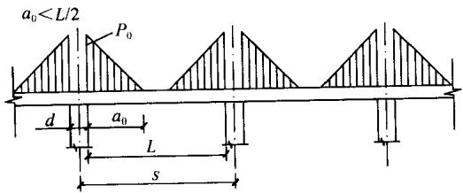  
(a)

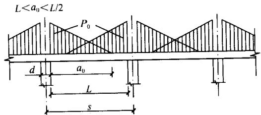  
(b)

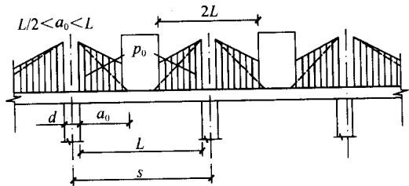  
(c)

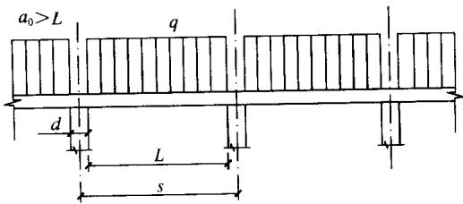  
(d)   
图G.0.1 砌体墙下条形桩基连续承台梁计算简图

式（G.0.1-1）～式（G.0.1-7）中：

$p_0$ ——线荷载的最大值（ $\mathrm{kN / m}$ ），按下式确定：

$$p _{0} = \frac {q L _{\mathrm {c}}}{a _{0}} \tag {G.0.1-8}$$

$a_0$ ——自桩边算起的三角形荷载图形的底边长度，分别按下列公式确定：

中间跨 $a_0 = 3.14\sqrt[3]{\frac{E_{\mathrm{n}}I}{E_{\mathrm{k}}b_{\mathrm{k}}}}$ (G.0.1-9)

边 跨 $a_0 = 2.4\sqrt[3]{\frac{E_{\mathrm{n}}I}{E_{\mathrm{k}}b_{\mathrm{k}}}}$ (G.0.1-10)

式中 $L_{\mathrm{c}}$ ——计算跨度， $L_{\mathrm{c}} = 1.05\mathrm{L}$ ；

$L$ ——两相邻桩之间的净距；

$s$ ——两相邻桩之间的中心距；

$d$ ——桩身直径；

$q$ ——承台梁底面以上的均布荷载；

$E_{\mathrm{n}}I$ ——承台梁的抗弯刚度；

$E_{\mathrm{n}}$ ——承台梁混凝土弹性模量；

$I$ ——承台梁横截面的惯性矩；

$E_{\mathrm{k}}$ ——墙体的弹性模量；

$b_{\mathrm{k}}$ ——墙体的宽度。

当门窗口下布有桩，且承台梁顶面至门窗口的砌体高度小于门窗口的净宽时，则应按倒置的简支梁计算该段梁的弯距，即取门窗净宽的1.05倍为计算跨度，取门窗下桩顶荷载为计算集中荷载进行计算。

# 附录H 锤击沉桩锤重的选用

H.0.1 锤击沉桩的锤重可根据表H.0.1选用。

表 H. 0.1 锤重选择表  

| 锤 型 | 锤 型 | 锤 型 | 柴油锤(t) | 柴油锤(t) | 柴油锤(t) | 柴油锤(t) | 柴油锤(t) | 柴油锤(t) | 柴油锤(t) |
| --- | --- | --- | --- | --- | --- | --- | --- | --- | --- |
| 锤 型 | 锤 型 | 锤 型 | D25 | D35 | D45 | D60 | D72 | D80 | D100 |
| 锤的动力性能 | 锤的动力性能 | 冲击部分质量(t) | 2.5 | 3.5 | 4.5 | 6.0 | 7.2 | 8.0 | 10.0 |
| 锤的动力性能 | 锤的动力性能 | 总质量(t) | 6.5 | 7.2 | 9.6 | 15.0 | 18.0 | 17.0 | 20.0 |
| 锤的动力性能 | 锤的动力性能 | 冲击力(kN) | 2000~2500 | 2500~4000 | 4000~5000 | 5000~7000 | 7000~10000 | >10000 | >12000 |
| 锤的动力性能 | 锤的动力性能 | 常用冲程(m) | 1.8~2.3 | 1.8~2.3 | 1.8~2.3 | 1.8~2.3 | 1.8~2.3 | 1.8~2.3 | 1.8~2.3 |
|  |  | 预制方桩、预应力管桩的边长或直径(mm) | 350~400 | 400~450 | 450~500 | 500~550 | 550~600 | 600以上 | 600以上 |
|  |  | 钢管桩直径(mm) | 400 | 400 | 600 | 900 | 900~1000 | 900以上 | 900以上 |
| 持力层 | 黏性土粉土 | 一般进入深度(m) | 1.5~2.5 | 2.0~3.0 | 2.5~3.5 | 3.0~4.0 | 3.0~5.0 |  |  |
| 持力层 | 黏性土粉土 | 静力触探比贯入阻力Ps平均值(MPa) | 4 | 5 | >5 | >5 | >5 |  |  |
| 持力层 | 砂土 | 一般进入深度(m) | 0.5~1.5 | 1.0~2.0 | 1.5~2.5 | 2.0~3.0 | 2.5~3.5 | 4.0~5.0 | 5.0~6.0 |
| 持力层 | 砂土 | 标准贯入击数N63.5(未修正) | 20~30 | 30~40 | 40~45 | 45~50 | 50 | >50 | >50 |
| 锤的常用控制贯入度(cm/10击) | 锤的常用控制贯入度(cm/10击) | 锤的常用控制贯入度(cm/10击) | 2~3 | 2~3 | 3~5 | 4~8 | 4~8 | 5~10 | 7~12 |
| 设计单桩极限承载力(kN) | 设计单桩极限承载力(kN) | 设计单桩极限承载力(kN) | 800~1600 | 2500~4000 | 3000~5000 | 5000~7000 | 7000~10000 | >10000 | >10000 |

注：1 本表仅供选锤用；  
2 本表适用于桩端进入硬土层一定深度的长度为 $20\sim 60\mathrm{m}$ 的钢筋混凝土预制桩及长度为 $40\sim 60\mathrm{m}$ 的钢管桩。

本规范用词说明

1 为了便于在执行本规范条文时区别对待，对于要求严格程度不同的用词说明如下：

1）表示很严格，非这样做不可的：

正面词采用“必须”，反面词采用“严禁”。

2）表示严格，在正常情况下均应这样做的：

正面词采用“应”，反面词采用“不应”或“不得”。

3）表示允许稍有选择，在条件允许时首先应这样做的：

正面词采用“宜”，反面词采用“不宜”。

表示有选择，在一定条件下可以这样做的，采用“可”。

2 条文中指明应按其他有关标准、规范执行的，写法为：“应按……执行”或“应符合……的规定（或要求）”。

中华人民共和国行业标准

建筑桩基技术规范

JGJ 94 - 2008

# 条文说明

前言

《建筑桩基技术规范》JGJ 94-2008，经住房和城乡建设部2008年4月22日以第18号公告批准、发布。

本规范的主编单位是中国建筑科学研究院，参编单位是北京市勘察设计研究院有限公司、现代设计集团华东建筑设计研究院有限公司、上海岩土工程勘察设计研究院有限公司、天津大学、福建省建筑科学研究院、中冶集团建筑研究总院、机械工业勘察设计研究院、中国建筑东北设计院、广东省建筑科学研究院、北京筑都方圆建筑设计有限公司、广州大学。

为便于广大设计、施工、科研、学校等单位有关人员在使用本标准时能正确理解和执行条文规定，《建筑桩基技术规范》编制组按章、节、条顺序编制了本规范的条文说明，供使用者参考。在使用中如发现本条文说明有不妥之处，请将意见函寄中国建筑科学研究院。

# 1 总 则

1.0.1~1.0.3 桩基的设计与施工要实现安全适用、技术先进、经济合理、确保质量、保护环境的目标，应综合考虑下列诸因素，把握相关技术要点。

1 地质条件。建设场地的工程地质和水文地质条件，包括地层分布特征和土性、地下水赋存状态与水质等，是选择桩型、成桩工艺、桩端持力层及抗浮设计等的关键因素。因此，场地勘察做到完整可靠，设计和施工者对于勘察资料做出正确解析和应用均至关重要。

2 上部结构类型、使用功能与荷载特征。不同的上部结构类型对于抵抗或适应桩基差异沉降的性能不同，如剪力墙结构抵抗差异沉降的能力优于框架、框架-剪力墙、框架-核心筒结构；排架结构适应差异沉降的性能优于框架、框架-剪力墙、框架-核心筒结构。建筑物使用功能的特殊性和重要性是决定桩基设计等级的依据之一；荷载大小与分布是确定桩型、桩的几何参数与布桩所应考虑的主要因素。地震作用在一定条件下制约桩的设计。

3 施工技术条件与环境。桩型与成桩工艺的优选，在综合考虑地质条件、单桩承载力要求前提下，尚应考虑成桩设备与技术的既有条件，力求既先进且实际可行、质量可靠；成桩过程产生的噪声、振动、泥浆、挤土效应等对于环境的影响应作为选择成桩工艺的重要因素。

4 注重概念设计。桩基概念设计的内涵是指综合上述诸因素制定该工程桩基设计的总体构思。包括桩型、成桩工艺、桩端持力层、桩径、桩长、单桩承载力、布桩、承台形式、是否设置后浇带等，它是施工图设计的基础。概念设计应在规范框架内，考虑桩、土、承台、上部结构相互作用对于承载力和变形的影

响，既满足荷载与抗力的整体平衡，又兼顾荷载与抗力的局部平衡，以优化桩型选择和布桩为重点，力求减小差异变形，降低承台内力和上部结构次内力，实现节约资源、增强可靠性和耐久性。可以说，概念设计是桩基设计的核心。

# 2 术语、符号

## 2.1 术语

术语以《建筑桩基技术规范》JGJ94-94为基础，根据本规范内容，作了相应的增补、修订和删节；增加了减沉复合疏桩基础、变刚度调平设计、承台效应系数、灌注桩后注浆、桩基等效沉降系数。

## 2.2符号

符号以沿用《建筑桩基技术规范》JGJ 94-94既有符号为主，根据规范条文的变化作了相应调整，主要是由于桩基竖向和水平承载力计算由原规范按荷载效应基本组合改为按标准组合。共有四条：2.2.1作用和作用效应；2.2.2抗力和材料性能：用单桩竖向承载力特征值、单桩水平承载力特征值取代原规范的竖向和水平承载力设计值；2.2.3几何参数；2.2.4计算系数。

# 3 基本设计规定

## 3.1 一般规定

3.1.1 本条说明桩基设计的两类极限状态的相关内容。

1 承载能力极限状态

原《建筑桩基技术规范》JGJ 94-94采用桩基承载能力概率极限状态分项系数的设计法，相应的荷载效应采用基本组合。本规范改为以综合安全系数 $K$ 代替荷载分项系数和抗力分项系数，以单桩极限承载力和综合安全系数 $K$ 为桩基抗力的基本参数。这意味着承载能力极限状态的荷载效应基本组合的荷载分项系数为1.0，亦即为荷载效应标准组合。本规范作这种调整的原因如下：

1）与现行国家标准《建筑地基基础设计规范》（GB50007）的设计原则一致，以方便使用。  
2）关于不同桩型和成桩工艺对极限承载力的影响，实际上已反映于单桩极限承载力静载试验值或极限侧阻力与极限端阻力经验参数中，因此承载力随桩型和成桩工艺的变异特征已在单桩极限承载力取值中得到较大程度反映，采用不同的承载力分项系数意义不大。  
3）鉴于地基土性的不确定性对基桩承载力可靠性影响目前仍处于研究探索阶段，原《建筑桩基技术规范》JGJ94-94的承载力概率极限状态设计模式尚属不完全的可靠性分析设计。

关于桩身、承台结构承载力极限状态的抗力仍采用现行国家标准《混凝土结构设计规范》GB50010、《钢结构设计规范》GB50017（钢桩）规定的材料强度设计值，作用力采用现行国家标

准《建筑结构荷载规范》GB50009规定的荷载效应基本组合设计值计算确定。

2 正常使用极限状态

由于问题的复杂性，以桩基的变形、抗裂、裂缝宽度为控制内涵的正常使用极限状态计算，如同上部结构一样从未实现基于可靠性分析的概率极限状态设计。因此桩基正常使用极限状态设计计算维持原《建筑桩基技术规范》JGJ 94-94 规范的规定。

3.1.2 划分建筑桩基设计等级，旨在界定桩基设计的复杂程度、计算内容和应采取的相应技术措施。桩基设计等级是根据建筑物规模、体型与功能特征、场地地质与环境的复杂程度，以及由于桩基问题可能造成建筑物破坏或影响正常使用的程度划分为三个等级。

甲级建筑桩基，第一类是（1）重要的建筑；（2）30层以上或高度超过 $100\mathrm{m}$ 的高层建筑。这类建筑物的特点是荷载大、重心高、风载和地震作用水平剪力大，设计时应选择基桩承载力变幅大、布桩具有较大灵活性的桩型，基础埋置深度足够大，严格控制桩基的整体倾斜和稳定。第二类是（3）体型复杂且层数相差超过10层的高低层（含纯地下室）连体建筑物；（4）20层以上框架-核心筒结构及其他对于差异沉降有特殊要求的建筑物。这类建筑物由于荷载与刚度分布极为不均，抵抗和适应差异变形的性能较差，或使用功能上对变形有特殊要求（如冷藏库、精密生产工艺的多层厂房、液面控制严格的贮液罐体、精密机床和透平设备基础等）的建（构）筑物桩基，须严格控制差异变形乃至沉降量。桩基设计中，首先，概念设计要遵循变刚度调平设计原则；其二，在概念设计的基础上要进行上部结构——承台——桩土的共同作用分析，计算沉降等值线、承台内力和配筋。第三类是（5）场地和地基条件复杂的7层以上的一般建筑物及坡地、岸边建筑；（6）对相邻既有工程影响较大的建筑物。这类建筑物自身无特殊性，但由于场地条件、环境条件的特殊性，应按桩基设计等级甲级设计。如场地处于岸边高坡、地基为半填半挖、基

底同置于岩石和土质地层、岩溶极为发育且岩面起伏很大、桩身范围有较厚自重湿陷性黄土或可液化土等等，这种情况下首先应把握好桩基的概念设计，控制差异变形和整体稳定、考虑负摩阻力等至关重要；又如在相邻既有工程的场地上建造新建筑物，包括基础跨越地铁、基础埋深大于紧邻的重要或高层建筑物等，此时如何确定桩基传递荷载和施工不致影响既有建筑物的安全成为设计施工应予控制的关键因素。

丙级建筑桩基的要素同时包含两方面，一是场地和地基条件简单，二是荷载分布较均匀、体型简单的7层及7层以下一般建筑；桩基设计较简单，计算内容可视具体情况简略。

乙级建筑桩基，为甲级、丙级以外的建筑桩基，设计较甲级简单，计算内容应根据场地与地基条件、建筑物类型酌定。

3.1.3 关于桩基承载力计算和稳定性验算，是承载能力极限状态设计的具体内容，应结合工程具体条件有针对性地进行计算或验算，条文所列6项内容中有的为必算项，有的为可算项。

3.1.4、3.1.5 桩基变形涵盖沉降和水平位移两大方面，后者包括长期水平荷载、高烈度区水平地震作用以及风荷载等引起的水平位移；桩基沉降是计算绝对沉降、差异沉降、整体倾斜和局部倾斜的基本参数。

3.1.6 根据基桩所处环境类别，参照现行《混凝土结构设计规范》GB50010关于结构构件正截面的裂缝控制等级分为三级：一级严格要求不出现裂缝的构件，按荷载效应标准组合计算的构件受拉边缘混凝土不应产生拉应力；二级一般要求不出现裂缝的构件，按荷载效应标准组合计算的构件受拉边缘混凝土拉应力不应大于混凝土轴心抗拉强度标准值；按荷载效应准永久组合计算构件受拉边缘混凝土不宜产生拉应力；三级允许出现裂缝的构件，应按荷载效应标准组合计算裂缝宽度。最大裂缝宽度限值见本规范表3.5.3。

3.1.7 桩基设计所采用的作用效应组合和抗力是根据计算或验算的内容相适应的原则确定。

1 确定桩数和布桩时，由于抗力是采用基桩或复合基桩极限承载力除以综合安全系数 $K = 2$ 确定的特征值，故采用荷载分项系数 $\gamma_{\mathrm{G}}$ 、 $\gamma_{\mathrm{Q}} = 1$ 的荷载效应标准组合。  
2 计算荷载作用下基桩沉降和水平位移时，考虑土体固结变形时效特点，应采用荷载效应准永久组合；计算水平地震作用、风荷载作用下桩基的水平位移时，应按水平地震作用、风载作用效应的标准组合。  
3 验算坡地、岸边建筑桩基整体稳定性采用综合安全系数，故其荷载效应采用 $\gamma_{\mathrm{G}}$ 、 $\gamma_{\mathrm{Q}} = 1$ 的标准组合。  
4 在计算承台结构和桩身结构时，应与上部混凝土结构一致，承台顶面作用效应应采用基本组合，其抗力应采用包含抗力分项系数的设计值；在进行承台和桩身的裂缝控制验算时，应与上部混凝土结构一致，采用荷载效应标准组合和荷载效应准永久组合。  
5 桩基结构作为结构体系的一部分，其安全等级、结构设计使用年限，应与混凝土结构设计规范一致。考虑到桩基结构的修复难度更大，故结构重要性系数 $\gamma_0$ 除临时性建筑外，不应小于1.0。

3.1.8 本条说明关于变刚度调平设计的相关内容。

变刚度调平概念设计旨在减小差异变形、降低承台内力和上部结构次内力，以节约资源，提高建筑物使用寿命，确保正常使用功能。以下就传统设计存在的问题、变刚度调平设计原理与方法、试验验证、工程应用效果进行说明。

1 天然地基箱基的变形特征

图1所示为北京中信国际大厦天然地基箱形基础竣工时和使用3.5年相应的沉降等值线。该大厦高 $104.1\mathrm{m}$ ，框架-核心筒结构；双层箱基，高 $11.8\mathrm{m}$ ；地基为砂砾与黏性土交互层；1984年建成至今20年，最大沉降由 $6.0\mathrm{cm}$ 发展至 $12.5\mathrm{cm}$ ，最大差异沉降 $\Delta s_{\max} = 0.004L_0$ ，超过规范允许值 $[\Delta s_{\max}] = 0.002L_0(L_0$ 为二测点距离)一倍，碟形沉降明显。这说明加大基础的抗弯刚

度对于减小差异沉降的效果并不突出，但材料消耗相当可观。

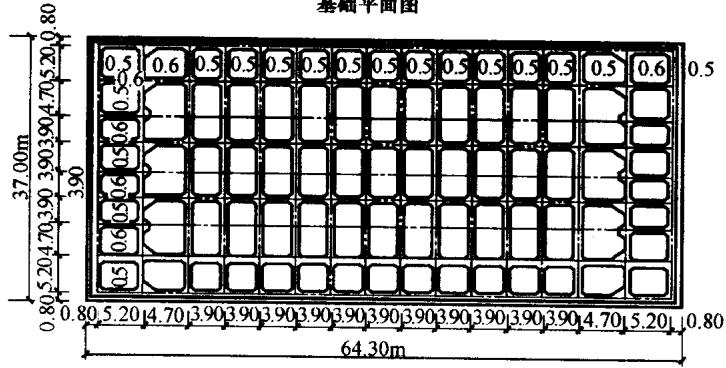  
基础平面图

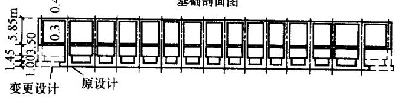  
基础剖面图

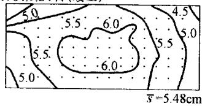  
1984.9.24日（竣工）

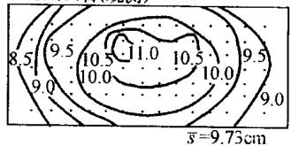  
1988.4.14日（观测）  
图1北京中信国际大厦箱基沉降等值线（ $s$ 单位：cm）

2 均匀布桩的桩筏基础的变形特征

图2为北京南银大厦桩筏基础建成一年的沉降等值线。该大厦高 $113\mathrm{m}$ ，框架-核心筒结构；采用 $\phi 400\mathrm{PHC}$ 管桩，桩长 $l = 11\mathrm{m}$ ，均匀布桩；考虑到预制桩沉桩出现上浮，对所有桩实施了复打；筏板厚 $2.5\mathrm{m}$ ；建成一年，最大差异沉降 $[\Delta s_{\max}] = 0.002L_0$ 。由于桩端以下有黏性土下卧层，桩长相对较短，预计最终最大沉降量将达 $7.0\mathrm{cm}$ 左右， $\Delta s_{\max}$ 将超过允许值。沉降分布与天然地基上箱基类似，呈明显碟形。

3 均匀布桩的桩顶反力分布特征

图3所示为武汉某大厦桩箱基础的实测桩顶反力分布。该大

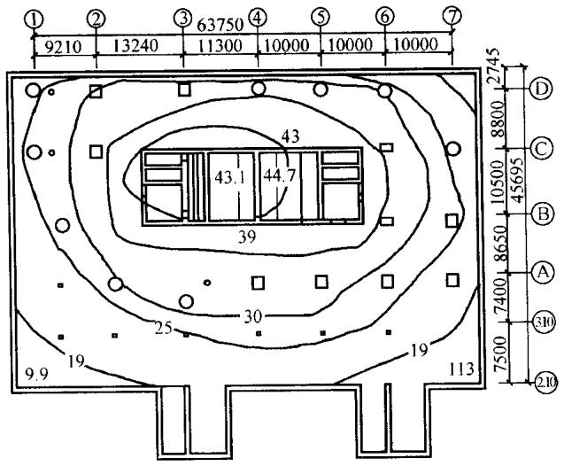  
图2 南银大厦桩筏基础沉降等值线（建成一年， $s$ 单位：mm）

厦为22层框架-剪力墙结构，桩基为 $\phi 500\mathrm{PHC}$ 管桩，桩长 $22\mathrm{m}$ ，均匀布桩，桩距3.3d，桩数344根，桩端持力层为粗中砂。由图3看出，随荷载和结构刚度增加，中、边桩反力差增大，最终达1：1.9，呈马鞍形分布。

  
图3武汉某大厦桩箱基础桩顶反力实测结果

4 碟形沉降和马鞍形反力分布的负面效应

1）碟形沉降

约束状态下的非均匀变形与荷载一样也是一种作用，受作用

体将产生附加应力。箱筏基础或桩承台的碟形沉降，将引起自身和上部结构的附加弯、剪内力乃至开裂。

2）马鞍形反力分布

天然地基箱筏基础土反力的马鞍形反力分布的负面效应将导致基础的整体弯矩增大。以图1北京中信国际大厦为例，土反力按《高层建筑箱形与筏形基础技术规范》JGJ6-99所给反力系数，近似计算中间单位宽板带核心筒一侧的附加弯矩较均布反力增加 $16.2\%$ 。根据图3所示桩箱基础实测反力内外比达 $1:1.9$ ，由此引起的整体弯矩增量比中信国际大厦天然地基的箱基更大。

5 变刚度调平概念设计

天然地基和均匀布桩的初始竖向支承刚度是均匀分布的，设置于其上的刚度有限的基础（承台）受均布荷载作用时，由于土与土、桩与桩、土与桩的相互作用导致地基或桩群的竖向支承刚度分布发生内弱外强变化，沉降变形出现内大外小的碟形分布，基底反力出现内小外大的马鞍形分布。

当上部结构为荷载与刚度内大外小的框架-核心筒结构时，碟形沉降会更趋明显[见图4(a)]，上述工程实例证实了这一点。为避免上述负面效应，突破传统设计理念，通过调整地基或基桩的竖向支承刚度分布，促使差异沉降减到最小，基础或承台内力和上部结构次应力显著降低。这就是变刚度调平概念设计的内涵。

1）局部增强变刚度

在天然地基满足承载力要求的情况下，可对荷载集度高的区域如核心筒等实施局部增强处理，包括采用局部桩基与局部刚性桩复合地基[见图4(c)]。

2）桩基变刚度

对于荷载分布较均匀的大型油罐等构筑物，宜按变桩距、变桩长布桩（图5）以抵消因相互作用对中心区支承刚度的削弱效应。对于框架-核心筒和框架-剪力墙结构，应按荷载分布考虑相

互作用，将桩相对集中布置于核心筒和柱下，对于外围框架区应适当弱化，按复合桩基设计，桩长宜减小（当有合适桩端持力层时），如图4(b)所示。

  
(a)

  
(b)

(c)   
图4 框架-核心筒结构均匀布桩与变刚度布桩   
  
（a）均匀布桩；（b）桩基复合桩基；（c）局部刚性桩复合地基或桩基

3）主裙连体变刚度

对于主裙连体建筑基础，应按增强主体（采用桩基）、弱化裙房（采用天然地基、疏短桩、复合地基、褥垫增沉等）的原则设计。  
4）上部结构—基础—地基（桩土）共同工作分析在概念设计的基础上，进行上部结构—基础—地基（桩土）

共同作用分析计算，进一步优化布桩，并确定承台内力与配筋。

  
(a)

(b)   
图5 均布荷载下变刚度布桩模式  
  
(a) 变桩距；(b) 变桩长

6 试验验证

1）变桩长模型试验

在石家庄某现场进行了20层框架-核心筒结构1/10现场模型试验。从图6看出，等桩长布桩（ $d = 150\mathrm{mm}$ ， $l = 2\mathrm{m}$ ）与变桩长（ $d = 150\mathrm{mm}$ ， $l = 2\mathrm{m}$ 、3m、4m）布桩相比，在总荷载 $F =$ $3250\mathrm{kN}$ 下，其最大沉降由 $s_{\max} = 6\mathrm{mm}$ 减至 $s_{\max} = 2.5\mathrm{mm}$ ，最大沉降差由 $\Delta s_{\max}\leqslant 0.012L_0$ （ $L_{0}$ 为二测点距离）减至 $\Delta s_{\max}\leqslant$ $0.0005L_{0}$ 。这说明按常规布桩，差异沉降难免超出规范要求，而按变刚度调平设计可大幅减小最大沉降和差异沉降。

由表1桩顶反力测试结果看出，等桩长桩基桩顶反力呈内小外大马鞍形分布，变桩长桩基转变为内大外小碟形分布。后者可使承台整体弯矩、核心筒冲切力显著降低。

表 1 桩顶反力比 $\left( {F = {3250}\mathrm{{kN}}}\right)$   

| 试验细目 | 内部桩 | 边 桩 | 角 桩 |
| --- | --- | --- | --- |
| 试验细目 | Qi/Qav | Qb/Qbv | Qc/Qav |
| 等长度布桩试验C | 76% | 140% | 115% |
| 变长度布桩试验D | 105% | 93% | 92% |

2）核心筒局部增强模型试验

图7为试验场地在粉质黏土地基上的20层框架结构1/10模型试验，无桩筏板与局部增强（刚性桩复合地基）试验比较。从

  
① $d = 150\mathrm{mm},l = 2\mathrm{m}$   
② $d = 150\mathrm{mm},l = 3\mathrm{m}$

  
③ $d = 150\mathrm{mm},I = 4\mathrm{m}$

  
(a)   
(c)

(d)   
图6等桩长与变桩长桩基模型试验（ $P = 3250\mathrm{kN}$   
  
（a）等长度布桩试验C；（b）变长度布桩试验D；（c）等长度布桩沉降等值线；  
（d）变长度布桩沉降等值线

图7(a)、(b)可看出，在相同荷载（ $F = 3250\mathrm{kN}$ ）下，后者最大沉降量 $s_{\mathrm{max}} = 8\mathrm{mm}$ ，外围沉降为 $7.8\mathrm{mm}$ ，差异沉降接近于零；而前者最大沉降量 $s_{\mathrm{max}} = 20\mathrm{mm}$ ，外围最大沉降量 $s_{\mathrm{min}} = 10\mathrm{mm}$ ，最大相对差异沉降 $\Delta s_{\mathrm{max}} / L_0 = 0.4\% >$ 容许值 $0.2\%$ 。可见，在天然地基承载力满足设计要求的情况下，采用对荷载集度高的核心区局部增强措施，其调平效果十分显著。

7 工程应用

采用变刚度调平设计理论与方法结合后注浆技术对北京皂君庙电信楼、山东农行大厦、北京长青大厦、北京电视台、北京呼家楼等27项工程的桩基设计进行了优化，取得了良好的技术经济效益（部分工程见表2)。最大沉降 $s_{\mathrm{max}} \leqslant 38\mathrm{mm}$ ，最大差异沉

  
(a)

(b)   
图7 核心筒区局部增强（刚性桩复合地基）与无桩筏板模型试验（ $P = 3250\mathrm{kN}$ ）  
  
(a) 无桩筏板；(b) 核心区刚性桩复合地基（ $d = 150\mathrm{mm}$ ， $L = 2\mathrm{m}$ ）

降 $\Delta s_{\mathrm{max}} \leqslant 0.0008L_0$ ，节约投资逾亿元。

3.1.9 软土地区多层建筑，若采用天然地基，其承载力许多情况下满足要求，但最大沉降往往超过 $20\mathrm{cm}$ ，差异变形超过允许值，引发墙体开裂者多见。20世纪90年代以来，首先在上海采用以减小沉降为目标的疏布小截面预制桩复合桩基，简称为减沉复合疏桩基础，上海称其为沉降控制复合桩基。近年来，这种减沉复合疏桩基础在温州、天津、济南等地也相继应用。

对于减沉复合疏桩基础应用中要注意把握三个关键技术，一是桩端持力层不应是坚硬岩层、密实砂、卵石层，以确保基桩受荷能产生刺入变形，承台底基土能有效分担份额很大的荷载；二是桩距应在 $5\sim 6d$ 以上，使桩间土受桩牵连变形较小，确保桩间土较充分发挥承载作用；三是由于基桩数量少而疏，成桩质量可靠性应严加控制。

表 2 变刚度调平设计工程实例  

| 工程名称 | 层数(层)/高度(m) | 建筑面积(m2) | 结构形式 | 桩数 | 桩数 | 承台板厚 | 承台板厚 | 节约投资(万元) |
| --- | --- | --- | --- | --- | --- | --- | --- | --- |
| 工程名称 | 层数(层)/高度(m) | 建筑面积(m2) | 结构形式 | 原设计 | 优化 | 原设计 | 优化 | 节约投资(万元) |
| 农行山东省分行大厦 | 44/170 | 80000 | 框架-核心筒,主裙连体 | 377φ1000 | 146φ1000 | - | - | 300 |
| 北京皂君庙电信大厦 | 18/150 | 66308 | 框架-剪力墙,主裙连体 | 373φ800391φ1000 | 302φ800 | - | - | 400 |
| 北京盛富大厦 | 26/100 | 60000 | 框架-核心筒,主裙连体 | 365φ1000 | 120φ1000 | - | - | 150 |
| 北京机械工业经营大厦 | 27/99.8 | 41700 | 框架-核心筒,主裙连体 | 桩基 | 复合地基 | - | - | 60 |
| 北京长青大厦 | 26/99.6 | 240000 | 框架-核心筒,主裙连体 | 1251φ800 | 860φ800 | - | 1.4m | 959 |
| 北京紫云大厦 | 32/113 | 68000 | 框架-核心筒,主裙连体 | - | 92φ1000 | - | - | 50 |
| BTV综合业务楼 | 41/255 | - | 框架-核心筒 | - | 126φ1000 | 3m | 2m | - |
| BTV演播楼 | 11/48 | 183000 | 框架-剪力墙 | - | 470φ800 | - | - | 1100 |

续表2   

| 工程名称 | 层数(层)/高度(m) | 建筑面积(m2) | 结构形式 | 桩数 | 桩数 | 承台板厚 | 承台板厚 | 节约投资(万元) |
| --- | --- | --- | --- | --- | --- | --- | --- | --- |
| 工程名称 | 层数(层)/高度(m) | 建筑面积(m2) | 结构形式 | 原设计 | 优化 | 原设计 | 优化 | 节约投资(万元) |
| BTV生活楼 | 11/52 | - | 框架-剪力墙 | - | 504φ600 | - | - | - |
| 万豪国际大酒店 | 33/128 | - | 框架-核心筒,主裙连体 | - | 162φ800 | - | - | - |
| 北京嘉美风尚中心公寓式酒店 | 28/99.8 | 180000 | 框架-剪力墙,主群连体 | 233φ800,l=38m | φ800,64根l=38m152根l=18m | 1.5m | 1.5m | 150 |
| 北京嘉美风尚中心办公楼 | 24/99.8 | 180000 | 框架-剪力墙,主群连体 | 194φ800,l=38m | φ800,65根l=38m117根l=18m | 1.5m | 1.5m | 200 |
| 北京财源国际中心西塔 | 36/156.5 | 220000 | 框架-核心筒 | φ800桩,扩底后注浆 | 280φ1000 | 3.0m | 2.2m | 200 |
| 北京悠乐汇B区酒店、商业及写字楼(共3栋塔楼) | 28/99.15 | 220000 | 框架-核心筒,主群连体 | - | 558φ800 | 核心下3.0m外围柱下2.2m | 1.6m | 685 |

3.1.10 对于按规范第3.1.4条进行沉降计算的建筑桩基，在施工过程及建成后使用期间，必须进行系统的沉降观测直至稳定。系统的沉降观测，包含四个要点：一是桩基完工之后即应在柱、墙脚部位设置测点，以测量地基的回弹再压缩量。待地下室建造出地面后，将测点移至地面柱、墙脚部成为长期测点，并加设保护措施；二是对于框架-核心筒、框架-剪力墙结构，应于内部柱、墙和外围柱、墙上设置测点，以获取建筑物内、外部的沉降和差异沉降值；三是沉降观测应委托专业单位负责进行，施工单位自测自检平行作业，以资校对；四是沉降观测应事先制定观测间隔时间和全程计划，观测数据和所绘曲线应作为工程验收内容，移交建设单位存档，并按相关规范观测直至稳定。

## 3.2 基本资料

3.2.1、3.2.2 为满足桩基设计所需的基本资料，除建筑场地工程地质、水文地质资料外，对于场地的环境条件、新建工程的平面布置、结构类型、荷载分布、使用功能上的特殊要求、结构安全等级、抗震设防烈度、场地类别、桩的施工条件、类似地质条件的试桩资料等，都是桩基设计所需的基本资料。根据工程与场地条件，结合桩基工程特点，对勘探点间距、勘探深度、原位试验这三方面制定合理完整的勘探方案，以满足桩型、桩端持力层、单桩承载力、布桩等概念设计阶段和施工图设计阶段的资料要求。

## 3.3 桩的选型与布置

3.3.1、3.3.2 本条说明桩的分类与选型的相关内容。

1 应正确理解桩的分类内涵

1）按承载力发挥性状分类

承载性状的两个大类和四个亚类是根据其在极限承载力状态下，总侧阻力和总端阻力所占份额而定。承载性状的变化不仅与桩端持力层性质有关，还与桩的长径比、桩周土层性质、成桩工

艺等有关。对于设计而言，应依据基桩竖向承载性状合理配筋、计算负摩阻力引起的下拉荷载、确定沉降计算图式、制定灌注桩沉渣控制标准和预制桩锤击和静压终止标准等。

2）按成桩方法分类

按成桩挤土效应分类，经大量工程实践证明是必要的，也是借鉴国外相关标准的规定。成桩过程中有无挤土效应，涉及设计选型、布桩和成桩过程质量控制。

成桩过程的挤土效应在饱和黏性土中是负面的，会引发灌注桩断桩、缩颈等质量事故，对于挤土预制混凝土桩和钢桩会导致桩体上浮，降低承载力，增大沉降；挤土效应还会造成周边房屋、市政设施受损；在松散土和非饱和填土中则是正面的，会起到加密、提高承载力的作用。

对于非挤土桩，由于其既不存在挤土负面效应，又具有穿越各种硬夹层、嵌岩和进入各类硬持力层的能力，桩的几何尺寸和单桩的承载力可调空间大。因此钻、挖孔灌注桩使用范围大，尤以重建建筑物更为合适。

3）按桩径大小分类

桩径大小影响桩的承载力性状，大直径钻（挖、冲）孔桩成孔过程中，孔壁的松驰变形导致侧阻力降低的效应随桩径增大而增大，桩端阻力则随直径增大而减小。这种尺寸效应与土的性质有关，黏性土、粉土与砂土、碎石类土相比，尺寸效应相对较弱。另外侧阻和端阻的尺寸效应与桩身直径 $d$ 、桩底直径 $D$ 呈双曲线函数关系，尺寸效应系数： $\psi_{\mathrm{si}} = (0.8 / d)^m$ ； $\psi_{\mathrm{p}} = (0.8 / D)^n$ 。

2 应避免基桩选型常见误区

1）凡嵌岩桩必为端承桩

将嵌岩桩一律视为端承桩会导致将桩端嵌岩深度不必要地加大，施工周期延长，造价增加。

2）挤土灌注桩也可应用于高层建筑

沉管挤土灌注桩无需排土排浆，造价低。20世纪80年代曾风行于南方各省，由于设计施工对于这类桩的挤土效应认识不

足，造成的事故极多，因而21世纪以来趋于淘汰。然而，重温这类桩使用不当的教训仍属必要。某28层建筑，框架-剪力墙结构；场地地层自上而下为饱和粉质黏土、粉土、黏土；采用 $\phi 500$ 、 $l = 22\mathrm{m}$ 、沉管灌注桩，梁板式筏形承台，桩距3.6d，均匀满堂布桩；成桩过程出现明显地面隆起和桩上浮；建至12层底板即开裂，建成后梁板式筏形承台的主次梁及部分与核心筒相连的框架梁开裂。最后采取加固措施，将梁板式筏形承台主次梁两侧加焊钢板，梁与梁之间充填混凝土变为平板式筏形承台。

鉴于沉管灌注桩应用不当的普遍性及其严重后果，本次规范修订中，严格控制沉管灌注桩的应用范围，在软土地区仅限于多层住宅单排桩条基使用。

3）预制桩的质量稳定性高于灌注桩

近年来，由于沉管灌注桩事故频发，PHC和PC管桩迅猛发展，取代沉管灌注桩。毋庸置疑，预应力管桩不存在缩颈、夹泥等质量问题，其质量稳定性优于沉管灌注桩，但是与钻、挖、冲孔灌注桩比较则不然。首先，沉桩过程的挤土效应常常导致断桩（接头处）、桩端上浮、增大沉降，以及对周边建筑物和市政设施造成破坏等；其次，预制桩不能穿透硬夹层，往往使得桩长过短，持力层不理想，导致沉降过大；其三，预制桩的桩径、桩长、单桩承载力可调范围小，不能或难于按变刚度调平原则优化设计。因此，预制桩的使用要因地、因工程对象制宜。

4）人工挖孔桩质量稳定可靠

人工挖孔桩在低水位非饱和土中成孔，可进行彻底清孔，直观检查持力层，因此质量稳定性较高。但是，设计者对于高水位条件下采用人工挖孔桩的潜在隐患认识不足。有的边挖孔边抽水，以至将桩侧细颗粒淘走，引起地面下沉，甚至导致护壁整体滑脱，造成人身事故；还有的将相邻桩新灌注混凝土的水泥颗粒带走，造成离析；在流动性淤泥中实施强制性挖孔，引起大量淤泥发生侧向流动，导致土体滑移将桩体推歪、推断。

5）凡扩底可提高承载力

扩底桩用于持力层较好、桩较短的端承型灌注桩，可取得较好的技术经济效益。但是，若将扩底不适当应用，则可能走进误区。如：在饱和单轴抗压强度高于桩身混凝土强度的基岩中扩底，是不必要的；在桩侧土层较好、桩长较大的情况下扩底，一则损失扩底端以上部分侧阻力，二则增加扩底费用，可能得失相当或失大于得；将扩底端放置于有软弱下卧层的薄硬土层上，既无增强效应，还可能留下安全隐患。

近年来，全国各地研发的新桩型，有的已取得一定的工程应用经验，编制了推荐性专业标准或企业标准，各有其适用条件。由于选用不当，造成事故者也不少见。

3.3.3 基桩的布置是桩基概念设计的主要内涵，是合理设计、优化设计的主要环节。

1 基桩的最小中心距。基桩最小中心距规定基于两个因素确定。第一，有效发挥桩的承载力，群桩试验表明对于非挤土桩，桩距 $3\sim 4d$ 时，侧阻和端阻的群桩效应系数接近或略大于1；砂土、粉土略高于黏性土。考虑承台效应的群桩效率则均大于1。但桩基的变形因群桩效应而增大，亦即桩基的竖向支承刚度因桩土相互作用而降低。

基桩最小中心距所考虑的第二个因素是成桩工艺。对于非挤土桩而言，无需考虑挤土效应问题；对于挤土桩，为减小挤土负面效应，在饱和黏性土和密实土层条件下，桩距应适当加大。因此最小桩距的规定，考虑了非挤土、部分挤土和挤土效应，同时考虑桩的排列与数量等因素。

2 考虑力系的最优平衡状态。桩群承载力合力点宜与竖向永久荷载合力作用点重合，以减小荷载偏心的负面效应。当桩基受水平力时，应使基桩受水平力和力矩较大方向有较大的抗弯截面模量，以增强桩基的水平承载力，减小桩基的倾斜变形。  
3 桩箱、桩筏基础的布桩原则。为改善承台的受力状态，特别是降低承台的整体弯矩、冲切力和剪切力，宜将桩布置于墙下和梁下，并适当弱化外围。

4 框架-核心筒结构的优化布桩。为减小差异变形、优化反力分布、降低承台内力，应按变刚度调平原则布桩。也就是根据荷载分布，作到局部平衡，并考虑相互作用对于桩土刚度的影响，强化内部核心筒和剪力墙区，弱化外围框架区。调整基桩支承刚度的具体作法是：对于刚度强化区，采取加大桩长（有多层持力层）、或加大桩径（端承型桩）、减小桩距（满足最小桩距）；对于刚度相对弱化区，除调整桩的几何尺寸外，宜按复合桩基设计。由此改变传统设计带来的碟形沉降和马鞍形反力分布，降低冲切力、剪切力和弯矩，优化承台设计。

5 关于桩端持力层选择和进入持力层的深度要求。桩端持力层是影响基桩承载力的关键性因素，不仅制约桩端阻力而且影响侧阻力的发挥，因此选择较硬土层为桩端持力层至关重要；其次，应确保桩端进入持力层的深度，有效发挥其承载力。进入持力层的深度除考虑承载性状外尚应同成桩工艺可行性相结合。本款是综合以上二因素结合工程经验确定的。

6 关于嵌岩桩的嵌岩深度原则上应按计算确定，计算中综合反映荷载、上覆土层、基岩性质、桩径、桩长诸因素，但对于嵌入倾斜的完整和较完整岩的深度不宜小于0.4d（以岩面坡下方深度计），对于倾斜度大于 $30\%$ 的中风化岩，宜根据倾斜度及岩石完整程度适当加大嵌岩深度，以确保基桩的稳定性。

## 3.4 特殊条件下的桩基

3.4.1 本条说明关于软土地基桩基的设计原则。

1 软土地基特别是沿海深厚软土区，一般坚硬地层埋置很深，但选择较好的中、低压缩性土层作为桩端持力层仍有可能，且十分重要。  
2 软土地区桩基因负摩阻力而受损的事故不少，原因各异。一是有些地区覆盖有新近沉积的欠固结土层；二是采取开山或吹填围海造地；三是使用过程地面大面积堆载；四是邻近场地降低地下水；五是大面积挤土沉桩引起超孔隙水压和土体上涌等等。

负摩阻力的发生和危害是可以预防、消减的。问题是设计和施工者的事先预测和采取应对措施。

3 挤土沉桩在软土地区造成的事故不少，一是预制桩接头被拉断、桩体侧移和上涌，沉管灌注桩发生断桩、缩颈；二是邻近建筑物、道路和管线受到破坏。设计时要因地制宜选择桩型和工艺，尽量避免采用沉管灌注桩。对于预制桩和钢桩的沉桩，应采取减小孔压和减轻挤土效应的措施，包括施打塑料排水板、应力释放孔、引孔沉桩、控制沉桩速率等。

4 关于基坑开挖对已成桩的影响问题。在软土地区，考虑到基桩施工有利的作业条件，往往采取先成桩后开挖基坑的施工程序。由于基坑开挖得不均衡，形成“坑中坑”，导致土体蠕变滑移将基桩推歪推断，有的水平位移达 $1\mathrm{m}$ 多，造成严重的质量事故。这类事故自20世纪80年代以来，从南到北屡见不鲜。因此，软土场地在已成桩的条件下开挖基坑，必须严格实行均衡开挖，高差不应超过 $1\mathrm{m}$ ，不得在坑边弃土，以确保已成基桩不因土体滑移而发生水平位移和折断。

3.4.2 本条说明湿陷性黄土地区桩基的设计原则。

1 湿陷性黄土地区的桩基，由于土的自重湿陷对基桩产生负摩阻力，非自重湿陷性土由于浸水削弱桩侧阻力，承台底土抗力也随之消减，导致基桩承载力降低。为确保基桩承载力的安全可靠性，桩端持力层应选择低压缩性的黏性土、粉土、中密和密实土以及碎石类土层。  
2 湿陷性黄土地基中的单桩极限承载力的不确定性较大，故设计等级为甲、乙级桩基工程的单桩极限承载力的确定，强调采用浸水载荷试验方法。  
3 自重湿陷性黄土地基中的单桩极限承载力，应视浸水可能性、桩端持力层性质、建筑桩基设计等级等因素考虑负摩阻力的影响。

3.4.3 本条说明季节性冻土和膨胀土地基中的桩基的设计原则。

主要应考虑冻胀和膨胀对于基桩抗拔稳定性问题，避免冻胀

或膨胀力作用下产生上拔变形，乃至因累积上拔变形而引起建筑物开裂。因此，对于荷载不大的多层建筑桩基设计应考虑以下诸因素：桩端进入冻深线或膨胀土的大气影响急剧层以下一定深度；宜采用无挤土效应的钻、挖孔桩；对桩基的抗拔稳定性和桩身受拉承载力进行验算；对承台和桩身上部采取隔冻、隔胀处理。

3.4.4 本条说明岩溶地区桩基的设计原则。

主要考虑岩溶地区的基岩表面起伏大，溶沟、溶槽、溶洞往往较发育，无风化岩层覆盖等特点，设计应把握三方面要点：一是基桩选型和工艺宜采用钻、冲孔灌注桩，以利于嵌岩；二是应控制嵌岩最小深度，以确保倾斜基岩上基桩的稳定；三是当基岩的溶蚀极为发育，溶沟、溶槽、溶洞密布，岩面起伏很大，而上覆土层厚度较大时，考虑到嵌岩桩桩长变异性过大，嵌岩施工难以实施，可采用较小桩径（ $\phi 500 \sim \phi 700$ ）密布非嵌岩桩，并后注浆，形成整体性和刚度很大的块体基础。如宜春邮电大楼即是一例，楼高 $80\mathrm{m}$ ，框架-剪力墙结构，地质条件与上述情况类似，原设计为嵌岩桩，成桩过程出现个别桩充盈系数达20以上，后改为 $\Phi 700$ 灌注桩，利用上部 $20\mathrm{m}$ 左右较好的土层，实施桩端桩侧后注浆，筏板承台。建成后沉降均匀，最大不超过 $10\mathrm{mm}$ 。

3.4.5 本条说明坡地、岸边建筑桩基的设计原则。

坡地、岸边建筑桩基的设计，关键是确保其整体稳定性，一旦失稳既影响自身建筑物的安全也会波及相邻建筑的安全。整体稳定性涉及这样三个方面问题：一是建筑场地必须是稳定的，如果存在软弱土层或岩土界面等潜在滑移面，必须将桩支承于稳定岩土层以下足够深度，并验算桩基的整体稳定性和基桩的水平承载力；二是建筑桩基外缘与坡顶的水平距离必须符合有关规范规定；边坡自身必须是稳定的或经整治后确保其稳定性；三是成桩过程不得产生挤土效应。

3.4.6 本条说明抗震设防区桩基的设计原则。

桩基较其他基础形式具有较好的抗震性能，但设计中应把握

这样三点：一是基桩进入液化土层以下稳定土层的长度不应小于本条规定的最小值；二是为确保承台和地下室外墙土抗力能分担水平地震作用，肥槽回填质量必须确保；三是当承台周围为软土和可液化土，且桩基水平承载力不满足要求时，可对外侧土体进行适当加固以提高水平抗力。

3.4.7 本条说明可能出现负摩阻力的桩基的设计原则。

1 对于填土建筑场地，宜先填土后成桩，为保证填土的密实性，应根据填料及下卧层性质，对低水位场地应分层填土分层辗压或分层强夯，压实系数不应小于0.94。为加速下卧层固结，宜采取插塑料排水板等措施。  
2室内大面积堆载常见于各类仓库、炼钢、轧钢车间，由堆载引起上部结构开裂乃至破坏的事故不少。要防止堆载对桩基产生负摩阻力，对堆载地基进行加固处理是措施之一，但造价往往偏高。对与堆载相邻的桩基采用刚性排桩进行隔离，对预制桩表面涂层处理等都是可供选用的措施。  
3 对于自重湿陷性黄土，采用强夯、挤密土桩等处理，消除土层的湿陷性，属于防止负摩阻力的有效措施。

3.4.8 本条说明关于抗拔桩基的设计原则。

建筑桩基的抗拔问题主要出现于两种情况，一种是建筑物在风荷载、地震作用下的局部非永久上拔力；另一种是抵抗超补偿地下室地下水浮力的抗浮桩。对于前者，抗拔力与建筑物高度、风压强度、抗震设防等级等因素相关。当建筑物设有地下室时，由于风荷载、地震引起的桩顶拔力显著减小，一般不起控制作用。

随着近年地下空间的开发利用，抗浮成为较普遍的问题。抗浮有多种方式，包括地下室底板上配重（如素混凝土或钢渣混凝土）、设置抗浮桩。后者具有较好的灵活性、适用性和经济性。对于抗浮桩基的设计，首要问题是根据场地勘察报告关于环境类别，水、土腐蚀性，参照现行《混凝土结构设计规范》GB50010确定桩身的裂缝控制等级，对于不同裂缝控制等级采取相

应设计原则。对于抗浮荷载较大的情况宜采用桩侧后注浆、扩底灌注桩，当裂缝控制等级较高时，可采用预应力桩；以岩层为主的地基宜采用岩石锚杆抗浮。其次，对于抗浮桩承载力应按本规范进行单桩和群桩抗拔承载力计算。

## 3.5 耐久性规定

3.5.2 二、三类环境桩基结构耐久性设计，对于混凝土的基本要求应根据现行《混凝土结构设计规范》GB50010规定执行，最大水灰比、最小水泥用量、混凝土最低强度等级、混凝土的最大氯离子含量、最大碱含量应符合相应的规定。

3.5.3 关于二、三类环境桩基结构的裂缝控制等级的判别，应按现行《混凝土结构设计规范》GB50010规定的环境类别和水、土对混凝土结构的腐蚀性等级制定，对桩基结构正截面尤其是对抗拔桩的抗裂和裂缝宽度控制进行设计计算。

# 4 桩基构造

## 4.1 基桩构造

4.1.1 本条说明关于灌注桩的配筋率、配筋长度和箍筋的配置的相关内容。

灌注桩的配筋与预制桩不同之处是无需考虑吊装、锤击沉桩等因素。正截面最小配筋率宜根据桩径确定，如 $\phi 300\mathrm{mm}$ 桩，配 $6\phi 10\mathrm{mm}$ ， $A_{\mathrm{g}} = 471\mathrm{mm}^2$ ， $\mu_{\mathrm{g}} = A_{\mathrm{g}} / A_{\mathrm{ps}} = 0.67\%$ ；又如 $\phi 2000\mathrm{mm}$ 桩，配 $16\phi 22\mathrm{mm}$ ， $A_{\mathrm{g}} = 6280\mathrm{mm}^2$ ， $\mu_{\mathrm{g}} = A_{\mathrm{g}} / A_{\mathrm{ps}} = 0.2\%$ 。另外，从承受水平力的角度考虑，桩身受弯截面模量为桩径的3次方，配筋对水平抗力的贡献随桩径增大显著增大。从以上两方面考虑，规定正截面最小配筋率为 $0.2\% \sim 0.65\%$ ，大桩径取低值，小桩径取高值。

关于配筋长度，主要考虑轴向荷载的传递特征及荷载性质。对于端承桩应通长等截面配筋，摩擦型桩宜分段变截面配筋；当桩较长也可部分长度配筋，但不宜小于2/3桩长。当受水平力时，尚不应小于反弯点下限 $4.0 / \alpha$ ；当有可液化层、软弱土层时，纵向主筋应穿越这些土层进入稳定土层一定深度。对于抗拔桩应根据桩长、裂缝控制等级、桩侧土性等因素通长等截面或变截面配筋。对于受水平荷载桩，其极限承载力受配筋率影响大，主筋不应小于 $8\phi 12$ ，以保证受拉区主筋不小于 $3\phi 12$ 。对于抗压桩和抗拔桩，为保证桩身钢筋笼的成型刚度以及桩身承载力的可靠性，主筋不应小于 $6\phi 10$ ； $d \leqslant 400\mathrm{mm}$ 时，不应小于 $4\phi 10$ 。

关于箍筋的配置，主要考虑三方面因素。一是箍筋的受剪作用，对于地震设防地区，基桩桩顶要承受较大剪力和弯矩，在风载等水平力作用下也同样如此，故规定桩顶 $5d$ 范围箍筋应适当加密，一般间距为 $100\mathrm{mm}$ ；二是箍筋在轴压荷载下对混凝土起

到约束加强作用，可大幅提高桩身受压承载力，而桩顶部分荷载最大，故桩顶部位箍筋应适当加密；三是为控制钢筋笼的刚度，根据桩身直径不同，箍筋直径一般为 $\phi 6\sim \phi 12$ ，加劲箍为 $\phi 12\sim \phi 18$ 。

4.1.2 桩身混凝土的最低强度等级由原规定C20提高到C25，这主要是根据《混凝土结构设计规范》GB50010规定，设计使用年限为50年，环境类别为二a时，最低强度等级为C25；环境类别为二b时，最低强度等级为C30。  
4.1.13 根据广东省采用预应力管桩的经验，当桩端持力层为非饱和状态的强风化岩时，闭口桩沉桩后一定时间由于桩端构造缝隙浸水导致风化岩软化，端阻力有显著降低现象。经研究，沉桩后立刻灌入微膨胀性混凝土至桩端以上约 $2\mathrm{m}$ ，能起到防止渗水软化现象发生。

## 4.2 承台构造

4.2.1 承台除满足抗冲切、抗剪切、抗弯承载力和上部结构的需要外，尚需满足如下构造要求才能保证实现上述要求。

1 承台最小宽度不应小于 $500\mathrm{mm}$ ，桩中心至承台边缘的距离不宜小于桩直径或边长，边缘挑出部分不应小于 $150\mathrm{mm}$ ，主要是为满足嵌固及斜截面承载力（抗冲切、抗剪切）的要求。对于墙下条形承台梁，其边缘挑出部分可减少至 $75\mathrm{mm}$ ，主要是考虑到墙体与承台梁共同工作可增强承台梁的整体刚度，受力情况良好。  
2 承台的最小厚度规定为不应小于 $300\mathrm{mm}$ ，高层建筑平板式筏形基础承台最小厚度不应小于 $400\mathrm{mm}$ ，是为满足承台基本刚度、桩与承台的连接等构造需要。

4.2.2 承台混凝土强度等级应满足结构混凝土耐久性要求，对设计使用年限为50年的承台，根据现行《混凝土结构设计规范》GB50010的规定，当环境类别为二a类别时不应低于C25，二b类别时不应低于C30。有抗渗要求时，其混凝土的抗渗等级应符

合有关标准的要求。

4.2.3 承台的钢筋配置除应满足计算要求外，尚需满足构造要求。

1 柱下独立桩基承台的受力钢筋应通长配置，主要是为保证桩基承台的受力性能良好，根据工程经验及承台受弯试验对矩形承台将受力钢筋双向均匀布置；对三桩的三角形承台应按三向板带均匀布置，为提高承台中部的抗裂性能，最里面的三根钢筋围成的三角形应在柱截面范围内。承台受力钢筋的直径不宜小于 $12\mathrm{mm}$ ，间距不宜大于 $200\mathrm{mm}$ 。主要是为满足施工及受力要求。独立桩基承台的最小配筋率不应小于 $0.15\%$ 。具体工程的实际最小配筋率宜考虑结构安全等级、基桩承载力等因素综合确定。  
2 柱下独立两桩承台，当桩距与承台有效高度之比小于5时，其受力性能属深受弯构件范畴，因而宜按现行《混凝土结构设计规范》GB50010中的深受弯构件配置纵向受拉钢筋、水平及竖向分布钢筋。  
3 条形承台梁纵向主筋应满足现行《混凝土结构设计规范》GB50010关于最小配筋率 $0.2\%$ 的要求以保证具有最小抗弯能力。关于主筋、架立筋、箍筋直径的要求是为满足施工及受力要求。  
4 筏板承台在计算中仅考虑局部弯矩时，由于未考虑实际存在的整体弯距的影响，因此需要加强构造，故规定纵横两个方向的下层钢筋配筋率不宜小于 $0.15\%$ ；上层钢筋按计算钢筋全部连通。当筏板厚度大于 $2000\mathrm{mm}$ 时，在筏板中部设置直径不小于 $12\mathrm{mm}$ 、间距不大于 $300\mathrm{mm}$ 的双向钢筋网，是为减小大体积混凝土温度收缩的影响，并提高筏板的抗剪承载力。  
5 承台底面钢筋的混凝土保护层厚度除应符合现行《混凝土结构设计规范》GB50010的要求外，尚不应小于桩头嵌入承台的长度。

4.2.4 本条说明桩与承台的连接构造要求。

1 桩嵌入承台的长度规定是根据实际工程经验确定。如果桩嵌入承台深度过大，会降低承台的有效高度，使受力不利。  
2 混凝土桩的桩顶纵向主筋锚入承台内的长度一般情况下为35倍直径，对于专用抗拔桩，桩顶纵向主筋的锚固长度应按现行《混凝土结构设计规范》GB50010的受拉钢筋锚固长度确定。  
3 对于大直径灌注桩，当采用一柱一桩时，连接构造通常有两种方案：一是设置承台，将桩与柱通过承台相连接；二是将桩与柱直接相连。实际工程根据具体情况选择。

关于桩与承台连接的防水构造问题：

当前工程实践中，桩与承台连接的防水构造形式繁多，有的用防水卷材将整个桩头包裹起来，致使桩与承台无连接，仅是将承台支承于桩顶；有的虽设有防水措施，但在钢筋与混凝土或底板与桩之间形成渗水通道，影响桩及底板的耐久性。本规范建议的防水构造如图8。

  
图8 桩与承台连接的防水构造

具体操作时要注意以下几点：

（1）桩头要剔凿至设计标高，并用聚合物水泥防水砂浆

找平；桩侧剔凿至混凝土密实处；

2）破桩后如发现渗漏水，应采取相应堵漏措施；  
3）清除基层上的混凝土、粉尘等，用清水冲洗干净；基面要求潮湿，但不得有明水；  
4）沿桩头根部及桩头钢筋根部分别剔凿 $20\mathrm{mm} \times 25\mathrm{mm}$ 及 $10\mathrm{mm} \times 10\mathrm{mm}$ 的凹槽；  
5）涂刷水泥基渗透结晶型防水涂料必须连续、均匀，待第二层涂料呈半干状态后开始喷水养护，养护时间不小于三天；  
6）待膨胀型止水条紧密、连续、牢固地填塞于凹槽后，方可施工聚合物水泥防水砂浆层；  
7）聚硫嵌缝膏嵌填时，应保护好垫层防水层，并与之搭接严密；  
8）垫层防水层及聚硫嵌缝膏施工完成后，应及时做细石混凝土保护层。

4.2.6 本条说明承台与承台之间的连接构造要求。

1 一柱一桩时，应在桩顶两个相互垂直方向上设置连系梁，以保证桩基的整体刚度。当桩与柱的截面直径之比大于2时，在水平力作用下，承台水平变位较小，可以认为满足结构内力分析时柱底为固端的假定。  
2 两桩桩基承台短向抗弯刚度较小，因此应设置承台连系梁。  
3 有抗震设防要求的柱下桩基承台，由于地震作用下，建筑物的各桩基承台所受的地震剪力和弯矩是不确定的，因此在纵横两方向设置连系梁，有利于桩基的受力性能。  
4 连系梁顶面与承台顶面位于同一标高，有利于直接将柱底剪力、弯矩传递至承台。

连系梁的截面尺寸及配筋一般按下述方法确定：以柱剪力作用于梁端，按轴心受压构件确定其截面尺寸，配筋则取与轴心受压相同的轴力（绝对值），按轴心受拉构件确定。在抗震设防区

也可取柱轴力的1/10为梁端拉压力的粗略方法确定截面尺寸及配筋。联系梁最小宽度和高度尺寸的规定，是为了确保其平面外有足够的刚度。

5 连系梁配筋除按计算确定外，从施工和受力要求，其最小配筋量为上下配置不小于 $2\phi 12$ 钢筋。

4.2.7 承台和地下室外墙的肥槽回填土质量至关重要。在地震和风载作用下，可利用其外侧土抗力分担相当大份额的水平荷载，从而减小桩顶剪力分担，降低上部结构反应。但工程实践中，往往忽视肥槽回填质量，以至出现浸水湿陷，导致散水破坏，给桩基结构在遭遇地震工况下留下安全隐患。设计人员应加以重视，避免这种情况发生。一般情况下，采用灰土和压实性较好的素土分层夯实；当施工中分层夯实有困难时，可采用素混凝土回填。

# 5 桩基计算

## 5.1 桩顶作用效应计算

5.1.1 关于桩顶竖向力和水平力的计算，应是在上部结构分析将荷载凝聚于柱、墙底部的基础上进行。这样，对于柱下独立桩基，按承台为刚性板和反力呈线性分布的假定，得到计算各基桩或复合基桩的桩顶竖向力和水平力公式(5.1.1-1)～(5.1.1-3)。对于桩筏、桩箱基础，则按各柱、剪力墙、核心筒底部荷载分别按上述公式进行桩顶竖向力和水平力的计算。

5.1.3 属于本条所列的第一种情况，为了考虑其在高烈度地震作用或风载作用下桩基承台和地下室侧墙的侧向土抗力，合理的计算基桩的水平承载力和位移，宜按附录C进行承台——桩——土协同作用分析。属于本条所列的第二种情况，高承台桩基（使用要求架空的大型储罐、上部土层液化、湿陷）和低承台桩基，在较大水平力作用下，为使基桩桩顶竖向力、剪力、弯矩分配符合实际，也需按附录C进行计算，尤其是当桩径、桩长不等时更为必要。

## 5.2 桩基竖向承载力计算

5.2.1、5.2.2 关于桩基竖向承载力计算，本规范采用以综合安全系数 $K = 2$ 取代原规范的荷载分项系数 $\gamma_{\mathrm{G}}$ 、 $\gamma_{\mathrm{Q}}$ 和抗力分项系数 $\gamma_{\mathrm{s}}$ 、 $\gamma_{\mathrm{p}}$ ，以单桩竖向极限承载力标准值 $Q_{\mathrm{uk}}$ 或极限侧阻力标准值 $q_{\mathrm{sik}}$ 、极限端阻力标准值 $q_{\mathrm{pk}}$ 、桩的几何参数 $a_{\mathrm{k}}$ 为参数确定抗力，以荷载效应标准组合 $S_{\mathrm{k}}$ 为作用力的设计表达式：

$$S _{k} \leqslant R \left(Q _{u k}, K\right)$$

或 $S_{\mathrm{k}} \leqslant R(q_{\mathrm{sk}}, q_{\mathrm{pk}}, a_{\mathrm{k}}, K)$

采用上述承载力极限状态设计表达式，桩基安全度水准与

《建筑桩基技术规范》JGJ 94-94相比，有所提高。这是由于（1）建筑结构荷载规范的均布活载标准值较前提高了 $1/4$ （办公楼、住宅），荷载组合系数提高了 $17\%$ ；由此使以土的支承阻力制约的桩基承载力安全度有所提高；（2）基本组合的荷载分项系数由1.25提高至1.35（以永久荷载控制的情况）；（3）钢筋和混凝土强度设计值略有降低。以上（2）、（3）因素使桩基结构承载力安全度有所提高。

5.2.4 对于本条规定的考虑承台竖向土抗力的四种情况：一是上部结构刚度较大、体形简单的建（构）筑物，由于其可适应较大的变形，承台分担的荷载份额往往也较大；二是对于差异变形适应性较强的排架结构和柔性构筑物桩基，采用考虑承台效应的复合桩基不致降低安全度；三是按变刚度调平原则设计的核心筒外围框架柱桩基，适当增加沉降、降低基桩支承刚度，可达到减小差异沉降、降低承台外围基桩反力、减小承台整体弯距的目标；四是软土地区减沉复合疏桩基础，考虑承台效应按复合桩基设计是该方法的核心。以上四种情况，在近年工程实践中的应用已取得成功经验。

5.2.5 本条说明关于承台效应及复合桩基承载力计算的相关内容

1 承台效应系数

摩擦型群桩在竖向荷载作用下，由于桩土相对位移，桩间土对承台产生一定竖向抗力，成为桩基竖向承载力的一部分而分担荷载，称此种效应为承台效应。承台底地基土承载力特征值发挥率为承台效应系数。承台效应和承台效应系数随下列因素影响而变化。

1）桩距大小。桩顶受荷载下沉时，桩周土受桩侧剪应力作用而产生竖向位移 $\omega_{\mathrm{r}}$

$$w _{\mathrm {r}} = \frac {1 + \mu_{\mathrm {s}}}{E _{\mathrm {o}}} q _{\mathrm {s}} d \ln \frac {n d}{r}$$

由上式看出，桩周土竖向位移随桩侧剪应力 $q_{\mathrm{s}}$ 和桩径 $d$ 增大而线性增加，随与桩中心距离 $r$ 增大，呈自然对数关系减小，当距离 $r$ 达到 $nd$ 时，位移为

零；而 $nd$ 根据实测结果约为 $(6\sim 10)d$ ，随土的变形模量减小而减小。显然，土竖向位移愈小，土反力愈大，对于群桩，桩距愈大，土反力愈大。

2）承台土抗力随承台宽度与桩长之比 $B_{\mathrm{c}} / l$ 减小而减小。现场原型试验表明，当承台宽度与桩长之比较大时，承台土反力形成的压力泡包围整个桩群，由此导致桩侧阻力、端阻力发挥值降低，承台底土抗力随之加大。由图9看出，在相同桩数、桩距条件下，承台分担荷载比随 $B_{\mathrm{c}} / l$ 增大而增大。

3）承台土抗力随区位和桩的排列而变化。承台内区（桩群包络线以内）由于桩土相互影响明显，土的竖向位移加大，导致内区土反力明显小于外区（承台悬挑部分），即呈马鞍形分布。从图10（a）还可看出，桩数由 $2^{2}$ 增至 $3^{2}$ 、 $4^{2}$ ，承台分担荷载比 $P_{\mathrm{c}} / P$ 递减，这也反映出承台内、外区面积比随桩数增多而增大导致承台土抗力随之降低。对于单排桩条基，由于承台外区面积比大，故其土抗力显著大于多排桩桩基。图10所示多排和单排桩基承台分担荷载比明显不同证实了这一点。

4）承台土抗力随荷载的变化。由图9、图10看出，桩基受荷后承台底产生一定土抗力，随荷载增加土抗力及其荷载分担比的变化分二种模式。一种模式是，到达工作荷载（ $P_{\mathrm{u}} / 2$ ）时，荷载分担比 $P_{\mathrm{c}} / P$ 趋于稳值，也就是说土抗力和荷载增速是同步的；这种变化模式出现于 $B_{\mathrm{c}} / l \leqslant 1$ 和多排桩。对于 $B_{\mathrm{c}} / l > 1$ 和单排桩桩基属于第二种变化模式， $P_{\mathrm{c}} / P$ 在荷载达到 $P_{\mathrm{u}} / 2$ 后仍随荷载水平增大而持续增长；这说明这两种类型桩基承台土抗力的增速持续大于荷载增速。

5）承台效应系数模型试验实测、工程实测与计算比较（见表3、表4）。

  
图9 粉土中承台分担荷载比 $P_{\mathrm{c}} / P$ 随承台宽度与桩长比 $B_{\mathrm{c}} / L$ 的变化  
(a)

(b)   
图10 粉土中多排群桩和单排群桩承台分担荷载比   
  
（a）多排桩；（b）单排桩

表 3 承台效应系数模型试验实测与计算比较  

| 序号 | 土类 | 桩径 | 长径比 | 距径比 | 桩数 | 承台宽与桩长比 | 承台底土承载力特征值 | 桩端持力层 | 实测土抗力平均值 | 承台效应系数 | 承台效应系数 |
| --- | --- | --- | --- | --- | --- | --- | --- | --- | --- | --- | --- |
| 序号 | 土类 | d(mm) | l/d | sa/d | r×m | Bc/l | fak(kPa) | 桩端持力层 | (kPa) | 实测ηc | 计算ηc |
| 1 | 粉土 | 250 | 18 | 3 | 3×3 | 0.50 | 125 | 粉黏 | 32 | 0.26 | 0.16 |
| 2 | 粉土 | 250 | 8 | 3 | 3×3 | 1.125 | 125 | 粉黏 | 40 | 0.32 | 0.18 |
| 3 | 粉土 | 250 | 13 | 3 | 3×3 | 0.692 | 125 | 粉黏 | 35 | 0.28 | 0.16 |
| 4 | 粉土 | 250 | 23 | 3 | 3×3 | 0.391 | 125 | 粉黏 | 30 | 0.24 | 0.14 |
| 5 | 粉土 | 250 | 18 | 4 | 3×3 | 0.611 | 125 | 粉黏 | 34 | 0.27 | 0.22 |
| 6 | 粉土 | 250 | 18 | 6 | 3×3 | 0.833 | 125 | 粉黏 | 60 | 0.48 | 0.44 |
| 7 | 粉土 | 250 | 18 | 3 | 1×4 | 0.167 | 125 | 粉黏 | 40 | 0.32 | 0.30 |
| 8 | 粉土 | 250 | 18 | 3 | 2×4 | 0.333 | 125 | 粉黏 | 32 | 0.26 | 0.14 |
| 9 | 粉土 | 250 | 18 | 3 | 3×4 | 0.507 | 125 | 粉黏 | 30 | 0.24 | 0.15 |
| 10 | 粉土 | 250 | 18 | 3 | 4×4 | 0.667 | 125 | 粉黏 | 29 | 0.23 | 0.16 |
| 11 | 粉土 | 250 | 18 | 3 | 2×2 | 0.333 | 125 | 粉黏 | 40 | 0.32 | 0.14 |
| 12 | 粉土 | 250 | 18 | 3 | 1×6 | 0.167 | 125 | 粉黏 | 32 | 0.26 | 0.14 |
| 13 | 粉土 | 250 | 18 | 3 | 3×3 | 0.500 | 125 | 粉黏 | 28 | 0.22 | 0.15 |
| 14 | 粉黏 | 150 | 11 | 3 | 6×6 | 1.55 | 75 | 砾砂 | 13.3 | 0.18 | 0.18 |
| 15 | 粉黏 | 150 | 11 | 3.75 | 5×5 | 1.55 | 75 | 砾砂 | 21.1 | 0.28 | 0.23 |
| 16 | 粉黏 | 150 | 11 | 5 | 4×4 | 1.55 | 75 | 砾砂 | 27.7 | 0.37 | 0.37 |
| 17 | 粉黏 | 114 | 17.5 | 3.5 | 3×9 | 0.50 | 200 | 粉黏 | 48 | 0.24 | 0.19 |
| 18 | 粉土 | 325 | 12.3 | 4 | 2×2 | 1.55 | 150 | 粉土 | 51 | 0.34 | 0.24 |
| 19 | 淤泥质黏土 | 100 | 45 | 3 | 4×4 | 0.267 | 40 | 黏土 | 11.2 | 0.28 | 0.13 |
| 20 | 淤泥质黏土 | 100 | 45 | 4 | 4×4 | 0.333 | 40 | 黏土 | 12.0 | 0.30 | 0.21 |
| 21 | 淤泥质黏土 | 100 | 45 | 6 | 4×4 | 0.467 | 40 | 黏土 | 14.4 | 0.36 | 0.38 |
| 22 | 淤泥质黏土 | 100 | 45 | 6 | 3×3 | 0.333 | 40 | 黏土 | 16.4 | 0.41 | 0.36 |

表 4 承台效应系数工程实测与计算比较  

| 序号 | 建筑结构 | 桩径 | 桩长 | 距径比 | 承台平面尺寸 | 承台宽与桩长比 | 承台底土承载力特征值 | 计算承台效应系数 | 承台土抗力 | 承台土抗力 | 实测pc计算pc |
| --- | --- | --- | --- | --- | --- | --- | --- | --- | --- | --- | --- |
| 序号 | 建筑结构 | d(mm) | l(m) | sa/d | (m2) | Bc/l | fak(kPa) | 计算承台效应系数 | 计算pe | 实测pc | 实测pc计算pc |
| 1 | 22层框架一剪力墙 | 550 | 22.0 | 3.29 | 42.7×24.7 | 1.12 | 80 | 0.15 | 12 | 13.4 | 1.12 |
| 2 | 25层框架一剪力墙 | 450 | 25.8 | 3.94 | 37.0×37.0 | 1.44 | 90 | 0.20 | 18 | 25.3 | 1.40 |
| 3 | 独立柱基 | 400 | 24.5 | 3.55 | 5.6×4.4 | 0.18 | 60 | 0.21 | 17.1 | 17.7 | 1.04 |
| 4 | 20层剪力墙 | 400 | 7.5 | 3.75 | 29.7×16.7 | 2.95 | 90 | 0.20 | 18.0 | 20.4 | 1.13 |
| 5 | 12层剪力墙 | 450 | 25.5 | 3.82 | 25.5×12.9 | 0.506 | 80 | 0.80 | 23.2 | 33.8 | 1.46 |
| 6 | 16层框架一剪力墙 | 500 | 26.0 | 3.14 | 44.2×12.3 | 0.456 | 80 | 0.23 | 16.1 | 15 | 0.93 |
| 7 | 32层剪力墙 | 500 | 54.6 | 4.31 | 27.5×24.5 | 0.453 | 80 | 0.27 | 18.9 | 19 | 1.01 |
| 8 | 26层框架一核心筒 | 609 | 53.0 | 4.26 | 38.7×36.4 | 0.687 | 80 | 0.33 | 26.4 | 29.4 | 1.11 |
| 9 | 7层砖混 | 400 | 13.5 | 4.6 | 439 | 0.163 | 79 | 0.18 | 13.7 | 14.4 | 1.05 |
| 10 | 7层砖混 | 400 | 13.5 | 4.6 | 335 | 0.111 | 79 | 0.18 | 14.2 | 18.5 | 1.30 |
| 11 | 7层框架 | 380 | 15.5 | 4.15 | 14.7×17.7 | 0.98 | 110 | 0.17 | 19.0 | 19.5 | 1.03 |
| 12 | 7层框架 | 380 | 15.5 | 4.3 | 10.5×39.6 | 0.73 | 110 | 0.16 | 18.0 | 24.5 | 1.36 |
| 13 | 7层框架 | 380 | 15.5 | 4.4 | 9.1×36.3 | 0.61 | 110 | 0.18 | 19.3 | 32.1 | 1.66 |
| 14 | 7层框架 | 380 | 15.5 | 4.3 | 10.5×39.6 | 0.73 | 110 | 0.16 | 19.1 | 19.4 | 1.02 |
| 15 | 某油田塔基 | 325 | 4.0 | 5.5 | Φ=6.9 | 1.4 | 120 | 0.50 | 60 | 66 | 1.10 |

2 复合基桩承载力特征值

根据粉土、粉质黏土、软土地基群桩试验取得的承台土抗力的变化特征（见表3)，结合15项工程桩基承台土抗力实测结果(见表4)，给出承台效应系数 $\eta_{\mathrm{c}}$ 。承台效应系数 $\eta_{\mathrm{c}}$ 按距径比 $s_{\mathrm{a}} / d$ 和承台宽度与桩长比 $B_{\mathrm{c}} / l$ 确定（见本规范表5.2.5)。相应于单根桩的承台抗力特征值为 $\eta_{\mathrm{c}}f_{\mathrm{ak}}A_{\mathrm{c}}$ ，由此得规范式（5.2.5-1)、式（5.2.5-2)。对于单排条形桩基的 $\eta_{\mathrm{c}}$ ，如前所述大于多排桩群桩，故单独给出其 $\eta_{\mathrm{c}}$ 值。但对于承台宽度小于1.5d的条形基础，内区面积比大，故 $\eta_{\mathrm{c}}$ 按非条基取值。上述承台土抗力计算方法，较JGJ94-94简化，不区分承台内外区面积比。按该法计算，对于柱下独立桩基计算值偏小，对于大桩群筏形承台差别不大。 $A_{\mathrm{c}}$ 为计算基桩对应的承台底净面积。关于承台计算域A、基桩对应的承台面积 $A_{\mathrm{c}}$ 和承台效应系数 $\eta_{\mathrm{c}}$ ，具体规定如下：

1）柱下独立桩基： $A$ 为全承台面积。  
2）桩筏、桩箱基础：按柱、墙侧 $1 / 2$ 跨距，悬臂边取2.5倍板厚处确定计算域，桩距、桩径、桩长不同，采用上式分区计算，或取平均 $s_{\mathrm{a}}$ 、 $B_{\mathrm{c}} / l$ 计算 $\eta_{\mathrm{c}}$ 。  
3）桩集中布置于墙下的剪力墙高层建筑桩筏基础：计算域自墙两边外扩各1/2跨距，对于悬臂板自墙边外扩2.5倍板厚，按条基计算 $\eta_{\mathrm{c}}$ 。  
4）对于按变刚度调平原则布桩的核心筒外围平板式和梁板式筏形承台复合桩基：计算域为自柱侧1/2跨，悬臂板边取2.5倍板厚处围成。

不能考虑承台效应的特殊条件：可液化土、湿陷性土、高灵度软土、欠固结土、新填土、沉桩引起孔隙水压力和土体隆起等，这是由于这些条件下承台土抗力随时可能消失。

对于考虑地震作用时，按本规范式（5.2.5-2）计算复合基桩承载力特征值。由于地震作用下轴心竖向力作用下基桩承载力按本规范式（5.2.1-3）提高 $25\%$ ，故地基土抗力乘以 $\zeta_{\mathrm{a}} / 1.25$ 系数，其中 $\zeta_{\mathrm{a}}$ 为地基抗震承载力调整系数；除以1.25是与本规

范式（5.2.1-3）相适应的。

3 忽略侧阻和端阻的群桩效应的说明

影响桩基的竖向承载力的因素包含三个方面，一是基桩的承载力；二是桩土相互作用对于桩侧阻力和端阻力的影响，即侧阻和端阻的群桩效应；三是承台底土抗力分担荷载效应。对于第三部分，上面已就条文的规定作了说明。对于第二部分，在《建筑桩基技术规范》JGJ 94-94中规定了侧阻的群桩效应系数 $\eta_{\mathrm{s}}$ ，端阻的群桩效应系数 $\eta_{\mathrm{p}}$ 。所给出的 $\eta_{\mathrm{s}}$ 、 $\eta_{\mathrm{p}}$ 源自不同土质中的群桩试验结果。其总的变化规律是：对于侧阻力，在黏性土中因群桩效应而削弱，即非挤土桩在常用桩距条件下 $\eta_{\mathrm{s}}$ 小于1，在非密实的粉土、砂土中因群桩效应产生沉降硬化而增强，即 $\eta_{\mathrm{s}}$ 大于1；对于端阻力，在黏性土和非黏性土中，均因相邻桩桩端土互逆的侧向变形而增强，即 $\eta_{\mathrm{p}} > 1$ 。但侧阻、端阻的综合群桩效应系数 $\eta_{\mathrm{sp}}$ 对于非单一黏性土大于1，单一黏性土当桩距为 $3\sim 4d$ 时略小于1。计入承台土抗力的综合群桩效应系数略大于1，非黏性土群桩较黏性土更大一些。就实际工程而言，桩所穿越的土层往往是两种以上性质土层交互出现，且水平向变化不均，由此计算群桩效应确定承载力较为繁琐。另据美国、英国规范规定，当桩距 $s_{\mathrm{a}}\geqslant 3d$ 时不考虑群桩效应。本规范第3.3.3条所规定的最小桩距除桩数少于3排和9根桩的非挤土端承桩群桩外，其余均不小于 $3d$ 。鉴于此，本规范关于侧阻和端阻的群桩效应不予考虑，即取 $\eta_{\mathrm{s}} = \eta_{\mathrm{p}} = 1.0$ 。这样处理，方便设计，多数情况下可留给工程更多安全储备。对单一黏性土中的小桩距低承台桩基，不应再另行计入承台效应。

关于群桩沉降变形的群桩效应，由于桩一桩、桩一土、土一桩、土一土的相互作用导致桩群的竖向刚度降低，压缩层加深，沉降增大，则是概念设计布桩应考虑的问题。

## 5.3 单桩竖向极限承载力

5.3.1 本条说明不同桩基设计等级对于单桩竖向极限承载力标

准值确定方法的要求。

目前对单桩竖向极限承载力计算受土强度参数、成桩工艺、计算模式不确定性影响的可靠度分析仍处于探索阶段的情况下，单桩竖向极限承载力仍以原位原型试验为最可靠的确定方法，其次是利用地质条件相同的试桩资料和原位测试及端阻力、侧阻力与土的物理指标的经验关系参数确定。对于不同桩基设计等级应采用不同可靠性水准的单桩竖向极限承载力确定的方法。单桩竖向极限承载力的确定，要把握两点，一是以单桩静载试验为主要依据，二是要重视综合判定的思想。因为静载试验一则数量少，二则在很多情况下如地下室土方尚未开挖，设计前进行完全与实际条件相符的试验不可能。因此，在设计过程中，离不开综合判定。

本规范规定采用单桩极限承载力标准值作为桩基承载力设计计算的基本参数。试验单桩极限承载力标准值指通过不少于2根的单桩现场静载试验确定的，反映特定地质条件、桩型与工艺、几何尺寸的单桩极限承载力代表值。计算单桩极限承载力标准值指根据特定地质条件、桩型与工艺、几何尺寸、以极限侧阻力标准值和极限端阻力标准值的统计经验值计算的单桩极限承载力标准值。

5.3.2 本条主旨是说明单桩竖向极限承载力标准值及其参数包括侧阻力、端阻力以及嵌岩桩嵌岩段的侧阻力、端阻力如何根据具体情况通过试验直接测定，并建立承载力参数与土层物性指标、静探等原位测试指标的相关关系以及岩石侧阻、端阻与饱和单轴抗压强度等的相关关系。直径为 $0.3\mathrm{m}$ 的嵌岩短墩试验，其嵌岩深度根据岩层软硬程度确定。

5.3.5 根据土的物理指标与承载力参数之间的经验关系计算单桩竖向极限承载力，核心问题是经验参数的收集，统计分析，力求涵盖不同桩型、地区、土质，具有一定的可靠性和较大适用性。

原《建筑桩基技术规范》JGJ 94-94 收集的试桩资料经筛选

得到完整资料229根，涵盖11个省市。本次修订又共收集试桩资料416根，其中预制桩资料88根，水下钻（冲）孔灌注桩资料184根，干作业钻孔灌注桩资料144根。前后合计总试桩数为645根。以原规范表列 $q_{\mathrm{ sik}}$ 、 $q_{\mathrm{pk}}$ 为基础对新收集到的资料进行试算调整，其间还参考了上海、天津、浙江、福建、深圳等省市地方标准给出的经验值，最终得到本规范表5.3.5-1、表5.3.5-2所列各桩型的 $q_{\mathrm{ sik}}$ 、 $q_{\mathrm{pk}}$ 经验值。

对按各桩型建议的 $q_{\mathrm{sk}}$ 、 $q_{\mathrm{pk}}$ 经验值计算统计样本的极限承载力 $Q_{\mathrm{uk}}$ ，各试桩的极限承载力实测值 $Q_{\mathrm{u}}^{\prime}$ 与计算值 $Q_{\mathrm{uk}}$ 比较， $\eta = Q_{\mathrm{u}}^{\prime} / Q_{\mathrm{uk}}$ ，将统计得到预制桩（317根）、水下钻（冲）孔桩(184根)、干作业钻孔桩（144根）的 $\eta$ 按0.1分位与其频数 $N$ 之间的关系， $Q_{\mathrm{u}}^{\prime} / Q_{\mathrm{uk}}$ 平均值及均方差 $S_{\mathrm{n}}$ 分别表示于图 $11\sim$ 图13。

  
图11 预制桩（317根）极限承载力实测/计算频数分布

5.3.6 本条说明关于大直径桩（ $d \geqslant 800\mathrm{mm}$ ）极限侧阻力和极限端阻力的尺寸效应。

1）大直径桩端阻力的尺寸效应。大直径桩静载试验QS曲线均呈缓变型，反映出其端阻力以压剪变形为主导的渐进破坏。G.G.Meyerhof（1998）指出，砂土中大直径桩的极限端阻随桩径增大而呈双曲线

  
图12 水下钻(冲)孔桩(184根)极限承载力实测/计算频数分布  
图13 干作业钻孔桩（144根）极限承载力实测/计算频数分布

减小。根据这一特性，将极限端阻的尺寸效应系数表示为：

$$\psi_{\rho} = \left(\frac {0 . 8}{D}\right) ^{n}$$

式中 $D$ ——桩端直径；

$n$ ——经验指数，对于黏性土、粉土， $n = 1 / 4$ ；对于砂土、碎石土， $n = 1 / 3$ 。

图14为试验结果与上式计算端阻尺寸效应系数 $\psi_{\beta}$ 的比较。

2）大直径桩侧阻尺寸效应系数

桩成孔后产生应力释放，孔壁出现松弛变形，导致侧阻力有所降低，侧阻力随桩径增大呈双曲线型减小（图15

  
图14 大直径桩端阻尺寸效应系数 $\psi_{\mathrm{p}}$ 与桩径 $D$ 关系计算与试验比较  
图15 砂、砾土中极限侧阻力随桩径的变化

H. Brandl. 1988)。本规范建议采用如下表达式进行侧阻尺寸效应计算。

$$\psi_{\mathrm {s}} = \left(\frac {0 . 8}{d}\right) ^{m}$$

式中 $d$ ——桩身直径；

$m$ ——经验指数；黏性土、粉土 $m = 1 / 5$ ；砂土、碎石 $m = 1 / 3$ 。

5.3.7 本条说明关于钢管桩的单桩竖向极限承载力的相关内容。

1 闭口钢管桩

闭口钢管桩的承载变形机理与混凝土预制桩相同。钢管桩表面性质与混凝土桩表面虽有所不同，但大量试验表明，两者的极限侧阻力可视为相等，因为除坚硬黏性土外，侧阻剪切破坏面是发生于靠近桩表面的土体中，而不是发生于桩土介面。因此，闭口钢管桩承载力的计算可采用与混凝土预制桩相同的模式与承载力参数。

2 敞口钢管桩的端阻力

敞口钢管桩的承载力机理与承载力随有关因素的变化比闭口钢管桩复杂。这是由于沉桩过程，桩端部分土将涌入管内形成“土塞”。土塞的高度及闭塞效果随土性、管径、壁厚、桩进入持力层的深度等诸多因素变化。而桩端土的闭塞程度又直接影响桩的承载力性状。称此为土塞效应。闭塞程度的不同导致端阻力以两种不同模式破坏。

一种是土塞沿管内向上挤出，或由于土塞压缩量大而导致桩端土大量涌入。这种状态称为非完全闭塞，这种非完全闭塞将导致端阻力降低。

另一种是如同闭口桩一样破坏，称其为完全闭塞。

土塞的闭塞程度主要随桩端进入持力层的相对深度 $h_{\mathrm{b}} / d$ （ $h_{\mathrm{b}}$ 为桩端进入持力层的深度， $d$ 为桩外径）而变化。

为简化计算，以桩端土塞效应系数 $\lambda_{\mathrm{p}}$ 表征闭塞程度对端阻力的影响。图16为 $\lambda_{\mathrm{p}}$ 与桩进入持力层相对深度 $h_\mathrm{b} / d$ 的关系， $\lambda_{\mathrm{p}} =$ 静载试验总极限端阻/30NA。其中 $30\mathrm{NA}_{\mathrm{p}}$ 为闭口桩总极限端阻， $N$ 为桩端土标贯击数， $A_{\mathrm{p}}$ 为桩端投影面积。从该图看

出，当 $h_{\mathrm{b}} / d \leqslant 5$ 时， $\lambda_{\mathrm{p}}$ 随 $h_{\mathrm{b}} / d$ 线性增大；当 $h_{\mathrm{b}} / d > 5$ 时， $\lambda_{\mathrm{p}}$ 趋于常量。由此得到本规范式（5.3.7-2）、式（5.3.7-3）。

  
图16 $\lambda_{\mathrm{p}}$ 与 $h_\mathrm{b} / d$ 关系（日本钢管桩协会，1986）

5.3.8 混凝土敞口管桩单桩竖向极限承载力的计算。与实心混凝土预制桩相同的是，桩端阻力由于桩端敞口，类似于钢管桩也存在桩端的土塞效应；不同的是，混凝土管桩壁厚度较钢管桩大得多，计算端阻力时，不能忽略管壁端部提供的端阻力，故分为两部分：一部分为管壁端部的端阻力，另一部分为敞口部分端阻力。对于后者类似于钢管桩的承载机理，考虑桩端土塞效应系数 $\lambda_{\mathrm{p}}$ ， $\lambda_{\mathrm{p}}$ 随桩端进入持力层的相对深度 $h_{\mathrm{b}} / d$ 而变化（ $d$ 为管桩外径），按本规范式（5.3.8-2）、式（5.3.8-3）计算确定。敞口部分端阻力为 $\lambda_{\mathrm{p}} q_{\mathrm{pk}} A_{\mathrm{pl}} (A_{\mathrm{pl}} = \frac{\pi}{4} d_1^2, d_1$ 为空心内径），管壁端部端阻力为 $q_{\mathrm{pk}} A_j$ （ $A_j$ 为桩端净面积，圆形管桩 $A_j = \frac{\pi}{4} (d^2 - d_1^2)$ ，空心方桩 $A_j = b^2 - \frac{\pi}{4} d_1^2$ ）。故敞口混凝土空心桩总极限端阻力 $Q_{\mathrm{pk}} = q_{\mathrm{pk}} (A_j + \lambda_{\mathrm{p}} A_{\mathrm{pl}})$ 。总极限侧阻力计算与闭口预应力混凝土空心桩相同。

5.3.9 嵌岩桩极限承载力由桩周土总阻力 $Q_{\mathrm{sk}}$ 、嵌岩段总侧阻

力 $Q_{\mathrm{rk}}$ 和总端阻力 $Q_{\mathrm{pk}}$ 三部分组成。

《建筑桩基技术规范》JGJ 94-94是基于当时数量不多的小直径嵌岩桩试验确定嵌岩段侧阻力和端阻力系数，近十余年嵌岩桩工程和试验研究积累了更多资料，对其承载性状的认识进一步深化，这是本次修订的良好基础。

1 关于嵌岩段侧阻力发挥机理及侧阻力系数 $\zeta_{\mathrm{s}}(q_{\mathrm{rs}} / f_{\mathrm{rk}})$

1）嵌岩段桩岩之间的剪切模式即其剪切面可分为三种，对于软质岩（ $f_{\mathrm{rk}} \leqslant 15\mathrm{MPa}$ ），剪切面发生于岩体一侧；对于硬质岩（ $f_{\mathrm{rk}} > 30\mathrm{MPa}$ ），发生于桩体一侧；对于泥浆护壁成桩，剪切面一般发生于桩岩介面，当清孔好，泥浆相对密度小，与上述规律一致。

2）嵌岩段桩的极限侧阻力大小与岩性、桩体材料和成桩清孔情况有关。表 $5\sim$ 表8是部分不同岩性嵌岩段极限侧阻力 $q_{\mathrm{rs}}$ 和侧阻系数 $\zeta_{s}$ 。

表 5 Thorne (1997) 的试验结果  

| qrs(MPa) | 0.5 | 2.0 |
| --- | --- | --- |
| f rk(MPa) | 5 | 50 |
| ζs=qrs/f rk | 0.1 | 0.04 |

表 6 Shin and chung (1994) 和 Lam et al (1991) 的试验结果  

| ${q}_{\mathrm{{rs}}}\left( \mathrm{{MPa}}\right)$ | 0.5 | 0.7 | 1.2 | 2.0 |
| --- | --- | --- | --- | --- |
| ${f}_{\mathrm{{rk}}}\left( \mathrm{{MPa}}\right)$ | 5 | 10 | 40 | 100 |
| ${\zeta }_{\mathrm{s}} = {q}_{\mathrm{{rs}}}/{f}_{\mathrm{{rk}}}$ | 0.1 | 0.07 | 0.03 | 0.02 |

表 7 王国民论文所述试验结果  

| 岩 类 | 砂砾岩 | 中粗砂岩 | 中细砂岩 | 黏土质粉砂岩 | 粉细砂岩 |
| --- | --- | --- | --- | --- | --- |
| qrs(MPa) | 0.7~0.8 | 0.5~0.6 | 0.8 | 0.7 | 0.6 |
| frik(MPa) | 7.5 | - | 4.76 | 7.5 | 8.3 |
| ζs=qrs/frik | 0.1 | - | 0.168 | 0.09 | 0.072 |

表 8 席宁中论文所述试验结果  

| 模拟材料 | M5 砂浆 | M5 砂浆 | C30 混凝土 | C30 混凝土 |
| --- | --- | --- | --- | --- |
| qrs(MPa) | 1.3 | 1.7 | 2.2 | 2.7 |
| frik(MPa) | 3.34 | 3.34 | 20.1 | 20.1 |
| ζs=qrs/frik | 0.39 | 0.51 | 0.11 | 0.13 |

由表 $5\sim$ 表8看出实测 $\zeta_{s}$ 较为离散，但总的规律是岩石强度愈高， $\zeta_{s}$ 愈低。作为规范经验值，取嵌岩段极限侧阻力峰值，硬质岩 $q_{\mathrm{sl}} = 0.1f_{\mathrm{rk}}$ ，软质岩 $q_{\mathrm{sl}} = 0.12f_{\mathrm{rk}}$ 。

3）根据有限元分析，硬质岩（ $E_{\mathrm{r}} > E_{\mathrm{p}}$ ）嵌岩段侧阻力分布呈单驼峰形分布，软质岩（ $E_{\mathrm{r}} < E_{\mathrm{p}}$ ）嵌岩段呈双驼峰形分布。为计算侧阻系数 $\zeta_{s}$ 的平均值，将侧阻力分布概化为图17。各特征点侧阻力为：

硬质岩 $q_{\mathrm{sl}} = 0.1f_{\mathrm{r}}, q_{\mathrm{s4}} = \frac{d}{4h_{\mathrm{r}}}q_{\mathrm{sl}}$

软质岩 $q_{\mathrm{sl}} = 0.12f_{\mathrm{r}}, q_{\mathrm{s2}} = 0.8q_{\mathrm{sl}}, q_{\mathrm{s3}} = 0.6q_{\mathrm{sl}}, q_{\mathrm{s4}} = \frac{d}{4h_{\mathrm{r}}} q_{\mathrm{sl}}$

  
(a)

(b)   
图17 嵌岩段侧阻力分布概化  
  
(a) 硬质岩；(b) 软质岩

分别计算出硬质岩 $h_{\mathrm{r}} = 0.5d,1d,2d,3d,4d$ ；软质岩 $h_\mathrm{r} = 0.5d,1d,2d,3d,4d,5d,6d,7d,8d$ 情况下的嵌岩段侧阻力系数 $\zeta_{s}$ 如表9所示。

2 嵌岩桩极限端阻力发挥机理及端阻力系数 $\zeta_{\mathrm{p}}(\zeta_{\mathrm{p}} = q_{\mathrm{rp}} / f_{\mathrm{rk}})$ 。

1）嵌岩桩端阻性状

图18所示不同桩、岩刚度比 $(E_{\mathrm{p}} / E_{\mathrm{r}})$ 干作业条件下，桩端分担荷载比 $F_{\mathrm{b}} / F_{\mathrm{r}}$ （ $F_{\mathrm{b}}$ ——总桩端阻力； $F_{\mathrm{t}}$ ——岩面桩顶荷载）随嵌岩深径比 $d_{\mathrm{r}} / r_0(2h_{\mathrm{r}} / d)$ 的变化。从图中看出，桩端总阻力 $F_{\mathrm{b}}$ 随 $E_{\mathrm{p}} / E_{\mathrm{r}}$ 增大而增大，随深径比 $d_{\mathrm{r}} / r_0$ 增大而减小。

  
图18 嵌岩桩端阻分担荷载比随桩岩刚度比和嵌岩深径比的变化（引自Pells and Turner，1979）

2）端阻系数 $\zeta_{\mathrm{p}}$

Thorne（1997）所给端阻系数 $\zeta_{\mathrm{p}} = 0.25 \sim 0.75$ ；吴其芳等通过孔底载荷板（ $d = 0.3\mathrm{m}$ ）试验得到 $\zeta_{\mathrm{p}} = 1.38 \sim 4.50$ ，相应的岩石 $f_{\mathrm{rk}} = 1.2 \sim 5.2\mathrm{MPa}$ ，载荷板在岩石中埋深 $0.5 \sim 4\mathrm{m}$ 。总的说来， $\zeta_{\mathrm{p}}$ 是随岩石饱和单轴抗压强度 $f_{\mathrm{rk}}$ 降低而增大，随嵌岩深度增加而减小，受清底情况影响较大。

基于以上端阻性状及有关试验资料，给出硬质岩和软质岩的

端阻系数 $\zeta_{\mathrm{p}}$ 如表9所示。

3 嵌岩段总极限阻力简化计算

嵌岩段总极限阻力由总极限侧阻力和总极限端阻力组成：

$$\begin{array}{l} Q _{\mathrm {r k}} = Q _{\mathrm {r s}} + Q _{\mathrm {r p}} \\ = \zeta_{\mathrm {s}} f _{\mathrm {r k}} \pi d h _{\mathrm {r}} + \zeta_{\mathrm {p}} f _{\mathrm {r k}} \frac {\pi}{4} d ^{2} \\ = \left[ \zeta_{\mathrm {s}} \frac {4 h _{\mathrm {r}}}{d} + \zeta_{\mathrm {r p}} \right] f _{\mathrm {r k}} \frac {\pi}{4} d ^{2} \\ \end{array}$$

令 $\zeta_{\mathrm{s}}\frac{4h_{\mathrm{r}}}{d} +\zeta_{\mathrm{rp}} = \zeta_{\mathrm{r}}$

称 $\zeta_{\mathrm{r}}$ 为嵌岩段侧阻和端阻综合系数。故嵌岩段总极限阻力标准值可按如下简化公式计算：

$$Q _{r k} = \zeta_{r} f _{r k} \frac {\pi}{4} d ^{2}$$

其中 $\zeta_{\tau}$ 可按表9确定。

表 9 嵌岩段侧阻力系数 ${\zeta }_{\mathrm{s}}$ 、端阻系数 ${\dot{\zeta }}_{\mathrm{p}}$ 及侧阻和端阻综合系数 ${\zeta }_{\mathrm{r}}$   

| 嵌岩深径比hr/d | 嵌岩深径比hr/d | 0 | 0.5 | 1.0 | 2.0 | 3.0 | 4.0 | 5.0 | 6.0 | 7.0 | 8.0 |
| --- | --- | --- | --- | --- | --- | --- | --- | --- | --- | --- | --- |
| 极软岩软岩 | ζs | 0.0 | 0.052 | 0.056 | 0.056 | 0.054 | 0.051 | 0.048 | 0.045 | 0.042 | 0.040 |
| 极软岩软岩 | ζp | 0.60 | 0.70 | 0.73 | 0.73 | 0.70 | 0.66 | 0.61 | 0.55 | 0.48 | 0.42 |
| 极软岩软岩 | ζr | 0.60 | 0.80 | 0.95 | 1.18 | 1.35 | 1.48 | 1.57 | 1.63 | 1.66 | 1.70 |
| 较硬岩坚硬岩 | ζs | 0.0 | 0.050 | 0.052 | 0.050 | 0.045 | 0.040 | - | - | - | - |
| 较硬岩坚硬岩 | ζp | 0.45 | 0.55 | 0.60 | 0.50 | 0.46 | 0.40 | - | - | - | - |
| 较硬岩坚硬岩 | ζr | 0.45 | 0.65 | 0.81 | 0.90 | 1.00 | 1.04 | - | - | - | - |

5.3.10 后注浆灌注桩单桩极限承载力计算模式与普通灌注桩相同，区别在于侧阻力和端阻力乘以增强系数 $\beta_{si}$ 和 $\beta_{\mathrm{p}}$ 。 $\beta_{si}$ 和 $\beta_{\mathrm{p}}$ 系通过数十根不同土层中的后注浆灌注桩与未注浆灌注桩静载对比试验求得。浆液在不同桩端和桩侧土层中的扩散与加固机理不尽

相同，因此侧阻和端阻增强系数 $\beta_{\mathrm{si}}$ 和 $\beta_{\mathrm{p}}$ 不同，而且变幅很大。总的变化规律是：端阻的增幅高于侧阻，粗粒土的增幅高于细粒土。桩端、桩侧复式注浆高于桩端、桩侧单一注浆。这是由于端阻受沉渣影响敏感，经后注浆后沉渣得到加固且桩端有扩底效应，桩端沉渣和土的加固效应强于桩侧泥皮的加固效应；粗粒土是渗透注浆，细粒土是劈裂注浆，前者的加固效应强于后者。另一点是桩侧注浆增强段对于泥浆护壁和干作业桩，由于浆液扩散特性不同，承载力计算时应有区别。

收集北京、上海、天津、河南、山东、西安、武汉、福州等城市后注浆灌注桩静载试桩资料106份，根据本规范第5.3.10条的计算公式求得 $Q_{\mathrm{ui}}$ ，其中 $q_{\mathrm{sik}}$ 、 $q_{\mathrm{pk}}$ 取勘察报告提供的经验值或本规范所列经验值；增强系数 $\beta_{\mathrm{si}}$ 、 $\beta_{\mathrm{p}}$ 取本规范表5.3.10所列上限值。计算值 $Q_{\mathrm{ui}}$ 与实测值 $Q_{\mathrm{u}}$ 实散点图如图19所示。该图显示，实测值均位于 $45^{\circ}$ 线以上，即均高于或接近于计算值。这说明后注浆灌注桩极限承载力按规范第5.3.10条计算的可靠性是较高的。

  
图19 后注浆灌注桩单桩极限承载力实测值与计算值关系

5.3.11 振动台试验和工程地震液化实际观测表明，首先土层的地震液化严重程度与土层的标贯数 $N$ 与液化临界标贯数 $N_{\mathrm{cr}}$ 之比

$\lambda_{\mathrm{N}}$ 有关， $\lambda_{\mathrm{N}}$ 愈小液化愈严重；其二，土层的液化并非随地震同步出现，而显示滞后，即地震过后若干小时乃至一二天后才出现喷水冒砂。这说明，桩的极限侧阻力并非瞬间丧失，而且并非全部损失，而上部有无一定厚度非液化覆盖层对此也有很大影响。因此，存在 $3.5\mathrm{m}$ 厚非液化覆盖层时，桩侧阻力根据 $\lambda_{\mathrm{N}}$ 值和液化土层埋深乘以不同的折减系数。

## 5.4 特殊条件下桩基竖向承载力验算

5.4.1 桩距不超过 $6d$ 的群桩，当桩端平面以下软弱下卧层承载力与桩端持力层相差过大（低于持力层的 $1/3$ ）且荷载引起的局部压力超出其承载力过多时，将引起软弱下卧层侧向挤出，桩基偏沉，严重者引起整体失稳。对于本条软弱下卧层承载力验算公式着重说明四点：

1）验算范围。规定在桩端平面以下受力层范围存在低于持力层承载力 $1/3$ 的软弱下卧层。实际工程持力层以下存在相对软弱土层是常见现象，只有当强度相差过大时才有必要验算。因下卧层地基承载力与桩端持力层差异过小，土体的塑性挤出和失稳也不致出现。  
2）传递至桩端平面的荷载，按扣除实体基础外表面总极限侧阻力的3/4而非1/2总极限侧阻力。这是主要考虑荷载传递机理，在软弱下卧层进入临界状态前基桩侧阻平均值已接近于极限。  
3）桩端荷载扩散。持力层刚度愈大扩散角愈大，这是基本性状，这里所规定的压力扩散角与《建筑地基基础设计规范》GB50007一致。  
4）软弱下卧层承载力只进行深度修正。这是因为下卧层受压区应力分布并非均匀，呈内大外小，不应作宽度修正；考虑到承台底面以上土已挖除且可能和土体脱空，因此修正深度从承台底部计算至软弱土

层顶面。另外，既然是软弱下卧层，即多为软弱黏性土，故深度修正系数取1.0。

5.4.3 桩周负摩阻力对基桩承载力和沉降的影响，取决于桩周负摩阻力强度、桩的竖向承载类型，因此分三种情况验算。

1 对于摩擦型桩，由于受负摩阻力沉降增大，中性点随之上移，即负摩阻力、中性点与桩顶荷载处于动态平衡。作为一种简化，取假想中性点（按桩端持力层性质取值）以上摩阻力为零验算基桩承载力。  
2 对于端承型桩，由于桩受负摩阻力后桩不发生沉降或沉降量很小，桩土无相对位移或相对位移很小，中性点无变化，故负摩阻力构成的下拉荷载应作为附加荷载考虑。  
3 当土层分布不均匀或建筑物对不均匀沉降较敏感时，由于下拉荷载是附加荷载的一部分，故应将其计入附加荷载进行沉降验算。

5.4.4 本条说明关于负摩阻力及下拉荷载计算的相关内容。

1 负摩阻力计算

负摩阻力对基桩而言是一种主动作用。多数学者认为桩侧负摩阻力的大小与桩侧土的有效应力有关，不同负摩阻力计算式中也多反映有效应力因素。大量试验与工程实测结果表明，以负摩阻力有效应力法计算较接近于实际。因此本规范规定如下有效应力法为负摩阻力计算方法。

$$q _{n i} = k \cdot \operatorname {t g} \varphi^{\prime} \cdot \sigma_{i} ^{\prime} = \zeta_{n} \cdot \sigma_{i} ^{\prime}$$

式中 $q_{ni}$ ——第 $i$ 层土桩侧负摩阻力；

$k$ ——土的侧压力系数；

$\varphi^{\prime}$ ——土的有效内摩擦角；

$\sigma^{\prime}_{i}$ ——第 $i$ 层土的平均竖向有效应力；

$\zeta_{n}$ ——负摩阻力系数。

$\zeta_{\mathrm{n}}$ 与土的类别和状态有关，对于粗粒土， $\zeta_{\mathrm{n}}$ 随土的粒度和密实度增加而增大；对于细粒土，则随土的塑性指数、孔隙比、饱

和度增大而降低。综合有关文献的建议值和各类土中的测试结果，给出如本规范表5.4.4-1所列 $\zeta_{\mathrm{n}}$ 值。由于竖向有效应力随上覆土层自重增大而增加，当 $q_{\mathrm{ni}} = \zeta_{\mathrm{n}}\cdot \sigma_{i}^{\prime}$ 超过土的极限侧阻力 $q_{\mathrm{sk}}$ 时，负摩阻力不再增大。故当计算负摩阻力 $q_{\mathrm{ni}}$ 超过极限侧摩阻力时，取极限侧摩阻力值。

下面列举饱和软土中负摩阻力实测与按规范方法计算的比较（图20）。

  
图20 采用有效应力法计算负摩阻力图

① 土的计算自重应力 $\sigma_{\mathrm{c}} = \gamma_{\mathrm{m}}z$ ， $\gamma_{\mathrm{m}}$ —土的浮重度加权平均值；  
② 竖向应力 $\sigma_{\mathrm{v}} = \sigma_{\mathrm{z}} + \sigma_{\mathrm{c}}$   
③ 竖向有效应力 $\sigma_{\mathrm{v}}^{\prime} = \sigma_{\mathrm{v}} - u$ ， $u$ ——实测孔隙水压力；  
④ 由实测桩身轴力 $Q_{\mathrm{n}}$ ，求得的负摩阻力 $-q_{\mathrm{n}}$   
⑤ 由实测桩身轴力 $Q_{\mathrm{n}}$ ，求得的正摩阻力 $+q_{\mathrm{n}}$   
⑥ 由实测孔隙水压力，按有效应力法计算的负摩阻力。

某电厂的贮煤场位于厚 $70\sim 80\mathrm{m}$ 的第四系全新统海相地层上，上部为厚 $20\sim 35\mathrm{m}$ 的低强度、高压缩性饱和软黏土。用底面积为 $35\mathrm{m}\times 35\mathrm{m}$ 、高度为 $4.85\mathrm{m}$ 的土石堆载模拟煤堆荷载，堆载底面压力为 $99\mathrm{kPa}$ ，在堆载中心设置了一根入土 $44\mathrm{m}$ 的 $\phi 610$ 闭口钢管桩，桩端进入超固结黏土、粉质黏土和粉土层中。

在钢管桩内采用应变计量测了桩身应变，从而得到桩身正、负摩阻力分布图、中性点位置；在桩周土中埋设了孔隙水压力计，测得地基中不同深度的孔隙水压力变化。

按本规范式（5.4.4-1）估算，得图20所示曲线。

由图中曲线比较可知，计算值与实测值相近。

2 关于中性点的确定

当桩穿越厚度为 $l_{0}$ 的高压缩土层，桩端设置于较坚硬的持力层时，在桩的某一深度 $l_{\mathrm{n}}$ 以上，土的沉降大于桩的沉降，在该段桩长内，桩侧产生负摩阻力； $l_{\mathrm{n}}$ 深度以下的可压缩层内，土的沉降小于桩的沉降，土对桩产生正摩阻力，在 $l_{\mathrm{n}}$ 深度处，桩土相对位移为零，既没有负摩阻力，又没有正摩阻力，习惯上称该点为中性点。中性点截面桩身的轴力最大。

一般来说，中性点的位置，在初期多少是有变化的，它随着桩的沉降增加而向上移动，当沉降趋于稳定，中性点也将稳定在某一固定的深度 $l_{\mathrm{n}}$ 处。

工程实测表明，在高压缩性土层 $l_{0}$ 的范围内，负摩阻力的作用长度，即中性点的稳定深度 $l_{\mathrm{n}}$ ，是随桩端持力层的强度和刚度的增大而增加的，其深度比 $l_{\mathrm{n}} / l_{0}$ 的经验值列于本规范表5.4.4-2中。

3 关于负摩阻力的群桩效应的考虑

对于单桩基础，桩侧负摩阻力的总和即为下拉荷载。

对于桩距较小的群桩，其基桩的负摩阻力因群桩效应而降低。这是由于桩侧负摩阻力是由桩侧土体沉降而引起，若群桩中各桩表面单位面积所分担的土体重量小于单桩的负摩阻力极限值，将导致基桩负摩阻力降低，即显示群桩效应。计算群桩中基桩的下拉荷载时，应乘以群桩效应系数 $\eta_{\mathrm{n}} < 1$ 。

本规范推荐按等效圆法计算其群桩效应，即独立单桩单位长度的负摩阻力由相应长度范围内半径 $r_{\mathrm{e}}$ 形成的土体重量与之等效，得

$$\pi d q _{\mathrm {s}} ^{n} = \left(\pi r _{\mathrm {e}} ^{2} - \frac {\pi d ^{2}}{4}\right) \gamma_{\mathrm {m}}$$

解上式得

$$r _{\mathrm {e}} = \sqrt {\frac {d q _{\mathrm {s}} ^{n}}{\gamma_{\mathrm {m}}} + \frac {d ^{2}}{4}}$$

式中 $r_{\mathrm{e}}$ ——等效圆半径 $(\mathrm{m})$ ；

$d$ ——桩身直径 $(\mathrm{m})$ ；

$q_{\mathrm{s}}^{n}$ ——单桩平均极限负摩阻力标准值（ $\mathrm{kPa}$ ）；

$\gamma_{\mathrm{m}}$ ——桩侧土体加权平均重度（ $\mathrm{kN} / \mathrm{m}^{3}$ ）；地下水位以下取浮重度。

以群桩各基桩中心为圆心，以 $r_{\mathrm{e}}$ 为半径做圆，由各圆的相交点作矩形。矩形面积 $A_{\mathrm{r}} = s_{\mathrm{ax}} \cdot s_{\mathrm{ay}}$ 与圆面积 $A_{\mathrm{e}} = \pi r_{\mathrm{e}}^{2}$ 之比，即为负摩阻力群桩效应系数。

$$\eta_{\mathrm {n}} = A _{\mathrm {r}} / A _{\mathrm {e}} = \frac {s _{\mathrm {a x}} \cdot s _{\mathrm {a y}}}{\pi r _{\mathrm {e}} ^{2}} = s _{\mathrm {a x}} \cdot s _{\mathrm {a y}} / \pi d \left(\frac {q _{\mathrm {s}} ^{n}}{\gamma_{\mathrm {m}}} + \frac {d}{4}\right)$$

式中 $s_{\mathrm{ax}}$ 、 $s_{\mathrm{ay}}$ ——分别为纵、横向桩的中心距。 $\eta_{\mathrm{n}} \leqslant 1$ ，当计算 $\eta_{\mathrm{n}} > 1$ 时，取 $\eta_{\mathrm{n}} = 1$ 。

5.4.5 桩基的抗拔承载力破坏可能呈单桩拔出或群桩整体拔出，即呈非整体破坏或整体破坏模式，对两种破坏的承载力均应进行验算。

5.4.6 本条说明关于群桩基础及其基桩的抗拔极限承载力的确定问题。

1 对于设计等级为甲、乙级建筑桩基应通过单桩现场上拔试验确定单桩抗拔极限承载力。群桩的抗拔极限承载力难以通过试验确定，故可通过计算确定。  
2 对于设计等级为丙级建筑桩基可通过计算确定单桩抗拔极限承载力，但应进行工程桩抗拔静载试验检测。单桩抗拔极限承载力计算涉及如下三个问题：

1）单桩抗拔承载力计算分为两大类：一类为理论计算

模式，以土的抗剪强度及侧压力系数为参数按不同破坏模式建立的计算公式；另一类是以抗拔桩试验资料为基础，采用抗压极限承载力计算模式乘以抗拔系数 $\lambda$ 的经验性公式。前一类公式影响其剪切破坏面模式的因素较多，包括桩的长径比、有无扩底、成桩工艺、地层土性等，不确定因素多，计算较为复杂。为此，本规范采用后者。

2）关于抗拔系数 $\lambda$ （抗拔极限承载力/抗压极限承载力）。

从表10所列部分单桩抗拔抗压极限承载力之比即抗拔系数 $\lambda$ 看出，灌注桩高于预制桩，长桩高于短桩，黏性土高于砂土。本规范表5.4.6-2给出的 $\lambda$ 是基于上述试验结果并参照有关规范给出的。

表 10 抗拔系数 $\lambda$ 部分试验结果  

| 资料来源 | 工艺 | 桩径d(m) | 桩长l(m) | l/d | 土质 | λ |
| --- | --- | --- | --- | --- | --- | --- |
| 无锡国棉一厂 | 钻孔桩 | 0.6 | 20 | 33 | 黏性土 | 0.6~0.8 |
| 南通200kV泰刘线 | 反循环 | 0.45 | 12 | 26.7 | 粉土 | 0.9 |
| 南通1979年试验 | 反循环 | - | 912 |  | 黏性土黏性土 | 0.790.98 |
| 四航局广州试验 | 预制桩 | - | - | 13~33 | 砂土 | 0.38~0.53 |
| 甘肃建研所 | 钻孔桩 | - | - | - | 天然黄土饱和黄土 | 0.780.5 |
| 《港口工程桩基规范》(JTJ 254) | - | - | - | - | 黏性土 | 0.8 |

3）对于扩底抗拔桩的抗拔承载力。扩底桩的抗拔承载力破坏模式，随土的内摩擦角大小而变，内摩擦角愈大，受扩底影响的破坏柱体愈长。桩底以上长度约 $4\sim 10d$ 范围内，破裂柱体直径增大至扩底直径

$D$ ；超过该范围以上部分，破裂面缩小至桩土界面。按此模型给出扩底抗拔承载力计算周长 $u_{i}$ ，如本规范表5.4.6-1。

## 5.5 桩基沉降计算

5.5.6~5.5.9 桩距小于和等于 6 倍桩径的群桩基础，在工作荷载下的沉降计算方法，目前有两大类。一类是按实体深基础计算模型，采用弹性半空间表面荷载下 Boussinesq 应力解计算附加应力，用分层总和法计算沉降；另一类是以半无限弹性体内部集中力作用下的 Mindlin 解为基础计算沉降。后者主要分为两种，一种是 Poulos 提出的相互作用因子法；第二种是 Geddes 对 Mindlin 公式积分而导出集中力作用于弹性半空间内部的应力解，按叠加原理，求得群桩桩端平面下各单桩附加应力和，按分层总和法计算群桩沉降。

上述方法存在如下缺陷：①实体深基础法，其附加应力按Boussinesq解计算与实际不符（计算应力偏大），且实体深基础模型不能反映桩的长径比、距径比等的影响；②相互作用因子法不能反映压缩层范围内土的成层性；③Geddes应力叠加一分层总和法对于大桩群不能手算，且要求假定侧阻力分布，并给出桩端荷载分担比。针对以上问题，本规范给出等效作用分层总和法。

1 运用弹性半无限体内作用力的Mindlin位移解，基于桩、土位移协调条件，略去桩身弹性压缩，给出匀质土中不同距径比、长径比、桩数、基础长宽比条件下刚性承台群桩的沉降数值解：

$$w _{\mathrm {M}} = \frac {\overline {{Q}}}{E _{\mathrm {s}} d} \overline {{w}} _{\mathrm {M}} \tag {1}$$

式中 $\overline{Q}$ ——群桩中各桩的平均荷载；

$E_{s}$ ——均质土的压缩模量；

$d$ ——桩径；

$\overline{w}_{\mathbb{M}}$ ——Mindlin解群桩沉降系数，随群桩的距径比、长径比、桩数、基础长宽比而变。

2 运用弹性半无限体表面均布荷载下的 Boussinesq 解，不计实体深基础侧阻力和应力扩散，求得实体深基础的沉降：

$$w _{\mathrm {B}} = \frac {P}{a E _{\mathrm {s}}} \overline {{w}} _{\mathrm {B}} \tag {2}$$

式中 $\overline{w}_{\mathrm{B}} = \frac{1}{4\pi}\left[\ln \frac{\sqrt{1 + m^2} + m}{\sqrt{1 + m^2} - m} +m\ln \frac{\sqrt{1 + m^2} + 1}{\sqrt{1 + m^2} - 1}\right]$ (3)

$m$ ——矩形基础的长宽比； $m = a / b$

$P$ ——矩形基础上的均布荷载之和。

由于数据过多，为便于分析应用，当 $m \leqslant 15$ 时，式（3）经统计分析后简化为

$$\overline {{w _{\mathrm {B}}}} = (m + 0. 6 3 3 6) / (1. 1 9 5 1 m + 4. 6 2 7 5) \tag {4}$$

由此引起的误差在 $2.1\%$ 以内。

3 两种沉降解之比：

相同基础平面尺寸条件下，对于按不同几何参数刚性承台群桩Mindlin位移解沉降计算值 $\omega_{\mathrm{M}}$ 与不考虑群桩侧面剪应力和应力不扩散实体深基础Boussinesq解沉降计算值 $\omega_{\mathrm{B}}$ 二者之比为等效沉降系数 $\psi_{\mathrm{e}}$ 。按实体深基础Boussinesq解分层总和法计算沉降 $\omega_{\mathrm{B}}$ ，乘以等效沉降系数 $\psi_{\mathrm{e}}$ ，实质上纳入了按Mindlin位移解计算桩基础沉降时，附加应力及桩群几何参数的影响，称此为等效作用分层总和法。

$$\psi_{\mathrm {e}} = \frac {w _{\mathrm {M}}}{w _{\mathrm {B}}} = \frac {\frac {\overline {{Q}}}{E _{\mathrm {s}} \cdot d} \cdot \overline {{w}} _{\mathrm {M}}}{\frac {n _{\mathrm {a}} \cdot n _{\mathrm {b}} \cdot \overline {{Q}} \cdot \overline {{w}} _{\mathrm {B}}}{a \cdot E _{\mathrm {s}}}} = \frac {\overline {{w}} _{\mathrm {M}}}{\overline {{w}} _{\mathrm {B}}} \cdot \frac {a}{n _{\mathrm {a}} \cdot n _{\mathrm {b}} \cdot d} \tag {5}$$

式中 $n_{\mathrm{a}}, n_{\mathrm{b}}$ ——分别为矩形桩基础长边布桩数和短边布桩数。

为应用方便，将按不同距径比 $s_{\mathrm{a}} / d = 2$ 、3、4、5、6，长径

比 $l / d = 5$ 、10、15…100，总桩数 $n = 4\dots 600$ ，各种布桩形式 $(n_{\mathrm{a}} / n_{\mathrm{b}} = 1$ ，2，…10)，桩基承台长宽比 $L_{\mathrm{c}} / B_{\mathrm{c}} = 1$ 、2…10，对式（5）计算出的 $\psi_{\mathrm{e}}$ 进行回归分析，得到本规范式(5.5.9-1)。

4 等效作用分层总和法桩基最终沉降量计算式

$$s = \psi \cdot \psi_{e} \cdot s ^{\prime} = \psi \cdot \psi_{e} \cdot \sum_{j = 1} ^{m} p _{o j} \sum_{i = 1} ^{n} \frac {z _{i j} - z _{(i - 1) j} - z _{(i - 1) j}}{E _{s i}} \tag {6}$$

沉降计算公式与习惯使用的等代实体深基础分层总和法基本相同，仅增加一个等效沉降系数 $\psi_{\mathrm{e}}$ 。其中要注意的是：等效作用面位于桩端平面，等效作用面积为桩基承台投影面积，等效作用附加压力取承台底附加压力，等效作用面以下（等代实体深基底以下）的应力分布按弹性半空间Boussinesq解确定，应力系数为角点下平均附加应力系数 $\bar{\alpha}$ 。各分层沉降量 $\Delta s_i' = p_0\frac{z_i\overline{\alpha}_i - z_{(i-1)} - \overline{\alpha}_{(i-1)}}{E_{si}}$ ，其中 $z_i, z_{(i-1)}$ 为有效作用面至 $i, i-1$ 层层底的深度； $\overline{\alpha}_i, \overline{\alpha}_{(i-1)}$ 为按计算分块长宽比 $a/b$ 及深宽比 $z_i/b$ 和 $z_{(i-1)/b}$ ，由附录D确定。 $p_0$ 为承台底面荷载效应准永久组合附加压力，将其作用于桩端等效作用面。

5.5.11 本条说明关于桩基沉降计算经验系数 $\psi$ 。本次规范修编时，收集了软土地区的上海、天津，一般第四纪土地区的北京、沈阳，黄土地区的西安等共计150份已建桩基工程的沉降观测资料，得出实测沉降与计算沉降之比 $\psi$ 与沉降计算深度范围内压缩模量当量值 $\overline{E_{\mathrm{s}}}$ 的关系如图21所示，同时给出 $\psi$ 值列于本规范表5.5.11。

关于预制桩沉桩挤土效应对桩基沉降的影响问题。根据收集到的上海、天津、温州地区预制桩和灌注桩基础沉降观测资料共计110份，将实测最终沉降量与桩长关系散点图分别表示于图22（a）、（b）、（c）。图22反映出一个共同规律：预制桩基础的最终沉降量显著大于灌注桩基础的最终沉降量，桩长愈小，其差异愈大。这一现象反映出预制桩因挤土沉桩产生桩上涌导致沉降增大的负面效应。由于三个地区地层条件存在差异，桩端持力

  
图21 沉降经验系数 $\psi$ 与压缩模量当量值 $\overline{E_{s}}$ 的关系

层、桩长、桩距、沉桩工艺流程等因素变化，使得预制桩挤土效应不同。为使计算沉降更符合实际，建立以灌注桩基础实测沉降与计算沉降之比 $\psi$ 随桩端压缩层范围内模量当量值 $\overline{E_{\mathrm{s}}}$ 而变的经验值，对于饱和土中未经复打、复压、引孔沉桩的预制桩基础按本规范表5.5.11所列值再乘以挤土效应系数 $1.3\sim 1.8$ ，对于桩数多、桩距小、沉桩速率快、土体渗透性低的情况，挤土效应系数取大值；对于后注浆灌注桩则乘以 $0.7\sim 0.8$ 折减系数。

5.5.14 本条说明关于单桩、单排桩、疏桩（桩距大于 $6d$ ）基础的最终沉降量计算。工程实际中，采用一柱一桩或一柱两桩、单排桩、桩距大于 $6d$ 的疏桩基础并非罕见。如：按变刚度调平设计的框架-核心筒结构工程中，刚度相对弱化的外围桩基，柱下布 $1\sim 3$ 桩者居多；剪力墙结构，常采取墙下布桩（单排桩）；框架和排架结构建筑桩基按一柱一桩或一柱二桩布置也不少。有的设计考虑承台分担荷载，即设计为复合桩基，此时承台多数为平板式或梁板式筏形承台；另一种情况是仅在柱、墙下单独设置承台，或即使设计为满堂筏形承台，由于承台底土层为软土、欠固结土、可液化、湿陷性土等原因，承台不分担荷载，或因使用要求，变形控制严格，只能考虑桩的承载作用。首先，就桩数、桩距等而言，这类桩基不能应用等效作用分层总和法，需要另行给出沉降计算方法。其次，对于复合桩基和普通桩基的计算模式

  
(a)

  
(b)

(c)   
图22 预制桩基础与灌注桩基础实测沉降量与桩长关系  
  
（a）上海地区；（b）天津地区；（c）温州地区

应予区分。

单桩、单排桩、疏桩复合桩基沉降计算模式是基于新推导的Mindlin解计入桩径影响公式计算桩的附加应力，以Boussinesq解计算承台底压力引起的附加应力，将二者叠加按分层总和法计

  
图23 单桩、单排桩、疏桩基础沉降计算示意图

算沉降，计算式为本规范式（5.5.14-1）～式（5.5.14-5）。

计算时应注意，沉降计算点取底层柱、墙中心点，应力计算

点应取与沉降计算点最近的桩中心点，见图23。当沉降计算点与应力计算点不重合时，二者的沉降并不相等，但由于承台刚度的作用，在工程实践的意义上，近似取二者相同。本规范中，应力计算点的沉降包含桩端以下土层的压缩和桩身压缩，桩端以下土层的压缩应按桩端以下轴线处的附加应力计算（桩身以外土中附加应力远小于轴线处）。

承台底压力引起的沉降实际上包含两部分，一部分为回弹再压缩变形，另一部分为超出土自重部分的附加压力引起的变形。对于前者的计算较为复杂，一是回弹再压缩量对于整个基础而言分布是不均的，坑中央最大，基坑边缘最小；二是再压缩层深度及其分布难以确定。若将此二部分压缩变形分别计算，目前尚难解决。故计算时近似将全部承台底压力等效为附加压力计算沉降。

这里应着重说明三点：一是考虑单排桩、疏桩基础在基坑开挖（软土地区往往是先成桩后开挖；非软土地区，则是开挖一定深度后再成桩）时，桩对土体的回弹约束效应小，故应将回弹再压缩计入沉降量；二是当基坑深度小于 $5\mathrm{m}$ 时，回弹量很小，可忽略不计；三是中、小桩距桩基的桩对于土体回弹的约束效应导致回弹量减小，故其回弹再压缩可予忽略。

计算复合桩基沉降时，假定承台底附加压力为均布， $p_{\mathrm{c}} = \eta_{\mathrm{c}}f_{\mathrm{ak}}$ ， $\eta_{\mathrm{c}}$ 按 $s_{\mathrm{a}} > 6d$ 取值， $f_{\mathrm{ak}}$ 为地基承载力特征值，对全承台分块按式（5.5.14-5）计算桩端平面以下土层的应力 $\sigma_{zzi}$ ，与基桩产生的应力 $\sigma_{zi}$ 叠加，按本规范式（5.5.14-4）计算最终沉降量。若核心筒桩群在计算点0.6倍桩长范围以内，应考虑其影响。

单桩、单排桩、疏桩常规桩基，取承台压力 $p_{\mathrm{c}} = 0$ ，即按本规范式（5.5.14-1）进行沉降计算。

这里应着重说明上述计算式有关的五个问题：

1 单桩、单排桩、疏桩桩基沉降计算深度相对于常规群桩要小得多，而由Mindlin解导出得Geddes应力计算式模型是作用于桩轴线的集中力，因而其桩端平面以下一定范围内应力集中

现象极明显，与一定直径桩的实际性状相差甚大，远远超出土的强度，用于计算压缩层厚度很小的桩基沉降显然不妥。Geddes应力系数与考虑桩径的Mindlin应力系数相比，其差异变化的特点是：愈近桩端差异愈大，桩端下 $l / 10$ 处二者趋向接近；桩的长径比愈小差异愈大，如 $l / d = 10$ 时，桩端以下0.008 $l$ 处，Geddes解端阻产生的竖向应力为考虑桩径的44倍，侧阻（按均布）产生的竖向应力为考虑桩径的8倍。而单桩、单排桩、疏桩的桩端以下压缩层又较小，由此带来的误差过大。故对Mindlin应力解考虑桩径因素求解，桩端、桩侧阻力的分布如附录F图F.0.2所示。为便于使用，求得基桩长径比 $l / d = 10,15,20,25,$ $30,40\sim 100$ 的应力系数 $I_{\mathrm{p}},I_{\mathrm{sr}},I_{\mathrm{st}}$ 列于附录 $\mathbf{F}$ 。

2 关于土的泊松比 $\nu$ 的取值。土的泊松比 $\nu = 0.25 \sim 0.42$ ；鉴于对计算结果不敏感，故统一取 $\nu = 0.35$ 计算应力系数。

3 关于相邻基桩的水平面影响范围。对于相邻基桩荷载对计算点竖向应力的影响，以水平距离 $\rho = 0.6l$ （ $l$ 为计算点桩长）范围内的桩为限，即取最大 $n = \rho / l = 0.6$ 。

4 沉降计算经验系数 $\psi$ 。这里仅对收集到的部分单桩、双桩、单排桩的试验资料进行计算。若无当地经验，取 $\psi = 1.0$ 。对部分单桩、单排桩沉降进行计算与实测的对比，列于表11。

5 关于桩身压缩。由表11单桩、单排桩计算与实测沉降比较可见，桩身压缩比 $s_{\mathrm{e}} / s$ 随桩的长径比 $l / d$ 增大和桩端持力层刚度增大而增加。如CCTV新台址桩基，长径比 $l / d$ 为43和28，桩端持力层为卵砾、中粗砂层， $E_{\mathrm{s}} \geqslant 100\mathrm{MPa}$ ，桩身压缩分别为 $22\mathrm{mm}$ ， $s_{\mathrm{e}} / s = 88\%$ ； $14.4\mathrm{mm}$ ， $s_{\mathrm{e}} / s = 59\%$ 。因此，本规范第5.5.14条规定应计入桩身压缩。这是基于单桩、单排桩总沉降量较小，桩身压缩比例超过 $50\%$ ，若忽略桩身压缩，则引起的误差过大。

6 桩身弹性压缩的计算。基于桩身材料的弹性假定及桩侧阻力呈矩形、三角形分布，由下式可简化计算桩身弹性压缩量：

$$s _{\mathrm {e}} = \frac {1}{A E _{\mathrm {p}}} \int_{0} ^{l} [ Q _{0} - \pi d \int_{0} ^{z} q _{\mathrm {s}} (z) \mathrm {d} z ] \mathrm {d} z = \xi_{\mathrm {e}} \frac {Q _{0} l}{A E _{\mathrm {p}}}$$

对于端承型桩， $\xi_{\mathrm{e}} = 1.0$ ；对于摩擦型桩，随桩侧阻力份额增加和桩长增加， $\xi_{\mathrm{e}}$ 减小； $\xi_{\mathrm{e}} = 1 / 2\sim 2 / 3$ 。

表 11 单桩、单排桩计算与实测沉降对比  

| 项 目 | 项 目 | 桩顶特征荷载(kN) | 桩长/桩径(m) | 压缩模量(MPa) | 计算沉降(mm) | 计算沉降(mm) | 计算沉降(mm) | 实测沉降(mm) | S实测/S计 | 备注 |
| --- | --- | --- | --- | --- | --- | --- | --- | --- | --- | --- |
| 项 目 | 项 目 | 桩顶特征荷载(kN) | 桩长/桩径(m) | 压缩模量(MPa) | 桩端土压缩(mm) | 桩身压缩(mm) | 预估总沉降量(mm) | 实测沉降(mm) | S实测/S计 | 备注 |
| 长青大厦 | 4# | 2400 | 17.8/0.8 | 100 | 0.8 | 1.4 | 2.2 | 1.76 | 0.80 | - |
| 长青大厦 | 3# | 5600 | 17.8/0.8 | 100 | 2.9 | 3.4 | 6.3 | 5.60 | 0.89 | - |
| 长青大厦 | 2# | 4800 | 17.8/0.8 | 100 | 2.3 | 2.9 | 5.2 | 5.66 | 1.09 | - |
| 长青大厦 | 1# | 4000 | 17.8/0.8 | 100 | 1.8 | 2.4 | 4.2 | 4.93 | 1.17 | - |
| 长青大厦 | 1# | 2400 | 17.8/0.8 | 100 | 0.9 | 1.5 | 2.4 | 3.04 | 1.27 | - |
| 皇冠大厦 | 465# | 6000 | 15/0.8 | 100 | 3.6 | 2.8 | 6.4 | 4.74 | 0.74 | - |
| 皇冠大厦 | 467# | 5000 | 15/0.8 | 100 | 2.9 | 2.3 | 5.2 | 4.55 | 0.88 | - |
| 北京SOHO | S1 | 8000 | 29.5/1.0 | 70 | 2.8 | 4.7 | 7.5 | 13.30 | 1.77 | - |
| 北京SOHO | S2 | 6500 | 29.5/0.8 | 70 | 3.8 | 6.5 | 10.3 | 9.88 | 0.96 | - |
| 北京SOHO | S3 | 8000 | 29.5/1.0 | 70 | 2.8 | 4.7 | 7.5 | 9.61 | 1.28 | - |
| 洛口试桩① | D-8 | 316 | 4.5/0.25 | 8 | 16.0 |  |  | 20 | 1.25 | - |
| 洛口试桩① | G-19 | 280 | 4.5/0.25 | 8 | 28.7 |  |  | 23.9 | 0.83 | - |
| 洛口试桩① | G-24 | 201.7 | 4.5/0.25 | 8 | 28.0 |  |  | 30 | 1.07 | - |
| 北京电视中心 | S1 | 7200 | 27/1.0 | 70 | 2.6 | 3.9 | 6.5 | 7.41 | 1.14 | - |
| 北京电视中心 | S2 | 7200 | 27/1.0 | 70 | 2.6 | 3.9 | 6.5 | 9.59 | 1.48 | - |
| 北京电视中心 | S3 | 7200 | 27/1.0 | 70 | 2.6 | 3.9 | 6.5 | 6.48 | 1.00 | - |
| 北京电视中心 | S4 | 5600 | 27/0.8 | 70 | 2.5 | 4.8 | 7.3 | 8.84 | 1.21 | - |
| 北京电视中心 | S5 | 5600 | 27/0.8 | 70 | 2.5 | 4.8 | 7.3 | 7.82 | 1.07 | - |
| 北京电视中心 | S6 | 5600 | 27/0.8 | 70 | 2.5 | 4.8 | 7.3 | 8.18 | 1.12 | - |

续表 11  

| 项 目 | 项 目 | 桩顶特征荷载(kN) | 桩长/桩径(m) | 压缩模量(MPa) | 计算沉降(mm) | 计算沉降(mm) | 计算沉降(mm) | 实测沉降(mm) | S实测/S计 | 备注 |
| --- | --- | --- | --- | --- | --- | --- | --- | --- | --- | --- |
| 项 目 | 项 目 | 桩顶特征荷载(kN) | 桩长/桩径(m) | 压缩模量(MPa) | 桩端土压缩(mm) | 桩身压缩(mm) | 预估总沉降量(mm) | 实测沉降(mm) | S实测/S计 | 备注 |
| 北京银泰中心 | A-S1 | 9600 | 30/1.1 | 70 | 2.9 | 4.5 | 7.4 | 3.99 | 0.54 | - |
| 北京银泰中心 | A-S1-1 | 6800 | 30/1.1 | 70 | 1.6 | 3.2 | 4.8 | 2.59 | 0.54 | - |
| 北京银泰中心 | A-S1-2 | 6800 | 30/1.1 | 70 | 1.6 | 3.2 | 4.8 | 3.16 | 0.66 | - |
| 北京银泰中心 | B-S3 | 9600 | 30/1.1 | 70 | 2.9 | 4.5 | 7.4 | 3.87 | 0.52 | - |
| 北京银泰中心 | B1-14 | 5100 | 30/1.1 | 70 | 1.0 | 2.4 | 3.4 | 1.53 | 0.45 | - |
| 北京银泰中心 | B-S1-2 | 5100 | 30/1.1 | 70 | 1.0 | 2.4 | 3.4 | 1.96 | 0.58 | - |
| 北京银泰中心 | C-S2 | 9600 | 30/1.1 | 70 | 2.9 | 4.5 | 7.4 | 4.28 | 0.58 | - |
| 北京银泰中心 | C-S1-1 | 5100 | 30/1.1 | 70 | 1.0 | 2.4 | 3.4 | 3.09 | 0.91 | - |
| 北京银泰中心 | C-S1-2 | 5100 | 30/1.1 | 70 | 1.0 | 2.4 | 3.4 | 2.85 | 0.84 | - |
| CCTV② | TP-A1 | 33000 | 51.7/1.2 | 120 | 3.3 | 22.5 | 25.8 | 21.78 | 0.85 | 1.98 |
| CCTV② | TP-A2 | 30250 | 51.7/1.2 | 120 | 2.5 | 20.6 | 23.1 | 21.44 | 0.93 | 5.22 |
| CCTV② | TP-A3 | 33000 | 53.4/1.2 | 120 | 3.0 | 23.2 | 26.2 | 18.78 | 0.72 | 1.78 |
| CCTV② | TP-B1 | 33000 | 33.4/1.2 | 100 | 10.0 | 14.5 | 24.5 | 20.92 | 0.85 | 5.38 |
| CCTV② | TP-B2 | 33000 | 33.4/1.2 | 100 | 10.0 | 14.5 | 24.5 | 14.50 | 0.59 | 3.79 |
| CCTV② | TP-B3 | 35000 | 33.4/1.2 | 100 | 11.0 | 15.4 | 26.4 | 21.80 | 0.83 | 3.32 |

注：① 洛口试桩为单排桩（分别是单排2桩、4桩、6桩），采用桩顶极限荷载。  
$②$ CCTV试桩备注栏为实测桩端沉降，采用桩顶极限荷载。

5.5.15 上述单桩、单排桩、疏桩基础及其复合桩基的沉降计算深度均采用应力比法，即按 $\sigma_{\mathrm{z}} + \sigma_{\mathrm{zc}} = 0.2\sigma_{\mathrm{c}}$ 确定。

关于单桩、单排桩、疏桩复合桩基沉降计算方法的可靠性问题。从表11单桩、单排桩静载试验实测与计算比较来看，还是具有较大可靠性。采用考虑桩径因素的Mindlin解进行单桩应力计算，较之Geddes集中应力公式应该说是前进了一大步。其缺陷与其他手算方法一样，不能考虑承台整体和上部结构刚度调整

沉降的作用。因此，这种手算方法主要用于初步设计阶段，最终应采用上部结构—承台—桩土共同作用有限元方法进行分析。

为说明本规范第3.1.8条变刚度调平设计要点及本规范第5.5.14条疏桩复合桩基沉降计算过程，以某框架-核心筒结构为例，叙述如下。

1 概念设计

1）桩型、桩径、桩长、桩距、桩端持力层、单桩承载力

该办公楼由地上36层、地下7层与周围地下7层车库连成一体，基础埋深 $26\mathrm{m}$ 。框架-核心筒结构。建筑标准层平面图见图24，立面图见图25，主体高度 $156\mathrm{m}$ 。拟建场地地层柱状土如图26所示，第⑨层为卵石一圆砾，第⑬层为细一中砂，是桩基础良好持力层。采用后注浆灌注桩桩筏基础，设计桩径 $1000\mathrm{mm}$ 。按强化核心筒桩基的竖向支承刚度、相对弱化外围框架柱桩基竖向支承刚度的总体思路，核心筒采用常规桩基，桩长 $25\mathrm{m}$ ，外围框架采用复合桩基，桩长 $15\mathrm{m}$ 。核心筒桩端持力层选为第⑬层细一中砂，单桩承载力特征值 $R_{\mathrm{a}} = 9500\mathrm{kN}$ ，桩距 $s_{\mathrm{a}} = 3d$ ；外围边框架柱采用复合桩基础，荷载由桩土共同承担，单桩承载力特征值 $R_{\mathrm{a}} = 7000\mathrm{kN}$ 。

2）承台结构形式

由于变刚度调平布桩起到减小承台筏板整体弯距和冲切力的作用，板厚可减少。核心筒承台采用平板式，厚度 $h_1 = 2200\mathrm{mm}$ ；外围框架采用梁板式筏板承台，梁截面 $b_{\mathrm{b}} \times h_{\mathrm{b}} = 2000\mathrm{mm} \times 2200\mathrm{mm}$ ，板厚 $h_2 = 1600\mathrm{mm}$ 。与主体相连裙房（含地下室）采用天然地基，梁板式片筏基础。

2 基桩承载力计算与布桩

1）核心筒

荷载效应标准组合（含承台自重）： $N_{\mathrm{ck}} = 843592\mathrm{kN}$

基桩承载力特征值 $R_{\mathrm{a}} = 9500\mathrm{kN}$ ，每个核心筒布桩90根，并使桩反力合力点与荷载重心接近重合。偏心距如下：

  
图25 立面图

  
图26 场地地层柱状土

左核心筒荷载偏心距离： $\Delta X = -0.04\mathrm{m}$ ； $\Delta Y = 0.26\mathrm{m}$

右核心筒荷载偏心距离： $\Delta X = 0.04\mathrm{m}$ ； $\Delta Y = 0.15\mathrm{m}$

$$9 5 0 0 \mathrm {k N} \times 9 0 = 8 5 5 0 0 0 \mathrm {k N} > 8 4 3 5 9 2 \mathrm {k N}$$

2）外围边框架柱

选荷载最大的框架柱进行验算，柱下布桩3根。桩底荷载标准值 $F_{\mathrm{k}} = 36025\mathrm{kN}$ ，

单根复合基桩承台面积 $A_{\mathrm{c}} = (9\times 7.5 - 2.36) / 3 = 21.7\mathrm{m}^{2}$

承台梁自重 $G_{\mathrm{kb}} = 2.0 \times 2.2 \times 14.5 \times 25 = 1595 \mathrm{kN}$

承台板自重 $G_{\mathrm{ks}} = 5.5 \times 3.5 \times 2 \times 1.6 \times 25 = 1540 \mathrm{kN}$

承台上土重 $G = 5.5 \times 3.5 \times 2 \times 0.6 \times 18 = 415.8\mathrm{kN}$

总重 $G_{\mathrm{k}} = 1595 + 1540 + 415.8 = 3550.8\mathrm{kN}$

承台效应系数 $\eta_{\mathrm{c}}$ 取0.7，地基承载力特征值 $f_{\mathrm{ak}} = 350\mathrm{kPa}$

复合基桩承载力特征值

$$R = R _{\mathrm {a}} + \eta_{\mathrm {c}} f _{\mathrm {a k}} A _{\mathrm {c}} = 7 0 0 0 + 0. 7 \times 3 5 0 \times 2 1. 7 = 1 2 3 1 7 \mathrm {k N}$$

复合基桩荷载标准值

$(F_{\mathrm{k}} + G_{\mathrm{k}}) / 3 = 13192\mathrm{kN}$ ，超出承载力 $6.6\%$ 。考虑到以下二个因素，一是所验算柱为荷载最大者，这种荷载与承载力的局部差异通过上部结构和承台的共同作用得到调整；二是按变刚度调平原则，外框架桩基刚度宜适当弱化。故外框架柱桩基满足设计要求。桩基础平面布置图见图27。

3 沉降计算

1）核心筒沉降采用等效作用分层总和法计算

附加压力 $p_0 = 680\mathrm{kPa}$ ， $L_{\mathrm{c}} = 32\mathrm{m}$ ， $B_{\mathrm{c}} = 21.5\mathrm{m}$ ， $n = 90$ ， $d = 1.0\mathrm{m}$ ， $l = 25\mathrm{m}$

$$n _{\mathrm {b}} = \sqrt {n \cdot B _{\mathrm {c}} / L _{\mathrm {c}}} = 7. 7 5, l / d = 2 5, s _{\mathrm {a}} / d = 3$$

由附录E得：

$L_{c} / B_{c} = 1$ ， $l / d = 25$ 时， $C_0 = 0.063$ ， $C_1 = 1.500$ ， $C_2 = 7.822$

$L_{\mathrm{c}} / B_{\mathrm{c}} = 2$ ， $l / d = 25$ 时， $C_0 = 0.118$ ， $C_1 = 1.565$ ， $C_2 = 6.826$

$\psi_{\mathrm{e1}} = C_0 + \frac{n_{\mathrm{b}} - 1}{C_1(n_{\mathrm{b}} - 1) + C_2} = 0.44$ ， $\psi_{\mathrm{c2}} = 0.50$ ，插值得：

  
图27 桩基础及承台布置图

$$\psi_{\mathrm {e}} = 0. 4 7$$

外围框架柱桩基对核心筒桩端以下应力的影响，按本规范第5.5.14条计算其对核心筒计算点桩端平面以下的应力影响，进行叠加，按单向压缩分层总和法计算核心筒沉降。

沉降计算深度由 $\sigma_{\mathrm{z}} = 0.2\sigma_{\mathrm{c}}$ 得： $z_{\mathrm{n}} = 20\mathrm{m}$

压缩模量当量值： $\overline{E_{\mathrm{s}}} = 35\mathrm{MPa}$

由本规范第5.5.11条得： $\psi = 0.5$ ；采用后注浆施工工艺乘以0.7折减系数

由本规范第5.5.7条及第5.5.12条得： $s^{\prime} = 272\mathrm{mm}$

最终沉降量：

$$s = \psi \cdot \psi_{\mathrm {e}} \cdot s ^{\prime} = 0. 5 \times 0. 7 \times 0. 4 7 \times 2 7 2 \mathrm {m m} = 4 5 \mathrm {m m}$$

2）边框架复合桩基沉降计算，采用复合应力分层总和法，即按本规范式（5.5.14-4)

计算范围见图28，计算参数及结果列于表12。

  
图28 复合桩基沉降计算范围及计算点示意图

表 12 框架柱沉降  

| σ z/l | σzi (kPa) | σzci (kPa) | Σσ (kPa) | 0.2σci (kPa) | Es (MPa) | 分层沉降 (mm) |
| --- | --- | --- | --- | --- | --- | --- |
| 1.004 | 1319.87 | 118.65 | 1438.52 | 168.25 | 150 | 0.62 |
| 1.008 | 1279.44 | 118.21 | 1397.65 | 168.51 | 150 | 0.60 |
| 1.012 | 1227.14 | 117.77 | 1344.91 | 168.76 | 150 | 0.58 |
| 1.016 | 1162.57 | 117.34 | 1279.91 | 169.02 | 150 | 0.55 |
| 1.020 | 1088.67 | 116.91 | 1205.58 | 169.28 | 150 | 0.52 |
| 1.024 | 1009.80 | 116.48 | 1126.28 | 169.53 | 150 | 0.49 |
| 1.028 | 930.21 | 116.06 | 1046.27 | 169.79 | 150 | 0.46 |
| 1.040 | 714.80 | 114.80 | 829.60 | 170.56 | 150 | 1.09 |
| 1.060 | 473.19 | 112.74 | 585.93 | 171.84 | 150 | 1.30 |
| 1.080 | 339.68 | 110.73 | 450.41 | 173.12 | 150 | 1.01 |

续表 12  

| $\sigma$z/l | $\sigma_{zi}$(kPa) | $\sigma_{zci}$(kPa) | $\sum \sigma$ (kPa) | $0.2\sigma_{ci}$(kPa) | $E_{s}$(MPa) | 分层沉降(mm) |
| --- | --- | --- | --- | --- | --- | --- |
| 1.100 | 263.05 | 108.78 | 371.83 | 174.4 | 150 | 0.85 |
| 1.120 | 215.47 | 106.87 | 322.34 | 175.68 | 150 | 0.75 |
| 1.14 | 183.49 | 105.02 | 288.51 | 176.96 | 150 | 0.68 |
| 1.16 | 160.24 | 103.21 | 263.45 | 178.24 | 150 | 0.62 |
| 1.18 | 142.34 | 101.44 | 243.78 | 179.52 | 150 | 0.58 |
| 1.2 | 127.88 | 99.72 | 227.60 | 180.80 | 150 | 0.55 |
| 1.3 | 82.14 | 91.72 | 173.86 | 187.20 | 18 | 18.30 |
| 1.4 | 57.63 | 84.61 | 142.24 | 193.60 | - | - |
| 最终沉降量（mm） | 最终沉降量（mm） | 最终沉降量（mm） | 最终沉降量（mm） | 最终沉降量（mm） | 30 | 30 |

注： $z$ 为承台底至应力计算点的竖向距离。

沉降计算荷载应考虑回弹再压缩，采用准永久荷载效应组合的总荷载为等效附加荷载；桩顶荷载取 $Q = 7000\mathrm{kN}$

承台土压力，近似取 $p_{\mathrm{ck}} = \eta_{\mathrm{c}} f_{\mathrm{ak}} = 245 \mathrm{kPa}$

用应力比法得计算深度： $z_{\mathrm{n}} = 6.0\mathrm{m}$ ，桩身压缩量 $s_{\mathrm{e}} = 2\mathrm{mm}$ 。

最终沉降量， $s = \psi \cdot s^{\prime} + s_{\mathrm{e}} = 0.7\times 30.0 + 2.0 = 23\mathrm{mm}$ （采用后注浆乘以0.7折减系数）。

上述沉降计算只计入相邻基桩对桩端平面以下应力的影响，未考虑筏板整体刚度和上部结构刚度对调整差异沉降的贡献，故实际差异沉降比上述计算值要小。

4 按上部结构刚度一承台一桩土相互作用有限元法计算沉降。按共同作用有限元分析程序计算所得沉降等值线如图29所示。从中看出，最大沉降为 $40\mathrm{mm}$ ，最大差异沉降 $\Delta s_{\max} = 0.0005L_0$ ，仅为规范允许值的 $1/4$ 。

  
图29 共同作用分析沉降等值线

## 5.6 软土地基减沉复合疏桩基础

5.6.1 软土地基减沉复合疏桩基础的设计应遵循两个原则,一是桩和桩间土在受荷变形过程中始终确保两者共同分担荷载,因此单桩承载力宜控制在较小范围,桩的横截面尺寸一般宜选择φ200~φ400(或200mm×200mm~300mm×300mm),桩应穿越上部软土层,桩端支承于相对较硬土层;二是桩距sa>(5~6)d,以确保桩间土的荷载分担比足够大。

减沉复合疏桩基础承台型式可采用两种，一种是筏式承台，多用于承载力小于荷载要求和建筑物对差异沉降控制较严或带有地下室的情况；另一种是条形承台，但承台面积系数（承台与首层面积相比）较大，多用于无地下室的多层住宅。

桩数除满足承载力要求外，尚应经沉降计算最终确定。

5.6.2 本条说明减沉复合疏桩基础的沉降计算。

对于复合疏桩基础而言，与常规桩基相比其沉降性状有两个

特点。一是桩的沉降发生塑性刺入的可能性大，在受荷变形过程中桩、土分担荷载比随土体固结而使其在一定范围变动，随固结变形逐渐完成而趋于稳定。二是桩间土体的压缩固结受承台压力作用为主，受桩、土相互作用影响居次。由于承台底面桩、土的沉降是相等的，桩基的沉降既可通过计算桩的沉降，也可通过计算桩间土沉降实现。桩的沉降包含桩端平面以下土的压缩和塑性刺入（忽略桩的弹性压缩），同时应考虑承台土反力对桩沉降的影响。桩间土的沉降包含承台底土的压缩和桩对土的影响。为了回避桩端塑性刺入这一难以计算的问题，本规范采取计算桩间土沉降的方法。

基础平面中点最终沉降计算式为： $s = \psi (s_{\mathrm{s}} + s_{\mathrm{sp}})$ 。

1 承台底地基土附加应力作用下的压缩变形沉降 $s_{\mathrm{s}}$ 。按Boussinesq解计算土中的附加应力，按单向压缩分层总和法计算沉降，与常规浅基沉降计算模式相同。

关于承台底附加压力 $p_0$ ，考虑到桩的刺入变形导致承台分担荷载量增大，故计算 $p_0$ 时乘以刺入变形影响系数，对于黏性土 $\eta_{\mathrm{p}} = 1.30$ ，粉土 $\eta_{\mathrm{p}} = 1.15$ ，砂土 $\eta_{\mathrm{p}} = 1.0$ 。

2 关于桩对土影响的沉降增加值 $s_{\mathrm{sp}}$ 。桩侧阻力引起桩周土的沉降，按桩侧剪切位移传递法计算，桩侧土离桩中心任一点 $r$ 的竖向位移为：

$$w _{\mathrm {r}} = \frac {\tau_{0} r _{0}}{G _{\mathrm {s}}} \int_{r} ^{r _ {\mathrm {m}}} \frac {\mathrm {d} r}{r} = \frac {\tau_{0} r _{0}}{G _{\mathrm {s}}} \ln \frac {r _{\mathrm {m}}}{r} \tag {7}$$

减沉桩桩端阻力比例较小，端阻力对承台底地基土位移的影响也较小，予以忽略。

式（7）中， $\tau_0$ 为桩侧阻力平均值； $r_0$ 为桩半径； $G_{s}$ 为土的剪切模量， $G_{s} = E_{0} / 2(1 + \nu)$ ， $\nu$ 为泊松比，软土取 $\nu = 0.4$ ； $E_0$ 为土的变形模量，其理论关系式 $E_0 = 1 - \frac{2\nu^2}{(1 - \nu)} E_s \approx 0.5E_s$ ， $E_{s}$ 为土的压缩模量；软土桩侧土剪切位移最大半径 $r_m$ ，软土地区取 $r_m = 8d$ 。将式（7）进行积分，求得任一基桩桩周碟形位移体

积，为：

$$V _{\mathrm {s p}} = \int_{0} ^{2 \pi} \int_{r _ {0}} ^{r _ {\mathrm {m}}} \frac {\tau_{0} r _{0}}{G _{\mathrm {s}}} r \ln \frac {r _{\mathrm {m}}}{r} \mathrm {d} r \mathrm {d} \theta = \frac {2 \pi \tau_{0} r _{0}}{G _{\mathrm {s}}} \left(\frac {r _{0} ^{2}}{2} \ln \frac {r _{0}}{r _{\mathrm {m}}} + \frac {r _{\mathrm {m}} ^{2}}{4} - \frac {r _{0} ^{2}}{4}\right) \tag {8}$$

桩对土的影响值 $s_{\mathrm{sp}}$ 为单一基桩桩周位移体积除以圆面积 $\pi (r_{\mathrm{m}}^2 - r_0^2)$ ；另考虑桩距较小时剪切位移的重叠效应，当桩侧土剪切位移最大半径 $r_{\mathrm{m}}$ 大于平均桩距 $\overline{s_{\mathrm{a}}}$ 时，引入近似重叠系数 $\pi (r_{\mathrm{m}} / \overline{s_{\mathrm{a}}})^2$ ，则

$$\begin{array}{l} s _{\mathrm {s p}} = \frac {V _{\mathrm {s p}}}{\pi \left(r _{\mathrm {m}} ^{2} - r _{0} ^{2}\right)} \cdot \pi \frac {r _{\mathrm {m}} ^{2}}{s _{\mathrm {a}} ^{2}} \\ = \frac {\frac {8 (1 + \nu) \pi \tau_{0} r _{0}}{E _{\mathrm {s}}} \left(\frac {r _{0} ^{2}}{2} \ln \frac {r _{0}}{r _{\mathrm {m}}} + \frac {r _{\mathrm {m}} ^{2}}{4} - \frac {r _{0} ^{2}}{4}\right)}{\pi \left(r _{\mathrm {m}} ^{2} - r _{0} ^{2}\right)} \cdot \pi \frac {r _{\mathrm {m}} ^{2}}{s _{\mathrm {a}} ^{2}} \\ = \frac {(1 + \nu) 8 \pi \tau_{0}}{4 E _{\mathrm {s}}} \cdot \frac {1}{(s _{\mathrm {a}} / d) ^{2}} \cdot \frac {r _{\mathrm {m}} ^{2} \left(\frac {r _{0} ^{2}}{2} \ln \frac {r _{0}}{r _{\mathrm {m}}} + \frac {r _{\mathrm {m}} ^{2}}{4} - \frac {r _{0} ^{2}}{4}\right)}{(r _{\mathrm {m}} ^{2} - r _{0} ^{2}) r _{\mathrm {o}}} \\ \end{array}$$

因 $r_{\mathrm{m}} = 8d \gg r_{0}$ ，且 $\tau_{0} = q_{\mathrm{su}}$ ， $v = 0.4$ ，故上式简化为：

$$s _{\mathrm {s p}} = \frac {2 8 0 q _{\mathrm {s u}}}{E _{\mathrm {s}}} \cdot \frac {d}{(s _{\mathrm {a}} / d) ^{2}}$$

因此， $s = \psi (s_{\mathrm{s}} + s_{\mathrm{sp}});s_{\mathrm{s}} = 4p_{0}\sum_{i = 1}^{m}\frac{z_{i}\overline{\alpha}_{i} - z_{(i - 1)}\overline{\alpha}_{(i - 1)}}{E_{si}},$

$$s _{\mathrm {s p}} = 2 8 0 \frac {\overline {{q _{\mathrm {s u}}}}}{\overline {{E _{\mathrm {s}}}}} \cdot \frac {d}{(s _{\mathrm {a}} / d) ^{2}}$$

一般地， $\overline{q_{\mathrm{su}}} = 30\mathrm{kPa}$ ， $\overline{E_{\mathrm{s}}} = 2\mathrm{MPa}$ ， $s_\mathrm{a} / d = 6$ ， $d = 0.4\mathrm{m}$

$$\begin{array}{l} s _{\mathrm {s p}} = \frac {2 8 0 \overline {{q _{\mathrm {s u}}}}}{\overline {{E _{\mathrm {s}}}}} \cdot \frac {d}{(s _{\mathrm {a}} / d) ^{2}} = 2 8 0 \times \frac {3 0 (\mathrm {k P a})}{2 (\mathrm {M P a})} \times \frac {1}{3 6} \times 0. 4 (\mathrm {m}) \\ = 4 7 \mathrm {m m} 。 \\ \end{array}$$

3 条形承台减沉复合疏桩基础沉降计算

无地下室多层住宅多数将承台设计为墙下条形承台板，条基

之间净距较小，若按实际平面计算相邻影响十分繁锁，为此，宜将其简化为等效平板式承台，按角点法分块计算基础中点沉降。

4 工程验证

表 13 软土地基减沉复合疏桩基础计算沉降与实测沉降  

| 名称(编号) | 建筑物层数(地下)/附加压力(kN) | 基础平面尺寸(m×m) | 桩径d(m)/桩长L(m) | 承台埋深(m)/桩数 | 桩端持力层 | 计算沉降(mm) | 按实测推算的最终沉降(mm) |
| --- | --- | --- | --- | --- | --- | --- | --- |
| 上海××× | 6/61210 | 53×11.7 | 0.2×0.2/16 | 1.6/161 | 黏土 | 108 | 77 |
| 上海××× | 6/52100 | 52.5×11 | 0.2×0.2/16 | 1.6/148 | 黏土 | 76 | 81 |
| 上海××× | 6/49718 | 42×11 | 0.2×0.2/16 | 1.6/118 | 黏土 | 120 | 69 |
| 上海××× | 6/43076 | 40×10 | 0.2×0.2/16 | 1.6/139 | 黏土 | 76 | 76 |
| 上海××× | 6/45490 | 58×12 | 0.2×0.2/16 | 1.6/250 | 黏土 | 132 | 127 |
| 绍兴××× | 6/49505 | 35×10 | ∅0.4/12 | 1.45/142 | 粉土 | 55 | 50 |
| 上海××× | 6/43500 | 40×9 | 0.2×0.2/16 | 1.27/152 | 黏土夹砂 | 158 | 150 |
| 天津××× | - /56864 | 46×16 | ∅0.42/10 | 1.7/161 | 黏质粉土 | 63.7 | 40 |
| 天津××× | - /62507 | 52×15 | ∅0.42/10 | 1.7/176 | 黏质粉土 | 62 | 50 |
| 天津××× | - /74017 | 62×15 | ∅0.42/10 | 1.7/224 | 黏质粉土 | 55 | 50 |
| 天津××× | - /62000 | 52×14 | 0.35×0.35/17 | 1.5/127 | 粉质黏土 | 100 | 80 |
| 天津××× | - /106840 | 84×15 | 0.35×0.35/17 | 1.5/220 | 粉质黏土 | 100 | 90 |
| 天津××× | - /64200 | 54×14 | 0.35×0.35/17 | 1.5/135 | 粉质黏土 | 95 | 90 |
| 天津××× | - /82932 | 56×18 | 0.35×0.35/12.5 | 1.5/155 | 粉质黏土 | 161 | 120 |

## 5.7 桩基水平承载力与位移计算

5.7.2 本条说明单桩水平承载力特征值的确定。

影响单桩水平承载力和位移的因素包括桩身截面抗弯刚度、材料强度、桩侧土质条件、桩的入土深度、桩顶约束条件。如对于低配筋率的灌注桩，通常是桩身先出现裂缝，随后断裂破坏；此时，单桩水平承载力由桩身强度控制。对于抗弯性能强的桩，

如高配筋率的混凝土预制桩和钢桩，桩身虽未断裂，但由于桩侧土体塑性隆起，或桩顶水平位移大大超过使用允许值，也认为桩的水平承载力达到极限状态。此时，单桩水平承载力由位移控制。由桩身强度控制和桩顶水平位移控制两种工况均受桩侧土水平抗力系数的比例系数 $m$ 的影响，但是，前者受影响较小，呈 $m^{1 / 5}$ 的关系；后者受影响较大，呈 $m^{3 / 5}$ 的关系。对于受水平荷载较大的建筑桩基，应通过现场单桩水平承载力试验确定单桩水平承载力特征值。对于初设阶段可通过规范所列的按桩身承载力控制的本规范式（5.7.2-1）和按桩顶水平位移控制的本规范式(5.7.2-2）进行计算。最后对工程桩进行静载试验检测。

5.7.3 建筑物的群桩基础多数为低承台，且多数带地下室，故承台侧面和地下室外墙侧面均能分担水平荷载，对于带地下室桩基受水平荷载较大时应按本规范附录C计算基桩、承台与地下室外墙水平抗力及位移。本条适用于无地下室，作用于承台顶面的弯矩较小的情况。本条所述群桩效应综合系数法，是以单桩水平承载力特征值 $R_{\mathrm{ha}}$ 为基础，考虑四种群桩效应，求得群桩综合效应系数 $\eta_{\mathrm{h}}$ ，单桩水平承载力特征值乘以 $\eta_{\mathrm{h}}$ 即得群桩中基桩的水平承载力特征值 $R_{\mathrm{h}}$ 。

1 桩的相互影响效应系数 $\eta_{i}$

桩的相互影响随桩距减小、桩数增加而增大，沿荷载方向的影响远大于垂直于荷载作用方向，根据23组双桩、25组群桩的水平荷载试验结果的统计分析，得到相互影响系数 $\eta_{i}$ ，见本规范式（5.7.3-3）。

2 桩顶约束效应系数 $\eta_{\mathrm{r}}$

建筑桩基桩顶嵌入承台的深度较浅，为 $5\sim 10\mathrm{cm}$ ，实际约束状态介于铰接与固接之间。这种有限约束连接既能减小桩顶水平位移（相对于桩顶自由），又能降低桩顶约束弯矩（相对于桩顶固接)，重新分配桩身弯矩。

根据试验结果统计分析表明，由于桩顶的非完全嵌固导致桩顶弯矩降低至完全嵌固理论值的 $40\%$ 左右，桩顶位移较完全嵌

固增大约 $25\%$ 。

为确定桩顶约束效应对群桩水平承载力的影响，以桩顶自由单桩与桩顶固接单桩的桩顶位移比 $R_{\mathrm{x}}$ 、最大弯矩比 $R_{\mathrm{M}}$ 基准进行比较，确定其桩顶约束效应系数为：

当以位移控制时

$$\eta_{\mathrm {r}} = \frac {1}{1 . 2 5} R _{\mathrm {x}}$$

$$R _{x} = \frac {\chi_{0} ^{o}}{\chi_{0} ^{r}}$$

当以强度控制时

$$\eta_{\mathrm {r}} = \frac {1}{0 . 4} R _{\mathrm {M}}$$

$$R _{\mathrm {M}} = \frac {M _{\max} ^{\mathrm {o}}}{M _{\max} ^{\mathrm {r}}}$$

式中 $\chi_0^{\mathrm{o}}$ 、 $\chi_0^{\mathrm{r}}$ ——分别为单位水平力作用下桩顶自由、桩顶固接的桩顶水平位移；

$M_{\max}^{\circ}$ 、 $M_{\max}^{r}$ ——分别为单位水平力作用下桩顶自由的桩，其桩身最大弯矩；桩顶固接的桩，其桩顶最大弯矩。

将 $m$ 法对应的桩顶有限约束效应系数 $\eta_{\mathrm{r}}$ 列于本规范表5.7.3-1。

3 承台侧向土抗力效应系数 $\eta_{i}$

桩基发生水平位移时，面向位移方向的承台侧面将受到土的弹性抗力。由于承台位移一般较小，不足以使其发挥至被动土压力，因此承台侧向土抗力应采用与桩相同的方法——线弹性地基反力系数法计算。该弹性总土抗力为：

$$\Delta R _{\mathrm {h} l} = \chi_{0 \mathrm {a}} B _{\mathrm {c}} ^{\prime} \int_{0} ^{h _ {\mathrm {c}}} K _{\mathrm {n}} (z) \mathrm {d} z$$

按 $m$ 法， $K_{\mathrm{n}}(z) = mz(\mathrm{m}$ 法），则

$$\Delta R _{\mathrm {h l}} = \frac {1}{2} m \chi_{0 \mathrm {a}} B _{\mathrm {c}} ^{\prime} h _{\mathrm {c}} ^{2}$$

由此得本规范式（5.7.3-4）承台侧向土抗力效应系数 $\eta_{l}$ 。

4 承台底摩阻效应系数 $\eta_{\mathrm{b}}$

本规范规定，考虑地震作用且 $s_{\mathrm{a}} / d \leqslant 6$ 时，不计入承台底的

摩阻效应，即 $\eta_{\mathrm{b}} = 0$ ；其他情况应计入承台底摩阻效应。

5 群桩中基桩的群桩综合效应系数分别由本规范式(5.7.3-2)和式（5.7.3-6）计算。

5.7.5 按 $m$ 法计算桩的水平承载力。桩的水平变形系数 $\alpha$ ，由桩身计算宽度 $b_{0}$ 、桩身抗弯刚度 $EI$ 、以及土的水平抗力系数沿深度变化的比例系数 $m$ 确定， $\alpha = \sqrt[5]{\frac{mb_{0}}{EI}}$ 。 $m$ 值，当无条件进行现场试验测定时，可采用本规范表 5.7.5 的经验值。这里应指出， $m$ 值对于同一根桩并非定值，与荷载呈非线性关系，低荷载水平下， $m$ 值较高；随荷载增加，桩侧土的塑性区逐渐扩展而降低。因此， $m$ 取值应与实际荷载、允许位移相适应。如根据试验结果求低配筋率桩的 $m$ ，应取临界荷载 $H_{\mathrm{cr}}$ 及对应位移 $\chi_{\mathrm{cr}}$ 按下式计算

$$m = \frac {\left(\frac {H _{\mathrm {c r}}}{\chi_{\mathrm {c r}}} v _{\mathrm {x}}\right) ^{\frac {5}{3}}}{b _{0} (E I) ^{\frac {2}{3}}} \tag {9}$$

对于配筋率较高的预制桩和钢桩，则应取允许位移及其对应的荷载按上式计算 $m$ 。

根据所收集到的具有完整资料参加统计的试桩，灌注桩114根，相应桩径 $d = 300\sim 1000\mathrm{mm}$ ，其中 $d = 300\sim 600\mathrm{mm}$ 占 $60\%$ ；预制桩85根。统计前，将水平承载力主要影响深度 $[2(d + 1)]$ 内的土层划分为5类，然后分别按上式（9）计算 $m$ 值。对各类土层的实测 $m$ 值采用最小二乘法统计，取 $m$ 值置信区间按可靠度大于 $95\%$ ，即 $m = \overline{m} -1.96\sigma_{\mathrm{m}}$ ， $\sigma_{\mathrm{m}}$ 为均方差，统计经验值 $m$ 值列于本规范表5.7.5。表中预制桩、钢桩的 $m$ 值系根据水平位移为 $10\mathrm{mm}$ 时求得，故当其位移小于 $10\mathrm{mm}$ 时， $m$ 应予适当提高；对于灌注桩，当水平位移大于表列值时，则应将 $m$ 值适当降低。

## 5.8 桩身承载力与裂缝控制计算

5.8.2、5.8.3 钢筋混凝土轴向受压桩正截面受压承载力计算，涉及以下三方面因素：

1 纵向主筋的作用。轴向受压桩的承载性状与上部结构柱相近，较柱的受力条件更为有利的是桩周受土的约束，侧阻力使轴向荷载随深度递减，因此，桩身受压承载力由桩顶下一定区段控制。纵向主筋的配置，对于长摩擦型桩和摩擦端承桩可随深度变断面或局部长度配置。纵向主筋的承压作用在一定条件下可计入桩身受压承载力。  
2 箍筋的作用。箍筋不仅起水平抗剪作用，更重要的是对混凝土起侧向约束增强作用。图30是带箍筋与不带箍筋混凝土轴压应力-应变关系。由图看出，带箍筋的约束混凝土轴压强度较无约束混凝土提高 $80\%$ 左右，且其应力-应变关系改善。因此，本规范明确规定凡桩顶 $5d$ 范围箍筋间距不大于 $100\mathrm{mm}$ 者，均可考虑纵向主筋的作用。

  
图30 约束与无约束混凝土应力-应变关系（引自Mander et al 1984)

3 成桩工艺系数 $\psi_{\mathrm{c}}$ 。桩身混凝土的受压承载力是桩身受压承载力的主要部分，但其强度和截面变异受成桩工艺的影响。就其成桩环境、质量可控度不同，将成桩工艺系数 $\psi_{\mathrm{c}}$ 规定如下。 $\psi_{\mathrm{c}}$ 取值在原JGJ94-94规范的基础上，汲取了工程试桩的经验数据，适当提高了安全度。

混凝土预制桩、预应力混凝土空心桩： $\psi_{\mathrm{c}} = 0.85$ ；主要考虑在沉桩后桩身常出现裂缝。

干作业非挤土灌注桩（含机钻、挖、冲孔桩、人工挖孔桩）：

$\psi_{\mathrm{c}} = 0.90$ ；泥浆护壁和套管护壁非挤土灌注桩、部分挤土灌注桩、挤土灌注桩： $\psi_{\mathrm{c}} = 0.7\sim 0.8$ ；软土地区挤土灌注桩： $\psi_{\mathrm{c}} = 0.6$ 。对于泥浆护壁非挤土灌注桩应视地层土质取 $\psi_{\mathrm{c}}$ 值，对于易塌孔的流塑状软土、松散粉土、粉砂， $\psi_{\mathrm{c}}$ 宜取0.7。

4 桩身受压承载力计算及其与静载试验比较

本规范规定，对于桩顶以下 $5d$ 范围箍筋间距不大于 $100\mathrm{mm}$ 者，桩身受压承载力设计值可考虑纵向主筋按本规范式(5.8.2-1)计算，否则只考虑桩身混凝土的受压承载力。对于按本规范式(5.8.2-1）计算桩身受压承载力的合理性及其安全度，从所收集到的43根泥浆护壁后注浆钻孔灌注桩静载试验结果与桩身极限受压承载力计算值 $R_{\mathrm{u}}$ 进行比较，以检验桩身受压承载力计算模式的合理性和安全性（列于表14）。其中 $R_{\mathrm{u}}$ 按如下关系计算：

$$R _{\mathrm {u}} = \frac {2 R _{\mathrm {p}}}{1 . 3 5}$$

$$R _{\mathrm {p}} = \psi_{\mathrm {c}} f _{\mathrm {c}} A _{\mathrm {p s}} + 0. 9 f _{\mathrm {y}} ^{\prime} A _{\mathrm {s}} ^{\prime}$$

其中 $R_{\mathrm{p}}$ 为桩身受压承载力设计值； $\psi_{\mathrm{c}}$ 为成桩工艺系数； $f_{\mathrm{c}}$ 为混凝土轴心抗压强度设计值； $f_{\mathrm{y}}^{\prime}$ 为主筋受压强度设计值； $A_{\mathrm{ps}}$ 、 $A_{\mathrm{s}}^{\prime}$ 为桩身和主筋截面积，其中 $A_{\mathrm{s}}^{\prime}$ 包含后注浆钢管截面积；1.35系数为单桩承载力特征值与设计值的换算系数（综合荷载分项系数）。

从表14可见，虽然后注浆桩由于土的支承阻力（侧阻、端阻）大幅提高，绝大部分试桩未能加载至破坏，但其荷载水平是相当高的。最大加载值 $Q_{\mathrm{max}}$ 与桩身受压承载力极限值 $R_{\mathrm{u}}$ 之比 $Q_{\mathrm{max}} / R_{\mathrm{u}}$ 均大于1，且无一根桩桩身被压坏。

以上计算与试验结果说明三个问题：一是影响混凝土受压承载力的成桩工艺系数，对于泥浆护壁非挤土桩一般取 $\psi_{\mathrm{c}} = 0.8$ 是合理的；二是在桩顶 $5d$ 范围箍筋加密情况下计入纵向主筋承载力是合理的；三是按本规范公式计算桩身受压承载力的安全系数高于由土的支承阻力确定的单桩承载力特征值安全系数 $K = 2$ ，桩身承载力的安全可靠性处于合理水平。

表 14 灌注桩 (泥浆护壁、后注浆) 桩身受压承载力计算与试验结果  

| 工程名称 | 桩号 | 桩径d(mm) | 桩长L(m) | 桩端持力层 | 桩身混凝土等级 | 主筋 | 桩顶5d箍筋 | 最大加载Qmax(kN) | 沉降(mm) | 桩身受压极限承载力Ru(kN) | QmaxRu |
| --- | --- | --- | --- | --- | --- | --- | --- | --- | --- | --- | --- |
| 银泰中心A座 | A-S1 | 1100 | 30.0 | ⑨层卵砾、砾粗砂 | C40 | 10∅22 | ∅8@100 | 24×10³ | 16.31 | 22.76×10³ | >1.05 |
| 银泰中心A座 | AS1-1 | 1100 | 30.0 | ⑨层卵砾、砾粗砂 | C40 | 10∅22 | ∅8@100 | 17×10³ | 7.65 | 22.76×10³ | >1.05 |
| 银泰中心A座 | AS1-2 | 1100 | 30.0 | ⑨层卵砾、砾粗砂 | C40 | 10∅22 | ∅8@100 | 17×10³ | 10.11 | 22.76×10³ | >1.05 |
| 银泰中心B座 | B-S3 | 1100 | 30.0 | ⑨层卵砾、砾粗砂 | C40 | 10∅22 | ∅8@100 | 24×10³ | 16.70 | 22.76×10³ | >1.05 |
| 银泰中心B座 | B1-14 | 1100 | 30.0 | ⑨层卵砾、砾粗砂 | C40 | 10∅22 | ∅8@100 | 17×10³ | 10.34 | 22.76×10³ | >1.05 |
| 银泰中心B座 | BS1-2 | 1100 | 30.0 | ⑨层卵砾、砾粗砂 | C40 | 10∅22 | ∅8@100 | 17×10³ | 10.62 | 22.76×10³ | >1.05 |
| 银泰中心C座 | C-S2 | 1100 | 30.0 | ⑨层卵砾、砾粗砂 | C40 | 10∅22 | ∅8@100 | 24×10³ | 18.71 | 22.76×10³ | >1.05 |
| 银泰中心C座 | CS1-1 | 1100 | 30.0 | ⑨层卵砾、砾粗砂 | C40 | 10∅22 | ∅8@100 | 17×10³ | 14.89 | 22.76×10³ | >1.05 |
| 银泰中心C座 | S1-2 | 1100 | 30.0 | ⑨层卵砾、砾粗砂 | C40 | 10∅22 | ∅8@100 | 17×10³ | 13.14 | 22.76×10³ | >1.05 |
| 北京电视中心 | S1 | 1000 | 27.0 | ⑦层卵砾、砾 | C40 | 12∅20 | ∅8@100 | 18×10³ | 21.94 | 19.01×10³ | - |
| 北京电视中心 | S2 | 1000 | 27.0 | ⑦层卵砾、砾 | C40 | 12∅20 | ∅8@100 | 18×10³ | 27.38 | 19.01×10³ | - |
| 北京电视中心 | S3 | 1000 | 27.0 | ⑦层卵砾、砾 | C40 | 12∅20 | ∅8@100 | 18×10³ | 24.78 | 19.01×10³ | - |
| 北京电视中心 | S4 | 800 | 27.0 | ⑦层卵砾、砾 | C40 | 10∅20 | ∅8@100 | 14×10³ | 25.81 | 12.40×10³ | >1.13 |
| 北京电视中心 | S6 | 800 | 27.0 | ⑦层卵砾、砾 | C40 | 10∅20 | ∅8@100 | 16.8×10³ | 29.86 | 12.40×10³ | >1.35 |

续表 14  

| 工程名称 | 桩号 | 桩径d(mm) | 桩长L(m) | 桩端持力层 | 桩身混凝土等级 | 主筋 | 桩顶5d箍筋 | 最大加载Qmax(kN) | 沉降(mm) | 桩身受压极限承载力Ru(kN) | QmaxRu |
| --- | --- | --- | --- | --- | --- | --- | --- | --- | --- | --- | --- |
| 财富中心一期公寓 | 22# | 800 | 24.6 | ⑦层卵砾 | C40 | 12φ18 | φ8@100 | 13.8×10³ | 12.32 | 11.39×10³ | >1.12 |
| 财富中心一期公寓 | 21# | 800 | 24.6 | ⑦层卵砾 | C40 | 12φ18 | φ8@100 | 13.8×10³ | 12.17 | 11.39×10³ | >1.12 |
| 财富中心一期公寓 | 59# | 800 | 24.6 | ⑦层卵砾 | C40 | 12φ18 | φ8@100 | 13.8×10³ | 14.98 | 11.39×10³ | >1.12 |
| 财富中心二期办公楼 | 64# | 800 | 25.2 | ⑦层卵砾 | C40 | 12φ18 | φ8@100 | 13.7×10³ | 17.30 | 11.39×10³ | >1.11 |
| 财富中心二期办公楼 | 1# | 800 | 25.2 | ⑦层卵砾 | C40 | 12φ18 | φ8@100 | 13.7×10³ | 16.12 | 11.39×10³ | >1.11 |
| 财富中心二期办公楼 | 127# | 800 | 25.2 | ⑦层卵砾 | C40 | 12φ18 | φ8@100 | 13.7×10³ | 16.34 | 11.39×10³ | >1.11 |
| 财富中心二期公寓 | 402# | 800 | 21.0 | ⑦层卵砾 | C40 | 12φ18 | φ8@100 | 13.0×10³ | 18.60 | 11.39×10³ | >1.05 |
| 财富中心二期公寓 | 340# | 800 | 21.0 | ⑦层卵砾 | C40 | 12φ18 | φ8@100 | 13.0×10³ | 14.35 | 11.39×10³ | >1.05 |
| 财富中心二期公寓 | 93# | 800 | 21.0 | ⑦层卵砾 | C40 | 12φ18 | φ8@100 | 13.0×10³ | 12.64 | 11.39×10³ | >1.05 |
| 财富中心酒店 | 16# | 800 | 22.0 | ⑦层卵砾 | C40 | 12φ18 | φ8@100 | 13.0×10³ | 13.72 | 11.39×10³ | >1.05 |
| 财富中心酒店 | 148# | 800 | 22.0 | ⑦层卵砾 | C40 | 12φ18 | φ8@100 | 13.0×10³ | 14.27 | 11.39×10³ | >1.05 |
| 财富中心酒店 | 226# | 800 | 22.0 | ⑦层卵砾 | C40 | 12φ18 | φ8@100 | 13.0×10³ | 13.66 | 11.39×10³ | >1.05 |
| 首都国际机场航站楼 | NB-T | 800 | 30.8 | 粉砂、粉土 | C40 | 10φ22 | φ8@100 | 16.0×10³ | 37.43 | 19.89×10³ | >1.26 |
| 首都国际机场航站楼 | NB-T | 800 | 41.8 | 粉砂、粉土 | C40 | 16φ22 | φ8@100 | 28.0×10³ | 53.72 | 19.89×10³ | >1.57 |

续表 14  

| 工程名称 | 桩号 | 桩径d(m) | 桩长L(m) | 桩端持力层 | 桩身混凝土等级 | 主筋 | 桩顶5d箍筋 | 最大加载Qmax(kN) | 沉降(mm) | 桩身受压极限承载力Ru(kN) | QmaxRu |
| --- | --- | --- | --- | --- | --- | --- | --- | --- | --- | --- | --- |
| 首都国际机场航站楼 | NB-T | 1000 | 30.8 | 粉砂、粉土 | C40 | 16∅22 | ∅8@100 | 18.0×10³ | 37.65 | 11.70×10³ | - |
| 首都国际机场航站楼 | NC-T | 800 | 25.5 | 粉砂、粉土 | C40 | 10∅22 | ∅8@100 | 12.8×10³ | 43.50 | 18.30×10³ | >1.12 |
| 首都国际机场航站楼 | NC-T | 1000 | 25.5 | 粉砂、粉土 | C40 | 12∅22 | ∅8@100 | 16.0×10³ | 68.44 | 11.70×10³ | >1.13 |
| 首都国际机场航站楼 | ND-T | 800 | 27.65 | 粉砂、粉土 | C40 | 10∅22 | ∅8@100 | 14.4×10³ | 62.33 | 11.70×10³ | >1.23 |
| 首都国际机场航站楼 | ND-T | 1000 | 38.65 | 粉砂、粉土 | C40 | 16∅22 | ∅8@100 | 24.5×10³ | 61.03 | 19.89×10³ | >1.03 |
| 首都国际机场航站楼 | ND-T | 1000 | 27.65 | 粉砂、粉土 | C40 | 12∅22 | ∅8@100 | 20.0×10³ | 67.56 | 19.39×10³ | >1.40 |
| 首都国际机场航站楼 | ND-T | 800 | 38.65 | 粉砂、粉土 | C40 | 12∅22 | ∅8@100 | 18.0×10³ | 69.27 | 12.91×10³ | >1.42 |
| 中央电视台 | TP-A1 | 1200 | 51.70 | 中粗砂、卵砾 | C40 | 24∅25 | ∅10@100 | 33.0×10³ | 21.78 | 29.4×10³ | >1.12 |
| 中央电视台 | TP-A2 | 1200 | 51.70 | 中粗砂、卵砾 | C40 | 24∅25 | ∅10@100 | 30.0×10³ | 31.44 | 29.4×10³ | >1.03 |
| 中央电视台 | TP-A3 | 1200 | 53.40 | 中粗砂、卵砾 | C40 | 24∅25 | ∅10@100 | 33.0×10³ | 18.78 | 29.4×10³ | >1.12 |
| 中央电视台 | TP-B2 | 1200 | 33.40 | 中粗砂、卵砾 | C40 | 24∅25 | ∅10@100 | 33.0×10³ | 14.50 | 29.4×10³ | >1.12 |
| 中央电视台 | TP-B3 | 1200 | 33.40 | 中粗砂、卵砾 | C40 | 24∅25 | ∅8@100 | 35.0×10³ | 21.80 | 29.4×10³ | >1.19 |
| 中央电视台 | TP-C1 | 800 | 23.40 | 中粗砂、卵砾 | C40 | 16∅20 | ∅8@100 | 17.6×10³ | 18.50 | 13.0×10³ | >1.35 |
| 中央电视台 | TP-C2 | 800 | 22.60 | 中粗砂、卵砾 | C40 | 16∅20 | ∅8@100 | 17.6×10³ | 18.65 | 13.0×10³ | >1.35 |
| 中央电视台 | TP-C3 | 800 | 22.60 | 中粗砂、卵砾 | C40 | 16∅20 | ∅8@100 | 17.6×10³ | 18.14 | 13.0×10³ | >1.35 |

这里应强调说明一个问题，在工程实践中常见有静载试验中桩头被压坏的现象，其实这是试桩桩头处理不当所致。试桩桩头未按现行行业标准《建筑基桩检测技术规范》JGJ106规定进行处理，如：桩顶千斤顶接触不平整引起应力集中；桩顶混凝土再处理后强度过低；桩顶未加钢板围裹或未设箍筋等，由此导致桩头先行破坏。很明显，这种由于试验处置不当而引发无法真实评价单桩承载力的现象是应该而且完全可以杜绝的。

5.8.4 本条说明关于桩身稳定系数的相关内容。工程实践中，桩身处于土体内，一般不会出现压屈失稳问题，但下列两种情况应考虑桩身稳定系数确定桩身受压承载力，即将按本规范第5.8.2条计算的桩身受压承载力乘以稳定系数 $\varphi$ 。一是桩的自由长度较大（这种情况只见于少数构筑物桩基）、桩周围为可液化土；二是桩周围为超软弱土，即土的不排水抗剪强度小于 $10\mathrm{kPa}$ 。当桩的计算长度与桩径比 $l_{\mathrm{c}} / d > 7.0$ 时要按本规范表5.8.4-2确定 $\varphi$ 值。而桩的压屈计算长度 $l_{\mathrm{c}}$ 与桩顶、桩端约束条件有关， $l_{\mathrm{c}}$ 的具体确定方法按本规范表5.8.4-1规定执行。

5.8.7、5.8.8 对于抗拔桩桩身正截面设计应满足受拉承载力，同时应按裂缝控制等级，进行裂缝控制计算。

1 桩身承载力设计

本规范式（5.8.7）中预应力筋的受拉承载力为 $f_{\mathrm{py}}A_{\mathrm{py}}$ ，由于目前工程实践中多数为非预应力抗拔桩，故该项承载力为零。近来较多工程将预应力混凝土空心桩用于抗拔桩，此时桩顶与承台连接系通过桩顶管中埋设吊筋浇注混凝土芯，此时应确保加芯的抗拔承载力。对抗拔灌注桩施加预应力，由于构造、工艺较复杂，实践中应用不多，仅限于单桩承载力要求高的条件。从目前既有工程应用情况看，预应力灌注桩要处理好两个核心问题，一是无粘结预应力筋在桩身下部的锚固：宜于端部加锚头，并剥掉 $2\mathrm{m}$ 长左右塑料套管，以确保端头有效锚固。二是张拉锁定，有两种模式，一种是于桩顶预埋张拉锁定垫板，桩顶张拉锁定；另一种是在承台浇注预留张拉锁定平台，张拉锁定后，第二次浇注

承台锁定锚头部分。

2 裂缝控制

首先根据本规范第3.5节耐久性规定，参考现行《混凝土结构设计规范》GB50010，按环境类别和腐蚀性介质弱、中、强等级诸因素划分抗拔桩裂缝控制等级，对于不同裂缝控制等级桩基采取相应措施。对于严格要求不出现裂缝的一级和一般要求不出现裂缝的二级裂缝控制等级基桩，宜设预应力筋；对于允许出现裂缝的三级裂缝控制等级基桩，应按荷载效应标准组合计算裂缝最大宽度 $\omega_{\mathrm{max}}$ ，使其不超过裂缝宽度限值，即 $\omega_{\mathrm{max}}\leqslant \omega_{\mathrm{lim}}$ 。

5.8.10 当桩处于成层土中且土层刚度相差大时，水平地震作用下，软硬土层界面处的剪力和弯距将出现突增，这是基桩震害的主要原因之一。因此，应采用地震反应的时程分析方法分析软硬土层界面处的地震作用效应，进而采取相应的措施。

## 5.9 承台计算

5.9.1 本条对桩基承台的弯矩及其正截面受弯承载力和配筋的计算原则作出规定。

5.9.2 本条对柱下独立桩基承台的正截面弯矩设计值的取值计算方法系依据承台的破坏试验资料作出规定。20世纪80年代以来，同济大学、郑州工业大学（郑州工学院）、中国石化总公司、洛阳设计院等单位进行的大量模型试验表明，柱下多桩矩形承台呈“梁式破坏”，即弯曲裂缝在平行于柱边两个方向交替出现，承台在两个方向交替呈梁式承担荷载（见图31），最大弯矩产生在平行于柱边两个方向的屈服线处。利用极限平衡原理导得柱下多桩矩形承台两个方向的承台正截面弯矩为本规范式(5.9.2-1)、式（5.9.2-2）。

对柱下三桩三角形承台进行的模型试验，其破坏模式也为“梁式破坏”。由于三桩承台的钢筋一般均平行于承台边呈三角形配置，因而等边三桩承台具有代表性的破坏模式见图31（b），

  
(a)

  
(b)

  
(c)

(d)   
图31 承台破坏模式  
  
(a) 四桩承台；(b) 等边三桩承台；  
（c）等边三桩承台；（d）等腰三桩承台

可利用钢筋混凝土板的屈服线理论按机动法基本原理推导，得通过柱边屈服曲线的等边三桩承台正截面弯矩计算公式：

$$M = \frac {N _{\max}}{3} \left(s _{\mathrm {a}} - \frac {\sqrt {3}}{2} c\right) \tag {10}$$

由图31（c）的等边三桩承台最不利破坏模式，可得另一公式：

$$M = \frac {N _{\max}}{3} s _{a} \tag {11}$$

考虑到图31（b）的屈服线产生在柱边，过于理想化，而图31（c）的屈服线未考虑柱的约束作用，其弯矩偏于安全。根据

试件破坏的多数情况采用式（10）、式（11）两式的平均值作为本规范的弯矩计算公式，即得到本规范式（5.9.2-3）。

对等腰三桩承台，其典型的屈服线基本上都垂直于等腰三桩承台的两个腰，试件通常在长跨发生弯曲破坏，其屈服线见图31（d）。按梁的理论可导出承台正截面弯矩的计算公式：

当屈服线2通过柱中心时 $M_{1} = \frac{N_{\mathrm{max}}}{3}s_{\mathrm{a}}$ (12)

当屈服线1通过柱边时 $M_2 = \frac{N_{\max}}{3}\left(s_{\mathrm{a}} - \frac{1.5}{\sqrt{4 - \alpha^2}} c_1\right)$ (13)

式（12）未考虑柱的约束影响，偏于安全；而式（13）又不够安全，因而本规范采用该两式的平均值确定等腰三桩承台的正截面弯矩，即本规范式（5.9.2-4）、式（5.9.2-5）。

上述关于三桩承台计算的 $M$ 值均指通过承台形心与相应承台边正交截面的弯矩设计值，因而可按此相应宽度采用三向均匀配筋。

5.9.3 本条对箱形承台和筏形承台的弯矩计算原则进行规定。

1 对箱形承台及筏形承台的弯矩宜按地基——桩——承台——上部结构共同作用的原理分析计算。这是考虑到结构的实际受力情况具有共同作用的特性，因而分析计算应反映这一特性。  
2 对箱形承台，当桩端持力层为基岩、密实的碎石类土、砂土且深厚均匀时；或当上部结构为剪力墙；或当上部结构为框架一核心筒结构且按变刚度调平原则布桩时，由于基础各部分的沉降变形较均匀，桩顶反力分布较均匀，整体弯矩较小，因而箱形承台顶、底板可仅考虑局部弯矩作用进行计算、忽略基础的整体弯矩，但需在配筋构造上采取措施承受实际上存在的一定数量的整体弯矩。  
3 对筏形承台，当桩端持力层深厚坚硬、上部结构刚度较好，且柱荷载及柱间距变化不超过 $20\%$ 时；或当上部结构为框架一核心筒结构且按变刚度调平原则布桩时，由于基础各部分的沉降变形均较均匀，整体弯矩较小，因而可仅考虑局部弯矩作用

进行计算，忽略基础的整体弯矩，但需在配筋构造上采取措施承受实际上存在的一定数量的整体弯矩。

5.9.4 本条对柱下条形承台梁的弯矩计算方法根据桩端持力层情况不同，规定可按下列两种方法计算。

1 按弹性地基梁（地基计算模型应根据地基土层特性选取）进行分析计算，考虑桩、柱垂直位移对承台梁内力的影响。  
2 当桩端持力层深厚坚硬且桩柱轴线不重合时，可将桩视为不动铰支座，采用结构力学方法，按连续梁计算。

5.9.5 本条对砌体墙下条形承台梁的弯矩和剪力计算方法规定可按倒置弹性地基梁计算。将承台上的砌体墙视为弹性半无限体，根据弹性理论求解承台梁上的荷载，进而求得承台梁的弯矩和剪力。为方便设计，附录G已列出承台梁不同位置处的弯矩和剪力计算公式。对于承台上的砌体墙，尚应验算桩顶以上部分砌体的局部承压强度，防止砌体发生压坏。

5.9.7 本条对桩基承台受柱（墙）冲切承载力的计算方法作出规定：

1 根据冲切破坏的试验结果进行简化计算，取冲切破坏锥体为自柱（墙）边或承台变阶处至相应桩顶边缘连线所构成的锥体。锥体斜面与承台底面之夹角不小于 $45^{\circ}$ 。

2 对承台受柱的冲切承载力按本规范式（5.9.7-1）～式(5.9.7-3）计算。依据现行国家标准《混凝土结构设计规范》GB50010，对冲切系数作了调整。对混凝土冲切破坏承载力由 $0.6f_{\mathrm{t}}u_{\mathrm{m}}h_{\mathrm{o}}$ 提高至 $0.7f_{\mathrm{t}}u_{\mathrm{m}}h_{\mathrm{o}}$ ，即冲切系数 $\beta_0$ 提高了 $16.7\%$ ，故本规范将其表达式 $\beta_0 = 0.72 / (\lambda +0.2)$ 调整为 $\beta_0 = 0.84 / (\lambda +0.2)$ 。

3 关于最小冲跨比取值，由原 $\lambda = 0.2$ 调整为 $\lambda = 0.25$ ， $\lambda$ 满足 $0.25 \sim 1.0$ 。

根据现行《混凝土结构设计规范》GB50010的规定，需考虑承台受冲切承载力截面高度影响系数 $\beta_{\mathrm{hp}}$ 。

必须强调对圆柱及圆桩计算时应将其截面换算成方柱或方

桩，即取换算柱截面边长 $b_{\mathrm{c}} = 0.8d_{\mathrm{c}}$ （ $d_{\mathrm{c}}$ 为圆柱直径），换算桩截面边长 $b_{\mathrm{p}} = 0.8d$ ，以确定冲切破坏锥体。

5.9.8 本条对承台受柱冲切破坏锥体以外基桩的冲切承载力的计算方法作出规定，这些规定与《建筑桩基技术规范》JGJ 94-94 的计算模式相同。同时按现行《混凝土结构设计规范》GB 50010 规定，对冲切系数 $\beta_0$ 进行调整，并增加受冲切承载力截面高度影响系数 $\beta_{\mathrm{hp}}$ 。

5.9.9 本条对柱（墙）下桩基承台斜截面的受剪承载力计算作出规定。由于剪切破坏面通常发生在柱边（墙边）与桩边连线形成的贯通承台的斜截面处，因而受剪计算斜截面取在柱边处。当柱（墙）承台悬挑边有多排基桩时，应对多个斜截面的受剪承载力进行计算。

5.9.10 本条说明柱下独立桩基承台的斜截面受剪承载力的计算。

斜截面受剪承载力的计算公式是以《建筑桩基技术规范》JGJ94-94计算模式为基础，根据现行《混凝土结构设计规范》GB50010规定，斜截面受剪承载力由按混凝土受压强度设计值改为按受拉强度设计值进行计算，作了相应调整。即由原承台剪切系数 $\alpha = 0.12 / (\lambda +0.3)(0.3\leqslant \lambda <  1.4)$ 、 $\alpha = 0.20 / (\lambda +1.5)$ $(1.4\leqslant \lambda <  3.0)$ 调整为 $\alpha = 1.75 / (\lambda +1)(0.25\leqslant \lambda \leqslant 3.0)$ 。最小剪跨比取值由 $\lambda = 0.3$ 调整为 $\lambda = 0.25$

2 对柱下阶梯形和锥形、矩形承台斜截面受剪承载力计算时的截面计算有效高度和宽度的确定作出相应规定，与《建筑桩基技术规范》JGJ 94-94 规定相同。

5.9.11 本条对梁板式筏形承台的梁的受剪承载力计算作出规定，求得各计算斜截面的剪力设计值后，其受剪承载力可按现行《混凝土结构设计规范》GB50010的有关公式进行计算。

5.9.12 本条对配有箍筋但未配弯起钢筋的砌体墙下条形承台梁，规定其斜截面的受剪承载力可按本规范式（5.9.12）计算。该公式来源于《混凝土结构设计规范》GB50010-2002。

5.9.13 本条对配有箍筋和弯起钢筋的砌体墙下条形承台梁，规

定其斜截面的受剪承载力可按本规范式（5.9.13）计算，该公式来源同上。

5.9.14 本条对配有箍筋但未配弯起钢筋的柱下条形承台梁，由于梁受集中荷载，故规定其斜截面的受剪承载力可按本规范式（5.9.14）计算，该公式来源同上。

5.9.15 承台混凝土强度等级低于柱或桩的混凝土强度等级时，应按现行《混凝土结构设计规范》GB50010的规定验算柱下或桩顶承台的局部受压承载力，避免承台发生局部受压破坏。

5.9.16 对处于抗震设防区的承台受弯、受剪、受冲切承载力进行抗震验算时，应根据现行《建筑抗震设计规范》GB50011，将上部结构传至承台顶面的地震作用效应乘以相应的调整系数；同时将承载力除以相应的抗震调整系数 $\gamma_{\mathrm{RE}}$ ，予以提高。

# 6 灌注桩施工

## 6.2 一般规定

6.2.1 在岩溶发育地区采用冲、钻孔桩应适当加密勘察钻孔。在较复杂的岩溶地段施工时经常会发生偏孔、掉钻、卡钻及泥浆流失等情况，所以应在施工前制定出相应的处理方案。

人工挖孔桩在地质、施工条件较差时，难以保证施工人员的安全工作条件，特别是遇有承压水、流动性淤泥层、流砂层时，易引发安全和质量事故，因此不得选用此种工艺。

6.2.3 当很大深度范围内无良好持力层时的摩擦桩，应按设计桩长控制成孔深度。当桩较长且桩端置于较好持力层时，应以确保桩端置于较好持力层作主控标准。

## 6.3 泥浆护壁成孔灌注桩

6.3.2 清孔后要求测定的泥浆指标有三项，即相对密度、含砂率和黏度。它们是影响混凝土灌注质量的主要指标。  
6.3.9 灌注混凝土之前，孔底沉渣厚度指标规定，对端承型桩不应大于 $50\mathrm{mm}$ ；对摩擦型桩不应大于 $100\mathrm{mm}$ 。首先这是多年灌注桩的施工经验；其二，近年对于桩底不同沉渣厚度的试桩结果表明，沉渣厚度大小不仅影响端阻力的发挥，而且也影响侧阻力的发挥值。这是近年来灌注桩承载性状的重要发现之一，故对原规范关于摩擦桩沉渣厚度 $\leqslant 300\mathrm{mm}$ 作修订。  
6.3.18～6.3.24 旋挖钻机重量较大、机架较高、设备较昂贵，保证其安全作业很重要。强调其作业的注意事项，这是总结近几年的施工经验后得出的。  
6.3.25 旋挖钻机成孔，孔底沉渣（虚土）厚度较难控制，目前积累的工程经验表明，采用旋挖钻机成孔时，应采用清孔钻头进

行清渣清孔，并采用桩端后注浆工艺保证桩端承载力。

6.3.27 细骨料宜选用中粗砂，是根据全国多数地区的使用经验和条件制订，少数地区若无中粗砂而选用其他砂，可通过试验进行选定，也可用合格的石屑代替。

6.3.30 条文中规定了最小的埋管深度宜为 $2 \sim 6 \mathrm{~m}$ ，是为了防止导管拔出混凝土面造成断桩事故，但埋管也不宜太深，以免造成埋管事故。

## 6.4 长螺旋钻孔压灌桩

6.4.1~6.4.13 长螺旋钻孔压灌桩成桩工艺是国内近年开发且使用较广的一种新工艺，适用于地下水位以上的黏性土、粉土、素填土、中等密实以上的砂土，属非挤土成桩工艺，该工艺有穿透力强、低噪声、无振动、无泥浆污染、施工效率高、质量稳定等特点。

长螺旋钻孔压灌桩成桩施工时，为提高混凝土的流动性，一般宜掺入粉煤灰。每方混凝土的粉煤灰掺量宜为 $70\sim 90\mathrm{kg}$ ，坍落度应控制在 $160\sim 200\mathrm{mm}$ ，这主要是考虑保证施工中混合料的顺利输送。坍落度过大，易产生泌水、离析等现象，在泵压作用下，骨料与砂浆分离，导致堵管。坍落度过小，混合料流动性差，也容易造成堵管。另外所用粗骨料石子粒径不宜大于 $30\mathrm{mm}$ 。

长螺旋钻孔压灌桩成桩，应准确掌握提拔钻杆时间，钻至预定标高后，开始泵送混凝土，管内空气从排气阀排出，待钻杆内管及输送软、硬管内混凝土达到连续时提钻。若提钻时间较晚，在泵送压力下钻头处的水泥浆液被挤出，容易造成管路堵塞。应杜绝在泵送混凝土前提拔钻杆，以免造成桩端处存在虚土或桩端混合料离析、端阻力减小。提拔钻杆中应连续泵料，特别是在饱和砂土、饱和粉土层中不得停泵待料，避免造成混凝土离析、桩身缩径和断桩，目前施工多采用商品混凝土或现场用两台 $0.5\mathrm{m}^3$ 的强制式搅拌机拌制。

灌注桩后插钢筋笼工艺近年有较大发展，插笼深度提高到目前 $20\sim 30\mathrm{m}$ ，较好地解决了地下水位以下压灌桩的配筋问题。但后插钢筋笼的导向问题没有得到很好的解决，施工时应注意根据具体条件采取综合措施控制钢筋笼的垂直度和保护层有效厚度。

## 6.5 沉管灌注桩和内夯沉管灌注桩

振动沉管灌注成桩若混凝土坍落度过大，将导致桩顶浮浆过多，桩体强度降低。

## 6.6 干作业成孔灌注桩

人工挖孔桩在地下水疏干状态不佳时，对桩端及时采用低水混凝土封底是保证桩基础承载力的关键之一。

## 6.7 灌注桩后注浆

灌注桩桩底后注浆和桩侧后注浆技术具有以下特点：一是桩底注浆采用管式单向注浆阀，有别于构造复杂的注浆预载箱、注浆囊、U形注浆管，实施开敞式注浆，其竖向导管可与桩身完整性声速检测兼用，注浆后可代替纵向主筋；二是桩侧注浆是外置于桩土界面的弹性注浆管阀，不同于设置于桩身内的袖阀式注浆管，可实现桩身无损注浆。注浆装置安装简便、成本较低、可靠性高，适用于不同钻具成孔的锥形和平底孔型。

6.7.1 灌注桩后注浆（Cast-in-place pile post grouting，简写PPG）是灌注桩的辅助工法。该技术旨在通过桩底桩侧后注浆固化沉渣（虚土）和泥皮，并加固桩底和桩周一定范围的土体，以大幅提高桩的承载力，增强桩的质量稳定性，减小桩基沉降。对于干作业的钻、挖孔灌注桩，经实践表明均取得良好成效。故本规定适用于除沉管灌注桩外的各类钻、挖、冲孔灌注桩。该技术目前已应用于全国二十多个省市的数以千计的桩基工程中。

6.7.2 桩底后注浆管阀的设置数量应根据桩径大小确定，最少不少于2根，对于 $d > 1200\mathrm{mm}$ 桩应增至3根。目的在于确保后

注浆浆液扩散的均匀对称及后注浆的可靠性。桩侧注浆断面间距视土层性质、桩长、承载力增幅要求而定，宜为 $6 \sim 12 \mathrm{~m}$ 。

6.7.4~6.7.5 浆液水灰比是根据大量工程实践经验提出的。水灰比过大容易造成浆液流失，降低后注浆的有效性，水灰比过小会增大注浆阻力，降低可注性，乃至转化为压密注浆。因此，水灰比的大小应根据土层类别、土的密实度、土是否饱和诸因素确定。当浆液水灰比不超过0.5时，加入减水、微膨胀等外加剂在于增加浆液的流动性和对土体的增强效应。确保最佳注浆量是确保桩的承载力增幅达到要求的重要因素，过量注浆会增加不必要的消耗，应通过试注浆确定。这里推荐的用于预估注浆量公式是以大量工程经验确定有关参数推导提出的。关于注浆作业起始时间和顺序的规定是大量工程实践经验的总结，对于提高后注浆的可靠性和有效性至关重要。

6.7.6~6.7.9 规定终止注浆的条件是为了保证后注浆的预期效果及避免无效过量注浆。采用间歇注浆的目的是通过一定时间的休止使已压入浆提高抗浆液流失阻力，并通过调整水灰比消除规定中所述的两种不正常现象。实践过程曾发生过高压输浆管接口松脱或爆管而伤人的事故，因此，操作人员应采取相应的安全防护措施。

# 7 混凝土预制桩与钢桩施工

## 7.1 混凝土预制桩的制作

7.1.3 预制桩在锤击沉桩过程中要出现拉应力，对于受水平、上拔荷载桩桩身拉应力是不可避免的，故按现行《混凝土结构工程施工质量验收规范》GB50204的规定，同一截面的主筋接头数量不得超过主筋数量的 $50\%$ ，相邻主筋接头截面的距离应大于 $35d_{\mathrm{g}}$ 。  
7.1.4 本规范表7.1.4中7和8项次应予以强调。按以往经验，如制作时质量控制不严，造成主筋距桩顶面过近，甚至与桩顶齐平，在锤击时桩身容易产生纵向裂缝，被迫停锤。网片位置不准，往往也会造成桩顶被击碎事故。  
7.1.5 桩尖停在硬层内接桩，如电焊连接耗时较长，桩周摩阻得到恢复，使进一步锤击发生困难。对于静力压桩，则沉桩更困难，甚至压不下去。若采用机械式快速接头，则可避免这种情况。  
7.1.8 根据实践经验，凡达到强度与龄期的预制桩大都能顺利打入土中，很少打裂；而仅满足强度不满足龄期的预制桩打裂或打断的比例较大。为使沉桩顺利进行，应做到强度与龄期双控。

## 7.3 混凝土预制桩的接桩

管桩接桩有焊接、法兰连接和机械快速连接三种方式。本规范对不同连接方式的技术要点和质量控制环节作出相应规定，以避免以往工程实践中常见的由于接桩质量问题导致沉桩过程由于锤击拉应力和土体上涌接头被拉断的事故。

## 7.4 锤击沉桩

7.4.3 桩帽或送桩帽的规格应与桩的断面相适应，太小会将桩顶打碎，太大易造成偏心锤击。插桩应控制其垂直度，才能确保沉桩的垂直度，重要工程插桩均应采用二台经纬仪从两个方向控制垂直度。  
7.4.4 沉桩顺序是沉桩施工方案的一项重要内容。以往施工单位不注意合理安排沉桩顺序造成事故的事例很多，如桩位偏移、桩体上涌、地面隆起过多、建筑物破坏等。  
7.4.6 本条所规定的停止锤击的控制原则适用于一般情况，实践中也存在某些特例。如软土中的密集桩群，由于大量桩沉入土中产生挤土效应，对后续桩的沉桩带来困难，如坚持按设计标高控制很难实现。按贯入度控制的桩，有时也会出现满足不了设计要求的情况。对于重要建筑，强调贯入度和桩端标高均达到设计要求，即实行双控是必要的。因此确定停锤标准是较复杂的，宜借鉴经验与通过静载试验综合确定停锤标准。  
7.4.9 本条列出的一些减少打桩对邻近建筑物影响的措施是对多年实践经验的总结。如某工程，未采取任何措施沉桩地面隆起达 $15\sim 50\mathrm{cm}$ ，采用预钻孔措施后地面隆起则降为 $2\sim 10\mathrm{cm}$ 。控制打桩速率减少挤土隆起也是有效措施之一。对于经检测，确有桩体上涌的情况，应实施复打。具体用哪一种措施要根据工程实际条件，综合分析确定，有时可同时采用几种措施。即使采取了措施，也应加强监测。

## 7.6 钢桩（钢管桩、H型桩及其他异型钢桩）施工

7.6.3 钢桩制作偏差不仅要在制作过程中控制，运到工地后在施打前还应检查，否则沉桩时会发生困难，甚至成桩失败。这是因为出厂后在运输或堆放过程中会因措施不当而造成桩身局部变形。此外，出厂成品均为定尺钢桩，而实际施工时都是由数根焊接而成，但不会正好是定尺桩的组合，多数情况下，最后一节为

非定尺桩，这就要进行切割。因此要对切割后的节段及拼接后的桩进行外形尺寸检验。

7.6.5 焊接是钢桩施工中的关键工序，必须严格控制质量。如焊丝不烘干，会引起烧焊时含氢量高，使焊缝容易产生气孔而降低其强度和韧性，因而焊丝必须在 $200\sim 300^{\circ}\mathrm{C}$ 温度下烘干 $2\mathrm{h}$ 。据有关资料，未烘干的焊丝其含氢量为 $12\mathrm{ml} / 100\mathrm{gm}$ ，经过 $300^{\circ}\mathrm{C}$ 温度烘干 $2\mathrm{h}$ 后，减少到 $9.5\mathrm{mL} / 100\mathrm{gm}$

现场焊接受气候的影响较大，雨天烧焊时，由于水分蒸发会有大量氢气混入焊缝内形成气孔。大于 $10\mathrm{m / s}$ 的风速会使自保护气体和电弧火焰不稳定。雨天或刮风条件下施工，必须采取防风避雨措施，否则质量不能保证。

焊缝温度未冷却到一定温度就锤击，易导致焊缝出现裂缝。浇水骤冷更易使之发生脆裂。因此，必须对冷却时间予以限定且要自然冷却。有资料介绍，1min停歇，母材温度即降至 $300^{\circ}\mathrm{C}$ 此时焊缝强度可以经受锤击压力。

外观检查和无破损检验是确保焊接质量的重要环节。超声或拍片的数量应视工程的重要程度和焊接人员的技术水平而定，这里提供的数量，仅是一般工程的要求。还应注意，检验应实行随机抽样。

7.6.6 H型钢桩或其他薄壁钢桩不同于钢管桩，其断面与刚度本来很小，为保证原有的刚度和强度不致因焊接而削弱，一般应加连接板。  
7.6.7 钢管桩出厂时，两端应有防护圈，以防坡口受损；对H型桩，因其刚度不大，若支点不合理，堆放层数过多，均会造成桩体弯曲，影响施工。  
7.6.9 钢管桩内取土，需配以专用抓斗，若要穿透砂层或硬土层，可在桩下端焊一圈钢箍以增强穿透力，厚度为 $8\sim 12\mathrm{mm}$ 但需先试沉桩，方可确定采用。  
7.6.10 H型钢桩，其刚度不如钢管桩，且两个方向的刚度不一，很容易在刚度小的方向发生失稳，因而要对锤重予以限制。

如在刚度小的方向设约束装置有利于顺利沉桩。

7.6.11 H型钢桩送桩时，锤的能量损失约 $1 / 3\sim 4 / 5$ ，故桩端持力层较好时，一般不送桩。  
7.6.12 大块石或混凝土块容易嵌入H钢桩的槽口内，随桩一起沉入下层土内，如遇硬土层则使沉桩困难，甚至继续锤击导致桩体失稳，故应事先清除桩位上的障碍物。

# 8 承台施工

## 8.1 基坑开挖和回填

8.1.3 目前大型基坑越来越多，且许多工程位于建筑群中或闹市区。完善的基坑开挖方案，对确保邻近建筑物和公用设施（煤气管线、上下水道、电缆等）的安全至关重要。本条中所列的各项工作均应慎重研究以定出最佳方案。  
8.1.4 外降水可降低主动土压力，增加边坡的稳定；内降水可增加被动土压，减少支护结构的变形，且利于机具在基坑内作业。  
8.1.5 软土地区基坑开挖分层均衡进行极其重要。某电厂厂房基础，桩断面尺寸为 $450\mathrm{mm} \times 450\mathrm{mm}$ ，基坑开挖深度 $4.5\mathrm{m}$ 。由于没有分层挖土，由基坑的一边挖至另一边，先挖部分的桩体发生很大水平位移，有些桩由于位移过大而断裂。类似的由于基坑开挖失当而引起的事故在软土地区屡见不鲜。因此对挖土顺序必须合理适当，严格均衡开挖，高差不应超过 $1\mathrm{m}$ ；不得于坑边弃土；对已成桩须妥善保护，不得让挖土设备撞击；对支护结构和已成桩应进行严密监测。

## 8.2 钢筋和混凝土施工

8.2.2 大体积承台日益增多，钢厂、电厂、大型桥墩的承台一次浇注混凝土量近万方，厚达 $3\sim 4\mathrm{m}$ 。对这种桩基承台的浇注，事先应作充分研究。当浇注设备适应时，可用平铺法；如不适应，则应从一端开始采用滚浇法，以减少混凝土的浇注面。对水泥用量，减少温差措施均需慎重研究；措施得当，可实现一次浇注。

9 桩基工程质量检查和验收

9.1.1~9.1.3现行国家标准《建筑地基基础工程施工质量验收规范》GB50202和行业标准《建筑基桩检测技术规范》JGJ106以强制性条文规定必须对基桩承载力和桩身完整性进行检验。桩身质量与基桩承载力密切相关，桩身质量有时会严重影响基桩承载力，桩身质量检测抽样率较高，费用较低，通过检测可减少桩基安全隐患，并可为判定基桩承载力提供参考。

9.2.1～9.4.5 对于具体的检测项目，应根据检测目的、内容和要求，结合各检测方法的适用范围和检测能力，考虑工程重要性、设计要求、地质条件、施工因素等情况选择检测方法和检测数量。影响桩基承载力和桩身质量的因素存在于桩基施工的全过程中，仅有施工后的试验和施工后的验收是不全面、不完整的。桩基施工过程中出现的局部地质条件与勘察报告不符、工程桩施工参数与施工前的试验参数不同、原材料发生变化、设计变更、施工单位变更等情况，都可能产生质量隐患，因此，加强施工过程中的检验是有必要的。不同阶段的检验要求可参照现行《建筑地基基础工程施工质量验收规范》GB50202和现行《建筑基桩检测技术规范》JGJ106执行。

统一书号：15112·14762