Specification for Structural Steel Buildings

July 7, 2016

Supersedes the Specification for Structural Steel Buildings dated June 22, 2010 and all previous versions

Approved by the Committee on Specifications

PART 16

SPECIFICATIONS AND CODES

SPECIFICATION FOR STRUCTURAL STEEL BUILDINGS,

JULY 7, 2016 . 16.1-i

Preface . 16.1-iii

Table of Contents . . . . 16.1-vi

Symbols . . . . . 16.1-xxvi

Glossary . 16.1-xli

Abbreviations . 16.1-liv

Specification . . . . . 16.1-1

Commentary . . . . . 16.1-253

SPECIFICATION FOR STRUCTURAL JOINTS USING

HIGH-STRENGTH BOLTS, AUGUST 1, 2014 . 16.2-i

Preface . . .16.2-iii

Table of Contents . 16.2-v

Symbols . 16.2-vii

Glossary . . . . 16.2-ix

Specification and Commentary . . . . . 16.2-1

References . . . 16.2-76

CODE OF STANDARD PRACTICE FOR STEEL BUILDINGS

AND BRIDGES, JUNE 15, 2016 . . . . . 16.3-i

Preface . . 16.3-iii

Table of Contents . . . . 16.3-vi

Glossary . . 16.3-ix

Specification and Commentary . . . . . . 16.3-1

Specification for Structural Steel Buildings

July 7, 2016

Supersedes the Specification for Structural Steel Buildings dated June 22, 2010 and all previous versions of this specification

Approved by the AISC Committee on Specifications

AMERICAN INSTITUTE OF STEEL CONSTRUCTION

130 East Randolph Street, Suite 2000

Chicago, Illinois 60601-6204

AISC © 2016

American Institute of Steel Construction

All rights reserved. This book or any part thereof must not be reproduced in any form without the written permission of the publisher. The AISC logo is a registered trademark of AISC.

The information presented in this publication has been prepared by a balanced committee following American National Standards Institute (ANSI) consensus procedures and recognized principles of design and construction. While it is believed to be accurate, this information should not be used or relied upon for any specific application without competent professional examination and verification of its accuracy, suitability and applicability by a licensed engineer or architect. The publication of this information is not a representation or warranty on the part of the American Institute of Steel Construction, its officers, agents, employees or committee members, or of any other person named herein, that this information is suitable for any general or particular use, or of freedom from infringement of any patent or patents. All representations or warranties, express or implied, other than as stated above, are specifically disclaimed. Anyone making use of the information presented in this publication assumes all liability arising from such use.

Caution must be exercised when relying upon standards and guidelines developed by other bodies and incorporated by reference herein since such material may be modified or amended from time to time subsequent to the printing of this edition. The American Institute of Steel Construction bears no responsibility for such material other than to refer to it and incorporate it by reference at the time of the initial publication of this edition.

Printed in the United States of America

PREFACE

(This Preface is not part of ANSI/AISC 360-16, Specification for Structural Steel Buildings, but is included for informational purposes only.)

This Specification is based upon past successful usage, advances in the state of knowledge, and changes in design practice. The 2016 American Institute of Steel Construction’s Specification for Structural Steel Buildings provides an integrated treatment of allowable strength design (ASD) and load and resistance factor design (LRFD), and replaces earlier Specifications. As indicated in Chapter B of the Specification, designs can be made according to either ASD or LRFD provisions.

This ANSI-approved Specification has been developed as a consensus document using ANSI-accredited procedures to provide a uniform practice in the design of steel-framed buildings and other structures. The intention is to provide design criteria for routine use and not to provide specific criteria for infrequently encountered problems, which occur in the full range of structural design.

This Specification is the result of the consensus deliberations of a committee of structural engineers with wide experience and high professional standing, representing a wide geographical distribution throughout the United States. The committee includes approximately equal numbers of engineers in private practice and code agencies, engineers involved in research and teaching, and engineers employed by steel fabricating and producing companies. The contributions and assistance of more than 50 additional professional volunteers working in task committees are also hereby acknowledged.

The Symbols, Glossary, Abbreviations and Appendices to this Specification are an integral part of the Specification. A nonmandatory Commentary has been prepared to provide background for the Specification provisions and the user is encouraged to consult it. Additionally, nonmandatory User Notes are interspersed throughout the Specification to provide concise and practical guidance in the application of the provisions.

A number of significant technical modifications have also been made since the 2010 edition of the Specification, including the following:

• Adopted an ASTM umbrella bolt specification, ASTM F3125, that includes Grades A325, A325M, A490, A490M, F1852 and F2280   
• Adopted new ASTM HSS material specifications, ASTM A1085/A1085M and A1065/ A1065M, that permit use of a design thickness equal to the full nominal thickness of the member   
• Expanded the structural integrity provisions applicable to connection design   
• Added a shear lag factor for welded plates or connected elements with unequal length longitudinal welds   
• The available compressive strength for double angles and tees is determined by the general flexural-torsional buckling equation for members without slender elements   
• Added a constrained-axis torsional buckling limit state for members with lateral bracing offset from the shear center   
• Revised the available compressive strength formulation for members with slender compression elements   
• Reformulated the available flexural strength provisions for tees and double angles

• Revised the shear strength of webs of certain I-shapes and channels without tension field action and when considering tension field action   
• Increased the limit on rebar strength to 80 ksi for composite columns   
• Incorporated provisions for applying the direct analysis method to composite members   
• Inserted general requirements to address minimum composite action in composite beams   
• Revised the provisions for bolts in combination with welds   
• Increased minimum pretension for 11 /8-in.-diameter and larger bolts   
• Increased standard hole sizes and short-slot and long-slot widths for 1-in.-diameter and larger bolts   
• Reorganized the HSS connection design provisions in Chapter K, including reference to Chapter J for some limit states   
• Expanded provisions in Appendix 1 for direct modeling of member imperfections and inelasticity that may be used with the direct analysis method   
• Inserted a table of properties of high-strength bolts at elevated temperatures in Appendix 4

The reader is cautioned that professional judgment must be exercised when data or recom mendations in the Specification are applied, as described more fully in the disclaimer notice preceding this Preface.

This Specification was approved by the Committee on Specifications,

R. Shankar Nair, Chairman Mark V. Holland

Patrick J. Fortney, Vice-Chairman John D. Hooper

Allen Adams Nestor R. Iwankiw

Taha D. Al-Shawaf William P. Jacobs, V

William F. Baker Ronald J. Janowiak

John M. Barsom, Emeritus Lawrence A. Kloiber

Reidar Bjorhovde Lawrence F. Kruth

Roger L. Brockenbrough, Emeritus Jay W. Larson

Charles J. Carter Roberto T. Leon

Gregory G. Deierlein James O. Malley

Carol J. Drucker Duane K. Miller

W. Samuel Easterling Larry S. Muir

Duane S. Ellifritt, Emeritus Thomas M. Murray

Bruce R. Ellingwood, Emeritus Douglas A. Rees-Evans

Michael D. Engelhardt Rafael Sabelli

Shu-Jin Fang, Emeritus Thomas A. Sabol

Steven J. Fenves, Emeritus Benjamin W. Schafer

James M. Fisher Robert E. Shaw, Jr.

John W. Fisher, Emeritus Donald R. Sherman

Theodore V. Galambos, Emeritus W. Lee Shoemaker

Louis F. Geschwindner William A. Thornton

Ramon E. Gilsanz Raymond H.R. Tide,

Lawrence G. Griffis Chia-Ming Uang

John L. Gross, III Amit H. Varma

Jerome F. Hajjar Donald W. White

Patrick M. Hassett Ronald D. Ziemian

Tony C. Hazel Cynthia J. Duncan, Secretary

Richard A. Henige, Jr.

The Committee honors former members, David L. McKenzie, Richard C. Kaehler and Keith Landwehr, and advisory member, Fernando Frias, who passed away during this cycle.

The Committee gratefully acknowledges advisory members, Carlos Aguirre, Edward E. Garvin and Alfred F. Wong, for their contributions, and the following task committee members for their involvement in the development of this document.

Farid Alfawakhiri

Susan B. Burmeister

Art Bustos

Helen Chen

Marshall T. Ferrell

Christopher M. Foley

George Frater

Steven Freed

Christine Freisinger

Mike Gase

Rodney D. Gibble

Arvind V. Goverdhan

Todd A. Helwig

Alfred A. Herget

Stephen M. Herlache

Steven J. Herth

Matthew A. Johann

Ronald Johnson

Daniel J. Kaufman

Venkatesh K.R. Kodur

Michael E. Lederle

Andres Lepage

J. Walter Lewis

LeRoy A. Lutz

Bonnie E. Manley

Peter W. Marshall

Jason P. McCormick

James A. Milke

Heath E. Mitchell

J.R. Ubejd Mujagic

Jeffrey A. Packer

Conrad Paulson

Teoman Pekoz

Thomas D. Poulos

Christopher H. Raebel

Gian Andrea Rassati

Clinton O. Rex

Thomas J. Schlafly

James Schoen

Richard Scruton

Thomas Sputo

Andrea E. Surovek

James A. Swanson

Matthew Trammell

Brian Uy

Sriramulu Vinnakota

Michael A. West

TABLE OF CONTENTS

SYMBOLS . xxvi

GLOSSARY . xli

ABBREVIATIONS . liv

SPECIFICATION

A. GENERAL PROVISIONS

A1. Scope

1. Seismic Applications   
2. Nuclear Applications

A2. Referenced Specifications, Codes and Standards   
A3. Material

1. Structural Steel Materials . . 6   
1a. ASTM Designations . . . 6   
1b. Unidentified Steel . .   
1c. Rolled Heavy Shapes . . .   
1d. Built-Up Heavy Shapes . . 8   
2. Steel Castings and Forgings . . .   
3. Bolts, Washers and Nuts 8   
4. Anchor Rods and Threaded Rods   
5. Consumables for Welding   
6. Headed Stud Anchors . 10

A4. Structural Design Drawings and Specifications 10

B. DESIGN REQUIREMENTS

B1. General Provisions .   
B2. Loads and Load Combinations   
B3. Design Basis .

1. Design for Strength Using Load and Resistance Factor Design (LRFD) . 12   
2. Design for Strength Using Allowable Strength Design (ASD) . . . . . . . . 12   
3. Required Strength 12   
4. Design of Connections and Supports . . . 13   
4a. Simple Connections 13   
4b. Moment Connections . 13   
5. Design of Diaphragms and Collectors 14   
6. Design of Anchorages to Concrete . 14   
7. Design for Stability 14   
8. Design for Serviceability . 14   
9. Design for Structural Integrity 14   
10. Design for Ponding 15   
11. Design for Fatigue 15   
12. Design for Fire Conditions . . 15   
13. Design for Corrosion Effects . . 15

B4. Member Properties . . 16

1. Classification of Sections for Local Buckling . . . . . . 16   
1a. Unstiffened Elements . . . 16   
1b. Stiffened Elements . 16   
2. Design Wall Thickness for HSS . . . 20   
3. Gross and Net Area Determination . . 20   
3a. Gross Area 20   
3b. Net Area . . . . 20

B5. Fabrication and Erection 21   
B6. Quality Control and Quality Assurance . . . 21   
B7. Evaluation of Existing Structures 21

C. DESIGN FOR STABILITY . 22

C1. General Stability Requirements . . 22

1. Direct Analysis Method of Design . . . . 22   
2. Alternative Methods of Design 23

C2. Calculation of Required Strengths . . . 23

1. General Analysis Requirements . . . 23   
2. Consideration of Initial System Imperfections . 24   
2a. Direct Modeling of Imperfections 24   
2b. Use of Notional Loads to Represent Imperfections . . . . 25   
3. Adjustments to Stiffness . . 26

C3. Calculation of Available Strengths 27

D. DESIGN OF MEMBERS FOR TENSION . . 28

D1. Slenderness Limitations . . . 28   
D2. Tensile Strength . 28   
D3. Effective Net Area 29   
D4. Built-Up Members 29   
D5. Pin-Connected Members 29

1. Tensile Strength . 29   
2. Dimensional Requirements 31

D6. Eyebars . 31

1. Tensile Strength . 31   
2. Dimensional Requirements . 32

E. DESIGN OF MEMBERS FOR COMPRESSION . 33

E1. General Provisions . . 33   
E2. Effective Length . . . 35   
E3. Flexural Buckling of Members without Slender Elements 35   
E4. Torsional and Flexural-Torsional Buckling of Single Angles and Members without Slender Elements . 36   
E5. Single-Angle Compression Members . 38   
E6. Built-Up Members . . 39

1. Compressive Strength . 39   
2. Dimensional Requirements . 40

E7. Members with Slender Elements . 42

1. Slender Element Members Excluding Round HSS . . . 42   
2. Round HSS . . . 43

F. DESIGN OF MEMBERS FOR FLEXURE . . 44

F1. General Provisions . . 46   
F2. Doubly Symmetric Compact I-Shaped Members and Channels Bent about Their Major Axis . 47

1. Yielding . . . . 47   
2. Lateral-Torsional Buckling . . 47

F3. Doubly Symmetric I-Shaped Members with Compact Webs and Noncompact or Slender Flanges Bent about Their Major Axis 49

1. Lateral-Torsional Buckling . 49   
2. Compression Flange Local Buckling . . . . 49

F4. Other I-Shaped Members with Compact or Noncompact Webs Bent About Their Major Axis . 50

1. Compression Flange Yielding . . . . 50   
2. Lateral-Torsional Buckling . 50   
3. Compression Flange Local Buckling . . . . 53   
4. Tension Flange Yielding . . . . 53

F5. Doubly Symmetric and Singly Symmetric I-Shaped Members with Slender Webs Bent about Their Major Axis 54

1. Compression Flange Yielding . 54   
2. Lateral-Torsional Buckling . 54   
3. Compression Flange Local Buckling . . . . . 55   
4. Tension Flange Yielding . . . . 55

F6. I-Shaped Members and Channels Bent about Their Minor Axis . . . . . 56

1. Yielding . . . . 56   
2. Flange Local Buckling . . . . . 56

F7. Square and Rectangular HSS and Box Sections . . 57

1. Yielding . 57   
2. Flange Local Buckling . . . . 57   
3. Web Local Buckling . . . 57   
4. Lateral-Torsional Buckling . 58

F8. Round HSS 59

1. Yielding . . . 59   
2. Local Buckling . . . 59

F9. Tees and Double Angles Loaded in the Plane of Symmetry . . . . . 60

1. Yielding . . . 60   
2. Lateral-Torsional Buckling . . 60   
3. Flange Local Buckling of Tees and Double-Angle Legs . . . . . . . 61   
4. Local Buckling of Tee Stems and Double-Angle Leg Webs in Flexural Compression 62

F10. Single Angles 62

1. Yielding 63   
2. Lateral-Torsional Buckling . 63   
3. Leg Local Buckling . 65

F11. Rectangular Bars and Rounds 65

1. Yielding 65   
2. Lateral-Torsional Buckling . . 65

F12. Unsymmetrical Shapes . . . . . 66

1. Yielding . . . . 66   
2. Lateral-Torsional Buckling . 66   
3. Local Buckling . . . 67

F13. Proportions of Beams and Girders . . . 67

1. Strength Reductions for Members with Holes in the Tension Flange . 67   
2. Proportioning Limits for I-Shaped Members . . . . 67   
3. Cover Plates . . 68   
4. Built-Up Beams 69   
5. Unbraced Length for Moment Redistribution 69

G. DESIGN OF MEMBERS FOR SHEAR . 70

G1. General Provisions . . . 70   
G2. I-Shaped Members and Channels . 70

1. Shear Strength of Webs without Tension Field Action . . . . 70   
2. Shear Strength of Interior Web Panels with a/h ≤ 3 Considering Tension Field Action 72   
3. Transverse Stiffeners . 73

G3. Single Angles and Tees . 74   
G4. Rectangular HSS, Box Sections, and other Singly and Doubly Symmetric Members 74   
G5. Round HSS . . . 75   
G6. Weak-Axis Shear in Doubly Symmetric and Singly Symmetric Shapes 75   
G7. Beams and Girders with Web Openings . . 76

H. DESIGN OF MEMBERS FOR COMBINED FORCES AND TORSION 77

H1. Doubly and Singly Symmetric Members Subject to Flexure and Axial Force . .

1. Doubly and Singly Symmetric Members Subject to Flexure and Compression . 7   
2. Doubly and Singly Symmetric Members Subject to Flexure and Tension 78   
3. Doubly Symmetric Rolled Compact Members Subject to Single-Axis Flexure and Compression 79

H2. Unsymmetric and Other Members Subject to Flexure and Axial Force 80   
H3. Members Subject to Torsion and Combined Torsion, Flexure, Shear, and/or Axial Force 81

1. Round and Rectangular HSS Subject to Torsion . . . 81   
2. HSS Subject to Combined Torsion, Shear, Flexure and Axial Force 83   
3. Non-HSS Members Subject to Torsion and Combined Stress . . . . . . . . 84

H4. Rupture of Flanges with Holes Subjected to Tension 84

I. DESIGN OF COMPOSITE MEMBERS . 86

I1. General Provisions . . 86

1. Concrete and Steel Reinforcement . . . 86   
2. Nominal Strength of Composite Sections . 87   
2a. Plastic Stress Distribution Method . . 87   
2b. Strain Compatibility Method . . 87   
2c. Elastic Stress Distribution Method . 87   
2d. Effective Stress-Strain Method . 88   
3. Material Limitations . . 88   
4. Classification of Filled Composite Sections for Local Buckling . . . . . . 88   
5. Stiffness for Calculation of Required Strengths . 90

I2. Axial Force . 90

1. Encased Composite Members . . 90   
1a. Limitations . 90   
1b. Compressive Strength . 91   
1c. Tensile Strength . 92   
1d. Load Transfer . . . . 92   
1e. Detailing Requirements . 92   
2. Filled Composite Members . 93   
2a. Limitations . 93   
2b. Compressive Strength . 93   
2c. Tensile Strength . . . . 94   
2d. Load Transfer . . . 94

I3. Flexure . 94

1. General . . 94   
1a. Effective Width . 94   
1b. Strength During Construction . 95   
2. Composite Beams with Steel Headed Stud or Steel Channel Anchors 95   
2a. Positive Flexural Strength . 95   
2b. Negative Flexural Strength . . . . . 95   
2c. Composite Beams with Formed Steel Deck . 96

1. General . . 96   
2. Deck Ribs Oriented Perpendicular to Steel Beam . 96   
3. Deck Ribs Oriented Parallel to Steel Beam . . . . 96

2d. Load Transfer between Steel Beam and Concrete Slab . . . . . 96

1. Load Transfer for Positive Flexural Strength . 96   
2. Load Transfer for Negative Flexural Strength . . . . . 97   
3. Encased Composite Members . . . . 97   
4. Filled Composite Members . . 98   
4a. Limitations . . 98   
4b. Flexural Strength . 98

I4. Shear . 99

1. Filled and Encased Composite Members . . . 99   
2. Composite Beams with Formed Steel Deck . 99

I5. Combined Flexure and Axial Force . . 99

I6. Load Transfer . . . . 101

1. General Requirements . 101   
2. Force Allocation . 101   
2a. External Force Applied to Steel Section 101   
2b. External Force Applied to Concrete . . . 102   
2c. External Force Applied Concurrently to Steel and Concrete . . . . . . . . 102   
3. Force Transfer Mechanisms . 102   
3a. Direct Bearing . 103   
3b. Shear Connection 103   
3c. Direct Bond Interaction 103   
4. Detailing Requirements 104   
4a. Encased Composite Members 104   
4b. Filled Composite Members . 104

I7. Composite Diaphragms and Collector Beams . . . 104   
I8. Steel Anchors 104

1. General 104   
2. Steel Anchors in Composite Beams . . . . 105   
2a. Strength of Steel Headed Stud Anchors . . 105   
2b. Strength of Steel Channel Anchors 106   
2c. Required Number of Steel Anchors . . . 106   
2d. Detailing Requirements . 107   
3. Steel Anchors in Composite Components . . . . .107   
3a. Shear Strength of Steel Headed Stud Anchors in Composite Components 109   
3b. Tensile Strength of Steel Headed Stud Anchors in Composite Components 109   
3c. Strength of Steel Headed Stud Anchors for Interaction of Shear and Tension in Composite Components 110   
3d. Shear Strength of Steel Channel Anchors in Composite Components . . 111   
3e. Detailing Requirements in Composite Components . . . 112

J. DESIGN OF CONNECTIONS . 113

J1. General Provisions . 113

1. Design Basis . . 113   
2. Simple Connections 113   
3. Moment Connections 114   
4. Compression Members with Bearing Joints . 114   
5. Splices in Heavy Sections 114   
6. Weld Access Holes 115   
7. Placement of Welds and Bolts 115   
8. Bolts in Combination with Welds 115   
9. Welded Alterations to Structures with Existing Rivets or Bolts . . . . . . 116   
10. High-Strength Bolts in Combination with Rivets . . . . 116

J2. Welds 116

1. Groove Welds . 17   
1a. Effective Area . . 117

1b. Limitations . . . . 118   
2. Fillet Welds . 119   
2a. Effective Area . 119   
2b. Limitations 119   
3. Plug and Slot Welds . . . 121   
3a. Effective Area . 121   
3b. Limitations 121   
4. Strength . 122   
5. Combination of Welds 125   
6. Filler Metal Requirements . 125   
7. Mixed Weld Metal 125

J3. Bolts and Threaded Parts . 126

1. High-Strength Bolts . . . . 126   
2. Size and Use of Holes 128   
3. Minimum Spacing 130   
4. Minimum Edge Distance 131   
5. Maximum Spacing and Edge Distance . 131   
6. Tensile and Shear Strength of Bolts and Threaded Parts . . . 131   
7. Combined Tension and Shear in Bearing-Type Connections . . . . . . . . 133   
8. High-Strength Bolts in Slip-Critical Connections . . . 134   
9. Combined Tension and Shear in Slip-Critical Connections . . . . . . . . . 135   
10. Bearing and Tearout Strength at Bolt Holes . 135   
11. Special Fasteners . 136   
12. Wall Strength at Tension Fasteners . 136

J4. Affected Elements of Members and Connecting Elements . . . . . . . . 137

1. Strength of Elements in Tension 137   
2. Strength of Elements in Shear . . .137   
3. Block Shear Strength . . . .138   
4. Strength of Elements in Compression 138   
5. Strength of Elements in Flexure 138

J5. Fillers . . . . . 139

1. Fillers in Welded Connections . . . 139   
1a. Thin Fillers . . 139   
1b. Thick Fillers .139   
2. Fillers in Bolted Bearing-Type Connections . . 139

J6. Splices . . . . . 139   
J7. Bearing Strength . . . . . 140   
J8. Column Bases and Bearing on Concrete . . . . . . 140   
J9. Anchor Rods and Embedments . 141   
J10. Flanges and Webs with Concentrated Forces . 142

1. Flange Local Bending . 142   
2. Web Local Yielding 143   
3. Web Local Crippling . . . 143   
4. Web Sidesway Buckling 144   
5. Web Compression Buckling . . 145   
6. Web Panel-Zone Shear . . . 145

7. Unframed Ends of Beams and Girders . . . . 146   
8. Additional Stiffener Requirements for Concentrated Forces . . . . . . . . . 147   
9. Additional Doubler Plate Requirements for Concentrated Forces . . . . 147   
10. Transverse Forces on Plate Elements . . . 148

K. ADDITIONAL REQUIREMENTS FOR HSS AND

BOX-SECTION CONNECTIONS . . 149

K1. General Provisions and Parameters for HSS Connections . . . 149

1. Definitions of Parameters . . 150   
2. Rectangular HSS . . . 150   
2a. Effective Width for Connections to Rectangular HSS . . 150

K2. Concentrated Forces on HSS . . 150

1. Definitions of Parameters . . . 150   
2. Round HSS . . . 150   
3. Rectangular HSS . 152

K3. HSS-to-HSS Truss Connections . . 152

1. Definitions of Parameters . . . 152   
2. Round HSS . . . 153   
3. Rectangular HSS . 153

K4. HSS-to-HSS Moment Connections . 153

1. Definitions of Parameters . . . 157   
2. Round HSS . 158   
3. Rectangular HSS 158

K5. Welds of Plates and Branches to Rectangular HSS . . . 158

L. DESIGN FOR SERVICEABILITY . 165

L1. General Provisions . . 165   
L2. Deflections . . . 165   
L3. Drift . 165   
L4. Vibration . . . 166   
L5. Wind-Induced Motion . 166   
L6. Thermal Expansion and Contraction . . . . . 166   
L7. Connection Slip . . . . . . 166

M. FABRICATION AND ERECTION . . . 167

M1. Shop and Erection Drawings . . . . 167   
M2. Fabrication . 167

1. Cambering, Curving and Straightening . . . . 167   
2. Thermal Cutting . . 167   
3. Planing of Edges . 168   
4. Welded Construction 168   
5. Bolted Construction 168   
6. Compression Joints . 169   
7. Dimensional Tolerances . . . 169   
8. Finish of Column Bases . . . 169   
9. Holes for Anchor Rods . . 170   
10. Drain Holes . 170   
11. Requirements for Galvanized Members . . . . 170

M3. Shop Painting . . . . . . . 170

1. General Requirements . 170   
2. Inaccessible Surfaces 170   
3. Contact Surfaces 170   
4. Finished Surfaces . 170   
5. Surfaces Adjacent to Field Welds . 171

M4. Erection . 171

1. Column Base Setting . 171   
2. Stability and Connections . 171   
3. Alignment . . 171   
4. Fit of Column Compression Joints and Base Plates . . 171   
5. Field Welding 171   
6. Field Painting . 171

N. QUALITY CONTROL AND QUALITY ASSURANCE . 172

N1. General Provisions . 172   
N2. Fabricator and Erector Quality Control Program . 173

1. Material Identification 173   
2. Fabricator Quality Control Procedures 173   
3. Erector Quality Control Procedures . . 173

N3. Fabricator and Erector Documents . 174

1. Submittals for Steel Construction . 174   
2. Available Documents for Steel Construction . 174

N4. Inspection and Nondestructive Testing Personnel . 175

1. Quality Control Inspector Qualifications . . . 175   
2. Quality Assurance Inspector Qualifications . . 175   
3. NDT Personnel Qualifications . . . 175

N5. Minimum Requirements for Inspection of Structural Steel Buildings . . . . . 175

1. Quality Control . . . . 175   
2. Quality Assurance 176   
3. Coordinated Inspection . 176   
4. Inspection of Welding . 176   
5. Nondestructive Testing of Welded Joints . . . 180   
5a. Procedures 180   
5b. CJP Groove Weld NDT . 180   
5c. Welded Joints Subjected to Fatigue . . 180   
5d. Ultrasonic Testing Rejection Rate . . 180   
5e. Reduction of Ultrasonic Testing Rate 180   
5f. Increase in Ultrasonic Testing Rate . . . 181   
5g. Documentation 181   
6. Inspection of High-Strength Bolting . . 181   
7. Inspection of Galvanized Structural Steel Main Members . . . . . . . . . . 182   
8. Other Inspection Tasks . . . 182

N6. Approved Fabricators and Erectors . . . 184

N7. Nonconforming Material and Workmanship . . 184

APPENDIX 1. DESIGN BY ADVANCED ANALYSIS . . . 185

## 1.1. General Requirements . . 185
## 1.2. Design by Elastic Analysis 185

1. General Stability Requirements 185   
2. Calculation of Required Strengths . . . . 185   
2a. General Analysis Requirements . 186   
2b. Adjustments to Stiffness . 187   
3. Calculation of Available Strengths . . . . 187

## 1.3. Design by Inelastic Analysis . . 187

1. General Requirements . . 187   
2. Ductility Requirements 188   
2a. Material 188   
2b. Cross Section . 188

2c. Unbraced Length . 189   
2d. Axial Force . 190   
3. Analysis Requirements . . 190   
3a. Material Properties and Yield Criteria . . . 191   
3b. Geometric Imperfections . . 191   
3c. Residual Stress and Partial Yielding Effects . 191

APPENDIX 2. DESIGN FOR PONDING . . 192

## 2.1. Simplified Design for Ponding . . 192
## 2.2. Improved Design for Ponding 193

APPENDIX 3. FATIGUE . 196

## 3.1. General Provisions . . 196
## 3.2. Calculation of Maximum Stresses and Stress Ranges . . . . 197
## 3.3. Plain Material and Welded Joints 197
## 3.4. Bolts and Threaded Parts 199
## 3.5. Fabrication and Erection Requirements for Fatigue . 200
## 3.6. Nondestructive Examination Requirements for Fatigue . 201

APPENDIX 4. STRUCTURAL DESIGN FOR FIRE CONDITIONS . . . . . . . . . 222

## 4.1. General Provisions . 222

1. Performance Objective . . . 222   
2. Design by Engineering Analysis . 222   
3. Design by Qualification Testing . . . . . 223   
4. Load Combinations and Required Strength . . . 223

## 4.2. Structural Design for Fire Conditions by Analysis . . . . 223

1. Design-Basis Fire . . . . 223   
1a. Localized Fire . . . 224   
1b. Post-Flashover Compartment Fires . . 224   
1c. Exterior Fires . 224   
1d. Active Fire Protection Systems . . 224   
2. Temperatures in Structural Systems under Fire Conditions . . . . . . . . . 225   
3. Material Strengths at Elevated Temperatures . 225   
3a. Thermal Elongation . . 225   
3b. Mechanical Properties at Elevated Temperatures . . 225

4. Structural Design Requirements . . . . . 226   
4a. General Structural Integrity . . . . 226   
4b. Strength Requirements and Deformation Limits . . . . 226   
4c. Design by Advanced Methods of Analysis . 227   
4d. Design by Simple Methods of Analysis . . . . . 228

## 4.3. Design by Qualification Testing . 231

1. Qualification Standards . 231   
2. Restrained Construction . . . . 231   
3. Unrestrained Construction . . 232

APPENDIX 5. EVALUATION OF EXISTING STRUCTURES . 233

## 5.1. General Provisions . . 233
## 5.2. Material Properties . . . . 233

1. Determination of Required Tests . . . 233   
2. Tensile Properties . . . 233   
3. Chemical Composition . . . . . 234   
4. Base Metal Notch Toughness . . . . . 234   
5. Weld Metal 234   
6. Bolts and Rivets . 234

## 5.3. Evaluation by Structural Analysis . 234

1. Dimensional Data . . . . 234   
2. Strength Evaluation . 235   
3. Serviceability Evaluation . 235

## 5.4. Evaluation by Load Tests . . 235

1. Determination of Load Rating by Testing . . . . . 235   
2. Serviceability Evaluation . 236

## 5.5. Evaluation Report . . . . . 236

APPENDIX 6. MEMBER STABILITY BRACING . 237

## 6.1. General Provisions . . 237
## 6.2. Column Bracing . . . . 238

1. Panel Bracing . . 238   
2. Point Bracing . 239

## 6.3. Beam Bracing . . . . 240

1. Lateral Bracing . . . . . 240   
1a. Panel Bracing . . 240   
1b. Point Bracing . . 241   
2. Torsional Bracing . . . 241   
2a. Point Bracing . . 242   
2b. Continuous Bracing . . 243

## 6.4 Beam-Column Bracing . 243

APPENDIX 7. ALTERNATIVE METHODS OF DESIGN FOR STABILITY . . 245

## 7.1. General Stability Requirements . . . . 245
## 7.2. Effective Length Method . . 245

1. Limitations . 245   
2. Required Strengths . . . . . 245   
3. Available Strengths . . 246

## 7.3 First-Order Analysis Method . . . 246

1. Limitations . . 246   
2. Required Strengths . . 247   
3. Available Strengths . 248

APPENDIX 8. APPROXIMATE SECOND-ORDER ANALYSIS . . 249

## 8.1. Limitations . 249
## 8.2. Calculation Procedure 249

1. Multiplier $B_{ 1 }$ for P-δ Effects . 250   
2. Multiplier $B_{ 2 }$ for $P { - } \Delta$ Effects . . . 251

COMMENTARY ON THE SPECIFICATION FOR STRUCTURALSTEEL BUILDINGS

INTRODUCTION . 253   
COMMENTARY SYMBOLS . . 254   
COMMENTARY GLOSSARY . 256

A. GENERAL PROVISIONS . . . 258

A1. Scope . 258   
A2. Referenced Specifications, Codes and Standards 259

A3. Material . 259

1. Structural Steel Materials . . . . 259   
1a. ASTM Designations . . . . . 259   
1c. Rolled Heavy Shapes . . . . . 263   
2. Steel Castings and Forgings . . . 263   
3. Bolts, Washers and Nuts . 264   
4. Anchor Rods and Threaded Rods . 265   
5. Consumables for Welding . . 265

A4. Structural Design Drawings and Specifications . 266

B. DESIGN REQUIREMENTS . . . . 267

B1. General Provisions . . 267   
B2. Loads and Load Combinations . 267   
B3. Design Basis . . 269

1. Design for Strength Using Load and Resistance Factor Design (LRFD) . 270   
2. Design for Strength Using Allowable Strength Design (ASD) . . . . . . . 272   
3. Required Strength . 274   
4. Design of Connections and Supports . . . . 274   
5. Design of Diaphragms and Collectors . . . . 279   
6. Design of Anchorages to Concrete . 280   
7. Design for Stability . 280   
8. Design for Serviceability . . . . 280   
9. Design for Structural Integrity . . 280   
10. Design for Ponding . . 281   
11. Design for Fatigue . 282   
12. Design for Fire Conditions . . . . 282   
13. Design for Corrosion Effects . . . . 282

B4. Member Properties . . . . . 283

1. Classifications of Sections for Local Buckling . . . . . 283   
2. Design Wall Thickness for HSS . . . 285   
3. Gross and Net Area Determination . 286   
3a. Gross Area . 286   
3b. Net Area . 286

B5. Fabrication and Erection . 286

B6. Quality Control and Quality Assurance . . . 286   
B7. Evaluation of Existing Structures . 286

C. DESIGN FOR STABILITY . 287

C1. General Stability Requirements . 287   
C2. Calculation of Required Strengths . . . . 289

1. General Analysis Requirements . . 289   
2. Consideration of Initial System Imperfections . 294   
3. Adjustments to Stiffness . . 295

C3. Calculation of Available Strengths . 297

D. DESIGN OF MEMBERS FOR TENSION . 299

D1. Slenderness Limitations . 299   
D2. Tensile Strength 299   
D3. Effective Net Area 299   
D4. Built-Up Members . . . 304   
D5. Pin-Connected Members . 304

1. Tensile Strength . . 304   
2. Dimensional Requirements . . 304

D6. Eyebars .305

1. Tensile Strength . 305   
2. Dimensional Requirements . . . .305

E. DESIGN OF MEMBERS FOR COMPRESSION . . 307

E1. General Provisions . . 307   
E2. Effective Length . . . 309   
E3. Flexural Buckling of Members without Slender Elements 309   
E4. Torsional and Flexural-Torsional Buckling of Single Angles and Members without Slender Elements 311   
E5. Single-Angle Compression Members . 315   
E6. Built-Up Members . 316

1. Compressive Strength . 317   
2. Dimensional Requirements . . 317

E7. Members with Slender Elements . . . 318

1. Slender Element Members Excluding Round HSS . 318   
2. Round HSS . . . . 321

F. DESIGN OF MEMBERS FOR FLEXURE . . . 323

F1. General Provisions 325   
F2. Doubly Symmetric Compact I-Shaped Members and Channels Bent about Their Major Axis . 330

F3. Doubly Symmetric I-Shaped Members with Compact Webs and Noncompact or Slender Flanges Bent about Their Major Axis . . 331   
F4. Other I-Shaped Members with Compact or Noncompact Webs Bent about Their Major Axis . 332   
F5. Doubly Symmetric and Singly Symmetric I-Shaped Members with Slender Webs Bent about Their Major Axis 334   
F6. I-Shaped Members and Channels Bent about Their Minor Axis . . . . . . . . . 334   
F7. Square and Rectangular HSS and Box Sections . . . 335   
F8. Round HSS . . 336   
F9. Tees and Double Angles Loaded in the Plane of Symmetry . . . . . . 337   
F10. Single Angles 341

1. Yielding . 342   
2. Lateral-Torsional Buckling . . 342   
3. Leg Local Buckling . 346

F11. Rectangular Bars and Rounds 347   
F12. Unsymmetrical Shapes . . 347   
F13. Proportions of Beams and Girders . . 347

1. Strength Reductions for Members with Holes in the Tension Flange . . . 347   
2. Proportioning Limits for I-Shaped Members . . . . . 348   
3. Cover Plates . . . 348   
5. Unbraced Length for Moment Redistribution . . . . 348

G. DESIGN OF MEMBERS FOR SHEAR . . 350

G1. General Provisions . . 350   
G2. I-Shaped Members and Channels . 350

1. Shear Strength of Webs without Tension Field Action . . . . 350   
2. Shear Strength of Interior Web Panels with a/h ≤ 3 Considering Tension Field Action . 352   
3. Transverse Stiffeners . 353

G3. Single Angles and Tees . 354   
G4. Rectangular HSS, Box Sections, and other Singly and Doubly Symmetric Members . 354   
G5. Round HSS . 355   
G6. Weak-Axis Shear in Doubly Symmetric and Singly Symmetric Shapes . . . 355   
G7. Beams and Girders with Web Openings . 355

H. DESIGN OF MEMBERS FOR COMBINED FORCES AND TORSION 356

H1. Doubly and Singly Symmetric Members Subject to Flexure and Axial Force . 356

1. Doubly and Singly Symmetric Members Subject to Flexure and Compression . 356   
2. Doubly and Singly Symmetric Members Subject to Flexure and Tension . . 360   
3. Doubly Symmetric Rolled Compact Members Subject to Single-Axis Flexure and Compression . 360

H2. Unsymmetric and Other Members Subject to Flexure and Axial Force . 363   
H3. Members Subject to Torsion and Combined Torsion, Flexure, Shear, and/or Axial Force . 366

1. Round and Rectangular HSS Subject to Torsion . . . . . 366   
2. HSS Subject to Combined Torsion, Shear, Flexure and Axial Force . . 368   
3. Non-HSS Members Subject to Torsion and Combined Stress . . . . . . . 368

H4. Rupture of Flanges with Holes Subjected to Tension . . . . . 369

I. DESIGN OF COMPOSITE MEMBERS . 370

I1. General Provisions . . 370

1. Concrete and Steel Reinforcement . . . . 371   
2. Nominal Strength of Composite Sections . . . . 372   
2a. Plastic Stress Distribution Method . . . 372   
2b. Strain Compatibility Method . . . . . 374   
2c. Elastic Stress Distribution Method . 374   
2d. Effective Stress-Strain Method . 374   
3. Material Limitations . . 374   
4. Classification of Filled Composite Sections for Local Buckling . . . . . 374   
5. Stiffness for Calculation of Required Strengths . . 376

I2. Axial Force . . 377

1. Encased Composite Members . 378   
1a. Limitations . 378   
1b. Compressive Strength . . 378   
1c. Tensile Strength . 378   
2. Filled Composite Members . . . . 379   
2a. Limitations . 379   
2b. Compressive Strength . . . . . . 379   
2c. Tensile Strength . 380

I3. Flexure . 380

1. General . 380   
1a. Effective Width . . 381   
1b. Strength During Construction . . 381   
2. Composite Beams with Steel Headed Stud or Steel Channel Anchors . . 381   
2a. Positive Flexural Strength . . 385   
2b. Negative Flexural Strength . . . . 387   
2c. Composite Beams with Formed Steel Deck . . . . 388   
2d. Load Transfer between Steel Beam and Concrete Slab . . . . . . . 389

1. Load Transfer for Positive Flexural Strength . . 389   
2. Load Transfer for Negative Flexural Strength . . . . . . . 392

3. Encased Composite Members . . 392   
4. Filled Composite Members . . 393

I4. Shear . 394

1. Filled and Encased Composite Members . . . 394   
2. Composite Beams with Formed Steel Deck . . . . . 395

I5. Combined Flexure and Axial Force . . . . 395   
I6. Load Transfer . . . . 401

1. General Requirements . 401   
2. Force Allocation . . 401   
3. Force Transfer Mechanisms . . . . 403   
3a. Direct Bearing . 403   
3b. Shear Connection . 403   
3c. Direct Bond Interaction . . 403   
4. Detailing Requirements . . 404

I7. Composite Diaphragms and Collector Beams . . . . . 405   
I8. Steel Anchors . 408

1. General . 408   
2. Steel Anchors in Composite Beams . . . . . 409

2a. Strength of Steel Headed Stud Anchors . . . 409   
2b. Strength of Steel Channel Anchors . 411   
2d. Detailing Requirements . 411   
3. Steel Anchors in Composite Components . . . . 412

J. DESIGN OF CONNECTIONS . . 415

J1. General Provisions . 415

1. Design Basis . . . . . 415   
2. Simple Connections . 415   
3. Moment Connections . 415   
4. Compression Members with Bearing Joints . 416   
5. Splices in Heavy Sections . 416   
6. Weld Access Holes . . 418   
7. Placement of Welds and Bolts . . 419   
8. Bolts in Combination with Welds . . 420   
10. High-Strength Bolts in Combination with Rivets . . . . 421

J2. Welds 421

1. Groove Welds . . . 421   
1a. Effective Area . . . 421   
1b. Limitations . 422   
2. Fillet Welds . 422   
2a. Effective Area . . . 422   
2b. Limitations . 422   
3. Plug and Slot Welds . . 428   
3a. Effective Area . . 428   
3b. Limitations . 428   
4. Strength . 428   
5. Combination of Welds . 430   
6. Filler Metal Requirements . . 431   
7. Mixed Weld Metal . 432

J3. Bolts and Threaded Parts . . 432

1. High-Strength Bolts . 432   
2. Size and Use of Holes . . 435   
3. Minimum Spacing . . . . 435

4. Minimum Edge Distance . . . . 435   
5. Maximum Spacing and Edge Distance . . . . 435   
6. Tension and Shear Strength of Bolts and Threaded Parts . . . . . 435   
7. Combined Tension and Shear in Bearing-Type Connections . . . . . . . . 438   
8. High-Strength Bolts in Slip-Critical Connections . . . . 439   
10. Bearing and Tearout Strength at Bolt Holes . . 443   
12. Wall Strength at Tension Fasteners . . 444

J4. Affected Elements of Members and Connecting Elements . . . . . 444

1. Strength of Elements in Tension . . 444   
2. Strength of Elements in Shear . . . . 444   
3. Block Shear Strength . 444   
4. Strength of Elements in Compression . 446   
5. Strength of Elements in Flexure . . 446

J5. Fillers . . 447   
J7. Bearing Strength . 447   
J8. Column Bases and Bearing on Concrete . . . 447   
J9. Anchor Rods and Embedments . . . . 447

J10. Flanges and Webs with Concentrated Forces . . 448

1. Flange Local Bending . . . . 451   
2. Web Local Yielding . . 451   
3. Web Local Crippling . . 452   
4. Web Sidesway Buckling . . 452   
5. Web Compression Buckling . . . . . 455   
6. Web Panel-Zone Shear . . . . 455   
7. Unframed Ends of Beams and Girders . . 457   
8. Additional Stiffener Requirements for Concentrated Forces . . . . . . . . . 457   
9. Additional Doubler Plate Requirements for Concentrated Forces . . . . 460   
10. Transverse Forces on Plate Elements . . 461

K. ADDITIONAL REQUIREMENTS FOR HSS AND BOX-SECTION CONNECTIONS

K1. General Provisions and Parameters for HSS Connections . . 464   
2. Rectangular HSS . . 464   
K2. Concentrated Forces on HSS . 466

1. Definitions of Parameters . . . 466   
2. Round HSS . . 466   
3. Rectangular HSS . . 467

K3. HSS-to-HSS Truss Connections . . 468

1. Definitions of Parameters . . . . 469   
2. Round HSS . . 469   
3. Rectangular HSS . . 471

K4. HSS-to-HSS Moment Connections . . . 474   
K5. Welds of Plates and Branches to Rectangular HSS . . . . 475

L. DESIGN FOR SERVICEABILITY . 477

L1. General Provisions . 477   
L2. Deflections . 478   
L3. Drift . . 479

L4. Vibration . . . . . 480   
L5. Wind-Induced Motion . . 481   
L6. Thermal Expansion and Contraction . 482   
L7. Connection Slip . . 482

M. FABRICATION AND ERECTION . . 483

M1. Shop and Erection Drawings . 483   
M2. Fabrication . 483

1. Cambering, Curving and Straightening . . . . . 483   
2. Thermal Cutting . . . . 484   
4. Welded Construction . 484   
5. Bolted Construction . 484   
10. Drain Holes . . 485   
11. Requirements for Galvanized Members . . . . . 485

M3. Shop Painting . . 486

1. General Requirements . . 486   
3. Contact Surfaces . . . . 486   
5. Surfaces Adjacent to Field Welds . . 486

M4. Erection 486

2. Stability and Connections . . 486   
4. Fit of Column Compression Joints and Base Plates . . . . . 487   
5. Field Welding . . . . . 487

N. QUALITY CONTROL AND QUALITY ASSURANCE . 488

N1. General Provisions . . 488   
N2. Fabricator and Erector Quality Control Program . . 489

N3. Fabricator and Erector Documents . 490

1. Submittals for Steel Construction . 490   
2. Available Documents for Steel Construction . . . . 490

N4. Inspection and Nondestructive Testing Personnel . . . . 491

1. Quality Control Inspector Qualifications . . . . . 491   
2. Quality Assurance Inspector Qualifications . . . . . 491   
3. NDT Personnel Qualifications . . . . 491

N5. Minimum Requirements for Inspection of Structural Steel Buildings . . . . . 492

1. Quality Control . . . . . 492   
2. Quality Assurance . . 492   
3. Coordinated Inspection . . 493   
4. Inspection of Welding . .494   
5. Nondestructive Testing of Welded Joints . . . . 498   
5a. Procedures . . 498   
5b. CJP Groove Weld NDT . 499   
5c. Welded Joints Subjected to Fatigue . . . 499   
5e. Reduction of Ultrasonic Testing Rate . 499   
5f. Increase in Ultrasonic Testing Rate . . . 500   
6. Inspection of High-Strength Bolting . . . . 500   
7. Inspection of Galvanized Structural Steel Main Members . . . . . . . 501   
8. Other Inspection Tasks . . . . 501

N6. Approved Fabricators and Erectors . . 503

APPENDIX 1. DESIGN BY ADVANCED ANALYSIS . . . 504

## 1.1. General Requirements . 504
## 1.2. Design by Elastic Analysis . 504

1. General Stability Requirements . 505   
2. Calculation of Required Strengths . . 506   
3. Calculation of Available Strengths . . . 511

## 1.3. Design by Inelastic Analysis 511

1. General Requirements . . 512   
2. Ductility Requirements . . 514   
2a. Material . 514   
2b. Cross Section . 515   
2c. Unbraced Length . 516   
2d. Axial Force . . 517   
3. Analysis Requirements . . . . 517   
3a. Material Properties and Yield Criteria . 518   
3b. Geometric Imperfections . 518   
3c. Residual Stresses and Partial Yielding Effects . . . . 519

APPENDIX 2. DESIGN FOR PONDING . . 520

APPENDIX 3. FATIGUE . 523

## 3.1. General Provisions . . 523
## 3.2. Calculation of Maximum Stresses and Stress Ranges . . . . . . 524
## 3.3. Plain Material and Welded Joints . . . . . 524
## 3.4. Bolts and Threaded Parts . . . . 526
## 3.5. Fabrication and Erection Requirements for Fatigue . . . . 527

APPENDIX 4. STRUCTURAL DESIGN FOR FIRE CONDITIONS . . 530

## 4.1. General Provisions . . 530

1. Performance Objective . . . . . 530   
2. Design by Engineering Analysis . 530   
4. Load Combinations and Required Strength . . . . . 531

## 4.2. Structural Design for Fire Conditions by Analysis . . . . 532

1. Design-Basis Fire . . . 532   
1a. Localized Fire . . 532   
1b. Post-Flashover Compartment Fires . 532   
1c. Exterior Fires . 533   
1d. Active Fire Protection Systems . 533   
2. Temperatures in Structural Systems under Fire Conditions . . . . . . 533   
3. Material Strengths at Elevated Temperatures . . 537   
4. Structural Design Requirements . 539   
4a. General Structural Integrity . 539   
4b. Strength Requirements and Deformation Limits . . . . 539   
4c. Design by Advanced Methods of Analysis . 540   
4d. Design by Simple Methods of Analysis . . . 540

## 4.3. Design by Qualification Testing . . . . . . 545

1. Qualification Standards . . 545   
2. Restrained Construction . 545   
3. Unrestrained Construction . 546

Additional Bibliography . 546

APPENDIX 5. EVALUATION OF EXISTING STRUCTURES . 549

## 5.1. General Provisions . 549
## 5.2. Material Properties . . 549

1. Determination of Required Tests . . . . . 549   
2. Tensile Properties . . . 549   
4. Base Metal Notch Toughness . . . 550   
5. Weld Metal . 550   
6. Bolts and Rivets . . . 550

## 5.3. Evaluation by Structural Analysis . . . 550
2. Strength Evaluation . 550

## 5.4. Evaluation by Load Tests . . . 551

1. Determination of Load Rating by Testing . . . . 551   
2. Serviceability Evaluation . 551

## 5.5. Evaluation Report . 552

APPENDIX 6. MEMBER STABILITY BRACING . 553

## 6.1. General Provisions . . 553
## 6.2. Column Bracing . . . . 559
## 6.3. Beam Bracing . . . . 560

1. Lateral Bracing . . 560   
2. Torsional Bracing . . . 562

## 6.4 Beam-Column Bracing . 565

APPENDIX 7. ALTERNATIVE METHODS OF DESIGN FOR STABILITY . . 568

## 7.2. Effective Length Method . 568
## 7.3. First-Order Analysis Method . . 578

APPENDIX 8. APPROXIMATE SECOND-ORDER ANALYSIS . . 579

REFERENCES . . 586

SYMBOLS

Some definitions in the list below have been simplified in the interest of brevity. In all cases, the definitions given in the body of this Specification govern. Symbols without text definitions, or used only in one location and defined at that location, are omitted in some cases. The section or table number in the righthand column refers to the Section where the symbol is first defined.

| Symbol | Definition | Section |
| --- | --- | --- |
| A | Cross-sectional area of angle, in.2(mm2) | F10.2 |
| ABM | Cross-sectional area of the base metal, in.2(mm2) | J2.4 |
| Ab | Nominal unthreaded body area of bolt or threaded part, in.2(mm2) | J3.6 |
| Ac | Area of concrete, in.2(mm2) | I2.1b |
| Ac | Area of concrete slab within effective width, in.2(mm2) | I3.2d |
| Ae | Effective area, in.2(mm2) | E7.2 |
| Ae | Effective net area, in.2(mm2) | D2 |
| Ae | Summation of the effective areas of the cross section based on the reduced effective widths, be, de or he, in.2(mm2) | E7 |
| Afc | Area of compression flange, in.2(mm2) | G2.2 |
| Afg | Gross area of tension flange, in.2(mm2) | F13.1 |
| Afn | Net area of tension flange, in.2(mm2) | F13.1 |
| Aft | Area of tension flange, in.2(mm2) | G2.2 |
| Ag | Gross area of member, in.2(mm2) | B4.3a |
| Ag | Gross area of composite member, in.2(mm2) | I2.1 |
| Agy | Gross area subject to shear, in.2(mm2) | J4.2 |
| An | Net area of member, in.2(mm2) | B4.3b |
| Ant | Net area subject to tension, in.2(mm2) | J4.3 |
| Anv | Net area subject to shear, in.2(mm2) | J4.2 |
| Apb | Projected area in bearing, in.2(mm2) | J7 |
| As | Cross-sectional area of steel section, in.2(mm2) | I2.1b |
| Asa | Cross-sectional area of steel headed stud anchor, in.2(mm2) | I8.2a |
| Asf | Area on the shear failure path, in.2(mm2) | D5.1 |
| Asr | Area of continuous reinforcing bars, in.2(mm2) | I2.1a |
| Asr | Area of developed longitudinal reinforcing steel within the effective width of the concrete slab, in.2(mm2) | I3.2d.2 |
| At | Net area in tension, in.2(mm2) | App. 3.4 |
| AT | Nominal forces and deformations due to the design-basis fire defined in Section 4.2.1 | App. 4.1.4 |
| Aw | Area of web, the overall depth times the web thickness, dtw, in.2(mm2) | G2.1 |
| Awe | Effective area of the weld, in.2(mm2) | J2.4 |
| A1 | Loaded area of concrete, in.2(mm2) | I6.3a |
| A1 | Area of steel concentrically bearing on a concrete support, in.2(mm2) | J8 |
| A2 | Maximum area of the portion of the supporting surface that is geometrically similar to and concentric with the loaded area, in.2(mm2) | J8 |
| B | Overall width of rectangular HSS main member, measured 90° to the plane of the connection, in. (mm) | Table D3.1 |
| Bb | Overall width of rectangular HSS branch member or plate, measured 90° to the plane of the connection, in. (mm) | K1.1 |
| Be | Effective width of rectangular HSS branch member or plate, in. (mm) | K1.1 |
| B1 | Multiplier to account for P-δ effects | App. 8.2 |
| B2 | Multiplier to account for P-Δ effects | App. 8.2 |
| C | HSS torsional constant | H3.1 |
| Cb | Lateral-torsional buckling modification factor for nonuniform moment diagrams when both ends of the segment are braced | F1 |
| Cf | Constant from Table A-3.1 for the fatigue category | App. 3.3 |
| Cm | Equivalent uniform moment factor assuming no relative translation of member ends | App. 8.2.1 |
| Cv1 | Web shear strength coefficient | G2.1 |
| Cv2 | Web shear buckling coefficient | G2.2 |
| Cw | Warping constant, in.6(mm6) | E4 |
| C1 | Coefficient for calculation of effective rigidity of encased composite compression member | I2.1b |
| C2 | Edge distance increment, in. (mm) | Table J3.5 |
| C3 | Coefficient for calculation of effective rigidity of filled composite compression member | I2.2b |
| D | Outside diameter of round HSS, in. (mm) | E7.2 |
| D | Outside diameter of round HSS main member, in. (mm) | K1.1 |
| D | Nominal dead load, kips (N) | B3.9 |
| D | Nominal dead load rating | App. 5.4.1 |
| Db | Outside diameter of round HSS branch member, in. (mm) | K1.1 |
| Du | In slip-critical connections, a multiplier that reflects the ratio of the mean installed bolt pretension to the specified minimum bolt pretension | J3.8 |
| E | Modulus of elasticity of steel = 29,000 ksi (200 000 MPa) | Table B4.1 |
| Ec | Modulus of elasticity of concrete = wc1.5√fc′, ksi (0.043wc1.5√fc′, MPa) | I2.1b |
| Es | Modulus of elasticity of steel = 29,000 ksi (200 000 MPa) | I2.1b |
| EIeff | Effective stiffness of composite section,kip-in.2(N-mm2) | I2.1b |
| Fc | Available stress in main member, ksi (MPa) | K1.1 |
| Fca | Available axial stress at the point of consideration, ksi (MPa) | H2 |
| Fcbw, Fcbz | Available flexural stress at the point of consideration, ksi (MPa) | H2 |
| Fcr | Buckling stress for the section as determined by analysis, ksi (MPa) | H3.3 |
| Fcr | Critical stress, ksi (MPa) | E3 |
| Fcr | Lateral-torsional buckling stress for the section as determined by analysis, ksi (MPa) | F12.2 |
| Fcr | Local buckling stress for the section as determined by analysis, ksi (MPa) | F12.3 |
| Fe | Elastic buckling stress, ksi (MPa) | E3 |
| Fel | Elastic local buckling stress, ksi (MPa) | E7.1 |
| FEXX | Filler metal classification strength, ksi (MPa) | J2.4 |
| Fin | Nominal bond stress, ksi (MPa) | I6.3c |
| $F_L$ | Nominal compressive strength above which the inelastic buckling limit states apply, ksi (MPa) | F4.2 |
| $F_{nBM}$ | Nominal stress of the base metal, ksi (MPa) | J2.4 |
| $F_{nt}$ | Nominal tensile stress from Table J3.2, ksi (MPa) | J3.6 |
| $F'_nt$ | Nominal tensile stress modified to include the effects of shear stress, ksi (MPa) | J3.7 |
| $F_{nv}$ | Nominal shear stress from Table J3.2, ksi (MPa) | J3.6 |
| $F_{nw}$ | Nominal stress of the weld metal, ksi (MPa) | J2.4 |
| $F_{nw}$ | Nominal stress of the weld metal (Chapter J) with no increase in strength due to directionality of load for fillet welds, ksi (MPa) | K5 |
| $F_{SR}$ | Allowable stress range, ksi (MPa) | App. 3.3 |
| $F_{TH}$ | Threshold allowable stress range, maximum stress range for indefinite design life from Table A-3.1, ksi (MPa) | App. 3.3 |
| $F_u$ | Specified minimum tensile strength, ksi (MPa) | D2 |
| $F_y$ | Specified minimum yield stress, ksi (MPa). As used in this Specification, “yield stress” denotes either the specified minimum yield point (for those steels that have a yield point) or specified yield strength (for those steels that do not have a yield point) | B3.3 |
| $F_{yb}$ | Specified minimum yield stress of HSS branch member or plate material, ksi (MPa) | K1.1 |
| $F_{yf}$ | Specified minimum yield stress of the flange, ksi (MPa) | J10.1 |
| $F_{ysr}$ | Specified minimum yield stress of reinforcing steel, ksi (MPa) | I2.1b |
| $F_{yst}$ | Specified minimum yield stress of the stiffener material, ksi (MPa) | G2.3 |
| $F_{yw}$ | Specified minimum yield stress of the web material, ksi (MPa) | G2.3 |
| $G$ | Shear modulus of elasticity of steel = 11,200 ksi (77 200 MPa) | E4 |
| $H$ | Maximum transverse dimension of rectangular steel member, in. (mm) | 16.3c |
| $H$ | Total story shear, in the direction of translation being considered, produced by the lateral forces used to compute $\Delta_H$, kips (N) | App. 8.2.2 |
| $H$ | Overall height of rectangular HSS member, measured in the plane of the connection, in. (mm) | K1.1 |
| $H_b$ | Overall height of rectangular HSS branch member, measured in the plane of the connection, in. (mm) | K1.1 |
| $I$ | Moment of inertia in the plane of bending, in.$^4（$mm$^4$) | App. 8.2.1 |
| $I_c$ | Moment of inertia of the concrete section about the elastic neutral axis of the composite section, in.$^4（$mm$^4$) | I2.1b |
| $I_d$ | Moment of inertia of the steel deck supported on secondary members, in.$^4（$mm$^4$) | App. 2.1 |
| $I_p$ | Moment of inertia of primary members, in.$^4（$mm$^4$) | App. 2.1 |
| $I_s$ | Moment of inertia of secondary members, in.$^4（$mm$^4$) | App. 2.1 |
| $I_s$ | Moment of inertia of steel shape about the elastic neutral axis of the composite section, in.$^4（$mm$^4$) | I2.1b |
| $I_{sr}$ | Moment of inertia of reinforcing bars about the elastic neutral axis of the composite section, in.$^4（$mm$^4$) | I2.1b |
| $I_{st}$ | Moment of inertia of transverse stiffeners about an axis in the web center for stiffener pairs, or about the face in contact with the web plate for single stiffeners, in.$^4（$mm$^4$) | G2.3 |
| Ist1 | Minimum moment of inertia of transverse stiffeners required for development of the full shear post buckling resistance of the stiffened web panels, in.4(mm4) | G2.3 |
| Ist2 | Minimum moment of inertia of transverse stiffeners required for development of web shear buckling resistance, in.4(mm4) | G2.3 |
| Ix, Iy | Moment of inertia about the principal axes, in.4(mm4) | E4 |
| Iyeff | Effective out-of-plane moment of inertia, in.4(mm4) | App. 6.3.2a |
| Iyc | Moment of inertia of the compression flange about the y-axis, in.4(mm4) | F4.2 |
| Iyt | Moment of inertia of the tension flange about the y-axis, in.4(mm4) | App. 6.3.2a |
| J | Torsional constant, in.4(mm4) | E4 |
| K | Effective length factor | E2 |
| Kx | Effective length factor for flexural buckling about x-axis | E4 |
| Ky | Effective length factor for flexural buckling about y-axis | E4 |
| Kz | Effective length factor for torsional buckling about the longitudinal axis | E4 |
| L | Length of member, in. (mm) | H3.1 |
| L | Laterally unbraced length of member, in. (mm) | E2 |
| L | Length of span, in. (mm) | App. 6.3.2a |
| L | Length of member between work points at truss chord centerlines, in. (mm) | E5 |
| L | Nominal live load | B3.9 |
| L | Nominal live load rating | App. 5.4.1 |
| L | Nominal occupancy live load, kips (N) | App. 4.1.4 |
| L | Height of story, in. (mm) | App. 7.3.2 |
| Lb | Length between points that are either braced against lateral displacement of compression flange or braced against twist of the cross section, in. (mm) | F2.2 |
| Lb | Largest laterally unbraced length along either flange at the point of load, in. (mm) | J10.4 |
| Lbr | Unbraced length within the panel under consideration, in. (mm) | App. 6.2.1 |
| Lbr | Unbraced length adjacent to the point brace, in. (mm) | App. 6.2.2 |
| Lc | Effective length of member, in. (mm) | E2 |
| Lcx | Effective length of member for buckling about x-axis, in. (mm) | E4 |
| Lcy | Effective length of member for buckling about y-axis, in. (mm) | E4 |
| Lcz | Effective length of member for buckling about longitudinal axis, in. (mm) | E4 |
| Lc1 | Effective length in the plane of bending, calculated based on the assumption of no lateral translation at the member ends, set equal to the laterally unbraced length of the member unless analysis justifies a smaller value, in. (mm) | App. 8.2.1 |
| Lin | Load introduction length, in. (mm) | I6.3c |
| Lp | Limiting laterally unbraced length for the limit state of yielding, in. (mm) | F2.2 |
| Lp | Length of primary members, ft (m) | App. 2.1 |
| $L_r$ | Limiting laterally unbraced length for the limit state of inelastic lateral-torsional buckling, in. (mm) | F2.2 |
| $L_r$ | Nominal roof live load | App. 5.4.1 |
| $L_s$ | Length of secondary members, ft (m) | App. 2.1 |
| $L_y$ | Distance from maximum to zero shear force, in. (mm) | G5 |
| $L_x, L_y, L_z$ | Laterally unbraced length of the member for each axis, in. (mm) | E4 |
| $M_A$ | Absolute value of moment at quarter point of the unbraced segment,kip-in. (N-mm) | F1 |
| $M_a$ | Required flexural strength using ASD load combinations,kip-in. (N-mm) | J10.4 |
| $M_B$ | Absolute value of moment at centerline of the unbraced segment,kip-in. (N-mm) | F1 |
| $M_C$ | Absolute value of moment at three-quarter point of the unbraced segment,kip-in. (N-mm) | F1 |
| $M_c$ | Available flexural strength,kip-in. (N-mm) | H1.1 |
| $M_{cr}$ | Elastic lateral-torsional buckling moment,kip-in. (N-mm) | F10.2 |
| $M_{cx}, M_{cy}$ | Available flexural strength determined in accordance withChapter F,kip-in. (N-mm) | H1.1 |
| $M_{cx}$ | Available lateral-torsional strength for major axis flexuredetermined in accordance with Chapter F using $C_b = 1.0$,kip-in. (N-mm) | H1.3 |
| $M_{cx}$ | Available flexural strength about x-axis for the limit state of tensilerupture of the flange, determined according to Section F13.1,kip-in. (N-mm) | H4 |
| $M_{lt}$ | First-order moment using LRFD or ASD load combinations,due to lateral translation of the structure only,kip-in. (N-mm) | App. 8.2 |
| $M_{max}$ | Absolute value of maximum moment in the unbraced segment,kip-in. (N-mm) | F1 |
| $M_n$ | Nominal flexural strength,kip-in. (N-mm) | F1 |
| $M_{nt}$ | First-order moment using LRFD or ASD load combinations,with the structure restrained against lateral translation,kip-in. (N-mm) | App. 8.2 |
| $M_p$ | Plastic bending moment,kip-in. (N-mm) | Table B4.1 |
| $M_p$ | Moment corresponding to plastic stress distribution over thecomposite cross section,kip-in. (N-mm) | I3.4b |
| $M_r$ | Required second-order flexural strength using LRFD or ASDload combinations,kip-in. (N-mm) | App. 8.2 |
| $M_r$ | Required flexural strength, determined in accordance withChapter C, using LRFD or ASD load combinations,kip-in. (N-mm) | H1.1 |
| $M_r$ | Required flexural strength of the beam within the panel underconsideration using LRFD or ASD load combinations,kip-in. (N-mm) | App. 6.3.1a |
| $M_r$ | Largest of the required flexural strengths of the beam within theunbraced lengths adjacent to the point brace using LRFD or ASDload combinations,kip-in. (N-mm) | App. 6.3.1b |
| Mbr | Required flexural strength of the brace,kip-in. (N-mm) | App. 6.3.2a |
| Mr0 | Required flexural strength in chord at a joint, on the side of joint with lower compression stress, kips (N) | Table K2.1 |
| Mr-ip | Required in-plane flexural strength in branch using LRFD or ASD load combinations,kip-in. (N-mm) | Table K4.1 |
| Mr-op | Required out-of-plane flexural strength in branch using LRFD or ASD load combinations,kip-in. (N-mm) | Table K4.1 |
| Mrx, Mry | Required flexural strength,kip-in. (N-mm) | H1.1 |
| Mrx | Required flexural strength at the location of the bolt holes, determined in accordance with Chapter C, positive for tension in the flange under consideration, negative for compression,kip-in. (N-mm) | H4 |
| Mu | Required flexural strength using LRFD load combinations,kip-in. (N-mm) | J10.4 |
| My | Moment at yielding of the extreme fiber,kip-in. (N-mm) | Table B4.1 |
| My | Yield moment corresponding to yielding of the tension flange and first yield of the compression flange,kip-in. (N-mm) | I3.4b |
| My | Yield moment about the axis of bending,kip-in. (N-mm) | F9.1 |
| Myc | Yield moment in the compression flange,kip-in. (N-mm) | F4.1 |
| Myt | Yield moment in the tension flange,kip-in. (N-mm) | F4.4 |
| M1' | Effective moment at the end of the unbraced length opposite from M2,kip-in. (N-mm) | App. 1.3.2c |
| M1 | Smaller moment at end of unbraced length,kip-in. (N-mm) | F13.5 |
| M2 | Larger moment at end of unbraced length,kip-in. (N-mm) | F13.5 |
| Ni | Notional load applied at level i, kips (N) | C2.2b |
| Ni | Additional lateral load, kips (N) | App. 7.3.2 |
| Ov | Overlap connection coefficient | K3.1 |
| Pa | Required axial strength in chord using ASD load combinations, kips (N) | Table K2.1 |
| Pbr | Required end and intermediate point brace strength using LRFD or ASD load combinations, kips (N) | App. 6.2.2 |
| Pc | Available axial strength, kips (N) | H1.1 |
| Pc | Available axial strength for the limit state of tensile rupture of the net section at the location of bolt holes, kips (N) | H4 |
| Pcy | Available axial compressive strength out of the plane of bending, kips (N) | H1.3 |
| Pe | Elastic critical buckling load determined in accordance with Chapter C or Appendix 7, kips (N) | I2.1b |
| Pe story | Elastic critical buckling strength for the story in the direction of translation being considered, kips (N) | App 8.2.2 |
| Pe1 | Elastic critical buckling strength of the member in the plane of bending, kips (N) | App. 8.2.1 |
| Plt | First-order axial force using LRFD or ASD load combinations, due to lateral translation of the structure only, kips (N) | App. 8.2 |
| Pmf | Total vertical load in columns in the story that are part of moment frames, if any, in the direction of translation being considered, kips (N) | App. 8.2.2 |
| Pn | Nominal axial strength, kips (N) | D2 |
| Pn | Nominal compressive strength, kips (N) | E1 |
| Pno | Nominal axial compressive strength of zero length, doubly symmetric, axially loaded composite member, kips (N) | I2.1b |
| Pno | Available compressive strength of axially loaded doubly symmetric filled composite members, kips (N) | I2.2b |
| Pns | Cross-section compressive strength, kips (N) | C2.3 |
| Pnt | First-order axial force using LRFD and ASD load combinations, with the structure restrained against lateral translation, kips (N) | J8 |
| Pp | Nominal bearing strength, kips (N) | J8 |
| Pr | Largest of the required axial strengths of the column within the unbraced lengths adjacent to the point brace, using LRFD or ASD load combinations, kips (N) | App. 6.2.2 |
| Pr | Required axial compressive strength using LRFD or ASD load combinations, kips (N) | C2.3 |
| Pr | Required axial strength of the column within the panel under consideration, using LRFD or ASD load combinations, kips (N) | App. 6.2.1 |
| Pr | Required second-order axial strength using LRFD or ASD load combinations, kips (N) | App. 8.2 |
| Pr | Required axial strength, determined in accordance with Chapter C, using LRFD or ASD load combinations, kips (N) | H1.1 |
| Pr | Required axial strength of the member at the location of the bolt holes; positive in tension, negative in compression, kips (N) | H4 |
| Pr | Required external force applied to the composite member, kips (N) | I6.2a |
| Pro | Required axial strength in chord at a joint, on the side of joint with lower compression stress, kips (N) | Table K2.1 |
| Pstory | Total vertical load supported by the story using LRFD or ASD load combinations, as applicable, including loads in columns that are not part of the lateral force-resisting system, kips (N) | App. 8.2.2 |
| Pu | Required axial strength in chord using LRFD load combinations, kips (N) | Table K2.1 |
| Pu | Required axial strength in compression using LRFD load combinations, kips (N) | App. 1.3.2b |
| Py | Axial yield strength of the column, kips (N) | J10.6 |
| Qct | Available tensile strength, kips (N) | I8.3c |
| Qcv | Available shear strength, kips (N) | I8.3c |
| Qf | Chord-stress interaction parameter | J10.3 |
| Qg | Gapped truss joint parameter accounting for geometric effects | Table K3.1 |
| Qn | Nominal strength of one steel headed stud or steel channel anchors, kips (N) | I3.2d.1 |
| Qnt | Nominal tensile strength of steel headed stud anchor, kips (N) | I8.3b |
| Qnv | Nominal shear strength of steel headed stud anchor, kips (N) | I8.3a |
| Qrt | Required tensile strength, kips (N) | I8.3b |
| Qrv | Required shear strength, kips (N) | I8.3c |
| R | Radius of joint surface, in. (mm) | Table J2.2 |
| Ra | Required strength using ASD load combinations | B3.2 |
| $R_{FIL}$ | Reduction factor for joints using a pair of transverse fillet welds only | App. 3.3 |
| $R_g$ | Coefficient to account for group effect | I8.2a |
| $R_M$ | Coefficient to account for influence of P-δ on P-Δ | App. 8.2.2 |
| $R_n$ | Nominal strength, specified in this Specification | B3.1 |
| $R_n$ | Nominal slip resistance, kips (N) | J1.8 |
| $R_n$ | Nominal strength of the applicable force transfer mechanism, kips (N) | I6.3 |
| $R_{nwl}$ | Total nominal strength of longitudinally loaded fillet welds, as determined in accordance with Table J2.5, kips (N) | J2.4 |
| $R_{nwt}$ | Total nominal strength of transversely loaded fillet welds, as determined in accordance with Table J2.5 without the alternate in Section J2.4(a), kips (N) | J2.4 |
| $R_p$ | Position effect factor for shear studs | I8.2a |
| $R_{pc}$ | Web plastification factor | F4.1 |
| $R_{pg}$ | Bending strength reduction factor | F5.2 |
| $R_{PJP}$ | Reduction factor for reinforced or nonreinforced transverse partial-joint-penetration (PJP) groove welds | App. 3.3 |
| $R_{pt}$ | Web plastification factor corresponding to the tension flange yielding limit state | F4.4 |
| $R_u$ | Required strength using LRFD load combinations | B3.1 |
| S | Elastic section modulus about the axis of bending, in.$^3（$mm$^3$) | F7.2 |
| S | Nominal snow load, kips (N) | App. 4.1.4 |
| S | Spacing of secondary members, ft (m) | App. 2.1 |
| $S_c$ | Elastic section modulus to the toe in compression relative to the axis of bending, in.$^3（$mm$^3$). | F10.3 |
| $S_e$ | Effective section modulus determined with the effective width of the compression flange, in.$^3（$mm$^3$) | F7.2 |
| $S_{ip}$ | Effective elastic section modulus of welds for in-plane bending, in.$^3（$mm$^3$) | K5 |
| $S_{min}$ | Minimum elastic section modulus relative to the axis of bending, in.$^3（$mm$^3$) | F12 |
| $S_{op}$ | Effective elastic section modulus of welds for out-of-plane bending, in.$^3（$mm$^3$) | K5 |
| $S_{xc}, S_{xt}$ | Elastic section modulus referred to compression and tension flanges, respectively, in.$^3（$mm$^3$) | Table B4.1 |
| $S_x$ | Elastic section modulus taken about the x-axis, in.$^3（$mm$^3$) | F2.2 |
| $S_x$ | Minimum elastic section modulus taken about the x-axis, in.$^3（$mm$^3$) | F13.1 |
| $S_y$ | Elastic section modulus taken about the y-axis, in.$^3（$mm$^3$) | F6.1 |
| T | Elevated temperature of steel due to unintended fire exposure, °F (°C) | App. 4.2.4d |
| $T_a$ | Required tension force using ASD load combinations, kips (kN) | J3.9 |
| $T_b$ | Minimum fastener tension given in Table J3.1 or J3.1M, kips (kN) | J3.8 |
| $T_c$ | Available torsional strength,kip-in. (N-mm) | H3.2 |
| Tn | Nominal torsional strength,kip-in. (N-mm) | H3.1 |
| Tr | Required torsional strength, determined in accordance with Chapter C, using LRFD or ASD load combinations,kip-in. (N-mm) | H3.2 |
| Tu | Required tension force using LRFD load combinations, kips (kN) | J3.9 |
| U | Shear lag factor | D3 |
| U | Utilization ratio | Table K2.1 |
| Ubs | Reduction coefficient, used in calculating block shear rupture strength | J4.3 |
| Up | Stress index for primary members | App. 2.2 |
| Us | Stress index for secondary members | App. 2.2 |
| V' | Nominal shear force between the steel beam and the concrete slab transferred by steel anchors, kips (N) | I3.2d |
| Vbr | Required shear strength of the bracing system in the direction perpendicular to the longitudinal axis of the column, kips (N) | App. 6.2.1 |
| Vc | Available shear strength, kips (N) | H3.2 |
| Vc1 | Available shear strength calculated with Vn as defined in Section G2.1 or G2.2. as applicable, kips (N) | G2.3 |
| Vc2 | Available shear buckling strength, kips (N) | G2.3 |
| Vn | Nominal shear strength, kips (N) | G1 |
| Vr | Required shear strength in the panel being considered, kips (N) | G2.3 |
| Vr | Required shear strength determined in accordance with Chapter C, using LRFD or ASD load combinations, kips (N) | H3.2 |
| V′r | Required longitudinal shear force to be transferred to the steel or concrete, kips (N) | I6.1 |
| Yi | Gravity load applied at level i from the LRFD load combination or ASD load combination, as applicable, kips (N) | C2.2b |
| Z | Plastic section modulus taken about the axis of bending, in.3 (mm3) | F7.1 |
| Zb | Plastic section modulus of branch taken about the axis of bending, in.3 (mm3) | K4.1 |
| Zx | Plastic section modulus about the x-axis, in.3 (mm3) | Table B4.1 |
| Zy | Plastic section modulus about the y-axis, in.3 (mm3) | F6.1 |
| a | Clear distance between transverse stiffeners, in. (mm) | F13.2 |
| a | Distance between connectors, in. (mm) | E6.1 |
| a | Shortest distance from edge of pin hole to edge of member measured parallel to the direction of force, in. (mm) | D5.1 |
| a | Half the length of the nonwelded root face in the direction of the thickness of the tension-loaded plate, in. (mm) | App. 3.3 |
| a' | Weld length along both edges of the cover plate termination to the beam or girder, in. (mm) | F13.3 |
| aw | Ratio of two times the web area in compression due to application of major axis bending moment alone to the area of the compression flange components | F4.2 |
| b | Full width of leg in compression, in. (mm) | F10.3 |
| b | For flanges of I-shaped members, half the full-flange width, in. (mm) | B4.1a |
| b | For legs of angles and flanges of channels and zees, full leg orflange width, in. (mm) | B4.1a |
| b | For plates, the distance from the free edge to the first row offasteners or line of welds, in. (mm) | B4.1a |
| b | Width of the element, in. (mm) | E7.1 |
| b | Width of unstiffened compression element; width of stiffenedcompression element, in. (mm) | B4.1 |
| b | Width of the leg resisting the shear force or depth of tee stem,in. (mm) | G3 |
| b | Width of leg, in. (mm) | F10.2 |
| bcf | Width of column flange, in. (mm) | J10.6 |
| be | Reduced effective width, in. (mm) | E7.1 |
| be | Effective edge distance for calculation of tensile rupture strengthof pin-connected member, in. (mm) | D5.1 |
| bf | Width of flange, in. (mm) | B4.1 |
| bfc | Width of compression flange, in. (mm) | F4.2 |
| bft | Width of tension flange, in. (mm) | G2.2 |
| bl | Length of longer leg of angle, in. (mm) | E5 |
| bp | Smaller of the dimension a and h, in. (mm) | G2.3 |
| bs | Length of shorter leg of angle, in. (mm) | E5 |
| bs | Stiffener width for one-sided stiffeners; twice the individualstiffener width for pairs of stiffeners, in. (mm) | App. 6.3.2a |
| c | Distance from the neutral axis to the extreme compressives fibers, in. (mm) | App. 6.3.2a |
| c1 | Effective width imperfection adjustment factor determinedfrom Table E7.1 | E7.1 |
| d | Depth of section from which the tee was cut, in. (mm) | Table D3.1 |
| d | Depth of tee or width of web leg in compression, in. (mm) | F9.2 |
| d | Nominal fastener diameter, in. (mm) | J3.3 |
| d | Full nominal depth of the member, in. (mm) | B4.1 |
| d | Depth of rectangular bar, in. (mm) | F11.1 |
| d | Diameter, in. (mm) | J7 |
| d | Diameter of pin, in. (mm) | D5.1 |
| db | Depth of beam, in. (mm) | J10.6 |
| db | Nominal diameter (body or shank diameter), in. (mm) | App. 3.4 |
| dc | Depth of column, in. (mm) | J10.6 |
| de | Effective width for tees, in. (mm) | E7.1 |
| dsa | Diameter of steel headed stud anchor, in. (mm) | I8.1 |
| e | Eccentricity in a truss connection, positive being away fromthe branches, in. (mm) | K3.1 |
| emid-ht | Distance from the edge of steel headed stud anchor shank tothe steel deck web, in. (mm) | I8.2a |
| fc' | Specified compressive strength of concrete, ksi (MPa) | I1.2b |
| fo | Stress due to impounded water due to either nominal rain orsnow loads (exclusive of the ponding contribution), and otherloads acting concurrently as specified in Section B2, ksi (MPa) | App. 2.2 |
| fra | Required axial stress at the point of consideration, determined in accordance with Chapter C, using LRFD or ASD load combinations, ksi (MPa) | H2 |
| frobw, frobz | Required flexural stress at the point of consideration, determined in accordance with Chapter C, using LRFD or ASD load combinations, ksi (MPa) | H2 |
| frv | Required shear stress using LRFD or ASD load combinations, ksi (MPa) | J3.7 |
| g | Transverse center-to-center spacing (gage) between fastener gage lines, in. (mm) | B4.3 |
| g | Gap between toes of branch members in a gapped K-connection, neglecting the welds, in. (mm) | K3.1 |
| h | For webs of rolled or formed sections, the clear distance between flanges less the fillet or corner radius at each flange; for webs of built-up sections, the distance between adjacent lines of fasteners or the clear distance between flanges when welds are used; for webs of rectangular HSS, the clear distance between the flanges less the inside corner radius on each side, in. (mm) | B4.1b |
| h | Width resisting the shear force, taken as the clear distance between the flanges less the inside corner radius on each side for HSS or the clear distance between flanges for box sections, in. (mm) | G4 |
| hc | Twice the distance from the center of gravity to the following: the inside face of the compression flange less the fillet or corner radius, for rolled shapes; the nearest line of fasteners at the compression flange or the inside faces of the compression flange when welds are used, for built-up sections, in. (mm) | B4.1 |
| he | Effective width for webs, in. (mm) | F7.1 |
| hf | Factor for fillers | E3.8 |
| ho | Distance between flange centroids, in. (mm) | F2.2 |
| hp | Twice the distance from the plastic neutral axis to the nearest line of fasteners at the compression flange or the inside face of the compression flange when welds are used, in. (mm) | B4.1b |
| k | Distance from outer face of flange to the web toe of fillet, in. (mm) | J10.2 |
| kc | Coefficient for slender unstiffened elements | Table B4.1 |
| ksc | Slip-critical combined tension and shear coefficient | J3.9 |
| ky | Web plate shear buckling coefficient | G2.1 |
| l | Actual length of end-loaded weld, in. (mm) | J2.2 |
| l | Length of connection, in. (mm) | Table D3.1 |
| la | Length of channel anchor, in. (mm) | I8.2b |
| lb | Bearing length of the load, measured parallel to the axis of the HSS member (or measured across the width of the HSS in the case of loaded cap plates), in. (mm) | K2.1 |
| lb | Length of bearing, in. (mm) | J7 |
| lc | Clear distance, in the direction of the force, between the edge of the hole and the edge of the adjacent hole or edge of the material, in. (mm) | J3.10 |
| le | Total effective weld length of groove and fillet welds to rectangular HSS for weld strength calculations, in. (mm) | K5 |
| lend | Distance from the near side of the connecting branch or plate to end of chord, in. (mm) | K1.1 |
| lov | Overlap length measured along the connecting face of the chord beneath the two branches, in. (mm) | K3.1 |
| lp | Projected length of the overlapping branch on the chord, in. (mm) | K3.1 |
| l1, l2 | Connection weld length, in. (mm) | Table D3.1 |
| n | Number of braced points within the span | App. 6.3.2a |
| n | Threads per inch (per mm) | App. 3.4 |
| nb | Number of bolts carrying the applied tension | J3.9 |
| ns | Number of slip planes required to permit the connection to slip | J3.8 |
| nSR | Number of stress range fluctuations in design life | App. 3.3 |
| p | Pitch, in. per thread (mm per thread) | App. 3.4 |
| pb | Perimeter of the steel-concrete bond interface within the composite cross section, in. (mm) | I6.3c |
| r | Radius of gyration, in. (mm) | E2 |
| r | Retention factor depending on bottom flange temperature | App. 4.2.4d |
| ra | Radius of gyration about the geometric axis parallel to the connected leg, in. (mm) | E5 |
| ri | Minimum radius of gyration of individual component, in. (mm) | E6.1 |
| ro | Polar radius of gyration about the shear center, in. (mm) | E4 |
| rt | Effective radius of gyration for lateral-torsional buckling. For I-shapes with a channel cap or a cover plate attached to the compression flange, radius of gyration of the flange components in flexural compression plus one-third of the web area in compression due to application of major axis bending moment alone, in. (mm) | F4.2 |
| rx | Radius of gyration about the x-axis, in. (mm) | E4 |
| ry | Radius of gyration about y-axis, in. (mm) | E4 |
| rz | Radius of gyration about the minor principal axis, in. (mm) | E5 |
| s | Longitudinal center-to-center spacing (pitch) of any two consecutive holes, in. (mm) | B4.3b |
| t | Distance from the neutral axis to the extreme tensile fibers, in. (mm) | App. 6.3.2a |
| t | Thickness of wall, in. (mm) | E7.2 |
| t | Thickness of angle leg, in. (mm) | F10.2 |
| t | Width of rectangular bar parallel to axis of bending, in. (mm) | F11.1 |
| t | Thickness of connected material, in. (mm) | J3.10 |
| t | Thickness of plate, in. (mm) | D5.1 |
| t | Total thickness of fillers, in. (mm) | J5.2 |
| t | Design wall thickness of HSS member, in. (mm) | B4.2 |
| t | Design wall thickness of HSS main member, in. (mm) | K1.1 |
| t | Thickness of angle leg or of tee stem, in. (mm) | G3 |
| tb | Design wall thickness of HSS branch member or thickness of plate, in. (mm) | K1.1 |
| tbi | Thickness of overlapping branch, in. (mm) | Table K3.2 |
| tbj | Thickness of overlapped branch, in. (mm) | Table K3.2 |
| tcf | Thickness of column flange, in. (mm) | J10.6 |
| tf | Thickness of flange, in. (mm) | F3.2 |
| tf | Thickness of the loaded flange, in. (mm) | J10.1 |
| tf | Thickness of flange of channel anchor, in. (mm) | I8.2b |
| tfc | Thickness of compression flange, in. (mm) | F4.2 |
| tp | Thickness of tension loaded plate, in. (mm) | App. 3.3 |
| tst | Thickness of web stiffener, in. (mm) | App. 6.3.2a |
| tw | Thickness of web, in. (mm) | F4.2 |
| tw | Smallest effective weld throat thickness around the perimeter of branch or plate, in. (mm) | K5 |
| tw | Thickness of channel anchor web, in. (mm) | I8.2b |
| w | Width of cover plate, in. (mm) | F13.3 |
| w | Size of weld leg, in. (mm) | J2.2b |
| w | Subscript relating symbol to major principal axis bending | H2 |
| w | Width of plate, in. (mm) | Table D3.1 |
| w | Leg size of the reinforcing or contouring fillet, if any, in the direction of the thickness of the tension-loaded plate, in. (mm) | App. 3.3 |
| wc | Weight of concrete per unit volume (90 ≤ wc ≤ 155 lb/ft3or 1500 ≤ wc ≤ 2500 kg/m3) | I2.1b |
| wr | Average width of concrete rib or haunch, in. (mm) | I3.2c |
| x | Subscript relating symbol to major axis bending | H1.1 |
| xo, yo | Coordinates of the shear center with respect to the centroid, in. (mm) | E4 |
| x̄ | Eccentricity of connection, in. (mm) | Table D3.1 |
| y | Subscript relating symbol to minor axis bending | H1.1 |
| z | Subscript relating symbol to minor principal axis bending | H2 |
| α | ASD/LRFD force level adjustment factor | C2.3 |
| β | Length reduction factor given by Equation J2-1 | J2.2b |
| β | Width ratio; the ratio of branch diameter to chord diameter for round HSS; the ratio of overall branch width to chord width for rectangular HSS | K3.1 |
| βT | Overall brace system required stiffness,kip-in./rad (N-mm/rad) | App. 6.3.2a |
| βbr | Required shear stiffness of the bracing system,kip/in. (N/mm) | App. 6.2.1a |
| βbr | Required flexural stiffness of the brace,kip/in. (N/mm) | App. 6.3.2a |
| βeff | Effective width ratio; the sum of the perimeters of the two branch members in a K-connection divided by eight times the chord width | K3.1 |
| βeop | Effective outside punching parameter | K3.2 |
| βsec | Web distortional stiffness, including the effect of web transverse stiffeners, if any,kip-in./rad (N-mm/rad) | App. 6.3.2a |
| βw | Section property for single angles about major principal axis, in. (mm) | F10.2 |
| Δ | First-order interstory drift due to the LRFD or ASD load combinations, in. (mm) | App. 7.3.2 |
| ΔH | First-order interstory drift, in the direction of translation being considered, due to lateral forces, in. (mm) | App. 8.2.2 |
| γ | Chord slenderness ratio; the ratio of one-half the diameter to the wall thickness for round HSS; the ratio of one-half the width to wall thickness for rectangular HSS | K3.1 |
| ζ | Gap ratio; the ratio of the gap between the branches of a gapped K-connection to the width of the chord for rectangular HSS | K3.1 |
| η | Load length parameter, applicable only to rectangular HSS; the ratio of the length of contact of the branch with the chord in the plane of the connection to the chord width | K3.1 |
| λ | Width-to-thickness ratio for the element as defined in Section B4.1 | E7.1 |
| λp | Limiting width-to-thickness parameter for compact element | B4.1 |
| λpd | Limiting width-to-thickness parameter for plastic design | App. 1.2.2b |
| λpf | Limiting width-to-thickness parameter for compact flange | F3.2 |
| λpw | Limiting width-to-thickness parameter for compact web | F4.2 |
| λr | Limiting width-to-thickness parameter for noncompact element | B4.1 |
| λrf | Limiting width-to-thickness parameter for noncompact flange | F3.2 |
| λrw | Limiting width-to-thickness parameter for noncompact web | F4.2 |
| μ | Mean slip coefficient for Class A or B surfaces, as applicable, or as established by tests | J3.8 |
| φ | Resistance factor | B3.1 |
| φB | Resistance factor for bearing on concrete | I6.3a |
| φb | Resistance factor for flexure | H1.1 |
| φc | Resistance factor for compression | H1.1 |
| φc | Resistance factor for axially loaded composite columns | I2.1b |
| φsf | Resistance factor for shear on the failure path | D5.1 |
| φT | Resistance factor for torsion | H3.1 |
| φt | Resistance factor for tension | H1.2 |
| φt | Resistance factor for tensile rupture | H4 |
| φt | Resistance factor for steel headed stud anchor in tension | I8.3b |
| φv | Resistance factor for shear | G1 |
| φv | Resistance factor for steel headed stud anchor in shear | I8.3a |
| Ω | Safety factor | B3.2 |
| ΩB | Safety factor for bearing on concrete | I6.3a |
| Ωb | Safety factor for flexure | H1.1 |
| Ωc | Safety factor for compression | H1.1 |
| Ωc | Safety factor for axially loaded composite columns | I2.1b |
| Ωt | Safety factor for steel headed stud anchor in tension | I8.3b |
| Ωsf | Safety factor for shear on the failure path | D5.1 |
| ΩT | Safety factor for torsion | H3.1 |
| Ωt | Safety factor for tension | H1.2 |
| Ωt | Safety factor for tensile rupture | H4 |
| Ωv | Safety factor for shear | G1 |
| Ωv | Safety factor for steel headed stud anchor in shear | I8.3a |
| ρw | Maximum shear ratio within the web panels on each side of the transverse stiffener | G2.3 |
| ρsr | Minimum reinforcement ratio for longitudinal reinforcing | I2.1 |
| θ | Angle between the line of action of the required force and the weld longitudinal axis, degrees | J2.4 |
| θ | Acute angle between the branch and chord, degrees | K3.1 |
| τb | Stiffness reduction parameter | C2.3 |

GLOSSARY

Notes:

(1) Terms designated with † are common AISI-AISC terms that are coordinated between the two standards development organizations.   
(2) Terms designated with * are usually qualified by the type of load effect, for example, nominal tensile strength, available compressive strength, and design flexural strength.   
(3) Terms designated with ** are usually qualified by the type of component, for example, web local buckling, and flange local bending.

Active fire protection. Building materials and systems that are activated by a fire to mitigate adverse effects or to notify people to take action to mitigate adverse effects.

Allowable strength*†. Nominal strength divided by the safety factor, $R_{ n } / \Omega$ .

Allowable stress*. Allowable strength divided by the applicable section property, such as section modulus or cross-sectional area.

Applicable building code†. Building code under which the structure is designed.

ASD (allowable strength design)†. Method of proportioning structural components such that the allowable strength equals or exceeds the required strength of the component under the action of the ASD load combinations.

ASD load combination†. Load combination in the applicable building code intended for allowable strength design (allowable stress design).

Authority having jurisdiction (AHJ). Organization, political subdivision, office or individual charged with the responsibility of administering and enforcing the provisions of this Specification.

Available strength*†. Design strength or allowable strength, as applicable.

Available stress*. Design stress or allowable stress, as applicable.

Average rib width. In a formed steel deck, average width of the rib of a corrugation.

Beam. Nominally horizontal structural member that has the primary function of resisting bending moments.

Beam-column. Structural member that resists both axial force and bending moment.

Bearing†. In a connection, limit state of shear forces transmitted by the mechanical fastener to the connection elements.

Bearing (local compressive yielding)†. Limit state of local compressive yielding due to the action of a member bearing against another member or surface.

Bearing-type connection. Bolted connection where shear forces are transmitted by the bolt bearing against the connection elements.

Block shear rupture†. In a connection, limit state of tension rupture along one path and shear yielding or shear rupture along another path.

Box section. Square or rectangular doubly symmetric member made with four plates welded together at the corners such that it behaves as a single member.

Braced frame†. Essentially vertical truss system that provides resistance to lateral forces and provides stability for the structural system.

Bracing. Member or system that provides stiffness and strength to limit the out-of-plane movement of another member at a brace point.

Branch member. In an HSS connection, member that terminates at a chord member or main member.

Buckling†. Limit state of sudden change in the geometry of a structure or any of its elements under a critical loading condition.

Buckling strength. Strength for instability limit states.

Built-up member, cross section, section, shape. Member, cross section, section or shape fabricated from structural steel elements that are welded or bolted together.

Camber. Curvature fabricated into a beam or truss so as to compensate for deflection in - duced by loads.

Charpy V-notch impact test. Standard dynamic test measuring notch toughness of a specimen.

Chord member. In an HSS connection, primary member that extends through a truss connection.

Cladding. Exterior covering of structure.

Cold-formed steel structural member†. Shape manufactured by press-braking blanks sheared from sheets, cut lengths of coils or plates, or by roll forming cold- or hot-rolled coils or sheets; both forming operations being performed at ambient room temperature, that is, without manifest addition of heat such as would be required for hot forming.

Collector. Also known as drag strut; member that serves to transfer loads between floor diaphragms and the members of the lateral force-resisting system.

Column. Nominally vertical structural member that has the primary function of resisting axial compressive force.

Column base. Assemblage of structural shapes, plates, connectors, bolts and rods at the base of a column used to transmit forces between the steel superstructure and the foundation.

Compact section. Section capable of developing a fully plastic stress distribution and possessing a rotation capacity of approximately three before the onset of local buckling.

Compartmentation. Enclosure of a building space with elements that have a specific fire endurance.

Complete-joint-penetration (CJP) groove weld. Groove weld in which weld metal extends through the joint thickness, except as permitted for HSS connections.

Composite. Condition in which steel and concrete elements and members work as a unit in the distribution of internal forces.

Composite beam. Structural steel beam in contact with and acting compositely with a reinforced concrete slab.

Composite component. Member, connecting element or assemblage in which steel and concrete elements work as a unit in the distribution of internal forces, with the exception of the special case of composite beams where steel anchors are embedded in a solid concrete slab or in a slab cast on formed steel deck.

Concrete breakout surface. The surface delineating a volume of concrete surrounding a steel headed stud anchor that separates from the remaining concrete.

Concrete crushing. Limit state of compressive failure in concrete having reached the ultimate strain.

Concrete haunch. In a composite floor system constructed using a formed steel deck, the section of solid concrete that results from stopping the deck on each side of the girder.

Concrete-encased beam. Beam totally encased in concrete cast integrally with the slab.

Connection†. Combination of structural elements and joints used to transmit forces between two or more members.

Construction documents. Written, graphic and pictorial documents prepared or assembled for describing the design (including the structural system), location and physical characteristics of the elements of a building necessary to obtain a building permit and construct a building.

Cope. Cutout made in a structural member to remove a flange and conform to the shape of an intersecting member.

Cover plate. Plate welded or bolted to the flange of a member to increase cross-sectional area, section modulus or moment of inertia.

Cross connection. HSS connection in which forces in branch members or connecting elements transverse to the main member are primarily equilibrated by forces in other branch members or connecting elements on the opposite side of the main member.

Design. The process of establishing the physical and other properties of a structure for the purpose of achieving the desired strength, serviceability, durability, constructability, econ omy and other desired characteristics. Design for strength, as used in this Speci - fication, includes analysis to determine required strength and proportioning to have adequate available strength.

Design-basis fire. Set of conditions that define the development of a fire and the spread of combustion products throughout a building or portion thereof.

Design drawings. Graphic and pictorial documents showing the design, location and dimensions of the work. These documents generally include plans, elevations, sections, details, schedules, diagrams and notes.

Design load†. Applied load determined in accordance with either LRFD load combinations or ASD load combinations, as applicable.

Design strength*†. Resistance factor multiplied by the nominal strength, φRn.

Design wall thickness. HSS wall thickness assumed in the determination of section properties.

Diagonal stiffener. Web stiffener at column panel zone oriented diagonally to the flanges, on one or both sides of the web.

Diaphragm†. Roof, floor or other membrane or bracing system that transfers in-plane forces to the lateral force-resisting system.

Diaphragm plate. Plate possessing in-plane shear stiffness and strength, used to transfer forces to the supporting elements.

Direct bond interaction. In a composite section, mechanism by which force is transferred between steel and concrete by bond stress.

Distortional failure. Limit state of an HSS truss connection based on distortion of a rectangular HSS chord member into a rhomboidal shape.

Distortional stiffness. Out-of-plane flexural stiffness of web.

Double curvature. Deformed shape of a beam with one or more inflection points within the span.

Double-concentrated forces. Two equal and opposite forces applied normal to the same flange, forming a couple.

Doubler. Plate added to, and parallel with, a beam or column web to increase strength at loca tions of concentrated forces.

Drift. Lateral deflection of structure.

Effective length factor, K. Ratio between the effective length and the unbraced length of the member.

Effective length. Length of an otherwise identical compression member with the same strength when analyzed with simple end conditions.

Effective net area. Net area modified to account for the effect of shear lag.

Effective section modulus. Section modulus reduced to account for buckling of slender compression elements.

Effective width. Reduced width of a plate or slab with an assumed uniform stress distribution which produces the same effect on the behavior of a structural member as the actual plate or slab width with its nonuniform stress distribution.

Elastic analysis. Structural analysis based on the assumption that the structure returns to its original geometry on removal of the load.

Elevated temperatures. Heating conditions experienced by building elements or structures as a result of fire which are in excess of the anticipated ambient conditions.

Encased composite member. Composite member consisting of a structural concrete member and one or more embedded steel shapes.

End panel. Web panel with an adjacent panel on one side only.

End return. Length of fillet weld that continues around a corner in the same plane.

Engineer of record. Licensed professional responsible for sealing the design drawings and specifications.

Expansion rocker. Support with curved surface on which a member bears that is able to tilt to accommodate expansion.

Expansion roller. Round steel bar on which a member bears that is able to roll to accommodate expansion.

Eyebar. Pin-connected tension member of uniform thickness, with forged or thermally cut head of greater width than the body, proportioned to provide approximately equal strength in the head and body.

Factored load†. Product of a load factor and the nominal load.

Fastener. Generic term for bolts, rivets or other connecting devices.

Fatigue†. Limit state of crack initiation and growth resulting from repeated application of live loads.

Faying surface. Contact surface of connection elements transmitting a shear force.

Filled composite member. Composite member consisting of an HSS or box section filled with structural concrete.

Filler metal. Metal or alloy added in making a welded joint.

Filler. Plate used to build up the thickness of one component.

Fillet weld reinforcement. Fillet welds added to groove welds.

Fillet weld. Weld of generally triangular cross section made between intersecting surfaces of elements.

Finished surface. Surfaces fabricated with a roughness height value measured in accordance with ANSI/ASME B46.1 that is equal to or less than 500.

Fire. Destructive burning, as manifested by any or all of the following: light, flame, heat or smoke.

Fire barrier. Element of construction formed of fire-resisting materials and tested in accordance with an approved standard fire resistance test, to demonstrate compliance with the applicable building code.

Fire resistance. Property of assemblies that prevents or retards the passage of excessive heat, hot gases or flames under conditions of use and enables the assemblies to continue to perform a stipulated function.

First-order analysis. Structural analysis in which equilibrium conditions are formulated on the undeformed structure; second-order effects are neglected.

Fitted bearing stiffener. Stiffener used at a support or concentrated load that fits tightly against one or both flanges of a beam so as to transmit load through bearing.

Flare bevel groove weld. Weld in a groove formed by a member with a curved surface in contact with a planar member.

Flare V-groove weld. Weld in a groove formed by two members with curved surfaces.

Flashover. Transition to a state of total surface involvement in a fire of combustible materials within an enclosure.

Flat width. Nominal width of rectangular HSS minus twice the outside corner radius. In the absence of knowledge of the corner radius, the flat width is permitted to be taken as the total section width minus three times the thickness.

Flexural buckling†. Buckling mode in which a compression member deflects laterally without twist or change in cross-sectional shape.

Flexural-torsional buckling†. Buckling mode in which a compression member bends and twists simultaneously without change in cross-sectional shape.

Force. Resultant of distribution of stress over a prescribed area.

Formed steel deck. In composite construction, steel cold formed into a decking profile used as a permanent concrete form.

Fully-restrained moment connection. Connection capable of transferring moment with negligible rotation between connected members.

Gage. Transverse center-to-center spacing of fasteners.

Gapped connection. HSS truss connection with a gap or space on the chord face between intersecting branch members.

Geometric axis. Axis parallel to web, flange or angle leg.

Girder filler. In a composite floor system constructed using a formed steel deck, narrow piece of sheet steel used as a fill between the edge of a deck sheet and the flange of a girder.

Girder. See Beam.

Gouge. Relatively smooth surface groove or cavity resulting from plastic deformation or removal of material.

Gravity load. Load acting in the downward direction, such as dead and live loads.

Grip (of bolt). Thickness of material through which a bolt passes.

Groove weld. Weld in a groove between connection elements. See also AWS D1.1/D1.1M.

Gusset plate. Plate element connecting truss members or a strut or brace to a beam or column.

Heat flux. Radiant energy per unit surface area.

Heat release rate. Rate at which thermal energy is generated by a burning material.

Horizontal shear. In a composite beam, force at the interface between steel and concrete surfaces.

HSS (hollow structural section). Square, rectangular or round hollow structural steel section produced in accordance with one of the product specifications in Section A3.1a(b).

Inelastic analysis. Structural analysis that takes into account inelastic material behavior, including plastic analysis.

In-plane instability†. Limit state involving buckling in the plane of the frame or the member.

Instability†. Limit state reached in the loading of a structural component, frame or structure in which a slight disturbance in the loads or geometry produces large displacements.

Introduction length. The length along which the required longitudinal shear force is assumed to be transferred into or out of the steel shape in an encased or filled composite column.

Joint†. Area where two or more ends, surfaces, or edges are attached. Categorized by type of fastener or weld used and method of force transfer.

Joint eccentricity. In an HSS truss connection, perpendicular distance from chord member center-of-gravity to intersection of branch member work points.

k-area. The region of the web that extends from the tangent point of the web and the flange-web fillet (AISC k dimension) a distance 12 in. (38 mm) into the web beyond the k dimension.

K-connection. HSS connection in which forces in branch members or connecting elements transverse to the main member are primarily equilibriated by forces in other branch members or connecting elements on the same side of the main member.

Lacing. Plate, angle or other steel shape, in a lattice configuration, that connects two steel shapes together.

Lap joint. Joint between two overlapping connection elements in parallel planes.

Lateral bracing. Member or system that is designed to inhibit lateral buckling or lateral-torsional buckling of structural members.

Lateral force-resisting system. Structural system designed to resist lateral loads and provide stability for the structure as a whole.

Lateral load. Load acting in a lateral direction, such as wind or earthquake effects.

Lateral-torsional buckling†. Buckling mode of a flexural member involving deflection out of the plane of bending occurring simultaneously with twist about the shear center of the cross section.

Leaning column. Column designed to carry gravity loads only, with connections that are not intended to provide resistance to lateral loads.

Length effects. Consideration of the reduction in strength of a member based on its unbraced length.   
Lightweight concrete. Structural concrete with an equilibrium density of 115 lb/ft3 (1840 kg/m3 ) or less, as determined by ASTM C567.   
Limit state†. Condition in which a structure or component becomes unfit for service and is judged either to be no longer useful for its intended function (serviceability limit state) or to have reached its ultimate load-carrying capacity (strength limit state).   
Load†. Force or other action that results from the weight of building materials, occupants and their possessions, environmental effects, differential movement, or restrained dimensional changes.   
Load effect†. Forces, stresses and deformations produced in a structural component by the applied loads.   
Load factor. Factor that accounts for deviations of the nominal load from the actual load, for uncertainties in the analysis that transforms the load into a load effect and for the probability that more than one extreme load will occur simultaneously.   
Load transfer region. Region of a composite member over which force is directly applied to the member, such as the depth of a connection plate.   
Local bending**†. Limit state of large deformation of a flange under a concentrated transverse force.   
Local buckling**. Limit state of buckling of a compression element within a cross section.   
Local yielding**†. Yielding that occurs in a local area of an element.   
LRFD (load and resistance factor design)†. Method of proportioning structural components such that the design strength equals or exceeds the required strength of the component under the action of the LRFD load combinations.   
LRFD load combination†. Load combination in the applicable building code intended for strength design (load and resistance factor design).   
Main member. In an HSS connection, chord member, column or other HSS member to which branch members or other connecting elements are attached.   
Member imperfection. Initial displacement of points along the length of individual members (between points of intersection of members) from their nominal locations, such as the out-of-straightness of members due to manufacturing and fabrication.   
Mill scale. Oxide surface coating on steel formed by the hot rolling process.   
Moment connection. Connection that transmits bending moment between connected members.   
Moment frame†. Framing system that provides resistance to lateral loads and provides stability to the structural system, primarily by shear and flexure of the framing members and their connections.   
Negative flexural strength. Flexural strength of a composite beam in regions with tension due to flexure on the top surface.   
Net area. Gross area reduced to account for removed material.   
Nominal dimension. Designated or theoretical dimension, as in tables of section properties.   
Nominal load†. Magnitude of the load specified by the applicable building code.

Nominal rib height. In a formed steel deck, height of deck measured from the underside of the lowest point to the top of the highest point.

Nominal strength*†. Strength of a structure or component (without the resistance factor or safety factor applied) to resist load effects, as determined in accordance with this Specification.

Noncompact section. Section that is able to develop the yield stress in its compression elements before local buckling occurs, but is unable to develop a rotation capacity of three.

Nondestructive testing. Inspection procedure wherein no material is destroyed and the integrity of the material or component is not affected.

Notch toughness. Energy absorbed at a specified temperature as measured in the Charpy V-notch impact test.

Notional load. Virtual load applied in a structural analysis to account for destabilizing effects that are not otherwise accounted for in the design provisions.

Out-of-plane buckling†. Limit state of a beam, column or beam-column involving lateral or lateral-torsional buckling.

Overlapped connection. HSS truss connection in which intersecting branch members overlap.

Panel brace. Brace that controls the relative movement of two adjacent brace points along the length of a beam or column or the relative lateral displacement of two stories in a frame (see point brace).

Panel zone. Web area of beam-to-column connection delineated by the extension of beam and column flanges through the connection, transmitting moment through a shear panel.

Partial-joint-penetration (PJP) groove weld. Groove weld in which the penetration is intentionally less than the complete thickness of the connected element.

Partially restrained moment connection. Connection capable of transferring moment with rotation between connected members that is not negligible.

Percent elongation. Measure of ductility, determined in a tensile test as the maximum elongation of the gage length divided by the original gage length expressed as a percentage.

Pipe. See HSS.

Pitch. Longitudinal center-to-center spacing of fasteners. Center-to-center spacing of bolt threads along axis of bolt.

Plastic analysis. Structural analysis based on the assumption of rigid-plastic behavior, that is, that equilibrium is satisfied and the stress is at or below the yield stress throughout the structure.

Plastic hinge. Fully yielded zone that forms in a structural member when the plastic moment is attained.

Plastic moment. Theoretical resisting moment developed within a fully yielded cross section.

Plastic stress distribution method. In a composite member, method for determining stresses assuming that the steel section and the concrete in the cross section are fully plastic.

Plastification. In an HSS connection, limit state based on an out-of-plane flexural yield line mechanism in the chord at a branch member connection.

Plate girder. Built-up beam.

Plug weld. Weld made in a circular hole in one element of a joint fusing that element to another element.

Point brace. Brace that prevents lateral movement or twist independently of other braces at adjacent brace points (see panel brace).

Ponding. Retention of water due solely to the deflection of flat roof framing.

Positive flexural strength. Flexural strength of a composite beam in regions with compression due to flexure on the top surface.

Pretensioned bolt. Bolt tightened to the specified minimum pretension.

Pretensioned joint. Joint with high-strength bolts tightened to the specified minimum pretension.

Properly developed. Reinforcing bars detailed to yield in a ductile manner before crushing of the concrete occurs. Bars meeting the provisions of ACI 318, insofar as development length, spacing and cover are deemed to be properly developed.

Prying action. Amplification of the tension force in a bolt caused by leverage between the point of applied load, the bolt, and the reaction of the connected elements.

Punching load. In an HSS connection, component of branch member force perpendicular to a chord.

P-δ effect. Effect of loads acting on the deflected shape of a member between joints or nodes.

P-Δ effect. Effect of loads acting on the displaced location of joints or nodes in a structure. In tiered building structures, this is the effect of loads acting on the laterally displaced location of floors and roofs.

Quality assurance. Monitoring and inspection tasks to ensure that the material provided and work performed by the fabricator and erector meet the requirements of the approved construction documents and referenced standards. Quality assurance includes those tasks designated “special inspection” by the applicable building code.

Quality assurance inspector (QAI). Individual designated to provide quality assurance inspection for the work being performed.

Quality assurance plan (QAP). Program in which the agency or firm responsible for quality assurance maintains detailed monitoring and inspection procedures to ensure conformance with the approved construction documents and referenced standards.

Quality control. Controls and inspections implemented by the fabricator or erector, as applicable, to ensure that the material provided and work performed meet the requirements of the approved construction documents and referenced standards.

Quality control inspector (QCI). Individual designated to perform quality control inspection tasks for the work being performed.

Quality control program (QCP). Program in which the fabricator or erector, as applicable, maintains detailed fabrication or erection and inspection procedures to ensure conformance with the approved design drawings, specifications, and referenced standards.

Reentrant. In a cope or weld access hole, a cut at an abrupt change in direction in which the exposed surface is concave.

Required strength*†. Forces, stresses and deformations acting on a structural component, determined by either structural analysis, for the LRFD or ASD load combinations, as applicable, or as specified by this Specification or Standard.

Resistance factor, φ†. Factor that accounts for unavoidable deviations of the nominal strength from the actual strength and for the manner and consequences of failure.

Restrained construction. Floor and roof assemblies and individual beams in buildings where the surrounding or supporting structure is capable of resisting significant thermal expansion throughout the range of anticipated elevated temperatures.

Reverse curvature. See double curvature.

Root of joint. Portion of a joint to be welded where the members are closest to each other.

Rotation capacity. Incremental angular rotation defined as the ratio of the inelastic rotation attained to the idealized elastic rotation at first yield prior to significant load shedding.

Rupture strength†. Strength limited by breaking or tearing of members or connecting elements.

Safety factor, Ω†. Factor that accounts for deviations of the actual strength from the nominal strength, deviations of the actual load from the nominal load, uncertainties in the analysis that transforms the load into a load effect, and for the manner and consequences of failure.

Second-order effect. Effect of loads acting on the deformed configuration of a structure; includes P-δ effect and P-Δ effect.

Seismic force-resisting system. That part of the structural system that has been considered in the design to provide the required resistance to the seismic forces prescribed in ASCE/SEI 7.

Seismic response modification factor. Factor that reduces seismic load effects to strength level.

Service load combination. Load combination under which serviceability limit states are evaluated.

Service load†. Load under which serviceability limit states are evaluated.

Serviceability limit state†. Limiting condition affecting the ability of a structure to preserve its appearance, maintainability, durability, comfort of its occupants, or function of ma - chinery, under typical usage.

Shear buckling†. Buckling mode in which a plate element, such as the web of a beam, de - forms under pure shear applied in the plane of the plate.

Shear lag. Nonuniform tensile stress distribution in a member or connecting element in the vicinity of a connection.

Shear wall†. Wall that provides resistance to lateral loads in the plane of the wall and provides stability for the structural system.

Shear yielding (punching). In an HSS connection, limit state based on out-of-plane shear strength of the chord wall to which branch members are attached.

Sheet steel. In a composite floor system, steel used for closure plates or miscellaneous trimming in a formed steel deck.

Shim. Thin layer of material used to fill a space between faying or bearing surfaces.

Sidesway buckling (frame). Stability limit state involving lateral sidesway instability of a frame.

Simple connection. Connection that transmits negligible bending moment between connected members.

Single-concentrated force. Tensile or compressive force applied normal to the flange of a member.

Single curvature. Deformed shape of a beam with no inflection point within the span.

Slender-element section. Cross section possessing plate components of sufficient slenderness such that local buckling in the elastic range will occur.

Slip. In a bolted connection, limit state of relative motion of connected parts prior to the attainment of the available strength of the connection.

Slip-critical connection. Bolted connection designed to resist movement by friction on the faying surface of the connection under the clamping force of the bolts.

Slot weld. Weld made in an elongated hole fusing an element to another element.

Snug-tightened joint. Joint with the connected plies in firm contact as specified in Chapter J.

Specifications. Written documents containing the requirements for materials, standards and workmanship.

Specified minimum tensile strength. Lower limit of tensile strength specified for a material as defined by ASTM.

Specified minimum yield stress†. Lower limit of yield stress specified for a material as defined by ASTM.

Splice. Connection between two structural elements joined at their ends to form a single, longer element.

Stability. Condition in the loading of a structural component, frame or structure in which a slight disturbance in the loads or geometry does not produce large displacements.

Steel anchor. Headed stud or hot rolled channel welded to a steel member and embodied in concrete of a composite member to transmit shear, tension, or a combination of shear and tension at the interface of the two materials.

Stiffened element. Flat compression element with adjoining out-of-plane elements along both edges parallel to the direction of loading.

Stiffener. Structural element, typically an angle or plate, attached to a member to distribute load, transfer shear or prevent buckling.

Stiffness. Resistance to deformation of a member or structure, measured by the ratio of the applied force (or moment) to the corresponding displacement (or rotation).

Story drift. Horizontal deflection at the top of the story relative to the bottom of the story.

Story drift ratio. Story drift divided by the story height.

Strain compatibility method. In a composite member, method for determining the stresses considering the stress-strain relationships of each material and its location with respect to the neutral axis of the cross section.

Strength limit state†. Limiting condition in which the maximum strength of a structure or its components is reached.

Stress. Force per unit area caused by axial force, moment, shear or torsion.

Stress concentration. Localized stress considerably higher than average due to abrupt changes in geometry or localized loading.

Strong axis. Major principal centroidal axis of a cross section.

Structural analysis†. Determination of load effects on members and connections based on principles of structural mechanics.   
Structural component†. Member, connector, connecting element or assemblage.   
Structural Integrity. Performance characteristic of a structure indicating resistance to catastrophic failure.   
Structural steel. Steel elements as defined in the AISC Code of Standard Practice for Steel Buildings and Bridges Section 2.1.   
Structural system. An assemblage of load-carrying components that are joined together to provide interaction or interdependence.   
System imperfection. Initial displacement of points of intersection of members from their nomi nal locations, such as the out-of-plumbness of columns due to erection tolerances.   
T-connection. HSS connection in which the branch member or connecting element is perpendicular to the main member and in which forces transverse to the main member are primarily equilibrated by shear in the main member.   
Tensile strength (of material)†. Maximum tensile stress that a material is capable of sustaining as defined by ASTM.   
Tensile strength (of member). Maximum tension force that a member is capable of sustaining.   
Tension and shear rupture†. In a bolt or other type of mechanical fastener, limit state of rupture due to simultaneous tension and shear force.   
Tension field action. Behavior of a panel under shear in which diagonal tensile forces develop in the web and compressive forces develop in the transverse stiffeners in a manner similar to a Pratt truss.   
Thermally cut. Cut with gas, plasma or laser.   
Tie plate. Plate element used to join two parallel components of a built-up column, girder or strut rigidly connected to the parallel components and designed to transmit shear between them.   
Toe of fillet. Junction of a fillet weld face and base metal. Tangent point of a fillet in a rolled shape.   
Torsional bracing. Bracing resisting twist of a beam or column.   
Torsional buckling†. Buckling mode in which a compression member twists about its shear center axis.   
Transverse reinforcement. In an encased composite column, steel reinforcement in the form of closed ties or welded wire fabric providing confinement for the concrete surrounding the steel shape.   
Transverse stiffener. Web stiffener oriented perpendicular to the flanges, attached to the web.   
Tubing. See HSS.   
Turn-of-nut method. Procedure whereby the specified pretension in high-strength bolts is controlled by rotating the fastener component a predetermined amount after the bolt has been snug tightened.   
Unbraced length. Distance between braced points of a member, measured between the centers of gravity of the bracing members.

Uneven load distribution. In an HSS connection, condition in which the stress is not distributed uniformly through the cross section of connected elements.

Unframed end. The end of a member not restrained against rotation by stiffeners or connection elements.

Unstiffened element. Flat compression element with an adjoining out-of-plane element along one edge parallel to the direction of loading.

Unrestrained construction. Floor and roof assemblies and individual beams in buildings that are assumed to be free to rotate and expand throughout the range of anticipated elevated temperatures.

Weak axis. Minor principal centroidal axis of a cross section.

Weathering steel. High-strength, low-alloy steel that, with sufficient precautions, is able to be used in typical atmospheric exposures (not marine) without protective paint coating.

Web crippling†. Limit state of local failure of web plate in the immediate vicinity of a concentrated load or reaction.

Web sidesway buckling. Limit state of lateral buckling of the tension flange opposite the location of a concentrated compression force.

Weld metal. Portion of a fusion weld that has been completely melted during welding. Weld metal has elements of filler metal and base metal melted in the weld thermal cycle.

Weld root. See root of joint.

Y-connection. HSS connection in which the branch member or connecting element is not perpendicular to the main member and in which forces transverse to the main member are primarily equilibrated by shear in the main member.

Yield moment†. In a member subjected to bending, the moment at which the extreme outer fiber first attains the yield stress.

Yield point†. First stress in a material at which an increase in strain occurs without an increase in stress as defined by ASTM.

Yield strength†. Stress at which a material exhibits a specified limiting deviation from the proportionality of stress to strain as defined by ASTM.

Yield stress†. Generic term to denote either yield point or yield strength, as applicable for the material.

Yielding†. Limit state of inelastic deformation that occurs when the yield stress is reached.

Yielding (plastic moment)†. Yielding throughout the cross section of a member as the bending moment reaches the plastic moment.

Yielding (yield moment)†. Yielding at the extreme fiber on the cross section of a member when the bending moment reaches the yield moment.

ABBREVIATIONS

The following abbreviations appear in this Specification. The abbreviations are written out where they first appear within a Section.

ACI (American Concrete Institute)

AHJ (authority having jurisdiction)

AISC (American Institute of Steel Construction)

AISI (American Iron and Steel Institute)

ANSI (American National Standards Institute)

ASCE (American Society of Civil Engineers)

ASD (allowable strength design)

ASME (American Society of Mechanical Engineers)

ASNT (American Society for Nondestructive Testing)

AWI (associate welding inspector)

AWS (American Welding Society)

CJP (complete joint penetration)

CVN (Charpy V-notch)

EOR (engineer of record)

ERW (electric resistance welded)

FCAW (flux cored arc welding)

FR (fully restrained)

GMAW (gas metal arc welding)

HSLA (high-strength low-alloy)

HSS (hollow structural section)

LRFD (load and resistance factor design)

MT (magnetic particle testing)

NDT (nondestructive testing)

OSHA (Occupational Safety and Health Administration)

PJP (partial joint penetration)

PQR (procedure qualification record)

PR (partially restrained)

PT (penetrant testing)

QA (quality assurance)

QAI (quality assurance inspector)

QAP (quality assurance plan)

QC (quality control)

QCI (quality control inspector)

QCP (quality control program)

RCSC (Research Council on Structural Connections)

RT (radiographic testing)

SAW (submerged arc welding)

SEI (Structural Engineering Institute)

SFPE (Society of Fire Protection Engineers)

SMAW (shielded metal arc welding)

SWI (senior welding inspector)

UNC (Unified National Coarse)

UT (ultrasonic testing)

WI (welding inspector)

WPQR (welder performance qualification records)

WPS (welding procedure specification)

CHAPTER A GENERAL PROVISIONS

This chapter states the scope of this Specification, lists referenced specifications, codes and standards, and provides requirements for materials and structural design documents.

The chapter is organized as follows:

A1. Scope   
A2. Referenced Specifications, Codes and Standards   
A3. Material   
A4. Structural Design Drawings and Specifications

A1. SCOPE

The Specification for Structural Steel Buildings (ANSI/AISC 360), hereafter referred to as this Specification, shall apply to the design, fabrication and erection of the structural steel system or systems with structural steel acting compositely with reinforced concrete, where the steel elements are defined in Section 2.1 of the AISC Code of Standard Practice for Steel Buildings and Bridges (ANSI/AISC 303), hereafter referred to as the Code of Standard Practice.

This Specification includes the Symbols, the Glossary, Abbreviations, Chapters A through N, and Appendices 1 through 8. The Commentary to this Specification and the User Notes interspersed throughout are not part of this Specification. The phrases “is permitted” and “are permitted” in this document identify provisions that comply with this Specification, but are not mandatory.

User Note: User notes are intended to provide concise and practical guidance in the application of the Specification provisions.

This Specification sets forth criteria for the design, fabrication and erection of structural steel buildings and other structures, where other structures are defined as structures designed, fabricated and erected in a manner similar to buildings, with building-like vertical and lateral load-resisting elements.

Wherever this Specification refers to the applicable building code and there is none, the loads, load combinations, system limitations, and general design requirements shall be those in ASCE Minimum Design Loads and Associated Criteria for Build - ings and Other Structures (ASCE/SEI 7).

Where conditions are not covered by this Specification, designs are permitted to be based on tests or analysis, subject to the approval of the authority having jurisdiction. Alternative methods of analysis and design are permitted, provided such alternative methods or criteria are acceptable to the authority having jurisdiction.

User Note: For the design of cold-formed steel structural members, the provisions in the AISI North American Specification for the Design of Cold-Formed Steel Structural Members (AISI S100) are recommended, except for cold-formed hollow structural sections (HSS), which are designed in accordance with this Specification.

1. Seismic Applications

The AISC Seismic Provisions for Structural Steel Buildings (ANSI/AISC 341) shall apply to the design of seismic force-resisting systems of structural steel or of structural steel acting compositely with reinforced concrete, unless specifically exempted by the applicable building code.

User Note: ASCE/SEI 7 (Table 12.2-1, Item H) specifically exempts structural steel systems in seismic design categories B and C from the requirements in the AISC Seismic Provisions for Structural Steel Buildings if they are designed according to this Specification and the seismic loads are computed using a seismic response modification factor, R, of 3; composite systems are not covered by this exemption. The Seismic Provisions for Structural Steel Buildings do not apply in seismic design category A.

2. Nuclear Applications

The design, fabrication and erection of nuclear structures shall comply with the provisions of this Specification as modified by the requirements of the AISC Specification for Safety-Related Steel Structures for Nuclear Facilities (ANSI/AISC N690).

A2. REFERENCED SPECIFICATIONS, CODES AND STANDARDS

The following specifications, codes and standards are referenced in this Specification:

(a) American Concrete Institute (ACI)

ACI 318-14 Building Code Requirements for Structural Concrete and Com - mentary

ACI 318M-14 Metric Building Code Requirements for Structural Concrete and Commentary

ACI 349-13 Code Requirements for Nuclear Safety-Related Concrete Struc tures and Commentary

ACI 349M-13 Code Requirements for Nuclear Safety-Related Concrete Struc - tures and Commentary (Metric)

(b) American Institute of Steel Construction (AISC)

ANSI/AISC 303-16 Code of Standard Practice for Steel Buildings and Bridges

ANSI/AISC 341-16 Seismic Provisions for Structural Steel Buildings

ANSI/AISC N690-12 Specification for Safety-Related Steel Structures for Nuclear Facilities

ANSI/AISC N690s1-15 Specification for Safety-Related Steel Structures for Nuclear Facilities, Supplement No. 1

(c) American Society of Civil Engineers (ASCE)

ASCE/SEI 7-16 Minimum Design Loads and Associated Criteria for Buildings and Other Structures

ASCE/SEI/SFPE 29-05 Standard Calculation Methods for Structural Fire Pro tection

(d) American Society of Mechanical Engineers (ASME)

ASME B18.2.6-10 Fasteners for Use in Structural Applications

ASME B46.1-09 Surface Texture, Surface Roughness, Waviness, and Lay

(e) American Society for Nondestructive Testing (ASNT)

ANSI/ASNT CP-189-2011 Standard for Qualification and Certification of Non - destructive Testing Personnel

Recommended Practice No. SNT-TC-1A-2011 Personnel Qualification and Cer tification in Nondestructive Testing

(f) ASTM International (ASTM)

A6/A6M-14 Standard Specification for General Requirements for Rolled Struc - tural Steel Bars, Plates, Shapes, and Sheet Piling

A36/A36M-14 Standard Specification for Carbon Structural Steel

A53/A53M-12 Standard Specification for Pipe, Steel, Black and Hot-Dipped, Zinc-Coated, Welded and Seamless

A193/A193M-15 Standard Specification for Alloy-Steel and Stainless Steel Bolt - ing Materials for High Temperature or High Pressure Service and Other Special Purpose Applications

A194/A194M-15 Standard Specification for Carbon Steel, Alloy Steel, and Stain - less Steel Nuts for Bolts for High Pressure or High Temperature Service, or Both

A216/A216M-14e1 Standard Specification for Steel Castings, Carbon, Suitable for Fusion Welding, for High-Temperature Service

A242/A242M-13 Standard Specification for High-Strength Low-Alloy Struc - tural Steel

A283/A283M-13 Standard Specification for Low and Intermediate Tensile Strength Carbon Steel Plates

A307-14 Standard Specification for Carbon Steel Bolts, Studs, and Threaded Rod, 60,000 PSI Tensile Strength

User Note: ASTM A325/A325M are now included as a Grade within ASTM F3125.

A354-11 Standard Specification for Quenched and Tempered Alloy Steel Bolts, Studs, and Other Externally Threaded Fasteners

A370-15 Standard Test Methods and Definitions for Mechanical Testing of Steel Products

A449-14 Standard Specification for Hex Cap Screws, Bolts and Studs, Steel, Heat Treated, 120/105/90 ksi Minimum Tensile Strength, General Use

User Note: ASTM A490/A490M are now included as a Grade within ASTM F3125.

A500/A500M-13 Standard Specification for Cold-Formed Welded and Seam - less Carbon Steel Structural Tubing in Rounds and Shapes   
A501/A501M-14 Standard Specification for Hot-Formed Welded and Seamless Carbon Steel Structural Tubing   
A502-03 (2015) Standard Specification for Rivets, Steel, Structural   
A514/A514M-14 Standard Specification for High-Yield-Strength, Quenched and Tempered Alloy Steel Plate, Suitable for Welding   
A529/A529M-14 Standard Specification for High-Strength Carbon-Manganese Steel of Structural Quality   
A563-15 Standard Specification for Carbon and Alloy Steel Nuts   
A563M-07(2013) Standard Specification for Carbon and Alloy Steel Nuts (Metric)   
A568/A568M-15 Standard Specification for Steel, Sheet, Carbon, Structural, and High-Strength, Low-Alloy, Hot-Rolled and Cold-Rolled, General Require - ments for   
A572/A572M-15 Standard Specification for High-Strength Low-Alloy Colum - bium-Vanadium Structural Steel   
A588/A588M-15 Standard Specification for High-Strength Low-Alloy Struc - tural Steel, up to 50 ksi [345 MPa] Minimum Yield Point, with Atmos pheric Corrosion Resistance   
A606/A606M-15 Standard Specification for Steel, Sheet and Strip, High-Strength, Low-Alloy, Hot-Rolled and Cold-Rolled, with Improved Atmos pheric Cor - rosion Resistance   
A618/A618M-04(2015) Standard Specification for Hot-Formed Welded and Seamless High-Strength Low-Alloy Structural Tubing   
A668/A668M-15 Standard Specification for Steel Forgings, Carbon and Alloy, for General Industrial Use   
A673/A673M-07(2012) Standard Specification for Sampling Procedure for Im - pact Testing of Structural Steel   
A709/A709M-13a Standard Specification for Structural Steel for Bridges   
A751-14a Standard Test Methods, Practices, and Terminology for Chemical Analysis of Steel Products   
A847/A847M-14 Standard Specification for Cold-Formed Welded and Seam - less High-Strength, Low-Alloy Structural Tubing with Improved Atmospheric Corrosion Resistance   
A913/A913M-15 Standard Specification for High-Strength Low-Alloy Steel Shapes of Structural Quality, Produced by Quenching and Self-Tempering Process (QST)   
A992/A992M-11(2015) Standard Specification for Structural Steel Shapes   
A1011/A1011M-14 Standard Specification for Steel, Sheet and Strip, Hot-Rolled, Carbon, Structural, High-Strength Low-Alloy, High-Strength Low-Alloy with Improved Formability, and Ultra-High Strength   
A1043/A1043M-14 Standard Specification for Structural Steel with Low Yield to Tensile Ratio for Use in Buildings   
A1065/A1065M-15 Standard Specification for Cold-Formed Electric-Fusion (Arc) Welded High-Strength Low-Alloy Structural Tubing in Shapes, with 50 ksi [345 MPa] Minimum Yield Point

A1066/A1066M-11(2015)e1 Standard Specification for High-Strength Low-Alloy Structural Steel Plate Produced by Thermo-Mechanical Controlled Process (TMCP)   
A1085/A1085M-13 Standard Specification for Cold-Formed Welded Carbon Steel Hollow Structural Sections (HSS)   
C567/C567M-14 Standard Test Method for Determining Density of Structural Lightweight Concrete   
E119-15 Standard Test Methods for Fire Tests of Building Construction and Materials   
E165/E165M-12 Standard Practice for Liquid Penetrant Examination for Gen eral Industry   
E709-15 Standard Guide for Magnetic Particle Examination   
F436-11 Standard Specification for Hardened Steel Washers   
F436M-11 Standard Specification for Hardened Steel Washers (Metric)   
F606/F606M-14a Standard Test Methods for Determining the Mechanical Prop - erties of Externally and Internally Threaded Fasteners, Washers, Direct Tension Indicators, and Rivets   
F844-07a(2013) Standard Specification for Washers, Steel, Plain (Flat), Un - hardened for General Use   
F959-15 Standard Specification for Compressible-Washer-Type Direct Tension Indicators for Use with Structural Fasteners   
F959M-13 Standard Specification for Compressible-Washer-Type Direct Ten - sion Indicators for Use with Structural Fasteners (Metric)   
F1554-15 Standard Specification for Anchor Bolts, Steel, 36, 55, and 105-ksi Yield Strength

User Note: ASTM F1554 is the most commonly referenced specification for anchor rods. Grade and weldability must be specified.

User Note: ASTM F1852 and F2280 are now included as Grades within ASTM F3125.

F3043-14e1 Standard Specification for “Twist Off” Type Tension Control Struc - tural Bolt/Nut/Washer Assemblies, Alloy Steel, Heat Treated, 200 ksi Mini mum Tensile Strength   
F3111-14 Standard Specification for Heavy Hex Structural Bolt/Nut/Washer Assemblies, Alloy Steel, Heat Treated, 200 ksi Minimum Tensile Strength   
F3125/F3125M-15 Standard Specification for High Strength Structural Bolts, Steel and Alloy Steel, Heat Treated, 120 ksi (830 MPa) and 150 ksi (1040 MPa) Minimum Tensile Strength, Inch and Metric Dimensions

(g) American Welding Society (AWS)

AWS A5.1/A5.1M:2012 Specification for Carbon Steel Electrodes for Shielded Metal Arc Welding   
AWS A5.5/A5.5M:2014 Specification for Low-Alloy Steel Electrodes for Shielded Metal Arc Welding

AWS A5.17/A5.17M:1997 (R2007) Specification for Carbon Steel Electrodes and Fluxes for Submerged Arc Welding   
AWS A5.18/A5.18M:2005 Specification for Carbon Steel Electrodes and Rods for Gas Shielded Arc Welding   
AWS A5.20/A5.20M:2005 (R2015) Specification for Carbon Steel Electrodes for Flux Cored Arc Welding   
AWS A5.23/A5.23M:2011 Specification for Low-Alloy Steel Electrodes and Fluxes for Submerged Arc Welding   
AWS A5.25/A5.25M:1997 (R2009) Specification for Carbon and Low-Alloy Steel Electrodes and Fluxes for Electroslag Welding   
AWS A5.26/A5.26M:1997 (R2009) Specification for Carbon and Low-Alloy Steel Electrodes for Electrogas Welding   
AWS A5.28/A5.28M:2005 (R2015) Specification for Low-Alloy Steel Elec - trodes and Rods for Gas Shielded Arc Welding   
AWS A5.29/A5.29M:2010 Specification for Low-Alloy Steel Electrodes for Flux Cored Arc Welding   
AWS A5.32/A5.32M:2011 Welding Consumables—Gases and Gas Mixtures for Fusion Welding and Allied Processes   
AWS A5.36/A5.36M:2012 Specification for Carbon and Low-Alloy Steel Flux Cored Electrodes for Flux Cored Arc Welding and Metal Cored Electrodes for Gas Metal Arc Welding   
AWS B5.1:2013-AMD1 Specification for the Qualification of Welding In - spectors   
AWS D1.1/D1.1M:2015 Structural Welding Code—Steel   
AWS D1.3/D1.3M:2008 Structural Welding Code—Sheet Steel   
(h) Research Council on Structural Connections (RCSC)   
Specification for Structural Joints Using High-Strength Bolts, 2014   
(i) Steel Deck Institute (SDI)   
ANSI/SDI QA/QC-2011 Standard for Quality Control and Quality Assurance for Installation of Steel Deck

A3. MATERIAL

1. Structural Steel Materials

Material test reports or reports of tests made by the fabricator or a testing laboratory shall constitute sufficient evidence of conformity with one of the ASTM standards listed in Section A3.1a. For hot-rolled structural shapes, plates, and bars, such tests shall be made in accordance with ASTM A6/A6M; for sheets, such tests shall be made in accordance with ASTM A568/A568M; for tubing and pipe, such tests shall be made in accordance with the requirements of the applicable ASTM standards listed above for those product forms.

1a. ASTM Designations

Structural steel material conforming to one of the following ASTM specifications is approved for use under this Specification:

| (a) Hot-rolled structural shapes | (a) Hot-rolled structural shapes |
| --- | --- |
| ASTM A36/A36M | ASTM A709/A709M |
| ASTM A529/A529M | ASTM A913/A913M |
| ASTM A572/A572M | ASTM A992/ A992M |
| ASTM A588/A588M | ASTM A1043/A1043M |

| (b) Hollow structural sections (HSS) | (b) Hollow structural sections (HSS) |
| --- | --- |
| ASTM A53/A53M Grade B | ASTM A847/A847M |
| ASTM A500/A500M | ASTM A1065/A1065M |
| ASTM A501/A501M | ASTM A1085/A1085M |
| ASTM A618/A618M |  |

| (c) Plates | (c) Plates |
| --- | --- |
| ASTM A36/A36M | ASTM A572/A572M |
| ASTM A242/A242M | ASTM A588/A588M |
| ASTM A283/A283M | ASTM A709/A709M |
| ASTM A514/A514M | ASTM A1043/A1043M |
| ASTM A529/A529M | ASTM A1066/A1066M |

| (d) Bars | (d) Bars |
| --- | --- |
| ASTM A36/A36M | ASTM A572/A572M |
| ASTM A529/A529M | ASTM A709/A709M |

| (e) Sheets ASTM A606/A606M ASTM A1011/A1011M SS, HSLAS, AND HSLAS-F |
| --- |

1b. Unidentified Steel

Unidentified steel, free of injurious defects, is permitted to be used only for members or details whose failure will not reduce the strength of the structure, either locally or overall. Such use shall be subject to the approval of the engineer of record.

User Note: Unidentified steel may be used for details where the precise mechanical properties and weldability are not of concern. These are commonly curb plates, shims and other similar pieces.

1c. Rolled Heavy Shapes

ASTM A6/A6M hot-rolled shapes with a flange thickness exceeding 2 in. (50 mm) are considered to be rolled heavy shapes. Rolled heavy shapes used as members subject to primary (computed) tensile forces due to tension or flexure and spliced or connected using complete-joint-penetration groove welds that fuse through the thickness of the flange or the flange and the web, shall be specified as follows. The structural design documents shall require that such shapes be supplied with Charpy V-notch (CVN) impact test results in accordance with ASTM A6/A6M, Supple - mentary Requirement S30, Charpy V-Notch Impact Test for Structural Shapes— Alternate Core Location. The impact test shall meet a minimum average value of 20 ft-lb (27 J) absorbed energy at a maximum temperature of +70°F (+21°C).

The requirements in this section do not apply if the splices and connections are made by bolting. Where a rolled heavy shape is welded to the surface of another shape using groove welds, the requirements apply only to the shape that has weld metal fused through the cross section.

User Note: Additional requirements for rolled heavy-shape welded joints are given in Sections J1.5, J1.6, J2.6 and M2.2.

1d. Built-Up Heavy Shapes

Built-up cross sections consisting of plates with a thickness exceeding 2 in. (50 mm) are considered built-up heavy shapes. Built-up heavy shapes used as members subject to primary (computed) tensile forces due to tension or flexure and spliced or connected to other members using complete-joint-penetration groove welds that fuse through the thickness of the plates, shall be specified as follows. The structural design documents shall require that the steel be supplied with Charpy V-notch impact test results in accordance with ASTM A6/A6M, Supplementary Requirement S5, Charpy V-Notch Impact Test. The impact test shall be conducted in accordance with ASTM A673/A673M, Frequency P, and shall meet a minimum average value of 20 ft-lb (27 J) absorbed energy at a maximum temperature of +70°F (+21°C).

When a built-up heavy shape is welded to the face of another member using groove welds, these requirements apply only to the shape that has weld metal fused through the cross section.

User Note: Additional requirements for built-up heavy-shape welded joints are given in Sections J1.5, J1.6, J2.6 and M2.2.

2. Steel Castings and Forgings

Steel castings and forgings shall conform to an ASTM standard intended for structural applications and shall provide strength, ductility, weldability and toughness adequate for the purpose. Test reports produced in accordance with the ASTM reference standards shall constitute sufficient evidence of conformity with such standards.

3. Bolts, Washers and Nuts

Bolt, washer and nut material conforming to one of the following ASTM specifications is approved for use under this Specification:

User Note: ASTM F3125 is an umbrella standard that incorporates Grades A325, A325M, A490, A490M, F1852 and F2280, which were previously separate standards.

(a) Bolts

ASTM A307

ASTM A354

ASTM A449

ASTM F3043

ASTM F3111

ASTM F3125/F3125M

(b) Nuts

ASTM A194/A194M ASTM A563M

ASTM A563

(c) Washers

ASTM F436 ASTM F844

ASTM F436M

(d) Compressible-Washer-Type Direct Tension Indicators

ASTM F959 ASTM F959M

Manufacturer’s certification shall constitute sufficient evidence of conformity with the standards.

4. Anchor Rods and Threaded Rods

Anchor rod and threaded rod material conforming to one of the following ASTM specifications is approved for use under this Specification:

ASTM A36/A36M ASTM A572/A572M

ASTM A193/A193M ASTM A588/A588M

ASTM A354 ASTM F1554

ASTM A449

User Note: ASTM F1554 is the preferred material specification for anchor rods.

ASTM A449 material is permitted for high-strength anchor rods and threaded rods of any diameter.

Threads on anchor rods and threaded rods shall conform to the Unified Standard Series of ASME B18.2.6 and shall have Class 2A tolerances.

Manufacturer’s certification shall constitute sufficient evidence of conformity with the standards.

5. Consumables for Welding

Filler metals and fluxes shall conform to one of the following specifications of the American Welding Society:

AWS A5.1/A5.1M AWS A5.25/A5.25M

AWS A5.5/A5.5M AWS A5.26/A5.26M

AWS A5.17/A5.17M AWS A5.28/A5.28M

AWS A5.18/A5.18M AWS A5.29/A5.29M

AWS A5.20/A5.20M AWS A5.32/A5.32M

AWS A5.23/A5.23M AWS A5.36/A5.36M

Manufacturer’s certification shall constitute sufficient evidence of conformity with the standards.

6. Headed Stud Anchors

Steel headed stud anchors shall conform to the requirements of the Structural Welding Code—Steel (AWS D1.1/D1.1M).

Manufacturer’s certification shall constitute sufficient evidence of conformity with AWS D1.1/D1.1M.

A4. STRUCTURAL DESIGN DRAWINGS AND SPECIFICATIONS

The structural design drawings and specifications shall meet the requirements of the Code of Standard Practice.

User Note: The Code of Standard Practice uses the term “design documents” in place of “design drawings” to generalize the term and to reflect both paper drawings and electronic models. Similarly, “fabrication documents” is used in place of “shop drawings,” and “erection documents” is used in place of “erection drawings.” The use of “drawings” in this standard is not intended to create a conflict.

User Note: Provisions in this Specification contain information that is to be shown on design drawings. These include:

• Section A3.1c: Rolled heavy shapes where alternate core Charpy V-notch tough - ness (CVN) is required   
• Section A3.1d: Built-up heavy shapes where CVN toughness is required   
• Section J3.1: Locations of connections using pretensioned bolts

Other information needed by the fabricator or erector should be shown on design drawings, including:

• Fatigue details requiring nondestructive testing   
• Risk category (Chapter N)   
• Indication of complete-joint-penetration (CJP) groove welds subject to tension (Chapter N)

CHAPTER B

DESIGN REQUIREMENTS

This chapter addresses general requirements for the design of steel structures applicable to all chapters of this Specification.

The chapter is organized as follows:

B1. General Provisions   
B2. Loads and Load Combinations   
B3. Design Basis   
B4. Member Properties   
B5. Fabrication and Erection   
B6. Quality Control and Quality Assurance   
B7. Evaluation of Existing Structures

B1. GENERAL PROVISIONS

The design of members and connections shall be consistent with the intended behavior of the framing system and the assumptions made in the structural analysis.

B2. LOADS AND LOAD COMBINATIONS

The loads, nominal loads and load combinations shall be those stipulated by the applicable building code. In the absence of a building code, the loads, nominal loads and load combinations shall be those stipulated in Minimum Design Loads and Associated Criteria for Buildings and Other Structures (ASCE/SEI 7).

User Note: When using ASCE/SEI 7 for design according to Section B3.1 (LRFD), the load combinations in ASCE/SEI 7 Section 2.3 apply. For design according to Section B3.2 (ASD), the load combinations in ASCE/SEI 7 Section 2.4 apply.

B3. DESIGN BASIS

Design shall be such that no applicable strength or serviceability limit state shall be exceeded when the structure is subjected to all applicable load combinations.

Design for strength shall be performed according to the provisions for load and resistance factor design (LRFD) or to the provisions for allowable strength design (ASD).

User Note: The term “design”, as used in this Specification, is defined in the Glossary.

1. Design for Strength Using Load and Resistance Factor Design (LRFD)

Design according to the provisions for load and resistance factor design (LRFD) satisfies the requirements of this Specification when the design strength of each structural component equals or exceeds the required strength determined on the basis of the LRFD load combinations. All provisions of this Specification, except for those in Section B3.2, shall apply.

Design shall be performed in accordance with Equation B3-1:

$$R_{u} \leq \phi R_{n} \tag{B3-1}$$

where

$R_{ u }$ = required strength using LRFD load combinations

$R_{ n } { \mathrm{ ~ } } = { \mathrm{ n o m i n a l ~ s t r e n g t h } }$

$\begin{array} { r l } { \phi } & { { } = \mathrm{ r e s i s t a n c e ~ f a c t o r } } \end{array}$

$\Phi R_{ n } = \mathrm{ d e s i g n \ s t r e n g t h }$

The nominal strength, $R_{ n } ,$ and the resistance factor, $\Phi ,$ for the applicable limit states are specified in Chapters D through K.

2. Design for Strength Using Allowable Strength Design (ASD)

Design according to the provisions for allowable strength design (ASD) satisfies the requirements of this Specification when the allowable strength of each structural component equals or exceeds the required strength determined on the basis of the ASD load combinations. All provisions of this Specification, except those of Section B3.1, shall apply.

Design shall be performed in accordance with Equation B3-2:

$$R_{a} \leq \frac{R_{n}}{\Omega} \tag{B3-2}$$

where

$R_{ a }$ = required strength using ASD load combinations

$R_{ n }$ = nominal strength

$\Omega$ = safety factor

Rn/Ω = allowable strength

The nominal strength, $R_{ n } ,$ and the safety factor, Ω, for the applicable limit states are specified in Chapters D through K.

3. Required Strength

The required strength of structural members and connections shall be determined by structural analysis for the applicable load combinations as stipulated in Section B2.

Design by elastic or inelastic analysis is permitted. Requirements for analysis are stipulated in Chapter C and Appendix 1.

The required flexural strength of indeterminate beams composed of compact sections, as defined in Section B4.1, carrying gravity loads only, and satisfying the unbraced length requirements of Section F13.5, is permitted to be taken as ninetenths of the negative moments at the points of support, produced by the gravity loading and determined by an elastic analysis satisfying the requirements of Chapter C, provided that the maximum positive moment is increased by one-tenth of the average negative moment determined by an elastic analysis. This moment redistribution is not permitted for moments in members with $F_{ y }$ exceeding 65 ksi (450 MPa), for moments produced by loading on cantilevers, for design using partially restrained (PR) moment connections, or for design by inelastic analysis using the provisions of Appendix 1. This moment redistribution is permitted for design according to Section B3.1 (LRFD) and for design according to Section B3.2 (ASD). The required axial strength shall not exceed $0 . 15 \phi_{ c } F_{ y } A_{ g }$ for LRFD or $0 . 15 F_{ y } A_{ g } / \Omega_{ c }$ for ASD, where $\Phi_{ c }$ and $\Omega_{ c }$ are determined from Section E1, $A_{ g } = \mathrm{ g r o s s }$ area of member, $\mathrm{ i n } .^{ 2 } ( \mathrm{ m m }^{ 2 } )$ , and $F_{ y } = { \mathrm{ s p e c i f i e d } }$ minimum yield stress, ksi (MPa).

4. Design of Connections and Supports

Connection elements shall be designed in accordance with the provisions of Chapters J and K. The forces and deformations used in design of the connections shall be consistent with the intended performance of the connection and the assumptions used in the design of the structure. Self-limiting inelastic deformations of the connections are permitted. At points of support, beams, girders and trusses shall be restrained against rotation about their longitudinal axis unless it can be shown by analysis that the restraint is not required.

User Note: Section 3.1.2 of the Code of Standard Practice addresses communication of necessary information for the design of connections.

4a. Simple Connections

A simple connection transmits a negligible moment. In the analysis of the structure, simple connections may be assumed to allow unrestrained relative rotation between the framing elements being connected. A simple connection shall have sufficient rotation capacity to accommodate the required rotation determined by the analysis of the structure.

4b. Moment Connections

Two types of moment connections, fully restrained and partially restrained, are permitted, as specified below.

(a) Fully Restrained (FR) Moment Connections

A fully restrained (FR) moment connection transfers moment with a negligible rotation between the connected members. In the analysis of the structure, the connection may be assumed to allow no relative rotation. An FR connection shall have sufficient strength and stiffness to maintain the initial angle between the connected members at the strength limit states.

(b) Partially Restrained (PR) Moment Connections

Partially restrained (PR) moment connections transfer moments, but the rotation between connected members is not negligible. In the analysis of the structure, the force-deformation response characteristics of the connection shall be included. The response characteristics of a PR connection shall be documented in the technical literature or established by analytical or experimental means. The component elements of a PR connection shall have sufficient strength, stiffness and deformation capacity at the strength limit states.

5. Design of Diaphragms and Collectors

Diaphragms and collectors shall be designed for forces that result from loads as stipu lated in Section B2. They shall be designed in conformance with the provisions of Chapters C through K, as applicable.

6. Design of Anchorages to Concrete

Anchorage between steel and concrete acting compositely shall be designed in accordance with Chapter I. The design of column bases and anchor rods shall be in accordance with Chapter J.

7. Design for Stability

The structure and its elements shall be designed for stability in accordance with Chapter C.

8. Design for Serviceability

The overall structure and the individual members and connections shall be evaluated for serviceability limit states in accordance with Chapter L.

9. Design for Structural Integrity

When design for structural integrity is required by the applicable building code, the requirements in this section shall be met.

(a) Column splices shall have a nominal tensile strength equal to or greater than D + L for the area tributary to the column between the splice and the splice or base immediately below,

where

$$D = \text{n o m i n a l}$$

$$L = \text{n o m i n a l}$$

(b) Beam and girder end connections shall have a minimum nominal axial tensile strength equal to (i) two-thirds of the required vertical shear strength for design according to Section B3.1 (LRFD) or (ii) the required vertical shear strength for design according to Section B3.2 (ASD), but not less than 10 kips in either case.

(c) End connections of members bracing columns shall have a nominal tensile strength equal to or greater than (i) 1% of two-thirds of the required column axial strength at that level for design according to Section B3.1 (LRFD) or (ii) 1% of the required column axial strength at that level for design according to Section B3.2 (ASD).

The strength requirements for structural integrity in this section shall be evaluated independently of other strength requirements. For the purpose of satisfying these requirements, bearing bolts in connections with short-slotted holes parallel to the direction of the tension force and inelastic deformation of the connection are permitted.

10. Design for Ponding

The roof system shall be investigated through structural analysis to ensure strength and stability under ponding conditions, unless the roof surface is configured to prevent the accumulation of water.

Methods of evaluating stability and strength under ponding conditions are provided in Appendix 2.

11. Design for Fatigue

Fatigue shall be considered in accordance with Appendix 3, for members and their connections subject to repeated loading. Fatigue need not be considered for seismic effects or for the effects of wind loading on typical building lateral force-resisting systems and building enclosure components.

12. Design for Fire Conditions

Two methods of design for fire conditions are provided in Appendix 4: (a) by analysis and (b) by qualification testing. Compliance with the fire-protection requirements in the applicable building code shall be deemed to satisfy the requirements of Appendix 4.

This section is not intended to create or imply a contractual requirement for the engineer of record responsible for the structural design or any other member of the design team.

User Note: Design by qualification testing is the prescriptive method specified in most building codes. Traditionally, on most projects where the architect is the prime professional, the architect has been the responsible party to specify and coordinate fire-protection requirements. Design by analysis is a newer engineering approach to fire protection. Designation of the person(s) responsible for designing for fire conditions is a contractual matter to be addressed on each project.

13. Design for Corrosion Effects

Where corrosion could impair the strength or serviceability of a structure, structural components shall be designed to tolerate corrosion or shall be protected against corrosion.

B4. MEMBER PROPERTIES

1. Classification of Sections for Local Buckling

For members subject to axial compression, sections are classified as nonslenderelement or slender-element sections. For a nonslender-element section, the widthto-thickness ratios of its compression elements shall not exceed $\lambda_{ r }$ from Table B4.1a. If the width-to-thickness ratio of any compression element exceeds $\lambda_{ r } ,$ the section is a slender-element section.

For members subject to flexure, sections are classified as compact, noncompact or slender-element sections. For a section to qualify as compact, its flanges must be continuously connected to the web or webs, and the width-to-thickness ratios of its compression elements shall not exceed the limiting width-to-thickness ratios, $\lambda_{ p } ,$ from Table B4.1b. If the width-to-thickness ratio of one or more compression elements exceeds $\lambda_{ p } .$ , but does not exceed $\lambda_{ r }$ from Table B4.1b, the section is noncompact. If the width-to-thickness ratio of any compression element exceeds $\lambda_{ r } ,$ the section is a slender-element section.

1a. Unstiffened Elements

For unstiffened elements supported along only one edge parallel to the direction of the compression force, the width shall be taken as follows:

(a) For flanges of I-shaped members and tees, the width, b, is one-half the full-flange width, $b_{ f } .$   
(b) For legs of angles and flanges of channels and zees, the width, b, is the full leg or flange width.   
(c) For plates, the width, b, is the distance from the free edge to the first row of fasteners or line of welds.   
(d) For stems of tees, d is the full depth of the section.

User Note: Refer to Table B4.1 for the graphic representation of unstiffened element dimensions.

1b. Stiffened Elements

For stiffened elements supported along two edges parallel to the direction of the compression force, the width shall be taken as follows:

(a) For webs of rolled sections, h is the clear distance between flanges less the fillet at each flange; $h_{ c }$ is twice the distance from the centroid to the inside face of the compression flange less the fillet or corner radius.   
(b) For webs of built-up sections, h is the distance between adjacent lines of fasteners or the clear distance between flanges when welds are used, and $h_{ c }$ is twice the distance from the centroid to the nearest line of fasteners at the compression flange or the inside face of the compression flange when welds are used; $h_{ p }$ is twice the distance from the plastic neutral axis to the nearest line of fasteners at the compression flange or the inside face of the compression flange when welds are used.

| TABLE B4.1a Width-to-Thickness Ratios: Compression Elements Members Subject to Axial Compression | TABLE B4.1a Width-to-Thickness Ratios: Compression Elements Members Subject to Axial Compression | TABLE B4.1a Width-to-Thickness Ratios: Compression Elements Members Subject to Axial Compression | TABLE B4.1a Width-to-Thickness Ratios: Compression Elements Members Subject to Axial Compression | TABLE B4.1a Width-to-Thickness Ratios: Compression Elements Members Subject to Axial Compression | TABLE B4.1a Width-to-Thickness Ratios: Compression Elements Members Subject to Axial Compression |  |
| --- | --- | --- | --- | --- | --- | --- |
|  | Case | Description of Element | Width-to-Thickness Ratio | Limiting Width-to-Thickness Ratio λr (nonslender/slender) | Examples |  |
| Unstiffened Elements | 1 | Flanges of rolled l-shaped sections, plates projecting from rolled l-shaped sections, outstanding legs of pairs of angles connected with continuous contact, flanges of channels, and flanges of tees | b/t | 0.56√E/Fy | b/t b/bt b/t b/t b/t b/t b/t b/t b/t b/t b/t b/t b/t b/t b/t b/t b/t b/t b/t b/t b/t b/t b/t b/t b/t b/t b/t b/t b/t b/t b/t b/t b/t b/t b/t b/t b/t b/t b/t b/t b/t b/t b/t b/t b/t b/t b/t b/t b/t b/t b/t b/t b/√h/t b/√h/t b/√h/t b/√h/t b/√h/t b/√h/t b/√h/t b/√h/t b/√h/t b/√h/t b/√h/t b/√h/t b/√h/t b/√h/t b/√h/t b/√h/t b/√h/t b/√h/t b/√h/t b/√h/t b/√t b/√t b/√t b/√t b/√t b/√t b/√t b/√t b/√t b/√t b/√t b/√t b/√t b/√t b/√t b/√t b/√t b/√t b/√t b/√t b/√t b/√t b/√t b/√t b/√t b/√ t b/√t b/√t b/√t b/√t b/√t b/√t b/√t b/√t b/√t b/√t b/√t b/√t b/√t b/√t b/√t b/√t b/√t b/√t b/√t b/√t b/√t b/√t b/√t b/√t b/√i h/t b/√t b/√t b/√t b/√t b/√t b/√t b/√t b/√t b/√t b/√t b/√t b/√t b/√t b/√t b/√t b/√t b/√t b/√t b/√t b/√t b/√t b/√t b/√t b/√t b/ √t b/√t b/√t b/√t b/√t b/√t b/√t b/√t b/√t b/√t b/√t b/√t b/√t b/√t b/√t b/√t b/√t b/√t b/√t b/√t b/√t b/√t b/√t b/√t b/√t b/ ∞ b/√t b/√t b/√t b/√t b/√t b/√t b/√t b/√t b/√t b/√t b/√t b/√t b/√t b/√t b/√t b/√t b/√t b/√t b/√t b/√t b/√t b/√t b/√t b/√t b/√T b/√t b/√t b/√t b/√t b/√t b/√t b/√t b/√t b/√t b/√t b/√t b/√t b/√t b/√t b/√t b/√t b/√t b/√t b/√t b/√t b/√t b/√t b/√t b/√t b/√f h/t b/√f h/t b/√f h/t b/√f h/t b/√f h/t b/√f h/t b/√f h/t b/√f h/t b/√f h/t b/√f h/t b/√f h/t b/√f h/t b/√f h/t b/√f h/t b/√f h/t b/√f h/t b/√f h/t b/√t b/√t b/√t b/√t b/√t b/√t b/√t b/√t b/√t b/√t b/√t b/√t b/√t b/√t b/√t b/√t b/√t b/√t b/√t b/√t b/√t b/√t b/√t b/√t b /√t b/√t b/√t b/√t b/√t b/√t b/√t b/√t b/√t b/√t b/√t b/√t b/√t b/√t b/√t b/√t b/√t b/√t b/√t b/√t b/√t b/√t b/√t b/√t b/√t b /√f h/t b/√f h/t b/√f h/t b/√f h/t b/√f h/t b/√f h/t b/√f h/t b/√f h/t b/√f h/t b/√f h/t b/√f h/t b/√f h/t b/√f h/t b/√f h/t b/√f h/t b/√f h/t b/√f h/√f h/t b/√f h/√f h/t b/√f h/√f h/t b/√f h/√f h/t b/√f h/√f h/t b/√f h/√f h/t b/√f h/√f h/t b/√f h/√f h/t b/√f h/√f h/t b/√f h/√f h/t b/√f | [ab]b/tb/bt b/tb/bt b/tb/bt b/tb/bt b/tb/bt b/tb/bt b/tb/bt b/tb/bt b/tb/bt b/tb/bt b/tb/bt b/tb/bt b/tb/bt b/tb/bt b/tb/bt b/tb/bt b/tb/bt b/tb/bt b/tb/bt b/tb/bt b/tb/bt a/kc=4/√h/tw, but shall not be taken less than 0.35 nor greater than 0.76 for calculation purposes. |
| Stiffened Elements | 5 | Webs of doubly symmetric rolled and built-up l-shaped sections and channels | h/tw | 1.49√E/Fy | tw/h tw/h tw/h tw/h tw/h tw/h tw/h tw/h tw/h tw/h tw/h tw/h tw/h tw/h tw/h tw/h tw/h tw/h tw/h tw/h tw/h tw/h tw/h tw/h tw/h tw/h tw/h tw/h tw/h tw/h tw/h tw/h tw/h tw/h tw/h tw/h tw/h tw/h tw/h tw/h tw/h tw/h tw/h tw/h tw/h tw/h tw/h tw/h tw/h tw/h tw/h TW |  |
| Stiffened Elements | 6 | Walls of rectangular HSS | b/t | 1.40√E/Fy | t/b |  |
| Stiffened Elements | 7 | Flange cover plates and diaphragm plates between lines of fasteners or welds | b/t | 1.40√E/Fy | b/t |  |
| Stiffened Elements | 8 | All other stiffened elements | b/t | 1.49√E/Fy | b/t |  |
| Stiffened Elements | 9 | Round HSS | D/t | 0.11E/Fy | D/t |  |
| [a]k_c=4/√h/tw, but shall not be taken less than 0.35 nor greater than 0.76 for calculation purposes. | [a]k_c=4/√h/tw, but shall not be taken less than 0.35 nor greater than 0.76 for calculation purposes. | [a]k_c=4/√h/tw, but shall not be taken less than 0.35 nor greater than 0.76 for calculation purposes. | [a]k_c=4/√h/tw, but shall not be taken less than 0.35 nor greater than 0.76 for calculation purposes. | [a]k_c=4/√h/tw, but shall not be taken less than 0.35 nor greater than 0.76 for calculation purposes. | [a]k_c=4/√h/tw, but shall not be taken less than 0.35 nor greater than 0.76 for calculation purposes. |  |
| TABLE B4.1b Width-to-Thickness Ratios: Compression Elements Members Subject to Flexure | TABLE B4.1b Width-to-Thickness Ratios: Compression Elements Members Subject to Flexure | TABLE B4.1b Width-to-Thickness Ratios: Compression Elements Members Subject to Flexure | TABLE B4.1b Width-to-Thickness Ratios: Compression Elements Members Subject to Flexure | TABLE B4.1b Width-to-Thickness Ratios: Compression Elements Members Subject to Flexure | TABLE B4.1b Width-to-Thickness Ratios: Compression Elements Members Subject to Flexure | TABLE B4.1b Width-to-Thickness Ratios: Compression Elements Members Subject to Flexure |
|  | Case | Description of Element | Width-to-Thickness Ratio | Limiting Width-to-Thickness Ratio | Limiting Width-to-Thickness Ratio | Examples |
|  | Case | Description of Element | Width-to-Thickness Ratio | λp(compact/noncompact) | λr(noncompact/slender) | Examples |
| Unstiffened Elements | 10 | Flanges of rolled l-shaped sections, channels, and tees | b/t | 0.38√E/Fy | 1.0√E/Fy | b/t b/1t b/1t b/1t b/1t b/1t b/1t b/1t b/1t b/1t b/1t b/1t b/1t b/1t b/1t b/1t b/1t b/1t b/1t b/1t b/1t b/1t b/1t b/1t b/1t b/1t b/1 |
| Unstiffened Elements | 11 | Flanges of doubly and singly symmetric l-shaped built-up sections | b/t | 0.38√E/Fy | 0.95√k_cE/F_L | b/t b/1t b/1t b/1t b/1t b/1t b/1t b/1t b/1t b/1t b/1t b/1t b/1t b/1t b/1t b/1t b/1t b/1t b/1t b/1t b/1t b/1t b/1t b/1t b/1t |
| Unstiffened Elements | 12 | Legs of single angles | b/t | 0.54√E/Fy | 0.91√E/Fy | b/1t b/1t b/1t b/1t b/1t b/1t b/1t b/1t b/1t b/1t b/1t b/1t b/1t b/1t b/1t b/1t b/1t b/1t b/1t b/1t b/1t b/1t b/1t b/1t b/1t |
| Unstiffened Elements |  | Flanges of all l-shaped sections and channels in flexure about the minor axis | b/t | 0.38√E/Fy | 1.0√E/Fy | t/b b/1t b/1t b/1t b/1t b/1t b/1t b/1t b/1t b/1t b/1t b/1t b/1t b/1t b/1t b/1t b/1t b/1t b/1t b/1t b/1t b/1t b/1t b/1t b/1t b/1l d |
| Unstiffened Elements | 14 | Stems of tees | d/t | 0.84√E/Fy | 1.52√E/Fy | t/d |

(c) For flange or diaphragm plates in built-up sections, the width, b, is the distance between adjacent lines of fasteners or lines of welds.   
(d) For flanges of rectangular hollow structural sections (HSS), the width, b, is the clear distance between webs less the inside corner radius on each side. For webs of rectangular HSS, h is the clear distance between the flanges less the inside corner radius on each side. If the corner radius is not known, b and h shall be taken as the corresponding outside dimension minus three times the thickness. The thickness, t, shall be taken as the design wall thickness, per Section B4.2.   
(e) For flanges or webs of box sections and other stiffened elements, the width, b, is the clear distance between the elements providing stiffening.   
(f) For perforated cover plates, b is the transverse distance between the nearest line of fasteners, and the net area of the plate is taken at the widest hole.

| TABLE B4.1b (continued) Width-to-Thickness Ratios: Compression Elements Members Subject to Flexure | TABLE B4.1b (continued) Width-to-Thickness Ratios: Compression Elements Members Subject to Flexure | TABLE B4.1b (continued) Width-to-Thickness Ratios: Compression Elements Members Subject to Flexure | TABLE B4.1b (continued) Width-to-Thickness Ratios: Compression Elements Members Subject to Flexure | TABLE B4.1b (continued) Width-to-Thickness Ratios: Compression Elements Members Subject to Flexure | TABLE B4.1b (continued) Width-to-Thickness Ratios: Compression Elements Members Subject to Flexure | TABLE B4.1b (continued) Width-to-Thickness Ratios: Compression Elements Members Subject to Flexure |
| --- | --- | --- | --- | --- | --- | --- |
|  | Case | Description of Element | Width-to-Thick- ness Ratio | Limiting Width-to-Thickness Ratio | Limiting Width-to-Thickness Ratio | Examples |
|  | Case | Description of Element | Width-to-Thick- ness Ratio | λp(compact/noncompact) | λr(noncompact/slender) | Examples |
| Stiffened Elements | 15 | Webs of doubly symmetric l-shaped sections and channels | h/tw | 3.76√E/Fy | 5.70√E/Fy | twh tp h |
| Stiffened Elements | 16 | Webs of singly symmetric l-shaped sections | hc/tw | hc/hp√E/Fy[0.54(Mp/My-0.09)]2≤λr | 5.70√E/Fy | hc/2ENA hp/2PNA 2ENA 2PNA |
| Stiffened Elements | 17 | Flanges of rectangular HSS | b/t | 1.12√E/Fy | 1.40√E/Fy | b/t |
| Stiffened Elements | 18 | Flange cover plates and diaphragm plates between lines of fasteners or welds | b/t | 1.12√E/Fy | 1.40√E/Fy | b/t d e f |
| Stiffened Elements | 19 | Webs of rectangular HSS and box sections | h/t | 2.42√E/Fy | 5.70√E/Fy | t h t |
| Stiffened Elements | 20 | Round HSS | D/t | 0.07E/Fy | 0.31E/Fy | D t |
| Stiffened Elements | 21 | Flanges of box sections | b/t | 1.12√E/Fy | 1.49√E/Fy | b t |
| [a]kc=4/√h/tw, shall not be taken less than 0.35 nor greater than 0.76 for calculation purposes. [b]FL=0.7Fyfor slender web l-shaped members and major-axis bending of compact and noncompact web built-up l-shaped members with Sxt/Sxc≥0.7; FL=FySxt/Sxc≥0.5Fyfor major-axis bending of compact and noncompact web built-up l-shaped members with Sxt/Sxc<0.7, where Sxc, Sxt=elastic section modulus referred to compression and tension flanges, respectively, in.3(mm3). [c]Myis the moment at yielding of the extreme fiber. Mp=FyZx, plastic bending moment,kip-in. (N-mm), where Zx=plastic section modulus taken about x-axis, in.3(mm3). E=modulus of elasticity of steel =29,000 ksi (200 000 MPa) ENA=elastic neutral axis Fy=specified minimum yield stress, ksi (MPa) PNA=plastic neutral axis | [a]kc=4/√h/tw, shall not be taken less than 0.35 nor greater than 0.76 for calculation purposes. [b]FL=0.7Fyfor slender web l-shaped members and major-axis bending of compact and noncompact web built-up l-shaped members with Sxt/Sxc≥0.7; FL=FySxt/Sxc≥0.5Fyfor major-axis bending of compact and noncompact web built-up l-shaped members with Sxt/Sxc<0.7, where Sxc, Sxt=elastic section modulus referred to compression and tension flanges, respectively, in.3(mm3). [c]Myis the moment at yielding of the extreme fiber. Mp=FyZx, plastic bending moment,kip-in. (N-mm), where Zx=plastic section modulus taken about x-axis, in.3(mm3). E=modulus of elasticity of steel =29,000 ksi (200 000 MPa) ENA=elastic neutral axis Fy=specified minimum yield stress, ksi (MPa) PNA=plastic neutral axis | [a]kc=4/√h/tw, shall not be taken less than 0.35 nor greater than 0.76 for calculation purposes. [b]FL=0.7Fyfor slender web l-shaped members and major-axis bending of compact and noncompact web built-up l-shaped members with Sxt/Sxc≥0.7; FL=FySxt/Sxc≥0.5Fyfor major-axis bending of compact and noncompact web built-up l-shaped members with Sxt/Sxc<0.7, where Sxc, Sxt=elastic section modulus referred to compression and tension flanges, respectively, in.3(mm3). [c]Myis the moment at yielding of the extreme fiber. Mp=FyZx, plastic bending moment,kip-in. (N-mm), where Zx=plastic section modulus taken about x-axis, in.3(mm3). E=modulus of elasticity of steel =29,000 ksi (200 000 MPa) ENA=elastic neutral axis Fy=specified minimum yield stress, ksi (MPa) PNA=plastic neutral axis | [a]kc=4/√h/tw, shall not be taken less than 0.35 nor greater than 0.76 for calculation purposes. [b]FL=0.7Fyfor slender web l-shaped members and major-axis bending of compact and noncompact web built-up l-shaped members with Sxt/Sxc≥0.7; FL=FySxt/Sxc≥0.5Fyfor major-axis bending of compact and noncompact web built-up l-shaped members with Sxt/Sxc<0.7, where Sxc, Sxt=elastic section modulus referred to compression and tension flanges, respectively, in.3(mm3). [c]Myis the moment at yielding of the extreme fiber. Mp=FyZx, plastic bending moment,kip-in. (N-mm), where Zx=plastic section modulus taken about x-axis, in.3(mm3). E=modulus of elasticity of steel =29,000 ksi (200 000 MPa) ENA=elastic neutral axis Fy=specified minimum yield stress, ksi (MPa) PNA=plastic neutral axis | [a]kc=4/√h/tw, shall not be taken less than 0.35 nor greater than 0.76 for calculation purposes. [b]FL=0.7Fyfor slender web l-shaped members and major-axis bending of compact and noncompact web built-up l-shaped members with Sxt/Sxc≥0.7; FL=FySxt/Sxc≥0.5Fyfor major-axis bending of compact and noncompact web built-up l-shaped members with Sxt/Sxc<0.7, where Sxc, Sxt=elastic section modulus referred to compression and tension flanges, respectively, in.3(mm3). [c]Myis the moment at yielding of the extreme fiber. Mp=FyZx, plastic bending moment,kip-in. (N-mm), where Zx=plastic section modulus taken about x-axis, in.3(mm3). E=modulus of elasticity of steel =29,000 ksi (200 000 MPa) ENA=elastic neutral axis Fy=specified minimum yield stress, ksi (MPa) PNA=plastic neutral axis | [a]kc=4/√h/tw, shall not be taken less than 0.35 nor greater than 0.76 for calculation purposes. [b]FL=0.7Fyfor slender web l-shaped members and major-axis bending of compact and noncompact web built-up l-shaped members with Sxt/Sxc≥0.7; FL=FySxt/Sxc≥0.5Fyfor major-axis bending of compact and noncompact web built-up l-shaped members with Sxt/Sxc<0.7, where Sxc, Sxt=elastic section modulus referred to compression and tension flanges, respectively, in.3(mm3). [c]Myis the moment at yielding of the extreme fiber. Mp=FyZx, plastic bending moment,kip-in. (N-mm), where Zx=plastic section modulus taken about x-axis, in.3(mm3). E=modulus of elasticity of steel =29,000 ksi (200 000 MPa) ENA=elastic neutral axis Fy=specified minimum yield stress, ksi (MPa) PNA=plastic neutral axis | [a]kc=4/√h/tw, shall not be taken less than 0.35 nor greater than 0.76 for calculation purposes. [b]FL=0.7Fyfor slender web l-shaped members and major-axis bending of compact and noncompact web built-up l-shaped members with Sxt/Sxc≥0.7; FL=FySxt/Sxc≥0.5Fyfor major-axis bending of compact and noncompact web built-up l-shaped members with Sxt/Sxc<0.7, where Sxc, Sxt=elastic section modulus referred to compression and tension flanges, respectively, in.3(mm3). [c]Myis the moment at yielding of the extreme fiber. Mp=FyZx, plastic bending moment,kip-in. (N-mm), where Zx=plastic section modulus taken about x-axis, in.3(mm3). E=modulus of elasticity of steel =29,000 ksi (200 000 MPa) ENA=elastic neutral axis Fy=specified minimum yield stress, ksi (MPa) PNA=plastic neutral axis |

User Note: Refer to Table B4.1 for the graphic representation of stiffened element dimensions.

For tapered flanges of rolled sections, the thickness is the nominal value halfway between the free edge and the corresponding face of the web.

2. Design Wall Thickness for HSS

The design wall thickness, t, shall be used in calculations involving the wall thickness of hollow structural sections (HSS). The design wall thickness, t, shall be taken equal to the nominal thickness for box sections and HSS produced according to ASTM A1065/A1065M or ASTM A1085/A1085M. For HSS produced according to other standards approved for use under this Specification, the design wall thickness, t, shall be taken equal to 0.93 times the nominal wall thickness.

User Note: A pipe can be designed using the provisions of this Specification for round HSS sections as long as the pipe conforms to ASTM A53/A53M Grade B and the appropriate limitations of this Specification are used.

3. Gross and Net Area Determination

3a. Gross Area

The gross area, $A_{ g } ,$ , of a member is the total cross-sectional area.

3b. Net Area

The net area, $A_{ n } ,$ of a member is the sum of the products of the thickness and the net width of each element computed as follows:

In computing net area for tension and shear, the width of a bolt hole shall be taken as $^{ 1 } /_{ 16 }$ in. (2 mm) greater than the nominal dimension of the hole.

For a chain of holes extending across a part in any diagonal or zigzag line, the net width of the part shall be obtained by deducting from the gross width the sum of the diameters or slot dimensions as provided in this section, of all holes in the chain, and adding, for each gage space in the chain, the quantity $s^{ 2 } / 4 g$ ,

where

g = transverse center-to-center spacing (gage) between fastener gage lines, in. (mm)   
s = longitudinal center-to-center spacing (pitch) of any two consecutive holes, in. (mm)

For angles, the gage for holes in opposite adjacent legs shall be the sum of the gages from the back of the angles less the thickness.

For slotted HSS welded to a gusset plate, the net area, $A_{ n } ,$ is the gross area minus the product of the thickness and the total width of material that is removed to form the slot.

In determining the net area across plug or slot welds, the weld metal shall not be considered as adding to the net area.

For members without holes, the net area, $A_{ n } ,$ is equal to the gross area, $A_{ g } ,$ .

B5. FABRICATION AND ERECTION

Shop drawings, fabrication, shop painting and erection shall satisfy the requirements stipulated in Chapter M.

B6. QUALITY CONTROL AND QUALITY ASSURANCE

Quality control and quality assurance activities shall satisfy the requirements stipulated in Chapter N.

B7. EVALUATION OF EXISTING STRUCTURES

The evaluation of existing structures shall satisfy the requirements stipulated in Appendix 5.

CHAPTER C DESIGN FOR STABILITY

This chapter addresses requirements for the design of structures for stability. The direct analysis method is presented herein.

The chapter is organized as follows:

C1. General Stability Requirements   
C2. Calculation of Required Strengths   
C3. Calculation of Available Strengths

User Note: Alternative methods for the design of structures for stability are provided in Appendices 1 and 7. Appendix 1 provides alternatives that allow for considering member imperfections and/or inelasticity directly within the analysis and may be particularly useful for more complex structures. Appendix 7 provides the effective length method and a first-order elastic method.

C1. GENERAL STABILITY REQUIREMENTS

Stability shall be provided for the structure as a whole and for each of its elements. The effects of all of the following on the stability of the structure and its elements shall be considered: (a) flexural, shear and axial member deformations, and all other component and connection deformations that contribute to the displacements of the structure; (b) second-order effects (including P-Δ and P-δ effects); (c) geometric imperfections; (d) stiffness reductions due to inelasticity, including the effect of partial yielding of the cross section which may be accentuated by the presence of residual stresses; and (e) uncertainty in system, member, and connection strength and stiffness. All load-dependent effects shall be calculated at a level of loading corresponding to LRFD load combinations or 1.6 times ASD load combinations.

Any rational method of design for stability that considers all of the listed effects is permitted; this includes the methods identified in Sections C1.1 and C1.2.

User Note: See Commentary Section C1 and Table C-C1.1 for an explanation of how requirements (a) through (e) of Section C1 are satisfied in the methods of design listed in Sections C1.1 and C1.2.

1. Direct Analysis Method of Design

The direct analysis method of design is permitted for all structures, and can be based on either elastic or inelastic analysis. For design by elastic analysis, required strengths shall be calculated in accordance with Section C2 and the calculation of available strengths in accordance with Section C3. For design by advanced analysis, the provisions of Section 1.1 and Sections 1.2 or 1.3 of Appendix 1 shall be satisfied.

2. Alternative Methods of Design

The effective length method and the first-order analysis method, both defined in Appendix 7, are based on elastic analysis and are permitted as alternatives to the direct analysis method for structures that satisfy the limitations specified in that appendix.

C2. CALCULATION OF REQUIRED STRENGTHS

For the direct analysis method of design, the required strengths of components of the structure shall be determined from an elastic analysis conforming to Section C2.1. The analysis shall include consideration of initial imperfections in accordance with Section C2.2 and adjustments to stiffness in accordance with Section C2.3.

1. General Analysis Requirements

The analysis of the structure shall conform to the following requirements:

(a) The analysis shall consider flexural, shear and axial member deformations, and all other component and connection deformations that contribute to displacements of the structure. The analysis shall incorporate reductions in all stiffnesses that are considered to contribute to the stability of the structure, as specified in Section C2.3.   
(b) The analysis shall be a second-order analysis that considers both P-Δ and P-δ effects, except that it is permissible to neglect the effect of P-δ on the response of the structure when the following conditions are satisfied: (1) the structure supports gravity loads primarily through nominally vertical columns, walls or frames; (2) the ratio of maximum second-order drift to maximum first-order drift (both determined for LRFD load combinations or 1.6 times ASD load combinations, with stiffnesses adjusted as specified in Section C2.3) in all stories is equal to or less than 1.7; and (3) no more than one-third of the total gravity load on the structure is supported by columns that are part of moment-resisting frames in the direction of translation being considered. It is necessary in all cases to consider P-δ effects in the evaluation of individual members subject to compression and flexure.

User Note: A P-Δ-only second-order analysis (one that neglects the effects of P-δ on the response of the structure) is permitted under the conditions listed. In this case, the requirement for considering P-δ effects in the evaluation of individual members can be satisfied by applying the $B_{ 1 }$ multiplier defined in Appendix 8 to the required flexural strength of the member.

Use of the approximate method of second-order analysis provided in Appendix 8 is permitted.

(c) The analysis shall consider all gravity and other applied loads that may influence the stability of the structure.

User Note: It is important to include in the analysis all gravity loads, including loads on leaning columns and other elements that are not part of the lateral force-resisting system.

(d) For design by LRFD, the second-order analysis shall be carried out under LRFD load combinations. For design by ASD, the second-order analysis shall be carried out under 1.6 times the ASD load combinations, and the results shall be divided by 1.6 to obtain the required strengths of components.

2. Consideration of Initial System Imperfections

The effect of initial imperfections in the position of points of intersection of members on the stability of the structure shall be taken into account either by direct modeling of these imperfections in the analysis as specified in Section C2.2a or by the application of notional loads as specified in Section C2.2b.

User Note: The imperfections required to be considered in this section are imperfections in the locations of points of intersection of members (system imperfections). In typical building structures, the important imperfection of this type is the out-of-plumbness of columns. Consideration of initial out-of-straightness of individual members (member imperfections) is not required in the structural analysis when using the provisions of this section; it is accounted for in the compression member design provisions of Chapter E and need not be considered explicitly in the analysis as long as it is within the limits specified in the Code of Standard Practice. Appendix 1, Section 1.2 provides an extension to the direct analysis method that includes modeling of member imperfections (initial out-ofstraightness) within the structural analysis.

2a. Direct Modeling of Imperfections

In all cases, it is permissible to account for the effect of initial system imperfections by including the imperfections directly in the analysis. The structure shall be analyzed with points of intersection of members displaced from their nominal locations. The magnitude of the initial displacements shall be the maximum amount considered in the design; the pattern of initial displacements shall be such that it provides the greatest destabilizing effect.

User Note: Initial displacements similar in configuration to both displacements due to loading and anticipated buckling modes should be considered in the modeling of imperfections. The magnitude of the initial displacements should be based on permissible construction tolerances, as specified in the Code of Standard Practice or other governing requirements, or on actual imperfections if known.

In the analysis of structures that support gravity loads primarily through nominally vertical columns, walls or frames, where the ratio of maximum second-order story drift to maximum first-order story drift (both determined for LRFD load combinations or 1.6 times ASD load combinations, with stiffnesses adjusted as specified in Section C2.3) in all stories is equal to or less than 1.7, it is permissible to include initial system imperfections in the analysis for gravity-only load combinations and not in the analysis for load combinations that include applied lateral loads.

2b. Use of Notional Loads to Represent Imperfections

For structures that support gravity loads primarily through nominally vertical columns, walls or frames, it is permissible to use notional loads to represent the effects of initial system imperfections in the position of points of intersection of members in accordance with the requirements of this section. The notional load shall be applied to a model of the structure based on its nominal geometry.

User Note: In general, the notional load concept is applicable to all types of structures and to imperfections in the positions of both points of intersection of members and points along members, but the specific requirements in Sections C2.2b(a) through C2.2b(d) are applicable only for the particular class of structure and type of system imperfection identified here.

(a) Notional loads shall be applied as lateral loads at all levels. The notional loads shall be additive to other lateral loads and shall be applied in all load combinations, except as indicated in Section C2.2b(d). The magnitude of the notional loads shall be:

$$N_{i} = 0. 002 \alpha Y_{i} \tag{C2-1}$$

where

$$\alpha = 1. 0 (\text{L R F D}); \alpha = 1. 6 (\text{A S D})$$

$N_{ i }$ = notional load applied at level i, kips (N)

$Y_{ i }$ = gravity load applied at level i from the LRFD load combination or ASD load combination, as applicable, kips (N)

User Note: The use of notional loads can lead to additional (generally small) fictitious base shears in the structure. The correct horizontal reactions at the foundation may be obtained by applying an additional horizontal force at the base of the structure, equal and opposite in direction to the sum of all notional loads, distributed among vertical load-carrying elements in the same proportion as the gravity load supported by those elements. The notional loads can also lead to additional overturning effects, which are not fictitious.

(b) The notional load at any level, $N_{ i } ,$ shall be distributed over that level in the same manner as the gravity load at the level. The notional loads shall be applied in the direction that provides the greatest destabilizing effect.

User Note: For most building structures, the requirement regarding notional load direction may be satisfied as follows: for load combinations that do not include lateral loading, consider two alternative orthogonal directions of notional load application, in a positive and a negative sense in each of the two directions, in the same direction at all levels; for load combinations that include lateral loading, apply all notional loads in the direction of the resultant of all lateral loads in the combination.

(c) The notional load coefficient of 0.002 in Equation C2-1 is based on a nominal initial story out-of-plumbness ratio of 1/500; where the use of a different maximum out-of-plumbness is justified, it is permissible to adjust the notional load coefficient proportionally.

User Note: An out-of-plumbness of 1/500 represents the maximum tolerance on column plumbness specified in the Code of Standard Practice. In some cases, other specified tolerances, such as those on plan location of columns, will govern and will require a tighter plumbness tolerance.

(d) For structures in which the ratio of maximum second-order drift to maximum first-order drift (both determined for LRFD load combinations or 1.6 times ASD load combinations, with stiffnesses adjusted as specified in Section C2.3) in all stories is equal to or less than 1.7, it is permissible to apply the notional load, $N_{ i } ,$ only in gravity-only load combinations and not in combinations that include other lateral loads.

3. Adjustments to Stiffness

The analysis of the structure to determine the required strengths of components shall use reduced stiffnesses, as follows:

(a) A factor of 0.80 shall be applied to all stiffnesses that are considered to contribute to the stability of the structure. It is permissible to apply this reduction factor to all stiffnesses in the structure.

User Note: Applying the stiffness reduction to some members and not others can, in some cases, result in artificial distortion of the structure under load and possible unintended redistribution of forces. This can be avoided by applying the reduction to all members, including those that do not contribute to the stability of the structure.

(b) An additional factor, $\tau_{ b } ,$ , shall be applied to the flexural stiffnesses of all members whose flexural stiffnesses are considered to contribute to the stability of the structure. For noncomposite members, $\tau_{ b }$ shall be defined as follows (see Section I1.5 for the definition of $\tau_{ b }$ for composite members).

(1) When α $P_{ r } / P_{ n s } \leq 0 . 5$

$$\tau_{b} = 1. 0 \tag{C2-2a}$$

(2) When $\iota P_{ r } / P_{ n s } > 0 . 5$

$$\tau_{b} = 4 \left(\alpha P_{r} / P_{n s}\right) \left[ 1 - \left(\alpha P_{r} / P_{n s}\right) \right] \tag{C2-2b}$$

where

$$\alpha = 1. 0 (\text{L R F D}); \alpha = 1. 6 (\text{A S D})$$

$P_{ r }$ = required axial compressive strength using LRFD or ASD load combinations, kips (N)

$P_{ n s }$ = cross-section compressive strength; for nonslender-element sections, $P_{ n s }$ $\mathit{ \Theta } = F_{ y } A_{ g } ,$ , and for slender-element sections, $P_{ n s } = F_{ y } A_{ e } ,$ , where $A_{ e }$ is as defined in Section E7, kips (N)

User Note: Taken together, Sections (a) and (b) require the use of $0 . 8 \tau_{ b }$ times the nominal elastic flexural stiffness and 0.8 times other nominal elastic stiffnesses for structural steel members in the analysis.

(c) In structures to which Section C2.2b is applicable, in lieu of using $\tau_{ b } < 1 . 0$ where α ${ \cal P }_{ r } / { \cal P }_{ n s } > 0 . 5$ , it is permissible to use $\tau_{ b } = 1 . 0$ for all noncomposite members if a notional load of $0 . 001 { \alpha } Y_{ i }$ [where $Y_{ i }$ is as defined in Section C2.2b(a)] is applied at all levels, in the direction specified in Section C2.2b(b), in all load combinations. These notional loads shall be added to those, if any, used to account for the effects of initial imperfections in the position of points of intersection of members and shall not be subject to the provisions of Section C2.2b(d).   
(d) Where components comprised of materials other than structural steel are considered to contribute to the stability of the structure and the governing codes and specifications for the other materials require greater reductions in stiffness, such greater stiffness reductions shall be applied to those components.

C3. CALCULATION OF AVAILABLE STRENGTHS

For the direct analysis method of design, the available strengths of members and connections shall be calculated in accordance with the provisions of Chapters D through K, as applicable, with no further consideration of overall structure stability. The effective length for flexural buckling of all members shall be taken as the unbraced length unless a smaller value is justified by rational analysis.

Bracing intended to define the unbraced lengths of members shall have sufficient stiffness and strength to control member movement at the braced points.

User Note: Methods of satisfying this bracing requirement are provided in Appendix 6. The requirements of Appendix 6 are not applicable to bracing that is included in the design of the lateral force-resisting system of the overall structure.

CHAPTER D DESIGN OF MEMBERS FOR TENSION

This chapter applies to members subject to axial tension.

The chapter is organized as follows:

D1. Slenderness Limitations   
D2. Tensile Strength   
D3. Effective Net Area   
D4. Built-Up Members   
D5. Pin-Connected Members   
D6. Eyebars

User Note: For cases not included in this chapter, the following sections apply:

• B3.11 Members subject to fatigue   
• Chapter H Members subject to combined axial tension and flexure   
• J3 Threaded rods   
• J4.1 Connecting elements in tension   
• J4.3 Block shear rupture strength at end connections of tension members

D1. SLENDERNESS LIMITATIONS

There is no maximum slenderness limit for members in tension.

User Note: For members designed on the basis of tension, the slenderness ratio, L /r, preferably should not exceed 300. This suggestion does not apply to rods or hangers in tension.

D2. TENSILE STRENGTH

The design tensile strength, $\Phi_{ t } P_{ n } ,$ and the allowable tensile strength, $P_{ n } / \Omega_{ t }$ , of tension members shall be the lower value obtained according to the limit states of tensile yielding in the gross section and tensile rupture in the net section.

(a) For tensile yielding in the gross section

$$P_{n} = F_{y} A_{g} \tag{D2-1}$$

$$\phi_{t} = 0. 90 (\text{L R F D}) \quad \Omega_{t} = 1. 67 (\text{A S D})$$

(b) For tensile rupture in the net section

$$P_{n} = F_{u} A_{e} \tag{D2-2}$$

$$\phi_{t} = 0. 75 \text{(L R F D)} \quad \Omega_{t} = 2. 00 (\mathrm{A S D})$$

where

Ae = effective net area, in.2 (mm2 )

Ag = gross area of member, in.2 (mm2 )

$F_{ y }$ = specified minimum yield stress, ksi (MPa)

Fu = specified minimum tensile strength, ksi (MPa)

Where connections use plug, slot or fillet welds in holes or slots, the effective net area through the holes shall be used in Equation D2-2.

D3. EFFECTIVE NET AREA

The gross area, $A_{ g } ,$ , and net area, $A_{ n } ,$ of tension members shall be determined in accordance with the provisions of Section B4.3.

The effective net area of tension members shall be determined as

$$A_{e} = A_{n} U \tag{D3-1}$$

where $U ,$ the shear lag factor, is determined as shown in Table D3.1.

For open cross sections such as W, M, S, C, or HP shapes, WTs, STs, and single and double angles, the shear lag factor, U, need not be less than the ratio of the gross area of the connected element(s) to the member gross area. This provision does not apply to closed sections, such as HSS sections, nor to plates.

D4. BUILT-UP MEMBERS

For limitations on the longitudinal spacing of connectors between elements in continuous contact consisting of a plate and a shape, or two plates, see Section J3.5.

Lacing, perforated cover plates, or tie plates without lacing are permitted to be used on the open sides of built-up tension members. Tie plates shall have a length not less than two-thirds the distance between the lines of welds or fasteners connecting them to the components of the member. The thickness of such tie plates shall not be less than one-fiftieth of the distance between these lines. The longitudinal spacing of intermittent welds or fasteners at tie plates shall not exceed 6 in. (150 mm).

User Note: The longitudinal spacing of connectors between components should preferably limit the slenderness ratio in any component between the connectors to 300.

D5. PIN-CONNECTED MEMBERS

1. Tensile Strength

The design tensile strength, $\Phi_{ t } P_{ n } ,$ and the allowable tensile strength, $P_{ n } / \Omega_{ t } ,$ of pinconnected members, shall be the lower value determined according to the limit states of tensile rupture, shear rupture, bearing and yielding.

| TABLE D3.1 Shear Lag Factors for Connections to Tension Members | TABLE D3.1 Shear Lag Factors for Connections to Tension Members | TABLE D3.1 Shear Lag Factors for Connections to Tension Members | TABLE D3.1 Shear Lag Factors for Connections to Tension Members |
| --- | --- | --- | --- |
| Case | Description of Element | Shear Lag Factor, U | Example |
| 1 | All tension members where the tension load is transmitted directly to each of the cross-sectional elements by fasteners or welds (except as in Cases 4, 5 and 6). | U=1.0 | - |
| 2 | All tension members, except HSS, where the tension load is transmitted to some but not all of the cross-sectional elements by fasteners or by longitudinal welds in combination with transverse welds. Alternatively, Case 7 is permitted for W, M, S and HP shapes. (For angles, Case 8 is permitted to be used.) | U=1-x/l | x̄ x̄ x̄ x̄ x̄ x̄ x̄ x̄ x̄ x̄ x̄ x̄ x̄ x̄ x̄ x̄ x̄ x̄ x̄ x̄ x̄ x̄ x̄ x̄ x̄ x̄ |
| 3 | All tension members where the tension load is transmitted only by transverse welds to some but not all of the cross-sectional elements. | U=1.0 and A_n=area of the directly connected elements | - |
| 4[a] | Plates, angles, channels with welds at heels, tees, and W-shapes with connected elements, where the tension load is transmitted by longitudinal welds only. See Case 2 for definition of x̄. | U=3l^2/3l^2+w^2(1-x̄/l) | T Plate or connected element l_2 |
| 5 | Round HSS with a single concentric gusset plate through slots in the HSS. | l≥1.3D, U=1.0 D≤l<1.3D, U=1-x̄/l x̄=D/π | D |
| 6 | Rectangular HSS. | with a single concentric gusset plate | l≥H, U=1-x̄/l x̄=B^2+2BH/4(B+H) |
| 6 | Rectangular HSS. | with two side gusset plates | l≥H, U=1-x̄/l x̄=B^2/4(B+H) |
| 7 | W-, M-, S- or HP-shapes, or tees cut from these shapes. (If U is calculated per Case 2, the larger value is permitted to be used.) | with flange connected with three or more fasteners per line in the direction of loading | bf≥2/3d, U=0.90 bf<2/3d, U=0.85 |
| 7 | W-, M-, S- or HP-shapes, or tees cut from these shapes. (If U is calculated per Case 2, the larger value is permitted to be used.) | with web connected with four or more fasteners per line in the direction of loading | U=0.70 |
| 8 | Single and double angles. (If U is calculated per Case 2, the larger value is permitted to be used.) | with four or more fasteners per line in the direction of loading | U=0.80 |
| 8 | Single and double angles. (If U is calculated per Case 2, the larger value is permitted to be used.) | with three fasteners per line in the direction of loading (with fewer than three fasteners per line in the direction of loading, use Case 2) | U=0.60 |
| B=overall width of rectangular HSS member, measured 90° to the plane of the connection, in. (mm); D=outside diameter of round HSS, in. (mm); H=overall height of rectangular HSS member, measured in the plane of the connection, in. (mm); d=depth of section, in. (mm); for tees, d=depth of the section from which the tee was cut, in. (mm); l=length of connection, in. (mm); w=width of plate, in. (mm); x̄=eccentricity of connection, in. (mm). [a] l=l_1+l_2/2, where l_1 and l_2 shall not be less than 4 times the weld size. | B=overall width of rectangular HSS member, measured 90° to the plane of the connection, in. (mm); D=outside diameter of round HSS, in. (mm); H=overall height of rectangular HSS member, measured in the plane of the connection, in. (mm); d=depth of section, in. (mm); for tees, d=depth of the section from which the tee was cut, in. (mm); l=length of connection, in. (mm); w=width of plate, in. (mm); x̄=eccentricity of connection, in. (mm). [a] l=l_1+l_2/2, where l_1 and l_2 shall not be less than 4 times the weld size. | B=overall width of rectangular HSS member, measured 90° to the plane of the connection, in. (mm); D=outside diameter of round HSS, in. (mm); H=overall height of rectangular HSS member, measured in the plane of the connection, in. (mm); d=depth of section, in. (mm); for tees, d=depth of the section from which the tee was cut, in. (mm); l=length of connection, in. (mm); w=width of plate, in. (mm); x̄=eccentricity of connection, in. (mm). [a] l=l_1+l_2/2, where l_1 and l_2 shall not be less than 4 times the weld size. | B=overall width of rectangular HSS member, measured 90° to the plane of the connection, in. (mm); D=outside diameter of round HSS, in. (mm); H=overall height of rectangular HSS member, measured in the plane of the connection, in. (mm); d=depth of section, in. (mm); for tees, d=depth of the section from which the tee was cut, in. (mm); l=length of connection, in. (mm); w=width of plate, in. (mm); x̄=eccentricity of connection, in. (mm). [a] l=l_1+l_2/2, where l_1 and l_2 shall not be less than 4 times the weld size. |

(a) For tensile rupture on the net effective area

$$P_{n} = F_{u} \left(2 t b_{e}\right) \tag{D5-1}$$

$$\phi_{t} = 0. 75 (\text{L R F D}) \quad \Omega_{t} = 2. 00 (\text{A S D})$$

(b) For shear rupture on the effective area

$$P_{n} = 0. 6 F_{u} A_{s f} \tag{D5-2}$$

$$\phi_{s f} = 0. 75 (\text{L R F D}) \quad \Omega_{s f} = 2. 00 (\text{A S D})$$

where

$$\begin{array}{l} A_{s f} = 2 t (a + d / 2) \\ = \text{a r e a} \\ \end{array}$$

$a$ = shortest distance from edge of the pin hole to the edge of the member measured parallel to the direction of the force, in. (mm)

$b_{ e }$ = 2t + 0.63, in. (= 2t + 16, mm), but not more than the actual distance from the edge of the hole to the edge of the part measured in the direction normal to the applied force, in. (mm)

$d$ = diameter of pin, in. (mm)

t = thickness of plate, in. (mm)

(c) For bearing on the projected area of the pin, use Section J7.   
(d) For yielding on the gross section, use Section D2(a).

2. Dimensional Requirements

Pin-connected members shall meet the following requirements:

(a) The pin hole shall be located midway between the edges of the member in the direction normal to the applied force.   
(b) When the pin is expected to provide for relative movement between connected parts while under full load, the diameter of the pin hole shall not be more than 1 /32 in. (1 mm) greater than the diameter of the pin.   
(c) The width of the plate at the pin hole shall not be less than $2 b_{ e } + d$ and the mini - mum extension, a, beyond the bearing end of the pin hole, parallel to the axis of the member, shall not be less than $1 . 33 b_{ e }$ .   
(d) The corners beyond the pin hole are permitted to be cut at $45^{ \circ }$ to the axis of the member, provided the net area beyond the pin hole, on a plane perpendicular to the cut, is not less than that required beyond the pin hole parallel to the axis of the member.

D6. EYEBARS

1. Tensile Strength

The available tensile strength of eyebars shall be determined in accordance with Section D2, with $A_{ g }$ taken as the cross-sectional area of the body.

For calculation purposes, the width of the body of the eyebars shall not exceed eight times its thickness.

2. Dimensional Requirements

Eyebars shall meet the following requirements:

(a) Eyebars shall be of uniform thickness, without reinforcement at the pin holes, and have circular heads with the periphery concentric with the pin hole.   
(b) The radius of transition between the circular head and the eyebar body shall not be less than the head diameter.   
(c) The pin diameter shall not be less than seven-eighths times the eyebar body width, and the pin-hole diameter shall not be more than $^ 1 /_{ 32 }$ in. (1 mm) greater than the pin diameter.   
(d) For steels having $F_{ y }$ greater than 70 ksi (485 MPa), the hole diameter shall not exceed five times the plate thickness, and the width of the eyebar body shall be reduced accordingly.   
(e) A thickness of less than $^ 1 /_{ 2 }$ in. (13 mm) is permissible only if external nuts are provided to tighten pin plates and filler plates into snug contact.   
(f) The width from the hole edge to the plate edge perpendicular to the direction of applied load shall be greater than two-thirds and, for the purpose of calculation, not more than three-fourths times the eyebar body width.

CHAPTER E

DESIGN OF MEMBERS FOR COMPRESSION

This chapter addresses members subject to axial compression.

The chapter is organized as follows:

E1. General Provisions   
E2. Effective Length   
E3. Flexural Buckling of Members without Slender Elements   
E4. Torsional and Flexural-Torsional Buckling of Single Angles and Members without Slender Elements   
E5. Single-Angle Compression Members   
E6. Built-Up Members   
E7. Members with Slender Elements

User Note: For cases not included in this chapter, the following sections apply:

• H1 – H2 Members subject to combined axial compression and flexure   
• H3 Members subject to axial compression and torsion   
• I2 Composite axially loaded members   
• J4.4 Compressive strength of connecting elements

E1. GENERAL PROVISIONS

The design compressive strength, $\phi_{ c } P_{ n } ,$ , and the allowable compressive strength, $P_{ n } / \Omega_{ c } ,$ are determined as follows.

The nominal compressive strength, $P_{ n } ,$ shall be the lowest value obtained based on the applicable limit states of flexural buckling, torsional buckling, and flexural-torsional buckling.

$$\phi_{c} = 0. 90 (\text{L R F D}) \quad \Omega_{c} = 1. 67 (\text{A S D})$$

| TABLE USER NOTE E1.1 Selection Table for the Application of Chapter E Sections | TABLE USER NOTE E1.1 Selection Table for the Application of Chapter E Sections | TABLE USER NOTE E1.1 Selection Table for the Application of Chapter E Sections | TABLE USER NOTE E1.1 Selection Table for the Application of Chapter E Sections | TABLE USER NOTE E1.1 Selection Table for the Application of Chapter E Sections |
| --- | --- | --- | --- | --- |
| Cross Section | Without Slender Elements | Without Slender Elements | With Slender Elements | With Slender Elements |
| Cross Section | Sections in Chapter E | Limit States | Sections in Chapter E | Limit States |
| I | E3 | FB | E7 | LB |
| I | E4 | TB | E7 | FB |
| I | E3 | FB | E7 | LB |
| I | E4 | FTB | E7 | FB |
| I | E3 | FB | E7 | LB |
| I | E4 | FB | E7 | FB |
| I | E3 | FB | E7 | LB |
| I | E4 | FTB | E7 | FB |
| I | E6 | FB | E6 | LB |
| I | E3 | FB | E7 | FB |
| I | E4 | FTB | E7 | FTB |
| I | E5 |  | E5 |  |
| I | E3 | FB | N/A | N/A |
| Unsymmetrical shapes other than single angles | E4 | FTB | E7 | LB |
| Unsymmetrical shapes other than single angles | E4 | FTB | E7 | FTB |
| FB = flexural buckling, TB = torsional buckling, FTB = flexural-torsional buckling, LB = local buckling, N/A = not applicable | FB = flexural buckling, TB = torsional buckling, FTB = flexural-torsional buckling, LB = local buckling, N/A = not applicable | FB = flexural buckling, TB = torsional buckling, FTB = flexural-torsional buckling, LB = local buckling, N/A = not applicable | FB = flexural buckling, TB = torsional buckling, FTB = flexural-torsional buckling, LB = local buckling, N/A = not applicable | FB = flexural buckling, TB = torsional buckling, FTB = flexural-torsional buckling, LB = local buckling, N/A = not applicable |

E2. EFFECTIVE LENGTH

The effective length, $L_{ c } ,$ for calculation of member slenderness, $L_{ c } / r ,$ shall be determined in accordance with Chapter C or Appendix 7,

where

K = effective length factor

Lc = KL = effective length of member, in. (mm)

L = laterally unbraced length of the member, in. (mm)

r = radius of gyration, in. (mm)

User Note: For members designed on the basis of compression, the effective slenderness ratio, $L_{ c } / r ,$ , preferably should not exceed 200.

User Note: The effective length, $L_{ c } ,$ can be determined through methods other than those using the effective length factor, K.

E3. FLEXURAL BUCKLING OF MEMBERS WITHOUT SLENDER ELEMENTS

This section applies to nonslender-element compression members, as defined in Section B4.1, for elements in axial compression.

User Note: When the torsional effective length is larger than the lateral effective length, Section E4 may control the design of wide-flange and similarly shaped columns.

The nominal compressive strength, $P_{ n } ,$ , shall be determined based on the limit state of flexural buckling:

$$P_{n} = F_{c r} A_{g} \tag{E3-1}$$

The critical stress, $F_{ c r } ,$ is determined as follows:

(a) When $\frac{ L_{ c } } { r } \leq 4 . 71 \sqrt{ \frac{ E } { F_{ y } } }$ （$\mathrm{ o r } ~ \frac{ F_{ y } } { F_{ e } } \le 2 . 25 )$

$$F_{c r} = \left(0. 658^{\frac{F_{y}}{F_{e}}}\right) F_{y} \tag{E3-2}$$

(b) When $\frac{ L_{ c } } { r } > 4 . 71 \sqrt{ \frac{ E } { F_{ y } } }$ （$\mathrm{ o r } ~ \frac{ F_{ y } } { F_{ e } } > 2 . 25 )$

$$F_{c r} = 0. 877 F_{e} \tag{E3-3}$$

where

$A_{ g }$ = gross cross-sectional area of member, in $\cdot^{ 2 } ( \mathrm{ m m }^{ 2 } )$

$E$ = modulus of elasticity of steel = 29,000 ksi (200 000 MPa)

$F_{ e }$ = elastic buckling stress determined according to Equation E3-4, as specified in Appendix 7, Section 7.2.3(b), or through an elastic buckling analysis, as applicable, ksi (MPa)

$$= \frac{\pi^{2} E}{\left(\frac{L_{c}}{r}\right)^{2}} \tag{E3-4}$$

$F_{ y }$ = specified minimum yield stress of the type of steel being used, ksi (MPa) r = radius of gyration, in. (mm)

User Note: The two inequalities for calculating the limits of applicability of Sections E3(a) and E3(b), one based on $L_{ c } / r$ and one based on $F_{ y } / F_{ e } ,$ provide the same result for flexural buckling.

E4. TORSIONAL AND FLEXURAL-TORSIONAL BUCKLING OF SINGLEANGLES AND MEMBERS WITHOUT SLENDER ELEMENTS

This section applies to singly symmetric and unsymmetric members, certain doubly symmetric members, such as cruciform or built-up members, and doubly symmetric members when the torsional unbraced length exceeds the lateral unbraced length, all without slender elements. These provisions also apply to single angles with b/t > $0 . 71 \sqrt{ E / F_{ y } } ,$ where b is the width of the longest leg and t is the thickness.

The nominal compressive strength, $P_{ n } ,$ shall be determined based on the limit states of torsional and flexural-torsional buckling:

$$P_{n} = F_{c r} A_{g} \tag{E4-1}$$

The critical stress, $F_{ c r } ,$ shall be determined according to Equation E3-2 or E3-3, using the torsional or flexural-torsional elastic buckling stress, $F_{ e }$ , determined as follows:

(a) For doubly symmetric members twisting about the shear center

$$F_{e} = \left(\frac{\pi^{2} E C_{w}}{L_{c z}^{2}} + G J\right) \frac{1}{I_{x} + I_{y}} \tag{E4-2}$$

(b) For singly symmetric members twisting about the shear center where y is the axis of symmetry

$$F_{e} = \left(\frac{F_{e y} + F_{e z}}{2 H}\right) \left[ 1 - \sqrt{1 - \frac{4 F_{e y} F_{e z} H}{\left(F_{e y} + F_{e z}\right)^{2}}} \right] \tag{E4-3}$$

User Note: For singly symmetric members with the x-axis as the axis of symmetry, such as channels, Equation E4-3 is applicable with $F_{ e y }$ replaced by $F_{ e x } .$

(c) For unsymmetric members twisting about the shear center, $F_{ e }$ is the lowest root of the cubic equation

$$(F_{e} - F_{e x}) (F_{e} - F_{e y}) (F_{e} - F_{e z}) - F_{e}^{2} (F_{e} - F_{e y}) \left(\frac{x_{o}}{\bar{r}_{o}}\right)^{2} - F_{e}^{2} (F_{e} - F_{e x}) \left(\frac{y_{o}}{\bar{r}_{o}}\right)^{2} = 0 \tag{E4-4}$$

where

$$C_{w} \quad = \text{w a r p i n g c o n s t a n t , i n .}^{6} (\mathrm{m m}^{6})$$

$$F_{e x} \quad = \frac{\pi^{2} E}{\left(\frac{L_{c x}}{r_{x}}\right)^{2}} \tag{E4-5}$$

$$F_{e y} \quad = \frac{\pi^{2} E}{\left(\frac{L_{c y}}{r_{y}}\right)^{2}} \tag{E4-6}$$

$$F_{e z} \quad = \left(\frac{\pi^{2} E C_{w}}{L_{c z}^{2}} + G J\right) \frac{1}{A_{g} \bar{r}_{o}^{2}} \tag{E4-7}$$

$$G = \text{s h e a r}$$

$$\begin{array}{l} H \quad = \text{f l e x u r a l c o n s t a n t} \\ = 1 - \frac{x_{o}^{2} + y_{o}^{2}}{\bar{r}_{o}^{2}} \tag{E4-8} \\ \end{array}$$

$$\begin{array}{l} I_{x}, I_{y} \quad = \text{m o m e n t o f i n e r t i a b o u t h e p r i n c i p a l a x e s , i n .}^{4} \left(\mathrm{m m}^{4}\right) \\ J \quad = \text{t o r s i o n a l c o n s t a n t , i n .}^{4} \left(\mathrm{m m}^{4}\right) \\ K_{x} \quad = \text{e f f e c t i v e l e n g t h f a c t o r f l e x u r a l b u c k l i n g a b o u t} x \text{- a x i s} \\ K_{y} \quad = \text{e f f e c t i v e l e n g t h f a c t o r f l e x u r a l b u c k l i n g a b o u t y - a x i s} \\ K_{z} \quad = \text{e f f e c t i v e l e n g t h f a c t o r f o r t o r s i o n a l b u c k l i n g a b o u t h e l o n g i t u d i n a l a x i s} \\ L_{c x} \quad = K_{x} L_{x} = \text{e f f e c t i v e l e n g t h o f m e b e r f o r b u c k l i n g a b o u t h x - a x i s , i n . (m m)} \\ L_{c y} \quad = K_{y} L_{y} = \text{e f f e c t i v e l e n g t h o f m e b e r f o r b u c k l i n g a b o u t y - a x i s , i n . (m m)} \\ L_{c z} \quad = K_{z} L_{z} = \text{e f f e c t i v e l e n g t h o f m e b e r f o r b u c k l i n g a b o u t l o n g i t u d i n a l a x i s ,} \quad \text{i n . (m m)} \\ L_{x}, L_{y}, L_{z} = \text{l a t e r a l l y u n b r a c e d l e n g t h o f t h e m e m e n t f o r e a c h a x i s , i n . (m m)} \\ \bar{r}_{o} \quad = \text{p o l a r r a d i u s o f g y r a t i o n a b o u t t h e s h e a r c e n t e r , i n . (m m)} \\ \overline{{r}}_{o}^{2} \quad = x_{o}^{2} + y_{o}^{2} + \frac{I_{x} + I_{y}}{A_{g}} \tag{E4-9} \\ r_{x} \quad = \text{r a d i u s o f g y r a t i o n a b o u t} x \text{- a x i s , i n . (m m)} \\ r_{y} \quad = \text{r a d i u s o f g y r a t i o n a b o u t y - a x i s , i n . (m m)} \\ x_{o}, y_{o} = \text{c o o r d i n a t e s o f t h e s h a r c e n t e r w i t h r e s p e c t t o t h e c e n t r o i d , i n . (m m)} \\ \end{array}$$

User Note: For doubly symmetric I-shaped sections, $C_{ w }$ may be taken as $I_{ \mathrm{ y } } h_{ o } \mathrm{^{ 2 } / 4 }$ , where $h_{ o }$ is the distance between flange centroids, in lieu of a more precise analysis. For tees and double angles, omit the term with $C_{ w }$ when computing $F_{ e z }$ and take $x_{ o }$ as 0.

(d) For members with lateral bracing offset from the shear center, the elastic buckling stress, $F_{ e } ,$ shall be determined by analysis.

User Note: Members with lateral bracing offset from the shear center are susceptible to constrained-axis torsional buckling, which is discussed in the Commentary.

E5. SINGLE-ANGLE COMPRESSION MEMBERS

The nominal compressive strength, $P_{ n } ,$ , of single-angle members shall be the lowest value based on the limit states of flexural buckling in accordance with Section E3 or Section E7, as applicable, or flexural-torsional buckling in accordance with Section E4. Flexural-torsional buckling need not be considered when $b / t \leq 0 . 71 \sqrt{ E / F_{ y } }$ .

The effects of eccentricity on single-angle members are permitted to be neglected and the member evaluated as axially loaded using one of the effective slenderness ratios specified in Section E5(a) or E5(b), provided that the following requirements are met:

(1) Members are loaded at the ends in compression through the same one leg.   
(2) Members are attached by welding or by connections with a minimum of two bolts.   
(3) There are no intermediate transverse loads.   
(4) $L_{ c } / r$ as determined in this section does not exceed 200.   
(5) For unequal leg angles, the ratio of long leg width to short leg width is less than 1.7.

Single-angle members that do not meet these requirements or the requirements described in Section E5(a) or (b) shall be evaluated for combined axial load and flexure using the provisions of Chapter H.

(a) For angles that are individual members or are web members of planar trusses with adjacent web members attached to the same side of the gusset plate or chord

(1) For equal-leg angles or unequal-leg angles connected through the longer leg

(i) When $\frac{ L } { r_{ a } } \leq 80$ ra

$$\frac{L_{c}}{r} = 72 + 0. 75 \frac{L}{r_{a}} \tag{E5-1}$$

$\mathrm{ ( i i ) } \mathrm{ W h e n } \frac{ L } { r_{ a } } > 80$

$$\frac{L_{c}}{r} = 32 + 1. 25 \frac{L}{r_{a}} \tag{E5-2}$$

(2) For unequal-leg angles connected through the shorter leg, $L_{ c } / r$ from Equations E5-1 and E5-2 shall be increased by adding $4 \big [ ( b_{ l } / b_{ s } )^{ 2 } - 1 \big ]$ , but $L_{ c } / r$ of the members shall not be taken as less than $0 . 95 L / r_{ z }$ .

(b) For angles that are web members of box or space trusses with adjacent web members attached to the same side of the gusset plate or chord

(1) For equal-leg angles or unequal-leg angles connected through the longer leg

(i) When ${ \frac{ L } { r_{ a } } } \leq 75$

$$\frac{L_{c}}{r} = 60 + 0. 8 \frac{L}{r_{a}} \tag{E5-3}$$

(ii) When $\frac{ L } { r_{ a } } > 75$

$$\frac{L_{c}}{r} = 45 + \frac{L}{r_{a}} \tag{E5-4}$$

(2) For unequal-leg angles with leg length ratios less than 1.7 and connected through the shorter leg, $L_{ c } / r$ from Equations E5-3 and E5-4 shall be increased by adding $6 \left[ ( b_{ l } / b_{ s } )^{ 2 } - 1 \right]$ , but $L_{ c } / r$ of the member shall not be taken as less than $0 . 82 L / r_{ z }$

where

L = length of member between work points at truss chord centerlines, in. (mm)

$L_{ c }$ = effective length of the member for buckling about the minor axis, in. (mm)

$b_{ l }$ = length of longer leg of angle, in. (mm)

$b_{ s }$ = length of shorter leg of angle, in. (mm)

$r_{ a }$ = radius of gyration about the geometric axis parallel to the connected leg, in. (mm)

$r_{ z }$ = radius of gyration about the minor principal axis, in. (mm)

E6. BUILT-UP MEMBERS

1. Compressive Strength

This section applies to built-up members composed of two shapes either (a) interconnected by bolts or welds or (b) with at least one open side interconnected by perforated cover plates or lacing with tie plates. The end connection shall be welded or connected by means of pretensioned bolts with Class A or B faying surfaces.

User Note: It is acceptable to design a bolted end connection of a built-up compression member for the full compressive load with bolts in bearing and bolt design based on the shear strength; however, the bolts must be pretensioned. In built-up compression members, such as double-angle struts in trusses, a small rela tive slip between the elements can significantly reduce the compressive strength of the strut. Therefore, the connection between the elements at the ends of built-up members should be designed to resist slip.

The nominal compressive strength of built-up members composed of two shapes that are interconnected by bolts or welds shall be determined in accordance with Sections E3, E4 or E7, subject to the following modification. In lieu of more accurate analysis, if the buckling mode involves relative deformations that produce shear forces in the connectors between individual shapes, $L_{ c } / r$ is replaced by ${ ( L_{ c } / r )_{ m } }$ , determined as follows:

(a) For intermediate connectors that are bolted snug-tight

$$\left(\frac{L_{c}}{r}\right)_{m} = \sqrt{\left(\frac{L_{c}}{r}\right)_{o}^{2} + \left(\frac{a}{r_{i}}\right)^{2}} \tag{E6-1}$$

(b) For intermediate connectors that are welded or are connected by means of pretensioned bolts with Class A or B faying surfaces

(1) When $\frac{ a } { r_{ i } } \leq 40$

$$\left(\frac{L_{c}}{r}\right)_{m} = \left(\frac{L_{c}}{r}\right)_{o} \tag{E6-2a}$$

(2) When $\frac{ a } { r_{ i } } > 40$

$$\left(\frac{L_{c}}{r}\right)_{m} = \sqrt{\left(\frac{L_{c}}{r}\right)_{o}^{2} + \left(\frac{K_{i} a}{r_{i}}\right)^{2}} \tag{E6-2b}$$

where

$\left( \frac{ L_{ c } } { r } \right)_{ m }$ = modified slenderness ratio of built-up member m

$\left( \frac{ L_{ c } } { r } \right)_{ o }$ = slenderness ratio of built-up member acting as a unit in the buckling direction being addressed

$L_{ c }$ = effective length of built-up member, in. (mm)

$K_{ i }$ = 0.50 for angles back-to-back   
= 0.75 for channels back-to-back   
= 0.86 for all other cases

$a$ = distance between connectors, in. (mm)

$r_{ i }$ = minimum radius of gyration of individual component, in. (mm)

2. Dimensional Requirements

Built-up members shall meet the following requirements:

(a) Individual components of compression members composed of two or more shapes shall be connected to one another at intervals, a, such that the slenderness ratio, $a / r_{ i } ,$ of each of the component shapes between the fasteners does not exceed three-fourths times the governing slenderness ratio of the built-up member. The least radius of gyration, $r_{ i } ,$ , shall be used in computing the slenderness ratio of each component part.   
(b) At the ends of built-up compression members bearing on base plates or finished surfaces, all components in contact with one another shall be connected by a weld having a length not less than the maximum width of the member or by bolts spaced longitudinally not more than four diameters apart for a distance equal to $1 \%$ times the maximum width of the member.

Along the length of built-up compression members between the end connections required in the foregoing, longitudinal spacing of intermittent welds or bolts shall be adequate to provide the required strength. For limitations on the longitudinal spacing of fasteners between elements in continuous contact consisting of a plate and a shape, or two plates, see Section J3.5. Where a component of a built-up compression member consists of an outside plate, the maximum spacing shall not exceed the thickness of the thinner outside plate times $0 . 75 \sqrt{ E / F_{ y } }$ , nor 12 in.

(300 mm), when intermittent welds are provided along the edges of the components or when fasteners are provided on all gage lines at each section. When fasteners are staggered, the maximum spacing of fasteners on each gage line shall not exceed the thickness of the thinner outside plate times $1 . 12 \sqrt{ E / F_{ y } }$ nor 18 in. (460 mm).

(c) Open sides of compression members built up from plates or shapes shall be provided with continuous cover plates perforated with a succession of access holes. The unsupported width of such plates at access holes, as defined in Section B4.1, is assumed to contribute to the available strength provided the following requirements are met:

(1) The width-to-thickness ratio shall conform to the limitations of Section B4.1.

User Note: It is conservative to use the limiting width-to-thickness ratio for Case 7 in Table B4.1a with the width, b, taken as the transverse distance between the nearest lines of fasteners. The net area of the plate is taken at the widest hole. In lieu of this approach, the limiting width-tothickness ratio may be determined through analysis.

(2) The ratio of length (in direction of stress) to width of hole shall not exceed 2.   
(3) The clear distance between holes in the direction of stress shall be not less than the transverse distance between nearest lines of connecting fasteners or welds.   
(4) The periphery of the holes at all points shall have a minimum radius of 11/2 in. (38 mm).1 /2

(d) As an alternative to perforated cover plates, lacing with tie plates is permitted at each end and at intermediate points if the lacing is interrupted. Tie plates shall be as near the ends as practicable. In members providing available strength, the end tie plates shall have a length of not less than the distance between the lines of fasteners or welds connecting them to the components of the member. Intermediate tie plates shall have a length not less than one-half of this distance. The thickness of tie plates shall be not less than one-fiftieth of the distance between lines of welds or fasteners connecting them to the segments of the members. In welded construction, the welding on each line connecting a tie plate shall total not less than one-third the length of the plate. In bolted construction, the spacing in the direction of stress in tie plates shall be not more than six diameters and the tie plates shall be connected to each segment by at least three fasteners.

(e) Lacing, including flat bars, angles, channels or other shapes employed as lacing, shall be so spaced that L/r of the flange element included between their connections shall not exceed three-fourths times the governing slenderness ratio for the member as a whole. Lacing shall be proportioned to provide a shearing strength normal to the axis of the member equal to 2% of the available compressive strength of the member. For lacing bars arranged in single systems, L/r shall not exceed 140. For double lacing, this ratio shall not exceed 200. Double laci ng bars shall be joined at the intersections. For lacing bars in compression, L is permitted to be

taken as the unsupported length of the lacing bar between welds or fasteners connecting it to the components of the built-up member for single lacing, and 70% of that distance for double lacing.

User Note: The inclination of lacing bars to the axis of the member shall preferably be not less than $60^{ \circ }$ for single lacing and $45^{ \circ }$ for double lacing. When the distance between the lines of welds or fasteners in the flanges is more than 15 in. (380 mm), the lacing should preferably be double or made of angles.

For additional spacing requirements, see Section J3.5.

E7. MEMBERS WITH SLENDER ELEMENTS

This section applies to slender-element compression members, as defined in Section B4.1 for elements in axial compression.

The nominal compressive strength, $P_{ n } ,$ , shall be the lowest value based on the applicable limit states of flexural buckling, torsional buckling, and flexural-torsional buckling in interaction with local buckling.

$$P_{n} = F_{c r} A_{e} \tag{E7-1}$$

where

$A_{ e }$ = summation of the effective areas of the cross section based on reduced ef - fective widths, $b_{ e } , \ d_{ e }$ or $h_{ e } ,$ or the area as given by Equations E7-6 or ${ \mathrm{ E } } 7 { \cdot } 7 ,  { \mathrm{ i n } } .^{ 2 } (  { \mathrm{ m m } }^{ 2 } )$ .

Fcr = critical stress determined in accordance with Section E3 or E4, ksi (MPa). For single angles, determine $F_{ c r }$ in accordance with Section E3 only.

User Note: The effective area, $A_{ e } ,$ may be determined by deducting from the gross area, $A_{ g } ,$ , the reduction in area of each slender element determined as （$b - b_{ e } ) t .$ .

1. Slender Element Members Excluding Round HSS

The effective width, $b_{ e } ,$ (for tees, this is $d_{ e } ;$ for webs, this is $h_{ e } )$ for slender elements is determined as follows:

(a) When $\lambda \leq \lambda_{ r } \sqrt{ \frac{ F_{ y } } { F_{ c r } } }$

$$b_{e} = b \tag{E7-2}$$

(b) When $\lambda > \lambda_{ r } \sqrt{ \frac{ F_{ y } } { F_{ c r } } }$

$$b_{e} = b \left(1 - c_{1} \sqrt{\frac{F_{e l}}{F_{c r}}}\right) \sqrt{\frac{F_{e l}}{F_{c r}}} \tag{E7-3}$$

| TABLE E7.1 Effective Width Imperfection Adjustment Factors, c1 and c2 | TABLE E7.1 Effective Width Imperfection Adjustment Factors, c1 and c2 | TABLE E7.1 Effective Width Imperfection Adjustment Factors, c1 and c2 | TABLE E7.1 Effective Width Imperfection Adjustment Factors, c1 and c2 |
| --- | --- | --- | --- |
| Case | Slender Element | c1 | c2 |
| (a) | Stiffened elements except walls of square and rectangular HSS | 0.18 | 1.31 |
| (b) | Walls of square and rectangular HSS | 0.20 | 1.38 |
| (c) | All other elements | 0.22 | 1.49 |

where

b = width of the element (for tees this is $d ;$ for webs this is $h )$ , in. (mm)

$c_{ 1 }$ = effective width imperfection adjustment factor determined from Table E7.1

$$c_{2} = \frac{1 - \sqrt{1 - 4 c_{1}}}{2 c_{1}} \tag{E7-4}$$

λ = width-to-thickness ratio for the element as defined in Section B4.1

$\lambda_{ r }$ = limiting width-to-thickness ratio as defined in Table B4.1a

$$F_{e l} = \left(c_{2} \frac{\lambda_{r}}{\lambda}\right)^{2} F_{y} \tag{E7-5}$$

= elastic local buckling stress determined according to Equation E7-5 or an elastic local buckling analysis, ksi (MPa)

2. Round HSS

The effective area, $A_{ e , \astrosun }$ is determined as follows:

(a) When $\frac{ D } { t } \leq 0 . 11 \frac{ E } { F_{ y } }$

$$A_{e} = A_{g} \tag{E7-6}$$

(b) When 0.11 $\frac{ E } { F_{ y } } < \frac{ D } { t } < 0 . 45 \frac{ E } { F_{ y } }$

$$A_{e} = \left[ \frac{0 . 038 E}{F_{y} (D / t)} + \frac{2}{3} \right] A_{g} \tag{E7-7}$$

where

D = outside diameter of round HSS, in. (mm)

t = thickness of wall, in. (mm)

CHAPTER F

DESIGN OF MEMBERS FOR FLEXURE

This chapter applies to members subject to simple bending about one principal axis. For simple bending, the member is loaded in a plane parallel to a principal axis that passes through the shear center or is restrained against twisting at load points and supports.

The chapter is organized as follows:

F1. General Provisions   
F2. Doubly Symmetric Compact I-Shaped Members and Channels Bent about Their Major Axis   
F3. Doubly Symmetric I-Shaped Members with Compact Webs and Noncompact or Slender Flanges Bent about Their Major Axis   
F4. Other I-Shaped Members with Compact or Noncompact Webs Bent about Their Major Axis   
F5. Doubly Symmetric and Singly Symmetric I-Shaped Members with Slender Webs Bent about Their Major Axis   
F6. I-Shaped Members and Channels Bent about Their Minor Axis   
F7. Square and Rectangular HSS and Box Sections   
F8. Round HSS   
F9. Tees and Double Angles Loaded in the Plane of Symmetry   
F10. Single Angles   
F11. Rectangular Bars and Rounds   
F12. Unsymmetrical Shapes   
F13. Proportions of Beams and Girders

User Note: For cases not included in this chapter, the following sections apply:

• Chapter G Design provisions for shear   
• H1–H3 Members subject to biaxial flexure or to combined flexure and axial force   
• H3 Members subject to flexure and torsion   
• Appendix 3 Members subject to fatigue

For guidance in determining the appropriate sections of this chapter to apply, Table User Note F1.1 may be used.

| TABLE USER NOTE F1.1 Selection Table for the Application of Chapter F Sections | TABLE USER NOTE F1.1 Selection Table for the Application of Chapter F Sections | TABLE USER NOTE F1.1 Selection Table for the Application of Chapter F Sections | TABLE USER NOTE F1.1 Selection Table for the Application of Chapter F Sections | TABLE USER NOTE F1.1 Selection Table for the Application of Chapter F Sections |
| --- | --- | --- | --- | --- |
| Section in Chapter F | Cross Section | Flange Slenderness | Web Slenderness | Limit States |
| F2 |  | C | C | Y, LTB |
| F3 |  | NC, S | C | LTB, FLB |
| F4 |  | C, NC, S | C, NC | CFY, LTB, FLB, TFY |
| F5 |  | C, NC, S | S | CFY, LTB, FLB, TFY |
| F6 |  | C, NC, S | N/A | Y, FLB |
| F7 |  | C, NC, S | C, NC, S | Y, FLB, WLB, LTB |
| F8 |  | N/A | N/A | Y, LB |
| F9 |  | C, NC, S | N/A | Y, LTB, FLB, WLB |
| F10 |  | N/A | N/A | Y, LTB, LLB |
| F11 |  | N/A | N/A | Y, LTB |
| F12 | Unsymmetrical shapes, other than single angles | N/A | N/A | All limit states |
| Y = yielding, CFY = compression flange yielding, LTB = lateral-torsional buckling, FLB = flange local buck-ling, WLB = web local buckling, TFY = tension flange yielding, LLB = leg local buckling, LB = local buckling, C = compact, NC = noncompact, S = slender, N/A = not applicable | Y = yielding, CFY = compression flange yielding, LTB = lateral-torsional buckling, FLB = flange local buck-ling, WLB = web local buckling, TFY = tension flange yielding, LLB = leg local buckling, LB = local buckling, C = compact, NC = noncompact, S = slender, N/A = not applicable | Y = yielding, CFY = compression flange yielding, LTB = lateral-torsional buckling, FLB = flange local buck-ling, WLB = web local buckling, TFY = tension flange yielding, LLB = leg local buckling, LB = local buckling, C = compact, NC = noncompact, S = slender, N/A = not applicable | Y = yielding, CFY = compression flange yielding, LTB = lateral-torsional buckling, FLB = flange local buck-ling, WLB = web local buckling, TFY = tension flange yielding, LLB = leg local buckling, LB = local buckling, C = compact, NC = noncompact, S = slender, N/A = not applicable | Y = yielding, CFY = compression flange yielding, LTB = lateral-torsional buckling, FLB = flange local buck-ling, WLB = web local buckling, TFY = tension flange yielding, LLB = leg local buckling, LB = local buckling, C = compact, NC = noncompact, S = slender, N/A = not applicable |

F1. GENERAL PROVISIONS

The design flexural strength, $\Phi_{ b } M_{ n , \pmb{ \phi }_{ n } }$ , and the allowable flexural strength, $M_{ n } / \Omega_{ b } ,$ , shall be determined as follows:

(a) For all provisions in this chapter

$$\phi_{b} = 0. 90 (\text{L R F D}) \quad \Omega_{b} = 1. 67 (\text{A S D})$$

and the nominal flexural strength, $M_{ n } ,$ , shall be determined according to Sections F2 through F13.

(b) The provisions in this chapter are based on the assumption that points of support for beams and girders are restrained against rotation about their longitudinal axis.   
(c) For singly symmetric members in single curvature and all doubly symmetric members

The lateral-torsional buckling modification factor, $C_{ b } ,$ for nonuniform moment diagrams when both ends of the segment are braced is determined as follows:

$$C_{b} = \frac{12 . 5 M_{\max}}{2 . 5 M_{\max} + 3 M_{A} + 4 M_{B} + 3 M_{C}} \tag{F1-1}$$

where

$M_{ m a x }$ = absolute value of maximum moment in the unbraced segment, kip-in. (N-mm)

$M_{ A }$ = absolute value of moment at quarter point of the unbraced segment, kip-in. (N-mm)

$M_{ B }$ = absolute value of moment at centerline of the unbraced segment, kip-in. (N-mm)

$M_{ C }$ = absolute value of moment at three-quarter point of the unbraced segment, kip-in. (N-mm)

User Note: For doubly symmetric members with no transverse loading between brace points, Equation F1-1 reduces to 1.0 for the case of equal end moments of opposite sign (uniform moment), 2.27 for the case of equal end moments of the same sign (reverse curvature bending), and to 1.67 when one end moment equals zero. For singly symmetric members, a more detailed analysis for $C_{ b }$ is presented in the Commentary. The Commentary provides additional equations for $C_{ b }$ that provide improved characterization of the effects of a variety of member boundary conditions.

For cantilevers where warping is prevented at the support and where the free end is unbraced, $C_{ b } = 1 . 0$ .

(d) In singly symmetric members subject to reverse curvature bending, the lateraltorsional buckling strength shall be checked for both flanges. The available flexural strength shall be greater than or equal to the maximum required moment causing compression within the flange under consideration.

F2. DOUBLY SYMMETRIC COMPACT I-SHAPED MEMBERS AND CHANNELS BENT ABOUT THEIR MAJOR AXIS

This section applies to doubly symmetric I-shaped members and channels bent about their major axis, having compact webs and compact flanges as defined in Section B4.1 for flexure.

User Note: All current ASTM A6 W, S, M, C and MC shapes except W21×48, W14×99, W14×90, W12×65, W10×12, W8×31, W8×10, W6×15, W6×9, W6×8.5 and M4×6 have compact flanges for $F_{ y } = 50$ ksi (345 MPa); all current ASTM A6 W, S, M, HP, C and MC shapes have compact webs at $F_{ y } \le 70$ ksi (485 MPa).

The nominal flexural strength, $M_{ n } ,$ shall be the lower value obtained according to the limit states of yielding (plastic moment) and lateral-torsional buckling.

1. Yielding

$$M_{n} = M_{p} = F_{y} Z_{x} \tag{F2-1}$$

where

Fy = specified minimum yield stress of the type of steel being used, ksi (MPa)

Zx = plastic section modulus about the x-axis, in.3 (mm3 )

2. Lateral-Torsional Buckling

(a) When $L_{ b } \leq L_{ p }$ , the limit state of lateral-torsional buckling does not apply.   
(b) When $L_{ p } < L_{ b } \leq L_{ r }$

$$M_{n} = C_{b} \left[ M_{p} - \left(M_{p} - 0. 7 F_{y} S_{x}\right) \left(\frac{L_{b} - L_{p}}{L_{r} - L_{p}}\right) \right] \leq M_{p} \tag{F2-2}$$

(c) When $L_{ b } > L_{ r }$

$$M_{n} = F_{c r} S_{x} \leq M_{p} \tag{F2-3}$$

where

$L_{ b }$ = length between points that are either braced against lateral displacement of the compression flange or braced against twist of the cross section, in. (mm)

$$\begin{array}{l} F_{c r} = \frac{C_{b} \pi^{2} E}{\left(\frac{L_{b}}{r_{t s}}\right)^{2}} \sqrt{1 + 0 . 078 \frac{J c}{S_{x} h_{o}} \left(\frac{L_{b}}{r_{t s}}\right)^{2}} \tag{F2-4} \\ = \text{c r i t i c a l} \\ \end{array}$$

E = modulus of elasticity of steel = 29,000 ksi (200 000 MPa)

J = torsional constant, in.4 (mm4 )

$S_{ x }$ = elastic section modulus taken about the x-axis, in.3 (mm3 )

$h_{ o }$ = distance between the flange centroids, in. (mm)

User Note: The square root term in Equation F2-4 may be conservatively taken equal to 1.0.

User Note: Equations F2-3 and F2-4 provide identical solutions to the following expression for lateral-torsional buckling of doubly symmetric sections that has been presented in past editions of this Specification:

$$M_{c r} = C_{b} \frac{\pi}{L_{b}} \sqrt{E I_{y} G J + \left(\frac{\pi E}{L_{b}}\right)^{2} I_{y} C_{w}}$$

The advantage of Equations F2-3 and F2-4 is that the form is very similar to the expression for lateral-torsional buckling of singly symmetric sections given in Equations F4-4 and F4-5.

$L_{ p } ,$ the limiting laterally unbraced length for the limit state of yielding, in. (mm), is:

$$L_{p} = 1. 76 r_{\mathrm{y}} \sqrt{\frac{E}{F_{\mathrm{y}}}} \tag{F2-5}$$

$L_{ r } ,$ the limiting unbraced length for the limit state of inelastic lateral-torsional buckling, in. (mm), is:

$$L_{r} = 1. 95 r_{t s} \frac{E}{0 . 7 F_{y}} \sqrt{\frac{J c}{S_{x} h_{o}} + \sqrt{\left(\frac{J c}{S_{x} h_{o}}\right)^{2} + 6 . 76 \left(\frac{0 . 7 F_{y}}{E}\right)^{2}}} \tag{F2-6}$$

where

$r_{ y }$ = radius of gyration about y-axis, in. (mm)

$$r_{t s}^{2} = \frac{\sqrt{I_{y} C_{w}}}{S_{x}} \tag{F2-7}$$

and the coefficient c is determined as follows:

(1) For doubly symmetric I-shapes

$$c = 1 \tag{F2-8a}$$

(2) For channels

$$c = \frac{h_{o}}{2} \sqrt{\frac{I_{y}}{C_{w}}} \tag{F2-8b}$$

where

$I_{ y }$ = moment of inertia about the y-axis, in.4 (mm4 )

User Note:

For doubly symmetric I-shapes with rectangular flanges, $C_{ w } = \frac{ I_{ y } h_{ o }^{ 2 } } { 4 }$ , and thus, Equation F2-7 becomes

$$r_{t s}^{2} = \frac{I_{y} h_{o}}{2 S_{x}}$$

$r_{ t s }$ may be approximated accurately and conservatively as the radius of gyration of the compression flange plus one-sixth of the web:

$$r_{t s} = \frac{b_{f}}{\sqrt{12 \left(1 + \frac{1}{6} \frac{h t_{w}}{b_{f} t_{f}}\right)}}$$

F3. DOUBLY SYMMETRIC I-SHAPED MEMBERS WITH COMPACT WEBS AND NONCOMPACT OR SLENDER FLANGES BENT ABOUT THEIR MAJOR AXIS

This section applies to doubly symmetric I-shaped members bent about their major axis having compact webs and noncompact or slender flanges as defined in Section B4.1 for flexure.

User Note: The following shapes have noncompact flanges for $F_{ y } = 50$ ksi (345 MPa): W21×48, W14×99, W14×90, W12×65, W10×12, W8×31, W8×10, W6×15, W6×9, W6×8.5 and M4×6. All other ASTM A6 W, S and M shapes have compact flanges for $F_{ y } \le 50$ ksi (345 MPa).

The nominal flexural strength, $M_{ n } ,$ shall be the lower value obtained according to the limit states of lateral-torsional buckling and compression flange local buckling.

1. Lateral-Torsional Buckling

For lateral-torsional buckling, the provisions of Section F2.2 shall apply.

2. Compression Flange Local Buckling

(a) For sections with noncompact flanges

$$M_{n} = M_{p} - \left(M_{p} - 0. 7 F_{y} S_{x}\right) \left(\frac{\lambda - \lambda_{p f}}{\lambda_{r f} - \lambda_{p f}}\right) \tag{F3-1}$$

(b) For sections with slender flanges

$$M_{n} = \frac{0 . 9 E k_{c} S_{x}}{\lambda^{2}} \tag{F3-2}$$

where

$k_{ c } { \mathrm{ ~ } } = \frac{ 4 } { \sqrt{ h / t_{ w } } }$ and shall not be taken less than 0.35 nor greater than 0.76 for calculation purposesh tw

h = distance as defined in Section B4.1b, in. (mm)

$$\lambda = \frac{b_{f}}{2 t_{f}}$$

bf = width of the flange, in. (mm)

tf = thickness of the flange, in. (mm)

$\lambda_{ p f } = \lambda_{ p }$ is the limiting slenderness for a compact flange, defined in Table B4.1b

$\lambda_{ r f } = \lambda_{ r }$ is the limiting slenderness for a noncompact flange, defined in Table B4.1b

F4. OTHER I-SHAPED MEMBERS WITH COMPACT OR NONCOMPACT WEBS BENT ABOUT THEIR MAJOR AXIS

This section applies to doubly symmetric I-shaped members bent about their major axis with noncompact webs and singly symmetric I-shaped members with webs attached to the mid-width of the flanges, bent about their major axis, with compact or noncompact webs, as defined in Section B4.1 for flexure.

User Note: I-shaped members for which this section is applicable may be designed conservatively using Section F5.

The nominal flexural strength, $M_{ n } .$ , shall be the lowest value obtained according to the limit states of compression flange yielding, lateral-torsional buckling, compression flange local buckling, and tension flange yielding.

1. Compression Flange Yielding

$$M_{n} = R_{p c} M_{y c} \tag{F4-1}$$

where

$M_{ y c } = F_{ y } S_{ x c } =_{ . }$ yield moment in the compression flange, kip-in. (N-mm)

$R_{ p c }$ = web plastification factor, determined in accordance with Section F4.2(c)(6)

$S_{ x c }$ = elastic section modulus referred to compression flange, in.3 (mm3 )

2. Lateral-Torsional Buckling

(a) When $L_{ b } \leq L_{ p }$ , the limit state of lateral-torsional buckling does not apply.   
(b) When $L_{ p } < L_{ b } \leq L_{ r }$

$$M_{n} = C_{b} \left[ R_{p c} M_{y c} - \left(R_{p c} M_{y c} - F_{L} S_{x c}\right) \left(\frac{L_{b} - L_{p}}{L_{r} - L_{p}}\right) \right] \leq R_{p c} M_{y c} \tag{F4-2}$$

(c) When $L_{ b } > L_{ r }$

$$M_{n} = F_{c r} S_{x c} \leq R_{p c} M_{y c} \tag{F4-3}$$

where

(1) $M_{ y c } ,$ , the yield moment in the compression flange, kip-in. (N-mm), is:

$$M_{y c} = F_{y} S_{x c} \tag{F4-4}$$

(2) $F_{ c r } ,$ the critical stress, ksi (MPa), is:

$$F_{c r} = \frac{C_{b} \pi^{2} E}{\left(\frac{L_{b}}{r_{t}}\right)^{2}} \sqrt{1 + 0 . 078 \frac{J}{S_{x c} h_{o}} \left(\frac{L_{b}}{r_{t}}\right)^{2}} \tag{F4-5}$$

For $\frac{ I_{ y c } } { I_{ y } } \leq 0 . 23$ I yc , J shall be taken as zero,

where

$\begin{array} { c } { I_{ y c } = \mathrm{ m o m e n t } } \\ { \left( \mathrm{ m m^{ 4 } } \right) } \end{array}$ of inertia of the compression flange about the y-axis, in.4

(3) $F_{ L } ,$ nominal compression flange stress above which the inelastic buckling limit states apply, ksi (MPa), is determined as follows:

(i) When $\frac{ S_{ x t } } { S_{ x c } } \geq 0 . 7$ S xt S xc

$$F_{L} = 0. 7 F_{y} \tag{F4-6a}$$

(ii) When $\frac{ S_{ x t } } { S_{ x c } } < 0 . 7$

$$F_{L} = F_{y} \frac{S_{x t}}{S_{x c}} \geq 0. 5 F_{y} \tag{F4-6b}$$

where

$S_{ x t }$ = elastic section modulus referred to tension flange, $\mathrm{ i n } .^{ 3 } ( \mathrm{ m m }^{ 3 } )$

(4) $L_{ p } ,$ , the limiting laterally unbraced length for the limit state of yielding, in. (mm) is:

$$L_{p} = 1. 1 r_{t} \sqrt{\frac{E}{F_{y}}} \tag{F4-7}$$

(5) $L_{ r } ,$ , the limiting unbraced length for the limit state of inelastic lateral-torsional buckling, in. (mm), is:

$$L_{r} = 1. 95 r_{t} \frac{E}{F_{L}} \sqrt{\frac{J}{S_{x c} h_{o}} + \sqrt{\left(\frac{J}{S_{x c} h_{o}}\right)^{2} + 6 . 76 \left(\frac{F_{L}}{E}\right)^{2}}} \tag{F4-8}$$

(6) $R_{ p c } ,$ the web plastification factor, is determined as follows:

(i) When $I_{ \mathrm{ y c } } / I_{ \mathrm{ y } } > 0 . 23$

(a) When $\frac{ h_{ c } } { t_{ w } } \leq \lambda_{ p w }$ h c ≤ λ pw

$$R_{p c} = \frac{M_{p}}{M_{y c}} \tag{F4-9a}$$

(b) When $\frac{ h_{ c } } { t_{ w } } > \lambda_{ p w }$ h c > λ pw

$$R_{p c} = \left[ \frac{M_{p}}{M_{y c}} - \left(\frac{M_{p}}{M_{y c}} - 1\right) \left(\frac{\lambda - \lambda_{p w}}{\lambda_{r w} - \lambda_{p w}}\right) \right] \leq \frac{M_{p}}{M_{y c}} \tag{F4-9b}$$

(ii) When $I_{ y c } / I_{ y } \leq 0 . 23$

$$R_{p c} = 1. 0 \tag{F4-10}$$

where

$$M_{p} = F_{y} Z_{x} \leq 1. 6 F_{y} S_{x}$$

$h_{ c }$ = twice the distance from the centroid to the following: the inside face of the compression flange less the fillet or corner radius, for rolled shapes; the nearest line of fasteners at the compression flange or the inside faces of the compression flange when welds are used, for builtup sections, in. (mm)

$$\lambda = \frac{h_{c}}{t_{w}}$$

$\lambda_{ p w } = \lambda_{ p }$ , the limiting slenderness for a compact web, given in Table B4.1b $\lambda_{ r w } = \lambda_{ r } ,$ , the limiting slenderness for a noncompact web, given in Table B4.1b

(7) $r_{ t } ,$ the effective radius of gyration for lateral-torsional buckling, in. (mm), is determined as follows:

(i) For I-shapes with a rectangular compression flange

$$r_{t} = \frac{b_{f c}}{\sqrt{12 \left(1 + \frac{1}{6} a_{w}\right)}} \tag{F4-11}$$

where

$$a_{w} = \frac{h_{c} t_{w}}{b_{f c} t_{f c}} \tag{F4-12}$$

$b_{ f c }$ = width of compression flange, in. (mm)

$t_{ f c }$ = thickness of compression flange, in. (mm)

$t_{ w }$ = thickness of web, in. (mm)

(ii) For I-shapes with a channel cap or a cover plate attached to the compression flange

$r_{ t }$ = radius of gyration of the flange components in flexural compression plus one-third of the web area in compression due to application of major axis bending moment alone, in. (mm)

3. Compression Flange Local Buckling

(a) For sections with compact flanges, the limit state of local buckling does not apply.   
(b) For sections with noncompact flanges

$$M_{n} = R_{p c} M_{y c} - \left(R_{p c} M_{y c} - F_{L} S_{x c}\right) \left(\frac{\lambda - \lambda_{p f}}{\lambda_{r f} - \lambda_{p f}}\right) \tag{F4-13}$$

(c) For sections with slender flanges

$$M_{n} = \frac{0 . 9 E k_{c} S_{x c}}{\lambda^{2}} \tag{F4-14}$$

where

$F_{ L }$ is defined in Equations F4-6a and F4-6b

$R_{ p c }$ is the web plastification factor, determined by Equation F4-9a, F4-9b or F4-10

$k_{ c } { \mathrm{ ~ } } = \frac{ 4 } { \sqrt{ h / t_{ w } } }$ kc and shall not be taken less than 0.35 nor greater than 0.76 for calculation purposes

$$\lambda = \frac{b_{f c}}{2 t_{f c}}$$

$\begin{array} { r } { \lambda_{ p f } = \lambda_{ p } , } \end{array}$ , the limiting slenderness for a compact flange, defined in Table B4.1b $\lambda_{ r f } = \lambda_{ r }$ , the limiting slenderness for a noncompact flange, defined in Table B4.1b

4. Tension Flange Yielding

(a) When $S_{ x t } \geq S_{ x c } ,$ , the limit state of tension flange yielding does not apply.   
(b) When $S_{ x t } < S_{ x c }$

$$M_{n} = R_{p t} M_{y t} \tag{F4-15}$$

where

$M_{ y t } = F_{ y } S_{ x t } =$ yield moment in the tension flange, kip-in. (N-mm)

$R_{ p t } ,$ the web plastification factor corresponding to the tension flange yielding limit state, is determined as follows:

(1) When $I_{ \mathrm{ y } c } / I_{ \mathrm{ y } } > 0 . 23$

(i) When $\frac{ h_{ c } } { t_{ w } } \leq \lambda_{ p w }$ h c ≤ λ pw

$$R_{p t} = \frac{M_{p}}{M_{y t}} \tag{F4-16a}$$

(ii) When $\frac{ h_{ c } } { t_{ w } } > \lambda_{ p w }$ h c > λ pw

$$R_{p t} = \left[ \frac{M_{p}}{M_{y t}} - \left(\frac{M_{p}}{M_{y t}} - 1\right) \left(\frac{\lambda - \lambda_{p w}}{\lambda_{r w} - \lambda_{p w}}\right) \right] \leq \frac{M_{p}}{M_{y t}} \tag{F4-16b}$$

(2) When $I_{ \mathrm{ y c } } / I_{ \mathrm{ y } } \leq 0 . 23$

$$R_{p t} = 1. 0 \tag{F4-17}$$

where

$$M_{p} = F_{y} Z_{x} \leq 1. 6 F_{y} S_{x}$$

$$\lambda = \frac{h_{c}}{t_{w}}$$

$\lambda_{ p w } = \lambda_{ p } ,$ , the limiting slenderness for a compact web, defined in Table B4.1b

$\lambda_{ r w } = \lambda_{ r } ,$ the limiting slenderness for a noncompact web, defined in Table B4.1b

F5. DOUBLY SYMMETRIC AND SINGLY SYMMETRIC I-SHAPED MEMBERS WITH SLENDER WEBS BENT ABOUT THEIR MAJOR AXIS

This section applies to doubly symmetric and singly symmetric I-shaped members with slender webs attached to the mid-width of the flanges and bent about their major axis as defined in Section B4.1 for flexure.

The nominal flexural strength, $M_{ n } .$ , shall be the lowest value obtained according to the limit states of compression flange yielding, lateral-torsional buckling, compression flange local buckling, and tension flange yielding.

1. Compression Flange Yielding

$$M_{n} = R_{p g} F_{y} S_{x c} \tag{F5-1}$$

2. Lateral-Torsional Buckling

$$M_{n} = R_{p g} F_{c r} S_{x c} \tag{F5-2}$$

(a) When $L_{ b } \leq L_{ p }$ , the limit state of lateral-torsional buckling does not apply.   
(b) When $L_{ p } < L_{ b } \leq L_{ r }$

$$F_{c r} = C_{b} \left[ F_{y} - \left(0. 3 F_{y}\right) \left(\frac{L_{b} - L_{p}}{L_{r} - L_{p}}\right) \right] \leq F_{y} \tag{F5-3}$$

(c) When $L_{ b } > L_{ r }$

$$F_{c r} = \frac{C_{b} \pi^{2} E}{\left(\frac{L_{b}}{r_{t}}\right)^{2}} \leq F_{\mathrm{y}} \tag{F5-4}$$

where

$L_{ p }$ is defined by Equation F4-7

$$L_{r} = \pi r_{t} \sqrt{\frac{E}{0 . 7 F_{y}}} \tag{F5-5}$$

$r_{ t }$ = effective radius of gyration for lateral-torsional buckling as defined in Section F4, in. (mm)

$R_{ p g } .$ the bending strength reduction factor, is:

$$R_{p g} = 1 - \frac{a_{w}}{1 , 200 + 300 a_{w}} \left(\frac{h_{c}}{t_{w}} - 5. 7 \sqrt{\frac{E}{F_{y}}}\right) \leq 1. 0 \tag{F5-6}$$

and

$a_{ w }$ is defined by Equation F4-12, but shall not exceed 10

3. Compression Flange Local Buckling

$$M_{n} = R_{p g} F_{c r} S_{x c} \tag{F5-7}$$

(a) For sections with compact flanges, the limit state of compression flange local buckling does not apply.   
(b) For sections with noncompact flanges

$$F_{c r} = \left[ F_{y} - \left(0. 3 F_{y}\right) \left(\frac{\lambda - \lambda_{p f}}{\lambda_{r f} - \lambda_{p f}}\right) \right] \tag{F5-8}$$

(c) For sections with slender flanges

$$F_{c r} = \frac{0 . 9 E k_{c}}{\left(\frac{b_{f}}{2 t_{f}}\right)^{2}} \tag{F5-9}$$

where

$k_{ c } ~ = \frac{ 4 } { \sqrt{ h / t_{ w } } }$ and shall not be taken less than 0.35 nor greater than 0.76 for calculation purposesh tw

$$\lambda = \frac{b_{f c}}{2 t_{f c}}$$

$\lambda_{ p f } = \lambda_{ p } ,$ , the limiting slenderness for a compact flange, defined in Table B4.1b $\lambda_{ r f } = \lambda_{ r } ,$ the limiting slenderness for a noncompact flange, defined in Table B4.1b

4. Tension Flange Yielding

(a) When $S_{ x t } \geq S_{ x c } ,$ the limit state of tension flange yielding does not apply.   
(b) When $S_{ x t } < S_{ x c }$

$$M_{n} = F_{y} S_{x t} \tag{F5-10}$$

F6. I-SHAPED MEMBERS AND CHANNELS BENT ABOUT THEIR MINOR AXIS

This section applies to I-shaped members and channels bent about their minor axis.

The nominal flexural strength, $M_{ n } ,$ shall be the lower value obtained according to the limit states of yielding (plastic moment) and flange local buckling.

1. Yielding

$$M_{n} = M_{p} = F_{y} Z_{y} \leq 1. 6 F_{y} S_{y} \tag{F6-1}$$

where

$S_{ y }$ = elastic section modulus taken about the y-axis, in.3 (mm3 )

$Z_{ y }$ = plastic section modulus taken about the y-axis, in.3 (mm3 )

2. Flange Local Buckling

(a) For sections with compact flanges, the limit state of flange local buckling does not apply.

User Note: All current ASTM A6 W, S, M, C and MC shapes except $W 21 \times 48 .$ , W14×99, W14×90, W12×65, W10×12, W8×31, W8×10, W6×15, W6×9, W6×8.5 and M4×6 have compact flanges at $F_{ y } = 50$ ksi (345 MPa).

(b) For sections with noncompact flanges

$$M_{n} = M_{p} - \left(M_{p} - 0. 7 F_{y} S_{y}\right) \left(\frac{\lambda - \lambda_{p f}}{\lambda_{r f} - \lambda_{p f}}\right) \tag{F6-2}$$

(c) For sections with slender flanges

$$M_{n} = F_{c r} S_{y} \tag{F6-3}$$

where

$$F_{c r} = \frac{0 . 69 E}{\left(\frac{b}{t_{f}}\right)^{2}} \tag{F6-4}$$

b = for flanges of I-shaped members, half the full flange width, $b_{ f } ;$ for flanges of channels, the full nominal dimension of the flange, in. (mm)

$t_{ f }$ = thickness of the flange, in. (mm)

$$\lambda = \frac{b}{t_{f}}$$

$\lambda_{ p f } = \lambda_{ p }$ , the limiting slenderness for a compact flange, defined in Table B4.1b $\lambda_{ r f } = \lambda_{ r }$ , the limiting slenderness for a noncompact flange, defined in Table B4.1b

F7. SQUARE AND RECTANGULAR HSS AND BOX SECTIONS

This section applies to square and rectangular HSS, and box sections bent about either axis, having compact, noncompact or slender webs or flanges, as defined in Section B4.1 for flexure.

The nominal flexural strength, $M_{ n } ,$ shall be the lowest value obtained according to the limit states of yielding (plastic moment), flange local buckling, web local buckling, and lateral-torsional buckling under pure flexure.

1. Yielding

$$M_{n} = M_{p} = F_{y} Z \tag{F7-1}$$

where

Z = plastic section modulus about the axis of bending, in.3 (mm3 )

2. Flange Local Buckling

(a) For compact sections, the limit state of flange local buckling does not apply.   
(b) For sections with noncompact flanges

$$M_{n} = M_{p} - \left(M_{p} - F_{y} S\right) \left(3. 57 \frac{b}{t_{f}} \sqrt{\frac{F_{y}}{E}} - 4. 0\right) \leq M_{p} \tag{F7-2}$$

where

S = elastic section modulus about the axis of bending, in.3 (mm3 )

b = width of compression flange as defined in Section B4.1b, in. (mm)

(c) For sections with slender flanges

$$M_{n} = F_{y} S_{e} \tag{F7-3}$$

where

$S_{ e }$ = effective section modulus determined with the effective width, $b_{ e } ,$ of the compression flange taken as:

(1) For HSS

$$b_{e} = 1. 92 t_{f} \sqrt{\frac{E}{F_{y}}} \left(1 - \frac{0 . 38}{b / t_{f}} \sqrt{\frac{E}{F_{y}}}\right) \leq b \tag{F7-4}$$

(2) For box sections

$$b_{e} = 1. 92 t_{f} \sqrt{\frac{E}{F_{y}}} \left(1 - \frac{0 . 34}{b / t_{f}} \sqrt{\frac{E}{F_{y}}}\right) \leq b \tag{F7-5}$$

3. Web Local Buckling

(a) For compact sections, the limit state of web local buckling does not apply.   
(b) For sections with noncompact webs

$$M_{n} = M_{p} - \left(M_{p} - F_{y} S\right) \left(0. 305 \frac{h}{t_{w}} \sqrt{\frac{F_{y}}{E}} - 0. 738\right) \leq M_{p} \tag{F7-6}$$

where

h = depth of web, as defined in Section B4.1b, in. (mm)

(c) For sections with slender webs

(1) Compression flange yielding

$$M_{n} = R_{p g} F_{y} S \tag{F7-7}$$

(2) Compression flange local buckling

$$M_{n} = R_{p g} F_{c r} S_{x c} \tag{F7-8}$$

and

$$F_{c r} = \frac{0 . 9 E k_{c}}{\left(\frac{b}{t_{f}}\right)^{2}} \tag{F7-9}$$

where

$R_{ p g }$ is defined by Equation F5-6 with $a_{ w } = 2 h t_{ w } / ( b t_{ f } )$

$$k_{c} = 4. 0$$

User Note: When Equation F7-9 results in the stress, $F_{ c r } ,$ being greater than $F_{ y } ,$ member strength will be limited by one of the other limit states in Section $\mathrm{ F 7 } .$ .

User Note: There are no HSS with slender webs.

4. Lateral-Torsional Buckling

(a) When $L_{ b } \leq L_{ p }$ , the limit state of lateral-torsional buckling does not apply.   
(b) When $L_{ p } < L_{ b } \leq L_{ r }$

$$M_{n} = C_{b} \left[ M_{p} - \left(M_{p} - 0. 7 F_{y} S_{x}\right) \left(\frac{L_{b} - L_{p}}{L_{r} - L_{p}}\right) \right] \leq M_{p} \tag{F7-10}$$

(c) When $L_{ b } > L_{ r }$

$$M_{n} = 2 E C_{b} \frac{\sqrt{J A_{g}}}{L_{b} / r_{y}} \leq M_{p} \tag{F7-11}$$

where

Ag = gross cross-sectional area of member, $\mathrm{ i n } .^{ 2 } ( \mathrm{ m m }^{ 2 } )$

$L_{ p } ,$ the limiting laterally unbraced length for the limit state of yielding, in. (mm), is:

$$L_{p} = 0. 13 E r_{y} \frac{\sqrt{J A_{g}}}{M_{p}} \tag{F7-12}$$

$L_{ r } ,$ the limiting laterally unbraced length for the limit state of inelastic lateraltorsional buckling, in. (mm), is:

$$L_{r} = 2 E r_{y} \frac{\sqrt{J A_{g}}}{0 . 7 F_{y} S_{x}} \tag{F7-13}$$

User Note: Lateral-torsional buckling will not occur in square sections or sections bending about their minor axis. In HSS sizes, deflection will usually control before there is a significant reduction in flexural strength due to lateral-torsional buckling. The same is true for box sections, and lateral-torsional buckling will usually only be a consideration for sections with high depth-to-width ratios.

F8. ROUND HSS

This section applies to round HSS having D/t ratios of less than $\frac{ 0 . 45 E } { F_{ y } } .$

The nominal flexural strength, $M_{ n } ,$ shall be the lower value obtained according to the limit states of yielding (plastic moment) and local buckling.

1. Yielding

$$M_{n} = M_{p} = F_{y} Z \tag{F8-1}$$

2. Local Buckling

(a) For compact sections, the limit state of flange local buckling does not apply.   
(b) For noncompact sections

$$M_{n} = \left[ \frac{0 . 021 E}{\left(\frac{D}{t}\right)} + F_{y} \right] S \tag{F8-2}$$

(c) For sections with slender walls

$$M_{n} = F_{c r} S \tag{F8-3}$$

where

D = outside diameter of round HSS, in. (mm)

$$F_{c r} = \frac{0 . 33 E}{\left(\frac{D}{t}\right)} \tag{F8-4}$$

t = design wall thickness of HSS member, in. (mm)

F9. TEES AND DOUBLE ANGLES LOADED IN THE PLANEOF SYMMETRY

This section applies to tees and double angles loaded in the plane of symmetry.

The nominal flexural strength, $M_{ n } ,$ , shall be the lowest value obtained according to the limit states of yielding (plastic moment), lateral-torsional buckling, flange local buckling, and local buckling of tee stems and double angle web legs.

1. Yielding

$$M_{n} = M_{p} \tag{F9-1}$$

where

(a) For tee stems and web legs in tension

$$M_{p} = F_{y} Z_{x} \leq 1. 6 M_{y} \tag{F9-2}$$

where

My = yield moment about the axis of bending, kip-in. (N-mm)

$$= F_{y} S_{x} \tag{F9-3}$$

(b) For tee stems in compression

$$M_{p} = M_{y} \tag{F9-4}$$

(c) For double angles with web legs in compression

$$M_{p} = 1. 5 M_{y} \tag{F9-5}$$

2. Lateral-Torsional Buckling

(a) For stems and web legs in tension

(1) When $L_{ b } \leq L_{ p }$ , the limit state of lateral-torsional buckling does not apply.   
(2) When $L_{ p } < L_{ b } \leq L_{ r }$

$$M_{n} = M_{p} - \left(M_{p} - M_{y}\right) \left(\frac{L_{b} - L_{p}}{L_{r} - L_{p}}\right) \tag{F9-6}$$

(3) When $L_{ b } > L_{ r }$

$$M_{n} = M_{c r} \tag{F9-7}$$

where

$$L_{p} = 1. 76 r_{y} \sqrt{\frac{E}{F_{y}}} \tag{F9-8}$$

$$L_{r} = 1. 95 \left(\frac{E}{F_{y}}\right) \frac{\sqrt{I_{y} J}}{S_{x}} \sqrt{2 . 36 \left(\frac{F_{y}}{E}\right) \frac{d S_{x}}{J} + 1} \tag{F9-9}$$

$$M_{c r} = \frac{1 . 95 E}{L_{b}} \sqrt{I_{y} J} \left(B + \sqrt{1 + B^{2}}\right) \tag{F9-10}$$

$$B = 2. 3 \left(\frac{d}{L_{b}}\right) \sqrt{\frac{I_{y}}{J}} \tag{F9-11}$$

$$d = \text{d e p t h o f t e e o r w i d t h o f w e b l e g i n t e n s i o n , i n . (m m)}$$

(b) For stems and web legs in compression anywhere along the unbraced length, $M_{ c r }$ is given by Equation F9-10 with

$$B = - 2. 3 \left(\frac{d}{L_{b}}\right) \sqrt{\frac{I_{y}}{J}} \tag{F9-12}$$

where

d = depth of tee or width of web leg in compression, in. (mm)

(1) For tee stems

$$M_{n} = M_{c r} \leq M_{y} \tag{F9-13}$$

(2) For double-angle web legs, $M_{ n }$ shall be determined using Equations F10-2 and F10-3 with $M_{ c r }$ determined using Equation F9-10 and $M_{ y }$ determined using Equation F9-3.

3. Flange Local Buckling of Tees and Double-Angle Legs

(a) For tee flanges

(1) For sections with a compact flange in flexural compression, the limit state of flange local buckling does not apply.   
(2) For sections with a noncompact flange in flexural compression

$$M_{n} = \left[ M_{p} - \left(M_{p} - 0. 7 F_{y} S_{x c}\right) \left(\frac{\lambda - \lambda_{p f}}{\lambda_{r f} - \lambda_{p f}}\right) \right] \leq 1. 6 M_{y} \tag{F9-14}$$

(3) For sections with a slender flange in flexural compression

$$M_{n} = \frac{0 . 7 E S_{x c}}{\left(\frac{b_{f}}{2 t_{f}}\right)^{2}} \tag{F9-15}$$

where

$$S_{x c} = \text{e l a s t i c s e c t i o n m o d u l u s r e f e r e r t t o t h e c o m p r e s s i o n f l a g e , i n .}^{3} \left(\mathrm{m m}^{3}\right)$$

$$\lambda = \frac{b_{f}}{2 t_{f}}$$

$\begin{array} { r } { \lambda_{ p f } = \lambda_{ p } . } \end{array}$ , the limiting slenderness for a compact flange, defined in Table B4.1b

$\begin{array} { r l } { \lambda_{ r f } } & { { } = \lambda_{ r } , } \end{array}$ the limiting slenderness for a noncompact flange, defined in Table B4.1b

(b) For double-angle flange legs

The nominal moment strength, $M_{ n } ,$ for double angles with the flange legs in compression shall be determined in accordance with Section F10.3, with $S_{ c }$ referred to the compression flange.

4. Local Buckling of Tee Stems and Double-Angle Web Legs in Flexural Compression

(a) For tee stems

$$M_{n} = F_{c r} S_{x} \tag{F9-16}$$

where

$S_{ x }$ = elastic section modulus, $\mathrm{ i n } .^{ 3 } ( \mathrm{ m m }^{ 3 } )$

$F_{ c r } ,$ the critical stress, is determined as follows:

(1) When $\frac{ d } { t_{ w } } \leq 0 . 84 \sqrt{ \frac{ E } { F_{ y } } }$

$$F_{c r} = F_{\mathrm{y}} \tag{F9-17}$$

(2) When  0 84 1 52 . . EF dt Ey w yF< ≤ W

$$F_{c r} = \left(1. 43 - 0. 515 \frac{d}{t_{w}} \sqrt{\frac{F_{y}}{E}}\right) F_{y} \tag{F9-18}$$

(3) When d > 1 52 . EF t w

$$F_{c r} = \frac{1 . 52 E}{\left(\frac{d}{t_{w}}\right)^{2}} \tag{F9-19}$$

(b) For double-angle web legs

The nominal moment strength, $M_{ n } ,$ , for double angles with the web legs in compression shall be determined in accordance with Section F10.3, with $S_{ c }$ taken as the elastic section modulus.

F10. SINGLE ANGLES

This section applies to single angles with and without continuous lateral restraint along their length.

Single angles with continuous lateral-torsional restraint along the length are permitted to be designed on the basis of geometric axis （$x , y )$ bending. Single angles without continuous lateral-torsional restraint along the length shall be designed using the provisions for principal axis bending except where the provision for bending about a geometric axis is permitted.

If the moment resultant has components about both principal axes, with or without axial load, or the moment is about one principal axis and there is axial load, the combined stress ratio shall be determined using the provisions of Section H2.

User Note: For geometric axis design, use section properties computed about the x- and y-axis of the angle, parallel and perpendicular to the legs. For principal axis design, use section properties computed about the major and minor principal axes of the angle.

The nominal flexural strength, $M_{ n } ,$ shall be the lowest value obtained according to the limit states of yielding (plastic moment), lateral-torsional buckling, and leg local buckling.

User Note: For bending about the minor principal axis, only the limit states of yielding and leg local buckling apply.

1. Yielding

$$M_{n} = 1. 5 M_{y} \tag{F10-1}$$

2. Lateral-Torsional Buckling

For single angles without continuous lateral-torsional restraint along the length

(a) When $\frac{ M_{ y } } { M_{ c r } } \ : \leq 1 . 0$ M cr

$$M_{n} = \left(1. 92 - 1. 17 \sqrt{\frac{M_{y}}{M_{c r}}}\right) M_{y} \leq 1. 5 M_{y} \tag{F10-2}$$

(b) When M y $\frac{ M_{ y } } { M_{ c r } } > 1 . 0$

$$M_{n} = \left(0. 92 - \frac{0 . 17 M_{c r}}{M_{y}}\right) M_{c r} \tag{F10-3}$$

where

$M_{ c r }$ , the elastic lateral-torsional buckling moment, is determined as follows:

(1) For bending about the major principal axis of single angles

$$M_{c r} = \frac{9 E A r_{z} t C_{b}}{8 L_{b}} \left[ \sqrt{1 + \left(4 . 4 \frac{\beta_{w} r_{z}}{L_{b} t}\right)^{2}} + 4. 4 \frac{\beta_{w} r_{z}}{L_{b} t} \right] \tag{F10-4}$$

where

$C_{ b }$ is computed using Equation F1-1 with a maximum value of 1.5

A = cross-sectional area of angle, in.2 (mm2 )

$L_{ b }$ = laterally unbraced length of member, in. (mm)

$r_{ z }$ = radius of gyration about the minor principal axis, in. (mm)

t = thickness of angle leg, in. (mm)

$\beta_{ w }$ = section property for single angles about major principal axis, in. (mm). $\beta_{ w }$ is positive with short legs in compression and negative with long legs in com pression for unequal-leg angles, and zero for equal-leg angles. If the long leg is in compression anywhere along the unbraced length of the mem ber, the negative value of $\beta_{ w }$ shall be used.

User Note: The equation for $\beta_{ w }$ and values for common angle sizes are listed in the Commentary.

(2) For bending about one of the geometric axes of an equal-leg angle with no axial compression

(i) With no lateral-torsional restraint:

(a) With maximum compression at the toe

$$M_{c r} = \frac{0 . 58 E b^{4} t C_{b}}{L_{b}^{2}} \left[ \sqrt{1 + 0 . 88 \left(\frac{L_{b} t}{b^{2}}\right)^{2}} - 1 \right] \tag{F10-5a}$$

(b) With maximum tension at the toe

$$M_{c r} = \frac{0 . 58 E b^{4} t C_{b}}{L_{b}^{2}} \left[ \sqrt{1 + 0 . 88 \left(\frac{L_{b} t}{b^{2}}\right)^{2}} + 1 \right] \tag{F10-5b}$$

where

$M_{ y }$ shall be taken as 0.80 times the yield moment calculated using the geometric section modulus.

b = width of leg, in. (mm)

(ii) With lateral-torsional restraint at the point of maximum moment only:

$M_{ c r }$ shall be taken as 1.25 times $M_{ c r }$ computed using Equation F10-5a or F10-5b.

$M_{ y }$ shall be taken as the yield moment calculated using the geometric section modulus.

User Note: $M_{ n }$ may be taken as $M_{ y }$ for single angles with their vertical leg toe in compression, and having a span-to-depth ratio less than or equal to

$$\frac{1 . 64 E}{F_{y}} \sqrt{\left(\frac{t}{b}\right)^{2} - 1 . 4 \frac{F_{y}}{E}}$$

3. Leg Local Buckling

The limit state of leg local buckling applies when the toe of the leg is in compression.

(a) For compact sections, the limit state of leg local buckling does not apply.   
(b) For sections with noncompact legs

$$M_{n} = F_{y} S_{c} \left[ 2. 43 - 1. 72 \left(\frac{b}{t}\right) \sqrt{\frac{F_{y}}{E}} \right] \tag{F10-6}$$

(c) For sections with slender legs

$$M_{n} = F_{c r} S_{c} \tag{F10-7}$$

where

$$F_{c r} = \frac{0 . 71 E}{\left(\frac{b}{t}\right)^{2}} \tag{F10-8}$$

$S_{ c }$ = elastic section modulus to the toe in compression relative to the axis of bending, $\mathrm{ i n } .^{ 3 } ( \mathrm{ m m }^{ 3 } )$ . For bending about one of the geometric axes of an equal-leg angle with no lateral-torsional restraint, $S_{ c }$ shall be 0.80 of the geometric axis section modulus.

b = full width of leg in compression, in. (mm)

F11. RECTANGULAR BARS AND ROUNDS

This section applies to rectangular bars bent about either geometric axis and rounds.

The nominal flexural strength, $M_{ n } ,$ shall be the lower value obtained according to the limit states of yielding (plastic moment) and lateral-torsional buckling.

1. Yielding

For rectangular bars with $\frac{ L_{ b } d } { t^{ 2 } } \leq \frac{ 0 . 08 E } { F_{ v } }$ bent about their major axis, rectangular bars bent about their minor axis, and rounds

$$M_{n} = M_{p} = F_{y} Z \leq 1. 6 F_{y} S_{x} \tag{F11-1}$$

where

d = depth of rectangular bar, in. (mm)

t = width of rectangular bar parallel to axis of bending, in. (mm)

2. Lateral-Torsional Buckling

(a) For rectangular bars with $\frac{ L_{ b } d } { t^{ 2 } } \leq \frac{ 0 . 08 E } { F_{ \mathrm{ y } } }$ bent about their major axis, the limit state of lateral-torsional buckling does not apply.

(b) For rectangular bars with $\frac{ 0 . 08 E } { F_{ y } } < \frac{ L_{ b } d } { t^{ 2 } } \leq \frac{ 1 . 9 E } { F_{ y } }$ bent about their major axis

$$M_{n} = C_{b} \left[ 1. 52 - 0. 274 \left(\frac{L_{b} d}{t^{2}}\right) \frac{F_{y}}{E} \right] M_{y} \leq M_{p} \tag{F11-2}$$

where

$L_{ b } =$ length between points that are either braced against lateral displacement of the compression region or between points braced to prevent twist of the cross section, in. (mm)

(c) For rectangular bars with $\frac{ L_{ b } d } { t^{ 2 } } > \frac{ 1 . 9 E } { F_{ v } }$ bent about their major axis F y

$$M_{n} = F_{c r} S_{x} \leq M_{p} \tag{F11-3}$$

where

$$F_{c r} = \frac{1 . 9 E C_{b}}{\frac{L_{b} d}{t^{2}}} \tag{F11-4}$$

(d) For rounds and rectangular bars bent about their minor axis, the limit state of lateral-torsional buckling need not be considered.

F12. UNSYMMETRICAL SHAPES

This section applies to all unsymmetrical shapes except single angles.

The nominal flexural strength, $M_{ n } .$ , shall be the lowest value obtained according to the limit states of yielding (yield moment), lateral-torsional buckling, and local buckling where

$$M_{n} = F_{n} S_{\min } \tag{F12-1}$$

where

$S_{ m i n }$ = minimum elastic section modulus relative to the axis of bending, $\mathrm{ i n } .^{ 3 } ( \mathrm{ m m }^{ 3 } )$

User Note: The design provisions within this section can be overly conservative for certain shapes, unbraced lengths and moment diagrams. To improve economy, the provisions of Appendix 1.3 are recommended as an alternative for determining the nominal flexural strength of members of unsymmetrical shape.

1. Yielding

$$F_{n} = F_{y} \tag{F12-2}$$

2. Lateral-Torsional Buckling

$$F_{n} = F_{c r} \leq F_{y} \tag{F12-3}$$

where

Fcr = lateral-torsional buckling stress for the section as determined by analysis, ksi (MPa)

User Note: In the case of Z-shaped members, it is recommended that $F_{ c r }$ be taken as $0 . 5 F_{ c r }$ of a channel with the same flange and web properties.

3. Local Buckling

$$F_{n} = F_{c r} \leq F_{y} \tag{F12-4}$$

where

Fcr = local buckling stress for the section as determined by analysis, ksi (MPa)

F13. PROPORTIONS OF BEAMS AND GIRDERS

1. Strength Reductions for Members with Holes in the Tension Flange

This section applies to rolled or built-up shapes and cover-plated beams with holes, proportioned on the basis of flexural strength of the gross section.

In addition to the limit states specified in other sections of this Chapter, the nominal flexural strength, $M_{ n }$ , shall be limited according to the limit state of tensile rupture of the tension flange.

(a) When $F_{ u } A_{ f n } \ge Y_{ t } F_{ y } A_{ f g }$ , the limit state of tensile rupture does not apply.   
(b) When $F_{ u } A_{ f n } < Y_{ t } F_{ y } A_{ f g }$ , the nominal flexural strength, $M_{ n } ,$ , at the location of the holes in the tension flange shall not be taken greater than

$$M_{n} = \frac{F_{u} A_{f n}}{A_{f g}} S_{x} \tag{F13-1}$$

where

$A_{ f g }$ = gross area of tension flange, calculated in accordance with the provisions of Section B4.3a, in.2 (mm2 )

$A_{ f n }$ = net area of tension flange, calculated in accordance with the provisions of Section B4.3b, in.2 (mm2 )

$F_{ u }$ = specified minimum tensile strength, ksi (MPa)

$S_{ x }$ = minimum elastic section modulus taken about the x-axis, in.3 (mm3 )

$$\begin{array}{l} Y_{t} = 1. 0 \text{f o r} F_{y} / F_{u} \leq 0. 8 \\ = 1. 1 \text{o t h e r w i s e} \\ \end{array}$$

2. Proportioning Limits for I-Shaped Members

Singly symmetric I-shaped members shall satisfy the following limit:

$$0. 1 \leq \frac{I_{y c}}{I_{y}} \leq 0. 9 \tag{F13-2}$$

I-shaped members with slender webs shall also satisfy the following limits:

(a) When $\frac{ a } { h } \leq 1 . 5$

$$\left(\frac{h}{t_{w}}\right)_{\text{m a x}} = 12. 0 \sqrt{\frac{E}{F_{y}}} \tag{F13-3}$$

(b) When $\frac{ a } { h } > 1 . 5$

$$\left(\frac{h}{t_{w}}\right)_{\text{m a x}} = \frac{0 . 40 E}{F_{y}} \tag{F13-4}$$

where

a = clear distance between transverse stiffeners, in. (mm)

In unstiffened girders, $h / t_{ w }$ shall not exceed 260. The ratio of the web area to the compression flange area shall not exceed 10.

3. Cover Plates

For members with cover plates, the following provisions apply:

(a) Flanges of welded beams or girders are permitted to be varied in thickness or width by splicing a series of plates or by the use of cover plates.   
(b) High-strength bolts or welds connecting flange to web, or cover plate to flange, shall be proportioned to resist the total horizontal shear resulting from the bending forces on the girder. The longitudinal distribution of these bolts or intermittent welds shall be in proportion to the intensity of the shear.   
(c) However, the longitudinal spacing shall not exceed the maximum specified for compression or tension members in Sections E6 or D4, respectively. Bolts or welds connecting flange to web shall also be proportioned to transmit to the web any loads applied directly to the flange, unless provision is made to transmit such loads by direct bearing.   
(d) Partial-length cover plates shall be extended beyond the theoretical cutoff point and the extended portion shall be attached to the beam or girder by high-strength bolts in a slip-critical connection or fillet welds. The attachment shall, at the applicable strength given in Sections J2.2, J3.8 or B3.11, develop the cover plate’s portion of the flexural strength in the beam or girder at the theoretical cutoff point.   
(e) For welded cover plates, the welds connecting the cover plate termination to the beam or girder shall be continuous welds along both edges of the cover plate in the length $^{ a^{ \prime } , }$ defined in the following, and shall develop the cover plate’s portion of the available strength of the beam or girder at the distance $a^{ \prime }$ from the end of the cover plate.

(1) When there is a continuous weld equal to or larger than three-fourths of the plate thickness across the end of the plate

$$a^{\prime} = w \tag{F13-5}$$

where

$$w = \text{w i d t h} \quad \text{c o v e r p l a t e , i n . (m m)}$$

(2) When there is a continuous weld smaller than three-fourths of the plate thickness across the end of the plate

$$a^{\prime} = 1. 5 w \tag{F13-6}$$

(3) When there is no weld across the end of the plate

$$a^{\prime} = 2 w \tag{F13-7}$$

4. Built-Up Beams

Where two or more beams or channels are used side by side to form a flexural member, they shall be connected together in compliance with Section E6.2. When concentrated loads are carried from one beam to another or distributed between the beams, diaphragms having sufficient stiffness to distribute the load shall be welded or bolted between the beams.

5. Unbraced Length for Moment Redistribution

For moment redistribution in indeterminate beams according to Section B3.3, the laterally unbraced length, $L_{ b } ,$ of the compression flange adjacent to the redistributed end moment locations shall not exceed $L_{ m }$ determined as follows.

(a) For doubly symmetric and singly symmetric I-shaped beams with the compression flange equal to or larger than the tension flange loaded in the plane of the web

$$L_{m} = \left[ 0. 12 + 0. 076 \left(\frac{M_{1}}{M_{2}}\right) \right] \left(\frac{E}{F_{y}}\right) r_{y} \tag{F13-8}$$

(b) For solid rectangular bars and symmetric box beams bent about their major axis

$$L_{m} = \left[ 0. 17 + 0. 10 \left(\frac{M_{1}}{M_{2}}\right) \right] \left(\frac{E}{F_{y}}\right) r_{y} \geq 0. 10 \left(\frac{E}{F_{y}}\right) r_{y} \tag{F13-9}$$

where

$F_{ y }$ = specified minimum yield stress of the compression flange, ksi (MPa)

$M_{ 1 }$ = smaller moment at end of unbraced length, kip-in. (N-mm)

$M_{ 2 }$ = larger moment at end of unbraced length, kip-in. (N-mm)

$r_{ y }$ = radius of gyration about y-axis, in. (mm)

（$M_{ 1 } / M_{ 2 } )$ is positive when moments cause reverse curvature and negative for single curvature

There is no limit on $L_{ b }$ for members with round or square cross sections or for any beam bent about its minor axis.

CHAPTER G DESIGN OF MEMBERS FOR SHEAR

This chapter addresses webs of singly or doubly symmetric members subject to shear in the plane of the web, single angles and HSS subject to shear, and shear in the weak direction of singly or doubly symmetric shapes.

The chapter is organized as follows:

G1. General Provisions   
G2. I-Shaped Members and Channels   
G3. Single Angles and Tees   
G4. Rectangular HSS, Box Sections, and other Singly and Doubly Symmetric Members   
G5. Round HSS   
G6. Weak-Axis Shear in Doubly Symmetric and Singly Symmetric Shapes   
G7. Beams and Girders with Web Openings

User Note: For cases not included in this chapter, the following sections apply:

• H3.3 Unsymmetric sections   
• J4.2 Shear strength of connecting elements   
• J10.6 Web panel zone shear

G1. GENERAL PROVISIONS

The design shear strength, $\phi_{ \nu } V_{ n } ,$ , and the allowable shear strength, $V_{ n } / \Omega_{ \nu } ,$ , shall be determined as follows:

(a) For all provisions in this chapter except Section G2.1(a)

$$\phi_{v} = 0. 90 (\text{L R F D}) \quad \Omega_{v} = 1. 67 (\text{A S D})$$

(b) The nominal shear strength, $V_{ n } ,$ shall be determined according to Sections G2 through G7.

G2. I-SHAPED MEMBERS AND CHANNELS

1. Shear Strength of Webs without Tension Field Action

The nominal shear strength, $V_{ n } ,$ is:

$$V_{n} = 0. 6 F_{y} A_{w} C_{v 1} \tag{G2-1}$$

where

$F_{ y }$ = specified minimum yield stress of the type of steel being used, ksi (MPa) $A_{ w } = \mathrm{ a r e a }$ of web, the overall depth times the web thickness, $d t_{ w } , \mathrm{ i n } .^{ 2 }$ (mm2 )

(a) For webs of rolled I-shaped members with $h / t_{ w } \leq 2 . 24 \sqrt{ E / F_{ y } }$

$$\phi_{v} = 1. 00 (\text{L R F D}) \quad \Omega_{v} = 1. 50 (\text{A S D})$$

and

$$C_{v 1} = 1. 0 \tag{G2-2}$$

where

E = modulus of elasticity of steel = 29,000 ksi (200 000 MPa)

h = clear distance between flanges less the fillet at each flange, in. (mm)

$t_{ w }$ = thickness of web, in. (mm)

User Note: All current ASTM A6 W, S and HP shapes except W44×230, W40×149, W36×135, W33×118, W30×90, W24×55, W16×26 and W12×14 meet the criteria stated in Section G2.1(a) for $F_{ y } = 50$ ksi (345 MPa).

(b) For all other I-shaped members and channels

(1) The web shear strength coefficient, $C_{ \nu 1 }$ , is determined as follows:

(i) When $h / t_{ w } \le 1 . 10 \sqrt{ k_{ \nu } E / F_{ y } }$

$$C_{v 1} = 1. 0 \tag{G2-3}$$

where

h = for built-up welded sections, the clear distance between flanges, in. (mm)

= for built-up bolted sections, the distance between fastener lines, in. (mm)

(ii) When $h / t_{ w } > 1 . 10 \sqrt{ k_{ \nu } E / F_{ y } }$

$$C_{v 1} = \frac{1 . 10 \sqrt{k_{v} E / F_{\mathrm{y}}}}{h / t_{w}} \tag{G2-4}$$

(2) The web plate shear buckling coefficient, $k_{ \nu } ,$ is determined as follows:

(i) For webs without transverse stiffeners

$$k_{v} = 5. 34$$

(ii) For webs with transverse stiffeners

$$\begin{array}{l} k_{v} = 5 + \frac{5}{\left(a / h\right)^{2}} \tag{G2-5} \\ = 5. 34 \text{w h e n} a / h > 3. 0 \\ \end{array}$$

where

a = clear distance between transverse stiffeners, in. (mm)

User Note: For all ASTM A6 W, S, M and HP shapes except M12.5×12.4, M12.5×11.6, M12×11.8, M12×10.8, M12×10, M10×8 and M10×7.5, when $F_{ y } = 50$ ksi (345 MPa), $C_{ \nu 1 } = 1 . 0$ .

2. Shear Strength of Interior Web Panels with a $: / h \leq 3$ Considering Tension Field Action

The nominal shear strength, $V_{ n } ,$ is determined as follows:

(a) When $h / t_{ w } \le 1 . 10 \sqrt{ k_{ \nu } E / F_{ y } }$

$$V_{n} = 0. 6 F_{y} A_{w} \tag{G2-6}$$

(b) When $h / t_{ w } > 1 . 10 \sqrt{ k_{ \nu } E / F_{ y } }$

(1) When $2 A_{ w } / ( A_{ f c } + A_{ f t } ) \le 2 . 5 , h / b_{ f c } \le 6 . 0$ and $h / b_{ f t } \leq 6 . 0$

$$V_{n} = 0. 6 F_{y} A_{w} \left[ C_{v 2} + \frac{1 - C_{v 2}}{1 . 15 \sqrt{1 + (a / h)^{2}}} \right] \tag{G2-7}$$

(2) Otherwise

$$V_{n} = 0. 6 F_{y} A_{w} \left[ C_{v 2} + \frac{1 - C_{v 2}}{1 . 15 \left[ a / h + \sqrt{1 + (a / h)^{2}} \right]} \right] \tag{G2-8}$$

where

The web shear buckling coefficient, $C_{ \nu 2 } .$ , is determined as follows:

(i) When $h / t_{ w } \le 1 . 10 \sqrt{ k_{ \nu } E / F_{ y } }$

$$C_{v 2} = 1. 0 \tag{G2-9}$$

(ii) When 1. $10 \sqrt{ k_{ \nu } E / F_{ y } } < h / t_{ w } \leq 1 . 37 \sqrt{ k_{ \nu } E / F_{ y } }$

$$C_{v 2} = \frac{1 . 10 \sqrt{k_{v} E / F_{y}}}{h / t_{w}} \tag{G2-10}$$

(iii) When  h $/ t_{ w } > 1 . 37 \sqrt{ k_{ \nu } E / F_{ y } }$

$$C_{v 2} = \frac{1 . 51 k_{v} E}{\left(h / t_{w}\right)^{2} F_{y}} \tag{G2-11}$$

Afc = area of compression flange, in $\cdot^{ 2 } ( \mathrm{ m m }^{ 2 } )$

$A_{ f t }$ = area of tension flange, in.2 (mm2 )

$b_{ f c }$ = width of compression flange, in. (mm)

$b_{ f t }$ = width of tension flange, in. (mm)

$k_{ \nu }$ is as defined in Section G2.1

The nominal shear strength is permitted to be taken as the larger of the values from Sections G2.1 and G2.2.

User Note: Section G2.1 may predict a higher strength for members that do not meet the requirements of Section G2.2(b)(1).

3. Transverse Stiffeners

For transverse stiffeners, the following shall apply.

(a) Transverse stiffeners are not required where $h / t_{ w } \le 2 . 46 \sqrt{ E / F_{ y } }$ , or where the available shear strength provided in accordance with Section G2.1 for $k_{ \nu } = 5 . 34$ is greater than the required shear strength.   
(b) Transverse stiffeners are permitted to be stopped short of the tension flange, provided bearing is not needed to transmit a concentrated load or reaction. The weld by which transverse stiffeners are attached to the web shall be terminated not less than four times nor more than six times the web thickness from the near toe of the web-to-flange weld or web-to-flange fillet. When single stiffeners are used, they shall be attached to the compression flange if it consists of a rectangular plate, to resist any uplift tendency due to torsion in the flange.   
(c) Bolts connecting stiffeners to the girder web shall be spaced not more than 12 in. (300 mm) on center. If intermittent fillet welds are used, the clear distance between welds shall not be more than 16 times the web thickness nor more than 10 in. (250 mm).   
（$\mathrm{ d } ) \ \left( b / t \right)_{ s t } \leq 0 . 56 \sqrt{ \frac{ E } { F_{ y s t } } }$ (G2-12) F yst   
${ \mathrm{ ( e ) } } I_{ s t } \geq I_{ s t 2 } + \left( I_{ s t 1 } - I_{ s t 2 } \right) { \rho }_{ w }$ (G2-13)

where

Fyst = specified minimum yield stress of the stiffener material, ksi (MPa)

$F_{ y w }$ = specified minimum yield stress of the web material, ksi (MPa)

$I_{ s t }$ = moment of inertia of the transverse stiffeners about an axis in the web center for stiffener pairs, or about the face in contact with the web plate for single stiffeners, in.4 (mm4 )

$$I_{s t 1} = \frac{h^{4} \rho_{s t}^{1 . 3}}{40} \left(\frac{F_{y w}}{E}\right)^{1. 5} \tag{G2-14}$$

= minimum moment of inertia of the transverse stiffeners required for development of the full shear post buckling resistance of the stiffened web panels, $V_{ r } = V_{ c 1 } , \mathrm{ i n .^{ 4 } ( m m^{ 4 } ) }$

$$I_{s t 2} = \left[ \frac{2 . 5}{(a / h)^{2}} - 2 \right] b_{p} t_{w}^{3} \geq 0. 5 b_{p} t_{w}^{3} \tag{G2-15}$$

= minimum moment of inertia of the transverse stiffeners required for development of the web shear buckling resistance, $V_{ r } = V_{ c 2 } , \mathrm{ i n .^{ 4 } ( m m^{ 4 } ) }$

Vc1 = available shear strength calculated with $V_{ n }$ as defined in Section G2.1 or G2.2, as applicable, kips (N)

Vc2 = available shear strength, kips (N), calculated with $V_{ n } = 0 . 6 F_{ y } A_{ w } C_{ \nu 2 }$

$V_{ r }$ = required shear strength in the panel being considered, kips (N)   
$b_{ p }$ = smaller of the dimension a and h, in. (mm)   
（$b / t )_{ s t } = { \mathrm{ w i d t h - t o - t h i c k n e s s ~ r a t i o ~ o f ~ t h e ~ s t i f f e n e r } }$   
$\begin{array} { r l r } { \rho_{ s t } } & { { } } & { = \mathrm{ l a r g e r \ o f } F_{ y w } / F_{ y s t } \mathrm{ a n d } \ 1 . 0 } \end{array}$   
$\rho_{ w }$ = maximum shear ratio, $\left( \frac{ V_{ r } - V_{ c 2 } } { V_{ c 1 } - V_{ c 2 } } \right) \geq 0 .$ , within the web panels on each side of the transverse stiffener

User Note: $I_{ s t }$ may conservatively be taken as $I_{ s t 1 }$ . Equation G2-15 provides the minimum stiffener moment of inertia required to attain the web shear post buckling resistance according to Sections G2.1 and G2.2, as applicable. If less post buckling shear strength is required, Equation G2-13 provides a linear interpolation between the minimum moment of inertia required to develop web shear buckling and that required to develop the web shear post buckling strength.

G3. SINGLE ANGLES AND TEES

The nominal shear strength, $V_{ n } ,$ of a single-angle leg or a tee stem is:

$$V_{n} = 0. 6 F_{y} b t C_{v 2} \tag{G3-1}$$

where

Cv2 = web shear buckling strength coefficient, as defined in Section G2.2 with h / tw = b / t and $k_{ \nu } = 1 . 2$

b = width of the leg resisting the shear force or depth of the tee stem, in. (mm)

t = thickness of angle leg or tee stem, in. (mm)

G4. RECTANGULAR HSS, BOX SECTIONS, AND OTHER SINGLY AND DOUBLY SYMMETRIC MEMBERS

The nominal shear strength, $V_{ n } ,$ is:

$$V_{n} = 0. 6 F_{y} A_{w} C_{v 2} \tag{G4-1}$$

For rectangular HSS and box sections

$A_{ w } = 2 h t , \mathrm{ i n . }^{ 2 } ( \mathrm{ m m }^{ 2 } )$

Cv2 = web shear buckling strength coefficient, as defined in Section G2.2, with h / t = h / t and k = 5

h = width resisting the shear force, taken as the clear distance between the flanges less the inside corner radius on each side for HSS or the clear distance be tween flanges for box sections, in. (mm). If the corner radius is not known, h shall be taken as the corresponding outside dimension minus 3 times the thickness.

t = design wall thickness, as defined in Section B4.2, in. (mm)

For other singly or doubly symmetric shapes

Aw = area of web or webs, taken as the sum of the overall depth times the web thickness, $d t_{ w } , \mathrm{ i n } .^{ 2 } ( \mathrm{ m m }^{ 2 } )$

Cv2 = web shear buckling strength coefficient, as defined in Section G2.2, with h / t = h/ t and $k_{ \nu } = 5$

h = width resisting the shear force, in. (mm)   
= for built-up welded sections, the clear distance between flanges, in. (mm)   
= for built-up bolted sections, the distance between fastener lines, in. (mm)   
t = web thickness, as defined in Section B4.2, in. (mm)

G5. ROUND HSS

The nominal shear strength, $V_{ n } ,$ of round HSS, according to the limit states of shear yielding and shear buckling, shall be determined as:

$$V_{n} = F_{c r} A_{g} / 2 \tag{G5-1}$$

where

$F_{ c r }$ shall be the larger of

$$F_{c r} = \frac{1 . 60 E}{\sqrt{\frac{L_{v}}{D}} \left(\frac{D}{t}\right)^{\frac{5}{4}}} \tag{G5-2a}$$

and

$$F_{c r} = \frac{0 . 78 E}{\left(\frac{D}{t}\right)^{\frac{3}{2}}} \tag{G5-2b}$$

but shall not exceed 0.6Fy

Ag = gross cross-sectional area of member, in.2 (mm2 )

D = outside diameter, in. (mm)

Lv = distance from maximum to zero shear force, in. (mm)

t = design wall thickness, in. (mm)

User Note: The shear buckling equations, Equations G5-2a and G5-2b, will control for D/ t over 100, high-strength steels, and long lengths. For standard sec tions, shear yielding will usually control and $F_{ c r } { = } 0 . 6 F_{ y }$ .

G6. WEAK-AXIS SHEAR IN DOUBLY SYMMETRIC AND SINGLYSYMMETRIC SHAPES

For doubly and singly symmetric shapes loaded in the weak axis without torsion, the nominal shear strength, $V_{ n } ,$ for each shear resisting element is:

$$V_{n} = 0. 6 F_{y} b_{f} t_{f} C_{v 2} \tag{G6-1}$$

where

C = web shear buckling strength coefficient, as defined in Section G2.2 with h $/ t_{ w } = b_{ f } / 2 t_{ f }$ for I-shaped members and tees, or $h / t_{ w } = b_{ f } / t_{ f }$ for channels, and $k_{ \nu } = 1 . 2$

bf = width of flange, in. (mm)

$t_{ f }$ = thickness of flange, in. (mm)

User Note: For all ASTM A6 W, S, M and HP shapes, when $F_{ y } \le 70$ ksi (485 MPa), $C_{ \nu 2 } = 1 . 0$ .

G7. BEAMS AND GIRDERS WITH WEB OPENINGS

The effect of all web openings on the shear strength of steel and composite beams shall be determined. Reinforcement shall be provided when the required strength exceeds the available strength of the member at the opening.

CHAPTER H DESIGN OF MEMBERS FOR COMBINED FORCES AND TORSION

This chapter addresses members subject to axial force and flexure about one or both axes, with or without torsion, and members subject to torsion only.

The chapter is organized as follows:

H1. Doubly and Singly Symmetric Members Subject to Flexure and Axial Force   
H2. Unsymmetric and Other Members Subject to Flexure and Axial Force   
H3. Members Subject to Torsion and Combined Torsion, Flexure, Shear, and/or Axial Force   
H4. Rupture of Flanges with Holes Subjected to Tension

User Note: For composite members, see Chapter I.

H1. DOUBLY AND SINGLY SYMMETRIC MEMBERS SUBJECT TO FLEXURE AND AXIAL FORCE

1. Doubly and Singly Symmetric Members Subject to Flexure and Compression

The interaction of flexure and compression in doubly symmetric members and singly symmetric members constrained to bend about a geometric axis (x and/or y) shall be limited by Equations H1-1a and H1-1b.

User Note: Section H2 is permitted to be used in lieu of the provisions of this section.

(a) When $\frac{ P_{ r } } { P_{ c } } { \ge } 0 . 2$

$$\frac{P_{r}}{P_{c}} + \frac{8}{9} \left(\frac{M_{r x}}{M_{c x}} + \frac{M_{r y}}{M_{c y}}\right) \leq 1. 0 \tag{H1-1a}$$

(b) When $\frac{ P_{ r } } { P_{ c } } < 0 . 2$

$$\frac{P_{r}}{2 P_{c}} + \left(\frac{M_{r x}}{M_{c x}} + \frac{M_{r y}}{M_{c y}}\right) \leq 1. 0 \tag{H1-1b}$$

where

$P_{ r }$ = required axial strength, determined in accordance with Chapter C, using LRFD or ASD load combinations, kips (N)

$P_{ c }$ = available axial strength determined in accordance with Chapter E, kips (N)

$M_{ r }$ = required flexural strength, determined in accordance with Chapter C, using LRFD or ASD load combinations, kip-in. (N-mm)

Mc = available flexural strength, determined in accordance with Chapter F, kipin. (N-mm)

x = subscript relating symbol to major axis bending

y = subscript relating symbol to minor axis bending

For design according to Section B3.1 (LRFD):

Pr = required axial strength, determined in accordance with Chapter C, using LRFD load combinations, kips (N)

$P_{ c } = \Phi_{ c } P_{ n } = \mathrm{ d e s i g n }$ axial strength, determined in accordance with Chapter E, kips (N)

Mr = required flexural strength, determined in accordance with Chapter C, using LRFD load combinations, kip-in. (N-mm)

$M_{ c } = \Phi_{ b } M_{ n } = \mathrm{ d e s i g n }$ flexural strength determined in accordance with Chap ter F, kip-in. (N-mm)

φc = resistance factor for compression = 0.90

φb = resistance factor for flexure = 0.90

For design according to Section B3.2 (ASD):

Pr = required axial strength, determined in accordance with Chapter C, using ASD load combinations, kips (N)

Pc = Pn / Ωc = allowable axial strength, determined in accordance with Chap ter E, kips (N)

Mr = required flexural strength, determined in accordance with Chapter C, using ASD load combinations, kip-in. (N-mm)

Mc = Mn/ Ωb = allowable flexural strength, determined in accordance with Chapter F, kip-in. (N-mm)

Ωc = safety factor for compression = 1.67

Ωb = safety factor for flexure = 1.67

2. Doubly and Singly Symmetric Members Subject to Flexure and Tension

The interaction of flexure and tension in doubly symmetric members and singly symmetric members constrained to bend about a geometric axis (x and/or y) shall be limited by Equations H1-1a and H1-1b,

where

For design according to Section B3.1 (LRFD):

Pr = required axial strength, determined in accordance with Chapter C, using LRFD load combinations, kips (N)

$P_{ c } = \Phi_{ t } P_{ n } = \mathrm{ d e s i g n }$ axial strength, determined in accordance with Section D2, kips (N)

Mr = required flexural strength, determined in accordance with Chapter C, using LRFD load combinations, kip-in. (N-mm)

$M_{ c } = \Phi_{ b } M_{ n } = \mathrm{ d e s i g n }$ flexural strength, determined in accordance with Chap ter F, kip-in. (N-mm)

φt = resistance factor for tension (see Section D2)

φ = resistance factor for flexure = 0.90

For design according to Section B3.2 (ASD):

Pr = required axial strength, determined in accordance with Chapter C, using ASD load combinations, kips (N)

Pc = Pn / Ωt = allowable axial strength, determined in accordance with Sec tion D2, kips (N)

Mr = required flexural strength, determined in accordance with Chapter C, using ASD load combinations, kip-in. (N-mm)

Mc = Mn / Ωb = allowable flexural strength, determined in accordance with Chapter F, kip-in. (N-mm)

Ωt = safety factor for tension (see Section D2)

Ωb = safety factor for flexure = 1.67

For doubly symmetric members, $C_{ b }$ in Chapter F is permitted to be multiplied by $\sqrt{ 1 + \frac{ \alpha P_{ r } } { P_{ e y } } }$ （204号 for axial tension that acts concurrently with flexure, P ey

where

$$P_{e y} = \frac{\pi^{2} E I_{y}}{L_{b}^{2}} \tag{H1-2}$$

$$\alpha = 1. 0 (\text{L R F D}); \alpha = 1. 6 (\text{A S D})$$

and

E = modulus of elasticity of steel = 29,000 ksi (200 000 MPa)

$I_{ y }$ = moment of inertia about the y-axis, in.4 (mm4 )

$L_{ b }$ = length between points that are either braced against lateral displacement of the compression flange or braced against twist of the cross section, in.4 (mm4 )

3. Doubly Symmetric Rolled Compact Members Subject to Single-Axis Flexure and Compression

For doubly symmetric rolled compact members, with the effective length for torsional buckling less than or equal to the effective length for y-axis flexural buckling, $L_{ c z } \leq L_{ c y }$ , subjected to flexure and compression with moments primarily about their major axis, it is permissible to address the two independent limit states, in-plane instability and out-of-plane buckling or lateral-torsional buckling, separately in lieu of the combined approach provided in Section H1.1,

where

Lcy = effective length for buckling about the y-axis, in. (mm)

Lcz = effective length for buckling about the longitudinal axis, in. (mm)

For members with $M_{ r y } / M_{ c y } \ge 0 . 05$ , the provisions of Section H1.1 shall be followed.

(a) For the limit state of in-plane instability, Equations H1-1a and H1-1b shall be used with $P_{ c }$ taken as the available compressive strength in the plane of bending and $M_{ c x }$ taken as the available flexural strength based on the limit state of yielding.

(b) For the limit state of out-of-plane buckling and lateral-torsional buckling

$$\frac{P_{r}}{P_{c y}} \left(1. 5 - 0. 5 \frac{P_{r}}{P_{c y}}\right) + \left(\frac{M_{r x}}{C_{b} M_{c x}}\right)^{2} \leq 1. 0 \tag{H1-3}$$

where

$P_{ c y }$ = available compressive strength out of the plane of bending, kips (N)

$C_{ b }$ = lateral-torsional buckling modification factor determined from Section F1

Mcx = available lateral-torsional strength for major axis flexure determined in accordance with Chapter F using $C_{ b } = 1 . 0$ , kip-in. (N-mm)

User Note: In Equation H1-3, $C_{ b } M_{ c x }$ may be larger than $\Phi_{ b } M_{ p x }$ in LRFD or $M_{ p x } / \Omega_{ b }$ in ASD. The yielding resistance of the beam-column is captured by Equations H1-1.

H2. UNSYMMETRIC AND OTHER MEMBERS SUBJECT TO FLEXURE AND AXIAL FORCE

This section addresses the interaction of flexure and axial stress for shapes not covered in Section H1. It is permitted to use the provisions of this Section for any shape in lieu of the provisions of Section H1.

$$\left| \frac{f_{r a}}{F_{c a}} + \frac{f_{r b w}}{F_{c b w}} + \frac{f_{r b z}}{F_{c b z}} \right| \leq 1. 0 \tag{H2-1}$$

where

fra = required axial stress at the point of consideration, determined in accordance with Chapter C, using LRFD or ASD load combinations, ksi (MPa)

Fca = available axial stress at the point of consideration, ksi (MPa)

frbw, frbz = required flexural stress at the point of consideration, determined in accordance with Chapter C, using LRFD or ASD load combinations, ksi (MPa)

$F_{ c b w } , F_{ c b z }$ = available flexural stress at the point of consideration, ksi (MPa)

w = subscript relating symbol to major principal axis bending

z = subscript relating symbol to minor principal axis bending

User Note: The subscripts w and z refer to the principal axes of the unsymmetric cross section. For doubly symmetric cross sections, these can be replaced by the x and y subscripts.

For design according to Section B3.1 (LRFD)

fra = required axial stress at the point of consideration, determined in accordance with Chapter C, using LRFD load combinations, ksi (MPa)

$\begin{array} { r l r } { F_{ c a } } & { { } } & { = \Phi_{ c } F_{ c r } = \mathrm{ d e s i g n } } \end{array}$ axial stress, determined in accordance with Chapter E for compression or Section D2 for tension, ksi (MPa)

frbw, frbz = required flexural stress at the point of consideration, determined in accordance with Chapter C, using LRFD load combinations, ksi (MPa)

$F_{ c b w } , F_{ c b z } = \frac{ \Phi_{ b } M_{ n } } { S } = \mathrm{ d e s i g n }$ = design flexural stress, determined in accordance withφb n M Chapter F, ksi (MPa). Use the section modulus, S, for the specific location in the cross section and consider the sign of the stress.

$\Phi_{ c }$ = resistance factor for compression = 0.90

$\Phi_{ t }$ = resistance factor for tension (Section D2)

$\Phi_{ b }$ = resistance factor for flexure = 0.90

For design according to Section B3.2 (ASD)

$f_{ r a }$ = required axial stress at the point of consideration, determined in accordance with Chapter C, using ASD load combinations, ksi (MPa)

Fca $F_{ c a }$ = allowable axial stress, determined in accordance with Chapter E for compression, or Section D2 for tension, ksi (MPa)

$f_{ r b \mathrm{ w } } , f_{ r b z }$ = required flexural stress at the point of consideration, determined in accordance with Chapter C, using ASD load combinations, ksi (MPa)

$F_{ c b w } , F_{ c b z } \ = \frac{ M_{ n } } { \Omega_{ b } S } \ = \mathrm{ a l l o w a b l e }$ flexural stress, determined in accordance with Chapter F, ksi (MPa). Use the section modulus, S, for the specific location in the cross section and consider the sign of the stress.

$\Omega_{ c }$ = safety factor for compression = 1.67

$\Omega_{ t }$ = safety factor for tension (see Section D2)

$\Omega_{ b }$ = safety factor for flexure = 1.67

Equation H2-1 shall be evaluated using the principal bending axes by considering the sense of the flexural stresses at the critical points of the cross section. The flexural terms are either added to or subtracted from the axial term as applicable. When the axial force is compression, second-order effects shall be included according to the provisions of Chapter C.

A more detailed analysis of the interaction of flexure and tension is permitted in lieu of Equation H2-1.

H3. MEMBERS SUBJECT TO TORSION AND COMBINED TORSION, FLEXURE, SHEAR, AND/OR AXIAL FORCE

1. Round and Rectangular HSS Subject to Torsion

The design torsional strength, $\Phi_{ T } T_{ n } .$ , and the allowable torsional strength, $T_{ n } / \Omega_{ T }$ , for round and rectangular HSS according to the limit states of torsional yielding and torsional buckling shall be determined as follows:

$$T_{n} = F_{c r} C \tag{H3-1}$$

$$\phi_{T} = 0. 90 (\text{L R F D}) \quad \Omega_{T} = 1. 67 (\text{A S D})$$

where

C = HSS torsional constant, $\mathrm{ i n } .^{ 3 } ( \mathrm{ m m }^{ 3 } )$

The critical stress, $F_{ c r } .$ , shall be determined as follows:

(a) For round HSS, $F_{ c r }$ shall be the larger of

(1) $F_{ c r } = \frac{ 1 . 23 E } { \sqrt{ \displaystyle \frac{ L } { D } } \bigg ( \displaystyle \frac{ D } { t } \bigg )^{ \frac{ 5 } { 4 } } }$ (H3-2a)

and

(2) $F_{ c r } = \frac{ 0 . 60 E } { \left( \displaystyle \frac{ D } { t } \right)^{ \frac{ 3 } { 2 } } }$ (H3-2b) D

but shall not exceed $0 . 6 F_{ y }$ ,

where

D = outside diameter, in. (mm)

L = length of member, in. (mm)

t = design wall thickness defined in Section B4.2, in. (mm)

(b) For rectangular HSS

(1) When $h / t \leq 2 . 45 \sqrt{ E / F_{ y } }$

$$F_{c r} = 0. 6 F_{y} \tag{H3-3}$$

(2) When 2.45 $\sqrt{ E / F_{ y } } < h / t \leq 3 . 07 \sqrt{ E / F_{ y } }$

$$F_{c r} = \frac{0 . 6 F_{\mathrm{y}} \left(2 . 45 \sqrt{E / F_{\mathrm{y}}}\right)}{\left(\frac{h}{t}\right)} \tag{H3-4}$$

(3) When 3.07 $\sqrt{ E / F_{ y } } < h / t \leq 260$

$$F_{c r} = \frac{0 . 458 \pi^{2} E}{\left(\frac{h}{t}\right)^{2}} \tag{H3-5}$$

where

h = flat width of longer side, as defined in Section B4.1b(d), in. (mm)

User Note: The torsional constant, C, may be conservatively taken as:

For round HSS:  C D t t = π( − ) 2 $C = \frac{ \pi{ { \left( { { D - t } } \right) }^{ 2 } } t } { 2 }$

For rectangular HSS: $C = 2 ( B - t ) ( H - t ) t - 4 . 5 ( 4 - \pi ) t^{ 3 }$

2. HSS Subject to Combined Torsion, Shear, Flexure and Axial Force

When the required torsional strength, $T_{ r } ,$ is less than or equal to 20% of the available torsional strength, $T_{ c }$ , the interaction of torsion, shear, flexure and/or axial force for HSS may be determined by Section H1 and the torsional effects may be neglected. When $T_{ r }$ exceeds 20% of $T_{ c } ,$ , the interaction of torsion, shear, flexure and/or axial force shall be limited, at the point of consideration, by

$$\left(\frac{P_{r}}{P_{c}} + \frac{M_{r}}{M_{c}}\right) + \left(\frac{V_{r}}{V_{c}} + \frac{T_{r}}{T_{c}}\right)^{2} \leq 1. 0 \tag{H3-6}$$

where

For design according to Section B3.1 (LRFD)

Pr = required axial strength, determined in accordance with Chapter C, using LRFD load combinations, kips (N)

$P_{ c } = \Phi P_{ n } = \mathrm{ d e s i g n }$ tensile or compressive strength, determined in accordance with Chapter D or E, kips (N)

Mr = required flexural strength, determined in accordance with Chapter C, using LRFD load combinations, kip-in. (N-mm)

$M_{ c } = \Phi_{ b } M_{ n } = \mathrm{ d e s i g n }$ flexural strength, determined in accordance with Chapter F, kip-in. (N-mm)

Vr = required shear strength, determined in accordance with Chapter C, using LRFD load combinations, kips (N)

$V_{ c } = \Phi_{ \nu } V_{ n } = \mathrm{ d e s i g n }$ shear strength, determined in accordance with Chapter G, kips (N)

Tr = required torsional strength, determined in accordance with Chapter C, using LRFD load combinations, kip-in. (N-mm)

$T_{ c } \ = \Phi_{ T } T_{ n } = \mathrm{ d e s i g n }$ torsional strength, determined in accordance with Section H3.1, kip-in. (N-mm)

For design according to Section B3.2 (ASD)

Pr = required axial strength, determined in accordance with Chapter C, using ASD load combinations, kips (N)

$P_{ c } = P_{ n } / \Omega = \mathrm{ a l l o w a b l e }$ tensile or compressive strength, determined in accordance with Chapter D or E, kips (N)

Mr = required flexural strength, determined in accordance with Chapter C, using ASD load combinations, kip-in. (N-mm)

$M_{ c } = M_{ n } / \Omega_{ b } = \mathrm{ a l l o w a b l e }$ flexural strength, determined in accordance with Chap ter F, kip-in. (N-mm)

Vr = required shear strength, determined in accordance with Chapter C, using ASD load combinations, kips (N)

$V_{ c } = V_{ n } / \Omega_{ \nu }$ = allowable shear strength, determined in accordance with Chapter G, kips (N)

$T_{ r }$ = required torsional strength, determined in accordance with Chapter C, using ASD load combinations, kip-in. (N-mm)

$T_{ c } = T_{ n } / \Omega_{ T } =$ allowable torsional strength, determined in accordance with Section H3.1, kip-in. (N-mm)

3. Non-HSS Members Subject to Torsion and Combined Stress

The available torsional strength for non-HSS members shall be the lowest value obtained according to the limit states of yielding under normal stress, shear yielding under shear stress, or buckling, determined as follows:

$$\phi_{T} = 0. 90 (\text{L R F D}) \quad \Omega_{T} = 1. 67 (\text{A S D})$$

(a) For the limit state of yielding under normal stress

$$F_{n} = F_{y} \tag{H3-7}$$

(b) For the limit state of shear yielding under shear stress

$$F_{n} = 0. 6 F_{y} \tag{H3-8}$$

(c) For the limit state of buckling

$$F_{n} = F_{c r} \tag{H3-9}$$

where

$F_{ c r }$ = buckling stress for the section as determined by analysis, ksi (MPa)

Constrained local yielding is permitted adjacent to areas that remain elastic.

H4. RUPTURE OF FLANGES WITH HOLES SUBJECTED TO TENSION

At locations of bolt holes in flanges subjected to tension under combined axial force and major axis flexure, flange tensile rupture strength shall be limited by Equation H4-1. Each flange subjected to tension due to axial force and flexure shall be checked separately.

$$\frac{P_{r}}{P_{c}} + \frac{M_{r x}}{M_{c x}} \leq 1. 0 \tag{H4-1}$$

where

$P_{ r }$ = required axial strength of the member at the location of the bolt holes, determined in accordance with Chapter C, positive in tension and negative in compression, kips (N)

$P_{ c }$ = available axial strength for the limit state of tensile rupture of the net section at the location of bolt holes, kips (N)

$M_{ r x }$ = required flexural strength at the location of the bolt holes, determined in accordance with Chapter C, positive for tension in the flange under consideration and negative for compression, kip-in. (N-mm)

$M_{ c x }$ = available flexural strength about x-axis for the limit state of tensile rupture of the flange, determined according to Section F13.1. When the limit state of tensile rupture in flexure does not apply, use the plastic bending moment, $M_{ p } ,$ , determined with bolt holes not taken into consideration, kip-in. (N-mm)

For design according to Section B3.1 (LRFD):

$P_{ r }$ = required axial strength, determined in accordance with Chapter C, using LRFD load combinations, kips (N)

$P_{ c } \ = \Phi_{ t } P_{ n } = \mathrm{ d e s i g n }$ axial strength for the limit state of tensile rupture, determined in accordance with Section D2(b), kips (N)

$M_{ r x }$ = required flexural strength, determined in accordance with Chapter C, using LRFD load combinations, kip-in. (N-mm)

$M_{ c x } = \Phi_{ b } M_{ n } = \mathrm{ d e s i g n }$ flexural strength determined in accordance with Section F13.1 or the plastic bending moment, $M_{ p } ,$ , determined with bolt holes not taken into consideration, as applicable, kip-in. (N-mm)

$\Phi_{ t }$ = resistance factor for tensile rupture = 0.75

$\Phi_{ b }$ = resistance factor for flexure = 0.90

For design according to Section B3.2 (ASD):

$P_{ r }$ = required axial strength, determined in accordance with Chapter C, using ASD load combinations, kips (N)

$\begin{array} { r l } { P_{ c } } & { { } = P_{ n } / \Omega_{ t } = } \end{array}$ allowable axial strength for the limit state of tensile rupture, determined in accordance with Section D2(b), kips (N)

$M_{ r x }$ = required flexural strength, determined in accordance with Chapter C, using ASD load combinations, kip-in. (N-mm)

$M_{ c x } = M_{ n } / \Omega_{ b } =$ allowable flexural strength determined in accordance with Section F13.1, or the plastic bending moment, $M_{ p } ,$ , determined with bolt holes not taken into consideration, as applicable, kip-in. (N-mm)

Ωt = safety factor for tensile rupture = 2.00

Ωb = safety factor for flexure = 1.67

CHAPTER I

DESIGN OF COMPOSITE MEMBERS

This chapter addresses composite members composed of rolled or built-up structural steel shapes or HSS and structural concrete acting together, and steel beams supporting a reinforced concrete slab so interconnected that the beams and the slab act together to resist bending. Simple and continuous composite beams with steel headed stud anchors, encased and filled beams, constructed with or without temporary shores, are included.

The chapter is organized as follows:

I1. General Provisions   
I2. Axial Force   
I3. Flexure   
I4. Shear   
I5. Combined Flexure and Axial Force   
I6. Load Transfer   
I7. Composite Diaphragms and Collector Beams   
I8. Steel Anchors

I1. GENERAL PROVISIONS

In determining load effects in members and connections of a structure that includes composite members, consideration shall be given to the effective sections at the time each increment of load is applied.

1. Concrete and Steel Reinforcement

The design, detailing and material properties related to the concrete and reinforcing steel portions of composite construction shall comply with the reinforced concrete and reinforcing bar design specifications stipulated by the applicable building code. Additionally, the provisions in the Building Code Requirements for Structural Concrete and Commentary (ACI 318) and the Metric Building Code Requirements for Structural Concrete and Commentary (ACI 318M), subsequently referred to in Chapter I collectively as ACI 318, shall apply with the following exceptions and limitations:

(a) ACI 318 provisions specifically intended for composite columns shall be excluded in their entirety.   
(b) Concrete and steel reinforcement material limitations shall be as specified in Section I1.3.   
(c) Transverse reinforcement limitations shall be as specified in Section I2.1a(b) and I2.2a(c), in addition to those specified in ACI 318.

Minimum longitudinal reinforcement limitations shall be as specified in Sections I2.1a(c) and I2.2a(c). Concrete and steel reinforcement components designed in accordance with ACI 318 shall be based on a level of loading corresponding to LRFD load combinations.

User Note: It is the intent of this Specification that the concrete and reinforcing steel portions of composite concrete members are detailed utilizing the noncomposite provisions of ACI 318, as modified by this Specification. All requirements specific to composite members are covered in this Specification.

Note that the design basis for ACI 318 is strength design. Designers using ASD for steel must be conscious of the different load factors.

2. Nominal Strength of Composite Sections

The nominal strength of composite sections shall be determined in accordance with either the plastic stress distribution method, the strain compatibility method, the elastic stress distribution method, or the effective stress-strain method, as defined in this section.

The tensile strength of the concrete shall be neglected in the determination of the nominal strength of composite members.

Local buckling effects shall be evaluated for filled composite members, as defined in Section I1.4. Local buckling effects need not be evaluated for encased composite members.

2a. Plastic Stress Distribution Method

For the plastic stress distribution method, the nominal strength shall be computed assuming that steel components have reached a stress of $F_{ y }$ in either tension or compression, and concrete components in compression due to axial force and/or flexure have reached a stress of $0 . 85 f_{ c }^{ \prime } ,$ where $f_{ c }^{ \prime }$ is the specified compressive strength of concrete, ksi (MPa). For round HSS filled with concrete, a stress of $0 . 95 f_{ c }^{ \prime }$ is permitted to be used for concrete components in compression due to axial force and/or flexure to account for the effects of concrete confinement.

2b. Strain Compatibility Method

For the strain compatibility method, a linear distribution of strains across the section shall be assumed, with the maximum concrete compressive strain equal to 0.003 in./in. (mm/mm). The stress-strain relationships for steel and concrete shall be obtained from tests or from published results.

User Note: The strain compatibility method can be used to determine nominal strength for irregular sections and for cases where the steel does not exhibit elasto-plastic behavior. General guidelines for the strain compatibility method for encased members subjected to axial load, flexure or both are given in AISC Design Guide 6, Load and Resistance Factor Design of W-Shapes Encased in Concrete, and ACI 318.

2c. Elastic Stress Distribution Method

For the elastic stress distribution method, the nominal strength shall be determined from the superposition of elastic stresses for the limit state of yielding or concrete crushing.

2d. Effective Stress-Strain Method

For the effective stress-strain method, the nominal strength shall be computed assuming strain compatibility, and effective stress-strain relationships for steel and concrete components accounting for the effects of local buckling, yielding, interaction and concrete confinement.

3. Material Limitations

Concrete, structural steel, and steel reinforcing bars in composite systems shall meet the following limitations:

(a) For the determination of the available strength, concrete shall have a compressive strength, $f_{ c }^{ \prime } ,$ , of not less than 3 ksi (21 MPa) nor more than 10 ksi (69 MPa) for normal weight concrete and not less than 3 ksi (21 MPa) nor more than 6 ksi (41 MPa) for lightweight concrete.

User Note: Higher strength concrete material properties may be used for stiffness calculations but may not be relied upon for strength calculations unless justified by testing or analysis.

(b) The specified minimum yield stress of structural steel used in calculating the strength of composite members shall not exceed 75 ksi (525 MPa).   
(c) The specified minimum yield stress of reinforcing bars used in calculating the strength of composite members shall not exceed 80 ksi (550 MPa).

4. Classification of Filled Composite Sections for Local Buckling

For compression, filled composite sections are classified as compact, noncompact or slender. For a section to qualify as compact, the maximum width-to-thickness ratio of its compression steel elements shall not exceed the limiting width-to-thickness ratio, $\lambda_{ p } ,$ from Table I1.1a. If the maximum width-to-thickness ratio of one or more steel compression elements exceeds $\lambda_{ p } ,$ but does not exceed $\lambda_{ r }$ from Table I1.1a, the filled composite section is noncompact. If the maximum width-to-thickness ratio of any compression steel element exceeds $\lambda_{ r } ,$ the section is slender. The maximum permitted width-to-thickness ratio shall be as specified in the table.

For flexure, filled composite sections are classified as compact, noncompact or slender. For a section to qualify as compact, the maximum width-to-thickness ratio of its compression steel elements shall not exceed the limiting width-to-thickness ratio, $\lambda_{ p } ,$ from Table I1.1b. If the maximum width-to-thickness ratio of one or more steel compression elements exceeds $\lambda_{ p } ,$ , but does not exceed $\lambda_{ r }$ from Table I1.1b, the section is noncompact. If the width-to-thickness ratio of any steel element exceeds $\lambda_{ r } ,$ the section is slender. The maximum permitted width-to-thickness ratio shall be as specified in the table.

Refer to Section B4.1b for definitions of width, b and D, and thickness, t, for rectangular and round HSS sections and box sections of uniform thickness.

TABLE I1.1a Limiting Width-to-Thickness Ratios for Compression Steel Elements in Composite Members Subject to Axial Compression for Use with Section I2.2   

| Description of Element | Width-to-Thickness Ratio | λpCompact/ Noncompact | λrNoncompact/ Slender | Maximum Permitted |
| --- | --- | --- | --- | --- |
| Walls of Rectangular HSS and Box Sections of Uniform Thickness | b/t | 2.26√E/Fy | 3.00√E/Fy | 5.00√E/Fy |
| Round HSS | D/t | 0.15E/Fy | 0.19E/Fy | 0.31E/Fy |

TABLE I1.1b Limiting Width-to-Thickness Ratios for Compression Steel Elements in Composite Members Subject to Flexure for Use with Section I3.4   

| Description of Element | Width-to-Thickness Ratio | λpCompact/ Noncompact | λrNoncompact/ Slender | Maximum Permitted |
| --- | --- | --- | --- | --- |
| Flanges of Rectangular HSS and Box Sections of Uniform Thickness | b/t | 2.26√E/Fy | 3.00√E/Fy | 5.00√E/Fy |
| Webs of Rectangular HSS and Box Sections of Uniform Thickness | h/t | 3.00√E/Fy | 5.70√E/Fy | 5.70√E/Fy |
| Round HSS | D/t | 0.09E/Fy | 0.31E/Fy | 0.31E/Fy |

User Note: All current ASTM A500 Grade C square HSS sections are compact according to the limits of Table I1.1a and Table I1.1b, except $H S S 7 \times 7 \times 1 / 8 ,$ , HSS8×8×1/8, HSS10×10×3/16 and ${ \sf H S S } 12 { \times } 12 { \times }^{ 3 } / \ l_{ 16 }$ , which are noncompact for both axial compression and flexure, and ${ \mathsf{ H S S 9 } } { \times } 9 { \times } 1 / { \mathsf{ 8 } } .$ , which is slender for both axial compression and flexure.

All current ASTM A500 Grade C round HSS sections are compact according to the limits of Table I1.1a and Table I1.1b for both axial compression and flexure, with the exception of HSS6.625×0.125, HSS7.000×0.125, HSS10.000× 0.188, HSS14.000×0.250, HSS16.000×0.250, and HSS20.000×0.375, which are noncompact for flexure.

5. Stiffness for Calculation of Required Strengths

For the direct analysis method of design, the required strengths of encased composite members and filled composite members shall be determined using the provisions of Section C2 and the following requirements:

(1) The nominal flexural stiffness of members subject to net compression shall be taken as the effective stiffness of the composite section, $E I_{ e f f } ,$ as defined in Section I2.   
(2) The nominal axial stiffness of members subject to net compression shall be taken as the summation of the elastic axial stiffnesses of each component.   
(3) Stiffness of members subject to net tension shall be taken as the stiffness of the bare steel members in accordance with Chapter C.   
(4) The stiffness reduction parameter, $\tau_{ b } ,$ , shall be taken as 0.8.

User Note: Taken together, the stiffness reduction factors require the use of $0 . 64 E I_{ e f f }$ for the flexural stiffness and 0.8 times the nominal axial stiffness of encased composite members and filled composite members subject to net compression in the analysis.

Stiffness values appropriate for the calculation of deflections and for use with the effective length method are discussed in the Commentary.

I2. AXIAL FORCE

This section applies to encased composite members and filled composite members subject to axial force.

1. Encased Composite Members

1a. Limitations

For encased composite members, the following limitations shall be met:

(a) The cross-sectional area of the steel core shall comprise at least 1% of the total composite cross section.

(b) Concrete encasement of the steel core shall be reinforced with continuous longitudinal bars and lateral ties or spirals.

Where lateral ties are used, a minimum of either a No. 3 (10 mm) bar spaced at a maximum of 12 in. (300 mm) on center, or a No. 4 (13 mm) bar or larger spaced at a maximum of 16 in. (400 mm) on center shall be used. Deformed wire or welded wire reinforcement of equivalent area are permitted.

Maximum spacing of lateral ties shall not exceed 0.5 times the least column dimension.

(c) The minimum reinforcement ratio for continuous longitudinal reinforcing, $\rho_{ s r } ,$ shall be 0.004, where $\rho_{ s r }$ is given by:

$$\rho_{s r} = \frac{A_{s r}}{A_{g}} \tag{I2-1}$$

where

$$A_{g} = \text{g r o s s a r e a f o r c o m p o s i t e m e b e r , i n .}^{2} (\mathrm{m m}^{2})$$

$$A_{s r} = \text{a r e a o f c o n t i n u o u s r e n i f o r c i n g b a r s , i n .}^{2} (\mathrm{m m}^{2})$$

User Note: Refer to ACI 318 for additional tie and spiral reinforcing pro visions.

1b. Compressive Strength

The design compressive strength, $\phi_{ c } P_{ n } .$ , and allowable compressive strength, $P_{ n } / \Omega_{ c } ,$ of doubly symmetric axially loaded encased composite members shall be determined for the limit state of flexural buckling based on member slenderness as follows:

$$\phi_{c} = 0. 75 (\text{L R F D}) \quad \Omega_{c} = 2. 00 (\text{A S D})$$

(a) When $\frac{ P_{ n o } } { P_{ e } } \leq 2 . 25$

$$P_{n} = P_{n o} \left(0. 658^{\frac{P_{n o}}{P_{e}}}\right) \tag{I2-2}$$

(b) When P n o $\frac{ P_{ n o } } { P_{ e } } > 2 . 25$

$$P_{n} = 0. 877 P_{e} \tag{I2-3}$$

where

$$\begin{array}{l} P_{n o} = F_{\mathrm{y}} A_{s} + F_{\mathrm{y s r}} A_{s r} + 0. 85 f_{c}^{\prime} A_{c} (I2-4) \\ = \pi^{2} \left(E I_{\text{e f f}}\right) / L_{c}^{2} (I2-5) \\ \end{array}$$

$$A_{c} = \text{a r e a o f c o n c r e t e , i n .}^{2} (\mathrm{m m}^{2})$$

$$A_{s} = \text{c r o s s - s e c t i o n a l a r e a o f s t e e l s e c t i o n , i n .}^{2} (\mathrm{m m}^{2})$$

$$\begin{array}{l} E_{c} = \text{m o d u l u s o f e l a s i c i t y o f c o n c r e t e} \\ = w_{c}^{1. 5} \sqrt{f_{c}^{\prime}}, \mathrm{k s i} \left(0. 043 w_{c}^{1. 5} \sqrt{f_{c}^{\prime}}, \mathrm{M P a}\right) \\ \end{array}$$

$$\begin{array}{l} E I_{e f f} = \text{e f f e c t i v e s t i f f n e s s o f c o m p o s i t e s e c t i o n , k i p - i n .}^{2} (\mathrm{N} - \mathrm{m m}^{2}) \\ = E_{s} I_{s} + E_{s} I_{s r} + C_{1} E_{c} I_{c} \tag{I2-6} \\ \end{array}$$

$$\begin{array}{l} \begin{array}{l} C_{1} = \text{c o e f f i c i e n t} \\ \text{c o e f f i c i e n t} \end{array} \\ = 0. 25 + 3 \left(\frac{A_{s} + A_{s r}}{A_{g}}\right) \leq 0. 7 \tag{I2-7} \\ \end{array}$$

$$\begin{array}{l} E_{s} = \text{m o d u l u s o f e l a s t i c i t y o f s t e e l} \\ = 29, 000 \mathrm{k s i} (200000 \mathrm{M P a}) \\ \end{array}$$

$$F_{y} = \text{s p e c i f i e d m i n i m u m y i e l d s t r e s s o f s t e e l l s e c t i o n , k s i (M P a)}$$

$$F_{y s r} = \text{s p e c i f i e d m i n i m u m y i e l d s t r e s s o f r e n i f c o r i n g b a r s , k s i (M P a)}$$

$$I_{c} = \text{m o m e n t o f i n e r t i a o f t h e c o n c r e t e s e c t o n a b o u t t h e e l a s t i c n e u t r a l a x i s o f} \quad \text{t h e c o m p o s i t e s e c t o n , i n .}^{4} (\mathrm{m m}^{4})$$

$$I_{s} = \text{m o m e n t o f i n e r t i a o f s t e l l h a s p a r e a b o u t t h e e l a s t i c n e u t r a l a x i s o f t h e c o m p o s i t e s e c t i o n , i n .}^{4} (\mathrm{m m}^{4})$$

$$I_{s r} = \text{m o m e n t o f i n e r t i a o f r e n i n c o r f i n g b a r s a b o u t h e e l a s t i c n e u t r a l a x i s t o f t h e}$$

$$K = \text{e f f e c t i v e}$$

$$L = \text{l a t e r a l l y}$$

$$L_{c} = K L = \text{e f f e c t i v e l e n g t h o f t h e m e m b e r , i n . (m m)}$$

$$f_{c}^{\prime} = \text{s p e c i f i e d c o m p r e s s i v e s t r e n g t h o f c o n c r e c t e , k s i (M P a)}$$

$$w_{c} = \text{w e i g h t o f c o n c r e t e p e r u n i t v o l u m e} (90 \leq w_{c} \leq 155 \mathrm{l b / f t^{3}} \text{o r} 1500 \leq w_{c} \leq 2500 \mathrm{k g / m^{3}})$$

The available compressive strength need not be less than that specified for the bare steel member, as required by Chapter E.

1c. Tensile Strength

The available tensile strength of axially loaded encased composite members shall be determined for the limit state of yielding as:

$$P_{n} = F_{y} A_{s} + F_{y s r} A_{s r} \tag{I2-8}$$

$$\phi_{t} = 0. 90 (\text{L R F D}) \quad \Omega_{t} = 1. 67 (\text{A S D})$$

1d. Load Transfer

Load transfer requirements for encased composite members shall be determined in accordance with Section I6.

1e. Detailing Requirements

For encased composite members, the following detailing requirements shall be met:

(a) Clear spacing between the steel core and longitudinal reinforcing shall be a minimum of 1.5 reinforcing bar diameters, but not less than 1.5 in. (38 mm).   
(b) If the composite cross section is built up from two or more encased steel shapes, the shapes shall be interconnected with lacing, tie plates or comparable components to prevent buckling of individual shapes due to loads applied prior to hardening of the concrete.

2. Filled Composite Members

2a. Limitations

For filled composite members:

(a) The cross-sectional area of the steel section shall comprise at least 1% of the total composite cross section.   
(b) Filled composite members shall be classified for local buckling according to Section I1.4.   
(c) Minimum longitudinal reinforcement is not required. If longitudinal reinforcement is provided, internal transverse reinforcement is not required for strength.

2b. Compressive Strength

The available compressive strength of axially loaded doubly symmetric filled composite members shall be determined for the limit state of flexural buckling in accordance with Section I2.1b with the following modifications:

(a) For compact sections

$$P_{n o} = P_{p} \tag{I2-9a}$$

w

$$P_{p} = F_{y} A_{s} + C_{2} f_{c}^{\prime} \left(A_{c} + A_{s r} \frac{E_{s}}{E_{c}}\right) \tag{I2-9b}$$

$C_{ 2 } = 0 . 85$ for rectangular sections and 0.95 for round sections

(b) For noncompact sections

$$P_{n o} = P_{p} - \frac{P_{p} - P_{y}}{\left(\lambda_{r} - \lambda_{p}\right)^{2}} \left(\lambda - \lambda_{p}\right)^{2} \tag{I2-9c}$$

where

λ, $\lambda_{ p }$ and $\lambda_{ r }$ are slenderness ratios determined from Table I1.1a $P_{ p }$ is determined from Equation I2-9b

$$P_{y} = F_{y} A_{s} + 0. 7 f_{c}^{\prime} \left(A_{c} + A_{s r} \frac{E_{s}}{E_{c}}\right) \tag{I2-9d}$$

(c) For slender sections

$$P_{n o} = F_{c r} A_{s} + 0. 7 f_{c}^{\prime} \left(A_{c} + A_{s r} \frac{E_{s}}{E_{c}}\right) \tag{I2-9e}$$

where

(1) For rectangular filled sections

$$F_{c r} = \frac{9 E_{s}}{\left(\frac{b}{t}\right)^{2}} \tag{I2-10}$$

(2) For round filled sections

$$F_{c r} = \frac{0 . 72 F_{\mathrm{y}}}{\left[ \left(\frac{D}{t}\right) \frac{F_{\mathrm{y}}}{E_{s}} \right]^{0 . 2}} \tag{I2-11}$$

The effective stiffness of the composite section, $E I_{ e f f } ,$ for all sections shall be:

$$E I_{e f f} = E_{s} I_{s} + E_{s} I_{s r} + C_{3} E_{c} I_{c} \tag{I2-12}$$

where

C3 = coefficient for calculation of effective rigidity of filled composite compression member

$$= 0. 45 + 3 \left(\frac{A_{s} + A_{s r}}{A_{g}}\right) \leq 0. 9 \tag{I2-13}$$

The available compressive strength need not be less than specified for the bare steel member, as required by Chapter E.

2c. Tensile Strength

The available tensile strength of axially loaded filled composite members shall be determined for the limit state of yielding as:

$$P_{n} = A_{s} F_{y} + A_{s r} F_{y s r} \tag{I2-14}$$

$$\phi_{t} = 0. 90 (\text{L R F D}) \quad \Omega_{t} = 1. 67 (\text{A S D})$$

2d. Load Transfer

Load transfer requirements for filled composite members shall be determined in accordance with Section I6.

I3. FLEXURE

This section applies to three types of composite members subject to flexure: composite beams with steel anchors consisting of steel headed stud anchors or steel channel anchors, concrete encased members, and concrete filled members.

1. General

1a. Effective Width

The effective width of the concrete slab shall be the sum of the effective widths for each side of the beam centerline, each of which shall not exceed:

(a) one-eighth of the beam span, center-to-center of supports;   
(b) one-half the distance to the centerline of the adjacent beam; or   
(c) the distance to the edge of the slab.

1b. Strength During Construction

When temporary shores are not used during construction, the steel section alone shall have sufficient strength to support all loads applied prior to the concrete attaining 75% of its specified strength, $f_{ c }^{ \prime }$ . The available flexural strength of the steel section shall be determined in accordance with Chapter F.

2. Composite Beams with Steel Headed Stud or Steel Channel Anchors

2a. Positive Flexural Strength

The design positive flexural strength, $\Phi_{ b } M_{ n }$ , and allowable positive flexural strength, $M_{ n } / \Omega_{ b }$ , shall be determined for the limit state of yielding as follows:

$$\phi_{b} = 0. 90 (\text{L R F D}) \quad \Omega_{b} = 1. 67 (\text{A S D})$$

(a) When $h / t_{ w } \le 3 . 76 \sqrt{ E / F_{ y } }$

$M_{ n }$ shall be determined from the plastic stress distribution on the composite section for the limit state of yielding (plastic moment).

User Note: All current ASTM A6 W, S and HP shapes satisfy the limit given in Section I3.2a(a) for $F_{ y } \le 70$ ksi (485 MPa).

(b) When $h / t_{ w } > 3 . 76 \sqrt{ E / F_{ y } }$

$M_{ n }$ shall be determined from the superposition of elastic stresses, considering the effects of shoring, for the limit state of yielding (yield moment).

2b. Negative Flexural Strength

The available negative flexural strength shall be determined for the steel section alone, in accordance with the requirements of Chapter F.

Alternatively, the available negative flexural strength shall be determined from the plastic stress distribution on the composite section, for the limit state of yielding (plastic moment), with

$$\phi_{b} = 0. 90 (\text{L R F D}) \quad \Omega_{b} = 1. 67 (\text{A S D})$$

provided that the following limitations are met:

(a) The steel beam is compact and is adequately braced in accordance with Chapter F.   
(b) Steel headed stud or steel channel anchors connect the slab to the steel beam in the negative moment region.   
(c) The slab reinforcement parallel to the steel beam, within the effective width of the slab, is developed.

2c. Composite Beams with Formed Steel Deck

1. General

The available flexural strength of composite construction consisting of concrete slabs on formed steel deck connected to steel beams shall be determined by the applicable portions of Sections I3.2a and I3.2b, with the following requirements:

(a) The nominal rib height shall not be greater than 3 in. (75 mm). The average width of concrete rib or haunch, $w_{ r } ,$ shall be not less than 2 in. (50 mm), but shall not be taken in calculations as more than the minimum clear width near the top of the steel deck.   
(b) The concrete slab shall be connected to the steel beam with steel headed stud anchors welded either through the deck or directly to the steel cross section. Steel headed stud anchors, after installation, shall extend not less than $1 \%$ in. (38 mm) above the top of the steel deck and there shall be at least $^ 1 /_{ 2 }$ in. (13 mm) of specified concrete cover above the top of the steel headed stud anchors.   
(c) The slab thickness above the steel deck shall be not less than 2 in. (50 mm).   
(d) Steel deck shall be anchored to all supporting members at a spacing not to exceed 18 in. (460 mm). Such anchorage shall be provided by steel headed stud anchors, a combination of steel headed stud anchors and arc spot (puddle) welds, or other devices specified by the contract documents.

2. Deck Ribs Oriented Perpendicular to Steel Beam

Concrete below the top of the steel deck shall be neglected in determining composite section properties and in calculating $A_{ c }$ for deck ribs oriented per pendicular to the steel beams.

3. Deck Ribs Oriented Parallel to Steel Beam

Concrete below the top of the steel deck is permitted to be included in determining composite section properties and in calculating $A_{ c } .$ .

Formed steel deck ribs over supporting beams are permitted to be split longitudinally and separated to form a concrete haunch.

When the nominal depth of steel deck is 11 /2 in. (38 mm) or greater, the average width, $w_{ r } ,$ of the supported haunch or rib shall be not less than 2 in. (50 mm) for the first steel headed stud anchor in the transverse row plus four stud diameters for each additional steel headed stud anchor.

2d. Load Transfer Between Steel Beam and Concrete Slab

1. Load Transfer for Positive Flexural Strength

The entire horizontal shear at the interface between the steel beam and the concrete slab shall be assumed to be transferred by steel headed stud or steel channel anchors, except for concrete-encased beams as defined in Section I3.3. For composite action with concrete subject to flexural compression, the nominal shear force between the steel beam and the concrete slab transferred by steel anchors,

$V^{ \prime } ,$ between the point of maximum positive moment and the point of zero moment shall be determined as the lowest value in accordance with the limit states of concrete crushing, tensile yielding of the steel section, or the shear strength of the steel anchors:

(a) Concrete crushing

$$V^{\prime} = 0. 85 f_{c}^{\prime} A_{c} \tag{I3-1a}$$

(b) Tensile yielding of the steel section

$$V^{\prime} = F_{y} A_{s} \tag{I3-1b}$$

(c) Shear strength of steel headed stud or steel channel anchors

$$V^{\prime} = \Sigma Q_{n} \tag{I3-1c}$$

where

$A_{ c }$ = area of concrete slab within effective width, in.2 (mm2 )

$A_{ s }$ = cross-sectional area of steel section, in.2 (mm2 )

$\Sigma Q_{ n }$ = sum of nominal shear strengths of steel headed stud or steel channel anchors between the point of maximum positive moment and the point of zero moment, kips (N)

The effect of ductility (slip capacity) of the shear connection at the interface of the concrete slab and the steel beam shall be considered.

2. Load Transfer for Negative Flexural Strength

In continuous composite beams where longitudinal reinforcing steel in the negative moment regions is considered to act compositely with the steel beam, the total horizontal shear between the point of maximum negative moment and the point of zero moment shall be determined as the lower value in accordance with the following limit states:

(a) For the limit state of tensile yielding of the slab reinforcement

$$V^{\prime} = F_{y s r} A_{s r} \tag{I3-2a}$$

where

$A_{ s r }$ = area of developed longitudinal reinforcing steel within the effective width of the concrete slab, in.2 (mm2 )

$F_{ y s r }$ = specified minimum yield stress of the reinforcing steel, ksi (MPa)

(b) For the limit state of shear strength of steel headed stud or steel channel anchors

$$V^{\prime} = \Sigma Q_{n} \tag{I3-2b}$$

3. Encased Composite Members

The available flexural strength of concrete-encased members shall be determined as follows:

$$\phi_{b} = 0. 90 (\text{L R F D}) \quad \Omega_{b} = 1. 67 (\text{A S D})$$

The nominal flexural strength, $M_{ n } .$ , shall be determined using one of the following methods:

(a) The superposition of elastic stresses on the composite section, considering the effects of shoring for the limit state of yielding (yield moment).   
(b) The plastic stress distribution on the steel section alone, for the limit state of yielding (plastic moment) on the steel section.   
(c) The plastic stress distribution on the composite section or the strain-compatibility method, for the limit state of yielding (plastic moment) on the composite section. For concrete-encased members, steel anchors shall be provided.

4. Filled Composite Members

4. Limitations

Filled composite sections shall be classified for local buckling according to Section I1.4.

4b. Flexural Strength

The available flexural strength of filled composite members shall be determined as follows:

$$\phi_{b} = 0. 90 (\text{L R F D}) \quad \Omega_{b} = 1. 67 (\text{A S D})$$

The nominal flexural strength, $M_{ n } .$ , shall be determined as follows:

(a) For compact sections

$$M_{n} = M_{p} \tag{I3-3a}$$

where

Mp = moment corresponding to plastic stress distribution over the composite cross section, kip-in. (N-mm)

(b) For noncompact sections

$$M_{n} = M_{p} - \left(M_{p} - M_{y}\right) \left(\frac{\lambda - \lambda_{p}}{\lambda_{r} - \lambda_{p}}\right) \tag{I3-3b}$$

where

$\lambda , \lambda_{ p }$ and $\lambda_{ r }$ are slenderness ratios determined from Table I1.1b.

$M_{ y } =$ yield moment corresponding to yielding of the tension flange and first yield of the compression flange, kip-in. (N-mm). The capacity at first yield shall be calculated assuming a linear elastic stress distribution with the maximum concrete compressive stress limited to $0 . 70 f_{ c }^{ \prime }$ and the maximum steel stress limited to $F_{ y }$ .

(c) For slender sections, $M_{ n } ,$ shall be determined as the first yield moment. The compression flange stress shall be limited to the local buckling stress, $F_{ c r } ,$ determined using Equation I2-10 or I2-11. The concrete stress distribution shall be linear elastic with the maximum compressive stress limited to $0 . 70 f_{ c }^{ \prime }$ .

I4. SHEAR

1. Filled and Encased Composite Members

The design shear strength, $\phi_{ \nu } V_{ n } ,$ and allowable shear strength, $V_{ n } / \Omega_{ \nu } ,$ , shall be determined based on one of the following:

(a) The available shear strength of the steel section alone as specified in Chapter G   
(b) The available shear strength of the reinforced concrete portion (concrete plus steel reinforcement) alone as defined by ACI 318 with

$$\phi_{v} = 0. 75 (\text{L R F D}) \quad \Omega_{v} = 2. 00 (\text{A S D})$$

(c) The nominal shear strength of the steel section, as defined in Chapter G, plus the nominal strength of the reinforcing steel, as defined by ACI 318, with a combined resistance or safety factor of

$$\phi_{v} = 0. 75 (\text{L R F D}) \quad \Omega_{v} = 2. 00 (\text{A S D})$$

2. Composite Beams with Formed Steel Deck

The available shear strength of composite beams with steel headed stud or steel channel anchors shall be determined based upon the properties of the steel section alone in accordance with Chapter G.

I5. COMBINED FLEXURE AND AXIAL FORCE

The interaction between flexure and axial forces in composite members shall account for stability as required by Chapter C. The available compressive strength and the available flexural strength shall be determined as defined in Sections I2 and I3, respectively. To account for the influence of length effects on the axial strength of the member, the nominal axial strength of the member shall be determined in accordance with Section I2.

(a) For encased composite members and for filled composite members with compact sections, the interaction between axial force and flexure shall be based on the interaction equations of Section H1.1 or one of the methods defined in Section I1.2.   
(b) For filled composite members with noncompact or slender sections, the interaction between axial force and flexure shall be based either on the interaction equations of Section H1.1, the method defined in Section I1.2d, or Equations I5- 1a and b.

(1) When $\frac{ P_{ r } } { P_{ c } } \geq c_{ p }$ ≥ cp

$$\frac{P_{r}}{P_{c}} + \frac{1 - c_{p}}{c_{m}} \left(\frac{M_{r}}{M_{c}}\right) \leq 1. 0 \tag{I5-1a}$$

(2) When $\frac{ P_{ r } } { P_{ c } } < c_{ p }$ < cp

$$\left(\frac{1 - c_{m}}{c_{p}}\right) \left(\frac{P_{r}}{P_{c}}\right) + \frac{M_{r}}{M_{c}} \leq 1. 0 \tag{I5-1b}$$

| TABLE I5.1 Coefficients cp and cm for Use with Equations I5-1a and I5-1b | TABLE I5.1 Coefficients cp and cm for Use with Equations I5-1a and I5-1b | TABLE I5.1 Coefficients cp and cm for Use with Equations I5-1a and I5-1b | TABLE I5.1 Coefficients cp and cm for Use with Equations I5-1a and I5-1b |
| --- | --- | --- | --- |
| Filled Composite Member Type | cp | cm | cm |
| Filled Composite Member Type | cp | when csr ≥ 0.5 | when csr < 0.5 |
| Rectangular | cp = 0.17 / csr 0.4 | cm = 1.06 / csr 0.11 ≥ 1.0 | cm = 0.90 / csr 0.36 ≤ 1.67 |
| Round HSS | cp = 0.27 / csr 0.4 | cm = 1.10 / csr 0.08 ≥ 1.0 | cm = 0.95 / csr 0.32 ≤ 1.67 |

where

$M_{ c }$ = available flexural strength, determined in accordance with Section I3, kip-in. (N-mm)

$M_{ r }$ = required flexural strength, determined in accordance with Section I1.5, using LRFD or ASD load combinations, kip-in. (N-mm)

$P_{ c }$ = available axial strength, determined in accordance with Section I2, kips (N)

$P_{ r }$ = required axial strength, determined in accordance with Section I1.5, using LRFD or ASD load combinations, kips (N)

For design according to Section B3.1 (LRFD):

Mc = φbMn = design flexural strength determined in accordance with Sec - tion I3, kip-in. (N-mm)

Mr = required flexural strength, determined in accordance with Section I1.5, using LRFD load combinations, kip-in. (N-mm)

$P_{ c } = \Phi_{ c } P_{ n } = \mathrm{ d e s i g n }$ axial strength, determined in accordance with Section I2, kips (N)

$P_{ r }$ = required axial strength, determined in accordance with Section I1.5, using LRFD load combinations, kips (N)

$\Phi_{ c }$ = resistance factor for compression = 0.75

$\Phi_{ b }$ = resistance factor for flexure = 0.90

For design according to Section B3.2 (ASD):

Mc = Mn / Ωb = allowable flexural strength, determined in accordance with Section I3, kip-in. (N-mm)

Mr = required flexural strength, determined in accordance with Section I1.5, using ASD load combinations, kip-in. (N-mm)

Pc = Pn / Ωc = allowable axial strength, determined in accordance with Sec - tion I2, kips (N)

$P_{ r }$ = required axial strength, determined in accordance with Section I1.5, using ASD load combinations, kips (N)

$\Omega_{ c }$ = safety factor for compression = 2.00

Ωb = safety factor for flexure = 1.67

$c_{ m }$ and $c_{ p }$ are determined from Table I5.1

$$c_{s r} = \frac{A_{s} F_{y} + A_{s r} F_{y r}}{A_{c} f_{c}^{\prime}} \tag{I5-2}$$

I6. LOAD TRANSFER

1. General Requirements

When external forces are applied to an axially loaded encased or filled composite member, the introduction of force to the member and the transfer of longitudinal shear within the member shall be assessed in accordance with the requirements for force allocation presented in this section.

The design strength, $\Phi R_{ n } ,$ or the allowable strength, $R_{ n } / \Omega .$ , of the applicable force transfer mechanisms as determined in accordance with Section I6.3 shall equal or exceed the required longitudinal shear force to be transferred, $V_{ r }^{ \prime } ,$ as determined in accordance with Section I6.2. Force transfer mechanisms shall be located within the load transfer region as determined in accordance with Section I6.4.

2. Force Allocation

Force allocation shall be determined based upon the distribution of external force in accordance with the following requirements.

User Note: Bearing strength provisions for externally applied forces are provided in Section J8. For filled composite members, the term $\sqrt{ A_{ 2 } / A_{ 1 } }$ in Equation J8-2 may be taken equal to 2.0 due to confinement effects.

2a. External Force Applied to Steel Section

When the entire external force is applied directly to the steel section, the force required to be transferred to the concrete, $V_{ r }^{ \prime } ,$ shall be determined as:

$$V_{r}^{\prime} = P_{r} \left(1 - F_{y} A_{s} / P_{n o}\right) \tag{I6-1}$$

where

$P_{ n o }$ = nominal axial compressive strength without consideration of length effects, determined by Equation I2-4 for encased composite members, and Equation I2-9a or Equation I2-9c, as applicable, for compact or noncompact filled composite members, kips (N)

$P_{ r }$ = required external force applied to the composite member, kips (N)

User Note: Equation I6-1 does not apply to slender filled composite members for which the external force is applied directly to the concrete fill in accordance with Section I6.2b, or concurrently to the steel and concrete, in accordance with Section I6.2c.

2b. External Force Applied to Concrete

When the entire external force is applied directly to the concrete encasement or concrete fill, the force required to be transferred to the steel, $V_{ r }^{ \prime } ,$ shall be determined as follows:

(a) For encased or filled composite members that are compact or noncompact

$$V_{r}^{\prime} = P_{r} \left(F_{y} A_{s} / P_{n o}\right) \tag{I6-2a}$$

(b) For slender filled composite members

$$V_{r}^{\prime} = P_{r} \left(F_{c r} A_{s} / P_{n o}\right) \tag{I6-2b}$$

where

$F_{ c r }$ = critical buckling stress for steel elements of filled composite members determined using Equation I2-10 or Equation I2-11, as applicable, ksi (MPa)

$P_{ n o }$ = nominal axial compressive strength without consideration of length effects, determined by Equation I2-4 for encased composite members, and Equa tion I2-9a for filled composite members, kips (N)

2c. External Force Applied Concurrently to Steel and Concrete

When the external force is applied concurrently to the steel section and concrete encasement or concrete fill, $V_{ r }^{ \prime }$ shall be determined as the force required to establish equilibrium of the cross section.

User Note: The Commentary provides an acceptable method of determining the longitudinal shear force required for equilibrium of the cross section.

3. Force Transfer Mechanisms

The nominal strength, $R_{ n } ,$ of the force transfer mechanisms of direct bond interaction, shear connection and direct bearing shall be determined in accordance with this section. Use of the force transfer mechanism providing the largest nominal strength is permitted. Force transfer mechanisms shall not be superimposed.

The force transfer mechanism of direct bond interaction shall not be used for encased composite members.

3a. Direct Bearing

Where force is transferred in an encased or filled composite member by direct bearing from internal bearing mechanisms, the available bearing strength of the concrete for the limit state of concrete crushing shall be determined as:

$$R_{n} = 1. 7 f_{c}^{\prime} A_{1} \tag{I6-3}$$

$$\phi_{B} = 0. 65 (\text{L R F D}) \quad \Omega_{B} = 2. 31 (\text{A S D})$$

where

$A_{ 1 }$ = loaded area of concrete, $\mathrm{ i n     } .^{ 2 } ( \mathrm{ m m }^{ 2 } )$

User Note: An example of force transfer via an internal bearing mechanism is the use of internal steel plates within a filled composite member.

3b. Shear Connection

Where force is transferred in an encased or filled composite member by shear connection, the available shear strength of steel headed stud or steel channel anchors shall be determined as:

$$R_{c} = \Sigma Q_{c v} \tag{I6-4}$$

where

ΣQcv = sum of available shear strengths, $\oplus Q_{ n \nu } \left( \mathrm{ L R F D } \right)$ or $Q_{ n \nu } / \Omega \left( \mathrm{ A S D } \right)$ , as applicable, of steel headed stud or steel channel anchors, determined in ac cordance with Section I8.3a or Section I8.3d, respectively, placed within the load introduction length as defined in Section I6.4, kips (N)

3c. Direct Bond Interaction

Where force is transferred in a filled composite member by direct bond interaction, the available bond strength between the steel and concrete shall be determined as follows:

$$R_{n} = p_{b} L_{i n} F_{i n} \tag{I6-5}$$

$$\phi = 0. 50 (\text{L R F D}) \quad \Omega = 3. 00 (\text{A S D})$$

where

$F_{ i n }$ = nominal bond stress, ksi (MPa)   
= $12 t / H^{ 2 } \leq 0 . 1$ , ksi （$2100 t / H^{ 2 } \leq 0 . 7$ , MPa) for rectangular cross sections   
$= 30 t / D^{ 2 } \leq 0 . 2$ , ksi （$5300 t / D^{ 2 } \leq 1 . 4$ , MPa) for circular cross sections

D = outside diameter of round HSS, in. (mm)

H = maximum transverse dimension of rectangular steel member, in. (mm)

$L_{ i n }$ = load introduction length, determined in accordance with Section I6.4, in. (mm)

$R_{ n }$ = nominal bond strength, kips (N)

$p_{ b }$ = perimeter of the steel-concrete bond interface within the composite cross section, in. (mm)

t = design wall thickness of HSS member as defined in Section B4.2, in. (mm)

4. Detailing Requirements

4a. Encased Composite Members

Force transfer mechanisms shall be distributed within the load introduction length, which shall not exceed a distance of two times the minimum transverse dimension of the encased composite member above and below the load transfer region. Anchors utilized to transfer longitudinal shear shall be placed on at least two faces of the steel shape in a generally symmetric configuration about the steel shape axes.

Steel anchor spacing, both within and outside of the load introduction length, shall conform to Section I8.3e.

4b. Filled Composite Members

Force transfer mechanisms shall be distributed within the load introduction length, which shall not exceed a distance of two times the minimum transverse dimension of a rectangular steel member or two times the diameter of a round steel member both above and below the load transfer region. For the specific case of load applied to the concrete of a filled composite member containing no internal reinforcement, the load introduction length shall extend beyond the load transfer region in only the direction of the applied force. Steel anchor spacing within the load introduction length shall conform to Section I8.3e.

I7. COMPOSITE DIAPHRAGMS AND COLLECTOR BEAMS

Composite slab diaphragms and collector beams shall be designed and detailed to transfer loads between the diaphragm, the diaphragm’s boundary members and collector elements, and elements of the lateral force-resisting system.

User Note: Design guidelines for composite diaphragms and collector beams can be found in the Commentary.

I8. STEEL ANCHORS

1. General

The diameter of a steel headed stud anchor, $d_{ s a } .$ , shall be ${ }^{ 3 } /_{ 4 }$ in. (19 mm) or less, except where anchors are utilized solely for shear transfer in solid slabs in which case 7 /8-in.- (22 mm) and 1-in.- (25 mm) diameter anchors are permitted. Additionally, $d_{ s a }$ shall not be greater than 2.5 times the thickness of the base metal to which it is welded, unless it is welded to a flange directly over a web.

Section I8.2 applies to a composite flexural member where steel anchors are embedded in a solid concrete slab or in a slab cast on formed steel deck. Section I8.3 applies to all other cases.

2. Steel Anchors in Composite Beams

The length of steel headed stud anchors shall not be less than four stud diameters from the base of the steel headed stud anchor to the top of the stud head after installation.

2a. Strength of Steel Headed Stud Anchors

The nominal shear strength of one steel headed stud anchor embedded in a solid concrete slab or in a composite slab with decking shall be determined as follows:

$$Q_{n} = 0. 5 A_{s a} \sqrt{f_{c}^{\prime} E_{c}} \leq R_{g} R_{p} A_{s a} F_{u} \tag{I8-1}$$

where

$A_{ s a }$ = cross-sectional area of steel headed stud anchor, in.2 (mm2 )

$E_{ c }$ = modulus of elasticity of concrete

$$= w_{c}^{1. 5} \sqrt{f_{c}^{\prime}}, \mathrm{k s i} \left(0. 043 w_{c}^{1. 5} \sqrt{f_{c}^{\prime}}, \mathrm{M P a}\right)$$

$F_{ u }$ = specified minimum tensile strength of a steel headed stud anchor, ksi (MPa)

$R_{ g }$ = 1.0 for:

(a) One steel headed stud anchor welded in a steel deck rib with the deck oriented perpendicular to the steel shape

(b) Any number of steel headed stud anchors welded in a row directly to the steel shape

(c) Any number of steel headed stud anchors welded in a row through steel deck with the deck oriented parallel to the steel shape and the ratio of the average rib width to rib depth ≥ 1.5

= 0.85 for:

(a) Two steel headed stud anchors welded in a steel deck rib with the deck oriented perpendicular to the steel shape

(b) One steel headed stud anchor welded through steel deck with the deck oriented parallel to the steel shape and the ratio of the average rib width to rib depth < 1.5

= 0.7 for three or more steel headed stud anchors welded in a steel deck rib with the deck oriented perpendicular to the steel shape

$\begin{array} { r l r l } { R_{ p } } & { { } } & { = 0 . 75 } \end{array}$ for:

(a) Steel headed stud anchors welded directly to the steel shape

(b) Steel headed stud anchors welded in a composite slab with the deck oriented perpendicular to the beam and $e_{ m i d - h t } \geq 2$ in. (50 mm)

(c) Steel headed stud anchors welded through steel deck, or steel sheet used as girder filler material, and embedded in a composite slab with the deck oriented parallel to the beam

= 0.6 for steel headed stud anchors welded in a composite slab with deck oriented perpendicular to the beam and $e_{ m i d - h t } < 2$ in. (50 mm)

e = distance from the edge of steel headed stud anchor shank to the steel deck web, measured at mid-height of the deck rib, and in the load bearing direction of the steel headed stud anchor (in other words, in the direction of maximum moment for a simply supported beam), in. (mm)

User Note: The table below presents values for $R_{ g }$ and $R_{ p }$ for several cases. Available strengths for steel headed stud anchors can be found in the AISC Steel Construction Manual.

| Condition | Rg | Rp |
| --- | --- | --- |
| No decking | 1.0 | 0.75 |
| Decking oriented parallel to the steel shape Wr/br≥1.5 Wr/br<1.5 | 1.0 | 0.75 |
| Decking oriented parallel to the steel shape Wr/br≥1.5 Wr/br<1.5 | 0.85[a] | 0.75 |
| Decking oriented perpendicular to the steel shape Number of steel headed stud anchors occupying the same decking rib: 1 | 1.0 | 0.6[b] |
| 2 | 0.85 | 0.6[b] |
| 3 or more | 0.7 | 0.6[b] |
| hr= nominal rib height, in. (mm) Wr= average width of concrete rib or haunch (as defined in Section I3.2c), in. (mm) [a] For a single steel headed stud anchor [b] This value may be increased to 0.75 when emid-ht ≥ 2 in. (50 mm). | hr= nominal rib height, in. (mm) Wr= average width of concrete rib or haunch (as defined in Section I3.2c), in. (mm) [a] For a single steel headed stud anchor [b] This value may be increased to 0.75 when emid-ht ≥ 2 in. (50 mm). | hr= nominal rib height, in. (mm) Wr= average width of concrete rib or haunch (as defined in Section I3.2c), in. (mm) [a] For a single steel headed stud anchor [b] This value may be increased to 0.75 when emid-ht ≥ 2 in. (50 mm). |

2b. Strength of Steel Channel Anchors

The nominal shear strength of one hot-rolled channel anchor embedded in a solid concrete slab shall be determined as:

$$Q_{n} = 0. 3 \left(t_{f} + 0. 5 t_{w}\right) l_{a} \sqrt{f_{c}^{\prime} E_{c}} \tag{I8-2}$$

where

$l_{ a }$ = length of channel anchor, in. (mm)

$t_{ f }$ = thickness of flange of channel anchor, in. (mm)

$t_{ w }$ = thickness of channel anchor web, in. (mm)

The strength of the channel anchor shall be developed by welding the channel to the beam flange for a force equal to $Q_{ n } ,$ considering eccentricity on the anchor.

2c. Required Number of Steel Anchors

The number of anchors required between the section of maximum bending moment, positive or negative, and the adjacent section of zero moment shall be equal to the

horizontal shear as determined in Sections I3.2d.1 and I3.2d.2 divided by the nominal shear strength of one steel anchor as determined from Section I8.2a or Section I8.2b. The number of steel anchors required between any concentrated load and the nearest point of zero moment shall be sufficient to develop the maximum moment required at the concentrated load point.

2d. Detailing Requirements

Steel anchors in composite beams shall meet the following requirements:

(a) Steel anchors required on each side of the point of maximum bending moment, positive or negative, shall be distributed uniformly between that point and the adjacent points of zero moment, unless specified otherwise on the contract documents.   
(b) Steel anchors shall have at least 1 in. (25 mm) of lateral concrete cover in the direction perpendicular to the shear force, except for anchors installed in the ribs of formed steel decks.   
(c) The minimum distance from the center of a steel anchor to a free edge in the direction of the shear force shall be 8 in. (200 mm) if normal weight concrete is used and 10 in. (250 mm) if lightweight concrete is used. The provisions of ACI 318 Chapter 17 are permitted to be used in lieu of these values.   
(d) Minimum center-to-center spacing of steel headed stud anchors shall be four diameters in any direction. For composite beams that do not contain anchors located within formed steel deck oriented perpendicular to the beam span, an additional minimum spacing limit of six diameters along the longitudinal axis of the beam shall apply.   
(e) The maximum center-to-center spacing of steel anchors shall not exceed eight times the total slab thickness or 36 in. (900 mm).

3. Steel Anchors in Composite Components

This section shall apply to the design of cast-in-place steel headed stud anchors and steel channel anchors in composite components.

The provisions of the applicable building code or ACI 318 Chapter 17 are permitted to be used in lieu of the provisions in this section.

User Note: The steel headed stud anchor strength provisions in this section are applicable to anchors located primarily in the load transfer (connection) region of composite columns and beam-columns, concrete-encased and filled composite beams, composite coupling beams, and composite walls, where the steel and concrete are working compositely within a member. They are not intended for hybrid construction where the steel and concrete are not working compositely, such as with embed plates.

Section I8.2 specifies the strength of steel anchors embedded in a solid concrete slab or in a concrete slab with formed steel deck in a composite beam.

Limit states for the steel shank of the anchor and for concrete breakout in shear are covered directly in this Section. Additionally, the spacing and dimensional limitations provided in these provisions preclude the limit states of concrete pryout for anchors loaded in shear and concrete breakout for anchors loaded in tension as defined by ACI 318 Chapter 17.

For normal weight concrete: Steel headed stud anchors subjected to shear only shall not be less than five stud diameters in length from the base of the steel headed stud to the top of the stud head after installation. Steel headed stud anchors subjected to tension or interaction of shear and tension shall not be less than eight stud diameters in length from the base of the stud to the top of the stud head after installation.

For lightweight concrete: Steel headed stud anchors subjected to shear only shall not be less than seven stud diameters in length from the base of the steel headed stud to the top of the stud head after installation. Steel headed stud anchors subjected to tension shall not be less than ten stud diameters in length from the base of the stud to the top of the stud head after installation. The nominal strength of steel headed stud anchors subjected to interaction of shear and tension for lightweight concrete shall be determined as stipulated by the applicable building code or ACI 318 Chapter 17.

Steel headed stud anchors subjected to tension or interaction of shear and tension shall have a diameter of the head greater than or equal to 1.6 times the diameter of the shank.

User Note: The following table presents values of minimum steel headed stud anchor h / d ratios for each condition covered in this Specification.

| Loading Condition | Normal Weight Concrete | Lightweight Concrete |
| --- | --- | --- |
| Shear | h/dsa≥5 | h/dsa≥7 |
| Tension | h/dsa≥8 | h/dsa≥10 |
| Shear and Tension | h/dsa≥8 | N/A[a] |
| h/dsa= ratio of steel headed stud anchor shank length to the top of the stud head, to shank diameter. [a] Refer to ACI 318 Chapter 17 for the calculation of interaction effects of anchors embedded in lightweight concrete. | h/dsa= ratio of steel headed stud anchor shank length to the top of the stud head, to shank diameter. [a] Refer to ACI 318 Chapter 17 for the calculation of interaction effects of anchors embedded in lightweight concrete. | h/dsa= ratio of steel headed stud anchor shank length to the top of the stud head, to shank diameter. [a] Refer to ACI 318 Chapter 17 for the calculation of interaction effects of anchors embedded in lightweight concrete. |

3a. Shear Strength of Steel Headed Stud Anchors in Composite Components

Where concrete breakout strength in shear is not an applicable limit state, the design shear strength, $\Phi_{ \nu } Q_{ m \nu }$ , and allowable shear strength, $Q_{ m } , \ / \Omega_{ \nu }$ , of one steel headed stud anchor shall be determined as:

$$Q_{n v} = F_{u} A_{s a} \tag{I8-3}$$

$$\phi_{v} = 0. 65 (\text{L R F D}) \quad \Omega_{v} = 2. 31 (\text{A S D})$$

where

$A_{ s a }$ = cross-sectional area of a steel headed stud anchor, in.2 (mm2 )

$F_{ u }$ = specified minimum tensile strength of a steel headed stud anchor, ksi (MPa)

$Q_{ m }$ = nominal shear strength of a steel headed stud anchor, kips (N)

Where concrete breakout strength in shear is an applicable limit state, the available shear strength of one steel headed stud anchor shall be determined by one of the following:

(a) Where anchor reinforcement is developed in accordance with ACI 318 on both sides of the concrete breakout surface for the steel headed stud anchor, the minimum of the steel nominal shear strength from Equation I8-3 and the nominal strength of the anchor reinforcement shall be used for the nominal shear strength, $Q_{ m }$ , of the steel headed stud anchor.   
(b) As stipulated by the applicable building code or ACI 318 Chapter 17.

User Note: If concrete breakout strength in shear is an applicable limit state (for example, where the breakout prism is not restrained by an adjacent steel plate, flange or web), appropriate anchor reinforcement is required for the provisions of this Section to be used. Alternatively, the provisions of the applicable building code or ACI 318 Chapter 17 may be used.

3b. Tensile Strength of Steel Headed Stud Anchors in Composite Components

Where the distance from the center of an anchor to a free edge of concrete in the direction perpendicular to the height of the steel headed stud anchor is greater than or equal to 1.5 times the height of the steel headed stud anchor measured to the top of the stud head, and where the center-to-center spacing of steel headed stud anchors is greater than or equal to three times the height of the steel headed stud anchor measured to the top of the stud head, the available tensile strength of one steel headed stud anchor shall be determined as:

$$Q_{n t} = F_{u} A_{s a} \tag{I8-4}$$

$$\phi_{t} = 0. 75 (\text{L R F D}) \quad \Omega_{t} = 2. 00 (\text{A S D})$$

where

$Q_{ n t } =$ nominal tensile strength of steel headed stud anchor, kips (N)

Where the distance from the center of an anchor to a free edge of concrete in the direction perpendicular to the height of the steel headed stud anchor is less than 1.5 times the height of the steel headed stud anchor measured to the top of the stud head, or where the center-to-center spacing of steel headed stud anchors is less than three times the height of the steel headed stud anchor measured to the top of the stud head, the nominal tensile strength of one steel headed stud anchor shall be determined by one of the following:

(a) Where anchor reinforcement is developed in accordance with ACI 318 on both sides of the concrete breakout surface for the steel headed stud anchor, the minimum of the steel nominal tensile strength from Equation I8-4 and the nominal strength of the anchor reinforcement shall be used for the nominal tensile strength, $Q_{ n t }$ , of the steel headed stud anchor.   
(b) As stipulated by the applicable building code or ACI 318 Chapter 17.

User Note: Supplemental confining reinforcement is recommended around the anchors for steel headed stud anchors subjected to tension or interaction of shear and tension to avoid edge effects or effects from closely spaced anchors. See the Commentary and ACI 318 for guidelines.

3c. Strength of Steel Headed Stud Anchors for Interaction of Shear and Tension in Composite Components

Where concrete breakout strength in shear is not a governing limit state, and where the distance from the center of an anchor to a free edge of concrete in the direction perpendicular to the height of the steel headed stud anchor is greater than or equal to 1.5 times the height of the steel headed stud anchor measured to the top of the stud head, and where the center-to-center spacing of steel headed stud anchors is greater than or equal to three times the height of the steel headed stud anchor measured to the top of the stud head, the nominal strength for interaction of shear and tension of one steel headed stud anchor shall be determined as:

$$\left(\frac{Q_{r t}}{Q_{c t}}\right)^{5 / 3} + \left(\frac{Q_{r v}}{Q_{c v}}\right)^{5 / 3} \leq 1. 0 \tag{I8-5}$$

where

$Q_{ c t }$ = available tensile strength, kips (N)

$Q_{ r t }$ = required tensile strength, kips (N)

$Q_{ c \nu }$ = available shear strength, kips (N)

$Q_{ r \nu }$ = required shear strength, kips (N)

For design in accordance with Section B3.3 (LRFD):

Qrt = required tensile strength using LRFD load combinations, kips (N)

$Q_{ c t } \ = \Phi_{ t } Q_{ n t } = \mathrm{ d e s i g n }$ tensile strength, determined in accordance with Section I8.3b, kips (N)

Qrv = required shear strength using LRFD load combinations, kips (N)

$Q_{ c \nu } = \Phi_{ \nu } Q_{ n \nu } = \mathrm{ d e s i g n }$ shear strength, determined in accordance with Section I8.3a, kips (N)

$\Phi_{ t }$ = resistance factor for tension = 0.75

φv = resistance factor for shear = 0.65

For design in accordance with Section B3.4 (ASD):

Qrt = required tensile strength using ASD load combinations, kips (N)

$Q_{ c t } = Q_{ n t } / \Omega_{ t } = \mathrm{ a l l o w a b l e }$ tensile strength, determined in accordance with Section I8.3b, kips (N)

Qrv = required shear strength using ASD load combinations, kips (N)

$Q_{ c \nu } = Q_{ n \nu } / \Omega_{ \nu } = \mathrm{ a l l o w a b l e }$ shear strength, determined in accordance with Section I8.3a, kips (N)

$\Omega_{ t }$ = safety factor for tension = 2.00

Ωv = safety factor for shear = 2.31

Where concrete breakout strength in shear is a governing limit state, or where the distance from the center of an anchor to a free edge of concrete in the direction perpendicular to the height of the steel headed stud anchor is less than 1.5 times the height of the steel headed stud anchor measured to the top of the stud head, or where the center-to-center spacing of steel headed stud anchors is less than three times the height of the steel headed stud anchor measured to the top of the stud head, the nominal strength for interaction of shear and tension of one steel headed stud anchor shall be determined by one of the following:

(a) Where anchor reinforcement is developed in accordance with ACI 318 on both sides of the concrete breakout surface for the steel headed stud anchor, the minimum of the steel nominal shear strength from Equation I8-3 and the nominal strength of the anchor reinforcement shall be used for the nominal shear strength, $Q_{ m }$ , of the steel headed stud anchor, and the minimum of the steel nominal tensile strength from Equation I8-4 and the nominal strength of the anchor reinforcement shall be used for the nominal tensile strength, $Q_{ n t } ,$ of the steel headed stud anchor for use in Equation I8-5.

(b) As stipulated by the applicable building code or ACI 318 Chapter 17.

3d. Shear Strength of Steel Channel Anchors in Composite Components

The available shear strength of steel channel anchors shall be based on the provisions of Section I8.2b with the following resistance factor and safety factor:

$$\phi_{t} = 0. 75 (\text{L R F D}) \quad \Omega_{t} = 2. 00 (\text{A S D})$$

3e. Detailing Requirements in Composite Components

Steel anchors in composite components shall meet the following requirements:

(a) Minimum concrete cover to steel anchors shall be in accordance with ACI 318 provisions for concrete protection of headed shear stud reinforcement.   
(b) Minimum center-to-center spacing of steel headed stud anchors shall be four diameters in any direction.   
(c) The maximum center-to-center spacing of steel headed stud anchors shall not exceed 32 times the shank diameter.   
(d) The maximum center-to-center spacing of steel channel anchors shall be 24 in. (600 mm).

User Note: Detailing requirements provided in this section are absolute limits. See Sections I8.3a, I8.3b and I8.3c for additional limitations required to preclude edge and group effect considerations.

CHAPTER J

DESIGN OF CONNECTIONS

This chapter addresses connecting elements, connectors and the affected elements of connected members not subject to fatigue loads.

The chapter is organized as follows:

J1. General Provisions   
J2. Welds   
J3. Bolts and Threaded Parts   
J4. Affected Elements of Members and Connecting Elements   
J5. Fillers   
J6. Splices   
J7. Bearing Strength   
J8. Column Bases and Bearing on Concrete   
J9. Anchor Rods and Embedments   
J10. Flanges and Webs with Concentrated Forces

User Note: For cases not included in this chapter, the following sections apply:

• Chapter K Additional Requirements for HSS and Box-Section Connections   
• Appendix 3 Fatigue

J1. GENERAL PROVISIONS

1. Design Basis

The design strength, $\Phi R_{ n } ,$ and the allowable strength, $R_{ n } / \Omega .$ , of connections shall be determined in accordance with the provisions of this chapter and the provisions of Chapter B.

The required strength of the connections shall be determined by structural analysis for the specified design loads, consistent with the type of construction specified, or shall be a proportion of the required strength of the connected members when so specified herein.

Where the gravity axes of intersecting axially loaded members do not intersect at one point, the effects of eccentricity shall be considered.

2. Simple Connections

Simple connections of beams, girders and trusses shall be designed as flexible and are permitted to be proportioned for the reaction shears only, except as otherwise indicated in the design documents. Flexible beam connections shall accommodate end rotations of simple beams. Some inelastic but self-limiting deformation in the connection is permitted to accommodate the end rotation of a simple beam.

3. Moment Connections

End connections of restrained beams, girders and trusses shall be designed for the combined effect of forces resulting from moment and shear induced by the rigidity of the connections. Response criteria for moment connections are provided in Sec - tion B3.4b.

User Note: See Chapter C and Appendix 7 for analysis requirements to establish the required strength for the design of connections.

4. Compression Members with Bearing Joints

Compression members relying on bearing for load transfer shall meet the following requirements:

(a) For columns bearing on bearing plates or finished to bear at splices, there shall be sufficient connectors to hold all parts in place.   
(b) For compression members other than columns finished to bear, the splice material and its connectors shall be arranged to hold all parts in line and their required strength shall be the lesser of:

(1) An axial tensile force equal to 50% of the required compressive strength of the member; or   
(2) The moment and shear resulting from a transverse load equal to 2% of the required compressive strength of the member. The transverse load shall be applied at the location of the splice exclusive of other loads that act on the member. The member shall be taken as pinned for the determination of the shears and moments at the splice.

User Note: All compression joints should also be proportioned to resist any tension developed by the load combinations stipulated in Section B2.

5. Splices in Heavy Sections

When tensile forces due to applied tension or flexure are to be transmitted through splices in heavy sections, as defined in Sections A3.1c and A3.1d, by complete-jointpenetration (CJP) groove welds, the following provisions apply: (a) material notch-toughness requirements as given in Sections A3.1c and A3.1d; (b) weld access hole details as given in Section J1.6; (c) filler metal requirements as given in Section J2.6; and (d) thermal cut surface preparation and inspection requirements as given in Section M2.2. The foregoing provision is not applicable to splices of elements of built-up shapes that are welded prior to assembling the shape.

User Note: CJP groove welded splices of heavy sections can exhibit detrimental effects of weld shrinkage. Members that are sized for compression that are also subject to tensile forces may be less susceptible to damage from shrinkage if they are spliced using partial-joint-penetration (PJP) groove welds on the flanges and fillet-welded web plates, or using bolts for some or all of the splice.

6. Weld Access Holes

Weld access holes shall meet the following requirements:

(a) All weld access holes required to facilitate welding operations shall be detailed to provide room for weld backing as needed.   
(b) The access hole shall have a length from the toe of the weld preparation not less than $1 \%$ times the thickness of the material in which the hole is made, nor less than 11 /2 in. (38 mm).   
(c) The access hole shall have a height not less than the thickness of the material with the access hole, nor less than $^ 3 /_{ 4 }$ in. (19 mm), nor does it need to exceed 2 in. (50 mm).   
(d) For sections that are rolled or welded prior to cutting, the edge of the web shall be sloped or curved from the surface of the flange to the reentrant surface of the access hole.   
(e) In hot-rolled shapes, and built-up shapes with CJP groove welds that join the webto-flange, weld access holes shall be free of notches and sharp reentrant corners.   
(f) No arc of the weld access hole shall have a radius less than $^ 3 /_{ 8 }$ in. (10 mm).   
(g) In built-up shapes with fillet or partial-joint-penetration (PJP) groove welds that join the web-to-flange, weld access holes shall be free of notches and sharp reentrant corners.   
(h) The access hole is permitted to terminate perpendicular to the flange, providing the weld is terminated at least a distance equal to the weld size away from the access hole.   
(i) For heavy shapes, as defined in Sections A3.1c and A3.1d, the thermally cut surfaces of weld access holes shall be ground to bright metal.   
(j) If the curved transition portion of weld access holes is formed by predrilled or sawed holes, that portion of the access hole need not be ground.

7. Placement of Welds and Bolts

Groups of welds or bolts at the ends of any member that transmit axial force into that member shall be sized so that the center of gravity of the group coincides with the center of gravity of the member, unless provision is made for the eccentricity. The foregoing provision is not applicable to end connections of single-angle, doubleangle and similar members.

8. Bolts in Combination with Welds

Bolts shall not be considered as sharing the load in combination with welds, except in the design of shear connections on a common faying surface where strain compatibility between the bolts and welds is considered.

It is permitted to determine the available strength, $\Phi R_{ n }$ and $R_{ n } / \Omega$ , as applicable, of a joint combining the strengths of high-strength bolts and longitudinal fillet welds as the sum of (1) the nominal slip resistance, $R_{ n } ,$ for bolts as defined in Equation J3-4 according to the requirements of a slip-critical connection and (2) the nominal weld strength, $R_{ n } ,$ as defined in Section J2.4, when the following apply:

(a) φ = 0.75 (LRFD); Ω = 2.00 (ASD) for the combined joint.   
(b) When the high-strength bolts are pretensioned according to the requirements of Table J3.1 or Table J3.1M, using the turn-of-nut method, the longitudinal fillet welds shall have an available strength of not less than 50% of the required strength of the connection.   
(c) When the high-strength bolts are pretensioned according to the requirements of Table J3.1 or Table J3.1M, using any method other than the turn-of-nut method, the longitudinal fillet welds shall have an available strength of not less than 70% of the required strength of the connection.   
(d) The high-strength bolts shall have an available strength of not less than 33% of the required strength of the connection.

In joints with combined bolts and longitudinal welds, the strength of the connection need not be taken as less than either the strength of the bolts alone or the strength of the welds alone.

9. Welded Alterations to Structures with Existing Rivets or Bolts

In making welded alterations to structures, existing rivets and high-strength bolts in standard or short-slotted holes transverse to the direction of load and tightened to the requirements of slip-critical connections are permitted to be utilized for resisting loads present at the time of alteration, and the welding need only provide the additional required strength. The weld available strength shall provide the additional required strength, but not less than 25% of the required strength of the connection.

User Note: The provisions of this section are generally recommended for alteration in building designs or for field corrections. Use of the combined strength of bolts and welds on a common faying surface is not recommended for new design.

10. High-Strength Bolts in Combination with Rivets

In both new work and alterations, in connections designed as slip-critical connections in accordance with the provisions of Section J3, high-strength bolts are permitted to be considered as sharing the load with existing rivets.

J2. WELDS

All provisions of the Structural Welding Code—Steel (AWS D1.1/D1.1M), hereafter referred to as AWS D1.1/D1.1M, apply under this Specification, with the exception that the provisions of the listed Specification sections apply under this Specification in lieu of the cited AWS provisions as follows:

(a) Section J1.6 in lieu of AWS D1.1/D1.1M clause 5.16   
(b) Section J2.2a in lieu of AWS D1.1/D1.1M clauses 2.4.2.10 and 2.4.4.4   
(c) Table J2.2 in lieu of AWS D1.1/D1.1M Table 2.1   
(d) Table J2.5 in lieu of AWS D1.1/D1.1M Table 2.3   
(e) Appendix 3, Table A-3.1 in lieu of AWS D1.1/D1.1M Table 2.5

| TABLE J2.1 Effective Throat of Partial-Joint-Penetration Groove Welds | TABLE J2.1 Effective Throat of Partial-Joint-Penetration Groove Welds | TABLE J2.1 Effective Throat of Partial-Joint-Penetration Groove Welds | TABLE J2.1 Effective Throat of Partial-Joint-Penetration Groove Welds |
| --- | --- | --- | --- |
| Welding Process | Welding Position F (flat), H (horizontal), V (vertical), OH (overhead) | Groove Type (AWS D1.1, Figure 3.3) | Effective Throat |
| Shielded metal arc (SMAW) | All | J or U groove 60° V | depth of groove |
| Gas metal arc (GMAW) Flux cored arc (FCAW) | All | J or U groove 60° V | depth of groove |
| Submerged arc (SAW) | F | J or U groove 60° bevel or V | depth of groove |
| Gas metal arc (GMAW) Flux cored arc (FCAW) | F, H | 45° bevel | depth of groove |
| Shielded metal arc (SMAW) | All | 45° bevel | depth of groove minus 1/8 in. (3 mm) |
| Gas metal arc (GMAW) Flux cored arc (FCAW) | V, OH | 45° bevel | depth of groove minus 1/8 in. (3 mm) |

(f) Section B3.11 and Appendix 3 in lieu of AWS D1.1/D1.1M clause 2, Part C   
(g) Section M2.2 in lieu of AWS D1.1/D1.1M clauses 5.14 and 5.15

1. Groove Welds

1a. Effective Area

The effective area of groove welds shall be taken as the length of the weld times the effective throat.

The effective throat of a CJP groove weld shall be the thickness of the thinner part joined. When filled flush to the surface, the effective weld throat for a PJP groove weld shall be as given in Table J2.1 and the effective weld throat for a flare groove weld shall be as given in Table J2.2. The effective throat of a PJP groove weld or flare groove weld filled less than flush shall be as shown in Table J2.1 or Table J2.2, less the greatest perpendicular dimension measured from a line flush to the base metal surface to the weld surface.

User Note: The effective throat of a PJP groove weld is dependent on the process used and the weld position. The design drawings should either indicate the effective throat required or the weld strength required, and the fabricator should detail the joint based on the weld process and position to be used to weld the joint.

| TABLE J2.2 Effective Throat of Flare Groove Welds | TABLE J2.2 Effective Throat of Flare Groove Welds | TABLE J2.2 Effective Throat of Flare Groove Welds |
| --- | --- | --- |
| Welding Process | Flare Bevel Groove[a] | Flare V-Groove |
| GMAW and FCAW-G | 5/8R | 3/4R |
| SMAW and FCAW-S | 5/16R | 5/8R |
| SAW | 5/16R | 1/2R |
| [a] For flare bevel groove with R < 3/8 in. (10 mm), use only reinforcing fillet weld on filled flush joint. General note: R = radius of joint surface (is permitted to be 2t for HSS), in. (mm) | [a] For flare bevel groove with R < 3/8 in. (10 mm), use only reinforcing fillet weld on filled flush joint. General note: R = radius of joint surface (is permitted to be 2t for HSS), in. (mm) | [a] For flare bevel groove with R < 3/8 in. (10 mm), use only reinforcing fillet weld on filled flush joint. General note: R = radius of joint surface (is permitted to be 2t for HSS), in. (mm) |

| TABLE J2.3 Minimum Effective Throat of Partial-Joint-Penetration Groove Welds | TABLE J2.3 Minimum Effective Throat of Partial-Joint-Penetration Groove Welds |
| --- | --- |
| Material Thickness of Thinner Part Joined, in. (mm) | Minimum Effective Throat,[a] in. (mm) |
| To 1/4 (6) inclusive | 1/8 (3) |
| Over 1/4 (6) to 1/2 (13) | 3/16 (5) |
| Over 1/2 (13) to 3/4 (19) | 1/4 (6) |
| Over 3/4 (19) to 11/2 (38) | 5/16 (8) |
| Over 11/2 (38) to 21/4 (57) | 3/8 (10) |
| Over 21/4 (57) to 6 (150) | 1/2 (13) |
| Over 6 (150) | 5/8 (16) |
| [a] See Table J2.1. | [a] See Table J2.1. |

Larger effective throats than those in Table J2.2 are permitted for a given welding procedure specification (WPS), provided the fabricator establishes by qualification the consistent production of such larger effective throat. Qualification shall consist of sectioning the weld normal to its axis, at mid-length, and terminal ends. Such sectioning shall be made on a number of combinations of material sizes representative of the range to be used in the fabrication.

1b. Limitations

The minimum effective throat of a partial-joint-penetration groove weld shall not be less than the size required to transmit calculated forces nor the size shown in Table J2.3. Minimum weld size is determined by the thinner of the two parts joined.

| TABLE J2.4 Minimum Size of Fillet Welds | TABLE J2.4 Minimum Size of Fillet Welds |
| --- | --- |
| Material Thickness of Thinner Part Joined, in. (mm) | Minimum Size of Fillet Weld,[a] in. (mm) |
| To 1/4 (6) inclusive | 1/8 (3) |
| Over 1/4 (6) to 1/2 (13) | 3/16 (5) |
| Over 1/2 (13) to 3/4 (19) | 1/4 (6) |
| Over 3/4 (19) | 5/16 (8) |
| [a] Leg dimension of fillet welds. Single pass welds must be used. Note: See Section J2.2b for maximum size of fillet welds. | [a] Leg dimension of fillet welds. Single pass welds must be used. Note: See Section J2.2b for maximum size of fillet welds. |

2. Fillet Welds

2a. Effective Area

The effective area of a fillet weld shall be the effective length multiplied by the effective throat. The effective throat of a fillet weld shall be the shortest distance from the root to the face of the diagrammatic weld. An increase in effective throat is permitted if consistent penetration beyond the root of the diagrammatic weld is demonstrated by tests using the production process and procedure variables.

For fillet welds in holes and slots, the effective length shall be the length of the centerline of the weld along the center of the plane through the throat. In the case of overlapping fillets, the effective area shall not exceed the nominal cross-sectional area of the hole or slot, in the plane of the faying surface.

2b. Limitations

Fillet welds shall meet the following limitations:

(a) The minimum size of fillet welds shall be not less than the size required to transmit calculated forces, nor the size as shown in Table J2.4. These provisions do not apply to fillet weld reinforcements of PJP or CJP groove welds.   
(b) The maximum size of fillet welds of connected parts shall be:

(1) Along edges of material less than 1 /4 in. (6 mm) thick; not greater than the thickness of the material.   
(2) Along edges of material 1 /4 in. (6 mm) or more in thickness; not greater than the thickness of the material minus 1 /16 in. (2 mm), unless the weld is especially designated on the drawings to be built out to obtain full-throat thickness. In the as-welded condition, the distance between the edge of the base metal and the toe of the weld is permitted to be less than 1 /16 in. (2 mm), provided the weld size is clearly verifiable.

(c) The minimum length of fillet welds designed on the basis of strength shall be not less than four times the nominal weld size, or else the effective size of the weld shall not be taken to exceed one-quarter of its length. For the effect of longitudinal fillet weld length in end connections upon the effective area of the connected member, see Section D3.   
(d) The effective length of fillet welds shall be determined as follows:

(1) For end-loaded fillet welds with a length up to 100 times the weld size, it is permitted to take the effective length equal to the actual length.   
(2) When the length of the end-loaded fillet weld exceeds 100 times the weld size, the effective length shall be determined by multiplying the actual length by the reduction factor, β, determined as:

$$\beta = 1. 2 - 0. 002 (l / w) \leq 1. 0 \tag{J2-1}$$

where

$$\begin{array}{l} l = \text{a c t u a l} \\ w = \text{s i z e} \\ \end{array}$$

(3) When the length of the weld exceeds 300 times the leg size, w, the effective length shall be taken as 180w.

(e) Intermittent fillet welds are permitted to be used to transfer calculated stress across a joint or faying surfaces and to join components of built-up members. The length of any segment of intermittent fillet welding shall be not less than four times the weld size, with a minimum of 11 /2 in. (38 mm).   
(f) In lap joints, the minimum amount of lap shall be five times the thickness of the thinner part joined, but not less than 1 in. (25 mm). Lap joints joining plates or bars subjected to axial stress that utilize transverse fillet welds only shall be fillet welded along the end of both lapped parts, except where the deflection of the lapped parts is sufficiently restrained to prevent opening of the joint under maxi - mum loading.   
(g) Fillet weld terminations shall be detailed in a manner that does not result in a notch in the base metal subject to applied tension loads. Components shall not be connected by welds where the weld would prevent the deformation required to provide assumed design conditions.

User Note: Fillet weld terminations should be detailed in a manner that does not result in a notch in the base metal transverse to applied tension loads that can occur as a result of normal fabrication. An accepted practice to avoid notches in base metal is to stop fillet welds short of the edge of the base metal by a length approximately equal to the size of the weld. In most welds, the effect of stopping short can be neglected in strength calculations.

There are two common details where welds are terminated short of the end of the joint to permit relative deformation between the connected parts:

• Welds on the outstanding legs of beam clip-angle connections are returned on the top of the outstanding leg and stopped no more than 4 times the weld size and not greater than half the leg width from the outer toe of the angle.   
• Fillet welds connecting transverse stiffeners to webs of girders that are ${ }^{ 3 } /_{ 4 }$ in. thick or less are stopped 4 to 6 times the web thickness from the web toe of the flange-to web fillet weld, except where the end of the stiffener is welded to the flange.

Details of fillet weld terminations may be shown on shop standard details.

(h) Fillet welds in holes or slots are permitted to be used to transmit shear and resist loads perpendicular to the faying surface in lap joints or to prevent the buckling or separation of lapped parts and to join components of built-up members. Such fillet welds are permitted to overlap, subject to the provisions of Section J2. Fillet welds in holes or slots are not to be considered plug or slot welds.   
(i) For fillet welds in slots, the ends of the slot shall be semicircular or shall have the corners rounded to a radius of not less than the thickness of the part containing it, except those ends which extend to the edge of the part.

3. Plug and Slot Welds

3a. Effective Area

The effective shearing area of plug and slot welds shall be taken as the nominal crosssectional area of the hole or slot in the plane of the faying surface.

3b. Limitations

Plug or slot welds are permitted to be used to transmit shear in lap joints or to prevent buckling or separation of lapped parts and to join component parts of built-up members, subject to the following limitations:

(a) The diameter of the holes for a plug weld shall not be less than the thickness of the part containing it plus $^{ 5 } /_{ 16 }$ in. (8 mm), rounded to the next larger odd $^{ 1 } /_{ 16 }$ in. (even mm), nor greater than the minimum diameter plus $^ 1 /_{ 8 }$ in. (3 mm) or $2^{ 1 } /_{ 4 }$ times the thickness of the weld.   
(b) The minimum center-to-center spacing of plug welds shall be four times the diameter of the hole.   
(c) The length of slot for a slot weld shall not exceed 10 times the thickness of the weld.   
(d) The width of the slot shall be not less than the thickness of the part containing it plus $^{ 5 } /_{ 16 }$ in. (8 mm) rounded to the next larger odd $^{ 1 } /_{ 16 }$ in. (even mm), nor shall it be larger than $2^{ 1 } /_{ 4 }$ times the thickness of the weld.   
(e) The ends of the slot shall be semicircular or shall have the corners rounded to a radius of not less than the thickness of the part containing it.

(f) The minimum spacing of lines of slot welds in a direction transverse to their length shall be four times the width of the slot.   
(g) The minimum center-to-center spacing in a longitudinal direction on any line shall be two times the length of the slot.   
(h) The thickness of plug or slot welds in material $5 / { _ 8 }$ in. (16 mm) or less in thickness shall be equal to the thickness of the material. In material over $5 \%$ in. (16 mm) thick, the thickness of the weld shall be at least one-half the thickness of the material, but not less than $5 / { _ 8 }$ in. (16 mm).

4. Strength

(a) The design strength, $\Phi R_{ n }$ and the allowable strength, $R_{ n } / \Omega .$ , of welded joints shall be the lower value of the base material strength determined according to the limit states of tensile rupture and shear rupture and the weld metal strength determined according to the limit state of rupture as follows:

For the base metal

$$R_{n} = F_{n B M} A_{B M} \tag{J2-2}$$

For the weld metal

$$R_{n} = F_{n w} A_{w e} \tag{J2-3}$$

where

$$A_{B M} = \text{c r o s s - s e c t i o n a l a r e a o f t h e b a s e m e t a l , i n .}^{2} (\mathrm{m m}^{2})$$

$$A_{w e} = \text{e f f e c t i v e a r e a o f t h e w e l d , i n .}^{2} (\mathrm{m m}^{2})$$

$$F_{n B M} = \text{n o m i n a l s t r e s s o f t h e b a s e m a t e l , k s i (M P a)}$$

$$F_{n w} = \text{n o m i n a l s t r e s s o f t h e w e l d m e t a l , k s i (M P a)}$$

The values of $\Phi , \Omega ,$ , $F_{ n B M }$ and $F_{ n w } ,$ and limitations thereon, are given in Table J2.5.

(b) For fillet welds, the available strength is permitted to be determined accounting for a directional strength increase of （$1 . 0 + 0 . 50 \mathrm{ s i n }^{ 1 . 5 } \theta )$ if strain compatibility of the various weld elements is considered,

where

$$\phi = 0. 75 (\text{L R F D}); \Omega = 2. 00 (\text{A S D})$$

θ = angle between the line of action of the required force and the weld longitudinal axis, degrees

(1) For a linear weld group with a uniform leg size, loaded through the center of gravity

$$R_{n} = F_{n w} A_{w e} \tag{J2-4}$$

where

$$F_{n w} = 0. 60 F_{E X X} \left(1. 0 + 0. 50 \sin^{1. 5} \theta\right), \mathrm{k s i (M P a)} \tag{J2-5}$$

$F_{ E X X } = \mathrm{ f i l l e r }$ metal classification strength, ksi (MPa)

User Note: A linear weld group is one in which all elements are in a line or are parallel.

| TABLE J2.5 Available Strength of Welded Joints, ksi (MPa) | TABLE J2.5 Available Strength of Welded Joints, ksi (MPa) | TABLE J2.5 Available Strength of Welded Joints, ksi (MPa) | TABLE J2.5 Available Strength of Welded Joints, ksi (MPa) | TABLE J2.5 Available Strength of Welded Joints, ksi (MPa) | TABLE J2.5 Available Strength of Welded Joints, ksi (MPa) |
| --- | --- | --- | --- | --- | --- |
| Load Type and Direction Relative to Weld Axis | Pertinent Metal | φ and Ω | Nominal Stress (FnBM or Fnw), ksi (MPa) | Effective Area (ABM or Awe), in.2 (mm2) | Required Filler Metal Strength Level[a][b] |
| COMPLETE-JOINT-PENETRATION GROOVE WELDS | COMPLETE-JOINT-PENETRATION GROOVE WELDS | COMPLETE-JOINT-PENETRATION GROOVE WELDS | COMPLETE-JOINT-PENETRATION GROOVE WELDS | COMPLETE-JOINT-PENETRATION GROOVE WELDS | COMPLETE-JOINT-PENETRATION GROOVE WELDS |
| Tension—Normal to weld axis | Strength of the joint is controlled by the base metal. | Strength of the joint is controlled by the base metal. | Strength of the joint is controlled by the base metal. | Strength of the joint is controlled by the base metal. | Matching filler metal shall be used. For T- and corner-joints with backing left in place, notch tough filler metal is required. See Section J2.6. |
| Compression—Normal to weld axis | Strength of the joint is controlled by the base metal. | Strength of the joint is controlled by the base metal. | Strength of the joint is controlled by the base metal. | Strength of the joint is controlled by the base metal. | Filler metal with a strength level equal to or one strength level less than matching filler metal is permitted. |
| Tension or compression—Parallel to weld axis | Tension or compression in parts joined parallel to a weld is permitted to be neglected in design of welds joining the parts. | Tension or compression in parts joined parallel to a weld is permitted to be neglected in design of welds joining the parts. | Tension or compression in parts joined parallel to a weld is permitted to be neglected in design of welds joining the parts. | Tension or compression in parts joined parallel to a weld is permitted to be neglected in design of welds joining the parts. | Filler metal with a strength level equal to or less than matching filler metal is permitted. |
| Shear | Strength of the joint is controlled by the base metal. | Strength of the joint is controlled by the base metal. | Strength of the joint is controlled by the base metal. | Strength of the joint is controlled by the base metal. | Matching filler metal shall be used.[c] |
| PARTIAL-JOINT-PENETRATION GROOVE WELDS INCLUDING FLARE V-GROOVE AND FLARE BEVEL GROOVE WELDS | PARTIAL-JOINT-PENETRATION GROOVE WELDS INCLUDING FLARE V-GROOVE AND FLARE BEVEL GROOVE WELDS | PARTIAL-JOINT-PENETRATION GROOVE WELDS INCLUDING FLARE V-GROOVE AND FLARE BEVEL GROOVE WELDS | PARTIAL-JOINT-PENETRATION GROOVE WELDS INCLUDING FLARE V-GROOVE AND FLARE BEVEL GROOVE WELDS | PARTIAL-JOINT-PENETRATION GROOVE WELDS INCLUDING FLARE V-GROOVE AND FLARE BEVEL GROOVE WELDS | PARTIAL-JOINT-PENETRATION GROOVE WELDS INCLUDING FLARE V-GROOVE AND FLARE BEVEL GROOVE WELDS |
| Tension—Normal to weld axis | Base | φ = 0.75 Ω = 2.00 | Fu | See J4 | Filler metal with a strength level equal to or less than matching filler metal is permitted. |
| Tension—Normal to weld axis | Weld | φ = 0.80 Ω = 1.88 | 0.60FExx | See J2.1a | Filler metal with a strength level equal to or less than matching filler metal is permitted. |
| Compression—Column to base plate and column splices designed per Section J1.4(a) | Compressive stress is permitted to be neglected in design of welds joining the parts. | Compressive stress is permitted to be neglected in design of welds joining the parts. | Compressive stress is permitted to be neglected in design of welds joining the parts. | Compressive stress is permitted to be neglected in design of welds joining the parts. | Filler metal with a strength level equal to or less than matching filler metal is permitted. |
| Compression—Connections of members designed to bear other than columns as described in Section J1.4(b) | Base | φ = 0.90 Ω = 1.67 | Fy | See J4 | Filler metal with a strength level equal to or less than matching filler metal is permitted. |
| Compression—Connections of members designed to bear other than columns as described in Section J1.4(b) | Weld | φ = 0.80 Ω = 1.88 | 0.60FExx | See J2.1a | Filler metal with a strength level equal to or less than matching filler metal is permitted. |
| Compression—Connections not finished-to-bear | Base | φ = 0.90 Ω = 1.67 | Fy | See J4 | Filler metal with a strength level equal to or less than matching filler metal is permitted. |
| Compression—Connections not finished-to-bear | Weld | φ = 0.80 Ω = 1.88 | 0.90FExx | See J2.1a | Filler metal with a strength level equal to or less than matching filler metal is permitted. |
| Tension or compression—Parallel to weld axis | Tension or compression in parts joined parallel to a weld is permitted to be neglected in design of welds joining the parts. | Tension or compression in parts joined parallel to a weld is permitted to be neglected in design of welds joining the parts. | Tension or compression in parts joined parallel to a weld is permitted to be neglected in design of welds joining the parts. | Tension or compression in parts joined parallel to a weld is permitted to be neglected in design of welds joining the parts. | Filler metal with a strength level equal to or less than matching filler metal is permitted. |
| Shear | Base | Governed by J4 | Governed by J4 | Governed by J4 | Filler metal with a strength level equal to or less than matching filler metal is permitted. |
| Shear | Weld | φ = 0.75 Ω = 2.00 | 0.60FExx | See J2.1a | Filler metal with a strength level equal to or less than matching filler metal is permitted. |
| TABLE J2.5 (continued) Available Strength of Welded Joints, ksi (MPa) | TABLE J2.5 (continued) Available Strength of Welded Joints, ksi (MPa) | TABLE J2.5 (continued) Available Strength of Welded Joints, ksi (MPa) | TABLE J2.5 (continued) Available Strength of Welded Joints, ksi (MPa) | TABLE J2.5 (continued) Available Strength of Welded Joints, ksi (MPa) | TABLE J2.5 (continued) Available Strength of Welded Joints, ksi (MPa) |
| Load Type and Direction Relative to Weld Axis | Pertinent Metal | φ and Ω | Nominal Stress (FnBM or Fnw), ksi (MPa) | Effective Area (ABM or Awe), in.2 (mm2) | Required Filler Metal Strength Level[a][b] |
| FILLET WELDS INCLUDING FILLETS IN HOLES AND SLOTS AND SKewed T-JOINTS | FILLET WELDS INCLUDING FILLETS IN HOLES AND SLOTS AND SKewed T-JOINTS | FILLET WELDS INCLUDING FILLETS IN HOLES AND SLOTS AND SKewed T-JOINTS | FILLET WELDS INCLUDING FILLETS IN HOLES AND SLOTS AND SKewed T-JOINTS | FILLET WELDS INCLUDING FILLETS IN HOLES AND SLOTS AND SKewed T-JOINTS | FILLET WELDS INCLUDING FILLETS IN HOLES AND SLOTS AND SKewed T-JOINTS |
| Shear | Base | Governed by J4 | Governed by J4 | Governed by J4 | Filler metal with a strength level equal to or less than matching filler metal is permitted. |
| Shear | Weld | φ = 0.75 Ω = 2.00 | 0.60FExx[d] | See J2.2a | Filler metal with a strength level equal to or less than matching filler metal is permitted. |
| Tension or compression—Parallel to weld axis | Tension or compression in parts joined parallel to a weld is permitted to be neglected in design of welds joining the parts. | Tension or compression in parts joined parallel to a weld is permitted to be neglected in design of welds joining the parts. | Tension or compression in parts joined parallel to a weld is permitted to be neglected in design of welds joining the parts. | Tension or compression in parts joined parallel to a weld is permitted to be neglected in design of welds joining the parts. | Filler metal with a strength level equal to or less than matching filler metal is permitted. |
| PLUG AND SLOT WELDS | PLUG AND SLOT WELDS | PLUG AND SLOT WELDS | PLUG AND SLOT WELDS | PLUG AND SLOT WELDS | PLUG AND SLOT WELDS |
| Shear—Parallel to faying surface on the effective area | Base | Governed by J4 | Governed by J4 | Governed by J4 | Filler metal with a strength level equal to or less than matching filler metal is permitted. |
| Shear—Parallel to faying surface on the effective area | Weld | φ = 0.75 Ω = 2.00 | 0.60FExx | See J2.3a | Filler metal with a strength level equal to or less than matching filler metal is permitted. |
| [a] For matching weld metal, see AWS D1.1/D1.1M clause 3.3. [b] Filler metal with a strength level one strength level greater than matching is permitted. [c] Filler metals with a strength level less than matching are permitted to be used for groove welds between the webs and flanges of built-up sections transferring shear loads, or in applications where high restraint is a concern. In these applications, the weld joint shall be detailed and the weld shall be designed using the thickness of the material as the effective throat, where φ = 0.80, Ω = 1.88 and 0.60FExx is the nominal strength. [d] The provisions of Section J2.4(b) are also applicable. | [a] For matching weld metal, see AWS D1.1/D1.1M clause 3.3. [b] Filler metal with a strength level one strength level greater than matching is permitted. [c] Filler metals with a strength level less than matching are permitted to be used for groove welds between the webs and flanges of built-up sections transferring shear loads, or in applications where high restraint is a concern. In these applications, the weld joint shall be detailed and the weld shall be designed using the thickness of the material as the effective throat, where φ = 0.80, Ω = 1.88 and 0.60FExx is the nominal strength. [d] The provisions of Section J2.4(b) are also applicable. | [a] For matching weld metal, see AWS D1.1/D1.1M clause 3.3. [b] Filler metal with a strength level one strength level greater than matching is permitted. [c] Filler metals with a strength level less than matching are permitted to be used for groove welds between the webs and flanges of built-up sections transferring shear loads, or in applications where high restraint is a concern. In these applications, the weld joint shall be detailed and the weld shall be designed using the thickness of the material as the effective throat, where φ = 0.80, Ω = 1.88 and 0.60FExx is the nominal strength. [d] The provisions of Section J2.4(b) are also applicable. | [a] For matching weld metal, see AWS D1.1/D1.1M clause 3.3. [b] Filler metal with a strength level one strength level greater than matching is permitted. [c] Filler metals with a strength level less than matching are permitted to be used for groove welds between the webs and flanges of built-up sections transferring shear loads, or in applications where high restraint is a concern. In these applications, the weld joint shall be detailed and the weld shall be designed using the thickness of the material as the effective throat, where φ = 0.80, Ω = 1.88 and 0.60FExx is the nominal strength. [d] The provisions of Section J2.4(b) are also applicable. | [a] For matching weld metal, see AWS D1.1/D1.1M clause 3.3. [b] Filler metal with a strength level one strength level greater than matching is permitted. [c] Filler metals with a strength level less than matching are permitted to be used for groove welds between the webs and flanges of built-up sections transferring shear loads, or in applications where high restraint is a concern. In these applications, the weld joint shall be detailed and the weld shall be designed using the thickness of the material as the effective throat, where φ = 0.80, Ω = 1.88 and 0.60FExx is the nominal strength. [d] The provisions of Section J2.4(b) are also applicable. | [a] For matching weld metal, see AWS D1.1/D1.1M clause 3.3. [b] Filler metal with a strength level one strength level greater than matching is permitted. [c] Filler metals with a strength level less than matching are permitted to be used for groove welds between the webs and flanges of built-up sections transferring shear loads, or in applications where high restraint is a concern. In these applications, the weld joint shall be detailed and the weld shall be designed using the thickness of the material as the effective throat, where φ = 0.80, Ω = 1.88 and 0.60FExx is the nominal strength. [d] The provisions of Section J2.4(b) are also applicable. |

(2) For fillet weld groups concentrically loaded and consisting of elements with a uniform leg size that are oriented both longitudinally and transversely to the direction of applied load, the combined strength, $R_{ n } ,$ of the fillet weld group shall be determined as the greater of the following:

(i) $R_{ n } = R_{ n w l } + R_{ n w t }$ (J2-10a)

or

(ii) $R_{ n } = 0 . 85 R_{ n w l } + 1 . 5 R_{ n w t }$ (J2-10b)

where

$R_{ n w l }$ = total nominal strength of longitudinally loaded fillet welds, as determined in accordance with Table J2.5, kips (N)

$R_{ n w t }$ = total nominal strength of transversely loaded fillet welds, as determined in accordance with Table J2.5 without the in crease in Section J2.4(b), kips (N)

User Note: The instantaneous center method is a valid way to calculate the strength of weld groups consisting of weld elements in various directions based on strain compatibility.

5. Combination of Welds

If two or more of the general types of welds (groove, fillet, plug, slot) are combined in a single joint, the strength of each shall be separately computed with reference to the axis of the group in order to determine the strength of the combination.

6. Filler Metal Requirements

The choice of filler metal for use with CJP groove welds subject to tension normal to the effective area shall comply with the requirements for matching filler metals given in AWS D1.1/D1.1M.

User Note: The following User Note Table summarizes the AWS D1.1/D1.1M provisions for matching filler metals. Other restrictions exist. For a complete list of base metals and prequalified matching filler metals, see AWS D1.1/D1.1M Table 3.1 and Table 3.2.

| Base Metal (ASTM) | Matching Filler Metal |
| --- | --- |
| A36 ≤ 3/4 in. thick | 60- and 70-ksi filler metal |
| A36 > 3/4 in., A588[a], A1011, A572 Gr. 50 and 55, A913 Gr. 50, A992, A1018 | SMAW: E7015, E7016, E7018, E7028 Other processes: 70-ksi filler metal |
| A913 Gr. 60 and 65 | 80-ksi filler metal |
| A913 Gr. 70 | 90-ksi filler metal |
| [a] For corrosion resistance and color similar to the base metal, see AWS D1.1/D1.1M clause 3.7.3. Notes: In joints with base metals of different strengths, either a filler metal that matches the higher strength base metal or a filler metal that matches the lower strength and produces a low hydrogen deposit may be used when matching strength is required. | [a] For corrosion resistance and color similar to the base metal, see AWS D1.1/D1.1M clause 3.7.3. Notes: In joints with base metals of different strengths, either a filler metal that matches the higher strength base metal or a filler metal that matches the lower strength and produces a low hydrogen deposit may be used when matching strength is required. |

Filler metal with a specified minimum Charpy V-notch toughness of 20 ft-lb (27 J) at 40°F (4°C) or lower shall be used in the following joints:

(a) CJP groove welded T- and corner joints with steel backing left in place, subject to tension normal to the effective area, unless the joints are designed using the nominal strength and resistance factor or safety factor, as applicable, for a PJP groove weld   
(b) CJP groove welded splices subject to tension normal to the effective area in heavy sections, as defined in Sections A3.1c and A3.1d

The manufacturer’s Certificate of Conformance shall be sufficient evidence of compliance.

7. Mixed Weld Metal

When Charpy V-notch toughness is specified, the process consumables for all weld metal, tack welds, root pass and subsequent passes deposited in a joint shall be compatible to ensure notch-tough composite weld metal.

J3. BOLTS AND THREADED PARTS

ASTM A307 bolts are permitted except where pretensioning is specified.

1. High-Strength Bolts

Use of high-strength bolts shall conform to the provisions of the Specification for Structural Joints Using High-Strength Bolts, hereafter referred to as the RCSC Speci - fication, as approved by the Research Council on Structural Connections, except as otherwise provided in this Specification. High-strength bolts in this Specification are grouped according to material strength as follows:

Group A—ASTM F3125/F3125M Grades A325, A325M, F1852 and ASTM A354 Grade BC

Group B—ASTM F3125/F3125M Grades A490, A490M, F2280 and ASTM A354 Grade BD

Group C—ASTM F3043 and F3111

Use of Group C high-strength bolt/nut/washer assemblies shall conform to the applicable provisions of their ASTM standard. ASTM F3043 and F3111 Grade 1 as sem blies may be installed only to the snug-tight condition. ASTM F3043 and F3111 Grade 2 assemblies may be used in snug-tight, pretensioned and slip-critical connections, using procedures provided in the applicable ASTM standard.

User Note: The use of Group C assemblies is limited to specific building locations and noncorrosive environmental conditions by the applicable ASTM standard.

When assembled, all joint surfaces, including those adjacent to the washers, shall be free of scale, except tight mill scale.

(a) Bolts are permitted to be installed to the snug-tight condition when used in:

(1) Bearing-type connections, except as stipulated in Section E6   
(2) Tension or combined shear and tension applications, for Group A bolts only, where loosening or fatigue due to vibration or load fluctuations are not design considerations

(b) Bolts in the following connections shall be pretensioned:

(1) As required by the RCSC Specification   
(2) Connections subjected to vibratory loads where bolt loosening is a consideration   
(3) End connections of built-up members composed of two shapes either interconnected by bolts, or with at least one open side interconnected by perforated cover plates or lacing with tie plates, as required in Section E6.1

(c) The following connections shall be designed as slip critical:

(1) As required by the RCSC Specification   
(2) The extended portion of bolted, partial-length cover plates, as required in Section F13.3

| TABLE J3.1 Minimum Bolt Pretension, kips[a] | TABLE J3.1 Minimum Bolt Pretension, kips[a] | TABLE J3.1 Minimum Bolt Pretension, kips[a] | TABLE J3.1 Minimum Bolt Pretension, kips[a] |
| --- | --- | --- | --- |
| Bolt Size, in. | Group A[a] (e.g., A325 Bolts) | Group B[a] (e.g., A490 Bolts) | Group C, Grade 2[b] (e.g., F3043 Gr. 2 bolts) |
| 1/2 | 12 | 15 | - |
| 5/8 | 19 | 24 | - |
| 3/4 | 28 | 35 | - |
| 7/8 | 39 | 49 | - |
| 1 | 51 | 64 | 90 |
| 11/8 | 64 | 80 | 113 |
| 11/4 | 81 | 102 | 143 |
| 13/8 | 97 | 121 | - |
| 11/2 | 118 | 148 | - |
| [a] Equal to 0.70 times the minimum tensile strength of bolts as specified in ASTM F3125/F3125M for Grade A325 and Grade A490 bolts with UNC threads, rounded off to nearestkip. [b] Equal to 0.70 times the minimum tensile strength of bolts, rounded off to nearestkip, for ASTM F3043 Grade 2 and ASTM F3111 Grade 2. | [a] Equal to 0.70 times the minimum tensile strength of bolts as specified in ASTM F3125/F3125M for Grade A325 and Grade A490 bolts with UNC threads, rounded off to nearestkip. [b] Equal to 0.70 times the minimum tensile strength of bolts, rounded off to nearestkip, for ASTM F3043 Grade 2 and ASTM F3111 Grade 2. | [a] Equal to 0.70 times the minimum tensile strength of bolts as specified in ASTM F3125/F3125M for Grade A325 and Grade A490 bolts with UNC threads, rounded off to nearestkip. [b] Equal to 0.70 times the minimum tensile strength of bolts, rounded off to nearestkip, for ASTM F3043 Grade 2 and ASTM F3111 Grade 2. | [a] Equal to 0.70 times the minimum tensile strength of bolts as specified in ASTM F3125/F3125M for Grade A325 and Grade A490 bolts with UNC threads, rounded off to nearestkip. [b] Equal to 0.70 times the minimum tensile strength of bolts, rounded off to nearestkip, for ASTM F3043 Grade 2 and ASTM F3111 Grade 2. |

| TABLE J3.1M Minimum Bolt Pretension, kN[a] | TABLE J3.1M Minimum Bolt Pretension, kN[a] | TABLE J3.1M Minimum Bolt Pretension, kN[a] |
| --- | --- | --- |
| Bolt Size, mm | Group A (e.g., A325M Bolts) | Group B (e.g., A490M Bolts) |
| M16 | 91 | 114 |
| M20 | 142 | 179 |
| M22 | 176 | 221 |
| M24 | 205 | 257 |
| M27 | 267 | 334 |
| M30 | 326 | 408 |
| M36 | 475 | 595 |
| [a] Equal to 0.70 times the minimum tensile strength of bolts, rounded off to nearest kN, as specified in ASTM F3125/F3125M for Grade A325M and Grade A490M bolts with UNC threads. | [a] Equal to 0.70 times the minimum tensile strength of bolts, rounded off to nearest kN, as specified in ASTM F3125/F3125M for Grade A325M and Grade A490M bolts with UNC threads. | [a] Equal to 0.70 times the minimum tensile strength of bolts, rounded off to nearest kN, as specified in ASTM F3125/F3125M for Grade A325M and Grade A490M bolts with UNC threads. |

The snug-tight condition is defined in the RCSC Specification. Bolts to be tightened to a condition other than snug tight shall be clearly identified on the design drawings. (See Table J3.1 or J3.1M for minimum bolt pretension for connections designated as pretensioned or slip critical.)

User Note: There are no specific minimum or maximum tension requirements for snug-tight bolts. Bolts that have been pretensioned are permitted in snug-tight connections unless specifically prohibited on design documents.

When bolt requirements cannot be provided within the RCSC Specification limitations because of requirements for lengths exceeding 12 diameters or diameters exceeding 11 /2 in. (38 mm), bolts or threaded rods conforming to Group A or Group B materials are permitted to be used in accordance with the provisions for threaded parts in Table J3.2.

When ASTM A354 Grade BC, A354 Grade BD, or A449 bolts and threaded rods are used in pretensioned connections, the bolt geometry, including the thread pitch, thread length, head and nut(s), shall be equal to or (if larger in diameter) proportional to that required by the RCSC Specification. Installation shall comply with all applicable requirements of the RCSC Specification with modifications as required for the increased diameter and/or length to provide the design pretension.

2. Size and Use of Holes

The following requirements apply for bolted connections:

(a) The maximum sizes of holes for bolts are given in Table J3.3 or Table J3.3M, except that larger holes, required for tolerance on location of anchor rods in concrete foundations, are permitted in column base details.   
(b) Standard holes or short-slotted holes transverse to the direction of the load shall be provided in accordance with the provisions of this Specification, unless oversized holes, short-slotted holes parallel to the load, or long-slotted holes are approved by the engineer of record.   
(c) Finger shims up to 1 /4 in. (6 mm) are permitted in slip-critical connections designed on the basis of standard holes without reducing the nominal shear strength of the fastener to that specified for slotted holes.   
(d) Oversized holes are permitted in any or all plies of slip-critical connections, but they shall not be used in bearing-type connections.   
(e) Short-slotted holes are permitted in any or all plies of slip-critical or bearing-type connections. The slots are permitted without regard to direction of loading in slip-critical connections, but the length shall be normal to the direction of the loading in bearing-type connections.   
(f) Long-slotted holes are permitted in only one of the connected parts of either a slipcritical or bearing-type connection at an individual faying surface. Long-slotted holes are permitted without regard to direction of loading in slip-critical connections, but shall be normal to the direction of loading in bearing-type connections.   
(g) Washers shall be provided in accordance with the RCSC Specification Section 6, except for Group C assemblies, where washers shall be provided in accordance with the applicable ASTM standard.

User Note: When Group C heavy-hex fastener assemblies are used, a single washer is used under the bolt head and a single washer is used under the nut. When Group C twist-off bolt assemblies are used, a single washer is used under the nut. Washers are of the type specified in the ASTM standard for the assembly.

| TABLE J3.2 Nominal Strength of Fasteners and Threaded Parts, ksi (MPa) | TABLE J3.2 Nominal Strength of Fasteners and Threaded Parts, ksi (MPa) | TABLE J3.2 Nominal Strength of Fasteners and Threaded Parts, ksi (MPa) | TABLE J3.2 Nominal Strength of Fasteners and Threaded Parts, ksi (MPa) | TABLE J3.2 Nominal Strength of Fasteners and Threaded Parts, ksi (MPa) |
| --- | --- | --- | --- | --- |
| Description of Fasteners | Nominal Tensile Strength, Fnt, ksi (MPa)[a] | Nominal Shear Strength in Bearing-Type Connections, Fnv, ksi (MPa)[b] | Nominal Shear Strength in Bearing-Type Connections, Fnv, ksi (MPa)[b] | Nominal Shear Strength in Bearing-Type Connections, Fnv, ksi (MPa)[b] |
| A307 bolts | 45 (310)[c] | 27 (186)[c][d] | 27 (186)[c][d] | 27 (186)[c][d] |
| Group A (e.g., A325) bolts, when threads are not excluded from shear planes | 90 (620) | 54 (372) | 54 (372) | 54 (372) |
| Group A (e.g., A325) bolts, when threads are excluded from shear planes | 90 (620) | 68 (469) | 68 (469) | 68 (469) |
| Group B (e.g., A490) bolts, when threads are not excluded from shear planes | 113 (780) | 68 (469) | 68 (469) | 68 (469) |
| Group B (e.g., A490) bolts, when threads are excluded from shear planes | 113 (780) | 84 (579) | 84 (579) | 84 (579) |
| Group C (e.g., F3043) bolt assemblies, when threads and transition area of shank are not excluded from the shear plane | 150 (1040) | 90 (620) | 90 (620) | 90 (620) |
| Group C (e.g., F3043) bolt assemblies, when threads and transition area of shank are excluded from the shear plane | 150 (1040) | 113 (779) | 113 (779) | 113 (779) |
| Threaded parts meeting the requirements of Section A3.4, when threads are not excluded from shear planes | 0.75Fu | 0.450Fu | 0.450Fu | 0.450Fu |
| Threaded parts meeting the requirements of Section A3.4, when threads are excluded from shear planes | 0.75Fu | 0.563Fu | 0.563Fu | 0.563Fu |
| [a] For high-strength bolts subject to tensile fatigue loading, see Appendix 3. [b] For end loaded connections with a fastener pattern length greater than 38 in. (950 mm), Fn shall be reduced to 83.3% of the tabulated values. Fastener pattern length is the maximum distance parallel to the line of force between the centerline of the bolts connecting two parts with one faying surface. [c] For A307 bolts, the tabulated values shall be reduced by 1% for each 1/16 in. (2 mm) over five diameters of length in the grip. [d] Threads permitted in shear planes. | [a] For high-strength bolts subject to tensile fatigue loading, see Appendix 3. [b] For end loaded connections with a fastener pattern length greater than 38 in. (950 mm), Fn shall be reduced to 83.3% of the tabulated values. Fastener pattern length is the maximum distance parallel to the line of force between the centerline of the bolts connecting two parts with one faying surface. [c] For A307 bolts, the tabulated values shall be reduced by 1% for each 1/16 in. (2 mm) over five diameters of length in the grip. [d] Threads permitted in shear planes. | [a] For high-strength bolts subject to tensile fatigue loading, see Appendix 3. [b] For end loaded connections with a fastener pattern length greater than 38 in. (950 mm), Fn shall be reduced to 83.3% of the tabulated values. Fastener pattern length is the maximum distance parallel to the line of force between the centerline of the bolts connecting two parts with one faying surface. [c] For A307 bolts, the tabulated values shall be reduced by 1% for each 1/16 in. (2 mm) over five diameters of length in the grip. [d] Threads permitted in shear planes. | [a] For high-strength bolts subject to tensile fatigue loading, see Appendix 3. [b] For end loaded connections with a fastener pattern length greater than 38 in. (950 mm), Fn shall be reduced to 83.3% of the tabulated values. Fastener pattern length is the maximum distance parallel to the line of force between the centerline of the bolts connecting two parts with one faying surface. [c] For A307 bolts, the tabulated values shall be reduced by 1% for each 1/16 in. (2 mm) over five diameters of length in the grip. [d] Threads permitted in shear planes. | [a] For high-strength bolts subject to tensile fatigue loading, see Appendix 3. [b] For end loaded connections with a fastener pattern length greater than 38 in. (950 mm), Fn shall be reduced to 83.3% of the tabulated values. Fastener pattern length is the maximum distance parallel to the line of force between the centerline of the bolts connecting two parts with one faying surface. [c] For A307 bolts, the tabulated values shall be reduced by 1% for each 1/16 in. (2 mm) over five diameters of length in the grip. [d] Threads permitted in shear planes. |
| TABLE J3.3 Nominal Hole Dimensions, in. | TABLE J3.3 Nominal Hole Dimensions, in. | TABLE J3.3 Nominal Hole Dimensions, in. | TABLE J3.3 Nominal Hole Dimensions, in. | TABLE J3.3 Nominal Hole Dimensions, in. |
| Bolt Diameter, in. | Hole Dimensions | Hole Dimensions | Hole Dimensions | Hole Dimensions |
| Bolt Diameter, in. | Standard (Dia.) | Oversize (Dia.) | Short-Slot (Width × Length) | Long-Slot (Width × Length) |
| 1/2 | 9/16 | 5/8 | 9/16 × 11/16 | 9/16 × 11/4 |
| 5/8 | 11/16 | 13/16 | 11/16 × 7/8 | 11/16 × 19/16 |
| 3/4 | 13/16 | 15/16 | 13/16 × 1 | 13/16 × 17/8 |
| 7/8 | 15/16 | 11/16 | 15/16 × 11/8 | 15/16 × 23/16 |
| 1 | 11/8 | 11/4 | 11/8 × 15/16 | 11/8 × 2½ |
| ≥ 11/8 | d + 1/8 | d + 5/16 | (d + 1/8) × (d + 3/8) | (d + 1/8) × 2.5d |

| TABLE J3.3M Nominal Hole Dimensions, mm | TABLE J3.3M Nominal Hole Dimensions, mm | TABLE J3.3M Nominal Hole Dimensions, mm | TABLE J3.3M Nominal Hole Dimensions, mm | TABLE J3.3M Nominal Hole Dimensions, mm |
| --- | --- | --- | --- | --- |
| Bolt Diameter, mm | Hole Dimensions | Hole Dimensions | Hole Dimensions | Hole Dimensions |
| Bolt Diameter, mm | Standard (Dia.) | Oversize (Dia.) | Short-Slot (Width × Length) | Long-Slot (Width × Length) |
| M16 | 18 | 20 | 18 × 22 | 18 × 40 |
| M20 | 22 | 24 | 22 × 26 | 22 × 50 |
| M22 | 24 | 28 | 24 × 30 | 24 × 55 |
| M24 | 27[a] | 30 | 27 × 32 | 27 × 60 |
| M27 | 30 | 35 | 30 × 37 | 30 × 67 |
| M30 | 33 | 38 | 33 × 40 | 33 × 75 |
| ≥ M36 | d + 3 | d + 8 | (d + 3) × (d + 10) | (d + 3) × 2.5d |
| [a] Clearance provided allows the use of a 1-in.-diameter bolt. | [a] Clearance provided allows the use of a 1-in.-diameter bolt. | [a] Clearance provided allows the use of a 1-in.-diameter bolt. | [a] Clearance provided allows the use of a 1-in.-diameter bolt. | [a] Clearance provided allows the use of a 1-in.-diameter bolt. |

3. Minimum Spacing

The distance between centers of standard, oversized or slotted holes shall not be less than $2^{ 2 } / 3$ times the nominal diameter, d, of the fastener. However, the clear distance between bolt holes or slots shall not be less than d.

User Note: A distance between centers of standard, oversize or slotted holes of 3d is preferred.

4. Minimum Edge Distance

The distance from the center of a standard hole to an edge of a connected part in any direction shall not be less than either the applicable value from Table J3.4 or Table J3.4M, or as required in Section J3.10. The distance from the center of an oversized or slotted hole to an edge of a connected part shall be not less than that required for a standard hole to an edge of a connected part plus the applicable increment, $C_{ 2 } .$ , from Table J3.5 or Table J3.5M.

User Note: The edge distances in Tables J3.4 and J3.4M are minimum edge distances based on standard fabrication practices and workmanship tolerances. The appropriate provisions of Sections J3.10 and J4 must be satisfied.

5. Maximum Spacing and Edge Distance

The maximum distance from the center of any bolt to the nearest edge of parts in contact shall be 12 times the thickness of the connected part under consideration, but shall not exceed 6 in. (150 mm). The longitudinal spacing of fasteners between elements consisting of a plate and a shape, or two plates, in continuous contact shall be as follows:

(a) For painted members or unpainted members not subject to corrosion, the spacing shall not exceed 24 times the thickness of the thinner part or 12 in. (300 mm).   
(b) For unpainted members of weathering steel subject to atmospheric corrosion, the spacing shall not exceed 14 times the thickness of the thinner part or 7 in. (180 mm).

User Note: The dimensions in (a) and (b) do not apply to elements consisting of two shapes in continuous contact.

6. Tensile and Shear Strength of Bolts and Threaded Parts

The design tensile or shear strength, $\Phi R_{ n } ,$ , and the allowable tensile or shear strength, $R_{ n } / \Omega$ , of a snug-tightened or pretensioned high-strength bolt or threaded part shall be determined according to the limit states of tension rupture and shear rupture as:

$$R_{n} = F_{n} A_{b} \tag{J3-1}$$

$$\phi = 0. 75 (\text{L R F D}) \quad \Omega = 2. 00 (\text{A S D})$$

where

$A_{ b } = \mathrm{ n o m i n a l }$ unthreaded body area of bolt or threaded part, $\mathrm{ i n     } .^{ 2 } ( \mathrm{ m m }^{ 2 } )$

Fn = nominal tensile stress, $F_{ n t } .$ , or shear stress, $F_{ m } ,$ , from Table J3.2, ksi (MPa)

The required tensile strength shall include any tension resulting from prying action produced by deformation of the connected parts.

| TABLE J3.4 Minimum Edge Distance[a] from Center of Standard Hole[b] to Edge of Connected Part, in. | TABLE J3.4 Minimum Edge Distance[a] from Center of Standard Hole[b] to Edge of Connected Part, in. |
| --- | --- |
| Bolt Diameter, in. | Minimum Edge Distance |
| 1/2 | 3/4 |
| 5/8 | 7/8 |
| 3/4 | 1 |
| 7/8 | 11/8 |
| 1 | 11/4 |
| 11/8 | 11/2 |
| 11/4 | 15/8 |
| Over 11/4 | 11/4d |
| [a] If necessary, lesser edge distances are permitted provided the applicable provisions from Sections J3.10 and J4 are satisfied, but edge distances less than one bolt diameter are not permitted without approval from the engineer of record. [b] For oversized or slotted holes, see Table J3.5. | [a] If necessary, lesser edge distances are permitted provided the applicable provisions from Sections J3.10 and J4 are satisfied, but edge distances less than one bolt diameter are not permitted without approval from the engineer of record. [b] For oversized or slotted holes, see Table J3.5. |

| TABLE J3.4M Minimum Edge Distance[a] from Center of Standard Hole[b] to Edge of Connected Part, mm | TABLE J3.4M Minimum Edge Distance[a] from Center of Standard Hole[b] to Edge of Connected Part, mm | TABLE J3.4M Minimum Edge Distance[a] from Center of Standard Hole[b] to Edge of Connected Part, mm | TABLE J3.4M Minimum Edge Distance[a] from Center of Standard Hole[b] to Edge of Connected Part, mm | TABLE J3.4M Minimum Edge Distance[a] from Center of Standard Hole[b] to Edge of Connected Part, mm |
| --- | --- | --- | --- | --- |
| Bolt Diameter, mm | Minimum Edge Distance | Minimum Edge Distance | Minimum Edge Distance | Minimum Edge Distance |
| 16 | 22 | 22 | 22 | 22 |
| 20 | 26 | 26 | 26 | 26 |
| 22 | 28 | 28 | 28 | 28 |
| 24 | 30 | 30 | 30 | 30 |
| 27 | 34 | 34 | 34 | 34 |
| 30 | 38 | 38 | 38 | 38 |
| 36 | 46 | 46 | 46 | 46 |
| Over 36 | 1.25d | 1.25d | 1.25d | 1.25d |
| [a] If necessary, lesser edge distances are permitted provided the applicable provisions from Sections J3.10 and J4 are satisfied, but edge distances less than one bolt diameter are not permitted without approval from the engineer of record. [b] For oversized or slotted holes, see Table J3.5M. | [a] If necessary, lesser edge distances are permitted provided the applicable provisions from Sections J3.10 and J4 are satisfied, but edge distances less than one bolt diameter are not permitted without approval from the engineer of record. [b] For oversized or slotted holes, see Table J3.5M. | [a] If necessary, lesser edge distances are permitted provided the applicable provisions from Sections J3.10 and J4 are satisfied, but edge distances less than one bolt diameter are not permitted without approval from the engineer of record. [b] For oversized or slotted holes, see Table J3.5M. | [a] If necessary, lesser edge distances are permitted provided the applicable provisions from Sections J3.10 and J4 are satisfied, but edge distances less than one bolt diameter are not permitted without approval from the engineer of record. [b] For oversized or slotted holes, see Table J3.5M. | [a] If necessary, lesser edge distances are permitted provided the applicable provisions from Sections J3.10 and J4 are satisfied, but edge distances less than one bolt diameter are not permitted without approval from the engineer of record. [b] For oversized or slotted holes, see Table J3.5M. |
| TABLE J3.5 Values of Edge Distance Increment C2, in. | TABLE J3.5 Values of Edge Distance Increment C2, in. | TABLE J3.5 Values of Edge Distance Increment C2, in. | TABLE J3.5 Values of Edge Distance Increment C2, in. | TABLE J3.5 Values of Edge Distance Increment C2, in. |
| Nominal Diameter of Fastener | Oversized Holes | Slotted Holes | Slotted Holes | Slotted Holes |
| Nominal Diameter of Fastener | Oversized Holes | Long Axis Perpendicular to Edge | Long Axis Perpendicular to Edge | Long Axis Parallel to Edge |
| Nominal Diameter of Fastener | Oversized Holes | Short Slots | Long Slots[a] | Long Axis Parallel to Edge |
| ≤7/8 | 1/16 | 1/8 | 3/4d | 0 |
| 1 | 1/8 | 1/8 | 3/4d | 0 |
| ≥11/8 | 1/8 | 3/16 | 3/4d | 0 |
| [a] When the length of the slot is less than the maximum allowable (see Table J3.3), C2 is permitted to be reduced by one-half the difference between the maximum and actual slot lengths. | [a] When the length of the slot is less than the maximum allowable (see Table J3.3), C2 is permitted to be reduced by one-half the difference between the maximum and actual slot lengths. | [a] When the length of the slot is less than the maximum allowable (see Table J3.3), C2 is permitted to be reduced by one-half the difference between the maximum and actual slot lengths. | [a] When the length of the slot is less than the maximum allowable (see Table J3.3), C2 is permitted to be reduced by one-half the difference between the maximum and actual slot lengths. | [a] When the length of the slot is less than the maximum allowable (see Table J3.3), C2 is permitted to be reduced by one-half the difference between the maximum and actual slot lengths. |

| TABLE J3.5M Values of Edge Distance Increment C2, mm | TABLE J3.5M Values of Edge Distance Increment C2, mm | TABLE J3.5M Values of Edge Distance Increment C2, mm | TABLE J3.5M Values of Edge Distance Increment C2, mm | TABLE J3.5M Values of Edge Distance Increment C2, mm |
| --- | --- | --- | --- | --- |
| Nominal Diameter of Fastener | Oversized Holes | Slotted Holes | Slotted Holes | Slotted Holes |
| Nominal Diameter of Fastener | Oversized Holes | Long Axis Perpendicular to Edge | Long Axis Perpendicular to Edge | Long Axis Parallel to Edge |
| Nominal Diameter of Fastener | Oversized Holes | Short Slots | Long Slots[a] | Long Axis Parallel to Edge |
| ≤22 | 2 | 3 | 0.75d | 0 |
| 24 | 3 | 3 | 0.75d | 0 |
| ≥27 | 3 | 5 | 0.75d | 0 |
| [a] When the length of the slot is less than the maximum allowable (see Table J3.3M), C2 is permitted to be reduced by one-half the difference between the maximum and actual slot lengths. | [a] When the length of the slot is less than the maximum allowable (see Table J3.3M), C2 is permitted to be reduced by one-half the difference between the maximum and actual slot lengths. | [a] When the length of the slot is less than the maximum allowable (see Table J3.3M), C2 is permitted to be reduced by one-half the difference between the maximum and actual slot lengths. | [a] When the length of the slot is less than the maximum allowable (see Table J3.3M), C2 is permitted to be reduced by one-half the difference between the maximum and actual slot lengths. | [a] When the length of the slot is less than the maximum allowable (see Table J3.3M), C2 is permitted to be reduced by one-half the difference between the maximum and actual slot lengths. |

User Note: The force that can be resisted by a snug-tightened or pretensioned high-strength bolt or threaded part may be limited by the bearing strength at the bolt hole per Section J3.10. The effective strength of an individual fastener may be taken as the lesser of the fastener shear strength per Section J3.6 or the bearing strength at the bolt hole per Section J3.10. The strength of the bolt group is taken as the sum of the effective strengths of the individual fasteners.

7. Combined Tension and Shear in Bearing-Type Connections

The available tensile strength of a bolt subjected to combined tension and shear shall be determined according to the limit states of tension and shear rupture as:

$$R_{n} = F_{n t}^{\prime} A_{b} \tag{J3-2}$$

$$\phi = 0. 75 (\text{L R F D}) \quad \Omega = 2. 00 (\text{A S D})$$

where

$$\begin{array}{l} = 1. 3 F_{n t} - \frac{F_{n t}}{\phi F_{n v}} f_{r v} \leq F_{n t} \quad (\text{L R F D}) (J3-3a) \\ = 1. 3 F_{n t} - \frac{\Omega F_{n t}}{F_{n v}} f_{r v} \leq F_{n t} \quad (\text{A S D}) (J3-3b) \\ \end{array}$$

$F_{ n t }$ = nominal tensile stress from Table J3.2, ksi (MPa)

$F_{ n \nu }$ = nominal shear stress from Table J3.2, ksi (MPa)

$f_{ r \nu }$ = required shear stress using LRFD or ASD load combinations, ksi (MPa)

The available shear stress of the fastener shall equal or exceed the required shear stress, $f_{ r \nu } .$

User Note: Note that when the required stress, f, in either shear or tension, is less than or equal to 30% of the corresponding available stress, the effects of combined stress need not be investigated. Also note that Equations J3-3a and J3-3b can be rewritten so as to find a nominal shear stress, $F_{ m }^{ \prime }$ , as a function of the required tensile stress, $f_{ t } .$

8. High-Strength Bolts in Slip-Critical Connections

Slip-critical connections shall be designed to prevent slip and for the limit states of bearing-type connections. When slip-critical bolts pass through fillers, all surfaces subject to slip shall be prepared to achieve design slip resistance.

The single bolt available slip resistance for the limit state of slip shall be determined as follows:

$$R_{n} = \mu D_{u} h_{f} T_{b} n_{s} \tag{J3-4}$$

(a) For standard size and short-slotted holes perpendicular to the direction of the load

$$\phi = 1. 00 (\text{L R F D}) \quad \Omega = 1. 50 (\text{A S D})$$

(b) For oversized and short-slotted holes parallel to the direction of the load

$$\phi = 0. 85 (\text{L R F D}) \quad \Omega = 1. 76 (\text{A S D})$$

(c) For long-slotted holes

$$\phi = 0. 70 (\text{L R F D}) \quad \Omega = 2. 14 (\text{A S D})$$

where

$D_{ u } = 1 . 13$ , a multiplier that reflects the ratio of the mean installed bolt pretension to the specified minimum bolt pretension. The use of other values are permitted if approved by the engineer of record.

$T_{ b }$ = minimum fastener tension given in Table J3.1, kips, or Table J3.1M, kN

$h_{ f }$ = factor for fillers, determined as follows:

(1) For one filler between connected parts

$$h_{f} = 1. 0$$

(2) For two or more fillers between connected parts

$$h_{f} = 0. 85$$

$n_{ s }$ = number of slip planes required to permit the connection to slip

μ = mean slip coefficient for Class A or B surfaces, as applicable, and determined as follows, or as established by tests:

(1) For Class A surfaces (unpainted clean mill scale steel surfaces or surfaces with Class A coatings on blast-cleaned steel or hot-dipped galvanized and roughened surfaces)

$$\mu = 0. 30$$

(2) For Class B surfaces (unpainted blast-cleaned steel surfaces or surfaces with Class B coatings on blast-cleaned steel)

$$\mu = 0. 50$$

9. Combined Tension and Shear in Slip-Critical Connections

When a slip-critical connection is subjected to an applied tension that reduces the net clamping force, the available slip resistance per bolt from Section J3.8 shall be multiplied by the factor, $k_{ s c } ,$ determined as follows:

$$k_{s c} = 1 - \frac{T_{u}}{D_{u} T_{b} n_{b}} \geq 0 \quad (\text{L R F D}) \tag{J3-5a}$$

$$k_{s c} = 1 - \frac{1 . 5 T_{a}}{D_{u} T_{b} n_{b}} \geq 0 \quad (\text{A S D}) \tag{J3-5b}$$

where

$T_{ a }$ = required tension force using ASD load combinations, kips (kN)

$T_{ u }$ = required tension force using LRFD load combinations, kips (kN)

$n_{ b }$ = number of bolts carrying the applied tension

10. Bearing and Tearout Strength at Bolt Holes

The available strength, $\phi R_{ n }$ and $R_{ n } / \Omega$ , at bolt holes shall be determined for the limit states of bearing and tearout, as follows:

$$\phi = 0. 75 (\text{L R F D}) \quad \Omega = 2. 00 (\text{A S D})$$

The nominal strength of the connected material, $R_{ n } ,$ , is determined as follows:

(a) For a bolt in a connection with standard, oversized and short-slotted holes, independent of the direction of loading, or a long-slotted hole with the slot parallel to the direction of the bearing force

(1) Bearing

(i) When deformation at the bolt hole at service load is a design consideration

$$R_{n} = 2. 4 d t F_{u} \tag{J3-6a}$$

(ii) When deformation at the bolt hole at service load is not a design consideration

$$R_{n} = 3. 0 d t F_{u} \tag{J3-6b}$$

(2) Tearout

(i) When deformation at the bolt hole at service load is a design consideration

$$R_{n} = 1. 2 l_{c} t F_{u} \tag{J3-6c}$$

(ii) When deformation at the bolt hole at service load is not a design consideration

$$R_{n} = 1. 5 l_{c} t F_{u} \tag{J3-6d}$$

(b) For a bolt in a connection with long-slotted holes with the slot perpendicular to the direction of force

(1) Bearing

$$R_{n} = 2. 0 d t F_{u} \tag{J3-6e}$$

(2) Tearout

$$R_{n} = 1. 0 l_{c} t F_{u} \tag{J3-6f}$$

(c) For connections made using bolts that pass completely through an unstiffened box member or HSS, see Section J7 and Equation J7-1;

where

Fu = specified minimum tensile strength of the connected material, ksi (MPa)

$d$ = nominal fastener diameter, in. (mm)

$l_{ c }$ = clear distance, in the direction of the force, between the edge of the hole and the edge of the adjacent hole or edge of the material, in. (mm)

t = thickness of connected material, in. (mm)

Bearing strength and tearout strength shall be checked for both bearing-type and slipcritical connections. The use of oversized holes and short- and long-slotted holes parallel to the line of force is restricted to slip-critical connections per Section J3.2.

11. Special Fasteners

The nominal strength of special fasteners other than the bolts presented in Table J3.2 shall be verified by tests.

12. Wall Strength at Tension Fasteners

When bolts or other fasteners in tension are attached to an unstiffened box or HSS wall, the strength of the wall shall be determined by rational analysis.

J4. AFFECTED ELEMENTS OF MEMBERS AND CONNECTING ELEMENTS

This section applies to elements of members at connections and connecting elements, such as plates, gussets, angles and brackets.

1. Strength of Elements in Tension

The design strength, $\Phi R_{ n } ,$ and the allowable strength, $R_{ n } / \Omega ,$ , of affected and connecting elements loaded in tension shall be the lower value obtained according to the limit states of tensile yielding and tensile rupture.

(a) For tensile yielding of connecting elements

$$R_{n} = F_{\mathrm{y}} A_{g} \tag{J4-1}$$

$$\phi = 0. 90 (\text{L R F D}) \quad \Omega = 1. 67 (\text{A S D})$$

(b) For tensile rupture of connecting elements

$$R_{n} = F_{u} A_{e} \tag{J4-2}$$

$$\phi = 0. 75 (\text{L R F D}) \quad \Omega = 2. 00 (\text{A S D})$$

where

$A_{ e } = \mathrm{ e f f e c t i v e ~ n e t ~ a r e a ~ a s ~ d e f i n e d ~ i n ~ S e c t i o n ~ D 3 , i n .^{ 2 } ~ ( m m^{ 2 } ) }$

User Note: The effective net area of the connection plate may be limited due to stress distribution as calculated by methods such as the Whitmore section.

2. Strength of Elements in Shear

The available shear strength of affected and connecting elements in shear shall be the lower value obtained according to the limit states of shear yielding and shear rupture:

(a) For shear yielding of the element

$$R_{n} = 0. 60 F_{\mathrm{y}} A_{g v} \tag{J4-3}$$

$$\phi = 1. 00 (\text{L R F D}) \quad \Omega = 1. 50 (\text{A S D})$$

where

$$A_{g v} = \text{g r o s s a r e a s u b j e c t t o s h e a r , i n .}^{2} \left(\mathrm{m m}^{2}\right)$$

(b) For shear rupture of the element

$$R_{n} = 0. 60 F_{u} A_{n v} \tag{J4-4}$$

$$\phi = 0. 75 (\text{L R F D}) \quad \Omega = 2. 00 (\text{A S D})$$

where

$$A_{n v} = \text{n e t a r e a s u b j e c t t o s h e a r , i n .}^{2} (\mathrm{m m}^{2})$$

3. Block Shear Strength

The available strength for the limit state of block shear rupture along a shear failure path or paths and a perpendicular tension failure path shall be determined as follows:

$$R_{n} = 0. 60 F_{u} A_{n v} + U_{b s} F_{u} A_{n t} \leq 0. 60 F_{y} A_{g v} + U_{b s} F_{u} A_{n t} \tag{J4-5}$$

$$\phi = 0. 75 (\text{L R F D}) \quad \Omega = 2. 00 (\text{A S D})$$

where

Ant = net area subject to tension, in.2 (mm2 )

Where the tension stress is uniform, $U_{ b s } = 1$ ; where the tension stress is nonuniform, $U_{ b s } = 0 . 5$ .

User Note: Typical cases where $U_{ b s }$ should be taken equal to 0.5 are illustrated in the Commentary.

4. Strength of Elements in Compression

The available strength of connecting elements in compression for the limit states of yielding and buckling shall be determined as follows:

(a) When $L_{ c } / r \leq 25$

$$P_{n} = F_{\mathrm{y}} A_{g} \tag{J4-6}$$

$$\phi = 0. 90 (\text{L R F D}) \quad \Omega = 1. 67 (\text{A S D})$$

(b) When $L_{ c } / r > 25$ , the provisions of Chapter E apply;

Lc = KL = effective length, in. (mm)

K = effective length factor

L = laterally unbraced length of the member, in. (mm)

User Note: The effective length factors used in computing compressive strengths of connecting elements are specific to the end restraint provided and may not necessarily be taken as unity when the direct analysis method is employed.

5. Strength of Elements in Flexure

The available flexural strength of affected elements shall be the lower value obtained according to the limit states of flexural yielding, local buckling, flexural lateral-torsional buckling, and flexural rupture.

J5. FILLERS

1. Fillers in Welded Connections

Whenever it is necessary to use fillers in joints required to transfer applied force, the fillers and the connecting welds shall conform to the requirements of Section J5.1a or Section J5.1b, as applicable.

1a. Thin Fillers

Fillers less than $^ 1 /_{ 4 }$ in. (6 mm) thick shall not be used to transfer stress. When the thickness of the fillers is less than $^ 1 /_{ 4 }$ in. (6 mm), or when the thickness of the filler is $^ 1 /_{ 4 }$ in. (6 mm) or greater but not sufficient to transfer the applied force between the connected parts, the filler shall be kept flush with the edge of the outside connected part, and the size of the weld shall be increased over the required size by an amount equal to the thickness of the filler.

1b. Thick Fillers

When the thickness of the fillers is sufficient to transfer the applied force between the connected parts, the filler shall extend beyond the edges of the outside connected base metal. The welds joining the outside connected base metal to the filler shall be sufficient to transmit the force to the filler and the area subjected to the applied force in the filler shall be sufficient to prevent overstressing the filler. The welds joining the filler to the inside connected base metal shall be sufficient to transmit the applied force.

2. Fillers in Bolted Bearing-Type Connections

When a bolt that carries load passes through fillers that are equal to or less than $^ 1 /_{ 4 }$ in. (6 mm) thick, the shear strength shall be used without reduction. When a bolt that carries load passes through fillers that are greater than $^ 1 /_{ 4 }$ in. (6 mm) thick, one of the following requirements shall apply:

(a) The shear strength of the bolts shall be multiplied by the factor

$$\begin{array}{l} 1 - 0. 4 (t - 0. 25) \\ 1 - 0. 0154 (t - 6) \quad (\mathrm{S . I .}) \\ \end{array}$$

but not less than 0.85, where t is the total thickness of the fillers.

(b) The fillers shall be welded or extended beyond the joint and bolted to uniformly distribute the total force in the connected element over the combined cross section of the connected element and the fillers.   
(c) The size of the joint shall be increased to accommodate a number of bolts that is equivalent to the total number required in (b).

J6. SPLICES

Groove-welded splices in plate girders and beams shall develop the nominal strength of the smaller spliced section. Other types of splices in cross sections of plate girders and beams shall develop the strength required by the forces at the point of the splice.

J7. BEARING STRENGTH

The design bearing strength, $\Phi R_{ n } ,$ , and the allowable bearing strength, $R_{ n } / \Omega$ , of surfaces in contact shall be determined for the limit state of bearing (local compressive yielding) as follows:

$$\phi = 0. 75 (\text{L R F D}) \quad \Omega = 2. 00 (\text{A S D})$$

The nominal bearing strength, $R_{ n } ,$ , shall be determined as follows:

(a) For finished surfaces, pins in reamed, drilled, or bored holes, and ends of fitted bearing stiffeners

$$R_{n} = 1. 8 F_{y} A_{p b} \tag{J7-1}$$

where

$$A_{p b} = \text{p r o j e c t e d a r e a i n b e a r i n g , i n .}^{2} (\mathrm{m m}^{2})$$

$$F_{y} = \text{s p e c i f i e d m i n i m u m y i e l d s t r e s s , k s i (M P a)}$$

(b) For expansion rollers and rockers

(1) When $d \leq 25$ in. (630 mm)

$$R_{n} = \frac{1 . 2 \left(F_{y} - 13\right) l_{b} d}{20} \tag{J7-2}$$

$$R_{n} = \frac{1 . 2 \left(F_{y} - 90\right) l_{b} d}{20} \tag{J7-2M}$$

(2) When d > 25 in. (630 mm)

$$R_{n} = \frac{6 . 0 \left(F_{\mathrm{y}} - 13\right) l_{b} \sqrt{d}}{20} \tag{J7-3}$$

$$R_{n} = \frac{30 . 2 \left(F_{y} - 90\right) l_{b} \sqrt{d}}{20} \tag{J7-3M}$$

where

$$d = \text{d i a m e t e r}, \text{i n .} (\mathrm{m m})$$

$$l_{b} = \text{l e n g t h o f b e a r i n g , i n . (m m)}$$

J8. COLUMN BASES AND BEARING ON CONCRETE

Provisions shall be made to transfer the column loads and moments to the footings and foundations.

In the absence of code regulations, the design bearing strength, $\Phi_{ c } P_{ p } ,$ and the allowable bearing strength, $P_{ p } / \Omega_{ c }$ , for the limit state of concrete crushing are permitted to be taken as follows:

$$\phi_{c} = 0. 65 (\text{L R F D}) \quad \Omega_{c} = 2. 31 (\text{A S D})$$

The nominal bearing strength, $P_{ p } ,$ is determined as follows:

(a) On the full area of a concrete support

$$P_{p} = 0. 85 f_{c}^{\prime} A_{1} \tag{J8-1}$$

(b) On less than the full area of a concrete support

$$P_{p} = 0. 85 f_{c}^{\prime} A_{1} \sqrt{A_{2} / A_{1}} \leq 1. 7 f_{c}^{\prime} A_{1} \tag{J8-2}$$

where

$A_{ 1 }$ = area of steel concentrically bearing on a concrete support, in.2 (mm2 )

$A_{ 2 }$ = maximum area of the portion of the supporting surface that is geometrically similar to and concentric with the loaded area, in.2 (mm2 )

$f_{ c }^{ \prime }$ = specified compressive strength of concrete, ksi (MPa)

J9. ANCHOR RODS AND EMBEDMENTS

Anchor rods shall be designed to provide the required resistance to loads on the completed structure at the base of columns including the net tensile components of any bending moment resulting from load combinations stipulated in Section B2. The anchor rods shall be designed in accordance with the requirements for threaded parts in Table J3.2.

Design of anchor rods for the transfer of forces to the concrete foundation shall satisfy the requirements of ACI 318 (ACI 318M) or ACI 349 (ACI 349M).

User Note: Column bases should be designed considering bearing against concrete elements, including when columns are required to resist a horizontal force at the base plate. See AISC Design Guide 1, Base Plate and Anchor Rod Design, Second Edition, for column base design information.

When anchor rods are used to resist horizontal forces, hole size, anchor rod setting tolerance, and the horizontal movement of the column shall be considered in the design.

Larger oversized holes and slotted holes are permitted in base plates when adequate bearing is provided for the nut by using ASTM F844 washers or plate washers to bridge the hole.

User Note: The permitted hole sizes, corresponding washer dimensions and nuts are given in the AISC Steel Construction Manual and ASTM F1554. ASTM F1554 anchor rods may be furnished in accordance with product specifications with a body diameter less than the nominal diameter. Load effects such as bending and elongation should be calculated based on minimum diameters permitted by the product specification. See ASTM F1554 and the table, “Applicable ASTM Specifications for Various Types of Structural Fasteners,” in Part 2 of the AISC Steel Construction Manual.

User Note: See ACI 318 (ACI 318M) for embedment design and for shear friction design. See OSHA for special erection requirements for anchor rods.

J10. FLANGES AND WEBS WITH CONCENTRATED FORCES

This section applies to single- and double-concentrated forces applied normal to the flange(s) of wide-flange sections and similar built-up shapes. A single-concentrated force is either tensile or compressive. Double-concentrated forces are one tensile and one compressive and form a couple on the same side of the loaded member.

When the required strength exceeds the available strength as determined for the limit states listed in this section, stiffeners and/or doublers shall be provided and shall be sized for the difference between the required strength and the available strength for the applicable limit state. Stiffeners shall also meet the design requirements in Section J10.8. Doublers shall also meet the design requirement in Section J10.9.

User Note: See Appendix 6, Section 6.3 for requirements for the ends of canti - lever members.

Stiffeners are required at unframed ends of beams in accordance with the requirements of Section J10.7.

User Note: Design guidance for members other than wide-flange sections and similar built-up shapes can be found in the Commentary.

1. Flange Local Bending

This section applies to tensile single-concentrated forces and the tensile component of double-concentrated forces.

The design strength, $\Phi R_{ n } ,$ , and the allowable strength, $R_{ n } / \Omega$ , for the limit state of flange local bending shall be determined as:

$$R_{n} = 6. 25 F_{y f} t_{f}^{2} \tag{J10-1}$$

$$\phi = 0. 90 (\text{L R F D}) \quad \Omega = 1. 67 (\text{A S D})$$

where

Fyf = specified minimum yield stress of the flange, ksi (MPa)

$t_{ f }$ = thickness of the loaded flange, in. (mm)

If the length of loading across the member flange is less than $0 . 15 b_{ f } ,$ where $b_{ f }$ is the member flange width, Equation J10-1 need not be checked.

When the concentrated force to be resisted is applied at a distance from the member end that is less than $10 t_{ f } , R_{ n }$ shall be reduced by 50%.

When required, a pair of transverse stiffeners shall be provided.

2. Web Local Yielding

This section applies to single-concentrated forces and both components of doubleconcentrated forces.

The available strength for the limit state of web local yielding shall be determined as follows:

$$\phi = 1. 00 (\text{L R F D}) \quad \Omega = 1. 50 (\text{A S D})$$

The nominal strength, $R_{ n } ,$ shall be determined as follows:

(a) When the concentrated force to be resisted is applied at a distance from the member end that is greater than the full nominal depth of the member, d,

$$R_{n} = F_{y w} t_{w} \left(5 k + l_{b}\right) \tag{J10-2}$$

(b) When the concentrated force to be resisted is applied at a distance from the member end that is less than or equal to the full nominal depth of the member, d,

$$R_{n} = F_{y w} t_{w} \left(2. 5 k + l_{b}\right) \tag{J10-3}$$

where

$$F_{y w} = \text{s p e c i f i e d m i n i m u m y i e l d s t r e s s o f t h e w e b m a t r i a l , k s i (M P a)}$$

$$k = \text{d i s t a n c e}$$

$$l_{b} = \text{l e n g t h o f b e a r i n g (n o t l e s s t h a n k f o r e n d b e a m r e a c t i o n s) , i n . (m m)}$$

$$t_{w} = \text{t h i c k n e s s o f w e b , i n . (m m)}$$

When required, a pair of transverse stiffeners or a doubler plate shall be provided.

3. Web Local Crippling

This section applies to compressive single-concentrated forces or the compressive component of double-concentrated forces.

The available strength for the limit state of web local crippling shall be determined as follows:

$$\phi = 0. 75 (\text{L R F D}) \quad \Omega = 2. 00 (\text{A S D})$$

The nominal strength, $R_{ n } ,$ shall be determined as follows:

(a) When the concentrated compressive force to be resisted is applied at a distance from the member end that is greater than or equal to d / 2

$$R_{n} = 0. 80 t_{w}^{2} \left[ 1 + 3 \left(\frac{l_{b}}{d}\right) \left(\frac{t_{w}}{t_{f}}\right)^{1. 5} \right] \sqrt{\frac{E F_{y w} t_{f}}{t_{w}}} Q_{f} \tag{J10-4}$$

(b) When the concentrated compressive force to be resisted is applied at a distance from the member end that is less than d / 2

(1) For $l_{ b } / d \le 0 . 2$

$$R_{n} = 0. 40 t_{w}^{2} \left[ 1 + 3 \left(\frac{l_{b}}{d}\right) \left(\frac{t_{w}}{t_{f}}\right)^{1. 5} \right] \sqrt{\frac{E F_{y w} t_{f}}{t_{w}}} Q_{f} \tag{J10-5a}$$

(2) For $l_{ b } / d > 0 . 2$

$$R_{n} = 0. 40 t_{w}^{2} \left[ 1 + \left(\frac{4 l_{b}}{d} - 0. 2\right) \left(\frac{t_{w}}{t_{f}}\right)^{1. 5} \right] \sqrt{\frac{E F_{y w} t_{f}}{t_{w}}} Q_{f} \tag{J10-5b}$$

where

d = full nominal depth of the member, in. (mm)

$Q_{ f } = 1 . 0$ for wide-flange sections and for HSS (connecting surface) in tension

= as given in Table K3.2 for all other HSS conditions

When required, a transverse stiffener, a pair of transverse stiffeners, or a doubler plate extending at least three quarters of the depth of the web shall be provided.

4. Web Sidesway Buckling

This section applies only to compressive single-concentrated forces applied to members where relative lateral movement between the loaded compression flange and the tension flange is not restrained at the point of application of the concentrated force.

The available strength of the web for the limit state of sidesway buckling shall be determined as follows:

$$\phi = 0. 85 (\text{L R F D}) \quad \Omega = 1. 76 (\text{A S D})$$

The nominal strength, $R_{ n } ,$ , shall be determined as follows:

(a) If the compression flange is restrained against rotation

(1) When （$h / t_{ w } ) / ( L_{ b } / b_{ f } ) \leq 2 . 3$

$$R_{n} = \frac{C_{r} t_{w}^{3} t_{f}}{h^{2}} \left[ 1 + 0. 4 \left(\frac{h / t_{w}}{L_{b} / b_{f}}\right)^{3} \right] \tag{J10-6}$$

(2) When （$h / t_{ w } ) / ( L_{ b } / b_{ f } ) > 2 . 3$ , the limit state of web sidesway buckling does not apply.

When the required strength of the web exceeds the available strength, local lateral bracing shall be provided at the tension flange or either a pair of transverse stiffeners or a doubler plate shall be provided.

(b) If the compression flange is not restrained against rotation

(1) When （$h / t_{ w } ) / ( L_{ b } / b_{ f } ) \leq 1 . 7$

$$R_{n} = \frac{C_{r} t_{w}^{3} t_{f}}{h^{2}} \left[ 0. 4 \left(\frac{h / t_{w}}{L_{b} / b_{f}}\right)^{3} \right] \tag{J10-7}$$

(2) When （$h / t_{ w } ) / ( L_{ b } / b_{ f } ) > 1 . 7$ , the limit state of web sidesway buckling does not apply.

When the required strength of the web exceeds the available strength, local lateral bracing shall be provided at both flanges at the point of application of the concentrated forces.

In Equations J10-6 and J10-7, the following definitions apply:

$C_{ r } = 960 { , } 000$ ksi （$6 . 6 \times 10^{ 6 } \mathrm{ M P a } )$ , when $M_{ u } < M_{ y }$ (LRFD) or $1 . 5 M_{ a } < M_{ \mathrm{ y } }$ (ASD) at the location of the force   
= 480,000 ksi （$3 . 3 \times 10^{ 6 } \mathrm{ M P a } )$ , when $M_{ u } \ge M_{ y }$ (LRFD) or $1 . 5 M_{ a } \ge M_{ \mathrm{ y } }$ (ASD) at the location of the force

$L_{ b }$ = largest laterally unbraced length along either flange at the point of load, in. (mm)

$M_{ a }$ = required flexural strength using ASD load combinations, kip-in. (N-mm)

$M_{ u }$ = required flexural strength using LRFD load combinations, kip-in. (N-mm)

$b_{ f }$ = width of flange, in. (mm)

$h$ = clear distance between flanges less the fillet or corner radius for rolled shapes; distance between adjacent lines of fasteners or the clear distance between flanges when welds are used for built-up shapes, in. (mm)

User Note: For determination of adequate restraint, refer to Appendix 6.

5. Web Compression Buckling

This section applies to a pair of compressive single-concentrated forces or the compressive components in a pair of double-concentrated forces, applied at both flanges of a member at the same location.

The available strength for the limit state of web compression buckling shall be determined as follows:

$$R_{n} = \left(\frac{24 t_{w}^{3} \sqrt{E F_{y w}}}{h}\right) Q_{f} \tag{J10-8}$$

$$\phi = 0. 90 (\text{L R F D}) \quad \Omega = 1. 67 (\text{A S D})$$

where

$Q_{ f } = 1 . 0$ for wide-flange sections and for HSS (connecting surface) in tension   
= as given in Table K3.2 for all other HSS conditions

When the pair of concentrated compressive forces to be resisted is applied at a distance from the member end that is less than $d / 2 , R_{ n }$ shall be reduced by 50%.

When required, a single transverse stiffener, a pair of transverse stiffeners, or a doubler plate extending the full depth of the web shall be provided.

6. Web Panel-Zone Shear

This section applies to double-concentrated forces applied to one or both flanges of a member at the same location.

The available strength of the web panel zone for the limit state of shear yielding shall be determined as follows:

$$\phi = 0. 90 (\text{L R F D}) \quad \Omega = 1. 67 (\text{A S D})$$

The nominal strength, $R_{ n }$ , shall be determined as follows:

(a) When the effect of inelastic panel-zone deformation on frame stability is not accounted for in the analysis:

(1) For $\alpha P_{ r } \leq 0 . 4 P_{ y }$

$$R_{n} = 0. 60 F_{y} d_{c} t_{w} \tag{J10-9}$$

(2) For $\alpha P_{ r } > 0 . 4 P_{ y }$

$$R_{n} = 0. 60 F_{y} d_{c} t_{w} \left(1. 4 - \frac{\alpha P_{r}}{P_{y}}\right) \tag{J10-10}$$

(b) When the effect of inelastic panel-zone deformation on frame stability is accounted for in the analysis:

(1) For $\Re P_{ r } \le 0 . 75 P_{ y }$

$$R_{n} = 0. 60 F_{y} d_{c} t_{w} \left(1 + \frac{3 b_{c f} t_{c f}^{2}}{d_{b} d_{c} t_{w}}\right) \tag{J10-11}$$

(2) For $\propto P_{ r } > 0 . 75 P_{ y }$

$$R_{n} = 0. 60 F_{y} d_{c} t_{w} \left(1 + \frac{3 b_{c f} t_{c f}^{2}}{d_{b} d_{c} t_{w}}\right) \left(1. 9 - \frac{1 . 2 \alpha P_{r}}{P_{y}}\right) \tag{J10-12}$$

In Equations J10-9 through J10-12, the following definitions apply:

$A_{ g }$ = gross cross-sectional area of member, in.2 (mm2 )

$F_{ y }$ = specified minimum yield stress of the column web, ksi (MPa)

$P_{ r }$ = required axial strength using LRFD or ASD load combinations, kips (N)

$P_{ y } = F_{ y } A_{ g } ,$ axial yield strength of the column, kips (N)

bcf = width of column flange, in. (mm)

$d_{ b }$ = depth of beam, in. (mm)

$d_{ c }$ = depth of column, in. (mm)

$t_{ c f }$ = thickness of column flange, in. (mm)

$t_{ w }$ = thickness of column web, in. (mm)

α = 1.0 (LRFD); = 1.6 (ASD)

When required, doubler plate(s) or a pair of diagonal stiffeners shall be provided within the boundaries of the rigid connection whose webs lie in a common plane.

See Section J10.9 for doubler plate design requirements.

7. Unframed Ends of Beams and Girders

At unframed ends of beams and girders not otherwise restrained against rotation about their longitudinal axes, a pair of transverse stiffeners, extending the full depth of the web, shall be provided.

8. Additional Stiffener Requirements for Concentrated Forces

Stiffeners required to resist tensile concentrated forces shall be designed in accordance with the requirements of Section J4.1 and welded to the loaded flange and the web. The welds to the flange shall be sized for the difference between the required strength and available strength. The stiffener to web welds shall be sized to transfer to the web the algebraic difference in tensile force at the ends of the stiffener.

Stiffeners required to resist compressive concentrated forces shall be designed in accordance with the requirements in Section J4.4 and shall either bear on or be welded to the loaded flange and welded to the web. The welds to the flange shall be sized for the difference between the required strength and the applicable limit state strength. The weld to the web shall be sized to transfer to the web the algebraic difference in compression force at the ends of the stiffener. For fitted bearing stiffeners, see Section J7.

Transverse full depth bearing stiffeners for compressive forces applied to a beam or plate girder flange(s) shall be designed as axially compressed members (columns) in accordance with the requirements of Section E6.2 and Section J4.4. The member properties shall be determined using an effective length of 0.75h and a cross section composed of two stiffeners, and a strip of the web having a width of $25 t_{ w }$ at interior stiffeners and $12 t_{ w }$ at the ends of members. The weld connecting full depth bearing stiffeners to the web shall be sized to transmit the difference in compressive force at each of the stiffeners to the web.

Transverse and diagonal stiffeners shall comply with the following additional requirements:

(a) The width of each stiffener plus one-half the thickness of the column web shall not be less than one-third of the flange or moment connection plate width delivering the concentrated force.   
(b) The thickness of a stiffener shall not be less than one-half the thickness of the flange or moment connection plate delivering the concentrated load, nor less than the width divided by 16.   
(c) Transverse stiffeners shall extend a minimum of one-half the depth of the member except as required in Sections J10.3, J10.5 and J10.7.

9. Additional Doubler Plate Requirements for Concentrated Forces

Doubler plates required for compression strength shall be designed in accordance with the requirements of Chapter E.

Doubler plates required for tensile strength shall be designed in accordance with the requirements of Chapter D.

Doubler plates required for shear strength (see Section J10.6) shall be designed in accordance with the provisions of Chapter G.

Doubler plates shall comply with the following additional requirements:

(a) The thickness and extent of the doubler plate shall provide the additional material necessary to equal or exceed the strength requirements.   
(b) The doubler plate shall be welded to develop the proportion of the total force transmitted to the doubler plate.

10. Transverse Forces on Plate Elements

When a force is applied transverse to the plane of a plate element, the nominal strength shall consider the limit states of shear and flexure in accordance with Sections J4.2 and J4.5.

User Note: The flexural strength can be checked based on yield-line theory and the shear strength can be determined based on a punching shear model. See AISC Steel Construction Manual Part 9 for further discussion.

CHAPTER K

ADDITIONAL REQUIREMENTS FOR HSS AND BOX-SECTION CONNECTIONS

This chapter addresses additional requirements for connections to HSS members and box sections of uniform wall thickness, where seam welds between box-section elements are complete-joint-penetration (CJP) groove welds in the connection region. The requirements of Chapter J also apply.

The chapter is organized as follows:

K1. General Provisions and Parameters for HSS Connections   
K2. Concentrated Forces on HSS   
K3. HSS-to-HSS Truss Connections   
K4. HSS-to-HSS Moment Connections   
K5. Welds of Plates and Branches to Rectangular HSS

K1. GENERAL PROVISIONS AND PARAMETERS FOR HSS CONNECTIONS

For the purposes of this chapter, the centerlines of branch members and chord members shall lie in a common plane. Rectangular HSS connections are further limited to having all members oriented with walls parallel to the plane.

The tables in this chapter are often accompanied by limits of applicability. Connections complying with the limits of applicability listed can be designed considering only those limit states provided for each joint configuration. Connections not complying with the limits of applicability listed are not prohibited and must be designed by rational analysis.

User Note: The connection strengths calculated in Chapter K, including the applicable sections of Chapter J, are based on strength limit states only. See the Commentary if excessive connection deformations may cause serviceability or stability concerns.

User Note: Connection strength is often governed by the size of HSS members, especially the wall thickness of truss chords, and this must be considered in the initial design. To ensure economical and dependable connections can be designed, the connections should be considered in the design of the members. Angles between the chord and the branch(es) of less than 30° can make welding and inspection difficult and should be avoided. The limits of applicability provided reflect limi tations on tests conducted to date, measures to eliminate undesirable limit states, and other considerations. See Section J3.10(c) for through-bolt provisions.

This section provides parameters to be used in the design of plate-to-HSS and HSSto-HSS connections.

The design strength, $\Phi R_{ n } , \Phi M_{ n }$ and $\Phi P_{ n } ,$ , and the allowable strength, $R_{ n } / \Omega , M_{ n } / \Omega$ and $P_{ n } / \Omega$ , of connections shall be determined in accordance with the provisions of this chapter and the provisions of Chapter B.

1. Definitions of Parameters

$A_{ g }$ = gross cross-sectional area of member, $\mathrm{ i n     } .^{ 2 } ( \mathrm{ m m }^{ 2 } )$

$B$ = overall width of rectangular HSS main member, measured $90^{ \circ }$ to the plane of the connection, in. (mm)

$B_{ b }$ = overall width of rectangular HSS branch member or plate, measured $90^{ \circ }$ to the plane of the connection, in. (mm)

$B_{ e }$ = effective width of rectangular HSS branch member or plate, in. (mm)

D = outside diameter of round HSS main member, in. (mm)

$D_{ b }$ = outside diameter of round HSS branch member, in. (mm)

$F_{ c }$ = available stress in main member, ksi (MPa)

= $F_{ y }$ for LRFD; 0.60Fy for ASD

$F_{ u }$ = specified minimum tensile strength of HSS member material, ksi (MPa)

$F_{ y }$ = specified minimum yield stress of HSS main member material, ksi (MPa)

$F_{ y b }$ = specified minimum yield stress of HSS branch member or plate material, ksi (MPa)

$H$ = overall height of rectangular HSS main member, measured in the plane of the connection, in. (mm)

$H_{ b }$ = overall height of rectangular HSS branch member, measured in the plane of the connection, in. (mm)

$l_{ e n d }$ = distance from the near side of the connecting branch or plate to end of chord, in. (mm)

t = design wall thickness of HSS main member, in. (mm)

$\begin{array} { r l } { t_{ b } } & { { } = \mathrm{ d e s i g n } } \end{array}$ wall thickness of HSS branch member or thickness of plate, in. (mm)

2. Rectangular HSS

2a. Effective Width for Connections to Rectangular HSS

The effective width of elements (plates or rectangular HSS branches) perpendicular to the longitudinal axis of a rectangular HSS member that deliver a force component transverse to the face of the member shall be taken as:

$$B_{e} = \left(\frac{10 t}{B}\right) \left(\frac{F_{y} t}{F_{y b} t_{b}}\right) B_{b} \leq B_{b} \tag{K1-1}$$

K2. CONCENTRATED FORCES ON HSS

1. Definitions of Parameters

$l_{ b }$ = bearing length of the load, measured parallel to the axis of the HSS member (or measured across the width of the HSS in the case of loaded cap plates), in. (mm)

2. Round HSS

The available strength of plate-to-round HSS connections, within the limits in Table K2.1A, shall be taken as shown in Table K2.1.

| TABLE K2.1 Available Strengths of Plate-to-Round HSS Connections | TABLE K2.1 Available Strengths of Plate-to-Round HSS Connections | TABLE K2.1 Available Strengths of Plate-to-Round HSS Connections | TABLE K2.1 Available Strengths of Plate-to-Round HSS Connections |
| --- | --- | --- | --- |
| Connection Type | Connection Available Strength | Plate Bending | Plate Bending |
| Transverse Plate T- and Cross-Connections | Limit State: HSS Local Yielding | Limit State: HSS Local Yielding | Limit State: HSS Local Yielding |
| Transverse Plate T- and Cross-Connections | Plate Axial Load | In-Plane | Out-of-Plane |
| Transverse Plate T- and Cross-Connections | Rn sinθ = Fyt2(5.5/1-0.81Bb/D)Qf(K2-1a) | - | Mn = 0.5BbRn(K2-1b) |
| Transverse Plate T- and Cross-Connections | φ = 0.90 (LRFD) Ω = 1.67 (ASD) | φ = 0.90 (LRFD) Ω = 1.67 (ASD) | φ = 0.90 (LRFD) Ω = 1.67 (ASD) |
| Longitudinal Plate T-, Y- and Cross-Connections | Limit State: HSS Plastification | Limit State: HSS Plastification | Limit State: HSS Plastification |
| Longitudinal Plate T-, Y- and Cross-Connections | Plate Axial Load | In-Plane | Out-of-Plane |
| Longitudinal Plate T-, Y- and Cross-Connections | Rn sinθ = 5.5Fyt2(1+0.25lb/D)Qf(K2-2a) | Mn = 0.8lbRn(K2-2b) | - |
| Longitudinal Plate T-, Y- and Cross-Connections | φ = 0.90 (LRFD) Ω = 1.67 (ASD) | φ = 0.90 (LRFD) Ω = 1.67 (ASD) | φ = 0.90 (LRFD) Ω = 1.67 (ASD) |
| Functions | Functions | Functions | Functions |
| Qf=1 for HSS (connecting surface) in tension =1.0 - 0.3U (1 + U) for HSS (connecting surface) in compression (K2-3) U=\|Pfo/FcAg+Mro/Fcs\| (K2-4) where Pfo and Mro are determined on the side of the joint that has the lower compression stress. Pfo and Mro refer to required strengths in the HSS: Pfo = Pu for LRFD, and Pa for ASD; Mro = Mu for LRFD, and Ma for ASD. | Qf=1 for HSS (connecting surface) in tension =1.0 - 0.3U (1 + U) for HSS (connecting surface) in compression (K2-3) U=\|Pfo/FcAg+Mro/Fcs\| (K2-4) where Pfo and Mro are determined on the side of the joint that has the lower compression stress. Pfo and Mro refer to required strengths in the HSS: Pfo = Pu for LRFD, and Pa for ASD; Mro = Mu for LRFD, and Ma for ASD. | Qf=1 for HSS (connecting surface) in tension =1.0 - 0.3U (1 + U) for HSS (connecting surface) in compression (K2-3) U=\|Pfo/FcAg+Mro/Fcs\| (K2-4) where Pfo and Mro are determined on the side of the joint that has the lower compression stress. Pfo and Mro refer to required strengths in the HSS: Pfo = Pu for LRFD, and Pa for ASD; Mro = Mu for LRFD, and Ma for ASD. | Qf=1 for HSS (connecting surface) in tension =1.0 - 0.3U (1 + U) for HSS (connecting surface) in compression (K2-3) U=\|Pfo/FcAg+Mro/Fcs\| (K2-4) where Pfo and Mro are determined on the side of the joint that has the lower compression stress. Pfo and Mro refer to required strengths in the HSS: Pfo = Pu for LRFD, and Pa for ASD; Mro = Mu for LRFD, and Ma for ASD. |

| TABLE K2.1A Limits of Applicability of Table K2.1 | TABLE K2.1A Limits of Applicability of Table K2.1 |
| --- | --- |
| HSS wall | D/t ≤ 50 for T-connections under branch plate axial load or bending |
| slenderness: | D/t ≤ 40 for cross-connections under branch plate axial load or bending |
|  | D/t ≤ 0.11E/Fy under branch plate shear loading |
|  | D/t ≤ 0.11E/Fy for cap plate connections in compression |
| Width ratio: | 0.2 < Bb/D ≤ 1.0 for transverse branch plate connections |
| Material strength: | Fy ≤ 52 ksi (360 MPa) |
| Ductility: | Fy/Fu ≤ 0.8 Note: ASTM A500 Grade C is acceptable. |
| End distance: | lend ≥ D(1.25 - Bb/D/2) for transverse and longitudinal branch plate connections under axial load |

3. Rectangular HSS

The available strength of connections to rectangular HSS with concentrated loads shall be determined based on the applicable limit states from Chapter J.

K3. HSS-TO-HSS TRUSS CONNECTIONS

HSS-to-HSS truss connections are defined as connections that consist of one or more branch members that are directly welded to a continuous chord that passes through the connection and shall be classified as follows:

(a) When the punching load, Pr sinθ, in a branch member is equilibrated by beam shear in the chord member, the connection shall be classified as a T-connection when the branch is perpendicular to the chord, and classified as a Y-connection otherwise.   
(b) When the punching load, Pr sinθ, in a branch member is essentially equilibrated (within 20%) by loads in other branch member(s) on the same side of the connection, the connection shall be classified as a K-connection. The relevant gap is between the primary branch members whose loads equilibrate. An N-connection can be considered as a type of K-connection.

User Note: A K-connection with one branch perpendicular to the chord is often called an N-connection.

(c) When the punching load, P sinθ, is transmitted through the chord member and is equilibrated by branch member(s) on the opposite side, the connection shall be classified as a cross-connection.   
(d) When a connection has more than two primary branch members, or branch members in more than one plane, the connection shall be classified as a general or multiplanar connection.

When branch members transmit part of their load as K-connections and part of their load as T-, Y- or cross-connections, the adequacy of the connections shall be determined by interpolation on the proportion of the available strength of each in total.

For trusses that are made with HSS that are connected by welding branch members to chord members, eccentricities within the limits of applicability are permitted without consideration of the resulting moments for the design of the connection.

1. Definitions of Parameters

$$O_{v} = l_{o v} / l_{p} \times 100, \%$$

e = eccentricity in a truss connection, positive being away from the branches, in. (mm)

g = gap between toes of branch members in a gapped K-connection, neglecting the welds, in. (mm)

$$l_{b} = H_{b} / \sin \theta , \text{i n . (m m)}$$

$l_{ o \nu }$ = overlap length measured along the connecting face of the chord beneath the two branches, in. (mm)

$l_{ p }$ = projected length of the overlapping branch on the chord, in. (mm)   
$\beta$ = width ratio; the ratio of branch diameter to chord diameter $= D_{ b } / D$ for round HSS; the ratio of overall branch width to chord $\mathrm{ w i d t h } = B_{ b } / B$ for rectangular HSS   
$\beta_{ e f f }$ = effective width ratio; the sum of the perimeters of the two branch members in a K-connection divided by eight times the chord width   
γ = chord slenderness ratio; the ratio of one-half the diameter to the wall thickness $= D / 2 t$ for round HSS; the ratio of one-half the width to wall thickness = B / 2t for rectangular HSS   
η = load length parameter, applicable only to rectangular HSS; the ratio of the length of contact of the branch with the chord in the plane of the connection to the chord $\mathrm{ w i d t h } = l_{ b } / B$   
θ = acute angle between the branch and chord (degrees)   
ζ = gap ratio; the ratio of the gap between the branches of a gapped K-connection to the width of the $\mathrm{ c h o r d } = g / B$ for rectangular HSS

2. Round HSS

The available strength of round HSS-to-HSS truss connections, within the limits in Table K3.1A, shall be taken as the lowest value obtained according to the limit states shown in Table K3.1.

3. Rectangular HSS

The available strength, $\Phi P_{ n }$ and $P_{ n } / \Omega$ , of rectangular HSS-to-HSS truss connections within the limits in Table K3.2A, shall be taken as the lowest value obtained according to limit states shown in Table K3.2 and Chapter J.

User Note: Outside the limits in Table K3.2A, the limit states of Chapter J are still applicable and the applicable limit states of Chapter K are not defined.

User Note: Maximum gap size in Table K3.2A will be controlled by the e/ H limit. If the gap is large, treat as two Y-connections.

K4. HSS-TO-HSS MOMENT CONNECTIONS

HSS-to-HSS moment connections are defined as connections that consist of one or two branch members that are directly welded to a continuous chord that passes through the connection, with the branch or branches loaded by bending moments.

A connection shall be classified as:

(a) A T-connection when there is one branch and it is perpendicular to the chord and as a Y-connection when there is one branch, but not perpendicular to the chord   
(b) A cross-connection when there is a branch on each (opposite) side of the chord

| TABLE K3.1 Available Strengths of Round HSS-to-HSS Truss Connections | TABLE K3.1 Available Strengths of Round HSS-to-HSS Truss Connections |
| --- | --- |
| Connection Type | Connection Available Axial Strength |
| General Check for T-, Y-, Cross- and K-Connections with gap, when Db (tens/comp) < (D-2t) | Limit State: Shear Yielding (punching) Pn=0.6FytπDb(1+sinθ)/2sin2θ(K3-1) Φ=0.95 (LRFD) Ω=1.58 (ASD) |
| T- and Y-Connections | Limit State: Chord Plastification Pn sinθ = Fyt2(3.1+15.6β2)γ0.2Qf(K3-2) Φ=0.90 (LRFD) Ω=1.67 (ASD) |
| Cross-Connections | Limit State: Chord Plastification Pn sinθ = Fyt2(5.7/1-0.81β)Qf(K3-3) Φ=0.90 (LRFD) Ω=1.67 (ASD) |
| K-Connections with Gap or Overlap | Limit State: Chord Plastification (Pn sinθ) compression branch (K3-4) = Fyt2(2.0+11.33 Db comp/D) Qg Qf (Pn sinθ) tension branch = (Pn sinθ) compression branch (K3-5) Φ=0.90 (LRFD) Ω=1.67 (ASD) |
| Functions | Functions |
| Qf=1 for chord (connecting surface) in tension =1.0-0.3U (1+U) for HSS (connecting surface) in compression (K2-3) U=\|Pfo/FcAg + Mro/Fcs\| (K2-4) where Pfo and Mro are determined on the side of the joint that has the lower compression stress. Pfo and Mro refer to required strengths in the HSS: Pfo = Pu for LRFD, and Pa for ASD; Mro = Mu for LRFD, and Ma for ASD. Qg=γ0.2[1+0.024γ1.2 exp(0.5g/t-1.33)+1] (K3-6) Note that exp(x) is equal to ex, where e = 2.71828 is the base of the natural logarithm. | Qf=1 for chord (connecting surface) in tension =1.0-0.3U (1+U) for HSS (connecting surface) in compression (K2-3) U=\|Pfo/FcAg + Mro/Fcs\| (K2-4) where Pfo and Mro are determined on the side of the joint that has the lower compression stress. Pfo and Mro refer to required strengths in the HSS: Pfo = Pu for LRFD, and Pa for ASD; Mro = Mu for LRFD, and Ma for ASD. Qg=γ0.2[1+0.024γ1.2 exp(0.5g/t-1.33)+1] (K3-6) Note that exp(x) is equal to ex, where e = 2.71828 is the base of the natural logarithm. |
| TABLE K3.1A Limits of Applicability of Table K3.1 | TABLE K3.1A Limits of Applicability of Table K3.1 |
| Joint eccentricity: | -0.55 ≤ e / D ≤ 0.25 for K-connections |
| Chord wall slenderness: | D / t ≤ 50 for T-, Y- and K-connections |
| Chord wall slenderness: | D / t ≤ 40 for cross-connections |
| Branch wall slenderness: | Db / tb ≤ 50 for tension and compression branch |
| Branch wall slenderness: | Db / tb ≤ 0.05E/Fyb for compression branch |
| Width ratio: | 0.2 < Db / D ≤ 1.0 for T-, Y-, cross- and overlapped K-connections |
| Width ratio: | 0.4 < Db / D ≤ 1.0 for gapped K-connections |
| Gap: | g ≥ tb comp + tb tens for gapped K-connections |
| Overlap: | 25% ≤ Ov ≤ 100% for overlapped K-connections |
| Branch thickness: | tb overlapping ≤ tb overlapped for branches in overlapped K-connections |
| Material strength: | Fy and Fyb ≤ 52 ksi (360 MPa) |
| Ductility: | Fy / Fu and Fyb / Fub ≤ 0.8 Note: ASTM A500 Grade C is acceptable. |
| End distance: | lend ≥ D(1.25 - β/2) for T-, Y-, cross- and K-connections |

| TABLE K3.2 Available Strengths of Rectangular HSS-to-HSS Truss Connections | TABLE K3.2 Available Strengths of Rectangular HSS-to-HSS Truss Connections |
| --- | --- |
| Connection Type | Connection Available Axial Strength |
| Gapped K-Connections | Limit State: Chord Wall Plastification, for all β Pn sinθ = Fyt² (9.8βeffγ0.5) Qf (K3-7) φ = 0.90 (LRFD) Ω = 1.67 (ASD) |
| Gapped K-Connections | Limit State: Shear Yielding (punching), when Bb < B - 2t This limit state need not be checked for square branches. Pn sinθ = 0.6FytB (2η + β + βeop) (K3-8) φ = 0.95 (LRFD) Ω = 1.58 (ASD) |
| Gapped K-Connections | Limit State: Shear of Chord Side Walls in the Gap Region Determine Pn sinθ in accordance with Section G4. This limit state need not be checked for square chords. |
| Gapped K-Connections | Limit State: Local Yielding of Branch/Branches due to Uneven Load Distribution This limit state need not be checked for square branches or where B/t ≥ 15. Pn = Fybtb (2Hb + Bb + Be - 4tb) (K3-9) φ = 0.95 (LRFD) Ω = 1.58 (ASD) |
| TABLE K3.2 (continued) Available Strengths of Rectangular HSS-to-HSS Truss Connections | TABLE K3.2 (continued) Available Strengths of Rectangular HSS-to-HSS Truss Connections |
| Connection Type | Connection Available Axial Strength |
| Overlapped K-Connections | Limit State: Local Yielding of Branch/Branches due to Uneven Load Distribution φ = 0.95 (LRFD) Ω = 1.58 (ASD) When 25% ≤ Ov < 50% Ph,i = Fybitb[Ov/50 (2Hbi - 4tbi) + Bei + Bej] (K3-10) When 50% ≤ Ov < 80% Pn,i = Fybitb(2Hbi - 4tbi + Bei + Bej) (K3-11) When 80% ≤ Ov ≤ 100% Pn,i = Fybitb(2Hbi - 4tbi + Bei + Bej) (K3-12) Subscript i refers to the overlapping branch Subscript j refers to the overlapped branch Pn,j = Pn,i(Fybit Aby) / (Fybit Aby) (K3-13) |
| Note that the force arrows shown for overlapped K-connections may be reversed; i and j control member identification. | Limit State: Local Yielding of Branch/Branches due to Uneven Load Distribution φ = 0.95 (LRFD) Ω = 1.58 (ASD) When 25% ≤ Ov < 50% Ph,i = Fybitb[Ov/50 (2Hbi - 4tbi) + Bei + Bej] (K3-10) When 50% ≤ Ov < 80% Pn,i = Fybitb(2Hbi - 4tbi + Bei + Bej) (K3-11) When 80% ≤ Ov ≤ 100% Pn,i = Fybitb(2Hbi - 4tbi + Bei + Bej) (K3-12) Subscript i refers to the overlapping branch Subscript j refers to the overlapped branch Pn,j = Pn,i(Fybit Aby) / (Fybit Aby) (K3-13) |
| Functions | Functions |
| Qf=1 for chord (connecting surface) in tension =1.3-0.4U/β≤1.0 for chord (connecting surface) in compression, for T-, Y- and cross-connections =1.3-0.4U/βeff≤1.0 for chord (connecting surface) in compression, for gapped K-connections U=\|Pfo/FcAg+Mro/Fcs\| (K2-4) where Pfo and Mro are determined on the side of the joint that has the lower compression stress. Pfo and Mro refer to required strengths in the HSS: Pfo = Pu for LRFD, and Pa for ASD; Mro = Mu for LRFD, and Ma for ASD. βeff=[(Bb+Hb)compression branch+(Bb+Hb)tension branch]/4B (K3-16) βeop=5β/γ≤β (K3-17) | Qf=1 for chord (connecting surface) in tension =1.3-0.4U/β≤1.0 for chord (connecting surface) in compression, for T-, Y- and cross-connections =1.3-0.4U/βeff≤1.0 for chord (connecting surface) in compression, for gapped K-connections U=\|Pfo/FcAg+Mro/Fcs\| (K2-4) where Pfo and Mro are determined on the side of the joint that has the lower compression stress. Pfo and Mro refer to required strengths in the HSS: Pfo = Pu for LRFD, and Pa for ASD; Mro = Mu for LRFD, and Ma for ASD. βeff=[(Bb+Hb)compression branch+(Bb+Hb)tension branch]/4B (K3-16) βeop=5β/γ≤β (K3-17) |
| TABLE K3.2A Limits of Applicability of Table K3.2 | TABLE K3.2A Limits of Applicability of Table K3.2 |
| Joint eccentricity: | -0.55 ≤ e/H ≤ 0.25 for K-connections |
| Chord wall slenderness: | B/t and H/t ≤ 35 for gapped K-connections and T-, Y-and cross-connections |
| Branch wall slenderness: | B/t ≤ 30 for overlapped K-connections |
|  | H/t ≤ 35 for overlapped K-connections |
|  | Bb/tb and Hb/tb ≤ 35 for tension branch |
|  | ≤1.25√E/Fybfor compression branch of gapped K-, T-, Y- and cross-connections |
|  | ≤35 for compression branch of gapped K-, T-, Y- and cross-connections |
|  | ≤1.1√E/Fybfor compression branch of overlapped K-connections |
| Width ratio: | Bb/B and Hb/B ≥ 0.25 for T-, Y- cross- and overlapped K-connections |
| Aspect ratio: | 0.5 ≤ Hb/Bb ≤ 2.0 and 0.5 ≤ H/B ≤ 2.0 |
| Overlap: | 25% ≤ Ov ≤ 100% for overlapped K-connections |
| Branch width ratio: | Bbi/Bbj ≥ 0.75 for overlapped K-connections, where subscript i refers to the overlapping branch and subscript j refers to the overlapped branch |
| Branch thickness ratio: | tbi/tbj ≤ 1.0 for overlapped K-connections, where subscript i refers to the overlapping branch and subscript j refers to the overlapped branch |
| Material strength: | Fy and Fyb ≤ 52 ksi (360 MPa) |
| Ductility: | Fy/Fu and Fyb/Fub ≤ 0.8 Note: ASTM A500 Grade C is acceptable. |
| End distance: | lend ≥ B√1-β for T- and Y-connections |
| Additional Limits for Gapped K-Connections | Additional Limits for Gapped K-Connections |
| Width ratio: | Bb/B and Hb/B ≥ 0.1+ γ/50 |
|  | βeff ≥ 0.35 |
| Gap ratio: | ζ = g/B ≥ 0.5 (1 - βeff) |
| Gap: | g ≥ tb compression branch + tb tension branch |
| Branch size: | smaller Bb ≥ 0.63 (larger Bb), if both branches are square |

1. Definitions of Parameters

$Z_{ b }$ = Plastic section modulus of branch about the axis of bending, in.3 (mm3 )

$\beta$ = width ratio   
= $D_{ b } / D$ for round HSS; ratio of branch diameter to chord diameter   
= $B_{ b } / B$ for rectangular HSS; ratio of overall branch width to chord width

γ = chord slenderness ratio

= D / 2t for round HSS; ratio of one-half the diameter to the wall thickness   
= B / 2t for rectangular HSS; ratio of one-half the width to the wall thickness

η = load length parameter, applicable only to rectangular HSS   
$= l_{ b } / B ;$ ; the ratio of the length of contact of the branch with the chord in the plane of the connection to the chord width, where $l_{ b } = H_{ b } /$ sinθ   
θ = acute angle between the branch and chord (degrees)

2. Round HSS

The available strength of round HSS-to-HSS moment connections within the limits of Table K4.1A shall be taken as the lowest value of the applicable limit states shown in Table K4.1.

3. Rectangular HSS

The available strength, $\Phi P_{ n }$ and $P_{ n } / \Omega ,$ , of rectangular HSS-to-HSS moment connections within the limits in Table K4.2A shall be taken as the lowest value obtained according to limit states shown in Table K4.2 and Chapter J.

User Note: Outside the limits in Table K4.2A, the limit states of Chapter J are still applicable and the applicable limit states of Chapter K are not defined.

K5. WELDS OF PLATES AND BRANCHES TO RECTANGULAR HSS

The available strength of branch connections shall be determined considering the nonuniformity of load transfer along the line of weld, due to differences in relative stiffness of HSS walls in HSS-to-HSS connections and between elements in transverse plate-to-HSS connections, as follows:

$$R_{n} \text{o r} P_{n} = F_{n w} t_{w} l_{e} \tag{K5-1}$$

$$M_{n - i p} = F_{n w} S_{i p} \tag{K5-2}$$

$$M_{n - o p} = F_{n w} S_{o p} \tag{K5-3}$$

Interaction shall be considered.

(a) For fillet welds

$$\phi = 0. 75 (\text{L R F D}) \quad \Omega = 2. 00 (\text{A S D})$$

(b) For partial-joint-penetration groove welds

$$\phi = 0. 80 (\text{L R F D}) \quad \Omega = 1. 88 (\text{A S D})$$

where

$F_{ n w }$ = nominal stress of weld metal (Chapter J) with no increase in strength due to directionality of load for fillet welds, ksi (MPa)

$S_{ i p }$ = effective elastic section modulus of welds for in-plane bending (Table K5.1), in.3 (mm3 )

Sop = effective elastic section modulus of welds for out-of-plane bending (Table K5.1), in.3 (mm3 )

| TABLE K4.1 Available Strengths of Round HSS-to-HSS Moment Connections | TABLE K4.1 Available Strengths of Round HSS-to-HSS Moment Connections |
| --- | --- |
| Connection Type | Connection Available Flexural Strength |
| Branch(es) Under In-Plane Bending T-, Y- and Cross-Connections | Limit State: Chord Plastification Mn-ip sinθ = 5.39Fyt2γ0.5βDdBQf (K4-1) φ = 0.90 (LRFD) Ω = 1.67 (ASD) |
| Branch(es) Under In-Plane Bending T-, Y- and Cross-Connections | Limit State: Shear Yielding (punching), when Db < (D - 2t) Mn-ip = 0.6FytD2(1 + 3sinθ/4sin2θ) (K4-2) φ = 0.95 (LRFD) Ω = 1.58 (ASD) |
| Branch(es) Under Out-of-Plane Bending T-, Y- and Cross-Connections | Limit State: Chord Plastification Mn-op = Fyt2Db/sinθ (3.0/1-0.81β)Qf (K4-3) φ = 0.90 (LRFD) Ω = 1.67 (ASD) |
| Branch(es) Under Out-of-Plane Bending T-, Y- and Cross-Connections | Limit State: Shear Yielding (punching), when Db < (D - 2t) Mn-op = 0.6FytD2(3 + sinθ/4sin2θ) (K4-4) φ = 0.95 (LRFD) Ω = 1.58 (ASD) |
| For T-, Y- and cross-connections, with branch(es) under combined axial load, in-plane bending, and out-of-plane bending, or any combination of these load effects: LRFD: [Pu/(φPn)] + [Mr-tp/(φMn-tp)]2 + [Mr-op/(φMn-op)] ≤ 1.0 (K4-5) ASD: [Pa/(Pn/Ω)] + [Mr-tp/(Mn-tp/Ω)]2 + [Mr-op/(Mn-tp/Ω)] ≤ 1.0 (K4-6) φPn = design strength (or Pn/Ω = allowable strength) obtained from Table K3.1 φMn-tp = design strength (or Mn-tp/Ω = allowable strength) for in-plane bending φMn-op = design strength (or Mn-tp/Ω = allowable strength) for out-of-plane bending Mr-tp = Mr-tp for LRFD; Ma-tp for ASD Mr-op = Mr-tp for LRFD; Ma-op for ASD | For T-, Y- and cross-connections, with branch(es) under combined axial load, in-plane bending, and out-of-plane bending, or any combination of these load effects: LRFD: [Pu/(φPn)] + [Mr-tp/(φMn-tp)]2 + [Mr-op/(φMn-op)] ≤ 1.0 (K4-5) ASD: [Pa/(Pn/Ω)] + [Mr-tp/(Mn-tp/Ω)]2 + [Mr-op/(Mn-tp/Ω)] ≤ 1.0 (K4-6) φPn = design strength (or Pn/Ω = allowable strength) obtained from Table K3.1 φMn-tp = design strength (or Mn-tp/Ω = allowable strength) for in-plane bending φMn-op = design strength (or Mn-tp/Ω = allowable strength) for out-of-plane bending Mr-tp = Mr-tp for LRFD; Ma-tp for ASD Mr-op = Mr-tp for LRFD; Ma-op for ASD |
| Functions | Functions |
| Qf=1 for chord (connecting surface) in tension =1.0 - 0.3U (1 + U) for chord (connecting surface) in compression | (K2-3) |
| U=\|Pro/FcAg+Mro/FcS\| | (K2-4) |
| where Pro and Mro are determined on the side of the joint that has the lower compression stress. Pro and Mro refer to required strengths in the HSS: Pfo = Pfor LRFD, and Pa for ASD; Mro = Mu for LRFD, and Ma for ASD. | where Pro and Mro are determined on the side of the joint that has the lower compression stress. Pro and Mro refer to required strengths in the HSS: Pfo = Pfor LRFD, and Pa for ASD; Mro = Mu for LRFD, and Ma for ASD. |

TABLE K4.1A Limits of Applicability of Table K4.1   

| Chord wall slenderness: | D/t ≤ 50 for T- and Y-connections |
| --- | --- |
| Chord wall slenderness: | D/t ≤ 40 for cross-connections |
| Branch wall slenderness: | Db/tb ≤ 50 |
| Branch wall slenderness: | Db/tb ≤ 0.05E/Fyb |
| Width ratio: | 0.2 < Db/D ≤ 1.0 |
| Material strength: | Fy and Fyb ≤ 52 ksi (360 MPa) |
| Ductility: | Fy/Fu and Fyb/Fub ≤ 0.8 Note: ASTM A500 Grade C is acceptable. |

$l_{ e }$ = total effective weld length of groove and fillet welds to rectangular HSS for weld strength calculations, in. (mm)

$t_{ w }$ = smallest effective weld throat around the perimeter of branch or plate, in. (mm)

When an overlapped K-connection has been designed in accordance with Table K3.2, and the branch member component forces normal to the chord are 80% balanced (i.e., the branch member forces normal to the chord face differ by no more than 20%), the hidden weld under an overlapping branch may be omitted if the remaining welds to the overlapped branch everywhere develop the full capacity of the overlapped branch member walls.

| TABLE K4.2 Available Strengths of Rectangular HSS-to-HSS Moment Connections | TABLE K4.2 Available Strengths of Rectangular HSS-to-HSS Moment Connections |
| --- | --- |
| Connection Type | Connection Available Flexural Strength |
| Branch(es) under Out-of-Plane Bending T- and Cross-Connections | Limit state: Chord distortional failure, for T-connections and unbalanced cross-connections Mn=2Fyt[Hbt+√BHT(B+H)] (K4-7) φ=1.00 (LRFD) Ω=1.50 (ASD) |
| For T- and cross-connections, with branch(es) under combined axial load, in-plane bending, and out-of-plane bending, or any combination of these load effects: LRFD: [Pu/(φPn)] + [Mr-ip/(φMn-ip)] + [Mr-op/(φMn-op)] ≤ 1.0 (K4-8) ASD: [Pa/(Pn/Ω)] + [Mr-ip/(Mn-ip/Ω)] + [Mr-op/(Mn-op/Ω)] ≤ 1.0 (K4-9) φPn = design strength (or Pn/Ω = allowable strength) φMn-ip = design strength (or Mn-ip/Ω = allowable strength) for in-plane bending φMn-op = design strength (or Mn-op/Ω = allowable strength) for out-of-plane bending Mr-ip = Mu-ip for LRFD; Ma-ip for ASD Mr-op = Mu-op for LRFD; Ma-op for ASD | For T- and cross-connections, with branch(es) under combined axial load, in-plane bending, and out-of-plane bending, or any combination of these load effects: LRFD: [Pu/(φPn)] + [Mr-ip/(φMn-ip)] + [Mr-op/(φMn-op)] ≤ 1.0 (K4-8) ASD: [Pa/(Pn/Ω)] + [Mr-ip/(Mn-ip/Ω)] + [Mr-op/(Mn-op/Ω)] ≤ 1.0 (K4-9) φPn = design strength (or Pn/Ω = allowable strength) φMn-ip = design strength (or Mn-ip/Ω = allowable strength) for in-plane bending φMn-op = design strength (or Mn-op/Ω = allowable strength) for out-of-plane bending Mr-ip = Mu-ip for LRFD; Ma-ip for ASD Mr-op = Mu-op for LRFD; Ma-op for ASD |
| Functions | Functions |
| Qf=1 for chord (connecting surface) in tension =1.3-0.4U/β≤1.0 for chord (connecting surface) in compression (K3-14) U=\|Pfo/FcAg+Mro/Fcs\| (K2-4) where Pro and Mro are determined on the side of the joint that has the lower compression stress. Pro and Mro refer to required strengths in the HSS: Pro=Pu for LRFD, and Pa for ASD; Mro=Mu for LRFD, and Ma for ASD. | Qf=1 for chord (connecting surface) in tension =1.3-0.4U/β≤1.0 for chord (connecting surface) in compression (K3-14) U=\|Pfo/FcAg+Mro/Fcs\| (K2-4) where Pro and Mro are determined on the side of the joint that has the lower compression stress. Pro and Mro refer to required strengths in the HSS: Pro=Pu for LRFD, and Pa for ASD; Mro=Mu for LRFD, and Ma for ASD. |

TABLE K4.2A Limits of Applicability of Table K4.2

Branch angle:

$\theta \cong 90^{ \circ }$

Chord wall slenderness:

$B / t$ and $H / t \leq 35$

Branch wall slenderness:

$B_{ b } / t_{ b }$ and $H_{ b } / t_{ b } \leq 35$

$$\leq 1. 25 \sqrt{\frac{E}{F_{y b}}}$$

Width ratio:

$B_{ b } / B \geq 0 . 25$

Aspect ratio:

$0 . 5 \leq H_{ b } / B_{ b } \leq 2 . 0$ and $0 . 5 \leq H / B \leq 2 . 0$

Material strength:

$F_{ y }$ and $F_{ y b } \le 52$ ksi (360 MPa)

Ductility:

$F_{ y } / F_{ u }$ and $F_{ y b } / \dot{ F_{ u b } } \le 0 . 8$ Note: ASTM A500 Grade C is acceptable.

The weld checks in Table K5.1 are not required if the welds are capable of developing the full strength of the branch member wall along its entire perimeter (or a plate along its entire length).

User Note: The approach used here to allow downsizing of welds assumes a constant weld size around the full perimeter of the HSS branch. Special attention is required for equal width (or near-equal width) connections which combine partial-joint-penetration groove welds along the matched edges of the connection, with fillet welds generally across the main member face.

| TABLE K5.1 Effective Weld Properties for Connections to Rectangular HSS | TABLE K5.1 Effective Weld Properties for Connections to Rectangular HSS |
| --- | --- |
| Connection Type | Weld Properties |
| Transverse Plate T- and Cross- Connections under Plate Axial Load | Effective Weld Properties le=2Be(K5-4) where le=total effective weld length for welds on both sides of the transverse plate |
| T-, Y- and Cross-Connections under Branch Axial Load or Bending | Effective Weld Properties le=2Hb/sinθ+2Be(K5-5) Sp=tw/3(Hb/sinθ)2+twBe(Hb/sinθ)(K5-6) Sop=tw(Hb/sinθ)Bb+tw/3(Bb2)-tw/3(Bb-Be)3(Bb)(K5-7) When β>0.85 or θ>50°, Be/2 shall not exceed Bb/4. |
| Gapped K-Connections under Branch Axial Load | Effective Weld Properties When θ≤50°: le=2(Hb-1.2tb)/sinθ+2(Bb-1.2tb)(K5-8) When θ≥60°: le=2(Hb-1.2tb)/sinθ+Bb-1.2tb(K5-9) When 50°<θ<60°, linear interpolation shall be used to determine le. |
| TABLE K5.1 (continued) Effective Weld Properties for Connections to Rectangular HSS | TABLE K5.1 (continued) Effective Weld Properties for Connections to Rectangular HSS |
| Connection Type | Weld Properties |
| Overlapped K-Connections Under Branch Axial Load | Overlapping Member Effective Weld Properties (all dimensions are for the overlapping branch, i) When 25% ≤ Ov < 50%: le,i=2Ov/50[(1-Ov/100)(Hbi/sinθi)+Ov/100(Hbi/sin(θi+θj))] + Bei+Bej (K5-10) |
| Note that the force arrows shown for overlapped K-connections may be reversed; i and j control member identification. | When 50% ≤ Ov < 80%: le,i=2[(1-Ov/100)(Hbi/sinθi)+Ov/100(Hbi/sin(θi+θj))] + Bei+Bej (K5-11) |
| Section A-A: Effective weld when Bbj/B≤0.85 and θj≤50° | When 80% ≤ Ov ≤ 100%: le,i=2[(1-Ov/100)(Hbi/sinθi)+Ov/100(Hbi/sin(θi+θj))] + Bei+Bej (K5-12) |
| Section A-A: Effective weld when Bbj/B>0.85 or θj>50° | When Bbj/B > 0.85 or θi > 50°, Bei/2 shall not exceed Bbi/4 and when Bbi/Bj > 0.85 or (180 - θi - θj) > 50°, Bej/2 shall not exceed Bbi/4. Subscript i refers to the overlapping branch Subscript j refers to the overlapped branch |
| Overlapped Member Effective Weld Properties (all dimensions are for the overlapped branch, j) le,j=2Hbj/sinθj+2Bej When Bbj/B > 0.85 or θj > 50°, le,j=2(Hbj-1.2tbj)/sinθj | (K5-13) |

CHAPTER L

DESIGN FOR SERVICEABILITY

This chapter addresses the evaluation of the structure and its components for the serviceability limit states of deflections, drift, vibration, wind-induced motion, thermal distortion, and connection slip.

The chapter is organized as follows:

L1. General Provisions   
L2. Deflections   
L3. Drift   
L4. Vibration   
L5. Wind-Induced Motion   
L6. Thermal Expansion and Contraction   
L7. Connection Slip

L1. GENERAL PROVISIONS

Serviceability is a state in which the function of a building, its appearance, maintainability, durability, and the comfort of its occupants are preserved under typical usage. Limiting values of structural behavior for serviceability (such as maximum deflections and accelerations) shall be chosen with due regard to the intended function of the structure. Serviceability shall be evaluated using applicable load combinations.

User Note: Serviceability limit states, service loads, and appropriate load combinations for serviceability considerations can be found in Minimum Design Loads and Associated Criteria for Buildings and Other Structures (ASCE/SEI 7) Appen - dix C and its commentary. The performance requirements for serviceability in this chapter are consistent with ASCE/SEI 7 Appendix C. Service loads are those that act on the structure at an arbitrary point in time and are not usually taken as the nominal loads.

Reduced stiffness values used in the direct analysis method, described in Chapter C, are not intended for use with the provisions of this chapter.

L2. DEFLECTIONS

Deflections in structural members and structural systems shall be limited so as not to impair the serviceability of the structure.

L3. DRIFT

Drift shall be limited so as not to impair the serviceability of the structure.

L4. VIBRATION

The effect of vibration on the comfort of the occupants and the function of the structure shall be considered. The sources of vibration to be considered include occupant loading, vibrating machinery and others identified for the structure.

L5. WIND-INDUCED MOTION

The effect of wind-induced motion of buildings on the comfort of occupants shall be considered.

L6. THERMAL EXPANSION AND CONTRACTION

The effects of thermal expansion and contraction of a building shall be considered.

L7. CONNECTION SLIP

The effects of connection slip shall be included in the design where slip at bolted connections may cause deformations that impair the serviceability of the structure. Where appropriate, the connection shall be designed to preclude slip.

User Note: For the design of slip-critical connections, see Sections J3.8 and J3.9. For more information on connection slip, refer to the RCSC Specification for Structural Joints Using High-Strength Bolts.

CHAPTER M

FABRICATION AND ERECTION

This chapter addresses requirements for shop drawings, fabrication, shop painting and erection.

The chapter is organized as follows:

M1. Shop and Erection Drawings   
M2. Fabrication   
M3. Shop Painting   
M4. Erection

M1. SHOP AND ERECTION DRAWINGS

Shop and erection drawings are permitted to be prepared in stages. Shop drawings shall be prepared in advance of fabrication and give complete information necessary for the fabrication of the component parts of the structure, including the location, type and size of welds and bolts. Erection drawings shall be prepared in advance of erection and give information necessary for erection of the structure. Shop and erection drawings shall clearly distinguish between shop and field welds and bolts and shall clearly identify pretensioned and slip-critical high-strength bolted connections. Shop and erection drawings shall be made with due regard to speed and economy in fabrication and erection.

M2. FABRICATION

1. Cambering, Curving and Straightening

Local application of heat or mechanical means is permitted to be used to introduce or correct camber, curvature and straightness. The temperature of heated areas shall not exceed 1,100°F (590°C) for ASTM A514/A514M and ASTM A852/A852M steels nor 1,200°F (650°C) for other steels.

2. Thermal Cutting

Thermally cut edges shall meet the requirements of Structural Welding Code—Steel (AWS D1.1/D1.1M) clauses 5.14.5.2, 5.14.8.3 and 5.14.8.4, hereafter referred to as AWS D1.1M/D1.1M, with the exception that thermally cut free edges that will not be subject to fatigue shall be free of round-bottom gouges greater than 3 /16 in. (5 mm) deep and sharp V-shaped notches. Gouges deeper than 3 /16 in. (5 mm) and notches shall be removed by grinding or repaired by welding.

Reentrant corners shall be formed with a curved transition. The radius need not exceed that required to fit the connection. Discontinuous corners are permitted where the material on both sides of the discontinuous reentrant corner are connected to a mating piece to prevent deformation and associated stress concentration at the corner.

User Note: Reentrant corners with a radius of $^ 1 /_{ 2 }$ to $^ 3 /_{ 8 }$ in. (13 to 10 mm) are acceptable for statically loaded work. Where pieces need to fit tightly together, a discontinuous reentrant corner is acceptable if the pieces are connected close to the corner on both sides of the discontinuous corner. Slots in HSS for gussets may be made with semicircular ends or with curved corners. Square ends are acceptable provided the edge of the gusset is welded to the HSS.

Weld access holes shall meet the geometrical requirements of Section J1.6. Beam copes and welds access holes in shapes that are to be galvanized shall be ground to bright metal. For shapes with a flange thickness not exceeding 2 in. (50 mm), the roughness of thermally cut surfaces of copes shall be no greater than a surface roughness value of 2,000 μin. (50 μm) as defined in Surface Texture, Surface Roughness, Waviness, and Lay (ASME B46.1), hereafter referred to as ASTM B46.1. For beam copes and weld access holes in which the curved part of the access hole is thermally cut in ASTM A6/A6M hot-rolled shapes with a flange thickness exceeding 2 in. (50 mm) and welded built-up shapes with material thickness greater than 2 in. (50 mm), a preheat temperature of not less than $150^{ \circ } \mathrm{ F } \left( 66^{ \circ } \mathrm{ C } \right)$ shall be applied prior to thermal cutting. The thermally cut surface of access holes in ASTM A6/A6M hot-rolled shapes with a flange thickness exceeding 2 in. (50 mm) and built-up shapes with a material thickness greater than 2 in. (50 mm) shall be ground.

User Note: The AWS Surface Roughness Guide for Oxygen Cutting (AWS C4.1-77) sample 2 may be used as a guide for evaluating the surface roughness of copes in shapes with flanges not exceeding 2 in. (50 mm) thick.

3. Planing of Edges

Planing or finishing of sheared or thermally cut edges of plates or shapes is not required unless specifically called for in the construction documents or included in a stipulated edge preparation for welding.

4. Welded Construction

Welding shall be performed in accordance with AWS D1.1/D1.1M, except as modified in Section J2.

User Note: Welder qualification tests on plate defined in AWS D1.1/D1.1M clause 4 are appropriate for welds connecting plates, shapes or HSS to other plates, shapes or rectangular HSS. The 6GR tubular welder qualification is required for unbacked complete-joint-penetration groove welds of HSS T-, Y- and K-connections.

5. Bolted Construction

Parts of bolted members shall be pinned or bolted and rigidly held together during assembly. Use of a drift pin in bolt holes during assembly shall not distort the metal or enlarge the holes. Poor matching of holes shall be cause for rejection.

Bolt holes shall comply with the provisions of the RCSC Specification for Structural Joints Using High-Strength Bolts Section 3.3, hereafter referred to as the RCSC Specification, except that thermally cut holes are permitted with a surface roughness profile not exceeding 1,000 μin. (25 μm), as defined in ASME B46.1. Gouges shall not exceed a depth of 1 /16 in. (2 mm). Water jet cut holes are also permitted.

User Note: The AWS Surface Roughness Guide for Oxygen Cutting (AWS C4.1- 77) sample 3 may be used as a guide for evaluating the surface roughness of thermally cut holes.

Fully inserted finger shims, with a total thickness of not more than 1 /4 in. (6 mm) within a joint, are permitted without changing the strength (based upon hole type) for the design of connections. The orientation of such shims is independent of the direction of application of the load.

The use of high-strength bolts shall conform to the requirements of the RCSC Specification, except as modified in Section J3.

6. Compression Joints

Compression joints that depend on contact bearing as part of the splice strength shall have the bearing surfaces of individual fabricated pieces prepared by milling, sawing or other equivalent means.

7. Dimensional Tolerances

Dimensional tolerances shall be in accordance with Chapter 6 of the AISC Code of Standard Practice for Steel Buildings and Bridges, hereafter referred to as the Code of Standard Practice.

8. Finish of Column Bases

Column bases and base plates shall be finished in accordance with the following requirements:

(a) Steel bearing plates 2 in. (50 mm) or less in thickness are permitted without milling provided a smooth and notch-free contact bearing surface is obtained. Steel bearing plates over 2 in. (50 mm) but not over 4 in. (100 mm) in thickness are permitted to be straightened by pressing or, if presses are not available, by milling for bearing surfaces, except as stipulated in subparagraphs (b) and (c) of this section, to obtain a smooth and notch-free contact bearing surface. Steel bearing plates over 4 in. (100 mm) in thickness shall be milled for bearing surfaces, except as stipulated in subparagraphs (b) and (c) of this section.   
(b) Bottom surfaces of bearing plates and column bases that are grouted to ensure full bearing contact on foundations need not be milled.   
(c) Top surfaces of bearing plates need not be milled when complete-joint-penetration groove welds are provided between the column and the bearing plate.

9. Holes for Anchor Rods

Holes for anchor rods are permitted to be thermally cut in accordance with the provisions of Section M2.2.

10. Drain Holes

When water can collect inside HSS or box members, either during construction or during service, the member shall be sealed, provided with a drain hole at the base, or otherwise protected from water infiltration.

11. Requirements for Galvanized Members

Members and parts to be galvanized shall be designed, detailed and fabricated to provide for flow and drainage of pickling fluids and zinc and to prevent pressure buildup in enclosed parts.

User Note: See The Design of Products to be Hot-Dip Galvanized After Fabri - cation, American Galvanizer’s Association, and ASTM A123, F2329, A384 and A780 for useful information on design and detailing of galvanized members. See Section M2.2 for requirements for copes of members that are to be galvanized.

M3. SHOP PAINTING

1. General Requirements

Shop painting and surface preparation shall be in accordance with the provisions in Code of Standard Practice Chapter 6.

Shop paint is not required unless specified by the contract documents.

2. Inaccessible Surfaces

Except for contact surfaces, surfaces inaccessible after shop assembly shall be cleaned and painted prior to assembly, if required by the construction documents.

3. Contact Surfaces

Paint is permitted in bearing-type connections. For slip-critical connections, the faying surface requirements shall be in accordance with RCSC Specification Section 3.2.2.

4. Finished Surfaces

Machine-finished surfaces shall be protected against corrosion by a rust inhibitive coating that can be removed prior to erection or has characteristics that make re moval prior to erection unnecessary.

5. Surfaces Adjacent to Field Welds

Unless otherwise specified in the design documents, surfaces within 2 in. (50 mm) of any field weld location shall be free of materials that would prevent weld quality

from meeting the quality requirements of this Specification, or produce unsafe fumes during welding.

M4. ERECTION

1. Column Base Setting

Column bases shall be set level and to correct elevation with full bearing on concrete or masonry as defined in Code of Standard Practice Chapter 7.

2. Stability and Connections

The frame of structural steel buildings shall be carried up true and plumb within the limits defined in Code of Standard Practice Chapter 7. As erection progresses, the structure shall be secured to support dead, erection and other loads anticipated to occur during the period of erection. Temporary bracing shall be provided, in accordance with the requirements of the Code of Standard Practice, wherever necessary to support the loads to which the structure may be subjected, including equipment and the operation of same. Such bracing shall be left in place as long as required for safety.

3. Alignment

No permanent bolting or welding shall be performed until the affected portions of the structure have been aligned as required by the construction documents.

4. Fit of Column Compression Joints and Base Plates

Lack of contact bearing not exceeding a gap of 1 /16 in. (2 mm), regardless of the type of splice used (partial-joint-penetration groove welded or bolted), is permitted. If the gap exceeds 1 /16 in. (2 mm), but is equal to or less than 1 /4 in. (6 mm), and if an engineering investigation shows that sufficient contact area does not exist, the gap shall be packed out with nontapered steel shims. Shims need not be other than mild steel, regardless of the grade of the main material.

5. Field Welding

Surfaces in and adjacent to joints to be field welded shall be prepared as necessary to assure weld quality. This preparation shall include surface preparation necessary to correct for damage or contamination occurring subsequent to fabrication.

6. Field Painting

Responsibility for touch-up painting, cleaning, and field painting shall be allocated in accordance with accepted local practices, and this allocation shall be set forth explicitly in the contract documents.

CHAPTER N

QUALITY CONTROL AND QUALITY ASSURANCE

This chapter addresses minimum requirements for quality control, quality assurance and nondestructive testing for structural steel systems and steel elements of composite members for buildings and other structures.

User Note: This chapter does not address quality control or quality assurance for the following items:

(a) Steel (open web) joists and girders   
(b) Tanks or pressure vessels   
(c) Cables, cold-formed steel products, or gage material   
(d) Concrete reinforcing bars, concrete materials, or placement of concrete for composite members   
(e) Surface preparations or coatings

The Chapter is organized as follows:

N1. General Provisions   
N2. Fabricator and Erector Quality Control Program   
N3. Fabricator and Erector Documents   
N4. Inspection and Nondestructive Testing Personnel   
N5. Minimum Requirements for Inspection of Structural Steel Buildings   
N6. Approved Fabricators and Erectors   
N7. Nonconforming Material and Workmanship

N1. GENERAL PROVISIONS

Quality control (QC) as specified in this chapter shall be provided by the fabricator and erector. Quality assurance (QA) as specified in this chapter shall be provided by others when required by the authority having jurisdiction (AHJ), applicable building code, purchaser, owner, or engineer of record (EOR). Nondestructive testing (NDT) shall be performed by the agency or firm responsible for quality assurance, except as permitted in accordance with Section N6.

User Note: The QA/QC requirements in Chapter N are considered adequate and effective for most steel structures and are strongly encouraged without modification. When the applicable building code and AHJ requires the use of a QA plan, this chapter outlines the minimum requirements deemed effective to provide satis factory results in steel building construction. There may be cases where supplemental inspections are advisable. Additionally, where the contractor’s QC program has demonstrated the capability to perform some tasks this plan has assigned to QA, modification of the plan could be considered.

User Note: The producers of materials manufactured in accordance with the standard specifications referenced in Section A3 and steel deck manufacturers are not considered to be fabricators or erectors.

N2. FABRICATOR AND ERECTOR QUALITY CONTROL PROGRAM

The fabricator and erector shall establish, maintain and implement QC procedures to ensure that their work is performed in accordance with this Speci fication and the construction documents.

1. Material Identification

Material identification procedures shall comply with the requirements of Section 6.1 of the AISC Code of Standard Practice for Steel Buildings and Bridges, hereafter referred to as the Code of Standard Practice, and shall be monitored by the fabricator’s quality control inspector (QCI).

2. Fabricator Quality Control Procedures

The fabricator’s QC procedures shall address inspection of the following as a minimum, as applicable:

(a) Shop welding, high-strength bolting, and details in accordance with Section N5   
(b) Shop cut and finished surfaces in accordance with Section M2   
(c) Shop heating for cambering, curving and straightening in accordance with Section M2.1   
(d) Tolerances for shop fabrication in accordance with Code of Standard Practice Section 6.4

3. Erector Quality Control Procedures

The erector’s quality control procedures shall address inspection of the following as a minimum, as applicable:

(a) Field welding, high-strength bolting, and details in accordance with Section N5   
(b) Steel deck in accordance with SDI Standard for Quality Control and Quality Assurance for Installation of Steel Deck   
(c) Headed steel stud anchor placement and attachment in accordance with Section N5.4   
(d) Field cut surfaces in accordance with Section M2.2   
(e) Field heating for straightening in accordance with Section M2.1   
(f) Tolerances for field erection in accordance with Code of Standard Practice Section 7.13

N3. FABRICATOR AND ERECTOR DOCUMENTS

1. Submittals for Steel Construction

The fabricator or erector shall submit the following documents for review by the EOR or the EOR’s designee, in accordance with Code of Standard Practice Section 4.4, prior to fabrication or erection, as applicable:

(a) Shop drawings, unless shop drawings have been furnished by others   
(b) Erection drawings, unless erection drawings have been furnished by others

2. Available Documents for Steel Construction

The following documents shall be available in electronic or printed form for review by the EOR or the EOR’s designee prior to fabrication or erection, as applicable, unless otherwise required in the construction documents to be submitted:

(a) For main structural steel elements, copies of material test reports in accordance with Section A3.1.   
(b) For steel castings and forgings, copies of material test reports in accordance with Section A3.2.   
(c) For fasteners, copies of manufacturer’s certifications in accordance with Section A3.3.   
(d) For anchor rods and threaded rods, copies of material test reports in accordance with Section A3.4.   
(e) For welding consumables, copies of manufacturer’s certifications in accordance with Section A3.5.   
(f) For headed stud anchors, copies of manufacturer’s certifications in accordance with Section A3.6.   
(g) Manufacturer’s product data sheets or catalog data for welding filler metals and fluxes to be used. The data sheets shall describe the product, limitations of use, recommended or typical welding parameters, and storage and exposure requirements, including baking, if applicable.   
(h) Welding procedure specifications (WPS).   
(i) Procedure qualification records (PQR) for WPS that are not prequalified in accordance with Structural Welding Code—Steel (AWS D1.1/D1.1M), hereafter referred to as AWS D1.1/D1.1M, or Structural Welding Code—Sheet Steel (AWS D1.3/D1.3M), as applicable.   
(j) Welding personnel performance qualification records (WPQR) and continuity records.   
(k) Fabricator’s or erector’s, as applicable, written QC manual that shall include, as a minimum:

(1) Material control procedures   
(2) Inspection procedures   
(3) Nonconformance procedures

(l) Fabricator’s or erector’s, as applicable, QCI qualifications.   
(m) Fabricator NDT personnel qualifications, if NDT is performed by the fabricator.

N4. INSPECTION AND NONDESTRUCTIVE TESTING PERSONNEL

1. Quality Control Inspector Qualifications

QC welding inspection personnel shall be qualified to the satisfaction of the fabricator’s or erector’s QC program, as applicable, and in accordance with either of the following:

(a) Associate welding inspectors (AWI) or higher as defined in Standard for the Qualification of Welding Inspectors (AWS B5.1), or   
(b) Qualified under the provisions of AWS D1.1/D1.1M clause 6.1.4.

QC bolting inspection personnel shall be qualified on the basis of documented training and experience in structural bolting inspection.

2. Quality Assurance Inspector Qualifications

QA welding inspectors shall be qualified to the satisfaction of the QA agency’s written practice, and in accordance with either of the following:

(a) Welding inspectors (WI) or senior welding inspectors (SWI), as defined in Standard for the Qualification of Welding Inspectors (AWS B5.1), except AWI are permitted to be used under the direct supervision of WI, who are on the premises and available when weld inspection is being conducted, or   
(b) Qualified under the provisions of AWS D1.1/D1.1M clause 6.1.4.

QA bolting inspection personnel shall be qualified on the basis of documented training and experience in structural bolting inspection.

3. NDT Personnel Qualifications

NDT personnel, for NDT other than visual, shall be qualified in accordance with their employer’s written practice, which shall meet or exceed the criteria of AWS D1.1/D1.1M clause 6.14.6, and,

(a) Personnel Qualification and Certification Nondestructive Testing (ASNT SNT-TC-1A), or   
(b) Standard for the Qualification and Certification of Nondestructive Testing Personnel (ANSI/ASNT CP-189).

N5. MINIMUM REQUIREMENTS FOR INSPECTION OFSTRUCTURAL STEEL BUILDINGS

1. Quality Control

QC inspection tasks shall be performed by the fabricator’s or erector’s QCI, as applicable, in accordance with Sections N5.4, N5.6 and N5.7.

Tasks in Tables N5.4-1 through N5.4-3 and Tables N5.6-1 through N5.6-3 listed for QC are those inspections performed by the QCI to ensure that the work is performed in accordance with the construction documents.

For QC inspection, the applicable construction documents are the shop drawings and the erection drawings, and the applicable referenced specifications, codes and standards.

User Note: The QCI need not refer to the design drawings and project specifications. The Code of Standard Practice Section 4.2.1(a) requires the transfer of information from the contract documents (design drawings and project specification) into accurate and complete shop and erection drawings, allowing QC inspection to be based upon shop and erection drawings alone.

2. Quality Assurance

The QAI shall review the material test reports and certifications as listed in Section N3.2 for compliance with the construction documents.

QA inspection tasks shall be performed by the QAI, in accordance with Sections N5.4, N5.6 and N5.7.

Tasks in Tables N5.4-1 through N5.4-3 and N5.6-1 through N5.6-3 listed for QA are those inspections performed by the QAI to ensure that the work is performed in accordance with the construction documents.

Concurrent with the submittal of such reports to the AHJ, EOR or owner, the QA agency shall submit to the fabricator and erector:

(a) Inspection reports   
(b) NDT reports

3. Coordinated Inspection

When a task is noted to be performed by both QC and QA, it is permitted to coordinate the inspection function between the QCI and QAI so that the inspection functions are performed by only one party. When QA relies upon inspection functions performed by QC, the approval of the EOR and the AHJ is required.

4. Inspection of Welding

Observation of welding operations and visual inspection of in-process and completed welds shall be the primary method to confirm that the materials, procedures and workmanship are in conformance with the construction documents.

User Note: The technique, workmanship, appearance and quality of welded construction are addressed in Section M2.4.

As a minimum, welding inspection tasks shall be in accordance with Tables N5.4- 1, N5.4-2 and N5.4-3. In these tables, the inspection tasks are as follows:

(a) Observe (O): The inspector shall observe these items on a random basis. Operations need not be delayed pending these inspections.   
(b) Perform (P): These tasks shall be performed for each welded joint or member.

| TABLE N5.4-1 Inspection Tasks Prior to Welding | TABLE N5.4-1 Inspection Tasks Prior to Welding | TABLE N5.4-1 Inspection Tasks Prior to Welding |
| --- | --- | --- |
| Inspection Tasks Prior to Welding | QC | QA |
| Welder qualification records and continuity records | P | O |
| WPS available | P | P |
| Manufacturer certifications for welding consumables available | P | P |
| Material identification (type/grade) | O | O |
| Welder identification system[a] | O | O |
| Fit-up of groove welds (including joint geometry) · Joint preparations · Dimensions (alignment, root opening, root face, bevel) · Cleanliness (condition of steel surfaces) · Tacking (tack weld quality and location) · Backing type and fit (if applicable) | O | O |
| Fit-up of CJP groove welds of HSS T-, Y- and K-joints without backing (including joint geometry) · Joint preparations · Dimensions (alignment, root opening, root face, bevel) · Cleanliness (condition of steel surfaces) · Tacking (tack weld quality and location) | P | O |
| Configuration and finish of access holes | O | O |
| Fit-up of fillet welds · Dimensions (alignment, gaps at root) · Cleanliness (condition of steel surfaces) · Tacking (tack weld quality and location) | O | O |
| Check welding equipment | O | - |
| [a] The fabricator or erector, as applicable, shall maintain a system by which a welder who has welded a joint or member can be identified. Stamps, if used, shall be the low-stress type. | [a] The fabricator or erector, as applicable, shall maintain a system by which a welder who has welded a joint or member can be identified. Stamps, if used, shall be the low-stress type. | [a] The fabricator or erector, as applicable, shall maintain a system by which a welder who has welded a joint or member can be identified. Stamps, if used, shall be the low-stress type. |
| TABLE N5.4-2 Inspection Tasks During Welding | TABLE N5.4-2 Inspection Tasks During Welding | TABLE N5.4-2 Inspection Tasks During Welding |
| Inspection Tasks During Welding | QC | QA |
| Control and handling of welding consumables ·Packaging ·Exposure control | O | O |
| No welding over cracked tack welds | O | O |
| Environmental conditions ·Wind speed within limits ·Precipitation and temperature | O | O |
| WPS followed ·Settings on welding equipment ·Travel speed ·Selected welding materials ·Shielding gas type/flow rate ·Preheat applied ·Interpass temperature maintained (min./max.) ·Proper position (F, V, H, OH) | O | O |
| Welding techniques ·Interpass and final cleaning ·Each pass within profile limitations ·Each pass meets quality requirements | O | O |
| Placement and installation of steel headed stud anchors | P | P |
| TABLE N5.4-3 Inspection Tasks After Welding | TABLE N5.4-3 Inspection Tasks After Welding | TABLE N5.4-3 Inspection Tasks After Welding |
| Inspection Tasks After Welding | QC | QA |
| Welds cleaned | O | O |
| Size, length and location of welds | P | P |
| Welds meet visual acceptance criteria · Crack prohibition · Weld/base-metal fusion · Crater cross section · Weld profiles · Weld size · Undercut · Porosity | P | P |
| Arc strikes | P | P |
| k-area[a] | P | P |
| Weld access holes in rolled heavy shapes and built-up heavy shapes[b] | P | P |
| Backing removed and weld tabs removed (if required) | P | P |
| Repair activities | P | P |
| Document acceptance or rejection of welded joint or member | P | P |
| No prohibited welds have been added without the approval of the EOR | O | O |
| [a] When welding of doubler plates, continuity plates or stiffeners has been performed in the k-area, visually inspect the web k-area for cracks within 3 in. (75 mm) of the weld. [b] After rolled heavy shapes (see Section A3.1c) and built-up heavy shapes (see Section A3.1d) are welded, visually inspect the weld access hole for cracks. | [a] When welding of doubler plates, continuity plates or stiffeners has been performed in the k-area, visually inspect the web k-area for cracks within 3 in. (75 mm) of the weld. [b] After rolled heavy shapes (see Section A3.1c) and built-up heavy shapes (see Section A3.1d) are welded, visually inspect the weld access hole for cracks. | [a] When welding of doubler plates, continuity plates or stiffeners has been performed in the k-area, visually inspect the web k-area for cracks within 3 in. (75 mm) of the weld. [b] After rolled heavy shapes (see Section A3.1c) and built-up heavy shapes (see Section A3.1d) are welded, visually inspect the weld access hole for cracks. |

5. Nondestructive Testing of Welded Joints

5a. Procedures

Ultrasonic testing (UT), magnetic particle testing (MT), penetrant testing (PT), and radiographic testing (RT), where required, shall be performed by QA in accordance with AWS D1.1/D1.1M.

User Note: The technique, workmanship, appearance and quality of welded construction is addressed in Section M2.4.

5b. CJP Groove Weld NDT

For structures in risk category III or IV, UT shall be performed by QA on all complete-joint-penetration (CJP) groove welds subject to transversely applied tension loading in butt, T- and corner joints, in material $^{ 5 } /_{ 16 }$ in. (8 mm) thick or greater. For structures in risk category II, UT shall be performed by QA on 10% of CJP groove welds in butt, T- and corner joints subject to transversely applied tension loading, in materials 5 /16 in. (8 mm) thick or greater.

User Note: For structures in risk category I, NDT of CJP groove welds is not required. For all structures in all risk categories, NDT of CJP groove welds in materials less than 5 /16 in. (8 mm) thick is not required.

5c. Welded Joints Subjected to Fatigue

When required by Appendix 3, Table A-3.1, welded joints requiring weld soundness to be established by radiographic or ultrasonic inspection shall be tested by QA as prescribed. Reduction in the rate of UT is prohibited.

5d. Ultrasonic Testing Rejection Rate

The ultrasonic testing rejection rate shall be determined as the number of welds containing defects divided by the number of welds completed. Welds that contain acceptable discontinuities shall not be considered as having defects when the rejection rate is determined. For evaluating the rejection rate of continuous welds over 3 ft (1 m) in length where the effective throat is 1 in. (25 mm) or less, each 12 in. (300 mm) increment or fraction thereof shall be considered as one weld. For evaluating the rejection rate on continuous welds over 3 ft (1 m) in length where the effective throat is greater than 1 in. (25 mm), each 6 in. (150 mm) of length, or fraction thereof, shall be considered one weld.

5e. Reduction of Ultrasonic Testing Rate

For projects that contain 40 or fewer welds, there shall be no reduction in the ultrasonic testing rate. The rate of UT is permitted to be reduced if approved by the EOR and the AHJ. Where the initial rate of UT is 100%, the NDT rate for an individual

welder or welding operator is permitted to be reduced to 25%, provided the rejection rate, the number of welds containing unacceptable defects divided by the number of welds completed, is demonstrated to be 5% or less of the welds tested for the welder or welding operator. A sampling of at least 40 completed welds shall be made for such reduced evaluation on each project.

5f. Increase in Ultrasonic Testing Rate

For structures in risk category II and higher (where the initial rate for UT is 10%) the NDT rate for an individual welder or welding operator shall be increased to 100% should the rejection rate (the number of welds containing unacceptable defects divided by the number of welds completed) exceed 5% of the welds tested for the welder or welding operator. A sampling of at least 20 completed welds on each project shall be made prior to implementing such an increase. If the rejection rate for the welder or welding operator falls to 5% or less on the basis of at least 40 completed welds, the rate of UT may be decreased to 10%.

5g. Documentation

All NDT performed shall be documented. For shop fabrication, the NDT report shall identify the tested weld by piece mark and location in the piece. For field work, the NDT report shall identify the tested weld by location in the structure, piece mark, and location in the piece.

When a weld is rejected on the basis of NDT, the NDT record shall indicate the location of the defect and the basis of rejection.

6. Inspection of High-Strength Bolting

Observation of bolting operations shall be the primary method used to confirm that the materials, procedures and workmanship incorporated in construction are in conformance with the construction documents and the provisions of the RCSC Specification.

(a) For snug-tight joints, pre-installation verification testing as specified in Table N5.6-1 and monitoring of the installation procedures as specified in Table N5.6- 2 are not applicable. The QCI and QAI need not be present during the installation of fasteners in snug-tight joints.   
(b) For pretensioned joints and slip-critical joints, when the installer is using the turn-of-nut method with matchmarking techniques, the direct-tension-indicator method, or the twist-off-type tension control bolt method, monitoring of bolt pretensioning procedures shall be as specified in Table N5.6-2. The QCI and QAI need not be present during the installation of fasteners when these methods are used by the installer.   
(c) For pretensioned joints and slip-critical joints, when the installer is using the cali - brated wrench method or the turn-of-nut method without matchmarking, monitoring of bolt pretensioning procedures shall be as specified in Table N5.6-2. The QCI and QAI shall be engaged in their assigned inspection duties during installation of fasteners when these methods are used by the installer.

As a minimum, bolting inspection tasks shall be in accordance with Tables N5.6-1, N5.6-2 and N5.6-3. In these tables, the inspection tasks are as follows:

(a) Observe (O): The inspector shall observe these items on a random basis. Operations need not be delayed pending these inspections.   
(b) Perform (P): These tasks shall be performed for each bolted connection.

7. Inspection of Galvanized Structural Steel Main Members

Exposed cut surfaces of galvanized structural steel main members and exposed corners of rectangular HSS shall be visually inspected for cracks subsequent to galvanizing. Cracks shall be repaired or the member shall be rejected.

User Note: It is normal practice for fabricated steel that requires hot dip galvanizing to be delivered to the galvanizer and then shipped to the jobsite. As a result, inspection on site is common.

8. Other Inspection Tasks

The fabricator’s QCI shall inspect the fabricated steel to verify compliance with the details shown on the shop drawings.

User Note: This includes such items as the correct application of shop joint details at each connection.

The erector’s QCI shall inspect the erected steel frame to verify compliance with the field installed details shown on the erection drawings.

User Note: This includes such items as braces, stiffeners, member locations, and correct application of field joint details at each connection.

The QAI shall be on the premises for inspection during the placement of anchor rods and other embedments supporting structural steel for compliance with the construction documents. As a minimum, the diameter, grade, type and length of the anchor rod or embedded item, and the extent or depth of embedment into the concrete, shall be verified and documented prior to placement of concrete.

The QAI shall inspect the fabricated steel or erected steel frame, as applicable, to verify compliance with the details shown on the construction documents.

User Note: This includes such items as braces, stiffeners, member locations and the correct application of joint details at each connection.

The acceptance or rejection of joint details and the correct application of joint details shall be documented.

| TABLE N5.6-1 Inspection Tasks Prior to Bolting | TABLE N5.6-1 Inspection Tasks Prior to Bolting | TABLE N5.6-1 Inspection Tasks Prior to Bolting |
| --- | --- | --- |
| Inspection Tasks Prior to Bolting | QC | QA |
| Manufacturer's certifications available for fastener materials | O | P |
| Fasteners marked in accordance with ASTM requirements | O | O |
| Correct fasteners selected for the joint detail (grade, type, bolt length if threads are to be excluded from shear plane) | O | O |
| Correct bolting procedure selected for joint detail | O | O |
| Connecting elements, including the appropriate faying surface condition and hole preparation, if specified, meet applicable requirements | O | O |
| Pre-installation verification testing by installation personnel observed and documented for fastener assemblies and methods used | P | O |
| Protected storage provided for bolts, nuts, washers and other fastener components | O | O |

| TABLE N5.6-2 Inspection Tasks During Bolting | TABLE N5.6-2 Inspection Tasks During Bolting | TABLE N5.6-2 Inspection Tasks During Bolting |
| --- | --- | --- |
| Inspection Tasks During Bolting | QC | QA |
| Fastener assemblies placed in all holes and washers and nuts are positioned as required | O | O |
| Joint brought to the snug-tight condition prior to the pretensioning operation | O | O |
| Fastener component not turned by the wrench prevented from rotating | O | O |
| Fasteners are pretensioned in accordance with the RCSC Specification, progressing systematically from the most rigid point toward the free edges | O | O |

| TABLE N5.6-3 Inspection Tasks After Bolting | TABLE N5.6-3 Inspection Tasks After Bolting | TABLE N5.6-3 Inspection Tasks After Bolting |
| --- | --- | --- |
| Inspection Tasks After Bolting | QC | QA |
| Document acceptance or rejection of bolted connections | P | P |

N6. APPROVED FABRICATORS AND ERECTORS

QA inspection is permitted to be waived when the work is performed in a fabricating shop or by an erector approved by the AHJ to perform the work without QA.

NDT of welds completed in an approved fabricator’s shop is permitted to be performed by that fabricator when approved by the AHJ. When the fabricator performs the NDT, the QA agency shall review the fabricator’s NDT reports.

At completion of fabrication, the approved fabricator shall submit a certificate of compliance to the AHJ stating that the materials supplied and work performed by the fabricator are in accordance with the construction documents. At completion of erection, the approved erector shall submit a certificate of compliance to the AHJ stating that the materials supplied and work performed by the erector are in accordance with the construction documents.

N7. NONCONFORMING MATERIAL AND WORKMANSHIP

Identification and rejection of material or workmanship that is not in conformance with the construction documents is permitted at any time during the progress of the work. However, this provision shall not relieve the owner or the inspector of the obligation for timely, in-sequence inspections. Nonconforming material and work - manship shall be brought to the immediate attention of the fabricator or erector, as applicable.

Nonconforming material or workmanship shall be brought into conformance or made suitable for its intended purpose as determined by the EOR.

Concurrent with the submittal of such reports to the AHJ, EOR or owner, the QA agency shall submit to the fabricator and erector:

(a) Nonconformance reports   
(b) Reports of repair, replacement or acceptance of nonconforming items

APPENDIX 1

DESIGN BY ADVANCED ANALYSIS

This Appendix permits the use of more advanced methods of structural analysis to directly model system and member imperfections and/or allow for the redistribution of member and connection forces and moments as a result of localized yielding.

The appendix is organized as follows:

## 1.1. General Requirements
## 1.2. Design by Elastic Analysis
## 1.3. Design by Inelastic Analysis

## 1.1. GENERAL REQUIREMENTS

The analysis methods permitted in this Appendix shall ensure that equilibrium and compatibility are satisfied for the structure in its deformed shape, including all flexural, shear, axial and torsional deformations, and all other component and connection deformations that contribute to the displacements of the structure.

Design by the methods of this Appendix shall be conducted in accordance with Section B3.1, using load and resistance factor design (LRFD).

## 1.2. DESIGN BY ELASTIC ANALYSIS

1. General Stability Requirements

Design by a second-order elastic analysis that includes the direct modeling of system and member imperfections is permitted for all structures subject to the limitations defined in this section. All requirements of Section C1 apply, with additional requirements and exceptions as noted below. All load-dependent effects shall be calculated at a level of loading corresponding to LRFD load combinations.

The influence of torsion shall be considered, including its impact on member deformations and second-order effects.

The provisions of this method apply only to doubly symmetric members, including I-shapes, HSS and box sections, unless evidence is provided that the method is applicable to other member types.

2. Calculation of Required Strengths

For design using a second-order elastic analysis that includes the direct modeling of system and member imperfections, the required strengths of components of the structure shall be determined from an analysis conforming to Section C2, with additional requirements and exceptions as noted in the following.

2a. General Analysis Requirements

The analysis of the structure shall also conform to the following requirements:

(a) Torsional member deformations shall be considered in the analysis.   
(b) The analysis shall consider geometric nonlinearities, including P-Δ, P-δ and twisting effects as applicable to the structure. The use of the approximate procedures appearing in Appendix 8 is not permitted.

User Note: A rigorous second-order analysis of the structure is an important requirement for this method of design. Many analysis routines common in design offices are based on a more traditional second-order analysis approach that includes only P-Δ and P-δ effects without consideration of additional second-order effects related to member twist, which can be significant for some members with unbraced lengths near or exceeding $L_{ r } .$ . The type of secondorder analysis defined herein also includes the beneficial effects of additional member torsional strength and stiffness due to warping restraint, which can be conservatively neglected. Refer to the Commentary for additional information and guidance.

(c) In all cases, the analysis shall directly model the effects of initial imperfections due to both points of intersection of members displaced from their nominal locations (system imperfections), and initial out-of-straightness or offsets of members along their length (member imperfections). The magnitude of the initial displacements shall be the maximum amount considered in the design; the pattern of initial displacements shall be such that it provides the greatest destabilizing effect for the load combination being considered. The use of notional loads to represent either type of imperfection is not permitted.

User Note: Initial displacements similar in configuration to both displacements due to loading and anticipated buckling modes should be considered in the modeling of imperfections. The magnitude of the initial points of intersection of members displaced from their nominal locations (system imperfections) should be based on permissible construction tolerances, as specified in the AISC Code of Standard Practice for Steel Buildings and Bridges or other governing requirements, or on actual imperfections, if known. When these displacements are due to erection tolerances, 1/500 is often considered, based on the tolerance of the out-of-plumbness ratio specified in the Code of Standard Practice. For out-of-straightness of members (member imperfections), a 1/1000 out-of-straightness ratio is often considered. Refer to the Commentary for additional guidance.

2b. Adjustments to Stiffness

The analysis of the structure to determine the required strengths of components shall use reduced stiffnesses as defined in Section C2.3. Such stiffness reduction, including factors of 0.8 and $\tau_{ b } ,$ shall be applied to all stiffnesses that are considered to contribute to the stability of the structure. The use of notional loads to represent $\tau_{ b }$ is not permitted.

User Note: Stiffness reduction should be applied to all member properties including torsional properties (GJ and $E C_{ w } )$ affecting twist of the member cross section. One practical method of including stiffness reduction is to reduce E and G by $0 . 8 \tau_{ b } .$ , thereby leaving all cross-section geometric properties at their nominal value.

Applying this stiffness reduction to some members and not others can, in some cases, result in artificial distortion of the structure under load and thereby lead to an unintended redistribution of forces. This can be avoided by applying the reduction to all members, including those that do not contribute to the stability of the structure.

3. Calculation of Available Strengths

For design using a second-order elastic analysis that includes the direct modeling of system and member imperfections, the available strengths of members and connections shall be calculated in accordance with the provisions of Chapters D through K, as applicable, except as defined below, with no further consideration of overall structure stability.

The nominal compressive strength of members, $P_{ n } ,$ may be taken as the cross-section compressive strength, $F_{ y } A_{ g } ,$ , or as $F_{ y } A_{ e }$ for members with slender elements, where $A_{ e }$ is defined in Section E7.

## 1.3. DESIGN BY INELASTIC ANALYSIS

User Note: Design by the provisions of this section is independent of the requirements of Section 1.2.

1. General Requirements

The design strength of the structural system and its members and connections shall equal or exceed the required strength as determined by the inelastic analysis. The provisions of Section 1.3 do not apply to seismic design.

The inelastic analysis shall take into account: (a) flexural, shear, axial and torsional member deformations, and all other component and connection deformations that contribute to the displacements of the structure; (b) second-order effects (including P-Δ, P-δ and twisting effects); (c) geometric imperfections; (d) stiffness reductions due to inelasticity, including partial yielding of the cross section that may be accentuated by the presence of residual stresses; and (e) uncertainty in system, member, and connection strength and stiffness.

Strength limit states detected by an inelastic analysis that incorporates all of the preceding requirements in this Section are not subject to the corresponding provisions of this Speci fication when a comparable or higher level of reliability is provided by the analysis. Strength limit states not detected by the inelastic analysis shall be evaluated using the corresponding provisions of Chapters D through K.

Connections shall meet the requirements of Section B3.4.

Members and connections subject to inelastic deformations shall be shown to have ductility consistent with the intended behavior of the structural system. Force redistribution due to rupture of a member or connection is not permitted.

Any method that uses inelastic analysis to proportion members and connections to satisfy these general requirements is permitted. A design method based on inelastic analysis that meets the preceding strength requirements, the ductility requirements of Section 1.3.2, and the analysis requirements of Section 1.3.3 satisfies these general requirements.

2. Ductility Requirements

Members and connections with elements subject to yielding shall be proportioned such that all inelastic deformation demands are less than or equal to their inelastic deformation capacities. In lieu of explicitly ensuring that the inelastic deformation demands are less than or equal to their inelastic deformation capacities, the following requirements shall be satisfied for steel members subject to plastic hinging.

2a. Material

The specified minimum yield stress, $F_{ y }$ , of members subject to plastic hinging shall not exceed 65 ksi (450 MPa).

2b. Cross Section

The cross section of members at plastic hinge locations shall be doubly symmetric with width-to-thickness ratios of their compression elements not exceeding $\lambda_{ p d } ,$ where $\lambda_{ p d }$ is equal to $\lambda_{ p }$ from Table B4.1b, except as modified below:

(a) For the width-to-thickness ratio, $h / t_{ w } ,$ of webs of I-shaped members, rectangular HSS, and box sections subject to combined flexure and compression

(1) When $P_{ u } / \Phi_{ c } P_{ y } \leq 0 . 125$

$$\lambda_{p d} = 3. 76 \sqrt{\frac{E}{F_{y}}} \left(1 - \frac{2 . 75 P_{u}}{\phi_{c} P_{y}}\right) \tag{A-1-1}$$

(2) When $P_{ u } / \Phi_{ c } P_{ y } > 0 . 125$

$$\lambda_{p d} = 1. 12 \sqrt{\frac{E}{F_{y}}} \left(2. 33 - \frac{P_{u}}{\phi_{c} P_{y}}\right) \geq 1. 49 \sqrt{\frac{E}{F_{y}}} \tag{A-1-2}$$

where

$P_{ u }$ = required axial strength in compression, using LRFD load combinations, kips (N)

$P_{ y } = F_{ y } A_{ g } =$ axial yield strength, kips (N)

h = as defined in Section B4.1, in. (mm)

$t_{ w }$ = web thickness, in. (mm)

$\Phi_{ c }$ = resistance factor for compression = 0.90

(b) For the width-to-thickness ratio, $b / t ,$ of flanges of rectangular HSS and box sections, and for flange cover plates, and diaphragm plates between lines of fasteners or welds

$$\lambda_{p d} = 0. 94 \sqrt{E / F_{\mathrm{y}}} \tag{A-1-3}$$

where

b = as defined in Section B4.1, in. (mm)

t = as defined in Section B4.1, in. (mm)

(c) For the diameter-to-thickness ratio, D / t, of round HSS in flexure

$$\lambda_{p d} = 0. 045 E / F_{\mathrm{y}} \tag{A-1-4}$$

where

D = outside diameter of round HSS, in. (mm)

2c. Unbraced Length

In prismatic member segments that contain plastic hinges, the laterally unbraced length, $L_{ b } ,$ , shall not exceed $L_{ p d } ,$ determined as follows. For members subject to flexure only, or to flexure and axial tension, $L_{ b }$ shall be taken as the length between points braced against lateral displacement of the compression flange, or between points braced to prevent twist of the cross section. For members subject to flexure and axial compression, $L_{ b }$ shall be taken as the length between points braced against both lateral displacement in the minor axis direction and twist of the cross section.

(a) For I-shaped members bent about their major axis:

$$L_{p d} = \left(0. 12 - 0. 076 \frac{M_{1}^{\prime}}{M_{2}}\right) \frac{E}{F_{y}} r_{y} \tag{A-1-5}$$

where

ry = radius of gyration about minor axis, in. (mm)

(1) When the magnitude of the bending moment at any location within the unbraced length exceeds $M_{ 2 }$

$$M_{1}^{\prime} / M_{2} = + 1 \tag{A-1-6a}$$

Otherwise:

(2) When $M_{ m i d } \leq ( M_{ 1 } + M_{ 2 } ) / 2$

$$M_{1}^{\prime} = M_{1} \tag{A-1-6b}$$

(3) When $M_{ m i d } > ( M_{ 1 } + M_{ 2 } ) / 2$

$$M_{1}^{\prime} = \left(2 M_{m i d} - M_{2}\right) <   M_{2} \tag{A-1-6c}$$

where

$M_{ 1 }$ = smaller moment at end of unbraced length, kip-in. (N-mm)

$M_{ 2 }$ = larger moment at end of unbraced length, kip-in. (N-mm) (shall be taken as positive in all cases)

$M_{ m i d }$ = moment at middle of unbraced length, kip-in. (N-mm)

$M_{ 1 }^{ ' }$ = effective moment at end of unbraced length opposite from $M_{ 2 } ,$ kip-in. (N-mm)

The moments $M_{ 1 }$ and $M_{ m i d }$ are individually taken as positive when they cause compression in the same flange as the moment, $M_{ 2 } .$ , and taken as negative otherwise.

(b) For solid rectangular bars and for rectangular HSS and box sections bent about their major axis

$$L_{p d} = \left(0. 17 - 0. 10 \frac{M_{1}^{\prime}}{M_{2}}\right) \frac{E}{F_{y}} r_{y} \geq 0. 10 \frac{E}{F_{y}} r_{y} \tag{A-1-7}$$

For all types of members subject to axial compression and containing plastic hinges, the laterally unbraced lengths about the cross-section major and minor axes shall not exceed $4 . 71 r_{ x } \sqrt{ E / F_{ y } }$ and $4 . 71 r_{ y } \sqrt{ E / F_{ y } }$ , respectively.

There is no $L_{ p d }$ limit for member segments containing plastic hinges in the following cases:

(a) Members with round or square cross sections subject only to flexure or to combined flexure and tension   
(b) Members subject only to flexure about their minor axis or combined tension and flexure about their minor axis   
(c) Members subject only to tension

2d. Axial Force

To ensure ductility in compression members with plastic hinges, the design strength in compression shall not exceed $0 . 75 F_{ y } A_{ g }$ .

3. Analysis Requirements

The structural analysis shall satisfy the general requirements of Section 1.3.1. These requirements are permitted to be satisfied by a second-order inelastic analysis meeting the requirements of this Section.

Exception: For continuous beams not subject to axial compression, a first-order inelastic or plastic analysis is permitted and the requirements of Sections 1.3.3b and 1.3.3c are waived.

User Note: Refer to the Commentary for guidance in conducting a traditional plastic analysis and design in conformance with these provisions.

3a. Material Properties and Yield Criteria

The specified minimum yield stress, $F_{ y }$ , and the stiffness of all steel members and connections shall be reduced by a factor of 0.9 for the analysis, except as stipulated in Section 1.3.3c.

The influence of axial force, major axis bending moment, and minor axis bending moment shall be included in the calculation of the inelastic response.

The plastic strength of the member cross section shall be represented in the analysis either by an elastic-perfectly-plastic yield criterion expressed in terms of the axial force, major axis bending moment, and minor axis bending moment, or by explicit modeling of the material stress-strain response as elastic-perfectly-plastic.

3b. Geometric Imperfections

In all cases, the analysis shall directly model the effects of initial imperfections due to both points of intersection of members displaced from their nominal locations (system imperfections), and initial out-of-straightness or offsets of members along their length (member imperfections). The magnitude of the initial displacements shall be the maximum amount considered in the design; the pattern of initial displacements shall be such that it provides the greatest destabilizing effect.

3c. Residual Stress and Partial Yielding Effects

The analysis shall include the influence of residual stresses and partial yielding. This shall be done by explicitly modeling these effects in the analysis or by reducing the stiffness of all structural components as specified in Section C2.3.

If the provisions of Section C2.3 are used, then:

(a) The 0.9 stiffness reduction factor specified in Section 1.3.3a shall be replaced by the reduction of the elastic modulus, E, by 0.8 as specified in Section C2.3, and   
(b) The elastic-perfectly-plastic yield criterion, expressed in terms of the axial force, major axis bending moment, and minor axis bending moment, shall satisfy the cross-section strength limit defined by Equations H1-1a and H1-1b using $P_{ c } = 0 . 9 P_{ y } , M_{ c x } = 0 . 9 M_{ p x } ,$ and $M_{ c y } = 0 . 9 M_{ p y }$ .

APPENDIX 2

DESIGN FOR PONDING

This appendix provides methods for determining whether a roof system has adequate strength and stiffness to resist ponding. These methods are valid for flat roofs with rectangular bays where the beams are uniformly spaced and the girders are considered to be uniformly loaded.

The appendix is organized as follows:

## 2.1. Simplified Design for Ponding
## 2.2. Improved Design for Ponding

The members of a roof system shall be considered to have adequate strength and stiffness against ponding by satisfying the requirements of Sections 2.1 or 2.2.

## 2.1. SIMPLIFIED DESIGN FOR PONDING

The roof system shall be considered stable for ponding and no further investigation is needed if both of the following two conditions are met:

$$C_{p} + 0. 9 C_{s} \leq 0. 25 \tag{A-2-1}$$

$$I_{d} \geq 25 \left(S^{4}\right) 10^{-6} \tag{A-2-2}$$

$$I_{d} \geq 3940 S^{4} \tag{A-2-2M}$$

where

$$C_{p} = \frac{32 L_{s} L_{p}^{4}}{10^{7} I_{p}} \tag{A-2-3}$$

$$C_{p} = \frac{504 L_{s} L_{p}^{4}}{I_{p}} \tag{A-2-3M}$$

$$C_{s} = \frac{32 S L_{s}^{4}}{10^{7} I_{s}} \tag{A-2-4}$$

$$C_{s} = \frac{504 S L_{s}^{4}}{I_{s}} \tag{A-2-4M}$$

$I_{ d }$ = moment of inertia of the steel deck supported on secondary members, in.4 per ft (mm4 per m)

$I_{ p }$ = moment of inertia of primary members, in.4 (mm4 )

$I_{ s }$ = moment of inertia of secondary members, in.4 (mm4 )

$L_{ p }$ = length of primary members, ft (m)

$L_{ s }$ = length of secondary members, ft (m)

$s$ = spacing of secondary members, ft (m)

For trusses and steel joists, the calculation of the moments of inertia, $I_{ p }$ and $I_{ s } ,$ shall include the effects of web member strain when used in the above equation.

User Note: When the moment of inertia is calculated using only the truss or joist chord areas, the reduction in the moment of inertia due to web member strain can typically be taken as 15%.

A steel deck shall be considered a secondary member when it is directly supported by the primary members.

## 2.2. IMPROVED DESIGN FOR PONDING

It is permitted to use the provisions in this section when a more accurate evaluation of framing stiffness is needed than that given by Equations A-2-1 and A-2-2.

Define the stress indexes

$$U_{p} = \left(\frac{0 . 8 F_{\mathrm{y}} - f_{o}}{f_{o}}\right)_{p} \text{f o r t h e p r i m a r y m e m b e r} \tag{A-2-5}$$

$$U_{s} = \left(\frac{0 . 8 F_{y} - f_{o}}{f_{o}}\right)_{s} \text{f o r t h e s e c o n d a r y m e m b e r} \tag{A-2-6}$$

where

$F_{ y } = \mathrm{ s p e c i f i e d \ m i n i m u m \ y i e l d \ s t r e s s , k s i \ ( M P a ) }$

$f_{ o }$ = stress due to impounded water due to either nominal rain or snow loads (exclusive of the ponding contribution), and other loads acting concurrently as specified in Section B2, ksi (MPa)

For roof framing consisting of primary and secondary members, evaluate the combined stiffness as follows. Enter Figure A-2.1 at the level of the computed stress index, $U_{ p } ,$ determined for the primary beam; move horizontally to the computed $C_{ s }$ value of the secondary beams and then downward to the abscissa scale. The combined stiffness of the primary and secondary framing is sufficient to prevent ponding if the flexibility coefficient read from this latter scale is more than the value of $C_{ p }$ computed for the given primary member; if not, a stiffer primary or secondary beam, or combination of both, is required.

A similar procedure must be followed using Figure A-2.2.

For roof framing consisting of a series of equally spaced wall bearing beams, evaluate the stiffness as follows. The beams are considered as secondary members supported on an infinitely stiff primary member. For this case, enter Figure A-2.2 with the computed stress index, $U_{ s }$ . The limiting value of $C_{ s }$ is determined by the intercept of a horizontal line representing the $U_{ s }$ value and the curve for $C_{ p } = 0$ .

Evaluate the stability against ponding of a roof consisting of a metal roof deck of relatively slender depth-to-span ratio, spanning between beams supported directly on columns, as follows. Use Figure A-2.1 or A-2.2, using as $C_{ s }$ the flexibility coefficient for a one-foot (one-meter) width of the roof deck (S = 1.0).

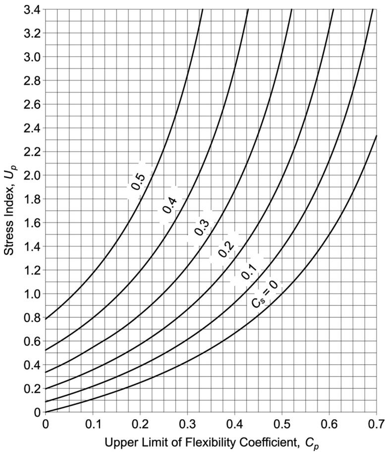  
Fig. A-2.1. Limiting flexibility coefficient for the primary systems.

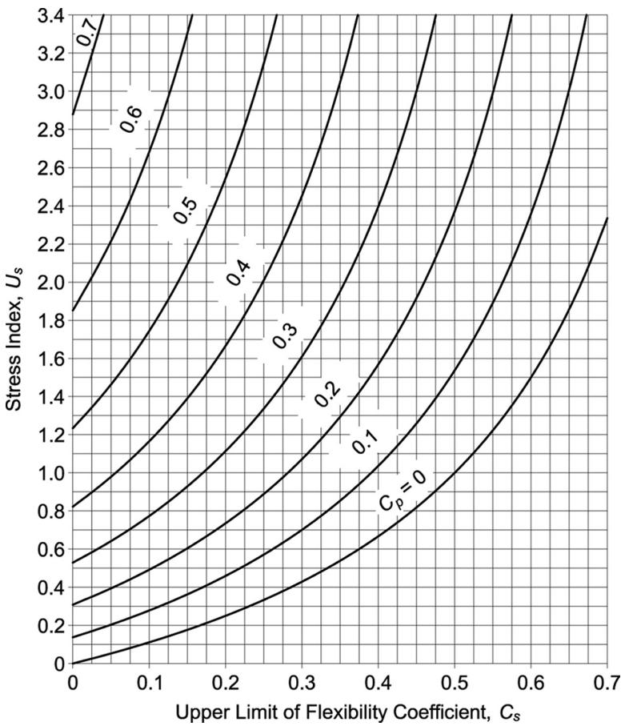  
Fig. A-2.2. Limiting flexibility coefficient for the secondary systems.

APPENDIX 3

FATIGUE

This appendix applies to members and connections subject to high-cycle loading within the elastic range of stresses of frequency and magnitude sufficient to initiate cracking and progressive failure.

User Note: See AISC Seismic Provisions for Structural Steel Buildings for structures subject to seismic loads.

The appendix is organized as follows:

## 3.1. General Provisions
## 3.2. Calculation of Maximum Stresses and Stress Ranges
## 3.3. Plain Material and Welded Joints
## 3.4. Bolts and Threaded Parts
## 3.5. Fabrication and Erection Requirements for Fatigue
## 3.6. Nondestructive Examination Requirements for Fatigue

## 3.1. GENERAL PROVISIONS

The fatigue resistance of members consisting of shapes or plate shall be determined when the number of cycles of application of live load exceeds 20,000. No evaluation of fatigue resistance of members consisting of HSS in building-type structures subject to code mandated wind loads is required. When the applied cyclic stress range is less than the threshold allowable stress range, $F_{ T H } .$ , no further evaluation of fatigue resistance is required. See Table A-3.1.

The engineer of record shall provide either complete details including weld sizes or shall specify the planned cycle life and the maximum range of moments, shears and reactions for the connections.

The provisions of this Appendix shall apply to stresses calculated on the basis of the applied cyclic load spectrum. The maximum permitted stress due to peak cyclic loads shall be $0 . 66 F_{ y }$ . In the case of a stress reversal, the stress range shall be computed as the numerical sum of maximum repeated tensile and compressive stresses or the numerical sum of maximum shearing stresses of opposite direction at the point of probable crack initiation.

The cyclic load resistance determined by the provisions of this Appendix is applicable to structures with suitable corrosion protection or subject only to mildly corrosive atmospheres, such as normal atmospheric conditions.

The cyclic load resistance determined by the provisions of this Appendix is applicable only to structures subject to temperatures not exceeding $300^{ \circ } \mathrm{ F } \left( 150^{ \circ } \mathrm{ C } \right)$ .

## 3.2. CALCULATION OF MAXIMUM STRESSES AND STRESS RANGES

Calculated stresses shall be based upon elastic analysis. Stresses shall not be amplified by stress concentration factors for geometrical discontinuities.

For bolts and threaded rods subject to axial tension, the calculated stresses shall include the effects of prying action, if any. In the case of axial stress combined with bending, the maximum stresses of each kind shall be those determined for concurrent arrangements of the applied load.

For members having symmetric cross sections, the fasteners and welds shall be arranged symmetrically about the axis of the member, or the total stresses including those due to eccentricity shall be included in the calculation of the stress range.

For axially loaded angle members where the center of gravity of the connecting welds lies between the line of the center of gravity of the angle cross section and the center of the connected leg, the effects of eccentricity shall be ignored. If the center of gravity of the connecting welds lies outside this zone, the total stresses, including those due to joint eccentricity, shall be included in the calculation of stress range.

## 3.3. PLAIN MATERIAL AND WELDED JOINTS

In plain material and welded joints, the range of stress due to the applied cyclic loads shall not exceed the allowable stress range computed as follows.

(a) For stress categories A, B, B′, C, D, E and E′, the allowable stress range, $F_{ S R } ,$ shall be determined by Equation A-3-1 or A-3-1M, as follows:

$$F_{S R} = 1, 000 \left(\frac{C_{f}}{n_{S R}}\right)^{0. 333} \geq F_{T H} \tag{A-3-1}$$

$$F_{S R} = 6900 \left(\frac{C_{f}}{n_{S R}}\right)^{0. 333} \geq F_{T H} \tag{A-3-1M}$$

where

$C_{ f }$ = constant from Table A-3.1 for the fatigue category

$F_{ S R }$ = allowable stress range, ksi (MPa)

FTH = threshold allowable stress range, maximum stress range for indefinite design life from Table A-3.1, ksi (MPa)

nSR = number of stress range fluctuations in design life

(b) For stress category F, the allowable stress range, $F_{ S R } .$ , shall be determined by Equation A-3-2 or A-3-2M as follows:

$$F_{S R} = 100 \left(\frac{1 . 5}{n_{S R}}\right)^{0. 167} \geq 8 \mathrm{k s i} \tag{A-3-2}$$

$$F_{S R} = 690 \left(\frac{1 . 5}{n_{S R}}\right)^{0. 167} \geq 55 \mathrm{M P a} \tag{A-3-2M}$$

(c) For tension-loaded plate elements connected at their end by cruciform, T or corner details with partial-joint-penetration (PJP) groove welds transverse to the direction of stress, with or without reinforcing or contouring fillet welds, or if joined with only fillet welds, the allowable stress range on the cross section of the tension-loaded plate element shall be determined as the lesser of the following:

(1) Based upon crack initiation from the toe of the weld on the tension-loaded plate element (i.e., when $R_{ P J P } = 1 . 0 )$ , the allowable stress range, $F_{ S R } ,$ , shall be determined by Equation A-3-1 or A-3-1M for stress category C.   
(2) Based upon crack initiation from the root of the weld, the allowable stress range, $F_{ S R } ,$ on the tension loaded plate element using transverse PJP groove welds, with or without reinforcing or contouring fillet welds, the allowable stress range on the cross section at the root of the weld shall be determined by Equation A-3-3 or A-3-3M, for stress category $\mathrm{ C^{ \prime } }$ as follows:

$$F_{S R} = 1, 000 R_{P J P} \left(\frac{4 . 4}{n_{S R}}\right)^{0. 333} \tag{A-3-3}$$

$$F_{S R} = 6900 R_{P J P} \left(\frac{4 . 4}{n_{S R}}\right)^{0. 333} \tag{A-3-3M}$$

where

$R_{ P J P } ,$ , the reduction factor for reinforced or nonreinforced transverse PJP groove welds, is determined as follows:

$$R_{P J P} = \frac{0 . 65 - 0 . 59 \left(\frac{2 a}{t_{p}}\right) + 0 . 72 \left(\frac{w}{t_{p}}\right)}{t_{p}^{0 . 167}} \leq 1. 0 \tag{A-3-4}$$

$$R_{P J P} = \frac{1 . 12 - 1 . 01 \left(\frac{2 a}{t_{p}}\right) + 1 . 24 \left(\frac{w}{t_{p}}\right)}{t_{p}^{0 . 167}} \leq 1. 0 \tag{A-3-4M}$$

2a = length of the nonwelded root face in the direction of the thickness of the tension-loaded plate, in. (mm)

$t_{ p }$ = thickness of tension loaded plate, in. (mm)

w = leg size of the reinforcing or contouring fillet, if any, in the direction of the thickness of the tension-loaded plate, in. (mm)

If $R_{ P J P } = 1 . 0$ , the stress range will be limited by the weld toe and category C will control.

(3) Based upon crack initiation from the roots of a pair of transverse fillet welds on opposite sides of the tension loaded plate element, the allowable stress range, $F_{ S R } ,$ on the cross section at the root of the welds shall be determined by Equation A-3-5 or A-3-5M, for stress category $\mathrm{ C }^{ \prime \prime }$ as follows:

$$F_{S R} = 1, 000 R_{F I L} \left(\frac{4 . 4}{n_{S R}}\right)^{0. 333} \tag{A-3-5}$$

$$F_{S R} = 6900 R_{F I L} \left(\frac{4 . 4}{n_{S R}}\right)^{0. 333} \tag{A-3-5M}$$

where

R FIL = reduction factor for joints using a pair of transverse fillet welds only

$$\begin{array}{l} = \frac{0 . 06 + 0 . 72 \left(w / t_{p}\right)}{t_{p}^{0 . 167}} \leq 1. 0 (A-3-6) \\ = \frac{0 . 103 + 1 . 24 (w / t_{p})}{t_{p}^{0 . 167}} \leq 1. 0 (A-3-6M) \\ \end{array}$$

If $R_{ F I L } = 1 . 0$ , the stress range will be limited by the weld toe and category C will control.

User Note: Stress categories $\mathrm{ C^{ \prime } }$ and $\mathrm{ C }^{ \prime \prime }$ are cases where the fatigue crack initiates in the root of the weld. These cases do not have a fatigue threshold and cannot be designed for an infinite life. Infinite life can be approximated by use of a very high cycle life such as $2 \times 10^{ 8 }$ . Alternatively, if the size of the weld is increased such that $R_{ F I L }$ or $R_{ P J P }$ is equal to 1.0, then the base metal controls, resulting in stress category C, where there is a fatigue threshold and the crack initiates at the toe of the weld.

## 3.4. BOLTS AND THREADED PARTS

In bolts and threaded parts, the range of stress of the applied cyclic load shall not exceed the allowable stress range computed as follows.

(a) For mechanically fastened connections loaded in shear, the maximum range of stress in the connected material of the applied cyclic load shall not exceed the allowable stress range computed using Equation A-3-1 or A-3-1M, where $C_{ f }$ and $F_{ T H }$ are taken from Section 2 of Table A-3.1.   
(b) For high-strength bolts, common bolts, threaded anchor rods, and hanger rods with cut, ground or rolled threads, the maximum range of tensile stress on the net tensile area from applied axial load and moment plus load due to prying action shall not exceed the allowable stress range computed using Equation A-3-1 or A-3-1M, where $C_{ f }$ and $F_{ T H }$ are taken from Case 8.5 (stress category G). The net area in tension, $A_{ t } ,$ is given by Equation A-3-7 or A-3-7M.

$$A_{t} = \frac{\pi}{4} \left(d_{b} - \frac{0 . 9743}{n}\right)^{2} \tag{A-3-7}$$

$$A_{t} = \frac{\pi}{4} (d_{b} - 0. 9382 p)^{2} \tag{A-3-7M}$$

where

$d_{ b }$ = nominal diameter (body or shank diameter), in. (mm)

n = threads per in. (per mm)

p = pitch, in. per thread (mm per thread)

For joints in which the material within the grip is not limited to steel or joints that are not tensioned to the requirements of Table J3.1 or J3.1M, all axial load and moment applied to the joint plus effects of any prying action shall be assumed to be carried exclusively by the bolts or rods.

For joints in which the material within the grip is limited to steel and which are pretensioned to the requirements of Table J3.1 or J3.1M, an analysis of the relative stiffness of the connected parts and bolts is permitted to be used to determine the tensile stress range in the pretensioned bolts due to the total applied cyclic load and moment, plus effects of any prying action. Alternatively, the stress range in the bolts shall be assumed to be equal to the stress on the net tensile area due to 20% of the absolute value of the applied cyclic axial load and moment from dead, live and other loads.

## 3.5. FABRICATION AND ERECTION REQUIREMENTS FOR FATIGUE

Longitudinal steel backing, if used, shall be continuous. If splicing of steel backing is required for long joints, the splice shall be made with a complete-joint-penetration (CJP) groove weld, ground flush to permit a tight fit. If fillet welds are used to attach left-in-place longitudinal backing, they shall be continuous.

In transverse CJP groove welded T- and corner-joints, a reinforcing fillet weld, not less than 1 /4 in. (6 mm) in size, shall be added at reentrant corners.

The surface roughness of thermally cut edges subject to cyclic stress ranges, that include tension, shall not exceed 1,000 μin. (25 μm), where Surface Texture, Surface Roughness, Waviness, and Lay (ASME B46.1) is the reference standard.

User Note: AWS C4.1 Sample 3 may be used to evaluate compliance with this requirement.

Reentrant corners at cuts, copes and weld access holes shall form a radius not less than the prescribed radius in Table A-3.1 by predrilling or subpunching and reaming a hole, or by thermal cutting to form the radius of the cut.

For transverse butt joints in regions of tensile stress, weld tabs shall be used to provide for cascading the weld termination outside the finished joint. End dams shall not be used. Weld tabs shall be removed and the end of the weld finished flush with the edge of the member.

Fillet welds subject to cyclic loading normal to the outstanding legs of angles or on the outer edges of end plates shall have end returns around the corner for a distance not less than two times the weld size; the end return distance shall not exceed four times the weld size.

## 3.6. NONDESTRUCTIVE EXAMINATION REQUIREMENTS FOR FATIGUE

In the case of CJP groove welds, the maximum allowable stress range calculated by Equation A-3-1 or A-3-1M applies only to welds that have been ultrasonically or radiographically tested and meet the acceptance requirements of Structural Welding Code—Steel (AWS D1.1/D1.1M) clause 6.12.2 or clause 6.13.2.

| TABLE A-3.1Fatigue Design Parameters | TABLE A-3.1Fatigue Design Parameters | TABLE A-3.1Fatigue Design Parameters | TABLE A-3.1Fatigue Design Parameters | TABLE A-3.1Fatigue Design Parameters |
| --- | --- | --- | --- | --- |
| Description | Stress Category | Constant $C_f$ | Threshold$F_{TH}$, ksi (MPa) | Potential Crack Initiation Point |
| SECTION 1—PLAIN MATERIAL AWAY FROM ANY WELDING | SECTION 1—PLAIN MATERIAL AWAY FROM ANY WELDING | SECTION 1—PLAIN MATERIAL AWAY FROM ANY WELDING | SECTION 1—PLAIN MATERIAL AWAY FROM ANY WELDING | SECTION 1—PLAIN MATERIAL AWAY FROM ANY WELDING |
| 1.1 Base metal, except noncoated weathering steel, with as-rolled or cleaned surfaces; flame-cut edges with surface roughness value of 1,000 μin. (25 μm) or less, but without reentrant corners | A | 25 | 24(165) | Away from all welds or structural connections |
| 1.2 Noncoated weathering steel base metal with as-rolled or cleaned surfaces; flame-cut edges with surface roughness value of 1,000 μin. (25 μm) or less, but without reentrant corners | B | 12 | 16(110) | Away from all welds or structural connections |
| 1.3 Member with reentrant corners at copes, cuts, block-outs or other geometrical discontinuities, except weld access holesR≥1 in. (25 mm), with radius, R, formed by predrilling, subpunching and reaming or thermally cut and ground to a bright metal surfaceR≥3/8 in. (10 mm) and the radius, R, need not be ground to a bright metal surface | C | 4.4 | 10(69) | At any external edge or at hole perimeter |
| 1.3 Member with reentrant corners at copes, cuts, block-outs or other geometrical discontinuities, except weld access holesR≥1 in. (25 mm), with radius, R, formed by predrilling, subpunching and reaming or thermally cut and ground to a bright metal surfaceR≥3/8 in. (10 mm) and the radius, R, need not be ground to a bright metal surface | E' | 0.39 | 2.6(18) | At any external edge or at hole perimeter |
| 1.4 Rolled cross sections with weld access holes made to requirements of Section J1.6Access hole R≥1 in. (25 mm) with radius, R, formed by predrilling, subpunching and reaming or thermally cut and ground to a bright metal surfaceAccess hole R≥3/8 in. (10 mm) and the radius, R, need not be ground to a bright metal surface | C | 4.4 | 10(69) | At reentrant corner of weld access hole |
| 1.4 Rolled cross sections with weld access holes made to requirements of Section J1.6Access hole R≥1 in. (25 mm) with radius, R, formed by predrilling, subpunching and reaming or thermally cut and ground to a bright metal surfaceAccess hole R≥3/8 in. (10 mm) and the radius, R, need not be ground to a bright metal surface | E' | 0.39 | 2.6(18) | At reentrant corner of weld access hole |
| 1.5 Members with drilled or reamed holesHoles containing pretensioned boltsOpen holes without bolts | C | 4.4 | 10(69) | In net section originating at side of the hole |
| 1.5 Members with drilled or reamed holesHoles containing pretensioned boltsOpen holes without bolts | D | 2.2 | 7(48) | In net section originating at side of the hole |

| TABLE A-3.1 (continued) Fatigue Design Parameters | TABLE A-3.1 (continued) Fatigue Design Parameters |
| --- | --- |
| Illustrative Typical Examples | Illustrative Typical Examples |
| SECTION 1—PLAIN MATERIAL AWAY FROM ANY WELDING | SECTION 1—PLAIN MATERIAL AWAY FROM ANY WELDING |
| 1.1 and 1.2 (a) | (b) |
| 1.3 (a) | (b) |
| 1.4 | (c) |
| 1.5 (a) | (b) |

| TABLE A-3.1 (continued)Fatigue Design Parameters | TABLE A-3.1 (continued)Fatigue Design Parameters | TABLE A-3.1 (continued)Fatigue Design Parameters | TABLE A-3.1 (continued)Fatigue Design Parameters | TABLE A-3.1 (continued)Fatigue Design Parameters |
| --- | --- | --- | --- | --- |
| Description | Stress Category | Constant $C_f$ | Threshold$F_{TH}$, ksi(MPa) | Potential Crack Initiation Point |
| SECTION 2—CONNECTED MATERIAL IN MECHANICALLY FASTENED JOINTS | SECTION 2—CONNECTED MATERIAL IN MECHANICALLY FASTENED JOINTS | SECTION 2—CONNECTED MATERIAL IN MECHANICALLY FASTENED JOINTS | SECTION 2—CONNECTED MATERIAL IN MECHANICALLY FASTENED JOINTS | SECTION 2—CONNECTED MATERIAL IN MECHANICALLY FASTENED JOINTS |
| 2.1 Gross area of base metal in lap joints connected by high-strength bolts in joints satisfying all requirements for slip-critical connections | B | 12 | 16(110) | Through gross section near hole |
| 2.2 Base metal at net section of high-strength bolted joints, designed on the basis of bearing resistance, but fabricated and installed to all requirements for slip-critical connections | B | 12 | 16(110) | In net section originating at side of hole |
| 2.3 Base metal at the net section of riveted joints | C | 4.4 | 10(69) | In net section originating at side of hole |
| 2.4 Base metal at net section of eyebar head or pin plate | E | 1.1 | 4.5(31) | In net section originating at side of hole |

| TABLE A-3.1 (continued) Fatigue Design Parameters | TABLE A-3.1 (continued) Fatigue Design Parameters | TABLE A-3.1 (continued) Fatigue Design Parameters |
| --- | --- | --- |
| Illustrative Typical Examples | Illustrative Typical Examples | Illustrative Typical Examples |
| SECTION 2-CONNECTED MATERIAL IN MECHANICALLY FASTENED JOINTS | SECTION 2-CONNECTED MATERIAL IN MECHANICALLY FASTENED JOINTS | SECTION 2-CONNECTED MATERIAL IN MECHANICALLY FASTENED JOINTS |
| 2.1 | (a) As seen with lap plate removed (b) (Note: Figures are for slip-critical bolted connections.) | (a) As seen with lap plate removed (b) (Note: Figures are for slip-critical bolted connections.) |
| 2.2 | (a) As seen with lap plate removed (b) (Note: Figures are for bolted connections designed to bear, meeting the requirements of slip-critical connections.) | (a) As seen with lap plate removed (b) (Note: Figures are for bolted connections designed to bear, meeting the requirements of slip-critical connections.) |
| 2.3 | (a) As seen with lap plate removed (b) (Note: Figures are for snug-tightened bolts, rivets, or other mechanical fasteners.) | (a) As seen with lap plate removed (b) (Note: Figures are for snug-tightened bolts, rivets, or other mechanical fasteners.) |
| 2.4 | (a) (b) | (a) (b) |

| TABLE A-3.1 (continued)Fatigue Design Parameters | TABLE A-3.1 (continued)Fatigue Design Parameters | TABLE A-3.1 (continued)Fatigue Design Parameters | TABLE A-3.1 (continued)Fatigue Design Parameters | TABLE A-3.1 (continued)Fatigue Design Parameters |
| --- | --- | --- | --- | --- |
| Description | Stress Category | Constant $C_f$ | Threshold$F_{TH}$, ksi(MPa) | Potential Crack Initiation Point |
| SECTION 3—WELDED JOINTS JOINING COMPONENTS OF BUILT-UP MEMBERS | SECTION 3—WELDED JOINTS JOINING COMPONENTS OF BUILT-UP MEMBERS | SECTION 3—WELDED JOINTS JOINING COMPONENTS OF BUILT-UP MEMBERS | SECTION 3—WELDED JOINTS JOINING COMPONENTS OF BUILT-UP MEMBERS | SECTION 3—WELDED JOINTS JOINING COMPONENTS OF BUILT-UP MEMBERS |
| 3.1 Base metal and weld metal in members without attachments built up of plates or shapes connected by continuous longitudinal CJP groove welds, back gouged and welded from second side, or by continuous fillet welds | B | 12 | 16(110) | From surface or internal discontinuities in weld |
| 3.2 Base metal and weld metal in members without attachments built up of plates or shapes, connected by continuous longitudinal CJP groove welds with left-in-place continuous steel backing, or by continuous PJP groove welds | B' | 6.1 | 12(83) | From surface or internal discontinuities in weld |
| 3.3 Base metal at the ends of longitudinal welds that terminate at weld access holes in connected built-up members, as well as weld toes of fillet welds that wrap around ends of weld access holesAccess hole R ≥ 1 in. (25 mm) with radius, R, formed by predrilling, sub-punching and reaming, or thermally cut and ground to bright metal surfaceAccess hole R ≥ 3/s in. (10 mm) and the radius, R, need not be ground to a bright metal surface | D | 2.2 | 7(48) |  |
| 3.3 Base metal at the ends of longitudinal welds that terminate at weld access holes in connected built-up members, as well as weld toes of fillet welds that wrap around ends of weld access holesAccess hole R ≥ 1 in. (25 mm) with radius, R, formed by predrilling, sub-punching and reaming, or thermally cut and ground to bright metal surfaceAccess hole R ≥ 3/s in. (10 mm) and the radius, R, need not be ground to a bright metal surface | E' | 0.39 | 2.6(18) |  |
| 3.4 Base metal at ends of longitudinal intermittent fillet weld segments | E | 1.1 | 4.5(31) | In connected material at start and stop locations of any weld |
| 3.5 Base metal at ends of partial length welded coverplates narrower than the flange having square or tapered ends, with or without welds across the ends$t_f\leq 0.8$ in. (20 mm)$t_f>0.8$ in. (20 mm)where$t_f=$thickness of member flange, in.(mm) | E | 1.1 | 4.5(31) | In flange at toe of end weld (if present) or in flange at termination of longitudinal weld |
| 3.5 Base metal at ends of partial length welded coverplates narrower than the flange having square or tapered ends, with or without welds across the ends$t_f\leq 0.8$ in. (20 mm)$t_f>0.8$ in. (20 mm)where$t_f=$thickness of member flange, in.(mm) | E' | 0.39 | 2.6(18) |  |

TABLE A-3.1 (continued) Fatigue Design Parameters

Illustrative Typical Examples

SECTION 3—WELDED JOINTS JOINING COMPONENTS OF BUILT-UP MEMBERS

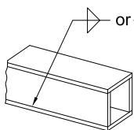  
## 3.1

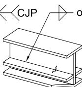  
(b)

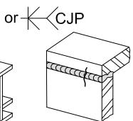

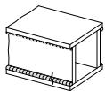  
(d)

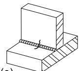  
(e)

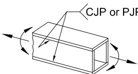  
## 3.2
(a)

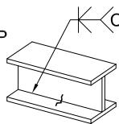  
(b)

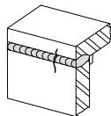  
CJPor PJP

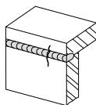

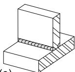

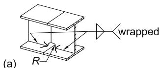  
## 3.3

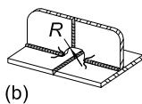

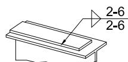  
## 3.4
(a)

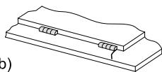

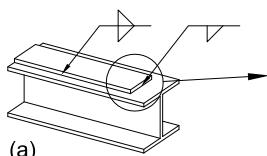  
## 3.5

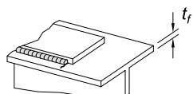  
(b)

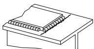

| TABLE A-3.1 (continued)Fatigue Design Parameters | TABLE A-3.1 (continued)Fatigue Design Parameters | TABLE A-3.1 (continued)Fatigue Design Parameters | TABLE A-3.1 (continued)Fatigue Design Parameters | TABLE A-3.1 (continued)Fatigue Design Parameters |
| --- | --- | --- | --- | --- |
| Description | Stress Category | Constant Cf | Threshold FTH, ksi (MPa) | Potential Crack Initiation Point |
| SECTION 3—WELDED JOINTS JOINING COMPONENTS OF BUILT-UP MEMBERS (cont'd) | SECTION 3—WELDED JOINTS JOINING COMPONENTS OF BUILT-UP MEMBERS (cont'd) | SECTION 3—WELDED JOINTS JOINING COMPONENTS OF BUILT-UP MEMBERS (cont'd) | SECTION 3—WELDED JOINTS JOINING COMPONENTS OF BUILT-UP MEMBERS (cont'd) | SECTION 3—WELDED JOINTS JOINING COMPONENTS OF BUILT-UP MEMBERS (cont'd) |
| 3.6 Base metal at ends of partial length welded coverplates or other attach-ments wider than the flange with welds across the ends | E | 1.1 | 4.5 (31) | In flange at toe of end weld or in flange at termination of longitudinal weld or in edge of flange |
| tf ≤ 0.8 in. (20 mm) | E | 1.1 | 4.5 (31) | In flange at toe of end weld or in flange at termination of longitudinal weld or in edge of flange |
| tf > 0.8 in. (20 mm) | E' | 0.39 | 2.6 (18) | In flange at toe of end weld or in flange at termination of longitudinal weld or in edge of flange |
| 3.7 Base metal at ends of partial length welded coverplates wider than the flange without welds across the ends | E' | 0.39 | 2.6 (18) | In edge of flange at end of coverplate weld |
| tf ≤ 0.8 in. (20 mm) | E' | 0.39 | 2.6 (18) | In edge of flange at end of coverplate weld |
| tf > 0.8 in. (20 mm) is not permitted | None | - | - | In edge of flange at end of coverplate weld |
| SECTION 4—LONGITUDINAL FILLET WELDED END CONNECTIONS | SECTION 4—LONGITUDINAL FILLET WELDED END CONNECTIONS | SECTION 4—LONGITUDINAL FILLET WELDED END CONNECTIONS | SECTION 4—LONGITUDINAL FILLET WELDED END CONNECTIONS | SECTION 4—LONGITUDINAL FILLET WELDED END CONNECTIONS |
| 4.1 Base metal at junction of axially loaded members with longitudinally welded end connections; welds are on each side of the axis of the member to balance weld stresses | E | 1.1 | 4.5 (31) | Initiating from end of any weld termination extending into the base metal |
| tf ≤ 0.5 in. (13 mm) | E | 1.1 | 4.5 (31) | Initiating from end of any weld termination extending into the base metal |
| tf > 0.5 in. (13 mm) | E' | 0.39 | 2.6 (18) | Initiating from end of any weld termination extending into the base metal |
| where t = connected member thickness, as shown in Case 4.1 figure, in. (mm) |  |  |  |  |

| TABLE A-3.1 (continued) Fatigue Design Parameters | TABLE A-3.1 (continued) Fatigue Design Parameters | TABLE A-3.1 (continued) Fatigue Design Parameters |
| --- | --- | --- |
| Illustrative Typical Examples | Illustrative Typical Examples | Illustrative Typical Examples |
| SECTION 3—WELDED JOINTS JOINING COMPONENTS OF BUILT-UP MEMBERS (cont'd) | SECTION 3—WELDED JOINTS JOINING COMPONENTS OF BUILT-UP MEMBERS (cont'd) | SECTION 3—WELDED JOINTS JOINING COMPONENTS OF BUILT-UP MEMBERS (cont'd) |
| 3.6 | (a) | (b) |
| 3.7 | (a) | (b) |
| SECTION 4—LONGITUDINAL FILLET WELDED END CONNECTIONS | SECTION 4—LONGITUDINAL FILLET WELDED END CONNECTIONS | SECTION 4—LONGITUDINAL FILLET WELDED END CONNECTIONS |
| 4.1 | (a) | (b) |

| TABLE A-3.1 (continued)Fatigue Design Parameters | TABLE A-3.1 (continued)Fatigue Design Parameters | TABLE A-3.1 (continued)Fatigue Design Parameters | TABLE A-3.1 (continued)Fatigue Design Parameters | TABLE A-3.1 (continued)Fatigue Design Parameters |
| --- | --- | --- | --- | --- |
| Description | Stress Category | Constant $C_f$ | Threshold$F_{TH}$, ksi(MPa) | Potential Crack Initiation Point |
| SECTION 5—WELDED JOINTS TRANSVERSE TO DIRECTION OF STRESS | SECTION 5—WELDED JOINTS TRANSVERSE TO DIRECTION OF STRESS | SECTION 5—WELDED JOINTS TRANSVERSE TO DIRECTION OF STRESS | SECTION 5—WELDED JOINTS TRANSVERSE TO DIRECTION OF STRESS | SECTION 5—WELDED JOINTS TRANSVERSE TO DIRECTION OF STRESS |
| 5.1 Weld metal and base metal in or adjac- cent to CJP groove welded splices in plate, rolled shapes, or built-up cross sec- tions with no change in cross section with welds ground essentially parallel to the direction of stress and inspected in accor- dance with Section 3.6 | B | 12 | 16(110) | From internal discontinuities in weld metal or along the fusion boundary |
| 5.2 Weld metal and base metal in or adjac- cent to CJP groove welded splices with welds ground essentially parallel to the direction of stress at transitions in thick- ness or width made on a slope no greater than $1:2^{1/2}$ and inspected in accordance with Section 3.6$F_y<90 ksi（$620 MPa)$F_y≥90 ksi（$620 MPa) | B$\mathsf{B}^{\prime}$ | 126.1 | 16(110)12(83) | From internal discontinuities in metal or along the fusion boundary or at start of transition when $F_y≥90 ksi（$620 MPa) |
| 5.3 Base metal and weld metal in or adjac- cent to CJP groove welded splices with welds ground essentially parallel to the direction of stress at transitions in width made on a radius, R, of not less than 24 in. (600 mm) with the point of tangency at the end of the groove weld and inspected in accordance with Section 3.6. | B | 12 | 16(110) | From internal discontinuities in weld metal or along the fusion boundary |
| 5.4 Weld metal and base metal in or adjacent to CJP groove welds in T- or cor- ner-joints or splices, without transitions in thickness or with transition in thickness having slopes no greater than $1:2^{1/2}$, when weld reinforcement is not removed, and is inspected in accordance with Section 3.6 | C | 4.4 | 10(69) | From weld extending into base metal or into weld metal |

| TABLE A-3.1 (continued) Fatigue Design Parameters | TABLE A-3.1 (continued) Fatigue Design Parameters | TABLE A-3.1 (continued) Fatigue Design Parameters |
| --- | --- | --- |
| Illustrative Typical Examples | Illustrative Typical Examples | Illustrative Typical Examples |
| SECTION 5—WELDED JOINTS TRANSVERSE TO DIRECTION OF STRESS | SECTION 5—WELDED JOINTS TRANSVERSE TO DIRECTION OF STRESS | SECTION 5—WELDED JOINTS TRANSVERSE TO DIRECTION OF STRESS |
| 5.1 | (a) | (b) |
| 5.2 | (a) | (b) |
| 5.3 | (a) | (b) |
| 5.4 | (a) | (b) |

| TABLE A-3.1 (continued)Fatigue Design Parameters | TABLE A-3.1 (continued)Fatigue Design Parameters | TABLE A-3.1 (continued)Fatigue Design Parameters | TABLE A-3.1 (continued)Fatigue Design Parameters | TABLE A-3.1 (continued)Fatigue Design Parameters |
| --- | --- | --- | --- | --- |
| Description | Stress Category | Constant $C_f$ | Threshold$F_{TH}$, ksi(MPa) | Potential Crack Initiation Point |
| SECTION 5—WELDED JOINTS TRANSVERSE TO DIRECTION OF STRESS | SECTION 5—WELDED JOINTS TRANSVERSE TO DIRECTION OF STRESS | SECTION 5—WELDED JOINTS TRANSVERSE TO DIRECTION OF STRESS | SECTION 5—WELDED JOINTS TRANSVERSE TO DIRECTION OF STRESS | SECTION 5—WELDED JOINTS TRANSVERSE TO DIRECTION OF STRESS |
| 5.5 Base metal and weld metal in or adjac- cent to transverse CJP groove welded butt splices with backing left in placeTack welds inside grooveTack welds outside the groove and not closer than $1/2$ in. (13 mm) to the edge of base metal | D | 2.2 | 7(48) |  |
| 5.5 Base metal and weld metal in or adjac- cent to transverse CJP groove welded butt splices with backing left in placeTack welds inside grooveTack welds outside the groove and not closer than $1/2$ in. (13 mm) to the edge of base metal | E | 1.1 | 4.5(31) |  |
| 5.6 Base metal and weld metal at trans- verse end connections of tension-loaded plate elements using PJP groove welds in butt, T- or corner-joints, with reinforcing or contouring fillets; $F_{SR}$ shall be the smaller of the toe crack or root crack allowable stress rangeCrack initiating from weld toeCrack initiating from weld root | C | 4.4 | 10(69) | Initiating from weld toe extending into base metalInitiating at weld root extending into and through weld |
| 5.6 Base metal and weld metal at trans- verse end connections of tension-loaded plate elements using PJP groove welds in butt, T- or corner-joints, with reinforcing or contouring fillets; $F_{SR}$ shall be the smaller of the toe crack or root crack allowable stress rangeCrack initiating from weld toeCrack initiating from weld root | $C'$ | See Eq.A-3-3 orA-3-3M | None | Initiating from weld toe extending into base metalInitiating at weld root extending into and through weld |
| 5.7 Base metal and weld metal at trans- verse end connections of tension-loaded plate elements using a pair of fillet welds on opposite sides of the plate; $F_{SR}$ shall be the smaller of the weld toe crack or weld root crack allowable stress rangeCrack initiating from weld toeCrack initiating from weld root | C | 4.4 | 10(69) | Initiating from weld toe extending into base metalInitiating at weld root extending into and through weld |
| 5.7 Base metal and weld metal at trans- verse end connections of tension-loaded plate elements using a pair of fillet welds on opposite sides of the plate; $F_{SR}$ shall be the smaller of the weld toe crack or weld root crack allowable stress rangeCrack initiating from weld toeCrack initiating from weld root | $C''$ | See Eq.A-3-5 orA-3-5M | None | Initiating from weld toe extending into base metalInitiating at weld root extending into and through weld |
| 5.8 Base metal of tension-loaded plate elements, and on built-up shapes and rolled beam webs or flanges at toe of transverse fillet welds adjacent to welded transverse stiffeners | C | 4.4 | 10(69) | From geometrical discontinuity at toe of fillet extending into base metal |

| TABLE A-3.1 (continued) Fatigue Design Parameters | TABLE A-3.1 (continued) Fatigue Design Parameters | TABLE A-3.1 (continued) Fatigue Design Parameters | TABLE A-3.1 (continued) Fatigue Design Parameters |
| --- | --- | --- | --- |
| Illustrative Typical Examples | Illustrative Typical Examples | Illustrative Typical Examples | Illustrative Typical Examples |
| SECTION 5—WELDED JOINTS TRANSVERSE TO DIRECTION OF STRESS | SECTION 5—WELDED JOINTS TRANSVERSE TO DIRECTION OF STRESS | SECTION 5—WELDED JOINTS TRANSVERSE TO DIRECTION OF STRESS | SECTION 5—WELDED JOINTS TRANSVERSE TO DIRECTION OF STRESS |
| 5.5 Category D (a) Category E (d) | 5.5 Category D (a) Category E (d) | 5.5 Category D (a) Category E (d) | 5.5 Category D (a) Category E (d) |
| 5.6 Toe Crack Category C (a) Root Crack Category C' | PJP (a) (b) 2a (d) | PJP (a) (b) 2a (d) | Site for potential crack initiation due to bending tensile stress (c) |
| 5.7 Toe Crack Category C (a) Root Crack Category C" | (a) (d) | (b) (e) | (c) |
| 5.8 (a) (b) | 5.8 (a) (b) | 5.8 (a) (b) | 5.8 (a) (b) |

| TABLE A-3.1 (continued)Fatigue Design Parameters | TABLE A-3.1 (continued)Fatigue Design Parameters | TABLE A-3.1 (continued)Fatigue Design Parameters | TABLE A-3.1 (continued)Fatigue Design Parameters | TABLE A-3.1 (continued)Fatigue Design Parameters |  |
| --- | --- | --- | --- | --- | --- |
| Description | Stress Category | Constant $C_f$ | Threshold$F_{TH}$, ksi(MPa) | Potential Crack Initiation Point |  |
| SECTION 6—BASE METAL AT WELDED TRANSVERSE MEMBER CONNECTIONS | SECTION 6—BASE METAL AT WELDED TRANSVERSE MEMBER CONNECTIONS | SECTION 6—BASE METAL AT WELDED TRANSVERSE MEMBER CONNECTIONS | SECTION 6—BASE METAL AT WELDED TRANSVERSE MEMBER CONNECTIONS | SECTION 6—BASE METAL AT WELDED TRANSVERSE MEMBER CONNECTIONS |  |
| 6.1 Base metal of equal or unequal thickness at details attached by CJP groove welds subject to longitudinal loading only when the detail embodies a transition radius, R, with the weld termini-nation ground smooth and inspected in accordance with Section 3.6R≥24 in.(600 mm)6 in. ≤ R < 24 in.(150 mm ≤ R < 600 mm)2 in. ≤ R < 6 in.(50 mm ≤ R < 150 mm)R<2 in.(50 mm) | B | 12 | 16(110) |  |  |
| 6.1 Base metal of equal or unequal thickness at details attached by CJP groove welds subject to longitudinal loading only when the detail embodies a transition radius, R, with the weld termini-nation ground smooth and inspected in accordance with Section 3.6R≥24 in.(600 mm)6 in. ≤ R < 24 in.(150 mm ≤ R < 600 mm)2 in. ≤ R < 6 in.(50 mm ≤ R < 150 mm)R<2 in.(50 mm) | C | 4.4 | 10(69) |  |  |
| 6.1 Base metal of equal or unequal thickness at details attached by CJP groove welds subject to longitudinal loading only when the detail embodies a transition radius, R, with the weld termini-nation ground smooth and inspected in accordance with Section 3.6R≥24 in.(600 mm)6 in. ≤ R < 24 in.(150 mm ≤ R < 600 mm)2 in. ≤ R < 6 in.(50 mm ≤ R < 150 mm)R<2 in.(50 mm) | D | 2.2 | 7(48) |  |  |
| 6.1 Base metal of equal or unequal thickness at details attached by CJP groove welds subject to longitudinal loading only when the detail embodies a transition radius, R, with the weld termini-nation ground smooth and inspected in accordance with Section 3.6R≥24 in.(600 mm)6 in. ≤ R < 24 in.(150 mm ≤ R < 600 mm)2 in. ≤ R < 6 in.(50 mm ≤ R < 150 mm)R<2 in.(50 mm) | E | 1.1 | 4.5(31) |  |  |
| 6.2 Base metal at details of equal thick-ness attached by CJP groove welds, subject to transverse loading, with or without longitudinal loading, when the detail embodies a transition radius, R, with the weld termination ground smooth and inspected in accordance with Section 3.6(a) When weld reinforcement is removedR≥24 in.(600 mm)6 in. ≤ R < 24 in.(150 mm ≤ R < 600 mm)2 in. ≤ R < 6 in.(50 mm ≤ R < 150 mm)R<2 in.(50 mm)(b) When weld reinforcement is not removedR≥6 in.(150 mm)2 in. ≤ R < 6 in.(50 mm ≤ R < 150 mm)R<2 in.(50 mm) | B | 12 | 16(110) |  |  |
| 6.2 Base metal at details of equal thick-ness attached by CJP groove welds, subject to transverse loading, with or without longitudinal loading, when the detail embodies a transition radius, R, with the weld termination ground smooth and inspected in accordance with Section 3.6(a) When weld reinforcement is removedR≥24 in.(600 mm)6 in. ≤ R < 24 in.(150 mm ≤ R < 600 mm)2 in. ≤ R < 6 in.(50 mm ≤ R < 150 mm)R<2 in.(50 mm)(b) When weld reinforcement is not removedR≥6 in.(150 mm)2 in. ≤ R < 6 in.(50 mm ≤ R < 150 mm)R<2 in.(50 mm) | C | 4.4 | 10(69) |  |  |
| 6.2 Base metal at details of equal thick-ness attached by CJP groove welds, subject to transverse loading, with or without longitudinal loading, when the detail embodies a transition radius, R, with the weld termination ground smooth and inspected in accordance with Section 3.6(a) When weld reinforcement is removedR≥24 in.(600 mm)6 in. ≤ R < 24 in.(150 mm ≤ R < 600 mm)2 in. ≤ R < 6 in.(50 mm ≤ R < 150 mm)R<2 in.(50 mm)(b) When weld reinforcement is not removedR≥6 in.(150 mm)2 in. ≤ R < 6 in.(50 mm ≤ R < 150 mm)R<2 in.(50 mm) | D | 2.2 | 7(48) |  |  |
| 6.2 Base metal at details of equal thick-ness attached by CJP groove welds, subject to transverse loading, with or without longitudinal loading, when the detail embodies a transition radius, R, with the weld termination ground smooth and inspected in accordance with Section 3.6(a) When weld reinforcement is removedR≥24 in.(600 mm)6 in. ≤ R < 24 in.(150 mm ≤ R < 600 mm)2 in. ≤ R < 6 in.(50 mm ≤ R < 150 mm)R<2 in.(50 mm)(b) When weld reinforcement is not removedR≥6 in.(150 mm)2 in. ≤ R < 6 in.(50 mm ≤ R < 150 mm)R<2 in.(50 mm) | E | 1.1 | 4.5(31) |  | Near point of tangency of radius or in the weld or at fusion boundary or member or attachment |
| 6.2 Base metal at details of equal thick-ness attached by CJP groove welds, subject to transverse loading, with or without longitudinal loading, when the detail embodies a transition radius, R, with the weld termination ground smooth and inspected in accordance with Section 3.6(a) When weld reinforcement is removedR≥24 in.(600 mm)6 in. ≤ R < 24 in.(150 mm ≤ R < 600 mm)2 in. ≤ R < 6 in.(50 mm ≤ R < 150 mm)R<2 in.(50 mm)(b) When weld reinforcement is not removedR≥6 in.(150 mm)2 in. ≤ R < 6 in.(50 mm ≤ R < 150 mm)R<2 in.(50 mm) | C | 4.4 | 10(69) |  | At toe of the weld either along edge of member or the attachment |
| 6.2 Base metal at details of equal thick-ness attached by CJP groove welds, subject to transverse loading, with or without longitudinal loading, when the detail embodies a transition radius, R, with the weld termination ground smooth and inspected in accordance with Section 3.6(a) When weld reinforcement is removedR≥24 in.(600 mm)6 in. ≤ R < 24 in.(150 mm ≤ R < 600 mm)2 in. ≤ R < 6 in.(50 mm ≤ R < 150 mm)R<2 in.(50 mm)(b) When weld reinforcement is not removedR≥6 in.(150 mm)2 in. ≤ R < 6 in.(50 mm ≤ R < 150 mm)R<2 in.(50 mm) | D | 2.2 | 7(48) |  |  |
| 6.2 Base metal at details of equal thick-ness attached by CJP groove welds, subject to transverse loading, with or without longitudinal loading, when the detail embodies a transition radius, R, with the weld termination ground smooth and inspected in accordance with Section 3.6(a) When weld reinforcement is removedR≥24 in.(600 mm)6 in. ≤ R < 24 in.(150 mm ≤ R < 600 mm)2 in. ≤ R < 6 in.(50 mm ≤ R < 150 mm)R<2 in.(50 mm)(b) When weld reinforcement is not removedR≥6 in.(150 mm)2 in. ≤ R < 6 in.(50 mm ≤ R < 150 mm)R<2 in.(50 mm) | E | 1.1 | 4.5(31) |  |  |

| TABLE A-3.1 (continued) Fatigue Design Parameters | TABLE A-3.1 (continued) Fatigue Design Parameters | TABLE A-3.1 (continued) Fatigue Design Parameters |
| --- | --- | --- |
| Illustrative Typical Examples | Illustrative Typical Examples | Illustrative Typical Examples |
| SECTION 6—BASE METAL AT WELDED TRANSVERSE MEMBER CONNECTIONS | SECTION 6—BASE METAL AT WELDED TRANSVERSE MEMBER CONNECTIONS | SECTION 6—BASE METAL AT WELDED TRANSVERSE MEMBER CONNECTIONS |
| 6.1 | (a) | (b) |
| 6.2 | (a) | (b) |

| TABLE A-3.1 (continued)Fatigue Design Parameters | TABLE A-3.1 (continued)Fatigue Design Parameters | TABLE A-3.1 (continued)Fatigue Design Parameters | TABLE A-3.1 (continued)Fatigue Design Parameters | TABLE A-3.1 (continued)Fatigue Design Parameters |
| --- | --- | --- | --- | --- |
| Description | Stress Category | Constant $C_f$ | Threshold$F_{TH}$, ksi(MPa) | Potential Crack Initiation Point |
| SECTION 6—BASE METAL AT WELDED TRANSVERSE MEMBER CONNECTIONS (cont'd) | SECTION 6—BASE METAL AT WELDED TRANSVERSE MEMBER CONNECTIONS (cont'd) | SECTION 6—BASE METAL AT WELDED TRANSVERSE MEMBER CONNECTIONS (cont'd) | SECTION 6—BASE METAL AT WELDED TRANSVERSE MEMBER CONNECTIONS (cont'd) | SECTION 6—BASE METAL AT WELDED TRANSVERSE MEMBER CONNECTIONS (cont'd) |
| 6.3 Base metal at details of unequal thickness attached by CJP groove welds, subject to transverse loading, with or without longitudinal loading, when the detail embodies a transition radius, R, with the weld termination ground smooth and in accordance with Section 3.6(a) When weld reinforcement is removedR>2 in. (50 mm)R≤2 in. (50 mm)(b) When reinforcement is not removedAny radius | D | 2.2 | 7(48) | At toe of weld along edge of thinner materialIn weld termination in small radiusAt toe of weld along edge of thinner material |
| 6.3 Base metal at details of unequal thickness attached by CJP groove welds, subject to transverse loading, with or without longitudinal loading, when the detail embodies a transition radius, R, with the weld termination ground smooth and in accordance with Section 3.6(a) When weld reinforcement is removedR>2 in. (50 mm)R≤2 in. (50 mm)(b) When reinforcement is not removedAny radius | E | 1.1 | 4.5(31) | At toe of weld along edge of thinner materialIn weld termination in small radiusAt toe of weld along edge of thinner material |
| 6.3 Base metal at details of unequal thickness attached by CJP groove welds, subject to transverse loading, with or without longitudinal loading, when the detail embodies a transition radius, R, with the weld termination ground smooth and in accordance with Section 3.6(a) When weld reinforcement is removedR>2 in. (50 mm)R≤2 in. (50 mm)(b) When reinforcement is not removedAny radius | E | 1.1 | 4.5(31) | At toe of weld along edge of thinner materialIn weld termination in small radiusAt toe of weld along edge of thinner material |
| 6.4 Base metal of equal or unequal thickness, subject to longitudinal stress at transverse members, with or without transverse stress, attached by fillet or PJP groove welds parallel to direction of stress when the detail embodies a transition radius, R, with weld termination ground smoothR>2 in. (50 mm)R≤2 in. (50 mm) | D | 2.2 | 7(48) | Initiating in base metal at the weld termination or at the toe of the weld extending into the base metal |
| 6.4 Base metal of equal or unequal thickness, subject to longitudinal stress at transverse members, with or without transverse stress, attached by fillet or PJP groove welds parallel to direction of stress when the detail embodies a transition radius, R, with weld termination ground smoothR>2 in. (50 mm)R≤2 in. (50 mm) | E | 1.1 | 4.5(31) | Initiating in base metal at the weld termination or at the toe of the weld extending into the base metal |

| TABLE A-3.1 (continued) Fatigue Design Parameters | TABLE A-3.1 (continued) Fatigue Design Parameters |
| --- | --- |
| Illustrative Typical Examples | Illustrative Typical Examples |
| SECTION 6—BASE METAL AT WELDED TRANSVERSE MEMBER CONNECTIONS (cont'd) | SECTION 6—BASE METAL AT WELDED TRANSVERSE MEMBER CONNECTIONS (cont'd) |
| 6.3 | CJP, Ends ground smooth (a) CJP w/ reinforcement Ends ground smooth (b) Grind (c) PJP (d) |
| 6.4 | or PJP (a) Grind (b) PJP (d) |

| TABLE A-3.1 (continued)Fatigue Design Parameters | TABLE A-3.1 (continued)Fatigue Design Parameters | TABLE A-3.1 (continued)Fatigue Design Parameters | TABLE A-3.1 (continued)Fatigue Design Parameters | TABLE A-3.1 (continued)Fatigue Design Parameters |
| --- | --- | --- | --- | --- |
| Description | Stress Category | Constant $C_f$ | Threshold$F_{TH}$, ksi(MPa) | Potential Crack Initiation Point |
| SECTION 7—BASE METAL AT SHORT ATTACHMENTS[a] | SECTION 7—BASE METAL AT SHORT ATTACHMENTS[a] | SECTION 7—BASE METAL AT SHORT ATTACHMENTS[a] | SECTION 7—BASE METAL AT SHORT ATTACHMENTS[a] | SECTION 7—BASE METAL AT SHORT ATTACHMENTS[a] |
| 7.1 Base metal subject to longitudinal loading at details with welds parallel or transverse to the direction of stress, with or without transverse load on the detail, where the detail embodies no transition radius, R, and with detail length, a, and thickness of the attachment, b: a < 2 in. (50 mm) for any thickness, b | C | 4.4 | 10(69) | Initiating in base metal at the weld termination or at the toe of the weld extending into the base metal |
| 2 in. (50 mm) ≤ a ≤ lesser of 12b or 4 in. (100 mm) | D | 2.2 | 7(48) |  |
| a > lesser of 12b or 4 in. (100 mm) when b ≤ 0.8 in. (20 mm) | E | 1.1 | 4.5(31) |  |
| a > 4 in. (100 mm) when b > 0.8 in. (20 mm) | E' | 0.39 | 2.6(18) |  |
| 7.2 Base metal subject to longitudinal stress at details attached by fillet or PJP groove welds, with or without transverse load on detail, when the detail embodies a transition radius, R, with weld termination ground smooth: |  |  |  | Initiating in base metal at the weld termination, extending into the base metal |
| R > 2 in. (50 mm) | D | 2.2 | 7(48) |  |
| R ≤ 2 in. (50 mm) | E | 1.1 | 4.5(31) |  |
| [a]"Attachment," as used herein, is defined as any steel detail welded to a member that causes a deviation in the stress flow in the member and, thus, reduces the fatigue resistance. The reduction is due to the presence of the attachment, not due to the loading on the attachment. | [a]"Attachment," as used herein, is defined as any steel detail welded to a member that causes a deviation in the stress flow in the member and, thus, reduces the fatigue resistance. The reduction is due to the presence of the attachment, not due to the loading on the attachment. | [a]"Attachment," as used herein, is defined as any steel detail welded to a member that causes a deviation in the stress flow in the member and, thus, reduces the fatigue resistance. The reduction is due to the presence of the attachment, not due to the loading on the attachment. | [a]"Attachment," as used herein, is defined as any steel detail welded to a member that causes a deviation in the stress flow in the member and, thus, reduces the fatigue resistance. The reduction is due to the presence of the attachment, not due to the loading on the attachment. | [a]"Attachment," as used herein, is defined as any steel detail welded to a member that causes a deviation in the stress flow in the member and, thus, reduces the fatigue resistance. The reduction is due to the presence of the attachment, not due to the loading on the attachment. |

TABLE A-3.1 (continued) Fatigue Design Parameters

Illustrative Typical Examples

SECTION 7—BASE METAL AT SHORT ATTACHMENTS[a]

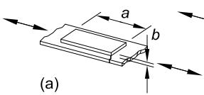

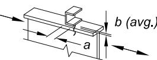  
(b)

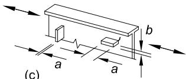

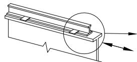  
(d)

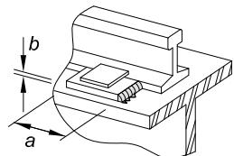  
(e)

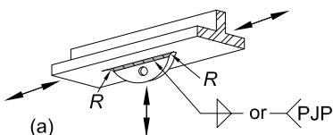  
## 7.2

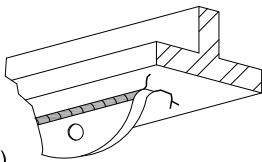  
(b)

| TABLE A-3.1 (continued)Fatigue Design Parameters | TABLE A-3.1 (continued)Fatigue Design Parameters | TABLE A-3.1 (continued)Fatigue Design Parameters | TABLE A-3.1 (continued)Fatigue Design Parameters | TABLE A-3.1 (continued)Fatigue Design Parameters |
| --- | --- | --- | --- | --- |
| Description | Stress Category | Constant $C_f$ | Threshold$F_{TH}$, ksi(MPa) | Potential Crack Initiation Point |
| SECTION 8—MISCELLANEOUS | SECTION 8—MISCELLANEOUS | SECTION 8—MISCELLANEOUS | SECTION 8—MISCELLANEOUS | SECTION 8—MISCELLANEOUS |
| 8.1 Base metal at steel headed stud anchors attached by fillet weld or automatic stud welding | C | 4.4 | 10(69) | At toe of weld in base metal |
| 8.2 Shear on throat of any fillet weld, continuous or intermittent, longitudinal or transverse | F | See Eq.A-3-2 or A-3-2M | See Eq.A-3-2 or A-3-2M | Initiating at the root of the fillet weld, extending into the weld |
| 8.3 Base metal at plug or slot welds | E | 1.1 | 4.5(31) | Initiating in the base metal at the end of the plug or slot weld, extending into the base metal |
| 8.4 Shear on plug or slot welds | F | See Eq.A-3-2 or A-3-2M | See Eq.A-3-2 or A-3-2M | Initiating in the weld at the faying surface, extending into the weld |
| 8.5 High-strength bolts, common bolts, threaded anchor rods, and hanger rods, whether pretensioned in accordance with Table J3.1 or J3.1M, or snug-tightened with cut, ground or rolled threads; stress range on tensile stress area due to applied cyclic load plus prying action, when applicable | G | 0.39 | 7(48) | Initiating at the root of the threads, extending into the fastener |

| TABLE A-3.1 (continued) Fatigue Design Parameters | TABLE A-3.1 (continued) Fatigue Design Parameters | TABLE A-3.1 (continued) Fatigue Design Parameters |
| --- | --- | --- |
| Illustrative Typical Examples | Illustrative Typical Examples | Illustrative Typical Examples |
| SECTION 8—MISCELLANEOUS | SECTION 8—MISCELLANEOUS | SECTION 8—MISCELLANEOUS |
| 8.1 (a) | (b) | (c) |
| 8.2 (a) | (b) | (c) |
| 8.3 (a) | (b) | (d) |
| 8.4 (a) | (b) | (d) |
| 8.5 (a) | (b) | (c) |

APPENDIX 4

STRUCTURAL DESIGN FOR FIRE CONDITIONS

This appendix provides criteria for the design and evaluation of structural steel components, systems and frames for fire conditions. These criteria provide for the determination of the heat input, thermal expansion and degradation in mechanical properties of materials at elevated temperatures that cause progressive decrease in strength and stiffness of structural components and systems at elevated temperatures.

User Note: Throughout this chapter, the term “elevated temperatures” refers to tempera - tures due to unintended fire exposure only.

The appendix is organized as follows:

## 4.1. General Provisions
## 4.2. Structural Design for Fire Conditions by Analysis
## 4.3. Design by Qualification Testing

## 4.1. GENERAL PROVISIONS

The methods contained in this appendix provide regulatory evidence of compliance in accordance with the design applications outlined in this section.

1. Performance Objective

Structural components, members, and building frame systems shall be designed so as to maintain their load-bearing function during the design-basis fire and to satisfy other performance requirements specified for the building occupancy.

Deformation criteria shall be applied where the means of providing structural fire resistance, or the design criteria for fire barriers, requires evaluation of the deformation of the load-carrying structure.

Within the compartment of fire origin, forces and deformations from the design-basis fire shall not cause a breach of horizontal or vertical compartmentation.

2. Design by Engineering Analysis

The analysis methods in Section 4.2 are permitted to be used to document the anticipated performance of steel framing when subjected to design-basis fire scenarios. Methods in Section 4.2 provide evidence of compliance with performance objectives established in Section 4.1.1.

The analysis methods in Section 4.2 are permitted to be used to demonstrate an equivalency for an alternative material or method, as permitted by the applicable building code (ABC).

Structural design for fire conditions using Appendix 4.2 shall be performed using the load and resistance factor design method in accordance with the provisions of Section B3.1 (LRFD).

3. Design by Qualification Testing

The qualification testing methods in Section 4.3 are permitted to be used to document the fire resistance of steel framing subject to the standardized fire testing protocols required by the ABC.

4. Load Combinations and Required Strength

In the absence of ABC provisions for design under fire exposures, the required strength of the structure and its elements shall be determined from the gravity load combination as follows:

$$(0. 9 \text{o r} 1. 2) D + A_{T} + 0. 5 L + 0. 2 S \tag{A-4-1}$$

where

AT = nominal forces and deformations due to the design-basis fire defined in Section 4.2.1

D = nominal dead load

L = nominal occupancy live load

S = nominal snow load

User Note: ASCE/SEI 7 Section 2.5 contains this load combination for extraordinary events, which includes fire.

A notional load, $N_{ i } = 0 . 002 Y_{ i } ,$ as defined in Section C2.2b, where $N_{ i } = \mathrm{ n o t i o n a l }$ load applied at framing level i and Yi = gravity load from Equation A-4-1 acting on framing level i, shall be applied in combination with the loads stipulated in Equation A-4-1. Unless otherwise stipulated by the applicable building code, D, L and S shall be the nominal loads specified in ASCE/SEI 7.

User Note: The effect of initial imperfections may be taken into account by direct modeling of imperfections in the analysis. In typical building structures, when evaluating frame stability, the important imperfection is the out-of-plumbness of columns.

## 4.2. STRUCTURAL DESIGN FOR FIRE CONDITIONS BY ANALYSIS

It is permitted to design structural members, components and building frames for elevated temperatures in accordance with the requirements of this section.

1. Design-Basis Fire

A design-basis fire shall be identified to describe the heating conditions for the structure. These heating conditions shall relate to the fuel commodities and compartment characteristics present in the assumed fire area. The fuel load density based on the

occupancy of the space shall be considered when determining the total fuel load. Heating conditions shall be specified either in terms of a heat flux or temperature of the upper gas layer created by the fire. The variation of the heating conditions with time shall be determined for the duration of the fire.

The analysis methods in Section 4.2 shall be used in accordance with the provisions for alternative materials, designs and methods as permitted by the ABC. When the analysis methods in Section 4.2 are used to demonstrate equivalency to hourly ratings based on qualification testing in Section 4.3, the design-basis fire shall be permitted to be determined in accordance with ASTM E119.

1a. Localized Fire

Where the heat release rate from the fire is insufficient to cause flashover, a localized fire exposure shall be assumed. In such cases, the fuel composition, arrangement of the fuel array, and floor area occupied by the fuel shall be used to determine the radiant heat flux from the flame and smoke plume to the structure.

1b. Post-Flashover Compartment Fires

Where the heat release rate from the fire is sufficient to cause flashover, a postflashover compartment fire shall be assumed. The determination of the temperature versus time profile resulting from the fire shall include fuel load, ventilation characteristics of the space (natural and mechanical), compartment dimensions, and thermal characteristics of the compartment boundary.

The fire duration in a particular area shall be determined from the total combustible mass, or fuel load in the space. In the case of either a localized fire or a post-flashover compartment fire, the fire duration shall be determined as the total combustible mass divided by the mass loss rate.

1c. Exterior Fires

The exposure effects of the exterior structure to flames projecting from windows or other wall openings as a result of a post-flashover compartment fire shall be addressed along with the radiation from the interior fire through the opening. The shape and length of the flame projection shall be used along with the distance between the flame and the exterior steelwork to determine the heat flux to the steel. The method identified in Section 4.2.1b shall be used for describing the characteristics of the interior compartment fire.

1d. Active Fire-Protection Systems

The effects of active fire-protection systems shall be addressed when describing the design-basis fire.

Where automatic smoke and heat vents are installed in nonsprinklered spaces, the resulting smoke temperature shall be determined from calculation.

2. Temperatures in Structural Systems under Fire Conditions

Temperatures within structural members, components and frames due to the heating conditions posed by the design-basis fire shall be determined by a heat transfer analysis.

3. Material Strengths at Elevated Temperatures

Material properties at elevated temperatures shall be determined from test data. In the absence of such data, it is permitted to use the material properties stipulated in this section. These relationships do not apply for steels with yield strengths in excess of 65 ksi (450 MPa) or concretes with specified compressive strength in excess of 8,000 psi (55 MPa).

3a. Thermal Elongation

The coefficients of expansion shall be taken as follows:

(a) For structural and reinforcing steels: For calculations at temperatures above 150°F （$66^{ \circ } \mathrm{ C } )$ , the coefficient of thermal expansion shall be $7 . 8 \times 10^{ - 6 } /^{ \circ } \mathrm{ F } \left( 1 . 4 \times 10^{ - 5 } /^{ \circ } \mathrm{ C } \right)$ .   
(b) For normal weight concrete: For calculations at temperatures above 150°F （$66^{ \circ } \mathrm{ C } )$ , the coefficient of thermal expansion shall be $1 . 0 \times 10^{ - 5 } /^{ \circ } \mathrm{ F } \left( 1 . 8 \times 10^{ - 5 } /^{ \circ } \mathrm{ C } \right)$ .   
(c) For lightweight concrete: For calculations at temperatures above $150^{ \circ } \mathrm{ F } \left( 66^{ \circ } \mathrm{ C } \right)$ , the coefficient of thermal expansion shall be $4 . 4 \times 10^{ - 6 } /^{ \circ } \mathrm{ F } \left( 7 . 9 \times 10^{ - 6 } /^{ \circ } \mathrm{ C } \right)$ .

3b. Mechanical Properties at Elevated Temperatures

The deterioration in strength and stiffness of structural members, components and systems shall be taken into account in the structural analysis of the frame.

(a) For steel, the values $F_{ y } ( T ) , F_{ p } ( T ) , F_{ u } ( T ) , E ( T )$ and G(T) at elevated temperature to be used in structural analysis, expressed as the ratio with respect to the property at ambient, which is assumed to be $68^{ \circ } \mathrm{ F } \left( 20^{ \circ } \mathrm{ C } \right)$ , shall be defined as in Tables $\mathrm{ A } – 4 . 2 . 1 . F_{ p } ( T )$ is the proportional limit at elevated temperatures, which is calculated as a ratio to yield strength as specified in Table A-4.2.1. It is permitted to interpolate between these values.   
(b) For concrete, the values $f_{ c }^{ \prime } ( T ) , E_{ c } ( T )$ and $\varepsilon_{ c u } ( T )$ at elevated temperature to be used in structural analysis, expressed as the ratio with respect to the property at ambient, which is assumed to be $68^{ \circ } \mathrm{ F } \left( 20^{ \circ } \mathrm{ C } \right)$ , shall be defined as in Table A-4.2.2. It is permitted to interpolate between these values. For lightweight concrete, values of $\varepsilon_{ c u }$ shall be obtained from tests.   
(c) For bolts, the values of $F_{ n t } ( T )$ and $F_{ n \nu } ( T )$ at elevated temperature to be used in structural analysis, expressed as the ratio with respect to the property at ambient, which is assumed to be $68^{ \circ } \mathrm{ F } \left( 20^{ \circ } \mathrm{ C } \right)$ , shall be defined as in Table A-4.2.3. It is permitted to interpolate between these values.

| TABLE A-4.2.1 Properties of Steel at Elevated Temperatures | TABLE A-4.2.1 Properties of Steel at Elevated Temperatures | TABLE A-4.2.1 Properties of Steel at Elevated Temperatures | TABLE A-4.2.1 Properties of Steel at Elevated Temperatures | TABLE A-4.2.1 Properties of Steel at Elevated Temperatures |
| --- | --- | --- | --- | --- |
| Steel Temperature, °C) | kE=E(T)/E =G(T)/G | kp=Fp(T)/Fy | ky=Fy(T)/Fy | ku=Fu(T)/Fy |
| 68 (20) | 1.00 | 1.00 | * | * |
| 200 (93) | 1.00 | 1.00 | * | * |
| 400 (200) | 0.90 | 0.80 | * | * |
| 600 (320) | 0.78 | 0.58 | * | * |
| 750 (400) | 0.70 | 0.42 | 1.00 | 1.00 |
| 800 (430) | 0.67 | 0.40 | 0.94 | 0.94 |
| 1000 (540) | 0.49 | 0.29 | 0.66 | 0.66 |
| 1200 (650) | 0.22 | 0.13 | 0.35 | 0.35 |
| 1400 (760) | 0.11 | 0.06 | 0.16 | 0.16 |
| 1600 (870) | 0.07 | 0.04 | 0.07 | 0.07 |
| 1800 (980) | 0.05 | 0.03 | 0.04 | 0.04 |
| 2000 (1100) | 0.02 | 0.01 | 0.02 | 0.02 |
| 2200 (1200) | 0.00 | 0.00 | 0.00 | 0.00 |
| *Use ambient properties | *Use ambient properties | *Use ambient properties | *Use ambient properties | *Use ambient properties |

4. Structural Design Requirements

4a. General Structural Integrity

The structural frame and foundation shall be capable of providing the strength and deformation capacity to withstand, as a system, the structural actions developed during the fire within the prescribed limits of deformation. The structural system shall be designed to sustain local damage with the structural system as a whole remaining stable. Frame stability and required strength shall be determined in accordance with the requirements of Section C1.

Continuous load paths shall be provided to transfer all forces from the exposed region to the final point of resistance.

4b. Strength Requirements and Deformation Limits

Conformance of the structural system to these requirements shall be demonstrated by constructing a mathematical model of the structure based on principles of structural mechanics and evaluating this model for the internal forces and deformations in the members of the structure developed by the temperatures from the design-basis fire.

TABLE A-4.2.2 Properties of Concrete at Elevated Temperatures   

| Concrete Temperature, ℉ (℃) | $k_{c}=f_{c}^{\prime}(T)/f_{c}^{\prime}$ | $k_{c}=f_{c}^{\prime}(T)/f_{c}^{\prime}$ | $E_{c}(T)/E_{c}$ | $\varepsilon_{cu}(T), \%$ |
| --- | --- | --- | --- | --- |
| Concrete Temperature, ℉ (℃) | Normal Weight Concrete | Lightweight Concrete | $E_{c}(T)/E_{c}$ | Normal Weight Concrete |
| 68 (20) | 1.00 | 1.00 | 1.00 | 0.25 |
| 200 (93) | 0.95 | 1.00 | 0.93 | 0.34 |
| 400 (200) | 0.90 | 1.00 | 0.75 | 0.46 |
| 550 (290) | 0.86 | 1.00 | 0.61 | 0.58 |
| 600 (320) | 0.83 | 0.98 | 0.57 | 0.62 |
| 800 (430) | 0.71 | 0.85 | 0.38 | 0.80 |
| 1000 (540) | 0.54 | 0.71 | 0.20 | 1.06 |
| 1200 (650) | 0.38 | 0.58 | 0.092 | 1.32 |
| 1400 (760) | 0.21 | 0.45 | 0.073 | 1.43 |
| 1600 (870) | 0.10 | 0.31 | 0.055 | 1.49 |
| 1800 (980) | 0.05 | 0.18 | 0.036 | 1.50 |
| 2000 (1100) | 0.01 | 0.05 | 0.018 | 1.50 |
| 2200 (1200) | 0.00 | 0.00 | 0.000 | 0.00 |

Individual members shall have the design strength necessary to resist the shears, axial forces and moments determined in accordance with these provisions.

Connections shall develop the strength of the connected members or the forces. Where the means of providing fire resistance requires the evaluation of deformation criteria, the deformation of the structural system, or members thereof, under the design-basis fire shall not exceed the prescribed limits.

It shall be permitted to include membrane action of composite floor slabs for fire resistance if the design provides for the effects of increased connection tensile forces and redistributed gravity load demands on the adjacent framing supports.

4c. Design by Advanced Methods of Analysis

Design by advanced methods of analysis is permitted for the design of all steel building structures for fire conditions. The design-basis fire exposure shall be that determined in Section 4.2.1. The analysis shall include both a thermal response and the mechanical response to the design-basis fire.

The thermal response shall produce a temperature field in each structural element as a result of the design-basis fire and shall incorporate temperature-dependent thermal properties of the structural elements and fire-resistive materials, as per Section 4.2.2.

| TABLE A-4.2.3 Properties of Group A and Group B High-Strength Bolts at Elevated Temperatures | TABLE A-4.2.3 Properties of Group A and Group B High-Strength Bolts at Elevated Temperatures |
| --- | --- |
| Bolt Temperature, °C (°C) | Fnt(T)/Fnt or Fnv(T)/Fnv |
| 68 (20) | 1.00 |
| 200 (93) | 0.97 |
| 300 (150) | 0.95 |
| 400 (200) | 0.93 |
| 600 (320) | 0.88 |
| 800 (430) | 0.71 |
| 900 (480) | 0.59 |
| 1000 (540) | 0.42 |
| 1200 (650) | 0.16 |
| 1400 (760) | 0.08 |
| 1600 (870) | 0.04 |
| 1800 (980) | 0.01 |
| 2000 (1100) | 0.00 |

The mechanical response results in forces and deformations in the structural system subjected to the thermal response calculated from the design-basis fire. The mechanical response shall take into account explicitly the deterioration in strength and stiffness with increasing temperature, the effects of thermal expansions, inelastic behavior and load redistribution, large deformations, time-dependent effects such as creep, and uncertainties resulting from variability in material properties at elevated temperature. Boundary conditions and connection fixity must represent the proposed structural design. Material properties shall be defined as per Section 4.2.3.

The resulting analysis shall address all relevant limit states, such as excessive deflections, connection ruptures, and overall or local buckling.

4d. Design by Simple Methods of Analysis

The methods of analysis in this section are permitted to be used for the evaluation of the performance of individual members at elevated temperatures during exposure to fire.

The support and restraint conditions (forces, moments and boundary conditions) applicable at normal temperatures are permitted to be assumed to remain unchanged throughout the fire exposure.

It is permitted to model the thermal response of steel and composite members using a one-dimensional heat transfer equation with heat input as determined by the design-basis fire defined in Section 4.2.1, using the temperature equal to the maximum steel temperature. For flexural members, the maximum steel temperature shall be assigned to the bottom flange.

For steel temperatures less than or equal to $400^{ \circ } \mathrm{ F } \left( 200^{ \circ } \mathrm{ C } \right)$ , the member and connection design strengths shall be determined without consideration of temperature effects.

The design strength shall be determined as in Section B3.1. The nominal strength, $R_{ n }$ , shall be calculated using material properties, as provided in Section 4.2.3b, at the temperature developed by the design-basis fire and as stipulated in Sections 4.2.4d(a) through (f).

User Note: At temperatures below $400^{ \circ } \mathrm{ F } \left( 200^{ \circ } \mathrm{ C } \right)$ , the reduction in steel properties need not be considered in calculating member strengths for the simple method of analysis; however, forces and deformations induced by elevated temperatures must be considered.

(a) Design for Tension

Nominal strength for tension shall be determined using the provisions of Chapter D, with steel properties as stipulated in Section 4.2.3b and assuming a uniform temperature over the cross section using the temperature equal to the maximum steel temperature.

(b) Design for Compression

The nominal strength for compression shall be determined using the provisions of Chapter E with steel properties as stipulated in Section 4.2.3b and Equation A-4-2 used in lieu of Equations E3-2 and E3-3 to calculate the nominal compressive strength for flexural buckling:

$$F_{c r} (T) = \left[ 0. 42 \sqrt{\frac{F_{\mathrm{y}} (T)}{F_{e} (T)}} \right] F_{\mathrm{y}} (T) \tag{A-4-2}$$

where $F_{ y } ( T )$ is the yield stress at elevated temperature and $F_{ e } ( T )$ is the critical elastic buckling stress calculated from Equation E3-4 with the elastic modulus, E(T), at elevated temperature. $F_{ y } ( T )$ and E(T) are obtained using coefficients from Table A-4.2.1.

User Note: For most fire conditions, uniform heating and temperatures govern the design for compression. A method to account for the effects of nonuniform heating and resulting thermal gradients on the design strength of compression members is referenced in the Commentary. The strength of leaning (gravity) columns may be increased by rotational restraints from cooler columns in the stories above and below the story exposed to the fire. A method to account for the beneficial influence of rotational restraints is discussed in the Commentary.

(c) Design for Flexure

For steel beams, it is permitted to assume that the calculated bottom flange temperature is constant over the depth of the member.

Nominal strength for flexure shall be determined using the provisions of Chapter F with steel properties as stipulated in Section 4.2.3b and Equations A-4-3 through A-4-10 used in lieu of Equations F2-2 through F2-6 to calculate the nominal flexural strength for lateral-torsional buckling of laterally unbraced doubly symmetric members:

(1) When $L_{ b } \leq L_{ r } ( T )$

$$M_{n} (T) = C_{b} \left\{M_{r} (T) + \left[ M_{p} (T) - M_{r} (T) \right] \left[ 1 - \frac{L_{b}}{L_{r} (T)} \right]^{c_{x}} \right\} \leq M_{p} (T) \tag{A-4-3}$$

(2) When $L_{ b } > L_{ r } ( T )$

$$M_{n} (T) = F_{c r} (T) S_{x} \leq M_{p} (T) \tag{A-4-4}$$

where

$$F_{c r} (T) = \frac{C_{b} \pi^{2} E (T)}{\left(\frac{L_{b}}{r_{t s}}\right)^{2}} \sqrt{1 + 0 . 078 \frac{J c}{S_{x} h_{o}} \left(\frac{L_{b}}{r_{t s}}\right)^{2}} \tag{A-4-5}$$

$$L_{r} (T) = 1. 95 r_{t s} \frac{E (T)}{F_{L} (T)} \sqrt{\frac{J c}{S_{x} h_{o}} + \sqrt{\left(\frac{J c}{S_{x} h_{o}}\right)^{2} + 6 . 76 \left[ \frac{F_{L} (T)}{E (T)} \right]^{2}}} \tag{A-4-6}$$

$$M_{r} (T) = F_{L} (T) S_{x} \tag{A-4-7}$$

$$F_{L} (T) = F_{y} \left(k_{p} - 0. 3 k_{y}\right) \tag{A-4-8}$$

$$M_{p} (T) = F_{y} (T) Z_{x} \tag{A-4-9}$$

$$c_{x} \quad = 0. 53 + \frac{T}{450} \leq 3. 0 \text{w h e r e} T \text{i s i n ° F} \tag{A-4-10}$$

$$c_{x} \quad = 0. 6 + \frac{T}{250} \leq 3. 0 \text{w h e r e} T \text{i s i n}^{\circ} \mathrm{C} \tag{A-4-10M}$$

and

T = elevated temperature of steel due to unintended fire exposure, ${ }^{ \circ } \mathrm{ F } \left( { }^{ \circ } \mathrm{ C } \right)$

The material properties at elevated temperatures, E(T) and $F_{ \mathrm{ y } } ( T )$ , and the $k_{ p }$ and $k_{ y }$ coefficients are calculated in accordance with Table A-4.2.1, and other terms are as defined in Chapter F.

(d) Design for Flexure in Composite Beams

For composite beams, the calculated bottom flange temperature shall be taken as constant between the bottom flange and mid-depth of the web and shall decrease linearly by no more than 25% from the mid-depth of the web to the top flange of the beam.

The nominal strength of a composite flexural member shall be determined using the provisions of Chapter I, with reduced yield stresses in the steel consistent with the temperature variation described under thermal response.

Alternatively, the nominal flexural strength of a composite beam, $M_{ n } ( T )$ , is permitted to be calculated using the bottom flange temperature, T, as follows:

$$M_{n} (T) = r (T) M_{n} \tag{A-4-11}$$

where

$M_{ n }$ = nominal flexural strength at ambient temperature calculated in accordance with provisions of Chapter I, kip-in. (N-mm)

r(T) = retention factor depending on bottom flange temperature, T, as given in Table A-4.2.4

(e) Design for Shear

Nominal strength for shear shall be determined in accordance with the provisions of Chapter G, with steel properties as stipulated in Section 4.2.3b and assuming a uniform temperature over the cross section.

(f) Design for Combined Forces and Torsion

Nominal strength for combinations of axial force and flexure about one or both axes, with or without torsion, shall be in accordance with the provisions of Chapter H with the design axial and flexural strengths as stipulated in Sections 4.2.4d(a) to (d). Nominal strength for torsion shall be determined in accordance with the provisions of Chapter H, with the steel properties as stipulated in Section 4.2.3b, assuming uniform temperature over the cross section.

## 4.3. DESIGN BY QUALIFICATION TESTING

1. Qualification Standards

Structural members and components in steel buildings shall be qualified for the rating period in conformance with ASTM E119. Demonstration of compliance with these requirements using the procedures specified for steel construction in Section 5 of Standard Calculation Methods for Structural Fire Protection (ASCE/SEI/SFPE 29) is permitted.

2. Restrained Construction

For floor and roof assemblies and individual beams in buildings, a restrained condition exists when the surrounding or supporting structure is capable of resisting forces and accommodating deformations caused by thermal expansion throughout the range of anticipated elevated temperatures.

Steel beams, girders and frames supporting concrete slabs that are welded or bolted to integral framing members shall be considered restrained construction.

| TABLE A-4.2.4 Retention Factor for Composite Flexural Members | TABLE A-4.2.4 Retention Factor for Composite Flexural Members |
| --- | --- |
| Bottom Flange Temperature, °C) | r(T) |
| 68 (20) | 1.00 |
| 300 (150) | 0.98 |
| 600 (320) | 0.95 |
| 800 (430) | 0.89 |
| 1000 (540) | 0.71 |
| 1200 (650) | 0.49 |
| 1400 (760) | 0.26 |
| 1600 (870) | 0.12 |
| 1800 (980) | 0.05 |
| 2000 (1100) | 0.00 |

3. Unrestrained Construction

Steel beams, girders and frames that do not support a concrete slab shall be considered unrestrained unless the members are bolted or welded to surrounding construction that has been specifically designed and detailed to resist effects of elevated temperatures.

A steel member bearing on a wall in a single span or at the end span of multiple spans shall be considered unrestrained unless the wall has been designed and detailed to resist effects of thermal expansion.

APPENDIX 5

EVALUATION OF EXISTING STRUCTURES

This appendix applies to the evaluation of the strength and stiffness under static loads of existing structures by structural analysis, by load tests, or by a combination of structural analysis and load tests when specified by the engineer of record or in the contract documents. For such evaluation, the steel grades are not limited to those listed in Section A3.1. This appendix does not address load testing for the effects of seismic loads or moving loads (vibrations). Section 5.4 is only applicable to static vertical gravity loads applied to existing roofs or floors.

The Appendix is organized as follows:

## 5.1. General Provisions
## 5.2. Material Properties
## 5.3. Evaluation by Structural Analysis
## 5.4. Evaluation by Load Tests
## 5.5. Evaluation Report

## 5.1. GENERAL PROVISIONS

These provisions shall be applicable when the evaluation of an existing steel structure is specified for (a) verification of a specific set of design loadings or (b) determination of the available strength of a load-resisting member or system. The evaluation shall be performed by structural analysis (Section 5.3), by load tests (Section 5.4), or by a combination of structural analysis and load tests, when specified in the contract documents by the engineer of record (EOR). Where load tests are used, the EOR shall first analyze the structure, prepare a testing plan, and develop a written procedure for the test. The plan shall consider catastrophic collapse and/or excessive levels of permanent deformation, as defined by the EOR, and shall include procedures to preclude either occurrence during testing.

## 5.2. MATERIAL PROPERTIES

1. Determination of Required Tests

The EOR shall determine the specific tests that are required from Sections 5.2.2 through 5.2.6 and specify the locations where they are required. Where available, the use of applicable project records is permitted to reduce or eliminate the need for testing.

2. Tensile Properties

Tensile properties of members shall be considered in evaluation by structural analysis (Section 5.3) or load tests (Section 5.4). Such properties shall include the yield stress, tensile strength and percent elongation. Where available, certified material test

reports or certified reports of tests made by the fabricator or a testing laboratory in accordance with ASTM A6/A6M or A568/A568M, as applicable, is permitted for this purpose. Otherwise, tensile tests shall be conducted in accordance with ASTM A370 from samples taken from components of the structure.

3. Chemical Composition

Where welding is anticipated for repair or modification of existing structures, the chemical composition of the steel shall be determined for use in preparing a welding procedure specification. Where available, results from certified material test reports or certified reports of tests made by the fabricator or a testing laboratory in accordance with ASTM procedures is permitted for this purpose. Otherwise, analyses shall be conducted in accordance with ASTM A751 from the samples used to determine tensile properties or from samples taken from the same locations.

4. Base Metal Notch Toughness

Where welded tension splices in heavy shapes and plates as defined in Section A3.1d are critical to the performance of the structure, the Charpy V-notch toughness shall be determined in accordance with the provisions of Section A3.1d. If the notch toughness so determined does not meet the provisions of Section A3.1d, the EOR shall determine if remedial actions are required.

5. Weld Metal

Where structural performance is dependent on existing welded connections, representative samples of weld metal shall be obtained. Chemical analysis and mechanical tests shall be made to characterize the weld metal. A determination shall be made of the magnitude and consequences of imperfections. If the requirements of Structural Welding Code—Steel, AWS D1.1/D1.1M, are not met, the EOR shall determine if remedial actions are required.

6. Bolts and Rivets

Representative samples of bolts shall be inspected to determine markings and classifications. Where bolts cannot be properly identified, representative samples shall be taken and tested to determine tensile strength in accordance with ASTM F606/F606M and the bolt classified accordingly. Alternatively, the assumption that the bolts are ASTM A307 is permitted. Rivets shall be assumed to be ASTM A502 Grade 1 unless a higher grade is established through documentation or testing.

## 5.3. EVALUATION BY STRUCTURAL ANALYSIS

1. Dimensional Data

All dimensions used in the evaluation, such as spans, column heights, member spacings, bracing locations, cross-section dimensions, thicknesses, and connection details, shall be determined from a field survey. Alternatively, when available, it is permitted to determine such dimensions from applicable project design or shop drawings with field verification of critical values.

2. Strength Evaluation

Forces (load effects) in members and connections shall be determined by structural analysis applicable to the type of structure evaluated. The load effects shall be determined for the loads and factored load combinations stipulated in Section B2.

The available strength of members and connections shall be determined from applicable provisions of Chapters B through K of this Specification.

3. Serviceability Evaluation

Where required, the deformations at service loads shall be calculated and reported.

## 5.4. EVALUATION BY LOAD TESTS

1. Determination of Load Rating by Testing

To determine the load rating of an existing floor or roof structure by testing, a test load shall be applied incrementally in accordance with the EOR’s plan. The structure shall be visually inspected for signs of distress or imminent failure at each load level. Appropriate measures shall be taken if these or any other unusual conditions are encountered.

The tested strength of the structure shall be taken as the maximum applied test load plus the in-situ dead load. The live load rating of a floor structure shall be determined by setting the tested strength equal to 1.2D + 1.6L, where D is the nominal dead load and L is the nominal live load rating for the structure. For roof structures, $L_{ r } , S$ or R shall be substituted for $L ,$ ,

where

Lr = nominal roof live load

R = nominal load due to rainwater or snow, exclusive of the ponding contribution

S = nominal snow load

More severe load combinations shall be used where required by the applicable building codes.

Periodic unloading shall be considered once the service load level is attained and after the onset of inelastic structural behavior is identified to document the amount of permanent set and the magnitude of the inelastic deformations. Deformations of the structure, such as member deflections, shall be monitored at critical locations during the test, referenced to the initial position before loading. It shall be demonstrated, while maintaining maximum test load for one hour, that the deformation of the structure does not increase by more than 10% above that at the beginning of the holding period. It is permissible to repeat the sequence if necessary to demonstrate compliance.

Deformations of the structure shall also be recorded 24 hours after the test loading is removed to determine the amount of permanent set. Because the amount of acceptable permanent deformation depends on the specific structure, no limit is specified for permanent deformation at maximum loading. Where it is not feasible to load test the entire structure, a segment or zone of not less than one complete bay representative of the most critical conditions shall be selected.

2. Serviceability Evaluation

When load tests are prescribed, the structure shall be loaded incrementally to the service load level. The service test load shall be held for a period of one hour, and deformations shall be recorded at the beginning and at the end of the one-hour holding period.

## 5.5. EVALUATION REPORT

After the evaluation of an existing structure has been completed, the EOR shall prepare a report documenting the evaluation. The report shall indicate whether the evaluation was performed by structural analysis, by load testing, or by a combination of structural analysis and load testing. Furthermore, when testing is performed, the report shall include the loads and load combination used and the load-deformation and time-deformation relationships observed. All relevant information obtained from design drawings, material test reports, and auxiliary material testing shall also be reported. Finally, the report shall indicate whether the structure, including all members and connections, is adequate to withstand the load effects.

APPENDIX 6

MEMBER STABILITY BRACING

This appendix addresses the minimum strength and stiffness necessary to provide a braced point in a column, beam or beam-column.

The appendix is organized as follows:

## 6.1. General Provisions
## 6.2. Column Bracing
## 6.3. Beam Bracing
## 6.4. Beam-Column Bracing

User Note: Stability requirements for lateral force-resisting systems are provided in Chapter C. The provisions in this appendix apply to bracing that is not generally included in the analysis model of the overall structure, but is provided to stabilize individual columns, beams and beam-columns. Guidance for applying these provisions to stabilize trusses is provided in the Commentary.

## 6.1. GENERAL PROVISIONS

Bracing systems shall have the strength and stiffness specified in this Appendix, as applicable. Where such a system braces more than one member, the strength and stiffness of the bracing shall be based on the sum of the required strengths of all members being braced. The evaluation of the stiffness furnished by the bracing shall include the effects of connections and anchoring details.

User Note: More detailed analyses for bracing strength and stiffness are presented in the Commentary.

A panel brace (formerly referred to as a relative brace) controls the angular deviation of a segment of the braced member between braced points (that is, the lateral displacement of one end of the segment relative to the other). A point brace (formerly referred to as a nodal brace) controls the movement at the braced point without direct interaction with adjacent braced points. A continuous bracing system consists of bracing that is attached along the entire member length.

The available strength and stiffness of the bracing members and connections shall equal or exceed the required strength and stiffness, respectively, unless analysis indicates that smaller values are justified.

Columns, beams and beam-columns with end and intermediate braced points designed to meet the requirements in Sections 6.2, 6.3 and 6.4, as applicable, are permitted to be designed based on lengths $L_{ c }$ and $L_{ b } .$ , as defined in Chapters E and F, taken equal to the distance between the braced points.

In lieu of the requirements of Sections 6.2, 6.3 and 6.4,

(a) The required brace strength and stiffness can be obtained using a second-order analysis that satisfies the provisions of Chapter C or Appendix 1, as appropriate, and includes brace points displaced from their nominal locations in a pattern that provides for the greatest demand on the bracing.   
(b) The required bracing stiffness can be obtained as 2/ φ (LRFD) or 2Ω (ASD) times the ideal bracing stiffness determined from a buckling analysis. The required brace strength can be determined using the provisions of Sections 6.2, 6.3 and 6.4, as applicable.   
(c) For either of the above analysis methods, members with end or intermediate braced points meeting these requirements may be designed based on effective lengths, $L_{ c }$ and $L_{ b } ,$ , taken less than the distance between braced points.

User Note: The stability bracing requirements in Sections 6.2, 6.3 and 6.4 are based on buckling analysis models involving idealizations of common bracing conditions. Computational analysis methods may be used for greater generality, accuracy and efficiency for more complex bracing conditions. The Commentary to Section 6.1 provides guidance on these considerations.

## 6.2. COLUMN BRACING

It is permitted to laterally brace an individual column at end and intermediate points along its length using either panel or point bracing.

User Note: This section provides requirements only for lateral bracing. Column lateral bracing is assumed to be located at the shear center of the column. When lateral bracing does not prevent twist, the column is susceptible to torsional buckling, as addressed in Section E4. When the lateral bracing is offset from the shear center, the column is susceptible to constrained-axis torsional buckling, which is addressed in the commentary to Section E4.

1. Panel Bracing

The panel bracing system shall have the strength and stiffness specified in this section. The connection of the bracing system to the column shall have the strength specified in Section 6.2.2 for a point brace at that location.

User Note: If the stiffness of the connection to the panel bracing system is comparable to the stiffness of the panel bracing system itself, the panel bracing system and its connection to the column function as a panel and point bracing system arranged in series. Such cases may be evaluated using the alternative analysis methods listed in Section 6.1.

In the direction perpendicular to the longitudinal axis of the column, the required shear strength of the bracing system is:

$$V_{b r} = 0. 005 P_{r} \tag{A-6-1}$$

and, the required shear stiffness of the bracing system is:

$$\beta_{b r} = \frac{1}{\phi} \left(\frac{2 P_{r}}{L_{b r}}\right) (\text{L R F D}) \tag{A-6-2a}$$

$$\beta_{b r} = \Omega \left(\frac{2 P_{r}}{L_{b r}}\right) (\mathrm{A S D}) \tag{A-6-2b}$$

$$\phi = 0. 75 (\text{L R F D}) \quad \Omega = 2. 00 (\text{A S D})$$

where

$L_{ b r }$ = unbraced length within the panel under consideration, in. (mm)

$P_{ r }$ = required axial strength of the column within the panel under consideration, using LRFD or ASD load combinations, kips (N)

2. Point Bracing

In the direction perpendicular to the longitudinal axis of the column, the required strength of end and intermediate point braces is

$$P_{b r} = 0. 01 P_{r} \tag{A-6-3}$$

and, the required stiffness of the brace is

$$\beta_{b r} = \frac{1}{\phi} \left(\frac{8 P_{r}}{L_{b r}}\right) (\text{L R F D}) \tag{A-6-4a}$$

$$\beta_{b r} = \Omega \left(\frac{8 P_{r}}{L_{b r}}\right) (\mathrm{A S D}) \tag{A-6-4b}$$

$$\phi = 0. 75 (\text{L R F D}) \quad \Omega = 2. 00 (\text{A S D})$$

$L_{ b r }$ = unbraced length adjacent to the point brace, in. (mm)

$P_{ r }$ = largest of the required axial strengths of the column within the unbraced lengths adjacent to the point brace using LRFD or ASD load combinations, kips (N)

When the unbraced lengths adjacent to a point brace have different $P_{ r } / L_{ b r }$ values, the larger value shall be used to determine the required brace stiffness.

For intermediate point bracing of an individual column, $L_{ b r }$ in Equations A-6-4a or A-6-4b need not be taken less than the maximum effective length, $L_{ c } ,$ permitted for the column based upon the required axial strength, $P_{ r }$ .

## 6.3. BEAM BRACING

Beams shall be restrained against rotation about their longitudinal axis at points of support. When a braced point is assumed in the design between points of support, lateral bracing, torsional bracing, or a combination of the two shall be provided to prevent the relative displacement of the top and bottom flanges (i.e., to prevent twist). In members subject to double curvature bending, the inflection point shall not be considered a braced point unless bracing is provided at that location.

The requirements of this section shall apply to bracing of doubly and singly symmetric I-shaped members subjected to flexure within a plane of symmetry and zero net axial force.

1. Lateral Bracing

Lateral bracing shall be attached at or near the beam compression flange, except as follows:

(a) At the free end of a cantilevered beam, lateral bracing shall be attached at or near the top (tension) flange.   
(b) For braced beams subject to double curvature bending, bracing shall be attached at or near both flanges at the braced point nearest the inflection point.

It is permitted to use either panel or point bracing to provide lateral bracing for beams.

1a. Panel Bracing

The panel bracing system shall have the strength and stiffness specified in this section. The connection of the bracing system to the member shall have the strength specified in Section 6.3.1b for a point brace at that location.

User Note: The stiffness contribution of the connection to the panel bracing system should be assessed as provided in the User Note to Section 6.2.1.

The required shear strength of the bracing system is

$$V_{b r} = 0. 01 \left(\frac{M_{r} C_{d}}{h_{o}}\right) \tag{A-6-5}$$

and, the required shear stiffness of the bracing system is

$$\beta_{b r} = \frac{1}{\phi} \left(\frac{4 M_{r} C_{d}}{L_{b r} h_{o}}\right) (\text{L R F D}) \tag{A-6-6a}$$

$$\beta_{b r} = \Omega \left(\frac{4 M_{r} C_{d}}{L_{b r} h_{o}}\right) (\mathrm{A S D}) \tag{A-6-6b}$$

$$\phi = 0. 75 (\text{L R F D}) \quad \Omega = 2. 00 (\text{A S D})$$

where

$C_{ d } = 1 . 0$ , except in the following case:   
= 2.0 for the brace closest to the inflection point in a beam subject to double curvature bending

$L_{ b r }$ = unbraced length within the panel under consideration, in. (mm)

$M_{ r }$ = required flexural strength of the beam within the panel under consideration, using LRFD or ASD load combinations, kip-in. (N-mm)

$h_{ o }$ = distance between flange centroids, in. (mm)

1b. Point Bracing

In the direction perpendicular to the longitudinal axis of the beam, the required strength of end and intermediate point braces is

$$P_{b r} = 0. 02 \left(\frac{M_{r} C_{d}}{h_{o}}\right) \tag{A-6-7}$$

and, the required stiffness of the brace is

$$\beta_{b r} = \frac{1}{\phi} \left(\frac{10 M_{r} C_{d}}{L_{b r} h_{o}}\right) (\text{L R F D}) \tag{A-6-8a}$$

$$\beta_{b r} = \Omega \left(\frac{10 M_{r} C_{d}}{L_{b r} h_{o}}\right) (\mathrm{A S D}) \tag{A-6-8b}$$

$$\phi = 0. 75 (\text{L R F D}) \quad \Omega = 2. 00 (\text{A S D})$$

where

$L_{ b r }$ = unbraced length adjacent to the point brace, in. (mm)

$M_{ r }$ = largest of the required flexural strengths of the beam within the unbraced lengths adjacent to the point brace using LRFD or ASD load combinations, kip-in. (N-mm)

When the unbraced lengths adjacent to a point brace have different $M_{ r } / L_{ b r }$ values, the larger value shall be used to determine the required brace stiffness.

For intermediate point bracing of an individual beam, $L_{ b r }$ in Equations A-6-8a or A-6-8b need not be taken less than the maximum effective length, $L_{ b } ,$ , permitted for the beam based upon the required flexural strength, $M_{ r }$ .

2. Torsional Bracing

It is permitted to attach torsional bracing at any cross-section location, and it need not be attached near the compression flange.

User Note: Torsional bracing can be provided as point bracing, such as crossframes, moment-connected beams or vertical diaphragm elements, or as con tinuous bracing, such as slabs or decks.

2a. Point Bracing

About the longitudinal axis of the beam, the required flexural strength of the brace is:

$$M_{b r} = 0. 02 M_{r} \tag{A-6-9}$$

and, the required flexural stiffness of the brace is:

$$\beta_{b r} = \frac{\beta_{T}}{\left(1 - \frac{\beta_{T}}{\beta_{s e c}}\right)} \tag{A-6-10}$$

where

$$\beta_{T} = \frac{1}{\phi} \frac{2 . 4 L}{n E I_{y e f f}} \left(\frac{M_{r}}{C_{b}}\right)^{2} \quad (\text{L R F D}) \tag{A-6-11a}$$

$$\beta_{T} = \Omega \frac{2 . 4 L}{n E I_{y e f f}} \left(\frac{M_{r}}{C_{b}}\right)^{2} \quad (\text{A S D}) \tag{A-6-11b}$$

$$\beta_{s e c} = \frac{3 . 3 E}{h_{o}} \left(\frac{1 . 5 h_{o} t_{w}^{3}}{12} + \frac{t_{s l} b_{s}^{3}}{12}\right) \tag{A-6-12}$$

and

$$\phi = 0. 75 (\text{L R F D}); \Omega = 3. 00 (\text{A S D})$$

User Note: $\Omega = 1 . 5^{ 2 } / \Phi = 3 . 00$ in Equations A-6-11a or A-6-11b, because the moment term is squared.

$\beta_{ s e c }$ can be taken equal to infinity, and $\beta_{ b r } = \beta_{ T } ,$ , when a cross-frame is attached near both flanges or a vertical diaphragm element is used that is approximately the same depth as the beam being braced.

E = modulus of elasticity of steel = 29,000 ksi (200 000 MPa)

$I_{ y e f f }$ = effective out-of-plane moment of inertia, in.4 (mm4 )

$$= I_{y c} + (t / c) I_{y t}$$

$I_{ y c }$ = moment of inertia of the compression flange about the y-axis, in.4 (mm4 )

$I_{ y t }$ = moment of inertia of the tension flange about the y-axis, $\mathrm{ i n .^{ 4 } } ( \mathrm{ m m^{ 4 } } )$

$L$ = length of span, in. (mm)

$M_{ r }$ = largest of the required flexural strengths of the beam within the unbraced lengths adjacent to the point brace, using LRFD or ASD load combinations, kip-in. (N-mm)

$\frac{ M_{ r } } { C_{ b } }$ maximum value of the required flexural strength of the beam divided by the moment gradient factor, within the unbraced lengths adjacent to the point brace, using LRFD or ASD load combinations, kip-in. (N-mm)

$b_{ s }$ = stiffener width for one-sided stiffeners, in. (mm)   
= twice the individual stiffener width for pairs of stiffeners, in. (mm)

c = distance from the neutral axis to the extreme compressive fibers, in. (mm)

n = number of braced points within the span

t = distance from the neutral axis to the extreme tensile fibers, in. (mm)

$t_{ w }$ = thickness of beam web, in. (mm)

$t_{ s t }$ = thickness of web stiffener, in. (mm)

$\beta_{ T }$ = overall brace system required stiffness, kip-in./rad (N-mm/rad)

$\beta_{ s e c }$ = web distortional stiffness, including the effect of web transverse stiffeners, if any, kip-in./rad (N-mm/rad)

User Note: If $\beta_{ s e c } < \beta_{ T } ,$ , Equation A-6-10 is negative, which indicates that torsional beam bracing will not be effective due to inadequate web distortional stiffness.

User Note: For doubly symmetric members, c = t and ${ \cal I }_{ \mathrm{ y } e f f } = \mathrm{ o u t - o f } .$ -plane moment of inertia, $I_{ y , } \mathrm{ i n .^{ 4 } ( m m^{ 4 } ) }$ .

When required, a web stiffener shall extend the full depth of the braced member and shall be attached to the flange if the torsional brace is also attached to the flange. Alternatively, it is permissible to stop the stiffener short by a distance equal to $4 t_{ w }$ from any beam flange that is not directly attached to the torsional brace.

2b. Continuous Bracing

For continuous torsional bracing:

(a) The brace strength requirement per unit length along the beam shall be taken as Equation A-6-9 divided by the maximum unbraced length permitted for the beam based upon the required flexural strength, $M_{ r }$ . The required flexural strength, $M_{ r }$ , shall be taken as the maximum value throughout the beam span.   
(b) The brace stiffness requirement per unit length shall be given by Equations A-6-10 and A-6-11 with $L / n = 1 . 0$ .   
(c) The web distortional stiffness shall be taken as:

$$\beta_{s e c} = \frac{3 . 3 E t_{w}^{3}}{12 h_{o}} \tag{A-6-13}$$

## 6.4. BEAM-COLUMN BRACING

For bracing of beam-columns, the required strength and stiffness for the axial force shall be determined as specified in Section 6.2, and the required strength and stiffness for flexure shall be determined as specified in Section 6.3. The values so determined shall be combined as follows:

(a) When panel bracing is used, the required strength shall be taken as the sum of the values determined using Equations A-6-1 and A-6-5, and the required stiffness shall be taken as the sum of the values determined using Equations A-6-2 and A-6-6.

(b) When point bracing is used, the required strength shall be taken as the sum of the values determined using Equations A-6-3 and A-6-7, and the required stiffness shall be taken as the sum of the values determined using Equations A-6-4 and A-6-8. In Equations A-6-4 and A-6-8, $L_{ b r }$ for beam-columns shall be taken as the actual unbraced length; the provisions in Sections 6.2.2 and 6.3.1b, that $L_{ b r }$ need not be taken less than the maximum permitted effective length based upon $P_{ r }$ and $M_{ r } ,$ shall not be applied.   
(c) When torsional bracing is provided for flexure in combination with panel or point bracing for the axial force, the required strength and stiffness shall be combined or distributed in a manner that is consistent with the resistance provided by the element(s) of the actual bracing details.   
(d) When the combined stress effect from axial force and flexure results in compression to both flanges, either lateral bracing shall be added to both flanges or both flanges shall be laterally restrained by a combination of lateral and torsional bracing.

User Note: For case (d), additional guidelines are provided in the Commentary.

APPENDIX 7

ALTERNATIVE METHODS OF DESIGN FOR STABILITY

This appendix presents alternatives to the direct analysis method of design for stability defined in Chapter C. The two alternative methods covered are the effective length method and the first-order analysis method.

The appendix is organized as follows:

## 7.1. General Stability Requirements
## 7.2. Effective Length Method
## 7.3. First-Order Analysis Method

## 7.1. GENERAL STABILITY REQUIREMENTS

The general requirements of Section C1 shall apply. As an alternative to the direct analysis method (defined in Sections C1 and C2), it is permissible to design structures for stability in accordance with either the effective length method, specified in Section 7.2, or the first-order analysis method, specified in Section 7.3, subject to the limitations indicated in those sections.

## 7.2. EFFECTIVE LENGTH METHOD

1. Limitations

The use of the effective length method shall be limited to the following conditions:

(a) The structure supports gravity loads primarily through nominally vertical col - umns, walls or frames.   
(b) The ratio of maximum second-order drift to maximum first-order drift (both determined for load and resistance factor design (LRFD) load combinations or 1.6 times allowable strength design (ASD) load combinations, with stiffness not adjusted as specified in Section C2.3) in all stories is equal to or less than 1.5.

User Note: The ratio of second-order drift to first-order drift in a story may be taken as the $B_{ 2 }$ multiplier, calculated as specified in Appendix 8.

2. Required Strengths

The required strengths of components shall be determined from an elastic analysis conforming to the requirements of Section C2.1, except that the stiffness reduction indicated in Section C2.1(a) shall not be applied; the nominal stiffnesses of all structural steel components shall be used. Notional loads shall be applied in the analysis in accordance with Section C2.2b.

User Note: Since the condition specified in Section C2.2b(d) will be satisfied in all cases where the effective length method is applicable, the notional load need only be applied in gravity-only load cases.

3. Available Strengths

The available strengths of members and connections shall be calculated in accordance with the provisions of Chapters D through K, as applicable.

For flexural buckling, the effective length, $L_{ c } ,$ of members subject to compression shall be taken as KL, where K is as specified in (a) or (b), in the following, as applicable, and L is the laterally unbraced length of the member.

(a) In braced-frame systems, shear-wall systems, and other structural systems where lateral stability and resistance to lateral loads does not rely on the flexural stiffness of columns, the effective length factor, K, of members subject to compression shall be taken as unity unless a smaller value is justified by rational analysis.   
(b) In moment-frame systems and other structural systems in which the flexural stiffnesses of columns are considered to contribute to lateral stability and resistance to lateral loads, the effective length factor, K, or elastic critical buckling stress, $F_{ e } ,$ of those columns whose flexural stiffnesses are considered to contribute to lateral stability and resistance to lateral loads shall be determined from a sidesway buckling analysis of the structure; K shall be taken as 1.0 for columns whose flexural stiffnesses are not considered to contribute to lateral stability and resistance to lateral loads.

Exception: It is permitted to use K = 1.0 in the design of all columns if the ratio of maximum second-order drift to maximum first-order drift (both determined for LRFD load combinations or 1.6 times ASD load combinations) in all stories is equal to or less than 1.1.

User Note: Methods of calculating the effective length factor, K, are discussed in the Commentary.

Bracing intended to define the unbraced lengths of members shall have sufficient stiffness and strength to control member movement at the braced points.

User Note: Methods of satisfying the bracing requirement are provided in Appendix 6. The requirements of Appendix 6 are not applicable to bracing that is included in the design of the lateral force-resisting system of the overall structure.

## 7.3. FIRST-ORDER ANALYSIS METHOD

1. Limitations

The use of the first-order analysis method shall be limited to the following conditions:

(a) The structure supports gravity loads primarily through nominally vertical col - umns, walls or frames.   
(b) The ratio of maximum second-order drift to maximum first-order drift (both determined for LRFD load combinations or 1.6 times ASD load combinations, with stiffness not adjusted as specified in Section C2.3) in all stories is equal to or less than 1.5.

User Note: The ratio of second-order drift to first-order drift in a story may be taken as the $B_{ 2 }$ multiplier, calculated as specified in Appendix 8.

(c) The required axial compressive strengths of all members whose flexural stiffnesses are considered to contribute to the lateral stability of the structure satisfy the limitation:

$$\alpha P_{r} \leq 0. 5 P_{n s} \tag{A-7-1}$$

where

$$\alpha = 1. 0 (\text{L R F D}); \alpha = 1. 6 (\text{A S D})$$

$P_{ r }$ = required axial compressive strength under LRFD or ASD load combinations, kips (N)

Pns = cross-section compressive strength; for nonslender-element sections, $P_{ n s } = F_{ y } A_{ g } ,$ and for slender-element sections, $P_{ n s } = F_{ y } A_{ e }$ , where $A_{ e }$ is as defined in Section E7, kips (N)

2. Required Strengths

The required strengths of components shall be determined from a first-order analysis, with additional requirements (a) and (b) given in the following. The analysis shall consider flexural, shear and axial member deformations, and all other deformations that contribute to displacements of the structure.

(a) All load combinations shall include an additional lateral load, $N_{ i } ,$ applied in combination with other loads at each level of the structure:

$$N_{i} = 2. 1 \alpha (\Delta / L) Y_{i} \geq 0. 0042 Y_{i} \tag{A-7-2}$$

where

$$\alpha = 1. 0 (\text{L R F D}); \alpha = 1. 6 (\text{A S D})$$

$Y_{ i }$ = gravity load applied at level i from the LRFD load combination or ASD load combination, as applicable, kips (N)

Δ /L = maximum ratio of Δ to L for all stories in the structure

$\Delta$ = first-order interstory drift due to the LRFD or ASD load combination, as applicable, in. (mm). Where $\Delta$ varies over the plan area of the structure, $\Delta$ shall be the average drift weighted in proportion to vertical load or, alternatively, the maximum drift.

$L$ = height of story, in. (mm)

The additional lateral load at any level, $N_{ i } ,$ shall be distributed over that level in the same manner as the gravity load at the level. The additional lateral loads shall be applied in the direction that provides the greatest destabilizing effect.

User Note: For most building structures, the requirement regarding the direction of $N_{ i }$ may be satisfied as follows: (a) For load combinations that do not include lateral loading, consider two alternative orthogonal directions for the additional lateral load in a positive and a negative sense in each of the two directions, same direction at all levels; (b) for load combinations that include lateral loading, apply all the additional lateral loads in the direction of the resultant of all lateral loads in the combination.

(b) The nonsway amplification of beam-column moments shall be included by applying the $B_{ 1 }$ amplifier of Appendix 8 to the total member moments.

User Note: Since there is no second-order analysis involved in the first-order analysis method for design by ASD, it is not necessary to amplify ASD load combinations by 1.6 before performing the analysis, as required in the direct analysis method and the effective length method.

3. Available Strengths

The available strengths of members and connections shall be calculated in accordance with the provisions of Chapters D through K, as applicable.

The effective length for flexural buckling of all members shall be taken as the unbraced length unless a smaller value is justified by rational analysis.

Bracing intended to define the unbraced lengths of members shall have sufficient stiffness and strength to control member movement at the braced points.

User Note: Methods of satisfying this requirement are provided in Appendix 6. The requirements of Appendix 6 are not applicable to bracing that is included in the analysis of the overall structure as part of the overall force-resisting system.

APPENDIX 8

APPROXIMATE SECOND-ORDER ANALYSIS

This appendix provides an approximate procedure to account for second-order effects in structures by amplifying the required strengths indicated by two first-order elastic analyses.

The appendix is organized as follows:

## 8.1. Limitations
## 8.2. Calculation Procedure

## 8.1. LIMITATIONS

The use of this procedure is limited to structures that support gravity loads primarily through nominally vertical columns, walls or frames, except that it is permissible to use the procedure specified for determining $P { - } \delta$ effects for any individual compression member.

## 8.2. CALCULATION PROCEDURE

The required second-order flexural strength, $M_{ r }$ , and axial strength, $P_{ r }$ , of all members shall be determined as:

$$M_{r} = B_{1} M_{n t} + B_{2} M_{l t} \tag{A-8-1}$$

$$P_{r} = P_{n t} + B_{2} P_{l t} \tag{A-8-2}$$

where

$B_{ 1 }$ = multiplier to account for $P { - } \delta$ effects, determined for each member subject to compression and flexure, and each direction of bending of the member in accordance with Section 8.2.1. $B_{ 1 }$ shall be taken as 1.0 for members not subject to compression.

$B_{ 2 }$ = multiplier to account for $P { - } \Delta$ effects, determined for each story of the structure and each direction of lateral translation of the story in accordance with Section 8.2.2

$M_{ l t }$ = first-order moment using LRFD or ASD load combinations, due to lateral translation of the structure only, kip-in. (N-mm)

$M_{ n t }$ = first-order moment using LRFD or ASD load combinations, with the structure restrained against lateral translation, kip-in. (N-mm)

$M_{ r }$ = required second-order flexural strength using LRFD or ASD load combinations, kip-in. (N-mm)

$P_{ l t }$ = first-order axial force using LRFD or ASD load combinations, due to lateral translation of the structure only, kips (N)

$P_{ n t }$ = first-order axial force using LRFD or ASD load combinations, with the structure restrained against lateral translation, kips (N)

$P_{ r }$ = required second-order axial strength using LRFD or ASD load combinations, kips (N)

User Note: Equations A-8-1 and A-8-2 are applicable to all members in all structures. Note, however, that $B_{ 1 }$ values other than unity apply only to moments in beam-columns; $B_{ 2 }$ applies to moments and axial forces in components of the lateral force-resisting system (including columns, beams, bracing members and shear walls). See the Commentary for more on the application of Equations A-8-1 and A-8-2.

1. Multiplier $\pmb{ B_{ 1 } }$ for P-δ Effects

The $B_{ 1 }$ multiplier for each member subject to compression and each direction of bending of the member is calculated as:

$$B_{1} = \frac{C_{m}}{1 - \alpha P_{r} / P_{e 1}} \geq 1 \tag{A-8-3}$$

where

$$\alpha = 1. 0 (\text{L R F D}); \alpha = 1. 6 (\text{A S D})$$

$C_{ m } =$ equivalent uniform moment factor, assuming no relative translation of the member ends, determined as follows:

(a) For beam-columns not subject to transverse loading between supports in the plane of bending

$$C_{m} = 0. 6 - 0. 4 \left(M_{1} / M_{2}\right) \tag{A-8-4}$$

where $M_{ 1 }$ and $M_{ 2 } ,$ calculated from a first-order analysis, are the smaller and larger moments, respectively, at the ends of that portion of the member unbraced in the plane of bending under consideration. $M_{ 1 } / M_{ 2 }$ is positive when the member is bent in reverse curvature and negative when bent in single curvature.

(b) For beam-columns subject to transverse loading between supports, the value of $C_{ m }$ shall be determined either by analysis or conservatively taken as 1.0 for all cases.

$$\begin{array}{l} P_{e 1} = \text{e l e s t i c c r i t i c b u c k l i n g s t r e n g t h o f m e b e r i n t h e p l a n e o f b e n d i n g , c a l c u l a t e d b a s e d o n t h e a s s u m p t i o n o f n o l a r t e l a r n a t i o n a t t h e m e b e r e n d s}, \\ = \frac{\pi^{2} E I^{*}}{\left(L_{c 1}\right)^{2}} \tag{A-8-5} \\ \end{array}$$

where

$E I^{ * }$ = flexural rigidity required to be used in the analysis （$= 0 . 8 \tau_{ b } E I$ when used in the direct analysis method, where $\tau_{ b }$ is as defined in Chapter $\mathbf{ C } ; = E I$ for the effective length and first-order analysis methods)

E = modulus of elasticity of steel = 29,000 ksi (200 000 MPa)

I = moment of inertia in the plane of bending, in. $\cdot^{ 4 } ( \mathrm{ m m }^{ 4 } )$

$L_{ c 1 }$ = effective length in the plane of bending, calculated based on the assumption of no lateral translation at the member ends, set equal to the laterally unbraced length of the member unless analysis justifies a smaller value, in. (mm)

It is permitted to use the first-order estimate of $P_{ r } \left( \mathrm{ i . e . , } P_{ r } = P_{ n t } + P_{ l t } \right)$ in Equation A-8-3.

2. Multiplier $\pmb{ B }_{ 2 }$ for P-Δ Effects

The $B_{ 2 }$ multiplier for each story and each direction of lateral translation is calculated as:

$$B_{2} = \frac{1}{1 - \frac{\alpha P_{\text{s t o r y}}}{P_{\text{e s t o r y}}}} \geq 1 \tag{A-8-6}$$

where

$\begin{array} { r l r } { \alpha } & { { } } & { = 1 . 0 \left( \mathrm{ L R F D } \right) ; \alpha = 1 . 6 \left( \mathrm{ A S D } \right) } \end{array}$

Pstory $P_{ s t o r y }$ = total vertical load supported by the story using LRFD or ASD load combinations, as applicable, including loads in columns that are not part of the lateral force-resisting system, kips (N)

$P_{ e s t o r y }$ = elastic critical buckling strength for the story in the direction of translation being considered, kips (N), determined by sidesway buckling analysis or as:

$$= R_{M} \frac{H L}{\Delta_{H}} \tag{A-8-7}$$

and

H = total story shear, in the direction of translation being considered, produced by the lateral forces used to compute $\Delta_{ H } ,$ kips (N)

L = height of story, in. (mm)

$$R_{M} = 1 - 0. 15 \left(P_{m f} / P_{\text{s t o r y}}\right) \tag{A-8-8}$$

$P_{ m f } =$ total vertical load in columns in the story that are part of moment frames, if any, in the direction of translation being considered (= 0 for braced-frame systems), kips (N)

$\Delta_{ H }$ = first-order interstory drift, in the direction of translation being considered, due to lateral forces, in. (mm), computed using the stiffness required to be used in the analysis. (When the direct analysis method is used, stiffness is reduced according to Section C2.3.) Where $\Delta_{ H }$ varies over the plan area of the structure, it shall be the average drift weighted in proportion to vertical load or, alternatively, the maximum drift.

User Note: $R_{ M }$ can be taken as 0.85 as a lower bound value for stories that include moment frames, and $R_{ M } = 1$ if there are no moment frames in the story. H and $\Delta_{ H }$ in Equation A-8-7 may be based on any lateral loading that provides a representative value of story lateral stiffness, $H / \Delta_{ H }$ .

COMMENTARY

on the Specification for Structural

Steel Buildings

July 7, 2016

(The Commentary is not a part of ANSI/AISC 360-16, Specification for Structural Steel Buildings, but is included for informational purposes only.)

INTRODUCTION

The Specification is intended to be complete for normal design usage.

The Commentary furnishes background information and references for the benefit of the design professional seeking further understanding of the basis, derivations and limits of the Specification.

The Specification and Commentary are intended for use by design professionals with demonstrated engineering competence.

COMMENTARY SYMBOLS

The Commentary uses the following symbols in addition to the symbols defined in the Specification. The section number in the right-hand column refers to the Commentary section where the symbol is first used.

| Symbol | Definition | Section |
| --- | --- | --- |
| B | Overall width of rectangular HSS, in. (mm) | I3 |
| Cf | Compression force in concrete slab for fully composite beam; smaller of FyAs and 0.85fc'Ac, kips (N) | I3.2 |
| Fy | Reported yield stress, ksi (MPa) | App. 5.2.2 |
| Fys | Static yield stress, ksi (MPa) | App. 5.2.2 |
| H | Overall height of rectangular HSS, in. (mm) | I3 |
| H | Height of anchor, in. (mm) | I8.2 |
| ILB | Lower bound moment of inertia, in.4 (mm4) | I3.2 |
| Ineg | Effective moment of inertia for negative moment, in.4 (mm4) | I3.2 |
| Ipos | Effective moment of inertia for positive moment, in.4 (mm4) | I3.2 |
| Is | Moment of inertia for the structural steel section, in.4 (mm4) | I3.2 |
| Itr | Moment of inertia for fully composite uncracked transformed section, in.4 (mm4) | I3.2 |
| IyTop | Moment of inertia of the top flange about an axis through the web, in.4 (mm4) | F1 |
| KS | Secant stiffness,kip-in. (N-mm) | B3.4 |
| MCL | Moment at the middle of the unbraced length,kip-in. (N-mm) | F1 |
| Mo | Maximum first-order moment within the member due to the transverse loading,kip-in. (N-mm) | App. 8 |
| Ms | Moment at service loads,kip-in. (N-mm) | B3.4 |
| MT | Torsional moment,kip-in. (N-mm) | G3 |
| N | Number of cycles to failure | App. 3.3 |
| Pbr | Required brace strength, kips (N) | App. 6.1 |
| Qm | Mean value of the load effect Q | B3.1 |
| Rcap | Minimum rotation capacity | App. 1.3.1 |
| Rm | Mean value of the resistance R | B3.1 |
| Sr | Stress range | App. 3.3 |
| Ss | Section modulus for the structural steel section, referred to the tension flange, in.3 (mm3) | I3.2 |
| STr | Section modulus for the fully composite uncracked transformed section, referred to the tension flange of the steel section, in.3 (mm3) | I3.2 |
| Vb | Component of the shear force parallel to the angle leg with width b and thickness t, kips (N) | G3 |
| VQ | Coefficient of variation of the load effect Q | B3.1 |
| VR | Coefficient of variation of the resistance R | B3.1 |

$a$ Bracing offset measured from the shear center in x-direction, in. (mm) . E4   
$\boldsymbol{ a }_{ c r }$ Neutral axis location for force equilibrium, slender section, in. (mm) I3.4   
$a_{ p }$ Neutral axis location for force equilibrium, compact section, in. (mm) I3.4   
ay $a_{ y }$ Neutral axis location for force equilibrium, noncompact section, in. (mm) I3.4   
$b$ Bracing offset measured from the shear center in y-direction, in. (mm) E4   
$f_{ \nu }$ Shear stress in angle, ksi (MPa) . . . . G3   
$k$ Plate buckling coefficient characteristic of the type of plate edge-restraint E7.1   
$\beta$ Reliability index . . B3.1   
$\beta$ Brace stiffness, kip/in. (N/mm) . . . . . . App. 6.1   
$\beta_{ a c t }$ Actual bracing stiffness provided . . . App. 6.1   
$\delta_{ o }$ Maximum deflection due to transverse loading, in. (mm) . . . . . . . . . . . . App. 8   
$\theta_{ S }$ Rotation at service loads, rad . . B3.4   
$\nu$ Poisson’s ratio = 11,200 ksi (77 200 MPa) . E7.1   
ω Empirical adjustment factor . . E4

COMMENTARY GLOSSARY

The Commentary uses the following terms in addition to the terms defined in the Glossary of the Specification.

Alignment chart. Nomograph for determining the effective length factor, K, for some types of columns.   
Biaxial bending. Simultaneous bending of a member about two perpendicular axes.   
Brittle fracture. Abrupt cleavage with little or no prior ductile deformation.   
Column curve. Curve expressing the relationship between axial column strength and slenderness ratio.   
Critical load. Load at which a perfectly straight member under compression may either assume a deflected position or may remain undeflected, or a beam under flexure may either deflect and twist out of plane or remain in its in-plane deflected position, as determined by a theoretical stability analysis.   
Cyclic load. Repeatedly applied external load that may subject the structure to fatigue.   
Drift damage index. Parameter used to measure the potential damage caused by interstory drift.   
Effective moment of inertia. Moment of inertia of the cross section of a member that remains elastic when partial plastification of the cross section takes place, usually under the combination of residual stress and applied stress; also, the moment of inertia based on effective widths of elements that buckle locally; also, the moment of inertia used in the design of partially composite members.   
Effective stiffness. Stiffness of a member computed using the effective moment of inertia of its cross section.   
Fatigue threshold. Stress range at which fatigue cracking will not initiate regardless of the number of cycles of loading.   
First-order plastic analysis. Structural analysis based on the assumption of rigid-plastic behavior—in other words, that equilibrium is satisfied throughout the structure and the stress is at or below the yield stress—and in which equilibrium conditions are formulated on the undeformed structure.   
Flexible connection. Connection permitting a portion, but not all, of the simple beam rotation of a member end.   
Inelastic action. Material deformation that does not disappear on removal of the force that produced it.   
Interstory drift. Lateral deflection of a floor relative to the lateral deflection of the floor immediately below, divided by the distance between floors, （$\delta_{ n } - \delta_{ n - 1 } ) / h .$ .   
Permanent load. Load in which variations over time are rare or of small magnitude. All other loads are variable loads.

Plastic plateau. Portion of the stress-strain curve for uniaxial tension or compression in which the stress remains essentially constant during a period of substantially increased strain.

Primary member. For ponding analysis, beam or girder that supports the concentrated reactions from the secondary members framing into it.

Residual stress. Stress that remains in an unloaded member after it has been formed into a finished product. (Examples of such stresses include, but are not limited to, those induced by cold bending, cooling after rolling, or welding.)

Rigid frame. Structure in which connections maintain the angular relationship between beam and column members under load.

Secondary member. For ponding analysis, beam or joist that directly supports the distributed ponding loads on the roof of the structure.

Sidesway. Lateral movement of a structure under the action of lateral loads, unsymmetrical vertical loads, or unsymmetrical properties of the structure.

Sidesway buckling. Buckling mode of a multistory frame precipitated by the relative lateral displacements of joints, leading to failure by sidesway of the frame.

Shape Factor. Ratio of the plastic moment to the yield moment, Mp / My, also given by Z / S.

St. Venant torsion. Portion of the torsion in a member that induces only shear stresses in the member.

Strain hardening. Phenomenon wherein ductile steel, after undergoing considerable deformation at or just above yield point, exhibits the capacity to resist substantially higher loading than that which caused initial yielding.

Stub-column. A short compression test specimen utilizing the complete cross section, sufficiently long to provide a valid measure of the stress-strain relationship as averaged over the cross section, but short enough so that it will not buckle as a column in the elastic or plastic range.

Total building drift. Lateral frame deflection at the top of the most occupied floor divided by the height of the building to that level, Δ / H.

Undercut. Notch resulting from the melting and removal of base metal at the edge of a weld.

Variable load. Load with substantial variation over time.

Warping torsion. Portion of the total resistance to torsion that is provided by resistance to warping of the cross section.

CHAPTER A GENERAL PROVISIONS

A1. SCOPE

The scope of this Specification is essentially the same as the 2010 Specification for Structural Steel Buildings (AISC, 2010) that it replaces.

The basic purpose of the provisions in this Specification is the determination of the nominal and available strengths of the members, connections and other components of steel building structures.

This Specification provides two methods of design:

(a) Load and Resistance Factor Design (LRFD): The nominal strength is multiplied by a resistance factor, φ, resulting in the design strength, which is then required to equal or exceed the required strength determined by structural analysis for the appropriate LRFD load combinations specified by the applicable building code.   
(b) Allowable Strength Design (ASD): The nominal strength is divided by a safety factor, Ω, resulting in the allowable strength, which is then required to equal or exceed the required strength determined by structural analysis for the appropriate ASD load combinations specified by the applicable building code.

This Specification gives provisions for determining the values of the nominal strengths according to the applicable limit states and lists the corresponding values of the resistance factor, φ, and the safety factor, Ω. Nominal strength is usually defined in terms of resistance to a load effect, such as axial force, bending moment, shear or torque, but in some instances it is expressed in terms of a stress. The ASD safety factors are calibrated to give the same structural reliability and the same component size as the LRFD method at a live-to-dead load ratio of 3. The term available strength is used throughout the Specification to denote design strength and allowable strength, as applicable.

This Specification is applicable to both buildings and other structures. Many structures found in petrochemical plants, power plants, and other industrial applications are designed, fabricated and erected in a manner similar to buildings. It is not intended that this Specification address steel structures with vertical and lateral forceresisting systems that are not similar to buildings, nor those constructed of shells or catenary cables.

The Specification may be used for the design of structural steel elements, as defined in the AISC Code of Standard Practice for Steel Buildings and Bridges (AISC, 2016a), hereafter referred to as the Code of Standard Practice, when used as components of nonbuilding structures or other structures. Engineering judgment must be applied to the Specification requirements when the structural steel elements are exposed to environmental or service conditions and/or loads not usually applicable to building structures.

The Code of Standard Practice defines the practices that are the commonly accepted standards of custom and usage for structural steel fabrication and erection. As such, the Code of Standard Practice is primarily intended to serve as a contractual document to be incorporated into the contract between the buyer and seller of fabricated structural steel. Some parts of the Code of Standard Practice, however, form the basis for some of the provisions in this Specification. Therefore, the Code of Standard Practice is referenced in selected locations in this Specification to maintain the ties between these documents, where appropriate.

The Specification disallows seismic design of buildings and other structures using the provisions of Appendix 1, Section 1.3. The R-factor specified in ASCE/SEI 7-16 (ASCE, 2016) used to determine the seismic loads is based on a nominal value of system overstrength and ductility that is inherent in steel structures designed by elastic analysis using this Specification. Therefore, it would be inappropriate to take advantage of the additional strength afforded by the inelastic design approach presented in Appendix 1, Section 1.3, while simultaneously using the code specified R-factor. In addition, the provisions for ductility in Appendix 1, Section 1.3.2, are not fully consistent with the intended levels for seismic design.

A2. REFERENCED SPECIFICATIONS, CODES AND STANDARDS

Section A2 provides references to documents cited in this Specification. The date of the referenced document found in this Specification is the intended date referenced in this Commentary unless specifically indicated otherwise. Note that not all grades of a particular material specification are necessarily approved for use according to this Specification. For a list of approved materials and grades, see Section A3.

A3. MATERIAL

1. Structural Steel Materials

1a. ASTM Designations

There are hundreds of steel materials and products. This Specification lists those products/materials that are commonly useful to structural engineers and those that have a history of satisfactory performance. Other materials may be suitable for specific applications, but the evaluation of those materials is the responsibility of the engineer specifying them. In addition to typical strength properties, considerations for materials may include, but are not limited to strength properties in transverse directions, ductility, formability, soundness, weldability including sensitivity to thermal cycles, notch toughness, and other forms of crack sensitivity, coatings, and corrosivity. Consideration for product form may include material considerations in addition to effects of production, tolerances, testing, reporting and surface profiles.

Hot-Rolled Structural Shapes. The grades of steel approved for use under this Speci - fication, covered by ASTM Specifications, extend to a yield stress of 100 ksi (690 MPa). Some of the ASTM Specifications specify a minimum yield point, while others specify a minimum yield strength. The term “yield stress” is used in this Specification as a generic term to denote either the yield point or the yield strength.

It is important to be aware of limitations of availability that may exist for some combinations of strength and size. Not all structural section sizes are included in the various material specifications. For example, the 60-ksi (415 MPa) yield stress steel in the ASTM A572/A572M Specification includes plate only up to $1 \%$ in. (32 mm) in thickness. Another limitation on availability is that even when a product is in - cluded in this Specification, it may be infrequently produced by the mills. Specifying these products may result in procurement delays or require ordering large quantities directly from the producing mills. Consequently, it is prudent to check availability before completing the details of a design. The AISC web site provides this information (www.aisc.org).

Properties in the direction of rolling are of principal interest in the design of steel structures. Hence, yield stress as determined by the standard tensile test is the principal mechanical property recognized in the selection of the steels approved for use under this Specification. It must be recognized that other mechanical and physical properties of rolled steel, such as anisotropy, ductility, notch toughness, formability, corrosion resistance, etc., may also be important to the satisfactory performance of a structure.

For rotary-straightened W-shapes, an area of reduced notch toughness has been documented in a limited region of the web immediately adjacent to the flange. Considerations in design and detailing that recognize this situation are presented in Chapter J.

It is not possible to incorporate in the Commentary adequate information to impart full understanding of all factors that might merit consideration in the selection and specification of materials for unique or especially demanding applications. In such a situation, the user of this Specification is advised to make use of reference material contained in the literature on the specific properties of concern and to specify supplementary material production or quality requirements as provided for in ASTM material specifications. One such case is the design of highly restrained welded connections (AISC, 1973). Rolled steel is anisotropic, especially insofar as ductility is concerned; therefore, weld contraction strains in the region of highly restrained welded connections may exceed the strength of the material if special attention is not given to material selection, details, workmanship and inspection.

Another special situation is that of fracture control design for certain types of service conditions (AASHTO, 2014). For especially demanding service conditions such as structures exposed to low temperatures, particularly those with impact loading, the specification of steels with superior notch toughness may be warranted. However, for most buildings, the steel is relatively warm, strain rates are essentially static, and the stress intensity and number of cycles of full design stress are low. Accordingly, the probability of fracture in most building structures is low. Good workmanship and good design details incorporating joint geometry that avoids severe stress concentrations are generally the most effective means of providing fracture-resistant construction.

TABLE C-A3.1 Minimum Tensile Properties of HSS Steels   

| Specification | Grade | Fy, ksi (MPa) | Fu, ksi (MPa) |
| --- | --- | --- | --- |
| ASTM A53/A53M | B | 35 (240) | 60 (415) |
| ASTM A500/A500M (round) | B | 42 (290) | 58 (400) |
| ASTM A500/A500M (round) | C | 46 (315) | 62 (425) |
| ASTM A500/A500M (rectangular) | B | 46 (315) | 58 (400) |
| ASTM A500/A500M (rectangular) | C | 50 (345) | 62 (425) |
| ASTM A501/A501M | A | 36 (250) | 58 (400) |
| ASTM A501/A501M | B | 50 (345) | 70 (485) |
| ASTM A618/A618M (round) | I and II (t≤w, in. (MPa)) | 50 (345) | 70 (485) |
| ASTM A618/A618M (round) | III | 50 (345) | 65 (450) |
| ASTM A847/A847M | - | 50 (345) | 70 (485) |
| CAN/CSA-G40.20/G40.21 | 350W | 51 (350) | 65 (450) |
| ASTM A1085/A1085M | - | 50 (345) | 65 (450) |
| ASTM A1065/A1065M | 50 | 50 (345) | 60 (415) |
| ASTM A1065/A1065M | 50W | 50 (345) | 70 (480) |

Hollow Structural Sections (HSS). Specified minimum tensile properties are summarized in Table C-A3.1 for various HSS material specifications and grades. ASTM A53/A53M Grade B is a pipe specification included as an approved HSS material specification because it is the most readily available round product in the United States. Other North American HSS products that have properties and characteristics that are similar to the approved ASTM products are produced in Canada under the General Requirements for Rolled or Welded Structural Quality Steel (CSA, 2013). In addition, pipe is produced to other specifications that meet the strength, ductility and weldability requirements of the materials in Section A3, but may have additional requirements for notch toughness or pressure testing. As stated in the preamble to Section A3.1, for materials not specifically listed in Section A3, evidence of conformity to the specified ASTM specification must be shown.

Round HSS can be readily obtained in ASTM A53/A53M material and ASTM A500/ A500M Grade C is also common. For rectangular HSS, ASTM A500/A500M Grade C is the most commonly available material and a special order would be required for any other material. Depending upon size, either welded or seamless round HSS can be obtained. In North America, however, all ASTM A500/A500M rectangular HSS for structural purposes are welded. Rectangular HSS differ from box sections in that they have uniform thickness, except for some thickening in the rounded corners.

Nominal strengths of direct welded T-, Y- and K-connections of HSS have been developed analytically and empirically. Connection deformation is anticipated and is an acceptance limit for connection tests. Ductility is necessary to achieve the expected deformations. The ratio of the specified minimum yield strength to the specified minimum tensile strength (yield/tensile ratio) is one measure of material ductility. Materials in HSS used in connection tests have had a yield/tensile ratio of up to 0.80 and therefore that ratio has been adopted as a limit of applicability for direct welded HSS connections. ASTM A500/A500M Grade A material does not meet this ductility "limit of applicability" for direct connections in Chapter K. ASTM A500/A500M Grade C has a yield/tensile ratio of 0.807 but it is reasonable to use the rounding method described in ASTM E29 and find this material acceptable for use.

Even though ASTM A501/A501M includes rectangular HSS, hot-formed rectangular HSS are not currently produced in the United States. The General Requirements for Rolled or Welded Structural Quality Steel (CSA, 2013) includes Class C (cold-formed) and Class H (cold-formed and stress relieved) HSS. Class H HSS have relatively low levels of residual stress, which enhances their performance in compression and may provide better ductility in the corners of rectangular HSS.

API 5L (API, 2012) is a line pipe specification that has some mechanical characteristics that make it advantageous in specific structural applications, such as in long span roofs with long unbraced lengths or large composite columns in heavy unbraced frames. Note, however, that Section A3.1 states, for materials not specifically listed in Section A3, evidence of conformity to the specified ASTM Specification must be shown. The specified minimum yield strength of API 5L ranges from 25 to $80\mathrm{ksi}$ (170 to $550\mathrm{MPa}$ ) and specified minimum tensile strength ranges from 45 to $90\mathrm{ksi}$ (310 to $620\mathrm{MPa}$ ), depending on product specification level and material grade. For Grades X42 and higher, additional elements may be used upon agreement between the purchaser and the manufacturer; however, care should be exercised in determining the alloying content for any given size and wall thickness of pipe, because the addition of such otherwise desirable elements may affect the weldability of the pipe. PSL2 pipe is a common structural choice and Grade X52 is probably the most common grade for structural purposes. Some pertinent mechanical and geometric properties for PSL2 X52N are: $F_{y} = 52$ ksi （$360\mathrm{MPa})$ ; $F_{u} = 66$ ksi （$460\mathrm{MPa})$ ; Toughness $= 20$ ft-lb @ $32^{\circ}\mathrm{F}$ （$27\mathrm{J}@\mathrm{0}^{\circ}\mathrm{C})$ for $D \leq 30$ in. （$760\mathrm{mm})$ ; a wall thickness lower tolerance of $-10\%$ for ${}^{3}/_{16}$ in. $\langle t < {}^{19}/_{32}$ in. （$5\mathrm{mm} < t < 15\mathrm{mm})$ , and $-0.02$ in. （$-0.5\mathrm{mm})$ for $t < {}^{3}/_{16}$ in. （$t < 5\mathrm{mm})$ ; a mass or area tolerance of $-3.5\%$ for regular plain-ended. With a diameter range from ${}^{13}/_{32}$ in. to 84 in. （$10\mathrm{mm}$ to $2100\mathrm{mm})$ , this high-quality pipe material addresses a frequent need for either large diameter or thick-walled round hollow sections. Other special features of PSL2 pipe are an upper bound on the yield strength [e.g., for X52 the minimum and maximum yield strengths are $52\mathrm{ksi}$ （$360\mathrm{MPa})$ and $76\mathrm{ksi}$ （$530\mathrm{MPa})$ , respectively], and a maximum yield-to-tensile stress ratio of 0.93 in the as-delivered pipe [for $D > 12.75$ in. （$320\mathrm{mm})$ ].

1c. Rolled Heavy Shapes

The web-to-flange intersection and the web center of heavy hot-rolled shapes, as well as the interior portions of heavy plates, may contain a more coarse grain structure and/or lower notch toughness material than other areas of these products. This is probably caused by ingot segregation, the somewhat lesser deformation during hot rolling, higher finishing temperature, and the slower cooling rate after rolling for these heavy sections. This characteristic is not detrimental to suitability for compression members or for nonwelded members. However, when heavy cross sections are joined by splices or connections using complete-joint-penetration groove welds that extend through the coarser and/or lower notch-tough interior portions, tensile strains induced by weld shrinkage may result in cracking. An example is a complete-joint-penetration groove welded connection of a heavy cross-section beam to any column section. When members of lesser thickness are joined by complete-joint-penetration groove welds, which induce smaller weld shrinkage strains, to the finer grained and/or more notch-tough surface material of ASTM A6/A6M shapes and heavy built-up cross sections, the potential for cracking is significantly lower. An example is a complete-joint-penetration groove welded connection of a nonheavy cross-section beam to a heavy cross-section column.

For critical applications, such as primary tension members, material should be specified to provide adequate notch toughness at service temperatures. Because of differences in the strain rate between the Charpy V-notch (CVN) impact test and the strain rate experienced in actual structures, the CVN test is conducted at a temperature higher than the anticipated service temperature for the structure. The location of the CVN test specimens ("alternate core location") is specified in ASTM A6/A6M, Supplemental Requirement S30.

The notch toughness requirements of Section A3.1c are intended only to provide material of reasonable notch toughness for ordinary service applications. For unusual applications and/or low temperature service, more restrictive requirements and/or notch toughness requirements for other section sizes and thicknesses may be appropriate. To minimize the potential for fracture, the notch toughness requirements of Section A3.1c must be used in conjunction with good design and fabrication procedures. Specific requirements are given in Sections J1.5, J1.6, J2.6 and J2.7.

2. Steel Castings and Forgings

Design and fabrication of cast and forged steel components are not covered in this Specification.

Steel Castings. There are a number of ASTM Specifications for steel castings. The Steel Founders' Society of America (SFSA) Steel Castings Handbook (SFSA, 1995) discusses a number of standards useful for steel structures. In addition to the requirements of this Specification, SFSA recommends that various other requirements be considered for cast steel products. Continued quality assurance is critical to ensure confidence in the cast product. This includes testing of first article components as

well as production testing. It may be appropriate to inspect the first piece cast using magnetic particle inspection (MPI) in accordance with ASTM E125, degree 1a, b or c (ASTM, 2013a). Radiographic inspection level III may be desirable for the first piece cast. Ultrasonic testing (UT) in compliance with ASTM A609/A609M (ASTM, 2012b) may be appropriate for the first cast piece over 6 in. （$150\mathrm{mm})$ thick. UT and MPI of production castings are also advisable. Design approval, sample approval, periodic nondestructive testing, chemical testing, and selection of the correct welding specification should be among the issues defined in the selection and procurement of cast steel products. Refer to SFSA (1995) for design information about cast steel products. For visual examination, refer to ASTM A802/A802M (ASTM, 2015d); for magnetic particle and liquid penetrant surface and subsurface examination, refer to ASTM A903/A903M (ASTM, 2012a); for radiographic examination, refer to ASTM E1030/E1030M (ASTM, 2015e); and for ultrasonic examination, refer to ASTM A609/A609M (ASTM, 2012b). ASTM A958/A958M is a cast steel used in the Kaiser Bolted Bracket Moment Connection, a prequalified moment connection in ANSI/AISC 358 (AISC, 2016c), but it may also be specified in some nonseismic applications. Additional information about cast steels can be found in the Steel Castings Handbook, Supplement 2 (SFSA, 2009).

Steel Forgings. There are a number of ASTM specifications for steel forgings. The Forging Industry Association's Forging Industry Handbook (FIA, 1985) discusses some typical forging issues, but more detailed information can be obtained at www.forging.org. Steel forgings should conform to ASTM A668/A668M and the related ASTM testing requirements. UT should be in compliance with ASTM A388/A388M (ASTM, 2016) and MPI in accordance with ASTM A275/A275M. Many of the frequently used structural forgings are catalog items for which the testing has been established. For custom forgings, the frequency and type of testing required should be established to conform to ASTM requirements.

3. Bolts, Washers and Nuts

ASTM F3125 is an umbrella specification that covers what were ASTM A325/A325M, A490/A490M, F1852, and F2280 fasteners. These previously separate standards have been unified, coordinated, and made consistent with each other, turning them into Grades of ASTM F3125. From the user perspective, not much has changed, as the head marks remain the same, and handling and installation remain the same. Nevertheless, the specifier should be aware that ASTM F3125 now contains Grade A325, A325M, A490, A490M, F1852 and F2280 fasteners. One change of note is that under F3125, Grade A325 and A325M fasteners are uniformly 120 ksi (830 MPa); Grade A325 and A325M had a drop in strength to 105 ksi (725 MPa) for diameters over one inch (25 mm) in previous standards.

The ASTM standard specification for A307 bolts covers two grades of fasteners. Either grade may be used under this Specification; however, it should be noted that Grade B is intended for pipe-flange bolting and Grade A is the grade long in use for structural applications.

4. Anchor Rods and Threaded Rods

ASTM F1554 is the primary specification for anchor rods. Since there is a limit on the maximum available length of structural bolts, the attempt to use these bolts for anchor rods with design lengths longer than the maximum available lengths has presented problems in the past. The inclusion of ASTM A449 and A354 materials in this Specification allows the use of higher strength material for bolts longer than structural bolts.

The engineer of record should specify the required strength for threaded rods used as load-carrying members.

5. Consumables for Welding

The AWS filler metal specifications listed in Section A3.5 are general specifications that include filler metal classifications suitable for building construction, as well as classifications that may not be suitable for building construction. Structural Welding Code—Steel (AWS D1.1/D1.1M) (AWS, 2015) Table 3.2 lists the various electrodes that may be used for prequalified welding procedure specifications, for the various steels that are to be joined. This list specifically does not include various classifications of filler metals that are not suitable for structural steel applications. Filler metals listed under the various AWS A5 filler metal specifications may or may not have specified notch toughness properties, depending on the specific electrode classification. Section J2.6 identifies certain welded joints where notch toughness of filler metal is needed in building construction. There may be other situations where the engineer of record may elect to specify the use of filler metals with specified notch toughness properties, such as for structures subject to high loading rate, cyclic loading, or seismic loading. Since AWS D1.1/D1.1M does not automatically require that the filler metal used have specified notch toughness properties, it is important that filler metals used for such applications be of an AWS classification, where such properties are required. This information can be found in the various AWS filler metal specifications and is often contained on the filler metal manufacturer's certificate of conformance or product specification sheets.

When specifying filler metal and/or flux by AWS designation, the applicable standard specifications should be carefully reviewed to assure a complete understanding of the designation reference. This is necessary because the AWS designation systems are not consistent. For example, in the case of electrodes for shielded metal arc welding, AWS A5.1/A5.1M, Specification for Carbon Steel Electrodes for Shielded Metal Arc Welding (AWS, 2012), the first two or three digits indicate the nominal tensile strength classification, in ksi, of the filler metal and the final two digits indicate the type of coating. For metric designations, the first two digits times 10 indicate the nominal tensile strength classification in MPa. In the case of mild steel electrodes for submerged arc welding, AWS A5.17/A5.17M, Specification for Carbon Steel Electrodes and Fluxes for Submerged Arc Welding (AWS, 2007), the first one or two digits times 10 indicate the nominal tensile strength classification for both U.S. customary and metric units, while the final digit or digits times 10 indicate the testing

temperature in ${}^{\circ}\mathrm{F}$ , for filler metal impact tests. In the case of low-alloy steel covered arc welding electrodes, AWS A5.5/A5.5M, Specification for Low-Alloy Steel Electrodes for Shielded Metal Arc Welding (AWS, 2014), certain portions of the designation indicate a requirement for stress relief, while others indicate no stress relief requirement.

Engineers do not, in general, specify the exact filler metal to be employed on a particular structure. Rather, the decision as to which welding process and which filler metal is to be utilized is usually left with the fabricator or erector. Codes restrict the usage of certain filler materials, or impose qualification testing to prove the suitability of the specific electrode, so as to make certain that the proper filler metals are used.

A4. STRUCTURAL DESIGN DRAWINGS AND SPECIFICATIONS

The abbreviated list of requirements in this Specification is intended to be compatible with and a summary of the more extensive requirements in the Code of Standard Practice Section 3. The user should refer there for further information.

CHAPTER B DESIGN REQUIREMENTS

B1. GENERAL PROVISIONS

This Specification is meant to be primarily applicable to the common types of building frames with gravity loads carried by beams and girders and lateral loads carried by moment frames, braced frames or shear walls. However, there are many unusual buildings or building-like structures for which this Specification is also applicable. Rather than attempt to establish the purview of the Specification with an exhaustive classification of construction types, Section B1 requires that the design of members and their connections be consistent with the intended use of the structure and the assumptions made in the analysis of the structure.

Section B1 widens the purview of this Specification to a class of construction types broader than those addressed in previous editions of the Specification. Section B1 recognizes that a structural system is a combination of members connected in such a way that the structure can respond in different ways to meet different design objectives under different loads. Even within the purview of ordinary buildings, there can be enormous variety in the design details.

Previous to the 2005 edition, the Specification contained a section entitled "Types of Construction"; for example, Section A2 in the 1999 Load and Resistance Factor Design Specification for Structural Steel Buildings (AISC, 2000b). In this Specification there is no such section and the requirements related to "types of construction" have been divided between Section B1, Section B3.4 and Section J1.

B2. LOADS AND LOAD COMBINATIONS

The loads, load combinations and nominal loads for use with this Specification are given in the applicable building code. In the absence of an applicable specific local, regional or national building code, the loads (for example, $D$ , $L$ , $L_r$ , $S$ , $R$ , $W$ and $E$ ), load factors, load combinations and nominal loads (numeric values for $D$ , $L$ and other loads) are as specified in Minimum Design Loads and Associated Criteria for Buildings and Other Structures, ASCE/SEI 7 (ASCE, 2016). This edition of ASCE/SEI 7 has adopted many of the seismic design provisions of the NEHRP Recommended Seismic Provisions for New Buildings and Other Structures (BSSC, 2015), as have the AISC Seismic Provisions for Structural Steel Buildings (AISC, 2016b). The reader is referred to the commentaries of these documents for an expanded discussion on loads, load factors and seismic design.

This Specification is based on strength limit states that apply to structural steel design in general. The Specification permits design for strength using either load and resistance factor design (LRFD) or allowable strength design (ASD). It should be noted that the terms strength and stress reflect whether the appropriate section property has

been applied in the calculation of the available strength. In most instances, the Specification uses strength rather than stress. In all cases it is a simple matter to recast the provisions into a stress format. The terminology used to describe load combinations in ASCE/SEI 7 is somewhat different from that used by this Specification. ASCE/SEI 7 Section 2.3 defines Combining Factored Loads Using Strength Design; these combinations are applicable to design using the LRFD approach. ASCE/SEI 7 Section 2.4 defines Combining Nominal Loads Using Allowable Stress Design; these combinations are applicable to design using the ASD load approach.

LRFD Load Combinations. If the LRFD approach is selected, the load combination requirements are defined in ASCE/SEI 7 Section 2.3.

The load combinations in ASCE/SEI 7 Section 2.3 are based on modern probabilistic load modeling and a comprehensive survey of reliabilities inherent in traditional design practice (Galambos et al., 1982; Ellingwood et al., 1982). These load combinations utilize a "principal action-companion action format," which is based on the notion that the maximum combined load effect occurs when one of the time-varying loads takes on its maximum lifetime value (principal action) while the other variable loads are at "arbitrary point-in-time" values (companion actions), the latter being loads that would be measured in a load survey at any arbitrary time. The dead load, which is considered to be permanent, is the same for all combinations in which the load effects are additive. Research has shown that this approach to load combination analysis is consistent with the manner in which loads actually combine on structural elements and systems in situations in which strength limit states may be approached. The load factors reflect uncertainty in individual load magnitudes and in the analysis that transforms load to load effect. The nominal loads in ASCE/SEI 7 are substantially in excess of the arbitrary point-in-time values. The basis for the LRFD load combinations can be found in the Commentary to ASCE/SEI 7 Section 2.3.

The return period associated with earthquake loads was revised in both the 2003 and 2009 editions of the NEHRP Recommended Seismic Provisions for New Buildings and Other Structures (BSSC, 2003, 2009). In the 2009 edition, adopted as the basis for ASCE/SEI 7-10 (ASCE, 2010), the earthquake loads at most locations are intended to produce a collapse probability of $1\%$ in a 50 year period, a performance objective that is achieved by requiring that the probability of incipient collapse, given the occurrence of the Maximum Considered Earthquake (MCE), is less than $10\%$ . At some sites in regions of high seismic activity, where high intensity events occur frequently, deterministic limits on the ground motion result in somewhat higher collapse probabilities. The Commentary to Chapter 1 of ASCE/SEI 7 provides information on the intended maximum probability of structural failure under earthquake and other loads.

Load combinations of ASCE/SEI 7 Section 2.3, which apply specifically to cases in which the structural actions due to lateral forces and gravity loads counteract one another and the dead load stabilizes the structure, incorporate a load factor on dead load of 0.9.

ASD Load Combinations. If the ASD approach is selected, the load combination requirements are defined in ASCE/SEI 7 Section 2.4.

The load combinations in ASCE/SEI 7 Section 2.4 are similar to those traditionally used in allowable stress design. In ASD, safety is provided by the safety factor, $\Omega$ , and the nominal loads in the basic combinations involving gravity loads, earth pressure or fluid pressure are not factored. The reduction in the combined time-varying load effect in combinations incorporating wind or earthquake load is achieved by the load combination factor 0.75. This load combination factor dates back to the 1972 edition of ANSI Standard A58.1 (ANSI, 1972), the predecessor of ASCE/SEI 7. It should be noted that in ASCE/SEI 7, the 0.75 factor applies only to combinations of variable loads; it is irrational to reduce the dead load because it is always present and does not fluctuate with time. It should also be noted that certain ASD load combinations may actually result in a higher required strength than similar load combinations for LRFD. Load combinations that apply specifically to cases in which the structural actions due to lateral forces and gravity loads counteract one another, where the dead load stabilizes the structure, incorporate a load factor on dead load of 0.6. This eliminates a deficiency in the traditional treatment of counteracting loads in ASD and emphasizes the importance of checking stability. The earthquake load effect is multiplied by 0.7 in applicable combinations involving that load to align ASD for earthquake effects with the definition of $E$ in the sections of ASCE/SEI 7 defining seismic load effects and combinations.

The load combinations in Sections 2.3 and 2.4 of ASCE/SEI 7 apply to design for strength limit states. They do not account for gross error or negligence. Loads and load combinations for nonbuilding structures and other structures may be defined in ASCE/SEI 7 or other applicable industry standards and practices.

B3. DESIGN BASIS

As stated in this Specification: "design shall be based on the principle that no applicable strength or serviceability limit state shall be exceeded when the structure is subjected to load from all appropriate load combinations."

A limit state is a condition in which a structural system or component becomes unfit for its intended purpose (serviceability limit state), or has reached its ultimate load-carrying capacity (strength limit state). Limit states may be dictated by functional requirements, such as maximum deflections or drift; they may be related to structural behavior, such as the formation of a plastic hinge or mechanism; or they may represent the collapse of the whole or part of the structure, such as by instability or fracture. The design provisions in this Specification ensure that the probability of exceeding a limit state is acceptably small by stipulating the combination of load factors, resistance or safety factors, nominal loads, and nominal strengths consistent with the design assumptions.

Two kinds of limit states apply to structures: (a) strength limit states, which define safety against local or overall failure conditions during the intended life of the structure; and (b) serviceability limit states, which define functional requirements. This Specification, like other structural design codes, focuses primarily on strength limit states because of overriding considerations of public safety. This does not mean that limit states of serviceability (see Chapter L) are not important to the designer, who

must provide for functional performance and economy of design. However, serviceability considerations permit more exercise of judgment on the part of the designer.

Load and resistance factor design (LRFD) and allowable strength design (ASD) are distinct methods for satisfying strength limit states. They are equally acceptable by this Specification, but their provisions are not interchangeable. Indiscriminate use of combinations of the two methods could result in unpredictable performance or unsafe design. Thus, the LRFD and ASD methods are specified as alternatives. There are, however, circumstances in which the two methods could be used in the design, modification or renovation of a structural system without conflict, such as providing modifications to a structural floor system of an older building after assessing the as-built conditions.

Strength limit states vary from element to element, and several limit states may apply to a given element. The most common strength limit states are yielding, buckling and rupture. The most common serviceability limit states include deflections or drift, and vibrations.

1. Design for Strength Using Load and Resistance Factor Design (LRFD)

Design for strength by LRFD is performed in accordance with Equation B3-1. The left side of Equation B3-1, $R_{u}$ , represents the required strength computed by structural analysis based on load combinations stipulated in ASCE/SEI 7 Section 2.3 (or their equivalent) (ASCE, 2016), while the right side, $\phi R_{n}$ , represents the limiting structural resistance, or design strength, provided by the member or element.

The resistance factor, $\phi$ , in this Specification is equal to or less than 1.00. When compared to the nominal strength, $R_{n}$ , computed according to the methods given in Chapters D through K, a $\phi$ of less than 1.00 accounts for approximations in the theory and variations in mechanical properties and dimensions of members and frames. For limit states where $\phi = 1.00$ , the nominal strength is judged to be sufficiently conservative when compared to the actual strength that no reduction is needed.

The LRFD provisions are based on (1) probabilistic models of loads and resistance, (2) a calibration of the LRFD provisions to the 1978 edition of the ASD Specification for selected members (AISC, 1978), and (3) the evaluation of the resulting provisions by judgment and past experience aided by comparative design office studies of representative structures.

In the probabilistic basis for LRFD (Ravindra and Galambos, 1978; Ellingwood et al., 1982), the load effects, $Q$ , and the resistances, $R$ , are modeled as statistically independent random variables. In Figure C-B3.1, relative frequency distributions for $Q$ and $R$ are portrayed as separate curves on a common plot for a hypothetical case. As long as the resistance, $R$ , is greater than (to the right of) the effects of the loads, $Q$ , a margin of safety for the particular limit state exists. However, because $Q$ and $R$ are random variables, there is a small probability that $R$ may be less than $Q$ . The probability of this limit state is related to the degree of overlap of the frequency distributions in Figure C-B3.1, which depends on the positioning of their mean values ( $R_{m}$ versus $Q_{m}$ ) and their dispersions.

The probability that $R$ is less than $Q$ depends on the distributions of the many variables (material, loads, etc.) that determine resistance and total load effect. Often, only the means and the standard deviations or coefficients of variation of the variables involved in the determination of $R$ and $Q$ can be estimated. However, this information is sufficient to build an approximate design provision that is independent of the knowledge of these distributions, by stipulating the following design condition:

$$\beta \sqrt{V_{R}^{2} + V_{Q}^{2}} \leq \ln \left(R_{m} / Q_{m}\right) \tag{C-B3-1}$$

where

$R_{m} =$ mean value of the resistance, $R$

$Q_{m} =$ mean value of the load effect, $Q$

$V_{R} =$ coefficient of variation of the resistance, $R$

$V_{Q} =$ coefficient of variation of the load effect, $Q$

For structural elements and the usual loading, $R_{m}$ , $Q_{m}$ , and the coefficients of variation, $V_{R}$ and $V_{Q}$ , can be estimated, so a calculation of

$$\beta = \frac{\ln \left(R_{m} / Q_{m}\right)}{\sqrt{V_{R}^{2} + V_{Q}^{2}}} \tag{C-B3-2}$$

will give a comparative measure of reliability of a structure or component. The parameter $\beta$ is denoted the reliability index. Extensions to the determination of $\beta$ in Equation C-B3-2 to accommodate additional probabilistic information and more complex design situations are described in Ellingwood et al. (1982) and have been used in the development of the recommended load combinations in ASCE/SEI 7.

The original studies that determined the statistical properties (mean values and coefficients of variation) for the basic material properties and for steel beams, columns, composite beams, plate girders, beam-columns and connection elements that were used to develop the LRFD provisions are presented in a series of eight articles in the September 1978 issue of the Journal of the Structural Division (ASCE, 1978). The

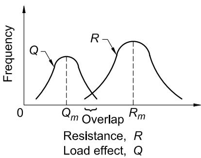  
Fig. C-B3.1. Frequency distribution of load effect, Q, and resistance, R.

corresponding load statistics are given in Galambos et al. (1982). Based on these statistics, the values of $\beta$ inherent in the 1978 Specification for the Design, Fabrication, and Erection of Structural Steel for Buildings (AISC, 1978) were evaluated under different load combinations (live/dead, wind/dead, etc.) and for various tributary areas for typical members (beams, columns, beam-columns, structural components, etc.). As might be expected, there was a considerable variation in the range of $\beta$ -values. For example, compact rolled beams (flexure) and tension members (yielding) had $\beta$ -values that decreased from about 3.1 at $L / D = 0.50$ to 2.4 at $L / D = 4$ . This decrease is a result of ASD applying the same factor to dead load, which is relatively predictable, and live load, which is more variable. For bolted or welded connections, $\beta$ was in the range of 4 to 5.

The variation in $\beta$ that was inherent to ASD is reduced substantially in LRFD by specifying several target $\beta$ -values and selecting load and resistance factors to meet these targets. The Committee on Specifications set the point at which LRFD is calibrated to ASD at $L / D = 3.0$ for braced compact beams in flexure and tension members at yield. The resistance factor, $\phi$ , for these limit states is 0.90, and the implied $\beta$ is approximately 2.6 for members and 4.0 for connections. The larger $\beta$ -value for connections reflects the complexity in modeling their behavior, effects of workmanship, and the benefit provided by additional strength. Limit states for other members are handled similarly.

The databases on steel strength used in previous editions of the LRFD Specification (AISC, 1986, 1993, 2000b) were based mainly on research conducted prior to 1970. An important recent study of the material properties of structural shapes (Bartlett et al., 2003) reflected changes in steel production methods and steel materials that have occurred over the past 15 years. This study indicated that the new steel material characteristics did not warrant changes in the $\phi$ -values.

2. Design for Strength Using Allowable Strength Design (ASD)

The ASD method is provided in this Specification as an alternative to LRFD for use by engineers who prefer to deal with ASD load combinations and allowable stresses in the traditional ASD format. The term "allowable strength" has been introduced to emphasize that the basic equations of structural mechanics that underlie the provisions are the same for LRFD and ASD.

Traditional ASD is based on the concept that the maximum stress in a component shall not exceed a specified allowable stress under normal service conditions. The load effects are determined on the basis of an elastic analysis of the structure, while the allowable stress is the limiting stress (at yielding, instability, rupture, etc.) divided by a safety factor. The magnitude of the safety factor and the resulting allowable stress depend on the particular governing limit state against which the design must produce a certain margin of safety. For any single element, there may be a number of different allowable stresses that must be checked.

The safety factor in traditional ASD provisions was a function of both the material and the component being considered. It may have been influenced by factors such as member length, member behavior, load source, and anticipated quality of workmanship. The traditional safety factors were based solely on experience and have remained unchanged for over 50 years. Although ASD-designed structures have performed adequately over the years, the actual level of safety provided was never known. This was a principal drawback of the traditional ASD approach. An illustration of typical performance data is provided in Bjorhovde (1978), where theoretical and actual safety factors for columns are examined.

Design for strength by ASD is performed in accordance with Equation B3-2. The ASD method provided in the Specification recognizes that the controlling modes of failure are the same for structures designed by ASD and LRFD. Thus, the nominal strength that forms the foundation of LRFD is the same nominal strength that provides the foundation for ASD. When considering available strength, the only difference between the two methods is the resistance factor in LRFD, $\phi$ , and the safety factor in ASD, $\Omega$ .

In developing appropriate values of $\Omega$ for use in this Specification, the aim was to ensure similar levels of safety and reliability for the two methods. A straightforward approach for relating the resistance factor and the safety factor was developed. As already mentioned, the original LRFD Specification (AISC, 1986) was calibrated to the 1978 ASD Specification (AISC, 1978) at a live load-to-dead load ratio of 3. Thus, by equating the designs for the two methods at a ratio of live-to-dead load of 3, the relationship between $\phi$ and $\Omega$ can be determined. Using the live plus dead load combinations, with $L = 3D$ , yields the following relationships.

For design according to Section B3.1 (LRFD)

$$\phi R_{n} = 1. 2 D + 1. 6 L = 1. 2 D + 1. 6 (3 D) = 6 D \tag{C-B3-3}$$

$$R_{n} = \frac{6 D}{\Phi}$$

For design according to Section B3.2 (ASD)

$$\frac{R_{n}}{\Omega} = D + L = D + 3 D = 4 D \tag{C-B3-4}$$

$$R_{n} = \Omega (4 D)$$

Equating $R_{n}$ from the LRFD and ASD formulations and solving for $\Omega$ yields

$$\Omega = \frac{6 D}{\phi} \left(\frac{1}{4 D}\right) = \frac{1 . 5}{\phi} \tag{C-B3-5}$$

Throughout this Specification, the values of $\Omega$ were obtained from the values of $\phi$ by Equation C-B3-5.

3. Required Strength

This Specification permits the use of elastic or inelastic, which includes plastic, structural analysis. Generally, design is performed by elastic analysis. Provisions for inelastic and plastic analysis are given in Appendix 1. The required strength is determined by the appropriate methods of structural analysis.

In some circumstances, as in the proportioning of stability bracing members that carry no calculated forces (see, for example, Appendix 6), the required strength is explicitly stated in this Specification.

A beam that is reliably restrained at one or both ends by connection to other members or by a support will have reserve capacity past yielding at the point with the greatest moment predicted by an elastic analysis. The additional capacity is the result of inelastic redistribution of moments. This Specification bases the design of the member on providing a resisting moment greater than the demand represented by the greatest moment predicted by the elastic analysis. This approach ignores the reserve capacity associated with inelastic redistribution. The $10\%$ reduction of the greatest moment, predicted by elastic analysis with the accompanying $10\%$ increase in the moment on the reverse side of the moment diagram, is an attempt to account approximately for this reserve capacity.

This adjustment is appropriate only for cases where the inelastic redistribution of moments is possible. For statically determinate spans (e.g., beams that are simply supported at both ends or for cantilevers), redistribution is not possible; therefore, the adjustment is not allowable in these cases. Members with fixed ends or beams continuous over a support can sustain redistribution. Members with cross sections that are unable to accommodate the inelastic rotation associated with the redistribution (e.g., because of local buckling) are also not permitted to use this redistribution. Thus, only compact sections qualify for redistribution in this Specification.

An inelastic analysis will automatically account for any redistribution. Therefore, the redistribution of moments only applies to moments computed from an elastic analysis.

The $10\%$ reduction rule applies only to beams. Inelastic redistribution is possible in more complicated structures, but the $10\%$ amount is only verified, at present, for beams. For other structures, the provisions of Appendix 1 should be used.

4. Design of Connections and Supports

This section provides the charging language for Chapter J and Chapter K on the design of connections and supports. Chapter J covers the proportioning of the individual elements of a connection (angles, welds, bolts, etc.) once the load effects on the connection are known. According to the provisions of this section, the modeling assumptions associated with the structural analysis must be consistent with the conditions used in Chapter J to proportion the connecting elements.

In many situations, it is not necessary to include the connection elements as part of the analysis of the structural system. For example, simple and fully restrained (FR) connections may often be idealized as pinned or fixed, respectively, for the purposes of structural analysis. Once the analysis has been completed, the deformations or forces computed at the joints may be used to proportion the connection elements. The classifications of FR and simple connections are meant to justify these idealizations for analysis with the provision that if, for example, one assumes a connection to be FR for the purposes of analysis, the actual connection must meet the FR conditions. In other words, it must have adequate strength and stiffness, as described in the provisions and discussed in the following.

In certain cases, the deformation of the connection elements affects the way the structure resists load and hence the connections must be included in the analysis of the structural system. These connections are referred to as partially restrained (PR) moment connections. For structures with PR connections, the connection flexibility must be estimated and included in the structural analysis, as described in the following sections. Once the analysis is complete, the load effects and deformations computed for the connection can be used to check the adequacy of the connecting elements.

For simple and FR connections, the connection proportions are established after the final analysis of the structural design is completed, thereby greatly simplifying the design cycle. In contrast, the design of PR connections (like member selection) is inherently iterative because one must assume values of the connection proportions in order to establish the force-deformation characteristics of the connection needed to perform the structural analysis. The life-cycle performance characteristics must also be considered. The adequacy of the assumed proportions of the connection elements can be verified once the outcome of the structural analysis is known. If the connection elements are inadequate, then the values must be revised and the structural analysis repeated. The potential benefits of using PR connections for various types of framing systems are discussed in the literature referenced in the following.

Connection Classification. The basic assumption made in classifying connections is that the most important behavioral characteristics of the connection can be modeled by a moment-rotation （$M - \theta)$ curve. Figure C-B3.2 shows a typical $M - \theta$ curve. Implicit in the moment-rotation curve is the definition of the connection as being a region of the column and beam along with the connecting elements. The connection response is defined this way because the rotation of the member in a physical test is generally measured over a length that incorporates the contributions of not only the connecting elements, but also the ends of the members being connected and the column panel zone.

Examples of connection classification schemes include those in Bjorhovde et al. (1990) and Eurocode 3 (CEN, 2005a). These classifications account directly for the stiffness, strength and ductility of the connections.

Connection Stiffness. Because the nonlinear behavior of the connection manifests itself even at low moment-rotation levels, the initial stiffness of the connection, $K_{i}$ , (shown in Figure C-B3.2) does not adequately characterize connection response at service levels. Furthermore, many connection types do not exhibit a reliable initial stiffness, or it exists only for a very small moment-rotation range. The secant stiffness, $K_{s}$ , at service loads is taken as an index property of connection stiffness. Specifically,

$$K_{s} = M_{s} / \theta_{s} \tag{C-B3-6}$$

where

$M_{s} =$ moment at service loads,kip-in. （$\mathrm{N - mm})$

$\theta_{s} =$ rotation at service loads, rad

In the following discussion, $L$ and $EI$ are the length and bending rigidity, respectively, of the beam.

If $K_{s}L / EI \geq 20$ , it is acceptable to consider the connection to be fully restrained (in other words, able to maintain the angles between members). If $K_{s}L / EI \leq 2$ , it is acceptable to consider the connection to be simple (in other words, it rotates without developing moment). Connections with stiffnesses between these two limits are partially restrained and the stiffness, strength and ductility of the connection must be considered in the design (Leon, 1994). Examples of FR, PR and simple connection response curves are shown in Figure C-B3.3. The points marked $\theta_{s}$ indicate the service load states for the example connections and thereby define the secant stiffnesses for those connections.

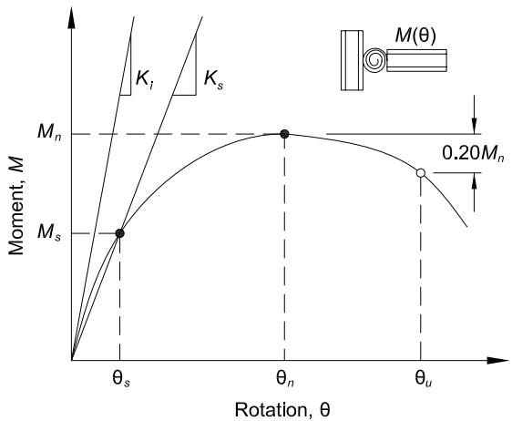  
Fig. C-B3.2. Definition of stiffness, strength and ductility characteristics of the moment-rotation response of a partially restrained connection.

Connection Strength. The strength of a connection is the maximum moment that it is capable of carrying, $M_{n}$ , as shown in Figure C-B3.2. The strength of a connection can be determined on the basis of an ultimate limit-state model of the connection, or from physical tests. If the moment-rotation response does not exhibit a peak load then the strength can be taken as the moment at a rotation of 0.02 rad (Hsieh and Deierlein, 1991; Leon et al., 1996).

It is also useful to define a lower limit on strength below which the connection may be treated as a simple connection. Connections that transmit less than $20\%$ of the fully plastic moment of the beam at a rotation of 0.02 rad may be considered to have no flexural strength for design. However, it should be recognized that the aggregate strength of many weak connections can be important when compared to that of a few strong connections (FEMA, 1997).

In Figure C-B3.3, the points marked $M_{n}$ indicate the maximum strength states of the example connections. The points marked $\theta_{u}$ indicate the maximum rotation states of the example connections. Note that it is possible for an FR connection to have a strength less than the strength of the beam. It is also possible for a PR connection to have a strength greater than the strength of the beam. The strength of the connection must be adequate to resist the moment demands implied by the design loads.

Connection Ductility. If the connection strength substantially exceeds the fully plastic moment strength of the beam, then the ductility of the structural system is controlled by the beam and the connection can be considered elastic. If the connection strength

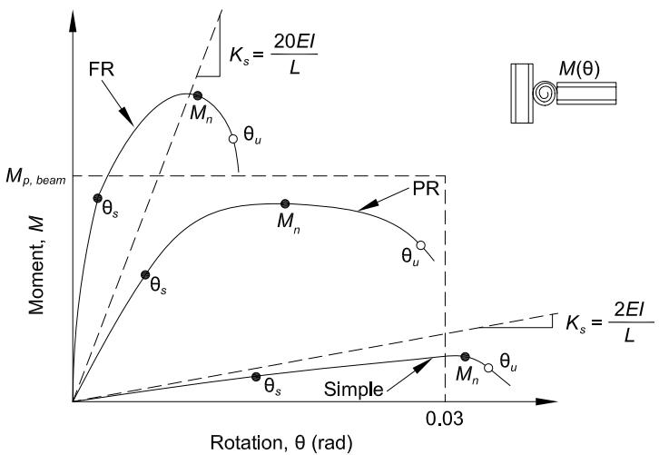  
Fig. C-B3.3. Classification of moment-rotation response of fully restrained (FR), partially restrained (PR), and simple connections.

only marginally exceeds the fully plastic moment strength of the beam, then the connection may experience substantial inelastic deformation before the beam reaches its full strength. If the beam strength exceeds the connection strength, then deformations can concentrate in the connection. The ductility required of a connection will depend upon the particular application. For example, the ductility requirement for a braced frame in a nonseismic area will generally be less than the ductility required in a high seismic area. The rotation ductility requirements for seismic design depend upon the structural system (AISC, 2016b).

In Figure C-B3.2, the rotation capacity, $\theta_{u}$ , can be defined as the value of the connection rotation at the point where either (a) the resisting strength of the connection has dropped to $0.8M_{n}$ or (b) the connection has deformed beyond 0.03 rad. This second criterion is intended to apply to connections where there is no loss in strength until very large rotations occur. It is not prudent to rely on these large rotations in design.

The available rotation capacity, $\theta_{u}$ , should be compared with the rotation required at the strength limit state, as determined by an analysis that takes into account the nonlinear behavior of the connection. (Note that for design by ASD, the rotation required at the strength limit state should be assessed using analyses conducted at 1.6 times the ASD load combinations.) In the absence of an accurate analysis, a rotation capacity of 0.03 rad is considered adequate. This rotation is equal to the minimum beam-to-column connection capacity as specified in the seismic provisions for special moment frames (AISC, 2016b). Many types of PR connections, such as top and seat-angle connections, meet this criterion.

Structural Analysis and Design. When a connection is classified as PR, the relevant response characteristics of the connection must be included in the analysis of the structure to determine the member and connection forces, displacements, and the frame stability. Therefore, PR construction requires, first, that the moment-rotation characteristics of the connection be known and, second, that these characteristics be incorporated in the analysis and member design.

Typical moment-rotation curves for many PR connections are available from one of several databases (Goverdhan, 1983; Ang and Morris, 1984; Nethercot, 1985; Kishi and Chen, 1986). Care should be exercised when utilizing tabulated moment-rotation curves not to extrapolate to sizes or conditions beyond those used to develop the database because other failure modes may control (ASCE, 1997). When the connections to be modeled do not fall within the range of the databases, it may be possible to determine the response characteristics from tests, simple component modeling, or finite element studies (FEMA, 1995). Examples of procedures to model connection behavior are given in the literature (Bjorhovde et al., 1988; Chen and Lui, 1991; Bjorhovde et al., 1992; Lorenz et al., 1993; Chen and Toma, 1994; Chen et al., 1995; Bjorhovde et al., 1996; Leon et al., 1996; Leon and Easterling, 2002; Bijlaard et al., 2005; Bjorhovde et al., 2008).

The degree of sophistication of the analysis depends on the problem at hand. Design for PR construction usually requires separate analyses for the serviceability and strength limit states. For serviceability, an analysis using linear springs with a stiffness given by $K_{s}$ (see Figure C-B3.2) is sufficient if the resistance demanded of the connection is well below the strength. When subjected to strength load combinations, a procedure is needed whereby the characteristics assumed in the analysis are consistent with those of the connection response. The response is especially nonlinear as the applied moment approaches the connection strength. In particular, the effect of the connection nonlinearity on second-order moments and other stability checks needs to be considered (ASCE, 1997). The use of the direct analysis method with PR connections has been demonstrated (Surovek et al., 2005; White and Goverdhan, 2008).

5. Design of Diaphragms and Collectors

This section provides charging language for the design of structural steel components (members and their connections) of diaphragms and collector systems.

Diaphragms transfer in-plane lateral loads to the lateral force-resisting system. Typical diaphragm elements in a building structure are the floor and roof systems, which accumulate lateral forces due to gravity, wind and/or seismic loads, and distribute these forces to individual elements (braced frames, moment frames, shear walls, etc.) of the vertically oriented lateral force-resisting system of the building structure. Collectors (also known as drag struts) are often used to collect and deliver diaphragm forces to the lateral force-resisting system.

Diaphragms are classified into one of three categories: rigid, semi-rigid or flexible. Rigid diaphragms distribute the in-plane forces to the lateral force-resisting system with negligible in-plane deformation of the diaphragm. A rigid diaphragm may be assumed to distribute the lateral loads in proportion to the relative stiffness of the individual elements of the lateral force-resisting system. A semi-rigid diaphragm distributes the lateral loads in proportion to the in-plane stiffness of the diaphragm and the relative stiffness of the individual elements of the lateral force-resisting system. The in-plane stiffness of a flexible diaphragm is negligible compared to the stiffness of the lateral force-resisting system and, therefore, the distribution of lateral forces is independent of the relative stiffness of the individual elements of the lateral force-resisting system. In this case, the distribution of lateral forces may be computed in a manner analogous to a series of simple beams spanning between the lateral force-resisting system elements.

Diaphragms should be designed for the shear, moment and axial forces resulting from the design loads. The diaphragm response may be considered analogous to a deep beam where the flanges (often referred to as chords of the diaphragm) develop tension and compression forces, and the web resists the shear. The component elements of the diaphragm need to have strength and deformation capacity consistent with assumptions and intended behavior.

6. Design of Anchorages to Concrete

This section provides the charging language for Chapter I and Chapter J on design of anchorages to concrete.

7. Design for Stability

This section provides the charging language for Chapter C on design for stability.

8. Design for Serviceability

This section provides the charging language for Chapter L on design for serviceability.

9. Design for Structural Integrity

This section provides the minimum connection design criteria for satisfying structural integrity requirements where required by the applicable building code. Section 1615 of the International Building Code (ICC, 2015) assigns structural integrity requirements to high-rise buildings in risk category III or IV, which means that the number of buildings to which this requirement currently applies is limited.

Evaluation of built structures that have been subjected to extraordinary events indicates that structures that have a higher level of connectivity perform better than those that do not. The intent of the integrity requirements is to achieve this improved connectivity by limiting the possibility of a connection failure when it is subjected to unanticipated tension forces. The forces can result from a wide range of events such as cool-down after a fire, failure of adjacent structural members, and blast or impact loads on columns. The Specification integrity checks are similar in principle to those defined in other model codes and international codes which have provided good historical performance (Geschwindner and Gustafson, 2010). The fundamental aspect of the integrity requirement is that it is a connection design requirement only and is not a design force applied to any part of the structure other than the connection itself. In addition, the forces determined for the integrity check are not to be combined with any other forces and the integrity connection design check is to be conducted separately. The structural integrity requirements are a detailing requirement for the connection and not a load or force applied to the structure.

Section B3.9(a) provides the nominal tensile strength for column splices. The intent of this requirement is to provide a minimum splice capacity for the resistance of unanticipated forces. This requirement is based on the assumption that two floors are supported by the splice. Any live load reduction should be the same as that used for the design of the connections of the floor members framing to the column. The tension design force should be distributed reasonably uniformly between the flanges and web so that some bending and shear capacity is provided in addition to the tension capacity. A load path for this tension force does not need to be provided.

Section B3.9(b) provides the minimum nominal axial tensile strength of the end connection of beams that frame to girders and also for beams or girders that frame to columns. Geschwindner and Gustafson (2010) have shown that single-plate connections designed to resist shear according to this Specification will satisfy this requirement. Since inelastic deformation is permitted for the integrity check, it is

expected that most other framed connections, such as double-angle connections, can be shown to satisfy this requirement through nonlinear analysis or yield line analysis. The forces determined in this section are to be applied to only the connection design itself and are not to be included in the member design. In particular, checking the local bending of column and beam webs induced by the tension is not required by this section.

Section B3.9(c) provides the minimum nominal tensile force to brace columns. Maintaining column bracing is one of the fundamental principles for providing structural integrity. Since column bracing elements are usually much lighter than the column, extraordinary events have more potential to affect the bracing member or the slab surrounding the column than the column itself. This is the reason that the steel connection itself is required to provide the bracing force. The assumption is that the extraordinary event has compromised the ability of the column to be braced by the slab or by one of the beams framing to the column. This tensile bracing force requirement is to be applied separately from other bracing requirements, as specified in Appendix 6. Note that the requirements of this section will usually govern for the lower stories of high-rise buildings, whereas Section B3.9(a) will govern in most other situations.

Although the integrity requirements need be applied only when required by code, they should be considered for any building where improved structural performance under undefined extraordinary events is desired. For structures that have a defined extraordinary load, reference should be made to ASCE/SEI 7. For structures that are required to be designed to resist progressive (disproportionate) collapse, reference should be made to the ASCE/SEI 7 Commentary.

10. Design for Ponding

As used in this Specification, ponding refers to the retention of water due solely to the deflection of flat roof framing. The amount of accumulated water is dependent on the stiffness of the framing. Unbounded incremental deflections due to the incremental increase in retained water can result in the collapse of the roof. The problem becomes catastrophic when more water causes more deflection, resulting in more room for more water until the roof collapses.

Previous editions of this Specification suggested that ponding instability could be avoided by providing a minimum roof slope of $\frac{1}{4}$ in. per ft (20 mm per meter). There are cases where this minimum roof slope is not enough to prevent ponding instability (Fisher and Pugh, 2007). This edition of the Specification requires that design for ponding be considered if water is impounded on the roof, irrespective of roof slope. Camber and deflections due to loads acting concurrently with rain loads must be considered in establishing the initial conditions.

Determination of ponding stability is typically done by structural analysis where the rain loads are increased by the incremental deflections of the framing system to the accumulated rain water, assuming the primary roof drains are blocked.

Detailed provisions and design aids for determining ponding stability and strength are given in Appendix 2.

11. Design for Fatigue

This section provides the charging language for Appendix 3 on design for fatigue.

12. Design for Fire Conditions

This section provides the charging language for Appendix 4 on structural design for fire resistance. Qualification testing is an acceptable alternative to design by analysis for providing fire resistance. Qualification testing is addressed in ASCE/SEI/SFPE Standard 29 (ASCE, 2008), ASTM E119 (ASTM, 2009b), and similar documents.

13. Design for Corrosion Effects

Steel members may deteriorate in some service environments. This deterioration may appear either as external corrosion, which would be visible upon inspection, or in undetected changes that would reduce member strength. The designer should recognize these problems by either factoring a specific amount of tolerance for damage into the design or providing adequate protection (for example, coatings or cathodic protection) and/or planned maintenance programs so that such problems do not occur.

Because the interior of an HSS is difficult to inspect, some concern has been expressed regarding internal corrosion. However, good design practice can eliminate the concern and the need for expensive protection. Corrosion occurs in the presence of oxygen and water. In an enclosed building, it is improbable that there would be sufficient reintroduction of moisture to cause severe corrosion. Therefore, internal corrosion protection is a consideration only in HSS exposed to weather.

In a sealed HSS, internal corrosion cannot progress beyond the point where the oxygen or moisture necessary for chemical oxidation is consumed (AISI, 1970). The oxidation depth is insignificant when the corrosion process must stop, even when a corrosive atmosphere exists at the time of sealing. If fine openings exist at connections, moisture and air can enter the HSS through capillary action or by aspiration due to the partial vacuum that is created if the HSS is cooled rapidly (Blodgett, 1967). This can be prevented by providing pressure-equalizing holes in locations that make it impossible for water to flow into the HSS by gravity.

Situations where conservative practice would recommend an internal protective coating include (a) open HSS where changes in the air volume by ventilation or direct flow of water is possible, and (b) open HSS subject to a temperature gradient that would cause condensation.

HSS that are filled or partially filled with concrete should not be sealed. In the event of fire, water in the concrete will vaporize and may create pressure sufficient to burst a sealed HSS. Care should be taken to keep water from remaining in the HSS during or after construction, since the expansion caused by freezing can create pressure that is sufficient to burst an HSS.

Galvanized HSS assemblies should not be completely sealed because rapid pressure changes during the galvanizing process tend to burst sealed assemblies.

B4. MEMBER PROPERTIES

1. Classification of Sections for Local Buckling

Cross sections with a limiting width-to-thickness ratio, $\lambda$ , greater than those provided in Table B4.1 are subject to local buckling limit states. Since the 2010 AISC Specification (AISC, 2010), Table B4.1 has been separated into two parts: B4.1a for compression members and B4.1b for flexural members. Separation of Table B4.1 into two parts reflects the fact that compression members are only categorized as either slender or nonslender, while flexural members may be slender, noncompact or compact. In addition, separation of Table B4.1 into two parts clarifies ambiguities in $\lambda_r$ . The width-to-thickness ratio, $\lambda_r$ , may be different for columns and beams, even for the same element in a cross section, reflecting both the underlying stress state of the connected elements and the different design methodologies between columns (Chapter E and Appendix 1) and beams (Chapter F and Appendix 1).

Limiting Width-to-Thickness Ratios for Compression Elements in Members Subject to Axial Compression. Compression members containing any elements with width-to-thickness ratios greater than $\lambda_r$ provided in Table B4.1a are designated as slender and are subject to the local buckling reductions detailed in Section E7. Nonslender compression members (all elements having width-to-thickness ratio $\leq \lambda_r$ ) are not subject to local buckling reductions.

Flanges of Built-Up I-Shaped Sections. In the 1993 Load and Resistance Factor Design Specification for Structural Steel Buildings (AISC, 1993), for built-up I-shaped sections under axial compression (Case 2 in Table B4.1a), modifications were made to the flange local buckling criterion to include web-flange interaction. The $k_{c}$ in the $\lambda_r$ limit is the same as that used for flexural members. Theory indicates that the web-flange interaction in axial compression is at least as severe as in flexure. Rolled shapes are excluded from this provision because there are no standard sections with proportions where the interaction would occur at commonly available yield stresses. In built-up sections where the interaction causes a reduction in the flange local buckling strength, it is likely that the web is also a thin stiffened element. The $k_{c}$ factor accounts for the interaction of flange and web local buckling demonstrated in experiments reported in Johnson (1985). The maximum limit of 0.76 corresponds to $F_{cr} = 0.69E / \lambda^2$ , which was used as the local buckling strength in earlier editions of both the ASD and LRFD Specifications. An $h / t_w = 27.5$ is required to reach $k_{c} = 0.76$ . Fully fixed restraint for an unstiffened compression element corresponds to $k_{c} = 1.3$ while zero restraint gives $k_{c} = 0.42$ . Because of web-flange interactions, it is possible to get $k_{c} < 0.42$ from the $k_{c}$ formula. If $h / t_w > 5.70\sqrt{E / F_y}$ , use $h / t_w = 5.70\sqrt{E / F_y}$ in the $k_{c}$ equation, which corresponds to the 0.35 limit.

Rectangular HSS in Compression. The limits for rectangular HSS walls in uniform compression (Case 6 in Table B4.1a) have been used in AISC Specifications since 1969 (AISC, 1969). They are based on Winter (1968), where adjacent stiffened compression elements in box sections of uniform thickness were observed to provide negligible torsional restraint for one another along their corner edges.

Round HSS in Compression. The $\lambda_r$ limit for round HSS in compression (Case 9 in Table B4.1a) was first used in the 1978 Specification for the Design, Fabrication, and Erection of Structural Steel for Buildings (AISC, 1978). It was recommended in Schilling (1965) based upon research reported in Winter (1968). Excluding the use of round HSS with $D / t > 0.45E / F_y$ was also recommended in Schilling (1965). This is implied in Sections E7 and F8 where no criteria are given for round HSS with $D / t$ greater than this limit.

Limiting Width-to-Thickness Ratios for Compression Elements in Members Subject to Flexure. Flexural members containing compression elements, all with width-to-thickness ratios less than or equal to $\lambda_{p}$ as provided in Table B4.1b, are designated as compact. Compact sections are capable of developing a fully plastic stress distribution and they possess a rotation capacity, $R_{cap}$ , of approximately 3 (see Figure C-A-1.2) before the onset of local buckling (Yura et al., 1978). Flexural members containing any compression element with width-to-thickness ratios greater than $\lambda_{p}$ , but still with all compression elements having width-to-thickness ratios less than or equal to $\lambda_{r}$ , are designated as noncompact. Noncompact sections can develop partial yielding in compression elements before local buckling occurs, but will not resist inelastic local buckling at the strain levels required for a fully plastic stress distribution. Flexural members containing any compression elements with width-to-thickness ratios greater than $\lambda_{r}$ are designated as slender. Slender-element sections have one or more compression elements that will buckle elastically before the yield stress is achieved. Noncompact and slender-element sections are subject to flange local buckling and/or web local buckling reductions as provided in Chapter F and summarized in Table User Note F1.1, or in Appendix 1.

The values of the limiting ratios, $\lambda_{p}$ and $\lambda_{r}$ , specified in Table B4.1b are similar to those in the 1989 Specification for Structural Steel Buildings—Allowable Stress Design and Plastic Design (AISC, 1989) and Table 2.3.3.3 of Galambos (1978), except that $\lambda_{p} = 0.38\sqrt{E / F_{y}}$ , limited in Galambos (1978) to determinate beams and to indeterminate beams when moments are determined by elastic analysis, was adopted for all conditions on the basis of Yura et al. (1978). For greater inelastic rotation capacities than provided by the limiting value of $\lambda_{p}$ given in Table B4.1b, and/or for structures in areas of high seismicity, see Chapter D and Table D1.1 of the AISC Seismic Provisions for Structural Steel Buildings (AISC, 2016b).

Webs in Flexure. In the 2010 Specification for Structural Steel Buildings (AISC, 2010), formulas for $\lambda_{p}$ were added as Case 16 in Table B4.1b for I-shaped beams with unequal flanges based on White (2008). In extreme cases where the plastic neutral axis is located in the compression flange, $h_p = 0$ and the web is considered to be compact.

Rectangular HSS in Flexure. The $\lambda_{p}$ limit for compact sections is adopted from Limit States Design of Steel Structures (CSA, 2009). Lower values of $\lambda_{p}$ are specified for high-seismic design in the AISC Seismic Provisions for Structural Steel Buildings (AISC, 2016b) based upon tests (Lui and Goel, 1987) that have shown that rectangular HSS braces subjected to reversed axial load fracture catastrophically under relatively few cycles if a local buckle forms. This was confirmed in tests (Sherman,

1995a) where rectangular HSS braces sustained over 500 cycles when a local buckle did not form, even though general column buckling had occurred, but failed in less than 40 cycles when a local buckle developed. Since 2005, the $\lambda_{p}$ limit for webs in rectangular HSS flexural members (Case 19 in Table B4.1b) has been reduced from $\lambda_{p} = 3.76\sqrt{E / F_{y}}$ to $\lambda_{p} = 2.42\sqrt{E / F_{y}}$ based on the work of Wilkinson and Hancock (1998, 2002).

Box Sections in Flexure. In the 2016 Specification, box sections are defined separately from rectangular HSS. Thus, Case 21 has been added to Table B4.1b for flanges of box sections and box sections have been included in Case 19 for webs.

Round HSS in Flexure. The $\lambda_{p}$ values for round HSS in flexure (Case 20, Table B4.1b) are based on Sherman (1976), Sherman and Tanavde (1984), and Ziemian (2010). Beyond this, the local buckling strength decreases rapidly, making it impractical to use these sections in building construction.

2. Design Wall Thickness for HSS

ASTM A500/A500M tolerances allow for a wall thickness that is not greater than $\pm 10\%$ of the nominal value. Because the plate and strip from which these HSS are made are produced to a much smaller thickness tolerance, manufacturers in the consistently produce these HSS with a wall thickness that is near the lower-bound wall thickness limit. Consequently, AISC and the Steel Tube Institute of North America (STI) recommend that 0.93 times the nominal wall thickness be used for calculations involving engineering design properties of these HSS. This results in a weight (mass) variation that is similar to that found in other structural shapes. The design wall thickness and section properties based upon this reduced thickness have been tabulated in AISC and STI publications since 1997.

Two new HSS material standards have been added to the 2016 Specification. ASTM A1085/A1085M is a standard in which the wall thickness is permitted to be no more than $5\%$ under the nominal thickness and the mass is permitted to be no more than $3.5\%$ under the nominal mass. This is in addition to a Charpy V-notch toughness limit and a limit on the range of yield strength that makes A1085/A1085M suitable for seismic applications. With these tolerances, the design wall thickness may be taken as the nominal thickness of the HSS. Other acceptable HSS products that do not have the same thickness and mass tolerances must still use the design thickness as 0.93 times the nominal thickness as discussed previously.

The other new material standard is ASTM A1065/A1065M. These HSS are produced by cold-forming two C-shaped sections and joining them with two electric-fusion seam welds to form a square or rectangular HSS. These sections are available in larger sizes than those produced in a tube mill. Since the thickness meets plate tolerance limits, the design wall thickness may be taken as the nominal thickness. In previous Specifications, they were classified as box sections because they were not produced according to an ASTM standard. With the new ASTM A1065/1065M standard, they are included as acceptable HSS and the term box section is used for sections made by corner welding four plates to form a hollow box.

3. Gross and Net Area Determination

3a. Gross Area

Gross area is the total area of the cross section without deductions for holes or ineffective portions of elements subject to local buckling.

3b. Net Area

The net area is based on net width and load transfer at a particular chain. Because of possible damage around a hole during drilling or punching operations, $^{1} /_{16}$ in. (2 mm) is added to the nominal hole diameter when computing the net area.

B5. FABRICATION AND ERECTION

Section B5 provides the charging language for Chapter M on fabrication and erection.

B6. QUALITY CONTROL AND QUALITY ASSURANCE

Section B6 provides the charging language for Chapter N on quality control and quality assurance.

B7. EVALUATION OF EXISTING STRUCTURES

Section B7 provides the charging language for Appendix 5 on the evaluation of existing structures.

CHAPTER C DESIGN FOR STABILITY

Design for stability is the combination of analysis to determine the required strengths of components and proportioning of components to have adequate available strengths. Various methods are available to provide for stability (Ziemian, 2010).

Chapter C addresses the stability design requirements for steel buildings and other structures. It is based upon the direct analysis method, which can be used in all cases. The effective length method and first-order analysis method are addressed in Appendix 7 as alternative methods of design for stability, and may be used when the limits in Appendix 7, Sections 7.2.1 and 7.3.1, respectively, are satisfied. A complete discussion of each of these methods, along with example problems, may be found in AISC Design Guide 28, Stability Design of Steel Buildings (Griffis and White, 2013). Other approaches are permitted provided the general requirements in Section C1 are satisfied. For example, Appendix 1 provides logical extensions to the direct analysis method, in which design provisions are provided for explicitly modeling member imperfections and/or inelasticity. First-order elastic structural analysis without stiffness reductions for inelasticity is not sufficient to assess stability because the analysis and the equations for component strengths are inextricably interdependent.

C1. GENERAL STABILITY REQUIREMENTS

There are many parameters and behavioral effects that influence the stability of steel-framed structures (Birnstiel and Iffland, 1980; McGuire, 1992; White and Chen, 1993; ASCE, 1997; Ziemian, 2010). The stability of structures and individual elements must be considered from the standpoint of the structure as a whole, including not only compression members, but also beams, bracing systems and connections.

Stiffness requirements for control of seismic drift are included in many building codes that prohibit sidesway amplification, $\Delta_{2nd-order} / \Delta_{1st-order}$ or $B_{2}$ , calculated with nominal stiffness, from exceeding approximately 1.5 to 1.6 (ICC, 2015). This limit usually is well within the more general recommendation that sidesway amplification, calculated with reduced stiffness, should be equal to or less than 2.5. The latter recommendation is made because at larger levels of amplification, small changes in gravity loads and/or structural stiffness can result in relatively larger changes in sidesway deflections and second-order effects, due to large geometric nonlinearities.

Table C-C1.1 shows how the five general requirements provided in Section C1 are addressed in the direct analysis method (Sections C2 and C3) and the effective length method (Appendix 7, Section 7.2). The first-order analysis method (Appendix 7, Section 7.3) is not included in Table C-C1.1 because it addresses these requirements in an indirect manner using a mathematical manipulation of the direct analysis method. The additional lateral load required in Appendix 7, Section 7.3.2(a) is calibrated to achieve roughly the same result as the collective effects of notional loads

| TABLE C-C1.1 Comparison of Basic Stability Requirements with Specific Provisions | TABLE C-C1.1 Comparison of Basic Stability Requirements with Specific Provisions | TABLE C-C1.1 Comparison of Basic Stability Requirements with Specific Provisions | TABLE C-C1.1 Comparison of Basic Stability Requirements with Specific Provisions |
| --- | --- | --- | --- |
| Basic Requirement in Section C1 | Basic Requirement in Section C1 | Provision in Direct Analysis Method (DM) | Provision in Effective Length Method (ELM) |
| (1) Consider all deformations | (1) Consider all deformations | C2.1(a). Consider all deformations | Same as DM (by reference to C2.1) |
| (2) Consider second-order effects (both P-Δ and P-δ) | (2) Consider second-order effects (both P-Δ and P-δ) | C2.1(b). Consider second-order effects (P-Δ and P-δ)[b] | Same as DM (by reference to C2.1) |
| (3) Consider geometric imperfections This includes joint-position imperfections[a] (which affect structure response) and member imperfections (which affect structure response and member strength) | Effect of system imperfections on structure response | C2.2a. Direct modeling or C2.2b. Notional loads | Same as DM, second option only (by reference to C2.2b) |
| (3) Consider geometric imperfections This includes joint-position imperfections[a] (which affect structure response) and member imperfections (which affect structure response and member strength) | Effect of member imperfections on structure response | Included in the stiffness reduction specified in C2.3 | All these effects are considered by using Lc=KL from a side-sway buckling analysis in the member strength check. Note that the differences between DM and ELM are: • DM uses reduced stiffness in the analysis and Lc=L in the member strength check • ELM uses full stiffness in the analysis and Lc=KL from sidesway buckling analysis in the member strength check |
| (3) Consider geometric imperfections This includes joint-position imperfections[a] (which affect structure response) and member imperfections (which affect structure response and member strength) | Effect of member imperfections on member strength | Included in member strength formulas, with Lc=L | All these effects are considered by using Lc=KL from a side-sway buckling analysis in the member strength check. Note that the differences between DM and ELM are: • DM uses reduced stiffness in the analysis and Lc=L in the member strength check • ELM uses full stiffness in the analysis and Lc=KL from sidesway buckling analysis in the member strength check |
| (4) Consider stiffness reduction due to inelasticity This affects structure response and member strength | Effect of stiffness reduction on structure response | Included in the stiffness reduction specified in C2.3 | All these effects are considered by using Lc=KL from a side-sway buckling analysis in the member strength check. Note that the differences between DM and ELM are: • DM uses reduced stiffness in the analysis and Lc=L in the member strength check • ELM uses full stiffness in the analysis and Lc=KL from sidesway buckling analysis in the member strength check |
| (4) Consider stiffness reduction due to inelasticity This affects structure response and member strength | Effect of stiffness reduction on member strength | Included in member strength formulas, with Lc=L | All these effects are considered by using Lc=KL from a side-sway buckling analysis in the member strength check. Note that the differences between DM and ELM are: • DM uses reduced stiffness in the analysis and Lc=L in the member strength check • ELM uses full stiffness in the analysis and Lc=KL from sidesway buckling analysis in the member strength check |
| (5) Consider uncertainty in strength and stiffness This affects structure response and member strength | Effect of stiffness/ strength uncertainty on structure response | Included in the stiffness reduction specified in C2.3 | All these effects are considered by using Lc=KL from a side-sway buckling analysis in the member strength check. Note that the differences between DM and ELM are: • DM uses reduced stiffness in the analysis and Lc=L in the member strength check • ELM uses full stiffness in the analysis and Lc=KL from sidesway buckling analysis in the member strength check |
| (5) Consider uncertainty in strength and stiffness This affects structure response and member strength | Effect of stiffness/ strength uncertainty on member strength | Included in member strength formulas, with Lc=L | All these effects are considered by using Lc=KL from a side-sway buckling analysis in the member strength check. Note that the differences between DM and ELM are: • DM uses reduced stiffness in the analysis and Lc=L in the member strength check • ELM uses full stiffness in the analysis and Lc=KL from sidesway buckling analysis in the member strength check |
| [a] In typical building structures, the “joint-position imperfections” refers to column out-of-plumbness. [b] Second-order effects may be considered either by a computational P-Δ and P-δ analysis or by the approximate method (using B1 and B2 multipliers) specified in Appendix 8. | [a] In typical building structures, the “joint-position imperfections” refers to column out-of-plumbness. [b] Second-order effects may be considered either by a computational P-Δ and P-δ analysis or by the approximate method (using B1 and B2 multipliers) specified in Appendix 8. | [a] In typical building structures, the “joint-position imperfections” refers to column out-of-plumbness. [b] Second-order effects may be considered either by a computational P-Δ and P-δ analysis or by the approximate method (using B1 and B2 multipliers) specified in Appendix 8. | [a] In typical building structures, the “joint-position imperfections” refers to column out-of-plumbness. [b] Second-order effects may be considered either by a computational P-Δ and P-δ analysis or by the approximate method (using B1 and B2 multipliers) specified in Appendix 8. |

required in Section C2.2b, $P$ - $\Delta$ effects required in Section C2.1(b), and the stiffness reduction required in Section C2.3. Additionally, a $B_{1}$ multiplier addresses $P$ - $\delta$ effects as defined in Appendix 8, Section 8.2.1.

In the 2010 AISC Specification (AISC, 2010), uncertainties in stiffness and strength was added to the list of effects that should be considered when designing for stability. Although all methods detailed in this Specification, including the direct analysis

method, the effective length method, and the first-order elastic method, satisfy this requirement, the effect is listed to ensure that it is included, along with the original four other effects, when any other rational method of designing for stability is employed.

C2. CALCULATION OF REQUIRED STRENGTHS

Analysis to determine required strengths in accordance with this Section and the assessment of member and connection available strengths in accordance with Section C3 form the basis of the direct analysis method of design for stability. This method is useful for the stability design of all structural steel systems, including moment frames, braced frames, shear walls, and combinations of these and similar systems (AISC-SSRC, 2003a). While the precise formulation of this method is unique to the AISC Specification, some of its features are similar to those found in other major design specifications around the world, including the Eurocodes, the Australian standard, the Canadian standard, and ACI 318 (ACI, 2014).

The direct analysis method allows a more accurate determination of the load effects in the structure through the inclusion of the effects of geometric imperfections and stiffness reductions directly within the structural analysis. This also allows the use of $K = 1.0$ in calculating the in-plane column strength, $P_{c}$ , within the beam-column interaction equations of Chapter H. This is a significant simplification in the design of steel moment frames and combined systems. Verification studies for the direct analysis method are provided by Deierlein et al. (2002), Maleck and White (2003), and Martinez-Garcia and Ziemian (2006).

1. General Analysis Requirements

Deformations to be Considered in the Analysis. It is required that the analysis consider flexural, shear and axial deformations, and all other component and connection deformations that contribute to the displacement of the structure. However, it is important to note that "consider" is not synonymous with "include," and some deformations can be neglected after rational consideration of their likely effect. For example, the in-plane deformation of a concrete-on-steel deck floor diaphragm in an office building usually can be neglected, but that of a cold-formed steel roof deck in a large warehouse with widely spaced lateral force-resisting elements usually cannot. As another example, shear deformations in beams and columns in a low-rise moment frame usually can be neglected, but this may not be true in a high-rise framed-tube system with relatively deep members and short spans. For such frames, the use of rigid offsets to account for member depths may significantly overestimate frame stiffness and consequently underestimate second-order effects due to high shear stresses within the panel zone of the connections. For example, Charney and Johnson (1986) found that for the range of columns and beam sizes they studied the deflections of a subassembly modeled using centerline dimensions could vary from an overestimation of $23\%$ to an underestimation of $20\%$ when compared to a finite element model. Charney and Johnson conclude that analysis based on centerline dimensions may either underestimate or overestimate drift, with results depending on the span of the girder and on the web thickness of the column.

Second-Order Effects. The direct analysis method includes the basic requirement to calculate the internal load effects using a second-order analysis that accounts for both $P - \Delta$ and $P - \delta$ effects (see Figure C-C2.1). $P - \Delta$ effects are the effects of loads acting on the displaced location of joints or member-end nodes in a structure. $P - \delta$ effects are the effect of loads acting on the deflected shape of a member between joints or member-end nodes.

Many, but not all, modern commercial structural analysis programs are capable of accurately and directly modeling all significant $P - \Delta$ and $P - \delta$ second-order effects. Programs that accurately estimate second-order effects typically solve the governing differential equations either through the use of a geometric stiffness approach (McGuire et al., 2000; Ziemian, 2010) or the use of stability functions (Chen and Lui, 1987). What is, and just as importantly what is not, included in the analysis should be verified by the user for each particular program. Some programs neglect $P - \delta$ effects in the analysis of the structure, and because this is a common approximation that is permitted under certain conditions, it is discussed at the end of this section.

Methods that modify first-order analysis results through second-order multipliers are permitted. The use of the $B_{1}$ and $B_{2}$ multipliers provided in Appendix 8 is one such method. The accuracy of other methods should be verified.

Analysis Benchmark Problems. The following benchmark problems are recommended as a first-level check to determine whether an analysis procedure meets the requirements of a $P - \Delta$ and $P - \delta$ second-order analysis adequate for use in the direct analysis method (and the effective length method in Appendix 7). Some second-order analysis procedures may not include the effects of $P - \delta$ on the overall response of the structure. These benchmark problems are intended to reveal whether or not these effects are included in the analysis. It should be noted that in accordance with the requirements of Section C2.1(b), it is not always necessary to include $P - \delta$ effects in the second-order analysis (additional discussion of the consequences of neglecting these effects will follow).

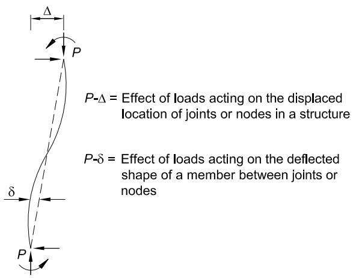  
Fig. C-C2.1. P- $\varDelta$ and P- $\delta$ effects in beam-columns.

The benchmark problem descriptions and solutions are shown in Figures C-C2.2 and C-C2.3. Proportional loading is assumed and axial, flexural and shear deformations are included. Case 1 is a simply supported beam-column subjected to an axial load concurrent with a uniformly distributed transverse load between supports. This problem contains only $P - \delta$ effects because there is no translation of one end of the member relative to the other. Case 2 is a fixed-base cantilevered beam-column subjected to an axial load concurrent with a lateral load at its top. This problem contains both $P - \Delta$ and $P - \delta$ effects. In confirming the accuracy of the analysis method, both moments and deflections should be checked at the locations shown for the various levels of axial load on the member and in all cases should agree within $3\%$ and $5\%$ , respectively.

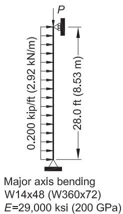

| Axial Force, P (kips) | 0 | 150 | 300 | 450 |
| --- | --- | --- | --- | --- |
| Mmid (kip-in.) | 235 [235] | 270 [269] | 316 [313] | 380 [375] |
| Δmid (in.) | 0.202 [0.197] | 0.230 [0.224] | 0.269 [0.261] | 0.322 [0.311] |

| Axial Force, P (kN) | 0 | 667 | 1334 | 2001 |
| --- | --- | --- | --- | --- |
| Mmid(kN-m) | 26.6 | 30.5 | 35.7 | 43.0 |
| Mmid(kN-m) | [26.6] | [30.4] | [35.4] | [42.4] |
| Δmid(mm) | 5.13 | 5.86 | 6.84 | 8.21 |
| Δmid(mm) | [5.02] | [5.71] | [6.63] | [7.91] |
| Analyses include axial, flexural and shear deformations. [Values in brackets] exclude shear deformations. | Analyses include axial, flexural and shear deformations. [Values in brackets] exclude shear deformations. | Analyses include axial, flexural and shear deformations. [Values in brackets] exclude shear deformations. | Analyses include axial, flexural and shear deformations. [Values in brackets] exclude shear deformations. | Analyses include axial, flexural and shear deformations. [Values in brackets] exclude shear deformations. |

Fig. C-C2.2. Benchmark problem Case 1.

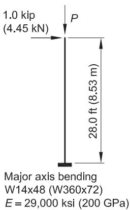  
Fig. C-C2.3. Benchmark problem Case 2.

| Axial Force, P (kips) | 0 | 100 | 150 | 200 |
| --- | --- | --- | --- | --- |
| Mbase (kip-in.) | 336 [336] | 470 [469] | 601 [598] | 856 [848] |
| Δtip (in.) | 0.907 [0.901] | 1.34 [1.33] | 1.77 [1.75] | 2.60 [2.56] |

| Axial Force, P (kN) | 0 | 445 | 667 | 890 |
| --- | --- | --- | --- | --- |
| Mbase (kN·m) | 38.0 [38.0] | 53.2 [53.1] | 68.1 [67.7] | 97.2 [96.2] |
| Δtip (mm) | 23.1 [22.9] | 34.2 [33.9] | 45.1 [44.6] | 66.6 [65.4] |
| Analyses include axial, flexural and shear deformations. [Values in brackets] exclude shear deformations. | Analyses include axial, flexural and shear deformations. [Values in brackets] exclude shear deformations. | Analyses include axial, flexural and shear deformations. [Values in brackets] exclude shear deformations. | Analyses include axial, flexural and shear deformations. [Values in brackets] exclude shear deformations. | Analyses include axial, flexural and shear deformations. [Values in brackets] exclude shear deformations. |

Given that there are many attributes that must be studied to confirm the accuracy of a given analysis method for routine use in the design of general framing systems, a wide range of benchmark problems should be employed. Several other targeted analysis benchmark problems can be found in Kaehler et al. (2010), Chen and Lui (1987), and McGuire et al. (2000). When using benchmark problems to assess the correctness of a second-order procedure, the details of the analysis used in the benchmark study, such as the number of elements used to represent the member and the numerical solution scheme employed, should be replicated in the analysis used to design the actual structure. Because the ratio of design load to elastic buckling load is a strong indicator of the influence of second-order effects, benchmark problems with such ratios on the order of 0.6 to 0.7 should be included.

Effect of Neglecting P-δ A common type of approximate analysis is one that captures only $P - \Delta$ effects due to member end translations (for example, interstory drift) but fails to capture $P - \delta$ effects due to curvature of the member relative to its chord. This type of analysis is referred to as a $P - \Delta$ analysis. Where $P - \delta$ effects are significant, errors arise in approximate methods that do not accurately account for the effect of $P - \delta$ moments on amplification of both local ( $\delta$ ) and global ( $\Delta$ ) displacements and corresponding internal moments. These errors can occur both with second-order computer analysis programs and with the $B_{1}$ and $B_{2}$ amplifiers. For instance, the $R_{M}$ modifier in Equation A-8-7 is an adjustment factor that approximates the effects of $P - \delta$ (due to column curvature) on the overall sidesway displacements, $\Delta$ , and the corresponding moments. For regular rectangular moment frames, a single-element-per-member $P - \Delta$ analysis is equivalent to using the $B_{2}$ amplifier of Equation A-8-6 with $R_{M} = 1$ , and hence, such an analysis neglects the effect of $P - \delta$ on the response of the structure.

Section C2.1(b) indicates that a $P$ - $\Delta$ -only analysis (one that neglects the effect of $P$ - $\delta$ deformations on the response of the structure) is permissible for typical building structures when the ratio of second-order drift to first-order drift is less than 1.7 and no more than one-third of the total gravity load on the building is on columns that are part of moment-resisting frames. The latter condition is equivalent to an $R_{M}$ value of 0.95 or greater. When these conditions are satisfied, the error in lateral displacement from a $P$ - $\Delta$ -only analysis typically will be less than $3\%$ . However, when the $P$ - $\delta$ effect in one or more members is large (corresponding to a $B_{1}$ multiplier of more than about 1.2), use of a $P$ - $\Delta$ -only analysis may lead to larger errors in the nonsway moments in components connected to the high- $P$ - $\delta$ members.

The engineer should be aware of this possible error before using a $P$ - $\Delta$ -only analysis in such cases. For example, consider the evaluation of the fixed-base cantilevered beam-column shown in Figure C-C2.4 using the direct analysis method. The sideways displacement amplification factor is 3.83 and the base moment amplifier is 3.32, giving $M_u = 1,394$ kip-in. (158 kN-m).

For the loads shown, the beam-column strength interaction according to Equation H1-1a is equal to 1.0. The sidesway displacement and base moment amplification determined by a single-element $P$ - $\Delta$ analysis, which ignores the effect of $P$ - $\delta$ on the response of the structure, is 2.55, resulting in an estimated $M_u = 1,070 \mathrm{kip}$ in. (120 $\times 10^{6} \mathrm{N} \cdot \mathrm{mm}$ )—an error of $23.2\%$ relative to the more accurate value of $M_u$ and a beam-column interaction value of 0.91.

$P - \delta$ effects can be captured in some (but not all) $P - \Delta$ -only analysis methods by subdividing the members into multiple elements. For this example, three equal-length $P - \Delta$ analysis elements are required to reduce the errors in the second-order base moment and sidesway displacement to less than $3\%$ and $5\%$ , respectively.

It should be noted that, in this case, the unconservative error that results from ignoring the effect of $P - \delta$ on the response of the structure is removed through the use of Equation A-8-8. For the loads shown in Figure C-C2.4, Equations A-8-6 and A-8-7 with $R_{M} = 0.85$ gives a $B_{2}$ amplifier of 3.52. This corresponds to $M_{u} = 1,480$ kip-in. （$170 \times 10^{6} \mathrm{~N} \cdot \mathrm{mm})$ in the preceding example; approximately $6\%$ over that determined from a computational second-order analysis that includes both $P - \Delta$ and $P - \delta$ effects.

For sway columns with nominally simply supported base conditions, the errors in the second-order internal moment and in the second-order displacements from a $P$ - $\Delta$ -only analysis are generally smaller than $3\%$ and $5\%$ , respectively, when $\alpha P_r / P_{eL} \leq 0.05$ ,

where

$$\begin{array}{l} \alpha = 1. 0 (\text{L R F D}) \\ = 1. 6 (\mathrm{A S D}) \\ \end{array}$$

$P_{eL} = \pi^2 EI / L^2$ if the analysis uses nominal stiffness, kips (N)   
$= 0.8\tau_{b}\pi^{2}EI / L^{2}$ if the analysis uses a flexural stiffness reduction of $0.8\tau_{b}$ , kips (N)

$P_{r}$ = required axial force, ASD or LRFD, kips (N)

For sway columns with rotational restraint at both ends of at least $1.5(EI / L)$ if the analysis uses nominal stiffness or $1.5(0.8\tau_{b}EI / L)$ if the analysis uses a flexural stiffness reduction of $0.8\tau_{b}$ , the errors in the second-order internal moments and displacements from a $P$ - $\Delta$ -only analysis are generally smaller than $3\%$ and $5\%$ , respectively, when $\alpha P_r / P_{eL} \leq 0.12$ .

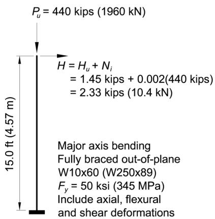  
Fig. C-C2.4. Illustration of potential errors associated with the use of a single-element-per-member P- $\Delta$ analysis.

$$P_{u} / P_{\gamma} = 0. 50, \tau = 1. 0$$

$$E = 0. 80 \tau (29, 000 \mathrm{k s i}) = 23, 200 \mathrm{k s i} (160 \mathrm{G P a})$$

$$G = E / 2 (1 + v) = 8, 920 \mathrm{k s i} (61. 5 \mathrm{G P a})$$

Computational $P - \Delta$ and $P - \delta$ analysis:

$$\Delta_{2 n d} = 2. 22 \text{i n .} (56. 5 \mathrm{m m})$$

$$M_{U} = 1, 394 \mathrm{k i p - i n}. (158 \mathrm{k N - m})$$

$$P_{u} / \phi_{c} P_{n} + (8 / 9) \left(M_{u} / \phi_{b} M_{n}\right) = 1. 00$$

Single-element $P$ - $\Delta$ analysis:

$$\Delta_{1 s t} = 0. 580 \text{i n . (15 m m)}$$

$$M_{1 s t} = H L = 419 \text{k i p - i n . (48 k N - m)}$$

$$\frac{1}{1 - \left[ P_{u} / \left(H L / \Delta_{1 s t}\right) \right]} = 2. 55$$

$$M_{u}^{P - \Delta} = 2. 55 M_{1 s t} = 1, 070 k i p - i n. (121 k N - m)$$

$$P_{u} / \phi_{c} P_{n} + (8 / 9) \left(M_{u}^{P - \Delta} / \phi_{b} M_{n}\right) = 0. 910$$

For members subjected predominantly to nonsway end conditions, the errors in the second-order internal moments and displacements from a $P$ - $\Delta$ -only analysis are generally smaller than $3\%$ and $5\%$ , respectively, when $\alpha P_r / P_{eL} \leq 0.05$ .

In meeting these limitations for use of a $P$ - $\Delta$ -only analysis, it is important to note that in accordance with Section C2.1(b) the moments along the length of the member (i.e., the moments between the member-end nodal locations) should be amplified as necessary to include $P$ - $\delta$ effects. One device for achieving this is the use of a $B_{1}$ factor.

Kaehler et al. (2010) provide further guidelines for the appropriate number of $P - \Delta$ analysis elements in cases where the $P - \Delta$ -only analysis limits are exceeded, as well as guidelines for calculating internal element second-order moments. They also provide relaxed guidelines for the number of elements required per member when using typical second-order analysis capabilities that include both $P - \Delta$ and $P - \delta$ effects.

As previously indicated, the engineer should verify the accuracy of second-order analysis software by comparisons to known solutions for a range of representative loadings. In addition to the examples presented in Chen and Lui (1987) and McGuire et al. (2000), Kaehler et al. (2010) provides five useful benchmark problems for testing second-order analysis of frames composed of prismatic members. In addition, they provide benchmarks for evaluation of second-order analysis capabilities for web-tapered members.

Analysis with Factored Loads. It is essential that the analysis of the system be made with loads factored to the strength limit state level because of the nonlinearity associated with second-order effects. For design by ASD, this load level is estimated as 1.6 times the ASD load combinations, and the analysis must be conducted at this elevated load to capture second-order effects at the strength level.

Because second-order effects are dependent on the ratios of applied loads and member forces to structural and member stiffnesses, equivalent results may be obtained by using 1.0 times ASD load combinations if all stiffnesses are reduced by a factor of 1.6—i.e., using $0.5E$ instead of $0.8E$ in the second-order analysis (note that the use of $0.5E$ is similar to the 12/23 factor used in the definition of $F_{e}^{\prime}$ in earlier ASD Specifications). With this approach, required member strengths are provided directly by the analysis and do not have to be divided by 1.6 when evaluating member capacities using ASD design. Notional loads, $N_{i}$ , would also be defined using 1.0 times ASD load combinations, i.e., $\alpha = 1.0$ . $\tau_{b}$ would be redefined as $\tau_{b} = 1.0$ when $P_{r} / P_{ns} \leq 0.3$ and $\tau_{b} = 4(P_{r} / 0.6P_{ns})(1 - P_{r} / 0.6P_{ns})$ when $P_{r} / P_{ns} > 0.3$ . The stiffness of components comprised of other materials should be evaluated at design loads and reduced by the same 1.6 factor, although this may be overly conservative if these stiffnesses already include $\phi$ factors. Serviceability criteria may be assessed using $50\%$ of the deflections from this analysis, although this will overestimate second-order effects at service loads.

2. Consideration of Initial System Imperfections

Current stability design provisions are based on the premise that the member forces are calculated by second-order elastic analysis, where equilibrium is satisfied on the

deformed geometry of the structure. Initial imperfections in the structure, such as out-of-plumbness and material and fabrication tolerances, create additional destabilizing effects.

In the development and calibration of the direct analysis method, initial geometric imperfections are conservatively assumed equal to the maximum material, fabrication and erection tolerances permitted in the AISC Code of Standard Practice (AISC, 2016a): a member out-of-straightness equal to $L / 1,000$ , where $L$ is the member length between brace or framing points, and a frame out-of-plumbness equal to $H / 500$ , where $H$ is the story height. The permitted out-of-plumbness may be smaller in some cases, as specified in the AISC Code of Standard Practice.

Initial imperfections may be accounted for in the direct analysis method through direct modeling (Section C2.2a) or the inclusion of notional loads (Section C2.2b). When second-order effects are such that the maximum sidesway amplification $\Delta_{2nd-order} / \Delta_{1st-order}$ or $B_{2} \leq 1.7$ using the reduced elastic stiffness (or 1.5 using the unreduced elastic stiffness) for all lateral load combinations, it is permitted to apply notional loads only in gravity load-only combinations and not in combination with other lateral loads. At this low range of sidesway amplification or $B_{2}$ , the errors in internal forces caused by not applying the notional loads in combination with other lateral loads are relatively small. When $B_{2}$ is above this threshold, notional loads must also be applied in combination with other lateral loads.

In the 2016 AISC Specification, Appendix 1, Section 1.2 includes an extension to the direct analysis method that permits direct modeling of initial imperfections along the lengths of members (member imperfections) as well as at member ends (system imperfections). This extension permits axially loaded members (columns and beam-columns according to Chapters E and H, respectively) to be designed by employing a nominal compressive strength that is taken as the cross-sectional strength; this is equivalent to the use of an effective member length, $L_{c} = 0$ , when computing the nominal compressive strength, $P_{n}$ , of compression members.

The Specification requirements for consideration of initial imperfections are intended to apply only to analyses for strength limit states. It is not necessary, in most cases, to consider initial imperfections in analyses for serviceability conditions such as drift, deflection and vibration.

3. Adjustments to Stiffness

Partial yielding accentuated by residual stresses in members can produce a general softening of the structure at the strength limit state that further creates additional destabilizing effects. The direct analysis method is also calibrated against inelastic distributed-plasticity analyses that account for the spread of plasticity through the member cross section and along the member length. In these calibration studies, residual stresses in wide-flange shapes were assumed to have a maximum value of $0.3F_{y}$ in compression at the flange tips, and a distribution matching the so-called Lehigh pattern—a linear variation across the flanges and uniform tension in the web (Ziemian, 2010).

Reduced stiffness （$EI^{*} = 0.8\tau_{b}EI$ and $EA^{*} = 0.8\tau_{b}EA)$ is used in the direct analysis method for two reasons. First, for frames with slender members, where the limit state is governed by elastic stability, the 0.8 factor on stiffness results in a system available strength equal to 0.8 times the elastic stability limit. This is roughly equivalent to the margin of safety implied in the design provisions for slender columns by the effective length procedure where, from Equation E3-3, $\phi P_{n} = 0.90(0.877P_{e}) = 0.79P_{e}$ . Second, for frames with intermediate or stocky columns, the $0.8\tau_{b}$ factor reduces the stiffness to account for inelastic softening prior to the members reaching their design strength. The $\tau_{b}$ factor is similar to the inelastic stiffness reduction factor implied in the column curve to account for loss of stiffness under high compression loads ( $\alpha P_{r} > 0.5P_{ns}$ ), and the 0.8 factor accounts for additional softening under combined axial compression and bending. It is a fortuitous coincidence that the reduction coefficients for both slender and stocky columns are close enough, such that the single reduction factor of $0.8\tau_{b}$ works over the full range of slenderness. For the 2016 AISC Specification, the definition for $\tau_{b}$ has been modified to account for the effects of local buckling of slender elements in compression members.

The use of reduced stiffness only pertains to analyses for strength and stability limit states. It does not apply to analyses for other stiffness-based conditions and criteria, such as for drift, deflection, vibration and period determination.

For ease of application in design practice, where $\tau_{b} = 1$ , the reduction on $EI$ and $EA$ can be applied by modifying $E$ in the analysis. However, for computer programs that do semi-automated design, one should ensure that the reduced $E$ is applied only for the second-order analysis. The elastic modulus should not be reduced in nominal strength equations that include $E$ (for example, $M_{n}$ for lateral-torsional buckling in an unbraced beam).

As shown in Figure C-C2.5, the net effect of modifying the analysis in the manner just described is to amplify the second-order forces such that they are closer to the actual internal forces in the structure. It is for this reason that the beam-column interaction for in-plane flexural buckling is checked using an axial strength, $P_{nL}$ , calculated from the column curve using the actual unbraced member length, $L_{c} = L$ in other words, with $K = 1.0$ .

In cases where the flexibility of other structural components (connections, column base details, horizontal trusses acting as diaphragms) is modeled explicitly in the analysis, the stiffness of these components also should be reduced. The stiffness reduction may be taken conservatively as $EA^{*} = 0.8EA$ and/or $EI^{*} = 0.8EI$ for all cases. Surovek et al. (2005) discusses the appropriate reduction of connection stiffness in the analysis of partially restrained frames.

Where concrete or masonry shear walls or other nonsteel components contribute to the stability of the structure and the governing codes or standards for those elements specify a greater stiffness reduction, the greater reduction should be applied.

C3. CALCULATION OF AVAILABLE STRENGTHS

Section C3 provides that when the analysis meets the requirements in Section C2, the member provisions for available strength in Chapters D through I and connection provisions in Chapters J and K complete the process of design by the direct analysis method. The effective length for flexural buckling may be taken as the unbraced length for all members in the strength checks.

Where beams and columns rely upon braces that are not part of the lateral force-resisting system to define their unbraced length, the braces themselves must have sufficient strength and stiffness to control member movement at the brace points (see Appendix 6). Design requirements for braces that are part of the lateral force-resisting system (that is, braces that are included within the analysis of the structure) are included within Chapter C.

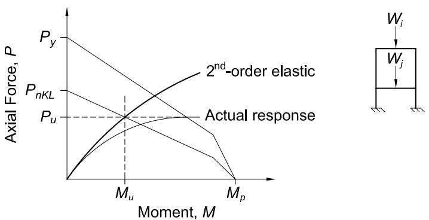  
(a) Effective length method (PnKL is the nominal compressive strength used in the effective length method; see Appendix 7)

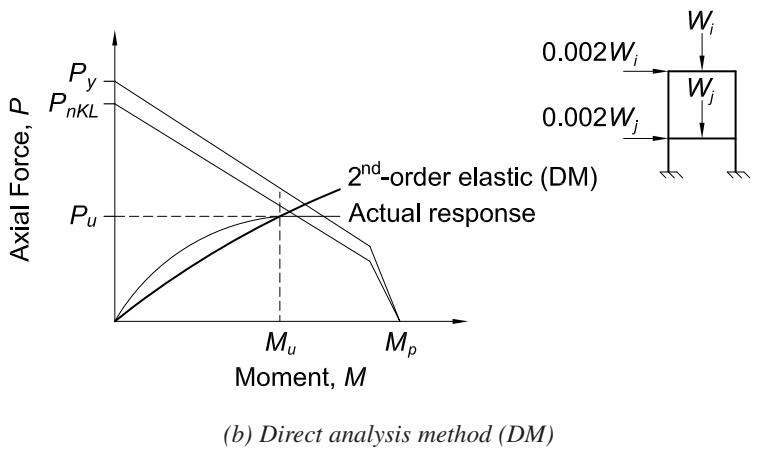  
Fig. C-C2.5. Comparison of in-plane beam-column interaction checks for (a) the effective length method and (b) the direct analysis method (DM).

For beam-columns in single-axis flexure and compression, the analysis results from the direct analysis method may be used directly with the interaction equations in Section H1.3, which address in-plane flexural buckling and out-of-plane lateral-torsional instability separately. These separated interaction equations reduce the conservatism of the Section H1.1 provisions, which combine the two limit state checks into one equation that uses the most severe combination of in-plane and out-of-plane limits for $P_r / P_c$ and $M_r / M_c$ . A significant advantage of the direct analysis method is that the in-plane check with $P_c$ in the interaction equation is determined using the unbraced length of the member as its effective length.

CHAPTER D DESIGN OF MEMBERS FOR TENSION

The provisions of Chapter D do not account for eccentricities between the lines of action of connected assemblies.

D1. SLENDERNESS LIMITATIONS

The advisory upper limit on slenderness in the User Note is based on professional judgment and practical considerations of economics, ease of handling, and care required so as to minimize inadvertent damage during fabrication, transport and erection. This slenderness limit is not essential to the structural integrity of tension members; it merely assures a degree of stiffness such that undesirable lateral movement ("slapping" or vibration) will be unlikely. Out-of-straightness within reasonable tolerances does not affect the strength of tension members. Applied tension tends to reduce, whereas compression tends to amplify, out-of-straightness.

For single angles, the radius of gyration about the $z$ -axis produces the maximum $L / r$ and, except for very unusual support conditions, the maximum effective slenderness ratio.

D2. TENSILE STRENGTH

Because of strain hardening, a ductile steel bar loaded in axial tension can resist without rupture a force greater than the product of its gross area and its specified minimum yield stress. However, excessive elongation of a tension member due to uncontrolled yielding of its gross area not only marks the limit of its usefulness but can precipitate failure of the structural system of which it is a part. On the other hand, depending upon the reduction of area and other mechanical properties of the steel, the member can fail by rupture of the net area at a load smaller than required to yield the gross area. Hence, general yielding of the gross area and rupture of the net area both constitute limit states.

The length of the member in the net area is generally negligible relative to the total length of the member. Strain hardening is easily reached in the vicinity of holes and yielding of the net area at fastener holes does not constitute a limit state of practical significance.

Except for HSS that are subjected to cyclic load reversals, there is no information that the factors governing the strength of HSS in tension differ from those for other structural shapes, and the provisions in Section D2 apply.

D3. EFFECTIVE NET AREA

This section deals with the effect of shear lag, applicable to both welded and bolted tension members. Shear lag is a concept used to account for uneven stress distribution in connected members where some but not all of their elements (flange, web, leg,

etc.) are connected. The reduction coefficient, $U$ , is applied to the net area, $A_{n}$ , of bolted members and to the gross area, $A_{g}$ , of welded members. As the length of the connection, $l$ , is increased, the shear lag effect diminishes. This concept is expressed empirically by the equation for $U$ . Using this expression to compute the effective area, the estimated strength of some 1,000 bolted and riveted connection test specimens, with few exceptions, correlated with observed test results within a scatterband of $\pm 10\%$ (Munse and Chesson, 1963). Newer research provides further justification for the current provisions (Easterling and Gonzales, 1993).

For any given profile and configuration of connected elements, $\overline{x}$ is the perpendicular distance from the connection plane, or face of the member, to the centroid of the member section resisting the connection force, as shown in Figure C-D3.1. The length, $l$ , is a function of the number of rows of fasteners or the length of weld. The length, $l$ , is illustrated as the distance, parallel to the line of force, between the first and last row of fasteners in a line for bolted connections. The number of bolts in a line, for the purpose of the determination of $l$ , is determined by the line with the maximum number of bolts in the connection. For staggered bolts, the out-to-out dimension is used for $l$ , as shown in Figure C-D3.2.

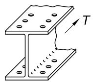

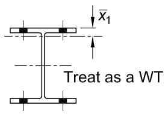  
(a)

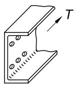

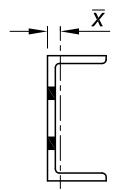  
(b)

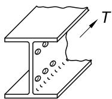

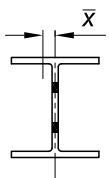  
(c)   
Fig. C-D3.1. Determination of $\overline{\mathbf{x}}$ for U.

For tension members with connections similar to that shown in Figure C-D3.1, the distance from the force in the member to the shear plane of the connection must be determined. For the I-shaped member with bolts in the flanges as shown in Figure C-D3.1(a), the member is treated as two WT-shapes. Because the section shown is symmetric about the horizontal axis and that axis is also the plastic neutral axis, the first moment of the area above the plastic neutral axis is $Z_{x} / 2$ , where $Z_{x}$ is the plastic section modulus of the entire section, $Z = \sum |A_{i}d_{i}|$ . The area above the plastic neutral axis is $A / 2$ ; therefore, by definition $\overline{x}_1 = Z_x / A$ . Thus, for use in calculating $U$ , $\overline{x}_1 = d / 2 - Z_x / A$ . For the I-shaped member with bolts in the web as shown in Figure C-D3.1(c), the shape is treated as two channels and the shear plane is assumed to be at the web centerline. Using the definitions just discussed, but related now to the $y$ -axis, yields $\overline{x} = Z_y / A$ . Note that the plastic neutral axis must be an axis of symmetry for this relationship to apply. Thus, it cannot be used for the case shown in Figure C-D3.1(b) where $\overline{x}$ would simply be determined from the properties of a channel.

There is insufficient data for establishing a value of $U$ if all lines have only one bolt, but it is probably conservative to use $A_{e}$ equal to the net area of the connected element. The limit states of block shear (Section J4.3) and bearing and tearout (Section J3.10), which must be checked, will probably control the design.

The ratio of the area of the connected element to the gross area is a reasonable lower bound for $U$ and allows for cases where the calculated $U$ based on （$1 - \overline{x} / l)$ is very small or nonexistent, such as when a single bolt per gage line is used and $l = 0$ . This lower bound is similar to other design specifications; for example, the AASHTO Standard Specifications for Highway Bridges (AASHTO, 2002), which allow a $U$ based on the area of the connected portion plus half the gross area of the unconnected portion.

The effect of connection eccentricity is a function of connection and member stiffness and may sometimes need to be considered in the design of the tension connection or member. Historically, engineers have neglected the effect of eccentricity in both the member and the connection when designing tension-only bracing. In Cases 1a and 1b shown in Figure C-D3.3, the length of the connection required to

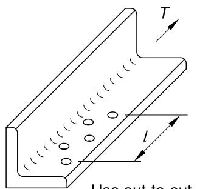  
Use out-to-out distance for $l$

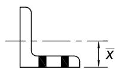  
Fig. C-D3.2. Determination of 1 for U of bolted connections with staggered holes.

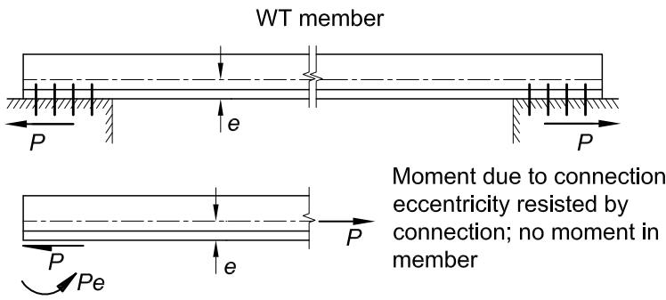  
(a) Case 1a. End rotation restrained by connection to rigid abutments

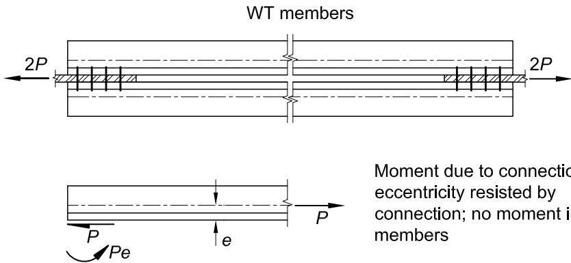  
(b) Case 1b. End rotation restrained by symmetry

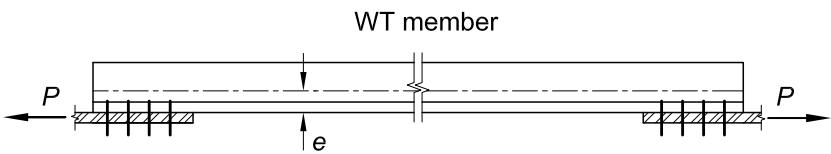

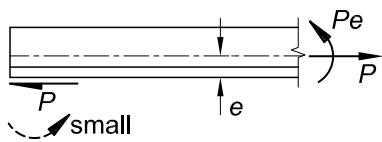  
Moment due to connection eccentricity cannot be resisted by the thin plate at the connection; the moment must be resisted by the member   
(c) Case 2. End rotation not restrained—connection to thin plate   
Fig. C-D3.3. The effect of connection restraint on eccentricity.

resist the axial loads will usually reduce the applied axial load on the bolts to a negligible value. For Case 2, the flexibility of the member and the connections will allow the member to deform such that the resulting eccentricity is relieved to a considerable extent.

For welded connections, $l$ is the length of the weld parallel to the line of force as shown in Figure C-D3.4 for longitudinal and longitudinal plus transverse welds. For welds with unequal lengths, use the average length.

End connections for HSS in tension are commonly made by welding around the perimeter of the HSS; in this case, there is no shear lag or reduction in the gross area. Alternatively, an end connection with gusset plates can be used. Single gusset plates may be welded in longitudinal slots that are located at the centerline of the cross section. Welding around the end of the gusset plate may be omitted for statically loaded connections to prevent possible undercutting of the gusset and having to bridge the gap at the end of the slot. In such cases, the net area at the end of the slot is the critical area as illustrated in Figure C-D3.5. Alternatively, a pair of gusset plates can be welded to opposite sides of a rectangular HSS with flare bevel groove welds with no reduction in the gross area.

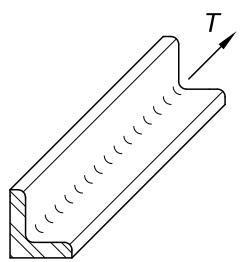

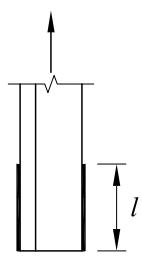

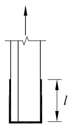

  
Fig. C-D3.4. Determination of 1 for calculation of U for connections with longitudinal and transverse welds.

  
Fig. C-D3.5. Net area through slot for a single gusset plate.

For end connections with gusset plates, the general provisions for shear lag in Case 2 of Table D3.1 can be simplified and the connection eccentricity, $\overline{x}$ , can be explicitly defined as in Cases 5 and 6. In Cases 5 and 6 it is implied that the weld length, $l$ , should not be less than the depth of the HSS. In Case 5, the use of $U = 1$ when $l \geq 1.3D$ is based on research (Cheng and Kulak, 2000) that shows rupture occurs only in short connections and in long connections the round HSS tension member necks within its length and failure is by member yielding and eventual rupture. Case 6 of Table D3.1 can also be applied to box sections of uniform wall thickness. However, the welds joining the plates in the box section should be at least as large as the welds attaching the gusset plate to the box section wall for a length required to resist the force in the connected elements plus the length $l$ .

Prior to 2016, two plates connected with welds shorter in length than the distance between the welds were not accommodated in Table D3.1. In light of the need for this condition, a shear lag factor was derived and is now shown in Case 4. The shear lag factor is based on a fixed-fixed beam model for the welded section of the connected part. The derivation of the factor is presented in Fortney and Thornton (2012).

The shear lag factors given in Cases 7 and 8 of Table D3.1 are given as alternate $U$ values to the value determined from $1 - \overline{x} / l$ given for Case 2 in Table D3.1. It is permissible to use the larger of the two values.

D4. BUILT-UP MEMBERS

Although not commonly used, built-up member configurations using lacing, tie plates and perforated cover plates are permitted by this Specification. The length and thickness of tie plates are limited by the distance between the lines of fasteners, $h$ , which may be either bolts or welds.

D5. PIN-CONNECTED MEMBERS

Pin-connected members are occasionally used as tension members with very large dead loads. Pin-connected members are not recommended when there is sufficient variation in live loading to cause wearing of the pins in the holes. The dimensional requirements presented in Section D5.2 must be met to provide for the proper functioning of the pin.

1. Tensile Strength

The tensile strength requirements for pin-connected members use the same $\phi$ and $\Omega$ values as elsewhere in this Specification for similar limit states. However, the definitions of effective net area for tension and shear are different.

2. Dimensional Requirements

Dimensional requirements for pin-connected members are illustrated in Figure C-D5.1.

D6. EYEBARS

Forged eyebars have generally been replaced by pin-connected plates or eyebars thermally cut from plates. Provisions for the proportioning of eyebars contained in this Specification are based upon standards evolved from long experience with forged eyebars. Through extensive destructive testing, eyebars have been found to provide balanced designs when they are thermally cut instead of forged. The more conservative rules for pin-connected members of nonuniform cross section and for members not having enlarged "circular" heads are likewise based on the results of experimental research (Johnston, 1939).

Stockier proportions are required for eyebars fabricated from steel having a yield stress greater than 70 ksi (485 MPa) to eliminate any possibility of their "dishing" under the higher design stress.

1. Tensile Strength

The tensile strength of eyebars is determined as for general tension members, except that, for calculation purposes, the width of the body of the eyebar is limited to eight times its thickness.

2. Dimensional Requirements

Dimensional limitations for eyebrows are illustrated in Figure C-D6.1. Adherence to these limits assures that the controlling limit state will be tensile yielding of the body; thus, additional limit state checks are unnecessary.

  
Fig. C-D5.1. Dimensional requirements for pin-connected members.

Dimensional Requirements

1. $a \geq 1.33b_{e}$   
2. $w\geq 2b_{e} + d$   
3. $c\geq a$

where

$$b_{e} = 2 t + 0. 63 \text{i n .} (2 t + 16 \mathrm{m m}) \leq b$$

  
Fig. C-D6.1. Dimensional limitations for eyebars.

Dimensional Requirements

1. $t \geq 1/2$ in. (13 mm) (Exception is provided in Section D6.2(e))   
2. $w \leq 8t$ (For calculation purposes only)   
3. $d \geq 7\% w$   
4. $d_h \leq d + 1/32$ in. （$d + 1\mathrm{mm})$   
5. $R\geq d_h + 2b$   
6. $\frac{1}{3} w \leq b \leq \frac{3}{4} w$ (Upper limit is for calculation purposes only)

CHAPTER E DESIGN OF MEMBERS FOR COMPRESSION

E1. GENERAL PROVISIONS

The column equations in Section E3 are based on a conversion of research data into strength equations (Ziemian, 2010; Tide, 1985, 2001). These equations are the same as those that have been used since the 2005 AISC Specification for Structural Steel Buildings (AISC, 2005) and are essentially the same as those created for the initial LRFD Specification (AISC, 1986). The resistance factor, $\phi$ , was increased from 0.85 to 0.90 in the 2005 AISC Specification, recognizing substantial numbers of additional column strength analyses and test results, combined with the changes in industry practice that had taken place since the original calibrations were performed in the 1970s and 1980s.

In the original research on the probability-based strength of steel columns (Bjorhovde, 1972, 1978, 1988), three column curves were recommended. The three column curves were the approximate means of bands of strength curves for columns of similar manufacture, based on extensive analyses and confirmed by full-scale tests (Bjorhovde, 1972). For example, hot-formed and cold-formed heat treated HSS columns fell into the data band of highest strength [SSRC Column Category 1P (Bjorhovde, 1972, 1988; Bjorhovde and Birkemoe, 1979; Ziemian, 2010)], while welded built-up wide-flange columns made from universal mill plates were included in the data band of lowest strength (SSRC Column Category 3P). The largest group of data clustered around SSRC Column Category 2P. Had the original LRFD Specification opted for using all three column curves for the respective column categories, probabilistic analysis would have resulted in a resistance factor $\phi = 0.90$ or even slightly higher (Galambos, 1983; Bjorhovde, 1988; Ziemian, 2010). However, it was decided to use only one column curve, SSRC Column Category 2P, for all column types. This resulted in a larger data spread and thus a larger coefficient of variation, and so a resistance factor $\phi = 0.85$ was adopted for the column equations to achieve a level of reliability comparable to that of beams (AISC, 1986).

Since then, a number of changes in industry practice have taken place: (a) welded built-up shapes are no longer manufactured from universal mill plates; (b) the most commonly used structural steel is now ASTM A992/A992M, with a specified minimum yield stress of 50 ksi (345 MPa); and (c) changes in steelmaking practice have resulted in materials of higher quality and much better defined properties. The level and variability of the yield stress thus have led to a reduced coefficient of variation for the relevant material properties (Bartlett et al., 2003).

An examination of the SSRC Column Curve Selection Table (Bjorhovde, 1988; Ziemian, 2010) shows that the SSRC 3P Column Curve Category is no longer needed. It is now possible to use only the statistical data for SSRC Column Category

2P for the probabilistic determination of the reliability of columns. The curves in Figures C-E1.1 and C-E1.2 show the variation of the reliability index, $\beta$ , with the live-to-dead load ratio, $L / D$ , in the range of 1 to 5 for LRFD with $\phi = 0.90$ and ASD with $\Omega = 1.67$ , respectively, for $F_{y} = 50$ ksi (345 MPa). The reliability index does not fall below $\beta = 2.6$ . This is comparable to the reliability of beams.

  
Fig. C-E1.1. Reliability of columns (LRFD).

  
Fig. C-E1.2. Reliability of columns (ASD).

E2. EFFECTIVE LENGTH

In the 2016 AISC Specification, the effective length, which since the 1963 AISC Specification (AISC, 1963) had been given as $KL$ , is changed to $L_{c}$ . This was done to simplify the definition of effective length for the various modes of buckling without having to define a specific effective length factor, $K$ . The effective length is then defined as $KL$ in those situations where effective length factors, $K$ , are appropriate. This change recognizes that there are several ways to determine the effective length that do not involve the direct determination of an effective length factor. It also recognizes that for some modes of buckling, such as torsional and flexural-torsional buckling, the traditional use of $K$ is not the best approach. The direct use of effective length without the $K$ -factor can be seen as a return to the approach used in the 1961 AISC Specification (AISC, 1961), when column strength equations based on effective length were first introduced by AISC.

The concept of a maximum limiting slenderness ratio has experienced an evolutionary change from a mandatory "...The slenderness ratio, $KL / r$ , of compression members shall not exceed 200..." in the 1978 AISC Specification (AISC, 1978) to no restriction at all in the 2005 AISC Specification (AISC, 2005). The 1978 ASD and the 1999 LRFD Specifications (AISC, 2000b) provided a transition from the mandatory limit to a limit that was defined in the 2005 AISC Specification by a User Note, with the observation that "...the slenderness ratio, $KL / r$ , preferably should not exceed 200...." However, the designer should keep in mind that columns with a slenderness ratio of more than 200 will have a critical stress (Equation E3-3) less than 6.3 ksi (43 MPa). The traditional upper limit of 200 was based on professional judgment and practical construction economics, ease of handling, and care required to minimize inadvertent damage during fabrication, transport and erection. These criteria are still valid and it is not recommended to exceed this limit for compression members except for cases where special care is exercised by the fabricator and erector.

E3. FLEXURAL BUCKLING OF MEMBERS WITHOUT SLENDER ELEMENTS

Section E3 applies to compression members with all nonslender elements, as defined in Section B4.

The column strength equations in Section E3 are the same as those in the previous editions of the LRFD Specification, with the exception of the cosmetic replacement of the slenderness term, $\lambda_{c} = \frac{KL}{\pi r}\sqrt{\frac{F_{y}}{E}}$ , by the more familiar slenderness ratio, $\frac{KL}{r}$

for 2005 and 2010, and by the simpler form of the slenderness ratio, $L_{c} / r$ , for 2016. For the convenience of those calculating the elastic buckling stress, $F_{e}$ , directly, without first calculating an effective length, the limits on the use of Equations E3-2 and E3-3 are also provided in terms of the ratio $F_{y} / F_{e}$ , as shown in the following discussion.

Comparisons between the previous column design curves and those introduced in the 2005 AISC Specification and continued in this Specification are shown in Figures C-E3.1 and C-E3.2 for the case of $F_{y} = 50$ ksi (345 MPa). The curves show the

variation of the available column strength with the slenderness ratio for LRFD and ASD, respectively. The LRFD curves reflect the change of the resistance factor, $\phi$ , from 0.85 to 0.90, as was explained in Commentary Section E1. These column equations provide improved economy in comparison with the previous editions of the Specification.

The limit between elastic and inelastic buckling is defined to be $\frac{L_c}{r} = 4.71\sqrt{\frac{E}{F_y}}$ or $\frac{F_y}{F_e} = 2.25$ . These are the same as $F_{e} = 0.44F_{y}$ that was used in the 2005 AISC Specification. For convenience, these limits are defined in Table C-E3.1 for the common values of $F_{y}$ .

  
Fig. C-E3.1. LRFD column curves compared.

  
Fig. C-E3.2. ASD column curves compared.

| TABLE C-E3.1 Limiting values of Lc/r and Fe | TABLE C-E3.1 Limiting values of Lc/r and Fe | TABLE C-E3.1 Limiting values of Lc/r and Fe |
| --- | --- | --- |
| Fv, ksi (MPa) | Limiting Lc/r | Fe, ksi (MPa) |
| 36 (250) | 134 | 16.0 (110) |
| 50 (345) | 113 | 22.2 (150) |
| 65 (450) | 99.5 | 28.9 (200) |
| 70 (485) | 95.9 | 31.1 (210) |

One of the key parameters in the column strength equations is the elastic critical stress, $F_{e}$ . Equation E3-4 presents the familiar Euler form for $F_{e}$ . However, $F_{e}$ can also be determined by other means, including a direct frame buckling analysis or a torsional or flexural-torsional buckling analysis as addressed in Section E4.

The column strength equations of Section E3 can also be used for frame buckling and for torsional or flexural-torsional buckling (Section E4). They may also be entered with a modified slenderness ratio for single-angle members (Section E5).

E4. TORSIONAL AND FLEXURAL-TORSIONAL BUCKLING OF SINGLE ANGLES AND MEMBERS WITHOUT SLENDER ELEMENTS

Section E4 applies to singly symmetric and unsymmetric members and certain doubly symmetric members, such as cruciform or built-up columns with all nonslender elements, as defined in Section B4 for uniformly compressed elements. It also applies to doubly symmetric members when the torsional buckling length is greater than the flexural buckling length of the member. In addition, Section E4 applies to single angles with $b / t > 0.71\sqrt{E / F_y}$ , although there are no ASTM A36/A36M hot-rolled angles for which this applies.

The equations in Section E4 for determining the torsional and flexural-torsional elastic buckling loads of columns are derived in textbooks and monographs on structural stability (Bleich, 1952; Timoshenko and Gere, 1961; Galambos, 1968a; Chen and Atsuta, 1977; Galambos and Surovek, 2008; and Ziemian, 2010). Since these equations apply only to elastic buckling, they must be modified for inelastic buckling by the appropriate equations of Section E3. Inelasticity has a more significant impact on warping torsion than St. Venant torsion. For consideration of inelastic effects, the full elastic torsional or flexural-torsional buckling stress is conservatively used to determine $F_{e}$ for use in the column equations of Section E3.

Torsional buckling of symmetric shapes and flexural-torsional buckling of unsymmetrical shapes are failure modes usually not considered in the design of hot-rolled columns. They generally do not govern, or the critical load differs very little from the minor-axis flexural buckling load. Torsional and flexural-torsional buckling modes may, however, control the strength of symmetric columns manufactured from relatively thin plate elements and unsymmetric columns and symmetric columns having torsional unbraced lengths significantly larger than the minor-axis flexural unbraced lengths.

Equations for determining the elastic critical stress for columns are given in Section E4. Table C-E4.1 serves as a guide for selecting the appropriate equations. Equation E4-4 is the general buckling expression that is applicable to doubly symmetric, singly symmetric and unsymmetric shapes. Equation E4-3 was derived from Equation E4-4 for the specific case of a singly symmetric shape in which the $y$ -axis is the axis of symmetry (such as in WT sections). For members, such as channels, in which the $x$ -axis is the axis of symmetry, $F_{ey}$ in Equation E4-3 should be replaced with $F_{ex}$ .

For doubly symmetric shapes, the geometric centroid and shear center coincide resulting in $x_{o} = y_{o} = 0$ . Therefore, for a doubly symmetric section, Equation E4-4 results in three roots: flexural buckling about the $x$ -axis, flexural buckling about the $y$ -axis, and torsional buckling about the shear center of the section, with the lowest root controlling the capacity of the cross section. Most designers are familiar with evaluating the strength of a wide-flange column by considering flexural buckling about the $x$ -axis and $y$ -axis; however, torsional buckling as given by Equation E4-2 is another potential buckling mode that should be considered and may control when the unbraced length for torsional buckling exceeds the unbraced length for minor-axis flexural buckling. Equation E4-2 is applicable for columns that twist about the shear center of the section, which will be the case when lateral bracing details like that shown in Figure C-E4.1 are used. The rod that is used for the brace in this case restrains the column from lateral movement about the minor axis, but does not generally prevent twist of the section and therefore the unbraced length for torsional buckling may be larger than for minor-axis flexure, which is a case where torsional

  
Fig. C-E4.1. Lateral bracing detail resulting in twist about the shear center.

| TABLE C-E4.1 Selection of Equations for Torsional and Flexural- Torsional Buckling About the Shear Center | TABLE C-E4.1 Selection of Equations for Torsional and Flexural- Torsional Buckling About the Shear Center |
| --- | --- |
| Type of Cross Section | Applicable Equations in Section E4 |
| All doubly symmetric shapes and Z-shapes— Case (a) in Section E4 | E4-2 |
| Singly symmetric members including double angles and tee-shaped members— Case (b) in Section E4 | E4-3 |
| Unsymmetric shapes— Case (c) in Section E4 | E4-4 |

buckling may control. Most typical column base plate details will restrain twist at the base of the column. In addition, twist will often also be adequately restrained by relatively simple framing to beams. Many of the cases where inadequate torsional restraint is provided at a brace point will often occur at intermediate (between the ends of the column) brace locations.

Many common bracing details may result in situations where the lateral bracing is offset from the shear center of the section, such as columns or roof trusses restrained by a shear diaphragm that is connected to girts or purlins on the outside of the column or chord flange. Depending on the orientation of the primary member, the bracing may be offset along either the minor axis or the major axis as depicted in Figure C-E4.2. Since girts or purlins often have relatively simple connections that do not restrain twist, columns or truss chords can be susceptible to torsional buckling. However, in common cases due to the offset of the bracing relative to the shear center, the members are susceptible to constrained-axis torsional buckling.

Timoshenko and Gere (1961) developed the following expressions for constrained-axis torsional buckling:

Bracing offset along the minor axis by an amount "a" [see Figure C-E4.2(a)]:

$$F_{e} = \omega \left[ \frac{\pi^{2} E I_{y}}{\left(L_{c z}\right)^{2}} \left(\frac{h_{o}^{2}}{4} + a^{2}\right) + G J \right] \frac{1}{A r_{o}^{2}} \tag{C-E4-1}$$

Bracing offset along the major axis by an amount “ $b$ ” [(see Figure C-E4.2(b)):

$$F_{e} = \omega \left[ \frac{\pi^{2} E I_{y}}{\left(L_{c z}\right)^{2}} \left(\frac{h_{o}^{2}}{4} + \frac{I_{x}}{I_{y}} b^{2}\right) + G J \right] \frac{1}{A r_{o}^{2}} \tag{C-E4-2}$$

where the polar radius of gyration is given by the expression:

$$r_{o}^{2} = \left(r_{x}^{2} + r_{y}^{2} + a^{2} + b^{2}\right) \tag{C-E4-3}$$

  
(a) Bracing offset along minor axis

  
(b) Bracing offset along major axis   
Fig. C-E4.2. Bracing details resulting in an offset relative to the shear center.

The terms in these equations are as defined in Section E4 with the exception of $a$ , $b$ and $\omega$ . The bracing offsets, $a$ and $b$ , are measured relative to the shear center and $h_o$ is the distance between flange centroids as indicated in Figure C-E4.2. The empirical factor $\omega$ was included to address some of the assumptions made in the original derivation. The expressions from Timoshenko and Gere (1961) were developed assuming that continuous lateral restraint was provided that is infinitely stiff. The impact of the continuous bracing assumption is not that significant since the column will generally be checked for buckling between discrete brace points. However, the assumption of the infinitely stiff lateral bracing will result in a reduction in the capacity for systems with finite brace stiffness. The $\omega$ -factor that is shown in Equations C-E4-1 and C-E4-2 is included to account for the reduction due to a finite brace stiffness. With a modest stiffness of the bracing (such as stiffness values recommended in the Appendix 6 lateral bracing provisions), the reduction is relatively small and a value of 0.9 is recommended based upon finite element studies (Errera, 1976; Helwig and Yura, 1999).

The specific method of calculating the buckling strength of double-angle and teeshaped members that had been given in the 2010 AISC Specification (AISC, 2010) has been deleted in preference for the use of the general flexural-torsional buckling equations because the deleted equation was usually more conservative than necessary.

Equations E4-2 and E4-7 contain a torsional buckling effective length, $L_{cz}$ . This effective length may be conservatively taken as the length of the column. For greater accuracy, if both ends of the column have a connection that restrains warping, say by boxing the end over a length at least equal to the depth of the member, the effective length may be taken as 0.5 times the column length. If one end of the member is restrained from warping and the other end is free to warp, then the effective length may be taken as 0.7 times the column length.

At points of bracing both lateral and/or torsional bracing shall be provided, as required in Appendix 6. AISC Design Guide 9, Torsional Analysis of Structural Steel Members (Seaburg and Carter, 1997), provides an overview of the fundamentals of torsional loading for structural steel members. Design examples are also included.

E5. SINGLE-ANGLE COMPRESSION MEMBERS

The compressive strength of single angles is to be determined in accordance with Sections E3 or E7 for the limit state of flexural buckling and Section E4 for the limit state of flexural-torsional buckling. However, single angles with $b / t \leq 0.71\sqrt{E / F_y}$ do not require consideration of flexural-torsional buckling according to Section E4. This applies to all currently produced hot-rolled angles with $F_y = 36$ ksi. Use Section E4 to compute $F_e$ for single angles only when $b / t > 0.71\sqrt{E / F_y}$ .

Section E5 also provides a simplified procedure for the design of single angles subjected to an axial compressive load introduced through one connected leg. The angle is treated as an axially loaded member by adjusting the member slenderness. The attached leg is to be attached to a gusset plate or the projecting leg of another member by welding or by a bolted connection with at least two bolts. The equivalent

slenderness expressions in this section presume significant restraint about the axis, which is perpendicular to the connected leg. This leads to the angle member tending to bend and buckle primarily about the axis parallel to the attached gusset. For this reason, $L / r_{a}$ is the slenderness parameter used, where the subscript, $a$ , represents the axis parallel to the attached leg. This may be the $x$ - or $y$ -axis of the angle, depending on which leg is the attached leg. The modified slenderness ratios indirectly account for bending in the angles due to the eccentricity of loading and for the effects of end restraint from the members to which they are attached.

The equivalent slenderness expressions also presume a degree of rotational restraint. Equations E5-3 and E5-4 [Section E5(b), referred to as case (b)] assume a higher degree of rotational restraint about the axis parallel to the attached leg than do Equations E5-1 and E5-2 [Section E5(a), referred to as case (a)]. Equations E5-3 and E5-4 are essentially equivalent to those employed for equal-leg angles as web members in latticed transmission towers in ASCE 10-97 (ASCE, 2000).

In space trusses, the web members framing in from one face typically restrain the twist of the chord at the panel points and thus provide significant restraint about the axis parallel to the attached leg for the angles under consideration. It is possible that the chords of a planar truss well restrained against twist justify use of case (b), in other words, Equations E5-3 and E5-4. Similarly, simple single-angle diagonal braces in braced frames could be considered to have enough end restraint such that case (a), in other words, Equations E5-1 and E5-2, could be employed for their design. This procedure, however, is not intended for the evaluation of the compressive strength of X-brace single angles.

The procedure in Section E5 permits use of unequal-leg angles attached by the smaller leg provided that the equivalent slenderness is increased by an amount that is a function of the ratio of the longer to the shorter leg lengths, and has an upper limit on $L / r_z$ .

If the single-angle compression members cannot be evaluated using the procedures in this section, use the provisions of Section H2. In evaluating $P_{n}$ , the effective length due to end restraint should be considered. With values of effective length about the geometric axes, one can use the procedure in Lutz (1992) to compute an effective radius of gyration for the column. To obtain results that are not too conservative, one must also consider that end restraint reduces the eccentricity of the axial load of single-angle struts and thus the value of $f_{rbw}$ or $f_{rbz}$ used in the flexural term(s) in Equation H2-1.

E6. BUILT-UP MEMBERS

Section E6 addresses the strength and dimensional requirements of built-up members composed of two or more shapes interconnected by stitch bolts or welds.

Two types of built-up members are commonly used for steel construction: closely spaced steel shapes interconnected at intervals using welds or fasteners, and laced or battened members with widely spaced flange components. The compressive strength

of built-up members is affected by the interaction between the global buckling mode of the member and the localized component buckling mode between lacing points or intermediate connectors. Duan et al. (2002) refer to this type of buckling as compound buckling.

For both types of built-up members, limiting the slenderness ratio of each component shape between connection fasteners or welds, or between lacing points, as applicable, to $75\%$ of the governing global slenderness ratio of the built-up member effectively mitigates the effect of compound buckling (Duan et al., 2002).

1. Compressive Strength

This section applies to built-up members such as double-angle or double-channel members with closely spaced individual components. The longitudinal spacing of connectors connecting components of built-up compression members must be such that the slenderness ratio, $L_{c} / r$ , of individual shapes does not exceed three-fourths of the slenderness ratio of the entire member. However, this requirement does not necessarily ensure that the effective slenderness ratio of the built-up member is equal to that of a built-up member acting as a single unit.

For a built-up member to be effective as a structural member, the end connection must be welded or pretensioned bolted with Class A or B faying surfaces. Even so, the compressive strength will be affected by the shearing deformation of the intermediate connectors. This Specification uses the effective slenderness ratio to consider this effect. Based mainly on the test data of Zandonini (1985), Zahn and Haaijer (1987) developed an empirical formulation of the effective slenderness ratio for the 1986 LRFD Specification (AISC, 1986). When pretensioned bolted or welded intermediate connectors are used, Aslani and Goel (1991) developed a semi-analytical formula for use in the 1993, 1999 and 2005 AISC Specifications (AISC, 1993, 2000b, 2005). As more test data became available, a statistical evaluation (Sato and Uang, 2007) showed that the simplified expressions used in this Specification achieve the same level of accuracy.

Fastener spacing less than the maximum required for strength may be needed to ensure a close fit over the entire faying surface of components in continuous contact. Special requirements for weathering steel members exposed to atmospheric corrosion are given in Brockenbrough (1983).

2. Dimensional Requirements

This section provides additional requirements on connector spacing and end connection for built-up member design. Design requirements for laced built-up members where the individual components are widely spaced are also provided. Some dimensioning requirements are based upon judgment and experience. The provisions governing the proportioning of perforated cover plates are based upon extensive experimental research (Stang and Jaffe, 1948).

E7. MEMBERS WITH SLENDER ELEMENTS

The structural engineer designing with hot-rolled shapes will seldom find an occasion to turn to Section E7. Among rolled shapes, the most frequently encountered cases requiring the application of this section are beam shapes used as columns, columns containing angles with thin legs, and tee-shaped columns having slender stems. Special attention to the determination of effective area must be given when columns are made by welding or bolting thin plates together or ultra-high strength steels are employed.

The provisions of Section E7 address the modifications to be made when one or more plate elements in the column cross section are slender. A plate element is considered to be slender if its width-to-thickness ratio exceeds the limiting value, $\lambda_r$ , defined in Table B4.1a. As long as the plate element is not slender, it can support the full yield stress without local buckling. When the cross section contains slender elements, the potential reduction in capacity due to local-global buckling interaction must be accounted for.

The $Q$ -factor approach to dealing with columns with slender elements was adopted in the 1969 AISC Specification (AISC, 1969), emulating the 1969 AISI Specification for the Design of Cold-Formed Steel Structural Members (AISI, 1969). Prior to 1969, the AISC practice was to remove the width of the plate that exceeded the $\lambda_r$ limit and check the remaining cross section for conformance with the allowable stress, which proved inefficient and uneconomical. Two separate philosophies were used: Unstiffened elements were considered to have attained their limit state when they reach the theoretical local buckling stress; stiffened elements, on the other hand, make use of the post-buckling strength inherent in a plate that is supported on both of its longitudinal edges, such as in HSS columns and webs of I-shaped columns. The effective width concept is used to obtain the added post-buckling strength. This dual philosophy reflects the 1969 practice in the design of cold-formed columns. Subsequent editions of the AISI Specifications, in particular, the North American Specification for the Design of Cold-Formed Steel Structural Members (AISI, 2001, 2007, 2012), hereafter referred to as the AISI North American Specification, adopted the effective width concept for both stiffened and unstiffened elements. This approach is adopted in this Specification.

1. Slender Element Members Excluding Round HSS

The effective width method is employed for determining the reduction in capacity due to local buckling. The effective width method was developed by von Kármán et al. (1932), empirically modified by Winter (1947), and generalized for local-global buckling interaction by Pekoz (1987); see Ziemian (2010) for a complete summary. The point at which the slender element begins to influence column strength, $\lambda_r\sqrt{F_y / F_{cr}}$ , is a function of element slenderness from Table B4.1a and column slenderness as reflected through $F_{cr}$ . This reflects the unified effective width approach where the maximum stress in the effective width formulation is the column stress, $F_{cr}$ (as opposed to $F_y$ ). This implies that columns designated as having slender elements by Table B4.1a may not necessarily see any reduction in strength due to local buckling, depending on the column stress, $F_{cr}$ .

Prior to this Specification, the effective width, $b_{e}$ , of a stiffened element was expressed as

$$b_{e} = 1. 92 t \sqrt{\frac{E}{f}} \left(1 - \frac{0 . 34}{(b / t)} \sqrt{\frac{E}{f}}\right) \leq b \tag{C-E7-1}$$

where

$E =$ modulus of elasticity, ksi (MPa)

$b =$ width of stiffened compression element, in. (mm)

$f =$ critical stress when slender element is not considered, ksi (MPa)

$t =$ thickness of element, in. (mm)

This may be compared with the new generalized effective width Equation E7-3:

$$b_{e} = b \left(1 - c_{1} \sqrt{\frac{F_{e l}}{F_{c r}}}\right) \sqrt{\frac{F_{e l}}{F_{c r}}} \tag{C-E7-2}$$

where $F_{el}$ is the local elastic buckling stress, and $c_{1}$ is the empirical correction factor typically associated with imperfection sensitivity. The two expressions are essentially equivalent if one recognizes that

$$F_{e l} = k \frac{\pi^{2} E}{12 \left(1 - v^{2}\right)} \left(\frac{t}{b}\right)^{2} \tag{C-E7-3}$$

where

$$v = \text{P o i s s o n ' s} = 0. 3$$

and utilizes $k = 4.0$ for the stiffened element, $c_{1} = 0.18$ for the imperfection sensitivity factor, and sets $f = F_{cr}$ .

Equation E7-3 provides an effective width expression applicable to both stiffened and unstiffened elements. Further, by making elastic local buckling explicit in the expression, the potential to use analysis to provide $F_{el}$ is also allowed [see Seif and Schafer (2010)]. For ultra-high-strength steel sections or sections built-up from thin plates, this can be especially useful.

Equation E7-5 provides an explicit expression for elastic local buckling, $F_{el}$ . This expression is based on the assumptions implicit in Table B4.1a and was determined as follows. At the limiting width-to-thickness ratio: $\lambda = \lambda_r$ , $b = b_e$ , $F_{el} = F_{el - r}$ ; therefore, at this limit, local elastic buckling implies:

$$F_{e l - r} = k \frac{\pi^{2} E}{12 \left(1 - v^{2}\right)} \left(\frac{t}{b}\right)^{2} = k \frac{\pi^{2} E}{12 \left(1 - v^{2}\right)} \left(\frac{t}{\lambda_{r}}\right)^{2} \tag{C-E7-4}$$

and the effective width expression simplifies to:

$$1 = \left(1 - c_{1} \sqrt{\frac{F_{e l - r}}{F_{y}}}\right) \sqrt{\frac{F_{e l - r}}{F_{y}}} \tag{C-E7-5}$$

which may be used to back-calculate the plate buckling coefficient, $k$ , assumed in Table B4.1a:

$$k = \left(\frac{1 - \sqrt{1 - 4 c_{1}}}{2 c_{1}}\right)^{2} \frac{12 (1 - v^{2})}{\pi^{2}} \frac{F_{y}}{E} \left(\frac{1}{\lambda_{r}}\right)^{2} \tag{C-E7-6}$$

This relationship provides a prediction of the elastic local buckling stress consistent with the $k$ implicit in Table B4.1a, after substitution:

$$F_{e l} = \left(\frac{1 - \sqrt{1 - 4 c_{1}}}{2 c_{1}} \frac{\lambda_{r}}{\lambda}\right)^{2} F_{y} = \left(c_{2} \frac{\lambda_{r}}{\lambda}\right)^{2} F_{y} \tag{C-E7-7}$$

Thus, $\lambda_r$ from Table B4.1a may be used to determine $k$ , which may be used to determine the elastic local buckling stress. Further, $c_2$ is shown to be determined by $c_1$ alone, and is used only for convenience.

Equation E7-3 has long been used in the AISI North American Specification with $c_{1} = 0.22$ for both stiffened and unstiffened elements. The same $c_{1}$ factor is adopted here for all elements, except those that prior to the 2016 AISC Specification had explicit (and calibrated) effective width expressions.

One disadvantage of Equation E7-3, and the explicit use of $F_{el}$ , is the loss of convenience when working with a particular slender element. If Equation E7-5 is utilized directly, then Equation E7-3 may be simplified to

$$b_{e} = \left(1 - c_{1} c_{2} \frac{\lambda_{r}}{\lambda} \sqrt{\frac{F_{y}}{F_{c r}}}\right) c_{2} \frac{\lambda_{r}}{\lambda} \sqrt{\frac{F_{y}}{F_{c r}}} b \tag{C-E7-8}$$

or, more specifically, for case (a), stiffened elements, except walls of square and rectangular sections of uniform thickness:

$$b_{e} = \left(1 - 0. 24 \frac{\lambda_{r}}{\lambda} \sqrt{\frac{F_{y}}{F_{c r}}}\right) 1. 31 \frac{\lambda_{r}}{\lambda} \sqrt{\frac{F_{y}}{F_{c r}}} b \tag{C-E7-9}$$

for case (b), walls of square and rectangular sections of uniform thickness:

$$b_{e} = \left(1 - 0. 28 \frac{\lambda_{r}}{\lambda} \sqrt{\frac{F_{y}}{F_{c r}}}\right) 1. 38 \frac{\lambda_{r}}{\lambda} \sqrt{\frac{F_{y}}{F_{c r}}} b \tag{C-E7-10}$$

or, case (c), all other elements:

$$b_{e} = \left(1 - 0. 33 \frac{\lambda_{r}}{\lambda} \sqrt{\frac{F_{y}}{F_{c r}}}\right) 1. 49 \frac{\lambda_{r}}{\lambda} \sqrt{\frac{F_{y}}{F_{c r}}} b \tag{C-E7-11}$$

These equations may be further simplified if the constants associated with the slenderness limit, $\lambda_r$ , are combined with the constants in Table E7.1. This results in

$$b_{e} = c_{2} c_{3} t \sqrt{\frac{k_{c} E}{F_{c r}}} \left(1 - \frac{c_{1} c_{2} c_{3}}{(b / t)} \sqrt{\frac{k_{c} E}{F_{c r}}}\right) \tag{C-E7-12}$$

| TABLE C-E7.1 Constants for Use in Equations C-E7-12 and C-E7-13 | TABLE C-E7.1 Constants for Use in Equations C-E7-12 and C-E7-13 | TABLE C-E7.1 Constants for Use in Equations C-E7-12 and C-E7-13 | TABLE C-E7.1 Constants for Use in Equations C-E7-12 and C-E7-13 | TABLE C-E7.1 Constants for Use in Equations C-E7-12 and C-E7-13 | TABLE C-E7.1 Constants for Use in Equations C-E7-12 and C-E7-13 | TABLE C-E7.1 Constants for Use in Equations C-E7-12 and C-E7-13 | TABLE C-E7.1 Constants for Use in Equations C-E7-12 and C-E7-13 |
| --- | --- | --- | --- | --- | --- | --- | --- |
| Table B4.1a Case | Table E7.1 Case | kc | c1 | c2 | c3 | c4 | c5 |
| 1 | (c) | 1.0 | 0.22 | 1.49 | 0.56 | 0.834 | 0.184 |
| 2 | (c) | kc | 0.22 | 1.49 | 0.64 | 0.954 | 0.210 |
| 3 | (c) | 1.0 | 0.22 | 1.49 | 0.45 | 0.671 | 0.148 |
| 4 | (c) | 1.0 | 0.22 | 1.49 | 0.75 | 1.12 | 0.246 |
| 5 | (a) | 1.0 | 0.18 | 1.31 | 1.49 | 1.95 | 0.351 |
| 6 | (b) | 1.0 | 0.20 | 1.38 | 1.40 | 1.93 | 0.386 |
| 7 | (a) | 1.0 | 0.18 | 1.31 | 1.40 | 1.83 | 0.330 |
| 8 | (a) | 1.0 | 0.18 | 1.31 | 1.49 | 1.95 | 0.351 |

where $c_{3}$ is the constant associated with slenderness limits given in Table B4.1a (Geschwindner and Troemner, 2016). Combining the constants in Equation C-E7-12 with $c_{4} = c_{2}c_{3}$ and $c_{5} = c_{1}c_{2}c_{3}$ yields

$$b_{e} = c_{4} t \sqrt{\frac{k_{c} E}{F_{c r}}} \left(1 - \frac{c_{5}}{(b / t)} \sqrt{\frac{k_{c} E}{F_{c r}}}\right) \tag{C-E7-13}$$

The constants $c_4$ and $c_5$ are given in Table C-E7.1 for each of the cases in Table B4.1a.

The impact of the changes in this Specification for treatment of slender element compression members is greatest for unstiffened element compression members and may be negligible for stiffened element compression members as shown by Geschwindner and Troemner (2016).

2. Round HSS

The classical theory of longitudinally compressed cylinders overestimates the actual buckling strength, often by $200\%$ or more. Inevitable imperfections of shape and the eccentricity of the load are responsible for the reduction in actual strength below

the theoretical strength. The limits in this section are based upon test evidence (Sherman, 1976), rather than theoretical calculations, that local buckling will not occur if $\frac{D}{t} \leq \frac{0.11E}{F_y}$ . When $D / t$ exceeds this value but is less than $\frac{0.45E}{F_y}$ , Equation E7-7 provides a reduction in the local buckling effective area. This Specification does not recommend the use of round HSS or pipe columns with $\frac{D}{t} > \frac{0.45E}{F_y}$ .

Following the SSRC recommendations (Ziemian, 2010) and the approach used for other shapes with slender compression elements, an effective area is used in Section E7 for round sections to account for interaction between local and column buckling. The effective area is determined based on the ratio between the local buckling stress and the yield stress. The local buckling stress for the round section is taken from AISI provisions based on inelastic action (Winter, 1970) and is based on tests conducted on fabricated and manufactured cylinders. Subsequent tests on fabricated cylinders (Ziemian, 2010) confirm that this equation is conservative.

CHAPTER F DESIGN OF MEMBERS FOR FLEXURE

Chapter F applies to members subject to simple bending about one principal axis of the cross section. That is, the member is loaded in a plane parallel to a principal axis that passes through the shear center. Simple bending may also be attained if all load points and supports are restrained against twisting about the longitudinal axis. In all cases, the provisions of this chapter are based on the assumption that points of support for all members are restrained against rotation about their longitudinal axis.

Section F2 gives the provisions for the flexural strength of doubly symmetric compact I-shaped and channel members subject to bending about their major axis. For most designers, the provisions in this section will be sufficient to perform their everyday designs. The remaining sections of Chapter F address less frequently occurring cases encountered by structural engineers. Since there are many such cases, many equations and many pages in the Specification, the table in User Note F1.1 is provided as a map for navigating through the cases considered in Chapter F. The coverage of the chapter is extensive and there are many equations that appear formidable; however, it is stressed again that for most designs, the engineer need seldom go beyond Section F2. AISC Design Guide 25, Frame Design Using Web-Tapered Members (Kaehler et al., 2010), addresses flexural strength for web-tapered members.

For all sections covered in Chapter F, the highest possible nominal flexural strength is the plastic moment, $M_{n} = M_{p}$ . Being able to use this value in design represents the optimum use of the steel. In order to attain $M_{p}$ , the beam cross section must be compact and the member must have sufficient lateral bracing.

Compactness depends on the flange and web width-to-thickness ratios, as defined in Section B4. When these conditions are not met, the nominal flexural strength diminishes. All sections in Chapter F treat this reduction in the same way. For laterally braced beams, the plastic moment region extends over the range of width-to-thickness ratios, $\lambda$ , terminating at $\lambda_{p}$ . This is the compact condition. Beyond these limits, the nominal flexural strength reduces linearly until $\lambda$ reaches $\lambda_{r}$ . This is the range where the section is noncompact. Beyond $\lambda_{r}$ the section is a slender-element section. These three ranges are illustrated in Figure C-F1.1 for the case of rolled wide-flange members for the limit state of flange local buckling. The curve in Figure C-F1.1 shows the relationship between the flange width-to-thickness ratio, $b_{f} / 2t_{f}$ , and the nominal flexural strength, $M_{n}$ .

The basic relationship between the nominal flexural strength, $M_{n}$ , and the unbraced length, $L_{b}$ , for the limit state of lateral-torsional buckling is shown by the solid curve in Figure C-F1.2 for a compact section that is simply supported and subjected to uniform bending with $C_b = 1.0$ .

There are four principal zones defined on the basic curve by the lengths $L_{m}$ , $L_{p}$ and $L_{r}$ . Equation F2-5 defines the maximum unbraced length, $L_{p}$ , to reach $M_{p}$ with uniform moment. Elastic lateral-torsional buckling will occur when the unbraced length is greater than $L_{r}$ , given by Equation F2-6. Equation F2-2 defines the range of inelastic lateral-torsional buckling as a straight line between the defined limits $M_{p}$ at $L_{p}$ and $0.7F_{y}S_{x}$ at $L_{r}$ . Buckling strength in the elastic region is given by Equation F2-3 in combination with Equation F2-4.

  
Fig. C-F1.1. Nominal flexural strength as a function of the flange width-to-thickness ratio of rolled I-shapes.

  
Fig. C-F1.2. Nominal flexural strength as a function of unbraced length and moment gradient.

The length $L_{m}$ is defined in Section F13.5 as the limiting unbraced length needed for plastic design. Although plastic design methods generally require more stringent limits on the unbraced length compared to elastic design, the magnitude of $L_{m}$ is often larger than $L_{p}$ . The reason for this is because the $L_{m}$ expression accounts for moment gradient directly, while designs based upon an elastic analysis rely on $C_b$ factors to account for the benefits of moment gradient as outlined in the following.

For other than uniform moment along the member length, the lateral buckling strength is obtained by multiplying the basic strength in the elastic and inelastic region by $C_b$ as shown in Figure C-F1.2. However, in no case can the maximum nominal flexural strength exceed the plastic moment, $M_p$ . Note that $L_p$ given by Equation F2-5 has physical meaning only for $C_b = 1.0$ . For $C_b$ greater than 1.0, members with larger unbraced lengths can reach $M_p$ , as shown by the dashed curve for $C_b > 1.0$ in Figure C-F1.2. The largest length at which $M_n = M_p$ is calculated by setting Equation F2-2 equal to $M_p$ and solving for $L_b$ using the actual value of $C_b$ .

F1. GENERAL PROVISIONS

Throughout Chapter F, the resistance factor and the safety factor remain unchanged, regardless of the controlling limit state. This includes the limit state defined in Section F13 for design of flexural members with holes in the tension flange where rupture is the controlling limit state (Geschwindner, 2010a).

In addition, the requirement that all supports for flexural members be restrained against rotation about the longitudinal axis is stipulated. Although there are provisions for members unbraced along their length, under no circumstances can the supports remain unrestrained torsionally.

Beginning with the 1961 AISC Specification (AISC, 1961) and continuing through the 1986 LRFD Specification (AISC, 1986), the following equation was used to adjust the lateral-torsional buckling equations for variations in the moment diagram within the unbraced length.

$$C_{b} = 1. 75 + 1. 05 \left(\frac{M_{1}}{M_{2}}\right) + 0. 3 \left(\frac{M_{1}}{M_{2}}\right)^{2} \leq 2. 3 \tag{C-F1-1}$$

where

$M_{1} =$ smaller moment at end of unbraced length,kip-in. （$\mathrm{N - mm})$

$M_2 =$ larger moment at end of unbraced length,kip-in. （$\mathrm{N - mm})$

（$M_1 / M_2)$ is positive when moments cause reverse curvature and negative for single curvature

This equation is applicable strictly only to moment diagrams that consist of straight lines between braced points—a condition that is rare in beam design. The equation provides a lower bound to the solutions developed in Salvadori (1956). Equation C-F1-1 can be applied to nonlinear moment diagrams by using a straight line between $M_2$ and the moment at the middle of the unbraced length, and taking $M_1$ as the value on this straight line at the opposite end of the unbraced length (AASHTO, 2014). If the moment at the middle of the unbraced length is greater than $M_2$ , $C_b$ is conservatively taken equal to 1.0 when applying Equation C-F1.1 in this manner.

Kirby and Nethercot (1979) present an equation that is a direct fit to various nonlinear moment diagrams within the unbraced segment. Their original equation was slightly adjusted to give Equation C-F1-2a (Equation F1-1 in this Specification):

$$C_{b} = \frac{12 . 5 M_{\max}}{2 . 5 M_{\max} + 3 M_{A} + 4 M_{B} + 3 M_{C}} \tag{C-F1-2a}$$

This equation gives a more accurate solution for unbraced lengths in which the moment diagram deviates substantially from a straight line, such as the case of a fixed-end beam with no lateral bracing within the span, subjected to a uniformly distributed transverse load. It gives slightly conservative results compared to Equation C-F1-1, in most cases, for moment diagrams with straight lines between points of bracing. The absolute values of the three quarter-point moments and the maximum moment, regardless of its location, are used in Equation C-F1-2a. Wong and Driver (2010) review a number of approaches and recommend the following alternative quarter-point equation for use with doubly symmetric I-shaped members:

$$C_{b} = \frac{4 M_{\text{m a x}}}{\sqrt{M_{\text{m a x}}^{2} + 4 M_{A}^{2} + 7 M_{B}^{2} + 4 M_{C}^{2}}} \tag{C-F1-2b}$$

This equation gives improved predictions for a number of important cases, including cases with moderately nonlinear moment diagrams. The maximum moment in the unbraced segment is used in all cases for comparison with the nominal moment, $M_{n}$ . In addition, the length between braces, not the distance to inflection points, is used in all cases.

The lateral-torsional buckling modification factor given by Equation C-F1-2a is applicable for doubly symmetric sections and singly symmetric sections in single curvature. It should be modified for application with singly symmetric sections in reverse curvature. Previous work considered the behavior of singly symmetric I-shaped beams subjected to gravity loading (Helwig et al., 1997). The study resulted in the following expression:

$$C_{b} = \left(\frac{12 . 5 M_{\text{m a x}}}{2 . 5 M_{\text{m a x}} + 3 M_{A} + 4 M_{B} + 3 M_{C}}\right) R_{m} \leq 3. 0 \tag{C-F1-3}$$

For single curvature bending

$$R_{m} = 1. 0$$

For reverse curvature bending

$$R_{m} = 0. 5 + 2 \left(\frac{I_{y T o p}}{I_{y}}\right)^{2} \tag{C-F1-4}$$

where

$I_{yTop} =$ moment of inertia of the top flange about an axis in the plane of the web, in.4 (mm4)

$I_{y}$ = moment of inertia of the entire section about an axis in the plane of the web, in.4 (mm4)

Equation C-F1-3 was developed for gravity loading on beams with a horizontal orientation of the longitudinal axis. For more general cases, the top flange is defined as the flange on the opposite side of the web mid-depth from the direction of the transverse loading. The term in parentheses in Equation C-F1-3 is identical to Equation C-F1-2a, while the factor $R_{m}$ is a modifier for singly symmetric sections that is greater than unity when the top flange is the larger flange and less than unity when the top flange is the smaller flange. For singly symmetric sections subjected to reverse curvature bending, the lateral-torsional buckling strength should be evaluated by separately treating each flange as the compression flange and comparing the available flexural strength with the required moment that causes compression in the flange under consideration.

The $C_b$ factors discussed in the foregoing are defined as a function of the spacing between braced points. However, many situations arise where a beam may be subjected to reverse curvature bending and have one of the flanges continuously braced laterally by closely spaced joists and/or light gauge decking normally used for roofing or flooring systems. Although the lateral bracing provides significant restraint to one of the flanges, the other flange can still buckle laterally due to the compression caused by the reverse curvature bending. A variety of $C_b$ expressions have been developed that are a function of the type of loading, distribution of the moment, and the support conditions. For gravity loaded rolled I-section beams with the top flange laterally restrained, the following expression is applicable (Yura, 1995; Yura and Helwig, 2010):

$$C_{b} = 3. 0 - \frac{2}{3} \left(\frac{M_{1}}{M_{o}}\right) - \frac{8}{3} \left[ \frac{M_{C L}}{\left(M_{o} + M_{1}\right)^{*}} \right] \tag{C-F1-5}$$

where

$M_{o}$ = moment at the end of the unbraced length that gives the largest compressive stress in the bottom flange, kip-in. (N-mm)

$M_{1}$ = moment at other end of the unbraced length, kip-in. (N-mm)

$M_{CL}$ = moment at the middle of the unbraced length, kip-in. (N-mm)

（$M_{o} + M_{1})^{*} = M_{o}$ , if $M_{1}$ is positive, causing tension on the bottom flange

The unbraced length is defined as the spacing between locations where twist is restrained. The sign convention for the moments is shown in Figure C-F1.3. $M_{o}$ , $M_{1}$ and $M_{CL}$ are all taken as positive when they cause compression on the top flange, and they are taken as negative when they cause compression on the bottom flange, as shown in the figure. The asterisk on the last term in Equation C-F1-5 indicates that $M_{1}$ is taken as zero in the last term if it is positive. For example, considering the distribution of moment shown in Figure C-F1.4, the $C_b$ value would be:

$$C_{b} = 3. 0 - \frac{2}{3} \left(\frac{+200}{-100}\right) - \frac{8}{3} \left(\frac{+50}{-100}\right) = 5. 67$$

Note that （$M_o + M_1)^*$ is taken as $M_o$ since $M_1$ is positive.

In this case, $C_b = 5.67$ would be used with the lateral-torsional buckling strength for the beam using an unbraced length of 20 ft, which is defined by the locations where twist or lateral movement of both flanges is restrained.

A similar buckling problem occurs with rolled I-shaped roofing beams subjected to uplift from wind loading. The light gauge metal decking that is used for the roofing system usually provides continuous restraint to the top flange of the beam; however, the uplift can be large enough to cause the bottom flange to be in compression. The sign convention for the moment is the same as indicated in Figure C-F1.3. The moment must cause compression in the bottom flange ( $M_{CL}$ negative) for the beam to buckle. Three different expressions are given in Figure C-F1.5 depending on whether the end moments are positive or negative (Yura and Helwig, 2010). As outlined in the foregoing, the unbraced length is defined as the spacing between points where both the top and bottom flange are restrained from lateral movement or between points restrained from twist.

  
Fig. C-F1.3. Sign convention for moments in Equation C-F1-5.

  
Fig. C-F1.4. Moment diagram for numerical example of application of Equation C-F1-5.

The equations for the limit state of lateral-torsional buckling in Chapter F assume that the loads are applied along the beam centroidal axis. $C_b$ may be conservatively taken equal to 1.0, with the exception of some cases involving unbraced overhangs or members with no bracing within the span and with significant loading applied to the top flange. If the load is placed on the top flange and the flange is not braced, there is a tipping effect that reduces the critical moment; conversely, if the load is suspended from an unbraced bottom flange, there is a stabilizing effect that increases the critical moment (Ziemian, 2010). For unbraced top flange loading on compact I-shaped members, the reduced critical moment may be conservatively approximated by setting the square root expression in Equation F2-4 equal to unity.

An effective length factor of unity is implied in the critical moment equations to represent the worst-case simply supported unbraced segment. Consideration of any end restraint due to adjacent unbuckled segments on the critical segment can increase its strength. The effects of beam continuity on lateral-torsional buckling have been studied, and a simple conservative design method based on the analogy to end-restrained nonsway columns with an effective length less than unity is proposed in Ziemian (2010).

  
Fig. C-F1.5. $\mathbf{C_b}$ factors for uplift loading on rolled I-shaped beams with the top flange continuously restrained laterally.

| TABLE C-F2.1 Comparison of Equations for Nominal Flexural Strength | TABLE C-F2.1 Comparison of Equations for Nominal Flexural Strength |
| --- | --- |
| 1999 AISC LRFD Specification Equations | 2005 and later Specification Equations |
| F1-1 | F2-1 |
| F1-2 | F2-2 |
| F1-13 | F2-3 |

F2. DOUBLY SYMMETRIC COMPACT I-SHAPED MEMBERS AND CHANNELS BENT ABOUT THEIR MAJOR AXIS

Section F2 applies to members with compact I-shaped or channel cross sections subject to bending about their major axis; hence, the only limit state to consider is lateral-torsional buckling. Almost all rolled wide-flange shapes listed in the AISC Steel Construction Manual (AISC, 2011) are eligible to be designed by the provisions of this section, as indicated in the User Note in this section.

The flexural strength equations in Section F2 are nearly identical to the corresponding equations in Section F1 of the 1999 LRFD Specification (AISC, 2000b), and are the same as those in the 2005 and 2010 Specifications (AISC, 2005, 2010). Table C-F2.1 gives the list of equivalent equations.

The only difference between the 1999 LRFD Specification (AISC, 2000b) and this Specification is that the stress at the interface between inelastic and elastic buckling has been changed from $F_{y} - F_{r}$ in the 1999 edition to $0.7F_{y}$ .

In the Specifications prior to the 2005 AISC Specification the residual stress, $F_{r}$ , for rolled and welded shapes was different, namely 10 ksi (69 MPa) and 16.5 ksi (110 MPa), respectively, while since the 2005 AISC Specification the residual stress has been taken as $0.3F_{y}$ so that the value of $F_{y} - F_{r} = 0.7F_{y}$ is adopted. This change was made in the interest of simplicity; in addition, this modification provides a slightly improved correlation with experimental data (White, 2008).

The elastic lateral-torsional buckling stress, $F_{cr}$ , of Equation F2-4:

$$F_{c r} = \frac{C_{b} \pi^{2} E}{\left(\frac{L_{b}}{r_{t s}}\right)^{2}} \sqrt{1 + 0 . 078 \frac{J c}{S_{x} h_{o}} \left(\frac{L_{b}}{r_{t s}}\right)^{2}} \tag{C-F2-1}$$

is identical to Equation F1-13 in the 1999 LRFD Specification:

$$F_{c r} = \frac{M_{c r}}{S_{x}} = \frac{C_{b} \pi}{L_{b} S_{x}} \sqrt{E I_{y} G J + \left(\frac{\pi E}{L_{b}}\right)^{2} I_{y} C_{w}} \tag{C-F2-2}$$

This equation may be rearranged to the form:

$$F_{c r} = \frac{C_{b} \pi^{2} E}{L_{b}^{2}} \frac{\sqrt{I_{y} C_{w}}}{S_{x}} \sqrt{1 + \frac{G J}{E C_{w}} \left(\frac{L_{b}}{\pi}\right)^{2}} \tag{C-F2-3}$$

By using the definitions:

$$r_{t s}^{2} = \frac{\sqrt{I_{y} C_{w}}}{S_{x}}, C_{w} = \frac{I_{y} h_{o}^{2}}{4} \text{a n d} c = 1$$

for doubly symmetric I-shaped members, Equation C-F2-1 is obtained after some algebraic arrangement. Section F2 provides an alternate definition for $c$ , based on the expression for $C_w$ of channels, which allows the use of Equation C-F2-1 for channel shapes.

Equation F2-5 is the same as F1-4 in the 1999 LRFD Specification and Equation F2-6 corresponds to F1-6. It is obtained by setting $F_{cr} = 0.7F_y$ in Equation F2-4 and solving for $L_b$ . The format of Equation F2-6 was changed for the 2010 AISC Specification so that it is not undefined at the limit when $J = 0$ ; otherwise it gives identical results. The term $r_{ts}$ can be approximated accurately as the radius of gyration of the compression flange plus one-sixth of the web.

These provisions are much simpler than the previous ASD provisions and are based on a more informed understanding of beam limit states behavior (White and Chang, 2007). The maximum allowable stress obtained in these provisions may be slightly higher than the previous limit of $0.66F_{y}$ , because the true plastic strength of the member is reflected by use of the plastic section modulus in Equation F2-1. The Section F2 provisions for unbraced length are satisfied through the use of two equations: one for inelastic lateral-torsional buckling (Equation F2-2), and one for elastic lateral-torsional buckling (Equation F2-3). Previous ASD provisions placed an arbitrary stress limit of $0.6F_{y}$ when a beam was not fully braced and required that three equations be checked with the selection of the largest stress to determine the strength of a laterally unbraced beam. With the current provisions, once the unbraced length is determined, the member strength can be obtained directly from these equations.

F3. DOUBLY SYMMETRIC I-SHAPED MEMBERS WITH COMPACT WEBS AND NONCOMPACT OR SLENDER FLANGES BENT ABOUT THEIR MAJOR AXIS

Section F3 is a supplement to Section F2 for the case where the flange of the section is either noncompact or slender (see Figure C-F1.1 where the linear variation of $M_{n}$ between $\lambda_{pf}$ and $\lambda_{rf}$ addresses the noncompact behavior and the curve beyond $\lambda_{rf}$ addresses the slender behavior). As pointed out in the User Note of Section F2, very few rolled wide-flange shapes are subject to this criterion. However, any built-up doubly symmetric I-shaped member with a compact web and a noncompact or slender flange would require use of the provisions in this section.

F4. OTHER I-SHAPED MEMBERS WITH COMPACT OR NONCOMPACT WEBS BENT ABOUT THEIR MAJOR AXIS

The provisions of Section F4 are applicable to doubly symmetric I-shaped beams with noncompact webs and to singly symmetric I-shaped members with compact or noncompact webs (see the Table in User Note F1.1). This section addresses welded I-shaped beams where the webs are not slender. The flanges may be compact, noncompact or slender. The following section, F5, considers I-shapes with slender webs. The contents of Section F4 are based on White (2008).

Four limit states are considered in Section F4: (a) compression flange yielding; (b) lateral-torsional buckling; (c) compression flange local buckling; and (d) tension flange yielding. The effect of inelastic local buckling of the web is addressed indirectly by multiplying the moment causing yielding in the compression flange by a factor, $R_{pc}$ , and the moment causing yielding in the tension flange by a factor, $R_{pt}$ . These two factors can vary from unity to as high as $M_p / M_{yc}$ and $M_p / M_{yt} \leq 1.6$ . The maximum limit of 1.6 is intended to ensure against substantial early yielding potentially leading to inelastic response under service conditions. They can be assumed to conservatively equal 1.0 although in many circumstances this will be much too conservative to be a reasonable assumption. The following steps are provided as a guide to the determination of $R_{pc}$ and $R_{pt}$ .

Step 1. Calculate $h_p$ and $h_c$ , as defined in Figure C-F4.1.

  
Fig. C-F4.1. Elastic and plastic stress distributions.

Step 2. Determine the web slenderness and the yield moments in compression and tension:

$$\left\{ \begin{array}{l} \lambda = \frac{h_{c}}{t_{w}} \\ S_{x c} = \frac{I_{x}}{y}; S_{x t} = \frac{I_{x}}{d - y} \\ M_{y c} = F_{y} S_{x c}; M_{y t} = F_{y} S_{x t} \end{array} \right\} \tag{C-F4-1}$$

Step 3. Determine $\lambda_{pw}$ and $\lambda_{rw}$ :

$$\left\{ \begin{array}{l} \lambda_{p w} = \frac{\frac{h_{c}}{h_{p}} \sqrt{\frac{E}{F_{y}}}}{\left[ \frac{0 . 54 M_{p}}{M_{y}} - 0 . 09 \right]^{2}} \leq 5. 70 \sqrt{\frac{E}{F_{y}}} \\ \lambda_{r w} = 5. 70 \sqrt{\frac{E}{F_{y}}} \end{array} \right\} \tag{C-F4-2}$$

If $\lambda >\lambda_{rw}$ , then the web is slender and the design is governed by Section F5. Otherwise, in extreme cases where the plastic neutral axis is located in the compression flange, $h_p = 0$ and the web is considered to be compact.

Step 4. Calculate $R_{pc}$ and $R_{pt}$ using Section F4.

The basic maximum nominal moment is $R_{pc}M_{yc} = R_{pc}F_yS_{xc}$ corresponding to the compression flange, and $R_{pt}M_{yt} = R_{pt}F_yS_{xt}$ corresponding to tension flange yielding, which is applicable only when $M_{yt} < M_{yc}$ , or $S_{xt} < S_{xc}$ (beams with the larger flange in compression). The Section F4 provisions parallel the rules for doubly symmetric members in Sections F2 and F3. Equations F2-4 and F2-6 are nearly the same as Equations F4-5 and F4-8, with the former using $S_x$ and the latter using $S_{xc}$ , both representing the elastic section modulus to the compression side. This is a simplification that tends to be somewhat conservative if the compression flange is smaller than the tension flange, and it is somewhat unconservative when the reverse is true (White and Jung, 2003). It is required to check for tension flange yielding if the tension flange is smaller than the compression flange (Section F4.4).

For a more accurate solution, especially when the loads are not applied at the centroid of the member, the designer is directed to Galambos (2001), White and Jung (2003), and Ziemian (2010). The following alternative equations in lieu of Equations F4-5 and F4-8 are provided by White and Jung:

$$M_{n} = C_{b} \frac{\pi^{2} E I_{y}}{L_{b}^{2}} \left[ \frac{\beta_{x}}{2} + \sqrt{\left(\frac{\beta_{x}}{2}\right)^{2} + \frac{C_{w}}{I_{y}} \left(1 + 0 . 0390 \frac{J}{C_{w}} L_{b}^{2}\right)} \right] \tag{C-F4-3}$$

$$L_{r} = \frac{1 . 38 E \sqrt{I_{y} J}}{S_{x c} F_{L}} \sqrt{\frac{2 . 6 \beta_{x} F_{L} S_{x c}}{E J} + 1 + \sqrt{\left(\frac{2 . 6 \beta_{x} F_{L} S_{x c}}{E J} + 1\right)^{2} + \frac{27 . 0 C_{w}}{I_{y}} \left(\frac{F_{L} S_{x c}}{E J}\right)^{2}}} \tag{C-F4-4}$$

where the coefficient of monosymmetry, $\beta_{x} = 0.9h\alpha \left(\frac{I_{yc}}{I_{yt}} -1\right)$ , the warping constant, $C_w = h^2 I_{yc}\alpha$ , where $\alpha = \frac{1}{\frac{I_{yc}}{I_{yt}} + 1}$ , and $F_L$ is the magnitude of the flexural stress

in compression at which the lateral-torsional buckling is influenced by yielding. In Equations F4-6a and F4-6b, this stress level is taken generally as the smaller of $0.7F_{y}$ in the compression flange, or the compression flange stress when the tension flange reaches the yield strength, but not less than $0.5F_{y}$ .

F5. DOUBLY SYMMETRIC AND SINGLY SYMMETRIC I-SHAPED MEMBERS WITH SLENDER WEBS BENT ABOUT THEIR MAJOR AXIS

This section applies to doubly and singly symmetric I-shaped members with a slender web, that is, $\frac{h_c}{t_w} > \lambda_r = 5.70\sqrt{\frac{E}{F_y}}$ . As is the case in Section F4, four limit states are considered: (a) compression flange yielding; (b) lateral-torsional buckling; (c) compression flange local buckling; and (d) tension flange yielding. The provisions in this section have changed little since 1963. The provisions are based on research reported in Basler and Thurlimann (1963).

There is no seamless transition between the equations in Section F4 and F5. The bending strength of a girder with $F_{y} = 50$ ksi (345 MPa) and a web slenderness, $h / t_{w} = 137$ , is not close to that of a girder with $h / t_{w} = 138$ . These two slenderness ratios are on either side of the limiting ratio. This gap is caused by the discontinuity between the lateral-torsional buckling resistances predicted by Section F4 and those predicted by Section F5 due to the implicit use of $J = 0$ in Section F5. However, for typical I-shaped members with webs close to the noncompact web limit, the influence of $J$ on the lateral-torsional buckling resistance is relatively small (for example, the calculated $L_{r}$ values including $J$ versus using $J = 0$ typically differ by less than $10\%$ ). The implicit use of $J = 0$ in Section F5 is intended to account for the influence of web distortional flexibility on the lateral-torsional buckling resistance for slender-web I-section members.

F6. I-SHAPED MEMBERS AND CHANNELS BENT ABOUT THEIR MINOR AXIS

I-shaped members and channels bent about their minor axis do not experience lateral-torsional buckling or web local buckling. The only limit states to consider are yielding and flange local buckling. The user note informs the designer of the few

rolled shapes that need to be checked for flange local buckling. The limiting width-to-thickness ratios for rolled I-shaped members given in Table B4.1b are the same for major- and minor-axis bending. This is a conservative simplification. The limit of $1.6F_{y}S_{y}$ in Equation F6-1 is intended to ensure against substantial early yielding in channels subjected to minor-axis bending, potentially leading to inelastic response under service conditions. The minor-axis plastic moment capacity of I-sections rarely exceeds this limit.

F7. SQUARE AND RECTANGULAR HSS AND BOX SECTIONS

The provisions for the nominal flexural strength of HSS and box sections include the limit states of yielding, flange local buckling, web local buckling, and lateral-torsional buckling.

The provisions for local buckling of noncompact rectangular HSS are also the same as those in the previous sections of this chapter: $M_{n} = M_{p}$ for $b / t \leq \lambda_{p}$ , and a linear transition from $M_{p}$ to $F_{y}S_{x}$ when $\lambda_{p} < b / t \leq \lambda_{r}$ . The equation for the effective width of the compression flange when $b / t$ exceeds $\lambda_{r}$ is the same as that used for rectangular HSS in axial compression in the 2010 AISC Specification, except that the stress is taken as the yield stress. This implies that the stress in the corners of the compression flange is at yield when the ultimate post-buckling strength of the flange is reached. When using the effective width, the nominal flexural strength is determined from the effective section modulus referred to the compression flange using the distance from the shifted neutral axis. A slightly conservative estimate of the nominal flexural strength can be obtained by using the effective width for both the compression and tension flange, thereby maintaining the symmetry of the cross section and simplifying the calculations. For box sections, $\lambda_{r}$ is the same as that used for uniformly compressed slender elements under compression in the 2010 AISC Specification.

Although there are no HSS with slender webs in flexural compression, Section F7.3(c) has been added to account for box sections which may have slender webs. The provisions of Section F5 for I-shaped members have been adopted with a doubling of $a_{w}$ to account for two webs.

Because of the high torsional resistance of the closed cross section, the critical unbraced lengths, $L_{p}$ and $L_{r}$ , which correspond to the development of the plastic moment and the yield moment, respectively, are typically relatively large. For example, as shown in Figure C-F7.1, an HSS20×4×5/16 (HSS508×101.6×7.9), which has one of the largest depth-to-width ratios among standard HSS, has $L_{p}$ of 6.7 ft (2.0 m) and $L_{r}$ of 137 ft (42 m). An extreme deflection limit might correspond to a length-to-depth ratio of 24 or a length of 40 ft (12 m) for this member. Using the specified linear reduction between the plastic moment and the yield moment for lateral-torsional buckling, the plastic moment is reduced by only 7% for the 40 ft (12 m) length. In most practical designs with HSS where there is a moment gradient and the lateral-torsional buckling modification factor, $C_{b}$ , is larger than unity, the reduction will be nonexistent or insignificant.

Section F7.4 has been added to account for the lateral-torsional buckling of very narrow box sections and box sections with plates thinner than HSS with the largest depth-to-width ratio. The provisions are those from the 1989 AISC Specification (AISC, 1989), which were removed in subsequent editions where only HSS were considered.

F8. ROUND HSS

Round HSS are not subject to lateral-torsional buckling. The failure modes and post-buckling behavior of round HSS can be grouped into three categories (Sherman, 1992; Ziemian, 2010):

(a) For low values of $D / t$ , a long plastic plateau occurs in the moment-rotation curve. The cross section gradually ovalizes, local wave buckles eventually form, and the moment resistance subsequently decays slowly. Flexural strength may exceed the theoretical plastic moment due to strain hardening.   
(b) For intermediate values of $D / t$ , the plastic moment is nearly achieved but a single local buckle develops and the flexural strength decays slowly with little or no plastic plateau region.   
(c) For high values of $D / t$ , multiple buckles form suddenly with very little ovalization and the flexural strength drops quickly.

The flexural strength provisions for round HSS reflect these three regions of behavior and are based upon five experimental programs involving hot-formed seamless pipe, electric-resistance-welded pipe, and fabricated tubing (Ziemian, 2010).

  
Fig. C-F7.1. Lateral-torsional buckling of rectangular HSS $\left[\mathrm{F_y} = 46\mathrm{ksi}\left(310\mathrm{MPa}\right)\right]$ .

F9. TEES AND DOUBLE ANGLES LOADED IN THE PLANE OF SYMMETRY

This section addresses both tees and double angles loaded in the plane of symmetry. Prior editions of the Specification did not distinguish between tees and double angles and as a result, there were instances when double angles would appear to have less strength than two single angles. This Specification has addressed this concern by providing separate provisions for tees and double angles. In those cases where double angles should have the same strength as two single angles, the provisions reference Section F10.

The lateral-torsional buckling strength of singly symmetric tee beams is given by a fairly complex formula (Ziemian, 2010). Equation F9-4 in the 2010 AISC Specification (AISC, 2010) is a simplified formulation based on Kitipornchai and Trahair (1980). See also Ellifritt et al. (1992).

This Specification has introduced a substantial change in Section F9.2 for the limit state of lateral-torsional buckling when the stem of the member is in tension; that is, when the flange is in compression. The 2010 AISC Specification transitioned abruptly from the full plastic moment to the elastic buckling range. The plastic range then often extended for a considerable length of the beam. A new linear transition from full plastic moment, $M_{p}$ , to the yield moment, $M_{y}$ , as shown by the dashed line in Figure C-F9.1, has been introduced to bring the members into conformance with the lateral-torsional buckling rules for I-shaped beams. It should be noted that the ratio of the plastic moment to the yield moment, $M_{p} / M_{y}$ , is in excess of 1.6, and is

  
Fig.C-F9.1 Comparison of the 2016 and 2010 Specification lateral-torsional buckling formulas when the stem is in tension.

usually around 1.8 for tee and double-angle beams in flexure. The plastic moment value is limited to $1.6M_y$ to preclude potential early yielding under service loading conditions. For double-angle legs in compression, the plastic moment is limited to $1.5M_y$ , while for tee stems in compression the plastic moment value is limited to $M_y$ . The committee is unaware of any studies that show what strength tee stems in compression can achieve. Thus, this conservative limit from previous editions of this Specification has been continued.

The solid curve in Figure C-F9.1 defines the nominal moment criteria in the 2010 AISC Specification and the dashed line shows the modified form defined in the 2016 edition. The WT6×7 illustrated is an extreme case. For most shapes, the length, $L_{r}$ , is impractically long. Also shown in Figure C-F9.1 are two additional points: the square symbol is the length when the center deflection of the member equals $L_{b} / 1000$ under its self-weight. The round symbol defines the length when the length-to-depth ratio equals 24.

The $C_b$ factor used for I-shaped beams is unconservative for tee beams with the stem in compression. For such cases, $C_b = 1.0$ is appropriate. When beams are bent in reverse curvature, the portion with the stem in compression may control the lateral-torsional buckling resistance even though the moments may be small relative to other portions of the unbraced length with $C_b \approx 1.0$ . This is because the lateral-torsional buckling strength of a tee with the stem in compression may be only about one-fourth of the strength for the stem in tension. Since the buckling strength is sensitive to the moment diagram, $C_b$ has been conservatively taken as 1.0 in Section F9.2. In cases where the stem is in tension, connection details should be designed to minimize any end restraining moments that might cause the stem to be in compression.

The 2005 AISC Specification did not have provisions for the local buckling strength of the stems of tee sections and the legs of double-angle sections under a flexural compressive stress gradient. The Commentary to this Section in the 2005 AISC Specification explained that the local buckling strength was accounted for in the equation for the lateral-torsional buckling limit state, Equation F9-4, when the unbraced length, $L_{b}$ , approached zero. While this was thought to be an acceptable approximation at the time, it led to confusion and to many questions by users of the Specification. For this reason, Section F9.4, "Local Buckling of Tee Stems in Flexural Compression," was added to provide an explicit set of formulas for the 2010 AISC Specification.

The derivation of these formulas is provided here to explain the changes. The classical formula for the elastic buckling of a rectangular plate is (Ziemian, 2010):

$$F_{c r} = \frac{\pi^{2} E k}{12 \left(1 - v^{2}\right) \left(\frac{b}{t}\right)^{2}} \tag{C-F9-1}$$

where

v = 0.3 (Poisson's ratio)

$b / t =$ plate width-to-thickness ratio

$k =$ plate buckling coefficient

For the stem of tee sections, the width-to-thickness ratio is equal to $d / t_w$ . The two rectangular plates in Figure C-F9.2 are fixed at the top, free at the bottom, and loaded,

respectively, with a uniform and a linearly varying compressive stress. The corresponding plate buckling coefficients, $k$ , are 1.33 and 1.61 (Figure 4.4, Ziemian, 2010). The graph in Figure C-F9.3 shows the general scheme used historically in developing the local buckling criteria in AISC Specifications. The ordinate is the critical stress divided by the yield stress, and the abscissa is a nondimensional width-to-thickness ratio,

$$\bar{\lambda} = \frac{b}{t} \sqrt{\frac{F_{y}}{E}} \sqrt{\frac{12 (1 - v^{2})}{\pi^{2} k}} \tag{C-F9-2}$$

In the traditional scheme, it is assumed the critical stress is the yield stress, $F_{y}$ , as long as $\overline{\lambda} \leq 0.7$ . Elastic buckling, governed by Equation C-F9-1, commences when $\overline{\lambda} = 1.24$ and $F_{cr} = 0.65F_{y}$ . Between these two points, the transition is assumed linear to account for initial deflections and residual stresses. While these assumptions are arbitrary empirical values, they have proven satisfactory. The curve in Figure C-F9.3 shows the graph of the formulas adopted for the stem of tee sections when these elements are subject to flexural compression. The limiting width-to-thickness ratio up to which $F_{cr} = F_{y}$ is (using $\nu = 0.3$ and $k = 1.61$ ):

$$\bar{\lambda} = 0. 7 = \frac{b}{t} \sqrt{\frac{F_{y}}{E}} \sqrt{\frac{12 (1 - v^{2})}{\pi^{2} k}} \rightarrow \frac{b}{t} = \frac{d}{t_{w}} = 0. 84 \sqrt{\frac{E}{F_{y}}}$$

  
Fig. C-F9.2. Plate buckling coefficients for uniform compression and for linearly varying compressive stresses

The elastic buckling range was assumed to be governed by the same equation as the local buckling of the flanges of a wide-flange beam bent about its minor axis (Equation F6-4):

$$F_{c r} = \frac{0 . 69 E}{\left(\frac{d}{t_{w}}\right)^{2}}$$

The underlying plate buckling coefficient for this equation is $k = 0.76$ , which is a very conservative assumption for tee stems in flexural compression. An extensive direct analysis was performed by Richard Kaehler and Benjamin Schafer of the AISC Committee on Specifications Task Committee 4, on the elastic plate stability of a rolled WT-beam under bending causing compression at the tip of the stem, and it was found that the appropriate value for the plate-buckling coefficient is $k = 1.68$ , resulting in Equation F9-19:

$$F_{c r} = \frac{\pi^{2} E k}{12 (1 - v^{2}) \left(\frac{b}{t}\right)^{2}} = \frac{1 . 52 E}{\left(\frac{d}{t_{w}}\right)^{2}}$$

The transition point between the noncompact and slender range is:

$$\left(\frac{d}{t_{w}}\right)_{r} = \lambda_{r} = 1. 52 \sqrt{\frac{E}{F_{y}}}$$

as listed in Table B4.1b, Case 14.

  
Fig. C-F9.3. General scheme for plate local buckling limit states.

The comparison between the web local buckling curves in the 2016 and the 2010 editions of the AISC Specification are illustrated in Figure C-F9.4.

Flexure about the $y$ -axis of tees and double angles does not occur frequently and is not covered in this Specification. However, guidance is given here to address this condition. The yield limit state and the local buckling limit state of the flange can be checked by using Equations F6-1 through F6-3. Lateral-torsional buckling can conservatively be calculated by assuming the flange acts alone as a rectangular beam, using Equations F11-2 through F11-4. Alternately, an elastic critical moment given as:

$$M_{e} = \frac{\pi}{L_{b}} \sqrt{E I_{x} G J} \tag{C-F9-3}$$

may be used in Equations F10-2 or F10-3 to obtain the nominal flexural strength.

F10. SINGLE ANGLES

Flexural strength limits are established for the limit states of yielding, lateral-torsional buckling, and leg local buckling of single-angle beams. In addition to addressing the general case of unequal-leg single angles, the equal-leg angle is treated as a special case. Furthermore, bending of equal-leg angles about a geometric axis, an axis parallel to one of the legs, is addressed separately as it is a common case of angle bending.

The tips of an angle refer to the free edges of the two legs. In most cases of unrestrained bending, the flexural stresses at the two tips will have the same sign (tension or compression). For constrained bending about a geometric axis, the tip stresses will differ in sign. Provisions for both tension and compression at the tip should be checked, as appropriate, but in most cases it will be evident which controls.

  
Fig. C-F9.4. Local buckling of tee stem in flexural compression.

Appropriate serviceability limits for single-angle beams need to also be considered. In particular, for longer members subjected to unrestrained bending, deflections are likely to control rather than lateral-torsional buckling or leg local buckling strength.

The provisions in this section follow the general format for nominal flexural resistance (see Figure C-F1.2). There is a region of full plastification, a linear transition to the yield moment, and a region of local buckling.

1. Yielding

The strength at full yielding is limited to 1.5 times the yield moment. This limit acts as a limit on the ratio of plastic moment to yield moment, $M_{p} / M_{y}$ , which can also be represented as $Z / S$ . This ratio is also known as the shape factor. The limit in Equation F10-1 assures an upper bound plastic moment for an angle that could be bent about any axis, inasmuch as these provisions are applicable to all flexural conditions. A 1.25 factor had been used in the past and was known to be a conservative value. Research work (Earls and Galambos, 1997) has indicated that the 1.5 factor represents a better upper bound value. Since the shape factor for angles is in excess of 1.5, the nominal design strength, $M_{n} = 1.5M_{y}$ , for compact members is justified provided that instability does not control.

2. Lateral-Torsional Buckling

Lateral-torsional buckling may limit the flexural strength of an unbraced single-angle beam. As illustrated in Figure C-F10.1, Equation F10-3 represents the elastic buckling portion with the maximum nominal flexural strength, $M_{n}$ , equal to 75% of the theoretical buckling moment, $M_{cr}$ . Equation F10-2 represents the inelastic buckling transition expression between $0.75M_{y}$ and $1.5M_{y}$ . The maximum beam flexural

  
Fig. C-F10.1. Lateral-torsional buckling limits of a single-angle beam.

strength, $M_{n} = 1.5M_{y}$ , will occur when the theoretical buckling moment, $M_{cr}$ , reaches or exceeds $7.7M_{y}$ . $M_{y}$ is the moment at first yield in Equations F10-2 and F10-3, the same as the $M_{y}$ in Equation F10-1. These equations are modifications of those developed from the results of Australian research on single angles in flexure and on an analytical model consisting of two rectangular elements of length equal to the actual angle leg width minus one-half the thickness (AISC, 1975; Leigh and Lay, 1978, 1984; Madugula and Kennedy, 1985).

When bending is applied about one leg of a laterally unrestrained single angle, the angle will deflect laterally as well as in the bending direction. Its behavior can be evaluated by resolving the load and/or moments into principal axis components and determining the sum of these principal axis flexural effects. Subsection (i) of Section F10.2(2) is provided to simplify and expedite the calculations for this common situation with equal-leg angles. For such unrestrained bending of an equal-leg angle, the resulting maximum normal stress at the angle tip (in the direction of bending) will be approximately $25\%$ greater than the calculated stress using the geometric axis section modulus. The value of $M_{cr}$ given by Equations F10-5a and F10-5b and the evaluation of $M_y$ using 0.80 of the geometric axis section modulus reflect bending about the inclined axis shown in Figure C-F10.2. Dumonteil (2009) compares the results using the geometric axis approach with that of the principal axis approach for lateral-torsional buckling.

The deflection calculated using the geometric axis moment of inertia has to be increased $82\%$ to approximate the total deflection. Deflection has two components: a vertical component (in the direction of applied load) of 1.56 times the calculated value and a horizontal component of 0.94 times the calculated value. The resultant total deflection is in the general direction of the minor principal axis bending of the

  
Fig. C-F10.2. Deflection for geometric axis bending of laterally unrestrained equal-leg angles.

angle (see Figure C-F10.2). These unrestrained bending deflections should be considered in evaluating serviceability and will often control the design over lateral-torsional buckling.

The horizontal component of deflection being approximately $60\%$ of the vertical deflection means that the lateral restraining force required to achieve purely vertical deflection must be $60\%$ of the applied load value (or produce a moment $60\%$ of the applied value), which is very significant.

Lateral-torsional buckling is limited by $M_{cr}$ (Leigh and Lay, 1978, 1984) as defined in Equation F10-5a, which is based on

$$M_{c r} = \frac{2 . 33 E b^{4} t}{(1 + 3 \cos^{2} \theta) (K L)^{2}} \left[ \sqrt{\sin^{2} \theta + \frac{0 . 156 (1 + 3 \cos^{2} \theta) (K L)^{2} t^{2}}{b^{4}}} + \sin \theta \right] (\mathrm{C - F 10 - 1})$$

(the general expression for the critical moment of an equal-leg angle) with $\theta = -45^{\circ}$ for the condition where the angle tip stress is compressive (see Figure C-F10.3). Lateral-torsional buckling can also limit the flexural strength of the cross section when the maximum angle tip stress is tensile from geometric axis flexure, especially with use of the flexural strength limits in Section F10.2. Using $\theta = 45^{\circ}$ in Equation C-F10-1, the resulting expression is Equation F10-5b with a $+1$ instead of $-1$ as the last term.

Stress at the tip of the angle leg parallel to the applied bending axis is of the same sign as the maximum stress at the tip of the other leg when the single angle is unrestrained. For an equal-leg angle this stress is about one-third of the maximum stress. It is only necessary to check the nominal bending strength based on the tip of the angle leg with the maximum stress when evaluating such an angle. If an angle is sub

  
Fig. C-F10.3. Equal-leg angle with general moment loading.

jected to an axial compressive load, the flexural limits obtained from Section F10.2(2) cannot be used due to the inability to calculate a proper moment magnification factor for use in the interaction equations.

For unequal-leg angles and for equal-leg angles in compression without lateral-torsional restraint, the applied load or moment must be resolved into components along the two principal axes in all cases and design must be for biaxial bending using the interaction equations in Chapter H.

Under major-axis bending of single angles, Equation F10-4 in combination with Equations F10-2 and F10-3 control the available moment against overall lateral-torsional buckling of the angle. This is based on $M_{cr}$ given in Equation C-F10-1 with $\theta = 0^{\circ}$ .

Lateral-torsional buckling will reduce the stress below $1.5M_y$ only for $M_{cr} < 7.7M_y$ . For an equal-leg angle bent about its major principal axis, this occurs for $L_b / t \geq 3,700C_b / F_y$ . If the $L_b t / b^2$ parameter is small (less than approximately $0.44C_b$ for this case), local buckling will control the available moment and $M_n$ based on lateral-torsional buckling need not be evaluated. Local buckling must be checked using Section F10.3.

Lateral-torsional buckling about the major principal axis, $w$ -axis, of an angle is controlled by $M_{cr}$ in Equation F10-4. The section property, $\beta_w$ , which is nonzero for unequal-leg angles reflects the location of the shear center relative to the principal axis of the section and the bending direction under uniform bending. Positive $\beta_w$ and maximum $M_{cr}$ occurs when the shear center is in flexural compression while negative $\beta_w$ and minimum $M_{cr}$ occur when the shear center is in flexural tension (see Figure C-F10.4). This $\beta_w$ effect is consistent with the behavior of singly symmetric I-shaped beams, which are more stable when the compression flange is larger than the tension flange.

  
Fig. C-F10.4. Unequal-leg angle in bending.

| TABLE C-F10.1 βW Values for Angles | TABLE C-F10.1 βW Values for Angles |
| --- | --- |
| Angle size, in. (mm) | βw, in. (mm)[a] |
| 8 × 6 (203 × 152) | 3.31 (84.1) |
| 8 × 4 (203 × 102) | 5.48 (139) |
| 7 × 4 (178 × 102) | 4.37 (111) |
| 6 × 4 (152 × 102) | 3.14 (79.8) |
| 6 × 31/2 (152 × 89) | 3.69 (93.7) |
| 5 × 31/2 (127 × 89) | 2.40 (61.0) |
| 5 × 3 (127 × 76) | 2.99 (75.9) |
| 4 × 31/2 (102 × 89) | 0.87 (22.1) |
| 4 × 3 (102 × 76) | 1.65 (41.9) |
| 31/2 × 3 (89 × 76) | 0.87 (22.1) |
| 31/2 × 21/2 (89 × 64) | 1.62 (41.1) |
| 3 × 21/2 (76 × 64) | 0.86 (21.8) |
| 3 × 2 (76 × 51) | 1.56 (39.6) |
| 21/2 × 2 (64 × 51) | 0.85 (21.6) |
| 21/2 × 11/2 (64 × 38) | 1.49 (37.8) |
| Equal legs | 0.00 |
| [a]βw = 1/lw ∫z(w2 + z2)dA - 2zowherezo = coordinate along the z-axis of the shear center with respect to the centroid, in. (mm)lw = moment of inertia for the major principal axis, in.4 (mm4)βw has a positive or negative value depending on the direction of bending (see Figure C-F10.4). | [a]βw = 1/lw ∫z(w2 + z2)dA - 2zowherezo = coordinate along the z-axis of the shear center with respect to the centroid, in. (mm)lw = moment of inertia for the major principal axis, in.4 (mm4)βw has a positive or negative value depending on the direction of bending (see Figure C-F10.4). |

For reverse curvature bending, part of the unbraced length has positive $\beta_{w}$ , while the remainder has negative $\beta_{w}$ ; conservatively, the negative value is assigned for that entire unbraced segment.

The factor $\beta_w$ is essentially independent of angle thickness (less than $1\%$ variation from mean value) and is primarily a function of the leg widths. The average values shown in Table C-F10.1 may be used for design.

3. Leg Local Buckling

The $b / t$ limits were modified for the 2010 AISC Specification to be more representative of flexural limits rather than using those for single angles under uniform compression. Typically, the flexural stresses will vary along the leg length permitting the use of the stress limits given. Even for the geometric axis flexure case, which produces uniform compression along one leg, use of these limits will provide a conservative value when compared to the results reported in Earls and Galambos (1997).

F11. RECTANGULAR BARS AND ROUNDSD

The provisions in Section F11 apply to solid bars with round and rectangular cross section. The prevalent limit state for such members is the attainment of the full plastic moment, $M_{p}$ . The exception is the lateral-torsional buckling of rectangular bars where the depth is larger than the width. The requirements for design are identical to those given previously in Table A-F1.1 in the 1999 LRFD Specification (AISC, 2000b) and the same as those in use since the 2005 AISC Specification (AISC, 2005). Since the shape factor, $Z / S$ , for a rectangular cross section is 1.5 and for a round section is 1.7, consideration must be given to serviceability issues such as excessive deflection or permanent deformation under service-load conditions.

F12. UNSYMMETRICAL SHAPES

When the design engineer encounters beams that do not contain an axis of symmetry, or any other shape for which there are no provisions in the other sections of Chapter F, the stresses are to be limited by the yield stress or the elastic buckling stress. The stress distribution and/or the elastic buckling stress must be determined from principles of structural mechanics, textbooks or handbooks, such as the SSRC Guide (Ziemian, 2010), papers in journals, or finite element analyses. Alternatively, the designer can avoid the problem by selecting cross sections from among the many choices addressed in the previous sections of Chapter F.

F13. PROPORTIONS OF BEAMS AND GIRDERS

1. Strength Reductions for Members with Holes in the Tension Flange

Historically, provisions for proportions of rolled beams and girders with holes in the tension flange were based upon either a percentage reduction independent of material strength or a calculated relationship between the tension rupture and tension yield strengths of the flange, with resistance factors or safety factors included in the calculation. In both cases, the provisions were developed based upon tests of steel with a specified minimum yield stress of 36 ksi (250 MPa) or less.

More recent tests (Dexter and Altstadt, 2004; Yuan et al., 2004) indicate that the flexural strength on the net section is better predicted by comparison of the quantities $F_{y}A_{fg}$ and $F_{u}A_{fn}$ , with a slight adjustment when the ratio of $F_{y}$ to $F_{u}$ exceeds 0.8. If the holes remove enough material to affect the member strength, the critical stress is adjusted from $F_{y}$ to $F_{u}A_{fn} / A_{fg}$ and this value is conservatively applied to the elastic section modulus, $S_{x}$ .

The resistance factor and safety factor used throughout this chapter, $\phi = 0.90$ and $\Omega = 1.67$ , are those normally applied for the limit state of yielding. In the case of rupture of the tension flange due to the presence of holes, the provisions of this chapter continue to apply the same resistance and safety factors. Since the effect of Equation F13-1 is to multiply the elastic section modulus by a stress that is always less than the yield stress, it can be shown that this resistance and safety factor always give conservative results when $Z / S \leq 1.2$ . It can also be shown to be conservative when $Z / S > 1.2$ , and a more accurate model for the rupture strength is used (Geschwindner, 2010a).

2. Proportioning Limits for I-Shaped Members

The provisions of this section were taken directly from Appendix G, Section G1 of the 1999 LRFD Specification (AISC, 2000b) and have been the same since the 2005 AISC Specification (AISC, 2005). They have been part of the plate-girder design requirements since 1963 and are derived from Basler and Thurlimann (1963). The web depth-to-thickness limitations are provided so as to prevent the flange from buckling into the web. Equation F13-4 was slightly modified from the corresponding Equation A-G1-2 in the 1999 LRFD Specification to recognize the change in the definition of residual stress from a constant $16.5\mathrm{ksi}$ （$110\mathrm{MPa})$ to $30\%$ of the yield stress in the 2005 AISC Specification, as shown by the following derivation:

$$\frac{0 . 48 E}{\sqrt{F_{y} \left(F_{y} + 16 . 5\right)}} \approx \frac{0 . 48 E}{\sqrt{F_{y} \left(F_{y} + 0 . 3 F_{y}\right)}} = \frac{0 . 42 E}{F_{y}} \tag{C-F13-1}$$

3. Cover Plates

Cover plates need not extend the entire length of the beam or girder. The end connection between the cover plate and beam must be designed to resist the full force in the cover plate at the theoretical cutoff point. The end force in a cover plate on a beam whose required strength exceeds the available yield strength, $\phi M_y = \phi F_y S_x$ (LFRD) or $M_y / \Omega = F_y S_x / \Omega$ (ASD), of the combined shape can be determined by an elastic-plastic analysis of the cross section but can conservatively be taken as the full yield strength of the cover plate for LRFD or the full yield strength of the cover plate divided by 1.5 for ASD. The forces in a cover plate on a beam whose required strength does not exceed the available yield strength of the combined section can be determined using the elastic distribution, $MQ / I$ .

The requirements for minimum weld lengths on the sides of cover plates at each end reflect uneven stress distribution in the welds due to shear lag in short connections.

The requirement that the area of cover plates on bolted girders be limited was removed for this Specification since there was no justification to treat bolted girders any differently than welded girders when considering the size of the cover plate.

5. Unbraced Length for Moment Redistribution

The moment redistribution provisions of Section B3.3 refer to this section for setting the maximum unbraced length, $L_{m}$ , when moments are to be redistributed. These provisions have been a part of the AISC Specification since the 1949 edition (AISC, 1949). Portions of members that would be required to rotate inelastically while the moments are redistributed need more closely spaced bracing than similar parts of a continuous beam. However, the magnitude of $L_{m}$ is often larger than $L_{p}$ . This is because the $L_{m}$ expression accounts for moment gradient directly, while designs based upon an elastic analysis rely on $C_{b}$ factors from Section F1.1 to account for the

benefits of moment gradient. Equations F13-8 and F13-9 define the maximum permitted unbraced length in the vicinity of redistributed moment for doubly symmetric and singly symmetric I-shaped members with a compression flange equal to or larger than the tension flange bent about their major axis, and for solid rectangular bars and symmetric box beams bent about their major axis, respectively. These equations are identical to those in Appendix 1 of the 2005 AISC Specification (AISC, 2005) and the 1999 LRFD Specification (AISC, 2000b), and are based on research reported in Yura et al. (1978). They are different from the corresponding equations in Chapter N of the 1989 AISC Specification (AISC, 1989).

CHAPTER G DESIGN OF MEMBERS FOR SHEAR

G1. GENERAL PROVISIONS

Chapter G applies to webs of I-shaped members subject to shear in the plane of the web, single angles, tees, and HSS. It also applies to flanges of I-shaped members and tees subject to shear in the $y$ -direction.

G2. I-SHAPED MEMBERS AND CHANNELS

Two shear strength prediction methods are presented. The method in Section G2.1 accounts for the web shear post-bucking strength in members with unstiffened webs, members with transverse stiffeners spaced wider than $3h$ , and end panels of members with transverse stiffeners spaced closer than $3h$ . The method of Section G2.2 accounts for the web shear post-buckling strength of interior panels of members with stiffeners spaced at $3h$ or smaller. Consideration of shear and bending interaction is not required because the shear and flexural resistances can be calculated with a sufficient margin of safety without considering this effect (White et al., 2008; Daley et al., 2016).

1. Shear Strength of Webs without Tension Field Action

Section G2.1 addresses the shear strength of I-shaped members subject to shear and bending in the plane of the web. The provisions in this section apply when post-buckling strength develops due to web stress redistribution but classical tension field action is not developed. They may be conservatively applied where it is desired to not use the tension field action enhancement for convenience in design.

The nominal shear strength of a web is defined by Equation G2-1, a product of the shear yield force, $0.6F_{y}A_{w}$ , and the shear post-buckling strength reduction factor, $C_{\nu 1}$ . The formulation is based on the Rotated Stress Field Theory (Höglund, 1997), which includes post-buckling strength due to web stress redistribution in members with or without transverse stiffeners. Höglund presented equations for members with rigid end posts (in essence, vertical beams spanning between flanges) and nonrigid end posts such as regular bearing stiffeners. The latter equation was written in the form of the familiar $C_{\nu}$ formulation from prior AISC Specifications and modified slightly for use in Section G2.1 (Daley et al., 2016; Studer et al., 2015).

The provisions in Section G2.1(a) for rolled I-shaped members with $h / t_w \leq 2.24\sqrt{E / F_y}$ are similar to the 1999 and earlier LRFD provisions, with the exception that $\phi$ has been increased from 0.90 to 1.00 (with a corresponding decrease of the safety factor from 1.67 to 1.50), thus making these provisions consistent with the 1989 provisions for allowable stress design (AISC, 1989). The value of $\phi$ of 1.00 is justified by comparison

with experimental test data and recognizes the minor consequences of shear yielding, as compared to tension and compression yielding, on the overall performance of rolled I-shaped members. This increase is applicable only to the shear yielding limit state of rolled I-shaped members.

Section G2.1(b) uses the shear post-buckling strength reduction factor, $C_{\nu 1}$ , shown in Figure C-G2.1. The curve for $C_{\nu 1}$ has two segments whereas the previous AISC Section G2.1 provisions for $C_{\nu}$ had three (AISC, 2010).

For webs with $h / t_w \leq 1.10\sqrt{k_\nu E / F_{yw}}$ , the nominal shear strength, $V_n$ , is based on shear yielding of the web, with $C_{\nu 1} = 1.0$ as given by Equation G2-3. This $h / t_w$ yielding limit was determined by slightly increasing the limit from Hoglund (1997) to match the previous yielding limit which was based on Cooper et al. (1978).

When $h / t_w > 1.10\sqrt{k_\nu E / F_{yw}}$ , the web shear strength is based on the shear buckling and subsequent post-buckling strength of a web with nonrigid end posts. The resulting strength reduction factor, $C_{\nu 1}$ , given by Equation G2-4, was determined by dividing the Hoglund (1997) buckling plus post-buckling strength by the shear yield strength and increasing that ratio slightly to better match experimental measurements (Daley et al., 2016; Studer et al., 2015).

The plate buckling coefficient, $k_{\nu}$ , for panels subject to pure shear having simple supports on all four sides is given by the following (Ziemian, 2010).

$$k_{v} = \left\{ \begin{array}{l l} 4. 00 + \frac{5 . 34}{(a / h)^{2}} & \text{f o r} a / h \leq 1 \\ 5. 34 + \frac{4 . 00}{(a / h)^{2}} & \text{f o r} a / h > 1 \end{array} \right\} \tag{C-G2-1}$$

  
Fig. C-G2.1. Shear buckling coefficient for $\mathrm{F_y} = 50$ ksi (345 MPa).

For simplicity, these equations have been simplified without loss of accuracy herein and in AASHTO (2014) to the following equation which is based on Vincent (1969).

$$k_{v} = 5 + \frac{5}{\left(a / h\right)^{2}} \tag{C-G2-2}$$

The plate buckling coefficient, $k_{\nu}$ , is 5.34, for web panels with an aspect ratio, $a / h$ exceeding 3.0. This value is slightly larger than the value of 5.0 used in prior AISC Specifications, and is consistent with Hoglund's developments (Höglund, 1997).

Prior AISC Specifications limited $a / h$ to $[260 / (h / t_w)]^2$ , which was based on the following statement by Basler (1961): "In the range of high web slenderness ratios, the stiffener spacing should not be arbitrarily large. Although the web might still be sufficient to carry the shear, the distortions could be almost beyond control in fabrication and under load." The experimental evidence shows that I-shaped members develop the calculated resistances without the need for this restriction (White and Barker, 2008; White et al., 2008). Furthermore, for $a / h > 1.5$ , Equation F13-4 limits the maximum $h / t_w$ to 232 for $F_y = 50$ ksi, and for $a / h \leq 1.5$ , Equation F13-3 limits the web slenderness to 289 for $F_y = 50$ ksi. These limits are considered sufficient to limit distortions during fabrication and handling. The engineer should be aware of the fact that sections with highly slender webs are more apt to be controlled by the web local yielding, web local crippling, and/or web compression buckling limit states of Sections J10.2, J10.3 and J10.5. Therefore, these limit states may limit the maximum practical web slenderness in some situations.

The provisions of Section G2.1 assume monotonically increasing loads. If a flexural member is subjected to load reversals causing cyclic yielding over large portions of a web, such as may occur during a major earthquake, special design considerations may apply (Popov, 1980).

Lee et al. (2008) presented a strength prediction method that applies when $a / h \leq 6$ , and does not directly apply to members with long web panels. This method is accurate on average, but is not conservative enough to be used with $\phi = 0.90$ (Daley et al., 2016); it also involves more calculations than the proposed method based on Hoglund (1997).

2. Shear Strength of Interior Web Panels with $a / h \leq 3$ Considering Tension Field Action

The panels of the web of a built-up member, bounded on the top and bottom by the flanges and on each side by transverse stiffeners, are capable of carrying loads far in excess of their web buckling load. Upon reaching the theoretical web buckling limit, slight lateral web displacements will have developed. These deformations are of no structural significance, because other means are still present to provide further strength.

When transverse stiffeners are properly spaced and are stiff enough to resist out-of-plane movement of the post-buckled web, significant diagonal tension fields form in the web panels prior to the shear resistance limit. The web in effect acts like a Pratt truss composed of tension diagonals and compression verticals that are stabilized by

the transverse stiffeners. This effective Pratt truss furnishes the strength to resist applied shear forces unaccounted for by the linear buckling theory.

The key requirement in the development of tension field action in the web of plate girders is the ability of the stiffeners to provide sufficient flexural rigidity to stabilize the web along their length. In the case of end panels there is a panel only on one side. The anchorage of the tension field is limited in many situations at these locations and is thus neglected. In addition, the enhanced resistance due to tension field forces is reduced when the panel aspect ratio becomes large. For this reason, the inclusion of tension field action is not permitted when $a / h$ exceeds 3.0.

Analytical methods based on tension field action have been developed (Basler and Thurlimann, 1963; Basler, 1961) and corroborated in an extensive program of tests (Basler et al., 1960). Equation G2-7 is based on this research. The second term in the bracket represents the relative increase of the panel shear strength due to tension field action. The merits of Equation G2-7 relative to various alternative representations of web shear resistance are evaluated and Equation G2-7 is recommended for characterization of the shear strength of stiffened interior web panels in White and Barker (2008).

AISC Specifications prior to 2005 required explicit consideration of the interaction between the flexural and shear strengths when the web is designed using tension field action. White et al. (2008) show that the interaction between the shear and flexural resistances may be neglected by using a smaller tension field action shear strength for girders with $2A_w / (A_{ft} + A_{fc}) > 2.5$ or $h / b_{ft} > 6$ or $h / b_{fc} > 6$ . Section G2.2 disallows the use of the traditional complete tension field action, Equation G2-7, for I-shaped members with relatively small flange-to-web proportions identified by these limits. For cases where these limits are violated, Equation G2-8 gives an applicable reduced tension field action resistance referred to as the "true Basler" tension field resistance. The true Basler resistance is based on the development of only a partial tension field, whereas Equation G2-7 is based on the development of a theoretical complete tension field. Similar limits are specified in AASHTO (2014).

3. Transverse Stiffeners

Numerous studies (Horne and Grayson, 1983; Rahal and Harding, 1990a, 1990b, 1991; Stanway et al., 1993, 1996; Lee et al., 2002b; Xie and Chapman, 2003; Kim et al., 2007; Kim and White, 2014) have shown that transverse stiffeners in I-girders designed for shear post-buckling strength, including tension field action, are loaded predominantly in bending due to the restraint they provide to lateral deflection of the web. Generally, there is evidence of some axial compression in the transverse stiffeners due to the tension field, but even in the most slender web plates permitted by this Specification, the effect of the axial compression transmitted from the post-buckled web plate is typically minor compared to the lateral loading effect. Therefore, the transverse stiffener area requirement from prior AISC Specifications is no longer specified. Rather, the demands on the stiffener flexural rigidity are increased in situations where the post-buckling resistance of the web is relied upon. Equation G2-13 is the same requirement as specified in AASHTO (2014).

G3. SINGLE ANGLES AND TEES

Shear stresses in single-angle members and tee stems are the result of the gradient of the bending moment along the length (flexural shear) and the torsional moment.

For angles, the maximum elastic stress due to flexural shear is:

$$f_{V} = \frac{1 . 5 V_{b}}{b t} \tag{C-G4-1}$$

where $V_{b}$ is the component of the shear force parallel to the angle leg with width $b$ and thickness $t$ . The stress is constant throughout the thickness and it should be calculated for both legs to determine the maximum. The coefficient 1.5 is the calculated value for equal-leg angles loaded along one of the principal axes. For equal-leg angles loaded along one of the geometric axes, this factor is 1.35. Factors between these limits may be calculated conservatively from $V_{b}Q / It$ to determine the maximum stress at the neutral axis. Alternatively, if only flexural shear is considered, a uniform flexural shear stress in the leg of $V_{b} / bt$ may be used due to inelastic material behavior and stress redistribution.

If the angle is not laterally braced against twist, a torsional moment is produced equal to the applied transverse load times the perpendicular distance, $e$ , to the shear center, which is at the point of intersection of the centerlines of the two legs. Torsional moments are resisted by two types of shear behavior: pure torsion (St. Venant torsion) and warping torsion (Seaburg and Carter, 1997). The shear stresses due to restrained warping are small compared to the St. Venant torsion (typically less than $20\%$ ) and they can be neglected for practical purposes. The applied torsional moment is then resisted by pure shear stresses that are constant along the width of the leg (except for localized regions at the toe of the leg), and the maximum value can be approximated by

$$f_{v} = \frac{M_{T} t}{J} = \frac{3 M_{T}}{A t} \tag{C-G4-2}$$

where

$A =$ cross-sectional area of angle, in.2 (mm2)

$J =$ torsional constant (approximated by $\Sigma (bt^3 /3)$ when precomputed value is unavailable), in.4 (mm4)

$M_T =$ torsional moment, $\mathrm{kip}$ -in. （$\mathbf{N} - \mathbf{mm})$

For a study of the effects of warping, see Gjelsvik (1981). Torsional moments from laterally unrestrained transverse loads also produce warping normal stresses that are superimposed on the bending stresses. However, since the warping strength of single angles is relatively small, this additional bending effect, just like the warping shear effect, can be neglected for practical purposes.

G4. RECTANGULAR HSS, BOX SECTIONS, AND OTHER SINGLY AND DOUBLY SYMMETRIC MEMBERS

The shear strength of rectangular HSS and box section webs is taken as the shear yield strength if web slenderness, $h / t_w$ , does not exceed the yielding limit, or the shear buckling strength. Post-buckling strength from Section G2.1 is not included due to lack of experimental verification.

G5. ROUND HSS

Little information is available on round HSS subjected to transverse shear; therefore, the recommendations are based on local buckling of cylinders due to torsion. However, since torsion is generally constant along the member length and transverse shear usually has a gradient, it is recommended to take the critical stress for transverse shear as 1.3 times the critical stress for torsion (Brockenbrough and Johnston, 1981; Ziemian, 2010). The torsion equations apply over the full length of the member, but for transverse shear it is reasonable to use the length between the points of maximum and zero shear force. Only thin HSS may require a reduction in the shear strength based upon first shear yield.

In the equation for the nominal shear strength, $V_{n}$ , it is assumed that the shear stress at the neutral axis, $VQ / Ib$ , is at $F_{cr}$ . For a thin round section with radius $R$ and thickness $t$ , $I = \pi R^3 t$ , $Q = 2R^2 t$ and $b = 2t$ . This gives the stress at the centroid as $V / \pi Rt$ in which the denominator is recognized as half the area of the round HSS.

G6. WEAK-AXIS SHEAR IN DOUBLY SYMMETRIC AND SINGLY SYMMETRIC SHAPES

The weak-axis shear strength of I-shaped members and channel flanges is the shear yield strength if flange slenderness, $b_{f} / 2t_{f}$ for I-shapes or $b_{f} / t_{f}$ for channels, does not exceed the limit $1.10\sqrt{k_{\nu}E / F_{y}}$ , or the shear buckling strength, otherwise. Because shear post-buckling strength is not included for these cases due to lack of experimental verification, the shear buckling coefficient, $C_{\nu 2}$ , from Section G2.2 is used. The plate buckling coefficient, $k_{\nu}$ , is 1.2 due to the presence of a free edge.

The maximum plate slenderness of all rolled shapes is $b_{f} / t_{f} = b_{f} / 2t_{f} = 13.8$ . The lower bound of $1.10\sqrt{k_{y}E / F_{y}}$ , computed using $F_{y} = 100$ ksi, is

$$1. 10 \sqrt{(1 . 2) (29 , 000 \mathrm{k s i}) / 100} = 20. 5$$

The maximum plate slenderness does not exceed the lower bound of the yielding limit; therefore, $C_{\nu 2} = 1.0$ , except for built-up shapes with very slender flanges.

G7. BEAMS AND GIRDERS WITH WEB OPENINGS

Web openings may be used to accommodate various mechanical, electrical and other systems. Strength limit states, including local buckling of the compression flange or of the web, local buckling or yielding of the tee-shaped compression zone above or below the opening, lateral buckling and moment-shear interaction, or serviceability may control the design of a flexural member with web openings. The location, size, and number of openings are important and empirical limits for them have been identified. One general procedure for assessing these effects and the design of any needed reinforcement for both steel and composite beams is given in the ASCE Specification for Structural Steel Beams with Web Openings (ASCE, 1999), with background information provided in AISC Design Guide 2, Steel and Composite Beams with Web Openings (Darwin, 1990), and in ASCE (1992a, 1992b).

CHAPTER H DESIGN OF MEMBERS FOR COMBINED FORCES AND TORSION

Chapters D, E, F and G of this Specification address members subject to only one type of force: axial tension, axial compression, flexure and shear, respectively, or to multiple forces that can be treated as only one type of force. This chapter addresses members subject to a combination of two or more of these individual forces, as well as possibly by additional forces due to torsion. The provisions fall into two categories: (a) the majority of the cases that can be handled by an interaction equation involving sums of ratios of required strengths to the available strengths; and (b) cases where the stresses due to the applied forces are added and compared to limiting buckling or yield stresses. Designers will have to consult the provisions of Sections H2 and H3 only in rarely occurring cases.

H1. DOUBLY AND SINGLY SYMMETRIC MEMBERS SUBJECT TO FLEXURE AND AXIAL FORCE

1. Doubly and Singly Symmetric Members Subject to Flexure and Compression

This section contains design provisions for doubly symmetric and singly symmetric members under combined flexure and compression, and under combined flexure and tension. The provisions of this section apply typically to rolled wide-flange shapes, channels, tee-shapes, round, square and rectangular HSS, solid rounds, squares, rectangles or diamonds, and any of the many possible combinations of doubly or singly symmetric shapes fabricated from plates and/or shapes by welding or bolting. The interaction equations accommodate flexure about one or both principal axes as well as axial compression or tension. The restriction on the ratio $I_{yc} / I_y$ previously included in Section H1.1 was found to be unnecessary and has been removed.

In 1923, the first AISC Specification (AISC, 1923) required that the stresses due to flexure and compression be added and that the sum not exceed the allowable value. An interaction equation appeared first in the 1936 AISC Specification (AISC, 1936), stating "Members subject to both axial and bending stresses shall be so proportioned that the quantity $\frac{f_a}{F_a} + \frac{f_b}{F_b}$ shall not exceed unity," in which $F_a$ and $F_b$ are, respectively, the axial and flexural allowable stresses permitted by this Specification, and $f_a$ and $f_b$ are the corresponding stresses due to the axial force and the bending moment, respectively. This linear interaction equation was in force until the 1961 AISC Specification (AISC, 1961), when it was modified to account for frame stability and for the $P$ -δ effect, that is, the secondary bending between the ends of the members (Equation C-H1-1). The $P$ -Δ effect, that is, the second-order bending moment due to story sway, was not accommodated.

$$\frac{f_{a}}{F_{a}} + \frac{C_{m} f_{b}}{\left(1 - \frac{f_{a}}{F_{e}^{\prime}}\right) F_{b}} \leq 1. 0 \tag{C-H1-1}$$

The allowable axial stress, $F_{a}$ , was usually determined for an effective length that is larger than the actual member length for moment frames. The term $\frac{1}{1 - \frac{f_a}{F_e'}}$ is the

amplification of the interspan moment due to member deflection multiplied by the axial force (the $P$ - $\delta$ effect). $C_m$ accounts for the effect of the moment gradient. This interaction equation was part of all the subsequent editions of the AISC ASD Specifications from 1961 through 1989.

A new approach to the interaction of flexural and axial forces was introduced in the 1986 AISC Load and Resistance Factor Design Specification for Structural Steel Buildings (AISC, 1986). The following is an explanation of the thinking behind the interaction curves used. The equations

$$\frac{P}{P_{y}} + \frac{8}{9} \frac{M_{p c}}{M_{p}} = 1 \text{f o r} \frac{P}{P_{y}} \geq 0. 2 \tag{C-H1-2a}$$

$$\frac{P}{2 P_{y}} + \frac{M_{p c}}{M_{p}} = 1 \text{f o r} \frac{P}{P_{y}} <   0. 2 \tag{C-H1-2b}$$

define the lower-bound curve for the interaction of the nondimensional axial strength, $P / P_{y}$ , and flexural strength, $M_{pc} / M_{p}$ , for compact wide-flange stub-columns bent about their $x$ -axis. The cross section is assumed to be fully yielded in tension and compression. The symbol $M_{pc}$ is the plastic moment strength of the cross section in the presence of an axial force, $P$ . The curve representing Equations C-H1-2 almost overlaps the analytically exact curve for the major-axis bending of a $W8 \times 31$ cross section (see Figure C-H1.1). The major-axis bending equations for the exact yield capacity of a wide-flange shape are (ASCE, 1971):

For $0 \leq \frac{P}{P_y} \leq \frac{t_w(d - 2t_f)}{A}$ (for the plastic neutral axis in the web)

$$\frac{M_{p c}}{M_{p}} = 1 - \frac{A^{2} \left(\frac{P}{P_{\mathrm{y}}}\right)^{2}}{4 t_{w} Z_{x}} \tag{C-H1-3a}$$

For $\frac{t_w(d - 2t_f)}{A} < \frac{P}{P_y} \leq 1$ (for the plastic neutral axis in the flange)

$$\frac{M_{p c}}{M_{p}} = \frac{A \left(1 - \frac{P}{P_{\mathrm{y}}}\right)}{2 Z_{x}} \left[ d - \frac{A \left(1 - \frac{P}{P_{\mathrm{y}}}\right)}{2 b_{f}} \right] \tag{C-H1-3b}$$

For major-axis bending, an equation approximating the average yield strength of wide-flange shapes when $P \geq 1.5P_{y}$ is given as

$$\frac{M_{p c}}{M_{p}} = 1. 18 \left(1 - \frac{P}{P_{y}}\right) \leq 1 \tag{C-H1-4}$$

When $P < 0.15P_{y}$ , $M_{pc}$ may be taken as $M_{p}$ .

The curves in Figure C-H1.2 show the exact and approximate yield interaction curves for wide-flange shapes bent about the $y$ -axis, and the exact curves for the solid rectangular and round shapes. It is evident that the lower-bound AISC interaction curves are very conservative for these shapes.

The idea of portraying the strength of stub beam-columns was extended to actual beam-columns with actual lengths by normalizing the required flexural strength, $M_{u}$ , of the beam by the nominal strength of a beam without axial force, $M_{n}$ , and the required axial strength, $P_{u}$ , by the nominal strength of a column without bending moment, $P_{n}$ . This rearrangement results in a translation and rotation of the original stub-column interaction curve, as seen in Figure C-H1.3.

The normalized equations corresponding to the beam-column with length effects included are shown as Equation C-H1-5:

$$\frac{P_{u}}{P_{n}} + \frac{8}{9} \frac{M_{u}}{M_{n}} = 1 \quad \text{f o r} \frac{P_{u}}{P_{n}} \geq 0. 2 \tag{C-H1-5a}$$

Fig. C-H1.1. Stub-column interaction curves: plastic moment versus axial force for wide-flange shapes, major-axis flexure   
  
[ [W8 \times 31, F_y = 50 \text{ ksi} (345 \text{ MPa})] ]

$$\frac{P_{u}}{2 P_{n}} + \frac{M_{u}}{M_{n}} = 1 \quad \text{f o r} \frac{P_{u}}{P_{n}} <   0. 2 \tag{C-H1-5b}$$

The interaction equations are designed to be very versatile. The terms in the denominator fix the endpoints of the interaction curve. The nominal flexural strength, $M_{n}$ , is determined by the appropriate provisions from Chapter F. It encompasses the limit states of yielding, lateral-torsional buckling, flange local buckling, and web local buckling.

  
Fig. C-H1.2. Stub-column interaction curves: plastic moment versus axial force for solid round and rectangular sections and for wide-flange shapes, minor-axis flexure.

  
Fig. C-H1.3. Interaction curve for stub beam-column and beam-column.

The axial term, $P_{n}$ , is governed by the provisions of Chapter E, and it can accommodate nonslender or slender element columns, as well as the limit states of major- and minor-axis buckling, and torsional and flexural-torsional buckling. Furthermore, $P_{n}$ is calculated for the applicable effective length of the column to take care of frame stability effects, if the procedures of Appendix 7, Section 7.2 are used to determine the required moments and axial forces. These required moments and axial forces must include the amplification due to second-order effects.

The utility of the interaction equations is further enhanced by the fact that they also permit the consideration of biaxial bending without the presence of axial load.

2. Doubly and Singly Symmetric Members Subject to Flexure and Tension

Section H1.1 considers the most frequently occurring cases in design: members under flexure and axial compression. Section H1.2 addresses the less frequent cases of flexure and axial tension. Since axial tension increases the bending stiffness of the member to some extent, Section H1.2 permits the increase of $C_b$ in Chapter F. Thus, when the bending term is controlled by lateral-torsional buckling, the moment gradient factor, $C_b$ , is increased by

$$\sqrt{1 + \frac{\alpha P_{r}}{P_{e y}}}$$

For the 2010 AISC Specification (AISC, 2010), this multiplier was altered slightly as shown here to use the same constant, $\alpha$ , as is used throughout the Specification when results at the ultimate strength level are required.

3. Doubly Symmetric Rolled Compact Members Subject to Single-Axis Flexure and Compression

For doubly symmetric wide-flange sections with moment applied about the $x$ -axis, the bilinear interaction Equation C-H1-5 is conservative for cases where the axial limit state is out-of-plane buckling and the flexural limit state is lateral-torsional buckling (Ziemian, 2010). Since this condition is common in building structures, the provisions of this section may be quite useful to the designer and lead to a more economical structure than solutions using Section H1.1. Section H1.3 gives an optional equation for checking the out-of-plane resistance of such beam-columns.

The two curves labeled Equation H1-1 (out-of-plane) and Equation H1-3 (out-of-plane) in Figure C-H1.4 illustrate the difference between the bilinear and the parabolic interaction equations for out-of-plane resistance for the case of a $W27 \times 84$ beam-column, $L_{b} = 10$ ft (3.1 m) and $F_{y} = 50$ ksi (345 MPa), subjected to a linearly varying major-axis moment with zero moment at one end and maximum moment at the other end ( $C_{b} = 1.67$ ). In addition, the figure shows the in-plane bilinear strength interaction for this member obtained from Equation H1-1. Note that the resistance term $C_{b}M_{cx}$ may be larger than $\phi_{b}M_{p}$ in LRFD and $M_{p} / \Omega_{b}$ in ASD. The smaller ordinate from the out-of-plane and in-plane resistance curves is the controlling strength.

Equation H1-3 is developed from the following fundamental form for the out-of-plane lateral-torsional buckling strength of doubly symmetric I-section members, in LRFD:

$$\left(\frac{M_{u}}{C_{b} \phi_{b} M_{n x \left(C_{b} = 1\right)}}\right)^{2} \leq \left(1 - \frac{P_{u}}{\phi_{c} P_{n y}}\right) \left(1 - \frac{P_{u}}{\phi_{c} P_{e z}}\right) \tag{C-H1-6}$$

Equation H1-3 is obtained by substituting a lower-bound of 2.0 for the ratio of the elastic torsional buckling resistance to the out-of-plane nominal flexural buckling resistance, $P_{ez} / P_{ny}$ , for W-shape members with $L_{cy} = L_{cz}$ . The 2005 AISC Specification (AISC, 2005) assumed an upper bound, $P_{ez} / P_{ny} = \infty$ , in Equation C-H1-6 in the development of Equation H1-3 which lead to some cases where the out-of-plane strength was overestimated. In addition, the fact that the nominal out-of-plane flexural resistance term, $C_bM_{nx(C_b = 1)}$ , may be larger than $M_p$ was not apparent in the 2005 AISC Specification. These changes that were implemented for the 2010 AISC Specification have been maintained for this Specification.

Fig. C-H1.4. Comparison between bilinear (Equation H1-1), parabolic (Equation H1-3) out-of-plane strength interaction equations, and bilinear (Equation H1-1) in-plane strength interaction equation   
  
（$W27\times 84,\mathrm{F_y} = 50ksi,\mathrm{L_b} = 10ft,\mathrm{C_b} = 1.75)$

The relationship between Equations H1-1 and H1-3 is further illustrated in Figures C-H1.5 (for LRFD) and C-H1.6 (for ASD). The curves relate the required axial force, $P$ (ordinate), and the required bending moment, $M$ (abscissa), when the interaction Equations H1-1 and H1-3 are equal to unity. The positive values of $P$ are compression and the negative values are tension. The curves are for a 10 ft (3 m) long W16×26 [ $F_y = 50$ ksi (345 MPa)] member subjected to uniform major-axis bending, $C_b = 1$ . The solid curve is for in-plane behavior, that is, lateral bracing prevents lateral-torsional buckling. The dotted curve represents Equation H1-1 for the case when there are no lateral braces between the ends of the beam-column. In the region of the tensile axial force, the curve is modified by the term

$$\sqrt{1 + \frac{\alpha P_{r}}{P_{e y}}}$$

as permitted in Section H1.2. The dashed curve is Equation H1-3 for the case of axial compression, and it is taken as the lower-bound determined using Equation C-H1-6 with $P_{ez} / P_{ny}$ taken equal to infinity for the case of axial tension. For a given compressive or tensile axial force, Equations H1-3 and C-H1-6 allow a larger bending moment over most of their applicable range.

Fig. C-H1.5. Beam-columns under compressive and tensile axial force (tension is shown as negative) (LRFD)   
  
In-plane strength, Equation H1-1   
Out-of-plane strength, Equation H1-1   
Out-of-plane strength, Equations H1-3 & C-H1-6

（$W16\times 26,\mathrm{F_y} = 50ksi,\mathrm{L_b} = 10ft,\mathrm{C_b} = 1).$

H2. UNSYMMETRIC AND OTHER MEMBERS SUBJECT TO FLEXURE AND AXIAL FORCE

The provisions of Section H1 apply to beam-columns with cross sections that are either doubly or singly symmetric. However, there are many cross sections that are unsymmetrical, such as unequal-leg angles and any number of possible fabricated sections. For these situations, the interaction equations of Section H1 may not be appropriate. The linear interaction

$$\left| \frac{f_{r a}}{F_{c a}} + \frac{f_{r b w}}{F_{c b w}} + \frac{f_{r b z}}{F_{c b z}} \right| \leq 1. 0$$

provides a conservative and simple way to deal with such problems. The lower case stresses, $f$ , are the required axial and flexural stresses computed by elastic analysis for the applicable loads, including second-order effects where appropriate, and the upper case stresses, $F$ , are the available stresses corresponding to the limit state of yielding or buckling. The subscripts $r$ and $c$ refer to the required and available stresses, respectively, while the subscripts $w$ and $z$ refer to the principal axes of the unsymmetric cross section. This Specification leaves the option to the designer to use the Section H2 interaction equation for cross sections that would qualify for the more liberal interaction equation of Section H1.

Fig. C-H1.6. Beam-columns under compressive and tensile axial force (tension is shown as negative) (ASD)   
  
In-plane strength, Equation H1-1   
Out-of-plane strength, Equation H1-1   
Out-of-plane strength, Equations H1-3 & C-H1-6

（$W16\times 26,\mathrm{F_y} = 50ksi,\mathrm{L_b} = 10ft,\mathrm{C_b} = 1).$

The interaction equation, Equation H2-1, applies equally to the case where the axial force is in tension. Equation H2-1 was written in stress format as an aid in examining the condition at the various critical locations of the unsymmetric member. For unsymmetrical sections with uniaxial or biaxial flexure, the critical condition is dependent on the resultant direction of the moment. This is also true for singly symmetric members, such as for $x$ -axis flexure of tees. The same elastic section properties are used to compute the corresponding required and available flexural stress terms which means that the moment ratio will be the same as the stress ratio.

There are two approaches for using Equation H2-1:

(a) Strictly using Equation H2-1 for the interaction of the critical moment about each principal axis, there is only one flexural stress ratio term for every critical location because moment and stress ratios are the same as noted previously. In this case, one would algebraically add the value of each of the ratio terms to obtain the critical condition at one of the extreme fibers.

Using Equation H2-1 is the conservative approach and is recommended for examining members such as single angles. The available flexural stresses at a particular location (tip of short or long leg or at the heel) are based on the yielding limit moment, the local buckling limit moment, or the lateral-torsional buckling moment consistent with the sign of the required flexural stress. In each case, the yield moment should be based on the smallest section modulus about the axis being considered. One would check the stress condition at the tip of the long and short legs and at the heel and find that at one of the locations the stress ratios would be critical.

(b) For certain load components, where the critical stress can transition from tension at one point on the cross section to compression at another, it may be advantageous to consider two interaction relationships depending on the magnitude of each component. This is permitted by the sentence at the end of Section H2 that permits a more detailed analysis in lieu of Equation H2-1 for the interaction of flexure and tension.

As an example, for a tee with flexure about both the $x$ - and $y$ -axes creating tension at the tip of the stem, compression at the flange could control or tension at the stem could control the design. If $y$ -axis flexure is large relative to $x$ -axis flexure, the stress ratio need only be checked for compression at the flange using corresponding design compressive stress limits. However, if the $y$ -axis flexure is small relative to the $x$ -axis flexure, then one would check the tensile stress condition at the tip of the stem, this limit being independent of the amount of the $y$ -axis flexure. The two differing interaction expressions are

$$\left| \frac{f_{r a}}{F_{c a}} + \frac{f_{r b y}}{F_{c b y}} + \frac{f_{r b x}}{F_{c b x}} \right| \leq 1. 0 \text{a t}$$

and

$$\left| \frac{f_{r a}}{F_{c a}} + \frac{f_{r b x}}{F_{c b x}} \right| \leq 1. 0 \text{a t}$$

The interaction diagrams for biaxial flexure of a WT using both approaches are illustrated in Figure C-H2.1.

Another situation in which one could benefit from consideration of more than one interaction relationship occurs when axial tension is combined with a flexural compression limit based on local buckling or lateral-torsional buckling. An example of this is when the stem of a tee in flexural compression is combined with axial tension. The introduction of the axial tension will reduce the compression which imposed the buckling stress limit. With a required large axial tension and a relatively small flexural compression, the design flexural stress could be set at the yield limit at the stem. The interaction equation is then,

$$\left| \frac{f_{r a}}{F_{c a}} + \frac{f_{r b x}}{F_{c b x}} \right| \leq 1. 0 \tag{C-H2-1}$$

where $F_{cbx}$ is the flange tension stress based on reaching $\phi F_y$ in the stem. There could be justification for using $F_{cbx}$ equal to $\phi F_y$ in this expression.

This interaction relationship would hold until the interaction between the flexural compressive stress at the stem with $F_{cbx}$ based on the local or lateral-torsional buckling limit, as increased by the axial tension, would control, resulting in the following interaction.

$$\left| \frac{f_{r a}}{F_{c a}} - \frac{f_{r b x}}{F_{c b x}} \right| \leq 1. 0 \tag{C-H2-2}$$

The interaction diagrams for this case, using both approaches, are illustrated in Figure C-H2.2.

  
Fig. C-H2.1. WT with biaxial flexure.

H3. MEMBERS SUBJECT TO TORSION AND COMBINED TORSION, FLEXURE, SHEAR, AND/OR AXIAL FORCE

Section H3 provides provisions for cases not covered in the previous two sections. The first two parts of this section address the design of HSS members, and the third part is a general provision directed to cases where the designer encounters torsion in addition to normal stresses and shear stresses.

1. Round and Rectangular HSS Subject to Torsion

Hollow structural sections (HSS) are frequently used in space-frame construction and in other situations wherein significant torsional moments must be resisted by the members. Because of its closed cross section, an HSS is far more efficient in resisting torsion than an open cross section, such as an I-shape or a channel. While normal and shear stresses due to restrained warping are usually significant in shapes of open cross section, they are insignificant in closed cross sections. The total torsional moment can be assumed to be resisted by pure torsional shear stresses. These are often referred to in the literature as St. Venant torsional stresses.

The pure torsional shear stress in HSS sections is assumed to be uniformly distributed along the wall of the cross section, and it is equal to the torsional moment divided by a torsional shear constant for the cross section, $C$ . In a limit state format, the nominal torsional resisting moment is the shear constant times the critical shear stress, $F_{cr}$ .

  
Fig. C-H2.2. WT with flexural compression on the stem plus axial tension.

For round HSS, the torsional shear constant is equal to the polar moment of inertia divided by the radius:

$$C = \frac{\pi \left(D^{4} - D_{i}^{4}\right)}{32 D / 2} \approx \frac{\pi t (D - t)^{2}}{2} \tag{C-H3-1}$$

where $D_{i}$ is the inside diameter.

For rectangular HSS, the torsional shear constant is obtained as $2tA_{o}$ using the membrane analogy (Timoshenko, 1956), where $A_{o}$ is the area bounded by the midline of the section. Conservatively assuming an outside corner radius of $2t$ , the midline radius is $1.5t$ and

$$A_{o} = (B - t) (H - t) - 9 t^{2} \frac{(4 - \pi)}{4} \tag{C-H3-2}$$

resulting in

$$C = 2 t (B - t) (H - t) - 4. 5 t^{3} (4 - \pi) \tag{C-H3-3}$$

The resistance factor, $\phi$ , and the safety factor, $\Omega$ , are the same as for flexural shear in Chapter G.

When considering local buckling in round HSS subjected to torsion, most structural members will either be long or of moderate length and the provisions for short cylinders will not apply. The elastic local buckling strength of long cylinders is unaffected by end conditions and the critical stress is given in Ziemian (2010) as

$$F_{c r} = \frac{K_{t} E}{\left(\frac{D}{t}\right)^{\frac{3}{2}}} \tag{C-H3-4}$$

The theoretical value of $K_{t}$ is 0.73 but a value of 0.6 is recommended to account for initial imperfections. An equation for the elastic local buckling stress for round HSS of moderate length where the edges are not fixed at the ends against rotation is given in Schilling (1965) and Ziemian (2010) as

$$F_{c r} = \frac{1 . 23 E}{\left(\frac{D}{t}\right)^{\frac{5}{4}} \sqrt{\frac{L}{D}}} \tag{C-H3-5}$$

This equation includes a $15\%$ reduction to account for initial imperfections. The length effect is included in this equation for simple end conditions, and the approximately $10\%$ increase in buckling strength is neglected for edges fixed at the end. A limitation is provided so that the shear yield strength, $0.6F_{y}$ , is not exceeded.

The critical stress provisions for rectangular HSS are identical to the flexural shear provisions of Section G4 with the shear buckling coefficient equal to $k_{\nu} = 5.0$ . The shear distribution due to torsion is uniform in the longest sides of a rectangular HSS, and this is the same distribution that is assumed to exist in the web of an I-shape beam. Therefore, it is reasonable that the provisions for buckling are the same in both cases.

2. HSS Subject to Combined Torsion, Shear, Flexure and Axial Force

Several interaction equation forms have been proposed in the literature for load combinations that produce both normal and shear stresses. In one common form, the normal and shear stresses are combined elliptically with the sum of the squares (Felton and Dobbs, 1967):

$$\left(\frac{f}{F_{c r}}\right)^{2} + \left(\frac{f_{v}}{F_{v c r}}\right)^{2} \leq 1 \tag{C-H3-6}$$

In a second form, the first power of the ratio of the normal stresses is used:

$$\left(\frac{f}{F_{c r}}\right) + \left(\frac{f_{v}}{F_{v c r}}\right)^{2} \leq 1 \tag{C-H3-7}$$

The latter form is somewhat more conservative, but not overly so (Schilling, 1965), and this is the form used in this Specification:

$$\left(\frac{P_{r}}{P_{c}} + \frac{M_{r}}{M_{c}}\right) + \left(\frac{V_{r}}{V_{c}} + \frac{T_{r}}{T_{c}}\right)^{2} \leq 1. 0 \tag{C-H3-8}$$

where the terms with the subscript $r$ represent the required strengths, and the ones with the subscript $c$ are the corresponding available strengths. Normal effects due to flexural and axial load effects are combined linearly and then combined with the square of the linear combination of flexural and torsional shear effects. When an axial compressive load effect is present, the required flexural strength, $M_{c}$ , is to be determined by second-order analysis. When normal effects due to flexural and axial load effects are not present, the square of the linear combination of flexural and torsional shear effects underestimates the actual interaction. A more accurate measure is obtained without squaring this combination.

3. Non-HSS Members Subject to Torsion and Combined Stress

This section covers all the cases not previously covered. Examples are built-up unsymmetric crane girders and many other types of odd-shaped built-up cross sections. The required stresses are determined by elastic stress analysis based on established theories of structural mechanics. The three limit states to consider and the corresponding available stresses are:

(a) Yielding under normal stress— $F_{y}$   
(b) Yielding under shear stress— $0.6F_{y}$   
(b) Buckling— $F_{cr}$

In most cases it is sufficient to consider normal stresses and shear stresses separately because maximum values rarely occur in the same place in the cross section or at the same place in the span. AISC Design Guide 9, Torsional Analysis of Structural Steel Members (Seaburg and Carter, 1997), provides a complete discussion on torsional analysis of open shapes.

H4. RUCTURE OF FLANGES WITH HOLES SUBJECTED TO TENSION

Equation H4-1 is provided to evaluate the limit state of tensile rupture of the flanges of beam-columns. This provision is only applicable in cases where there are one or more holes in the flange in net tension under the combined effect of flexure and axial forces. When both the axial and flexural stresses are tensile, their effects are additive. When the stresses are of opposite sign, the tensile effect is reduced by the compression effect.

CHAPTER I DESIGN OF COMPOSITE MEMBERS

Chapter I includes the following major changes and additions in this edition of the Specification:

(1) References to ACI 318 have been updated to reflect the complete reorganization of that document.   
(2) A new method for calculating cross-sectional strength for noncompact and slender composite sections—the effective stress-strain method—has been added in Section I1.2d.   
(3) The minimum yield stress specified for reinforcing bars has been set at 80 ksi (550 MPa) in Section I1.3(c).   
(4) Provisions for the stiffness of encased composite members and filled composite members to be used with the direct analysis method of design have been added in the new Section I1.5.   
(5) The coefficients $C_1$ in Equation I2-6 and $C_3$ in Equation I2-12 have been modified to reflect new research. The change to Equation I2-7 reduced the considerable conservatism from the corresponding equation in the previous editions. The changes in Equation I2-13, on the other hand, will sometimes reduce the capacity from that in previous editions.   
(6) A requirement to consider steel-anchor ductility has been added to Section I3.2d.   
(7) Section I5 now has explicit equations for calculating axial and bending strength of noncompact and slender sections.   
(8) Section I6 was revised to address load transfer in noncompact and slender composite cross sections and to update the direct bond force transfer mechanism to allow for explicit consideration of the section type and slenderness ratio.   
(9) Steel headed stud anchor diameters larger than $3/4$ in. (19 mm) are now permitted for shear transfer in solid slabs in Section 18.1.

I1. GENERAL PROVISIONS

Design of composite sections requires consideration of both steel and concrete behavior. These provisions were developed with the intent both to minimize conflicts between current steel and concrete design and detailing provisions, and to give proper recognition to the advantages of composite design.

As a result of the attempt to minimize design conflicts, this Specification uses a cross-sectional strength approach for compression member design consistent with that used in reinforced concrete design (ACI, 2014). This approach, in addition, results in a consistent treatment of cross-sectional strengths for both composite columns and beams.

The provisions in Chapter I address strength design of the composite sections only. The designer needs to consider the loads resisted by the steel section alone when determining load effects during the construction phase. The designer also needs to consider deformations throughout the life of the structure and the appropriate cross section for those deformations. When considering these latter limit states, due allowance should be made for the additional long-term changes in stresses and deformations due to creep and shrinkage of the concrete.

1. Concrete and Steel Reinforcement

Reference is made to ACI 318 and ACI 318M (ACI, 2014), subsequently referred to as ACI 318, for provisions related to the concrete and reinforcing steel portion of composite design and detailing, such as anchorage and splice lengths, intermediate column ties, reinforcing spirals, and shear and torsion provisions.

Exceptions and limitations are provided as follows:

(1) The intent of this Specification is to exclude provisions of ACI 318 that are specifically related to composite columns and that conflict with the Specification to take advantage of recent research into composite behavior (Ziemian, 2010; Hajjar, 2000; Shanmugam and Lakshmi, 2001; Leon et al., 2007; Jacobs and Goverdhan, 2010; Lai et al., 2014; Lai et al., 2016; Denavit et al., 2016a; Lai and Varma, 2015).

The previous edition of the Specification excluded specific sections of ACI 318-08 (ACI, 2008); however, due to the reorganization of ACI 318-14 (ACI, 2014), a compact listing of affected sections is no longer practical, thus the exclusion now takes the form of a general statement of intent. Specific sections of ACI 318-14 covered by this statement include, but are not limited to, the following:

Section 6.2.5.2 (radius of gyration for composite columns)

Section 6.6.4.4.5 (calculation of （$EI)_{eff}$ for composite columns)

Section 10.3.1.6 (thickness of steel encasement)

Section 10.5.2.2 (force transfer between steel section and concrete)

Section 10.6.1.2 (limits for area of longitudinal bars)

Section 10.7.3.2 (placement of longitudinal bars)

Section 10.7.5.3.2 (bearing at ends of composite columns)

Section 10.7.6.1.4 (limits for ties)

Section 16.3.1.3 (bases of composite columns)

Section 19.2.1.1 (limits on concrete material strength)

Section 20.4.2.2 (limit on $f_{y}$ for encased structural steel)

Section 22.4.2.1 (nominal axial compressive strength)

Section 25.7.2.1 (spacing of ties)

(2) Concrete limitations in addition to those given in ACI 318 are provided to reflect the applicable range of test data on composite members.   
(3) ACI 318 provisions for tie reinforcing of noncomposite reinforced concrete compression members should be followed in addition to the provisions specified in Section I2.1a(b).

The limitation of $0.01A_{g}$ in ACI 318 for the minimum longitudinal reinforcing ratio of reinforced concrete compression members is based upon the phenomenon of stress transfer under service load levels from the concrete to the reinforcement due to creep and shrinkage. It is also intended for resisting incidental bending not captured in the analysis. The inclusion of an encased structural steel section meeting the requirements of Section I2.1a aids in mitigating these effects and consequently allows a reduction in minimum longitudinal reinforcing requirements. See also Commentary Section I2.1a(c).

The design basis for ACI 318 is strength design. Designers using allowable strength design for steel design must be aware of the different load factors between the two specifications.

2. Nominal Strength of Composite Sections

The cross-section strength of composite members is computed based on one of the four methods presented in this section of the Specification. This forms the basis for calculating the nominal axial and flexural strength for composite members which are then used to determine member strength under interaction. The first method is the plastic stress distribution method, which provides a general method for calculating the cross-section strength for composite members with compact cross sections. The second method is the strain compatibility method, which provides an alternative method for calculating the cross-section strength for composite members with compact cross sections. The third approach is the elastic stress distribution method, which has been retained from previous editions of the Specification to allow for the calculation of the strength of composite beams with noncompact webs. The fourth method, added in this edition of the Specification, is the effective stress-strain method, which provides guidance for calculating the cross-section strength (axial force-moment strength interaction) for composite members with noncompact or slender cross sections. The plastic stress distribution method provides a simple and convenient calculation method for the most common design situations, and is thus treated first. Further discussion related to the effects of member slenderness and second-order forces on interaction equations are given in Commentary Section 15.

2a. Plastic Stress Distribution Method

The plastic stress distribution method is based on the plastic limit analysis of the cross section, which is assumed to undergo complete plastification and form a mechanism (plastic hinge). Steel and concrete materials are assumed to have rigid-plastic uniaxial behavior with the steel yield stress equal to $F_{y}$ in either tension or compression and the concrete compressive stress equal to $0.85f_c'$ (for most cases). The concrete is assumed to have zero tension stress capacity. Force equilibrium is established over the cross section to calculate points for the axial force-plastic moment section strength for the composite cross section. The actual cross-section strength for a composite section based on the plastic stress distribution method is similar to that of a reinforced concrete cross section, as shown in Figure C-I1.1. As a simplification, a conservative linear relation between four or five anchor points can be used (Roik and Bergmann, 1992; Ziemian, 2010). These points are identified as A, B, C, D and

E in Figure C-I1.1. Note that the formulas originally utilized for Point E have since been revised (Denavit et al., 2016b).

The plastic stress distribution method assumes (a) that sufficient strains have developed in the steel and concrete for both to reach their yield strength and (b) that local buckling is delayed until yielding and concrete crushing have taken place, based on the use of a compact section. Tests and analyses have shown that these are reasonable assumptions for both concrete-encased steel sections with steel anchors and for HSS sections that comply with these provisions (Hajjar, 2000; Shanmugam and Lakshmi, 2001; Varma et al., 2002; Leon et al., 2007; Ziemian, 2010). For round HSS, these provisions allow for the increase of the usable concrete stress to $0.95f_c'$ for calculating both axial compressive and flexural strengths to account for the beneficial effects of the restraining hoop action arising from transverse confinement (Leon et al., 2007).

Based on similar assumptions, but allowing for slip between the steel beam and the composite slab, simplified expressions can also be derived for typical composite beam sections. Strictly speaking, these distributions are not based on slip, but on the strength of the shear connection. Full interaction is assumed if the shear connection strength exceeds that of either (a) the tensile yield strength of the steel section or the compressive strength of the concrete slab when the composite beam is loaded in positive moment, or (b) the tensile yield strength of the longitudinal reinforcing bars in the slab or the compressive strength of the steel section when loaded in negative moment.

When steel anchors are provided in sufficient numbers to fully develop this flexural strength, any slip that occurs prior to yielding has a negligible effect on behavior. When full interaction is not present, the beam is said to be partially composite. The effects of slip on the elastic properties of a partially composite beam can be significant and should be accounted for in calculations of deflections and stresses at service loads. Approximate elastic properties of partially composite beams are given in Commentary Section I3.

  
(a) Strong axis

  
(b) Weak axis   
Fig. C-11.1. Comparison between exact and simplified moment-axial compressive force cross-section strength envelopes.

2b. Strain Compatibility Method

The principles used to calculate cross-sectional strength in Section I1.2a may not be applicable to all design situations or possible cross sections. As an alternative, Section I1.2b permits the use of a generalized strain-compatibility approach that allows the use of any reasonable uniaxial stress-strain model for the steel and concrete. This method is focused on ultimate strength and does not contemplate the use of pseudomaterial properties to explicitly account for three-dimensional phenomena like local buckling and confinement that may arise in noncompact and slender sections.

2c. Elastic Stress Distribution Method

The use of an elastic stress distribution is recognized for composite beams, encased composite members, and filled composite members for which the plastic stress distribution method is not applicable. Additional discussion for this method can be found in Commentary Sections I3.2a and I3.3.

2d. Effective Stress-Strain Method

This methodology has been added to provide one alternative for calculating the cross-section strength (axial force-moment strength interaction) for composite members, including noncompact and slender cross sections. The effective stress-strain method is applicable when using a fiber-based approach for calculating the cross section axial force-moment strength interaction, while assuming strain compatibility and utilizing modified material stress-strain curves to account implicitly for the effects of steel HSS local buckling, yielding, residual stresses, concrete cracking, concrete crushing, confinement, and any other effects that significantly impact the strength of the cross section (Sakino et al., 2004; Han et al., 2005; Liang, 2009; Lai and Varma, 2016).

3. Material Limitations

The material limitations given in Section I1.3 reflect the range of material properties available from experimental testing (Ziemian, 2010; Hajjar, 2000; Shanmugam and Lakshmi, 2001; Varma et al., 2002; Leon et al., 2007). As for reinforced concrete design, a limit of $10\mathrm{ksi}$ ( $70\mathrm{MPa}$ ) is imposed for strength calculations, both to reflect the scant data available above this strength and the changes in behavior observed (Varma et al., 2002). A lower limit of $3\mathrm{ksi}$ ( $21\mathrm{MPa}$ ) is specified for both normal and lightweight concrete and an upper limit of $6\mathrm{ksi}$ ( $42\mathrm{MPa}$ ) is specified for lightweight concrete to encourage the use of good quality, yet readily available, grades of structural concrete. The use of higher strengths in computing the modulus of elasticity is permitted, and the limits given can be extended for strength calculations if appropriate testing and analyses are carried out. The specified minimum yield stress of reinforcing bars has been increased to $80\mathrm{ksi}$ ( $550\mathrm{MPa}$ ) in coordination with ACI 318 (2014).

4. Classification of Filled Composite Sections for Local Buckling

The behavior of filled composite members is fundamentally different from the behavior of hollow steel members. The concrete infill has a significant influence on the stiffness, strength and ductility of composite members. As the steel section area decreases, the concrete contribution becomes even more significant.

The elastic local buckling of the steel HSS is influenced significantly by the presence of the concrete infill. The concrete infill changes the buckling mode of the steel HSS (both within the cross section and along the length of the member) by preventing it from deforming inwards as shown in Figures C-I1.2 and C-I1.3. Bradford et al. (1998) analyzed the elastic local buckling behavior of filled composite compression members, showing that for rectangular steel HSS, the plate buckling coefficient, $k$ -factor, in the elastic plate buckling equation (Ziemian, 2010) changes from 4.00 for hollow tubes to 10.6 for filled sections. As a result, the elastic plate buckling stress increases by a factor of 2.65 for filled sections as compared to hollow structural sections. Similarly, Bradford et al. (2002) showed that the elastic local buckling stress for filled round sections is 1.73 times that for hollow round sections.

  
Fig. C-11.2. Cross-sectional buckling mode with concrete infill.

  
Fig. C-11.3. Changes in buckling mode with length due to the presence of infill.

For rectangular filled sections, the elastic local buckling stress, $F_{cr}$ , from the plate buckling equation simplifies to Equation I2-10. This equation indicates that yielding will occur for plates with $b / t$ less than or equal to $3.00\sqrt{E / F_y}$ , which designates the limit between noncompact and slender sections, $\lambda_r$ . This limit does not account for the effects of residual stresses or geometric imperfections because the concrete contribution governs for these larger $b / t$ ratios and the effects of reducing steel stresses is small. The maximum permitted $b / t$ value is based on the lack of experimental data above the limit of $5.00\sqrt{E / F_y}$ , and the potential effects (plate deflections and locked-in stresses) of concrete placement in extremely slender filled HSS cross sections. For flexure, the $b / t$ limits for the flanges are the same as those for walls in axial compression due to the similarities in loading and behavior. The compact/noncompact limit, $\lambda_p$ , for webs in flexure was established conservatively as $3.00\sqrt{E / F_y}$ . The noncompact/slender limit, $\lambda_r$ , for the web was established conservatively as $5.70\sqrt{E / F_y}$ , which is also the maximum permitted for hollow structural sections. This limit was also established as the maximum permitted value due to the lack of experimental data and concrete placement concerns for thinner filled HSS cross sections (Lai et al., 2014).

For round filled sections in axial compression, the noncompact/slender limit, $\lambda_{r}$ , was established as $0.19E / F_{y}$ , which is 1.73 times the limit （$0.11E / F_{y})$ for hollow round sections. This was based on the findings of Bradford et al. (2002) and it compares well with experimental data. The maximum permitted $D / t$ equal to $0.31E / F_{y}$ is based on the lack of experimental data and the potential effects of concrete placement in extremely slender filled HSS cross sections. For round filled sections in flexure, the compact/noncompact limit, $\lambda_{p}$ , in Table I1.1b was developed conservatively as 1.25 times the limit $0.07E / F_{y}$ for round hollow structural sections. The noncompact/slender limit, $\lambda_{r}$ , was assumed conservatively to be the same as for round hollow structural sections, $0.31E / F_{y}$ . This limit was also established as the maximum permitted value due to lack of experimental data and concrete placement concerns for thinner filled HSS cross sections (Lai and Varma, 2015).

5. Stiffness for Calculation of Required Strengths

This section along with Chapter C forms the basis of the direct analysis method of design for structural systems including encased composite members or filled composite members. The method is identical to the method for bare steel with the exception of the adjustments to stiffness prescribed for the analysis to determine required strengths. The reasoning for the reduced stiffness, $EI^{*} = 0.8\tau_{b}EI_{eff}$ , where $EI_{eff}$ is as calculated in Section I2, and $EA^{*} = 0.8(E_{s}A_{s} + E_{s}A_{sr} + E_{c}A_{c})$ , mirrors that of bare steel. First, for frames with slender members, where the limit state is governed by elastic stability, the factor of $0.8\tau_{b}$ ( $= 0.64$ ) on the effective flexural stiffness results in a system available strength equal to 0.64 times the elastic stability limit. This is roughly equivalent to the margin of safety implied in the design provisions for slender columns by the effective length procedure, where from Equation I2-3, $\phi P_{n} = 0.75(0.877P_{e}) = 0.66P_{e}$ . Second, for frames with intermediate or stocky columns, the $0.8\tau_{b}$ factor reduces the stiffness to account for inelastic softening (e.g., concrete cracking and steel partial yielding) prior to the members reaching their design strength.

Unlike for bare steel, the $\tau_{b}$ factor is a constant value and does not vary with required axial compressive strength. As a consequence, the use of $\tau_{b} = 1.0$ by applying additional notional load such as described in Section C2.3(3) is inaccurate and not permitted. For the case of a structure containing both composite members and highly loaded （$\alpha P_{r} > 0.5P_{y})$ bare steel members, a conservative approach to avoid a variable stiffness in the analysis would be to apply the additional notional load so that $\tau_{b} = 1.0$ can be used for the bare steel members and maintain $\tau_{b} = 0.8$ for the composite members.

Research indicates that the stiffness prescribed in this section may result in unconservative errors for very stability sensitive structures (Denavit et al., 2016a).

The Specification has traditionally not accounted for long-term effects due to creep and shrinkage; as such, the stiffness prescribed in this section was developed based on studies examining only short-term behavior. Refer to Commentary Sections I1 and I3.2 for additional discussion.

The use of reduced stiffness only pertains to analyses for strength and stability limit states. It does not apply to analyses for other stiffness-based conditions and criteria, such as for drift, deflection, vibration and period determination. The effective stiffness, $EI_{\mathrm{eff}}$ , has been found to provide a reasonable value for use in determining drifts (Denavit and Hajjar, 2014).

This section does not apply to the effective length method. It is recommended that when using the effective length method with composite compression members that either (a) the nominal stiffness be taken as the effective stiffness （$EI = EI_{eff})$ and the interaction strength of Section H1.1 be used, or (b) the nominal stiffness be taken as 0.8 times the effective stiffness （$EI = 0.8EI_{eff})$ and the interaction strength be determined using one of the methods described in Commentary Section I5.

I2. AXIAL FORCE

The design of encased and filled composite members is treated separately, although they have much in common. The intent is to facilitate design by keeping the general principles and detailing requirements for each type of compression member separate.

An ultimate strength cross-section model is used to determine the section strength (Leon et al., 2007; Leon and Hajjar, 2008). This model is similar to that used in previous LRFD Specifications. The design equations in Section I2 for computing compressive axial strength including length effects apply only to doubly symmetric sections. For singly symmetric and unsymmetric sections, only the strain compatibility approach utilizing reasonable limitations on strains (e.g., 0.003 for concrete and 0.02 for steel) is applicable for determining cross-sectional strength. As for steel-only columns, more advanced methods are necessary to design singly symmetric and unsymmetric columns to include length effects. Generalized approaches, such as those in Chapters E and F for steel-only columns, are not yet available for composite columns as the variety of sections possible does not lend itself to simplifications.

The design for length effects is consistent with that for steel compression members. The equations used are the same as those in Chapter E modified for use in composite design. As the percentage of concrete in the section decreases, the design defaults

to that of a steel section, although with different resistance and safety factors. The equations for $EI_{\text{eff}}$ were updated in this Specification following a reevaluation of the experimental data and an analytical investigation. The changes represent a significant increase in strength for some encased composite members and a moderate decrease in strength for some filled composite members (Denavit et al., 2016a). Comparisons between the provisions in the Specification and experimental data show that the method is generally accurate; however, the coefficient of variation resulting from the application of the strength prediction model is significant given the relatively large statistical scatter associated with the experimental data (Leon et al., 2007).

1. Encased Composite Members

1a. Limitations

(a) Encased composite compression members must have a minimum area of steel core such that the steel core area divided by the gross area of the member is equal to or greater than $1\%$ .   
(b) The requirements for transverse reinforcement are intended to provide good confinement to the concrete. According to Section I1.1(c), the transverse tie provisions of ACI 318 are to be followed, in addition to the limits provided.   
(c) A minimum amount of longitudinal reinforcing steel is prescribed to ensure that unreinforced concrete encasements are not designed with these provisions. Continuous longitudinal bars should be placed at each corner of the cross section. Other longitudinal bars may be needed to provide the required restraint to the cross-ties, but that longitudinal steel cannot be counted towards the minimum area of longitudinal reinforcing nor the cross-sectional strength unless it is continuous and properly anchored.

1b. Compressive Strength

The compressive strength of the cross section, $P_{no}$ , is given as the sum of the ultimate strengths of the components. The nominal strength, $P_{n}$ , is not capped as in reinforced concrete compression member design for a combination of the following reasons: (a) the resistance factor is 0.75; (b) the required transverse steel provides better performance than a typical reinforced concrete compression member; (c) the presence of a steel section near the center of the section reduces the possibility of a sudden failure due to buckling of the longitudinal reinforcing steel; and (d) there will typically be moment present due to the manner in which stability is addressed in the Specification.

1c. Tensile Strength

This section clarifies the tensile strength to be used in situations where uplift is a concern and for computations related to beam-column interaction. The provision focuses on the limit state of yielding of the gross area. Where appropriate for the structural configuration, consideration should also be given to other tensile strength and connection strength limit states as specified in Chapters D and J.

2. Filled Composite Members

2a. Limitations

(a) As discussed for encased compression members, it is permissible to design filled composite compression members with a steel ratio as low as $1\%$ .   
(b) Filled composite sections are classified as compact, noncompact or slender depending on the hollow structural section (HSS) slenderness, $b / t$ or $D / t$ , and the limits in Table I1.1a.   
(c) Walls of rectangular filled sections may be susceptible to deformations during casting if a large hydrostatic pressure is exerted. These deformations will affect the location and initiation of local buckling. To control these deformations, the following serviceability limits are suggested by Leon et al. (2011):

$$\sigma_{m a x} = \max  \left[ \begin{array}{c} \left(\frac{2 h_{c}}{b_{c} + 4 h_{c}}\right) \frac{p h_{c}^{2}}{t^{2}} \\ \frac{1}{3} \left(\frac{3 b_{c} + 4 h_{c}}{b_{c} + 4 h_{c}}\right) \frac{p h_{c}^{2}}{t^{2}} \end{array} \right] \leq 0. 5 F_{\mathrm{y}} \tag{C-I2-1}$$

$$\delta_{m a x} = \frac{1}{32} \left(\frac{5 b_{c} + 4 h_{c}}{b_{c} + 4 h_{c}}\right) \frac{p h_{c}^{4}}{E_{s} t^{3}} \leq \frac{L}{2 , 000} \tag{C-I2-2}$$

where, $h_c$ and $b_c$ are, respectively, the longer and the shorter inner widths of the rectangular cross section ( $h_c = h - 2t$ ; $b_c = b - 2t$ ), $t$ is the wall thickness, $b$ and $h$ are the overall outside dimensions, $L$ is the pressure length, and $p$ is the hydrostatic pressure. If either the corresponding stresses or deformations in rectangular filled composite cross sections exceed the limits given in Equations C-I2-1 or C-I2-2, it is recommended that external supports be added during casting.

2b. Compressive Strength

A compact hollow structural section (HSS) has sufficient thickness to develop yielding of the steel HSS in longitudinal compression, and to provide confinement to the concrete infill to develop its compressive strength (0.85 or $0.95f_c'$ ). A noncompact section has sufficient HSS thickness to develop yielding of the HSS in the longitudinal direction, but it cannot adequately confine the concrete infill after it reaches $0.70f_c'$ compressive stress in the concrete and starts undergoing significant inelasticity and volumetric dilation, thus pushing against the steel HSS. A slender section can neither develop yielding of the steel HSS in the longitudinal direction, nor confine the concrete after it reaches $0.70f_c'$ compressive stress in the concrete and starts undergoing inelastic strains and significant volumetric dilation pushing against the HSS (Lai et al., 2014; Lai and Varma, 2015).

Figure C-I2.1 shows the variation of the nominal axial compressive strength, $P_{no}$ , of the composite section with respect to the HSS wall slenderness. As shown, compact sections can develop the full plastic strength, $P_{p}$ , in compression. The nominal axial strength, $P_{no}$ , of noncompact sections can be determined using a quadratic interpolation between the plastic strength, $P_{p}$ , and the yield strength, $P_{y}$ , with respect to the

HSS slenderness. This interpolation is quadratic because the ability of the HSS to confine the concrete infill undergoing inelasticity and volumetric dilation decreases rapidly with HSS wall slenderness. Slender sections are limited to developing the critical buckling stress, $F_{cr}$ , of the steel HSS and $0.70f_c'$ of the concrete infill (Lai et al., 2014; Lai and Varma, 2015).

The nominal axial strength, $P_{n}$ , of composite compression members, including length effects, may be determined using Equations I2-2 and I2-3, while using $EI_{eff}$ (from Equation I2-12) to account for composite section rigidity and $P_{no}$ to account for the effects of local buckling as described in the preceding. This approach is slightly different than the one used for HSS found in Section E7. This approach was not implemented for filled compression members because (a) their axial strength is governed significantly by the contribution of the concrete infill, (b) concrete inelasticity occurs within the compression member failure segment irrespective of the buckling load, and (c) the calculated nominal strengths compare conservatively with experimental results (Lai et al., 2014; Lai and Varma, 2015).

2c. Tensile Strength

As for encased compression members, this section specifies the tensile strength for filled composite members. Similarly, while the provision focuses on the limit state of yielding of the gross area, where appropriate, consideration should also be given to other tensile strength and connection strength limit states as specified in Chapters D and J.

I3. FLEXURE

1. General

Three types of composite flexural members are addressed in this section: fully encased steel beams, filled HSS, and steel beams with mechanical anchorage to a concrete slab which are generally referred to as composite beams.

  
Fig. C-I2.1. Nominal axial strength, $\mathrm{P_{no}}$ , versus HSS wall slenderness.

1a. Effective Width

The same effective width rules apply to composite beams with a slab on either one side or both sides of the beam. In cases where the effective stiffness of a beam with a one-sided slab is important, special care should be exercised because this model can substantially overestimate stiffness (Brosnan and Uang, 1995). To simplify design, the effective width is based on the full span, center-to-center of supports, for both simple and continuous beams.

1b. Strength During Construction

Composite beam design requires care in considering the loading history. Loads applied to an unshored beam before the concrete has cured are resisted by the steel section alone; total loads applied before and after the concrete has cured are considered to be resisted by the composite section. It is usually assumed for design purposes that concrete has hardened when it attains $75\%$ of its design strength. Unshored beam deflection caused by fresh concrete tends to increase slab thickness and dead load. For longer spans this may lead to instability analogous to roof ponding. Excessive increase of slab thickness may be avoided by beam camber. Pouring the slab to a constant thickness will also help eliminate the possibility of ponding instability (Ruddy, 1986). When forms are not attached to the top flange, lateral bracing of the steel beam during construction may not be continuous and the unbraced length may control flexural strength, as defined in Chapter F.

This Specification does not include special requirements for strength during construction. For these noncomposite beams, the provisions of Chapter F apply.

Load combinations for construction loads should be determined for individual projects considering the project-specific circumstances, using ASCE/SEI 37-14 (ASCE, 2014) as a guide.

2. Composite Beams with Steel Headed Stud or Steel Channel Anchors

This section applies to simple and continuous composite beams with steel anchors, constructed with or without temporary shores.

When a composite beam is controlled by deflection, the design should limit the behavior of the beam to the elastic range under serviceability load combinations. Alternatively, the amplification effects of inelastic behavior should be considered when deflection is checked.

Accurate prediction of flexural stiffness for composite beam members is difficult to achieve, and an examination of previous studies (Leon, 1990; Leon and Alsamsam, 1993) indicates a wide variation between predicted and experimental deflections. More recent studies indicate that the use of the equivalent moment of inertia, $I_{\text{equiv}}$ , for deflection calculations results in a prediction of short-term deflections roughly equivalent to the statistical average of the experimental tests reviewed (Zhao and Leon, 2013). Previous editions of the Specification recommended an additional reduction factor of 0.75 be applied to $I_{\text{equiv}}$ to form an effective moment of inertia; however, this approach has been removed as its basis could not be substantiated. An

alternate approach is the lower bound moment of inertia, $I_{LB}$ , which is, as the name implies, a lower bound approach that provides a conservative estimate of short-term deflections; values obtained by the $I_{LB}$ approach correspond roughly to the mean plus one standard deviation (84%) based on the 120 tests examined (Zhao and Leon, 2013).

The lower bound moment of inertia, $I_{LB}$ , is defined as

$$I_{L B} = I_{x} + A_{s} \left(Y_{E N A} - d_{3}\right)^{2} + \left(\Sigma Q_{n} / F_{y}\right) \left(2 d_{3} + d_{1} - Y_{E N A}\right)^{2} \tag{C-I3-1}$$

where

$A_{s}$ $=$ area of steel cross section, in.2 （$\mathrm{mm}^2)$

$d_{1} =$ distance from the compression force in the concrete to the top of the steel section, in. (mm)

$d_{3}$ = distance from the resultant steel tension force for full section tension yield to the top of the steel, in. (mm)

$I_{LB} =$ lower bound moment of inertia, in.4 (mm4)

$I_{s}$ = moment of inertia for the structural steel section, in.4 (mm4)

$\Sigma Q_{n} =$ sum of the nominal strengths of steel anchors between the point of maximum positive moment and the point of zero moment to either side, kips (kN)

$$Y_{E N A} = \left[ A_{s} d_{3} + \left(\Sigma Q_{n} / F_{y}\right) \left(2 d_{3} + d_{1}\right) \right] / \left[ A_{s} + \left(\Sigma Q_{n} / F_{y}\right) \right], \text{i n . (m m)} \tag{C-I3-2}$$

The equivalent moment of inertia, $I_{\text{equiv}}$ , is defined as

$$I_{\text{e q u i v}} = I_{s} + \sqrt{\left(\Sigma Q_{n} / C_{f}\right)} \left(I_{t r} - I_{s}\right) \tag{C-I3-3}$$

where

$C_f =$ compression force in concrete slab for fully composite beam; smaller of $A_{s}F_{y}$ and $0.85f_c'A_c$ , kips (N)

$A_{c} =$ area of concrete slab within the effective width, in.2 (mm2)

$I_{tr} =$ moment of inertia for the fully composite uncracked transformed section, in.4 （$\mathrm{mm}^4)$

The effective section modulus, $S_{\mathrm{eff}}$ , referred to the tension flange of the steel section for a partially composite beam, may be approximated by

$$S_{\text{e f f}} = S_{s} + \sqrt{\left(\Sigma Q_{n} / C_{f}\right)} \left(S_{t r} - S_{s}\right) \tag{C-I3-4}$$

where

$S_{s} =$ section modulus for the structural steel section, referred to the tension flange, in.3 （$\mathrm{mm}^{3})$

$S_{tr} =$ section modulus for the fully composite uncracked transformed section, referred to the tension flange of the steel section, in.3 （$\mathrm{mm}^3)$

Equations C-I3-3 and C-I3-4 should not be used for ratios, $\Sigma Q_n / C_f$ , less than 0.25. This restriction is to prevent excessive slip and the resulting substantial loss in beam stiffness. Studies indicate that Equations C-I3-3 and C-I3-4 adequately reflect the reduction in beam stiffness and strength, respectively, when fewer anchors are used than required for full composite action (Grant et al., 1977).

The use of a constant stiffness in elastic analyses of continuous beams is analogous to the practice in reinforced concrete design. The stiffness calculated using a weighted average of moments of inertia in the positive moment region and negative moment regions may take the following form:

$$I_{t} = a I_{\text{p o s}} + b I_{\text{n e g}} \tag{C-I3-5}$$

where

$I_{pos}$ = effective moment of inertia for positive moment, in.4 (mm $^4$ )

$I_{\text{neg}}$ = effective moment of inertia for negative moment, in.4 (mm $^4$ )

For continuous beams subjected to gravity loads only, the value of $a$ may be taken as 0.6 and the value of $b$ may be taken as 0.4. For composite beams used as part of a lateral force-resisting system in moment frames, the value of $a$ and $b$ may be taken as 0.5 for calculations related to drift.

U.S. practice does not generally require the following items to be considered. These items are highlighted here for designers evaluating atypical conditions for which they might apply.

(a) Horizontal shear strength of the slab: For the case of girders with decks with narrow troughs or thin slabs, shear strength of the slab may govern the design (for example, see Figure C-I3.1). Although the configuration of decks built in the U.S. tends to preclude this mode of failure, it is important that it be checked if the force in the slab is large or an unconventional assembly is chosen. The shear strength of the slab may be calculated as the superposition of the shear strength of the concrete plus the contribution of any slab steel crossing the shear plane. The required shear strength, as shown in the figure, is given by the difference in the force between the regions inside and outside the potential failure surface. Where experience has shown that longitudinal cracking detrimental to serviceability is likely to occur, the slab should be reinforced in the direction transverse to the supporting steel section. It is recommended that the area of such reinforcement be at least 0.002 times the concrete area in the longitudinal direction of the beam and that it be uniformly distributed.

  
Fig. C-I3.1. Longitudinal shear in the slab [after Chien and Ritchie (1984)].

(b) Rotational capacity of hinging zones: There is no required rotational capacity for hinging zones. Where plastic redistribution to collapse is allowed, the moments at a cross section may be as much as $30\%$ lower than those given by a corresponding elastic analysis. This reduction in load effects is predicated, however, on the ability of the system to deform through very large rotations. To achieve these rotations, very strict local buckling and lateral-torsional buckling requirements must be fulfilled (Dekker et al., 1995). For cases in which a $10\%$ redistribution is utilized, as permitted in Section B3.3, the required rotation capacity is within the limits provided by the local and lateral-torsional buckling provisions of Chapter F. Therefore, a rotational capacity check is not normally required for designs using this provision.   
(c) Long-term deformations due to shrinkage and creep: There is no direct guidance in the computation of the long-term deformations of composite beams due to creep and shrinkage. The long-term deformation due to shrinkage can be calculated with the simplified model shown in Figure C-I3.2, in which the effect of shrinkage is taken as an equivalent set of end moments given by the shrinkage force (long-term restrained shrinkage strain times modulus of concrete times effective area of concrete) times the eccentricity between the center of the slab and the elastic neutral axis. If the restrained shrinkage coefficient for the aggregates is not known, the shrinkage strain, $e_{sh}$ , for these calculations may be taken as $0.02\%$ . The long-term deformations due to creep, which can be quantified using a model similar to that shown in the figure, are small unless the spans are long and the permanent live loads large. For shrinkage and creep effects, special attention should be given to lightweight aggregates, which tend to have higher

  
Fig. C-I3.2. Calculation of shrinkage effects [from Chien and Ritchie (1984)].

creep coefficients and moisture absorption and lower modulus of elasticity than conventional aggregates, exacerbating any potential deflection problems. Engineering judgment is required, as calculations for long-term deformations require consideration of the many variables involved and because linear superposition of these effects is not strictly correct (ACI, 1997; Viest et al., 1997).

2a. Positive Flexural Strength

The flexural strength of a composite beam in the positive moment region may be controlled by the strength of the steel section, the concrete slab, or the steel headed stud anchors. In addition, web buckling may limit flexural strength if the web is slender and a sufficient portion of the web is in compression.

Plastic Stress Distribution for Positive Moment. When flexural strength is determined from the plastic stress distribution shown in Figure C-I3.3, the compression force, $C$ , in the concrete slab is the smallest of:

$$C = A_{s} F_{\mathrm{y}} \tag{C-I3-6}$$

$$C = 0. 85 f_{c}^{\prime} A_{c} \tag{C-I3-7}$$

$$C = \Sigma Q_{n} \tag{C-I3-8}$$

where

$A_{c} =$ area of concrete slab within effective width, in.2 (mm2)

$A_{s}$ $=$ area of steel cross section, in.2 （$\mathrm{mm}^2)$

$F_{\mathrm{y}} =$ specified minimum yield stress of steel, ksi (MPa)

$\Sigma Q_{n} =$ sum of nominal strengths of steel headed stud anchors between the point of maximum positive moment and the point of zero moment to either side, kips (N)

$f_{c}^{\prime}$ = specified compressive strength of concrete, ksi (MPa)

Longitudinal slab reinforcement makes a negligible contribution to the compression force, except when Equation C-I3-7 governs. In this case, the area of longitudinal

  
Fig. C-I3.3. Plastic stress distribution for positive moment in composite beams.

reinforcement within the effective width of the concrete slab times the yield stress of the reinforcement may be added in determining $C$ .

The depth of the compression block is:

$$a = \frac{C}{0 . 85 f_{c}^{\prime} b} \tag{C-I3-9}$$

where

$b =$ effective width of concrete slab, in. (mm)

A fully composite beam corresponds to the case where $C$ is governed by either Equation C-I3-6 or C-I3-7. If $C$ is governed by Equation C-I3-8, the beam is partially composite.

The plastic stress distribution may have the plastic neutral axis, PNA, in the web, in the top flange of the steel section, or in the slab, depending on the governing $C$ .

Using Figure C-I3.3, the nominal plastic moment strength of a composite beam in positive bending is given by:

$$M_{n} = C \left(d_{1} + d_{2}\right) + P_{y} \left(d_{3} - d_{2}\right) \tag{C-I3-10}$$

where

$P_{y} =$ tensile strength of the steel section; $P_{y} = F_{y}A_{s}$ kips (N)

$d_{1} =$ distance from the centroid of the compression force, $C$ , in the concrete to the top of the steel section, in. (mm)

$d_{2} =$ distance from the centroid of the compression force in the steel section to the top of the steel section, in. (mm). For the case of no compression in the steel section, $d_{2} = 0$ .

$d_{3} =$ distance from $P_{y}$ to the top of the steel section, in. (mm)

Equation C-I3-10 is applicable for steel sections symmetrical about one or two axes.

According to Table B4.1b, Case 15, local web buckling does not reduce the plastic strength of a bare steel beam if the width-to-thickness ratio of the web is not larger than $3.76\sqrt{E / F_y}$ . In the absence of web buckling research on composite beams, the same ratio is conservatively applied to composite beams. All current ASTM A6 W-shapes have compact webs for $F_{y} \leq 70$ ksi (485 MPa).

Elastic Stress Distribution. For beams with more slender webs, this Specification conservatively adopts first yield as the flexural strength limit using the elastic stress distribution method. In this case, stresses on the steel section from permanent loads applied to unshored beams before the concrete has cured must be superimposed on stresses on the composite section from loads applied to the beams after hardening of concrete. For shored beams, all loads may be assumed to be resisted by the composite section.

When first yield is the flexural strength limit, the elastic transformed section is used to calculate stresses on the composite section. The modular ratio, $n = E_{s} / E_{c}$ , used to determine the transformed section, depends on the specified unit weight and strength of concrete.

2b. Negative Flexural Strength

Plastic Stress Distribution for Negative Moment. When an adequately braced compact steel section and adequately developed longitudinal reinforcing bars act compositely in the negative moment region, the nominal flexural strength is determined from the plastic stress distribution, as shown in Figure C-I3.4. Loads applied to a continuous composite beam with steel anchors throughout its length, after the slab is cracked in the negative moment region, are resisted in that region by the steel section and by properly anchored longitudinal slab reinforcement.

The tensile force, $T$ , in the reinforcing bars is the smaller of:

$$T = F_{y r} A_{r} \tag{C-I3-11}$$

$$T = \Sigma Q_{n} \tag{C-I3-12}$$

where

$A_{r}$ = area of properly developed slab reinforcement parallel to the steel beam and within the effective width of the slab, in.2 （$\mathrm{mm}^2)$

$F_{yr} =$ specified minimum yield stress of the slab reinforcement, ksi (MPa)

$\Sigma Q_{n} =$ sum of the nominal strengths of steel headed stud anchors between the point of maximum negative moment and the point of zero moment to either side, kips (N)

A third theoretical limit on $T$ is the product of the area and yield stress of the steel section; however, this limit is redundant in view of practical limitations for slab reinforcement.

Using Figure C-I3.4, the nominal plastic moment strength of a composite beam in negative bending is given by:

$$M_{n} = T \left(d_{1} + d_{2}\right) + P_{\mathrm{y c}} \left(d_{3} - d_{2}\right) \tag{C-I3-13}$$

where

$P_{yc} =$ compressive strength of the steel section; $P_{yc} = A_sF_y$ , kips (N)

$d_{1} =$ distance from the centroid of the longitudinal slab reinforcement to the top of the steel section, in. (mm)

$d_{2} =$ distance from the centroid of the tension force in the steel section to the top of the steel section, in. (mm)

$d_{3} =$ distance from $P_{yc}$ to the top of the steel section, in. (mm)

  
Fig. C-I3.4. Plastic stress distribution for negative moment.

2c. Composite Beams with Formed Steel Deck

Figure C-I3.5 is a graphic presentation of the terminology used in Section I3.2c.

The design rules for composite construction with formed steel deck are based upon a study (Grant et al., 1977) of the then-available test results. The limiting parameters

  
Fig. C-I3.5. Steel deck limits.

listed in Section I3.2c were established to keep composite construction with formed steel deck within the available research data.

The Specification requires steel headed stud anchors to project a minimum of $1^{1/2}$ in. （$38\mathrm{mm})$ above the deck flutes. This is intended to be the minimum in-place projection, and stud lengths prior to installation should account for any shortening of the stud that could occur during the welding process. The minimum specified cover over a steel headed stud anchor of $1/2$ in. （$13\mathrm{mm})$ after installation is intended to prevent the anchor from being exposed after construction is complete. In achieving this requirement, the designer should carefully consider tolerances on steel beam camber, concrete placement and finishing tolerances, and the accuracy with which steel beam deflections can be calculated. In order to minimize the possibility of exposed anchors in the final construction, the designer should consider increasing the bare steel beam size to reduce or eliminate camber requirements (this also improves floor vibration performance), checking beam camber tolerances in the fabrication shop, and monitoring concrete placement operations in the field. Wherever possible, the designer should also consider providing for anchor cover requirements above the $1/2$ in. （$13\mathrm{mm})$ minimum by increasing the slab thickness while maintaining the $1^{1/2}$ in. （$38\mathrm{mm})$ requirement for anchor projection above the top of the steel deck as required by the Specification.

The maximum spacing of 18 in. (450 mm) for connecting composite decking to the support is intended to address a minimum uplift requirement during the construction phase prior to placing concrete (SDI, 2001).

2d. Load Transfer between Steel Beam and Concrete Slab

1. Load Transfer for Positive Flexural Strength

Shear connection at the interface of a concrete slab and supporting steel members is an assembly consisting of the connector, typically a steel headed stud anchor, its weld to the steel member, and the surrounding concrete with a specific deck flute geometry. Shear connection deforms when subjected to shear at the interface. Its ability to deform without fracturing is known as slip capacity or ductility of the shear connection. It is important to note that the term ductility does not merely relate to the ductility of the connector itself, but to the ductility of the overall shear connection assembly. While the slip capacity of the shear connection consisting of a $3/4$ in. （$19\mathrm{mm})$ diameter steel headed stud anchor embedded in a solid slab is about $1/4$ in. （$6\mathrm{mm})$ (Oehler and Coughlan, 1986), the shear connection with the same connector embedded in a slender concrete slab rib will possess only a fraction of this slip capacity (Lyons et al., 1994; Roddenberry et al., 2002a). Similarly, these same sources show that shear connection ductility can be significantly larger for some configurations.

Flexural strength of a composite section based on a plastic stress distribution is the most typical manner for establishing the member strength. It assumes sufficiently ductile steel and concrete components capable of developing a fully plastic stress block across the depth of the composite section. This analysis also assumes a sufficiently ductile shear connection, allowing for the shear at the interface to be evenly shared among the connectors located between the points of zero and

maximum moment. Reliability studies evaluating the computational models for the flexural strength of composite beams (Galambos and Ravindra, 1978; Roddenberry et al., 2002a; Mujagic and Easterling, 2009) are based on the plastic stress distribution methodology. An implicit assumption of the theory is that the shear demands at the interface can be uniformly distributed over the shear span because the connectors are ductile and can redistribute the demands (Viest et al., 1997). Even when shear connections possess adequate ductility to accommodate interfacial slip, excessive slip demand at the interface will cause excessive discontinuities in the strain diagram at the interface of the concrete slab and cause early departure from the elastic behavior, and as a consequence, invalidate the design approach. It is therefore important to limit the shear connection ductility demand at the interface.

The determination of flexural strength based on the plastic stress distribution method without any specific slip capacity checks was reasonable until the mid-1980s, given that low amounts of interaction were uncommon in design and that most spans were relatively short. Today, the design for composite beams often involves much longer spans that are governed by serviceability criteria and therefore require less composite action to achieve their required strength. The simultaneous use of lower levels of composite action and longer spans results in additional deformation demands on the shear studs. Mujagic et al. (2015) and Selden et al. (2015) indicate that long beams designed at low levels of partial interaction may not reach their nominal strength due to lack of connector deformation capacity.

The consideration of ductility demand at the interface of composite beams can come in the form of a number of different approaches of varying degrees of complexity. These approaches generally fall into two groups. First, the effect of shear at the interface can be taken into account directly in the determination of member strength through modeling of the interface slip. The complexity of such an analysis varies greatly based upon whether all components of the composite beams are idealized as linearly elastic (Newmark, et al., 1951; Robinson and Naraine, 1988; Viest et al., 1997), or considered using a nonlinear analysis by capturing inelastic behavior of a partially yielded section and nonlinear behavior of the shear connection along the span (Salari et al., 1998; Salari and Spacone, 2001; Zona and Ranzi, 2014). Second, various indirect analytical models have been proposed. Such models aim to provide convenient computational models suitable for routine design use by either idealizing various components of the composite beam as fully elastic or fully plastic and capturing most dominant elements driving the shear connection ductility demand (Oehlers and Sved, 1995) or by parametrically relating the results of rigorous nonlinear finite element analyses to the most critical design properties affecting shear connection ductility through simple algebraic relationships (Johnson and Molenstra, 1991).

Configurations of composite beams as designed in routine practice depend on strength and serviceability requirements, detailing rules, construction sequence, framing details, fabrication logistics, fire rating requirements, as well as various other considerations related to standard practice. Many of these elements will

directly or indirectly affect the ductility performance of the shear connection, and the effect of some is difficult to quantify. Based on the available studies (Mujagic et al., 2015; Selden et al., 2015), beams are not susceptible to connector failure due to insufficient deformation capacity, and thus, need not be checked for this limit state if they meet one or more of the following conditions:

(1) Beams with span not exceeding 30 ft （$9.1\mathrm{m})$   
(2) Beams with a degree of composite action of at least $50\%$ ; or   
(3) Beams with an average nominal shear connector capacity of at least 16 kips per ft (233 kN per m) along their shear span, corresponding to a $3/4$ -in. (19 mm) steel headed stud anchor placed at 12-in. (300 mm) spacing on average.

Beams that do not meet the foregoing criteria may still be acceptable, and can be evaluated through direct nonlinear modeling of the member capturing all sources of deformation. Such modeling should be performed under factored loads using strength and stiffness properties of the member. The analysis should meet the pertinent requirements of Appendix 1. Furthermore, the analytical model should be validated using experimental data with respect to the load-deformation properties of both the member global behavior and the behavior of the shear connection at the interface of the slab and beam. Such validation should utilize strength and stiffness properties that match the constitutive models reflected in the actual experimental data. Experimental data providing insight into the load-deformation response of shear connection and the composite member as a whole is provided by Lyons et al. (1994) and Roddenberry et al. (2002a). As another alternative, the mixed analysis approach provided by Oehlers and Sved (1995) can be used.

When steel headed stud anchors are used on beams with formed steel deck, they may be welded directly through the deck or through prepunched or cut-in-place holes in the deck. The usual procedure is to install steel headed stud anchors by welding directly through the deck. However, special precautions and procedures recommended by the stud manufacturer should be followed when:

(1) The deck thickness is greater than 16 gage (1.5 mm) for single thickness or 18 gage (1.2 mm) for each sheet of double thickness; or   
(2) The total thickness of galvanized coating is greater than 1.25 ounces/ft² (0.38 kg/m²).

Composite beam tests in which the longitudinal spacing of steel headed stud anchors was varied according to the intensity of the static shear, and duplicate beams in which the anchors were uniformly spaced, exhibited approximately the same ultimate strength and approximately the same amount of deflection at nominal loads. Under distributed load conditions, only a slight deformation in the concrete near the more heavily stressed anchors is needed to redistribute the horizontal shear to other less heavily stressed anchors. The important consideration is that the total number of anchors be sufficient to develop the shear on either side of the point of maximum moment. The provisions of this Specification are based upon this concept of composite action.

2. Load Transfer for Negative Flexural Strength

In computing the available flexural strength at points of maximum negative bending, reinforcement parallel to the steel beam within the effective width of the slab may be included, provided such reinforcement is properly anchored beyond the region of negative moment. However, steel anchors are required to transfer the ultimate tensile force in the reinforcement from the slab to the steel beam.

When the steel deck includes units for carrying electrical wiring, crossover headers are commonly installed over the cellular deck perpendicular to the ribs. These create trenches that completely or partially replace sections of the concrete slab above the deck. These trenches, running parallel to or transverse to a composite beam, may reduce the effectiveness of the concrete flange. Without special provisions to replace the concrete displaced by the trench, the trench should be considered as a complete structural discontinuity in the concrete flange.

When trenches are parallel to the composite beam, the effective flange width should be determined from the known position of the trench.

Trenches oriented transverse to composite beams should, if possible, be located in areas of low bending moment and the full required number of studs should be placed between the trench and the point of maximum positive moment. Where the trench cannot be located in an area of low moment, the beam should be designed as noncomposite.

3. Encased Composite Members

Tests of concrete-encased beams demonstrate that (a) the encasement drastically reduces the possibility of lateral-torsional instability and prevents local buckling of the encased steel, (b) the restrictions imposed on the encasement practically prevent bond failure prior to first yielding of the steel section, and (c) bond failure does not necessarily limit the moment strength of an encased steel beam (ASCE, 1979). Accordingly, this Specification permits three alternative design methods for the determination of the nominal flexural strength: (a) based on an elastic stress distribution using first yield in the tension flange of the composite section; (b) based on the plastic flexural strength of the steel section alone; and (c) based on the strength of the composite section obtained from the plastic stress distribution method or the strain-compatibility method. An assessment of the data indicates that the same resistance and safety factors may be used for all three approaches (Leon et al., 2007). For concrete-encased composite beams, method (c) is applicable only when shear anchors are provided along the steel section and reinforcement of the concrete encasement meets the specified detailing requirements. For concrete-encased composite beams, no limitations are placed on the slenderness of either the composite beam or the elements of the steel section, because the encasement effectively inhibits both local and lateral buckling.

In method (a), stresses on the steel section from permanent loads applied to unshored beams before the concrete has hardened must be superimposed on stresses on the composite section from loads applied to the beams after hardening of the concrete. In this superposition, all permanent loads should be multiplied by the dead load

factor and all live loads should be multiplied by the live load factor. For shored beams, all loads may be assumed as resisted by the composite section. Complete interaction (no slip) between the concrete and steel is assumed.

Insufficient research is available to allow coverage of partially composite encased or filled sections subjected to flexure.

4. Filled Composite Members

Tests of filled composite beams indicate that (a) the steel HSS drastically reduces the possibility of lateral-torsional instability, (b) the concrete infill changes the local buckling mode of the steel HSS, and (c) bond failure does not necessarily limit the moment strength of a filled composite beam (Leon et al., 2007).

Figure C-I3.6 shows the variation of the nominal flexural strength, $M_{n}$ , of the filled section with respect to the HSS wall slenderness. As shown, compact sections can develop the full plastic strength, $M_{p}$ , in flexure. The nominal flexural strength, $M_{n}$ , of noncompact sections can be determined using a linear interpolation between the plastic strength, $M_{p}$ , and the elastic strength based on the yield strength, $M_{y}$ , with respect to the HSS wall slenderness. Slender sections are limited to developing the first yield moment, $M_{cr}$ , of the composite section where the tension flange reaches first yielding, while the compression flange is limited to the critical buckling stress, $F_{cr}$ , and the concrete is limited to linear elastic behavior with maximum compressive stress equal to $0.7f_c'$ (Lai et al., 2014). The nominal flexural strengths calculated using the Specification compare conservatively with experimental results (Lai et al., 2014; Lai and Varma, 2015). Figure C-I3.7 shows typical stress blocks for determining the nominal flexural strengths of compact, noncompact and slender filled rectangular box sections.

  
Fig. C-I3.6. Nominal flexural strength of a filled beam versus HSS wall slenderness.

I4. SHEAR

1. Filled and Encased Composite Members

Three methods for determining the shear strength of filled and encased composite members are provided:

(a) The intent is to allow the designer to ignore the concrete contribution entirely and simply use the provisions of Chapter G with their associated resistance or safety factors.

Neutral axis location for force equilibrium: $a_{p} = \frac{2F_{y}Ht_{w} + 0.85f_{c}^{t}b_{i}t_{f}}{4t_{w}F_{y} + 0.85f_{c}^{t}b_{i}}$

(a) Compact section—stress blocks for calculating $\mathbf{M}_{\mathrm{p}}$

  
Fig. C-I3.7. Stress blocks for calculating nominal flexural strengths of filled rectangular box sections (Lai et al., 2014).

Neutral axis location for force equilibrium: $a_{y} = \frac{2F_{y}Ht_{w} + 0.35f_{c}^{\prime}b_{i}t_{f}}{4t_{w}F_{y} + 0.35f_{c}^{\prime}b_{i}}$

$\dagger$ Neglecting stress variation over flange thickness

(b) Noncompact section—stress blocks for calculating $\mathbf{M_y}$

(b) When using only the strength of the reinforcing and concrete, a resistance factor of 0.75 or the corresponding safety factor of 2.00 is to be applied, which is consistent with ACI 318.   
(c) When using the strength of the steel section in combination with the contribution of the transverse reinforcing bars, the nominal shear strength of the steel section alone should be determined according to the provisions of Chapter G and then combined with the nominal shear strength of the transverse reinforcing as determined by ACI 318. This combined nominal strength should then be multiplied by an overall resistance factor of 0.75 or divided by the safety factor of 2.00 to determine the available shear strength of the member.

Though it would be logical to suggest provisions where both the contributions of the steel section and reinforced concrete are superimposed, there is insufficient research available to justify such a combination.

2. Composite Beams with Formed Steel Deck

A conservative approach to shear provisions for composite beams with steel headed stud or steel channel anchors is adopted by assigning all shear to the steel section in accordance with Chapter G. This method neglects any concrete contribution and serves to simplify design.

15. COMBINED FLEXURE AND AXIAL FORCE

As with all frame analyses in this Specification, required strengths for composite beam-columns should be obtained from second-order analysis or amplified first-order analysis, as specified in Chapter C and Appendix 7, respectively. Section I1.5

  
Neutral axis location for force equilibrium: $a_{cr} = \frac{F_yHt_w + (0.35f_c' + F_y - F_{cr})b_i t_f}{t_w(F_{cr} + F_y) + 0.35f_c' b_i}$ † Neglecting stress variation over flange thickness   
(c) Slender section—stress blocks for calculating first yield moment, $\mathbf{M}_{\mathrm{cr}}$   
Fig. C-I3.7 (continued). Stress blocks for calculating nominal flexural strengths of filled rectangular box sections (Lai et al., 2014).

provides the appropriate stiffness for composite members to be used with the direct analysis method of Chapter C. For the assessment of available strength, the Specification provisions for interaction between axial force and flexure in composite members are the same as for bare steel members as covered in Section H1.1. The provisions also permit an analysis based on the strength provisions of Section I1.2 that leads to an interaction diagram similar to those used in reinforced concrete design. The latter approach is discussed here.

For encased composite members, the available axial strength, including the effects of buckling, and the available flexural strength can be calculated using either the plastic stress distribution method or the strain-compatibility method (Leon et al., 2007; Leon and Hajjar, 2008). For filled composite members, the available axial and flexural strengths can be calculated using Sections I2.2 and I3.4, respectively, which also include the effects of local buckling for noncompact and slender sections (classified according to Section I1.4).

The following commentary describes three different approaches to designing composite beam-columns that are applicable to both concrete-encased steel shapes and compact filled HSS, and a fourth approach that is applicable to noncompact or slender filled sections. The first two approaches are based on variations in the plastic stress distribution method while the third method references AISC Design Guide 6, Load and Resistance Factor Design of W-Shapes Encased in Concrete (Griffis, 1992), which is based on an earlier version of the Specification. The strain compatibility method is similar to that used in the design of concrete compression members as specified in ACI 318 Chapter 22 (ACI, 2014).

Method 1—Interaction Equations of Section H1. The first approach applies to doubly symmetric composite beam-columns, the most common geometry found in building construction. For this case, the interaction equations of Section H1 provide a conservative assessment of the available strength of the member for combined axial compression and flexure (see Figure C-I5.1). These provisions may also be used for combined axial tension and flexure. The degree of conservatism generally depends on the extent of concrete contribution to the overall strength relative to the steel contribution. The larger the load carrying contribution coming from the steel section, the less conservative the strength prediction of the interaction equations from Section H1. Thus, for example, the equations are generally more conservative for members with high concrete compressive strength as compared to members with low concrete compressive strength. The advantages of this method include the following: (a) the same interaction equations used for steel beam-columns are applicable; and (b) only two anchor points are needed to define the interaction curves—one for pure flexure (point B) and one for pure axial load (point A). Point A is determined using Equations I2-2 or I2-3, as applicable. Point B is determined as the flexural strength of the section according to the provisions of Section I3. Note that slenderness must also be considered using the provisions of Section I2.

The nominal strengths predicted using the equations of Section H1 compare conservatively with a wide range of experimental data for noncompact/slender rectangular and round filled sections (Lai et al., 2014; Lai and Varma, 2015).

Method 2—Interaction Curves from the Plastic Stress Distribution Method. The second approach applies to doubly symmetric encased and compact filled composite beam-columns and is based on developing interaction surfaces for combined axial compression and flexure at the nominal strength level using the plastic stress distribution method. This approach results in interaction surfaces similar to those shown in Figure C-I5.2. The four points, A through D, identified in Figure C-I5.2, are defined by the plastic stress distribution used in their determination. The strength equations for concrete encased W-shapes and filled HSS shapes used to define each point are provided in Geschwindner (2010b) and will be available in the 15th Edition AISC Steel Construction Manual Part 6. Point A is the pure axial strength determined according to Section I2. Point B is determined as the flexural strength of the section according to the provisions of Section I3. Point C corresponds to a plastic neutral axis location that results in the same flexural strength as point B, but including axial compression. Point D corresponds to an axial compressive strength of one-half of that determined for point C. An additional point E (see Figure C-I1.1b) is included (between points A and C) for encased W-shapes bent about their weak axis. Point E is an arbitrary point, generally corresponding to a plastic neutral axis location at the flange tips of the encased W-shape, necessary to better reflect bending strength for weak-axis bending of encased shapes. Linear interpolation between these anchor points may be used. However, with this approach, care should be taken in reducing point D by a resistance factor or to account for member slenderness, as this may lead to an unsafe situation whereby additional flexural strength is permitted at a lower axial compressive strength than predicted by the cross-section strength of the member. This potential problem may be avoided through a simplification to this method whereby point D is removed from the interaction surface. Figure C-I5.3 demonstrates this simplification with the vertical dashed line that connects point $\mathbf{C}''$ to point $\mathbf{B}''$ . Once the nominal strength interaction surface is determined, length effects according

  
Fig. C-15.1. Interaction diagram for composite beam-column design—Method 1.

to Equations I2-2 and I2-3 must be applied to obtain points $\mathrm{A}'$ through $\mathrm{E}'$ . Note that the same slenderness reduction factor ( $\lambda = \mathrm{A}' / \mathrm{A}$ in Figure C-I5.2, equal to $P_{n} / P_{no}$ , where $P_{n}$ and $P_{no}$ are calculated from Section I2) applies to points A, C, D and E. The available strength is then determined by applying the compression and bending resistance factors or safety factors to points $\mathrm{A}''$ through $\mathrm{E}''$ .

Using linear interpolation between points $\mathrm{A}''$ , $\mathrm{C}''$ and $\mathrm{B}''$ in Figure C-I5.3, the following interaction equations may be derived for composite beam-columns subjected to combined axial compression plus biaxial flexure:

(a) If $P_r < P_C$

$$\frac{M_{r x}}{M_{C x}} + \frac{M_{r y}}{M_{C y}} \leq 1 \tag{C-I5-1a}$$

(b) If $P_r \geq P_C$

$$\frac{P_{r} - P_{C}}{P_{A} - P_{C}} + \frac{M_{r x}}{M_{C x}} + \frac{M_{r y}}{M_{C y}} \leq 1 \tag{C-I5-1b}$$

where

$P_{r}$ = required compressive strength, kips (N)

$P_{A} =$ available axial compressive strength at point $\mathrm{A^{\prime\prime}}$ , kips (N)

$P_{C} =$ available axial compressive strength at point $\mathbf{C}^{\prime \prime}$ , kips (N)

$M_{r} =$ required flexural strength,kip-in. （$\mathrm{N - mm})$

$M_{C} =$ available flexural strength at point $\mathbf{C}^{\prime \prime}$ ,kip-in. （$\mathrm{N - mm})$

$x =$ subscript relating symbol to strong-axis bending

$y =$ subscript relating symbol to weak-axis bending

  
Fig. C-15.2. Interaction diagram for composite beam-columns—Method 2.

For design according to Section B3.3 (LRFD):

$P_{r} = P_{u} =$ required compressive strength using LRFD load combinations, kips (N)

$P_{A} =$ design axial compressive strength at point $\mathrm{A^{\prime\prime}}$ in Figure C-I5.3, determined in accordance with Section I2, kips (N)

$P_{C} =$ design axial compressive strength at point $\mathbf{C}^{\prime \prime}$ kips (N)

$M_{r} =$ required flexural strength using LRFD load combinations, $\mathrm{kip}$ -in. （$\mathbf{N} - \mathbf{mm})$

$M_C =$ design flexural strength at point $C''$ , determined in accordance with Section I3, kip-in. (N-mm)

For design according to Section B3.4 (ASD):

$P_{r} = P_{a} =$ required compressive strength using ASD load combinations, kips (N)

$P_{A}$ = allowable compressive strength at point $\mathrm{A}''$ in Figure C-I5.3, determined in accordance with Section I2, kips (N)

$P_{C} =$ allowable axial compressive strength at point $\mathbf{C}^{\prime \prime}$ kips (N)

$M_{r} =$ required flexural strength using ASD load combinations,kip-in. （$\mathrm{N - mm})$

$M_C =$ allowable flexural strength at point $\mathbf{C}^{\prime \prime}$ , determined in accordance with Section I3, kip-in. (N-mm)

For biaxial bending, the value of the axial compressive strength at point C may be different when computed for the strong and weak axis. The smaller of the two values should be used in Equation C-I5-1b and for the limits in Equations C-I5-1a and b.

Method 3—Design Guide 6. The approach presented in AISC Design Guide 6 (Griffis, 1992) may also be used to determine the beam-column strength of concrete encased W-shapes. Although this method is based on an earlier version of the Specification, axial load and moment strengths can conservatively be determined directly from the tables in this design guide. The difference in resistance factors from the earlier Specification may safely be ignored.

  
Fig. C-15.3. Interaction diagram for composite beam-columns—Method 2 simplified.

Method 4—Direct Interaction Method for Noncompact and Slender Filled Sections. For filled noncompact and slender composite members, the interaction equations in Section H1.1 can be conservative (Lai et al., 2016). The interaction between axial compression, $P$ , and flexure, $M$ , in filled composite members is typically seen to vary with the strength ratio, $c_{sr}$ , which is calculated using Equation I5-2 as the yield strength of the steel components divided by the compressive strength of the concrete component. As the $c_{sr}$ ratio increases, the steel component dominates. As the ratio decreases, the concrete component dominates.

This behavior is illustrated in Figure C-I5.4, which shows interaction curves developed using Equations I5-1a and b. Lai et al. (2016) developed these equations as a bilinear simplification of the parabolic $P-M$ interaction curves for filled composite members with noncompact or slender cross sections. The three anchor points of the normalized interaction curve include: (a) the member available axial compressive strength as a column, $P_{c}$ , determined using Section I2.2b; (b) the member available flexural strength, $M_{c}$ , determined using Section I3.4; and (c) the balance point with coordinates （$c_{m}, c_{p})$ . The balance point coordinates are functions of the strength ratio, $c_{sr}$ , and calculated using Table I5.1 for rectangular and round filled composite members.

The interaction curve developed using Equations I5-1a and b is recommended for noncompact or slender filled composite members: (a) with governing unsupported length-to-diameter, $L / D$ , or length-to-width, $L / B$ ratios, less than or equal to 20; and (b) not providing stability support to leaning or gravity-only columns with significant

  
Fig. C-15.4. Interaction diagram for filled composite members with noncompact or slender cross section developed using Equations 15-1a and b.

axial loading. In situations where (a) and (b) are not met, the balance point with coordinates （$c_m, c_p)$ may be reduced further due to slenderness effects. This potential problem can be addressed through the simplified method described earlier and shown in Figure C-I5.3, where the increased available flexural strength due to axial compression is removed from the interaction curve.

I6. LOAD TRANSFER

1. General Requirements

External forces are typically applied to composite members through direct connection to the steel member, bearing on the concrete, or a combination thereof. Design of the connection for force application shall follow the applicable limit states within Chapters J and K of the Specification as well as the provisions of Section I6. Note that for concrete bearing checks on filled composite members, confinement can affect the bearing strength for external force application as discussed in Commentary Section I6.2.

Once a load path has been provided for the introduction of external force to the member, the interface between the concrete and steel must be designed to transfer the longitudinal shear required to obtain force equilibrium within the composite section. Section I6.2 contains provisions for determining the magnitude of longitudinal shear to be transferred between the steel and concrete depending upon the external force application condition. Section I6.3 contains provisions addressing mechanisms for the transfer of longitudinal shear.

The load transfer provisions of this Specification are primarily intended for the transfer of longitudinal shear due to applied axial forces. Load transfer of longitudinal shear due to applied bending moments is beyond the scope of the Specification; however, tests (Lu and Kennedy, 1994; Prion and Boehme, 1994; Wheeler and Bridge, 2006) indicate that filled composite members can develop their full plastic moment capacity based on bond alone without the use of additional anchorage.

2. Force Allocation

This Specification addresses conditions in which the entire external force is applied to the steel or concrete as well as conditions in which the external force is applied to both materials concurrently. The provisions are based upon the assumption that in order to achieve equilibrium across the cross section, transfer of longitudinal shears along the interface between the concrete and steel shall occur such that the resulting force levels within the two materials may be proportioned according to the relative cross-sectional strength contributions of each material. Load allocation based on the cross-sectional strength contribution model is represented by Equations I6-1 and I6-2. Equation I6-1 represents the magnitude of force that is present within the concrete encasement or concrete fill at equilibrium. The longitudinal shear generated by loads applied directly to the steel section is determined based on the amount of force to be distributed to the concrete according to Equation I6-1. Conversely, when load is applied to the concrete section only, the longitudinal shear required for cross

sectional equilibrium is based upon the amount of force to be distributed to the steel according to Equation I6-2. Where loads are applied concurrently to the two materials, the longitudinal shear force to be transferred to achieve cross-sectional equilibrium can be taken as either the difference in magnitudes between the portion of external force applied directly to the concrete and that required by Equation I6-1 or the portion of external force applied directly to the steel section and that required by Equations I6-2a and b. The steel contribution to the overall nominal axial compressive strength of the cross section decreases with increasing slenderness ratio （$B / t$ or $D / t)$ . As a result, it is not permitted to apply axial force directly to the steel wall of filled composite sections classified as slender because the stress concentrations associated with force application could cause premature local buckling. Additionally, the magnitude of longitudinal shears required to be transferred to the concrete infill would require impractical load transfer lengths.

When external forces are applied to the concrete of a filled composite member via bearing, it is acceptable to assume that adequate confinement is provided by the steel encasement to allow the maximum available bearing strength permitted by Equation J8-2 to be used. This strength is obtained by setting the term $\sqrt{A_2 / A_1}$ equal to 2. This discussion is in reference to the introduction of external load to the compression member. The transfer of longitudinal shear within the compression member via bearing mechanisms such as internal steel plates is addressed directly in Section I6.3a.

The Specification provisions assume that the required external force to be allocated imparts compression to the composite section. For applied tensile force, it is generally acceptable to design the component of the composite member to which the force is applied (i.e., either the steel section or the longitudinal reinforcement) to resist the entire tensile force, and no further force transfer calculations are necessary. For atypical conditions where the magnitude of required external tensile force necessitates the use of longitudinal reinforcement in conjunction with the steel section, force allocation to each component may be determined as follows.

When the entire external tensile force is applied directly to the steel section:

$$V_{r}^{\prime} = P_{r} \left(1 - F_{y} A_{s} / P_{n}\right) \tag{C-I6-1}$$

When the entire external tensile force is applied directly to the longitudinal reinforcement:

$$V_{r}^{\prime} = P_{r} \left(F_{y} A_{s} / P_{n}\right) \tag{C-I6-2}$$

where

$P_{n} =$ nominal axial tensile strength, determined by Equation I2-8 for encased composite members, and Equation I2-14 for filled composite members, kips (N)

$P_{r} =$ required external tensile force applied to the composite member, kips (N)

$V_{r}^{\prime} =$ required longitudinal shear force to be transferred to the steel section or longitudinal reinforcement, kips (N)

Where longitudinal reinforcing bars are used to resist tension forces, they must use appropriate lap splices in accordance with ACI 318 as directed by Section I1. For sustained tension, mechanical splices are required by ACI 318 Section 25.5.7.4 (ACI, 2014).

3. Force Transfer Mechanisms

Transfer of longitudinal shear by direct bearing via internal bearing mechanisms, such as internal bearing plates or shear connection via steel anchors, is permitted for both filled and encased composite members. Transfer of longitudinal shear via direct bond interaction is permitted solely for compact and noncompact filled composite members. Although it is recognized that force transfer also occurs by direct bond interaction between the steel and concrete for encased composite columns, this mechanism is typically ignored and shear transfer is generally carried out solely with steel anchors (Griffis, 1992).

The use of the force transfer mechanism providing the largest resistance is permissible. Superposition of force transfer mechanisms is not permitted as the experimental data indicate that direct bearing or shear connection often does not initiate until after direct bond interaction has been breached, and little experimental data is available regarding the interaction of direct bearing and shear connection via steel anchors.

3a. Direct Bearing

For the general condition of load applied directly to concrete in bearing, and considering a supporting concrete area that is wider on all sides than the loaded area, the nominal bearing strength for concrete may be taken as

$$R_{n} = 0. 85 f_{c}^{\prime} A_{1} \sqrt{A_{2} / A_{1}} \tag{C-I6-3}$$

where

$A_{1} =$ loaded area of concrete, in.2 (mm2)

$A_{2} =$ maximum area of the portion of the supporting surface that is geometrically similar to and concentric with the loaded area, in.2 （$\mathrm{mm}^2)$

$f_{c}^{\prime} =$ specified compressive concrete strength, ksi (MPa)

The value of $\sqrt{A_2 / A_1}$ must be less than or equal to 2 (ACI, 2014).

For the specific condition of transferring longitudinal shear by direct bearing via internal bearing mechanisms, the Specification uses the maximum nominal bearing strength allowed by Equation C-I6-1 of $1.7f_c' A_1$ as indicated in Equation I6-3. The resistance factor for bearing, $\phi_B$ , is 0.65 (and the associated safety factor, $\Omega_B$ , is 2.31) in accordance with ACI 318.

3b. Shear Connection

Steel anchors shall be designed according to the provisions for composite components in Section I8.3.

3c. Direct Bond Interaction

Force transfer by direct bond is commonly used in filled composite members as long as the connections are detailed to limit local deformations (API, 1993; Roeder et al., 1999). While chemical adhesion provides some contribution, direct bond is primarily a frictional resistance mechanism. There is large scatter in the experimental data on the bond of filled composite compression members; however, some trends have been identified (Roeder et al., 1999; Zhang et al., 2012). Larger cross sections, thinner

walls, rectangular shapes, smoothed or oiled interfaces, and high-shrinkage concrete contribute to lower apparent bond strengths. Smaller cross sections, thicker walls, circular shapes, rougher interfaces, expansive concrete, and the presence of bending moment (including eccentric loading such as from shear tabs) contribute to higher apparent bond strengths.

The equations for direct bond interaction for filled composite compression members assume the entire interface perimeter is engaged in the transfer of stress. Accordingly, and in contrast to the previous edition of the Specification, the strength is compared to the sum of the force required to be transferred from connecting elements framing in from all sides. The scatter in the experimental data leads to the recommended low value of the resistance factor, $\phi$ , and the corresponding high value of the safety factor, $\Omega$ .

4. Detailing Requirements

To avoid overstressing the structural steel section or the concrete at connections in encased or filled composite members, transfer of longitudinal shear is required to occur within the load introduction length. The load introduction length is taken as two times the minimum transverse dimension of the composite member both above and below the load transfer region. The load transfer region is generally taken as the depth of the connecting element as indicated in Figure C-I6.1. In cases where the applied forces are of such a magnitude that the required longitudinal shear transfer cannot take place within the prescribed load introduction length, the designer should treat the compression member as noncomposite along the additional length required for shear transfer.

  
Fig. C-I6.1. Load transfer region/load introduction length.

For encased composite members, steel anchors are required throughout the compression member length in order to maintain composite action of the member under incidental moments (including flexure induced by incipient buckling). These anchors are typically placed at the maximum permitted spacing according to Section I8.3e. Additional anchors required for longitudinal shear transfer shall be located within the load introduction length as described previously.

Unlike concrete encased members, steel anchors in filled members are required only when used for longitudinal shear transfer and are not required along the length of the member outside of the introduction region. This difference is due to the adequate confinement provided by the steel encasement which prevents the loss of composite action under incidental moments.

17. COMPOSITE DIAPHRAGMS AND COLLECTOR BEAMS

In composite construction, floor or roof slabs consisting of composite metal deck and concrete fill are typically connected to the structural framing to form composite diaphragms. Diaphragms are horizontally spanning members, analogous to deep beams, which distribute lateral loads from their origin to the lateral force-resisting system either directly or in combination with load transfer elements known as collectors or collector beams (also known as diaphragm struts and drag struts).

Diaphragms serve the important structural function of interconnecting the components of a structure to help it behave as a unit. Diaphragms are commonly analyzed as simple-span or continuously spanning deep beams, and hence, are subject to shear, moment and axial forces, as well as the associated deformations. Further information on diaphragm classifications and behavior can be found in AISC (2012) and SDI (2015).

Composite Diaphragm Strength. Diaphragms should be designed to resist all forces associated with the collection and distribution of lateral forces to the lateral force-resisting system. In some cases, loads from other floors should also be included, such as at a level where a horizontal offset in the lateral force-resisting system exists. Several methods exist for determining the in-place shear strength of composite diaphragms. Three such methods are as follows:

(a) As determined for the combined strength of composite deck and concrete fill, including the considerations of composite deck configuration, as well as type and layout of deck attachments. One publication which is considered to provide such guidance is the SDI Diaphragm Design Manual (SDI, 2015). This publication covers many aspects of diaphragm design, including strength and stiffness calculations. Calculation procedures are also provided for alternative deck-to-framing connection methods, such as puddle welding and mechanical fasteners in cases where anchors are not used. Where stud anchors are used, stud shear strength values shall be as determined according to Section I8.   
(b) As the thickness of concrete over the steel deck is increased, the shear strength can approach that for a concrete slab of the same thickness. For example, in composite floor deck diaphragms having cover depths between 2 in. (50 mm) and

6 in. (150 mm), measured shear stresses on the order of $0.11\sqrt{f_c'}$ (where $f_{c}^{\prime}$ is in units of ksi) have been reported. In such cases, the diaphragm strength of concrete metal deck slabs can conservatively be based on the principles of reinforced concrete design (ACI, 2014) using the concrete and reinforcement above the metal deck ribs and ignoring the beneficial effect of the concrete in the flutes.

(c) Results from in-plane tests of filled diaphragms.

Collector Beams and Other Composite Elements. Horizontal diaphragm forces are transferred to the steel lateral force-resisting frame as axial forces in collector beams (also known as diaphragm struts or drag struts). The design of collector beams has not been addressed directly in this Chapter. The rigorous design of composite beam-columns (collector beams) is complex and few detailed guidelines exist on such members. Until additional research becomes available, a reasonable simplified design approach is provided as follows:

Force Application. Collector beams can be designed for the combined effects of axial load due to diaphragm forces, as well as flexure due to gravity and/or lateral loads. The effect of the vertical offset (eccentricity) between the plane of the diaphragm and the centerline of the collector element results in additional shear reactions that should be investigated for design.

Axial Strength. The available axial strength of collector beams can be determined according to the noncomposite provisions of Chapter D and Chapter E. For compressive loading, collector beams are generally considered unbraced for buckling between braced points about their strong axis, and fully braced by the composite diaphragm for buckling about the weak axis. The limit state of constrained-axis torsional buckling about the top flange as discussed in the Commentary Section E4 may also apply.

Flexural Strength. The available flexural strength of collector beams can be determined using either the composite provisions of Chapter I or the noncomposite provisions of Chapter F. It is recommended that all collector beams, even those designed as noncomposite members, should consider shear connector slip capacity as discussed in Commentary Section I3. This recommendation is intended to prevent designers from utilizing a small number of anchors solely to transfer diaphragm forces on a beam designed as a noncomposite member. Anchors designed only to transfer horizontal shear due to lateral forces will still be subjected to horizontal shear due to flexure from gravity loads superimposed on the composite section and could become overloaded under gravity loading conditions. Overloading the anchors could result in loss of stud strength, which could inhibit the ability of the collector beam to function as required for the transfer of diaphragm forces due to lateral loads.

Interaction. Combined axial force and flexure can be assessed using the interaction equations provided in Chapter H. As a reasonable simplification for design purposes, it is acceptable to use the noncomposite axial strength and the composite flexural strength in combination for determining interaction.

Shear Connection. It is not required to superimpose the horizontal shear due to lateral forces with the horizontal shear due to flexure for the determination of steel anchor requirements. The reasoning behind this methodology is twofold. First, the

load combinations as presented in ASCE/SEI 7 (ASCE, 2016) provide reduced live load levels for load combinations containing lateral loads. This reduction decreases the demand on the steel anchors and provides additional capacity for diaphragm force transfer. Secondly, horizontal shear due to flexure in a simply supported member flows in two directions. For a uniformly loaded beam, the shear flow emanates outwards from the center of the beam as illustrated in Figure C-I7.1(a). Lateral loads on collector beams induce shear in one direction. As these shears are superimposed, the horizontal shears on one portion of the beam are increased and the horizontal shears on the opposite portion of the beam are decreased as illustrated in Figure C-I7.1(b). In lieu of additional research, it is considered acceptable for the localized additional loading of the steel anchors in the additive beam segment to be considered offset by the concurrent unloading of the steel anchors in the subtractive beam segment up to a force level corresponding to the summation of the nominal strengths of all studs placed on the beam. It is considered that the shear connectors in typically practical configurations possess an adequate degree of slip capacity to accommodate this mechanism.

  
(a) Shear flow due to gravity loads only

  
(b) Shear flow due to gravity and lateral loads in combination   
Fig. C-17.1. Shear flow at collector beams.

18. STEEL ANCHORS

1. General

This section covers the strength, placement and limitations on the use of steel anchors in composite construction. The term "steel anchor," first introduced in the 2010 AISC Specification, includes the traditional "shear connector," now defined as a "steel headed stud anchor" and a "steel channel anchor" both of which have been part of previous Specifications. Both steel headed stud anchors and hot-rolled steel channel anchors are addressed in the Specification. The design provisions for steel anchors are given for composite beams with solid slabs or with formed steel deck and for composite components. A composite component is defined as a member, connecting element or assemblage in which steel and concrete elements work as a unit in the distribution of internal forces. This term excludes composite beams with solid slabs or formed steel deck. The provisions for composite components include the use of a resistance factor or safety factor applied to the nominal strength of the steel anchor, while for composite beams the resistance factor and safety factor are part of the composite beam resistance and safety factor.

Steel headed stud anchors up to 1 in. (25 mm) in diameter are now permitted for use in beams with solid slabs based on a review of available data and their history of successful performance in bridge applications. The limitation of $3/4$ -in. (19 mm) anchors for all other conditions represents the limits of push-out data for decked members as well as the limits of applicability of the current composite component provisions. Though larger anchors for use in composite components are not addressed by this Specification, their strength may be determined by ACI 318 Chapter 17 (ACI, 2014).

Studs not located directly over the web of a beam tend to tear out of a thin flange before attaining full shear strength. To guard against this contingency, the size of a stud not located over the beam web is limited to $2^{1/2}$ times the flange thickness (Goble, 1968). The practical application of this limitation is to select only beams with flanges thicker than the stud diameter divided by 2.5.

Section I8.2 requires a minimum overall headed stud anchor height to the shank diameter ratio of four when calculating the nominal shear strength of a steel headed stud anchor in a composite beam. This requirement has been used in previous Specifications and has had a record of successful performance. For calculating the nominal shear strength of a steel headed stud anchor in other composite components, Section I8.3 increases this minimum ratio to five for normal weight concrete and seven for lightweight concrete. Additional increases in the minimum ratio are required for computing the nominal tensile strength or the nominal strength for interaction of shear and tension in Section I8.3. The provisions of Section I8.3 also establish minimum edge distances and center-to-center spacings for steel headed stud anchors if the nominal strength equations in that section are to be used. These limits are established in recognition of the fact that only steel failure modes are checked in the calculation of the nominal anchor strengths in Equations I8-3, I8-4 and I8-5. Concrete failure modes are not checked explicitly in these equations (Pallarés and Hajjar, 2010a, 2010b), whereas concrete failure is checked in Equation I8-1. This is discussed further in Commentary Section I8.3.

2. Steel Anchors in Composite Beams

2a. Strength of Steel Headed Stud Anchors

The present strength equations for composite beams and steel headed stud anchors are based on the considerable research that has been published in recent years (Jayas and Hosain, 1988a, 1988b; Mottram and Johnson, 1990; Easterling et al., 1993; Roddenberry et al., 2002a). Equation I8-1 contains $R_{g}$ and $R_{p}$ factors to bring these composite beam strength requirements to a comparable level with other codes around the world. Other codes use a stud strength expression similar to the AISC Specification but the stud strength is reduced by a $\phi$ factor of 0.8 in the Canadian code (CSA, 2009) and by an even lower partial safety factor （$\phi = 0.60)$ for the corresponding stud strength equations in Eurocode 4 (CEN, 2009). The AISC Specification includes the stud anchor resistance factor as part of the overall composite beam resistance factor.

The majority of composite steel floor decks used today have a stiffening rib in the middle of each deck flute. Because of the stiffener, studs must be welded off-center in the deck rib. Studies have shown that steel studs behave differently depending upon their location within the deck rib (Lawson, 1992; Easterling et al., 1993; Van der Sanden, 1996; Yuan, 1996; Johnson and Yuan, 1998; Roddenberry et al., 2002a, 2002b). The so-called "weak" (unfavorable) and "strong" (favorable) positions are illustrated in Figure C-I8.1. Furthermore, the maximum value shown in these studies for studs welded through steel deck is on the order of 0.7 to $0.75F_{u}A_{sc}$ . Studs placed in the weak position have strengths as low as $0.5F_{u}A_{sc}$ .

The strength of stud anchors installed in the ribs of concrete slabs on formed steel deck with the ribs oriented perpendicular to the steel beam is reasonably estimated by the strength of stud anchors computed from Equation I8-1, which sets the default value for steel stud strength equal to that for the weak stud position. Both AISC (1997a) and the Steel Deck Institute (SDI, 2001) recommend that studs be detailed in the strong position, but ensuring that studs are placed in the strong position is not necessarily an easy task because it is not always easy for the installer to determine where along the beam the particular rib is located relative to the end, midspan, or point of zero shear. Therefore, the installer may not be clear on which location is the strong, and which is the weak position.

  
Fig. C-18.1. Weak and strong stud positions [Roddenberry et al. (2002b)].

In most composite floors designed today, the ultimate strength of the composite section is governed by the strength of the shear connection, as full composite action is typically not the most economical solution to resist the required strength. The degree of composite action, as represented by the ratio of the total shear connection strength divided by the lesser of the yield strength of the steel cross section and the compressive strength of the concrete slab, $\Sigma Q_{n} / [\min (F_{y}A_{s},0.85f_{c}^{\prime}A_{c})]$ , influences the flexural strength as shown in Figure C-I8.2.

It can be seen from Figure C-I8.2 that a relatively large change in shear connection strength results in a much smaller change in flexural strength. Thus, formulating the influence of steel deck on shear anchor strength by conducting beam tests and back-calculating through the flexural model, as was done in the past, leads to an inaccurate assessment of stud strength when installed in metal deck.

The changes in stud anchor requirements that occurred in the 2005 AISC Specification (AISC, 2005) were not a result of either structural failures or performance problems. Designers concerned about the strength of existing structures based on earlier Specification requirements should note that the slope of the curve shown in Figure C-I8.2 is rather flat as the degree of composite action approaches one. Thus, even a large change in steel stud strength does not result in a proportional decrease of the flexural strength. In addition, the current expression does not account for all the possible shear force transfer mechanisms, primarily because many of them are difficult or impossible to quantify. However, as noted in Commentary Section I3.1, as the degree of composite action decreases, the deformation demands on steel studs increase. This effect is reflected by the increasing slope of the relationship shown in Figure C-I8.2 as the degree of composite action decreases. Thus, designers should

  
Fig. C-I8.2. Normalized flexural strength versus shear connection strength ratio （$W16\times 31,\mathrm{F_y} = 50\mathrm{ksi},\mathrm{Y2} = 4.5\mathrm{in.})$ (Easterling et al., 1993).

consider the influence of increased ductility demand, when evaluating existing composite beams with less than $50\%$ composite action.

The reduction factor, $R_{p}$ , for headed stud anchors used in composite beams with no decking was reduced from 1.0 to 0.75 in the 2010 AISC Specification. The methodology used for headed stud anchors that incorporates $R_{g}$ and $R_{p}$ was implemented in the 2005 AISC Specification. The research (Roddenberry et al., 2002a) in which the factors $R_{g}$ and $R_{p}$ were developed focused almost exclusively on cases involving the use of headed stud anchors welded through the steel deck. The research pointed to the likelihood that the solid slab case should use $R_{p} = 0.75$ ; however, the body of test data had not been established to support the change. More recent research has shown that the 0.75 factor is appropriate (Pallarés and Hajjar, 2010a).

2b. Strength of Steel Channel Anchors

Equation I8-2 is a modified form of the formula for the strength of channel anchors presented in Slutter and Driscoll (1965), which was based on the results of pushout tests and a few simply supported beam tests with solid slabs by Viest et al. (1952). The modification has extended its use to lightweight concrete.

Eccentricities need not be considered in the weld design for cases where the welds at the toe and heel of the channel are greater than $^{3} /_{16}$ in. (5 mm) and the anchor meets the following requirements:

$$1. 0 \leq \frac{t_{f}}{t_{w}} \leq 5. 5$$

$$\frac{H}{t_{w}} \geq 8. 0$$

$$\frac{L_{c}}{t_{f}} \geq 6. 0$$

$$0. 5 \leq \frac{R}{t_{w}} \leq 1. 6$$

where

$H =$ height of anchor, in. (mm)

$L_{c} =$ length of anchor, in. (mm)

$R =$ radius of the fillet between the flange and the web of the channel anchor, in. (mm)

$t_f =$ thickness of channel anchor flange, in. (mm)

$t_w =$ thickness of channel anchor web, in. (mm)

2d. Detailing Requirements

Uniform spacing of shear anchors is permitted, except in the presence of heavy concentrated loads.

The minimum distances from the center of an anchor to a free edge in the direction of the shear force that are shown in this Specification are based on data reported by Nelson Stud Welding Division (Nelson, 1977). Data for various steel headed anchor diameters, concrete compressive strengths, and unit weights are reported. The provisions

selected for inclusion in the Specification result in no reduced strength for $^{3/4}$ -in.-(19 mm) diameter anchors in 4-ksi (28 MPa) concrete, which were deemed to be representative of most composite beam construction. Other values are available in the report for use by the designer if deemed to be more applicable.

The minimum spacing of anchors along the length of the beam, in both flat soffit concrete slabs and in formed steel deck with ribs parallel to the beam, is six diameters; this spacing reflects the development of shear planes in the concrete slab (Ollgaard et al., 1971). Because most test data are based on the minimum transverse spacing of four diameters, this transverse spacing was set as the minimum permitted. If the steel beam flange is narrow, this spacing requirement may be achieved by staggering the studs with a minimum transverse spacing of three diameters between the staggered row of studs. When deck ribs are parallel to the beam and the design requires more studs than can be placed in the rib, the deck may be split so that adequate spacing is available for stud installation. Figure C-I8.3 shows possible anchor arrangements.

3. Steel Anchors in Composite Components

This section applies to steel headed stud anchors used primarily in the load transfer (connection) region of composite compression members and beam-columns, encased and filled composite beams, composite coupling beams, and composite walls, where the steel and concrete are working compositely within a member. An example of the use of steel headed stud anchors in a composite wall is shown in Figure C-I8.4. In such cases, it is possible that the steel anchor will be subjected to shear, tension, or interaction of shear and tension. As the strength of the connectors in the load transfer region must be assessed directly, rather than implicitly within the strength assessment of a composite member, a resistance or safety factor should be applied, comparable to the design of bolted connections in Chapter J.

These provisions are not intended for hybrid construction where the steel and concrete are not working compositely, such as with embed plates. Section I8.2 specifies the strength of steel anchors embedded in a solid concrete slab or in a concrete slab with formed steel deck in a composite beam.

  
Fig. C-I8.3. Steel anchor arrangements.

Data from a wide range of experiments indicate that the failure of steel headed stud anchors subjected to shear occurs in the steel shank or weld in a large percentage of cases if the ratio of the overall height to the shank diameter of the steel headed stud anchor is greater than five for normal weight concrete. In the case of lightweight concrete, the necessary minimum ratio between the overall height of the stud and the diameter increases up to seven (Pallarés and Hajjar, 2010a). Use of anchors meeting the dimensional limitations for shear loading preclude the limit state of concrete pryout as defined by ACI 318 Chapter 17 (ACI, 2014). A similarly large percentage of failures occur in the steel shank or weld of steel headed stud anchors subjected to tension or interaction of shear and tension if the ratio of the overall height to shank diameter of the steel headed stud anchor is greater than eight for normal weight concrete. In the case of lightweight concrete, the necessary minimum ratio between the overall height of the stud and the diameter increases up to ten for steel headed stud anchors subjected to tension (Pallarés and Hajjar, 2010b). For steel headed stud anchors subjected to interaction of shear and tension in lightweight concrete, there are so few experiments available that it is not possible to discern sufficiently when the steel material will control the failure mode. For the strength of steel headed stud anchors in lightweight concrete subjected to interaction of shear and tension, it is recommended that the provisions of ACI 318 Chapter 17 be used. Use of anchors

  
Fig. C-I8.4. Typical reinforcement detailing in a composite wall for steel headed stud anchors subjected to tension.

meeting the dimensional limitations for tension loading preclude the limit states of concrete breakout and pryout as defined by ACI 318 Chapter 17 where analysis indicates no cracking at service load levels, as would generally be the case in compression zones and regions of high confinement typical of composite construction. Where the engineer determines that concrete cracking under service load levels can occur, it is recommended that the provisions of ACI 318 Chapter 17 be used.

The use of edge distances in ACI 318 Chapter 17 to compute the strength of a steel anchor subjected to concrete crushing failure is complex. It is rare in composite construction that there is a nearby edge that is not uniformly supported in a way that prevents the possibility of concrete breakout failure due to a close edge. Thus, for brevity, the provisions in this Specification simplify the assessment of whether it is warranted to check for a concrete failure mode. Additionally, if an edge is supported uniformly, as would be common in composite construction, it is assumed that a concrete failure mode will not occur due to the edge condition. Thus, if these provisions are to be used, it is important that it be deemed by the engineer that a concrete breakout failure mode in shear is directly avoided through having the edges perpendicular to the line of force supported, and the edges parallel to the line of force sufficiently distant that concrete breakout through a side edge is not deemed viable. For loading in shear, the determination of whether breakout failure in the concrete is a viable failure mode for the stud anchor is left to the engineer. Alternatively, the provisions call for required anchor reinforcement with provisions comparable to those of ACI 318 Section 17.5.2.9 (ACI, 2014). In addition, the provisions of the applicable building code or ACI 318 Chapter 17 may be used directly to compute the strength of the steel headed stud anchor.

The steel limit states, resistance factors and corresponding safety factors covered in this section match with the corresponding limit states of ACI 318 Chapter 17 (ACI, 2014), although they were assessed independently for these provisions. As only steel limit states are required to be checked if there are no edge conditions, experiments that satisfy the minimum height/diameter ratio but that included failure of the steel headed stud anchor either in the steel or in the concrete were included in the assessment of the resistance and safety factors (Pallarés and Hajjar, 2010a, 2010b).

For steel headed stud anchors subjected to tension or combined shear and tension interaction, it is recommended that anchor reinforcement always be included around the stud to mitigate premature failure in the concrete. If the ratio of the diameter of the head of the stud to the shank diameter is too small, the provisions call for use of ACI 318 Chapter 17 to compute the strength of the steel headed stud anchor. If the distance to the edge of the concrete or the distance to the neighboring anchor is too small, the provisions call for required anchor reinforcement with provisions comparable to those of ACI 318 Section 17.4.2.9 (ACI, 2014). Alternatively, the provisions of the applicable building code or ACI 318 Chapter 17 may also be used directly to compute the strength of the steel headed stud anchor.

CHAPTER J

DESIGN OF CONNECTIONS

The provisions of Chapter J cover the design of connections not subject to cyclic loads. Wind and other environmental loads are generally not considered to be cyclic loads. The provisions generally apply to connections other than HSS and box sections. See Chapter K for provisions specific to HSS and box-section connections, and Appendix 3 for fatigue provisions.

J1. GENERAL PROVISIONS

1. Design Basis

In the absence of defined design loads, a minimum design load should be considered. Historically, a value of 10 kips (44 kN) for LRFD and 6 kips (27 kN) for ASD have been used as reasonable values. For smaller elements such as lacing, sag rods, girts or similar small members, a load more appropriate to the size and use of the part should be used. Both design requirements and construction loads should be considered when specifying minimum loads for connections.

2. Simple Connections

Simple connections are considered in this section and Section B3.4a. In Section B3.4a, simple connections are defined in an idealized manner for the purpose of analysis. The assumptions made in the analysis determine the outcome of the analysis that serves as the basis for design; for connections, that means the force and deformation demands that the connection must resist. This section focuses on the actual proportioning of the connection elements to achieve the required resistance. Thus, Section B3.4a establishes the modeling assumptions that determine the design forces and deformations for use in Section J1.2.

This section and Section B3.4a are not mutually exclusive. If a "simple" connection is assumed for analysis, the actual connection, as finally designed, must perform consistent with that assumption. A simple connection must be able to meet the required rotation and must not introduce strength and stiffness that significantly alters the rotational response.

3. Moment Connections

Two types of moment connections are defined in Section B3.4b: fully restrained (FR) and partially restrained (PR). FR moment connections must have sufficient strength and stiffness to transfer moment and maintain the angle between connected members. PR moment connections are designed to transfer moments but also allow rotation between connected members as the loads are resisted. The response characteristics of a PR connection must be documented in the technical literature or established by analytical or experimental means. The component elements of a PR connection must have sufficient strength, stiffness and deformation capacity to satisfy the design assumptions.

4. Compression Members with Bearing Joints

The provisions in Section J1.4(b), for compression members other than columns finished to bear, are intended to account for member out-of-straightness and also to provide a degree of robustness in the structure to resist unintended or accidental lateral loadings that may not have been considered explicitly in the design.

A provision analogous to that in Section J1.4(b)(1), requiring that splice materials and connectors have an available strength of at least $50\%$ of the required compressive strength, has been in the AISC Specification since 1946 (AISC, 1946). The current Specification clarifies this requirement by stating that the force for proportioning the splice materials and connectors is a tensile force. This avoids uncertainty as to how to handle situations where compression on the connection imposes no force on the connectors.

Proportioning the splice materials and connectors for $50\%$ of the required member strength is simple, but can be very conservative. In Section J1.4(b)(2), the Specification offers an alternative that addresses directly the design intent of these provisions. The lateral load of $2\%$ of the required compressive strength of the member simulates the effect of a kink at the splice caused by an end finished slightly out-of-square or other construction condition. Proportioning the connection for the resulting moment and shear also provides a degree of robustness in the structure.

5. Splices in Heavy Sections

Solidified but still hot weld metal contracts significantly as it cools to ambient temperature. Shrinkage of large groove welds between elements that are not free to move so as to accommodate the shrinkage causes strains in the material adjacent to the weld that can exceed the yield point strain. In thick material, the weld shrinkage is restrained in the thickness direction and in the width and length directions causing triaxial stresses to develop that may inhibit the ability to deform in a ductile manner. Under these conditions, the possibility of brittle fracture increases.

The web-to-flange intersection and the web center of heavy hot-rolled shapes, as well as the interior portions of heavy plates, may contain a coarser grain structure and/or lower notch toughness than other areas of these products.

When splicing hot-rolled shapes with flange thickness exceeding 2 in. (50 mm) or heavy welded built-up members, these potentially harmful weld shrinkage strains can be avoided by using bolted splices, fillet-welded lap splices, or splices that combine a welded and bolted detail as seen in Figure C-J1.1. Details and techniques that perform well for materials of modest thickness usually must be changed or supplemented by more demanding requirements when welding thick material.

The provisions of AWS D1.1/D1.1M (AWS, 2015) are minimum requirements that apply to most structural welding situations. However, when designing and fabricating welded splices of hot-rolled shapes with flange thicknesses exceeding 2 in. （$50\mathrm{mm})$ and similar built-up cross sections, special consideration must be given to all aspects of the welded splice detail:

(1) Notch-toughness requirements are required to be specified for tension members as discussed in Commentary Section A3.1c.   
(2) Generously sized weld access holes (see Section J1.6) are required to provide increased relief from concentrated weld shrinkage strains, to avoid close juncture of welds in orthogonal directions, and to provide adequate clearance for the exercise of high quality workmanship in hole preparation, welding, and for ease of inspection.   
(3) Preheating for thermal cutting is required to minimize the formation of a hard surface layer. (See Section M2.2.)   
(4) Grinding of copes and weld access holes to bright metal to remove the hard surface layer is required.

In addition to tension splices of truss chord members and tension flanges of flexural members, other joints fabricated from heavy sections subject to tension should be given special consideration during design and fabrication.

Alternative details that do not generate shrinkage strains can be used. In connections where the forces transferred approach the member strength, direct welded groove joints may still be the most effective choice.

Until 1999, the Specification mandated that backing bars and weld tabs be removed from all splices of heavy sections. These requirements were deliberately removed, being judged unnecessary and, in some situations, potentially resulting in more harm than good. This Specification still permits the engineer of record to specify their removal when this is judged appropriate.

The previous requirement for the removal of backing bars necessitated, in some situations, that such operations be performed out-of-position; that is, the welding required to restore the backgoured area had to be applied in the overhead position. This may necessitate difficult equipment for gaining access, different welding equipment, processes and/or procedures, and other practical constraints. When box sections

  
Fig. C-J1.1. Alternative splices that minimize weld restraint tensile stresses.

made of plate are spliced, access to the interior side, necessary for backing removal, is typically impossible.

Weld tabs that are left in place on splices act as "short attachments" and attract little stress. Even though it is acknowledged that weld tabs might contain regions of inferior quality weld metal, the stress concentration effect is minimized since little stress is conducted through the attachment.

Previous editions of this Specification required magnetic particle or dye-penetrant inspection of thermally cut weld access holes for splices in heavy sections. This requirement was deliberately removed as anecdotal evidence suggested this inspection was not necessary because cracks from thermal cutting rarely occurred when the other Specification requirements were met. The previously prescribed magnetic particle testing or penetrant testing was replaced with a requirement for visual inspection of weld access holes after welding (see Table N5.4-3).

6. Weld Access Holes

Weld access holes are frequently required in the fabrication of structural components. The geometry of these structural details can affect the components' performance. The size and shape of beam copes and weld access holes can have a significant effect on the ease of depositing sound weld metal, the ability to conduct nondestructive examinations, and the magnitude of the stresses at the geometric discontinuities produced by these details.

Weld access holes used to facilitate welding operations are required to have a minimum length from the toe of the weld preparation (see Figure C-J1.2) equal to 1.5 times the thickness of the material in which the hole is made. This minimum length is expected to accommodate a significant amount of the weld shrinkage strains at the web-to-flange intersection.

The height of the weld access hole must provide sufficient clearance for ease of welding and inspection and must be large enough to allow the welder to deposit sound weld metal through and beyond the web. A weld access hole height equal to 1.0 times the thickness of the material with the access hole, but not less than $3/4$ in. (19 mm), has been judged to satisfy these welding and inspection requirements. The height of the weld access hole need not exceed 2 in. (50 mm).

The geometry of the reentrant corner between the web and the flange determines the level of stress concentration at that location. A $90^{\circ}$ reentrant corner having a very small radius produces a very high stress concentration that may lead to rupture of the flange. Consequently, to minimize the stress concentration at this location, the edge of the web is sloped or curved from the surface of the flange to the reentrant surface of the weld access hole.

Stress concentrations along the perimeter of weld access holes also can affect the performance of the joint. Consequently, weld access holes are required to be free of stress raisers such as notches and gouges. The NDT requirement of access holes in earlier editions of the Specification has been removed in response to reports that these examinations had revealed no defects.

Stress concentrations at web-to-flange intersections of built-up shapes can be decreased by terminating the weld away from the access hole. Thus, for built-up shapes with fillet welds or partial-joint-penetration groove welds that join the web to the flange, the weld access hole may terminate perpendicular to the flange, provided that the weld is terminated a distance equal to or greater than one weld size away from the access hole.

7. Placement of Welds and Bolts

Slight eccentricities between the gravity axis of single- and double-angle members and the center of gravity of connecting bolts or rivets have long been ignored as having negligible effect on the static strength of such members. Tests have shown that similar practice is warranted in the case of welded members in statically loaded structures (Gibson and Wake, 1942).

  
Alternate 1

  
Alternate 2

  
Fig. C-J1.2. Weld access hole geometry.

Alternate 3

Rolled shapes and built-up shapes assembled prior to cutting the weld access hole.

Built-up shapes assembled after cutting the weld access hole.

Notes: These are typical details for joints welded from one side against steel backing. Alternative details are discussed in the commentary text.

1. Length: Greater of $1.5t_{w}$ or $1^{1/2}$ in. (38 mm)   
2. Height: Greater of $1.0t_w$ or $3 / 4$ in. (19 mm) but need not exceed 2 in. (50 mm)   
3. $R$ : $3/8$ in. min. (10 mm). Grind the thermally cut surfaces of weld access holes in heavy shapes as defined in Sections A3.1(c) and (d).   
4. Slope 'a' forms a transition from the web to the flange. Slope 'b' may be horizontal.   
5. The bottom of the top flange is to be contoured to permit the tight fit of backing bars where they are to be used.   
6. The web-to-flange weld of built-up members is to be held back a distance of at least the weld size from the edge of the access hole.

However, the fatigue life of eccentrically loaded welded angles has been shown to be very short (Kloppel and Seeger, 1964). Notches at the roots of fillet welds are harmful when alternating tensile stresses are normal to the axis of the weld, as could occur due to bending when axial cyclic loading is applied to angles with end welds not balanced about the neutral axis. Accordingly, balanced welds are required when such members are subjected to cyclic loading (see Figure C-J1.3).

8. Bolts in Combination with Welds

As in previous editions, this Specification does not permit bolts or rivets to share the load with welds except for conditions where shear is resisted at the faying surface. In joints where the strength is based on the strength of bolts and welds acting together, the compatibility of deformations of the various components of the connection at the ultimate load level are important factors in determining the connection strength. Physical tests (Kulak and Grondin, 2003) and finite element models (Shi et al., 2011) have shown that bolts designed as part of a slip-critical connection and properly tightened according to the requirements for a slip-critical connection can share the load with longitudinal fillet welds, provided a reasonable proportion of the load is carried by each. The limits established are $50\%$ minimum for the welds and $33\%$ minimum for the high-strength bolts. The strength of transverse welds is not permitted to be included with the strength of bolts because these welds have less ductility. The provisions of this section are generally intended to be applied in cases where retrofit work is required to accommodate higher design loads, or cases where the mean slip coefficient in the field may not have complied with the value assumed in the design [special testing is required according to Appendix A of the RCSC Specification (RCSC, 2014) in such cases to validate the slip coefficient, $\mu$ , value used in the final retrofitted design].

The intent of this 2016 provision as prescribed in the second paragraph is to ensure the combined joint will provide the required strength just prior to when the welds fracture, which defines the ultimate load level. The ultimate load is defined by the

  
Fig. C-J1.3. Balanced welds.

capacity of the welds and the slip resistance from the bolt pretension clamping force. No additional bearing or tearout capacity check is required. The use of a single resistance factor （$\phi = 0.75)$ or safety factor （$\Omega = 2.00)$ on the nominal strength of the bolts and welds combined is intended to improve the reliability of the connection compared to the use of the higher resistance factor （$\phi = 1.00)$ and lower safety factor （$\Omega = 1.50)$ permitted for standard holes in slip-critical bolted connections alone. For existing connections with high-strength bolts originally tightened by other methods than turn-of-nut, an additional $^{1/3}$ turn for ASTM F3125 Grades A325 or A325M and $^{1/2}$ turn for Grades A490 or A490M bolts would allow the bolts to be considered pretensioned by turn-of-nut relative to this section. Over-rotation of a bolt is not cause for rejection per the RCSC Specification. The additional rotation may occasionally result in bolt rupture which will occur at the time the bolts are rotated. Broken bolts can be replaced with equivalent bolts installed using the turn-of-nut method. Note that the connection strength need not be taken as less than the strength of the bolts alone or the strength of the welds alone. The heat of welding near bolts will not alter the mechanical properties of the bolts.

The restrictions on bolts in combination with welds do not apply to typical bolted/welded beam-to-girder and beam-to-column connections, and other comparable connections where the bolts and welds are used on separate faying surfaces (Kulak et al., 1987).

10. High-Strength Bolts in Combination with Rivets

When high-strength bolts are used in combination with rivets, the ductility of the rivets permits the direct addition of the strengths of the two fastener types.

J2. WELDS

Selection of weld type [complete-joint-penetration (CJP) groove weld versus fillet versus partial-joint-penetration (PJP) groove weld] depends on base connection geometry (butt versus T or corner), in addition to required strength, and other issues discussed in the following. Notch effects and the ability to evaluate with nondestructive testing may affect joint selection for cyclically loaded joints or joints expected to deform plastically.

1. Groove Welds

1a. Effective Area

Tables J2.1 and J2.2 show that the effective throat of PJP and flare groove welds is dependent upon the weld process and the position of the weld. It is recommended that the design drawings show either the required strength or the required effective throat size and allow the fabricator to select the process and determine the position required to meet the specified requirements. Effective throats larger than those in Table J2.2 can be qualified by tests. Weld reinforcement is not used in determining the effective throat of a groove weld, but reinforcing fillets on T- and corner-joints are accounted for in the effective throat. See AWS D1.1/D1.1M Annex A (AWS, 2015).

1b. Limitations

Table J2.3 gives the minimum effective throat thickness of a PJP groove weld. Notice that for PJP groove welds Table J2.3 goes up to a plate thickness of over 6 in. (150 mm) and a minimum weld throat of $5 / { _ 8 }$ in. (16 mm), whereas for fillet welds Table J2.4 goes up to a plate thickness of over ${ }^{ 3 } /_{ 4 }$ in. (19 mm) and a minimum leg size of fillet weld of only $^ 5 /_{ 16 }$ in. (8 mm). The additional thickness for PJP groove welds is intended to provide for reasonable proportionality between weld and material thickness. The use of single-sided PJP groove welds in joints subject to rotation about the toe of the weld is discouraged.

2. Fillet Welds

2a. Effective Area

The effective throat of a fillet weld does not include the weld reinforcement, nor any penetration beyond the weld root. Some welding procedures produce a consistent penetration beyond the root of the weld. This penetration contributes to the strength of the weld. However, it is necessary to demonstrate that the weld procedure to be used produces this increased penetration. In practice, this can be done initially by cross-sectioning the runoff tabs of the joint. Once this is done, no further testing is required, as long as the welding procedure is not changed.

2b. Limitations

Table J2.4 provides the minimum size of a fillet weld for a given thickness of the thinner part joined. The requirements are not based on strength considerations, but on the quench effect of thick material on small welds. Very rapid cooling of weld metal may result in a loss of ductility. Furthermore, the restraint to weld metal shrinkage provided by thick material may result in weld cracking.

The use of the thinner part to determine the minimum size weld is based on the prevalence of the use of filler metal considered to be “low hydrogen.” Because a 5 /16-in. (8 mm) fillet weld is the largest that can be deposited in a single pass by the SMAW process and still be considered prequalified under AWS D1.1/D1.1M (AWS, 2015), $^{ 5 } /_{ 16 }$ in. (8 mm) applies to all material greater than $^ 3 /_{ 4 }$ in. (19 mm) in thickness, but minimum preheat and interpass temperatures are required by AWS D1.1/D1.1M. The design drawings should reflect these minimum sizes and the production welds should be of these minimum sizes.

For thicker members in lap joints, it is possible for the welder to melt away the upper corner, resulting in a weld that appears to be full size but actually lacks the required weld throat dimension. See Figure C-J2.1(a). On thinner members, the full weld throat is likely to be achieved, even if the edge is melted away. Accordingly, when the plate is $^ 1 /_{ 4 }$ in. (6 mm) or thicker, the maximum fillet weld size is $^{ 1 } /_{ 16 }$ in. (2 mm) less than the plate thickness, t, which is sufficient to ensure that the edge remains. See Figure C-J2.1(b).

By providing a minimum lap of five times the thickness of the thinner part of a lap joint, the resulting rotation of the joint when pulled will not be excessive, as shown

in Figure C-J2.2, where the condition shown in the righthand figure subjects the fillet weld to torsion. Fillet welded lap joints under tension tend to open and apply a tearing action at the root of the weld as shown in Figure C-J2.3(b), unless restrained by a force, F, as shown in Figure C-J2.3(a). The minimum length reduces stresses due to Poisson effects.

The use of single-sided fillet welds in joints subject to rotation around the toe of the weld is discouraged. End returns are not essential for developing the full length of fillet welded connections and have a negligible effect on their strength. Their use has been encouraged to ensure that the weld size is maintained over the length of the weld, to enhance the fatigue resistance of cyclically loaded flexible end connections, and to increase the plastic deformation capability of such connections.

The weld strength database on which the Specification was developed had no end returns. This includes the study reported in Higgins and Preece (1968), the seat angle tests in Lyse and Schreiner (1935), the seat and top angle tests in Lyse and Gibson (1937), the tests on beam webs welded directly to a column or girder by fillet welds in Johnston and Deits (1942), and the tests on eccentrically loaded welded connections reported by Butler et al. (1972). Hence, the current strength values and joint design

  
(a) Incorrect for $\mathrm{ t } \geq{ }^{ I } / 4 ~ i n .$

  
(b) Correct for $\mathbf{ t } \geq{ }^{ I } / 4 \mathbf{ \Gamma } i n .$

  
Fig. C-J2.1. Identification of plate edge.

  
Fig. C-J2.2. Minimum lap.

models do not require end returns when the required weld size is provided. Johnston and Green (1940) noted that movement consistent with the design assumption of no end restraint (in other words, joint flexibility) was enhanced without end returns. They also verified that greater plastic deformation of the connection was achieved when end returns existed, although the strength was not significantly different.

When longitudinal fillet welds parallel to the stress are used to transmit the load to the end of an axially loaded member, the welds are termed “end loaded.” Typical examples of such welds include, but are not limited to (a) longitudinally welded lap joints at the end of axially loaded members, (b) welds attaching bearing stiffeners, and (c) similar cases. Typical examples of longitudinally loaded fillet welds that are not considered end loaded include, but are not limited to (a) welds that connect plates or shapes to form built-up cross sections in which the shear force is applied to each increment of length of weld depending upon the distribution of the shear along the length of the member, and (b) welds attaching beam web connection angles and shear plates because the flow of shear force from the beam or girder web to the weld is essentially uniform throughout the weld length; that is, the weld is not end-loaded despite the fact that it is loaded parallel to the weld axis. Neither does the reduction coefficient, β, apply to welds attaching stiffeners to webs because the stiffeners and welds are not subject to calculated axial stress but merely serve to keep the web flat.

The distribution of stress along the length of end-loaded fillet welds is not uniform and is dependent upon complex relationships between the stiffness of the longitudinal fillet weld relative to the stiffness of the connected materials. Experience has shown that when the length of the weld is equal to approximately 100 times the weld size or less, it is reasonable to assume that the full length is effective. For weld lengths greater than 100 times the weld size, the effective length should be taken less than the actual length. The reduction factor, $\beta ,$ provided in Section J2.2b is the equiva lent to that given in CEN (2005a), which is a simplified approximation of exponential formulas developed by finite element studies and tests performed in Europe over many years. The provision is based on the combined consideration of the nominal strength for fillet welds with leg size less than $^ 1 /_{ 4 }$ in. (6 mm) and of a judgment-based serviceability limit of slightly less than $^ 1 /_{ 32 }$ in. (1 mm) displacement at the end of the weld for welds with leg size $^ 1 /_{ 4 }$ in. (6 mm) and larger. Given the empirically derived mathematical form of the $\beta$ factor, as the ratio of weld length to weld size, w, increases beyond 300, the effective length of the weld begins to decrease, illogically causing a weld of greater length to have progressively less strength. Therefore, the effective length is taken as 0.6(300)w = 180w when the weld length is greater than 300 times the leg size.

  
(a) Restrained

  
(b) Unrestrained   
Fig. C-J2.3. Restraint of lap joints.

In most cases, fillet weld terminations do not affect the strength or serviceability of connections. However, in certain cases the disposition of welds affect the planned function of the connection, and notches may affect the static strength and/or the resistance to crack initiation if cyclic loads of sufficient magnitude and frequency occur. For these cases, termination details at the end of the joint are specified to provide the desired profile and performance. In cases where profile and notches are less critical, terminations are permitted to run to the end. In most cases, stopping the weld short of the end of the joint will not reduce the strength of the weld. The small loss of weld area due to stopping the weld short of the end of the joint by one to two weld sizes is not typically considered in the calculation of weld strength. Only short weld lengths will be significantly affected by this.

The following situations require special attention:

(1) For lapped joints where one part extends beyond the end or edge of the part to which it is welded and if the parts are subject to calculated tensile stress at the start of the overlap, it is important that the weld terminate a short distance from the stressed edge. For one typical example, the lap joint between the tee chord and the web members of a truss, the weld should not extend to the edge of the tee stem (see Figure C-J2.4). The best technique to avoid inadvertent notches at this critical location is to strike the welding arc at a point slightly back from the edge and proceed with welding in the direction away from the edge (see Figure C-J2.5). Where framing angles extend beyond the end of the beam web to which they are welded, the free end of the beam web is subject to zero stress; thus, it is permissible for the fillet weld to extend continuously across the top end, along the side, and along the bottom end of the angle to the extreme end of the beam (see Figure C-J2.6).   
(2) For connections such as framing angles and framing tees, which are assumed in the design of the structure to be flexible connections, the tension edges of the outstanding legs or flanges must be left unwelded over a substantial portion of their

  
Fig. C-J2.4. Fillet welds near tension edges.

length to provide flexibility in the connection. Tests have shown that the static strength of the connection is the same with or without end returns; therefore, the use of returns is optional, but if used, their length must be restricted to not more than four times the weld size (Johnston and Green, 1940) (see Figure C-J2.7).

(3) Experience has shown that when ends of intermediate transverse stiffeners on the webs of plate girders are not welded to the flanges (the usual practice), small torsional distortions of the flange occur near shipping bearing points in the normal course of shipping by rail or truck and may cause high out-of-plane bending stresses (up to the yield point) and fatigue cracking at the toe of the web-toflange welds. This has been observed even with closely fitted stiffeners. The

  
Fig. C-J2.5. Suggested direction of welding travel to avoid notches.

  
Fig. C-J2.6. Fillet weld details on framing angles.

intensity of these out-of-plane stresses may be effectively limited and cracking prevented if “breathing room” is provided by terminating the stiffener weld away from the web-to-flange welds. The unwelded distance should not exceed six times the web thickness so that column buckling of the web within the unwelded length does not occur.

(4) For fillet welds that occur on opposite sides of a common plane, it is difficult to deposit a weld continuously around the corner from one side to the other without causing a gouge in the corner of the parts joined; therefore, the welds must be interrupted at the corner (see Figure C-J2.8). AWS D1.1/D1.1M (AWS, 2015) added a specific exception that permits continuous welds around opposite sides of a common plane where the engineer requires sealed joints.

  
Fig. C-J2.7. Flexible connection returns optional unless subject to fatigue.

  
Fig. C-J2.8. Details for fillet welds that occur on opposite sides of a common plane.

3. Plug and Slot Welds

A plug weld is a weld made in a circular hole in one member of a joint fusing that member to another member. A slot weld is a weld made in an elongated hole in one member of a joint fusing that member to another member. Both plug and slot welds are only applied to lap joints. Care should be taken when plug or slot welds are applied to structures subject to cyclic loading as the fatigue performance of these welds is limited.

A fillet weld inside a hole or slot is not a plug weld. A “puddle weld,” typically used for joining decking to the supporting steel, is not the same as a plug weld.

3a. Effective Area

When plug and slot welds are detailed in accordance with Section J2.3b, the strength of the weld is controlled by the size of the fused area between the weld and the base metal. The total area of the hole or slot is used to determine the effective area.

3b. Limitations

Plug and slot welds are limited to situations where they are loaded in shear, or where they are used to prevent elements of a cross section from buckling, such as for web doubler plates on deeper rolled sections. Plug and slot welds are only allowed where the applied loads result in shear between the joined materials—they are not to be used to resist direct tensile loads. This restriction does not apply to fillets in holes or slots.

The geometric limitations on hole and slot sizes are prescribed in order to provide a geometry that is conducive to good fusion. Deep, narrow slots and holes make it difficult for the welder to gain access and see the bottom of the cavity into which weld metal must be placed. Where access is difficult, fusion may be limited, and the strength of the connection reduced.

4. Strength

The strength of welds is governed by the strength of either the base material or the deposited weld metal. Table J2.5 presents the nominal weld strengths and the φ and Ω factors, as well as the limitations on filler metal strength levels.

The strength of a joint that contains a complete-joint-penetration (CJP) groove weld, whether loaded in tension or compression, is dependent upon the strength of the base metal, and no computation of the strength of the CJP groove weld is required. For tension applications, matching strength filler metal is required, as defined in AWS D1.1/D1.1M Table 3.1 (AWS, 2015). For compression applications, up to a 10 ksi (69 MPa) decrease in filler metal strength is permitted, which is equivalent to one strength level.

CJP groove welds loaded in tension or compression parallel to the weld axis, such as for the groove welded corners of box columns, do not transfer primary loads across the joint. In cases such as this, no computation of the strength of the CJP groove weld strength is required.

CJP groove welded tension joints are intended to provide strength equivalent to the base metal; therefore, matching filler metal is required. CJP groove welds have been shown not to exhibit compression failure even when they are undermatched. The amount of undermatching before unacceptable deformation occurs has not been established, but one standard strength level is conservative and therefore permitted. Joints in which the weld strength is calculated based on filler metal classification strength can be designed using any filler metal strength equal to or less than matching. Filler metal selection is still subject to compliance with AWS D1.1/D1.1M.

The nominal strength of partial-joint-penetration (PJP) groove welded joints in compression is higher than for other joints because compression limit states are not observed on weld metal until significantly above the yield strength.

Connections that contain PJP groove welds designed to bear in accordance with Section J1.4(b), and where the connection is loaded in compression, are not limited in strength by the weld since the surrounding base metal can transfer compression loads. When not designed in accordance with Section J1.4(b), an otherwise similar connection must be designed considering the possibility that either the weld or the base metal may be the critical component in the connection.

The factor of 0.6 on FEXX for the tensile strength of PJP groove welds has been used since the early 1960s to compensate for factors such as the notch effect of the unfused area of the joint and uncertain quality in the root of the weld due to the difficulty in performing nondestructive evaluation. It does not imply that the tensile failure mode is by shear stress on the effective throat, as in fillet welds.

Column splices have historically been connected with relatively small PJP groove welds. Frequently, erection aids are available to resist construction loads. Columns are intended to be in bearing in splices and on base plates. Section M4.4 recognizes that, in the as-fitted product, the contact may not be consistent across the joint and therefore provides rules assuring some contact that limits the potential deformation of weld metal and the material surrounding it. These welds are intended to hold the columns in place, not to transfer the compressive loads. Additionally, the effects of very small deformation in column splices are accommodated by normal construction practices. Similarly, the requirements for base plates and normal construction practice assure some bearing at bases. Therefore, the compressive stress in the weld metal does not need to be considered, as the weld metal will deform and subsequently stop when the columns bear.

Other PJP groove welded joints connect members that may be subject to unanticipated loads and may fit with a gap. Where these connections are finished to bear, fit-up may not be as good as that specified in Section M4.4, but some bearing is anticipated and the weld is designed to resist loads defined in Section J1.4(b) using the factors, strengths and effective areas in Table J2.5. Where the joints connect members that are not finished to bear, the welds are designed for the total load using the available strengths and areas in Table J2.5.

In Table J2.5, the nominal strength of fillet welds is determined from the effective throat area, whereas the strengths of the connected parts are governed by their respective thicknesses. Figure C-J2.9 illustrates the shear planes for fillet welds and base material:

(1) Plane 1-1, in which the strength is governed by the shear strength of material A   
(2) Plane 2-2, in which the strength is governed by the shear strength of the weld metal   
(3) Plane 3-3, in which the strength is governed by the shear strength of material B

The strength of the welded joint is the lowest of the strengths calculated in each plane of shear transfer. Note that planes 1-1 and 3-3 are positioned away from the fusion areas between the weld and the base material. Tests have demonstrated that the stress on this fusion area is not critical in determining the shear strength of fillet welds (Preece, 1968).

The shear planes for plug and PJP groove welds are shown in Figure C-J2.10 for the weld and base metal. Generally, the base metal will govern the shear strength.

The instantaneous center of rotation method is a valid approach to calculate the strength of weld groups consisting of elements oriented in various directions relative to the load. The instantaneous center of rotation method considers strain compatibility among the elements in the weld group. Aspects of the method were previously included in the Specification. These aspects along with a more comprehensive explanation of the method are discussed in the AISC Steel Construction Manual (AISC, 2011).

5. Combination of Welds

When determining the strength of a combination PJP groove weld and fillet weld contained within the same joint, the total throat dimension is not the simple addition of the fillet weld throat and the groove weld throat. In such cases, the resultant throat of the combined weld (shortest dimension from the root to face of the final weld) must be determined and the design based upon this dimension.

  
Fig. C-J2.9. Shear planes for fillet welds loaded in longitudinal shear.

6. Filler Metal Requirements

Applied and residual stresses and geometrical discontinuities from backing bars with associated notch effects contribute to sensitivity to fracture. Additionally, some weld metals in combination with certain procedures result in welds with low notch toughness. Accordingly, this Specification requires a minimum specified toughness for weld metals in those joints that are subject to more significant applied stresses and toughness demands. The level of toughness required is selected as one level more conservative than the base metal requirement for hot-rolled shapes with a flange thickness exceeding 2 in. (50 mm).

  
Plane ①-①for Material A Plane ②-② for weld metal Plane ③-③for Material B

  
(a) Plug welds

  
(b) Partial-joint-penetration groove welds   
Fig. C-J2.10. Shear planes for plug and partial-joint-penetration groove welds.

7. Mixed Weld Metal

Problems can occur when incompatible weld metals are used in combination and notch-tough composite weld metal is required. For instance, tack welds deposited using a self-shielded process with aluminum deoxidizers in the electrodes and subsequently covered by SAW weld passes can result in a composite weld metal with low notch-toughness, despite the fact that each process by itself could provide notchtough weld metal.

Potential concern about intermixing weld metal types is limited to situations where one of the two weld metals is deposited by the self-shielded flux-cored arc welding (FCAW-s) process. Changes in tensile and elongation properties have been demonstrated to be of insignificant consequence. Notch toughness is the property that can be affected the most. Many compatible combinations of FCAW-s and other processes are commercially available.

J3. BOLTS AND THREADED PARTS

1. High-Strength Bolts

In general, except as provided in this Specification, the use of high-strength bolts is required to conform to the provisions of the Specification for Structural Joints Using High-Strength Bolts (RCSC, 2014) as approved by the Research Council on Struc - tural Connections. Kulak (2002) provides an overview of the properties and use of high-strength bolts.

Provisions in this Specification vary from the RCSC Specification as follows:

(a) RCSC Specification limits bolt grades to ASTM A325, A325M, A490 and A490M. This Specification allows bolt grades of ASTM F3125 Grades A325, A325M, A490, A490M, F1852 and F2280.   
(b) This Specification also allows the use of ASTM F3043, F3111, A354 Grade BC, A354 Grade BD, and A449 bolts.   
(c) This Specification designates the following bolt groups:

(1) Group A: ASTM F3125 Grades A325, A325M, F1852 and ASTM A354 Grade BC   
(2) Group B: ASTM F3125 Grades A490, A490M, F2280 and ASTM A354 Grade BD   
(3) Group C: ASTM F3043 and F3111

(d) Bolt hole sizes listed in RCSC Specification Table 3.1 are as listed in this Speci - fication Table J3.3.   
(e) Bolt strengths listed in RCSC Specification Table 5.1 are as listed in this Speci - fication Table J3.2.   
(f) Minimum bolt pretensions listed in RCSC Specification Table 8.1 are as listed in this Specification Table J3.1.   
(g) RCSC Specification Section 5.2 shall be replaced with Section J3.7 of this Specification.

Occasionally the need arises for the use of high-strength bolts of diameters in excess of those permitted for ASTM F3125 Grades A325 or A325M and Grades A490 or A490M bolts (or lengths exceeding those available in these grades). For joints requiring diameters in excess of 11 /2 in. (38 mm) or lengths in excess of about 8 in. (200 mm), Section J3.1 permits the use of ASTM A449 bolts and ASTM A354 Grade BC and BD threaded rods. When ASTM A354 or A449 bolts are to be pretensioned they must have geometry matching that of A325 (A325M) or A490 (A490M) bolts. The fastener dimensions should be specified as heavy hex structural bolts and the threads specified as Unified Coarse Thread Series with Class 2A tolerances per ASME B18.2.6 (ASME, 2010). The minimum tensile strength of ASTM A449 bolts reduces for bolts greater than one inch (25 mm) in diameter and again for bolts greater than 11 /2 in. (38 mm) in diameter. Therefore, these bolts should be designed as threaded parts in Table J3.2. Note that anchor rods are more preferably specified as ASTM F1554 material. Fasteners made of materials with 150-ksi (1030 MPa) tensile strength or higher, such as ASTM A354 Grade BD, and pretensioned to near the yield strength may be susceptible to hydrogen embrittlement. Designers are cautioned to evaluate the effects of galvanizing and of threads rolled after heat treatment. Some exposures can increase susceptibility. ASTM A143 (ASTM, 2014) includes some information helpful in reducing internal hydrogen embrittlement. External hydrogen embrittlement should also be considered.

High-strength bolts have been grouped by strength levels into three categories:

(1) Group A bolts, which have a strength similar to ASTM F3125 Grade A325 bolts   
(2) Group B bolts, which have a strength similar to ASTM F3125 Grade A490 bolts   
(3) Group C bolts, which are 200-ksi (830 MPa) strength as in ASTM F3111 bolts

Group C fastener assemblies have been added in this Specification. They are based upon fastener assemblies of strength designation Grade 14.9 [200-ksi (1400 MPa) tensile strength] used in building structures in Japan. The bolt steel is produced to minimize risk of internal hydrogen embrittlement, with bolt design features to minimize stress and strain concentrations including increased radius under the bolt head, a shank transition near the threads, and a wider, smoother radius at the thread root. Basic head, shank and nut dimensions are compatible with installation tools used for Group A and Group B fasteners, as specified in ASME B18.2.6 (ASME, 2010). Group C Grade 1 assemblies use an ASME B1.15 UNJ thread root profile, and Grade 2 assemblies use a proprietary thread root profile (ASME, 1995).

The use of Group C fasteners is limited to applications and locations that would not subject the fastener assembly to environmental hydrogen embrittlement. Use is intended for building interiors that are normally dry, including where the structural steel is embedded in concrete, encased in masonry, or protected by membrane or noncorrosive contact type fireproofing, as well as for building interiors and exteriors that are normally dry and under roof with the installed assemblies soundly protected by a shop-applied or field-applied coating to the structural steel system. Use is not intended for the following: (1) structural steel framing not under roof; (2) chemical or heavy industrial environments where strong concentrations of highly corrosive gases, fumes or chemicals, either in solution or as concentrated liquids or solids,

contact the fasteners or the structural steel coating system; (3) locations with high humidity environments maintaining almost continuous condensation; (4) locations submerged in water or soil; or, (5) cathodically protected environments where current is applied to the structural steel system by the sacrificial anode method or the DC power method.

Group C Grade 2 fasteners have been subjected to testing to validate the prescribed pretensioning methods, and have their thread root profile performance validated by successful performance in numerous projects. Group C Grade 1 fasteners, as of the date of this standard, have not been subjected to testing to validate the prescribed pretensioning methods, and have not been tested to validate that the sharper UNJ thread root profile is adequate for performance in a pretensioned application. Therefore, Grade 2 fasteners are permitted to be used in snug-tight, pretensioned and slip-critical joints, and Grade 1 fasteners are restricted to use in the snug-tight condition.

The Group C transition shank cross-sectional area approximates the tensile stress area of the bolt. The tensile stress area of the Grade 2 assembly is approximately 4% greater than that for Grade 1. For simplicity, the nominal shear strength for transition shank or threads included in the shear plane is based upon 80% of the full shank cross-sectional area. Nominal tensile strength is based upon 75% of the bolt’s specified minimum tensile strength. As only the Grade 2 is permitted to be pretensioned, the bolt pretension is based upon the Grade 2 tensile stress area.

Snug-tightened installation is the most economical installation procedure and is permitted for bolts in bearing-type connections, except where pretensioning is required in the Specification. Only Group A bolts in tension or combined shear and tension, and Group B bolts in shear, where loosening or fatigue are not design considerations, are permitted to be installed snug tight. Two studies have been conducted to investigate possible reductions in strength because of varying levels of pretension in bolts within the same connection. The studies found that no significant loss of strength resulted from having different pretensions in bolts within the same connection, even with ASTM F3125 Grade A490 or A490M fasteners. See Commentary Section J3.6 for more details.

There are no specified minimum or maximum pretensions for snug-tight installation of bolts. The only requirement is that the bolts bring the plies into firm contact. Depending on the thickness of material and the possible distortion due to welding, portions of the connection may not be in contact.

There are practical cases in the design of structures where slip of the connection is desirable to allow for expansion and contraction of a joint in a controlled manner. Regardless of whether force transfer is required in the direction normal to the slip direction, the nuts should be hand-tightened with a spud wrench and then backed off one-quarter turn. Furthermore, it is advisable to deform the bolt threads or use a locking nut or jamb nut to ensure that the nut does not back off further under service conditions. Thread deformation is commonly accomplished with a cold chisel and hammer applied at one location. Note that tack-welding of the nut to the bolt threads is not recommended.

2. Size and Use of Holes

Standard holes or short-slotted holes transverse to the direction of load are permitted for all applications complying with the requirements of this Specification. To accommodate manufacturing process tolerances and provide fit and rotation capacity pro portional to the size of connections typically using large diameter bolts, the size of standard holes for bolts 1 in. diameter and larger was increased to $^ 1 /_{ 8 }$ in. over the bolt diameter. The size of standard holes in S.I. units already provided sufficient tolerance and were not increased. In addition, to provide some latitude for adjustment in plumbing a frame during erection, three types of enlarged holes are permitted, subject to the approval of the designer. The nominal maximum sizes of these holes are given in Table J3.3 or J3.3M. The use of these enlarged holes is restricted to connections assembled with high-strength bolts and is subject to the provisions of Sections J3.3 and J3.4.

3. Minimum Spacing

The minimum spacing dimension of $2^{ 2 } / 3$ times the nominal diameter is to facilitate construction and does not necessarily satisfy the bearing and tearout strength requirements in Section J3.10.

4. Minimum Edge Distance

Prior to the 2010 AISC Specification (AISC, 2010), separate minimum edge distances were given in Tables J3.4 and J3.4M for sheared edges and for rolled or thermally cut edges. Sections J3.10 and J4 are used to prevent exceeding bearing and tearout limits, are suitable for use with both thermally cut, sawed and sheared edges, and must be met for all bolt holes. Accordingly, the edge distances in Tables J3.4 and J3.4M are workmanship standards and are no longer dependent on edge condition or fabrication method.

5. Maximum Spacing and Edge Distance

Limiting the edge distance to not more than 12 times the thickness of the connected part under consideration, but not more than 6 in. (150 mm), is intended to provide for the exclusion of moisture in the event of paint failure, thus preventing corrosion between the parts that might accumulate and force these parts to separate. More restrictive limitations are required for connected parts of unpainted weathering steel exposed to atmospheric corrosion.

The longitudinal spacing applies only to elements consisting of a shape and a plate, or two plates. For elements, such as back-to-back angles not subject to corrosion, the longitudinal spacing may be as required for structural requirements.

6. Tension and Shear Strength of Bolts and Threaded Parts

Tension loading of fasteners is usually accompanied by some bending due to the deformation of the connected parts. Hence, the resistance factor, φ, and the safety factor, Ω, are relatively conservative. The nominal tensile strength values in Table J3.2 were obtained from the equation

$$F_{n t} = 0. 75 F_{u} \tag{C-J3-2}$$

The factor of 0.75 included in this equation accounts for the approximate ratio of the effective tension area of the threaded portion of the bolt to the area of the shank of the bolt for common sizes. Thus $A_{ b }$ is defined as the area of the unthreaded body of the bolt, and the value given for $F_{ n t }$ in Table J3.2 is calculated as $0 . 75 F_{ u }$ .

The tensile strength given by Equation C-J3-2 is independent of whether the bolt was initially installed pretensioned or snug-tightened. Tests confirm that the performance of ASTM F3125 Grade A325 and A325M bolts in tension not subjected to fatigue are unaffected by the original installation condition (Amrine and Swanson, 2004; Johnson, 1996; Murray et al., 1992). While the equation was developed for bolted connec tions, it was also conservatively applied to threaded parts (Kulak et al., 1987).

Previously for ASTM A325 and A325M, the specified minimum tensile strength, $F_{ u } ,$ was lower for bolts with diameters in excess of 1 in. (25 mm). This difference no longer exists under the ASTM F3125 standard. This is also reflected in the minimum bolt pretensions provided in Table J3.1.

The values of nominal shear strength in Table J3.2 were obtained from the following equations rounded to the nearest whole ksi (MPa):

(a) When threads are excluded from the shear planes

$$F_{n v} = 0. 563 F_{u} \tag{C-J3-3}$$

(b) When threads are not excluded from the shear plane

$$F_{n v} = 0. 45 F_{u} \tag{C-J3-4}$$

The factor 0.563 accounts for the effect of a shear/tension ratio of 0.625 and a 0.90 length reduction factor. The factor of 0.45 is 80% of 0.563, which accounts for the reduced area of the threaded portion of the fastener when the threads are not excluded from the shear plane. The initial reduction factor of 0.90 is imposed on connections with lengths up to and including 38 in. (950 mm). The resistance factor, φ, and the safety factor, Ω, for shear in bearing-type connections in combination with the initial 0.90 factor accommodate the effects of differential strain and second-order effects in connections less than or equal to 38 in. (950 mm) in length.

In connections consisting of only a few fasteners and length not exceeding approximately 16 in. (400 mm), the effect of differential strain on the shear in bearing fasteners is negligible (Kulak et al., 1987; Fisher et al., 1978; Tide, 2010). In longer tension and compression joints, the differential strain produces an uneven distribution of load between fasteners, those near the end taking a disproportionate part of the total load, so that the maximum strength per fastener is reduced. This Specification does not limit the length but requires that the initial 0.90 factor be replaced by 0.75 when determining bolt shear strength for connections longer than 38 in. (950 mm). In lieu of another column of design values, the appropriate values are obtained by multiplying the tabulated values by $0 . 75 / 0 . 90 = 0 . 833$ , as given in the Table J3.2 footnote.

The foregoing discussion is primarily applicable to end-loaded tension and compression connections, but for connection lengths less than or equal to 38 in. (950 mm) it is applied to all connections to maintain simplicity. For shear-type connections used in beams and girders with lengths greater than 38 in. (950 mm), there is no need to

make the second reduction. Examples of end-loaded and non-end-loaded connections are shown in Figure C-J3.1.

When determining the shear strength of a fastener, the area, $A_{ b } ,$ , is multiplied by the number of shear planes. While developed for bolted connections, the equations were also conservatively applied to threaded parts. The value given for ASTM A307 bolts was obtained from Equation C-J3-4 but is specified for all cases regardless of the position of threads.

Additional information regarding the development of the provisions in this section can be found in the Commentary to the RCSC Specification (RCSC, 2014).

In Table J3.2, footnote c, the specified reduction of 1% for each $^{ 1 } /_{ 16 }$ in. (2 mm) over 5 diameters for ASTM A307 bolts is a carryover from the reduction that was specified for long rivets. Because the material strengths are similar, it was decided a similar reduction was appropriate.

  
Fig. C-J3.1. End-loaded and non-end-loaded connection examples; lpl = fastener pattern length.

7. Combined Tension and Shear in Bearing-Type Connections

Tests have shown that the strength of bearing fasteners subject to combined shear and tension resulting from externally applied forces can be closely defined by an ellipse (Kulak et al., 1987). The relationship is expressed as:

For design according to Section B3.1 (LRFD)

$$\left(\frac{f_{t}}{\phi F_{n t}}\right)^{2} + \left(\frac{f_{v}}{\phi F_{n v}}\right)^{2} = 1 \tag{C-J3-5a}$$

For design according to Section B3.2 (ASD)

$$\left(\frac{\Omega f_{t}}{F_{n t}}\right)^{2} + \left(\frac{\Omega f_{v}}{F_{n v}}\right)^{2} = 1 \tag{C-J3-5b}$$

where

$F_{ n t }$ = nominal tensile stress, ksi (MPa)

$F_{ n \nu }$ = nominal shear stress, ksi (MPa)

$f_{ t }$ = required tensile stress, ksi (MPa)

$f_{ \nu }$ = required shear stress, ksi (MPa)

The elliptical relationship can be replaced, with only minor deviations, by three straight lines as shown in Figure C-J3.2. The sloped portion of the straight-line representation follows.

For design according to Section B3.1 (LRFD)

$$\left(\frac{f_{t}}{\phi F_{n t}}\right) + \left(\frac{f_{v}}{\phi F_{n v}}\right) = 1. 3 \tag{C-J3-6a}$$

For design according to Section B3.2 (ASD)

$$\left(\frac{\Omega f_{t}}{F_{n t}}\right) + \left(\frac{\Omega f_{v}}{F_{n v}}\right) = 1. 3 \tag{C-J3-6b}$$

which results in Equations J3-3a and J3-3b (Carter et al., 1997).

This latter representation offers the advantage that no modification of either type of stress is required in the presence of fairly large magnitudes of the other type. Note that Equations J3-3a and J3-3b can be rewritten so as to find the nominal shear strength per unit area, $F_{ m }^{ \prime }$ , as a function of the required tensile stress, $f_{ t } .$ . These formulations are:

For design according to Section B3.1 (LRFD)

$$F_{n v}^{\prime} = 1. 3 F_{n v} - \frac{F_{n v}}{\phi F_{n t}} f_{t} \leq F_{n v} \tag{C-J3-7a}$$

For design according to Section B3.2 (ASD)

$$F_{n v}^{\prime} = 1. 3 F_{n v} - \frac{\Omega F_{n v}}{F_{n t}} f_{t} \leq F_{n v} \tag{C-J3-7b}$$

The linear relationship was adopted for use in Section J3.7; generally, use of the elliptical relationship is acceptable (see Figure C-J3.2). A similar formulation using the elliptical solution follows.

For design according to Section B3.1 (LRFD)

$$F_{n v}^{\prime} = F_{n v} \sqrt{1 - \left(\frac{f_{t}}{\phi F_{n t}}\right)^{2}} \tag{C-J3-8a}$$

For design according to Section B3.2 (ASD)

$$F_{n v}^{\prime} = F_{n v} \sqrt{1 - \left(\frac{\Omega f_{t}}{F_{n t}}\right)^{2}} \tag{C-J3-8b}$$

8. High-Strength Bolts in Slip-Critical Connections

The design provisions for slip-critical connections have remained substantially the same for many years. The original provisions, using standard holes with 1 /16-in. (2 mm) clearance, were based on a 10% probability of slip at code loads when tightened by the calibrated wrench method. This was comparable to a design for slip at approximately 1.4 to 1.5 times code loads. Because slip resistance was considered to be a serviceability design issue, this was determined to be an adequate safety factor. Per the RCSC Guide to the Design Criteria for Bolted and Riveted Joints (Kulak et al., 1987), the provisions were revised to include oversized and slotted holes (Allan and Fisher, 1968). The revised provisions included a reduction in the allowable strength of 15% for oversize holes, 30% for long slots perpendicular, and 40% for long slots parallel to the direction of the load.

  
Fig. C-J3.2. Straight-line representation of elliptical solution.

Except for minor changes and adding provisions for LRFD, the design of slip-critical connections was unchanged until the 2005 AISC Specification (AISC, 2005) added a higher reliability level for slip-critical connections designed for use where selected by the engineer of record. The reason for this added provision was twofold. First, the use of slip-critical connections with oversize holes had become very popular because of the economy they afforded, especially with large bolted trusses and heavy vertical bracing systems. While the Commentary to the RCSC Specification (RCSC, 2014) indicated that only the engineer of record can determine if potential slippage at service loads could reduce the ability of the frame to resist factored loads, it did not give any guidance on how to do this. The 2005 AISC Specification provided a procedure to design to resist slip at factored loads if slip at service loads could reduce the ability of the structure to support factored loads.

Second, many of these connection details require large filler plates. There was a question about the need to develop these fills and how to do it. The 1999 LRFD Specification (AISC, 2000b) stated that as an alternative to developing the filler “the joint shall be designed as slip critical.” The RCSC Specification at this time stated, “The joint shall be designed as a slip-critical joint. The slip resistance of the joint shall not be reduced for the presence of fillers or shims.” Both Specifications required the joint to be checked as a bearing connection, which normally would require development of large fillers.

The answer to both of these issues seemed to provide a method for designing a connection with oversize holes to resist slip at the strength level and not require the bearing strength check for the connection. In order to do this, it was necessary to first determine as closely as possible what the slip resistance currently was for oversize holes. Then it was necessary to establish what would be an adequate level of slip resistance to be able to say the connection could resist slip at factored loads.

Three major research projects formed the primary sources for the development of the 2010 AISC Specification (AISC, 2010) provisions for slip-critical connections:

(1) Dusicka and Iwai (2007) evaluated slip-critical connections with fills for the Research Council on Structural Connections. The work provides results relevant to all slip-critical connections with fills.   
(2) Grondin et al. (2007) is a two-part study that assembles slip resistance data from all known sources and analyzes reliability of SC connections indicated by that data. A structural system configuration—a long span roof truss—is evaluated to see if slip required more reliability in slip-critical connections.   
(3) Borello et al. (2009) conducted 16 large-scale tests of slip-critical connections in both standard and oversize holes, with and without thick fillers.

Deliberations considered in development of the 2010 AISC Specification slip-critical provisions include the following:

Slip Coefficient for Class A Surfaces. Grondin et al. (2007) rigorously evaluated the test procedures and eliminated a substantial number of tests that did not meet the required protocol. The result was a recommended slip coefficient for Class A surfaces between 0.31 and 0.32. Part of the problem is the variability of what is considered to

be clean mill scale. Current data on galvanized surfaces indicated more research was required and the American Galvanizers Association is sponsoring a series of tests to determine if further changes in the slip coefficient for these types of surfaces is needed.

Oversized Holes and Loss of Pretension. Borello et al. (2009) confirms that there is no additional loss of pretension and that connections with oversized holes had similar slip resistance to the control group with standard holes.

Higher Pretension with Turn-of-Nut Method. The difficulty in knowing in ad - vance what method of pretensioning would be used resulted in leaving the value of $D_{ u }$ at 1.13 as established for the calibrated wrench method. The Specification does, however, allow the use of a higher $D_{ u }$ value when approved by the engineer of record.

Shear/Bearing Strength. Borello et al. (2009) verified that connections with oversized holes, regardless of fill size, can develop the available bearing strength when the fill is developed. There was some variation in shear strength with filler size but the maximum reduction for thick fillers was approximately 15% when undeveloped.

Fillers in Slip-Critical Connections. Borello et al. (2009) indicated that filler thickness did not reduce the slip resistance of the connection. Borello et al. (2009) and Dusicka and Iwai (2007) indicated that multiple fillers, as shown in Figure C-J3.3, reduced the slip resistance. It was determined that a factor for the number of fillers should be included in the design equation. A plate welded to the connected member or connection plate is not a filler plate and does not require this reduction factor.

The 2010 AISC Specification provisions for slip-critical connections were based on the following conclusions:

(1) The mean and coefficient of variation in Class A slip-critical connections supports the use of a $\mu = 0 . 31$ , not 0.33 or 0.35. It was expected that the use of $\mu = 0 . 30$ would achieve more consistent reliability while using the same resistance factors for both slip classes. The value of $\mu = 0 . 30$ was selected and the resistance and safety factors reflect this value.   
(2) A factor, $h_{ f } .$ , to reflect the use of multiple filler plates was added to the equation for nominal slip resistance resulting in

$$R_{n} = \mu D_{u} h_{f} T_{b} n_{s} \tag{C-J3-9}$$

where

$h_{ f } =$ factor for fillers; coefficient to reflect the reduction in slip due to multiple fills

  
Fig C-J3.3. Single and multiple filler plate configurations.

TABLE C-J3.1 Reliability Factors, β, for Slip Resistance   

| Group | Class | Turn-of-Nut Method | Turn-of-Nut Method | Other Methods | Other Methods |
| --- | --- | --- | --- | --- | --- |
| Group | Class | Standard Holes, Parallel Slots | Oversized Holes | Standard Holes, Parallel Slots | Oversized Holes |
| Group A (A325, A325M) | Class A (μ = 0.30) | 2.39 | 2.92 | 1.82 | 2.41 |
| Group A (A325, A325M) | Class B (μ = 0.50) | 2.78 | 3.52 | 2.17 | 2.83 |
| Group B (A490, A490M) | Class A (μ = 0.30) | 2.01 | 2.63 | 1.53 | 2.13 |
| Group B (A490, A490M) | Class B (μ = 0.50) | 2.47 | 3.20 | 1.86 | 2.54 |

(3) $D_{ u }$ is defined as a parameter derived from statistical analysis to calculate nominal slip resistance from statistical means developed as a function of installation method and minimum specified pretension and the level of slip probability selected.   
(4) The surfaces of fills must be prepared to the same or higher slip coefficient as the other faying surfaces in the connection.   
(5) The reduction in design slip resistance for oversized and slotted holes is not due to a reduction in tested slip resistance but is a factor used to reflect the consequence of slip. It was continued at the 0.85 level but clearly documented as a factor increasing the slip resistance of the connection.

Slip-critical connections with a single filler of any thickness with proper surface preparation may be designed without any reduction in slip resistance. Slip-critical connections with multiple fillers may be designed without any reduction in slip resistance provided the joint has either all faying surfaces with Class B surfaces or Class A surfaces with turn-of-nut tensioning. This provision for multiple fillers is based on the additional reliability of Class B surfaces or on the higher pretension achieved with turn-of-nut tensioning.

The Specification also recognizes a special type of slip-resistant connection for use in built-up compression members in Section E6 where pretensioned bolts and a minimum of Class A surfaces are required but the connection is designed using the bearing strength of the bolts. This is based on the need to prevent relative movement between elements of the compression member at the ends.

Reliability levels for slip resistance in oversized holes and slots parallel to the load given in Table C-J3.1 exceed reliability levels associated with the nominal strength of main members in the Specification when turn-of-nut pretensioning is used. Reliability of slip resistance when other tightening methods are used exceeds previous levels and is sufficient to prevent slip at load levels where inelastic deformation

of the connected parts is expected. Since the effect of slip in standard holes is less than that of slip in oversized holes, the reliability factors permitted for standard holes are lower than those for oversized holes. This increased data on the reliability of these connections allowed the return to a single design level of slip resistance similar to the RCSC Specification (RCSC, 2014) and previous AISC Specifications.

10. Bearing and Tearout Strength at Bolt Holes

Provisions for bearing strength of pins differ from those for bearing strength of bolts; refer to Section J7.

Bearing strength values are provided as a measure of the strength of the material upon which a bolt bears, not as a protection to the fastener, which needs no such protection. Accordingly, the same bearing value applies to all joints assembled by bolts, regardless of fastener shear strength or the presence or absence of threads in the bearing area.

Material bearing strength may be limited either by bearing deformation of the hole or by tearout (a bolt-by-bolt block shear rupture) of the material upon which the bolt bears. In previous editions of the Specification, both limit states were defined by one equation and termed bearing limit states. For this edition, the limit states were separated to permit clear reference to each of the limits and their corresponding equations. Kim and Yura (1996) and Lewis and Zwerneman (1996) confirmed the bearing strength provisions for the bearing case wherein the nominal bearing strength, $R_{ n }$ , is equal to $C d t F_{ u }$ and C is equal to 2.4, 3.0 or 2.0 depending upon hole type and/or acceptability of hole ovalization at ultimate load, as indicated in Section J3.10. However, this same research indicated the need for different bearing strength provisions when tearout failure would control. Appropriate equations for bearing strength as a function of clear distance, ${ l }_{ c } ,$ are therefore provided and this formulation is consistent with that in the RCSC Specification (RCSC, 2014).

Frank and Yura (1981) demonstrated that hole elongation greater than $^ 1 /_{ 4 }$ in. (6 mm) will generally begin to develop as the bearing force is increased beyond $2 . 4 d t F_{ u } ,$ , especially if it is combined with high tensile stress on the net section, even though rupture does not occur. For a long-slotted hole with the slot perpendicular to the direction of force, the same is true for a bearing force greater than $2 . 0 d t F_{ u } .$ . An upper bound of $3 . 0 d t F_{ u }$ anticipates hole ovalization [deformation greater than $^ 1 /_{ 4 }$ in. (6 mm)] at maximum strength.

Additionally, to simplify and generalize such bearing strength calculations, the current provisions have been based upon a clear-distance formulation. Provisions prior to 1999 utilized edge distances and bolt spacings measured to hole centerlines with adjustment factors to account for varying hole type and orientation, as well as minimum edge distance requirements. The effective strength of an individual fastener is the lesser of the fastener shear strength per Section J3.6 and the bearing and tearout strength at the bolt hole per Section J3.10. The strength of a bolt group is a function of strain compatibility and is dependent on the relative stiffnesses of the bolts and connected parts. For typical connections, such as those shown in the AISC Steel Construction Manual (AISC, 2011) it is acceptable to calculate the shear, bearing and tearout limit

states for each bolt in the same connected part and sum the lowest value of the bolt shear or the controlling bearing or tearout limit for each bolt to determine the group strength. The intent is that the separate bearing and tearout equations in this Specification be treated in the same way as the combined equations in the 2010 AISC Specification. This ignores the potential for interaction of these limit states in multiple connected parts, but that impact is small enough in common connection details within the range of the connections shown in Part 10 of the AISC Manual, to allow the benefit of this practical simplification in design. Nonstandard connections may be more sensitive to this interaction; if so, a more exact approach may be necessary.

12. Wall Strength at Tension Fasteners

With any connection configuration where the fasteners transmit a tensile force to the HSS wall, a rational analysis must be used to determine the appropriate limit states. These may include a yield-line mechanism in the HSS wall and/or pull-out through the HSS wall, in addition to applicable limit states for the fasteners subject to tension.

J4. AFFECTED ELEMENTS OF MEMBERS AND CONNECTING ELEMENTS

1. Strength of Elements in Tension

Tests have shown that $A_{ e }$ may be limited by the ability of the stress to distribute in the member. Analysis procedures such as the Whitmore section should be used to determine $A_{ e }$ in these cases.

2. Strength of Elements in Shear

Prior to the 2005 AISC Specification, the resistance factor for shear yielding had been 0.90, which was equivalent to a safety factor of 1.67. In the 1989 ASD Specification (AISC, 1989), the allowable shear yielding stress was $0 . 4 F_{ y }$ , which was equivalent to a safety factor of 1.5. To make the LRFD approach in the 2005 AISC Specification consistent with prior editions of the ASD Specification, the resistance and safety factors for shear yielding became 1.00 and 1.50, respectively. The resulting increase in LRFD design strength of approximately 10% is justified by the long history of satisfactory performance of ASD use.

3. Block Shear Strength

Tests on coped beams indicated that a tearing failure mode (rupture) can occur along the perimeter of the bolt holes as shown in Figure C-J4.1 (Birkemoe and Gilmor, 1978). This block shear mode combines tensile failure on one plane and shear failure on a perpendicular plane. The failure path is defined by the centerlines of the bolt holes. This same condition exists on welded connections at beam copes. The tensile plane is the length of the horizontal portion of the weld and the shear plane runs from the horizontal weld to the bottom of the cope.

The block shear failure mode is not limited to coped ends of beams; other examples are shown in Figures C-J4.1 and C-J4.2. The block shear failure mode must also be checked around the periphery of welded connections.

  
Failure by tearing out of shaded portion   
Fig. C-J4.1. Failure surface for block shear rupture limit state.

  
Bolted Angle

  
Welded Angle

  
Welded Angle

  
Single-Row Beam End Connections

  
Angle Ends

  
Gusset Plates

  
(a) Cases for which $\mathrm{ U }_{ \mathrm{ b s } } = I . O$   
Multiple-Row Beam-End Connections   
(b) Cases for which $\mathrm{ U }_{ \mathrm{ b s } } = 0 . 5$   
Fig. C-J4.2. Block shear tensile stress distributions.

This Specification has adopted a conservative model to predict block shear strength. The mode of failure in coped beam webs and angles is different than that of gusset plates because the shear resistance is present on only one plane, in which case there must be some rotation of the block of material that is providing the total resistance.

Although tensile failure is observed through the net section on the end plane, the distribution of tensile stresses is not always uniform (Ricles and Yura, 1983; Kulak and Grondin, 2001; Hardash and Bjorhovde, 1985). A reduction factor, $U_{ b s } ,$ has been included in Equation J4-5 to approximate the nonuniform stress distribution on the tensile plane. The tensile stress distribution is nonuniform in the two row connection in Figure C-J4.2(b) because the rows of bolts nearest the beam end pick up most of the shear load. For conditions not shown in Figure C-J4.2, $U_{ b s }$ may be taken as （$1 - e / l )$ , where $e / l$ is the ratio of the eccentricity of the load to the centroid of the resistance divided by the block length. This fits data reported by Kulak and Grondin (2001), Kulak and Grondin (2002), and Yura et al. (1982).

Block shear is a rupture or tearing phenomenon, not a yielding limit state. However, gross yielding on the shear plane can occur when tearing on the tensile plane commences if $0 . 6 F_{ u } A_{ n \nu }$ exceeds $0 . 6 F_{ y } A_{ g \nu }$ . Hence, Equation J4-5 limits the term $0 . 6 F_{ u } A_{ n \nu }$ to not greater than $0 . 6 F_{ y } A_{ g \nu }$ (Hardash and Bjorhovde, 1985). Equation J4-5 is consistent with the philosophy in Chapter D for tension members where the gross area is used for the limit state of yielding and the net area is used for the limit state of rupture.

4. Strength of Elements in Compression

To simplify connection calculations, the nominal strength of elements in compression when the element slenderness ratio is not greater than 25 is $F_{ y } A_{ g }$ . This is a very slight increase over that obtained if the provisions of Chapter E are used. For more slender elements, the provisions of Chapter E apply.

Since a corner gusset plate is restrained along two edges, it is difficult to establish either L, the laterally unbraced length of the element, or K, the effective length factor. Dowswell (2006) provides guidance for determining K and L based on empirical data. When the gusset is found to be compact （$t_{ g } > t_{ b } )$ , the slenderness ratio can be assumed to be less than or equal to 25, though buckling need not be checked.

5. Strength of Elements in Flexure

Affected and connecting elements are often short enough and thick enough that flexural effects, if present at all, do not impact the design. When such elements are long enough and thin enough that flexural effects must be considered, the AISC Manual provides guidance relative to several specific conditions. Part 9 of the AISC Manual contains procedures to check the flexural strength of a coped beam. Part 9 also contains a discussion of prying action, which incorporates a weak-axis flexural strength check for framing-angle connections, end-plate connections, flanges, and other similar elements. Part 10 contains procedures to determine the flexural strength of plates used in the extended configuration of the single-plate shear connection. For all other conditions, the checks provided in Section F11 can be used.

The available flexural strength of connecting elements in LRFD can be calculated as the minimum of $0 . 9 F_{ y } Z_{ g r o s s }$ and $0 . 75 F_{ u } Z_{ n e t }$ , or in ASD as the minimum of $F_{ y } Z_{ g r o s s } /$ 1.67 and $F_{ u } Z_{ n e t } / 2 . 00$ . Consequences of large deflections and supported member or plate instability must be considered when these values are used. If deflection is a concern, the factored loads should also be checked against $0 . 9 F_{ y } S_{ g r o s s }$ (Mohr and Murray, 2008).

The net plastic section modulus, $Z_{ n e t }$ , for an odd number of rows of bolts is:

$$Z_{n e t} = \frac{1}{4} t \left(s - d_{h}^{\prime}\right) \left(n^{2} s - d_{h}^{\prime}\right) \tag{C-J4-1}$$

and for an even number of rows of bolts is:

$$Z_{n e t} = \frac{1}{4} t \left(s - d_{h}^{\prime}\right) n^{2} s \tag{C-J4-2}$$

Section F13.1 contains checks related to the strength reduction for members with holes in the tension flange, which in some instances may be governed by net flexural rupture.

J5. FILLERS

As noted in Commentary Section J3.8, research reported in Borello et al. (2009) resulted in significant changes in the design of bolted connections with fillers. Starting with the 2010 AISC Specification (AISC, 2010), bearing connections with fillers over ${ }^{ 3 } /_{ 4 }$ in. (19 mm) thick were no longer required to be developed provided the bolts were designed by multiplying the shear strength by a 0.85 factor. A test has shown that fillers welded to resist their proportion of the load will prevent a loss of shear strength in the bolts (Borello et. al., 2009).

Filler plates may be used in lap joints of welded connections that splice parts of different thickness, or where there may be an offset in the joint.

J7. BEARING STRENGTH

In general, the bearing strength design of finished surfaces is governed by the limit state of bearing (local compressive yielding) at nominal loads. The nominal bearing strength of milled contact surfaces exceeds the yield strength because adequate safety is provided by post-yield strength as deformation increases. Tests on pin connections (Johnston, 1939) and rockers (Wilson, 1934) have confirmed this behavior.

J8. COLUMN BASES AND BEARING ON CONCRETE

The provisions of this section are identical to equivalent provisions in ACI 318 and ACI 318M (ACI, 2014).

J9. ANCHOR RODS AND EMBEDMENTS

The term “anchor rod” is used for threaded rods embedded in concrete to anchor structural steel. The term “rod” is intended to clearly indicate that these are threaded rods, not structural bolts, and should be designed as threaded parts per Table J3.2 using the material specified in Section A3.4.

Generally, the largest tensile force for which anchor rods must be designed is that produced by bending moment at the column base and augmented by any uplift caused by the overturning tendency of a building under lateral load.

Shear at the base of a column is seldom resisted by bearing of the column base plate against the anchor rods. Even considering the lowest conceivable slip coefficient, the friction due to the vertical load on a column is generally more than sufficient to transfer the shear from the column base to the foundation. The possible exception is at the base of braced frames and moment frames where larger shear forces may require that shear transfer be accomplished by embedding the column base or providing a shear key at the top of the foundation.

The anchor rod hole sizes listed in Tables C-J9.1 and C-J9.1M are recommended to accommodate the variations that are common for setting anchor rods cast in concrete. These larger hole sizes are not detrimental to the integrity of the supported structure when used with proper washers. The slightly conical hole that results from punching operations or thermal cutting is acceptable.

If plate washers are utilized to resolve horizontal shear, bending in the anchor rod must be considered in the design and the layout of anchor rods must accommodate plate washer clearances. In this case, special attention must be given to weld clearances, accessibility, edge distances on plate washers, and the effect of the tolerances between the anchor rod and the edge of the hole.

It is important that the placement of anchor rods be coordinated with the placement and design of reinforcing steel in the foundations as well as the design and overall size of base plates. It is recommended that the anchorage device at the anchor rod bottom be as small as possible to avoid interference with the reinforcing steel in the foundation. A heavy-hex nut or forged head is adequate to develop the concrete shear cone. See AISC Design Guide 1, Base Plate and Anchor Rod Design (Fisher and Kloiber, 2006) for design of base plates and anchor rods. See also ACI 318 and ACI 318M (ACI, 2014) and ACI 349 (ACI, 2013) for embedment design; and OSHA Safety and Health Regulations for Construction, Standards—29 CFR 1926 Subpart R—Steel Erection (OSHA, 2015) for anchor rod design and construction requirements for erection safety.

J10. FLANGES AND WEBS WITH CONCENTRATED FORCES

This Specification separates flange and web strength requirements into distinct categories representing different limit states: flange local bending (Section J10.1), web local yielding (Section J10.2), web local crippling (Section J10.3), web sidesway buckling (Section J10.4), web compression buckling (Section J10.5), and web panelzone shear (Section J10.6). These limit state provisions are applied to two distinct types of concentrated forces normal to member flanges:

(1) Single concentrated forces may be tensile (such as those delivered by tension hangers) or compressive (such as those delivered by bearing plates at beam interior positions, reactions at beam ends, and other bearing connections).

| TABLE C-J9.1 Anchor Rod Hole Diameters, in. | TABLE C-J9.1 Anchor Rod Hole Diameters, in. |
| --- | --- |
| Anchor Rod Diameter | Anchor Rod Hole Diameter |
| 1/2 | 11/16 |
| 5/8 | 13/16 |
| 3/4 | 15/16 |
| 7/8 | 19/16 |
| 1 | 113/16 |
| 11/4 | 21/16 |
| 11/2 | 25/16 |
| 13/4 | 23/4 |
| ≥2 | db+11/4 |

| TABLE C-J9.1M Anchor Rod Hole Diameters, mm | TABLE C-J9.1M Anchor Rod Hole Diameters, mm |
| --- | --- |
| Anchor Rod Diameter | Anchor Rod Hole Diameter |
| 18 | 32 |
| 22 | 36 |
| 24 | 42 |
| 27 | 48 |
| 30 | 51 |
| 33 | 54 |
| 36 | 60 |
| 39 | 63 |
| 42 | 74 |

(2) Double concentrated forces, one tensile and one compressive, form a couple on the same side of the loaded member, such as that delivered to column flanges through welded and bolted moment connections.

Flange local bending applies only for tensile forces, web local yielding applies to both tensile and compressive forces, and the remainder of these limit states apply only to compressive forces.

Transverse stiffeners, also called continuity plates, and web doubler plates are only required when the concentrated force exceeds the available strength given for the applicable limit state. It is often more economical to choose a heavier member than

to provide such reinforcement (Carter, 1999; Troup, 1999). The demand may be determined as the largest flange force from the various load cases, although the demand may also be taken as the gross area of the attachment delivering the force multiplied by the specified minimum yield strength, $F_{ y } .$ . Stiffeners and/or doublers and their attaching welds are sized for the difference between the demand and the applicable limit state strength. Detailing and other requirements for stiffeners are provided in Section J10.7 and Section J10.8; requirements for doublers are provided in Section J10.9.

The provisions in J10 have been developed for use with wide-flange sections and similar built-up shapes. With some judgment they can also be applied to other shapes. The Commentary related to the individual subsections provides further detail relative to testing and assumptions. A brief guidance related the application of these checks to other sections is provided here. When applied to members with multiple webs, such as rectangular HSS and box sections, the strength calculated in this section should be multiplied by the number of webs.

Flange local bending assumes a single concentrated line load applied transverse to the beam web. It is not generally applicable to other shapes or other loading conditions. For instance, point loads, such as those delivered through bolts in tension, are typically addressed using yield-line methods (Dowswell, 2013). The web local yielding provisions assume that concentrated loads are distributed into the member spread out with a slope of 2.5:1. This model is likely appropriate for conditions beyond rolled wide flanges. For example, it could be used to determine the local yielding strength for C-shapes where the concentrated load is delivered opposite the web. It has also been applied to HSS where k is typically taken as the outside corner radius. If the radius is not known, it can be assumed to be 1.5t, as implied in Section B4.1b(d). If a fillet weld is present at the juncture of the web and the flange, additional distribution of stress through this weld is often assumed. Web local crippling has been applied to HSS members assuming $t_{ f }$ and $t_{ w }$ are both equal to the design wall thickness and the depth, d, is equal to the flat dimension of the HSS sidewall. When the radius is not known, it is typically assumed to be 1.5t, leading to a depth of H – 3t. For box sections, d and h can be taken as the clear distance between the flanges. Equations J10-4, J10-5a and J10-5b assume restraint between the flange and the web, which may not be present when small and/or intermittent welds join the elements of built-up sections. Web sidesway buckling is not generally a consideration for typical closed sections like HSS members. Web compression buckling has been applied to HSS members assuming $t_{ f }$ and $t_{ w }$ are both equal to the design wall thickness and the depth, d, is equal to the flat dimension of the HSS sidewall. For box sections, h can be taken as the clear distance between the flanges. Equation J10-8 assumes pinned restraints at the ends of the web. The web panel-zone shear equations are applicable to rolled wide-flange sections and similar built-up shapes. The equations in Section J10.6 neglect web stability. For deep members with thin webs, stability should not be neglected. See Chapter G and AISC Design Guide 16, Flush and Extended Multiple-Row Moment End-Plate Connections (Murray and Shoe maker, 2002). Additional inelastic shear strength due to flange deformation is recognized in Equations J10-11 and J10-12, which should not be applied to sections other than rolled wide-flange sections and similar built-up shapes. Though the Specification

only provides explicit equations for rolled wide-flange sections, panel-zone shear is a consideration for other member types, such as HSS and box sections where moment is transferred at a panel zone.

1. Flange Local Bending

Where a tensile force is applied through a plate welded across a flange, that flange must be sufficiently rigid to prevent deformation of the flange and the corresponding high stress concentration in the weld in line with the web.

The effective column flange length for local flange bending is $12 t_{ f }$ (Graham et al., 1960). Thus, it is assumed that yield lines form in the flange at $6 t_{ f }$ in each direction from the point of the applied concentrated force. To develop the fixed edge consistent with the assumptions of this model, an additional $4 t_{ f }$ and therefore a total of $10 t_{ f } ,$ is required for the full flange-bending strength given by Equation J10-1. In the absence of applicable research, a 50% reduction has been introduced for cases wherein the applied concentrated force is less than 10tf from the member end.

The strength given by Equation J10-1 was originally developed for moment connections but also applies to single concentrated forces, such as tension hangers consisting of a plate welded to the bottom flange of a beam and transverse to the beam web. In the original tests, the strength given by Equation J10-1 was intended to provide a lower bound to the force required for weld fracture, which was aggravated by the uneven stress and strain demand on the weld caused by the flange deformation (Graham et al., 1959).

Recent tests on welds with minimum Charpy V-notch (CVN) toughness requirements show that weld fracture is no longer the failure mode when the strength given by Equation J10-1 is exceeded. Rather, it was found that the strength given by Equation J10-1 is consistently less than the force required to separate the flanges in typical column sections by $^ 1 /_{ 4 }$ in. (6 mm) (Hajjar et al., 2003; Prochnow et al., 2000). This amount of flange deformation is on the order of the tolerances in ASTM A6/A6M, and it is believed that if the flange deformation exceeded this level it could be detrimental to other aspects of the performance of the member, such as flange local buckling. Although this deformation could also occur under compressive normal forces, it is customary that flange local bending is checked only for tensile forces (because the original concern was weld fracture). Therefore, it is not required to check flange local bending for compressive forces.

The provision in Section J10.1 is not applicable to moment end-plate and tee-stub type connections. For these connections, see AISC Design Guide 13, Stiffening of Wide-Flange Columns at Moment Connections: Wind and Seismic Applications (Carter, 1999) or the AISC Steel Construction Manual (AISC, 2011).

2. Web Local Yielding

The web local yielding provisions (Equations J10-2 and J10-3) apply to both compressive and tensile forces of bearing and moment connections. These provisions are intended to limit the extent of yielding in the web of a member into which a force is being transmitted. The provisions are based on tests on two-sided directly welded

girder-to-column connections (cruciform tests) (Sherbourne and Jensen, 1957) and were derived by considering a stress zone that spreads out with a slope of 2:1. Graham et al. (1960) report pull-plate tests and suggest that a 2.5:1 stress gradient is more appropriate. Recent tests confirm that the provisions given by Equations J10-2 and J10-3 are slightly conservative and that the yielding is confined to a length consistent with the slope of 2.5:1 (Hajjar et al., 2003; Prochnow et al., 2000).

3. Web Local Crippling

The web local crippling provisions (Equations J10-4 and J10-5) apply only to compressive forces. Originally, the term “web crippling” was used to characterize a phenomenon now called web local yielding, which was then thought to also adequately predict web crippling. The first edition of the AISC LRFD Specification (AISC, 1986) was the first AISC Specification to distinguish between web local yielding and web local crippling. Web local crippling was defined as crumpling of the web into buckled waves directly beneath the load, occurring in more slender webs, whereas web local yielding is yielding of that same area, occurring in stockier webs.

Equations J10-4 and J10-5 are based on research reported in Roberts (1981). The increase in Equation J10-5b for $l_{ b } / d > 0 . 2$ was developed after additional testing to better represent the effect of longer bearing lengths at ends of members (Elgaaly and Salkar, 1991). All tests were conducted on bare steel beams without the expected beneficial contributions of any connection or floor attachments. Thus, the resulting provisions are considered conservative for such applications. Kaczinski et al. (1994) reported tests on cellular box beams with slender webs and confirmed that these provisions are appropriate in this type of member as well.

The equations were developed for bearing connections but are also generally applicable to moment connections. Equation J10-5a and J10-5b are intended to be applied to beam ends where the web of the beam end is not supported, for example, at the end of a seated connection. Where beam end connections are accomplished with the use of web connections, Equation J10-4 should be used to calculate the available strength for the limit state of web local crippling. Figure C-J10.1 illustrates examples of appropriate applications of Equations J10-4 and J10-5 when checking web local crippling for various framing conditions.

The web local crippling phenomenon has been observed to occur in the web adjacent to the loaded flange. For this reason, a three-quarter stiffener (or stiffeners) or a doubler plate is needed to eliminate this limit state. The stiffener depth was changed in this Specification in response to research by Salker et al. (2015).

4. Web Sidesway Buckling

The web sidesway buckling provisions (Equations J10-6 and J10-7) apply only to compressive forces in bearing connections and do not apply to moment connections. The web sidesway buckling provisions were developed after observing several unexpected failures in tested beams (Summers and Yura, 1982; Elgaaly, 1983). In those tests, the compression flanges were braced at the concentrated load, the web was subjected to compression from a concentrated load applied to the flange, and the tension flange buckled (see Figure C-J10.2).

  
(a)

  
(b)

  
(d)   
Fig. C-J10.1. Examples of application of the web local crippling equations.

  
Fig. C-J10.2. Web sidesway buckling.

Web sidesway buckling will not occur in the following cases:

(a) For flanges restrained against rotation (such as when connected to a slab), when

$$\frac{h / t_{w}}{L_{b} / b_{f}} > 2. 3 \tag{C-J10-1}$$

(b) For flanges not restrained against rotation, when

$$\frac{h / t_{w}}{L_{b} / b_{f}} > 1. 7 \tag{C-J10-2}$$

where $L_{ b }$ is as shown in Figure C-J10.3.

Web sidesway buckling can be prevented by the proper design of lateral bracing or stiffeners at the load point. It is suggested that local bracing at both flanges be designed for 1% of the concentrated force applied at that point. If stiffeners are used, they must extend from the load point through at least one-half the beam or girder depth. In addition, the pair of stiffeners must be designed to carry the full load. If flange rotation is permitted at the loaded flange, neither stiffeners nor doubler plates are effective.

  
X = Braced point   
Fig. C-J10.3. Unbraced flange length for web sidesway buckling.

5. Web Compression Buckling

The web compression buckling provision (Equation J10-8) applies only when there are compressive forces on both flanges of a member at the same cross section, such as might occur at the bottom flange of two back-to-back moment connections under gravity loads. Under these conditions, the slenderness of the member web must be limited to avoid the possibility of buckling. Equation J10-8 is applicable to a pair of moment connections and to other pairs of compressive forces applied at both flanges of a member, for which $l_{ b } / d$ is approximately less than 1, where $l_{ b }$ is the length of bearing and d is the depth of the member. When $l_{ b } / d$ is not small, the member web should be designed as a compression member in accordance with Chapter E.

Equation J10-8 is predicated on an interior member loading condition. In the absence of applicable research, a 50% reduction has been introduced for cases wherein the compressive forces are close to the member end.

6. Web Panel-Zone Shear

This section addresses panel-zone behavior of wide-flange sections and similar builtup shapes. Panel-zone shear can also occur in other members, such as HSS and deep and tapered built-up shapes. For these general conditions, the shear strength should be determined in accordance with Chapter G.

Column web shear stresses may be significant within the boundaries of the rigid connection of two or more members with their webs in a common plane. Such webs must be reinforced when the required force, $\Sigma R_{ u }$ for LRFD or $\Sigma R_{ a }$ for ASD, along plane A-A in Figure C-J10.4 exceeds the column web available strength, $\Phi R_{ n }$ or $R_{ n } / \Omega$ , respectively.

For design according to Section B3.1 (LRFD)

$$\Sigma F_{u} = \frac{M_{u 1}}{d_{m 1}} + \frac{M_{u 2}}{d_{m 2}} - V_{u} \tag{C-J10-3a}$$

where

$$M_{u 1} \quad = M_{u 1 L} + M_{u 1 G}$$

= sum of the moments due to the factored lateral loads, $M_{ u 1 L }$ , and the moments due to factored gravity loads, $M_{ u 1 G }$ , on the windward side of the connection, kip-in. (N-mm)

$$M_{u 2} \quad = M_{u 2 L} - M_{u 2 G}$$

= difference between the moments due to the factored lateral loads, $M_{ u 2 L }$ , and the moments due to factored gravity loads, $M_{ u 2 G }$ , on the leeward side of the connection, kip-in. (N-mm)

$d_{ m 1 } , d_{ m 2 }$ = distance between flange forces in the moment connection, in. (mm)

For design according to Section B3.2 (ASD)

$$\Sigma F_{a} = \frac{M_{a 1}}{d_{m 1}} + \frac{M_{a 2}}{d_{m 2}} - V_{a} \tag{C-J10-3b}$$

where

$$M_{a 1} = M_{a 1 L} + M_{a 1 G}$$

= sum of the moments due to the nominal lateral loads, $M_{ a 1 L }$ , and the moments due to nominal gravity loads, $M_{ a 1 G }$ , on the leeward side of the connection, kip-in. (N-mm)

$$M_{a 2} = M_{a 2 L} - M_{a 2 G}$$

= difference between the moments due to the nominal lateral loads, $M_{ a 2 L }$ , and the moments due to nominal gravity loads, $M_{ a 2 G }$ , on the windward side of the connection, kip-in. (N-mm)

Historically (and conservatively), 0.95 times the beam depth has been used for $d_{ m }$ .

If, for LRFD, $\Sigma F_{ u } \le \Phi R_{ n }$ , or for ASD, $\Sigma F_{ a } \leq R_{ n } / \Omega$ , no reinforcement is necessary; in other words, $t_{ r e q } \leq t_{ w }$ , where $t_{ w }$ is the column web thickness.

Equations J10-9 and J10-10 limit panel-zone behavior to the elastic range. While such connection panels possess large reserve capacity beyond initial general shear yielding, the corresponding inelastic joint deformations may adversely affect the strength and stability of the frame or story (Fielding and Huang, 1971; Fielding and Chen, 1973). Panel-zone shear yielding affects the overall frame stiffness and, therefore, the resulting second-order effects may be significant. The shear/axial interaction expression of Equation J10-10, as shown in Figure C-J10.5, provides elastic panel behavior.

If adequate connection ductility is provided and the frame analysis considers the inelastic panel-zone deformations, the additional inelastic shear strength is recognized in Equations J10-11 and J10-12 by the factor

$$\left(1 + \frac{3 b_{c f} t_{c f}^{2}}{d_{b} d_{c} t_{w}}\right)$$

  
Fig. C-J10.4. LRFD forces in panel zone (ASD forces are similar).

This increase in shear strength due to inelasticity has been most often utilized for the design of frames in high-seismic applications and should be used when the panel zone is designed to develop the strength of the members from which it is formed.

The shear/axial interaction expression incorporated in Equation J10-12 (see Figure C-J10.6) recognizes that when the panel-zone web has completely yielded in shear, the axial column load is resisted by the flanges.

7. Unframed Ends of Beams and Girders

Full-depth stiffeners are required at unframed ends of beams and girders not otherwise restrained to avoid twisting about their longitudinal axes. These stiffeners are full depth but not fitted. They connect to the restrained flange but do not need to continue beyond the toe of the fillet at the far flange unless connection to the far flange is necessary for other purposes, such as resisting compression from a concentrated load on the far flange.

8. Additional Stiffener Requirements for Concentrated Forces

For guidelines on column stiffener design, see Carter (1999), Troup (1999), and Murray and Sumner (2004).

For rotary-straightened W-shapes, an area of reduced notch toughness is sometimes found in a limited region of the web immediately adjacent to the flange, referred to as the “k-area,” as illustrated in Figure C-J10.7 (Kaufmann et al., 2001). The k-area

  
Fig. C-J10.5. Interaction of shear and axial force—elastic.

is defined as the region of the web that extends from the tangent point of the web and the flange-web fillet (AISC k-dimension) a distance 11 /2 in. (38 mm) into the web beyond the k-dimension. Following the 1994 Northridge earthquake, there was a tendency to specify thicker transverse stiffeners that were groove welded to the web and flange, and thicker doubler plates that were often groove welded in the gap between the doubler plate and the flanges. These welds were highly restrained and may have caused cracking during fabrication in some cases (Tide, 1999). AISC (1997b) recom - mended that the welds for continuity plates terminate away from the k-area.

  
Fig. C-J10.6. Interaction of shear and axial force—inelastic.

  
Fig. C-J10.7. Representative “k-area” of a wide-flange shape.

Pull-plate tests (Dexter and Melendrez, 2000; Prochnow et al., 2000; Hajjar et al., 2003) and full-scale beam-column joint testing (Bjorhovde et al., 1999; Dexter et al., 2001; Lee et al., 2002a) have shown that this problem can be avoided if the column stiffeners are fillet welded to both the web and the flange, the corner is clipped at least 11 /2 in. (38 mm), and the fillet welds are stopped short by a weld leg length from the edges of the cutout, as shown in Figure C-J10.8. These tests also show that groove welding the stiffeners to the flanges or the web is unnecessary, and that the fillet welds performed well with no problems. If there is concern regarding the development of the stiffeners using fillet welds, the corner clip can be made so that the dimension along the flange is 3 /4 in. (20 mm) and the dimension along the web is $1 \%$ in. (38 mm).

Tests have also shown the viability of fillet welding doubler plates to the flanges, as shown in Figure C-J10.9 (Prochnow et al., 2000; Dexter et al., 2001; Lee et al., 2002a; Hajjar et al., 2003). It was found that it is not necessary to groove weld the doubler plates and that they do not need to be in contact with the column web to be fully effective.

  
Fig. C-J10.8. Recommended placement of stiffener fillet welds to avoid contact with “k-area.”

9. Additional Doubler Plate Requirements for Concentrated Forces

When required, doubler plates are to be designed using the appropriate limit state requirements for the type of loading. The sum of the strengths of the member element and the doubler plate(s) must exceed the required strength, and the doubler plate must be welded to the member element.

  
Fig. C-J10.9. Example of fillet welded doubler plate and stiffener details.

10. Transverse Forces on Plate Elements

Designing connections to resist forces transverse to the plane of plate elements as shown in Figure C-J10.10 is often not the best solution but, where it is required, there must be sufficient flexure and shear strength. This section addresses only strength. Stiffness may also be a consideration; in particular, for moment connections, Section B3.4b must be satisfied. Simple beam connections are required to provide for rotational ductility and usually do not need to have transverse plate elements designed for flexure.

  
Fig. C-J10.10. Yield lines due to transverse forces on plate elements.

CHAPTER K ADDITIONAL REQUIREMENTS FOR HSS AND BOX-SECTION CONNECTIONS

Chapter K addresses the strength of connections to hollow structural sections (HSS) and box sections of uniform wall thickness, where seam welds between box-section elements are complete-joint-penetration groove welds in the connection region. The provisions are based on failure modes that have been reported in international research on HSS, much of which has been sponsored and synthesized by CIDECT (International Committee for the Development and Study of Tubular Construction) since the 1960s. This work has also received critical review by the International Institute of Welding (IIW) Subcommission XV-E on “Tubular Structures.” The HSS connection design recommendations are generally in accord with the design recommendations by this Subcommission (IIW, 1989). Some minor modifications to the IIW recommended provisions for some limit states have been made by the adoption of the formulations for the same limit states elsewhere in this Specification. These IIW connection design recommendations have also been implemented and supplemented in later design guides by CIDECT (Wardenier et al., 1991; Packer et al., 1992), in the design guide by the Canadian Institute of Steel Construction (Packer and Henderson, 1997), and in CEN (2005a). Parts of these IIW design recommendations are also incorporated in AWS (2015). A large amount of research data generated by CIDECT research programs up to the mid-1980s is summarized in CIDECT Monograph No. 6 (Giddings and Wardenier, 1986). Further information on CIDECT publications and reports can be obtained from their website: www.cidect.com.

Chapter K does not prohibit using joints which fall outside the listed limits of applicability; however, this Specification and commentary do not provide connection capacities or guidance when doing so. A rational approach to their design is left to the designer. This commentary gives some insight into the failure modes that should be considered. However, some of the discussions presented later concerning which limit states need to be checked, which can be eliminated, and when they can be eliminated, may or may not apply when outside the limits of applicability. There is also one notable failure mode (local buckling of the chord face) that has been eliminated from consideration in both the Specification and commentary due to the fact that, in tests, it did not control the connection strength when staying within the limits. All potential failure modes should be investigated by the designer when working outside the limits of applicability listed in Chapter K.

When inelastic finite element analysis is used, peak strains in the thick shell (T × T × T) elements should not exceed 0.02 / T at the nominal capacity, where T is the thickness in inches.

The connection capacities calculated in Chapter K are based on strength limit states only. There is no connection deformation limit state considered in these provisions. Sub-commission XV-E of IIW, in their most recent design recommendations (IIW, 2012), have now adopted a limit of 0.03D for round and 0.03B for rectangular HSS as the maximum acceptable connection displacement, perpendicular to the main member face at the ultimate load capacity. This limit state equates to approximately 1% of connection deformation at service loads.

While the majority of Chapter K is in agreement with the previous IIW design recommendations (IIW, 1989), it was determined that adopting a connection deformation limit state for HSS would not be consistent with this Specification, which does not include deformation limit states for connections; however, designers should be aware of the potential for relatively large connection deformations in certain HSS joint configurations. In order to meet the new deformation limit state, IIW and ISO have made some modifications to the range of validity of T, Y, X and K gap connections and to the calculations of connection strengths, including changes to the strength reduction based on the chord or main member stress function, $Q_{ f }$ . The change in the chord stress function is particularly noticeable in high tension areas of main members where no chord stress reduction is necessary when using strength checks only. $Q_{ f }$ currently is 1.0 for main members in tension.

Where connection deformations would be a concern due to serviceability or stability, the IIW (2012) or CIDECT (Wardenier et al., 2008; Packer et al., 2009) recommendations could be used.

The scopes of Sections K2 and K3 note that the centerlines of the branch member(s) and the chord members must lie in a single plane. For other configurations, such as multi-planar connections, connections with partially or fully flattened branch member ends, doublechord connections, connections with a branch member that is offset so that its centerline does not intersect with the centerline of the chord, or connections with round branch members joined to a square or rectangular chord member, the provisions of IIW (1989), CIDECT (Wardenier et al., 1991; Packer et al., 1992), CISC (Packer and Henderson, 1997; Marshall, 1992; AWS, 2015), or other verified design guidance or tests can be used.

To be consistent with the requirements of Chapter K, box-section members require complete-joint-penetration groove seam welds in the connection region to ensure that each of the member’s faces acts as a single element and is able to develop the full capacity of that element for all viable failure modes depending on the type of connection, geometric parameters, and loading. This constraint guarantees that box-section connections behave in a manner similar to HSS member connections with the same applicable failure modes. The length of the connection region along each member is determined based on the maximum extent of influence of all possible failure modes for the connection. These failure modes are described by Wardenier (1982) for both rectangular HSS truss connections and rectangular HSS moment connections. A conservative distance equal to the width of the member away from the face of the intersecting member in the connection can be used to define the connection region.

Connection available strengths in Chapter K assume a main member with sufficient end distances, $l_{ e n d }$ , on both sides of the connection. A new limit of applicability has been added to Tables K2.1A, K3.1A and K3.2A, which limits how close a branch or plate can be connected to the end of the chord. When a branch or plate is connected near to the end of a chord, there is not enough length to develop the typically assumed yield line patterns. A modified yield line pattern can be shown to develop an equal strength if the branch or plate is at least a distance equal to the limiting $l_{ e n d }$ from the chord end. Where the end distance is less than the limit, a cap plate or a reduction in the resistance are commonly accepted alternatives. The reduction in resistance may not be a linear proportion of the end distance. When the branch or plate is closer to the unreinforced end of a chord than indicated, the strengths predicted in Tables K3.1 and K3.2 can conservatively be reduced by 50%. The branch member or plate supplying the load must have sufficient lateral restraint.

Cap plates attached to the ends of round and rectangular HSS members contribute to stiffening the end of the member. If a cap plate is welded on all sides, a transverse load applied near the end of the member can be conservatively treated as if it were applied to a continuous member with load applied far from the end of the member. Therefore, there is no minimum end distance requirement in the case of a cap plate. The cap plate will allow the HSS member to develop either the strength of the connected face (plastification or shear yielding) or the strength of the sidewalls (yielding or crippling).

K1. GENERAL PROVISIONS AND PARAMETERS FOR HSS CONNECTIONS

The classification of HSS truss-type connections as K- (which includes N-), Y-(which includes T-), or cross- (also known as X-) connections is based on the method of force transfer in the connection, not on the physical appearance of the connection. Examples of such classification are shown in Figure C-K1.1.

When branch members transmit part of their load as K-connections and part of their load as T-, Y- or cross-connections, the adequacy of each branch is determined by linear interaction of the proportion of the branch load involved in each type of load transfer. One K-connection, shown in Figure C-K1.1(b), illustrates that the branch force components normal to the chord member may differ by as much as 20% and still be deemed to exhibit K-connection behavior. This is to accommodate slight variations in branch member forces along a typical truss, caused by a series of panel-point loads. The N-connection in Figure C-K1.1(c), however, has a ratio of branch force components normal to the chord member of 2:1. In this case, the connection is analyzed as both a “pure” K-connection (with balanced branch forces) and a cross-connection (because the remainder of the diagonal branch load is being transferred through the connection), as shown in Figure C-K3.3. For the diagonal tension branch in that connection, the following check is also made:

$$\begin{array}{l} (0. 5 P_{r} \sin \theta / K \text{c o n n e c t i o n a v a l i b l e s t r e n g t h}) \\ + \left(0. 5 P_{r} \sin \theta / \text{c r o s s - c o n n e c t i o n a v a i l a b l e s t r e n g t h}\right) \leq 1. 0 \\ \end{array}$$

2. Rectangular HSS

Due primarily to the flexibility of the connecting face of the chord, the full width of a branch may not be effective. The resulting uneven load distribution is manifested by local buckling of a compression branch or premature yield failure of a tension branch. For plates framing transverse to the longitudinal axis of an HSS chord member, the full area of the plate may not be effective. For T-, Y- and cross-connections, the two walls of the HSS branch transverse to the chord may only be partially effective, whereas for gapped K-connections only one wall of the branch transverse to the chord is likely to be partially effective, because the HSS chord will be “reinforced” by the equal and opposite force from the other member. This is reflected in the equations for gapped K-connections. The effective width term, $B_{ e } ,$ is introduced in Section

  
(a)

  
within tolerance for:

  
（c）

  
(d)

  
(e）

  
（g）

  
h)

  
(i)   
Fig. C-K1.1. Examples of HSS connection classification.

K1.2 to consolidate separate effective width terms, such as $b_{ e o i }$ and $b_{ e o \nu }$ , that appeared in the 2010 AISC Specification but which provided equivalent information. The effective width parameter has been derived from research on transverse plate-to-HSS connections (Davies and Packer, 1982), and the constant of 10 in the calculation of the effective width, $B_{ e } ,$ incorporates a φ factor of 0.80 or Ω factor of 1.88. Applying the same logic as for the limit state of punching shear, a global φ factor of 0.95 or Ω factor of 1.58 has been adopted in AWS D1.1/D1.1M (AWS, 2015), and this has been carried over to this Specification. A φ factor of 1.00 is used in IIW (1989).

When the branch (plate or HSS) width exceeds 85% of the connecting chord width, the transverse force from the branch can be assumed to be transferred predominately from the branch to the sidewalls of the chord. In such cases, the limit states associated with concentrated forces on the webs of I-sections, web local yielding (Section J10.2), web local crippling (Section J10.3), and web compression buckling (Section J10.5), can be used to determine the strength of the sidewalls of the chord.

When the branch (plate or HSS) width is less than 85% of the connecting chord width, the transverse force from the branch must pass though the face of the chord to be delivered to the sidewalls. Bending and shear on the chord face must be checked.

An analytical yield-line solution for flexure of the connecting chord face serves to limit connection deformations and is known to be well below the ultimate connection strength. A φ factor of 1.00 or Ω factor of 1.50 is thus appropriate. When the branch width exceeds 85% of the chord width, a yield-line failure mechanism will result in a noncritical connection capacity.

Punching shear can be based on the effective punching shear perimeter around the branch considering the effective width from Section K1.2 with the total branch perimeter being an upper limit on this length.

K2. CONCENTRATED FORCES ON HSS

Sections K2.2 and K2.3, although pertaining to all concentrated forces on HSS, are particularly oriented towards plate-to-HSS welded connections.

Wide-flange beam-to-HSS PR moment connections can be modelled as a pair of transverse plates at the beam flanges, neglecting the effect of the web. The beam moment is thus produced by a force couple in the beam flanges. The connection flexural strength is then given by the plate-to-HSS connection strength multiplied by the distance between the beam flange centers.

1. Definitions of Parameters

Some of the notation used in Chapter K is illustrated in Figure C-K2.1.

2. Round HSS

The limits of applicability in Table K2.1A stem primarily from limitations on tests conducted to date.

3. Rectangular HSS

When connecting single-plate shear connections to HSS columns the AISC Manual (AISC, 2011) includes recommendations based on Sherman and Ales (1991) and Sherman (1995b, 1996), where a large number of simple framing connections between wide-flange beams and rectangular HSS columns are investigated, in which the load transferred was predominantly shear. A review of costs also showed that single-plate and single-angle connections were the most economical, with double-angle and fillet-welded tee connections being more expensive. Through-plate and flarebevel welded tee connections were among the most expensive (Sherman, 1995b). Over a wide range of connections tested, only one limit state was identified for the rectangular HSS column: punching shear failure related to end rotation of the beam, when a thick shear plate was joined to a relatively thin-walled HSS. In previous editions of the Specification, the available shear strength of the HSS wall was compared to the available tensile strength of the plate. Because the check only applies to single-plate shear connections, it has been removed from the Specification. A check has been added to the AISC Manual that investigates punching shear of the HSS wall due to a beam end reaction applied eccentrically, with the eccentricity being the distance from the HSS wall to the center-of-gravity of the bolt group.

The strength of a square or rectangular HSS wall with load transferred through a cap plate (or the flange of a T-stub), as shown in Figure C-K2.2, can be calculated by considering the limits states of local yielding and local crippling. In general, the

  
Fig. C-K2.1. Common notation for HSS connections.

$$\text{Overlap} = \frac{l_{ov}}{l_p}\times 100\%$$

rectangular HSS could have dimensions of $B \times H ,$ , but the illustration shows the bearing length (or width), b, oriented for lateral load dispersion into the wall of dimension B. A conservative distribution slope can be assumed as 2.5:1 from each face of the tee web (Wardenier et al., 1991; Kitipornchai and Traves, 1989), which produces a dispersed load width of （$5 t_{ p } + b )$ relative to local yielding. If this is less than B, only the two side walls of dimension B are effective in resisting the load, and even they will both be only partially effective. If （$5 t_{ p } + b ) \geq B_{ \mathrm{ \ell } }$ , all four walls of the rectangular HSS will be engaged, and all will be fully effective; however, the cap plate (or T-stub flange) must be sufficiently thick for this to happen. If the weld leg size is known, it is acceptable to assume load dispersion from the toes of the welds. Neglecting the effect of the weld is conservative. The same load dispersion model as shown in Figure C-K2.2 can also be applied to round HSS-to-cap plate connections.

If a longitudinal plate-to-rectangular HSS connection is made by passing the plate through a slot in the HSS and then welding the plate to both the front and back HSS faces to form a “through-plate connection,” the nominal strength can be taken as equal to the sum of the yield-line strength of each wall (Kosteski and Packer, 2003).

K3. HSS-TO-HSS TRUSS CONNECTIONS

A $30^{ \circ }$ minimum branch angle is a practical limit for good fabrication. Smaller branch angles are possible, but prior agreement with the fabricator should be made.

The limits of applicability in Table K3.1A and Table K3.2A generally represent the parameter range over which the equations have been verified in experiments. The following limitations bear explanation.

  
Fig. C-K2.2. Load dispersion from a concentrated force through a cap plate.

The restriction on the minimum overlap is applied so that there is an adequate interconnection of the branches to enable effective shear transfer from one branch to the other.

If the gap size in a gapped K- (or N-) connection [for example, Figure C-K1.1(a)] becomes large and exceeds the value permitted by the eccentricity limit, the K-connection should be treated as two independent Y-connections. In cross-connections, such as Figure C-K1.1(e), where the branches are close together or overlapping, the combined “footprint” of the two branches can be taken as the loaded area on the chord member. In K-connections, such as Figure C-K1.1(d), where a branch has very little or no loading, the connection can be treated as a Y-connection, as shown.

The design of welded HSS connections is based on potential limit states that may arise for particular connection geometry and loading, which in turn, represent possible failure modes that may occur within prescribed limits of applicability. Some typical failure modes for truss-type connections, shown for rectangular HSS, are given in Figure C-K3.1.

Connections in Tables K3.1 and K3.2 are for branches subject to axial loading only. Two analysis methods that will result in branches with axial loads are:

(a) Pin-jointed analysis, or   
(b) Analysis using web members pin-connected to continuous chord members, as shown in Figure C-K3.2.

1. Definitions of Parameters

Some parameters are defined in Figure C-K2.1.

2. Round HSS

The wall slenderness limit for the compression branch is a restriction so that connection strength is not reduced by branch local buckling.

The minimum width ratio limit for gapped K-connections is based on Packer (2004), who showed that for width ratios less than 0.4, Equation K3-4 may be potentially unconservative when evaluated against proposed equations for the design of such connections by the American Petroleum Institute (API, 1993).

The restriction on the minimum gap size is stated so that adequate space is available to enable welding at the toes of the branches to be satisfactorily performed. The mini - mum gap limit also ensures no development of excessive load concentration and reflects the limits of testing.

The restriction on the minimum overlap is applied so that there is an adequate interconnection of the branches to enable effective shear transfer from one branch to the other.

The provisions given in Table K3.1 for T-, Y-, cross and K-connections are generally based, with the exception of the punching shear provision, on semi-empirical “characteristic strength” expressions that have a confidence of 95%, taking into account the variation in experimental test results as well as typical variations in mechanical

and geometric properties. These “characteristic strength” expressions are then multiplied by resistance factors for LRFD or divided by safety factors for ASD to further allow for the relevant failure mode.

In the case of the chord plastification failure mode, $\Phi = 0 . 90$ and $\Omega = 1 . 67$ , whereas in the case of punching shear, $\Phi = 0 . 95$ and $\Omega = 1 . 58$ . For the case of punching shear, $\Phi = 1 . 00$ (equivalent to $\Omega = 1 . 50 )$ in many recommendations or specifications [for example, IIW (1989), Wardenier et al. (1991) and Packer and Henderson (1997)] to reflect the large degree of reserve strength beyond the analytical nominal strength expression, which is itself based on the shear yield (rather than ultimate) strength of the material. In this Specification, however, $\Phi = 0 . 95$ and $\Omega = 1 . 58$ are used to maintain consistency with the factors for similar failure modes in Table K3.2.

  
(a) Chord plastification

  
(b) Punching shear failure of chord

  
(c) Uneven load distribution in the tension branch

  
(d) Uneven load distribution in the compression branch

  
(e) Shear yielding of the chord

  
(f) Chord sidewall failure   
Fig. C-K3.1. Typical limit states for HSS-to-HSS truss connections.

If the tensile stress, $F_{ u }$ , were adopted as a basis for a punching shear rupture criterion, the accompanying φ would be 0.75 and Ω would be 2.00, as elsewhere in this Specification. Then $0 . 75 ( 0 . 6 F_{ u } ) = 0 . 45 F_{ u }$ would yield a very similar value to 0.95 （$0 . 6 F_{ y } ) = 0 . 57 F_{ y }$ , and in fact the latter is even more conservative for HSS with specified nominal $F_{ y } / F_{ u }$ ratios less than 0.79. Equation K3-1 need not be checked when $D_{ b } > ( D - 2 t )$ because this is the physical limit at which the branch can punch into (or out of) the main tubular member.

With round HSS in axially loaded K-connections, the size of the compression branch dominates the determination of the connection strength. Hence, the term $D_{ b \ c o m p }$ in Equation K3-4 pertains only to the compression branch and is not an average of the two branches. Thus, if one requires the connection strength expressed as a force in the tension branch, one can resolve the answer from Equation K3-4 into the direction of the tension branch, using Equation K3-5. That is, it is not necessary to repeat a calculation similar to Equation K3-4 with $D_{ b }$ as the tension branch.

3. Rectangular HSS

The restriction on the minimum gap ratio in Table K3.2A is modified from IIW (1989), according to Packer and Henderson (1997), to be more practical. The minimum gap size, g, is only specified so that adequate space is available to enable welding at the toes of the branches to be satisfactorily performed. The minimum gap limit also ensures no development of excessive load concentration and reflects the limits of testing.

The limit state of punching shear, evident in Equation K3-8, is based on the effective punching shear perimeter around the branch, with the total branch perimeter being an upper limit on this length. The term $\beta_{ e o p }$ in Equation K3-8 represents the chord face

  
Fig. C-K3.2. Modeling assumption using web members pin-connected to continuous chord members.

effective punching shear width ratio adjacent to one of the branch walls transverse to the chord axis. This $\beta_{ e o p }$ term incorporates $\Phi = 0 . 80$ or $\Omega = 1 . 88$ . Applying to generally one dimension of the rectangular branch footprint, this was deemed by AWS to be similar to a global $\Phi = 0 . 95$ or $\Omega = 1 . 58$ for the whole expression, so this expression for punching shear appears in AWS (2015) with an overall $\Phi{ = } 0 . 95$ . This $\Phi{ = } 0 . 95$ or Ω = 1.58 has been carried over to this Specification, and this topic is discussed further in Commentary Section K3.2. The limitation specified for Equation K3-8 in Table K3.2 indicates when this failure mode is either physically impossible or noncritical. In particular, note that shear yielding is noncritical for square HSS branches.

For axially loaded, gapped K-connections, plastification of the chord connecting face under the “push-pull” action of the branches is by far the most prevalent and critical failure mode. Indeed, if all the HSS members are square, this failure mode is critical and Equation K3-7 is the only one to be checked. This formula for chord face plastification is a semi-empirical “characteristic strength” expression, which has a confidence of 95%, taking into account the variation in experimental test results as well as typical variations in mechanical and geometric properties. Equation K3-7 is then multiplied by a φ factor for LRFD or divided by an Ω factor for ASD, to further allow for the failure mode and provide an appropriate safety margin. A reliability calibration (Packer et al., 1984) for this equation, using a database of 263 gapped K-connections and the exponential expression for the resistance factor (with a safety index of 3.0 and a coefficient of separation of 0.55) derived a $\Phi = 0 . 89$ and a corresponding $\Omega = 1 . 69$ , while also imposing the parameter limits of validity. Since this failure mode dominates the test database, there is insufficient supporting test data to calibrate Equations K3-8 and K3-9.

For the limit state of shear yielding of the chord in the gap of gapped K-connections, Table K3.2 differs from international practice [for example, IIW (1989)] by recommending application of another section of this Specification—Section G4. This limit state need only be checked if the chord member is rectangular, not square, and is also oriented such that the shorter wall of the chord section lies in the plane of the truss, hence providing a more critical chord shear condition due to the short “webs.” The axial force present in the gap region of the chord member may also have an influence on the shear strength of the chord sidewalls in the gap region.

For K-connections, the scope covers both gapped and overlapped connections. Note that the latter are generally more difficult and more expensive to fabricate than K-connections with a gap. However, an overlapped connection will, in general, produce a connection with a higher static strength and fatigue resistance, as well as a stiffer truss than its gapped connection counterpart.

For rectangular HSS meeting the limits of applicability in Table K3.2A, the sole failure mode to be considered for design of overlapped connections is the limit state of uneven load distribution in the branches, manifested by either local buckling of the compression branch or premature yield failure of the tension branch. The design procedure presumes that one branch is welded solely to the chord and hence only has a single cut at its end. This can be considered good practice and the “thru member” is termed the overlapped member. For partial overlaps of less than 100%, the other

branch is then double-cut at its end and welded to both the thru branch as well as the chord.

The branch to be selected as the “thru” or overlapped member should be the one with the larger overall width. If both branches have the same width, the thicker branch should be the overlapped branch.

For a single failure mode to be controlling (and not have failure by one branch punching into or pulling out of the other branch, for example), limits are placed on various connection parameters, including the relative width and relative thickness of the two branches. The foregoing fabrication advice for rectangular HSS also pertains to round HSS overlapped K-connections, but the latter involves more complicated profiling of the branch ends to provide good saddle fits.

Overlapped rectangular HSS K-connection strength calculations (Equations K3-10, K3-11 and K3-12) are performed initially just for the overlapping branch, regardless of whether it is in tension or compression, and then the resistance of the overlapped branch is determined from that. The equations for connection strength, expressed as a force in a branch, are based on the load-carrying contributions of the four side walls of the overlapping branch and follow the design recommendations of the International Institute of Welding (IIW, 1989; Packer and Henderson, 1997; AWS, 2015). The effective widths of overlapping branch member walls transverse to the chord, $B_{ e } ,$ , depend on the flexibility of the surface on which they land, and are derived from plate-to-HSS effective width measurements (Rolloos, 1969; Wardenier et al., 1981; Davies and Packer, 1982).

The applicability of Equations K3-10, K3-11 and K3-12 depends on the amount of overlap, $O_{ \nu } ,$ , where $O_{ \nu } = ( l_{ o \nu } / l_{ p } ) \times 100$ . It is important to note that $l_{ p }$ is the projected length (or imaginary footprint) of the overlapping branch on the connecting face of the chord, even though it does not physically contact the chord. Also, $l_{ o \nu }$ is the overlap length measured along the connecting face of the chord beneath the region of overlap of the branches. This is illustrated in Figure C-K2.1.

A maximum overlap of 100% occurs when one branch sits completely on the other branch. In such cases, the overlapping branch is sometimes moved slightly up the overlapped branch so that the heel of the overlapping branch can be fillet welded to the face of the overlapped branch. If the connection is fabricated in this manner, an overlap slightly greater than 100% is created. In such cases, the connection strength for a rectangular HSS connection can be calculated by Equation K3-12 but with the $B_{ b i }$ term replaced by another $B_{ e }$ term. Also, with regard to welding details, it has been found experimentally that it is permissible to just tack weld the “hidden toe” of the overlapped branch, providing that the components of the two branch member forces normal to the chord substantially balance each other and providing that the welds are designed for the yield capacity of the connected branch walls. The “hidden toe” should be fully welded to the chord if the normal components of the two branch forces differ by more than 20% or the welds to the branches are designed using an effective length approach. More discussion is provided in Commentary Section K5. If the components of the two branch forces normal to the chord do in fact differ

significantly, the connection should also be checked for behavior as a T-, Y- or crossconnection, using the combined footprint and the net force normal to the chord (see Figure C-K3.3).

For the design of round branches connecting to rectangular chords in T-, Y-, X- and K-gapped connections under static loading, a conversion method can be used to check chord wall plastification if the branch to chord width ratio, $D_{ b } / B ,$ , is less than 0.85. Supported by Packer et al. (2007), the conversion involves the replacement of the round branch (or branches) of diameter $D_{ b }$ by equivalent square branches of width $B_{ b } = \pi D_{ b } / 4$ and the same thickness; then the design rule for chord wall plastification in rectangular HSS-to-rectangular HSS connections in Table K3.2 can be applied to round HSS-to-rectangular HSS connections. For round HSS-to-rectangular HSS K-overlapped connections, the conversion method can be used if the chord width ratio, $D_{ b } / B ,$ , is less than 0.8 to check local yielding of branch/branches due to uneven load distribution for $\beta \geq 0 . 25$ . Many failure modes for HSS connections depend on the perimeter or cross-sectional area of the branch member, and both the perimeter and area of a round HSS, when compared to that of a square HSS, have a ratio of π : 4.

K4. HSS-TO-HSS MOMENT CONNECTIONS

Section K4 on HSS-to-HSS connections under moment loading is applicable to frames with partially restrained or fully restrained moment connections, such as Vierendeel girders. The provisions of Section K4 are not generally applicable to typi - cal planar triangulated trusses, which are covered by Section K3, because the latter should be analyzed in a manner that results in no bending moments in the web members (see Commentary Section K3). Thus, K-connections with moment loading on the branches are not covered by this Specification.

Available testing for HSS-to-HSS moment connections is much less extensive than that for axially-loaded T-, Y-, cross- and K-connections. Hence, the governing limit states to be checked for axially loaded connections can be used as a basis for the possible limit states in moment-loaded connections. Thus, the design criteria for round

  
Fig. C-K3.3. Checking of K-connection with imbalanced branch member loads.

HSS moment connections are based on the limit states of chord plastification and punching shear failure, with φ and Ω factors consistent with Section K3, while the design criteria for rectangular HSS moment connections can be based on the limit states of plastification of the chord connecting face, uneven load distribution, and chord sidewall local yielding, crippling and buckling. The “chord distortional failure” mode is applicable only to rectangular HSS T-connections with an out-ofplane bending moment on the branch. Rhomboidal distortion of the branch can be prevented by the use of stiffeners or diaphragms to maintain the rectangular crosssectional shape of the chord. The limits of applicability of the equations in Section K4 are predominantly reproduced from Section K3. The equations in Section K4 have also been adopted in CIDECT Design Guide No. 9 (Kurobane et al., 2004).

K5. WELDS OF PLATES AND BRANCHES TO RECTANGULAR HSS

Section K5 consolidates all the welding rules for plates and branch members to the face of an HSS into one section.

Due to differences in relative flexibilities of main members loaded normal to its surface and the branch member carrying membrane forces parallel to its surface, transfer of load across the weld is highly nonuniform and local yielding can be expected before the connection reaches its design load.

To prevent progressive failure of the weld and ensure ductile behavior of the joint, simple T-,Y- and K-connection welds shall be capable of developing at their ultimate strength the branch member yield strength. This requirement is presumed to be satisfied when using matching filler metal and either the prequalified joint details in AWS D1.1/D1.1M (AWS, 2015) for T-, Y- and K-connections, or when the effective throat of the fillet weld is equal to 1.1 times the branch member thickness for branch members with $F_{ y } \le 50$ ksi (345 MPa) per Eurocode 3 (CEN, 2005a).

Alternately, welds of rectangular hollow structural sections (RHSS) may be designed as “fit for purpose” to resist branch forces that are typically known in RHSS trusstype connections by using what is known as the “effective length concept.” Many HSS truss web members are subjected to low axial loads and in such situations, this weld design philosophy is ideal. However, the nonuniform loading of the weld perimeter due to the flexibility of the connecting HSS face must be taken into account by using weld effective lengths. Suitable effective lengths for plates and various rectangular HSS connections subject to branch axial loading (and/or moment loading in some cases) are given in Table K5.1. Several of these provisions are similar to those given in AWS (2015) and are based on full-scale HSS connection and truss tests that studied weld failures (Frater and Packer, 1992a, 1992b; Packer and Cassidy, 1995).

Effective lengths used to determine weld sizing for T-, Y- and cross connections with moments and for overlapped connections are based on a rational extrapolation of the effective length concept used for design of the member itself. Diagrams that show the locations of the effective weld lengths (most of which are less than 100% of the total weld length) are shown in Table K5.1.

The effective length approach to weld design recognizes that a branch-to-main member connection becomes stiffer along its edges, relative to the center of the HSS face, as the angle of the branch to the connecting face and/or the width ratio (the width of a branch member relative to the connecting face) increase. Thus, the effective length used for sizing the weld may decrease as either the angle of the branch member (when over $50^{ \circ }$ relative to the connecting face) or the branch member width (creating width ratios over 0.85) increase. Note that for ease of calculation and because the error is insignificant, the weld corners were assumed as square for determination of the weld line section properties in certain cases.

As noted in Commentary Section K3, when the welds in overlapped joints are adequate to develop the strength of the remaining member walls, it has been found experimentally that it is permissible to eliminate the weld on the “hidden toe” of the overlapped branch, provided that the components of the two branch member forces normal to the chord substantially balance each other. The “hidden toe” should be fully welded to the chord if the normal components of the two branch forces differ by more than 20%. If the “fit for purpose” weld design philosophy is used in an overlapped joint, the hidden weld should be completed even though the effective weld length may be much less than the perimeter of the HSS. This helps account for the moments that can occur in typical HSS connections due to joint rotations and face deformations, but are not directly accounted for in design.

Until further investigation proves otherwise, directional strength increases typically used in the design of fillet welds are not allowed in Section K5 when welding to the face of HSS members in truss-type connections. Additionally, the design weld size in all cases shown in Table K5.1, including the hidden weld underneath an overlapped member as discussed in the foregoing, is the smallest weld throat around the connection perimeter; adding up the strengths of individual sections of a weld group with varying throat sizes around the perimeter of the cross section is not a viable approach to HSS connection design.

CHAPTER L

DESIGN FOR SERVICEABILITY

L1. GENERAL PROVISIONS

Serviceability limit states are conditions in which the functions of a building are impaired because of local damage, deterioration or deformation of building components, or occupant discomfort. While serviceability limit states generally do not involve collapse of a building, loss of life, or injury, they can seriously impair the usefulness of a building and lead to costly repairs and other economic consequences. Serviceability provisions are essential to provide satisfactory performance of building structural systems. Neglect of serviceability may result in structures that are excessively flexible or otherwise perform unacceptably in service.

The general types of structural behavior that are indicative of impaired serviceability in steel structures are:

(1) Excessive deflections or rotations that may affect the appearance, function, or drainage of the building, or may cause damaging transfer of load to nonstructural components and attachments   
(2) Excessive drift due to wind that may damage cladding and nonstructural walls and partitions   
(3) Excessive vibrations produced by the activities of the building occupants or mechanical equipment, that may cause occupant discomfort or malfunction of building service equipment   
(4) Excessive wind-induced motions that may cause occupant discomfort   
(5) Excessive effects of expansion and contraction caused by temperature differences as well as creep and shrinkage of concrete and yielding of steel   
(6) Effects of connection slip, resulting in excessive deflections and rotations that may have deleterious effects similar to those produced by load effects

In addition, excessive local damage (local yielding, buckling, slip or cracking) or deterioration (weathering, corrosion and discoloration) may also affect the function and serviceability of the structure during its service life.

Serviceability limit states depend on the occupancy or function of the building, the perceptions of its occupants, and the type of structural system. Limiting values of structural behavior intended to provide adequate levels of serviceability should be determined by a team consisting of the building owner/developer, the architect, and the structural engineer after a careful analysis of all functional and economic requirements and constraints. In arriving at serviceability limits, the team should recognize that building occupants are able to perceive structural deformations, motions, cracking, or other signs of distress at levels that are much lower than those that would

indicate impending structural damage or failure. Such signs of distress may be viewed as an indication that the building is unsafe and diminish its economic value and, therefore, must be considered at the time of design.

Service loads that may require consideration in checking serviceability include: (1) static loads from the occupants, snow or rain on the roof, or temperature fluctuations; and (2) dynamic loads from human activities, wind effects, the operation of mechani - cal or building service equipment, or traffic near the building. Service loads are loads that act on the structure at an arbitrary point in time and may be only a fraction of the corresponding nominal load. The response of the structure to service loads generally can be analyzed assuming elastic behavior. Members that accumulate residual deformations under service loads also may require examination with respect to this long-term behavior.

Serviceability limit states and appropriate load combinations for checking conformance to serviceability requirements can be found in ASCE/SEI 7, Minimum Design Loads and Associated Criteria for Buildings and Other Structures, Section 1.3.2, Commentary 1.3.2, Appendix C, and Commentary Appendix C (ASCE, 2016).

L2. DEFLECTIONS

Excessive vertical deflections and misalignment arise primarily from three sources: (a) gravity loads, such as dead, live and snow loads; (b) effects of temperature, creep and differential settlement; and (c) construction tolerances and errors. Such deformations may be visually objectionable; cause separation, cracking or leakage of exterior cladding, doors, windows and seals; and cause damage to interior components and finishes. Appropriate limiting values of deformations depend on the type of structure, detailing and intended use (Galambos and Ellingwood, 1986). Historically, common deflection limits for horizontal members have been 1/360 of the span for floors subjected to reduced live load and 1/240 of the span for roof members. Deflections of about 1/300 of the span (for cantilevers, 1/150 of the length) are visible and may lead to general architectural damage or cladding leakage. Deflections greater than 1/200 of the span may impair operation of moveable components such as doors, windows and sliding partitions.

Deflection limits depend very much on the function of the structure and the nature of the supported construction. Traditional limits expressed as a fraction of the span length should not be extrapolated beyond experience. For example, the traditional limit of 1/360 of the span worked well for controlling cracks in plaster ceilings with spans common in the first half of the twentieth century. Many structures with more flexibility have performed satisfactorily with the now common, and more forgiving, ceiling systems. On the other hand, with the advent of longer structural spans, serviceability problems have been observed with flexible grid ceilings where actual deflections were far less than 1/360 of the span, because the distance between partitions or other elements that may interfere with ceiling deflection are far less than the span of the structural member. Proper control of deflections is a complex subject requiring careful application of professional judgment. AISC Design Guide 3, Serviceability Design Considerations for Steel Buildings, 2nd Edition (West and Fisher, 2003) provide an extensive discussion of the issues.

Deflection computations for composite beams should include an allowance for slip, creep and shrinkage as discussed in Commentary Section I3.

In certain long-span floor systems, it may be necessary to place a limit, independent of span, on the maximum deflection to minimize the possibility of damage of adjacent nonstructural elements (ISO, 1977). For example, damage to non-load-bearing partitions may occur if vertical deflections exceed more than about 3 /8 in. (10 mm) unless special provision is made for differential movement (Cooney and King, 1988); however, many components can and do accept larger deformations.

Load combinations for checking static deflections can be developed using first-order reliability analysis (Galambos and Ellingwood, 1986). Current static deflection guidelines for floor and roof systems are adequate for limiting superficial damage in most buildings. A combined load with an annual probability of being exceeded of 5% is appropriate in most instances. For serviceability limit states involving visually objectionable deformations, repairable cracking, or other damage to interior finishes, and other short-term effects, the suggested load combinations are:

$$D + L$$

$$D + 0. 5 S$$

For serviceability limit states involving creep, settlement or similar long-term or permanent effects, the suggested load combination is:

$$D + 0. 5 L$$

The dead load effect, D, may be that portion of dead load that occurs following attachment of nonstructural elements. For example, in composite construction, the dead load effects frequently are taken as those imposed after the concrete has cured. For ceiling related calculations, the dead load effects may include only those loads placed after the ceiling structure is in place.

L3. DRIFT

Drift (lateral deflection) in a steel building is a serviceability issue primarily from the effects of wind. Drift limits are imposed on buildings to minimize damage to cladding and to nonstructural walls and partitions. Lateral frame deflection is evaluated for the building as a whole, where the applicable parameter is the total building drift, defined as the lateral frame deflection at the top of the most occupied floor divided by the height of the building to that level, Δ / H. For each floor, the applicable parameter is interstory drift, defined as the lateral deflection of a floor relative to the lateral deflection of the floor immediately below, divided by the distance between floors, （$\delta_{ n } - \delta_{ n - 1 } ) / h$ .

Typical drift limits in common usage vary from H / 100 to H / 600 for total building drift and h / 200 to h / 600 for interstory drift, depending on building type and the type of cladding or partition materials used. The most widely used values are H (or h) / 400 to H (or h) / 500 (ASCE, 1988). These limits generally are sufficient to minimize damage to cladding and nonstructural walls and partitions. Smaller drift limits may be appropriate if the cladding is brittle. AISC Design Guide 3 (West and

Fisher, 2003) contains recommendations for higher drift limits that have successfully been used in low-rise buildings with various cladding types. It also contains recommendations for buildings containing cranes. An absolute limit on interstory drift is sometimes imposed by designers in light of evidence that damage to nonstructural partitions, cladding and glazing may occur if the interstory drift exceeds about $^ 3 /_{ 8 }$ in. (10 mm), unless special detailing practices are employed to accommodate larger movements (Cooney and King, 1988; Freeman, 1977). Many components can accept deformations that are significantly larger. More specific information on the damage threshold for building materials is available in the literature (Griffis, 1993).

It is important to recognize that frame racking or shear distortion is the real cause of damage to building elements such as cladding and partitions. Lateral drift only captures the horizontal component of the racking and does not include potential vertical racking, as from differential column shortening in tall buildings, which also contributes to damage. Moreover, some lateral drift may be caused by rigid body rotation of the cladding or partition which by itself does not cause strain and, therefore, damage. A more precise parameter, the drift damage index used to measure the potential damage, has been proposed (Griffis, 1993).

It must be emphasized that a reasonably accurate estimate of building drift is essential to controlling damage. The structural analysis must capture all significant components of potential frame deflection, including flexural deformation of beams and columns, axial deformation of columns and braces, shear deformation of beams and columns, beam-column joint rotation (panel-zone deformation), the effect of member joint size, and the P-Δ effect (Charney, 1990). For many low-rise steel frames with normal bay widths of 30 to 40 ft (9 to 12 m), use of center-to-center dimensions between columns without consideration of actual beam-to-column joint size and panel zone effects will usually suffice for checking drift limits. The stiffening effect of nonstructural cladding, walls and partitions may be taken into account if substantiating information (stress versus strain behavior) regarding their effect is available.

The level of wind load used in drift limit checks varies among designers depending upon the frequency with which the potential damage can be tolerated. Many designers use a 50-year, 20-year or 10-year mean recurrence interval wind load when checking serviceability limit states (Griffis, 1993; ASCE, 2016).

It is important to recognize that drift control limits by themselves, in wind-sensitive buildings, do not provide comfort of the occupants under wind load. See Section L5 for additional information regarding perception of motion in wind sensitive buildings.

L4. VIBRATION

The increasing use of high-strength materials with efficient structural systems and open plan architectural layouts leads to longer spans and more flexible floor systems having less damping. Therefore, floor vibrations have become an important design consideration. Acceleration is the recommended standard for evaluation.

An extensive treatment of vibration in steel-framed floor systems and pedestrian bridges is found in AISC Design Guide 11, Vibrations of Steel-Framed Structural

Systems Due to Human Activity (Murray et al., 2016). This guide provides basic principles and simple analytical tools to evaluate steel-framed floor systems and footbridges for vibration serviceability due to human activities, including walking and rhythmic activities. Both human comfort and the need to control movement for sensitive equipment are considered.

L5. WIND-INDUCED MOTION

Designers of wind-sensitive buildings have long recognized the need for controlling annoying vibrations under the action of wind to protect the psychological well-being of the occupants (Chen and Robertson, 1972). The perception of building motion under the action of wind may be described by various physical quantities including maximum displacement, velocity, acceleration, and rate of change of acceleration (sometimes called “jerk”). Acceleration has become the standard for evaluation because it is readily measured in the field and can be easily calculated analytically. Human response to building motion is a complex phenomenon involving many psychological and physiological factors. Perception and tolerance thresholds of acceleration as a measure of building motion are known to depend on factors such as frequency of the building, occupant gender, age, body posture (sitting, standing or reclining), body orientation, expectation of motion, body movement, visual cues, acoustic cues, and the type of motion (translational or torsional) (ASCE, 1981). Different thresholds and tolerance levels exist for different people and responses can be very subjective. It is known that some people can become accustomed to building motion and tolerate higher levels than others. Limited research exists on this subject, but certain standards have been applied for design as discussed in the following.

Acceleration in wind-sensitive buildings may be expressed as either root mean square (RMS) or peak acceleration. Both measures are used in practice and there is no clear agreement as to which is the more appropriate measure of motion perception. Some researchers believe that peak acceleration during wind storms is a better measure of actual perception but that RMS acceleration during the entire course of a wind storm is a better measure of actual discomfort. Target peak accelerations of 21 milli-g (0.021 times the acceleration of gravity) for commercial buildings (occupied mostly during daylight hours) and 15 milli-g for residential buildings (occupied during the entire day) under a 10-year mean recurrence interval wind storm have been successfully used in practice for many tall building designs (Griffis, 1993). The target is generally more strict for residential buildings because of the continuous occupancy, the perception that people are less sensitive and more tolerant at work than at home, the fact that there is more turnover in commercial buildings, and the fact that commercial buildings are more easily evacuated for peak wind events. Peak acceleration and RMS acceleration in wind-sensitive buildings are related by the “peak factor” best determined in a wind tunnel study and generally in the range of 3.5 for tall buildings (in other words, peak acceleration = peak factor × RMS acceleration). Guidance for design acceleration levels used in building design may be found in the literature (Chen and Robertson, 1972; Hansen et al., 1973; Irwin, 1986; NRCC, 1990; Griffis, 1993).

It is important to recognize that perception to building motion is strongly influenced by building mass and available damping as well as stiffness (Vickery et al., 1983). For this reason, building drift limits by themselves should not be used as the sole measure of controlling building motion (Islam et al., 1990). Damping levels for use in evaluating building motion under wind events are generally taken as approximately 1% of critical damping for steel buildings.

L6. THERMAL EXPANSION AND CONTRACTION

The satisfactory accommodation of thermal expansion and contraction cannot be reduced to a few simple rules, but must depend largely upon the judgment of a quali - fied engineer. The problem is likely to be more serious in buildings with masonry walls than with prefabricated units. Complete separation of the framing at widely spaced expansion joints is generally more satisfactory than more frequently located devices that depend upon the sliding of parts in bearing, and usually less expensive than rocker or roller expansion bearings.

Creep and shrinkage of concrete and yielding of steel are among the causes, other than temperature, for dimensional changes. Conditions during construction, such as temperature effects before enclosure of the structure, should also be considered. Engineers may also consider that damage to building cladding can cause water penetration and may lead to corrosion. Guidelines for the recommended size and spacing of expansion joints in buildings may be found in NRC (1974).

L7. CONNECTION SLIP

In bolted connections with bolts in holes having only small clearances, such as standard holes and slotted holes loaded transversely to the axis of the slot, the amount of possible slip is small. Slip at these connections is not likely to have serviceability implications. Possible exceptions include certain unusual situations where the effect of slip is magnified by the configuration of the structure, such as a connection at the base of a shallow cantilever beam or post where a small amount of bolt slip may produce unacceptable rotation and deflection.

This Specification requires that connections with oversized holes or slotted holes loaded parallel to the axis of the slot be designed as slip-critical connections. For a discussion of slip at these connections, see Commentary Section J3.8. Where slip at service loads is a realistic possibility in these connections, the effect of connection slip on the serviceability of the structure must be considered.

CHAPTER M FABRICATION AND ERECTION

M1. SHOP AND ERECTION DRAWINGS

Supplementary information relevant to shop drawing documentation and associated fabrication, erection and inspection practices may be found in the AISC Code of Standard Practice for Steel Buildings and Bridges (AISC, 2016a) and in Schuster (1997).

M2. FABRICATION

1. Cambering, Curving and Straightening

In addition to mechanical means, local application of heat is permitted for curving, cambering and straightening. Maximum temperatures are specified to avoid metallurgical damage and inadvertent alteration of mechanical properties: for ASTM A514/A514M and A852/A852M steels, the maximum is 1,100°F (590°C); for other steels, the maximum is 1,200°F (650°C). In general, these should not be viewed as absolute maximums; they include an allowance for a variation of about 100°F (38°C), which is a common range achieved by experienced fabricators (FHWA, 1999).

Temperatures should be measured by appropriate means, such as temperatureindicating crayons and steel color. Precise temperature measurements are seldom called for. Also, surface temperature measurements should not be made immediately after removing the heating torch because it takes a few seconds for the heat to soak into the steel.

Local application of heat has long been used as a means of straightening or cambering beams and girders. With this method, selected zones are rapidly heated and tend to expand. But the expansion is resisted by the restraint provided by the surrounding unheated areas. Thus, the heated areas are “upset” (increase in thickness) and, upon cooling, they shorten to effect a change in curvature. In the case of trusses and girders, cambering can be built in during assembly of the component parts.

Although the desired curvature or camber can be obtained by these various methods, including at room temperature (cold cambering) (Bjorhovde, 2006), it must be realized that some deviation due to workmanship considerations, as well as some permanent change due to handling, is inevitable. Camber is usually defined by one mid-ordinate, because control of more than one point is difficult and not normally needed. Reverse cambers are difficult to achieve and are discouraged. Long cantilevers are sensitive to camber and may deserve closer control.

2. Thermal Cutting

Thermal cutting is preferably done by machine. The requirement in Section M2.2 for preheat before thermal cutting is to minimize the creation of a hard surface layer and the formation of cracks. This requirement for preheat for thermal cutting does not apply when the radius portion of the access hole or cope is drilled and the thermally cut portion is essentially linear. Such thermally cut surfaces are required to be ground in accordance with Section J1.6. After welding, the weld access hole surface is to be visually inspected in accordance with Table N5.4-3. The surface resulting from two straight torch cuts meeting at a point is not considered to be a curve.

4. Welded Construction

To avoid weld contamination, the light oil coating that is generally present after manufacturing an HSS should be removed with a suitable solvent in locations where welding will be performed. In cases where an external coating has been applied at the mill, the coating should be removed at the location of welding or the manufacturer should be consulted regarding the suitability of welding in the presence of the coating.

5. Bolted Construction

In most connections made with high-strength bolts, it is only required to install the bolts to the snug-tight condition. This includes bearing-type connections where slip is permitted and, for ASTM F3125 Grade A325 or A325M bolts only, tension (or combined shear and tension) applications where loosening or fatigue due to vibration or load fluctuations are not design considerations.

It is suggested that snug-tight bearing-type connections with ASTM F3125 Grade A325 or A325M or ASTM F3125 Grade A490 or A490M bolts be used in applications where ASTM A307 bolts are permitted.

This section provides rules for the use of oversized and slotted holes paralleling the provisions that have been in the RCSC Specification for High-Strength Bolts since 1972 (RCSC, 2014), extended to include ASTM A307 bolts, which are outside the scope of the RCSC Specification.

The Specification previously limited the methods used to form holes, based on common practice and equipment capabilities. Fabrication methods have changed and will continue to do so. To reflect these changes, this Specification has been revised to define acceptable quality instead of specifying the method used to form the holes, and specifically to permit thermally cut holes. AWS C4.1, Sample 3, is useful as an indication of the thermally cut profile that is acceptable (AWS, 2015). The use of numerically controlled or mechanically guided equipment is anticipated for the forming of thermally cut holes. To the extent that the previous limits may have related to safe operation in the fabrication shop, fabricators are referred to equipment manufacturers for equipment and tool operating limits.

10. Drain Holes

Because the interior of an HSS is difficult to inspect, concern is sometimes expressed regarding internal corrosion. However, good design practice can eliminate the concern and the need for expensive protection. Corrosion occurs in the presence of oxygen and water. In an enclosed building, it is improbable that there would be suffi - cient reintroduction of moisture to cause severe corrosion. Therefore, internal corrosion protection is a consideration only in HSS that are exposed to weather. In a sealed HSS, internal corrosion cannot progress beyond the point where the oxygen or moisture necessary for chemical oxidation is consumed (AISI, 1970). The oxidation depth is insignificant when the corrosion process must stop, even when a corrosive atmosphere exists at the time of sealing. If fine openings exist at connections, moisture and air can enter the HSS through capillary action or by aspiration due to the partial vacuum that is created if the HSS is cooled rapidly (Blodgett, 1967). This can be prevented by providing pressure-equalizing holes in locations that make it impossible for water to flow into the HSS by gravity.

Situations where an internal protective coating may be required include (1) open HSS where changes in the air volume by ventilation or direct flow of water is possible, and (2) open HSS subject to a temperature gradient that causes condensation. In such instances, it may also be prudent to use a minimum 5 /16-in. (8 mm) wall thickness.

HSS that are filled or partially filled with concrete should not be sealed. In the event of fire, water in the concrete will vaporize and may create pressure sufficient to burst a sealed HSS. Care should be taken to ensure that water does not remain in the HSS during or after construction, since the expansion for HSS exposed to freezing can create pressure that is sufficient to burst an HSS.

Galvanized HSS assemblies should not be completely sealed because rapid pressure changes during the galvanizing process tend to burst sealed assemblies.

11. Requirements for Galvanized Members

Cracking has been observed in steel members during hot-dip galvanizing. The occurrence of these cracks has been correlated to several characteristics including, but not limited to, highly restrained details, base material chemistry, galvanizing practices, and fabrication workmanship. The requirement to grind beam copes before galvanizing will not prevent all cope cracks from occurring during galvanizing. However, it has been shown to be an effective means to reduce the occurrence of this phenomenon.

Galvanizing of structural steel and hardware, such as fasteners, is a process that depends on special design, detailing and fabrication to achieve the desired level of corrosion protection. ASTM publishes the following standards related to galvanized structural steel.

ASTM A123 (ASTM, 2015c) provides a standard for the galvanized coating and its measurement, and includes provisions for the materials and fabrication of the products to be galvanized.

ASTM A153/153M (ASTM, 2009a) is a standard for galvanized hardware, such as fasteners, that are to be centrifuged.

ASTM A384/384M (ASTM, 2013b) is the Standard Practice for Safeguarding Against Warpage and Distortion During Hot-Dip Galvanizing of Steel Assemblies. It includes information on factors that contribute to warpage and distortion as well as suggestions for correction for fabricated assemblies.

ASTM A385/385M (ASTM, 2015a) is the Standard Practice for Providing High Quality Zinc Coatings (Hot-Dip). It includes information on base materials, venting, treatment of contacting surfaces, and cleaning. Many of these provisions should be indicated on the design and detail drawings.

ASTM A780/A780M (ASTM, 2015b) provides for repair of damaged and uncoated areas of hot-dip galvanized coatings.

M3. SHOP PAINTING

1. General Requirements

The surface condition of unpainted steel framing of long-standing buildings that have been demolished has been found to be unchanged from the time of its erection, except at isolated spots where leakage may have occurred. Even in the presence of leakage, the shop coat is of minor influence (Bigos et al., 1954).

This Specification does not define the type of paint to be used when a shop coat is required. Final exposure and individual preference with regard to finish paint are factors that determine the selection of a proper primer. A comprehensive treatment of the subject is found in various SSPC publications.

3. Contact Surfaces

Special concerns regarding contact surfaces of HSS should be considered. As a result of manufacturing, a light oil coating is generally present on the outer surface of the HSS. If paint is specified, HSS must be cleaned of this oil coating with a suitable solvent.

5. Surfaces Adjacent to Field Welds

This Specification allows for welding through surface materials, including appropriate shop coatings that do not adversely affect weld quality nor create objectionable fumes.

M4. ERECTION

2. Stability and Connections

For information on the design of temporary lateral support systems and components for low-rise buildings, see AISC Design Guide 10, Erection Bracing of Low-Rise Structural Steel Buildings (Fisher and West, 1997).

4. Fit of Column Compression Joints and Base Plates

Tests on spliced full-size columns with joints that had been intentionally milled out-ofsquare, relative to either the strong- or weak-axis, demonstrated that the loadcarrying capacity was the same as that for similar columns without splices (Popov and Stephen, 1977). In the tests, gaps of $^{ 1 } /_{ 16 }$ in. (2 mm) were not shimmed; gaps of $^ 1 /_{ 4 }$ in. (6 mm) were shimmed with nontapered mild steel shims. Minimum size partial-joint-penetration groove welds were used in all tests. No tests were performed on specimens with gaps greater than $^ 1 /_{ 4 }$ in. (6 mm).

5. Field Welding

The Specification incorporates AWS D1.1/D1.1M (AWS, 2015) by reference. Surface preparation requirements are defined in that code. The erector is responsible for repair of routine damage and corrosion occurring after fabrication. Welding on coated surfaces demands consideration of quality and safety. Wire brushing has been shown to result in adequate quality welds in many cases. Erector weld procedures accommodate project site conditions within the range of variables normally used on structural steel welding. Welds to material in contact with concrete and welded assemblies in which shrinkage may add up to a substantial dimensional variance may be improved by judicious selection of weld procedure variables and fit up. These conditions are dependent on other variables such as the condition and content of the concrete and the design details of the welded joint. The range of variables permitted in the class of weld procedures, considered to be prequalified in the process used by the erector, is the range normally used.

CHAPTER N

QUALITY CONTROL AND QUALITY ASSURANCE

This chapter on quality control and quality assurance does not address a number of applications associated with structural steel. The following is a list of references that may help with quality control and quality assurance for some of these items:

(1) Steel (open web) joists and joist girders—Each model specification of the Steel Joist Institute contains a section on quality.   
(2) Concrete reinforcing bars, concrete materials, or placement of concrete for composite members—ACI 318 and ACI 318M (ACI, 2014).   
(3) Surface preparations for painting or coatings—SSPC Painting Manual, Volumes 1 and 2 (SSPC, 2002, 2012).

N1. GENERAL PROVISIONS

This chapter provides minimum requirements for quality control (QC), quality assurance (QA) and nondestructive testing (NDT) for structural steel systems for buildings and other structures. Chapter N also addresses the inspection of field installed shear stud connectors of composite slab construction that are frequently within the scope of the fabricator and/or erector. The inspection requirements for the other elements of composite construction, such as concrete, formwork, reinforcement, and the related dimensional tolerances, are addressed elsewhere. Three publications of the American Concrete Institute may be applicable. These are ACI 117-10, Specifi - cations for Tolerances for Concrete Construction and Commentary (ACI, 2010a), ACI 301-10, Specifications for Structural Concrete (ACI, 2010b), and ACI 318 and ACI 318M, Building Code Requirements for Structural Concrete and Commentary (ACI, 2014). Minimum observation and inspection tasks deemed necessary to ensure quality structural steel construction are defined.

This chapter also defines a comprehensive system of “Quality Control” requirements on the part of the steel fabricator and erector and similar requirements for “Quality Assurance” on the part of the project owner’s representatives when such is deemed necessary to complement the contractor’s quality control function. These requirements exemplify recognized principles of developing involvement of all levels of management and the workforce in the quality control process as the most effective method of achieving quality in the constructed product. The chapter supplements these quality control requirements with quality assurance responsibilities as are deemed suitable for a specific task. The requirements follow the same requirements for inspections utilized in AWS D1.1/D1.1M (AWS, 2015) and the RCSC Specification (RCSC, 2014).

Under AISC Code of Standard Practice Section 8 (AISC, 2016a), the fabricator or erector is to implement a QC system as part of their normal operations. Those that participate in AISC Quality Certification or similar programs are required to develop QC systems as part of those programs. The engineer of record should evaluate what is already a part of the fabricator’s or erector’s QC system in determining the QA needs for each project. Where the fabricator’s or erector’s QC system is considered adequate for the project, including compliance with any specific project needs, the special inspection or quality assurance plan may be modified to reflect this. Similarly, where additional needs are identified, supplementary requirements should be specified.

The terminology adopted is intended to provide a clear distinction between fabricator and erector requirements and the requirements of others. The definitions of QC and QA used here are consistent with usage in related industries, such as the steel bridge industry, and they are used for the purposes of this Specification. It is recognized that these definitions are not the only definitions in use. For example, QC and QA are defined differently in the AISC Quality Certification program in a fashion that is useful to that program and are consistent with the International Standards Organization and the American Society for Quality.

For the purposes of this Specification, QC includes those tasks performed by the steel fabricator and erector that have an effect on quality or are performed to measure or confirm quality. QA tasks performed by organizations other than the steel fabricator and erector are intended to provide a level of assurance that the product meets the project requirements.

The terms quality control and quality assurance are used throughout this Chapter to describe inspection tasks required to be performed by the steel fabricator and erector and project owner’s representatives, respectively. The QA tasks are in spec tions often performed when required by the applicable building code or authority having jurisdiction (AHJ), and designated as “Special Inspections,” or as otherwise required by the project owner or engineer of record.

Chapter N defines two inspection levels for required inspection tasks and labels them as either “observe” or “perform.” The choice in terminology reflects the multi-task nature of welding and high-strength bolting operations, and the required inspections during each specific phase.

N2. FABRICATOR AND ERECTOR QUALITY CONTROL PROGRAM

Many quality requirements are common from project to project. Many of the pro - cesses used to produce structural steel have an effect on quality and are fundamental and integral to the fabricator’s or erector’s success. Consistency in imposing quality requirements between projects facilitates more efficient procedures for both.

The construction documents referred to in this chapter are, of necessity, the versions of the design drawings, specifications, and approved shop and erection drawings that have been released for construction, as defined in the AISC Code of Standard Practice (AISC, 2016a). When responses to requests for information and change orders exist that modify the construction documents, these also are part of the construction documents.

When a building information model is used on the project, it also is a part of the construction documents.

Elements of a quality control program can include a variety of documentation, such as policies, internal qualification requirements, and methods of tracking production progress. Any procedure that is not apparent subsequent to the performance of the work should be considered important enough to be part of the written procedures. Any documents and procedures made available to the quality assurance inspector (QAI) should be considered proprietary and not distributed inappropriately.

The inspection documentation should include the following information:

(1) The product inspected   
(2) The inspection that was conducted   
(3) The name of the inspector and the time period within which the inspection was conducted   
(4) Nonconformances and corrections implemented

Records can include marks on pieces, notes on drawings, process paperwork, or electronic files. A record showing adherence to a sampling plan for pre-welding compliance during a given time period may be sufficient for pre-welding observation inspection.

The level of detail recorded should result in confidence that the product is in compliance with the requirements.

N3. FABRICATOR AND ERECTOR DOCUMENTS

1. Submittals for Steel Construction

The documents listed must be submitted so that the engineer of record (EOR) or the EOR’s designee can evaluate that the items prepared by the fabricator or erector meet the EOR’s design intent. This is usually done through the submittal of shop and erection drawings. In many cases, digital building models are produced in order to develop drawings for fabrication and erection. In lieu of submitting shop and erection drawings, the digital building model can be submitted and reviewed by the EOR for compliance with the design intent. For additional information concerning this process, refer to the AISC Code of Standard Practice (AISC, 2016a).

2. Available Documents for Steel Construction

The documents listed must be available for review by the EOR. Certain items are of a nature that submittal of substantial volumes of documentation is not practical, and therefore it is acceptable to have these documents reviewed at the fabricator’s or erector’s facility by the engineer or designee, such as the QA agency. Additional commentary on some of the documentation listed in this section follows:

(1) This section requires documentation to be available for the fastening of deck. For deck fasteners, such as screws and power fasteners, catalog cuts and/or manufacturers installation instructions are to be available for review. There is no requirement for certification of any deck fastening products.

(2) Because the selection and proper use of welding filler metals is critical to achieving the necessary levels of strength, notch toughness, and quality, the availability for review of welding filler metal documentation and welding procedure specifications (WPS) is required. This allows a thorough review on the part of the engineer and allows the engineer to have outside consultants review these documents, if needed.   
(3) The fabricator and erector maintain written records of welding personnel qualification testing. Such records should contain information regarding date of testing, process, WPS, test plate, position, and the results of the testing. In order to verify the six-month limitation on welder qualification, the fabricator and erector should also maintain a record documenting the dates that each welder has used a particular welding process.   
(4) The fabricator should consider AISC Code of Standard Practice Section 6.1, in establishing material control procedures for structural steel.

N4. INSPECTION AND NONDESTRUCTIVE TESTING PERSONNEL

1. Quality Control Inspector Qualifications

The fabricator or erector determines the qualifications, training and experience required for personnel conducting the specified inspections. Qualifications should be based on the actual work to be performed and should be incorporated into the fabricator’s or erector’s QC program. Inspection of welding should be performed by an individual who, by training and/or experience in metals fabrication, inspection and testing, is competent to perform inspection of the work. This is in compliance with AWS D1.1/D1.1M clause 6.1.4 (AWS, 2015). Recognized certification programs are a method of demonstrating some qualifications but they are not the only method nor are they required by Chapter N for QC inspectors.

2. Quality Assurance Inspector Qualifications

The QA agency determines the qualifications, training and experience required for personnel conducting the specified QA inspections. This may be based on the actual work to be performed on any particular project. AWS D1.1/D1.1M clause 6.1.4.1(3) states “An individual who, by training or experience, or both, in metals fabrication, inspection and testing, is competent to perform inspection of the work.” Qualification for the QA inspector may include experience, knowledge and physical requirements. These qualification requirements are documented in the QA agency’s written practice. AWS B5.1 (AWS, 2013) is a resource for qualification of a welding inspector.

The use of assistant welding inspectors under direct supervision is as permitted in AWS D1.1/D1.1M clause 6.1.4.3.

3. NDT Personnel Qualifications

NDT personnel should have sufficient education, training and experience in those NDT methods they will perform. ASNT SNT-TC-1a (ASNT, 2011a) and ASNT CP-189 (ASNT, 2011b) prescribe visual acuity testing, topical outlines for training,

written knowledge, hands-on skills examinations, and experience levels for the NDT methods and levels of qualification.

As an example, under the provisions of ASNT SNT-TC-1a, an NDT Level II individual should be qualified to set up and calibrate equipment and to interpret and evaluate results with respect to applicable codes, standards and specifications. The NDT Level II individual should be thoroughly familiar with the scope and limitations of the methods for which they are qualified and should exercise assigned responsibility for on-the-job training and guidance of trainees and NDT Level I personnel. The NDT Level II individual should be able to organize and report the results of NDT tests.

N5. MINIMUM REQUIREMENTS FOR INSPECTION OF STRUCTURAL STEEL BUILDINGS

1. Quality Control

The welding inspection tasks listed in Tables N5.4-1 through N5.4-3 are inspection items contained in AWS D1.1/D1.1M (AWS, 2015), but have been organized in the tables in a more rational manner for scheduling and implementation using categories of before welding, during welding and after welding. Similarly, the bolting inspection tasks listed in Tables N5.6-1 through N5.6-3 are inspection items contained in the RCSC Specification (RCSC, 2014), but have been organized in a similar manner for scheduling and implementation using traditional categories of before bolting, during bolting and after bolting. The details of each table are discussed in Commentary Sections N5.4 and N5.6.

Typical model building codes, such as the 2015 International Building Code (IBC) (ICC, 2015) or NFPA 5000 (NFPA, 2015), make specific statements about inspecting to “approved construction documents”—the original and revised design drawings and specifications as approved by the building official or authority having jurisdiction (AHJ). AISC Code of Standard Practice Section 4.2(a) (AISC, 2016a) requires the transfer of information from the contract documents (design drawings and project specifications) into accurate and complete shop and erection drawings. Therefore, relevant items in the design drawings and project specifications that must be followed in fabrication and erection should be placed on the shop and erection drawings or in typical notes issued for the project. Because of this provision, QC inspection may be performed using shop drawings and erection drawings, not the original design drawings.

The applicable referenced standards in construction documents are commonly this standard, the AISC Code of Standard Practice, AWS D1.1/D1.1M, and the RCSC Specification.

2. Quality Assurance

AISC Code of Standard Practice Section 8.5.2 contains the following provisions regarding the scheduling of shop fabrication inspection: “Inspection of shop work by the Inspector shall be performed in the Fabricator’s shop to the fullest extent possible. Such inspections shall be timely, in-sequence, and performed in such a manner

as will not disrupt fabrication operations and will permit the repair of nonconforming work prior to any required painting while the material is still in-process in the fabrication shop.”

Similarly, AISC Code of Standard Practice Section 8.5.3 states “Inspection of field work shall be promptly completed without delaying the progress or correction of the work.”

AISC Code of Standard Practice Section 8.5.1 states “The Fabricator and the Erector shall provide the Inspector with access to all places where the work is being performed. A minimum of 24 hours notification shall be given prior to the commencement of work.” However, the inspector’s timely inspections are necessary for this to be achieved, while the scaffolding, lifts or other means provided by the fabricator or erector for their personnel are still in place or are readily available.

IBC Section 2203.1 (ICC, 2015) states “Identification of structural steel members shall comply with the requirements contained in AISC 360 .... Steel that is not readily identifiable as to grade from marking and test records shall be tested to determine conformity to such standards.”

AISC Code of Standard Practice Section 6.1 states “Identification of Material. The fabricator shall be able to demonstrate by a written procedure and actual practice a method of material identification, visible up to the point of assembling members...”

AISC Code of Standard Practice Section 8.2 states “Material test reports shall constitute sufficient evidence that the mill product satisfies material order requirements. The Fabricator shall make a visual inspection of material that is received from the mill, ....” AISC Code of Standard Practice Sections 5.2 and 6.1 address the traceability of material test reports to individual pieces of steel, and the identification requirements for structural steel in the fabrication stage.

Model building codes, such as the IBC or NFPA 5000 (NFPA, 2015), make specific statements about inspecting to “approved construction documents” and the original and revised design drawings and specifications as approved by the building official or the authority having jurisdiction (AHJ). Because of these IBC provisions, the QAI should inspect using the original and revised design drawings and project specifications. The QAI may also use the shop drawings and erection drawings to assist in the inspection process.

3. Coordinated Inspection

Coordination of inspection tasks may be needed for fabricators in remote locations or distant from the project itself, or for erectors with projects in locations where inspection by a local firm or individual may not be feasible or where tasks are redundant.

The approval of both the AHJ and EOR is required for quality assurance to rely upon quality control, so there must be a level of assurance provided by the quality activities that are accepted. It may also serve as an intermediate step short of waiving QA as described in Section N6.

4. Inspection of Welding

AWS D1.1/D1.1M requires inspection, and any inspection task should be done by the fabricator or erector (termed contractor within AWS D1.1/D1.1M) under the terms of clause 6.1.2.1, as follows:

Contractor’s Inspection. This type of inspection and test shall be performed as necessary prior to assembly, during assembly, during welding, and after welding to ensure that materials and workmanship meet the requirements of the contract documents. Fabrication/erection inspection and testing shall be the responsibility of the Contractor unless otherwise provided in the contract documents.

This is further clarified in clause 6.1.3.3, which states:

Inspector(s). When the term inspector is used without further qualification as to the specific inspector category described above, it applies equally to inspection and verification within the limits of responsibility described in 6.1.2.

The basis of Tables N5.4-1, N5.4-2 and N5.4-3 are inspection tasks, as well as quality requirements, and related detailed items contained within AWS D1.1/D1.1M. Commentary Tables C-N5.4-1, C-N5.4-2 and C-N5.4-3 provide specific references to clauses in AWS D1.1/D1.1M. In the determination of the task lists, and whether the task is desig nated “observe” or “perform,” the pertinent terms of the following AWS D1.1/ D1.1M clauses were used:

## 6.5 Inspection of Work and Records
6.5.1 Size, Length, and Location of Welds. The Inspector shall ensure that the size, length, and location of all welds conform to the requirements of this code and to the detail drawings and that no unspecified welds have been added without the approval of the Engineer.   
6.5.2 Scope of Examinations. The Inspector shall, at suitable intervals, observe joint preparation, assembly practice, the welding techniques, and performance of each welder, welding operator, and tack welder to ensure that the applicable requirements of this code are met.   
6.5.3 Extent of Examination. The Inspector shall examine the work to ensure that it meets the requirements of this code. ... Size and contour of welds shall be measured with suitable gages. ...

“Observe” tasks are as described in clauses 6.5.2 and 6.5.3. Clause 6.5.2 uses the term “observe” and also defines the frequency to be “at suitable intervals.” “Perform” tasks are required for each weld by AWS D1.1/D1.1M, as stated in clause 6.5.1 or 6.5.3, or are necessary for final acceptance of the weld or item. The use of the term “perform” is based upon the use in AWS D1.1/D1.1M of the phrases “shall examine the work” and “size and contour of welds shall be measured”; hence, “perform” items are limited to those functions typically performed at the completion of each weld.

| TABLE C-N5.4-1 Reference to AWS D1.1/D1.1M (AWS, 2015) Clauses for Inspection Tasks Prior to Welding | TABLE C-N5.4-1 Reference to AWS D1.1/D1.1M (AWS, 2015) Clauses for Inspection Tasks Prior to Welding |
| --- | --- |
| Inspection Tasks Prior to Welding | Clauses |
| Welding procedure specifications (WPS) available | 6.3 |
| Manufacturer certifications for welding consumables available | 6.2 |
| Material identification (type/grade) | 6.2 |
| Welder identification system | 6.4 (welder qualification) (identification system not required by AWS D1.1/D1.1M) |
| Fit-up of groove welds (including joint geometry) • Joint preparation | 6.5.2 |
| • Dimensions (alignment, root opening, root face, bevel) | 5.22 |
| • Cleanliness (condition of steel surfaces) | 5.14 |
| • Tacking (tack weld quality and location) | 5.17 |
| • Backing type and fit (if applicable) | 5.9, 5.21.1.1 |
| Fit-up of CJP groove welds of HSS T-, Y- & K-joints without backing (including joint geometry) • Joint preparation | 9.11.2 |
| • Dimensions (alignment, root opening, root face, bevel) |  |
| • Cleanliness (condition of steel surfaces) |  |
| • Tacking (tack weld quality and location) |  |
| Configuration and finish of access holes | 6.5.2, 5.16 (also see Section J1.6) |
| Fit-up of fillet welds • Dimensions (alignment, gaps at root) | 5.21.1 |
| • Cleanliness (condition of steel surfaces) | 5.14 |
| • Tacking (tack weld quality and location) | 5.17 |
| Check welding equipment | 6.2, 5.10 |

The words “all welds” in clause 6.5.1 clearly indicate that all welds are required to be inspected for size, length and location in order to ensure conformity. Chapter N follows the same principle in labeling these tasks “perform,” which is defined as “Perform these tasks for each welded joint or member.”

The words “suitable intervals” used in clause 6.5.2 characterize that it is not necessary to inspect these tasks for each weld, but as necessary to ensure that the applicable requirements of AWS D1.1/D1.1M are met. Following the same principles and terminology, Chapter N labels these tasks as “observe,” which is defined as “Observe these items on a random basis.”

| TABLE C-N5.4-2 Reference to AWS D1.1/D1.1M (AWS, 2015) Clauses for Inspection Tasks During Welding | TABLE C-N5.4-2 Reference to AWS D1.1/D1.1M (AWS, 2015) Clauses for Inspection Tasks During Welding |
| --- | --- |
| Inspection Tasks During Welding | Clauses |
| Use of qualified welders | 6.4 |
| Control and handling of welding consumables • Packaging • Exposure control | 6.2 5.3.1 5.3.2 (for SMAW), 5.3.3 (for SAW) |
| No welding over cracked tack welds | 5.17 |
| Environmental conditions • Wind speed within limits • Precipitation and temperature | 5.11.1 5.11.2 |
| WPS followed • Settings on welding equipment • Travel speed • Selected welding materials • Shielding gas type/flow rate • Preheat applied • Interpass temperature maintained (min/max.) • Proper position (F, V, H, OH) | 6.3.3, 6.5.2, 5.5, 5.20 5.6, 5.7 |
| Welding techniques • Interpass and final cleaning • Each pass within profile limitations • Each pass meets quality requirements | 6.5.2, 6.5.3, 5.23 5.29.1 |

The selection of suitable intervals as used in AWS D1.1/D1.1M is not defined within AWS D1.1/D1.1M, other than the AWS statement “to ensure that the applicable requirements of this code are met.” The establishment of “at suitable intervals” is dependent upon the quality control program of the fabricator or erector, the skills and knowledge of the welders themselves, the type of weld, and the importance of the weld. During the initial stages of a project, it may be advisable to have increased levels of observation to establish the effectiveness of the fabricator’s or erector’s quality control program, but such increased levels need not be maintained for the duration of the project, nor to the extent of inspectors being on site. Rather, an appropriate level of observation intervals can be used which is commensurate with the observed performance of the contractor and their personnel. More inspection may be warranted for weld fit-up and monitoring of welding operations for complete-joint-penetration (CJP) and partial-joint-penetration (PJP) groove welds loaded in trans verse tension, compared to the time spent on groove welds loaded in compression or shear, or time spent on fillet welds. More time may be warranted observing welding operations for multi-pass fillet welds, where poor quality root passes and poor fit-up may be obscured by subsequent weld beads, when compared to single pass fillet welds.

| TABLE C-N5.4-3 Reference to AWS D1.1/D1.1M (AWS, 2015) Clauses for Inspection Tasks After Welding | TABLE C-N5.4-3 Reference to AWS D1.1/D1.1M (AWS, 2015) Clauses for Inspection Tasks After Welding |
| --- | --- |
| Inspection Tasks After Welding | Clauses* |
| Welds cleaned | 5.29.1 |
| Size, length and location of welds | 6.5.1 |
| Welds meet visual acceptance criteria ·Crack prohibition ·Weld/base-metal fusion ·Crater cross section ·Weld profiles ·Weld size ·Undercut ·Porosity | 6.5.3 Table 6.1(1) Table 6.1(2) Table 6.1(3) Table 6.1(4), 5.24 Table 6.1(6) Table 6.1(7) Table 6.1(8) |
| Arc strikes | 5.28 |
| k-area* | not addressed in AWS |
| Weld access holes in rolled heavy shapes and built-up heavy shapes | 5.16, 6.5.2 (see also Section J1.6) |
| Backing removed and weld tabs removed (if required) | 5.9, 5.30 |
| Repair activities | 6.5.3, 5.25 |
| Document acceptance or rejection of welded joint or member | 6.5.4, 6.5.5 |
| *k-area issues were identified in AISC (1997b). See Commentary Section A3.1c and Section J10.8. | *k-area issues were identified in AISC (1997b). See Commentary Section A3.1c and Section J10.8. |

The terms “perform” and “observe” are not to be confused with the terms “periodic special inspection” and “continuous special inspection” used in the IBC for other construction materials. Both sets of terms establish two levels of inspection. The IBC terms specify whether the inspector is present at all times or not during the course of the work. Chapter N establishes inspection levels for specific tasks within each major inspection area. “Perform” indicates each item is to be inspected and “observe” indicates samples of the work are to be inspected. It is likely that the number of inspection tasks will determine whether an inspector has to be present full time but it is not in accordance with Chapter N to let the time an inspector is on site determine how many inspection tasks are done.

AWS D1.1/D1.1M clause 6.3 states that the contractor’s (fabricator/erector) inspector is specifically responsible for the WPS, verification of prequalification or proper qualification, and performance in compliance with the WPS. Quality assurance inspectors monitor welding to make sure QC is effective. For this reason, Tables N5.4-1 and N5.4-2 maintain an inspection task for the QA for these functions. For welding to be performed, and for this inspection work to be done, the WPS must be

available to both welder and inspector. A separate inspection for tubular T-, Y-, K-connections was added to recognize the separate fit-up tolerances for these joints in AWS D1.1/D1.1M Table 9.8 and their importance to achieving an acceptable root.

Material verification of weld filler materials is accomplished by observing that the consumable markings correspond to those in the WPS and that certificates of compliance are available for consumables used.

The footnote to Table N5.4-1 states that “The fabricator or erector, as applicable, shall maintain a system by which a welder who has welded a joint or member can be identified. Stamps, if used, shall be the low-stress type.” AWS D1.1/D1.1M does not require a welding personnel identification system. However, the inspector must verify the qualifications of welders, including identifying those welders whose work “appears to be below the requirements of this code.” Also, if welds are to receive nondestructive testing (NDT), it is essential to have a welding personnel identification system to reduce the rate of NDT for good welders and increase the rate of NDT for welders whose welds frequently fail NDT. This welder identification system can also benefit the contractor by clearly identifying welders who may need additional training.

Table N5.4-3 includes requirements for observation that “No prohibited welds have been added without the approval of the engineer.” AWS D1.1/D1.1M clause 5.17 includes specific provisions for tack welds incorporated into final welds, tack welds not incorporated into final welds, and construction aid welds.

AWS D1.1/D1.1M clause 7 on Stud Welding includes requirements regarding the stud welding materials and their condition, base metal condition, stud application qualification testing, pre-production welding inspection and bend testing, qualification of the welding operator, visual inspection of completed studs and bend testing of certain studs when required, and the repair of nonconforming studs. For manually welded studs, special requirements apply to the stud base and the welding procedures.

The proper fit-up for groove welds and fillet welds prior to welding should first be checked by the fitter and/or welder. Such detailed dimensions should be provided on the shop or erection drawings, as well as included in the WPS. Fitters and welders must be equipped with the necessary measurement tools to ensure proper fit-up prior to welding.

AWS D1.1/D1.1M clause 6.2 on Inspection of Materials and Equipment states that, “The Contractor’s Inspector shall ensure that only materials and equipment conforming to the requirements of this code shall be used.” For this reason, the check of welding equipment is assigned to QC only, and is not required for QA.

5. Nondestructive Testing of Welded Joints

5a. Procedures

Buildings are subjected to static loading unless fatigue is specifically addressed as prescribed in Appendix 3. Section J2 provisions contain exceptions to AWS D1.1/D1.1M.

5b. CJP Groove Weld NDT

For statically loaded structures, AWS D1.1/D1.1M and the Specification have no specific nondestructive testing (NDT) requirements, leaving it to the engineer to determine the appropriate NDT method(s), locations or categories of welds to be tested, and the frequency and type of testing (full, partial or spot), in accordance with AWS D1.1/D1.1M clause 6.15.

The Specification implements a selection of NDT methods and a rate of ultrasonic testing (UT) based upon a rational system of risk of failure. If based upon a model building code such as the International Building Code (ICC, 2015) or NFPA 5000 (NFPA, 2015), the applicable building code will assign every building or structure to one of four different risk categories. Where there is no applicable building code, then Section A1 requires that the risk category be assigned in accordance with ASCE/SEI 7 (ASCE, 2016).

Complete-joint-penetration (CJP) groove welds loaded in tension applied transversely to their axis are assumed to develop the capacity of the smaller steel element being joined, and therefore have the highest demand for quality. CJP groove welds in compression or shear are not subjected to the same crack propagation risks as welds subjected to tension. Partial-joint-penetration (PJP) groove welds are designed using a limited design strength when in tension, based upon the root condition, and therefore are not subjected to the same high stresses and subsequent crack propagation risk as a CJP groove weld. PJP groove welds in compression or shear are similarly at substantially less risk of crack propagation than CJP groove welds.

Fillet welds are designed using limited strengths, similar to PJP groove welds, and are designed for shear stresses regardless of load application, and therefore do not warrant NDT.

The selection of joint type and thickness ranges for ultrasonic testing (UT) are based upon AWS D1.1/D1.1M clause 6.19.1, which limits the procedures and standards as stated in Part F of AWS D1.1/D1.1M to groove welds and heat affected zones between the thicknesses of 5 /16 in. and 8 in. (8 mm and 200 mm), inclusive. The requirement to inspect 10% of CJP groove welds is a requirement that the full length of 10% of the CJP groove welds shall be inspected.

5c. Welded Joints Subjected to Fatigue

CJP groove welds in butt joints so designated in Appendix 3 Table A-3.1, Sections 5 and 6.1, require that internal soundness be verified using ultrasonic testing (UT) or radiographic testing (RT), meeting the acceptance requirements of AWS D1.1/D1.1M clause 6.12 or 6.13, as appropriate.

5e. Reduction of Ultrasonic Testing Rate

For statically loaded structures in risk categories III and IV, reduction of the rate of UT from 100% is permitted for individual welders who have demonstrated a high level of skill, proven after a significant number of their welds have been tested.

5f. Increase in Ultrasonic Testing Rate

For risk category II, where 10% of CJP groove welds loaded in transverse tension are tested, an increase in the rate of UT is required for individual welders who have failed to demonstrate a high level of skill, established as a failure rate of more than 5%, after a sufficient number of their welds have been tested. To implement this effectively, and not necessitate the retesting of welds previously deposited by a welder who has a high reject rate established after the 20 welds have been tested, it is suggested that at the start of the work, a higher rate of UT be performed on each welder’s completed welds.

6. Inspection of High-Strength Bolting

The RCSC Specification (RCSC, 2014), like the referenced welding standard, defines bolting inspection requirements in terms of inspection tasks and scope of examinations. The RCSC Specification uses the term “routine observation” for the inspection of all pretensioned bolts, further validating the choice of the term “observe” in this chapter of the Specification.

Table N5.6-1 includes requirements for observation of “Fasteners marked in accordance with ASTM requirements.” This includes the required package marking of the fasteners and the product marking of the fastener components in accordance with the applicable ASTM standard. As an example, ASTM F3125 Grade A325 requires the following items for package marking: ASTM designation and type; size; name and brand or trademark of the manufacturer; number of pieces; lot number; purchase order number; and country of origin. ASTM F3125 Grade A325 also requires manufacturer identification and grade identification on the head of each bolt.

Snug-tightened joints are required to be inspected to ensure that the proper fastener components are used and that the faying surfaces are brought into firm contact during installation of the bolts. The magnitude of the clamping force that exists in a snug-tightened joint is not a consideration and need not be verified.

Pretensioned joints and slip-critical joints are required to be inspected to ensure that the proper fastener components are used and that the faying surfaces are brought into firm contact during the initial installation of the bolts. Pre-installation verification testing is required for all pretensioned bolt installations, and the nature and scope of installation verification will vary based on the installation method used. The following provisions from the RCSC Specification serve as the basis for Tables N5.6-1, N5.6-2 and N5.6-3. In the following, underlining has been added for emphasis of terms:

9.2.1. Turn-of-Nut Pretensioning: The inspector shall observe the preinstallation verification testing required in Section 8.2.1. Subsequently, it shall be ensured by routine observation that the bolting crew properly rotates the turned element relative to the unturned element by the amount specified in Table 8.2. Alternatively, when fastener assemblies are matchmarked after the initial fit-up of the joint, but prior to pretensioning; visual inspection after pretensioning is permitted in lieu of routine observation.

9.2.2. Calibrated Wrench Pretensioning: The inspector shall observe the pre-installation verification testing required in Section 8.2.2. Subsequently, it shall be ensured by routine observation that the bolting crew properly applies the calibrated wrench to the turned element. No further evidence of conformity is required.   
9.2.3. Twist-Off-Type Tension Control Bolt Pretensioning: The inspector shall observe the pre-installation verification testing required in Section 8.2.3. Subsequently, it shall be ensured by routine observation that the splined ends are properly severed during installation by the bolting crew.   
9.2.4. Direct-Tension Indicator Pretensioning: The inspector shall observe the pre-installation verification testing required in Section 8.2.4. Subsequently, but prior to pretensioning, it shall be ensured by routine observation that the appropriate feeler gage is accepted in at least half of the spaces between the protrusions of the direct tension indicator and that the protrusions are properly oriented away from the work.

The presence of the inspector is dependent upon whether the installation method provides visual evidence of completed installation. Turn-of-nut installation with match marking, installation using twist-off bolts, and installation using direct tension indicators provides visual evidence of a completed installation, and therefore “observe” is stated for these methods. Turn-of-nut installation without matchmarking and calibrated wrench installation provides no such visual evidence, and the inspector is to be “engaged” onsite, although not necessarily watching every bolt or joint as it is being pretensioned.

The inspection provisions of the RCSC Specification rely upon observation of the work, hence all tables use “observe” for the designated tasks. Commentary Tables C-N5.6-1, C-N5.6-2 and C-N5.6-3 provide the applicable RCSC Specification references for inspection tasks prior to, during and after bolting.

7. Inspection of Galvanized Structural Steel Main Members

Cracks have been observed on the cut surfaces of rolled shapes, plates and on the corners of hollow structural sections (HSS) that have been galvanized. The propensity for cracking is related to residual and thermal stresses, geometric stress concentrations, and a potential for hydrogen or liquid metal assisted cracking. These characteristics can be modified, but no provisions have been found that eliminate all potential for cracking. Inspection should be focused near changes in direction of the cut surface, at edges of welded details, or at changes in section dimensions. In HSS, indications may appear on the inside corner near the exposed end. The word “exposed” in this section is intended to mean cut surface that is not covered by weld or a connected part.

8. Other Inspection Tasks

IBC requires that anchor rods for steel be set accurately to the pattern and dimensions called for on the plans. In addition, it is required that the protrusion of the threaded ends through the connected material be sufficient to fully engage the threads of the nuts, but not be greater than the length of the threads on the bolts.

| TABLE C-N5.6-1 Reference to RCSC Specification (RCSC, 2014) Sections for Inspection Tasks Prior to Bolting | TABLE C-N5.6-1 Reference to RCSC Specification (RCSC, 2014) Sections for Inspection Tasks Prior to Bolting |
| --- | --- |
| Inspection Tasks Prior to Bolting | Sections |
| Manufacturer's certifications available for fastener materials | 2.1, 9.1 |
| Fasteners marked in accordance with ASTM requirements | Figure C-2.1, 9.1 (also see ASTM standards) |
| Correct fasteners selected for the joint detail (grade, type, bolt length if threads are to be excluded from shear plane) | 2.3.2, 2.7.2, 9.1 |
| Correct bolting procedure selected for joint detail | 4, 8 |
| Connecting elements, including the appropriate faying surface condition and hole preparation, if specified, meet applicable requirements | 3, 9.1, 9.3 |
| Pre-installation verification testing by installation personnel observed and documented for fastener assemblies and methods used | 7, 9.2 |
| Protected storage provided for bolts, nuts, washers, and other fastener components | 2.2, 8, 9.1 |

| TABLE C-N5.6-2 Reference to RCSC Specification (RCSC, 2014) Sections for Inspection Tasks During Bolting | TABLE C-N5.6-2 Reference to RCSC Specification (RCSC, 2014) Sections for Inspection Tasks During Bolting |
| --- | --- |
| Inspection Tasks During Bolting | Sections |
| Fastener assemblies placed in all holes and washers (if required) are positioned as required | 7.1(1), 8.1, 9.1 |
| Joint brought to the snug-tight condition prior to the pretensioning operation | 8.1, 9.1 |
| Fastener component not turned by the wrench prevented from rotating | 8.2, 9.2 |
| Fasteners are pretensioned in accordance with a method approved by RCSC and progressing systematically from most rigid point toward free edges | 8.2, 9.2 |
| TABLE C-N5.6-3 Reference to RCSC Specification (RCSC, 2014) Sections for Inspection Tasks After Bolting | TABLE C-N5.6-3 Reference to RCSC Specification (RCSC, 2014) Sections for Inspection Tasks After Bolting |
| Inspection Tasks After Bolting | Sections |
| Document acceptance or rejection of bolted connections | not addressed by RCSC |

AISC Code of Standard Practice, Section 7.5.1, states that anchor rods, foundation bolts, and other embedded items are to be set by the owner’s designated representative for construction. The erector is likely not on site to verify placement, therefore it is assigned solely to the quality assurance inspector (QAI). Because it is not possible to verify proper anchor rod materials and embedment following installation, it is required that the QAI be onsite when the anchor rods are being set.

N6. APPROVED FABRICATORS AND ERECTORS

IBC Section 1704.2.5.1 (ICC, 2015) states that:

Special inspections during fabrication are not required where the work is done on the premises of a fabricator registered and approved to perform such work without special inspection.

Approval shall be based upon review of the fabricator’s written procedural and quality control manuals and periodic auditing of fabrication practices by an approved agency.

An example of how these approvals may be made by the building official or authority having jurisdiction (AHJ) is the use of the AISC Certification program. A fabricator certified to the AISC Certification Program for Structural Steel Fabricators, Standard for Steel Building Structures (AISC, 2006), meets the criteria of having a quality control manual, written procedures, and annual onsite audits conducted by AISC’s independent auditing company, Quality Management Company, LLC. Similarly, steel erectors may be an AISC Certified Erector or AISC Advanced Certified Steel Erector. The audits confirm that the company has the personnel, knowledge, organization, equipment, experience, capability, procedures and commitment to produce the required quality of work for a given certification category.

Granting a waiver of QA inspections in a fabrication shop does not eliminate the required NDT of welds; instead of being performed by QA, such inspections are instead performed by the fabricator’s QC. Even when QA inspection is waived, the NDT reports prepared by the fabricator’s QC are available for review by a third party QA.

APPENDIX 1

DESIGN BY ADVANCED ANALYSIS

General provisions for designing for stability are presented in Chapter C, in which specific details are provided for the direct analysis method. This Appendix provides details for ex - plicitly modeling system and member imperfections and/or inelasticity within the analysis.

## 1.1. GENERAL REQUIREMENTS

The provisions of this Appendix permit the use of analysis methods that are more sophisticated than those required by Chapter C. The provisions also permit the use of computational analysis (e.g., the finite element method) to replace certain Speci - fication equations used to evaluate limit states covered by Chapters D through H, J and K. The application of these provisions requires a complete understanding of the provisions of this Appendix as well as the equations they supersede. It is the responsibility of the engineer using these provisions to fully verify the completeness and accuracy of the analysis software used for this purpose.

## 1.2. DESIGN BY ELASTIC ANALYSIS

In more traditional approaches, design for stability involves the combination of em - ploying an analysis to determine the required strengths of components and the use of prescriptive code equations to proportion components to ensure they have adequate available strengths. Many traditional second-order analysis methods commonly available to designers account for P-Δ and P-δ effects in flexure, but typically do not ensure equilibrium is satisfied on the deformed geometry of the system. They may also not account for twisting effects that can cause additional second-order effects that sometimes should be considered in design. The resulting effects of this approximation, such as neglecting twisting effects, have traditionally been accounted for when proportioning components and historically have been incorporated as part of the design requirements of Chapters D through K.

With more sophisticated analysis software being made available to designers, it is now possible to extend design methods, such as the direct analysis method, to provide engineers more opportunities to better approach complex design problems. Examples include, but are not limited to, defining the unbraced length of an arch or defining the effective length of an unbraced Vierendeel truss in which the axial force in the compression chord varies along its length.

A rigorous second-order elastic analysis, in which equilibrium and compatibility are satisfied on the deformed geometry of the system and its components, combined with adequate stiffness reductions for representing potential inelasticity, will indicate that deflections and internal force and moments will become unbounded as a structural system or any of its components approach instability. With instabilities such as

flexural buckling of compressive members now being monitored by the analysis, the check for adequate design strength can be simplified to only needing to confirm adequate cross-section strength.

In this method of design, it is very important for a designer to ensure that the analysis adequately captures all applicable second-order effects (including twist of the member which can be important in some situations). Guidance is provided in this Commentary with a benchmark problem to ensure all significant second-order effects are being considered in order to use this method of design.

This new design approach is very useful in problems where it is not clearly evident what the unbraced lengths actually are for members in compression. Examples of such a situation occur when designing an arch structure for in-plane buckling effects under axial load, or when designing a through-truss (pony truss) where the top chord is continuous and seemingly unbraced out of plane. For these types of problems, the designer can perform a rigorous second-order elastic analysis as defined in this Appendix and avoid a direct consideration of length effects for axially loaded compression members, while using the member cross-sectional strength in the appropriate limit state design equations. In such a case, buckling and instability are accounted for in producing additional second-order moments and shears caused by member twist.

1. General Stability Requirements

This section references the five requirements from Chapter C that make up a rigorous second-order elastic analysis. The requirements are similar to those contained in earlier Specification requirements defining a traditional second-order analysis that considered P-Δ and P-δ effects in flexure, but now include the requirement to capture twisting and torsional effects that must be included as part of the design in some problems with long unbraced lengths that are subject to additional internal forces caused by member twist. A rigorous second-order analysis can also capture the beneficial effects of member torsional strength due to warping restraint, for software that is written to include this component of member torsional strength, which adds to the member strength when a member is subjected to twisting effects. Software programs that do consider member twisting by providing for equilibrium on the deformed shape under each increment of loading, but do not consider the beneficial effects of torsional strength due to warping restraint (consideration of the $C_{ w }$ member property), will provide a conservative solution to the member internal forces. The designer is cautioned to carefully examine the effects of twist and resulting secondorder effects for each problem when using this method of analysis.

It is noted that this method is currently restricted to doubly symmetric sections, including I-shapes, HSS and box sections, because current analytical testing has generally taken place with these section types. The designer can consider using singly symmetric shapes or other shapes as long as an investigation is undertaken to ensure the results are properly capturing twisting effects and generally produce designs comparable to the traditional design approach as specified in Chapter C and the other design requirements contained in Chapters D through K.

2. Calculation of Required Strengths

The details for the level of second-order analysis required for use of this design method are contained in Section 1.2.2. Traditional second-order analysis methods readily available to designers in most modern software, and commonly used in recent years, have traditionally only included flexural second-order effects defined by the P-Δ and $P { - } \delta$ effects. These effects are explained in detail in Commentary Section C2. The difference between these traditional second-order analysis methods and the more rigorous second-order analysis referred to herein is the additional requirement for consideration of member twist, which results when an unbraced member is subjected to transverse load with or without axial load and containing an initial imperfection, such as camber or sweep, perpendicular to the plane of loading. Twist can also occur due to biaxial bending in a beam alone or in a beam-column with or without transverse loading that contains an out-of-plane imperfection.

Any analysis method that properly considers twist in a member due to an out-ofplane imperfection, or simply due to the tendency to twist under the effects of elastic or inelastic lateral-torsional buckling, will have additional moments caused by the twisting that must be resisted in the design. It has been found that twist becomes an important consideration in unbraced wide-flange sections as the unbraced length of the member approaches $L_{ r }$ and as the ratio of strong-axis to weak-axis moment stiffness and strength increases. For such cases, the member capacity is reached with twist of the cross section in the range of 0.03 to 0.05 rad (1.7 to 2.9°). Software that considers twisting effects using a large displacement analysis, where equilibrium is accounted for during each increment of loading in a line element model, or software that contains additional degrees of freedom (14 degrees of freedom) in a line element member model that includes twisting and warping restraint effects, is able to pick up these additional second-order effects not customarily accounted for in traditional software using a 12 degree of freedom line element member model considering only P-Δ and P-δ effects. While finite element models are able to pick up twisting and warping restraint effects and are readily available in some commercial software, they are not routinely used in a design office practice for most analyses.

Deformations to be Considered in the Analysis. The requirement for exactly what imperfection deformations are to be modeled as part of the rigorous second-order analysis is left to the designer for each particular design case. Normally, the imperfection limits (camber, sweep and twist) specified in the various ASTM Speci - fications for the member type would be consulted. Typically, for W-shaped column members, an imperfection out-of-plane of 1/1000 times the member’s unbraced length would be used, unless a larger or smaller tolerance is justified by the fabrication. Generally, it is only necessary to consider the imperfection about the axis where buckling is likely to occur. It has been observed that the second-order internal forces in a member are incurred because of the natural tendency of the member to twist under loading, regardless of the imperfection used in the analysis. The important point is for some member perturbation to exist for the second-order effects to be picked up in the rigorous second-order analysis. For system imperfections caused by erection tolerances, the 1/500 out-of-plumbness, or a similar deviation in the nominal member end locations, should be included in the analysis unless justification

exists for the particular design case that warrants use of a different level of erection tolerance. Regardless of the imperfection chosen for the analysis, it is important for the designer to understand the sensitivity of the analysis results to the level of imperfection chosen. Past studies have shown that the second-order internal forces can be very sensitive to the magnitude of the imperfection chosen, especially in the case of member twist. Some analysis software may only consider the effects of member twist by using a large displacement algorithm that considers member equilibrium in the deformed shape produced by each applied load increment, but without any consideration of the beneficial effects of torsional strength from warping resistance of the cross section. Using the internal member force results from such an analysis is conservative.

If these additional second-order effects caused by member twist are accounted for in the structural analysis, it is possible to design the members for axial load using their cross-sectional strength, without consideration of flexural or flexural-torsional buckling of members caused by unbraced length effects.

Adjustments to Stiffness. Partial yielding accentuated by residual stresses in members can produce a general softening of the structure at the strength limit state that further creates destabilizing effects. The design method provided in this section is similar to the direct analysis method presented in Chapter C, and is also calibrated against distributed-plasticity analyses that account for the spread of yielding through the member cross section and along the member length. In these calibration studies, the residual stresses in W-shapes were assumed to have a maximum value of $0 . 3 F_{ y }$ in compression at the flange tips, and a distribution matching the so-called Lehigh pattern—a linear variation across the flanges and uniform tension in the web (Ziemian, 2010).

Reduced stiffness （$E I^{ * } = 0 . 8 \tau_{ b } E I$ and $E A^{ * } = 0 . 8 E A )$ is used in the method provided in this section, just as it is for the direct analysis method of Chapter C. However, the stiffness reduction of 0.8 is also required for all other member properties, including J and $C_{ w }$ to properly account for twisting effects in the analysis. The $\tau_{ b }$ factor is similar to the inelastic stiffness reduction factor implied in the column curve to account for loss of stiffness under high compression loads （$\alpha P_{ r } > 0 . 5 P_{ y } )$ , and the 0.8 factor accounts for additional softening under combined axial compression and bending. It is a fortuitous coincidence that the reduction coefficients for both slender and stocky columns are close enough, such that the single reduction factor of $0 . 8 \tau_{ b }$ works fairly well over the full range of slenderness.

The use of reduced stiffness only pertains to analyses for strength and stability limit states. It does not apply to analyses for other stiffness-based conditions and criteria, such as for drift, deflection, vibration and period determination.

For ease of application in design practice, where $\tau_{ b } = 1 . 0$ , the 0.8 reduction on I, A, J and $C_{ w }$ can be applied by modifying E and G by 0.8 in the analysis. However, for computer software that does semi-automated design, one should ensure that the reduced E and G is applied only for the second-order analysis. The elastic modulus should not be reduced in nominal strength equations that include E for consideration of local buckling or slender-element effects.

Analysis Benchmark Problem. It is important for an engineer to understand the capabilities and limitations of the analysis software used in design. In order to provide a confidence level that a program is able to account for the second-order effects caused by the combination of axial force, flexure, and twist, it is strongly suggested that several benchmark problems be run to confirm the adequacy of the software being used. The following benchmark problem has been developed as one to consider in evaluating the accuracy of the analysis software required for application of the design method provided in Appendix 1, Section 1.2.

The results of an analysis procedure that does not consider member twist versus a procedure that does is demonstrated in Figure C-A-1.1. In this case, a member is subjected to loading that results in major-axis and minor-axis bending. As the figure indicates, a simply supported member with only ends restrained against twisting and simultaneously subjected to major-axis and minor-axis flexure will, in reality, twist to some extent. This twisting changes the magnitude of the components of major-axis and minor-axis moments when they are resolved to a coordinate system that references the cross-section axes of the deformed (twisted) state of the member.

Table C-A-1.1 provides numerical results at mid-span for a W18×65 beam-column spanning 20 ft and subjected to four different combinations of loading. The axial and uniformly distributed loads are assumed factored and are applied proportionally. The uniformly distributed load is applied in the vertical gravity direction throughout the loading history. The member is simply supported with rotation at the member ends restrained from twisting, with warping unrestrained. Therefore, the member ends are torsionally pinned (Seaburg and Carter, 1997). With a τ-factor equaling 1.0, because the axial force in all combinations is less than 0.5 times the axial yield force, the stiffness reduction applied to all section properties, including A, $I_{ x } , I_{ y } , J$ and $C_{ w } ,$ is 0.8 (or equivalently, the factor 0.8 could be applied to both E and G). To provide some degree of transparency in the results, and because the length-to-height and length-towidth ratios of the member are approximately 13 and 32, respectively, shear deformations have been assumed negligible and are therefore neglected1. For each combination of loading, three sets of results are provided.

In Table C-A-1.1, rows labeled (a) provide analysis results from a traditional secondorder analysis meeting the expectations of Section C2.1. In this case, a nominally straight member is assumed and only in-plane P-δ effects on flexure need be considered. With no out-of-plane behavior occurring, there is no resulting twist, out-of-plane deflection, or minor-axis bending moments. According to Section C3, the interaction of axial force and flexure is assessed by the requirements of Chapter H, in which the nominal compressive strength defined in Section E3 is based on an effective length equaling the unbraced length of the member.

Analysis results provided in rows (b) and (c) of Table C-A-1.1 correspond to the requirements of Appendix 1, Section 1.2. In these cases, an out-of-plane member imperfection in the shape of a sine curve with an amplitude of L/1000 at midspan is included in the computational model. A more rigorous elastic analysis procedure is

employed that ensures equilibrium and compatibility are satisfied on the deformed shape of the member, and thereby includes second-order effects attributed to both $P { - } \delta$ and twist effects. Hence, the combination of the applied loads (P and $w_{ y } )$ , initial out-of-plane imperfection （$\delta_{ o x } = L / 1000 )$ , and the resulting deflections and twist （$\delta_{ x } , \delta_{ y }$ and θ) produce both major-axis and minor-axis bending moments, which at midspan are

$$M_{u x}^{\prime} = \left(\frac{w_{y} L^{2}}{8} + P \delta_{y}\right) \cos \theta - P \left(\delta_{o x} + \delta_{x}\right) \sin \theta \tag{C-A-1-1}$$

$$M_{u y}^{\prime} = \left(\frac{w_{y} L^{2}}{8} + P \delta_{y}\right) \sin \theta + P \left(\delta_{o x} + \delta_{x}\right) \cos \theta \tag{C-A-1-2}$$

In calculating the results given in row (b), the warping resistance of the section produced by cross-flange bending along the length of the member is neglected （$E C_{ w } = 0 )$ and torsional resistance is provided only by St. Venant stiffness (GJ). Such warping resistance, as well as the St. Venant stiffness, is included in the analysis results provided in row (c). The beneficial effects of including warping resistance are evident by significant reductions in deflections （$\delta_{ x } , \delta_{ y }$ and θ) and minor-axis bending

  
(b)

  
(c)   
Fig. C-A-1.1. Deflection of cross section at midspan.

| TABLE C-A-1.1 Results for Benchmark Problem Shown in Figure C-A-1.1 W18x65, L = 20 ft | TABLE C-A-1.1 Results for Benchmark Problem Shown in Figure C-A-1.1 W18x65, L = 20 ft | TABLE C-A-1.1 Results for Benchmark Problem Shown in Figure C-A-1.1 W18x65, L = 20 ft | TABLE C-A-1.1 Results for Benchmark Problem Shown in Figure C-A-1.1 W18x65, L = 20 ft | TABLE C-A-1.1 Results for Benchmark Problem Shown in Figure C-A-1.1 W18x65, L = 20 ft | TABLE C-A-1.1 Results for Benchmark Problem Shown in Figure C-A-1.1 W18x65, L = 20 ft |
| --- | --- | --- | --- | --- | --- |
| P, kips | P, kips | 0 | 75 | 125 | 175 |
| (wx=0) wy,kip/ft | (wx=0) wy,kip/ft | 4 | 3 | 2 | 1 |
| M'ux,kip-in. | (a) | 2400 | 1833 | 1237 | 626 |
| M'ux,kip-in. | (b) | 2386 | 1826 | 1235 | 624 |
| M'ux,kip-in. | (c) | 2399 | 1832 | 1237 | 626 |
| M'uy,kip-in. | (a) | 0 | 0 | 0 | 0 |
| M'uy,kip-in. | (b) | 258 | 234 | 192 | 309 |
| M'uy,kip-in. | (c) | 55.8 | 104 | 140 | 284 |
| δy, in. | (a) | 0.580 | 0.443 | 0.299 | 0.151 |
| δy, in. | (b) | 0.694 | 0.524 | 0.342 | 0.201 |
| δy, in. | (c) | 0.589 | 0.460 | 0.318 | 0.186 |
| δx, in. | (a) | 0 | 0 | 0 | 0 |
| δx, in. | (b) | 0.967 | 0.951 | 0.833 | 1.397 |
| δx, in. | (c) | 0.214 | 0.435 | 0.616 | 1.292 |
| θ, rad | (a) | 0 | 0 | 0 | 0 |
| θ, rad | (b) | 0.1078 | 0.0790 | 0.0471 | 0.0358 |
| θ, rad | (c) | 0.0233 | 0.0290 | 0.0266 | 0.0260 |
| Eq. H1-1 | (a) | 0.62 | 0.77 | 0.87 | 0.96 |
| Eq. H1-1 | (b) | 0.87 | 0.75 | 0.58 | 0.62 |
| Eq. H1-1 | (c) | 0.68 | 0.62 | 0.53 | 0.60 |
| (a) Analysis per Section C2.1; without member imperfection (b) Analysis per Appendix 1, Section 1.2; δox=L/1000; ECw=0 (c) Analysis per Appendix 1, Section 1.2; δox=L/1000 | (a) Analysis per Section C2.1; without member imperfection (b) Analysis per Appendix 1, Section 1.2; δox=L/1000; ECw=0 (c) Analysis per Appendix 1, Section 1.2; δox=L/1000 | (a) Analysis per Section C2.1; without member imperfection (b) Analysis per Appendix 1, Section 1.2; δox=L/1000; ECw=0 (c) Analysis per Appendix 1, Section 1.2; δox=L/1000 | (a) Analysis per Section C2.1; without member imperfection (b) Analysis per Appendix 1, Section 1.2; δox=L/1000; ECw=0 (c) Analysis per Appendix 1, Section 1.2; δox=L/1000 | (a) Analysis per Section C2.1; without member imperfection (b) Analysis per Appendix 1, Section 1.2; δox=L/1000; ECw=0 (c) Analysis per Appendix 1, Section 1.2; δox=L/1000 | (a) Analysis per Section C2.1; without member imperfection (b) Analysis per Appendix 1, Section 1.2; δox=L/1000; ECw=0 (c) Analysis per Appendix 1, Section 1.2; δox=L/1000 |

moments. Based on Appendix 1, Section 1.2.3, the interaction of axial force and flexure is assessed according to the requirements of Chapter H, in which the nominal compressive strength, $P_{ n } ,$ is taken as the cross-section compressive strength, $P_{ n s } ,$ which for this nonslender section is $F_{ y } A_{ g } .$ . In all cases, the nominal major-axis and minor-axis flexural strengths are determined according to the provisions of Chapter F.

Analysis with Factored Loads. As with the direct analysis method presented in Chapter C, and because of the high nonlinearity associated with second-order effects, it is essential that the analysis of the system be made with loads factored to the strength limit-state level.

The Specification requirements for consideration of initial imperfections are intended to apply only to analyses for strength limit states. It is not necessary, in most cases, to consider initial imperfections in analyses for serviceability conditions such as drift, deflection and vibration.

Where concrete shear walls or other nonsteel components contribute to the stability of the structure and the governing codes or standards for those elements specify a greater stiffness reduction, the greater reduction should be applied.

3. Calculation of Available Strengths

When the analysis meets the requirements of Appendix 1, Section 1.2.2, the member cross-sectional strength provisions for available strength in axially loaded members from Chapters D, E and H can be used. Otherwise, the provisions in Chapters F through K complete the process of design by this method. The effects of local buckling and reductions in member capacity because of slender elements of the member must still be considered for $P_{ n } .$ The effective length factor, K, and member buckling from length effects in axially loaded members in general need not be considered because they are directly accounted for in the structural analysis. The interaction of flexure and compression should be checked at all points along the member length, with the nominal flexural strengths, $M_{ n } .$ , determined from Chapter F.

It should be noted that the AASHTO Specification (AASHTO, 2014) addresses the consideration of flange lateral bending due to minor-axis bending moment, plus warping due to torsion, in the design of general curved and straight I-section members for flexure. White and Grubb (2005) provides an overview of the background to these equations. For beam-columns with significant flange bending due to twist, the minor-axis flexural capacity ratio for the flange subjected to the largest combined lateral bending due to overall minor-axis bending plus torsion may be used with Equations H1-1 as a conservative assessment. Aghayere and Vigil (2014) provide a straightforward discussion of this type of calculation with references to additional background research studies.

Where beams and columns rely upon braces for stability, they should generally be included as part of the lateral force-resisting system in the analysis. As long as imperfections are considered as specified, sufficient strength and stiffness to control member movement at the brace points can automatically be assessed.

## 1.3. DESIGN BY INELASTIC ANALYSIS

This section contains provisions for the inelastic analysis and design of structural steel systems, including continuous beams, moment frames, braced frames and combined systems. The Appendix has been modified from the previous Specification to allow for the use of a wider range of inelastic analysis methods, varying from the

traditional plastic design approaches to the more advanced nonlinear finite element analysis methods. In several ways, this Appendix represents a logical extension of the direct analysis method of Chapter C, in which second-order elastic analysis is used. The provision for moment redistribution in continuous beams, which is permitted for elastic analysis only, is provided in Section B3.3.

1. General Requirements

These requirements directly parallel the general requirements of Chapter C and are further discussed in Commentary Section C1.

Various levels of inelastic analysis are available to the designer (Ziemian, 2010; Chen and Toma, 1994). All are intended to account for the potential redistribution of member and connection forces and moments that are a result of localized yielding as a structural system reaches a strength limit state. At the higher levels, they have the ability to model complex forms of nonlinear behavior and detect member and/or frame instabilities well before the formation of a plastic mechanism. Many of the strength design equations in this Specification, for members subject to compression, flexure and combinations thereof, were developed using refined methods of inelastic analysis along with experimental results and engineering judgment (Yura et al., 1978; Kanchanalai and Lu, 1979; Bjorhovde, 1988; Ziemian, 2010). Also, research over the past twenty years has yielded significant advances in procedures for the direct application of second-order inelastic analysis in design (Ziemian et al., 1992; White and Chen, 1993; Liew et al., 1993; Ziemian and Miller, 1997; Chen and Kim, 1997; Surovek, 2010). Correspondingly, there has been a steady increase in the inclusion of provisions for inelastic analysis in commercial steel design software, but the level varies widely. Use of any analysis software requires an understanding of the aspects of structural behavior it simulates, the quality of its methods, and whether or not the software’s ductility and analysis provisions are equivalent to those of Appendix 1, Sec tions 1.2 and 1.3. There are numerous studies available for verifying the accuracy of the inelastic analysis (Kanchanalai, 1977; El-Zanaty et al., 1980; White and Chen, 1993; Maleck and White, 2003; Martinez-Garcia and Ziemian, 2006; Ziemian, 2010).

With this background, it is the intent of this Appendix to allow certain levels of inelastic analysis to be used in place of the Specification design equations as a basis for confirming the adequacy of a member or system. In all cases, the strength limit state behavior being addressed by the corresponding provisions of the Specification needs to be considered. For example, Section E3 provides equations that define the nominal compressive strength corresponding to the flexural buckling of members without slender elements. The strengths determined by these equations account for many factors, which primarily include the initial out-of-straightness of the compression member, residual stresses that result from the fabrication process, and the reduction of flexural stiffness due to second-order effects and partial yielding of the cross section. If these factors are directly incorporated within the inelastic analysis and a comparable or higher level of reliability can be ensured, then the specific strength equations of Section E3 need not be evaluated. In other words, the inelastic analysis will indicate the limit state of flexural buckling and the design can be evaluated accordingly. On the other hand, suppose that the same inelastic analysis is not

capable of modeling flexural-torsional buckling. In this case, the provisions of Section E4 would need to be evaluated. Other examples of strength limit states not detected by the analysis may include, but are not limited to, lateral-torsional buckling strength of flexural members, connection strength, and shear yielding or buckling strengths.

Item (e) of the General Requirements given in Appendix 1, Section 1.3.1 states that “…uncertainty in system, member, and connection strength and stiffness…” shall be taken into account. Member and connection reliability requirements are fulfilled by the probabilistically derived resistance factors and load factors of load and resistance factor design of this Specification. System reliability considerations are still a project-by-project exercise, and no overall methods have, as yet, been developed for steel building structures. Introduction to the topic of system reliability can be found in textbooks, for example, Ang and Tang (1984), Thoft-Christensen and Murotsu (1986), and Nowak and Collins (2000), as well as in many publications, for example, Buonopane and Schafer (2006).

Because this type of analysis is inherently conducted at ultimate load levels, the provisions of this Appendix are limited to the design basis of Section B3.1 (LRFD).

In accordance with Section B3.8, the serviceability of the design should be assessed with specific requirements given in Chapter L. In satisfying these requirements in conjunction with a design method based on inelastic analysis, consideration should be given to the degree of steel yielding permitted at service loads. Of particular concern are (a) permanent deflections that may occur due to steel yielding, and (b) stiffness degradation due to yielding and whether this is modeled in the inelastic analysis.

Although the use of inelastic analysis has great potential in earthquake engineering, the specific provisions beyond the general requirements of this Appendix do not apply to seismic design. The two primary reasons for this are:

(a) In defining “equivalent” static loads for use in elastic seismic design procedures, member yielding and inelastic force redistribution is already implied through the specification of seismic response modification factors (R-factors) that are greater than unity. Therefore, it would not be appropriate to use the equivalent seismic loads with a design approach based on inelastic analysis.   
(b) The ductility requirements for seismic design based on inelastic analysis are more stringent than those provided in this Specification for nonseismic loads.

Criteria and guidelines for the use of inelastic analysis and design for seismic applications are provided in Chapter 16 of the ASCE/SEI 7 (ASCE, 2016), ASCE/SEI 41 (ASCE, 2013), and Resource Paper 9, “Seismic Design using Target Drift, Ductility, and Plastic Mechanism as Performance Criteria” in the NEHRP Recommended Seismic Provisions for New Buildings and Other Structures (BSSC, 2009). As described in these documents, when nonlinear (inelastic) static analysis is used for seismic design, the earthquake loading effects are typically quantified in terms of target displacements that are determined from ground motion spectral acceleration. Alternatively, for nonlinear (inelastic) dynamic analysis, the earthquake loading effects are defined in terms of input ground motions that are selected and scaled to

match ground motion spectra. For the seismic design of new buildings, capacity design strategies are highly recommended to control the locations of inelastic action to well defined mechanisms (BSSC, 2009; Deierlein et al., 2010).

Connections adjacent to plastic hinges must be designed with sufficient strength and ductility to sustain the forces and deformations imposed under the required loads. The practical implementation of this rule is that the applicable requirements of Section B3.4 and Chapter J must be strictly adhered to. These provisions for connection design have been developed from plasticity theory and verified by extensive testing, as discussed in ASCE (1971) and in many books and papers. Thus, the connections that meet these provisions are inherently qualified for use in designing structures based on inelastic analysis.

Any method of design that is based on inelastic analysis and satisfies the given general requirements is permitted. These methods may include the use of nonlinear finite element analyses (Crisfield, 1991; Bathe, 1995) that are based on continuum elements to design a single structural component, such as a connection, or the use of second-order inelastic frame analyses (McGuire et al., 2000; Clarke et al., 1992) to design a structural system consisting of beams, columns and connections.

Appendix 1, Sections 1.3.2 and 1.3.3, collectively define provisions that can be used to satisfy the ductility and analysis requirements of Appendix 1, Section 1.3.1. They provide the basis for an approved second-order inelastic frame analysis method. These provisions are not intended to preclude other approaches meeting the requirements of Appendix 1, Section 1.3.1.

2. Ductility Requirements

Because an inelastic analysis will provide for the redistribution of internal forces due to yielding of structural components such as members and connections, it is imperative that these components have adequate ductility and be capable of maintaining their design strength while accommodating inelastic deformation demands. Factors that affect the inelastic deformation capacity of components include the material properties, the slenderness of cross-sectional elements, and the unbraced length. There are two general methods for assuring adequate ductility: (1) limiting the aforementioned factors, and (2) making direct comparisons of the actual inelastic deformation demands with predefined values of inelastic deformation capacities. The former is provided in this Appendix. It essentially decouples inelastic local buckling from inelastic lateral-torsional buckling. It has been part of the plastic design provisions for several previous editions of the Specification. Examples of the latter approach in which ductility demands are compared with defined capacities appear in Galambos (1968b), Kato (1990), Kemp (1996), Gioncu and Petcu (1997), FEMA 350 (FEMA, 2000), ASCE 41 (ASCE, 2013), and Ziemian (2010).

2a. Material

Extensive past research on the plastic and inelastic behavior of continuous beams, rigid frames and connections has amply demonstrated the suitability of steel with yield stress levels up to 65 ksi (450 MPa) (ASCE, 1971).

2b. Cross Section

Design by inelastic analysis requires that, up to the peak of the structure’s loaddeflection curve, the moments at the plastic hinge locations remain at the level of the plastic moment, which itself should be reduced for the presence of axial force. This implies that the member must have sufficient inelastic rotation capacity to permit the redistribution of additional moments. Sections that are designated as compact in Section B4 have a minimum rotation capacity of approximately $R_{ c a p } = 3$ (see Figure C-A-1.2) and are suitable for developing plastic hinges. The limiting width-to-thickness ratio designated as $\lambda_{ p }$ in Table B4.1b, and designated as $\lambda_{ p d }$ in this Appendix, is the maximum slenderness ratio that will permit this rotation capacity to be achieved. Further discussion of the antecedents of these provisions is given in Commentary Section B4.

The additional slenderness limits in Equations A-1-1 through A-1-4 apply to cases not covered in Table B4.1b. Equations A-1-1 and A-1-2, which define height-tothickness ratio limits of webs of wide-flange and rectangular HSS sections under combined flexure and compression, have been part of the plastic design requirements since the 1969 AISC Specification (AISC, 1969) and are based on research documented in Plastic Design in Steel, A Guide and a Commentary (ASCE, 1971). The equations for the flanges of HSS and other box sections (Equation A-1-3), and for round HSS sections (Equation A-1-4), are from the Specification for the Design of Steel Hollow Structural Sections (AISC, 2000a).

Limiting the slenderness of elements in a cross section to ensure ductility at plastic hinge locations is permissible only for doubly symmetric shapes. In general, singleangle, tee and double-angle sections are not permitted for use in plastic design because the inelastic rotation capacity in the regions where the moment produces compression in an outstanding leg will typically not be sufficient.

  
Fig. C-A-1.2. Definition of rotation capacity.

2c. Unbraced Length

The ductility of structural members with plastic hinges can be significantly reduced by the possibility of inelastic lateral-torsional buckling. In order to provide adequate rotation capacity, such members may need more closely spaced bracing than would be otherwise needed for design in accordance with elastic theory. Equations A-1-5 and A-1-7 define the maximum permitted unbraced length in the vicinity of plastic hinges for wide-flange shapes bent about their major axis, and for rectangular shapes and symmetric box-section beams, respectively. These equations are a modified version of those appearing in the 2005 AISC Specification (AISC, 2005), which were based on research reported by Yura et al. (1978) and others. The intent of these equations is to ensure a minimum rotation capacity, $R_{ c a p } \ge 3$ , where $R_{ c a p }$ is defined as shown in Figure C-A-1.2.

Equations A-1-5 and A-1-7 have been modified to account for nonlinear moment diagrams and for situations in which a plastic hinge does not develop at the brace location corresponding to the larger end moment. The moment $M_{ 2 }$ in these equations is the larger moment at the end of the unbraced length, taken as positive in all cases. The moment $M_{ 1 }^{ \prime }$ is the moment at the opposite end of the unbraced length corresponding to an equivalent linear moment diagram that gives the same target rotation capacity. This equivalent linear moment diagram is defined as follows:

(a) For cases in which the magnitude of the bending moment at any location within the unbraced length, $M_{ m a x } .$ , exceeds $M_{ 2 }$ , the equivalent linear moment diagram is taken as a uniform moment diagram with a value equal to $M_{ m a x }$ as illustrated in Figure C-A-1.3(a). Since the equivalent moment diagram is uniform, the appropriate value for $L_{ p d }$ can be obtained by using $M_{ 1 }^{ \prime } / M_{ 2 } = + 1$ .   
(b) For cases in which the internal moment distribution along the unbraced length of the beam is indeed linear, or when a linear moment diagram between $M_{ 2 }$ and the actual moment $M_{ 1 }$ at the opposite end of the unbraced length gives a larger magnitude moment in the vicinity of $M_{ 2 }$ as illustrated in Figure C-A-1.3(b), M ′ is taken equal to the actual moment, $M_{ 1 }$ .   
(c) For all other cases in which the internal moment distribution along the unbraced length of the beam is nonlinear and a linear moment diagram between $M_{ 2 }$ and the actual moment, $M_{ 1 }$ , underestimates the moment in the vicinity of $M_{ 2 } .$ , $M_{ 1 }^{ \prime }$ is defined as the opposite end moment for a line drawn between $M_{ 2 }$ and the moment at the middle of the unbraced length, $M_{ m i d } ,$ , as illustrated in Figure C-A-1.3(c).

The moments $M_{ 1 }$ and $M_{ m i d }$ are individually taken as positive when they cause compression in the same flange as the moment $M_{ 2 }$ , and negative, otherwise.

For conditions in which lateral-torsional buckling cannot occur, such as members with square and round compact cross sections and doubly symmetric compact sections subjected to minor-axis bending or sufficient tension, the ductility of the member is not a factor of the unbraced length.

2d. Axial Force

The provision in this section restricts the axial force in a compression member to $0 . 75 F_{ y } A_{ g }$ or approximately 80% of the design yield load, $\Phi_{ c } F_{ y } A$ . This provision is a cautionary limitation, because insufficient research has been conducted to ensure that sufficient inelastic rotation capacity remains in members subject to high levels of axial force.

3. Analysis Requirements

For all structural systems with members subject to axial force, the equations of equilibrium must be formulated on the geometry of the deformed structure. The use of second-order inelastic analysis to determine load effects on members and connections is discussed in the Guide to Stability Design Criteria for Metal Structures (Ziemian, 2010). Textbooks [for example, Chen and Lui (1991), Chen and Sohal (1995), and McGuire et al. (2000)] present basic approaches to inelastic analysis, as well as worked examples and computer software for detailed study of the subject.

  
(a) $\mathbf{ M }_{ \mathrm{ m a x } }$ occurs within $\mathrm{ L_{ b } }$

  
（$b ) { \bf M }_{ \mathrm{ m i d } } \leq ( { \bf M }_{ I } + { \bf M }_{ 2 } ) / 2$

  
（$c ) \mathbf{ M }_{ \mathrm{ m i d } } > ( \mathbf{ M }_{ I } + \mathbf{ M }_{ 2 } ) / 2$   
Fig. C-A-1.3. Equivalent linear moment diagram used to calculate M1′.

Continuous and properly braced beams not subject to axial loads can be designed by first-order inelastic analysis (traditional plastic analysis and design). First-order plastic analysis is treated in ASCE (1971), in steel design textbooks [for example, Salmon et al. (2008)], and in textbooks dedicated entirely to plastic design [for example, Beedle (1958), Horne and Morris (1982), Bruneau et al. (2011), and Wong (2009)]. Tools for plastic analysis of continuous beams are readily available to the designer from these and other books that provide simple ways of calculating plastic mechanism loads. It is important to note that such methods use LRFD load combinations, either directly or implicitly, and, therefore, should be modified to include a reduction in the plastic moment capacity of all members by a factor of 0.9. First-order inelastic analysis may also be used in the design of continuous steel-concrete composite beams. Design limits and ductility criteria for both the positive and negative plastic moments are given by Oehlers and Bradford (1995).

3a. Material Properties and Yield Criteria

This section provides an accepted method for including uncertainty in system, member, and connection strength and stiffness. The reduction in yield strength and member stiffness is equivalent to the reduction of member strength associated with the AISC resistance factors used in elastic design. In particular, the factor of 0.9 is based on the member and component resistance factors of Chapters E and F, which are appropriate when the structural system is composed of a single member and in cases where the system resistance depends critically on the resistance of a single member. For systems where this is not the case, the use of such a factor is conservative. The reduction in stiffness will contribute to larger deformations, and, in turn, increased second-order effects.

The inelastic behavior of most structural members is primarily the result of normal stresses in the direction of the longitudinal axis of the member equaling the yield strength of the material. Therefore, the normal stresses produced by the axial force and major- and minor-axis bending moments should be included in defining the plastic strength of member cross sections (Chen and Atsuta, 1976).

Modeling of strain hardening that results in strengths greater than the plastic strength of the cross section is not permitted.

3b. Geometric Imperfections

Because initial geometric imperfections may affect the nonlinear behavior of a structural system, it is imperative that they be included in the second-order analysis. Discussion on how frame out-of-plumbness may be modeled is provided in Com - mentary Section C2.2. Additional information is provided in ECCS (1984), Bridge and Bizzanelli (1997), Bridge (1998), and Ziemian (2010).

Member out-of-straightness should be included in situations in which it can have a significant impact on the inelastic behavior of the structural system. The significance of such effects is a function of (1) the relative magnitude of the member’s applied axial force and bending moments, (2) whether the member is subject to single or reverse curvature bending, and (3) the slenderness of the member.

In all cases, initial geometric imperfections should be modeled to represent the potential maximum destabilizing effects.

3c. Residual Stresses and Partial Yielding Effects

Depending on the ratio of a member’s plastic section modulus, Z, to its elastic section modulus, S, the partial yielding that occurs before the formation of a plastic hinge may significantly reduce the flexural stiffness of the member. This is particularly the case for minor-axis bending of I-shapes. Any change to bending stiffness may result in force redistribution and increased second-order effects, and thus needs to be considered in the inelastic analysis.

The impact of partial yielding is further accentuated by the presence of thermal residual stresses, which are due to nonuniform cooling during the manufacturing and fabrication processes. Because the relative magnitude and distribution of these stresses is dependent on the process and the cross-section geometry of the member, it is not possible to specify a single idealized pattern for use in all levels of inelastic analysis. Residual stress distributions used for common hot-rolled doubly symmetric shapes are provided in the literature, including ECCS (1984) and Ziemian (2010). In most cases, the maximum compressive residual stress is 30 to 50% of the yield stress.

The effects of partial yielding and residual stresses may either be included directly in inelastic distributed-plasticity analyses or by modifying plastic hinge based methods of analysis. An example of the latter is provided by Ziemian and McGuire (2002) and Ziemian et al. (2008), in which the flexural stiffness of members are reduced according to the amount of axial force and major- and minor-axis bending moments being resisted. This Specification permits the use of a similar strategy, which is provided in Section C2.3 and described in the Commentary to that section. If the residual stress effect is not included in the analysis and the provisions of Section C2.3 are employed, the stiffness reduction factor of 0.9 specified in Appendix 1, Section 1.3.3a (which accounts for uncertainty in strength and stiffness) must be changed to 0.8. The reason for this is that the provisions given in Section C2.3 assume that the analysis does not account for partial yielding. Also, to avoid cases in which the use of Section C2.3 may be unconservative, it is further required that the yield or plastic hinge criterion used in the inelastic analysis be defined by the interaction Equations H1-1a and H1-1b. This condition on cross-section strength does not have to be met when the residual stress and partial yielding effects are accounted for in the analysis.

APPENDIX 2

DESIGN FOR PONDING

Ponding stability is determined by ascertaining that the conditions of Appendix 2 Equations A-2-1 and A-2-2 are fulfilled. These equations provide a conservative evaluation of the stiffness required to avoid runaway deflection, giving a safety factor of four against ponding instability.

Since Equations A-2-1 and A-2-2 yield conservative results, it may be advantageous to perform a more detailed stress analysis to check whether a roof system that does not meet these equations is still safe against ponding failure.

For the purposes of this Appendix, secondary members are the beams or joists that directly support the distributed ponding loads on the roof of the structure, and primary members are the beams or girders that support the concentrated reactions from the secondary members framing into them. Representing the deflected shape of the primary and critical secondary member as a half-sine wave, the weight and distribution of the ponded water can be estimated and, from this, the contribution that the deflection of each of these members makes to the total ponding deflection can be expressed as follows (Marino, 1966):

For the primary member

$$\Delta_{w} = \frac{\alpha_{p} \Delta_{o} \left[ 1 + 0 . 25 \pi \alpha_{s} + 0 . 25 \pi \rho \left(1 + \alpha_{s}\right) \right]}{1 - 0 . 25 \pi \alpha_{p} \alpha_{s}} \tag{C-A-2-1}$$

For the secondary member

$$\delta_{w} = \frac{\alpha_{s} \delta_{0} \left[ 1 + \frac{\pi^{3}}{32} \alpha_{p} + \frac{\pi^{2}}{8 \rho} (1 + \alpha_{p}) + 0 . 185 \alpha_{s} \alpha_{p} \right]}{1 - 0 . 25 \pi \alpha_{p} \alpha_{s}} \tag{C-A-2-2}$$

In these expressions, $\Delta_{ o }$ and $\delta_{ o }$ are, respectively, the primary and secondary beam deflections due to loading present at the initiation of ponding, and

$$\alpha_{p} = C_{p} / \left(1 - C_{p}\right) \tag{C-A-2-3a}$$

$$\alpha_{s} = C_{s} / \left(1 - C_{s}\right) \tag{C-A-2-3b}$$

$$\rho = \delta_{\mathrm{o}} / \Delta_{\mathrm{o}} = C_{s} / C_{p} \tag{C-A-2-3c}$$

Using these expressions for $\Delta_{ w }$ and $\delta_{ w } ,$ the ratios $\Delta_{ w } / \Delta_{ o }$ and $\delta_{ w } / \delta_{ o }$ can be computed for any given combination of primary and secondary beam framing using the computed values of coefficients $C_{ p }$ and $C_{ s } ,$ respectively, defined in the Appendix.

Even on the basis of unlimited elastic behavior, it is seen that the ponding deflections would become infinitely large unless

$$\left(\frac{C_{p}}{1 - C_{p}}\right) \left(\frac{C_{s}}{1 - C_{s}}\right) <   \frac{4}{\pi} \tag{C-A-2-4}$$

Since elastic behavior is not unlimited, the effective bending strength available in each member to resist the stress caused by ponding action is restricted to the difference between the yield stress of the member and the stress, $f_{ o } ,$ produced by the total load supported by it before consideration of ponding is included.

Note that elastic deflection is directly proportional to stress. The admissible amount of ponding in either the primary or critical (midspan) secondary member, in terms of the applicable ratio, $\Delta_{ w } / \Delta_{ o }$ and $\delta_{ w } / \delta_{ o } ,$ can be represented as （$0 . 8 F_{ y } - f_{ 0 } ) / f_{ 0 }$ , assuming a safety factor of 1.25 against yielding under the ponding load. Substituting this expression for $\Delta_{ w } / \Delta_{ o }$ and $\delta_{ w } / \delta_{ o } ,$ , and combining with the foregoing expressions for $\Delta_{ w }$ and $\delta_{ w } ,$ , the relationship between the critical values for $C_{ p }$ and $C_{ s }$ and the available elastic bending strength to resist ponding is obtained. The curves presented in Figures A-2.1 and A-2.2 are based upon this relationship. They constitute a design aid for use when a more exact determination of required flat roof framing stiffness is needed than given by the Specification provision: $C_{ p } + 0 . 9 C_{ s } \leq 0 . 25$ .

Given any combination of primary and secondary framing, the stress index is computed as follows:

For the primary member

$$U_{p} = \left(\frac{0 . 8 F_{\mathrm{y}} - f_{\mathrm{o}}}{f_{\mathrm{o}}}\right)_{p} \tag{C-A-2-5}$$

For the secondary member

$$U_{s} = \left(\frac{0 . 8 F_{y} - f_{o}}{f_{o}}\right)_{s} \tag{C-A-2-6}$$

where

fo = stress due to impounded water due to either nominal rain or snow loads (exclusive of the ponding contribution), and other loads acting concurrently, as specified in Section B2, ksi (MPa)

Depending upon geographic location, this loading should include such amount of snow as might also be present, although ponding failures have occurred more frequently during torrential summer rains when the rate of precipitation exceeded the rate of drainage runoff and the resulting hydraulic gradient over large roof areas caused substantial accumulation of water some distance from the eaves.

Given the size, spacing and span of a tentatively selected combination of primary and secondary beams, for example, one may enter Figure A-2.1 at the level of the computed stress index, $U_{ p } ,$ , determined for the primary beam, move horizontally to the computed $C_{ s }$ value of the secondary beams, then move downward to the abscissa scale. The combined stiffness of the primary and secondary framing is sufficient to prevent ponding if the flexibility coefficient read from this latter scale is larger than the value of $C_{ p }$ computed for the given primary member; if not, a stiffer primary or secondary beam, or combination of both, is required.

If the roof framing consists of a series of equally spaced wall-bearing beams, the beams would be considered as secondary members, supported on an infinitely stiff primary member. For this case, one would use Figure A-2.2. The limiting value of $C_{ s }$ would be determined by the intercept of a horizontal line representing the $U_{ s }$ value and the curve for $C_{ p } = 0$ .

The ponding deflection contributed by a metal deck is usually such a small part of the total ponding deflection of a roof panel that it is sufficient merely to limit its moment of inertia to 0.000025 (3 940) times the fourth power of its span length [in.4 per foot (mm4 per meter) of width normal to its span], as provided in Equation A-2-2. However, the stability against ponding of a roof consisting of a metal roof deck of relatively slender depth-to-span ratio, spanning between beams supported directly on columns, may need to be checked. This can be done using Figures A-2.1 or A-2.2 with the following computed values:

$U_{ p }$ = stress index for the supporting beam

$U_{ s }$ = stress index for the roof deck

$C_{ p }$ = flexibility coefficient for the supporting beams

$C_{ s }$ = flexibility coefficient for 1 ft (0.305 m) width of the roof deck (S = 1.0)

Since the shear rigidity of the web system is less than that of a solid plate, the moment of inertia of steel joists and trusses should be taken as somewhat less than that of their chords (Fisher and Pugh, 2007).

APPENDIX 3

FATIGUE

When the limit state of fatigue is a design consideration, its severity is most significantly affected by the number of load applications, the magnitude of the stress range, and the severity of the stress concentrations associated with particular details. Issues of fatigue are not normally encountered in building design; however, when encountered and if the severity is great enough, fatigue is of concern and all provisions of this Appendix must be satisfied.

## 3.1. GENERAL PROVISIONS

This Appendix deals with high cycle fatigue (i.e., > 20,000 cycles); this behavior occurs when elastic stresses are involved. In situations where inelastic (plastic) stresses are involved, fatigue cracks may initiate at far fewer than 20,000 cycles— perhaps as few as a dozen. However, unlike the conditions prescribed in this Ap - pendix, low cycle fatigue involves cyclic, inelastic stresses. This is because the applicable cyclic allowable stress range will be limited by the static allowable stress. At low levels of cyclic tensile stress, a point is reached where the stress range is so low that fatigue cracking will not initiate regardless of the number of cycles of loading. This level of stress is defined as the fatigue threshold, FTH.

Extensive test programs using full-size specimens, substantiated by theoretical stress analysis, have confirmed the following general conclusions (Fisher et al., 1970; Fisher et al., 1974):

(1) Stress range and notch severity are the dominant stress variables for welded details and beams.   
(2) Other variables such as minimum stress, mean stress and maximum stress are not significant for design purposes.   
(3) Structural steels with a specified minimum yield stress of 36 to 100 ksi (250 to 690 MPa) do not exhibit significantly different fatigue strengths for given welded details fabricated in the same manner.

Fatigue crack growth rates are generally inversely proportional to the modulus of elasticity and therefore, at higher temperatures, crack growth rates increase. At 500°F （$260^{ \circ } \mathrm{ C } )$ , crack growth rates on ASTM A212B steel (ASTM, 1967) are essentially the same as for room temperature (Hertzberg et al., 2012). The Appendix is conservatively limited to applications involving temperatures not to exceed 300°F (150°C). Elevated temperature applications may also have corrosion effects that are not considered by the Appendix.

The Appendix does not have a lower temperature limit because fatigue crack growth rates are lower. Fatigue tests as low as $- 100^{ \circ } \mathrm{ F } \left( - 75^{ \circ } \mathrm{ C } \right)$ have been conducted with no observed change in crack growth rates (Roberts et al., 1980). It should be recognized

that at low temperatures, brittle fracture concerns increase. The critical size to which a crack can grow before the onset of brittle fracture will be smaller for low temperature applications than will be the case for a room temperature application.

## 3.2. CALCULATION OF MAXIMUM STRESSES AND STRESS RANGES

Fluctuation in stress that does not involve tensile stress does not cause crack propagation and is not considered to be a fatigue situation. On the other hand, in elements of members subject solely to calculated compressive stress, fatigue cracks may initiate in regions of high tensile residual stress. In such situations, the cracks generally do not propagate beyond the region of the residual tensile stress, because the residual stress is relieved by the crack. For this reason, stress ranges that are completely in compression need not be investigated for fatigue. For cases involving cyclic reversal of stress, the calculated stress range must be taken as the sum of the compressive stress and the tensile stress caused by different directions or patterns of the applied live load. When part of the stress cycle is compressive, the stress range may exceed $0 . 66 F_{ y }$ .

## 3.3. PLAIN MATERIAL AND WELDED JOINTS

Fatigue resistance has been derived from an exponential relationship between the number of cycles to failure, N, and the stress range, $S_{ r } ,$ called an S-N relationship, of the form

$$N = \frac{C_{f}}{S_{r}^{n}} \tag{C-A-3-1}$$

The general relationship is often plotted as a linear log-log function (Log $N = A - n$ Log Sr). Figure C-A-3.1 shows the family of fatigue resistance curves identified as stress categories A, B, B′, C, D, E, E′ and G. These relationships were established based on an extensive database developed in the United States and abroad (Keating and Fisher, 1986). The allowable stress range has been developed by adjusting the coefficient, $C_{ f } ,$ , so that a design curve is provided that lies two standard deviations of the standard error of estimate of the fatigue cycle life below the mean S-N relationship of the actual test data. These values of $C_{ f }$ correspond to a probability of failure of 2.5% of the design life.

The number of stress range fluctuations in a design life, $n_{ S R } ,$ in Equation A-3-1, can often be calculated as

$$\begin{array}{l} n_{S R} = (\text{n u m b e r o f s t r e s s f l u c t u a t i o n s p e r d a y}) \times \\ (365 \text{d a y s}) \times (\text{y e a r s i n d e s i g n l i f e}) \tag{C-A-3-2} \\ \end{array}$$

Stress category F is shown in Figure C-A-3.2 and has a slope different than the other stress categories. The fatigue resistance of stress category $\mathrm{ C^{ \prime } }$ or $\mathrm{ C^{ \prime \prime } }$ details is determined by applying a reduction factor, $R_{ P J P }$ or $R_{ F I L }$ , respectively, to the stress category C stress range, which shifts the fatigue resistance curve for stress category C downward by a factor proportional to the reduction. Unlike stress category $\mathrm{ C } ,$ stress category $\mathrm{ C^{ \prime } }$ and $\mathrm{ C^{ \prime \prime } }$ details do not have a fatigue threshold.

Prior to the 1999 AISC Load and Resistance Factor Design Specification for Structural Steel Buildings (AISC, 2000b), stepwise tables meeting the criteria discussed in the foregoing, including cycles of loading, stress categories, and allowable stress ranges were provided in the Specification. A single table format (Table A-3.1) was introduced in the 1999 AISC LRFD Specification that provides the stress categories, ingredients for the applicable equation, and information and examples, including the sites of concern for potential crack initiation (AISC, 2000b).

  
Fig. C-A-3.1. Fatigue resistance curves.

  
Fig. C-A-3.2. Fatigue resistance curves for stress categories C and F.

Table A-3.1 is organized into eight sections of general conditions for fatigue design, as follows:

(1) Section 1 provides information and examples for the steel material at copes, holes, cutouts or as produced.   
(2) Section 2 provides information and examples for various types of mechanically fastened joints, including eyebars and pin plates.   
(3) Section 3 provides information related to welded connections used to join builtup members, such as longitudinal welds, access holes and reinforcements.   
(4) Section 4 deals only with longitudinal load carrying fillet welds at shear splices.   
(5) Section 5 provides information for various types of groove and fillet welded joints that are transverse to the applied cyclic stress.   
(6) Section 6 provides information on a variety of groove-welded attachments to flange tips and web plates, as well as similar attachments, connected with either fillet or partial-joint-penetration groove welds.   
(7) Section 7 provides information on several short attachments to structural members.   
(8) Section 8 collects several miscellaneous details, such as shear connectors, shear on the throat of fillet, plug and slot welds, and their impact on base metal. It also provides for tension on the stress area of various bolts, threaded anchor rods, and hangers.

A similar format and consistent criteria are used by other specifications.

When fabrication details involving more than one stress category occur at the same location in a member, the stress range at that location must be limited to that of the most restrictive category. The need for a member larger than required by static loading will often be eliminated by locating notch-producing fabrication details in regions subject to smaller ranges of stress.

A detail not explicitly covered before 1989 (AISC, 1989) was added in the 1999 AISC LRFD Specification (AISC, 2000b) to cover tension-loaded plate elements connected at their end by transverse partial-joint-penetration groove or fillet welds in which there is more than a single site for the initiation of fatigue cracking, one of which will be more critical than the others depending upon welded joint type and size, and material thickness (Frank and Fisher, 1979). Regardless of the site within the joint at which potential crack initiation is considered, the allowable stress range provided is applicable to connected material at the toe of the weld.

## 3.4. BOLTS AND THREADED PARTS

The fatigue resistance of bolts subject to tension is predictable in the absence of pretension and prying action; provisions are given for such nonpretensioned details as hanger rods and anchor rods. In the case of pretensioned bolts, deformation of the connected parts through which pretension is applied introduces prying action, the magnitude of which is not completely predictable (Kulak et al., 1987). The effect of

prying is not limited to a change in the average axial tension on the bolt but includes bending in the threaded area under the nut. Because of the uncertainties in calculating prying effects, definitive provisions for the allowable stress range for bolts subject to applied axial tension are not included in this Specification. To limit the uncertainties regarding prying action on the fatigue of pretensioned bolts in details which introduce prying, the allowable stress range provided in Table A-3.1 is appropriate for extended cyclic loading only if the prying induced by the applied load is small.

The tensile stress range of bolts that are pretensioned to the requirements of Table J3.1 or J3.1M can be conservatively approximated as 20% of the absolute value of the applied cyclic axial load and moment from dead, live and other loads. AISC Design Guide 17, High Strength Bolts: A Primer for Structural Engineers (Kulak, 2002) states that the final bolt force is the initial pretension force plus a component of the externally applied load that depends on the relative areas of the bolt and the area of the connected material in compression. Test results show that this approach is a good predictor and that the increase in bolt pretension can be expected to be on the order of not more than about 5% to 10%, which affirms that the 20% rule is a conservative upper bound. The approximated stress range is compared with the allowable and threshold stress range.

Fatigue provisions in Appendix 3 and in the RCSC Specification (RCSC, 2014) are applied differently, but produce similar results. Some key differences are:

(1) Appendix 3 allows bolts that are pretensioned or not pretensioned to be subjected to cyclic axial loads, where the RCSC Specification only allows pretensioned bolts.   
(2) Appendix 3 is applied using a bolt net area in tension, where RCSC Specification Table 5.2 is applied based upon the cross-sectional area determined from the nominal diameter.   
(3) Appendix 3 is applied by determining a maximum allowable stress range and a stress range threshold regardless of the bolt material, where RCSC Specification Table 5.2 is applied by determining a maximum bolt stress, which does depend on the bolt material. Therefore, the stresses obtained from Appendix 3 should be compared to the tensile stress range including prying, while the stresses obtained from RCSC Specification Table 5.2 should be compared to the total applied tensile stress including prying.

Nonpretensioned fasteners are not permitted under this Specification for joints subject to cyclic shear forces. Bolts installed in joints meeting all the requirements for slip-critical connections survive unharmed when subject to cyclic shear stresses sufficient to fracture the connected parts; provisions for such bolts are given in Section 2 of Table A-3.1.

## 3.5. FABRICATION AND ERECTION REQUIREMENTS FOR FATIGUE

It is essential that when longitudinal backing bars are to be left in place, they be continuous or spliced using flush-ground complete-joint-penetration groove welds before attachment to the parts being joined. Otherwise, the transverse nonfused

section constitutes a crack-like defect that can lead to premature fatigue failure or even brittle fracture of the built-up member.

Welds that attach left-in-place longitudinal backing to the structural member will affect the fatigue performance of the structural member. Continuous longitudinal fillet welds are stress category B; intermittent fillet welds are stress category E. Longitudinal backing may be attached to the joint by tack welding in the groove, attaching the backing to one member with a fillet weld, or attaching the backing to both members with fillet welds.

In transversely loaded joints subjected to tension, a lack-of-fusion plane in T-joints acts as an initial crack-like condition. In groove welds, the root at the backing bar often has discontinuities that can reduce the fatigue resistance of the connection. Removing the backing, back gouging the joint, and rewelding eliminates the undesirable discontinuities.

The addition of contoured fillet welds at transverse complete-joint-penetration groove welds in T- and corner joints and at reentrant corners reduces the stress concentration and improves fatigue resistance.

Experimental studies on welded built-up beams demonstrated that if the surface roughness of flame-cut edges was less than 1,000 μin. (25 μm), fatigue cracks would not develop from the flame-cut edge but from the longitudinal fillet welds connecting the beam flanges to the web (Fisher et al., 1970, 1974). This provides stress category B fatigue resistance without the necessity for grinding flame-cut edges.

Reentrant corners at cuts, copes and weld access holes provide a stress concentration point that can reduce fatigue resistance if discontinuities are introduced by punching or thermal cutting. Reaming sub-punched holes and grinding the thermally cut surface to bright metal prevents any significant reduction in fatigue resistance.

For Cases 1.4, 1.5 and 3.3 in Table A-3.1, Yam and Cheng (1990) reported that fatigue performance of reentrant corners less than 1 in. and not ground smooth is similar to stress category C when calculated with a stress concentration factor. To be consistent with other cases in this Appendix, reentrant corners with radii as small as $^ 3 /_{ 8 }$ in. and not ground are assigned stress category $\mathrm{ E^{ \prime } }$ and do not have to be calculated with a stress concentration factor. Reentrant corners with a radius of at least 1 in. and meeting surface requirements and NDE requirements are associated with stress category C, except for built-up members, where it is stress category D.

For Cases 3.5 and 3.6 in Table A-3.1, coverplates and other attachments wider than the flange with welds across the ends are subject to fatigue stress categories E and E′, depending on the thickness of the flange. There has been little research on connections with coverplates that are wider than the flange, where the flange is thicker than 0.8 in. and without welds across the ends; therefore, this detail is not recommended, as indicated for Case 3.7. Cover-plated flanges thicker than 0.8 in. are permitted when the ends are welded.

As shown in Case 7.1 in Table A-3.1, base metal subject to longitudinal loading at details with parallel or transverse welds with no transition radius is subject to stress category E or E′ fatigue stresses depending on the length and thickness of the attachment.

Attachments with no transition result in abrupt changes in stiffness of the stressed member corresponding to the stress the attachment attracts from the main member. Larger attachments attract more stress and make the attachment connection stiffer. These stiffness changes act as stress concentrations and aggravate fatigue crack growth.

The use of run-off tabs at transverse butt-joint groove welds enhances weld soundness at the ends of the joint. Subsequent removal of the tabs and grinding of the ends flush with the edge of the member removes discontinuities that are detrimental to fatigue resistance.

APPENDIX 4 STRUCTURAL DESIGN FOR FIRE CONDITIONS

## 4.1. GENERAL PROVISIONS

Appendix 4 provides structural engineers with criteria for designing steel-framed building systems and components, including columns, and floor and truss assemblies, for fire conditions. Compliance with the performance objective in Section 4.1.1 can be demonstrated by either structural analysis or component qualification testing.

Thermal expansion and progressive decrease in strength and stiffness are the primary structural responses to elevated temperatures that may occur during fires. An assessment of a design of building components and systems based on structural mechanics that allows designers to address the fire-induced restrained thermal expansions, deformations and material degradation at elevated temperatures can lead to a more robust structural design for fire conditions.

1. Performance Objective

The performance objective underlying the provisions in this Specification is that of life safety. Fire safety levels should depend on the building occupancy, height of the building, the presence of active fire mitigation measures, and the effectiveness of fire-fighting. Three limit states exist for elements serving as fire barriers (compartment walls and floors): (1) heat transmission leading to unacceptable rise of temperature on the unexposed surface; (2) breach of barrier due to cracking or loss of integrity; and (3) loss of load-bearing capacity. In general, all three must be considered by the engineer to achieve the desired performance. These three limit states are interrelated in fire-resistant design. For structural elements that are not part of a separating element, the governing limit state is loss of load-bearing capacity.

Specific performance objectives for a facility are determined by the stakeholders in the building process, within the context of the general performance objective and limit states discussed in the preceding paragraph. In some instances, applicable building codes may stipulate that steel in buildings of certain occupancies and heights be protected by fire-resistant materials or assemblies to achieve specified performance goals.

2. Design by Engineering Analysis

The strength design criteria for steel beams and columns at elevated temperatures are based on Tagaki and Deierlein (2007). These strength equations do not transition smoothly to the strength equations used to design steel members under ambient conditions. The practical implications of the discontinuity are minor, as the temperatures in the structural members during a fully developed fire are far in excess of the temperatures at which this discontinuity might otherwise be of concern in design. Nevertheless, to avoid the possibility of misinterpretation, the scope of applicability

of the analysis methods in Appendix 4, Section 4.2 is limited to temperatures above 400ºF (200ºC).

Structural behavior under severe fire conditions is highly nonlinear in nature as a result of the constitutive behavior of materials at elevated temperatures and the relatively large deformations that may develop in structural systems at sustained elevated temperatures. As a result of this behavior, it is difficult to develop design equations to ensure the necessary level of structural performance during severe fires using elastically based ASD methods. Accordingly, structural design for fire conditions by analysis should be performed using LRFD methods, in which the nonlinear structural actions arising during severe fire exposures and the temperature-dependent design strengths can be properly taken into account.

4. Load Combinations and Required Strength

Fire safety measures are aimed at three levels of performance: (1) to prevent the outbreak of fires through elimination of ignition sources or hazardous practices; (2) to prevent uncontrolled fire development and flashover through early detection and suppression; and (3) to prevent loss of life or structural collapse through fire protection systems, compartmentation, exit ways, and provision of general structural integrity and other passive measures. Specific structural design provisions to check structural integrity and risk of progressive failure due to severe fires can be developed from principles of structural reliability theory (Ellingwood and Leyendecker, 1978; Ellingwood and Corotis, 1991).

The limit state probability of failure due to fire can be written as

$$P (F) = P (F \mid D, I) P (D \mid I) P (I) \tag{C-A-4-1}$$

where

$\begin{array} { r l r } { P ( I ) } & { { } } & { = \mathrm{ p r o b a b i l i t y ~ o f ~ i g n i t i o n } } \end{array}$

P(D | I) = probability of development of a structurally significant fire

P(F | D,I) = probability of failure, given the occurrence of the two preceding events

Measures taken to reduce $P ( I )$ and $P ( D \mid I )$ are mainly nonstructural in nature. Measures taken by the structural engineer to design fire resistance into the structure impact the term $P ( F | D , I )$ .

The development of structural design requirements requires a target reliability level, reliability being measured by $P ( F )$ from Equation C-A-4-1. Analysis of reliability of structural systems for gravity dead and live load (Galambos et al., 1982) suggests that the limit state probability of individual steel members and connections is on the order of $10^{ - 5 }$ to $10^{ - 4 }$ per year. For redundant steel frame systems, $P ( F )$ is on the order of $10^{ - 6 }$ to $10^{ - 5 } .$ . The de minimis risk, that is, the level below which the risk is of regulatory or legal concern and the economic or social benefits of risk reduction are small, is on the order of $10^{ - 7 }$ to $10^{ - 6 }$ per year (Pate-Cornell, 1994). If $P ( I )$ is on the order of $10^{ - 4 }$ per year for typical buildings and $P ( D \mid I )$ is on the order of $10^{ - 2 }$ for office or commercial buildings in urban areas with suppression systems or other protective measures, then $P ( F \mid D , I )$ should be approximately 0.1 to ascertain that the risk due to structural failure caused by fire is socially acceptable.

The use of first-order structural reliability analysis based on this target (conditional) limit state probability leads to the gravity load combination presented as Equation A-4-1. Load combination Equation A-4-1 is similar to Equation 2.5-1 that appears in ASCE/SEI 7-16 (ASCE, 2016), where the probabilistic basis for load combinations for extraordinary events is explained in detail. The factor 0.9 is applied to the dead load when the effect of the dead load is to stabilize the structure; otherwise, the factor 1.2 is applied. The companion action load factors on L and S in that equation reflect the fact that the probability of a coincidence of the peak time-varying load with the occurrence of a fire is negligible (Ellingwood and Corotis, 1991).

The overall stability of the structural system is checked by considering the effect of a small notional lateral load equal to 0.2% of the story gravity force, as defined in Section C2.2, acting in combination with the gravity loads. The required strength of the structural component or system, designed using the load combination given by Equation A-4-1, is on the order of 60 to 70% of the required strength under full gravity or wind load at normal temperature.

## 4.2. STRUCTURAL DESIGN FOR FIRE CONDITIONS BY ANALYSIS

1. Design-Basis Fire

Once a fuel load has been agreed upon for the occupancy, the designer should demonstrate the effect of various fires on the structure by assessing the temperaturetime relationships for various ventilation factors. NFPA 557 (NFPA, 2012) and SFPE S.01 (SFPE, 2011), as well as other published standards, can be consulted in this regard. These heating effects may result in different structural responses, and it is useful to demonstrate the capability of the structure to withstand such exposures. The effects of a localized fire should also be assessed to ascertain that local damage is not excessive. Based on these results, members, connections and edge details can be specified to provide a structure that is sufficiently robust.

1a. Localized Fire

Localized fires may occur in large open spaces, such as the pedestrian area of covered malls, concourses of airport terminals, warehouses, and factories, where fuel packages are separated by large aisles or open spaces. In such cases, the radiant heat flux can be estimated by a point source approximation, requiring the heat release rate of the fire and separation distance between the center of the fuel package and the closest surface of the steelwork. The heat release rate can be determined from experimental results or may be estimated if the mass loss rate per unit floor area occupied by the fuel is known. Otherwise, a steady-state fire may be assumed.

1b. Post-Flashover Compartment Fires

Caution should be exercised when determining temperature-time profiles for spaces with high aspect ratios, for example 5:1 or greater, or for large spaces, for example those with an open (or exposed) floor area in excess of 5,000 ft2 (460 m2). In such cases, it is unlikely that all combustibles will burn in the space simultaneously. Instead, burning will be most intense in, or perhaps limited to, the combustibles

nearest to a ventilation source. For modest-sized compartments with low aspect ratios, the temperature history of the design fire can be determined by algebraic equations or computer models, such as those described in the SFPE Handbook of Fire Protection Engineering (SFPE, 2002).

Caution should be exercised when determining the fire duration for spaces with high aspect ratios, for example 5:1 or greater, or for large spaces, for example those with a floor area in excess of $5 , 000 \mathrm{ f t }^{ 2 } ( 460 \mathrm{ m }^{ 2 } )$ . The principal difficulty lies in obtaining a realistic estimate for the mass loss rate, given that all combustibles within the space may not be burning simultaneously. Failure to recognize uneven burning will result in an overestimation of the mass burning rate and an underestimation of the fire duration by a significant margin. Note: Some computation methods may implicitly determine the duration of the fire, in which case the calculation of mass loss rate is unnecessary.

Where a parametric curve is used to define a post-flashover fire, the duration is determined by means of the fuel versus ventilation provisions, not explicitly by loss of mass. This clause should not limit the use of temperature-time relationships to those where duration is calculated, as stated in the foregoing, as these tend to be localized fires and external fire.

1c. Exterior Fires

A design guide is available for determining the exposure resulting from an exterior fire (AISI, 1979).

1d. Active Fire Protection Systems

Due consideration should be given to the reliability and effectiveness of active fire protection systems when describing the design-basis fire. When an automatic sprinkler system is installed, the total fuel load may be reduced by up to 60% based on Eurocode 1 (CEN, 1991). The maximum reduction in the fuel load should be considered only when the automatic sprinkler system is considered to be of the highest reliability, for example reliable and adequate water supply, supervision of control valves, regular schedule for maintenance of the automatic sprinkler system developed in accordance with NFPA (2002a), or alterations of the automatic sprinkler system are considered any time alterations for the space are considered.

For spaces with automatic smoke and heat vents, computer models are available to determine the smoke temperature (SFPE, 2002). Reduction in the temperature profile as a result of smoke and heat vents should only be considered for reliable installations of smoke and heat vents. As such, a regular maintenance schedule for the vents needs to be established in accordance with NFPA (2002b).

2. Temperatures in Structural Systems under Fire Conditions

The heat transfer analysis may range from one-dimensional analyses where the steel is assumed to be at uniform temperature to three-dimensional analyses. The uniform temperature assumption is appropriate in a “lumped heat capacity analysis” where a steel column, beam or truss element is uniformly heated along the entire length and

around the entire perimeter of the exposed section and the protection system is uniform along the entire length and around the entire perimeter of the section. In cases with nonuniform heating or where different protection methods are used on different sides of the column, a one-dimensional analysis should be conducted for steel column assemblies. Two-dimensional analyses are appropriate for beams, bar joists or truss elements supporting floor or roof slabs.

Heat transfer analyses should consider changes in material properties with increasing temperature for all materials included in the assembly. This may be done in the lumped heat capacity analysis using an effective property value, determined at a temperature near the estimated midpoint of the temperature range expected to be experienced by that component over the duration of the exposure. In the one- and two-dimensional analyses, the variation in properties with temperature should be explicitly included.

The boundary conditions for the heat transfer analysis should consider radiation heat transfer in all cases and convection heat transfer if the exposed element is submerged in the smoke or is being subjected to flame impingement. The presence of fire-resistive materials in the form of insulation, heat screens, or other protective measures should be taken into account, if appropriate.

Lumped Heat Capacity Analysis. This first-order analysis to predict the temperature rise of steel structural members can be conducted using algebraic equations iteratively. This approach assumes that the steel member has a uniform temperature, applicable to cases where the steel member is unprotected or uniformly protected (on all sides), and is exposed to fire around the entire perimeter of the assembly containing the steel member. Caution should be used when applying this method to steel beams supporting floor and roof slabs, as the approach will overestimate the temperature rise in the beam. In addition, where this analysis is used as input for the structural analysis of a fire-exposed steel beam supporting a floor and roof slab, the thermally induced moments will not be simulated as a result of the uniform temperature assumption.

Unprotected Steel Members. The temperature rise in an unprotected steel section in a short time period is determined by:

$$\Delta T_{s} = \frac{a}{c_{s} \left(\frac{W}{D}\right)} \left(T_{F} - T_{s}\right) \Delta t \tag{C-A-4-2}$$

where

a = heat transfer coefficient, Btu/(ft2-s-oF) (W/m2-oC)   
$= a_{ c } + a_{ r }$ (C-A-4-3)

$a_{ c }$ = convective heat transfer coefficient

$a_{ r }$ = radiative heat transfer coefficient, given as:   
$= { \frac{ \mathbf{ S }_{ B } \varepsilon_{ F } } { T_{ F } - T_{ S } } } { \left( T_{ F K }^{ 4 } - T_{ S K }^{ 4 } \right) }$ (C-A-4-4)

$c_{ s }$ = specific heat of the steel, Btu/lb-oF (J/kg-oC)

D = heat perimeter, in. (m)

| TABLE C-A-4.1 Guidelines for Estimating εF | TABLE C-A-4.1 Guidelines for Estimating εF |
| --- | --- |
| Type of Assembly | εF |
| Column, exposed on all sides | 0.7 |
| Floor beam: Embedded in concrete floor slab, with only bottom flange of beam exposed to fire | 0.5 |
| Floor beam, with concrete slab resting on top flange of beam |  |
| Flange width-to-beam depth ratio ≥ 0.5 | 0.5 |
| Flange width-to-beam depth ratio < 0.5 | 0.7 |
| Box girder and lattice girder | 0.7 |

$$\begin{array}{l} S_{B} = \text{S t e f a n - B o l t z m a n n c o n s t a n t} = 3. 97 \times 10^{-14} \mathrm{B t u / f t - i n - s -}^{\circ} \mathrm{F}^{4} \\ (5. 67 \times 10^{-8} \mathrm{W / m^{2} - ° C^{4}}) \\ \end{array}$$

TF = temperature of the fire, °F (°C)

$$\begin{array}{l} = \left(T_{S} + 459\right) / 1. 8 \text{f o r} T_{F} \text{i n}^{\circ} \mathrm{F} \\ = \left(T_{S} + 273\right) \text{f o r} T_{F} \text{i n}^{\circ} \mathrm{C} \\ \end{array}$$

$T_{ S }$ = temperature of the steel, °F (°C)

$$\begin{array}{l} = \left(T_{S} + 459\right) / 1. 8 \text{f o r} T_{S} \text{i n}^{\circ} \mathrm{F} \\ = \left(T_{S} + 273\right) \text{f o r} T_{S} \text{i n}^{\circ} \mathrm{C} \\ \end{array}$$

W = weight (mass) per unit length, lb/ft (kg/m)

$\pounds_{ F }$ = emissivity of the fire and view coefficient as suggested in Table C-A-4.1

Δt = time interval, s

For the standard exposure, the convective heat transfer coefficient, $^{ a_{ c } , }$ , can be approximated as 1.02 × 10−4 Btu / (ft-in.-s-°F) (25 $\mathrm{ W } / \mathrm{ m }^{ 2 . \circ } \mathrm{ C } )$ .

For accuracy reasons, a maximum limit for the time step, Δt, is suggested as 5 s.

The fire temperature needs to be determined based on the results of the design fire analysis. As alternatives, the standard time-temperature curves indicated in ASTM E119 (ASTM, 2009b) for building fires or ASTM E1529 (ASTM, 2006) for petrochemical fires may be selected.

Protected Steel Members. This method is most applicable for steel members with contour protection schemes, in other words where the insulating or (protection) material follows the shape of the section. Application of this method for box protection methods will generally result in the temperature rise being overestimated. The ap - proach assumes that the outside insulation temperature is approximately equal to the fire temperature. Alternatively, a more complex analysis may be conducted that determines the exterior insulation temperature from a heat transfer analysis between the assembly and the exposing fire environment.

If the thermal capacity of the insulation is much less than that for the steel, such that the following inequality is satisfied:

$$c_{s} W / D > 2 d_{p} \rho_{p} c_{p} \tag{C-A-4-5}$$

then, Equation C-A-4-6 can be applied to determine the temperature rise in the steel:

$$\Delta T_{s} = \frac{k_{p}}{c_{s} d_{p} \left(\frac{W}{D}\right)} \left(T_{F} - T_{s}\right) \Delta t \tag{C-A-4-6}$$

If the thermal capacity of the insulation needs to be considered (such that the inequality in Equation C-A-4-5 is not satisfied), then Equation C-A-4-7 should be applied:

$$\Delta T_{s} = \frac{k_{p}}{d_{p}} \left[ \frac{T_{F} - T_{s}}{c_{s} \left(\frac{W}{D}\right) + \frac{c_{p} \rho_{p} d_{p}}{2}} \right] \Delta t \tag{C-A-4-7}$$

where

$c_{ p }$ = specific heat of the fire protection material, Btu/lb-oF (J/kg-oC)

$d_{ p }$ = thickness of the fire protection material, in. (m)

$k_{ p }$ = thermal conductivity of the fire protection material, Btu/ft-sec-oF (W/m-oC)

$\rho_{ p }$ = density of the fire protection material, lb/ft3 (kg/m3)

Note that the maximum limit for the time step, Δt, should be 5 s.

Ideally, material properties should be considered as a function of temperature. Alternatively, characteristic material properties may be evaluated at a mid-range temperature expected for that component or from calibrations to test data. For protected steel members, the material properties may be evaluated at $572^{ \circ } \mathrm{ F } \left( 300^{ \circ } \mathrm{ C } \right)$ , and for protection materials, a temperature of $932^{ \circ } \mathrm{ F } \left( 500^{ \circ } \mathrm{ C } \right)$ may be considered.

External Steelwork. Temperature rise can be determined by applying the following equation:

$$\Delta T_{s} = \frac{q^{\prime \prime}}{c_{s} \left(\frac{W}{D}\right)} \Delta t \tag{C-A-4-8}$$

where $q^{ \prime \prime }$ is the net heat flux incident on the steel member.

All given equations assume applications in consistent dimensional units within either the customary U.S. or SI systems. For Equations C-A-4-2, C-A-4-5, C-A-4-6 and C-A-4-7, the W/D in the U.S. customary system needs to be replaced by M/D for SI systems, where M is the mass per unit length. To convert W /D, typically given in lb/ft/in. to the appropriate M/D units of $\mathrm{ k g } / \mathrm{ m }^{ 2 }$ in SI, multiply the lb/ft/in. value for W /D by 58.6.

Advanced Calculation Methods. The thermal response of steel members may be assessed by application of a computer model. A computer model for analyzing the thermal response of the steel members should consider the following:

(1) Exposure conditions are established based on the definition of a design fire. The exposure conditions need to be stipulated either in terms of a time-temperature history, along with radiation and convection heat transfer parameters associated with the exposure, or as an incident heat flux. The incident heat flux is depend-

ent on the design fire scenario and the location of the structural assembly. The heat flux emitted by the fire or smoke can be determined from a fire hazard analysis. Exposure conditions are established based on the definition of a design fire. The exposure conditions are stipulated either in terms of a time-temperature history, along with radiation and convection heat transfer parameters associated with the exposure, or as an incident heat flux.

(2) Temperature-dependent material properties.   
(3) Temperature variation within the steel member and any protection components, especially where the exposure varies from side-to-side.

3. Material Strengths at Elevated Temperatures

The material properties used to assess the performance of steel and concrete structures at elevated temperatures should account for nonlinearities in stress versus strain response, thermal expansion, and time dependent creep effects. As these effects are highly variable, the uncertainties in the properties should be considered in measuring and using the derived properties to determine whether structural components and systems achieve the required reliability index target for deformation and strength limit states. While the Specification permits the determination of steel material properties from test data, in practice this is challenging, given that there are no universally accepted test methods to consistently establish all of the required properties.

In lieu of test data on material properties, this Specification allows the use of properties for steel and concrete at elevated temperatures adopted from the ECCS Model Code on Fire Engineering (ECCS, 2001), Section III.2, “Material Properties.” These generic properties are consistent with those in Eurocode 3 (CEN, 2005b) and Euro - code 4 (CEN, 2009), and reflect the consensus of the international fire engineering and research community. As such, they are considered to implicitly incorporate the nonlinear stress versus strain response, including the effects of creep, as appropriate for evaluating structural response of buildings under fires. The background information for the mechanical properties of structural steel at elevated temperatures can be found in Cooke (1988) and Kirby and Preston (1988).

The stress-strain response of steel at elevated temperatures is more nonlinear than at room temperature and experiences less strain hardening. At elevated temperatures, the deviation from linear behavior is represented by the proportional limit, $F_{ p } ( T )$ , and the yield strength, $F_{ y } ( T )$ , is defined at a 2% strain as shown in Figure C-A4.1. At $1 , 000^{ \circ } \mathrm{ F } \left( 540^{ \circ } \mathrm{ C } \right)$ , the yield strength, $F_{ y } ( T )$ , reduces to about 66% of its value at room temperature, and the proportional limit $F_{ p } ( T )$ occurs at 29% of the ambient tempera - ture yield strength, $F_{ y }$ . Finally, at temperatures above $750^{ \circ } \mathrm{ F } \ ( 400^{ \circ } \mathrm{ C } )$ , the elevated temperature ultimate strength is essentially the same as the elevated temperature yield strength; in other words, $F_{ y } ( T )$ is equal to $F_{ u } ( T )$ .

Table A-4.2.3 provides properties for Group A and B high-strength bolts at elevated temperatures expressed as strength retention factors, which are the ratios of bolt shear or tension strength at high temperatures with respect to the corresponding property at ambient temperature. The strength retention factors are based on a review of available experimental data (Gonzalez and Lange, 2009; Hanus et al., 2010, 2011; Kirby, 1995;

Kodur et al., 2012; Li et al., 2001; Lou et al., 2010; Yu and Frank, 2009), and are consistent with values given in Eurocode 3 (CEN, 2005b). The available data indicates that retention factors are similar for both the shear and tensile strength of bolts, and are also similar for both Group A and B bolts. Consequently, Table A-4.2.3 specifies a single set of retention factors which are not, however, applicable to Group C bolts.

The strength of bolts depends both on temperature and temperature history. The strength retention factors given in Table A-4.2.3 assume the given temperature is the highest temperature to which the bolt has been exposed. For example, if a bolt is heated to $1 , 000^{ \circ } \mathrm{ F } \left( 540^{ \circ } \mathrm{ C } \right)$ , and this is the highest temperature the bolt has seen, the strength of the bolt at $1 , 000^{ \circ } \mathrm{ F } \left( 540^{ \circ } \mathrm{ C } \right)$ can be computed as 42% of its normal room temperature value, as indicated in Table A-4.2.3. However, if the bolt has been heated to, say $1 , 600^{ \circ } \mathrm{ F } \left( 870^{ \circ } \mathrm{ C } \right)$ , and then cools to $1 , 000^{ \circ } \mathrm{ F } \left( 540^{ \circ } \mathrm{ C } \right)$ , then the strength of the bolt at 1,000°F (540°C) may be less than 42% of the room temperature value. Limited data on the temperature history dependence of bolt strength is provided by Hanus et al. (2011). The temperature history dependence of bolt strength can be important when evaluating connection strength during the cooling stage of a fire. An additional important consequence of this behavior is that bolts can suffer a significant permanent loss of strength after being heated in a fire and then cooled to room temperature. This permanent loss of strength can be important when evaluating the condition of a steel structure after a fire. Information on the post-fire properties of high-strength bolts are reported by Yu and Frank (2009).

Appendix 4 does not currently include provisions for computing the elevated temperature strength of welds because of the lack of experimental data on elevated temperature properties of welds made using typical U.S. welding processes, procedures and consumables. However, some guidance on the elevated temperature strength of welds is provided in Eurocode 3 (CEN, 2005b).

  
Fig. C-A-4.1. Parameters of idealized stress-strain curve at elevated temperatures (Takagi and Deierlein, 2007).

4. Structural Design Requirements

The resistance of the structural system in the design basis fire may be determined by:

(1) Structural analysis of individual elements where the effects of restraint to thermal expansion and bowing may be ignored but the reduction in strength and stiffness with increasing temperature is incorporated   
(2) Structural analysis of assemblies/subframes where the effects of restrained thermal expansion and thermal bowing are considered by incorporating geometric and material nonlinearities   
(3) Global structural analysis where restrained thermal expansion, thermal bowing, material degradation, and geometric nonlinearity are considered

4a. General Structural Integrity

The requirement for general structural integrity is consistent with that appearing in Section 1.4 of ASCE (2016). Structural integrity is the ability of the structural system to absorb and contain local damage or failure without developing into a progressive collapse that involves the entire structure or a disproportionately large part of it.

The Commentary C1.4 of ASCE (2016) contains guidelines for the provision of general structural integrity. Compartmentation (subdivision of buildings/stories in a building) is an effective means of achieving resistance to progressive collapse as well as preventing fire spread, as a cellular arrangement of structural components that are well tied together provides stability and integrity to the structural system as well as insulation.

Most typical structural steel connections will comply with the new Chapter B tieforce requirements for structural integrity at ambient conditions without reinforcement or other modifications. The exceptions to this generalization are seated, single-angle, and bolted-welded double-angle (“knife”) connections (Gustafson, 2009). However, these, and other types of simple shear connections, will likely need additional design enhancements for ductility and resistance to the higher tensile forces that may develop during the design basis fire exposure (Agarwal et al., 2014b; Fischer and Varma, 2015; Selden et al., 2016). A fire exposure will not only affect the magnitude of member end reactions, but may also change the nature of the reaction to a limit state different from the controlling mode at ambient.

4b. Strength Requirements and Deformation Limits

As structural elements are heated, their expansion is restrained by adjacent elements and connections. Material properties degrade with increasing temperature. Load transfer can occur from hotter elements to adjacent cooler elements. Excessive deformation may be of benefit in a fire as it allows release of thermally induced stresses. Deformation is acceptable once horizontal and vertical separation, as well as the overall load bearing capacity of the structural system, is maintained.

Membrane action of concrete floor slabs supported by steel beams has received growing international research attention over the last 15 years. Beginning with the landmark Cardington fire tests conducted during the mid-1990s in the United Kingdom (Newman, 1999), this high-temperature strength mechanism has been identified, better understood and developed as a fire resistant design alternative for steel beam and concrete floor slab systems. The novel advantage of this membrane action design is that it permits the secondary (infill) steel floor beams to be left unprotected, since they are designed for strength and stiffness primarily at ambient conditions. The tradeoffs are that the concrete slab, all the fire protected perimeter girders of the floor bays, and their end connections must have adequate strength to bridge over an entire floor bay and the severely thermally weakened infill beams such that an adequate load path is maintained to transmit the gravity design loads of the floor bay. Agarwal and Varma (2014) and Agarwal et al. (2014b) have demonstrated that the presence of steel reinforcement (greater than the minimum shrinkage reinforcement) in the concrete slabs, and fire protection of the single-plate connections facilitates the redistribution of gravity loading through membrane action and reduces the risk of progressive collapse of the structure. Bailey (2004) provides further background and the design criteria for how to effectively mobilize membrane action at large vertical deflections. There have been numerous other published papers on this research advancement, such as Zhao et al. (2008); Huang et al. (2004); and Bednar et al. (2013).

4c. Design by Advanced Methods of Analysis

Advanced methods are required when the overall structural system response to fire, the interaction between structural members and separating elements in fire, or the residual strength of the structural system following a fire must be considered. Advanced analysis should explicitly account for the deterioration in strength and stiffness with increasing temperature, the effects of thermal expansions, large deformations, time-dependent effects such as creep, and uncertainties resulting from variability in material properties at elevated temperature. Boundary conditions and connection fixity must represent the proposed structural design. The models for advanced analysis models should account for all potential limit states, such as excessive deflections, connection ruptures, and overall or local buckling. For example, Agarwal and Varma (2014) and Agarwal et al. (2014b) conducted advanced analysis of 3D building structures while accounting for all potential limit states, namely, inelastic column buckling, composite slab cracking, yielding of the steel floor beams and reinforcement in the slabs, and deformation and fracture of the various shear connections. They used the Eurocode stress-strain-temperature relationships to account for the deterioration in strength and stiffness with increasing temperature. Sample results from one of their advanced analyses are shown in Figure C-A-4.2.

4d. Design by Simple Methods of Analysis

Simple methods may suffice when a structural member or component can be assumed to be subjected to uniform heat flux on all sides and the assumption of a uniform temperature is reasonable as, for example, in a free-standing column surrounded by fire.

Takagi and Deierlein (2007) have shown that the standard strength equations of this Specification (at ambient temperature), with steel properties （$E , \ F_{ y }$ and $F_{ u } )$ reduced for elevated temperatures, can overestimate considerably the strengths of members that are sensitive to stability effects. Special high temperature equations developed by Takagi and Deierlein (2007) more accurately represent the strength of compression members subjected to flexural buckling and flexural members subjected to lateral-torsional buckling. As shown in Figure C-A-4.3, these equations,

  
(a) Interior gravity column failure displacement history

  
(b) Failure mode   
Fig. C-A-4.2. Advanced analysis of 3D building for design fire.

first introduced in the 2010 AISC Specification (AISC, 2010) and unchanged in this Specification, are much more accurate in comparison to equations from the ECCS (2001) and to detailed finite element method analyses (represented by the square symbol in the figure), which have been validated against test data.

The stability of steel structures under fire loading is governed by the fire resistance of gravity columns because they are most likely to reach critical temperatures and structural failure due to high utilization ratios (Agarwal and Varma, 2011, 2014). The fire resistance of gravity columns may be improved due to the rotational restraints offered by cooler columns in the stories above and below. The increase in design strength can be accounted for by reducing the column slenderness ${ ( L_{ c } / r ) }$ used to calculate $F_{ e } ( T )$ in Equation A-4-2 to （$L_{ c } / r )_{ T }$ as follows:

$$\left(\frac{L_{c}}{r}\right)_{T} = \left(1 - \frac{T - 32}{n (3 , 600)}\right) \left(\frac{L_{c}}{r}\right) - \frac{35}{n (3 , 600)} (T - 32) \geq 0 \tag{C-A-4-9}$$

where

T = steel temperature, ${ }^{ \circ } \mathrm{ F } \left( { }^{ \circ } \mathrm{ C } \right)$

n = 1 for columns with cooler columns both above and below

n = 2 for columns with cooler columns either above or below only

Figure C-A-4.4 shows this reduction in （$L_{ c } / r )_{ T }$ with increasing temperature for columns with rotational restraints at both ends and one end only.

Compression members subject to uniform heating have greater heat flux from all sides than members subjected to nonuniform heating. As a result, compression members subjected to uniform heating reach their failure temperatures much earlier than members subjected to nonuniform heating. Uniform heating will be the governing case for most fire scenarios (Agarwal et al., 2014a) in terms of time to failure.

  
(a) Compression strength

  
(b) Flexural strength   
Fig. C-A-4.3. Comparison of compressive and flexural strengths at $500^{ \circ } C$ (930°F) (Takagi and Deierlein, 2007).

Thermal gradients due to nonuniform heating reduce the axial load capacity of compression members due to elevated temperatures, bowing deformations re sulting from uneven thermal expansion, and asymmetry in the column cross section resulting from uneven degradation of material properties (yield stress and elastic modulus). Several researchers have discussed these effects and proposed alternate design methods for columns with thermal gradients. Agarwal et al. (2014a) and Choe et al. (2016)

  
(a) Rotational restraint at both ends

  
(b) Rotational restraint at one end   
Fig. C-A-4.4. Effects of rotational restraints on column slenderness as a function of elevated temperature (from Equation C-A-4-9).

conducted experimental and numerical studies to develop and verify design equations for compression members with thermal gradients. The parameters included in the study were member length, cross section, and axial loading magnitude. Three different heating scenarios were considered: uniform heating, thermal gradient along the flanges, and thermal gradient along the web. The studies indicated that columns subjected to uniform heating have much greater heat influx, and therefore reach higher average temperatures faster than columns exposed to nonuniform heating. In most cases, uniformly heated columns reached their failure temperature earlier than nonuniform heated columns with thermal gradients. Exceptions were slender columns with very high axial compression (more than 50% of ambient capacity). The design strength of such columns can be calculated using equations presented by Agarwal et al. (2014a). These equations quantify the effects of elevated temperature, bowing, and cross-section asymmetry mentioned earlier. They were verified using the results of large-scale tests and numerical parametric studies.

The design strength for structural steel members and connections is calculated as $\Phi R_{ n } ,$ , in which $R_{ n } = \mathrm{ n o m i n a l }$ strength when the deterioration in strength at elevated temperature is taken into account, and φ is the resistance factor. The nominal strength is determined from Chapters C through K and Appendix 4, using material strength and stiffnesses at elevated temperatures defined in Tables A-4.2.1, A-4.2.2 and A-4.2.3. For limit states governed by steel yielding or fracture, the ambient equations for nominal strength are used with elevated temperature material properties from Appendix 4, Section 4.2.3, and the corresponding Tables. For limit states governed by buckling or instability, equations for nominal strength are provided in this section. For example, nominal strength equations are provided for design for compression and for flexure governed by lateral-torsional buckling.

While ECCS (2001) and Eurocode 1 (CEN, 1991) specify partial material factors as equal to 1.0 for “accidental” limit states, the uncertainties in strength at elevated temperatures are substantial and in some cases are unknown. Research is continuing on this topic. In the interim, ambient resistance factors should be used when determining design strength.

For composite beams, Selden and Varma (2016) developed and benchmarked numerical models to determine their flexural strength at elevated temperatures, $M_{ n } ( T )$ , while considering the distribution of temperatures over the depth of the composite section, the degree or percent composite action in the section, member length, and the effects of elevated temperature on the material stiffness and strength of the steel beam, concrete slab, steel reinforcement (if any), and the shear force-slip behavior of the stud anchors. The results of comprehensive parametric analyses conducted by Selden (2014) were used to develop Equation A-4-11 and the retention factor Table A-4-2.4.

## 4.3. DESIGN BY QUALIFICATION TESTING

1. Qualification Standards

Qualification testing is an acceptable alternative to design by analysis for providing fire resistance. Fire resistance ratings of building elements are generally determined

in accordance with procedures set forth in ASTM E119, Standard Test Methods for Fire Tests of Building Construction and Materials (ASTM, 2009b). Tested building element designs, with their respective fire resistance ratings, may be found in special directories and reports published by testing agencies. Additionally, calculation procedures based on standard test results may be used as specified in Standard Calculation Methods for Structural Fire Protection (ASCE, 2005).

For building elements that are required to prevent the spread of fire, such as walls, floors and roofs, the test standard provides for measurement of the transmission of heat. For loadbearing building elements, such as columns, beams, floors, roofs and loadbearing walls, the test standard also provides for measurement of the load-carrying ability under the standard fire exposure.

For beam, floor and roof specimens tested under ASTM E119, two fire resistance classifications—restrained and unrestrained—may be determined, depending on the conditions of restraint and the acceptance criteria applied to the specimen.

2. Restrained Construction

The ASTM E119 standard provides for tests of loaded beam specimens only in the restrained condition, where the two ends of the beam specimen (including slab ends for composite steel-concrete beam specimens) are placed tightly against the test frame that supports the beam specimen. Therefore, during fire exposure, the thermal expansion and rotation of the beam specimen ends are resisted by the test frame. A similar restrained condition is provided in the ASTM E119 tests on restrained loaded floor or roof assemblies, where the entire perimeter of the assembly is placed tightly against the test frame.

The practice of restrained specimens dates back to the early fire tests (over 100 years ago), and it is predominant today in the qualification of structural steel framed and reinforced concrete floors, roofs and beams in North America. While the current ASTM E119 standard does provide for an option to test loaded floor and roof assemblies in the unrestrained condition, this testing option is rarely used for structural steel and concrete. However, unrestrained loaded floor and roof specimens, with sufficient space around the perimeter to allow for free thermal expansion and rotation, are common in the tests of wood and cold-formed-steel framed assemblies.

Gewain and Troup (2001) provide a detailed review of the background research and practices in the qualification fire resistance testing and rating of structural steel (and composite steel/concrete) girders, beams, and steel framed floors and roofs. The re - strained assembly fire resistance ratings (developed from tests on loaded restrained floor or roof specimens) and the restrained beam fire resistance ratings (developed from tests on loaded restrained beam specimens) are commonly applicable to all types (with minor exceptions) of steel-framed floors, roofs, girders and beams, as recommended in Table X3.1 of ASTM E119, especially where they incorporate or support cast-in-place or prefabricated concrete slabs. AISC Design Guide 19, Fire Resistance of Structural Steel Framing (Ruddy et al., 2003), provides several detailed examples of steel-framed floor and roof designs by qualification testing.

3. Unrestrained Construction

An unrestrained condition is one in which thermal expansion at the support of loadcarrying elements is not resisted by forces external to the element, and the supported ends are free to expand and rotate.

However, in the common practice for structural steel (and composite steel-concrete) beams and girders, the unrestrained beam ratings are developed from ASTM E119 tests on loaded restrained beam specimens or from ASTM E119 tests on loaded restrained floor or roof specimens, based only on temperature measurements on the surface of structural steel members. For steel-framed floors and roofs, the unrestrained assembly ratings are developed from ASTM E119 tests on loaded restrained floor and roof specimens, based only on temperature measurements on the surface of the steel deck (if any) and on the surface of structural steel members. As such, the unrestrained fire resistance ratings are temperature-based ratings indicative of the time when the steel reaches specified temperature limits. These unrestrained ratings do not bear much direct relevance to the unrestrained condition or the load-bearing functions of the specimens in fire tests.

Nevertheless, unrestrained ratings provide useful supplementary information and they are used as a conservative estimate of fire resistance (in lieu of the restrained ratings) in cases where the surrounding or supporting construction cannot be expected to accommodate the thermal expansion of steel beams or girders. For instance, as recommended in ASTM E119 Table X3.1, a steel member bearing on a wall in a single span, or at the end span of multiple spans, should be considered unrestrained when the wall has not been designed and detailed to resist thermal thrust.

ADDITIONAL BIBLIOGRAPHY

The following references provide further information on key issues related to fire-resistant design of steel building systems and components, and are representative of the extensive litera ture on the topic. These additional references were selected because they are archival in nature or otherwise easily accessible by engineers seeking to design fire-resistance into building structures.

Bailey, C.G. (2000), “The Influence of the Thermal Expansion of Beams on the Structural Behavior of Columns in Steel-Framed Structures During a Fire,” Engineering Structures, Vol. 22, No. 7, pp. 755–768.   
Bennetts, I.D. and Thomas, I.R. (2002), “Design of Steel Structures under Fire Conditions,” Progress in Structural Engineering and Materials, Vol. 4, No. 1, pp. 6–17.   
Boring, D.F., Spence, J.C. and Wells, W.G. (1981), Fire Protection Through Modern Building Codes, 5th Ed., American Iron and Steel Institute, Washington, DC.   
Brozzetti, J., Law, M., Pettersson, O. and Witteveen, J. (1983), “Safety Concepts and Design for Fire Resistance of Steel Structures,” IABSE Surveys S-22/83, IABSE Periodica 1/1983, ETH-Honggerberg, Zurich, Switzerland.

Chalk, P.L. and Corotis, R.B. (1980), “Probability Model for Design Live Loads,” Journal of the Structures Division, ASCE, Vol. 106, No. ST10, pp. 2,017–2,033.   
Culver, C.G. (1978), “Characteristics of Fire Loads in Office Buildings,” Fire Technology, Vol. 1,491, pp. 51–60.   
Huang, Z., Burgess, I.W. and Plank, R.J. (2000), “Three-Dimensional Analysis of Composite Steel-Framed Buildings in Fire,” Journal of Structural Engineering, ASCE, Vol. 126, No. 3, pp. 389–397.   
Jeanes, D.C. (1985), “Application of the Computer in Modeling Fire Endurance of Structural Steel Floor Systems,” Fire Safety Journal, Vol. 9, pp. 119–135.   
Kruppa, J. (2000), “Recent Developments in Fire Design,” Progress in Structures Engineering and Materials, Vol. 2, No. 1, pp. 6–15.   
Lane, B. (2000), “Performance-Based Design for Fire Resistance,” Modern Steel Con - struction, AISC, December, pp. 54–61.   
Lawson, R.M. (2001), “Fire Engineering Design of Steel and Composite Buildings,” Journal of Constructional Steel Research, Vol. 57, pp. 1,233–1,247.   
Lie, T.T. (1978), “Fire Resistance of Structural Steel,” Engineering Journal, AISC, Vol. 15, No. 4, pp. 116–125.   
Lie, T.T. and Almand, K.H. (1990), “A Method to Predict the Fire Resistance of Steel Building Columns,” Engineering Journal, AISC, Vol. 27, No. 4, pp. 158–167.   
Magnusson, S.E. and Thelandersson, S. (1974), “A Discussion of Compartment Fires,” Fire Technology, Vol. 10, No. 4, pp. 228–246.   
Milke, J.A. (1985), “Overview of Existing Analytical Methods for the Determination of Fire Resistance,” Fire Technology, Vol. 21, No. 1, pp. 59–65.   
Milke, J.A. (1992), “Software Review: Temperature Analysis of Structures Exposed to Fire,” Fire Technology, Vol. 28, No. 2, pp. 184–189.   
Nwosu, D.I. and Kodur, V.K.R. (1999), “Behavior of Steel Frames Under Fire Conditions,” Canadian Journal of Civil Engineering, Vol. 26, pp. 156–167.   
Sakumoto, Y. (1992), “High-Temperature Properties of Fire-Resistant Steel for Buildings,” Journal of Structural Engineering, ASCE, Vol. 18, No. 2, pp. 392–407.   
Sakumoto, Y. (1999), “Research on New Fire-Protection Materials and Fire-Safe Design,” Journal of Structural Engineering, ASCE, Vol. 125, No. 12, pp. 1,415–1,422.   
Toh, W.S., Tan, K.H. and Fung, T.C. (2001), “Strength and Stability of Steel Frames in Fire: Rankine Approach,” Journal of Structural Engineering, ASCE, Vol. 127, No. 4, pp. 461–468.   
Usmani, A.S., Rotter, J.M., Lamont, S., Sanad, A.M. and Gillie, M. (2001), “Fundamental Principles of Structural Behaviour Under Thermal Effects,” Fire Safety Journal, Vol. 36, No. 8.

Wang, Y.C. and Moore, D.B. (1995), “Steel Frames in Fire: Analysis,” Engineering Struc - tures, Vol. 17, No. 6, pp. 462–472.   
Wang, Y.C. and Kodur, V.K.R. (2000), “Research Toward Use of Unprotected Steel Structures,” Journal of Structural Engineering, ASCE, Vol. 120, No. 12, pp. 1,442–1,450.   
Wang, Y.C. (2000), “An Analysis of the Global Structural Behavior of the Cardington Steel-Framed Building During the Two BRE Fire Tests,” Engineering Structures, Vol. 22, pp. 401–412.

APPENDIX 5

EVALUATION OF EXISTING STRUCTURES

## 5.1. GENERAL PROVISIONS

The load combinations referred to in this chapter pertain to static loading because it is the most prevalent condition encountered. If other loading conditions are a consideration, the appropriate load combination from ASCE/SEI 7 (ASCE, 2016) or from the applicable building code should be used.

For seismic evaluation of existing buildings, ASCE/SEI 31 (ASCE, 2003) provides a three-tiered process for determination of the design and construction adequacy of existing buildings to resist earthquakes. The standard defines evaluation requirements as well as detailed evaluation procedures. Buildings may be evaluated in accordance with this standard for life safety or immediate occupancy performance levels. Where seismic rehabilitation of existing structural steel buildings is required, engineering of seismic rehabilitation work may be performed in accordance with the ASCE/SEI 41 (ASCE, 2013) standard or other standards. Use of these two standards for seismic evaluation and seismic rehabilitation of existing structural steel buildings is subject to the approval of the authority having jurisdiction.

## 5.2. MATERIAL PROPERTIES

1. Determination of Required Tests

The extent of tests required depends on the nature of the project, the criticality of the structural system or member evaluated, and the availability of records pertinent to the project. Thus, the engineer of record has the responsibility to determine the specific tests required and the locations from which specimens are to be obtained.

2. Tensile Properties

Samples required for tensile tests should be removed from regions of reduced stress, such as at flange tips at beam ends and external plate edges, to minimize the effects of the reduced area. The number of tests required will depend on whether they are conducted to merely confirm the strength of a known material or to establish the strength of some other material.

It should be recognized that the yield stress determined by standard ASTM methods and reported by mills and testing laboratories is somewhat greater than the static yield stress because of dynamic effects of testing. Also, the test specimen location may have an effect. These effects have already been accounted for in the nominal strength equations in the Specification. However, when strength evaluation is done by load testing, this effect should be accounted for in test planning because yielding will tend to occur earlier than otherwise anticipated. The static yield stress, $F_{ y s } ,$ can be estimated from that determined by routine application of ASTM methods, $F_{ y }$ , by the following equation (Ziemian, 2010):

$$F_{y s} = R \left(F_{y} - 4\right) \tag{C-A-5-1}$$

$$F_{y s} = R \left(F_{y} - 27\right) \tag{C-A-5-1M}$$

where

Fy = reported yield stress, ksi (MPa)

Fys = static yield stress, ksi (MPa)   
R = 0.95 for tests taken from web specimens   
= 1.00 for tests taken from flange specimens

The R factor in Equation C-A-5-1 accounts for the effect of the coupon location on the reported yield stress. Prior to 1997, certified material test reports for structural shapes were based on specimens removed from the web, in accordance with ASTM A6/A6M. Subsequently, the specified coupon location was changed to the flange.

4. Base Metal Notch Toughness

The engineer of record should specify the location of samples. Samples should be cored, flame cut or saw cut. The distance from the edge of flat tension specimens (generally, specimens 1 /2 in. (13 mm) thick or less) need to be made only large enough to obtain the grip width. The distance from the center of a cylindrical tension specimen to either of the thermal cut edges should be one inch (25 mm) or larger. The engineer of record will determine if remedial actions are required, such as the possible use of bolted splice plates.

5. Weld Metal

Because connections typically have a greater reliability index than structural members (see Commentary Section B3.1), strength testing of weld metal is not usually necessary. However, field investigations have sometimes indicated that complete-joint-penetration groove welds, such as at beam-to-column connections, were not made in accordance with AWS D1.1/D1.1M (AWS, 2015). The specified provisions in AWS D1.1/D1.1M provide a means for judging the quality of such a weld. Where feasible, any samples removed should be obtained from compression splices rather than tension splices, because the effects of repairs to restore the sampled area are less critical.

6. Bolts and Rivets

Because connections typically have a greater reliability index than structural members (see Commentary Section B3.1), removal and strength testing of fasteners is not usually necessary. However, strength testing of bolts is required where they cannot be properly identified otherwise. Because removal and testing of rivets is difficult, assuming the lowest rivet strength grade simplifies the investigation. Rivet strength can often be determined by referring to Section 1.3 of AISC Design Guide 15, AISC Rehabilitation and Retrofit Guide, A Reference for Historic Shapes and Specifica - tions (Brockenbrough, 2002.)

## 5.3. EVALUATION BY STRUCTURAL ANALYSIS

2. Strength Evaluation

Resistance and safety factors reflect variations in determining strength of members and connections, such as uncertainty in theory and variations in material properties

and dimensions. If an investigation of an existing structure indicates that there are variations in material properties or dimensions significantly greater than those antici - pated in new construction, the engineer of record should consider the use of more conservative values.

## 5.4. EVALUATION BY LOAD TESTS

1. Determination of Load Rating by Testing

Generally, structures that can be designed according to the provisions of this Speci - fication need no confirmation of calculated results by testing. However, special situations may arise when it is desirable to confirm by tests the results of calculations. Minimal test procedures are provided to determine the live load rating of a structure. The live load rating established by testing presumes φ = 1.0 for all failure modes.

It is essential that the engineer of record take all necessary precautions to ascertain that the structure does not fail catastrophically during testing. A careful assessment of structural conditions before testing is a fundamental requirement. This includes accurate measurement and characterization of the size and strength of members, connections and details. All safety regulations of OSHA and other pertinent bodies must be strictly followed. Shoring and scaffolding should be used as required in the proxi - mity of the test area to mitigate against unexpected circumstances. Deformations must be carefully monitored and structural conditions must be continually evaluated. In some cases, it may be desirable to monitor strains as well.

The engineer of record must use judgment to determine when deflections are becoming excessive and terminate the tests at a safe level even if the desired loading has not been achieved. Incremental loading is specified so that deformations can be accurately monitored and the performance of the structure carefully observed. Load increments should be small enough initially so that the onset of significant yielding can be determined. The increment can be reduced as the level of inelastic behavior increases, and the behavior at this level carefully evaluated to determine when to safely terminate the test. Periodic unloading, after the onset of inelastic behavior, will help the engineer of record determine when to terminate the test to avoid excessive permanent deformation or catastrophic failure.

It must be recognized that the margin of safety at the maximum load level used in the test may be very small, depending on such factors as the original design, the purpose of the tests, and the condition of the structure. Thus, it is imperative that all appropriate safety measures be adopted. It is recommended that the maximum live load used for load tests be selected conservatively. It should be noted that experience in testing more than one bay of a structure is limited.

The provision limiting increases in deformations for a period of one hour is given so as to have positive means to confirm that the structure is stable at the loads evaluated.

2. Serviceability Evaluation

In certain cases, serviceability performance must be determined by load testing. It should be recognized that complete recovery (in other words, return to the pre-tested

deflected shape) after removal of maximum load is unlikely because of phenomena such as local yielding, slip at the slab interface in composite construction, creep in concrete slabs, localized crushing or deformation at shear connections in slabs, slip in bolted connections, and effects of continuity. Because most structures exhibit some slack when load is first applied, it is appropriate to project the load-deformation curve back to zero load to determine the slack and exclude it from the recorded deformations. Where desirable, the applied load sequence can be repeated to demonstrate that the structure is essentially elastic under service loads and that the permanent set is not detrimental.

## 5.5. EVALUATION REPORT

Extensive evaluation and load testing of existing structures is often performed when appropriate documentation no longer exists or when there is considerable disagreement about the condition of a structure. The resulting evaluation is only effective if well documented, particularly when load testing is involved. Furthermore, as time passes, various interpretations of the results can arise unless all parameters of the structural performance, including material properties, strength and stiffness, are well documented.

APPENDIX 6

MEMBER STABILITY BRACING

This Commentary provides background to the development of the Appendix 6 equations and explains their application in the design for bracing of beams, columns and beam-columns.

In the design of bracing for trusses, the compression chord may be treated as the compression flange of a beam. Further discussion of specific bracing applications for trusses and other systems can be found in this Commentary.

## 6.1. GENERAL PROVISIONS

Winter (1958, 1960) developed the concept of a dual requirement for bracing design, which involves criteria for both strength and stiffness. Additional discussions are provided by Ziemian (2010). The design requirements of Appendix 6 are based upon this approach and consider two general types of bracing systems, panel and point, as shown in Figure C-A-6.1. In past editions of the Specification, the term relative bracing was used for panel bracing and nodal bracing was used for point bracing. The name change was made for clarity.

A panel-bracing system for a column is attached to two locations along the column length. The distance between these locations is the unbraced length, $L_{ b r } ,$ of the column. The panel bracing system shown in Figure C-A-6.1(a) consists of the diagonals and struts that control the movement at one end of the unbraced length, point A, with respect to the other end of the unbraced length, point B. The forces in these bracing elements are resolved by forces in the beams and columns in the frame that is braced. The diagonal and strut both contribute to the strength and stiffness of the panel-bracing system. However, when the strut is a floor beam and the diagonal a brace, the floor beam stiffness is usually large compared to the stiffness of the brace. In such a case, the brace strength and stiffness often controls the strength and stiffness of the panel-bracing system.

A point brace for a column controls movement only at the point it braces, and without direct interaction with adjacent braced points. The distance between adjacent braced points is the unbraced length, $L_{ b r } ,$ of the column. The point-bracing system shown in Figure C-A-6.1(a) consists of a series of independent braces, which connect to a rigid abutment from the braced points including point C and point D. The forces in these bracing elements are resolved by other structural elements not part of the frame that is braced.

As illustrated in Figure C-A-6.1(b), a panel-bracing system for a beam often consists of a system with diagonals; a point bracing system commonly exists when there is a link to an external support (such as another lateral brace) or a cross-frame torsional brace between two adjacent beams. The cross-frame prevents twist (not lateral displacement) of the beams at the particular cross-frame location. With the required

lateral and rotational restraint provided at the beam ends, the unbraced length, $L_{ b r } ,$ in all of these cases is the distance from the support to the braced point.

The bracing requirements stipulated in Sections 6.2 and 6.3 allow for a member to develop a maximum load based on effective lengths, $L_{ c }$ and $L_{ b }$ , taken equal to the unbraced lengths between the brace points. The bracing requirements in Sections 6.2 and 6.3 generally are not sufficient to permit the development of member strengths based on $L_{ c }$ and/or $L_{ b }$ smaller than $L_{ b r } ;$ that is, the development of column or beam

  
(a) Column bracing

  
(b) Beam bracing   
Fig. C-A-6.1. Types of bracing.

strengths based on a corresponding effective length factor of $K < 1$ . Figure C-A-6.2 shows the critical buckling load versus the brace stiffness for an elastic cantilevered column with a brace of variable stiffness at its top. The ideal bracing stiffness for this column associated with $L_{ c } = L_{ b r } = L ;$ that is, the bracing stiffness necessary to develop a column critical buckling load of $P_{ c r } = P_{ e } = \pi^{ 2 } E I / L_{ b r }^{ 2 }$ , is $P_{ e } / L_{ b r }$ . A brace having five times this stiffness is required for the column to reach a critical load of 95% of $P_{ c r } = \pi{ ^ 2 } E I / ( 0 . 7 L_{ b r } )^{ 2 }$ based on $L_{ c } = 0 . 7 L_{ b r }$ . An infinitely stiff brace is required theoretically to reach $P_{ c r } = \pi{ ^ 2 } E I / ( 0 . 7 L_{ b r } )^{ 2 }$ .

In addition, the determination of bracing required to reach specified rotation capacities or ductility limits is beyond the scope of the Appendix 6 provisions.

The provisions in Sections 6.2 and 6.3 for columns and beams, respectively, stipulate a required brace stiffness, $\beta_{ b r }$ , equal to 2/φ (LRFD) and 2Ω (ASD) times the ideal bracing stiffness, where $\Phi = 0 . 75$ and $\Omega = 2 . 00$ . The required brace strength, $P_{ b r }$ , is a function of the initial out-of-alignment of the brace points (out-of-plumbness in the case of vertical columns), $\Delta_{ o } ,$ and the brace stiffness, β. The brace strength requirements are based on the nominal brace stiffness without the inclusion of φ and Ω. Separate resistance factors and safety factors are applied in the design of the bracing system components to resist these forces.

For a panel lateral bracing system on a column, the relationship between column load, brace stiffness and sway displacement is shown in Figure C-A-6.3. If the bracing stiffness, β, is equal to the ideal brace stiffness for a perfectly plumb member, $\beta_{ i } ,$ , the displacement of the bracing system becomes large as $P$ approaches $P_{ e } .$ . Such large displacements would produce large bracing forces, and $\Delta$ must be kept small for practical design.

For the panel-bracing system shown in Figure C-A-6.3, the use of $\beta_{ b r } = 2 \beta_{ i }$ and the assumption of an initial displacement of $\Delta_{ o } = L_{ b r } / 500$ results in $V_{ b r }$ equal to 0.4% of $P_{ e }$ . In the foregoing, $L_{ b r }$ is the distance between adjacent braced points as shown in

  
Fig. C-A-6.2. Cantilevered column with a variable stiffness brace at its top.

Figure C-A-6.4, and $\Delta_{ o }$ is the relative lateral displacement of the braced points from the plumb (or aligned) position caused by erection tolerances, first-order effects from gravity and/or lateral loading on the structure, and first-order effects (i.e., the effects prior to amplification from member axial compression) from any other sources such as temperature movement, connection slip, etc.

As discussed in the user note in Chapter C, $\Delta_{ o } = L_{ b r } / 500$ corresponds to an erection tolerance equal to maximum frame out-of-plumbness specified in the AISC Code of Standard Prac tice for Steel Buildings and Bridges (AISC, 2016a). Similarly, for torsional bracing of beams an initial rotation, $\theta_{ o } = L_{ b r } / ( 500 h_{ o } )$ , is assumed, where $h_{ o }$ is the distance between flange centroids. For other values of $\Delta_{ o }$ and $\theta_{ o } ,$ it is permissible to modify the bracing required strengths, $V_{ b r } , P_{ b r }$ and $M_{ b r }$ , by direct proportion.

  
Fig. C-A-6.3. Effect of initial out-of-plumbness.

For cases where multiple columns are being braced and it is unlikely that all of the columns will be out-of-plumb in the same direction, Chen and Tong (1994) recom mend the use of an average initial displacement due to erection tolerances of $\Delta_{ o } = { L_{ b r } } / { \left( 500 \sqrt{ n_{ o } } \right) }$ , where $n_{ o }$ is the number of columns, each with a random $\Delta_{ o } ,$ stabilized by the bracing system. This reduced $\Delta_{ o }$ is added with the first-order effects causing any additional out-of-plumbness or out-of-alignment between the brace points to determine the total force in the bracing system. In this situation, assuming a panelbracing system, the total shear force in the bracing system can be calculated as

$$V_{b r} = V_{1 s t} + 2 \frac{P_{r}}{L_{b r}} \Delta_{o. t o t a l} \tag{C-A-6-1}$$

where

$L_{ b r }$ = unbraced length within the panel under consideration, in. (mm)

$P_{ r }$ = sum of the required axial forces in the columns being stabilized, kips (N)

$V_{ 1 s t }$ = first-order shear force in the bracing system due to gravity and/or lateral loading on the structure, temperature effects, etc., kips (N)

$\Delta_{ o . t o t a l }$ = total relative displacement between the ends of the unbraced length under consideration due to erection tolerances, first-order effects of gravity and/ or lateral loads on the structure, and first-order effects (i.e., the effects prior to amplification from member axial compression) from any other sources such as temperature movement, connection slip, etc., in. (mm)

In the absence of any first-order forces in the bracing system, if the actual bracing stiffness provided (nominal stiffness with no stiffness reduction), $\beta_{ a c t } .$ , is larger than $\beta_{ b r }$ the required brace strength, $V_{ b r } ,$ in the case of a panel lateral brace, or $P_{ b r }$ in the case of a point lateral brace, can be multiplied by the following factor:

$$\frac{1}{2 - \frac{\beta_{b r}}{\beta_{a c t}}} \tag{C-A-6-2}$$

  
Fig. C-A-6.4. Definitions of initial displacements for panel and point braces.

In the case of a panel-bracing system that contains a first-order shear force, this factor can be applied to the second term of Equation C-A-6-1, giving

$$V_{b r} = V_{1 s t} + \frac{1}{1 - \frac{\beta_{b r}}{2 \beta_{a c t}}} \frac{P_{r}}{L_{b r}} \Delta_{o. t o t a l} \tag{C-A-6-3}$$

By substituting the expression for $\beta_{ b r }$ from Equation A-6-2, one can show that Equation C-A-6-3 states that the total shear force in the panel-bracing system is simply equal to the first-order shear force plus a P-Δ effect from the total vertical load being stabilized, $P_{ r }$ , acting through the second-order relative end displacement of the panel (Griffis and White, 2013). The second term in the previously given equations for $V_{ b r }$ is based on the assumption of pins inserted in the column at each of the braced points, as in Winter’s point bracing model (Winter, 1960). To account for the additional brace forces due to member curvature and member continuity across the braced points, the brace force, as defined by Equation A-6-1, is increased for point bracing as explained later in Commentary Appendix 6, Section 6.2.

Prado and White (2015) and Lokhande and White (2015) observed that Equation C-A-6-2 tends to overestimate the reduction in the torsional bracing brace strength requirement with increasing $\beta_{ a c t } / \beta_{ b r }$ . Therefore, this equation is not recommended for application with torsional bracing.

Connections in the bracing system, if they are flexible or can slip, should be considered in the assessment of the bracing requirements. The connection and the bracing system should be handled as components in series for the calculation of the bracing stiffness. As such, for point bracing, the actual bracing stiffness is related to the connection and the brace stiffnesses by the relationship

$$\frac{1}{\beta_{\text{a c t}}} = \frac{1}{\beta_{\text{c o n n}}} + \frac{1}{\beta_{\text{b r a c e}}} \tag{C-A-6-4}$$

The resulting bracing system stiffness, $\beta_{ a c t }$ , is less than the smaller of the connection stiffness, $\beta_{ c o n n } ,$ , and the brace stiffness, $\beta_{ b r a c e } .$ . Connection slip may be considered by increasing the value of $\Delta_{ o }$ used in the calculation of the bracing force requirements, as long as $\Delta_{ o }$ is small enough such that the brace is engaged well before the member reaches its maximum strength. Slip in connections with standard holes need not be considered, except when only a few bolts are used. This is in addition to the consideration of the fact that the initial $\Delta_{ o }$ or $\theta_{ o }$ is unlikely to be the same in each of the members, via recommendations such as those by Chen and Tong (1994) discussed previously.

When evaluating the bracing of rows of columns or beams, consideration must be given to the accumulation of the bracing forces, which may result in a different displacement at each column or beam location. In general, bracing forces can be minimized by increasing the number of braced bays and using stiff braces.

In certain cases, it may be more effective to obtain the bracing stiffness requirements as 2/φ (LRFD) or 2Ω (ASD) times the ideal bracing stiffness determined from a

computational buckling analysis. Although this approach can be applied to any column, beam and beam-column, specific cases of interest include members with brace spacings that vary significantly along the member length, members with stepped and/or tapered geometry, situations where it is desired to increase the bracing stiffness and/or strength to satisfy high demands in one portion of a member but use lighter bracing in other regions, and partially braced members. The buckling analysis should account for the reduction in stiffness associated with the member elastic and inelastic strength limit states. Togay et al. (2015) summarize the stiffness reduction factors corresponding to limit states of Chapter E column buckling and Chapter F I-shaped member lateral-torsional buckling. For design by ASD, the buckling analysis must be carried out under 1.6 times the ASD load combinations and the resulting ideal bracing stiffness values are then multiplied by 2Ω/1.6 to obtain the required bracing stiffnesses.

## 6.2. COLUMN BRACING

This section addresses lateral bracing of columns. Recommendations for torsional bracing of columns can be found in Helwig and Yura (1999). Commentary Section E4 discusses the calculation of the strength of columns that are restrained laterally at a location other than their shear center, and thus fail by constrained-axis torsional buckling. Lateral bracing requirements for the general case of beam-column members restrained laterally at a location other than their shear center are addressed later in Commentary Appendix 6, Section 6.4.

For point column bracing, the critical stiffness is a function of the number of intermediate braces (Winter, 1958, 1960). For one intermediate brace, $\beta_{ i } = 2 P_{ r } / L_{ b r }$ , and for many braces, $\beta_{ i } = 4 P_{ r } / L_{ b r }$ . The relationship between the critical stiffness and the number of braces, n, can be approximated (Yura, 1995) as:

$$\beta_{i} = \left(4 - \frac{2}{n}\right) \frac{P_{r}}{L_{b r}} \tag{C-A-6-5}$$

The most severe case (many braces) is adopted for the brace stiffness requirement in Equation A-6-4, i.e., $\beta_{ b r } = 2 \times 4 P_{ r } / L_{ b r }$ . The brace stiffness in Equation A-6-4 can be multiplied by the following ratio to account for the actual number of braces:

$$\left(\frac{2 n - 1}{2 n}\right)$$

In Equation A-6-4, when the actual brace spacing is less than the value of the effective length, $L_{ c } ,$ that enables the column to reach $P_{ r }$ , the calculated required stiffness may become quite conservative since the stiffness equations are inversely proportional to $L_{ b r }$ . In such cases, $L_{ b r }$ can be taken equal to $L_{ c }$ . This practice constitutes a simple method of designing for partial bracing; that is, bracing that is sufficient to develop the member’s required strength but is not sufficient to develop the member’s strength based on $L_{ c } = L_{ b r }$ . This substitution is also permitted for beam point lateral bracing in Equation A-6-8.

For example, a W12×53 (W310×79) with $P_{ u } = 400$ kips (1800 kN) for LRFD or $P_{ a } = 267$ kips (1200 kN) for ASD can have a maximum unbraced length of 18 ft

(5.5 m) for ASTM A992/A992M steel. If the actual brace spacing is 8 ft (2.4 m), 18 ft (5.5 m) may be used in Equation A-6-4 to determine the required stiffness. The use of $L_{ b r }$ equal to the value of $L_{ c }$ in Equation A-6-4 provides reasonable estimates of the brace stiffness requirements; however, in some cases, this solution is significantly conservative. Improved accuracy can be obtained by treating the system as a continuous bracing system or directly determining the buckling strength of the partially braced member and the corresponding ideal bracing stiffness (Lutz and Fisher, 1985; Ziemian, 2010; Togay et al., 2015). The required bracing stiffness is taken as 2/φ (LRFD) or 2Ω (ASD) times the ideal bracing stiffness. (Note that, as discussed in Commentary Appendix 6, Section 6.1, for ASD, the ideal bracing stiffness must be determined using 1.6 times the applicable load combinations and the resulting ideal bracing stiffness values are then multiplied by 2Ω/1.6 to obtain the required brace stiffnesses).

With regard to brace strength requirements, Winter’s point bracing model only accounts for force effects from lateral displacement of the brace points and would derive a brace force equal to 0.8% of $P_{ r }$ . To account for the additional brace forces due to member curvature and member continuity across the brace points, this theoretical force is increased to 1% of $P_{ r }$ in Equation A-6-3. Member curvature and continuity across the brace points has a comparable effect on panel-bracing requirements. As such, the panel-bracing strength requirement of Equation A-6-1 is increased from 0.4 to 0.5% of $P_{ r } .$ Similar increases are applied to the panel and point lateral bracing strength requirements for beams in Equations A-6-5 and A-6-7.

## 6.3. BEAM BRACING

Beam bracing must control twist of the section, but need not prevent lateral displacement. Both lateral bracing, such as a steel joists attached to the compression flange of a simply supported beam, and torsional bracing, such as a cross-frame or vertical diaphragm element between adjacent girders, can be used to control twist. Note, however, that lateral bracing systems that are attached only near the beam shear center are generally ineffective in controlling twist.

For beams subject to reverse-curvature bending, an unbraced inflection point cannot be considered a braced point because significant twist can occur at that point (Ziemian, 2010). Bracing provided near an inflection point must be attached at or near both flanges to prevent twist; alternatively, torsional bracing can be provided. A lateral brace on one flange is ineffective near an inflection point.

The beam bracing requirements of this section are based predominantly on the recom mendations from Yura (2001).

1. Lateral Bracing

For beam lateral bracing, the following stiffness requirement is derived following Winter’s approach:

$$\beta_{b r} = \frac{2 N_{i} C_{t} P_{f} C_{d}}{\phi L_{b r}} \tag{C-A-6-7}$$

where

$C_{ d }$ = double curvature factor, which accounts for the potential larger demands on the lateral bracing in unbraced lengths containing inflection points, applied only to the point brace closest to the inflection point or to the panel brace corresponding to the unbraced length containing the inflection point, as well as the panel brace in the adjacent unbraced length closest to the inflection point   
$= 1 + ( M_{ S } / M_{ L } )^{ 2 }$ , where the $C_{ d }$ factor is applicable as defined   
= 1.0, otherwise

$C_{ t }$ = 1.0 for centroidal loading   
= 1 + (1.2/n) for top-flange loading   
$I_{ y c }$ = moment of inertia of the compression flange about its principal axis within the plane of the web, in.4 (mm4)

$M_{ L }$ = absolute value of the maximum moment causing compression in the braced flange within the overall length, composed of an unbraced length containing an inflection point and the adjacent unbraced length closest to the inflection point, kip-ft (N-mm)

$M_{ S }$ = absolute value of the maximum moment causing tension in the braced flange within the overall length, composed of the unbraced length containing an inflection point and the adjacent unbraced length closest to the inflection point, kip-ft (N-mm)

$N_{ i }$ = 1.0 for panel bracing   
= (4 − 2/n) for point bracing   
$P_{ f }$ = beam compressive flange force, kips (N)   
n = number of intermediate braces

The $C_{ d }$ factor varies between 1 and 2, and is applied only to the point brace closest to the inflection point or to the panel brace corresponding to the unbraced length containing the inflection point and the adjacent panel brace closest to the inflection point. The term （$2 N_{ i } C_{ t } )$ can be conservatively approximated as 10 for any number of point braces and 4 for panel bracing, and $P_{ f }$ can be approximated by $M_{ r } / h_{ o } .$ , which simplifies Equation C-A-6-7 to the stiffness requirements given by Equations A-6-6 and A-6-8. Equation C-A-6-7 can be used in lieu of Equations A-6-6 and A-6-8.

The brace strength requirement for panel bracing is

$$P_{b r} = \frac{0 . 005 M_{r} C_{t} C_{d}}{h_{o}} \tag{C-A-6-8a}$$

and for point bracing is

$$P_{b r} = \frac{0 . 01 M_{r} C_{t} C_{d}}{h_{o}} \tag{C-A-6-8b}$$

These requirements are based on an assumed initial lateral displacement of the compression flange of $\Delta_{ o } = 0 . 002 L_{ b r }$ . The brace strength requirements of Equations A-6-5 and A-6-7 are derived from Equations C-A-6-8a and C-A-6-8b by assuming top flange loading （$C_{ t } = 2 )$ . Equations C-A-6-8a and C-A-6-8b can be used in lieu of Equations A-6-5 and A-6-7, respectively.

2. Torsional Bracing

Torsional bracing can either be attached continuously along the length of the beam (for example, a metal deck or slab) or located at discrete points along the length of the member (for example, cross-frames or secondary beam members). With respect to the girder response, torsional bracing attached to the tension flange is just as effective as a brace attached at mid-depth or to the compression flange, as long as distortion of the beam cross section is controlled. Although the girder response is generally not sensitive to the brace location, the position of the brace on the cross section influences the stiffness of the brace itself. For example, a torsional brace attached on the bottom flange will tend to bend in single curvature (with a flexural stiffness of 2EI/L based on the brace properties), while a brace attached on the top flange will tend to bend in reverse curvature (with a flexural stiffness of 6EI /L based on the brace properties). Partially restrained connections of the bracing to the girder being braced can be used if their flexibility is considered in evaluating the torsional brace stiffness (Ziemian, 2010).

The torsional brace requirements are based on the buckling strength of a beam with a continuous torsional brace along its length, as presented in Taylor and Ojalvo (1966) and modified for cross-section distortion in Yura (2001):

$$M_{r} \leq M_{c r} = \sqrt{\left(C_{b u} M_{o}\right)^{2} + \frac{C_{b}^{2} E I_{y e f f} \bar{\beta}_{T}}{2 C_{t t}}} \tag{C-A-6-9}$$

The term $C_{ b u } M_{ o }$ is the buckling strength of the beam without torsional bracing. $C_{ t t } = 1 . 2$ when there is top flange loading and $C_{ t t } = 1 . 0$ for centroidal loading. $\overline{ { \beta } }_{ T } = n \beta_{ T } / L$ is the continuous torsional brace stiffness per unit length or its equivalent when n point braces, each with a stiffness $\beta_{ T }$ , are used along the span, $L ,$ and the factor 2 accounts for initial out-of-straightness (the continuous torsional ideal bracing stiffness is thus taken as $\overline{ { \beta } }_{ T } / 2 )$ . Neglecting the unbraced beam buckling term gives a conservative estimate of the torsional brace stiffness requirement as expressed in Equation A-6- 11. For a doubly symmetric I-shaped cross section, $I_{ \mathrm{ y } e f f }$ is equal to the moment of inertia about the principal axis within the plane of the web of the section, $I_{ y }$ . For a singly symmetric I-shaped cross section,

$$I_{y e f f} = I_{y c} + (t / c) I_{y t} \tag{C-A-6-10}$$

where

$I_{ y c }$ and Iyt = respective moments of inertia of compression and tension flanges about their principal axes within the plane of the web, in.4 (mm4)   
c = distance from the neutral axis to the extreme compressive fibers, in. (mm)   
t = distance from the neutral axis to the extreme tensile fibers, in. (mm)

The strength requirement for beam torsional bracing is developed based upon an assumed initial twist imperfection of $\theta_{ o } = 0 . 002 L_{ b } / h_{ o } .$ , where $h_{ o }$ is equal to the depth of the beam. Based on the use of an effective bracing stiffness equal to two times the ideal torsional bracing stiffness, the torsional bracing required moment resistance may be estimated as $M_{ r b } = \beta_{ T } \theta_{ o }$ . Using the formulation of Equation A-6-11 (without φ or Ω), the strength requirement for the torsional bracing is

$$M_{b r} = \beta_{T} \theta_{o} = \left(\frac{2 . 4 L M_{r}^{2}}{n E I_{\text{y e f f}} C_{b}^{2}}\right) \left(\frac{L_{b r}}{500 h_{o}}\right) \tag{C-A-6-11}$$

The 2010 Specification commentary (AISC, 2010) showed the simplification of this equation as Equation A-6-9, provided here as Equation C-A-6-12:

$$M_{b r} = \frac{0 . 024 M_{r} L}{n C_{b} L_{b r}} \tag{C-A-6-12}$$

The underlying development of this equation involves the assumption that the rigidity of the fully elastic beam is available to assist the torsional bracing in resisting the brace point displacements. In addition, the derivation does not account for the fact that, in beams where the lateral-torsional buckling resistance is limited by the strength corresponding to the yielding limit state, the increase in lateral-torsional buckling resistance due to moment gradient effects is smaller than the factor $C_{ b }$ (e.g., for compact-section beams, the flexural resistance is never greater than $\Phi_{ b } M_{ p } ,$ , irrespective of the $C_{ b }$ value). Furthermore, in cases involving top flange loading, the $C_{ t t }$ factor of 1.2 tends to be offset by $C_{ b } > 1 . 0$ .

Prado and White (2015) and Lokhande and White (2015) investigated a range of member bracing cases having different degrees of inelasticity at the member strength limit. A value of 2% of the corresponding member moment was found to accurately capture the torsional bracing strength requirement in all cases. Equation A-6-9 has been simplified to 0.02M based on the results of these studies.

The $\beta_{ s e c }$ term in Equation A-6-10, and defined in Equations A-6-12 and A-6-13 accounts for cross-section distortion. A web stiffener at the brace point reduces crosssectional distortion and improves the effectiveness of a torsional brace. When a cross frame is attached near both flanges or a vertical diaphragm element is approximately the same depth as the girder, then web distortion will be insignificant and $\beta_{ s e c }$ may be taken as infinity. The required bracing flexural stiffness, $\beta_{ b r } ,$ given by Equation A-6-10 is obtained by solving the following expression, which represents the brace system stiffness including distortion effects:

$$\frac{1}{\beta_{T}} = \frac{1}{\beta_{b r}} + \frac{1}{\beta_{s e c}} \tag{C-A-6-13}$$

Yura (2001) provides additional guidance regarding the handling of cross-section distortional flexibility for cases where the bracing system is attached through only a portion of the depth of the member being braced.

Parallel chord trusses with both chords subjected only to flexural loading and with both chords extended to the end of the span and attached to supports can be treated the same as beams. In Equations A-6-5 through A-6-9, $M_{ r }$ may be taken as the maximum compressive chord force times the depth of the truss to determine the torsional brace strength and stiffness requirements. Cross-section distortion effects, $\beta_{ s e c } ,$ need not be considered when full-depth cross-frames are used for bracing. When either chord does not extend to the end of the span, consideration should be given to the control of twisting near the ends of the span by the use of cross-frames or ties.

Beams—Point Torsional Bracing Combined with Lateral Bracing at the Com pres - sion Flange. Recent studies (Prado and White, 2015; Lokhande and White, 2015) have suggested that for beams having point torsional bracing combined with panel or point lateral bracing on the flange subjected to flexural compression, the required torsional and lateral brace stiffnesses can be reduced relative to the base values specified in Sections 6.3.1 and 6.3.2, but should satisfy this interaction equation:

$$\frac{\beta_{T b r}}{\beta_{T b r o}} + \frac{\beta_{L b r}}{\beta_{L b r o}} \geq 1. 0 \tag{C-A-6-14}$$

where

$\beta_{ L b r }$ = actual or provided lateral brace stiffness, kip/in. (N/mm)

$\beta_{ L b r o }$ = required lateral brace stiffness given by Equation A-6-6 for panel bracing or Equation A-6-8 for point bracing acting alone, kip/in. (N/mm)

$\beta_{ T b r }$ = actual or provided torsional brace stiffness, kip-in./rad (N-mm/rad)

$\beta_{ T b r o }$ = required torsional brace stiffness given by Equation A-6-10 acting alone, kip-in./rad (N-mm/rad)

Beams—Point Torsional Bracing Combined with Lateral Bracing at the Tension Flange. For beams having point torsional bracing combined with panel or point lateral bracing on the flange subjected to flexural tension, Equation C-A-6-14 applies and, in addition, the required torsional brace stiffness should be greater than or equal to the smaller of $\beta_{ P b r o } h_{ o }^{ 2 }$ or $\beta_{ T b r o }$ ,

where

$\beta_{ P b r o }$ = required point lateral brace stiffness given by Equation A-6-8, calculated using the unbraced length between the torsional brace points, kip/in. (N/mm)

$h_{ o }$ ho = distance between the flange centroids, in. (mm)

The provisions of Sections 6.3.1 and 6.3.2 apply for the lateral and the torsional brace strength requirements.

Reduction in Beam Bracing Requirements with Combined Torsional and Lateral Bracing. Equation C-A-6-14 recognizes the typical reduction in the beam torsional and lateral bracing stiffness requirements when lateral and torsional bracing are used in combination, thus restraining both twisting and lateral movement at the braced points. This linear interaction equation is known to provide a conservative estimate of the bracing stiffness requirements in cases where the lateral bracing is provided at or near the flange subjected to flexural compression (Yura, et al., 1992; Prado and White, 2015; Lokhande and White, 2015).

For situations where the lateral bracing is located at or near the flange subjected to flexural tension, the lateral bracing system is ineffective on its own. However, a point torsional brace works effectively as a lateral brace to the compression flange, in the limit that the lateral bracing system stiffness becomes large. Prado and White (2015) and Lokhande and White (2015) show that the point lateral bracing stiffness requirement of Equation A-6-8, denoted by $\beta_{ P b r o }$ , when multiplied by $h_{ o }^{ 2 } ,$ serves as an accurate to conservative minimum limit on the required torsional bracing stiffness obtained from Equation C-A-6-14 for the case of point torsional bracing combined with lateral bracing at the tension flange.

Furthermore, where $\beta_{ P b r o } h_{ o }^{ 2 }$ is greater than the base torsional bracing stiffness requirement from Equation A-6-10, the torsional bracing stiffness need not be greater than the requirement from Equation A-6-10.

The minimum required strength of the separate lateral and torsional bracing components is still governed by the provisions of Sections 6.3.1 and 6.3.2. The strength demands on the separate brace components are not necessarily reduced by the combination.

## 6.4. BEAM-COLUMN BRACING

The provisions for beam-column bracing are modified slightly in this edition of the Specification to reflect new research by Lokhande and White (2015) and White et al. (2011). In addition, this research proposed the following additional new guidelines for beam-column bracing.

Beam-Columns Braced by a Combination of Lateral and Torsional Bracing. For beam-columns braced by a combination of lateral and torsional bracing, the following rules apply:

(1) The required lateral bracing stiffness can be determined using Equations A-6-2 for panel lateral bracing, or Equations A-6-4 for point lateral bracing, based on the required member axial force, $P_{ r } .$ In Equations A-6-4, $L_{ b r }$ can be taken as the actual unbraced length; the provision in Section 6.2.2 that $L_{ b r }$ need not be taken less than the maximum permitted effective length based on $P_{ r }$ should not be applied.   
(2) The required torsional bracing stiffness can be determined using Equation A-6-10, with an equivalent moment equal to $M_{ r } + P_{ r } h_{ o } / 2$ , where $P_{ r }$ is the axial force in the member being braced.   
(3) The required lateral brace strength can be determined using Equation A-6-1 for panel lateral bracing, or Equation A-6-3 for point lateral bracing, based on 1.3 of the required axial force, $1 . 3 P_{ r }$ .   
(4) The required torsional brace strength can be determined using Equation A-6-9 with an equivalent moment equal to $M_{ r } + P_{ r } h_{ o } / 2$ , where $P_{ r }$ is the axial force in the member being braced.

Beam-Columns Braced by a Single Lateral Bracing System. For beam-columns braced by a single lateral bracing system attached at or near a flange subjected to flexural compression throughout the member length, the following rules apply:

(1) For panel bracing, when the opposite flange is subjected to a net tension force due to the axial and moment loading throughout the member length, the required bracing stiffness can be taken as the sum of the values determined using Equations A-6-2 with an equivalent axial force equal to $P_{ r } / 2$ and Equations A-6-6 with the required moment, $M_{ r }$ . The required bracing strength can be taken as the sum of the values determined using Equation A-6-1 with an equivalent axial force equal to $P_{ r } / 2$ and Equation A-6-5 with the required moment, $M_{ r }$ .   
(2) For panel bracing, when the opposite flange is subjected to a net compression force due to the axial and moment loading at any position within the member length,

the required bracing stiffness can be taken as the sum of the values determined using Equation A-6-2 with an equivalent axial force equal to $2 . 5 P_{ r }$ and Equation $_{ \mathrm{ A - } 6 - 6 }$ with the required moment, $M_{ r }$ . The required bracing strength can be taken as the sum of the values determined using Equation A-6-1 with an equivalent axial force equal to $2 . 5 P_{ r }$ and Equation A-6-5 with the required moment, $M_{ r }$ .

(3) For point bracing, when the opposite flange is subjected to a net tension force due to the axial and moment loading throughout the member length, the required bracing stiffness can be taken as the sum of the values determined using Equations A-6-4 with an equivalent axial force equal to $P_{ r } / 2$ and Equations A-6-8 with the required moment, $M_{ r }$ . In Equations A-6-4 and A-6-8, $L_{ b r }$ can be taken as the actual unbraced length; the provisions in Appendix $^{ 6 , }$ Sections 6.2.2 and 6.3.1b, that $L_{ b r }$ need not be taken less than the maximum permitted effective length based on $P_{ r }$ and $M_{ r } ,$ , should not be applied. The required bracing strength can be taken as the sum of the values determined using Equation A-6-3 with an equivalent axial force equal to $P_{ r } / 2$ and Equation A-6-7 with the required moment, $M_{ r }$ .   
(4) For point bracing, when the opposite flange is subjected to a net compression force due to the axial and moment loading at any position within the member length, the required bracing stiffness can be taken as the sum of the values determined using Equation A-6-4 with an equivalent axial force equal to $2 . 5 P_{ r }$ and Equation A-6-8 with the required moment, $M_{ r } .$ In Equations A-6-4 and A-6-8, $L_{ b r }$ can be taken as the actual unbraced length; the provisions in Sections 6.2.2 and 6.3.1b, that $L_{ b r }$ need not be taken less than the maximum permitted effective length based on $P_{ r }$ and $M_{ r } ,$ should not be applied. The required bracing strength can be taken as the sum of the values determined using Equation A-6-3 with an equivalent axial force equal to $2 . 5 P_{ r }$ and Equation A-6-7 with the required moment, $M_{ r }$ .

In the application of these rules, where the member is subjected to axial compression larger than $P_{ c } / 10$ , the slenderness ratio, $L_{ b r } / r_{ y f }$ , of the flange that does not have the additional lateral bracing should not be greater than 200,

where

$L_{ b r }$ = unbraced length between the points where the flange having the larger unbraced length is restrained laterally, in. (mm)

$P_{ c }$ = available axial compressive strength of the member determined according to Chapter E, kip (N)

$r_{ y f }$ = radius of gyration of the flange having the larger unbraced length, taken about its principal axis parallel to the plane of the web, in. (mm)

This avoids potential excessive amplification of the bracing demands in cases where one flange is braced at closer intervals while the other flange has a large brace spacing.

Summary—Additional Guidelines for Beam-Column Bracing. The guidelines for beam-column bracing recommended in the preceding discussion utilize a simplified combination of the requirements for columns and for beams from Sections 6.2 and 6.3, respectively.

For beam-columns braced by a combination of lateral and torsional bracing, the lateral bracing is designed based on the column bracing provisions of Section 6.2 given the required axial compression of 1.0Pr for the lateral bracing stiffness requirement and $1 . 3 P_{ r }$ for the lateral bracing strength requirement. Correspondingly, the torsional bracing is designed based on the beam torsional bracing provisions of Section 6.3 using an equivalent moment equal to $M_{ r } / C_{ b } + P_{ r } h_{ o } / 2$ . The second term in this expression accounts for the increased demands on the torsional bracing caused by the presence of the axial compression force.

For beam-columns braced by a single lateral bracing system attached at or near a flange subjected to flexural compression throughout the member length, and when the opposite flange is subjected to a net tension due to the axial and moment loading at any position within the member length, the lateral bracing may be designed based on the sum of the requirements from the column bracing rules of Section 6.2 with an axial force of $P_{ r } / 2$ and the beam torsional bracing rules of Section 6.3 with the moment $M_{ r }$ .

The bracing requirements for other more general bracing configurations may be determined using a buckling analysis or a second-order load deflection analysis as discussed in Section 6.1.

APPENDIX 7 ALTERNATIVE METHODS OF DESIGN FOR STABILITY

The effective length method and first-order analysis method are addressed in this Appendix as alternatives to the direct analysis method, which is presented in Chapter C. These alternative methods of design for stability can be used when the limits on their use as defined in Appendix 7, Sections 7.2.1 and 7.3.1, respectively, are satisfied.

Both methods in this Appendix utilize the nominal geometry and the nominal elastic stiffnesses (EI, EA) in the analysis. Accordingly, it is important to note that the sidesway amplification （$\Delta_{ 2 n d - o r d e r } / \Delta_{ 1 s t - o r d e r } \mathrm{ o r } B_{ 2 } )$ limits specified in Chapter C and this Appendix are different. For the direct analysis method in Chapter C, the limit of 1.7 for certain requirements is based upon the use of reduced stiffnesses (EI* and $E A^{ * } )$ . For the effective length method and first-order analysis method, the equivalent limit of 1.5 is based upon the use of unreduced stiffnesses (EI, EA).

## 7.2. EFFECTIVE LENGTH METHOD

The effective length method (though it was not originally identified by this name) has been used in various forms in the AISC Specification since 1961. The current provisions are essentially the same as those in Appendix 7 of the 2010 AISC Specification (AISC, 2010), with the following exceptions.

These provisions, together with the use of a column effective length greater than the actual length for calculating available strength in some cases, account for the effects of initial out-of-plumbness and member stiffness reductions due to the spread of plasticity. No stiffness reduction is required in the analysis.

The effective length, $L_{ c } = K L$ , for column buckling based upon elastic (or inelastic) stability theory, or alternatively the equivalent elastic column buckling stress, $F_{ e } =$ $\pi^{ 2 } E / ( L_{ c } / r )^{ 2 }$ , is used to calculate an axial compressive strength, $P_{ c } ,$ through an empirical column curve that accounts for geometric imperfections and distributed yielding (including the effects of residual stresses). This column strength is then combined with the available flexural strength, $M_{ c } ,$ , and second-order member forces, $P_{ r }$ and $M_{ r }$ , in the beam-column interaction equations.

Braced Frames. Braced frames are commonly idealized as vertically cantilevered pin-connected truss systems, ignoring any secondary moments within the system. The effective length factor, K, of components of the braced frame is normally taken as 1.0, unless a smaller value is justified by structural analysis and the member and connection design is consistent with this assumption. If connection fixity is modeled in the analysis, the resulting member and connection moments must be accommodated in the design.

If $K < 1 . 0$ is used for the calculation of $P_{ n }$ in braced frames, the additional demands on the stability bracing systems and the influence on the second-order moments in beams providing restraint to the columns must be considered. The provisions in Appendix 6 do not address the additional demands on bracing members from the use of $K < 1 . 0$ . Generally, a $P { - } \Delta$ and P-δ second-order elastic analysis is necessary for calculation of the second-order moments in beams providing restraint to column members designed based on $K < 1 . 0$ . Therefore, design using $K = 1 . 0$ is recommended, except in those special situations where the additional calculations are deemed justified.

The effective length, $L_{ c } ,$ may be taken as 0.5L for both in-plane and out-of-plane buckling of concentrically loaded compression braces in X-braced frames, where L is the overall length of the brace between work points, with identically sized brace members when the compression and tension braces are attached at the midpoint and the magnitude of compression and tension forces in the braces are approximately equal (McGuire et al., 2000). Greater unbraced lengths for out-of-plane buckling may be required for X-braced frames with unbalanced brace forces, particularly those with discontinuous midpoint connections (Davaran, 2001). Shorter unbraced lengths may also be justified (El-Tayem and Goel, 1986; Picard and Beaulieu, 1987; Nair, 1997; Moon et al., 2008).

Moment Frames. Moment frames rely primarily upon the flexural stiffness of the connected beams and columns for stability. Stiffness reductions due to shear deformations may require consideration when bay sizes are small and/or members are deep.

When the effective length method is used, the design of all beam-columns in moment frames must be based on an effective length, $L_{ c } = K L$ , greater than the actual laterally unbraced length, L, except when specific exceptions based upon high structural stiffness are met. When the sidesway amplification （$\Delta_{ 2 n d - o r d e r } / \Delta_{ 1 s t - o r d e r }$ or $B_{ 2 } )$ is equal to or less than 1.1, the frame design may be based on the use of $K = 1 . 0$ for the columns. This simplification for stiffer structures results in a 6% maximum error in the in-plane beam-column strength checks of Chapter H (White and Hajjar, 1997a). When the sidesway amplification is larger, K must be calculated.

A wide range of methods has been suggested in the literature for the calculation of K-factors (Kavanagh, 1962; Johnston, 1976; LeMessurier, 1977; ASCE, 1997; White and Hajjar, 1997b). These range from simple idealizations of single columns, as shown in Table C-A-7.1, to complex buckling solutions for specific frames and loading conditions. In some types of frames, K-factors are easily estimated or calculated and are a convenient tool for stability design. In other types of structures, the determination of accurate K-factors is determined by tedious hand procedures, and system stability may be assessed more effectively with the direct analysis method.

Alignment Charts. The most common method for determining K is through use of the alignment charts, which are shown in Figure C-A-7.1 for frames with sidesway inhibited and Figure C-A-7.2 for frames with sidesway uninhibited (Kavanagh,

| TABLE C-A-7.1 Approximate Values of Effective Length Factor, K | TABLE C-A-7.1 Approximate Values of Effective Length Factor, K | TABLE C-A-7.1 Approximate Values of Effective Length Factor, K | TABLE C-A-7.1 Approximate Values of Effective Length Factor, K | TABLE C-A-7.1 Approximate Values of Effective Length Factor, K | TABLE C-A-7.1 Approximate Values of Effective Length Factor, K | TABLE C-A-7.1 Approximate Values of Effective Length Factor, K |
| --- | --- | --- | --- | --- | --- | --- |
| Buckled shape of column is shown by dashed line | (a) | (b) | (c) | (d) | (e) | (f) |
| Theoretical K value | 0.5 | 0.7 | 1.0 | 1.0 | 2.0 | 2.0 |
| Recommended design value when ideal conditions are approximated | 0.65 | 0.80 | 1.2 | 1.0 | 2.1 | 2.0 |
| End condition code | Rotation fixed and translation fixed | Rotation fixed and translation fixed | Rotation fixed and translation fixed | Rotation fixed and translation fixed | Rotation fixed and translation fixed | Rotation fixed and translation fixed |
| End condition code | Rotation free and translation fixed | Rotation free and translation fixed | Rotation free and translation fixed | Rotation free and translation fixed | Rotation free and translation fixed | Rotation free and translation fixed |
| End condition code | Rotation fixed and translation free | Rotation fixed and translation free | Rotation fixed and translation free | Rotation fixed and translation free | Rotation fixed and translation free | Rotation fixed and translation free |
| End condition code | Rotation free and translation free | Rotation free and translation free | Rotation free and translation free | Rotation free and translation free | Rotation free and translation free | Rotation free and translation free |

1962). These charts are based on assumptions of idealized conditions, which seldom exist in real structures, as follows:

(1) Behavior is purely elastic.   
(2) All members have constant cross section.   
(3) All joints are rigid.   
(4) For columns in frames with sidesway inhibited, rotations at opposite ends of the restraining beams are equal in magnitude and opposite in direction, producing single curvature bending.   
(5) For columns in frames with sidesway uninhibited, rotations at opposite ends of the restraining beams are equal in magnitude and direction, producing reverse curvature bending.   
(6) The stiffness parameter $L \sqrt{ P / E I }$ of all columns is equal.

(7) Joint restraint is distributed to the column above and below the joint in proportion to EI / L for the two columns.   
(8) All columns buckle simultaneously.   
(9) No significant axial compression force exists in the girders.   
(10) Shear deformations are neglected.

The alignment chart for sidesway inhibited frames shown in Figure C-A-7.1 is based on the following equation:

$$\frac{G_{A} G_{B}}{4} \left(\pi / K\right)^{2} + \left(\frac{G_{A} + G_{B}}{2}\right) \left[ 1 - \frac{\pi / K}{\tan (\pi / K)} \right] + \frac{2 \tan (\pi / 2 K)}{(\pi / K)} - 1 = 0 \quad (C - A - 7 - 1)$$

The alignment chart for sidesway uninhibited frames shown in Figure C-A-7.2 is based on the following equation:

$$\frac{G_{A} G_{B} (\pi / K)^{2} - 36}{6 \left(G_{A} + G_{B}\right)} - \frac{(\pi / K)}{\tan (\pi / K)} = 0 \tag{C-A-7-2}$$

  
Fig. C-A-7.1. Alignment chart—sidesway inhibited (braced frame).

where

$$G = \frac{\Sigma \left(E_{c o l} I_{c o l} / L_{c o l}\right)}{\Sigma \left(E_{g} I_{g} / L_{g}\right)} = \frac{\Sigma \left(E I / L\right)_{c o l}}{\Sigma \left(E I / L\right)_{g}} \tag{C-A-7-3}$$

The subscripts A and B refer to the joints at the ends of the column being considered. The symbol Σ indicates a summation of all members rigidly connected to that joint and located in the plane in which buckling of the column is being considered. $E_{ c o l }$ is the elastic modulus of the column, $I_{ c o l }$ is the moment of inertia of the column, and $L_{ c o l }$ is the unsupported length of the column. $E_{ g }$ is the elastic modulus of the girder, $I_{ g }$ is the moment of inertia of the girder, and $L_{ g }$ is the unsupported length of the girder or other restraining member. $I_{ c o l }$ and $L_{ g }$ are taken about axes perpendicular to the plane of buckling being considered. The alignment charts are valid for different materials if an appropriate effective rigidity, EI, is used in the calculation of G.

It is important to remember that the alignment charts are based on the assumptions of idealized conditions previously discussed—and that these conditions seldom exist in real structures. Therefore, adjustments are often required.

  
Fig. C-A-7.2. Alignment chart—sidesway uninhibited (moment frame).

Adjustments for Columns With Differing End Conditions. For column ends supported by, but not rigidly connected to, a footing or foundation, G is theoretically infinity but unless designed as a true friction-free pin, may be taken as 10 for practical designs. If the column end is rigidly attached to a properly designed footing, G may be taken as 1.0. Smaller values may be used if justified by analysis.

Adjustments for Girders With Differing End Conditions. For sidesway inhibited frames, these adjustments for different girder end conditions may be made:

(a) If rotation at the far end of a girder is prevented, multiply （$E I / L )_{ g }$ of the member by 2.   
(b) If the far end of the girder is pinned, multiply （$E I / L )_{ g }$ of the member by 1.5.

For sidesway uninhibited frames and girders with different boundary conditions, the modified girder length, $L_{ g }^{ \prime } ,$ should be used in place of the actual girder length, where

$$L_{g}^{\prime} = L_{g} \left(2 - M_{F} / M_{N}\right) \tag{C-A-7-4}$$

$M_{ F }$ is the far end girder moment and $M_{ N }$ is the near end girder moment from a firstorder lateral analysis of the frame. The ratio of the two moments is positive if the girder is in reverse curvature. If $M_{ F } / M_{ N }$ is more than 2.0, then $L_{ g }^{ ' }$ becomes negative, in which case G is negative and the alignment chart equation must be used. For sidesway uninhibited frames, the following adjustments for different girder end condi tions may be made:

(a) If rotation at the far end of a girder is prevented, multiply （$E I / L )_{ g }$ of the member by ${ ^ 2 } /_{ 3 }$ .   
(b) If the far end of the girder is pinned, multiply （$E I / L )_{ g }$ of the member by $^ 1 /_{ 2 }$ .

Adjustments for Girders with Significant Axial Load. For both sidesway conditions, multiply （$E I / L )_{ g }$ by the factor （$1 - Q / Q_{ c r } )$ , where Q is the axial load in the girder and $\boldsymbol{ Q_{ c r } }$ is the in-plane buckling load of the girder based on $K = 1 . 0$ .

Adjustments for Column Inelasticity. For both sidesway conditions, replace （$E_{ c o l } I_{ c o l } )$ with $\tau_{ b } ( E_{ c o l } I_{ c o l } )$ for all columns in the expression for $G_{ A }$ and $G_{ B } .$ . It is noted that $\tau_{ b }$ is being used as an approximation for the $\tau_{ a }$ expression that appeared in previous editions of the Commentary (AISC, 2005).

Adjustments for Connection Flexibility. One important assumption in the development of the alignment charts is that all beam-column connections are fully restrained (FR) connections. When the far end of a beam does not have an FR connection that behaves as assumed, an adjustment must be made. When a beam connection at the column under consideration is a shear-only connection, that is, there is no moment, then that beam cannot participate in the restraint of the column and it cannot be considered in the $\Sigma ( E I / L )_{ g }$ term of the equation for G. Only FR connections can be used directly in the determination of G. Partially restrained (PR) connections with a docu - mented moment-rotation response can be utilized, but （$E I / L )_{ g }$ of each beam must be adjusted to account for the connection flexibility. ASCE (1997) provides a de tailed discussion of frame stability with PR connections.

Combined Systems. When combined systems are used, all the systems must be included in the structural analysis. Consideration must be given to the variation in stiffness inherent in concrete or masonry shear walls due to various degrees to which these elements may experience cracking. This applies to load combinations for serviceability as well as strength. It is prudent for the designer to consider a range of possible stiffnesses, as well as the effects of shrinkage, creep and load history, in order to envelope the likely behavior and provide sufficient strength in all interconnecting elements between systems. Following the analysis, the available strength of compression members in moment frames must be assessed with effective lengths calculated as required for moment-frame systems; other compression members may be assessed using $K = 1 . 0$ .

Leaning Columns and Distribution of Sidesway Instability Effects. Columns in gravity framing systems can be designed as pin-ended columns with $K = 1 . 0 .$ . However, the destabilizing effects (P-Δ effects) of the gravity loads on all such columns, and the load transfer from these columns to the lateral force-resisting system, must be accounted for in the design of the lateral force-resisting system.

It is important to recognize that sidesway instability of a building is a story phenomenon involving the sum of the sway resistances of all the lateral force-resisting elements in the story and the sum of the factored gravity loads in the columns in that story. No individual column in a story can buckle in a sidesway mode without the entire story buckling.

If every column in a story is part of a moment frame and each column is designed to support its own axial load, P, and P-Δ moment such that the contribution of each column to the lateral stiffness or to the story buckling load is proportional to the axial load supported by the column, all the columns will buckle simultaneously. Under this idealized condition, there is no interaction among the columns in the story; column sway instability and frame instability occur at the same time. Typical framing, however, does not meet this idealized condition, and real systems redistribute the story P-Δ effects to the lateral force-resisting elements in that story in proportion to their stiffnesses. This redistribution can be accomplished using such elements as floor diaphragms or horizontal trusses.

In a building that contains columns that contribute little or nothing to the sway stiffness of the story, such columns are referred to as leaning or gravity-only columns. These columns can be designed using $K = 1 . 0 .$ , but the lateral force-resisting elements in the story must be designed to support the destabilizing P-Δ effects developed from the loads on these leaning columns. The redistribution of P-Δ effects among columns must be considered in the determination of K and $F_{ e }$ for all the columns in the story for the design of moment frames. The proper K-factor for calculation of $P_{ c }$ in mo ment frames, accounting for these effects, is denoted in the following by the symbol $K_{ 2 }$ .

Effective Length for Story Stability. Two approaches for evaluating story stability are recognized: the story stiffness approach (LeMessurier, 1976, 1977) and the story buckling approach (Yura, 1971). Additionally, a simplified approach proposed by LeMessurier (1995) is also discussed.

The column effective length factor associated with lateral story buckling is expressed as $K_{ 2 }$ in the following discussions. The value of $K_{ 2 }$ determined from Equation C-A-7-5 or Equation C-A-7-8 may be used directly in the equations of Chapter E. However, it is important to note that this substitution is not appropriate when calculating the story buckling mode as the summation of $\pi^{ 2 } E I / ( K_{ 2 } L )^{ 2 }$ . Also, note that the value of $P_{ c }$ calculated using $K_{ 2 }$ by either method cannot be taken greater than the value of $P_{ c }$ determined based on sidesway-inhibited buckling.

Story Stiffness Approach. For the story stiffness approach, $K_{ 2 }$ is defined as

$$K_{2} = \sqrt{\frac{P_{s t o r y}}{R_{M} P_{r}} \left(\frac{\pi^{2} E I}{L^{2}}\right) \left(\frac{\Delta_{H}}{H L}\right)} \geq \sqrt{\frac{\pi^{2} E I}{L^{2}} \left(\frac{\Delta_{H}}{1 . 7 H_{c o l} L}\right)} \tag{C-A-7-5}$$

in which $R_{ M }$ is used to approximate the influence of P-δ effects on the sidesway stiffness of the columns in a story and is defined in Equation A-8-8 as

$$R_{M} = 1 - 0. 15 \left(P_{m f} / P_{\text{s t o r y}}\right) \tag{C-A-7-6}$$

where $P_{ m f } , P_{ s t o r y }$ and H are as defined in Appendix 8, Section 8.2.2.

It is possible that certain columns, having only a small contribution to the lateral force resistance in the overall frame, will have a $K_{ 2 }$ value less than 1.0 based on the term to the left of the inequality. The limit on the righthand side is a minimum value for $K_{ 2 }$ that accounts for the interaction between sidesway and non-sidesway buckling (ASCE, 1997; White and Hajjar, 1997b). The term $H_{ c o l }$ is the shear in the column under consideration, produced by the lateral forces used to compute $\Delta_{ H }$ .

Equation C-A-7-5 can be reformulated to obtain the column buckling load, $P_{ e 2 }$ , as

$$P_{e 2} = \left(\frac{H L}{\Delta_{H}}\right) \frac{P_{r}}{P_{\text{s t o r y}}} R_{M} \leq 1. 7 H_{\text{c o l}} L / \Delta_{H} \tag{C-A-7-7}$$

$P_{ s t o r y }$ in Equations C-A-7-5 to C-A-7-7 includes all columns in the story, including any leaning columns, and $P_{ r }$ is for the column under consideration. The column buckling load, $P_{ e 2 }$ , calculated from Equation C-A-7-7 may be larger than $\pi^{ 2 } E I / L^{ 2 }$ , but may not be larger than the limit on the right-hand side of this equation.

In Appendix 8, the story stiffness approach is the basis for the $B_{ 2 }$ calculation (for P-Δ effects). In Equation A-8-7, the buckling load for the story is expressed in terms of the story drift ratio, $\Delta_{ H } / L$ , from a first-order lateral load analysis at a given applied lateral load level. In preliminary design, $\Delta_{ H } / L$ may be taken in terms of a target maximum value for this drift ratio. This approach focuses the engineer’s attention on the most fundamental stability requirement in building frames: providing adequate overall story stiffness in relation to the total vertical load, $P_{ s t o r y }$ , supported by the story. The elastic story stiffness expressed in terms of the drift ratio and the total horizontal load acting on the story is $H / ( \Delta_{ H } / L )$ .

Story Buckling Approach. For the story buckling approach, $K_{ 2 }$ is defined as

$$K_{2} = \sqrt{\frac{\pi^{2} E I}{L^{2}}} \left[ \frac{P_{s t o r y}}{\sum \frac{\pi^{2} E I}{\left(K_{n 2} L\right)^{2}}} \right] \geq \sqrt{\frac{5}{8}} K_{n 2} \tag{C-A-7-8}$$

where $K_{ n 2 }$ is defined as the value of K determined directly from the alignment chart in Figure C-A-7.2.

The value of $K_{ 2 }$ calculated from Equation C-A-7-8 may be less than 1.0. The limit on the righthand side is a minimum value for $K_{ 2 }$ that accounts for the interaction between sidesway and non-sidesway buckling (ASCE, 1997; White and Hajjar, 1997b; Geschwindner, 2002; AISC-SSRC, 2003b). Other approaches to calculating $K_{ 2 }$ are given in previous editions of this Commentary and the foregoing references.

Equation C-A-7-8 can be reformulated to obtain the column buckling load, $P_{ e 2 }$ , as

$$P_{e 2} = \left(\frac{P_{r}}{P_{\text{s t o r y}}}\right) \Sigma \frac{\pi^{2} E I}{\left(K_{n 2} L\right)^{2}} \leq 1. 6 \frac{\pi^{2} E I}{\left(K_{n 2} L\right)^{2}} \tag{C-A-7-9}$$

$P_{ s t o r y }$ in Equations C-A-7-8 and C-A-7-9 includes all columns in the story, including any leaning columns, and $P_{ r }$ is for the column under consideration. The column buckling load, $P_{ e 2 }$ , calculated from Equation C-A-7-9 may be larger than $\pi^{ 2 } E I / L^{ 2 }$ but may not be larger than the limit on the righthand side of this equation.

LeMessurier Approach. Another simple approach for the determination of $K_{ 2 }$ (Le - Messurier, 1995), based only on the column end moments, is:

$$K_{2} = \left[ 1 + \left(1 - \frac{M_{1}}{M_{2}}\right)^{4} \right] \sqrt{1 + \frac{5}{6} \left(\frac{P_{\text{s t o r y}} - P_{\text{m f}}}{P_{\text{m f}}}\right)} \tag{C-A-7-10}$$

In this equation, $M_{ 1 }$ and $M_{ 2 }$ are the smaller and larger end moments, respectively, in the column. These moments are determined from a first-order analysis of the frame under lateral load. Column inelasticity is considered in the derivation of this equation. The unconservative error in $P_{ c } ,$ , when it is based on $K_{ 2 }$ determined from Equation C-A-7-10, is less than 3%, as long as the following inequality is satisfied:

$$\left(\frac{\sum P_{y m f}}{H L / \Delta_{H}}\right) \left(\frac{P_{s t o r y}}{P_{m f}}\right) \leq 0. 45 \tag{C-A-7-11}$$

where $\Sigma P_{ y m f }$ is the sum of the axial yield strengths of all columns in the story that are part of moment frames, if any, in the direction of translation being considered.

Some Conclusions Regarding K. Column design using K-factors can be tedious and confusing for complex building structures containing leaning columns and/or combined framing systems, particularly where column inelasticity is considered. This confusion can be avoided if the direct analysis method of Chapter C is used, where

$P_{ c }$ is always based on $K = 1 . 0$ . Subject to certain limitations, the direct analysis method may be simplified to the first-order analysis method of Appendix 7, Section 7.3. Furthermore, when $\Delta_{ 2 n d - o r d e r } / \Delta_{ 1 s t - o r d e r }$ or $B_{ 2 }$ is sufficiently low, $K = 1 . 0$ may be assumed in the effective length method as specified in Appendix 7, Section 7.2.3(b).

Comparison of the Effective Length Method and the Direct Analysis Method. Figure C-C2.5(a) shows a plot of the in-plane interaction equation for the effective length method, where the anchor point on the vertical axis, $P_{ n K L }$ , is determined using an effective length, $L_{ c } = K L$ . Also shown in this plot is the same interaction equation with the first term based on the yield load, $P_{ y }$ . For W-shapes, this in-plane beam-column interaction equation is a reasonable estimate of the internal force state associated with full cross-section plastification.

The P versus M response of a typical member, obtained from second-order spreadof-plasticity analysis and labeled “actual response,” indicates the maximum axial force, $P_{ r }$ , that the member can sustain prior to the onset of instability. The loaddeflection response from a second-order elastic analysis using the nominal geometry and elastic stiffness, as conducted with the effective length method, is also shown. The “actual response” curve has larger moments than the second-order elastic curve due to the combined effects of distributed yielding and geometric imperfections, which are not included in the second-order elastic analysis.

In the effective length method, the intersection of the second-order elastic analysis curve with the $P_{ n K L }$ interaction curve determines the member strength. The plot in Figure C-C2.5(a) shows that the effective length method is calibrated to give a resultant axial strength, $P_{ c } ,$ consistent with the actual response. For slender columns, the calculation of the effective length, $L_{ c } = K L$ , (and $P_{ n K L } )$ is critical to achieving an accurate solution when using the effective length method.

One consequence of the procedure is that it underestimates the actual internal moments under the factored loads, as shown in Figure C-C2.5(a). This is inconsequential for the beam-column in-plane strength check because $P_{ n K L }$ reduces the effective strength in the correct proportion. However, the reduced moment can affect the design of the beams and connections, which provide rotational restraint to the column. This is of greatest concern when the calculated moments are small and axial loads are large, such that P-Δ moments induced by column out-of-plumbness can be significant.

The important difference between the direct analysis method and the effective length method is that where the former uses reduced stiffness in the analysis and $K = 1 . 0$ in the beam-column strength check, the latter uses nominal stiffness in the analysis and K from a sidesway buckling analysis in the beam-column strength check. The direct analysis method can be more sensitive to the accuracy of the second-order elastic analysis because analysis at reduced stiffness increases the magnitude of secondorder effects. However, this difference is important only at high sidesway amplification levels; at those levels the accuracy of the calculation of K for the effective length method also becomes important.

## 7.3. FIRST-ORDER ANALYSIS METHOD

This section provides a method for designing frames using a first-order elastic analysis with the effective length, $L_{ c } ,$ taken as the laterally unbraced length （$K = 1 . 0 )$ , provided the limitations in Appendix 7, Section 7.3.1 are satisfied. This method is derived from the direct analysis method by mathematical manipulation [see AISC Design Guide 28, Stability Design of Steel Buildings, (Griffis and White, 2013)] so that the second-order internal forces and moments are determined directly as part of the first-order analysis. It is based upon a target maximum drift ratio, $\Delta / L ,$ and assumptions, including:

(1) The sidesway amplification $\Delta_{ 2 n d o r d e r } / \Delta_{ 1 s t o r d e r }$ or $B_{ 2 }$ is assumed equal to 1.5.   
(2) The initial out-of-plumbness in the structure is assumed as $\Delta_{ o } / L = 1 / 500$ , but the initial out-of-plumbness does not need to be considered in the calculation of Δ.

The first-order analysis is performed using the nominal (unreduced) stiffness; stiffness reduction is accounted for solely within the calculation of the amplification factors. The nonsway amplification of beam-column moments is addressed within the procedure specified in this section by applying the $B_{ 1 }$ amplifier of Appendix 8, Section 8.2.1 conservatively to the total member moments. In many cases involving beam-columns not subject to transverse loading between supports in the plane of bending, $B_{ 1 } = 1 . 0$ .

The target maximum drift ratio, corresponding to drifts under either the LRFD strength load combinations or 1.6 times the ASD strength load combinations, can be assumed at the start of design to determine the additional lateral load, $N_{ i }$ . As long as that drift ratio is not exceeded at any strength load level, the design will be conservative.

AISC Design Guide 28 presents the details of this method. If this approach is em - ployed, it can be shown that, for $B_{ 2 } \leq 1 . 5$ and $\tau_{ b } = 1 . 0$ , the required additional lateral load to be applied with other lateral loads in a first-order analysis of the structure, using the nominal (unreduced) stiffness, is

$$N_{i} = \left(\frac{B_{2}}{1 - 0 . 2 B_{2}}\right) \frac{\Delta}{L} Y_{i} \geq \left(\frac{B_{2}}{1 - 0 . 2 B_{2}}\right) 0. 002 Y_{i} \tag{C-A-7-12}$$

where these variables are as defined in Chapter C, Appendix 7 and Appendix 8. Note that if $B_{ 2 }$ based on the unreduced stiffness is set equal to the 1.5 limit prescribed in Chapter C, then

$$N_{i} = 2. 1 \left(\frac{\Delta}{L}\right) Y_{i} \geq 0. 0042 Y_{i} \tag{C-A-7-13}$$

This is the additional lateral load required in Appendix 7, Section 7.3.2. The minimum value of $N_{ i }$ of $0 . 0042 Y_{ i }$ is based on the assumption of a minimum first-order drift ratio, due to any effects, of $\Delta / L = 1 / 500$ .

APPENDIX 8

APPROXIMATE SECOND-ORDER ANALYSIS

Section C2.1(b) states that a second-order analysis that captures both P-Δ and $P { - } \delta$ effects is required. As an alternative to a more rigorous second-order elastic analysis, the amplification and summation of first-order elastic analysis forces and moments by the approximate procedure in this Appendix is permitted. The main approximation in this technique is that it evaluates P-Δ and P-δ effects separately, through separate multipliers, $B_{ 2 }$ and $B_{ 1 }$ , respectively, considering the influence of P-δ effects on the overall response of the structure (which, in turn, influences P-Δ) only indirectly, through the factor $R_{ M } .$ . A more rigorous second-order elastic analysis is recommended for accurate determination of the frame internal forces when $B_{ 1 }$ is larger than 1.2 in members that have a significant effect on the response of the overall structure.

This procedure uses a first-order elastic analysis with amplification factors that are applied to the first-order forces and moments so as to obtain an estimate of the second-order forces and moments. In the general case, a member may have first-order load effects not associated with sidesway that are multiplied by a factor $B_{ 1 }$ , and first-order load effects produced by sidesway that are multiplied by a factor $B_{ 2 }$ . The factor $B_{ 1 }$ estimates the P-δ effects on the nonsway moments in compression members. The factor $B_{ 2 }$ estimates the P-Δ effects on the forces and moments in all members. These effects are shown graphically in Figures C-C2.1 and C-A-8.1.

  
Fig. C-A-8.1. Moment amplification.

The factor $B_{ 2 }$ applies only to internal forces associated with sidesway and is calculated for an entire story. In building frames designed to limit $\Delta_{ H } / L$ to a predetermined value, the factor $B_{ 2 }$ may be found in advance of designing individual members by using the target maximum limit on $\Delta_{ H } / L$ within Equation A-8-7. Drift limits may also be set for design of various categories of buildings so that the effect of secondary bending is reduced (ATC, 1978; Kanchanalai and Lu, 1979). However, drift limits alone are not sufficient to allow stability effects to be neglected (LeMessurier, 1977).

In determining $B_{ 2 }$ and the second-order effects on the lateral force-resisting system, it is important that $\Delta_{ H }$ include not only the interstory displacement in the plane of the lateral force-resisting system, but also any additional displacement in the floor or roof diaphragm or horizontal framing system that may increase the overturning effect of columns attached to and “leaning” against the horizontal system. Either the maximum displacement or a weighted average displacement, weighted in proportion to column load, should be considered.

The current Specification provides only one equation, Equation A-8-7, for determining the elastic bucking strength of a story. This formula is based on the lateral stiffness of the story as determined from a first-order analysis and is applicable to all buildings. The 2005 AISC Specification (AISC, 2005) offered a second formula, Equation C2-6a, based on the lateral buckling strength of individual columns, applicable only to buildings in which lateral stiffness is provided entirely by moment frames. That equation is

$$P_{e \text{s t o r y}} = \Sigma \frac{\pi^{2} E I}{\left(K_{2} L\right)^{2}} \tag{C-A-8-1}$$

where

$K_{ 2 }$ = effective length factor in the plane of bending, calculated from a sidesway buckling analysis

$\begin{array} { r l r } { L } & { { } } & { = \mathrm{ s t o r y ~ h e i g h t , i n . ~ ( m m ) } } \end{array}$

$P_{ e s t o r y }$ = elastic buckling strength of the story, kips (N)

This equation for the story elastic buckling strength was eliminated from the 2010 AISC Specification (AISC, 2010) because of its limited applicability, the difficulty involved in calculating $K_{ 2 }$ correctly, and the greater ease of application of the story stiffness-based formula. Additionally, with the deletion of this equation, the symbol $\Sigma P_{ e 2 }$ was changed to $P_{ e }$ story because the story buckling strength is not the summation of the strengths of individual columns, as implied by the earlier symbol.

First-order member forces and moments with the structure restrained against sidesway are labeled $P_{ n t }$ and $M_{ n t } ;$ the first-order effects of lateral translation are labeled $P_{ l t }$ and $M_{ l t }$ . For structures where gravity load causes negligible lateral translation, $P_{ n t }$ and $M_{ n t }$ are the effects of gravity load and $P_{ l t }$ and $M_{ l t }$ are the effects of lateral load. In the general case, $P_{ n t }$ and $M_{ n t }$ are the results of an analysis with the structure restrained against sidesway; $P_{ l t }$ and $M_{ l t }$ are from an analysis with the lateral reactions from the first analysis (as used to find and $P_{ n t }$ and $M_{ n t } )$ applied as lateral loads. Algebraic addition of the two sets of forces and moments after application of multipliers $B_{ 1 }$ and $B_{ 2 } .$ , as specified in Equations A-8-1 and A-8-2, gives reasonably accurate values of the overall second-order forces and moments.

The $B_{ 2 }$ multiplier is applicable to forces and moments, $P_{ l t }$ and $M_{ l t }$ , in all members, including beams, columns, bracing diagonals and shear walls, that participate in resisting lateral

load. $P_{ l t }$ and $M_{ l t }$ will be zero in members that do not participate in resisting lateral load; hence, $B_{ 2 }$ will have no effect on them. The $B_{ 1 }$ multiplier is applicable only to compression members.

If $B_{ 2 }$ for a particular direction of translation does not vary significantly among the stories of a building, it will be convenient to use the maximum value for all stories, leading to just two $B_{ 2 }$ values, one for each direction, for the entire building. Where $B_{ 2 }$ does vary significantly between stories, the multiplier for beams between stories should be the larger value.

When first-order end moments in columns are magnified by $B_{ 1 }$ and $B_{ 2 }$ factors, equilibrium requires that they be balanced by moments in the beams that connect to them (for example, see Figure C-A-8.1). The $B_{ 2 }$ multiplier does not cause any difficulty in this regard, since it is applied to all members. The $B_{ 1 }$ multiplier, however, is applied only to compression members; the associated second-order internal moments in the connected members can be accounted for by amplifying the moments in those members by the $B_{ 1 }$ value of the compression member (using the largest $B_{ 1 }$ value if there are two or more compression members at the joint). Alternatively, the difference between the magnified moment (considering $B_{ 1 }$ only) and the first-order moment in the compression member(s) at a given joint may be distributed to any other moment-resisting members attached to the compression member (or members) in proportion to the relative stiffness of those members. Minor imbalances may be neglected, based upon engineering judgment. Complex conditions may be treated more expediently with a more rigorous second-order analysis.

In braced frames and moment frames, $P_{ c }$ is governed by the maximum slenderness ratio regardless of the plane of bending, if the member is subject to significant biaxial bending, or the provisions in Section H1.3 are not utilized. Section H1.3 is an alternative approach for checking beam-column strength that provides for the separate checking of beam-column in-plane and out-of-plane stability in members predominantly subject to bending within the plane of the frame. However, $P_{ e 1 }$ expressed by Equation A-8-5 is always calculated using the slenderness ratio in the plane of bending. Thus, when flexure in a beam-column is about the major axis only, two different values of slenderness ratio may be involved in the amplified first-order elastic analysis and strength check calculations.

The factor $R_{ M }$ in Equation A-8-7 accounts for the influence of P-δ effects on sidesway amplification. $R_{ M }$ can be taken as 0.85 as a lower bound value for stories that include moment frames (LeMessurier, 1977); $R_{ M } = 1$ if there are no moment frames in the story. Equation A-8-8 can be used for greater precision between these extreme values.

Second-order internal forces from separate structural analyses cannot normally be combined by superposition since second-order amplification is a nonlinear effect based on the total axial forces within the structure; therefore, a separate analysis must be conducted for each load combination considered in the design. However, in the amplified first-order elastic analysis procedure of Appendix 8, the first-order internal forces, calculated prior to amplification may be superimposed to determine the total first-order internal forces.

Equivalent Uniform Moment Factor, $\mathbf{ C_{ m } } ,$ and Effective Length Factor, K. Equations A-8- 3 and A-8-4 are used to approximate the maximum second-order moments in compression members with no relative joint translation and no transverse loads between the ends of the member. Figure C-A-8.2 compares the approximation for $C_{ m }$ in Equation A-8-4 to the exact

theoretical solution for beam-columns subjected to applied end moments (Chen and Lui, 1987). The approximate and analytical values of $C_m$ are plotted versus the end-moment ratio, $M_1 / M_2$ , for several values of $P / P_e$ ( $P_e = P_{e1}$ with $K = 1$ ). The corresponding approximate and analytical solutions are shown in Figure C-A-8.3 for the maximum second-order elastic moment within the member, $M_r$ , versus the axial load level, $P / P_e$ , for several values of the end moment ratio, $M_1 / M_2$ .

For beam-columns with transverse loadings, the second-order moment can be approximated for simply supported members with

$$C_{m} = 1 + \psi \alpha P_{r} / P_{e 1} \tag{C-A-8-2}$$

where

$M_{o} =$ maximum first-order moment within the member due to the transverse loading, kipin. (N-mm)

$$\alpha = 1. 0 (\text{L R F D}) \text{o r} 1. 6 (\text{A S D})$$

$$\psi = \frac{\pi^{2} \delta_{o} E I}{M_{o} L^{2}} - 1$$

$\delta_{o} =$ maximum deflection due to transverse loading, in. (mm)

For restrained ends, some limiting cases are given in Table C-A-8.1 together with two cases of simply supported beam-columns (Iwankiw, 1984). These values of $C_m$ are always used with the maximum moment in the member. For the restrained-end cases, the values of $B_1$

  
Fig. C-A-8.2. Equivalent uniform moment factor, $\mathbf{C}_{\mathrm{m}}$ , for beam-columns subjected to applied end moments.

are most accurate if the effective length in the plane of bending, corresponding to the member end conditions, used in calculating $P_{e1}$ , is less than the laterally unbraced length of the member ( $K < 1.0$ ).

In lieu of using the equations given in Table C-A-8.1, the use of $C_m = 1.0$ is conservative for all transversely loaded members. It can be shown that the use of $C_m = 0.85$ for members with restrained ends, as specified in AISC Specifications prior to 2005, can sometimes result in a significant underestimation of the internal moments. Therefore, the use of $C_m = 1.0$ is recommended as a simple conservative approximation for all cases involving transversely loaded members.

In approximating a second-order analysis by amplification of the results of a first-order analysis, the effective length, $L_{c1}$ , is used in the determination of the elastic critical buckling load, $P_{e1}$ , for a member. This elastic critical buckling load is then used for calculation of the corresponding amplification factor, $B_{1}$ .

$B_{1}$ is used to estimate the $P$ - $\delta$ effects on the nonsway moments, $M_{nt}$ , in compression members. The unbraced length, $L_{c1}$ , is calculated in the plane of bending on the basis of no translation of the ends of the member and is normally set to the laterally unbraced length of the member, unless a smaller value is justified on the basis of analysis.

Since the amplified first-order elastic analysis involves the calculation of elastic buckling loads as a measure of frame and column stiffness, only elastic effective length $K$ -factors are appropriate for this use.

  
Fig. C-A-8.3. Maximum second-order moments, $\mathbf{M}_{\mathrm{r}}$ , for beam-columns subjected to applied end moments.

| TABLE C-A-8.1 Factor ψ and Equivalent Uniform Moment Factor, Cm | TABLE C-A-8.1 Factor ψ and Equivalent Uniform Moment Factor, Cm | TABLE C-A-8.1 Factor ψ and Equivalent Uniform Moment Factor, Cm |
| --- | --- | --- |
| Case | ψ | Cm |
| Pr | 0 | 1.0 |
| -0.4 | -0.4αPr/Pe1 | 1-0.4αPr/Pe1 |
| -0.4 | -0.4 | 1-0.4αPr/Pe1 |
| -0.2 | -0.2 | 1-0.2αPr/Pe1 |
| L/2 | -0.3 | 1-0.3αPr/Pe1 |
| -0.2 | -0.2 | 1-0.2αPr/Pe1 |

Summary—Application of Multipliers $B_{1}$ and $B_{2}$ . There is a single $B_{2}$ value for each story and each direction of lateral translation of the story, say $B_{2X}$ and $B_{2Y}$ for the two global directions. Multiplier $B_{2X}$ is applicable to all axial and shear forces and moments produced by story translation in the global $X$ -direction. Thus, in the common case where gravity load produces no lateral translation and all $X$ translation is the result of lateral load in the $X$ -direction, $B_{2X}$ is applicable to all axial and shear forces, and moments produced by lateral load in the global $X$ -direction. Similarly, $B_{2Y}$ is applicable in the $Y$ -direction.

Note that $B_{2X}$ and $B_{2Y}$ are associated with global axes $X$ and $Y$ and the direction of story translation or loading, but are completely unrelated to the direction of bending of individual members. Thus, for example, if lateral load or translation in the global $X$ -direction causes moments $M_x$ and $M_y$ about member $x-$ and $y$ -axes in a particular member, $B_{2X}$ must be applied to both $M_x$ and $M_y$ .

There is a separate $B_{1}$ value for every member subject to compression and flexure and each direction of bending of the member, say $B_{1x}$ and $B_{1y}$ for the two member axes. Multiplier $B_{1x}$ is applicable to the member $x$ -axis moment, regardless of the load that causes that moment. Similarly, $B_{1y}$ is applicable to the member $y$ -axis moment, regardless of the load that causes that moment.

REFERENCES

AASHTO (2002), Standard Specifications for Highway Bridges, 17th Ed., American Association of State Highway and Transportation Officials, Washington, DC.   
AASHTO (2014), *LRFD Bridge Design Specifications*, 7th Ed., American Association of State Highway and Transportation Officials, Washington, DC.   
ACI (1997), Prediction of Creep, Shrinkage and Temperature Effects in Concrete Structures, ACI 209R-92, American Concrete Institute, Farmington Hills, MI.   
ACI (2008), Building Code Requirements for Structural Concrete, ACI 318-08 and ACI 318M-08, American Concrete Institute, Farmington Hills, MI.   
ACI (2010a), *Specifications for Tolerances for Concrete Construction and Materials and Commentary*, ACI 117-10, American Concrete Institute, Farmington Hills, MI.   
ACI (2010b), Specification for Structural Concrete, ACI 301-10, American Concrete Institute, Farmington Hills, MI.   
ACI (2013), Code Requirements for Nuclear Safety Related Concrete Structures, ACI 349-13, American Concrete Institute, Farmington Hills, MI.   
ACI (2014), Building Code Requirements for Structural Concrete and Commentary, ACI 318-14 and ACI 318M-14, American Concrete Institute, Farmington Hills, MI.   
Agarwal, A. and Varma, A.H. (2011), "Design of Steel Columns for Fire Loading Including Effects of Rotational Restraints," Engineering Journal, AISC, Vol. 48, No.4, pp. 297-314.   
Agarwal, A., Choe, L. and Varma, A.H. (2014a), "Fire Design of Steel Columns: Effects of Thermal Gradients," Journal of Constructional Steel Research, Elsevier, Vol. 93, pp. 107-118.   
Agarwal, A., Selden, K. and Varma, A.H. (2014b), "Stability Behavior of Steel Building Structures in Fire Conditions: Role of Composite Floor System with Shear-Tab Connections," Journal of Structural Fire Engineering, Multi Science Publishing, Vol. 5, No. 2, pp. 77-96.   
Agarwal, A. and Varma, A.H. (2014), "Fire Induced Progressive Collapse of Steel Building Structures: The Role of Interior Gravity Columns," Engineering Structures, Special Issue on Fire Analysis of Structures, Elsevier, Vol. 58, pp. 129-140.   
Aghayere, A. and Vigil, J. (2014), Structural Steel Design, A Practice Oriented Approach, 2nd Ed., Prentice Hall, NJ.   
AISC (1923), Standard Specification for Structural Steel Buildings, American Institute of Steel Construction, New York, NY, June 1.   
AISC (1936), Specification for the Design, Fabrication, and Erection of Structural Steel for Buildings, American Institute of Steel Construction, New York, NY, June.   
AISC (1946), Specification for the Design, Fabrication, and Erection of Structural Steel for Buildings, American Institute of Steel Construction, New York, NY, February.

AISC (1949), Specification for the Design, Fabrication, and Erection of Structural Steel for Buildings, American Institute of Steel Construction, New York, NY, June 23.   
AISC (1961), Specification for the Design, Fabrication, and Erection of Structural Steel for Buildings, American Institute of Steel Construction, New York, NY, November 30.   
AISC (1963), Specification for the Design, Fabrication, and Erection of Structural Steel for Buildings, American Institute of Steel Construction, New York, NY, April 17.   
AISC (1969), Specification for the Design, Fabrication, and Erection of Structural Steel for Buildings, American Institute of Steel Construction, Chicago, IL, February 12.   
AISC (1973), "Commentary on Highly Restrained Welded Connections," Engineering Journal, American Institute of Steel Construction, Vol. 10, No. 3, pp. 61-73.   
AISC (1975), Australian Standard AS1250, Australian Institute of Steel Construction, Sydney, Australia.   
AISC (1978), Specification for the Design, Fabrication, and Erection of Structural Steel for Buildings, American Institute of Steel Construction, Chicago, IL, November 1.   
AISC (1986), Load and Resistance Factor Design Specification for Structural Steel Buildings, American Institute of Steel Construction, Chicago, IL, September 1.   
AISC (1989), Specification for Structural Steel Buildings—Allowable Stress Design and Plastic Design, American Institute of Steel Construction, Chicago, IL, June.   
AISC (1993), Load and Resistance Factor Design Specification for Structural Steel Buildings, American Institute of Steel Construction, Chicago, IL, December 1.   
AISC (1997a), A Guide to Engineering and Quality Criteria for Steel Structures, American Institute of Steel Construction, Chicago, IL.   
AISC (1997b), "AISC Advisory Statement on Mechanical Properties Near the Fillet of Wide Flange Shapes and Interim Recommendations, January 10, 1997," Modern Steel Construction, American Institute of Steel Construction, Chicago, IL, February, p. 18.   
AISC (2000a), Specification for the Design of Steel Hollow Structural Sections, American Institute of Steel Construction, Chicago, IL.   
AISC (2000b), Load and Resistance Factor Design Specification for Structural Steel Buildings, American Institute of Steel Construction, Chicago, IL, December 27.   
AISC (2005), Specification for Structural Steel Buildings, ANSI/AISC 360-05, American Institute of Steel Construction, Chicago, IL, March 9.   
AISC (2006), Standard for Steel Building Structures, AISC 201-06, Certification Program for Structural Steel Fabricators, American Institute of Steel Construction, Chicago, IL.   
AISC (2010), Specification for Structural Steel Buildings, ANSI/AISC 360-10, American Institute of Steel Construction, Chicago, IL, June 22.   
AISC (2011), Steel Construction Manual, 14th Ed., American Institute of Steel Construction, Chicago, IL.   
AISC (2012), Seismic Design Manual, 2nd Ed., American Institute of Steel Construction, Chicago, IL.

AISC (2016a), Code of Standard Practice for Steel Buildings and Bridges, ANSI/AISC 303-16, American Institute of Steel Construction, Chicago, IL.   
AISC (2016b), Seismic Provisions for Structural Steel Buildings, ANSI/AISC 341-16, American Institute of Steel Construction, Chicago, IL.   
AISC (2016c), Prequalified Connections for Special and Intermediate Steel Moment Frames for Seismic Applications, ANSI/AISC 358-16, American Institute of Steel Construction, Chicago, IL.   
AISC-SSRC (2003a), "Background and Illustrative Examples on Proposed Direct Analysis Method for Stability Design of Moment Frames," Technical White Paper, AISC Technical Committee 10, AISC-SSRC Ad Hoc Committee on Frame Stability, American Institute of Steel Construction, Chicago, IL.   
AISC-SSRC (2003b), "Basic Design for Stability: Lecture 3—Frame Stability—Alignment Charts and Modifications," American Institute of Steel Construction and Structural Stability Research Council, Chicago, IL.   
AISI (1969), Specification for the Design of Cold-Formed Steel Structural Members, American Iron and Steel Institute, Washington, DC.   
AISI (1970), "Interior Corrosion of Structural Steel Closed Sections," Bulletin 18, February, American Iron and Steel Institute, Washington, DC.   
AISI (1979), Fire-Safe Structural Design—A Design Guide, American Iron and Steel Institute, Washington, DC.   
AISI (2001), North American Specification for the Design of Cold-Formed Steel Structural Members, American Iron and Steel Institute, Washington, DC.   
AISI (2007), North American Specification for the Design of Cold-Formed Steel Structural Members, ANSI/AISI Standard S100 2007, American Iron and Steel Institute, Washington, DC.   
AISI (2012), North American Specification for the Design of Cold-Formed Steel Structural Members, AISI S100-12, American Iron and Steel Institute, Washington, DC.   
Allan, R.N. and Fisher, J.W. (1968), "Bolted Joints with Oversize and Slotted Holes," Journal of the Structural Division, ASCE, Vol. 94, No. ST9, pp. 2,061-2,080.   
Amrine, J.J. and Swanson, J.A. (2004), "Effects of Variable Pretension on Bolted Connection Behavior," Engineering Journal, AISC, Vol. 41, No. 3, pp. 107-116.   
Ang, A.H-S. and Tang, H.T. (1984), Probability Concepts in Engineering Planning and Design, Vol.II: Decision, Risk and Reliability, John Wiley & Sons Inc., New York, NY.   
Ang, K.M. and Morris, G.A. (1984), "Analysis of Three-Dimensional Frames with Flexible Beam-Column Connections," Canadian Journal of Civil Engineering, NRC Research Press, Vol. 11, No. 2, pp. 245-254.   
ANSI (1972), Minimum Design Loads for Buildings and Other Structures, ANSI A58.1-1972, American National Standards Institute, New York.

API (1993), Recommended Practice for Planning, Designing and Constructing Fixed Offshore Platforms—Load and Resistance Factor Design, 1st Ed., American Petroleum Institute, Washington, DC, July.   
API (2012), Specification for Line Pipe, 45th Ed., American Petroleum Institute, Washington, DC.   
ASCE (1971), Plastic Design in Steel, A Guide and a Commentary, ASCE Manuals and Reports on Engineering Practice No. 41, American Society of Civil Engineers, New York, NY.   
ASCE (1978), Journal of the Structural Division, Vol. 104, No. ST9, American Society of Civil Engineers, New York, NY.   
ASCE (1979), Structural Design of Tall Steel Buildings, American Society of Civil Engineers, New York, NY.   
ASCE (1981), "Planning and Environmental Criteria for Tall Buildings, A Monograph on Planning and Design of Tall Buildings," Vol. PC, Chapter PC-13, American Society of Civil Engineers, New York, NY.   
ASCE (1988), "Wind Drift Design of Steel-Framed Buildings: State of the Art," Task Committee on Drift Control of Steel Building Structures, Journal of the Structural Division, American Society of Civil Engineers, Vol. 114, No. 9, pp. 2,085-2,108.   
ASCE (1992a), "Proposed Specification for Structural Steel Beams with Web Openings," Task Committee on Design Criteria for Composite Structures in Steel and Concrete, Journal of Structural Engineering, American Society of Civil Engineers, Vol. 118, No. ST12, pp. 3,315-3,324.   
ASCE (1992b), "Commentary on Proposed Specification for Structural Steel Beams with Web Openings," Task Committee on Design Criteria for Composite Structures in Steel and Concrete, Journal of Structural Engineering, American Society of Civil Engineers, Vol. 118, No. ST12, pp. 3,325-3,349.   
ASCE (1997), Effective Length and Notional Load Approaches for Assessing Frame Stability: Implications for American Steel Design, Task Committee on Effective Length, American Society of Civil Engineers, New York, NY.   
ASCE (1999), Specification for Structural Steel Beams with Web Openings, ASCE/SEI 23-97, American Society of Civil Engineers, Reston, VA.   
ASCE (2000), Design of Latticed Steel Transmission Structures, ASCE 10-97, American Society of Civil Engineers, Reston, VA.   
ASCE (2003), Seismic Evaluation of Existing Buildings, ASCE/SEI 31-03, American Society of Civil Engineers, Reston, VA.   
ASCE (2005), Standard Calculation Methods for Structural Fire Protection, ASCE/SEI/ SFPE 29-05, American Society of Civil Engineers, Reston, VA.   
ASCE (2008), Standard Calculation Methods for Structural Fire Protection, ASCE/SEI/ SFPE 29-08, American Society of Civil Engineers, Reston, VA.

ASCE (2010), Minimum Design Loads for Buildings and Other Structures, ASCE/SEI 7-10, American Society of Civil Engineers, Reston, VA   
ASCE (2013), Seismic Evaluation and Retrofit of Existing Buildings, ASCE/SEI 41-13, American Society of Civil Engineers, Reston, VA.   
ASCE (2014), Design Loads on Structures During Construction, ASCE/SEI 37-14, American Society of Civil Engineers, Reston, VA.   
ASCE (2016), Minimum Design Loads and Associated Criteria for Buildings and Other Structures, ASCE/SEI 7-16, American Society of Civil Engineers, Reston, VA.   
Aslani, F. and Goel, S.C. (1991), "An Analytical Criteria for Buckling Strength of Built-Up Compression Members," Engineering Journal, AISC, Vol. 28, No. 4, pp. 159-168.   
ASME (1995), Unified Inch Screw Threads (UNJ Thread Form), B1.15, American Society of Mechanical Engineers, New York, NY.   
ASME (2010), Fasteners for Use in Structural Applications, B18.2.6, American Society of Mechanical Engineers, New York, NY.   
ASNT (2011a), Personnel Qualification and Certification in Nondestructive Testing, ASNT SNT-TC-1A-2011, American Society of Nondestructive Testing, Columbus, OH.   
ASNT (2011b), Standard for Qualification and Certification of Nondestructive Testing Personnel, ANSI/ASNT CP-189-2011, American Society of Nondestructive Testing, Columbus, OH.   
ASTM (1967), Specification for High Tensile Strength Carbon-Silicon Steel Plates for Boilers and Other Pressure Vessels, ASTM 212, ASTM International, West Conshohocken, PA.   
ASTM (2006), Standard Test Methods for Determining Effects of Large Hydrocarbon Pool Fires on Structural Members and Assemblies, ASTM E1529-06, ASTM International, West Conshohocken, PA.   
ASTM (2009a), Standard Specification for Zinc Coating (Hot-Dip) on Iron and Steel Hardware, ASTM A153/153M-09, ASTM International, West Conshohocken, PA.   
ASTM (2009b), Standard Test Methods for Fire Tests of Building Construction and Materials, ASTM E119-09c, ASTM International, West Conshohocken, PA.   
ASTM (2012a), Standard Specification for Steel Castings, Surface Acceptance Standards, Magnetic Particle and Liquid Penetrant Inspection, ASTM A903/A903M-99(2012)e1, ASTM International, West Conshohocken, PA.   
ASTM (2012b), Standard Practice for Castings, Carbon, Low-Alloy, and Martensitic Stainless Steel, Ultrasonic Examination Thereof, ASTM A609/A609M-91(2012), ASTM International, West Conshohocken, PA.   
ASTM (2013a), Standard Reference Photographs for Magnetic Particle Indications on Ferrous Castings, ASTM E125-63(2013), ASTM International, West Conshohocken, PA.   
ASTM (2013b), Standard Practice for Safeguarding Against Warpage and Distortion During Hot-Dip Galvanizing of Steel Assemblies, ASTM A384/A384M-13, ASTM International, West Conshohocken, PA.

ASTM (2014), Standard Practice for Safeguarding Against Embrittlement of Hot-Dip Galvanized Structural Steel Products and Procedure for Detecting Embrittlement, ASTM A143/A143M, ASTM International, West Conshohocken, PA.   
ASTM (2015a), Standard Practice for Providing High-Quality Zinc Coatings (Hot-Dip), ASTM A385/A385M-15, ASTM International, West Conshohocken, PA.   
ASTM (2015b), Standard Practice for Repair of Damaged and Uncoated Areas of Hot-Dip Galvanized Coatings, ASTM A780/A780M-15, ASTM International, West Conshohocken, PA.   
ASTM (2015c), Standard Specification for Zinc (Hot-Dip Galvanized) Coatings on Iron and Steel Products, ASTM A123/A123M-09, ASTM International, West Conshohocken, PA.   
ASTM (2015d), Standard Practice for Steel Castings, Surface Acceptance Standards, Visual Examination, ASTM A802-95(2015), ASTM International, West Conshohocken, PA.   
ASTM (2015e), Standard Practice for Radiographic Examination of Metallic Castings, ASTM E1030/E1030M, ASTM International, West Conshohocken, PA.   
ASTM (2016), Standard Practice for Ultrasonic Examination of Steel Forgings, ASTM A388/A388M-16, ASTM International, West Conshohocken, PA.   
ATC (1978), "Tentative Provisions for the Development of Seismic Regulations for Buildings," Publication 3-06, Applied Technology Council, Redwood City, CA, June.   
Austin, W.J. (1961), "Strength and Design of Metal Beam-Columns," Journal of the Structural Division, ASCE, Vol. 87, No. ST4, pp.1-32.   
AWS (2007), Specification for Carbon Steel Electrodes and Fluxes for Submerged Arc Welding, AWS A5.17/A5.17M-97 (R2007), American Welding Society, Miami, FL.   
AWS (2012), Specification for Carbon Steel Electrodes for Shielded Metal Arc Welding, AWS A5.1/A5.1M:2012, American Welding Society, Miami, FL.   
AWS (2013), Specification for the Qualification of Welding Inspectors, 2nd Ed., AWS B5.1.2013-AMD 1, November 14, 2012, Amendment October 7, 2014, American Welding Society, Miami, FL.   
AWS (2014), Specification for Low-Alloy Steel Electrodes for Shielded Metal Arc Welding, AWS A5.5/A5.5M:2014, American Welding Society, Miami, FL.   
AWS (2015), Structural Welding Code—Steel, AWS D1.1/D1.1M:2015, American Welding Society, Miami, FL.   
Bailey, C. (2004), "Membrane Action of Composite Floor Systems in Fire," Proceedings of Third International Workshop, Structures in Fire, Ottawa, ON, Canada, May.   
Bartlett, R.M., Dexter, R.J., Graeser, M.D., Jelinek, J.J., Schmidt, B.J. and Galambos, T.V. (2003), "Updating Standard Shape Material Properties Database for Design and Reliability," Engineering Journal, AISC, Vol. 40, No. 1, pp. 2-14.   
Basler, K., Yen, B.T., Mueller, J.A. and Thurlimann, B. (1960), "Web Buckling Tests on Welded Plate Girders," Welding Research Council Bulletin No. 64, September, New York, NY.

Basler, K. (1961), "Strength of Plate Girders in Shear," Journal of the Structural Division, ASCE, Vol. 104, No. ST9, pp. 151-180.   
Basler, K. and Thürlimann, B. (1963), "Strength of Plate Girders in Bending," Transactions, ASCE, Vol. 128, Part II, pp. 655-682.   
Bathe, K. (1995), Finite Element Procedures, Prentice-Hall, Upper Saddle River, NJ.   
Bednar, J., Wald, F., Vodicka, J. and Kohoutkova, A. (2013), "Experiments on Membrane Action of Composite Floors With Steel Fibre Reinforced Concrete Slab Exposed to Fire," *Fire Safety Journal*, Elsevier, Vol. 59, pp. 111-121.   
Beedle, L.S. (1958), Plastic Design of Steel Frames, John Wiley & Sons Inc., New York, NY.   
Bigos, J., Smith, G.W., Ball, E.F. and Foehl, P.J. (1954), "Shop Paint and Painting Practice," Proceedings of AISC National Engineering Conference, Milwaukee, WI, AISC, Chicago, IL.   
Bijlaard, F.S.K., Gresnigt, A.M. and van der Vegte, G.J. (eds.) (2005), Connections in Steel Structures V, Bouwen met Staal, Delft, the Netherlands.   
Birkemoe, P.C. and Gilmor, M.I. (1978), "Behavior of Bearing-Critical Double-Angle Beam Connections," Engineering Journal, AISC, Vol. 15, No. 4, pp. 109-115.   
Birnstiel, C. and Iffland, J.S.B. (1980), "Factors Influencing Frame Stability," Journal of the Structural Division, ASCE, Vol. 106, No. 2, pp. 491-504.   
Bjorhovde, R. (1972), "Deterministic and Probabilistic Approaches to the Strength of Steel Columns," Ph.D. Dissertation, Lehigh University, Bethlehem, PA, May.   
Bjorhovde, R. (1978), "The Safety of Steel Columns," Journal of the Structural Division, ASCE, Vol. 104, No. ST9, pp. 1,371-1,387.   
Bjorhovde, R. and Birkemoe, P.C. (1979), “Limit States Design of HSS Columns,” Canadian Journal of Civil Engineering, NRC Research Press, Vol. 6, No. 2, pp. 276-291.   
Bjorhovde, R., Brozzetti, J. and Colson, A. (eds.) (1988), Connections in Steel Structures: Behaviour, Strength and Design, Elsevier Applied Science, London, England.   
Bjorhovde, R. (1988), "Columns: From Theory to Practice," Engineering Journal, AISC, Vol. 25, No. 1, pp. 21-34.   
Bjorhovde, R., Colson, A. and Brozzetti, J. (1990), "Classification System for Beam-to-Column Connections," Journal of Structural Engineering, ASCE, Vol. 116, No. 11, pp. 3,059-3,076.   
Bjorhovde, R., Colson, A., Haaijer, G. and Stark, J.W.B. (eds.) (1992), Connections in Steel Structures II: Behavior, Strength and Design, AISC, Chicago, IL.   
Bjorhovde, R., Colson, A. and Zandonini, R. (eds.) (1996), Connections in Steel Structures III: Behaviour, Strength and Design, Pergamon Press, London, England.   
Bjorhovde, R., Goland, L.J. and Benac, D.J. (1999), "Tests of Full-Scale Beam-to-Column Connections," Southwest Research Institute, San Antonio, TX and Nucor-Yamato Steel Company, Blytheville, AR.

Bjorhovde, R. (2006), "Cold Bending of Wide-Flange Shapes for Construction," Engineering Journal, AISC, Vol. 43, No. 4, pp. 271-286.   
Bjorhovde, R., Bijlaard, F.S.K. and Geschwindner, L.F. (eds.) (2008), Connections in Steel Structures VI, AISC, Chicago, IL.   
Bleich, F. (1952), Buckling Strength of Metal Structures, McGraw-Hill, New York, NY.   
Blodgett, O.W. (1967), "The Question of Corrosion in Hollow Steel Sections," Welding Design Studies in Steel Structures, Lincoln Electric Company, D610.163, Cleveland, OH, August.   
Borello, D.J., Denavit, M.D. and Hajjar, J.F. (2009), "Behavior of Bolted Steel Slip-Critical Connections with Fillers," Report No. NSEL-017, Department of Civil and Environmental Engineering, University of Illinois at Urbana-Champaign, Urbana, IL, August.   
Bradford, M.A., Wright, H.D. and Uy, B. (1998), "Local Buckling of the Steel Skin in Lightweight Composites Induced by Creep and Shrinkage," Advances in Structural Engineering, Multi Science Publishing, Vol. 2, No. 1, pp. 25-34.   
Bradford, M.A., Loh, H.Y. and Uy, B. (2002), "Slenderness Limits for Filled Circular Steel Tubes," Journal of Constructional Steel Research, Elsevier, Vol. 58, No. 2, pp. 243-252.   
Bridge, R.Q. and Bizzanelli, P. (1997), Imperfections in Steel Structures, Proceedings—1997 Annual Technical Session, and Meeting, SSRC, pp. 447-458.   
Bridge, R.Q. (1998), "The Inclusion of Imperfections in Probability-Based Limit States Design," Proceedings of the 1998 Structural Engineering World Congress, San Francisco, CA, July.   
Brockenbrough, R.B. and Johnston, B.G. (1981), USS Steel Design Manual, United States Steel Corporation, Pittsburgh, PA.   
Brockenbrough, R.L. (1983), “Considerations in the Design of Bolted Joints for Weathering Steel,” Engineering Journal, AISC, Vol. 20, No. 1, pp. 40–45.   
Brockenbrough, R.L. (2002), AISC Rehabilitation and Retrofit Guide, A Reference for Historic Shapes and Specifications, Design Guide 15, AISC, Chicago, IL.   
Brosnan, D.P. and Uang, C.M. (1995), "Effective Width of Composite L-Beams in Buildings," Engineering Journal, AISC, Vol. 30, No. 2, pp. 73-81.   
Bruneau, M., Uang, C.-M. and Sabelli, R. (2011), Ductile Design of Steel Structures, 2nd Ed., McGraw Hill, New York, NY.   
BSSC (2003), NEHRP Recommended Provisions for Seismic Regulations for New Buildings and Other Structures, FEMA 450-1, Building Seismic Safety Council, Washington, DC.   
BSSC (2009), NEHRP Recommended Seismic Provisions for New Buildings and Other Structures, FEMA P-750, Building Seismic Safety Council, Washington, DC.   
BSSC (2015), NEHRP Recommended Seismic Provisions for New Buildings and Other Structures, FEMA P-1050, Building Seismic Safety Council, Washington, DC.

Buonopane, S.G. and Schafer, B.W. (2006), "Reliability of Steel Frames Designed with Advanced Analysis," Journal of Structural Engineering, ASCE, Vol. 132, No. 2, pp. 267-276.   
Butler, L.J., Pal, S. and Kulak, G.L. (1972), "Eccentrically Loaded Welded Connections," Journal of the Structural Division, ASCE, Vol. 98, No. ST5, pp. 989-1,005.   
Carter, C.J., Tide, R.H. and Yura, J.A. (1997), "A Summary of Changes and Derivation of LRFD Bolt Design Provisions," Engineering Journal, AISC, Vol. 34, No. 3, pp. 75-81.   
Carter, C.J. (1999), Stiffening of Wide-Flange Columns at Moment Connections: Wind and Seismic Applications, Design Guide 13, AISC, Chicago, IL.   
CEN (1991), Eurocode 1: Basis of Design and Actions on Structures, EC1 1991-2-2, Comite Européen de Normalisation, Brussels, Belgium.   
CEN (2005a), Eurocode 3: Design of Steel Structures, Comite Européen de Normalisation, Brussels, Belgium.   
CEN (2005b), Eurocode 3: Design of Steel Structures, Part 1-2: General Rules, Structural Fire Design, Comite Européen de Normalisation, Brussels, Belgium.   
CEN (2009), Eurocode 4: Design of Composite Steel and Concrete Structures, Comite Européen de Normalisation, Brussels, Belgium.   
Charney, F.A. and Johnson, R. (1986), The Effect of Joint Deformations on the Drift of Steel Frame Structures, Structures Congress, New Orleans, LA, ASCE, September 15-18.   
Charney, F.A. (1990), "Wind Drift Serviceability Limit State Design of Multi-story Buildings," Journal of Wind Engineering and Industrial Aerodynamics, IAWE, Vol. 36, pp. 203-212.   
Chen, P.W. and Robertson, L.E. (1972), “Human Perception Thresholds of Horizontal Motion,” Journal of the Structural Division, ASCE, Vol. 98, No. ST8, pp. 1,681-1,695.   
Chen, S. and Tong, G. (1994), "Design for Stability: Correct Use of Braces," *Steel Structures*, Journal of the Singapore Structural Steel Society, SSSS, Vol. 5, No. 1, December, pp. 15-23.   
Chen, W.F. and Atsuta, T. (1976), Theory of Beam-Columns, Volume I: In-Plane Behavior and Design, and Volume II: Space Behavior and Design, McGraw-Hill, New York, NY.   
Chen, W.F. and Atsuta, T. (1977), Theory of Beam Columns, Volume II: Space Behavior and Design, McGraw-Hill, New York, NY.   
Chen, W.F. and Lui, E.M. (1987), Structural Stability: Theory and Implementation, Elsevier, New York, NY.   
Chen, W.F. and Lui, E.M. (1991), Stability Design of Steel Frames, CRC Press, Boca Raton, FL.   
Chen, W.F. and Toma, S. (eds.) (1994), Advanced Analysis of Steel Frames: Theory, Software and Applications, CRC Press, Boca Raton, FL.   
Chen, W.F. and Sohal, I. (1995), Plastic Design and Second-Order Analysis of Steel Frames, Springer Verlag, New York, NY.

Chen, W.F., Goto, Y. and Liew, J.Y.R. (1995), Stability Design of Semi-Rigid Frames, John Wiley & Sons Inc., New York, NY.   
Chen, W.F. and Kim, S.E. (1997), LRFD Steel Design Using Advanced Analysis, CRC Press, Boca Raton, FL.   
Cheng, J.J.R. and Kulak, G.L. (2000), "Gusset Plate Connection to Round HSS Tension Members," Engineering Journal, AISC, Vol. 37, No. 4, pp. 133-139.   
Chien, E.Y.L. and Ritchie, J.K. (1984), Composite Floor Systems, CISC, Willowdale, Ontario, Canada.   
Choe, L., Agarwal, A. and Varma A.H. (2016), "Steel Columns Subjected to Thermal Gradients from Fire Loading: Experimental Evaluations," Journal of Structural Engineering, ASCE, Vol. 142, No. 7.   
Clarke, M.J., Bridge, R.Q., Hancock, G.J. and Trahair, N.S. (1992), "Advanced Analysis of Steel Building Frames," Journal of Constructional Steel Research, Elsevier, Vol. 23, No. 1-3, pp. 1-29.   
Cooke, G.M.E. (1988), "An Introduction to the Mechanical Properties of Structural Steel at Elevated Temperatures," Fire Safety Journal, Elsevier, Vol. 13, pp. 45-54.   
Cooney, R.C. and King, A.B. (1988), "Serviceability Criteria for Buildings," BRANZ Report SR14, BRANZ, Porirua, New Zealand.   
Cooper, P.B., Galambos, T.V. and Ravindra, M.K. (1978), "LRFD Criteria for Plate Girders," Journal of the Structural Division, ASCE, Vol. 104, No. ST9, pp. 1,389-1,407.   
Crisfield, M.A. (1991), Nonlinear Finite Element Analysis of Solids and Structures, John Wiley & Sons Inc., New York, NY.   
CSA (2009), Limit States Design of Steel Structures, CSA Standard S16-09, Canadian Standards Association, Rexdale, Ontario, Canada.   
CSA (2013), General Requirements for Rolled or Welded Structural Quality Steel/Structural Quality Steel, CAN/CSA-G40.20/G40.21-13, Canadian Standards Association, Mississauga, Ontario, Canada.   
Daley, A.J., Davis, D.B. and White, D.W. (2016), "Research—Shear Strength of Unstiffened Steel I-Section Members," University of Kentucky, Lexington, KY and Georgia Institute of Technology, Atlanta, GA.   
Darwin, D. (1990), Steel and Composite Beams with Web Openings, Design Guide 2, AISC, Chicago, IL.   
Davaran, A. (2001) "Effective Length Factor for Discontinuous X-Bracing Systems," Journal of Structural Engineering, ASCE, Vol. 127, No. 2, pp. 106-112.   
Davies, G. and Packer, J.A. (1982), "Predicting the Strength of Branch Plate—RHS Connections for Punching Shear," Canadian Journal of Civil Engineering, NRC Research Press, Vol. 9, pp. 458-467.   
Deierlein, G.G., Hajjar, J.F., Yura, J.A, White, D.W. and Baker, W.F. (2002), "Proposed New Provisions for Frame Stability Using Second-Order Analysis," Proceedings—Annual Stability Conference, SSRC, Seattle, WA.

Deierlein, G.G., Reinhorn, A.M. and Willford, M.R. (2010), "Nonlinear Structural Analysis for Seismic Design," NEHRP Seismic Design Technical Brief No. 4, produced by the NEHRP Consultants Joint Venture, a partnership of the Applied Technology Council and the Consortium of Universities for Research in Earthquake Engineering, for the National Institute of Standards and Technology, Gaithersburg, MD, NIST GCR 10-917-5.   
Dekker, N.W., Kemp, A.R. and Trinchero, P. (1995), "Factors Influencing the Strength of Continuous Composite Beams in Negative Bending," Journal of Constructional Steel Research, Elsevier, Vol. 34, Nos. 2-3, pp. 161-185.   
Denavit, M.D. and Hajjar, J.F. (2014), "Characterization of Behavior of Steel-Concrete Composite Members and Frames with Applications for Design," Report No. NSEL-034, Newmark Structural Laboratory Report Series (ISSN 1940-9826), Department of Civil and Environmental Engineering, University of Illinois at Urbana-Champaign, Urbana, IL.   
Denavit, M.D., Hajjar, J.F., Perea, T. and Leon, R.T. (2016a), "Stability Analysis and Design of Composite Structures," Journal of Structural Engineering, ASCE, Vol. 142, No. 3, pp. 1-12.   
Denavit, M.D., Hajjar, J.F. and Leon, R.T. (2016b), "Cross Section Strength of Circular Concrete-Filled Steel Tube Beam-Columns," Engineering Journal, AISC, Vol. 53, No. 2, pp. 99-105.   
Dexter, R.J. and Melendrez, M.I. (2000), "Through-Thickness Properties of Column Flanges in Welded Moment Connections," Journal of Structural Engineering, ASCE, Vol. 126, No. 1, pp. 24-31.   
Dexter, R.J., Hajjar, J.F., Prochnow, S.D., Graeser, M.D., Galambos, T.V. and Cotton, S.C. (2001), "Evaluation of the Design Requirements for Column Stiffeners and Doublers and the Variation in Properties of A992 Shapes," Proceedings of the North American Steel Construction Conference, Fort Lauderdale, FL, May 9-12, 2001, AISC, Chicago, IL, pp. 14.1-14.21.   
Dexter, R.J. and Altstadt, S.A. (2004), "Strength and Ductility of Tension Flanges in Girders," *Recent Developments in Bridge Engineering*, Proceedings of the Second New York City Bridge Conference, October 20-21, 2003, New York, NY, Mahmoud, K.M. (ed.), A.A. Balkema/Swets & Zeitlinger, Lisse, the Netherlands, pp. 67-81.   
Dowswell, B. (2006), "Effective Length Factors for Gusset Plate Buckling," Engineering Journal, AISC, Vol. 43, No. 2, pp. 91-101.   
Dowswell, B. (2013), "Flange Bending in Single Curvature," Engineering Journal, AISC, Vol. 50, No. 2, pp. 71-99.   
Duan, L., Reno, M. and Uang, C.M. (2002), "Effect of Compound Buckling on Compression Strength of Built-Up Members," Engineering Journal, AISC, Vol. 39, No. 1, pp. 30-37.   
Dumonteil, P. (2009), "Design Aspects of Single Angle Members," Engineering Journal, AISC, Vol 46, No. 4, pp. 273-288.   
Dusicka, P. and Iwai, R. (2007), "Development of Linked Column Frame Lateral Load Resisting System," 2nd Progress Report for the American Institute of Steel Construction and Oregon Iron Works, Portland State University, Portland, OR.

Earls, C.J. and Galambos, T.V. (1997), "Design Recommendations for Equal Leg Single Angle Flexural Members," Journal of Constructional Steel Research, Elsevier, Vol. 43, Nos. 1-3, pp. 65-85.   
Easterling, W.S., Gibbings, D.R. and Murray, T.M. (1993), "Strength of Shear Studs in Steel Deck on Composite Beams and Joists," Engineering Journal, AISC, Vol. 30, No. 2, pp. 44-55.   
Easterling, W.S. and Gonzales, L. (1993), "Shear Lag Effects in Steel Tension Members," Engineering Journal, AISC, Vol. 30, No. 3, pp. 77-89.   
ECCS (1984), *Ultimate Limit States Calculations of Sway Frames With Rigid Joints*, Publications No. 33, European Convention for Constructional Steelwork, Rotterdam, The Netherlands.   
ECCS (2001), Model Code on Fire Engineering, 1st Ed., European Convention for Constructional Steelwork Technical Committee 3, Brussels, Belgium.   
Elgaaly, M. (1983), "Web Design under Compressive Edge Loads," Engineering Journal, AISC, Vol. 20, No. 4, pp. 153-171.   
Elgaaly, M. and Salkar, R. (1991), "Web Crippling Under Edge Loading," Proceedings, National Steel Construction Conference, Washington, DC, AISC.   
Ellifritt, D.S., Wine, G., Sputo, T. and Samuel, S. (1992), "Flexural Strength of WT Sections," Engineering Journal, AISC, Vol. 29, No. 2, pp. 67-74.   
Ellingwood, B. and Leyendecker, E.V. (1978), "Approaches for Design Against Progressive Collapse," Journal of the Structural Division, ASCE, Vol. 104, No. 3, pp. 413-423.   
Ellingwood, B.E., MacGregor, J.G., Galambos, T.V. and Cornell, C.A. (1982), "Probability-Based Load Criteria: Load Factors and Load Combinations," Journal of the Structural Division, ASCE, Vol. 108, No. 5, pp. 978-997.   
Ellingwood, B. and Corotis, R.B. (1991), "Load Combinations for Building Exposed to Fires," Engineering Journal, AISC, Vol. 28, No. 1, pp. 37-44.   
El-Tayem, A.A. and Goel, S.C. (1986), "Effective Length Factor for the Design of X-Bracing Systems," Engineering Journal, AISC, Vol. 23, No. 1, pp. 41-45.   
El-Zanaty, M.H., Murray, D.W. and Bjorhovde, R. (1980), "Inelastic Behavior of Multistory Steel Frames," Structural Engineering Report No. 83, University of Alberta, Alberta, BC.   
Errera, S. (1976), "Design of I-shaped Columns with Diaphragm Bracing," Journal of the Structural Division, ASCE, Vol. 102, No. ST9, pp. 1,685-1,701.   
Felton, L.P. and Dobbs, M.W. (1967), "Optimum Design of Tubes for Bending and Torsion," Journal of the Structural Division, ASCE, Vol. 93, No. ST4, pp. 185-200.   
FEMA (1995), Interim Guidelines: Evaluation, Repair, Modification and Design of Welded Steel Moment Frame Structures, Bulletin No. 267, Federal Emergency Management Agency, Washington, DC.   
FEMA (1997), "Seismic Performance of Bolted and Riveted Connections" *Background Reports; Metallurgy, Fracture Mechanics, Welding, Moment Connections and Frame Systems Behavior*, Bulletin No. 288, Federal Emergency Management Agency, Washington, DC.

FEMA (2000), Steel Moment-Frame Buildings: Design Criteria for New Buildings, FEMA-350, Prepared by the SAC Joint Venture for the Federal Emergency Management Agency, Washington, DC.   
FHWA (1999), "FHWA Demonstration Project—Heat Straightening Repair for Damaged Steel Bridges," FHWA Report No. FHWA-IF-99-004, Federal Highway Administration, Washington, DC.   
FIA (1985), Forging Industry Handbook, Forging Industry Association, Cleveland, OH.   
Fielding, D.J. and Huang, J.S. (1971), "Shear in Steel Beam-to-Column Connections," The Welding Journal, AWS, Vol. 50, No. 7, Research Supplement, pp. 313-326.   
Fielding, D.J. and Chen, W.F. (1973), "Steel Frame Analysis and Connection Shear Deformation," Journal of the Structural Division, ASCE, Vol. 99, No. ST1, pp. 1-18.   
Fisher, J.W., Frank, K.H., Hirt, M.A. and McNamee, B.M. (1970), "Effect of Weldments on the Fatigue Strength of Beams," Report 102, National Cooperative Highway Research Program, Washington, DC.   
Fisher, J.W., Albrecht, P.A., Yen, B.T., Klingerman, D.J. and McNamee, B.M. (1974), "Fatigue Strength of Steel Beams with Welded Stiffeners and Attachments," Report 147, National Cooperative Highway Research Program, Washington, DC.   
Fisher, J.W., Galambos, T.V., Kulak, G.L. and Ravindra, M.K. (1978), "Load and Resistance Factor Design Criteria for Connectors," Journal of the Structural Division, ASCE, Vol. 104, No. ST9, pp. 1,427-1,441.   
Fisher, J.M. and West, M.A. (1997), Erection Bracing of Low-Rise Structural Steel Buildings, Design Guide 10, AISC, Chicago, IL.   
Fisher, J.M. and Kloiber, L.A. (2006), Base Plate and Anchor Rod Design, 2nd Ed., Design Guide 1, AISC, Chicago, IL.   
Fisher, J.W. and Pugh, C.W. (2007), Technical Digest 3: Structural Design of Steel Joist Roofs to Resist Ponding Loads, SJI, Myrtle Beach, SC.   
Fischer, E. and Varma, A.H. (2015), "Numerical Models for Predicting Fire Behavior of Composite Beams with Simple Connections," Journal of Constructional Steel Research, Elsevier, Vol. 111, August, pp. 112-125.   
Fortney, P.J. and Thornton, W.A. (2012), "Recommendations for Shear Lag Factors for Longitudinally Welded Tension Members," Engineering Journal, AISC, Vol. 49, No. 1, pp. 11-32.   
Frank, K.H. and Fisher, J.W. (1979), "Fatigue Strength of Fillet Welded Cruciform Joints," Journal of the Structural Division, ASCE, Vol. 105, No. ST9.   
Frank, K.H. and Yura, J.A. (1981), "An Experimental Study of Bolted Shear Connections," FHWA/RD-81/148, Federal Highway Administration, Washington, DC, December.   
Frater, G.S. and Packer, J.A. (1992a), "Weldment Design for RHS Truss Connections. I: Applications," Journal of Structural Engineering, ASCE, Vol. 118, No. 10, pp. 2,784-2,803.

Frater, G.S. and Packer, J.A. (1992b), "Weldment Design for RHS Truss Connections. II: Experimentation," Journal of Structural Engineering, ASCE, Vol. 118, No. 10, pp. 2,804-2,820.   
Freeman, S. (1977), "Racking Tests of High Rise Building Partitions," Journal of the Structural Division, ASCE, Vol. 103, No. 8, pp. 1,673-1,685.   
Galambos, T.V. (1968a), Structural Members and Frames, Prentice-Hall, Englewood Cliffs, NJ.   
Galambos, T.V. (1968b), "Deformation and Energy Absorption Capacity of Steel Structures in the Inelastic Range," Steel Research for Construction Bulletin No. 8, AISI, Washington, DC.   
Galambos, T.V. (1978), "Proposed Criteria for Load and Resistance Factor Design of Steel Building Structures," AISI Bulletin No. 27, AISI, Washington, DC, January.   
Galambos, T.V. and Ravindra, M.K. (1978), "Properties of Steel for Use in LRFD," Journal of the Structural Division, ASCE, Vol. 104, No. ST9, pp. 1,459-1,468.   
Galambos, T.V., Ellingwood, B., MacGregor, J.G. and Cornell, C.A. (1982), "Probability-Based Load Criteria: Assessment of Current Design Practice," Journal of the Structural Division, ASCE, Vol. 108, No. ST5, pp. 959-977.   
Galambos, T.V. (1983), "Reliability of Axially Loaded Columns," Engineering Structures, AISC, Vol. 5, No. 1, pp. 73-78.   
Galambos, T.V. and Ellingwood, B. (1986), "Serviceability Limit States: Deflections," Journal of the Structural Division, ASCE, Vol. 112, No. 1, pp. 67-84.   
Galambos, T.V. (2001), "Strength of Singly Symmetric I-Shaped Beam-Columns," Engineering Journal, AISC, Vol. 38, No. 2, pp. 65-77.   
Galambos, T.V. and Surovek, A.E. (2008), Structural Stability of Steel—Concepts and Applications for Structural Engineers, John Wiley & Sons Inc., New York, NY.   
Geschwindner, L.F. (2002), "A Practical Approach to Frame Analysis, Stability and Leaning Columns," Engineering Journal, AISC, Vol. 39, No. 4, pp. 167-181.   
Geschwindner, L.F. (2010a), "Notes on the Impact of Hole Reduction on the Flexural Strength of Rolled Beams," Engineering Journal, AISC, Vol. 47, No. 1, pp. 37-40.   
Geschwindner, L.F. (2010b), "Discussion of Limit State Response of Composite Columns and Beam-Columns Part II: Application of Design Provisions for the 2005 AISC Specification," Engineering Journal, AISC, Vol. 47, No. 2, pp. 131-139.   
Geschwindner, L.F. and Gustafson, K. (2010), "Single-Plate Shear Connection Design to Meet Structural Integrity Requirements," Engineering Journal, AISC, Vol. 47, No. 3, pp. 125-202.   
Geschwindner, L.F. and Troemner, M. (2016), "Notes on the AISC 360-16 Provisions for Slender Compression Elements in Compression Members," Engineering Journal, AISC, Vol. 53, No. 3, pp. 137-146.   
Gewain, R.G. and Troup, E.W.J. (2001), “Restrained Fire Resistance Ratings in Structural Steel Buildings,” Engineering Journal, AISC, Vol. 38, No. 2, pp. 78–89.

Gibson, G.T. and Wake, B.T. (1942), "An Investigation of Welded Connections for Angle Tension Members," The Welding Journal, AWS, January, p. 44.   
Giddings, T.W. and Wardenier, J. (1986), "The Strength and Behaviour of Statically Loaded Welded Connections in Structural Hollow Sections," CIDECT Monograph No. 6, Sections 1-10, British Steel Corporation Tubes Division, Corby, England.   
Gioncu, V. and Petcu, D. (1997), "Available Rotation Capacity of Wide-Flange Beams and Beam-Columns, Part 1. Theoretical Approaches, and Part 2. Experimental and Numerical Tests," Journal of Constructional Steel Research, Elsevier, Vol. 43, Nos. 1-3, pp. 161-244.   
Gjelsvik, A. (1981), The Theory of Thin-Walled Bars, John Wiley & Sons, Inc., New York, NY.   
Goble, G.G. (1968), "Shear Strength of Thin Flange Composite Specimens," Engineering Journal, AISC, Vol. 5, No. 2, pp. 62-65.   
Gonzalez, F. and Lange, J. (2009), "Behaviour of High Strength Grade 10.9 Bolts Under Fire Conditions," Proceedings, Application of Structural Fire Design, Prague, Czech Republic.   
Governdhan, A.V. (1983), "A Collection of Experimental Moment Rotation Curves: Evaluation of Predicting Equations for Semi-Rigid Connections," M.S. Thesis, Vanderbilt University, Nashville, TN.   
Graham, J.D., Sherbourne, A.N. and Khabbaz, R.N. (1959), "Welded Interior Beam-to-Column Connections," AISC, New York, NY.   
Graham, J.D., Sherbourne, A.N., Khabbaz, R.N. and Jensen, C.D. (1960), "Welded Interior Beam-to-Column Connections," Bulletin, WRC, No. 63, pp. 1-28.   
Grant, J.A., Fisher, J.W. and Slutter, R.G. (1977), "Composite Beams with Formed Steel Deck," Engineering Journal, AISC, Vol. 14, No. 1, pp. 24-43.   
Griffis, L.G. (1992), Load and Resistance Factor Design of W-Shapes Encased in Concrete, Design Guide 6, AISC, Chicago, IL.   
Griffis, L.G. (1993), "Serviceability Limit States Under Wind Load," Engineering Journal, AISC, Vol. 30, No. 1, pp. 1-16.   
Griffis, L.G. and White, D.W. (2013), Stability Design of Steel Buildings, Design Guide 28, AISC, Chicago, IL.   
Grondin, G., Jin, M. and Josi, G. (2007), "Slip Critical Boltered Connections—A Reliability Analysis for the Design at the Ultimate Limit State," Preliminary Report prepared for the American Institute of Steel Construction, University of Alberta, Edmonton, Alberta, CA.   
Gustafson, K. (2009), "Meeting the 2009 IBC Structural Integrity Requirements," Proceedings of the North American Steel Construction Conference, Phoenix, AZ, AISC.   
Hajjar, J.F. (2000), "Concrete-Filled Steel Tube Columns under Earthquake Loads," Progress in Structural Engineering and Materials, John Wiley & Sons, Vol. 2, No. 1, pp. 72-82.   
Hajjar, J.F., Dexter, R.J., Ojard, S.D., Ye, Y. and Cotton, S.C. (2003), "Continuity Plate Detailing for Steel Moment-Resisting Connections," Engineering Journal, AISC, No. 4, pp. 81-97.

Han L.H., Yao, G.H. and Zhao, X.L. (2005), "Tests and Calculations for Hollow Structural Steel (HSS) Stub Columns Filled with Self-Consolidating Concrete (SCC)," Journal of Constructional Steel Research, Elsevier, Vol. 61, No. 9, pp. 1,241-1,269,   
Hansen, R.J., Reed, J.W. and Vanmarcke, E.H. (1973), "Human Response to Wind-Induced Motion of Buildings," Journal of the Structural Division, ASCE, Vol. 99, No. ST7, pp. 1,589-1,606.   
Hanus F., Zilli G. and Franssen J.M. (2010), "Experimental Investigations and Analytical Model for the Behavior of Grade 8.8 Bolts and Butt Welds Under Heating and Subsequent Cooling," Sixth International Conference on Structures in Fire, June, DEStech Publications, Inc., East Lansing, MI.   
Hanus F., Zilli, G. and Franssen J.M. (2011), "Behavior of Grade 8.8 Bolts Under Natural Fire Conditions—Tests and Model," Journal of Constructional Steel Research, Elsevier, Vol. 67, pp. 1,292-1,298.   
Hardash, S.G. and Bjorhovde, R. (1985), "New Design Criteria for Gusset Plates in Tension," Engineering Journal, AISC, Vol. 22, No. 2, pp. 77-94.   
Helwig, T.A., Frank, K.H. and Yura, J.A. (1997), "Lateral-Torsional Buckling of Singly-Symmetric I-Beams," Journal of Structural Engineering, ASCE, Vol. 123, No. 9, pp. 1,172-1,179.   
Helwig, Todd A. and Yura, J.A. (1999), "Torsional Bracing of Columns," Journal of Structural Engineering, ASCE, Vol. 125, No. 5, pp. 547-555.   
Hertzberg, R.W., Vinci, R.P. and Hertzberg, J.L. (2012), Deformation and Fracture Mechanics of Engineering Materials, 5th Ed., John Wiley & Sons.   
Higgins, T.R. and Preece, F.R. (1968), "AWS-AISC Fillet Weld Study, Longitudinal and Transverse Shear Tests," Internal Report, Testing Engineers, Inc., Oakland, CA, May 31.   
Höglund, T. (1997), "Shear Buckling Resistance of Steel and Aluminum Plate Girders," Thin-Walled Structures, Elsevier, Vol. 29, No. 1-4, pp. 13-30.   
Horne, M.R. and Morris, L.J. (1982), Plastic Design of Low-Rise Frames, MIT Press, Cambridge, MA.   
Horne, M.R. and Grayson, W.R. (1983), “Parametric Finite Element Study of Transverse Stiffeners for Webs in Shear,” Instability and Plastic Collapse of Steel Structures, Proceedings of the Michael R. Horne Conference, L.J. Morris (ed.), Granada Publishing, London, pp. 329–341.   
Hsieh, S.H. and Deierlein, G.G. (1991), "Nonlinear Analysis of Three-Dimensional Steel Frames with Semi-Rigid Connections," Computers and Structures, Elsevier, Vol. 41, No. 5, pp. 995-1,009.   
Huang, Z., Burgess, I. and Plank, R. (2004), "Fire Resistance of Composite Floors Subject to Compartment Fires," Journal of Constructional Steel Research, Elsevier, Vol. 60, pp. 339-360.   
ICC (2015), International Building Code, International Code Council, Falls Church, VA.

IIW (1989), "Design Recommendations for Hollow Section Joints—Predominantly Statically Loaded," 2nd Ed., IIW Document XV-701-89, IIW Annual Assembly, Subcommission XV-E, International Institute of Welding, Helsinki, Finland.   
IIW (2012), "Static Design Procedure for Welded Hollow Section Joints—Recommendations," 2nd Ed., IIW Document XV-1402-12, IIW Annual Assembly, Subcommission XV-E, International Institute of Welding, Denver, CO.   
Irwin, A.W. (1986), "Motion in Tall Buildings," Second Century of the Skyscraper, L.S. Beedle (ed.), Van Nostrand Reinhold Co., New York, NY.   
Islam, M.S., Ellingwood, B. and Corotis, R.B. (1990), "Dynamic Response of Tall Buildings to Stochastic Wind Load," Journal of Structural Engineering, ASCE, Vol. 116, No. 11, pp. 2,982-3,002.   
ISO (1977), "Bases for the Design of Structures—Deformations of Buildings at the Serviceability Limit States," ISO 4356, International Standards Organization, Geneva, Switzerland.   
Iwankiw, N. (1984), "Note on Beam-Column Moment Amplification Factor," Engineering Journal, AISC, Vol. 21, No. 1, pp. 21-23.   
Jacobs, W.J. and Goverdhan, A.V. (2010), "Review and Comparison of Encased Composite Steel-Concrete Column Detailing Requirements," Composite Construction in Steel and Concrete VI, R. Leon et al. (eds.), ASCE, Reston, VA.   
Jayas, B.S. and Hosain, M.U. (1988a), "Composite Beams with Perpendicular Ribbed Metal Deck," Composite Construction in Steel and Concrete II, C.D. Buckner and I.M. Viest (eds.), ASCE, New York, NY, pp. 511-526.   
Jayas, B.S. and Hosain, M.U. (1988b), "Behaviour of Headed Studs in Composite Beams: Push-Out Tests," Canadian Journal of Civil Engineering, NRC Research Press, Vol. 15, pp. 240-253.   
Johnson, D.L. (1985), "An Investigation into the Interaction of Flanges and Webs in Wide-Flange Shapes," Proceedings of the Annual Technical Session and Meeting, Cleveland, OH, April 16-17, 1985, SSRC, Bethlehem, PA, pp. 397-405.   
Johnson, D.L. (1996), "Final Report on Tee Stub Tests," Butler Corporation Research Report, Grandview, MO, May.   
Johnson, R.P. and Molenstra, I.N. (1991), "Partial shear connection in composite beams for buildings," Proceedings of the Institution of Civil Engineers, ICE, Vol. 91, Issue 4, pp. 679-704.   
Johnson, R.P. and Yuan, H. (1998), "Existing Rules and New Tests for Stud Shear Connectors in Troughs of Profiled Sheeting," Proceedings of the Institution of Civil Engineers: Structures and Buildings, ICE, Vol. 128, No. 3, pp. 244-251.   
Johnston, B.G. (1939), “Pin-Connected Plate Links,” Transactions, ASCE, Vol. 104, pp. 314–339.   
Johnston, B.G. and Green, L.F. (1940), "Flexible Welded Angle Connections," The Welding Journal, AWS, October.   
Johnston, B.G. and Deits, G.R. (1942), "Tests of Miscellaneous Welded Building Connections," The Welding Journal, AWS, November, p. 5.

Johnston, B.G. (ed.) (1976), Guide to Stability Design for Metal Structures, 3rd Ed., SSRC, John Wiley & Sons, Inc., New York, NY.   
Kaczinski, M.R., Schneider, C.R., Dexter, R.J. and Lu, L.-W. (1994), "Local Web Crippling of Unstiffened Multi-Cell Box Sections," Proceedings of the ASCE Structures Congress '94, Atlanta, GA, Vol. 1, ASCE, New York, NY, pp. 343-348.   
Kaehler, R.C., White, D.W. and Kim, Y.D. (2010), Frame Design Using Web-Tapered Members, Design Guide 25, MBMA and AISC, Chicago, IL.   
Kanchanalai, T. (1977), The Design and Behavior of Beam-Columns in Unbraced Steel Frames, AISI Project No. 189, Report No. 2, Civil Engineering/Structures Research Lab, University of Texas, Austin, TX.   
Kanchanalai, T. and Lu, L.-W. (1979), "Analysis and Design of Framed Columns under Minor Axis Bending," Engineering Journal, AISC, Vol. 16, No. 2, pp. 29-41.   
Kato, B. (1990), "Deformation Capacity of Steel Structures," Journal of Constructional Steel Research, Elsevier, Vol. 17, No. 1-2, pp. 33-94.   
Kaufmann, E.J., Metrovich, B., Pense, A.W. and Fisher, J.W. (2001), "Effect of Manufacturing Process on k-Area Properties and Service Performance," Proceedings of the North American Steel Construction Conference, Fort Lauderdale, FL, May 9-12, 2001, AISC, Chicago, IL, pp. 17.1-17.24.   
Kavanagh, T.C. (1962), "Effective Length of Framed Columns," Transactions, Part II, ASCE, Vol. 127, pp. 81-101.   
Keating, P.B. and Fisher, J.W. (1986), "Evaluation of Fatigue Tests and Design Criteria on Welded Details," NCHRP Report No. 286, TRB, Washington DC, September.   
Kemp, A.R. (1996), "Inelastic Local and Lateral Buckling in Design Codes," Journal of Structural Engineering, ASCE, Vol. 122, No. 4, pp. 374-382.   
Ketter, R.L. (1961), “Further Studies of the Strength of Beam-Columns,” Journal of the Structural Division, ASCE, Vol. 87, No. ST6, pp. 135–152.   
Kim, H.J. and Yura, J.A. (1996), "The Effect of End Distance on the Bearing Strength of Bolted Connections," PMFSEL Report No. 96-1, University of Texas, Austin, TX.   
Kim, Y.D., Jung, S.-K. and White, D.W. (2007), "Transverse Stiffener Requirements in Straight and Horizontally Curved Steel I-Girders," Journal of Bridge Engineering, ASCE, Vol. 12, No. 2, pp. 174-183.   
Kim, Y. and White, D. (2014), "Transverse Stiffener Requirements to Develop Shear-Buckling and Postbuckling Resistance of Steel I-Girders," Journal of Structural Engineering, ASCE, Vol. 140, No. 4.   
Kirby, P.A. and Nethercot, D.A. (1979), Design for Structural Stability, John Wiley & Sons Inc., New York, NY.   
Kirby, B.R. and Preston, R.R. (1988), "High Temperature Properties of Hot-Rolled Structural Steels for Use in Fire Engineering Design Studies," *Fire Safety Journal*, Elsevier, Vol. 13, pp. 27-37.

Kirby B.R. (1995), "The Behavior of High-Strength Grade 8.8 Bolts in Fire," Journal of Constructional Steel Research, Elsevier, Vol. 33, No. 1-2, pp. 3-38.   
Kishi, N. and Chen, W.F. (1986), "Data Base of Steel Beam-to-Column Connections," Vol. 1 and 2, Structural Engineering Report No. CE-STR-86-26, School of Civil Engineering, Purdue University, West Lafayette, IN.   
Kitipornchai, S. and Trahair, N.S. (1980), "Buckling Properties of Monosymmetric I-Beams," Journal of the Structural Division, ASCE, Vol. 106, No. ST5, pp. 941-957.   
Kitipornchai, S. and Traves, W.H. (1989), "Welded-Tee End Connections for Circular Hollow Tubes," Journal of Structural Engineering, ASCE, Vol. 115, No. 12, pp. 3,155-3,170.   
Klöppel, K. and Seeger, T. (1964), “Dauerversuche Mit Einschnittigen HV-Verbindurgen Aus ST37,” Der Stahlbau, Vol. 33, No. 8, August, pp. 225–245 and Vol. 33, No. 11, November, pp. 335–346.   
Kodur, V., Kand, S. and Khaliq, W. (2012), "Effect of Temperature on Thermal Properties and Mechanical Properties of Steel Bolts," Journal of Materials Engineering, ASCE, Vol. 24, No. 6, pp. 765-774.   
Kosteski, N. and Packer, J.A. (2003), "Longitudinal Plate and Through Plate-to-HSS Welded Connections," Journal of Structural Engineering, ASCE, Vol. 129, No. 4, pp. 478-486.   
Kulak, G.L., Fisher, J.W. and Struik, J.H.A. (1987), Guide to Design Criteria for Bolted and Riveted Joints, 2nd Ed., John Wiley & Sons Inc., New York, NY.   
Kulak, G.L. and Grondin, G.Y. (2001), "AISC LRFD Rules for Block Shear—A Review," Engineering Journal, AISC, Vol. 38, No. 4, pp. 199-203.   
Kulak, G.L. (2002), High Strength Bolts: A Primer for Structural Engineers, Design Guide 17, AISC, Chicago, IL.   
Kulak, G.L. and Grondin, G.Y. (2002), “Closure: AISC LRFD Rules for Block Shear—A Review,” Engineering Journal, AISC, Vol. 39, No. 4, p. 241.   
Kulak, G.L. and Grondin, G.Y. (2003), "Strength of Joints that Combine Bolts and Welds," Engineering Journal, AISC, Vol. 40, No. 2, pp. 89-98.   
Kurobane, Y., Packer, J.A., Wardenier, J. and Yeomans, N.F. (2004), "Design Guide for Structural Hollow Section Column Connections," CIDECT Design Guide No. 9, CIDECT (ed.) and Verlag TÜV Rheinland, Köln, Germany.   
Lai, Z., Varma, A.H. and Zhang, K. (2014), "Noncompact and Slender Rectangular CFT Members: Experimental Database, Analysis, and Design," Journal of Constructional Steel Research, Elsevier, Vol. 101, October, pp. 455-468.   
Lai, Z. and Varma, A.H. (2015), "Noncompact and Slender Circular CFT Members: Experimental Database, Analysis, and Design," Journal of Constructional Steel Research, Elsevier, Vol. 106, March, pp. 220-233.   
Lai, Z., Varma, A.H. and Griffiths, L.G. (2016), "Analysis and Design of Noncompact and Slender CFT Beam-columns," Journal of Structural Engineering, ASCE, Vol. 142, No. 1, pp. 1-14.

Lai, Z. and Varma, A.H. (2016), "Effective Stress-Strain Relationships for Analysis of Noncompact and Slender Filled Composite (CFT) Members," Engineering Structures, Elsevier, Vol. 124, pp. 457-472.   
Lawson, R.M. (1992), "Shear Connection in Composite Beams," Composite Construction in Steel and Concrete II, W.S. Easterling and W.M.K. Roddis, (eds.), ASCE, New York, NY.   
Lee, D., Cotton, S., Dexter, R.J., Hajjar, J.F., Ye, Y. and Ojard, S.D. (2002a), "Column Stiffener Detailing and Panel Zone Behavior of Steel Moment Frame Connections," Report No. ST-01-3.2, Department of Civil Engineering, University of Minnesota, Minneapolis, MN.   
Lee, S.C., Yoo, C.H. and Yoon, D.Y. (2002b), "Behavior of Intermediate Transverse Stiffeners Attached on Web Panels," Journal of Structural Engineering, ASCE, Vol. 128, No. 3, pp. 337-345.   
Lee, S.C., Lee, D.S. and Yoo, C.H. (2008), "Ultimate Shear Strength of Long Web Panels," Journal of Constructional Steel Research, Elsevier, Vol. 64, No. 12, pp. 1,357-1,365.   
Leigh, J.M. and Lay, M.G. (1978), "LaterallyUnsupported Angles with Equal and Unequal Legs," Report MRL 22/2, July, Melbourne Research Laboratories, Clayton, Victoria, Australia.   
Leigh, J.M. and Lay, M.G. (1984), "The Design of Laterally Unsupported Angles," *Steel Design Current Practice*, Section 2, Bending Members, AISC, Chicago, IL, January.   
LeMesserier, W.J. (1976), “A Practical Method of Second Order Analysis, Part 1—Pin-Jointed Frames,” Engineering Journal, AISC, Vol. 13, No. 4, pp. 89–96.   
LeMessurier, W.J. (1977), "A Practical Method of Second Order Analysis, Part 2—Rigid Frames," Engineering Journal, AISC, Vol. 14, No. 2, pp. 49-67.   
LeMessurier, W.J. (1995), "Simplified K Factors for Stiffness Controlled Designs," Restructuring: America and Beyond, Proceedings of ASCE Structures Congress XIII, Boston, MA, ASCE, New York, NY, pp. 1,797-1,812.   
Leon, R.T. (1990), "Serviceability of Composite Floor," Proceedings of the 1990 National Steel Construction Conference, AISC, pp. 18:1-18:23.   
Leon, R.T. and Alsamsam, I. (1993), Performance and Serviceability of Composite Floors, Structural Engineering in Natural Hazards Mitigation: Proceedings of the ASCE Structures Congress, Irvine, CA, ASCE, pp. 1,479-1,484.   
Leon, R.T. (1994), "Composite Semi-Rigid Construction," Engineering Journal, AISC, Vol. 31. No. 2, pp. 57-67.   
Leon, R.T., Hoffman, J. and Staeger, T. (1996), Design of Partially Restrained Composite Connections, Design Guide 8, AISC, Chicago, IL.   
Leon, R.T. and Easterling, W.S. (eds.) (2002), Connections in Steel Structures IV—Behavior, Strength and Design, AISC, Chicago, IL.   
Leon, R.T., Kim, D.K. and Hajjar, J.F. (2007), "Limit State Response of Composite Columns and Beam-Columns Part 1: Formulation of Design Provisions for the 2005 AISC Specification," Engineering Journal, AISC, Vol. 44, No. 4, pp. 341-358.

Leon, R.T. and Hajjar, J.F. (2008), "Limit State Response of Composite Columns and Beam-Columns Part 2: Application of Design Provisions for the 2005 AISC Specification," Engineering Journal, AISC, Vol. 45, No. 1, pp. 21-46.   
Leon, R.T., Perea, T., Hajjar, J.F. and Denavit, M.D. (2011), "Towards Systems Behavior Factors for Composite Frames: Experimental and Analytical Studies," Department of Civil and Environmental Engineering, University of Illinois at Urbana-Champaign, Urbana, IL.   
Lewis, B.E. and Zwerneman, F.J. (1996), "Edge Distance, Spacing, and Bearing in Bolted Connections," Research Report, Department of Civil and Environmental Engineering, Oklahoma State University, Stillwater, OK, July.   
Li, G., Li, M. and Yin, Y. (2001), "Experimental Studies on the Behavior of High-Strength Bolts Made of 20MnTiB Steel at Elevated Temperatures," China Civil Engineering Journal, Vol. 34, No. 5, pp. 100-104 (in Chinese).   
Liang, Q.Q. (2009), "Performance-Based Analysis of Concrete-Filled Steel Tubular Beam-Columns, Part I: Theory and algorithms," Journal of Constructional Steel Research, Elsevier, Vol. 65, No. 2, pp. 363-372.   
Liew, J.Y., White, D.W. and Chen, W.F. (1993), "Second-Order Refined Plastic-Hinge Analysis for Frame Design, Parts I and II," Journal of Structural Engineering, ASCE, Vol. 119, No. 11, pp. 3,196-3,237.   
Lokhande, A. and White, D.W. (2015), "Evaluation of Steel I-Section Beam and Beam-Column Bracing Requirements by Test Simulation," Research Report to the American Institute of Steel Construction, School of Civil and Environmental Engineering, Georgia Institute of Technology, June, 286 p.   
Lorenz, R.F., Kato, B. and Chen, W.F. (eds.) (1993), Semi-Rigid Connections in Steel Frames, CTBUH, Bethlehem, PA.   
Lou, G., Yu, S. and Wang, R. (2010), "Experimental Study of Mechanical Properties of High-Strength Bolts After Fire," Sixth International Conference Structures in Fire, East Lansing, MI.   
Lu, Y.O. and Kennedy, D.J.L. (1994), “The Flexural Behaviour of Concrete-Filled Hollow Structural Sections,” Canadian Journal of Civil Engineering, NRC Research Press, Vol. 21, No. 1, pp. 111–130.   
Lui, Z. and Goel, S.C. (1987), "Investigation of Concrete-Filled Steel Tubes Under Cyclic Bending and Buckling," UMCE Report 87-3, Department of Civil and Environmental Engineering, University of Michigan, Ann Arbor, MI.   
Lutz, L.A. and Fisher, J.M. (1985), "A Unified Approach for Stability Bracing Requirements, Engineering Journal, AISC, Vol. 22, No. 4, pp. 163-167.   
Lutz, L.A. (1992), "Critical Slenderness of Compression Members with Effective Lengths about Non-Principal Axes," Proceedings of the Annual Technical Session and Meeting, Pittsburgh, PA, SSRC, Bethlehem, PA.   
Lyons, C.J., Easterling, W.S. and Murray, T.M. (1994), "Strength of Welded Shear Studs, Volumes I and II," Report No. CE/VPI-ST 94-07, Virginia Polytechnic Institute and State University, Blacksburg, VA.

Lyse, I. and Schreiner, N.G. (1935), "An Investigation of Welded Seat Angle Connections," The Welding Journal, AWS, February, p. 1.   
Lyse, I. and Gibson, G.J. (1937), "Effect of Welded Top Angles on Beam-Column Connections," The Welding Journal, AWS, October.   
Madugula, M.K.S. and Kennedy, J.B. (1985), Single and Compound Angle Members, Elsevier, New York, NY.   
Maleck, A.E. and White, D.W. (2003), "Direct Analysis Approach for the Assessment of Frame Stability: Verification Studies," Proceedings—Annual Technical Session and Meeting, Baltimore, MD, SSRC, pp. 423-441.   
Marino, F.J. (1966), "Ponding of Two-Way Roof Systems," Engineering Journal, AISC, Vol. 3, No. 3, pp. 93-100.   
Marshall, P.W. (1992), Design of Welded Tubular Connections: Basis and Use of AWS Code Provisions, Elsevier, Amsterdam, the Netherlands.   
Martinez-Garcia, J.M. and Ziemian, R.D. (2006), "Benchmark Studies to Compare Frame Stability Provisions," Proceedings—Annual Technical Session and Meeting, San Antonio, TX, SSRC, pp. 425-442.   
McGuire, W. (1992), "Computer-Aided Analysis," Constructional Steel Design: An International Guide, P.J. Dowling, J.E. Harding and R. Bjorhovde (eds.), Elsevier, New York, NY, pp. 915-932.   
McGuire, W., Gallagher, R.H. and Ziemian, R.D. (2000), Matrix Structural Analysis, 2nd Ed., John Wiley & Sons Inc., New York, NY.   
Mohr, B.A. and Murray, T.M. (2008), “Bending Strength of Steel Bracket and Splice Plates,” Engineering Journal, AISC, Vol. 45, No. 2, pp. 97–106.   
Moon, J., Yoon, K., Han, T. and Lee, H. (2008), "Out-of-plane Buckling and Design of X-bracing Systems with Discontinuous Diagonals," Journal of Constructional Steel Research, Elsevier, Vol. 64, No. 3, pp. 285-294.   
Mottram, J.T. and Johnson, R.P. (1990), "Push Tests on Studs Welded Through Profiled Steel Sheeting," The Structural Engineer, ISE, Vol. 68, No. 10, pp. 187-193.   
Mujagic, J.R. and Easterling, W.S. (2009),"Reliability Assessment of Composite Beams," Journal of Constructional Steel Research, Elsevier, Vol. 65, No. 12, pp. 2,111-2,128.   
Mujagic, J.R., Easterling, W.S., Bennett, J.S. and Varma, A.H. (2015), "Assessment of Shear Connection Ductility in Composite Beams—Implications on the U.S. Design Practice," Report No. CE/VPI-15/12, Virginia Polytechnic Institute and State University, Blacksburg, VA.   
Munse, W.H. and Chesson, Jr., E., (1963), "Riveted and Bolted Joints: Net Section Design," Journal of the Structural Division, ASCE, Vol. 89, No. ST1, pp. 107-126.   
Murray, T.M., Kline, D.P. and Rojani, K.B. (1992), "Use of Snug-Tightened Bolts in End-Plate Connections," Connections in Steel Structures II, R. Bjorhovde, A. Colson, G. Haaijer and J.W.B. Stark, (eds.), AISC, Chicago, IL.

Murray, T.M. and Shoemaker, W.L. (2002), Flush and Extended Multiple-Row Moment End-Plate Connections, Design Guide 16, AISC, Chicago, IL.   
Murray, T.M. and Sumner, E.A. (2004), End-Plate Moment Connections—Wind and Seismic Applications, Design Guide 4, 2nd Ed., AISC, Chicago, IL.   
Murray, T.M., Allen, D.E. and Ungar, E.E. (2016), Vibrations of Steel-Framed Structural Systems Due to Human Activity, Design Guide 11, 2nd Ed., AISC, Chicago, IL.   
Nair, S. (1997), "Practical Application of Energy Methods to Structural Stability Problems," Engineering Journal, AISC, Vol. 34, No. 4, pp. 126-134.   
Nelson (1977), **Embedment Properties of Headed Studs**, TRW Nelson Stud Welding Division, Lorain, OH.   
Nethercot, D.A. (1985), "Steel Beam to Column Connections—A Review of Test Data and Their Applicability to the Evaluation of the Joint Behaviour of the Performance of Steel Frames," CIRIA, London, England.   
Newmark, N.M., Siess, C.P. and Viest, I.M. (1951), Tests and Analysis of Composite Beams with Incomplete Interaction," Proceedings, SESA, Vol. 9, pp. 75-92.   
Newman, G. (1999), "The Cardington Fire Tests," Proceedings of the North American Steel Construction Conference, Toronto, Canada, AISC, Chicago, IL, pp. 28.1-28.22.   
NFPA (2002a), Standard for the Inspection, Testing, and Maintenance of Water-Based Fire Protection Systems, NFPA 25, National Fire Protection Association, Quincy, MA.   
NFPA (2002b), Standard on Smoke and Heat Venting, NFPA 204, National Fire Protection Association, Quincy, MA.   
NFPA (2012), Standard for Determination of Fire Loads for Use in Structural Fire Protection Design, NFPA 557, National Fire Protection Association, Quincy, MA.   
NFPA (2015), Building Construction and Safety Codes, NFPA 5000, National Fire Protection Association, Quincy, MA.   
Nowak, A.S. and Collins, K.R. (2000), Reliability of Structures, McGraw-Hill, New York, NY.   
NRC (1974), "Expansion Joints in Buildings," Technical Report No. 65, Standing Committee on Structural Engineering of the Federal Construction Council, Building Research Advisory Board, Division of Engineering, National Research Council, National Academy of Sciences, Washington, DC.   
NRCC (1990), National Building Code of Canada, National Research Council of Canada, Ottawa, Ontario, Canada.   
Oehlers, D.J. and Coughlan, C.G. (1986), "The Shear Stiffness of Stud Shear Connections in Composite Beams," Journal of Constructional Steel Research, Elsevier, Vol. 6, No. 4, pp. 273-284.   
Oehlers, D.J. and Bradford, M.A. (1995), Composite Steel and Concrete Members, Elsevier, Tarrytown, NY.

Oehlers, D.J. and Sved, G. (1995), "Flexural Strength of Composite Beams with Limited Slip Capacity Shear Connectors," Journal of Structural Engineering, ASCE, Vol. 121, No.6, pp. 932-938.   
Ollgaard, J.G., Slutter, R.G. and Fisher, J.W. (1971), "Shear Strength of Stud Shear Connections in Lightweight and Normal Weight Concrete," Engineering Journal, AISC, Vol. 8, No. 2, pp. 55-64.   
OSHA (2015), *Safety and Health Regulations for Construction*, Standards—29 CFR 1926 Subpart R—Steel Erection, Occupational Safety and Health Administration, Washington, DC.   
Packer, J.A., Birkemoe, P.C. and Tucker, W.J. (1984), "Canadian Implementation of CIDECT Monograph No. 6," CIDECT Report No. 5AJ-84/9-E, University of Toronto, Toronto, Canada.   
Packer, J.A., Wardenier, J., Kurobane, Y., Dutta, D. and Yeomans, N. (1992), "Design Guide for Rectangular Hollow Section (RHS) Joints under Predominantly Static Loading," CIDECT Design Guide No. 3, CIDECT (ed.) and Verlag TÜV Rheinland, Köln, Germany.   
Packer, J.A. and Cassidy, C.E. (1995), "Effective Weld Length for HSS T, Y and X Connections," Journal of Structural Engineering, ASCE, Vol. 121, No. 10, pp. 1,402-1,408.   
Packer, J.A. and Henderson, J.E. (1997), Hollow Structural Section Connections and Trusses—A Design Guide, 2nd Ed., CISC, Toronto, Canada.   
Packer, J.A. (2004), "Reliability of Welded Tubular K-Connection Resistance Expressions," International Institute of Welding (IIW) Document XV-E-04-291, University of Toronto, Toronto, Canada.   
Packer, J.A., Mashiri, F.R., Zhao, X.L. and Willibald, S. (2007), "Static and Fatigue Design of CHS-to-RHS Welded Connections Using a Branch Conversion Method," Journal of Constructional Research, Elsevier, Vol. 63, No. 1, pp. 82-95.   
Packer, J.A., Wardenier, J., Zhao, X.-L., van der Vegte, G.L. and Kurobane, Y. (2009), Design Guide for Rectangular Hollow Section (RHS) Joints under Predominately Static Loading, 2nd Ed., CIDECT, Geneva, Switzerland.   
Pallarés, L. and Hajjar, J.F. (2010a), “Headed Steel Stud Anchors in Composite Structures: Part II. Tension and Interaction,” Journal of Constructional Steel Research, Elsevier, Vol. 66, No. 2, February, pp. 213–228.   
Pallarés, L. and Hajjar, J.F. (2010b), “Headed Steel Stud Anchors in Composite Structures: Part I. Shear,” Journal of Constructional Steel Research, Elsevier, Vol. 66, No. 2, February, pp. 198–212.   
Pate-Cornell, E. (1994), "Quantitative Safety Goals for Risk Management of Industrial Facilities," Structural Safety, Elsevier, Vol. 13, No. 3, pp. 145-157.   
Pekoz, T. (1987), Development of a Unified Approach to the Design of Cold-Formed Steel Members, AISI, Washington, DC.

Picard, A. and Beaulieu, D. (1987), "Design of Diagonal Cross Bracings Part 1: Theoretical Study," Engineering Journal, AISC, Vol. 24, No. 3, pp. 122-126.   
Popov, E.P. and Stephen, R.M. (1977), "Capacity of Columns with Splice Imperfections," Engineering Journal, AISC, Vol. 14, No. 1, pp. 16-23.   
Popov, E.P. (1980), "An Update on Eccentric Seismic Bracing," Engineering Journal, AISC, Vol. 17, No. 3, pp. 70-71.   
Prado, E. and White, D.W. (2015), "Assessment of Basic Steel I-Section Beam Bracing Requirements by Test Simulation," Research Report to the Metal Building Manufacturers Association, School of Civil and Environmental Engineering, Georgia Institute of Technology, June, 243 p.   
Preece, F.R. (1968), "AWS-AISC Fillet Weld Study—Longitudinal and Transverse Shear Tests," Testing Engineers, Inc., Los Angeles, CA, May.   
Prion, H.G.L. and Boehme, J. (1994), "Beam-column behaviour of steel tubes filled with high strength concrete," Canadian Journal of Civil Engineering, NRC Research Press, Vol. 21, No. 2, pp. 207-218.   
Prochnow, S.D., Ye, Y., Dexter, R.J., Hajjar, J.F. and Cotton, S.C. (2000), "Local Flange Bending and Local Web Yielding Limit States in Steel Moment Resisting Connections," Connections in Steel Structures IV—Behavior; Strength and Design, R.T. Leon and W.S. Easterling (eds.), AISC, Chicago, IL, pp. 318-328.   
Rahal, K.N. and Harding, J.E. (1990a), "Transversely Stiffened Girder Webs Subjected to Shear Loading—Part 1: Behaviour," Proceedings of the Institution of Civil Engineers, Part 2, ICE, March, pp. 47-65.   
Rahal, K.N. and Harding, J.E. (1990b), "Transversely Stiffened Girder Webs Subjected to Shear Loading—Part 2: Stiffener Design," Proceedings of the Institution of Civil Engineers, Part 2, ICE, March, pp. 67-87.   
Rahal, K.N. and Harding, J.E. (1991), "Transversely Stiffened Girder Webs Subjected to Combined In-Plane Loading," Proceedings of the Institution of Civil Engineers, Part 2, ICE, June, pp. 237-258.   
Ravindra, M.K. and Galambos, T.V. (1978), "Load and Resistance Factor Design for Steel," Journal of the Structural Division, ASCE, Vol. 104, No. ST9, pp. 1,337-1,353.   
RCSC (2014), Specification for Structural Joints Using High Strength Bolts, Research Council on Structural Connections, AISC, Chicago, IL.   
Ricles, J.M. and Yura, J.A. (1983), "Strength of Double-Row Bolted Web Connections," Journal of the Structural Division, ASCE, Vol. 109, No. ST1, pp. 126-142.   
Roberts, R., Fisher, J.E., Irwin, G.R., Boyer, K.D., Hausamann, H., Krishna, G.V., Morf, V. and Slockbower, R.E. (1980), Fatigue and Fracture Resistance of a Welded Bridge Detail, Advances in Fracture Research, Pergamon Press, pp. 2,101-2,108.   
Roberts, T.M. (1981), "Slender Plate Girders Subjected to Edge Loading," Proceedings of the Institution of Civil Engineers, Part 2, ICE, No. 71, September.

Robinson, H. and Naraine, K.S. (1988), "Slip and Uplift Effects in Composite Beams," Proceedings, Engineering Foundation Conference on Composite Construction, ASCE, pp. 487-497.   
Roddenberry, M.R., Easterling, W.S. and Murray, T.M. (2002a), "Behavior and Strength of Welded Stud Shear Connectors," Report No. CE/VPI-02/04, Virginia Polytechnic Institute and State University, Blacksburg, VA.   
Roddenberry, M.R., Lyons, J.C., Easterling, W.S. and Murray, T.M. (2002b), "Performance and Strength of Welded Shear Studs," Composite Construction in Steel and Concrete IV, J.F. Hajjar, M. Hosain, W.S. Easterling and B.M. Shahrooz (eds.), ASCE, Reston, VA, pp. 458-469.   
Roeder, C.W., Cameron, B. and Brown, C.B. (1999), "Composite Action in Concrete Filled Tubes," Journal of Structural Engineering, ASCE, Vol. 125, No. 5, pp. 477-484.   
Roik, K. and Bergmann, R. (1992), "Composite Column," *Constructional Steel Design: An International Guide*, P.J. Dowling, J.E. Harding and R. Bjorhovde, (eds.), Elsevier, London.   
Rolloos, A. (1969), "The Effective Weld Length of Beam to Column Connections without Stiffening Plates," Stevin Report 6-69-7-HL, Delft University of Technology, Delft, the Netherlands.   
Ruddy, J. (1986), "Ponding of Concrete Deck Floors," Engineering Journal, AISC, Vol. 23, No. 3, pp. 107-115.   
Ruddy, J.L., Marlo, J.P., Ioannides, S.A. and Alfawakhiri, F. (2003), Fire Resistance of Structural Steel Framing, Design Guide 19, AISC, Chicago, IL.   
Sakino, K., Nakahara, H., Morino, S. and Nishiyama, I. (2004), "Behavior of Centrally Loaded Concrete-Filled Steel-Tube Short Columns," Journal of Structural Engineering, ASCE, Vol. 130, No. 2, pp. 180-188.   
Salari, M., Spacone, E., Shing, P. and Frangopol, D. (1998), "Nonlinear Analysis of Composite Beams with Deformable Shear Connectors," Journal of Structural Engineering, ASCE, Vol. 124, No. 10, 1,148-1,158.   
Salari, M. and Spacone, E. (2001), "Analysis of Steel-Concrete Composite Frames with Bond Slip," Journal of Structural Engineering, ASCE, Vol. 127, No. 11, pp. 1,243-1,250.   
Salkar, R., Salkar, A. and Davids, W. (2015), "Crippling of Webs with Partial-Depth Stiffeners under Patch Loading," Engineering Journal, AISC, Vol. 52, No. 4, pp. 221-231.   
Salmon, C.G., Johnson, J.E. and Malhas, F.A. (2008), *Steel Structures: Design and Behavior*, Prentice-Hall, Upper Saddle River, NJ.   
Salvadori, M. (1956), "Lateral Buckling of Eccentrically Loaded I-Columns," Transactions, ASCE, Vol. 122, No. 1.   
Sato, A. and Uang, C.M. (2007), "Modified Slenderness Ratio for Built-up Members," Engineering Journal, AISC, Vol. 44, No. 3, pp. 269-280.   
Schilling, C.G. (1965), Buckling Strength of Circular Tubes, Journal of the Structural Division, ASCE, Vol. 91, No. ST5, pp. 325-348.

Schuster, J.W. (1997), Structural Steel Fabrication Practices, McGraw-Hill, New York, NY.   
SDI (2001), Standard Practice Details, Steel Deck Institute, Fox River Grove, IL.   
SDI (2015), Diaphragm Design Manual, Steel Deck Institute, Fox River Grove, IL.   
Seaburg, P.A. and Carter, C.J. (1997), Torsional Analysis of Structural Steel Members, Design Guide 9, AISC, Chicago, IL.   
Seif, M. and Schafer, B.W. (2010), "Local Buckling of Structural Steel Shapes," Journal of Constructional Steel Research, Elsevier, Vol. 66, No. 10, pp. 1,232-1,247.   
Selden, K. (2014), "Structural Behavior and Design of Composite Beams Subjected to Fire," Ph.D. Dissertation, Purdue University, School of Civil Engineering.   
Selden, K., Varma, A.H. and Mujagic, J. (2015), "Consideration of Shear Stud Slip in the Design of Partially Composite Beams," Structures Congress, Portland Oregon, ASCE, pp. 888-899.   
Selden, K., Fischer, E. and Varma, A.H. (2016), "Experimental Investigation of Composite Beams with Shear Connections Subjected to Fire Loading," Journal of Structural Engineering, ASCE, Vol. 142, No. 2.   
Selden, K. and Varma, A.H. (2016), “Flexural Capacity of Composite Beams Subjected to Fire: Fiber-Based Models and Benchmarking,” *Fire Technology*, Springer Science + Business Media New York, July, Vol. 52, Issue 4, pp. 995–1,014.   
SFPE (2002), Handbook of Fire Protection Engineering, 3rd Ed., P.J. DiNenno (ed.), NFPA, Quincy, MA.   
SFPE (2011), Engineering Standard on Calculating Fire Exposures to Structures, SFPE S.01, Society of Fire Protection Engineers, Bethesda, MD.   
SFSA (1995), *Steel Castings Handbook*, Steel Founders' Society of America and ASM International, Crystal Lake, IL.   
SFSA (2009), *Steel Castings Handbook, Supplement 2*, Steel Founders' Society of America, Crystal Lake, IL.   
Shanmugam, N.E. and Lakshmi, B. (2001), "State of the Art Report on Steel-Concrete Composite Columns," Journal of Constructional Steel Research, Elsevier, Vol. 57, No. 10, pp. 1,041-1,080.   
Sherbourne, A.N. and Jensen, C.D. (1957), "Direct Welded Beam Column Connections," Report. No. 233.12, Fritz Engineering Laboratory, Lehigh University, Bethlehem, PA.   
Sherman, D.R. (1976), "Tentative Criteria for Structural Applications of Steel Tubing and Pipe," AISI, Washington, DC, August.   
Sherman, D.R. and Tanavde, A.S. (1984), "Comparative Study of Flexural Capacity of Pipes," Internal Report, Department of Civil Engineering, University of Wisconsin-Milwaukee, WI, March.   
Sherman, D.R. and Ales, J.M. (1991), "The Design of Shear Tabs with Tubular Columns," Proceedings of the National Steel Construction Conference, Washington, DC, AISC, Chicago, IL, pp. 1.2-1.22.

Sherman, D.R. (1992), "Tubular Members," Constructional Steel Design—An International Guide, P.J. Dowling, J.H. Harding and R. Bjorhovde (eds.), Elsevier, London, pp. 91-104.   
Sherman, D.R. (1995a), "Stability Related Deterioration of Structures," Proceedings of the Annual Technical Session and Meeting, Kansas City, MO, SSRC, Bethlehem, PA.   
Sherman, D.R. (1995b), "Simple Framing Connections to HSS Columns," Proceedings, National Steel Construction Conference, San Antonio, TX, AISC, pp. 30.1-30.16.   
Sherman, D.R. (1996), "Designing with Structural Tubing," Engineering Journal, AISC, Vol. 33, No. 3, pp.101-109.   
Shi, Y.I., Wang, L., Wang, Y.Q., Ma, J.S. and Bai, R.S. (2011), "Proposed Design Method of Combined Connections with Bolts and Longitudinal Welds," Applied Mechanics and Materials, Trans Tech Publications, Inc., Vols. 94-96, pp. 923-928.   
Slutter, R.G. and Driscoll, G.C. (1965), “Flexural Strength of Steel-Concrete Composite Beams,” Journal of the Structural Division, ASCE, Vol. 91, No. ST2, pp. 71–99.   
SSPC (2002), SSPC Painting Manual Volume 1 Good Painting Practices, 4th Ed., The Society for Protective Coatings, Pittsburgh, PA.   
SSPC (2012), SSPC Painting Manual Volume 2 Systems and Specifications, The Society for Protective Coatings, Pittsburgh, PA.   
Stang, A.H. and Jaffe, B.S. (1948), Perforated Cover Plates for Steel Columns, Research Paper RP1861, National Bureau of Standards, Washington, DC.   
Stanway, G.S., Chapman, J.C. and Dowling, P.J. (1993), "Behaviour of a Web Plate in Shear with an Intermediate Stiffener," Proceedings of the Institution of Civil Engineers, Structures and Buildings, ICE, Vol. 99, August, pp. 327-344.   
Stanway, G.S., Chapman, J.C. and Dowling, P.J. (1996), "A Design Model for Intermediate Web Stiffeners," Proceedings of the Institution of Civil Engineers, Structures and Buildings, ICE, Vol. 116, February, pp. 54-68.   
Studer, R.P., Binion, C.D. and Davis, D.B. (2015), "Shear Strength of Tapered I-Shaped Steel Members," Journal of Constructional Steel Research, Elsevier, Vol. 112, No. 9, pp. 167-174.   
Summers, P.A. and Yura, J.A. (1982), "The Behavior of Beams Subjected to Concentrated Loads," Report No. 82-5, Phil M. Ferguson Structural Engineering Laboratory, University of Texas, Austin, TX, August.   
Surovek, A., White, D. and Leon, R. (2005), "Direct Analysis for Design Evaluation of Partially Restrained Steel Framing Systems," Journal of Structural Engineering, ASCE, Vol. 131, No. 9, pp. 1,376-1,389.   
Surovek, A.E. (ed.) (2010), Guidelines for the Use of Direct Second-Order Inelastic Analysis in Steel Frame Design, Report of the Special Project Committee on Advanced Analysis, Technical Committee on Compression and Flexural Members of the Structural Engineering Institute, ASCE.

Takagi, J. and Deierlein, G.G. (2007), "Strength Design Criteria for Steel Members at Elevated Temperatures," Journal of Constructional Steel Research, Elsevier, Vol. 63, pp. 1,036-1,050.   
Taylor, A.C. and Ojalvo, M. (1966), "Torsional Restraint of Lateral Buckling," Journal of the Structural Division, ASCE, Vol. 92, No. ST2, pp. 115-129.   
Thoft-Christensen, P. and Murotsu, Y. (1986), Application of Structural System Reliability Theory, Springer Verlag, Berlin.   
Tide, R.H.R. (1985), "Reasonable Column Design Equations," Proceedings of the Annual Technical Session and Meeting, Cleveland, OH, SSRC, Bethlehem, PA.   
Tide, R.H.R. (1999), "Evaluation of Steel Properties and Cracking in the 'k'-area of W Shapes," Engineering Structures, Elsevier, Vol. 22, pp. 128-124.   
Tide, R.H.R. (2001), "A Technical Note: Derivation of the LRFD Column Design Equations," Engineering Journal, AISC, Vol. 38, No. 3, pp. 137-139.   
Tide, R.H.R. (2010), "Bolt Shear Design Considerations," Engineering Journal, AISC, Vol. 47, No. 1, pp. 47-64.   
Timoshenko, S.P. (1956), Strength of Materials, Vol. II, 3rd Ed., D. Van Nostrand, New York, NY.   
Timoshenko, S.P. and Gere, J.M. (1961), Theory of Elastic Stability, McGraw-Hill Book Company, New York, NY.   
Togay, O., Jeong, W.Y., Bishop, C.D. and White, D.W. (2015), "Toward a More Comprehensive Approach for Design Using Buckling Analysis," Proceedings of the Annual Stability Conference, Nashville, TN, SSRC, pp. 391-410.   
Troup, E.W. (1999), "Effective Contract and Shop Drawings for Structural Steel," Proceedings of the AISC National Steel Construction Conference, Toronto, Ontario, AISC, Chicago, IL, pp. 37-1-37-15.   
Van der Sanden, P.G.F.J. (1996), “The Behaviour of a Headed Stud Connection in a ‘New’ Push Test including a Ribbed Slab. Tests: Main Report,” BKO Report No. 95-15, Eindhoven University of Technology, Eindhoven, the Netherlands, March.   
Varma, A.H., Ricles, J.M., Sause, R. and Lu, L.W. (2002), "Experimental Behavior of High Strength Square Concrete Filled Steel Tube (CFT) Columns," Journal of Structural Engineering, ASCE, Vol. 128, No. 3, pp. 309-318.   
Vickery, B.J., Isyumov, N. and Davenport, A.G. (1983), "The Role of Damping, Mass and Stiffness in the Reduction of Wind Effects on Structures," Journal of Wind Engineering and Industrial Aerodynamics, Elsevier, Vol. 11, Nos. 1-3, pp. 285-294.   
Viest, I.M., Siess, C.P., Appleton, J.H. and Newmark, N. (1952), "Full-Scale Tests of Channel Shear Connectors and Composite T-Beams," Bulletin Series No. 405, Vol. 50, No. 29, University of Illinois Engineering Experiment Station, University of Illinois, Urbana, IL.   
Viest, I.M., Colaco, J.P., Furlong, R.W., Griffiths, L.G., Leon, R.T. and Wyllie, L.A., Jr. (1997), Composite Construction: Design for Buildings, McGraw-Hill, New York, NY.

Vincent, G.S. (1969), "Tentative Criteria for Load Factor Design of Steel Highway Bridges," Bulletin No. 15, AISI, Washington, D.C.   
von Kármán, T., Sechler, E.E. and Donnell, L.H. (1932), "The Strength of Thin Plates in Compression," Transactions, ASME, Vol. 54.   
Wardenier, J., Davies, G. and Stolle, P. (1981), "The Effective Width of Branch Plate to RHS Chord Connections in Cross Joints," Stevin Report 6-81-6, Delft University of Technology, Delft, the Netherlands.   
Wardenier, J. (1982), Hollow Section Joints, Delft University Press, Delft, the Netherlands.   
Wardenier, J., Kurobane, Y., Packer, J.A., Dutta, D. and Yeomans, N. (1991), Design Guide for Circular Hollow Section (CHS) Joints Under Predominantly Static Loading, CIDECT Design Guide No. 1, CIDECT (ed.) and Verlag TÜV Rheinland, Köln, Germany.   
Wardenier, J., Kurobane, Y., Packer, J.A., van der Vegte, G.L. and Zhao, X.L. (2008), Design Guide for Circular Hollow Section (CHS) Joints under Predominately Static Loading 2nd Ed., CIDECT, Geneva, Switzerland.   
West, M.A. and Fisher, J.M. (2003), Serviceability Design Considerations for Steel Buildings, Design Guide 3, 2nd Ed., AISC, Chicago, IL.   
Wheeler, A. and Bridge, R. (2006), "The Behaviour of Circular Concrete-Filled Thin-Walled Steel Tubes in Flexure," Proceedings, Composite Construction in Steel and Concrete V, Kruger National Park, South Africa, July 18-23, 2004, R.T. Leon and Lange, J. (eds.), ASCE, Reston, Virginia, pp. 413-423.   
White, D.W. and Chen, W.F. (ed.) (1993), Plastic Hinge Based Methods for Advanced Analysis and Design of Steel Frames: An Assessment of State-of-the-Art, SSRC, Bethlehem, PA.   
White, D.W. and Hajjar, J.F. (1997a), "Design of Steel Frames without Consideration of Effective Length," Engineering Structures, Elsevier, Vol. 19, No. 10, pp. 797-810.   
White, D.W. and Hajjar, J.F. (1997b), "Buckling Models and Stability Design of Steel Frames: a Unified Approach," Journal of Constructional Steel Research, Elsevier, Vol. 42, No. 3, pp. 171-207.   
White, D.W. and Jung, S.K (2003), "Simplified Lateral-Torsional Buckling Equations for Singly-Symmetric I-Section Members," Structural Engineering, Mechanics and Materials Report No. 24b, School of Civil and Environmental Engineering, Georgia Institute of Technology, Atlanta, GA.   
White, D.W. and Grubb, M.A. (2005), "Unified Resistance Equations for Design of Curved and Tangent Steel Bridge I-Girders," Proceedings, 6th International Bridge Engineering Conference, Boston, MA, TRB, July, pp. 121-128.   
White, D.W. and Chang, C.J. (2007), "Improved Flexural Stability Design of I-Section Members in AISC (2005)—A Case Study Comparison to AISC (1989) ASD," Engineering Journal, AISC, Vol. 44, No. 4, pp. 291–304.   
White, D.W. (2008), “Unified Flexural Resistance Equations for Stability Design of Steel I-Section Members—Overview,” Journal of Structural Engineering, ASCE, Vol. 134, No. 9, pp. 1,405–1,424.

White, D.W. and Barker, M. (2008), "Shear Resistance of Transversely-Stiffened Steel I-Girders," Journal of Structural Engineering, ASCE, Vol. 134, No. 9, pp. 1,425-1,436.   
White, D.W., Barker, M.G. and Azizinamini, A. (2008), "Shear Strength and Moment-Shear Interaction in Transversely Stiffened Steel I-Girders," Journal of Structural Engineering, ASCE, Vol. 134, No. 9, 1,437-1,449.   
White, D.W. and Goverdhan, A.V. (2008), "Design of PR Frames Using the AISC Direct Analysis Method," in Connections in Steel Structures VI, R. Bjorhovde, F.S.K. Bijlaard and L.F. Geschwindner (eds.), AISC, Chicago, IL, pp. 255-264.   
White, D.W., Sharma, A., Kim, Y.D. and Bishop, C.D. (2011), "Flange Stability Bracing Behavior in Metal Building Frame Systems," Research Report to Metal Building Manufacturers Association, Structural Engineering Mechanics and Materials Report No. 11-74, School of Civil and Environmental Engineering, Georgia Institute of Technology, Atlanta, GA, 353 p.   
Wilkinson, T. and Hancock, G.J. (1998), "Tests to Examine Compact Web Slenderness of Cold-Formed RHS," Journal of Structural Engineering, ASCE, Vol. 124, No. 10, pp. 1,166-1,174.   
Wilkinson, T. and Hancock, G.J. (2002), "Predicting the Rotation Capacity of Cold-Formed RHS Beams Using Finite Element Analysis," Journal of Constructional Steel Research, Elsevier, Vol. 58, No. 11, pp. 1,455-1,471.   
Wilson, W.M. (1934), "The Bearing Value of Rollers," Bulletin No. 263, University of Illinois Engineering Experiment Station, Urbana, IL.   
Winter, G. (1947), "Strength of Thin Steel Compression Flanges," Transactions, ASCE, Vol. 112, p. 547.   
Winter, G. (1958), "Lateral Bracing of Columns and Beams," Journal of the Structural Division, ASCE, Vol. 84, No. ST3, pp. 1,561-1-1,561-22.   
Winter, G. (1960), "Lateral Bracing of Columns and Beams," Transactions, ASCE, Vol. 125, Part 1, pp. 809-825.   
Winter, G. (1968), Commentary on the Specification for the Design of Cold-Formed Steel Members, AISI, Washington, DC.   
Winter, G. (1970), Light Gage Cold-Formed Steel Design Manual: Commentary of the 1968 Edition, AISI, Washington, DC.   
Wong, M.B. (2009), Plastic Analysis and Design of Steel Structures, Butterworth-Heinemann, Burlington, MA.   
Wong, E. and Driver, R. (2010), Critical Evaluation of Equivalent Moment Factor Procedures for Laterally Unsupported Beams, Engineering Journal, AISC, Vol. 47, No. 1, pp. 1-20 and Closure, Vol. 47, No. 4, pp. 281-283.   
Xie, M. and Chapman, J.C. (2003), "Design of Web Stiffeners: Axial Forces," Journal of Constructional Steel Research, Elsevier, Vol. 59, pp. 1,035-1,056.   
Yam, M. and Cheng, J. (1990), "Fatigue Strength of Coped Steel Beams," Journal of Structural Engineering, Vol. 116, No. 9, pp. 2,447-2,463.

Yu, L. and Frank, K. (2009), "Shear Behavior of A325 and A490 High-Strength Bolts in Fire and Post-Fire," Engineering Journal, AISC, Vol. 46, No. 2, pp. 99-106.   
Yuan, H. (1996), "The Resistances of Stud Shear Connectors with Profiled Sheeting," Ph.D. Dissertation, Department of Engineering, The University of Warwick, Coventry, England.   
Yuan, Q., Swanson, J. and Rassati, G.A. (2004), "An Investigation of Hole Making Practices in the Fabrication of Structural Steel," Internal Report, Department of Civil and Environmental Engineering, University of Cincinnati, Cincinnati, OH.   
Yura, J.A. (1971), "The Effective Length of Columns in Unbraced Frames," Engineering Journal, AISC, Vol. 8, No. 2, pp. 37-42.   
Yura, J.A., Galambos, T.V. and Ravindra, K. (1978), "The Bending Resistance of Steel Beams," Journal of the Structural Division, ASCE, Vol. 104, No. ST9, pp. 1,355-1,370.   
Yura, J.A., Birkemoe, P.C. and Ricles, J.M. (1982), "Beam Web Shear Connections: An Experimental Study," Journal of the Structural Division, ASCE, Vol. 108, No. ST2, pp. 311-326.   
Yura, J., Phillips, B., Raju, S. and Webb, S. (1992), "Bracing of Steel Beams in Bridges," Research Report 1239-4F, Center for Transportation Research, University of Texas, Austin, TX, 80 p.   
Yura, J.A. (1995), "Bracing for Stability—State-of-the-Art," Proceedings of the ASCE Structures Congress XIII, Boston, MA, ASCE, New York, NY, pp. 88-103.   
Yura, J.A. (2001), "Fundamentals of Beam Bracing," Engineering Journal, AISC, Vol. 38, No.1, pp. 11-26.   
Yura, J.A. and Helwig, T.A. (2010), "Buckling of Beams with Inflection Points," Proceedings, Annual Stability Conference, Orlando, FL, North American Steel Construction Conference, SSRC.   
Zahn, C.J. and Haaijer, G. (1987), "Effect of Connector Spacing on Double Angle Compressive Strength," Materials and Member Behavior, Proceedings, Structures Congress, ASCE, Orlando, FL, pp. 199-212.   
Zandonini, R. (1985), "Stability of Compact Built-Up Struts: Experimental Investigation and Numerical Simulation," Costruzioni Metalliche, No. 4.   
Zhang, J., Denavit, M.D., Hajjar, J.F. and Lu, X. (2012), "Bond Behavior of Concrete-Filled Steel Tube (CFT) Structures," Engineering Journal, AISC, Vol. 49, No. 4, pp. 169-185. (Errata: Vol. 50, No. 3, pp. 201-203).   
Zhao, B., Roosefid, M. and Vassart, O. (2008), "Full-scale Test of a Steel and Concrete Composite Floor Exposed to ISO Fire," Structures in Fire, Proceedings of the 5th International Conference, Singapore.   
Zhao, H. and Leon, R.T. (2013), Elastic Load-Deflection Behavior of Simply-Supported Composite Beams, SEM Report 13/09, Via Department of Civil and Environmental Engineering, Virginia Tech, Blacksburg, VA, 95 p.

Ziemian, R.D., McGuire, W. and Deierlein, G. (1992), "Inelastic Limit States Design, Part I: Planar Frame Studies, and Part II: Three-Dimensional Frame Study," Journal of Structural Engineering, ASCE, Vol. 118, No. 9, pp. 2,532-2,567.   
Ziemian, R.D. and Miller, A.R. (1997), "Inelastic Analysis and Design: Frames With Members in Minor-Axis Bending," Journal of Structural Engineering, ASCE, Vol. 123, No. 2, pp. 151-157.   
Ziemian, R.D. and McGuire, W. (2002), "Modified Tangent Modulus Approach, A Contribution to Plastic Hinge Analysis," Journal of Structural Engineering, ASCE, Vol. 128, No. 10, pp. 1,301-1,307.   
Ziemian, R.D., McGuire, W. and Seo, D.W. (2008), "On the Inelastic Strength of Beam-Columns under Biaxial Bending," Proceedings—Annual Stability Conference, SSRC, Nashville, TN.   
Ziemian, R.D. (ed.) (2010), Guide to Stability Design Criteria for Metal Structures, 6th Ed., John Wiley & Sons, Inc., Hoboken, NJ.   
Zona, A. and Ranzi, G. (2014), "Shear Connection Slip Demand in Composite Steel-Concrete Beams With Solid Slab," Journal of Constructional Steel Research, Elsevier, Vol. 102, pp. 266-281.

Metric Conversion Factors for Common Steel Design Units Used in the AISC Specification   

| Unit | Multiply | By | to Obtain |
| --- | --- | --- | --- |
| length | inch (in.) | 25.4 | millimeters (mm) |
| length | foot (ft) | 0.304 8 | meters (m) |
| mass | pound-mass (lbm) | 0.453 6 | kilogram (kg) |
| stress | ksi | 6.895 | megapascals (MPa), N/mm2 |
| moment | kip-in | 113 000 | N-mm |
| energy | ft-lbf | 1.356 | joule (J) |
| force | kip (1000 lbf) | 4 448 | newton (N) |
| force | psf | 47.88 | pascal (Pa), N/m2 |
| force | plf | 14.59 | N/m |
| temperature | To convert °F to °C: tc° = (tf° - 32)/1.8 | To convert °F to °C: tc° = (tf° - 32)/1.8 | To convert °F to °C: tc° = (tf° - 32)/1.8 |
| force in lbf or N = mass × g where g, acceleration due to gravity = 32.2 ft/sec2 = 9.81 m/sec2 | force in lbf or N = mass × g where g, acceleration due to gravity = 32.2 ft/sec2 = 9.81 m/sec2 | force in lbf or N = mass × g where g, acceleration due to gravity = 32.2 ft/sec2 = 9.81 m/sec2 | force in lbf or N = mass × g where g, acceleration due to gravity = 32.2 ft/sec2 = 9.81 m/sec2 |

