Supplement 1 February 1997

EFFECTIVE DATE: April 1, 1997

Recommended Practice for Planning, Designing, and Constructing Fixed Offshore Platforms—Load and Resistance Factor Design

API RECOMMENDED PRACTICE 2A-LRFD FIRST EDITION, JULY 1, 1993

Supplement 1 to Recommended Practice for Planning, Designing, and Constructing Fixed Offshore Platforms — Load and Resistance Factor Design

The second edition of API Recommended Practice 2A-LRFD has been amended as follows:

1. Replace the definition for operator with the following:

Operator: the person, firm, corporation, or other organization employed by the owners to conduct operations.

2. Replace the abbreviations with the following:

ASCE American Society of Civil Engineers

ASME American Society of Mechanical Engineers

AIEE American Institute of Electrical Engineers

ASTM American Society for Testing and Materials

API American Petroleum Institute

AWS American Welding Society

AISC American Institute of Steel Construction

IADC International Association of Drilling Contractors

NFPA National Fire Protection Association

OTC Offshore Technology Conference

ACI American Concrete Institute

NACE National Association of Corrosion Engineers

3. Replace Section A, add new Sections R and S, and add new A, R, and S commentaries.

Supplement 1 to Recommended Practice for Planning, Designing, and Constructing Fixed Offshore Platforms—Load and Resistance Factor Design

A Planning

## A.1 GENERAL

A.1.1 Planning

This publication serves as a guide for those who are concerned with the design and construction of new platforms and for the relocation of existing platforms used for the drilling, production, and storage of hydrocarbons in offshore areas. In addition, guidelines are provided for the assessment of existing platforms in the event that it becomes necessary to make a determination of the "fitness for purpose" of the structure.

Adequate planning should be done before the actual design is started in order to obtain a workable and economical offshore platform to perform the given function. The initial planning should include the determination of all criteria upon which the design or assessment of the platform will be based.

A.1.2 Design Criteria

Design criteria as used herein include all operational requirements and environmental criteria that could affect the design of the platform.

A.1.3 Codes and Standards

This publication has incorporated and made maximum use of existing codes and standards that have been found acceptable for engineering design and practices from the standpoint of public safety.

A.1.4 Operator

The operator is defined herein as the person, firm, corporation, or other organization employed by the owners to conduct operations.

## A.2 PLATFORM TYPES

A.2.1 Fixed Platforms

A fixed platform is defined as a platform extending above the water surface and supported at the sea bed by means of piling, spread footing(s), or other means with the intended purpose of remaining stationary over an extended period.

A.2.1.1 A template-type platform consists of the following:

1. A jacket or welded tubular space frame that is designed to serve as a template for pile driving and as lateral bracing for the piles.

2. Piles that permanently anchor the platform to the ocean floor and carry both lateral and vertical loads.   
3. A superstructure consisting of the necessary trusses and deck for supporting operational and other loads.

A.2.1.2 A tower platform is one that has relatively few large diameter, such as 5-meter (16-foot), legs. The tower may be floated to location and placed in position by selective flooding. Tower platforms may or may not be supported by piling.

A.2.1.3 Minimum structures include one or more of the following attributes:

1. Structural framing, which provides less redundancy than a typical four-leg, template-type platform.   
2. Freestanding caisson platform, which consists of one large tubular member supporting one or more wells.   
3. Well conductor(s) or freestanding caisson(s), which are utilized as structural and/or axial foundation elements by means of attachment using welded, nonwelded, or nonconventional welded connections.   
4. Threaded, pinned, or clamped foundation elements (piles or pile sleeves).

A.2.1.4 A gravity platform relies on the weight of the structure rather than piling to resist environmental loads. This recommended practice does not cover the design of gravity platforms except as included in Section G.13.

A.2.2 Other Platforms

A.2.2.1 A guyed tower is a structure with a tubular steel frame supported vertically by piles or by a shallow bearing foundation. Primary lateral support is provided by a guyline system. Guyed towers are covered in this practice only to the extent that the provisions are applicable.

A.2.2.2 A tension leg platform is a buoyant platform connected by vertical tethers to a template or piles on the seafloor. Tension leg platforms are covered in API Recommended Practice 2T.

A.2.2.3 A compliant platform is a bottom-founded structure having substantial flexibility. It is flexible enough that applied forces are resisted in significant part by inertial resistances to platform motion. The result is a reduction in forces transmitted to the platform and the supporting foundation. Guyed towers are normally compliant, unless the guying system is very stiff. Compliant platforms are covered in this practice only to the extent that the provisions are applicable.

A.2.2.4 Other structures, such as underwater oil storage tanks, bridges connecting platforms, and so on, are covered

in this practice only to the extent to which the provisions are applicable.

## A.3 OPERATIONAL CONSIDERATIONS

A.3.1 Function

The functions for which a platform is to be designed are usually categorized as drilling, producing, storage, materials handling, living quarters, or some combination of these. When sizing the platform, consideration should be given to equipment operational requirements, such as access, clearances, and safety.

A.3.2 Location

The location of the platform should be specific before the design is completed. Design conditions can vary with geographic location. Within a given geographic area, the foundation conditions can vary, as can such parameters as design wave heights, periods, tides, currents, marine growth, and earthquake-induced ground motion.

A.3.3 Orientation

The orientation of the platform refers to its position in plan referenced to a fixed direction such as true north. Orientation is usually governed by the direction of prevailing seas, winds, and currents, and by operational requirements.

A.3.4 Water Depth

The water depth and tides at the site and surrounding area are needed to select appropriate oceanography design parameters. The water depth should be determined as accurately as possible so that elevations can be established for boat landings, fenders, decks, and corrosion protection.

A.3.5 Access and Auxiliary Systems

The location and number of stairways and access boat landings on the platform should be governed by safety considerations. A minimum of two accesses to each manned level should be provided, and should be located so that escape is possible under varying wind conditions. Operating requirements should also be considered in locating stairways.

A.3.6 Fire Protection

Personnel safety and possible damage to or loss of the platform require that attention be given to fire protection methods. The selection of the system depends upon the function of the platform. Procedures should conform to all federal, state, and local regulations where they exist.

A.3.7 Deck Elevation

Unless the platform has been designed to resist wave and current forces on the lowest deck, the elevation of this

deck should provide adequate clearance above the crest of the design wave. An additional generous air gap (see Section C.3.6) should be provided to allow the passage of extreme waves larger than the design wave. The clearance between other decks is governed by operational restrictions.

A.3.8 Wells and Risers

Well conductors and riser pipes will result in additional environmental loads on the platform when they are supported by the platform. Their number, size, and spacing should be known early in the planning stage. Conductor pipes might assist in resisting the wave force. Consideration should be given to the possible need for future wells and risers.

A.3.9 Equipment and Material Layouts

Layouts and weights associated with gravity loads as defined in Section C.2 are needed in the development of the design. Heavy concentrated loads on the platform should be located so that proper framing for supporting these loads can be planned. Consideration should be given to future operations.

A.3.10 Personnel and Material Transfer

Plans for transferring personnel and materials should be developed at the start of the platform design. This planning should consider the type and size of supply vessels and the anchorage system required to hold them in position at the platform; the number, size, and location of the boat landings and fenders; and the type, capacity, number, and location of the deck cranes. If portable equipment or materials are to be placed on a lower deck, then adequately sized hatches should be provided and conveniently located on the upper decks. The possible use of helicopters should be established and the appropriate facilities provided.

A.3.11 Spillage and Contamination

Provision for handling spills and potential contaminants should be provided. A deck drainage system that collects and stores liquids for subsequent handling should be provided. The drainage and collection system should meet applicable government regulations.

A.3.12 Exposure

Design of all systems and components should anticipate normal as well as extreme environmental phenomena that may be experienced at the site.

## A.4 ENVIRONMENTAL CONSIDERATIONS

A.4.1 General

The following subsections present a general summary of the environmental information that could be required:

1. Normal oceanographic and meteorological environmental conditions (conditions that are expected to occur frequently during the life of the structure) are needed to plan field operations such as installation and to develop the operational environmental load. See Section C.3.1.4.   
2. Extreme oceanographic and meteorological environmental conditions (conditions that occur with a return period of typically 100 years) are needed to develop the extreme environmental load. See Section C.3.1.2.   
3. Two levels of earthquake environmental conditions are required to develop the loading described in Section C.4: (1) ground motion that has a reasonable likelihood of not being exceeded at the site during the platform's life and (2) ground motion from a rare, intense earthquake.

A.4.2 Winds

Wind forces are exerted upon the portion of the structure that is above the water, as well as on any equipment, deck houses, and derricks, located on the platform. Wind velocities for both extreme and normal conditions are required.

A.4.3 Waves

Wind-driven waves are a major source of environmental forces on offshore platforms. Such waves are irregular in shape, can vary in height and length, and can approach a platform from one or more directions simultaneously. For these reasons, the intensity and distribution of the forces applied by waves are difficult to determine. Wave criteria for both extreme and normal conditions are required.

A.4.4 Tides

Tides are important in the design of platforms as they affect (a) the forces on the platform and (b) the elevations of boat landings, fenders, and deck.

A.4.5 Currents

Currents are important in the design of platforms as they affect (a) the forces on the platform and (b) the location and orientation of boat landings and fenders.

A.4.6 Marine Growth

In most offshore areas, marine growth on submerged platform members is a design consideration. The effects of increased surface roughness, increased member diameter, and increased mass on wave and earthquake loadings should be considered.

A.4.7 Floating Ice

If the structure is to be located in an area where ice can develop or drift, ice conditions and associated ice loads should be considered in the design.

This recommended practice does not provide specific guidance on designing against ice forces. A more complete review of ice load design considerations is given in 33 Code of Federal Regulations Chapter N, Parts 140-147 [A1].

A.4.8 Other Oceanographic and Meteorological Information

Other environmental information of differing value, depending on the platform site, includes records and/or predictions of precipitation, fog, wind chill, and air and sea temperatures.

A.4.9 Active Geologic Processes

A.4.9.1 General. In many offshore areas, geologic processes associated with movement of the near-surface sediments occur within time periods that are relevant to fixed platform design. The nature, magnitude, and return intervals of potential seafloor movements should be evaluated by site investigations and judicious analytical modeling to provide input for determination of the resulting effects on structures and foundations. Due to uncertainties associated with definition of these processes, a parametric approach to studies can be helpful in the development of design criteria.

A.4.9.2 Earthquakes. Seismic forces should be considered in platform design for areas that are determined to be seismically active. Areas are considered seismically active on the basis of previous records of earthquake activity, both in frequency of occurrence and in magnitude. Seismic activity of an area for purposes of design of offshore structures is rated in terms of possible severity of damage to these structures. Seismicity of an area should be determined on the basis of detailed investigation.

Seismic considerations for such areas should include investigation of the subsurface soils at the platform for instability due to liquefaction, submarine slides triggered by earthquake activity, proximity of the site to faults, the characteristics of both levels of ground motion described in Section A.4.1, 3 expected during the life of the platform and the acceptable seismic risk for the type of operation intended. Platforms in shallow water that can be subjected to tsunamis should be investigated for the effects of resulting forces.

A.4.9.3 Faults. In some offshore areas, fault planes can extend to the seafloor with the potential for either vertical or horizontal movement. Fault movement can occur as a result of seismic activity, removal of fluids from deep reservoirs, or long-term creep related to large-scale sedimentation or erosion. Siting of facilities in close proximity to fault planes intersecting the sea floor should be avoided, if possible. If circumstances dictate siting structures nearby potentially active features, the magnitude and time scale of expected movement should be estimated on the basis of a geologic study for use in the platform design.

A.4.9.4 Seafloor Instability. Movements of the seafloor can be caused by ocean wave pressures, earthquakes, soil self-weight, or combinations of these phenomena. Weak, underconsolidated sediments occurring in areas where wave pressures are significant at the seafloor are most susceptible to wave-induced movement and can be unstable under negligible slope angles. Earthquake-induced forces can induce failure of seafloor slopes that are otherwise stable under the existing self-weight forces and wave conditions.

Rapid sedimentation (such as actively growing deltas), low soil strength, soil self-weight, and wave-induced pressures are believed to be the controlling factors for the geologic processes that continually move sediment downslope. Important platform design considerations under these conditions include the effects of large-scale movement of sediment in areas subjected to strong wave pressures, downslope creep movements in areas not directly affected by wave-sea-floor interaction, and the effects of sediment erosion and/or deposition on platform performance.

The scope of site investigations in areas of potential instability should focus on identification of metastable geologic features surrounding the site and definition of the soil engineering properties required for modeling and estimating seafloor movements.

Analytical estimates of soil movement as a function of depth below the mudline can be used with soil engineering properties to establish expected forces on platform members. Geologic studies employing historical bathymetric data can be useful for qualifying deposition rates during the design life of the facility.

A.4.9.5 Scour. Scour is removal of seafloor soils caused by currents and waves. Such erosion can be a natural geologic process or can be caused by structural elements interrupting the natural flow regime near the seafloor. From observation, scour can usually be characterized as some combination of the following:

1. Local scour: steep-sided scour pits around such structure elements as piles and pile groups, generally as seen in flume models.   
2. Global scour: shallow scoured basins of large extent around a structure, possibly due to overall structure effects, multiple structure interaction or wave/soil/structure interaction.   
3. Overall seabed movement: movement of sandwaves, ridges, and shoals that would occur in the absence of a structure. This can be bed lowering or accumulation.

Scour can result in removal of vertical and lateral support for foundations, causing undesirable settlements of mat foundations and overstressing of foundation elements. Where scour is a possibility, it should be accounted for in design, and/or its mitigation should be considered.

A.4.9.6 Shallow Gas. The presence of either biogenic or petrogenic gas in the porewater of near-surface soils is an important consideration to the engineering of the foundation. In addition to being a potential drilling hazard for both site investigation soil borings and oil well drilling, the effects of shallow gas can be important to engineering of the foundation. The importance of assumptions regarding shallow gas effects on interpreted soil-engineering properties and analytical models of geologic processes should be established during initial stages of the design.

A.4.10 Site Investigation—Foundations

A.4.10.1 Objectives. Knowledge of the soil conditions existing at the site of construction on any sizeable structure is necessary to develop a safe and economical design. On-site soil investigations should be performed to define the various soil strata and their corresponding physical and engineering properties.

Previous site investigations and experience at the site might permit the installation of additional structures without additional studies.

The initial step for a site investigation is a review of available geophysical and soil-boring data, as might be available in engineering files, literature, or government files. The purposes of this review are to identify potential problems and to aid in planning subsequent data acquisition phases of the site investigation.

Soundings and any required geophysical surveys should be part of the on-site studies and generally should be done before borings. These data should be combined with an understanding of the shallow geology of the region to develop the required foundation design parameters. The on-site studies should extend throughout the depth and areal extent of soils that will affect or be affected by installation of the foundation elements.

A.4.10.2 Seabottom Surveys. The primary purpose of a geophysical survey in the vicinity of the site is to provide data for a geologic assessment of foundation soils and the surrounding area that could affect the site. Geophysical data provide evidence of slumps, scarps, irregular or rough topography, mud volcanoes, mud lumps, collapse features, sand waves, slides, faults, diapirs, erosional surfaces, gas bubbles in the sediments, gas seeps, buried channels, and lateral variations in strata thicknesses. The areal extent of shallow soil layers can sometimes be mapped if good correspondence can be established between the soil-boring information and the results from the sea-bottom surveys.

The geophysical equipment used includes (a) subbottom profiler (tuned transducer) for definition of bathymetry and structural features within the near-surface sediments, (b) side-scan sonar to define surface features, (c) boomer or mini-sparker for definition of structure to depths up to a few hundred feet below the seafloor, and (d) sparker, air gun,

water gun, or sleeve-exploder for definition of structure at deeper depths and tying together with deep seismic data from reservoir studies.

Shallow sampling of near-surface sediments using drop, piston, grab samplers or vibrocoring along geophysical tracklines can be useful for calibration of results and improved definition of the shallow geology.

For more detailed description of commonly used sea bottom survey systems, see 33 Code of Federal Regulations Part 67 [A2].

A.4.10.3 Soil Investigation and Testing. If practical, the soil sampling and testing program should be defined after review of the geophysical results. On-site soil investigation should include one or more soil borings to provide samples suitable for engineering property testing and a means to perform in situ testing, if required. The number and depth of borings will depend on the soil variability in the vicinity of the site and the platform configuration.

The foundation investigation for pile-supported structures should provide, as a minimum, the soil engineering property data needed to determine the following parameters: axial capacity of piles in tension and compression, load-deflection characteristics of axially and laterally loaded piles, pile drivability characteristics, and mudmat bearing capacity.

The required sophistication of the soil sampling and preservation techniques, in situ testing, and laboratory testing programs are a function of the platform design requirements and the need to characterize active geologic processes that can affect the facility. For novel platform concepts, deep-water applications, platforms in areas of potential slope instability, and gravity-base structures, the geotechnical program should be tailored to provide the data necessary for pertinent soil-structure interaction and pile capacity analyses.

When performing site investigations in frontier areas or areas known to contain carbonate material, the investigation should include diagnostic methods to determine the existence of carbonate soils. Typically, carbonate deposits are variably cemented and range from lightly cemented with sometimes significant void spaces to extremely well cemented. Therefore, in planning a site investigation program, there should be enough flexibility in the program to switch between soil sampling, rotary coring, and in situ testing as appropriate. Qualitative tests should be performed to establish the carbonate content. In a soil profile that contains carbonate material (usually in excess of 15 to 20 percent of the soil fraction), engineering behavior of the soil could be adversely affected. In these soils, additional field and laboratory testing and engineering may be warranted.

## A.5 SELECTING THE DESIGN CONDITIONS

Selection of the environmental conditions to which platforms are designed is the responsibility of the owner. As a guide, the recurrence interval for oceanographic design criteria

should be several times the planned life of the platform. Experience with major platforms in the Gulf of Mexico supports the use of 100-year oceanographic design criteria. This is applicable only to new and relocated platforms that are manned during the design event or are structures where the loss of or severe damage to the structure could result in high consequence of failure. Consideration may be given to reduced design requirements for the design or relocation of other structures that are unmanned or evacuated during the design event and have either a shorter design life than the typical 20 years or where the loss of or severe damage to the structure would not result in a high consequence of failure. Risk analyses may justify either longer or shorter recurrence intervals for design criteria. However, not less than 100-year oceanographic criteria should be considered where the design event could occur without warning while the platform is manned and/or when there are restrictions, such as great flying distances, on the speed of personnel evacuation.

Guidelines for developing an oceanographic design criteria for a nominal 100-year return period for U.S. waters are given in Section C. For developing other loading criteria, the procedures discussed is this section and Section C should be followed. For the assessment of existing structures, the application of a reduced criteria is normally justified. Recommendations for the development of oceanographic criteria for the assessment of existing platforms is provided in Section R.

Other factors to be considered in selecting design criteria are as follows:

1. Intended use of platform.   
2. Platform life.   
3. Time and duration of construction, installation, and environmental operational loading conditions.   
4. Probability of personnel being quartered on the platform under extreme design loading conditions.   
5. Possibility of pollution damage to the environment.   
6. Requirements of regulatory agencies.   
7. Ability to predict loads for specific environmental and operating conditions and the ability to predict the platform's resistance to the loads.   
8. The probability of occurrence of extreme oceanographic loads accounting for the joint frequency of occurrence of extreme winds, waves, and currents (both magnitude and direction).   
9. The probability of occurrence of extreme earthquake loads.   
10. The probability of occurrence of extreme ice loads.

## A.6 PLATFORM REUSE

Existing platforms may be removed and relocated for continued use at a new site. When this is to be considered, the platform should be inspected to ensure that it is in (or can be returned to) an acceptable condition. In addition, it should be reanalyzed and reevaluated for the use, conditions, and loading anticipated at the new site. In general, this inspection and reevaluation and any required repairs or

modifications should follow the procedures and provisions for new platforms as stated in this recommended practice. Additional special provisions regarding platform reuse are included in Section P.

## A.7 EXPOSURE CATEGORIES

Structures can be categorized by various levels of exposure to determine criteria for the design of new platforms and the assessment of existing platforms which are appropriate for the intended service of the structure.

The levels are determined by consideration of life-safety and consequences of failure. Life-safety considers the maximum anticipated environmental event that would be expected to occur while personnel are on the platform. Consequences of failure should consider the factors listed in Section A.5 and discussed in the commentary for Section A.7. Such factors include anticipated losses to the owner (platform and equipment repair or replacement, lost production, clean up), anticipated losses to other operators (lost production through trunklines), and anticipated losses to industry and government.

Categories for life-safety are as follows:

$\mathbf{L} - 1 =$ manned-nonevacuated.   
L-2 = manned-evacuated.   
L-3 = unmanned.

Categories for consequences of failure are as follows:

$\mathbf{L - 1} =$ high consequence of failure.   
$\mathrm{L - 2} =$ medium consequence of failure.   
$\mathbf{L} - 3 =$ low consequence of failure.

The level to be used for platform categorization is the more restrictive level for either life-safety or consequence of failure. Platform categorization may be revised over the life of the structure as a result of changes in factors affecting life-safety or consequence of failure.

A.7.1 Life-Safety

The determination of the applicable level for life-safety should be based on the following descriptions:

A.7.1a L-1 Manned-Nonevacuated

The manned-nonevacuated category refers to a platform that is continuously occupied by persons accommodated and living thereon, and personnel evacuation prior to the design environmental event is either not intended, or it is impractical.

A.7.1b L-2 Manned-Evacuated

The manned-evacuated category refers to a platform that is normally manned except during a forecast design environmental event. For categorization purposes, a platform

should be classified as a manned-evacuated platform if, prior to a design environmental event, evacuation is planned and sufficient time exists to safely evacuate all personnel from the platform.

A.7.1c L-3 Unmanned

The unmanned category refers to a platform that is not normally manned or a platform that is not classified as either manned-nonevacuated or manned-evacuated. An occasionally manned platform could be categorized as unmanned in certain conditions (see Commentary CA.7.1a).

A.7.2 Consequence of Failure

As stated above, consequences of failure should include consideration of anticipated losses to the owner, to the other operators, and to industry in general. The following descriptions of relevant factors serve as a basis for determining the appropriate level for consequence of failure.

A.7.2a L-1 High Consequence

The high consequence of failure category refers to major platforms and/or those platforms that have the potential for well flow of either oil or sour gas in the event of platform failure. In addition, it includes platforms where the shut-in of the oil or sour gas production is not planned or not practical prior to the occurrence of the design event (such as areas with high seismic activity). Platforms that support major oil transport lines (see Commentary CA.7.2, Pipelines) and/or storage facilities for intermittent oil shipment are also considered to be in the high-consequence category.

A.7.2b L-2 Medium Consequence

The medium consequence of failure category refers to platforms where production would be shut-in during the design event. All wells that could flow on their own in the event of platform failure must contain fully functional, subsurface safety valves manufactured and tested in accordance with the applicable API specifications. Oil storage is limited to process inventory and "surge" tanks for pipeline transfer.

A.7.2c Low Consequence

The low consequence of failure category refers to minimal platforms where production would be shut-in during the design event. All wells that could flow on their own in the event of platform failure must contain fully functional, subsurface safety valves manufactured and tested in accordance with applicable API specifications. Low-consequence platforms may support production departing from the platform and low-volume infeld pipelines. Oil storage is limited to process inventory.

## A.8 PLATFORM ASSESSMENT

An assessment to determine fitness for purpose may be required during the life of a platform. This procedure is normally initiated by a change in the platform usage such as revised manning or loading, by modifications to the condition of the platform such as damage or deterioration, or by a reevaluation of the environmental loading or the strength of the foundation. General industry practices recognize that older, existing structures may not meet current design standards. However, many of these platforms that are in acceptable condition can be shown to be structurally adequate using a risk-based assessment criteria that considers platform use, location, and the consequences of failure. Recommendations regarding the development of reduced criteria for assessment considering life safety and consequence of failure as well as for assessment procedures are included in Section R. These fitness-for-purpose provisions should not be used to circumvent normal design practice requirements when designing new platforms. The reduced environmental criteria as defined in Section R should not be utilized to justify modifications or additions to the platform that will result in a significant increase in loading for platforms that have been in service less than 5 years.

## A.9 SAFETY CONSIDERATIONS

The safety of life and property depends upon the ability of the structure to support the loads for which it was designed and to survive the environmental conditions that could occur. Over and above this overall concept, good practice dictates use of certain structural additions, equipment, and operating procedures on a platform so that injuries to personnel will be minimized and the risk of fire, blast, and accidental loading (collision from ships, dropped objects) reduced. Government regulations stipulating such requirements are listed in Section A.10, and all other applicable regulations should be met.

## A.10 REGULATIONS

Each country has its own set of regulations concerning offshore operations. Listed below are some of the typical rules and regulations that could be applicable and, if applicable, should be considered when designing and installing offshore platforms in U.S. territorial waters. Other regulations, not listed, could also be in effect. It is the responsibility of the

operator to determine which rules and regulations are applicable and should be followed, depending upon the location and type of operations to be conducted.

A1. 33 Code of Federal Regulations Chapter N, Parts 140 to 147, "Outer Continental Shelf Activities," U.S. Coast Guard, Department of Transportation. These regulations stipulate requirements for identification marks for platforms, means of escape, guard rails, fire extinguishers, life preservers, ring buoys, first aid kits, etc.   
A2. 33 Code of Federal Regulations Part 67, "Aids to Navigation on Artificial Islands and Fixed Structures," U.S. Coast Guard, Department of Transportation. These regulations prescribe in detail the requirements for installation of lights and foghorns on offshore structures in various zones.   
A3. 30 Code of Federal Regulations Part 250, Minerals Management Service (formerly U.S. Geological Service), OCS Regulations. These regulations govern the marking, design, fabrication, installation, operation, and removal of offshore structures and related appurtenances.   
A4. 29 Code of Federal Regulations Part 1910, Occupational Safety and Health Act of 1970. This act specifies requirements for safe design of floors, handrails, stairways, ladders, etc. Some of its requirements may apply to components of offshore structures.   
A5. 33 Code of Federal Regulations Part 330, "Permits for Work in Navigable Waters," U.S. Corps of Engineers. Nationwide permit describes requirements for making application for permits for work (for example, platform installation) in navigable waters. Section 10 of the River and Harbor Act of 1899 and Section 404 of the Clean Water Act apply to state waters.   
A6. Obstruction Marking and Lighting, Federal Aviation Administration. This booklet sets forth requirements for marking towers, poles, and similar obstructions. Platforms with derricks, antennae, etc., are governed by the rules set forth in this booklet. Additional guidance is provided by API Recommended Practice 2L, Recommended Practice for Planning, Designing, and Constructing Heliports for Fixed Offshore Platforms.   
A7. Various state and local agencies (for example, U.S. Department of Wildlife and Fisheries) require notification of any operations that may take place under their jurisdiction.

Other regulations, not listed above, concerning offshore pipelines, facilities, drilling operations, etc., could be applicable and should also be consulted.

# 0 Surveys

## 0.1 GENERAL

During the life of the platform, in-place surveys that monitor the adequacy of the corrosion protection system and determine the condition of the platform should be performed in order to safeguard human life and property, protect the environment, and prevent the loss of natural resources.

The inspection program (survey levels, frequency, special surveys, and preselected survey areas) should be compiled and approved by a qualified engineer familiar with the structural integrity aspects of the platform.

## O.2 PERSONNEL

0.2.1 Planning

Surveys should be planned by qualified personnel possessing survey experience and technical expertise commensurate with the level of survey to be performed.

0.2.2 Survey

Surveys should be performed by qualified personnel and should include the observations of platform operating and maintenance personnel familiar with its condition. The personnel conducting surveys of above-water areas should know how and where to look for damage and situations that could lead to damage.

Cathodic potential surveys and/or visual inspection of the underwater portion of a platform should be conducted by ROV or divers under the supervision of personnel experienced in the methods employed. Nondestructive examination of the platform should be performed by personnel trained and experienced in application of the method being used. Cathodic potential surveys should be supervised by personnel knowledgeable in this area.

## O.3 SURVEY LEVELS

0.3.1 Level I

The effectiveness of the underwater corrosion protection system should be checked (for example, dropped cell), and an above-water visual survey should be performed to detect deteriorating coating systems; excessive corrosion; and bent, missing, or damaged members.

This survey should identify indications of obvious overloading, design deficiencies, and any use that is inconsistent with the platform's original purpose.

This survey should also include a general examination of all structural members in the splash zone and above water, concentrating on the condition of the more critical areas such as deck legs, girders, trusses, and the like. If above-water damage is detected, nondestructive testing should be used

when visual inspection cannot fully determine the extent of damage. If the Level I survey indicates that underwater damage could have occurred, a Level II inspection should be conducted as soon as conditions permit.

0.3.2 Level II

A Level II survey consists of general underwater visual inspection by divers or ROV to detect the presence of any or all of the following:

1. Excessive corrosion.   
2. Accidental or environmental overloading.   
3. Scour, seafloor instability, and so forth.   
4. Fatigue damage detectable in a visual swim-around survey.   
5. Design or construction deficiencies.   
6. Presence of debris.   
7. Excessive marine growth.

The survey should include the measurement of cathodic potentials of preselected critical areas using divers or ROV. Detection of significant structural damage during a Level II survey should become the basis for initiation of a Level III survey. The Level III survey, if required, should be conducted as soon as conditions permit.

O.3.3 Level III

A Level III survey consists of an underwater visual inspection of preselected areas and/or, based on results of the Level II survey, areas of known or suspected damage. Such areas should be sufficiently cleaned of marine growth to permit thorough inspection. Preselection of areas to be surveyed (see Section O.5) should be based on an engineering evaluation of areas particularly susceptible to structural damage or to areas where repeated inspections are desirable in order to monitor their integrity over time.

Flooded member detection (FMD) can provide an acceptable alternative to close visual inspection (Level III) of preselected areas. Engineering judgment should be used to determine optimum use of FMD and/or close visual inspection of joints. Close visual inspection of preselected areas for corrosion monitoring should be included as part of the Level III survey.

Detection of significant structural damage during a Level III survey should become the basis for initiation of a Level IV survey in those instances where visual inspection alone cannot determine the extent of damage. The Level IV survey, if required, should be conducted as soon as conditions permit.

0.3.4 Level IV

A Level IV survey consists of underwater, nondestructive testing of preselected areas and/or, based on results of the Level III survey, areas of known or suspected damage. Level IV surveys should also include detailed inspection and measurement of damaged areas.

A Level III and/or Level IV survey of fatigue sensitive joints and/or areas susceptible to cracking could be necessary to determine if damage has occurred. Monitoring fatigue sensitive joints, and/or reported crack-like indications, can be an acceptable alternative to analytical verification.

In the U.S. Gulf of Mexico, cracking due to fatigue is not generally experienced; however, if cracks occur they are most likely found (a) at joints in the first horizontal conductor framing below the water surface, normally resulting from fatigue; (b) at the main brace to leg joints in the vertical framing at the first bay above mudline, normally due to environmental overload (low cycle fatigue); (c) at the perimeter members in the vertical framing at the first below water level, normally as a result of boat impact.

If crack indications are reported, they should be assessed by a qualified engineer familiar with the structural integrity aspects of the platform.

## 0.4 SURVEY FREQUENCY

0.4.1 Definitions

Frequency of surveys are dependent upon the exposure categories of the platform for both life-safety and consequence-of-failure considerations, as defined in Section A.7.

O.4.2 Guideline Survey Intervals

The time interval between surveys for fixed platforms should not exceed the guideline intervals shown in Table O.4.2.; unless experience and/or engineering analyses indicate that different intervals are justified. Justification for changing guideline survey intervals should be documented and retained by the operator. In such cases, the following factors, which could either increase or decrease the survey intervals, should be taken into account:

1. Original design/assessment criteria.   
2. Present structural condition.   
3. Service history of platform (condition of corrosion-protection system, results of previous inspections, changes in design operating or loading conditions, prior damage and repairs, and so forth).   
4. Platform redundancy.   
5. Criticalness of the platform to other operations.   
6. Platform location (frontier area, water depth, and the like).   
7. Damage.   
8. Fatigue sensitivity.

Survey intervals should be established by utilizing the ranges from Table O.4.2, considerations of past inspection records, and reference to Section O.4.1. Alternatively, minimum survey intervals for each level should be used.

Table O.4.2—Guideline Survey Intervals   

| Exposure Category Level | Survey level | Survey level | Survey level | Survey level |
| --- | --- | --- | --- | --- |
| Exposure Category Level | I | II | III | IV |
| L-1 | 1 yr | 3 through 5 yrs | 6 through 10 yrs | * |
| L-2 | 1 yr | 5 through 10 yrs | 11 through 15 yrs | * |
| L-3 | 1 yr | 5 through 10 yrs | * | * |

Note: yrs = years  
*Surveys should be performed as indicated in Sections O.3.3 and O.3.4.

0.4.3 Special Surveys

A Level I survey should be conducted after direct exposure to a design environmental event (such as, hurricane, earthquake, and the like).

A Level II survey should be conducted after severe accidental loading that could lead to structural degradation (for example, boat collision, dropped objects from a drilling program, etc.) or after an event exceeding the platform's original design/assessment criteria.

Areas critical to the structural integrity of the platform that have undergone structural repair should be subjected to a Level II survey approximately one year following completion of the repair. A Level III survey should be performed when excessive marine growth prevents visual inspection of the repaired areas.

Level II scour surveys in scour-prone areas should take account of local experience and are usually more frequent than the intervals indicated in Table O.4.2. Interpreters of periodic scour survey data should be aware that poststorm infilling of scour holes can obscure the extent of scour in storms.

## 0.5 PRESELECTED SURVEY AREAS

During initial platform design and any subsequent reanalysis, critical members and joints should be identified to assist in defining requirements for future platform surveys. Selection of critical areas should be based on such factors as joint and member loads, stresses, stress concentrations, structural redundancy, and fatigue lives determined during platform design and/or platform assessment.

## O.6 RECORDS

Records of all surveys should be retained by the operator for the life of the platform. Such records should contain detailed accounts of the survey findings, including video tapes, photographs, measurements and other pertinent survey results. Records should also identify the survey levels performed (that is, a Level IV survey should state whether a Level III survey and/or Level II survey were performed).

Descriptions of detected damage should be thoroughly documented and included with the survey results. Any resulting repairs and engineering evaluations of the platform's condition should be documented and retained.

R Assessment of Existing Platforms

R.I GENERAL

These guidelines are divided into separate sections describing assessment initiators, exposure categories, platform information necessary for assessment, the assessment process criteria/loads, design and ultimate strength-level analysis requirements, and mitigations. A number of sources [R1 to R8] provide background, criteria basis, additional detail and/or guidance including more specific technical references.

The guidelines in this section are based on the collective industry experience gained to date and serve as a recommended practice for those who are concerned with the assessment of existing platforms to determine their fitness for purpose. See R.9 for a source of documentation of the development of these guidelines [R1].

The guidelines herein are based on life-safety and consequence of failure. They do not include consideration of economic risk. The determination of an acceptable level of economic risk is left to the operator's discretion. It can be beneficial for an operator to perform explicit cost-benefit risk analyses in addition to simply using this recommended practice.

## R.2 PLATFORM ASSESSMENT INITIATORS

An existing platform should undergo the assessment process if one or more of the conditions noted in Sections R.2.1 through R.2.5 exist.

Any structure that has been totally decommissioned (for example, an unmanned platform with inactive flowlines and all wells plugged and abandoned) or is in the process of being removed (such as, wells being plugged and abandoned) is not subject to this assessment process.

R.2.1 Addition of Personnel

The platform shall be assessed if the life-safety level (as defined in Section A.7.1) is changed to a more restrictive level.

R.2.2 Addition of Facilities

The platform shall be assessed if the original operational load on the structure or the level deemed acceptable by the most recent assessment is significantly exceeded by the addition of facilities (that is, pipelines, wells, significant increase in topside hydrocarbon inventory capacity), or the consequence-of-failure level changes (see Section A.7.2).

R.2.3 Increased Loading on Structure

The platform shall be assessed if the structure is altered such that the new combined environmental/operational loading is significantly increased beyond the combined loading of the original design using the original design criteria or the level deemed acceptable by the most recent assessments. See Section R.2.6 for the definition of significant.

R.2.4 Inadequate Deck Height

The platform shall be assessed if the platform has an inadequate deck height for its exposure category (For exposure categories, see Sections R.3 and R.6.2, and for the U.S. Gulf of Mexico, Section R.6.2a-2 and Figures R.6.2-2b, -3b, and -5b.) and the platform was not designed for the impact of wave loading on the deck.

R.2.5 Damage Found During Inspections

The assessment process may be used to assess the fitness for purpose of a structure when significant damage to a primary structural component is found during any inspection. This includes both routine and special inspections as required and defined in Section O.4. Minor structural damage may be justified by appropriate structural analysis without performing a detailed assessment. However, the cumulative effects of damage shall be documented and, if not justified as insignificant, be accounted for in the detailed assessment.

R.2.6 Definition of Significant

Cumulative damage or cumulative changes from the design premise are considered to be significant if the total of the resulting decrease in capacity due to cumulative damage and the increase in loading due to cumulative changes is greater than 10 percent.

## R.3 PLATFORM EXPOSURE CATEGORIES

Structures should be assessed in accordance with the applicable exposure category and corresponding assessment criteria. Platforms are categorized according to life-safety and consequences of failure as defined in Section A.7.

For assessment of an existing platform, these recommendations consider only two consequence-of-failure category levels. When assessing an existing platform, all platforms which could be classified as medium-consequence platforms (L-2) are to be considered low-consequence platforms (L-3) for assessment criteria selection.

## R.4 PLATFORM ASSESSMENT INFORMATION—SURVEYS

R.4.1 General

Sufficient information should be collected to allow an engineering assessment of the platform's overall structural integrity. It is essential to have a current inventory of the platform's structural condition and facilities. The operator should ensure that any assumptions made are reasonable and information gathered is both accurate and representative of actual conditions at the time of the assessment. See Comm. R.4.1 for additional details and Section R.9 for additional sources [R2, R3].

R.4.2 Surveys

Surveys include the following:

1. Topside: The topside survey should, in most instances, require only the annual Level I survey as required in Section O.3.1. The accuracy of the platform drawings should be verified when necessary. Where drawings are not available or are inaccurate, additional walkaround surveys of the topside structure and facilities could be required to collect the necessary information, for example, topside arrangement and configuration, platform exposure category (see Section A.7), structural framing details, and the like.

2. Underwater: The underwater survey should, as a minimum, include a Level II survey (existing records or new survey), as required in Section O.3.2. In some instances, engineering judgment may necessitate additional Level III/Level IV surveys, as required in Sections O.3.3 and O.3.4, to verify suspected damage, deterioration due to age, lack of joint cans, major modifications, lack of or suspect accuracy of platform drawings, poor inspection records, or analytical findings. The survey should be planned by personnel familiar with inspection processes. The survey results should be evaluated by a qualified engineer familiar with the structural integrity aspects of the platform.

R.4.3 Soil Data

Available on-site or near-site soil borings and geophysical data should be reviewed. Many older platforms were installed based on soil-boring information a considerable distance away from the installation site. Interpretation of the soil profile can be improved based on more recent site investigations (with improved sampling techniques and in-place tests) performed for other nearby structures. More recent and refined geophysical data might also be available to correlate with soil boring data, thereby developing an improved foundation model.

## R.5 ASSESSMENT PROCESS

R.5.1 General

The assessment process for existing platforms separates the treatment of life-safety and consequence-of-failure issues, and applies criteria that depend upon location and consequences. See R.9 for a source of additional details regarding the development and basis of this process [R4] and for supporting experience [R5].

There are six components of the assessment process, which are shown in double line boxes on Figure R.5.2:

1. Platform selection (Section R.2).   
2. Categorization (Section R.3).   
3. Condition assessment (Section R.4).   
4. Design basis check (Sections R.5 and R.6).   
5. Analysis check (Sections R.6 and R.7).   
6. Consideration of mitigations (Section R.8).

The screening of platforms to determine which ones should proceed to detailed analysis is performed by executing the first four components of the assessment process. If a structure does not pass screening, there are two potential sequential analysis checks:

1. Design-level analysis.   
2. Ultimate-strength analysis.

The design-level analysis is a simpler and more conservative check, while the ultimate-strength analysis is more complex and less conservative. It is generally more efficient to begin with a design-level analysis, only proceeding with ultimate-strength analysis as needed. However, it is permissible to bypass the design-level analysis and to proceed directly with an ultimate-strength analysis. If an ultimate-strength analysis is required, it is recommended to start with a linear global analysis (Section R.7.3a), proceeding to a global inelastic analysis (Section R.7.3c) only if necessary.

Note that mitigation alternatives (Section R.8), such as platform strengthening, repair of damage, load reduction, or changes in exposure category, may be considered at any stage of the assessment process.

In addition, the following are acceptable alternative assessment procedures subject to the limitations noted in Comm. R.5.1:

1. Assessment of similar platforms by comparison.   
2. Assessment through the use of explicit calculated probabilities of failure.   
3. Assessment based on prior exposure, for example, survival of an event that is known with confidence to have been as severe or more severe than the applicable ultimate strength criteria based on the exposure category.

Assessment procedures for metocean, seismic, and ice loading are defined in Sections R.5.2, R.5.3, and R.5.4, respectively.

R.5.2 Assessment for Metacean Loading

The assessment process for metocean loading is shown in Figure R.5.2. A different approach to defining metocean criteria is taken for U.S. Gulf of Mexico platforms than for other locations. For the U.S. Gulf of Mexico, design level and ultimate strength metocean criteria are explicitly provided, including wave height versus water-depth curves. For other areas, metocean criteria are specified in terms of factors relative to loads caused by 100-year environmental conditions. The reserve strength ratio (RSR) is used as a check of ultimate strength (see Table R.5.2b). $RSR$ is defined as the ratio of a platform's ultimate lateral load carrying capacity to its 100-year environmental condition lateral loading, computed using present Recommended Practice 2A procedures. Further discussion of metocean criteria is provided in Section R.6.

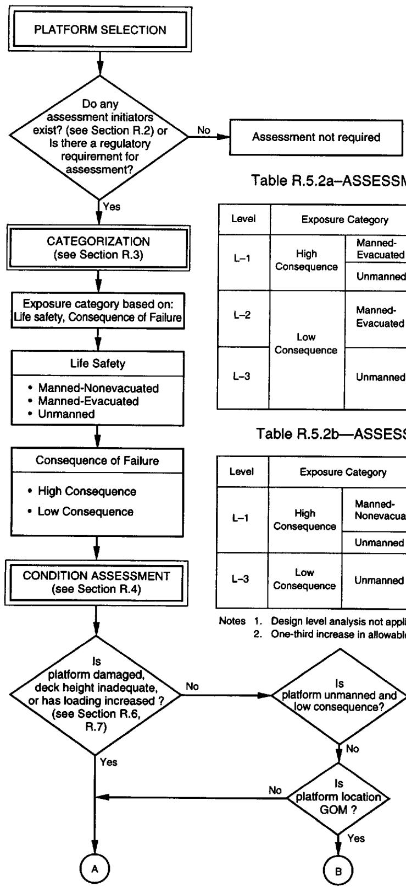  
Figure R.5.2—Platform Assessment Process—Metrocean Loading

Assessment not required

Table R.5.2a-ASSESSMENT CRITERIA-U.S. GULF OF MEXICO (see Table R.6.2-1)   

| Level | Exposure Category | Exposure Category | Design Level Analysis (see Notes 1 and 2) | Ultimate Strength Analysis |
| --- | --- | --- | --- | --- |
| L-1 | High Consequence | Manned- Evacuated | High Consequence design level analysis loading (see Figure R.6.2-2) | High Consequence ultimate strength analysis loading (see Figure R.6.2-2) |
| L-1 | High Consequence | Unmanned | High Consequence design level analysis loading (see Figure R.6.2-2) | High Consequence ultimate strength analysis loading (see Figure R.6.2-2) |
| L-2 | Low Consequence | Manned- Evacuated | Sudden hurricane design level analysis loading (see Figure R.6.2-3) | Sudden hurricane ultimate strength analysis loading (see Figure R.6.2-3) |
| L-3 | Low Consequence | Unmanned | Minimum consequence design level analysis loading (see Figure R.6.2-5) | Minimum consequence ultimate strength analysis loading (see Figure R.6.2-5) |

Table R.5.2b—ASSESSMENT CRITERIA—OTHER U.S. AREAS (see Table R.6.2-1)   

| Level | Exposure Category | Exposure Category | Design Level Analysis(see Notes 1 and 2) | Ultimate StrengthAnalysis |
| --- | --- | --- | --- | --- |
| L-1 | HighConsequence | Manned-Nonevacuated | 85% of lateral loadingcaused by 100-year environmental conditions(see Section R.6.2b) | Reserve strength ratio(RSR) ≥ 1.6(see Section R.6.2b) |
| L-1 | HighConsequence | Unmanned | 85% of lateral loadingcaused by 100-year environmental conditions(see Section R.6.2b) | Reserve strength ratio(RSR) ≥ 1.6(see Section R.6.2b) |
| L-3 | LowConsequence | Unmanned | 50% of lateral loadingcaused by 100-year environmental conditions(see Section R.6.2b) | (RSR) ≥ 0.8(see Section R.6.2b) |

Notes 1. Design level analysis not applicable for platforms with inadequate deck height.   
2. One-third increase in allowable stress is permitted for design level analysis (all categories).

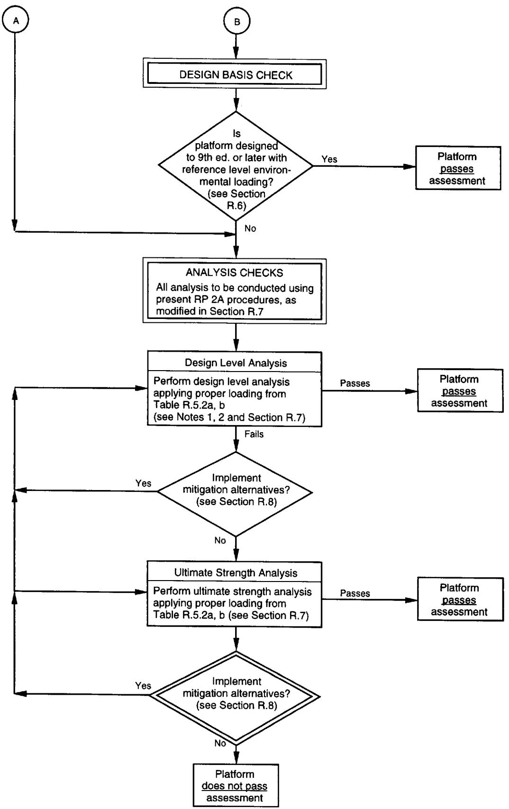  
Figure R.5.2—Platform Assessment Process—Metroean Loading (Continued)

Platforms that (1) have no significant damage, (2) have an adequate deck height for their category (see Figures R.6.2-2b, R.6.2-3b, R.6.2-5b), and (3) have not experienced significant changes from their design premise may be considered to be acceptable, subject to either of the following two conditions:

1. Minimum consequence: if the platform is categorized as having minimum consequence (Level L-3, unmanned and low consequence of failure), the platform passes the assessment.   
2. Design basis check: if the platform is located in the U.S. Gulf of Mexico and was designed to the 9th edition of Recommended Practice 2A (1977) or later, the platform passes the assessment. However, in this case it shall also be demonstrated that reference-level hydrodynamic loading was used for platform design. The procedure to demonstrate that 9th edition reference-level forces were applied during design is described in Section R.6.

Significant damage or change in design premise is defined in Section R.2.6.

For all other platforms, the following applies:

3. Design level analysis: these procedures are similar to those for new platform design, including the application of all load and resistance factors, the use of nominal rather than mean yield stress, and so on. Reduced metocean loading, relative to new design requirements, are referenced in Figure R.5.2 and Section R.6. Design-level analysis requirements are described in Section R.7.2. For minimum consequence platforms with damage or increased loading, an acceptable alternative to satisfying the design-level analysis requirement is to demonstrate that the damage or increased loading is not significant relative to the as-built condition, as defined in Section R.2.6. This would involve design-level analyses of both the existing and as-built structures.

4. Ultimate strength analysis: these procedures reduce conservatism by providing an unbiased estimate of platform capacity. The ultimate strength of a platform may be assessed using inelastic, static pushover analysis. However, a design-level analysis with all load and resistance factors set to 1.0 and sources of conservatism removed is also permitted, as this provides a conservative estimate of ultimate strength. In both cases, the ultimate strength metocean criteria should be used. Ultimate-strength analysis requirements are described in Section R.7.3. For minimum consequence platforms with damage or increased loading, an acceptable alternative to the ultimate strength requirement is to demonstrate that the damage or increased loading is not significant relative to the as-built condition as defined in Section R.2.6. This would involve ultimate-strength analyses of both the existing and as-built structures.

Several investigators have developed simplified procedures for evaluating the adequacy of existing platforms. To use these procedures successfully requires intimate knowl

edge of the many assumptions upon which they are based, as well as a thorough understanding of their application. Selecting environmental loadings used in simplified analysis is the responsibility of the operator; however, the simplified analysis method used shall be validated as being more conservative than the design-level analysis.

R.5.3 Assessment For Seismic Loading

For platforms with exposure categories noted in Section A.7 (excluding the nonapplicable, manned-evacuated category) that are subject to seismic loading in seismic zones 3, 4, and 5 (see Comm. C.4.2), the basic flow chart shown in Figure R.5.2 is applicable to determine fitness for seismic loading with the following modifications:

1. Assessment for seismic loading is not a requirement for seismic zones 0, 1, and 2 (see Comm. C.4.2).   
2. Assessment for metocean loading should be performed for all seismic zones.   
3. Assessment for ice loading should be performed, if applicable.   
4. Design basis check: for all exposure categories defined in Section A.7, platforms that have been designed or recently assessed in accordance with the requirements of API Recommended Practice 2A, 7th edition (1976), which required safety level analysis (referred to as ductility level analysis in subsequent editions), are considered to be acceptable for seismic loading, provided that:

- No new significant fault has been discovered in the area.   
- No new data indicate that a current estimate of strength level ground motion for the site would be significantly more severe than the strength level ground motion used for the original design.   
- Proper measures have been made to limit the life safety risks associated with platform appurtenances as noted in Section C.4.4.2.   
- The platforms have no significant unrepaired damage.   
- The platforms have been surveyed.   
- The present and/or anticipated payload levels are less than or equal to those used in the original design.

5. Design level analysis: the design-level analysis box in Figure R.5.2 is not applicable to seismic assessment (see Section R.6.3).

6. Ultimate strength analyses: Level L-I platforms that do not meet the screening criteria may be considered adequate for seismic loading provided they meet the life-safety requirements associated with platform appurtenances as noted in Section C.4.4.2, and it can be suitably demonstrated by dynamic analysis using mean component resistances that these platforms can be shown to withstand loads associated with a median 1,000-year return period earthquake appropriate for the site without system collapse.

In the case of Level L-3 platforms, in addition to satisfying the platform appurtenance requirements of Section C.4.4.2, it shall be suitably demonstrated by dynamic analysis, using mean component resistance values, that the platform can withstand earthquake loads associated with a median 500-year return period event appropriate for the site without system collapse.

A validated simplified analysis may be used for seismic assessment (See Section R.5.2). It shall be demonstrated that the simplified analysis will be more conservative than the ultimate-strength analysis.

R.5.4 Assessment for Ice Loading

For all exposure categories of platforms subject to ice loading, the basic flowchart shown in Figure R.5.2 is applicable to determine fitness for ice loading with the following modifications:

1. Assessment for metocean loading should be performed, if applicable. Note this is not required for Cook Inlet, Alaska, because ice forces dominate.   
2. Assessment for seismic loading should be performed, if applicable.   
3. Design basis check: All categories of platforms as defined in Section A.7 that (1) have been maintained and inspected, (2) have had no increase in design-level loading, (3) are undamaged, and (4) were designed or previously assessed in accordance with API Recommended Practice 2N (1st edition, 1988 or later) are considered to be acceptable for ice loading.   
4. Design-level analysis: Level L-1 platforms that do not meet screening criteria may be considered adequate for ice loading if they meet the provisions of API Recommended Practice 2N (1st edition, 1988) using a linear analysis with resistance factors set equal to 1.0.

Level L-3 platforms that do not meet the screening criteria may be considered adequate for ice loading if they meet the provision of API Recommended Practice 2N (1st edition, 1988) using a linear analysis and comply with Sections C.4.2.5 and C.4.4.1.

5. Ultimate-strength analysis: Platforms that do not meet the design-level analysis requirements may be considered adequate for ice loading if an ultimate-strength analysis is performed using mean component resistances and the platform is shown to have a reserve strength ratio (RSR) equal to or greater than 1.6 in the case of Level L-1 platforms and an RSR equal to or greater than 0.8 in the case of L-2 and L-3 platforms. $RSR$ is defined as the ratio of platform ultimate lateral capacity to the lateral loading computed with present API Recommended Practice 2N (1st edition, 1988) procedures using the design-level ice feature provided in Section 3.5.7 of Recommended Practice 2N.

A validated simplified analysis may be used for assessment of ice loading (See Section R.5.2). It shall be demonstrated that the simplified analysis will be as or more conservative than the design-level analysis.

## R.6 METOCEAN, SEISMIC, AND ICE CRITERIA/LOADS

R.6.1 General

The criteria/loads to be utilized in the assessment of existing platforms should be in accordance with Section C (with the exceptions, modifications, and/or additions noted herein) as a function of exposure category defined in Section R.3 and applied as outlined in Section R.5.

R.6.2 Metacean Criteria/Loads

The metocean criteria consist of the following items:

- Omnidirectional wave height versus water depth.   
- Storm tide (storm surge plus astronomical tide).   
Deck height.   
Wave and current direction.   
- Current speed and profile.   
Wave period.   
Wind speed.

The criteria are specified according to geographical region. At this time, only criteria for the U.S. Gulf of Mexico and three regions off the U.S. West Coast are provided. These regions are Santa Barbara and San Pedro Channels and Central California (for platforms off Point Conception and Arguello). Metocean criteria are not provided for Cook Inlet, Alaska, because ice forces dominate.

The criteria are further differentiated according to exposure category (consequence of failure and life-safety category combination) and type of analysis (design level or ultimate strength).

Wave/wind/current force calculation procedures for platform assessment have to consider two cases:

- Case1: Wave clears the underside of the cellar deck.   
- Case 2: Wave inundates the cellar deck; ultimate-strength analyses shall be performed.

For Case 1, the criteria are intended to be applied with wave/wind/current force calculation procedures specified in Sections C.3.2 to C.3.7, except as specifically noted in Section R.6.2.

For Case 2, the procedures noted in Case 1 apply, as well as the special procedures for calculating the additional wave/current forces on platform decks provided in Section Comm. R.6.2.

The following sections define the guideline metocean criteria and any special force calculation procedures for various geographical regions. Platform owners may be able to justify different metocean criteria for platform assessment than the guideline criteria specified herein. However, these alternative criteria shall meet the following conditions:

- Criteria shall be based on measured data in winter storms and/or hurricanes or based on hindcast data from numerical models and procedures that have been thoroughly validated with measured data.

- Extrapolation of storm data to long-return periods and determination of associated values of secondary metocean parameters shall be done with defensible methodology.   
- Derivation of metocean criteria for platform assessment shall follow the same logic as used to derive the guideline parameters provided herein [R.6].

R.6.2a U.S. Gulf of Mexico Criteria

The U.S. Gulf of Mexico criteria are as follows:

1. Metocean Systems: Both hurricanes and winter storms are important to the assessment process. In calculating wave forces based on Section C.3.2, a wave kinematics factor of 0.88 should be used for hurricanes and 1.0 for winter storms.

2. Deck Height Check: The deck heights shown in Figures R.6.2-2b, R.6.2-3b, and R6.2-5b are based on the ultimate-strength analysis metocean criteria for each of the exposure categories. Specifically, the minimum deck height above MLLW measured to the underside of the cellar deck main beams is calculated as follows:

Minimum deck height = crest height of ultimate-strength analysis wave height and associated wave period + ultimate-strength analysis of storm tide.

The wave crest heights are calculated using the wave theory as recommended in Section C.3.2.2.

If this criterion for the minimum deck height is not satisfied, then an ultimate-strength analysis shall be conducted with proper representation of hydrodynamic deck forces using the procedure described in Comm. R.6.2.

3. Design Basis Check (for structures designed to Recommended Practice 2A, 9th Edition or later):

For all exposure categories, a single vertical cylinder may be used to determine if the platform satisfies the Recommended Practice 2A, 9th Edition reference level force. Figure R.6.2-1 shows the 9th Edition wave forces as a function of water depth for diameters of 762 millimeters (30 inches), 1220 millimeters (48 inches), 1525 millimeters (60 inches), and 1830 millimeters (72 inches). The forces are calculated

using the wave theory as recommended in Section C.3.2.2. Consistent with the 9th Edition, the current is zero, and no marine growth is used. The drag coefficient is 0.6, and the inertia coefficient is 1.5.

To verify that the platform was designed for 9th Edition reference level loads, the forces on the single cylinder need to be calculated using the original design wave height, wave period, current, tide, drag and inertia coefficients, waveplus-current kinematics, and marine growth thickness. The cylinder diameter should be equal to the platform leg diameter at the storm mean water level. If the forces are equal to or exceed that in Figure R.6.2-1, the platform forces are considered consistent with 9th Edition requirements.

A more accurate approach is to build a hydrodynamic model of the structure and compare the base shear using the original design criteria with the base shear that is consistent with the 9th Edition reference level force. The 9th Edition forces should be calculated using the wave theory as recommended in Section C.3.2.2.

4. Design-level and Ultimate-Strength Analyses:

a. Level L-1 (high consequence/manned, evacuated or unmanned). The full hurricane population applies. The metocean criteria are provided in Table R.6.2-1. The wave height and storm tide are functions of water depth; these are given in Figure R.6.2-2a. The minimum deck height is also a function of water depth; this is shown in Figure R.6.2-2b. The wave period, current speed, and wind speed do not depend on water depth; these are provided in Table R.6.2-1.

If the underside of the cellar deck is lower than the deck height requirement given in Figure R.6.2-2b, an ultimate-strength analysis will be required.

For design-level analysis, omnidirectional criteria are specified. The associated in-line current is given in Table R.6.2-1 and is assumed to be constant for all directions and water depths. For some noncritical directions, the omnidirectional criteria could exceed the design values of this recommended practice, in which case the values of this recommended practice will govern for those directions. The current profile is given in Section C.3.7.3.4. The wave period, storm tide, and wind speed apply to all directions.

Table R.6.2-1—U.S. Gulf of Mexico Metocean Criteria   

| Criteria | L-1Full Population Hurricanes | L-1Full Population Hurricanes | L-2Sudden Hurricanes | L-2Sudden Hurricanes | L-3Winter Storms | L-3Winter Storms |
| --- | --- | --- | --- | --- | --- | --- |
| Criteria | Design Level Analysis | Ultimate Strength Analysis | Design Level Analysis | Ultimate Strength Analysis | Design Level Analysis | Ultimate Strength Analysis |
| Wave ht and storm tide, ft | Fig. R.6.2-2a | Fig. R.6.2-2a | Fig. R.6.2-3a | Fig. R.6.2-3a | Fig. R.6.2-5a | Fig. R.6.2-5a |
| Deck height, ft | Fig. R.6.2-2b | Fig. R.6.2-2b | Fig. R.6.2-3b | Fig. R.6.2-3b | Fig. R.6.2-5b | Fig. R.6.2-5b |
| Wave and current direction | Omni-dir* | Current LFRD edition | Omni-dir** | Fig. R.6.2-4 | Omni-dir | Omni-dir |
| Current speed, kts | 1.6 | 2.3 | 1.2 | 1.8 | 0.9 | 1.0 |
| Wave period, sec | 12.1 | 13.5 | 11.3 | 12.5 | 10.5 | 11.5 |
| Wind speed (1 hr @ 10m), kts | 65 | 85 | 55 | 70 | 45 | 50 |

Note: ht = height; ft = feet; dir = direction; kts = knots; sec = seconds; hr = hour; m = meters.   
*If the wave height or current versus direction exceeds that required by the current Recommended Practice 2A-LRFD edition for new designs, then the current edition criteria will govern.   
**If the wave height or current versus direction exceeds that required for ultimate-strength analysis, then the ultimate-strength criteria will govern.

For ultimate-strength analysis, the direction of the waves and currents should be taken into account. The wave height and current speed direction factor and the current profile should be calculated as described in Section C.3.7.3.4. The wave period and wind speed do not vary with water depth. Wave/current forces on platform decks should be calculated using the procedure defined in Comm. R.6.2.

b. Level L-2 (low consequence/manned-evacuated). The combined sudden hurricane and winter storm population applies. The metocean criteria (referenced to the sudden hurricane population) are provided in Table R.6.2-1. The wave height and storm tide are functions of water depth; these are shown in Figure R.6.2-3a. The required deck height is also a function of water depth; this is given in Figure R.6.2-3b. The wave period, current speed, and wind speed do not vary with water depth; these are provided in Table R6.2-1.

If the underside of the cellar deck is lower than the deck height requirement given in Figure R.6.2-3b, an ultimate-strength analysis will be required.

For design-level analysis, the metocean criteria are based on the 100-year force due to the combined sudden hurricane and winter storm population. Omnidirectional criteria are specified. The associated in-line current is given in Table R.6.2-1 and is assumed to be constant for all directions and water depths. For some noncritical directions, the omnidirectional criteria could exceed the ultimate-strength analysis values, in which case the ultimate-strength analysis values will govern for those directions. The current profile is given in Section C.3.7.3.4. The wave period, storm tide, and wind speed apply to all directions. Although the criteria are based on both sudden hurricanes and winter storms, the wave forces should be calculated using a wave kinematics factor of 0.88 because the criteria are referenced to the sudden hurricane population.

For ultimate-strength analysis, the direction of the waves and currents should be taken into account. The wave height, associated current and profile as a function of direction should be calculated as described in Section C.3.7.3.4, except that the directional factors should be based on Figure R.6.2.4. The wave period and wind speed do not vary with water depth. Wave/current forces on platform decks should be calculated using the procedure defined in Comm. R.6.2.

c. Level L-3 (low consequence/unmanned, that is, minimum consequence). The winter storm population applies. The metocean criteria are provided in Table R.6.2-1. The wave height and storm tide are functions of water depth; these are shown in Figure R.6.2-5a. The required deck height is also a function of water depth; this is given in Figure R.6.2-5b. The wave period, current speed, and wind speed do not vary with water depth; these are provided in Table R.6.2-1.

If the underside of the cellar deck is lower than the deck height requirement given in Figure R.6.2-5b, an ultimate-strength analysis will be required.

For both design-level and ultimate-strength analysis, the wave height criteria are omni-directional. The associ

ated in-line current is provided in Table R.6.2-1 and is assumed to be constant for all directions and water depths. The current profile should be the same as in Section C.3.7.3.4. The wave period, storm tide, and wind speed apply to all directions. Wave/current forces on platform decks should be calculated using the procedure defined in Comm. R.6.2.

R.6.2b West Coast Criteria

1. Metocean Systems: The extreme waves are dominated by extra tropical storm systems. In calculating wave forces based on Section C.3.2, a wave kinematics factor of 1.0 should be used.   
2. Deck Height Check: The deck height for determining whether or not an ultimate strength check will be needed should be developed on the same basis as prescribed in Section R.6.2a.b. The ultimate strength wave height should be determined on the basis of the acceptable RSR. The ultimate strength storm tide may be lowered from that in Table R.6.2-2 to take into account the unlikely event of the simultaneous occurrence of highest astronomical tide and ultimate-strength wave.   
3. Design Basis Check: This is only applicable to U.S. Gulf of Mexico platforms.   
4. Design-Level and Ultimate-Strength Analysis: Table R.6.2-2 presents the 100-year metocean criteria necessary for performing design-level and ultimate-strength checks. An ultimate-strength check will be needed if the platform does not pass the design-level check or if the deck height is not adequate.

The criteria are for deep water $[>91$ meters (300 feet)] and should be applied omni-directionally. Lower wave heights, provided they are substantiated with appropriate computations, may be justified for shallower water.

R.6.3 Seismic Criteria/Loads

Guidance on the selection of seismic criteria and loading is provided in Sections C.4 and Comm. C.4. See Section R.9, Reference R7, for a source of additional details.

1. The design basis check procedures noted in Section R.5.3, Item d, are appropriate provided no significant new faults in the local area have been discovered or any other information regarding site seismic hazard characterization has been developed that significantly increases the level of seismic loading used in the platform's original design.   
2. For seismic assessment purposes, the design-level check is felt to be an operator's economic risk decision and thus is not applicable. An ultimate-strength analysis is required if the platform does not pass the design basis check or screening.   
3. Ultimate-strength seismic criteria are set at a median 1,000-year return period event for all platforms except those classified as minimum consequence. For the minimum consequence structures, a median 500-year return period event should be utilized. Characteristics of these seismic events

should be based on the considerations noted in Section C.4 and Comm. C.4, as well as any other significant new developments in site seismic hazard characterization. The ultimate-strength seismic criteria should be developed for each specific site or platform vicinity using the best available technology.

R.6.4 Ice Criteria/Loads

Guidance on the selection of appropriate ice criteria and loading can be found in API Recommended Practice 2N (1st Edition, 1988). Note that the ice feature geometries provided in Section 3.5.7 of Recommended Practice 2N are not associated with any return period, since no encounter statistics are presented. All references to screening, design level, and ultimate-strength analyses in Section R.5.4 assume the use of the values noted in Table 3.5.7 of Recommended Practice 2N. Where ranges are noted, the smaller number could be related to design level and the larger related to ultimate strength. See Section R.9, Reference R7, for additional details.

## R.7 STRUCTURAL ANALYSIS FOR ASSESSMENT

R 7.1 General

Structural analysis for assessment shall be performed in accordance with Sections D, E, F, G, and H with the exceptions, modifications, and/or additions noted herein. Additional information and references can be found in Reference R3 (see Section R.9).

A structure should be evaluated based on its current condition, accounting for any damage, repair, scour, or other factors affecting its performance or integrity. Guidance on assessment information is provided in Section R.4. The global structural model should be three dimensional. Special attention should be given to defensible representation of the actual stiffness of damaged or corroded members and joints.

For platforms in areas subjected to ice loading, special attention should be given to exposed critical connections where steel that was not specifically specified for low-temperature service was used.

R.7.2 Design-Level Analysis Procedures

R.7.2a General

Platforms of all exposure categories that do not pass the screening requirements may be evaluated using the design-level procedures outlined in the following. These procedures may be bypassed by using the ultimate-strength analysis procedures described in Section R.7.3.

R.7.2b Structural Steel Design

The assessment of structural members shall be in accordance with the requirements of Section D, except as noted otherwise in this section. Effective length （$K)$ factors other than those noted in Section D.3.2.3 may be used when justified. Damaged or repaired members may be evaluated using a rational, defensible engineering approach, including historical exposure or specialized procedures developed for that purpose.

R.7.2c Connections

The evaluation of structural connections shall be in accordance with Section E, except as noted otherwise in this section. Section E.1, which requires that joints be able to carry at least 50 percent of the buckling load for compression members, and at least 50 percent of the yield stress for members loaded primarily in tension, need not be met. Tubular joints should be evaluated for the actual loads derived from the global analysis. The strength of grouted and ungrouted joints may use the results of ongoing experimental and analytical studies if it can be demonstrated that these results are applicable, valid, and defensible. For assessment purposes, the metallurgical properties of API Specification 2H material need not be met.

R.7.2d Fatigue

As part of the assessment process for future service life, consideration should be given to accumulated fatigue degradation effects. Where Levels III and/or IV surveys are made (see Section O.3) and any known damage is assessed and/or repaired, no additional analytical demonstration of future fatigue life is required. Alternatively, adequate fatigue life may be demonstrated by means of an analytical procedure compatible with Section F.

R.7.3 Ultimate-Strength Analysis Procedures

Platforms of all exposure categories, either bypassing or not passing the requirements for screening and/or design-level analysis, shall demonstrate adequate strength and stability to survive the ultimate-strength loading criteria set forth in Sections R.5 and R.6 in order to ensure adequacy for the current or extended use of the platform. Special attention should be given to modeling of the deck if wave inundation is expected as noted in Section R.6. The provisions of Section R.7.2d (Fatigue) apply even if the design-level analysis is bypassed.

The following guidelines may be used for the ultimate-strength analysis:

a. The ultimate strength of undamaged members, joints, and piles can be established using the formulas of Sections D, E, G, and H with all resistance factors set to 1.0. The ultimate strength of joints may also be determined using a mean formula or equation versus the lower bound formulas for joints in Section E.   
b. The ultimate strength of damaged or repaired elements of the structure may be evaluated using a rational, defensible engineering approach, including special procedures developed for that purpose.   
c. Actual (coupon test) or expected mean yield stresses may be used instead of nominal yield stresses. Increased strength due to strain hardening may also be acknowledged if the section is sufficiently compact, but not rate effects beyond the normal (fast) mill tension tests.

d. Studies and tests have indicated that effective length （$K)$ factors are substantially lower for elements of a frame subjected to overload than those specified in Section D.3.2.3. Lower values may be used if it can be demonstrated that they are both applicable and substantiated.

The ultimate strength may be determined using elastic methods (Sections R.7.3a and R.7.3b) or inelastic methods (Section R.7.3c) as desired or required.

R.7.3a Linear Global Analysis

A linear analysis may be performed to determine if overstressing is local or global. The intent is to determine which members or joints have exceeded their buckling or yield strengths. The structure passes assessment if no elements have exceeded their ultimate strength. When few overloaded members and/or joints are encountered, local overload considerations may be used as outlined in Section R.7.3b. Otherwise, a detailed global inelastic analysis is required.

R.7.3b Local Overload Considerations

Engineering judgment suggests that overload in locally isolated areas could be acceptable with members and/or joints having stress ratios greater than 1.0 if it can be demonstrated that (a) such overload can be relieved through a redistribution of load to alternate paths or (b) a more accurate and detailed calculation would indicate that the member or joint is not, in fact, overloaded. Such a demonstration should be based on defensible assumptions with consideration being given to the importance of the joint or member to the overall structural integrity and performance of the platform. In the absence of such a demonstration, it is necessary to (a) perform an incremental linear analysis (in which failed elements are replaced by their residual capacities), (b) perform a detailed global inelastic analysis, and/or (c) apply mitigation measures.

R.7.3c Global Inelastic Analysis

1. General: Global inelastic analysis is intended to demonstrate that a platform has adequate strength and stability to withstand the loading criteria specified in Sections R.5 and R.6 with local overstress and damage allowed, but without collapse.

At this level of analysis, stresses have exceeded elastic levels and modeling of overstressed members, joints, and foundation shall recognize ultimate capacity, as well as post-buckling behavior, rather than the elastic load limit.   
2. Methods of Analysis: The specific method of analysis depends on the type of extreme environmental loading applied to the platform and the intended purpose of the analysis. Push-over and time-domain analysis methods are acceptable as described in Comm. R.7.3c.2.   
3. Modeling—Element Types: For purposes of modeling, elements can be grouped as follows:

a. Elastic members: these are members that are expected to perform elastically throughout the ultimate-strength analysis.   
b. Axially loaded members: these are members that are expected to undergo axial yielding or buckling during ultimate-strength analysis. They are best modeled by strut-type elements that account for reductions in strength and stiffness after buckling.   
c. Moment-Resisting Members: these members are expected to yield during the ultimate-strength analysis, primarily due to high bending stresses. They should be modeled with beam-column-type elements that account for bending and axial interaction as well as the formation and degradation of plastic hinges.   
d. Joints: the assessment loads applied to the joint should be the actual loads, rather than those based on the strength of the braces connecting to the joint.   
e. Damaged/Corroded Elements: damaged/corroded members or joints shall be modeled accurately to represent their ultimate- and post-ultimate strength and deformation characteristics. Finite element and/or fracture mechanics analysis are justified in some instances.   
f. Repaired and Strengthened Elements: members or joints that have been or must be strengthened or repaired should be modeled to represent the actual repaired or strengthened properties.   
g. Foundations: in carrying out a nonlinear-pushover or dynamic-time history analysis of an offshore platform, pile foundations should be modeled in sufficient detail to adequately simulate their response. It could be possible to simplify the foundation model to assess the structural response of the platform. However, such a model should realistically reflect the shear and moment coupling at the pile head. Further, it should allow for the nonlinear behavior of both the soil and pile. Lastly, a simplified model should accommodate the development of a collapse mechanism within the foundation for cases where this is the weak link of the platform system. Further foundation modeling guidance can be found in Comm. R.7.3c, Item C7.

For ultimate-strength analysis, it is usually appropriate to use mean soil properties as opposed to conservative interpretations. This is particularly true for dynamic analyses where it is not always clear what constitutes a conservative interpretation.

## R.8 MITIGATION ALTERNATIVES

Structures that do not meet the assessment requirements through screening, design level analysis, or ultimate-strength analysis (see Figure R.5.2) will need mitigation actions. Mitigation actions are defined as modifications or operational procedures that reduce loads, increase capacities, or reduce exposure. See Section R.9, Reference R8, for a general discussion of mitigation actions and a comprehensive reference list of prior studies and case histories.

## R.9 REFERENCES

R1. K. A. Digre, W. F. Krieger, D. Wisch, and C. Petrauskas, API Recommended Practice 2A, Draft Section 17, "Assessment of Existing Platforms," Proceedings of BOSS '94 Conference, July 1994.   
R2. J. Kallaby, and P. O'Connor, "An Integrated Approach for Underwater Survey and Damage Assessment of Offshore Platforms," OTC 7487, Offshore Technology Conference Proceedings, May 1994.   
R3. J. Kallaby, G. Lee, C. Crawford, L. Light, D. Dolan, and J. H. Chen, "Structural Assessment of Existing Platforms," OTC 7483, Offshore Technology Conference Proceedings, May 1994.   
R4. W. F. Krieger, H. Banon, J. Lloyd, R. De, K.A. Digre, D. Nair, J.T. Irick, and S. Guynes, "Process for Assessment of Existing Platforms to Determine Their Fitness for Purpose," OTC 7482, Offshore Technology Conference Proceedings, May 1994.   
R5. F. J. Puskar, R.K Aggarwal, C.A. Cornell, F. Moses, and C. Petrauskas, "A Comparison of Analytically Predicted Platform Damage to Actual Platform Damage During Hurricane

Andrew," OTC 7473, Offshore Technology Conference Proceedings, May 1994.   
R6. C. Petrauskas, T. D. Finnigan, J. Heideman, M. Santala, M. Vogel, and G. Berek, "Metacean Criteria/Loads for Use in Assessment of Existing Offshore Platforms," OTC 7484, Offshore Technology Conference Proceedings, May 1994.   
R7. M. J. K. Craig, and K. A. Digre, “Assessments of High Consequence Platforms: Issues and Applications,” OTC 7485, Offshore Technology Conference Proceedings, May 1994.   
R8. J. W. Turner, D. Wisch, and S. Guynes, “A Review of Operations and Mitigation Methods for Offshore Platforms,” OTC 7486, Offshore Technology Conference Proceedings, May 1994.   
R9. W. D. Iwan, G. W. Housner, Cornell, CA., and Theil, C.C., "Seismic Safety Requalification of Offshore Platforms," API-sponsored Report, May 1992.   
R10. W. D. Iwan, G. W. Housner, C. A. Cornell, and C. C. Theil, "Addendum to Seismic Safety Requalification of Offshore Platforms," API-sponsored Report, November 1993.

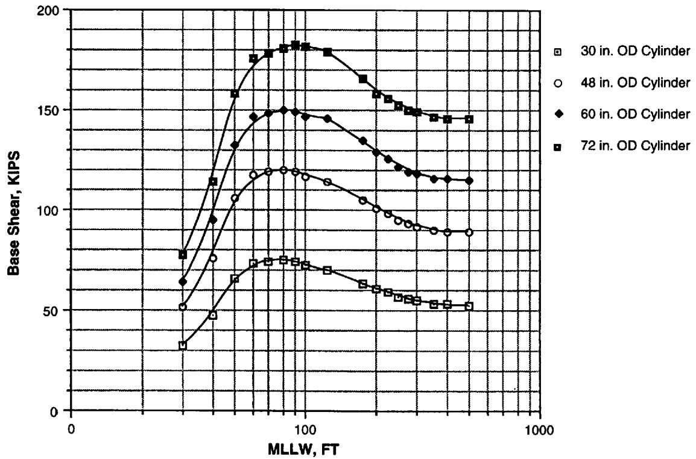  
Figure R.6.2-1—Base Shear for a Vertical Cylinder Based on API Recommended Practice 2A, 9th Edition, Reference Level Forces

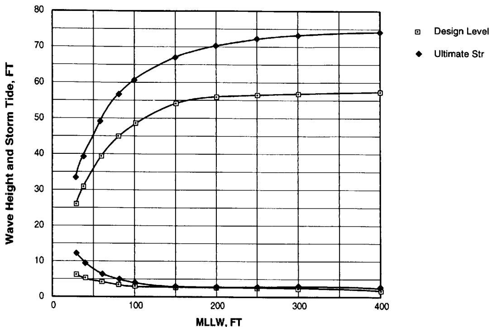  
Figure R.6.2-2a—Full Population Hurricane Wave Height and Storm Tide Criteria

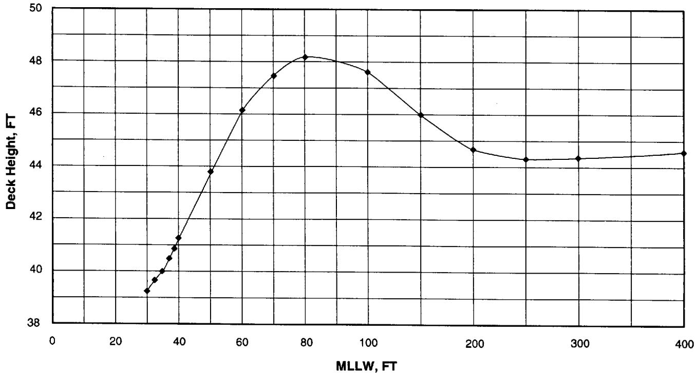  
Figure R.6.2-2b—Full Population Hurricane Deck Height Criteria

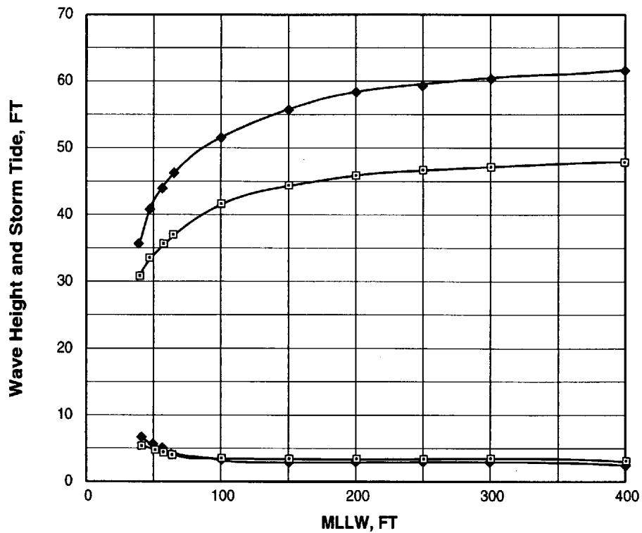  
Design Level   
Ultimate Str

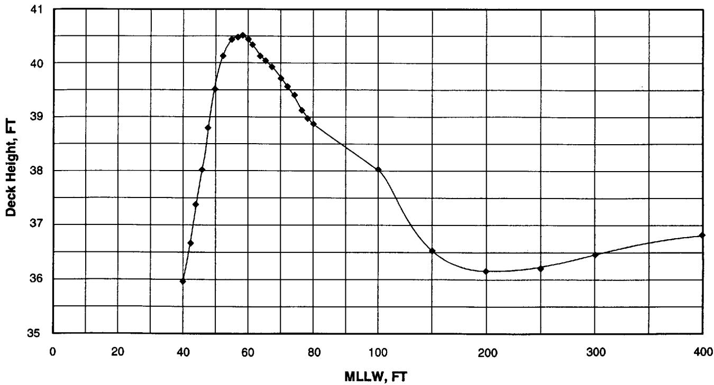  
Figure R.6.2-3a—Sudden Hurricane Wave Height and Storm Tide Criteria   
Figure R.6.2-3b—Sudden Hurricane Deck Height Criteria

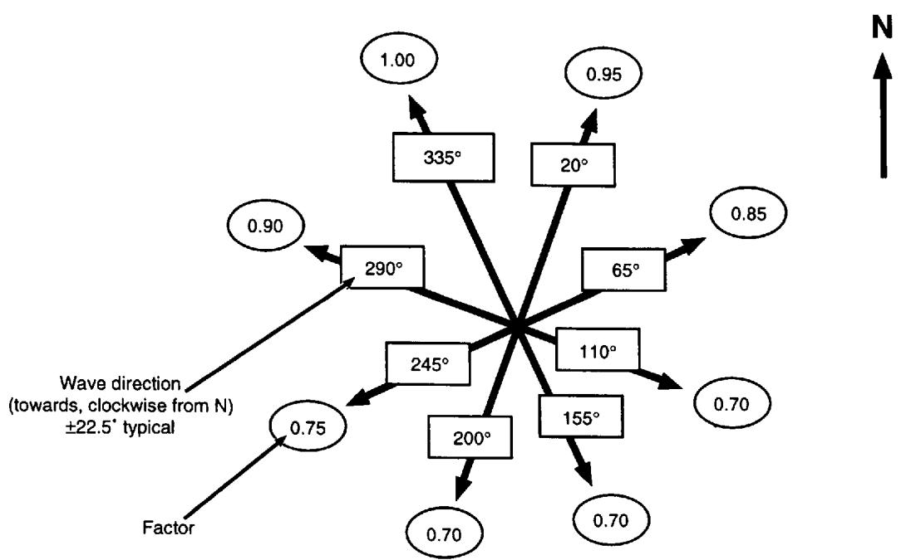  
Figure R.6.2-4—Sudden Hurricane Wave Directions and Factors to Apply to the Omni-directional Wave Heights in Figure R.6.2-3a for Ultimate-strength Analysis

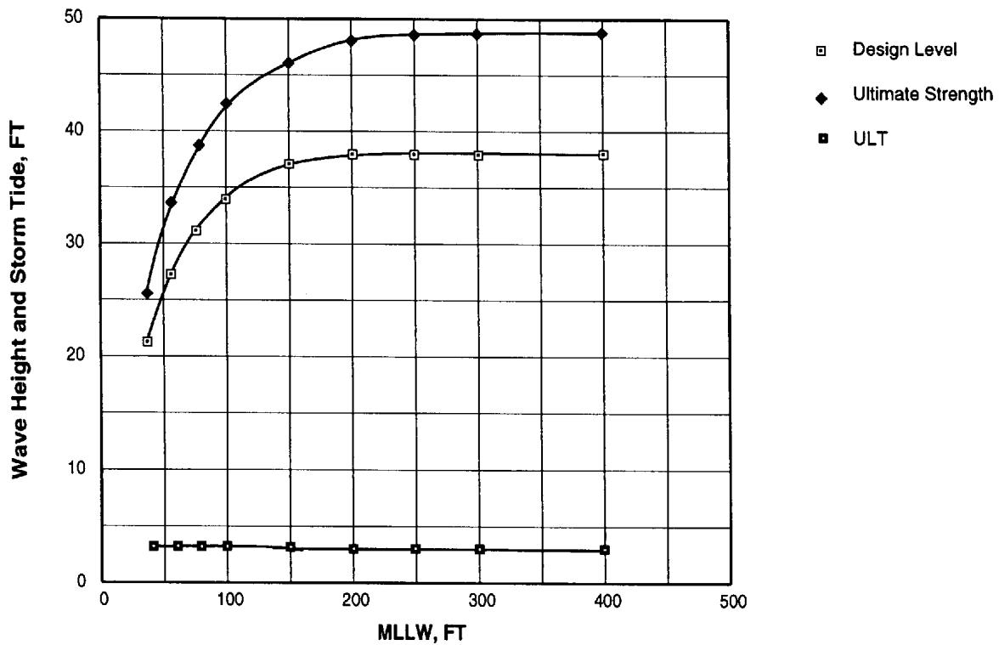  
Figure R.6.2-5a—Winter Storm Wave Height and Storm Tide Criteria

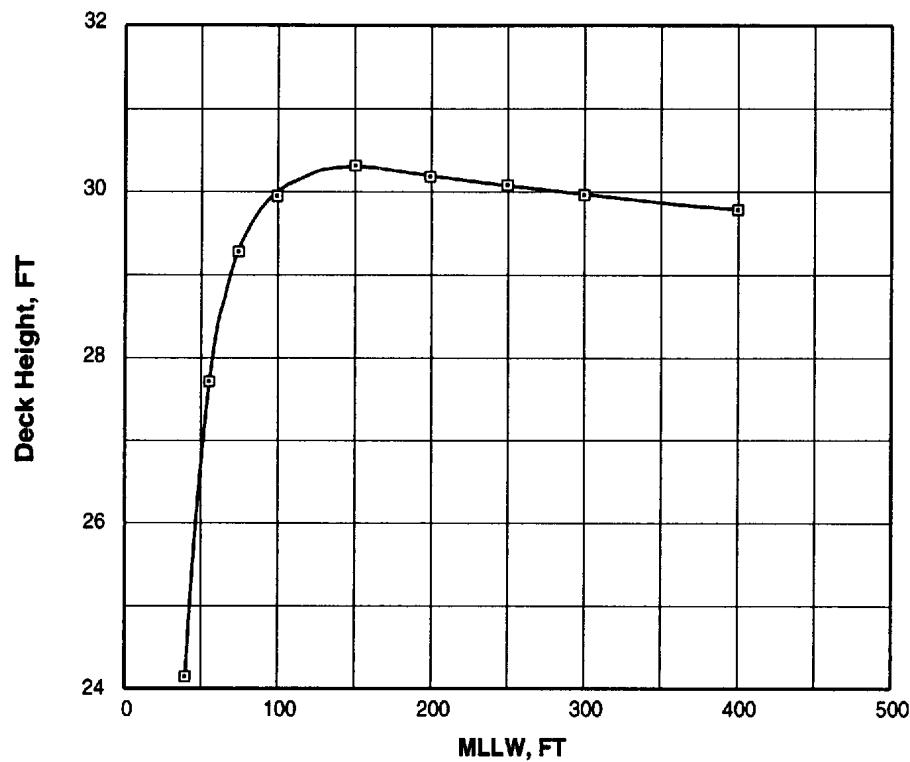  
Figure R.6.2-5b—Winter Storm Deck Height Criteria

S Fire, Blast, and Accidental Loading

## S.1 GENERAL

Fire, blast, and accidental loading events could lead to partial or total collapse of an offshore platform resulting in loss of life and/or environmental damage. Considerations should be given in the design of the structure and in the layout and arrangement of the facilities and equipment to minimize the effects of these events.

Implementing preventive measures has historically been, and will continue to be, the most effective approach to minimizing the probability of the occurrence of an event and the resultant consequences of the event. Guidance for (1) facility and equipment layouts, (2) procedures identifying significant events, and (3) assessment of the effects of these events from a facility-engineering standpoint can be found in References S1, S2, and S3 listed in Section S.11.

The operator is responsible for overall safety of the platform and as such defines the issues to be considered (for example, in mild environments, the focus may be on preventive measures, fire containment, or evacuation rather than focusing on control systems). The structural engineer needs to work closely with a facility engineer experienced in performing hazard analyses as described in Reference S3 and with the operator's safety management system as described in Reference S1 (see Section S.11).

The probability of an event leading to a partial or total platform collapse occurring and the consequence resulting from such an event varies with platform type. In the U.S. Gulf of Mexico (GOM) considerations of preventive measures coupled with established infrastructure, open facilities, and relatively benign environment have resulted in a good safety history. Detailed structural assessment should therefore not be necessary for typical GOM structures and environment.

An assessment process is presented in this section to accomplish the following:

a. Initially screen those platforms considered to be at low risk, thereby not requiring detailed structural assessment.   
b. Evaluate the structural performance of those platforms considered to be at high risk from a life-safety and/or consequences-of-failure point of view when subjected to fire, blast, and accidental loading events.

## S.2 LOAD AND RESISTANCE FACTORS

All load factors and resistance factors should be set equal to 1.0 for checking fire, blast, and accidental loading events. Only those load conditions that could reasonably be expected to occur during these events need to be considered. In the case of seismic loading, the load factor should be 0.9 as prescribed in Section C.4.2.1.

## S.3 ASSESSMENT PROCESS

S.3.1 General

The assessment process is intended to be a series of evaluations of specific events that could occur for the selected platform over its intended service life and service function(s).

The assessment process is detailed in Figure S.3-1 and comprises a series of tasks to be performed by the engineer to identify platforms at significant risk from fire, blast, or accidental loading and to perform the structural assessment for those platforms.

The assessment tasks listed below should be read in conjunction with Figure S.3-1 and Figure S.6-2:

Task 1: For the selected platform, assign a platform exposure category as defined in Section A.7, that is, L-1, L-2 or L-3.

Task 2: For a given event, assign risk levels L, M or H to the probability (likelihood or frequency) of the event occurring, as defined in Section S.5.

Task 3: From Figure S.6-1, determine the appropriate risk level for the selected platform and event.

Task 4: Conduct further study or analyses to better define risk, consequence, and cost of mitigation. In some instances, the higher risk may be deemed acceptable on the ALARP principle (that is, as low as reasonably practicable) when the effort and/or expense of mitigation becomes disproportionate to the benefit.

Task 5: If necessary, reassign a platform exposure category and/or mitigate the risk or the consequence of the event.

Task 6: For those platforms considered at high risk for a defined event, complete detailed structural integrity assessment for fire (Section S.7), blast (Section S.8) or accidental loading (Section S.10) events.

S.3.2 Definitions

For the purpose of this standard, the following definitions apply:

a. Reassignment: Requires some change in the platform's function to allow the reassignment of life-safety (in other words, manned versus unmanned, and/or reassignment of consequence of failure).   
b. Mitigation: The action taken to reduce the probability or consequences of an event to avoid the need for reassignment (for example, provision of fire or blast walls to accommodation areas and/or escape routes).   
c. Survival: For the purposes of Section S, survival means demonstration that the escape routes and safe areas are maintained for a sufficient period of time to allow platform evacuation and emergency response procedures.

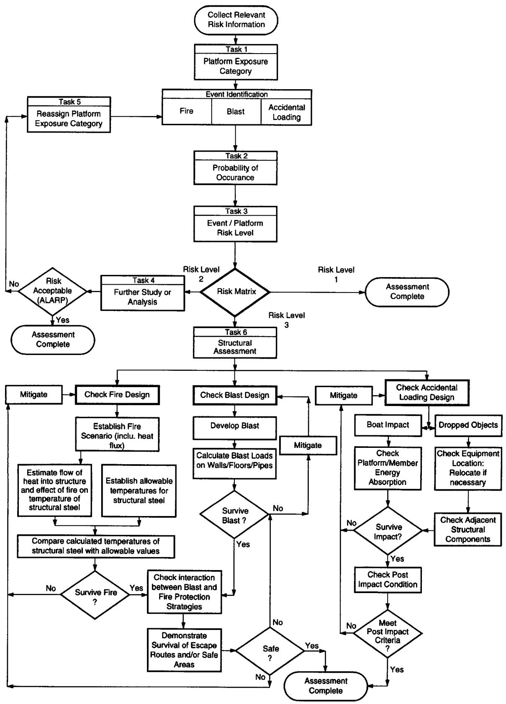  
Figure S.3-1—Assessment Process

## S.4 PLATFORM EXPOSURE CATEGORY

Platforms are categorized according to life safety and consequence of failure as defined in Section A.7 (L-1, L-2 or L-3).

## S.5 PROBABILITY OF OCCURRENCE

The probability of occurrence of a fire, blast, or accidental loading event is associated with the origin and escalation potential of the event. The type and presence of a hydrocarbon source can also be a factor in event initiation or event escalation. The significant events requiring consideration and their probability of occurrence levels (L, M, or H) are normally defined from a fire and blast process hazard analysis.

The factors affecting the origin of the event can be as follows:

1. Equipment Type: The complexity, amount, and type of equipment are important. Separation and measurement equipment, pump and compression equipment, fired equipment, generator equipment, safety equipment and their piping and valves should be considered.   
2. Product Type: The type of product, such as, gas, condensate, light crude, or heavy crude, should be considered.   
3. Operations Type: The types of operations being conducted on the platform should be considered in evaluating the probability of an event's occurrence. Operations can include drilling, production, resupply, and personnel transfer. Production operations are defined as those activities that take place after the successful completion of the wells, they include separation, treating, measurement, transportation to shore, operational monitoring, modifications of facilities, and maintenance. Simultaneous operations include two or more activities.   
4. Deck Type: The potential of a platform deck to confine a vapor cloud is important. Whether a platform deck configuration is open or closed should be considered when evaluating the probability of an event occurring. Most platforms in mild environments such as the Gulf of Mexico are open, thereby allowing natural ventilation. Platform decks in northern or more severe climates such as Alaska, the North Sea, and so forth, are frequently enclosed, resulting in increased probability of containing and confining explosive vapors and high explosion overpressures. Equipment-generated turbulence on an open deck can also contribute to high explosion overpressures.   
5. Structure Location: The proximity of the fixed offshore platform to shipping lanes can increase the potential for collision with non-oil-field-related vessels.   
6. Other: Other factors, such as the frequency of resupply and the type and frequency of personnel training, should be considered.

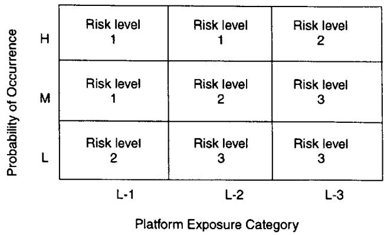  
Note: See Section A.7 for definitions of abbreviations.   
Figure S.6-2—Risk Matrix

## S.6 RISK ASSESSMENT

S.6.1 General

By using the exposure category levels assigned in Section A.7 and the probability of occurrence levels developed in Section S.5, fire, blast, and accidental loading scenarios may be assigned overall platform risk levels for an event as follows:

Risk Level 1: Significant risk that will likely require mitigation.

Risk Level 2: Risks requiring further study or analyses to better define risk, consequence, and cost of mitigation. In some instances the higher risk may be deemed acceptable on the ALARP principle when the effort and/or expense of mitigation becomes disproportionate to the benefit.

Risk Level 3: Insignificant or minimal risk that can be eliminated from further fire, blast, and accidental loading considerations.

S.6.2 Risk Matrix

The risk matrix is a $3 \times 3$ matrix that compares the probability of occurrence with the platform exposure category for a defined event.

The matrix provides an overall risk level as described in Section S.6.1 for each identified event for a given platform. More detailed risk assessment techniques or methodology, as described in API Recommended Practice 14J, may be used to determine the platform risk level. The overall risk level determines whether further assessment is required for the selected platform.

## S.7 FIRE

If the assessment process discussed in Section S.3 identifies that a significant risk of fire exists, fire should be considered as a load condition. Fire as a load condition may be treated using the techniques presented in the commentary for Section S.

The structural assessment needs to demonstrate that the escape routes and safe areas are maintained for sufficient time to allow platform evacuation and emergency response procedures to be implemented.

## S.8 BLAST

If the assessment process discussed in Section S.3 identifies that a significant risk of blast exists, the blast should be considered as a load condition. Blast as a load condition may be treated using the techniques presented in the commentary for Section S.

The blast assessment needs to demonstrate that the escape routes and safe areas survive.

## S.9 FIRE AND PLAST INTERACTION

Fire and blast are often synergistic. The fire and blast analyses should be performed together and the effects of one on the other carefully analyzed.

Examples of fire and blast interaction may be found in the commentary for Section S.

## S.10 ACCIDENTAL LOADING

S.10.1 General

Fixed offshore platforms are subject to possible damage from the following:

- Vessel collision during normal operations.   
- Dropped objects during periods of construction, drilling, or resupply operations.

If the assessment process discussed in Section S.3 identifies a significant risk from this type of loading, the effect on structural integrity of the platform should be assessed.

S.10.2 Vessel Collision

The platform should survive the initial collision and meet the post-impact criteria.

The commentary offers guidance on energy absorption techniques for vessel impact loading and recommendations for post-impact criteria and analyses.

S.10.3 Dropped Objects

Certain locations such as crane loading areas are more subject to dropped or swinging objects. The probability of occurrence may be reduced by following safe handling practices [S4].

The consequences of damage may be minimized by considering the location and protection of facilities and critical platform areas. Operation procedures should limit the exposure of personnel to overhead material transfer.

The platform should survive the initial impact from dropped objects and meet the post impact criteria as defined for vessel collision in Comm. S.10.2.

## S.11 REFERENCES

S1. API Recommended Practice 75, Recommended Practice for Development of a Safety and Environmental Management Program for Outer Continental Shelf (OCS), 1st Edition, May 15, 1993.   
S2. API Recommended Practice14G, Recommended Practice for Fire Prevention and Control on Open Type Offshore Production Platforms, 3rd Edition, December 1, 1993. Also see other API 14-series recommended practices and specifications.   
S3. API Recommended Practice14J, Recommended Practice for Design and Hazard Analysis for Offshore Production Facilities, 1st Edition, September 1, 1993.   
S4. API Recommended Practice 2D, Recommended Practice for Operation and Maintenance of Offshore Cranes, 2nd Edition, June 1984.   
S5. Interim Guidance Notes for the Design and Protection of Topsides Structures Against Explosion and Fire, The Steel Construction Institute, April 1993.   
S6. G. Foss and G. Edvardsen, "Energy Absorption During Ship on Offshore Steel Structures," Offshore Technology Conference Proceedings, OTC 4217, 1982.   
S7. O. Furnes and J. Amdahl, "Ship Collisions with Offshore Platforms," Intermaric '80, September 1980.   
S8. C. P. Ellinas and A. C. Walker, "Effects of Damage on Offshore Tubular Bracing Members," IABSE, May 1983.   
S9. C. P. Ellinas, W. J. Supple, and A. C. Walker, "Buckling of Offshore Structures," Gulf Publishing Company.

COMMENTARY ON SECTION A.7—EXPOSURE CATEGORIES

Comm. A.7.1 Life Safety

Comm. A.7.1a Manned-Nonevacuated

The manned-nonevacuated condition is not normally applicable to the U.S. Gulf of Mexico. Current industry practice is to evacuate platforms prior to the arrival of hurricanes.

Comm. A.7.1b Manned-Evacuated

In determining the length of time required for evacuation, consideration should be given to the distances involved; the number of personnel to be evacuated; the capacity and operating limitations of the evacuating equipment; the type and size of docking/landings, refueling, and egress facilities on the platform; and the environmental conditions anticipated to occur throughout the evacuation effort.

Comm.A.7.1c Unmanned

An occasionally manned platform (for example, manned for only short duration such as maintenance, construction, workover operations, drilling, and decommissioning) may be classified as unmanned. However, manning for short duration should be scheduled to minimize the exposure of personnel to any design environmental event.

Comm. A.7.2 Consequences of Failure

The degree to which negative consequences could result from platform collapse is a judgement that should be based on the importance of the structure to the owner's overall operation and to the level of economic losses that could be sustained as a result of the collapse. In addition to loss of the platform and associated equipment and damage to connecting pipelines, the loss of reserves should be considered if the site is subsequently abandoned. Removal costs include the salvage of the collapsed structure, the reentry and plugging of damaged wells, and clean up of the sea floor at the site. If the site is not to be abandoned, restoration costs such as replacing the structure and equipment and reentering the wells, must be considered, as well as repair, rerouting, or reconnecting pipelines to the new structure. In addition to these costs, the cost of mitigating pollution and/or environmental damage should be considered in those cases where the probability of release of hydrocarbons or sour gas is high.

When considering the cost of mitigation of pollution and environmental damage, particular attention should be given to

the hydrocarbons stored in the topsides process inventory, possible leakage of damaged wells or pipelines, and the proximity of the platform to the shoreline or to environmentally sensitive areas such as coral reefs, estuaries, and wildlife refuges. The potential amount of liquid hydrocarbons or sour gas released from these sources should be considerably less than the available inventory from each source. The factors affecting the release from each source are as follows:

1. Topsides Inventory: At the time of a platform collapse, liquid hydrocarbon in the vessels and piping is not likely to be suddenly released. Due to the continuing integrity of most of the vessels, piping, and valves, it is most likely that very little of the inventory will be released. Thus, it is judged that significant liquid hydrocarbon release is a concern only in those cases where the topsides inventory includes large-capacity containment vessels.

2. Wells: The liquid hydrocarbon or sour gas release from wells depends on several variables. The primary variable is the reliability of the subsurface safety valves (SSSV), which are fail-safe closed or otherwise activated when an abnormal flow situation is sensed. Where regulations require the use and maintenance of SSSV, it is judged that uncontrolled flow from wells may not be a concern for the platform assessment. Where SSSV are not used and the wells can freely flow, for example, and are not pumped, the flow from wells is a significant concern.

The liquid hydrocarbon or sour gas above the SSSV could be lost over time in a manner similar to a ruptured pipeline; however, the quantity will be small and may not have significant impact.

3. Pipelines: The potential for liquid hydrocarbon or sour gas release from pipelines or risers is a major concern because of the many possible causes of rupture (such as, platform collapse, soil bottom movement, intolerable unsupported span lengths, and anchor snag). However, only the first cause—platform collapse—is addressed in this document. Platform collapse is likely to rupture the pipelines or risers near or within the structure. For the design environmental event where the lines are not flowing, the maximum liquid hydrocarbon or sour gas release will likely be substantially less than the inventory of the line. The amount of product released will depend on several variables such as the line size, the residual pressure in the line, the gas content of the liquid hydrocarbon, the undulations of the pipeline along its route, and other secondary parameters.

Of significant concern are major oil transport lines that are large in diameter, longer in length, and have a large inventory. In-field lines, which are much smaller and have much less inventory, may not be a concern.

COMMENTARY ON SECTION R—ASSESSMENT OF EXISTING PLATFORMS

COMM.R.I GENERAL

It is widely recognized in engineering practice that if an existing structure does not meet present day design standards, it does not mean that the structure is not adequate or not serviceable. Examples of this include buildings, bridges, dams, and onshore processing plants, as well as offshore platforms. The application of reduced criteria for assessing existing facilities is also recognized in risk management literature, justified on both cost-benefit and societal grounds.

Note that the references cited in Section R did not follow the review and balloting procedures necessary to be labeled API documents and in some cases reflect only the opinions of the authors.

COMM. R.2 PLATFORM ASSESSMENT INITIATORS

## C.17.2.4 Inadequate Deck Height

Inadequate deck height is considered an initiator because most historical platform failures in the Gulf of Mexico have been attributed to waves impacting the platform deck, thereby resulting in a large step-wise increase in loading. In a number of these cases, this conclusion is based on hurricane wave and storm surge hindcast results which indicate conditions at the platform location that include estimated wave crest elevations higher than the bottom elevation of the platform's cellar deck main beams.

Inadequate deck height may result from one or more of the following events:

a. Platform deck elevation set by equipment limitations.   
b. Platform deck elevation set to clear only a lower design wave height.   
c. Field-installed cellar deck.   
d. Platform installed in deeper water than designed for.   
e. Subsidence due to reservoir compaction.

COMM. R.4 PLATFORM ASSESSMENT INFORMATION SURVEYS

Comm.R.4.1 General

The adequacy of structural assessments is measured by the quality of data available. The following is a summary of data that may be required:

1. General information:

a. Original and current owner.   
b. Original and current platform use and function.   
c. Location, water depth, and orientation.   
d. Platform type—caisson, tripod, 4-6-8 leg, and so on.   
e. Number of wells, risers, and production rate.   
f. Other site-specific information, manning level, etc.   
g. Performance during past environmental events.

2. Original design:

a. Design contractor and date of design.   
c. Design drawings and material specifications.   
d. Design code (for example, edition of Recommended Practice 2A).   
e. Environmental criteria—wind, wave, current, seismic, ice, and the like.   
f. Deck clearance elevation (bottom of cellar deck steel).   
g. Operational criteria—deck loading and equipment arrangement.   
h. Soil data.

i. Number, size, and design penetration of piles and conductors.   
j. Appurtenances—list and location as designed.

3. Construction:

a. Fabrication and installation contractors and date of installation.   
b. "As-built" drawings.   
c. Fabrication, welding, and construction specifications.   
d. Material traceability records.   
e. Pile and conductor driving records.   
f. Pile grouting records, if applicable.

4. Platform history:

a. Environmental loading history—hurricanes, earthquakes, and so on.   
b. Operational loading history—collisions and accidental loads.   
c. Survey and maintenance records.   
d. Repairs—descriptions, analyses, drawings, and dates.   
e. Modifications—descriptions, analyses, drawings, and dates.

5. Present condition:

a. All decks—actual size, location, and elevation.   
b. All decks—existing loading and equipment arrangement.   
c. Field-measured deck clearance elevation (bottom of steel).   
d. Production and storage inventory.   
e. Appurtenances—current list, sizes, and locations.   
f. Wells-number, size, and location of existing conductors.   
g. Recent above-water survey (Level I).   
h. Recent underwater platform survey (Level II minimum).

If original design data or as-built drawings are not available, assessment data may be obtained by field measurements of dimensions and sizes of important structural members and appurtenances. The thickness of tubular members (except piles) can be determined by ultrasonic procedures, both above and below water. When the wall thickness and penetration of the piles cannot be determined from records and the foundation is a critical element in the structural adequacy, it may not be possible to perform an assessment. In this case, it may be necessary to downgrade the use of the platform to a lower assessment category by reducing the risk or to demonstrate adequacy by prior exposure.

Comm. R.4.3 Soil Data

Many sampling techniques and laboratory testing procedures have been used over the years to develop soil strength parameters. With good engineering judgment, parameters developed with earlier techniques may be upgraded based on published correlations. For example, design undrained shear strength profiles developed for many platforms installed prior to the 1970s were based on unconfined compression tests on 57-millimeter (2.25-inch) diameter driven wireline samples. Generally speaking, unconfined compression (UC) tests give lower strength values and greater scatter than unconsolidated, undrained compression (UU) tests, which are now considered the standard (Section G). Studies have also shown that a 57-millimeter (2.25-inch) sampler produces greater disturbance than the 75-millimeter (3.0 inch) diameter thin walled push samplers now typically used offshore. Therefore, depending on the type of sampling and testing associated with the available data, it may be appropriate to adjust the undrained shear strength values accordingly.

Pile driving data may be used to provide additional insight on the soil profiles at each pile location and infer the elevations of pile end bearing strata.

COMM.R.5 ASSESSMENT PROCESS

Comm. R.5.1 General—Acceptable Alternative Assessment Procedures

The following are acceptable alternative assessment procedures:

1. Assessment of similar platform by comparison: Design-level or ultimate-strength performance characteristics from an assessment of one platform may be used to infer the fitness for purpose of other similar platforms, provided the platforms' framing, foundation support, service history, structural condition and payload levels are not significantly different. In cases where one platform's detailed performance characteristics are used to infer those of another similar platform, documentation should be developed to substantiate the use of such generic data.   
2. Assessment with explicit probabilities of failure: As an alternative to meeting the requirements herein, the computation of explicit probabilities of platform failure may be performed at the discretion of the owner, provided the failure probabilities are properly derived and the acceptance criteria used can be satisfactorily substantiated.   
3. Assessment based on prior exposure: Another alternative to meeting the requirements for metocean loading assessment is to use prior storm exposure, provided the platform has survived with no significant damage. The procedure would be to determine, from either measurements or calibrated hindcasts, the expected maximum base shear that the platform has been exposed to and then check to see if it exceeds, by an appropriate margin, the base

shear implied in the ultimate-strength analysis check. The margin will depend on the uncertainty of the exposure wave forces, the uncertainty in platform ultimate strength, and the degree to which the platform's weakest direction was tested by the exposure forces. All sources of uncertainty, that is, both natural variability and modeling uncertainty, should be taken into account. The margin has to be substantiated by appropriate calculations to show that it meets the acceptance requirements herein. Analogous procedures may be used to assess existing platforms based on prior exposure to seismic or ice loading.

Comm. R.5.2 Assessment for Metocean Loading

The life-safety Level L-1 (manned, non-evacuated) criteria are not applicable to the Gulf of Mexico. Current industry practice is to evacuate platforms for hurricanes whenever possible. Should this practice not be possible for a U.S. Gulf of Mexico platform under assessment, alternative criteria would need to be developed to provide adequate life-safety. The life-safety Level L-2 (manned-evacuated) criteria provide safety of personnel for hurricanes that originate inside the U.S. Gulf of Mexico where evacuation may not be assured, for example, Juan (1985). The life-safety Level L-2 (manned-evacuated) criteria also encompass winter storms.

In the U.S. Gulf of Mexico, many early platforms were designed to 25-year return period conditions, resulting in low deck heights. By explicitly specifying wave height, deck inundation forces can be estimated directly for ultimate-strength analysis (see Section R.6).

Comm. R.5.3 Assessment For Seismic Loading

An alternative basis for seismic assessment is outlined in References R9 and R10 (see Section R.9), which were prepared by an independent panel whose members were selected based on their preeminence in the field of earthquake engineering and their experience in establishing practical guidelines for bridges, buildings, and other on-land industrial structures. The basis for separating economic, life-safety, and environmental safety issues is addressed in these reports.

COMM. R.6 METOCEAN, SEISMIC, AND ICE CRITERIA/LOADS

Comm. R.6.2 Wave/Current Deck Force Calculation Procedure

The procedure described herein is a simple method for predicting the global wave/current forces on platform decks. The deck force procedure is calibrated to deck forces measured in wave tank tests in which hurricane and winter storm waves were modeled.

The result of applying this procedure is the magnitude and point-of-application of the horizontal deck force for a given wave direction. The variability of the deck force for a given wave height is rather large. The coefficient of variation (standard deviation divided by the mean) is about 0.35. The deck force should be added to the associated wave force.

Other wave/current deck force calculation procedures for static and/or dynamic analyses may be used provided they are validated with reliable and appropriate measurements of global wave/current forces on decks either in the laboratory or in the field.

The deck force procedure relies on a calculated crest height. The crest height should be calculated using the wave theory recommended in Section C.3.2.2 and the ultimate-strength analysis wave height, associated wave period, and storm tide.

The steps for computing the deck force and its point-of application are as follows:

Step 1: Given the crest height, compute the wetted "silhouette" deck area, $A$ , projected in the wave direction, $\theta_{x}$ .

The full silhouette area for a deck is defined as the shaded area in Figure Comm. R.6.2-1a, that is, the area between the bottom of the scaffold deck and the top of the solid equipment on the main deck. The silhouette area for deck force calculations is a subset of the full area, extending up to an elevation above MLLW that is equal to the sum of the storm tide and crest height required for ultimate-strength analysis.

For lightly framed subcellar deck sections with no equipment, such as a scaffold deck comprised of angle iron, use

one-half of the silhouette area for that portion of the full area. The areas of the deck legs and bracing above the cellar deck are part of the silhouette area. Deck legs and bracing members below the bottom of the cellar deck should be modeled along with jacket members in the jacket force calculation procedure. Lattice structures extending above the solid equipment on the main deck can be ignored in the silhouette.

The area, A, is computed as follows:

$$A = A_{x} \cos \theta_{w} + A_{y} \sin \theta_{w}$$

Where:

$\theta_{\mathbf{w}}, A_{\mathbf{x}}$ and $A_{\mathbf{y}}$ are as defined in Figure Comm. R.6.2-1b.

Step 2: Use the wave theory recommended in Section C.3.2.2, and calculate the maximum wave-induced horizontal fluid velocity, $V$ , at the crest elevation or the top of the main deck silhouette, whichever is lower.

Step 3: The wave/current force on the deck, $F_{\mathrm{dk}}$ , is computed by the following:

$$F_{\mathrm{d k}} =^{1} /_{2} \rho C_{\mathrm{d}} \left(a_{\mathrm{w k f}^{*}} V + \alpha_{\mathrm{c b f}^{*}} U\right)^{2} A$$

Where:

$$U = \text{t h e c u r r e n t s p e e d i n l i n e w i t h t h e w a v e}.$$

$$a_{\mathrm{w k} f} = \text{t h e w a v e k i n e m a t i c s f a c t o r (0 . 88 f o r h u r i c a n e s}$$

$$a_{\mathrm{c b f}} = \text{t h e c u r r e n t b l o c k a g e f a c t o r f o r t h e j a c k e t}.$$

$$\rho = \text{t h e m a s s d e n s i t y o f s e a w a t e r}.$$

The drag coefficient, $C_{\mathrm{d}}$ , is given in Table Comm. R.6.2-1.

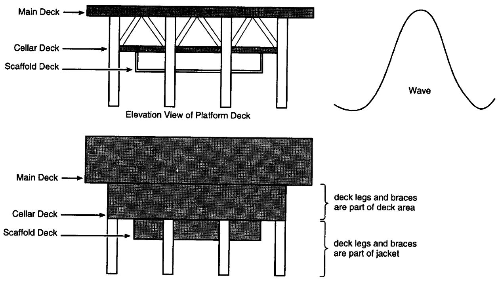  
Figure Comm. R.6.2-1a—Silhouette Area Definition

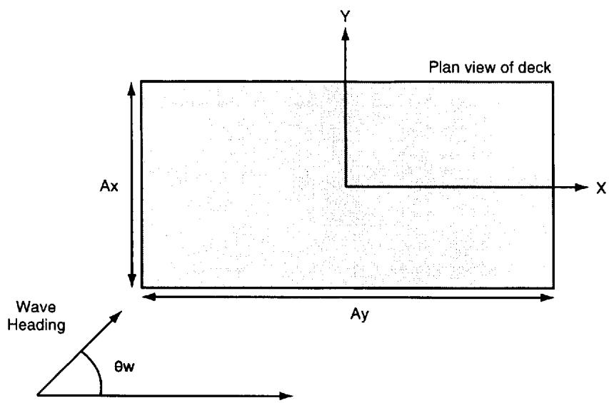  
Figure Comm. R.6.2-1b—Wave Heading and Direction Convention

Step 4: The force, $F_{\mathrm{dk}}$ , should be applied at an elevation $Z_{\mathrm{dk}}$ above the bottom of the cellar deck. $Z_{\mathrm{dk}}$ is defined as 50 percent of the distance between the lowest point of the silhouette area and the lower of the wave crest or top of the main deck.

Comm. R.6.2a.1 U.S. Gulf of Mexico Criteria

The Level L-1 criteria are based on the full population hurricanes (all hurricanes affecting the Gulf). The Level L-2 criteria are based on a combined population consisting of sudden hurricanes (subset of full population hurricanes) and winter storms. The L-3 criteria are based on winter storms.

The sudden hurricane criteria are based on hurricanes that spawn in the U.S. Gulf of Mexico. These criteria apply to manned platforms in which there may not be enough warning to evacuate. Hurricanes that spawn outside the Gulf were not included because sufficient warning to evacuate all platforms is available provided that conventional U.S. Gulf of Mexico evacuation procedures are maintained. An example of a sudden hurricane is Juan (1985). The sudden hurricane population used here provides for conservative criteria because, among the 27 hurricanes that spawned in the Gulf during 1900-1989, platforms would have been evacuated in almost all cases.

COMM. R.7 STRUCTURAL ANALYSIS FOR ASSESSMENT

Comm. R.7.1 General

Structural evaluation is intended to be performed in three consecutive levels of increasing complexity. If a structure fails the screening or first level, it should be analyzed using

Table Comm. R.6.2-1—Drag Coefficient, $C_{a}$ , for Wave/Current Platform Deck   

| Deck Type | CdEnd-on and Broadside | Cd, Diagonal (45°) |
| --- | --- | --- |
| Heavily equipped (solid) | 2.5 | 1.9 |
| Moderately equipped | 2.0 | 1.5 |
| Bare (no equipment) | 1.6 | 1.2 |

the second level, and similarly for the third level. Conversely, if a structure passes screening, no further analysis is required, and similarly for the second level. The first level (screening) is comprised of the first four components of the assessment process: selection, categorization, condition assessment, and design basis checks. The second level (design-level analysis) allows recognition of the working strength of a member or joint within the elastic range using current technology. The third level (ultimate-strength analysis) recognizes the full strength of the platform structure to demonstrate adequacy and stability.

Comm. R.7.2 Design-Level Analysis Procedures Comm. R.7.2a General

It should be noted that the design-level analysis criteria provided in Section R.6 were calibrated for structures that did not have wave loading on their decks. It is therefore not conservative to consider wave loading on decks for assessments using design-level analysis. Ultimate-strength analysis is required, using the higher environmental criteria contained in Section R.6. For some wave-in-deck loading, only a linear global analysis will be necessary (see Section R.7.3a).

Comm. R.7.2b Structural Steel Design

If ongoing research is used to determine the strength of members, it should be carefully evaluated to assure its applicability to the type of member and levels of stress. For example, the use of smaller values for effective length （$K)$ factors might be appropriate for members developing large end moments and high levels of stress but might not be for lower levels of stress.

Because of availability and other nonstructural reasons, members could have steel with yield stress higher than the specified minimum yield stress. If no such data exist, tests can be used to determine the actual yield stress. Joint industry studies have indicated that higher yield stresses can be justified statistically.

Comm. R.7.2c Connections

Joints are usually assumed rigid in the global structural model. Significant redistribution of member forces can result if joint flexibility is accounted for, especially for short bracing with small length-to-depth ratios and for large leg can diameters where skirt piles are used. Joint flexibility analysis may use finite element methods, as appropriate. Steel joints can have higher strength than currently accounted for. Similarly, the evaluation of strength for grouted joints, as well as the assessment of grout stiffness and strength, may consider higher values than normally used for design.

Comm.R.7.2d Fatigue

All offshore structures, regardless of location, are subject to fatigue degradation. In many areas, fatigue is a major design consideration due to relatively high ratios of operational sea states to maximum design environmental events. In the U.S. Gulf of Mexico, however, this ratio is low. Still, fatigue effects should be taken into account.

Selection of critical areas for any Level III and/or IV inspections should preferably be based on factors such as joint and member loads, stresses, stress concentration, structural redundancy, and fatigue lives as determined by platform design.

In the U.S. Gulf of Mexico, Levels III and/or IV underwater surveys may be considered adequate if they indicate no fatigue cracks. If cracks are indicated, no further analysis is required if they are repaired. The use of analytical procedures for the evaluation of fatigue can be adequate if only a Level II survey is done.

Comm. R.7.3 Ultimate Strength Procedures

In ultimate-strength analysis more severe environmental loading is required, as noted in Section R.6; however, limited structural damage is acceptable.

Structural elements are allowed to carry loads up to their ultimate capacities and can continue to carry load after reaching those capacities, depending on their ductility and

post-elastic behavior. Such elements may exhibit signs of damage, having experienced buckling or inelastic yielding, and in this context, damage is acceptable as long as the integrity of the structure against collapse is not compromised.

Since structures do not usually develop overload stresses in most of their elements at one time, the need to perform complex ultimate-strength analyses for the whole structure might not be justified for a few overloaded elements; thus, there is a need to distinguish between local and global overloading. An efficient approach to ultimate capacity assessment is to carry it out in a stepwise procedure. First, perform a linear global analysis to determine whether nonlinearity is a local or a global problem, and then perform local or global ultimate-strength analysis as required.

Comm. R.7.3a Linear Global Analysis

This analysis is performed to indicate whether the structure has only a few or a large number of overloaded elements subject to loading past the elastic range.

Comm. R.7.3b Local Overload Considerations

Minimal elastic overstress may be analyzed as a local overload, without the need for full global inelastic analysis or the use of major mitigation measures, provided there are adequate, clearly defined alternative load paths to relieve the portion of overstress. The intent here is not to dismiss such overstress, but to demonstrate that it would be limited because of alternate load paths or because of more accurate and detailed calculations based on sound assumptions. These assumptions should consider the level of overstress as well as the importance of the member or joint to the structural stability and performance of the platform.

Should demonstration of relief for such overstress be inconclusive or inadequate, a full and detailed global inelastic analysis would be required and/or mitigation measures taken as needed.

Comm. R.7.3c Global Inelastic Analysis

For global inelastic analysis, the following applies:

1. General: It should be recognized that calculation of the ultimate strength of structural elements is a complex task and the subject of ongoing research that has neither been finalized nor fully utilized by the practicing engineering community. The effects of strength degradation due to cyclic loading and the effects of damping in both the structural elements and the supporting foundation soils should be considered. Strength increases due to soil consolidation may be used if justified.   
2. Methods of Analysis: Several methods have been proposed for ultimate-strength evaluation of structural systems. Two methods that have been widely used for offshore platform analysis are the push-over and the time domain methods.

Regardless of the method used, no further analysis is required once a structure reaches the specified extreme environmental loading, in other words, analysis up to collapse is not required.

a. Push-Over Method: This method is well suited for static loading, ductility analysis, or dynamic loading that can be reasonably represented by equivalent static loading. Examples of such loading would be waves acting on stiff structures with natural periods under three seconds, having negligible dynamic effects or ice loading that is not amplified by exciting the resonance of the structure. The structural model should recognize loss of strength and stiffness past ultimate. The analysis tracks the performance of the structure as the level of force is increased until it reaches the extreme load specified. As the load is incrementally increased, structural elements such as members, joints, or piles are checked for inelastic behavior in order to ensure proper modeling. This method has also been widely used for ductility level earthquake analysis by (a) evaluating the reserve ductility of a platform or (b) demonstrating that a platform's strength exceeds the maximum loading for the extreme earthquake events. Although cyclic and hysteretic effects cannot be explicitly modeled using this method, their effects can be recognized in the model, in much the same way that these effects are evaluated for pile head response to inelastic soil resistance.

b. Time Domain Method: This method is well suited for detailed dynamic analysis in which the cyclic loading function can be matched with the cyclic resistance-deformation behavior of the elements step by step. This method allows for explicit incorporation of nonlinear parameters such as drag and damping into the analysis model. Examples of dynamic loading would be earthquakes and waves acting on flexible structures whose fundamental period is three seconds or greater. The identification of a collapse mechanism or the confirmation that one does exist can require significant judgment using this method. Further guidance to nonlinear analysis can be found in Sections C.4 and Comm. C.4.

3. Modeling: Regardless of the method of analysis used, it is necessary to accurately model all structural elements. Before selection of element types, detailed review of the working strength analysis results is recommended to screen those elements with very high stress ratios that are expected to be overloaded. Since elements usually carry axial forces and biaxial bending moments, the element type should be selected based on the dominant stresses. Beam and column elements are commonly used, although plate elements may be appropriate in some instances. Elements can be grouped as follows:

a. Elastic Members: The majority of members are expected to have stresses well within yield and would not be expected to reach their capacity during ultimate-strength analysis. These elements should be modeled the

same as in the working strength method and tracked to ensure their stresses remain in the elastic range. Examples of such members are deck beams and girders that are controlled by gravity loading. Other examples are jacket main framing that are controlled by installation forces, conductor guide framing, secondary bracing, and appurtenances.

b. Axially Loaded Members: Axially loaded members are undamaged members with high $Kl/r$ ratios and dominated by high axial loads that are expected to reach their capacity. Examples of such members are (a) primary bracing in the horizontal and vertical frames of the jacket and (b) primary deck bracing. The strut-type element should recognize reductions in buckling and post-buckling resistance due to applied inertial or hydrodynamic transverse loads. Effects of secondary (frame-induced) moments may be ignored when this type of element is selected. Some jacket members, such as horizontals, may not carry high axial loads until after buckling or substantial loss of strength of the primary vertical frame bracing. c. Moment Resisting Members: These are undamaged members with low $Kl/r$ ratios and dominated by high bending stresses that are expected to form plastic hinges under extreme loading. Examples of such members are unbraced sections of deck and jacket legs and piles.

d. Joints: The joint model should recognize whether the joint can form a hinge or not, depending on its $D / t$ ratio and geometry, and should define its load-deformation characteristics after hinge formation. Other evaluations of joint strength may be acceptable if applicable and substantiated with appropriate documentation.

e. Damaged Elements: The type of damage encountered in platforms ranges from dents, bows, holes, tears, and cracks to severely corroded or missing members or collapsed joints. Theoretical and experimental work has been ongoing to evaluate the effects of damage on structural strength and stiffness. Some of this work is currently proprietary, and others are in the public domain. Modeling of such members should provide a conservative estimate of their strength up to and past capacity.

f. Repaired and Strengthened Elements: The types of repairs usually used on platforms include wet or hyperbaric welding, grouting, clamping, grinding, and relief of hydrostatic pressure. Grouting is used to stiffen members and joints and to preclude local buckling due to dents and holes. Grinding is commonly used to improve fatigue life and to remove cracks. Several types of clamps have been successfully used, such as friction, grouted, and long bolted clamps. Platform strengthening can be accomplished by adding lateral struts to improve the buckling capacity of primary members and by adding insert or outrigger piles to improve foundation capacity.

g. Foundations: In a detailed pile-soil interaction analysis, the soil resistance can be modeled as a set of compliant elements that resist the displacements of the pile. Such elements are normally idealized as distributed, uncoupled, nonlinear springs. In dynamic analysis, hysteretic behavior can also be significant. Recommendations for characterizing nonlinear soil springs are provided below.

- Soil strength and stiffness parameters: A profile of relevant soil properties at a site is required to characterize the soil resistance for extreme event analysis. Soil strength data are particularly important in characterizing soil resistance. In some cases, other model parameters (such as initial soil stiffness and damping) are correlated with strength values and thus can be estimated from the strength profile or other rules of thumb.   
- Lateral soil resistance modeling: A method for constructing distributed, uncoupled, nonlinear soil springs ( $p-y$ curves) is described in Section G.7. This method may be useful for monotonic loading behavior of laterally deforming piles where other site-specific data are able. Due to their empirical nature, the curves should be used with considerable caution, particularly in situations where unloading and reloading behavior is important or where large displacement response is of interest (displacements generally $>10$ percent of the pile diameter).   
- Axial soil resistance modeling: A method for constructing distributed, uncoupled, nonlinear soil springs ( $t-z$ and $q-w$ curves) for axial resistance modeling is described in Section G.7. This method may be useful for modeling the monotonic loading behavior of axially deforming piles when other site-specific data are not available.

To construct a mean axial soil resistance model, it may be appropriate to adjust the curves in Section G.7 for loading rate and cyclic loading effects, which are known to have a significant influence on behavior in some cases.

- Torsional soil resistance modeling: Distributed, uncoupled, nonlinear soil springs for torsional resistance modeling can be constructed in a manner similar to that for constructing $t-z$ curves for axial resistance. Torsion is usually a minor effect and linear resistance models are adequate in most cases.   
- Mudmats and mudline horizontal members: In an ultimate-strength analysis for a cohesive soil site, it may be appropriate to consider foundation bearing capacities provided by mudmats and mudline horizontal

members (in addition to the foundation capacity due to piling) provided (1) inspection is conducted to confirm the integrity of the mudmats and (2) inspection confirms that the soil support underneath the mudmats and horizontals has not been undermined by scour. In contrast, for design purpose, the bearing capacity due to mudmats and mudline jacket members are typically neglected.

Mudmats and mudline horizontal members may be treated as shallow foundations. Methods described in Sections G.12 to G.16 and the commentary on shallow foundations may be used to estimate their ultimate capacity and stiffness. In addition, other methods may be used in cases in which the shear strength of the soil increases with depth.

Care shall be taken in correctly modeling the interactions among the mudmats, mudline members, and pile foundation. Depending on soil conditions, the two components of foundation capacity can have very different stiffnesses.

- Effect of soil aging: For ultimate-strength analysis, aging (the increase of soil shear strength with time) has been suggested as a source of additional foundation capacity that is not accounted for in the present design methodology. However, the state-of-the-art on this subject has not been sufficiently developed to justify routine application. Any attempt to upgrade foundation capacity based on aging should be justified on a case-by-case basis.   
- As-installed pile capacity: Pile capacity should be estimated primarily based on the static design procedure described in Section G.4. However, if pile driving records (blow counts and/or instrumented measurement) are available, one-dimensional wave equation based methods may be used to estimate soil resistance to driving (SRD) and to infer an additional estimate of as-installed pile capacity.

A conductor pull test offers an alternative means for estimating the as-installed capacity of driven piles.

- Conductors: In an ultimate-strength analysis, well conductors can contribute to the lateral resistance of a platform once the jacket deflects sufficiently to close the gap between the conductor guide frames and the conductors.

Below the mudline, conductors can be modeled using appropriate $p-y$ and $t-z$ soil springs in a manner similar to piles. Above the mudline, the jacket model should realistically account for any gaps between the conductors and the guides.

COMMENTARY ON SECTION S—FIRE, BLAST, AND ACCIDENTAL LOADING

COMM.S.2 LOAD AND RESISTANCE FACTORS

The acceptance criteria in Section S is based on the premise that survival of fire, blast, and accidental loading is the prime objective of the performance check. For this reason, all resistance and load factors should be set equal to 1.0 (earthquake loads should be factored by 0.9 in accordance with C.4.2.1). Only those load conditions that could reasonably be expected to occur during these events need to be considered. For example, extreme environmental event conditions associated with a hurricane would not be expected to be coincident with a dropped object load case involving the lifting of a blowout preventer. However, a seismic check should be included for seismic zones 3, 4, and 5 (Comm. C.4.2.2 and Figure Comm. C.4.2-1), since the earthquake itself could trigger some fire or blast events.

Because of the rareness of fire, blast, and accidental loadings, their magnitudes are very difficult to estimate. Accidental events require considerable engineering judgment in defining the events and their load consequences. Applying a recommended load factor would presume some known measure of the uncertainty and bias in the judgmentally established loads. In such a case, a recommended factor could not be expected to serve as a reasonable or uniform measure of conservatism.

COMM.S.7 FIRE

Comm. S.7.1 General

The following commentary presents design guidelines and information for consideration of fire on offshore platforms.

Comm. S.7.2 Fire as a Load Condition

The treatment of fire as a load condition requires that the following be defined:

- Fire scenario.   
- Heat flow characteristics from the fire to unprotected and protected steel members.   
Properties of steel at elevated temperatures, and where applicable.   
- Properties of fire protection systems (active and passive).

The fire scenario establishes the fire type, location, geometry, and intensity. The fire type will distinguish between a hydrocarbon pool fire or a hydrocarbon jet fire. The fire's location and geometry defines the relative position of the heat source to the structural steel work, while the intensity (thermal flux, units of Btu/hr-ft² or kW/m²) defines the amount of heat emanating from the heat source.

Steelwork engulfed by the flames will be subject to a higher rate of thermal loading than steelwork that is not engulfed. The fire scenario can be identified during process hazard analyses.

The flow of heat from the fire into the structural member (by radiation, convection, and conduction) is calculated to determine the temperature of the member as a function of time. The temperature of unprotected members engulfed in flame is dominated by convection and radiation effects; whereas, the temperature of protected members engulfed in flame is dominated by the thermal conductivity of the insulating material. The amount of radiant heat arriving at the surface of a member is determined using a geometrical configuration or view factor. For engulfed members, a configuration factor of 1.0 is used.

The properties of steel (thermal and mechanical) at elevated temperatures are required. The thermal properties (specific heat, density, and thermal conductivity) are required for calculating the steel temperature. The mechanical properties (expansion coefficient, yield stress, and Young's modulus) are used to verify that the original design still meets the strength and serviceability requirements. Loads induced by thermal expansion can be significant for highly restrained members and should be considered.

Examples of the effects on the stress/strain characteristics of ASTM A-36 and A-633 Grades C and D steels at elevated temperatures are presented in Figure Comm. S.7.2-1 and Table Comm. S.7.2-1 (taken from Table 1.1 in Section FR 1 of Reference S5, Section S.11) for temperatures in the range $100^{\circ}\mathrm{C}$ to $600^{\circ}\mathrm{C}$ . Stress/strain data for temperatures in the range $650^{\circ}\mathrm{C}$ to $1000^{\circ}\mathrm{C}$ can also be found in the same reference.

The interpretation of these data to obtain representative values of temperature effects on yield strength and Young's modulus should be performed at a strain level consistent with the design approach used:

Table Comm. S.7.2-1—Yield Strength Reduction Factors for Steel at Elevated Temperatures (ASTM A-36 and A-633 Grades C and D)   

| Temp. °C | Strain | Strain | Strain | Strain |
| --- | --- | --- | --- | --- |
| Temp. °C | 0.2% | 0.5% | 1.5% | 2.0% |
| 100 | 0.940 | 0.970 | 1.000 | 1.000 |
| 150 | 0.898 | 0.959 | 1.000 | 1.000 |
| 200 | 0.847 | 0.946 | 1.000 | 1.000 |
| 250 | 0.769 | 0.884 | 1.000 | 1.000 |
| 300 | 0.653 | 0.854 | 1.000 | 1.000 |
| 350 | 0.626 | 0.826 | 0.968 | 1.000 |
| 400 | 0.600 | 0.798 | 0.956 | 0.971 |
| 450 | 0.531 | 0.721 | 0.898 | 0.934 |
| 500 | 0.467 | 0.622 | 0.756 | 0.776 |
| 550 | 0.368 | 0.492 | 0.612 | 0.627 |
| 600 | 0.265 | 0.378 | 0.460 | 0.474 |

- For a design approach that does not permit some permanent set in the steelwork after the fire load condition has been removed, a strain of 0.2 percent should be assumed.   
- For a design approach that allows some permanent set in the steelwork after the fire load condition has been removed, higher values of strain may be appropriate (0.5 percent to 1.5 percent).

At temperatures above $600^{\circ}\mathrm{C}$ (1100°F), the creep behavior of steel can be significant and should be considered.

Comm. S.7.3 Design for Fire

The treatment of fire as a load condition may be addressed using one of the following approaches:

- Zone method.   
- Linear Elastic method, for example, a working stress code check.   
- Elastic-plastic method, for example, a progressive collapse analysis.

The application of these three methods with respect to the maximum allowable temperature of steel is presented in Figure Comm. S.7.3-1. The data presented in Figure Comm. S.7.3-1 are extracted from Table Comm. S.7.2-1 at 0.2 percent strain. Although a maximum temperature of $600^{\circ}\mathrm{C}$ is presented in Figure Comm. S.7.3-1, steel temperatures in excess of this may be used in a time-dependent elastic-plastic analysis. Such an analysis should include the effects of creep and be able to accommodate large deflections and large strains.

The zone method of design assigns a maximum allowable temperature that can develop in a steel member without reference to the stress level in the member prior to the fire. The maximum allowable temperature is extracted from Table Comm. S.7.2-1 by selecting those steel temperatures that correspond to yield strength reduction factor of 0.6 and are presented in Table Comm. S.7.3-1. The fundamental assumption behind this method is that a member utilization ratio will remain unchanged for the fire load condition if the resistance factor is set to 1.0, but the yield stress used to calculate the resistance is subject to a reduction factor of 0.6.

This assumption is valid when the nonlinear stress/strain characteristics of the steel can be linearized such that the yield strength reduction factor is matched by the reduction in Young's modulus (as for 0.2 percent strain). With a matched reduction in both yield strength and Young's modulus, the governing design condition (strength or stability) will be unaffected. However, the use of maximum allowable steel temperatures that correspond to higher strain levels require that the stress/strain characteristics be linearized at higher strain levels, thus, the reduction in Young's modulus will exceed the reduction in yield strength. With an unmatched reduction in both yield strength and Young's

Table Comm. S.7.3-1—Maximum Allowable Steel Temperature as a Function of Strain for Use With the Zone Method   

| Strain (%) | Maximum Allowable Temperature of Steel | Maximum Allowable Temperature of Steel |
| --- | --- | --- |
| Strain (%) | °C | °F |
| 0.2 | 400 | 752 |
| 0.5 | 508 | 946 |
| 1.5 | 554 | 1029 |
| 2.0 | 559 | 1038 |

Note: Allowable temperatures calculated using linear interpolation of the data presented in Table Comm. S.7.2-1.

modulus, the governing design condition may be affected and thus the zone method may not be applicable.

For the linear elastic method, a maximum allowable temperature in a steel member is assigned based on the stress level in the member prior to the fire, such that as the temperature increases the member utilization ratio (UR, herein defined as the ratio of the unfactored internal load to the unfactored resistance) remains below 1.00, i.e., the member continues to behave elastically. For those members that do not suffer a buckling failure, the allowable stress should be such that the extreme fibers on the cross-section are at yield. This yield stress should correspond to the average core temperature of the member. For example, the maximum allowable temperature in a steel member as a function of utilization ratio is presented in Table Comm. S.7.3-2 for a 0.2 percent strain limit.

As discussed for the zone method above, a strain limit greater than 0.2 percent could require that the stress/strain characteristics be linearized at higher strain levels, thus the reduction in Young's modulus will exceed the reduction in yield strength. With an unmatched reduction in both yield strength and Young's modulus, the governing design condition could be affected and consequently the linear elastic method might not be applicable.

For the elastic-plastic method, a maximum allowable temperature in a steel member is assigned based on the stress level in the member prior to the fire such that, as the temperature increases, the member utilization ratio could go

Table Comm. S.7.3-2—Maximum Allowable Steel Temperature as a Function of Utilization Ratio (UR)   

| Maximum Member Temperature | Maximum Member Temperature | Yield Strength Reduction Factor at Max. Member Temperature | Member UR at 20°C to Give UR = 1.00 at Max. Member Temperature |
| --- | --- | --- | --- |
| °C | °F | Yield Strength Reduction Factor at Max. Member Temperature | Member UR at 20°C to Give UR = 1.00 at Max. Member Temperature |
| 400 | 752 | 0.60 | 1.00 |
| 450 | 842 | 0.53 | 0.88 |
| 500 | 932 | 0.47 | 0.78 |
| 550 | 1022 | 0.37 | 0.62 |
| 600 | 1112 | 0.27 | 0.45 |

above 1.00, that is, the member behavior is elastic-plastic. A nonlinear analysis is performed to verify that the structure will not collapse and will still meet the serviceability criteria.

Regardless of the design method, the linearization of the nonlinear stress strain relationship of steel at elevated temperatures can be achieved by the selection of a representative value of strain. A value of 0.2 percent is commonly used and has the benefit of giving a matched reduction in yield strength and Young's modulus but has the disadvantage of limiting the allowable temperature of the steel to $400^{\circ}\mathrm{C}$ . Selection of a higher value of strain will result in a higher allowable temperature but could also result in an unmatched reduction in yield strength and Young's modulus.

An example is presented in Figure Comm. S.7.3-2 where the stress/strain relationship of steel at $550^{\circ}\mathrm{C}$ is linearized at two different strain levels.

For the choice labeled A on the figure, both yield strength and Young's modulus are linearized at 1.4 percent

strain, which is conservative for all stress strain combinations. However, while yield strength has only reduced by a factor of 0.60, Young's modulus has reduced by a factor of $0.90 (= 0.6 \times 0.2 / 1.4)$ ; thus, the reductions are unmatched, and the load condition that governs design (strength or stability) will be affected.

For choice B, yield strength is linearized at 1.4 percent strain, and Young's modulus is linearized at 0.2 percent strain. The reductions in yield strength and Young's modulus are both artificially maintained at 0.6 so that the load condition that governs design (strength or stability) is not affected. However, this choice of linearization is not conservative for all stress strain combinations (see Figure Comm. S.7.3-2).

The linearization of the nonlinear stress/strain relationship of steel at elevated temperatures will not be necessary for those elastic-plastic analysis programs that permit temperature dependent stress/strain curves to be input.

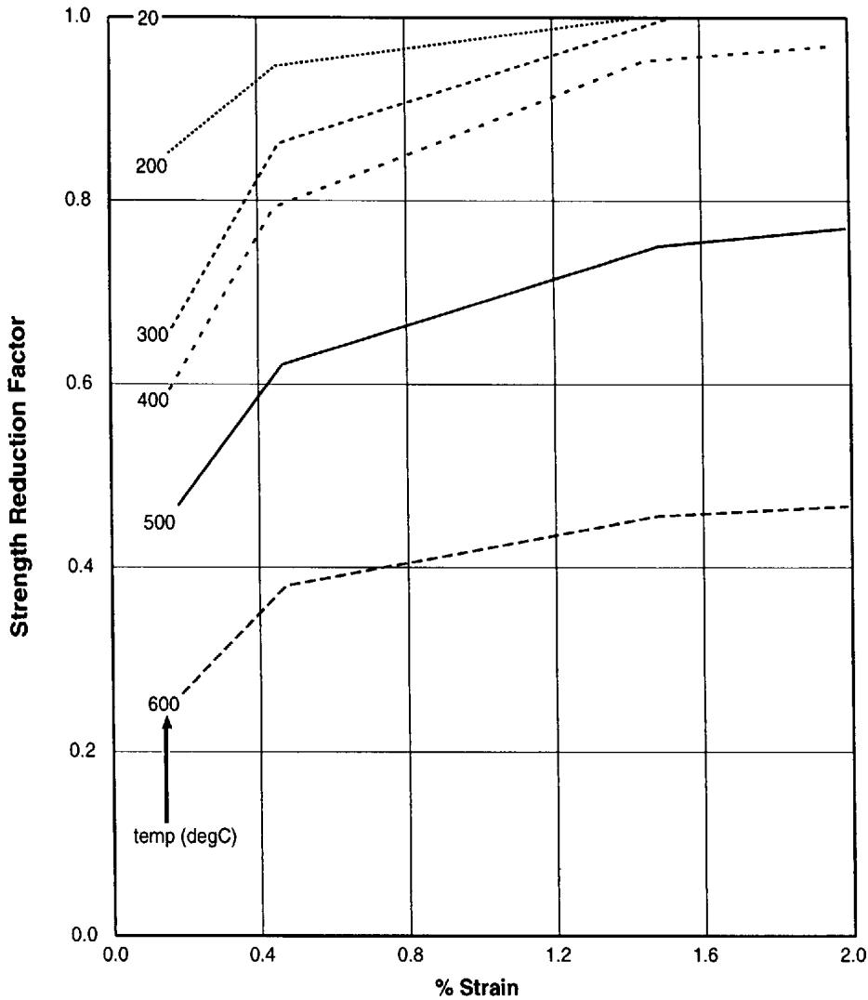  
Figure Comm. S.7.2-1—Strength Reduction Factors for Steel at Elevated Temperatures [R5]

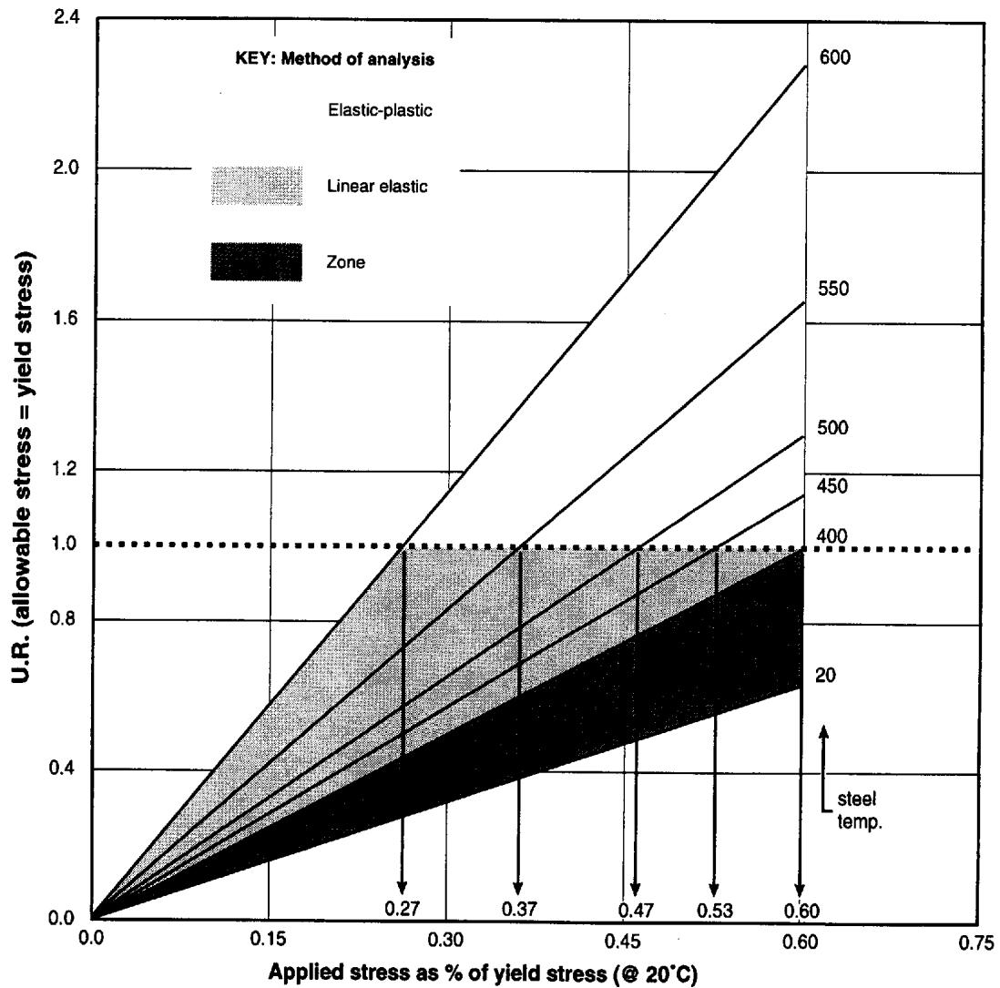  
Note: Strength reduction factors for steel linearized at $0.2\%$ strain.   
Figure Comm. S.7.3-1—Maximum Allowable Temperature of Steel as a Function of Analysis Method

Comm. S.7.4 Fire Mitigation

A well-designed and maintained detection, warning, and shutdown system will provide considerable protection to the structure. However, in the event that fire does occur, active or passive fire protection systems may be required to ensure that the maximum allowable member temperatures discussed in Comm. S.7.3 are not exceeded for a designated period. They may also serve to prevent escalation of the fire. The designated period of protection is based on either the fire's expected duration or the required evacuation period.

Passive fire protection materials (PFP) comprise various forms of fire resistant insulation products that are used either to envelope individual structural members or to form

fire walls that contain or exclude fire from compartments, escape routes, and safe areas. Ratings for different types of fire wall are presented in Table Comm. S.7.4-1.

Active fire protection (AFP) may be provided by water deluge, foam, and, in some instances, by fire-suppressing gas that is delivered to the site of the fire by dedicated equipment preinstalled for that purpose.

COMM.S.8 BLAST

Comm. S.8.1 General

The following commentary presents design guidelines and information for consideration of blast events on offshore platforms.

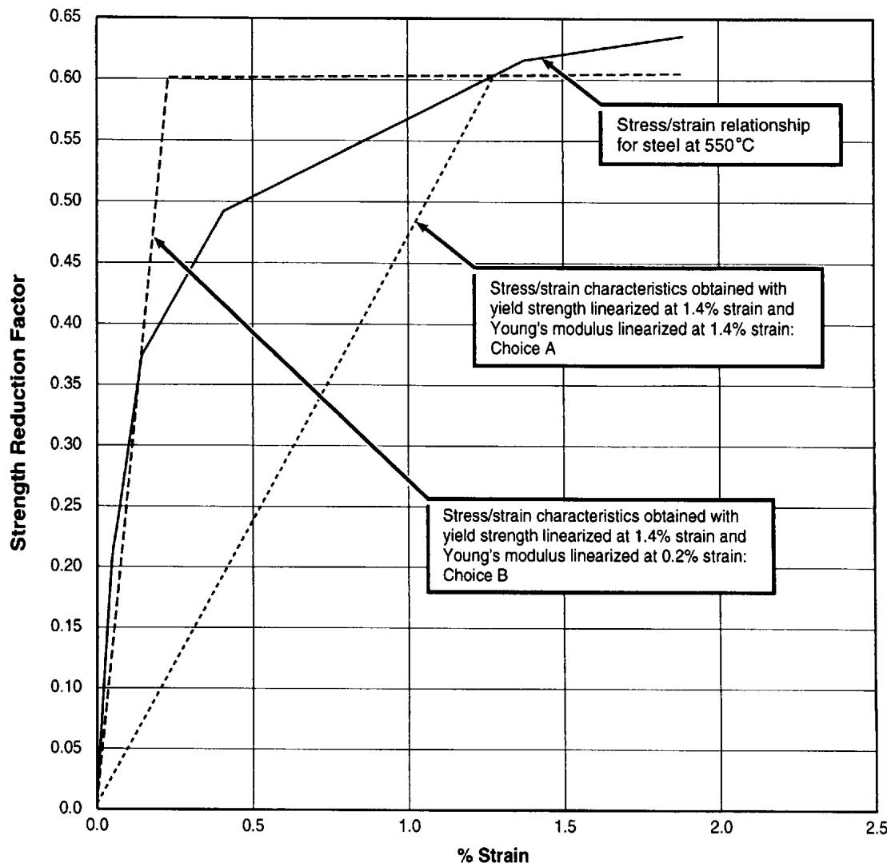  
Figure Comm. S.7.3-2--Effect of Choice of Strain in the Linearization of the Stress/Strain Characteristics of Steel at Elevated Temperatures

Comm. S.8.2 Blast Loading

A blast scenario can be developed as part of the process hazard analysis. The blast scenario establishes the makeup and size of the vapor cloud and the ignition source for the area being evaluated. The blast overpressures in a platform can vary from near zero on a small, open platform to more than 2 bar (1 bar = 14.7 pounds per square inch) in an enclosed or congested installation.

There are no simple hand-calculation methods for calculating explosion pressures for offshore structures. The equations that have been developed for other applications do not account for the significant amount of turbulence that is generated as the flame front passes through equipment. As a result, these methods significantly underpredict the blast pressures. Because of the complexity in predicting blast

loads, the pressure-time curves should be generated by an expert in this field.

See Section 3.3.2, Reference S5, for various types of explosion models that are available for predicting blast loading.

The loading generated by a blast depends on many factors, such as the type and volume of hydrocarbon released, the amount of congestion in a module, the amount of confinement, the amount of venting available, and the amount of module congestion caused by equipment blockage. Blast loading also depends on mitigation efforts such as water spray. Good natural venting will help reduce the chance of a major explosion.

A blast can cause two types of loading as discussed below. Both should be considered when designing the topsides to resist explosions. Loadings calculated as prescribed below should not be factored, as noted in Section S.1.

Table Comm. S.7.4-1—Summary of Fire Ratings and Performance for Fire Walls   

| Classification | Time Required for Stability and Integrity Performance to be Maintained (Minutes) | Time Required for Insulation Performance to be Maintained (Minutes) |
| --- | --- | --- |
| H120 | 120 | 120 |
| H60 | 120 | 60 |
| H0 | 120 | 0 |
| A60 | 60 | 60 |
| A30 | 60 | 30 |
| A15 | 60 | 15 |
| A0 | 60 | 0 |
| B15 | 30 | 15 |
| B0 | 30 | 0 |

Note: Maintaining stability and integrity requires that the passage of smoke and flame is prevented and the temperature of load bearing components should not exceed $400^{\circ}\mathrm{C}$ . Maintaining insulation performance requires that the temperature rise of the unexposed face is limited to $140^{\circ}\mathrm{C}$ for the specified period.

Overpressure: Overpressure loading results from increases in pressure due to expanding combustion products. This loading is characterized by a pressure-time curve (see Figure Comm. S.8.2-1). Overpressure is likely to govern the design of structures such as blast walls and floor/roof systems. When idealizing the pressure-time curve, the important characteristics must be maintained. These characteristics are rate of rise, peak overpressure, and area under the curve. For dynamic or quasi-static loading, it may be necessary to include the negative pressure portion of the curve.

Drag Loading: Drag loading is caused by blast-generated wind. The drag loading is a function of gas velocity squared, gas density, coefficient of drag, and area of the object being analyzed. Critical piping, equipment, and other items exposed to the blast wind should be designed to resist the predicted drag loads.

In addition to the blast loads, a best estimate of actual dead, live, and storage loads should be applied to the structure. Environmental loads may be neglected in a blast analysis. Any mass that is associated with the in-place loads should be included in a dynamic analysis.

Comm. S.8.3 Structural Resistance

The purpose of this section is to give guidance on what should be considered when analyzing a structure for blast loads and what methods are appropriate. The main acceptance criteria, strength, and deformation limits are as follows:

a. Strength Limit: Where strength governs design, failure is defined to occur when the unfactored design load or load effects exceed the unfactored design strength. Section 3.5.4 of Reference S5 listed in Section S.11 gives more details on this topic.   
b. Deformation Limit: Permanent deformation may be an essential feature of the design. In this case, it is required to demonstrate the following:

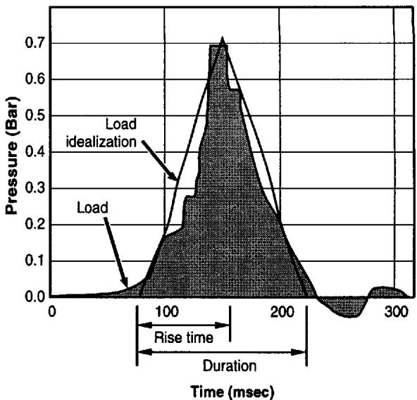  
Figure Comm. S.8.2-1—Example Pressure Time Curve

1. No part of the structure impinges on critical operational equipment.   
2. The deformations do not cause collapse of any part of the structure that supports the safe area, escape routes, and embarkation points within the required endurance period. A check should be performed to ensure that integrity is maintained if a subsequent fire occurs.

Deformation limits may be based on a maximum allowable strain or an absolute displacement as discussed in items c and d.

c. Strain Limits: Most structural steels used offshore have a minimum strain capacity of approximately 20 percent at low strain rates. They usually have sufficient toughness against brittle fracture not to limit strain capacity significantly at the high strain rates associated with blast response for nominal Gulf of Mexico temperature ranges.

Recommended strain limits for different types of loading are as follows:

| Type of Loading | Strain Limit |
| --- | --- |
| Tension | 5% |
| Bending or compression |  |
| Plastic sections | 5% |
| Compact sections | 3% |
| Semi-compact sections | 1% |
| Other sections | < yield strain |

The strain limits just cited assume that lateral torsional buckling is prevented. Reductions in these values could be required for cold weather applications or for steel that has low fracture toughness.

d. Absolute Limits: Absolute strain limits are adopted where there is a risk of a deforming element striking some

component, usually process or emergency equipment or key structural members. For further information on deformation limits, see Section 3.5.5 of Reference S5 listed in Section S.11.

Comm. S.8.4 Determination of Yield Point

For all methods of analysis, it is necessary to determine the relationship between the deflection and the structural resistance. For most analyses, determination of the yield point is essential.

Actual yield stress, usually higher than the minimum specified, should be used in the analysis. Strain rates and strain hardening effects should be included in determining yield stress and general material behavior.

If maximum reaction forces are required, it is necessary to design using an upper bound yield stress. If maximum deflections are required, the design should use a lower bound yield stress.

Comm. S.8.5 Methods of Analysis

The type of structural analysis performed should be based on the duration of the blast loading relative to the natural period of the structure. Low overpressures could allow a linear-elastic analysis with load factors to account for dynamic response. High overpressures could lead to more detailed analyses incorporating both material and geometric nonlinearities. The complexity of the structure being analyzed will determine if a single or multiple degree of freedom analysis is required:

a. Static Analysis: Where loads are quasi-static (that is, load duration long relative to the structure's natural period), static-elastic or static-plastic analysis methods may be used. The peak pressure should be used to define the loading.   
b. Dynamic Analysis: Where load duration is near the structure's natural period, a linear or nonlinear dynamic analysis should be performed. Simplified methods using idealized pressure-time histories may be used to calculate dynamic load factors by which static loads can be scaled to simulate the effects of inertia and rapidly applied loads. The actual pressure-time curve can be applied to the structure to more accurately model the effects of the blast on the structure.

Comm. S.8.6 Blast Mitigation

The blast effects can generally be minimized by making the vent area as large as possible; making sure the vent-area is well distributed; concentrating on the layout, size, and location of internal equipment; and by using blast barriers. Active suppressant/mitigation systems are being researched and could be used to minimize blast effects in the future.

To minimize blast pressures, vent areas should be located as close as possible to likely ignition sources. It is also desirable to keep equipment, piping, cable trays, and so

forth, away from vent areas to minimize the drag loads on these items and to fully use the vent area provided. Blast relief panels and louvers can be used to provide extra venting during an explosion. Relief panels should be designed to open rapidly at very low pressures in order to be effective in reducing the overpressures. Although the pressures needed to open the relief panels are best kept low for relief of blast pressures, they must not be so low as to allow wind to blow open the panels, for example, 0.02 bar (40 pounds per square inch). (Note that wind pressures are at least an order of magnitude lower than blast pressures.)

Blast walls can be used to separate parts of a platform, so an explosion within one area will not affect adjacent areas. This approach requires that the blast walls withstand the design overpressures without being breached. Failure of the blast wall could generate secondary projectiles and result in possible escalation. Blast walls generally double as firewalls and should therefore maintain integrity after the explosion. Any passive fire protection attached to the wall should function as intended after the blast, or loss of such fireproofing should be accounted for in the design.

COMM.S.9 FIRE AND BLAST INTERACTION

Comm. S.9.1 General

In many situations, there are conflicts that arise between fire and blast engineering. For example, to resist a fire, the structure could be segregated into small zones using firewalls to contain the fire. However, this segregation could result in an increase of overpressure if an explosion were to occur. To reduce blast overpressures the confinement should be reduced, which requires open modules with unobstructed access to the outside. This creates a direct conflict with the fire containment scheme. These conflicts need to be considered when designing the topsides.

Fire and blast assessments should be performed together and the effects of one on the other carefully analyzed. Usually the explosion occurs first and is followed by a fire. However, it is possible that a fire could be initiated and then cause an explosion. The iteration process required between the fire and blast assessment is shown in Figure S.3-1. Fire and blast assessments should demonstrate that the escape routes and safe areas survive the fire and blast scenarios.

The following are practical considerations that should be considered when designing a structure to resist fire and blast loads.

Comm. S.9.2 Deck Plating

Mobilizing membrane behavior in a deck will generally require that substantial stiffening be provided at the beam support locations to prevent translation, which could be impractical. Deck plating can impose lateral forces during fire and blast loadings rather than restraint or deck structural

members. Care should be taken in structural modeling of the deck plate.

In general, the deck should be analyzed as a series of beams. The effective width of deck plate can affect the calculation of deck natural period and should be included. Plated decks may generally be allowed to deform plastically in the out-of-plane direction, provided that the integrity of their primary support structure is ensured.

Comm. S.9.3 Blast and Fire Walls

Designs should allow as large a displacement as possible at mid-span, however, note the following:

1. Fire protection should be able to maintain integrity at the required strain.   
2. Member shortening under large lateral displacements could impose severe loads on top and bottom connections.

Piping, electrical, or HVAC penetrations should be located as near the top or bottom of the wall as possible.

Comm. S.9.4 Beams

Members acting primarily in bending can also experience significant axial loads. These axial loads can affect the strength and stiffness of the structural element. The additional bending moment caused as a result of the axial load and lateral deflection needs to be considered in either elastic or plastic analyses.

Axial restraints can result in a significant axial force caused by transverse loads being partially carried by membrane action. The effects of these loads on the surrounding structure should be taken into account.

Both local and overall beam stability need to be considered when designing for blast loading. When considering lateral buckling, it is important that compression flanges be supported laterally. An upward load on a roof beam will put a normally unsupported bottom flange in compression.

Comm. S.9.5 Structural Connections

Connections should be assessed for their ability to develop their plastic capacity. Note that blast loadings may act in reverse direction from the normal design loadings. Dynamic loading causes high strain rates which, if coupled with stress concentrations, could cause fracture.

Comm. S.9.6 Slender Members

Slender members are prone to buckle prematurely during fire loading. If used, suitable lateral and torsional restraint should be provided. Note that the classification of members and parts of members as slender could be affected by the reduced Young's modulus, $E$ .

Comm. S.9.7 Pipe/Vessel Supports

Pipe and vessel supports can attract large lateral loads due to blast wind and/or thermal expansion of the supported pipes, and so forth. Failed supports could load pipework and flanges with a risk of damage escalation. Vessel supports should remain intact at least until process blowdown is complete.

Stringers to which equipment is attached can have significantly different natural periods than the surrounding structure. Their dynamic response could, therefore, need to be assessed separately.

COMM.S.10 ACCIDENTAL LOADING

Comm. S.10.1 General

The following commentary presents general guidance and information for consideration of vessel collision.

Comm. S.10.2 Vessel Collision

All exposed elements at risk in the collision zone of an installation should be assessed for accidental vessel impact during normal operations.

The collision zone is the area on any side of the platform that a vessel could impact in an accidental situation during normal operations. The vertical height of the collision zone should be determined from considerations of vessel draft, operational wave height, and tidal elevation.

Elements carrying substantial dead load (such as knee braces), except for platform legs and piles, should not be located in the collision zone. If such elements are located in the collision zone, they should be assessed for vessel impact.

Comm. S.10.2a Impact Energy

The kinetic energy of a vessel can be calculated using Equation Comm. S.10.2-1.

$$E = 0. 5 a m v^{2} \tag{C.S.10.2-1}$$

Where:

$E =$ the kinetic energy of the vessel.   
$a =$ added mass factor   
$= 1.4$ for broadside collision   
$= 1.1$ for bow/stern collision.

$m =$ vessel mass.

$\nu =$ velocity of vessel at impact.

The added mass coefficients shown are based on a ship or boat shape hull.

For platforms in mild environments and reasonably close to their base of supply, the following minimum requirements should be used, unless other criteria can be demonstrated:

Vessel mass $= 1,000$ metric tons (1,100 short tons).

Impact velocity $= 0.5$ meters/second (1.64 feet/second).

The 1,000-metric-ton vessel is chosen to represent a typical 60-meter supply vessel in the U.S. Gulf of Mexico.

For deeper and more remote locations, the supply vessel mass and impact velocity could be larger and, therefore, should be reviewed and increased where necessary. Also, in shallow areas, it might be possible to reduce this criteria where access to the platform is limited to small workboats.

Comm. S.10.2b Energy Absorption

An offshore structure will absorb energy primarily from the following [S6]:

a. Localized plastic deformation (that is, denting) of the tubular wall.

b. Elastic/plastic bending of the member.

c. Elastic/plastic elongation of the member.

d. Fending device, if fitted.

e. Global platform deformation (that is, sway).

f. Ship deformation and/or rotation.

In general, resistance to vessel impact is dependent upon the interaction of member denting and member bending. Platform global deformation may be conservatively ignored, however; for platforms of a compliant nature, it could be advantageous to include the effects of global deformation.

Comm. S.10.2c Damage Assessment

Two cases should be considered:

1. Impact (energy absorption and survival of platform).   
2. Postimpact (platform to meet postimpact criteria).

Primary framework should be designed and configured to absorb energy during impact and to control the consequences of damage after impact. Some permanent deformation of members may be allowable following an impact.

The platform should retain sufficient residual strength after impact to withstand the one-year environmental storm loads in addition to normal operating loads. Special attention should be given to defensible representation of actual stiffness of damaged members or joints in the postimpact assessment. Damaged members could be considered totally ineffective; however, their wave areas should still be modeled in the analyses.

Where adequate energy absorption can be calculated for individual members, further checking is not required. In cases where very stiff members (grouted legs or members) cause the main energy absorption to be in the vessel, supporting braces for the member, joints at each end of the member, and adjacent framing members should be checked for structural integrity resulting from the impact loads.

Bracing Members: Several research studies have been performed to evaluate the force required to locally damage tubular members. Experimental test results reported in Energy Absorption During Ship on Offshore Steel Structures by G. Foss and G. Edvardsen [S6] led to the relationship between force and dent depth as follows:

$$P_{\mathrm{d}} = 15 M_{\mathrm{p}} (D / t)^{1 / 2} (X / R)^{1 / 2} \quad (\mathrm{C . S . 10 . 2 - 2})$$

Where:

$P_{\mathrm{d}} =$ the denting force

$M_{\mathbf{p}} =$ the plastic moment capacity of the tube

$= F_{\mathrm{y}}t^{2} / 4$ with $F_{\mathrm{y}}$ being the yield strength.

$D, R =$ the diameter and radius of the tube, respectively.

$t =$ the wall thickness.

$X =$ the dent depth.

Alternatively, the relationship reported in References S8 and S9 is as follows:

$$P_{\mathrm{d}} = 40 F_{\mathrm{y}} \mathrm{t}^{2} (X / D)^{1 / 2} \tag{C.S.10.2-3}$$

The energy used in creating the dent $E_{\mathrm{d}}$ is the integral of the force applied over the distance or the following:

$$E_{d} = \int_{0}^{x} P_{d} d x \tag{C.S.10.2-4}$$

Combining Equations C. S.10.2-2 and C. S.10.2-4 yields the following:

$$E_{\mathrm{d}} = 14. 14 M_{\mathrm{p}} X^{3 / 2} / \mathrm{t}^{1 / 2} \tag{C.S.10.2-5}$$

Substitution of $\mathbf{M}_{\mathbf{p}}$ yields the following:

$$E_{\mathrm{d}} = 3. 54 F_{\mathrm{y}} (t X)^{3 / 2} \tag{C.S.10.2-6}$$

And introducing the relationship $X = D / B$ to solve for various $D / t$ ratios yields the following:

$$E_{\mathrm{d}} = 3. 54 F_{\mathrm{y}} (t D / B)^{3 / 2} \tag{C.S.10.2-7}$$

Where:

$B =$ brace diameter/dent depth.

The energy required to cause a dent of limited depth may be equated with the kinetic energy from the vessel impact. Table Comm. S.10.2-1 lists required tubular thickness of various diameters for $B = 8$ , 6, and 4 (corresponding to dents of 12.5, 16.7 and 25 percent of the member diameter). Values have been tabulated for $F_{y} = 240$ and $345 \mathrm{MPa}$ (35 and 50 ksi). If the dent should be limited to $D / 8$ ( $B = 8$ ), then, from Table Comm. S.10.2-1, the required wall thickness for a 1.0-meter (36-inch) diameter $345 \mathrm{MPa}$ (50 ksi) tubular is 25 millimeters (1.0 inches).

Note that for small diameters, the required thicknesses become quite large resulting in low $D / t$ ratios. Much of the test data falls in the $D / t$ region of 30 to 60, and projection of the results outside of these ranges should be considered with caution.

Forces developed from Equation C. S.10.2-2 applied to horizontal and vertical diagonal members commonly found in offshore jackets indicate that in most situations these members would experience plastic deformation at the member ends before the full denting force would be reached. Because of this, the designer should consider the relative trade-offs between increasing the wall thickness and diameter so that the brace will be locally damaged rather than entirely destroyed.

In most normal operating conditions, the loss of a brace in a redundant structure at the waterline is not critical provided the leg to which the brace was attached remains relatively undamaged. Other members connecting to the same joint need to withstand forces resulting from the impact. Where other brace members significantly overlap the impacted member at the joint, the integrity of the connection should be evaluated.

For structures with limited redundancy, such as minimal structures, the loss of a waterline brace could lead to collapse. Also, some decks have critical knee braces in the vessel impact zone. These braces should be designed to withstand vessel impact if the loss of the supported structure is unacceptable.

Energy absorption in jacket leg members occurs mainly through localized denting of the tubular shell and elastic/ plastic bending of the member.

Denting should be minimized, to ensure sufficient member capacity for the platform postimpact considerations. This is accomplished through the selection of appropriate $D/t$ ratios for jacket legs. Using the U.S. Gulf of Mexico energy level for broadside vessel impacts, dent depths for various $D/t$ ratios may be computed, and the axial capacity of the damaged member can be then compared to the

undamaged case. Figures Comm. S.10.2-1 through S.10.2-4 present the percent reduction in axial capacity of dented legs for both straight and bent (L/360) conditions for 240 and $345\mathrm{MPa}$ (35 and $50\mathrm{ksi}$ ) yield strengths.

Comm. S.10.2d Fendering

Fendering devices may be used to protect platform appurtenances, such as risers, external conductors, and the like, or parts of the structure. Fendering should be designed to withstand vessel impact without becoming detached from the structure.

Clearances between fendering and protected elements of the installation should be adequate to ensure integrity of protection throughout the energy absorption process of vessel impact.

Supports for fendering systems should be designed to avoid concentrating loads on primary structural members (e.g., legs).

Comm. S.10.2e Risers and Conductors

Evaluation of risers and conductors is essential when such elements are external to the structure. Clear warnings to vessels are suggested for those sides of the platform where such elements are located and not protected by some form of fendering.

Table Comm. S.10.2-1—Required Tubular Thickness to Locally Absorb Vessel Impact Broadside Vessel Impact Condition   

|  | Fy=345 MPa (50 ksi) | Fy=345 MPa (50 ksi) | Fy=345 MPa (50 ksi) | Fy=240 MPa (35 ksi) | Fy=240 MPa (35 ksi) | Fy=240 MPa (35 ksi) |
| --- | --- | --- | --- | --- | --- | --- |
|  | B*=8.0 | 6.0 | 4.0 | 8.0 | 6.0 | 4.0 |
| Diameter (inch) | Wall Thickness, t (inch) | Wall Thickness, t (inch) | Wall Thickness, t (inch) | Wall Thickness, t (inch) | Wall Thickness, t (inch) | Wall Thickness, t (inch) |
| 12.0 | 2.834 | 2.125 | 1.417 | 3.595 | 2.696 | 1.797 |
| 14.0 | 2.429 | 1.822 | 1.215 | 3.081 | 2.311 | 1.541 |
| 16.0 | 2.125 | 1.594 | 1.063 | 2.696 | 2.022 | 1.348 |
| 18.0 | 1.889 | 1.417 | 0.945 | 2.396 | 1.797 | 1.198 |
| 20.0 | 1.700 | 1.275 | 0.850 | 2.157 | 1.618 | 1.078 |
| 22.0 | 1.546 | 1.159 | 0.773 | 1.961 | 1.471 | 0.980 |
| 24.0 | 1.417 | 1.063 | 0.708 | 1.797 | 1.348 | 0.899 |
| 26.0 | 1.308 | 0.981 | 0.654 | 1.659 | 1.244 | 0.830 |
| 28.0 | 1.215 | 0.911 | 0.607 | 1.541 | 1.155 | 0.770 |
| 30.0 | 1.134 | 0.850 | 0.567 | 1.438 | 1.078 | 0.719 |
| 32.0 | 1.063 | 0.797 | 0.531 | 1.348 | 1.011 | 0.674 |
| 34.0 | 1.000 | 0.750 | 0.500 | 1.269 | 0.952 | 0.634 |
| 36.0 | 0.945 | 0.708 | 0.472 | 1.198 | 0.899 | 0.599 |
| 38.0 | 0.895 | 0.671 | 0.447 | 1.135 | 0.851 | 0.568 |
| 40.0 | 0.850 | 0.638 | 0.425 | 1.078 | 0.809 | 0.539 |
| 42.0 | 0.810 | 0.607 | 0.405 | 1.027 | 0.770 | 0.514 |
| 44.0 | 0.773 | 0.580 | 0.386 | 0.980 | 0.735 | 0.490 |
| 46.0 | 0.739 | 0.554 | 0.370 | 0.938 | 0.703 | 0.469 |
| 48.0 | 0.708 | 0.531 | 0.354 | 0.899 | 0.674 | 0.449 |
| 50.0 | 0.680 | 0.510 | 0.340 | 0.863 | 0.647 | 0.431 |
| 52.0 | 0.654 | 0.490 | 0.327 | 0.830 | 0.622 | 0.415 |
| 54.0 | 0.630 | 0.472 | 0.315 | 0.799 | 0.599 | 0.399 |
| 56.0 | 0.607 | 0.455 | 0.304 | 0.770 | 0.578 | 0.385 |
| 58.0 | 0.586 | 0.440 | 0.293 | 0.744 | 0.558 | 0.372 |
| 60.0 | 0.567 | 0.425 | 0.283 | 0.719 | 0.539 | 0.359 |
| 62.0 | 0.548 | 0.411 | 0.274 | 0.696 | 0.522 | 0.348 |
| 64.0 | 0.531 | 0.399 | 0.266 | 0.674 | 0.505 | 0.337 |
| 66.0 | 0.515 | 0.386 | 0.258 | 0.654 | 0.490 | 0.327 |
| 68.0 | 0.500 | 0.375 | 0.250 | 0.634 | 0.476 | 0.317 |
| 70.0 | 0.486 | 0.364 | 0.243 | 0.616 | 0.462 | 0.308 |
| 72.0 | 0.472 | 0.354 | 0.236 | 0.599 | 0.449 | 0.300 |

Note: The table lists the required wall thickness for selected values of $D$ , $B$ and $F_{y}$ based on Equation C. S.10.2-7. Values are derived assuming a broadside impact of a 1000-metric-ton vessel moving at 0.50 meters/second. All energy is assumed to be absorbed by the member.  
*Where $B =$ Diameter/X (dent depth).

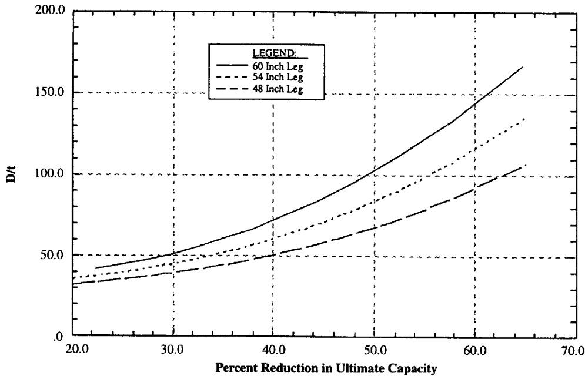  
Figure Comm. S.10.2-1—D/t Ratio Versus Reduction in Ultimate Capacity, 48, 54, and 60 Inch Legs—Straight with L=60 Feet, K=1.0, and F_y=35 ksi

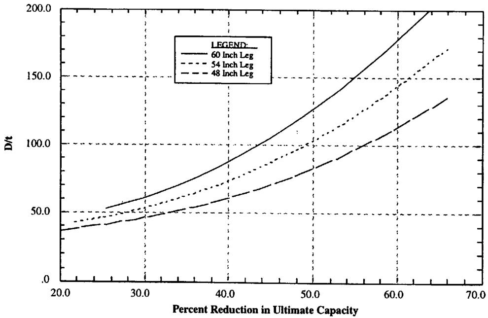  
Figure Comm. S.10.2-2—D/t Ratio Versus Reduction in Ultimate Capacity, 48, 54, and 60 Inch Legs—Straight with L=60 Feet, K=1.0, and F_y=35 ksi

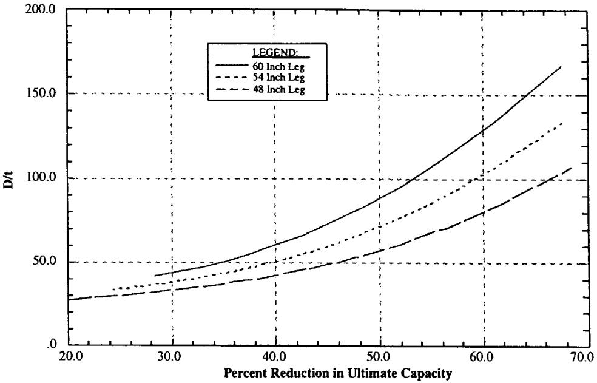  
Figure Comm. S.10.2-3—D/t Ratio Versus Reduction in Ultimate Capacity, 48, 54, and 60 Inch Legs—Bent with L=60 Feet, K=1.0, and F_y=35 ksi

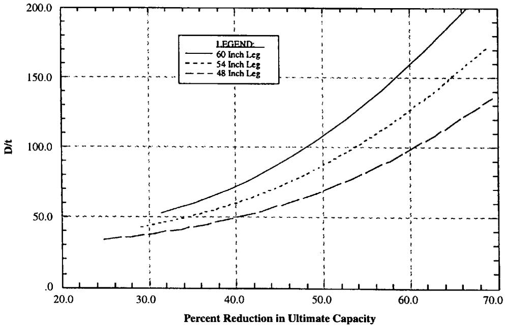  
Figure Comm. S.10.2-4—D/t Ratio Versus Reduction in Ultimate Capacity, 48, 54, and 60 Inch Legs—Bent with L=60 Feet, K=1.0, and F_y=35 ksi

Additional copies available from API Publications and Distribution: (202) 682-8375

Information about API Publications, Programs and Services is available on the World Wide Web at: http://www api.org

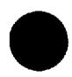

ERRATA

(OCTOBER, 1993)

Recommended Practice for Planning, Designing and Constructing Fixed Offshore Platforms — Load and Resistance Factor Design

API RECOMMENDED PRACTICE 2A-LRFD (RP 2A-LRFD)

FIRST EDITION, JULY 1, 1993

American Petroleum Institute

1220 L Street, Northwest

Washington, DC 20005

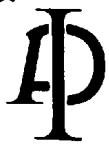

Issued by

AMERICAN PETROLEUM INSTITUTE

Production Department

FOR INFORMATION CONCERNING TECHNICAL CONTENTS OF THIS PUBLICATION CONTACT THE API PRODUCTION DEPARTMENT, 1201 MAIN STREET, SUITE 2535, DALLAS, TX 75202-3994 — (214) 748-3841. SEE BACK SIDE FOR INFORMATION CONCERNING HOW TO OBTAIN ADDITIONAL COPIES OF THIS PUBLICATION.

Users of this publication should become familiar with its scope and content. This publication is intended to supplement rather than replace individual engineering judgment.

OFFICIAL PUBLICATION

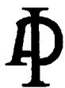

REG. U.S. PATENT OFFICE

Page 2, Table of Contents. Change A.3.7 to read:

A.3.7 Deck Elevation

Page 33, Section C.3.4.2.3 Turbulence Intensity. Change Equation C.3-8 to the following:

$$I (z) \equiv o (z) / V (1 h r, z) = \begin{array}{l} 0. 15 (z / z_{s})^{0. 125} \text{f o r} z \leq z_{s} \\ 0. 15 (z / z_{s})^{0. 275} \text{f o r} z > z_{s} \end{array} \dots \tag{C.3-8}$$

Page 52, Section D.3.2.1 Cylindrical Members. Change Equation D.3.2-1 to the following:

$$\frac{f_{\mathrm{c}}}{\phi_{\mathrm{c}} \mathrm{F}_{\mathrm{c n}}} + \frac{1}{\phi_{\mathrm{b}} \mathrm{F}_{\mathrm{b n}}} \left\{\left[ \left(1 - \frac{\mathrm{C}_{\mathrm{m y}} f_{\mathrm{b y}}}{\phi_{\mathrm{c}} \mathrm{F}_{\mathrm{e y}}}\right) \right]^{2} + \left[ \left(1 - \frac{\mathrm{C}_{\mathrm{m z}} f_{\mathrm{b z}}}{\phi_{\mathrm{c}} \mathrm{F}_{\mathrm{e z}}}\right) \right]^{2} \right\}^{0. 5} \leq 1. 0 \tag{D.3.2-1}$$

Change Equation D.3.2-3 to the following:

$$\mathbf{f}_{\mathrm{c}} <   \phi_{\mathrm{c}} \mathbf{F}_{\mathrm{x c}} \dots \tag{D.3.2-3}$$

Page 55, Section E.1 Connections of Tension and Compression Members. Add the following note after the definition of $\mathbf{F_y}$ for Equation E.3-1:

Note: The tensile strength limitation on $\mathbf{F}_y$ is intended to apply throughout Section E.

Page 83, Table I.1 Structural Steel Plates. Change information shown under Group II, Class C, to the following:   

| GROUP | CLASS | SPECIFICATION & GRADE | YIELD STRENGTH | YIELD STRENGTH | TENSILE STRENGTH | TENSILE STRENGTH |
| --- | --- | --- | --- | --- | --- | --- |
| GROUP | CLASS | SPECIFICATION & GRADE | MPa | ksi | MPa | ksi |
| II | C | ASTM A572 Grade 42 (to 2" thick)* | 290 | 42 | 415 min. | 60 min. |
| II | C | ASTM A572 Grade 50 (to 2" thick; ASTM S91 required over 1/2")* | 345 | 50 | 450 min. | 65 min. |

Page 84, Table I.2 Structural Steel Shapes. Change information shown under Group II, Class C to the following:   
Page 127, Commentary Comm.C.3.1 Strength Requirements, Fourth Paragraph, Third Sentence. Change $\mathbf{L}_2$ to $\mathbf{L}_1$ .   

| GROUP | CLASS | ASTM SPECIFICATION & GRADE | YIELD STRENGTH | YIELD STRENGTH | TENSILE STRENGTH | TENSILE STRENGTH |
| --- | --- | --- | --- | --- | --- | --- |
| GROUP | CLASS | ASTM SPECIFICATION & GRADE | MPa | ksi | MPa | ksi |
| II | C | A572 Grade 42 (to 50 mm (2 in) thick)1 | 290 | 42 | 415 min. | 60 min. |
| II | C | A572 Grade 50 (to 50 mm (2 in) thick; S91 required over 13 mm (% in) thick)1 | 345 | 50 | 450 min. | 65 min. |

Order No. 811-00211

Recommended Practice for Planning, Designing and Constructing Fixed Offshore Platforms — Load and Resistance Factor Design

API RECOMMENDED PRACTICE 2A-LRFD (RP 2A-LRFD) FIRST EDITION, JULY 1, 1993

American Petroleum Institute

1220 L Street, Northwest

Washington, DC 20005

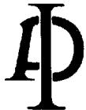

Issued by

AMERICAN PETROLEUM INSTITUTE

Production Department

FOR INFORMATION CONCERNING TECHNICAL CONTENTS OF THIS PUBLICATION CONTACT THE API PRODUCTION DEPARTMENT, 1201 MAIN STREET, SUITE 2535, DALLAS, TX 75202-3994 — (214) 748-3841. SEE BACK SIDE FOR INFORMATION CONCERNING HOW TO OBTAIN ADDITIONAL COPIES OF THIS PUBLICATION.

Users of this publication should become familiar with its scope and content. This publication is intended to supplement rather than replace individual engineering judgment.

OFFICIAL PUBLICATION

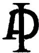

REG.U.S.PATENT OFFICE

CONTENTS

POLICY 18   
FOREWORD 19  
SEC.A-PLANNING 20

## A.1 GENERAL 20

A.1.1 Planning 20   
A.1.2 Design Criteria 20   
A.1.3 Codes and Standards 20

## A.2 PLATFORM TYPES. 20

A.2.1 Fixed Platforms. 20

A.2.1.1 Template. 20   
A.2.1.2 Tower 20   
A.2.1.3 Minimum Structures 20   
A.2.1.4 Gravity 20

A.2.2 Other Platforms 20

A.2.2.1 Guyed Tower 20   
A.2.2.2 Tension Leg Platform 20   
A.2.2.3 Compliant Platform 20   
A.2.2.4 Others 20

## A.3 OPERATIONAL CONSIDERATIONS 20

A.3.1 Function 20   
A.3.2 Location 20   
A.3.3 Orientation 20   
A.3.4 Water Depth 20   
A.3.5 Access and Auxiliary Systems 21   
A.3.6 Fire Protection 21   
A.3.7 Deck Evaluation 21   
A.3.8 Wells and Risers 21   
A.3.9 Equipment and Material Layouts 21   
A.3.10 Personnel and Material Transfer 21   
A.3.11 Spillage and Contamination 21   
A.3.12 Exposure 21

## A.4 ENVIRONMENTAL CONSIDERATIONS 21

A.4.1 General 21   
A.4.2 Winds 21   
A.4.3 Waves 21   
A.4.4 Tides 21   
A.4.5 Currents 21   
A.4.6 Marine Growth 22   
A.4.7 Floating Ice 22   
A.4.8 Other Oceanographic and Meteorological Information 22

A.4.9 Active Geologic Processes 22

A.4.9.1 General 22   
A.4.9.2 Earthquakes 22   
A.4.9.3 Faults 22   
A.4.9.4 Seafloor Instability 22   
A.4.9.5 Scour 22   
A.4.9.6 Shallow Gas 23

A.4.10 Site Investigation - Foundations 23

A.4.10.1 Objectives 23   
A.4.10.2 Seabottom Surveys 23   
A.4.10.3 Soil Investigation and Testing 23

## A.5 SELECTING THE DESIGN CONDITIONS 23
## A.6 PLATFORM REUSE 24
## A.7 REGULATIONS 24

CONTENTS (Continued)

SEC.B-DESIGN REQUIREMENTS 25

## B.1 SCOPE 25
## B.2DESIGNFORIN-PLACECONDITIONS 25
## B.3 DESIGN FOR CONSTRUCTION CONDITIONS 25
## B.4 THE STRENGTH AND STABILITY CHECK 25
## B.5 STRUCTURE ANALYSIS 25
## B.6 REDUNDANCY 25
## B.7 CORROSION PROTECTION 25
## B.8 DEFORMATION LOADS 25

SEC.C-LOADS 26

## C.1 SCOPE 26
## C.2 GRAVITY LOADS 26

C.2.1 Factored Gravity Loads 26   
C.2.2 Dead Load 1, D., 26   
C.2.3 Dead Load 2, $\mathbf{D}_2^{\prime}$ 26   
C.2.4 Live Load 1, L 26   
C.2.5 Live Load 2, L. 26   
C.2.6 Unintentional Flooding 26   
C.2.7 Position and Range of Gravity Loads 26   
C.2.8 Carry Down Factors 26   
C.2.9 AreaLoads 26

## C.3 WIND, WAVE AND CURRENT LOADS 26

C.3.1 Strength Requirements 26   
C.3.1.1 Factored Loads 26   
C.3.1.2 Extreme Wind, Wave and Current Load, W. 27   
C.3.1.3 Direction of Wind, Wave and Current 27   
C.3.1.4 Operating Wind, Wave and Current Load 27   
C.3.2 Static Wave Analysis 27   
C.3.2.1 Apparent Wave Period 27   
C.3.2.2 Two-Dimensional Wave Kinematics 27   
C.3.2.3 Wave Kinematics Factor 29   
C.3.2.4 Current Blockage Factor 29   
C.3.2.5 Combined Wave/Current Kinematics... 29   
C.3.2.6 Marine Growth 29   
C.3.2.7 Drag and Inertia Coefficients 29   
C.3.2.8 Conductor Shielding Factor 31   
C.3.2.9 Hydrodynamic Models for Appurtenances 31   
C.3.2.10 Morison Equation 31   
C.3.2.11 Global Structure Forces 32   
C.3.2.12 Local Member Design 32   
C.3.3 Extreme-Wave Dynamic Analysis 32   
C.3.3.1 Extreme Inertial Load, $\mathbf{D}_n$ 32   
C.3.3.2 Global Dynamic Wave Analysis 32   
C.3.3.2.1 Dynamic Analysis Methods... 32   
C.3.3.2.2 Design Seastate 32   
C.3.3.2.3 Fluid Force on a Member 33   
C.3.3.2.4 Mass 33   
C.3.3.2.5 Damping 33   
C.3.3.2.6 Stiffness 33   
C.3.3.3 Member Design 33   
C.3.4 Wind Force 33   
C.3.4.1 General 33

CONTENTS (Continued)

C.3.4.2 Wind Properties 33

C.3.4.2.1 Mean Profile 33   
C.3.4.2.2 GustFactor 33   
C.3.4.2.3 Turbulence Intensity 33   
C.3.4.2.4 Wind Spectra 33   
C.3.4.2.5 Spatial Coherence 34

C.3.4.3 Wind Velocity and Force Relationship ... 34   
C.3.4.4 Local Wind Force Considerations 34   
C.3.4.5 Shape Coefficients 34   
C.3.4.6 Shielding Coefficients 34   
C.3.4.7 Wind Tunnel Data 34

C.3.5 Current Force 34

C.3.5.1 Current Force Only 34   
C.3.5.2 Current Associated With Waves 34

C.3.6 Deck Clearance 34

C.3.7 Hydrodynamic Force Guidelines

for U.S. Waters 35   
C.3.7.1 General 35   
C.3.7.2 Intent 35

C.3.7.3 Guideline Design Metaean Criteria for the Gulf of Mexico, North of $27^{\circ}$

N Latitude and West of $86^{\circ}$ W Longitude 35

C.3.7.3.1 Omnidirectional Wave Height vs Water Depth 35

C.3.7.3.2 Principal Direction Associated With the Omnidirectional Wave Height 40

C.3.7.3.3 Wave Height vs Direction 40   
C.3.7.3.4 Currents Associated With the Wave Height by Direction 40   
C.3.7.3.5 Associated Wave Period 40   
C.3.7.3.6 Associated Storm Tide 40   
C.3.7.3.7 Associated Wind Speed.... 40

C.3.7.4 Guideline Design Wave, Wind, and Current Forces for the Gulf of Mexico, North of $27^{\circ}$ N Latitude

and West of $86^{\circ}$ W Longitude 40   
C.3.7.4.1 Wave Kinematics Factor 40   
C.3.7.4.2 Marine Growth 40   
C.3.7.4.3 Deck Height 40

C.3.7.5 Guideline Design Metocean Criteria for Other U.S. Waters 40

C.3.7.5.1 Waves, Currents, and Storm Tides 42   
C.3.7.5.2 Winds 42   
C.3.7.5.3 Current Profile 42   
C.3.7.5.4 Local Site Effects 42

C.3.7.6 Guideline Design Wave, Wind, and Current Forces for Other U.S. Waters... 42

C.3.7.6.1 Wave Kinematics Factor 42   
C.3.7.6.2 Marine Growth 43   
C.3.7.6.3 Deck Height 43

C.3.8 References 43   
## C.4 EARTHQUAKE LOADS 43
C.4.1 General 43

CONTENTS (Continued)

C.4.1.1 Scope 43

C.4.1.2 Evaluation of Seismic Activity 44

C.4.1.3 Evaluation for Zones of Low Seismic Activity 44

C.4.2 Strength Requirements 44

C.4.2.1 Factored Loads 44

C.4.2.2 Strength Level Earthquake, E 44

C.4.2.3Structural Modeling 44

C.4.2.4 Response Analysis 44

C.4.2.5 Response Assessment. 45

C.4.3 Ductility Requirements 45

C.4.3.1 General 45

C.4.3.2 Structures Not Requiring Ductility Analysis 45

C.4.3.3 Structures Requiring Ductility Analysis 45

C.4.4 Additional Guidelines 45

C.4.4.1 Tubular Joints 45

C.4.4.2 Deck Appurtenances and Equipment 45

FABRICATION AND INSTALLATION LOADS 46

C.5.1 General 46

C.5.2 Dynamic Effects 46

C.5.3 Load Factors 46

C.5.4 Local Effects 47

C.5.5 Lifting Forces 47

C.5.5.1 General 47

C.5.5.2 Effect of Tolerances 47

C.5.5.3 Slings, Shackles and Fittings 47

C.5.6 Loadout Forces 47

C.5.6.1 Direct Lift. 47

C.5.6.2 Horizontal Movement onto Barge 47

C.5.7 Transportation Forces 47

C.5.7.1 General 47

C.5.7.2 Environmental Criteria 47

C.5.7.3 Determination of Forces 47

C.5.7.4 Other Considerations 48

C.5.8 Launching Forces and Uprighting Forces 48

C.5.8.1 Launched Structures 48

C.5.8.2 Uprighting Structures 48

C.5.8.3 Submergence Pressures 48

C.5.9 Installation Foundation Forces 48

C.5.9.1 General 48

C.5.9.2 Environmental Conditions 48

C.5.9.3 Structure Loads 48

C.5.10 Removal Forces 48

ACCIDENTAL LOADS 48

SEC.D-CYLINDRICALMEMBERDESIGN

## D.1 GENERAL 49

## D.2 CYLINDRICAL MEMBERS UNDER TENSION, COMPRESSION, BENDING, SHEAR OR HYDROSTATIC PRESSURE 49

D.2.1 Axial Tension 49

D.2.2 Axial Compression 49

D.2.2.1 Column Buckling 49

D.2.2.2 Local Buckling 49

CONTENTS (Continued)

D.2.3 Bending 50   
D.2.4 Shear 40

D.2.4.1 Beam Shear 50   
D.2.4.2 Torsional Shear 50

D.2.5 Hydrostatic Pressure 50

D.2.5.1 Design Hydrostatic Head 50   
D.2.5.2 Hoop Buckling 50   
D.2.5.3 Ring Stiffener Design 51   
D.2.5.4 Geometric Imperfections 51

## D.3 CYLINDRICAL MEMBERS UNDER COMBINED

LOADS. 51   
D.3.1 Combined Axial Tension and Bending 51   
D.3.2 Combined Axial Compression and Bending 51

D.3.2.1 Cylindrical Members 52   
D.3.2.2 Piles 52   
D.3.2.3 Slenderness Ratio and Reduction

Factor 52

D.3.3 Combined Axial Tension, Bending and   
Hydrostatic Pressure 53   
D.3.4 Combined Axial Compression, Bending and   
Hydrostatic Pressure 53

## D.4 CONICAL TRANSITIONS

D.4.1 Axial Compression and Bending   
D.4.1.1 Geometry 53   
D.4.1.2 Local Buckling 53   
D.4.1.3 Unstiffened Cone-Cylinder Junctions 53   
D.4.1.4 Cone-Cylinder Junction Rings 54   
D.4.2 Hydrostatic Pressure   
D.4.2.1 Cone Design 54   
D.4.2.2 Intermediate Stiffening Rings 54   
D.4.2.3 Cone-Cylinder Junction Rings 54

SEC. E - CONNECTIONS

## E.1 CONNECTIONS OF TENSION AND
COMPRESSION MEMBERS 55   
## E.2 RESTRAINT AND SHRINKAGE 55
## E.3 TUBULAR JOINTS 55

E.3.1 Simple Joints 55   
E.3.1.1 Strength Check 57   
E.3.1.2 Design Practice 58   
E.3.2 Overlapping Joints 58   
E.3.3 Congested Joints 59   
E.3.4 Load Transfer Across Chords 59   
E.3.5 Other Complex Joints 59

SEC.F-FATIGUE

## F.1 FATIGUE DESIGN 61
FATIGUEANALYSIS. 61   
## F.3 S-N CURVES FOR MEMBERS AND CONNECTIONS,
EXCEPT FOR TUBULAR MEMBERS 61

## F.4 S-N CURVES FOR TUBULAR CONNECTIONS.... 63
## F.5 STRESS CONCENTRATION FACTORS 63

SEC. G - FOUNDATION DESIGN

## G.1 GENERAL 64
## G.2 PILF FOUNDATIONS 64

CONTENTS (Continued)

G.2.1 Driven Files 64   
G.2.2 Drilled and Grouted Piles 64   
G.2.3 Belled Piles 64

## G.3PILEDESIGN 65

G.3.1 Foundation Size 65   
G.3.2 Foundation Response 65   
G.3.3 Deflections and Rotations 65   
G.3.4 Foundation Capacity 65   
G.3.5 Scour 65

## G.4 PILECAPACITYFORAXIALBEARINGLOADS..65

G.4.1 Ultimate Bearing Capacity 65   
G.4.2 Skin Friction and End Bearing in

Cohesive Soils 66

G.4.3 Shaft Friction and End Bearing in   
Cohesionless Soils 66   
G.4.4 Skin Friction and End Bearing of

Grouted Piles in Rock 68

## G.5 TILE CAPACITY FOR AXIAL PULLOUT LOADS..68

## G.6 AXIALPILEPERFORMANCE 68

G.6.1 Static Axial Response of Piles 68   
G.6.2 Cyclic Axial Response of Piles 68   
G.6.3 Overall Axial Response of Piles 68

## G.7 SOIL REACTION FOR AXIALLY LOADED

PILES 69

G.7.1 General 69   
G.7.2 Axial Load Transfer (t-z) Curves 69   
G.7.3 Tip Load - Displacement Curve 69

## G.8 SOIL REACTION FOR LATERALLY LOADED

PILES 69   
G.8.1 General 69   
G.8.2 Lateral Bearing Capacity for Soft Clay.... 71   
G.8.3 Load-Deflection (p-y) Curves for Soft Clay.... 71   
G.8.4 Lateral Bearing Capacity for Stiff Clay 72   
G.8.5 Load-Deflection (p-y) Curves for Stiff Clay 72   
G.8.6 Lateral Bearing Capacity for Sand 72   
G.8.7 Load-Deflection (p-y) Curves for Sand 73

## G.9PILE GROUP ACTION 73

G.9.1 General 73   
G.9.2 Axial Behavior 73   
G.9.3 Lateral Behavior 73   
G.9.4 Pile Group Stiffness and Structure Dynamics 73

## G.10PILE WALL THICKNESS 73

G.10.1 General 73   
G.10.2 File Loads. 73   
G.10.3 Pile Design Checks 73

G.10.4 Load Check Due to Weight of Hammer

During Hammer Placement 73

G.10.5 Stresses During Driving 74   
G.10.6 Minimum Wall Thickness 74   
G.10.7 Allowance for Underdrive and Overdrive . . . 74   
G.10.8 Driving Shoe 74   
G.10.9 Driving Head 75

## G.11 LENGTH OFPILE SECTIONS 75

SHALLOW FOUNDATIONS. 75   
STABILITY OF SHALLOW FOUNDATIONS 75   
G.13.1 Shallow Foundation Capacity 75   
G.13.2 Undrained Bearing Capacity 75

CONTENTS (Continued)

G.13.3 Drained Bearing Capacity 76   
G.13.4 Sliding Stability 76   
G.13.5 Capacity of Shallow Foundations 76

## G.14STATIC DEFORMATION OF SHALLOW

FOUNDATIONS 76   
G.14.1 Short Term Deformation 76   
G.14.2 Long Term Deformation 77

## G.15 DYNAMIC BEHAVIOR OF SHALLOW

FOUNDATIONS 77

## G.16 HYDRAULIC INSTABILITY OF SHALLOW

FOUNDATIONS 77

G.16.1 Scour 77   
G.16.2 Piping 77

## G.17 INSTALLATION AND REMOVAL OF SHALLOW

FOUNDATIONS 77

SEC. H - STRUCTURAL COMPONENTS AND SYSTEMS

## H.1 SUPERSTRUCTURE DESIGN 78

H.1.1 Deck Model for Jacket Design 78   
H.1.2 Deck Design Model 78   
H.1.3 Deck Design Load Factors 78   
H.1.4 Other Deck Design Considerations 78

## H.2 NONTUBULAR STRUCTURAL SHAPES

DESIGN 78   
H.2.1 General 78   
H.2.2 Resistance Factors 78   
H.2.3 Plate Girder Design 78

## H.3 CRANE SUPPORTING STRUCTURE

H.3.1 Static Design 79   
H.3.2 Dynamic Design 79   
H.3.3 Fatigue Design 79

## H.4 GROUTED FILE-TO-STRUCTURE

CONNECTIONS 79

H.4.1 General 79   
H.4.2 Computation of Applied Axial Force 79   
H.4.3 Computation of Allowable Axial Force 79

H.4.3.1 Plain Pipe Connections 79   
H.4.3.2 Shear Key Connections 80   
H.4.3.3 Limitations 80   
H.4.3.4 Other Design Methods 80

H.4.4 Loadings Other Than Axial Load

CONDUCTORS 80   
GUYLINE SYSTEM DESIGN 80

H.6.1 General 80   
H.6.2 Components 80

H.6.2.1 Lead Lines 80   
H.6.2.2 Clumpweights 81   
H.6.2.3 Anchor Lines 81   
H.6.2.4 Anchor 81   
H.6.2.5 Terminations at the Structure 81   
H.6.2.6 Terminations at Clump or Anchor..... 81

H.6.3 Configuration 81

H.6.4 Analysis 81

H.6.5 Design Requirements 81

H.6.5.1 Guyed Stiff Structures 81   
H.6.5.2 Guyed Compliant Structures 81

H.6.6 Fatigue 81

CONTENTS (Continued)

SEC.I-MATERIAL

## I.1 STRUCTURAL STEEL 82

I.1.1 General 82   
I.1.2 Steel Groups 82   
I.1.3 Steel Classes 82   
I.1.4 Structural Plate and Shape Specifications.. 82

## I.2 STRUCTURAL STEEL PIPE 82

I.2.1 Specifications 82   
I.2.2 Fabrication 82   
I.2.3 Selections for Conditions of Service 82

## I.3 STEEL FOR TUBULAR JOINTS 85

I.3.1 Underwater Joints 85   
I.3.2 Above Water Joints 85   
I.3.3 Critical Joints 85   
I.3.4 Brace Ends 85

## I.4 CEMENT GROUT AND CONCRETE 85

I.4.1 Cement Grout 85   
I.4.2 Concrete 85

SEC.J- DRAWINGS AND SPECIFICATIONS

## J.1 GENERAL 86
## J.2 CONCEPTUAL DRAWINGS 86
## J.3 BID DRAWINGS AND SPECIFICATIONS 86
## J.4DESIGN DRAWINGS AND SPECIFICATIONS... 86
## J.5 FABRICATION DRAWINGS AND SPECIFICATIONS 87
## J.6 SHOP DRAWINGS 87
## J.7 INSTALLATION DRAWINGS AND SPECIFICATIONS 87
## J.8 AS-BUILT DRAWINGS AND SPECIFICATIONS 87

SEC.K-WELDING

## K.1 GENERAL 89

K.1.1 Specifications 89   
K.1.2 Welding Procedures 89   
K.1.3 Welding Procedure Limitations 89   
K.1.4 Welders and Welding Operators 89

## K.2 QUALIFICATIONS 89

K.2.1 General 89   
K.2.2 Impact Requirements 89   
K.2.3 Mechanical Testing in Procedure Qualifications 89   
K.2.4 Prior Qualifications 89

## K.3 WELDING 89

K.3.1 General 89   
K.3.2 Specified Welds 90   
K.3.3 Groove Welds Made From One Side 90   
K.3.4 Seal Welds 90   
K.3.5 Stress Relief 90   
K.3.6 Installation Welding 90   
K.3.7 Arc Strikes 90   
K.3.8 Air-Arc Gouging 90   
K.3.9 Temporary Attachments 90

## K.4 RECORDS AND DOCUMENTATION 90

CONTENTS (Continued)

SEC. L - FABRICATION

## L.1 ASSEMBLY 91

L.1.1 General 91   
L.1.2 Splices 91

L.1.2.1 Pipe 91   
L.1.2.2 Beams 91   
L.1.2.3 Joint Cans. 91

L.1.3 Welded Tubular Connections 91

L.1.3.1 General 91   
L.1.3.2 Fabrication Sequence 91   
L.1.3.3 Joint Details 91   
L.1.3.4 Weld Profile Control 91   
L.1.3.5 Special Details 91   
L.1.3.6 Slotted Members 91

L.1.4 Plate Girder Fabrication and Welding 91   
L.1.5 Final Fabrication Tolerances 93

L.1.5.1 General 93   
L.1.5.2 Jacket and Deck Section Columns 93   
L.1.5.3 Jacket and Deck Section Bracing 93   
L.1.5.4 Deck Beams 93   
L.1.5.5 Cap Beams 93   
L.1.5.6 Grating 93   
L.1.5.7 Fencing and Handrails 93   
L.1.5.8 Landings and Stairways 93   
L.1.5.9 Piles 93

L.1.6 Provisions for Grouted Pile to Sleeve Connections 94   
L.1.7 Temporary Attachments 94

## L.2 CORROSION PROTECTION 94

L.2.1 Coatings 94   
L.2.2 Splash Zone Protection 94   
L.2.3 Cathodic Protection 94

L3 STRUCTURAL MATERIAL 94

L.3.1 General 94   
L.3.2 Mill Certificates 94   
L.3.3 Material Identification 94

## L.4 LOADOUT 94

## L.5 RECORDS AND DOCUMENTATION 94

SEC.M-INSTALLATION

## M.1 GENERAL 95

M.1.1 Planning 95   
M.1.2 Records and Documentation 95   
M.1.3 Load Effects and Required Resistance 95   
M.1.4 Temporary Bracing and Rigging 95

## M.2 TRANSPORTATION 95

M.2.1 General 95   
M.2.2 Template-Type Platforms 95

M.2.2.1 General 95   
M.2.2.2 Cargo or Launch Barges 95   
M.2.2.3 Barge Strength and Stability 95   
M.2.2.4 Loadout. 96   
M.2.2.5 Seafastenings 96   
M.2.2.6 Towing Vessels. 96   
M.2.2.7 Forces 96   
M.2.2.8 Buovancy and Flooding Systems 96

CONTENTS (Continued)

M.2.3 Tower-Type Platform 96   
M.2.3.1 General 96   
M.2.3.2 Water Tightness 96   
M.2.3.3 Flooding Controls 96   
M.2.3.4 Model Tests and Analysis 96   
M.2.4 Minimum Structures 97

## M.3 REMOVAL OF JACKET FROM TRANSPORT

BARGE. 97   
M.3.1 General 97   
M.3.2 Lifting Jacket 97   
M.3.3 Launching Jacket 97   
M.3.3.1 Launch Barge 97   
M.3.3.2 Loads 97   
M.3.3.3 Flotation 97   
M.3.3.4 Equipment 97

## M.4 ERECTION

M.4.1 General 97

M.4.1.1 Placement and Assembly 97

M.4.1.2 Safety 97

M.4.2 Anchorage 97

M.4.2.1 Anchor Lines 97

M.4.2.2 Anchors 97

M.4.2.3 Orientation 97

M.4.2.4 Anchor Line Deployment 97

M.4.2.5 Obstructions 97

M.4.3 Positioning 97

M.4.4 Jacket Leveling 98

M.4.5 Jacket Weight on Bottom 98

M.4.6 Guyline System Installation 98

M.4.6.1 Guyline Handling Equipment 98

M.4.6.2 Procedures 98

M.4.6.3 Guyline Pretensioning 98

M.4.6.4 Alignment and Tolerances 98

PILE INSTALLATION 98

M.5.1 General 98

M.5.2 Stabbing Guides 98

M.5.3 Lifting Methods 99

M.5.4 Field Welds 99

M.5.5 Obtaining Required Pile Penetration 99

M.5.6 Driven Pile Refusal 99

M.5.7 Selection of Pile Hammer Size 99

M.5.8 Drilled and Grouted Files 100

M.5.9 Belled Piles 100

M.5.10 Pile Installation Records 101

M.5.11 Grouting Piles to Structure 101

M.5.12 Use of Hydraulic Hammers 101

SUPERSTRUCTURE INSTALLATION 101

M.6.1 Lifting Operations 101   
M.6.2 Lifting Points 101   
M.6.3 Alignment and Tolerances 101   
M.6.4 Securing Superstructure 102   
M.6.5 Appurtenances 102

## M.7 GROUNDING OF INSTALLATION WELDING

EQUIPMENT 102

CONTENTS (Continued)

M.7.1 General 102   
M.7.2 Recommended Procedure 102   
M.7.3 Monitoring Remote Ground Efficiency 102

SEC. N - INSPECTION

## N.1 GENERAL 103
## N.2 SCOPE 103
## N.3 INSPECTION PERSONNEL 103

N.3.1 Inspectors 103   
N.3.2 Inspector Qualifications 103   
N.3.3 Access to Work 103

## N.4 FABRICATION INSPECTION 103

N.4.1 Materials 103   
N.4.2 Fabrication 103

N.4.3 Welding 103

N.4.3.1 Inspection Methods 104   
N.4.3.2 Extent of Weld Inspection 104   
N.4.3.3 Quality of Welds 104

N.4.4 Corrosion Protection Systems 104

N.4.4.1 Coatings 104   
N.4.4.2 Splash Zone Protection 105   
N.4.4.3 Cathodic Protection Systems 105

N.4.5 Installation Aids and Appurtenances 105

5 LOADOUT,SEAFASTENING,AND   
TRANSPORTATION INSPECTION 106

3 INSTALLATION INSPECTION 106

N.6.1 Jacket Launch and Upending 106   
N.6.2 Piling and Conductor Installation 106   
N.6.3 Superstructure Installation 107   
N.6.4 Underwater Inspection 107

7 INSPECTION DOCUMENTATION 107

N.7.1 General 107   
N.7.2 Fabrication Inspection Documentation 107

N.7.2.1 Materials and Fabrication

Inspection 107

N.7.2.2 Weld Inspection 107   
N.7.2.3 Other Inspection 107

N.7.3 Loadout, Seafastening, and Transportation

Inspection Documentation 107   
N.7.4 Installation Inspection Documentation 107

SEC.O-SURVEYS

## 0.1 GENERAL 108
## 10.2 PERSONNEL 108

0.2.1 Planning 108   
0.2.2 Survey 108

3 SURVEY LEVELS 108

0.3.1 Level I 108   
0.3.2 Level II 108   
0.3.3 Level III 108   
0.3.4 Level IV 108

SURVEY FREQUENCY 108

10.4.1 Definitions 108   
10.4.2 Guideline Survey Intervals 109   
0.4.3 Special Surveys 109

5 PRESELECTED SURVEY AREAS 109   
3 RECORDS 109

CONTENTS (Continued)

SEC.P-PLATFORMREUSE

## P.1 GENERAL 110
## P.2 REUSE CONSIDERATIONS 110

P.2.1 Fatigue Considerations for Reused Platforms... 110   
P.2.2 Steel in Reused Platforms 110

P.2.3 Inspection of Reused Platforms 110

P.2.3.1 General 110   
P.2.3.2 Materials 111

P.2.3.3 Conditions of Structural Members and Connections 111

P.2.3.4 Damage-Prone Connections 111   
P.2.3.5 Extent of Weld Inspection 111   
P.2.3.6 Corrosion Protection Systems 111

P.2.3.7 Inspections for Removal of Structures from Prior Site 111

P.2.4 Removal and Reinstallation 111   
P.2.4.1 Planning 111   
P.2.4.2 Records and Documentation 113   
P.2.4.3 Forces and Allowable Stresses 113   
P.2.4.4 Temporary Bracing and Rigging 113   
P.2.4.5 Removal 113   
P.2.4.6 Buoyancy and Refloating 113   
P.2.4.7 Marine Growth Removal 113   
P.2.4.8 Barge Stability 113   
P.2.4.9 Reinstallation 113

SEC.Q-MINIMUMSTRUCTURES. 114

## Q.1 GENERAL 114
## Q.2 DESIGN LOADS AND ANALYSIS 114
Q.2.1 Dynamic Wave Analysis 114   
Q.2.2 Fatigue Analysis 114

## Q.3 CONNECTIONs 114

Q.3.1 Analysis 114   
Q.3.2 Field Installation 114   
Q.3.3 Special Considerations 114

## Q.4 MATERIAL 114

Q.4.1 Primary Connections 114   
Q.4.2 Caissons. 114

LRFD COMMENTARY

## 1.0 SAFETY OF OFFSHORE PLATFORMS 115
## 1.1 Reliability Analysis 115
## 2.0 THE LRFD FORMAT 117
## 2.1 Basic Terminology 117
## 3.0 RP2A-LRFD DEVELOPMENT 117
## 3.1 References on RP2A-LRFD Development 118
## 4.0 THE BETA CALIBRATION PROCESS 118
## 5.0 SUMMARY OF LRFD IMPACTS ON DESIGN 120
## 6.0 GLOSSARY 121

COMM.A-PLANNING 122

## A.3 OPERATIONAL CONSIDERATIONS 122
A.3.8 Wells 122

## A.4 ENVIRONMENTAL CONSIDERATIONS 122

A.4.1 General 122   
A.4.2 Winds 122   
A.4.3 Waves 122

CONTENTS (Continued)

A.4.4 Tides. 123   
A.4.5 Currents 123   
A.4.8 Other Oceanographic and Meteorological Information 123   
A.4.9.5 Scour 123  
SELECTING THE DESIGN CONDITIONS 123

COMM.B-DESIGN REQUIREMENTS 124

## B.2 DESIGN FOR IN-PLACE CONDITIONS 124
## B.4 THE STRENGTH AND STABILITY CHECK .... 124
## B.5 STRUCTURAL ANALYSIS 124
## B.6 REDUNDANCY 124
B.6.1 Status of System Factor 125   
## B.8 DEFORMATION LOADS 125

COMM.C-LOADS

## C.1 SCOPE 126
## C.2 GRAVITY LOADS 126

C.2.1 Factored Gravity Loads 126   
C.2.3 Dead Load 2. $\mathbf{D}_2$ 126   
C.2.6 Unintentional Flooding 126

## C.3 WIND, WAVE AND CURRENT LOADS 127

C.3.1 Strength Requirements 127   
C.3.1.2 Extreme Wind, Wave and Current Load, W   
C.3.1.4 Operating Wind, Wave and Current Load 128

C.3.2 Static Wave Analysis 128

C.3.2.1 Apparent Wave Period 128   
C.3.2.2 Two-Dimensional Wave Kinematics 128   
C.3.2.3 Wave Kinematics Factor 129   
C.3.2.4 Current Blockage Factor 129   
C.3.2.5 Combined Wave/Current Kinematics 131

C.3.2.6 Marine Growth 133   
C.3.2.7 Drag and Inertia Coefficients 133   
C.3.2.8 Conductor Shielding Factor 138   
C.3.2.9 Hydrodynamic Models for Appurtenances 138   
C.3.2.10 Morison Equation 138   
C.3.2.12 Local Member Design 139

C.3.3 Extreme-Wave Dynamic Analysis 139   
C.3.3.1 Extreme Inertial Load, $\mathbf{D}_{\mathbf{n}}$ 140   
C.3.3.2 Global Dynamic Wave Analysis 140 C.3.3.2.3 Fluid Force on a

Member 141   
C.3.3.2.6 Stiffness. 141

C.3.3.3 Member Design 141

C.3.4 Wind Force 141   
C.3.5 Current Force 141   
C.3.7 Hydrodynamic Force Guidelines for U.S. Waters 142

CONTENTS (Continued)

C.3.7.3 Guideline Design Metaean

Criteria for the Gulf of

Mexico, North of $27^{\circ}$ N

Latitude and West of $86^{\circ}$

W Longitude. 142

## C.4 EARTHQUAKE LOADS. 142

C.4.1 General 142

C.4.1.1 Scope 142

C.4.1.2 Evaluation of Seismic Activity 143

C.4.1.3 Evaluation for Zones of Low Seismic

Activity 147

C.4.2 Strength Requirements 147

C.4.2.1 Factored Loads 147

C.4.2.2 Strength Level Earthquake, E.... 147

C.4.2.3 Structural Modeling 150

C.4.2.4 Response Analysis 151

C.4.2.5 Response Assessment. 151

C.4.3 Ductility Requirements 151

C.4.3.1 General 151

C.4.3.2 Structures Not Requiring Ductility Analysis 151

C.4.3.3 Structures Requiring Ductility

Analysis 151

C.4.4 Additional Guidelines. 153

C.4.4.1 Tubular Joints 153

C.4.4.2 Deck Appurtenances and Equipment 153

## C.5 FABRICATION AND INSTALLATION

LOADS 154

C.5.1 General 154

C.5.5 Lifting Forces 155

C.5.8.1 Launched Structures 155

## C.6 ACCIDENTAL LOADS 155

COMM.D-CYLINDRICALMEMBERDESIGN

## D.1 GENERAL 156

D.1.1 Simplified Procedures 156

## D.2 CYLINDRICAL MEMBERS UNDER TENSION, COMPRESSION, BENDING, SHEAR OR

HYDROSTATIC PRESSURE 157

D.2.1 Axial Tension 157

D.2.2 Axial Compression 157

D.2.2.1 Column Buckling 157

D.2.2.2 Local Buckling 159

D.2.3 Bending 159

D.2.5 Hydrostatic Pressure 161

D.2.5.1 Design Hydrostatic Head 161

D.2.5.2 Hoop Buckling 161

D.2.5.3 Ring Stiffener Design 161

D.2.5.4 Geometric Imperfections 162

## D.3 CYLINDRICAL MEMBERS UNDER COMBINED LOADS 162

D.3.1 Combined Axial Tension and Bending 163

CONTENTS (Continued)

D.3.2 Combined Axial Compression and Bending 163   
D.3.3 Combined Axial Tension, Bending and Hydrostatic Pressure 163   
D.3.4 Combined Axial Compression, Bending and Hydrostatic Pressure 167

COMM. E - CONNECTIONS

## E.1 CONNECTIONS OF TENSION AND COMPRESSION MEMBERS 171
## E.3 TUBULAR JOINTS 171

COMM. F - FATIGUE

## F.0 FATIGUE 177
## F.1 FATIGUE DESIGN 178

F.1.1 Derivation of Allowable Peak Hot Spot Stress 179

F.1.2 Calibration of $\mathbf{g}$ 180   
F.1.3 Selected SCF Formulas 182

## F.2 FATIGUE ANALYSIS 182

F.2.1 Wave Climate 183   
F.2.2 Structural Modeling and Analysis 184  
F.2.2.1 Spectral Fatigue Analysis 184   
F.2.3 Local Stresses 185   
F.2.4 Cumulative Damage 185   
F.2.5 Fatigue Life 185

## F.4 S-N CURVES FOR TUBULAR CONNECTIONS.... 185
## F.5 STRESS CONCENTRATION FACTORS. 186

COMM. G - FOUNDATION DESIGN

## G.2PILE FOUNDATIONS 191
G.2.2 Drilled and Grouted Piles. 191

## G.4 AXIALPILE CAPACITY IN CLAY 191
## G.6 AXIALPILEPERFORMANCE 192

G.6.1 Static Axial Response of Piles 192   
G.6.2 Cyclic Axial Response of Piles 192

G.6.2.1 Introduction 192   
G.6.2.2 Loadings 192   
G.6.2.3 Static Capacity 192   
G.6.2.4 Cyclic Loading Effects. 192   
G.6.2.5 Analytical Models 192   
G.6.2.6 Soil Characteristics 193   
G.6.2.7 Analysis Procedure 193   
G.6.2.8 Performance Requirements 194   
G.6.2.9 Qualifications 194

## G.8 SOIL REACTION FOR LATERALLY LOADED PILES 194
## G.9PILE GROUP ACTION 194

G.9.1 General 194   
G.9.2 Axial Behavior 194   
G.9.3 Lateral Behavior 194   
G.9.4 Pile Group Stiffness and Structure Dynamics 195

G.10.4 Load Check Due to Weight of Hammer During Hammer Placement 195   
G.10.5 Stresses During Driving 195

CONTENTS (Continued)

## G.13 STABILITY OF SHALLOW FOUNDATIONS: SUPPLEMENTAL ALTERNATIVES 195

## G.14STATIC DEFORMATION OF SHALLOW FOUNDATIONS 198

## G.15 DYNAMIC BEHAVIOR OF SHALLOW FOUNDATIONS 199

G.14.1 Short Term Deformation 199   
G.14.2 Long Term Deformation. 199   
G.15.1 Dynamic Response 199   
G.15.2 Dynamic Stability 199

## G.17 INSTALLATION AND REMOVAL OF SHALLOW FOUNDATIONS 199

G.17.1 Penetration of Shear Skirts 199   
G.17.2 Removal 200

COMM. H - STRUCTURAL COMPONENTS AND SYSTEMS

## H.1 SUPERSTRUCTURE DESIGN 201

H.1.3 Deck Design Load Factors 201

## H.2 NONTUBULAR STRUCTURAL SHAPES DESIGN 201

H.2.1' General 201   
H.2.2 Resistance Factors 201

## H.4 GROUTEDPILE-TO-STRUCTURE CONNECTIONS 201

H.4.1 General 201   
H.4.3 Computation of Allowable Axial Force.... 201   
H.4.3.1 Plain Pipe Connections 201   
H.4.3.2 Shear Key Connections 201   
H.4.3.3 Limitations 202   
H.4.3.4 Other Design Methods 202

## H.5 CONDUCTORS
## H.6 GUYLINE SYSTEM DESIGN 202
H.6.5 Design Requirements for Guylines 202

COMM. I - MATERIAL

## I.2 STRUCTURAL STEEL PIPE 205

COMM. K - WELDING

## K.2 QUALIFICATION 206
K.2.2 Impact Requirements 206

COMM. Q - MINIMUM STRUCTURES 207

## Q.2 DESIGN LOADS AND ANALYSIS 207
Q.3.3 Special Considerations 207   
Q.4.2 Caissons 207

REFERENCES 208

POLICY

API PUBLICATIONS NECESSARILY ADDRESS PROBLEMS OF A GENERAL NATURE. WITH RESPECT TO PARTICULAR CIRCUMSTANCES, LOCAL, STATE AND FEDERAL LAWS AND REGULATIONS SHOULD BE REVIEWED.

API IS NOT UNDERTAKING TO MEET DUTIES OF EMPLOYEES, MANUFACTURERS, OR SUPPLIERS TOWARN AND PROPERLY TRAIN AND EQUIP THEIR EMPLOYEES, AND OTHERS EXPOSED, CONCERNING HEALTH AND SAFETY RISKS AND PRECAUTIONS, NOR UNDERTAKING THEIR OBLIGATIONS UNDER LOCAL, STATE, OR FEDERAL LAWS.

NOTHING CONTAINED IN ANY API PUBLICATION IS TO BE CONSTRUED AS GRANTING ANY RIGHT, BY IMPLICATION OR OTHERWISE, FOR THE MANUFACTURE, SALE, OR USE OF ANY METHOD, APPARATUS, OR PRODUCT COVERED BY LETTERS PATENT. NEITHER SHOULD ANYTHING CONTAINED IN THE PUBLICATION BE CONSTRUED AS INSURING ANYONE AGAINST LIABILITY FOR INFRINGEMENT OF LETTERS PATENT.

GENERALLY, API STANDARDS ARE REVIEWED AND REVISED, REAFFIRMED, OR WITHDRAWN AT LEAST EVERY FIVE YEARS. SOMETIMES A ONE-TIME EXTENSION OF UP TO TWO YEARS WILL BE ADDED TO THIS REVIEW CYCLE. THIS PUBLICATION WILL NO LONGER BE IN EFFECT FIVE YEARS AFTER ITS PUBLICATION DATE AS AN OPERATIVE API STANDARD OR, WHERE

AN EXTENSION HAS BEEN GRANTED, UPON REPUBLICATION, STATUS OF THE PUBLICATION CAN BE ASCERTAINED FROM THE API AUTHORING DEPARTMENT (TEL. 214-748-3841). A CATALOG OF API PUBLICATIONS AND MATERIALS IS PUBLISHED ANNUALLY AND UPDATED QUARTERLY BY API, 1220 L ST., N.W., WASHINGTON, DC 20005.

American Petroleum Institute (API) Recommended Practices are Published to facilitate the broad availability of proven, sound engineering and operating practices. These Recommended Practices are not intended to obviate the need for applying sound judgment as to when and where these Recommended Practices should be utilized.

The formulation and publication of API Recommended Practices is not intended to, in any way, inhibit anyone from using any other practices.

Any Recommended Practice may be used by anyone desiring to do so, and a diligent effort has been made by API to assure the accuracy and reliability of the data contained herein. However, the Institute makes no representation, warranty or guarantee in connection with the publication of this Recommended Practice and hereby expressly disclaims any liability or responsibility for loss or damage resulting from its use, for any violation of any federal, state or municipal regulation with which an API recommendation may conflict, or for the infringement of any patent resulting from the use of this publication.

FOREWORD

This "Recommended Practice for Planning, Designing, and Constructing Fixed Offshore Platforms - Load and Resistance Factor Design" (LRFD) contains the engineering design principles and good practices that have been the basis of the API RP2A working strength design (WSD) recommended practice, now in its 20th Edition. The LRFD provisions have been developed from the WSD provisions using reliability based calibration.

This recommended practice is based on sound engineering principles, extensive testing and field application experience. In no case is any specific recommendation included which could not be accomplished by presently available techniques and equipment. Consideration is given in all cases to the safety of personnel, compliance with existing regulations, and prevention of pollution.

This is the First Edition of the "Recommended Practice for Planning, Designing, and Constructing Fixed Offshore Platforms - Load and Resistance Factor Design." This practice has been approved by the API as an alternative to the 20th Edition of the RP2A "Recommended Practice for Planning, Designing, and Constructing Fixed Offshore Platforms."

The LRFD was first issued in December 1989 in draft form. It was consistent in most respects with the 18th Edition of the RP2A. The draft was open to comment for a period of two years. All of the comments received were carefully considered in the development of the First Edition. In general, the provisions are consistent with the 20th Edition of the RP2A.

The main changes in the First Edition from the draft are as follows:

- Sections A.6 and P have been inserted covering platform reuse. Other sections have been reworded to address reuse.   
- The wave force section (C.3.2) has been totally revised and is consistent with the changes introduced into the WSD. Recalibration of the provisions was not felt to be necessary, since the same change is introduced into the calibration reference, e.g., the WSD.   
- The wind force section (C.3.4) is now consistent with the WSD.

- The section on earthquake design of deck appurtenances and equipment (C.4.4.2) has been expanded.   
- The section covering loads to be used in fabrication and installation (C.5) has been revised to address the problem of factoring various load types that inherently are self equilibrating. The solution is to use a common load factor in such cases.   
- Section C.6 has been added that covers accidental loads.   
- The scope of the recommendation for design of tubular members has been limited to $\mathrm{D} / \mathrm{t} < 300$ and $\mathbf{F}_{y} < = 414 \, \mathrm{mPa}$ (60 Ksi). See Section D.1. This is consistent with WSD.   
- Section G.7 has been inserted that covers soil reactions for axially loaded piles.   
- Section P covering platform reuse has been added.   
- Section Q covering minimum structures has been added.   
- The prime units are now SI, with English units the secondary set.

In this practice, reference is made to ANSI/AWS D1.1-92 Structural Welding code — Steel. While use of this edition is endorsed, the primary intent is that the AWS code be followed for the welding and fabrication of fixed Offshore Platforms. Chapters 8, 9 and 10 of the AWS Code give guidance that may be relevant to the design of fixed Offshore Platforms. This recommended Practice makes specific reference to Chapters 9 and 10 for certain design considerations. Where specific guidance is given in this API document, as in Sections E and F, this guidance should take precedence.

This standard shall become effective on the date printed on the cover but may be used voluntarily from the date of distribution.

As with all other API documents, this practice will be reviewed and changed periodically as required. Comments or suggestions on the LRFD should be sent to: American Petroleum Institute, 1201 Main Street, Suite 2535, Dallas TX 75202-3994. Attention: RP2A-LRFD

NOTE: This 1st edition supersedes the Draft RP dated December 15, 1989. It includes changes adopted at the 1992 Standardization Conference. This Recommended Practice is under jurisdiction of the API Committee on Standardization of Offshore Structures.

Requests for permission to reproduce or translate all or any part of the material published herein should be addressed to the Director, American Petroleum Institute, Production Department, 1201 Main Street, Suite 2535, Dallas TX 75202-3994.

SECTION A PLANNING

## A.1 GENERAL

A.1.1 Planning. This section serves as a guide for those who are concerned with the design and construction of platforms for drilling, production, and storage of hydrocarbons in offshore areas. Adequate planning should be done before actual design is started in order to obtain a workable and economical offshore platform to perform the given function. The initial planning should include the determination of all criteria upon which the design of the platform will be based.

A.1.2 Design Criteria. Design criteria as used herein include all operational requirements and environmental criteria which could affect the design of the platform.

A.1.3 Codes and Standards. This publication has incorporated and made maximum use of existing codes and standards which have been found acceptable for engineering design and practices from the standpoint of public safety.

## A.2 PLATFORM TYPES

A.2.1 Fixed Platforms.

A.2.1.1 Template. A template-type platform consists of:

1. A jacket or welded tubular space frame which is designed to serve as a template for pile driving, and as lateral bracing for the piles.   
2. Piles which permanently anchor the platform to the ocean floor and carry both lateral and vertical loads.   
3. A superstructure consisting of the necessary trusses and deck for supporting operational and other loads.

A.2.1.2 Tower. A tower platform is one which has relatively few large diameter, e.g., $5\mathrm{m}$ (15 ft), legs. The tower may be floated to location and placed in position by selective flooding. Tower platforms may or may not be supported by piling.

A.2.1.3 Minimum Structures. Minimum structures include one or more of the following attributes:

1. Structural framing which provides less redundancy than a typical four-leg template type platform.   
2. Free-standing caisson platform, which consists of one large tubular member supporting one or more wells.   
3. Well conductor(s) or free-standing caisson(s) which are utilized as structural and/or axial foundation elements by means of attachment using welded, nonwelded or nonconventional welded connections.   
4. Threaded, pinned or clamped foundation elements (piles or pile sleeves).

A.2.1.4 Gravity. A gravity platform relies on the weight of the structure rather than piling to resist environmental loads. This practice does not cover the design of gravity platforms except as included in Section G.13.

A.2.2 Other Platforms.

A.2.2.1 Guyed Tower. A guyed tower is a structure with a tubular steel frame supported vertically by piles or by a shallow bearing foundation. Primary lateral support is provided by a guyline system. Guy towers are covered in this practice only to the extent that the provisions are applicable.   
A.2.2.2 Tension Leg Platform. A tension leg platform is a buoyant platform connected by vertical tethers to the seafloor. Tension leg platforms are covered in the API RP2T.   
A.2.2.3 Compliant Platform. A compliant platform is a bottom-founded structure having substantial flexibility. It is flexible enough that applied forces are resisted in significant part by inertial resistances to platform motion. The result is a reduction in forces transmitted to the platform and the supporting foundation. Guyed towers are normally compliant, unless the guying system is very stiff. Compliant platforms are covered in this practice only to the extent that the provisions are applicable.   
A.2.2.4 Others. Other structures, such as underwater oil storage tanks, bridges connecting platforms, etc., are covered in this practice only to the extent to which the provisions are applicable.

## A.3 OPERATIONAL CONSIDERATIONS

A.3.1 Function. The functions for which a platform is to be designed are usually categorized as drilling, producing, storage, materials handling, living quarters, or some combination of these. When sizing the platform, consideration should be given to equipment operational requirements, such as access, clearances, and safety.   
A.3.2 Location. The location of the platform should be specific before the design is completed. Design conditions vary with geographic location. Within a given geographic area the foundation conditions may vary, as may such parameters as design wave heights, periods, tides, currents, marine growth, and earthquake induced ground motion.   
A.3.3. Orientation. The orientation of the platform refers to its position in plan referenced to a fixed direction such as true north. Orientation is usually governed by the direction of prevailing seas, winds, and currents, and operational requirements.   
A.3.4 Water Depth. The water depth and tides at the site and surrounding area are needed to select appro

priate oceanographic design parameters. The water depth should be determined as accurately as possible so that elevations can be established for boat landings, fenders, decks, and corrosion protection.

A.3.5 Access and Auxiliary Systems. The location and number of stairways and access boat landings on the platform should be governed by safety considerations. A minimum of two accesses to each manned level should be provided, and they should be located so that escape is possible under varying wind conditions. Operating requirements should also be considered in locating stairways.

A.3.6 Fire Protection. Personnel safety and possible damage to or loss of the platform require that attention be given to fire protection methods. The selection of the system depends upon the function of the platform. Procedures should conform to all Federal, state, and local regulations where they exist.

A.3.7 Deck Elevation. Unless the platform has been designed to resist wave and current forces on the lowest deck, the elevation of this deck should provide adequate clearance above the crest of the design wave. An additional generous air gap (see Section C.3.6) should be provided to allow the passage of extreme waves larger than the design wave. The clearance between other decks is governed by operational restrictions.

A.3.8 Wells and Risers. Well conductors and riser pipes will result in additional environmental loads on the platform when they are supported by the platform. Their number, size, and spacing should be known early in the planning stage. Conductor pipes may or may not assist in resisting the wave force. Consideration should be given to the possible need for future wells and risers.

A.3.9 Equipment and Material Layouts. Layouts and weights associated with gravity loads as defined in Section C.2 are needed in the development of the design. Heavy concentrated loads on the platform should be located so that proper framing for supporting these loads can be planned. Consideration should be given to future operations.

A.3.10 Personnel and Material Transfer. Plans for transferring men and materials should be developed at the start of the platform design. This planning should consider the type and size of supply vessels and the anchorage system required to hold them in position at the platform; the number, size, and location of the boat landings and fenders; and the type, capacity, number, and location of the deck cranes. If portable equipment or materials are to be placed on a lower deck, then adequately sized hatches should be provided and conveniently located on the upper decks. The possible use of helicopters should be established and the appropriate facilities provided.

A.3.11 Spillage and Contamination. Provision for handling spills and potential contaminants should be provided. A deck drainage system that collects and

stores liquids for subsequent handling should be provided. The drainage and collection system should meet applicable government regulations.

A.3.12 Exposure. Design of all systems and components should anticipate normal as well as extremes in environmental phenomena which may be experienced at the site.

## A.4 ENVIRONMENTAL CONSIDERATIONS

A.4.1 General. The following subsections present a general summary of the environmental information that could be required.

1. Normal oceanographic and meteorological environmental conditions (conditions which are expected to occur frequently during the life of the structure) are needed to plan field operations such as installation and to develop the operational environmental load. See Section C.3.1.4.   
2. Extreme oceanographic and meteorological environmental conditions (conditions which recur with a return period of typically 100 years) are needed to develop the extreme environmental load. See Section C.3.1.2.   
3. Two levels of earthquake environmental conditions are required to develop the loading described in Section C.4 (1) ground motion which has a reasonable likelihood of not being exceeded at the site during the platform's life and (2) ground motion from a rare intense earthquake.   
A.4.2 Winds. Wind forces are exerted upon that portion of the structure that is above the water as well as any equipment, deck houses, and derricks which are located on the platform. Wind velocities for both extreme and normal conditions are required.   
A.4.3 Waves. Wind-driven waves are a major source of environmental forces on offshore platforms. Such waves are irregular in shape, can vary in height and length, and may approach a platform from one or more directions simultaneously. For these reasons, the intensity and distribution of the forces applied by waves are difficult to determine. Wave criteria for both extreme and normal conditions are required.   
A.4.4 Tides. Tides are important in the design of platforms as they affect (1) the forces on the platform and (2) the elevations of boat landings, fenders, and deck.   
A.4.5 Currents. Currents are important in the design of platforms as they affect (1) the forces on the platform and (2) the location and orientation of boat landings and fenders.   
A.4.6 Marine Growth. In most offshore areas, marine growth on submerged platform members is a design consideration. The effects of increased surface roughness, increased member diameter and increased mass on wave and earthquake loadings should be considered.

A.4.7 Floating Ice. If the structure is to be located in an area where ice may develop or drift, ice conditions and associated ice loads should be considered in the design.

This recommended practice does not provide specific guidance on designing against ice forces. A more complete review of ice load design considerations is given in Reference A1.

A.4.8 Other Oceanographic and Meteorological Information. Other environmental information of differing value, depending on the platform site, includes records and/or predictions of precipitation, fog, wind chill, and air and sea temperatures.

A.4.9 Active Geologic Processes.

A.4.9.1 General. In many offshore areas, geologic processes associated with movement of the near-surface sediments occur within time periods that are relevant to fixed platform design. The nature, magnitude, and return intervals of potential seafloor movements should be evaluated by site investigations and judicious analytical modeling to provide input for determination of the resulting effects on structures and foundations. Due to uncertainties associated with definition of these processes, a parametric approach to studies may be helpful in the development of design criteria.

A.4.9.2 Earthquakes. Seismic forces should be considered in platform design for areas that are determined to be seismically active. Areas are considered seismically active on the basis of previous record of earthquake activity, both in frequency of occurrence and in magnitude. Seismic activity of an area for purposes of design of offshore structures is rated in terms of possible severity of damage to these structures. Seismicity of an area should be determined on the basis of detailed investigation.

Seismic considerations for such areas should include investigation of the subsurface soils at the platform for instability due to liquefaction, submarine slides triggered by earthquake activity, proximity of the site to faults, the characteristics of both levels of ground motion described in Section A.4.1(3) expected during the life of the platform and the acceptable seismic risk for the type of operation intended. Platforms in shallow water that may be subjected to tsunamis should be investigated for the effects of resulting forces.

A.4.9.3 Faults. In some offshore areas, fault planes may extend to the seafloor with the potential for either vertical or horizontal movement. Fault movement can occur as a result of seismic activity, removal of fluids from deep reservoirs, or long-term creep related to large-scale sedimentation or erosion. Siting of facilities in close proximity to fault planes intersecting the seafloor should be avoided, if possible. If circumstances dictate siting structures nearby potentially active features, the magnitude and time scale of expected movement should be estimated on the basis of geologic study for use in the platform design.

A.4.9.4 Seafloor Instability. Movements of the seafloor may be caused by ocean wave pressures, earthquakes, soil self-weight, or combinations of these phenomena. Weak, underconsolidated sediments occurring in areas where wave pressures are significant at the seafloor are most susceptible to wave induced movement and may be unstable under negligible slope angles. Earthquake induced forces can induce failure of seafloor slopes that are otherwise stable under the existing self-weight forces and wave conditions.

Rapid sedimentation (such as actively growing deltas), low soil strength, soil self-weight, and wave induced pressures are believed to be the controlling factors for the geologic processes that continually move sediment downslope. Important platform design considerations under these conditions include the effects of large-scale movement of sediment in areas subjected to strong wave pressures, downslope creep movements in areas not directly affected by wave-seafloor interaction, and the effects of sediment erosion and/or deposition on platform performance.

The scope of site investigations in areas of potential instability should focus on identification of metastable geologic features surrounding the site and definition of the soil engineering properties required for modeling and estimating seafloor movements.

Analytical estimates of soil movement as a function of depth below the mudline can be used with soil engineering properties to establish expected forces on platform members. Geologic studies employing historical bathymetric data may be useful for qualifying deposition rates during the design life of the facility.

A.4.9.5 Scour. Scour is removal of seafloor soils caused by currents and waves. Such erosion can be a natural geologic process or can be caused by structural elements interrupting the natural flow regime near the seafloor. From observation, scour can usually be characterized as some combination of:

1. Local scour. Steep sided scour pits around such structure elements as piles and pile groups, generally as seen in flume models.   
2. Global scour. Shallow scoured basins of large extent around a structure, possibly due to overall structure effects, multiple structure interaction or wave/soil/ structure interaction.   
3. Overall seabed movement. Movement of sandwaves, ridges and shoals which would occur in the absence of a structure. This can be bed lowering or accumulation.

Scour can result in removal of vertical and lateral support for foundations, causing undesirable settlements of mat foundations and overstressing of foundation elements. Where scour is a possibility, it should be accounted for in design and/or its mitigation should be considered.

A.4.9.6 Shallow Gas. The presence of either biogenic or petrogenic gas in the porewater of near-surface soils is an important consideration to the engineering of the foundation. In addition to being a potential drilling hazard for both site investigation soil borings and oil well drilling, the effects of shallow gas may be important to engineering of the foundation. The importance of assumptions regarding shallow gas effects on interpreted soil engineering properties and analytical models of geologic processes should be established during initial stages of the design.

A.4.10 Site Investigation - Foundations.

A.4.10.1 Objectives. Knowledge of the soil conditions existing at the site of construction on any sizeable structure is necessary to develop a safe and economical design. Onsite soil investigations should be performed to define the various soil strata and their corresponding physical and engineering properties.

Previous site investigations and experience at the site may permit the installation of additional structures without additional studies.

The initial step for a site investigation is a review of available geophysical and soil boring data, as might be available in engineering files, literature, or government files. The purposes of this review are to identify potential problems and to aid in planning subsequent data acquisition phases of the site investigation.

Soundings and any required geophysical surveys should be part of the on-site studies and generally should be done before borings. These data should be combined with an understanding of the shallow geology of the region to develop the required foundation design parameters. The on-site studies should extend throughout the depth and areal extent of soils that will affect or be affected by installation of the foundation elements.

A.4.10.2 Seabottom Surveys. The primary purpose of a geophysical survey in the vicinity of the site is to provide data for a geologic assessment of foundation soils and the surrounding area that could affect the site. Geophysical data provide evidence of slumps, scarps, irregular or rough topography, mud volcanoes, mud lumps, collapse features, sand waves, slides, faults, diapirs, erosional surfaces, gas bubbles in the sediments, gas seeps, buried channels, and lateral variations in strata thicknesses. The areal extent of shallow soil layers may sometimes be mapped if good correspondence can be established between the soil boring information and the results from the sea-bottom surveys.

The geophysical equipment used includes (a) subbottom profiler (tuned transducer) for definition of bathymetry and structural features within the near-surface sediments, (b) side-scan sonar to define surface features, (c) boomer or mini-sparker for definition of structure to depths up to a few hundred feet below the seafloor, and (d) sparker, air gun, water gun, or sleeve-exploder for definition of structure at deeper depths and tying together with deep seismic data from reservoir studies.

Shallow sampling of near-surface sediments using drop, piston, grab samplers or vibrocoring along geophysical tracklines may be useful for calibration of results and improved definition of the shallow geology.

For more detailed description of commonly used seabottom survey systems, see Reference A2.

A.4.10.3 Soil Investigation and Testing. If practical, the soil sampling and testing program should be defined after review of the geophysical results. On-site soil investigation should include one or more soil borings to provide samples suitable for engineering property testing and a means to perform in situ testing, if required. The number and depth of borings will depend on the soil variability in the vicinity of the site and the platform configuration.

The foundation investigation for pile-supported structures should provide, as a minimum, the soil engineering property data needed to determine the following parameters: axial capacity of piles in tension and compression, load-deflection characteristics of axially and laterally loaded piles, pile drivability characteristics, and mudmat bearing capacity.

The required sophistication of the soil sampling and preservation techniques, in situ testing, and laboratory testing programs are a function of the platform design requirements and the need to characterize active geologic processes that may affect the facility. For novel platform concepts, deep-water applications, platforms in areas of potential slope instability, and gravity-base structures, the geotechnical program should be tailored to provide the data necessary for pertinent soil-structure interaction and pile capacity analyses.

When performing site investigations in frontier areas or areas known to contain carbonate material, the investigation should include diagnostic methods to determine the existence of carbonate soils. Typically, carbonate deposits are variably cemented and range from lightly cemented with sometimes significant void spaces to extremely well cemented. Therefore, in planning a site investigation program, there should be enough flexibility in the program to switch between soil sampling, rotary coring, and in situ testing as appropriate. Qualitative tests should be performed to establish the carbonate content. In a soil profile which contains carbonate material (usually in excess of 15 to 20 percent of the soil fraction) engineering behavior of the soil could be adversely affected. In these soils additional field and laboratory testing and engineering may be warranted.

## A.5 SELECTING THE DESIGN CONDITIONS

Selection of the environmental conditions to which platforms are designed is the prerogative of the owner. As a guide, the recurrence interval for oceanographic design criteria should be several times the planned life of the platform. Experience with major platforms in the Gulf of Mexico supports the use of 100-year oceanographic design criteria. Risk analyses may justify

either longer or shorter recurrence intervals for design criteria. However, not less than 100-year oceanographic criteria should be considered where the design event may occur without warning while the platform is manned and/or when there are restrictions, such as great flying distances, on the speed of personnel evacuation.

Other factors to be considered in selecting design criteria are:

1. Intended use of platform.   
2. Platform life.   
3. Time and duration of construction, installation, and environmental operational loading conditions.   
4. Probability of personnel being quartered on the platform under extreme design loading conditions.   
5. Possibility of pollution.   
6. Requirements of regulatory agencies.   
7. Ability to predict loads for specific environmental and operating conditions and the ability to predict the platform's resistance to the loads.   
8. The probability of occurrence of extreme oceanographic loads accounting for the joint frequency of occurrence of extreme winds, waves and currents (both magnitude and direction).   
9. The probability of occurrence of extreme earthquake loads.   
10. The probability of occurrence of extreme ice loads.

## A.6 PLATFORM REUSE.

Existing platforms may be removed and relocated for continued use at a new site. When this is to be considered, the platform should be inspected to ensure that it is in (or can be returned to) an acceptable condition. In addition, it should be reanalyzed and reevaluated for the use, conditions and loading anticipated at the new site. In general, this inspection, reevaluation, and any required repairs or modifications should follow the procedures and provisions for new platforms which are stated in this recommended practice. Additional special provisions regarding platform reuse are included in Section P.

## A.7 REGULATIONS

Each country has its own set of regulations concerning offshore operations. Listed below are some of the typical rules and regulations which may be applicable and, if applicable, should be considered when designing and installing offshore platforms in U.S. territorial waters. Other regulations, not listed, may also be in effect. It is the responsibility of the operator to determine which rules and regulations are applicable and should be fol

lowed, depending upon the location and type of operations to be conducted.

1. U.S. Coast Guard, DOT, Outer Continental Shelf Activities (Title 33, CFR, Chapter N, Parts 140 to 147 inclusive).   
These regulations stipulate requirements for identification marks for platforms, means of escape, guard rails, fire extinguishers, life preservers, ring buoys, first aid kits, etc.   
2. U.S. Coast Guard, DOT, Aids to Navigation on Artificial Islands and Fixed Structures (Title 33, CFR, Part 67).

These regulations prescribe in detail the requirements for installation of lights and foghorns on offshore structures in various zones.

3. The Minerals Management Service (formerly U.S. Geological Survey) OCS Regulations (Title 30, CFR, 250).

These regulations govern the marking, design, fabrication, installation, operation, and removal of offshore structures and related appurtenances.

4. Occupational Safety and Health Act of 1970 (Title 29, CFR, 1910).

This act specifies requirements for safe design of floors, handrails, stairways, ladders, etc. Some of its requirements apply to components of offshore structures.

5. U.S. Corps of Engineers Permits for Work in Navigable Waters.

Title 33. CFR. Part 330. Nationwide Permit describes requirements for making application for permits for work (e.g., platform installation) in navigable waters. Section 10 of the River and Harbour Act of 1899 and Section 404 of the Clean Water Act apply to state waters.

6. Federal Aviation Administration Obstruction Marking and Lighting.

This booklet sets forth requirements for marking towers, poles, and similar obstructions. Platforms with derricks, antennas, etc., are governed by the rules set forth in this booklet. Additional guidance is provided by American Petroleum Institute RP 2L, Recommended Practice for Planning, Designing, and Constructing Heliports for Fixed Offshore Platforms.

7. Various state and local agencies (e.g., Department of Wildlife and Fisheries) require notification of any operations which may take place under their jurisdiction.

Other regulations, not listed above, concerning offshore pipelines, facilities, drilling operations, etc., may be applicable and should also be consulted.

SECTION B DESIGN REQUIREMENTS

## B.1 SCOPE

This section presents the overall requirements for design of the platform and indicates which other sections apply. These requirements are a minimum.

## B.2 DESIGN FOR IN-PLACE CONDITIONS

The platform should be designed to resist gravity loads; wind, wave and current loads; earthquake loads; and accidental loads occurring during its service life. The nominal values of these loads are given in Sections C.2 to C.6. Each mode of operation of the platform, such as drilling, production, workover, or combinations thereof, should be considered. In addition, the fatigue requirements of Section F should be satisfied.

## B.3 DESIGN FOR CONSTRUCTION CONDITIONS

The platform should be designed to resist loads occurring during fabrication, transportation, and installation as specified in Section C.5.

For platforms which are to be relocated to new sites, loads resulting from removal, onloading, transportation, upgrading and reinstallation should be considered in addition to the above construction loads.

## B.4 THE STRENGTH AND STABILITY CHECK

B.4.1 A load factor is applied to each of the nominal external loads in the combinations given in Sections C.2 to C.6. The combination of factored nominal loads causes amplified internal forces; these amplified internal forces are labeled Q in Section C.   
B.4.2 A resistance factor is applied to the nominal strength of each member, joint, and foundation component to determine its factored strength. Each component should be proportioned to have sufficient factored strength to resist any amplified internal force, Q. The appropriate strength and stability checking equations are given in Sections D, E, G, and H. These checking equations are comprised of the formulas for the nominal strength of the component and the resistance factors.   
B.4.3 In some construction and installation conditions, the internal forces should be computed from unfactored

nominal loads and then the load factors applied to the internal forces to arrive at Q. See Section C.5.3.

## B.5 STRUCTURAL ANALYSIS

Internal forces in members should be determined by an indeterminate, 3-dimensional structural analysis. In general, a linear elastic model of the structure should be sufficient. The nonlinear behavior of axial and lateral pile-soil support should be modeled explicitly to ensure load-deflection compatibility between the structure and pile-soil system. For pile members that are highly stressed, the effects of material nonlinearity (so called M-P-Φ moment-axial load-rotation relationship) should be accounted for within the structure-pile-soil system.

In no case should load factors be used as a substitute for a rational analysis to determine internal forces.

Other aspects of structural analysis are discussed in relevant sections on wave dynamics, fatigue, and earthquakes.

## B.6 REDUNDANCY

Consideration should be given to providing redundancy in the structure. Framing patterns that provide substitute load paths are to be preferred.

The resistance and load factors in this recommended practice apply only to pile-founded jacket structures typical of those installed in the Gulf of Mexico and offshore California. Modifications of these factors or development of new factors suitable for a different type of structural framing should be based on a rational system reliability analysis.

## B.7 CORROSION PROTECTION

Unless specified otherwise by the owner, the systems for corrosion protection should be designed in accordance with NACE RP-01-76.

## B.8 DEFORMATION LOADS

Consideration should be given to the stresses induced by deformation loads such as caused by temperature change, creep, relaxation, prestressing or uneven settlement. See Commentary.

SECTION C LOADS

## C.1 SCOPE

For each category of load — gravity; wind, wave and current; earthquake; and fabrication and installation — the following topics are covered in Section C: (1) nominal values for the load, (2) procedures for determining the external load (applied force), (3) load factors to apply to the load and to other loads acting in combination, and (4) methods for computing internal forces due to the action of the load. Load factors should be applied for each load category before combining the loads and before structural analysis.

## C.2 GRAVITY LOADS

C.2.1 Factored Gravity Loads. Each member, joint, and foundation component should be strength checked for the internal force $\mathbf{Q}$ caused by the following factored gravity loads:

$$\mathbf{Q} = 1. 3 \mathrm{D}_{1} + 1. 3 \mathrm{D}_{2} + 1. 5 \mathrm{L}_{1} + 1. 5 \mathrm{L}_{2} \dots \dots \dots \dots \dots \tag{C.2-1}$$

where $\mathbf{D}_1, \mathbf{D}_2, \mathbf{L}_1,$ and $\mathbf{L}_2$ are defined below.

C.2.2 Dead Load 1, $\mathbf{D}_1$ . Dead Load 1 is the self weight of the structure including:

1. Weight of the structure in air, including where appropriate the weight of piles, grout, and solid ballast.   
2. Weight of equipment and other objects permanently mounted on the platform that do not change with the mode of operation.   
3. Hydrostatic forces acting on the structure below the waterline including internal and external pressure and resulting buoyancy.   
4. The weight of water enclosed in the structure, whether permanently installed or temporary ballast. See Section C.2.6 for unintentional flooding.

The nominal value of $\mathbf{D}_1$ is the value computed from nominal dimensions and densities.

C.2.3 Dead Load 2, $\mathbf{D}_2$ . Dead Load 2 is the load imposed on the platform by weight of equipment and other objects. These loads may change from one mode of operation to another or during a mode of operation but otherwise remain constant for long periods of time. Dead Load 2 should include the following:

1. The weight of drilling and production equipment that can be added or removed from the platform.   
2. The weight of living quarters, heliport and other life-support equipment, diving equipment and utilities equipment, which can be added or removed from the platform.

The nominal value of $\mathbf{D}_2$ should be the estimated lift weight of the object plus any field installed ap-. purtenances.

C.2.4 Live Load 1, $\mathbf{L}_1$ . Live Load 1 includes the weight of consumable supplies and fluids in pipes and tanks. The nominal value of $\mathbf{L}_1$ is computed from the nominal weight of the heaviest material and the largest capacity under the mode of operation considered.   
C.2.5 Live Load 2, L2. Live Load 2 is the short duration force exerted on the structure from operations such as lifting of drill string, lifting by cranes, machine operations, vessel mooring and helicopter loadings. The nominal value should be the load caused by the rated maximum capacity of the equipment involved and should include dynamic and impact effects.   
C.2.6 Unintentional Flooding. All unflooded members should be checked with the members also flooded. All flooded members should be strength checked for the unflooded state or positive means of assuring full flooding should be provided.

In addition, when computing the aggregate weight of the submerged portion of the platform, some reasonable fraction of the volume of unflooded members should be assumed flooded if this creates a more severe load condition. The weight should be included as part of the dead load, $\mathbf{D}_1$ .

C.2.7 Position and Range of Gravity Loads. Variations in supply weights and locations of movable equipment should be considered to find the maximum internal force $\mathbf{Q}$ in each component. Maximum and minimum values of $\mathrm{D}_2, \mathrm{L}_1$ and $\mathrm{L}_2$ should be considered for each mode of operation and in conjunction with each environmental load.   
C.2.8 Carry Down Factors. In the case of gravity loads which may not be present over the entire influence area, a reduction in the resulting internal force may be used. Such a reduction should only be applied if the operating practices provide adequate safeguards to prevent loads from exceeding the reduced values.   
C.2.9 Area Loads. Uniform or specified area loads may be used to represent the normal gravity loads on the platform deck. The possibility of concentrated loads should be checked. Load factors for area loads should be based on the proportion of dead and live loads represented by the area load.

## C.3 WIND, WAVE AND CURRENT LOADS

C.3.1 Strength Requirements

C.3.1.1 Factored Loads. Each member, joint and foundation component should be strength checked for the internal force $\mathbf{Q}$ caused by the action of these factored loads:

$$\mathbf{Q} = 1. 1 \mathbf{D}_{1} + 1. 1 \mathbf{D}_{2} + 1. 1 \mathbf{L}_{1} + 1. 35 \left(\mathbf{W}_{\mathrm{e}} + 1. 25 \mathbf{D}_{\mathrm{n}}\right) \quad .. \tag{C.3-1}$$

where $\mathbf{W}_{\mathrm{e}}$ is defined below and $\mathbf{D}_1, \mathbf{D}_2,$ and $\mathbf{L}_1$ are defined in Section C.2 and include those parts of each

mode of operation that might reasonably be present during an extreme ocean storm. $\mathbf{D}_{\mathbf{n}}$ is defined in Section C.3.3.

When internal forces due to gravity loads oppose the internal forces due to wind, wave and current loads, the gravity load factors should be reduced so that:

$$\mathbf{Q} = 0. 9 \mathbf{D}_{1} + 0. 9 \mathbf{D}_{2} + 0. 8 \mathbf{L}_{1} + 1. 35 (\mathbf{W}_{\mathrm{e}} + 1. 25 \mathbf{D}_{\mathrm{n}}) \quad \dots \tag{C.3-2}$$

For this check, the $\mathbf{D}_2$ and $\mathbf{L}_1$ should exclude any parts of that mode of operation that cannot be assured of being present during an extreme storm.

C.3.1.2 Extreme Wind, Wave and Current Load, $\mathbf{W}_{\mathrm{e}}$ . $\mathbf{W}_{\mathrm{e}}$ is the force applied to the structure due to the combined action of the extreme wave (typically 100-yr return period) and associated current and wind, accounting for the joint probability of occurrence of winds, waves and currents (both magnitude and direction). For some structures whose fluid loading is not strongly dominated by waves, some other combination of wind, wave and current may be appropriate. This definition applies only to storm generated events. In some areas special consideration must be given to effects of tidal and general circulation currents in calculating $\mathbf{W}_{\mathrm{e}}$ . See Commentary.   
C.3.1.3 Direction of Wind, Wave and Current. Wind, wave and current loads should be anticipated from any direction unless specific conditions make a different assumption more reasonable.   
C.3.1.4 Operating Wind, Wave and Current Load. An operating wind, wave and/or current condition can also be specified for design. Each member, joint, and foundation component should be strength checked for the internal force $\mathbf{Q}$ caused by the action of the following factored loads:

$$\begin{array}{l} \mathbf{Q} = 1. 3 \mathrm{D}_{1} + 1. 3 \mathrm{D}_{2} + 1. 5 \mathrm{L}_{1} + 1. 5 \mathrm{L}_{2} + \\ 1. 2 \left(\mathrm{W}_{\mathrm{o}} + 1. 25 \mathrm{D}_{\mathrm{n}}\right) \dots \dots \dots \dots \dots \dots \dots \dots \tag{C.3-3} \\ \end{array}$$

where $\mathbf{W}_0$ is the owner defined operating wind wave and current load; $\mathbf{D}_2$ , $\mathbf{L}_1$ , and $\mathbf{L}_2$ are maximum values for each mode of operation; and the inertial load, $\mathbf{D}_n$ , corresponds to the static load, $\mathbf{W}_0$ .

C.3.2 Static Wave Analysis. The sequence of steps in the calculation of deterministic static design wave forces on a fixed platform (neglecting platform dynamic response and distortion of the incident wave by the platform) is shown graphically in Figure C.3.2-1. The procedure, for a given wave direction, begins with the specification of the design wave height and associated wave period, storm water depth, and current profile. Values of these parameters for U.S. waters are specified in Section C.3.7. The wave force calculation procedure follows these steps:

- An apparent wave period is determined, accounting for the Doppler effect of the current on the wave.   
- The two-dimensional wave kinematics are determined from an appropriate wave theory for the specified wave height, storm water depth and apparent period.

- The horizontal components of wave-induced particle velocities and accelerations are reduced by the wave kinematics factor, which accounts primarily for wave directional spreading.   
- The effective local current profile is determined by multiplying the specified current profile by the current blockage factor.   
- The local current profile is combined vectorially with the wave kinematics to determine locally incident fluid velocities and accelerations for use in Morison's equation.   
- Member dimensions are increased to account for marine growth.   
- Drag and inertia force coefficients are determined as functions of wave and current parameters; and member shape, roughness (marine growth), size, and orientation.   
- Wave force coefficients for the conductor array are reduced by the conductor shielding factor.   
- Hydrodynamic models for risers and appurtenances are developed.   
- Local wave/current forces are calculated for all platform members, conductors, risers, and appurtenances using Morison's equation.   
- The global force is computed as the vector sum of all the local forces.

The discussion in the remainder of this section is in the same order as the steps listed above. There is also some discussion on local forces (such as slam and lift) that are not included in the global force.

C.3.2.1 Apparent Wave Period. A current in the wave direction tends to stretch the wave length, while an opposing current shortens it. For the simple case of a wave propagating on a uniform in-line current, the apparent wave period seen by an observer moving with the current can be estimated from Figure C.3.2-2, in which $\mathbf{T}$ is the actual wave period (as seen by a stationary observer), $\mathrm{V_I}$ is the current component in the wave direction, $\mathbf{d}$ is storm water depth (including storm surge and tide), and $\mathbf{g}$ is the acceleration of gravity. This figure provides estimates for $\mathrm{d} / \mathrm{gT}^2 > 0.01$ . For smaller values of $\mathrm{d} / \mathrm{gT}^2$ , the equation （$\mathrm{T_{app}} / \mathrm{T}) = 1 + \mathrm{V_I} / \sqrt{\mathrm{gd}}$ can be used. While strictly applicable only to a current that is uniform over the full water depth, Figure C.3.2-2 provides acceptable estimates of $\mathrm{T_{app}}$ for "slab" current profiles that are uniform over the top 50 m (164 ft) or more of the water column. For other current profiles, a system of simultaneous nonlinear equations must be solved iteratively to determine $\mathrm{T_{app}}$ (see Commentary). The current used to determine $\mathrm{T_{app}}$ should be the free-stream current (not reduced by structure blockage).

C.3.2.2 Two-Dimensional Wave Kinematics. For the apparent wave period, $\mathbf{T}_{\mathrm{app}}$ , specified wave height, H, and storm water depth, d, two-dimensional regular

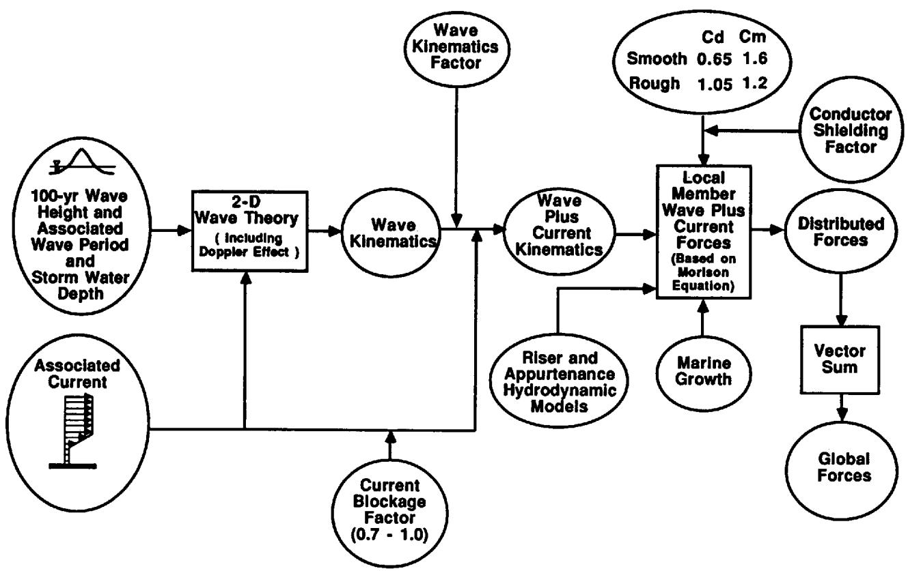  
FIG. C.3.2-1 PROCEDURE FOR CALCULATION OF WAVE PLUS CURRENT FORCES FOR STATIC ANALYSIS

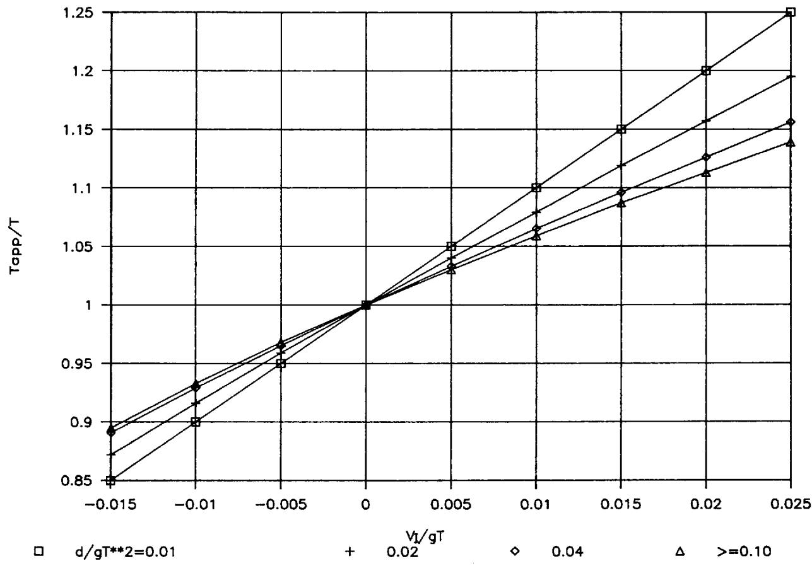  
FIG.C.3.2-2 DOPPLER SHIFT DUE TO STEADY CURRENT

wave kinematics can be calculated using the appropriate order of Stream Function wave theory. In many cases, Stokes V wave theory will produce acceptable accuracy. Figure C.3.2-3 (Reference C252) shows the regions of applicability of Stokes V and various orders of Stream Function solutions in the $\mathbf{H} / \mathbf{g}\mathbf{T}_{\mathrm{app}}^2$ , $\mathrm{d} / \mathrm{g}\mathrm{T}_{\mathrm{app}}^2$ plane. Other wave theories, such as Extended Velocity Potential and Chappelear, may be used if an appropriate order of solution is selected.

C.3.2.3 Wave Kinematics Factor. The two-dimensional regular wave kinematics from Stream Function or Stokes V wave theory do not account for wave directional spreading or irregularity in wave profile shape. These "real world" wave characteristics can be approximately modeled in deterministic wave analyses by multiplying the horizontal velocities and accelerations from the two-dimensional regular wave solution by a wave kinematics factor. Wave kinematics measurements support a factor in the range 0.85 to 0.95 for tropical storms and 0.95 to 1.00 for extratropical storms. Particular values within these ranges that should be used for calculating guideline wave forces are specified for the Gulf of Mexico in Section C.3.7.4.1 and for other U.S. waters in Section C.3.7.6.1. The Commentary provides additional guidance for calculating the wave kinematics factor for particular seastates whose directional spreading characteristics are known from measurements or hindcasts.

C.3.2.4 Current Blockage Factor. The current speed in the vicinity of the platform is reduced from the specified "free stream" value by blockage. In other words, the presence of the structure causes the incident flow to diverge; some of the incident flow goes around the structure rather than through it, and the current speed within the structure is reduced. Since global platform loads are determined by summing local loads from Morison's equation, the appropriate local current speed should be used.

Approximate current blockage factors for typical Gulf of Mexico jacket-type structures are as follows:

| # of Legs | Heading | Factor |
| --- | --- | --- |
| 3 | all | 0.90 |
| 4 | end-on | 0.80 |
|  | diagonal | 0.85 |
|  | broadside | 0.80 |
| 6 | end-on | 0.75 |
|  | diagonal | 0.85 |
|  | broadside | 0.80 |
| 8 | end-on | 0.70 |
|  | diagonal | 0.85 |
|  | broadside | 0.80 |

For structures with other configurations or structures with an atypical number of conductors, a current blockage factor can be calculated with the method described in the Commentary. Calculated factors less than 0.7 should not be used without empirical evidence to

support them. For free-standing or braced caissons and tripod structures, the current blockage factor should be 1.0.

C.3.2.5 Combined Wave/Current Kinematics. Wave kinematics, adjusted for directional spreading and irregularity, should be combined vectorially with the current profile, adjusted for blockage. Since the current profile is specified only to storm water level in the design criteria, some way to stretch (or compress) it to the local wave surface must be used. As discussed in the Commentary, "nonlinear stretching" is the preferred method. For slab current profiles such as those specified for U.S. waters in Section C.3.7, simple vertical extension of the current profile from storm mean water level to the wave surface is a good approximation to nonlinear stretching. For other current profiles, linear stretching is an acceptable approximation. In linear stretching, the current at a point with elevation $z$ , above which the wave surface elevation is $\eta$ (where $z$ and $\eta$ are both positive above storm mean water level and negative below), is computed from the specified current profile at elevation $z'$ . The elevations $z$ and $z'$ are linearly related, as follows:

$$\left(\mathbf{z}^{\prime} + \mathrm{d}\right) = (\mathbf{z} + \mathrm{d}) \mathrm{d} / (\mathbf{d} + \eta)$$

where $d$ is storm water depth.

C.3.2.6 Marine Growth. All structural members, conductors, risers, and appurtenances should be increased in cross-sectional area to account for marine growth thickness. Also, elements with circular cross-sections should be classified as either "smooth" or "rough," depending on the amount of marine growth expected to have accumulated on them at the time of the loading event. Specific marine growth profiles are provided for U.S. waters in Section C.3.7.

C.3.2.7 Drag and Inertia Coefficients. Drag and inertia coefficients are discussed in detail in the Commentary. For typical design situations, global platform wave forces can be calculated using the following values for unshielded circular cylinders:

$$\text{s m o o t h} \quad \mathrm{C}_{\mathrm{d}} = 0. 65, \mathrm{C}_{\mathrm{m}} = 1. 6$$

$$\text{r o u g h} \quad C_{d} = 1. 05, C_{m} = 1. 2$$

These values are appropriate for the case of a steady current with negligible waves or the case of large waves with $\mathrm{U}_{\mathrm{mo}}\mathrm{T}_{\mathrm{app}} / \mathrm{D} > 30$ Here, $\mathbf{U}_{\mathrm{mo}}$ is the maximum horizontal particle velocity at storm mean water level under the wave crest from the two-dimensional wave kinematics theory, $\mathbf{T}_{\mathrm{app}}$ is the apparent wave period, and D is the platform leg diameter at storm mean water level.

For wave-dominant cases with $\mathrm{U}_{\mathrm{mo}}\mathrm{T}_{\mathrm{app}} / \mathrm{D} < 30$ guidance on how $C_d$ and $C_m$ for nearly vertical members are modified by "wake encounter" is provided in the Commentary. Such situations may arise with large-diameter caissons in extreme seas or ordinary platform members in lower seastates considered in fatigue analyses.

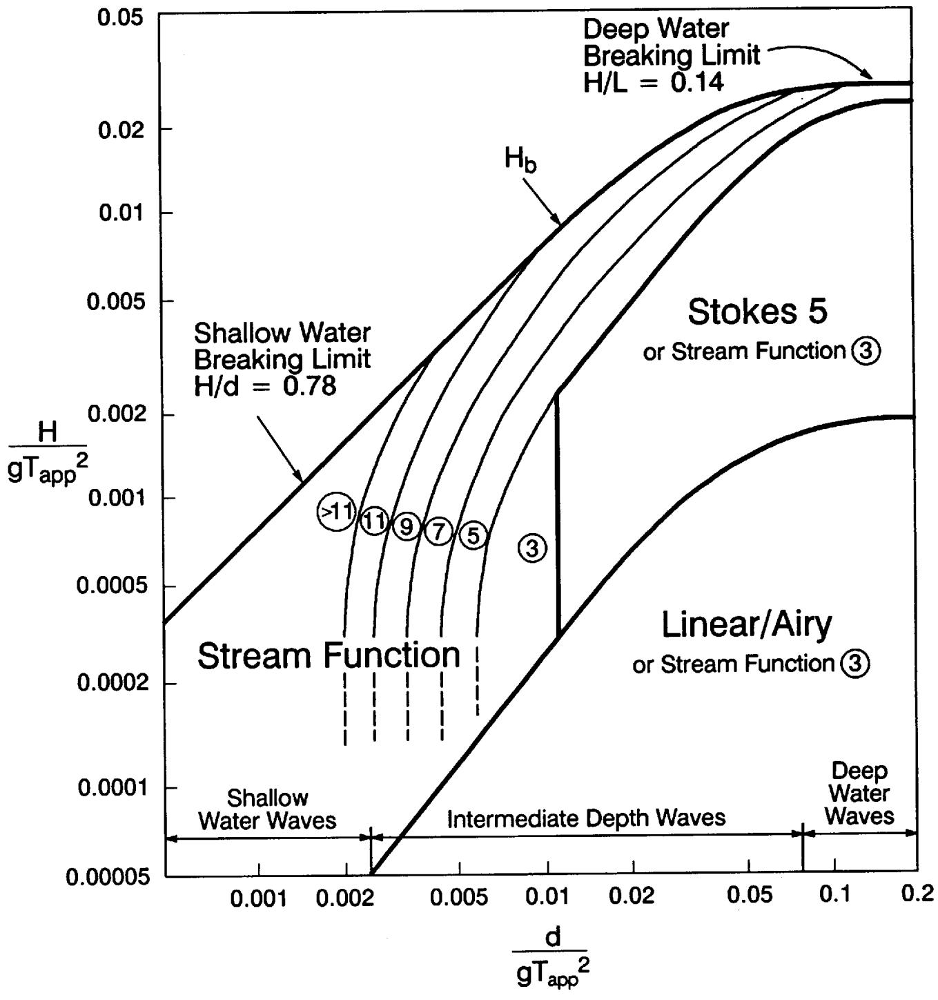

$\mathsf{H} / \mathsf{gT}_{\mathsf{app}}^2$ : Dimensionless wave steepness

$\mathrm{d} / \mathrm{gT}_{\mathrm{app}}^{2}$ : Dimensionless relative depth

H: Wave height

$H_{b}$ : Breaking wave height

d: Mean water depth

Tapp: Wave period

g: Acceleration of gravity

For members that are not circular cylinders, appropriate coefficients can be found in Reference C301.

C.3.2.8 Conductor Shielding Factor. Depending upon the configuration of the structure and the number of well conductors, the wave forces on the conductors can be a significant portion of the total wave forces. If the conductors are closely spaced, the forces on them may be reduced due to hydrodynamic shielding. A wave force reduction factor, to be applied to the drag and inertia coefficients for the conductor array, can be estimated from Figure C.3.2-4, in which S is the center-to-center spacing of the conductors in the wave direction and D is the diameter of the conductors, including marine growth. This shielding factor is appropriate for either (a) steady current with negligible waves or (b) extreme waves, with $\mathrm{U}_{\mathrm{mo}}\mathrm{T}_{\mathrm{app}} / \mathrm{S} > 5\pi$ . For less extreme waves with $\mathrm{U}_{\mathrm{mo}}\mathrm{T}_{\mathrm{app}} / \mathrm{S} < 5\pi$ , as in fatigue analyses, there may be less shielding. The Commentary provides some guidance on conductor shielding factors for fatigue analyses.

C.3.2.9 Hydrodynamic Models for Appurtenances. Appurtenances such as boat landings, fenders or bumpers, walkways, stairways, grout lines, and anodes should be considered for inclusion in the hydrodynamic model of the structure. Depending upon the type and number of appurtenances, they can significantly increase the global wave forces. In addition, forces on some appurtenances may be important for local member

design. Appurtenances are generally modeled by non-structural members which contribute equivalent wave forces. For appurtenances such as boat landings, wave forces are highly dependent on wave direction because of shielding effects. Additional guidance on the modeling of appurtenances is provided in the Commentary.

C.3.2.10 Morison Equation. The computation of the force exerted by waves on a cylindrical object depends on the ratio of the wavelength to the member diameter. When this ratio is large （$>5)$ , the member does not significantly modify the incident wave. The wave force can then be computed as the sum of a drag force and an inertia force, as follows:

$$\begin{array}{r l} \mathbf{F} & = \mathbf{F}_{\mathrm{D}} + \mathbf{F}_{\mathrm{I}} = \mathbf{C}_{\mathrm{d}} \frac{\mathbf{w}}{2 \mathbf{g}} \mathbf{A} \mathbf{U} | \mathbf{U} | + \mathbf{C}_{\mathrm{m}} \frac{\mathbf{w}}{\mathbf{g}} \mathbf{V} \frac{\delta \mathbf{U}}{\delta t} \\ & \dots \dots \dots \dots \dots \dots \dots \dots \dots \dots \dots \tag{C.3-4} \end{array}$$

where:

$\mathbf{F}$ = hydrodynamic force vector per unit length acting normal to the axis of the member

$\mathbf{F}_{\mathbf{D}} =$ drag force vector per unit length acting normal to the axis of the member in the plane of the member axis and $\mathbf{U}$

$\mathbf{F_I}$ = inertia force vector per unit length acting normal to the axis of the member in the plane of the member axis and $\delta \mathbf{U} / \delta t$

$\mathbf{C_d}$ = drag coefficient

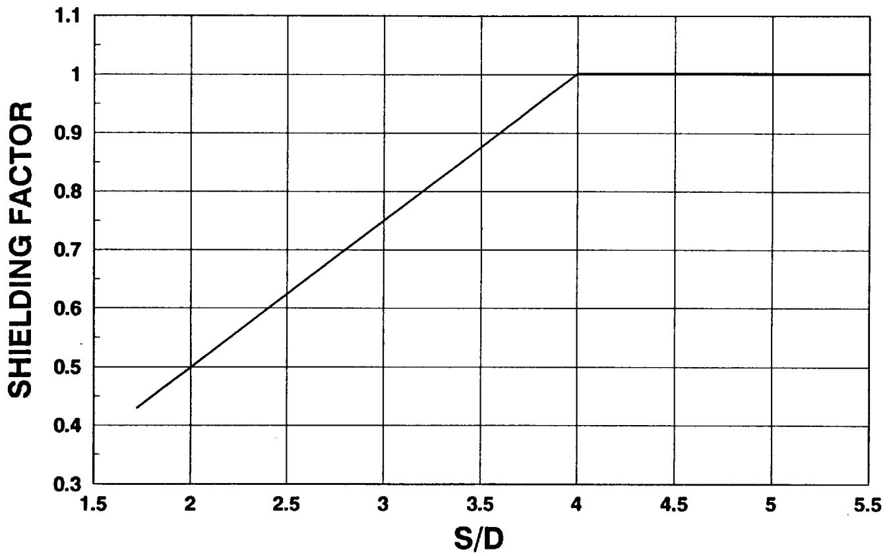  
FIG. C.3.2-4 SHIELDING FACTOR FOR WAVE LOADS ON CONDUCTOR ARRAYS AS A FUNCTION OF CONDUCTOR SPACING.

w = weight density of water   
$\mathbf{g}$ = gravitational acceleration

A $=$ projected area normal to the cylinder axis per unit length （$= D$ for circular cylinders)   
$\mathbf{V}$ $=$ displaced volume of the cylinder per unit length （$= \pi \mathbf{D}^{2} / 4$ for circular cylinders)   
D = effective diameter of circular cylindrical member including marine growth   
U = component of the water velocity vector (due to wave and/or current) normal to the axis of the member   
$|\mathbf{U}|$ = absolute value of $\mathbf{U}$   
$\mathbf{C}_{\mathbf{m}}$ = inertia coefficient   
$\frac{\delta \mathbf{U}}{\delta t} =$ component of the local acceleration vector of the water normal to the axis of the member

Note that the Morison equation, as stated here, ignores the convective acceleration component in the inertia force calculation (see Commentary). It also ignores lift forces, slam forces, and axial Froude-Krylov forces.

When the size of a structural body or member is sufficiently large to span a significant portion of a wavelength, the incident waves are scattered, or diffracted. This diffraction regime is usually considered to occur when the member width exceeds a fifth of the incident wave length. Diffraction theory, which computes the pressure acting on the structure due to both the incident wave and the scattered wave, should be used, instead of the Morison equation, to determine the wave forces. Depending on their diameters, caissons may be in the diffraction regime, particularly for the lower seas states associated with fatigue conditions. Diffraction theory is reviewed in Reference C306. A solution of the linear diffraction problem for a vertical cylinder extending from the sea bottom through the free surface (caisson) can be found in Reference C248.

C.3.2.11 Global Structure Forces. Total base shear and overturning moment are calculated by a vector summation of (a) local drag and inertia forces due to waves and currents (see Section C.3.2.10), (b) dynamic amplification of wave and current forces (see Section C.3.3), and (c) wind forces on the exposed portions of the structure (see Section C.3.4). Slam forces can be neglected because they are nearly vertical. Lift forces can be neglected for jacket-type structures because they are not correlated from member to member. Axial Froude-Krylov forces can also be neglected. The wave crest should be positioned relative to the structure so that the total base shear and overturning moment have their maximum values. It should be kept in mind that: (a) maximum base shear may not occur at the same wave position as maximum overturning moment; (b) in special cases of waves with low steepness and an opposing current, maximum global structure force may occur near the wave trough rather than near the wave

crest; and (c) maximum local member stresses may occur for a wave position other than that causing the maximum global structure force.

C.3.2.12 Local Member Design. Local member stresses are due to both local hydrodynamic forces and loads transferred from the rest of the structure. Locally generated forces include not only the drag and inertia forces modeled by Morison's equation (Equation C.3-4), but also lift forces, axial Froude-Krylov forces, and buoyancy and weight. Horizontal members near storm mean water level will also experience vertical slam forces as a wave passes. Both lift and slam forces can dynamically excite individual members, thereby increasing stresses (see Commentary). Transferred Loads are due to the global fluid-dynamic forces and dynamic response of the entire structure. The fraction of total stress due to locally generated forces is generally greater for members higher in the structure; therefore, local lift and slam forces may need to be considered in designing these members. The maximum local member stresses may occur at a different position of the wave crest relative to the structure centerline than that which causes the greatest global wave force on the platform. For example, some members of conductor guide frames may experience their greatest stresses due to vertical drag and inertia forces, which generally peak when the wave crest is far away from the structure centerline.

C.3.3 Extreme-Wave Dynamic Analysis.

C.3.3.1 Extreme Inertial Load, $\mathbf{D}_{\mathbf{n}}$ . $\mathbf{D}_{\mathbf{n}}$ is the nominal inertial load computed by applying the provisions of this section. $\mathbf{D}_{\mathbf{n}}$ is the inertial load at the time when the total global dynamic response (static and inertial) is a maximum. The return period of this total global dynamic response should be approximately the same as the quasi-static response to $\mathbf{W}_{\mathrm{e}}$ alone. See Commentary.   
For platforms with sufficiently short natural periods (less than three seconds), $\mathbf{D}_{\mathbf{n}}$ may be neglected. See Commentary.   
C.3.3.2 Global Dynamic Wave Analysis. The load $\mathbf{D}_{\mathbf{n}}$ is established by a global dynamic analysis. The magnitude of $\mathbf{D}_{\mathbf{n}}$ can be a direct result of the global dynamic wave analysis or can be derived from $\mathbf{W}_{\mathrm{e}}$ and the Dynamic Amplification Factors (DAF) from the global dynamic analysis. This section describes the global dynamic analysis; Section C.3.3.3 describes the load set $\mathbf{D}_{\mathbf{n}}$ .   
C.3.3.2.1 Dynamic Analysis Methods. The wave and other time varying loads should be realistic representations of the frequency content of the loading. Time history methods using random waves are preferred. Frequency domain methods may be used for the global dynamic analysis, provided the linearization of the drag force can be justified.   
C.3.3.2.2 Design Seastate. The random waves should originate from one or more wave spectra that are plausible conditions for producing the design wave defined

in Section C.3.1.2. Currents associated with the design seastate can affect dynamic response through the drag force in Equation C.3-4 and should be considered in the global dynamic analysis. Wind fluctuations with time may be neglected except for some compliant platforms.

C.3.3.2.3 Fluid Force on a Member. Equation C.3-4 may be used to compute forces on members of fixed platforms. Guidance on selection of drag and inertia coefficients for dynamic analyses is provided in the commentary Comm. C.3.2.7.

The relative velocity form of Morison's equation should not be used for fixed platforms (see Commentary). Fluid forces associated with the platform's acceleration are accounted for by the hydrodynamic added mass.

C.3.3.2.4 Mass. The mass of the dynamic model of a fixed platform should include that of the platform steel, all appurtenances, conductors, and deck loads, the mass of water enclosed in submerged tubular members, the mass of marine growth expected to accumulate on the structure and the hydrodynamic added mass of submerged members, accounting for increased member diameter due to marine growth.

C.3.3.2.5 Damping. Equivalent viscous damping values may be used in lieu of an explicit determination of damping components. In the absence of substantiating information for damping values for a specific structure, a damping value of two to three percent of critical for extreme wave analyses (and two percent of critical for fatigue analyses) may be used.

C.3.3.2.6 Stiffness. A linear elastic, stiffness model of the platform that includes the interaction of the structure and the foundation is adequate for the global dynamic wave analysis.

C.3.3.3 Member Design. The dynamic stresses in the members may be computed from a constant-in-time load set that represents the inertial forces; this load set is $\mathbf{D}_{\mathbf{n}}$ . The scalar magnitude of $\mathbf{D}_{\mathbf{n}}$ is defined in Section C.3.3.1 and is a direct result of the Global Dynamic wave analysis described in Section C.3.3.2. $\mathbf{D}_{\mathbf{n}}$ needs to be distributed to the lumped mass points to model the inertial force at each mass point. For free vibration motion, these inertial forces are proportional to the mass times the mode shape at that mass. Consideration should be given to the number of modes that are being excited and to the possible phasing of the dynamic modes of vibration with the static wave force.

C.3.4 Wind Force.

C.3.4.1 General. The wind criteria for design should be determined by proper analysis of wind data collected in accordance with Section Comm. A.4.2. As with wave loads, wind loads are dynamic in nature, but some structures will respond to them in a nearly static fashion. For conventional fixed steel templates in relatively shallow water, winds are a minor contributor to global loads (typically less than 10 percent). Sustained

wind velocities should be used to compute global platform wind loads, and gust velocities should be used for the design of individual structural elements. In deeper water and for compliant designs, wind loads can be significant and should be studied in detail. A dynamic analysis of the platform is indicated when the wind field contains energy at frequencies near the natural frequencies of the platform. Such analyses may require knowledge of the wind turbulence intensity, spectra, and spatial coherence. These items are addressed below.

C.3.4.2 Wind Properties. Wind speed and direction vary in space and time. On length scales typical of even large offshore structures, statistical wind properties (e.g., mean and standard deviation of velocity) taken over durations of the order of an hour do not vary horizontally, but do change with elevation (profile factor). Within long durations, there will be shorter durations with higher mean speeds (gust factor). Therefore, a wind speed value is only meaningful if qualified by its elevation and duration. A reference value $V(1 \, \text{hr}, z_{R})$ is the one hour mean speed at the reference elevation, $z_{R}$ , 10m (33 ft.). Variations of speed with elevation and duration, as well as wind turbulence intensity and spectral shape have not been firmly established. The available data show significant scatter, and definitive relationships cannot be prescribed. The relationships given below provide reasonable values for wind parameters to be used in design. Alternative relationships are available in the public domain literature or may be developed from careful study of measurement.

C.3.4.2.1 Mean Profile. The mean profile for the wind speed average over one hour at elevation $z$ can be approximated by

$$V (1 h r, z) = V (1 h r, z_{R}) \left(z / z_{R}\right)^{0. 125} \dots \tag{C.3-5}$$

C.3.4.2.2 Gust Factor. The gust factor $G(t,z)$ can be defined as

$$G (t, z) \equiv V (t, z) / V (1 \mathrm{h r}, z) = 1 + g (\mathrm{t}) I (z) \dots \tag{C.3-6}$$

where $I(z)$ is the turbulence intensity described below and $t$ is the gust duration with units of seconds. The factor $g(t)$ can be calculated from

$$g (t) = 3. 0 + \ln [ (3 / t)^{0. 6} ] \text{f o r} t \leq 60 \sec \dots \tag{C.3-7}$$

C.3.4.2.3 Turbulence Intensity. Turbulence intensity is the standard deviation of wind speed normalized by the mean wind speed over one hour. Turbulence intensity can be approximated by

$$I (z) \equiv \sigma (z) / V (1 h r, z) = \begin{array}{l} 0. 15 (z / z_{s})^{- 0. 125} \text{f o r} z \leq z_{s} \\ 0. 15 (z / z_{s})^{- 0. 275} \text{f o r} z \leq z_{s} \end{array} \dots \tag{C.3-8}$$

where $z_{s} = 20\mathrm{m}$ (66 ft.) is the thickness of the "surface layer."

C.3.4.2.4 Wind Spectra. As with waves, the frequency distribution of wind speed fluctuations can be described by a spectrum. Due to the large variability in measured wind spectra, there is no universally accepted spectral

shape. In the absence of data indicating otherwise, the simple shape given by the following equation is recommended:

$$\frac{f S (f)}{\sigma (z)^{2}} = \frac{f / f_{\rho}}{[ 1 + 1 . 5 f / f_{\rho} ]^{5 / 3}} \dots \tag{C.3-9}$$

where $S(f)$ is the spectral energy density at elevation $z$ , $f$ is the frequency in Hertz, and $o(z)$ is the standard deviation of wind speed, i.e., $o(z) = I(z)V(1\mathrm{hr},z)$ . Measured wind spectra show a wide variation in $f_{\rho}$ about an average value given by

$$f_{\rho} z / V (1 h r, z) = 0. 025 \dots \tag{C.3-10}$$

Due to the large range of $f_{\rho}$ in measured spectra, analysis of platform sensitivity to $f_{\rho}$ in the range

$$0. 01 \leq f_{\rho} z / V (1 h r, z) \leq 0. 10 \dots \tag{C.3-11}$$

is warranted. It should be noted that $f_{\mathbf{p}}$ is not at the peak of the dimensional wind energy, since Equation C.3-9 gives the reduced spectrum.

C.3.4.2.5 Spatial Coherence. Wind gusts have three dimensional spatial scales related to their durations. For example, three second gusts are coherent over shorter distances and therefore affect smaller elements of a platform superstructure than fifteen second gusts. The wind in a three second gust is appropriate for determining the maximum static wind load on individual members; five second gusts are appropriate for maximum total loads on structures whose maximum horizontal dimension is less than $50\mathrm{m}$ (164 ft.); and fifteen second gusts are appropriate for the maximum total static wind load on larger structures. The one minute sustained wind is appropriate for total static superstructure wind loads associated with maximum wave forces for structures that respond dynamically to wind excitation but which do not require a full dynamic wind analysis. For structures with negligible dynamic response to winds, the one-hour sustained wind is appropriate with maximum wave forces. In frequency domain analyses of dynamic wind loading, it can be conservatively assumed that all scales of turbulence are fully coherent over the entire superstructure.

C.3.4.3 Wind Velocity and Force Relationship. The wind force on an object should be calculated by using an appropriate method such as:

$$\mathbf{F} = (\rho / 2) (\mathrm{V})^{2} \mathrm{C}_{\mathrm{s}} \mathrm{A}. \tag{C.3-12}$$

where:

$\mathbf{F}$ = wind force,

V $=$ wind speed,

$\mathbf{C_s}$ = shape coefficient,

A = area of object,

$\rho$ = mass density of air (at standard temperature

and pressures $= 1.226\mathrm{kg / m^3}$

or $= 0.00238\mathrm{lb.sec}^2 /\mathrm{ft})$

C.3.4.4 Local Wind Force Considerations. For all angles of wind approach to the structure, forces on flat surfaces should be assumed to act normal to the surface and forces on vertical cylindrical objects should be assumed to act in the direction of wind. Forces on cylindrical objects which are not in a vertical attitude should be calculated using appropriate formulas that take into account the direction of the wind in relation to the attitude of the object. Forces on sides of buildings and other flat surfaces that are not perpendicular to the direction of the wind shall also be calculated using appropriate formulas that account for the skewness between the direction of the wind and the plane of the surface. Where applicable, local wind effects such as pressure concentrations and internal pressures should be considered by the designer. These local effects should be determined using appropriate means such as the analytical guidelines set forth in Section 6 of Reference C303.

C.3.4.5 Shape Coefficients. In the absence of data indicating otherwise, the following shape coefficients, $C_s$ , are recommended for perpendicular wind approach angles with respect to each projected area.

Beams 1.5

Sides of buildings 1.5

Cylindrical sections 0.5

Overall projected area of platform 1.0

C.3.4.6 Shielding Coefficients. Shielding coefficients may be used when, in the judgment of the designer, the second object lies close enough behind the first to warrant the use of the coefficient.

C.3.4.7 Wind Tunnel Data. Wind pressures and resulting forces may be determined from wind tunnel tests on a representative model.

C.3.5 Current Force.

C.3.5.1 Current Force Only. Where current is acting alone (i.e., no waves) the drag force should be determined by Equation C.3-4 with $\delta U / \delta t = 0$ .

All slender members exposed to the current should be investigated for the possibility of vibration due to periodic vortex shedding as discussed in commentary Comm. C.3.2.12.

C.3.5.2 Current Associated with Waves. Consideration should be given to the possible superposition of current and waves. In those cases where this superposition is necessary, the current velocity should be added vectorially to the wave particle velocity before the total force is computed as described in Section C.3.2. If the current is a substantial fraction of the wave orbital velocity, the effects of wave-current interaction may be considered before superposing the two. Where there is sufficient knowledge of wave/current joint probability, it may be used to advantage in the choice of design current.

C.3.6 Deck Clearance. Large forces result when waves strike a platform's deck and equipment. To avoid this,

the bottom of the lowest deck should be located at an elevation which will clear the calculated crest of the design wave with adequate allowance for safety. Omnidirectional guideline wave heights with a nominal return period of 100 years, together with the applicable wave theories and wave steepnesses should be used to compute wave crest elevations above storm water level, including guideline storm tide. A safety margin, or air gap, of at least $1.5\mathrm{m}$ (5 ft.) should be added to the crest elevation to allow for unexpected platform settlement, water depth uncertainty, and for the possibility of extreme waves in order to determine the minimum acceptable elevation of the bottom beam of the lowest deck to avoid waves striking the deck. An additional airgap should be provided for any known or predicted long term seafloor subsidence.

In general, no platform components, piping or equipment should be located below the lower deck in the designated air gap. However, when it is unavoidable to position such items as minor subcellars, sumps, drains or production piping in the air gap, provisions should be made for the wave forces developed on these items. These wave forces may be calculated using the crest pressure of the design wave applied against the projected area. These forces may be considered on a "local" basis in the design of the item. These provisions do not apply to vertical members such as deck legs, conductors, risers, etc., which normally penetrate the air gap.

C.3.7 Hydrodynamic Force Guidelines for U.S. Waters

C.3.7.1 General. Design parameters for hydrodynamic loading should be selected in the manner described in Section A.5, using environmental data collected and presented as outlined in Comm. A.4. This section presents guideline design hydrodynamic force parameters which should be used if the studies described in Commentary A.4 are not performed.

C.3.7.2 Intent. The provisions of this section provide for the analysis of static wave loads for platforms in areas designated in Figure C.3.7-1. The resulting guideline wave forces may be taken as satisfying the definition of $\mathbf{W}_{\mathrm{e}}$ in Section C.3.1.2. Depending upon the natural frequencies of the platform and the predominant frequencies of wave energy in the area, it may be necessary to perform dynamic analyses following the provision of Section C.3.3. Further, the general wave conditions in certain of these areas are such that consideration of fatigue loads may be necessary.

Use of the guidelines should result in safe but not necessarily optimal structures. Platform owners may find justification for designing structures for conditions more or less severe than indicated by these guidelines. As discussed in Comm. A.5, design criteria depend upon the overall loading, strength, and exposure characteristics of the installed platform. The guidelines should not be taken as a condemnation of platforms designed by different practices. Historical experience, loading, and strength characteristics of these structures

may be used for such evaluations. The provisions of this section are intended to accommodate such considerations. The actual platform experience and exposure and the amount of detailed oceanographic data available vary widely among the areas shown in Figure C.3.7-1. The Gulf of Mexico is characterized by a substantial amount of experience, exposure, and data. For other areas, there is less experience and data. The amount of wave information available for the different areas is indicated by the quality rating in Table C.3.7-1. The guidelines presented herein represent the best information available at this time and are subject to revision from time to time as further work is completed.

C.3.7.3 Guideline Design Metocean Criteria for the Gulf of Mexico North of $27^{\circ}$ N Latitude and West of $86^{\circ}$ W Longitude. The metocean criteria for this region of the Gulf of Mexico represent a consensus reached during 1991 by the API Task Group on Wave Force Commentary. The criteria are based on the 100-yr wave height and associated variables that result from hurricanes. The criteria are defined in terms of the following results:

- Omnidirectional wave height vs water depth   
- Principal direction associated with the omnidirectional wave height   
- Wave height vs direction   
- Currents associated with the wave height by direction   
- Associated wave period   
- Associated storm tide   
- Associated wind speed

For locations affected by strong tidal and/or general circulation currents, such as the Loop current and its associated detached eddies, special metocean criteria need to be defined to take into account the possibility of large forces caused by a combination of extreme currents and waves smaller than the 100-yr hurricane wave.

The metocean criteria are intended to be applied in combination with other provisions of Section C.3.7 to result in a guideline design level of total base shear and overturning moment on a structure.

The criteria apply for Mean Lower Low Water (MLLW) greater than $7.5\mathrm{m}$ (25 ft.) and outside of barrier islands, except in the immediate vicinity of the Mississippi Delta (denoted by the cross-hatched area in Figure C.3.7-2). In this area the guidelines may not apply because the Delta may block waves from some directions, and there are some very soft seafloor areas that may partially absorb waves. Wave heights lower than the guideline values may be justified in these areas.

C.3.7.3.1 Omnidirectional Wave Height vs Water Depth. The guideline omnidirectional wave height vs MLLW with a nominal return period of 100 years is given in Figure C.3.7-3.

TABLE C.3.7-1   
GUIDELINE EXTREME WAVE, CURRENT, AND STORM TIDE VALUES* FOR TWENTY AREAS IN UNITED STATES WATERS (Water depth > 91m (300 ft.) except as noted)   

|  | Ui, kt"OpenShelf" | Range | Hm, ft."OpenShelf" | Range | SRange | X, ft."OpenShelf" | Range | Quality |
| --- | --- | --- | --- | --- | --- | --- | --- | --- |
| 1. Gulf of Mexico(N of 27° N & W of 86° W) | (See Section C.3.7.3 for Guideline Extreme Metocean Criteria) | (See Section C.3.7.3 for Guideline Extreme Metocean Criteria) | (See Section C.3.7.3 for Guideline Extreme Metocean Criteria) | (See Section C.3.7.3 for Guideline Extreme Metocean Criteria) | (See Section C.3.7.3 for Guideline Extreme Metocean Criteria) | (See Section C.3.7.3 for Guideline Extreme Metocean Criteria) | (See Section C.3.7.3 for Guideline Extreme Metocean Criteria) | (See Section C.3.7.3 for Guideline Extreme Metocean Criteria) |
| 2. Gulf of Mexico(E of 86° W) | 2 | (1-3) | 70 | (60-80) | $\frac{1}{11}-\frac{1}{15}$ | 3 | (2-5) | 2 |
| 3. Southern California(Santa Barbara & San Pedro Ch) | 2 | (1-3) | 45 | (35-55) | $\frac{1}{11}-\frac{1}{30}$ | 6 | (5-7) | 1 |
| 4. California Outer Bank | 2 | (1-3) | 60 | (50-65) | $\frac{1}{13}-\frac{1}{25}$ | 5 | (4-6) | 2 |
| 5. Central California | 2 | (1-3) | 60 | (50-70) | $\frac{1}{13}-\frac{1}{25}$ | 7 | (6-8) | 2 |
| 6. Washington/Oregon | 2 | (1-4) | 85 | (70-100) | $\frac{1}{13}-\frac{1}{19}$ | 8 | (7-10) | 3 |
| 7. Gulf of Alaska (Icy Bay) | 3 | (2-4) | 100 | (90-120) | $\frac{1}{13}-\frac{1}{17}$ | 11 | (10-13) | 2 |
| 8. Gulf of Alaska (Kodiak) | 3 | (2-4) | 90 | (80-110) | $\frac{1}{13}-\frac{1}{17}$ | 10 | (9-12) | 2 |
| 9. Lower Cook Inlet | 4 | (3-6) | 60 | (45-70) | $\frac{1}{10}-\frac{1}{11}$ | 16 | (13-20) | 2 |
| 10. North Aleutian Shelf | 3 | (2-4) | 70 | (60-90) | $\frac{1}{12}-\frac{1}{16}$ | 8 | (6-12) | 1 |
| 11. St. George Basin | 3 | (2-4) | 85 | (75-95) | $\frac{1}{12}-\frac{1}{16}$ | 5 | (3-7) | 1 |
| 12. Navarin Basin | 2 | (1-3) | 85 | (75-95) | $\frac{1}{12}-\frac{1}{16}$ | 4 | (3-5) | 1 |
| 13. Norton Sound (d=60 ft.) | 3 | (1-4) | 45 | (35-50) | $\frac{1}{11}-\frac{1}{18}$ | 11 | (8-14) | 2 |
| 14. Chukchi Sea (d>60 ft.) | 2 | (1-3) | 50 | (40-60) | $\frac{1}{11}-\frac{1}{15}$ | 6 | (4-8) | 3 |
| 15. Chukchi Sea (d<60 ft.) | 3 | (2-5) | 0.78(d+X) |  | ** | 9 | (6-12) | 3 |
| 16. Beaufort Sea (d>50 ft.) | 2 | (1-3) | 40 | (35-50) | $\frac{1}{13}-\frac{1}{17}$ | 4 | (2-7) | 2 |
| 17. Beaufort Sea (d<50 ft.) | 4 | (3-6) | 0.78(d+X) |  | ** | 8 | ([-2]-12) | 2 |
| 18. Georges Bank | 2 | (1-3) | 85 | (75-95) | $\frac{1}{10}-\frac{1}{16}$ | 5 | (4-6) | 2 |
| 19. Baltimore Canyon | 3 | (2-4) | 90 | (80-100) | $\frac{1}{10}-\frac{1}{14}$ | 5 | (4-6) | 2 |
| 20. Georgia Embayment | 5 | (2-8) | 75 | (65-85) | $\frac{1}{11}-\frac{1}{15}$ | 5 | (3-7) | 2 |

$\mathbf{U}_{\mathrm{i}} =$ inline current at storm water level   
$\mathbf{H}_{\mathbf{m}} = 100$ -yr. maximum individual wave height   
S = deep water wave steepness from linear theory $= (2\pi \mathrm{H}_{\mathrm{m}}) / (\mathrm{gT}_{\mathrm{m}^2})$   
$\mathbf{g}$ = acceleration of gravity   
$\mathbf{T}_{\mathbf{m}}$ = zero-crossing period associated with $\mathrm{H}_{\mathrm{m}}$ , which can be calculated from S   
X = storm tide (Section A.4.4) associated with $\mathbf{H}_{\mathrm{m}}$ (mean higher high water plus storm surge)   
d = datum water depth

Quality

1 = based on comprehensive hindcast study verified with measurements.   
2 = based on limited hindcasts and/or measurements.   
3 = preliminary guide.   
* wind speeds, significant wave height, and spectral peak period associated with $\mathbf{H}_{\mathbf{m}}$ are discussed in Sections

C.3.7.5.1 and C.3.7.5.2.

** Use the same range for $\mathbf{T}_{\mathbf{m}}$ as in deeper water.

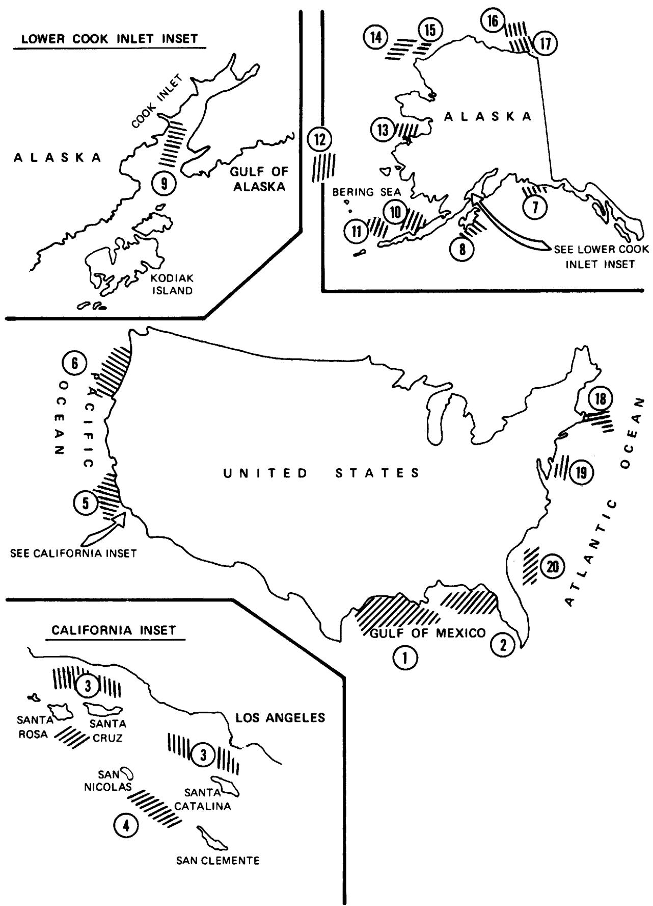  
FIG.C.3.7-1  
AREA LOCATION MAP

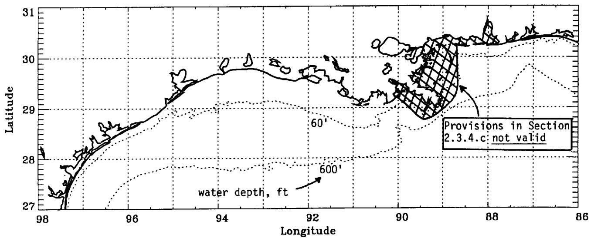  
FIG. C.3.7-2 REGION OF APPLICABILITY OF EXTREME METOCEAN CRITERIA IN SECTION C.3.7.3

Wave Height, ft

Mean Lower Low Water (MLLW), ft   
FIG. C.3.7-3GUIDELINE OMNIDIRECTIONAL DESIGN WAVE HEIGHT VS MLLW, GULF OF MEXICO,NORTH OF $27^{\circ}$ N AND WEST OF $86^{\circ}$ W  
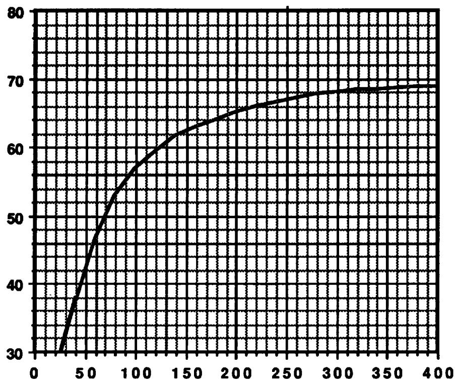  
for depth $>400$ ft  
the wave height  
increases  
linearly with  
respect to depth  
from 69 ft at 400 ft  
to 70.5 ft at 1000 ft

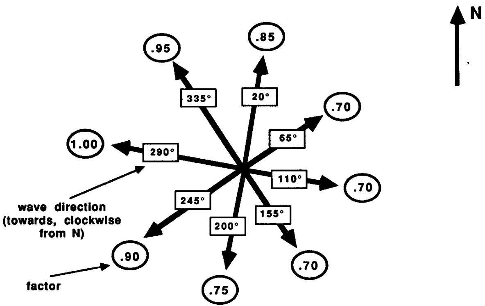  
FIG.C.3.7-4   
GUIDELINE DESIGN WAVE DIRECTIONS AND FACTORS TO APPLY TO THE OMNIDIRECTIONAL

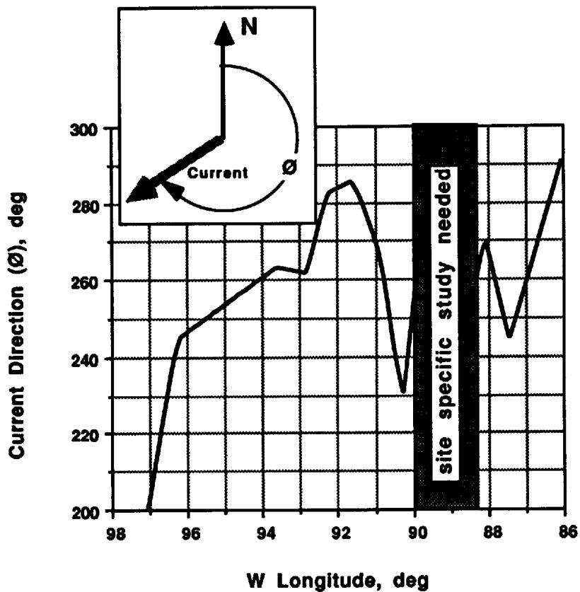  
WAVE HEIGHTS (FIG. C.3.7-3), GULF OF MEXICO, NORTH OF $27^{\circ}$ N AND WEST OF $86^{\circ}$ W   
FIG.C.3.7-5  
GUIDELINE DESIGN CURRENT DIRECTION (TOWARDS) WITH RESPECT TO NORTH IN SHALLOW  
WATER, DEPTH< 46m (150 FT), GULF OF MEXICO, NORTH OF $27^{\circ}\mathrm{N}$ AND WEST OF $86^{\circ}\mathrm{W}$

C.3.7.3.2 Principal Direction Associated with the Omnidirectional Wave Height. The principal direction is $290^{\circ}$ (towards, clockwise from north).

C.3.7.3.3 Wave Height vs Direction. Wave heights are defined for eight directions as shown in Figure C.3.7-4. The factors should be applied to the omnidirectional wave height of Figure C.3.7-3 to obtain wave height by direction for a given water depth. The factors are asymmetric with respect to the principal direction, and they apply for water depths greater than $12\mathrm{m}$ (40 ft.) and to the given direction $\pm 22.5^{\circ}$ . Regardless of how the platform is oriented, the 100-yr omnidirectional wave height in the principal wave direction must be considered in at least one design load case.

C.3.7.3.4 Currents Associated with the Wave Height by Direction. The associated hurricane-generated current for the Gulf of Mexico depends primarily on water depth.

- Shallow water zone: The water depth for this zone is less than $46\mathrm{m}$ (150 ft.). The extreme currents in this zone flow from east to west and follow smoothed bathymetric contours. Consequently, when combined with the waves, the resulting base shears will vary with respect to geographical location. The current magnitude is $1.1\mathrm{m/s}$ (2.1 knots). The direction of the current (towards, clockwise from north) is given in Figure C.3.7-5 vs longitude.   
- Deep water zone: The water depth for this zone is greater than $91\mathrm{m}$ (300 ft.). In this zone, for each wave direction the associated current is inline with the wave (there is no transverse component) and proportional to wave height. The magnitude associated with the principal wave direction (towards $290^{\circ}$ ) is 1.1 m/sec (2.1 knots). The magnitudes for other directions are obtained by multiplying 1.1 m/sec (2.1 knots) by the same factors that are used to define wave heights by direction.   
- Intermediate zone: This region is in between the shallow and deep water zones, i.e., water depth less than 91m (300 ft.) and greater than 46m (150 ft.). The currents associated with each wave direction for a given water depth in this zone are obtained by linear interpolation of the currents for depths of 46m (150 ft.) and 91m (300 ft.). For each wave direction, the interpolation should be done on both the inline and the transverse component. The end result will be an associated current vector for each wave direction. See Comm. C.3.7.3 for interpolation procedure.

Before applying the current vector for force calculations in either the shallow water zone or the intermediate zone, the component of the current that is in-line with the wave should be checked to make sure that it is greater than $0.1\mathrm{m / sec}$ (0.2 knots). If it is less, the in-line component should be set to 0.1m/sec (0.2 knots) for calculating design guideline forces.

The current profile is given in Figure C.3.7-6. The storm water level (swl) is the 0-ft. level. The profile for

shallower water depths should be developed by truncating the bottom part of the profile.

To combine the wave kinematics with the current above the swl, the current must be "stretched" up to the wave crest. See Section C.3.2.5 for "stretching" procedures.

C.3.7.3.5 Associated Wave Period. The wave period is 13 seconds for all water depths and wave directions.

C.3.7.3.6 Associated Storm Tide. The associated storm tide (storm surge plus astronomical tide) is given in Figure C.3.7-7.

C.3.7.3.7 Associated Wind Speed. The associated 1-hr. wind speed is $41\mathrm{m / sec}$ (80 kts) at an elevation of $10\mathrm{m}$ (33 ft.). This value applies to all water depths and wave directions. The use of the same speed for all directions is conservative; lower speeds for directions away from the principal wave direction may be justified by special studies.

C.3.7.4 Guideline Design Wave, Wind, and Current Forces for the Gulf of Mexico, North of $27^{\circ}$ N Latitude and West of $86^{\circ}$ W Longitude. The guideline design forces for static analysis should be calculated using (a) the metocean criteria given in Section C.3.7.3, (b) the wave and current force calculation procedures given in Section C.3.2, (c) other applicable provisions of Sections C.3.4 and C.3.5 and (d) specific provisions in this Section as given below.

C.3.7.4.1 Wave Kinematics Factor. The extreme forces will be dominated by hurricanes and consequently a wave kinematics factor of 0.88 should be used.

C.3.7.4.2 Marine Growth. Use 38mm (1.5 in.) from Mean Higher High Water (MHHW) to -46m (-150 ft.), unless a smaller or larger value of thickness is appropriate from site specific studies. MHHW is one foot higher than MLLW.

Structural members can be considered hydrodynamically smooth if they are either above MHHW or deep enough [lower than about $-46\mathrm{m}$ (-150 ft.)] where marine growth might be light enough to ignore the effect of roughness. However, caution should be used because it takes very little roughness to cause a $C_d$ of 1.05 (see commentary Comm. C.3.2.7 for relationship of $C_d$ to relative roughness). In the zone between MHHW and $-46\mathrm{m}$ (-150 ft.), structural members should be considered to be hydrodynamically rough. Marine growth can extend to elevations below $-46\mathrm{m}$ (-150 ft.). Site specific data may be used to establish smooth and rough zones more precisely.

C.3.7.4.3 Deck Height. Deck heights should satisfy all requirements of Section C.3.6 and not be lower than the height given in Figure C.3.7-8. The deck heights in Figure C.3.7-8 are consistent with the 19th Edition of RP2A.   
C.3.7.5 Guideline Design Metrocan Criteria for Other U.S. Waters

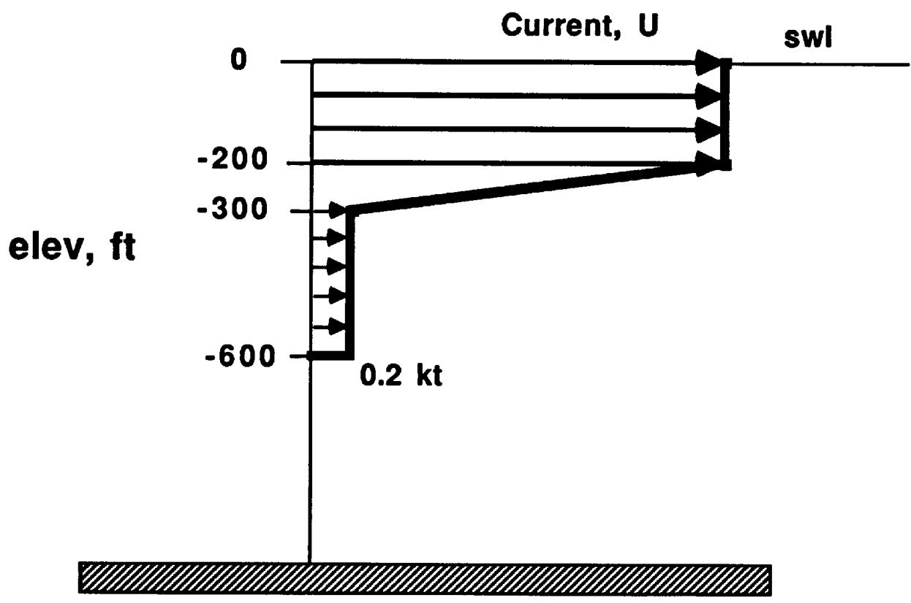  
FIG.C.3.7-6  
GUIDELINE DESIGN CURRENT PROFILE, GULF OF MEXICO, NORTH OF $27^{\circ}$ N AND WEST OF $86^{\circ}$ W

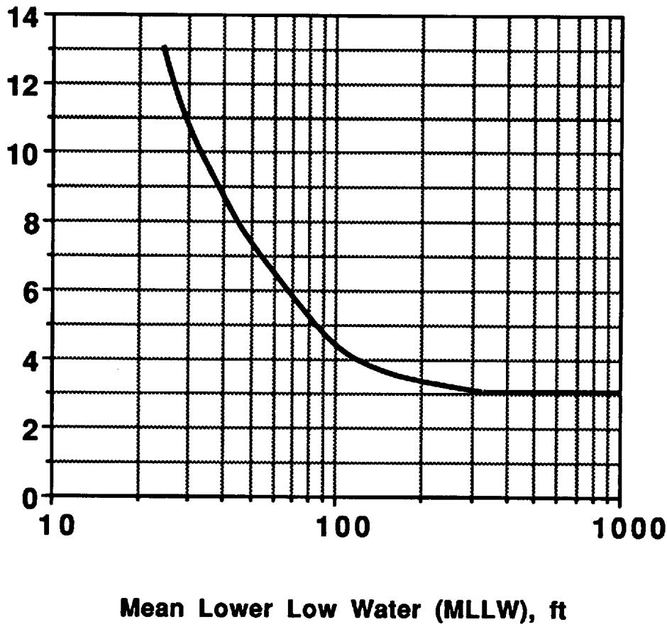  
Storm Tide, ft   
FIG.C.3.7-7  
GUIDELINE DESIGN STORM TIDE VS MLLW, GULF OF MEXICO.   
NORTH OF $27^{\circ}$ N AND WEST OF $86^{\circ}$ W

C.3.7.5.1 Waves, Currents, and Storm Tides. Guideline omnidirectional wave heights with a nominal return period of 100 years are given in Table C.3.7-1 for the 20 geographical areas shown in Figure C.3.7.-1. Also given are deepwater wave steepnesses, currents, and storm tides associated with the nominal 100-yr wave heights. Except as noted, the guideline waves and storm tides are applicable to water depths greater than $91\mathrm{m}$ (300 ft.).

The ranges of wave heights, currents, and storm tides in Table C.3.7-1 reflect reasonable variations in interpretation of the data in References C314-C351 quality rating, and the spatial variability within the areas. The ranges in wave steepness reflect the variability in wave period associated with a given wave height. Significant wave height, $\mathbf{H}_{\mathrm{s}}$ can be determined from the relationship $\mathrm{H_m / H_s} = 1.7$ to 1.9. Spectral peak period, $\mathbf{T_p}$ can be determined from the relationship $\mathrm{T_p / T_m} = 1.05$ to 1.20.

TABLE C.3.7-2 GUIDELINE EXTREME WIND SPEEDS* FOR TWENTY AREAS IN UNITED STATES WATERS  

|  | Wind With Extreme Waves, m/s(mph) | Wind Alone, m/s(mph) |
| --- | --- | --- |
| 1. Gulf of Mexico (N of 27°N & W of 86°N) | - Section | C.3.7.3 |
| 2. Gulf of Mexico (E of 86°W) | 44 (98) | 49 (109) |
| 3. Southern California (Santa Barbara and San Pedro Channels) | 26 (58) | 31 (69) |
| 4. California Outer Bank | 26 (58) | 31 (69) |
| 5. Central California | 31 (69) | 36 (81) |
| 6. Washington/Oregon | 31 (69) | 41 (92) |
| 7. Gulf of Alaska (Icy Bay) | 31 (69) | 46 (104) |
| 8. Gulf of Alaska (Kodiak) | 31 (69) | 46 (104) |
| 9. Lower Cook Inlet | 31 (69) | 46 (104) |
| 10. North Aleutian Shelf | 31 (69) | 46 (104) |
| 11. St. George Basin | 31 (69) | 46 (104) |
| 12. Navarin Basin | 31 (69) | 46 (104) |
| 13. Norton Sound (d=27 m) (d=90 ft.) | 31 (69) | 46 (104) |
| 14. Chukchi Sea (d>18 m) (d>60 ft.) | 31 (69) | 41 (92) |
| 15. Chukchi Sea (d<18 m) (d<60 ft.) | 31 (69) | 41 (92) |
| 16. Beaufort Sea (d>15 m) (d>50 ft.) | 31 (69) | 36 (81) |
| 17. Beaufort Sea (d<15 m) (d<50 ft.) | 31 (69) | 36 (81) |
| 18. Georges Bank | 31 (69) | 41 (104) |
| 19. Baltimore Canyon | 41 (104) | 51 (115) |
| 20. Georgia Embayment | 46 (104) | 51 (115) |

*Reference one-hour average speed (±10%) at 10 m (33 ft.) elevation.

C.3.7.5.2 Winds. Guideline wind speeds (one-hour average at 10m (33 ft.) elevation) are provided in Table C.3.7-2. The first column gives the wind speed to use to compute global wind load to combine with global wave and current load on a platform. This wind is assumed to act simultaneously and co-directionally with guideline 100-year extreme waves from Table C.3.7-1. The second column gives 100-year wind speeds without regard to the coexisting wave conditions; these are appropriate for calculating local wind loads, as per the provisions of Section C.3.4.

C.3.7.5.3 Current Profile. The currents, $\mathbf{U}_{\mathrm{i}}$ , in Table C.3.7-1 are near-surface values. For the Gulf of Mexico the guideline current profile given in Figure C.3.7-6 should be used. Outside the Gulf of Mexico there is no unique profile; site specific measured data should be used in defining the current profile. In lieu of data, the current profile may be crudely approximated by the Gulf of Mexico guideline current profile of Figure C.3.7-6 with $\mathbf{U} = \mathbf{U}_{\mathrm{i}}$ in the mixed layer, and $\mathbf{U} = \mathbf{U}_{\mathrm{i}} - 1\mathrm{m / sec}$ (1.9 knots) in the bottom layer.

C.3.7.5.4. Local Site Effects. The "open shelf" wave heights shown in Table C.3.7-1 are generalized to apply to open, broad, continental shelf areas where such generalization is meaningful. Coastal configurations, exposure to wave generation by severe storms or bottom topography may cause variations in wave heights for different sites within an area; especially, the Lower Cook Inlet, the Santa Barbara Channel, Norton Sound, North Aleutian Shelf, Beaufort Sea, Chukchi Sea, and Georgia Embayment areas. Thus, wave heights which are greater than or less than the guideline "open shelf" wave heights may be appropriate for a particular site. Reasonable ranges for such locations are incorporated in Table C.3.7-1.

C.3.7.6 Guideline Design Wave, Wind, and Current Forces for Other U.S. Waters. The guideline design forces for static analysis should be calculated using (a) the metocean criteria given in Table C.3.7-1, (b) the wave and current force calculation procedures given in Section C.3.2, (c) other applicable provisions of Sections C.3.4 and C.3.5, and (d) specific provisions in this Section as given below.

C.3.7.6.1 Wave Kinematics Factor. Extreme wave forces for some of the areas in Table C.3.7-1 are produced by hurricanes, for some by extratropical storms, and for others both hurricanes and extratropical storms are important. The appropriate wave kinematics factor depends on the type of storm system that will govern design.

Areas #1 and #2 are dominated by hurricanes; a wave kinematics factor of 0.88 should be used. Areas #3 through #17 are dominated by extratropical storms; the wave kinematics factor should be taken as 1.0, unless a lower factor can be justified on the basis of reliable and applicable measured data.

Areas #18 through #20 are impacted by both hurricanes and extratropical storms. The "open shelf" wave

heights in Table C.3.7-1 for these three areas correspond to the 100-yr return period values taking into consideration both storm populations. Consequently, the wave kinematics factor will be between 0.88 and 1.0. Based on the results on the relative importance of hurricanes vs extratropical storms in the following wave kinematics factors are recommended: 1.0 for Area #18, 0.94 for Area #19, and 0.88 for Area #20.

C.3.7.6.2 Marine Growth. For many of the areas in Table C.3.7-1 marine growth thickness can be much greater than the $38\mathrm{mm}$ (1.5 in.) guideline value for the Gulf of Mexico. For example, offshore Southern and Central California thicknesses of $200\mathrm{mm}$ (8 in.) are common. Site specific studies should be conducted to establish the thickness variation vs depth.

Structural members can be considered hydrodynamically smooth if they are either above MHHW or deep enough where marine growth might be light enough to ignore the effect of roughness. However, caution should be used because it takes very little roughness to cause a $C_d$ of 1.05 (see Comm. C.3.2.7 for relationship of $C_d$ to relative roughness). Site specific data should be used to establish the extent of the hydrodynamically rough zones; otherwise the structural members should be considered rough down to the mudline.

C.3.7.6.3 Deck Height. Deck heights should satisfy all requirements of Section C.3.6. Crest heights should be

based on the guideline omnidirectional wave heights, wave periods, and storm tide given in Table C.3.7-1, and calculated using an appropriate wave theory as discussed in Section C.3.2.2.

C.3.8 References. References C314 through C351 report studies of wave conditions used to support values in Table C.3.7-1 and Section C.3.7.3. Although some of these studies are proprietary cooperative studies, most may be obtained. Additionally, numerous other studies have been made by individual companies for specific locations within these areas.

## C.4 EARTHQUAKE LOADS

C.4.1 General.

C.4.1.1 Scope. Both strength and ductility requirements are included for the design of platforms.

Strength requirements are intended to provide a platform which is adequately sized for strength and stiffness to ensure no significant structural damage for the level of earthquake shaking which has a reasonable likelihood of not being exceeded during the life of the structure. The ductility requirements are intended to ensure that the platform has sufficient reserve capacity to prevent its collapse during rare intense earthquake motions, although structural damage may occur.

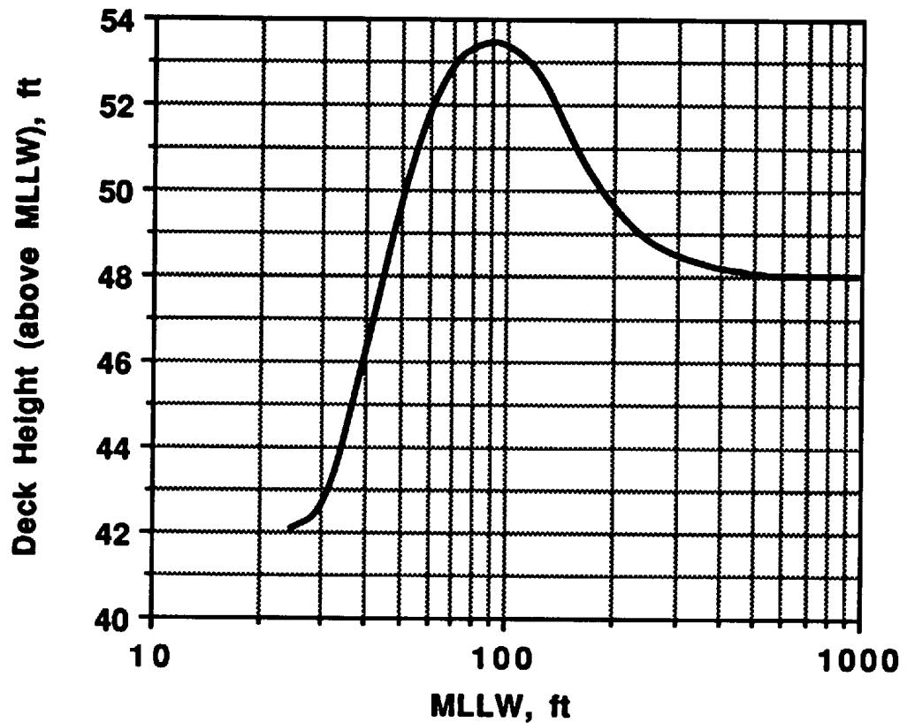  
FIG.C.3.7-8  
GUIDELINE DESIGN DECK HEIGHT (ABOVE MLLW) VS MLLW, GULF OF MEXICO, NORTH OF $27^{\circ}$ N AND WEST OF $86^{\circ}$ W

The guidelines in the following paragraphs of this section are intended to apply to the design of major steel framed structures. Only vibratory ground motion is addressed in this section. Other major concerns such as those identified in Sections A.4.9.3 and A.4.9.4 (e.g., large soil deformations or instability) should be resolved by special studies.

C.4.1.2 Evaluation of Seismic Activity For seismically active areas, it is intended that the intensity and characteristics of seismic ground motion used for design be determined by a site-specific study. Evaluation of the intensity and characteristics of ground motion should consider the active faults within the region, the type of faulting, the maximum magnitude of earthquake which can be generated by each fault, the regional seismic activity rate, the proximity of the site to the potential source faults, the attenuation of the ground motion between these faults and the platform site, and the soil conditions at the site.

To satisfy the strength requirements, a platform should be designed for ground motions described in Section A.4.1.

The intensity of ground motion which may occur during a rare intense earthquake should be determined in order to decide whether a special analysis is required to meet the ductility requirements. If required, the characteristics of such motion should be determined to provide the criteria for such an analysis.

C.4.1.3 Evaluation for Zones of Low Seismic Activity. In areas of low seismic activity, platform design would normally be controlled by storm or other environmental loading rather than earthquake. For areas where the strength level design horizontal ground acceleration is less than $0.05\mathrm{g}$ , such as the Gulf of Mexico, no earthquake analysis is required, since the design for environmental loading other than earthquake will provide sufficient resistance against potential effects from seismically active zones. For areas where the strength level design horizontal ground acceleration is in the range of $0.05\mathrm{g}$ to $0.10\mathrm{g}$ , inclusive, all of the earthquake requirements except those for deck appurtenances may be considered satisfied if the strength requirements (Section C.4.2) are met using the ground motion intensity and characteristics of the rare, intense earthquake in lieu of the strength level earthquake. In this event, the deck appurtenances should be designed for the strength level earthquake in accordance with Section C.4.4.2, but the ductility requirements (Section C.4.3) are waived, and tubular joints need to be designed as specified in Section C.4.4.1 using the computed joint loads instead of the tensile yield load or compressive buckling load of the member.

C.4.2 Strength Requirements.

C.4.2.1 Factored Loads. Each member, joint, and foundation component should be strength checked for the internal force $\mathbf{Q}$ caused by the action of these factored loads:

$$\mathbf{Q} = 1. 1 \mathrm{D}_{1} + 1. 1 \mathrm{D}_{2} + 1. 1 \mathrm{L}_{1} + 0. 9 \mathrm{E} \quad \dots \dots \dots \dots \dots \tag{C.4-1}$$

where $\mathbf{E}$ is defined in Section C.4.2.2 and $\mathrm{D}_1, \mathrm{D}_2$ and $\mathbf{L}_1$ are defined in Section C.2 and include only those parts of each mode of operation that might reasonably be present during an earthquake. When inertial forces due to gravity loads oppose the internal forces due to earthquake loads, the gravity load factors should be reduced so that:

$$\mathbf{Q} = 0. 9 \mathbf{D}_{1} + 0. 9 \mathbf{D}_{2} + 0. 8 \mathbf{L}_{1} + 0. 9 \mathbf{E}. \tag{C.4-2}$$

C.4.2.2 Strength Level Earthquake, E. E is the iner- tially induced load produced by the strength level ground motion determined in accordance with Section C.4.1.2 using dynamic analysis procedures such as response spectrum analysis or time history analysis.

C.4.2.3 Structural Modeling. The mass used in the dynamic analysis should consist of the mass of the platform associated with the gravity loadings of $\mathbf{D}_1$ , $\mathbf{D}_2$ , 75 percent of $\mathbf{L}_1$ , and the added mass. The added mass may be estimated as the mass of the displaced water for motion transverse to the longitudinal axis of the individual structural framing and appurtenances. For motions along the longitudinal axis of the structural framing and appurtenances, the added mass may be neglected.

The analytical model should include the three dimensional distribution of platform stiffness and mass. Asymmetry in platform stiffness or mass distribution may lead to significant torsional response which should be considered. The model should reflect the nominal estimates of both the stiffness and mass characteristics. Consideration should be given to maintaining compatibility between the dead loads and the live loads, and the environmental induced loads.

In computing the dynamic characteristics of braced, pile supported steel structures, modal damping ratios of five percent of critical should be used for an elastic analysis. Where substantiating data exists, other damping ratios may be used.

C.4.2.4 Response Analysis. It is intended that the design response should be comparable for any analysis method used. When the response spectrum method is used and one design spectrum is applied equally in both horizontal directions, the complete quadratic combination (CQC) method may be used for combining modal responses and the square root of the sum of the squares (SRSS) may be used for combining the directional responses. If other methods are used for combining modal responses such as the square root of the sum of the squares, care should be taken not to underestimate corner pile and leg loads. For the response spectrum method, as many modes should be considered as required for an adequate representation of the response. At least two modes having the highest overall response should be included for each of the three principal directions plus significant torsional modes.

Where the time history method is used, the design response should be calculated as the average of the maximum values for each of the time histories considered.

C.4.2.5 Response Assessment. In the calculation of member forces, the forces due to earthquake induced loading should be combined with those due to gravity, hydrostatic pressure, and buoyancy. For the strength requirement, the strength and corresponding resistance factors are those presented in Sections D, E, G, and H. Pile-soil performance and pile design requirements should be determined on the basis of special studies. These studies should consider the design loadings, installation procedures, earthquake effects on soil properties, and characteristics of the soils as appropriate to the axial or lateral capacity algorithm being used. The stiffness and the capacity of the pile foundation should be addressed in a compatible manner for calculating the axial and lateral response.

C.4.3 Ductility Requirements.

C.4.3.1 General. The global performance of the structure-foundation system must be demonstrated or inferred to be satisfactory in response to the rare, intense earthquake described in Section C.4.1.

Provisions are recommended which, when implemented in the strength design of certain platforms, will not require an explicit analytical demonstration of adequate ductility. These structure-foundation systems are similar to those for which adequate ductility has already been demonstrated analytically in seismically active regions where the intensity ratio of the rare, intense earthquake ground motions to strength level earthquake ground motions is 2.0 or less.

C.4.3.2 Structures Not Requiring Ductility Analysis. No ductility analysis of conventional jacket-type structures with eight or more legs is recommended if the structure is to be located in an area where the intensity ratio of rare, intense earthquake ground motion to strength level earthquake ground motion is 2.0 or less; the piles are to be founded in soils that are stable under ground motions imposed by the rare, intense earthquake, and the following guidelines are adhered to in configuring the structure and proportioning members:

— Jacket legs, including any enclosed piles, are designed to meet the requirements of Section C.4.2.5 using twice the strength level seismic loads.   
- Diagonal bracing in the vertical frames are configured such that shear forces between horizontal frames or in vertical runs between legs are distributed approximately equally to both tension and compression diagonal braces, and that "K" bracing is not used where the ability of a panel to transmit shear is lost if the compression brace buckles. Where these conditions are not met, including areas such as the portal frame between the jacket and the deck, the structural components should be designed to meet the requirements of Section C.4.2.5 using twice the strength level seismic loads.   
- Horizontal members are provided between all adjacent legs at horizontal framing levels in vertical

frames and that these members have sufficient compression capacity to support the redistribution of loads resulting from the buckling of adjacent diagonal braces.

- The slenderness ratio (KL/r) of primary diagonal bracing in vertical frames is limited to 80 and their ratio of diameter to thickness is limited to $1300 / \mathbf{F_y}$ where $\mathbf{F_y}$ is in MPa (1900/Fy for $\mathbf{F_y}$ in ksi).   
- All nontubular members at connections in vertical frames are designed as compact sections in accordance with Reference C464 or designed to meet the requirements of Section C.4.2.5 using twice the strength level seismic loads.

C.4.3.3 Structures Requiring Ductility Analysis. Structure-foundation systems which do not meet the conditions listed in Section C.4.3.2 should be analyzed to demonstrate their ability to withstand the rare, intense earthquake without collapsing. The characteristics of the rare, intense earthquake should be developed from site-specific studies of the local seismicity following the provisions of Section C.4.1.2. Demonstration of the stability of the structure-foundation system should be by analytical procedures that are rational and reasonably representative of the expected response of the structural and soil components of the system to intense ground shaking. Models of the structural and soil elements should include their characteristic degradation of strength and stiffness under extreme load reversals and the interaction of axial forces and bending moments, hydrostatic pressures and local inertial forces, as appropriate. The P-delta effect of loads acting through elastic and inelastic deflections of the structure and foundation should be considered.

C.4.4 Additional Guidelines.

C.4.4.1 Tubular Joints. Where the strength level design horizontal ground motion is $0.05\mathbf{g}$ or greater (except as provided in Section C.4.1.3 when in the range of $0.05\mathbf{g}$ to $0.10\mathbf{g}$ , inclusive) joints for primary structural members should be sized for either the tensile yield load or the compressive buckling load of the members framing into the joint, as appropriate for the ultimate behavior of the structure.

Joint capacity should be determined on the basis of nominal loads in the brace in accordance with Section E. The factor A should be computed using factored stresses in the chord, $\mathbf{f_{ax}}$ , $\mathbf{f_{ipb}}$ , and $\mathbf{f_{opb}}$ (see Section E.3.1.1), resulting from twice the strength level seismic loads in combination with gravity, hydrostatic pressure, buoyancy loads or to the full capacity of the chord away from the joint can, whichever is less.   
C.4.4.2 Deck Appurtenances and Equipment. Equipment, piping, and other deck appurtenances should be designed and supported so that induced seismic forces can be resisted and induced displacements can be restrained such that no damage to the equipment, piping, appurtenances and supporting structure occurs. Equip-

ment should be restrained by means of welded connections, anchor bolts, clamps, lateral bracing, or other appropriate tie-downs. The design of restraints should include both strength considerations as well as their ability to accommodate imposed deflections.

Special consideration should be given to the design of restraints for critical piping and equipment whose failure could result in personnel injury, hazardous material spillage, pollution, or hindrance to emergency response.

Design acceleration levels should include the effects of global platform dynamic response; and, if appropriate, local dynamic response of the deck and appurtenance itself. Due to the platform's dynamic response, these design acceleration levels are typically much greater than those commonly associated with the seismic design of similar onshore processing facilities.

In general, most types of properly anchored deck appurtenances are sufficiently stiff so that their lateral and vertical responses can be calculated directly from maximum computed deck accelerations, since local dynamic amplification is negligible.

Forces on deck equipment that do not meet this "rigid body" criterion should be derived by dynamic analysis using either: 1) uncoupled analysis with deck level floor response spectra or 2) coupled analysis methods. Appurtenances that typically do not meet the "rigid body" criterion are drilling rigs, flare booms, deck cantilevers, tall vessels, large unbaffled tanks and cranes.

Coupled analyses that properly include the dynamic interactions between the appurtenance and deck result in more accurate and often lower design accelerations than those derived using uncoupled floor response spectra.

Drilling and well servicing structures should be designed for earthquake loads in accordance with API Specification 4F. It is important that these movable structures and their associated setback and piperack tubulars be tied down or restrained at all times except when the structures are being moved.

Deck-supported structures, and equipment tie-downs, should be designed with an increased load factor on E of 1.15 rather than 0.9 (see Equations C.4-1 and C.4-2), unless the framing pattern, consequences of failure, metallurgy, and/or site-specific ground motion intensities suggest otherwise.

## C.5 FABRICATION AND INSTALLATION LOADS

C.5.1 General. The primary objective of this section is to ensure that a structure begins its service life with its designed strength and structural integrity intact. Installation encompasses the operations of moving the platform components from the fabrication site (or prior offshore location) to the offshore location, and installing them to form the completed platform. Section M contains further details on installation procedures.

Nominal forces imposed upon members of the structure should be calculated during each phase of installation in accordance with the principles given in Sections C.2 and C.3.

C.5.2 Dynamic Effects. Since installation forces involve the motion of heavy weights, the dynamic loading involved should be considered and the static forces increased by appropriate factors to arrive at adequate nominal loads for the design of the members affected.

These nominal loads might be derived from an analysis to determine the local load effects due to both the motion and the imposed external forces or they may be based on previous experience.

In the case of offshore lifts a minimum factor of 1.3 should be applied to account for dynamic effects. For a lift onshore, or in sheltered waters, this factor may be reduced to 1.15.

C.5.3 Load Factors. The nominal load effects in the members and joints, calculated as described in Sections C.5.1 and C.5.2, should be further increased by appropriate load factors to determine the internal force $\mathbf{Q}$ for which the strength checks will be made.

Because of equilibrium requirements, it may not be possible to apply different factors for each of the gravitational, environmental, buoyancy, and inertial loads for some phases of fabrication and installation. In such cases, the analysis should be performed with all load factors equal to 1.0, and a load factor of 1.3 should be applied to the nominal internal load effects calculated. Further rational analysis of the load factors with due regard for the intent of this section may be done using the methods described in the Commentary.

The following factors apply to situations where the external loads may be factored independently before loads are combined. For loadout, launch and lift, the effects of limiting environmental conditions may not predominate; thus a load factor of 1.3 on gravitational and environmental loads should be used in the absence of further rational analysis of factors. For situations where environmental loads may predominate, an environmental load factor of 1.35, combined with a gravitational load factor of 1.1, should be used.

The corresponding load factors for tow should be 1.1 for gravitational and 1.35 for environmental loads.

For the case of an on-bottom structure without piles, the strength should be checked for the gravitational effects acting alone with a load factor of 1.3, and for the combined case where environmental loads may predominate, a factor of 1.35 on the environmental loads and a factor of 1.1 on the gravity loads. Overturning stability shall be checked with the factor of 1.35 on overturning loads due to environmental effects and a 0.9 load factor on the resisting gravitational load effects.

C.5.4 Local Effects. Due to the inaccuracies which often occur in the analysis of load distributions around the lifting points, a further local load factor should be applied as follows:

For padeyes, spreader beams, and internal members framing into the joint where the padeye is attached and transmitting lifting forces 1.33

For other structural members transferring lifting forces 1.15

C.5.5 Lifting Forces.

C.5.5.1 General. Lifting forces are imposed on the structure by erection lifts during the fabrication and installation stages of platform construction. The magnitude of such forces should be determined through the consideration of static and dynamic forces applied to the structure during lifting and from the action of the structure itself.

To compensate for any side loading on lifting eyes which may occur, in addition to the calculated horizontal and vertical components of the static load for the equilibrium lifting condition, lifting eyes and the connections to the supporting structural members should be designed for a horizontal force of $5\%$ of the static sling load, applied simultaneously with the static sling load. This horizontal force should be applied perpendicular to the padeye at the center of the pinhole.

C.5.5.2 Effect of Tolerances. Fabrication tolerances and sling length tolerances both contribute to the distribution of forces in the lifting system. The load factors recommended in Sections C.5.1 through C.5.4 are intended to apply to situations where fabrication tolerances do not exceed the requirements of Section L.1.5, and where the variation in length of slings does not exceed $\pm 0.25\%$ of nominal sling length, or $38\mathrm{mm}$ (1.5 in.).

The total variation from the longest to the shortest sling should not be greater than $0.5\%$ of the sling length, or $75\mathrm{mm}$ (3.0 in.). If either fabrication tolerance or sling length tolerance exceeds these limits, a detailed analysis taking into account these tolerances should be performed to determine the redistribution of forces on both slings and structural members. This same type of analysis should also be performed in any instances where it is anticipated that unusual deflections or particularly stiff structural systems may also affect load distribution.

C.5.5.3 Slings, Shackles and Fittings. For normal offshore conditions, slings should be selected to have a factor of safety of 4.0 for the manufacturer's rated minimum breaking strength of the cable compared to nominal or static sling load. The nominal sling load should be the maximum load on any individual sling, as calculated in Sections C.5.5.1 and C.5.5.2, by taking into account all components of loading and the equilibrium position of the lift. This factor of safety should be

increased when unusually severe conditions are anticipated, and may be reduced to a minimum of 3.0 for carefully controlled conditions.

Shackles and fittings should be selected so that the manufacturer's rated working load is equal to or greater than the static sling load, provided the manufacturer's specifications include a minimum factor of safety of 3.0 compared to the minimum breaking strength.

C.5.6 Loadout Forces.

C.5.6.1 Direct Lift. Lifting forces for a structure which is lifted on to the transportation barge should be evaluated if the lifting arrangement is different from that used to offload the barge at sea.

C.5.6.2 Horizontal Movement onto Barge. Structures skidded onto transportation barges are subject to load conditions resulting from movement of the barge due to tidal fluctuations, nearby marine traffic and/or change in draft, and also from load conditions imposed by location, slope and/or settlement of supports at all stages of the skidding operation. Since movement is normally slow, impact need not be considered.

C.5.7 Transportation Forces.

C.5.7.1 General. Transportation forces acting on templates, towers, guyed towers, minimum structures, and platform deck components should be considered in their design, whether transported on barges or self-floating. These forces result from the way in which the structure is supported, either by barge or buoyancy, and from the response of the tow to environmental conditions encountered en route to the site.

C.5.7.2 Environmental Criteria. The selection of environmental conditions to be used in determining the motions of the tow and the resulting gravitational and inertial forces acting on the tow should consider the following:

1. Previous experience along the tow route.   
2. Exposure time and reliability of predicted "weather windows."   
3. Accessibility of safe havens.   
4. Seasonal weather system.   
5. Appropriateness of the recurrence interval used in determining maximum design wind, wave, and current conditions and considering the characteristics of the tow, such as size, structure, sensitivity, and cost.

C.5.7.3 Determination of Forces. The structure, sea fastenings, and barge system during tow should be analyzed for the gravitational, inertial, and hydrodynamic loads resulting from the application of the environmental criteria in Section C.5.7.2. The analysis should be based on model basin test results or appropriate analytical methods.

Beam, head, and quartering wind and seas should be considered to determine maximum transportation forces in the two structural elements. In the case of large barge-transported structures, the relative stiffnesses of the structure and barge are significant and should be considered in the structural analysis.

Where relative size of barge and jacket, magnitude of the sea states, and experience make such assumptions reasonable, tows may be analyzed based on gravitational and inertial forces resulting from the tow's rigid body motions using appropriate period and amplitude by combining (1) roll with heave and (2) pitch with heave.

C.5.7.4 Other Considerations. Large jackets for templates and guyed towers will extend beyond the barge and will usually be subjected to submersion during tow. Submerged members should be investigated for slamming, buoyancy, and collapse forces. Large buoyant overhanging members also may affect motions and should be considered. The effects on long slender members of wind-induced vortex shedding vibrations should be investigated.

For long transocean tows, repetitive member stresses may become significant to the fatigue life of certain member connections or details and should be investigated.

C.5.8 Launching Forces and Uprighting Forces.

C.5.8.1 Launched Structures. Structures which are launched from a barge should be analyzed to determine the forces acting on the structures throughout the launch. Consideration should be given to the development of dynamically induced forces resulting from launching. Horizontal forces required to initiate movement of the jacket should also be evaluated. Consideration should be given to wind, wave, current, and dynamic forces expected on the structure and barge during launching.

A tower-type structure which is skidded directly into the water at the fabrication yard should be analyzed to determine the forces acting on the structure as it moves down the ways and into the floating position. Consideration should be given to dynamically induced forces and local environmental conditions.

C.5.8.2 Uprighting Structures. Floating structures, for which lifting equipment is used to assist in the uprighting, should be analyzed for the gravitational and inertial forces required to upright the structure. For the design of lifting points, local structure and lifting equipment, the considerations of Section C.5.5 should be applied.

C.5.8.3 Submergence Pressures. The submerged, non-flooded or partially flooded members of the structure should be designed to resist pressure-induced stresses during launching and uprighting.

C.5.9 Installation Foundation Forces.

C.5.9.1 General Calculated foundation loads during installation should be conservative enough to give reasonable assurance that the structure will remain at the planned elevation and attitude until piles can be installed.

C.5.9.2 Environmental Conditions. Consideration should be given to effects of anticipated storm conditions during this stage of installation.

C.5.9.3 Structure Loads. Vertical and horizontal loads should be considered taking into account changes in configuration and exposure, construction equipment, and required additional ballast for stability during storms.

C.5.10 Removal Forces. Consideration should be given to removal forces such as sudden transfer of pile weight to jacket and mudmats, lifting forces, concentrated loads during barge loading, increased weight, reduced buoyancy, blast loads, and other forces which may occur.

## C.6 ACCIDENTAL LOADS. Offshore platforms may be subject to various accidental loads such as: collision from boats and barges; impact from dropped objects; explosion or fire. Considerations should be given in the design of the structure and in the layout and arrangement of facilities and equipment to minimize the effects of these loads.

Potential impact from operational boat or barge traffic for jacket waterline members, risers, and external wells should be considered. Barge bumpers, boat landings, and other external fendering may be used as protection. Certain locations of the deck, such as crane loading areas and areas near the drilling rig, are more likely to be subject to dropped objects. The location of equipment and facilities below these areas should be considered to minimize damage from dropped objects.

Typically, an offshore structure is constructed of an open framework of structural shapes and tubular members which is relatively resistant to blast and explosion. When it is necessary to enclose portions of a platform in locations where the potential for gas explosion exists, the protective siding or walls should include blowout panels or should be designed to collapse at low uniform pressure to minimize the load on primary members. Fire protection precautions are covered in other API and industry codes and specifications.

It is possible that accidents or equipment failures may cause significant structural damage. Inspection of this damage in accordance with Section O can provide the information for analytical work to determine the need for immediate or eventual repair. Such analysis will also identify under what conditions the installation should be shut-in and/or evacuated. It is not anticipated that the accidental event will occur simultaneously with design environmental loads.

SECTION D CYLINDRICAL MEMBER DESIGN

## D.1 GENERAL

The structural strength and stability requirements for steel cylindrical members are specified in this section. The design specifications for tubular joints are provided in Section E. Structural shapes other than circular members are covered in Section H. The recommendations given in this section are intended to be applicable to stiffened and unstiffened cylinders having a thickness $t \geq 6\mathrm{mm}$ (0.25 in.), $D/t < 300$ and material meeting the requirements of Section I of this specification and having yield strengths less than $414\mathrm{MPa}$ (60 ksi).

## D.2 CYLINDRICAL MEMBERS UNDER TENSION, COMPRESSION, BENDING, SHEAR OR HYDROSTATIC PRESSURE

Cylindrical members under axial tension, axial compression, bending, shear, or hydrostatic pressure should be designed to satisfy the strength and stability requirements specified in the following paragraphs.

D.2.1 Axial Tension. Cylindrical members under axial tensile loads should be designed to satisfy the following conditions:

$$f_{t} \leq \phi_{t} F_{y}. \tag{D.2.1-1}$$

where

$\mathbf{F_y}$ = nominal yield strength, in stress units

$\mathbf{f}_{t}$ = axial tensile stress due to factored loads

$\phi_{t}$ = resistance factor for axial tensile strength, 0.95

D.2.2 Axial Compression. Cylindrical members under axial compressive loads should be designed to satisfy the following conditions:

$$f_{c} \leq \phi_{c} F_{c n}. \tag{D.2.2-1}$$

where

$\mathbf{F}_{\mathrm{cn}} =$ nominal axial compressive strength, in stress units

$\mathbf{f}_{\mathrm{c}} =$ axial compressive stress due to factored loads

$\phi_{\mathbf{c}}$ = resistance factor for axial compressive strength, 0.85

Cylindrical members may be subjected to column buckling and/or local buckling. The column buckling and elastic and inelastic local buckling strengths are defined in Sections D.2.2.1 and D.2.2.2. To account for interaction between the local and column buckling modes of failure due to axial compression, the nominal elastic or inelastic local buckling strength, $\mathbf{F}_{\mathbf{x}\mathrm{e}}$ or $\mathbf{F}_{\mathbf{x}\mathbf{c}}$ , whichever is smaller, should be substituted for $\mathbf{F}_{\mathbf{y}}$ in Equations D.2.2-2a, D.2.2-2b and D.2.2-2c, as appropriate. See Sections D.2.2.2 and D.4.1.2 for discussion of $\mathbf{F}_{\mathbf{x}\mathbf{e}}$ and $\mathbf{F}_{\mathbf{x}\mathbf{c}}$ .

D.2.2.1 Column Buckling. The nominal axial compressive strength for tubular members subjected to column buckling should be determined from the following equations:

$$\mathbf{F}_{\mathrm{c n}} = [ 1. 0 - 0. 25 \lambda^{2} ] \mathbf{F}_{\mathrm{y}} \text{f o r} \lambda <   \sqrt{2} \dots \dots . (D. 2. 2 - 2 a)$$

$$\mathbf{F}_{\mathrm{c n}} = \frac{1}{\lambda^{2}} \mathbf{F}_{\mathrm{y}} \text{f o r} \lambda \geq \sqrt{2}. \tag{D.2.2-2b}$$

$$\lambda = \frac{\mathrm{K L}}{\pi r} \left[ \frac{\mathrm{F_{y}}}{\mathrm{E}} \right]^{0. 5} \quad \dots \dots \dots \dots \dots \dots \dots \dots \tag{D.2.2-2c}$$

where

$\lambda$ = column slenderness parameter   
E = Young's modulus of elasticity   
K = effective length factor, see Section D.3.2   
L = unbraced length   
$\mathbf{r}$ = radius of gyration

D.2.2.2 Local Buckling.

a) Elastic Local Buckling

The nominal elastic local buckling strength should be determined from:

$$\mathbf{F}_{\mathbf{x e}} = 2 \mathrm{C}_{\mathbf{x}} \mathbf{E} (\mathrm{t} / \mathrm{D}). \tag{D.2.2-3}$$

where

$\mathbf{F}_{\mathbf{x}\mathbf{e}}$ = nominal elastic local buckling strength, in stress units   
$\mathbf{C}_{\mathbf{x}}$ = critical elastic buckling coefficient   
D $=$ outside diameter   
$\mathbf{t}$ $=$ wall thickness   
x = subscript for the member longitudinal axis

The theoretical value of $C_x$ is 0.6. However, a reduced value of $C_x = 0.3$ is recommended for use in Equation D.2.2-3 to account for the effect of initial geometric imperfections within API Spec 2B tolerance limits, Reference D2.

b) Inelastic Local Buckling

The nominal inelastic local buckling strength should be determined from:

$$\begin{array}{l} \mathbf{F}_{\mathrm{x c}} = \mathbf{F}_{\mathrm{y}} \text{f o r} \frac{\mathrm{D}}{\mathrm{t}} \leq 60 \dots \dots \dots \dots \dots \dots \dots \dots \dots \dots (D.2.2-4a) \\ \begin{array}{r l} \mathrm{F_{x c}} & = [ 1. 64 - 0. 23 (\mathrm{D / t})^{1 / 4} ] \mathrm{F_{y}} \\ & \text{f o r} \frac{\mathrm{D}}{\mathrm{t}} > 60 \dots \dots \dots \dots \dots \dots \dots \dots \dots \dots \dots \dots \dots \dots \dots \dots \dots \dots (D.2.2-4b) \end{array} \\ \end{array}$$

where

$\mathbf{F}_{\mathbf{x}\mathbf{c}}$ = nominal inelastic local buckling strength, in stress units

D.2.3 Bending. Cylindrical members subjected to loads may have bending stresses in the material inelastic, elasto-plastic, or elastic region (see Comm. D.2.3) and should be designed to satisfy the following condition:

$$\mathbf{f}_{\mathrm{b}} \leq \phi_{\mathrm{b}} \mathbf{F}_{\mathrm{b n}} \dots \tag{D.2.3-1}$$

where

$\mathbf{f}_{\mathbf{b}}$ $\mathbf{\mu} = \mathbf{M} / \mathbf{S}$ bending stress due to factored loads. $\mathbf{M}$ $\leq \mathbf{M}_{\mathbf{p}}$ : when $\mathbf{M} > \mathbf{M}_{\mathbf{y}}$ $f_{\mathrm{b}}$ is the equivalent elastic bending stress

S = elastic section modulus

M = applied bending moment

$\mathbf{M}_{\mathbf{p}} =$ plastic moment

$\mathbf{M}_{\mathbf{y}} =$ elastic yield moment.

$\phi_{\mathrm{b}} =$ resistance factor for bending strength, 0.95.

$\mathbf{F}_{\mathbf{bn}} =$ nominal bending strength, in stress units

The nominal bending strength (in stress units) for tubular members should be determined from:

$$\mathbf{F}_{\mathrm{b n}} = (\mathbf{Z} / \mathbf{S}) \mathbf{F}_{\mathrm{y}} \dots \tag{D.2.3-2a}$$

for $\mathrm{D} / \mathrm{t} <   = 10340 / \mathrm{F_y}$ （$\mathbf{F}_{\mathbf{y}}$ in MPa)

for $\mathrm{D} / \mathrm{t} <   = 1500 / \mathrm{F_y}$ （$\mathbf{F}_{\mathbf{y}}$ in ksi)

$$\mathrm{F}_{\mathrm{b n}} = [ 1. 13 - 2. 58 \mathrm{F}_{\mathrm{y}} \mathrm{D} / \mathrm{E} \mathrm{t}) ] (\mathrm{Z} / \mathrm{S}) \mathrm{F}_{\mathrm{y}} \dots \dots . (D. 2. 3 - 2 \mathrm{b})$$

for $10340 / \mathrm{F_y} <   \mathrm{D / t}\leq 20680 / \mathrm{F_y}$ $\mathbf{F}_{\mathbf{y}}$ in MPa

for $1500 / \mathbf{F_y} <   \mathrm{D} / \mathrm{t}\leq 3000 / \mathbf{F_y}$ (Fy in ksi)

$$\mathbf{F}_{\mathrm{b n}} = [ 0. 94 - 0. 76 (\mathrm{F}_{\mathrm{y}} \mathrm{D} / \mathrm{E} \mathrm{t}) ] (\mathrm{Z} / \mathrm{S}) \mathrm{F}_{\mathrm{y}} \dots \dots \dots \dots \dots \dots \dots \dots \dots \tag{D.2.3-2c}$$

for $20680 / \mathbf{F_y} <   \mathrm{D} / \mathrm{t}\leq 300(\mathbf{F_y}$ in MPa

for $3000 / \mathbf{F_y} <   \mathrm{D} / \mathrm{t}\leq 300$ $\mathbf{F_y}$ in ksi)

where

Z = plastic section modulus

For $D/t$ greater than 300, regardless of the nominal yield strength, other appropriate design methods should be used.

D.2.4 Shear

D.2.4.1 Beam Shear. Cylindrical members under beam shear loads should be designed to satisfy the following condition:

$$f_{v} \leq \phi_{v} F_{v n}. \tag{D.2.4-1}$$

$$f_{v} = \frac{2 V}{A}, \dots \tag{D.2.4-2}$$

where

$\mathbf{F}_{\mathbf{vn}} =$ nominal shear strength, $\mathbf{F}_y / \sqrt{3}$ in stress units

$\mathbf{f}_{\mathbf{v}}$ = maximum shear stress due to factored loads

$\mathbf{V}$ = beam shear due to factored loads, in force units

A = cross sectional area

$\phi_{\mathbf{v}}$ = resistance factor for beam shear strength, 0.95

D.2.4.2 Torsional Shear. Fabricated cylindrical members under torsional shear loads should be designed to satisfy the following condition:

$$\mathbf{f}_{\mathrm{v t}} \leq \phi_{\mathrm{v}} \mathbf{F}_{\mathrm{v t n}}. \tag{D.2.4-3}$$

$$f_{v t} = \frac{M_{v t} D}{2 I_{p}} \dots \tag{D.2.4-4}$$

where

$\mathbf{f}_{\mathrm{vt}} =$ torsional shear stress due to factored loads

$\mathbf{F}_{\mathrm{vtn}} =$ nominal torsional strength $\mathbf{Fy} / \sqrt{3}$ in stress units

$\mathbf{M}_{\mathrm{vt}} =$ torsional moment due to factored loads

$\mathbf{I}_{\mathbf{p}}$ = polar moment of inertia

The resistance factor, $\phi_{\nu}$ , for torsional shear is identical to the beam shear resistance factor. For cylindrical members whose local shear deformations may be substantial due to member geometry, a reduced nominal shear strength may need to be substituted.

D.2.5 Hydrostatic Pressure

D.2.5.1 Design Hydrostatic Head. The factored hydrostatic pressure to be used in the calculation of hoop stress, $\mathbf{f_h}$ , should be determined from:

$$p = \gamma_{D} w H_{z}. \tag{D.2.5-1}$$

where

$\mathbf{p}$ $=$ factored hydrostatic pressure, ksi (MPa)

$\gamma_{D} =$ hydrostatic pressure load factor equal to the load factor for Dead Load 1 (D1) loads as given in Sections C.2, C.3, C.4 and C.5.

w = seawater density, (0.0100 MN/m³ or 64.0 lbs/ft³)

$$\mathrm{H}_{z} = z + \frac{\mathrm{H}_{\mathrm{w}}}{2} \left[ \frac{\cosh (\mathrm{k} (\mathrm{d} - \mathrm{z}))}{\cosh \mathrm{k d}} \right]$$

z = depth below still water surface including tide. z is positive measured downward from the still water surface. For installation, z should be the maximum submergence during launch or the differential head during the pending sequence, plus a reasonable increase in head to account for deviations from the planned installation sequence.

$\mathbf{H}_{\mathbf{w}} =$ wave height

$\mathbf{k} = 2\pi /\mathbf{L}$ , with L equal to wave length

d = still water depth

D.2.5.2 Hoop Buckling. Cylindrical members subjected to external pressure should be designed to satisfy the following condition:

$$\mathbf{f}_{\mathrm{h}} \leq \phi_{\mathrm{h}} \mathbf{F}_{\mathrm{h c}} \dots \tag{D.2.5-2}$$

$$f_{h} = \frac{p D}{2 t}. \tag{D.2.5-3}$$

where

$\mathbf{f_h}$ =hoop stress due to factored hydrostatic pressure

$\phi_{\mathrm{h}} =$ resistance factor for hoop buckling strength, 0.80

$\mathbf{F}_{\mathbf{hc}} =$ nominal critical hoop buckling strength, in stress units

For cylindrical members satisfying API Spec 2B out-of-roundness tolerances, $\mathbf{F}_{\mathrm{hc}}$ should be determined from the following formulas:

Elastic Buekling:

$$\mathbf{F}_{\mathrm{h c}} = \mathbf{F}_{\mathrm{h e}} \text{f o r} \mathbf{F}_{\mathrm{h e}} \leq 0. 55 \mathbf{F}_{\mathrm{y}} \dots \tag{D.2.5-4a}$$

Inelastic Buckling:

$$\begin{array}{r l} \mathbf{F}_{\mathrm{h c}} & = 0. 7 \mathbf{F}_{\mathrm{y}} \left[ \frac{\mathbf{F}_{\mathrm{h e}}}{\overline{{\mathbf{F}}}_{\mathrm{y}}} \right]^{0. 4} \leq \mathbf{F}_{\mathrm{y}} \\ & \text{f o r} \mathbf{F}_{\mathrm{h e}} > 0. 55 \mathbf{F}_{\mathrm{y}} \end{array} \tag{D.2.5-4b}$$

The elastic hoop buckling stress, $\mathbf{F}_{\mathrm{he}}$ , is determined from the following equation:

$$\mathbf{F}_{\mathrm{h e}} = 2 \mathrm{C}_{\mathrm{h}} \mathrm{E t} / \mathrm{D}. \tag{D.2.5-5}$$

where the critical hoop buckling coefficient $C_h$ includes the effect of initial geometric imperfections within API Spec 2B tolerance limits.

$$\begin{array}{l} \mathrm{C}_{\mathrm{h}} = 0. 44 \mathrm{t} / \mathrm{D} \quad \text{f o r} \mathrm{M} \geq 1. 6 \mathrm{D} / \mathrm{t} \\ = 0. 44 \mathrm{t} / \mathrm{D} + \frac{0 . 21 (\mathrm{D} / \mathrm{t})^{3}}{\mathbf{M}^{4}} \quad \text{f o r} 0. 825 \mathrm{D} / \mathrm{t} \leq \mathrm{M} <   1. 6 \mathrm{D} / \mathrm{t} \\ = 0. 737 / (\mathbf{M} - 0. 579) \quad \text{f o r} 1. 5 \leq \mathbf{M} <   0. 825 \mathrm{D} / \mathrm{t} \\ = 0. 80 \quad \text{f o r} \mathbf{M} <   1. 5 \\ \end{array}$$

Where the geometric parameter, $\mathbf{M}$ , is defined as:

$$\mathbf{M} = \frac{\mathbf{L}}{\mathbf{D}} \sqrt{\frac{2 \mathbf{D}}{\mathbf{t}}} , a n d$$

L = length of cylinder between stiffening rings, diaphragms, or end connections

For （$\mathbf{L} / \mathbf{D})\geq 1.13\sqrt{(\mathbf{D} / \mathbf{t})}$ (i.e. $\mathbf{M}\geq 1.6\mathbf{D} / \mathbf{t}$ ), the elastic buckling stress is approximately equal to that of a long unstiffened cylinder. Hence, stiffening rings, if required, should be spaced such that

$$\mathrm{L} / \mathrm{D} <   1. 13 \sqrt{\mathrm{D} / \mathrm{t}} \quad (\text{i . e . M} <   1. 6 \mathrm{D} / \mathrm{t})$$

for the rings to be beneficial.

D.2.5.3 Ring Stiffener Design. The circumferential stiffening ring size may be selected on the following approximate basis:

$$I_{c} = F_{h e} \frac{t L D^{2}}{8 E} \dots \tag{D.2.5-6}$$

where

$\mathbf{I}_{\mathbf{c}}$ = required moment of inertia for ring composite section.

L = ring spacing   
D = diameter. See Note 2 in Section D.2.5.4 for external rings.

D.2.5.4 Geometric Imperfections. The critical hoop buckling coefficient $C_h$ as defined in Equation D.2.5-5 implies that the elastic buckling stress cannot exceed 80% of the theoretical stress. The implied 20% reduction accounts for the effect of geometric imperfections within API Spec 2B out-of-roundness tolerances. See Comm. D.2.5.4 for tolerances exceeding API Spec 2B requirements.

NOTE 1: An effective width of shell equal to $1.1(Dt)^{1/2}$ may be assumed as the flange for the composite ring section.

NOTE 2: For external rings, $D$ in Equation D.2.5-6 should be taken to the centroid of the composite ring.

NOTE 3: Where out-of-roundness in excess of API Spec 2B tolerance limits is permitted, larger stiffeners may be required. The bending due to out-of-roundness should be specifically investigated.

NOTE 4: The width-to-thickness ratios of stiffening rings should be selected in accordance with AISC requirements so as to preclude local buckling of the rings (Reference D3).

NOTE 5: For flat bar stiffeners, the minimum dimensions should be $10 \times 76 \, \text{mm}$ ( $\frac{1}{2} \times 3$ in.) for internal rings and $13 \times 102 \, \text{mm}$ ( $\frac{1}{2} \times 4$ in.) for external rings.

NOTE 6: Equation D.2.5-6 assumes that the cylinder and stiffening rings have the same yield strength.

## D.3 CYLINDRICAL MEMBERS UNDER COMBINED LOADS

D.3.1 Combined Axial Tension and Bending. Fabricated cylindrical members under combined axial tension and bending loads should be designed to satisfy Equation D.2.1.1 and the following condition at all cross sections along their length:

$$1 - \cos \left[ \frac{\pi}{2} \frac{\left(\mathbf{f}_{\mathrm{t}}\right)}{\phi_{\mathrm{t}} \mathbf{F}_{\mathrm{y}}} \right] + \left[ \frac{\left(\mathbf{f}_{\mathrm{b y}}\right)^{2} + \left(\mathbf{f}_{\mathrm{b z}}\right)^{2}}{\phi_{\mathrm{b}} \mathbf{F}_{\mathrm{b n}}} \right]^{0. 5} \leq 1. 0$$

Equation (D.3.1-1)

where

$\mathbf{f}_{\mathrm{by}}$ = bending stress about member y-axis (inplane) due to factored loads

$\mathbf{f}_{\mathrm{bz}}$ = bending stress about member z-axis (out-of-plane) due to factored loads

D.3.2 Combined Axial Compression and Bending. This section provides for assessment of cylindrical member behavior when subjected to axial compression and bending. Hydrostatic pressure loading, especially in deep water, may have some effect on the beam-column behavior of a cylindrical member. Comm. D.3.2 provides further discussion on possible degradation of member capacity in resisting combined loading.

D.3.2.1 Cylindrical Members. Cylindrical members under combined axial compressive and bending loads should be designed to satisfy the following condition at all cross sections along their length:

$$\frac{f_{\mathrm{c}}}{\phi_{\mathrm{c}} F_{\mathrm{c n}}} + \frac{1}{\phi_{\mathrm{b}} F_{\mathrm{b n}}} \left\{\left[ \frac{C_{\mathrm{m y}} f_{\mathrm{b y}}}{1 - \frac{f_{\mathrm{e}}}{\phi_{\mathrm{c}} F_{\mathrm{e y}}}} \right]^{2} + \left[ \frac{C_{\mathrm{m z}} f_{\mathrm{b z}}}{1 - \frac{f_{\mathrm{e}}}{\phi_{\mathrm{c}} F_{\mathrm{e z}}}} \right]^{2} \right\}^{0. 5} \leq 1. 0 \tag{D.3.2-1}$$

and

$$1 - \cos \left[ \frac{\pi \left(\mathrm{f}_{\mathrm{c}}\right)}{2 \phi_{\mathrm{c}} \mathrm{F}_{\mathrm{x c}}} \right] + \left[ \frac{\left(\mathrm{f}_{\mathrm{b y}}\right)^{2} + \left(\mathrm{f}_{\mathrm{b z}}\right)^{2}}{\phi_{\mathrm{b}} \mathrm{F}_{\mathrm{b n}}} \right]^{0. 5} \leq 1. 0 \tag{D.3.2-2}$$

$$\mathbf{F}_{\mathrm{c}} <   \phi_{\mathrm{c}} \mathbf{F}_{\mathrm{x c}} \dots \tag{D.3.2-3}$$

where

$\mathbf{C}_{\mathbf{my}}, \mathbf{C}_{\mathbf{mz}} =$ reduction factors corresponding to the member y and z axes, respectively

$\mathbf{F}_{\mathrm{ey}}, \mathbf{F}_{\mathrm{ez}} =$ Euler buckling strengths corresponding to the member $y$ and $z$ axes, respectively, in stress units.

$$\mathbf{F_{e y}} = \mathbf{F y} / \lambda_{y}^{2}$$

$$\mathbf{F}_{\mathrm{e z}} = \mathbf{F}_{\mathrm{z}} / \lambda_{\mathrm{z}}^{2}$$

$\lambda_{y}, \lambda_{z} =$ column slenderness parameters for the member $y$ and $z$ axes defined by Equation D.2.2-2c, where the parameters $K, L$ and $r$ are chosen to correspond to the bending in the $y$ and $z$ directions, respectively.

D.3.2.2 Piles. Overall column buckling is normally not a problem in a design of the pile segments below the mudline because the surrounding soils inhibit overall column buckling. However, whenever laterally loaded piles are subjected to significant axial loads, the secondary moments or $\mathbf{P} - \Delta$ effects should be considered in stress computations. An effective method of analysis is to model the pile as a beam-column on an elastic foundation. When such an analysis is utilized, the pile segment should be designed to satisfy Equation D.3.2-2, except that $\mathbf{f}_{\mathrm{by}}$ and $\mathbf{f}_{\mathrm{bz}}$ in this formula should include secondary moments or $\mathbf{P} - \Delta$ effects.

D.3.2.3 Slenderness Ratio and Reduction Factor. The determination of the slenderness ratio $\mathbf{KL} / \mathbf{r}$ for cylindrical members under axial compressive loads should be in accordance with the LRFD AISC Specification, Reference D3. A rational analysis for the effective length factors should consider the joint restraints, joint flexibility and joint sidesway. Moreover, a rational definition of the reduction factor should consider the characteristics of the cross section of the member and the loads acting on the member. In lieu of such a rational analysis, values of effective length factors, $\mathbf{K}$ , and reduction factors, $\mathbf{C}_{\mathbf{m}}$ , may be taken from Table D.3-1.

TABLE D.3-1 EFFECTIVE LENGTH AND BENDING REDUCTION FACTORS FOR MEMBER STRENGTH CHECKING   

| Situation | Effective Length Factor K | Reduction Factor Cm(1) |
| --- | --- | --- |
| Superstructure Legs | Superstructure Legs | Superstructure Legs |
| Braced | 1.0 | (a) |
| Portal (unbraced) | K(2) | (a) |
| Jacket Legs & Piling | Jacket Legs & Piling | Jacket Legs & Piling |
| Grouted Composite Section | 1.0 | (c) |
| Ungrouted Jacket Legs | 1.0 | (c) |
| Ungrouted Piling Between Shim Points | 1.0 | (b) |
| Jacket Braces | Jacket Braces | Jacket Braces |
| Face-to-face Length of Main Diagonals | 0.8 | (b) or (c) |
| Face of Leg to Centerline of Joint Length of K-Braces(3) | 0.8 | (c) |
| Longer Segment Length of X-Braces(3) | 0.9 | (c) |
| Secondary Horizontals | 0.7 | (c) |
| Deck Truss Chord members | 1.0 | (a),(b) or (c) |
| Deck Truss Web Members | Deck Truss Web Members | Deck Truss Web Members |
| In-Plane Action | 0.8 | (b) |
| Out-of-Plane Action | 1.0 | (a) or (b) |

Notes to Table D.3-1:

(1) Use whichever is more applicable to a specific situation. Values of the reduction factor $C_m$ referred to in the above table are as follows:   
(a) 0.85   
(b) $0.6 - 0.4\left(\frac{\mathbf{M}_1}{\mathbf{M}_2}\right)$ , no more than 0.85, or less than 0.40, where $\mathbf{M}_1 / \mathbf{M}_2$ is the ratio of smaller to larger moments at the ends of that portion of the member unbraced in the plane of bending under consideration. $\mathbf{M}_1 / \mathbf{M}_2$ is positive when the number is bent in reverse curvature, negative when bent in single curvature.   
(c) $1.0 - 0.4\frac{\left(\mathbf{f}_{\mathbf{c}}\right)}{\phi_{\mathbf{c}}\mathbf{F}_{\mathbf{e}}}$ , or 0.85, whichever is less   
(2) Use Effective Length Alignment Chart in Commentary of AISC (Page 6-153 of Reference D3). This may be modified to account for conditions different from those assumed in developing the chart.   
(3) At least one pair of members framing into a joint must be in tension if the joint is not braced out-of-plane.

D.3.3 Combined Axial Tension, Bending and Hydrostatic Pressure. Cylindrical members subjected to longitudinal tensile stresses due to axial tension and bending, and hoop compressive stresses due to hydrostatic pressure should satisfy the following local interaction equations:

$$\mathrm{A}^{2} + \mathrm{B}^{2 \eta} + 2 v | \mathrm{A} | \mathrm{B} \leq 1. 0 \dots \tag{D.3.3-1}$$

where:

A $= \frac{f_{t} + f_{b} - (0.5f_{h})^{*}}{\phi_{t}F_{y}} = \frac{f_{t}^{\prime}}{\phi_{t}F_{y}}$   
B $\frac{f_{h}}{\phi_{h}F_{hc}}$   
$\pmb{\nu}$ $=$ Poisson's ratio $= 0.3$   
4Fhc Fy

$f_{t}, f_{b}$ and $f_{h}$ are assumed to have positive signs.

If the value of $\mathbf{A}$ is negative, this check is not required. However, Section D.3.4 should be satisfied with $\mathbf{f}_{\mathbf{x}}$ equal to （$\mathbf{f}_{\mathbf{b}} - \mathbf{f}_{\mathbf{t}} + 0.5\mathbf{f}_{\mathbf{h}})$ and not as defined in Section D.3.4.

*The $0.5\mathbf{f_h}$ implies that the entire closed end compressive force due to hydrostatic pressure is taken by the cylindrical member. In reality, this capped-end force depends on the restraint provided by the rest of the structure on the member and the stress due to the hydrostatic capped-end effect may be more or less than $0.5\mathbf{f_h}$ . The stress computed from a more rigorous analysis may be substituted for $0.5\mathbf{f_h}$ . In design where the hydrostatic capped-end forces have been included in the frame analyses, the $0.5\mathbf{f_h}$ term should be neglected.

D.3.4 Combined Axial Compression, Bending and Hydrostatic Pressure. Cylindrical members subjected to longitudinal compressive stresses due to axial compression and bending, and hoop compressive stresses due to hydrostatic pressure should meet the combined axial compression and bending requirements of Equations D.3.2-1, D.3.2-2 and D.3.2-3 and hydrostatic pressure requirement of Equation D.2.5-2.

When evaluating Equation D.3.2-1, do not include the hydrostatic contribution to the axial stress $\mathbf{f}_{\mathrm{c}}$ . When evaluating Equation D.3.2-2 and D.3.2-3, do include the hydrostatic contribution (i.e., the $0.5\mathbf{f}_{\mathrm{h}}$ ) to the axial stress $\mathbf{f}_{\mathrm{c}}$ (See (*) in Section D.3.3).

Additionally, when the axial utilization exceeds 0.5 (i.e., $\mathbf{f}_{\mathbf{x}} > 0.5\phi_{\mathbf{h}}\mathbf{F}_{\mathbf{he}}$ ), the following local interaction equation must be satisfied:

$$\frac{f_{x} - 0 . 5 \phi_{\mathrm{h}} \mathbf{F}_{\mathrm{h e}}}{\phi_{\mathrm{c}} \mathbf{F}_{\mathrm{x e}} - 0 . 5 \phi_{\mathrm{h}} \mathbf{F}_{\mathrm{h e}}} + \left[ \frac{f_{\mathrm{h}}}{\phi_{\mathrm{h}} \mathbf{F}_{\mathrm{h e}}} \right]^{2} \leq 1. 0 \dots \dots \dots \tag{D.3.4-1}$$

where

$$\mathbf{f}_{\mathbf{x}} = \mathbf{f}_{\mathbf{c}} + \mathbf{f}_{\mathbf{b}} + (0. 5 \mathbf{f}_{\mathbf{h}}) (\text{S e e} (*) \text{i n S e c t i o n D . 3 . 3})$$

## D.4 CONICAL TRANSITIONS

The recommendations in this paragraph may be applied to a concentric cone frustum between two cylindrical tubular sections. In addition, the rules may be applied

to conical transitions at brace ends, with the cone-cylinder junction ring rules applicable only to the brace end of the transition.

D.4.1 Axial Compression and Bending

D.4.1.1 Geometry. The properties of a cone section should be chosen to satisfy the axial and bending stresses at each end of the cone and along the cone transition. Conical sections may generally be checked as equivalent cylinders with diameter and thickness equal to the cone diameter and thickness at the section. The axial and bending stresses at any section in a cone transition are given approximately by （$\mathbf{f_c} + \mathbf{f_b}) / \cos \alpha$ , where $\alpha$ equals one-half the projected apex angle of the cone (see Figure D.4-1) and $f_{c}$ and $f_{b}$ are the axial and bending stresses computed at the section due to factored global loads.

D.4.1.2 Local Buckling. For local buckling under axial compression and bending, conical transitions with an apex angle less than 60 degrees may be considered as equivalent cylinders with diameter equal to $\mathbf{D} / \cos \alpha$ , where $\mathbf{D}$ is the cone diameter at the point under consideration. This diameter is used in Equation D.2.2-4 to determine $\mathbf{F}_{\mathrm{xc}}$ , the local buckling stress. For cones of constant thickness, using the diameter at the small end of the cone would be conservative.

D.4.1.3 Unstiffened Cone-Cylinder Junctions. Cone-cylinder junctions are subject to unbalanced radial forces due to longitudinal axial and bending loads and to localized bending stresses caused by the angle change. The longitudinal and hoop stresses at the junction may be evaluated as follows:

1. Longitudinal Stress. In lieu of detailed analysis, the localized bending stress at an unstiffened cone-cylinder junction may be estimated, based on results presented in Reference D18:

$$\mathbf{f}_{\mathrm{b}}^{\prime} = \frac{0 . 6 \mathrm{t} \sqrt{\mathrm{D} \left(\mathrm{t} + \mathrm{t}_{\mathrm{c}}\right)}}{\mathrm{t}_{\mathrm{e}}^{2}} \left(\mathbf{f}_{\mathrm{c}} + \mathbf{f}_{\mathrm{b}}\right) \tan \alpha \dots \dots . (D. 4. 1 - 1)$$

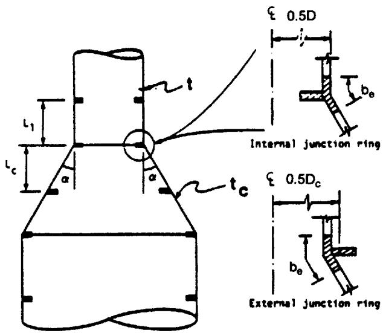  
FIG. D.4-1 EXAMPLE CONICAL TRANSITION

where

$\mathbf{D}$ = cylinder diameter at junction

t = cylinder thickness

$\mathbf{t}_{\mathbf{c}} =$ cone thickness

$\mathbf{t}_{\mathrm{e}} = \mathbf{t}$ for stress in cylinder section

$\mathbf{\sigma} = \mathbf{t}_{\mathbf{c}}$ for stress in cone section

$\mathbf{f_c}, \mathbf{f_b} =$ axial and bending stresses in cylinder section at junction due to factored global loads

$\alpha$ = one-half the apex angle of the cone

For strength requirements, the total stress （$\mathbf{f_c} + \mathbf{f_b} + \mathbf{f_b'})$ should be limited to the minimum tensile strength of the cone and cylinder material. For fatigue considerations, the cone-cylinder junction should satisfy the requirements of Section F with a stress concentration factor equal to $[1 + \mathbf{f_b}' / (\mathbf{f_c} + \mathbf{f_b})]$ , where $\mathbf{f_b'}$ is given by Equation D.4.1-1. For equal cylinder and cone wall thicknesses, the stress concentration factor reduces to （$1 + 0.6\sqrt{2D} /t\tan \alpha)$ .

2. Hoop Stress. The hoop stress caused by the unbalanced radial line load may be estimated from:

$$f_{h}^{\prime} = 0. 45 \sqrt{D / t} \left(f_{c} + \overline{{f_{b}}}\right) \tan \alpha \dots \dots \dots \dots \tag{D.4.1-2}$$

where the terms are defined in Subparagraph (a). For hoop tension, $\mathbf{f_h'}$ should be limited to $\phi_{\mathrm{t}}\mathbf{F}_{\mathbf{y}}$ . For hoop compression, $\mathbf{f_h'}$ should be limited to $\phi_{\mathrm{h}}\mathbf{F}_{\mathrm{hc}}$ , where $\mathbf{F}_{\mathrm{hc}}$ is computed using Equations D.2.5-4a and -4b) with $\mathbf{F}_{\mathrm{he}} = 0.4$ Et/D. This suggested value of $\mathbf{F}_{\mathrm{he}}$ is based on results presented in Reference D30.

D.4.1.4 Cone-Cylinder Junction Rings. If stiffening rings are required, the section properties should be chosen to satisfy both the following requirements:

$\mathbf{A}_{\mathbf{c}} = \frac{\mathbf{t}\mathbf{D}}{\mathbf{F}_{\mathbf{y}}} (\mathbf{f}_{\mathbf{c}} + \mathbf{f}_{\mathbf{b}})\tan \alpha$ (D.4.1-3)

$$I_{c} = \frac{t D D_{c}^{2}}{8 E} \left(f_{c} + f_{b}\right) \tan \alpha \dots \dots \dots \dots \dots \dots \tag{D.4.1-4}$$

where

D = cylinder diameter at junction

$\mathbf{D}_{\mathbf{c}}$ = diameter to centroid of composite ring section. See Note 2.

$\mathbf{A}_{\mathbf{c}} =$ cross-sectional area of composite ring section.

$\mathbf{I}_{\mathbf{c}}$ = moment of inertia of composite ring section.

In computing $\mathbf{A}_{\mathbf{c}}$ and $\mathbf{I}_{\mathbf{c}}$ , the effective width of shell wall acting as a flange for the composite ring section may be computed from:

$$\mathbf{b}_{\mathrm{e}} = 0. 55 \left(\sqrt{\mathrm{D t}} + \sqrt{\mathrm{D t}_{\mathrm{c}}}\right) \dots \tag{D.4.1-5}$$

NOTE 1: For flat bar stiffeners, the minimum dimensions should be $10 \times 76\mathrm{mm}$ ( $\frac{1}{2} \times 3$ in.) for internal rings and $13 \times 102\mathrm{mm}$ ( $\frac{1}{2} \times 4$ in.) for external rings.

NOTE 2: For internal rings, $D$ should be used instead of $D_{c}$ in Equation D.4.1-4.

D.4.2 Hydrostatic Pressure

D.4.2.1 Cone Design. Unstiffened conical transitions or cone sections between rings of stiffened cones with a projected apex angle less than 60 degrees may be designed for local buckling under hydrostatic pressure as equivalent cylinders with a length equal to the slant height of the cone between rings and a diameter equal to $\mathbf{D} / \cos \alpha$ , where $\mathbf{D}$ is the diameter at the large end of the cone section and $\alpha$ equals one-half the apex angle of the cone (See Figure D.4-1).   
D.4.2.2 Intermediate Stiffening Rings. If required, circumferential stiffening rings within cone transitions may be sized using Equation D.2.5-6 with an equivalent diameter equal to $\mathrm{D} / \cos \alpha$ , where $\mathrm{D}$ is the cone diameter at the ring, $\mathbf{t}$ is the cone thickness, $\mathbf{L}$ is the average distance to adjacent rings along the cone axis and $\mathbf{F}_{\mathrm{he}}$ is the average of the elastic hoop buckling stress values computed for the two adjacent bays.   
D.4.2.3 Cone-Cylinder Junction Rings. Circumferential stiffening rings required at the cone-cylinder junctions should be sized such that the moment of inertia of the composite ring section satisfies the following equation:

$$I_{c} = \frac{D^{2}}{16 E} \left\{t L_{1} F_{h e} + \frac{t_{c} L_{c} F_{h e c}}{\cos^{2} \alpha} \right\}. \dots \dots \dots . (D. 4. 2 - 1)$$

where:

$\mathbf{I}_{\mathbf{c}}$ = moment of inertia of composite ring section with effective width of flange computed from Equation D.4.1-5

D = diameter of cylinder at junction. See Note 2.

t = cylinder thickness

$\mathbf{t}_{\mathbf{c}} =$ cone thickness

$\mathbf{L}_{\mathbf{c}}$ = distance to first stiffening ring in cone section along cone axis

$\mathbf{L}_1 =$ distance to first stiffening ring in cylinder section

$\mathbf{F}_{\mathrm{he}} =$ elastic hoop buckling stress for cylinder

$\mathbf{F}_{\mathrm{hec}} = \mathbf{F}_{\mathrm{he}}$ for cone section treated as an equivalent cylinder

NOTE 1: A junction ring is not required for hydrostatic collapse if Equation D.2.5-2 is satisfied with $F_{he}$ computed using $C$ equal to 0.44 (cosα) (t/D) in Equation D.2.5-4, where $D$ is the cylinder diameter at the junction.

NOTE 2: For external rings, $D$ in Equation D.2.4-1 should be taken to the centroid of the composite ring.

A cone-cylinder junction that does not satisfy the above criteria may be strengthened either by increasing the cylinder and cone wall thickness at the junction, or by providing a stiffening ring at the joint.

SECTION E CONNECTIONS

## E.1 CONNECTIONS OF TENSION AND COMPRESSION MEMBERS

The connections at the ends of tension and compression members should develop the strength required by design loads, but not less than $50\%$ of the effective strength of the member. The effective strength is defined as the buckling load for members loaded in either tension or compression, and as the yield load for members loaded primarily in tension. The above rule can be considered satisfied for simple tubular joints when the following condition is obtained:

$$\begin{array}{l l} \frac{\mathrm{F_{y b}}}{\mathrm{F_{y}}} & \frac{(\gamma \tau \sin \theta)}{(11 + 1 . 5 / \beta)} \leq 1. 0 \dots \dots \dots \dots \dots \dots \dots \dots \dots \dots \dots \dots \dots \dots \dots \dots \dots \dots \dots \dots \\ & \end{array} (E. 3 - 1)$$

Where

$\mathbf{F}_{y} =$ the yield strength of the chord member at the joint (or 2/3 of the tensile strength if less), in stress units

$\mathbf{F_{yb}} =$ the yield strength of the brace member in stress units

$\beta, \gamma, \tau, \theta =$ joint geometry parameters (see Figure E.3-1). $\tau$ and $\mathbf{F_{yb}}$ should be based on the nominal brace member, not the brace stub should one exist.

Welds in connections at the ends of tubular members should be in accordance with Section L.1.3 or should not be less than required to develop a capacity equal to the lesser of:

1. Strength of the branch member based on yield, or   
2. Strength of the chord based on ultimate joint strength (where applicable).

## E.2 RESTRAINT AND SHRINKAGE

Details should be such as to minimize constraint against ductile behavior to avoid undue concentration of welding and to afford simple access for the placing of weld metal.

Joints should be designed so as to minimize, insofar as practicable, stresses due to the contraction of the weld metal and adjacent base metal upon cooling. Particular care is required where shrinkage strains in the through-thickness direction may lead to lamellar tearing in highly restrained joints. See Section I.3 of this recommended practice and Section 10.5.4 of AWS D1.1 Commentary on the Structural Welding Code (Reference E1).

## E.3 TUBULAR JOINTS

E.3.1 Simple Joints. Simple tubular joints without overlap of principal braces and having no gussets, diaphragms, or stiffeners should use the following guidelines. Terminology is defined in Figure E.3-1.

Joint classification as K, T & Y, or cross (X) should apply to individual braces according to their load pattern for each load case. To be considered a K-joint, the punching load in a brace should be essentially balanced by loads on other braces in the same plane on the same side of the joint. In T and Y joints the punching load is reacted as beam shear in the chord. In cross joints the punching load is carried through the chord to braces on the opposite side. For braces that carry part of their load as K-joints, and part as T & Y or cross joints interpolate based on the portion of each in total. Examples are shown in Figure E.3-2. See Commentary on Joint Classifications.

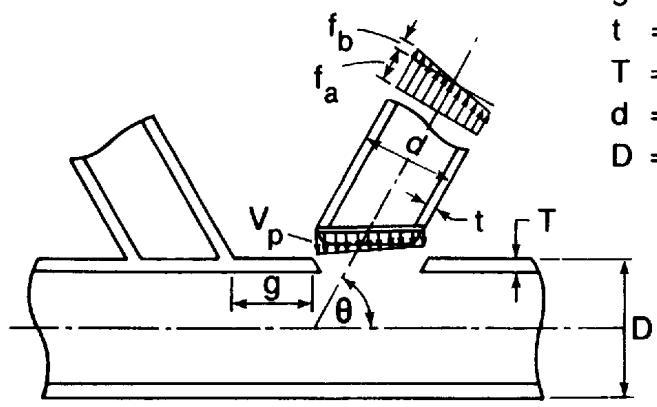  
FIG. E.3-1 TERMINOLOGY AND GEOMETRIC PARAMETERS FOR SIMPLE TUBULAR CONNECTIONS

$$\begin{array}{l} \theta = \text{B R A C E A N G L E (m e a s u r e d f r o m c h o r d)} \\ g = G A P \\ t = B R A C E T H I C K N E S S \\ T = C H O R D T H I C K N E S S \\ d = B R A C E D I A M E T E R \\ D = C H O R D D I A M E T E R \\ \tau = \frac{t}{T} \\ \beta = \frac{d}{D} \\ \boldsymbol{\gamma} = \frac{D}{2 T} \\ \end{array}$$

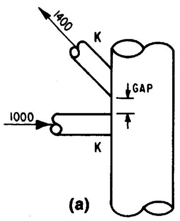

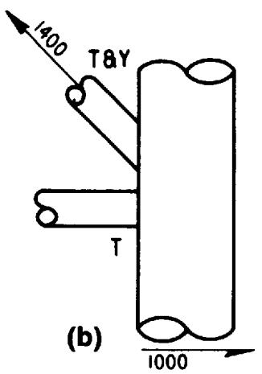

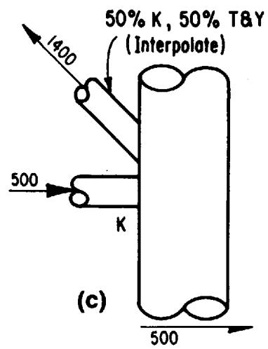

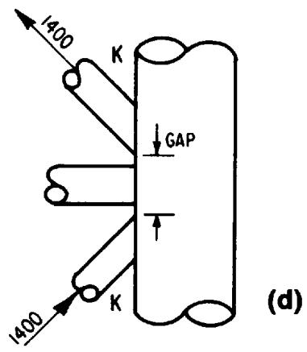

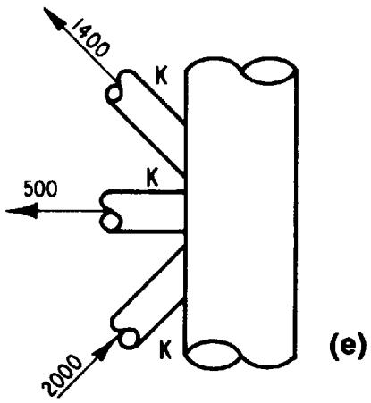

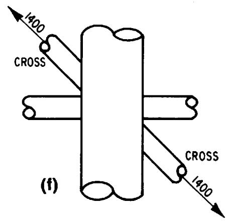

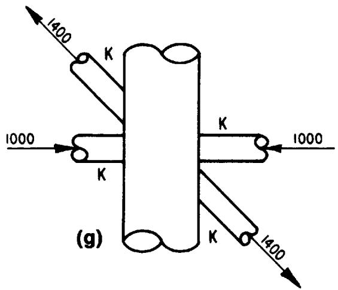  
FIG. E.3-2 EXAMPLES OF JOINT CLASSIFICATION

Many properly designed tubular joints, especially those with brace to chord diameter ratios approaching 1.0, will exhibit different failure mechanisms and strength properties than the empirically based formulas contained herein. At present, insufficient experimental evidence exists to precisely quantify the degree of increased strength. Therefore, in lieu of the recommendations contained in Section E.3 herein, reasonable alternative methods may be used for the design of such joints.

The adequacy of the joint should be determined on the basis of factored loads in the brace. Brace axial loads and bending moments essential to the integrity of the structure* should be included in the calculations.

E.3.1.1 Strength Check. Joint capacity shall satisfy the following:

$$\mathrm{P}_{\mathrm{D}} <   \phi_{\mathrm{j}} \mathrm{P}_{\mathrm{u j}} \dots \tag{E.3-2}$$

$$\mathbf{M}_{\mathrm{D}} <   \phi_{\mathrm{j}} \mathbf{M}_{\mathrm{u j}} \dots \tag{E.3-3}$$

where:

$\mathbf{P}_{\mathbf{D}}$ = the factored axial load in the brace member, in force units   
$\mathbf{P}_{\mathrm{uj}} =$ the ultimate joint axial capacity, in force units   
$\mathbf{M}_{\mathrm{D}} =$ the factored bending moment in the brace member, in moment units   
$\mathbf{M}_{\mathbf{u}\mathbf{j}} =$ the ultimate joint bending moment capacity, in moment units   
$\phi_{j}$ $=$ resistance factor for tubular joints (see Table E.3-1)

TABLE E.3-1 CONNECTION RESISTANCE FACTORS - $\phi_{\mathbf{j}}$   

| TYPE OF LOAD IN BRACE MEMBER | TYPE OF LOAD IN BRACE MEMBER | TYPE OF LOAD IN BRACE MEMBER | TYPE OF LOAD IN BRACE MEMBER | TYPE OF LOAD IN BRACE MEMBER |
| --- | --- | --- | --- | --- |
| Type of Joint and Geometry | Axial Tension | Axial Compression | In-Plane Bending ipb | Out-of-Plane Bending opb |
| K | 0.95 | 0.95 | 0.95 | 0.95 |
| T and Y | 0.90 | 0.95 | 0.95 | 0.95 |
| Cross (X) | 0.90 | 0.95 | 0.95 | 0.95 |

For braces which carry part of their load as K-Joints and part as T & Y or cross joints, interpolate $\phi_{j}$ based on the portion of each in total.

For combined axial loads and bending moments in the brace, Equation E.3.2 should be satisfied along with the following interaction equation:

$$\begin{array}{l} 1 - \cos \left[ \frac{\pi}{2} \left(\frac{P_{D}}{\phi_{j} P_{u j}}\right) \right] + \left[ \left(\frac{M_{D}}{\phi_{j} M_{u j}}\right)^{2} \mathrm{i p b} + \left(\frac{M_{D}}{\phi_{j} M_{u j}}\right)^{2} \mathrm{o p b} \right]^{1 / 2} \leq 1. 0 \\ \dots \dots \dots \dots \dots \tag{E.3-4} \end{array}$$

where: $\mathbf{ipb} = \mathbf{in}$ -plane bending

$\mathbf{opb} =$ out-of-plane bending

The ultimate capacities are defined as follows:

$$\mathrm{P}_{\mathrm{u j}} = \frac{\mathrm{F}_{\mathrm{y}} \mathrm{T}^{2}}{\sin \theta} \mathrm{Q}_{\mathrm{u}} \mathrm{Q}_{\mathrm{f}} \dots \tag{E.3-5}$$

$$\mathbf{M}_{\mathrm{u j}} = \frac{\mathbf{F}_{\mathrm{y}} \mathbf{T}^{2}}{\sin \theta} (0. 8 \mathrm{d}) \mathbf{Q}_{\mathrm{u}} \mathbf{Q}_{\mathrm{f}} \dots \tag{E.3-6}$$

$Q_{f}$ is a design factor to account for the presence of longitudinal factored load in the chord.

$$\mathbf{Q}_{\mathbf{f}} = 1. 0 - \lambda \gamma \mathbf{A}^{2}$$

where:

$\lambda = 0.030$ for brace axial stress   
$= 0.045$ for brace in-plane bending stress   
$= 0.021$ for brace out-of-plane bending stress

$$\mathrm{A} = \frac{\left(\overline{{f}}_{\mathrm{a x}} {}^{2} + \overline{{f}}_{\mathrm{i p b}} {}^{2} + \overline{{f}}_{\mathrm{o p b}} {}^{2}\right) 1 / 2}{\phi_{\mathrm{q}} \mathrm{F}_{\mathrm{y}}}$$

$\overline{\mathbf{f}}_{\mathrm{ax}}, \overline{\mathbf{f}}_{\mathrm{ipb}},$ and $\overline{\mathbf{f}}_{\mathrm{opb}}$ are the factored axial, in-plane bending, and out-of-plane bending stresses in the chord.

$$\phi_{\mathbf{q}} = \text{Y i e l d s t r e s s r e s i s t a f c t o r} = 0. 95$$

Set $Q_{\mathbf{f}} = 1.0$ when all extreme fiber stresses in the chord are tensile.

$\mathbf{Q}_{\mathbf{u}}$ is the ultimate strength factor which varies with the joint and load type, as given in Table E.3-2.

TABLE E.3-2   
VALUES FOR $\mathbf{Q_u}$   

| TYPE OF LOAD IN BRACE MEMBER | TYPE OF LOAD IN BRACE MEMBER | TYPE OF LOAD IN BRACE MEMBER | TYPE OF LOAD IN BRACE MEMBER | TYPE OF LOAD IN BRACE MEMBER |
| --- | --- | --- | --- | --- |
| Type of Joint and Geometry | Axial Tension | Axial Compression | In-Plane Bending ipb | Out-of-Plane Bending opb |
| K | (3.4 + 19β) Qg | (3.4 + 19β) Qg | (3.4 + 19β) Qg | (3.4 + 19β) Qg |
| T and Y | 3.4 + 19β | 3.4 + 19β | 3.4 + 19β | 3.4 + 19β |
|  |  |  | 3.4 + 19β | (3.4 + 7β)Qβ |
| Cross Joint W/O dia-phragms | 3.4 + 19β | (3.4 + 13β)Qβ | (3.4 + 13β)Qβ | (3.4 + 13β)Qβ |
| W/ dia-phragms | 3.4 + 19β | 3.4 + 19β | 3.4 + 19β | 3.4 + 19β |

$$\begin{array}{l} Q_{\beta} = \frac{0 . 3}{\beta (1 - 0 . 833 \beta)} \text{f o r} \beta > 0. 6 \\ = 1. 0 \text{f o r} \beta \leq 0. 6 \\ \end{array}$$

$Q_{g}$ is a gap factor defined by:

$$\begin{array}{l} Q_{g} = 1. 8 - 0. 1 g / T \text{f o r} \gamma \leq 20 \\ = 1. 8 - 4 \mathrm{g} / \mathrm{D} \text{f o r} \gamma > 20 \\ \end{array}$$

but in no case shall $\mathbf{Q}_{\mathbf{g}}$ be taken as less than 1.0.

For braces which carry part of their load as K-Joints and part as T & Y or cross joints, interpolate $\mathbf{Q}_{\mathbf{u}}$ based on the portion of each in total.

E.3.1.2 Design Practice. If an increased wall thickness in the chord at the joint is required, it should be extended past the outside edge of the bracing a minimum of one quarter of the chord diameter or $305\mathrm{mm}$ (12 in.) including taper, whichever is greater. See Figure E.3-3. The effect of joint can length on the capacity of cross joints is discussed in Section E.3.4.

Where increased wall thickness or special steel is used for braces in the tubular joint area, it should extend a minimum of one brace diameter or $610\mathrm{mm}$ (24 in.) from the joint, including taper, whichever is greater.

Nominally concentric joints may be detailed with the working points (intersections of brace and chord centerlines) offset in either direction by as much as one quarter of the chord diameter in order to obtain a minimum clear distance of $51\mathrm{mm}$ (2 in.) between non-overlapping braces or to reduce the required length of heavy wall in the chord. See Figure E.3-3. For joints having a continuous chord of diameter substantially greater than the brace members (e.g., jacket leg joints), the moments caused by this minor eccentricity may be neglected. For $\mathbf{K}$ and $\mathbf{X}$ joints where all members are of similar diameter, the moments caused by eccentricity may be important and should be assessed by the designer.

Simple joints which cannot be detailed to provide the $51\mathrm{mm}$ (2 in.) minimum clear distance between braces within the limits of allowable offset of the working point, as established above, should be designed for stress transfer as discussed in Section E.3.2 below and specially detailed on the drawings.

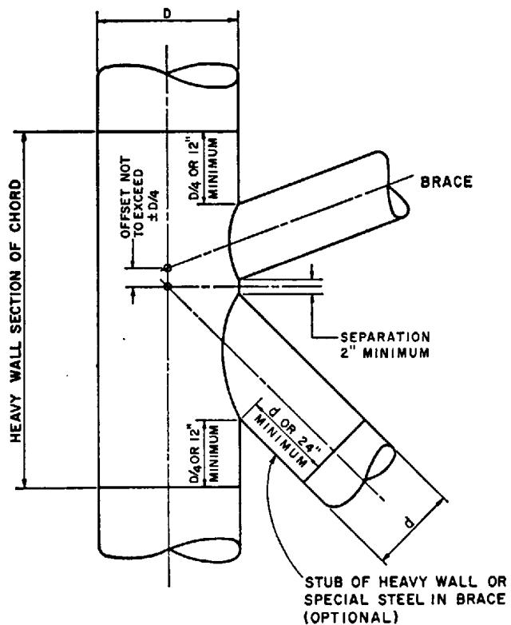  
FIG.E.3-3 DETAIL OF SIMPLE JOINT

E.3.2 Overlapping Joints. Overlapping joints, in which brace moments are insignificant and part of the axial load is transferred directly from one brace to another through their common weld, may be designed as follows:

The factored axial force component perpendicular to the chord, $\mathbf{P}_{\mathrm{D}\perp}$ should satisfy the following:

$$\mathrm{P}_{\mathrm{D} \perp} <   \left(\phi_{\mathrm{j}} \mathrm{P}_{\mathrm{u j}} \frac{\mathrm{l}_{1}}{\mathrm{l}} \quad \sin \theta\right) + \left(2 \mathrm{v}_{\mathrm{w}} \mathrm{t}_{\mathrm{w}} \mathrm{l}_{2}\right) \dots \dots \dots . (E. 3 - 7)$$

where:

$$\begin{array}{l} \mathbf{v}_{\mathbf{w}} = \phi_{\mathbf{s h}} \mathbf{F}_{\mathbf{y}} \\ \phi_{\mathrm{s h}} = \text{t h e A I S C r e s i s t a n c e f a c t o r f o r t h e w e l d} (\text{s e e C o m m e n t a r y}) \\ \begin{array}{r l} \mathrm{t}_{\mathrm{w}} & = \text{t h e l e s s e r o f t h e w e l d t h r o a t t h i c k n e s s o r t h e} \\ & \text{t h i c k n e s s , t , o f t h h i n n e r b r a c e} \end{array} \\ l_{1} = \text{c i r c u m f e r e n c e f o r t h a t p o r t i o n o f t h e b r a c e} \quad \text{w h i c h c o n t a c t s t h e c h o r d (a c t u a l l e n g t h)} \\ 1 = \text{c i r c u m f e r e n c e o f t h e b r a c e c o n t a c t w i t h t h e} \\ l_{2} = \text{t h e p r o j e c t e d c h o r d l e n g t h (o n e s i d e) o f t h e} \\ \end{array}$$

These terms are illustrated in Figure E.3-4.

The overlap should preferably be proportioned for at least $50\%$ of the acting $\mathbf{P}_{\mathrm{D}\perp}$

In no case should the brace wall thickness exceed the chord wall thickness.

Moments caused by eccentricity of the brace working lines and exceeding that in Section E.3.1.2 may be important and should be assessed by the designer.

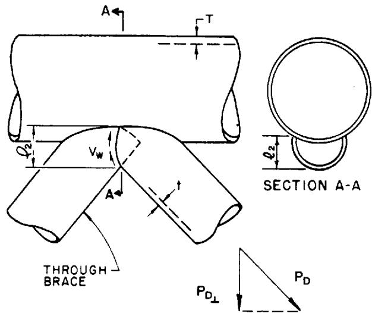  
FIG. E.3-4. DETAIL OF OVERLAPPING JOINT

Where the braces carry substantially different loads and/or one brace is thicker than the other, the heavier brace should preferably be the through brace (as illustrated in Figure E.3-4) with its full circumference welded to the chord.

E.3.3 Congested Joints. Where bracing members in adjacent planes tend to overlap in congested joints, the following corrective measures may be considered by the designer.

Where primary braces are substantially thicker than the secondary braces, they may be made the through member, with the secondary braces designed as overlapping braces per Section E.3.2. See Figure E.3-5, detail A.

An enlarged portion of the through member may be used as indicated in Figure E.3-5, detail B, designed as a simple joint per Section E.3.1.

A spherical joint, Figure E.3-5, detail C, may be used, designed on the basis of ultimate joint strength per Section E.3.1 assuming:

$$\gamma = \mathrm{D} / 4 \mathrm{T}$$

$$\theta = \operatorname{a r c} \cos (\beta)$$

$$\mathbf{Q}_{\mathbf{u}} = \mathbf{1 . 0}$$

$$\mathbf{Q}_{f} = 1. 0$$

Secondary braces causing interference may be spread out as indicated in Figure E.3-5, detail D, provided the moments caused by the eccentricity of their working lines are considered in the design analysis.

E.3.4 Load Transfer Across Chords. Cross joints, launch leg joints, and other joints in which load is transferred across the chord should be designed to resist general collapse. However, for such joints reinforced only by a joint can having increased thickness $\mathbf{T}_{\mathrm{c}}$ and length L (for cases where joint cans are centered on the brace of interest L is defined as shown in Figure E.3-6a) and having brace chord diameter ratio less than 0.9, the allowable axial branch load shall be taken as:

$$P = P (1) + \underbrace{L}_{2. 5 D} [ P (2) - P (1) ] \quad f o r L <   2. 5 D (E. 3. 4 - l a)$$

$$P = P (2) \quad \text{f o r} L > 2. 5 D \tag{E.3.4-1b}$$

where:

$\mathbf{P}(\mathbf{l}) = \mathbf{P}_{\mathbf{a}}$ from Equation E.3.1-4a using the nominal chord member thickness

$\mathbf{P}(2) = \mathbf{P}_{\mathbf{a}}$ from Equation E.3.1-4a using thickness $\mathbf{T}_{\mathrm{c}}$

Special consideration is required for more complex joints. For multiple branches in the same plane, dominantly loaded in the same sense, the relevant crushing load is $\Sigma_{\mathrm{i}}\mathbf{P}_{\mathrm{i}}$ Sin $\theta_{\mathrm{i}}$ . An approximate closed ring analysis may be employed, including plastic analysis with appropriate safety factors, using an effective chord length as shown in Figure E.3-6b. Any reinforcement

within this dimension (e.g., diaphragms, rings, gussets or the stiffening effect of out of plane members) may be considered in the analysis, although its effectiveness decreases with distance from the branch footprint.

Joints having two or more appropriately located diaphragms at each branch need only be checked for local capacity. The diaphragms shall be at least as thick as the wall thickness of the corresponding branch member. The capacity may be calculated using Table E.3-1 or E.3-2 for cross joints with diaphragms.

E.3.5 Other Complex Joints. Joints not covered by Section E.3.1 through E.3.4 may be designed on the basis of appropriate experimental or in-service evidence. In lieu of such evidence, an approximate analytical check should be made. This check may be done by cutting sections which isolate groups of members, individual members, and separate elements of the joint (e.g., gussets, diaphragms, stiffeners, welds in shear, surfaces subjected to punching shear), and verifying that a distribution of stress can be assumed that satisfies equilibrium without exceeding the allowable stress of the material.

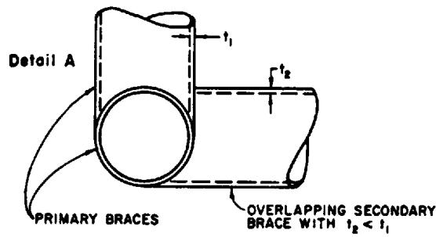

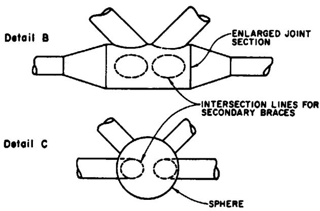

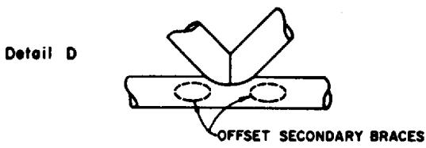  
FIG.E.3-5 SECONDARY BRACING

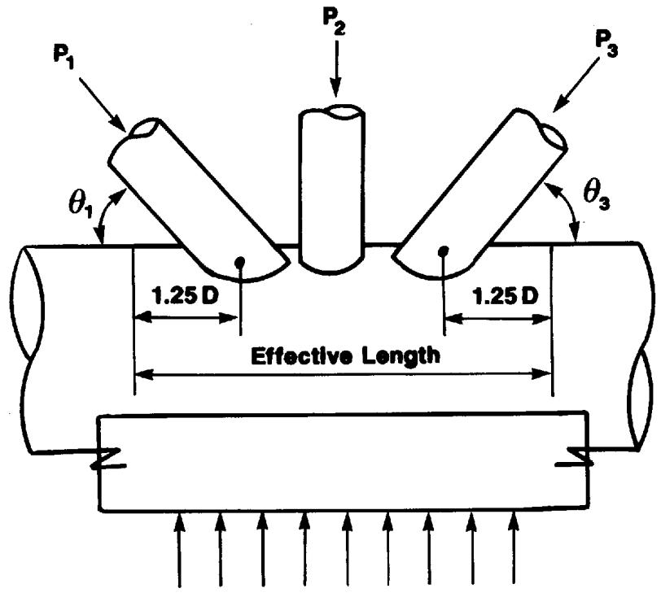

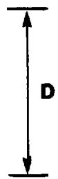

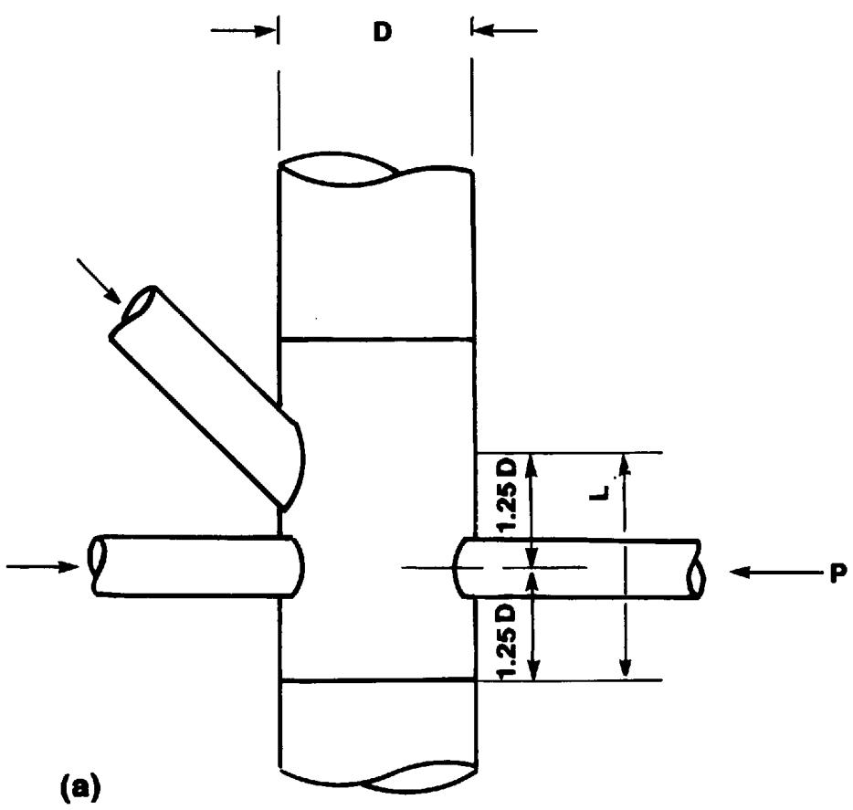  
FIG. E.3-6   
DEFINITION OF EFFECTIVE CORD LENGTH

SECTION F FATIGUE

## F.1 FATIGUE DESIGN

In the design of tubular connections, consideration should be given to fatigue problems as related to local cyclic stresses. A detailed fatigue analysis should be performed for template type structures. It is recommended that a spectral analysis technique be used. Other rational methods may be used provided adequate representation of the forces and member responses can be shown.

In lieu of detailed fatigue analysis, simplified fatigue analyses, which have been calibrated for the design wave climate, may be applied to tubular joints in template type platforms that:

1. are in less than $122\mathrm{m}$ (400 ft.) of water,   
2. are constructed of ductile steels,   
3. have redundant structural framing, and   
4. have natural periods less than three seconds.

## F.2 FATIGUE ANALYSIS

A detailed analysis of cumulative fatigue damage, when required, should be performed as follows:

1. The wave climate should be derived as the aggregate of all seastates to be expected over the long term. This may be condensed for purposes of structural analysis into representative seastates characterized by wave energy spectra and physical parameters together with a probability of occurrence.

2. A space frame analysis should be performed to obtain the structural response in terms of nominal member stress for given wave forces applied to the structure. A load factor of 1.0 is recommended for these analyses. In general, wave force calculations should follow the procedures described in Section C.3.3. However, current may be neglected and, therefore, considerations for apparent wave period and current blockage are not required. In addition, a wave kinematics factor equal to 1.0 and conductor shielding factor equal to 1.0 should be applied for fatigue waves. The drag and inertia coefficient depend on the seastate level, as parameterized by the Keulegan-Carpenter Number K (See Comm. C.3.3.7). For small waves （$1.0 < \mathbf{K} < 6.0$ for platform legs at mean water level), values of $C_{\mathrm{m}} = 2.0$ , $C_{\mathrm{d}} = 0.8$ for rough members and $C_{\mathrm{d}} = 0.5$ for smooth members should be used. Guidelines for considering directionality, spreading, tides and marine growth are provided in the commentary for this section.

A spectral analysis technique should be used to determine the stress response for each seastate. Dynamic effects should be considered for seastates having significant energy near a platform's natural period.

3. Local stresses that occur within tubular connections should be considered in terms of hot spot stresses located immediately adjacent to the joint intersection using suitable stress concentration factors. The microscale effects occurring at the toe of the weld are reflected in the appropriate choice of the S-N curve.

4. For each location around each member intersection of interest, the stress response for each seastate should be computed, giving adequate consideration to both global and local stress effects.

The stress responses should be combined into the long term stress distribution, which should then be used to calculate the cumulative fatigue damage ratio, $\mathbf{D}_{\mathbf{r}}$ , where

$$\mathrm{D}_{\mathrm{r}} = \Sigma (\mathrm{n} / \mathrm{N}) \tag{F.2-1}$$

where

n = number of cycles applied at a given stress range, and   
N = number of cycles for which the given stress range would be allowed by the appropriate S-N curve.

Alternatively, the damage ratio may be computed for each seastate and combined to obtain the cumulative damage ratio.

5. In general, the design fatigue life of each joint and member should be at least twice the intended service life of the structure (i.e., Safety Factor = 2.0). For the design fatigue life, $\mathbf{D}_{\mathbf{r}}$ should not exceed unity. For critical elements whose sole failure could be catastrophic, use of a larger safety factor should be considered.

When fatigue damage can occur due to other cyclic loadings, such as transportation, the following equation should be satisfied:

$$\begin{array}{l} \sum \mathrm{S F}_{\mathrm{i}} \mathrm{D}_{\mathrm{r i}} <   1. 0 \dots \dots \dots \dots \dots \dots \dots \dots \dots \dots \dots \dots \dots \dots \dots \\ \mathrm{i} \end{array} \tag{F.2-2}$$

Where $\mathbf{D}_{\mathbf{ri}}$ is the fatigue damage ratio for each type of loading and $\mathbf{SF}_j$ is the associated safety factor. For transportation where long term wave distributions are used to predict short-term damage, a larger safety factor should be considered.

## F.3 S-N CURVES FOR MEMBERS AND CONNECTIONS, EXCEPT FOR TUBULAR MEMBERS

Nontubular members and connections in deck structures, appurtenances and equipment, and tubular members and attachments to them, including ring stiffeners, may be subject to variations of stress due to environmental loads or operational loads. Operational loads

PERMISSIBLE CYCLES OF LOAD N   
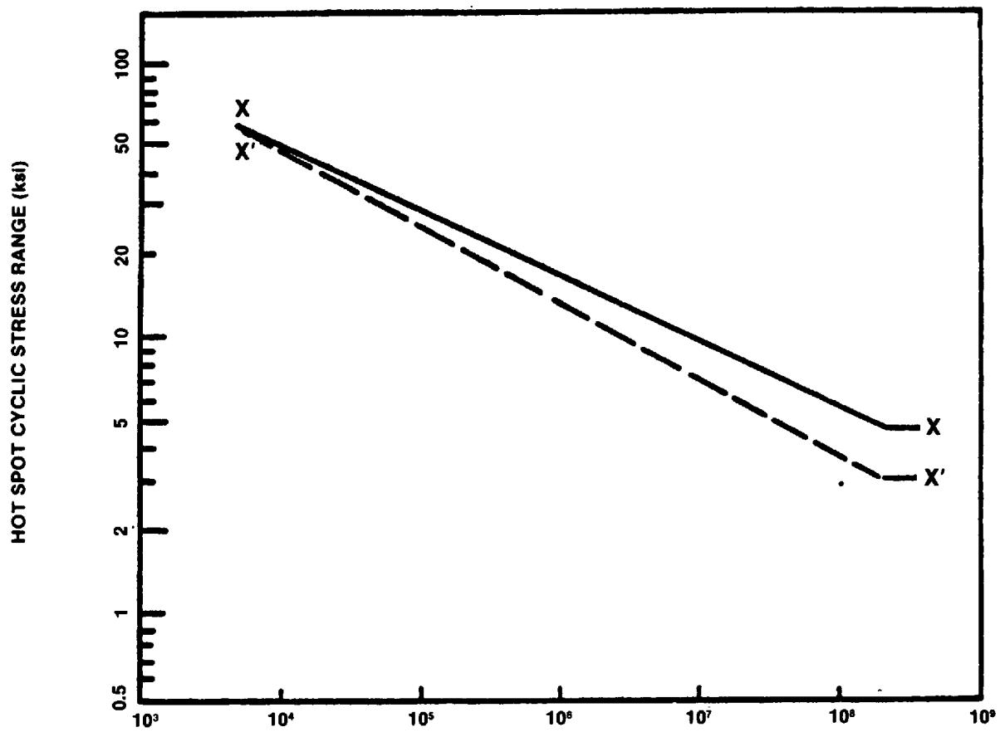  
NOTE - These curves may be represented mathematically as

$$N = 2 \times 10^{6} \left(\frac{\Delta \sigma}{\Delta \sigma_{\text{r e f}}}\right)^{- m}$$

where $\mathbf{N}$ is the permissible number of cycles for applied cyclic stress range $\Delta \sigma$ , with $\Delta \sigma$ ref and $m$ as listed below.

FIG.F.4-1 FATIGUE S-N CURVES   

| CURVE | Δσ refSTRESS RANGE AT2 MILLION CYCLES | mINVERSELOG-LOG SLOPE | ENDURANCE LIMIT AT200 MILLION CYCLES |
| --- | --- | --- | --- |
| X | 100 MPa (14.5 ksi) | 4.38 | 35 MPa (5.07 ksi) |
| X' | 79 MPa (11.4 ksi) | 3.74 | 23 MPa (3.33 ksi) |

would include those associated with machine vibration, crane usage and filling and emptying of tanks. Where variations of stress are applied to conventional weld details identified in ANSI/APS D1.1-92 Figure 9.1, the associated S-N Curves provided in Figure 9.2 or 9.3 should be used, dependent on degree of redundancy. Where such variations of stress are applied to situations identified in ANSI/APS D1.1-92 Table 10.3, the associated S-N Curves provided in Figure 10.6 should be used. For service conditions where details may be exposed to corrosion, no endurance limit should be considered. For submerged service, where effective cathodic protection is present, the endurance limit should be considered to occur at $2*10^{8}$ cycles. Stress Categories DT, ET, FT, K1, K2, X1 and X2 refer to tubular connections and are covered by Section F.4 of this Recommended Practice which takes precedence.

The referenced S-N Curves in ANSI/AWS D1.1-92 Figures 9.2, 9.3 and 10.6 are Class Curves. For such curves, the nominal stress range in the vicinity of the detail should be used. Due to load attraction, shell bending, etc., not present in the class type test specimens, the appropriate stress may be larger than the nominal stress in the gross member. Geometrical stress concentration and notch effects associated with the detail itself are included in the curves.

## F.4 S-N CURVES FOR TUBULAR CONNECTIONS

For tubular connections exposed to variations of stress due to environmental or operational loads, the S-N curves shown in Figure F.4-1 should be used. These curves are applicable to random loading and presume effective cathodic protection. For splash zone, free corrosion, or excessive corrosion conditions no endurance limit should be considered. Connections in the splash zone should generally be avoided. For tubular connections subject to regular cyclic loading in atmospheric service the endurance limits for the X and $\mathbf{X}^{\prime}$ curves may be assumed to be at $10^{7}$ and $2^{*}10^{7}$ respectively.

For welds without profile control, but conforming to a basic standard flat profile (ANSI/AWS D1.1-92, Figure 10.12) and having a branch thickness less than $16\mathrm{mm}$ (0.625 in.) the $\mathbf{X}^{\prime}$ curve is applicable. For the same flat

profile at greater wall thicknesses the scale effect correction (Equation F.4-1) should be used. However, the $\mathbf{X}^{\prime}$ -Curve may be used for unlimited branch thicknesses provided the profile control requirements of Section L.1.3.4 are satisfied.

The scale effect correction is:

$$\text{a l l o w a b l e} \quad \text{s t r e s s} = \quad \mathrm{S}_{0}. \left\{\frac{\mathrm{t} .}{\mathrm{t}_{0}} \right\}^{- 0. 25} \tag{F.4-1}$$

where: $\mathbf{S}_0$ is the allowable stress from the S-N curve, $t$ is the branch member thickness $t_0$ is the limiting branch thickness.

The X-Curve is applicable for welds with profile control, as defined in Section L.1.3.4, and having a branch thickness less than $25\mathrm{mm}$ (1 in.). For the same controlled profile at greater wall thicknesses, the scale effect correction (Equation F.4-1) should be used. However, reductions below the $\mathbf{X}^{\prime}$ -Curve are not required.

For branch thicknesses greater than $25\mathrm{mm}$ (1 in.), the X-curve may be used without scale effect provided the profile is ground smooth to a radius greater than or equal to half the branch thickness. Final grinding marks should be transverse to the weld axis and the entire finished profile should pass magnetic particle inspection.

## F.5 STRESS CONCENTRATION FACTORS

The X and $\mathbf{X}^{\prime}$ curves should be used with hot spot stress ranges based on suitable stress concentration factors. Stress concentration factors may be derived from finite element analyses, model tests or empirical equations based on such methods.

For joints not meeting the requirements of Section L.1.3, e.g., connections in which load transfer is accomplished by overlap (Section E.3.2), or by gusset plates, ring stiffeners, etc. (Section E.3.5), a minimum stress concentration factor of 6.0 should be used in the brace member, in lieu of a more detailed analysis. Where the chord and/or other joint reinforcement are not designed to develop the full static capacity of the members joined, these elements should also be checked separately.

SECTION G FOUNDATION DESIGN

The recommended criteria of Section G.1 through Section G.11 are devoted to pile foundations, and more specifically to steel cylindrical (pipe) pile foundations. An introduction to Design of Shallow Foundations is given in Section G.12 and Section G.13, and specifics in preliminary form are presented in Comm. G.13 while recommendations are under development.

## G.1 GENERAL

The foundation should be designed to carry static, cyclic, and transient loads without excessive deformations or vibrations in the platform. Special attention should be given to the effects of cyclic and transient loading on the strength of the supporting soils as well as on the structural response of piles. Guidance provided in Sections G.3, G.4, and G.5 is based upon static, monotonic loadings. Furthermore, this guidance does not necessarily apply to so called problem soils such as carbonate material or volcanic sands or highly sensitive clays. The possibility of movement of the seafloor against the foundation members should be investigated and the forces caused by such movements, if anticipated, should be considered in the design.

## G.2PILE FOUNDATIONS

Types of pile foundations used to support offshore structures are as follows:

G.2.1 Driven Piles. Open ended piles are commonly used in foundations for offshore platforms. These piles are usually driven into the seafloor with impact hammers which use steam, diesel fuel, or hydraulic power as the source of energy. The pipe wall thickness should be adequate to resist axial and lateral loads as well as the stresses during pile driving. It is possible to predict approximately the stresses during pile driving using the principles of one-dimensional elastic stress wave transmission by carefully selecting the parameters that govern the behavior of the soil, pile, cushions, capblock, and hammer. For a more detailed study of these principles refer to Reference G1. The above approach may also be used to optimize the pile-hammer-cushion and capblock with the aid of computer analyses (commonly known as the Wave Equation Analyses).

The design penetration of driven piles should be determined in accordance with the principles outlined in Sections G.3 through G.6 and Section G.9 rather than upon any correlation of pile capacity with the number of blows required to drive the pile a certain distance into the seafloor.

When a pile refuses before it reaches design penetration, one or more of the following actions can be taken:

(a) Review of hammer performance. A review of all aspects of hammer performance, possibly with the aid of hammer and pile head instrumentation, may

identify problems which can be solved by improved hammer operation and maintenance, or by the use of a more powerful hammer.

(b) Reevaluation of design penetration. Reconsideration of loads, deformations and required capacities, of both individual piles and other foundation elements, and the foundation as a whole, may identify reserve capacity available. An interpretation of driving records in conjunction with instrumentation mentioned above may allow design soil parameters or stratification to be revised and pile capacity to be increased.   
(c) Modifications to piling procedures. Modifying procedures, usually the last course action, may include one of the following:

1. Plug Removal. The soil plug inside the pile is removed by jetting and air lifting or by drilling to reduce pile driving resistance. If plug removal results in inadequate pile capacities, the removed soil plug should be replaced by a grout or concrete plug having sufficient load-carrying capacity to replace that of the removed soil plug. Attention should be paid to plug/pile load transfer characteristics. Plug removal may not be effective in some circumstances particularly in cohesive soils.   
2. Soil Removal Below Pile Tip. Soil below the pile tip is removed either by drilling an undersized hole or by jetting and possibly air lifting. The drilling or jetting equipment is lowered through the pile which acts as the casing pipe for the operation. The effect on pile capacity of drilling an undersized hole is unpredictable unless there has been previous experience under similar conditions. Jetting below the pile tip should in general be avoided because of the unpredictability of the results.   
3. Two-Stage Driven Piles. A first stage or outer pile is driven to a predetermined depth, the soil plug is removed, and a second stage or inner pile is driven inside the first stage pile. The annulus between the two piles is grouted to permit load transfer and develop composite action.   
4. Drilled and Grouted Insert Piles. Refer to Comm. G.2.2(2).

G.2.2 Drilled and Grouted Piles. Drilled and grouted piles can be used in soils which will hold an open hole with or without drilling mud. Load transfer between grout and pile should be designed in accordance with Sections H.4.2, H.4.3, and H.4.4.

G.2.3 Belled Piles. Bells may be constructed at the tip of piles to give increased bearing and uplift capacity through direct bearing on the soil. Drilling of the bell is carried out through the pile by underreaming with an expander tool. A pilot hole may be drilled below the

bell to act as a sump for unrecoverable cuttings. The bell and pile are filled with concrete to a height sufficient to develop necessary load transfer between the bell and the pile. Bells are connected to the pile to transfer full uplift and bearing loads using steel reinforcing such as structural members with adequate shear lugs, deformed reinforcement bars or pre-stressed tendons. Load transfer into the concrete should be designed in accordance with ACI 318. The concrete and reinforcing steel requirements should be determined by using the ACI 318 nominal strength equations and resistance factors in conjunction with the load conditions and corresponding load factors from these RP2A guidelines. The steel reinforcing should be enclosed for their full length below the pile with spiral reinforcement meeting the requirements of ACI 318. Load transfer between the concrete and the pile should be designed in accordance with Sections H.4.2, H.4.3, and H.4.4.

## G.3 PILDESIGN

G.3.1 Foundation Size. When sizing a pile foundation, the following items should be considered: diameter, penetration, wall thickness, type of tip, spacing, number of piles, geometry, location, mudline restraint, material strength, installation method, and other parameters as may be considered appropriate.

G.3.2 Foundation Response. A number of different analysis procedures may be utilized to determine the requirements of a foundation. At a minimum, the procedure used should properly simulate the nonlinear response behavior of the soil and assure load-deflection compatibility between the structure and the pile-soil system.

G.3.3 Deflections and Rotations. Deflections and rotations of individual piles and the total foundation system should be checked at all critical locations which may include pile tops, points of contraflecture, mudline, etc. Deflections and rotations should not exceed serviceability limits which would render the structure inadequate for its intended function.

G.3.4 Foundation Capacity.

1. Pile Strength: The pile strength should be verified using the steel tubular strength checking equations given in Section D.3. for conditions of combined axial load and bending. Internal pile loads at the location being checked should be those caused by the factored loads using a coupled structure/soil nonlinear foundation model. When lateral restraint normally provided by the soil is inadequate or nonexistent, column buckling effects on the pile should also be checked as defined in Section G.10.2.   
2. Pile Axial Resistance: The axial pile capacity should satisfy the following conditions.

$$\mathrm{P}_{\mathrm{D E}} \leq \Phi_{\mathrm{P E}} \mathrm{Q}_{\mathrm{D}}. \tag{G.3-1}$$

$$\mathbf{P}_{\mathrm{D O}} \leq \Phi_{\mathrm{P O}} \mathbf{Q}_{\mathrm{D}} \tag{G.3-2}$$

where:

$\mathbf{Q}_{\mathbf{D}}$ =ultimate axial pile capacity as determined in Sections G.4 and G.5.   
$\mathbf{P_{DE}}$ (or $\mathbf{P_{DO}}$ ) = axial pile load for extreme (or operating) environmental conditions determined from a coupled linear structure and nonlinear foundation model using factored loads.   
$\Phi_{\mathbf{PE}}$ = pile resistance factor for extreme environmental conditions （$= 0.8)$   
$\Phi_{\mathrm{PO}}$ = pile resistance factor for operat ing environmental conditions （$= 0.7)$

G.3.5 Scour. Seabed scour affects both lateral and axial pile performance and capacity. Scour prediction remains an uncertain art. Sediment transport studies may assist in defining scour design criteria but local experience is the best guide. The uncertainty on design criteria should be handled by robust design or by an operating strategy of monitoring and remediation as needed. Typical remediation experience is documented in References G94 and G95. Scour design criteria will usually be a combination of local and global scour.

## G.4 PILE CAPACITY FOR AXIAL BEARING LOADS

G.4.1 Ultimate Bearing Capacity. The ultimate bearing capacity of piles, $\mathbf{Q}_{\mathrm{D}}$ , including belled piles, should be determined by the equation:

$$Q_{D} = Q_{f} + Q_{p} = f A_{s} + q A_{p}. \tag{G.4-1}$$

where:

$\mathbf{Q}_{\mathbf{f}} =$ skin friction resistance, in force units   
$Q_{p} =$ total end bearing, in force units   
f $=$ unit skin friction capacity, in stress units   
$\mathbf{A}_{s}$ $=$ side surface area of pile   
q = unit end bearing capacity, in stress units   
$\mathbf{A}_{\mathbf{p}} =$ gross end area of pile

Total end bearing, $\mathbf{Q}_{\mathrm{p}}$ , should not exceed the capacity of the internal plug. In computing pile loading and capacity, the weight of the pile-soil plug system and hydrostatic uplift should be considered.

In determining the load capacity of a pile, consideration should be given to the relative deformations between the soil and the pile as well as the compressibility of the soil-pile system. Equation G.4-1 assumes that the maximum skin friction along the pile and the maximum end bearing are mobilized simultaneously. However, the ultimate skin friction increments along the pile are not necessarily directly additive, nor is the ultimate end bearing necessarily additive to the ultimate skin friction. In some circumstances this effect may result in the capacity being less than that given by equation

## G.4-1. In such cases a more explicit consideration of axial pile performance effects on pile capacity may be warranted. For additional discussion of these effects refer to Section G.6 and References G2, G88 and G89.

The foundation configurations should be based on those that experience has shown can be installed consistently, practically and economically under similar conditions with the pile size and installation equipment being used. Alternatives for possible remedial action in the event design objectives cannot be obtained during installation should also be investigated and defined prior to construction.

For the pile-bell system, the capacity check should be according to that given in Section G.3.4. The ultimate skin friction values on the pile section should be those given in this section and in Section G.5. Skin friction on the upper bell surface and possibly above the bell on the pile should be discounted in computing skin friction resistance, $\mathbf{Q}_f$ . The end bearing area of a pilot hole, if drilled, should be discounted in computing total bearing area of the bell.

G.4.2 Skin Friction and End Bearing in Cohesive Soils. For pipe piles in cohesive soils, the shaft friction, $f$ in stress units, at any point along the pile may be calculated by the equation:

$$f = \alpha c \tag{G.4-2}$$

where:

$\alpha = a$ dimensionless factor

c = undrained shear strength of the soil (in stress units) at the point in question

The factor, $\alpha$ , can be computed by the equations:

$$\begin{array}{l} \alpha = 0. 5 \Psi^{- 0. 5} \quad \Psi \leq 1. 0 \tag{G.4-3} \\ \alpha = 0. 5 \Psi^{- 0. 25} \Psi > 1. 0. \\ \end{array}$$

with the constraint that $\alpha \leq 1.0$

where:

$\Psi = \mathbf{c} / \mathbf{p}_{\mathbf{o}}^{\prime}$ for the point in question

$\mathbf{p}_0^{\prime} =$ effective overburden pressure at the point in question

A discussion of appropriate methods for determining the undrained shear strength, c, and effective overburden pressure, $\mathbf{p}_0'$ , including the effects of various sampling and testing procedures is included in the commentary. For underconsolidated clays (clays with excess pore pressures undergoing active consolidation), $\alpha$ can usually be taken as 1.0. Due to the lack of pile load tests in soils having $c / p_0'$ ratios greater than three, Equation G.4-3 should be applied with considerable care for high $c / p_0'$ values. Similar judgment should be applied for deep penetrating piles in soils with high undrained shear strength, c, where the computed shaft frictions, f, using Equation G.4-2 above, are generally higher than previously specified in the RP2A.

For very long piles some reduction in capacity may be warranted, particularly where the shaft friction may degrade to some lesser residual value on continued displacement. This effect is discussed in more detail in the commentary.

Alternative means of determining pile capacity that are based on sound engineering principles and are consistent with industry experience are permissible. A more detailed discussion of alternative prediction methods is included in the commentary.

For piles end bearing in cohesive soils, the unit end bearing, q, in stress units, may be computed by the equation

$$\mathrm{q} = 9 \mathrm{c} \tag{G.4-4}$$

The shaft friction, f, acts on both the inside and outside of the pile. The total resistance is the sum of the external shaft friction, the end bearing on the pile wall annulus, and the total internal shaft friction or the end bearing of the plug, whichever is less. For piles considered to be plugged, the bearing pressure may be assumed to act over the entire cross section of the pile. For unplugged piles, the bearing pressure acts on the pile wall annulus only. Whether a pile is considered plugged or unplugged may be based on static calculations. For example, a pile could be driven in an unplugged condition but act plugged under static loading.

For piles driven in undersized drilled holes, piles jetted in place, or piles drilled and grouted in place, the selection of shaft friction values should take into account the soil disturbance resulting from installation. In general, f, should not exceed values for driven piles, however, in some cases for drilled and grouted piles in overconsolidated clay, f may exceed these values. In determining f for drilled and grouted piles, the strength of the soilgrouted interface, including potential effects of drilling mud, should be considered. A further check should be made of the allowable bond stress between the pile steel and the grout as recommended in Section H.4-2. For further discussion refer to Reference G3.

In layered soils, shaft friction values, f, in the cohesive layers should be as given in Equation G.4-2. End bearing values for piles tipped in cohesive layers with adjacent weaker layers may be as given in Equation G.4-4 assuming that (1) the pile achieves penetration of two to three diameters or more into the layer in question, and (2) the tip is approximately three diameters above the bottom of the layer to preclude punch through. Where these distances are not achieved, some modification in the end bearing resistance may be necessary. Where adjacent layers are of comparable strength to the layer of interest, the proximity of the pile tip to the interface is not a concern.

G.4.3 Shaft Friction and End Bearing in Cohesionless Soils. For pipe piles in cohesionless soils, the shaft

friction, in stress units, may be calculated by the equation

$$f = K p_{0}^{\prime} \tan \delta \tag{G.4-5}$$

where:

K = dimensionless coefficient of lateral earth pressure (ratio of horizontal to vertical normal effective stress)

$\mathbf{p}_{\circ}^{\prime} =$ effective overburden pressure at the point in question,

$\delta =$ friction angle between the soil and pile wall

For open-ended pipe piles driven unplugged, it is usually appropriate to assume K as 0.8 for both tension and compression loadings. Values of K for full displacement piles (plugged or closed end) may be assumed to be 1.0. Table G.4.3-1 may be used for selection of $\delta$ if other data are not available. For long piles, f may not indefinitely increase linearly with the overburden pressure as implied by Equation G.4-5. In such cases, it may be appropriate to limit f to the values given in Table G.4.3-1.

For end bearing of piles in cohesionless soils, the unit end bearing, q in stress units, may be computed by the equation:

$$\mathbf{q} = \mathbf{p}_{\circ}^{\prime} \mathbf{N}_{\mathbf{q}} \dots \tag{G.4-6}$$

where:

$\mathbf{p}_{\mathrm{o}}^{\prime} =$ effective overburden pressure at the pile tip

$\mathbf{N}_{\mathbf{q}} =$ dimensionless bearing capacity factor

Recommended values of $\mathbf{N}_{\mathbf{q}}$ are presented in Table G.4.3-1. The shaft friction, f, acts on both the inside and outside of the piles. However, the total resistance in excess of the external shaft friction plus annular end bearing is the total internal shaft friction or the end bearing of the plug, whichever is less. For piles considered to be plugged the bearing pressure may be assumed to act over the entire cross section of the pile. For unplugged piles the bearing pressure acts on the pile annulus only. Whether a pile is considered to be plugged or unplugged may be based on static calculations. For example, a pile could be driven in an unplugged condition but act plugged under static loading.

Load test data for piles in sand (Reference G69) indicate that variability in capacity predictions may exceed those for piles in clay. Other data (Reference G70) suggest that for piles in loose sands and long piles $>50\mathrm{m}$ ( $>150$ ft.) in tension, the method may be less conservative than for compression piles in medium dense to dense sands. Therefore, in unfamiliar situations, the designer may want to account for this uncertainty through a selection of conservative design parameters and/or resistance factors. This may be especially important where load shedding subsequent to peak load development leading to an abrupt (brittle) failure may occur such as the case for short piles under tension loading.

For soils that do not fall within the ranges of soil density and description given in Table G.4.3-1 or for materials with unusually weak grains or compressible structures, Table G.4.3-1 may not be appropriate for selection of design parameters. For example, very loose silts or

TABLE G.4.3-1 DESIGN PARAMETERS FOR COHESIONLESS SILICEOUS SOIL*   

| Density | Soil Description | Soil-Pile Friction Angle, δ Degrees | Limiting Skin Friction Values kPa (kips/ft2) | Nq | Limiting Unit End Bearing Values MPa (kips/ft2) |
| --- | --- | --- | --- | --- | --- |
| Very Loose | Sand | 15 | 47.8(1.0) | 8 | 1.9( 40) |
| Loose | Sand-Silt** |  |  |  |  |
| Medium | Silt |  |  |  |  |
| Loose | Sand | 20 | 67.0(1.4) | 12 | 2.9( 60) |
| Medium | Sand-Silt** |  |  |  |  |
| Dense | Silt |  |  |  |  |
| Medium | Sand | 25 | 81.3(1.7) | 20 | 4.8(100) |
| Dense | Sand-Silt** |  |  |  |  |
| Dense | Sand | 30 | 95.7(2.0) | 40 | 9.6(200) |
| Very Dense | Sand-Silt** |  |  |  |  |
| Dense | Gravel | 35 | 114.8(2.4) | 50 | 12.0(250) |
| Very Dense | Sand |  |  |  |  |

*The parameters listed in this table are intended as guidelines only. Where detailed information such as in situ cone tests, strength tests on high quality samples, model tests, or pile driving performance is available, other values may be justified.   
\*\*Sand-Silt includes those soils with significant fractions of both sand and silt. Strength values generally increase with increasing sand fractions and decrease with increasing silt fractions.

soils containing large amounts of mica or volcanic grains may require special laboratory or field tests for selection of design parameters. Of particular importance are sands containing calcium carbonate which are found extensively in many areas of the oceans. Available data suggest that driven piles in these soils may have substantially lower design strength parameters than given in Table G.4.3-1. Drilled and grouted piles in carbonate sands, however, may have significantly higher capacities than driven piles and have been used successfully in many carbonate areas. The characteristics of carbonate sands are highly variable and local experience should dictate the design parameters selected. For example, available qualitative data suggest that capacity is improved in carbonate soils of high densities and higher quartz contents. Cementation may increase end bearing capacity, but result in a loss of lateral pressure and a corresponding decrease in frictional capacity. These materials are discussed further in the Commentary.

For piles driven in undersized drilled or jetted holes in cohesionless soils the values of f and q should be determined by some reliable method that accounts for the amount of soil disturbance due to installation, but they should not exceed values for driven piles. Except in unusual soil types such as described above, the values of f and q in Table G.4.3-1 may be used for drilled and grouted piles, with consideration given to the strength of the soil grout interface.

In layered soils shaft friction values, f, in the cohesionless layers should be as outlined in Table G.4.3-1. End bearing values for piles tipped in cohesionless layers with adjacent soft layers may also be taken from Table G.4.3-1, assuming that the pile achieves penetration of two or three diameters or more into the cohesionless layer, and the tip is approximately three diameters above the bottom of the layer to preclude punch through. Where these distances are not achieved, some modification in the tabulated values may be necessary. Where adjacent layers are of comparable strength to the layer of interest, the proximity of the pile tip to the interface is not a concern.

G.4.4 Skin Friction and End Bearing of Grouted Piles in Rock. The unit skin friction of grouted piles in jetted or drilled holes in rock should not exceed the tri-axial shear strength of the rock or grout, but in general should be much less than this value based on the amount of reduced shear strength from installation. For example, the strength of dry compacted shale may be greatly reduced when exposed to water from jetting or drilling. The sidewall of the hole may develop a layer of slaked mud or clay which will never regain the strength of the rock. The limiting value for this type pile may be the ultimate bond stress between the pile steel and the grout as recommended in Section H.4.3.

The end bearing capacity of the rock should be determined from the triaxial shear strength of the rock and

an appropriate bearing capacity factor based on sound engineering practice for the rock materials but should not exceed 9.6 MPa (100 tons per square foot).

## G.5 PILE CAPACITY FOR AXIAL PULLOUT LOADS

The ultimate pile pullout capacity may be equal to or less than but should not exceed $\mathbf{Q}_{\mathrm{f}}$ , the total skin friction resistance. The effective weight of the pile including hydrostatic uplift and the soil plug should be considered in the analysis to determine the ultimate pullout capacity. For clay, $\mathbf{f}$ should be the same as stated in Section G.4.2. For sand and silt, $\mathbf{f}$ should be computed according to Section G.4.3. For rock, $\mathbf{f}$ should be the same as stated in Section G.4.4.

## G.6 AXIALPILEPERFORMANCE

G.6.1 Static Axial Response of Piles. Piling axial deflections should be within acceptable serviceability limits and these deflections should be compatible with the structural forces and movements. Pile response is affected by load directions, load types, load rates, loading sequence, installation technique, soil type, axial pile stiffness, and other parameters. See Commentary.

G.6.2 Cyclic Axial Response of Piles. Unusual pile loading conditions or limitations on design pile penetrations may warrant detailed consideration of cylic loading effects.

Cyclic loadings (including inertial loadings) developed by environmental conditions such as storm waves and earthquakes can have two potentially counteractive effects on the static axial capacity. Repetitive loadings can cause a temporary or permanent decrease in loading carrying resistance, and/or an accumulation of deformation. Rapidly applied loadings can cause an increase in load-carrying resistance and/or stiffness of the pile. Very slowly applied loadings can cause a decrease in load-carrying resistance and/or stiffness of the pile. The resultant influence of cyclic loadings will be a function of the combined effects of the magnitudes, cycles, and rates of applied pile loads, the structural characteristics of the pile, the types of soils, and the factors of safety used in design of the piles. See Commentary.

The design pile penetration should be sufficient to develop an effective pile capacity to resist the design static and cyclic loadings as discussed in Section G.3.4. The design pile penetration can be confirmed by performing pile response analyses of the pile-soil system subjected to static and cyclic loadings. Analytical methods to perform such analyses are described in the commentary to this Section. The pile-soil resistance-displacement (t-z, Q-z) characterizations are discussed in Section G.7.

G.6.3 Overall Axial Response of Piles. When any of the above effects are explicitly considered in pile response analysis, the design static and cyclic loadings

should be imposed on the pile top and the resistance-displacements of the pile determined. At the completion of the design loadings, the maximum pile resistance and displacement should be determined. Pile deformations should meet structure serviceability requirements. The total pile resistance after the design loadings should meet the requirements of Section G.3.4.

## G.7 SOIL REACTION FOR AXIALLY LOADED PILES

G.7.1 General. The pile foundation should be designed to resist the static and cyclic axial loads. The axial resistance of the soil is provided by a combination of axial soil-pile adhesion or load transfer along the sides of the pile and end bearing resistance at the pile tip. The plotted relationship between mobilized soil-pile shear transfer and local pile deflection at any depth is described using a t-z curve. Similarly, the relationship between mobilized end bearing resistance and axial tip deflection is described using a Q-z curve.

G.7.2 Axial Load Transfer (t-z) Curves. Various empirical and theoretical methods are available for developing curves for axial load transfer and pile displacement, (t-z) curves. Theoretical curves described by Kraft et al (1981) Reference G5 may be constructed. Empirical t-z curves based on the results of model and full-scale pile load tests may follow the procedures in clay soils described by Coyle and Reese (1966) Reference G2 or granular soils by Coyle and Sulaiman (1967) Reference G91. Additional curves for clays and sands are provided by Vijayvergyia (1977) Reference G92.

Curves developed from pile load tests in representative soil profiles or based on laboratory soil tests that model pile installation may also be justified.

In the absence of more definitive critiera, the following t-z curves are recommended for non-carbonate soils. These recommended curves are shown in Figure G.7.2-1.

| Clays | z/D | t/tmax |
| --- | --- | --- |
|  | .0016 | 0.30 |
|  | .0031 | 0.50 |
|  | .0057 | 0.75 |
|  | .0080 | 0.90 |
|  | .0100 | 1.00 |
|  | .0200 | 0.70 to 0.90 |
|  | ∞ | 0.70 to 0.90 |
| Sands | z (in) | t/tmax |
|  | 0 | 0 |
|  | 0.100 | 1.00 |
|  | ∞ | 1.00 |

where:

$$\begin{array}{l} z = \text{l o c a l p i l e d e f l e c t i o n} \\ \mathrm{D} = \text{p i l e} \\ \end{array}$$

t = mobilized soil pile adhesion (in stress units)

$t_{\max} =$ maximum soil pile adhesion or unit skin friction capacity computed according to Section G.4 (in stress units).

The shape of the t-z curve at displacements greater than $\mathbf{z}_{\mathrm{max}}$ as shown in Figure G.7.2-1 should be carefully considered. Values of the residual adhesion ratio $\mathbf{t}_{\mathrm{res}} / \mathbf{t}_{\mathrm{max}}$ at the axial pile displacement at which it occurs （$\mathbf{z}_{\mathrm{res}})$ are a function of soil stress-strain behavior, stress history, pile installation method, pile load sequence and other factors.

The value of $t_{\mathrm{res}} / t_{\mathrm{max}}$ can range from 0.70 to 0.90. Laboratory, in situ or model pile tests can provide valuable information for determining values of $t_{\mathrm{res}} / t_{\mathrm{max}}$ and $z_{\mathrm{res}}$ for various soils. For additional information see References G2, G5, G91, and G92.

G.7.3 Tip Load - Displacement Curve. The end bearing or tip load capacity should be determined as described in Sections G.4.2 and G.4.3. However, relatively large pile tip movements are required to mobilize the full end bearing resistance. A pile tip displacement up to 10 percent of the pile diameter may be required for full mobilization in both sand and clay soils. In the absence of more definitive criteria the following curve is recommended for both sands and clays.

| z/D | Q/Qp |
| --- | --- |
| .002 | 0.25 |
| .013 | 0.50 |
| .042 | 0.75 |
| .073 | 0.90 |
| .100 | 1.00 |
| ∞ | 1.00 |

where:

$$\begin{array}{l} z = \text{a x i a l t i p d e f l e c t i o n} \\ \mathrm{D} = \text{p i l e d i a m e t e r} \\ Q = \text{m o b i l i z e d} \\ \mathrm{Q}_{\mathrm{p}} = \text{t o t a l e n d b e a r i n g c o m p u t e d a c o r d i n g t o S e c t} \\ \end{array}$$

This recommended curve is shown in Figure G.7.3-1.

## G.8 SOIL REACTION FOR LATERALLY LOADED PILES

G.8.1 General. The pile foundation should be designed to sustain factored lateral loads, whether static or cyclic. The lateral resistance of the soil near the surface is significant to pile design, and the possible effects on this resistance due to scour and soil disturbance during pile installation should be considered.

In the absence of more definitive criteria, procedures recommended in Sections G.8.2 through G.8.7 may be used for constructing ultimate lateral bearing capacity curves and p-y curves.

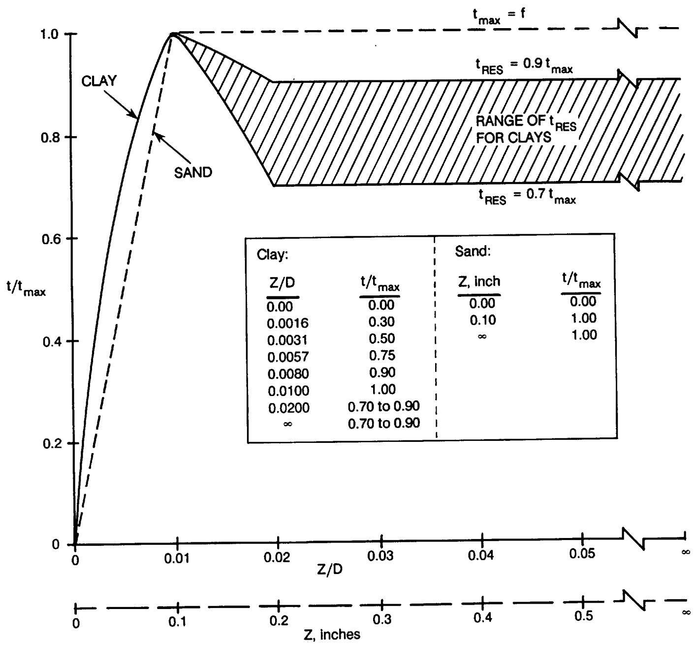  
FIG. G.7.2-1   
TYPICAL AXIALPILE LOAD TRANSFER-DISPLACEMENT(t-z)CURVES

G.8.2 Lateral Bearing Capacity for Soft Clay. For static lateral loads the ultimate unit lateral bearing capacity of soft clay $\mathbf{p}_{\mathbf{u}}$ has been found to vary between 8c and 12c except at shallow depths where failure occurs in a different mode due to minimum overburden pressure. Cyclic loads cause deterioration of lateral bearing capacity below that for static loads. In the absence of more definitive criteria, the following is recommended:

$\mathbf{p_u}$ increases from 3c to 9c as $\mathbf{X}$ increases from 0 to $\mathbf{X}_{\mathbb{R}}$ according to:

$$\mathrm{p}_{\mathrm{u}} = 3 \mathrm{c} + \gamma \mathrm{X} + \mathrm{J} \frac{\mathrm{c X}}{\mathrm{D}} \quad \dots \dots \dots \dots \dots \dots \tag{G.8-1}$$

and

$$\mathbf{p}_{\mathrm{u}} = 9 \mathrm{c} \text{f o r} \mathrm{X} \geq \mathrm{X}_{\mathrm{R}}. \tag{G.8-2}$$

where:

$\mathbf{p_u} =$ ultimate resistance, in stress units   
c = undrained shear strength of undisturbed clay soil samples, in stress units   
D = pile diameter   
$\gamma =$ effective unit weight of soil, in weight density units   
J = dimensionless empirical constant with values ranging from 0.25 to 0.5 having been deter

mined by field testing. A value of 0.5 is appropriate for Gulf of Mexico clays.

X = depth below soil surface

$\mathbf{X}_{\mathbb{R}} =$ depth below soil surface to bottom of reduced resistance zone. For a condition of constant strength with depth, Equations G.8-1 and G.8-2 are solved simultaneously to give:

$$\mathbf{X}_{\mathrm{R}} = \frac{6 \mathrm{D}}{\frac{\gamma \mathrm{D}}{\mathrm{c}} + \mathrm{J}}$$

Where the strength varies with depth, Equations G.8-1 and G.8-2 may be solved by plotting the two equations, i.e., $\mathbf{p}_{\mathbf{u}}$ vs. depth. The point of first intersection of two equations is taken to be $\mathbf{X}_{\mathbb{R}}$ . These empirical relationships may not apply where strength variations are erratic. In general, minimum values of $\mathbf{X}_{\mathbb{R}}$ should be about 2.5 pile diameters.

G.8.3 Load-Deflection (p-y) Curves for Soft Clay. Lateral soil resistance-deflection relationships for piles in soft clay are generally nonlinear. The p-y curves for the short-term static load case may be generated from the following table:

| p/pu | y/yc |
| --- | --- |
| 0 | 0 |
| 0.5 | 1.0 |
| 0.72 | 3.0 |
| 1.00 | 8.0 |
| 1.00 | ∞ |

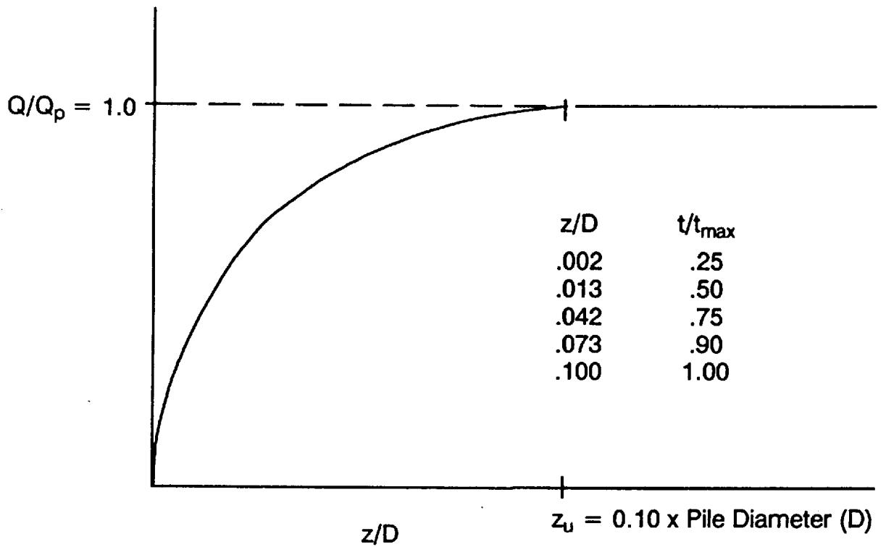  
FIG. G.7.3-1 PILTE TIP-LOAD-DISPLACEMENT (Q-z) CURVE

where:

$\mathbf{p}$ = actual lateral resistance, in stress units

y = actual lateral deflection

$\mathbf{y}_{\mathrm{c}} = 2.5 \varepsilon_{\mathrm{c}} \mathbf{D}$

$\varepsilon_{c} =$ strain which occurs at one-half the maximum stress on laboratory undrained compression tests of undisturbed soil samples

For the case where equilibrium has been reached under cyclic loading, the p-y curves may be generated from the following table:

| X > XR | X > XR | X > XR | X < XR |
| --- | --- | --- | --- |
| p/pu | y/yc | p/pu | y/yc |
| 0 | 0 | 0 | 0 |
| 0.5 | 1.0 | 0.5 | 1.0 |
| 0.72 | 3.0 | 0.72 | 3.0 |
| 0.72 | ∞ | 0.72X/XR | 15.0 |
|  |  | 0.72X/XR | ∞ |

G.8.4 Lateral Bearing Capacity for Stiff Clay. For static lateral loads, the ultimate bearing capacity, $\mathbf{p_u}$ , of stiff clay ( $c > 96\mathrm{kPa}$ or 1 Tsf) as for soft clay would vary between 8c and 12c. Due to rapid deterioration under cyclic loadings, the ultimate static resistance should be reduced for cyclic design considerations.

G.8.5 Load-Deflection (p-y) Curves for Stiff Clay. While stiff clays also have nonlinear stress-strain relationships, they are generally more brittle than soft clays. In developing stress-strain curves and subsequent p-y curves for cyclic loads, consideration should be given to the possible rapid deterioration of load capacity at large deflections for stiff clays.

G.8.6 Lateral Bearing Capacity for Sand. The ultimate lateral bearing capacity for sand has been found to vary from a value at shallow depths determined by Equation G.8-3 to a value at deep depths determined by Equation G.8-4. At a given depth the equation giving the smallest value of $\mathbf{p}_{\mathrm{u}}$ should be used as the ultimate bearing capacity.

$$\mathbf{p}_{\mathrm{u s}} = \left(\mathrm{C}_{1} \mathrm{X} + \mathrm{C}_{2} \mathrm{D}\right) \gamma^{\prime} \mathrm{X}. \tag{G.8-3}$$

$$\mathbf{p}_{\mathrm{u d}} = \mathbf{C}_{3} \mathbf{D} \gamma^{\prime} \mathbf{X}. \tag{G.8-4}$$

where

$\mathbf{p_u}$ =ultimate resistance (force/unit length) (s=shallow,d=deep)

$\gamma^{\prime}$ = effective soil weight, in weight density units

X = depth

$\phi^{\prime}$ = angle of internal friction in sand

$\mathbf{C}_1,\mathbf{C}_2,\mathbf{C}_3 =$ Coefficients determined from Figure G.8-1 as a function of $\phi^{\prime}$

D = average pile diameter from surface to depth

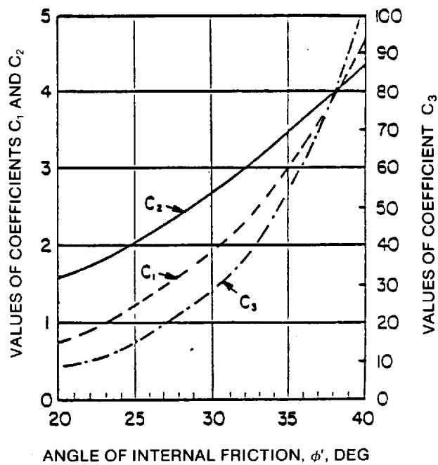  
FIG.G.8-1 COEFFICIENTS AS FUNCTION OF $\phi^{\prime}$

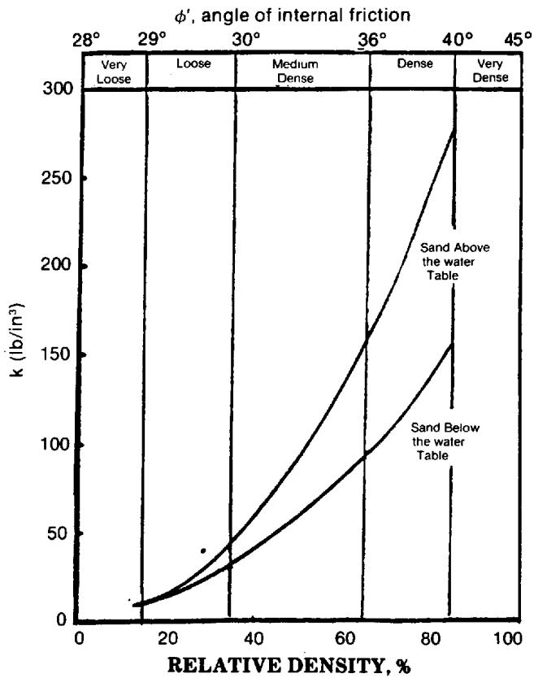  
FIG.G.8-2

G.8.7 Load-Deflection (p-y) Curves for Sand. The lateral soil resistance-deflection (p-y) relationship for sand is also nonlinear and in the absence of more definitive information may be approximated at any specific depth X, by the following expression:

$$= A p_{u} \tanh  \left[ \frac{k X}{A p_{u}} y \right] \dots \tag{G.8-5}$$

where

A $=$ factor to account for cyclic or static loading continued. Evaluated by:

$$\mathbf{A} = 0. 9 \text{f o r c y c l i c l o a d i n g}.$$

$$\mathbf{A} = (3. 0 - 0. 8 \mathbf{X}) \geq 0. 9$$

$$\begin{array}{c} \overline{{\mathbf{D}}} \\ \hline \end{array} \quad \text{f o r s t a t i c l o a d i n g}.$$

$\mathbf{p_u}$ =ultimate bearing capacity at depth X in units of force per unit length

$\mathbf{k}$ = initial modulus of subgrade reaction in force per volume units. Determine from Figure G.8-2 as function of angle of internal friction, $\phi^{\prime}$ .

$$\mathbf{y} \quad = \text{l a t e r a l d e f l e c t i o n}$$

$$\begin{array}{l l} \text{X} & = \text{d e p t h} \end{array}$$

## G.9 FILE GROUP ACTION

G.9.1 General. Consideration should be given to the effects of closely spaced adjacent piles on the load and deflection characteristics of the pile group. Generally, for pile spacing less than eight diameters, group effects may have to be evaluated.

G.9.2 Axial Behavior. For piles embedded in clays, the group capacity may be less than a single isolated pile capacity multiplied by the number of piles in the group; conversely, for piles embedded in sands, the group capacity may be higher than the sum of the capacities of the isolated piles. The group settlement in either clay or sand would normally be larger than that of a single pile subjected to the average pile load of the pile group.

G.9.3 Lateral Behavior. For piles with the same pile head fixity conditions and embedded in either cohesive or cohesionless soils, the pile group would normally experience greater lateral deflection than that of a single pile under the average pile load of the corresponding group. The major factors influencing the group deflections and load distribution among the piles are the pile spacing, the ratio of pile penetration to the diameter, the pile flexibility relative to the soil, the dimensions of the group, and the variations in the shear strength and stiffness modulus of the soil with depth.

G.9.4 File Group Stiffness and Structure Dynamics. When the dynamic behavior of a structure is determined to be sensitive to variations in foundation stiffness, parametric analyses such as those described in Comm. G.9.3 should be performed to bound the vertical and lateral foundation stiffness values to be used in the dynamic structural analyses.

## G.10 PILewALLTHICKNESS

G.10.1 General. The wall thickness of the pile may vary along its length and may be controlled at a particular point by any one of several loading conditions or requirements which are discussed in the paragraphs below. The pile hammers evaluated for use during driving should be noted by the designer on the installation drawings or specifications.

G.10.2 Pile Loads. The internal pile loads caused by factored external loads should be checked as permitted by Section D.2 of this practice. A rational analysis considering the restraints placed upon the pile by the structure and the soil should be used to check the internal pile loads for the portion of the pile which is not laterally restrained by the soil. General column buckling of the portion of the pile below the mudline need not be considered unless the pile is believed to be laterally unsupported because of extremely low soil shear strengths, large computed lateral deflections, or for some other reason.

G.10.3 Pile Design Checks The pile wall thickness in the vicinity of the mudline, and possibly at other points, is normally controlled by the combined axial load and bending moment which results from the factored loading conditions for the platform. The moment curve for the pile may be computed with soil resistance determined in accordance with Section G.8, giving consideration to possible soil removal due to scour. When lateral deflections associated with cyclic loads at or near the mudline are relatively large (e.g., exceeding $y_{c}$ as defined in Section G.8.3 for soft clay), consideration should be given to reducing or neglecting the soil-pile adhesion through this zone.

G.10.4 Load Check Due to Weight of Hammer During Hammer Placement. Each pile or conductor section on which a hammer (pile top, drilling rig, etc.) will be placed should be checked for loads due to placing the equipment. These loads may be the limiting factors in establishing maximum length of add-on sections. This is particularly true in cases where piling will be driven or drilled on an incline or batter. The most frequent effects which must be resisted include static bending, axial loads, and lateral loads that are generated during initial hammer placement.

Experience indicates that reasonable protection from failure of the pipe wall due to the above loads is provided if the static capacity is calculated as follows:

1. The projecting add-on section should be considered as a freestanding fixed-end column with its appropriate effective length factor, K (e.g., 2.3 for battered piles and 2.4 for nearly vertical conductors).   
2. Bending moments and axial loads should be calculated using the full factored weight of the hammer, pile cap, and leads acting through the center of gravity of their combined masses, （$\gamma_{\mathrm{D}} = 1.3$ or $\gamma_{\mathrm{L}} = 1.5$ , depending on how well the weight of each item is known) and the factored （$\gamma_{\mathrm{D}} = 1.3)$ weight of the

add-on section taking into account the batter and center-of-mass eccentricities. Nearly vertical add-ons should be considered as inclined cantilevers having an initial or realistically small out-of-plumb inclination or batter of at least $2\%$ when determining their design moment. The secondary bending moment, also to be determined, is the sum of the P-△ moments due to the determinate or first-order lateral deflections at the top and midheight of the add-on (considered as a fixed-end cantilever) and their associated factored gravity load components.

3. The following beam-column resistance checking equation should not be exceeded:

$$\frac{\mathrm{f}_{\mathrm{c}}}{\phi_{\mathrm{c}} \mathrm{F}_{\mathrm{c n}}} + \frac{\mathrm{f}_{\mathrm{b}}}{\phi_{\mathrm{b}} \mathrm{F}_{\mathrm{b n}} (1 - \Sigma \mathrm{P} \Delta / \mathbf{M})} \leq 1. 0 \dots \dots \dots \dots G. 10 - 1$$

where:

$\Sigma \mathbf{P}\Delta =$ the first-order $\mathbf{P} - \triangle$ moments due to factored gravity loads

$\mathbf{f}_{\mathbf{c}}, \mathbf{F}_{\mathbf{cn}}, \mathbf{f}_{\mathbf{b}}, \mathbf{F}_{\mathbf{bn}}, \mathbf{M}, \phi_{\mathbf{c}},$ and $\phi_{\mathbf{b}}$ are as defined in Sections D.2.2 and D.2.3.

G.10.5 Stresses During Driving. Consideration should also be given to the stresses that occur in the freestanding pile section during driving. The sum of the stresses due to the impact of the hammer (the dynamic stresses) and the stresses due to axial load and bending (the static stresses) should not exceed the minimum yield stress of the steel.

A method of analysis based on wave propagation theory should be used to determine the dynamic stresses, (see G.2.1). In general it may be assumed that column buckling will not occur as a result of the dynamic portion of the driving stresses. The unfactored dynamic stresses should not exceed 80 to 90 percent of yield depending on specific circumstances such as the location of the maximum stresses down the length of pile, the number of blows, previous experience with the pile-hammer combination and the confidence level in the analyses. Separate considerations apply when significant driving stresses may be transmitted into the structure and damage to appurtenances must be avoided.

The static stress during driving may be taken to be the stress resulting from the weight of the pile above the point of evaluation plus the pile hammer components actually supported by the pile during the hammer blows, including any bending stresses resulting therefrom. A dead load factor of 1.6 should be applied to all static loads. The pile strength should be checked using Sections D.2 and D.3.

G.10.6 Minimum Wall Thickness. The D/t ratio of the entire length of a pile should be small enough to preclude local buckling at stresses up to the yield strength of the pile material. Consideration should be given to the different loading situations occurring during the installation and the service life of a piling. For inservice conditions and for those installation situations

where normal pile-driving is anticipated or where piling installation will be by means other than driving, the limitations of Section D.2 should be considered to be the minimum requirements. For piles that are to be installed by driving where sustained hard driving is anticipated (800 blows per meter or 250 blows per foot with the largest size hammer to be used), the minimum piling wall thickness used should not be less than:

$$\begin{array}{l} t = 6. 35 + D / 100 \quad f o r t (m m), D (m m) \dots . (G. 10. 2) \\ t = 0. 25 + D / 100 \quad f o r t (i n), D (i n) \\ \end{array}$$

where:

$$\begin{array}{l} t = \text{w a l l t h i c k n e s s} \\ \mathrm{D} = \text{d i a m e t e r} \\ \end{array}$$

Minimum wall thickness for normally used pile sizes should be as listed in the following table:

MINIMUM PILE WALL THICKNESS   

| Pile Diameter, D | Pile Diameter, D | Nominal Wall Thickness, t | Nominal Wall Thickness, t |
| --- | --- | --- | --- |
| mm | in. | mm | in. |
| 610 | 24 | 13 | 1/2 |
| 762 | 30 | 14 | 9/16 |
| 914 | 36 | 16 | 5/8 |
| 1067 | 42 | 17 | 11/16 |
| 1219 | 48 | 19 | 3/4 |
| 1524 | 60 | 22 | 7/8 |
| 1829 | 72 | 25 | 1 |
| 2134 | 84 | 28 | 11/8 |
| 2438 | 96 | 31 | 11/4 |
| 2743 | 108 | 34 | 11/8 |
| 3048 | 120 | 37 | 11/2 |

The preceding requirement for a lesser D/t ratio when hard driving is expected may be relaxed when it can be shown by past experience or by detailed analysis that the pile will not be damaged during its installation.

G.10.7 Allowance for Underdrive and Overdrive. With piles having thickened sections at the mudline, consideration should be given to providing an extra length of heavy wall material in the vicinity of the mudline so the pile will not be overstressed at this point if the design penetration is not reached. The amount of underdrive allowance provided in the design will depend on the degree of uncertainty regarding the penetration that can be obtained. In some instances an overdrive allowance should be provided in a similar manner in the event an expected bearing stratum is not encountered at the anticipated depth.

G.10.8 Driving Shoe. The purpose of driving shoes is to assist piles to penetrate through hard layers or to reduce driving resistances, thereby allowing greater penetrations to be achieved than would otherwise be the case. Different design considerations apply for each use. If an internal driving shoe is provided to drive through a hard layer it should be designed to ensure that unacceptably high driving stresses do not occur at and

above the transition point between the normal and the thickened section at the pile tip. Also it should be checked that the shoe does not reduce the end bearing capacity of the soil plug below the value assumed in the design. External shoes are not normally used as they tend to reduce the skin friction along the length of pile above them.

G.10.9 Driving Head. Any driving head at the top of the pile should be designed in association with the installation contractor to ensure that it is fully compatible with the proposed installation procedures and equipment.

## G.11 LENGTH OF PILE SECTIONS

In selecting pile section lengths, consideration should be given to: 1) the capability of the lift equipment to raise, lower and stab the sections; 2) the capability of the lift equipment to place the pile driving hammer on the sections to be driven; 3) the possibility of a large amount of downward pile movement immediately following the penetration of a jacket leg closure; 4) stresses developed in the pile section while lifting; 5) the wall thickness and material properties at field welds; 6) interference with the planned concurrent driving of neighboring piles; and 7) the type of soil in which the pile tip is positioned during driving interruptions for field welding to attach additional sections. In addition, static and dynamic stresses due to the hammer weight and operation should be considered as discussed in Section G.10.4 and Section G.10.5.

Each pile section on which driving is required should contain a cutoff allowance to permit the removal of material damaged by the impact of the pile driving hammer. The normal allowance is 0.5 to $1.5\mathrm{m}$ (2 to 5 ft.) per section. Where possible, the cut for the removal of the cutoff allowance should be made at a conveniently accessible elevation.

## G.12 SHALLOW FOUNDATIONS

Shallow foundations are those foundations for which the depth of embedment is less than the minimum lateral dimension of the foundation element. The design of shallow foundations should include, where appropriate to the intended application, consideration of the following:

1. Stability, including failure due to overturning, bearing, sliding or combinations thereof.   
2. Static foundation deformations, including possible damage to components of the structure and its foundation or attached facilities.   
3. Dynamic foundation characteristics, including the influence of the foundation on structural response and the performance of the foundation itself under dynamic loading.   
4. Hydraulic instability such as scour or piping action due to wave pressures, including the potential for damage to the structure and for foundation instability.

5. Installation and removal, including penetration and pull out of shear skirts or the foundation base itself and the effects of pressure build up or draw down of trapped water underneath the base.

Recommendations, pertaining to these aspects of shallow foundation design are given in Sections G.13 to G.17.

## G.13 STABILITY OF SHALLOW FOUNDATIONS

The equations to be considered in evaluating the stability of shallow foundations are given below and in Comm. G.13. These equations are applicable to idealized conditions, and a discussion of the limitations and of alternate approaches is also given. Where use of these equations is not justified, a more refined analysis or special solutions should be considered.

G.13.1 Shallow Foundation Capacity. The ultimate foundation capacity should satisfy the following conditions:

$$\text{B e a r i n g}: \mathrm{P}_{\mathrm{D B}} \leq \Phi_{\mathrm{S B}} \mathrm{Q}_{\mathrm{D B}}$$

$$\text{S l i d i n g :} \mathrm{P}_{\mathrm{D S}} \leq \Phi_{\mathrm{S S}} \mathrm{H}_{\mathrm{D S}}$$

where:

$$\begin{array}{r l} \mathbf{Q}_{\mathrm{D B}} & = \text{u l t i m a t e b e a r i n g c a p a c i t y o f t h e f o n d a t i o n} \\ & \text{a s d e t e r m i n e d i n S e c t i o n s G . 13 . 2 a n d} \\ & \text{G . 13 . 3}. \end{array}$$

$$\begin{array}{r l} \mathrm{H}_{\mathrm{D S}} & = \text{u l t i m a t e s l i d i n g c a p a c i t y o f t h e f o n d a t i o n} \\ & \text{a s d e t e r m i n e d i n S e c t o n G . 13 . 3 .} \end{array}$$

$$\begin{array}{r l} \mathrm{P}_{\mathrm{D B}} & = \text{b e a r i n g} \\ & \text{c o n d i t i o n s u s i n g f a c t o r e d l o a d s)} \end{array}$$

$$\begin{array}{r l} \mathrm{P_{D S}} & = \text{s l i d i n g} \\ & \text{c o n d i t i o n s u s i n g f a c t o r e d l o a d s)} \end{array}$$

$$\begin{array}{r l} \Phi_{\mathrm{S B}} & = \text{s h a l l o w f o n d a t i o n r e s i s t a n c e f a c t o r o n} \\ & \text{b e a r i n g c a p a c i t y (= 0 . 67)}. \end{array}$$

$$\begin{array}{r l} \Phi_{\mathrm{S S}} & = \text{s h a l l o w f o n d a t i o n r e s i s t a n c e f a c t o r o n} \\ & \text{s l i d i n g c a p a c i t y (=} 0. 80). \end{array}$$

G.13.2 Undrained Bearing Capacity （$\phi = 0)$ . The maximum gross vertical load which a footing can support under undrained conditions is

$$\mathbf{Q} = \left(\mathrm{c N}_{\mathrm{c}} \mathrm{K}_{\mathrm{c}} + \gamma \mathrm{X}\right) \mathrm{A}^{\prime} \tag{G.13-1}$$

where:

$$\begin{array}{l} \begin{array}{r l} \mathbf{Q} & = \text{m a x i m u m v e r t i c a l l o a d a t f a i l u r e i n f o r c e} \\ & \text{u n i t s} \end{array} \\ \begin{array}{r l} \text{c} & = \text{u n d r a i n e d s h e a r s t r e n g t h o f s o i l i n s t r e s s} \\ & \text{u n i t s} \end{array} \\ \begin{array}{r l} \mathbf{N}_{\mathbf{c}} & = \mathbf{a} \text{d i m e n s i o n l e s s c o n s t a n t , e q u a l t o 5 . 14 f o r} \\ & \phi = 0 \end{array} \\ \phi = \text{u n d r a i n e d f r i c t i o n a n g l e} = 0 \\ \gamma = \text{t o t a l} \\ \mathbf{X} = \text{d e p t h o f e m b e d m e n t o f f o u n d a t i o n} \\ \end{array}$$

$\mathbf{A}^{\prime}$ = effective area of the foundation depending on the load eccentricity   
$\mathbf{K}_{\mathbf{c}} =$ correction factor which accounts for load inclination, footing shape, depth of embedment, inclination of base, and inclination of the ground surface.

Methods for determining the correction factor and the effective area are given in Comm. G.13. Two special cases of Equation G.13-1 are frequently encountered. For a vertical centric load applied to a foundation at ground level, where both the foundation base and ground are horizontal, Equation G.13-1 is reduced below for two foundation shapes.

1. Infinitely Long Strip Footing.

$$Q = 5. 14 c A_{0} \dots \tag{G.13-2}$$

where:

Q = maximum vertical load per unit length of footing at failure

$\mathbf{A}_0 =$ actual foundation area per unit length

2. Circular or Square Footing

$$Q = 6. 17 \mathrm{c A} \dots \tag{G.13-3}$$

where:

Q = Maximum vertical load at failure

A = actual foundation area

G.13.3 Drained Bearing Capacity. The maximum net vertical load which a footing can support under drained conditions is

$$\mathbf{Q}^{\prime} = \left(\mathrm{c}^{\prime} \mathrm{N}_{\mathrm{c}} \mathrm{K}_{\mathrm{c}} + \mathrm{q N}_{\mathrm{q}} \mathrm{K}_{\mathrm{q}} + 1 / 2 \gamma^{\prime} \mathrm{B N}_{\gamma} \mathrm{K}_{\gamma}\right) \mathrm{A}^{\prime} \dots \dots \dots \dots \tag{G.13-4}$$

where:

$\mathbf{Q}^{\prime}$ = maximum vertical load at failure   
$\mathbf{c}^{\prime}$ = effective cohesion intercept of Mohr Envelope   
$\mathbf{N}_{\mathbf{q}} = (\mathrm{Exp}[\pi \tan \phi^{\prime}])\tan^{2}(45^{\circ} + \phi^{\prime} / 2),$ a dimensionless function of $\phi^{\prime}$   
$\mathbf{N}_{\mathbf{c}} = (\mathbf{Nq - 1})\cot \phi^{\prime}$ , a dimensionless function of $\phi^{\prime}$   
$\mathbf{N}\gamma = \text{an empirical dimensionless function } \gamma$ of $\phi'$ that can be approximated by $2(\mathbf{Nq} + 1)\tan \phi'$   
$\phi^{\prime}$ = effective friction angle   
$\gamma^{\prime}$ = effective unit weight   
q = $\gamma' \mathbf{X}$ , where $\mathbf{X} =$ depth of embedment of foundation   
B = minimum lateral foundation dimension   
$\mathbf{A}^{\prime}$ = effective area of the foundation depending on the load eccentricity

$\mathbf{K}_{\mathbf{c}}, \mathbf{K}_{\mathbf{q}}, \mathbf{K}_{\gamma} =$ correction factors which account for load inclination, footing shape, depth of embedment, inclination of base, and inclination of the ground surface, respectively. The subscripts c, q, and $\gamma$ refer to the particular terms in the equation.

A complete description of the $\mathbf{K}$ factors, as well as curves showing the numerical values of $\mathbf{N}_{\mathbf{q}}, \mathbf{N}_{\mathbf{c}}$ , and $\mathbf{N}_{\gamma}$ as a function of $\phi'$ are given in Comm. G.13.

Two special cases of Equation G.13-4 for $c' = 0$ (usually sand) are frequently encountered. For a vertical, centric load applied to a foundation at ground level where both the foundation base and ground are horizontal, Equation G.13-4 is reduced below for two foundation shapes.

1. Infinitely, Long Strip Footing,

$$\mathbf{Q} = 0. 5 \gamma^{\prime} \mathbf{B N}_{\gamma} \mathbf{A}_{0}. \tag{G.13-5}$$

2. Circular or Square Footing,

$$\mathbf{Q} = 0. 3 \gamma^{\prime} \mathrm{B N}_{\gamma} \mathrm{A}_{0}. \tag{G.13-6}$$

G.13.4 Sliding Stability. The limiting conditions of the bearing capacity equations in Sections G.13.1 and G.13.2, with respect to inclined loading, represent sliding failure.

For sliding failure the following equations apply.

1. Undrained Analysis:

$$\mathbf{H} = \mathbf{c A}. \tag{G.13-7}$$

where:

$\mathbf{H} =$ maximum horizontal load at failure

2. Drained Analysis:

$$\mathrm{H} = \mathrm{c}^{\prime} \mathrm{A} + \mathrm{Q}^{\prime} \tan \phi^{\prime}. \tag{G.13-8}$$

G.13.5 Capacity of Shallow Foundations. The ultimate capacities should be determined after cyclic loading effects have been taken into account. For further discussion of foundation capacity, see Commentary.

## G.14 STATIC DEFORMATION OF SHALLOW FOUNDATIONS. The maximum foundation deformation under static or equivalent static loading affects the structural integrity of the platform, its serviceability, and its components. Equations for evaluating the static deformation of shallow foundations are given in Sections G.14.1 and G.14.2 below. These equations are applicable to idealized conditions. A discussion of alternative approaches is given in the Commentary.

G.14.1 Short Term Deformation. For foundation materials which can be assumed to be isotropic and homogenous and for the condition where the structure base is circular, rigid, and rests on the soil surface, the deformations of the base under various loads are as follows:

$$\begin{array}{l} \text{V e r t i c a l}: u_{v} = \left(\frac{1 - v}{4 G R}\right) Q \dots (G.14.1) \\ \text{H o r i z o n t a l :} u_{h} = \left(\frac{7 - 8 \nu}{32 (1 - \nu) G R}\right) H \dots \dots \dots \dots (G.14-2) \\ \text{R o c k i n g :} \Theta_{\mathrm{r}} = \left(\frac{3 (1 - \nu)}{8 \mathrm{G R}^{3}}\right) \mathrm{M}. (G.14-3) \\ \text{T o r s i o n :} \Theta_{t} = \left(\frac{3}{16 \mathrm{G R}^{3}}\right) \mathrm{T} \dots (G.14-4) \\ \end{array}$$

where:

$$\begin{array}{l} u_{v}, u_{n} = \text{v e r t i c a l} \\ Q, H = \text{v e r t i c a l} \\ \Theta_{r}, \Theta_{t} = \text{o v e r t u r n i n g a n d t o r s i o n a l r o t a t i o n s} \\ \mathbf{M}, \mathbf{T} = \text{o v e r t u r n i n g a n d t o r s i o n a l m o m e n t s} \\ G = \text{e l a s t i c s h e a r m o d u l u s o f t h e s o i l} \\ \nu = \text{P o i s s o n ' s} \\ R = \text{r a d i u s o f t h e b a s e} \\ \end{array}$$

These solutions can also be used for approximating the response of a square base of equal area.

G.14.2 Long Term Deformation. An estimate of the vertical settlement of a soil layer under an imposed vertical load can be determined by the following equation:

$$u_{v} = \frac{h C}{1 + e_{o}} \log_{10} \frac{q_{o} + \Delta q}{q_{o}} \dots \dots \dots \tag{G.14-5}$$

where:

$$\begin{array}{l} u_{v} = \text{v e r t i c a l s e t t l e m e n t} \\ \mathrm{h} = \text{l a y e r t h i c k n e s s} \\ e_{0} = \text{i n i t i a l v o i d r a t i o o f t h e s o i l} \\ \begin{array}{r l} \text{C} & = \text{c o m p r e s s i o n i n d e x o f t h e s o i l o v e r t h e l a w} \\ & \text{r a n g e c o n s i d e r e d} \end{array} \\ \mathbf{p}_{\circ}^{\prime} = \text{i n i t i a l e f f e c t i v e v e r t i c a l s t r e s s} \\ \Delta q = \text{a d d e d} \\ \end{array}$$

Where the vertical stress varies within a thin layer, as in the case of a diminishing stress, estimates may be determined by using the stress at the midpoint of the layer. Thick homogeneous layers should be subdivided for analysis. Where more than one layer is involved, the estimate is simply the sum of the settlement of the layers. Compression characteristics of the soil are determined from one-dimensional consolidation tests.

## G.15 DYNAMIC BEHAVIOR OF SHALLOW FOUNDATIONS. Dynamic loads are imposed on a structure-foundation system by current, waves, ice, wind, and earthquakes. Both the influence of the foundation on the structural response and the integrity of the foundation itself should be considered. See Commentary also.

## G.16 HYDRAULIC INSTABILITY OF SHALLOW FOUNDATIONS.

G.16.1 Scour. Positive measures should be taken to prevent erosion and undercutting of the soil beneath or near the structure base due to scour. Examples of such measures are (1) scour skirts penetrating through erodible layers into scour resistant materials or to such depths as to eliminate the scour hazard, or (2) riprap emplaced around the edges of the foundation. Sediment transport studies may be of value in planning and design.

G.16.2 Piping. The foundation should be so designed to prevent the creation of excessive hydraulic gradients (piping action conditions) in the soil due to environmental loadings or operations carried out during or subsequent to structure installation.

## G.17 INSTALLATION AND REMOVAL OF SHALLOW FOUNDATIONS.

Installation should be planned to ensure the foundation can be properly seated at the intended site without excessive disturbance to the supporting soil. Where removal is anticipated, an analysis should be made of the forces generated during removal to ensure that removal can be accomplished with the means available. See Commentary also.

SECTION H STRUCTURAL COMPONENTS AND SYSTEMS

## H.1 SUPERSTRUCTURE DESIGN

H.1.1 Deck Model for Jacket Design. The superstructure or deck may be modeled in a simplified form for the analysis of the platform jacket or substructure; however, recognition should be given to the vertical and horizontal stiffnesses of the system and the likely effect on the substructure. This modeling should consider the overturning effects of factored wind and/or wave load for environmental loading conditions, and the varying locations of heavy gravity loads such as the derrick hook load.

H.1.2 Deck Design Model. The superstructure itself may be analyzed as one or more independent structures depending upon its configuration; however, consideration should be given to the effect of deflections of the substructure in modeling the boundary supports. Differential deflections of the support points of heavy deck modules placed on skid beams or trusses at the top of the superstructure may result in a significant redistribution of the support reactions. In such a case, the analysis model should include the deck modules and the top bay or two of the substructure to facilitate accurate simulation of support conditions.

H.1.3 Deck Design Load Factors. The load factors gravity (dead and live), environmental, and seismic loadings found in Section C, should be used for deck design.

H.1.4 Other Deck Design Considerations. Depending upon the configuration of a platform designed with a modular superstructure, consideration should be given to connecting adjacent deck modules to resist lateral environmental forces. Such connection may also have the advantage of providing additional redundancy to the platform in the event of damage to a member supporting the deck modules.

In areas where seismic forces may govern the design of superstructure members, a pseudo-static analysis may be used. The analysis should be based on peak deck accelerations determined from the overall platform seismic analysis. The height at which the acceleration is selected should be based upon the structural configuration and the location of the dominant superstructure masses.

## H.2 NONTUBULAR STRUCTURAL SHAPES DESIGN

H.2.1 General. The nominal strength equations to be used in the design of nontubular structural shapes are found in the AISC Load & Resistance Factor Design Specification for Structural Steel Buildings, first edition (Reference H1). The resistance factors to be used with these equations are given in this section. Typical nontubular structural shapes include W, M, S, and HP shapes, channels, angles, and built-up shapes such as plate and boxed girders.

See Section I.1.4 for the material requirements for these shapes.

H.2.2 Resistance Factors. The resistance factors to be used with the AISC-LRFD nominal strength equations are:

AISC-LRFD   

|  |  |  | Section |
| --- | --- | --- | --- |
| φc | = resistance factor for compression | = 0.85 | E2 |
| φc | = resistance factor for compression in the presence of seismic loading | = 0.95 |  |
| φb | = resistance factor for flexure | = 0.85 | F1 |
| φb | = resistance factor for flexure in the presence of seismic loadings | = 0.95 |  |
| φv | = resistance factor for shear | = 0.90 | F2 |
| φv | = resistance factor for shear in the presence of seismic loading | = 1.00 |  |
| φt | = resistance factor for tension, yielding in the gross section | = 0.85 | D1 |
| φt | = resistance factor for tension, yielding in the gross section, in the presence of seismic loading | = 0.95 |  |
| φt | = resistance factor for tension, fracture in the net section | = 0.70 | D1 |
| φt | = resistance factor for tension, fracture in the net section, in the presence of seismic loading | = 0.80 |  |
| φt | = resistance factor for tension, pin connected members (lifting eyes) | = 0.40 | D3 |
| φt | = resistance factor for shear, pin connected members (lifting eyes) | = 0.55 | D3 |
| φ | = resistance factor for bearing, pin connected members (lifting eyes) | = 1.25 | D3 |

Resistance factors which may be required by the AISC-LRFD nominal strength equations but are not mentioned above should be as specified in Reference H1.

H.2.3 Plate Girder Design. Plate girders should be designed in accordance with Section H.2.1, above, and the applicable provisions of Section 9 of the AWS Structural Welding Code, AWS D1.1, latest edition (Reference H2). Where stress concentrations such as abrupt changes in section, penetrations, jacking slots, etc., are necessary, their effect on fatigue and fracture should be considered.

## H.3 CRANE SUPPORTING STRUCTURE

H.3.1 Static Design. The supporting structure should be designed for the dead load of the crane (factored by 1.3) plus 3.0 times the static rated load as defined in API Spec. 2C (Reference H3).

The loading conditions to be investigated should include the following factored loads:

1. Maximum overturning moment with corresponding factored vertical load plus a side load, equal to $4\%$ of the factored vertical load in this case, applied simultaneously to the boom head sheave.   
2. Maximum factored vertical load with corresponding overturning moment plus a side load, equal to $4\%$ of the maximum factored vertical load, applied to the boom head sheave.

H.3.2 Dynamic Design. For cranes with ratings in accordance with API Spec. 2C, no increase for dynamic load is required.

H.3.3 Fatigue Design. The crane supporting structure should be designed to resist repetitions of load in compliance with the requirements of fatigue loading, as discussed in AWS D1.1, latest edition, during the life of the structure. The following may be used in lieu of detailed usage fatigue analysis:

1. A minimum of 25,000 cycles should be assumed under the following conditions.

(a) A load of 1.33 times the static rated load at the boom position and crane orientation producing maximum stress in each component of the supporting structure.   
(b) The stress range used should be the difference between the stress caused by the above loading and stress with the boom in the same position but unloaded.

## H.4 GROUTED PILE-TO-STRUCTURE CONNECTIONS

H.4.1 General. Platform loads may be transferred to steel piles by grouting the annulus between the jacket leg (or sleeve) and the pile. The load is transferred to the pile from the structure across the grout. Experimental work indicates that the mechanism of load transfer is a combination of bond and confinement friction between the grout and the steel surfaces and the bearing of the grout against mechanical aids such as shear keys.

Centralizers should be used to maintain a uniform annulus or space between the pile and the surrounding structure. A minimum annulus width of $38\mathrm{mm}$ (1.5 in.) should be provided where grout is the only means of load transfer. Adequate clearance between pile and sleeve should be provided, taking into account the shear keys' outstand dimension, h. Packers should be used as necessary to confine the grout. Proper means for the introduction of grout into the annulus should be provided so that the possibility of dilution of the grout or formation of voids in the grout will be minimized.

The use of wipers or other means of minimizing mud intrusion into the spaces to be occupied by piles should be considered at sites having soft mud bottoms.   
H.4.2 Computation of Applied Axial Force. In computing the axial force applied to a grouted pile to structure connection, account should be taken of the distribution of overall structural loads among various piles in a group or cluster. The design load for the connection should be the highest computed load with consideration given to the range of axial pile and in situ soil stiffnesses.   
H.4.3 Computation of Allowable Axial Force. In the absence of reliable comprehensive data which would support the use of other values of connection strength, the allowable axial load transfer should be taken as the smaller value (pile or sleeve) of the force calculated by a multiplication of the contact area between the grout and steel surfaces and the allowable axial load transfer stress, $\mathbf{f}_{\mathrm{ba}}$ , where $\mathbf{f}_{\mathrm{ba}}$ is computed by the appropriate value in Sections H.4.3.1 or H.4.3.2 for the grout/steel interface. This allowable axial force should be greater than or equal to the applied axial force computed according to Section H.4.2.   
H.4.3.1 Plain Pipe Connections. The value of the nominal axial load transfer stress, $\mathbf{f}_{\mathrm{ba}}$ , should be taken as 0.248 MPa (36 psi).

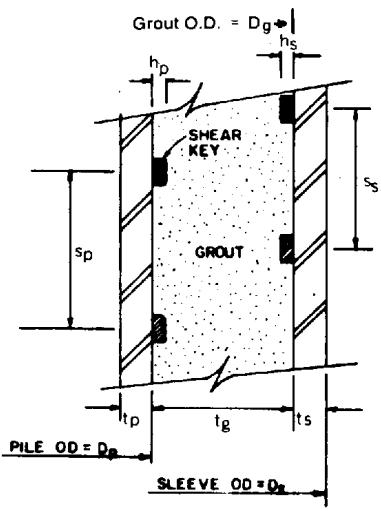  
FIG. H.4.1-1 GROUTEDPILE TOSTRUCTURES CONNECTION WITH SHEAR KEYS

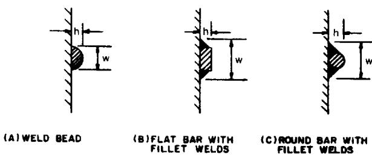  
FIG. H.4.1-2 RECOMMENDED SHEAR KEY DETAILS

H.4.3.2 Shear Key Connections. Where shear keys are used at the interface between steel and grout, the value of the nominal axial load transfer stress, $\mathbf{f_{ba}}$ , should be taken as:

$$\mathbf{f}_{\mathrm{b a}} = 0. 248 \mathrm{M P a} (36 \mathrm{p s i}) + 0. 90 \mathrm{f}_{\mathrm{c u}}, \left(\frac{\mathrm{h}}{\mathrm{s}}\right). \dots \dots (\mathrm{H}. 4 - 1)$$

$\mathbf{f}_{\mathrm{cu}} =$ unconfined grout compressive strength in stress units as defined in Section I.4.1.

h = shear key outstand dimension (See Figures H.4-1,2)

s = shear key spacing (See Figures H.4-1,2)

The maximum axial load transfer stress calculated for loading combinations given in Sections C.3.1.1 and C.3.1.4 shall satisfy the following condition:

$$\mathrm{f}_{\text{b m a x}} \leq \phi_{\text{b a}} \mathrm{f}_{\text{b a}}. \tag{H.4-2}$$

where:

$\mathbf{f}_{\mathrm{bmax}} = \frac{\text{Maximum load transfer stress from factored loads}}{\text{loads}}$

$\phi_{\mathrm{ba}}$ = resistance factor for axial load transfer equal to 0.9

Shear keys designed according to Equation H.4-1 should be detailed in accordance with the following requirements:

1. Shear keys may be circular hoops at spacing "s" or a continuous helix with a pitch of "s." See Section H.4.3.3.   
2. Shear keys should be one of the types indicated in Figure H.4-2.   
3. For driven piles, shear keys on the pile should be applied to sufficient length to ensure that, after driving, the length of the pile in contact with the grout has the required number of shear keys.   
4. Each shear key cross section and weld should be designed to transmit that part of the connection capacity which is attributable to the shear key for operating loads defined in Section C.3.1.4. The shear key and weld should be designed at basic allowable steel and weld stresses to transmit an average force equal to the shear key bearing area multiplied by 1.7 $f_{cu}$ , except for a distance of two pile diameters from the top and the bottom end of the connections where 2.5 $f_{cu}$ should be used.

H.4.3.3 Limitations. The following limitation should be observed when designing a connection according to Section H.4.3.1 or H.4.3.2.

17 MPa (2.5 ksi) $\leq f_{\mathrm{cu}} \leq 110$ MPa (16 ksi)

The following limitations should be observed when designing a connection according to Section H.4.3.2 (See Figures H.4-1,2).

Sleeve geometry $\frac{\mathrm{D}_{\mathrm{s}}}{t_{\mathrm{s}}} \leq 80$

Pile geometry $\frac{\mathrm{D_p}}{\mathrm{t_p}}\leq 40$

Grout annulus geometry $7\leq \frac{\mathrm{D_g}}{\mathrm{t_g}}\leq 45$

Shear key spacing ratio $2.5^{*} \leq \frac{\mathrm{D}_{\mathrm{p}}}{\mathrm{s}} \leq 8$

*for helical shear keys only

Shear key ratio $\frac{\mathbf{h}}{\mathbf{s}}$ $\leq 0.10$

Shear key shape factor $1.5 \leq \frac{w}{h} \leq 3$

$$f_{c u} \frac{h}{s} \leq 5. 5 \mathrm{M P a} (0. 8 \mathrm{k s i})$$

H.4.3.4 Other Design Methods. Other methods which are based on testing and verification may be used for calculating the allowable load transfer stress $\mathbf{f}_{\mathrm{ba}}$ . One such method is included and described in Comm. H.4.

H.4.4 Loadings other than Axial Load. Grouted pile to sleeve connections will be subjected to loading conditions other than axial load, such as transverse shear and bending moment or torque. Recent test data (Reference H4) indicate that the interaction between the bending moment and axial load does not result in lower $\mathbf{f_{ba}}$ values and for certain combinations this interaction may even be beneficial. For other load combinations, the effect of other loads, such as transverse shear and torque, if significant, should be considered in the design of connections by appropriate analytical or testing procedures.

## H.5 CONDUCTORS.

See Commentary.

## H.6 GUYLINE SYSTEM DESIGN

H.6.1 General. A guyline system can provide lateral restoring force and stability to a platform or guyed tower. The guyline system consists of an array of guylines, each attached to the platform or tower and anchored at the seafloor.

H.6.2 Components. A guyline system may be composed of the following components:

H.6.2.1 Lead Lines. The lead line extends from the structure to a clumpweight or anchor. If steel rope or strand is used, API Specification 9A (Reference H5) and API RP 9B (Reference H6) establish standards for procurement and usage. Other materials may be used if sufficient design information is available.

Design considerations should include mechanical properties, fatigue characteristics, corrosion protection, and abrasion resistance.

H.6.2.2 Clumpweights. The clumpweight is an optional heavy mass intermediate between the lead line and anchor line. The clumpweights serve to soften the stiffness of the guyline system during extreme seastates to allow larger deflection without increasing line tensions excessively. Clumpweight variables include weight, location, dimensions, and construction details. The configuration of the clumpweight should be chosen to minimize soil suction and breakout forces. Since settlement or "mudding in" of the clumpweights might occur, the increased resistance to lift-off should be considered.

H.6.2.3 Anchor Lines. The anchor line extends from the clumpweight to the anchor. API Specification 9A, API RP 9B, and API Specification 2F (References H5, H6, H7) establish standards for steel rope, strand, and chain, respectively. The design considerations for anchor lines are similar to those for lead lines. In addition, abrasion of the line caused by contact with the seafloor should be considered.

H.6.2.4 Anchor. The anchor transmits guyline loads to the soil. The anchor system design should consider both horizontal and vertical components of the anchor load.

An anchor system may consist of a single pile (Reference H8), a piled template, or other anchoring devices. The pile components of an anchor should be designed using the criteria recommended in Section G, except that the ultimate capacity of the anchor system should be twice the anchor line load P. (See Section H.6.5).

Other anchoring methods may be employed if these techniques can be substantiated by sufficient analysis or testing.

H.6.2.5 Terminations at the Structure. The structure guyline termination system transmits guyline forces into the structure framework. Specific hardware should be chosen with consideration for bending fatigue of the lead line, limitations on bend radius, tolerance of lead line azimuth, capacity of the hardware to support the mooring loads, and operational requirements.

H.6.2.6 Terminations at Clump or Anchor. Resin or hot metal sockets used for guyline terminations should include a method of bending strain relief to reduce the stress concentration factor and minimize the mass discontinuity.

H.6.3 Configuration. The guyline system should provide the desired strength, stiffness, and redundancy to support the structure under the action of the environmental forces. Structure response should be evaluated and shown to remain stable with one or more critically loaded guylines out of service for the design environmental conditions given in Section H.6.5. Major design variables include the number and size of individual guylines, the distance from the structure to the clumpweight and anchor, the size and configuration of the clumpweight, and the guyline preload and connections.

H.6.4 Analysis. Generally, the loads in a guyline should be determined from a specific dynamic analysis

of a detailed guyline model. The model should consider hydrodynamic and structural damping, inertia and drag characteristics of the guyline and clumpweight (if any), and interaction with the seafloor. The guyline may be excited at the structure termination with a displacement input determined according to the provisions of Section C.3.3. Other design considerations are local vibration of the guyline and overall current force on the guyline system.

H.6.5 Design Requirements. Structural systems that make use of guylines fall in two categories: 1) stiff structures having periods below the dominant periods of storm waves and 2) compliant structures having periods well above the dominant period of storm waves. The analysis requirements for each case are different.

H.6.5.1 Guyed Stiff Structures. The loading requirements are the same as given in Section C.3 for conventional structures. The guyline tension strength should satisfy the following requirement:

$$\mathrm{P} \leq \phi \mathrm{P}_{\text{u l t}}$$

where:

$\mathbf{P}$ = axial force from factored loads as prescribed in Section C.3   
$\phi$ = resistance factor for guylines in tension, equal to 0.67 for extreme conditions and 0.45 for operating conditions.   
$\mathbf{P}_{\mathrm{ult}} =$ rated breaking strength of the guyline

H.6.5.2 Guyed Compliant Structures. The guyline loads must be determined by a rational dynamic analysis that properly accounts for wave-structure interaction and the vibrational behavior of the structure and guyline system. The environmental load factors in Section C, which are based on calibration for quasi-static loading, are not appropriate for the dynamic response analysis of compliant structures. Reference should be made to API RP2T (Reference H9) for methods of analysis for compliant structures. Special attention must be paid to the combinations of wind, waves and currents since their synergistic effects can be more important than for conventional structures. The guyline tension strength should satisfy the following requirement:

$$\mathrm{P} \leq \phi \mathrm{P}_{\text{u l t}}$$

where

$\mathbf{P}$ = axial force from unfactored loads as determined from the dynamic analysis.   
$\phi$ = resistance factor for guylines in tension, equal to 0.50 for extreme conditions and 0.33 for operating conditions.

$\mathbf{P}_{\mathrm{ult}} =$ rated breaking strength of the guyline

H.6.6 Fatigue. The axial and bending fatigue life of the guylines should be evaluated. The loading history should be developed in accordance with Section F. Discussions of fatigue for steel rope or strand are given in References H10 and H11.

SECTIONIMATERIAL

## I.1 STRUCTURAL STEEL

I.1.1 General. Steel should conform to a definite specification and to the minimum strength level, group and class specified by the designer. Certified mill test reports or certified reports of tests made by the fabricator or a testing laboratory in accordance with ASTM A6 or A20, (Reference I1) as applicable to the specification listed in Table I.1, constitutes evidence of conformity with the specification. Unidentified steel should not be used.

I.1.2 Steel Groups. Steel may be grouped according to strength level and welding characteristics as follows:

I.1.2.1 Group I designates mild steels with specified minimum yield strengths of 280 MPa (40 ksi) or less. Carbon equivalent is generally $0.40\%$ or less*, and these steels may be welded by any of the welding processes as described in AWS D1.1, (Reference I2).

I.1.2.2 Group II designates intermediate strength steels with specified minimum yield strengths of over 280 MPa (40 ksi) through 360 MPa (52 ksi). Carbon equivalent ranges of up to $0.45\%$ and higher, and these steels require the use of low hydrogen welding processes.

I.1.2.3 Group III designates high strength steels with specified minimum yield strengths in excess of 360 MPa (52 ksi). Such steels may be used provided that each application is investigated with regard to:

(a) Weldability and special welding procedures which may be required.

(b) Fatigue problems which may result from the use of higher working stresses, and

(c) Notch toughness in relation to other elements of fracture control, such as fabrication, inspection procedures, service stress, and temperature environment.

I.1.3 Steel Classes. Consideration should be given for the selection of steels with notch toughness characteristics suitable for the conditions of service. For this purpose, steels may be classified as follows:

I.1.3.1 Class C steels are those which have a history of successful application in welded structures at service temperatures above freezing, but for which impact tests are not specified. Such steels are applicable to primary structural members involving limited thickness, moderate forming, low restraint, modest stress concentration, quasi-static loading (rise time 1 second or longer) and structural redundancy such that an isolated fracture would not be catastrophic. Examples of such applications are piling, jacket braces and legs, and deck beams and legs.

$$* \text{C a r b o n e q u i v a l e n t C E} = \mathrm{C} + \frac{\mathrm{M n}}{6} + \frac{\mathrm{N i} + \mathrm{C u}}{15} + \frac{\mathrm{C r} + \mathrm{M o} + \mathrm{V}}{5}$$

I.1.3.2 Class B steels are suitable for use where thickness, cold work, restraint, stress concentration, impact loading, and/or lack of redundancy indicate the need for improved notch toughness. Where impact tests are specified, Class B steels should exhibit Charpy V-notch energy of 20J (15 ft-lbs) for Group I, and 34J (25 ft-lbs) for Group II, at the lowest anticipated service temperature. Steels enumerated herein as Class B can generally meet these Charpy requirements at temperatures ranging from $10^{\circ}$ to $0^{\circ}\mathrm{C}$ ( $50^{\circ}$ to $32^{\circ}\mathrm{F}$ ). When impact tests are specified for Class B steel, testing in accordance with ASTM A 673, Frequency H, is suggested.

1.1.3.3 Class A steels are suitable for use at subfreezing temperatures and for critical applications involving adverse combinations of the factors cited above. Critical applications may warrant Charpy testing at $20^{\circ}$ to $30^{\circ}\mathrm{C}$ （$36^{\circ}$ to $54^{\circ}\mathrm{F})$ below the lowest anticipated service temperature. This extra margin of notch toughness prevents the propagation of brittle fractures from large flaws, and provides for crack arrest in thicknesses of several inches. Steels enumerated herein as Class A can generally meet the Charpy requirements stated above at temperatures ranging from $-20^{\circ}$ to $-40^{\circ}\mathrm{C}$ （$-4^{\circ}$ to $-40^{\circ}\mathrm{F})$ . Impact testing frequency for Class A steels should be in accordance with the specification under which the steel is ordered; in the absence of other requirements, heat lot testing may be used.

I.1.4 Structural Plate and Shape Specifications. Unless otherwise specified by the designer, plates should conform to one of the specifications listed in Table I.1 Structural shape specifications are listed in Table I.2. Steels above the thickness limits stated may be used, provided applicable provisions of Section I.1.2.3 are considered by the designer.

## I.2 STRUCTURAL STEEL PIPE

I.2.1 Specifications. Unless otherwise specified, seamless or welded pipe\*\* should conform to one of the specifications listed in Table I.3. Pipe should be prime quality unless the use of limited service, structural grade, or reject pipe is specifically approved by the designer.   
I.2.2 Fabrication. Structural pipe should be fabricated in accordance with API Spec. 2B (Reference I3), ASTM A139**, ASTM A252**, ASTM A381, or ASTM A671 using grades of structural plate listed in Table I.1, except that hydrostatic testing may be omitted.   
I.2.3 Selections for Conditions of Service. Consideration should be given for the selection of steels with toughness characteristics suitable for the conditions of service (see Section I.1.3). For tubes cold-formed to D/t less than 30, and not subsequently heat-treated, allowance should be made for possible degradation of notch toughness, e.g., by specifying a higher class of steel or by specifying notch toughness tests run at reduced temperature.

TABLE I.1 STRUCTURAL STEEL PLATES   

| GROUP | CLASS | SPECIFICATION & GRADE | YIELD STRENGTH | YIELD STRENGTH | TENSILE STRENGTH | TENSILE STRENGTH |
| --- | --- | --- | --- | --- | --- | --- |
| GROUP | CLASS | SPECIFICATION & GRADE | MPa | ksi | MPa | ksi |
| I | C | ASTM A36 (to 50 mm (2 in) thick) | 250 | 36 | 400-550 | 58-80 |
| I | C | ASTM A131 Grade A (to 13 mm (% in) thick) | 235 | 34 | 400-490 | 58-71 |
| I | C | ASTM A285 Grade C (to 19 mm (% in) thick) | 205 | 30 | 380-515 | 55-75 |
| I | B | ASTM A131 Grades B, D | 235 | 34 | 400-490 | 58-71 |
| I | B | ASTM A516 Grade 65 | 240 | 35 | 450-585 | 65-85 |
| I | B | ASTM A573 Grade 65 | 240 | 35 | 450-530 | 65-77 |
| I | B | ASTM A709 Grade 36T2 | 250 | 36 | 400-550 | 58-80 |
| I | A | ASTM A131 Grades CS, E | 235 | 34 | 400-490 | 58-71 |
| II | C | ASTM A572 Grade 42 (to 50 mm (2 in) thick*) | 290 | 42 | 415 min. | 60 min. |
| II | C | ASTM A591 required over 13 mm (% in) thick |  |  |  |  |
| II | C | ASTM A572 Grade 50 (to 50 mm (2 in) thick*) | 345 | 50 | 450 min. | 65 min. |
| II | C | ASTM A591 required over 13 mm (% in) thick |  |  |  |  |
| II | B | ASTM A709 Grades 50T2, 50T3 | 345 | 50 | 450 min. | 65 min. |
| II | B | ASTM A131 Grade AH32 | 315 | 45.5 | 470-585 | 68-85 |
| II | B | ASTM A131 Grade AH36 | 350 | 51 | 490-620 | 71-90 |
| II | A | API Spec 2H Grade 42 | 290 | 42 | 430-550 | 62-80 |
| II | A | Grade 50 (to 64 mm (2½ in) thick) | 345 | 50 | 483-620 | 70-90 |
| II | A | (over 64 mm (2½ in) thick) | 325 | 47 | 483-620 | 70-90 |
| II | A | API Spec 2W Grade 42 (to 25 mm (1 in) thick) | 290-462 | 42-67 | 427 min. | 62 min. |
| II | A | (over 25 mm (1 in) thick) | 290-427 | 42-62 | 427 min. | 62 min. |
| II | A | Grade 50 (to 25 mm (1 in) thick) | 345-517 | 50-75 | 448 min. | 65 min. |
| II | A | (over 25 mm (1 in) thick) | 345-483 | 50-70 | 448 min. | 65 min. |
| II | A | Grade 50T (to 25 mm (1 in) thick) | 345-522 | 50-80 | 483 min. | 70 min. |
| II | A | (over 25 mm (1 in) thick) | 345-517 | 50-75 | 483 min. | 70 min. |
| II | A | Grade 60 (to 25 mm (1 in) thick) | 414-621 | 60-90 | 517 min. | 75 min. |
| II | A | (over 25 mm (1 in) thick) | 414-586 | 60-85 | 517 min. | 75 min. |
| II | A | API Spec 2Y Grade 42 (to 25 mm (1 in) thick) | 290-462 | 42-67 | 427 min. | 62 min. |
| II | A | (over 25 mm (1 in) thick) | 290-427 | 42-62 | 427 min. | 62 min. |
| II | A | Grade 50 (to 25 mm (2½ in) thick) | 345-517 | 50-75 | 448 min. | 65 min. |
| II | A | (over 25 mm (1 in) thick) | 345-483 | 50-70 | 448 min. | 65 min. |
| II | A | Grade 50T (to 25 mm (1 in) thick) | 345-572 | 50-80 | 483 min. | 70 min. |
| II | A | (over 25 mm (1 in) thick) | 345-517 | 50-75 | 483 min. | 70 min. |
| II | A | ASTM A131 Grades DH32, EH32 | 315 | 45.5 | 470-585 | 68-85 |
| II | A | Grades DH36, EH36 | 350 | 51 | 490-620 | 71-90 |
| II | A | ASTM A537 Class I (to 64 mm (2½ in) thick) | 345 | 50 | 485-620 | 70-90 |
| II | A | ASTM A633 Grade A | 290 | 42 | 435-570 | 63-83 |
| II | A | Grades C, D | 345 | 50 | 485-620 | 70-90 |
| II | A | ASTM A678 Grade A | 345 | 50 | 485-620 | 70-90 |
| III | A | ASTM A537 Class II (to 64 mm (2½ in) thick) | 415 | 60 | 550-690 | 80-100 |
| III | A | ASTM A678 Grade B | 415 | 60 | 550-690 | 80-100 |
| III | A | API Spec 2W Grade 60 (to 25 mm (1 in) thick) | 414-621 | 60-90 | 517 min. | 75 min. |
| III | A | (over 25 mm (1 in) thick) | 414-586 | 60-85 | 517 min. | 75 min. |
| III | A | API Spec 2Y Grade 60 (to 25 mm (1 in) thick) | 414-621 | 60-90 | 517 min. | 75 min. |
| III | A | (over 25 mm (1 in) thick) | 414-586 | 60-85 | 517 min. | 75 min. |
| III | A | ASTM A710 Grade A Class 3 |  |  |  |  |
| III | A | (qualified and precipitation heat treated) |  |  |  |  |
| III | A | thru 50 mm (2 in) | 515 | 75 | 585 | 85 |
| III | A | 50 mm (2 in) to 100 mm (4 in) | 450 | 65 | 515 | 75 |
| III | A | over 100 mm (4 in) | 415 | 60 | 485 | 70 |

*Maximum Vanadium Level Permitted = 0.10% V.

TABLE I.2 STRUCTURAL STEEL SHAPES   

| GROUP | CLASS | ASTM SPECIFICATION & GRADE | YIELD STRENGTH | YIELD STRENGTH | TENSILE STRENGTH | TENSILE STRENGTH |
| --- | --- | --- | --- | --- | --- | --- |
| GROUP | CLASS | ASTM SPECIFICATION & GRADE | MPa | ksi | MPa | ksi |
| I | C | A36 (to 50 mm (2 in) thick) | 250 | 36 | 400-550 | 58-80 |
| I | C | A131 Grade A (to 13 mm (%in) thick) | 235 | 34 | 400-550 | 58-80 |
| I | B | A709 Grade 36T2 | 250 | 36 | 400-550 | 58-80 |
| II | C | A572 Grade 42 (to 50 mm (2 in) thick)$^1$ | 290 | 42 | 415 min. | 60 min. |
| II | C | A572 Grade 50 (to 50 mm (2 in) thick)$^1$ | 345 | 50 | 450 min. | 65 min. |
| II | C | A591 required over 13 mm (%in) thick |  |  |  |  |
| II | B | A709 Grades 50T2, 50T3 | 345 | 50 | 450 min. | 65 min. |
| II | B | A131 Grade AH32 | 315 | 45.5 | 470-585 | 68-85 |
| II | B | A131 Grade AH36 | 350 | 51 | 490-620 | 71-90 |

1) Maximum Vanadium Level Permitted $= 0.10\%$ V

TABLE I.3 STRUCTURAL STEEL PIPE   

| GROUP | CLASS | SPECIFICATION & GRADE | YIELD STRENGTH | YIELD STRENGTH | TENSILE STRENGTH | TENSILE STRENGTH |
| --- | --- | --- | --- | --- | --- | --- |
| GROUP | CLASS | SPECIFICATION & GRADE | MPa | ksi | MPa | ksi |
| I | C | API 5L Grade B* | 240 | 35 | 415 min. | 60 min. |
| I | C | ASTM A53 Grade B | 240 | 35 | 415 min. | 60 min. |
| I | C | ASTM A135 Grade B | 240 | 35 | 415 min. | 60 min. |
| I | C | ASTM A139 Grade B | 240 | 35 | 415 min. | 60 min. |
| I | C | ASTM A500 Grade A (round) | 230 | 33 | 310 min. | 45 min. |
| I | C | (shape) | 270 | 39 | 310 min. | 45 min. |
| I | C | ASTM A501 | 250 | 36 | 400 min. | 58 min. |
| I | B | ASTM A106 Grade (normalized) | 240 | 35 | 415 min. | 60 min. |
| I | B | ASTM A524 Grade I (thru 10 mm (% in)) | 240 | 35 | 415 min. | 60 min. |
| I | B | Grade II (over 10 mm (% in)) | 205 | 30 | 380-550 | 55-80 |
| I | A | ASTM A333 Grade 6 | 240 | 35 | 415 min. | 60 min. |
| I | A | ASTM A334 Grade 6 | 240 | 35 | 415 min. | 60 min. |
| II | C | API 5L Grade X42 2% max. cold expansion | 290 | 42 | 415 min. | 60 min. |
| II | C | API 5L Grade X52 2% max. cold expansion | 360 | 52 | 455 min. | 66 min. |
| II | C | ASTM A500 Grade B (round) | 290 | 42 | 400 min. | 58 min. |
| II | C | (shape) | 320 | 46 | 400 min. | 58 min. |
| II | C | ASTM A618 | 345 | 50 | 485 min. | 70 min. |
| II | B | API 5L Grade X52 with SR5, SR6, or SR8 | 360 | 52 | 455 min. | 66 min. |
| II | A | See Section I.2.2 |  |  |  |  |

*Seamless or with longitudinal seam welds

## I.3 STEEL FOR TUBULAR JOINTS

Tubular joints are subject to local stress concentrations which may lead to local yielding and plastic strains at the design load. During the service life, cyclic loading may initiate fatigue cracks, making additional demands on the ductility of the steel, particularly under dynamic loads. These demands are particularly severe in heavy-wall joint cans designed for punching shear.

I.3.1 Underwater Joints. For underwater portions of redundant template-type platforms, steel for joint cans (such as jacket leg joint cans, chords in major X and K joints, and through-members in joints designed as overlapping) should meet one of the following notch toughness criteria at the temperature given in Table I.4.

1. NRL Drop-Weight Test no-break performance.   
2. Charpy V-notch energy: 20 J (15 ft-lbs) for Group I steels and 34 J (25 ft-lbs) for Group II steels, and 48J (35 ft-lbs) for Group III steels (transverse test).

TABLE I.4 INPUT TESTING CONDITIONS   

| D/t | Test Temperature | Test Condition |
| --- | --- | --- |
| over 30 | 20°C (36°F) below LAST* | Flat plate |
| 20-30 | 30°C (54°F) below LAST | Flat plate |
| under 20 | 10°C (18°F) below LAST | As fabricated |

*LAST = Lowest Anticipated Service Temperature

For water temperature of $4^{\circ}\mathrm{C}$ （$40^{\circ}\mathrm{F})$ or higher, these requirements may normally be met by using the Class A steels listed in Table I.1.

I.3.2 Above Water Joints. For above water joints exposed to lower temperatures and possible impact from boats, or for critical connections at any location in which it is desired to prevent all brittle fractures, the tougher Class A steels should be considered, e.g., API Spec. 2H, grade 42 or grade 50 (Reference I4). For 345 MPa (50 ksi) yield and higher strength steels, special attention should be given to welding procedures.   
I.3.3 Critical Joints. For critical connections involving high restraint (including adverse geometry, high yield strength and/or thick sections), through-thickness shrinkage strains, and subsequent through-thickness

tensile loads in service, consideration should be given to the use of steel having improved through-thickness (Z-direction) properties, e.g., API Spec. 2H, Supplements S4 and S5, Reference I4.

I.3.4 Brace Ends. Although the brace ends at tubular connections are also subject to stress concentration, the conditions of service are not quite as severe as for joint cans. For critical braces, for which brittle fracture would be catastrophic, consideration should be given to the use of stub-ends in the braces having the same class as the joint can, or one class lower. This provision need not apply to the body of braces (between joints).

## I.4 CEMENT GROUT AND CONCRETE

I.4.1 Cement Grout. If required by the design, the space between the piles and the surrounding structure should be carefully filled with grout. Prior to installation, the compressive strength of the grout mix design should be confirmed on a representative number of laboratory specimens cured under conditions which simulate the field conditions. Laboratory test procedures should be in accordance with ASTM 109. The unconfined compressive strength of 28 day old grout specimens computed as described in ACI 214-77 but equating $\mathbf{f}_{\mathrm{c}}^{\prime}$ to $\mathbf{f}_{\mathrm{cu}}$ , should not be less than either 17 MPa (2.5 ksi) or the specified design strength.

A representative number of specimens taken from random batches during grouting operations should be tested to confirm that the design grout strength has been achieved. Test procedures should be in accordance with ASTM 109. The specimens taken from the field should be subjected, until test, to a curing regime representative of the in situ curing conditions, i.e., underwater and with appropriate seawater salinity and temperature.

I.4.2 Concrete. The concrete mix used in belled piles should be selected on the basis of shear strength, bond strength and workability for underwater placement including cohesiveness and flowability. The concrete mix may be made with aggregate and sand or with sand only. The water-cement ratio should be less than 0.45. If aggregate is used, the aggregate should be small and rounded, the sand content should be $45\%$ or greater, the cement content should be not less than 445 $\mathrm{kg / m^3}$ (750 lb/yd³), and the workability as measured by the slump test should be 180 to 230 mm (7 to 9 in.). To obtain the properties required for proper placement, a suitable water-reducing and plasticizing admixture may be necessary.

SECTION J DRAWINGS AND SPECIFICATIONS

## J.1 GENERAL

Drawings should be prepared using consistent units.

For use in connection with fixed offshore platforms and related facilities, the drawings and specifications are defined as follows:

## J.2 CONCEPTUAL DRAWINGS

Conceptual drawings are intended to supply a general idea of the facility under consideration. These drawings should include preliminary layouts and elevation views of the overall facility showing the number, type of construction and approximate size of each platform, as well as the more important auxiliary features, such as heliports and boat landings.

Simplified process or mechanical flow diagrams and electrical one-line diagrams should be included for all production or utility systems. A generalized equipment layout drawing should be included which also indicates buildings, storage of supplies, etc.

All information which contributes to clarify the overall intent of the facility should be shown. Specifications are not generally required. However, if included, they should be of general descriptive nature to supplement the drawings to adequately describe the facility.

## J.3 BID DRAWINGS AND SPECIFICATIONS

Bid drawings are intended to show the total facility with its configuration and dimensions in sufficient detail to accurately define the scope of the project. With supplemental specifications, bid drawings are suitable for submittal by the contractor to generally define the scope of the proposal, or suitable to be furnished by the owner requesting a quotation where the design is to be part of the contractor's bid. In the latter case, all essential information needed by the designer should be included.

Bid structural drawings should show major overall dimensions, deck arrangements, operational loading requirements and any preferred type of construction and materials. Structural details and member sizes are not necessarily furnished since these are considered as "Design" drawings. All auxiliary items which are to be included in the bid, such as boat landings, barge bumpers, stairs, walks, fence, handrail, etc., should be shown on these drawings. Typical preferred construction details of these items should be included.

Equipment layout drawings should be included for all decks. Sufficiently detailed process, mechanical and utility flow diagrams and electrical one-line diagrams should be included for all systems which are covered by the bid.

Specifications for equipment, machinery, and other engineered components should include an itemized list

and description of all items not shown on the drawings but which are to be included in the bid, even such items as lighting and cathodic protection. Specifications for materials and fabrication should include all types of material allowed for use and any particular requirements for dimensional tolerances, inspection, testing and welding.

## J.4 DESIGN DRAWINGS AND SPECIFICATIONS

Design drawings give descriptive information about the major components of the facility. Emphasis in these drawings is placed on overall layouts and definition of critical items, supplemented by essential details. They should indicate all appurtenances and should include all dimensions where strict adherence is required.

Design drawings should include a layout of the location and orientation of the structure or structures in the field, as well as the location of equipment on the decks of each structure. Structural drawings showing member sizes of all major structural members and all controlling dimensions should be included. General locations and preliminary or typical details of miscellaneous structural items, such as joints, cover plates, web plate stiffeners, etc., should be indicated. Also any other typical structural details should be included which are not normally standard to this type of construction.

Design drawings should also include all items necessary for installation purposes, such as lifting eyes and launching trusses, which are critical to the structural design of the platform.

Mechanical and utility flow diagrams showing sizes of all equipment, piping and valves, and electrical one-line diagrams showing rating and sizes of feeders and controls should be included. Equipment layout drawings of all equipment shown on the flow diagrams or one-line diagrams, manifolds and major instrumentation items, such as large control valves, meter runs, control valve stations and control panels should be shown. Piping plan and elevation drawings should show major piping only and indicate adequate space reserved for minor piping and for conduit and cable runs.

Design drawings should be supplemented by all specifications necessary to convey the intent of the design. Standard specifications for material and fabrication which are referred to in this RP can be properly referenced on appropriate drawings. However, any deviations from these specifications must be detailed. Specifications should be included for equipment, machinery and other engineered items.

Design drawings and specifications are often used as part of the solicitation package or as part of the contract document. As such, they need to be sufficiently detailed and suitable to be furnished by the owner to the contractor to be used for making accurate material

take-offs for bidding purposes when no design is required on the part of the contractor, or suitable for submittal by the contractor to the owner to completely define the proposal. When design drawings are used for bid or contract purposes, all auxiliary items such as stairs, boat landings, walkways, etc., should be shown in sufficient detail for estimating purposes.

## J.5 FABRICATION DRAWINGS AND SPECIFICATIONS

Fabrication drawings are intended to supply sufficient information that fabrication can be performed directly from these drawings. They should contain all design data fully detailed and dimensioned. At the fabricator's option, they may be supplemented by shop drawings.

A set of fabrication drawings includes completely detailed design drawings with descriptions, exact locations, sizes, thicknesses and dimensions of all structural members and stiffeners. This information should also be shown for all structural items, such as brackets, stiffeners, cover plates, etc., and for all auxiliary items, such as stairs, walkways, fence, handrail, etc. Connections and joints should be completely detailed, including welding symbols, unless standard procedures apply. Methods of attaching timber, grating and plate should be included.

In addition to complete piping plan and elevation drawings, a set of fabrication drawings should include piping isometric drawings and details for all pipe supports, if required by the complexity of the facility. Instrumentation location plans and supports, electrical location diagrams showing general routing, and wire and cable tie-ins to electrical equipment should be included.

Fabrication drawings should clearly indicate the components or "packages" scheduled for assembly as units in the fabrication yard. Welds and connections to be performed in the "field" should be indicated.

Detailed specifications should be included for all work to be done by the fabricator such as welding, fabrication, testing, etc., and for all materials, equipment or machinery to be purchased by the fabricator. However, for standard specifications covered under the recommendations of this RP, no copies need to be furnished provided reference is made on key drawings. Specifications for equipment and other engineered items not purchased by the fabricator may also be included with fabrication drawings for general information.

## J.6 SHOP DRAWINGS

Shop drawings or sketches are prepared by or for the fabricator, at his option, to facilitate the fabrication of parts and/or components of platforms. They are intended to provide all information and instructions needed for that purpose. Due to differences in methods and procedures of various fabricators, shop drawings may vary in appearance.

Shop drawings may include typical shop details to supplement details and dimensions shown on either fabrication drawings or patterns for coping the ends of members, detailed piece-marked drawings for each member and pipe spool drawings.

Shop drawings are the responsibility of the fabricator. Approval or review of shop drawings by the designer or owner should not relieve the fabricator of his responsibility to complete the work in accordance with the contract or fabrication drawings and specifications.

## J.7 INSTALLATION DRAWINGS AND SPECIFICATIONS

Installation drawings furnish all pertinent information necessary for the construction of the total facility on location at sea. They contain relevant information not included on fabrication drawings.

If special procedures are required, a set of installation drawings may include installation sequence drawings. Details of all installation aids such as lifting eyes, launching runners or trusses, jacking brackets, stabbing points, etc., should be included if these are not shown on fabrication drawings. For jackets or towers installed by flotation or launching, drawings showing launching, upending, and flotation procedures should be provided. Details should also be provided for piping, valving and controls of the flotation system, closure plates, etc.

Erection of temporary struts or supports should be indicated. All rigging, cables, hoses, etc., which are to be installed prior to loadout should be detailed. Barge arrangement, loadout and tie-down details should be provided.

Installation drawings are intended to be used in connection with fabrication drawings. They should be supplemented by detailed installation specifications, installation procedures, or special instructions as required to provide all information required to complete the field installation.

## J.8 AS-BUILT DRAWINGS AND SPECIFICATIONS

As-built drawings show in detail the manner in which the facility was actually constructed. These drawings are usually made by revising the original fabrication drawings, supplemented by additional drawings if necessary. As-built drawings are intended to reflect all changes, additions, corrections or revisions made during the course of construction. They are prepared for use by the owner to provide information related to the operation, servicing, maintenance, and future expansion of the facility.

When the preparation of as-built drawings has been authorized by the owner, it is the responsibility of the fabricator and the field erector to furnish to the owner or to the designer adequate information regarding all

variations between the drawings and the facility as actually constructed. This is usually furnished as corrections from the yard, the shop and the field, marked on prints of the original drawings or by supplementary sketches, if required. This information should be sufficiently complete that the owner or the designer can correct and revise the original drawings without additional data or field measurements. Since the fabricator and erector are responsible for the accuracy of the corrections, a review and/or approval of the corrected drawings should be made by both the fabricator and erector.

Minor deviations from the original drawings are generally numerous. Differences between the actual dimensions and those shown on the drawings need not be reported if they are within the specified allowable tolerances.

Specifications should also be corrected to reflect any changes made during the purchase of material, equipment or machinery.

SECTION K WELDING

## K.1 GENERAL

K.1.1 Specifications. Welding and weld procedure qualifications should be done in accordance with applicable provisions of the AWS Structural Welding Code AWS D1.1 (Reference K1) as follows:

1. Sections 1 through 6 constitute a body of rules which apply for the construction of any welded steel structure.   
2. Section 8 applies for general structural welding of plates and structural shapes, e.g., portions of deck sections.   
3. Section 10 applies to tubular structures.

K.1.2 Welding Procedures. Written welding procedures should be required for all work, even where prequalified. The essential variables should be specified in the welding procedure and adhered to in production welding.

K.1.3 Welding Procedure Limitations.

K.1.3.1 Excluding the root pass, all welding of steel with a nominal yield strength of 275 MPa (40 ksi) or more, or a weld throat thickness in excess of $13\mathrm{mm}$ （$\frac{1}{2}$ in), should be accomplished with low hydrogen processes (i.e., less than $15\mathrm{ml} / 100\mathrm{g}$ ).   
K.1.3.2 All welding by processes employing an external gas shield of the arc area should be accomplished with wind protection.   
K.1.3.3 Any procedure requiring the Gas Metal Arc Welding (GMAW) process should be proven by tests, per AWS D1.1 (Reference K1), Section 5, to produce the desired properties and quality, prior to any production welding. In general, the short-circuiting mode GMAW should be limited to secondary or minor structural welds and to root passes in welding procedures qualified by tests.   
K.1.3.4 Downhill progression deposition of cover passes, using any welding procedure where heat of the cover pass deposition is less than $1\mathrm{kJ} / \mathrm{mm}$ (18,500 ft#/in), should be prohibited unless qualified by hardness testing of the heat affected zones. A macro-section for hardness testing should be prepared from a weld of the maximum thickness and of the maximum carbon equivalent steel to be welded by the procedure; with the cover pass deposited at a preheat no higher than the minimum preheat specified on the welding procedure specification. The maximum hardness acceptable in the heat affected zones, at any point of sampling, should not exceed 325 HV10.   
K.1.4 Welders and Welding Operators. Welders should be qualified for the type of work assigned and should be issued certificates of qualification describing

the materials, processes, electrode classifications, positions and any restrictions of qualification.

## K.2 QUALIFICATION

K.2.1 General. Welding procedures, welders, and welding operators should be qualified in accordance with AWS D1.1 (Reference K1) as further qualified herein.   
K.2.2 Impact Requirements. When welding procedure qualification by test is required (i.e., when the procedure is not pre-qualified, when comparable impact performance has not been previously demonstrated, or when the welding consumables are to be employed outside the range of essential variables covered by prior testing), qualification should include Charpy V-notch testing of the as-deposited weld metal. Specimens should be removed from the test weld, and impact tested, in accordance with Appendix III, Requirements for Impact Testing, of AWS D1.1 (Reference K1). The following test temperatures and minimum energy values are recommended, for matching the performance of the various steel grades as listed in API Tables I.1 to I.3. Single specimen energy values (one of three) may be 7J (5 ft-lbs) lower without requiring retest.

TABLE K.1   

| Steel Group | Steel Class | Impact Test Temperature | Impact Test Temperature | Weld Metal Avg. (Joules) Ft-Lbs | Weld Metal Avg. (Joules) Ft-Lbs |
| --- | --- | --- | --- | --- | --- |
| I | C | -18°C | (0°F) | 27 | 20 |
| I | B | -18°C | (0°F) | 27 | 20 |
| I | A | -29°C | (20°F) | 27 | 20 |
| II | C | -18°C | (0°F) | 27 | 20 |
| II | B | -29°C | (-20°F) | 27 | 20 |
| II | A | -40°C | (-40°F) | 34 | 25 |
| III | A | -40°C | (-40°F) | 40 | 30 |

See Commentary for further discussion of prequalification, CTOD testing, and heat affected zones.

K.2.3 Mechanical Testing In Procedure Qualification. The mechanical testing of procedure qualification test coupons should be performed by a competent independent testing laboratory.   
K.2.4 Prior Qualifications. New qualifications may be waived by owner if prior qualifications are deemed suitable.

## K.3 WELDING

K.3.1 General. Welding should conform to sizes of welds and notes on drawings as well as qualified welding procedures; otherwise welding should conform to the AWS specifications listed under Section K.1.1 above and further qualified herein.

K.3.2 Specified Welds. Intersecting and abutting parts should be joined by complete joint penetration groove welds, unless otherwise specified. This includes "hidden" intersections, such as may occur in overlapped braces and pass-through stiffeners.   
K.3.3 Groove Welds Made From One Side. At intersecting tubular members, where access to the root side of the weld is prevented, complete joint penetration groove welds conforming to Figure L.1 may be used. The procedure, methods, as well as the acceptability of in-place weld build-up of wide root opening should be evaluated and approved by the owner's engineer or inspector.   
K.3.4 Seal Welds. Unless specified otherwise, all fay-ing surfaces should be sealed against corrosion by continuous fillet welds. Seal welds should not be less than 3 mm （$\frac{1}{8}$ in) but need not exceed $5\mathrm{mm}(\%_{16}$ in) regardless of base metal thickness. Minimum preheat temperatures of Table 4.2 of Reference K1 should be applied.   
K.3.5 Stress Relief. In general, thermal stress relieving should not be required for the weldable structural steels listed in Tables I.1 to I.3 for the range of wall thickness normally used in offshore platforms. However, where post-weld heat treatment is to be used, it should be included in the procedure qualification tests.

K.3.6 Installation Welding. Welding machines should be properly grounded to prevent underwater corrosion damage. Recommended procedures are presented in Sections M.7.1 through M.7.3.   
K.3.7 Arc Strikes. Arc strikes should be made only in the weld groove. A procedure should be established for determining the extent of and methods for repairing damage to materials resulting from inadvertent arc strikes outside of the weld groove. The methods of defining the hardened zone, presence of cracks, and surface integrity restoration should be detailed.   
K.3.8 Air-Arc Gouging. Surfaces and cavities produced by gouging operations using the air carbon arc cutting process should be thoroughly cleaned to remove all traces of residual carbon and oxidation prior to commencement of welding temporary attachments.   
K.3.9 Temporary Attachments. The same care and procedures used in permanent welds should be used in welding temporary attachments.   
## K.4 RECORDS AND DOCUMENTATION. Before construction begins, the fabricator should compile all owner approved welding procedures as well as a weld procedure matrix identifying where each welding procedure is to be used. This documentation should be forwarded to the owner for permanent record.

SECTION L FABRICATION

## L.1 ASSEMBLY

L.1.1 General. Fabrication, other than welding, should be in accordance with the Manual of Steel Construction, AISC, ninth edition, unless otherwise specified herein, Reference L3.

L.1.2 Splices.

L.1.2.1 Pipe. Pipe splices should be in accordance with the requirements of Section 3.8, API Spec. 2B (Reference L1). Pipe used as beams should also be subject to the requirements of the following Section L.1.2.2.   
L.1.2.2 Beams. Segments of beams with the same cross-sections may be spliced. Splices should be full penetration in accordance with AWS D1.1 (Reference L2). The use of the beam should determine the location and frequency of splicing. Splices should not be located closer together than twice the depth of the beam, or $1 \, \text{m}$ (3 ft) whichever is smaller. In areas critical to the integrity of the structure, splice locations should be specified by the designer.   
L.1.2.3 Joint Cans. In order to avoid bracing members falling on a longitudinal weld of a can, the longitudinal welds for joint cans may be staggered a minimum of $305\mathrm{mm}$ (12 in) to avoid the interference. Otherwise the longitudinal welds should be staggered a minimum of 90 degrees.

L.1.3 Welded Tubular Connections.

L.1.3.1 General. The intersection of two or more tubular members forms a connection with stress concentrations at and near the joining weld. Proper fabrication is essential; in particular, welds should achieve as full a joint penetration as is practicable, and the external weld profile should merge smoothly with the base metal on either side.   
L.1.3.2 Fabrication Sequence. When two or more tubulars join in an X joint, the large diameter member should continue through the joint, and the other should frame onto the through member and be considered the minor member. Unless specified otherwise on the drawings, when two or more minor members intersect or overlap at a joint, the order in which each member frames into the joint should be determined by wall thickness and/or diameter. The member with the thickest wall should be the continuous or through member, and the sequence for framing the remaining members should be based on the order of decreasing wall thickness. If two or more members have the same wall thickness, the larger diameter member should be the continuous or through member. If two or more members have the same diameter and wall thickness, either member may be the through member unless a through member has been designated by the designer.   
L.1.3.3 Joint Details. Any member framing into or overlapping onto any other member should be beveled for a complete joint penetration groove weld. Where

member size or configuration allows access from one side only, edge preparation and welding should be as shown in Figure L.1. Bevels should be feather edged without a root face, and the root opening should be as detailed. Tolerance on bevel angles should be $+5^{\circ}$ . Grooves which are too tight after fit-up may be opened up by arc gouging to the dimensions as shown in Figure L.1. If the gap is too wide, it may be built up as per AWS D1.1, Section 3.3.4 of Reference L2 and Section K.3.3 of this recommended practice.

L.1.3.4 Weld Profile Control. Where controlled weld profiling has been considered in the fatigue analysis by the use of the S-N curve X, Section F.4, a capping layer should be applied so that the as-welded surface merges smoothly with the adjoining base metal and approximates the concave profiles shown in Fig. L.1. In addition to considering the weld quality provisions of Section N.4, deviations in the weld profile should be no deeper than $1\mathrm{mm}$ (0.04 in.) relative to a thin disk with a diameter equal to or greater than the brace thickness at the weld. Every effort should be made to achieve the profile in the as-welded condition. However, the weld surface may be ground to the profile shown in Fig. L.1. Final grinding marks should be transverse to the weld axis. For tubular joints requiring weld profile control, the weld toes on both the brace and chord side should receive $100\%$ magnetic particle inspection (Section N.4) for surface and near surface defects.

L.1.3.5 Special Details. Special details should be prepared when the local dihedral angle is less than $30^{\circ}$ . These should be of a manner and type to develop adequate welds, as demonstrated on sample joints or mock-ups.   
L.1.3.6 Slotted Members. When members are slotted to receive gusset plates, the slot should be $305 \mathrm{~mm}$ (12 in) or twelve times the member wall thickness, whichever is greater, from any circumferential weld. To avoid notches the slotted member should be drilled or cut and ground smooth at the end of slot with a diameter of at least $3 \mathrm{~mm}$ (\% in) greater than the width of the slot. Where the gusset plate passes through the slot, the edge of the gusset plate should be ground to an approximately half round shape to provide a better fit-up and welding condition.   
L.1.4 Plate Girder Fabrication and Welding. Fabrication tolerances should be governed by AWS D1.1 (Reference L2) except where specific service requirements dictate the use of more severe control over the deviations from the theoretical dimensions assumed in the design. If localized heating is proposed for the straightening or repair of out of tolerance, consideration should be given to its effect on the material properties, and the procedure should be approved by the Owner.

Web to flange connections may be continuous double fillet welds. Welds should have a concave profile and transition smoothly into flange and web. Girder splices,

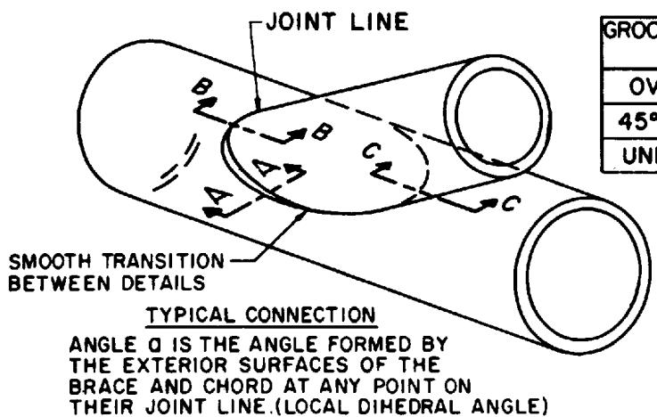

NOTE INCLUDES TOLERANCE   

| GROOVE ANGLE "b" | ROOT OPENING, G | ROOT OPENING, G |
| --- | --- | --- |
| GROOVE ANGLE "b" | mm | IN |
| OVER 90° | O TO 4.8 | O TO 3/16 |
| 45° TO 90° | 1.6 TO 4.8 | 1/16 TO 3/16 |
| UNDER 45° | 3.2 TO 6.4 | 1/8 TO 1/4 |

| a | MIN."T" |
| --- | --- |
| 50° TO 135° | 1.25 † |
| 35° TO 50° | 1.50 † |
| UNDER 35° | 1.75 † |
| OVER 135° | SEE SEC. B-B |

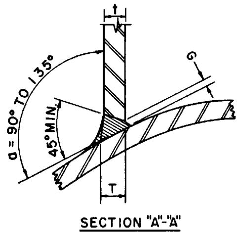

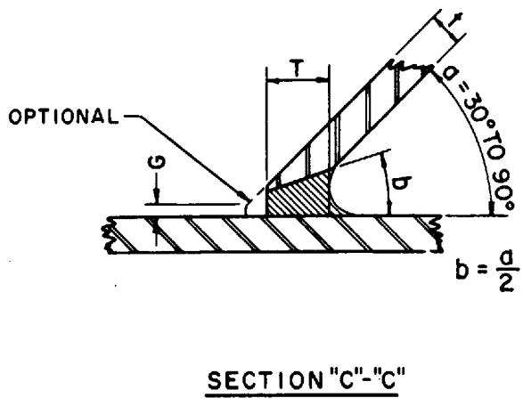

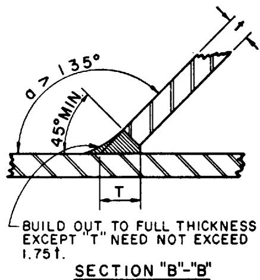

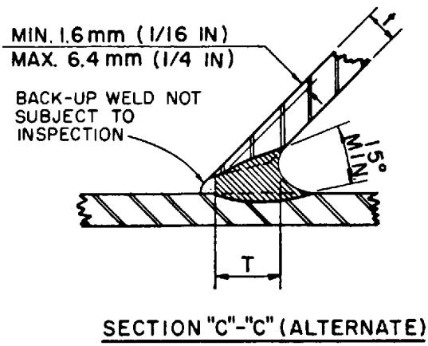  
FIG.L1   
WELDED TUBULAR CONNECTIONS   
SHIELDED METAL ARC WELDING

intersections, and moment connections should be full penetration welds unless a detailed stress analysis indicates it to be necessary. The connection between flanges and plates intended for flange stiffening should be a full penetration weld made from both sides.

Stiffener plate to web connections may be continuous double fillet welds. Weld metal and heat affected zone notch toughness should not be less than the minimum toughness requirements specified for the parent girder steel.

L.1.5 Final Fabrication Tolerances.

L.1.5.1 General. Each member of the structure should be located accurately to the final fabrication tolerances hereafter given. Other tolerances not stated herein should be in accordance with AISC Manual of Steel Construction (Reference L3).

L.1.5.2 Jacket and Deck Section Columns. In any plane critical to field assembly, such as the top of the jacket and the bottom of the deck columns, the horizontal distance from the center line of any column to the center line of the column adjacent in any direction should be within a tolerance of $\pm 10\mathrm{mm}$ (\% in.) of the net drawing dimension. At all deck levels, the horizontal distance from the center line of any column to the center line of the column adjacent in any direction should be within a tolerance of $\mp 13\mathrm{mm}$ (\% in.) and may be applied to working points on the outside diameter of the columns. In other jacket planes this tolerance may be increased to $\pm 19\mathrm{mm}$ (\% in.) and may be applied to working points on the outside diameter of the columns. Diagonals of a rectangular plan layout should be identical within $19\mathrm{mm}$ (\% in.). Every practical effort should be exerted to effect accuracy in column location at all planes.

The deviation from straightness of jacket columns should be less than $10\mathrm{mm}$ (\% in.). Such deviation should not be more than $3\mathrm{mm}$ (\% in.) in any $3\mathrm{m}$ (10 ft.) increment of length. The jacket fabrication should proceed on a flat and level surface. Frequent checks of blocking should be performed. When any column settles out of level, the settled column should be shimmed back into a level plane with the other columns. The tops of all jacket columns should relate to the drawing elevation within a tolerance of $\pm 13\mathrm{mm}$ (\% in.)

The location of the ends of the heavy wall jacket and deck leg joint cans should be within $\pm 25\mathrm{mm}$ (1 in.) of the drawing dimensions. Other changes in wall thickness in the jacket legs or deck columns should be located within $\pm 50\mathrm{mm}$ (2 in.) of the drawing dimensions.

L.1.5.3 Jacket and Deck Section Bracing. All braces in a horizontal plane should be held vertically within $\pm 13\mathrm{mm}$ ( $\frac{1}{2}$ in.) tolerance of drawing dimension. Changes in wall thickness in braces should be located within $\pm 25\mathrm{mm}$ (1 in.) of the drawing dimensions.

All other bracing where the end points are dimensioned should be erected so that such points are within $\pm 13$ mm (\%) of planned dimension.

L.1.5.4 Deck Beams. The center-lines of deck beams at their ends should be within $13 \, \text{mm}$ ( $\frac{1}{2}$ in.) of the drawing location. At no point along its center-line should any beam be out of line more than $19 \, \text{mm}$ ( $\%$ in.) horizontally or $13 \, \text{mm}$ ( $\frac{1}{2}$ in.) vertically.

Deck beams should be erected with the top flanges level, or to the specified slope. Disparity in beam depth and flange out of level due to allowable mill tolerances in depth will be acceptable. Deck beams should be erected with the webs plumb. Distortion of deck beams from welding should be corrected or otherwise compensated so that the tolerances of this paragraph are met.

L.1.5.5 Cap Beams. The center-lines of cap beams at their ends should be within $\pm 13\mathrm{mm}$ (\% in.) of the drawing dimension. At no point along the center-line should the cap beam be more than $10\mathrm{mm}$ (\% in.) out of line horizontally or $6\mathrm{mm}$ (\% in.) vertically.

Cap beams should be erected with the top flanges level. Disparity in beam depth due to mill tolerances in depth should be compensated by shimming between the cap beam and column.

Cap beams should be erected with the webs plumb. Distortion of cap beams from welding should be corrected or otherwise compensated so that the tolerances of this paragraph are met.

L.1.5.6 Grating. Joints in grating should occur only at points of support unless other appropriate details are provided on the drawings by the designer.

L.1.5.7 Fencing and Handrails. Fabrication should be performed to such a degree of accuracy that, when erected, the top rail will be straight and level to the eye.

L.1.5.8 Landings and Stairways. Landing elevations and landing and stairway locations horizontally should be within $75\mathrm{mm}$ (3 in.) of the drawing dimensions.

L.1.5.9 Piles. The minimum length of a segment of pipe used in fabricating piles should be the lesser of one pipe diameter of $1 \, \text{m}$ (3 ft.). The longitudinal seams of two adjacent pile segments should be placed $90^{\circ}$ apart as a minimum.

The maximum allowable deviation from straightness in any $3\mathrm{m}$ (10 ft.) increment of length should be $3\mathrm{mm}$ ( $\%$ in.) For lengths over $3\mathrm{m}$ (10 ft.), the maximum deviation of the entire length may be computed by the following formula, but not to exceed $10\mathrm{mm}$ ( $\%$ in.) in any $12\mathrm{m}$ (40 ft.) length.

$$3 \mathrm{m m} \times \frac{\text{t o t a l l e n g t h , m e t e r s}}{3 \text{m e t e r s}}$$

$$\frac{1 \text{i n}}{2} \times \frac{\text{t o t a l l e n g t h , f e e t}}{10 \text{f e e t}}$$

The method for checking straightness should be by taut wire along the length of pipe repeated at a minimum of three radius points.

The root face on the beveled ends of the finished pipe should not be out of square more than $5\mathrm{mm / m}$ （$\%)$ in./ft.) of diameter except that the maximum allowable out of square should not be more than $6\mathrm{mm}$ （$\%)$ in..

Pile sections and the total pipe make-up should be fabricated to a tolerance of $\pm 0.5\%$ of the length shown on the drawings unless otherwise specified.

The outside circumference and out-of-roundness tolerances should be in accordance with Sections 4.2 and 4.3 of API Spec 2B (Reference L1).

L.1.6 Provisions for Grouted Pile to Sleeve Connections. Steel surfaces of piles and the structure, which are to be connected by grout, should be free of mill glaze, varnish, grease or any other materials that would reduce the grout-steel bond. This is of special importance when no shear keys are used.

Care should be taken in installing packers to prevent damage from handling and high temperatures and splatter from welding. All debris should be removed from jacket legs to avoid damage to packers during launching and uprighting of the jacket.

L.1.7 Temporary Attachments. Any temporary attachments to the structure, such as scaffolding, fabrication and erection aids should be limited as much as practicable. When these attachments are necessary, the following requirements should be met:

Temporary attachments should not be removed by hammering or arc-air gouging. Attachments to leg joint cans, skirt sleeve joint cans, brace joint can, brace stub ends, and joint stiffening rings should be flame cut to $3\mathrm{mm}$ （$1 / 8$ in.) above parent metal and mechanically ground to a smooth flush finish with the parent metal.

Attachments on all areas that will be painted should be removed in the same manner as above, prior to any painting.

Attachments to all other areas, not defined above, should be removed by flame cutting just above the attachment weld (maximum 6 mm (% in.) above weld). The remaining attachment steel shall be completely seal welded.

Attachments to aid in the splicing of legs, braces, sleeves, piling, conductors, etc., should be removed to a smooth, flush finish.

## L.2 CORROSION PROTECTION

L.2.1 Coatings. Unless specified otherwise by the designer, the application of coatings should conform to NACE RP-01-76 (Reference L4).

L.2.2 Splash Zone Protection. Splash zone protection such as monel wrap, steel plate wrap, added steel thickness, etc., should be installed as specified and should cover not less than the areas indicated on the drawings, and/or in the specifications.

L.2.3 Cathodic Protection. The cathodic protection system components, their installation, and their testing, if required, should be in accordance with the drawings and/or specifications.

## L.3 STRUCTURAL MATERIAL

L3.1 General. All structural steel should be new, without defects, and reasonably free of excess mill scale and rust. No casing steel, reject steel or other steel, originally intended for usage other than structural should be used unless otherwise specified. Steel which has been re-classified as structural after being rejected for other use should not be used.

L.3.2 Mill Certificates. Test reports on steel furnished or purchased should be the producing mill certified reports of tests per Section I.1.1 and not copies prepared by third party jobbers or suppliers. Mill certificates and test reports should indicate all pertinent data on strength, ductility, notch toughness, chemical analysis, heat treatment, non-destructive testing, supplementary testing, heat traceability as well as purchase order number. Mill certificates or test reports should be furnished before steel is incorporated into the structure.

L.3.3 Material Identification. Material receiving and handling is normally a fabrication contractor's function. Upon receipt of material and prior to fabrication, a material identification system should be established by the fabricator which will trace each primary structural member within the completed structure back to the original mill certificates. The identification system should eliminate any conflict or duplication of any primary structural element. The system should identify materials from manufacturing through transport, receipt, storage, fabrication and final erection. The system should be such that all NDT can also be identified.

L4 LOADOUT

Loadout and tie-down are normally performed by the fabrication contractor. Loadout and tie-down should be performed in accordance with the loadout plan, Section M, and owner requirements.

## L.5 RECORDS AND DOCUMENTATION

The fabrication contractor should maintain the mill certificates as discussed in Section L.3.2 which are necessary to demonstrate that proper materials were used in the structure. In addition, the fabricator should also compile and maintain the material identification records as discussed in Section L.3.3 necessary to trace and identify the origin of each primary member. At the completion of the job the fabricator will compile and deliver to the owner these documents for permanent record.

During the course of fabrication, revisions may be approved to the primary structural members such as wall thickness, member size, type material, etc. For any substitutions and revisions made during fabrication, suitable records should be documented by the fabricator and listed as corrections to the fabrication drawings. The responsibility for the compilation of these records with other documentation related to the construction and inspection of the structure and the retention of these permanent records should be as specified by the owner.

SECTION M INSTALLATION

## M.1 GENERAL

M.1.1 Planning. The installation of a platform consists of loading out and transporting the various components of the platform to the installation site, positioning the platform on the site and assembling the various components into a stable structure in accordance with the design drawings and specifications. The installation of a platform should be accomplished in such a manner that the platform can fulfill the intended design purpose.

An installation plan should be prepared for each installation. This plan should include the method and procedures developed for the loadout, seafastenings and transportation of all components and for the complete installation of the jacket, pile/conductors, superstructure and equipment. This may be in the form of a written description, specifications and/or drawings. Depending upon the complexity of the installation, more detailed instructions may be required for special items such as grouting, diving, welding, inspection, etc. Any restrictions or limitations to operations due to items such as environmental conditions, barge stability or structural strength (i.e., lifting capacity), should be stated.

The installation plan is normally to be subdivided into phases, for example: Transportation, Removal of Jacket from Transport Barge, Pile Installation, and Superstructure Installation. The party responsible for the execution of each phase of the work should prepare the installation plan for that phase, unless otherwise designated by the Owner. Coordination and approval procedures among all parties should be established by the Owner.

M.1.2 Records and Documentation. During the load-out, transportation and installation, all daily reports, logs, test reports, pile driving records, etc., are to be prepared, compiled and retained by the party responsible for that phase of the work. These documents should also record any variation from intended installation procedures and all unusual environmental conditions which occurred during the installation. All "field modifications" which were made should be noted to record the as-built condition of the structure. At the completion of the job, each party will compile and deliver to the owner these documents in a form suitable for use as a permanent record. The responsibility for the compilation of these records with other documents related to the construction and inspection of the structure and for the retention of these permanent records will be in accordance with the requirements of the Owner.

M.1.3 Load Effects and Required Resistance. The loads applicable to each phase of the installation should be calculated as described in Section C.5. Analysis should be performed to ensure that the structural

design is sufficient to withstand the type and magnitude of those forces or load combinations without yielding or buckling of structural members or degradation of structural integrity.

The factored load effects in structural members should not exceed the strength (factored resistance) of those members using Sections D, E, F and H where applicable.

The structural strength and deformation of any installation equipment (barges, tie-downs, etc.) should also be considered inasmuch as they may affect the subsequent performance of the installed structure.

M.1.4 Temporary Bracing and Rigging. Procedures covering the calculation of forces, load factors, allowable stresses and factors of safety for component parts of the structure as well as slings, shackles and fittings are listed in Section C.5.5. Should any installation aids, temporary struts, bracing or rigging be required during any phase of the installation, these same provisions should apply. If any of the installation aids, temporary struts or bracing are to be welded to the structure, then all welding shall be in accordance with Section K.3.9. Removal shall be in accordance with Section L.1.7.

## M.2 TRANSPORTATION

M.2.1 General. The movement of the platform components from a fabrication yard to an installation site presents a complex task which requires detailed planning. Basic considerations vary with reference to the type of platform to be transported. Included herein are items which should be considered.

M.2.2 Template-Type Platforms

M.2.2.1 General. The template-type platform consists of one or more jackets or templates, piling, superstructure and other miscellaneous items. These are generally transported to location as deck cargo on barges or vessels.

M.2.2.2 Cargo or Launch Barges. An adequate number of seaworthy cargo barges should be provided. The barges selected should be of proper size and structural strength to ensure that the stability and static and dynamic stresses in the barge, cargo and seafastenings due to the loading operation and during transportation are within acceptable limits. If the jacket portion of the platform is to be launched from a barge without the use of a derrick barge, the launch barge should be capable of this operation.

M.2.2.3 Barge Strength and Stability. The various platform components and other items of cargo should be loaded on the barges in such a manner to ensure a balanced and stable condition. Barge stability should be determined in accordance with applicable regulations

such as the U.S. Coast Guard or the current International Maritime Organization standards. Ballasting of the barge as required to obtain designated draft and trim should be performed at dockside before seafastenings are attached or in a sheltered area before reaching open water. Static and dynamic stresses in the barge hull and framing due to load out, transportation and launching should be in accordance with appropriate provisions of the AISC Manual of Steel Construction, (Reference M1), the ABS Rules and Building and Classing Steel Vessels (Reference M2), API RP 2V (Reference M3), or other applicable standards.

M.2.2.4 Loadout. Loadout should be performed in accordance with the appropriate sections of the installation plan which should include allowable environmental conditions during loadout operations, and design environmental conditions for the mooring system. All items of cargo should be positioned on the barge as shown on the loadout plan. For barges which will be floating during the loading operation, the ballast system must be capable of compensating the changes in tide and loading. An adequate standby ballast system should be provided.

For a barge which will be grounded during the loading operation, it should be demonstrated by analysis or by previous experience that the barge has sufficient structural strength to distribute the concentrated deck loads to the supporting foundation material. In addition, the seabed or pad should be smooth, level, and free of any obstructions which could damage the hull. Forces resulting from the loadout operation, either from direct lift, or from a skidding operation, should be in accordance with Section C.5.6.

M.2.2.5 Seafastenings. Adequate ties should be designed and installed for all platform and cargo components to prevent shifting while in transit. These ties should be designed for the forces and deflections predicted for the vessel motion resulting from the environmental conditions defined in accordance with Section C.5.7. These seafastenings should also be described and detailed in the installation plan. They are to be attached to the jacket, deck, and other components only at locations approved by the designer. Additionally, they should be attached to the barge at locations which are capable of distributing the load to the internal framing. These fastenings should be designed to facilitate easy removal on location.

At the option of the owner, in areas where substantial experience can be demonstrated, tiedown procedures based on past successful practices can be utilized. This procedure is applicable only to routine installations and for similar cargoes during the same time of year. When detailed analysis is required, the design of tiedowns should be based on the seastate criteria established by the owner and/or the contractor based on the provisions of Section C.5.7.2. In lieu of more definitive owner-furnished criteria, the seafastenings may be designed for the environmental conditions predicted to have a

risk of exceedance in the range of one to five percent during the period of time required to transport the barge to safe harbor. In determining these criteria, the length and reliability of the short-term weather forecast and the season of the year in which the tow will take place should be considered.

M.2.2.6 Towing Vessels. The proper number of sea-going tugs should be provided, with sufficient power and size to operate safely for each particular route or ocean traveled. The size and power requirements of the towing vessel or vessels and the design of the towing arrangement should be calculated or determined from past experience. This selection should consider such items as length of tow route, proximity of safe harbor and the weather conditions and sea states expected for the season of the year.

As a minimum, the tow should be capable of maintaining station in a $15\mathrm{m / sec}$ (30 knot) wind with accompanying waves. When more than one towing vessel is required, the total calculated bollard pull should be increased to take into account the loss of efficiency due to a dual tow. A stand-by or alternate towing line should be provided, rigged for easy access, in the event the tow line should fail.

M.2.2.7 Forces. Consideration should be given to the forces applied to the various platform components as they are lifted on and off the barges or as they are rolled on and launched off the barges. Localized loads on the barge structure should also be considered.

M.2.2.8 Buoyancy and Flooding Systems. The buoyancy of any platform component to be launched should be determined to ensure the unit will float. The flooding system, the buoyancy components and any necessary lifting connections should be designed to upright and land the structure safely.

M.2.3 Tower-Type Platform

M.2.3.1 General. The tower-type platform consists of a tower substructure which is floated to the installation site and placed in position by selective flooding. This substructure is also called a jacket. It has multiple piling and a superstructure. The movement considerations should include those specified for the template-type platform in addition to others listed herein.

M.2.3.2 Water Tightness. The water tightness of the tower should be determined before towing commences.

M.2.3.3 Flooding Controls. Consideration should be given to the location and accessibility of all controls for selective flooding and righting as well as the protection of the controls from environmental and operational hazards.

M.2.3.4 Model Tests and Analysis. Model tests and detailed calculations should be considered for the prototype to determine towing and stability characteristics during towing and upending procedures.

M.2.4 Minimum Structures. Minimum structures, depending on the size, should include all applicable considerations specified above for both the template and tower-type platforms.

## M.3 REMOVAL OF JACKET FROM TRANSPORT BARGE

M.3.1 General. This section covers the removal of a template-type platform jacket which has been transported to the installation site by a barge. Removal of the jacket from the barge is usually accomplished by either lifting with a derrick barge or launching.

M.3.2 Lifting Jacket. The rigging should be properly designed in accordance with Section C.5.5 to allow the jacket to be lifted off the barge and lowered into the water. Usually the slings are attached above the center of gravity of the jacket being lifted to avoid possible damage to the jacket and/or barge during the lifting process.

M.3.3 Launching Jacket. For those jackets which are to be launched, a launching system should be provided considering the items listed below.

M.3.3.1 Launch Barge. The launch barge should be equipped with launch ways, rocker arms, controlled ballast and dewatering system, and power unit (hydraulic ram, winch, etc.) to assist the jacket to slide down the ways.

M.3.3.2 Loads. The jacket to be launched should be designed and fabricated to withstand the stresses caused by the launch. This may be done by either strengthening those members that might be overstressed by the launching operation or designing into the jacket a special truss, commonly referred to as a launch truss. A combination of the above two methods may be required.

M.3.3.3 Flotation. A jacket which is to be launched should be water tight and buoyant. If upending is to be derrick barge assisted the launched structure should float in a position so that lifting slings from the derrick barge may be attached thereto and/or previously attached slings are exposed and accessible.

M.3.3.4 Equipment. The derrick barge should be of sufficient size to (1) change the position of the launched jacket from its floating position to its erected position, or (2) to hold the launched jacket at the site until it can be righted by a controlled flooding system.

## M.4 ERECTION

M.4.1 General. This section covers the placement and assembly of the platform so that the structure is at the desired orientation, location and grade required for its intended purpose.

M.4.1.1 Placement and Assembly. Placement and assembly of the platform should be in accordance with the installation plan.

M.4.1.2 Safety. Necessary measures should be employed to conform to all State and Federal safety regulations at the installation site. This includes the provision and maintenance of all necessary safety and navigational aids and other measures in observance of appropriate regulations.

M.4.2 Anchorage. Appropriate anchoring of the derrick and supply barges should be provided during the erection phase. Basic principles which should be considered are outlined herein.

M.4.2.1 Anchor Lines. The length of anchor lines should be adequate for the water depth at the site.

M.4.2.2 Anchors. Anchor sizes and shapes should be selected so that they will bite and hold in the ocean bottom at the site. This holding action should be sufficient to resist the strongest tides, currents and winds that may reasonably be expected to occur at the site during the erection phase.

M.4.2.3 Orientation. Where it appears that the desired anchorage may not be totally possible, orientation of construction equipment should be such that, if the anchors slip, the derrick and supply barges will move away from the platform.

M.4.2.4 Anchor Line Deployment. Where anchoring of derrick or supply barge is required within the field of the guyline system of a guyed tower, measures should be employed to prevent fouling or damage of the guylines.

M.4.2.5 Obstructions. When underwater obstructions or facilities such as cables, pipelines, wellheads, etc., are subject to fouling or damage during anchoring (or other marine operations) or constitute a hazard to navigation, they should be marked or suitably located and identified. The responsibility for such markings shall be in accordance with the requirements of the Owner.

M.4.3 Positioning. The term "positioning" generally refers to the placement of the jacket on the installation site in preparation for the piling to be installed. This may require upending of those platform components that have been towed to the site or launched from a barge at the site. Generally, the upending process is accomplished by a combination of derrick barge assistance and controlled or selective flooding system. This upending phase requires advanced planning to predetermine the simultaneous lifting and controlled flooding steps necessary to set the structure on site. Closure devices, lifting connections, etc., should be provided where necessary. The flooding system should be designed to withstand the water pressures that will be encountered during the positioning process.

Where the jacket is to be installed over an existing well, the wellhead should be properly protected from damage through accidental contact with the substructure. Advance planning and preparation should be in such detail as to minimize hazards to the well and structure.

When the jacket is not to be installed over an existing well or located adjacent to an existing structure, parameters for the accuracy of positioning should be stated in the installation plan. These parameters should be in line with current established standards available in surveying equipment, the water depth and the size and use of the platform.

M.4.4 Jacket Leveling. The jacket should be positioned at or near grade and leveled within the tolerances specified in the installation plan before the piles are installed. Once level, care should be exercised to maintain grade and levelness of the jacket during the pile installation operation. Leveling the jacket after all the piles have been installed should be avoided if possible. However, it may be necessary to level the jacket by jacking or lifting after a minimum number of piles have been driven. In this instance, procedures should be utilized to minimize bending stresses in the piles.

M.4.5 Jacket Weight on Bottom. The soil loading at the base of the jacket can be critical prior to the installation of the permanent pile foundation. The load distribution on the soil should be considered for each combination of pile sections that will be supported from the jacket. For soils which increase in strength with depth, particularly soft clays and loose sands, the method of bearing capacity analysis employed should account for shape effects and the presence of any holes in the mudmats. This is because any reduction in mudmat dimensions may result in a shallow potential failure surface and hence a reduced bearing capacity.

The increase in soil loading resulting from waves of the maximum height anticipated during the installation period should be considered. The bearing capacity analysis should then take account of the combined effect of vertical, horizontal and moment loading. The more heavily loaded mudmats may experience a lowering of soil stiffness which can allow load to be transferred to other mudmats. Account may be taken of the benefits of suction developing under mudmats subject to uplift provided that they have been designed with an adequate skirt length and measures have been taken, such as the provision of valves, to prevent ingress of seawater into the skirt compartments. With supporting analyses, alternative limiting penetration criteria may be used.

The structure and foundation should be checked for the applicable load conditions specified in Sections C.2 and C.3.1.1. The environmental load, $\mathbf{W}_{\mathrm{e}}$ , in Equations C.3-1 and C.3-2 should be replaced by the loads determined from waves of the maximum height anticipated during the installation period.

In the event of rough seas or if the installation equipment must leave the site for other reasons before the jacket has been adequately secured with piles, the effective weight on bottom may require adjustment to minimize the possibility of jacket movement due to skidding, overturning, or soil failure.

M.4.6 Guyline System Installation. Handling and erection of guyline system components offshore should employ equipment and procedures to minimize potential damage and installation problems.

M.4.6.1 Guyline Handling Equipment. The design of equipment used to store, tension, and guide rope or strand should recognize minimum bending radius requirements. The handling equipment should be capable of supplying the necessary tensions to properly install the guylines. Special handling systems may be required to safely lower and position the clumpweights and anchors or anchor piles.

M.4.6.2 Procedures. Maximum control of the guyline components should be a consideration in the development of installation procedures as design tolerances may require accurate positioning. Precautions should be taken to prevent fouling of the guylines. Elongation and rotation of guylines due to tensioning should be taken into account.

M.4.6.3 Guyline Pretensioning. It may be required to preload the guylines to appropriate load levels in the installation phase. Accordingly, the tensioning equipment should be capable of supplying the specified pretensions as well as any preload which may be required to seat the guying system. Prior to the completion of the installation phase, the guylines should be tensioned to the nominal levels within specified design tolerance.

M.4.6.4 Alignment and Tolerances. The degree of accuracy required to align and position a guyed tower jacket and guyline system is determined by design tolerances. Consideration should be given to the requirements for special position and alignment monitoring systems during the placement of the jacket, lead lines, clumpweights and anchors or anchor piles.

## M.5 PILE INSTALLATION

M.5.1 General. Proper installation of piling, including conductor piles, is vital to the life and permanence of the platform and requires each pile to be driven to or near design penetration, without damage. All field-made structural connections should be compatible with the design requirements. Pile sections should be marked in a manner to facilitate installing the pile sections in proper sequence.

The closure device on the lower end of the jacket columns and pile sleeves, when required, should be designed to avoid interference with the installation of the piles.

M.5.2 Stabbing Guides. Add-on pile sections should be provided with guides to facilitate stabbing and alignment. A tight uniform fit by the guide should be provided for proper alignment. The guides should be capable of safely supporting the full weight of the add-on pile section prior to welding.

M.5.3 Lifting Methods. When lifting eyes are used to facilitate the handling of the pile sections, the eyes should be designed, with due regard for impact, for the stresses developed during the initial pick-up of the section as well as those occurring during the stabbing of the section. When lifting eyes or weld-on lugs are used to support the initial pile sections from the top of the jacket, the entire hanging weight should be considered to be supported by a single eye or lug. The lifting eyes or support lugs should be removed by torch cutting 6 mm (1/4 in.) from the pile surface and ground smooth. Care should be exercised to ensure that any remaining protrusion does not prevent driving of the pile or cause damage to elements such as packers. If burned holes are used in lieu of lifting eyes, they should comply with the applicable requirements of this section, and consideration should be given to possible detrimental effect during hard driving.

As an alternative to providing lifting eyes on the piles, pile handling tools may be used, providing they are of the proper size and capacity for the piles being driven and the operating conditions anticipated. These tools should be inspected prior to each use to ensure that they are in proper working condition. They should be used in strict accordance with the manufacturer's instructions and/or recommendations. For installations that require the use of pile followers, the followers should be inspected prior to the first use and periodically during the installation, depending on the severity of pile driving.

M.5.4 Field Welds. The add-on pile sections should be carefully aligned and the bevel inspected to assure a full penetration weld can be obtained before welding is initiated. It may be necessary to open up the bevel by grinding or gouging. Welding should be in accordance with Section K of this Recommended Practice. Nondestructive inspection of the field welds, utilizing one or more of the methods referenced in Section N, should be performed.

M.5.5 Obtaining Required Pile Penetration. The adequacy of the platform foundation depends upon each pile being driven to or near its design penetration. The driving of each pile should be carried to completion with as little interruption as possible to minimize the increased driving resistance which often develops during delays. It is often necessary to work one pile at a time during the driving of the last one or two sections to minimize "setup" time. Workable back-up hammers with leads should be available, especially when pile "setup" may be critical.

The fact that a pile has met refusal does not assure that it is capable of supporting the design load. Final blow count cannot be considered as assurance of the adequacy of piling. Continued driving beyond the defined

refusal may be justified if it offers a reasonable chance of significantly improving the capability of the foundation. In some instances, when continued driving is not successful, the capacity of a pile can be improved by utilizing methods described in Section G.2.1. Such methods should be approved by the design engineer.

M.5.6 Driven Pile Refusal. The definition of pile refusal is primarily for contractual purposes to (1) define the point where pile driving with a particular hammer should be stopped and other methods instituted (such as drilling, jetting, or using a larger hammer) and (2) prevent damage to the pile and hammer. The definition of refusal should also be adapted to the individual soil characteristics anticipated for the specific location. Refusal should be defined for all hammer sizes to be used and is contingent upon the hammer being operated at the pressure and rate recommended by the manufacturer.

The exact definition of refusal for a particular installation should be defined in the installation contract. An example (to be used only in the event that no other provisions are included in the installation contract) of such a definition is:

Pile driving refusal with a properly operating hammer is defined as the point where pile driving resistance exceeds either 980 blows/m (300 blows/ft.) for consecutive $1.5 \, \text{m}$ (5 ft.), or 800 blows per .3 m (1 ft.) of penetration. (This definition applies when the weight of the pile does not exceed four times the weight of the hammer ram. If the pile weight exceeds this, the above blow counts are increased proportionally, but in no case shall they exceed 800 blows for $150 \, \text{mm}$ (6 in.) of penetration.)

If there has been a delay in pile driving operations for one hour or longer, the refusal criteria stated above shall not apply until the pile has been advanced at least $0.3\text{m}$ (1 ft.) following the resumption of pile driving. However, in no case shall the blow count exceed 800 blows for 150 mm (6 in.) of penetration.

In establishing the pile driving refusal criteria, the recommendations of the pile hammer manufacturer should be considered.

M.5.7 Selection of Pile Hammer Size. When piles are to be installed by driving, the influence of the hammers to be used should be evaluated as a part of the design process as set forth in Section G.10. It is not unusual for alternative hammers to be proposed for use by the erector well after the design has been completed and reevaluation by the designer may not be feasible. In such an event, justification for the use of an alternative hammer shall include calculation of stresses in the pile resulting therefrom as set out in Section G.10.

In lieu of an analytical solution for dynamic stress the following guidelines may be used:

GUIDELINE WALL THICKNESS, mm  

| Pile Outside Diameter. mm | Hammer Size, KJ | Hammer Size, KJ | Hammer Size, KJ | Hammer Size, KJ | Hammer Size, KJ | Hammer Size, KJ |
| --- | --- | --- | --- | --- | --- | --- |
| Pile Outside Diameter. mm | 49 | 81 | 163 | 244 | 407 | 678 |
| 610 | 13 | 13 | 22 | - | - | - |
| 762 | 14 | 14 | 18 | - | - | - |
| 914 | 16 | 16 | 16 | 22 | - | - |
| 1067 | 18 | 18 | 18 | 19 | 32 | - |
| 1219 | 19 | 19 | 19 | 19 | 29 | 44 |
| 1524 | 22 | 22 | 22 | 22 | 22 | 35 |
| 1829 | - | - | 25 | 25 | 25 | 29 |
| 2134 | - | - | - | 29 | 29 | 29 |
| 2438 | - | - | - | 32 | 32 | 32 |
| 2743 | - | - | - | - | 35 | 35 |
| 3048 | - | - | - | - | 38 | 38 |

GUIDELINE WALL THICKNESS, IN.   

| Pile Outside Diameter. | Hammer Size, Ft-Kips | Hammer Size, Ft-Kips | Hammer Size, Ft-Kips | Hammer Size, Ft-Kips | Hammer Size, Ft-Kips | Hammer Size, Ft-Kips |
| --- | --- | --- | --- | --- | --- | --- |
| in. | 36 | 60 | 120 | 180 | 300 | 500 |
| 24 | ½ | ½ | 7/8 | - | - | - |
| 30 | 9/16 | 9/16 | 11/16 | - | - | - |
| 36 | 5/8 | 5/8 | 5/8 | 7/8 | - | - |
| 42 | 11/16 | 11/16 | 11/16 | 3/4 | 11/4 | - |
| 48 | 3/4 | 3/4 | 3/4 | 3/4 | 11/8 | 13/4 |
| 60 | 7/8 | 7/8 | 7/8 | 7/8 | 7/8 | 13/8 |
| 72 | - | - | 1 | 1 | 1 | 11/8 |
| 84 | - | - | - | 11/8 | 11/8 | 11/8 |
| 96 | - | - | - | 11/4 | 11/4 | 11/4 |
| 108 | - | - | - | - | 11/8 | 11/8 |
| 120 | - | - | - | - | 11/2 | 11/2 |

Values above the solid line based upon minimum pile area in $\mathbf{mm}^2$ (in²) equal to $50\%$ of the rated energy of the hammer. Values below line controlled by Section G.

The preceding table is based on industry experience with up to $1.5\mathrm{m}$ (60 in.) diameter piles and $400\mathrm{kJ}$ (300 ft-kip) hammers.

When it is necessary to use a pile hammer to drive piles with less than the guideline wall thickness set out in the above table, or that determined by an analytical solution, the definition of refusal used should be reduced proportionally.

M.5.8 Drilled and Grouted Piles. Drilling the hole for drilled and grouted piles may be accomplished with or without drilling mud to facilitate maintaining an open hole. Drilling mud may be detrimental to the surface of some soils. If used, consideration should be given to flushing the mud with circulating water upon completion of drilling, provided the hole will remain open.

Reverse circulation should normally be used to maintain sufficient flow for cutting removal. Drilling operations should be done carefully to maintain proper hole alignment and to minimize the possibility of hole collapse. The insert pile with an upset drill bit on its tip may be used as the drill string so that it can be left in place after completion of the hole.

Centralizers should be attached to the pile to provide a uniform annulus between the insert pile and the hole. A grouting shoe may be installed near the bottom of the pile to permit grouting of the annulus without grouting inside the pile. It may be necessary to tie down the pile to prevent flotation in the grout if a grouting shoe is used. The time before grouting the hole should be minimized in soils which may be affected by exposure to sea water. The quality of the grout should be tested at intervals during the grouting of each pile. Means should be provided for determining that the annulus is filled, as further discussed in Section M.5.11. Holes for closely positioned piles should not be open at the same time unless there is assurance that this will not be detrimental to pile capacity and that grout will not migrate during placement to an adjacent hole.

M.5.9 Belled Piles. In general, drilling of bells for belled piles should employ only reverse circulation methods. Drilling mud should be used where necessary to prevent caving and sloughing. The expander or underreaming tool used should have a positive indicating device to verify that the tool has opened to the full width required. The shape of the bottom surface of the bell should be concave upward to facilitate later filling of the bell with tremie concrete.

To aid in concrete placement, longitudinal bars and spiral steel should be well spaced. Reinforcing steel may be bundled or grouped to provide larger openings for the flow of concrete. Special care should be taken to prevent undue congestion at the throat between the pile and bell where such congestion might trap laitance. Reinforcing steel cages or structural members should extend far enough into the pile to develop adequate transfer.

Concrete should be placed as tremie concrete, with the concrete being ejected from the lower end of a pipe at the bottom of the bell, always discharging into fresh concrete. Concrete with aggregates $10\mathrm{mm}$ (\% in.) and less may be placed by direct pumping. Because of the long drop down the pile and the possibility of a vacuum forming with subsequent clogging, an air vent should be provided in the pipe near the top of the pile. To start placement, the pipe should have a steel plate closure with soft rubber gaskets in order to exclude water from the pipe. Care should be taken to prevent unbalanced fluid heads and a sudden discharge of concrete. The pile should be filled to a height above the design concrete level equal to $5\%$ of the total volume of concrete placed so as to displace all laitance above the design level. Suitable means should be provided to indicate the level of the concrete in the pile. Concrete placement in the bell and adjoining section of the pile should be as continuous as possible.

M.5.10 Pile Installation Records. Throughout the pile driving operation, comprehensive driving and associated data should be recorded. The recorded data should include:

1. Platform and pile identification.   
2. Penetration of pile under its own weight.   
3. Penetration of pile under the weight of the hammer.   
4. Blow counts throughout driving with hammer identification.   
5. Unusual behavior of hammer or pile during driving.   
6. Interruptions in driving, including "set-up" time.   
7. Lapsed time for driving each section.   
8. Elevations of soil plug and internal water surface after driving.   
9. Actual length of each pile section and cutoffs.   
10. Pertinent data of a similar nature covering driving, drilling, grouting or concreting of grouted or belled piles.

M.5.11 Grouting Piles to Structure. If required by the design, the spaces between the piles and the surrounding structure should be carefully filled with grout using appropriate grouting equipment. The equipment should be capable of maintaining continuous grout flow until the annulus is filled. If the structure design does not require or permit grout to be returned to the surface, means should be provided to determine that the spaces have been filled as required. Such means might include but are not limited to underwater visual inspection, probing or detection devices.

M.5.12 Use of Hydraulic Hammers. Hydraulic hammers tend to be more efficient than steam hammers, so that the energy transferred to the pile for a given rated energy may be greater. They can be used both above and below water, to drive battered or vertical piles, through legs or through sleeves and guides, or vertical piles through sleeves alone. In calculating pile stresses, full account should be taken of wave, current and wind forces, both during driving and during hammer stabbing (which may be either above or below water). Further, while for steam hammers the weight of the cage is generally held by a crane, for hydraulic hammers the whole weight of the hammer is borne by the pile.

The energy output is generally varied by the contractor to maintain a fairly low blowout. Thus, blowcounts do not give a direct guide to soil stratification and resistance. Since the ram is encased, hammer performance cannot be judged visually. It is therefore important that measurements are made to give a complete record of performance including, for example, ram impact velocity, stroke, pressure of accelerating medium and blowrate. Reliable instrumentation of some piles may be also desirable, to verify the energy transferred to the pile to aid interpretation of soil stratification and to limit pile stresses.

Monitoring of underwater driving requires that easily identified, unambiguous datums, together with robust television cameras or remotely operated vehicles, capable of maintaining station, be employed. Alternatively, for shallow water sites, it is possible to extend the hammer casing so that blowcounts can be monitored above water.

Because no cushion block is used, there is no change in ram to anvil pile characteristics as driving progresses and no requirement for cushion changes. However, because of the steel to steel contact, particular attention should be paid to the design of the pile head.

In selecting hydraulic hammers for deeper water applications, account should be taken of possible decreases in efficiency due to increased friction between the ram and its surrounding air. Sufficient air should be supplied to the hammer so that water ingress is prevented and water in the pile should be able to escape freely.

It should be noted that hydraulic hammer changes take much longer than for steam hammers.

## M.6 SUPERSTRUCTURE INSTALLATION

The superstructure installation will normally consist of lifting such items as deck sections, module support frames, modules and packages from the transport barges onto the jacket. They are then connected to the jacket and each other as specified by the design.

M.6.1 Lifting Operations. For all lifting operations the structure strength and general suitability of the equipment are to be considered. The forces are to be derived as described in Section C.5 and member checks are to be made to determine that members and joints are adequate for the lift conditions.

The lifting contractor should be familiar with the design assumptions for the lift and perform the operations in compliance with these assumptions. The operations should not be performed under more severe environmental conditions than those for which the objects involved are designed.

Prior to lifting, the lifted weight shall be predicted to ensure that it is within the limits defined by the design and within the capacity of all lifting equipment. Where weighing is not carried out, it is recommended that an adequate margin be applied to cover mill tolerance and growth in piping/equipment weights, etc.

M.6.2 Lifting Points. Values of design forces for lifting points are recommended in Section C.5.5. Padeye plates should be oriented in such a direction that the possibility for out-of-plane loading of the padeye plate and shackle is minimized.

M.6.3 Alignment and Tolerances. The superstructure components will be aligned within the tolerance specified in the design documents. After the piling has been driven and cut off to grade, the superstructure should be set with proper care being exercised to ensure proper alignment and elevation. Unless otherwise specified, the deck elevation shall not vary more than

$\pm 75 \mathrm{~mm}$ (3 in.) from the design elevation shown in the drawing. The finished elevation of the deck shall be within $13 \mathrm{~mm} (\frac{1}{2} \mathrm{in})$ of level.

M.6.4 Securing Superstructure. Once the superstructure components have been set (placed) they should be secured to provide the support and fixity as required by the design.

M.6.5 Appurtenances. Once the superstructure is installed, all stairways, handrails, and other similar appurtenances should be installed as specified.

## M.7 GROUNDING OF INSTALLATION WELDING EQUIPMENT

M.7.1 General. Normal welding procedures use reverse polarity wherein the welding rod is positive (+) and the ground is negative (-). The current flow is positive to negative, and an adequate and properly placed ground wire is necessary to prevent stray currents, which, if uncontrolled, may cause severe corrosion damage. (See NACE RP-01-76, Sec. 7, Par. 7.3, Reference M4).

M.7.2 Recommended Procedure. The welding machine should be located on and grounded to the structure whenever possible. When this is impossible or impractical, and the welding machine is located on the barge or vessel, both leads from the output of the welding machine should be run to the structure and the ground lead secured to the structure as close as practical to the area of welding. Under no conditions should the hull of the barge (or vessel) be used as a current path. The case or frame of the welding machine should be grounded to the hull to eliminate shock hazards to personnel.

The welding cables should be completely insulated to prevent stray currents. Cables should not be allowed to hang in the water.

Grounding cable lugs should be tightly secured to grounding plates. The lug contact should be thoroughly cleaned to bare metal. The resistance of the connection should be a maximum of 125 microhms per connection or the voltage drop across the connection should be a maximum of 62.5 millivolts for a current of 500 amperes. Use Ohm's Law (V = IR) for amperage other than 500 amperes.

The minimum cross-sectional area of the return ground cable should be 645 circular mm per 1,000 amperes per 30.5 meters (one million circular mils per 1,000 amperes per 100 feet) of cable. One or more cables connected in parallel may be used to meet minimum cross-section requirements.

NOTE: 2/0 cable contains 86 circular mm (133,392 circular mils)

3/0 cable contains 109 circular mm (169,519 circular mils)

4/0 cable contains 137 circular mm (212,594 circular mils)

More than one ground cable of sufficient size is suggested to guard against a single return or ground becoming loose.

Connecting several welding machines to a common ground cable which is connected to the structure being welded will control stray currents if adequately sized and properly insulated from the barge or vessel containing welding machines.

M.7.3 Monitoring Remote Ground Efficiency. When welding is conducted using generators remote from a structure, grounding efficiency can be monitored by simultaneously measuring the potential of the structure and barge or ship housing the welding generators. A change in potential reading from either indicates insufficient grounding.

SECTION N INSPECTION

## N.1 GENERAL

Quality control, inspection, and testing should be performed to ensure adherence to the plans and specifications which contain the detailed instructions necessary to obtain the desired quality and service in the finished product. Quality control, inspection, and testing should be performed during all phases of construction, including the fabrication, loadout, seafastening, towing, and installation phases to ensure that specified requirements are being met. The most effective quality control and inspection scheme is one which prevents the introduction of defective materials or workmanship into a structure, rather than finding these problems after they occur.

## N.2 SCOPE

Quality control is normally performed by the construction contractor prior to, during, and after fabrication, loadout, seafastening, transportation, and installation. The purpose is to ensure that materials and workmanship meet the specified requirements. Inspection and testing is normally conducted by the owner to verify the required quality.

Responsibility for conducting the inspections and preparation of the recommended documentation should be as agreed upon between the owner and the construction contractor. Results of inspection should be prepared in a timely manner.

## N.3 INSPECTION PERSONNEL

N.3.1 Inspectors. Inspectors should be qualified to carry out their duties by education, experience and practical testing. They should be knowledgeable in the general areas of welding technology, inspection, and testing procedures, as well as construction methods for those areas of their responsibility during fabrication, loadout, seafastening, transportation, and installation. They should know how and where to look for problems and situations which lead to problems, as well as the practical limitations on making repairs.

N.3.2 Inspector Qualifications. Personnel who perform nondestructive weld examinations should be required to qualify by passing a practical test based on the inspection methods and type of construction under consideration for a particular job. All inspectors should have demonstrated ability and experience, or be qualified to the appropriate codes, such as AWS (Reference N1), ASME/ANSI (Reference N3), or equivalent. Specialty technicians, such as ultrasonic (UT) or radiography (RT) should also be qualified to other guidelines such as API RP2X, Reference N4, (UT) or SNT-TC-1A, Reference N5, (radiography, magnetic particle, liquid penetrant, etc.). Continuing qualification should be based on satisfactory performance on the job.

Personnel who perform other inspection during any phase of construction of an offshore platform should be required to demonstrate ability and experience or be qualified to an appropriate code for the required inspection of a particular job.

N.3.3 Access to Work. Authorized personnel should have access at all times to all phases of the work under their responsibility to ensure that the required quality is obtained.

## N.4 FABRICATION INSPECTION

N.4.1 Materials. Inspection should verify that all materials being incorporated into any portion of the fabrication are of good quality and in accordance with the specified requirements. Receipt of the correct material should be verified by cross-checking with appropriate original mill certificates and heat stamps, and with other appropriate documentation for non-structural material and structural materials other than steel.

N.4.2 Fabrication. Inspections of the structure should be made during all phases of fabrication (i.e., prefabrication, rolling, forming, welding, interim storage, assembly, erection, etc.) to confirm compliance with the specified requirements (i.e., joint details, weld profiles, dimensions, alignment, tolerances, orientation, etc.). In general, inspection should confirm that each component incorporated into the structure is of correct material; size and dimension; orientation, etc.; and is fitted, aligned, and permanently fastened according to the specified requirements. Jacket legs and pile sleeves, through which piles will be field installed, should be carefully checked for internal clearance and, if possible, drifted with a template of nominal length or other appropriate method to ensure required tolerances have been met. Particular attention should be given to field mating points (such as the tops of jacket legs) which should be checked to ensure all dimensions are within tolerance. Inspection also should be made for all items affecting the assembly, including erection site structures (i.e., temporary foundations, bulkhead), erection aids, and erection equipment. Inspections should confirm that these items are in accordance with the specified requirements.

N.4.3 Welding. Welding inspection and testing should be performed to verify adherence to the specified requirements. Inspection and testing should be performed during all phases of fabrication with an aim to preventing introduction of defects into the weld.

Inspection should verify that the welder (or welding operator) is currently qualified for the procedure being used (as per Section K) and that the appropriate qualified procedure is being followed. In addition, inspection should ensure that appropriate consumables are being used and that the consumables are being stored,

handled, and used in accordance with appropriate requirements, including the manufacturer's recommendations.

N.4.3.1 Inspection Methods. Three nondestructive inspection methods are routinely used on fabricated structures. These methods include visual, ultrasonics (UT), and radiography (RT). The magnetic particle inspection technique (MT) and the liquid penetrant technique (PT) are generally considered as enhanced visual inspection techniques. However, these two techniques have procedural requirements which should be followed if used.

An approved procedure for each inspection method should be developed for each job application, based on the referenced specification noted below.

Visual. The visual technique is used either by itself or as an integral part of other NDE techniques. Visual inspection requirements should be conducted in accordance with AWS D1.1, Section 6.5 plus Sections 3, 4, 8 and 10, of Reference N1.

Penetrant Technique. The liquid penetrant inspection technique (PT) is useful for detecting surface discontinuities such as cracks, porosity, etc. The method for using PT for discontinuities that are open to the surface should conform to ASTM E165 (1983).

Magnetic Particle Technique. The magnetic particle technique (MT) is useful for detecting discontinuities that are open to the surface or which are slightly subsurface. The procedure for magnetic particle inspection should conform to the requirements of ASTM E709.

Radiographic Technique. The radiographic technique (RT) is useful in determining buried or through thickness discontinuities. The RT procedure should conform to AWS D1.1, Sections 6.9, and 10.

Ultrasonic Technique. The ultrasonic technique (UT) is also useful for determining buried or through thickness discontinuities. API RP2X (1988) should be used for guidance on personnel qualifications, UT techniques, procedures, and inspection reports.

Method Selection. A number of parameters should be considered for selection of an inspection method, including: joint geometry, applied stress (type and magnitude), thickness(es) of the structural joint(s), and discontinuity (type-size and location). Coordination among the designer, fabricator, inspector, and owner is essential and consultation with an NDE specialist is recommended in order to select the most appropriate technique for a particular application.

N.4.3.2 Extent of Weld Inspection.

Scheduling. To the maximum extent possible, inspection and testing should be performed as construction progresses and be scheduled so as not to delay the progress of the job.

Inspection Criteria. The plans, procedures, and specifications should clearly delineate which materials and fabricated items are to be inspected by nondestructive testing. The acceptance criteria, extent of testing, and the methods to be used in such inspection should be clearly defined.

Fit-Ups. All weld fit-ups (joint preparation prior to welding) should be visually inspected to ensure acceptable tolerances before welding.

Visual Inspection. Welding in progress should be visually inspected to assure proper cleaning, tie-in, etc. As a minimum the passes which should be inspected are: root, hot (or second) and the completed weld-cap.

Extent of NDE Inspection. Table N.4-1 shows recommended minimum extent of inspection for various parts of the structure.

N.4.3.3 Quality of Welds. Weld area surfaces should be adequately prepared so that NDE can be carried out. This should include removal of weld spatter and appropriate marking for inspection. Adequate time should be allowed for weld cool-down before conducting NDE.

UT Quality. Three levels of weld quality are widely accepted: 1) level A - Workmanship Quality, 2) Level C - Experienced based fitness-for-purpose quality; and 3) level F - specific fitness-for-purpose quality. Detailed interpretation of these levels and UT reject criteria for each level should be in accordance with API RP 2X (1988) Reference N4.

Weld Quality for NDE. For welds subjected to nondestructive testing by radiography or any other method other than UT the weld quality requirements of AWS D1.1 Section 8.15.2 (buildings), AWS D1.1 Section 10.17.2 (tubular structures), as applicable, should apply, except as modified herein.

Weld Profiles. Weld profiles in simple tubular joints should be free of excessive convexity, and should merge smoothly with the base metal of both brace and chord in accordance with AWS D1.1.

Relaxation of Rejection Criteria. For simple tubular joints, defects in the root area of the weld are less detrimental than elsewhere, as well as being more difficult to repair. Subject to specific guidelines provided by the designer, some relaxation of the above-mentioned reject criteria may be appropriate. Defects in back-up welds, or root lands, which are not part of theoretical strength weld (minimum "T" in Figure L.1) should not be cause for rejection.

N.4.4 Corrosion Protection System. Details regarding the inspection of corrosion protection systems should be in accordance with NACE Standard RP-01-76, Reference N6.

N.4.4.1 Coatings. Inspections should verify that surface preparation, climatic conditions (i.e., wind, temperature, humidity), coating process, and materials are in

compliance with specified requirements prior to application of coating. Where applicable, manufacturer's instructions should be closely followed. During the coating process, inspection should be performed to verify the surface preparation, the thickness of each layer, and adherence of the coating to the base metal.

Repaired coating should be subjected to the same inspection requirements as the original coating.

N.4.4.2 Splash Zone Protection. Inspection should verify that splash zone protection (i.e., monel wrap, fiberglass coatings, rubber sheathing, fusion bonded epoxy, etc.) is installed according to the specified requirements, including the manufacturer's recommendations.

N.4.4.3 Cathodic Protection Systems. Inspection of the cathodic protection equipment, whether sacrificial anode or impressed current type, should be performed to confirm that it meets the specified requirements.

If included in the system, cabling, junction boxes, etc., should be inspected to ensure all components are properly attached and that electrical continuity is confirmed. Attachment of anodes (e.g., welding of anode stand-off posts, doubler plates, impressed current anode

sockets; installation of impressed current anodes into sockets) should be inspected to ensure compliance with the specified requirements.

N.4.5 Installation Aids and Appurtenances. Inspections should verify that all installation aids and appurtenances are installed and tested in accordance with the specified requirements, including manufacturer's recommendations. Installation aids include the following:

— Launch Systems   
— Flooding Systems   
Grouting Systems   
Mud Mats   
— Jetting Systems   
Lugs and Guides   
Monitoring Systems   
- Pre-installed Files and Conductors

Appurtenances include the following:

- Boat Landings   
Riser Guards   
Risers and Clamps   
J-Tubes   
— Sump and Pump Caissons

TABLE N.4-1 RECOMMENDED MINIMUM EXTENT OF NDE INSPECTION   

| Case | Extent, Percent | Method |
| --- | --- | --- |
| Structural Tubulars | Structural Tubulars | Structural Tubulars |
| Longitudinal Weld Seam (L) | 10* | UT or RT |
| Circumferential Weld Seam (C) | 100 | UT or RT |
| Intersection of L & C | 100 | UT or RT |
| Tubular Joints | Tubular Joints | Tubular Joints |
| Major brace-to-chord welds | 100 | UT |
| Major brace-to-brace welds | 100 | UT |
| Misc. Bracing | Misc. Bracing | Misc. Bracing |
| Conductor Guides | 10* | UT (or MT)** |
| Secondary bracing and subassemblies, i.e., splash zone, and/or mudline secondary bracing, boat landings, etc. | 10* | UT (or MT)** |
| Attachment weld connecting secondary bracing/subassemblies to main members | 100 | UT or MT |
| Deck Members | Deck Members | Deck Members |
| All primary full penetration welds | 100 | UT or MT |
| All partial penetration welds | 100 | Visual*** |
| All fillet welds | 100 | Visual*** |

* Partial inspection should be conducted as 10 percent of each piece, not 100 percent of 10 percent of the number of pieces. Partial inspection should include a minimum of three segments randomly selected unless specific problems are known or suspected to exist. All suspect areas (e.g., areas of tack welds) shall be included in the areas to be inspected. If rejectable flaws are found from such $10\%$ inspection, additional inspection should be performed until the extent of rejects has been determined and the cause corrected.   
** Depending upon design requirements and if specified in the plans and specifications MT may be an acceptable inspection method.  
*** May include MT and/or PT.

The location, size, and orientation should be checked, and weld attachments (including temporary restraints) should be subjected to $100\%$ NDE.

Inspections should include functional tests of all mechanical and electrical equipment and systems, including instrumentation. Cabling and instrumentation should be checked to ensure continuity and all hydraulic and pneumatic lines should be pressure tested.

All non-steel components (i.e., diaphragms, packers, valve seats, etc.) should be protected from damage by weld spatter, debris and/or any other construction activities, and hydraulic lines should be thoroughly flushed and drained before and after testing. The inside of jacket legs, skirt piles, etc., should be inspected to ensure complete removal of debris (e.g., welding rods, misc. pieces of wood, steel, etc.) which could damage non-steel components during installation.

## N.5 LOADOUT,SEAFASTENING,ANDTRANSPORTATIONINSPECTION

Inspection should be performed for all areas related to loadout, seafastening and transportation to confirm compliance with the specified requirements. Prior to loadout, final inspection of the structure should be conducted to ensure all components are in place; all welds have been properly completed and inspected; all temporary transportation/installation aids are included and secure; all hydraulic and pneumatic lines have been properly installed, tested, flushed, and secured; that all temporary fabrication aids and debris have been removed; and that all temporary welded attachments have been removed and attachment marks repaired according to the specified requirements.

The support foundations, including the loadout pathway, the dock, the transport vessel, and the sea bottom at dock side should be inspected to ensure compliance with the specified requirements.

Other areas for inspection include the lifting/pulling/ pushing components attached to the structure (which require NDE) and those between the structure and lifting equipment (i.e., lifting slings, shackles, spreader beams). For vendor supplied items, documentation is required in addition to the inspections. The capacity and condition of loadout equipment should be confirmed by inspection and documentation.

For skidded loadouts, inspection should be performed to confirm that the skidway and/or launch surface is clean and properly lubricated (if required) prior to loadout. The winches, jacks and pulling cables should be inspected for proper capacity and condition.

Where ballast and de-ballast operations are required to compensate for tidal variations, inspection of the ballast system is required to confirm adequacy and equipment condition. Monitoring of the operation is also recommended, to ensure compliance with the loadout procedure.

Inspection for seafastening of the structure and all deck cargo is required to confirm compliance with the specified requirements. This includes temporary tie-downs and bracing required for transport. Materials, fabrication and weld inspection requirements shall be as per Section N.6. Inspection for jacket launch items should be conducted where possible prior to sea transport.

Sea worthiness of tugs, towing attachments and the transport vessel should also be confirmed. For preparation of self floaters for transport to the site, inspection should be performed to confirm sea worthiness and that all towing/restraining lines are properly attached.

## N.6 INSTALLATION INSPECTION

N.6.1 Jacket Launch and Upending. Prior to launch, inspection should confirm that all tie-downs and temporary bracings are cut loose, and, tow lines and loose items are removed from the launch barge or safely secured. Inspection is required to confirm that the jacket flooding system is undamaged, flooding valves are closed, and the launching arm system is in the proper mode of operation. For lifted jackets, inspection should confirm removal of all restraints and proper attachment of lifting equipment, as well as the undamaged and properly configured operation mode of the flooding system. For self-floating jackets, inspection should confirm removal of tow lines as well as the undamaged and properly configured operation mode of the flooding system.

Inspection should be carried out after the jacket is secured in place. If inspection is necessary before then (i.e., suspected damage to flooding system), inspection should be limited to those items required to upend and secure the jacket.

N.6.2 Piling and Conductor Installation. All pile and conductor welds performed during fabrication should be inspected (as per Section N.4) prior to loadout, including lifting devices, lugs, and attachments. During installation, inspection should be conducted to ensure that the correct pile make-up is followed, and that the welding of add-on sections (if applicable) is performed in accordance with the specified requirements.

Prior to each use, pile hammers should be inspected for proper hook-up and alignment for operation.

If vibration levels in the structure (above water) appear to be excessive during pile driving, the driving operation should be interrupted to inspect for possible fatigue damage in the structure.

During pile installation, nondestructive testing should be performed on the welded connections at pile add-ons; between pile and deck support members; between the pile and jacket leg; and elsewhere, to confirm compliance with the specified requirements. NDE inspection should be performed as per Section N.4 with $100\%$ UT of all critical welds except the pile-to-shim weld.

The pile-to-shim weld is particularly difficult to evaluate with UT. Alternatively, careful visual inspection of each pass should be made, followed by MT inspection of the final weld.

N.6.3 Superstructure Installation. Prior to lifting, inspection should be performed to confirm that tiedowns and other items not considered in the lifting design are removed from the superstructure. Proper rigging and connection of all lifting components should also be confirmed.

Immediately after lifting, inspection should be performed on all scaffolding and other temporary support systems to confirm their adequacy for completion of weld out. Materials, fabrication and welding requirements shall be in accordance with Section N.4. Inspection should be performed on the jacket and deck mating points to confirm proper alignment and fit-up and to ensure that weld preparations are as per specified requirements. Following weld out, inspection should be performed on the welded connection as per Section N.6.2 and/or other specified requirements.

These inspections should be performed for each component of a multiple-lift superstructure, with inspection for alignment during each lift.

N.6.4 Underwater Inspection. In the event the installation requires underwater operations, the inspection should verify either by direct communications with divers or through the use of a remote monitoring device that the operation has been conducted in accordance with the specified requirements.

## N.7 INSPECTION DOCUMENTATION

N.7.1 General. During the fabrication, erection, load out and installation phases, data related to the inspection of the platform will be generated which may not be part of the Welding (Section K.4); Fabrication (Section K.5); or Installation (Section M.1.2) records. Such inspection data should be recorded as the job progresses and compiled in a form suitable to be retained as a permanent record.

All documentation referenced in this Section N, should be retained on file for the life of the structure.

N.7.2 Fabrication Inspection Documentation

N.7.2.1 Materials and Fabrication Inspection. During the fabrication phase material inspection documentation covering the Mill Certificates and Material Iden

tification Records (as described in Section L.3) as well as any additional materials, testing or special inspections which were conducted, should be prepared and assembled. This should include documentation for any inspection related to the assembly of the structure.

N.7.2.2 Weld Inspection. A set of structural drawings should be marked with an appropriate identification system detailing the location of each weld to be examined and referenced as an integral part of the inspection record. All welds should be uniquely identified and be traceable to the individual welder or weld operator. A report should be prepared for each examination performed, the details of which should be documented sufficiently to permit repetition of the examination at a later date. Sketches and drawings incorporating the weld identification system should be used to augment descriptions of the part and locations of all discontinuities required to be reported. Forms should be provided to show the required details of documentation, and sketches of typical weld configurations should also be provided to clarify the written description. Discontinuities required to be reported should be identified on sketches by the appropriate weld number and position.

N.7.2.3 Other Inspection. Inspection of all nonstructural systems and tests should be documented to confirm details of the inspection and results. Any deviations from the specified requirements should be properly recorded, including sketches if necessary.

N.7.3 Loadout, Seafastening and Transportation Inspection Documentation. Inspection documentation for any special materials, testing and for all welding inspection performed in connection with the loadout, seafastening and transportation phases should be recorded and retained as part of the inspection record. Any special documentation for inspection of vendor-supplied items (i.e., lifting slings) and reports for other areas affecting loadout (i.e., transport vessel, dock) which is not included in the installation plan or records described in Section M should also be recorded.

N.7.4 Installation Inspection Documentation. Inspection documentation for materials, testing and welding inspection performed during the installation phase should be recorded and retained. Pile blow count versus depth and final pile penetration should be documented, and a continuous log of events, including climatic conditions (i.e., temperature, wind, barometric pressure, humidity), seastates, operational activities, etc., should be retained.

SECTION O SURVEYS

## 0.1 GENERAL

During the life of the structure, in-place surveys that monitor the adequacy of the corrosion protection system and determine the condition of the structure should be performed in order to safeguard human life and property, protect the environment, and prevent the loss of natural resources.

## O.2 PERSONNEL

0.2.1 Planning. Surveys should be planned by qualified personnel possessing survey experience and technical expertise commensurate with the level of survey to be performed.   
O.2.2 Survey. Surveys should be performed by competent personnel and may also include the observations of platform operating and maintenance personnel familiar with its condition. The personnel conducting surveys of above water areas should know how and where to look for damage and situations which could lead to damage.

Visual inspection of the underwater portion of a structure should be conducted by ROV or divers under the supervision of personnel experienced in the underwater visual inspection methods employed. Nondestructive examination of the structure should be performed by personnel trained and experienced in application of the method being used. Cathodic potential surveys should be supervised by personnel knowledgeable in this area.

## O.3 SURVEY LEVELS

0.3.1 Level I. The effectiveness of the corrosion protection system employed should be checked and an above water visual survey should be performed annually to detect deteriorating coating systems, excessive corrosion, and bent, missing or damaged members.

This survey should identify indications of obvious overloading, design deficiencies and any use which is inconsistent with the platform's original purpose. This survey should also include a general examination of all structural members in the splash zone and above water, concentrating on the condition of the more critical areas such as deck legs, girders, trusses, etc. If above water damage is detected, nondestructive testing should be used when visual inspection cannot fully determine the extent of damage. Should the Level I survey indicate that underwater damage may have occurred, a Level II inspection should be conducted as soon as conditions permit.

O.3.2 Level II. A Level II survey consists of general underwater visual inspection by divers or ROV to detect the presence of any or all of the following:

1. Excessive corrosion   
2. Accidental or environmental overloading   
3. Scour, seafloor instability, etc.

4. Fatigue damage   
5. Design or construction deficiencies   
6. Presence of debris   
7. Excessive marine growth

This survey should include the measurement of cathodic potentials of preselected critical areas using divers or ROV. Detection of significant structural damage during a Level II survey should become the basis for initiation of a Level III survey. The Level III survey, if required, should be conducted as soon as conditions permit.

0.3.3 Level III. A Level III survey consists of an underwater visual inspection of preselected areas and/or, based on results of the Level II survey, areas of known or suspected damage. Such areas should be sufficiently cleaned of marine growth to permit thorough inspection. Pre-selection of areas to be surveyed (see Section 0.5) should be based on an engineering evaluation of areas particularly susceptible to structural damage or to areas where repeated inspections are desirable in order to monitor their integrity over time. Detection of significant structural damage during a Level III survey should become the basis for initiation of a Level IV survey in those instances where visual inspection alone cannot determine the extent of damage. The Level IV survey, if required, should be conducted as soon as conditions permit.

0.3.4 Level IV. A Level IV survey consists of underwater nondestructive testing of preselected areas and/or, based on results of the Level III survey, areas of known or suspected damage. Level IV should also include detailed inspection and measurement of damaged areas.

## 0.4 SURVEY FREQUENCY

0.4.1 Definitions. Manned Platform - A platform which is actually and continuously occupied by persons accommodated and living thereon. The platform may or may not be evacuated during extreme environmental conditions.

Unmanned Platform — A platform upon which persons may be employed at any one time, but upon which no living accommodations or quarters are provided. A structure that is manned for a short period of time, for such operations as extended maintenance or a limited drilling program, may be considered unmanned for survey purposes.

Well-protectors are small jacket structures with little or no process equipment and no personnel quartered onboard.

Caissons are single leg structures with little or no process equipment and no personnel quartered onboard.

O.4.2 Guideline Survey Intervals. The time interval between surveys for fixed platforms should not exceed the guideline intervals shown in Table O.4-1, unless experience and/or engineering analyses indicate that different intervals are justified. Justification for changing guideline survey intervals should be documented and retained by the operator. In such cases, the following factors should be taken into account:

1. Consequence of failure to human life, property, the environment, and/or conservation of natural resources.   
2. Manned or unmanned platform.   
3. Wells (naturally flowing, sour gas, high pressure, etc.)   
4. Original design criteria.   
5. Present structural condition.   
6. Service history of platform (condition of corrosion protection system, results of previous inspections, changes in design operating or loading conditions, prior damage & repair, etc.).   
7. Platform structural redundancy.   
8. Criticality of the platform to other operations.   
9. Platform location (frontier area, water depth, etc.).

O.4.3 Special Surveys. A Level I survey should be conducted after direct exposure to a design environmental event (e.g., hurricane, earthquake, etc.). Except for caisson and well protectors, a Level II survey should be conducted upon completion of the initial drilling program. Also, a Level II survey should be conducted after severe accidental loading (e.g., boat collision, etc.).

Areas critical to the structural integrity of the platform, which have undergone structural repair, should be subjected to a Level II survey approximately one year following completion of the repair. A Level III survey should be performed when excessive marine growth prevents visual inspection of the repaired areas.

Level II scour surveys in scour prone areas should take account of local experience, and are usually more frequent than the intervals indicated in Table 0.4.1. Interpreters of periodic scour survey data should be aware that post-storm infilling of scour holes may obscure the extent of scour in storms.

## 0.5 PRESELECTED SURVEY AREAS

During initial platform design and any subsequent reanalysis, critical members and joints should be identified to assist in defining requirements for future platform surveys. Selection of critical areas should be based on such factors as joint and member loads, stresses, stress concentrations, structural redundancy, and fatigue lives determined during platform design.

## 0.6 RECORDS

Records of all surveys should be retained by the operator for the life of the platform. Such records should contain detailed accounts of the surveys performed, including video tapes, photographs, measurements, and other pertinent survey results. Descriptions of detected damage should be thoroughly documented and included with the survey results. Any resulting repairs and engineering evaluations of the structure's condition should be documented and retained.

GUIDELINESURVEYINTERVALS  

| Level | I | II | III | IV |
| --- | --- | --- | --- | --- |
| Manned | 1 yr. | 3 thru 5 yrs. | 6 thru 10 yrs | * |
| Unmanned | 1 yr. | 5 thru 10 yrs. | 11 thru 15 yrs. | * |
| Well Protec-tors/Caissons | 1 yr | 5 thru 10 yrs. | * | * |

*Surveys should be performed as indicated in Sections 0.3.2 and 0.3.3.

SECTION P PLATFORM REUSE

## P.1 GENERAL

In general, platforms are designed for onshore fabrication, loadout, transportation and offshore installation. By reversing this construction sequence, platforms can be removed, onloaded, transported, upgraded (if required) and reinstalled at new sites. If a platform is reused the engineering design principles and good practices contained in this publication should apply.

## P.2 REUSE CONSIDERATIONS

Reuse platforms require additional considerations with respect to fatigue, material, inspection, removal and reinstallation. These provisions are discussed in the following sections.

P.2.1 Fatigue Considerations for Reused Platforms. For reused platforms having tubular connections inspected in accordance with the minimum requirements of Section P.2.3, fatigue considerations must include appropriate allowances for fatigue damage that may have occurred during the initial in-service period of the platform as well as the planned service life at the new location. In general, Equation F.2-2 should be satisfied. Beneficial effects on fatigue life from full inspection and/or remedial measures may be considered when determining prior damage or selecting safety factors.

The simplified fatigue analysis provisions addressed in Section Comm. F.1 may be used to assess tubular joints in reused platforms, provided they are inspected per the minimum requirements of Section P.2.3, have prior and new locations in less than $122\mathrm{m}$ (400 ft.) of water, have similar wave climates with respect to platform orientation, are constructed of ductile steels, have redundant structural framing and have natural periods less than three seconds for both locations.

The design fatigue life, L, in years should satisfy the following expression.

$$\mathrm{L} = \mathrm{S F}_{1} \mathrm{L}_{1} + \mathrm{S F}_{2} \mathrm{L}_{2}. \tag{P.2-1}$$

where:

$$\mathrm{L}_{1} = \text{I n i t i a l i n s e r v i c e p e r i o d , y e a r s}$$

$$\mathrm{L}_{2} = \text{P l a n n e d s e r v i c e l i f e a t n e w l o c a t i o n , y e a r s}$$

$$\mathrm{S F}_{1} = 2. 0 \text{f o r m i n i m u m} \quad \text{r e q u e m e n t s o f S e c t i o n} \quad \mathrm{P . 2 . 3 . I f t h e w e l d i n a t u b u l a r c o n n e c t i o n i s} \quad 100 \% \quad \mathrm{N D E} \quad \text{i n s p i n c e o n i n c o r d a n c e w i t h} \quad \text{r e q u e m e n t s o f S e c t i o n P . 2 . 3 a n d i s} \quad \text{u p g r a d e d i f d e f f e c t s a r e f o u n d ,} \quad \mathrm{S F}_{1} \quad \text{m a y b e} \quad \text{b e t w e e n z e r o a n d 2 . 0 , s e l e c t e d o n a r a t i o n a b s i s .}$$

$$\mathbf{S F}_{2} = 2. 0$$

For both safety factors, $\mathbf{SF}_1$ and $\mathbf{SF}_2$ , higher values for failure critical elements should be considered.

For the simplified fatigue analysis, the allowable Peak Hot Spot Stresses may be obtained from Figure Comm. F.1-1 or Comm. F.1-2 for the water depths at the prior and new site for the design fatigue life defined by Equation P.2-1. If the values are within $5\%$ , then use the allowable Peak Hot Spot Stress for the depth where the platform was or will be installed for the longest durations. Otherwise, use the lower value.

Remedial measures (i.e., grinding welds, grouting, reinforcing, etc.) to increase the fatigue performance of a platform to be reused are acceptable.

P.2.2 Steel in Reused Platforms. The type and grade of steel used in primary structural members of platforms removed and reinstalled at new offshore sites should be determined from the original records. If information on the type and grade of steel used is unavailable from the original record, 226 MPa (33 ksi) minimum yield strength shall be assumed. In addition, tubular sections of unknown steel type and grade with outside diameters typical of drilling tubulars, e.g., $5\frac{1}{2}''$ , $9\frac{1}{8}''$ , $13\frac{1}{8}''$ , etc., should be avoided or removed from existing structures. Reused platforms having tubular connections in which the heavy wall joint-cans were fabricated from other than Class A steel should be inspected in accordance with the requirements of Section P.2.3 including UT inspection to detect the occurrence of unacceptable defects.

Structural steel in an existing platform may be reused for fabrication of modifications to a platform planned for reuse, provided it is suitable for the intended purpose.

P.2.3 Inspection of Reused Platforms. When structures are considered for reuse, inspection should be required and testing performed to verify suitability for the intended application. Such inspection and testing may be performed prior to removal from the original site or at a rework site.

P.2.3.1 General. Inspection programs prepared for evaluation of used structures being considered for reuse should be sufficiently detailed to establish the condition of the structures. Additionally, inspection should be performed to verify the absence of damage which may impair the structure's ability to withstand loadings imposed during all phases of removal operations from the prior site.

All pertinent assumptions made in the reanalysis should be verified by inspection, including material composition and properties, connection integrity, and extent of any corrosion or other degradation due to prior service.

Assessment of condition of used structures should generally begin with review of existing documentation from the original construction of the structure, together with results of any past in-service surveys. Where doc

umentation is complete and in accordance with the requirements of Section N.7, less field inspection may be justified, unless specific knowledge of unusual events such as collisions, damage from operations, etc., dictate additional review.   
Applicable inspection techniques are covered in Section N.4.3.1.   
P.2.3.2 Materials. The chemical composition and mechanical properties of all materials should be verified for consistency with the assumptions made for the reanalysis. Mill certificates or other documentation from the original fabrication with adequate material traceability may be used. Where such information is lacking, physical testing should be performed by a qualified laboratory.   
Of particular importance is the verification of special materials such as steels classed as Groups II or III in Section I.3.   
In lieu of the above requirements, where $226\mathrm{MPa}$ (33 ksi) minimum yield strengths are assumed in the reanalysis, inspection of materials may be limited to verifying that no drilling tubulars are used in the structures.   
P.2.3.3 Conditions of Structural Members and Connections. Each structural member should be inspected to determine the extent of any corrosion or other mechanical damage (e.g., pitting, dents, straightness, etc.) that would impair the intended service of the platform.   
All structural connections should be inspected to ensure that service damage (e.g., fatigue) does not impair the capability of the connection to carry design loads.   
P.2.3.4 Damage-Prone Connections. Damage-Prone Connections are defined as connections having in-service stresses or loads (based on reanalyses for the new location) equal to or greater than 90 percent of the strength allowable or having 90 percent of the Peak Hot Spot Stress (Simplified Fatigue Analysis) or fatigue damage ratios (Detailed Fatigue Analysis) equal to or greater than 0.3.   
P.2.3.5 Extent of Weld Inspection. Inspection of all new member fabrication and new member connections shall be performed per Section N.4.3.2. Weld inspection plans for existing welds should generally conform to the requirements of Section N.4.3.2, as modified herein.   
P.2.3.5.1 Scheduling and Weld Access. Inspection techniques selected for use should consider access requirements and limitations, both to the weld and within the existing welded connections. Use of UT over RT may be preferred due to equipment portability.   
P.2.3.5.2 Extent of NDE Inspection. Documentation of NDE performed during the original fabrication and periodic in-service surveys of the platform should be reviewed. Where adequate documentation exists and weld qualities were consistent with current acceptance criteria, inspection may be limited to an investigation of in-service damage due to overload or fatigue.

Where such documentation is not available, an initial spot survey of the structure should be made to provide guidance to the engineer performing the reanalysis and to assist in the formulation of a detailed inspection plan. The spot survey should include a general overview of 100 percent of the uncleaned structure to be reused to detect any gross structural damage (e.g., parted connections, missing members, dented or buckled members, corrosion damage, etc.). Structural members and connections suspected (or detected) of having in-service damage should be 100 percent NDE inspected.

All NDE inspected welds should be thoroughly cleaned so as to enhance the effectiveness of the inspection.

Table P.2-1 shows the minimum recommended extent of inspection for various existing parts of the structure:

P.2.3.6 Corrosion Protection Systems. Corrosion protection systems integrity should be verified in accordance with NACE requirements, Reference I6. Verification should include assessment of remaining anode materials, anode connections, and condition of protective coatings, to include splash zone coatings, wraps, etc. Inspection should consider possible hidden damage under wraps, etc.

P.2.3.7 Inspections for Removal of Structures from Prior Site. Inspection and documentation should be performed for all phases of removal operations as defined in the offshore construction plan. Structural and equipment weights should be verified.

P.2.4 Removal and Reinstallation

P.2.4.1 Planning. All offshore construction should be accomplished in such a manner that the platform can fulfill the intended design purposes.

An offshore construction plan should be prepared for platform removal and reinstallation. This plan should include the method and procedures developed for the onloading, seafastenings and transportation of all components and for the complete reinstallation of the jacket, pile/conductors, superstructure and equipment.

Plans for platform removal from the prior site should be developed which describe methods and procedures for removal of the deck, appurtenances, jacket and piling. Seafastenings, transportation requirements, lift weights and centers of gravity should be defined. Particular emphasis should be placed on the prevention of damage of any platform components intended for reuse as a result of removal operations.

Offshore construction plans may be in the form of written descriptions, specifications, and/or drawings. Depending upon the complexity of the installation, more detailed instructions may be required for special items such as grouting, diving, welding/cutting, inspection, etc. Any restrictions or limitations to operations due to items such as environmental conditions, barge stability or structural strength (i.e., lifting capacity), should be stated.

TABLE P.2-1 RECOMMENDED EXTENT OF NDE INSPECTION - REUSED PLATFORMS   

| Case | Extent | Method |
| --- | --- | --- |
| Jacket Primary Tubularis |  |  |
| Longitudinal Weld Seams (L) | (a) | UT or MT |
| Circumferential Weld Seams (C) | (a) | UT or MT |
| Intersection of L & C | (a) | UT or MT |
| Tubular Joints |  |  |
| Major Brace-to-Chord Welds | (b) | MT |
| Major Brace-to-Brace Stub Welds | (b) | MT |
| Deck Members and Connections |  |  |
| Truss Bracing Members | 10%* | UT or MT |
| Truss Chord Members | 10%* | UT or MT |
| Plate Girder Members | 10%* | UT or MT |
| Connections to Deck Legs | 25%* | UT or MT |
| Crane Pedestal Connections | 100% | UT or MT |
| Cantilever Deck Connections | 100% | UT or MT |
| Survival/Safety Equipment Connections | 100% | UT or MT |
| Misc. Jacket/Deck Members and Connections | 100% | UT or MT |
| Nonredundant bracing and subassemblies, i.e., lifting eyes, lifting bracing, sole conductor guide framing level above mudline, etc. |  |  |
| Attachment Welds connecting nonredundant bracing/subassemblies to main members | 100% | UT or MT |
| Redundant bracing and subassemblies, i.e., multi-level conductor guide framing, secondary splash zone and mudline bracing, boat landings, etc. | 10%* | Visual** |
| Attachment welds connecting redundant bracing/subassemblies to main members. | 10%* | Visual** |
| Piling |  |  |
| Longitudinal Weld Seams (L) | 10%* | UT or RT |
| Circumferential Weld Seams (C) | 10%* | UT or RT |
| Intersection of L & C | 10%* | UT or RT |
| Field Splices | 100% | UT or RT |

Partial inspection should be conducted as percentage of each piece, not 100 percent of percentage of the number of pieces.   
** Limited to inspection of completed weld; may include MT and or PT.   
(a) Extent of inspection for these welds should be determined by comparing the design loadings and stresses (including removal and reinstallation loads and stresses) for the new site with those to which the welds have previously been designed for and/or exposed. Where new design loadings are less than or equal to initial design or actual loadings, then the extent of inspection, if any, should be determined based on NDE documentation or the results of the initial spot survey per Section P.2.3.5b.   
Where new design loadings are significantly greater than initial design or actual loadings, or when comparison based on initial design or actual loadings is not possible, a minimum of one (1) bracing member and one (1) jacket leg spanning between each level should be inspected. Additional inspection per Section P.2.3.5b should be performed where in-service damage is known of or suspected.   
(b) All damage-prone connections should be inspected. Damage-Prone connections are defined in Section P.2.3.4. Where NDE inspection of these connections reveals significant defects, additional inspection of other connections should also be performed. For tubular connections, a minimum of one(1) brace to chord connection at each level and X brace connection between levels, as applicable, should be inspected.   
For tubular connections not having Class A steel in the heavy wall joint-cans both UT and MT should be performed.

The offshore construction plan should normally be subdivided into phases, for example — removal, onloading, seafastenings, transportation and reinstallation. The party responsible for each phase of the work should prepare the plan for that phase, unless otherwise designated by the Owner. Coordination and approval procedures among all parties should be established by the Owner.

P.2.4.2 Records and Documentation. Adhere to the provisions of Section M.1.2 during removal and reinstallation.

P.2.4.3 Forces and Allowable Stresses. Adhere to the provisions of Section M.1.3 during removal and reinstallation.

P.2.4.4 Temporary Bracing and Rigging. Adhere to the provisions of Section M.1.4 during removal and reinstallation.

P.2.4.5 Removal. Jackets originally installed by lifting may be removed in a process which essentially reverses the original installation sequence. Jackets originally installed by launching which cannot be lifted onto barges may be removed by controlled deballasting, and skidding the jacket back onto a properly configured launch barge. Such operations may require more precise control of barge ballasting, positioning, and alignment between jacket and barge than required for the original launch. Environmental conditions for such operations may also be more restrictive.

Anchorage during offshore removal operations should be conducted in accordance with the basic principles outlined in Section M.4.2.

P.2.4.6 Buoyancy and Refloating. When removal of used platforms from a prior site requires refloating of platform components such as the jacket, additional buoyancy may be required in excess of that provided when the structures were originally installed to compensate for loss of buoyancy and for additional weights not present during the original installation, i.e., grouted piling.

P.2.4.7 Marine Growth Removal. When removing platforms for reuse, appropriate equipment for marine growth removal from seafastening locations should be provided. If the jacket is to be skidded back onto a launch barge, marine growth should be removed from launch cradles to ensure reasonable prediction of coefficient of friction and sling loads on padeyes and winches. Waterblasting or sandblasting to remove marine growth has been found effective.

P.2.4.8 Barge Stability. During removal of used platform components from a prior site, ballasting of the barge for open water towing should be completed prior to loading of platform components on the barge, except where removal operations otherwise dictate - e.g., reverse launching of jackets. If required to navigate shallow waters, deballasting from open water tow conditions should not be performed until the barge reaches sheltered waters.

P.2.4.9 Reinstallation

In general, the provisions of Section M should apply to the reinstallation of used platforms.

SECTIONQ MINIMUMSTRUCTURES

## Q.1 GENERAL

Minimum structures, as defined in Section A.2.1.3, should be designed, fabricated, installed and inspected in accordance with this recommended practice including the special provisions of this section.

## Q.2 DESIGN LOADS AND ANALYSIS

Q.2.1 Dynamic Wave Analysis. A dynamic analysis utilizing the extreme wave seastate, in accordance with Section C.3.3, should be performed for all minimum structures with a natural period equal to or greater than three seconds. In reference to the masses mentioned in Section C.3.3, the dynamic model should include the maximum expected deck live load.

Q.2.2 Fatigue Analysis. A fatigue analysis including dynamic effects should be performed in accordance with Section C.3.3. For field welds in caissons, special attention should be given to the provisions for complete joint penetration butt welds in AWS D1.1-92, Section 10.12, or else reduced fatigue performance (e.g., AWS Curve E) and root deductions should be considered. For caissons with natural periods less than two seconds, and in a water depth less than $16\mathrm{m}$ (50 ft.), fatigue design in accordance with Comm. F.1 may be used in lieu of dynamic fatigue analysis.

A damping value not to exceed one and one-half percent of critical should be used unless a higher value can be substantiated for a specific structure.

## Q.3 CONNECTIONS

This section provides guidelines and considerations for utilizing connection types other than welded tubular connections as covered in Section E. Connection types are as follows:

Bolted

Pinned

Clamped

Grouted

Doubler Plate

Threaded

Swaged

Q.3.1 Analysis. Connections should be analyzed following the general guidelines of Section E.3.5. Member forces should be obtained from the global structural analysis.   
Q.3.2 Field Installation. Where connections are designed to be field installed, inspection methods should be developed to ensure proper installation in accordance with design assumptions. As an example, the ten

sion in high strength bolts should be field verified utilizing mechanical or procedural methods.

Q.3.3 Special Considerations

Q.3.3.1 Bolted Connections. These joints should be designed in accordance with appropriate industry standards such as AISC Specification for Structural Joints using ASTM A325 or A490 bolts.   
Consideration should be given to punching shear, lamellar tearing, friction factors, plate or shell element stresses, relaxation, pipe crushing, stress corrosion cracking, bolt fatigue, brittle failure, and other factors or combinations that may be present.   
Retightening or possible replacement of bolts should be included as part of the owner's periodic surveys as defined in Section O.   
Q.3.3.2 Joints with Doubler, and/or Gusset Plates. Consideration should be given to punching shear, lamellar tearing, pullout, element stresses, effective weld length, stress concentrations and excessive rotation.   
Q.3.3.3 Pinned Connections. These connections may significantly influence member forces; therefore, pin ended tubular joints should be modelled in accordance with the actual detailing for fabrication.   
Q.3.3.4 Grouted Connections. The recommendation that all axial load transfer be accomplished using only shear keys is made to ensure the integrity of pile-pile sleeve connection. The significant movement inherent in these light weight structures could materially degrade the grout bond strength in such conditions.   
Q.3.3.5 Clamped Connections. Where primary members rely on friction to transfer load, it should be demonstrated, using appropriate analytical methods or experimental testing, that adequate load transfer will be developed and maintained during the life of the structure. Consideration should be given to the member crushing load when developing the friction mechanism.

## Q.4 MATERIAL

Q.4.1 Primary Connections. Steel used for primary tubular joints or other primary connections should be Class A steels as defined in Section I.1.3.3 or equivalent. Primary joints or connections are those whose failure would cause significant loss of structural strength.   
Q.4.2 Caissons. Caissons may be fabricated utilizing Class C steel, as defined in Section I.1.3.1, if interaction ratios (as defined in Section D) are equal to or less than 0.90 for all design loading conditions.

COMMENTARY ON LRFD METHODOLOGY

The design requirements in this document are based on a reliability analysis. The checking operations make the reliability basis transparent to the designer. In this respect, a load and resistance factor design (LRFD) format is not different from working stress formats. However, it can be important in particular circumstances to understand the underlying methodology. The methodology could prove useful when (a) performing structural checks not covered in the recommendations, (b) incorporating additional site or project specific field, laboratory or analytical data, or (c) evaluating the stated limitations of these guidelines.

COMM. LRFD.1.0 SAFETY OF OFFSHORE PLATFORMS

Offshore structures are subject to random oceanographic events. In addition, there are uncertainties in foundation soil and steel platform strengths. A comprehensive reliability approach to the development of platform design criteria can logically account for these uncertainties. Probabilistic methods have been used to determine the reliability-based design criteria in this document. Such an approach parallels that used in guidelines and codes for the design and construction of buildings and bridges. The challenge in this procedure is to attain the benefits of risk and reliability methods without reducing the important safeguards that the experienced engineer brings to each design. To ensure these two goals, this design guideline has been based on reliability analysis but, in practice, does not significantly alter the design process itself.

The platform design process is similar to other structural and mechanical design. The steps in checking a design in this format include:

a) Choose values of appropriate nominal load cases such as gravity, wind, wave and earthquake;   
b) Combine load cases with recommended load factors and analyze the force effects; and   
c) Check with factored strength formulas for all the components including braces, connections, legs and piling.

Offshore platforms are subject to a wide variety of environmental loads such as wind, wave and current action during storms and hurricanes, severe motions during earthquakes, ice pressures, mudslides, boat impacts, etc. These infrequent loads exhibit high statistical uncertainties. In addition to environmental loads there are gravity induced loads due to equipment, buoyancy, installation and construction. These are usually better known than the environmental loads. The structural components, e.g., beams, columns, connections, piles, etc., must be proportioned to resist the effects of these loads. Uncertainties in capacities or member strengths arise because of material and fabri

cation variability and limitations in engineering theories to predict and conveniently interpret element and system response and capacity. Safety factors are commonly used to compensate for these uncertainties and provide increased safety margins and protection against damage. In areas of new technology such as offshore platforms, these factors are initially borrowed from land-base activity and then modified by reliance on field experiences. Full scale testing is usually not feasible, so in-place structures represent the only source of full size experimental data.

Comm. LRFD.1.1 Reliability Analysis. A specification based on reliability analysis should consider three components — uncertainties, risk and economics. A probabilistic representation of each random variable describes the uncertainties including objective, unavoidable scatter and subjective modeling uncertainties. Uncertainties are measured by the statistical spread in the data; they can be extrapolated to full scale events.

Risk expresses the probability of an unfavorable consequence which in general terms may be expressed as:

$\mathbf{Risk} = \mathbf{1} - \mathbf{Reliability} = \mathbf{P}$ (Resistance $<$ Load)

where $\mathbf{P}(\cdot)$ denotes probability. The reliability design model invariably defines both load and strength as probabilistic random variables. Figure Comm. LRFD.1 shows this fundamental reliability formulation in which the risk depends on the degree of overlap of the load and strength probability density curves. An important conclusion from this figure is that there is no risk-free environment. Evidence of this fact abounds in aircraft, bridges, ships and buildings for which failures have been reported.

Economics must enter the decision process since there is no zero-risk operation. Higher safety margins will move apart and reduce, but not eliminate the load and strength overlap. If the risk (probability of unfavorable event) is multiplied by its consequences (such as damage cost), the total cost becomes:

Total Cost = Initial Cost + Risk x (Failure Cost)

As risk decreases and initial cost increases, a balance or optimum is reached at which an incremental initial cost is just balanced by an equal decrease in expected consequence cost Risk x (Failure Cost). The balance point establishes the optimal total cost and the corresponding optimal risk, and hence in principle can be used to derive design criteria, safety margins, etc. A limitation to a direct application of this approach is the limited available data to model the distributions and also the expected losses which must include interest rate and intangibles such as human, social and political factors. Furthermore, in typical civil engineering structures, failures so rarely occur that the risk weighted cost is not indicative of the potential loss.

AISN3D AILI1880Rd   
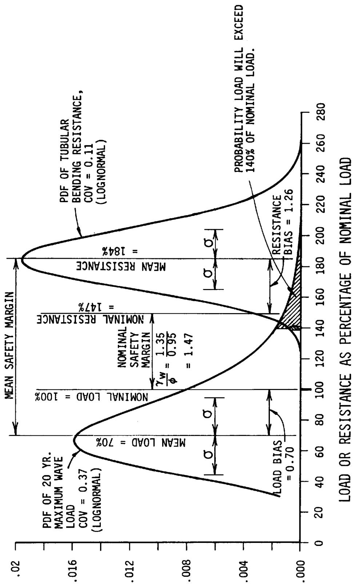  
FIG.COMM.LRFD-1:   
ILLUSTRATION OF LOAD AND RESISTANCE PROBABILITY   
DENSITY AND SAFETY MARGINS   
(EXAMPLE FOR TUBULAR BENDING RESISTANCE SUBJECTED TO WAVE LOAD)

The calculated risks are often considered notional rather than true actuarial or statistical values. The calculated risks include, for example, the potential failures that can be modeled by normal design rules and formulas, but not the failures due to human error, blunders, or a very limited technological understanding of the structure's true behavior. Nevertheless, as notional measures of risk, the values obtained from a consistent reliability model serve as valuable guides for decisions that must be made. Confidence in the reliability-based design process is gained by calibrating to existing design practice and experience.

COMM. LRFD.2.0 THE LRFD FORMAT

Research projects sponsored by API reviewed the RP2A "Recommended Practice for Planning, Designing and Constructing Fixed Offshore Platforms" and concluded that the current implicit approach to safety does not provide structures with consistent component reliability. The API therefore decided to modify its current method of checking component safety, known as a working stress design (WSD) format, to a multiple safety factor format known as load and resistance factor design (LRFD). In WSD, a component is checked with an equation of the form:

$$\frac{\text{N o m i a l S t r e n g t h}}{\text{S a f e t y F a c t o r}} \geq \text{S u m o f N o m i a l L o a d s}$$

Only one safety factor is used and the safety margin and hence the reliability will depend on the range of design application. In the LRFD approach, partial safety factors are used in the format:

Resistance Factor x Nominal Strength >

Load Effect due to the Sum of Factored External Loads

where nominal strengths and loads may be the same as WSD, but each term is multiplied by its respective load or resistance factor. The load and resistance factors are each matched during the code formulation to their respective uncertainties thereby reducing reliability variations over the anticipated range of applications. These factors must be calibrated by code committees using a reliability model and design experience and then tabulated for routine design practice.

An LRFD type format has been adopted by several structural codes in the United States such as ACI (reinforced concrete) and AASHTO (bridges). LRFD is being promoted by the National Bureau of Standards for building design, and an LRFD code has been issued by AISC for steel structures. This directly impacts offshore design since API RP2A excerpts major portions of the AISC code, especially for checking platform deck components. The AISC-LRFD code cannot be easily adapted to the API WSD provisions.

Comm. LRFD.2.1 Basic Terminology. The LRFD checking equations will appear herein with the following basic notation. A component meets the criterion if:

$$\phi \mathrm{R}_{\mathrm{n}} \geq \mathrm{Q} \quad \dots \dots \dots \dots \dots \dots \dots \dots \dots \dots \dots \dots \dots \dots \dots \dots \dots \dots \tag{Comm.LRFD-1}$$

where:

$$\begin{array}{l} \phi = \text{c o m p o n e n t} \\ \mathrm{R}_{\mathrm{n}} = \text{n o m i n a l} \\ Q = \text{f a c t o r e d} \\ Q = \Sigma \gamma_{i} F_{i}. \tag{Comm.LRFD-2} \\ \end{array}$$

where:

$$\begin{array}{l} \gamma_{i} = \text{l o a d f a c t o r f o r l o a d t y p e i}, \\ \begin{array}{l} \mathbf{F}_{\mathrm{i}} \\ = \text{n o m i n a l} \end{array} \\ \end{array}$$

This simple notation will be expanded for cases of strength interaction ratios in which separate resistance factors may appear with each strength term. Furthermore, load factors are applied to the nominal loadings before the structural analyses are performed to calculate member forces. The load combination shown is for illustration of the concept and not the actual arithmetic combination of member forces. Factoring the load before doing the analysis is necessary whenever nonlinear foundation support is being modeled.

COMM. LRFD.3.0 RP2A-LRFD DEVELOPMENT

The reliability model adopted for establishing the load and resistance factors is based on the safety index beta （$\beta)$ method in which uncertainties are described by means and coefficients of variation (standard deviation divided by the mean). It leads to a reliability expression of the form:

$$\text{S a f e t y I n d e x ,} \beta = \frac{\text{M e a n S a f e t y M a r g i n}}{\text{U n c e r t a i n t y L e v e l}}$$

The safety index is a measure of reliability and is related to the number of standard deviations that the mean safety margin falls in the safe region, e.g., when resistance is greater than the load.

The safety index has two important features for developing structural codes:

1. The safety index does not require explicit risk values. It is, however, a valid measure of risk without the legal, social, economic and psychological impact of risks expressed as probabilities of failure.   
2. Designers do not need to learn probability theory. The reliability analysis becomes transparent to the designer, since $\beta$ is only used by code writers in deriving the design factors which are then used independently of the reliability theory.

Past experience combined with measured data are used to calibrate the load and resistance factors to produce designs that will have, on the average, reliabilities similar to that of existing designs produced by WSD. LRFD produces designs with more uniform $\beta$ than current WSD even when the average values are similar, thereby improving overall reliability.

In the RP2A-LRFD there are no preassigned $\beta$ levels. Rather, a data base was compiled for a range of typical platform components such as piles, jacket braces, horizontals, etc., for a variety of water depths, geometries, grouted and ungrouted cases. These examples from existing platforms provided a direct comparison of LRFD with present practice.

A statistical data base on uncertainties of loads and component strengths was assembled and is presented in the respective commentary sections. It is based on experimental distributions as well as variations due to intended simplifications in design equations (both the so-called natural and subjective variabilities).

Utilizing a full range of platform types, a set of safety indices was computed based on sizes derived from current WSD rules. The calculation of $\beta$ was done with structural reliability techniques which are now well known and described in both API PRAC 22 reports, References COMM1-9, and other publications. The calibration procedure then established target safety indices upon which to determine partial safety factors in the LRFD format. In this way LRFD designs may have the same average safety （$\beta)$ as current WSD designs but will be more uniform and have less fluctuation about the target $\beta$ . As an illustration, in current design practice, platforms with high gravity load (compared with environmental load) generally have higher $\beta$ 's (more reliability) because of low uncertainty in gravity loads. This influence is balanced by LRFD with smaller gravity load factors compared with environmental load factors.

The entire reliability-based RP2A-LRFD checking format was tested for practicality by checking several platform designs for shallow, moderate and deep water. The platform design checks are described in this Commentary by reference to Platforms A, B, C, etc. Further details of these platforms appear in the API reports. This checking was carried out by several different design firms who incorporated the LRFD provisions in their analysis procedures. They checked feasibility in both computer-based checks of the jacket, piling, deck and main structural members and also the hand-calculated checks of platform details. These studies also highlighted any significant member sizing differences that arose between WSD and LRFD design. It was demonstrated that LRFD will not result in a significant change in total structure weight, but there will be redistribution of material from gravity designed members to environmentally loaded members.

During the period of LRFD platform design development studies, additional research findings enhanced the statistical data and were incorporated in the partial factors.

Comm. LRFD.3.1 References on RP2A-LRFD Development. The concepts described above were incorporated into this document after several years of research, design comparisons, and industry review. Research began in several industry projects followed by support from the API. The details of this investigation

and development are contained in several references and the API-PRAC-22 documents cited below, References COMM1-11.

The PRAC 79-22 report initiated this work and, based on an industry-wide questionnaire, a plan was developed to achieve a balanced reliability-based design format. The PRAC 80-22 report contains an industry-wide survey of element components and the initial trial format for checking platform components. An initial case of platform checking was performed by PetroMarine Engineers (PME) on Platform A and is reported in PRAC 81-22. A further implementation of the advanced level II checking format for calculating safety indices is also contained in that report. Two more platform checks, done by PME on a shallow water structure (Platform B) and by Brown & Root Inc. on a moderate water depth structure (Platform C), are contained in PRAC 82-22. Various component descriptions and load combination comparisons are also contained in that report. The LRFD applications to deepwater and earthquake design are addressed in PRAC 83-22. Earl & Wright Inc. developed some response values for Platform D out of which the load factor for inertial wave response was produced. Similarly, Brown & Root Inc. addressed earthquakes in a calibration study using Platform E. These projects completed the range of studies needed for bringing out a fully tested and calibrated RP2A-LRFD document. Further reviews, discussions, and summaries are contained in PRAC 85-22 (there is no PRAC 84-22 document). Provisions were revised and recalibrated in the PRAC 86-22 and PRAC 87-22 projects. A tutorial was developed in the PRAC 88-22 project to assist the designer in understanding the background and basis for many of the recommended practices.

In addition to the references cited above that are directly related to the development of the RP2A-LRFD, there have been many publications that have addressed platform reliability; a partial list is given in References COMM12-19.

COMM. LRFD.4.0 THE BETA CALIBRATION PROCESS

The safety index, $\beta$ , is the measure of reliability used to calibrate the new provisions against existing WSD practice. A larger $\beta$ represents a safer situation. Several different beta models are available. The numerical values of $\beta$ depend on the beta model used, i.e., the probability distribution of the random variables and the method for computing $\beta$ . These models include (a) assumed normal or lognormal variables, (b) fitted probability distributions, and (c) exact simulation. A more elaborate beta model offers a more precise relationship between the safety index and an actuarial risk. Simplified models, such as those based on normal or lognormal distributions, are easier to manipulate to derive partial safety factors.

Sensitivity studies performed for the RP2A-LRFD development showed that the choice of beta model did

not significantly affect the partial factors, provided the same model was also used in the calibration process. A major assumption is that past practices and experience should be the guide for the desired safety. The LRFD factors smooth out variations in reliability that may exist in current WSD provisions. These variations existed due to inherent limitations in a single safety factor in WSD and because the offshore platform structural standards were derived from land-based practices for steel buildings made of I-shaped sections.

In the LRFD development, target betas were established after calculating a range of betas for existing platform components designed to RP2A. To avoid large changes in member sizes, the target values for each component type (bending, pile, T joint, etc.) were studied independently. Because all components must use common load factors, some compromises were necessary.

The target betas were obtained after reviewing components from more than fifteen platforms of various water depths and structural geometries, Reference COMM2. Recent research on nominal strength was incorporated where it was felt that it had reached the stage where it would also be appropriate for inclusion in RP2A-WSD.

The first step in beta calibration is to establish the limit state equation. The simplest form which is often applicable is

$$\mathbf{g} \quad = \mathbf{R} - \mathbf{S} = \mathbf{R} - (\mathbf{D} + \mathbf{L} + \mathbf{W} \dots) \dots (\text{C o m m . L R F D - 3})$$

where $\mathbf{g}$ is the safety margin such that if $\mathbf{g}$ is positive the component is safe; $\mathbf{R}$ is the component strength; and D, L, W, etc. are the load effects. In some cases, such as beam-columns, $\mathbf{g}$ cannot be represented as a linear equation. A computer program similar to the NBS advanced first order, second moment (Level II) program (Reference COMM19) was used to calculate beta from the parameters of the random variables in the $\mathbf{g}$ equation.

The second step in calibration is to identify the statistical parameters for each random variable. For component strength, it is important to include all uncertainties including test scatter, material variability, and an estimate of the calculation errors. A common representation for this approach is

$$\mathbf{R} = \mathbf{R}_{\mathrm{n}} \mathbf{M F P}. \tag{Comm.LRFD-4}$$

where:

$\mathbf{R}_{\mathbf{n}}$ = nominal resistance (from a deterministic formula; not a random variable)

$\mathbf{M}$ = material variability

$\mathbf{F}$ = fabrication variability

$\mathbf{P}$ = professional or formula variability

Each of the types of random variables (M, F, P) must be described by their bias (B), the ratio of true mean

divided by nominal value, and uncertainty. The coefficient of variation (V), or ratio of standard deviation divided by mean, was used to represent uncertainty.

The statistical parameters of resistance R may then be approximated by

$$\bar{\mathbf{R}} = \mathbf{R}_{\mathrm{m}} \mathbf{B}_{\mathbf{M}} \mathbf{B}_{\mathbf{F}} \mathbf{B}_{\mathbf{P}} \dots \dots \dots \dots \dots \dots \dots \dots \dots \dots \dots \dots \dots \tag{Comm.LRFD-5}$$

where:

$$\bar{\mathbf{R}} = \text{m e a n}$$

$\mathbf{B}_{\mathbf{M}}, \mathbf{B}_{\mathbf{F}}, \mathbf{B}_{\mathbf{p}} =$ bias of material, fabrication, and formula, respectively;

and the coefficient of variation, $\mathbf{V}_{\mathbb{R}}$ , is equal to

$$\mathbf{V}_{\mathbf{R}} = \left(\mathbf{V}_{\mathbf{M}}^{2} + \mathbf{V}_{\mathbf{F}}^{2} + \mathbf{V}_{\mathbf{P}}^{2}\right)^{1 / 2} \dots \dots \dots \dots \dots \dots \dots \dots \dots \dots \dots \tag{Comm.LRFD-6}$$

where:

$$\mathbf{V}_{\mathbf{M}}, \mathbf{V}_{\mathbf{F}}, \mathbf{V}_{\mathbf{P}} = \text{c o e f f i c i e n t o f v a r i a t i o n (C O V) o f m a t e r i a l , f a b r i c a t i o n , a n d f o r m u l a , r e s p e c t i v e l y .}$$

The mean and COV of $\mathbf{R}$ are the parameters for the strength variable entering the beta calculation. The nominal resistance, $\mathbf{R}_{\mathbf{n}}$ is first found from the LRFD design checking equation as:

$$\phi \mathrm{R}_{\mathrm{n}} \geq \mathrm{Q}. \tag{Comm.LRFD-7}$$

where $\phi$ is the resistance factor and $\mathbf{Q}$ is the sum of the factored load effects on the component. Substitution gives the mean strength as:

$$\bar{\mathbf{R}} = \mathbf{B}_{\mathbf{R}} \mathbf{R}_{\mathbf{n}} = \frac{\mathbf{B}_{\mathbf{R}}}{\phi} \mathbf{Q} \dots \dots \dots \dots \dots \tag{Comm.LRFD-8}$$

The mean resistance is then affected simultaneously by the resistance factor, $\phi$ , (usually less than 1.0) and the resistance bias, $B_{R}$ (depending on the definition of the nominal strength formula). Hence, beta, which depends on the mean resistance, is equally affected by changes in resistance factor and changes in the nominal checking equation. The latter is affected by the fit of the strength equation to the data or analyses (e.g., mean, lowerbound, 95th, percentile, etc.). The reliability model must incorporate any bias in the strength formula in computing beta.

A similar formulation of mean and uncertainty is appropriate for load terms in which random variables include load intensity and analysis uncertainty. Let S be the effect of any load type, then

$$\mathbf{S} = \mathbf{S}_{\mathrm{n}} \mathbf{I} \mathbf{A}. \tag{Comm.LRFD-9}$$

where:

$$\mathbf{S}_{\mathbf{n}} = \text{n o m i n a l l o a d e f f e c t}$$

I = intensity random variable

A $=$ analysis random variable

The load statistics are then

$$\overline{{\mathbf{S}}} = \mathbf{S}_{\mathbf{n}} \overline{{\mathbf{I}}} \overline{{\mathbf{A}}} \dots \dots \dots \dots \dots \dots \dots \dots \dots \dots \dots \dots \dots \dots \dots \dots \dots \dots \dots \dots \tag{Comm. LRFD-10}$$

where $\overline{\mathbf{S}}$ is the mean effect of the load type and the coefficient of variation, $\mathbf{V}_{\mathbf{S}}$ , is given by

$$\mathbf{V}_{\mathbf{S}} = \left(\mathbf{V}_{\mathbf{I}}^{2} + \mathbf{V}_{\mathbf{A}}^{2}\right)^{1 / 2}. \tag{Comm.LRFD-11}$$

As with the strength term, the mean load is affected by the definition of the nominal load value, e.g., 100-year period. This load bias must be selected in conjunction with choosing the load factor, $\gamma$ , since each term affects the mean resistance as follows. Substituting for Q gives for a single loading S:

$$\overline{{R}} = \frac{B_{R}}{\phi} Q = \frac{B_{R}}{\phi} \gamma S_{n} = \frac{B_{R}}{\phi} \gamma \frac{\overline{{S}}}{B_{s}} (C o m m. L R F D - 12)$$

where $\mathbf{B}_{\mathbf{S}}$ is the bias for load S.

Beta depends both on natural or inherent variability and also on subjective variability associated with the formulas and models used to calculate loads and strengths. A set of reference uncertainty values was used to calibrate beta and find the partial factors （$\phi$ and $\gamma)$ prescribed herein. In addition, a sensitivity study concluded that within a relatively large variation in the statistical parameters, the prescribed factors still approach the goal of uniform betas, References COMM3,6.

A consequence of subjective uncertainty, however, is that designers who consistently use, for example, more conservative models for nominal load and strength estimation will produce components with higher betas than obtained by more typical designer assumptions. Nevertheless, it is expected that all users of the RP2ALRFD will benefit from having more uniform and consistent betas than would be obtained with existing RP2A-WSD values.

In the absence of adequate statistical data on performance (e.g., earthquakes or piles) the LRFD factors were derived to produce strength levels similar to existing practices. This is referred to as "brute force" calibration.

Component types which had both a data base and performance record were included in the calibration study. The data used are discussed in the Commentary for each checking formula. Depending on the degree of confidence in the data, some target beta values based on past average betas were raised or lowered to approach target values for other component types. However, such target averaging was limited, and no single beta was sought for all platform components. Modifications to LRFD factors in the future may achieve further changes in this direction. Such changes may include economic and system considerations in addition to component reliability.

COMM. LRFD.5.0 SUMMARY OF LRFD IMPACTS ON DESIGN

The current working stress design (WSD) format in RP2A has produced platform structures with high historic reliability levels. The API research studies have

shown, however, that there is considerable scatter implied in the component reliabilities and that a load and resistance factor (LRFD) method would provide greater uniformity. Improved economy can also result especially for platforms with high gravity loads compared to environmental loads. The reliability format can also systematically incorporate new research data and aid in formulating design rules in frontier areas consistent with present practices. One example is the load factor developed for deepwater fixed platform inertial loads. Overall, a reliability format should provide designers with a better understanding of the design process and its role in assuring safety.

It was expected that many organizations would want to compare the existing RP2A with the LRFD checking equations. Such comparisons were made on Platforms A - F. The checking differences were not major and could be explained in terms of positive changes desired with the LRFD format. These included checks on the structures at a 1.35 load factor. Due to possible nonlinear foundation behavior, this factor provides load distributions within the platform at a higher response level corresponding to an overloaded condition.

To the extent possible, the existing form of nominal strength checking equations was maintained for LRFD. That is, only the safety factors are changed. Because of new performance research, however, which occurred while these LRFD provisions were being developed, some new nominal checking equations are introduced which are different from current RP2A but are in anticipation of a likely change to RP2A-WSD in most cases. These are discussed in the appropriate Commentary sections.

Several general conclusions have been observed in these comparisons of LRFD and WSD:

(a) The largest component strength differences between LRFD and WSD should be in the range of $\pm 20\%$ for components which are loaded near their maximum permitted value. In some instances this range may be exceeded. For example, (i) for components with individual load effects of different signs, (ii) when the effect of nonlinear foundation is large, (iii) when there is a change in nominal checking equations from WSD to LRFD, and (iv) when components are not loaded to their maximum permitted level. The effect of nonlinear interaction equation, e.g., cos form, may magnify the differences in utilization ratio between WSD and LRFD.   
(b) LRFD will be more conservative than WSD for environmental load and less conservative for gravity loads. This reflects the greater uncertainty that is present in environmental loads.   
(c) The column stability failure mode will be more conservative for LRFD and the bending strength failure mode will be less conservative. This outcome reflects recent test data for tubular sections. Less reliance is placed on provisions based on rolled section data for column stability and bending. The WSD provisions have been modified to reduce this difference.

(d) LRFD will be more conservative in situations such as overturning when gravity loads oppose environmental loads. This is another example where LRFD methods produce more uniformly safe designs.   
In the course of the platform checks cited above, a number of firms implemented the new checking formulas in their computer design programs. Various surveys indicated that the changes could be implemented with 200-700 man-hours of engineering and programming. Furthermore, the implementation efforts for LRFD were not more severe than some of the recent changes introduced in RP2A.

COMM.LRFD.6.0 GLOSSARY

BETA: See Safety Index below.

BIAS: A ratio of the mean value of a random variable, such as resistance, to the nominal value used in a particular engineering design procedure.

CALIBRATION: A process of adjusting the parameters of a new code, i.e., load and resistance factors as well as nominal design formulas, to achieve reliability safety index values. Calibration is typically done on a range of structures and components obtained by reference to an existing code or taken from actual design experience. The calibration process is introduced to ensure that average reliability of designs to a new code does not intentionally differ from existing codes, and that any variation in reliability of new designs is rationally related to economics or failure consequences.

COEFFICIENT OF VARIATION: A nondimensional measure of uncertainty (variability) of a random variable defined as the ratio of the standard deviation divided by the mean value of a random variable.

LOAD AND RESISTANCE FACTORS DESIGN (LRFD): A design check whereby separate load and resistance factors are applied to nominal loads and nominal resistances.

MEAN: A number which indicates the central tendency of a random variable and which is obtained by summing over all possible values of the random variable the product of the value of the variable and its probability of occurrence. The mean is the average of this sum.

MEDIAN: The value of the random variable defined as the 50th percentile so half of the observations will be less and half greater.

NOMINAL LOAD: The load magnitude used in the design calculation. It may be based on reference to a probability level (e.g., 100-year return period) but not always, such as for rated floor load.

NOMINAL RESISTANCE: The strength equation or magnitude used in the design checking. It may be

based on reference to a probability level, e.g., 95th percentile or be a lower bound on all tests.

PROBABILITY: A measure of the chance that an event will occur expressed on a scale of 0 to 1.

PROBABILITY DISTRIBUTION: A mathematical function describing the probability values corresponding to the outcome of a random variable. Examples include normal, log normal, and Weibull distributions.

PROBABILITY OF FAILURE: In the present context, failure probability refers to the notional, (or calculated), probability of component failure for comparative purposes. It is the calculated probability that the resistance of a component is less than the imposed load effect. It is a comparative or relative measure only and differs from the true or actuarial statistics of failure which include unspecified design and construction factors, system parameters, and the risks of gross error or accident.

RANDOM VARIABLE: A variable associated with random or unpredictable events including natural and subjective (judgment) uncertainties.

RELIABILITY: The probability that a structure will fulfill its design purpose.

RETURN PERIOD: Average interval of time in years between exceedances of an event magnitude.

RISK: The probability of failure or one minus the reliability. Also it is sometimes defined as the probability weighted consequence of failure.

SAFETY INDEX: (Also known as beta value.) A measure of relative structural reliability inherent in a safety check. Beta provides the number of standard deviations that the mean safety margin is located from a point of failure. It is efficiently found from a Level II - advanced first order second moment computer program which incorporates probability distributions of random variables. Beta is reasonably correlated with the reliability magnitude (using a normal probability table) that would be found if the reliability were calculated from repeated simulations of the safety margin. Higher values of beta indicate greater reliability. (A safety index value of beta equal to 3.0 corresponds closely to a 999 out of 1000 reliability or one in a thousand risk.

STANDARD DEVIATION: The positive square root of the weighted average of the squared deviation from the mean. It is the square root of the variance and is a measure of the dispersion of a random variable.

WORKING STRESS DESIGN (WSD): This traditional design format uses nominal loads (unfactored) and compares the stresses produced by these loads with an allowable or working stress level. The latter is obtained by dividing the material yield stress by a factor of safety.

COMMENTARY A PLANNING

COMM. A.3 OPERATIONAL CONSIDERATIONS

Comm. A.3.8 Wells. If the platform is to be set over an existing well with the wellhead above water, information is needed on the dimensions of the tree, size of conductor pipe, and the elevations of the casing head flange and top of wellhead above mean low water. If the existing well is a temporary subsea completion, plans should be made for locating the well and setting the platform properly so that the well can later be extended above the surface of the water.

COMM. A.4 ENVIRONMENTAL CONSIDERATIONS

Comm. A.4.1 General. Selection of environmental criteria should be made after consultation with both the platform designer and specialists in oceanography, seismology, sea ice, etc. The source of all data should be noted, and the methods employed in developing available data into the desired environmental values should be defined.

Comm. A.4.2 Winds. The wind velocity may be classified as either (1) gusts, which are averages over less than one minute, or (2) sustained wind speeds which are averages over one minute or longer. Wind data should be adjusted to a standard elevation of $10 \, \text{m}$ (33 ft.) above mean water level with a specified averaging time such as one hour. Wind data may be adjusted to any specified averaging time or elevation using standard references. See Section C.3.4. Overland wind measurements should be corrected to reflect overwater conditions. For example, see Reference A3.

The spectrum of wind speed fluctuations about the average should be specified in some instances. For example, compliant structures in deep water may have natural sway periods in the range of one minute, in which there is significant energy in the wind speed fluctuations. The following should be considered in determining appropriate design wind speeds:

For normal conditions:

1. The frequency of occurrence of specified sustained wind speeds from various directions for each month or season.   
2. The persistence of sustained wind speeds above specified thresholds for each month or season.   
3. The probable speed of gusts associated with sustained wind speeds.

For extreme conditions:

Projected extreme wind speeds of specified directions and averaging times as a function of their recurrence

interval should be developed. Data should be given concerning:

1. The measurement site, date of occurrence, magnitude of measured gusts and sustained wind speeds, and wind directions for the recorded wind data used during the development of the projected extreme winds.   
2. The projected number of occasions during the specified life of the structure when sustained wind speeds from specified directions should exceed a specific lower bound wind speed.

Comm. A.4.3 Waves. Experienced specialists knowledgeable in the fields of meteorology, oceanography, and hydrodynamics should be consulted when developing wave-dependent criteria. In those areas where prior knowledge of oceanographic conditions is insufficient, the development of wave-dependent design parameters should include the following steps:

1. Development of all necessary meteorological data.   
2. Projection of surface wind fields.   
3. Prediction of deep water general seastates along storm tracks using a mathematical model.   
4. Definition of maximum possible seastates consistent with geographical limitations.   
5. Delineation of bathymetric effects on deep water seastates.   
6. Introduction of probabilistic techniques to predict seastate occurrences at the platform site against various time bases.   
7. Development of design wave parameters (through physical and economic risk evaluation) to produce loads defined in Sections C.3.2 and C.3.3.

In areas where considerable previous knowledge and experience with oceanographic conditions exist, the foregoing sequence may be shortened to those steps needed to project this past knowledge into the required design parameters.

The platform owner should select the design seastate after considering all of the factors listed in Section A.4. In developing seastate data, consideration should be given to the following:

For normal conditions (for both seas and swells):

1. For each month and/or season, the probability of occurrence and average persistence of various seastates, e.g., waves higher than $3\mathrm{m}$ (10 ft.) from specified directions in terms of general seastate description parameters (e.g., the significant wave height and the average wave period).

2. The wind speeds, tides, currents, and marine growth existing simultaneously with the seastates of Item 1 above.   
3. The percentage of waves having heights, directions, and periods within specified ranges, e.g., 3 to $4\mathrm{m}$ (10 to 12 ft) high waves from SSE $\pm 11.25^{\circ}$ during each month and/or season.

For extreme conditions:

Projected extreme wave heights from specified directions should be developed and presented as a function of their expected average recurrence intervals. Other data which should be developed include:

1. The probable range and distribution of wave periods associated with extreme wave heights.   
2. The projected distribution of other wave heights, maximum crest elevations, and the wave energy spectrum in the seastate producing extreme wave heights.   
3. The tides, currents, winds and marine growth likely to occur simultaneously with the seastate producing the extreme waves.   
4. The nature, date, and place of the event which produced the historical seastates (e.g., Hurricane Camille, August 1969, Gulf of Mexico) used in the development of the projected values.

Comm. A.4.4 Tides. Tides may be classified as (1) astronomical tide, (2) wind tide, and (3) pressure differential tide. The latter two are frequently combined and called storm surge. The sum of the three tides is called the storm tide. In the design of a fixed offshore platform, the storm tide elevation is the datum upon which storm waves are superimposed. The variations in elevations of the daily astronomical tides, however, determine the elevations of the boat landings, the fenders, the splash zone treatment of the steel members, and the upper limits of marine growth.

Comm. A.4.5 Currents. The most common categories of currents are (1) tidal currents (associated with astronomical tides), (2) circulational currents (associated with oceanic scale circulation patterns), and (3) storm-generated currents. The vector sum of these three currents is the total current, and the speed and direction of the current at specified elevations is the current profile. The total current profile associated with the seastate producing the extreme waves should be specified for platform design. The frequency of occurrence of total current speed and direction at different depths for each month and/or season may be useful for planning operations.

Boat landings and fenders should be located, where possible, to allow the boat to engage the platform as it moves against the current.

Comm. A.4.8 Other Oceanographic and Meteorological Information. General information on the various types of storms which might affect the platform site should be used to supplement other data developed for normal conditions. Statistics can be compiled giving the expected occurrence of storms by season, direction of approach, etc. Of special interest for construction planning are the duration, the speed of movement and development, and the extent of these conditions. Also of major importance is the ability to forecast storms in the vicinity of a platform.

Comm. A.4.9.5 Scour. The presence of mobile seabed sandwaves, sandhills and sand ribbons indicates a vigorous natural scour regime. Past bed movement may be evidenced by geophysical contrasts, or by variation in density, grading, color or biological indicators in seabed samples and soundings. Sand or silt soils in water depths less than about $40\mathrm{m}$ (130 ft.) are particularly susceptible to scour, but scour has been observed in cobbles, gravels and clays, and in deeper water, depending on the vigour of currents and waves. Offshore scour phenomena are described in References G96 and G97.

COMM. A.5 SELECTING THE DESIGN CONDITIONS

Consideration of the factors listed in Section A.5 and past experiences for drilling and production platforms in the Gulf of Mexico has led to the establishment of reference design levels (see Section C.3.7). The load and resistance factors recommended in Sections C, D, E, F, G and H are intended for use in designing the structure in accordance with these guidelines; they are not intended for use with other codes of practice.

Where the reference level guidelines are not used, the environmental conditions selected for the platform may be based on a risk analysis. This analysis should include the estimated cost of the platform designed to environmental conditions for several average recurrence intervals; the probability of platform damage or loss when subjected to environmental conditions of various recurrence intervals; the financial loss due to platform damage or loss including lost production, cleanup, platform and well replacement, etc. The safety index reliability approach utilized in the present load and resistance factor design (LRFD) format is reasonable for such risk analysis.

COMMENTARY B DESIGN REQUIREMENTS

COMM. B.2 DESIGN FOR IN-PLACE CONDITIONS

Sections B.2 and B.3 identify all the loading conditions required to be considered in the design. The service life is the intended useful life of the platform.

Except for fatigue, the design requirements of this guideline are the same for platforms of all service lives. For example, the return period and load factor for wind, wave, and current loads are the same whether the platform has a service life of 5 years or 30 years. This assures that all platforms have the same reliability in any single year. This is desirable for the safety of personnel and to control an owner's annual financial risk from the exposure of all his platforms.

During the LRFD Beta calibration process, 20 to 25 years was assumed to be the service life. This assumption is reflected in the 0.7 "bias," the ratio of mean (lifetime maximum) wind-wave-current load to the design 100-year wind-wave-current load. Because the LRFD calibration matched the Beta of current WSD provisions, virtually identical load and resistance factors would have resulted if a 20-, 30-, or 50-year service life had been assumed. (See Reference B1, Table 5.5 for a demonstration of insensitivity of load factor to load bias.)

As one would anticipate, a shorter service life reduces the chance of encountering an extreme environmental event and so increases the lifetime probability of survival. Moses (Reference B2) shows a significant (0.5) increase in lifetime safety index Beta if the service life decreases from 30 to 5 years. For an unmanned platform with untypical field development economics and a shortened service life, the owner may want to take advantage of this phenomenon. However, the change in the design load should be determined by a reliability analysis, and not by picking the return period to be a multiple of the service life. Lloyd (Reference B3) shows that designing a 1-year service life platform for a 5-year return period load results in an annual probability of failure that is 200 times larger (and a lifetime probability of failure 10 times larger) than a 20-year service life platform designed to a 100-year return period load, even though the ratio of return period to service life is five in both cases.

COMM. B.4 THE STRENGTH AND STABILITY CHECK

These provisions use the load and resistance factor design format. In general, different components (tubular members, joints, piles, etc.) have different resistance factors (also called strength reduction factors or $\phi$ factors); different loads (wave, dead load, live load, etc.) have different load factors (also called $\gamma$ factors) which may vary depending on which other loads are combined with them.

The RP2A one-third increase on allowable stresses for load combinations involving environmental loads is no longer used; the load and resistance factors include any adjustments appropriate for environmental or combined loading. The variable $\mathbf{Q}$ has been introduced as the symbol for an internal force or stress due to factored external loads.

COMM.B.5 STRUCTURAL ANALYSIS

In general, load factors are applied to external loads before calculating internal forces. If the structure and support conditions are linear, it does not matter whether the load factor is applied to the external load or the internal force. When nonlinearity exists, applying the load factors to the external loads ensures compatible deformations and equilibrium of internal forces at a load closer to an overload condition.

COMM.B.6 REDUNDANCY

The capacity of offshore structures to safely withstand overload situations is normally significantly greater than the capacity of any single member would imply. Local failures can often be tolerated without endangering the platform. Loads which would normally be supported by such failed structural components can often be transferred and safely sustained by under-stressed, interconnecting members. Under-stressed components (and resulting reserve capacity) could exist in offshore platforms for the following reasons:

1. Inclusion of redundant members in many structural framing systems.   
2. Permanent retention of structural components required to withstand temporary loads (e.g., transportation, launching, and construction loads).   
3. Oversized columns needed to contain large diameter piling.   
4. Inclusion of minimum wall thickness to resist corrosion.   
5. Oversizing members to standard sizes and to reduce the number of different member sizes needed.   
6. Over-design of joints and legs resulting when piles are grouted to legs.   
7. Expediting the design process, e.g., to speed up the design process, designers are often reluctant to eliminate or downsize under-stressed members because every possible loading condition and design requirement would need to be reexamined.

For framing patterns which do not qualify as being similar to those shown to have adequate reserve strength, a nonlinear overload analysis can verify redundancy. Methods, as well as conclusions about superior framing, can be found in Reference B6 through B9.

Comm. B.6.1 Status of System Factor. In the initial LRFD feasibility study for platform design (Reference B4), the advantages of a system factor, $\phi_{s}$ , were pointed out. It would appear directly in the component checking equation as:

$$\phi_{s} \phi_{n} R_{n} > (\Sigma \gamma_{i} F_{n}, i) \dots \dots \dots \dots \dots \dots \dots \dots \dots \dots \dots \dots \dots \tag{Comm.B-1}$$

The system factor would reflect the importance of the member to the structure's integrity. The value of the system factor would be based on ductility and redundancy of the structure and consequences of individual member failure.

This initial RP2A-LRFD does not specify any system factors as this is an evolving area of study for which no clear "rules" have emerged, even though system considerations are already implicitly part of design.

In seismic design, adequate framing arrangements may be used to satisfy the ductility check. In addition, system reserves are recognized in consideration of accidental loadings and gross errors in design, fabrication, or construction.

Future versions of RP2A-LRFD may contain explicit system factors for component design. Such system factors would likely carry certain other requirements, e.g., X-bracing, adequate horizontal load transfer, minimum D/t and KL/r ratios to assure ductility, adequate joint capacity, etc. Smaller system factors would be appropriate for critical, nonredundant components.

The development of general purpose system factors would require an extensive study. Nonlinear overload

analysis of various platform geometries and a rational multiple-failure-mode, systems-reliability methodology will be required. An outline of the requirements for such a study is given in Section 8.5 of Reference B5.

COMM. B.8 DEFORMATION LOADS. In general, the ultimate strengths of ductile structural systems are not sensitive to deformation loads. Behavior of ductile components beyond full plastic loading are not affected by the initial level of internal stressing. Where deformation loads become particularly important is where subsequent loading may be cyclic and cause repeated plastic deformation. In such cases, fatigue damage could occur. Deformation load conditions should therefore be checked on a case-by-case basis. Components must be checked to ensure that they can deform plastically (without buckling) and that the loads do not cause fatigue damage. If these conditions can be demonstrated, then deformation loads do not need to be included in the component strength checking.

If it is determined that deformation loads must be considered, then they should be included in Equations C.2-1, C.3-1, C.3-2, C.3-3, C.4-1, and C.4-2 as follows:

D1 Dead Load prestressing, creep/relaxation, settlement.   
D2 Dead Load permanent temperature loads (air, seawater).   
L1 Live Load production oriented temperature loads.

COMMENTARY C LOADS

COMM.C.1 SCOPE

The load factors in Section C are intended to cover variations in external load intensity from the specified nominal values, and the uncertainties inherent in predicting internal member forces. The values have been primarily calibrated to conditions experienced in the Gulf of Mexico accounting for the analysis procedures normally followed in applying 15th edition RP2A recommended practice. The calibration process is very robust and should still be valid for the changes incorporated in the 20th edition.

In no instance should load factors be used as a substitute for rational analysis, e.g., to account for dynamics.

In instances where load factors are not prescribed here, or additional performance or test data are available, then an appropriate reliability analysis should be carried out. Load factors should be derived from a reliability analysis that includes uncertainty in selecting load intensity; probability of simultaneous occurrence of independent loads; accuracy of load effect (internal force) prediction; and interpretation of relevant field experience, verification, and control. Acceptable reliability should be based on failure consequences and compatibility with target reliabilities for other load cases that are covered by this practice.

In lieu of a detailed reliability analysis, the following simplified procedure should produce acceptable design values for loads acting alone. For a new load, S, one needs to determine the mean value of its lifetime maximum, $\bar{\mathbf{S}}$ . Also, one needs the bias, $\mathbf{B}_{\mathrm{s}}$ , which is the ratio of the mean value, $\bar{\mathbf{S}}$ , to the nominal or design value, $\mathbf{S}_{\mathrm{n}}$ . Finally, one needs the coefficient of variation of the load, $\mathbf{V}_{\mathrm{s}}$ , considering both the intensity and analysis uncertainty. From Table Comm C.1-1, select a mean load factor $\bar{\gamma}$ and multiply it by the bias, $\mathbf{B}_{\mathrm{s}}$ , to obtain the load factor $\gamma^{*}$ . For example, wave load has been modeled by $\mathbf{V}_{\mathrm{s}}$ of 0.37 and a bias $\mathbf{B}_{\mathrm{s}} = 0.70$ ; Table Comm C.1-1 gives a load factor $\gamma^{*} = (1.99)(0.70) = 1.39$ , close to the value given in Section C.3.1.1. Using the resistance factors provided in this document and Table Comm C.1-1 results in a safety index consistent with other safety indices in this document.

Comm. C.2.1 Factored Gravity Loads. These load factors were determined through a calibration process that also included wind, wave and current loads. No distinction was made between $\mathbf{D}_1$ and $\mathbf{D}_2$ , or $\mathbf{L}_1$ and $\mathbf{L}_2$ , so the load factors are the same. Nevertheless, it is useful to establish these subsets in which the loads have common degrees of uncertainty and duration of occurrence.

The choice of 1.3 on dead load and 1.5 on live load results in a larger safety index than WSD practice for components with both environmental and gravity loading. While the reliability concept of uniform safety could justify lower factors, the results would be a wide departure from past practice. The ANSI recommenda

tions in Reference C1 include the same conservative approach for this problem.

The safety index calibration used the following statistical model: $\mathbf{L}_1$ and $\mathbf{L}_2$ have a COV of $14\%$ and the mean value is the nominal value. $\mathbf{D}_1$ and $\mathbf{D}_2$ have a COV of $8\%$ and the mean value is the nominal value. For the calibration, the internal force due to gravity load was assumed to be $75\% (\mathbf{L}_1 + \mathbf{L}_2)$ and $25\% (\mathbf{D}_1 + \mathbf{D}_2)$ .

Comm. C.2.3 Dead Load 2, $\mathbf{D}_2$ . This category has been separated from traditional live loads because there is little variability in its magnitude when the equipment or package is known.

Comm. C.2.6 Unintentional Flooding. As noted in Section C.2.2, buoyancy (and hydrostatic pressure) is considered to be a Dead Load 1. This is consistent with the relatively high certainty of the displaced volume of a member. In some computer analyses, buoyancy forces are computed as part of the wave pressure; the intention of this section should be followed, and some programming modifications may be necessary to allow for the use of different load factors on buoyancy loads and wave loads.

One unique uncertainty in the buoyancy force is whether the member remains unflooded. The occurrence of unintentional flooding is not well documented, so rather than developing an ad hoc load factor, several additional checks are called for. The check of unflooded members as flooded can be done for all members at once, rather than each singly. For intentionally flooded members, the need to assure positive flooding can be critical to prevent hydrostatic collapse, particularly during rapid submergence that may occur during installation. The requirement for flooding some fraction of all unflooded members can be modeled by a set of equivalent joint loads. While no statistics are available, the load should correspond to a reasonable fraction based on the designer's judgment of the long-term effects of corrosion, small wormholes (small-sized porosities) in the welds, and possible design omissions.

TABLE COMM. C.1-1 RECOMMENDED LOAD FACTORS FOR LOADS NOT COVERED IN RP2A SPECIFICATIONS   

| SAFETY CHECK: φRn≥γ*Sn where γ* = ∇BS | SAFETY CHECK: φRn≥γ*Sn where γ* = ∇BS |
| --- | --- |
| Load Effect Coefficient of Variation | Load Factor Assuming Mean Loading is Used |
| VS | γ |
| 5% | 1.20 |
| 10% | 1.25 |
| 15% | 1.32 |
| 20% | 1.43 |
| 25% | 1.60 |
| 30% | 1.75 |
| 40% | 2.10 |

COMM. C.3 WIND, WAVE AND CURRENT LOADS

Comm. C.3.1 Strength Requirements. The load factors in Equations C.3-1 and C.3-2 are from the reliability calibration that considered wind, wave and current loads, gravity loads and the strengths of various components.

Equation C.3-1 excludes $\mathbf{L}_2$ due to its short duration and small probability of occurring simultaneously with a storm.

Equation C.3-2 covers the situation of counteracting loads when two nominal internal forces are similar in magnitude but opposite in sign. The algebraic sum of the forces is small which leads to a small required resistance. Due to the greater uncertainties in environmental loads, the safety index beta can be low (high risk). This phenomena is intensified when the component capacity is different with changes in the sign of the loading (e.g., piles in tension vs. compression or axial members in compression vs. tension).

In the LRFD calibration, counteracting loads were considered an important load condition for uplift on piles. The reduced load factors in Equation C.3-2 compared to C.3-1 assure adequate pile tension capacity. A reduced factor on $\mathbf{D}_2$ and $\mathbf{L}_2$ implicitly covers cases of reduced deck load. The 0.8 on $\mathbf{L}_1$ is smaller than the 0.9 on $\mathbf{D}_2$ , reflecting its greater likelihood of not being present to the value assumed. However, reductions are even applied to the very certain and always present $\mathbf{D}_1$ , because it is the uncertainty in wind, wave and current that this check is intended to guard against. The safety index is hereby raised to a level consistent with the pile compression failure mode.

For platform brace members, an analogous case of counteracting loads exists. A calibration platform (Platform "C") was investigated for this phenomena by looking at the most critical component in each design group (Reference C2). While the load factors in Equation C.3-1 alone serve to raise Beta compared to WSD for opposing load cases, it was deemed prudent to have Equation C.3-2 apply to all platform components to guard against low Beta cases.

Comm. C.3.1.2. Extreme Wind, Wave and Current Load, $\mathbf{W}_{\mathrm{e}}$ . Return period means the average interval of time between exceedances of the magnitude of an event. In the following discussion, a 100-year event is used consistently as the extreme event for design, recognizing that for some situations another return period may be more appropriate.

Three possibilities were carefully examined for defining the combined extreme wind, wave, and current load, $\mathbf{W}_{\mathrm{e}}$ .

1. 100-yr. return period wave height with "associated" wind and "associated" current;   
2. Any "reasonable" combination of wind speed, wave height, and current speed that results in the 100-yr.

return period combined platform load, e.g., base shear or base overturning moment. This is a deterministically calculated load based on the joint statistics of the environmental parameters. It does not contain uncertainties in loads caused by scatter in drag and inertial coefficients, deviations of actual ocean wave profiles from theoretical wave profiles used for design, etc.; and

3. 100-yr. return period wave height combined with the 100-yr. return period wind speed and the 100-yr. return period current speed.

After considering the technical and practical merits of each of the three definitions, Definition 1 was selected for this RP2A-LRFD. The following paragraphs discuss each of the definitions as they apply to defining the combined $\mathbf{W}_{\mathrm{e}}$ for storm-generated events. Special considerations and applicability of these definitions for locations where tidal and/or general circulation currents such as the Loop current and the Gulf Stream are important are discussed in the last paragraph of this commentary section.

Definition 1 has been the traditional definition in the RP2A-WSD. The words "associated wind and current" have always been included, and the 100-yr. return period wave height is specified for design use in Table C.3.7-1 and in Figure C.3.7-3 for the Gulf of Mexico. A problem with Definition 1 is that the meaning of "associated" is somewhat ambiguous. One interpretation of "associated" is the statistically expected value of current or wind coexisting with the 100-yr. return period wave height. For structures dominated by wave loads, use of these expected values will result in an adequate design load. This wave-dominance will apply to almost all of the structures covered by this RP2A-LRFD. For structures dominated by either wind or current loads, one should at least check the structure for the 100-yr. return period wind or current combination in conjunction with the associated wave height. For structures where more than one environmental parameter is important, a special study should be undertaken using the joint statistics of the parameters to arrive at the combination yielding approximately the 100-yr. return period load. Definition 2 could then be used to obtain the design load. In lieu of such a study, Definition 3 could be used to obtain a conservative value of the design load.

Definition 3 was initially chosen as the basic definition. It is precise, independent of the structure, and can be determined from separate (marginal) statistics of waves, currents and wind. This definition will always yield results that are conservative and in some cases may be too conservative.

Definition 2 will result in a lower load than Definition 3, especially if the interdependence among waves, winds, and currents is weak. If the interdependence is strong, this definition could still result in lower loads than Definition 3 if differences in direction between winds, waves and currents and differences in time of

occurrence of peak winds, waves, and currents during the storm are modeled. However, in using Definition 2, one should not just use any combination of wave, wind, and current that satisfies the 100-yr. return period response, but should make a "reasonable" choice so as to model the probable spatial load distribution over the structure.

Additional considerations must be given to obtaining $\mathbf{W}_{\mathrm{e}}$ for locations where either tidal or general circulation currents, such as the Loop current and the Gulf Stream, are important. Definition 1 would be acceptable if the storm-generated conditions were the predominant contributors to the extreme load, and if one could determine the appropriate "associated" value of tidal and circulation current. Definition 2 is more general and could be used to obtain $\mathbf{W}_{\mathrm{e}}$ that includes the effects of currents of nonstorm origin. The most direct way to obtain data for use with Definition 2 would be to perform simulations of the environment in which realizations of the load stochastic processes could be used to back out probable combinations of wave height, wind speed, and the various current components that produce the 100-yr. return period load. Definition 2 would provide an adequate assessment of the combined extreme design load and would provide an adequate load even for wind and current sensitive structures. However, the results would be structure dependent and consequently separate simulations may be required for each structure. Definition 3 will assure an adequate design load (but it will be conservative with respect to the 100-yr. return period load) for any structure and will require the least amount of work. However, for design of structures that are subjected to strong currents of nonstorm origin, such as the Gulf Stream currents, Definition 3 may yield combined extreme loads that are too conservative.

Comm. C.3.1.4 Operating Wind, Wave and Current Load. The operating wind, wave and current conditions should be representative of moderately severe conditions at the platform. They should not necessarily be limiting conditions which, if exceeded, require the cessation of platform operations. Typically, a 1-year to 5-year winter storm is used as an operating wind, wave and current condition in the Gulf of Mexico.

"Operating environmental conditions" combined with gravity loads (and without a one-third allowable stress increase) has been a loading condition in RP2A-WSD since the first edition. This recognizes that some wave, wind and current load will certainly be present with the maximum gravity loads. An operating strength check was continued in LRFD for this reason and because it is part of current Gulf of Mexico practice.

Unlike extreme wind, wave and current, the operating wind, wave and current load in LRFD was intentionally not tied to a specific return period event. The Beta calibration was done without making use of the operating wind-wave-current case. The use of Equation C.3-3 with $\mathbf{W}_0$ corresponding to "moderately severe condi

tions" in the Gulf of Mexico adds a small but uncalibrated increment to member size and safety for members loaded principally by gravity loads. Outside the Gulf of Mexico, if "moderately severe conditions" are defined as the same return period event, Equation C.3-3 may be conservative beyond the original intention. Be aware that (as some formula comparisons will demonstrate) Equation C.3-3 will produce smaller design forces compared to RP2A-WSD for certain ranges of loads, namely those members subjected to mostly (but not $100\%$ ) gravity load and an operating wave load $\mathbf{W}_0$ that exceeds about one half $\mathbf{W}_{\mathrm{e}}$ .

The load factor of 1.2 was selected to cover the analysis uncertainty (of applying loads and computing stresses) that is part of all load factors. Since the operational wind-wave-current check is not checking safety for unusual environmental loads but rather primarily for gravity loads, a factor less than 1.35 is appropriate. Note that the check for gravity load effects opposing wave load effects has been omitted. It is not necessary since the goal of avoiding low safety when a gravity load opposes a more uncertain environmental load is achieved by Equation C.3-2.

Comm. C.3.2.1 Apparent Wave Period. Reference C271 contains a consistent first-order solution for the apparent wave period of a wave propagating on a current with an arbitrary profile. Their procedure requires the solution of the following three simultaneous equations for $\mathbf{T}_{\mathrm{app}},\lambda ,$ and $\mathbf{V_I}$ ..

$$\begin{array}{l} \frac{\lambda}{T} \quad = \frac{\lambda}{T_{\text{a p p}}} + V_{I} \\ T_{\text{a p p}}^{2} = \frac{2 \pi \lambda}{g \tanh  (2 \pi d / \lambda)} \\ \mathrm{V}_{\mathrm{I}} = \frac{(4 \pi / \lambda)}{\sinh (4 \pi \mathrm{d} / \lambda)} \int_{- \mathrm{d}}^{0} \mathrm{U}_{\mathrm{c}} (\mathrm{z}) \cosh \left[ \frac{4 \pi (\mathrm{z} + \mathrm{d})}{\lambda} \right] \mathrm{d z} \\ \end{array}$$

Here, $\lambda$ is wave length, $\mathbf{T}$ is the wave period seen by a stationary observer, $\mathrm{T_{app}}$ is the wave period seen by an observer moving at the effective in-line current speed $\mathbf{V}_{\mathrm{I}},\mathbf{g}$ is the acceleration due to gravity, $\mathbf{U}_{\mathbf{c}}(\mathbf{z})$ is the component of the steady current profile at elevation $\mathbf{z}$ (positive above storm mean level) in the wave direction, and $\mathbf{d}$ is storm water depth. For the special case of a uniform current profile, the solution to these equations is provided in dimensionless form in Figure C.3.2-2.

Comm. C.3.2.2 Two-Dimensional Wave Kinematics. There are several wave theories that can be used to predict the kinematics of the two-dimensional, regular waves used for static, deterministic wave load calculations. The different theories all provide approximate solutions to the same differential equation and boundary conditions. All compute a wave that is symmetric about the crest and propagates without changing shape. They differ in their functional formulation and in the

degree to which they satisfy the nonlinear kinematic and dynamic boundary conditions at the surface of the wave.

Linear wave theory is applicable only when the linearization of the free surface boundary conditions is reasonable, i.e., when the wave amplitude and steepness are infinitesimal. Stokes V (Reference C306) is a fifth order expansion about mean water level and satisfies the free surface boundary conditions with acceptable accuracy over a fairly broad range of applications, as shown in Figure C.3.2.3 Atkins (1990), Reference C252. Chappel's theory (Reference C309) is similar to Stokes V but determines the coefficients in the expansion numerically, through a least squares minimization of errors in the free surface boundary conditions, rather than analytically. EXVP-D (Reference C273) satisfies the dynamic boundary condition exactly and minimizes the errors in the kinematic boundary condition. Stream Function theory (Reference C259) satisfies the kinematic boundary condition exactly and minimizes the errors in the dynamic boundary. When Stokes V theory is not applicable, higher-order Chappel, EXVP-D, or Stream Function theory may be used. Of these, the most broadly used is Stream Function. Selection of the appropriate solution order can be based on either the percentage error in the dynamic boundary condition or the percentage change in velocity or acceleration in going to the next higher order. These two methods select comparable solution orders over most of the feasible domain but differ in the extremes of $\mathrm{H} > 0.9\mathrm{H}_{\mathrm{b}}$ and $\mathrm{d / gT_{app}}^2 < 0.003$ . In these extremes, the theory has not been well substantiated with laboratory measurements, and should therefore be used with caution. In particular, the curve for breaking wave height $\mathbf{H}_{\mathrm{b}}$ shown in Figure C.3.2-3 is not universally accepted.

Comm. C.3.2.3 Wave Kinematics Factor. In wave force computations with regular waves, the kinematics are computed assuming a unidirectional sea (long-crested waves all propagating in the same direction), whereas the real sea surface is comprised of short-crested, directional waves. In fact, the sea surface can be viewed as the superposition of many small individual wavelets, each with its own amplitude, frequency, and direction of propagation. Fortunately, the directional spreading of the waves tends to result in peak forces that are somewhat smaller than those predicted from unidirectional seas. This force reduction due to directional spreading can be accommodated in static, deterministic wave force design procedures by reducing the horizontal velocity and acceleration from a two-dimensional wave theory by a "spreading factor."

There is generally much less directional spreading for wave frequencies near the peak of the wave spectrum than for higher frequencies (Reference C261, for example). Since the kinematics of the large, well-formed individual waves used in static design are dominated by the most energetic wave frequencies, it is appropriate to use a "spreading factor" corresponding to the spectral peak period. Use of a weighted average spreading factor over all the wave frequencies in the spectrum

would be unconservative. The spreading factor can be estimated either from measured or hindcast directional spectral wave data as $\sqrt{(n+1)/(n+2)}$ , where $n$ is the exponent in the $\cos^n\theta$ spreading function at the spectral peak frequency. Note that measured directional data from pitch/roll buoys tend to significantly overestimate spreading, while directional data from a two-horizontal-axis particle velocimeter are thought to provide a good estimate of spreading.

There is some evidence that, even in seastates with very little directional spreading, two-dimensional Stream Function or Stokes V theory overpredicts the fluid velocities and accelerations (Reference C292). This may be attributed to the irregularity of the real wave, i.e., its front-to-back asymmetry about the wave crest and its change in shape as it propagates. If an "irregularity factor" less than unity is supported by high quality wave kinematics data, including measurements in the crest region above mean water level, appropriate for the types of design-level seastates that the platform may experience, then the "spreading factor" can be multiplied by the "irregularity factor" to get an overall reduction factor for horizontal velocity and acceleration.

Comm. C.3.2.4 Current Blockage Factor. No space-frame or lattice-type structure is totally transparent to waves and current. In other words, all structures cause a global distortion of the incident waves and current in and around the structure. Since global load for space-frame structures is calculated by summing individual member forces, it is important that the local incident flow used to calculate local member forces in Morison's equation account for global distortion effects.

Space-frame structures distort the waves as well as the current. References C291 and C264, for example, address the reduction in wave amplitude across arrays of vertical cylinders. Some field data indicate that the rms orbital velocity very near the platform is slightly reduced from that at several platform widths upwave. However, this reduction is not evident in all the data. Until more evidence to the contrary is accumulated, it is appropriate to continue with the assumption that a typical space-frame platform does not significantly distort the incident wave kinematics in a global sense.

For currents, however, there now exists a substantial body of evidence that supports a reduction in the current within the platform space-frame relative to the freestream current. Laboratory and field data indicate that the blockage factor can be as low as 0.6 for a structure as dense as the Lena guyed tower (References C272, C294 and C295); about 0.7 for a typical compliant tower (Reference C280); and about 0.75 to 0.85 for a typical jacket (Reference C251). Figure Comm. C.3.2.4 shows the measured current field at $18\mathrm{m}$ (60 ft) depth around and through the Bullwinkle platform in a Loop Current event in 1991. The average blockage factor within the platform computed from the data is 0.77.

The blockage factor for steady current can be estimated from the "actuator disk" model Reference C297 as

$$[ 1 + \Sigma (\mathrm{C}_{\mathrm{d}} \mathrm{A})_{\mathrm{i}} / 4 \overline{{\mathrm{A}}} ]^{-1}$$

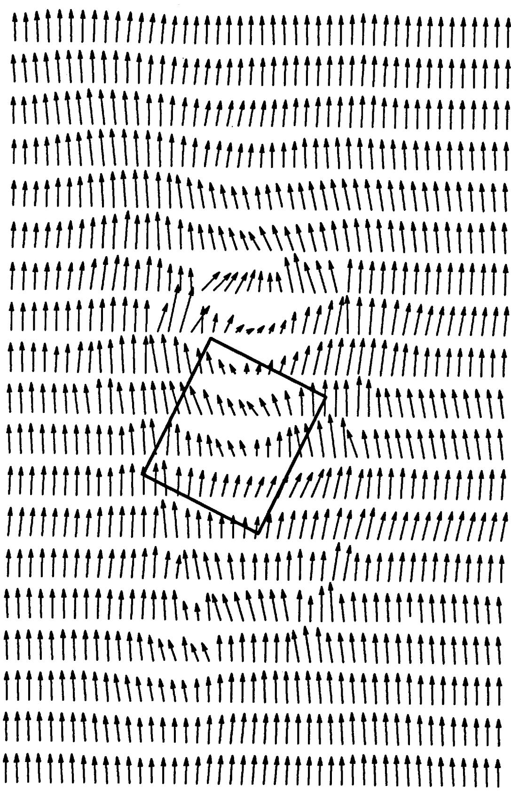  
FIG.COMM.C.3.2.4  
CURRENT VECTORS COMPUTED FROM DOPPLER MEASUREMENTS  
AT 18M (60 FT.) ON THE BULLWINKLE PLATFORM (100 CM/S

where $\Sigma (\mathbf{C_dA})_j$ is the summation of the "drag areas" of all the members (including horizontals) in the flow, and $\tilde{\mathbf{A}}$ is the area within the perimeter area of the platform projected normal to the current. For structures where geometry changes significantly with depth, the blockage factor can be computed for different depth levels. If the calculated reduction factor is less than 0.7, consideration should be given to modeling the platform as a series of actuator disks rather than a single actuator disk. Other limitations of the actuator disk model are discussed in Reference C297.

An alternative expression for the blockage factor based on a similar approach to Taylor's but accounting for mixing downstream, is given in Reference C275. In the case of small values of the ratio $\Sigma (\mathrm{C_qA})_i / \overline{\mathbf{A}}$ , the alternative expression reduces to Taylor's. Lambrakos and Beckmann also give expressions for treating the jacket and conductor group separately.

The global "blockage" discussed here, and the "shielding" discussed in Comm. C.3.2.8 are related. In fact, Reference C272 uses the term "shielding" instead of the term "blockage" to describe the current speed reduction. The term interference has also been used in discussions of these phenomena. For present purposes, the term "shielding" is used only in reference to members in the local wake of neighboring members (like conductor arrays), and the "shielding factor" is to be applied to the calculated loads due to both waves and currents. The term "blockage" is used in reference to the entire structure, and the "blockage factor" is to be applied to the far-field current speed only. With this distinction, one would first use the blockage factor to calculate a reduced current speed for the entire structure. The reduced current speed and undisturbed wave kinematics would be used in Morison's equation to calculate local loads on all members. The calculated loads on conductors would then be reduced by the shielding factor.

Comm. C.3.2.5 Combined Wave/Current Kinematics. References C258 and C260 show that waves alternately stretch and compress the current profile under crests and troughs, respectively. Reference C258 found that a model that combined Doppler-shifted wave kinematics with a nonlinearly stretched current profile gave the best estimate of global loads on a structure. Nonlinear stretching computes the stretched current for a particle instantaneously at elevation $z$ as the speed $U_{c}(z')$ evaluated from the specified current profile at elevation $z'$ , the mean elevation of the particle over a full wave cycle. The elevations $z$ and $z'$ are related through linear (Airy) wave theory as follows:

$$z = z^{\prime} + \eta \frac{\sinh (2 \pi (z^{\prime} + d) / \lambda_{n})}{\sinh (2 \pi d / \lambda_{n})}$$

Here, $\mathbf{d}$ is storm water depth, $\eta$ is the wave surface directly above the water particle, and $\lambda_{n}$ is the wave length determined from nonlinear wave theory for a wave of height $H$ and period $T_{app}$ . The elevations $z$ , $z'$ , and $\eta$ are all positive above storm mean water level.

This equation gives a nonlinear stretching of the current, with the greatest stretching occurring high in the water column, where the particle orbits have the greatest radii. The nonlinearly stretched current profile, coupled with Doppler shifted wave kinematics, produces global platform loads that are within $+1$ to $-4$ percent of those produced by the exact solution on a typical drag-dominant structure subjected to representative waves and current profiles.

Another acceptable approximate model for many applications is one that uses a linearly stretched current profile, with

$$z + d = \left(z^{\prime} + d\right) (d + \eta) / d$$

The stretched current profiles from the two models are compared qualitatively in Figure Comm. C.3.2.5 for typical sheared and slab current profiles under a wave crest. The linearly stretched current produces global loads on a typical drag-dominant platform that are nearly as accurate as those produced by the nonlinearly stretched current, being within 0 to -6 percent of loads produced by the exact solution. However, it does not simulate the combined wave/current velocity profile from the exact solution as faithfully as nonlinear stretching.

Vertical extrapolation of the input current profile above mean water level produces reasonably accurate estimates of global loads on drag-dominant platforms in most cases. In particular, for a slab profile thicker than about $50\mathrm{m}$ (164 ft.) like the recommended profiles in Section C.3.7, vertical extrapolation produces nearly the same result as nonlinear stretching, as illustrated in Figure Comm. C.3.2.5. However, if the specified profile $\mathbf{U}_{\mathbf{c}}$ (z) has a very high speed at mean water level, sheared to much lower speeds just below mean water level, the global force may be overestimated (by about 8 percent in a typical application).

Another approximate model is the linearly stretched model described above, adjusted so that the total momentum in the stretched profile from the seafloor to the wave surface equals that in the specified profile from the seafloor to mean water level. This procedure is not supported by the theoretical analyses in References C258 and C260.

If the current is not in the same direction as the wave, the methods discussed above may still be used, with one modification. Both the in-line and normal components of current would be stretched, but only the in-line component would be used to estimate $\mathrm{T_{app}}$ for the Doppler-shifted wave.

While no exact solution has been developed for irregular waves, the wave/current solution for regular waves can be logically extended. In the first two approximations described above for regular waves, the period and length of the regular wave would be replaced with the period and length corresponding to the spectral peak frequency.

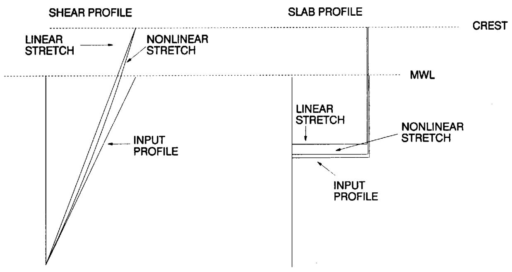  
FIG.COMM.C.3.2.5  
COMPARISON OF LINEAR AND NONLINEAR STRETCHING OF CURRENT PROFILES

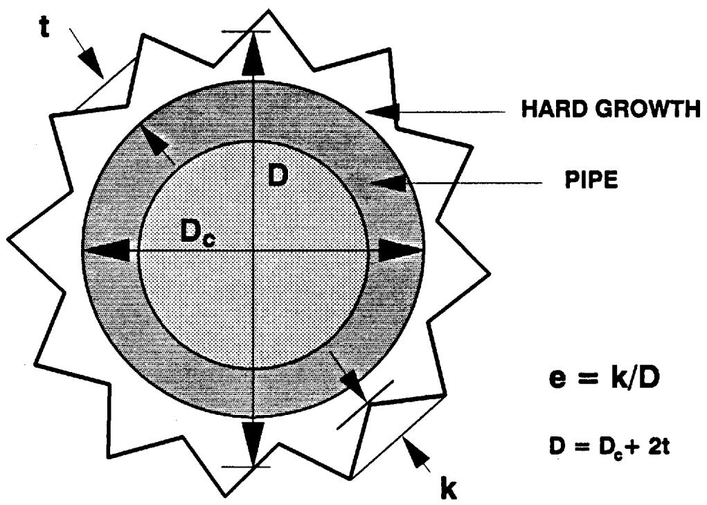  
FIG.COMM.C.3.2.6  
DEFINITION OF SURFACE ROUGHNESS HEIGHT AND THICKNESS

Comm. C.3.2.6 Marine Growth. All elements of the structure (members, conductors, risers, appurtenances, etc.) are increased in cross-sectional area by marine growth. The effective element diameter (cross-sectional width for noncircular cylinders, or prisms) is $\mathrm{D} = \mathrm{D}_{\mathrm{c}} + 2\mathrm{t}$ , where $\mathbf{D}_{\mathbf{c}}$ is the "clean" outer diameter and $\mathbf{t}$ is the average growth thickness that would be obtained by circumferential measurements with a $25\mathrm{mm}$ to $100\mathrm{mm}$ (1 in. to 4 in.) wide tape. An additional parameter that affects the drag coefficient of elements with circular cross-sections is the relative roughness, $\mathbf{e} = \mathbf{k} / \mathbf{D}$ , where $\mathbf{k}$ is the average peak-to-valley height of "hard" growth organisms. Marine growth thickness and roughness are illustrated in Figure Comm. C.3.2.6 for a circular cylinder. Marine organisms generally colonize a structure soon after installation. They grow rapidly in the beginning, but growth tapers off after a few years. Marine growth has been measured on structures in many areas but must be estimated for other areas.

Comm. C.3.2.7 Drag and Inertia Coefficients. In the ocean environment, the forces predicted by Morison's equation are only an engineering approximation. Morison's equation can match measured drag and inertia forces reasonably well in any particular half wave cycle with constant $\mathbf{C_d}$ and $\mathbf{C_m}$ , but the best-fit values of $\mathbf{C_d}$ and $\mathbf{C_m}$ vary from one half wave cycle to another. Most of the variation in $\mathbf{C_d}$ and $\mathbf{C_m}$ can be accounted for by expressing $\mathbf{C_d}$ and $\mathbf{C_m}$ as functions of

$$\text{R e l a t i v e} \quad \text{s u r f a c e} \quad \text{r o u g h n e s s} \quad \mathrm{e} \quad = \mathrm{k} / \mathrm{D}$$

$$\text{R e y n o l d s} \quad \mathrm{R}_{\mathrm{m}} = \mathrm{U}_{\mathrm{m}} \mathrm{D} / v$$

$$\text{K e u l e g a n - C a r p e n t e r n u m b e r} \quad \mathrm{k} = 2 \mathrm{U}_{\mathrm{m}} \mathrm{T}_{2} / \mathrm{D}$$

$$\text{C u r r e n t / w a v e v e l o c i t y r a t i o} \quad \mathbf{r} \quad = \mathbf{V}_{\mathrm{I}} / \mathbf{U}_{\mathrm{m o}}$$

Member orientation

Here $\mathbf{U}_{\mathrm{m}}$ is the maximum velocity (including current) normal to the cylinder axis in a half wave cycle, $\mathbf{T}_2$ is the duration of the half wave cycle, $\mathbf{V}_{\mathrm{I}}$ is the in-line (with waves) current component, $\mathbf{U}_{\mathrm{mo}}$ is the maximum wave-induced orbital velocity, $\mathbf{D}$ is effective diameter (including marine growth), $\pmb{\nu}$ is the kinematic viscosity of water, and $\mathbf{k}$ is the absolute roughness height.

Surface Roughness. The dependence of $C_{\mathrm{ds}}$ , the steady-flow drag coefficient at post-critical Reynolds numbers, on relative surface roughness, is shown in Figure Comm. C.3.2.7-1, for "hard" roughness elements. All the data in this figure have been adjusted, if necessary, to account for wind tunnel blockage and to have a drag coefficient that is referenced to the effective diameter $D$ , including the roughness elements.

Natural marine growth on platforms will generally have $\mathbf{e} > 10^{-3}$ . Thus, in the absence of better information on the expected value of surface roughness and its variation with depth for a particular site, it is reasonable to assume $C_{\mathrm{ds}} = 1.00$ to 1.10 for all members below high tide level. One would still need to estimate the thickness of marine growth that will ultimately accum-

ulate in order to estimate the effective diameter D. For members above high tide level, a reasonable estimate of surface roughness is $\mathbf{k} = 0.05\mathrm{mm}$ (0.002 in.), which will give $C_{\mathrm{ds}}$ in the range 0.6 to 0.7 for typical diameters.

All the data in Figure Comm. C.3.2.7-1 are for cylinders that are densely covered with surface roughness elements. Force measurements (References C269 and C290) show that there is little degradation in the effectiveness of surface roughness for surface coverage as sparse as $10\%$ , but that roughness effects are negligible for surface coverage less than $3\%$ .

The effect of soft, flexible growth on $C_{\mathrm{ds}}$ is poorly understood. Tests run in Reference 281 indicate that (a) soft, fuzzy growth has little effect, $C_{\mathrm{ds}}$ being determined predominantly by the underlying hard growth; and (b) anemones and kelp produce drag coefficients similar to those for hard growth.

For cylindrical members whose cross section is not circular, $\mathbf{C}_{\mathrm{ds}}$ may be assumed to be independent of surface roughness. Suitable values are provided in Reference C301.

Surface roughness also affects the inertia coefficient in oscillatory flow. Generally, as $C_d$ increases with roughness, $C_m$ decreases. More information is provided in subsequent discussions.

Reynolds Number. The force coefficients for members whose cross sections have sharp edges are practically independent of Reynolds number. However, circular cylinders have coefficients that depend on Reynolds number.

Fortunately, for most offshore structures in the extreme design environment, Reynolds numbers are well into the post-critical flow regime, where $C_{\mathrm{ds}}$ for circular cylinders is independent of Reynolds number. However, in less severe environments, such as considered in fatigue calculations, some platform members could drop down into the critical flow regime. Use of the post-critical $C_{\mathrm{ds}}$ in these cases would be conservative for static wave force calculations but nonconservative for calculating damping of dynamically excited structures.

In laboratory tests of scale models of platforms with circular cylindrical members, one must be fully aware of the dependence of $C_{\mathrm{ds}}$ on Reynolds number. In particular, the scale of the model and the surface roughness should be chosen to eliminate or minimize Reynolds number dependence, and the difference between model-scale and full-scale $C_{\mathrm{ds}}$ should be considered in the application of model test results to full-scale structures. Further guidance on the dependence of circular cylinder $C_{\mathrm{ds}}$ should be considered in the application of model test results to full-scale structures. Further guidance on the dependence of circular cylinder $C_{\mathrm{ds}}$ on Reynolds number can be found in References C249, C266 and C306.

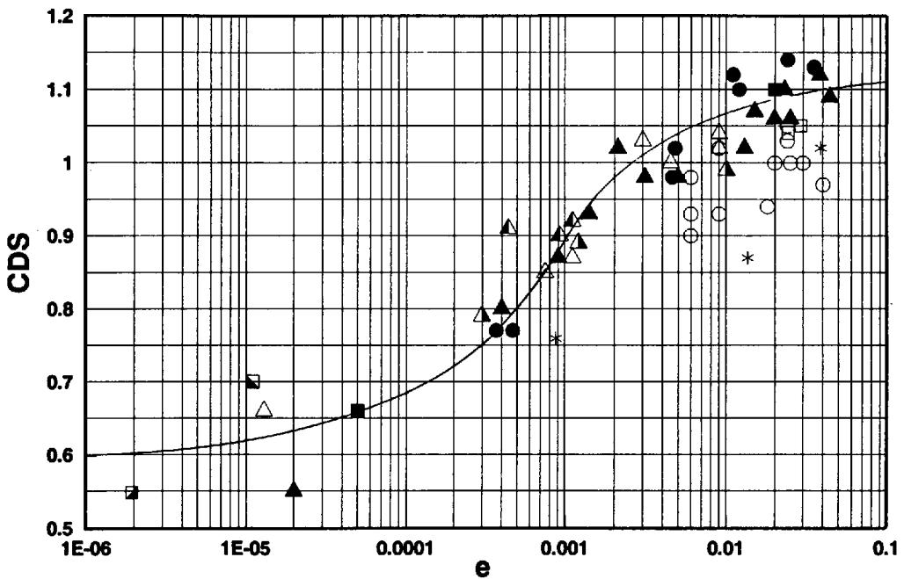

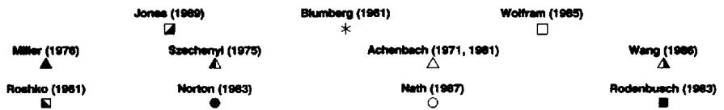  
FIG.COMM.C.3.2.7-1  
DEPENDENCE OF STEADY FLOW DRAG COEFFICIENT ON RELATIVE SURFACE ROUGHNESS

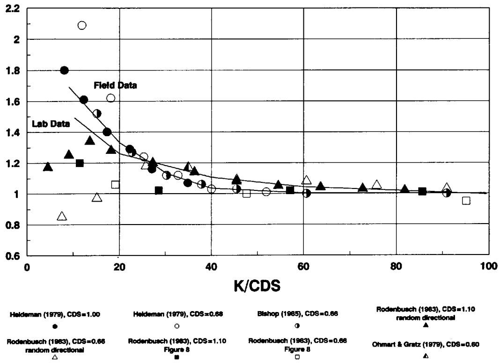  
CD/CDS   
FIG.COMM.C3.2.7-2   
WAKE AMPLIFICATION FACTOR FOR DRAG COEFFICIENT AS A FUNCTION OF $\mathbf{K} / \mathbf{C}_{\mathrm{ds}}$

Keulegan-Carpenter Number. This parameter is a measure of the unsteadiness of the flow; it is proportional to the distance normal to the member axis traveled by an undisturbed fluid particle in a half wave cycle, normalized by the member diameter. For a typical full-scale jacket structure in design storm conditions, K is generally greater than 40 for members in the 'wave zone', and drag force is predominant over inertia force. On the other hand, for the large-diameter columns of a typical gravity structure, K may be less than 10, and inertia force is predominant over drag force.

The parameter K is also a measure of the importance of "wake encounter" for nearly vertical (within $15^{\circ}$ of vertical) members in waves. As the fluid moves across a member, a wake is created. When oscillatory flow reverses, fluid particles in the wake return sooner and impact the member with greater velocity than undisturbed fluid particles. For larger K, the wake travels farther and decays more before returning to the cylinder and, furthermore, is less likely to strike the cylinder at all if the waves are multidirectional or there is a component of current normal to the principal wave direction. For very large K, wake encounter can be neglected. For smaller K, wake encounter amplifies the drag force for nearly vertical members above its quasi-steady value estimated from undisturbed fluid velocities.

Figure Comm. C.3.2.7-2 shows data for the drag coefficient $C_d$ that are most appropriate for calculating loads on nearly vertical members in extreme storm environments. All these data were obtained in the post-critical flow regime, in which $C_{\mathrm{ds}}$ is practically independent of Reynolds number. All account for wave spreading, that is, all have two components of motion normal to the member axis. All except the 'figure 8' data implicitly account for random wave motion. The field data also naturally include an axial component of motion and, to some extent, a steady current. The data for smooth and rough cylinders are reasonably well represented by a single curve in Figure Comm. C.3.2.7-2, for $\mathbf{K} > 12$ , with $\mathbf{K}$ normalized by $C_{\mathrm{ds}}$ , as suggested by the far-field, quasi-steady wake model in Reference C254.

Figure Comm. C.3.2.7-3 shows drag coefficient data for $\mathbf{K} < 12$ , which are more appropriate for calculating loads on nearly vertical members in less extreme seas states and drag damping in earthquake-excited motion, for example. For $\mathbf{K} < 12$ , the smooth and rough cylinder data are similar if $\mathbf{K}$ is not normalized by $C_{ds}$ . The data in Reference C247 do not agree well with the curves in Figure Comm. C.3.2.7-3, presumably because of the relatively low Reynolds numbers in the tests for the lowest values of $\mathbf{K}$ and because of the lack of wave spreading in the tests for the higher values of $\mathbf{K}$ .

The symbols shown in Figure Comm. C.3.2.7-2 do not represent individual data points. Rather, they represent values from a curve fitted through a scatter of data points. In designing a structure consisting of a single

isolated column, one should perhaps account for the scatter in the $C_d$ data. In this regard, the data in Reference C247 for one-dimensional, sinusoidally oscillating motion, which are notably omitted from Figure Comm. C.3.2.7-2, represent a reasonable upper bound. However, for a structure consisting of many members, the scatter in $C_d$ can probably be neglected, as the deviations from the mean curve are uncorrelated from member to member, Reference C265.

Figures Comm. C.3.2.7-4 and Comm. C.3.2.7-5 show data for the inertia coefficient $\mathbf{C}_{\mathbf{m}}$ for a nearly vertical circular cylinder. Figure Comm. C.3.2.7-4 shows that $\mathbf{C}_{\mathbf{m}}$ for both smooth and rough cylinders approaches the theoretical values of 2.0 for $\mathbf{K} \leq 3$ . For $\mathbf{K} > 3$ , with the onset of flow separation, $\mathbf{C}_{\mathbf{m}}$ begins to decrease. With the exception of rough cylinder data in Reference C247, which exhibit a pronounced drop ('inertia crisis') in $\mathbf{C}_{\mathbf{m}}$ at $\mathbf{K} \simeq 12$ , it appears that a single sloping line is adequate for both smooth and rough cylinders, up to $\mathbf{K} \simeq 12$ , beyond which smooth and rough cylinder data begin to diverge. In Figure Comm. C.3.2.7-5, the single line from Figure Comm. C.3.2.7-4 is seen to split into two lines because $\mathbf{K}$ is divided by $\mathrm{C_{ds}} = 0.66$ for smooth cylinders and $\mathrm{C_{ds}} = 1.1$ for rough cylinders. The value of $\mathbf{C}_{\mathbf{m}}$ is taken as 1.6 for smooth cylinders and 1.2 for rough cylinders for $\mathrm{K} / \mathrm{C}_{\mathrm{ds}} \geq 17$ .

Although Figures Comm. C.3.2.7-2 through Comm. C.3.2.7-5 are based on circular cylinder data, they are also applicable to noncircular cylinders, provided the appropriate value of $\mathbf{C_{ds}}$ is used, and provided $\mathbf{C_m}$ is multiplied by $\mathbf{C_{mo}} / 2$ , where $\mathbf{C_{mo}}$ is the theoretical value of $\mathbf{C_m}$ for the noncircular cylinder as $\mathbf{K} \Rightarrow 0$ .

Furthermore, while Figures Comm. C.3.2.7-2 through Comm. C.3.2.7-5 were developed for use with individual, deterministic waves, they can also be used for random wave analysis (either time or frequency domain) of fixed platforms by using significant wave height and spectral peak period to calculate K.

Current/Wave Velocity Ratio. The effect of a steady in-line current added to oscillatory motion is to push $C_d$ toward $C_{ds}$ , its steady flow value. Data show that, for practical purposes, $C_d = C_{ds}$ when the current/wave velocity ratio $r$ is greater than 0.4. For $r << 0.4$ , the effect of a steady in-line current can be accommodated by modifying the Keulegan-Carpenter number. A first-order correction would be to multiply $K$ due to wave alone by （$1 + r)2\theta_* / \pi$ , where $\theta_* = \arctan [\sqrt{1 - r^2}, -r]$ .

A current component normal to the wave direction also drives $C_d$ toward $C_{ds}$ , since it reduces the impact of wake encounter. Data show that, for practical purposes, $C_d = C_{ds}$ for $V_{NT_2} / C_{ds}$ $D > 4$ . On the other hand, wake encounter has nearly its full impact for $V_{NT_2} / C_{ds}$ $D < 0.5$ .

Member Orientation. For members that are not nearly-vertical, the effect of wake encounter, as characterized by the K dependence in Figures Comm. C.3.2.7-2 through Comm. C.3.2.7-5, is small. For horizontal and

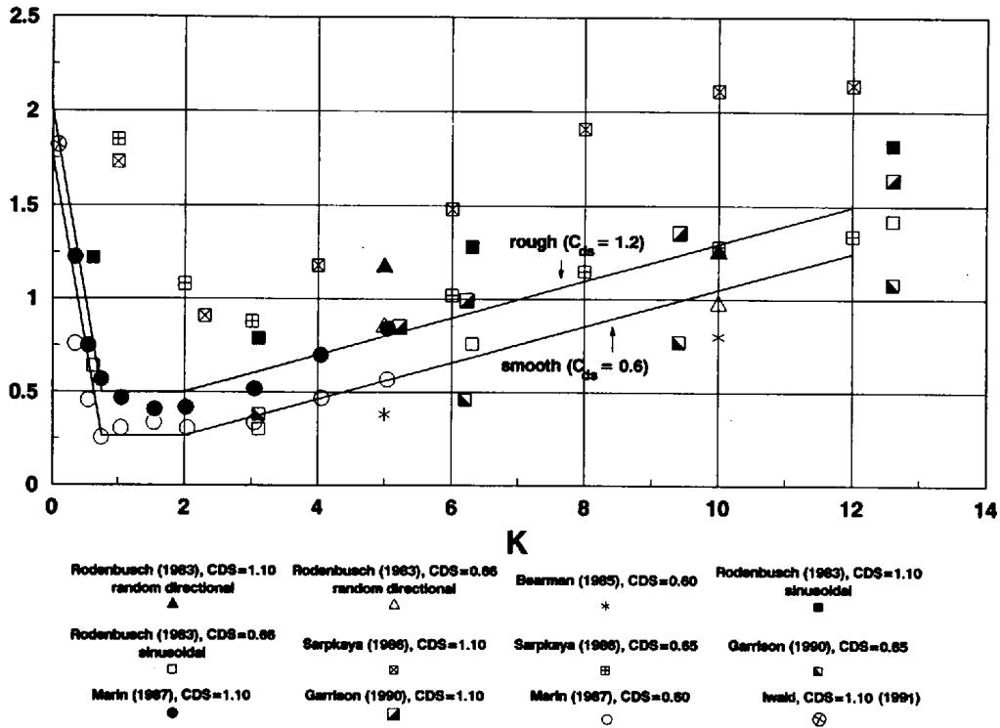  
CD/CDS   
FIG.COMM.C.3.2.7-3  
WAKE AMPLIFICATION FACTOR FOR DRAG COEFFICIENT AS A FUNCTION OF K

CM

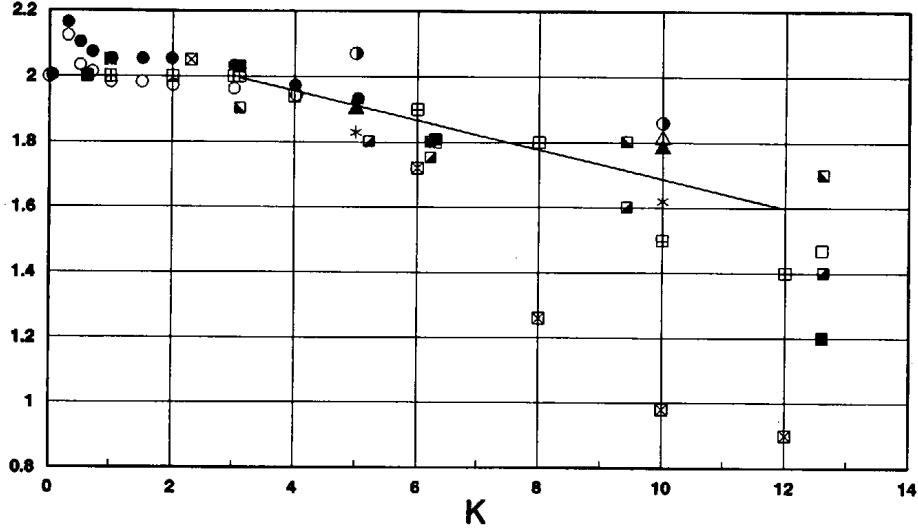  
FIG.COMM.C.3.2.7-4   
INERTIA COEFFICIENT AS A FUNCTION OF K

Rodenbusch (1963), $\mathrm{CDS} = 1.10$ random directional

Rodenbusch (1963), $\mathrm{CDS} = 0.66$ random directional

Beerman (1965), CDS=0.60

Garrison (1990), CDS=0.65

Bishop (1965), CDG=0.66 ① Rodenbusch (1963), CDG sinusoidal

Rodenbusch (1963), CDS=0.85  
sinusoidal  
□  
10 hswd, CDS:

Serparya (1986), CDS=1.10 0 (1991) Gannson (1

Sarpkaya (1986), CDS=0.65 $\square$ $\square$ , CDS=1.10 $\square$

Marin (1987), $\mathrm{CDS} = 1.10$ Marin (1987), $\mathrm{CDS} = 0.60$

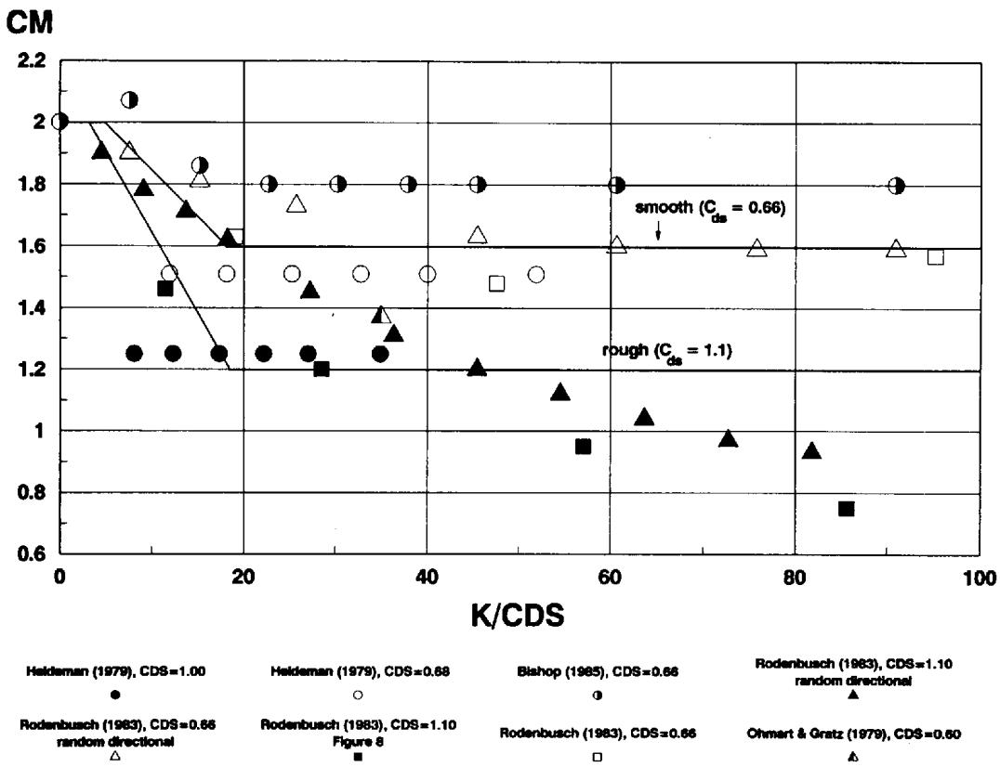  
FIG.COMM.C.3.2.7-5

INERTIA COEFFICIENT AS A FUNCTION OF $\mathbf{K} / \mathbf{C}_{\mathrm{ds}}$

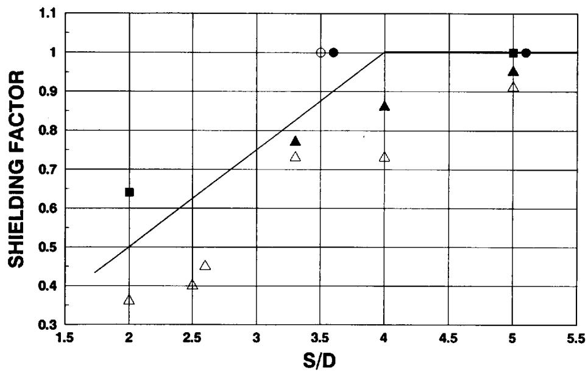  
FIG.COMM.C.3.2.8  
SHIELDING FACTOR FOR WAVE LOADS ON CONDUCTOR ARRAYS AS   
A FUNCTION OF CONDUCTOR SPACING

Sterndorff (1990)

Waves

O

Beckman (1979)

waves and current

#

Reed (1990)

current

#

Reed (1990)

waves (K=126)

A

Heideman (1985)

waves (K=250) and current

#

diagonal members, it is sufficient for engineering purposes to use the theoretical value of $C_m$ at $K \nrightarrow 0$ and the steady-flow value of $C_d = C_{ds}$ at $K \nrightarrow \infty$ .

Comm. C.3.2.8 Conductor Shielding Factor. The empirical basis for the shielding wave force reduction factor for conductor arrays is shown in Figure Comm. C.3.2.8. Data from flow directions perfectly aligned with a row or column of the array are excluded, for conservatism.

The data in Figure Comm. C.3.2.8 are from steady flow tests and oscillatory flow tests at very high amplitudes of oscillation. Thus the factor is strictly applicable only in a steady current with negligible waves or near the mean water level in very large waves. The data in Reference C302 indicate that the factor is applicable if A/S $>6$ , where A is the amplitude of oscillation and S is the center-to-center spacing of the conductors in the wave direction. The data in Reference C285 indicate that range of applicability can be expanded to A/S $>2.5$ . For lower values of A/S, there is still some shielding, until A/S $< 0.5$ (Reference C302). With A $\cong$ Umo Tapp/2π, where Umo and Tapp are defined in Comm. C.3.2.7 and Comm. C.3.2.1, respectively, the approximate shielding regimes are

$\bullet \mathbf{A} / \mathbf{S} > 2.5$ , asymptotic shielding, factor from Figure Comm. C.3.2.8.   
- A/S < 0.5, no shielding, factor = 1.0   
- $0.5 < \mathrm{A} / \mathrm{S} < 2.5$ , partial shielding.

In the absence of better information, the shielding factor in the partial shielding regime can be linearly interpolated as a function of A/S. Waves considered in fatigue analyses may lie in the partial shielding regime.

Comm. C.3.2.9 Hydrodynamic Models for Appurtenances. The hydrodynamic model of a structure is used for the calculation of wave forces which represent the forces on the actual structure. The model need not explicitly include every element of the structure provided the dimensions and/or force coefficients for the included elements account for the contribution of the forces on the omitted elements. The hydrodynamic model should account for the effects of marine growth and for flow interference effects (blockage and shielding) where appropriate.

Appurtenances include substructures and elements such as boat landings, fenders or bumpers, walkways, stairways, grout lines, and anodes. Though it is beyond the scope of this commentary to provide modeling guidance for every conceivable appurtenance, some general guidance is provided.

Boat landings are substructures generally consisting of a large number of closely spaced tubular members, particularly on some of the older designs. If the members are modeled individually, shielding effects, depending upon the wave direction, can be accounted for in a manner similar to that for conductor arrays.

Another option is to model a boat landing as either a rectangular solid or as one or more plates, with directionally dependent forces. Some guidance for coefficients for solid shapes and plates can be found in Reference C301.

Conductor guide frames may also be modeled as rectangular solids and sometimes as plates. In either case, different coefficients are appropriate for vertical and horizontal forces.

Large fenders or boat bumpers and their supporting members are usually modeled as individual members. They may be treated as nonstructural members provided that experience has shown their design to be adequate for their intended purpose. Walkways, stairways, and grout lines may be modeled as equivalent circular members though they are sometimes ignored where experience has proven the acceptability of such action.

The treatment of anodes depends somewhat upon the number and size of the anodes on the structure. Anodes are often ignored in the hydrodynamic model where experience has shown that their wave force contribution is negligible. If they are included, they can be modeled as equivalent circular cylinders. Alternatively, anode wave forces may be approximated by increasing the diameters and/or force coefficients of the members to which they are attached.

Comm. C.3.2.10 Morison Equation. The use of the local acceleration rather than the total (local plus convective) acceleration in the inertia term of Morison's equation is the subject of ongoing debate. There have been several publications on this topic in recent years (References C276, C277, C282 and C306 (Section 5.3.1). These publications all conclude that the total acceleration should be used. However, it must be noted that these publications all assume unrealistically that the flow does not separate from the cylinder. Realistically, except for very small amplitudes of oscillation （$\mathbf{K} < 3)$ , the flow separates on the downstream side of the cylinder, creating a wake of reduced velocity. The local change in velocity across the cylinder due to the convective acceleration in the undisturbed far-field flow is generally much less than the change in velocity due to local flow separation, as implied in Reference C270. The convective acceleration may also be nearly in phase with the locally incident flow velocity, which leads the undisturbed far-field velocity in oscillatory flow because of "wake encounter", (Reference C274). Therefore, it could be argued that the convective acceleration should be neglected, either because it is small relative to local velocity gradients due to flow separation or because it is already implicitly included in drag coefficients derived from measurements of local force in separated flow. As a practical matter, the convective acceleration exceeds $15\%$ of the local acceleration only in steep waves, for which inertia force is generally much smaller than drag force (Reference C306).

Only the components of velocity and acceleration normal to the member axis are used in computing drag

and inertia forces, based on the "flow independence," or "cross-flow," principle. This principle has been verified in steady subcritical flow in Reference C266 and in steady postcritical flow in Reference C283. The data in Reference C289, as reinterpreted in Reference C262, have shown the flow independence principle to be valid also for inertia forces in one-dimensional oscillatory flow. Therefore, it is reasonable to assume that the flow independence principle is valid in general for both steady and multi-dimensional oscillatory flows, with the exception of flows near the unstable, critical Reynolds number regime.

Comm. 3.2.12 Local Member Design. The Morison equation accounts for local drag and inertia forces but not for the "out of plane" (plane formed by the velocity vector and member axis) local lift force due to periodic, asymmetric vortex shedding from the downstream side of a member. Lift forces can be neglected in the calculation of global structure loads. Due to their high frequency, random phasing, and oscillatory (with zero mean) nature, lift forces are not correlated across the entire structure. However, lift forces may need to be considered in local member design, particularly for members high in the structure whose stresses may be dominated by locally generated forces.

The oscillating lift force can be modeled as a modulated sine function, whose frequency is generally several times the frequency of the wave, and whose amplitude is modulated with $\mathbf{U}^2$ , where $\mathbf{U}$ is the time-varying component of fluid velocity normal to the member axis. In the absence of dynamic excitation, the maximum local lift force amplitude $\mathbf{F}_{\mathrm{L,max}}$ per unit length of the member is related to $\mathbf{U}_{\max}$ , the maximum value of $\mathbf{U}$ during the wave cycle, by the equation

$$\mathbf{F}_{\mathrm{L}, \max } = \mathbf{C}_{\ell , \max } (\mathrm{w} / 2 \mathrm{g}) \mathrm{D U}_{\max }^{2}$$

The coefficient $C_{\ell, \max}$ has been found empirically in Reference C286 to have considerable scatter, with an approximate mean value $C_{\ell, \max} = 0.7C_{\mathrm{d}}$ , for both smooth and rough circular cylinders, in both steady flow and in waves with large Keulegan-Carpenter numbers. Reference C247 focuses on the rms value of the oscillating lift force and found that it was less than half $F_{L, \max}$ .

The frequency of the oscillating lift force is $\mathrm{St} \, \mathrm{U}_{\text{total}} / \mathrm{D}$ , where $\mathrm{St}$ is the Strouhal number and $\mathrm{U}_{\text{total}}$ is the total incident velocity, including the axial component. Laboratory tests (References C283 and C286) have shown that $\mathrm{St} \cong 0.2$ for circular cylinders over a broad range of Reynolds numbers and flow inclination angles in steady flow. If $\mathrm{St}$ remains constant in waves, then the frequency of the oscillating lift force is also modulated as $\mathrm{U}$ varies with time during a wave cycle.

In the event that any natural frequency of a member is near the lift force frequency, a large amplitude dynamic response, called vortex-induced-vibration (VIV), may occur. When VIV occurs, the motion of the member and the magnitude of the fluid-dynamic forces can increase to unacceptable levels. VIV can occur on long spans due

to wind forces in the construction yard and on the tow barge as well as to waves and currents on the in-place structure. A complete treatise on VIV is beyond the scope of this commentary.

Horizontal members in the wave splash zone of an in-place structure may experience wave slam forces. These nearly vertical forces are caused by the local water surface rising and slapping against the underside of the member as a wave passes. Since these forces are nearly vertical, they contribute very little to the base shear and overturning moment of the platform. However, slam forces may need to be considered in local member design.

Slam forces can also occur on platform members overhanging the end of the barge while the platform is being towed, or on members that strike the water first during side launching of platforms.

In the theoretical case, slam force is impulsive. If the slam force is truly impulsive, the member may be dynamically excited. In the real world, the slam force may not be impulsive because of the three-dimensional shape of the sea surface, the compressibility of air trapped between the member and the sea surface, and the aerated nature of water near the free surface.

Slam force $\mathbf{F}_{\mathrm{s}}$ per unit length can be calculated from the equation

$$\mathbf{F}_{\mathrm{s}} = \mathbf{C}_{\mathrm{s}} (\mathrm{w} / 2 \mathrm{g}) \mathrm{D U}^{2}$$

where $\mathbf{U}$ is the component of water particle velocity normal to the member axis at impact. Reference C247 shows empirically that the coefficient $C_s$ may lie between 0.5 and 1.7 times its theoretical value of $\pi$ , depending on the rise time and natural frequency of the elastically mounted cyclinder in his tests. Reference C306 recommends that if a dynamic response analysis is performed, the theoretical value of $C_s = \pi$ can be used; otherwise, a value of $C_s = 5.5$ should be used.

Axial Froude-Krylov forces have the same form as the inertia force in Morison's equation, except that $C_m$ is set to unity and the normal component of local acceleration is replaced by the axial component. Axial Froude-Krylov forces on members that are nearly vertical contribute negligibly to platform base shear and overturning moment. Axial Froude-Krylov forces on diagonal and horizontal braces are relatively more important, contributing about 10% as much to base shear and overturning moment as the inertia force included in Morison's equation, based on computations in Reference C252. In view of approximations made elsewhere in the computation of global wave force, axial Froude-Krylov forces can generally be neglected.

Comm. C.3.3 Extreme-Wave Dynamic Analysis. The additional load factor of 1.25 on the inertia part of the dynamic load accounts for the uncertainty of dynamic platform response not present in quasi-static response to waves. The checking equation presumes that the external load can be separated into a static part, $W_{e}$ ,

and an inertial part, $\mathbf{D}_{\mathbf{n}}$ . $\mathbf{D}_{\mathbf{n}}$ and $\mathbf{W}_{\mathbf{e}}$ are usually acting in the same direction, implying that the dynamic response is in phase with the applied force. This is applicable to stiffness controlled dynamic response where the natural period is shorter than the predominant period of the load. This is not the case for compliant structures and the use of the 1.25 factor would be erroneous and probably unconservative.

The 1.25 factor is based on a reliability analysis (Reference C3). The calibration for the gravity loads and static wave load was repeated with the addition of another random variable, the inertial load factor, ILF. The random resistance was compared to the random internal force, Q; thus

$$\mathbf{Q} = \mathbf{D} + \mathbf{L} + \mathbf{W}_{\mathrm{e}} (1 + \mathbf{I L F})$$

where D, L, $W_{e}$ and ILF are all random variables. Note that （$1 + \text{ILF})$ is the ratio of the total dynamic (static and inertial) member internal force to the static member internal force. ILF was taken to have a coefficient of variation (COV) of 60%. The mean value of ILF was taken to have a range of zero up to 0.8 to represent the fact that ILF values of individual members can be considerably larger than for a global response such as base shear. The factor of 1.25 assures that in any of these cases, the safety index (beta) for a member is at least as great as the case when $D_{n}$ equals zero.

Comm. C.3.3.1 Extreme Inertial Load, $\mathbf{D}_{\mathbf{n}}\cdot \mathbf{D}_{\mathbf{n}}$ is defined in this section in a way that covers several methods of dynamic analysis, indicates the probability level intended, and provides the connection between global dynamic analysis and the design of individual members. The magnitude of $\mathbf{D}_{\mathbf{n}}$ should be such that the return period of the total response, $1 / \mathrm{p_e}$ , is approximately the same as the return period of response due to $\mathbf{W}_{\mathrm{e}}$ alone without dynamics. This is illustrated in Figure Comm. C.3.3.1. Due to phase differences, $\mathbf{D}_{\mathbf{n}}$ will be less than or equal to the value of the inertia load alone with a return period of $1 / \mathrm{p_e}$

$\mathbf{D}_{n}$ may be neglected for platforms in which the dynamic response to extreme waves is negligible. It is difficult to make a universal statement as to when dynamic response is negligible. Dynamic response increases as the fixed platform period increases and gets closer to the period of the peak of the design wave spectrum and into a range of periods where the wave spectrum has some energy. Since typical design spectra have peak periods of twelve seconds or longer, platforms with periods shorter than three seconds will be subject to computed amplifications of only a few percent during the design wave seastate. Neglecting dynamics for platforms with periods shorter than three seconds is consistent with the traditional application of the "Hydrodynamic Force Guidelines for U.S. Waters" (Section C.3.7) that have long been a part of RP2A and are based on a history of successful performance.

Longer period platforms will require some evaluation. In addition to the ratio of wave to structure periods, the dynamic response will be affected by (1) higher frequency components of the load originating from the

free-surface motion and drag nonlinearities and (2) the wave force cancellation/reinforcement caused by leg spacing (or lack thereof for a single caisson platform).

Comm. C.3.3.2 Global Dynamic Wave Analysis. The intention of this section is to do the dynamic analysis on a global level, and then do the local or member design with static loads that are modified to account for dynamics. This makes the analysis in Section C.3.3.2.1 practical for design. One approach is to use the global dynamic analysis to estimate the Dynamic Amplification Factor (DAF) for both base shear and base moment. DAF is the ratio of the dynamic response to the static response. In the time domain it can be estimated by taking the average of the DAF for a few dozen short wave segments that include the design wave. Alternatively, the curves in Figure Comm. C.3.3.1 may be estimated by simulation and then DAF taken off directly as （$\mathrm{W_e} + \mathrm{D_n}) / \mathrm{W_e}$ . Under the assumptions necessary to use the frequency domain methods, the DAF reduces to the ratio of the r.m.s. dynamic to the r.m.s. static when there is no current (r.m.s. = root-mean-square).

Time history methods of dynamic analysis are preferred for predicting the extreme wave response of compliant platforms whose response is drag dominant and/or the stiffness system is nonlinear. In order to use frequency domain methods to predict extreme response of guyed towers, both the drag force and nonlinear guyline stiffness would require proper linearization.

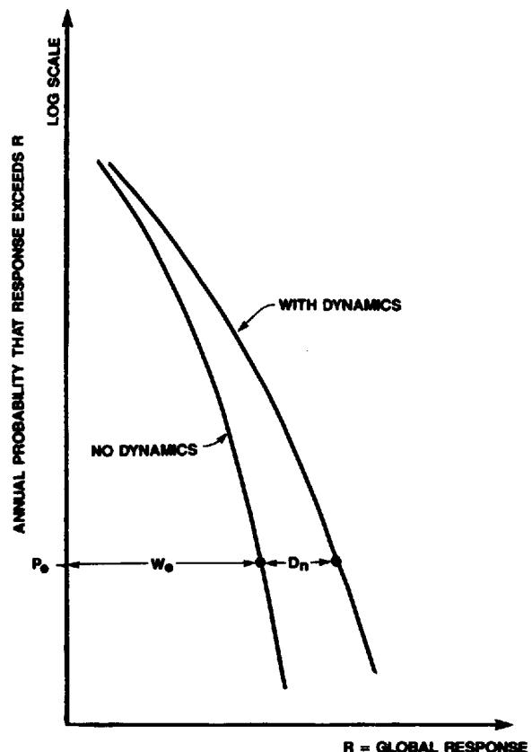  
FIG.COMM.C.3.3.1 DEFINITIONOF $\mathbf{D}_{\mathbf{n}}$

Comm. C.3.3.2.3 Fluid Force on a Member. For fixed platforms, the relative velocity formulation of Morison's equation should not be used for regular or random waves. When the displacement of the structure is less than one member diameter and the motion of the structure is at a high frequency compared to the wave, the motion of an individual member interacts with its own wake and does not develop the hydrodynamic forces predicted by the relative velocity formulation of Morison's equation. (See Comm. C.3.2.7 and Reference C342, for example). Using relative velocity would have the same effect on the analysis as using too large a damping. It is more realistic to use absolute velocities and specify a modal damping as in Section C.3.3.2.5.

Dynamic analyses should be performed for compliant platforms. In analyzing the response to random waves, it may be important to consider the effects of wave groups. The analysis should include the simultaneous action of wind, waves, and current. It will also be important to consider the effect of wind dynamics for which a wind speed spectrum would be necessary to carry out the analysis. To characterize the hydrodynamic loads for compliant platforms, Equation C.3-4 should be modified to account for relative velocity by making the following substitution in the drag force term:

replace U|U| by （$\mathbf{U} - \dot{\mathbf{x}})\mid \mathbf{U} - \dot{\mathbf{x}}\mid$

where:

$\dot{\mathbf{x}}$ = component of the structural velocity normal to the axis of the member

and

$\mathbf{U}$ = as defined for Equation C.3-4.

Comm. C.3.3.2.6 Stiffness. It may be appropriate to consider a stiffer foundation for fatigue analyses than for extreme wave response analyses.

For guyed towers, platform and foundation stiffness should be augmented to account for the guyline system. Analysis procedures may be required that account for the dynamic interaction of the tower and the guyline system. Analytical models for compliant structures should include gravity loads, buoyancy, the vertical component of the guyline system reaction, and the weight of conductors including their contents.

A linear stiffness model is sufficient for fixed platforms; the second order geometric effect (so-called P-Delta) should be included in the stiffness model of more flexible compliant towers.

Comm. C.3.3.3 Member Design. One strategy for developing $\mathbf{D}_{\mathbf{n}}$ as a load set is to combine two modes in each direction so that both the base moment and base shear DAF are reproduced. In this case, $\mathbf{D}_{\mathbf{n}}$ can equal the (DAF-1) times the load $\mathbf{W}_{\mathrm{e}}$ (base shear or moment) or $\mathbf{D}_{\mathbf{n}}$ can be the absolute difference between the dynamic and static base shear or base moment as shown in Figure Comm. C.3.3.1. An alternative approach is to evaluate the statistics of the acceleration of each mass during the global analysis and use some

fractile of each acceleration times each mass as the inertia load $\mathbf{D}_{\mathbf{n}}$ , Reference C313 and C3.

Comm. C.3.4 Wind Force. In the LRFD formulation, the same 1.35 load factor is to be applied to environmental wind and wave effects. The calibration of the load factor considered only the wave parameters. In the NBS-ANSI study, the bias and C.O.V. for maximum lifetime wind effects (Reference C1) was found to be 0.78 and $37\%$ — very similar to the 0.7 and $37\%$ used for the wave effect parameters. This fact plus the correlation of high winds with high waves justifies the same load factor for wind and wave.

The wind load factor recommended in Reference C303 is only 1.3 compared to 1.35 here. However, there are significant differences in the calculation of nominal wind effects between RP2A and ANSI.

ANSI has more detailed shape coefficients which may differ significantly from the suggested values in RP2A.

For example, RP2A uses a 0.5 shape value for circular sections and 1.5 for flat surfaces. In ANSI, the circular coefficient can vary between 0.5 and 1.2 depending on roughness, and the normal pressure coefficient for flat surfaces varies from 1.3 to 2.0 depending on overall dimensions.

Comm. C.3.5 Current Force. The total current is the vector sum of the tidal, circulational, and storm generated currents. The relative magnitude of these components, and thus their importance for computing loads, varies with offshore location.

Tidal currents are generally weak in deep water past the shelf break. They are generally stronger on broad continental shelves than on steep shelves, but rarely exceed $0.3\mathrm{m / sec}$ (1 ft/sec) along any open coastline. Tidal currents can be strengthened by shoreline or bottom configurations such that strong tidal currents can exist in many inlets and coastal regions; e.g., surface values of about $3\mathrm{m / sec}$ (10 ft/sec) m/s) can occur in Cook Inlet.

Circulatory currents are relatively steady, large scale features of the general oceanic circulation. Examples include the Gulf Stream in the Atlantic Ocean and the Loop Current in the Gulf of Mexico when surface velocities can be in the range of about 1 to $2\mathrm{m} / \mathrm{sec}$ (3 to 6 ft/sec) While relatively steady, these circulation features can meander and intermittently break off from the main circulation feature to become large scale eddies or rings which then drift a few miles per day. Velocities in such eddies or rings can approach that of the main circulation feature. These circulation features and associated eddies occur in deep water beyond the shelf break and generally do not affect sites with depths less than about $330\mathrm{m}$ (1000 ft).

Storm generated currents are caused by the wind stress and atmospheric pressure gradient throughout the storm. Current speeds are a complex function of the storm strength and meteorological characteristics, bathymetry and shoreline configuration, and water density profile. In deep water along open coastlines,

surface storm current can be roughly estimated to have speeds up to 2-3 percent of the one-hour sustained wind speed during tropical storms and hurricanes and up to $1\%$ of the one-hour sustained wind speed during winter storms or extratropical cyclones. As the storm approaches shallower water and the coastline, the storm surge and current can increase.

A qualified oceanographer should determine the variation of current speed and direction with depth. The profile of storm generated currents in the upper layer of the ocean is the subject of active research.

Comm. C.3.7.3 Guideline Design Metacean Criteria for the Gulf of Mexico, North of $27^{\circ}\mathbf{N}$ Latitude and West of $86^{\circ}\mathbf{W}$ Longitude. Interpolation is required to determine current parameters for the intermediate zone.

Example: Find current magnitude, direction, and profile associated with the principal wave direction （$290^{\circ})$ for a platform in a water depth of $76\mathrm{m}$ (250 ft.), located at $95^{\circ}\mathbf{W}$ longitude.

Calculation Steps:

a. Calculate (with respect to the wave direction, $\phi \mathbf{w} = 290^{\circ}$ ) the inline, Ui, and transverse, Ut, components of the surface current, U, for a water depth of 150 ft at $95^{\circ}$ W longitude.

From Figure C.3.7-5 the current direction, $\phi u$ , is $253^{\circ}$ , then

$$\mathrm{U i} = \mathrm{U} \cos (\phi \mathrm{u} - \phi \mathrm{w}) = 2. 1 \cos (253 - 290) = 1. 68 \mathrm{k t}^{*}$$

$$\mathrm{U t} = \mathrm{U} \sin (\phi \mathrm{u} - \phi \mathrm{w}) = 2. 1 \sin (253 - 290) = 1. 26 \mathrm{k t}$$

* must be greater than 0.20 kt

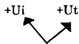

b. Calculate Ui and Ut for a water depth of 300 ft.

This is the beginning of the deep water zone. Therefore for the principal wave direction,

$$\mathrm{U i} = 2. 1 \mathrm{k t}$$

$$\mathbf{U t} = \mathbf{0}$$

c. Calculate Ui and Ut for the target platform location in a water depth of 250 ft.

Assume a linear relationship of Ui and Ut vs depth, d, in the range of 150 ft to 300 ft. Then, for any d,

$$\mathrm{U i} (\mathbf{d}) = \mathrm{U i} (150) + \frac{[ \mathrm{U i} (300) - \mathrm{U i} (150) ]}{[ 300 - 150 ]} [ \mathrm{d} - 150 ]$$

$$\mathrm{U t} (\mathrm{d}) = \mathrm{U t} (150) + \frac{\left[ \mathrm{U t} (300)^{-0} - \mathrm{U T} (150) \right]}{\left[ 300 - 150 \right]} [ \mathrm{d} - 150 ]$$

For $d = 250$ ft

$$\mathbf{U} \mathbf{i} = 1. 96 k t$$

$$\mathrm{U t} = 0. 42 \mathrm{k t}$$

d. Calculate the magnitude, Ur, of the current and its direction, $\phi \mathbf{u}$ , for $\mathbf{d} = 150$ ft.

$$\mathrm{U r} = (\mathrm{U i}^{2} + \mathrm{U t}^{2})$$

$$\phi \mathrm{u} = \phi \mathrm{w} + \arctan (- 0. 42 / 1. 96) = 290^{\circ} - 12^{\circ} = 278^{\circ}$$

e. Calculate the current profile for $d = 250$ ft.

The current is a constant $2.0\mathrm{kt}$ from the storm water level (swl) to $-200$ ft. It decreases linearly from its value of $2.0\mathrm{kt}$ at $-200$ ft to a value of $0.2\mathrm{kt}$ at $-300$ ft. The profile is truncated at $-250$ ft resulting in a value of $1.10\mathrm{kt}$ at the mudline.

$$\begin{array}{l} \text{d e p t h} = 250 \mathrm{f t} \\ \emptyset u = 278^{\circ} \\ \mathrm{U r} = 2. 0 \mathrm{k t} \\ \end{array}$$

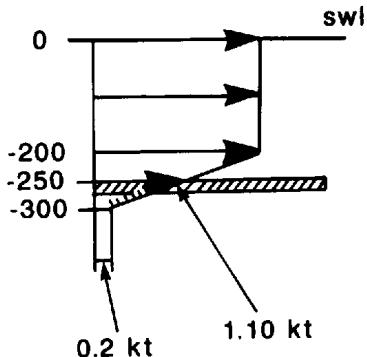  
FIG.COMM.C.3.7.3-1  
EXAMPLE CALCULATION OF CURRENT MAGNITUDE, DIRECTION, AND PROFILE IN THE INTERMEDIATE DEPTH ZONE.

COMM.C.4 EARTHQUAKE LOADS

Comm. C.4.1 General

Comm. C.4.1.1 Scope. Portions of the coastal waters of the United States are located in seismically active areas and it is necessary that fixed offshore platforms in these areas be designed to resist earthquake ground motions. As for most other types of facilities, it is not warranted and normally not economical to design offshore platforms to preclude any damage for the most severe earthquake ground shaking possible. Accordingly, the provisions are intended to provide resistance to moderate earthquakes, which have a reasonable likelihood of not being exceeded during the life of the platform, without significant structural damage. Structural damage is likely to occur in the event of a rare intense earthquake ground motion, but the provisions are intended to prevent collapse of the platform.

It should be recognized that these provisions represent the state-of-the-art and that a structure adequately sized and proportioned for overall stiffness, ductility, and adequate strength at the joints, and which incorporates good detailing and welding practices, is the best assurance of good performance during earthquake shaking.

The strength requirements are presented to assure adequate resistance to moderate earthquakes without significant structural damage. The ground motions for the strength design should be established through site-specific studies as recommended in Section C.4.1.2.

Earthquake forces in structures result from ground motion, and the intensity of the forces is dependent on the mass and stiffness of the structure and its foundation. Unlike most other environmental forces, earth

quake forces generally are reduced as the structure becomes less stiff due to inelastic yielding or buckling of structural or foundation elements. Where such inelastic action can occur without the structure becoming unstable under gravity loads, a significantly greater amount of ground shaking can be sustained without collapse than can be sustained at first yield.

It has been analytically demonstrated for locations such as offshore southern California that steel template type structures designed in accordance with the strength requirements and which are well configured and proportioned can withstand the rare, intense earthquake without collapsing. For structures of this type in these locations, specific guidelines for configuring the structure and for proportioning members are presented to ensure the necessary ductility. Where these provisions are not applicable, requirements are included for analyzing structures for the rare, intense earthquake ground motion.

Earthquake Related Definitions. Some terms when applied to earthquake engineering, have specific meanings. A listing of some of these terms is:

1. Effective Ground Acceleration. A design coefficient used to describe a ground acceleration amplitude for dimensionalizing a smooth, normalized design spectrum such as shown in Figure Comm. C.4.2-2 for use in structural design. The term "effective" is used in contrast to the commonly used value of peak acceleration. Although any single parameter is not adequate to fully describe the destructive energy of the ground motion, the effective ground acceleration associated with a given smooth design spectrum is a meaningful index of such energy.   
2. Ground Motion. The vibratory movement of the ground resulting from an earthquake. Motion at any point is uniquely described in terms of either acceleration, velocity, or displacement time histories.   
3. Response Spectrum. A response spectrum depicts the maximum response to a ground motion by a series of single degree of freedom oscillators having different natural periods but the same degree of internal damping. The response spectrum of a particular earthquake acceleration record is in fact a property of that ground motion, stated in terms of the maximum response of simple (single degree of freedom) structures. When this response is represented with a set of smooth lines such as shown in Figure Comm. C.4.2-2, it is called a smooth response spectrum.   
4. Time History. Time history is a continuous record over time of ground motion or response.   
5. Near Field. The soil mass which transmits earthquake motions to the structure, provides immediate support for the structure, and is affected by the motions of the structure. The near field soils may be represented by discrete lateral and vertical elements which reproduce the load-deflection characteristics of direct soil-pile interaction. In modeling the near field soil, account should be taken of the dynamic and cyclic behavior of the soil-pile system and of the pile group effects.

6. Free Field. The soil mass in the vicinity of the platform that is not significantly affected by the motions of the platform. When modeling the free field, account should be taken of the dynamic and cyclic behavior of the soils and of hysteretic and radiation energy dissipation. The soil mass may be modeled by using either finite elements or simplified equivalents.

Comm. C.4.1.2 Evaluation of Seismic Activity. Design criteria consist of both a description of the seismic loading and the requirements to ensure adequate structural performance. The objective of design criteria specification is to allow the analyst to use relatively simple but realistic analysis procedures to proportion the elements of a structure such that the structure has acceptable strength and ductility. The seismic loading is typically specified in terms of a set of earthquake records which are representative of design level motions at the site.

The development of both site-specific spectra and records is described in this section. The structural performance aspects of design criteria consist of guidelines for structural modeling, response analysis, and response assessment. All of these aspects of design criteria need to be considered as an intergrated package to ensure consistently reliable designs (Reference C457).

Site-specific studies should be considered as a basis for developing the ground motion specification for the design criteria, particularly for sites in areas of high seismicity (Zones 3-5) or in any location where earthquake loading is anticipated to significantly influence structural design. Performing a site-specific study is the primary means by which information concerning the local characteristics of earthquake motion can be explicitly incorporated into the design criteria.

Since the platform should meet specific strength and ductility requirements, two levels of ground motion intensity should be considered: (1) ground motion which has a reasonable likelihood of not being exceeded at the site during the platform's life (typically a recurrence interval of 200 years for southern California for permanent structures) and (2) ground motion from a rare intense earthquake (associated with an event controlled by the seismic environment that can have a recurrence interval of several hundred to a few thousand years). The first level provides the ground motion input for the elastic design of the structure. The second level may be required to determine if it is necessary to analyze the structure for the rare, intense earthquake, and if so, provides the ground motion input for the analysis.

The site-specific study description presented herein provides a framework to use data, theory and judgment for developing estimates of site ground motions. The process involves a synthesis of information requiring a broad range of professional skills and requires a considerable amount of engineering judgment. A thorough consideration of the steps below should be sufficient for the rational and defensible selection of design criteria.

The framework recommended for site-specific studies can be discussed in terms of the following four steps:

a. Seismotectonic and Site Characterization

b. Seismic Exposure Assessment   
c. Ground Motion Characterization   
d. Design Ground Motion Specification

The level of detail to which each step should be developed depends on the consequences of the exposure and the availability of data and data analysis techniques. The following four sections further discuss data sources, analysis techniques and judgments to be considered when performing a site-specific study. The following general references regarding site-specific studies are suggested for review: References C401, C402, C426, C427, C428.

a. Seismotectonic and Site Characterization. An explanation should be developed to explain where, why, and how often earthquakes occur in a region. This step involves assembling and synthesizing all available data and theory into a consistent, conceptual "model" termed seismotectonic model, to characterize the generation and propagation of ground motion in the region. This step can be divided into three parts: source evaluation, source-to-site motion attenuation, and site evaluation.

## a.1 Source Evaluation. The initial task in developing site-specific criteria is to identify and evaluate potential earthquake sources. Earthquake sources are defined as geologic features that are zones of weakness in the earth's crust which have exhibited seismic movement based on past geologic, historic, or recorded seismicity (References C402, C429).

Location and geometry of sources are based upon the regional tectonic setting and structural geology, observed or instrumentally recorded data of past earthquakes, geophysical data, and extrapolation from sources onshore. To account for undiscovered faults and historical seismicity that cannot be associated with any particular source, uniform area sources are generally introduced in the region of interest.

Sources can be classified according to the sense of motion of the slip along the fault, e.g., strike-slip, thrust or normal. Identifying the fault planes of the regional sources by examining first motions on seismograms of past events can help explain the ongoing tectonic processes.

Source activity rates expressed in terms of recurrence relationships, define the temporal distribution of the number of earthquakes as a function of magnitude. Activity rates can be quantified on the basis of histograms prepared from both observational and instrumentally recorded seismicity. Geologic field data pertaining to total cumulative displacement, recent fault slip rate, segmentation, displacement per event and possible rupture lengths can be used to augment the seismicity data, especially in determining seismic activity associated with long recurrence intervals. If the seismicity and geologic data are too sparse, rates may be inferred from other tectonically and geographically similar regions. Rates

of particular sources may also be assigned as some percentage of the region's overall rate of seismicity.

The magnitude associated with a rare intense earthquake can be estimated from the historical seismicity and geologic evidence on the type and geometry of sources.

## a.2 Source-to-Site Motion Attenuation. Attenuation relationships are developed to define the decay of ground motion as a function of the type of earthquake sources, the magnitude of earthquakes, the source-to-site geometry and geology, and distance of the site from the source. Significant changes in the intensity, frequency content, pulse sequencing and variability of ground shaking can occur as the result of wave propagation along the travel paths from the source to the site.

Attenuation relationships are most often derived from empirical studies of recorded ground motion data (References C402, C431, C432 and C433). If available, recordings are selected from past earthquakes in which the site, source, source-to-site geology and soils are similar to those of the site and sources being studied. Unfortunately, there are limited data available, and for only a limited range of earthquake magnitudes. Recently, analytical models have been developed to describe earthquake source, attenuation and local site effects. However, simplifications introduced to make such analyses possible or assumptions required because of limited data and knowledge can result in significant uncertainties. Analytical models may hold promise for realistically characterizing earthquake attenuation effects when the models can be adequately calibrated against empirical studies.

The evaluation of attenuation relationships must focus on ground motion parameters which correlate best with response of the structures for which the criteria are being developed. The familiar peak ground acceleration is a useful measure of potential damage for extremely stiff structures with short natural periods of vibration. However, it is not an effective measure of potential damage for long period, flexible structures such as offshore platforms designed for moderate to deep water. For this class of structures, response spectral velocities in the fundamental period range of the structure provide a more useful measure of the potential damage from earthquake ground motion.

## a.3 Site Evaluation. The regional site conditions can influence the characteristics of incoming earthquake surface and body waves. The effects are primarily a function of local geology, e.g., proximity to basin edges of discontinuities, and soil conditions. For seismotectonic characterization, detailed evaluation of the site conditions is not necessary. Generally, it is incorporated into the derivation of the attenuation relationship. Effects of local site conditions can be treated more explicitly in ground motion characterization (Step c).

b. Seismic Exposure Assessment. This step uses the information developed in the previous step to determine characteristic earthquakes which are likely to contribute most to strong ground shaking at the site. Characteristic earthquakes should be determined for the strength level earthquake which has a reasonable likelihood of not being exceeded at the site during the life of the structure and for the rare intense earthquake. Generally, the characteristic earthquakes are expressed in terms of magnitude and distance from source to site.

Different earthquakes from different sources may dominate the motion in different period ranges, e.g., earthquakes from closer sources may contribute more to the shorter period motion while earthquakes from more distant sources may contribute more to longer period motion. Therefore, it may be appropriate to consider several earthquakes having the same recurrence interval. The knowledge that certain combinations of magnitudes and distances define the controlling earthquakes permits a deterministic assessment of design ground motions through inspection of ground motions recorded during earthquakes of similar magnitude and distance (as described in Step c).

## b.1 Strength Level Earthquakes. The selection of representative strength level earthquakes can be based on blending the results from (1) a probabilistic exposure analysis of the study region, and (2) a deterministic inspection of individual faults and the major historical earthquakes in the study region. The probabilistic exposure analysis provides a means for considering the total probability of earthquakes occurring on all sources over the entire study region to establish the relative contribution of each source to a given level of ground shaking (Reference C423). It also allows identification of sources which control various ground motion parameters such as spectral velocities, peak ground velocity and peak ground acceleration by using attenuation relationships developed for these parameters.

In performing the exposure analysis, special care needs to be taken to ensure that the model is a reasonable representation of the seismotectonic setting. A sensitivity analysis of the results to input parameters should be conducted. Special attention needs to be given to the effects of the assumed attenuation relationships because of the uncertainty associated with such relationships. By using exposure analysis to quantify the relative importance and contribution of different sources to motion at the site and to identify characteristic earthquakes, the exposure analyses results tend to be less sensitive to the attenuation relationships as compared to using exposure analysis to determine absolute ground motion values (as described below).

In addition to probabilistic analysis, deterministic assessment can serve as a check on the probabilistic results by ensuring that all appropriate types of events are being considered. The deterministic approach can help account for local anomalies and

special sources which may not be appropriately accounted for in the exposure model.

An alternative approach to using exposure analyses results is to compute the value of a selected ground motion parameter (historically, effective ground acceleration has been selected) associated with the desired recurrence interval. Then, as a next step, these values are used to scale appropriate standardized spectra. However, in this approach the computed ground motion value is very sensitive to the assumed attenuation relationship. Because of the uncertainty associated with any attenuation relationship, ground motion values computed from exposure analysis results have to be interpreted very carefully.

Still another approach is to use the exposure analyses results to develop probabilistic spectra. Although probabilistic spectra may in theory best reflect the integrated effects of all sources on a consistent risk basis, they too are very sensitive to the assumed attenuation relationships and thus must be carefully interpreted.

## b.2 Rare Intense Earthquakes. A probabilistic exposure analysis approach may not be appropriate for the determination of the rare intense earthquake because of the limited time over which reliable data have been collected. As an alternative approach, the selection of representative rare intense earthquakes may be based on a deterministic evaluation. The assessment relies heavily on the geologic and seismologic evaluation conducted in the previous step. Geologic evidence can often distinguish between the level of event associated with a recurrence interval of several hundred to a few thousand years and the maximum credible event.

c. Ground Motion Characterization. This step involves developing estimates of ground motion which represent the strength level and rare intense characteristic earthquakes (as determined in the previous step), including the effects due to local site conditions. Preferably, the ground motion estimates can be developed based on strong motion records recorded during earthquakes similar to the characteristic earthquakes in terms of magnitude, distance, and source type. Typically, existing records do not directly match the selected characteristic earthquakes, in which case scaling the records may be performed. In the case where the characteristic earthquakes are out of the practical scaling range of existing records, synthetic records may be substituted. The representative records and corresponding spectra may be corrected for the effects of the local soil condition. Once a set of representative records (unscaled, scaled, and/or synthetic) have been assembled, their response spectra can be superposed on composite plots for each direction of motion (two horizontal and one vertical). The three components should be developed in a uniformly consistent manner rather than factoring a single component for the three directions. These plots will illustrate the natural range of ground motion to be associated with the characteristic earthquakes. They will also illus

trate which characteristic earthquake will be the most important in terms of the structural design.

## c.1 Record Scaling. There are several techniques proposed to account for deviations in magnitude, distance and source type. It is recommended that a technique be employed which scales on the magnitude of the event, the distance from the source to the site and source type and which takes into account the general type of soils at the recording site (Reference C434). Any method that scales all proposed records to a predetermined absolute amplitude, e.g., peak acceleration or velocity, should be avoided. Prescribing the value defeats the objective of looking at representative records to determine the likely range of ground motions.

## c.2 Synthetic Records. For some seismic environments, there are no recorded data within the practical scaling range. For these cases artificial or synthetic records may be generated. This reduces the confidence in the resulting range of ground motion amplitudes. There are several methods proposed for developing synthetic earthquake records ranging from observational techniques to analytical solutions of simplified earthquake rupture processes (Reference C435). Since the resulting records are synthetic, considerable judgment should be used when deriving quantitative results from any of these methods.

## c.3 Site Response Modification. If the majority of the selected records do not represent site conditions similar to those of the study site, further modifications to the ground motions may be required. The influence of local site conditions is primarily a function of local soil properties, local geology, thickness of soil layers and the manner in which the seismic waves arrive at the site.

Both analytical and empirical methods are available to evaluate local site effects and to modify the ground motion estimates accordingly. One-dimensional shear wave, compression wave, and surface wave models provide an analytical basis upon which to make judgments concerning the influence of local soil and geologic conditions (References C436, C437, C438). Using any one of these models, a new set of site-modified ground motion records may be developed by mathematically propagating the selected scaled records through a model of the site's soil profile. Parameter studies provide valuable insight into the details of ground motion as influenced by local site effects.

In empirical methods, statistical analyses can be performed on normalized response spectra in which recorded motions are categorized according to the soil conditions at the instrument recording site (References C404, C405).

Then based on these results, approximate adjustments are made to the composite spectra to reflect trends of the site conditions. However, large variability and uncertainties are generally present in such results due to the combined and unrecognized

effects of recordings from different events, sources, transmission paths, and instrument locations.

d. Design Ground Motion Specification. Design ground motions should be specified based on the findings of the previous three steps and knowledge of how the design motions will be used in subsequent structural analysis and design. When specifying the criteria, the objective is to develop a description of ground shaking and a specification of how the structure will be analyzed and designed using the description of the earthquake loadings provided. Ideally, the net effect is a structural design having a desired level of reliability. In this overall context, neither the description of motion nor the structural analysis and performance requirements stand alone.

Typically, to ensure adequate structural strength, ground motions associated with the strength level earthquake are specified such that the structure must withstand these motions elastically. To ensure adequate ductility, either specific rare intense earthquake ground motions can be specified or for many jacket-type structures, generic guidelines specified in Section C.4.3.2 can be followed in detailing and designing the structure. A condition for adopting the latter procedure is that the intensity ratio of the rare, intense to strength level earthquake not exceed 2.0. (The intensity is proportional to the average spectral velocity in the period range of the structure.) The value of 2.0 is typical for offshore southern California and should be evaluated for other areas where the factor of 2.0 may be low or high.

Generally ground motions are specified by design response spectra and/or a set of representative records. The smoothed spectra are usually set at a level of shaking which the analyst feels represents the expected range of likely motions (based on the results of Steps b and c). Specification of the design spectra relies heavily upon the set of scaled and site corrected records derived in Step c. The effects of other aspects of the local conditions that may not be realistically represented in the data set of recorded motions should also be included in a more judgmental fashion through the inspection of data collected in similar settings.

Sets of ground motion recordings, appropriately scaled and filtered through the local soils, that are most representative of the design earthquakes may also be specified. The average of their spectra may not conform closely to the site-specific design spectra at all periods because of the limitations in finding records which reflect all elements of the design earthquake, local soil conditions and overall area geology. However, they should closely match in the range of the significant natural periods of the structure, and they should have similar ratios between the two horizontal and the vertical component intensities. It may be appropriate to use synthetic records when existing records are outside the practical scaling range to adequately represent the design earthquakes.

Comm. C.4.1.3 Evaluation for Zones of Low Seismic Activity. In areas where the strength level design horizontal acceleration is in the range of $0.05\mathrm{g}$ to $0.10\mathrm{g}$ , inclusive, design of offshore structures for storm conditions will generally produce structures that are adequate to resist imposed seismic design conditions. For these zones, the ductility requirements may be waived and the tubular joints designed only for the calculated joint loads (instead of member yield or buckling loads) if the structure is found to meet the strength design requirements using ground motion characteristics established for the rare, intense earthquake in lieu of the strength level earthquake. However, even though the provisions do not require further earthquake analysis of the structure, the design engineer should consider seismic response in configuring the structure by providing redundancy and recognizing the implications of abrupt changes in stiffness or strength as discussed in Comm. C.4.3 and should apply engineering judgment in the design of structures of unusual configuration.

Design of deck appurtenances and equipment for motions induced by the strength level earthquake in accordance with Section C.4.4.2 is still recommended.

Comm. C.4.2 Strength Requirements

Comm. C.4.2.1 Factored Loads. The seismic factor of 0.9 in Equations C.4-1 and C.4-2 was selected to provide a direct calibration of LRFD practice with existing WSD practice as recommended in API RP2A. The selection was based on analyses of two platforms designed for southern California, one for a water depth of $73\mathrm{m}$ (240 ft) and the other for $225\mathrm{m}$ (739 ft). (Reference C424). Using the load factors given in Equations C.4-1 and C.4-2 and the identical seismic analysis models and dynamic analysis procedures, the jacket weight differences using the LRFD method were less than $1\%$ from the designs using the WSD method. Safety indices were also considered in the calibration of the seismic load factors and based on seismic reliability models developed to date, should achieve acceptable levels.

The lower load factor for earthquake loads in comparison with the factor for extreme wind, wave and current loads reflects the longer recurrence interval typically used for design earthquake ground motion (see Comm. C.4.1.2).

Comm. C.4.2.2 Strength Level Earthquake, E. For the purpose of preliminary designs and studies, E may be determined by either the response spectrum or time history method using the following effective horizontal ground accelerations:

| Z = 0 | 1 | 2 | 3 | 4 | 5 |
| --- | --- | --- | --- | --- | --- |
| G = 0 | 0.05 | 0.10 | 0.20 | 0.25 | 0.40 |

where $\mathbf{Z}$ is the Zone or relative seismicity factor given in Figure Comm. C.4.2-1, and $G$ is the ratio of effective

horizontal ground acceleration to gravitational acceleration.

Using the response spectrum approach, the ordinates of the spectrum taken from Figure Comm. C.4.2-2 should be multiplied by the factor G for the zone in which the platform is to be located.

The resulting spectrum should be applied along both principal horizontal axes of the structure. An acceleration spectrum of one-half that for the given zone should be applied to the vertical direction. All three spectra should be applied simultaneously and the responses combined as given in Section C.4.2.4.

If the design is accomplished by the time history method of analysis, the time histories used in each orthogonal direction should be scaled as stated in the above paragraph and generated or modified so that their normalized response spectra for five percent critical damping reasonably match the design spectrum shown in Figure Comm. C.4.2-2 in the period range of interest. The phasing of each of the three time history components may be different. Because of the potential sensitivity of the platform response to variations in the input motion, the design should consider at least three sets of time histories.

The lateral and axial soil resistances of a pile foundation system are normally developed at different locations along the pile length. Therefore, the horizontal ground motion spectrum or the time history for the soil near the surface is associated with the lateral pile motion and may be different from the vertical ground motion spectrum or time history associated with the axial pile motion.

Relative intensities of design ground motions for the U.S. Continental Shelves are given in Figure Comm. C.4.2-1. Geographical locations of these zones have been based on results of seismic exposure studies (Reference C401, C402, C403).

The magnitudes of the G-factors were based on results of ground motion studies (References C401, C402, C403, C465), on studies of design criteria for offshore platforms (References C408, C409), and on analytical studies and experience with platforms subjected to intense loadings due to earthquakes and waves (References C410, C411, C412, C413, C414, C415). The G-factors and design response spectra have been derived from consideration of the inelastic performance and ductility of platforms designed according to these guidelines. Consideration of inelastic performance and ductility in development of elastic design response spectra and ground motions is discussed by Whitman and Protonotarios (Reference C416) and by Bea (Reference C409).

The results of studies of the influence of local site conditions in recorded ground motions (References C404, C405, C406, C407) were considered in the development of the response spectra in Figure Comm. C.4.2-2. Three site conditions are covered. Response spectra for other

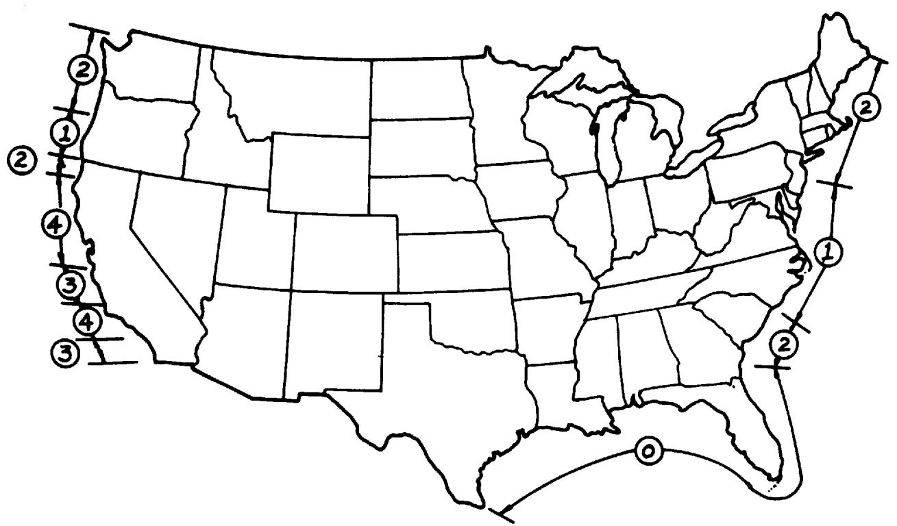

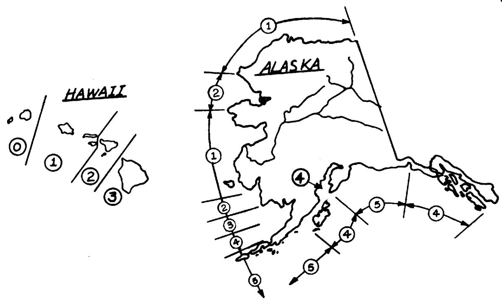  
FIG.COMM.C.4.2-1 SEISMIC RISK MAP OF UNITED STATES COASTAL WATERS

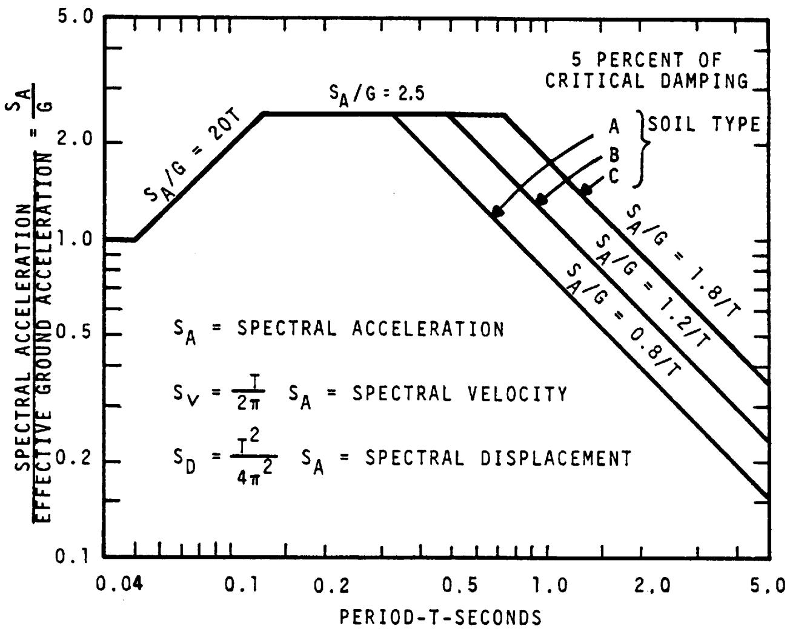

SOIL TYPE

A. ROCK — CRYSTALLINE, CONGLOMERATE, OR SHALE-LIKE MATERIAL GENERALLY HAVING SHEAR WAVE VELOCITIES IN EXCESS OF 914 M/SEC (3000 FT/SEC).   
B. SHALLOW STRONG ALLUVIUM — COMPETENT SANDS, SILTS AND STIFF CLAYS WITH SHEAR STRENGTHS IN EXCESS OF ABOUT 72 kPa (1500 PSF), LIMITED TO DEPTHS OF LESS THAN ABOUT 61 M (200 FT), AND OVERLYING ROCK-LIKE MATERIALS.   
C. DEEP STRONG ALLUVIUM — COMPETENT SANDS, SILTS AND STIFF CLAYS WITH THICKNESSES IN EXCESS OF ABOUT 61 M (200 FT) AND OVERLYING ROCK-LIKE MATERIALS.

FIG.COMM.C.4.2-2

RESPONSE SPECTRA

SPECTRA NORMALIZED TO 1.0 GRAVITY

soil conditions may be developed from the results of analytical and experimental studies. For soil conditions characterized by significant accumulations of soft clays, loose sands and silts overlying alluvium or rock, the response spectra may indicate significant amplifications of both horizontal and vertical ground motions in the range of the natural periods of the soft soil column.

Selection of the above earthquake criteria has been influenced by oceanographic conditions. This interaction effect, which can be significant if both earthquake and oceanographic conditions are severe, can occur in two principal ways: first, in the face of two severe environmental conditions, the design intensity of each should be higher than the level which might be appropriate if only one existed, in order to maintain a constant overall level of safety. A second effect occurs due to the fact that forces induced in a platform by earthquake are, to at least some extent, proportional to the stiffness of both the structural and foundation systems. Thus, an increase in structural and foundation stiffness to resist oceanographic forces will in turn result in higher forces being induced in a platform by a given level of earthquake shaking.

While the shift in period associated with such a stiffness increase will automatically lead to higher design forces for strength requirements for most offshore platforms, changes in the nonlinear ultimate response of the system may not be accounted for automatically. These interactive effects were significant for the Gulf of Alaska (References C408, C409).

Comm. C.4.2.3 Structural Modeling. Structural modeling for analysis purposes involves a variety of considerations. Several publications, e.g., Reference C419, provide detailed guidance for the designer.

The ground motion implicit in the environmental description of Section C.4.2.2 represents that "free field" motion that would exist in the vicinity of the platform if the platform were not there. To be consistent, the mathematical model used in evaluating platform response should incorporate all important elements of the mass, stiffness, and energy dissipation properties of both the structure and foundation components of the platform, as well as significant aspects of interaction between the foundation elements and the surrounding soil.

For foundation modeling, when there is a substantial difference in the soils near the pilehead and those along the lower portion of the pile, a variation in the free field motion with depth may have to be considered for the detailed design of the piles. For evaluation of the overall structure foundation system, a satisfactory approximation is to assume that the lateral pile behavior is related to horizontal ground motions in the near surface soil and the axial pile behavior to the vertical motions in the deeper soils. (See Figure Comm. C.4.2-3.)

For example, consider that a platform is located in Zone 3 and has soil type B near the surface (i.e., several pile diameters for continuous soil profiles) and soil type

A near the lower portions of the pile. Using the G-factors and response spectra given in Comm. C.4.2.2, the following are ground motion spectral accelerations which should be considered in conjunction with the gravity and buoyancy loading:

| Ground Motion | Ground Motion | Spectral | Acceleration |
| --- | --- | --- | --- |
| XG | YG | ZG |  |
| (0.20) (1.0) (B) | (0.20) (1.0) (B) | (0.20) (1/2) (A) |  |

Where: A and B refer to curves in Figure Comm. C.4.2-2.

## 0.20 refers to scaling factor G for Zone 3

## 1.0 refers to the principal horizontal axes scale factor.

1/2 refers to the vertical axis scale factor.

The use of the response spectrum approach requires that damping be identified with each mode. In Section C.4.2.3, modal damping of five percent of critical is specified for use in all modes unless other data exists. If other values of modal damping, $\eta$ (percent), are justified, either uniform or different for each mode, the following factor, D, may be used to multiply the response ordinates obtained from the curves in Figure Comm. C.4.2-2.

$$\mathrm{D} \quad = \frac{\mathrm{L n} (100 / \eta)}{\mathrm{L n} (100 / 5)}$$

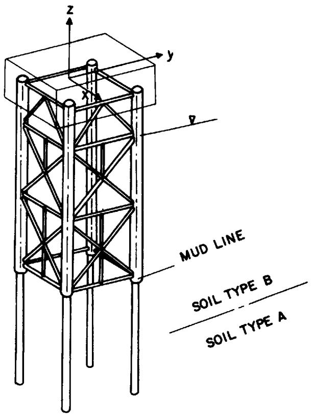  
FIG.COMM.C.4.2-3   
EXAMPLE STRUCTURE

This factor, D, is appropriate for values of damping between 2 and 10 percent.

Comm. C.4.2.4 Response Analysis. Section C.4.2.4 suggests that the complete quadratic combination (CQC) (Reference C420) of individual modal responses is appropriate for the evaluation of design response. This method accounts for correlation among responses of closely spaced modes. Other combinations may be appropriate for the evaluation of design response. The modal combination rule appropriate for a particular class of structures or members may be evaluated by comparing the response of the structure to a limited number of time histories with its response to the corresponding response spectra (References C458, C459, C460). It is also important to define the proper response variable in applying the response spectrum method. Note that the response variable such as member force is not necessarily the variable that will be directly compared to criteria such as allowable stress.

All of the modes need not be included to obtain an adequate representation of the structural response. The requirement for an adequate representation of the response will normally be met if the extracted modes are selected on the basis of modal parameters such as mass participation factor or a major response parameter such as base shear or energy (References C421, C422). Additional modes may be required if local member effects are important. However, the dynamic response of subassemblage and individual members may require separate consideration.

Comm. C.4.2.5 Response Assessment. In the response spectrum analysis method, the response quantity of interest should be computed separately for each mode and then the modal responses combined using an appropriate method. For example, member end reactions are computed for each mode and combined to obtain the total earthquake induced forces. It should be noted that combining the modal values of actual-to-allowable strength ratios would not be conservative for columns because of the moment amplification term in the allowable strength evaluation.

The total design force for each member is obtained by combining the earthquake induced forces together with forces due to gravity, buoyancy, and hydrostatic loading. In combining the earthquake induced member forces with static forces, account should be taken of the fact that the former have no sense of direction attached to them, and that earthquake induced forces are cyclic in nature. In general, the relative signs of the earthquake related forces acting on a member should be selected such that the most conservative condition will result. However, some unwarranted conservatism may be reduced by rational arguments concerning the expected member behavior such as the type of curvature.

In computing the earthquake induced forces for member design, consideration should also be given to the inertia forces introduced by the local vibrational characteristics of individual members.

Comm. C.4.3 Ductility Requirements

Comm. C.4.3.1 General. In seismically active areas, platform responses to rare, intense earthquake motions may involve inelastic action, and structural damage may occur. The provisions of Sections C.4.3.1 and Comm. C.4.3.1 are intended to ensure that structure-foundation systems planned for such areas remain stable in the event of a rare, intense earthquake at the site. This can be achieved by providing sufficient system redundancy such that load redistribution and inelastic deformation will occur before collapse and by minimizing abrupt changes in stiffness in the vertical configuration of the structure. Adequate ductility can be demonstrated by adhering to the design practices outlined below or by nonlinear analysis, where applicable.

Comm. C.4.3.2 Structures Not Requiring Ductility Analysis. Considerable experience has been developed in recent years in the analysis of the overload performance of conventional structure-pile systems (References C410, C414, C439). Such systems are jacket type structures with eight or more legs; supported by piles in competent soils whose local strength and stiffness degradation under extreme cyclic loading does not significantly compromise the overall integrity of the platform foundation; and located in areas where the intensity ratio of the rare, intense ground motions to the strength level ground motions is approximately 2.0. Based on this experience, the design guidelines of Section C.4.3.2 have been developed (Reference C440). Implementation of these guidelines in the design of similar structures should ensure sufficient ductility for the overload condition. Explicit analysis of the overload performance of such structures should not be necessary.

The guidelines include provisions for configuring and proportioning members in the vertical frames. Their purpose is to provide for redistribution of the horizontal shear loads in the vertical frames as buckling occurs in diagonal bracing, and to improve the post-buckling behavior of the diagonal braces and of nontubular members at connections. These provisions will enhance ductile behavior of the structure under extreme lateral cyclic loading. Figure Comm. C.4.3-1 shows examples of vertical frame configurations which do not meet the guidelines. Example configurations which do meet the guidelines are shown in Figure Comm. C.4.3-2. Note that the two "K" braced panels forming an "X" in two vertically adjacent panels meet the guidelines.

Comm. C.4.3.3 Structures Requiring Ductility Analysis. Reasons that a structure-foundation system may merit an explicit analysis of its performance during a rare, intense earthquake include:

- The seismicity of the site does not conform to the 1:2 ratio of strength to extreme level earthquake ground motion intensities common to offshore southern California. In other areas, this ratio may be higher.   
The pile-supporting soils at the site are susceptible to significant strength and stiffness degradation

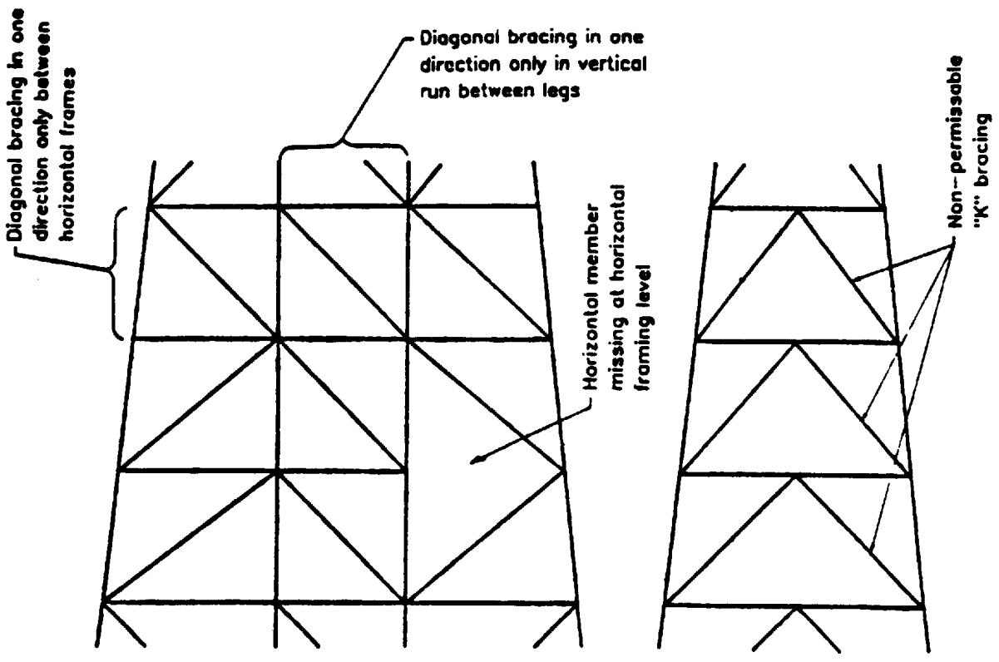  
FIG.COMM.C.4.3-1 VERTICAL FRAME CONFIGURATIONS NOT MEETING GUIDELINES

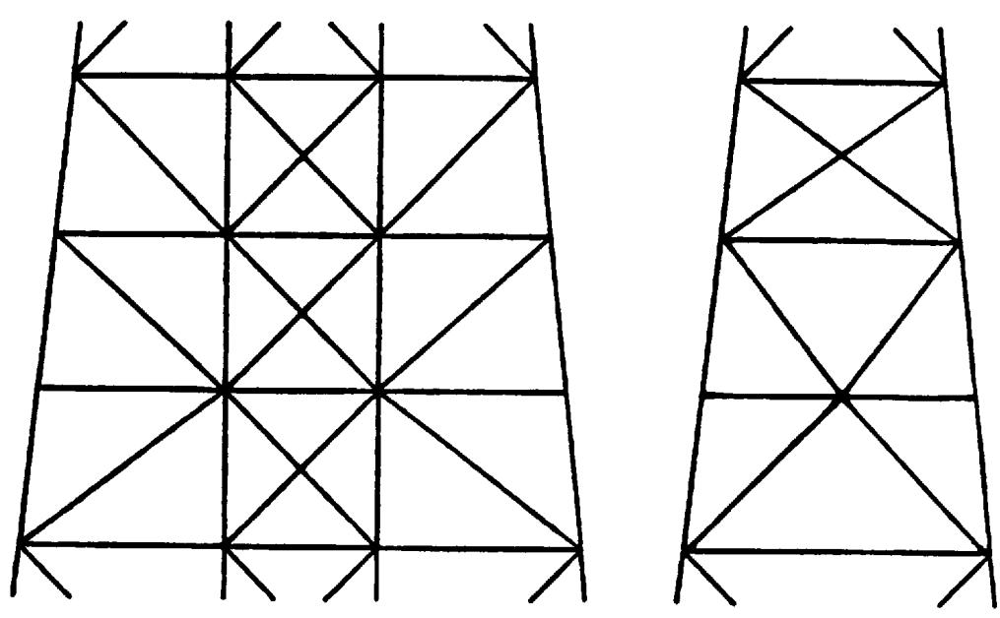  
FIG.COMM.C.4.3-2 VERTICAL FRAME CONFIGURATIONS MEETING GUIDELINES

under the cyclic loadings imposed by a rare, intense earthquake.

- The configuration of the structure (bracing type, member size, D/t and slenderness ratios) does not conform to the structural configurations typical of recently installed earthquake resistant platforms, from which the guidelines of Section C.4.3.2 have been developed.

In order to demonstrate the satisfactory overload performance of these systems, it is necessary to establish appropriate performance criteria, develop representative platform and foundation models, and perform analyses using a method of analysis that reasonably reflects the anticipated response of the platform and its foundation to rare, intense earthquake ground motion (References C417, C418, C439, C441).

Representative sets of ground motion time histories that are characteristic of a rare, intense earthquake at the site should be developed from a site-specific seismic hazard study following the provisions of Section C.4.1.2 and Comm. C.4.1.2. It should be demonstrated that the structure-foundation system remains stable under the loads imposed by these ground motions. The structure-foundation system may be considered unstable when the deflections are large enough to cause collapse under the influence of gravity loads.

The post-yield and post-buckling behavior of structural members subject to overload under cyclic load reversals should be modeled (References C415, C425, C442, C443, C444, C445, C446). For members required to develop significant bending, the interaction between axial load and moment capacity should be included (e.g., deck girders, jacket legs, and piles) (Reference C447). The ductility and cyclic degradation characteristics of tubular members are strongly dependent on their D/t and slenderness ratios (Reference C448). A significant amount of ductility can be built into the structure by implementation of the generic design guidelines presented in Section C.4.3.2. Foundation models should consider the effects of cyclic load reversals, strain rate, pore water pressure generation on the strength and stiffness of the soils surrounding the piles (References C449, C450, C451, C452, C453), and energy dissipation mechanisms (References C454, C455, C456).

The designer should develop a thorough insight into the performance of the structure and foundation during a rare, intense earthquake. The time history method of analysis is recommended. The structure-foundation response should be determined to multiple sets of ground motions which characterize the likely envelope of ground motion intensity, frequency content, phasing and duration expected at the site. At least three sets of representative earthquake ground motion time histories should be analyzed. Additional more simplistic methods of analysis may be used to complement the results of time history analysis (Reference C413).

Comm. C.4.4 Additional Guidelines

Comm. C.4.4.1 Tubular Joints. Joints are sized for the yield or buckling capacity of incoming members so that premature failure of the joints will be avoided and the ductility of the overall structure can be fully developed.

The recommended practice is to size jacket leg joint cans for full yield in main diagonals and for the buckling load of principal horizontals. These horizontals typically have small loads for elastic analysis but are required to pick up substantial compressive loads to prevent the structure from "unzipping" after main diagonals buckle. Excessive joint can thickness may often be avoided by using a conical stub end of the governing member, or by considering the beneficial effects of member overlap and/or grouted-in piles.

Comm. C.4.4.2 Deck Appurtenances and Equipment. The method of deriving seismic design forces for a deck appurtenance depends upon the appurtenance's dynamic characteristics and framing complexity. There are two analysis alternatives.

First, through proper anchorage and lateral restraint, most deck equipment and piping are sufficiently stiff such that their support framing, lateral restraint framing, and anchorage can be designed using static forces derived from peak deck accelerations associated with the strength level seismic event.

To provide assurance that the appurtenance is sufficiently stiff to meet this criterion, the lateral and vertical periods of the appurtenance should be located on the low period, 'flat' portion of the deck level floor response spectra. Additionally, the local framing of the deck that supports the appurtenance must also be rigid enough to not introduce dynamic amplification effects. In selecting the design lateral acceleration values, consideration should be given to the increased response towards the corners of the deck caused by the torsional response of the platform.

Second, in cases of more compliant equipment - such as drilling and well servicing structures, flare booms, cranes, deck cantilevers, tall free-standing vessels, unbaffled tanks with free fluid surfaces, long-spanning risers and flexible piping, escape capsules, and wellhead/manifold interaction - consideration should be given to accommodating the additional stresses caused by dynamic amplification and/or differential displacements estimated through either coupled or decoupled analyses.

Decoupled analyses using deck floor spectra are likely to produce greater design loads on equipment than those derived using a more representative coupled analysis. This is particularly the case for more massive components, especially those with natural periods close to the significant natural periods of the platform. References C461 through C464 describe coupled procedures, and decoupled procedures which attempt to account for such interaction.

If coupled analyses are used on relatively rigid components that are modelled simplistically, care should be exercised such that the design accelerations which are derived from the modal combination procedure are not less than the peak deck accelerations.

Field inspection by experienced personnel of equipment and piping on existing platforms in seismic areas can help identify equipment anchorage and restraint that by experience and/or analysis should be upgraded. To accommodate loadings and/or differential displacements, the addition or deletion of simple bracing and/or anchorage to these components can significantly improve their performance during an earthquake. This is especially important for critical components such as piping and vessels handling hazardous materials, emergency battery racks, process control equipment, etc.

The use of a higher strength level earthquake load factor is usually appropriate for designing deck supported structures, local deck framing, equipment anchorage, and lateral restraint framing under strength level earthquake loads. This higher load factor is intended to provide a margin of safety in lieu of performing an explicit ductility level analysis.

However, in areas where the ratio of rare, intense ground motion intensities to strength level ground motion intensities is known to be higher than 2.0, an adjustment to the strength level earthquake load factor should be considered. Also, for certain equipment, piping, appurtenances or supporting structures, the degree of redundancy, consequences of failure and/or metallurgy may dictate the use of different strength level earthquake load factors or a full ductility analysis, depending on the component's anticipated performance under rare, intense earthquake ground motions.

COMM. C.5 FABRICATION AND INSTALLATION LOADS

Comm. C.5.1 General. Construction and installation loads and corresponding safety checks are often ignored in most codes because these consequences are viewed as owner risks and do not affect the general public. For platforms, failures during this phase are primarily economic and may not involve operating personnel or environmental hazards. The situation changes, however, if structures are partially damaged during the construction and installation phase and this fact escapes detection. Subsequent capacity to perform functions or resist environmental hazards may be reduced. Consequently, RP2A has considered such loads.

Installation loads take on a number of characteristics that may be different from operating and environmental loads. In particular, during the installation stage the structure is in an equilibrium balance such that arbitrary use of load factors can lead to incorrect and even unsafe results. Unlike other loadings, the nominal values for installation analysis including stiffness and

external forces must be best estimates rather than conservative values. Load factors should be applied for this case only at the member checking level and not at the level of the equilibrium analysis. The advantage of using LRFD rather than WSD is that the uncertainty is reflected for both the loading and strength rather by a single safety factor (strength) as with WSD. Thus, some situations or components which are more sensitive to the analysis variations would receive appropriate higher load factors in the safety checking. Members which may carry high loads but where the load effect is not likely to vary significantly should have lower load factors.

The techniques for deriving the load factors, for say the launch condition, are relatively straightforward as discussed in Section Comm. C.1. The steps in this instance would primarily include a careful sensitivity study of jacket reactions and member forces to different parameters (random variables) in the launch simulation, e.g., weight, buoyancy, drag force, inertia force, etc. This would provide sensitivity coefficients, $\Delta \mathbf{F}\mathbf{m} / \Delta \mathbf{X}\mathbf{i}$ , where: $\Delta \mathbf{F}\mathbf{m}$ are changes in member forces and $\Delta \mathbf{X}\mathbf{i} =$ unit change in random variable i. The respective member force coefficient of variation, VS, could be estimated as follows:

$$\begin{array}{r l} \text{V S} & = \frac{\sigma_{\mathrm{s}}}{\overline{{\mathrm{S}}}} \end{array}$$

where:

$$\begin{array}{r l} \bar{\mathbf{S}} & = \text{n o m i n a l m e b e r} \\ & \text{p a r a m e t e r s , a n d} \end{array}$$

$$\sigma_{s} = \text{s t a n d a r d d e v i a t i o n o f f o r c e t o b e c a l c u l a t e d}$$

$$\sigma_{s}^{2} = \Sigma \left(\frac{\Delta F m}{\Delta X i}\right)^{2} \sigma X i^{2}$$

where

$$o \mathrm{X i} = \text{s t a n d a r d}$$

It will be difficult to precisely estimate $\sigma \mathbf{X}\mathbf{i}$ . One way is to try and estimate characteristic values, e.g., the chance that Xi will actually exceed some fractile, say 95th percentile. This leads to an approximate estimate for sigma using normal probability tables.

This approach, although not precise in a statistical sense, would provide sufficient parameters to do a subsequent calibration study, that is, review existing practices with known field performances and arrive at load factors which produce acceptable values of safety index, beta. One possibility is that there may already exist sensitivity studies which have accomplished these purposes.

Launch simulation is probably the most difficult of any installation phase for which to develop load factors, because of the nature of the analysis. Other aspects such as lift or transport should be more amendable to a load factor approach.

Load factors should not be confused with dynamic or impact factors. The latter are the increase in load effect due to inertia. Load factors account for the uncertainty in estimating the combined effect of static and dynamic loading. In fact, increases in static lift loads as recommended by RP2A WSD editions suggest that load factors for each phase of platform installation may be desirable. Reference C4 gives an example of load factors derived from some heavy lift operations. The advantage is the emphasis on uncertainties and the application of higher load factors to those elements sensitive to uncertain load fluctuations including static (due to tolerances) and dynamic conditions.

The cost issue can be quite different for different aspects of installation. For example, an increase in safety factor for a sling is going to be much less expensive than a similar increase for fatigue on a long tow. Such costs represent an important part of any installation provisions.

Comm. C.5.5 Lifting Forces. Lifting forces on padeyes and on other members of the structure should include both vertical and horizontal components, the latter occurring when lift slings are other than vertical. Vertical forces on the lift should include buoyancy as well as forces imposed by the lifting equipment. When suspended, the lift will occupy a position such that the center of gravity of the lift and the centroid of all upward acting forces on the lift are in static equilibrium. The position of the lift in this state of static equilibrium should be used to determine forces in the structure and in the slings. The movement of the lift as it is picked up and set down should be taken into account in determining critical combinations of vertical and horizontal forces at all points, including those to which lifting slings are attached. For lifts where either the lifting derrick or the structure to be lifted is on a floating vessel, the selection of the nominal lifting forces should consider the impact from vessel motion. The lift should be designed so that all structural steel members are proportioned for factored resistances as specified in Section B. In addition, all critical structural connections and primary members should be designed to have adequate reserve strength to ensure structural integrity during lifting.

Comm. C.5.8.1 Launched Structures. Guyed tower and template type structures that are transported by

barge are usually launched at or near the installation location. The jacket is generally moved along ways, which terminate in rocker arms, on the deck of the barge. As the position of the jacket reaches a point of unstable equilibrium, the jacket rotates, causing the rocker arms at the end of the ways to rotate as the jacket continues to slide from the rocker arms. Forces supporting the jacket on the ways should be evaluated for the full travel of the jacket. Deflection of the rocker beam and the effect on loads throughout the jacket should be considered. In general, the most severe forces will occur at the instant rotation starts.

Tower type structures are generally launched from the fabrication yard to float with their own buoyancy for tow to the installation site. The last portion of such a tower leaving the launching ways may have localized forces imposed on it as the first portion of the tower to enter the water gains buoyancy and causes the tower to rotate from the slope of the ways. Forces should be evaluated for the full travel of the tower down the ways.

COMM.C.6 ACCIDENTAL LOADS

Design consideration should be given to the potential for vessel collision and dropped objects. The severity and likelihood of these accidental events depend on many factors including operating environments, service vessel size, material handling equipment, and operator qualifications and proximity to shipping lanes. The collision and dropped object criteria should therefore depend on the platform location, operational procedures adopted and safety measures taken.

Collision and dropped object design criteria are difficult to quantify for three reasons: (1) the interaction of human and equipment error that combine to cause an accident is not quantifiable in probabilistic terms, (2) satisfaction of arbitrary quantification rules is no guarantee that safety will be achieved for any given accident and (3) satisfying simple rules will obviate the need to explore potentially inexpensive preventive measures.

Where consequences are very great and the probabilities of accidents occurring are very low, preventive measures may adequately serve to provide the necessary safety. For example, measures to prevent tanker collision are acceptable if they are effective; designing to resist a tanker collision is not a practical approach.

COMMENTARY D CYLINDRICAL MEMBER DESIGN

COMM.D.1GENERAL

This specification has been developed specifically for fabricated circular tubular shapes which are typical of offshore platform construction. Other structural shapes should be designed on the basis of the AISC-LRFD Specification, Reference D3. Load Factors for all platform components should be consistent with this API practice so that the entire platform can be analyzed as a single coherent model. Mixing API and AISC-LRFD factors would result in inconsistent safety indices. However, the nominal strength equations of the AISC-LRFD practice should be used to design noncylindrical shapes. This approach may appear inconsistent, since the API and AISC load factors are somewhat different. For a simple dead plus live load condition these factors can be compared as follows:

AISC 1.2(D) + 1.6(L)

API 1.3 (D) + 1.5 (L)

where: $\mathbf{D} =$ dead load

L = live load

Using the AISC target ratio of $\mathbf{L} / \mathbf{D} = 3.0$ , we can determine the weighted load factors as follows:

$$A I S C \quad \frac{(1 . 2) (1) + (1 . 6) (3)}{4} = 1. 50$$

$$\mathrm{A P I} \quad \frac{(1 . 3) (1) + (1 . 5) (3)}{4} = 1. 45$$

For this condition, the AISC weighted load factor is $3.4\%$ greater than that for API. However, the nontubular shapes that would utilize the AISC Specification are found primarily in deck superstructures where the dead load contribution is typically more significant than for any other part of the platform. As the dead load contribution increases and approaches a 1:1 ratio with the live load, the difference between the API and AISC weighted load factors become negligible. Therefore, using the API load factors with the AISC nominal strength equations and resistance factors for nontubular members in the deck superstructure should result in a reasonably consistent set of numerical values.

The required member strength specified in Section D has been expressed in the form of an inequality where the stress or force due to the factored loads must be less than or equal to the nominal strength times the associated resistance factor.

The resistance factors and nominal strength equations prescribed herein have been calibrated to produce consistent reliabilities under circumstances generally prevailing with RP2A - Working Stress Design (WSD) (Reference D4) using several Gulf of Mexico platforms. Appropriate resistance factors may need to be derived in cases where the structural components do not correspond to elements described herein or where additional input data become available from tests, measurements, etc. In such cases, a reliability analysis as outlined in

Comm. B may be used to develop the resistance factors. Such analyses should include uncertainty in material properties and deviations introduced by quality control procedures, variability in dimensions and fabrication and uncertainty in strength prediction models, including test scatter. Target reliabilities should be based on a reasonable likelihood of the failure consequences and compatibility with target reliabilities for other components that are covered in this practice.

Comm. D.1.1 Simplified Procedures. In lieu of performing a complete reliability analysis for those situations not covered by the factors contained herein, the following simplified procedures should produce acceptable reliability levels. A nominal strength formula shall be established by fitting test data combined with analytical verification. Scatter in strength prediction due to all causes shall be considered. A resistance coefficient of variation (COV), $\mathbf{V}_{\mathbb{R}}$ , should be estimated as follows:

$$\mathbf{V}_{\mathbf{R}} = \left(\mathbf{V}_{\mathbf{P}}^{2} + \mathbf{V}_{\mathbf{M}}^{2} + \mathbf{V}_{\mathbf{F}}^{2}\right)^{1 / 2} \dots \dots \dots \dots \dots \dots \dots \dots \dots \dots \tag{Comm.D-1}$$

where

$$\begin{array}{r l} \mathbf{V}_{\mathbf{P}} & = \mathbf{C}. \mathbf{O}. \mathbf{V}. \text{d u e t o t e s t o p r e d i c t e d d a t a s c a t t e r} \\ & \text{w i t h r e s p e c t t o m e a n v a l u e o f t e s t d a t a}, \end{array}$$

$$\begin{array}{r l} \mathbf{V}_{\mathbf{M}} & = \mathrm{C . O . V .} \text{d u e t o m a t e r i a l v a r i a b i l i t y r e p r e s e n t a t i v e f o u l - s c a l e m e m e b e r s n o t c o n s i d e d i n} \\ & \text{t e s t o p r e d i c t i o n d a t a , a n d} \end{array}$$

$$\begin{array}{r l} \mathbf{V}_{\mathrm{F}} & = \text{C . O . V . d u e t o f a b r i c a t i o n v a r i a b i l i t y r e p r e s e n t a t i v e o f f u l l - s c a l e m e b e r s w h i c h m a y} \\ & \text{n o t b e a c c o n t e d f o r i n t e s t o p r e d i c t i o n} \\ & \text{d a t a .} \end{array}$$

A calibration for the resistance factor, $\overline{\phi}$ , is shown in Table Comm. D.1-1 as a function of $\mathbf{V}_{\mathbb{R}}$ .

SAFETY CHECK: $\phi$ R > FACTORED LOAD EFFECTS

where $\mathbf{R}$ - mean strength

TABLE COMM. D.1-1 RECOMMENDED RESISTANCE FACTORS FOR COMPONENTS NOT COVERED IN SPECIFICATIONS   

| VR | Assuming Mean Resistance is Used φ | Assuming 95% fractile Resistance is Used φ* |
| --- | --- | --- |
| 5% | .79 | .85 |
| 10% | .75 | .90 |
| 15% | .72 | .93 |
| 20% | .67 | .95 |
| 25% | .61 | .95 |
| 30% | .56 | .95 |

log normal distribution for R assumed. betas averaged over typical jacket member environmental/ gravity load ratios. For unusual load combinations, a separate analysis for $\phi$ should be carried out.

The values of $\overline{\phi}$ given are assumed to factor the mean strength. If the nominal strength is biased with respect to the mean strength, then the resistance factor can be revised as follows:

$$\phi = \bar{\phi} \mathbf{B}_{\mathrm{R}} \dots \dots \dots \dots \dots \dots \dots \dots \dots \tag{Comm.D-2}$$

where

$\overline{\phi}$ = resistance factor from Table Comm. D.1-1.

$\mathbf{B}_{\mathbb{R}} = \text{ratio of mean strength to nominal strength}$ ,

$\phi$ = resistance factor applicable to nominal strength.

These resistance factors are to be used only in conjunction with the load factors prescribed herein.

Average target safety indices consistent with other design components are used in deriving these resistance factors. These indices may be reduced at the discretion of the operator if satisfactory field performance has been observed with the design procedure or if the consequences of component failure do not impair the overall safety of the platform structure.

COMM. D.2 CYLINDRICAL MEMBERS UNDER TENSION, COMPRESSION, BENDING, SHEAR, OR HYDROSTATIC PRESSURE

The compression, bending, and hydrostatic pressure recommendations contained in this section are based on a substantial program of testing carried out since 1975. Funding has been provided by the American Petroleum Institute, American Iron and Steel Institute, and by joint industry groups sponsored by offshore operators, contractors and consultants. All testing through 1985 has been documented in the references cited. Figures showing test results supporting the recommendations of Section D.2 are included in this commentary.

The design recommendations are tailored to cylinders of dimensions and material yield strengths typical of offshore platform members $\left(\mathbf{F}_{\mathrm{y}} < 114 \mathrm{MPa}\right.$ (60 ksi) and $\mathrm{D} / \mathrm{t} < 120$ ). The local buckling formulas recommended for axial compression, bending and hydrostatic pressure are, however, considered valid up to $\mathrm{D} / \mathrm{t} < 300$ . Application of the recommendations to thin cylinders with high D/t ratios (>300) and high strength steels $\left[\mathbf{F}_{\mathrm{y}} > 114 \mathrm{MPa}\right.$ (60 ksi)] may lead to unconservative results.

Comm. D.2.1 Axial Tension. The nominal strength equation for axial tension is applicable only for yielding of the gross section of circular cylinders. This condition should cover the large majority of tubular members in offshore platforms. For noncylindrical members, where the net section is less than the gross section or where fracture in the net section is a consideration, refer to the AISC-LRFD Specification for Steel Buildings, latest edition, Reference D3.

The resistance factor for axial tensile strength, $\phi_{\mathrm{t}} = 0.95$ , results in safety indices ( $\beta$ values) somewhat lower than those implied by the nominal strength equations

for other types of member behavior. However, the safety indices in tension still exceed those implied for extreme loading in the present API RP2A-WSD, Reference D4. The safety indices may also be lower than implied for other components since the consequences of tension yielding are less severe than other tubular member failure conditions, such as local buckling and general instability.

Comm. D.2.2 Axial Compression. Cylindrical members under axial compression are subject to failure due either to material yield, overall column buckling, or local buckling. Column buckling is discussed in Comm. D.2.2.1, and local buckling and material yield are discussed in Comm. D.2.2.2, below.

Comm. D.2.2.1 Column Buckling. The nominal strength equations for axial compression (Equations D.2.2-2a, D2.2-2b) are a function of the column slenderness parameter, $\lambda$ , which in turn is a function of the traditional slenderness ratio, KL/r. It can be shown that the nominal equation is the same as the API RP2A-WSD equation except for the safety factor. It is also identical to one of the column design equations recommended by the Structural Stability Research Council (SSRC) (Reference D5). The LRFD equation combined with a resistance factor （$\phi_{\mathrm{c}})$ of 0.85 yields safety indices of approximately 2.8 over a wide range of slenderness values （$\lambda)$ for W/G = 5, where W is the environmental load effect from wind, wave and current and G is the gravity load effect. The $\beta$ vs. $\lambda$ curves for different W/G ratios for the LRFD column equations are given in Reference D6.

The column buckling data base consists of ten fabricated pipe columns tested by Chen and Ross (Reference D7) and six pipe columns tested by Bouwkamp (Reference D8). Altogether these tests span the practical range of the column slenderness parameter （$\lambda)$ for offshore tubular members, and they are plotted in Figure Comm. D.2-1. References D7 and D8 give a thorough description of the specimens, instrumentation, test procedures and test results. The statistical treatment of these test data and an alternative mean strength equation are given in Reference D6.

The present API RP2A-WSD column design equations are based on the AISC WSD (Reference D9) and considered somewhat conservative. The AISC equations were based on compressive residual stresses that can develop in the heavy hot-rolled WF-shapes at the flange tips and at the flange-web intersections, which lead to somewhat different behavior than observed in fabricated cylinders.

The process of cold-rolling a flat plate into a circular cylinder does not typically induce as high a level of longitudinal compressive residual stresses as does the process of hot-rolling the heavier WF-shapes. This factor, in turn, appears to allow fabricated circular cylinders to achieve somewhat higher column strengths than the heavier, hot-rolled, WF-shapes. Equations D.2.2-2, with a resistance factor, $\phi_{\mathrm{c}}$ , of 0.85, result in acceptable $\beta$ values using the column buckling data base provided

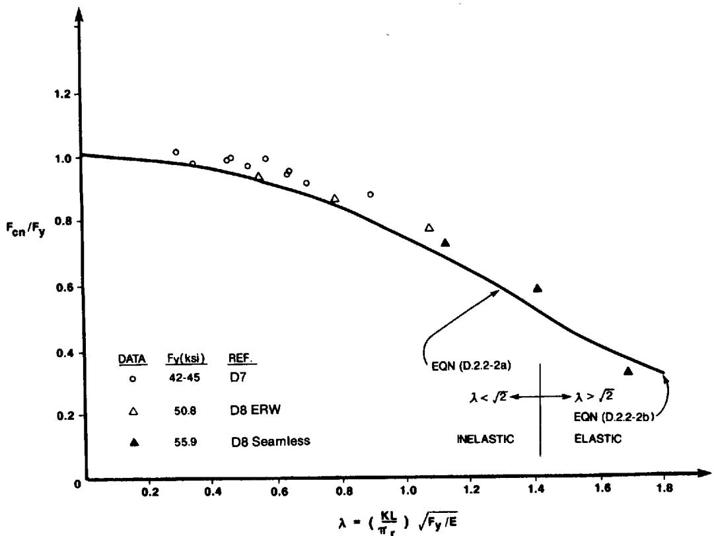  
FIG.COMM.D.2-1

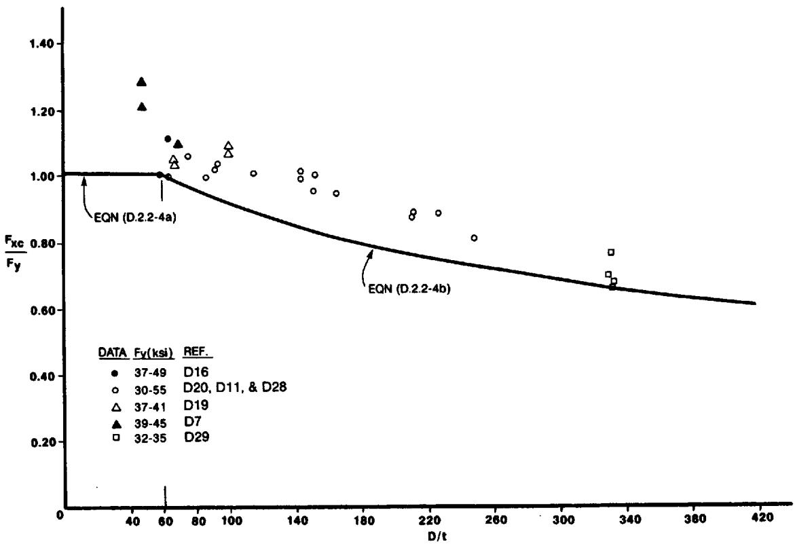  
COMPARISON OF TEST DATA WITH THE COLUMN BUCKLING   
DESIGN EQUATION FOR FABRICATED CYLINDERS UNDER AXIAL COMPRESSION   
FIG.COMM.D.2-2   
COMPARISON OF TEST DATA WITH THE LOCAL BUCKLING DESIGN EQUATION   
FOR FABRICATED CYLINDERS UNDER AXIAL COMPRESSION

by the Chen and Ross and the Bouwkamp test programs cited above. The resistance factor of 0.85 is identical to that used in the AISC-LRFD practice. For shapes other than circular tubes, the AISC Load and Resistance Factor Design Specification for Steel Buildings, latest edition, (Reference D3) should be used.

Interaction between local and column buckling modes can occur, particularly if the critical load for local buckling is similar to the critical load for column buckling. Such interaction has been shown to be more pronounced with sections that are not torsionally stiff. Since cylindrical members are torsionally stiff, this interaction should be less of a problem than with many "open shapes" that have little torsional rigidity. Reference D5, Chapter 4, states that this conclusion is based on the small-deflection theory of plate buckling and the fact that, for most structural columns fabricated from plates or shapes, the lengths between nodes for column and local buckling are decidedly different. However, cylindrical column tests carried out at the University of Illinois in the 1930s for relatively high D/t ratios have indicated a noticeable interaction between local and column buckling. Because of such uncertainties, due to the significant loss of capacity that cylindrical shapes often incur with the onset of local buckling, and due to the fact that the interaction of buckling modes is complex and not fully understood, API has taken a conservative approach to such interaction in the past. This approach, as suggested by Marshall (Reference D10), involves substituting the local buckling strength for the yield strength, $\mathbf{F}_{\mathrm{y}}$ , in the appropriate column formula. Pending a more definitive understanding of the interaction phenomenon in circular cylinders through further research, this API-LRFD practice will continue using the approach suggested by Marshall.

Comm. D.2.2.2 Local Buckling Short cylindrical members under axial compression will fail either by material yield or local buckling depending on the diameter-to-thickness （$\mathrm{D} / \mathrm{t})$ ratio. Cylindrical shells for low D/t ratios are generally not subject to local buckling under axial compression and can be designed on the basis of material failure, i.e., the local buckling stress may be considered equal to the yield stress. However, as the D/t ratio increases, the shell must be checked for local buckling.

Unstiffened thin-wall cylinders under axial compression and bending are prone to sudden failures at loads well below theoretical buckling loads predicted by classical small-deflection shell theory. There is a sudden drop in load-carrying capacity upon buckling. The post-buckling reserve strength of cylindrical members is small, in contrast to the post-buckling behavior of flat plates in compression, which continue to carry substantial load after buckling. For this reason, there is a need for more conservativeness in the definition of buckling load for cylinders than for most other structural elements. This is made difficult by the large scatter in test data, and necessitates a relatively conservative design procedure. The large scatter in test data is considered

to be the result of initial imperfections caused by fabrication tolerances and procedures. In addition to geometric imperfections, experimental and theoretical evidence has shown that the buckling load is also affected by boundary conditions and residual stresses built-in may hasten the buckling process.

Some recent experimental evidence indicates that inelastic local buckling may be less sensitive to initial imperfections and residual stresses than elastic local buckling (Reference D11).

The local buckling data base consists of about 52 tests performed by seven different investigators as described in Reference D6. The statistical treatment of these data that led to better understanding of nominal resistance and specification of resistance factor in Section D.2.2. The nominal strength equations are separated so that one applies in the elastic range Equation D.2.2-3 and the other applies in the inelastic range Equation D.2.2-4a, 4b. Cylindrical members used in offshore structures will normally fall into the inelastic range.

The test data and the nominal inelastic local buckling strength equation, Equations D.2.2-4a, -4b, are plotted in Figure Comm. D.2-2. This equation coupled with a resistance factor of 0.85 results in safety indices that meet or exceed the target value of 2.8 over the practical range of D/t ratios. Using the same resistance factor (0.85) for both the nominal local and column buckling equations allows one to substitute the local buckling strength into the column equation in order to capture the effect of interaction of the local and column buckling modes as described above.

The elastic local buckling stress formula recommended in Equation D.2.2-3 represents one-half the theoretical local buckling stress computed using classical small-deflection theory. This reduction accounts for the detrimental effect of geometric imperfections. Based on the test data shown in Figure Comm. D.2-2, it is considered to be conservative for cylinders with $t \geq 6$ mm ( $\frac{1}{4}$ in.) and $\mathrm{D} / \mathrm{t} < 300$ . Offshore platform members typically fall within these dimensional limits. For thinner cylinders and cylinders with higher $\mathrm{D} / \mathrm{t}$ ratios, larger imperfection reduction factors may be required.

The local buckling data base limits the applicability of the nominal strength equations to $\mathrm{D} / \mathrm{t} < 300$ and $\mathrm{t} \geq 6\mathrm{mm}$ (\% in.). API Bulletin 2U, Reference D1, provides guidance for the design of tubular members beyond these dimensional limits using an allowable stress design approach. The Bulletin 2U equations have not been statistically evaluated to find a corresponding resistance factor and safety index compatible with the LRFD approach. In lieu of such a statistical evaluation, a resistance factor of 0.85 may be used with the nominal equations given in API Bulletin 2U.

Comm. D.2.3 Bending. The ultimate bending moment capacity of fabricated circular cylinders, normalized with respect to yield moment capacity （$\mathbf{M}_{\mathrm{u}} / \mathbf{M}_{\mathrm{y}})$ is illustrated in Figure Comm. D.2-3. The data used in the

figure is from Sherman (Reference D12) and Stephens, et al. (Reference D13), and illustrate that at low $\mathbf{F_y}$ D/t ratios the ultimate moment capacities often substantially exceed the theoretical plastic moment capacities due to material strain hardening.

Although substantial scatter of the test data is observed, simply supported beam tests have smaller moment capacities than the fixed end beam tests. Similarly, a reduction in moment capacity is observed with the reduction in support rigidity. However, the end condition has little influence on the rotational capacity of the cylinder. At low $\mathbf{F}_{\mathbf{y}}$ D/t the plastic hinge mechanism forms over a short length of the cylinder. As the end support rigidity is reduced, the hinge mechanism forms over a longer segment of the cylinder. As $\mathbf{F}_{\mathbf{y}}$ D/t for the cylindrical shell increase, both the moment and rotational capacities decrease.

To define the behavior of a cylindrical shell accurately, the behavior of the cylinder subjected to bending is grouped into three regions:

I) High rotational capacity - ductile failure mode, exhibiting very gradual load decay.   
II) Intermediate rotational capacity - semiductile failure mode, exhibiting still gradual load decay.   
III) Low rotational capacity - little post-yield ductility, exhibiting susceptibility to local buckling and rapid load decay.

The recommended formulations defining the nominal bending strengths were calibrated to develop ultimate

moment capacities that reflect the test results. Since the strain hardening varies from one steel to another, the formulations defined are also restricted so that the ultimate moment capacities do not exceed theoretical plastic moment capacities. Thus, Region I, extending up to $\mathbf{F}_{\mathrm{y}}$ D/t equal to 10,340 MPa (1500 ksi) allows for development of the full plastic moment capacity. The full plastic moment capacity is linearly reduced to $10\%$ in excess of the yield moment capacity (i.e., $\mathbf{M_u} / \mathbf{M_y} = 1.10$ ) at $\mathbf{F}_{\mathrm{y}}$ D/t equal to 20,680 MPa (3000 ksi), representing a transition between Regions I and III. Since very few data points are available in Region III, the recommended formulation defining this region is intentionally made somewhat conservative.

The experimental results, particularly those in Region III, indicate local buckling mode shapes on the compressive side of the specimens similar to those indicated in equivalent specimens tested under axial compressive loads. However, the extreme fiber bending stresses under the failure bending moments are significantly higher than the local buckling stresses for the equivalent specimens under axial compressive loads in the practical ranges of D/t ratios commonly found in typical offshore structures. These characteristics are reflected in Figure Comm. D.2-3. The failure bending stresses approach the local buckling stresses at large D/t ratios such as 300, when the stresses are elastic. It is logical to anticipate that the buckling mode shapes for such large D/t ratios are likely to be of multiple wave length, such that the extreme fiber stresses due to bending moments over a one-half wave length are similar to those due to axial compressive loads.

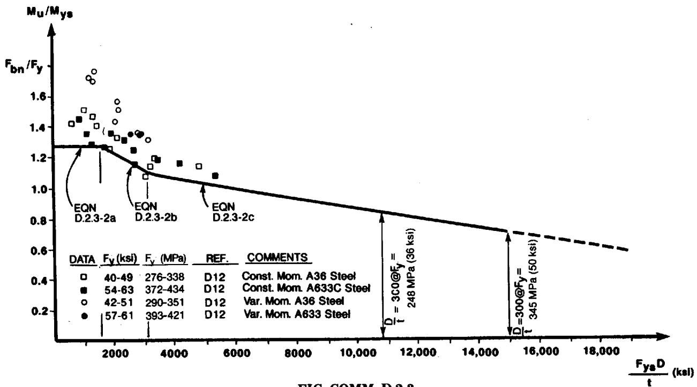  
FIG.COMM.D.2-3 COMPARISON OF TEST DATA WITH BENDING DESIGN EQUATION FOR FABRICATED CYLINDERS SUBJECTED TO BENDING

The API RP2A working stress design (WSD) (Reference D4) and the present LRFD formulations are both based on the same relationship defining ultimate moment capacity normalized with respect to yield moment capacity （$\mathbf{M}_{\mathrm{u}} / \mathbf{M}_{\mathrm{y}})$ . The LRFD nominal bending stress formulation defines the full plastic capacity of a cylindrical section in Region I, while the WSD formulation for allowable bending stress multiplied by the safety factor (1.67) yields slightly less than the full plastic capacity (27.3% above yield vs. 25% above yield).

The nominal bending stress formulations coupled with a resistance factor, $\phi_{\mathrm{b}}$ , result in relatively uniform implied safety indices. A $\phi_{\mathrm{b}}$ of 0.95 will provide satisfactory target indices exceeding 2.7 over the practical range of $\mathbf{F}_{\mathbf{y}}\mathbf{D} / \mathbf{t}$ .

The utilization of bending stress formulations instead of bending moment formulations such as those in the AISC LRFD Specifications (Reference D3) is intended to maintain the merits of the traditional system, such as the AISC Specifications (Working Stress Method, Reference D9). The stress formulations and the resulting design stresses provide more informative values to designers in their evaluation and design processes than the member loads such as bending moments or axial loads. The upper limits of member ultimate stresses in most failure modes are well understood to be the yielding of the material. The reserves in a specific member can be appreciated in an approximate manner in terms of member stress and the yield strength, although a more thorough examination of elastic buckling and inelastic yielding strengths are required for a design decision. The appreciation of the approximate reserves by assessing member stresses provides designers an advantage by which, together with interaction ratios, they can evaluate both elastic buckling and inelastic yielding conditions. The member load formulations provide designers the information regarding the reserves against the lower of the above two strength parameters, but, in most cases, the designers would have no knowledge of how close the member loads are to yielding the material.

Since the LRFD nominal bending strength exceeds the elastic yield moment for low D/t ratios, the bending stress, as calculated by M/S, is in fact an equivalent elastic bending stress, when M exceeds $\mathbf{M_y}$ . The equivalent elastic bending stress does not reflect the actual bending stress distribution across the cross section under this condition. However, it provides a convenient term for design purposes. Other alternatives, such as a coefficient to indicate mobilization of the inelastic portion of the bending strength may be introduced to supplement the traditional design parameters.

Comm. D.2.5 Hydrostatic Pressure

Comm. D.2.5.1 Design Hydrostatic Head. The load factors for determining the hydrostatic pressure to use in checking the adequacy of the design are 1) 1.3 for the functional load case (e.g., pressures that will definitely be encountered during the installation or life of

the structure) and 2) 1.1 for the case where interaction with storm loads is considered.

Comm. D.2.5.2 Hoop Buckling. The introduction of LRFD provided an opportunity to review hydrostatic buckling test data used to develop provisions in RP2A-WSD. In addition, recent test programs sponsored by API and others have provided more test data relevant to platform tubulars. Test results are reported (References D14-17) cover the range of D/t, L/D, and $\mathbf{F_y}$ applicable to the cylindrical members of typical fixed platforms.

Since hydrostatic buckling is a potentially severe failure mode, safety indices were set at the upper end of the range determined from calibration with WSD, namely, above 3.0 for the functional load case. A careful review of the scatter, namely, that from tests (9.5-11.3%), fabrication (5%), elastic modulus (6%), and material (8%) yielded values of overall COV of 10-15%, depending on the value of $\mathbf{F_{he}} / \mathbf{F_y}$ . A bias due to material yield and test was also present. This information is described in detail in the final report of PRAC 85-22. Together, these data and an assumed load COV of 5% produced that exceeded the target value for the full range of $\mathbf{F_{he}} / \mathbf{F_y}$ .

A similar evaluation for WSD, using the equations in RP2A-WSD for strength with the associated safety factors, produced much higher safety margins even including the one-third increase in allowable. The main reason is that the checking equations in RP2A-WSD are based on conservative lower bound to the available test data (which did not include some of the recent test data).

The form of the relationship for the critical hoop buckling stress, $\mathbf{F}_{\mathrm{hc}}$ in Equation D.2.5-2 is similar to that in RP2A-WSD. That is, $\mathbf{F}_{\mathrm{hc}}$ is dependent on the elastic hoop buckling stress, $\mathbf{F}_{\mathrm{he}}$ , which is a function of the geometrical parameters, D/t and M.

Equation D.2.5-4b is a "mean" equation and was formulated by regression analysis to fit the test data. Note that Equation D.2.5-4a is compatible with the equations given in the final report of PRAC 86-55 (Reference D6), but rewritten into RP2A-WSD format. Figure Comm. D.2-4 shows the comparison for the ultimate and allowable strengths between the recommended and RP2A-WSD equations.

The reformatted equations for $C_h$ given in the final report of PRAC 86-55 give very similar $C_h$ values when compared with those equations in RP2A-WSD. Hence, the RP2A-WSD equations defining $C_h$ are adopted here because of a familiarity of designers to the equations.

Comm. D.2.5.3 Ring Stiffener Design. The formula given for determining the moment of inertia of stiffening rings, Equation D.2.5-6, provides sufficient strength to resist buckling of the ring and shell even after the shell has buckled between stiffeners. It is assumed that the shell offers no support after buckling and transfers all its load to the effective stiffener section. The stif

fener ring is designed as an isolated ring that buckles into two waves （$n = 2)$ at a collapse pressure 20 percent higher than the strength of the shell.

Comm. D.2.5.4 Geometric Imperfections. Equation D.2.5-5 for determining the elastic hoop buckling strength, $\mathbf{F}_{\mathrm{he}}$ , of the cylindrical member represents 80% of the theoretical hoop buckling strength obtained using small-deflection classical theory. The implied 20% reduction accounts for the effect of geometric imperfections due to fabrication. All of the available data indicate that the reduction is reasonably conservative for cylinders fabricated within the API Spec 2B out-of-roundness tolerances, Reference D2.

For cylinders with out-of-roundness values greater than the maximum allowable in API Spec 2B less than $3\%$ , the elastic hoop buckling test results suggest that it is necessary to reduce $\mathbf{F}_{\mathrm{he}}$ , as defined in Equation D.2.5-5. One method for the reduction of $\mathbf{F}_{\mathrm{he}}$ is given by:

Reduced

$$\mathbf{F}_{\mathrm{h e}} = \alpha \mathbf{F}_{\mathrm{h e}} / 0. 8 \dots \dots \dots \dots \dots \dots \dots \dots \dots \dots \dots \dots \dots \dots \dots \dots \dots \dots \dots \dots \dots \dots \dots \dots \dots \dots \dots \dots \dots \dots \dots \dots \dots \tag{Comm.D.2.5-1a}$$

in which geometric imperfection factor $\alpha$ is given by:

$$\alpha = 1. 0 - 0. 2 \sqrt{\frac{D_{\max} - D_{\min}}{0 . 01 D_{\mathrm{n o m}}}} \dots \dots \text{C o m m . D}. 2. 5 - 1 b$$

where

$$\frac{\mathrm{D}_{\max } - \mathrm{D}_{\min }}{0 . 01 \mathrm{D}_{\text{n o m}}} = \text{o u t - o f - r o u n d n e s s (e)}$$

Figure Comm. D.2-4 shows the comparison for the ultimate strength between the LRFD and RP2A-WSD equations. The test data plotted in the figure are those reported in Reference D6. The reduction of $\mathbf{F}_{\mathrm{he}}$ given by Equation Comm. D.2.5-1 was not carried out in plotting the test data on Figure Comm. D.2-4. The test data would shift slightly to the right if the reduction has been made. However, this shift in the test data will have negligible impact on Equations D.2.5-4 for the critical hoop buckling strength, $\mathbf{F}_{\mathrm{hc}}$ .

COMM. D.3 CYLINDRICAL MEMBERS UNDER COMBINED LOADS. This section of the commentary describes the background of the design recommendation

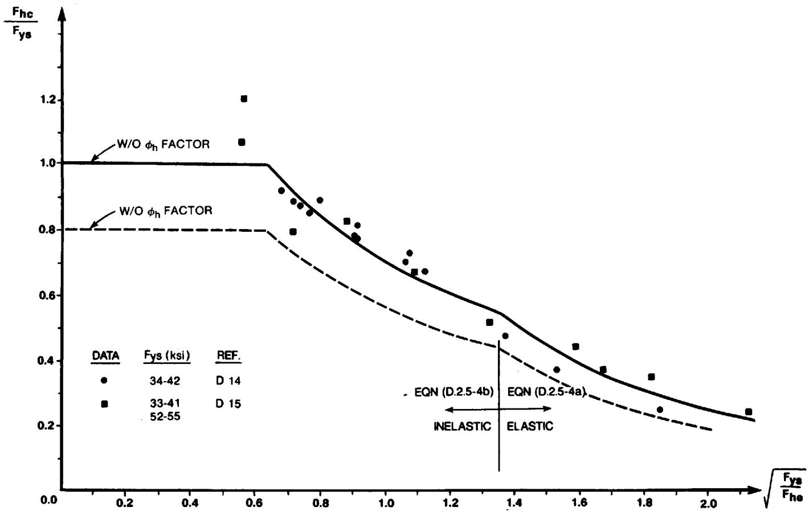  
FIG.COMM.D.2-4 COMPARISON OF TEST DATA WITH HOOP BUCKLING DESIGN EQUATIONS FOR FABRICATED CYLINDERS UNDER HYDROSTATIC COMPRESSION

tions in Section D.3, which covers unstiffened and ringstiffened cylindrical shell instability mode interactions when subjected to combined axial, bending, and external pressure loads. While Sections D.3.1 and D.3.2 discuss global interaction of axial and bending loads, Sections D.3.3 and D.3.4 cover local interaction of axial, bending and hydrostatic external pressure loads.

Due to limited test data on high external pressure loads, there are uncertainties on local and global interaction. Thus, possible degradation of member axial load carrying capacity due to high external pressures cannot be defined. Considering the design and installation of platforms in deep water.

Comm. D.3.1 Combined Axial Tension and Bending. This section provides a strength check for components under combined axial tensile load and bending. The interaction equation is of the "cosine form" which is similar for the axial compression and bending case except that $\phi_{\mathrm{t}}$ is used with the axial tension case instead of $\phi_{\mathrm{c}}$ with the axial compression case. Note that if the bending stress is larger than the axial tensile stress, then the local buckling effect due to bending (compression side) should be properly considered in the bending strength （$\mathbf{F}_{\mathrm{bn}})$ in Equation D.3.1-1.

Due to the cosine term, be sure to use the largest interaction ratio from Equations D.2.1-1 and D.3.1-1.

Comm. D.3.2 Combined Axial Compression and Bending. This section provides an overall beam-column stability check, Equation D.3.2-1, and strength check, Equation D.3.2-2, for components under combined axial load and bending.

Equation D.3.2-1 maintains the present AISC-WSD beam column stability interaction equation (Reference D9). This equation is conservative with respect to small scale tubular member tests and analyses of larger sections performed with assumed imperfections and residual stresses. As data accumulates on this subject, a reliability calibration of the form of this interaction may be appropriate.

Equation D.3.2-2, the interaction equation for a strength check, is of the "cosine form" which fits this type of phenomenon and exists in RP2A-WSD (Reference D4) in both the overload check on piles and the interaction equation for tubular connections. Equation D.3.2-2 is identically equivalent to an "arc sine" form but is preferred to avoid computer errors when the argument of the arc sine exceeds 1.0. It should be noted in comparison that the cosine form (or arc sine) may be up to $10\%$ less conservative than the linear interaction form. Thus, comparisons of members with significant bending and axial contributions may show lower interaction ratios. This is a consequence of the more accurate interaction equation rather than the load or resistance factors themselves. The influence of $\mathrm{D} / \mathrm{t}$ on the strength interaction equation is contained in both $\mathbf{F}_{\mathbf{x}\mathbf{c}}$ ,in Equation

D.2.2-4b and $\mathbf{F}_{\mathrm{bn}}$ , which contains D/t in Equation D.2.3-2a, -2b, and -2c.

Equation D.3.2-2 should be used for the design of pile segments below the mudline. However, for the analysis of laterally loaded piles, with significant axial loads, the secondary moments or $\mathbf{P} - \Delta$ effects should be considered in the stress computations for $\mathbf{f}_{\mathrm{by}}$ and $\mathbf{f}_{\mathrm{bz}}$ in Equation D.3.2-2.

The recommendations for the slenderness ratio, $\mathrm{Kl} / \mathbf{r}$ and the reduction factor $C_{\mathrm{m}}$ for tubular members under axial compressive loads are identical to existing RP2A-WSD provisions. Since the slenderness ratio is usually found to be conservative using existing provisions, when a more accurate analysis is used to calculate member effective lengths, consideration should be given to reducing the compression resistance factor $\phi_{\mathrm{c}}$ especially in the range of $\lambda$ above 1.0.

Comm. D.3.3 Combined Axial Tension, Bending and Hydrostatic Pressure. For members with the critical hoop buckling stress, $\mathbf{F}_{\mathrm{hc}}$ , approaching the yield stress, $\mathbf{F}_{\mathrm{y}}$ , Equation D.3.3-1 reduces to the Beltrami-Haigh yield equation for biaxial stress condition, which is based on the maximum strain energy theory. The form of the Beltrami-Haigh equation was first adopted in the 12th edition of RP2A (1981) with $\mathbf{F}_{\mathrm{hc}}$ replacing $\mathbf{F}_{\mathrm{y}}$ in the hoop compression term to account for interaction between hoop buckling and axial tension. The modified Beltrami-Haigh equation was found to agree reasonably well with all of the available test data at that time, which were for small diameter and low D/t ratios.

In 1980 and 1981, an extensive test program on large diameter, fabricated tubular members was conducted to generate test data for the verification of the modified Beltrami-Haigh equation. The test data are well documented in Reference D15. References D15 and D21 concluded that the modified Beltrami-Haigh equation is also reasonably conservative with respect to the fabricated tubular test data and its use was maintained in the RP2A, Reference D4.

For the elastic condition, it has been theoretically shown in Reference D22 that axial tension has no effect on the hoop buckling strength. That is, there is no interaction between axial tension and hoop compression for pure elastic behavior. However, the modified Beltrami-Haigh equation predicts interaction even at elastic conditions. So, further modifications to the modified Beltrami-Haigh equation were developed to remove this unnecessary conservatism by introducing the $\eta$ factor in Equation D.3.3-1. The use of the $\eta$ factor results in a family of interaction curves representing different ultimate behavior of members with different failure-yield stress ratios. The predicted ultimate behavior agrees with test data for fabricated tubular members, as discussed below, and also for casing members (Reference D23).

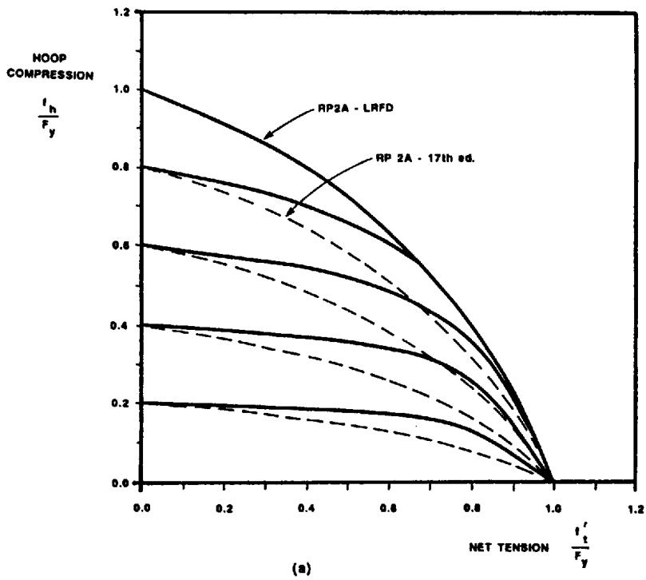

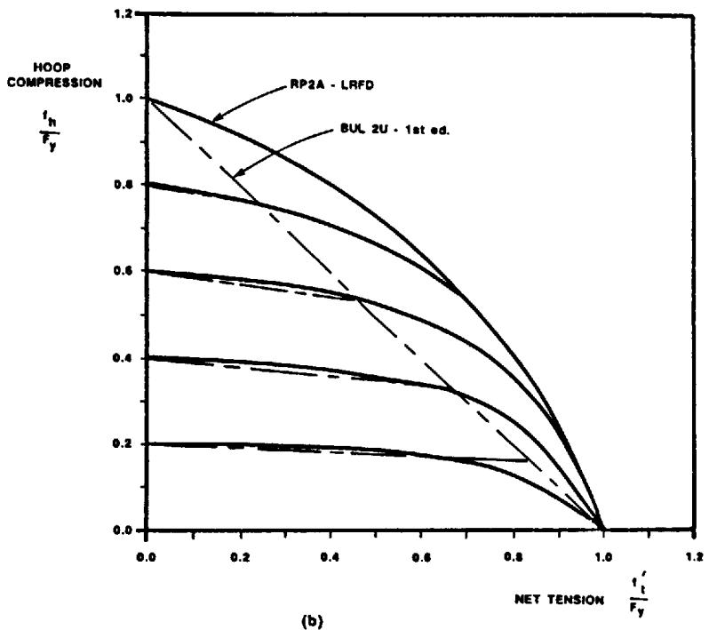  
FIG.COMM.D.3-1   
COMPARISON OF RP2A-LRFD, RP2A, AND BUL 2U DESIGN EQUATIONS   
FOR COMBINED AXIAL TENSION AND HOOP COMPRESSION   
(Without Safety and Resistance Factors)

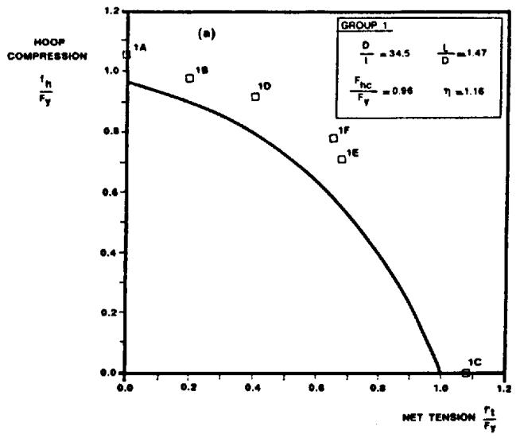

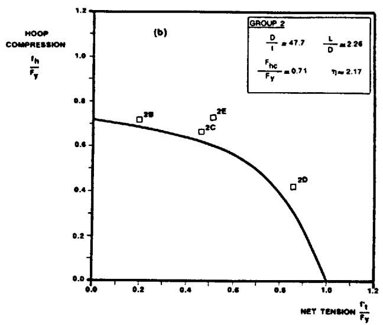

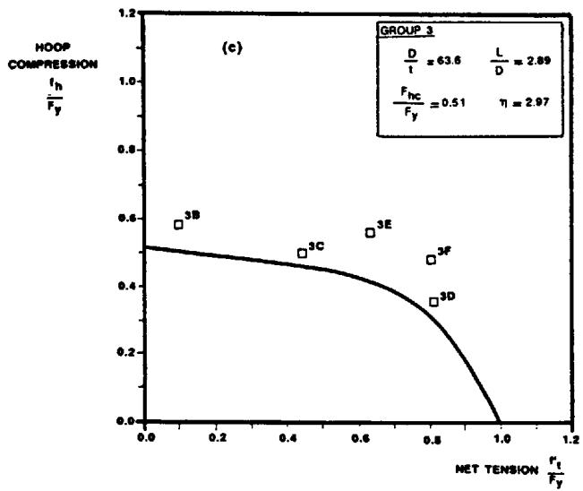

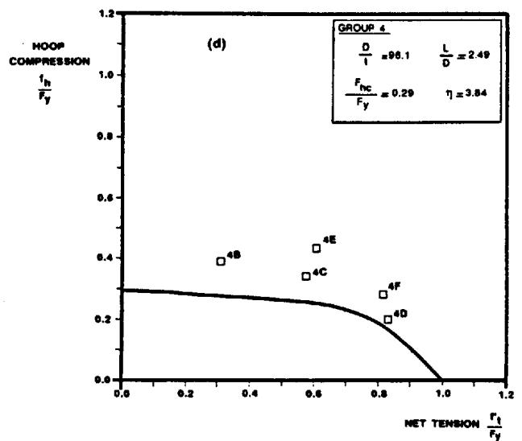

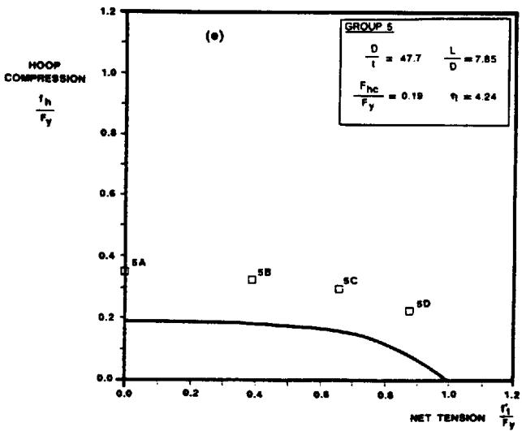  
FIG.COMM.D.3-2   
COMPARISON OF RP2A-LRFD DESIGN EQUATION WITH   
TEST DATA FOR COMBINED AXIAL TENSION AND HOOP COMPRESSION   
(Without Safety and Resistance Factors)

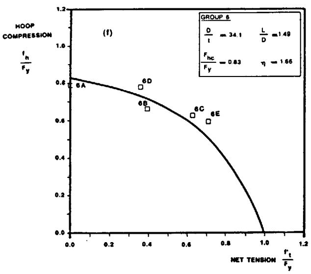

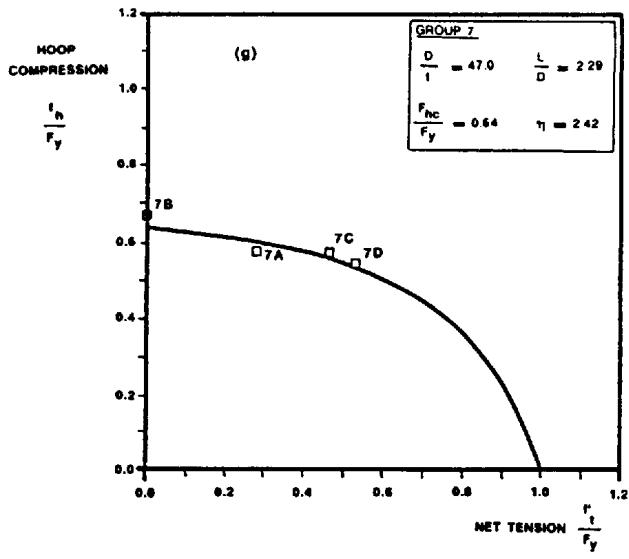

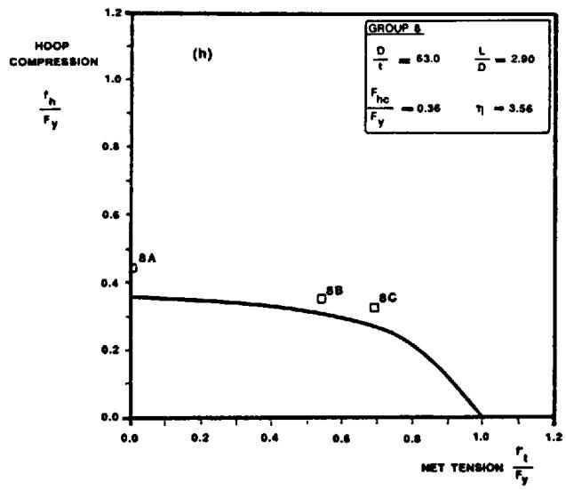

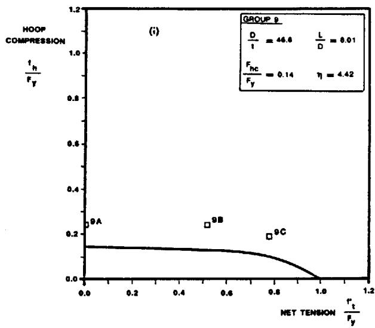

Figures Comm. D.3-1a and Comm. D.3-1b compare Equation D.3.3-1 with those in RP2A-WSD (Reference D4) and API BUL 2U (Reference D1), respectively. Safety and resistance factors have been excluded. Note that the ordinate is in terms of $\mathbf{f_h} / \mathbf{F_y}$ instead of $\mathbf{f_h} / \mathbf{F_{hc}}$ . Elastic hoop buckling is predicted when $\mathbf{f_h} / \mathbf{F_y} \leq 0.55$ , as stipulated in Equation D.2.5-4b. For zero net axial tension, all three equations give the same critical hoop buckling stress. For nonzero tension, Equation D.3.3-1 is generally less conservative than both RP2A-WSD and BUL 2U to describe the outer yield envelope. For the elastic condition, Equation D.3.3-1 agrees with the classical theory in that there is no axial tension-hoop compression interaction. Note that for tension greater than the proportional limit, but less than the yield stress, the elastic condition is no longer satisfied and interaction should be predicted.

Figures Comm. D.3-2a through Comm. D.3-2i illustrate the comparison of Equation D.3.3-1 with the fabricated test data reported in Reference D15. In normalizing the test ultimate loads, the measured static longitudinal and hoop tensile yield stresses were used; Reference D15 used the dynamic values. In plotting the predicted curve (solid line), the average value of the $\mathbf{F_{hc}} / \mathbf{F_y}$ ratios for each test group was used, and $\mathbf{F_{hc}}$ was calculated using measured dimensions, static $\mathbf{F_y}$ , and Equation D.2.5-4. The out-of-roundness correction, as specified in Comm. D.2.5 for specimens that have out-of-roundness greater than the maximum API allowable of $1\%$ , was used in determining $\mathbf{F_{hc}}$ . For all predicted curves, the resistance factors, $\phi_h$ and $\phi_t$ , have been omitted because there is no uncertainty in material and geometric properties for the test specimens.

In Figure Comm. D.3-2b, test 2E has higher test ultimate strength than the other tests in this group. The measured yield stresses for this group were similar. However, the out-of-roundness for specimen E was much smaller than those of the other specimens, which were greater than the maximum API allowable of $1\%$ Reference D2. The predicted curve for test 2E will be higher than the average curve shown in Figure Comm. D.3-2b since $\mathbf{F}_{\mathrm{hc}}$ will be higher due to lower or no correction for out-of-roundness effect. Similar results are observed in Figures Comm. D.3-2c and -2d for test groups 3 and 4.

At first glance, it may appear that the predicted critical hoop buckling strength, $\mathbf{F}_{\mathrm{hc}}$ (zero axial tension), is quite conservative for elastic hoop buckling condition (Figures Comm. D.3-2e and -2i). However, the predicted curve will agree with the data if the ordinate, $\mathbf{F}_{\mathrm{hc}}$ , is accurately predicted. The conservatism can be traced to the length and D/t effects. It is not now clear how Equation D.2.5.5 (elastic hoop buckling strength) could be revised to account for more precise effect of length and D/t such that uniform reliability is realized

for the whole range of D/t ratio up to 300. More data are required.

All of the test data in Figures Comm. D.3-2 were from specimens loaded by combined axial tension and hoop compression with no bending moment. For design, the resultant bending stress acting on a member is taken as an equivalent tensile stress. This is a conservative approach, especially for small to moderate D/t ratios. Note that at the limit when there is no axial tension or external pressure, the predicted allowable bending stress is $\phi_{\mathrm{t}}\mathbf{F}_{\mathrm{y}}$ instead of $\phi_{\mathrm{b}}\mathbf{F}_{\mathrm{bn}}$ . For members subject to very high bending, other approaches (finite element analysis, pertinent test data, etc.) may be used to eliminate the unnecessary conservatism.

Comm. D.3.4 Combined Axial Compression, Bending and Hydrostatic Pressure. As stated in the introduction to Section D.3 of this commentary, the interaction relationship among axial compression, bending, and hydrostatic pressure is local. The combination of hydrostatic pressure and axial load may produce a different critical buckling stress than either of these load systems acting independently. In checking the member for column buckling and hydrostatic pressure by Equation D.3.2-1, the hydrostatic pressure contribution to axial stress is omitted simply to recognize that capped end tubular columns under hydrostatic pressure do not fail in a column buckling mode. Figure Comm. D.3-3 illustrates the recommended interaction equations for various possible stress conditions. These interaction equations imply that no interaction occurs if the axial stress is less than one-half the allowable hoop stress.

The recommended interaction equations have been checked against the results of available tests and found to give conservative results, as shown in Figures Comm. D.3-4, D.3-5 and D.3-6. Figure Comm. D.3-4 shows the results of elastic buckling tests on mylar, plexiglass, and fabricated steel cylinders, while Figure Comm. D.3-5 shows the results of fabricated steel cylinders alone. In Figure Comm. D.3-5 the test results are compared with the recommended equation for elastic interaction, Equation D.3.4-1, using $\mathbf{F}_{\mathrm{xe}}$ and $\mathbf{F}_{\mathrm{he}}$ values determined from the tests. This comparison validates the form of Equation D.3.4-1. In Figure Comm. D.3-5 the fabricated steel cylinder test results are compared with Equation D.3.4-1, using $\mathbf{F}_{\mathrm{xe}}$ and $\mathbf{F}_{\mathrm{he}}$ values computed from the design equations in Section D.2. This confirms that Equation D.3.4-1 is conservative. In Figure Comm. D.3-6, the recommended interaction equations are compared with the results of test data for unstiffened steel pipe with an elastic hydrostatic buckling stress and an inelastic axial buckling stress. This comparison demonstrates the validity of the recommended interaction equations for combined elastic and inelastic behavior.

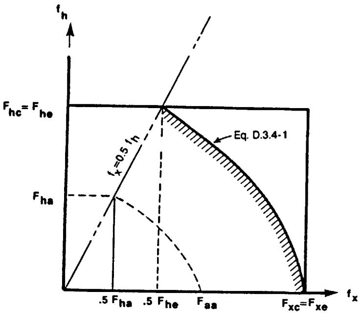  
(a) ELASTIC BUCKLING

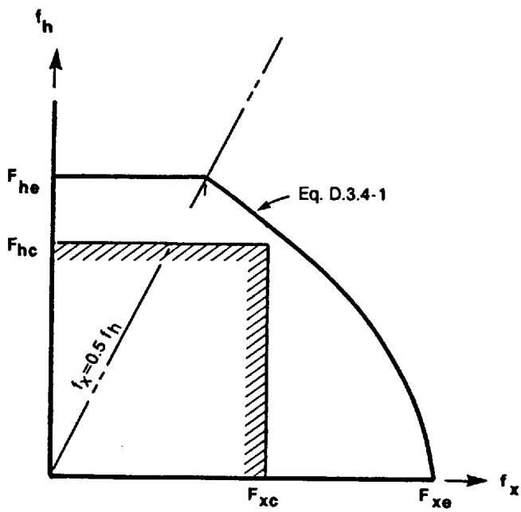  
(b)YIELD TYPE FAILURE

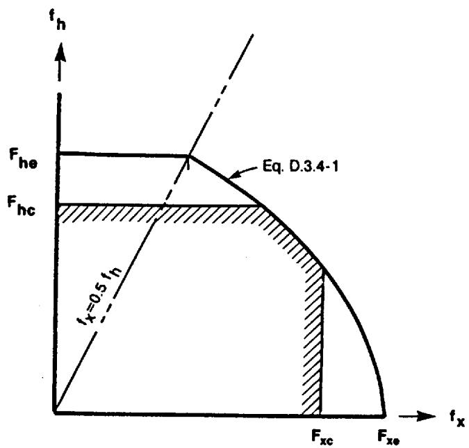  
(c) ELASTIC AND YIELD TYPE COMBINED   
FIG.COMM.D.3-3   
COMPARISON OF INTERACTION EQUATIONS FOR VARIOUS STRESS CONDITIONS   
FOR CYLINDERS UNDER COMBINED AXIAL COMPRESSIVE LOAD AND   
HYDROSTATIC PRESSURE

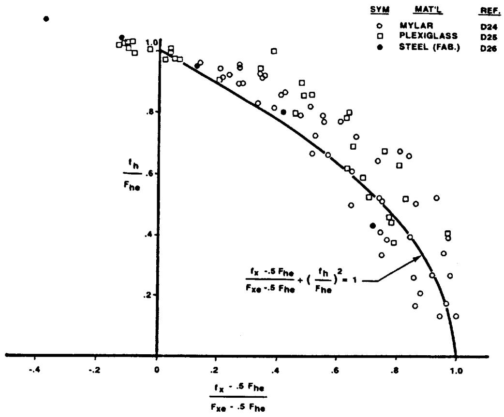  
FIG.COMM.D.3-4 COMPARISON OF TEST DATA WITH ELASTIC INTERACTION CURVE FOR CYLINDERS UNDER COMBINED AXIAL COMPRESSIVE LOAD AND HYDROSTATIC PRESSURE （$\mathbf{F}_{\mathrm{xe}}$ and $\mathbf{F}_{\mathrm{he}}$ Are Determined From Tests)

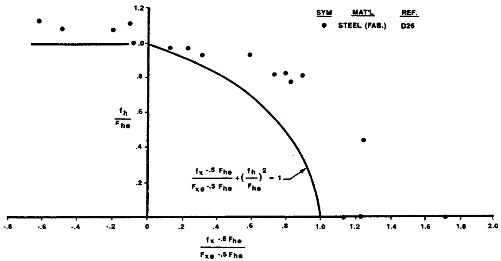  
FIG.COMM.D.3-5   
COMPARISON OF TEST DATA ON FABRICATED CYLINDERS WITH ELASTIC   
INTERACTION CURVE FOR CYLINDERS UNDER COMBINED AXIAL LOAD AND   
HYDROSTATIC PRESSURE

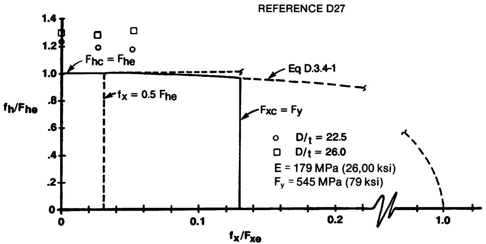  
（$\mathbf{F}_{\mathbf{x}\mathbf{e}}$ and $\mathbf{F_{he}}$ Are Determined From Recommended Design Equations)   
FIG.COMM.D.3-6   
COMPARISON OF TEST DATA WITH INTERACTION EQUATIONS FOR   
CYLINDERS UNDER COMBINED AXIAL COMPRESSIVE LOAD AND   
HYDROSTATIC PRESSURE   
(Combination Elastic and Yield Type Failures)

COMMENTARY E CONNECTIONS

COMM. E.1 CONNECTIONS OF TENSION AND COMPRESSION MEMBERS

The $50\%$ minimum capacity provision stems from the long-standing AISC requirement that was instituted for truss designs, Reference E2. The requirement originated in an age when fewer load cases were considered in the design stage and design tools were less sophisticated and thorough. Nevertheless, a minimum capacity provision is considered appropriate for contemporary offshore platforms in order to provide a safety net for collisions, dropped objects, and other unanticipated loads. The provision also ensures a minimum standard for connections of particular secondary members that take on primary importance in reserve strength assessments. However, the designer may judge the $50\%$ rule to be inappropriate in certain instances, such as the connections of some appurtenances.

The provision intends that the joint load from $50\%$ of the member strength (without safety factor) be compared to the ultimate joint capacity (also without safety factor). Hence, joints are made at least half as safe as the attached members. This requirement is in sharp contrast to the earthquake provision (C.4.4.1) in which the joints are required to have ultimate strength equal to $100\%$ of the member's effective strength.

Equation E.3-1 is introduced in order to simplify the minimum capacity check as well as reduce its dominance (Reference E3) for simple tubular joint designs. While the brace yield strength appears in the equation, the constants assume an average effective strength of $0.9\mathbf{F}_{\mathrm{yb}}$ , meaning a compromise between tension and compression cases. The constants also assume that the brace stress is $75\%$ axial, $19\%$ in-plane bending, and $6\%$ out-of-plane bending. Finally, the derivation includes a weighting of joint classifications between K, T/Y, and X.

The requirement of Equation E.3-1 has been compared to joint designs for the normal suite of loading conditions on four different platforms. For 107 joints where dominance of Equation E.3-1 was not considered appropriate, the average unity check for Equation E.3-1 was about 83 percent of the unity check for normal loads. This figure implies a lesser joint "can" thickness for the minimum capacity requirement, as expected.

COMM. E.3 TUBULAR JOINTS

Simple Joints. Early design requirements for the static strength of simple tubular joints were stated in terms of nominal punching shear stress (Reference E4). The 1973 version of RP2A (4th Edition) gave the punching shear capacity as:

$$\mathbf{v}_{\mathbf{p}} = \mathbf{Q}_{\beta} \mathbf{Q}_{\mathbf{f}} \frac{\mathbf{F}_{\mathbf{y}}}{0 . 9 \gamma^{0 . 7}} \dots \dots \dots \dots \dots \dots \dots \dots \dots \dots \dots \dots \dots \tag{Comm.E.3-1}$$

A later Welding Research Council comparison of the 1973 expression against an expanded data base prompted a major revision which first appeared in the 1977 version of RP2A (9th Edition):

$$\mathbf{v}_{\mathrm{p}} = \mathbf{Q}_{\mathrm{q}} \mathbf{Q}_{\mathrm{p}} \mathbf{Q}_{\mathrm{f}} \frac{\mathbf{F}_{\mathrm{y}}}{0 . 9 \gamma^{0 . 7}} \dots \dots \dots \dots \dots \dots \dots \dots \dots \dots \tag{Comm.E.3-2}$$

The $\mathbf{Q}_{\beta}$ factor had thereby evolved into a $\mathbf{Q}_{\mathbf{q}}$ table in order to differentiate among the performances of K joints (better), cross joints (worse, particularly at low $\beta$ ), and T joints (which dominated the original data base) (References E5, E6). Also, a $\mathbf{Q}_{\mathbf{p}}$ term was included to account for nonlinear interaction between brace axial and bending stress effects. The $\mathbf{Q}_{\mathbf{p}}$ expression was derived from plastic interaction of a tubular cross section, although its use was considered conservative relative to the analytical work in Reference E7.

The 1977 provisions remained virtually intact until the revisions to the 13th Edition (1982) were issued in 1983. New test data were available on load interaction effects on joint performance (Reference E8). Careful analysis of the background of Reference E8 revealed that its recommended linear interaction was misleading in that the data did not reflect inelastic behavior, as do the capacity data for individual brace loads. However, Figure Comm. E.3-1 shows that even with the data replotted, the $\mathbf{Q}_{\mathbf{p}}$ and $\mathbf{Q}_{\mathbf{q}}$ interpolation technique in RP2A was unconservative; separate interpolation of $\mathbf{Q}_{\mathbf{p}}$ and $\mathbf{Q}_{\mathbf{q}}$ for axial bending stresses led to an unanticipated synergism in the combined effect. As a temporary measure, it was decided to adopt the arcsin interaction rule which applies to tubular cross sections, appears elsewhere in RP2A, and was the original intent of the $\mathbf{Q}_{\mathbf{p}}$ expression.

While punching shear continues to be a useful concept, it rarely reflects the actual mode of failure at a joint. Localized stresses which limit the joint capacity are complex, involving variable shell bending and membrane stresses in addition to shear stress. The 15th Edition of RP2A addressed the shortcomings of the punching shear idea and included dramatic changes in the design criteria. These changes were based upon the work of Yura, et al., who performed additional large scale tests and screened the worldwide data base from which lower bound strength equations were developed (Reference E9). Unlike contemporary European practice, the equations were not rigorously established via statistical techniques, because in most instances, the data base was neither large enough to reliably represent a given joint type load condition nor indictive of the distribution of geometries found on real platforms. Also contrary to European practice, displacement and first crack failure limits were considered in addition to peak loads achieved in the test. This displacement condition should not be confused with a serviceability

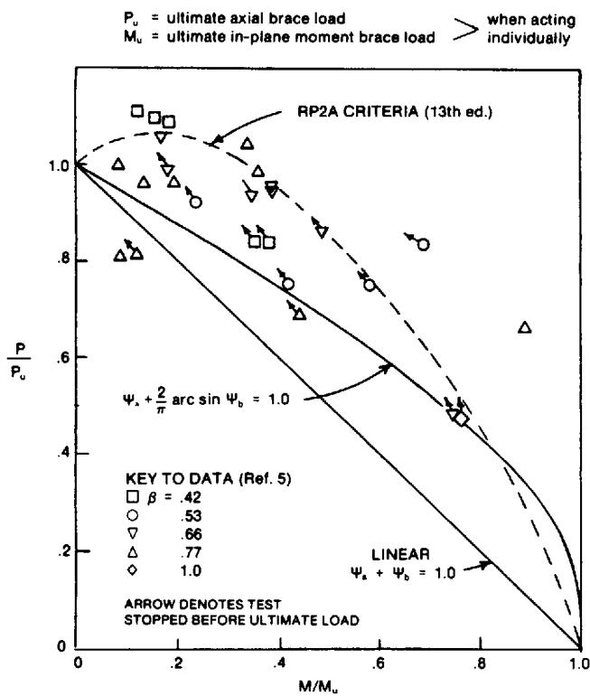  
FIG.COMM.E.3-1 BRACE LOAD INTERACTION EQUATIONS

limit. A governing displacement limit in the Yura context implies that the peak load capacity in the test would never be achieved in the actual structure during a sequence of events required for collapse.

The most salient feature of the Yura results was the expression of joint strength in terms of brace nominal load instead of punching shear stress. However, essentially equivalent criteria can be formulated in both formats. Because member checks are entirely in the form of strength criteria, the LRFD RP2A presents only the nominal load expressions and not the essentially equivalent punching stress form.

The equations incorporated in the 15th Edition of RP2A (Note that 14th Edition was withdrawn) differed from those proposed by Yura in only one aspect. The gap factor, $\mathbf{Q}_{\mathbf{g}}$ , for K joints was adjusted to ensure a lower bound was achieved. Figure Comm. E.3-2 shows a plot of the K data with the revised gap parameter expressions. With gap expressed in this manner, $\gamma$ has little additional effect on capacity.

The 15th Edition of RP2A also included an important change in the capacity factor, $\mathbf{Q}_{\mathrm{f}}$ , for the interactive effect of chord loads. Figure Comm. E.3-3 suggests that the historic $\mathbf{Q}_{\mathrm{f}}$ expression was unconservative for most $\gamma$ values encountered on steel jackets (Reference E10). The new $\mathbf{Q}_{\mathrm{f}}$ expression also reflected a reduced importance of chord bending stress relative to chord axial stress. The A term in LRFD is now an average of the factored stress at opposite sides of the chord (a sort of vector

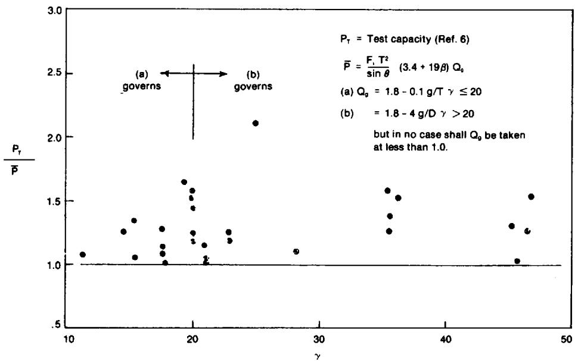  
FIG.COMM.E.3-2 VARIATION OF K JOINT AXIAL LOAD CAPACITY WITH CHORD FLEXIBILITY

sum), not a straight summation. The yield stress resistance factor in the denominator of A is maintained, implying that chord and branch loads may all increase by this factor beyond design levels before failure of the joint is reached. Using factored stresses in the numerator and a resistance factor in the denominator will produce similar $\mathbf{Q}_{\mathrm{f}}$ values for LRFD and WSD.

The 15th Edition of RP2A made a slight modification in joint safety factor from 1.8 to 1.7. This change was primarily justified on the basis of the average joint design by the 15th Edition being thereby closer to the average joint design by the 13th Edition Supplement.

The LRFD provisions maintain the identical nominal strength equations (Yura) introduced into the 13th Edi

tion Supplement. The resistance factors for connections were confirmed by two types of studies. One study was a direct comparison of interaction ratios between LRFD and the 15th Edition (Yura); and the second study compared the safety indices obtained with punching stress (13th Edition), Yura (15th Edition) and LRFD. There are several reasons for not relying solely on safety indices for calibrating connection resistance factors and achieving a common beta in this edition for all connections. (a) The Yura equations have not yet been proved by field performance history. Such performance is the basis for calibrating other member performance in LRFD. (b) There is a possibility as expressed in the 15th Edition Commentary that the Yura equations are still too conservative, even after reduction of safety fac

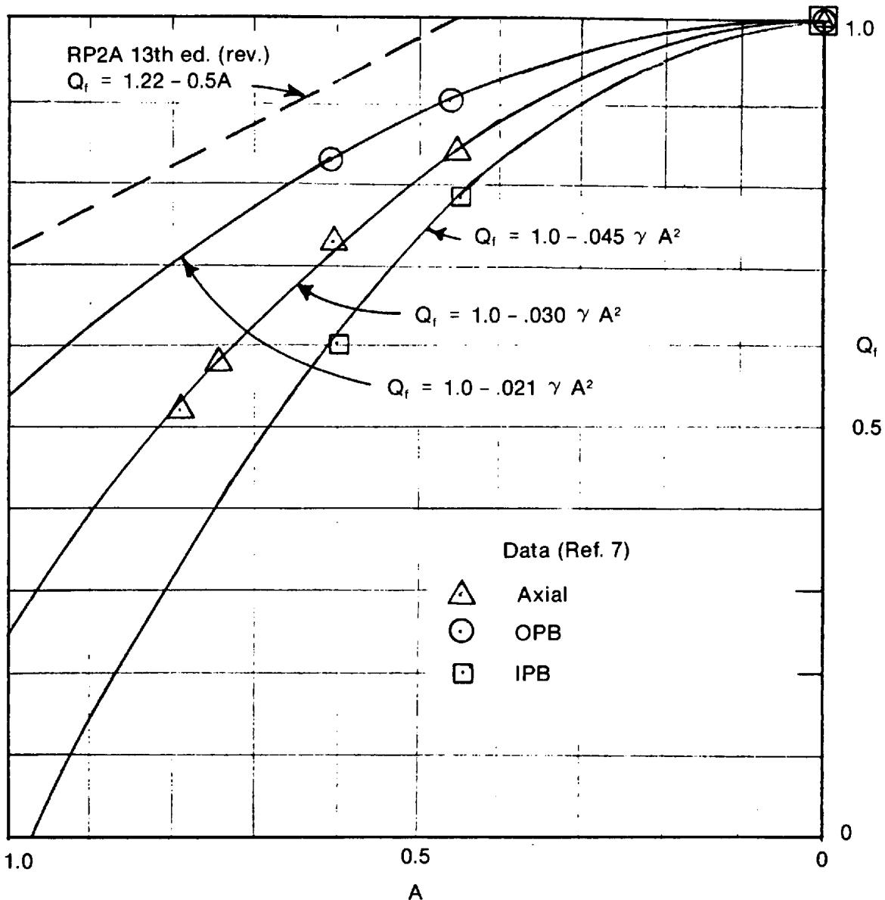  
FIG.COMM.E.3-3 CHORD STRESS REDUCTION EFFECTS FOR ALL BRANCH LOAD TYPES WITH SAFETY FACTOR REMOVED

tors from 1.8 to 1.7, and further reductions are possible. (c) Some of the test scatter in the Yura formulation is due to interpretations of failure in the test results rather than a true representation of uncertainty in ultimate strengths.

For the present calibration, betas were obtained for the 13th Edition (punching stress - WSD), 15th Edition (Yura - WSD), and LRFD (Yura). The data for the 13th Edition has a bias and coefficient of variation of 1.02 (17%), 1.08 (41%), 1.33 (27%), 1.79 (14%), and 1.71 (21%) for T, Y, and X compression, T, Y, X tension, K joint, in-plane bending, and out-of-plane bending, respectively. These data are taken directly from Reference E9, except that it also includes an additional bias of 1.10 and COV of 8% to reflect material yield stress variability. The data for the Yura strength formula (WSD or LRFD) has bias and COV values of 1.17 (11%), 1.55 (43%), 1.28 (19%), 1.35 (16%), and 1.29 (17%) for the same five connection categories. Except for the T, Y, X tension condition, the Yura equations have a lower COV than the punching shear indicating a better fit of the strength formula to test scatter. The exception for T, Y, X tension case, (43% - COV) is likely due to the definition of failure as first crack formation, which is hard to estimate in a test, and is probably not indicative of true ultimate strength variability. The average safety indices, ( $\beta$ ), for the three design formulas are:

AVERAGE BETA   

|  | T,Y,X | T,Y,X | T,Y,X | T,Y,X | T,Y,X |
| --- | --- | --- | --- | --- | --- |
|  | Compressiion | T,Y,X Tension | K Joints | In- Plane Bending | Out-of- Plane Bending |
| WSD-13th Edition | 1.90 | 1.31 | 2.26 | 3.61 | 3.17 |
| Yura-15th Edition | 2.33 | 1.85 | 2.30 | 2.59 | 2.40 |
| LRFD | 2.57 | 2.11 | 2.51 | 2.81 | 2.61 |

It can be seen that the spread in beta in the 13th Edition from 1.31 to 3.61 is very large and not conducive to consistent reliability-based design. The 15th Edition and LRFD are much more uniform and also close to each other. The LRFD average betas are similar for each joint type except for the tension case due to reasons cited above. Otherwise, the average betas are in the 2.50 - 2.80 range, typical of other steel component betas. Also, it is pointed out in the PRAC references that the spread in beta for each connection type with different environmental-to-gravity load ratios is smaller for LRFD than for the 15th Edition betas.

The resistance factor, $\phi_{\mathrm{j}}$ , chosen for LRFD to achieve the betas shown above was set as 0.90 for T, Y and cross joints in tension and 0.95 for all other cases. As more data accumulates from ongoing test programs, it is expected there will be further refinements of the resistance factors to produce even more consistent safety

indices among the various connection types. These safety indices may also be adjusted relative to member safety indices to achieve a proper balance between other steel components and their connections. These considerations involve economic and system aspects of reliability.

The resistance factors presented herein were also compared directly with the WSD format. Noting that the nominal strength equations are identical in the 15th Edition RP2A and the present RP2A-LRFD permits an easy comparison of interaction ratios for both formats. The basis for comparison is the ratio, R, of interaction ratios, I.R., for each format:

$$R = \frac{I . R . (L R F D)}{I . R . (W S D)} \dots \dots \dots \dots \dots \dots \dots \dots \dots \dots \dots \dots \tag{Comm.E.3-3}$$

Values of R above one indicate LRFD is more conservative, while values less than one mean the 15th Edition is more conservative. The maximum value is $\mathbf{R} = 1.18$ for an environmental condition with a 1.35 load factor and a 0.9 resistance factor for LRFD, compared to a safety factor of $1.7 \times \%$ for WSD. The smallest value of R is $\mathbf{R} = 0.80$ for a dead load case with a 1.30 load factor and 0.95 resistance factor compared to a safety factor of 1.7 for WSD. Thus, in comparing LRFD connection design with the 15th Edition, the maximum differences in interaction ratio will amount to about $\pm 20\%$ . This range of difference between LRFD and the 15th Edition was also borne out in the comparisons of joint checks for platforms A, B, and C. Scatter diagram plots of I.R. for LRFD vs. I.R. for 15th Edition, as well as tables comparing individual joints, showed considerable consistency among these checks, and the ratios generally fell in the $\pm 20\%$ range. Some exceptions occur due to the same reason cited in Section D in comparison of member interaction ratios. The differences in I.R. between either LRFD or 15th Edition compared with earlier RP2A editions were much greater because of the changes in nominal strength equation that occurred from the 13th to the 15th Edition. This was borne out in the scatter plots of I.R. produced for platforms A, B, and C using these three checking equations. Also, tables of comparison of individual joints showed ratios of I.R. values for LRFD (and 15th Edition) compared to 13th Edition ranging from 0.50 to 1.70.

Joint Classification. API has long recognized that joint classification should be based on load pattern as well as geometry. Classification is relevant to both fatigue and strength considerations. With regard to strength, the favorable $\mathbf{Q}_{\mathbf{u}} / \mathbf{Q}_{\mathbf{q}}$ values for K-connections reflect their reduced joint can ovalizing as compared to T&Y-connections and the adverse $\mathbf{Q}_{\mathbf{u}} / \mathbf{Q}_{\mathbf{q}}$ values for cross connections reflect their more severe ovalizing tendencies.

Several schemes for automating the classification process have evolved over the years. In all of them, member ends belonging to a particular node are identified, along with their geometry information (e.g., direction

cosines) and their loads for each design case. Member ends lying in a common plane, and on the same side of the chord as in a K-connection, are identified and the gaps between them are computed. Load pattern and member classification may change from one design case to the next. Each member end is examined for each load case, and different member end joint classifications may co-exist in the same node.

The logic of one scheme closely follows the examples of Figure E.3-2. Members whose punching load (component normal to the chord surface) is essentially balanced by loads in other members in the same plane, on the same side of the chord, are treated as K-connections, as in examples (a), (d), (e), (g), and the lower brace in (c). Note that, for example (d) and the upper brace in example (e), the relevant gap is not to the adjacent brace, but to the brace in which its load is reacted; a weighted gap (or interpolated $\mathbf{Q}_{\mathbf{u}} / \mathbf{Q}_{\mathbf{q}}$ ) would be used for the lower brace in (e). Members whose punching load component is reacted by beam shear in the chord member(s) are treated as T&Y-connections, as in example, (b), which looks like a K-connection until we examine the loads. Note that for the upper brace in example (c), its load is reacted partly as in a K-connection and partly by chord shear, so that interpolated values of $\mathbf{Q}_{\mathbf{u}} / \mathbf{Q}_{\mathbf{q}}$ are used. Finally, braces whose load is reacted neither as in K-connections nor by chord shear, are treated as cross connections; in addition to example (f), this becomes the default classification. Some other schemes use T/Y classifications as the default.

The foregoing schemes do not deal with multiplanar connections, even though offshore jackets are really space frames, not planar trusses. Furthermore, these schemes fail to recognize that several braces may contribute simultaneously to the ovalizing load on a joint can, as in launch trusses and the examples shown in Figure Comm. E.3-1. Such load cases may produce a more adverse situation than is recognized by considering the members singly as cross connection braces.

An alternative approach addresses these shortcomings through the use of a computed ovalizing parameter, $\alpha$ , as defined in Figure Comm. E.3-2. This is the same $\alpha$ as used in Table Comm. F.1-1 for fatigue SCF. $\alpha$ is computed in turn for each brace end (the reference brace being examined), for each load case of interest.

Connections with $\alpha$ close to unity would be designed as gap K-connections, provided the corresponding brace pairs can be identified. The dominant brace end in a connection with $\alpha$ close to 1.7 would be designed as a T- or Y-connection. Connections with $\alpha$ close to 2.4 would be designed as cross connections. Connections with intermediate values of $\alpha$ , between K and T/Y or between T/Y and cross, would be designed with interpolated values of $Q_{u} / Q_{q}$ with the interpolation based on the $\alpha$ value. In cases where $\alpha$ exceeds 2.4, or where a low value of $\alpha$ results from multiplanar interaction rather than classical K-joint action, alternative design methods should be investigated, e.g., elasto-plastic finite element analysis or the general collapse analysis of Section E.3.4 herein. The $\alpha$ -based strength criteria of ANSI/AWS D1.1-92, Section 10.5.1 may also be considered; however, caution is advised for $\alpha > 5.5$ or $\beta > 0.9$ . These methods, and their background, are further described in Reference E13.

Load Transfer Across Chords. One change introduced in the 20th Edition of RP2A affected the capacity of cross joints with a thickened chord can. Prior to this, the simple joint axial capacity was assumed valid if the length of the thickened region was at least that indicated in Figure E.3-3. However, finite element work in Europe clearly showed the RP2A capacity equation could be significantly unconservative (Reference E12). The derating equation then available in Section 10.5.1.2 of ANSI/AWS D1.1-92 was appropriate provided the brace-chord diameter ratio was less than 1.0 (References E12 and E13). Hence, that equation was introduced as Equation E.3.4-1a.

The derating of moment capacity has not been as thoroughly studied as has derating of a axial capacity. It is believed to be less severe and of less consequence. Thus no derating for moment is recommended.

Other Joints. Many platform joints can not be considered simple ones. Design of complex joints as simple joints is often, but not always, conservative. As of early 1983, there were several worldwide experimental programs on stiffened and grouted joints. Work on overlapping joints was also contemplated. The RP2A wording is intended to permit use of these and similar experimental results, even before detailed design guidelines are established.

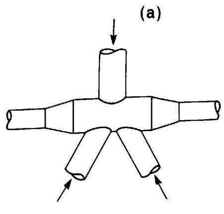

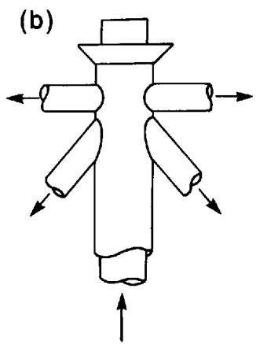

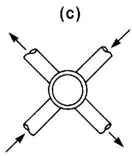

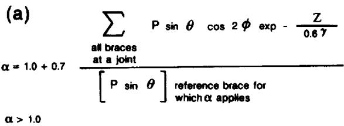  
FIG.COMM.E.3-1 ADVERSE LOAD PATTERNS WITH $\alpha$ Upto 3.8.(a) FALSE LEG TERMINATION. (b) SKIRTPILE BRACING.(c) HUB CONNECTION

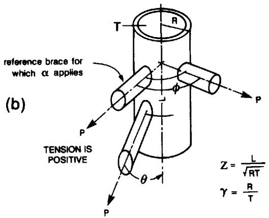

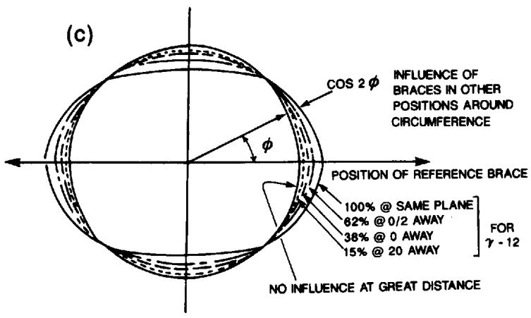  
FIG.COMM.E.3-2   
COMPUTED $\alpha$ (a) EQUATION. (b) DEFINITIONS. (c) INFLUENCE SURFACE

COMMENTARY F FATIGUE

COMM.F.0 FATIGUE

Introduction. Fatigue has long been recognized as an important consideration for designing offshore structures, and intensive cooperative industry research on tubular joints occupied the full decade of the 1960s. The first Edition of RP2A gave some general statements regarding fatigue and brittle fracture.

More specific criteria were adopted in 1971 and appeared in the 3rd Edition. These criteria included static strength requirements stated in terms of punching shear, along with general guidelines regarding fatigue. These guidelines included a $138\mathrm{MPa}$ (20 ksi) limitation on cyclic nominal stress, coupled with recommendations that simple joints be designed to meet the punching shear criteria and that complex joints be detailed with smooth flowing lines. For typical Gulf of Mexico structures utilizing joint can steels with improved notch toughness, this simple approach sufficed to relegate fatigue and brittle fracture to the status of secondary considerations. However, it was recognized that using higher design stresses (corresponding to steels with over 345 MPa (50 ksi) yield) or more severe loading experience (e.g., dynamic amplification or North Atlantic type wave climate) would require specific reexamination of the fatigue problem.

Concurrently, the AWS Structural Welding Code (Reference F1) adopted similar punching shear requirements, along with a family of S-N curves applicable to tubular joints. The research basis for these code criteria was reviewed in Reference F2. The AWS fatigue criteria were subsequently incorporated by reference into RP2A.

During 1974-77 two successive task groups attempted to define detailed procedures for analysis of cumulative fatigue damage, particularly for structures falling outside the normal Gulf of Mexico experience. Their deliberations revealed a wide diversity of approaches regarding description of wave climate, structural frame analysis, stress concentration factors, fatigue curves, cycle counting methods, and choice of safety factors. Considerable effort had been expended on each of these approaches in terms of data gathering, computer programming, and calibration. Since each approach had its advocates, no consensus on a single method could be reached. Thus, what emerged in the 8th Edition was a qualitative discussion of the elements of detailed fatigue analysis, written to accommodate a number of valid approaches.

In 1977, the static strength requirements were updated to permit substantial reductions in thickness for certain classes of tubular joints (e.g., K-joints with combined axial load and bending). Subsequent design experience has indicated that these new guidelines upset the parity between static strength and fatigue life for Gulf of Mexico structures, which had existed with the previous

rules. As a result, the 11th Edition expanded the allowable cyclic stress guidelines to assure ample fatigue lives as part of the normal design process for the large class of structures that do not warrant detailed fatigue analyses.

Recent years have seen a resurgence of research interest in tubular joints and fatigue, particularly on the part of governments bordering the North Sea. These large scale efforts have significantly increased the amount of available data and are prompting a reexamination of fatigue criteria. In particular, the endurance limits in the original AWS criteria have been questioned in light of sea water environments, random loading, and fracture mechanics crack growth considerations. A number of designers and agencies have been using modified criteria which defer or eliminate the fatigue endurance limit. These were reflected in the 11th Edition when API included S-N curves for tubular joints.

In addition, recent large scale test results emphasized the importance of weld profile control. A lower set of S-N curves was included to bracket the range of fatigue performance that can result from typical variations in fabrication practice. Changes to the static strength requirements for tubular joints were adopted in 1982 and appeared in Supplement 1 to the 13th Edition. Subsequently in 1983, the changes were expanded and included in the 15th Edition. In that same year, a work group was formed to review the previously adopted allowable cyclic stress guidelines with respect to revised static strength requirements and to redefine detailed procedures for analysis of cumulative fatigue damage.

In 1986, an improved simplified fatigue analysis approach replacing the allowable cyclic stress guidelines was adopted in the 17th Edition along with changes to the provisions for detailed fatigue analysis reflecting greater consensus regarding preferred methods of analysis, description of seastates, structural frame analysis, S-N curves, and stress concentration factors.

New Gulf of Mexico guideline wave heights were adopted in the 20th Edition of the RP2A. Therefore, the simplified fatigue analysis provisions were recalibrated in 1992. In addition to adjusting the Allowable Peak Hot Spot Stress values for the simplified fatigue analysis provisions, the 20th Edition includes changes to the detailed fatigue analysis provisions to the effect that only the spectral analysis techniques should be used for determining stress response.

For both the fatigue design and analysis procedures, use of unfactored （$\gamma = 1.0)$ loads is recommended. Since it is primarily the environmental loading which produces stress reversals, there does not appear to be any advantage to an LRFD format. The fatigue design procedure applies a uniform fatigue damage criterion which has been shown to give results similar to a uni

form reliability approach. The API PRAC-15 fatigue reliability study (Reference F25) compared results of a uniform safety index criterion, with the best available estimates of the random variable parameters, to those from a uniform fatigue damage criterion. The allowable stresses derived from the two criteria varied only slightly.

Fatigue Related Definitions. Some terms, when applied to fatigue, have specific meanings. Several such terms are defined below:

1. Hot Spot Stress: The hot spot stress is the stress in the immediate vicinity of a structural discontinuity.   
2. Mean Zero-Crossing Period: The mean zero-crossing period is the average time between successive crossings with a positive slope (up crossings) of the zero axis in a time history.   
3. Nominal Stress: The nominal stress is the stress determined from member section properties and the resultant forces and moments at the member end. The section properties must account for the existence of thickened or flared stub ends.   
4. Random Waves: Random waves represent the irregular surface elevations and associated water particle kinematics of the marine environment. Random waves can be represented analytically by a summation of sinusoidal waves of different heights, periods, phases, and directions.   
5. Regular Waves: Regular waves are unidirectional waves having cyclical water particle kinematics and surface elevation.   
6. S-N Curve: S-N curves represent empirically determined relationships between stress range and number of cycles to failure.   
7. Seastate: An oceanographic wave condition which for a specified period of time can be characterized as a stationary random process.   
8. Significant Wave Height: The significant wave height is the average height of the highest 1/3 of all the individual waves present in a seastate.   
9. Steady State: Steady state refers to the response of a structure to waves when the transient effects caused by the assumed initial conditions have become insignificant due to damping.   
10. Stress Concentration Factor: The stress concentration factor for a particular stress component and location on a tubular connection is the ratio of the hot spot stress to the nominal stress at the cross section containing the hot spot.   
11. Transfer Function: A transfer function defines the ratio of a structural response quantity to the wave height as a function of frequency.

COMM.F.1 FATIGUE DESIGN

For typical shallow water structures in familiar wave climates, allowable peak stresses based on prior detailed fatigue analyses can be used for fatigue design. For typical Gulf of Mexico template structures with natural periods less than three seconds and under $122\mathrm{m}$ (400 ft) water depth, allowable hot spot stresses have been derived based on calibration with detailed fatigue analyses. The simplified fatigue analysis approach using these allowable stresses and the basis for the stresses are described below. This procedure replaces the method contained in the 16th Edition of RP2A, which was based on an allowable peak hot spot stress of 414 MPa (60 ksi) due to an $18\mathrm{m}$ (60 ft) wave plus associated wind and current. In the former procedure specific assumed stress concentration factors were applied to derive allowable brace end punching shear stresses.

Simplified Fatigue Assessment. The following simplified fatigue analysis provisions may be applied to tubular joints in template type platforms in less than $122\mathrm{m}$ (400 ft) of water constructed of ductile steels, with redundant structural framing and with natural periods less than three seconds. The specific analysis procedure described below is calibrated for a typical Gulf of Mexico wave climate but can be modified for application to different design conditions. The simplified fatigue analysis involves designing all tubular joints in the structure such that the peak hot spot stresses for the fatigue design wave do not exceed the allowable peak hot spot stresses.

(a) Fatigue Design Wave. The fatigue design wave is the reference level wave for the platform water depth as defined in Figure C.3.7-3. This wave should be applied to the structure without wind, current, and gravity load effects using a load factor of 1.0. Tide as defined in Figure C.3.7-7 should be included. The wave force calculations per Section C.3.3 should be followed except that the omnidirectional wave should be applied in all design directions with wave kinematics factor equal to 0.88.   
(b) Allowable Peak Hot Spot Stresses. The allowable peak hot spot stress, $S_{\mathbf{p}}$ , is determined from Figure Comm. F.1-1 or Comm. F.1-2 as a function of water depth, member location, S-N curve and design fatigue life. The design fatigue life should be at least twice the service life. Members framed above the waterline and members extending down to and included in the framing level immediately below the fatigue design wave trough elevation are considered waterline members. The S-N Curve to be used depends upon the weld profile as described in Section F.4.   
(c) Peak Hot Spot Stress for the Fatigue Design Wave. The peak hot spot stress at a joint should be taken as the maximum value of the following expression calculated at both the chord and brace sides of the tubular joint.

$$\left| \operatorname{S C F}_{\mathbf{a x}} f_{\mathbf{a x}} \right| + \sqrt{\left(\operatorname{S C F}_{\mathrm{i p b}} f_{\mathrm{i p b}}\right)^{2} + \left(\operatorname{S C F}_{\mathrm{o p b}} f_{\mathrm{o p b}}\right)^{2}}$$

(Comm.F.1-1)

where $f_{\mathrm{ax}}$ , $f_{\mathrm{ipb}}$ and $f_{\mathrm{opb}}$ are the nominal member end axial, in-plane bending and out-of-plane bending stresses, and $\mathrm{SCF}_{\mathrm{ax}}$ , $\mathrm{SCF}_{\mathrm{ipb}}$ and $\mathrm{SCF}_{\mathrm{opb}}$ are the corresponding stress concentration factors for axial, in-plane bending, and out-of-plane bending stresses for the chord or the brace side. Stress concentration factors are discussed in Section Comm. F.5. Several sets of empirical formulas for estimating SCF's are referenced in Comm. F.5. In addition, Table Comm. F.1-1 includes SCF's developed from one of the referenced examples that may be used with Equation Comm. F.1-1 for simple joints classified and designed per Section E.3.1. SCFs developed from other references may be larger for some joint parameters. In general, four wave approach directions (end-on, broadside, and two diagonal) and sufficient wave positions relative to the platform should be considered to identify the peak hot spot stress at each member end for the fatigue design wave.

Comm. F.1.1 Derivation of Allowable Peak Hot Spot Stress. The allowable peak hot spot stress given in Figures Comm. F.1-1 and Comm. F.1-2 is derived as a function of the parameter, $\mathbf{g}$ , which defines how a structure responds to different wave heights. This procedure is documented in more detail in References F28 and F29. There are three basic assumptions to this approach:

1. The stress range, S, is related to the wave height, H, in the form

$\mathbf{S} = \mathbf{C}\mathbf{H}\pmb{\varepsilon}$ (Comm.F.1-2)

where $\mathbf{C}$ is a calibrated constant and $\mathbf{g}$ is a calibrated exponent.

2. The S-N Curve can be written

$$\mathbf{N S}^{\mathrm{m}} = \mathbf{K}. \tag{Comm. F.1-3}$$

where $\mathbf{K}$ is constant and $\mathbf{N}$ and $\mathbf{m}$ are defined in Figure F.4-1.

3. The long-term wave height distribution can be represented by the sum of two Weibull distributions as shown in Figure Comm. F.1-3 for normal and hurricane conditions.

Based on the above three assumptions, a closed form expression for the fatigue damage can be written:

$$\mathrm{D}_{\mathrm{s}} = \frac{\mathrm{T}_{\mathrm{s}}}{\mathrm{K}} \mathrm{C}^{\mathrm{m}} \left(\mathrm{Y}_{0} + \mathrm{Y}_{1}\right) \dots \dots \dots \dots \dots \dots \dots \dots \dots \dots \dots \dots \dots \dots \dots \tag{Comm. F.1-4}$$

where $\mathbf{D}_{\mathbf{s}}$ is the fatigue damage accumulated over the service life and $\mathbf{T}_{\mathbf{s}}$ is the service life of the structure,

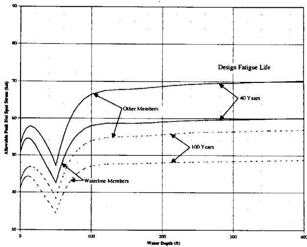  
FIG.COMM.F.1-1   
API FATIGUE RECALIBRATION ALLOWABLE PEAK HOTSPOT STRESS API X CURVE

TABLE COMM. F.1-1 SELECTED SCF FORMULAS FOR SIMPLE JOINTS   

| JOINT TYPE | JOINT TYPE | α | AXIAL LOAD | IN-PLANE BENDING | OUT-OF-PLANE BENDING |
| --- | --- | --- | --- | --- | --- |
| CHORDSCF | K | 1.0 | αA | 2/3 A | 3/2 A |
| CHORDSCF | T&Y | 1.7 | αA | 2/3 A | 3/2 A |
| CHORDSCF | Xβ<0.98 | 2.4 | αA | 2/3 A | 3/2 A |
| CHORDSCF | Xβ≥0.98 | 1.7 | αA | 2/3 A | 3/2 A |
| BRACE SCF'S | BRACE SCF'S | BRACE SCF'S | 1.0 + 0.375 (1 +√t/β SCFChord) ≥ 1.8 | 1.0 + 0.375 (1 +√t/β SCFChord) ≥ 1.8 | 1.0 + 0.375 (1 +√t/β SCFChord) ≥ 1.8 |

Where $\mathbf{A} = 1.8\sqrt{\gamma}\tau$ sin $\theta$ and all other terms are defined in Figure E.3-1.

$$\begin{array}{l} \mathbf{Y}_{\mathbf{o}} = \frac{\mathbf{N}_{\mathbf{o}}}{\mathbf{T}} \mathbf{H}_{\mathbf{o}}^{\mathbf{g m}} (\ln \mathbf{N}_{\mathbf{o}})^{- \mathbf{g m} / \xi_{0}} \Gamma (1 + \frac{\mathbf{g m}}{\xi_{0}}) \\ \ldotp \ldotp \ldotp \ldotp \ldotp \ldotp \ldotp \ldotp \ldotp \ldotp \ldotp \ldotp \ldotp \ldotp \ldotp \ldotp \ldotp \ldotp \ldotp \ldotp \ldotp \ldotp \ldotp \ldotp \ldotp \ldotp \ldotp \ldotp \ldotp \ldotp \ldotp \ldotp \ldotp \ldotp \dots . \\ \end{array}$$

$$\begin{array}{l} \mathrm{Y}_{1} = \frac{\mathrm{N}_{1}}{\mathrm{T}} \mathrm{H f}^{\mathrm{g m}} (\ln \mathrm{N}_{1})^{- \mathrm{g m} / \xi_{1}} \Gamma (1 + \frac{\mathrm{g m}}{\xi_{1}}) \\ \ldotp \dots \tag{Comm. F. 1-4b} \\ \end{array}$$

where $\Gamma (\cdot)$ is the gamma function and $\mathbf{N}_0,\mathbf{N}_1,\mathbf{H}_0,\mathbf{H}_1,\xi_0,\xi_1$ , and T define the wave climate as shown in Figure Comm. F.1-3.

The hot spot stress range, $\mathbf{S}_f$ , corresponding to the fatigue design wave height, $\mathbf{H}_f$ , can be written as follows:

$$\mathbf{S}_{f} = \mathrm{C H}_{f}^{f} \quad \dots \dots \dots \dots \dots \dots \dots \dots \dots \dots \dots \dots \dots \tag{Comm.F.1-5}$$

By substituting C from Equation Comm. F.1-4 into Equation Comm. F.1-5, substituting the calculated fatigue life $\mathbf{T}_{\mathbf{f}} = \mathbf{T}_{\mathbf{s}} / \mathbf{D}_{\mathbf{s}}$ and simplifying, the hot spot stress range can be written:

$$\mathbf{S}_{f} = \left[ \frac{\mathbf{K} \mathbf{H} f^{\mathrm{g m}}}{\mathbf{T}_{f} \left(\mathbf{Y}_{0} + \mathbf{Y}_{1}\right)} \right]^{1 / \mathrm{m}} \dots \dots \dots \dots \dots \dots \dots \dots \dots \dots \dots \dots \dots \dots \dots \tag{Comm.F.1-6}$$

It is observed that $\mathbf{T_f}$ represents the calculated fatigue life. If this value is replaced by the design fatigue life, $\mathbf{T_d}$ , then Equation Comm. F.1-6 gives the allowable hot spot stress range corresponding to $\mathbf{H_f}$ , i.e.,

$$\mathrm{S}_{\mathrm{r}} = \left[ \frac{\mathrm{K H}_{l}^{\mathrm{g m}}}{\mathrm{T}_{\mathrm{d}} \left(\mathrm{Y}_{0} + \mathrm{Y}_{1}\right)} \right]^{1 / \mathrm{m}} \dots \dots \dots \dots \dots \dots \dots \dots \dots \dots \dots \dots \dots \dots \dots \dots \dots \dots \tag{Comm. F.1-7}$$

where $\mathbf{T_d} = \mathbf{T_s}$ (S.F.) per Section F.2.5.

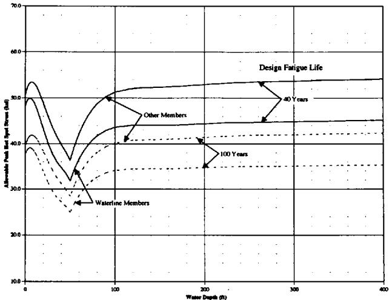  
FIG.COMM.F.1-2   
API FATIGUE RECALIBRATION ALLOWABLE PEAK HOTSPOT STRESS API X-PRIME CURVE

In order to calculate the allowable peak hot spot stress, $S_{p}$ , in Figures Comm. F.1-1 and Comm. F.1-2 from the allowable hot spot stress range, $S_{r}$ , in Equation Comm. F.1-7, the stress cycle ratio $R$ must be known. This ratio is defined as:

$$R = S_{\min } / S_{\max } \dots \dots \dots \dots \dots \dots \dots \dots \dots \dots \tag{Comm.F.1-8}$$

The $\mathbf{S_p}$ values in the figures are then calculated from

$$\mathbf{S}_{\mathrm{p}} = \mathbf{S}_{\mathrm{r}} / (1 - \mathrm{R}) \quad \dots \dots \dots \dots \dots \dots \dots \dots \dots \dots \dots \dots \dots \dots \tag{Comm.F.1-9}$$

The allowable stress curves in Comm. F.1 were generated based on Equations Comm. F.1-7 and Comm. F.1-9. The necessary parameters to be input are the S-N Curve constants, the design fatigue life $\mathbf{T}_{\mathrm{d}}$ , the long-term wave height distribution parameters, the fatigue design wave height $\mathbf{H}_{\mathrm{f}}$ , the stress cycle ratio $\mathbf{R}$ , and the parameter $\mathbf{g}$ .

Figure Comm. F.1-1 is based on the S-N Curve X parameters （$\mathbf{m} = 4.38$ and $\mathbf{K} = 2.44\times 10^{11})$ $\mathbf{T}_{\mathrm{d}}$ of 40 or 100 years, $\mathbf{H}_{\mathrm{f}}$ per Figure C.3.7-3, and a 100-year wave height distribution defined by the following parameters:

$$\begin{array}{l} \mathbf{N}_{0} = 1 \times 10^{9}, \\ \mathrm{H}_{0} = 12. 2 \mathrm{m} (40 \mathrm{f t .}) \\ \begin{array}{r l} \xi_{0} & = 1. 0, \end{array} \\ \mathbf{N}_{1} = 1 \times 10^{6}, \\ \mathrm{H}_{1} = 22. 9 \mathrm{m} (75 \mathrm{f t .}) \\ \begin{array}{r l} \xi_{1} & = 1. 0. \end{array} \\ \end{array}$$

Figure Comm. F.1-2 is based on the same parameters except for the $\mathbf{X}^{\prime}$ S-N Curve values of $\mathbf{m} = 3.74$ and $\mathbf{K} = 1.79\times 10^{10}$ . Values to be used for $\mathbf{g}$ and $\mathbf{R}$ were identified through a calibration exercise described below. Variables considered in calibrating $\mathbf{g}$ were the platform natural period, waterline geometry, and the location of the joint in the structure. The recommended values of $\mathbf{g}$ are not shown in Figures Comm. F.1-1 and Comm. F.1-2; instead, the allowable $\mathbf{S_p}$ has been derived directly. Long-term wave height distribution for water depths less than $15\mathrm{m}$ (50 ft.) cannot be easily generalized. The distributions used are described in more detail in Reference F29. Allowable $\mathbf{S_p}$ values for this water depth range may be adjusted based on the site-specific wave height distribution data.

Comm. F.1.2 Calibration of $\mathbf{g}$ (based on a typical Gulf of Mexico wave climate). From the approach outlined above, there are three basic variables, any one of which can be calculated given the other two. These are the fatigue life $\mathbf{T}_f$ , the hot spot stress range $\mathbf{S}_f$ from the fatigue design wave, and the parameter $\mathbf{g}$ . In order to calibrate values of $\mathbf{g}$ to the results of a detailed fatigue analysis, only the values $\mathbf{S}_f$ and $\mathbf{T}_f$ need to be calculated. The wave height distribution parameters $\mathbf{N}_0$ , $\mathbf{H}_0$ , $\xi_0$ , $\mathbf{N}_1$ , $\mathbf{H}_1$ , $\xi_1$ , and $\mathbf{T}$ must be derived from the long-term wave climate used to calculate $\mathbf{T}_f$ . In order to simplify

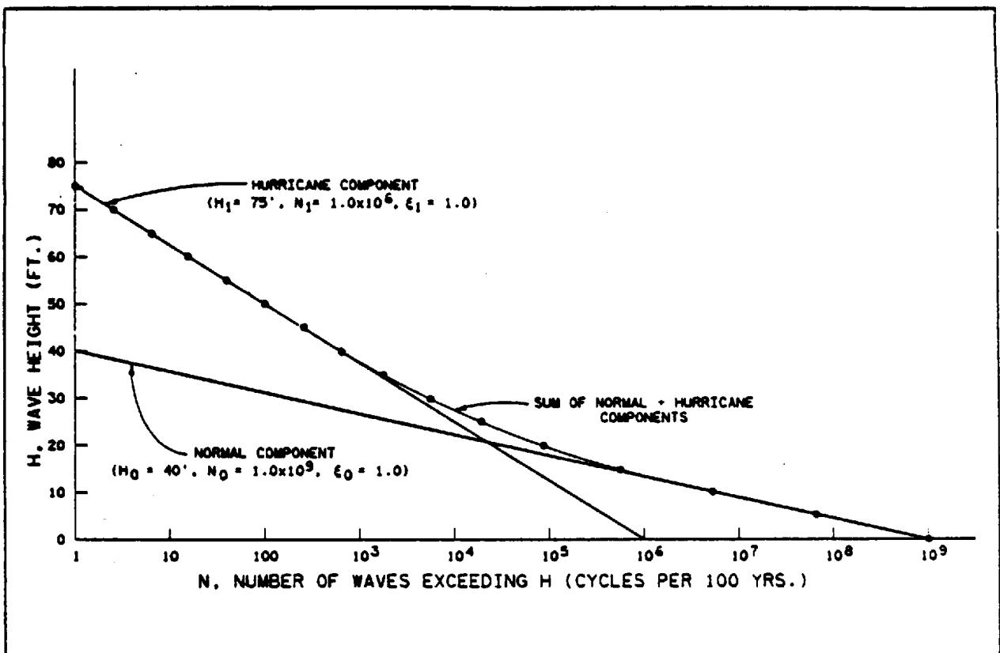

Where: $\mathbf{H}_0$ is the maximum normal wave height over period T.   
$\mathbf{H}_{1}$ is the maximum hurricane wave height over period $\mathbf{T}$ .   
$\mathbf{N}_0$ is the number of wave cycles from normal distribution over period $\mathbf{T}$ .   
$\mathbf{N}_{1}$ is the number of wave cycles from hurricane distribution over period $\mathbf{T}$ .   
T is the duration of the long-term wave height distribution.   
$\xi_0$ is the parameter defining the shape of the Weibull normal distribution. Value of 1.0 corresponding to the exponential distribution results in a straight line.   
$\xi_{1}$ is the parameter defining the shape of the Weibull hurricane distribution.

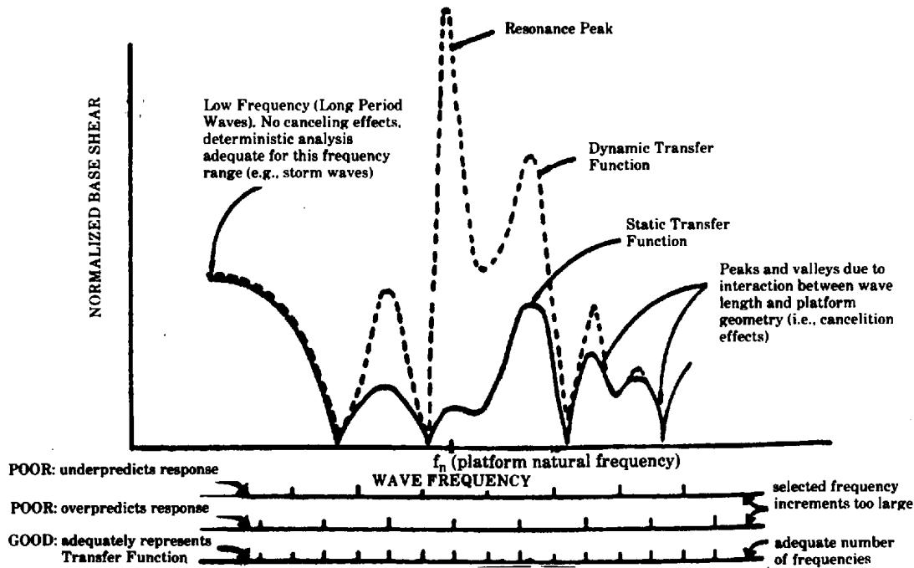  
FIG.COMM.F.1-3 EXAMPLE WAVEHEIGHT DISTRIBUTION OVER TIME T   
FIG.COMM.F.2-1 SELECTION OF FREQUENCIES FOR DETAILED ANALYSES

the fatigue design procedures, hot spot stress ranges were calculated from peak hot spot stresses from the fatigue design wave using the total base shear cycle ratio R. Typical values of R ranged from -0.15 to -0.50 and are dependent on water depth.

Detailed fatigue calculations were performed on four platforms. These platforms ranged in water depth from 17.5 to $95.7\mathrm{m}$ (58 to 314 ft.) and in natural period up to 2.85 sec. The following observations were noted for the calibrated $\mathbf{g}$ values.

1. The allowable peak hot spot stress values given in Figures Comm. F.1-1 and Comm. F.1-2 are based on blanket $\mathbf{g}$ values of 1.2 for waterline members and 1.3 for other members. These $\mathbf{g}$ values represent approximate lower bounds to the calibrated data.   
2. The greatest scatter in the $\mathbf{g}$ values occurs consistently in the framing level above still water, which, in part, can be attributed to the inundation effects.   
3. The least scatter in the $\mathbf{g}$ values was observed in the vertical diagonal members and mudline framing members, where the member end stresses are governed by the frame action response to wave loading. These $\mathbf{g}$ values tended to be consistently greater than the lower bound values selected.   
4. The blanket $\mathbf{g}$ values account for the effects of dynamics for structures with natural periods less than three seconds. However, the $\mathbf{g}$ values and consequently the allowable hot spot stresses decrease as natural period increases, particularly for vertical diagonals and mudline members.

Comm. F.1.3 Selected SCF Formulas. The stress concentration factors given in Table Comm. F.1-1 for the chord are based upon the modified formulas (References F7 and F20) for K, T, and X joints. The brace side SCF formula is that suggested by Marshall (Reference F7) with a reduction factor of 0.625. In these equations, a computed alpha value as proposed in Reference F20 can be substituted for $\alpha$ where multi-planar effects are important.

COMM.F.2 FATIGUE ANALYSIS

A simplified fatigue analysis may be used as a first step for structures in deep water or frontier areas. However, a detailed analysis of cumulative fatigue damage should always be performed. A detailed analysis is necessary to design fatigue sensitive locations which may not follow the assumptions inherent in the simplified analysis.

Comm. F.2.1 Wave Climate. Wave climate information is required for any fatigue analysis, and obtaining it often requires a major effort with significant lead time. Wave climates may be derived from both recorded data and hindcasts. Sufficient data should exist to characterize the long term oceanographic conditions at the platform site. Several formats are permissible and the choice depends on compatibility with the analytical

procedures being used. However, for each format the wave climate is defined by a series of seastates, each characterized by its wave energy spectrum and physical parameters together with a probability of occurrence (percent of time). Formats that may be used include the following:

(1) Two parameter scatter diagrams. These describe the joint probability of various combinations of significant wave height and mean zero-crossing period. Typically, 60 to 150 seastates are used to describe most sea environments. While a reduced number may be used for analysis, a sufficient number of seastates should be used to adequately define the scatter diagram and develop full structural response. If the scatter diagram is condensed the effect of dynamic excitation, interaction between wave length and platform geometry, and drag force nonlinearity should be considered. When condensing seastates of different height or period the resulting seastates should yield equivalent or greater damage than the original seastates. This format does not give any information on wave directionality.   
(2) Directional scatter diagrams. Each seastate is characterized by three parameters: significant wave height, mean zero-crossing period and central direction of wave approach (Reference F3). If the measured data do not include wave directionality, directions may be estimated on the basis of wind measurements, local topography, and hindcasting, provided sufficient care is exercised.   
(3) Directional scatter diagrams with spreading. Each seastate is characterized by four parameters: significant wave height, mean zero-crossing period, central direction of wave approach, and directional spreading. The directional spreading function, $\mathbf{D}(\theta)$ , defines the distribution of wave energy in a seastate with direction and must satisfy:

$$\begin{array}{l} \pi / 2 \\ \int_{- \pi / 2}^{\pi / 2} \mathrm{D} (\theta) \mathrm{d} \theta = 1 \end{array} \dots \dots \dots \dots \dots \dots \dots \dots \dots \dots \dots \dots \dots \dots \dots \dots \dots \dots \dots \dots \dots \dots \dots \dots \dots \dots \dots \dots \tag{Comm.F.2-1}$$

where $\theta$ is measured from the central direction. A commonly used spreading function (Reference F7) is:

$$\mathbf{D} (\theta) = \mathbf{C}_{\mathrm{n}} \cos^{\mathrm{n}} \theta \dots \dots \dots \dots \dots \dots \dots \dots \dots \dots \dots \dots \dots \dots \dots \tag{Comm.F.2-2}$$

where $n$ is a positive integer (number) and $C_n$ is a coefficient selected such that Equation Comm. F.2-1 is satisfied. A value of $n$ equal to zero corresponds to the case when the energy is equally distributed in all directions. Observations of wind driven seas show that an appropriate spreading function is a cosine squared function （$n = 2)$ . For situations where limited fetch restricts degree of spread a value of $n = 4$ has been found to be appropriate. Other methods for directional spreading are given in Reference F21.

(4) Bimodal spectra. Up to eight parameters are used to combine swell with locally generated waves. Typically, swell is more undirectional than wind generated waves and thus spreading should not be considered unless measured data shows otherwise (Reference F22).

Data gathered in more complete formats can always be reduced to the simpler ones. For recorded data and hindcasting, spectral characterizations described by Borgman and Cardone (References F4 and F5) may serve as starting points.

Comm. F.2.2 Structural Modeling and Analysis. The space frame model for fatigue analysis should include all important characteristics of the stiffness, mass, energy dissipation and loading properties of the structure and foundation components of the platform. The analytical model consists primarily of beam elements. The adequacy of calculated member end stresses for fatigue analysis is contingent on the modeling techniques used. The model used for strength analysis may require refinements such as the addition or modification of members which are fatigue sensitive. Asymmetry in platform stiffness or mass distribution may lead to significant torsional response which should be considered.

Stiffness: The model should include the three dimensional distribution of platform stiffness. The member intersections should be modeled such that the resulting nominal member end stresses are consistent with their subsequent use in fatigue analysis. For typical jacket members, nominal brace stresses should be computed at the intersections of the brace and chord centerlines. For large diameter chords or short braces, local joint stiffness should be considered. One modeling technique which has been used to represent the joint stiffness is to simulate chord stiffness between the intersection of the centerlines and the chord face as a rigid link with springs at the face representing the chord shell flexibility, and hence member end stresses should be calculated at the face of the chord. Rigid links should not be used without also considering chord shell flexibility.

The stiffness of appurtenances such as launch cradles, mudmats, J-tubes, risers, skirt pile guides, etc., should be included in the model if they contribute significantly to the overall global stiffness of the structure. The stiffness of the conductors and horizontal framing levels should be included. In addition, down to and including the level immediately below the design wave trough elevation, sufficient detail should be included to perform a fatigue analysis of the individual components of the framing. Similar detailing of the mudline level is required if the conductors are considered in the foundation. Consideration of structural components such as mudmats, shear connectors, conductor guides, etc., may require finite element types other than beam elements (e.g., shell, plate, solid). The stiffness of the deck should be considered in sufficient detail to adequately represent the deck-jacket interface.

A linear representation of the foundation may be used provided the stiffness coefficients reflect the cyclic response for those seastates contributing significantly to fatigue damage.

Mass: The mass model should include structural steel, equipment, conductors, appurtenances, grout, marine growth, entrapped water, and added mass. A lumped mass model is sufficient to obtain global structure response. However, this method may not adequately predict local dynamic response. Where necessary, local responses should be examined. The equipment mass included in the model should consider all equipment supported by the structure during any given operation on the platform. If the equipment mass is predicted to vary significantly for different operations during the platform life, it is appropriate to perform independent analyses and combine fatigue damage. The added mass may be estimated as the mass of the displaced water for motion transverse to the longitudinal axis of the individual structural framing and appurtenances.

Energy Dissipation: The choice of damping factors can have a profound effect, and values of $2\%$ critical and less have been suggested on the basis of measurements in low seastates. Including structural velocities in the calculation of drag forces increases the total system damping. For noncompliant structures, this increase in damping is not observed in measurements and consequently should not be considered. For compliant structures such as guyed towers, these effects may be considered in addition to a $2\%$ structural (including foundation) damping.

Natural Period: For structural periods above three seconds, dynamic amplification is important, particularly for the lower seastates which may contribute the most to long term fatigue damage. Several authors have shown the desirability of retaining the detailed information available from a full static analysis and adding the inertial forces due to dynamic amplification of the first few modes (mode acceleration or static back-substitution method, Reference F24). A pure modal analysis using a limited number of modes misses the essentially static response of some modes.

Since the natural period of a platform can vary considerably depending upon design assumptions and operational deck mass, a theoretical period should be viewed critically if it falls in a valley in the platform base shear transfer function. The period should be shifted by as much as 5 to $10\%$ to a more conservative location with respect to the transfer function. This should be accomplished by adjusting mass or stiffness within reasonable limits. The choice of which parameter to modify is platform specific and depends upon deck mass, soil conditions and structural configuration. It should be recognized that adjusting the foundation stiffness will alter the member loads in the base of the structure which can be fatigue sensitive.

Loading: The applied cyclic loads should be represented such that the effect of load distribution along the

member is included in the member end stresses. Distributed loads on brace members need to be considered only between intersection points. Loads attributed to conductors and appurtenances such as launch cradles, mudmat framing, J-tubes, risers, skirt pile guides, anodes, etc., should be considered. The choice of wave theory, as well as drag and mass coefficients, should be examined as they may differ from those used in strength analyses of design wave loads. Attention should be given to modeling of conductor guide framing to ensure correct vertical wave loads. When the loading varies significantly for different operations during the platform life (e.g., towing, drilling and production), it is appropriate to perform independent analyses and combine the fatigue damage.

Tides, currents and marine growth each affect fatigue. For everyday waves, tides will have little effect. However, the tide and surge associated with storm seas can have a significant effect. For example, they may cause the wave crest to inundate a member or entire jacket level, which would otherwise be dry. Such effects should be considered.

Current is a complicated phenomenon that is difficult to account for in a fatigue analysis. Since fatigue considers the stress range, the static effect of current can be neglected. For large waves or currents, the drag will increase the crest-to-trough wave force difference and affect platform dynamics. While these effects can be important, analysis technology is lacking.

Marine growth has a detrimental effect on fatigue life of members subjected to local wave loading, and in general it has a similar effect on members controlled by global deformations. A marine growth profile should be specified for the maximum thickness and roughness expected or allowed at the platform site, if it produces conservative results. A simplified analysis is useful in studying the effect of marine growth on global response. Marine growth affects platform added mass, member drag diameter, and drag coefficient.

At present an environmental load factor $\gamma_{\mathrm{w}}$ of 1.0 is recommended for the detailed fatigue analysis. Uncertainties in the loading can be accounted for in the safety factor on fatigue life described in Section F.2.5.

Comm. F.2.2.1 Spectral Fatigue Analysis. Several approaches are available for determining stress response to seastate loadings. In general, a spectral analysis should be used to properly account for the actual distribution of wave energy over the entire frequency range. The spectral approach can be subdivided based upon the method used to develop the transfer function.

(1) Transfer functions developed using regular waves in the time domain.

- Characterize the wave climate using either the two, three, four or eight parameter format (as described in Comm. F.2.1).

- Select a sufficient number of frequencies to define all the peaks and valleys inherent in the jacket response transfer function. A typical set of frequencies is illustrated in Figure Comm. F.2-1. A simplified analysis (Reference F7) that develops a global base shear transfer function may be helpful in defining frequencies to be used in the detailed analysis.

- Select a wave height corresponding to each frequency. A constant wave steepness that is appropriate for the wave climate can be used. For the Gulf of Mexico, a steepness between 1:20 and 1:25 is generally used. A minimum height of one foot and a maximum height equal to the extreme design wave height should be used.

- Compute a stress range transfer function at each point where fatigue damage is to be accumulated for a minimum of four platform directions (end-on, broadside and two diagonal). For jackets with unusual geometry or where wave directionality, spreading or current is considered, more directions may be required. At each frequency, a point on the transfer function is determined by passing an Airy wave of the appropriate height through the structure and dividing the response stress range by the wave height. The analysis procedure must eliminate transient effects by achieving steady state conditions. A sufficient number of time steps in the wave cycle at which member stresses are computed should be selected to determine the maximum brace hot spot stress range. A minimum of four hot spot locations at both the brace and chord side of the connection should be considered.

- Compute the stress response spectra. In a spectral fatigue analysis in its most general form, each seastate is represented by a power spectral density function $\mathbf{S}_{\alpha}(\omega)$ for each direction of wave approach $\alpha$ , where $\omega$ is circular frequency. At each location of interest, the platform stress response spectrum for each seastate is:

$$\begin{array}{r l} \mathbf{S}_{\alpha , \alpha} (\omega) & = \int | \mathbf{H} (\omega , \theta) |^{2} \mathbf{D} (\theta) \mathbf{S}_{\alpha} (\omega) d \theta . \dots . (C o m m. F. 2 - 3) \\ & - \pi / 2 \end{array}$$

where: $\theta$ is measured from the central wave approach direction, $\mathbf{H}(\omega ,\theta)$ is the transfer function and $\mathbf{D}(\theta)$ is the spreading function as defined in Comm. F.2.1(3).

Several approximations and linearizations are introduced into the fatigue analysis with this approach:

- The way in which waves of different frequencies in a seastate are coupled by the nonlinear drag force is ignored.   
Assuming a constant wave steepness has the effect of linearizing the drag force about the height selected for each frequency. Consequently, drag forces due to waves at that frequency with large

heights will be underpredicted, while drag forces due to waves with smaller heights will be over-predicted.

(2) Transfer functions developed using regular waves in the frequency domain. This approach is similar to method (1) except that the analysis is linearized prior to the calculation of structural response. In linearizing the applied wave force, drag forces are approximated by sinusoidally varying forces and inundation effects are approximated or ignored. As a result, the equations of motion can then be solved without performing direct time integration. For typical small waves the effects of linearization are not of great importance; however, for large waves they may be significant if inundation effects are ignored.

(3) Transfer functions developed using random waves in the time domain (Reference F23). The following steps are taken in this approach:

- Characterize the wave climate in terms of sea-state scatter diagrams.

-- Simulate random wave time histories of finite length for a few selected reference seastates.

- Compute response stress time histories at each point of a structure where fatigue life is to be determined and transform the response stress time histories into response stress spectra.

- Generate "exact" transfer functions from wave and response stress spectra.

- Calculate pseudo transfer functions for all the remaining seastates considered using the few "exact" transfer functions.

- Calculate pseudo response stress spectra as described in method (1).

This method can take into account nonlinearities arising from wave-structure interaction and avoids difficulties in selecting wave heights and frequencies for transfer function generation.

Comm. F.2.3 Local Stresses. In evaluating local scale stress at hot spot locations the stress concentration factor used should be consistent with the corresponding S-N curve; see Sections F.4 and F.5.

Comm. F.2.4 Cumulative Damage. Various approaches to a Miner cumulative damage summation have been used. In all cases, the effects of short term seastates are summed to yield the long term damage or predict the fatigue life.

For a spectral analysis, the response stress spectrum may be used to estimate the short-term stress range distribution by assuming either:

(1) a narrow band Rayleigh distribution. For a Rayleigh distribution the short term damage may be calculated in closed form.

(2) a broad band Rice distribution, neglecting the negative peaks.   
(3) time series simulation and cycle counting via rainfall, range pair, or some other algorithm.

Damage due to large waves which have significant drag forces or crest elevations should be computed and included in the total fatigue damage.

Comm. F.2.5 Fatigue Life. A calculated fatigue life should be viewed with skepticism. Where possible, the entire procedure being used should be calibrated against available failure/nonfailure experience. Although $97\%$ of the available data falls on the safe side of the recommended S-N curves, additional uncertainties in the analysis may result in a $95\%$ prediction interval for failures ranging from 0.5 to 20 times the calculated fatigue life at $\mathbf{D}_{\mathbf{r}}$ of unity. Calibration hindcasts falling outside this range should prompt a reexamination of the procedures used.

In light of the uncertainty, the calculated fatigue life should be a multiple of the intended service life. Structural redundancy and the extent of inservice inspections should be considered in selecting the safety factor on fatigue life. Doubling the fatigue life requires about a $10\%$ increase in joint can thickness.

Uncertainties in fatigue life estimates can be logically evaluated in a probabilistic framework. A fatigue reliability model based on the log-normal distribution is presented in Reference F25. This model is compatible with the detailed fatigue analysis methods described above. The sources of uncertainty in fatigue life (which is considered to be a random variable) are described explicitly.

COMM. F.4 S-N CURVES FOR TUBULAR CONNECTIONS

The fundamental criterion for tubular joints, curve X, was derived from hot spot strain range measurements and fatigue tests to failure, placing a wide variety of as-welded configurations on a common basis. Although there has been some variation in technique among various investigators contributing to the data base, typical hot spot strain gages were centered within $6\mathrm{mm}$ ( $\frac{1}{4}$ in) to $0.1\sqrt{\mathrm{Rt}}$ of the weld toes, with a gage length of $3\mathrm{mm}$ ( $\frac{1}{8}$ in) and oriented perpendicular to the weld. Here R and t refer to the outside radius and thickness of the member instrumented, either the chord or brace. Due to the steep stress gradients near intersecting tubes, larger gages further from the weld indicate stresses which are too low.

The microscopic notch or stress singularity at the weld toe is excluded from this definition of hot spot stress, but rather is included in the S-N curve. In turn, the S-N curve should be qualified as to the severity of these notches, which are a function of both weld size and profile quality. Curve X applies where the as-welded profile merges smoothly with the adjoining base metal, as shown in Figure Comm. F.4-1a and described in

L.1.3.4. Where such profile control is not practiced, as in Figure Comm. F4-1b, lower fatigue performance and S-N curve $\mathbf{X}^{\prime}$ apply. Furthermore, when the branch thickness exceeds a certain reference thickness, the corresponding larger weld notches further degrade fatigue performance, even for weld toe hotspots on the chord side. A summary of the relevant API provisions is shown in Figure Comm. F.4-2. These were adapted from ANSI/AWS D1.1-92, for which background and supporting data are given in References F31 to F33.

COMM. F.5 STRESS CONCENTRATION FACTORS

Finite element thin shell analyses may be used to obtain hot spot strains compatible with curve X (or $\mathbf{X}^{\prime}$ ), provided the mesh is fine enough to reproduce the steep stress gradients and results corresponding to the actual weld toe location, rather than the midplane intersection, are used. Isoparametric thick shell and solid elements can be used for even more direct modeling of the weld zone.

Empirical Formulas. Several sets of empirical formulas are available to estimate hot spot SCF; examples are as follows:

1. The Kuang formulas (Reference F30) are derived from correlation with extensive thin shell finite element analyses. When used to hindcast hot spot

strains for fatigue tests in the data base for Curve X, the results are conservative when compared with the original correlation based on measured strains (Reference F6), as shown in Figure Comm. F.5-1. It should be noted that brace side SCF was revised by a reduction factor of 5/8. This factor only applies to the amplified part of the stress as shown in Figure Comm. F.5-1.

$$\mathrm{S C F}_{\text{B R A C E}} = 1 + 5 / 8 \left(\mathrm{S C F}_{\text{K U A N G}} - 1\right).$$

A more general reduction factor derived by Marshall is discussed in Reference F7.

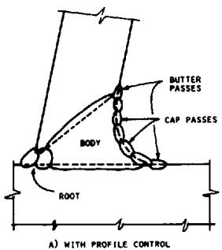

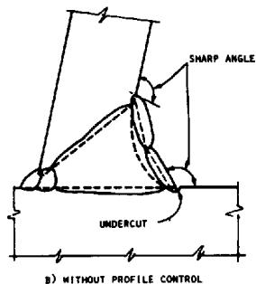  
FIG.COMM.F.4-1 WELD PROFILE CONDITIONS

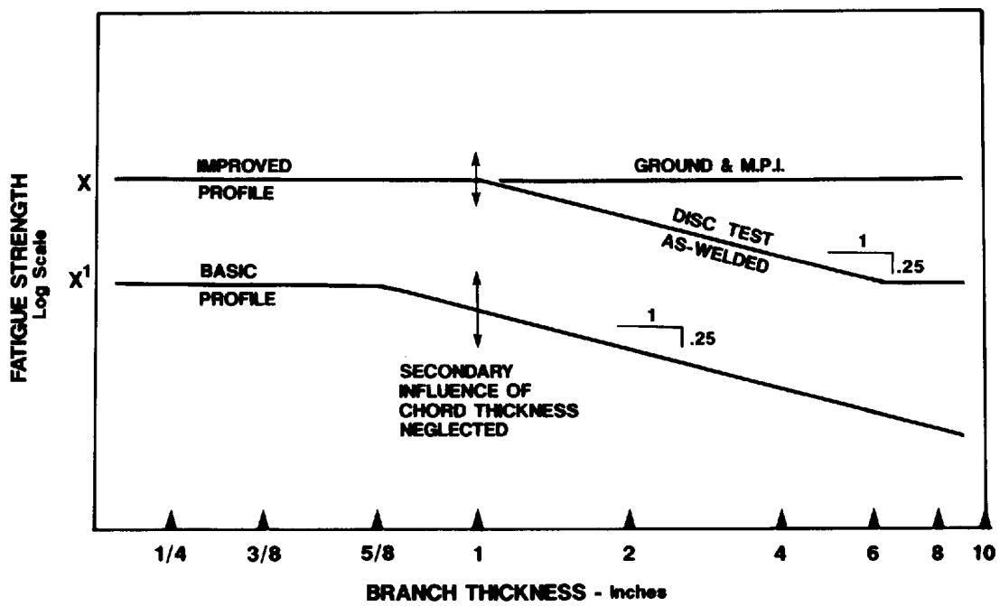  
FIG.COMM.F.4-2 SIZE AND PROFILE EFFECTS

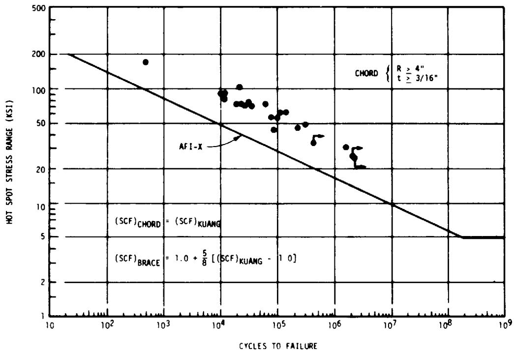  
FIG.COMM.F.5-1 WRCDATABASEFORKJOINTS(ReferenceF6)

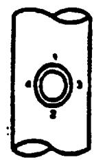

Hot Spot Stress

At Locations 1 & 2

$$\mathbf{F}_{\text{h o t}} = \mathbf{S C F}_{\mathrm{a x}} \mathbf{f}_{\mathrm{a x}} \pm \mathbf{S C F}_{\mathrm{i p b}} \mathbf{f}_{\mathrm{i p b}}$$

$$\overline{{\text{A t L o c a t i o n s 3 \& 4}}}$$

$$\mathbf{F}_{\text{h o t}} = \mathbf{S C F}_{\mathbf{a x}} \mathbf{f}_{\mathbf{a x}} \pm \mathbf{S C F}_{\mathbf{o p b}} \mathbf{f}_{\mathbf{o p b}}$$

$$\text{W h e r e} \quad \mathrm{S C F}_{\mathrm{a x}} = \quad \mathrm{S C F} \text{u n d e r a x i a l l o a d}$$

$$\mathrm{S C F}_{\mathrm{i p b}} = \text{S C F}$$

$$\mathrm{S C F}_{\text{o p b}} = \mathrm{S C F} \text{u n d e r o u t - o f - p l a n e b e n d i n g}$$

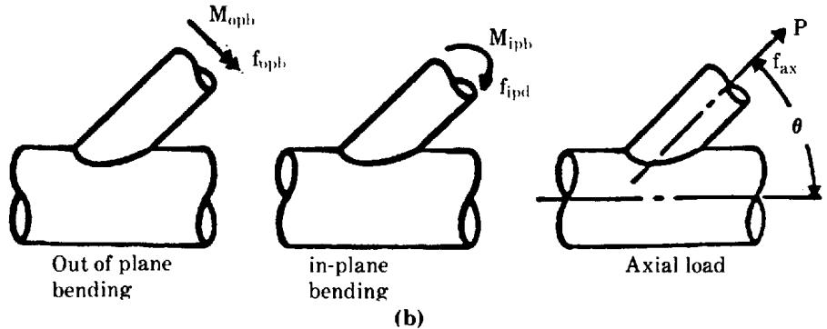  
(a)   
FIG.COMM.F.5-2   
ILLUSTRATIONS OF BRANCH MEMBER STRESSES   
CORRESPONDING TO MODE OF LOADING

2. SCF formulas based on the Kellogg formula (Reference F7). This set of SCF formulas has provision for grouted joints. However, these formulas should be used with caution since recent data suggest that grout may only effect SCFs for loadings and joint geometries that cause chord ovalization.   
3. SCF formulas developed by Lloyds Register, London (References F14 and F15), that are derived from strain gaged acrylic models. These are based on physically reasonable limits rather than statistical correlation techniques.   
4. Other more recent works by Gibstein (Reference F16), Buitrago (Reference F26), and Tebbett (Reference F27).

Caution should be exercised when using parametric equations out of their ranges of calibration.

Cumulative fatigue damage should be assessed at a minimum of four points around each tubular connection. At saddle points, superimpose axial and out-of-plane bending hot spot stresses, while at crown points, superimpose axial and in-plane bending hot spot stresses as illustrated in Figure Comm. F.5-2(a). The nominal brace member stresses $\mathbf{f_{ax}}$ , $\mathbf{f_{ibp}}$ , $\mathbf{f_{opb}}$ , corresponding to three modes of loading are shown in Figure Comm. F.5-2(b). Under combined loading, maximum hot spot stress may occur at circumferential locations other than saddle or crown positions. When assessing damage at eight or more points, the stress distribution should be considered using model test, finite element analysis or parametric studies (Reference F27). When this information is not available, simplified stress distribution formulas (References F17, F18 and F19) may be used.

All SCF formulas listed in this section should, in the strict sense, be used for simple planar joints. The effects of SCF due to loading of out-of-plane brace members should be considered. Use of SCF formulas which incorporate loading interactions of all the relevant braces has been proposed (Reference F20).

Theoretically, joints should be classified by geometry and loading for each time step considered in the fatigue analysis. Since this approach is prohibitively complex, simplified joint classification schemes are typically used. Joints with stresses induced primarily by frame actions may be classified by the maximum loading case for each wave direction considered. If joint static strength design has been performed for that particular direction, the corresponding storm loading case can be used. When classifying joints in the wave zone, interactions between local wave loading and frame actions need to be considered.

Effect of Sea Water. Corrosion fatigue may severely limit the fatigue performance of welded tubular con

nectons in offshore structures. There have been suggestions that design S-N curves derived from tests in air should be devalued to account for the effects of various sea water environments. Although available data indicate that with proper cathodic protection total fatigue life approaches that measured in air, experience shows that over the life of the structure cathodic protection tends to be intermittent with impressed current systems, allowing at least some corrosion fatigue damage. Fatigue cracks which initiate during one of the lapses could continue to grow at an accelerated rate.

Sea water test data available in 1973 (Reference F8) are shown in Figure Comm. F.5-3. Notched and welded specimens, with and without cathodic protection, are plotted along with data from complete tubular connections. The tests which went 109 cycles were welded plate bending specimens; although they did not fail, small growing fatigue cracks were found when the tests were discontinued after about a year of cycling. The trend of the data, together with consideration of the effects of random loading, suggested that the original AWS curve X, which flattens at 2 million cycles, might be unconservative in the higher cycle range. The data as a whole are more consistent with the modified curve X (forerunner of the current API curve X).

The results of more recent tests (References F9 and F13) are shown in Figure Comm. F.5-4. The data are separated two ways:

(1) Butt welds and welds with profile control versus fillet welds and welds without profile control. This distinction is consistent with separate API curves X and $\mathbf{X}^{\prime}$ as described earlier.   
(2) Free corrosion (FC) versus cathodic protection (CP).

Again, the design curves provide a reasonable lower bound to all the data. The free corrosion data tend to crowd a bit closer to the curve than the air data (Figure Comm. F.5-1, and the Gurney scatterband in Figure Comm. F.5-4, but this is accompanied by reduced scatter. Tests with cathodic protection show some tendency toward longer fatigue lives, but there is much more scatter and some early failures at about the same time as for free corrosion. Although fracture mechanics crack growth tests indicate that sea water and cathodic protection should accelerate crack growth rates, the total fatigue life for the as-welded connections tested shows a remarkably consistent lowest-common-denominator, when indexed to the severity of the notch at the toe of the weld.

Research in this area is continuing. However, for the time being, there seems to be no compelling evidence that design S-N curves need to be further devalued, beyond the provisions of Section F.2.5.

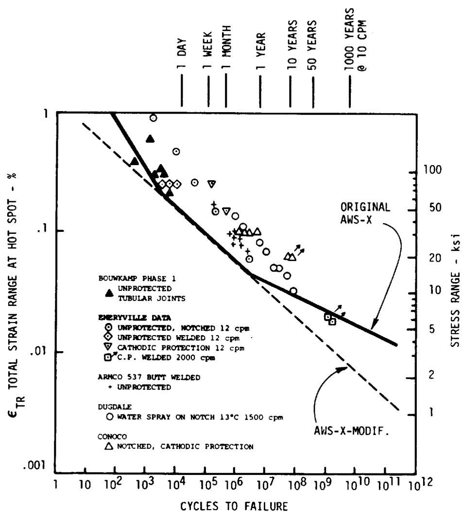

FIG.COMM.F.5-3

CORROSION-FATIGUE DATA

NOTCHED OR WELDED SPECIMENS

IN SEA WATER

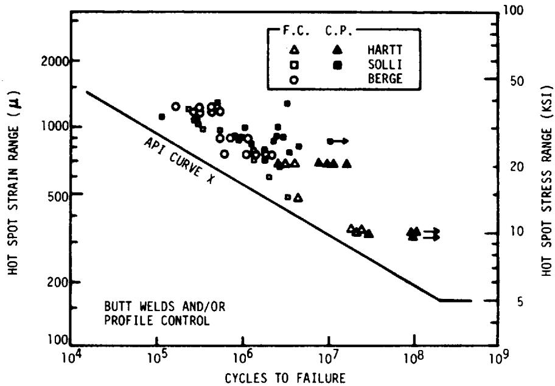

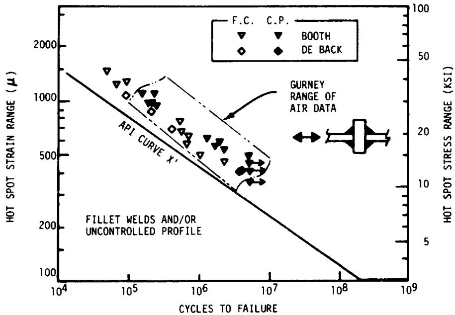  
FIG.COMM.F.5-4 RECENT TESTS IN SEA WATER

COMMENTARY G FOUNDATION DESIGN

COMM. G.2 FILE FOUNDATIONS

Comm. G.2.2 Drilled and Grouted Piles. There are two types of drilled and grouted piles as follows:

1. Single-Stage. For the single-staged, drilled and grouted pile, an oversized hole is drilled to the required penetration, a pile is lowered into the hole and the annulus between the pile and the soil is grouted. This type pile can be installed only in soils which will hold an open hole to the surface. As an alternative method, the pile with expendable cutting tools attached to the tip can be used as part of the drill stem to avoid the time required to remove the drill bit and insert a pile.   
2. Two-Stage. The two-staged, drilled and grouted pile consists of two concentrically placed piles grouted to become a composite section. A pile is driven to a penetration which has been determined to be achievable with the available equipment and below which an open hole can be maintained. This outer pile becomes the casing for the next operation which is to drill through it to the required penetration for the inner or "insert" pile. The insert pile is then lowered into the drilled hole and the annuli between the insert pile and the soil and between the two piles are grouted. Under certain soil conditions, the drilled hole is stopped above required penetration, and the insert pile is driven to required penetration. The diameter of the drilled hole should be at least 150 mm (6 in) larger than the pile diameter.

COMM. G.4 AXIAL PILE CAPACITY IN CLAY

General. Estimating pile capacity in clay soils requires considerable judgment in selecting design parameters and in interpreting calculated capacities. Some of the items that should receive design consideration are detailed in the following paragraph.

Alternative Methods of Determining Pile Capacity. Alternative methods of determining pile capacity in clays, which are based on sound engineering principles and are consistent with industry experience, exist and may be used in practice. The method found in recent editions of RP2A is one such method and is as follows:

For piles driven through clay, $f$ may be equal to or less than, but should not exceed, the undrained shear strength of the clay, $c$ , as determined in accordance with Reference G4, or as determined by miniature vane shear tests.

Unless test data indicate otherwise, $f$ should not exceed $c$ or the following limits:

1. For highly plastic clays, such as found in the Gulf of Mexico, $f$ may be equal to $c$ for underconsolidated and normally consolidated clays. For overconsolidated clays, $f$ should not exceed $48 \, \text{kPa}$ ( $1 \, \text{k/ft}^2$ ) for shallow penetrations or $c$ equivalent to a normally consolidated clay for deeper penetrations, whichever is greater.

2. For other types of clay

$$f = c \quad \text{f o r} c <   24 \mathrm{k P a} (0. 5 \mathrm{k} / \mathrm{f t}^{2})$$

$$f \quad = c / 2 \quad f o r c > 72 k P a (0. 75 k / f t^{2})$$

f varies linearly for values of $c$ between the above limits.

For other methods, see References G5, G6 and G7.

Olson, Reference G8, has shown that, on the average, the above cited methods predict the available, limited pile load test data base results with comparable accuracy. However, capacities for specific situations computed by different methods may differ by a significant amount. In such cases, pile capacity determination should be based on engineering judgment which takes into account site specific soils information, available pile load test data, and industry experience in similar soils.

Establishing Design Strength and Effective Over-Burden Stress Profiles. The axial pile capacity in clay determined by these procedures is directly influenced by the undrained shear strength and effective overburden stress profiles selected for use in analyses. The wide variety of sampling techniques and the potential large scatter in the strength data from the various types of laboratory tests complicate appropriate selection.

Unconsolidated-undrained triaxial compression tests on high quality samples, preferably taken by pushing a thin-walled sampler with a diameter of $75\mathrm{mm}$ (3 in) or more, are recommended by establishing strength profile variations because of their consistency and repeatability. In selecting the specific shear strength values for design, however, consideration should be given to the sampling and testing techniques used to correlate the procedure to available, relevant pile load test data. The experience with platform pile performance is another consideration that may play an important role in assessing the appropriate shear strength interpretation.

Miniature vane tests on the pushed samples should correlate well with the UU test results and will be particularly beneficial in weak clays. In-situ testing with a vane or cone penetrometer will help in assessing sampling disturbance effects in gassy or highly structured soils. Approaches such as the SHANSEP technique (Stress History and Normalized Soil Engineering Properties, Reference G9) can help provide a more consistent interpretation of standard laboratory tests and will provide history information used to determine the effective overburden stress in normally or underconsolidated clays.

Pile Length Effect. Long piles driven in clay soils may experience capacity degradation due to the following factors:

(1) Continued shearing of a particular soil horizon during pile installation.

(2) Lateral movement of soil away from the pile due to "pile whip" during driving.   
(3) Progressive failure in the soil due to strength reduction with continued displacement (softening).

The occurrence of degradation due to these effects depends on many factors related to both installation conditions and soil behavior. Methods of estimating the possible magnitude of reduction in capacity of long piles may be found in the References G5, G6, G7 and G10.

COMM. G.6 AXIAL PILE PERFORMANCE

Comm. G.6.1 Static Axial Response of Piles

An analytical method for determining axial pile performance is provided in Reference G11. This method makes use of axial pile shear transfer vs. local pile deflection (t-z) curves to model the axial support provided by the soil along the side of the pile. An additional (Q-z) curve is used to model the tip end bearing vs. tip deflection response. Methods for constructing t-z and Q-z curves are given in Section G.7.

In some circumstances, i.e., for soils that exhibit strain-softening behavior and/or where the piles are axially flexible, the actual capacity of the pile may be less than that given by Equation G.4-1. In these cases an explicit consideration of these effects on ultimate axial capacity may be warranted. Note that other factors such as increased axial capacity under loading rates associated with storm waves may counteract the above effects. For more information see Section G.6.2 as well as Reference G90.

Comm. G.6.2 Cyclic Axial Response of Piles

Comm. G.6.2.1 Introduction. The axial capacity of a pile is defined as its maximum axial load resistance, while pile performance is a specified service requirement by the owner (e.g., deflection(s) at the pile head). Both axial capacity and pile performance are dependent upon many variables (e.g., the types of soils, the pile characteristics, the installation methods, and the loading characteristics) and should be considered in pile design. This commentary addresses the influences of cyclic loading characteristics on axial capacity and pile performance.

Comm. G.6.2.2 Loadings. Axial loadings on piles are developed from a wide variety of operating, structural, and environmental sources (Reference G39). Gravity loads are generally long duration loadings and are often referred to as static loadings. Refer to Section C.2 for more detailed definitions of gravity loads.

Environmental loadings are developed by winds, waves and currents, earthquakes, and ice floes. These loadings can have both low and high frequency cyclic components in which the rates of load application and duration are measured in seconds. Storm and ice loadings

can have several thousand cycles of applied forces, while earthquakes can induce several tens of cycles of forces (Reference G39).

Comm. G.6.2.3 Static Capacity. For most fixed offshore platforms supported on piles, experience has proven the adequacy of determining pile penetration based on static capacity evaluations, and static ultimate design loads and commonly accepted working strength design (WSD) factors of safety that, in part, account for the cyclic loading effects (Reference G40). The LRFD provisions for resistance factors for pile design have been calibrated against these factors of safety.

Detailed consideration of cyclic loading effects may be warranted when there are unusual limitations on pile penetrations or when certain soils, loading conditions or novel structures (e.g., compliant towers) are involved.

Comm. G.6.2.4 Cyclic Loading Effects. Compared with long-term, static loadings, cyclic loadings may have the following important influence on pile axial capacity and stiffness:

-- Decrease capacity and stiffness due to the repeated loadings (Reference G41).   
- Increase capacity and stiffness due to the high rates of loadings, whether cyclic or noncyclic (Reference G42)

The resultant effect on capacity is primarily influenced by the pile properties (stiffness, length, diameter, material), the soil characteristics (type, stress history, strain rate and cyclic degradation), and the loadings (numbers and magnitudes of repeated loadings).

Cyclic loading may also cause accumulation of pile displacements and either stiffening and strengthening or softening and weakening of the soils around the pile. Hysteretic and radiation damping dissipate the loading energy in the soil (Reference G43). For earthquakes, the free-field ground motions (independent of the presence of the piles and structure) can develop important cyclic straining effects in the soils; these effects may influence pile capacity and stiffness (References G44 and G45).

Comm. G.6.2.5 Analytical Models. A variety of analytical models have been developed and applied to determine the cyclic axial response of piles. These models can be grouped into two general categories:

Discrete Element Models - The soil around the pile is idealized as a series of uncoupled "springs" or elements attached between the pile and the far field soil (usually assumed rigid). The material behavior of these elements may vary from linearly elastic to nonlinear, hysteretic, and rate dependent. The soil elements are commonly referred to as t-z (shaft resistance-displacement) and Q-z (tip resistance-displacement) elements (Reference G45-48). Linear or nonlinear dashpots (velocity dependent resistances) can be placed in parallel and series with the discrete elements to model radiation damping and rate of

loading effects (Reference G49 and G50). The pile can also be modeled as a series of discrete elements, e.g., rigid masses interconnected by springs or modeled as a continuous rod, either linear or nonlinear. In these models material properties (soil and pile) can vary along the pile.

Continuum Models - The soil around the pile is idealized as a continuum attached continuously to the pile. The material behavior may incorporate virtually any reasonable stress-strain rules the analyst can devise. Depending on the degree of nonlinearity and heterogeneity, this model can be quite complicated. Again the pile is typically modeled as a continuous rod, either linear or nonlinear. In these models material properties can vary in any direction (References G51-53).

There is a wide range of assumptions that can be used regarding boundary conditions, solution characteristics, etc., that lead to an unlimited number of variations for either of the two approaches.

Once the idealized model is established and the relevant equations developed, then a solution technique must be selected. For simple models, a closed form analytic approach may be possible. Otherwise, a numerical procedure must be used. In some cases a combination of numerical and analytical approaches is helpful. The most frequently used numerical solution techniques are the finite difference method and the finite element method. Either approach can be applied to both the discrete element and continuum element models. Discrete element and continuum element models are occasionally combined in some instances (References G39 and G49). Classical finite element models have been used for specialized analyses of piles subject to monotonic axial loadings (Reference G51).

For practical reasons discrete element models solved numerically have seen the most use in evaluation of piles subjected to high intensity cyclic loadings. Results from these models are used to develop information on pile accumulated displacements and on pile capacity following high intensity cyclic loadings (References G47 and G48).

Elastic continuum models solved analytically (similar to those used in machine vibration analyses) have proven to be useful for evaluations of piles subjected to low intensity, high frequency cyclic loadings at or below design working loadings (References G51 and G52). At higher intensity loading, where material behavior is likely to be nonlinear, the continuum model solved analytically can still be used by employing equivalent linear properties that approximate the nonlinear, hysteretic effects (Reference G54).

Comm. G.6.2.6 Soil Characteristics. A key part of developing realistic analytical models to evaluate cyclic loading effects on piles is the characterization of soil-pile interaction behavior. High quality in situ, laboratory, and model-prototype pile load tests are essential in

such characterizations. In developing soil-pile interaction (soil) characterizations, it is important that pile installation, and pile loading conditions be integrated into the testing programs (References G39 and G48).

In situ tests (e.g., vane shear, cone penetrometer, pressuremeter) can provide important insights into in-place soil behavior and stress-strain properties (Reference G55). Both low and high amplitude stress-strain properties can be developed. Long-term (static, creep), short-term (dynamic, impulsive), and cyclic (repeated) loadings sometimes can be simulated with in situ testing equipment.

Laboratory tests on representative soil samples permit a wide variety of stress-strain conditions to be simulated and evaluated (Reference G56). Soil samples can be modified to simulate pile installation effects (e.g., remolding and reconsolidating to estimated in situ stresses). The samples can be subjected to different boundary conditions (triaxial, simple-shear, interface-shear), and to different levels of sustained and cyclic shear time histories to simulate in-place loading conditions.

Tests on model and prototype piles are another important source of data to develop soil characterizations for cyclic loading analyses. Model piles can be highly instrumented, and repeated tests performed in soils and for a variety of loadings (References G57 and G58). Geometric scale, time scale and other modeling effects should be carefully considered in applying results from model tests to prototype behavior analyses.

Data from load tests on prototype piles are useful for calibrating analytical models (References G59-62. Such tests, even if not highly instrumented, can provide data to guide development of analytical models. These tests can also provide data to verify results of soil characterizations and analytical models (References G39, G48-49, and G63-64). Prototype pile load testing coupled with in situ and laboratory soil testing, and realistic analytical models can provide an essential framework for making realistic evaluations of the responses of piles to cyclic axial loadings.

Comm. G.6.2.7 Analysis Procedure. The primary steps in performing an analysis of cyclic axial loading effects on a pile using discrete element models are summarized in the following sections.

Loadings. The pile head loadings should be characterized in terms of their magnitudes, durations, and numbers of cycles. This includes both long-term loadings and short-term cyclic loadings. Typically, the design static and cyclic loadings expected during a design event are chosen. These loads should be factored according to Section C.3.

Pile Properties. The properties of the pile including its diameter, wall thickness, stiffness properties, weight, and length must be defined. This will require an initial estimate of the pile penetration that might be appro

priate for the design loadings. Empirical, pseudostatic methods based on pile load tests or soil tests might be used to make such estimates.

Soil Properties. Different analytical approaches will require different soil parameters. For the continuum model the elastic properties of the soil (E, G, $\nu$ , D) are required. In the discrete element model soil resistant-displacement relationships along the pile shaft (t-z) and at its tip (Q-z) should be determined. In situ and laboratory soil tests, and model and prototype pile load tests can provide a basis for such determinations. These tests should at least implicitly include the effects of pile installation, loading, and time effects. In addition, the test should be performed so as to provide insight regarding the effects of pile loading characteristics. Most importantly, the soil behavior characteristics must be appropriate for the analytical model(s) to be used, duly recognizing the empirical bases of these models.

Cyclic Loading Analyses. Analyses should be performed to determine the response (load resistance and displacement) characteristics of the pile subjected to its design static and cyclic loadings. Recognizing the inherent uncertainties in evaluations of pile loadings and soil-pile behavior, parametric analyses should be performed to evaluate the sensitivities of the pile response to these uncertainties. The analytical results should develop realistic predictions of pile load resistance and accumulated displacements at design loadings. In addition, following the simulation of static and cyclic design loadings, the pile should be further analyzed so as to estimate its reserve capacity and after-cyclic loading resistance.

Comm. G.6.2.8 Performance Requirements. A primary objective of these analyses is to ensure that the pile and its penetration are adequate to meet the structure's requirements.

In conventional static capacity based design, the pile design loading (factored gravity loads plus maximum amplitude of cyclic loadings) is compared against the factored pile capacity. The pile capacity is defined as the integrated shaft and tip resistance (Section G.4). The factored loads are defined in Section C.3. This procedure ensures that the pile has an adequate reserve above its maximum anticipated loading in order to accommodate uncertainties in loadings and pile resistances.

The pile performance for explicit cyclic loading analyses should be evaluated separately. The pile should have a capacity that provides an adequate margin of reserve above its design loadings. In addition, the pile must not settle or pull-out, nor accumulate displacements to the extent that could constitute failure of the structure-foundation system.

Comm. G.6.2.9 Qualifications. Modeling cyclic loading effects explicitly may improve the designers insight into the relative importance of the loading characteristics. On the other hand extreme care should be exercised in applying this approach; historically, cyclic effects have been accounted for implicitly. Design

methods developed and calibrated on an implicit basis may need extensive modification where explicit algorithms are employed.

COMM. G.8 SOIL REACTION FOR LATERALLY LOADED PILES

Generally, under lateral loading, clay soils behave as a plastic material which makes it necessary to relate pile-soil deformation to soil resistance. To facilitate this procedure, lateral soil resistance deflection (p-y) curves should be constructed using stress-strain data from laboratory soil samples. The ordinate for these curves is soil resistance, p, and the abscissa is soil deflection, y. By iterative procedures, a compatible set of load-deflection values for the pile-soil system can be developed.

For a more detailed study of the construction of p-y curves refer to the following publications: Reference G14 for soft clay, Reference G15 for stiff clay and Reference G16 for sand.

Designers were cautioned under the WSD procedure of RP2A to be satisfied that the overall structural foundation system would not fail under lateral-overloads such that any pile or at least the entire foundation system could withstand an increase in lateral load. Since the LRFD procedure considers the extreme environmental event to be factored by 1.35, the past lateral-overload consideration is now consequently satisfied through normal LRFD procedures.

COMM. G.9 PILE GROUP ACTION

Comm. G.9.1 General. For more detailed discussions refer to References G17, G18, G19 and G20.

Comm. G.9.2 Axial Behavior. In general, group effects depend considerably on pile group geometry and penetrations, and thickness of any bearing strata underneath the pile tips. Refer to References G21 and G22.

Comm. G.9.3 Lateral Behavior. O'Neill and Dunnavant (Reference G23) found the four group analysis methods examined, the following methods to be the most appropriate for use in designing group pile foundations for the given loading conditions; (a) advanced methods, such as PILGR2R, for defining initial group stiffness; (b) the Focht-Koch (1973) method (Reference G24) as modified by Reese (Reference G25) for defining group deflections and average maximum pile moments for design event loads — deflections are probably underpredicted at loads giving deflections of 20 percent or more of the diameter of the individual piles in the group; (c) largest value obtained from the Focht-Koch and by methods for evaluating maximum pile loads at a given group deflection.

Past experience and the results from Reference G23 confirm that the available tools for analysis of laterally loaded pile groups provide approximate answers that sometimes deviate significantly from observed behavior, particularly with regard to deflection calculations. Also, limitations in site investigation procedures and in the ability to predict single-pile soil-pile interaction

behavior produce uncertainty regarding proper soil input to group analyses. Therefore, multiple analyses should be performed for pile groups using two or more appropriate methods of analysis and upper-bound and lower-bound values of soil properties in the analyses. By performing such analyses, the designer will obtain an appreciation for the uncertainty involved in his predictions of foundation performance and can make more informed decisions regarding the structural design of the foundation and superstructure elements.

Comm. G.9.4 Pile Group Stiffness and Structure Dynamics. For insight regarding how changes in foundation stiffness can impact the natural frequencies of tall steel jack platforms, see Reference G93.

Comm. G.10.4 Load Check Due to Weight of Hammer During Hammer Placement.

1. Effective Length Factors, K. The values of 2.3 and 2.4 for pile and conductor add-ons, respectively, are suggested for typical installations, but designers should use the K-factor that is appropriate for the cantilevered end-span of a continuous beam which differs from the AISC theoretical or recommend K-value for a fixed-end cantilever.   
3. Bending Moment Determination and Column Resistance Check. For sizing either nearly vertical or battered add-ons, the recommended method of calculating the first-order P-△ moments is more accurate than the familiar procedure of modifying the primary support moment (M) as defined in Section D.3.2. This can be readily seen by noting that for the case of battered pile add-ons the moment modifier, $\mathbf{C}_{\mathrm{m}} / (1 - \mathbf{f}_{\mathrm{c}} / \phi_{\mathrm{c}}\mathbf{F}_{\mathrm{e}})$ , would usually be less than one, under-predicting the total design moment. In the case of nearly vertical add-ons, such as conductors, use of the moment modifier term would yield values that would overpredict the total design moment. See Reference G26.

Comm. G.10.5 Stresses During Driving. In the absence of reliable data regarding the limitation of the combined static and dynamically induced stresses during driving, the limiting static portion of the total stress during driving is increased by an amount (i.e., $30\%$ ) equal to the factored gravity load. Note that the dynamic load factor to be used in the combined stresses during driving check has not yet been addressed.

When using hydraulic hammers it is possible that the driving energy may exceed the rated energy and this should be considered in the analyses. Also the static stresses induced by hydraulic hammers need to be computed with special care due to the possible variations in driving configurations, for example when driving vertical piles without lateral restraint and exposed to environmental forces. See also M.5.12.

COMM. G.13 STABILITY OF SHALLOW FOUNDATIONS: SUPPLEMENTAL ALTERNATIVES

1. Bearing Capacity. The development of bearing capacity equations, such as Equations G.13-1 through

## G.13-6, has been predicated on the assumption that the soil is a rigid, perfectly plastic material that obeys the Mohr-Coulomb yield criterion. Several comprehensive investigations on this subject have been undertaken in the past 25 years. Although the details of the various studies differ somewhat, the general framework is fundamentally the same. The procedures that will be followed here are those described by A.S. Vesic (Reference G27).

Equations G.13-1,2,3,5, and 6 are actually special cases of Equation G.13-4, the most general form of the bearing capacity equation. Thus in the following discussion attention is limited to Equation G.13-4.

Equations for factors $\mathbf{N}_{\mathbf{c}}$ , $\mathbf{N}_{\mathbf{q}}$ and $\mathbf{N}_{\gamma}$ are given in the discussion of Equation G.13-4. Figure Comm. G.13-1 provides a plot and tabulation of these factors for varying friction angles, $\phi'$ .

2. Effective Area. Load eccentricity decreases the ultimate vertical load that a footing can withstand. This effect is accounted for in bearing capacity analysis by reducing the effective area of the footing according to empirical guidelines.

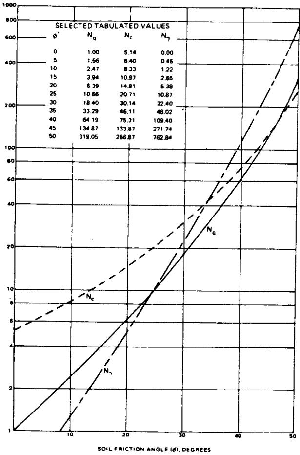  
FIG.COMM.G.13-1 RECOMMENDED BEARING CAPACITY FACTORS

Figure Comm. G.13.5-2(A) shows footings with eccentric loads, the eccentricity, e, being the distance from the center of a footing to the point of action of the resultant, measured parallel to the plane of the soil-footing contact. The point of action of the resultant is the centroid of the reduced area; the distance e is $\mathbf{M} / \mathbf{Q}'$ , where $\mathbf{M}$ is the overturning moment and $\mathbf{Q}'$ is the vertical load.

For a rectangular base area, Figure Comm. G.13-2(B), eccentricity can occur with respect to either axis of the footing. Thus, the reduced dimensions of the footing are:

$$\begin{array}{l} \mathbf{L}^{\prime} = \mathbf{L} - 2 \mathbf{e}_{1} \\ \mathbf{B}^{\prime} = \mathbf{B} - 2 \mathbf{e}_{2}. \dots \dots \dots \dots \dots \dots \dots \dots \dots \dots \dots \dots \dots \dots \tag{Comm.G.13-9} \\ \end{array}$$

where $\mathbf{L}^{\prime}$ and $\mathbf{B}^{\prime}$ are the foundation length and width, respectively, the prime denotes effective dimensions, and $\mathbf{e}_1$ and $\mathbf{e}_2$ are eccentricities along the length and width.

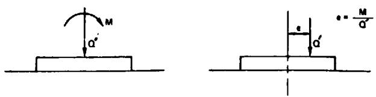

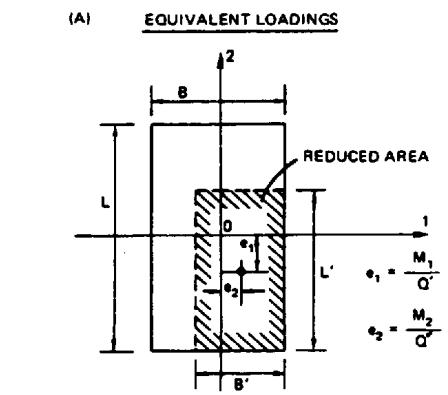  
(8) REDUCED AREA-RECTANGULAR FOOTING

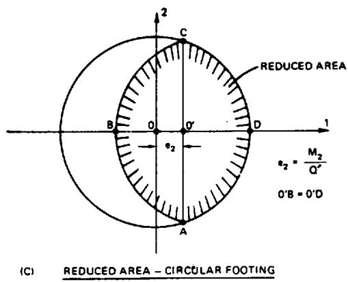  
FIG.COMM.G.13-2 ECCENTRICALLY LOADED FOOTINGS

For a circular base with radius, R, the effective area is shown in Figure Comm. G.13-2(C). The centroid of the effective area is displaced a distance $\mathbf{e}_2$ from the center of the base. The effective area is then considered to be two times the area of the circular segment ADC.

In addition, the effective area is considered to be rectangular with a length-to-width ratio equal to the ratio of line lengths AC to BD. The effective dimensions are therefore:

$$\begin{array}{l} \mathbf{A}^{\prime} = 2 \mathbf{s} = \mathbf{B}^{\prime} \mathbf{L}^{\prime} = \text{r e d u c e d a r e a} \\ L^{\prime} = \left[ 2 s \left(\frac{R + e}{R - e}\right)^{1 / 2} \right]^{1 / 2}. \dots \dots \dots . (C o m m G. 13 - 10) \\ \mathbf{B}^{\prime} \quad = \quad \mathbf{L}^{\prime} \left(\frac{\mathbf{R} - \mathbf{e}}{\mathbf{R} + \mathbf{e}}\right)^{1 / 2} \\ \end{array}$$

where:

$$s = \frac{\pi R^{2}}{2} - [ e \sqrt{R^{2} - e^{2}} + R^{2} \sin^{-1} (\frac{e}{R}) ]$$

Examples of effective areas as a function of eccentricity are shown in Figure Comm. G.13-3 in a dimensionless form. No data are available on other foundation shapes. Intuitive approximations must be made to find an equivalent rectangular or circular foundation when nonstandard shapes are encountered.

3. Correction Factors. The correction factors $\mathbf{K}_{\mathbf{c}}$ , $\mathbf{K}_{\mathbf{q}}$ , and $\mathbf{K}_{\gamma}$ are usually written

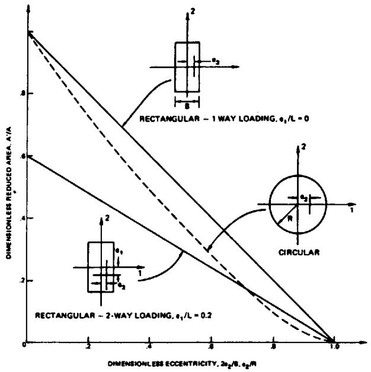  
FIG.COMM.G.13-3 AREA REDUCTION FACTORS ECCENTRICALLY LOADED FOOTINGS

$$\mathbf{K c} = \mathbf{i_{c}} \cdot \mathbf{s_{c}} \cdot \mathbf{d_{c}} \cdot \mathbf{b_{c}} \cdot \mathbf{g_{c}}$$

$$\mathbf{K} \mathbf{q} = \mathbf{i}_{\mathbf{q}} \cdot \mathbf{s}_{\mathbf{q}} \cdot \mathbf{d}_{\mathbf{q}} \cdot \mathbf{b}_{\mathbf{q}} \cdot \mathbf{g}_{\mathbf{q}}$$

$$\mathbf{K} \gamma = i_{\gamma}. s_{\gamma}. d_{\gamma} b_{\gamma}. g_{\gamma} \quad \dots \dots \dots \dots \dots \dots \dots \dots \dots \dots \dots \dots \dots \dots \tag{Comm. G.13-11}$$

where i, s, d, b, and g are individual correction factors related to load inclination, foundation shape, embedment depth, base inclination, and ground surface inclination, respectively. The subscripts c, q, and $\gamma$ identify the factor （$\mathbf{N}_{\mathbf{c}},\mathbf{N}_{\mathbf{q}},$ or $\mathbf{N}_{\gamma}$ ) with which the correction term is associated.

The recommended correction factors for $\mathbf{N}_{\mathbf{c}}$ and $\mathbf{N}_{\mathbf{q}}$ that account for variations in loading and geometry not considered in the theoretical solutions are obtained from the expressions for $\mathbf{N}_{\mathbf{c}}$ and $\mathbf{N}_{\mathbf{q}}$ as suggested by DeBeer and Ladanyi (as cited by Vesic). Letting kq represent some general individual correction factor for the $\mathbf{N}_{\mathbf{q}}$ term (for example, $i_{\mathbf{q}}$ which accounts for load inclination), the relationship between $\mathbf{N}_{\mathbf{c}}$ and $\mathbf{N}_{\mathbf{q}}$ intuitively suggests that:

$$\mathrm{k}_{\mathrm{c}} \mathrm{N}_{\mathrm{c}} = (\mathrm{k}_{\mathrm{q}} \mathrm{N}_{\mathrm{q}} - 1) \cot \phi \dots \dots \dots \dots \dots \dots \dots \dots \dots \dots \dots \dots \dots \dots \dots \dots \dots \dots \dots \dots \tag{Comm. G.13-12}$$

Using $\mathbf{N}_{\mathbf{c}} = (\mathbf{N}_{\mathbf{q}} - 1)\cot \phi$ and solving for $\mathbf{k}_{\mathbf{c}}$ in terms of $\mathbf{N}_{\mathbf{c}}$ yields

$$\mathbf{k}_{\mathrm{e}} = \mathbf{k}_{\mathrm{q}} - \frac{1 - \mathbf{k}_{\mathrm{q}}}{\mathbf{N}_{\mathrm{c}} \tan \phi}. \dots \dots \dots \dots \dots \dots \dots \dots \dots \dots \dots \dots \dots \tag{Comm. G.13-13}$$

Thus, the appropriate correction factor for the $\mathbf{N}_{\mathrm{c}}$ term can be determined once it is known for the $\mathbf{N}_{\mathbf{q}}$ term. Most expressions for correction factors for $\mathbf{N}_{\mathbf{q}}$ and $\mathbf{N}_{\gamma}$ are determined empirically. Following are the recommended expressions for the correction factors.

Inclination Factors:

$$\begin{array}{l} i_{q} = \left[ 1 - \frac{H}{Q + B^{\prime} L^{\prime} c \cot \phi} \right]^{m}; \quad \phi > 0 \\ i_{\gamma} = \left[ 1 - \frac{H}{Q + B^{\prime} L^{\prime} c \cot \phi} \right]^{m + 1}; \phi > 0 \\ \ldotp \ldotp \ldotp \ldotp \ldotp \ldotp \ldotp \ldotp \ldotp \ldotp \ldotp \ldotp \ldotp \ldotp \ldotp \ldotp \ldotp \ldotp \ldotp \ldotp \ldotp \ldotp \ldotp \ldotp \ldotp \ldotp \ldotp \ldotp \ldotp \ldotp \ldotp \ldotp \ldotp \ldotp \dots . (C o m m. G. 13 - 14) \\ \end{array}$$

$$\begin{array}{l} i_{c} = i_{q} - \frac{1 - i_{q}}{N_{c} \tan \phi}; \phi > 0 \\ i_{c} = 1 - \frac{m H}{B^{\prime} L^{\prime} c N_{c}}; \phi = 0 \\ \end{array}$$

where $\mathbf{H}$ is the projection of the load resultant on the plan of the footing, $\mathbf{m}$ is a dimensionless function of $\mathbf{B}^{\prime} / \mathbf{L}^{\prime}$ and $\Theta$ is the angle between the long axis of the footing and $\mathbf{H}$ . The general expression for $\mathbf{m}$ is

$$\mathbf{M} = \mathbf{M}_{\mathrm{L}} \cos^{2} \Theta + \mathbf{M}_{\mathrm{B}} \sin^{2} \Theta$$

where:

$$\mathbf{M}_{\mathbf{L}} = \frac{\mathbf{L}^{\prime}}{1 + \frac{\mathbf{B}^{\prime}}{\mathbf{B}^{\prime}}} \text{a n d} \mathbf{M}_{\mathbf{B}} = \frac{\mathbf{B}^{\prime}}{1 + \frac{\mathbf{L}^{\prime}}{\mathbf{L}^{\prime}}}$$

Shape Factors:

Rectangular:

$$\begin{array}{l} \mathbf{s}_{\mathrm{c}} \quad = 1 + \frac{(\mathbf{B}^{\prime})}{\mathbf{L}^{\prime}} \quad \frac{(\mathbf{N}_{\mathrm{q}})}{\mathbf{N}_{\mathrm{c}}} \\ \mathbf{s}_{\mathbf{q}} = 1 + \frac{(\mathbf{B}^{\prime})}{L^{\prime}} \tan \phi \dots \dots . (\text{C o m m . G . 13 - 15}) \\ s_{\gamma} = 1 - 0. 4 \frac{(B^{\prime})}{L^{\prime}} \\ \end{array}$$

Circular (centric load only):

$$\begin{array}{l} \mathrm{s}_{\mathrm{c}} = 1 + \frac{\mathrm{N}_{\mathrm{q}}}{\mathrm{N}_{\mathrm{c}}} \\ \mathbf{s}_{\mathbf{q}} = 1 + \tan \phi . \tag{Comm.G.13-16} \\ \mathrm{S}_{\gamma} = 0. 6 \\ \end{array}$$

For an eccentrically loaded circular footing, the shape factors for an equivalent rectangular footing are used.

Depth Factors:

$$\begin{array}{r l} \mathrm{d}_{\mathbf{q}} & = 1 + 2 \tan \phi (1 - \sin \phi)^{2} \underset{\overline{{\mathbf{B}}}^{\prime}} {\mathrm{D}} \\ & \end{array}$$

$$\mathbf{d}_{\gamma} = 1. 0 \dots \dots \dots \dots \dots \dots \dots \dots \dots \dots \dots \dots \dots \dots \dots \dots \dots \dots \dots \dots \tag{Comm.G.13-17}$$

$$\mathbf{d}_{\mathbf{c}} = \mathbf{d}_{\mathbf{q}} - \frac{\mathbf{1} - \mathbf{d}_{\mathbf{q}}}{\mathbf{N}_{\mathbf{c}} \tan \phi}$$

It should be emphasized that the effect of foundation embedment is very sensitive to soil disturbance at the soil/structure interface along the sides of the embedded base. Where significant disturbance is expected, it may be prudent to reduce or discount entirely the beneficial effect of overburden shear strength.

Base and Ground Surface Inclination Factors:

Base inclination:

$$\begin{array}{l} \mathbf{b}_{\mathbf{q}} = \mathbf{b}_{\gamma} = (1 - \nu \tan \phi)^{2}; \quad \phi > 0 \\ \begin{array}{r l} \mathrm{b}_{\mathrm{c}} & = \mathrm{b}_{\mathrm{q}} - \frac{1 - \mathrm{b}_{\mathrm{q}}}{\mathrm{N}_{\mathrm{c}} \tan \phi}; \quad \phi > 0 \\ & \dots \dots \dots \dots \dots \dots \dots \dots \dots \dots \dots \dots \dots \dots \dots \dots \dots \dots \dots \dots \dots \dots \dots \dots \dots \dots \dots \dots \tag{Comm. G.13-18} \end{array} \\ \mathbf{b}_{\mathrm{c}} \quad = 1 - \frac{2 \nu}{\mathbf{N}_{\mathrm{c}}}; \quad \phi = 0 \\ \end{array}$$

Ground Slope:

$$\begin{array}{l} \mathbf{g}_{\mathbf{q}} = \mathbf{g}_{\gamma} = (1 - \tan \beta)^{2}; \phi > 0 \\ g_{c} = g_{q} - \frac{1 - q_{q}}{N_{c} \tan \phi}; \quad \phi > 0 \tag{Comm. G.13-19} \\ \end{array}$$

$$\mathbf{g}_{\mathrm{c}} = 1 - \frac{2 \beta}{\mathbf{N}_{\mathrm{c}}} \quad \phi = 0$$

where $\nu$ and $\beta$ are base and ground inclination angles in radians. Figure Comm. G.13-4 defines these angles for a general foundation problem.

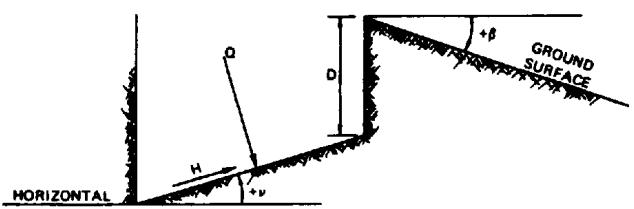  
FIG.COMM.G.13-4 DEFINITIONS FOR INCLINED BASE AND GROUND SURFACE (After Vesic)

4. Applications and Limitations. If loading occurs rapidly enough so that no drainage and hence no dissipation of excess pore pressures occurs, then an 'undrained analysis' (also called 'short term' or 'immediate') is to be performed. The soil may be treated as if $\phi = 0^{\circ}$ such that the stability of the foundation is controlled by an appropriate undrained shear strength, c. In this case Equation G.13-4 reduces to Equation G.13-1.

If the rate of loading is slow enough such that no excess pore pressures are developed (i.e., complete drainage under the applied stresses) and sufficient time has elapsed since any previous application of stresses such that all excess pore pressures have been dissipated, a 'drained analysis' is to be performed. The stability of the foundation is controlled by the drained shear strength of the soil. The drained shear strength is determined from the Mohr-Coulomb effective stress failure envelope (i.e., the cohesion intercept, $c'$ , and the friction angle $\phi$ ).

For sliding analyses Equations G.13-7,8 apply where a horizontal failure plane in the soil is ensured by structural constraints, i.e., shear skirts at sufficiently close spacing. If appropriate, consideration may be given to resistance provided by side shear and passive soil forces. If a horizontal failure plane is not ensured, other potential failure modes should be investigated with the mode giving the lowest lateral resistance selected as the design case.

In cases where shear skirts or similar appurtenances are not employed and for certain combinations of structure weight versus soil strength, failure may occur at the structure-soil interface. For this case consideration should be given to the use of reduced soil strength parameters in Equations G.13-7 and G.13-8 and/or the results of specialized tests aimed at determining an effective coefficient of friction between soil and structure.

5. Special Considerations. Equations G.13-1 through G.13-8 are strictly applicable to conditions of uniform soil strength but reasonable assessment of

equivalent uniform properties can frequently be made. For example, the potential of a deep bearing failure depends on soil strengths at considerably greater depths than that of a sliding failure. Hence, careful attention should be given to defining the soil parameters throughout the expected zone of influence. This may include the reduction of certain strength parameters for loose or highly compressible materials.

Where foundations conditions are highly nonhomogeneous or anisotropic (strength is dependent on load orientation); where load conditions deviate considerably from the simple conditions assumed in the stability formulas (e.g., torsion about the vertical axis of the foundation); where loading rates are such that the conditions are not clearly drained or undrained; or where foundation geometries are highly irregular (e.g., tripod base), the use of these stability formulas is not straightforward and alternative procedures such as one or combinations of the following may be selected.

a. Use of conservative equivalent parameters along with the above mentioned formulas.   
b. Use of limit analysis to determine bounds on collapse loads and to determine relative sensitivity of collapse loads to parameters of interest. An example of the use of such techniques is given in Reference G28.   
c. Use of numerical analyses such as finite differences or finite elements to solve the governing equations directly.   
d. Use of properly scaled model tests such as the centrifuge tests described in Reference G29.

Consideration should be given to the effects of cyclic loading on pore pressures for effective stress analyses and its effect on undrained strength. Some examples of these effects are given in Reference G29.

6. Foundation Capacities. In many offshore applications the lateral loads and overturning moments as well as vertical loads are highly variable. In assessing capacity of foundations, the uncertainty of all factored loads should be considered. A consistent method for accomplishing this is construction of an envelope of load combinations which constitute failure and comparing these limiting conditions with design loading. A more detailed discussion of this procedure is given in Reference G30, under "Geotechnical Consideration."

COMM. G.14 STATIC DEFORMATION OF SHALLOW FOUNDATIONS.

Static deformations are generally considered to be of two types. Short term deformation is the more or less instantaneous response of a foundation to loading and primarily results from shear deformation (shear strain-

ing) of the soil. Long term deformation occurs over a period of time and is primarily associated with a gradual dissipation of excess pore pressure and attendant volume changes of the soil.

Comm. G.14.1 Short Term Deformation. Short term deformation is the more or less instantaneous response of a foundation to loading and primarily results from shear deformation (shear straining) of the soil. Long term deformation occurs over a period of time and is primarily associated with a gradual dissipation of excess pore pressure and attendant volume changes of the soil.

Because soils exhibit nonlinear, path dependent behavior under load the short term deformation problem is quite complex. For monotonic, low level loads (with respect to failure loads) estimates of deformation can be made assuming the soil to be a homogeneous linearly elastic material.

Solutions for conditions other than those given by Equations G.14-1 through G.14-4 including point displacements within the soil's mass itself can be found in Reference G31.

Considerable care must be exercised in determining the elastic constants of the soil since the elastic moduli of soils are strongly dependent on the state of effective mean stress. This is particularly significant for granular highly permeable soils where equivalent moduli must be selected from some weighted average mean stress taken over the volume of soil subjected to significant stresses. For cohesive, relatively impermeable soils a correlation of modulus with strength and overconsolidation ratio usually leads to satisfactory results. Further discussion of these points is presented in References G32 and G33.

Where the foundation base is flexible or the loading is sufficiently severe to create high stresses throughout a significant volume of soil, Equations G.14-1 through G.14-4 are inappropriate and numerical analyses may be required. Finite element and finite difference techniques have the capability of including complex geometries and loadings and nonlinear, variable soil profiles. Special consideration should be given to the potential effects of softening of the soil (reduction in modulus) under cyclic loading.

Comm. G.14.2 Long Term Deformation. The long term settlement of a foundation on clay is a 3-dimensional problem in which stress distributions and pore pressures are coupled. Complex numerical schemes are therefore necessary to determine theoretically exact solutions. Such schemes may be necessary to determine such things as creep, load redistributions, and differential settlements; and to account for important initial conditions such as excess pore pressures. Equation G.14-5 is a widely used simplified estimate of long term or consolidation settlement obtained by assuming a one-dimensional compression of soil layers under an imposed vertical stress.

Because of the finite extent of the foundation, the vertical stress imposed by the structure should be attenuated with depth. An estimate of such attenuation can be determined from elastic solutions such as those referenced above by Poulos and Davis. This approximate method is particularly appropriate where settlement is governed by thin, near-surface layers.

The rate at which settlement will occur can be estimated according to methods which are described in many soil mechanics texts, for example, Reference G34.

COMM. G.15 DYNAMIC BEHAVIOR OF SHALLOW FOUNDATIONS.

Comm. G.15.1 Dynamic Response. In many cases the foundation can be treated as an elastic half space subject to the restrictions outlined in Section G.14.

Consequently the stiffness of the soil can usually be accounted for in a manner similar to that suggested by Equations G.14-1 through G.14-4. Under dynamic conditions however, elastic waves are generated in the soil and energy is radiated away from the footing. In some cases the stiffness and energy loss characteristics of the soil can be adequately represented by replacing the soil mass with linear spring and dashpot elements. A detailed discussion of this approach is given in Reference G35. In reality, the spring and dashpot coefficients are functions of loading frequency. For many types of loading they can be considered constant but there are important cases where this frequency dependence is significant. A method for accounting for frequency dependence is described in Reference G36.

Half space solutions can be considerably in error where nonuniform soil profiles exist. This is particularly significant for damping considerations as significant amounts of energy can be reflected back to the footing from interfaces between layers. Solutions for layered soils are given in Reference G37.

For large amplitude dynamic loading nonlinear soil behavior may be significant. In such cases a numerical analysis may be required or at least a study of a range of soil stiffness properties should be considered.

Comm. G.15.2 Dynamic Stability. In lieu of a truly nonlinear analysis the stability of the foundation under dynamic loading can be treated by determining equivalent static loads and then performing a static stability analysis as described above. An example of a similar approach is given in Reference G38.

COMM. G.17 INSTALLATION AND REMOVAL OF SHALLOW FOUNDATIONS.

Comm. G.17.1 Penetration of Shear Skirts. Shear skirts can provide a significant resistance to penetration. This resistance, $\mathbf{Q}_{\mathrm{d}}^{\prime}$ , can be estimated as a function of depth by the following.

$$\mathbf{Q}_{\mathrm{d}}^{\prime} = \mathbf{Q}_{\mathrm{f}}^{\prime} + \mathbf{Q}_{\mathrm{p}}^{\prime} = \mathbf{f A}_{\mathrm{s}} + \mathbf{q A}_{\mathrm{p}} \dots \dots (\text{C o m m . G . 17 - 1})$$

where:

$$\begin{array}{l} Q_{f}^{\prime} = \text{s k i n f r i c t i o n r e s i s t a n c e} \\ \mathbf{Q}_{\mathbf{p}}^{\prime} = \text{t o t a l e n d b e a r i n g} \\ f = \text{u n i t} \\ \begin{array}{l} \mathbf{A}_{\mathrm{s}} = \text{s i d e s u r f a c e a r e a o f s k i r t e m b e d d e d a t a p a r t i c u l a r p e n t r a t i o n d e p t h (i n c l u d i n g b o t h s i d e s)} \end{array} \\ \mathbf{q} = \text{u n i t e n d b e a r i n g p r e s s u r e o n t h e s k i r t} \\ \mathbf{A}_{\mathbf{p}} = \text{e n d a r e a o f s k i r t} \\ \end{array}$$

The end bearing components can be estimated by bearing capacity formulae or alternatively by the direct use of cone penetrometer resistance corrected for shape difference. The side resistance can be determined by laboratory testing or other suitable experience. In most cases it is highly desirable to achieve full skirt penetration. This should be considered in selecting soil strength properties for use in analysis as low estimates of strength are unconservative in this case.

The foundation surface should be prepared in such a way to minimize high localized contact pressures. If this is not possible, grout can be used between the

structure foundation and soil to ensure intimate contact. In this case, the grout must be designed so that its stiffness properties are similar to the soil.

In general water will be trapped within the shear skirt compartments. The penetration rate should be such that removal of the water can be accomplished without forcing it under the shear skirts and damaging the foundation. In some cases, a pressure drawdown can be used to increase the penetration force, however, an analysis should be carried out to ensure that damage to the foundation will not result.

In assessing the penetration of shear skirts, careful attention should be given to site conditions. An uneven seafloor, lateral soil strength variability, existence of boulders, etc. can give rise to uneven penetration and/or structural damage of skirts. In some cases site improvements may be required, such as leveling the area by dredging or fill emplacement.

Comm. G.17.2 Removal. During removal suction forces will tend to develop on the foundation base and the tips of shear skirts. These forces can be substantial but can usually be overcome by sustained uplift forces or by introducing water into the base compartments to relieve the suction.

COMMENTARY H STRUCTURAL COMPONENTS AND SYSTEMS

COMM.H.1 SUPERSTRUCTURE DESIGN

Comm. H.1.3 Deck Design Load Factors. To maintain compatibility between the deck and jacket design activities, the same load factors should be used in both designs. This allows transfer of loads between these two structural elements which are often designed independently of one another. The load factors provided in the AISC-LRFD practice (Reference H12) are explicitly intended only for the design of steel-framed buildings and should not be used when designing deck components.

COMM. H.2 NONTUBULAR STRUCTURAL SHAPES DESIGN

Comm. H.2.1 General. Nontubular deck members have, in the past, been designed by reference to the latest edition of the AISC Specification for the Design, Fabrication and Erection of Structural Steel for Buildings Reference H13). This specification is not appropriate for use in conjunction with the RP2A-LRFD. The RP2A-LRFD has been developed based on the use of the nominal strength checking equations from the AISC-LRFD (Reference H12) in conjunction with the load factors from Section C and resistance factors calibrated to safety levels achieved by the API-RP2A.

In using these nominal strength equations, it is assumed that the equations have been calibrated from test data to provide uniform reliability. To use them in deck component design it is only necessary to select the appropriate capacity resistance factors, $\phi$ . Some of the resistance factors differ from the AISC-LRFD values. The two reasons for this difference are 1) the code calibration process includes both load and resistance factors, and the load factors in AISC-LRFD are different from those in RP2A-LRFD and 2) the target reliabilities in AISC design and API design may differ.

Comm. H.2.2 Resistance Factors. The recommended resistance factors resulted from a brute force calibration of the RP2A-LRFD with the present RP2A-WSD format. To achieve brute force compatibility, the resistance factors had to be raised for seismic load effects compared to gravity load effects. The higher $\phi$ value for seismic loading can be justified since the structure is allowed ductile and inelastic behavior in seismic response.

Many nominal strength equations in the AISC-LRFD practice apply to local strength requirements that are associated with section proportioning and other details not covered by API practices, e.g., web crippling, fastener design, etc. The use of these nominal strength equations and their AISC-LRFD $\phi$ values should be carefully evaluated to assure proper strength requirements are obtained.

The AISC-LRFD requirements for pin connected members are not appropriate for design of padeyes for

heavy offshore lifts. The resistance factors in Section H.2.2 are based on the more stringent requirements that exist in the RP2A-WSD. This greater conservatism is justified by the fairly low cost increment compared to the high cost of failure.

COMM. H.4 GROUTED FILE-TO-STRUCTURE CONNECTIONS

Comm. H.4.1 General. Many factors affect the strength of a grouted connection. These include, but are not limited to, the unconfined compressive strength of the grout; size and spacing of the shear keys; type of admixture; method of placing grout; condition of the steel surfaces; presence of surface materials that would prevent bonding of grout to steel; and the amount of disturbance from platform movement while the grout is setting. For high D/t ratios the hoop flexibility of the sleeve and the pile is also known to be a factor.

Comm. H.4.3 Computation of Allowable Axial Force.

Comm. H.4.3.1 Plain Pipe Connections. Tests indicate that the strength of a grouted pipe-to-structure connection using plain pipe is due to the bond and confinement friction between the steel and grout. Failure of test specimens normally occurs by slippage between the grout and steel.

Figure H.4-1 shows a plot of available test data for plain pipe grouted connections. Ordinates are failing values of the ultimate load transfer stress, $\mathbf{f}_{\mathrm{bu}}$ , which were computed by dividing the failing value of axial load by the contact area between the grout and pipe at the surface of failure. Abscissas are corresponding values of unconfined grout compressive strength, $\mathbf{f}_{\mathrm{cu}}$ . Only tests in which $\mathbf{f}_{\mathrm{cu}} \geq 17$ MPa (2.5 ksi) are included (See Section H.4.3.3). A comparison between the recommended factored axial load transfer stress $\mathbf{f}_{\mathrm{ba}}$ and the available test results and load data indicates a safety index exceeding 4.1.

Comm. H.4.3.2 Shear Key Connections. Tests of grouted pile-to-structure connections using shear keys indicate that two separate sources of strength contribute to the ultimate strength of the connection: first, the contribution of bond and confinement friction between the steel and grout and, second, the contribution of bearing of the shear keys against the grout. At failure, two separate mechanisms occur: first, a slippage between the steel and grout and, second, a crushing of the grout against the shear keys. These specimens normally fail in a ductile manner, with both mechanisms acting, so that the ultimate strength of the connection is the sum of the two separate sources of strength. At some time prior to final failure, diagonal cracks tend to open across the grout, generally between diagonally opposite shear keys, or from one shear key to the opposite pipe.

The basic equation for allowable load transfer stress (Equation H.4-1) is based on an ultimate strength formulation of the mechanisms of failure described above, with the application of a safety factor (See Reference H14). Figure Comm. H.4-2 shows a plot of available test data for shear key grouted connections. Ordinates are failing values of load transfer stress, $\mathbf{f}_{\mathrm{bu}}$ , which were computed by dividing the failing value of axial load by the contact area ( $\pi$ times diameter times length) between the grout and the pipe at the surface of failure. Abscissas are corresponding values of $\mathbf{f}_{\mathrm{cu}} \cdot \mathrm{h} / \mathrm{s}$ .

Only tests in which $\mathbf{f}_{\mathrm{cu}} \geq 17$ MPa (2.5 ksi) are included (See Section H.4.4.3). A comparison between the recommended axial load transfer stress $\mathbf{f}_{\mathrm{ba}}$ and the 85 available tests results and load data gives a safety index exceeding 3.75.

The provision for the design of shear key cross-section and weld (Figure H.4-2) is intended to provide a shear key whose failing capacity is greater than the failing capacity of the grout crushing against the shear key.

Comm. H.4.3.3 Limitations. The maximum values of important variables which are specified in this paragraph correspond closely to the maximum values of those variables in the tests on which the allowable stress equations are based. Use of values outside of these limits should be based on additional testing.

Comm. H.4.3.4 Other Design Methods. In recent years, the design method included in the U.K. Department of Energy (DOE) Code has received considerable use in the design of connections using shear keys (See References H15, H16, H17). The allowable load transfer stress, $\mathbf{f}_{\mathrm{ba}}$ , by the DOE code is calculated from the following equation, using SI units.

$$f_{b a} = \frac{1}{6} K C_{L} (9 C_{s} + 1100 \frac{h}{s}) \left(f_{c u}\right)^{1 / 2} M P a.. (C o m m. H. 4 - 1)$$

where, in this case, $f_{\mathrm{cu}} =$ the characteristic grout compressive strength as defined in the DOE Code in units of MPa.

K = a stiffness factor defined as follows:

$$K = \frac{1}{m} \left(\frac{D}{\bar{t}}\right)_{g}^{-1} + \left[ \left(\frac{D}{\bar{t}}\right)_{p} + \left(\frac{D}{\bar{t}}\right)_{s} \right]^{-1} \dots . (C o m m. H. 4 - 2)$$

$\mathbf{C_L}$ = a length coefficient as specified in the DOE code,

$\mathbf{C}_{\mathbf{S}}$ = a surface coefficient as specified in the DOE code,

h = the minimum shear connector outstand (mm),

s = the nominal shear connector spacing (mm),

$\mathbf{m}$ $=$ the modular ratio of steel to grout,

D = the outside diameter, and

$\mathbf{t}$ = the wall thickness.

suffixes $\mathbf{g}$ p,and s in Equation Comm.H.4-2 refer to grout,pile,and sleeve,respectively.

The safety factor of 6 in Equation Comm. H.4-1 is specified for normal loading conditions on a connection in which the grout displaced water, and the safety factor is adjusted for other conditions. The stiffness factor, K, which is defined in Equation Comm. H.4-2 is intended to introduce into the equation the effect of the hoop flexibility of the pile, sleeve, and grout on the connection strength. The DOE equations are based on extensive testing performed at the Wimpey Laboratories near London (References H15, H16, H17). Detailed instructions for the use of these equations and limitations on their use are set out explicitly in Reference H15, to which the designer is hereby referred.

COMM.H.5 CONDUCTORS

Conductor design involves the disciplines of the structural engineer and the drilling engineer. Tentative load and resistance factor (LRFD) provisions for conductors are presented in Reference H18. These LRFD provisions are based on the design approach developed by B. Stahl and M. P. Baur, as presented in Reference H19. The conductor design equations are presently being reformulated to reflect the most recent column stability curve for tubular members. At the same time, the load and resistance factors are being recalibrated. A useful reference on tieback conductors (conductors that are tied back from the surface to subsea template) was prepared by R. B. Manley (Reference H20) to which the designer is referred.

COMM.H.6 GUYLINE SYSTEM DESIGN

Comm. H.6.5 Design Requirements for Guylines. The design requirements for guyline systems are based on working strength design criteria in RP2A. The choice of $\phi$ factors was based on the safety factors in RP2A modified by the LRFD load factors. In the case of guyed stiff structures, the $\phi$ factors are therefore $1.35 / 2.0 = 0.67$ and $1.35 / 3.0 = 0.45$ for extreme and operating conditions, respectively. In the case of compliant structures, the $\phi$ factors are $1.00 / 2.0 = 0.50$ and $1.00 / 3.0 = 0.33$ , respectively.

While the use of different $\phi$ factors for different load cases is inconsistent with the principles of load and resistance factor design, the limited number of applications using guylines with offshore structures has discouraged an extensive calibration effort. The guylines presented are essentially working strength in their formulation and consistent with the spirit of RP2A.

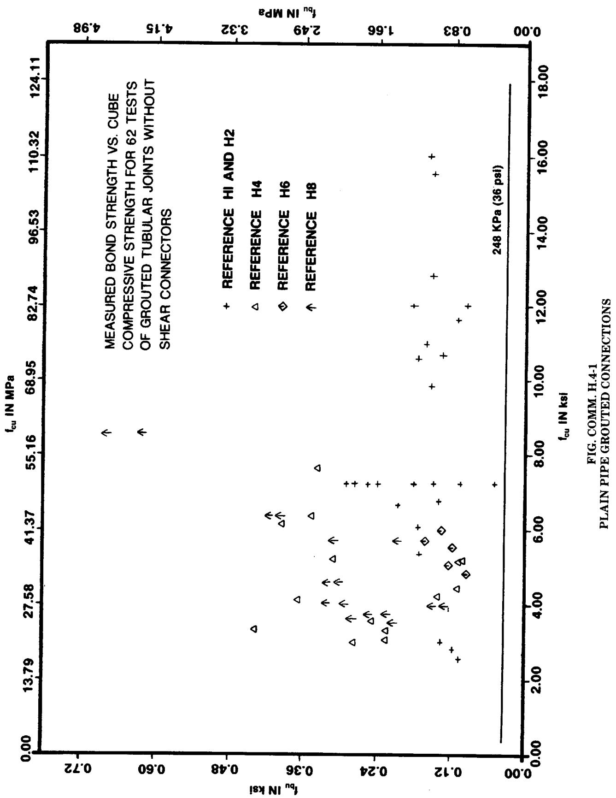

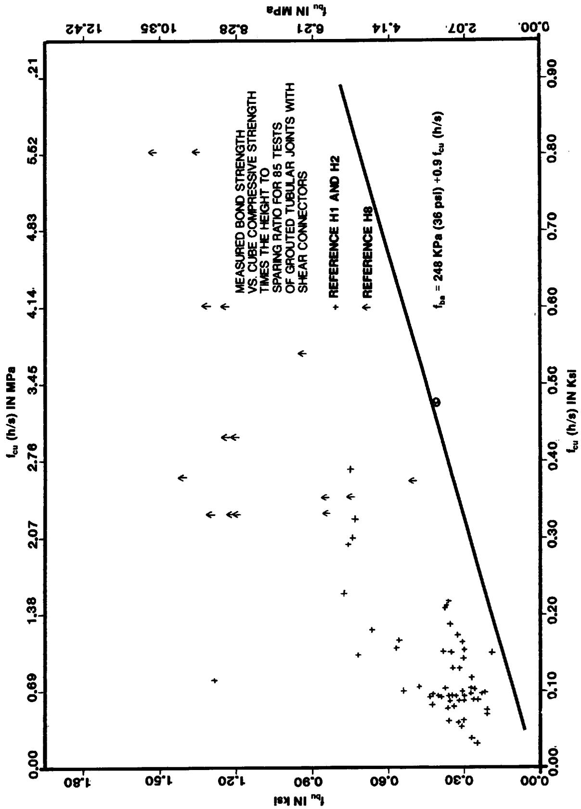  
FIG.COMM.H.4-2   
SHEAR KEY GROUTED CONNECTIONS

COMMENTARY MATERIAL

COMM. I.2 STRUCTURAL STEEL PIPE

Tubulars used as structural components are often subjected to substantial axial and hoop stresses. Test data on tubulars fabricated with circumferential and longitudinal seams have provided insight into the effects of geometric imperfections and residual stresses introduced during fabrication and allowed development of

empirical formulations to define elastic and critical buckling stresses as well as the interaction relationships between the axial and hoop stresses. Unless sufficient test data are obtained on spiral welded tubulars to evaluate applicability of API recommended empirical formulations, spiral welded tubulars cannot be recommended for structural use.

COMMENTARY K WELDING

## K.2 QUALIFICATION

Comm. K.2.2 Impact Requirements. Charpy impact testing is a method for qualitative assessment of material toughness. Although lacking the technical precision of crack tip opening displacement (CTOD) testing, the method has been and continues to be a reasonable measure of fracture safety, when employed with a definitive program of nondestructive examination to eliminate weld area imperfections. The recommendations contained herein are based on practices that have generally provided satisfactory fracture experience in structures located in moderate temperature environments (e.g. $4^{\circ}\mathrm{C}$ （$40^{\circ}\mathrm{F})$ sea water and $-10^{\circ}\mathrm{C}$ （$14^{\circ}\mathrm{F})$ air exposure). For environments which are either more or less hostile, impact testing temperatures should be reconsidered based on local temperature exposures.

For critical welded connections, the technically more exact CTOD test is appropriate. CTOD tests are run at realistic temperatures and strain rates, representing those of the engineering application, using specimens having the full prototype thickness. This yields quantitative information useful for engineering fracture mechanics analysis and defect assessment, in which the required CTOD is related to anticipated stress levels (including residual stress) and flaw sizes.

Achieving the higher levels of toughness may require some difficult trade-offs against other desirable attributes of the welding process — for example, the deep penetration and relative freedom from trapped slag of uphill passes.

Since AWS welding procedure requirements (Reference K1) are concerned primarily with tensile strength and soundness (with minor emphasis on fracture toughness) it is appropriate to consider additional essential variables which have an influence on fracture toughness — i.e., specific brand wire/flux combinations, and the restriction of Submerged Arc Welding (SAW) consumables to the limits actually tested for AWS classification. Note that, for Class A steels, specified energy levels higher than the AWS classifications will require that all welding procedures be qualified by test, rather than having prequalified status.

Heat affected zone:

In addition to weld metal toughness, consideration should be given to controlling the properties of the heat affected zone (HAZ). Although the heat cycle of welding sometimes improves base metals of low toughness, this region will more often have degraded properties. A number of early failures in welded tubular joints involved fractures which either initiated in or propagated through the HAZ, often before significant fatigue loading.

AWS D1.1 Appendix III (Reference K1) gives requirements for sampling both weld metal and HAZ, with

Charpy energy and temperature to be specified in contract documents. The following average HAZ values have been found by experience to be reasonably attainable, where single specimen energy values (one of three) 7J (5 ft-lbs) lower are allowed without requiring retest.:

TABLE COMM. K.1   

| Steel Group | Steel Class | Impact Test Temperature | Heat Affected Zone | Heat Affected Zone |
| --- | --- | --- | --- | --- |
| Steel Group | Steel Class | Impact Test Temperature | Joules (Ft-Lbs) | Joules (Ft-Lbs) |
| I | C | 10°C (50°F) | for information only | for information only |
| I | B | 4°C (40°F) | 20 | 15 |
| I | A | -10°C (14°F) | 20 | 15 |
| II | C | 10°C (50°F) | for information only | for information only |
| II | B | 4°C (40°F) | 20 | 15 |
| II | A | -10°C (14°F) | 34 | 25 |
| III | A | -10°C (14°F) | 40 | 30 |

As criticality of the component's performance increases, lower testing temperatures (implying more restrictive welding procedures) would provide HAZs which more closely match the performance of the adjoining weld metal and parent material, rather than being a potential weak link in the system. The owner may also wish to consider more extensive sampling of the HAZ than the single set of Charpy tests required by AWS, e.g., sampling at $0.4\mathrm{mm}$ , $2\mathrm{mm}$ , and $5\mathrm{mm}$ from the fusion line. More extensive sampling increases the likelihood of finding local brittle zones with low toughness values.

Since HAZ toughness is as much dependent on the steel as on the welding parameters, a preferable alternative for addressing this issue is through weldability prequalification of the steel. API RP 2Z (Reference K2) spells out such a prequalification procedure, using CTOD as well as Charpy testing. This prequalification testing is presently being applied as a supplementary requirement for high-performance steels such as API Specs 2W and 2Y and is accepted as a requirement by a few producers.

Caution: AWS permits testing one $345\mathrm{MPa}$ (50 ksi) steel to qualify all other grades of $345\mathrm{MPa}$ (50 ksi) and below. Consequently, selection of API-2H-50-Z (very low sulfur, 270J (200 ft-lb) upper shelf Charpies) for qualification test plates will virtually assure satisfying a HAZ impact requirement of 34J (25 ft-lbs), even when welded with high heat inputs and high interpass temperatures. There is no reasonable way to extrapolate this test to ordinary A572 grade 50 with the expectation of either smaller HAZ impact energies or similar 8:1 degradation. Thus, separate Charpy testing of each API steel class is appropriate, if HAZ toughness is being addressed via Weld Procedure Qualification (WPQ) testing.

COMMENTARY Q MINIMUM STRUCTURES

COMM. Q.2 DESIGN LOADS AND ANALYSIS. Analysis and design procedures contained in this recommended practice are usually appropriate for minimum structures. However, these procedures have evolved from historical experience primarily involving conventional four and eight leg, welded, template type structures. Minimum structures may exhibit structural behavior different from conventional structures. Special consideration should be given to the following:

1. Minimum structures tend to be less stiff than conventional structures, hence dynamic effects and fatigue are of more concern even in shallow water depths.   
2. Minimum structures typically are less redundant than conventional structures. For example, such structures are more sensitive to design oversights, fabrication and welding deviations, in-service damage, fatigue and deterioration due to corrosion.   
3. Reserve strength is important in any structure exposed to unforeseen loading conditions such as accidental loading from vessels or greater than predicted environmental loads. Reserve strength is usually lower in less redundant structures unless the designer makes provisions otherwise. These provisions may include reductions in acceptable interaction ratios used for member design as well as designing joints for the full yield strength of the connecting members.   
4. Many minimum structures utilize connection and component types other than conventional welded tubular joints. Offshore experience with these complex joints is limited; therefore connection performance and reliability are of concern, especially when utilized in a low redundancy structure. Consideration of joint flexibility, which is not commonly accommodated during global structural analysis, may become important.

Evaluation of reserve strength and redundancy should be balanced by consequences of failure. The consequence

quences of failure of a minimum structure are usually lower since most are designed for:

1. Minimum topside facilities.   
2. Unmanned operations.   
3. One to six wells.   
4. Drilling and work-over activity to be performed by a mobile drilling rig.

It is entirely appropriate for such a structure to have lower reserve strength and less redundancy than a conventional structure. However, under no circumstances should a quarters or oil storage platform be classified as a low consequence of failure structure.

Experience with minimum structures indicates possible hindrance of human performance due to structural movement caused by operating environmental conditions. The owner may choose to accept possible reduced operating and production efficiency. However, the owner may also choose to perform a dynamic response analysis using owner selected environmental loads. The results can be compared to a personnel comfort graph, which depicts period vs peak acceleration or similar criteria, see References Q1 and Q2.

Comm. Q.3.3d Grouted Connections. The recommendation that all axial load transfer be accomplished using only shear keys is because minimum structures have relatively small on-bottom weights. Therefore, environmentally induced motions may significantly affect the grout bond strength in a pile/pile sleeve connection.

Comm. Q.4.2 Caissons. There is a history of successful use of Class C material in caissons at service temperatures above freezing. However, most of this history was generated when $\mathbf{F_b} = 0.66\mathbf{F_y}$

Therefore, since caissons are primarily subjected to environmentally induced bending, the use of an interaction ratio of 0.90 will closely approximate the use of $\mathbf{F_b}$ $= 0.66\mathrm{F_y}$ rather than $\mathbf{F_b} = 0.75\mathbf{F_y}$

SECTION A REFERENCES

A1 API Recommended Practice 2N, Planning, Designing and Constructing Fixed Offshore Structures in Ice Environments, June 1, 1988.   
A2 Sieck, H. C., and Self, G. W., Analysis of High Resolution Seismic Data., (AAPG) Memoir 26: Seis

mic Stratigraphy - Applications to Hydrocarbon Exploration, 1977, pp. 353-385.   
A3 Handbook of Ocean and Underwater Engineering, 1969, pp. 12-5 to 12-7.

SECTION B REFERENCES

B1 Moses, F., Guidelines for Calibrating API RP 2A for Reliability-Based Design, API-PRAC 80-22 Project Report, October 1981.   
B2 Moses, F., Utilizing a Reliability-Based API RP2A Format, API-PRAC 82-22 Project Report, November 1983.   
B3 Lloyd, J. R., Sensitivity of Design to Uncertainties to Environmental Loading, Society of Underwater Technology, Volume 11, Number 1, Spring 1985.   
B4 Moses, F., and Russell, L., Applicability of Reliability Analysis in Offshore Design Practice, API-PRAC 79-22 Project Report, June 1980.   
B5 Moses, F., Development of Preliminary Load and Resistance Design Document for Fixed Offshore Platforms, API-PRAC 85-22 Project Report, January 1986.

B6 Lloyd, J. R., and Clawson, W. C., Reserve and Residual Strength of Pile Founded, Offshore Platforms, D.I.R.T. Symposium, November 1983 National Research Council.   
B7 Moses, F., System Reliability Developments in Structural Engineering, Structural Safety, Vol. 1, 1982, p. 3-13.   
B8 Gates, W. E., Marshall, P. W., Mahin, S. A., Analytical Methods for Determining the Ultimate Earthquake Resistance of Fixed Offshore Structures, OTC 2751, Offshore Technology Conference, 1977.   
B9 Lloyd, J. R., Design Strategy for Redundant Space Frames, Structural Stability Council, New Orleans, March 30-31, 1982.

SECTION C REFERENCES

General

C1 Ellingwood, B., Galambos, T. V., MacGregor, J. G., and Cornell, C. A., Development of a Probability Based Load Criterion for American National Standard A58 Building Code Requirements for Minimum Design Loads in Buildings and Other Structures, National Bureau of Standards Special Publication 577, June 1980.   
C2 Moses, F., Utilizing a Reliability Based API RP2A Format, API-PRAC 82-22 Project Report, November 1983.   
C3 Moses, F., Implementation of a Reliability-Based API RP2A Format, API-PRAC 83-22 Project Report, January 1985.   
C4 Bunce, J. W., and Wyatt, T. A., Development of Unified Design Criteria for Heavy Lift Operations Offshore, OTC 4192, May 1982.

Wind, Wave, and Current Forces

C247 Sarpkaya, T., In-Line and Transverse Forces on Smooth and Rough Cylinders in Oscillatory Flow at High Reynolds Numbers, Naval Postgraduate School, Report NPS69-86-003, July 4, 1986.   
C248 MacCamy, R. C. and Fuchs, R. A., Wave Forces on Piles & A Diffraction Theory," U.S. Army Corps of Engineers, Beach Erosion Board, Technical Memorandum, No. 69, 1954.   
C249 Achenbach, E., Influence of Surface Roughness or the Cross-Flow Around a Circular Cylinder, Journal of Fluid Mechanics, Vol. 46, pp. 321-335, 1971.   
C250 Achenbach, E., and Heinecke, E., On Vortex Shedding from Smooth and Rough Cylinders in the Range of Reynolds Numbers $6 \times 10^{8}$ to $5 \times 10^{6}$ , Journal of Fluid Mechanics, Vol. 109, pp. 239-251, 1981.

C251 Allender, J. H., and Petrauskas, C., Measured and Predicted Wave Plus Current Loading on Laboratory-Scale Space-Frame Structure, Offshore Technology Conference, OTC 5371, 1987.   
C252 Atkins Engineering Services, Fluid Loading on Fixed Offshore Structures, OTH 90 322, 1990.   
C253 Bearman, P. W., Chaplin, J. R., Graham, J. M. R., Kostense, J. R., Hall, P. F., and Klopman, G., The Loading of a Cylinder in Post-Critical Flow Beneath Periodic and Random Waves, Proceedings of Behavior of Offshore Structures Conference, p. 213-225, 1985.   
C254 Beckmann, H., and McBride, C. M., Inherent Scatter of Wave Forces on Submerged Structures, ASME Petroleum Division Joint Conference with Pressure Vessels and Piping Division, Dallas, September 22-25, 1968.   
C255 Beckmann, H., and Merwin, J. E., Wave Forces on Conductor Pipe Group, Proceedings of ASCE Civil Engineering in the Oceans IV Conference, September 1979.   
C256 Bishop, J. R., Wave Force Data from the Second Christchurch Bay Tower, Offshore Technology Conference, OTC 4953, 1985.   
C257 Blumberg, R., and Rigg, A. M., Hydrodynamic Drag at Supercritical Reynolds Numbers, ASME Conference, June 1961.   
C258 Dalrymple, R. A., and Heideman, J. C., Nonlinear Water Waves on a Vertically-Sheared Current, E & P Forum Workshop, Wave and Current Kinematics and Loading, Paris, October 1989.   
C259 Dean, R. G., and Perlin, M., Intercomparison of Near-Bottom Kinematics by Several Wave Theories and Field and Laboratory Data, Coastal Engineering, Elsevier Science Publishers B. V., Amsterdam, The Netherlands, 1986.   
C260 Eastwood, J. W., and Watson, C. J. H., Implications of Wave-Current Interactions for Offshore Design, E & P Forum Workshop, Wave and Current Kinematics and Loading, Paris, October 1989.   
C261 Forristall, G. Z., Kinematics in the Crests of Storm Waves, 20th International Conference on Coastal Engineering, Taipei, 1986.   
C262 Garrison, C. J., Comments on Cross-Flow Principle and Morison's Equation, ASCE Journal of Waterway, Port, Coastal, and Ocean Engineering, Vol. 111, No. 6, November 1985.   
C263 Garrison, C. J., Drag and Inertia Forces on Circular Cylinders in Harmonic Flow, ASCE Journal of Waterway, Port, Coastal, and Ocean Engineering, Vol. 116, No. 2, March/April, 1990.   
C264 Hanif, M., and Boyd, M. J., Experimental Analysis of Wave Interaction with Pile Structures, Conference on Coastal and Ocean Engineering, Perth, 25-27 November, 1981.

C265 Heideman, J. C., Olsen, O., and Johansson, P., Local Wave Force Coefficients, Proceedings of ASCE Civil Engineering in the Oceans IV Conference, September 1979.   
C266 Hoerner, S. F., Fluid Dynamic Drag, Chapter V.1, Hoerner Fluid Dynamics, New Jersey, 1965.   
C267 Iwaki (1991) Personal communication from J. C. Heideman.   
C268 Jones, G. W., Jr., Cincotta, J. J., and Walker, R. W., Aerodynamic Forces on a Stationary and Oscillating Circular Cylinder at High Reynolds Numbers, NASA Technical Report R-300, 1969.   
C269 Kasahara, Y., and Shimazaki, K., Wave Forces Acting on Rough Circular Cylinders at High Reynolds Numbers, Offshore Technology Conference, OTC 5372, 1987.   
C270 Keulegan, G. H., and Carpenter, L. H., Forces on Cylinders and Plates in an Oscillating Fluid, Journal of Research of the National Bureau of Standards, Vol. 60, No. 5, May 1958.   
C271 Kirby, J. T., and Chen, T. M., Surface Waves on Vertically Sheared Flows, Approximate Dispersion Relations, Journal of Geophysical Research, January 15, 1989.   
C272 Lambrakos, K. F., Steele, K. M., and Finn, L. D., Wake and Shielding Effects on Hydrodynamic Loading, Proceedings of E & P Forum Workshop on Wave and Current Kinematics and Loading, Paris, October 25-26, 1989.   
C273 Lambrakos, K. F., Extended Velocity Potential Wave Kinematics, ASCE Journal of Waterway, Port, Coastal and Ocean Division, Vol. 107, No. WW3, August 1981.   
C274 Lambrakos, K. F., Chao, J. C., Beckmann H., and Brannon, H. R., Wake Model of Hydrodynamic Forces on Pipelines, Ocean Engineering, Vol. 14, No. 2, pp. 117-136, 1987.   
C275 Lambrakos, K. F., and Beckmann, H., Shielding and Interference Model for Offshore Platforms. BOSS92 Conference, London, July 1992.   
C276 Madsen, O. S., Hydrodynamic Force on Circular Cylinders, Applied Ocean Research Vol. 8, No. 3, 1986.   
C277Manners,W.,and Rainey,R.C.T.,Hydrodynamic Forces on Fixed Submerged Cylinders, Proceedings of the Royal Society of London,436, 1992.   
C278 Marin (1957) Personal communication from J. C. Heideman.   
C279 Miller, B. L., The Hydrodynamic Drag of Roughened Circular Cylinders, The Royal Institution of Naval Architects, Spring Meetings, 1976.   
C280 Monopolis, G. M., and Danaczko, M. A., Installation Model Tests of a Gulf of Mexico Compliant

Tower, Offshore Technology Conference, OTC 5911, 1989.   
C281 Nath, J. H., Hydrodynamic Coefficients for Marine-Roughened Cylinders, Final Report to API on Proc 85-31, Department of Civil Engineering, Oregon State University, March, 1987.   
C282 Newman, J. N., Marine Hydrodynamics, MIT Press, 1977.   
C283 Norton, D. J., Heideman, J. C., and Mallard, W., Wind Tunnel Tests of Inclined Circular Cylinders, Society of Petroleum Engineers Journal, Vol. 23, pp. 191-196, 1983.   
C284 Ohmart, R. D., and Gratz, R. L., Drag Coefficients from Hurricane Wave Data, Proceedings of ASCE Civil Engineering in the Oceans IV Conference, September 1979.   
C285 Reed, K., Aarsnes, J. V., Beltrand, O., and Andersen, E., Wave and Current Forces on Conductor Pipe Groups, Society for Underwater Technology, Environmental Forces on Offshore Structures and Their Prediction Conference, 1990.   
C286 Rodenbusch, G., and Gutierrez, C. A., Forces on Cylinders in Two-Dimensional Flows, Volume 1, Shell Development Company, Report No. BRC-13-83, 1983.   
C287 Roshko, A., *Experiments on the Flow Past a Circular Cylinder at Very High Reynolds Number*, Journal of Fluid Mechanics, Vol. 10, pp. 345-356, 1961.   
C288 Sarpkaya, T., Wave Impact Loads on Cylinders, Offshore Technology Conference, OTC 3065, 1978.   
C289 Sarpkaya, T., Raines, T. S., and Trytten, D. O., Wave Forces on Inclined Smooth and Rough Circular Cylinders, Offshore Technology Conference, Paper No. 4227, 1982.   
C290 Schlichting, H., Boundary Layer Theory, Chapter XX.g, McGraw-Hill, Inc., 1979.   
C291 Shankar, N. J., and Khader, M. H. A., Performance Characteristics of Closely Spaced Pile Breakwaters, Conference on Coastal and Ocean Engineering, Perth, 25-27 November 1981.   
C292 Skjelbreia, J. E., et al., Wave Kinematics in Irregular Waves, Offshore Mechanics and Arctic Engineering, Stavanger, 1991.   
C293 Sterndorff, M. J., Velk, P., and Klinting, P., Coupled Experimental and Analytical Investigation of Hydrodynamic Forces on a Jacket in Waves, Society for Underwater Technology, Environmental Forces on Offshore Structures and Their Prediction Conference, 1990.   
C294 Steele, K. M., Finn, L. D., and Lambrakos, K. F., Compliant Tower Response Predictions, Offshore Technology Conference, OTC 5783, 1988.

C295 Steele, K. M., Performance of the Lena Guyed Tower, Offshore Technology Conference, OTC 5255, 1986.   
C296 Szechenyi, E., Supercritical Reynolds Number Simulation for Two-Dimensional Flow over Circular Cylinders, Journal of Fluid Mechanics, Vol. 70, pp. 529-542, 1975.   
C297 Taylor, P. H., Current Blockage: Reduced Forces on Offshore Space-Frame Structures, Offshore Technology Conference, OTC 6519, 1991.   
C298 Wang, C., and Shih, W. C. L., High Reynolds Number Flows around Smooth and Rough Cylinders, Final Report to ONR, Contract No. N00014-85-C-0764, Physical Research, Inc., February 1986.   
C299 Wolfram, J., and Theophanatos, A., The Effects of Marine Fouling on the Fluid Loading of Cylinders: Some Experimental Results, Offshore Technology Conference Proceedings, OTC 4954, 1985.   
C301 Det Norske Veritas, Rules for Classifications of Fixed Offshore Installations, First Edition, 1990.   
C302 Heideman, J. C., and Sarpkaya, T., Hydrodynamic Forces on Dense Arrays of Cylinders, Offshore Technology Conference, OTC Paper 5008, 1985.   
C303 American National Standards Institute, Building Code Requirements for Minimum Design Loads in Buildings and Other Structures, ANSI A58.1-1982.   
C304 Wiegel, R. L., Oceanographical Engineering, Chapter 11, Section 9, Prentice Hall, Inc., 1964.   
C305 Hogben, N., and Standing, R. G., Experience in Computing Wave Loads on Large Bodies, Offshore Technology Conference, OTC Paper 2189, 1975.   
C306 Sarpkaya, T., and Isaacson, M., Mechanics of Wave Forces on Offshore Structures, Van Nostrand Reinhold Co., 1981.   
C307 Skjelbrea, L., and Hendrickson, J., Fifth Order Gravity Wave Theory, Proceedings of 7th Conference on Coastal Engineering, Vol. 1, Chapter 10, 1961.   
C308 Munk, W. H., Solitary Wave and Its Application to Surf Problems, Annals New York Academy of Science, Vol. 51, pp. 376-424, 1949.   
C309 Chappelear, J. E., Direct Numerical Calculation of Wave Properties, Journal of Geophysical Research, Vol. 66, pp. 501-508, 1961.   
C310 Dean, R. G., Evaluation and Development of Water Wave Theories for Engineering Application, Special Report No. 1, prepared for U.S. Army Corps of Engineers, Coastal Engineering Research Center, Vol. I and II, 1974.

C311 Lambrakos, K. F., and Brannon, H. R., Wave Force Calculations for Stokes and Non-Stokes Waves, Offshore Technology Conference, OTC Paper 2039, 1974.   
C312 Griffin, O. M., OTEC Cold Water Pipe Design for Problems Caused by Vortex-Excited Oscillations, Ocean Engineering, Vol. 8, No. 2, 1981.   
C313 Larrabee, R. D., Extreme Wave Dynamics of Deepwater Platforms, Third International Conference on the Behavior of Offshore Structures, Boston, Massachusetts, p. 784, August 2-5, 1982.   
Gulf of Mexico Oceanographic/Meteorologic Conditions   
C314 Bea, R. G., Gulf of Mexico Hurricane Wave Heights, Offshore Technology Conference, Paper 2110, 1974.   
C315 Evans-Hamilton, Inc., An Environmental Design Study for the Eastern Gulf of Mexico Outer Continental Shelf, 1973.   
C316 R. E. Haring and J. C. Heideman, Gulf of Mexico Rare Wave Return Periods, Journal of Petroleum Technology, January, 1980.   
C317 Ward, E. G., Borgman, L. E., and Cardone, V. J., Statistics of Hurricane Waves in the Gulf of Mexico, Journal of Petroleum Technology, May, 1979.   
C318 Kolpak, M. M., Wind and Wave Model for Hurricane Wave Spectra Hindcasting, Offshore Technology Conference, OTC Paper 2850, 1977.   
C319 ARCTEC and Offshore and Coastal Technologies, Inc., Texas Shelf Hurricane Hindcast Study, 1985. West Coast Oceanographic/Meteorologic Conditions   
C320 Oceanweather, Inc., Santa Barbara Channel Wave Hindcast Study, 1982.   
C321 Evans-Hamilton, Inc., An Environmental Study for the Southern California Outer Continental Shelf, 1976.   
C322 Oceanographic Services, Inc., Storm Wave Study, Santa Barbara Channel, March, 1969.   
C323 Oceanweather, Inc., Informal Final Report - Pt. Conception Hindcast Study, 1980.   
C324 Oceanweather, Inc., Final Report - Wave Hindcast Pt. Conception Area, Northwest Type Storms, 1982.   
Gulf of Alaska Oceanographic/Meteorologic Conditions   
C325 Marine Advisers, Inc., Group Oceanographic Survey - Gulf of Alaska, 1970.   
C326 Intersea Research Corp., Gulf of Alaska Wave and Wind Measurement Program, 1974-76.

C327 Intersea Research Corporation, A Data Collection, Analysis, and Simulation Program to Investigate Ocean Currents, Northeast Gulf of Alaska, 1975.   
C328 Brower, W. A., et al., Climatic Atlas of the Outer Continental Shelf Waters and Coastal Regions of Alaska, Vol. I, Gulf of Alaska, National Oceanic and Atmospheric Administration, 1977.**   
C329 Intersea Research Corp., Gulf of Alaska Hindcast Evaluation, 1975-76.   
Lower Cook Inlet Oceanographic/Meteorologic Conditions   
C330 Evans-Hamilton, Inc., A Meteorologic and Oceanographic Study of Extreme and Operational Criteria in Lower Cook Inlet, 1977.   
C331 Intersea Research Corp., Oceanographic Conditions and Extreme Factors in Lower Cook Inlet, Alaska, 1976.   
C332 Intersea Research Corporation, Oceanographic Conditions for Offshore Operations in Lower Cook Inlet, Alaska, 1975.   
Bering Sea Oceanographic/Meteorologic Conditions   
C333 Brower, W. A., et al., Climatic Atlas of the Outer Continental Shelf Waters and Coastal Regions of Alaska, Vol. II, Bearing Sea, National Oceanic and Atmospheric Administration, 1977.**   
C334 Hood, D. W., and Calder, J. A., Eds., The Eastern Bering Sea Shelf: Oceanography and Resources, National Oceanic and Atmospheric Administration, 1982.   
C335 Cardone, V. J., et al., Bearing Sea Phase 1 Oceanographic Study - Bearing Sea Storm Specification Study, Oceanweather, Inc., 1980.   
C336 Brown and Caldwell, Bering Sea Comprehensive Oceanographic Measurement Program, 1981-1983.   
C337 Intersea Research Corporation, Bearing Sea Oceanographic Measurement Program, 1976-1978.   
C338 Ocean Science and Engineering, Inc., Bristol Bay Environmental Report, 1970.   
C339 Oceanweather, Inc., St. George Basin Extreme Wave Climate Study, 1983. Beaufort/Chukchi   
C340 Brower, W. A., et al., Climatic Atlas of the Outer Continental Shelf Waters and Coastal Regions of Alaska, Vol. III, Chukchi-Beaufort Seas, National Oceanic and Atmospheric Administration, 1977.**

C341 Oceanweather, Inc., Beaufort Sea Wave Hindcast Study: Prudhoe Bay/Sag Delta and Harrison Bay, 1982.   
C342 Rodenbusch, G., and Kallstrom, C., Forces on a Large Cylinder in Random Two-Dimensional Flows, Paper OTC 5096, Offshore Technology Conference Proceedings, Houston, May 1986.   
C343 Ward, E. G., and Reece, A. M., Arctic Development Project, Task 1/10, Part I, Meteorological and Oceanographic Conditions, Part II, Summary of Beaufort Sea Storm Wave Study, Shell Development Company, 1979.   
C343 Ocean Science and Engineering, Inc., Reconnaissance Environmental Study of Chukchi Sea, 1970.   
C344 Exxon Company, U.S.A., Alaska Beaufort Sea Gravel Island Design, 1979.   
C345 Oceanographic Services, Inc., Beaufort Sea Summer Oceanographic Measurement Programs, 1979-1983. East Coast Oceanographic/Meteorologic Conditions   
C346 Evans-Hamilton, Inc., A Preliminary Environmental Study for the East Coast of the United States, 1976.   
C347 Ward, E. G., Evans, D. J., and Pompa, J. A., Extreme Wave Heights Along the Atlantic Coast of the United States, Offshore Technology Conference, OTC Paper 2846, 1977.   
C348 Science Applications, Inc., Characterization of Currents over Chevron Tract #510 off Cape Hatteras, North Carolina, 1982.   
C349 North Carolina, Evans-Hamilton, Inc., An Interpretation of Measured Gulf Stream Current Velocities off Cape Hatteras, 1982.   
C350 Oceanweather, Inc., Final Report - Manteo Block 510 Hurricane Hindcast Study, 1983. Other Area Specific Studies   
C351 Oceanweather, Inc., GUMSHOE Gulf of Mexico Storm Hindcast of Oceanographic Extremes, August, 1990. Earthquake Loads   
C401 Algermissen, S. T., and Perkins, D. M., A Probabilistic Estimate of Maximum Acceleration in Rock in the Contiguous United States, U.S. Geological Survey, Open-File Report 76-416, 1976.   
C402 Woodward-Clyde Consultants, Offshore Alaska Seismic Exposure Study, Prepared for Alaska Subarctic Operators' Committee, March 1978.   
C403 Applied Technology Council (ATC), Tentative Provisions for the Development of Seismic Regulations for Buildings, ATC Pub. ATC3-06. NBS Special Pub. 510, NSF Pub. 78-8 June 1978.

C404 Seed, H. B., Ugas, C., and Lysmer, L., Site Dependent Spectra for Earthquake Resistance Design, Bull. Seism. Soc. Amer., Vol. 66, No. 1, February 1976.   
C405 Mohraz, B., Earthquake Response Spectra for Different Geological Conditions, Bull. Seism. Soc. Amer., Vol. 66, No. 3, June 1976.   
C406 John A. Blume and Assoc., Recommendations for Shape of Earthquake Response Spectra, Directorate of Licensing Report, U.S. Atomic Energy Commission, February 1973.   
C407 Nathan M. Newmark Consulting Engineering Services, A Study of Vertical and Horizontal Earthquake Spectra, Directorate of Licensing Report, U.S. Atomic Energy Commission, April 1973.   
C408 Bea, R. G., Earthquake Criteria for Platforms in the Gulf of Alaska, Journal of Petroleum Technology, SPE Paper No. 6264, March 1973.   
C409 Bea, R. G., Earthquake and Wave Design Criteria for Offshore Platforms, Journal of the Structural Division, ASCE Vol. 105, No. ST2. Proc. Paper 14387, February 1979.   
C410 Marshall, P. W., Gates, W. E., and Anagnostopoulos, S., Inelastic Dynamic Analysis of Tubular Offshore Structures, Offshore Technology Conference Proceedings, OTC 2908, 1977.   
C411 Bea, R. G., Audibert, J.M.E., and Akky, M. R., Earthquake Response of Offshore Platforms, Journal of the Structural Division, ASCE, Vol. 105, No. ST2, Proc. Paper 14386, February 1979.   
C412 Marshall, P. W., and Bea, R. G., Failure Modes of Offshore Platforms, Proceedings of the First International Conference, Behavior of Off-Shore Structures, BOSS 1976, Vol. II, Trondheim, Norway, 1976.   
C413 Kallaby, J., and Millman, D., Inelastic Analysis of Fixed Offshore Platforms for Earthquake Loadings, Offshore Technology Conference Proceedings, OTC 2357, 1975.   
C414 Delflache, M. L., Glasscock, M. S., Hayes, D. A., and Ruez, W. J., Design of Hondo Platform for 850 Feet Water Depth in the Santa Barbara Channel, Offshore Technology Conference Proceedings, Paper OTC 2960, 1977.   
C415 Marshall, P. W., et al., Inelastic Behavior of Members and Structures, Combined Preprint for Session 45, ASCE Annual Convention and Exposition, Committee on Tubular Structures, Preprint 3302, Chicago, October 1978.   
C416 Whitman, R. V., and Protonotarios, J. N., Inelastic Response to Site-Modified Ground Motions, Journal of the Geotechnical Engineering Division, ASCE, Vol. 103, No. GT 10, Proc. Paper 13269, October 1977.

C417 Arnold, P., Bea, R. G., Beebe, K. E., Marshall, P. W., Idriss, I. M., and Reimer, R. B., SPSS -A Study of Soil-Pile Structure Systems in Severe Earthquake, Offshore Technology Conference Proceedings, OTC 2749, 1977.   
C418 Gates, W. E., Marshall, P. W., and Mahin, S. A., Analytical Methods for Determining the Ultimate Earthquake Resistance of Fixed Offshore Structures. Offshore Technology Conference Proceedings, OTC 2751, 1977.   
C419 Nair, V. V. D., A Seismic Design of Offshore Platforms, ASCE Specialty Conference - Earthquake Engineering and Soil Dynamics, Pasadena, June 1978, Vol. II, pp. 660-684.   
C420 Wilson, E. L., Der Kiureghian, A., and Bayo, E. P., A Replacement for the SRSS Method in Seismic Analysis, Earthquake Engineering and Structural Dynamics, Vol. 9, pp. 187-194, 1981.   
C421 Patskys, M., Jr., Criteria for Mode Selection in the DDAM Procedure, Shock and Vibration Bulletin, Vol. 40, Part 7, pp. 165-175, December 1969.   
C422 O'Hara, G. J., and Cunniff, P. F., Normal Modal Theory for Three-Directional Motion, Naval Research Laboratory Report 6170, January 1965.   
C423 Cornell, C. A., Engineering Seismic Risk Analysis, Bull. Seism. Soc. Amer., Vol. 58, No. 5, October 1968.   
C424 Moses, F., Development of Preliminary Load and Resistance Design Document for Fixed Offshore Platforms, API PRAC Report 85-22, January 1986.   
C425 Sherman, D. R., Tests of Circular Steel Tubes in Bending, Journal of the Structural Division, ASCE Vol. 102, No. ST11, Proc. Paper 12568, November 1976.   
C426 Hays, W. W., Procedures for Estimating Earthquake Ground Motions. U.S. Geological Survey Professional Paper 1114, 1980.   
C427 Donovan, N. C., and Bornstein, A. E., Uncertainties in Seismic Risk Procedures, Journal of the Geotechnical Division, ASCE, Vol. 104, No. GT7, Proc. Paper 13896, July 1978.   
C428 McGuire, R. K., Effects of Uncertainty in Seismicity on Estimates of Seismic Hazard for the East Coast of the United States, Bull. Seism. Soc. Amer., Vol. 67, No. 3, June 1977.   
C429 Anderson, J. G., Estimating the Seismicity from Geological Structure for Seismic-Risk Studies, Bull. Seism. Soc. Amer., Vol. 69, No. 1, February 1979.   
C430 Allen, C. R., Geological Criteria for Evaluating Seismicity, Bull. Geological Society of America, Vol. 86, August 1975, pp. 1041-1057.

C431 Idriss, I. M., Characteristics of Earthquake Ground Motions, Proc. ASCE Specialty Conference on Earthquake Engineering and Soil Dynamics, Pasadena, June 1978, Vol. 3, pp. 1151-1266.   
C432 Joyner, W. B., and Boore, D. M., Peak Horizontal Acceleration and Velocity from Strong-Motion Records Including Records from the 1979 Imperial Valley, California, Earthquake, Bull. Seism. Soc. Amer., Vol. 71, No. 6, December 1981.   
C433 Campbell, K. M., Near Source Attenuation of Peak Horizontal Acceleration, Bull. Seism. Soc. Amer., Vol. 71, No. 6, December 1981.   
C434 Jennings, P. C., and Guzmann, R. A., Seismic Design Criteria for Nuclear Power Plants, Proc. U.S. National Conference on Earthquake Engineering, Ann Arbor, June 1975, pp. 474-483.   
C435 Kanamori, H. A., Semi-Empirical Approach to Prediction of Long-Period Ground Motions from Great Earthquakes, Bull. Seism. Soc. Amer., Vol. 69, No. 6, December 1979.   
C436 Tsai, C. F., Lam, I., and Martin, G. R., Seismic Response of Cohesive Marine Soils, Journal of the Geotechnical Division, ASCE, Vol. 106, No. GT9, Proc. Paper 15708, September 1980.   
C437 Moriwaki, Y., and Doyle, E. H., Site Effects on Microzonation in Offshore Areas, Proc. 2nd International Conference on Microzonation, San Francisco, November 1978, Vol. 3, pp. 1433-1446.   
C438 Finn, W. D. L., Martin, G. R., and Lee, M. K. W., Comparison of Dynamic Analyses for Saturated Sands, Proc. ASCE Specialty Conference on Earthquake Engineering and Soil Dynamics, Pasadena, June 1978, Vol. 1, pp. 472-491.   
C439 Craig, M. J. K., and Shekher, V., Inelastic Earthquake Analyses of an Offshore California Platform, Offshore Technology Conference Proceedings, OTC 3822, 1980.   
C440 Kallaby, J., and Mitchell, W. W., Guidelines for Design of Offshore Structures for Earthquake Environment, Proceedings of the Second International Conference on Microzonation, San Francisco, November-December 1978.   
C441 Kagawa, T., Soil-Pile-Structure Interaction of Offshore Structures During an Earthquake, Offshore Technology Conference Proceedings, OTC 3820, 1980.   
C442 Zayas, V., Mahin, S. A., and Popov, E. P., Cyclic Inelastic Behavior of Steel Offshore Structures, University of California, Berkeley, Earthquake Engineering Research Center Report No. UCB/EERC-80/27, August 1980.   
C443 Zayas, V., Shing, P. S. B., Mahin, S. A., and Popov, E. P., Inelastic Structural Analysis of

Braced Platforms for Seismic Loading, Proceedings, Offshore Technology Conference, OTC 3979, 1981.   
C444 Gugerli, H., and Goel, S. C., Inelastic Cyclic Behavior of Steel Bracing Members, University of Michigan Report UMEE 82R1, January 1982.   
C445 Toma, S., Chen, W. F., and Finn, L. D., *External Pressure and Sectional Behavior of Fabricated Tubes*, Journal of the Structural Division, ASCE, Vol. 108, No. ST1, January 1982.   
C446 Anagnostopoulos, S. A., Post-Yield Flexural Properties of Tubular Members, Journal of the Structural Division, ASCE, Vol. 105, No. ST9, Paper No. 14821, September 1979.   
C447 Sherman, D. R., Erzurumlu, H., and Mueller, W. H., Behavioral Study of Circular Tubular Beam-Columns, Journal of the Structural Division, ASCE, Vol. 105, No. ST6, Paper No. 14627, June 1979.   
C448 Marshall, P. W., An Overview of Recent Work on Cyclic, Inelastic Behavior and System Reliability, Proceedings, Structural Stability Research Council, Bethlehem, Pennsylvania, 1981.   
C449 Finn, W. D. L., Martin, G. R., and Lee, M. K. W., Application of Effective Stress Methods for Offshore Seismic Design in Cohesionless Seafloor Soils, Offshore Technology Conference Proceedings, OTC 3112, 1978.   
C450 Kagawa, T., and Kraft, L. M., *Lateral Pile Response During Earthquakes*, Journal of the Geotechnical Engineering Division, ASCE, Vol. 109, No. GT12, Paper No. 16735, December 1981.   
C451Poulos,H.G.CyclicAxialResponseofa Single Pile,Journal of the Geotechnical Engineering Division,ASCE,Vol.107,No.GT1,Paper No. 15979,January 1981.   
C452Poulos,H.G.,SinglePileResponsetoCyclicLat eralLoad,JournaloftheGeotechnical Engineering Division,ASCE,Vol.108,No.GT3,Paper No.16921,March 1982.   
C453 Bea, R. G., Audibert, J. M. E., and Dover, A. R., Dynamic Response of Laterally and Axially Loaded Piles, Offshore Technology Conference Proceedings, OTC 3749, 1980.   
C454 Angelides, D., and Roesset, J. M., Nonlinear Lateral Dynamic Stiffness of Piles, Journal of the Geotechnical Engineering Division, ASCE, Vol. 107, No. GT11, Paper No. 16635, November 1981.   
C455 Anagnostopoulos, S. A., *Pile Foundation Modeling for Inelastic Earthquake Analyses of Large Structures*, Engineering Structures, Vol. 5, No. 3, July 1983.

C456 Dobry, R., Vincente, E., O'Rourke, N. J., and Roesset, J. M., Horizontal Stiffness and Damping of Single Piles, Journal of the Geotechnical Engineering Division, ASCE, Vol. 108, No. GT3, Paper No. 16917, March 1982.   
C457 Housner, G. W., and Jennings, P. C., Earthquake Design Criteria for Structures, EERL 77-06, Earthquake Engineering Research Laboratory, California Institute of Technology, November 1977.   
C458 Nair, V. V. D., Valdivieso, J. R., and Johnson, C. M., Comparison of Spectrum and Time History Techniques in Seismic Design of Platforms, Offshore Technology Conference Proceedings, OTC 3823, 1980.   
C459 Anagnostopoulos, S. A., Response Spectrum Techniques for Three-Component Earthquake Design, International Journal for Earthquake Engineering and Structural Dynamics, Vol. 9, No. 3, May-June 1981.   
C460 Anagnostopoulos, S. A., Spatial and Modal Combinations of Dynamic Response for Design of Fixed Offshore Platforms Under Three Components of Earthquake Motion, Proceedings, 7th World Conference in Earthquake Engineering, Istanbul, Turkey, 1980.   
C461 ASCE Standard, Seismic Analysis of Safety-Related Nuclear Structures and Commentary on Standard for Seismic Analysis of Safety Related Nuclear Structures, ASCE, 346 East 47th Street, New York, New York, 10017-2398, Approved September, 1986.   
C462 Soong, T. T., Sarkani, S., and Chen, Y., Reliability and Design Criteria for Secondary Systems, Proceedings of ICOSSAR '89, ASCE, pp. 463-470, 1989.   
C463 Yang, J. N., Sarkani, S., and Long, F. X., A Response Spectrum Approach for Seismic Analysis of Nonclassically Damped Structures, Engineering Structures, Vol. 12, No. 3, pp. 173-184, July, 1990.   
C464 Sackman, J. L., and Kelly, J. M., Rational Design Methods for Light Equipment in Structures Subjected to Ground Motion, report number UCB/EERC - 78/19, Earthquake Engineering Research Center, Berkeley, CA, 1978.   
C465 Vyas, Y. K., Crouse, C. B., and Schell, B. A., Regional Design Ground Motion Criteria for the Southern Bering Sea, Proceedings, Offshore Mechanics and Arctic Engineering Conference, Houston, February 1988.

SECTION D

REFERENCES

D1 Bulletin on Stability Design of Cylindrical Shells, API Bul 2U, First Edition, 1987.   
D2 Specification for Fabrication Structural Steel Pipe, API Spec 2B, Third Edition, 1977.   
D3 Load and Resistance Factor Design, American Institute of Steel Construction, First Edition, 1986.   
D4 Recommended Practice for Planning, Designing and Constructing Fixed Offshore Platforms, API RP2A.   
D5 Guide to Stability Design Criteria for Metal Structures, Fourth Edition, Edited by T. V. Galambos, John Wiley & Sons, New York, NY 1988.   
D6 Cox, J. W., Tubular Member Strength Equations for LRFD, Final Report for API (American Petroleum Institute) PRAC Project 86-55, Dallas, TX, February, 1987.   
D7 Chen, W. F., and Ross, D. A., Tests of Fabricated Tubular Columns, Journal of the Structural Division, ASCE, Vol. 103, No. ST3, March, 1977.   
D8 Bouwkamp, J. G., Buckling and Post-Buckling Strength of Circular Tubular Sections, Proceedings, Offshore Technology Conference, Paper No. OTC 2204, 1975.   
D9 Manual of Steel Construction, American Institute of Steel Construction, Ninth Edition, 1989.   
D10 Marshall, P. W., Design Criteria for Structural Steel Pipe, Proceedings of the Annual Technical Session of the Column Research Council, 1971.   
D11 Ostapenko, A. and Gunzelman, S., Local Buckling Tests on Three Steel Large-Diameter Tubular Columns, Proceedings of Fourth International Specialty Conference on Cold-Formed Steel Structures, St. Louis, Missouri, June 1-2, 1978.   
D12 Sherman, D. R., Bending Capacity of Fabricated Pipe at End Connections, Final Report to API Civil Engineering Department, University of Wisconsin - Milwaukee, September 1986.   
D13 Stephens, J. J., et al., Local Buckling of Thin-Walled Tubular Steel Members, Proceedings of Third International Colloquium on Stability of Metal Structures, Toronto, Canada, SSRC, May, 1983, pp. 489-508.   
D14 Miller, C. D., and Kinra, R. K., *External Pressure Tests of Ring Stiffened Fabricated Steel Cylinders*, Proceedings Offshore Technology Conference, Paper No. OTC 4107, Houston, Texas, May, 1981.

D15 Miller, C. D., Kinra, R. K., and Marlow, R. S., Tension and Collapse Tests of Fabricated Steel Cylinders, Proceedings Offshore Technology Conference, Paper No. OTC 4218, Houston, Texas, May, 1982.   
D16 Eder, M. F., Grove, R. B., Peters, S. W., and Miller, C. D., Collapse Tests of Fabricated Cylinders Under Combined Axial Compression and External Pressure, Final Report, American Petroleum Institute PRAC Project 82/83-46, Feb. 1984.   
D17 Kiziltug, A. Y., Grove, R. B., Peters, S. W., and Miller, C. D., Collapse Tests of Short Tubular Columns Subjected to Combined Loads, Final Report to Joint Industry Group, CBI Industries, Inc., Dec. 1985.   
D18 Boardman, H. C., Stresses at Junctions of Two Right Cone Frustrums with a Common Axis, The Water Tower, Chicago Bridge and Iron Company, March 1948.   
D19 Birkemor, P. C., et al., Compression Behavior of Unstiffened Fabricated Steel Tubes, ASCE Annual Convention and Structures Congress, Houston, TX, May 1978.   
D20 Ostapenko, A., and Grimm, D. F., Local Buckling of Cylindrical Tubular Columns Made of A36 Steel, Report No. 450-7, Fritz Engineering Laboratory, Lehigh University, February 1980.   
D21 Kinra, R. K., Stability Under Hydrostatic Pressure and Axial Tension, Proceedings of SSRC Annual Technical Session and Meeting, New Orleans, pp. 132-142, 1982.   
D22 Holmquist, J. L., and Nadai, A., A Theoretical and Experimental Approach to the Problem of Collapse of Deep-Well Casing, Drilling and Production Practice, API, pp. 392-420, 1939.   
D23 Kyogoku, T., Nakanishi, H., and Okazawa, T., Experimental Study on the Effect of Axial Tension Load on the Collapse Strength of Oil Well Casing, OTC Paper 4108, 1981.   
D24 Weingarten, V. I., Morgan, E. J., and Seide, P., Final Report on Development of Design Criteria for Elastic Stability of Thin Shelled Structures, Space Technology Laboratories Report STL-TR60-0000-19425, December 1960.   
D25 Mungan, I., Buckling Stress States of Cylindrical Shells, Journal of Structural Division, ASCE, Vol. 100, No. ST-11, November 1974, pp. 2289-2306.   
D26 Miller, C. D., Summary of Buckling Tests on Fabricated Steel Cylindrical Shells in USA, Paper 17,

Presented at Buckling Shells in Offshore Structures Symposium, Imperial College of Science and Technology, London, April 1981.   
D27 Stuiver, W., and Tomalin, P. F., The Failure of Tubes Under Combined External Pressure and Axial Loads, SESA Proceedings, Vol. XZ12, pp. 39-48.   
D28 Marzullo, M. A., and Ostapenko, A., Tests on Two High-Strength Short Tubular Columns, Proceed-

ings, Offshore Technology Conference, OTC Paper 3086, Houston, TX, May 1978.   
D29 Wilson, W. M., and Newmark, N. M., The Strength of Thin Cylindrical Shells as Columns, Bulletin No. 255, Engineering Experiment Station, University of Illinois, February 1933.   
D30 Johns, D. J., Local Circumferential Buckling of Thin Cylindrical Shells, Collected Papers on Instability of Shell Structures, NASA TN D-1510, December 1962.

SECTION E REFERENCES

E1 Structural Welding Code - Steel, American Welding Society Specification ANSI/AWS D1.1-92.   
E2 Specification for the Design, Fabrication and Erection of Structural Steel For Buildings, Section 1.15.7, American Institute of Steel Construction, Eighth Edition, November 1, 1978.   
E3 Recommended Practice for Planning, Designing, and Constructing Fixed Offshore Platforms, API Recommended Practice 2A (RP 2A), Fifteenth Edition, October 22, 1984.   
E4 Marshall, P. W., and Toprac, A. A., Basis for Tubular Joint Design, Welding Journal, Vol. 53, No. 5, May 1974.   
E5 Rodabaugh, E. C., Review of Data Relevant to the Design of Tubular Joints for Use in Fixed Offshore Platforms, WRC Bulletin No. 256, January 1980.   
E6 Marshall, P. W., A Review of American Criteria for Tubular Structures - and Proposed Revisions, IIW Doc. No. XV-405-77, Copenhagen, 1977, revised March 1978.   
E7 Lee, M. S., Cheng, A. P., Sun, C. T., and Lai, R. Y., Plastic Consideration on Punching Shear Strength of Tubular Joints, OTC Paper 2641, Offshore Technology Conference Proceedings, 1976.

E8 Sparrow, K. D., and Stamenkovic, A., Experimental Determination of the Ultimate Static Strength of T-Joints in Circular Hollow Steel Sections Subject To Axial Load and Moment, Proceedings International Conference on Joints in Structural Steelwork, Teeside Polytechnic, May 1981.   
E9 Yura, J. A., Zettlemoyer, N., and Edwards, I. F., Ultimate Capacity Equations for Tubular Joints, OTC Paper 3690, Offshore Technology Conference Proceedings, May 1980.   
E10 Boone, T. J., Yura, J. A., and Hoadley, P. W., Chord Stress Effects on the Ultimate Strength of Tubular Joints, Phase I Report to API, February 1983.   
E11 Marshall, P. W., Design of Welded Tubular Connections - Basis and Use of AWS Code Provisions, Elsevier, Amsterdam, 1991.   
E12 Van der Vegte, G. J., Puthli, R. S., and Wardenier, J., The Influence of the Chord and Can Length on the Static Strength of Uniplanar Tubular Steel $X$ Joints, 4th International Symposium on Tubular Structures, Delft, Netherlands, June 1991.   
E13 Sanders, D. H., and Yura, J. A., Strength of Double Tee Tubular Joints in Tension, OTC 5437, May 1987.

SECTION F REFERENCES

F1 Structural Welding Code - Steel, American Welding Society Specification ANSI/AWS D1.1-92.   
F2 Marshall, P. W., and Toprac, A. A., Basis for Tubular Joint Design, Welding Journal, Research Supplement, May 1974.   
F3 Marshall, P. W., Preliminary Dynamic and Fatigue Analysis using Directional Spectra, SPE 6240, J. Petroleum Technology, June 1977.

F4 Borgman, L. E., et al., Storm Wave Kinematics. OTC 3227, Offshore Technology Conference Proceedings, May 1978.   
F5 Cardone, V. J., and Pierson, W. J., Hindcasting the Directional Spectra of Hurricane Waves, OTC 2332, Offshore Technology Conference Proceedings, May 1975.   
F6 Rodabaugh, E. C., Review of Data Relevant to the Design of Tubular Joints for use in Fixed Offshore Platforms, WRC Bulletin 256, January 1980.

F7 Kinra, R. K., and Marshall, P. W., Fatigue Analysis of the Cognac Platform, SPE 8600, J. Petroleum Technology, March 1980.   
F8 Marshall, P. W., Basic Considerations for Tubular Joint Design in Offshore Construction, WRC Bulletin 193, April 1974.   
F9 Hartt, W. H., Henke, T. E., and Martin, P. E., Influence of Sea Water and Cathodic Protection upon Fatigue of Welded Plates, as Applicable to Offshore Structures, Final Report, First Two-Year Research Effort, API PRAC Project 12, March 1980.   
F10 Solli, O., Corrosion Fatigue of Welded Joints in Structural Steels and the Effect of Cathodic Protection, European Offshore Steels Research Seminar, Cambridge, U.K., November 1978.   
F11 Berge, S., Constant Amplitude Fatigue Tests Performed on Welded Steel Joints in Seawater, European Offshore Steels Research Seminar, Cambridge, U.K., November 1978.   
F12 Booth, G. S., Constant Amplitude Fatigue Tests Performed on Welded Steel Joints in Seawater, European Offshore Steels Research Seminar, Cambridge, U.K., November 1978.   
F13 deBack, J., et al., Fatigue Behavior of Welded Joints in Air and Seawater, European Offshore Steels Research Seminar, Cambridge, U.K., November 1978.   
F14 Wordsworth, A. C., and Smedley, G. P., Stress Concentration at Unstiffened Tubular Joints, Paper 31, European Offshore Steels Research Seminar, The Welding Institute, November 1978.   
F15 Wordsworth, A. C., Stress Concentration Factors at $K$ and $KT$ Tubular Joints, Paper 7, Fatigue in Offshore Structural Steel, Institute of Civil Engineers, London, 1981.   
F16 Gibstein, M. B., Parametric Stress Analysis of $T$ Joints, Paper 26, European Offshore Steels Research Seminar, The Welding Institute, November 1978.   
F17 Lloyd's Register of Shipping, Draft Rules, Section 14, Fatigue Analysis of Welded Tubular Structures.   
F18 Gulati, K. C., Wang, W. J., and Kan, D. K. Y., An Analytical Study of Stress Concentration Effects in Multibrace Joints Under Combined Loading, OTC 4407, Offshore Technology Conference Proceedings, May 1982.   
F19 Dharmavasan, S., and Dover, W. D., Stress Analysis Techniques for Offshore Structures, OMAE Symposium, ASCE New Orleans, February 1984.

F20 Marshall, P. W., and Luyties, W. H., Allowable Stresses for Fatigue Design, Proceedings of 3rd International Conference on the Behavior of Offshore Structures, Boston, 1982.   
F21 Sarpkaya, T., and Isaacson, M., Mechanics of Wave Forces on Offshore Structures, Van Nostrand Reinhold Co., 1981.   
F22 Ochi, M. K., and Hubble, E. H., Six Parameter Wave Spectra, Proceedings of 15th Coastal Engineering Conference, Honolulu, 1976, Vol. I, pp. 301 to 328.   
F23 Kan, D. K. Y., and Petrauskas C., Hybrid Time — Frequency Domain Fatigue Analysis for Deepwater Platforms, OTC 3965, Offshore Technology Conference Proceedings, May 1981.   
F24 Vugts, J. H., Hines, I. M., Nataraja, R., and Schummn, W., Modal Superposition Direct Solution Techniques in the Dynamic Analysis of Offshore Structures, Proceedings International Conference on the Behavior of Offshore Structures, London 1979.   
F25 Wirsching, P. H., Probability Based Fatigue Design Criteria for Offshore Structures, Final Report, API PRAC Project 81-15, January 1983.   
F26 Buitrago, J., Zettlemoyer, N., and Kahlich, J., Combined Hot-Spot Stress Procedures for Tubular Joints, OTC 4775, Offshore Technology Conference Proceedings, May 1984.   
F27 Tebbett, I. E., and Lalani, M., A New Approach to Stress Concentration Factors for Tubular Joint Design, OTC 4825, Offshore Technology Conference Proceedings, May 1984.   
F28 Geyer, J. F., and Stahl, B., Simplified Fatigue Design Procedure for Offshore Structures, OTC 5331, Offshore Technology Conference Proceedings, May 1986.   
F29 Luyties, W. H., and Geyer, J. F., The Development of Allowable Fatigue Stresses in API RP2A, OTC 5555, Offshore Technology Proceedings, May 1987.   
F30 Kuang, J. G., Potvin, A. B., Leick, R. D., and Kahlich, J. L., Stress Concentration in Tubular Joints, Jour. of Soc. of Petroleum Eng., Aug. 1977.   
F31 Marshall, P. W., Recent Developments in Fatigue Design Rules in the U.S.A., Fatigue Aspects in Structural Design, Delft University Press, 1989.   
F32 Vosikovsky, O., and Bell, R., Attachment Thickness and Weld Profile Effects on the Fatigue Life of Welded Joints, Proc. 1991, OMAE, Stavanger, 1991.   
F33 Haru, W. H., and Sablok, A., Weld Profile and Plate Thickness Effects as Applicable to Offshore Structures, final report, API project 87-24, 1992.

SECTION G REFERENCES

G1 Smith, E. A. L., *Pile-Driving Analysis* by the Wave Equation, Transactions ASCE, Vol. 127, 1962, Part 1, Paper No. 3306, pp. 1145-1193.   
G2 Coyle, H. M., and Reese, L. C., Journal of the Soil Mechanics and Foundations Division for Load Transfer for Axially Loaded Piles in Clay, ASCE, Vol. 92, No. 1052, March 1966.   
G3 Kraft and Lyons, State of the Art: Ultimate Axial Capacity of Grouted Piles, OTC 2081, May 1974.   
G4 ASTM Methods of Tests for Unconfined Compression Strength of Cohesive Soil, ASTM Designator D 2166-63T.   
G5 Kraft, L. M., Focht, J. A., and Amerasinghe, S. F., Friction Capacity of Piles Driven Into Clay, ASCE Journal of the Geotechnical Engineering Division, November 1981.   
G6 Semple, R. M., Rigden, W. J., Shaft Capacity of Driven Pipe Piles in Clay, ASCE Symposium on Analysis and Design of Pile Foundations, October 1984.   
G7 Randolph, M. F., and Murphy, B. S., Shaft Capacity of Driven Piles in Clay, Proceedings Seventeenth Annual OTC, May 1985.   
G8 Olson, Analysis of Pile Response Under Axial Loads, Report to API, December 1984.   
G9 Ladd, C. C., and Foott, R., New Design Procedure for Stability of Soft Clays, ASCE Journal of the Geotechnical Engineering Division, July 1974.   
G10 Murff, J. D., *Pile Capacity in a Softening Soil*, International Journal Numerical and Analytical Methods in Geomechanics, 1980.   
G11 Meyer, P. T., Computer Predictions of Axially Loaded Files with Non-linear Supports, et al., OTC 2186, May 1975.   
G12 Sulaiman, I. H., and Coyle, H. M., Predicted Behavior of Axially Loaded Piles in Sand, OTC 1482, April 1971.   
G13 Reese, L. C., and O'Neill, M. W., Criteria for Design of Axially Loaded Drilled Shafts, Center for Highway Research Report, University of Texas, August 1971.   
G14 Matlock, H., Correlations for Design of Laterally Loaded Piles in Soft Clay, OTC 1204, April 1970.   
G15 Reese, L. C., and Cox, W. R., Field Testing and Analysis of Laterally Loaded Piles in Stiff Clay, OTC 2312, April 1975.   
G16 O'Neill, M. W., and Murchinson, J. M., An Evaluation of $p$ -y Relationships in Sands, a Report to the American Petroleum Institute, May 1983.

G17 O'Neill, M. W., Group Action in Offshore Piles, Proceedings, Conference on Geotechnical Practice in Offshore Engineering, ASCE, Austin, Texas, pp. 25-64.   
G18Poulos,H.G.,An Approach for the Analysis of Offshore Pile Groups,Proceedings,1st International Conference on Numerical Methods in Offshore Piling, Institute of Civil Engineers, London, pp. 119-126.   
G19 Han, S. J., and Lee, I. K., The Analysis of Flexible Raft-Pile System, Geotechnique 28, No. 1, 1978.   
G20 O'Neill, M. W., Analysis of Three-Dimensional Pile Groups with Non-linear Soil Response and Pile-Soil Interaction, et al., Offshore Technology Conference, paper number 2838, 1977.   
G21 O'Neill, M. W., Group Action in Offshore Piles, Proceedings, Engineering, ASCE, Austin, Texas, pp. 25-64.   
G22Poulos,H.G.,andRandolf,M.F.,PileGroup Analysis:A Study of Two Methods,Journal Geotechnical Engineering Division,ASCE,Vol.109, No.3,pp.335-372.   
G23 O'Neill and Dunnavant, An Evaluation of the Behavior and Analysis of Laterally Loaded Pile Groups, API PRAC 84-52, University of Houston, University Park, Department of Civil Engineering, Research Report No. UHCE 85-11, 1985.   
G24 Focht and Koch, Rational Analysis of the Lateral Performance of Offshore Pile Groups, OTC 1896, 1973.   
G25 Reese, Analysis of a Pile Group Under Lateral Loading, Laterally Loaded Deep Foundations; Analysis and Performance, ASTM, STP 835, pp. 56-71, 1984.   
G26 Chen, W. F., and Lui, E. M., Column with End Restraints and Bending in Load and Resistance Factor Design, T. R. Higgins' lectureship Award Winning Paper, AISC Engineering Journal, Third Quarter 1985, pp. 105-132.   
G27 Vesic, A. S., Bearing Capacity of Shallow Foundations, Foundation Engineering Handbook, edited by H. F. Winterkorn and H. Y. Fang, Van Nostrand Publishing Company, 1975.   
G28 Murff, J. D., and Miller, T. W., Stability of Offshore Gravity Structure Foundations, OTC 2896, 1977.   
G29 Rowe, P. W., Displacement and Failure Modes of Model Offshore Gravity Platforms Founded on Clay, Offshore Europe 75, 1975.   
G30 Young, A. G., Foundation Design of Offshore Gravity Structures, et al., OTC 2371, 1974.

G31Poulos,H.G.,and Davis,E.H.,ElasticSolutions forSoilandRockMechanics,JohnWiley,1974.   
G32 Perloff, W. H., Pressure Distribution and Settlement.   
G33 Winterkorn, H. F., and Fang, H. Y., Foundation Engineering Handbook, Van Nostrand Publishing Company, 1975.   
G34 Lambe, T. W., and Whitman, R. V., Soil Mechanics, John Wiley, 1969.   
G35 Richart, F. E., Vibrations of Soil and Foundations, et al., Prentice Hall, Inc., 1970.   
G36 Penzien, J., and Tseng, W. S., Seismic Analysis of Gravity Platforms Including Soil-Structure Interaction Effects, TC 2674, 1976.   
G37 Luco, J. E., Impedance Functions for a Rigid Foundation of a Layered Medium, Nuclear Engineering and Design, Vol. 31, No. 2, 1974.   
G38 Newmark, N. M., Effects of Earthquake on Dams and Embankments, Geotechnique, 1965.   
G39 Bea, R. G., Dynamic Response of Marine Foundations, Proceedings of the Ocean Structural Dynamics Symposium '84, Oregon State University, Corvallis, Oregon, September 11-13, 1984.   
G40 Focht, J. A., Jr., and Kraft, L. M., Jr., Axial Performance and Capacity of Piles, Chapter 21, Planning and Design of Fixed Offshore Platforms, ed. by Bramlette McClelland and Michael D. Reifel, Van Nostrand Reinhold Company, New York, 1986.   
G41 Briaud, J-L., Felio, G., and Tucker, L., Influence of Cyclic Loading on Axially Loaded Piles in Clay, Research Report for Phase 2, PRAC 83-42 entitled Pile Response to Static and Dynamic Loads, API, December 1984.   
G42 Briaud, J-L., and Garland, E., Influence of Loading Rate on Axially Loaded Piles in Clay, Research Report for Phase 1, PRAC 82-42 entitled Pile Response to Static and Dynamic Loads, API, March 1984.   
G43 Bea, R. G., Dynamic Response of Piles in Offshore Platforms, ASCE Specialty Conference on Dynamic Response of Pile Foundations - Analytical Aspects, ASCE Geotechnical Engineering Division, October 30, 1980.   
G44 Panel on Offshore Platforms, Engineering Fixed Offshore Platforms to Resist Earthquakes, ASCE Specialty Conference on Earthquake Engineering and Soil Dynamics, ASCE Geotechnical Engineering Division, June 19-21, 1978.   
G45 Bea, R. G., and Audibert, J.M.E., Performance on Dynamically Loaded Pile Foundations, Proceedings of Second International Conference on Behavior of Offshore Structures, BOSS '79, Imperial College, London, England, August 28-31, 1979.

G46 Matlock, H., and Foo, S. H. C., Axial Analysis of Piles Using a Hysteresic and Degrading Soil Model, Proceedings of Conference on Numerical Methods in Offshore Piling, Institute of Civil Engineers, London, May 22-23, 1979.   
G47Poulos,H.G.Cyclic Axial Pile Response-Alternative Analyses,Proceedings of the Conference on Geotechnical Practice in Offshore Engineering, ASCE,Austin,Texas,April 27-29,1983.   
G48 Karlsrud, K., Nadim F., and Haugen, T., *Pile in Clay under Cyclic Axial Loading and Field Tests and Computational Modelling*, Proceedings of the 3rd International Conference on Numerical Methods in Offshore Piling, Nantes, France, May 21-22, 1986.   
G49 Bea, R. G., Litton, R. W., Nour-Omid, S., Chang, J. Y., and Vaish, A. K., A Specialized Design and Research Tool for the Modeling of Near-Field Pile-Soil Interactions, Proceedings of the Offshore Technology Conference, OTC 4806, Houston, Texas, May 1984, pp. 249-262.   
G50 Bea, R. G., Soil Strain Rate Effects on Axial Pile Capacity, Proceedings of the 2nd International Conference on Numerical Methods in Offshore Piling, Austin, Texas, April 29-30, 1982.   
G51 Novak, M., and Sharnouby, B. E., *Stiffness Constants of Single Piles*, Journal of Geotechnical Engineering, ASCE, July 1983, pp. 961-974.   
G52 Roesset, J. M., and Angelides, C., Dynamic Stiffness of Piles, Proceedings, Numerical Methods in Offshore Piling, London, May 1979, pp. 75-81.   
G53 Desai, C. S., and Holloway, D. M., Load-Deformation Analysis of Deep Pile Foundation, Proceedings of the Symposium on Applications of the Finite Element Method in Geotechnical Engineering, U.S. Army Engineers Waterways Experiment Station, Vicksburg, Mississippi, 1972, pp. 629-656.   
G54 Lysmer, John. Analytical Procedures in Soil Dynamics. Report No. UCB/EERC-79/29, presented at the ASCE Geotechnical Engineering Division Specialty Conference on Earthquake Engineering and Soil Dynamics, Pasadena, California, December 1978.   
G55 McClelland, B., and Ehlers, C. J., Offshore Geotechnical Site Investigations, Chapter 9, Planning and Design of Fixed Offshore Platforms, ed. by Bramlette McClelland and Michael D. Reifel, Van Nostrand Reinhold Company, New York, 1986.   
G56 Wood, D. M., Laboratory Investigations of the Behavior of Soils under Cyclic Loading: A Review, Chapter 20, Soil Mechanics - Transient and Cyclic Loads, ed. by G. N. Pande and O. C. Zienkiewitz, John Wiley & Sons, 1982.

G57 Bogard, J. D., Matlock, H., Audibert, J.M.E., and Bamford, S. R., Three Years' Experience with Model Pile Segment Tool Tests, Proceedings of the Offshore Technology Conference, OTC 4848, Houston, Texas, May 6-9, 1985.   
G58 Karlsrud, K., and Haugen, T., Behavior of Piles in Clay under Cyclic Axial Loading - Results of Field Model Tests, Proceedings of the 4th International Conference on Behavior of Offshore Structures, BOSS '85, Delft, The Netherlands, July 1-5, 1985.   
G59 Pelletier, J. H., and Doyle, E. H., Tension Capacity in Silty Clays — Beta Pile Test, Proceedings of the 2nd International Conference on Numerical Methods in Offshore Piling, Austin, Texas, April 29-30, 1982.   
G60 McAnoy, R. P. L., Cashman, A. C., and Purvis, O., Cyclic Tensile Testing of a File in Clacial Till, Proceedings of the 2nd International Conference on Numerical Methods in Offshore Piling, Austin, Texas, April 29-30, 1982.   
G61 Gallagher, K. A., and St. John, H. D., Field Scale Model Studies of Piles as Anchorages for Buoyant Platforms, Paper EUR 135, European Offshore Petroleum Conference, London, England, 1980.   
G62 Arup, O., et al., Research on the Behavior of Piles as Anchors for Buoyant Structures - Summary Report, Offshore Technology Report OTH 86 215, Department of Energy, London, March 1986.   
G63 Pelletier, J. H., Sgouros, G. E., Shear Transfer Behavior of a 30-inch Pile in Silty Clay, Proceedings of the 19th Annual Offshore Technology Conference, OTC 5407, Houston, Texas, April 27-30, 1987.   
G64 Bea, R. G., Vahdani, S., Guttman, S. I., Meith, R. M. and Paulson, S. F., Analysis of the Performance of Piles in Silica Sands and Carbonate Formations, Proceedings of the 18th Annual Offshore Technology Conference, OTC 5145, Houston, Texas, May 5-8, 1986.   
G65 Kraft, L. M., Jr., Cox, W. R., and Verner, E. A., Pile Load Tests: Cyclic Loads and Varying Load Rates, Journal of the Geotechnical Engineering Division, ASCE, Vol. 107, No. GT1, Jan., 1981.   
G66 Audibert, J. M. E., and Dover, A. R., Discussion of the above paper, ASCE Vol. 108, No. GT3, March 1982.   
G67 Hamilton, T. K., and Dover, A. R., Discussion of the above paper, ASCE Vol. 108, No. GT3, March 1982.   
G68 Kraft, L. M., Jr., Cox, W. R., and Verner, E. A., Closure of discussions, ASCE, Vol. 108, No. GT3, March 1982.

G69 Olsen, R. E., Comparison of Measured and Axial Load Capacities of Steel Pipe Piles in Sand with Capacities Calculated Using the 1986 API RP2A Standard, Final Report to API, December 1987.   
G70 Toolan, F. E., and Ims, B. W., Impact of Recent Changes in the API Recommended Practice for Offshore Piles in Sand Clays, Underwater Technology V.14, No. 1 (Spring 1988), Pages 9-13, 29.   
G71 Symposium on Performance and Behavior of Calcareous Soils Sponsored by ASTM Committee D-18 on Soil and Rock, Ft. Lauderdale, Florida, January 1981.   
G72 International Conference on Calcareous Sediments, Perth, Australia, March, 1988.   
G73 Abbs, A. F., and Needham, A. D., Grouted Piles in Weak Carbonate Rocks, Proceedings, 17th Offshore Technology Conference, Houston, Texas, Paper No. 4852, May 1985.   
G74 Angemeer, J., Carlson, E., and Klick, J. H., Techniques and Results of Offshore Pile Loading Testing in Calcareous Soils. Proceedings, 5th Offshore Technology Conference, Houston, Texas, Paper No. 1894, May 1973.   
G75 Barthelemy, H. C., Martin, R., Le Tirant, P. M., and Nauroy, J. F., Grouted Driven Piles: An Economic and Safe Alternate for Pile Foundation, Proceedings, 19th Offshore Technology Conference, Houston, Texas, Paper No. 5409, 1987.   
G76 Clark, A. R., and Walker, B. F., A Proposed Scheme for the Classification and Nomenclature for Use in the Engineering Description of Middle Eastern Sedimentary Rocks, Geotechnique, Vol. 27, No. 1, 1977.   
G77 Datta, M., Gulhati, S. K., and Rao, G. V., *Crushing of Calcareous Sands During Shear*, Proceedings, 11th Offshore Technology Conference, Houston, Paper No. 3525, 1979.   
G78 Dutt, R. N., and Cheng, A. P., Frictional Response of Piles in Calcareous Deposits, Proceedings, 16th Offshore Technology Conference, Houston, Texas, Paper No. 4838, May 1984.   
G79 Dutt, R. N., Moore, J. E., Mudd, R. W., and Rees, T. E., Behavior of Piles in Granular Carbonate Sediments from Offshore Philippines, Proceedings, 17th Offshore Technology Conference, Houston, Texas, Paper No. 4849, May 1985.   
G80 Fragio, A. G., Santiago, J. L., and Sutton, V. J. R., Load Tests on Grouted Piles in Rock, Proceedings, 17th Offshore Technology Conference, Houston, Texas, Paper No. 4851, May 1985.   
G81 Gilchrist, J. M., Load Tests on Tubular Piles in Coralline Strata, Journal of Geotechnical Engineering, ASCE, Vol. 111, No. 5, 1985.

G82 Murff, J. D., *Pile Capacity in Calcareous Sands: State-of-the-Art*, Journal of Geotechnical Engineering, ASCE, Vol. 113, No. 5, May 1987.   
G83 Nauroy, J. F., Brucy, F., and Le Tirant, P., Static and Cyclic Load Tests on a Drilled and Grouted Pile in Calcareous Sands, Proceedings, 4th International Conference on Behavior of Offshore Structures, BOSS'85, Delft, July 1985.   
G84 Noorany, I., Friction of Calcareous Sands, Report to Civil Engineering Laboratory, Naval Construction Battalion Center, Port Hueneme, California, P.O. No. N62583/81 MR647, March 1982.   
G85 Poulos, H. G., Uesugi, M., and Young, G. S., Strength and Deformation Properties of Bass Strait Carbonate Sands, Geotechnical Engineering, Vol. 2, No. 2, 1982.   
G86Poulos,H.G.Cyclic Degradation of Pile Perform-ance in Calcareous Soils,Analysis and Design of Pile Foundations,Joseph Ray Meyer,Editor,October,1984.   
G87Poulos,H.G.,Chua,E.W.BearingCapacityof Foundations on Calcareous Sand,Proceedings, 11th International Conference on Soil Mechanics and Foundation Engineering,Vol.3,San Francisco,California,1985.   
G88 Murff, J. D., (1980): *Pile Capacity in a Softening Soil*, International Journal for Numerical and Analytical Methods in Geomechanics, Vol 4, No. 2, pp. 185-189.   
G89 Randolph, M. F., (1983): Design Considerations for Offshore Piles, Geotechnical Practice in Offshore Engineering, ASCE, Austin, 1983, pp. 422-439.

G90 Dunnavant, T. W., Clukey, E. C., and Murph, J. D., (1990): Effects of Cyclic Loading and Pile Flexibility on Axial Pile Capacities in Clay, Offshore Technology Conference Proceedings, Houston, May 1990, Paper OTC 6378.   
G91 Coyle, H. M., and Sulaiman, I. H., (1967): Skin Friction for Steel Piles in Sand, Journal of the Soil Mechanics and Foundations Division, Proceedings of the American Society of Civil Engineers, Vol. 93, No. SM6, November, pp. 261-278.   
G92 Vijayvergiya, V. N., (1977): Load Movement Characteristics of Files, Proceedings of the Ports '77 Conference, American Society of Civil Engineers, Vol. II, pp. 269-284.   
G93 Digre, K. D., et. al., (1989): The Design of the Bullwinkle Platform, Offshore Technology Conference, Houston, May 1989, Paper OTC 6050.   
G94 Posey, C. J., and Sybert, J. H., (1961): Erosion Protection of Production Structures, Proc. 9th Conv. I. A. H. R., Dobrovnik, 1961, pp. 1157-1162.   
G95 Angus, N. M., and Moore, R. L., (1982): Scour Repair Methods in the Southern North Sea, Offshore Technology Conference, Houston, May 1982, Paper OTC 4410.   
G96 Herbich, et. al., (1984): Seafloor Scour - Design Guidelines for Ocean Founded Structures, No. 4 in Marcel Dekker Inc., Ocean Engineering Series, 319p.   
G97 SUT Seminar (1980): Scour Prevention Techniques Around Offshore Structures, Society for Underwater Technology Seminar, London, December 1980, 81p.

SECTION H

REFERENCES

H1 Load and Resistance Factor Design Specification for Structural Steel Buildings, American Institute of Steel Construction, First Edition, September 1, 1986.   
H2 Structural Welding Code - Steel, American Welding Society Specification ANSI/AWS D1.1-92.   
H3 Specification for Offshore Cranes, API Specification 2C (SPEC 2C), Fourth Edition, March 1, 1988.   
H4 Lamport, W. B., Jirsa, J. O., Yura, J. A., Grouted Pile-to-Sleeve Connection Tests, University of Texas, Phil M. Ferguson Structural Engineering Laboratory, PMFSEL Report No. 86-7, June 1986.   
H5 Specification for Wire Rope, API Specification 9A (SPEC 9A), Twenty-Third Edition, May 28, 1984.

H6 Recommended Practice on Application, Care, and Use of Wire Rope for Oilfield Service, API Recommended Practice 9B (RP 9B), Ninth Edition, May 30, 1986.   
H7 Specification for Mooring Chain, API Specification 2F (SPEC 2F), Fifth Edition, October 1, 1988.   
H8 Reese, L. D., A Design Method for an Anchor Pile in a Mooring System, OTC Paper 1745, Offshore Technology Conference Proceedings, May 1973.   
H9 Recommended Practice for Planning, Designing, and Constructing Tension Leg Platforms, API Recommended Practice 2T (RP 2T), First Edition, April 1, 1987.   
H10 Stonsifer, F. R., Smith, H. L., Tensile Fatigue in Wire Rope, OTC Paper 3419, Offshore Technology Conference Proceedings, May 1979.

H11 Ronson, K. T., Ropes for Deep Water Mooring, OTC Paper 3850, Offshore Technology Conference Proceedings, May 1980.   
H12 Load and Resistance Factor Design Specification for Structural Steel Buildings, American Institute of Steel Construction, First Edition, September 1, 1986.   
H13 Specification for the Design, Fabrication and Erection of Structural Steel for Buildings, American Institute of Steel Construction, Eighth Edition, November 1, 1978.   
H14 Karsan, D. I., and Krahl, N. W., New API Equation for Grouted Pile to Sleeve Connections, OTC Paper 4715, Offshore Technology Conference Proceedings, 1984.   
H15 U. K. Department of Energy, Offshore Installations, Guidance on Design and Construction, Amendment No. 4, April 1982.

H16 Billington, C. J., and Lewis, G. H. G., The Strength of Large Diameter Grouted Connections, OTC Paper 3033, Offshore Technology Conference Proceedings, 1978.   
H17 Billington, C. J., and Tebbett, I. E., The Basis of New Design Formulae for Grouted Jacket to Pile Connections, OTC Paper 3788, Offshore Technology Conference Proceedings, 1980.   
H18 Geyer, J. R., and Stahl, B., Load and Resistance Factor Design of Platform Conductors, Proceedings, Fourth ASCE Speciality Conference on Probabilistic Mechanics and Structural Reliability, Berkeley, California, January 1984 (p. 177-180).   
H19 Stahl, B., and Baur, M. P., Design Methodology for Offshore Platform Conductors, Journal of Petroleum Technology, November 1983 (p. 1973-1984).   
H20 Manley, R. B., Design Methodology for Offshore Platform Tieback Conductors, OTC Paper 5049, Offshore Technology Conference Proceedings, May 1985.

SECTION I REFERENCES

II American Society for Testing and Materials (ASTM).   
12 Structural Welding Code - Steel, American Welding Society Specification ANSI/AWS D1.1-92.   
13 Specification for Fabricated Structural Steel Pipe, API Spec 2B, Third Edition, November 1977.

14 Specification for Carbon Manganese Steel Plate for Offshore Platform Tubular Joints. API Spec 2H, Fifth Edition, July 1, 1988.   
15 Recommended Practice for Evaluation of Strength Test Results of Concrete, American Concrete Institute, ACI 214-77, 1983.   
16 Recommended Practice-Control of Corrosion on Steel, Fixed Offshore Platforms Associated with Petroleum Production, National Association of Corrosion Engineers, NACE PR-01-76, 1976.

SECTION K REFERENCES

K1 Structural Welding Code - Steel, American Welding Society Specification ANSI/AWS D1.1-92.

K2 Recommended Practice for Preproduction Qualification for Steel Plates for Offshore Structures, API Spec 2Z, First Edition, May 1, 1987.

SECTION L REFERENCES

L1 Specification for Fabricated Structural Steel Pipe, API Spec 2B, Third Edition, November 1977.   
L2 Structural Welding Code - Steel, American Welding Society Specification ANSI/AWS D1.1-92.

L3 Manual of Steel Construction, American Institute of Steel Construction, Ninth Edition, 1989.   
L4 Recommended Practice - Control of Corrosion on Steel, Fixed Offshore Platforms Associated with Petroleum Production, National Association of Corrosion Engineers, NACE PR-01-76, 1976.

SECTION M

REFERENCES

M1 Manual of Steel Construction, American Institute of Steel Construction, Ninth Edition, 1989.   
M2 Rules for Building and Classing Steel Vessels, American Bureau of Shipping, 1987, ABS rules.

M3 Bulletin on Design of Flat Plate Structures. API Bul 2V, First Edition, May, 1987.   
M4 Recommended Practice - Control of Corrosion on Steel, Fixed Offshore Platforms Associated with Petroleum Production, National Association of Corrosion Engineers, NACE PR-01-76, 1976.

SECTION N

REFERENCES

N1 Structural Welding Code - Steel, American Welding Society Specification ANSI/AWS D1.1-92.   
N2 ASME Code for Pressure Piping, ANSI B31.3CSA, American Society of Mechanical Engineers, New York, 1987.   
N3 ASME Boiler and Pressure Vessel Code, American Society of Mechanical Engineers, 1986.   
N4 Recommended Practice for Ultrasonic Examination of Offshore Structural Fabrication and Guidelines

for Qualification of Ultrasonic Technicians, API Spec 2X, Second Edition, September 1988.   
N5 Personnel Qualification and Certification in Nondestructive Testing, Recommended Practice SNT-TC-1A, American Society for Nondestructive Testing, Columbus, Ohio, August, 1984.   
N6 Recommended Practice - Control of Corrosion on Steel, Fixed Offshore Platforms Associated with Petroleum Production, National Association of Corrosion Engineers, NACE RP-01-76, 1976.

SECTION Q

REFERENCES

Q1 Richart, Jr., F. E., Hall, Jr., J. R., and Woods, R. D., Vibrations of Soils and Foundations, Prentice-Hall, Inc.

Q2 Reese, R. C., and Picardi, E. A., *Special Problems of Tall Buildings*, International Association for Bridge and Structural Engineering, Eighth Congress, Sept., 1968.

COMM. LRFD

REFERENCES

COMM1 Moses, F., and Russell, L., Applicability of Reliability Analysis in Offshore Design Practice, API PRAC 79-22, API, 1980.   
COMM2 Moses, F., Guidelines for Calibrating API RP2A for Reliability-Based Design, API PRAC 80-22, API, 1981.   
COMM3 Moses, F., Utilization of a Reliability-Based API RP2A Format on a Platform Design, API PRAC 81-22, API 1982.   
COMM4 Moses, F., Utilizing a Reliability-Based API RP2A Format, API PRAC 82-22, API 1983.

COMM5 Moses, F., Implementation of a Reliability-Based API RP2A, API PRAC 83-22, API 1985.   
COMM6 Moses, F., Development of a Preliminary Load and Resistance Design Document for Fixed Offshore Platforms, API PRAC 85-22, API 1986.   
COMM7 Moses, F., Load and Resistance Factor Design Recommended Practice for Approval, API PRAC 86-22, API, 1986.   
COMM8 Moses, F., Load and Resistance Factor Design Recalibration. API PRAC 87-22, API, 1987.

COMM9 Moses, F., Load and Resistance Factor Design Tutorial, API Project 88-22, API, 1989.   
COMM10 Lloyd, J. R., and Karsan, D. I., Development of a Reliability-Based Alternative to API RP2A, OTC Paper 5882, Offshore Technology Conference Proceedings, May 1988.   
COMM11 Moses, F., and Larrabee, R. D., Calibration of the Draft RP2A-LRFD for Fixed Platforms, OTC Paper 5699, Offshore Technology Conference Proceedings, May 1988.   
COMM12 Marshall, P. W., Risk Factors for Offshore Structures, Journal of the Struct. Div. ASCE V. 95, ST12, Dec. 1969.   
COMM13 Bea, R. G., et al., Application of Reliability Methods in Design and Analysis of Fixed Offshore Platforms, Journal of the Struct. Div. ASCE, 1982.   
COMM14 Stahl, B., Probabilistic Methods for Offshore Platforms, Annual Meeting Paper 364-J, Div. of Production API, Dallas, April 1975.

COMM15 Anderson, W. D., Silbert, M. N., Lloyd, J. R., Reliability Procedure for Fixed Offshore Platforms, Journal of the Struct. Div., ASCE, Nov. 1982.   
COMM16 Lloyd, J. R., Sensitivity of Design to Uncertainties in Environmental Loading, Journal of the Society of Underwater Technology, Vol. II, No. 1, Spring 1985.   
COMM17 Moses, F., and Stahl, B., Reliability Analysis Format for Offshore Structures, OTC Paper 3046, Offshore Technology Conference Proceedings, May 1978. Also see Journal of Petroleum Technology, March 1979.   
COMM18 Fjeld, S., Reliability of Offshore Structures, OTC Paper 3027, Offshore Technology Conference Proceedings, Houston 1977.   
COMM19 Ellingwood, B., Galambos, T. V., MacGregor, J. G., Cornell, C. A., Development of a Probability Based Load Criterion for American National Standard A58, NBS Special Publ. 557, National Bureau of Standards, Gaithersburg, Maryland, June 1980.

The following publications are under the jurisdiction of the API Committee on Standardization of Offshore Structures and are available from the American Petroleum Institute, 1220 L Street, N. W., Washington, D.C. 20005.

RP 2A, Recommended Practice for Planning, Designing, and Constructing Fixed Offshore Platforms Contains engineering design principles and good practices that have evolved during the development of offshore oil resources.   
Spec 2B, Specification for Fabricated Structural Steel Pipe Covers requirements for structural steel pipe fabricated from plate for use in the construction of welded offshore fixed platforms.   
Spec 2C, Specification for Offshore Cranes Provides a uniform method for establishing rated loads for offshore cranes.   
RP 2D. Recommended Practice for Operation and Maintenance of Offshore Cranes Covers recommendations for developing safe operating practices and procedures compatible with operation of pedestal-mounted revolving cranes used offshore on bottom-supported platforms, floating drilling tenders, semi-submersible rigs, and other types of floating drilling equipment.   
Spec 2F, Specification for Mooring Chain Covers flashwelded chain used for mooring of offshore floating vessels such as drilling vessels, pipe lay barges, derrick barges, and storage tankers.   
RP 2G, Recommended Practice for Production Facilities on Offshore Structures The intent of this Recommended Practice is to assemble into one document useful Procedures and Guidelines available in Industry pertaining to planning, designing, and arranging production equipment on offshore structures for safe, pollution-free and efficient production of oil and gas.   
Spec 2H, Specification for Carbon Manganese Steel Plate for Offshore Platform Tubular Joints Covers intermediate strength steel plates up to 3 in. thick for use in welded tubular construction of offshore platforms, in selected critical portions which must resist impact, plastic fatigue loading, and lamellar tearing.   
RP 2I, Recommended Practice for In-Service Inspection of Mooring Hardware for Floating Drilling Units Covers recommended practices for in-service inspection of mooring hardware including mooring chain, anchor jewelry, mooring wire rope and anchor handling equipment.   
RP 2L, Recommended Practice for Planning, Designing, and Constructing Heliports for Fixed Offshore Platforms Provides the basic criteria to be considered in the design and construction of heliports on offshore platforms.   
RP 2M, Recommended Practice for Qualification Testing of Steel Anchor Designs for Floating Structures Provides procedures for testing and qualification of the structural integrity of steel anchors.   
Bul. 2N, Bulletin for Planning, Designing and Constructing Fixed Offshore Structures in Ice Environments Contains considerations for the planning, designing, and construction of fixed offshore structures intended for use in ice environments. Used in conjunction with API RP 2A, this bulletin will be helpful in providing guidance to those involved in the design of offshore structures in ice-laden areas.

RP 2P, Recommended Practice for The Analysis of Spread Mooring Systems for Floating Drilling Units Contains a rational method for analyzing, designing, or evaluating spread mooring systems used with floating drilling units.   
Bul. 2S, Draft Bulletin on the Design of Windlass Wildcats for Floating Offshore Structures This bulletin covers cast steel wildcats as used in windlass to haul in the pay-out anchor. An associated chain stopper is used to secure the chain while the vessel is anchored or the anchor is housed.   
RP 2T, Recommended Practice for Planning, Designing and Constructing Tension Leg Platforms This document summarizes available information and guidance for the design, fabrication and installation of a Tension Leg Platform.   
Bul. 2U, Bulletin on Stability Design of Cylindrical Shells This Bulletin contains semi-empirical formulations for evaluating buckling strength of stiffened and unstiffened cylindrical shells.   
Bul. 2V, Bulletin on Design of Flat Plate Structures This Bulletin provides guidance for the design of steel flat plate structures.   
Spec 2W, Specification for Steel Plates for Offshore Structures, Produced by Thermomechanical Control Processing (TMCP) Covers four grades of intermediate strength steel plates used in welded construction of offshore structures, in selected critical portions which must resist impact, plastic fatigue loading and lamellar tearing. Grades 42, 50 and 50T are covered in thicknesses up to 6 in. (150mm) inclusive, and Grade 60 is covered in thicknesses up to 4 in. (100mm) inclusive.   
RP 2X, Recommended Practice for Ultrasonic Examination of Offshore Structural Fabrication and Guidelines for Qualification of Ultrasonic Technicians Contains recommendations for determining the qualifications of technicians conducting inspections on offshore structural fabrication using ultrasonic pulse echo inspection devices. Recommendations are also given for control of ultrasonic inspections into a general quality control program. The interrelationship between joint design, significance of flaws in welds, and the ability of an ultrasonic technician to detect critical size defects are also discussed.   
Spec 2Y, Specification for Steel Plates, Quenched-and-Tempered, for Offshore Structures Covers four grades of intermediate strength steel plates used in welded construction of offshore structures, in selected critical portions which must resist impact, plastic fatigue loading and lamellar tearing. Grades 42, 50 and 50T are covered in thicknesses up to 6 in. (150mm) inclusive, and Grade 60 is covered in thicknesses up to 4 in. (100mm) inclusive.   
RP 2Z, Recommended Practice for Preproduction Qualification for Steel Plates for Offshore Structures Covers requirements for preproduction qualification, by special welding and mechanical testing, of specific steel-making and processing procedures for the manufacture of steel by a specific producer. It was developed in conjunction with, and is intended primarily for use with, API Specs 2W and 2Y. However, it may be used to supplement API Spec 2H.

Order No. 811-00210

Additional copies available from

AMERICAN PETROLEUM INSTITUTE

Publications and Distribution Section

1220 L Street, NW

Washington, DC 20005

(202) 682-8375

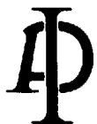