Recommended Practice for Planning, Designing and Constructing Fixed Offshore Platforms—Working Stress Design

API RECOMMENDED PRACTICE 2A-WSD (RP 2A-WSD)

TWENTY-FIRST EDITION, DECEMBER 2000

ERRATA AND SUPPLEMENT 1, DECEMBER 2002

ERRATA AND SUPPLEMENT 2, SEPTEMBER 2005

ERRATA AND SUPPLEMENT 3, OCTOBER 2007

Recommended Practice for Planning, Designing and Constructing Fixed Offshore Platforms—Working Stress Design

Upstream Segment

API RECOMMENDED PRACTICE 2A-WSD (RP 2A-WSD)

TWENTY-FIRST EDITION, DECEMBER 2000

ERRATA AND SUPPLEMENT 1, DECEMBER 2002

ERRATA AND SUPPLEMENT 2, SEPTEMBER 2005

ERRATA AND SUPPLEMENT 3, AUGUST 2007

energy

SPECIAL NOTES

API publications necessarily address problems of a general nature. With respect to particular circumstances, local, state, and federal laws and regulations should be reviewed.

API is not undertaking to meet the duties of employers, manufacturers, or suppliers to warn and properly train and equip their employees, and others exposed, concerning health and safety risks and precautions, nor undertaking their obligations under local, state, or federal laws.

Information concerning safety and health risks and proper precautions with respect to particular materials and conditions should be obtained from the employer, the manufacturer or supplier of that material, or the material safety data sheet.

Nothing contained in any API publication is to be construed as granting any right, by implication or otherwise, for the manufacture, sale, or use of any method, apparatus, or product covered by letters patent. Neither should anything contained in the publication be construed as insuring anyone against liability for infringement of letters patent.

Generally, API standards are reviewed and revised, reaffirmed, or withdrawn at least every five years. Sometimes a one-time extension of up to two years will be added to this review cycle. This publication will no longer be in effect five years after its publication date as an operative API standard or, where an extension has been granted, upon republication. Status of the publication can be ascertained from the API Standards Manager [telephone (202) 682-8000]. A catalog of API publications and materials is published annually and updated quarterly by API, 1220 L Street, N.W., Washington, D.C. 20005.

This document was produced under API standardization procedures that ensure appropriate notification and participation in the developmental process and is designated as an API standard. Questions concerning the interpretation of the content of this standard or comments and questions concerning the procedures under which this standard was developed should be directed in writing to the Standards Manager, American Petroleum Institute, 1220 L Street, N.W., Washington, D.C. 20005. Requests for permission to reproduce or translate all or any part of the material published herein should also be addressed to the general manager.

API standards are published to facilitate the broad availability of proven, sound engineering and operating practices. These standards are not intended to obviate the need for applying sound engineering judgment regarding when and where these standards should be utilized. The formulation and publication of API standards is not intended in any way to inhibit anyone from using any other practices.

Any manufacturer marking equipment or materials in conformance with the marking requirements of an API standard is solely responsible for complying with all the applicable requirements of that standard. API does not represent, warrant, or guarantee that such products do in fact conform to the applicable API standard.

All rights reserved. No part of this work may be reproduced, stored in a retrieval system, or transmitted by any means, electronic, mechanical, photocopying, recording, or otherwise, without prior written permission from the publisher. Contact the Publisher, API Publishing Services, 1220 L Street, N.W., Washington, D.C. 20005.

Copyright © 2000, 2002, 2005 American Petroleum Institute

FOREWORD

This Recommended Practice for Planning, Designing, and Constructing Fixed Offshore Platforms contains engineering design principles and good practices that have evolved during the development of offshore oil resources. Good practice is based on good engineering; therefore, this recommended practice consists essentially of good engineering recommendations. In no case is any specific recommendation included which could not be accomplished by presently available techniques and equipment. Consideration is given in all cases to the safety of personnel, compliance with existing regulations, and antipollution of water bodies.

Metric conversions of customary English units are provided throughout the text of this publication in parentheses, e.g., 6 in. (152 mm). Most of the converted values have been rounded for most practical usefulness; however, precise conversions have been used where safety and technical considerations dictate. In case of dispute, the customary English values should govern.

Offshore technology is growing rapidly. In those areas where the committee felt that adequate data were available, specific and detailed recommendations are given. In other areas general statements are used to indicate that consideration should be given to those particular points. Designers are encouraged to utilize all research advances available to them. As offshore knowledge continues to grow, this recommended practice will be revised. It is hoped that the general statements contained herein will gradually be replaced by detailed recommendations.

Reference in this practice is made to the latest edition of the AISC Specification for the Design, Fabrication and Erection of Structural Steel for Buildings (see Section 2.5.1a). While the use of latest edition of this specification is still endorsed, the use of the new AISC Load & Resistance Factor Design (LRFD), First Edition is specifically not recommended for design of offshore platforms. The load and resistance factors in this new code are based on calibration with building design practices and are therefore not applicable to offshore platforms. Research work is now in progress to incorporate the strength provisions of the new AISC LRFD code into offshore design practices.

In this practice, reference is made to ANSI/AWS D1.1-2002 Structural Welding Code—Steel. While use of this edition is endorsed, the primary intent is that the AWS code be followed for the welding and fabrication of Fixed Offshore Platforms. Chapters 8, 9, and 10 of the AWS Code give guidance that may be relevant to the design of Fixed Offshore Platforms. This Recommended Practice makes specific reference to Chapter 9 and 10 for certain design considerations. Where specific guidance is given in this API document, as in Sections 4 and 5, this guidance should take precedence.

This standard shall become effective on the date printed on the cover but may be used voluntarily from the date of distribution.

Attention Users: Portions of this publication have been changed from the previous edition. The locations of changes have been marked with a bar in the margin, as shown to the left of this paragraph. In some cases the changes are significant, while in other cases the changes reflect minor editorial adjustments. The bar notations in the margins are provided as an aid to users as to those parts of this publication that have been changed from the previous edition, but API makes no warranty as to the accuracy of such bar notations.

Note: This edition supersedes the 20th Edition dated July 1, 1993.

This Recommended Practice is under jurisdiction of the API Subcommittee on Offshore Structures and was authorized for publication at the 1969 standardization conference. The first edition was issued October 1969.

API publications may be used by anyone desiring to do so. Every effort has been made by

CONTENTS

Page

0 DEFINITIONS. 1

# 1 PLANNING 1

## 1.1 General 1
## 1.2 Operational Considerations 1
## 1.3 Environmental Considerations. 2
## 1.4 Site Investigation—Foundations 6
## 1.5 Selecting the Design Environmental Conditions 7
## 1.6 Platform Types 7
## 1.7 Exposure Categories 8
## 1.8 Platform Reuse 9
## 1.9 Platform Assessment 9
## 1.10 Safety Considerations 10
## 1.11 Regulations. 10

2 DESIGN CRITERIA AND PROCEDURES 10

## 2.1 General 10
## 2.2 Loading Conditions 11
## 2.3 Design Loads 12
## 2.4 Fabrication and Installation Forces 35

3 STRUCTURAL STEEL DESIGN 38

## 3.1 General 38
## 3.2 Allowable Stresses for Cylindrical Members 39
## 3.3 Combined Stresses for Cylindrical Members 41
## 3.4 Conical Transitions 44

4 CONNECTIONs 46

## 4.1 Connections of Tension and Compression Members 46
## 4.2 Restraint and Shrinkage 46
## 4.3 Tubular Joints 51
## 4.4 Overlapping Joints 53
## 4.5 Grouted Joints 54
## 4.6 Internally Ring-stiffened Joints 55
## 4.7 Cast Joints 55
## 4.8 Other Circular Joint Types 55
## 4.9 Damaged Joints 55
## 4.10 Non-circular Joints. 55

# 5 FATIGUE 55

## 5.1 Fatigue Design 55
## 5.2 Fatigue Analysis. 55
## 5.3 Stress Concentration Factors 56
## 5.4 S-N Curves for All Members and Connections, Except Tubular Connections 57
## 5.5 S-N Curves for Tubular Connections 58
## 5.6 Fracture Mechanics 59

6 FOUNDATION DESIGN 60

## 6.1 General 60
## 6.2 Pile Foundations. 61
## 6.3 Pile Design 61
## 6.4 Pile Capacity for Axial Bearing Loads 62
## 6.5 Pile Capacity for Axial Pullout Loads 65
## 6.6 Axial Pile Performance 65
## 6.7 Soil Reaction for Axially-loaded Piles 66
## 6.8 Soil Reaction for Laterally-loaded Piles 68
## 6.9 Pile Group Action 71
## 6.10 Pile Wall Thickness 72
## 6.11 Length of Pile Sections 73
## 6.12 Shallow Foundations 74
## 6.13 Stability of Shallow Foundations. 74
## 6.14 Static Deformation of Shallow Foundations 75
## 6.15 Dynamic Behavior of Shallow Foundations 76
## 6.16 Hydraulic Instability of Shallow Foundations 76

## 6.17 Installation and Removal of Shall Foundations 76

7 OTHER STRUCTURAL COMPONENTS AND SYSTEMS. 76

## 7.1 Superstructure Design 76
## 7.2 Plate Girder Design 77
## 7.3 Crane Supporting Structure 77
## 7.4 Grouted Pile to Structure Connections 77
## 7.5 Guyline System Design 79

8 MATERIAL 80

## 8.1Structural Steel 80
## 8.2 Structural Steel Pipe 82
## 8.3 Steel for Tubular Joints 84
## 8.4 Cement Grout and Concrete 84
## 8.5 Corrosion Protection 85

9 DRAWINGS AND SPECIFICATIONS 85

## 9.1 General 85
## 9.2 Conceptual Drawings. 85
## 9.3 Bid Drawings and Specifications 85
## 9.4 Design Drawings and Specifications 85
## 9.5 Fabrication Drawings and Specifications 86
## 9.6 Shop Drawings. 86
## 9.7 Installation Drawings and Specifications 86
## 9.8 As-built Drawings and Specifications 86

# 10 WELDING 87

## 10.1 General 87
## 10.2 Qualification. 87
## 10.3 Welding 88
## 10.4Records and Documentation 88

11 FABRICATION. 88

## 11.1Assembly 88
## 11.2 Corrosion Protection 92
## 11.3Structural Material 92
## 11.4 Loadout. 93
## 11.5 Records and Documentation 93

12 INSTALLATION. 93

## 12.1 General 93
## 12.2 Transportation 94
## 12.3 Removal of Jacket from Transport Barge 95
## 12.4 Erection 96
## 12.5 Pile Installation. 97
## 12.6 Superstructure Installation 100
## 12.7 Grounding of Installation Welding Equipment 101

13 INSPECTION 102

## 13.1 General 102
## 13.2 Scope 102
## 13.3 Inspection Personnel 102
## 13.4 Fabrication Inspection 102
## 13.5 Load Out, Seafastening, and Transportation Inspection 105
## 13.6 Installation Inspection 105
## 13.7 Inspection Documentation. 106

14 SURVEYS 107

## 14.1 General 107
## 14.2 Personnel 107
## 14.3 Survey Levels. 107
## 14.4 Survey Frequency 108
## 14.5 Preselected Survey Areas. 109
## 14.6 Records. 109

# 15 REUSE 109

## 15.1 General 109
## 15.2 Reuse Considerations 109

16 MINIMUM AND SPECIAL STRUCTURES 113

## 16.1 General 113
## 16.2 Design Loads and Analysis 113
## 16.3 Connections 114
## 16.4 Material and Welding. 114

17 ASSESSMENT OF EXISTING PLATFORMS 115

## 17.1 General 115
## 17.2 Platform Assessment Initiators 115
## 17.3 Platform Exposure Categories 116
## 17.4 Platform Assessment Information—Surveys 116
## 17.5 Assessment Process 117
## 17.6 Metrocean, Seismic, and Ice Criteria/Loads 121
## 17.7Structural Analysis For Assessment 129
## 17.8 Mitigation Alternatives 131
## 17.9 References 131

18 FIRE, BLAST, AND ACCIDENTAL LOADING. 132

## 18.1 General 132
## 18.2 Assessment Process 132
## 18.3 Platform Exposure Category 134
## 18.4 Probability of Occurrence 134
## 18.5 Risk Assessment 134
## 18.6 Fire 134
## 18.7 Blast 134
## 18.8 Fire and Blast Interaction. 135
## 18.9 Accidental Loading 135

COMMENTARY ON SECTION 1.7—EXPOSURE CATEGORIES 135  
COMMENTARY ON WAVE FORCES, SECTION 2.3.1 137   
COMMENTARY ON HYDRODYNAMIC FORCE GUIDELINES, SECTION 2.3.4. 150  
COMMENTARY ON EARTHQUAKE CRITERIA, SECTION 2.3.6. 151   
COMMENTARY ON ALLOWABLE STRESSES AND COMBINED STRESSES, SECTIONS 3.2 AND 3.3 165   
COMMENTARY ON STRENGTH OF TUBULAR JOINTS 175   
COMMENTARY ON FATIGUE, SECTION 5. 195   
COMMENTARY ON AXIAL PILE CAPACITY IN CLAY, SECTION 6.4 224   
COMMENTARY ON AXIAL PILE CAPACITY IN SAND, SECTION 6.4.3. 227   
COMMENTARY ON CARBONATE SOILS, SECTION 6.4.3. 234   
COMMENTARY ON PILE CAPACITY FOR AXIAL CYCLIC LOADINGS, SECTION 6.6.2. 236   
COMENTARY OF SIL REACTION FOR LATERALLY-LOADED PILES, SECTION 6.8 240   
COMMENTARY ON FOUNDATIONS SECTIONS 6.14 THROUGH 6.17 241   
COMMENTARY ON GROUTEDPILE TO STRUCTURE CONNECTIONS, SECTION 7.4 247   
COMMENTARY ON MATERIAL, SECTION 8 249   
COMMENTARY ON WELDING, SECTION 10.2.2 249   
COMMENTARY ON MINIMUM STRUCTURES, SECTION 16 251   
COMMENTARY ON SECTION 17—ASSESSMENT OF EXISTING PLATFORMS. 252   
COMMENTARY ON SECTIONS 18.6 - 18.9—FIRE, BLAST, AND ACCIDENTAL LOADING. 261

Figures

2.3.1-1 Procedure for Calculation of Wave Plus Current Forces for Static Analysis.... 13   
2.3.1-2 Doppler Shift Due to Steady Current 13   
2.3.1-3 Regions of Applicability of Stream Function, Stokes V, and Linear Wave Theory 14   
2.3.1-4 Shielding Factor for Wave Loads on Conductor Arrays as a Function of Conductor Spacing 16   
2.3.4-1 Area Location Map 22   
2.3.4-2 Region of Applicability of Extreme Metocean Criteria in Section 2.3.4.C .24   
2.3.4-3 Guideline Omnidirectional Design Wave Height vs. MLLW, Gulf of Mexico, North of $27^{\circ}$ N and West of $86^{\circ}$ W 24   
2.3.4-4 Guideline Design Wave Directions and Factors to Apply to the Omnidirectional Wave Heights (Figure 2.3.4-3) for L-1 and L-2 Structures, Gulf of Mexico, North of $27^{\circ}\mathrm{N}$ and West of $86^{\circ}\mathrm{W}$ 25   
2.3.4-5 Guideline Design Current Direction (Towards) with Respect to North in Shallow Water (Depth $< 150$ ft) for L-1 and L-2 Structures, Gulf of Mexico, North of $27^{\circ}\mathrm{N}$ and West of $86^{\circ}\mathrm{W}$ . 25   
2.3.4-6 Guideline Design Current Profile for L-1, L-2, and L-3 Structures, Gulf of Mexico, North of $27^{\circ}$ N and West of $86^{\circ}$ W 26   
2.3.4-7 Guideline Storm Tide vs. MLLW and Platform Category, Gulf of Mexico, North of $27^{\circ}\mathrm{N}$ and West of $86^{\circ}\mathrm{W}$ 27   
2.3.4-8 Elevation of Underside of Deck (Above MLLW) vs. MLLW, Gulf of Mexico, North of $27^{\circ}\mathrm{N}$ and West of $86^{\circ}\mathrm{W}$ 28   
3.4.1-1 Example Conical Transition 44   
## 4.2-1 Examples of Joint Classification 48
## 4.2-2 In-plane Joint Detailing 49
## 4.2-3 Out-of-Plane Joint Detailing 50
## 4.3-1 Terminology and Geometric Parameters for Simple Tubular Joints 52
## 4.3-2 Examples of Chord Lenght, $L_{c}$ 54
## 5.5-1 Example Tubular Joint S-N Curve for $\mathrm{T} = 5 / 8$ in. (16 mm) 59
6.7.2-1 Typical Axial Pile Load Transfer—Displacement （$t - z)$ Curves 67   
6.7.3-1 Pile Tip-load—Displacement （$Q - z)$ Curve 68   
6.8.6-1 Coefficients as Function of $\phi^{\prime}$ 70   
6.8.7-1 Relative Density, $\%$ 70   
7.4.4-1 Grouted Pile to Structure Connection with Shear Keys 78   
7.4.4-2 Recommended Shear Key Details. 78   
11.1.3 Welded Tubular Connections—Shielded Metal Arc Welding 90   
17.5.2 Platform Assessment Process-Metocean Loading 118   
17.6.2-1 Base Shear for a Vertical Cylinder Based on API Recommended Practice 2A, 9th Edition Reference Level Forces. 123   
17.6.2-2a Full Population Hurricane Wave Height and Storm Tide Criteria 124   
17.6.2-2b Full Population Hurricane Deck Height Criteria 125   
17.6.2-3a Sudden Hurricane Wave Height and Storm Tide Criteria. 125   
17.6.2-3b Sudden Hurricane Deck Height Criteria 126   
17.6.2-4 Sudden Hurricane Wave Directions and Factors to Apply to the Omnidirectional Wave Heights in Figure 17.6.2-3a for Ultimate Strength Analysis 127   
17.6.2-5a Winter Storm Wave Height and Storm Tide Criteria 128   
17.6.2-5b Winter Storm Deck Height Criteria 128   
## 18.2-1 Assessment Process 133
## 18.5-1 Risk Matrix 135
C2.3.1-1 Current Vectors Computed from Doppler Measurements at 60 ft on the Bullwinkle Platform. 139   
C2.3.1-2 Comparison of Linear and Nonlinear Stretching of Current Profiles. 141   
C2.3.1-3 Definition of Surface Roughness Height and Thickness 141   
C2.3.1-4 Dependence of Steady Flow Drag Coefficient on Relative Surface Roughness 143   
C2.3.1-5 Wake Amplification Factor for Drag Coefficient as a Function of $K / C_{ds}$ 143   
C2.3.1-6 Wake Amplification Factor for Drag Coefficient as a Function of $K$ 145   
C2.3.1-7 Inertia Coefficient as a Function of $K$ 145   
C2.3.1-8 Inertia Coefficient as a Function of $K / C_{ds}$ 147   
C2.3.1-9 Shielding Factor for Wave Loads on Conductor Arrays as a Function of Conductor Spacing 147   
C2.3.4-1 Example Calculation of Current Magnitude, Direction, and Profile in the Intermediate Depth Zone 151   
C2.3.6-1 Seismic Risk of United States Coastal Waters 157

C2.3.6-2 Response Spectra—Spectra Normalized to 1.0 Gravity 158   
C2.3.6-3 Example Structure 159   
C2.3.6-4 Vertical Frame Configuration Not Meeting Guidelines 161   
C2.3.6-5 Vertical Frame Configurations Meeting Guidelines 161   
C3.2.2-1 Elastic Coefficients for Local Buckling of Steel Cylinders Under Axial Compression 168   
C3.2.2-2 Comparison of Test Data with Design Equation for Fabricated Steel Cylinders Under Axial Compression 168   
C3.2.3-1 Design Equation for Fabricated Steel Cylinders Under Bending 167   
C3.2.5-1 Comparison of Test Data with Elastic Design Equations for Local Buckling of Cylinders Under Hydrostatic Pressure （$\mathbf{M} > 0.825D / t)$ 170   
C3.2.5-2 Comparison of Test Data with Elastic Design Equations for Local Buckling of Cylinders Under Hydrostatic Pressure （$\mathbf{M} < 0.825D / t)$ 171   
C3.2.5-3 Comparison of Test Data with Design Equations for Ring Buckling and Inelastic Local Buckling of Cylinders Under Hydrostatic Pressure 169   
C3.3.3-1 Comparison of Test Data with Interaction Equation for Cylinders Under Combined Axial Tension and Hydrostatic Pressure 172   
C3.3.3-2 Comparison of Interaction Equations for Various Stress Conditions for Cylinders Under Combined Axial Compressive Load and Hydrostatic Pressure 173   
C3.3.3-3 Comparison of Test Data with Elastic Interaction Curve for Cylinders Under Combined Axial Compressive Load and Hydrostatic Pressure 173   
C3.3.3-4 Comparison of Test Data on Fabricated Cylinders with Elastic Interaction Curve for Cylinders Under Combined Axial Load and Hydrostatic Pressure 174   
C3.3.3-5 Comparison of Test Data with Interaction Equations for Cylinders Under Combined Axial Compressive Load and Hydrostatic Pressure (Combination Elastic and Yield Type Failures) 174   
C4.2-1 Adverse Load Patterns with $\alpha$ Up to 3.8 (a) False Leg Termination (b) Skirt Pile Bracing, (c) Hub Connection. 177   
C4.2-2 Computed $\alpha$ (a) Equation, (b) Definitions, (c) Influence Surface 178   
C4.3.2-1 Safety Index Betas, API RP 2A-WSD Edition 21 Formulation. 181   
C4.3.2-2 Safety Index Betas, API RP 2A-WSD Edition 21, Supplement 2 Formulation . 182   
C4.3.3-1 Comparison of Strength Factors $Q_{u}$ for Axial Loading 184   
C4.3.3-2 Comparison of Strength Factors $Q_{u}$ for IPB and OBP 185   
C4.3.4-1 Comparison of Chord Load Factors $Q_{f}$ 186   
C4.3.4-2 Effect of Chord Axial Load on DT Brace Compression Capacity Comparison of University of Texas Test Data with Chord Load Factor 187   
C4.3.4-3 K Joints Under Balanced Axial Loading-Test &FE vs. New & Old API . 188   
C4.3.4-4 T Joints Under Axial Loading-Test & FFE vs. New & Old API 190   
C4.3.4-5 X Joints Under Axial Compression-Test & FFE vs. New & Old API. 190   
C4.3.4-6 All Joints Under BIPB-Test & FFE vs. New & Old API. 191   
C4.3.4-7 All Joints Under BOPB-Test & FFE vs. New & Old API 191   
C5.1-1 Allowable Peak Hot Spot Stress, $S_{p}$ (AWS Level I). 198   
C5.1-2 Allowable Peak Hot Spot Stress, $S_{p}$ (AWS Level II') 198   
C5.1-3 Example Wave Height Distribution Over Time $T$ 201   
C5.2-1 Selection of Frequencies for Detailed Analyses 201   
C5.3.1-1 Geometry Definitions for Efthymiou SCFs 207   
C5.5.1-1 Basic Air S-N Curve as Applicable to Profiled Welds, Including Size and Toe Correction to the Data. 217   
C5.5.1-2 S-N Curve and Data for Seawater with CP 217   
C6.4.3-1 Interface Friction Angle in Sand, $\delta_{cv}$ from Direct Shear Interface Tests 232   
C6.8-1 $p$ -y Lateral Support—Scour Model 241   
C6.13.1-1 Recommended Bearing Capacity Factors 242   
C6.13.1-2 Eccentrically-loaded Footings 242   
C6.13.1-3 Area Reduction Factors Eccentrically-loaded Footings 243   
C6.13.1-4 Definitions for Inclined Base and Ground Surface (After Vesic). 244   
C7.4.4a-1 Measured Bond Strength vs. Cube Compressive Strength 248   
C7.4.4a-2 Measured Bond Strength vs. Cube Compressive Strength Times the Height-to-Spacing Ratio 249   
C7.4.4a-3 Number of Tests for Safety Factors. 250   
C7.4.4a-4 Cumulative Histogram of Safety Factors 250   
C17.6.2-1a Silhouette Area Definition 254   
C17.6.2-1b Wave Heading and Direction Convention 257   
C18.6.2-1 Strength Reduction Factors for Steel at Elevated Temperatures (Reference 1) . 263   
C18.6.3-1 Maximum Allowable Temperature of Steel as a Function of Analysis Method. . 264

C18.6.3-2 Effect of Choice of Strain in the Linearization of the Stress/Strain Characteristics of Steel at Elevated Temperatures 265   
C18.7.2-1 Example Pressure Time Curve 267   
C18.9.2-1 $D / T$ Ratio versus Reduction in Ultimate Capacity, 48, 54, and 60 Inch Legs—Straight with $L = 60$ Feet, $K = 1.0$ , and $F_{y} = 35$ ksi. 272   
C18.9.2-2 $D / T$ Ratio versus Reduction in Ultimate Capacity, 48, 54, and 60 Inch Legs—Straight with $L = 60$ Feet, $K = 1.0$ , and $F_{\mathrm{v}} = 50$ ksi. 272   
C18.9.2-3 $D / T$ Ratio versus Reduction in Ultimate Capacity, 48, 54, and 60 Inch Legs—Bent with $L = 60$ Feet, $K = 1.0$ , and $F_{y} = 35$ ksi 273   
C18.9.2-4 $D / T$ Ratio versus Reduction in Ultimate Capacity, 48, 54, and 60 Inch Legs—Bent with $L = 60$ Feet, $K = 1.0$ , and $F_{y} = 50$ ksi 273

Tables

2.3.4-1 U.S.Gulf of Mexico Guideline Design Metrocan Criteria. 23   
2.3.4-2 Guideline Extreme Wave, Current, and Storm Tide Values for Twenty Areas in United States Waters (Water depth $>300$ ft. [91 m] except as noted) 29   
2.3.4-3 Guideline Extreme Wind Speeds for Twenty Areas in United States Waters 30   
## 4.3-1 Values for $Q_{u}$ 53
## 4.3-2 Values for $\mathbf{C}_1,\mathbf{C}_2,\mathbf{C}_3$ 53
## 4.5-1 $Q_{u}$ for Grouted Joints 54
5.2.5-1 Fatigue Life Safety Factors 56   
5.5.1-1 Basic Design S-N Curves. 58   
5.5.3-1 Factors on Fatigue Life for Weld Improvement Techniques. 59   
6.4.3-1 Design Parameters for Cohesionless Siliceous Soil 64   
8.1.4-1 Structural Steel Plates. 81   
8.1.4-2 Structural Steel Shapes. 83   
8.2.1-1 Structural Steel Pipe 83   
8.3.1-1 Input Testing Conditions 84   
10.2.2 Impact Testing 88   
12.5.7 Guideline Wall Thickness 99   
13.4.3 Recommended Minimum Extent of NDE Inspection 104   
14.4.2-1 Guideline Survey Intervals. 108   
15.2.3.5 Recommended Extent of NDE Inspection—Reused Structure 111   
17.6.2-1 U.S.Gulf of Mexico Metocean Criteria 124   
17.6.2-2 100-Year Metocean Criteria for Platform Assessment U.S. Waters (Other Than Gulf of Mexico), Depth $>300$ feet 127   
C4.3-1 Mean Bias Factors and Coefficients of Variation for K Joints 188   
C4.3-2 Mean Bias Factors and Coefficients of Variation for Y Joints 189   
C4.3.4-1 Mean Bias Factors and Coefficients of Variation for X Joints 189   
C5.1-1 Selected SCF Formulas for Simple Joints 199   
C5.1-2 Summary of Design Comparisons, Resulting Variation of Joint Can Thickness. 200   
C5.3.2-1 Equations for SCFs in T/Y Joints 209   
C5.3.2-2 Equations for SCFs in X-Joints 210   
C5.3.2-3 Equations for SCFs in K-Joints 211   
C5.3.2-4 Equations for SCFs in KT-Joints 212   
C5.3.2-5 Expressions for $L_{mp}$ 213   
C6.4.3-1 Unit Skin Friction Parameter Values for Driven Open-ended Steel Pipes . 229   
C10.2.2 Average HAZ Values 251   
C17.1-1 Comparison of Section 2 L-1 Wave Criteria and Section 17 Wave Criteria for 400 ft Water Depth, Gulf of Mexico 253   
C17.6.2-1 Drag Coefficient, $\bar{C}_d$ , for Wave/Current Platform Deck Forces 257   
C18.6.2-1 Yield Strength Reduction Factors for Steel at Elevated Temperatures (ASTM A-36 and A-633 GR. C and D) 262   
C18.6.3-1 Maximum Allowable Steel Temperature as a Function of Strain for Use With the “Zone” Method 263   
C18.6.3-2 Maximum Allowable Steel Temperature as a Function of Utilization Ratio (UR) 264   
C18.6.4-1 Summary of Fire Ratings and Performance for Fire Walls. 266   
C18.9.2-1 Required Tubular Thickness to Locally Absorb Vessel Impact Broadside Vessel Impact Condition 271

Recommended Practice for Planning, Designing and Constructing Fixed Offshore Platforms—Working Stress Design

0 Definitions

fixed platform: A platform extending above and supported by the sea bed by means of piling, spread footings or other means with the intended purpose of remaining stationary over an extended period.

manned platform: A platform which is actually and continuously occupied by persons accommodated and living thereon.

unmanned platform: A platform upon which persons may be employed at any one time, but upon which no living accommodations or quarters are provided.

operator: The person, firm, corporation or other organization employed by the owners to conduct operations.

ACI: American Concrete Institute.

AIEE: American Institute of Electrical Engineers.

AISC: American Institute of Steel Construction.

API: American Petroleum Institute.

ASCE: American Society of Civil Engineers.

ASME: American Society of Mechanical Engineers.

ASTM: American Society for Testing and Materials.

AWS: American Welding Society.

IADC: International Association of Drilling Contractors.

NACE: National Association of Corrosion Engineers.

NFPA: National Fire Protection Association.

OTC: Offshore Technology Conference.

# 1 Planning

## 1.1 GENERAL

1.1.1 Planning

This publication serves as a guide for those who are concerned with the design and construction of new platforms and for the relocation of existing platforms used for the drilling, development, and storage of hydrocarbons in offshore areas. In addition, guidelines are provided for the assessment of existing platforms in the event that it becomes necessary to make a determination of the "fitness for purpose" of the structure.

Adequate planning should be done before actual design is started in order to obtain a workable and economical offshore structure to perform a given function. The initial planning should include the determination of all criteria upon which the design of the platform is based.

1.1.2 Design Criteria

Design criteria as used herein include all operational requirements and environmental data which could affect the detailed design of the platform.

1.1.3 Codes and Standards

This publication has also incorporated and made maximum use of existing codes and standards that have been found acceptable for engineering design and practices from the standpoint of public safety.

## 1.2 OPERATIONAL CONSIDERATIONS

1.2.1 Function

The function for which a platform is to be designed is usually categorized as drilling, producing, storage, materials handling, living quarters, or a combination of these. The platform configuration should be determined by a study of layouts of equipment to be located on the decks. Careful consideration should be given to the clearances and spacing of equipment before the final dimensions are decided upon.

1.2.2 Location

The location of the platform should be specific before the design is completed. Environmental conditions vary with geographic location; within a given geographic area, the foundation conditions will vary as will such parameters as design wave heights, periods, and tides.

1.2.3 Orientation

The orientation of the platform refers to its position in the plan referenced to a fixed direction such as true north. Orientation is usually governed by the direction of prevailing seas, winds, currents, and operational requirements.

1.2.4 Water Depth

Information on water depth and tides is needed to select appropriate oceanographic design parameters. The water depth should be determined as accurately as possible so that elevations can be established for boat landings, fenders, decks, and corrosion protection.

1.2.5 Access and Auxiliary Systems

The location and number of stairways and access boat landings on the platform should be governed by safety considerations. A minimum of two accesses to each manned level should be installed and should be located so that escape is possible under varying conditions. Operating requirements should also be considered in stairway locations.

1.2.6 Fire Protection

The safety of personnel and possible destruction of equipment requires attention to fire protection methods. The selection of the system depends upon the function of the platform. Procedures should conform to all federal, state, and local regulations where they exist.

1.2.7 Deck Elevation

Large forces and overturning moments result when waves strike a platform's lower deck and equipment. Unless the platform has been designed to resist these forces, the elevation of the deck should be sufficient to provide adequate clearance above the crest of the design wave. In addition, consideration should be given to providing an "air gap" to allow passage of waves larger than the design wave. Guidelines concerning the air gap are provided in 2.3.4d.3 and 2.3.4g.

1.2.8 Wells

Exposed well conductors add environmental forces to a platform and require support. Their number, size, and spacing should be known early in the planning stage. Conductor pipes may or may not assist in resisting the wave force. If the platform is to be set over an existing well with the wellhead above water, information is needed on the dimensions of the tree, size of conductor pipe, and the elevations of the casing head flange and top of wellhead above mean low water. If the existing well is a temporary subsea completion, plans should be made for locating the well and setting the platform properly so that the well can later be extended above the surface of the water. Planning should consider the need for future wells.

1.2.9 Equipment and Material Layouts

Layouts and weights of drilling equipment and material and production equipment are needed in the development of the design. Heavy concentrated loads on the platform should be located so that proper framing for supporting these loads can be planned. When possible, consideration should be given to future operations.

1.2.10 Personnel and Material Handling

Plans for handling personnel and materials should be developed at the start of the platform design, along with the

type and size of supply vessels, and the anchorage system required to hold them in position at the platform. The number, size, and location of the boat landings should be determined as well.

The type, capacity, number and location of the deck cranes should also be determined. If equipment or materials are to be placed on a lower deck, then adequately sized and conveniently located hatches should be provided on the upper decks as appropriate for operational requirements. The possible use of helicopters should be established and facilities provided for their use.

1.2.11 Spillage and Contamination

Provision for handling spills and potential contaminants should be provided. A deck drainage system that collects and stores liquids for subsequent handling should be provided. The drainage and collection system should meet appropriate governmental regulations.

1.2.12 Exposure

Design of all systems and components should anticipate extremes in environmental phenomena that may be experienced at the site.

## 1.3 ENVIRONMENTAL CONSIDERATIONS

1.3.1 General Meteorological and Oceanographic Considerations

Experienced specialists should be consulted when defining the pertinent meteorological and oceanographic conditions affecting a platform site. The following sections present a general summary of the information that could be required. Selection of information needed at a site should be made after consultation with both the platform designer and a meteorological-oceanographic specialist. Measured and/or model-generated data should be statistically analyzed to develop the descriptions of normal and extreme environmental conditions as follows:

1. Normal environmental conditions (conditions that are expected to occur frequently during the life of the structure) are important both during the construction and the service life of a platform.   
2. Extreme conditions (conditions that occur quite rarely during the life of the structure) are important in formulating platform design loadings.

All data used should be carefully documented. The estimated reliability and the source of all data should be noted, and the methods employed in developing available data into the desired environmental values should be defined.

1.3.2 Winds

Wind forces are exerted upon that portion of the structure that is above the water, as well as on any equipment, deck houses, and derricks that are located on the platform. The wind speed may be classified as: (a) gusts that average less than one minute in duration, and (b) sustained wind speeds that average one minute or longer in duration. Wind data should be adjusted to a standard elevation, such as 33 feet (10 meters) above mean water level, with a specified averaging time, such as one hour. Wind data may be adjusted to any specified averaging time or elevation using standard profiles and gust factors (see 2.3.2).

The spectrum of wind speed fluctuations about the average should be specified in some instances. For example, compliant structures like guyed towers and tension leg platforms in deep water may have natural sway periods in the range of one minute, in which there is significant energy in the wind speed fluctuations.

The following should be considered in determining appropriate design wind speeds:

For normal conditions:

1. The frequency of occurrence of specified sustained wind speeds from various directions for each month or season.   
2. The persistence of sustained wind speeds above specified thresholds for each month or season.   
3. The probable speed of gusts associated with sustained wind speeds.

For extreme conditions:

Projected extreme wind speeds of specified directions and averaging times as a function of their recurrence interval should be developed. Data should be given concerning the following:

1. The measurement site, date of occurrence, magnitude of measured gusts and sustained wind speeds, and wind directions for the recorded wind data used during the development of the projected extreme winds.   
2. The projected number of occasions during the specified life of the structure when sustained wind speeds from specified directions should exceed a specific lower bound wind speed.

1.3.3 Waves

Wind-driven waves are a major source of environmental forces on offshore platforms. Such waves are irregular in shape, vary in height and length, and may approach a platform from one or more directions simultaneously. For these reasons the intensity and distribution of the forces applied by waves are difficult to determine. Because of the complex nature of the technical factors that must be considered in developing wave-dependent criteria for the design of plat

forms, experienced specialists knowledgeable in the fields of meteorology, oceanography, and hydrodynamics should be consulted.

In those areas where prior knowledge of oceanographic conditions is insufficient, the development of wave-dependent design parameters should include at least the following steps:

1. Development of all necessary meteorological data.   
2. Projection of surface wind fields.   
3. Prediction of deepwater general sea-states along storm tracks using an analytical model.   
4. Definition of maximum possible sea-states consistent with geographical limitations.   
5. Delineation of bathymetric effects on deepwater sea-states.   
6. Introduction of probabilistic techniques to predict sea-state occurrences at the platform site against various time bases.   
7. Development of design wave parameters through physical and economic risk evaluation.

In areas where considerable previous knowledge and experience with oceanographic conditions exist, the foregoing sequence may be shortened to those steps needed to project this past knowledge into the required design parameters.

It is the responsibility of the platform owner to select the design sea-state, after considering all of the factors listed in Section 1.5. In developing sea-state data, consideration should be given to the following:

For normal conditions (for both seas and swells):

1. For each month and/or season, the probability of occurrence and average persistence of various sea-states (for example, waves higher than 10 feet [3 meters]) from specified directions in terms of general sea-state description parameters (for example, the significant wave height and the average wave period).   
2. The wind speeds, tides, and currents occurring simultaneously with the sea-states of Section 1 above.

For extreme conditions:

Definition of the extreme sea-states should provide an insight as to the number, height, and crest elevations of all waves above a certain height that might approach the platform site from any direction during the entire life of the structure. Projected extreme wave heights from specified directions should be developed and presented as a function of their expected average recurrence intervals. Other data which should be developed include:

1. The probable range and distribution of wave periods associated with extreme wave heights.   
2. The projected distribution of other wave heights, maximum crest elevations, and the wave energy spectrum in the sea-state producing an extreme wave height(s).

3. The tides, currents, and winds likely to occur simultaneously with the sea-state producing the extreme waves.   
4. The nature, date, and place of the events which produced the historical sea-states (for example, Hurricane Camille, August 1969, U.S. Gulf of Mexico) used in the development of the projected values.

1.3.4 Tides

Tides are important considerations in platform design. Tides may be classified as: (a) astronomical tide, (b) wind tide, and (c) pressure differential tide. The latter two are frequently combined and called storm surge; the sum of the three tides is called the storm tide. In the design of a fixed platform, the storm tide elevation is the datum upon which storm waves are superimposed. The variations in elevations of the daily astronomical tides, however, determine the elevations of the boat landings, barge fenders, the splash zone treatment of the steel members of the structure, and the upper limits of marine growth.

1.3.5 Currents

Currents are important in the design of fixed platforms. They affect: (a) the location and orientation of boat landings and barge bumpers, and (b) the forces on the platform. Where possible, boat landings and barge bumpers should be located, to allow the boat to engage the platform as it moves against the current.

The most common categories of currents are: (a) tidal currents (associated with astronomical tides), (b) circulatory currents (associated with oceanic-scale circulation patterns), and (c) storm-generated currents. The vector sum of these three currents is the total current, and the speed and direction of the current at specified elevations is the current profile. The total current profile associated with the sea-state producing the extreme waves should be specified for platform design. The frequency of occurrence of total current of total current speed and direction at different depths for each month and/or season may be useful for planning operations.

1.3.6 Ice

In some areas where petroleum development is being carried out, subfreezing temperatures can prevail a major portion of the year, causing the formation of sea-ice. Sea-ice may exist in these areas as first-year sheet ice, multi-year floes, first-year and multi-year pressure ridges, and/or ice islands. Loads produced by ice features could constitute a dominant design factor for offshore platforms in the most severe ice areas such as the Alaskan Beaufort and Chukchi Seas, and Norton Sound. In milder climates, such as the southern Bering Sea and Cook Inlet, the governing design factor may be seismic- or wave-induced, but ice features would nonetheless influence the design and construction of the platforms considered.

Research in ice mechanics is being conducted by individual companies and joint industry groups to develop design criteria for arctic and subarctic offshore areas. Global ice forces vary depending on such factors as size and configuration of platform, location of platform, mode of ice failure, and unit ice strength. Unit ice strength depends on the ice feature, temperature, salinity, speed of load application, and ice composition. Forces to be used in design should be determined in consultation with qualified experts.

API Recommended Practice 2N outlines the conditions that should be addressed in the design and construction of structures in arctic and subarctic offshore regions.

1.3.7 Active Geologic Processes

1.3.7.a General

In many offshore areas, geologic processes associated with movement of the near-surface sediments occur within time periods that are relevant to fixed platform design. The nature, magnitude, and return intervals of potential seafloor movements should be evaluated by site investigations and judicious analytical modeling to provide input for determination of the resulting effects on structures and foundations. Due to uncertainties with definition of these processes, a parametric approach to studies may be helpful in the development of design criteria.

1.3.7.b Earthquakes

Seismic forces should be considered in platform design for areas that are determined to be seismically active. Areas are considered seismically active on the basis of previous records of earthquake activity, both in frequency of occurrence and in magnitude. Seismic activity of an area for purposes of design of offshore structures is rated in terms of possible severity of damage to these structures. Seismic risk for United States coastal areas is detailed in Figure C2.3.6-1. Seismicity of an area may also be determined on the basis of detailed investigation.

Seismic considerations should include investigation of the subsurface soils at the platform site for instability due to liquefaction, submarine slides triggered by earthquake activity, proximity of the site to faults, the characteristics of the ground motion expected during the life of the platform, and the acceptable seismic risk for the type of operation intended. Platforms in shallow water that may be subjected to tsunamis should be investigated for the effects of resulting forces.

1.3.7.c Faults

In some offshore areas, fault planes may extend to the seafloor with the potential for either vertical or horizontal movement. Fault movement can occur as a result of seismic activity, removal of fluids from deep reservoirs, or long-term creep related to large-scale sedimentation or erosion. Siting of

facilities in close proximity to fault planes intersecting the seafloor should be avoided if possible. If circumstances dictate siting structures near potentially active features, the magnitude and time scale of expected movement should be estimated on the basis of geologic study for use in the platform design.

1.3.7.d Seafloor Instability

Movement of the seafloor can occur as a result of loads imposed on the soil mass by ocean wave pressures, earthquakes, soil self-weight, or combination of these phenomena. Weak, underconsolidated sediments occurring in areas where wave pressures are significant at the seafloor are most susceptible to wave induced movement and may be unstable under negligible slope angles. Earthquake induced forces can induce failure of seafloor slopes that are otherwise stable under the existing self-weight forces and wave conditions.

In areas of rapid sedimentation, such as actively growing deltas, low soil strength, soil self-weight, and wave-induced pressures are believed to be the controlling factors for the geologic processes that continually move sediment downslope. Important platform design considerations under these conditions include the effects of large-scale movement of sediment in areas subjected to strong wave pressures, downslope creep movements in areas not directly affected by wave-seafloor interaction, and the effects of sediment erosion and/or deposition on platform performance.

The scope of site investigations in areas of potential instability should focus on identification of metastable geologic features surrounding the site and definition of the soil engineering properties required for modeling and estimating seafloor movements.

Analytical estimates of soil movement as a function of depth below the mudline can be used with soil engineering properties to establish expected forces on platform members. Geologic studies employing historical bathymetric data may be useful for quantifying deposition rates during the design life of the facility.

1.3.7.e Scour

Scour is removal of seafloor soils caused by currents and waves. Such erosion can be a natural geologic process or can be caused by structural elements interrupting the natural flow regime near the seafloor.

From observation, scour can usually be characterized as some combination of the following:

1. Local scour: Steep-sided scour pits around such structure elements as piles and pile groups, generally as seen in flume models.   
2. Global scour: Shallow scoured basins of large extent around a structure, possibly due to overall structure effects,

multiple structure interaction or wave/soil/structure interaction.

3. Overall seabed movement: Movement of sandwaves, ridges, and shoals that would occur in the absence of a structure. This movement can be caused by lowering or accumulation.

The presence of mobile seabed sandwaves, sandhills, and sand ribbons indicates a vigorous natural scour regime. Past bed movement may be evidenced by geophysical contrasts, or by variation in density, grading, color, or biological indicators in seabed samples and soundings. Sand or silt soils in water depths less than about 130 feet (40 meters) are particularly susceptible to scour, but scour has been observed in cobbles, gravels and clays; in deeper water, the presence of scour depends on the vigor of currents and waves.

Scour can result in removal of vertical and lateral support for foundations, causing undesirable settlements of mat foundations and overstressing of foundation elements. Where scour is a possibility, it should be accounted for in design and/or its mitigation should be considered. Offshore scour phenomena are described in "Seafloor Scour, Design Guidelines for Ocean Founded Structures," by Herbich et al., 1984, No. 4 in Marcel Dekker Inc., Ocean Engineering Series; and "Scour Prevention Techniques Around Offshore Structures." SUT Seminars, London, December 1980.

1.3.7.f Shallow Gas

The presence of either biogenic or petrogenic gas in the porewater of near-surface soils is an engineering consideration in offshore areas. In addition to being a potential drilling hazard for both site investigation soil borings and oil well drilling, the effects of shallow gas may be important to engineering of the foundation. The importance of assumptions regarding shallow gas effects on interpreted soil engineering properties and analytical models of geologic processes should be established during initial stages of the design.

1.3.8 Marine Growth

Offshore structures accumulate marine growth to some degree in all the world's oceans. Marine growth is generally greatest near the mean water level but in some areas may be significant 200 feet or more below the mean water level. Marine growth increases wave forces (by increasing member diameter and surface roughness) and mass of the structure, and should be considered in design.

1.3.9 Other Environmental Information

Depending on the platform site, other environmental information of importance includes records and/or predictions with respect to precipitation, fog, wind chill, air, and sea temperatures. General information on the various types of storms that might affect the platform site should be used to supple

ment other data developed for normal conditions. Statistics can be compiled giving the expected occurrence of storms by season, direction of approach, etc. Of special interest for construction planning are the duration, the speed of movement and development, and the extent of these conditions. Also of major importance is the ability to forecast storms in the vicinity of a platform.

## 1.4 SITE INVESTIGATION—FOUNDATIONS

1.4.1 Site Investigation Objectives

Knowledge of the soil conditions existing at the site of construction on any sizable structure is necessary to permit a safe and economical design. On-site soil investigations should be performed to define the various soil strata and their corresponding physical and engineering properties. Previous site investigations and experience at the site may permit the installation of additional structures without additional studies.

The initial step for a site investigation is reconnaissance. Information may be collected through a review of available geophysical data and soil boring data available in engineering files, literature, or government files. The purpose of this review is to identify potential problems and to aid in planning subsequent data acquisition phases of the site investigation.

Soundings and any required geophysical surveys should be part of the on-site studies, and generally should be performed before borings. These data should be combined with an understanding of the shallow geology of the region to develop the required foundation design parameters. The on-site studies should extend throughout the depth and areal extent of soils that will affect or be affected by installation of the foundation elements.

1.4.2 Sea-bottom Surveys

The primary purpose of a geophysical survey in the vicinity of the site is to provide data for a geologic assessment of foundation soils and the surrounding area that could affect the site. Geophysical data provide evidence of slumps, scarps, irregular or rough topography, mud volcanoes, mud lumps, collapse features, sand waves, slides, faults, diapirs, erosional surfaces, gas bubbles in the sediments, gas seeps, buried channels, and lateral variations in strata thicknesses. The areal extent of shallow soil layers may sometimes be mapped if good correspondence can be established between the soil boring information and the results from the sea-bottom surveys.

The geophysical equipment used includes: (a) subbottom profiler (tuned transducer) for definition of bathymetry and structural features within the near-surface sediments, (b) side-scan sonar to define surface features, (c) boomer or minisparker for definition of structure to depths up to a few hundred feet below the seafloor, and (d) sparker, air gun, water gun, or sleeve exploder for definition of structure at deeper depths, and to tie together with deep seismic data from reser

voir studies. Shallow sampling of near-surface sediments using drop, piston, grab samplers, or vibrocoring along geophysical tracklines may be useful for calibration of results and improved definition of the shallow geology.

For more detailed description of commonly used sea-bottom survey systems, refer to the paper "Analysis of High Resolution Seismic Data" by H. C. Sieck and G. W. Self (AAPG), Memoir 26: Seismic Stratigraphy—Applications to Hydrocarbon Exploration, 1977, pp. 353-385.

1.4.3 Soil Investigation and Testing

If practical, the soil sampling and testing program should be defined after a review of the geophysical results. On-site soil investigation should include one or more soil borings to provide samples suitable for engineering property testing, and a means to perform in-situ testing, if required. The number and depth of borings will depend on the soil variability in the vicinity of the site and the platform configuration. Likewise, the degree of sophistication of soil sampling and preservation techniques, required laboratory testing, and the need for in-situ property testing are a function of the platform design requirements and the adopted design philosophy.

As a minimum requirement, the foundation investigation for pile-supported structures should provide the soil engineering property data needed to determine the following parameters: (a) axial capacity of piles in tension and compression, (b) load-deflection characteristics of axially and laterally loaded piles, (c) pile driveability characteristics, and (d) mud-mat bearing capacity.

The required scope of the soil sampling, in-situ testing, and laboratory testing programs is a function of the platform design requirements and the need to characterize active geologic processes that may affect the facility. For novel platform concepts, deepwater applications, platforms in areas of potential slope instability, and gravity-base structures, the geotechnical program should be tailored to provide the data necessary for pertinent soil-structure interaction and pile capacity analyses.

When performing site investigations in frontier areas or areas known to contain carbonate material, the investigation should include diagnostic methods to determine the existence of carbonate soils. Typically, carbonate deposits are variably cemented and range from lightly cemented with sometimes significant void spaces to extremely well-cemented. In planning a site investigation program, there should be enough flexibility in the program to switch between soil sampling, rotary coring, and in-situ testing as appropriate. Qualitative tests should be performed to establish the carbonate content. In a soil profile which contains carbonate material (usually in excess of 15 to 20 percent of the soil fraction) engineering behavior of the soil could be adversely affected. In these soils additional field and laboratory testing and engineering may be warranted.

## 1.5 SELECTING THE DESIGN ENVIRONMENTAL CONDITIONS

Selection of the environmental conditions to which platforms are designed should be the responsibility of the owner. The design environmental criteria should be developed from the environmental information described in Section 1.3, and may also include a risk analysis where prior experience is limited. The risk analysis may include the following:

1. Historical experience.   
2. The planned life and intended use of the platform.   
3. The possible loss of human life.   
4. Prevention of pollution.   
5. The estimated cost of the platform designed to environmental conditions for several average expected recurrence intervals.   
6. The probability of platform damage or loss when subjected to environmental conditions with various recurrence intervals.   
7. The financial loss due to platform damage or loss including lost production, cleanup, replacing the platform and redrilling wells, etc.

As a guide, the recurrence interval for oceanographic design criteria should be several times the planned life of the platform. Experience with major platforms in the U.S. Gulf of Mexico supports the use of 100-year oceanographic design criteria. This is applicable only to new and relocated platforms that are manned during the design event, or are structures where the loss of, or severe damage to the structure could result in a high consequence of failure. Consideration may be given to a reduced design requirements for the design or relocation of other structures, that are unmanned or evacuated during the design event, and have either a shorter design life than the typical 20 years, or where the loss of or severe damage to the structure would not result in a high consequence of failure. Guidelines to assist in the establishment of the exposure category to be used in the selection of criteria for the design of new platforms and the assessment of existing platforms are provided in Section 1.7. Risk analyses may justify either longer or shorter recurrence intervals for design criteria. However, not less than 100-year oceanographic design criteria should be considered where the design event may occur without warning while the platform is manned and/or when there are restrictions on the speed of personnel removal (for example, great flying distances).

Section 2 provides guidelines for developing oceanographic design criteria that are appropriate for use with the Exposure Category Levels defined in Section 1.7. For all Level 1 Category new structures located in U.S. waters, the use of nominal 100-year return period is recommended. For Level 2 and Level 3 Category new structures located in the U.S. Gulf of Mexico north of $27^{\circ}$ N latitude and west of $86^{\circ}$ W longitude, guidelines for reducing design wave, wind, and current forces are provided.

Where sufficient information is available, the designer may take into account the variation in environmental conditions expected to occur from different directions. When this is considered, an adequate tolerance in platform orientation should be used in the design of the platform and measures must be employed during installation to ensure the platform is positioned within the allowed tolerance. For the assessment of existing structures, the application of a reduced criteria is normally justified. Recommendations for the development of an oceanographic criteria for the assessment of existing platforms is provided in Section 17.

Structures should be designed for the combination of wind, wave, and current conditions causing the extreme load, accounting for their joint probability of occurrence (both magnitude and direction). For most template, tower, gravity, and caisson types of platforms, the design fluid dynamic load is predominantly due to waves, with currents and winds playing a secondary role. The design conditions, therefore, consist of the wave conditions and the currents and winds likely to coexist with the design waves. For compliant structures, response to waves is reduced, so that winds and currents become relatively more important. Also, for structures in shallow water and structures with a large deck and/or superstructure, the wind load may be a more significant portion of the total environmental force. This may lead to multiple sets of design conditions including; as an example, for Level L-1 structures (a) the 100-year waves with associated winds and currents, and (b) the 100-year winds with associated waves and currents.

Two levels of earthquake environmental conditions are needed to address the risk of damage or structure collapse: (1) ground motion which has a reasonable likelihood of not being exceeded at the site during the platform life, and (2) ground motion for a rare, intense earthquake.

Consideration of the foregoing factors has led to the establishment of the hydrodynamic force guideline of 2.3.4, and the guidelines for earthquake design of 2.3.6.

## 1.6 PLATFORM TYPES

1.6.1 Fixed Platforms

A fixed platform is defined as a platform extending above the water surface and supported at the sea bed by means of piling, spread footing(s), or other means with the intended purpose of remaining stationary over an extended period.

1.6.1.a Jacket or Template

These type platforms generally consist of the following:

1. Completely braced, redundant welded tubular space frame extending from an elevation at or near the sea bed to above the water surface, which is designed to serve as the main structural element of the platform, transmitting lateral and vertical forces to the foundation.

2. Piles or other foundation elements that permanently anchor the platform to the ocean floor, and carry both lateral and vertical loads.   
3. A superstructure providing deck space for supporting operational and other loads.

1.6.1.b Tower

A tower platform is a modification of the jacket platform that has relatively few large diameter [for example, 15 feet (5 meters) legs]. The tower may be floated to location and placed in position by selective flooding. Tower platforms may or may not be supported by piling. Where piles are used, they are driven through sleeves inside or attached to the outside of the legs. The piling may also serve as well conductors. If the tower's support is furnished by spread footings instead of by piling, the well conductors may be installed either inside or outside the legs.

1.6.1.c Gravity Structures

A gravity structure is one that relies on the weight of the structure rather than piling to resist environmental loads.

1.6.1.d Minimum Non-Jacket and Special Structures

Many structures have been installed and are serving satisfactorily that do not meet the definition for jacket type platforms as defined above. In general, these structures do not have reserve strength or redundancy equal to conventional jacket type structures. For this reason, special recommendations regarding design and installation are provided in Section 16. Minimum structures are defined as structures which have one or more of the following attributes:

1. Structural framing, which provides less reserve strength and redundancy than a typical well braced, three-leg template type platform.   
2. Free-standing and guyed caisson platforms which consist of one large tubular member supporting one or more wells.   
3. Well conductor(s) or free-standing caisson(s), which are utilized as structural and/or axial foundation elements by means of attachment using welded, nonwelded, or nonconventional welded connections.   
4. Threaded, pinned, or clamped connections to foundation elements (piles or pile sleeves).   
5. Braced caissons and other structures where a single element structural system is a major component of the platform, such as a deck supported by a single deck leg or caisson.

1.6.1.e Compliant Platform

A compliant platform is a bottom-founded structure having substantial flexibility. It is flexible enough that applied forces are resisted in significant part by inertial forces. The result is

a reduction in forces transmitted to the platform and the supporting foundation. Guyed towers are normally compliant, unless the guying system is very stiff. Compliant platforms are covered in this practice only to the extent that the provisions are applicable.

1.6.2 Floating Production Systems

A number of different floating structures are being developed and used as floating production systems (e.g., Tension Leg Platforms, Spars, Semisubmersibles). Many aspects of this Recommended Practice are applicable to certain aspects of the design of these structures.

API RP 2T provides specific advice for TLPs.

1.6.3 Related Structures

Other structures include underwater oil storage tanks, bridges connecting platforms, flare booms, etc.

## 1.7 EXPOSURE CATEGORIES

Structures can be categorized by various levels of exposure to determine criteria for the design of new platforms and the assessment of existing platforms that are appropriate for the intended service of the structure.

The levels are determined by consideration of life-safety and consequences of failure. Life-safety considers the maximum anticipated environmental event that would be expected to occur while personnel are on the platform. Consequences of failure should consider the factors listed in Section 1.5 and discussed in the Commentary for this section. Such factors include anticipated losses to the owner (platform and equipment repair or replacement, lost production, cleanup), anticipated losses to other operators (lost production through trunklines), and anticipated losses to industry and government.

Categories for life-safety are:

L-1 = manned-nonevacuated   
L-2 = manned-evacuated   
L-3 = unmanned

Categories for consequences of failure are:

L-1 = high consequence of failure

L-2 = medium consequence of failure

$\mathrm{L - 3} =$ low consequence of failure

The level to be used for platform categorization is the more restrictive level for either life-safety or consequence of failure. Platform categorization may be revised over the life of the structure as a result of changes in factors affecting life-safety or consequence of failure.

1.7.1 Life Safety

The determination of the applicable level for life-safety should be based on the following descriptions:

1.7.1.a L-1 Manned-nonevacuated

The manned-nonevacuated category refers to a platform that is continuously occupied by persons accommodated and living thereon, and personnel evacuation prior to the design environmental event is either not intended or impractical.

1.7.1.b L-2 Manned-evacuated

The manned-evacuated category refers to a platform that is normally manned except during a forecast design environmental event. For categorization purposes, a platform should be classified as a manned-evacuated platform if, prior to a design environmental event, evacuation is planned and sufficient time exists to safely evacuate all personnel from the platform.

1.7.1.c L-3 Unmanned

The unmanned category refers to a platform that is not normally manned, or a platform that is not classified as either manned-nonevacuated or manned-evacuated. Platforms in this classification may include emergency shelters. However, platforms with permanent quarters are not defined as unmanned and should be classified as manned-nonevacuated or as manned-evacuated as defined above. An occasionally manned platform could be categorized as unmanned in certain conditions (see Commentary C1.7.1c).

1.7.2 Consequence of Failure

As stated above, consequences of failure should include consideration of anticipated losses to the owner, the other operators, and the industry in general. The following descriptions of relevant factors serve as a basis for determining the appropriate level for consequence of failure.

1.7.2.a L-1 High Consequence

The high consequence of failure category refers to major platforms and/or those platforms that have the potential for well flow of either oil or sour gas in the event of platform failure. In addition, it includes platforms where the shut-in of the oil or sour gas production is not planned, or not practical prior to the occurrence of the design event (such as areas with high seismic activity). Platforms that support major oil transport lines (see Commentary C1.7.2—Pipelines) and/or storage facilities for intermittent oil shipment are also considered to be in the high consequence category. All new U.S. Gulf of Mexico platforms which are designed for installation in water depths greater than 400 feet are included in this category unless a lower consequence of failure can be demonstrated to justify a reduced classification.

1.7.2.b L-2 Medium Consequence

The medium consequence of failure category refers to platforms where production would be shut-in during the design

event. All wells that could flow on their own in the event of platform failure must contain fully functional, subsurface safety valves, which are manufactured and tested in accordance with the applicable API specifications. Oil storage is limited to process inventory and "surge" tanks for pipeline transfer.

1.7.2.c L-3 Low Consequence

The low consequence of failure category refers to minimal platforms where production would be shut-in during the design event. All wells that could flow on their own in the event of platform failure must contain fully functional, subsurface safety valves, which are manufactured and tested in accordance with applicable API specifications. These platforms may support production departing from the platform and low volume infeld pipelines. Oil storage is limited to process inventory. New U.S. Gulf of Mexico platforms in this category include caissons and small well protectors with no more than five well completions either located on or connected to the platform and with no more than two pieces of production equipment. In addition, platforms in this category are defined as structures in water depths not exceeding 100 feet.

## 1.8 PLATFORM REUSE

Existing platforms may be removed and relocated for continued use at a new site. When this is to be considered, the platform should be inspected to ensure that it is in (or can be returned to) an acceptable condition. In addition, it should be reanalyzed and reevaluated for the use, conditions, and loading anticipated at the new site. In general, this inspection, reevaluation, and any required repairs or modification should follow the procedures and provisions for new platforms that are stated in this recommended practice. Additional special provisions regarding reuse are listed in Section 15.

## 1.9 PLATFORM ASSESSMENT

An assessment to determine fitness for purpose may be required during the life of a platform. This procedure is normally initiated by a change in the platform usage such as revised manning or loading, by modifications to the condition of the platform such as damage or deterioration, or by a reevaluation of the environmental loading or the strength of the foundation. General industry practices recognize that older, existing structures may not meet current design standards. However, many of these platforms that are in an acceptable condition can be shown to be structurally adequate using a risk-based assessment criteria that considers platform use, location, and the consequences of failure.

For platforms which were designed in accordance with the provisions of the 20th and earlier editions, as well as platforms designed prior to the first edition of this publication, recommendations regarding the development of reduced cri

teria for assessment considering life-safety and consequences of failure as well as for assessment procedures are included in Section 17. These fitness for purpose provisions shall not be used to circumvent normal design practice requirements when designing new platforms. The reduced environmental criteria as defined in Section 17 should not be utilized to justify modifications or additions to a platform that will result in an increased loading on the structure for platforms that have been in service less than five years.

Assessment of platforms designed in accordance with provisions of the 21st Edition and later editions of this publication should be performed using the environmental criteria originally used for the design, unless a special study can justify a reduction in Exposure Category as defined in Section 1.

## 1.10 SAFETY CONSIDERATIONS

The safety of life and property depends upon the ability of the structure to support the loads for which it was designed, and to survive the environmental conditions that may occur. Over and above this overall concept, good practice dictates use of certain structural additions, equipment and operating procedures on a platform so that injuries to personnel will be minimized and the risk of fire, blast and accidental loading (for example, collision from ships, dropped objects) is reduced. Governmental regulations listed in Section 1.11 and all other applicable regulations should be met.

## 1.11 REGULATIONS

Each country has its own set of regulations concerning offshore operations. Listed below are some of the typical rules and regulations that, if applicable, should be considered when designing and installing offshore platforms in U.S. territorial waters. Other regulations may also be in effect. It is the responsibility of the operator to determine which rules and regulations are applicable and should be followed, depending upon the location and type of operations to be conducted.

1. 33 Code of Federal Regulations Chapter N, Parts 140 to 147, "Outer Continental Shelf Activities," U.S. Coast Guard, Department of Transportation. These regulations stipulate requirements for identification marks for platforms, means of escape, guard rails, fire extinguishers, life preservers, ring buoys, first aid kits, etc.   
2. 33 Code of Federal Regulations Part 67, "Aids to Navigation on Artificial Islands and Fixed Structures," U.S. Coast Guard, Department of Transportation. These regulations prescribe in detail the requirements for installation of lights and fog horns on offshore structures in various zones.   
3. 30 Code of Federal Regulations Part 250, Minerals Management Service (formerly U.S. Geological Service), OCS Regulations. These regulations govern the marking, design,

fabrication, installation, operation, and removal of offshore structures and related appurtenances.

4. 29 Code of Federal Regulations Part 1910, Occupational Safety and Health Act of 1970. This act specifies requirements for safe design of floors, handrails, stairways, ladders, etc. Some of its requirements may apply to components of offshore structures that are located in state waters.   
5. 33 Code of Federal Regulations Part 330, "Permits for Work in Navigable Waters," U.S. Corps of Engineers. Nationwide permits describes requirements for making application for permits for work (for example, platform installation) in navigable waters. Section 10 of the River and Harbor Act of 1899 and Section 404 of the Clean Water Act apply to state waters.   
6. Obstruction Marking and Lighting, Federal Aviation Administration. This booklet sets forth requirements for marking towers, poles, and similar obstructions. Platforms with derricks, antennae, etc., are governed by the rules set forth in this booklet. Additional guidance is provided by API Recommended Practice 2L, Recommended Practice for Planning, Designing, and Constructing Heliports for Fixed Offshore Platforms.   
7. Various state and local agencies (for example, U.S. Department of Wildlife and Fisheries) require notification of any operations that may take place under their jurisdiction.

Other regulations concerning offshore pipelines, facilities, drilling operations, etc., may be applicable and should be consulted.

2 Design Criteria and Procedures

## 2.1 GENERAL

2.1.1 Dimensional System

All drawings, calculations, etc., should be consistent in one dimensional system, such as the English dimensional system or the SI metric system.

2.1.2 Definition of Loads

2.1.2.a General

The following loads and any dynamic effects resulting from them should be considered in the development of the design loading conditions in 2.2.1.

2.1.2.b Dead Loads

Dead loads are the weights of the platform structure and any permanent equipment and appurtenant structures which do not change with the mode of operation. Dead loads should include the following:

1. Weight of the platform structure in air, including where appropriate the weight of piles, grout and ballast.   
2. Weight of equipment and appurtenant structures permanently mounted on the platform.   
3. Hydrostatic forces acting on the structure below the waterline including external pressure and buoyancy.

2.1.2.c Live Loads

Live loads are the loads imposed on the platform during its use and which may change either during a mode of operation or from one mode of operation to another. Live loads should include the following:

1. The weight of drilling and production equipment which can be added or removed from the platform.   
2. The weight of living quarters, heliport and other life support equipment, life saving equipment, diving equipment and utilities equipment which can be added or removed from the platform.   
3. The weight of consumable supplies and liquids in storage tanks.   
4. The forces exerted on the structure from operations such as drilling, material handling, vessel mooring and helicopter loadings.   
5. The forces exerted on the structure from deck crane usage. These forces are derived from consideration of the suspended load and its movement as well as dead load.

2.1.2.d Environmental Loads

Environmental loads are loads imposed on the platform by natural phenomena including wind, current, wave, earthquake, snow, ice and earth movement. Environmental loads also include the variation in hydrostatic pressure and buoyancy on members caused by changes in the water level due to waves and tides. Environmental loads should be anticipated from any direction unless knowledge of specific conditions makes a different assumption more reasonable.

2.1.2.e Construction Loads

Loads resulting from fabrication, loadout, transportation and installation should be considered in design and are further defined in Section 2.4.

2.1.2.f Removal and Reinstallation Loads

For platforms which are to be relocated to new sites, loads resulting from removal, onloading, transportation, upgrading and reinstallation should be considered in addition to the above construction loads.

2.1.2.g Dynamic Loads

Dynamic loads are the loads imposed on the platform due to response to an excitation of a cyclic nature or due to react-

ing to impact. Excitation of a platform may be caused by waves, wind, earthquake or machinery. Impact may be caused by a barge or boat berthing against the platform or by drilling operations.

## 2.2 LOADING CONDITIONS

2.2.1 General

Design environmental load conditions are those forces imposed on the platforms by the selected design event; whereas, operating environmental load conditions are those forces imposed on the structure by a lesser event which is not severe enough to restrict normal operations, as specified by the operator.

2.2.2 Design Loading Conditions

The platform should be designed for the appropriate loading conditions which will produce the most severe effects on the structure. The loading conditions should include environmental conditions combined with appropriate dead and live loads in the following manner.

1. Operating environmental conditions combined with dead loads and maximum live loads appropriate to normal operations of the platform.   
2. Operating environmental conditions combined with dead loads and minimum live loads appropriate to the normal operations of the platform.   
3. Design environmental conditions with dead loads and maximum live loads appropriate for combining with extreme conditions.   
4. Design environmental conditions with dead loads and minimum live loads appropriate for combining with extreme conditions.

Environmental loads, with the exception of earthquake load, should be combined in a manner consistent with the probability of their simultaneous occurrence during the loading condition being considered. Earthquake load, where applicable, should be imposed on the platform as a separate environmental loading condition.

The operating environmental conditions should be representative of moderately severe conditions at the platform. They should not necessarily be limiting conditions which, if exceeded, require the cessation of platform operations. Typically, a 1-year to 5-year winter storm is used as an operating condition in the Gulf of Mexico.

Maximum live loads for drilling and production platforms should consider drilling, production and workover mode loadings, and any appropriate combinations of drilling or workover operations with production.

Variations in supply weights and the locations of movable equipment such as a drilling derrick should be considered to maximize design stress in the platform members.

2.2.3 Temporary Loading Conditions

Temporary loading conditions occurring during fabrication, transportation, installation or removal and reinstallation of the structure should be considered. For these conditions a combination of the appropriate dead loads, maximum temporary loads, and the appropriate environmental loads should be considered.

2.2.4 Member Loadings

Each platform member should be designed for the loading condition which produces the maximum stress in the member, taking into consideration the allowable stress for the loading condition producing this stress.

## 2.3 DESIGN LOADS

2.3.1 Waves

2.3.1.a General

The wave loads on a platform are dynamic in nature. For most design water depths presently encountered, these loads may be adequately represented by their static equivalents. For deeper waters or where platforms tend to be more flexible, the static analysis may not adequately describe the true dynamic loads induced in the platform. Correct analysis of such platforms requires a load analysis involving the dynamic action of the structure.

2.3.1.b Static Wave Analysis

The sequence of steps in the calculation of deterministic static design wave forces on a fixed platform (neglecting platform dynamic response and distortion of the incident wave by the platform) is shown graphically in Figure 2.3.1-1. The procedure, for a given wave direction, begins with the specification of the design wave height and associated wave period, storm water depth, and current profile. Values of these parameters for U.S. waters are specified in 2.3.4. The wave force calculation procedure follows these steps:

- An apparent wave period is determined, accounting for the Doppler effect of the current on the wave.   
- The two-dimensional wave kinematics are determined from an appropriate wave theory for the specified wave height, storm water depth, and apparent period.   
- The horizontal components of wave-induced particle velocities and accelerations are reduced by the wave kinematics factor, which accounts primarily for wave directional spreading.   
- The effective local current profile is determined by multiplying the specified current profile by the current blockage factor.

tial and Chappelear, may be used if an appropriate order of

- The effective local current profile is combined vectorially with the wave kinematics to determine locally incident fluid velocities and accelerations for use in Morison's equation.   
- Member dimensions are increased to account for marine growth.   
- Drag and inertia force coefficients are determined as functions of wave and current parameters; and member shape, roughness (marine growth), size, and orientation.   
- Wave force coefficients for the conductor array are reduced by the conductor shielding factor.   
- Hydrodynamic models for risers and appurtenances are developed.   
- Local wave/current forces are calculated for all platform members, conductors, risers, and appurtenances using Morison's equation.   
- The global force is computed as the vector sum of all the local forces.

The discussion in the remainder of this section is in the same order as the steps listed above. There is also some discussion on local forces (such as slam and lift) that are not included in the global force.

1. Apparent Wave Period. A current in the wave direction tends to stretch the wave length, while an opposing current shortens it. For the simple case of a wave propagating on a uniform in-line current, the apparent wave period seen by an observer moving with the current can be estimated from Figure 2.3.1-2, in which $T$ is the actual wave period (as seen by a stationary observer). $V_I$ is the current component in the wave direction, $d$ , is storm water depth (including storm surge and tide), and $g$ is the acceleration of gravity. This figure provides estimates for $d / gT^2 > 0.01$ . For smaller values of $d / gT^2$ , the equation （$T_{app} / T) = 1 + V_I\sqrt{gd}$ can be used. While strictly applicable only to a current that is uniform over the full water depth, Figure 2.3.1-2 provides acceptable estimates of $T_{app}$ for "slab" current profiles that are uniform over the top 165 ft (50m) or more of the water column. For other current profiles, a system of simultaneous nonlinear equations must be solved interactively to determine $T_{app}$ (see Commentary). The current used to determine $T_{app}$ should be the free-stream current (not reduced by structure blockage).   
2. Two-Dimensional Wave Kinematics. For the apparent wave period $T_{app}$ , specified wave height $H$ , and storm water depth, $d$ , two-dimensional regular wave kinematics can be calculated using the appropriate order of Stream Function wave theory. In many cases, Stokes V wave theory will produce acceptable accuracy. Figure 2.3.1-3 Atkins (1990) shows the regions of applicability of Stokes V and various orders of Stream Function solutions in the $H / gT_{app}^2$ , $d / gT_{app}^2$ plane. Other wave theories, such as Extended Velocity Potensolution is selected.

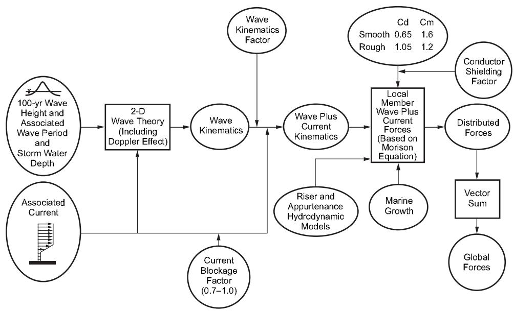  
Figure 2.3.1-1—Procedure for Calculation of Wave Plus Current Forces for Static Analysis

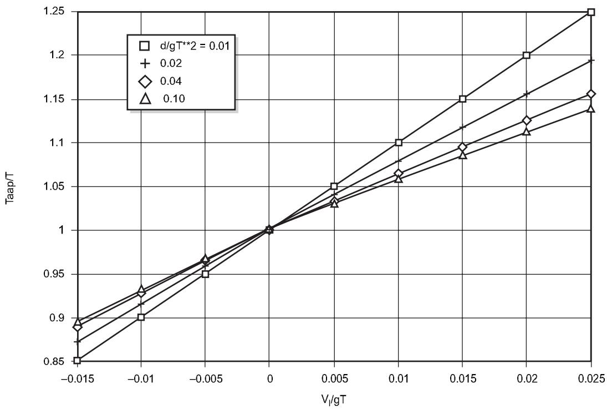  
Figure 2.3.1-2-Doppler Shift Due to Steady Current

Figure 2.3.1-3—Regions of Applicability of Stream Function, Stokes V, and Linear Wave Theory (From Atkins, 1990; Modified by API Task Group on Wave Force Commentary)   
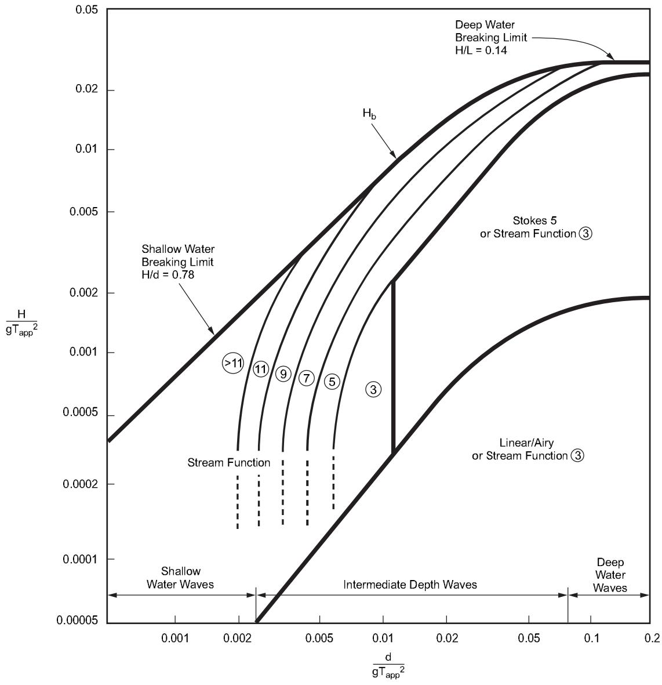  
$\mathrm{H / gT_{app}2}$ Dimensionless wave steepness   
$\mathrm{d} / \mathrm{gT}_{\mathrm{app}}^{2}$ : Dimensionless relative depth   
H: Wave height   
$H_{b}$ : Breaking wave height   
d: Mean water depth   
$T_{app}$ : Wave period   
g: Acceleration of gravity

3. Wave Kinematics Factor. The two-dimensional regular wave kinematics from Stream Function or Stokes V wave theory do not account for wave directional spreading or irregularity in wave profile shape. These "real world" wave characteristics can be approximately modeled in deterministic wave analyses by multiplying the horizontal velocities and accelerations from the two-dimensional regular wave solution by a wave kinematics factor. Wave kinematics measurements support a factor in the range 0.85 to 0.95 for tropical storms and 0.95 to 1.00 for extra-tropical storms. Particular values within these ranges that should be used for calculating guideline wave forces are specified for the Gulf of Mexico in 2.3.4d.1 and for other U.S. waters in 2.3.4f.1. The Commentary provides additional guidance for calculating the wave kinematics factor for particular sea states whose directional spreading characteristics are known from measurements or hindcasts.   
4. Current Blockage Factor. The current speed in the vicinity of the platform is reduced from the specified "free stream" value by blockage. In other words, the presence of the structure causes the incident flow to diverge; some of the incident flow goes around the structure rather than through it, and the current speed within the structure is reduced. Since global platform loads are determined by summing local loads from Morison's equation, the appropriate local current speed should be used.

Approximate current blockage factors for typical Gulf of Mexico jacket-type structures are as follows:

| # of Legs | Heading | Factor |
| --- | --- | --- |
| 3 | all | 0.90 |
| 4 | end-on | 0.80 |
|  | diagonal | 0.85 |
|  | broadside | 0.80 |
| 6 | end-on | 0.75 |
|  | diagonal | 0.85 |
|  | broadside | 0.80 |
| 8 | end-on | 0.70 |
|  | diagonal | 0.85 |
|  | broadside | 0.80 |

For structures with other configurations or structures with a typical number of conductors, a current blockage factor can be calculated with the method described in the Commentary. Calculated factors less than 0.7 should not be used without empirical evidence to support them. For freestanding or braced caissons the current blockage factor should be 1.0.

5. Combined Wave/Current Kinematics. Wave kinematics, adjusted for directional spreading and irregularity, should be combined vectorially with the current profile, adjusted for

blockage. Since the current profile is specified only to storm mean water level in the design criteria, some way to stretch (or compress) it to the local wave surface must be used. As discussed in the Commentary, "nonlinear stretching" is the preferred method. For slab current profiles such as those specified for U.S. waters in 2.3.4, simple vertical extension of the current profile from storm mean wear level to the wave surface is a good approximation to nonlinear stretching. For other current profiles, linear stretching is an acceptable approximation. In linear stretching, the current at a point with elevation $z$ , above which the wave surface elevation is $\eta$ (where $z$ and $\eta$ are both positive above storm mean water level and negative below), is computed from the specified current profile at elevation $z'$ . The elevations $z$ and $z'$ are linearly related, as follows:

$$\left(z^{\prime} + d\right) = \left(z + d\right) d / (d + \eta)$$

where

$$d = \text{s t o r m w a t e r d e p t h}.$$

6. Marine Growth. All structural members, conductors, risers, and appurtenances should be increased in cross-sectional area to account for marine growth thickness. Also, elements with circular cross-sections should be classified as either "smooth" or "rough" depending on the amount of marine growth expected to have accumulated on them at the time of the loading event. Specific marine growth profiles are provided for U.S. waters in 2.3.4.   
7. Drag and Inertia Coefficients. Drag and inertia coefficients are discussed in detail in the Commentary. For typical design situations, global platform wave forces can be calculated using the following values for unshielded circular cylinders:

$$\text{s m o o t h} \quad C_{d} = 0. 65, C_{m} = 1. 6$$

$$\text{r o u g h} \quad C_{d} = 1. 05, C_{m} = 1. 2$$

These values are appropriate for the case of a steady current with negligible waves or the case of large waves with $U_{mo} T_{app} / D > 30$ . Here, $U_{mo}$ is the maximum horizontal particle velocity at storm mean water level under the wave crest from the two-dimensional wave kinematics theory, $T_{app}$ is the apparent wave period, and $D$ is platform leg diameter at storm mean water level.

For wave-dominant cases with $U_{mo} T_{app} / D < 30$ , guidance on how $C_d$ and $C_m$ for nearly vertical members are modified by "wake encounter" is provided in the Commentary. Such situations may arise with large-diameter caissons in extreme seas or ordinary platform members in lower sea states considered in fatigue analyses.

For members that are not circular cylinders, appropriate coefficients can be found in Det horske Veritas' "Rules for the Design, Construction, and Inspection of Offshore Structures; Appendix B—Loads," 1977.

8. Conductor Shielding Factor. Depending upon the configuration of the structure and the number of well conductors, the wave forces on the conductors can be a significant portion of the total wave forces. If the conductors are closely spaced, the forces on them may be reduced due to hydrodynamic shielding. A wave force reduction factor, to be applied to the drag and inertia coefficients for the conductor array, can be estimated from Figure 2.3.1-4, in which $S$ is the center-to-center spacing of the conductors in the wave direction and $D$ is the diameter of the conductors, including marine growth. This shielding factor is appropriate for either (a) steady current with negligible waves or (b) extreme waves, with $U_{mo} T_{app} / S > 5\pi$ . For less extreme waves with $U_{mo} T_{app} / S < 5\pi$ , as in fatigue analyses, there may be less shielding. The Commentary provides some guidance on conductor shielding factors for fatigue analyses.

9. Hydrodynamic Models for Appurtenances. Appurtenances such as boat landings, fenders or bumpers, walkways, stairways, grout lines, and anodes should be considered for inclusion in the hydrodynamic model of the structure. Depending upon the type and number of appurtenances, they

can significantly increase the global wave forces. In addition, forces on some appurtenances may be important for local member design. Appurtenances are generally modeled by non-structural members which contribute equivalent wave forces. For appurtenances such as boat landings, wave forces are highly dependent on wave direction because of shielding effects. Additional guidance on the modeling of appurtenances is provided in the Commentary.

10. Morison Equation. The computation of the force exerted by waves on a cylindrical object depends on the ratio of the wavelength to the member diameter. When this ratio is large ( $>5$ ), the member does not significantly modify the incident wave. The wave force can then be computed as the sum of a drag force and an inertia force, as follows:

$$F = F_{D} + F_{I} = C_{D} \frac{w}{2 g} A U | U | + C_{m} \frac{w}{g} V \frac{\delta U}{\delta t} \tag{2.3.1-1}$$

where

$F =$ hydrodynamic force vector per unit length acting normal to the axis of the member, $\mathrm{lb / ft}$ （$\mathrm{N} / \mathrm{m})$

$F_{D} =$ drag force vector per unit length acting to the axis of the member in the plane of the member axis and $U$ , lb/ft (N/m),

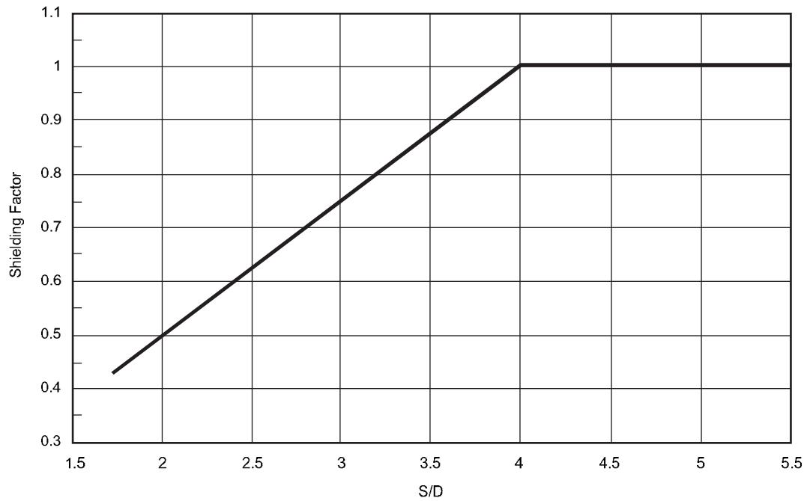  
Figure 2.3.1-4—Shielding Factor for Wave Loads on Conductor Arrays as a Function of Conductor Spacing

$F_{I} =$ inertia force vector per unit length acting normal to the axis of the member in the plane of the member axis and $\alpha U / \alpha t$ , lb/ft (N/m),

$C_d = \mathrm{drag~coefficient}$

$w =$ weight density of water, $\mathrm{lb / ft^3}$ （$\mathrm{N} / \mathrm{m}^{3})$

$g =$ gravitational acceleration, ft/sec2 （$\mathrm{m} / \mathrm{sec}^2)$

$A =$ projected area normal to the cylinder axis per unit length （$= D$ for circular cylinders), ft (m),

$V =$ displaced volume of the cylinder per unit length （$= \pi D^{2} / 4$ for circular cylinders), ft2 （$\mathrm{m}^2)$

$D =$ effective diameter of circular cylindrical member including marine growth, ft (m),

$U =$ component of the velocity vector (due to wave and/or current) of the water normal to the axis of the member, ft/sec （$\mathrm{m / sec})$

$|U| =$ absolute value of $U$ , ft/sec (m/sec),

$C_m =$ inertia coefficient,

$\frac{\delta U}{\delta t} =$ component of the local acceleration vector of the water normal to the axis of the member, ft/sec2 （$\mathrm{m / sec^2})$

Note that the Morison equation, as stated here, ignores the convective acceleration component in the inertia force calculation (see Commentary). It also ignores lift forces, slam forces, and axial Froude-Krylov forces.

When the size of a structural body or member is sufficiently large to span a significant portion of a wavelength, the incident waves are scattered, or diffracted. This diffraction regime is usually considered to occur when the member width exceeds a fifth of the incident wave length. Diffraction theory, which computes the pressure acting on the structure due to both the incident wave and the scattered wave, should be used, instead of the Morison equation, to determine the wave forces. Depending on their diameters, caissons may be in the diffraction regime, particularly for the lower sea states associated with fatigue conditions. Diffraction theory is reviewed in "Mechanics of Wave Forces on Offshore Structures" by T. Sarpkaya and M. Isaacson, Van Nostrand Reinhold Co., 1981. A solution of the linear diffraction problem for a vertical cylinder extending from the sea bottom through the free surface (caisson) can be found in "Wave Forces on Piles: A Diffraction Theory," by R. C. MacCamy and R. A. Fuchs, U.S. Army Corps of Engineers, Beach Erosion Board, Tech. Memo No. 69, 1954.

02 | 11. Global Structure Forces. Total base shear and overturning moment are calculated by a vector summation of (a) local drag and inertia forces due to waves and currents (see 2.3.1b20), (b) dynamic amplification of wave and current

forces (see 2.3.1c), and (c) wind forces on the exposed portions of the structure (see 2.3.2). Slam forces can be neglected because they are nearly vertical. Lift forces can be neglected for jacket-type structures because they are not correlated from member to member. Axial Froude-Krylov forces can also be neglected. The wave crest should be positioned relative to the structure so that the total base shear and overturning moment have their maximum values. It should be kept in mind that: (a) maximum base shear may not occur at the same wave position as maximum overturning moment; (b) in special cases of waves with low steepness and an opposing current, maximum global structure force may occur near the wave trough rather than near the wave crest; and (c) maximum local member stresses may occur for a wave position other than that causing the maximum global structure force.

12. Local Member Design. Local member stresses are due to both local hydrodynamic forces and loads transferred from the rest of the structure. Locally generated forces include not only the drag and inertia forces modeled by Morison's equation (Eq. 2.3.1-1), but also lift forces, axial Froude-Krylov forces, and buoyancy and weight. Horizontal members near storm mean water level will also experience vertical slam forces as a wave passes. Both lift and slam forces can dynamically excite individual members, thereby increasing stresses (see Commentary). Transferred loads are due to the global fluid-dynamic forces and dynamic response of the entire structure. The fraction of total stress due to locally generated forces is generally greater for members higher in the structure; therefore, local lift and slam forces may need to be considered in designing these members. The maximum local member stresses may occur at a different position of the wave crest relative to the structure centerline than that which causes the greatest global wave force on the platform. For example, some members of conductor guide frames may experience their greatest stresses due to vertical drag and inertia forces, which generally peak when the wave crest is far away from the structure centerline.

2.3.1.c Dynamic Wave Analysis

1. General. A dynamic analysis of a fixed platform is indicated when the design sea state contains significant wave energy at frequencies near the platform's natural frequencies. The wave energy content versus frequency can be described by wave (energy) spectra as determined from measured data or predictions appropriate for the platform site. Dynamic analyses should be performed for guyed towers and tension leg platforms.   
2. Waves. Use of a random linear wave theory with modified crest kinematics is appropriate for dynamic analysis of fixed platforms. Wave spreading (three-dimensionality) should be considered. Wave group effects may also cause important dynamic responses in compliant structures.

3. Currents. Currents associated with the design sea state can affect dynamic loading through the nonlinear drag force term in Morison's Equation 2.3.1-1, and therefore should be considered in dynamic analysis.   
4. Winds. For analysis of template, tower, gravity, or minimum platforms, global loads due to the sustained wind may be superimposed on the global wave and current load.

For guyed towers and tension leg platforms, the analysis should include the simultaneous action of wind, waves, and current. It may be appropriate to consider wind dynamics.   
5. Fluid Force on a Member. Equation 2.3.1-1 may be used to compute forces on members of template, tower, gravity, or minimum structure platforms. Guidance on selection of drag and inertia coefficients for dynamic analysis is provided in the Commentary on Wave Forces, C2.3.1b7. For guyed towers and tension leg platforms, Equation 2.3.1-1 should be modified to account for relative velocity by making the following substitution in the drag force term:

$$\text{r e p l a c e} \mathrm{U} | \mathrm{U} | \text{b y} (\mathrm{U} - \dot{x}) | \mathrm{U} - \dot{x} |$$

where

$$\dot{x} = \text{c o m p o n e n t o f s t r u c t u r a l v e l o c i t y n o r m a l t o t h e}$$

$$\mathrm{U} = \text{a s d e f i n e d f o r E q u a t i o n 2 . 3 . 1 - 1}.$$

Fluid forces associated with the platform acceleration are accounted for by added mass.

6. Structural Modeling. The dynamic model of fixed platforms should reflect the key analytical parameters of mass, damping, and stiffness. The mass should include that of the platform steel, all appurtenances, conductors, and deck loads, the mass of water enclosed in submerged tubular members, the mass of marine growth expected to accumulate on the structure and the added mass of submerged members, accounting for increased member diameter due to marine growth.

Equivalent viscous damping values may be used in lieu of an explicit determination of damping components. In the absence of substantiating information for damping values for a specific structure, a damping value of two to three percent of critical for extreme wave analyses and two percent of critical for fatigue analyses may be used.

The analytical model should include the elastic stiffness of the platform and reflect the structure/foundation interaction. It may be appropriate to consider a stiffer foundation for fatigue analyses than for extreme wave response analyses. For guyed towers, these stiffnesses should be augmented to account for the guyline system. Analysis procedures may be required that account for the dynamic interaction of the tower and guyline system. Guyed tower analytical models should

include geometric stiffness (large displacement effects). Forces affecting geometric stiffness include gravity loads, buoyancy, the vertical component of the guyline system reaction, and the weight of conductors including their contents.

7. Analysis Methods. Time history methods of dynamic analysis are preferred for predicting the extreme wave response of template platforms, minimum structures, and guyed towers because these structures are generally drag force dominated. The nonlinear system stiffness also indicates time domain analysis for guyed towers. Frequency domain methods may be used for extreme wave response analysis to calculate the dynamic amplification factor to combine with the static load, provided linearization of the drag force can be justified; for guyed towers, both the drag force and non-linear guyline stiffness would require linearization. Frequency domain methods are generally appropriate for small wave fatigue analysis.

For member design, stresses may be determined from static analyses which include in an appropriate manner the significant effects of dynamic response determined from separate analyses made according to the provisions of this Section.

2.3.2 Wind

2.3.2.a General

The wind criteria for design should be determined by proper analysis of wind data collected in accordance with 1.3.2. As with wave loads, wind loads are dynamic in nature, but some structures will respond to them in a nearly static fashion. For conventional fixed steel templates in relatively shallow water, winds are a minor contributor to global loads (typically less than 10 percent). Sustained wind speeds should be used to compute global platform wind loads, and gust speeds should be used for the design of individual structural elements.

In deeper water and for compliant designs, wind loads can be significant and should be studied in detail. A dynamic analysis of the platform is indicated when the wind field contains energy at frequencies near the natural frequencies of the platform. Such analyses may require knowledge of the wind turbulence intensity, spectra, and spatial coherence. These items are addressed below.

2.3.2.b Wind Properties

Wind speed and direction vary in space and time. On length scales typical of even large offshore structures, statistical wind properties (e.g., mean and standard deviation of speed) taken over durations of the order of an hour do not vary horizontally, but do change with elevation (profile factor). Within long durations, there will be shorter durations with higher mean speeds (gusts factor). Therefore, a wind speed value is only meaningful if qualified by its elevation and duration.

1. Wind profiles and Gusts. For strong wind conditions the design wind speed $u(z,t)$ (ft/s) at height $z$ (ft) above sea level and corresponding to an averaging time period $t(s)$ [where $t \leq t_0$ ; $t_0 = 3600$ sec] is given by:

$$u (z, t) = U (z) \times \left[ 1 - 0. 41 \times I_{u} (z) \times \ln \left(\frac{t}{t_{o}}\right) \right] \tag{2.3.2-1}$$

where the 1 hour mean wind speed $U(z)$ (ft/s) at level $z$ (ft) is given by:

$$U (z) = U_{o} \times [ 1 + C \times \ln (\frac{z}{32 . 8}) ] \tag{2.3.2-2}$$

$$C = 5. 73 \times 10^{-2} \times (1 + 0. 0457 \times U_{o})^{1 / 2}$$

and where the turbulence intensity $I_{u}(z)$ at level $z$ is given by:

$$I_{u} (z) = 0. 06 \times [ 1 + 0. 0131 \times U_{o} ] \times (\frac{z}{32 . 8})^{- 0. 22} \tag{2.3.2-3}$$

where $U_{o}$ (ft/s) is the 1 hour mean wind speed at 32.8 ft.

2. Wind Spectra. For structures and structural elements for which the dynamic wind behavior is of importance, the following 1 point wind spectrum may be used for the energy density of the longitudinal wind speed fluctuations.

$$S (f) = \frac{3444 \times \left(\frac{U_{o}}{32 . 8}\right)^{2} \times \left(\frac{z}{32 . 8}\right)^{0 . 45}}{(1 + \tilde{f}^{n})^{\left(\frac{5}{3 n}\right)}} \tag{2.3.2-4}$$

$$\tilde{f} = 172 \times f \times \left(\frac{z}{32 . 8}\right)^{\frac{2}{3}} \times \left(\frac{U_{o}}{32 . 8}\right)^{- 0. 75} \tag{2.3.2-5}$$

where

$$n = 0. 468,$$

$$\begin{array}{l} S (f)   (\mathrm{f t}^{2} / \mathrm{s}^{2} / \mathrm{H z}) = \text{s p e c t r a l e n e r g y d e n s i t y a t f r e q u e n c y} f \\ \qquad (\mathrm{H z}), \end{array}$$

$$z (f t) = \text{h e i g h t a b o v e s e a l e v e l},$$

$$U_{o} \left(\mathrm{f t / s}\right) = 1 \text{h o u r m e a n w i n d s p e e d a t 32 . 8 f t a b o v e}$$

3. Spatial Coherence. Wind gusts have three dimensional spatial scales related to their durations. For example, 3-second gusts are coherent over shorter distances and therefore affect smaller elements of a platform superstructure than 15 second gusts. The wind in a 3 second gust is appropriate for determining the maximum static wind load on individual members; 5 second gusts are appropriate for maximum total loads on structures whose maximum horizontal dimension is less than 164 feet （$50\mathrm{m})$ ; and 15 second gusts are appropriate for the

maximum total static wind load on larger structures. The one minute sustained wind is appropriate for total static superstructure wind loads associated with maximum wave forces for structures that respond dynamically to wind excitation but which do not require a full dynamic wind analysis. For structures with negligible dynamic response to winds, the one-hour sustained wind is appropriate for total static superstructure wind forces associated with maximum wave forces.

In frequency domain analyses of dynamic wind loading, it can be conservatively assumed that all scales of turbulence are fully coherent over the entire superstructure. For dynamic analysis of some substructures, it may be beneficial to account for the less-than-full coherent at higher frequencies. The squared correlation between the spectral energy densities of the longitudinal wind speed fluctuations of frequency $f$ between 2 points in space is described in terms of the 2 point coherence spectrum.

The recommended coherence spectrum between 2 points

- at levels $z_{1}$ and $z_{2}$ above the sea surface,   
with across-wind positions $y_{1}$ and $y_{2}$ (ft),   
with along-wind positions $x_{1}$ and $x_{2}$ (ft).

is given by

$$\operatorname{c o h} (f) = \exp \left\{- \frac{1}{U_{o} / 3 . 28} \times \left[ \sum_{i = 1}^{3} A_{i}^{2} \right]^{\frac{1}{2}} \right\} \tag{2.3.2-6}$$

where

$$A_{i} = \alpha_{i} \times f^{r_{i}} \times \frac{\Delta_{i}^{q_{i}}}{3 . 28} \times z_{g}^{- p_{i}} \tag{2.3.2-7}$$

$$z_{g} = \frac{\sqrt{z_{1} z_{2}}}{32 . 8}$$

and where the coefficients $\alpha, p, q, r$ and the distances $\Delta$ are given below:

| i | Δi | qi | pi | ri | αi |
| --- | --- | --- | --- | --- | --- |
| 1 | \|x2-x1\| | 1.00 | 0.4 | 0.92 | 2.9 |
| 2 | \|y2-y1\| | 1.00 | 0.4 | 0.92 | 45.0 |
| 3 | \|z2-z1\| | 1.25 | 0.5 | 0.85 | 13.0 |

2.3.2.c Wind Speed and Force Relationship

The wind drag force on an object should be calculated as:

$$F = (\rho / 2) u^{2} C_{s} A \tag{2.3.2-8}$$

where

$$F = \text{w i n d}$$

$$\begin{array}{l} \rho = \text{m a s s d e n s i t y o f a i r , (s l u g / f t^{3} , 0 . 0023668 s l u g s / f t^{3}} \\ \text{f o r s t a n d a r d t e m p e r a t u r e a n d p r e s s u r e) ,} \end{array}$$

$$\mu = \text{w i n d s p e e d (f t / s)},$$

$$C_{s} = \text{s h a p e c o e f f i c i e n t},$$

$$A = \text{a r e a o f o b j e c t} (\mathrm{f t}^{2}).$$

2.3.2.d Local Wind Force Considerations

For all angles of wind approach to the structure, forces on flat surfaces should be assumed to act normal to the surface and forces on vertical cylindrical tanks, pipes, and other cylindrical objects should be assumed to act in the direction of the wind. Forces on cylindrical tanks, pipes, and other cylindrical objects which are not in a vertical attitude should be calculated using appropriate formulas that take into account the direction of the wind in relation to the attitude of the object. Forces on sides of buildings and other flat surfaces that are not perpendicular to the direction of the wind shall also be calculated using appropriate formulas that account for the skewness between the direction of the wind and the plane of the surface. Where applicable, local wind effects such as pressure concentrations and internal pressures should be considered by the designer. These local effects should be determined using appropriate means such as the analytical guidelines set forth in Section 6, ANSI A58.1-82; Building Code Requirements for Minimum Design Loads in Buildings and Other Structures.

2.3.2.e Shape Coefficients

In the absence of data indicating otherwise, the following shape coefficients （$C_S)$ are recommended for perpendicular wind approach angles with respect to each projected area.

Beams 1.5

Sides of buildings 1.5

Cylindrical sections 0.5

Overall projected area of platform 1.0

2.3.2.f Shielding Coefficients

Shielding coefficients may be used when, in the judgment of the designer, the second object lies close enough behind the first to warrant the use of the coefficient.

2.3.2.g Wind Tunnel Data

Wind pressures and resulting forces may be determined from wind tunnel tests on a representative model.

2.3.3 Current

2.3.3.a General

As described in 1.3.5, the total current is the vector sum of the tidal, circulational, and storm-generated currents. The relative magnitude of these components, and thus their importance for computing loads, varies with offshore location.

Tidal currents are generally weak in deep water past the shelf break. They are generally stronger on broad continental shelves than on steep shelves, but rarely exceed 1 ft/s (0.3 m/s) along any open coastline. Tidal currents can be strengthened by shoreline or bottom configurations such that strong tidal currents can exist in many inlet and coastal regions; e.g., surface values of about 10 ft/s (3 m/s) can occur in Cook Inlet.

Circulatory currents are relatively steady, large scale features of the general oceanic circulation. Examples include the Gulf Stream in the Atlantic Ocean and the Loop Current in the Gulf of Mexico where surface velocities can be in the range of about 3–6 ft/s (1–2 m/s). While relatively steady, these circulation features can meander and intermittently break off from the main circulation feature to become large scale eddies or rings which then drift a few miles per day. Velocities in such eddies or rings can approach that of the main circulation feature. These circulation features and associate eddies occur in deep water beyond the shelf break and generally do not affect sites with depths less than about 1000 ft (300 m).

Storm generated currents are caused by the wind stress and atmospheric pressure gradient throughout the storm. Current speeds are a complex function of the storm strength and meteorological characteristics, bathymetry and shoreline configuration, and water density profile. In deep water along open coastlines, surface storm current can be roughly estimated to have speeds up to 2-3 percent of the one-hour sustained wind speed during tropical storms and hurricanes and up to $1\%$ of the one-hour sustained wind speed during winter storms or extratropical cyclones. As the storm approaches shallower water and the coastline, the storm surge and current can increase.

2.3.3.b Current Profile

A qualified oceanographer should determine the variation of current speed and direction with depth. The profile of storm-generated currents in the upper layer of the ocean is the subject of active research.

2.3.3.c Current Force Only

Where current is acting alone (i.e., no waves) the drag force should be determined by Equation 2.3.1-1 with $dU/dt = 0$ .

2.3.3.d Current Associated with Waves

Due consideration should be given to the possible superposition of current and waves. In those cases where this superposition is necessary the current velocity should be added vectorially to the wave particle velocity before the total force is computed as described in 2.3.1b. Where there is sufficient knowledge of wave/current joint probability, it may be used to advantage.

2.3.3.e Vortex-Induced-Vibration

All slender members exposed to the current should be investigated for the possibility of vibration due to periodic vortex shedding as discussed in the Commentary on Wave Forces C2.3.1b12.

2.3.4 Hydrodynamic Force Guidelines for U.S. Waters

2.3.4.a General

Design parameters for hydrodynamic loading should be selected based on life safety and consequence of failure in the manner described in Section 1.5, using environmental data collected and presented as outlined in Section 1.3. This section presents guideline design hydrodynamic force parameters which should be used if the special site specific studies described in Sections 1.3 and 1.5 are not performed.

2.3.4.b Intent

The provisions of this section provide for the analysis of static wave loads for platforms in the areas designated in Figure 2.3.4-1. Depending upon the natural frequencies of the platform and the predominant frequencies of wave energy in the area, it may be necessary to perform dynamic analyses. Further, the general wave conditions in certain of these areas are such that consideration of fatigue loads may be necessary.

As described in Section 1.5, the selection of the environmental criteria should be based on risk considering life safety and consequences of failure. Using successful industry experience in the Gulf of Mexico, guidelines for selecting the hydrodynamic force criteria are recommended for the three platform exposure categories as determined by the definitions in Section 1.7. The use of conditions associated with the nominal 100-year return period are recommended for the design of new L-1 platforms. Recommendations are also included for the design of new L-2 and L-3 platforms.

Use of the guidelines should result in safe but not necessarily optimal structures. Platform owners may find jurisdiction for designing structures for conditions more or less severe than indicated by these guidelines. As discussed in Section 1.5 design criteria depend upon the overall loading, strength, and exposure characteristics of the installed platform. The guidelines should not be taken as a condemnation of plat

forms designed by different practices. Historical experience, loading, and strength characteristics of these structures may be used for such evaluations. The provisions of this section are intended to accommodate such considerations. The actual platform experience and exposure and the amount of detailed oceanographic data available vary widely among the areas shown in Figure 2.3.4-1. The Gulf of Mexico is characterized by a substantial amount of experience, exposure, and data. For other areas, there is less experience and data. The amount of wave information available for the different areas is indicated by the quality rating in Table 2.3.4-1. The guidelines presented herein represent the best information available at this time, and are subject to revision from time to time as further work is completed.

2.3.4.c Guideline Design Metocean Criteria for the Gulf of Mexico North of $27^{\circ}$ N Latitude and West of $86^{\circ}$ W Longitude

The Criteria is suitable for the design of new L-1 Structures and are based on the 100-year wave height and associated variables that result from hurricanes. Additional criteria recommendation for the design of new L-2 and L-3 structures are also provided. The criteria are defined in terms of the following results:

- Omnidirectional wave height vs. water depth.   
Principal direction associated with the omnidirectional wave height.   
- Wave height vs. direction.   
- Currents associated with the wave height by direction.   
Associated wave period.   
Associated storm tide.   
Associated wind speed.

For locations affected by strong tidal and/or general circulation currents, such as the Loop current and its associated detached eddies, special metocean criteria need to be defined to take into account the possibility of large forces caused by a combination of extreme currents and smaller (than the 100-year hurricane wave) waves.

The metocean criteria are intended to be applied in combination with other provisions of 2.3.4 to result in a guideline design level of total base shear and overturning moment on a structure.

The criteria apply for Mean Lower Low Water (MLLW) greater than 25 ft and outside of barrier islands, except in the immediate vicinity of the Mississippi Delta (denoted by the cross-hatched area in Figure 2.3.4-2). In this area the guidelines may not apply because the Delta may block waves from some directions, and there are some very soft seafloor areas that may partially absorb waves. Wave heights lower than the guideline values may be justified in these areas.

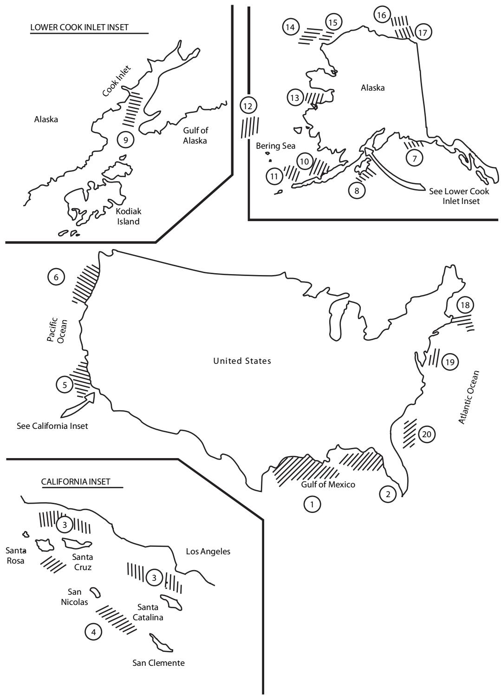  
Figure 2.3.4-1—Area Location Map

Table 2.3.4-1-U.S.Gulf of Mexico Guideline Design Metroean Criteria   

| Parameter | L-1 High Consequence | L-2 Medium Consequence | L-3 Low Consequence |
| --- | --- | --- | --- |
| Wave height, ft | Figure 2.3.4-3 | Figure 2.3.4-3 | Figure 2.3.4-3 |
| Wave direction | Figure 2.3.4-4 | Figure 2.3.4-4 | Omnidirectional |
| Current direction | Figure 2.3.4-5 | Figure 2.3.4-5 | Omnidirectional |
| Storm tide, ft | Figure 2.3.4-7 | Figure 2.3.4-7 | Figure 2.3.4-7 |
| Deck elevation, ft | Figure 2.3.4-8 | Figure 2.3.4-8 | Figure 2.3.4-8 |
| Current speed, knots | 2.1 | 1.8 | 1.4 |
| Wave period, sec | 13.0 | 12.4 | 11.6 |
| Wind speed (1-hr @ 10 m), knots | 80 | 70 | 58 |

1. Omnidirectional Wave Height vs. Water Depth. The guideline omnidirectional wave vs. MLLW for all three levels of platform exposure categories is given in Figure 2.3.4-3.   
2. Principal Direction Associated with the Omnidirectional Wave Height. The principal direction is $290^{\circ}$ (towards, clockwise from north) for L-1 and L-2 structures. For L-3 structures, the waves are omnidirectional.   
3. Wave height vs. Direction. Wave heights for L-1 and L-2 structures are defined for eight directions as shown in Figure 2.3.4-4.

The factors should be applied to the omnidirectional wave height of Figure 2.3.4-3 to obtain wave height by direction for a given water depth. The factors are asymmetric with respect to the principal direction, they apply for water depths greater than 40 ft., and to the given direction $\pm 22.5^{\circ}$ . Regardless of how the platform is oriented, .the omnidirectional wave height, in the principal wave direction, must be considered in at least one design load case. For L-2 and L-3 structures the waves are omnidirectional..   
4. Currents Associated with the Wave Height by Direction. The associated hurricane-generated current for the Gulf of Mexico depends primarily on water depth.

a. L-1 and L-2 Criteria

- Shallow water zone: The water depth for this zone is less than 150 ft. The extreme currents in this zone flow from east to west and follow smoothed bathymetric contours. Consequently, when combined with the waves, the resulting base shears will vary with respect to geographical location. The current magnitudes at the surface are given in Table 2.3.4-1. The direction of the current (towards, clockwise from north) is given in Figure 2.3.4-5 vs. longitude.   
- Deep water zone: The water depth for this zone is greater than 300 ft. In this zone, for each wave direction,

the associated current is inline with the wave (there is no transverse component) and proportional to wave height. The magnitude associated with the principal wave direction (towards $290^{\circ}$ ) is given in Table 2.3.4-1. The magnitudes for other directions are obtained by multiplying the surface current value by the same factors that are used to define wave heights by direction.

- Intermediate zone: This region is in between the shallow and deep water zones, i.e., depth less than 300 ft. and greater than 150 ft. The currents associated with each wave direction for a given water depth in this zone are obtained by linear interpolation of the currents for depths of 150 ft. and 300 ft. For each wave direction the interpolation should be done on both the inline and the transverse component. The end result will be an associated current vector for each wave direction.

Before applying the current vector for force calculations in either the shallow water zone or the intermediate zone, the component of the current that is in-line with the wave should be checked to make sure that it is greater than 0.2 knots. If it is less, the in-line component should be set to 0.2 knots for calculating design guideline forces.

The current profile is given in Figure 2.3.4-6. The storm water level （$swl)$ is the 0-ft. level. The profile for shallower water depths should be developed by truncating the bottom part of the profile.

To combine the wave kinematics with the current above the $swl$ , the current must be "stretched" up to the wave crest. See 2.3.1b.5 for "stretching" procedures.

b. L-3 Criteria

The surface current magnitude is given in Table 2.3.4-1. The current is to be taken inline with the wave. The same magnitude is to be used for all directions. The profile is the same as for L-1 and L-2.

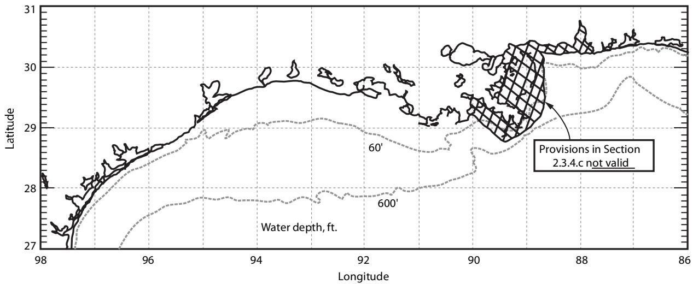  
Figure 2.3.4-2—Region of Applicability of Extreme Metocean Criteria in Section 2.3.4.C

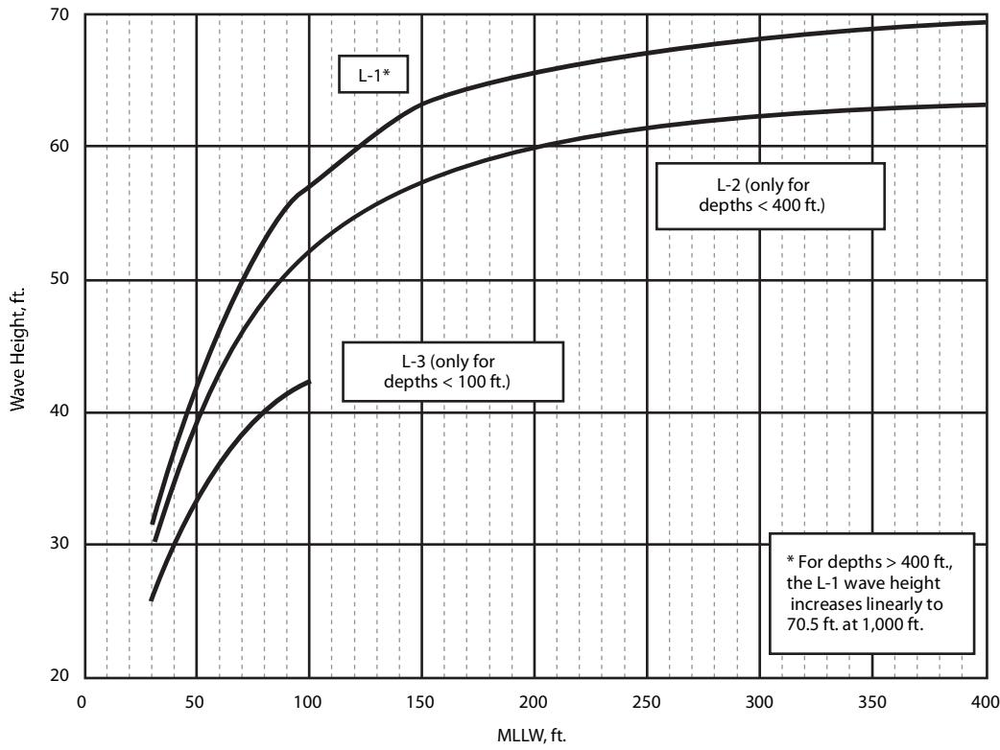  
Figure 2.3.4-3—Guideline Omnidirectional Design Wave Height vs. MLLW, Gulf of Mexico, North of $27^{\circ}$ N and West of $86^{\circ}$ W

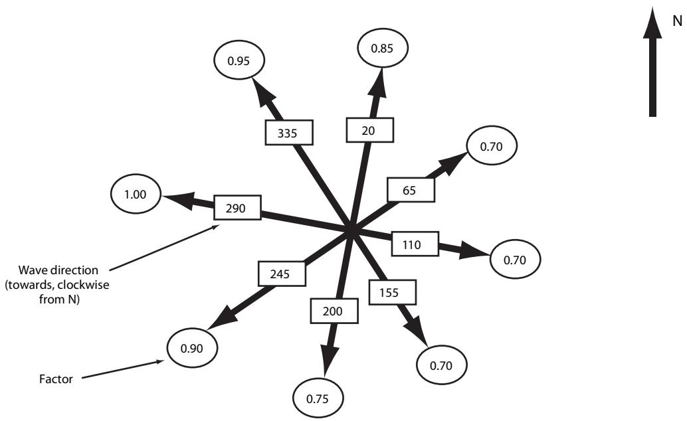  
Figure 2.3.4-4—Guideline Design Wave Directions and Factors to Apply to the Omnidirectional Wave Heights (Figure 2.3.4-3) for L-1 and L-2 Structures, Gulf of Mexico, North of $27^{\circ}$ N and West of $86^{\circ}$ W

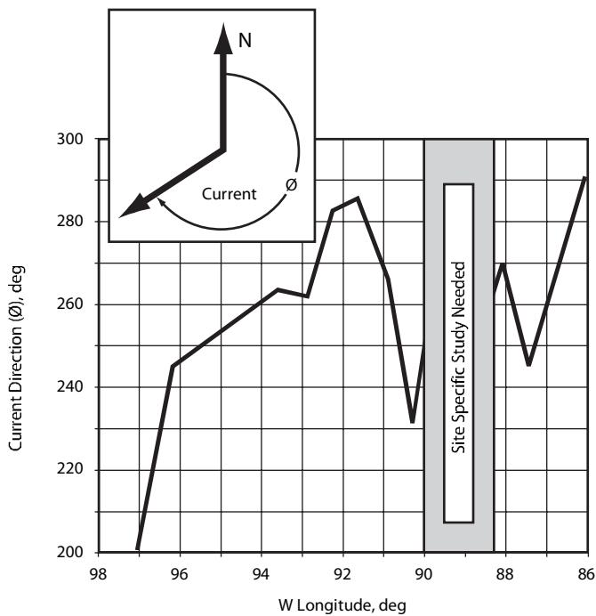  
Figure 2.3.4-5—Guideline Design Current Direction (Towards) with Respect to North in Shallow Water (Depth < 150 ft) for L-1 and L-2 Structures, Gulf of Mexico, North of $27^{\circ}$ N and West of $86^{\circ}$ W

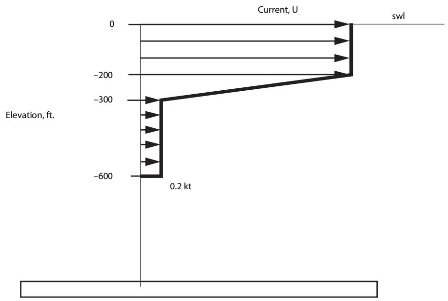  
Figure 2.3.4-6—Guideline Design Current Profile for L-1, L-2, and L-3 Structures, Gulf of Mexico, North of $27^{\circ}$ N and West of $86^{\circ}$ W

5. Associated Wave Period. The wave period is given in Table 2.3.4-1 and applies for all water depths and wave directions.   
6. Associated Storm Tide. The associated storm tide (storm surge plus astronomical tide) is given in Figure 2.3.4-7.   
7. Associated Wind Speed. The associated 1-hr. wind speed, as listed in Table 2.3.4-1, occurs at an elevation of 33 feet and applies to all water depths and wave directions. The use of the same speed for all directions is conservative; lower speeds for directions away from the principal wave direction may be justified by special studies.

The associated wind speed is intended to be applicable for the design of new structures where the wind force and/or overturning moment is less than $30\%$ of the total applied environmental load. If the total wind force or overturning moment on the structure exceeds this amount, then the structure shall also be designed for the 1 minute wind speed concurrently with a wave of $65\%$ of the height of the design wave, acting with the design tide and current.

As an alternate, the use of wave and current information likely to be associated with the 1 minute wind may be justified by site specific studies. However, in no case can the resulting total force and/or overturning moment used for the design of the platform be less than that calculated using the 1 hour wind with the guideline wave, current and tide provided in 2.3.4c.

2.3.4.d Guideline Design Wave, Wind, and Current Forces for the Gulf of Mexico, North of $27^{\circ}$ N Latitude and West of $86^{\circ}$ W Longitude

The guideline design forces for static analysis should be calculated using (a) the metocean criteria given in 2.3.4c, (b) the wave and current force calculation procedures given in 2.3.1b, (c) other applicable provisions of 2.3.1, 2.3.2, and 2.3.3, and (d) specific provisions in this section as given below.

1. Wave Kinematics Factor. The extreme forces will be dominated by hurricanes and consequently a wave kinematics factor of 0.88 should be used.   
2. Marine Growth. Use 1.5 inches from Mean Higher High Water (MHHW) to $-150$ ft. unless a smaller or larger value of thickness is appropriate from site specific studies. MHHW is one foot higher than MLLW.

Structural members can be considered hydrodynamically smooth if they are either above MHHW or deep enough (lower than about $-150$ ft.) where marine growth might be light enough to ignore the effect of roughness. However, caution should be used because it takes very little roughness to cause a $C_d$ of 1.05 (see Commentary, Section C2.3.1b.7 for relationship of $C_d$ to relative roughness). In the zone between MHHW and $-150$ ft. structural members should be considered to be hydrodynamically rough. Marine growth can extend to elevations below $-150$ ft. Site specific data may be used to establish smooth and rough zones more precisely.

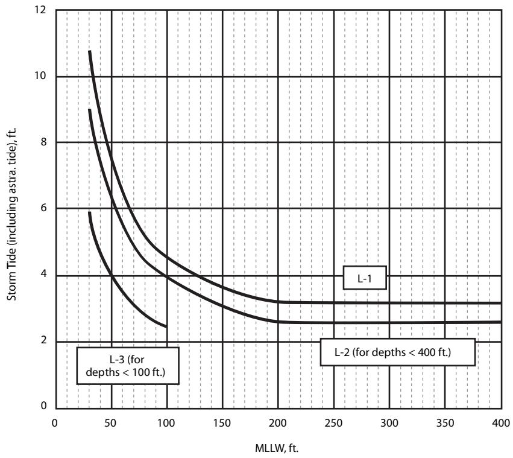  
Figure 2.3.4-7—Guideline Storm Tide vs. MLLW and Platform Category, Gulf of Mexico, North of $27^{\circ}$ N and West of $86^{\circ}$ W

3. Elevation of Underside of Deck. Deck elevations for new platforms should satisfy all requirements of 2.3.4g. For new L-1 and L-2 platforms, the elevation for the underside of the deck should not be lower than the height given in Figure 2.3.4-8. Additional elevation should be allowed to account for structures which experience significant structural rotation or "set down."

For new L-3 platforms, the deck may be located below the calculated crest elevation of the wave designated for L-3 Structures. In this case, the full wave and current forces on the deck must be considered. However, if the deck is located above the crest elevation of the L-3 wave, then the deck must be located above the calculated crest elevation of the wave designated for the L-1 structures. Section C17.6.2 provides guidance for predicting the wave/current forces on the deck.

2.3.4.e Guideline Design Metaean Criteria for Other U.S. Waters

1. Waves, Currents, and Storm Tides. Guideline omnidirectional wave heights with a nominal return period of 100 years are given in Table 2.3.4-2 for the 20 geographical areas shown in Figure 2.3.4-1. Also given are deepwater wave steepnesses, currents, and storm tides associated with the

nominal 100-year wave heights. Except as noted, the guideline waves and storm tides are applicable to water depths greater than 300 feet.

The ranges of wave heights, currents, and storm tides in Table 2.3.4.-2 reflect reasonable variations in interpretation of the data in the references cited in 2.3.4h, quality rating, and the spatial variability within the areas. The ranges in wave steepness reflect the variability in wave period associated with a given wave height. Significant wave height, $H_{s}$ , can be determined from the relationship $H_{m} / H_{s} = 1.7$ to 1.9. Spectral peak period, $T_{p}$ , can be determined from the relationship $T_{p} / T_{m} = 1.05$ to 1.20.

2. Winds. Guideline wind speeds (one-hour average at 33 feet elevation) are provided in Table 2.3.4.3. The first column gives the wind speed to use to compute global wind load to combine with global wave and current load on a platform. This wind is assumed to act simultaneously and co-directionally with guideline 100-year extreme waves from Table 2.3.4.2. The second column gives 100-year wind speeds without regard to the coexisting wave conditions: these are appropriate for calculating local wind loads, as per the provisions of 2.3.2.

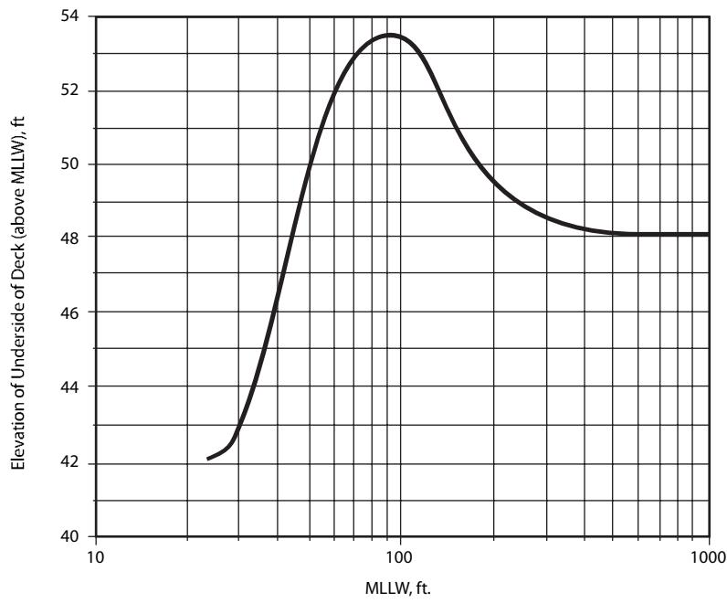  
Figure 2.3.4-8—Elevation of Underside of Deck (Above MLLW) vs. MLLW, Gulf of Mexico, North of $27^{\circ}$ N and West of $86^{\circ}$ W

00 | 3. Current Profile. The currents, $U_{i}$ , in Table 2.3.4-2 are near-surface values. For the Gulf of Mexico the guideline current profile given in Figure 2.3.4-6 should be used. Outside the Gulf of Mexico there is no unique profile; site specific measured data should be used in defining the current profile. In lieu of data, the current profile may be crudely approximated by the Gulf of Mexico guideline current profile of Figure 2.3.4-6 with $U = U_{i}$ in the mixed layer, and $U = U_{i} - 1.9$ knots in the bottom layer.   
4. Local Site Effects. The "open shelf" wave heights shown in Table 2.3.4-2 are generalized to apply to open, broad, continental shelf areas where such generalization is meaningful. Coastal configurations, exposure to wave generation by severe storms, or bottom topography may cause variations in wave heights for different sites within an area; especially, the Lower Cook Inlet, the Santa Barbara Channel, Norton Sound, North Aleutian Shelf, Beaufort Sea, Chukchi Sea, and Georgia Embayment areas. Thus, wave heights which are greater than or less than the guideline "open shelf" wave heights may be appropriate for a particular site. Reasonable ranges for such locations are incorporated in Table 2.3.4-2.

2.3.4.f Guideline Design Wave, Wind, and Current Forces for Other U.S. Waters

The guideline design forces for static analysis should be calculated using (a) the metocean criteria given in Table 2.3.4-2,

(b) the wave and current force calculation procedures given in 2.3.1b, (c) other applicable provisions of 2.3.1, 2.3.2, and 2.3.3, and (d) specific provisions in this section as given below.

1. Wave Kinematics Factor. Extreme wave forces for some of the areas in Table 2.3.4-2 are produced by hurricanes, for some by extratropical storms, and for others both hurricane and extratropical storms are important. The appropriate wave kinematics factor depends on the type of storm system that will govern design.

Areas #1 and #2 are dominated by hurricanes; a wave kinematics factor of 0.88 should be used. Areas #3 through #17 are dominated by extratropical storms; the wave kinematics factor should be taken as 1.0, unless a lower factor can be justified on the basis of reliable and applicable measured data.

Areas #18 through #20 are impacted by both hurricanes and extratropical storms. The "open shelf" wave heights in Table 2.3.4-2 for these three areas correspond to the 100-year return period values taking into consideration both storm populations. Consequently, the wave kinematics factor will be between 0.88 and 1.0. Based on the results on the relative importance of hurricanes vs. extratropical storms in the paper "Extreme Wave Heights Along the Atlantic Coast of the United States," by E. G. Ward, D. J. Evans, and J. A. Pompa, 1977 OTC Paper 2846, pp. 315-324, the following wave kinematics factors are recommended: 1.0 for Area #18, 0.94 for Area #19, and 0.88 for Area #20.

Table 2.3.4-2—Guideline Extreme Wave, Current, and Storm Tide Values* for Twenty Areas in United States Waters   
(Water depth $>300$ ft. [91 m] except as noted)   

|  | Ui, kt | Ui, kt | Hm, ft. | Hm, ft. | S | S | X, ft. | X, ft. |
| --- | --- | --- | --- | --- | --- | --- | --- | --- |
|  | “Open Shelf” | Range | “Open Shelf” | Range | Range | “Open Shelf” | Range | Quality |
| 1. Gulf of Mexico (N of 27° N & W of 86° W) | (See Section 2.3.4c for L-1, L-2, and L-3 criteria) | (See Section 2.3.4c for L-1, L-2, and L-3 criteria) | (See Section 2.3.4c for L-1, L-2, and L-3 criteria) | (See Section 2.3.4c for L-1, L-2, and L-3 criteria) | (See Section 2.3.4c for L-1, L-2, and L-3 criteria) | (See Section 2.3.4c for L-1, L-2, and L-3 criteria) | (See Section 2.3.4c for L-1, L-2, and L-3 criteria) | (See Section 2.3.4c for L-1, L-2, and L-3 criteria) |
| 2. Gulf of Mexico (E of 86° W) | 2 | (1-3) | 70 | (60-80) | 1/11 - 1/15 | 3 | (2-5) | 2 |
| 3. Southern California (Santa Barbara & San Pedro Ch) | 2 | (1-3) | 45 | (35-55) | 1/11 - 1/30 | 6 | (5-7) | 1 |
| 4. California Bank | 2 | (1-3) | 60 | (50-65) | 1/13 - 1/25 | 5 | (4-6) | 2 |
| 5. Central California | 2 | (1-3) | 60 | (50-70) | 1/13 - 1/25 | 7 | (6-8) | 2 |
| 6. Washington/Oregon | 2 | (1-4) | 85 | (70-100) | 1/13 - 1/19 | 8 | (7-10) | 3 |
| 7. Gulf of Alaska (Icy Bay) | 3 | (2-4) | 100 | (90-120) | 1/13 - 1/17 | 11 | (10-13) | 2 |
| 8. Gulf of Alaska (Kodiak) | 3 | (2-4) | 90 | (80-110) | 1/13 - 1/17 | 10 | (9-12) | 2 |
| 9. Lower Cook Inlet | 4 | (3-6) | 60 | (45-70) | 1/10 - 1/11 | 16 | (13-20) | 2 |
| 10. Northern Aleutian Shelf (6-12) | 3 | (2-4) | 70 | (60-90) | 1/12 - 1/16 | 8 | (6-12) | 1 |
| 11. St. George Basin | 3 | (2-4) | 85 | (75-95) | 1/12 - 1/16 | 5 | (3-7) | 1 |
| 12. Navarin Basin | 2 | (1-3) | 85 | (75-95) | 1/12 - 1/16 | 4 | (3-5) | 1 |
| 13. Norton Sound (d = 60 ft.) | 3 | (1-4) | 45 | (35-50) | 1/11 - 1/18 | 11 | (8-14) | 2 |
| 14. Chukchi Sea (d > 60 ft.) | 2 | (1-3) | 50 | (40-60) | 1/11 - 1/15 | 6 | (4-8) | 3 |
| 15. Chukchi Sea (d < 60 ft.) | 3 | (2-5) | 0.78 | (d + X) | ** | 9 | (6-12) | 3 |
| 16. Beaufort Sea (d > 50 ft.) | 2 | (1-3) | 40 | (35-50) | 1/13 - 1/17 | 4 | (2-7) | 2 |
| 17. Beaufort Sea (d < 50 ft.) | 4 | (3-6) | 0.78 | (d + X) | ** | 8 | ([-2]-12) | 2 |
| 18. Georges Bank | 2 | (1-3) | 85 | (75-95) | 1/10 - 1/16 | 5 | (4-6) | 2 |
| 19. Baltimore Canyon | 3 | (2-4) | 90 | (80-100) | 1/10 - 1/14 | 5 | (4-6) | 2 |
| 20. Georgia Embayment | 5 | (2-8) | 75 | (65-85) | 1/11 - 1/15 | 5 | (3-7) | 2 |

$U_{i} =$ inline current at storm water level.   
$H_{m} = 100$ -year maximum individual wave height.   
$S =$ deep water wave steepness from linear theory $= (2\pi H_{m}) / (gT_{m}^{2})$   
$g =$ acceleration of gravity.   
$T_{m} =$ zero-crossing period associated with $H_{m}$ , which can be calculated from $S$ .   
$X =$ storm tide (Section 1.3.4) associated with $H_{m}$ (mean higher high water plus storm surge).   
$d =$ datum water depth.

Quality

1 = based on comprehensive hindcast study verified with measurements.   
2 = based on limited hindcasts and/or measurements.   
3 = preliminary guide.

* Wind speeds, significant wave height, and spectral peak period associated with ${H}_{m}$ are discussed in Sections 2.3.4e.1 and 2.3.4e.2.   
** Use the same range for $T_{m}$ as in deeper water.

Table 2.3.4-3—Guideline Extreme Wind Speeds* for Twenty Areas in United States Waters   

|  |  | Wind with Extreme Waves, mph (m/s) | Wind Alone, mph (m/s) |
| --- | --- | --- | --- |
| 1. | Gulf of Mexico (N of 27° N & W of 86° W) | 92 (41) | 97 (43) |
| 2. | Gulf of Mexico (E of 86° W) | 98 (44) | 109 (49) |
| 3. | Southern California (Santa Barbara and San Pedro Channels) | 58 (26) | 69 (31) |
| 4. | California Outer Bank | 58 (26) | 69 (31) |
| 5. | Central California | 69 (31) | 81 (36) |
| 6. | Washington/Oregon | 69 (31) | 92 (41) |
| 7. | Gulf of Alaska (Icy Bay) | 69 (31) | 104 (46) |
| 8. | Gulf of Alaska (Kodiak) | 69 (31) | 104 (46) |
| 9. | Lower Cook Inlet | 69 (31) | 104 (46) |
| 10. | North Aleutian Shelf | 69 (31) | 104 (46) |
| 11. | St. George Basin | 69 (31) | 104 (46) |
| 12. | Navarin Basin | 69 (31) | 104 (46) |
| 13. | Norton Sound (d = 90 ft.) | 69 (31) | 104 (46) |
|  | (d = 27 m) |  |  |
| 14. | Chukchi Sea (d > 60 ft.) | 69 (31) | 92 (41) |
|  | (d > 18 m) |  |  |
| 15. | Chukchi Sea (d < 60 ft.) | 69 (31) | 92 (41) |
|  | (d < 18 m) |  |  |
| 16. | Beaufort Sea (d > 50 ft.) | 69 (31) | 81 (36) |
|  | (d > 15 m) |  |  |
| 17. | Beaufort Sea (d < 50 ft.) | 69 (31) | 81 (36) |
|  | (d < 15 m) |  |  |
| 18. | Georges Bank | 69 (31) | 104 (41) |
| 19. | Baltimore Canyon | 104 (46) | 115 (51) |
| 20. | Georgia Embayment | 104 (46) | 115 (51) |

*Reference one-hour average speed (± 10%) at 33 feet (10 meters) elevation.

2. Marine Growth. For many of the areas in table 2.3.4-2 the thickness can be much greater than the 1.5 inch guideline value for the Gulf of Mexico. For example, offshore Southern and Central California thicknesses of 8 inches are common. Site specific studies should be conducted to establish the thickness variation vs. depth.

Structural members can be considered hydrodynamically smooth if they are either above MHHW or deep enough where marine growth might be light enough to ignore the effect of roughness. However, caution should be used because it takes very little roughness to cause a $C_d$ of 1.05 (see Commentary, Section C2.3.1b.7 for relationship of $C_d$ to relative roughness). Site specific data should be used to establish the extent of the hydrodynamically rough zones; otherwise the structural members should be considered rough down to the mudline.

3. Elevation of Underside of Deck. Deck elevations should satisfy all requirements of 2.3.4g. Crest heights should be based on the guideline omnidirectional wave heights, wave periods, and storm tide given in Table 2.3.4-2, and calculated using an appropriate wave theory as discussed in 2.3.1b.2.

2.3.4.g Deck Clearance

Large forces result when waves strike a platform's deck and equipment. To avoid this, the bottom of the lowest deck should be located at an elevation which will clear the calculated crest of the design wave with adequate allowance for safety. Omnidirectional guideline wave heights with a nominal return period of 100 years, together with the applicable wave theories and wave steepnesses should be used to compute wave crest elevations above storm water level, including guideline storm tide. A safety margin, or air gap, of at least 5 feet should be added to the crest elevation to allow for platform settlement, water depth uncertainty, and for the possibility of extreme waves in order to determine the minimum acceptable elevation of the bottom beam of the lowest deck to avoid waves striking the deck. An additional air gap should be provided for any known or predicted long term seafloor subsidence.

In general, no platform components, piping or equipment should be located below the lower deck in the designated air gap. However, when it is unavoidable to position such items as minor subcellars, sumps, drains or production piping in the air gap, provisions should be made for the wave forces developed on these items. These wave forces may be calculated using the crest pressure of the design wave applied against the projected area. These forces may be considered on a "local" basis in the design of the item. These provisions do not apply to vertical members such as deck legs, conductors, risers, etc., which normally penetrate the air gap.

2.3.4.h References

00

The following list of references represents some studies of wave conditions used to support values in Tables 2.3.4-1 and 2.3.4-2 and Sections 2.3.4.c and 2.3.4.e. Although some of these studies are proprietary cooperative studies, all may be obtained. Additionally, numerous other studies have been made by individual companies for specific locations within these areas.

Gulf of Mexico

"Consequence-Based Criteria for the Gulf of Mexico: Philosophy & Results," E. G. Ward, G. C. Lee, D. L. Botelho, J. W. Turner, F. Dyhrkopp, and R. A. Hall, Offshore Technology Conference, OTC Paper 11885, May 2000.

"Consequence-Based Criteria for the Gulf of Mexico: Development and Calibration of Criteria," E. G. Ward, G. C. Lee, D. L. Botelho, J. W. Turner, F. Dyhrkopp, and R. A. Hall, Offshore Technology Conference, OTC Paper 11886, May 2000.

"Gulf of Mexico Hurricane Wave Heights," R. G. Bea, Offshore Technology Conference, OTC Paper 2110, 1974.

"An Environmental Design Study for the Eastern Gulf of Mexico Outer Continental Shelf," Evans-Hamilton, Inc., 1973.

"Gulf of Mexico Rare Wave Return Periods," R. E. Haring and J. C. Heideman, Journal of Petroleum Technology, January, 1980.

"Statistics of Hurricane Waves in the Gulf of Mexico," E. G. Ward, L. E. Borgman, and V. J. Cardone, Journal of Petroleum Technology, May 1979.

"Wind and Wave Model for Hurricane Wave Spectra Hindcasting," M. M. Kolpak. Offshore Technology Conference, OTC Paper 2850, 1977.

"Texas Shelf Hurricane Hindcast Study," ARCTEC and Offshore and Coastal Technologies, Inc., 1985.

"GUMSHOE, Gulf of Mexico Storm Hindcast of Oceanographic Extremes," August, 1990.

West Coast

"Santa Barbara Channel Wave Hindcast Study," Oceanweather, Inc., 1982.

"An Environmental Study for the Southern California Outer Continental Shelf," Evans-Hamilton, 1976.

"Storm Wave Study, Santa Barbara Channel," Oceanographic Services, Inc., 1969.

"Informal Final Report—Pt. Conception Area, Hindcast Study," Oceanweather, Inc., 1980.

"Final Report—Wave Hindcast Pt. Conception Area, Northwest Type Storms," Oceanweather, Inc., 1982.

Gulf of Alaska

"Group Oceanographic Survey—Gulf of Alaska," Marine Advisors, Inc., 1970.

"Gulf of Alaska Wave and Wind Measurement Program," Intersea Research Corporation, 1974-1976.

"A Data Collection, Analysis, and Simulation Program to Investigate Ocean Currents, Northeast Gulf of Alaska," Intersea Research Corporation, 1975.

"Climatic Atlas of the Outer Continental Shelf Waters and Coastal Regions of Alaska, Vol, I, Gulf of Alaska," W. A. Brower et al., National Oceanic and Atmospheric Administration, 1977.**

"Gulf of Alaska Hindcast Evaluation," Intersea Research Corporation, 1975-1976.

Lower Cook Inlet

"A Meteorological and Oceanographic Study of Extreme and Operational Criteria in Lower Cook Inlet," Evans-Hamilton, Inc. 1977.

"Oceanographic Conditions and Extreme Factors in Lower Cook Inlet, Alaska," Intersea Research Corporation, 1976.

"Oceanographic Conditions for Offshore Operations in Lower Cook Inlet, Alaska," Intersea Research Corporation, 1975.

Bering Sea

"Climatic Atlas of the Outer Continental Shelf Waters and Coastal Regions of Alaska, Vol. II, Bering Sea," W. A. Broer et al., National Oceanic and Atmospheric Administration, 1977.\*\*

“The Eastern Bering Sea Shelf; Oceanography and Resources,” D. W. Hood and J. A. Calder, Eds., National Oceanic and Atmospheric Administration, 1982.

"Bering Sea Phase 1 Oceanographic Study—Bering Sea Storm Specification Study," V. J. Cardone et al., Oceanweather, Inc., 1980.

"Bering Sea Comprehensive Oceanographic Measurement Program," Brown and Caldwell, 1981-1983.

"Bering Sea Oceanographic Measurement Program," Intersea Research Corporation, 1976-1978.

"Bristol Bay Environmental Report," Ocean Science and Engineering, Inc., 1970.

"St. George Basin Extreme Wave Climate Study," Oceanweather, Inc., 1983.

Beaufort/Chukchi

"Climatic Atlas of the Outer Continental Shelf Waters and Coastal Regions of Alaska, Vol. III, Chukchi-Beaufort Seas," W. A. Brower et al., National Oceanic and Atmospheric Administration, 1977.**

"Beaufort Sea Wave Hindcast Study: Prudhoe Bay/Sag Delta and Harrison Bay," Oceanweather, Inc., 1982.

"Arctic Development Project, Task 1/10, Part I, Meteorological and Oceanographic Conditions, Part II, Summary of Beaufort Sea Storm Wave Study," E. G. Ward and A. M. Reece, Shell Development Company, 1979.

"Reconnaissance Environmental Study of Chukchi Sea," Ocean Science and Engineering, Inc., 1970.

"Alaska Beaufort Sea Gravel Island Design," Exxon Company, U.S.A., 1979.

"Beaufort Sea Summer Oceanographic Measurement Programs," Oceanographic Services, Inc., 1979-1983.

East Coast

"A Preliminary Environmental Study for the East Coast of the United States," Evans-Hamilton, Inc., 1976.

"Extreme Wave Heights Along the Atlantic Coast of the United States," E. G. Ward, D. J. Evans, and J. A. Pompa, Offshore Technology Conference, OTC paper 2846, 1977.

"Characterization of Currents over Chevron Tract #510 off Cape Hatteras, North Carolina," Science Applications, Inc., 1982.

"An Interpretation of Measured Gulf Stream Current Velocities off Cape Hatteras, North Carolina," Evans-Hamilton, Inc., 1982.

"Final Report—Manteo Block 510 Hurricane Hindcast Study," Oceanweather, Inc., 1983.

2.3.5 Ice

In areas where ice is expected to be a consideration in the planning, designing or constructing of fixed offshore platforms, users are referred to API Bulletin 2N: "Planning, Designing, and Constructing Fixed Offshore Platforms in Ice Environments," latest edition.

2.3.6 Earthquake

2.3.6.a General

This section presents guidelines for the design of a platform for earthquake ground motion. Strength requirements are intended to provide a platform which is adequately sized for strength and stiffness to ensure no significant structural damage for the level of earthquake shaking which has a reasonable likelihood of not being exceeded during the life of the structure. The ductility requirements are intended to ensure that the platform has sufficient reserve capacity to prevent its collapse during rare intense earthquake motions, although structural damage may occur.

It should be recognized that these provisions represent the state-of-the-art, and that a structure adequately sized and proportioned for overall stiffness, ductility, and adequate strength at the joints, and which incorporates good detailing and welding practices, is the best assurance of good performance during earthquake shaking.

The guidelines in the following paragraphs of this section are intended to apply to the design of major steel framed structures. Only vibratory ground motion is addressed in this section. Other major concerns such as those identified in Sections 1.3.7 and 1.3.8 (e.g., large soil deformations or instability) should be resolved by special studies.

2.3.6.b Preliminary Considerations

1. Evaluation of Seismic Activity. For seismically active areas it is intended that the intensity and characteristics of seismic ground motion used for design be determined by a site specific study. Evaluation of the intensity and characteristics of ground motion should consider the active faults within the region, the type of faulting, the maximum magnitude of earthquake which can be generated by each fault, the regional seismic activity rate, the proximity of the site to the potential source faults, the attenuation of the ground motion between these faults and the platform site, and the soil conditions at the site.

To satisfy the strength requirements a platform should be designed for ground motions having an average recurrence interval determined in accordance with Section 1.5.

The intensity of ground motion which may occur during a rare intense earthquake should be determined in order to decide whether a special analysis is required to meet the ductility requirements. If required, the characteristics of such motion should be determined to provide the criteria for such an analysis.

2. Evaluation for Zones of Low Seismic Activity. In areas of low seismic activity, platform design would normally be controlled by storm or other environmental loading rather than earthquake. For areas where the strength level design horizontal ground acceleration is less than $0.05\mathrm{g}$ , e.g., the Gulf of Mexico, no earthquake analysis is required, since the design for environmental loading other than earthquake will provide sufficient resistance against potential effects from seismically active zones. For areas where the strength level design horizontal ground acceleration is in the range of $0.05\mathrm{g}$ to $0.10\mathrm{g}$ , inclusive, all of the earthquake requirements, except those for deck appurtenances, may be considered satisfied if the strength requirements (Section 2.3.6c) are met using the ground motion intensity and characteristics of the rare, intense earthquake in lieu of the strength level earthquake. In this event, the deck appurtenances should be designed for the strength level earthquake in accordance with 2.3.6e2, but the ductility requirements (Section 2.3.6d) are waived, and tubular joints need be designed for allowable stresses specified in

Section 2.3.6e1 using the computed joint loads instead of the tensile load or compressive buckling load of the member.

2.3.6.c Strength Requirements

1. Design Basis. The platform should be designed to resist the inertially induced loads produced by the strength level ground motion determined in accordance with 2.3.6b1 using dynamic analysis procedures such as response spectrum analysis or time history analysis.

2. Structural Modeling. The mass used in the dynamic analysis should consist of the mass of the platform associated with gravity loading defined in 2.3.6c3, the mass of the fluids enclosed in the structure and the appurtenances, and the added mass. The added mass may be estimated as the mass of the displaced water for motion transverse to the longitudinal axis of the individual structural framing and appurtenances. For motions along the longitudinal axis of the structural framing and appurtenances, the added mass may be neglected.

The analytical model should include the three dimensional distribution of platform stiffness and mass. Asymmetry in platform stiffness or mass distribution may lead to significant torsional response which should be considered.

In computing the dynamic characteristics of braced, pile supported steel structures, uniform model damping ratios of five percent of critical should be used for an elastic analysis. Where substantiating data exist, other damping ratios may be used.

3. Response Analysis. It is intended that the design response should be comparable for any analysis method used. When the response spectrum method is used and one design spectrum is applied equally in both horizontal directions, the complete quadratic combination (CQC) method may be used for combining modal responses and the square root of the sum of the squares (SRSS) may be used for combining the directional responses. If other methods are used for combining modal responses, such as the square root of the sum of the squares, care should be taken not to underestimate corner pile and leg loads. For the response spectrum method, as many modes should be considered as required for an adequate representation of the response. At least two modes having the highest overall response should be included for each of the three principal directions plus significant torsional modes.

Where the time history method is used, the design response should be calculated as the average of the maximum values for each of the time histories considered.

Earthquake loading should be combined with other simultaneous loadings such as gravity, buoyancy, and hydrostatic pressure. Gravity loading should include the platform dead weight (comprised of the weight of the structure, equipment, appurtenances), actual live loads and 75 percent of the maximum supply and storage loads.

4. Response Assessment. In the calculation of member stresses, the stresses due to earthquake induced loading should be combined with those due to gravity, hydrostatic pressure, and buoyancy. For the strength requirement, the basic AISC allowable stresses and those presented in Section 3.2 may be increased by 70 percent. Pile-soil performance and pile design requirements should be determined on the basis of special studies. These studies should consider the design loadings of 2.3.6c3, installation procedures, earthquake effects on soil properties and characteristics of the soils as appropriate to the axial or lateral capacity algorithm being used. Both the stiffness and capacity of the pile foundation should be addressed in a compatible manner for calculating the axial and lateral response.

2.3.6.d Ductility Requirements

1. The intent of these requirements is to ensure that platforms to be located in seismically active areas have adequate reserve capacity to prevent collapse under a rare, intense earthquake. Provisions are recommended herein which, when implemented in the strength design of certain platforms, will not require an explicit analytical demonstration of adequate ductility. These structure-foundation systems are similar to those for which adequate ductility has already been demonstrated analytically in seismically active regions where the intensity ratio of the rare, intense earthquake ground motions to strength level earthquake ground motions is 2 or less.

2. No ductility analysis of conventional jacket-type structures with 8 or more legs is required if the structure is to be located in an area where the intensity ratio of rare, intense earthquake ground motion to strength level earthquake ground motion is 2 or less, the piles are to be founded in soils that are stable under ground motions imposed by the rare, intense earthquake and the following conditions are adhered to in configuring the structure and proportioning members:

a. Jacket legs, including any enclosed piles, are designed to meet the requirements of 2.3.6c4, using twice the strength level seismic loads.

b. Diagonal bracing in the vertical frames are configured such that shear forces between horizontal frames or in vertical runs between legs are distributed approximately equally to both tension and compression diagonal braces, and that "K" bracing is not used where the ability of a panel to transmit shear is lost if the compression brace buckles. Where these conditions are not met, including areas such as the portal frame between the jacket and the deck, the structural components should be designed to meet the requirements of Section 2.3.6c4 using twice the strength level seismic loads.

c. Horizontal members are provided between all adjacent legs at horizontal framing levels in vertical frames and that these members have sufficient compression capacity to sup

port the redistribution of loads resulting from the buckling of adjacent diagonal braces.

d. The slenderness ratio （$Kl / r)$ of primary diagonal bracing in vertical frames is limited to 80 and their ratio of diameter to thickness is limited to $1900 / F_{y}$ where $F_{y}$ is in ksi (13100/Fy for $F_{y}$ in MPa). All non-tubular members at connections in vertical frames are designed as compact sections in accordance with the AISC Specifications or designed to meet the requirements of 2.3.6c4 using twice the strength level seismic loads.   
3. Structure-foundation systems which do not meet the conditions listed in 2.3.6d2 should be analyzed to demonstrate their ability to withstand the rare, intense earthquake without collapsing. The characteristics of the rare, intense earthquake should be developed from site-specific studies of the local seismicity following the provisions of 2.3.6b1. Demonstration of the stability of the structure-foundation system should be by analytical procedures that are rational and reasonably representative of the expected response of the structural and soil components of the system to intense ground shaking. Models of the structural and soil elements should include their characteristic degradation of strength and stiffness under extreme load reversals and the interaction of axial forces and bending moments, hydrostatic pressures and local inertial forces, as appropriate. The P-delta effect of loads acting through elastic and inelastic deflections of the structure and foundation should be considered.

2.3.6.e Additional Guidelines

1. Tubular Joints. Where the strength level design horizontal ground motion is $0.05\mathrm{g}$ or greater (except as provided in 2.3.6.b.2 when in the range of $0.05\mathrm{g}$ to $0.10\mathrm{g}$ , inclusive), joints for primary structural members should be sized for either the tensile yield load or the compressive buckling load of the members framing into the joint, as appropriate for the ultimate behavior of the structure. This section pertains to new designs. For reassessments see Section 17.   
Joint capacity may be determined in accordance with Section 4.3 except that the Equations 4.3-1, 4.3-2, and 4.3-3 should all have the safety factor (FS) set equal to 1.0. See Commentary for the influence of chord load and other detailed considerations.   
2. Deck Appurtenances and Equipment. Equipment, piping, and other deck appurtenances should be supported so that induced seismic forces can be resisted and induced displacements can be restrained such that no damage to the equipment, piping, appurtenances, and supporting structure

occurs. Equipment should be restrained by means of welded connections, anchor bolts, clamps, lateral bracing, or other appropriate tie-downs. The design of restraints should include both strength considerations as well as their ability to accommodate imposed deflections.

Special consideration should be given to the design of restraints for critical piping and equipment whose failure could result in injury to personnel, hazardous material spillage, pollution, or hindrance to emergency response.

Design acceleration levels should include the effects of global platform dynamic response; and, if appropriate, local dynamic response of the deck and appurtenance itself. Due to the platform's dynamic response, these design acceleration levels are typically much greater than those commonly associated with the seismic design of similar onshore processing facilities.

In general, most types of properly anchored deck appurtenances are sufficiently stiff so that their lateral and vertical responses can be calculated directly from maximum computed deck accelerations, since local dynamic amplification is negligible.

Forces on deck equipment that do not meet this "rigid body" criterion should be derived by dynamic analysis using either: 1) uncoupled analysis with deck level floor response spectra or 2) coupled analysis methods. Appurtenances that typically do not meet the "rigid body" criterion are drilling rigs, flare booms, deck cantilevers, tall vessels, large unbaffled tanks, and cranes.

Coupled analyses that properly include the dynamic interactions between the appurtenance and deck result in more accurate and often lower design accelerations than those derived using uncoupled floor response spectra.

Drilling and well servicing structures should be designed for earthquake loads in accordance with API Specification 4F. It is important that these movable structures and their associated setback and piperack tubulars be tied down or restrained at all times except when the structures are being moved.

Deck-supported structures, and equipment tie-downs, should be designed with a one-third increase in basic allowable stresses, unless the framing pattern, consequences of failure, metallurgy, and/or site-specific ground motion intensities suggest otherwise.

2.3.7 Deleted

## 2.4 FABRICATION AND INSTALLATION FORCES

2.4.1 General

Fabrication forces are those forces imposed upon individual members, component parts of the structure, or complete units during the unloading, handling and assembly in the fabrication yard. Installation forces are those forces imposed upon the component parts of the structure during the operations of moving the components from their fabrication site or prior offshore location to the final offshore location, and installing the component parts to form the completed platform. Since installation forces involve the motion of heavy weights, the dynamic loading involved should be considered and the static forces increased by appropriate impact factors to arrive at adequate equivalent loads for design of the members affected. For those installation forces that are experienced only during transportation and launch, and which include environmental effects, basic allowable stresses for member design may be increased by $1/3$ in keeping with provisions of 3.1.2. Also see Section 12, "Installation," for comments complementary to this section.

2.4.2 Lifting Forces

2.4.2.a General

Lifting forces are imposed on the structure by erection lifts during the fabrication and installation stages of platform construction. The magnitude of such forces should be determined through the consideration of static and dynamic forces applied to the structure during lifting and from the action of the structure itself. Lifting forces on padeyes and on other members of the structure should include both vertical and horizontal components, the latter occurring when lift slings are other than vertical. Vertical forces on the lift should include buoyancy as well as forces imposed by the lifting equipment.

To compensate for any side loading on lifting eyes which may occur, in addition to the calculated horizontal and vertical components of the static load for the equilibrium lifting condition, lifting eyes and the connections to the supporting structural members should be designed for a

horizontal force of $5\%$ of the static sling load, applied simultaneously with the static sling load. This horizontal force should be applied perpendicular to the padeye at the center of the pinhole.

2.4.2.b Static Loads

When suspended, the lift will occupy a position such that the center of gravity of the lift and the centroid of all upward acting forces on the lift are in static equilibrium. The position of the lift in this state of static equilibrium should be used to determine forces in the structure and in the slings. The movement of the lift as it is picked up and set down should be taken into account in determining critical combinations of vertical and horizontal forces at all points, including those to which lifting slings are attached.

2.4.2.c Dynamic Load Factors

For lifts where either the lifting derrick or the structure to be lifted is on a floating vessel, the selection of the design lifting forces should consider the impact from vessel motion. Load factors should be applied to the design forces as developed from considerations of 2.4.2a and 2.4.2b.

For lifts to be made at open, exposed sea (i.e., offshore locations), padeyes and other internal members (and both end connections) framing into the joint where the padeye is attached and transmitting lifting forces within the structure should be designed for a minimum load factor of 2.0 applied to the calculated static loads. All other structural members transmitting lifting forces should be designed using a minimum load factor of 1.35.

For other marine situations (i.e., loadout at sheltered locations), the selection of load factors should meet the expected local conditions but should not be less than a minimum of 1.5 and 1.15 for the two conditions previously listed.

For typical fabrication yard operations where both the lifting derrick and the structure or components to be lifted are land-based, dynamic load factors are not required. For special procedures where unusual dynamic loads are possible, appropriate load factors may be considered.

2.4.2.d Allowable Stresses

The lift should be designed so that all structural steel members are proportioned for basic allowable stresses as specified in Section 3.1. The AISC increase in allowable stresses for short-term loads should not be used. In addition, all critical structural connections and primary members should be designed to have adequate reserve strength to ensure structural integrity during lifting.

2.4.2.e Effect of Tolerances

Fabrication tolerances and sling length tolerances both contribute to the distribution of forces and stresses in the lift system which are different from that normally used for conventional design purposes. The load factors recommended in 2.4.2c are intended to apply to situations where fabrication tolerances do not exceed the requirements of 11.1.5, and where the variation in length of slings does not exceed plus or minus $\frac{1}{4}$ of $1\%$ of nominal sling length, or $\frac{1}{2}$ inches.

The total variation from the longest to the shortest sling should not be greater than $1/2$ of $1\%$ of the sling length or 3 inches. If either fabrication tolerance or sling length tolerance exceeds these limits, a detailed analysis taking into account these tolerances should be performed to determine the redistribution of forces on both slings and structural members. This same type analysis should also be performed in any instances where it is anticipated that unusual deflections of particularly stiff structural systems may also affect load distribution.

2.4.2.f Slings, Shackles and Fittings

For normal offshore conditions, slings should be selected to have a factor of safety of 4 for the manufacturer's rated minimum breaking strength of the cable compared to static sling load. The static sling load should be the maximum load on any individual sling, as calculated in 2.4.2a, b, and e above, by taking into account all components of loading and the equilibrium position of the lift. This factor of safety should be increased when unusually severe conditions are anticipated, and may be reduced to a minimum of 3 for carefully controlled conditions.

Shackles and fittings should be selected so that the manufacturer's rated working load is equal to or greater than the static sling load, provided the manufacturer's specifications include a minimum factor of safety of 3 compared to the minimum breaking strength.

2.4.3 Loadout Forces

2.4.3.a Direct Lift

Lifting forces for a structure loaded out by direct lift onto the transportation barge should be evaluated only if the lifting arrangement differs from that to be used in the

installation, since lifting in open water will impose more severe conditions.

2.4.3.b Horizontal Movement Onto Barge

Structures skidded onto transportation barges are subject to load conditions resulting from movement of the barge due to tidal fluctuations, nearby marine traffic and/or change in draft; and also from load conditions imposed by location, slope and/or settlement of supports at all stages of the skidding operation. Since movement is normally slow, impact need not be considered.

2.4.4 Transportation Forces

2.4.4.a General

Transportation forces acting on templates, towers, guyed towers, minimum structures and platform deck components should be considered in their design, whether transported on barges or self-floating. These forces result from the way in which the structure is supported, either by barge or buoyancy, and from the response of the tow to environmental conditions encountered enroute to the site. In the subsequent paragraphs, the structure and supporting barge and the self-floating tower are referred to as the tow.

2.4.4.b Environmental Criteria

The selection of environmental conditions to be used in determining the motions of the tow and the resulting gravitational and inertial forces acting on the tow should consider the following:

1. Previous experience along the tow route.   
2. Exposure time and reliability of predicted "weather windows."   
3. Accessibility of safe havens.   
4. Seasonal weather system.   
5. Appropriateness of the recurrence interval used in determining maximum design wind, wave and current conditions and considering the characteristics of the tow, such as size, structure, sensitivity, and cost.

2.4.4.c Determination of Forces

The tow including the structure, sea fastenings and barge should be analyzed for the gravitational, inertial and hydrodynamic loads resulting from the application of the environmental criteria in 2.4.4b. The analysis should be based on model basin test results or appropriate analytical methods. Beam, head and quartering wind and seas should be considered to determine maximum transportation forces in the tow structural elements. In the case of large barge-transported structures, the relative stiffnesses of the structure and barge are significant and should be considered in the structural analysis.

Where relative size of barge and jacket, magnitude of the sea states, and experience make such assumptions reasonable, tows may be analyzed based on gravitational and inertial forces resulting from the tow's rigid body motions using appropriate period and amplitude by combining roll with heave and pitch with heave.

2.4.4.d Other Considerations

Large jackets for templates and guyed towers will extend beyond the barge and will usually be subjected to submersion during tow. Submerged members should be investigated for slamming, buoyancy and collapse forces. Large buoyant overhanging members also may affect motions and should be considered. The effects on long slender members of wind-induced vortex shedding vibrations should be investigated. This condition may be avoided by the use of simple wire rope spoilers helically wrapped around the member.

For long transocean tows, repetitive member stresses may become significant to the fatigue life of certain member connections or details and should be investigated.

2.4.5 Launching Forces and Uprighting Forces

2.4.5.a Guyed Tower and Template Type

Guyed tower and template type structures which are transported by barge are usually launched at or near the installation location. The jacket is generally moved along ways, which terminate in rocker arms, on the deck of the barge. As the position of the jacket reaches a point of unstable equilibrium, the jacket rotates, causing the rocker arms at the end of the ways to rotate as the jacket continues to slide from the rocker arms. Forces supporting the jacket on the ways should be evaluated for the full travel of the jacket. Deflection of the rocker beam and the effect on loads throughout the jacket should be considered. In general, the most severe forces will occur at the instant rotation starts. Consideration should be given to the development of dynamically induced forces resulting from launching. Horizontal forces required to initiate movement of the jacket should also be evaluated. Consideration should be given to wind, wave, current and dynamic forces expected on the structure and barge during launching and uprighting.

2.4.5.b Tower Type

Tower type structures are generally launched from the fabrication yard to float with their own buoyancy for tow to the installation site. The last portion of such a tower leaving the launching ways may have localized forces imposed on it as the first portion of the tower to enter the water gains buoyancy and causes the tower to rotate from the slope of the ways. Forces should be evaluated for the full travel of the tower down the ways.

2.4.5.c Hook Load

Floating jackets for which lifting equipment is employed for turning to a vertical position should be designed to resist the gravitational and inertial forces required to upright the jacket.

2.4.5.d Submergence Pressures

The submerged, non-flooded or partially flooded members of the structure should be designed to resist pressure-induced hoop stresses during launching and uprighting.

A member may be exposed to different values of hydrostatic pressure during installation and while in place. The integrity of the member may be determined using the guidelines of 3.2.5 and 3.4.2.

2.4.6 Installation Foundation Loads

2.4.6.a General

Calculated foundation loads during installation should be conservative enough to give reasonable assurance that the structure will remain at the planned elevation and attitude until piles can be installed. Reference should be made to appropriate paragraphs in Sections 2 and 13.

2.4.6.b Environmental Conditions

Consideration should be given to effects of anticipated storm conditions during this stage of installation.

2.4.6.c Structure Loads

Vertical and horizontal loads should be considered taking into account changes in configuration/exposure, construction equipment, and required additional ballast for stability during storms.

2.4.7 Hydrostatic Pressure

Unflooded or partially flooded members of a structure should be able to withstand the hydrostatic pressure acting on them caused by their location below the water surface. A member may be exposed to different values of pressure during installation and while in place. The integrity of the member may be determined using the guidelines of 3.2.5 and 3.4.2.

2.4.8 Removal Forces

Due consideration should be taken of removal forces such as blast loads, sudden transfer of pile weight to jacket and mudmats, lifting forces, concentrated loads during barge loading, increased weight, reduced buoyancy and other forces which may occur.

3 Structural Steel Design

## 3.1 GENERAL

3.1.1 Basic Stresses

Unless otherwise recommended the platform should be designed so that all members are proportioned for basic allowable stresses specified by the AISC Specification for the Design, Fabrication and Erection of Structural Steel for Buildings, latest edition. Where the structural element or type of loading is not covered by this recommended practice or by AISC, a rational analysis should be used to determine the basic allowable stresses with factors of safety equal to those given by this recommended practice or by AISC. Allowable pile stresses are discussed in Section 6.9. Members subjected to combined compression and flexure should be proportioned to satisfy both strength and stability criteria at all points along their length.

The AISC Load and Resistance Factor Design, First Edition code is not recommended for design of offshore platforms.

3.1.2 Increased Allowable Stresses

Where stresses are due in part to the lateral and vertical forces imposed by design environmental conditions, the basic AISC allowable stresses may be increased by one-third. For earthquake loadings, design levels should be in accordance with 2.3.6.c4 and 2.3.6e. The required section properties computed on this basis should not be less than required for design dead and live loads computed without the one-third increase.

3.1.3 Design Considerations

Industry experience to date has indicated that existing, conventional, jacket type, fixed offshore platforms have demonstrated good reliability and reserve strength not only for the design environmental loads but for general usage as well. For these structures, the design environmental loading has been more or less equal from all directions. This has resulted in platform designs that are reasonably symmetrical from a structural standpoint and which have proven to be adequate for historical operational and storm conditions as well as for loads not normally anticipated in conventional in-place analysis.

With recent improvements in Metrocean technology in some operational areas, it is now possible to specify the variation in design conditions from different directions. This allows the designer to take advantage of platform orientation and the directional aspects of storm forces. However, application of the predicted directional loads may result in a structure which is designed for lower forces in one direction than another. In order to provide minimum acceptable platform strength in all directions, the following recommendations are made.

3.1.3.a Directional Environmental Forces

Figure 2.3.4-4 provides wave directions and factors to be applied to the omnidirectional wave heights to be used in the determination of in-place environmental forces. When these directional factors are used, the environmental forces should be calculated for all directions which are likely to control the design of any structural member or pile. As a minimum, this should include environmental forces in both directions parallel and perpendicular to each jacket face as well as all diagonal directions, if applicable. These directions are to be determined by the base of the jacket.

A minimum of 8 directions are required for symmetrical, rectangular and square platforms and a minimum of 12 directions are required for tripod jackets. For unsymmetrical platforms or structures with skirt piles, the calculation of the environmental forces from additional directions may also be required. As stated in 2.3.4c-3, if one of these directions is not the principal direction, then the omnidirectional wave from the principal direction must also be considered. The maximum force should be calculated with the crest of the wave at several locations as the crest of the wave passes through the platform.

3.1.3.b Platform Orientation

Due to difficulties in orienting the jacket during installation it is not always possible to position the jacket exactly as planned. When platforms are to be installed on a relatively flat bottom with no obstructions and with no more than one existing well conductor, in addition to the directions stated above, the jacket should be designed for wave conditions that would result if the jacket were positioned $5.0^{\circ}$ in either direction from the intended orientation.

When a jacket is to be installed over two or more existing well conductors or in an area where obstructions on the bottom such an uneven sea floor resulting from previous drilling by mobile drilling rigs, are likely, the condition of the site must be determined prior to the design of the platform. The probability of the jacket being installed out of alignment should be considered and the $5.0^{\circ}$ tolerance increased accordingly.

3.1.3.c Pile Design

Piling shall be designed in accordance with Sections 3 and 6 and may be designed for the specific loading for each pile individually as predicted considering directionality of design conditions. This will likely result in non symmetrical foundations with piles having different penetration, strength and stiffness. Industry experience to date, based on symmetrical foundations with piles having the same wall thickness, material grades and penetration has demonstrated good reliability and reserve strength. For the design of non symmetrical foundations, the different stiffness of each pile shall be considered

00

as well as the redistribution of loads through jacket bracing to stiffer pile members by modeling the relative stiffness of foundation members interacting with the jacket stiffness.

## 3.2 ALLOWABLE STRESSES FOR CYLINDRICAL MEMBERS

3.2.1 Axial Tension

The allowable tensile stress, $F_{t}$ , for cylindrical members subjected to axial tensile loads should be determined from:

$$F_{t} = 0. 6 F_{y} \tag{3.2.1-1}$$

where

$$F_{y} = \text{y i e l d s t r e n g t h , k s i (M P a) .}$$

3.2.2 Axial Compression

3.2.2.a Column Buckling

The allowable axial compressive stress, $F_{a}$ , should be determined from the following AISC formulas for members with a $D / t$ ratio equal to or less than 60:

$$F_{a} = \frac{\left[ 1 - \frac{(K l / r)^{2}}{2 C_{c}^{2}} \right] F_{y}}{5 / 3 + \frac{3 (K l / r)}{8 C_{c}} - \frac{(K l / r)^{3}}{8 C_{c}^{3}}} \text{f o r} K l / r <   C_{c} \tag{3.2.2-1}$$

$$F_{a} = \frac{12 \pi^{2} E}{23 (K l / r)^{2}} \text{f o r} K l / r \geq C_{c} \tag{3.2.2-1}$$

where

02

$$C_{c} = \left(\frac{2 \pi^{2} E}{F_{y}}\right)^{\frac{1}{2}}$$

$E =$ Young's Modulus of elasticity, ksi (MPa),

$K =$ effective length factor, Section 3.3.1d,

$l =$ unbraced length, in. (m),

$r =$ radius of gyration, in. (m).

For members with a $D / t$ ratio greater than 60, substitute the critical local buckling stress ( $F_{xe}$ or $F_{xc}$ , whichever is smaller) for $F_{y}$ in determining $C_c$ and $F_a$ .

Equation 1.5-3 in the AISC Specification should not be used for design of primary bracing members in offshore structures. This equation may be used only for secondary members such as boat landings, stairways, etc.

3.2.2.b Local Buckling

Unstiffened cylindrical members fabricated from structural steels specified in Section 8.1 should be investigated for local buckling due to axial compression when the $D / t$ ratio is greater than 60. When the $D / t$ ratio is greater than 60 and less than 300, with wall thickness $t \geq 0.25$ in. (6 mm), both the elastic （$F_{xe})$ and inelastic local buckling stress （$F_{xc})$ due to axial compression should be determined from Eq. 3.2.2-3 and Eq. 3.2.2-4. Overall column buckling should be determined by substituting the critical local buckling stress （$F_{xe}$ or $F_{xc}$ , whichever is smaller) for $F_{y}$ in Eq. 3.2.2-1 and in the equation for $C_c$ .

1. Elastic Local Buckling Stress.

The elastic local buckling stress, $F_{xe}$ , should be determined from:

$$F_{x e} = 2 C E t / D \tag{3.2.2-3}$$

where

$$C = \text{c r i t i c a l e l a s t i c b u c k l i n g c o e f f i c i e n t},$$

$$D = \text{o u t s i d e} \quad \text{d i a m e t e r}, \text{i n .} (\mathrm{m}),$$

$$t = \text{w a l l t h i c k n e s s , i n .} (\mathrm{m}).$$

The theoretical value of $C$ is 0.6. However, a reduced value of $C = 0.3$ is recommended for use in Eq. 3.2.2-3 to account for the effect of initial geometric imperfections within API Spec 2B tolerance limits.

2. Inelastic Local Buckling Stress.

The inelastic local buckling stress, $F_{xc}$ , should be determined from:

$$\left. \begin{array}{l} F_{x c} = F_{y} \times [ 1. 64 - 0. 23 (D / t)^{1 / 4} ] \leq F_{x e} \\ F_{x c} = F_{y} \quad \text{f o r} (D / t) \leq 60 \end{array} \right\} \tag{3.2.2-4}$$

3.2.3 Bending

The allowable bending stress, $F_{b}$ , should be determined from:

$$F_{b} = 0. 75 F_{y} \quad \text{f o r} \frac{D}{t} \leq \frac{1500}{F_{y}} \tag{3.2.3-1a}$$

$$\left(\frac{D}{t} \leq \frac{10 , 340}{F_{\mathcal{Y}}}, \text{S I U n i t s}\right)$$

$$F_{b} = \left[ 0. 84 - 1. 74 \frac{F_{y} D}{E t} \right] F_{y} \text{f o r} \frac{1500}{F_{y}} <   \frac{D}{t} \leq \frac{3000}{F_{y}} \tag{3.2.3-1b}$$

$$\left(\frac{10 , 340}{F_{y}} <   \frac{D}{t} \leq \frac{20 , 680}{F_{y}}, \text{S I U n i t s}\right)$$

$$F_{b} = \left[ 0. 72 - 0. 58 \frac{F_{y} D}{E t} \right] F_{y} \text{f o r} \frac{3000}{F_{y}} <   \frac{D}{t} \leq 300 \tag{3.2.3-1c}$$

$$\left(\frac{20 , 680}{F_{y}} <   \frac{D}{t} \leq 300, S I U n i t s\right)$$

For $D / t$ ratios greater than 300, refer to API Bulletin 2U.

3.2.4 Shear†

3.2.4.a Beam Shear

The maximum beam shear stress, $f_{\nu}$ , for cylindrical members is:

$$f_{v} = \frac{V}{0 . 5 A} \tag{3.2.4-1}$$

where

$f_{\nu} =$ the maximum shear stress, ksi (MPa),

$V =$ the transverse shear force, kips (MN),

$A =$ the cross sectional area, in.2 （$\mathrm{m}^2)$

The allowable beam shear stress, $F_{\nu}$ , should be determined from:

$$F_{v} = 0. 4 F_{y} \tag{3.2.4-2}$$

3.2.4.b Torsional Shear

The maximum torsional shear stress, $F_{\nu}$ , for cylindrical members caused by torsion is:

$$f_{v t} = \frac{M_{t} (D / 2)}{I_{p}} \tag{3.2.4-3}$$

where

$f_{vt} =$ maximum torsional shear stress, ksi (MPa),

$M_{t} =$ torsional moment, kips-in. (MN-m),

$I_{p} =$ polar moment of inertia, in.4 （$\mathrm{m}^{4})$

and the allowable torsional shear stress, $F_{\nu \tau}$ , should be determined from:

$$F_{v t} = 0. 4 F_{y} \tag{3.2.4-4}$$

3.2.5 Hydrostatic Pressure* (Stiffened and Unstiffened Cylinders)

For tubular platform members satisfying API Spec 2B out-of-roundness tolerances, the acting membrane stress, $f_{h}$ , in ksi (MPa), should not exceed the critical hoop buckling stress, $F_{hc}$ , divided by the appropriate safety factor:

$$f_{h} \leq F_{h c} / S F_{h} \tag{3.2.5-1}$$

$$f_{h} = p D / 2 t \tag{3.2.5-2}$$

where

$f_{h} =$ hoop stress due to hydrostatic pressure, ksi (MPa),

$p =$ hydrostatic pressure, ksi (MPa),

$SF_{h} =$ safety factor against hydrostatic collapse (see Section 3.3.5).

3.2.5.a Design Hydrostatic Head

The hydrostatic pressure （$\mathrm{p} = \gamma \mathrm{H}_{\mathrm{Z}})$ to be used should be determined from the design head, $H_{z}$ , defined as follows:

$$H_{z} = z + \frac{H_{w}}{2} \left(\frac{\cosh [ k (d - z) ]}{\cosh k d}\right) \tag{3.2.5-3}$$

where

$z =$ depth below still water surface including tide, ft (m). $z$ is positive measured downward from the still water surface. For installation, $z$ should be the maximum submergence during the launch or differential head during the upending sequence, plus a reasonable increase in head to account for structural weight tolerances and for deviations from the planned installation sequence.

$H_{w} =$ wave height, ft(m),

$k = \frac{2\pi}{L}$ with $L$ equal to wave length, $\mathrm{ft^{-1}}$ （$\mathrm{m}^{-1})$

$d =$ still water depth, ft. (m),

$\gamma =$ seawater density, $64~\mathrm{lbs / ft^3}$ （$0.01005\mathrm{MN / m^3})$

3.2.5.b Hoop Buckling Stress

The elastic hoop buckling stress, $F_{he}$ , and the critical hoop buckling stress, $F_{hc}$ , are determined from the following formulas.

1. Elastic Hoop Buckling Stress. The elastic hoop buckling stress determination is based on a linear stress-strain relationship from:

$$F_{h e} = 2 C_{h} E t / D \tag{3.2.5-4}$$

where

The critical hoop buckling coefficient $C_h$ includes the effect of initial geometric imperfections within API Spec 2B tolerance limits.

$$C_{h} = 0. 44 t / D \quad @ M \geq 1. 6 D / t$$

$$C_{h} = 0. 44 (t / D) + \frac{0 . 21 (D / t)^{3}}{M^{4}} @ 0. 825 D / t \leq M <   1. 6 D / t$$

$$C_{h} = 0. 736 / (M - 0. 636) \quad @ 3. 5 \leq M <   0. 825 D / t$$

$$C_{h} = 0. 755 / (M - 0. 559) \quad @ 1. 5 \leq M <   3. 5$$

$$C_{h} = 0. 8 \quad @ M <   1. 5$$

The geometric parameter, $M$ , is defined as:

$$M = \frac{L}{D} (2 D / t)^{1 / 2} \tag{3.2.5-5}$$

where

$L =$ length of cylinder between stiffening rings, diaphragms, or end connections, in. (m).

Note: For $M \geq 1.6D/t$ , the elastic buckling stress is approximately equal to that of a long unstiffened cylinder. Thus, stiffening rings, if required, should be spaced such that $M < 1.6D/t$ in order to be beneficial.

2. Critical Hoop Buckling Stress. The material yield strength relative to the elastic hoop buckling stress determines whether elastic or inelastic hoop buckling occurs and the critical hoop buckling stress, $F_{hc}$ , in ksi (MPa) is defined by the appropriate formula.

Elastic Buckling

$$\left. \begin{array}{l l} F_{h c} = F_{h e} & @ F_{h e} \leq 0. 55 F_{y} \\ \text{I n e l a s t i c B u c k l i n g :} & \\ F_{h c} = 0. 45 F_{y} + 0. 18 F_{h e} & @ 0. 55 F_{y} <   F_{h e} \leq 1. 6 F_{y} \\ F_{h c} = \frac{1 . 31 F_{y}}{1 . 15 + \left(F_{y} / F_{h e}\right)} & @ 1. 6 F_{y} <   F_{h e} <   6. 2 F_{y} \\ F_{h c} = F_{y} & @ F_{h e} > 6. 2 F_{y} \end{array} \right\} \tag{3.2.5-6}$$

3.2.5.c Ring Design

Circumferential stiffening ring size may be selected on the following approximate basis.

$$I_{c} = \frac{t L D^{2}}{8 E} F_{h e} \tag{3.2.5-7}$$

where

$$\begin{array}{l} I_{c} = \text{r e q u i r e d m o m e n t o f i n e r t i a f o r r i n g c o m p o s i t e} \\ \text{s e c t i o n , i n .}^{4} (\mathrm{m}^{4}), \end{array}$$

$$L = \text{r i n g s p a c i n g , i n .} (\mathrm{m}),$$

$$D = \text{d i a m e t e r , i n . (m) s e e n o t e 2 f o r e x t e r n a l r i n g s}.$$

Note 1: An effective width of shell equal to $1.1(Dt)^{1/2}$ may be assumed as the flange for the composite ring section.

Note 2: For external rings, $D$ in Eq. 3.2.5-7 should be taken to the centroid of the composite ring.

Note 3: Where out-of-roundness in excess of API Spec 2B is permitted, larger stiffeners may be required. The bending due to out-of-roundness should be specifically investigated.

Note 4: The width-to-thickness ratios of stiffening rings should be selected in accordance with AISC requirements so as to preclude local buckling of the rings.

Note 5: For flat bar stiffeners, the minimum dimensions should be $3/8 \times 3$ in. （$10 \times 76 \mathrm{~mm})$ for internal rings and $1/2 \times 4$ in. （$13 \times 102 \mathrm{~mm})$ for external rings.

Note 6: Eq. 3.2.5-7 assumes that the cylinder and stiffening rings have the same yield strength.

## 3.3 COMBINED STRESSES FOR CYLINDRICAL MEMBERS

Sections 3.3.1 and 3.3.2 apply to overall member behavior while Sections 3.3.3 and 3.3.4 apply to local buckling.

3.3.1 Combined Axial Compression and Bending

3.3.1.a Cylindrical Members

Cylindrical members subjected to combined compression and flexure should be proportioned to satisfy both the following requirements at all points along their length.

$$\frac{f_{a}}{F_{a}} + \frac{C_{m} \sqrt{f_{b x}^{2} + f_{b y}^{2}}}{\left(1 - \frac{f_{a}}{F_{e} {}^{\prime}}\right) F_{b}} \leq 1. 0 \tag{3.3.1-1}$$

$$\frac{f_{a}}{0 . 6 F_{y}} + \frac{\sqrt{f_{b x}^{2} + f_{b y}^{2}}}{F_{b}} \leq 1. 0 \tag{3.3.1-2}$$

where the undefined terms used are as defined by the AISC Specification for the Design, Fabrication, and Erection of Structural Steel for Buildings.

When $\frac{f_a}{F_a} \leq 0.15$ , the following formula may be used in lieu of the foregoing two formulas.

$$\frac{f_{a}}{F_{a}} + \frac{\sqrt{f_{b x}^{2} + f_{b y}^{2}}}{F_{b}} \leq 1. 0 \tag{3.3.1-3}$$

Eq. 3.3.1-1 assumes that the same values of $C_m$ and $F_e'$ are appropriate for $f_{bx}$ and $f_{by}$ . If different values are applicable, the following formula or other rational analysis should be used instead of Eq. 3.3.1-1:

$$\frac{f_{a}}{F_{a}} + \frac{\sqrt{\left[ \frac{C_{m x} f_{b x}}{1 - \frac{f_{a}}{F_{e x}^{\prime}}} \right]^{2} + \left[ \frac{C_{m y} f_{b y}}{1 - \frac{f_{a}}{F_{e y}^{\prime}}} \right]^{2}}}{F_{b}} \leq 1. 0 \tag{3.3.1-4}$$

3.3.1.b Cylindrical Piles

Column buckling tendencies should be considered for piling below the mudline. Overall column buckling is normally not a problem in pile design, because even soft soils help to inhibit overall column buckling. However, when laterally loaded pilings are subjected to significant axial loads, the load deflection （$\mathrm{P} - \Delta)$ effect should be considered in stress computations. An effective method of analysis is to model the pile as a beam column on an inelastic foundation. When such an analysis is utilized, the following interaction check, with the one-third increase where applicable, should be used:

$$\frac{f_{a}}{0 . 6 F_{x c}} + \frac{\sqrt{f_{b x}^{2} + f_{b y}^{2}}}{F_{b}} \leq 1. 0 \tag{3.3.1-5}$$

02 where $F_{xc}$ is given by Eq. 3.2.2-4.

3.3.1.c Pile Overload Analysis

For overload analysis of the structural foundation system under lateral loads (Ref. Section 6.8.1), the following interaction equation may be used to check piling members:

$$\frac{P / A}{F_{x c}} + \frac{2}{\pi} \left[ \arcsin \left(\frac{M / Z}{F_{x c}}\right) \right] \leq 1. 0 \tag{3.3.1-6}$$

where the arc sin term is in radians and

$$A = \text{c r o s s - s e c t i o n a l} \text{a r e a , i n .}^{2} (\mathrm{m}^{2}),$$

$$Z = \text{p l a s t i c} \quad \text{s e c t i o n} \quad \text{m o d u l u s}, \text{i n}^{3} \left(\mathrm{m}^{3}\right),$$

$P,M =$ axial loading and bending moment computed from a nonlinear analysis, including the （$\mathrm{P} - \Delta)$ effect,

$F_{xc} =$ critical local buckling stress from Eq. 3.2.2-4 with a limiting value of $1.2F_{y}$ considering the effect of strain hardening,

Load redistribution between piles and along a pile may be considered.

3.3.1.d Member Slenderness

Determination of the slenderness ratio $Kl / r$ for cylindrical compression members should be in accordance with the AISC. A rational analysis for defining effective length factors should consider joint fixity and joint movement. Moreover, a rational definition of the reduction factor should consider the character of the cross-section and the loads acting on the member. In lieu of such an analysis, the following values may be used:

| Situation | Effective Length Factor K | Reduction Factor $C_m^{(1)}$ |
| --- | --- | --- |
| Superstructure Legs | Superstructure Legs | Superstructure Legs |
| Braced | 1.0 | (a) |
| Portal (unbraced) | $K^{(2)}$ | (a) |
| Jacket Legs and Piling | Jacket Legs and Piling | Jacket Legs and Piling |
| Grouted Composite Section | 1.0 | (c) |
| Ungrouted Jacket Legs | 1.0 | (c) |
| Ungrouted Piling Between Shim Points | 1.0 | (b) |
| Deck Truss Web Members | Deck Truss Web Members | Deck Truss Web Members |
| In-Plane Action | 0.8 | (b) |
| Out-of-plane Action | 1.0 | (a) or (b)(4) |
| Jacket Braces | Jacket Braces | Jacket Braces |
| Face-to-face length of Main Diagonals | 0.8 | (b) or (c)(4) |
| Face of leg to Centerline of Joint Length of K Braces(3) | 0.8 | (c) |
| Longer Segment Length of X Braces(3) | 0.9 | (c) |
| Secondary Horizontals | 0.7 | (c) |
| Deck Truss Chord Members | 1.0 | (a), (b) or (c)(4) |

(1) Defined in Section 3.3.1e.   
(2) Use Effective Length Alignment Chart in Commentary of AISC. This may be modified to account for conditions different from those assumed in developing the chart.   
(3) At least one pair of members framing into a joint must be in tension if the joint is not braced out of plane.   
(4) Whichever is more applicable to a specific situation.

3.3.1.e Reduction Factor

Values of the reduction factor $C_m$ referred to in the above table are as follows (with terms as defined by AISC):

(a) 0.85   
(b) $0.6 - 0.4\left(\frac{M_1}{M_2}\right)$ , but not less than 0.4, nor more than 0.85   
(c) $1 - 0.4\left(\frac{f_a}{F_e^{\prime}}\right)$ , or 0.85, whichever is less

3.3.2 Combined Axial Tension and Bending

Cylindrical members subjected to combined tension and bending should be proportioned to satisfy Eq. 3.3.1-2 at all points along their length, where $f_{bx}$ and $f_{by}$ are the computed bending tensile stresses.

3.3.3 Axial Tension and Hydrostatic Pressure

When member longitudinal tensile stresses and hoop compressive stresses (collapse) occur simultaneously, the following interaction equation should be satisfied:

$$A^{2} + B^{2} + 2 \mathrm{v} | \mathrm{A} | \mathrm{B} \leq 1. 0 \tag{3.3.3-1}$$

where

$$A = \frac{f_{a} + f_{b} - (0 . 5 f_{h})^{\dagger}}{F_{y}} \times (S F_{x}),^{\dagger}$$

the term "A" should reflect the maximum tensile stress combination,

$$B = \frac{f_{h}}{F_{h c}} (S F_{h}),$$

$$v = \text{P o i s s o n ' s} = 0. 3,$$

$$F_{y} = \text{y i e l d s t r e n g t h}, \mathrm{k s i} (\mathrm{M P a}),$$

$$f_{a} = \text{a b s o l u t e v a l u e o f a c t i n g a x i a l s t r e s s , k s i (M P a)}$$

$$\begin{array}{l} f_{b} = \text{a b s o l u t e v a l u e o f a c t i n g r e s u l t a n t b e n d i n g s t r e s s}, \\ \text{k s i (M P a)}, \end{array}$$

$$\begin{array}{l} f_{h} = \text{a b s o l u t e v a l u e o f h o o p c o m p r e s s i o n s t r e s s , k s i} \\ \mathrm{(M P a)}, \end{array}$$

$$F_{h c} = \text{c r i t i c a l h o o p s t r e s s (s e e E q . 3 . 2 . 5 - 6)},$$

$$S F_{x} = \text{s a f e t y f a c t o r f o r a x i a l t e n s i o n (s e e 3 . 3 . 5) ,}$$

$$S F_{h} = \text{s a f e t y f a c t o r f o r h o o p c o m p r e s s i o n (s e e 3 . 3 . 5) .}$$

3.3.4 Axial Compression and Hydrostatic Pressure

When longitudinal compressive stresses and hoop compressive stresses occur simultaneously, the following equations should be satisfied:

$$\frac{f_{a} + \left(0 . 5 f_{h}\right)^{\dagger}}{F_{x c}} \left(S F_{x}\right) + \frac{f_{b}}{F_{y}} \left(S F_{b}\right) \leq 1. 0 \tag{3.3.4-1}$$

$$S F_{h} \times \frac{f_{h}}{F_{h c}} \leq 1. 0 \tag{3.3.4-2}$$

Eq. 3.3.4-1 should reflect the maximum compressive stress combination.

The following equation should also be satisfied when $f_{x} > 0.5F_{ha}$

$$\frac{f_{x} - 0 . 5 F_{h a}}{F_{a a} - 0 . 5 F_{h a}} + \left(\frac{f_{h}}{F_{h a}}\right)^{2} \leq 1. 0 \tag{3.3.4-3}$$

where

$$F_{a a} = \frac{F_{x e}}{S F_{x}},$$

$$F_{h a} = \frac{F_{h e}}{S F_{h}},$$

$$\begin{array}{l} S F_{x} = \text{s a f e t y f a c t o r f o r a x i a l c o m p r e s s i o n (s e e S e c t i o n} \\ 3. 3. 5), \end{array}$$

$$S F_{b} = \text{s a f e t y f a c t o r f o r b e n d i n g (s e e S e c t i o n 3 . 3 . 5)},$$

$$f_{x} = f_{a} + f_{b} + (0. 5 f_{h})^{*}; f_{x} \text{s h o u l d r e f l e c t t h e m a x i - m u m c o m p r e s s i v e s t r e s s c o m b i n a t i o n .}$$

where $F_{xe}, F_{xc}, F_{he}$ , and $F_{hc}$ are given by Equations 3.2.2-3, 3.2.2-4, 3.2.5-4, and 3.2.5-6, respectively. The remaining terms are defined in Section 3.3.3.

Note: If $f_{b} > f_{a} + 0.5f_{h}$ , both Eq. 3.3.3-1 and Eq. 3.3.4-1 must be satisfied.

3.3.5 Safety Factors

To compute allowable stresses within Sections 3.3.3 and 3.3.4, the following safety factors should be used with the local buckling interaction equations.

| Design Condition | Loading | Loading | Loading | Loading |
| --- | --- | --- | --- | --- |
| Design Condition | Axial Tension | Bending | Axial*** Compr. | Hoop Compr. |

1. Where the basic allowable stresses would be used, e.g., pressures which will definitely be encountered during the installation or life of the structure.   
## 1.67 $F_{y} / F_{b}^{**}$ 1.67 to 2.0 2.0
2. Where the one-third increase in allowable stresses is appropriate, e.g., when considering interaction with storm loads.   
## 1.25 $F_{\mathrm{y}} / 1.33\mathrm{F_b}$ 1.25 to 1.5 1.5

## 3.4 CONICAL TRANSITIONS

3.4.1 Axial Compression and Bending

The recommendations in this paragraph may be applied to a concentric cone frustum between two cylindrical tubular sections. In addition, the rules may be applied to conical transitions at brace ends, with the cone-cylinder junction ring rules applicable only to the brace end of the transition.

3.4.1.a Cone Section Properties

The cone section properties should be chosen to satisfy the axial and bending stresses at each end of the cone. The nominal axial and bending stresses at any section in a cone transition are given approximately by （$f_{a} + f_{b}) / \cos \alpha$ , where $\alpha$ equals one-half the projected apex angle of the cone (see Figure 3.4.1-1) and $f_{a}$ and $f_{b}$ are the nominal axial and bending stresses computed using the section properties of an equivalent cylinder with diameter and thickness equal to the cone diameter and thickness at the section.

3.4.1.b Local Buckling

For local buckling under axial compression and bending, conical transitions with an apex angle less than 60 degrees may be considered as equivalent cylinders with diameter equal to $D / \cos \alpha$ , where $D$ is the cone diameter at the point

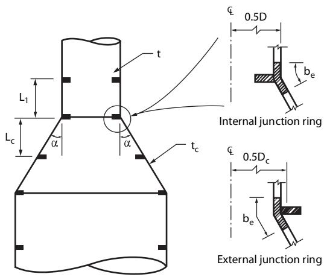  
Figure 3.4.1-1—Example Conical Transition

| D/t | Limiting Angle α, Deg. | Limiting Angle α, Deg. |
| --- | --- | --- |
| D/t | Normal Condition (fa + fb) = 0.6 Fy | Extreme Condition (fa + fb) = 0.8 Fy |
| 60 | 10.5 | 5.8 |
| 48 | 11.7 | 6.5 |
| 36 | 13.5 | 7.5 |
| 24 | 16.4 | 9.1 |
| 18 | 18.7 | 10.5 |
| 12 | 22.5 | 12.8 |

A cone-cylinder junction that does not satisfy the above criteria may be strengthened either by increasing the cylinder and cone wall thicknesses at the junction, or by providing a stiffening ring at the junction.

under consideration. This diameter is used in Eq. 3.2.2-4 to determine $F_{xc}$ . For cones of constant thickness, using the diameter at the small end of the cone would be conservative.

3.4.1.c Unstiffened Cone-cylinder Junctions

Cone-cylinder junctions are subject to unbalanced radial forces due to longitudinal axial and bending loads and to localized bending stresses caused by the angle change. The longitudinal and hoop stresses at the junction may be evaluated as follows:

1. Longitudinal Stress

In lieu of detailed analysis, the localized bending stress at an unstiffened cone-cylinder junction may be estimated, based on results presented in Reference 3, Section C3.2 from:

$$f_{b}^{\prime} = \frac{0 . 6 t \sqrt{D \left(t + t_{c}\right)}}{t_{e}^{2}} \left(f_{a} + f_{b}\right) \tan \alpha \tag{3.4.1-1}$$

where

$$D = \text{c y l i n d e r}$$

$$t = \text{c y l i n d e r} (m),$$

$$t_{c} = \text{c o n e t h i c k n e s s , i n . (m)},$$

$$t_{e} = t \text{f o r s t r e s s i n c y l i n d e r s e c t i o n ,}$$

$$= t_{c} \text{f o r}$$

$$f_{a} = \text{a c t i n g a x i a l s t r e s s i n c y l i n d e r s e c t i o n a t j u n c t i o n , k s i (M P a) ,}$$

$$f_{b} = \text{a c t i n g r e s u l t a n t b e n d i n g s t r e s s i n c y l i n e r s e c t i o n a t j u n c t i o n , k s i (M P a) ,}$$

$$\alpha = \text{o n e - h a l f t h e a p e x a n g l e o f t h e c o n e , d e g r e e s}.$$

For strength requirements, the total stress （$f_{a} + f_{b} + f_{b}^{\prime})$ should be limited to the minimum tensile strength of the cone and cylinder material, with （$f_{a} + f_{b})$ limited to the appropriate allowable stress. For fatigue considerations, the cone-cylinder junction should satisfy the requirements of Section 5 with a stress concentration factor equal to $[1 + f_b' / (f_a + f_b)]$ , where $f_{b}^{\prime}$ is given by Eq. 3.4.1-1. For equal cylinder and cone wall thicknesses, the stress concentration factor is equal to （$1 + 0.6\sqrt{2D / t}\tan \alpha)$ .

2. Hoop Stress

The hoop stress caused by the unbalanced radial line load may be estimated from:

$$f_{h}^{\prime} = 0. 45 \sqrt{\frac{D}{t}} (f_{a} + f_{b}) \tan \alpha \tag{3.4.1-2}$$

where the terms are as defined in Subparagraph (1). For hoop tension, $f_{h}^{\prime}$ should be limited to $0.6F_{y}$ . For hoop compression, $f_{h}^{\prime}$ should be limited to $0.5F_{hc}$ , where $F_{hc}$ is computed using Eq. 3.2.5-6 with $F_{he} = 0.4Et / D$ . This suggested value of $F_{he}$ is based on results presented in Reference 4, Commentary on Allowable Stresses, Par. C3.2.

Based on the strength requirements of Eqs. 3.4.1-1 and 3.4.1-2, limiting cone transition angles can be derived below which no stiffening is required to withstand the cone-cylinder junction stresses. For example, Table 3.4.1-1 of limiting cone transition angles is derived for equal cone and cylinder wall thicknesses, $F_{y} \leq 60$ ksi, and the corresponding minimum tensile strengths given in Table 8.1.4-1. The limiting angles in the table represent the smaller of the two angles evaluated by satisfying the strength requirements of Eqs. 3.4.1-1 and 3.4.1-2. The limiting angles in the table were governed by Eq. 3.4.1-1. The limiting angles for the normal condition apply to design cases where basic allowable stresses are used. While elastic hot spot stresses are notionally at the ultimate tensile

strength, limit analysis indicates that plastic section modulus and load redistribution provide sufficient reserve strength so that transitions with these angles can develop the full yield capacity of the cylinder. If the steels used at the transition have sufficient ductility to develop this reserve strength, similar joint cans, these same angles may be applied to load cases in which allowable stresses are increased by one third.

The limiting angles for the extreme condition have been derived on the more conservative basis that the allowable hot spot stress at the transition continues to be the ultimate tensile strength, while allowable stresses in the cylinder have been increased by one-third. This also reduces the stress concentration factor from 2.22 to 1.67, which is less than the minimum brace SCF at nodes (Table 5.1.1-1) and would thus rarely govern the design. The fatigue strength of the cone-cylinder junction should be checked in accordance with the requirements of Section 5.

3.4.1.d Cone-cylinder Junction Rings

If stiffening rings are required, the section properties should be chosen to satisfy both the following requirements:

$$A_{c} = \frac{t D}{F_{y}} \left(f_{a} + f_{b}\right) \tan \alpha \tag{3.4.1-3}$$

$$I_{c} = \frac{t D D_{c}^{2}}{8 E} \left(f_{a} + f_{b}\right) \tan \alpha \tag{3.4.1-4}$$

where

$$D = \text{c y l i n d e r}$$

$$\begin{array}{l} D_{c} = \text{d i a m e t e r t o c e n t r o i d o f c o m p o s i t e r i n g s e c t i o n , i n .} \\ \hskip 14. 226378 p t (\mathrm{m}). \text{S e e n o t e 3}, \end{array}$$

$$\begin{array}{l} A_{c} = \text{c r o s s - s e c t i o n a l a r e a o f c o m p o s i t e r i n g s e c t i o n , i n .}^{2} \\ (\mathrm{m}^{2}), \end{array}$$

$$\begin{array}{l} I_{c} = \text{m o m e n t o f i n e r t i a o f c o m p o s i t e r i n g s e c t i o n , i n .}^{4} \\ \hskip 14. 226378 p t (\mathrm{m}^{4}). \end{array}$$

In computing $A_{c}$ and $I_{c}$ , the effective width of shell wall acting as a flange for the composite ring section may be computed from:

$$b_{e} = 0. 55 \left(\sqrt{D t} + \sqrt{D t_{c}}\right) \tag{3.4.1-5}$$

Note 1: Where the one-third increase is applicable, the required section properties $A_{c}$ and $I_{c}$ may be reduced by $25\%$ .

Note 2: For flat bar stiffeners, the minimum dimensions should be $3/8 \times 3$ in. （$10 \times 76 \mathrm{~mm})$ for internal rings and $1/2 \times 4$ in. （$13 \times 102 \mathrm{~mm})$ for external rings.   
Note 3: For internal rings, $D$ should be used instead of $D_{c}$ in Eq. 3.4.1-4.

3.4.2 Hydrostatic Pressure

The recommendations in this paragraph may be applied to a concentric cone frustum between two cylindrical tubular sections. In addition, the rules may be applied to conical transitions at brace ends, with the cone-cylinder junction ring rules applicable only to the brace end of the transition.

3.4.2.a Cone Design

Unstiffened conical transitions or cone sections between rings of stiffened cones with a projected apex angle less than 60 degrees may be designed for local buckling under hydrostatic pressure as equivalent cylinders with a length equal to the slant height of the cone between rings and a diameter equal to $D / \cos \alpha$ , where $D$ is the diameter at the large end of the cone section and $\alpha$ equals one-half the apex angle of the cone (see Figure 3.4.1-1).

3.4.2.b Intermediate Stiffening Rings

If required, circumferential stiffening rings within cone transitions may be sized using Eq. 3.2.5-7 with an equivalent diameter equal to $D / \cos \alpha$ , where $D$ is the cone diameter at the ring, $t$ is the cone thickness, $L$ is the average distance to adjacent rings along the cone axis and $F_{he}$ is the average of the elastic hoop buckling stress values computed for the two adjacent bays.

3.4.2.c Cone-cylinder Junction Rings

Circumferential stiffening rings required at the cone-cylinder junctions should be sized such that the moment of inertia of the composite ring section satisfies the following equation:

$$I_{c} = \frac{D^{2}}{16 E} \left\{t L_{1} F_{h e} + \frac{t_{c} L_{c} F_{h e c}}{\cos^{2} \alpha} \right\} \tag{3.4.2-1}$$

where

$I_{c} =$ moment of inertia of composite ring section with effective width of flange computed from Eq. 3.4.1-5, in. ${}^{4}\mathrm{(m^{4})}$

$D =$ diameter of cylinder at junction, in. (m). See Note 2,

$t =$ cylinder thickness, in. (m),

$t_c =$ cone thickness, in. （$\mathbf{m})$

$L_{c} =$ distance to first stiffening ring in cone section along cone axis, in. (m),

$L_{I} =$ distance to first stiffening ring in cylinder section, in. （$\mathbf{m})$

$F_{he} =$ elastic hoop buckling stress for cylinder, ksi (MPa),

$F_{hec} = F_{he}$ for cone section treated as an equivalent cylinder, ksi (MPa).

Note 1: A junction ring is not required for hydrostatic collapse if Eq. 3.2.5-1 is satisfied with $F_{he}$ computed using $C_h = 0.44(t / D) \cos \alpha$ in Eq. 3.2.5-4, where $D$ is the cylinder diameter at the junction.

Note 2: For external rings, $D$ in Eq. 3.4.2-1 should be taken to the centroid of the composite ring.

4 Strength of Tubular Joints

## 4.1 APPLICATION

The guidelines given in this section are concerned with the static design of joints formed by the connection of two or more tubular members.

In lieu of these guidelines, reasonable alternative methods may be used for the design of joints. Test data, numerical methods, and analytical techniques may be used as a basis for design, provided that it is demonstrated that the strength of such joints can be reliably estimated. Such analytical or numerical techniques should be calibrated and benchmarked to suitable test data.

The recommendations presented below have been derived from a consideration of the characteristic strength of tubular joints. Characteristic strength corresponds to a lower bound estimate. Care should therefore be taken in using the results of very limited test programs or analytical investigations to provide an estimate of joint capacity since very limited test programs form an improper basis for determining the characteristic (lower bound) value. Consideration should be given to the imposition of a reduction factor on the calculation of joint strength to account for the small amount of data or a poor basis for the calculation.

## 4.2 DESIGN CONSIDERATIONS

4.2.1 Materials

Primary discussion of steel for tubular joints is given in Section 8.3. Additional material guidelines specific to the strength of connections are given below.

The value of yield stress for the chord, in the calculation of joint capacity, should be limited to 0.8 times the tensile strength of the chord for materials with a yield stress of $72\mathrm{ksi}$ (500 MPa) or less. The relevant yield stress and tensile strength will usually be minimum specified values but, for the assessment of existing structures, it is permissible to use measured values.

Joints often involve close proximity of welds from several brace connections. High restraint of joints can cause large strain concentrations and potential for cracking or lamellar tearing. Hence, adequate through-thickness toughness of the chord steel (and brace steel, if overlapping is present) should be considered as an explicit requirement. See 8.3.3.

Existing platforms that are either being reused (Section 15) or assessed (Section 17) could have uncertain material properties. In these instances, material tests of samples removed

from the actual structure could be required. If the through-thickness toughness of joint can steel is ill-defined, inspection for possible cracks or lamellar tearing should be considered.

Section 8.4.1 contains recommendations for grout materials (for use in grouted joints).

4.2.2 Design Loads and Joint Flexibility

The adequacy of the joint may be determined on the basis of nominal loads in both the brace and chord.

Reductions in secondary (deflection induced) bending moments or inelastic relaxation through the use of joint elastic stiffness' may be considered, and for ultimate strength analysis of the platform, information concerning the force-deformation characteristics for joints may be utilized. These calculations are dependent on the joint type, configuration, geometry, material properties, and load case and, in certain instances, hydrostatic pressure effects. See Commentary for a further discussion.

4.2.3 Minimum Capacity

The connections at the ends of tension and compression members should develop the strength required by design loads, but not less than $50\%$ of the effective strength of the member. The effective strength is defined as the buckling load for members loaded in either tension or compression, and as the yield load for members loaded primarily in tension.

Welds in connections at the ends of tubular members should be in accordance with 11.1.3 or should not be less than required to develop a capacity equal to the lesser of:

1. Strength of the branch member based on yield, or   
2. Strength of the chord based on basic capacity Equations 4.3-1a and 4.3-1b. (where applicable).

4.2.4 Joint Classification

Joint classification is the process whereby the axial load in a given brace is subdivided into K, X, and Y components of loading corresponding to the three joint types for which capacity equations exist. Such subdivision normally considers all of the members in one plane at a joint. For purposes of this provision, brace planes within $\pm 15$ degrees of each other may be considered as being in a common plane. Each brace in the plane can have a unique classification that could vary with load condition. The classification can be a mixture between the above three joint types. Once the breakdown into axial components is established, the capacity of the joint can be estimated using the procedures in Section 4.3.

Figure 4.2-1 provides some simple examples of joint classification. For a brace to be considered as K-joint classification, the axial load in the brace should be balanced to within $10\%$ by loads in other braces in the same plane and on the same side of the joint. For Y-joint classification, the axial load

in the brace is reacted as beam shear in the chord. For X-joint classification, the axial load in the brace is transferred through the chord to the opposite side (e.g., to braces, padeyes, launch rails).

Case (h) in Figure 4.2-1 is a good example of the loading and classification hierarchy that should be adopted in the classification of joints. Replacement of brace load by a combination of tension and compression load to give the same net load is not permitted. For example, replacing the load in the horizontal brace on the left hand side of the joint by a compression load of 1000 and tension load of 500 is not permitted as this may result in an inappropriate X classification for this horizontal brace and a K classification for the diagonal brace.

Special consideration should be given to establishing the proper gap if a portion of the load is related to K-joint behavior. The most obvious case in Figure 4.2-1 is (a), for which the appropriate gap is between adjacent braces. However, if an intermediate brace exists, as in case (d), the appropriate gap is between the outer loaded braces. In this case, since the gap is often large, the K-joint capacity could revert to that of a Y joint. Case (e) is instructive in that the appropriate gap for the middle brace is gap 1, whereas for the top brace it is gap 2. Although the bottom brace is treated as $100\%$ K classification, a weighted average in capacity is required, depending on how much of the acting axial load in this brace is balanced by the middle brace (gap 1) and how much is balanced by the top brace (gap 2).

There are some instances where the joint behavior is more difficult to define or is apparently worse than predicted by the above approach to classification. Two of the more common cases in the latter category are launch truss loading and in-situ loading of skirt pile-sleeves. Some guidance for such instances is given in the Commentary.

4.2.5 Detailing Practice

Joint detailing is an essential element of joint design. For unreinforced joints, the recommended detailing nomenclature and dimensioning is shown in Figures 4.2-2 and 4.2-3. This practice indicates that if an increased chord wall thickness (or special steel) is required, it should extend past the outside edge of incoming bracing a minimum of one quarter of the chord diameter or 12 inches （$300\mathrm{mm})$ , whichever is greater. Even greater lengths of increased wall thickness or special steel may be needed to avoid downgrading of joint capacity per Section 4.3.5. If an increased wall thickness of brace or special steel is required, it should extend a minimum of one brace diameter or 24 inches （$600\mathrm{mm})$ , whichever is greater. Neither the cited chord can nor brace stub dimension includes the length over which the 1:4 thicknesses taper occurs. In situations where fatigue considerations can be important, tapering on the inside may have an undesirable consequence of fatigue cracking originating on the inside surface, and be difficult to inspect.

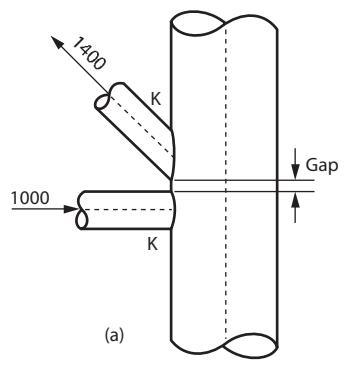

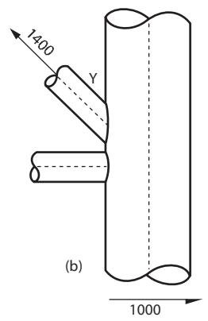

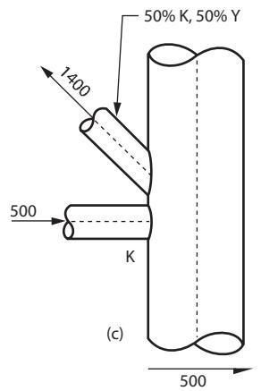

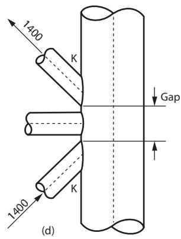

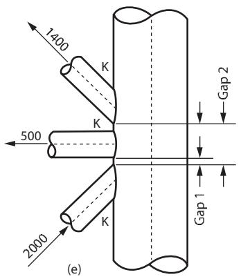

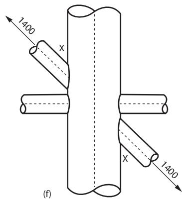

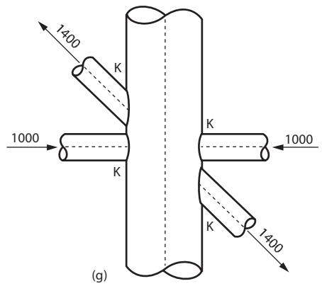

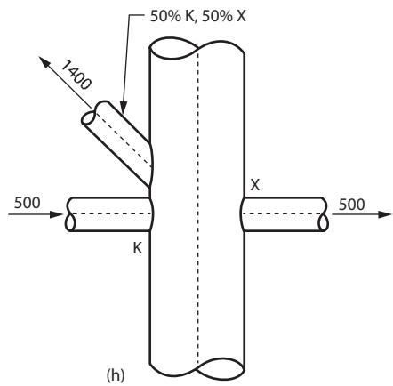  
Figure 4.2-1—Examples of Joint Classification

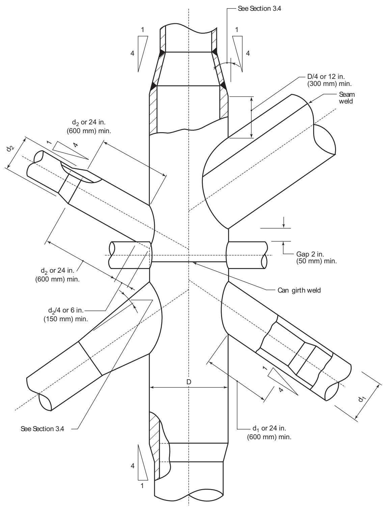  
Figure 4.2-2—In-Plane Joint Detailing

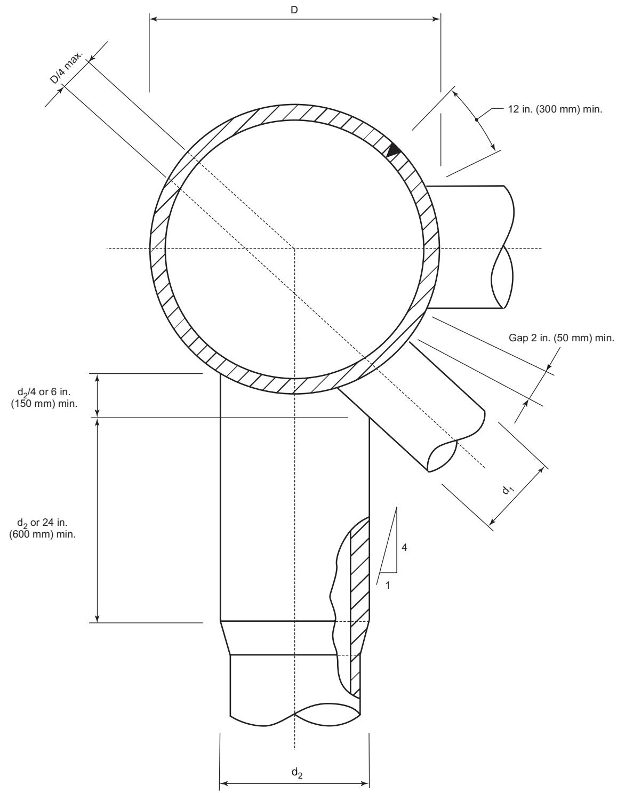  
Figure 4.2-3—Out-of-Plane Joint Detailing

The minimum nominal gap between adjacent braces, whether in- or out-of-plane, is 2 inches (50 mm). Care should be taken to ensure that overlap of welds at the toes of the joint is avoided. When overlapping braces occur, the amount of overlap should preferably be at least $d/4$ (where $d$ is the diameter of the through brace) or 6 inches (150 mm), whichever is greater. This dimension is measured along the axis of the through member.

Where overlapping of braces is necessary or preferred, and which differ in nominal thickness by more than $10\%$ the brace with the larger wall thickness should be the through brace and be fully welded to the chord. Further, where substantial overlap occurs, the larger diameter brace should be specified as the through member. This brace may require an end stub to ensure that the thickness is at least equal to that of the overlapping brace.

Longitudinal seam welds and girth welds should be located to minimize or eliminate their impact on joint performance. The longitudinal seam weld of the chord should be separated from incoming braces by at least 12 inches (300 mm), see Figure 4.2-3. The longitudinal seam weld of a brace should be located near the crown heel of the joint. Longer chord cans may require a girth weld. This weld should be positioned at a lightly loaded brace intersection, between saddle and crown locations, see Figure 4.2-2.

## 4.3 SIMPLE JOINTS

4.3.1 Validity Range

The terminology for simple joints is defined in Figure 4.3-1.

The validity range for application of the practice defined in 4.3 is as follows:

| 0.2 | ≤ | β | ≤ | 1.0 |
| --- | --- | --- | --- | --- |
| 10 | ≤ | γ | ≤ | 50 |
| 30° | ≤ | θ | ≤ | 90° |
| Fy | ≤ |  | 72 ksi (500 MPa) | 72 ksi (500 MPa) |
| g/D | > |  | -0.6 (for K joints) | -0.6 (for K joints) |

The Commentary discusses approaches that may be adopted for joints that fall outside the above range.

4.3.2 Basic Capacity

Tubular joints without overlap of principal braces and having no gussets, diaphragms, grout or stiffeners should be designed using the following guidelines.

$$P_{a} = Q_{u} Q_{f} \frac{F_{\mathrm{y c}} T^{2}}{F S \sin \theta} \tag{4.3-1a}$$

$$M_{a} = Q_{u} Q_{f} \frac{F_{y c} T^{2} d}{F S \sin \theta} \tag{4.3-1b}$$

(plus $1 / 3$ increase in both cases where applicable)

where:

$$P_{a} = \text{a l l o w a b l e c a p a c i t y f o r b r a c e a x i a l l o a d},$$

$$M_{a} = \text{a l l o w a b l e c a p a c i t y f o r b r a c e b e n d i n g m o m e n t},$$

$$\begin{array}{l} F_{y c} = \text{t h e y i e l d s t r e s s o f t h e c h o r d m e b e r a t t h e j o i n t (o r} \\ 0. 8 \text{o f t h e t e n s i l e s t r e n g t h , i f l e s s) , k s i (M P a) ,} \end{array}$$

$$F S = \text{s a f e t y} = 1. 60.$$

For joints with thickened cans, $P_{a}$ shall not exceed the capacity limits defined in 4.3.5.

For axially loaded braces with a classification that is a mixture of K, Y and X joints, take a weighted average of $P_{a}$ based on the portion of each in the total load.

4.3.3 Strength Factor $Q_{U}$

$Q_{u}$ varies with the joint and load type, as given in Table 4.3-1.

Where the working points of members at a gap connection are separated by more than $D / 4$ along the chord centerline, or where a connection has simultaneously loaded branch members in more than one plane, the connection may be classified as a general or multi-planar connection, and designed as described in the Commentary.

4.3.4 Chord Load Factor $Q_{f}$

$Q_{f}$ is a factor to account for the presence of nominal loads in the chord.

$$Q_{f} = \left[ 1 + C_{1} \left(\frac{F S P_{c}}{P_{y}}\right) - C_{2} \left(\frac{F S M_{i p b}}{M_{p}}\right) - C_{3} A^{2} \right] \tag{4.3-2}$$

The parameter A is defined as follows:

$$A = \left[ \left(\frac{F S P_{c}}{P_{\mathrm{y}}}\right)^{2} + \left(\frac{F S M_{c}}{M_{p}}\right)^{2} \right]^{0. 5} \tag{4.3-3}$$

(Where $1 / 3$ increase applicable, $FS = 1.20$ in 4.3-2 and 4.3-3.)

Where $P_{c}$ and $M_{c}$ are the nominal axial load and bending resultant (i.e., $M_c^2 = M_{ipb}^2 +M_{opb}^2$ ) in the chord,

$P_{y}$ is the yield axial capacity of the chord,

$M_{p}$ is the plastic moment capacity of the chord, and

$C_1, C_2$ and $C_3$ are coefficients depending on joint and load type as given in Table 4.3-2.

The average of the chord loads and bending moments on either side of the brace intersection should be used in Equations 4.3-2 and 4.3-3. Chord axial load is positive in tension, chord in-plane bending moment is positive when it produces compression on the joint footprint. The chord thickness at the joint should be used in the above calculations.

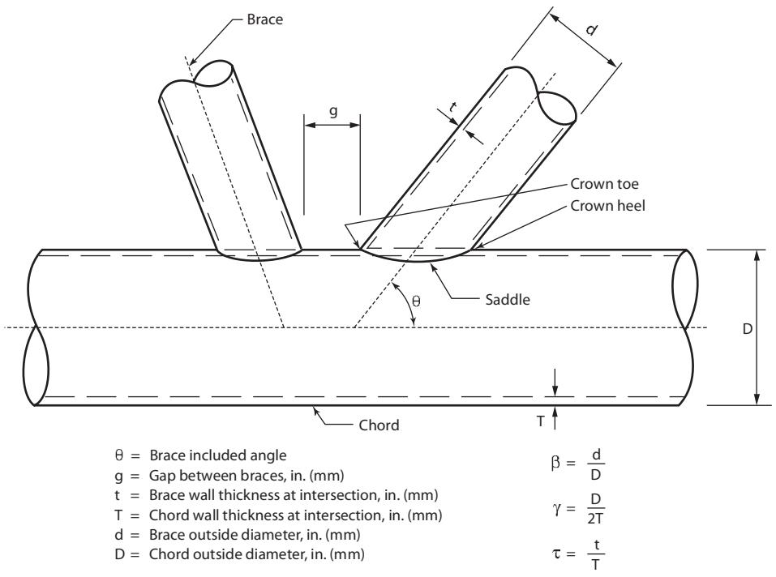  
Figure 4.3-1—Terminology and Geometric Parameters, Simple Tubular Joints

Statistics are presented in the Commentary, to permit both the estimation of mean strength and the conduct of reliability analyses.

4.3.5 Joints with Thickened Cans

For simple, axially loaded Y and X joints where a thickened joint can be specified, the joint allowable capacity may be calculated as follows:

$$P_{a} = \left[ r + (1 - r) \left(T_{n} / T_{c}\right)^{2} \right] \left(P_{a}\right)_{c} \tag{4.3-4}$$

where

（$P_{a})_{c} = P_{a}$ from Equation 4.3-1a based on chord can geometric and material properties, including $Q_{f}$ calculated with respect to chord can,

$T_{n} =$ nominal chord member thickness,

$T_{c} =$ chord can thickness,

$r = L_{c} / (2.5D)$ for joints with $\beta \leq 0.9$   
$= (4\beta -3)L_{c} / (1.5D)$ for joints with $\beta >0.9$

$L_{c} =$ effective total length. Figure 4.3-2 gives examples for calculation of $L_{c}$

In no case shall $r$ be taken as greater than unity.

Alternatively, an approximate closed ring analysis may be employed, including plastic analysis with appropriate safety factors, using an effective chord length up to $1.25D$ either side

of the line of action of the branch loads at the chord face, but not more than actual distance to the end of the can. Special consideration is required for more complex joints. For multiple branches in the same plane, dominantly loaded in the same sense, the relevant crushing load is $\Sigma_{t}P_{i}\sin \theta_{t}$ . Any reinforcement within this dimension (e.g., diaphragms, rings, gussets or the stiffening effect of out of plane members) may be considered in the analysis, although its effectiveness decreases with distance from the branch footprint.

4.3.6 Strength Check

The joint interaction ratio, $IR$ , for axial loads and/or bending moments in the brace should be calculated using the following expression:

$$I R = \left| \frac{P}{P_{a}} \right| + \left(\frac{M}{M_{a}}\right)_{i p b}^{2} + \left| \frac{M}{M_{a}} \right|_{o p b} \leq 1. 0 \tag{4.3-5}$$

## 4.4 OVERLAPPING JOINTS

Braces that overlap in- or out-of-plane at the chord member form overlapping joints. Examples are shown in Figures 4.2-2 and 4.2-3.

Joints that have in-plane overlap involving two or more braces in a single plane (e.g., K and KT joints), may be designed using the simple joint provisions of 4.3, using negative gap in $Q_{g}$ , with the following exceptions and additions:

Table 4.3-1—Values for $Q_{U}$   

| Joint Classification | Brace Load | Brace Load | Brace Load | Brace Load |
| --- | --- | --- | --- | --- |
| Joint Classification | Axial Tension | Axial Compression | In-Plane Bending | Out-of-Plane Bending |
| K | (16 + 1.2γ) β1.2Qg but ≤ 40 β1.2Qg | (16 + 1.2γ) β1.2Qg but ≤ 40 β1.2Qg | (5 + 0.7γ)β1.2 | 2.5 + (4.5 + 0.2γ)β2.6 |
| T/Y | 30β | 2.8 + (20 + 0.8γ)β1.6 but ≤ 2.8 + 36 β1.6 | (5 + 0.7γ)β1.2 | 2.5 + (4.5 + 0.2γ)β2.6 |
| X | 23β for β ≤ 0.9 20.7 + (β - 0.9)(17γ - 220) for β > 0.9 | [2.8 + (12 + 0.1γ)β]Qβ | (5 + 0.7γ)β1.2 | 2.5 + (4.5 + 0.2γ)β2.6 |

Notes:   
(a) $Q_{\beta}$ is a geometric factor defined by:   
$Q_{\beta}$ 0.3 for $\beta >0.6$   
$Q_{\beta}$ 1.0 for $\beta \leq 0.6$   
(b) $Q_{g}$ is the gap factor defined by:   
$Q_{g}$ $1 + 0.2[1 - 2.8g / D]^{3}$ for $g / D\geq 0.05$ but $\geq 1.0$   
$Q_{g}$ $0.13 + 0.65\phi \gamma^{0.5}$ for $g / D\leq -0.05$   
where $\phi = tF_{yb} / (TF_y)$

The overlap should preferably not be less than $0.25\beta D$ . Linear interpolation between the limiting values of the above two $Q_{g}$ expressions may be used for $-0.05 < g / D < 0.05$ when this is otherwise permissible or unavoidable. See Commentary C4.3.3.

$F_{yb}$ = yield stress of brace or brace stub if present (or 0.8 times the tensile strength if less), ksi (MPa)

(c) The $Q_{u}$ term for tension loading is based on limiting the capacity to first crack. The $Q_{u}$ associated with full ultimate capacity of tension loaded Y and X joints is given in the Commentary.   
(d) The X joint, axial tension, $Q_{u}$ term for $\beta > 0.9$ applies to coaxial braces (i.e., $e / D \leq 0.2$ where $e$ is the eccentricity of the two braces). If the braces are not coaxial ( $e / D > 0.2$ ) then $23\beta$ should be used over the full range of $\beta$ .

Table 4.3-2—Values for $C_1$ , $C_2$ , $C_3$   

| Joint Type | C1 | C2 | C3 |
| --- | --- | --- | --- |
| K joints under brace axial loading | 0.2 | 0.2 | 0.3 |
| T/Y joints under brace axial loading | 0.3 | 0 | 0.8 |
| X joints under brace axial loading* β ≤ 0.9 β = 1.0 | 0.2 | 0 | 0.5 |
| X joints under brace axial loading* β ≤ 0.9 β = 1.0 | -0.2 | 0 | 0.2 |
| All joints under brace moment loading | 0.2 | 0 | 0.4 |
| *Linearly interpolated values between β = 0.9 and β = 1.0 for X joints under brace axial loading. | *Linearly interpolated values between β = 0.9 and β = 1.0 for X joints under brace axial loading. | *Linearly interpolated values between β = 0.9 and β = 1.0 for X joints under brace axial loading. | *Linearly interpolated values between β = 0.9 and β = 1.0 for X joints under brace axial loading. |

a. Shear parallel to the chord face is a potential failure mode and should be checked.   
b. Section 4.3.5 does not apply to overlapping joints with balanced loads.   
c. If axial forces in the overlapping and through braces have the same sign, the combined axial force representing that in the through brace plus a portion of the overlapping brace forces should be used to check the through brace intersection capacity. The portion of the overlapping brace force can be calculated as the ratio of cross sectional area of the brace that bears onto the through brace to the full area.   
d. For either in-plane or out-of-plane bending moments, the combined moment of the overlapping and through braces

should be used to check the through brace intersection capacity. This combined moment should account for the sign of the moments. Where combined nominal axial and bending stresses in the overlapping brace peak in the overlap region, the overlapping brace should also be checked on the basis of its chord being the through brace, using $Q_{g} = 1.0$ . That is, through brace capacity should be checked for combined axial and moment loading in the overlapping brace. In this instance the $Q_{f}$ associated with the through brace should be used.

Joints having out-of-plane overlap may be assessed on the same general basis as in-plane overlapping joints, with the exception that axial load capacity may be calculated as for multi-planar joints in Commentary C4.3.3.

## 4.5 GROUTED JOINTS

Two varieties of grouted joints commonly occur in practice. The first relates to a fully grouted chord. The second is the double-skin type, where grout is placed in the annulus between a chord member and an internal member. In both cases, the grout is unreinforced and, as far as joint behavior is concerned, benefit for shear keys that may be present is not permitted.

Table 4.5-1— $Q_{U}$ for Grouted Joints   

| Brace Load | Qu |
| --- | --- |
| Axial tension | 2.5 β γ Ka |
|  | where Ka= (1/2)(1 + 1/sinθ) |
| Bending | 1.5 β γ |

Note that no term is provided for axial compression since most grouted joints cannot fail under compression; compression capacity is limited by that of the brace.

For grouted joints that are otherwise simple in configuration, the simple joint provisions defined in Section 4.3 may be used with the following modifications and limitations:

a. For fully grouted and double-skin joints, the $Q_{u}$ values in Table 4.3-1 may be replaced with the values pertinent to grouted joints given in Table 4.5-1. Classification and joint can derating may be disregarded. The adopted $Q_{u}$ values should not be less than those for simple joints.   
b. For double-skin joints, failure may also occur by chord ovalization. The ovalization capacity can be estimated by substituting the following effective thickness into the simple joint equations:

$$T_{e} = \left(T^{2} + T_{p}^{2}\right)^{0. 5} \tag{4.5-1}$$

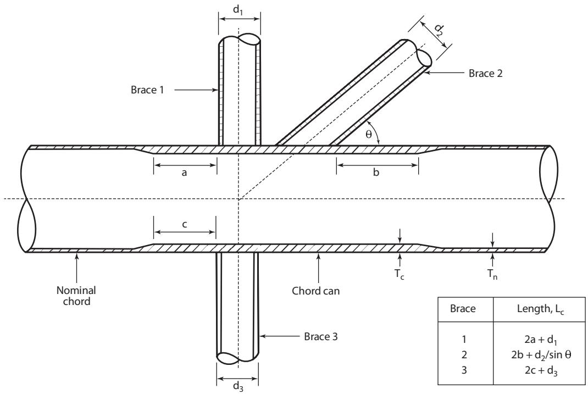  
Figure 4.3-2—Examples of Chord Length, $L_{c}$

where

$$T_{e} = \text{e f f e c t i v e t h i c k n e s s , i n . (m m)},$$

$$T = \text{w a l l t h i c k n e s s o f c h o r d , i n . (m m)},$$

$$T_{p} = \text{w a l l t h i c k n e s s o f i n n e r m e b e r , i n . (m m)}.$$

$T_{e}$ should be used in place of $T$ in the simple joint equations, including the $\gamma$ term.

c. The $Q_{f}$ calculation for both fully grouted and double-skinned joints should be based on $T$ ; it is presumed that calculation of $Q_{f}$ has already accounted for load sharing between the chord and inner member, such that further consideration of the effect of grout on that term is unnecessary.   
However, for fully grouted joints, $Q_{f}$ may normally be set to unity, except in the instance of high $\beta$ ( $\geq 0.9$ ) X joints with brace tension/OPB and chord compression/OPB.   
d. The minimum capacity requirements of 4.2.3 should still be observed.

## 4.6 INTERNALLY RING-STIFFENED JOINTS

Primary joints along launch trusses of steel jacket structures are often strengthened by internal ring stiffening. Internal stiffening is also used in some structures to address fatigue requirements or to avoid very thick chord cans.

The Commentary outlines the salient features of several common approaches to the design of internally ring-stiffened joints.

## 4.7 CAST JOINTS

Cast joints are defined as joints formed using a casting process. They can be of any geometry and of variable wall thickness.

The design of a cast joint requires calibrated finite element analyses. An acceptable design approach for strength is to limit stresses at all locations in the joint due to nominal loads to below yielding of the material using appropriate yield criteria with a 1.6 safety factor. Such an approach can be quite conservative when compared to welded joints, which are designed on the basis of overall ultimate behavior.

Often, the manufacturer of the cast joint carries out the design process.

## 4.8 OTHER CIRCULAR JOINT TYPES

Joints not covered by 4.3 to 4.7 may be designed on the basis of appropriate experimental, numerical or in-service evidence. Strength-of-materials approaches may be employed although extreme care is needed in identifying all elements that are expected to participate in resisting incoming brace loads, and in establishing the acting load envelopes prior to conducting strength checks. Often,

strength-of-materials checks are complemented with calibrated FE analyses to establish the magnitude and location of acting stresses.

## 4.9 DAMAGED JOINTS

Joints in existing installations could be damaged as a result of fatigue loading, corrosion or overload (environmental or accidental). In such cases, the reduced joint capacity can be estimated either by simple models (e.g., reduced area or reduced section modulus approaches), calibrated numerical (FE) models, or experimental evidence.

## 4.10 NON-CIRCULAR JOINTS

Connections with non-circular chord and/or brace sections are typically used on topside structures. Common types include wide flange (I beam, column, plate girder) sections and rectangular/square sections. For some arrangements, detailed land-based design practice is available. For arrangements for which little or no practice is available, the provisions noted in Section 4.8 apply.

# 5 Fatigue

## 5.1 FATIGUE DESIGN

In the design of tubular connections, due consideration should be given to fatigue action as related to local cyclic stresses.

A detailed fatigue analysis should be performed for all structures, except as provided below. It is recommended that a spectral analysis technique be used. Other rational methods may be used provided adequate representation of the forces and member responses can be demonstrated.

In lieu of detailed fatigue analysis, simplified fatigue analyses, which have been calibrated for the design wave climate, may be applied to tubular joints in Category L-3 template type platforms as defined in Section 1.7 that:

1. Are constructed of notch-tough ductile steels.   
2. Have redundant, inspectable structural framing.   
3. Have natural periods less than 3 seconds.

Such simplified methods are particularly useful for preliminary design of all structure categories and types, in water depths up to 400 feet (122 m). These are described in the Commentary. Caissons, monopods, and similar non-jacket structures deserve detailed analysis, with consideration of vortex shedding where applicable.

## 5.2 FATIGUE ANALYSIS

A detailed analysis of cumulative fatigue damage, when required, should be performed as follows:

5.2.1 The wave climate should be derived as the aggregate of all sea states to be expected over the long term. This may be condensed for purposes of structural analysis into representative sea states characterized by wave energy spectra and physical parameters together with a probability of occurrence.

5.2.2 A space frame analysis should be performed to obtain the structural response in terms of nominal member stress for given wave forces applied to the structure. In general, wave force calculations should follow the procedures described in Section 2.3.1. However, current may be neglected and, therefore, considerations for apparent wave period and current blockage are not required. In addition, wave kinematics factor equal to 1.0 and conductor shielding factor equal to 1.0 should be applied for fatigue waves. The drag and inertia coefficients depend on the sea state level, as parameterized by the Keulegan-Carpenter Number $K$ (see Commentary C2.3.lb7). For small waves （$1.0 < K < 6.0$ for platform legs at mean water level), values of $C_m = 2.0$ , $C_d = 0.8$ for rough members and $C_d = 0.5$ for smooth members should be used. Guidelines for considering directionality, spreading, tides and marine growth are provided in the commentary for this section.

A spectral analysis technique should be used to determine the stress response for each sea state. Dynamic effects should be considered for sea states having significant energy near a platform's natural period.

5.2.3 Local stresses that occur within tubular connections should be considered in terms of hot spot stresses located immediately adjacent to the joint intersection using suitable stress concentration factors. The micro scale effects occurring at the toe of the weld are reflected in the appropriate choice of the S-N curve.

5.2.4 For each location around each member intersection of interest in the structure, the stress response for each sea state should be computed, giving adequate consideration to both global and local stress effects.

The stress responses should be combined into the long term stress distribution, which should then be used to calculate the cumulative fatigue damage ratio, $D$ , where

$$D = \sum (n / N) \tag{5.2.4-1}$$

where

$n =$ number of cycles applied at a given stress range,

$N =$ number of cycles for which the given stress range would be allowed by the appropriate S-N curve.

Alternatively, the damage ratio may be computed for each sea state and combined to obtain the cumulative damage ratio.

5.2.5 In general the design fatigue life of each joint and member should not be less than the intended service life of the structure multiplied by a Safety Factor. For the design fatigue life, $D$ , should not exceed unity.

For in-situ conditions, the safety factor for fatigue of steel components should depend on the failure consequence (i.e. criticality) and in-service inspectability. Critical elements are those whose sole failure could be catastrophic. In lieu of a more detailed safety assessment of Category L-1 structures, a safety factor of 2.0 is recommended for inspectable, non-failure critical, connections. For failure-critical and/or non-inspectable connections, increased safety factors are recommended, as shown in Table 5.2.5-1. A reduced safety factor is recommended for Category L-2 and L-3 conventional steel jacket structures on the basis of in-service performance data: $\mathrm{SF} = 1.0$ for redundant diver or ROV inspectable framing, with safety factors for other cases being half those in the table.

Table 5.2.5-1—Fatigue Life Safety Factors   

| Failure critical | Inspectable | Not Inspectable |
| --- | --- | --- |
| No | 2 | 5 |
| Yes | 5 | 10 |

When fatigue damage can occur due to other cyclic loadings, such as transportation, the following equation should be satisfied:

$$\sum_{j} S F_{j} D_{j} <   1. 0 \tag{5.2.5-1}$$

where

$D_{j} =$ the fatigue damage ratio for each type of loading,

$SF_{j} =$ the associated safety factor.

For transportation where long-term wave distributions are used to predict short-term damage a larger safety factor should be considered.

## 5.3 STRESS CONCENTRATION FACTORS

5.3.1 General

The welds at tubular joints are among the most fatigue sensitive areas in offshore platforms because of the high local stress concentrations. Fatigue lives at these locations should be estimated by evaluating the Hot Spot Stress Range (HSSR) and using it as input into the appropriate S-N curve from Section 5.5.

For each tubular joint configuration and each type of brace loading, the SCF is defined as:

$$\mathrm{S C F} = \text{H S S R / N o m i n a l B r a c e S t r e s s R a n g e} \tag{5.3.1-1}$$

The Nominal Brace Stress Range should be based on the section properties of the brace-end under consideration, taking due account of the brace-stub, or a flared member end, if present. Likewise, the Stress Concentration Factor (SCF) evaluation shall be based on the same section dimensions. Nominal cyclic stress in the chord may also influence the HSSR and should be considered; see Commentary.

The SCF should include all stress raising effects associated with the joint geometry and type of loading, except the local (microscopic) weld notch effect, which is included in the S-N curve. SCFs may be derived from Finite Element analyses, model tests or empirical equations based on such methods. In general, the SCFs depend on the type of brace cyclic loading (i.e. brace axial load, in-plane bending, out-of plane bending), the joint type, and details of the geometry. The SCF varies around the joint, even for a single type of brace loading. When combining the contributions from the various loading modes, phase differences between them should be accounted for, with the design HSSR at each location being the range of hotspot stress resulting from the point-in-time contribution of all loading components.

For all welded tubular joints under all three types of loading, a minimum SCF of 1.5 should be used.

5.3.2 SCFs in Unstiffened Tubular Joints

For unstiffened welded tubular joints, SCFs should be evaluated using the Efthymiou equations; see Commentary.

The linearly extrapolated hot spot stress from Efthymiou may be adjusted to account for the actual weld toe position, where this systematically differs from the assumed AWS basic profiles; see Commentary.

For the purpose of computing SCF, the tubular joints are typically classified into types T/Y, X, K, and KT depending on the joint configuration, the brace under consideration and the loading pattern. As a generalization of the classification approach, the Influence Function algorithm discussed in the Commentary may be used to evaluate the hot spot stress ranges. This algorithm can handle generalized loads on the braces. Moreover the Influence Function algorithm can handle multi-planar joints for the important case of axial loading.

The Commentary contains a discussion on tubular joints welded from one side.

5.3.3 SCFs in Internally Ring-Stiffened Tubular Joints

The SCF concept also applies to internally ring stiffened joints, including the stresses in the stiffeners and the stiffener

to-chord weld. Ring-stiffened joints may have stress peaks at the brace-ring intersection points. Special consideration should be given to these locations. SCFs for internally ring-stiffened joints can be determined by applying the Lloyds reduction factors to the SCFs for the equivalent unstiffened joint, see Commentary. For ring-stiffened joints analyzed by such means, the minimum SCF for the brace side under axial or OPB loading should be taken as 2.0.

Ring stiffeners without flanges on the internal rings should consider high stress that may occur at the inner edge of the ring.

5.3.4 SCFs in Grouted Joints

Grouting tends to reduce the SCF of the joint since the grout reduces the chord deformations. In general, the larger the ungrouted SCF, the greater the reduction in SCF with grouting. Hence, the reductions are typically greater for X and T joints than for Y and K joints. The Commentary discusses approaches for calculating SCFs for grouted joints.

5.3.5 SCFs in Cast Nodes

For cast joints, the SCF is derived from the maximum principal stress at any point on the surface of the casting (including the inside surface) divided by the nominal brace stress outside the casting. The SCFs for castings are not extrapolated values, but are based on directly measured or calculated values at any given point, using an analysis that is sufficiently detailed to pick up the local notch effects of fillet radii, etc. Consideration should also be given to the brace-to casting girth weld, which can be the most critical location for fatigue.

## 5.4 S-N CURVES FOR ALL MEMBERS AND CONNECTIONS, EXCEPT TUBULAR CONNECTIONS

Non-tubular members and connections in deck structures, appurtenances and equipment; and tubular members and attachments to them, including ring stiffeners, may be subject to variations of stress due to environmental loads or operational loads. Operational loads would include those associated with machine vibration, crane usage and filling and emptying of tanks. Where variations of stress are applied to conventional weld details, identified in ANSI/APS D1.1-2002 Table 2.4, the associated S-N curves provided in AWS Figure 2.11 should be used, dependent on degree of redundancy. Where such variations of stress are applied to tubular nominal stress situations identified in ANSI/APS D1.1-2002 Table 2.6, the associated S-N curves provided in AWS Figure 2.13 should be used. Stress Categories DT, ET, FT, KI, and K2, refer to tubular connections where the SCF is not known.

Where the hot spot stress concentration factor can be determined, Sections 5.3 and 5.5 of this Recommended Practice take precedence

For service conditions where details may be exposed to random variable loads, seawater corrosion, or submerged service with effective cathodic protection, see Commentary.

The referenced S-N curves in ANSI/AWS D1.1.-2002 Figure 2.11 are Class curves. For such curves, the nominal stress range in the vicinity of the detail should be used. Due to load attraction, shell bending, etc., not present in the class type test specimens, the appropriate stress may be larger than the nominal stress in the gross member. Geometrical stress concentration and notch effects associated with the detail itself are included in the curves.

For single-sided butt welds, see Commentary.

Reference may alternatively be made to the S-N criteria similar to the OJ curves contained within ISO DIS 19902:2004 Clause 16.11. The ISO code proposal uses a weld detail classification system whereby the OJ curves include an allowance for notch stress and modest geometrical stress concentration.

## 5.5 S-N CURVES FOR TUBULAR CONNECTIONS

5.5.1 Basic S-N curves

Design S-N curves are given below for welded tubular and cast joints. The basic design S-N curve is of the form:

$$\operatorname{L o g}_{10} (N) = \operatorname{L o g}_{10} \left(k_{1}\right) - m \operatorname{L o g}_{10} (S) \tag{5.4.1-1}$$

where

$$\begin{array}{l} N = \text{t h e p r e d i c t e d n u m b e r o f c y c l e s t o f a i l u r e u n d e r} \\ \text{s t r e s s r a n g e S ,} \end{array}$$

$$k_{1} = \text{a c o n s t a n t},$$

$$m = \text{t h e i n v e r s e s l o p e o f t h e S - N c u r v e}.$$

Table 5.5.1-1 presents the basic WJ and CJ curves. These S-N curves are based on steels with yield strength less than $72\mathrm{ksi}$ （$500\mathrm{MPa})$

For welded tubular joints exposed to random variations of stress due to environmental or operational loads, the WJ curve should be used. The brace-to-chord tubular intersection for ring-stiffened joints should be designed using the WJ curve. For cast joints the CJ curve should be used. For other details, including plated joints and, for ring-stiffened joints, the ring stiffener-to-chord connection and the ring inner edge, see 5.4.

The basic allowable cyclic stress should be corrected empirically for seawater effects, the apparent thickness effect (per 5.5.2, with exponent depending on profile), and the weld improvement factor on S per 5.5.3. An example of S-N curve construction is given in Figure 5.5-1.

Table 5.5.1-1—Basic Design S-N Curves   

| Curve | log10(k1)S in ksi | log10(k1)S in MPa | m |
| --- | --- | --- | --- |
| Welded Joints (WJ) | 9.95 | 12.48 | 3 for N < 107 |
| Welded Joints (WJ) | 11.92 | 16.13 | 5 for N > 107 |
| Cast Joints (CJ) | 11.80 | 15.17 | 4 for N < 107 |
| Cast Joints (CJ) | 13.00 | 17.21 | 5 for N > 107 |

The basic design S-N curves given in Table 5.5.1-1 are applicable for joints in air and submerged coated joints. For Welded Joints in seawater with adequate cathodic protection, the $m = 3$ branch of the S-N curve should be reduced by a factor of 2.0 on life, with the $m = 5$ branch remaining unchanged and the position of the slope change adjusted accordingly. Plots of the $WJ$ curves versus data, and information concerning $S - N$ curves for joints in seawater without adequate corrosion protection is given in the Commentary.

Fabrication of welded joints should be in accordance with Section 11. The curve for cast joints is only applicable to castings having an adequate fabrication inspection plan; see Commentary.

5.5.2 Thickness effect

The WJ curve is based on $5/8$ -in. (16 mm) reference thickness. For material thickness above the reference thickness, the following thickness effect should be applied for as-welded joints:

$$S = S_{o} \left(t_{\text{r e f}} / t\right)^{0. 25} \tag{5.5.2-1}$$

where

$$t_{r e f} = \text{t h e r e f i r e n c e t h i k n e s s ,} 5 / 8 - \text{i n c h (16 m m) , a n d}$$

$$S = \text{a l l o w a b l e}$$

$$S_{o} = \text{t h e a l l o w a b l e s t r e s s r a n g e f r o m t h e S - N c u r v e},$$

$$t = \text{m e m b e r t h i c k n e s s f o r w h i c h t h e f a t i g u e l i f e i s}$$

If the weld has profile control as defined in 11.1.3d, the exponent in the above equation may be taken as 0.20. If the weld toe has been ground or peened, the exponent in the above equation may be taken as 0.15.

The material thickness effect for castings is given by:

$$S = S_{o} \left(t_{\text{r e f}} / t\right)^{0. 15} \tag{5.5.2-2}$$

where the reference thickness $t_{ref}$ is 1.5 in （$38\mathrm{mm})$

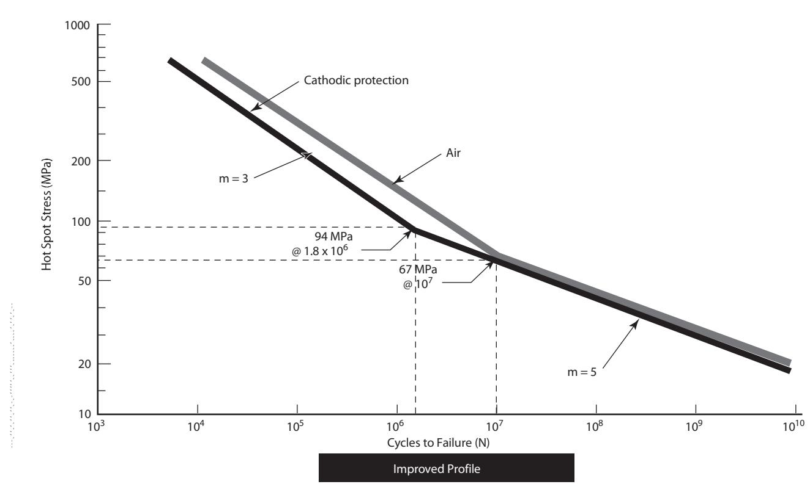  
Figure 5.5-1—Example Tubular Joint S-N Curve for $T = 5/8$ in. (16 mm)

No effect shall be applied to material thickness less than the reference thickness.

For any type of connection analyzed on a chord hot-spot basis, the thickness for the chord side of tubular joint should be used in the foregoing equations. For the brace side hot spot, the brace thickness may be used.

5.5.3 Weld Improvement Techniques

For welded joints, improvement factors on fatigue performance can be obtained by a number of methods, including controlled burr grinding of the weld toe, hammer peening, or as-welded profile control to produce a smooth concave profile which blends smoothly with the parent metal. Table 5.5.3-1 shows improvement factors that can be applied, provided adequate control procedures are followed. The grinding improvement factor is not applicable for joints in seawater without adequate cathodic protection. The various weld improvement techniques are discussed in the Commentary.

For welds with profile control as defined in 11.1.3d where the weld toe has been profiled, by grinding if required, to merge smoothly with the parent metal, and magnetic particle inspection demonstrates the weld toe is free of surface and near-surface defects, the improvement on fatigue perfor

mance can be considered as shown in the table, where $\tau$ is the ratio of branch/chord thickness. This improvement is in addition to the use of hotspot stress at the actual weld toe location, and the reduced size effect exponent. Either the factor on $S$ or on $N$ is used, but not both..

## 5.6 FRACTURE MECHANICS

Table 5.5.3-1—Factors on Fatigue Life for Weld Improvement Techniques   

| Weld Improvement Technique | Improvement Factor on S | Improvement Factor on N |
| --- | --- | --- |
| Profile per 11.1.3d | a τ - 0.1 | varies |
| Weld toe burr grind | 1.25 | 2 |
| Hammer peening | 1.56 | 4 |
| a Chord side only. | a Chord side only. | a Chord side only. |

Fracture mechanics methods may be employed to quantify fatigue design lives of welded details or structural components in situations where the normal S-N fatigue assessment procedures are inappropriate. Some typical applications are to

assess the fitness-for-purpose and inspection requirements of a joint with and without known defects, or to assess the structural integrity of castings.

It is important that the fracture mechanics formulation that is used should be shown to predict, with acceptable accuracy, either the fatigue performance of a joint class with a detail similar to that under consideration, or test data for joints that are similar to those requiring assessment.

6 Foundation Design

The recommended criteria of Section 6.1 through Section 6.11 are devoted to pile foundations, and more specifically to steel cylindrical (pipe) pile foundations. The recommended criteria of Section 6.12 through Section 6.17 are devoted to shallow foundations.

## 6.1 GENERAL

The foundation should be designed to carry static, cyclic and transient loads without excessive deformations or vibrations in the platform. Special attention should be given to the effects of cyclic and transient loading on the strength of the supporting soils as well as on the structural response of piles. Guidance provided in Sections 6.3, 6.4, and 6.5 is based upon static, monotonic loadings. Furthermore, this guidance does not necessarily apply to so called problem soils such as carbonate material or volcanic sands or highly sensitive clays. The possibility of movement of the seafloor against the foundation members should be investigated and the forces caused by such movements, if anticipated, should be considered in the design.

## 6.2 PILE FOUNDATIONS

Types of pile foundations used to support offshore structures are as follows:

6.2.1 Driven Files

Open ended piles are commonly used in foundations for offshore platforms. These piles are usually driven into the sea-floor with impact hammers which use steam, diesel fuel, or hydraulic power as the source of energy. The pile wall thickness should be adequate to resist axial and lateral loads as well as the stresses during pile driving. It is possible to predict approximately the stresses during pile driving using the principles of one-dimensional elastic stress wave transmission by carefully selecting the parameters that govern the behavior of soil, pile, cushions, capblock and hammer. For a more detailed study of these principles, refer to E.A.L. Smith's paper, "Pile Driving Analysis by the Wave Equation," Transactions ASCE, Vol. 127, 1962, Part 1, Paper No. 3306, pp. 1145-1193. The above approach may also be used

to optimize the pile hammer cushion and capblock with the aid of computer analyses (commonly known as the Wave Equation Analyses). The design penetration of driven piles should be determined in accordance with the principles outlined in Sections 6.3 through 6.7 and 6.9 rather than upon any correlation of pile capacity with the number of blows required to drive the pile a certain distance into the seafloor.

When a pile refuses before it reaches design penetration, one or more of the following actions can be taken:

a. Review of hammer performance. A review of all aspects of hammer performance, possibly with the aid of hammer and pile head instrumentation, may identify problems which can be solved by improved hammer operation and maintenance, or by the use of a more powerful hammer.

b. Reevaluation of design penetration. Reconsideration of loads, deformations and required capacities, of both individual piles and other foundation elements, and the foundation as a whole, may identify reserve capacity available. An interpretation of driving records in conjunction with instrumentation mentioned above may allow design soil parameters or stratification to be revised and pile capacity to be increased.

c. Modifications to piling procedures, usually the last course of action, may include one of the following:

- Plug Removal. The soil plug inside the pile is removed by jetting and air lifting or by drilling to reduce pile driving resistance. If plug removal results in inadequate pile capacities, the removed soil plug should be replaced by a gravel grout or concrete plug having sufficient load-carrying capacity to replace that of the removed soil plug. Attention should be paid to plug/pile load transfer characteristics. Plug removal may not be effective in some circumstances particularly in cohesive soils.   
- Soil Removal Below Pile Tip. Soil below the pile tip is removed either by drilling an undersized hole or jetting equipment is lowered through the pile which acts as the casing pipe for the operation. The effect on pile capacity of drilling an undersized hole is unpredictable unless there has been previous experience under similar conditions. Jetting below the pile tip should in general be avoided because of the unpredictability of the results.   
- Two-State Driven Piles. A first stage or outer pile is driven to a predetermined depth, the soil plug is removed, and a second stage or inner pile is driven inside the first stage pile. The annulus between the two piles is grouted to permit load transfer and develop composite action.   
- Drilled and grouted insert piles as described in 6.2.2(b) below.

6.2.2 Drilled and Grouted Piles

Drilled and grouted piles can be used in soils which will hold an open hole with or without drilling mud. Load transfer between grout and pile should be designed in accordance with Sections 7.4.2, 7.4.3, and 7.4.4. There are two types of drilled and grouted piles, as follows:

a. Single-Stage. For the single-staged, drilled and grouted pile, an oversized hole is drilled to the required penetration, a pile is lowered into the hole and the annulus between the pile and the soil is grouted. This type pile can be installed only in soils which will hold an open hole to the surface. As an alternative method, the pile with expendable cutting tools attached to the tip can be used as part of the drill stem to avoid the time required to remove the drill bit and insert a pile.   
b. Two-Stage. The two-staged, drilled and grouted pile consists of two concentrically placed piles grouted to become a composite section. A pile is driven to a penetration which has been determined to be achievable with the available equipment and below which an open hole can be maintained. This outer pile becomes the casing for the next operation which is to drill through it to the required penetration for the inner or "insert" pile. The insert pile is then lowered into the drilled hole and the annuli between the insert pile and the soil an between the two piles are grouted. Under certain soil conditions, the drilled hole is stopped above required penetration, and the insert pile is driven to required penetration. The diameter of the drilled hole should be at least 6 inches (150 mm) larger than the pile diameter.

6.2.3 Belled Piles

Bells may be constructed at the tip of piles to give increased bearing and uplift capacity through direct bearing on the soil. Drilling of the bell is carried out through the pile by underreaming with an expander tool. A pilot hole may be drilled below the bell to act as a sump for unrecoverable cuttings. The bell and pile are filled with concrete to a height sufficient to develop necessary load transfer between the bell and the pile. Bells are connected to the pile to transfer full uplift and bearing loads using steel reinforcing such as structural members with adequate shear lugs, deformed reinforcement bars or prestressed tendons. Load transfer into the concrete should be designed in accordance with ACI 318. The steel reinforcing should be enclosed for their full length below the pile with spiral reinforcement meeting the requirements of ACI 318. Load transfer between the concrete and the pile should be designed in accordance with Sections 7.4.2, 7.4.3, and 7.4.4.

## 6.3 PILE DESIGN

6.3.1 Foundation Size

When sizing a pile foundation, the following items should be considered: diameter, penetration, wall thickness, type of

tip, spacing, number of piles, geometry, location, mudline restraint, material strength, installation method, and other parameters as may be considered appropriate.

6.3.2 Foundation Response

A number of different analysis procedures may be utilized to determine the requirements of a foundation. At a minimum, the procedure used should properly stimulate the nonlinear response behavior of the soil and assure load-deflection compatibility between the structure and the pile-soil system.

6.3.3 Deflections and Rotations

Deflections and rotations of individual piles and the total foundation system should be checked at all critical locations which may include pile tops, points of contraflecture, mudline, etc. Deflections and rotations should not exceed serviceability limits which would render the structure inadequate for its intended function.

6.3.4 Pile Penetration

The design pile penetration should be sufficient to develop adequate capacity to resist the maximum computed axial bearing and pullout loads with an appropriate factor of safety. The ultimate pile capacities can be computed in accordance with Sections 6.4 and 6.5 or by other methods which are supported by reliable comprehensive data. The allowable pile capacities are determined by dividing the ultimate pile capacities by appropriate factors of safety which should not be less than the following values:

| Load Condition | Factors of Safety |
| --- | --- |
| 1. Design environmental conditions with appropriate drilling loads | 1.5 |
| 2. Operating environmental conditions during drilling operations | 2.0 |
| 3. Design environmental conditions with appropriate producing loads | 1.5 |
| 4. Operating environmental conditions during producing operations | 2.0 |
| 5. Design environmental conditions with minimum loads (for pullout) | 1.5 |

6.3.5 Alternative Design Methods

The provisions of this recommended practice for sizing the foundation pile are based on an allowable stress (working stress) method except for pile penetration per Section 6.3.4. In this method, the foundation piles should conform to the requirements of Sections 3.2 and 6.10 in addition to the provisions of Section 6.3. Any alternative method supported by sound engineering methods and empirical evidence may also

be utilized. Such alternative methods include the limit state design approach or ultimate strength design of the total foundation system.

6.3.6 Scour

Seabed scour affects both lateral and axial pile performance and capacity. Scour prediction remains an uncertain art. Sediment transport studies may assist in defining scour design criteria but local experience is the best guide. The uncertainty on design criteria should be handled by robust design, or by an operating strategy of monitoring and remediation as needed. Typical remediation experience is documented in "Erosion Protection of Production Structures," by Posey, C.J., and Sybert, J.H., Proc. 9th Conv. I.A.H.R., Dobrovnik, 1961, pp. 1157-1162, and "Scour Repair Methods in the Southern North Sea," by Angus, N.M., and Moore, R.L., OTC 4410, May 1982. Scour design criteria will usually be a combination of local and global scour.

## 6.4 PILE CAPACITY FOR AXIAL BEARING LOADS

6.4.1 Ultimate Bearing Capacity

The ultimate bearing capacity of piles, including belled piles, $Q_{d}$ should be determined by the equation:

$$Q_{d} = Q_{f} + Q_{p} = f A_{s} + q A_{p} \tag{6.4.1-1}$$

where

$$Q_{f} = \text{s k i n f r i c t i o n r e s i s t a n c e , l b (k N)}$$

$$Q_{p} = \text{t o t a l e n d b e a r i n g , l b (k N) ,}$$

$$f = \text{u n i t}$$

$$A_{s} = \text{s i d e s u r f a c e a r e a o f p i l e , f t}^{2} (m^{2}),$$

$$q = \text{u n i t e n d b e a r i n g c a p a c i t y ,} \mathrm{l b / f t^{2} (k P a)},$$

$$A_{p} = \text{g r o s s e n d a r e a o f p i l e , f t}^{2} \left(\mathrm{m}^{2}\right).$$

Total end bearing, $Q_{p}$ , should not exceed the capacity of the internal plug. In computing pile loading and capacity the weight of the pile-soil plug system and hydrostatic uplift should be considered.

In determining the load capacity of a pile, consideration should be given to the relative deformations between the soil and the pile as well as the compressibility of the soil pile system. Eq. 6.4.1-1 assumes that the maximum skin friction along the pile and the maximum end bearing are mobilized simultaneously. However, the ultimate skin friction increments along the pile are not necessarily directly additive, nor is the ultimate end bearing necessarily additive to the ultimate skin friction. In some circumstances this effect may result in the capacity being less than that given by Eq. 6.4.1-1. In such

cases a more explicit consideration of axial pile performance effects on pile capacity may be warranted. For additional discussion of these effects refer to Section 6.6 and ASCE Journal of the Soil Mechanics and Foundations Division for Load Transfer for Axially Loaded Piles in Clay, by H.M. Coyle and L.C. Reese, Vol. 92, No. 1052, March 1966, Murff, J.D., "Pile Capacity in a Softening Soil," International Journal for Numerical and Analytical Methods in Geomechanics (1980), Vol. 4, No. 2, pp. 185-189, and Randolph, H.F., "Design Considerations for Offshore Piles," Geotechnical Practice in Offshore Engineering, ASCE, Austin 1983, pp. 422-439.

The foundation configurations should be based on those that experience has shown can be installed consistently, practically and economically under similar conditions with the pile size and installation equipment being used. Alternatives for possible remedial action in the event design objectives cannot be obtained during installation should also be investigated and defined prior to construction.

For the pile-bell system, the factors of safety should be those given in Section 6.3.4. The allowable skin friction values on the pile section should be those given in this section and in Section 6.5. Skin friction on the upper bell surface and possibly above the bell on the pile should be discounted in computing skin friction resistance, $Q_{f}$ . The end bearing area of a pilot hole, if drilled, should be discounted in computing total bearing area of the bell.

6.4.2 Skin Friction and End Bearing in Cohesive Soils

For pipe piles in cohesive soils, the shaft friction, $f$ , in $\mathrm{lb} / \mathrm{ft}^2$ (kPa) at any point along the pile may be calculated by the equation.

$$f = \alpha c \tag{6.4.2-1}$$

where

$$\begin{array}{l} \alpha = \text{a d i m e n s i o n l e s s f a c t o r}, \\ c = \text{u n d r a i n e d s h e a r s t r e n g t h o f t h e s o i l a t t h e p o i n t} \\ \end{array}$$

The factor, $\alpha$ , can be computed by the equations:

$$\begin{array}{l} \alpha = 0. 5 \psi^{- 0. 5} \psi \leq 1. 0 \tag{6.4.2-2} \\ \alpha = 0. 5 \psi^{- 0. 25} \psi > 1. 0 \\ \end{array}$$

with the constraint that, $\alpha \leq 1.0$

where

$$\begin{array}{l} \psi = c / p_{o}^{\prime} \text{f o r t h e p o i n t i n q u e s t o n ,} \\ p_{o}^{\prime} = \begin{array}{l} \text{e f f e c t i v e o v e r b u r d e n p r e s s u r e a t t h e p o i n t i n} \\ \text{q u e s t i o n l b / f t^{2} (k P a) .} \end{array} \\ \end{array}$$

A discussion of appropriate methods for determining the undrained shear strength, $c$ , and effective overburden pres

sure, $p_{o}^{\prime}$ , including the effects of various sampling and testing procedures is included in the commentary. For underconsolidated clays (clays with excess pore pressures undergoing active consolidation), $\alpha$ , can usually be taken as 1.0. Due to the lack of pile load tests in soils having $c / p_{o}^{\prime}$ ratios greater than three, equation 6.4.2-2 should be applied with some engineering judgment for high $c / p_{o}^{\prime}$ values. Similar judgment should be applied for deep penetrating piles in soils with high undrained shear strength, $c$ , where the computed shaft frictions, $f$ , using equation 6.4.2-1 above, are generally higher than previously specified in RP 2A.

For very long piles some reduction in capacity may be warranted, particularly where the shaft friction may degrade to some lesser residual value on continued displacement. This effect is discussed in more detail in the commentary.

Alternative means of determining pile capacity that are based on sound engineering principles and are consistent with industry experience are permissible. A more detailed discussion of alternate prediction methods is included in the commentary.

For piles end bearing in cohesive soils, the unit end bearing $q$ , in $\mathrm{lbs} / \mathrm{ft}^2$ (kPa), may be computed by the equation

$$q = 9 c \tag{6.4.2-3}$$

The shaft friction, $f$ , acts on both the inside and outside of the pile. The total resistance is the sum of: the external shaft friction; the end bearing on the pile wall annulus; the total internal shaft friction or the end bearing of the plug, whichever is less. For piles considered to be plugged, the bearing pressure may be assumed to act over the entire cross section of the pile. For unplugged piles, the bearing pressure acts on the pile wall annulus only. Whether a pile is considered plugged or unplugged may be based on static calculations. For example, a pile could be driven in an unplugged condition but act plugged under static loading.

For piles driven in undersized drilled holes, piles jetted in place, or piles drilled and grouted in place the selection of shaft friction values should take into account the soil disturbance resulting from installation. In general $f$ should not exceed values for driven piles; however, in some cases for drilled and grouted piles in overconsolidated clay, $f$ may exceed these values. In determining $f$ for drilled and grouted piles, the strength of the soil-grout interface, including potential effects of drilling mud, should be considered. A further check should be made of the allowable bond stress between the pile steel and the grout as recommended in Section 7.4.3. For further discussion refer to "State of the Art: Ultimate Axial Capacity of Grouted Piles" by Kraft and Lyons, OTC 2081, May, 1974.

In layered soils, shaft friction values, $f$ , in the cohesive layers should be as given in Eq. (6.4.2-1). End bearing values for piles tipped in cohesive layers with adjacent weaker layers may be as given in Eq. (6.4.2-3), assuming that the pile

achieves penetration of two to three diameters or more into the layer in question and the tip is approximately three diameters above the bottom of the layer to preclude punch through. Where these distances are not achieved, some modification in the end bearing resistance may be necessary. Where adjacent layers are of comparable strength to the layer of interest, the proximity of the pile tip to the interface is not a concern.

6.4.3 Shaft Friction and End Bearing in Cohesionless Soils

This section provides a simple method for assessing pile capacity in cohesionless soils. The Commentary presents other, recent and more reliable methods for predicting pile capacity. These are based on direct correlations of pile unit friction and end bearing data with cone penetration test (CPT) results. In comparison to the Main Text method described below, these CPT-based methods are considered fundamentally better, have shown statistically closer predictions of pile load test results and, although not required, are in principle the preferred methods. These methods also cover a wider range of cohesionless soils than the Main Text method. However, offshore experience with these CPT methods is either limited or does not exist and hence more experience is needed before they are recommended for routine design, instead of the main text method. CPT-based methods should be applied only by qualified engineers who are experienced in the interpretation of CPT data and understand the limitations and reliability of these methods. Following installation, pile driving (instrumentation) data may be used to give more confidence in predicted capacities.

For pipe piles in cohesionless soils, the unit shaft friction at a given depth, $f$ , may be calculated by the equation:

$$f = \beta p_{o}^{\prime} \tag{6.4.3-1}$$

where

$$\beta = \text{d i m e n s i o n l e s s s h a f t}$$

$$p_{o}^{\prime} = \text{e f f e c t i v e o v e r b u r d e n p r e s s u r e a t t h e d e p t h i n}$$

Table 6.4.3-1 may be used for selection of $\beta$ values for open-ended pipe piles driven unplugged if other data are not available. Values of $\beta$ for full displacement piles (i.e., driven fully plugged or closed ended) may be assumed to be $25\%$ higher than those given in Table 6.4.3-1. For long piles, $f$ may not increase linearly with the overburden pressure as implied by Equation 6.4.3-1. In such cases, it may be appropriate to limit $f$ to the values given in Table 6.4.3-1.

For piles end bearing in cohesionless soils, the unit end bearing $q$ may be computed by the equation:

$$q = N_{q} p_{o}^{\prime} \tag{6.4.3-2}$$

Table 6.4.3-1—Design Parameters for Cohesionless Siliceous Soil1   

| Relative Density2 | Soil Description | Shaft Friction Factor3β(-) | Limiting Shaft Friction Values kips/ft2 (kPa) | End Bearing Factor Nq(-) | Limiting Unit End Bearing Valves kips/ft2 (MPa) |
| --- | --- | --- | --- | --- | --- |
| Very Loose | Sand | Not Applicable5 | Not Applicable5 | Not Applicable5 | Not Applicable5 |
| Loose | Sand |  |  |  |  |
| Loose | Sand-Silt4 |  |  |  |  |
| Medium Dense | Silt |  |  |  |  |
| Dense | Silt |  |  |  |  |
| Medium Dense | Sand-Silt4 | 0.29 | 1.4 (67) | 12 | 60 (3) |
| Medium Dense | Sand | 0.37 | 1.7 (81) | 20 | 100 (5) |
| Dense | Sand | 0.46 | 2.0 (96) | 40 | 200 (10) |
| Very Dense | Sand-Silt4 |  |  |  |  |
| Very Dense | Sand | 0.56 | 2.4 (115) | 50 | 250 (12) |

The parameters listed in this table are intended as guidelines only. Where detailed information such as CPT records, strength tests on high quality samples, model tests, or pile driving performance is available, other values may be justified.   
2 The following definitions for relative density description are applicable:

| Description | Relative Density [%] |
| --- | --- |
| Very Loose | 0 – 15 |
| Loose | 15 – 35 |
| Medium Dense | 35 – 65 |
| Dense | 65 – 85 |
| Very Dense | 85 – 100 |

3 The shaft friction factor $\beta$ (equivalent to the "K tan $\delta$ term used in previous editions of API RP 2A-WSD) is introduced in this edition to avoid confusion with the $\delta$ parameter used in the Commentary.   
Sand-Silt includes those soils with significant fractions of both sand and silt. Strength values generally increase with increasing sand fractions and decrease with increasing silt fractions.   
Design parameters given in previous editions of API RP 2A-WSD for these soil/relative density combinations may be unconservative. Hence it is recommended to use CPT-based methods from the Commentary for these soils.

where

$$N_{q} = \text{d i m e n s i o n l e s s b e a r i n g c a p a c i t y f a c t o r},$$

$$p_{o}^{\prime} = \text{e f f e c t i v e o v e r b u r d e n p r e s s u r e a t t h e d e p t h i n}$$

Recommended $N_{q}$ values are presented in Table 6.4.3-1. For long piles, $q$ may not increase linearly with the overburden pressure as implied by Equation 6.4.3-2. In such cases it may be appropriate to limit $q$ to the values given in Table 6.4.3-1. For plugged piles, the unit end bearing $q$ acts over the entire cross section of the pile. For unplugged piles, $q$ acts on the pile annulus only. In this case, additional resistance is offered by friction between soil plug and inner pile wall. Whether a pile is considered to be plugged or unplugged may be based on static calculations using a unit skin friction on the soil plug equal to the outer skin friction. It is noted that a pile could be driven in an unplugged condition but can act plugged under static loading.

Load test data for piles in sand (e.g., see Comparison of Measured and Axial Load Capacities of Steel Pipe Piles in Sand with Capacities Calculated Using the 1986 API RP 2A Standard, Final Report to API, Dec. 1987, by R. E. Olson and A Review of Design Methods for Offshore Driven Piles in Siliceous Sand, September 2005, by B. M. Lehane et al.) indicate that variability in capacity predictions using the Main Text method may exceed those for piles in clay. These data also indicate that the above method is conservative for short offshore piles $[< 150\mathrm{ft}(45\mathrm{m})]$ in dense to very dense sands loaded in compression and may be unconservative in all other conditions. In unfamiliar situations, the designer may want to account for this uncertainty through a selection of conservative design parameters and/or higher safety factors.

For soils that do not fall within the ranges of soil density and description given in Table 6.4.3-1, or for materials with unusually weak grains or compressible structure, Table 6.4.3-1 may not be appropriate for selection of design parameters. For example, very loose silts or soils containing large amounts of mica or volcanic grains may require special laboratory or field

tests for selection of design parameters. Of particular importance are sands containing calcium carbonate, which are found extensively in many areas of the oceans. Experience suggests that driven piles in these soils may have substantially lower design strength parameters than given in Table 6.4.3-1. Drilled and grouted piles in carbonate sands, however, may have significantly higher capacities than driven piles and have been used successfully in many areas with carbonate soils. The characteristics of carbonate sands are highly variable and local experience should dictate the design parameters selected. For example, experience suggests that capacity is improved in carbonate soils of high densities and higher quartz contents. Cementation may increase end bearing capacity, but result in a loss of lateral pressure and a corresponding decrease in frictional capacity. The Commentary provides more discussion of important aspects to be considered.

For piles driven in undersized drilled or jetted holes in cohesionless soils, the values of $f$ and $q$ should be determined by some reliable method that accounts for the amount of soil disturbance due to installation, but they should not exceed values for driven piles. Except in unusual soil types, such as described above, the $f$ and $q$ values given in Table 6.4.3-1 may be used for drilled and grouted piles, with consideration given to the strength of the soil-grout interface.

In layered soils, unit shaft friction values, in cohesionless layers should be computed according to Table 6.4.3-1. End bearing values for piles tipped in cohesionless layers with adjacent layers of lower strength may also be taken from Table 6.4.3-1. This is provided that the pile achieves penetration of two to three diameters or more into the cohesionless layer, and the tip is at least three diameters above the bottom of the layer to preclude punch through. Where these pile tip penetrations are not achieved, some modification in the tabulated values may be necessary. Where adjacent layers are of comparable strength to the layer of interest, the proximity of the pile tip to the layer interface is not a concern.

6.4.4 Skin Friction and End Bearing of Grouted Piles in Rock

The unit skin friction of grouted piles in jetted or drilled holes in rock should not exceed the triaxial shear strength of the rock or grout, but in general should be much less than this value based on the amount of reduced shear strength from installation. For example the strength of dry compacted shale may be greatly reduced when exposed to water from jetting or drilling. The sidewall of the hole may develop a layer of slaked mud or clay which will never regain the strength of the rock. The limiting value for this type pile may be the allowable bond stress between the pile steel and the grout as recommended in 7.4.3.

The end bearing capacity of the rock should be determined from the triaxial shear strength of the rock and an appropriate bearing capacity factor based on sound engineering practice

for the rock materials but should not exceed 100 tons per square foot (9.58 MPa).

## 6.5 PILE CAPACITY FOR AXIAL PULLOUT LOADS

The ultimate pile pullout capacity may be equal to or less than but should not exceed $Q_{f}$ , the total skin friction resistance. The effective weight of the pile including hydrostatic uplift and the soil plug shall be considered in the analysis to determine the ultimate pullout capacity. For clay, $f$ should be the same as stated in 6.4.2. For sand and silt, $f$ should be computed according to 6.4.3.

For rock, $f$ should be the same as stated in Section 6.4.4.

The allowable pullout capacity should be determined by applying the factors of safety in 6.3.4 to the ultimate pullout capacity.

## 6.6 AXIAL PILE PERFORMANCE

6.6.1 Static Load-deflection Behavior

Piling axial deflections should be within acceptable serviceability limits and these deflections should be compatible with the structural forces and movements. An analytical method for determining axial pile performance is provided in Computer Predictions of Axially Loaded Piles with Non-linear Supports, by P. T. Meyer, et al., OTC 2186, May 1975. This method makes use of axial pile shear transition vs. local pile deflection （$t - z)$ curves to model the axial support provided by the soil along the size of the pile. An additional （$Q-z)$ curve is used to model the tip and bearing vs. the deflection response. Methods for constructing $t-z$ and $Q-z$ curves are given in Section 6.7. Pile response is affected by load directions, load types, load rates, loading sequence installation technique, soil type, axial pile stiffness and other parameters.

Some of these effects for cohesive soils have been observed in both laboratory and field tests.

In some circumstances, i.e., for soils that exhibit strain-softening behavior and/or where the piles are axially flexible, the actual capacity of the pile may be less than that given by Eq. 6.4.1-1. In these cases an explicit consideration of these effects on ultimate axial capacity may be warranted. Note that other factors such as increased axial capacity under loading rates associated with storm waves may counteract the above effects. For more information see Section 6.2.2, its commentary, as well as "Effects of Cyclic Loading and Pile Flexibility on Axial Pile Capacities in Clay" by T. W. Dunnavant, E. C. Clukey and J. D. Murff, OTC 6374, May 1990.

6.6.2 Cyclic Response

Unusual pile loading conditions or limitations on design pile penetrations may warrant detailed consideration of cyclic loading effects.

Cyclic loadings (including inertial loadings) developed by environmental conditions such as storm waves and earthquakes can have two potentially counteractive effects on the

static axial capacity. Repetitive loadings can cause a temporary or permanent decrease in load-carrying resistance, and/or an accumulation of deformation. Rapidly applied loadings can cause an increase in load-carrying resistance and/or stiffness of the pile. Very slowly applied loadings can cause a decrease in load-carrying resistance and/or stiffness of the pile. The resultant influence of cyclic loadings will be a function of the combined effects of the magnitudes, cycles, and rates of applied pile loads, the structural characteristics of the pile, the types of soils, and the factors of safety used in design of the piles.

The design pile penetration should be sufficient to develop an effective pile capacity to resist the design static and cyclic loadings as discussed in 6.3.4.

The design pile penetration can be confirmed by performing pile response analyses of the pile-soil system subjected to static and cyclic loadings. Analytical methods to perform such analyses are described in the commentary to this Section. The pile-soil resistance-displacement $t - z$ , $Q - z$ characterizations are discussed in Section 6.7.

6.6.3 Overall Pile Response Analyses

When any of the above effects are explicitly considered in pile response analysis, the design static and cyclic loadings should be imposed on the pile top and the resistance-displacements of the pile determined. At the completion of the design loadings, the maximum pile resistance and displacement should be determined. Pile deformations should meet structure serviceability requirements. The total pile resistance after the design loadings should meet the requirements of 6.3.4.

## 6.7 SOIL REACTION FOR AXIALLY-LOADED PILES

6.7.1 General

The pile foundation should be designed to resist the static and cyclic axial loads. The axial resistance of the soil is provided by a combination of axial soil-pile adhesion or load transfer along the sides of the pile and end bearing resistance at the pile tip. The plotted relationship between mobilized soil-pile shear transfer and local pile deflection at any depth is described using a $t-z$ curve. Similarly, the relationship between mobilized end bearing resistance and axial tip deflection is described using a $Q-z$ curve.

6.7.2 Axial Load Transfer (t-z) Curves

Various empirical and theoretical methods are available for developing curves for axial load transfer and pile displacement, （$t - z)$ curves. Theoretical curves described by Kraft, et al. (1981) may be constructed. Empirical $t-z$ curves based on the results of model and full-scale pile load tests may follow the procedures in clay soils described by Cole and Reese (1966) or granular soils by Coyle, H.M. and Suliaman, I.H. Skin Friction for Steel Piles in Sand, Journal of the Soil Mechanics and Foundation Division, Proceedings of the American Society of

Civil Engineers, Vol. 93, No. SM6, November, 1967, p. 261-278. Additional curves for clays and sands are provided by Vijayvergiya, V.N., Load Movement Characteristics of Piles, Proceedings of the Ports '77 Conference, American Society of Civil Engineers, Vol. II, p. 269-284.

Load deflection relationships for grouted piles are discussed in Criteria for Design of Axially Loaded Drilled Shafts, by L. C. Reese and M. O'Neill, Center for Highway Research Report, University of Texas, August 1971. Curves developed from pile load tests in representative soil profiles or based on laboratory soil tests that model pile installation may also be justified. Other information may be used, provided such information can be shown to result in adequate safeguards against excessive deflection and rotation.

In the absence of more definitive criteria, the following $t-z$ curves are recommended for non-carbonate soils. The recommended curves are shown in Figure 6.7.2-1.

| Clays | z/D | t/tmax |
| --- | --- | --- |
|  | 0.0016 | 0.30 |
|  | 0.0031 | 0.50 |
|  | 0.0057 | 0.75 |
|  | 0.0080 | 0.90 |
|  | 0.0100 | 1.00 |
|  | 0.0200 | 0.70 to 0.90 |
|  | ∞ | 0.70 to 0.90 |

| Sands | z (in.) | t/hmax |
| --- | --- | --- |
|  | 0.000 | 0.00 |
|  | 0.100 | 1.00 |
|  | ∞ | 1.00 |

where

$$z = \text{l o c a l} z = \text{l o c a l} \text{p i l e} \text{d e f l e c t i o n , i n . (m m)},$$

$$D = \text{p i l e} \quad \text{d i a m e t e r}, \text{i n}. (\mathrm{m m}),$$

$$t = \text{m o b i l i z e d s o i l p i e a d h e s i o n ,} \mathrm{l b / f t^{2} (k P a)}$$

$$t_{m a x} = \text{m a x i m u m s o i l p i e d h e s i o n o r u n i t s k i n f r i c t i o n} \quad \text{c a p a c i t y c o m p u t e d a c c o r d i n g t o S e c t i o n 6 . 4 , l b / f t^{2}} \quad (\mathrm{k P a}).$$

The shape of the $t-z$ curve at displacements greater than $z_{\text{max}}$ as shown in Figure 6.7.2-1 should be carefully considered. Values of the residual adhesion ratio $t_{\text{res}} / t_{\text{max}}$ at the axial pile displacement at which it occurs ( $z_{\text{res}}$ ) are a function of soil stress-strain behavior, stress history, pipe installation method, pile load sequence and other factors.

The value of $t_{res} / t_{max}$ can range from 0.70 to 0.90. Laboratory, in situ or model pile tests can provide valuable information for determining values of $t_{res} / t_{max}$ and $z_{res}$ for various soils. For additional information see the listed references at the beginning of 6.7.2.

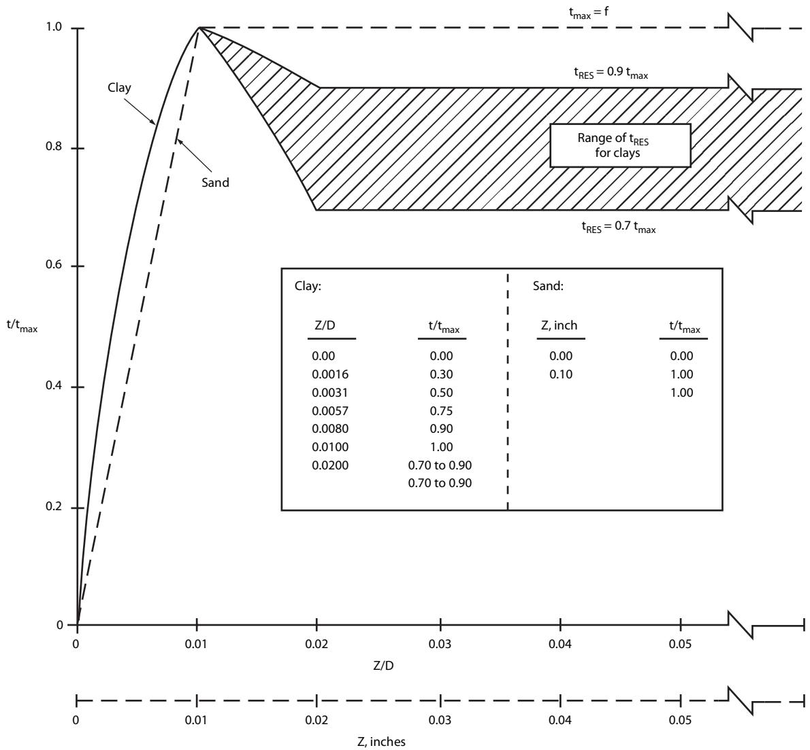  
Figure 6.7.2-1—Typical Axial Pile Load Transfer—Displacement (t-z) Curves

6.7.3 Tip-load—Displacement Curve

The end bearing or tip-load capacity should be determined as described in 6.4.2 and 6.4.3. However, relatively large pile tip movements are required to mobilize the full end bearing resistance. A pile tip displacement up to 10 percent of the pile diameter may be required for full mobilization in both sand and clay soils. In the absence of more definitive criteria the following curve is recommended for both sands and clays.

| z/D | Q/Qp |
| --- | --- |
| 0.002 | 0.25 |
| 0.013 | 0.50 |
| 0.042 | 0.75 |
| 0.073 | 0.90 |
| 0.100 | 1.00 |

where

$z =$ axial tip deflection, in. (mm),

$D =$ pile diameter, in. (mm),

$Q =$ mobilized end bearing capacity, lb (KN).

$Q_{p} =$ total end bearing, lb (KN), computed according to Section 6.4.

The recommended curve is shown in Figure 6.7.3-1.

## 6.8 SOIL REACTION FOR LATERALLY LOADED PILES

6.8.1 General

The pile foundation should be designed to sustain lateral loads, whether static or cyclic. Additionally, the designer should consider overload cases in which the design lateral loads on the platform foundation are increased by an appropriate safety factor. The designer should satisfy himself that the overall structural foundation system will not fail under the overloads. The lateral resistance of the soil near the surface is significant to pile design and the effects on this resistance of scour and soil disturbance during pile installation should be considered. Generally, under lateral loading, clay soils behave as a plastic material which makes it necessary to relate pile-soil deformation to soil resistance. To facilitate this procedure, lateral soil resistance deflection （$p - y)$ curves should be constructed using stress-strain data from laboratory soil samples. The ordinate for these curves is soil resistance, $p$ , and the abscissa is soil deflection, $y$ . By iterative procedures, a compatible set of load-deflection values for the pile-soil system can be developed.

For a more detailed study of the construction of $p$ -y curves refer to the following publications:

- Soft Clay: OTC 1204, Correlations for Design of Laterally Loaded Piles in Soft Clay, by H. Matlock, April 1970.   
- Stiff Clay: OTC 2312, Field Testing and Analysis of Laterally Loaded Piles in Stiff Clay, by L. C. Reese and W. R. Cox, April 1975.   
- Sand: "An Evaluation of p-y Relationships in Sands," by M. W. O'Neill and J. M. Murchinson. A report to the American Petroleum Institute, May 1983.

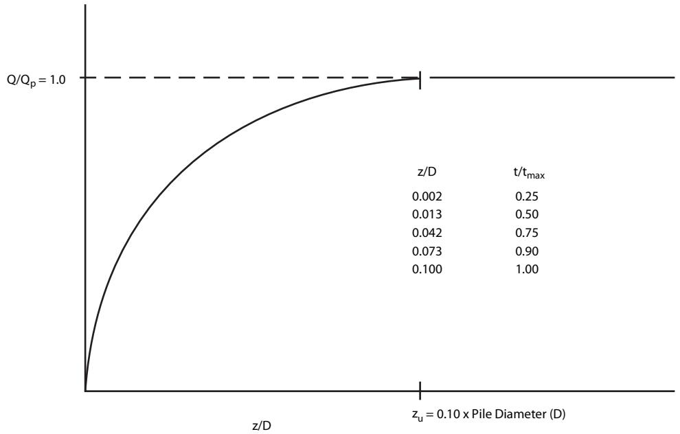  
Figure 6.7.3-1—Pile Tip-load—Displacement （$Q - z)$ curve

In the absence of more definitive criteria, procedures recommended in 6.8.2 and 6.8.3 may be used for constructing ultimate lateral bearing capacity curves and $p$ - $y$ curves. It is noted that these $p$ - $y$ curves are recommended to estimate pile bending moment, displacement and rotation profiles for various (static or cyclic) loads. Different criteria may be applicable for fatigue analysis of a pile which has previously been subjected to loads larger than those used in the fatigue analysis which resulted in "gapping" around the top of the pile. A discussion on this subject and associated guidelines are presented in OTC 1204, referred to above.

The methods below are intended as guidelines only. Where detailed information such as advanced testing on high quality samples, model tests, centrifuge tests, or full scale pile testing is available, other methods may be justified.

6.8.2 Lateral Bearing Capacity for Soft Clay

For static lateral loads the ultimate unit lateral bearing capacity of soft clay $p_u$ has been found to vary between $8c$ and $12c$ except at shallow depths where failure occurs in a different mode due to minimum overburden pressure. Cyclic loads cause deterioration of lateral bearing capacity below that for static loads. In the absence of more definitive criteria, the following is recommended:

$p_u$ increases from $3c$ to $9c$ as $X$ increases from 0 to $X_R$ according to:

$$p_{u} = 3 c + \gamma X + J \frac{c X}{D} \tag{6.8.2-1}$$

and

$$p_{u} = 9 c \text{f o r} X \geq X_{R} \tag{6.8.2-2}$$

where

$$p_{u} = \text{u l t i m a t e r e s i s t a n c e , p s i (k P a) ,}$$

$c =$ undrained shear strength for undisturbed clay soil samples, psi (kPa),

$$D = \text{p i l e}$$

$\gamma =$ effective unit weight of soil, $\mathrm{lb / in^2(MN / m^3)}$

$J =$ dimensionless empirical constant with values ranging from 0.25 to 0.5 having been determined by field testing. A value of 0.5 is appropriate for Gulf of Mexico clays,

$X =$ depth below soil surface, in. (mm),

$X_{R} =$ depth below soil surface to bottom of reduced resistance zone in in. (mm). For a condition of constant strength with depth, Equations 6.8.2-1 and 6.8.2-2 are solved simultaneously to give:

$$X_{R} = \frac{6 D}{\frac{\gamma D}{c} + J}$$

Where the strength varies with depth, Equations 6.8.2-1 and 6.8.2-2 may be solved by plotting the two equations, i.e., $p_{u}$ vs. depth. The point of first intersection of the two equations is taken to be $X_{R}$ . These empirical relationships may not apply where strength variations are erratic. In general, minimum values of $X_{R}$ should be about 2.5 pile diameters.

6.8.3 Load-deflection （$p - y)$ Curves for Soft Clay

Lateral soil resistance-deflection relationships for piles in soft clay are generally non-linear. The $p$ -y curves for the short-term static load case may be generated from the following table:

| p/pu | y/yc |
| --- | --- |
| 0.00 | 0.0 |
| 0.23 | 0.1 |
| 0.33 | 0.3 |
| 0.50 | 1.0 |
| 0.72 | 3.0 |
| 1.00 | 8.0 |
| 1.00 | ∞ |

where

$$p = \text{a c t u a l}$$

$$y = \text{a c t u a l}$$

$$y_{c} = 2. 5 \varepsilon_{c} D, \text{i n . (m)},$$

$\varepsilon_{c} =$ strain which occurs at one-half the maximum stress on laboratory unconsolidated undrained compression tests of undisturbed soil samples.

For the case where equilibrium has been reached under cyclic loading, the $p - y$ curves may be generated from the following table:

| X > XR | X > XR | X < XR | X < XR |
| --- | --- | --- | --- |
| P/pu | y/yc | p/pu | y/yc |
| 0.00 | 0.0 | 0.00 | 0.0 |
| 0.23 | 0.1 | 0.23 | 0.1 |
| 0.33 | 0.3 | 0.33 | 0.3 |
| 0.50 | 1.0 | 0.50 | 1.0 |
| 0.72 | 3.0 | 0.72 | 3.0 |
| 0.72 | ∞ | 0.72 X/XR | 15.0 |
|  |  | 0.72 X/XR | ∞ |

6.8.4 Lateral Bearing Capacity for Stiff Clay

For static lateral loads the ultimate bearing capacity $\mathbf{p}_{\mathrm{u}}$ of stiff clay （$c > 1$ Tsf or $96\mathrm{kPa}$ ) as for soft clay would vary

between $8c$ and $12c$ . Due to rapid deterioration under cyclic loadings the ultimate resistance will be reduced to something considerably less and should be so considered in cyclic design.

6.8.5 Load-Deflection （$p - y)$ Curves for Stiff Clay

While stiff clays also have non-linear stress-strain relationships, they are generally more brittle than soft clays. In developing stress-strain curves and subsequent $p-y$ curves for cyclic loads, good judgment should reflect the rapid deterioration of load capacity at large deflections for stiff clays.

6.8.6 Lateral Bearing Capacity for Sand

The ultimate lateral bearing capacity for sand has been found to vary from a value at shallow depths determined by Eq. 6.8.6-1 to a value at deep depths determined by Eq. 6.8.6-2. At a given depth the equation giving the smallest value of $p_{u}$ should be used as the ultimate bearing capacity.

$$p_{u s} = \left(C_{1} \times H + C_{2} \times D\right) \times \gamma \times H \tag{6.8.6-1}$$

$$p_{u d} = C_{3} \times D \times \gamma \times H \tag{6.8.6-2}$$

where

$$\begin{array}{l} p_{u} = \text{u l t i m a t e r e s i s t a n c e (f o r c e / u n i t l e n g t h) , l b s / i n .} \\ \hskip 14. 226378 p t (\mathrm{k N / m})   (\mathrm{s} = \text{s h a w l o w , d} = \text{d e e p}), \end{array}$$

$$\gamma = \text{e f f e c t i v e s o i l w e i g h t , l b / i n .}^{3} (\mathrm{K N / m}^{3}),$$

$$H = \text{d e p t h , i n . (m) ,}$$

$$\phi^{\prime} = \text{a n g l e o f i n t e r n a l f r i c t i o n o f s a n d , d e g .},$$

$$\begin{array}{l} C_{1},   C_{2},   C_{3} = \text{C o e f f i c i e n t s d e t e r m i n e d f r o m F i g u r e 6 . 8 . 6 - 1} \\ \text{a s f u n c t i o n o f} \phi^{\prime}, \end{array}$$

$$D = \begin{array}{l} \text{a v e r a g e p i l e d i a m e t e r f r o m s u r f a c e t o d e p t h ,} \\ \text{i n . (m) .} \end{array}$$

6.8.7 Load-Deflection （$p - y)$ Curves for Sand

The lateral soil resistance-deflection （$p - y)$ relationships for sand are also non-linear and in the absence of more definitive information may be approximated at any specific depth $H$ , by the following expression:

$$P = A \times p_{u} \times \tanh  \left[ \frac{k \times H}{A \times p_{u}} \times y \right] \tag{6.8.7-1}$$

where

$A =$ factor to account for cyclic or static loading condition. Evaluated by:

$$A = 0. 9 \text{f o r c y c l i c l o a d i n g}.$$

$$A = \left(3. 0 - 0. 8 \frac{H}{D}\right) \geq 0. 9 \text{f o r s t a t i c l o a d i n g}.$$

$$p_{u} = \text{u l t i m a t e b e a r i n g c a p a t i c y a t d e p t h H , l b s / i n . (k N / m) ,}$$

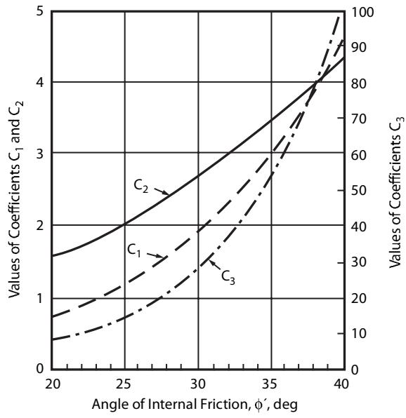  
Figure 6.8.6-1—Coefficients as Function of $\phi^{\prime}$

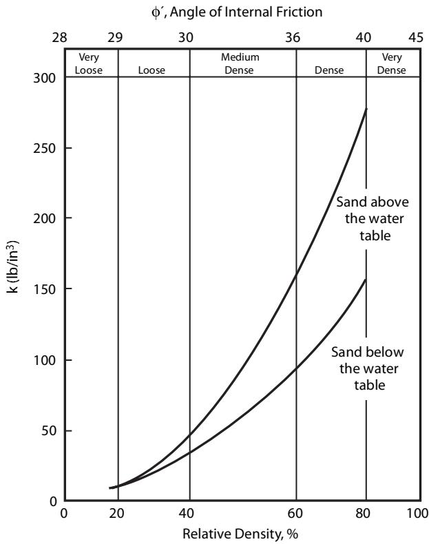  
Figure 6.8.7-1—Relative Density, %

$k =$ initial modulus of subgrade reaction, $\mathrm{lb / in.}^3$ (kN/ $\mathbf{m}^3$ ). Determine from Figure 6.8.7-1 as function of angle of internal friction, $\phi^{\prime}$ .

$$y = \text{l a t e r a l}$$

$$H = \text{d e p t h}, \text{i n c h e s} (\mathrm{m})$$

## 6.9 PILE GROUP ACTION

6.9.1 General

Consideration should be given to the effects of closely spaced adjacent piles on the load and deflection characteristics of pile groups. Generally, for pile spacing less than eight (8) diameters, group effects may have to be evaluated. For more detailed discussions refer to the following four papers: "Group Action in Offshore Piles," by O'Neill, M. W., Proceedings, Conference on Geotechnical Practice in Offshore Engineering, ASCE, Austin, Texas, pp. 25-64; "An Approach for the Analysis of Offshore Pile Groups," by Poulos, H. G., Proceedings, 1st International Conference on Numerical Methods in Offshore Piling, Institution of Civil Engineers, London, pp. 119-126; "The Analysis of Flexible Raft-Pile System" by Han, S. J., and Lee, I. K., Geotechnique 28, No. 1, 1978; and Offshore Technology Conference paper number OTC 2838, Analysis of Three-Dimensional Pile Groups with Non-Linear Soil Response and Pile-Soil Interaction by M. W. O'Neill, et al., 1977.

6.9.2 Axial Behavior

For piles embedded in clays, the group capacity may be less than a single isolated pile capacity multiplied by the number of piles in the group; conversely, for piles embedded in sands the group capacity may be higher than the sum of the capacities in the isolated piles. The group settlement in either clay or sand would normally be larger than that of a single pile subjected to the average pile load of the pile group.

In general, group effects depend considerably on pile group geometry and penetrations, and thickness of any bearing strata underneath the pile tips. Refer to "Group Action in Offshore Piles" by O'Neill, M. W., Proceedings, Conference on Geotechnical Practice in Offshore Engineering, ASCE, Austin, Texas, pp. 25-64: "Pile Group Analysis: A Study of Two Methods," by Paulos, H. G., and Randolph, M. F., Journal Geotechnical Engineering Division, ASCE, Vol, 109, No. 3, pp. 355-372.

6.9.3 Lateral Behavior

For piles with the same pile head fixity conditions and embedded in either cohesive or cohesionless soils, the pile group would normally experience greater lateral deflection than that of a single pile under the average pile load of the corresponding group. The major factors influencing the group deflections and load distribution among the piles are the pile

spacing, the ratio of pile penetration to the diameter, the pile flexibility relative to the soil the dimensions of the group, and the variations in the shear strength and stiffness modulus of the soil with depth.

O'Neill and Dunnavant (1985), in a recent API-sponsored project, [An Evaluation of the Behavior and Analysis of Laterally Loaded Pile Groups, API, PRAC 84-52, University of Houston, University Park, Department of Civil Engineering, Research Report No. UHCE 85-11] found of the four group analysis methods examined in this study, the following methods to be the most appropriate for use in designing group pile foundations for the given loading conditions: (a) advanced methods, such as PILGP2R, for defining initial group stiffness; (b) the Focht-Koch (1973) method ["Rational Analysis of the Lateral Performance of Offshore Pile Groups," OTC 1896] as modified by Reese et al. (1984) ["Analysis of a Pile Group Under Lateral Loading," Laterally Loaded Deep Foundations: Analysis and Performance, ASTM, STP 835, pp. 56-71] for defining group deflections and average maximum pile moments for design event loads—deflections are probably underpredicted at loads giving deflections of 20 percent or more of the diameter of the individual piles in the group; (c) largest value obtained from the Focht-Koch and b methods for evaluating maximum pile load at a given group deflection.

Past experience and the results of the study by O'Neill and Dunnavant (1985) confirm that the available tools for analysis of laterally loaded pile groups provide approximate answers that sometimes deviate significantly from observed behavior, particularly with regard to deflection calculations. Also, limitations in site investigation procedures and in the ability to predict single-pile soil-pile interaction behavior produce uncertainty regarding proper soil input to group analyses. Therefore multiple analyses should be performed for pile groups, using two or more appropriate methods of analysis and upper-bound and lower-bound values of soil properties in the analyses. By performing such analyses, the designer will obtain an appreciation for the uncertainty involved in his predictions of foundation performance and can make more informed decisions regarding the structural design of the foundation and superstructure elements.

6.9.4 Pile Group Stiffness and Structure Dynamics

When the dynamic behavior of a structure is determined to be sensitive to variations in foundation stiffness, parametric analyses such as those described in 6.9.3 should be performed to bound the vertical and lateral foundation stiffness values to be used in the dynamic structural analyses. For insight regarding how changes in foundation stiffness can impact the natural frequencies of tall steel jacket platforms, see K. A. Digre et al. (1989), "The Design of the Bullwinkle Platform," OTC 6060.

## 6.10 PILE WALL THICKNESS

6.10.1 General

The wall thickness of the pile may vary along its length and may be controlled at a particular point by any one of several loading conditions or requirements which are discussed in the paragraphs below.

6.10.2 Allowable Pile Stresses

The allowable pile stresses should be the same as those permitted by the AISC specification for a compact hot rolled section, giving due consideration to Sections 3.1 and 3.3. A rational analysis considering the restraints placed upon the pile by the structure and the soil should be used to determine the allowable stresses for the portion of the pile which is not laterally restrained by the soil. General column buckling of the portion of the pile below the mudline need not be considered unless the pile is believed to be laterally unsupported because of extremely low soil shear strengths, large computed lateral deflections, or for some other reason.

6.10.3 Design Pile Stresses

The pile wall thickness in the vicinity of the mudline, and possibly at other points, is normally controlled by the combined axial load and bending moment which results from the design loading conditions for the platform. The moment curve for the pile may be computed with soil reactions determined in accordance with Section 6.8 giving due consideration to possible soil removal by scour. It may be assumed that the axial load is removed from the pile by the soil at a rate equal to the ultimate soil-pile adhesion divided by the appropriate pile safety factor from 6.3.4. When lateral deflections associated with cyclic loads at or near the mudline are relatively large (e.g., exceeding $y_{c}$ as defined in 6.8.3 for soft clay), consideration should be given to reducing or neglecting the soil-pile adhesion through this zone.

6.10.4 Stresses Due to Weight of Hammer During Hammer Placement

Each pile or conductor section on which a pile hammer (pile top drilling rig, etc.) will be placed should be checked for stresses due to placing the equipment. These loads may be the limiting factors in establishing maximum length of add-on sections. This is particularly true in cases where piling will be driven or drilled on a batter. The most frequent effects include: static bending, axial loads, and arresting lateral loads generated during initial hammer placement.

Experience indicates that reasonable protection from failure of the pile wall due to the above loads is provided if the static stresses are calculated as follows:

1. The pile projecting section should be considered as a freestanding column with a minimum effective length factor $K$ of 2.1 and a minimum Reduction Factor $C_m$ of 1.0.

2. Bending moments and axial loads should be calculated using the full weight of the pile hammer, cap, and leads acting through the center of gravity of their combined masses, and the weight of the pile add-on section with due consideration to pile batter eccentricities. The bending moment so determined should not be less than that corresponding to a load equal to 2 percent of the combined weight of the hammer, cap, and leads applied at the pile head and perpendicular to its centerline.

3. Allowable stresses in the pile should be calculated in accordance with Sections 3.2 and 3.3. The one third increase in stress should not be allowed.

6.10.5 Stresses During Driving

Consideration should also be given to the stresses that occur in the freestanding pile section during driving. Generally, stresses are checked based on the conservative criterion that the sum of the stresses due to the impact of the hammer (the dynamic stresses) and the stresses due to axial load and bending (the static stresses) should not exceed the minimum yield stress of the steel. Less conservative criteria are permitted, provided that these are supported by sound engineering analyses and empirical evidence. A method of analysis based on wave propagation theory should be used to determine the dynamic stresses (see 6.2.1). In general, it may be assumed that column buckling will not occur as a result of the dynamic portion of the driving stresses. The dynamic stresses should not exceed 80 to 90 percent of yield depending on specific circumstances such as the location of the maximum stresses down the length of pile, the number of blows, previous experience with the pile-hammer combination and the confidence level in the analyses. Separate considerations apply when significant driving stresses may be transmitted into the structure and damage to appurtenances must be avoided. The static stress during driving may be taken to be the stress resulting from the weight of the pile above the point of evaluation plus the pile hammer components actually supported by the pile during the hammer blows, including any bending stresses resulting there from. When using hydraulic hammers it is possible that the driving energy may exceed the rated energy and this should be considered in the analyses. Also, the static stresses induced by hydraulic hammers need to be computed with special care due to the possible variations in driving configurations, for example when driving vertical piles without lateral restraint and exposed to environmental forces (see also 12.5.7.a). Allowable static stresses in the pile should be calculated in accordance with Sections 3.2 and 3.3. The one-third increases in stress should not be allowed. The pile hammers evaluated for use during driving should be noted by the designer on the installation drawings or specifications.

6.10.6 Minimum Wall Thickness

The $D / t$ ratio of the entire length of a pile should be small enough to preclude local buckling at stresses up to the yield strength of the pile material. Consideration should be given to the different loading situations occurring during the installation and the service life of a piling. For in-service conditions, and for those installation situations where normal pile-driving is anticipated or where piling installation will be by means other than driving, the limitations of Section 3.2 should be considered to be the minimum requirements. For piles that are to be installed by driving where sustained hard driving (250 blows per foot [820 blows per meter] with the largest size hammer to be used) is anticipated, the minimum piling wall thickness used should not be less than

$$\left. \begin{array}{l} t = 0. 25 + \frac{D}{100} \\ \text{M e t r i c F o r m u l a} \\ t = 6. 35 + \frac{D}{100} \end{array} \right\} \tag{6.10.6-1}$$

where

$$t = \text{w a l l t h i c k n e s s , i n .} (\mathrm{m m}),$$

$$D = \text{d i a m e t e r , i n .} (\mathrm{m m}).$$

Minimum wall thickness for normally used pile sizes should be as listed in the following table:

| Minimum Pile Wall Thickness | Minimum Pile Wall Thickness | Minimum Pile Wall Thickness | Minimum Pile Wall Thickness |
| --- | --- | --- | --- |
| Pile Diameter | Pile Diameter | Nominal Wall Thickness, t | Nominal Wall Thickness, t |
| in. | mm | in. | mm |
| 24 | 610 | 1/2 | 13 |
| 30 | 762 | 9/16 | 14 |
| 36 | 914 | 5/8 | 16 |
| 42 | 1067 | 11/16 | 17 |
| 48 | 1219 | 3/4 | 19 |
| 60 | 1524 | 7/8 | 22 |
| 72 | 1829 | 1 | 25 |
| 84 | 2134 | 11/8 | 28 |
| 96 | 2438 | 11/4 | 31 |
| 108 | 2743 | 13/8 | 34 |
| 120 | 3048 | 11/2 | 37 |

The preceding requirement for a lesser $D / t$ ratio when hard driving is expected may be relaxed when it can be shown by past experience or by detailed analysis that the pile will not be damaged during its installation.

6.10.7 Allowance for Underdrive and Overdrive

With piles having thickened sections at the mudline, consideration should be given to providing an extra length of

heavy wall material in the vicinity of the mudline so the pile will not be overstressed at this point if the design penetration is not reached. The amount of underdrive allowance provided in the design will depend on the degree of uncertainty regarding the penetration that can be obtained. In some instances an overdrive allowance should be provided in a similar manner in the event an expected bearing stratum is not encountered at the anticipated depth.

6.10.8 Driving Shoe

The purpose of driving shoes is to assist piles to penetrate through hard layers or to reduce driving resistances allowing greater penetrations to be achieved than would otherwise be the case. Different design considerations apply for each use. If an internal driving shoe is provided to drive through a hard layer it should be designed to ensure that unacceptably high driving stresses do not occur at and above the transition point between the normal and the thickened section at the pile tip. Also it should be checked that the shoe does not reduce the end bearing capacity of the soil plug below the value assumed in the design. External shoes are not normally used as they tend to reduce the skin friction along the length of pile above them.

6.10.9 Driving Head

Any driving head at the top of the pile should be designed in association with the installation contractor to ensure that it is fully compatible with the proposed installation procedures and equipment.

## 6.11 LENGTH OF PILE SECTIONS

In selecting pile section lengths consideration should be given to: 1) the capability of the lift equipment to raise, lower and stab the sections; 2) the capability of the lift equipment to place the pile driving hammer on the sections to be driven; 3) the possibility of a large amount of downward pile movement immediately following the penetration of a jacket leg closure; 4) stresses developed in the pile section while lifting; 5) the wall thickness and material properties at field welds; 6) avoiding interference with the planned concurrent driving of neighboring piles; and 7) the type of soil in which the pile tip is positioned during driving interruptions for field welding to attach additional sections. In addition, static and dynamic stresses due to the hammer weight and operation should be considered as discussed in 6.10.4 and 6.10.5.

Each pile section on which driving is required should contain a cutoff allowance to permit the removal of material damaged by the impact of the pile driving hammer. The normal allowance is 2 to 5 ft. (0.5 to 1.5 meters) per section. Where possible the cut for the removal of the cutoff allowance should be made at a conveniently accessible elevation.

## 6.12 SHALLOW FOUNDATIONS

Shallow foundations are those foundations for which the depth of embedment is less than the minimum lateral dimension of the foundation element. The design of shallow foundations should include, where appropriate to the intended application, consideration of the following:

1. Stability, including failure due to overturning, bearing, sliding or combinations thereof.   
2. Static foundation deformations, including possible damage to components of the structure and its foundation or attached facilities.   
3. Dynamic foundation characteristics, including the influence of the foundation on structural response and the performance of the foundation itself under dynamic loading.   
4. Hydraulic instability such as scour or piping due to wave pressures, including the potential for damage to the structure and for foundation instability.   
5. Installation and removal, including penetration and pull out of shear skirts or the foundation base itself and the effects of pressure build up or draw down of trapped water underneath the base.

Recommendations pertaining to these aspects of shallow foundation design are given in 6.13 through 6.17.

## 6.13 STABILITY OF SHALLOW FOUNDATIONS

The equations of this paragraph should be considered in evaluating the stability of shallow foundations. These equations are applicable to idealized conditions, and a discussion of the limitations and of alternate approaches is given in the Commentary. Where use of these equations is not justified, a more refined analysis or special considerations should be considered.

6.13.1 Undrained Bearing Capacity （$\phi = 0)$

The maximum gross vertical load which a footing can support under undrained conditions is

$$Q = \left(c N_{c} K_{c} + \gamma D\right) A^{\prime} \tag{6.13.1-1}$$

where

$Q =$ maximum vertical load at failure,

$c =$ undrained shear strength of soil,

$$N_{c} = \text{a d i m e n s i o n l e s s c o n s t a n t , 5 . 14 f o r} \phi = 0,$$

$\phi =$ undrained friction angle $= 0$

$\gamma =$ total unit weight of soil,

$D =$ depth of embedment of foundation,

$A^{\prime} =$ effective area of the foundation depending on the load eccentricity,

$K_{c} =$ correction factor which accounts for load inclination, footing shape, depth of embedment, inclination of base, and inclination of the ground surface.

A method for determining the correction factor and the effective area is given in the Commentary. Two special cases of Eq. 6.13.1-1 are frequently encountered. For a vertical concentric load applied to a foundation at ground level where both the foundation base and ground are horizontal, Eq. 6.13.1-1 is reduced below for two foundation shapes.

1. Infinitely Long Strip Footing.

$$Q_{o} = 5. 14 c A_{o} \tag{6.13.1-2}$$

where

$Q_{o} =$ maximum vertical load per unit length of footing

$A_{o} =$ actual foundation area per unit length

2. Circular or Square Footing.

$$Q = 6. 17 c A \tag{6.13.1-3}$$

where

$A =$ actual foundation area

6.13.2 Drained Bearing Capacity

The maximum net vertical load which a footing can support under drained conditions is

$$Q^{\prime} = \left(c \mathcal{N}_{c} K_{c} + q N_{q} K_{q} +^{1} / 2 \gamma^{\prime} B N_{\gamma} K_{\gamma}\right) A^{\prime} \tag{6.13.2-1}$$

where

$Q^{\prime} =$ maximum net vertical load at failure,

$c^{\prime} =$ effectivecohesioninterceptofMohrEnvel-ope,

$N_{q} =$ (Exp $[\pi \tan \phi ])$ （$\tan^2 (45^\circ +\phi ' / 2))$ , a dimensionless function of $\phi^{\prime}$

$N_{c} =$ （$N_{q} - 1)\cot \phi^{\prime}$ , a dimensionless function of $\phi^{\prime}$

$N_{\gamma} =$ an empirical dimensionless function of $\phi^{\prime}$ that can be approximated by $2(N_{q} + 1)\tan \phi ,$

$\phi^{\prime} =$ effective friction angle of Mohr Envelope,

$\gamma^{\prime} =$ effective unit weight,

$q = \gamma^{\prime}D$ , where $D =$ depth of embedment of foundation,

$B =$ minimum lateral foundation dimension,

$A^{\prime} =$ effective area of the foundation depending on the load eccentricity,

$K_{c}, K_{q}, K_{\gamma} =$ correction factors which account for load inclination, footing shape, depth of embed-ment, inclination of base, and inclination of the ground surface, respectively. The subscripts $c, q,$ and $\gamma$ refer to the particular term in the equation.

A complete description of the $K$ factors, as well as curves showing the numerical values of $N_{q}, N_{c}$ , and $N_{\gamma}$ as a function of $\phi'$ are given in the Commentary.

Two special cases of Eq. 6.13.2-1 for $c' = 0$ (usually sand) are frequently encountered. For a vertical, centric load applied to a foundation at ground level where both the foundation base and ground are horizontal, Eq. 6.13.2-1 is reduced below for two foundation shapes.

1. Infinitely Long Strip Footing.

$$Q_{o} = 0. 5 \mathrm{v}^{\prime} B N_{\gamma} A_{o} \tag{6.13.2-2}$$

2. Circular or Square Footing.

$$Q = 0. 3 \mathrm{v}^{\prime} B N_{\gamma A} \tag{6.13.2-3}$$

6.13.3 Sliding Stability

The limiting conditions of the bearing capacity equations in 6.13.1 and 6.13.2, with respect to inclined loading, represent sliding failure and result in the following equations:

1. Undrained Analysis:

$$H = c A \tag{6.13.3-1}$$

where

$H =$ horizontal load at failure.

2. Drained Analysis:

$$H = c^{\prime} A + Q \tan \phi^{\prime} \tag{6.13.3-2}$$

6.13.4 Safety Factors

Foundations should have an adequate margin of safety against failure under the design loading conditions. The following factors of safety should be used for the specific failure modes indicated:

| Failure Mode | Safety Factor |
| --- | --- |
| Bearing Failure | 2.0 |
| Sliding Failure | 1.5 |

These values should be used after cyclic loading effects have been taken into account. Where geotechnical data are sparse or site conditions are particularly uncertain, increases in these values may be warranted. See the Commentary for further discussion of safety factors.

## 6.14 STATIC DEFORMATION OF SHALLOW FOUNDATIONS

The maximum foundation deformation under static or equivalent static loading affects the structural integrity of the platform, its serviceability, and its components. Equations for evaluating the static deformation of shallow foundations are given in 6.14.1 and 6.14.2 below. These equations are applicable to idealized conditions. A discussion of the limitations and of alternate approaches is given in the Commentary.

6.14.1 Short Term Deformation

For foundation materials which can be assumed to be isotropic and homogeneous and for the condition where the structure base is circular, rigid, and rests on the soil surface, the deformations of the base under various loads are as follows:

Vertical: $u_{\nu} = \left(\frac{1 - \nu}{4GR}\right)Q$ (6.14.1-1)

Horizontal: $u_{h} = \left(\frac{7 - 8\nu}{32(1 - \nu)GR}\right)H$ (6.14.1-2)

$\theta_r = \left(\frac{3(1 - \nu)}{8GR^3}\right)M$ (6.14.1-3)

Torsion: $\theta_{t} = \left(\frac{3}{16GR^{3}}\right)T$ (6.14.1-4)

where

$$u_{v}, u_{n} = \text{v e r t i c a l a n d h o r i z o n t a l d i s p l a c e m e n t s},$$

$$Q, H = \text{v e r t i c a l}$$

$$\theta_{r}, \theta_{t} = \text{o v e r t u r n i n g a n d t o r s i o n a l r o t a t i o n s},$$

$$M, T = \text{o v e r t u r n i n g a n d t o r s i o n a l m o m e n t s},$$

$$G = \text{e l a s t i c s h e a r m o d u l u s o f t h e s o i l},$$

$$v = \text{p o i s s o n}$$

$$R = \text{r a d i u s o f t h e b a s e}.$$

These solutions can also be used for approximating the response of a square base of equal area.

6.14.2 Long Term Deformation

An estimate of the vertical settlement of a soil layer under an imposed vertical load can be determined by the following equation:

$$u_{v} = \frac{h C}{1 + e_{o}} \log_{10} \frac{q_{o} + \Delta q}{q_{o}} \tag{6.14.2-1}$$

where

$$u_{v} = \text{v e r t i c a l s e t t l e m e n t},$$

$$h = \text{l a y e r t h i c k n e s s},$$

$$e_{o} = \text{i n i t i a l v o i d r a t i o o f t h e s o i l},$$

$$C = \begin{array}{l} \text{c o m p r e s s i o n i n d e x o f t h e s o i l o v e r t h e l a w} \\ \text{r a n g e c o n s i d e r e d ,} \end{array}$$

$$q_{o} = \text{i n i t i a l e f f e c t i v e v e r t i c a l s t r e s s},$$

$$\Delta q = \text{a d d e d}$$

Where the vertical stress varies within a thin layer, as in the case of a diminishing stress, estimates may be determined by using the stress at the midpoint of the layer. Thick homogeneous layers should be subdivided for analysis. Where more than one layer is involved, the estimate is simply the sum of the settlement of the layers. Compression characteristics of the soil are determined from one-dimensional consolidation tests.

## 6.15 DYNAMIC BEHAVIOR OF SHALLOW FOUNDATIONS

Dynamic loads are imposed on a structure-foundation system by current, waves, ice, wind, and earthquakes. Both the influence of the foundation on the structural response and the integrity of the foundation itself should be considered.

## 6.16 HYDRAULIC INSTABILITY OF SHALLOW FOUNDATIONS

6.16.1 Scour

Positive measures should be taken to prevent erosion and undercutting of the soil beneath or near the structure base due to scour. Examples of such measures are (1) scour skirts penetrating through erodible layers into scour resistant materials or to such depths as to eliminate the scour hazard, or (2) riprap emplaced around the edges of the foundation. Sediment transport studies may be of value in planning and design.

6.16.2 Piping

The foundation should be so designed to prevent the creation of excessive hydraulic gradients (piping conditions) in the soil due to environmental loadings or operations carried out during or subsequent to structure installation.

## 6.17 INSTALLATION AND REMOVAL OF SHALL FOUNDATIONS

Installation should be planned to ensure the foundation can be properly seated at the intended site without excessive disturbance to the supporting soil. Where removal is anticipated an analysis should be made of the forces generated during removal to ensure that removal can be accomplished with the means available.

Reference

1. Toolan, F. E., and Ims. B. W., "Impact of Recent Changes in the API Recommended Practice for Offshore Piles in and Sand Clays, Underwater Technology, V. 14, No. 1 (Spring 1988) pp. 9-13.29.

7 Other Structural Components and Systems

## 7.1 SUPERSTRUCTURE DESIGN

The superstructure may be modeled in a simplified form for the analysis of the platform jacket, or substructure; however, recognition should be given to the vertical and horizontal stiffnesses of the system and the likely effect on the substructure. This modeling should consider the overturning effects of wind load for environmental loading conditions, the proper location of superstructure and equipment masses for seismic loading conditions, and the alternate locations of heavy gravity loads such as the derrick.

The superstructure itself may be analyzed as one or more independent structures depending upon its configuration; however, consideration should be given to the effect of deflections of the substructure in modeling the boundary supports. Differential deflections of the support points of heavy deck modules placed on skid beams or trusses at the top of the substructure may result in a significant redistribution of the support reactions. In such a case, the analysis model should include the deck modules and the top bay or two of the substructure to facilitate accurate simulation of support conditions. This model should be analyzed to develop support reaction conditions which reflect these effects.

Depending upon the configuration of a platform designed with a modular superstructure, consideration should be given to connecting adjacent deck modules to resist lateral environmental forces. Connection may also have the advantage of providing additional redundancy to the platform in the event of damage to a member supporting the deck modules.

In areas where seismic forces may govern the design of superstructure members, a pseudo-static analysis may be used. The analysis should be based on peak deck accelerations determined from the overall platform seismic analysis. The height at which the acceleration is selected should be based upon the structural configuration and the location of the dominant superstructure masses.

## 7.2 PLATE GIRDER DESIGN

Plate girders should be designed in accordance with the AISC Specifications for the Design, Fabrication and Erection of Structural Steel for Buildings, latest edition and Section 9 of the AWS Structural Welding Code, AWS D1.1, latest edition. Where stress concentrations such as abrupt changes in section, penetrations, jacking slots, etc., occur, their effect on fatigue and fracture should be considered. Steel for plate girders should have sufficient notch toughness to prevent brittle fracture at the lowest anticipated ambient temperature.

## 7.3 CRANE SUPPORTING STRUCTURE

7.3.1 Static Design

The supporting structure should be designed for the dead load of the crane plus a minimum of 2.0 times the static rated load as defined in API Spec 2C and the stresses compared to the Par. 3.1.1 allowables with no increase.

The loading conditions to be investigated should include the following.

1. Maximum overturning moment with corresponding vertical load plus a side load, equal to $4\%$ of the maximum vertical load, applied simultaneously to the boom head sheave.   
2. Maximum vertical load with corresponding overturning moment plus a side load, equal to $4\%$ of the maximum vertical load, applied simultaneously to the boom head sheave.

7.3.2 Dynamic Design

No increase for dynamic load is required in the design of supporting structures for cranes with ratings in accordance with API Spec 2C.

7.3.3 Fatigue Design

The crane supporting structure should be designed to resist fatigue, in compliance with Section 5.3, during the life of the structure. The following may be used in lieu of detailed fatigue analysis.

A minimum of 25,000 cycles should be assumed under the following conditions:

a. A load of 1.33 times the static rated load at the boom position and crane orientation producing maximum stress in each component of the supporting structure.   
b. The stress range used should be the difference between the stress caused by the above loading and stress with the boom in the same position but unloaded.

## 7.4 GROUTED PILE TO STRUCTURE CONNECTIONS

7.4.1 General

Platform loads may be transferred to steel piles by grouting the annulus between the jacket leg (or sleeve) and the pile. The load is transferred to the pile from the structure across the grout. Experimental work indicates that the mechanism of load transfer is a combination of bond and confinement friction between the grout and the steel surfaces and the bearing of the grout against mechanical aids such as shear keys.

Centralizers should be used to maintain a uniform annulus or space between the pile and the surrounding structure. A minimum annulus width of $1^{1/2}$ in. （$38\mathrm{mm})$ should be provided where grout is the only means of load transfer. Adequate clearance between pile and sleeve should be provided, taking into account the shear keys' outstand dimension, h. Packers should be used as necessary to confine the grout. Proper means for the introduction of grout into the annulus should be provided so that the possibility of dilution of the grout or formation of voids in the grout will be minimized. The use of wipers or other means of minimizing mud intrusion into the spaces to be occupied by piles should be considered at sites having soft mud bottoms.

7.4.2 Factors Affecting the Connection Strength

Many factors affect the strength of a grouted connection. These include, but are not limited to, the unconfined compressive strength of the grout; size and spacing of the shear keys; type of admixture; method of placing grout; condition of the steel surfaces, presence of surface materials that would prevent bonding of grout to steel; and the amount of disturbance from platform movement while the grout is setting. For high $D/t$ ratios the hoop flexibility of the sleeve and the pile is also known to be a factor.

7.4.3 Computation of Applied Axial Force

In computing the axial force applied to a grouted pile to structure connection, due account should be taken of the distribution of overall structural loads among various piles in a group or cluster. The design load for the connection should be the highest computed load with due consideration given to the range of axial pile and in-situ soil stiffnesses.

7.4.4 Computation of Allowable Axial Force

In the absence of reliable comprehensive data which would support the use of other values of connection strength, the allowable axial load transfer should be taken as the smaller value (pile or sleeve) of the force calculated by a multiplication of the contact area between the grout and steel surfaces and the allowable axial load transfer stress $f_{ba}$ , where $f_{ba}$ is computed by the appropriate value in 7.4.4a or 7.4.4b for the

grout/steel interface. This allowable axial force should be greater than or equal to the applied axial force computed according to 7.4.3.

7.4.4.a Plain pipe connections

The value of the allowable axial load transfer stress, $f_{ba}$ , should be taken as 20 psi (0.138 MPa) for loading conditions 1 and 2, Section 2.2.2: and 26.7 psi (0.184 MPa) for loading conditions 3 and 4, Section 2.2.2.

7.4.4.b Shear key connections

Where shear keys are used at the interface between steel and grout, the value of the nominal allowable axial load transfer stress, $f_{ba}$ , should be taken as:

$$f_{b a} = 20 \mathrm{p s i} (0. 138 \mathrm{M P a}) + 0. 5 f_{c u} \times \frac{h}{s} \tag{7.4.4-1}$$

for loading conditions 1 and 2 of Section 2.2.2, and should be taken as:

$$f_{b a} = 26. 7 \mathrm{p s i} (0. 184 \mathrm{M P a}) + 0. 67 f_{c u} \times \frac{h}{s} \tag{7.4.4-2}$$

for loading conditions 3 and 4 of Section 2.2.2, where:

$f_{cu} =$ unconfined grout compressive strength (psi, MPa) as per Section 8.4.1,

$h =$ shear key outstand dimension (inches, mm) (See Figures 7.4.4-1 and 7.4.4-2),

$s =$ shear key spacing (inches, mm) (See Figures 7.4.4-1 and 7.4.4-2).

Shear keys designed according to Equations 7.4.4-1 and 7.4.4-2 should be detailed in accordance with the following requirements:

1. Shear keys may be circular hoops at spacing "s" or a continuous helix with a pitch of "s." See Section 7.4.4c for limitations.   
2. Shear keys should be one of the types indicated in Figure 7.4.4-2.   
3. For driven piles, shear keys on the pile should be applied to sufficient length to ensure that, after driving, the length of the pile in contact with the grout has the required number of shear keys.

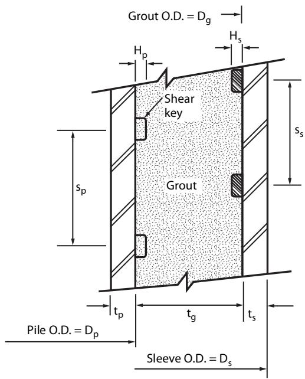  
Figure 7.4.4-1—Grouted Pile to Structure Connection with Shear Keys

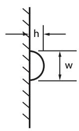  
(A) Weld bead

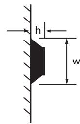  
(B) Flat bar with fillet welds

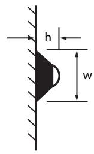  
(C) Round bar with fillet welds   
Figure 7.4.4-2—Recommended Shear Key Details

4. Each shear key cross section and weld should be designed to transmit that part of the connection capacity which is attributable to the shear key for loading conditions 1 and 2, Section 2.2.2. The shear key and weld should be designed at basic allowable steel and weld stresses to transmit an average force equal to the shear key bearing area multiplied by $1.7f_{cu}$ , except for a distance of 2 pile diameters from the top and the bottom end of the connections where $2.5f_{cu}$ should be used.

7.4.4.c Limitations

The following limitations should be observed when designing a connection according to Section 7.4.4a or 7.4.4b.

$$2, 500 \mathrm{p s i} (17. 25 \mathrm{M P a}) \leq f_{c u} \leq 16, 000 \mathrm{p s i} (110 \mathrm{M P a})$$

The following limitations should be observed when designing a connection according to Section 7.4.4b (see Figure 7.4.4-1 and 2):

Sleeve geometry $\frac{D_s}{t_s} \leq 80$

Pile geometry $\frac{D_p}{t_p} \leq 40$

Grout annulus geometry $7\leq \frac{D_g}{t_g}\leq 45$

Shear key spacing ratio $2.5^{*}\leq \frac{D_{p}}{s}\leq 8$

Shear key ratio $\frac{h}{s} \leq 0.10$

Shear key shape factor $1.5 \leq \frac{w}{h} \leq 3$

Product of $f_{cu}$ and $\frac{h}{s}$ ; $\leq 800$ psi (5.5 MPa)

7.4.4.d Other Design Methods

Other methods which are based on testing and verification may be used for calculating the allowable load transfer stress $f_{ba}$ . One such method is included and described in the Commentary Section C.7.4.4d.

7.4.5 Loadings other than Axial Load

Grouted pile to sleeve connections will be subjected to loading conditions other than axial load, such as transverse shear and bending moment or torque. The effect of such loadings, if significant, should be considered in the design of connections by appropriate analytical or testing procedures.

## 7.5 GUYLINE SYSTEM DESIGN

7.5.1 General

A guyline system provides lateral restoring force and stability to a guyed tower. The guyline system consists of an array of guylines, each attached to the tower and anchored on the seafloor.

7.5.2 Components

A guyline system may be composed of the following components:

a. Lead Lines. The lead line extends from the tower to a clumpweight. If steel rope or strand is used API Specification 9A and API RP 9B establish standards for procurement and usage. Other materials may be used if sufficient design information is available.   
Design consideration should include mechanical properties, fatigue characteristics, corrosion protection, and abrasion resistance.   
b. Clumpweights. The clumpweight is a heavy mass intermediate between the lead line and anchor line. The clumpweights serve to soften the stiffness of the guyline system during extreme seastates to allow larger tower deflection without increasing line tensions excessively. Clumpweight variables include weight, location, dimensions, and construction details. The configuration of the clumpweight should be chosen to minimize soil suction and break-out forces. Since settlement or "mudding in" of the clumpweights might occur, the increased resistance to lift-off should be considered.   
c. Anchor Lines. The anchor line extends from the clumpweight to the anchor. API Specification 9A, API RP 9B, and API Specification 2F establish standards for steel rope, strand, and chain respectively. The design considerations for anchor lines are similar to those for lead lines. In addition, abrasion of the line caused by contact with the seafloor should be considered.   
d. Anchor. The anchor transmits guyline loads to the soil. The anchor system design should consider both horizontal and vertical components of the anchor load.

An anchor system may consist of a single pile (Ref. 1), a piled template, or other anchoring devices. The pile components of an anchor should be designed using the criteria recommended in Section 6, except that the ultimate capacity of the anchor system should be twice the anchor line load during loading condition 1. (See Section 7.5.5.)

Other anchoring methods may be employed if these techniques can be substantiated by sufficient analysis or experimentation.

e. Tower Terminations. The tower terminations system transmits guyline forces into the tower framework. Specific hardware should be chosen with consideration for bending

fatigue of the lead line, limitations on bend radius, tolerance of lead line azimuth, capacity of the hardware to support the mooring loads, and operational requirements.

f. Terminations at Clump or Anchor. Resin or hot metal sockets used for guyline terminations should include a method of bending strain relief to reduce the stress concentration factor and minimize the mass discontinuity.

7.5.3 Configuration

The guyline system should provide the desired strength, stiffness, and redundancy to support the tower under the action of the environmental forces. Tower response should be evaluated and shown to remain stable with one or more critically loaded guylines out of service for the design environmental conditions. Major design variables include the number and size of individual guylines, the distance from the tower to the clumpweight and anchor, the size and configuration of the clumpweight, and the guyline preload and connections.

7.5.4 Analysis

Generally, the loads in a guyline should be determined from a specific dynamic analysis of a detailed guyline model. The model should consider hydrodynamic and structural damping, inertia and drag characteristics of the guyline and clumpweight, and interaction with the seafloor. The guyline may be excited at the tower termination with a displacement input determined according to the provisions of 2.3.1c. Other design considerations are local vibration of the guyline and overall current force on the guyline system.

7.5.5 Recommended Factors of Safety

The ultimate guyline capacities can be assumed to be the rated breaking strengths. The allowable guyline capacities are determined by dividing the ultimate guyline capacity by appropriate factors of safety which should not be less than the following values:

| Loading Conditions | Safety Factor |
| --- | --- |
| 1) Design environmental conditions with appropriate deck loads, including appropri-ate dynamic amplification of guyline forces. | 2.0 |
| 2) Operating environmental conditions | 3.0 |

These safety factors are based on the redundancy found in typical guyline configurations.

7.5.6 Fatigue

The axial and bending fatigue life of the guylines should be evaluated. The loading history should be developed in accordance with 3.3.2. Discussions of fatigue for steel rope or strand are given in References 2 and 3.

References

1. Reese, L. D., “A Design Method for an Anchor Pile in a Mooring System”; OTC 1745 (May, 1973).   
2. Stonsifer, F. R., Smith, H. L., "Tensile Fatigue in Wire Rope." OTC 3419 (May, 1979).   
3. Ronson, K. T., "Ropes for Deep Water Mooring," OTC 3850 (May, 1980).

# 8 Material

## 8.1 STRUCTURAL STEEL

8.1.1 General

Steel should conform to a definite specification and to the minimum strength level, group and class specified by the designer. Certified mill test reports or certified reports of tests made by the fabricator or a testing laboratory in accordance with ASTM A6 or A20, as applicable to the specification listed in Table 8.1.4-1, constitutes evidence of conformity with the specification. Unidentified steel should not be used.

8.1.2 Steel Groups

Steel may be grouped according to strength level and welding characteristics as follows:

8.1.2a Group I designates mild steels with specified minimum yield strengths of 40 ksi (280 MPa) or less. Carbon equivalent is generally $0.40\%$ or less*, and these steels may be welded by any of the welding processes as described in AWS D1.1.

8.1.2b Group II designates intermediate strength steels with specified minimum yield strengths of over 40 ksi (280 MPa) through 52 ksi (360 MPa). Carbon equivalent ranges of up to $0.45\%$ and higher, and these steels require the use of low hydrogen welding processes.

8.1.2c Group III designates high strength steels with specified minimum yield strengths in excess of 52 ksi (360 MPa). Such steels may be used provided that each application is investigated with regard to:

1. Weldability and special welding procedures which may be required.   
2. Fatigue problems which may result from the use of higher working stresses, and   
3. Notch toughness in relation to other elements of fracture control, such as fabrication, inspection procedures, service stress, and temperature environment.

Table 8.1.4-1—Structural Steel Plates   

| Group | Class | Specification and Grade | Yield Strength | Yield Strength | Tensile Strength | Tensile Strength |
| --- | --- | --- | --- | --- | --- | --- |
| Group | Class | Specification and Grade | ksi | MPa | ksi | MPa |
| I | C | ASTM A36 (to 2 in. thick) | 36 | 250 | 58-80 | 400-550 |
| I | C | ASTM A131 Grade A (to 1/2in. thick) | 34 | 235 | 58-71 | 400-490 |
| I | C | ASTM A285 Grade C (to 3/4in. thick) | 30 | 205 | 55-75 | 380-515 |
| I | B | ASTM A131 Grades B, D | 34 | 235 | 58-71 | 400-490 |
| I | B | ASTM A516 Grade 65 | 35 | 240 | 65-85 | 450-585 |
| I | B | ASTM A573 Grade 65 | 35 | 240 | 65-77 | 450-530 |
| I | B | ASTM A709 Grade 36T2 | 36 | 250 | 58-80 | 400-550 |
| I | A | ASTM A131 Grades CS, E | 34 | 235 | 58-71 | 400-490 |
| II | C | ASTM A572 Grade 42 (to 2 in. thick)* | 42 | 290 | 60 min. | 415 min. |
| II | C | ASTM A572 Grade 50 (to 2 in. thick; S91 required over 1/2in.)* | 50 | 345 | 65 min. | 450 min. |
| II | B | API Spec 2MT1 | 50 | 345 | 70-90 | 483-620 |
| II | B | ASTM A709 Grades 50T2, 50T3 | 50 | 345 | 65 min. | 450 min. |
| II | B | ASTM A131 Grade AH32 | 45.5 | 315 | 68-85 | 470-585 |
| II | B | ASTM A131 Grade AH36 | 51 | 350 | 71-90 | 490-620 |
| II | A | API Spec 2H Grade 42 | 42 | 290 | 62-80 | 430-550 |
| II | A | Grade 50 (to 21/2in. thick) | 50 | 345 | 70-90 | 483-620 |
| II | A | (over 21/2in. thick) | 47 | 325 | 70-90 | 483-620 |
| II | A | API Spec 2W Grade 50 (to 1 in. thick) | 50-75 | 345-517 | 65 min. | 448 min. |
| II | A | (over 1 in. thick) | 50-70 | 345-483 | 65 min. | 448 min. |
| II | A | API Spec 2Y Grade 50 (to 1 in. thick) | 50-75 | 345-517 | 65 min. | 448 min. |
| II | A | (over 1 in. thick) | 50-70 | 345-483 | 65 min. | 448 min. |
| II | A | ASTM A131 Grades DH32, EH32 | 45.5 | 315 | 68-85 | 470-585 |
| II | A | Grades DH36, EH36 | 51 | 350 | 71-90 | 490-620 |
| II | A | ASTM A537 Class I (to 21/2in. thick) | 50 | 345 | 70-90 | 485-620 |
| II | A | ASTM A633 | 42 | 290 | 63-83 | 435-570 |
| II | A | Grades C, D | 50 | 345 | 70-90 | 485-620 |
| II | A | ASTM A678 Grade A | 50 | 345 | 70-90 | 485-620 |
| III | A | ASTM A537 Class II (to 21/2in. thick) | 60 | 415 | 80-100 | 550-690 |
| III | A | ASTM A678 Grade B | 60 | 415 | 80-100 | 550-690 |
| III | A | API Spec 2W Grade 60 (to 1 in. thick) | 60-90 | 414-621 | 75 min. | 517 min. |
| III | A | (over 1 in. thick) | 60-85 | 414-586 | 75 min. | 517 min. |
|  |  | API Spec 2Y Grade 60 (to 1 in. thick) | 60–90 | 414–621 | 75 min. | 517 min. |
|  |  | (over 1 in. thick) | 60–85 | 414–586 | 75 min. | 517 min. |
|  |  | ASTM A710 Grade A Class 3 |  |  |  |  |
|  |  | (quenched and precipitation heat treated) |  |  |  |  |
|  |  | through 2 in. | 75 | 515 | 85 | 585 |
|  |  | 2 in. to 4 in. | 65 | 450 | 75 | 515 |
|  |  | over 4 in. | 60 | 415 | 70 | 485 |

*Maximum Vanadium Level Permitted = 0.10% V.

8.1.3 Steel Classes

Consideration should be given for the selection of steels with notch toughness characteristics suitable for the conditions of service. For this purpose, steels may be classified as follows:

8.1.3a Class C steels are those which have a history of successful application in welded structures at service temperatures above freezing, but for which impact tests are not specified. Such steels are applicable to primary structural members involving limited thickness, moderate forming, low restraint, modest stress concentration, quasi-static loading (rise time 1 second or longer) and structural redundancy such that an isolated fracture would not be catastrophic. Examples of such applications are piling, jacket braces and legs, and deck beams and legs.

8.1.3b Class B steels are suitable for use where thickness, cold work, restraint, stress concentration, impact loading, and/or lack of redundancy indicate the need for improved notch toughness. Where impact tests are specified, Class B steels should exhibit Charpy V-notch energy of 15 ft-lbs (20 J) for Group I, and 25 ft-lbs (34 J) for Group II, at the lowest anticipated service temperature. Steels enumerated herein as Class B can generally meet these Charpy requirements at temperatures ranging from $50^{\circ}$ to $32^{\circ}\mathrm{F}$ ( $10^{\circ}$ to $0^{\circ}\mathrm{C}$ ). When impact tests are specified for Class B steel, testing in accordance with ASTM A 673, Frequency $H$ , is suggested.

8.1.3c Class A steels are suitable for use at subfreezing temperatures and for critical applications involving adverse combinations of the factors cited above. Critical applications may warrant Charpy testing at $36 - 54^{\circ}\mathrm{F}$ （$20 - 30^{\circ}\mathrm{C})$ below the lowest anticipated service temperature. This extra margin of notch toughness prevents the propagation of brittle fractures from large flaws, and provides for crack arrest in thicknesses

of several inches. Steels enumerated herein as Class A can generally meet the Charpy requirements stated above at temperatures ranging from $-4^{\circ}$ to $-40^{\circ}\mathrm{F}$ （$-20^{\circ}$ to $-40^{\circ}\mathrm{C})$ . Impact testing frequency for Class A steels should be in accordance with the specification under which the steel is ordered; in the absence of other requirements, heat lot testing may be used.

8.1.4 Unless otherwise specified by the designer, plates should conform to one of the specifications listed in Table 8.1.4-1. Structural shape specifications are listed in Table 8.1.4-2. Steels above the thickness limits stated may be used, provided applicable provisions of 8.1.2c are considered by the designer.

## 8.2 STRUCTURAL STEEL PIPE

8.2.1 Specifications

Unless otherwise specified, seamless or welded pipe** should conform to one of the specifications listed in Table 8.2.1-1. Pipe should be prime quality unless the use of limited service, structural grade, or reject pipe is specifically approved by the designer.

8.2.2 Fabrication

Structural pipe should be fabricated in accordance with API Spec. 2B, ASTM A139**, ASTM A252**, ASTM A381, or ASTM A671 using grades of structural plate listed in Table 8.1.4-1 except that hydrostatic testing may be omitted.

Table 8.1.4-2—Structural Steel Shapes   

| Group | Class | ASTM Specification & Grade | Yield Strength | Yield Strength | Tensile Strength | Tensile Strength |
| --- | --- | --- | --- | --- | --- | --- |
| Group | Class | ASTM Specification & Grade | ksi | MPa | ksi | MPa |
| I | C | ASTM A36 (to 2 in. thick) | 36 | 250 | 58-80 | 400-550 |
| I | C | ASTM A131 Grade A (to 1/2 in. thick) | 34 | 235 | 58-80 | 400-550 |
| I | B | ASTM A709 Grade 36T2 | 36 | 250 | 58-80 | 400-550 |
| II | C | API Spec 2MT2 Class C | 50 | 345 | 65-90 | 450-620 |
| II | C | ASTM A572 Grade 42 (to 2 in. thick)* | 42 | 290 | 60 min. | 415 min. |
| II | C | ASTM A572 Grade 50 (to 2 in. thick; S91 required over 1/2 in.)* | 50 | 345 | 65 min. | 450 min. |
| II | C | ASTM A992 | 50-65 | 345-450 | 65 min. | 450 min. |
| II | B | API Spec 2MT2 Class B | 50 | 345 | 65-90 | 450-620 |
| II | B | ASTM A709 Grades 50T2, 50T3 | 50 | 345 | 65 min. | 450 min. |
| II | B | ASTM A131 Grade AH32 | 45.5 | 315 | 68-85 | 470-585 |
| II | B | ASTM A131 Grade AH36 | 51 | 350 | 71-90 | 490-620 |
| II | A | API Spec 2MT2 Class A | 50 | 345 | 65-90 | 450-620 |
| II | A | ASTM A913 Grade 50 (with CVN @ -20°C) | 50 | 345 | 65 min. | 450 min. |

*Maximum Vanadium Level Permitted = 0.10% V.

Table 8.2.1-1—Structural Steel Pipe   

| Group | Class | Specification & Grade | Yield Strength | Yield Strength | Tensile Strength | Tensile Strength |
| --- | --- | --- | --- | --- | --- | --- |
| Group | Class | Specification & Grade | ksi | MPa | ksi | MPa |
| I | C | API 5L Grade B* | 35 | 240 | 60 min. | 415 min. |
| I | C | ASTM A53 Grade B | 35 | 240 | 60 min. | 415 min. |
| I | C | ASTM A135 Grade B | 35 | 240 | 60 min. | 415 min. |
| I | C | ASTM A139 Grade B | 35 | 240 | 60 min. | 415 min. |
| I | C | ASTM A500 Grade A (round) | 33 | 230 | 45 min. | 310 min. |
| I | C | ASTM A500 Grade A (round) | 39 | 270 | 45 min. | 310 min. |
| I | C | ASTM A501 | 36 | 250 | 58 min. | 400 min. |
| I | B | ASTM A106 Grade B (normalized) | 35 | 240 | 60 min. | 415 min. |
| I | B | ASTM A524 Grade I (through 3/8 in. w.t.) | 35 | 240 | 60 min. | 415 min. |
| I | B | Grade II (over 3/8 in. w.t.) | 30 | 205 | 55–80 | 380–550 |
| I | A | ASTM A333 Grade 6 | 35 | 240 | 60 min. | 415 min. |
| I | A | ASTM A334 Grade 6 | 35 | 240 | 60 min. | 415 min. |
| II | C | API 5L Grade X42 2% max. cold expansion | 42 | 290 | 60 min. | 415 min. |
| II | C | API 5L Grade X52 2% max. cold expansion | 52 | 360 | 66 min. | 455 min. |
| II | C | ASTM A500 Grade B (round) | 42 | 290 | 58 min. | 400 min. |
| II | C | ASTM A618 | 46 | 320 | 58 min. | 400 min. |
| II | C | ASTM A618 | 50 | 345 | 70 min. | 485 min. |
| II | B | API 5L Grade X52 with SR5 or SR6 | 52 | 360 | 66 min. | 455 min. |
| II | A | See Section 8.2.2 |  |  |  |  |

*Seamless or with longitudinal seam welds.

8.2.3 Selections for Conditions of Service

Consideration should be given for the selection of steels with toughness characteristics suitable for the conditions of service (see Section 8.1.3). For tubes cold-formed to $D / t$ less than 30, and not subsequently heat-treated, due allowance should be made for possible degradation of notch toughness, e.g., by specifying a higher class of steel or by specifying notch toughness tests run at reduced temperature.

## 8.3 STEEL FOR TUBULAR JOINTS

Tubular joints are subject to local stress concentrations which may lead to local yielding and plastic strains at the design load. During the service life, cyclic loading may initiate fatigue cracks, making additional demands on the ductility of the steel, particularly under dynamic load. These demands are particularly severe in heavywall joint-cans designed for punching shear.

8.3.1 Underwater Joints

For underwater portions of redundant template-type platforms, steel for joint cans (such as jacket leg joint cans, chords in major X and K joints, and through-members in joints designed as overlapping) should meet one of the following notch toughness criteria at the temperature given in Table 8.3.1-1.

1. NRL Drop-Weight Test no-break performance.   
2. Charpy V-notch energy: 15 ft-lbs (20 Joules) for Group I steels and 25 ft-lbs (34 Joules) for Group II steels, and 35 ft-lbs (47 Joules) for Group III steels (transverse test).

For water temperature of $40^{\circ}\mathrm{F}$ （$4^{\circ}\mathrm{C})$ or higher, these requirements may normally be met by using the Class A steels listed in Table 8.1.4-1.

8.3.2 Above Water Joints

For above water joints exposed to lower temperatures and possible impact from boats, or for critical connections at any location in which it is desired to prevent all brittle fractures, the tougher Class A steels should be considered, e.g., API Spec. 2H, Grade 42 or Grade 50. For $50\mathrm{ksi}$ yield and higher strength steels, special attention should be given to welding procedures.

8.3.3 Critical Joints

For critical connections involving high restraint (including adverse geometry, high yield strength and/or thick sections), through-thickness shrinkage strains, and subsequent through-thickness tensile loads in service, consideration should be given to the use of steel having improved through-thickness (Z-direction) properties, e.g., API Spec 2H, Supplements S4 and S5.

Table 8.3.1-1—Input Testing Conditions   

| D/t | Test Temperature | Test Condition |
| --- | --- | --- |
| over 30 | 36°F (20°C) below LAST* | Flat plate |
| 20–30 | 54°F (30°C) below LAST | Flat plate |
| under 20 | 18°F (10°C) below LAST | As fabricated |

*LAST = Lowest Anticipated Service Temperature

8.3.4 Brace Ends

Although the brace ends at tubular connections are also subject to stress concentration, the conditions of service are not quite as severe as for joint-cans. For critical braces, for which brittle fracture would be catastrophic, consideration should be given to the use of stub-ends in the braces having the same class as the joint-can, or one class lower. This provision need not apply to the body of braces (between joints).

## 8.4 CEMENT GROUT AND CONCRETE

8.4.1 Cement Grout

If required by the design, the space between the piles and the surrounding structure should be carefully filled with grout. Prior to installation, the compressive strength of the grout mix design should be confirmed on a representative number of laboratory specimens cured under conditions which simulate the field conditions. Laboratory test procedures should be in accordance with ASTM C109. The unconfined compressive strength of 28 day old grout specimens computed as described in ACI 214-77 but equating $f_{c}^{\prime}$ to $f_{cw}$ , should not be less than either 2500 psi (17.25 MPa) or the specified design strength.

A representative number of specimens taken from random batches during grouting operations should be tested to confirm that the design grout strength has been achieved. Test procedures should be in accordance with ASTM 109. The specimens taken from the field should be subjected, until test, to a curing regime representative of the situ curing conditions, i.e., underwater and with appropriate seawater salinity and temperature.

8.4.2 Concrete

The concrete mix used in belled piles should be selected on the basis of shear strength, bond strength and workability for underwater placement including cohesiveness and flowability. The concrete mix may be made with aggregate and sand, or with sand only. The water-cement ratio should be less than 0.45. If aggregate is used, the aggregates should be small and rounded, the sand content should be $45\%$ or greater, the cement content should be not less than $750~\mathrm{lb}$ per cubic yard （$445~\mathrm{kg} / \mathrm{m}^3)$ , and the workability as measured by the slump test should be 7 to 9 inches (180 to $230~\mathrm{mm}$ ). To obtain the

properties required for proper placement, a suitable waterreducing and plasticizing admixture may be necessary.

## 8.5 CORROSION PROTECTION

Unless specified otherwise by the designer, the systems for corrosion protection should be designed in accordance with NACE RP-01-76.

9 Drawings and Specifications

## 9.1 GENERAL

For use in connection with fixed offshore platforms and related facilities, the drawings and specifications are defined as follows:

## 9.2 CONCEPTUAL DRAWINGS

Conceptual drawings are intended to supply a general idea of the facility under consideration. These drawings should include preliminary layouts and elevation views of the overall facility showing the number, type of construction and approximate size of each platform, as well as the more important auxiliary features, such as heliports and boat landings.

Simplified process or mechanical flow diagrams and electrical one-line diagrams should be included for all production or utility systems. A generalized equipment layout drawing should be included which also indicates buildings, storage of supplies, etc.

All information which contributes to clarify the overall intent of the facility should be shown. Specifications are not generally required. However, if included, they should be of general descriptive nature to supplement the drawings to adequately describe the facility.

## 9.3 BID DRAWINGS AND SPECIFICATIONS

Bid drawings are intended to show the total facility with its configuration and dimension in sufficient detail to accurately define the scope of the project. With supplemental specifications, bid drawings are suitable for submittal by the contractor to generally define the scope of the proposal, or suitable to be furnished by the owner requesting a quotation where the design is to be part of the contractor's bid. In the latter case, all essential information needed by the designer should be included.

Structural drawings should show major overall dimensions, deck arrangements, operational loading requirements and any preferred type of construction and materials. Structural details and member sizes are not necessarily furnished since these are considered as "Design" drawings. All auxiliary items which are to be included in the bid, such as boat landings, barge bumpers, stairs, walks, fence, handrail, etc., should be shown on these drawings. Typical preferred construction details of the terms should be included.

Equipment layout drawings should be included for all decks. Sufficiently detailed process, mechanical and utility flow diagrams and electrical one-line diagrams should be included for all systems which are covered by the bid.

Specifications for equipment, machinery, and other engineered components should include an itemized list and description of all items not shown on the drawings but which are to be included in the bid, even such items as lighting and cathodic protection. Specifications for materials and fabrication should include all types of material allowed for use and any particular requirements for dimensional tolerances, inspection, testing and welding.

## 9.4 DESIGN DRAWINGS AND SPECIFICATIONS

Design drawings give descriptive information about the major components of the facility. Emphasis in these drawings is placed on overall layouts and definition of critical items, supplemental by essential details. They should indicate all appurtenances and should include all dimensions where strict adherence is required.

Design drawings should include a layout of the location and orientation of the structure or structures in the field, as well as the location of equipment on the decks of each structure. Structural drawings showing member sizes of all major structural members and all controlling dimensions should be included. General locations and preliminary or typical details of miscellaneous structural items, such as joints, cover plates, web plate stiffeners, etc., should be indicated. Also any other typical structural details should be included which are not normally standard to this type construction.

Design drawings should also include all items necessary for installation purposes, such as lifting eyes and launching trusses, which are critical to the structural design of the platform.

Mechanical and utility flow diagrams showing size of all equipment, piping and valves, and electrical one-line diagrams showing rating and sizes of feeders and controls should be included. Equipment layout drawings of all equipment shown on the flow diagrams or one-line diagrams, manifolds and major instrumentation items, such as large control valves, meter runs, control valve stations and control panels should be shown. Piping plan and elevation drawings should show major piping only and indicate adequate space reserved for minor piping and for conduit and cable runs.

Design drawings should be supplemented by all specifications necessary to convey the intent of the design. Standard specifications for material and fabrication which are referred to in this RP can be properly referenced on appropriate drawings. However, any deviations from these specifications must be detailed. Specifications should be included for equipment, machinery and other engineered items.

Design drawings and specifications are often used as part of the solicitation package or as part of the contract docu

ment. As such, they need to be sufficiently detailed and suitable to be furnished by the owner to the contractor to be used for making accurate material take-offs for bidding purposes when no design is required on the part of the contractor, or suitable for submittal by the contractor to the owner to completely define the proposal. When design drawings are used for bid or contract purposes, all auxiliary items such as stairs, boat landing, walkways, etc., should be shown in sufficient detail for estimating purposes.

## 9.5 FABRICATION DRAWINGS AND SPECIFICATIONS

Fabrication drawings are intended to supply sufficient information that fabrication can be performed directly from these drawings. They should contain all design data fully detailed and dimensioned. At the fabricator's option, they may be supplemented by shop drawings.

A set of fabrication drawings includes completely detailed design drawings with descriptions, exact locations, sizes, thicknesses and dimensions of all structural members and stiffeners. This information should also be shown for all structural items, such as brackets, stiffeners, cover plates, etc., and for all auxiliary items, such as stairs, walkways, fence, handrail, etc. Connections and joints should be completely detailed, including welding symbols, unless standard procedures apply. Methods of attaching timber, grating and plate should be included.

In addition to complete piping plan and elevation drawings, a set of fabrication drawings should include piping isometric drawings and details for all pipe supports, if required by the complexity of the facility. Instrumentation location plans and supports, electrical location diagrams showing general routing, and wire and cable tie-ins to electrical equipment should be included.

Fabrication drawings should clearly indicate the components or "packages" scheduled for assembly as units in the fabrication yard. Welds and connections to be performed in the "field" should be indicated.

Detailed specifications should be included for all work to be done by the fabricator such as welding, fabrication, testing, etc., and for all materials, equipment or machinery to be furnished by the fabricator. However, for standard specifications covered under the recommendations of this RP, no copies need to be furnished provided reference is made on key drawings. Specifications for equipment and other engineered items not purchased by the fabricator may also be included with fabrication drawings for general information.

## 9.6 SHOP DRAWINGS

Shop drawings or sketches are prepared by or for the fabricator, at his option, to facilitate the fabrication of parts and/or components of platforms. They are intended to provide all information and instructions for that purpose. Due to differ-

ences in methods and procedures of various fabricators, shop drawings may vary in appearance.

Shop drawings may include typical shop details to supplement details and dimensions shown on either fabrication drawings or patterns for coping the ends of members, detailed piece-marked drawings for each member and pipe spool drawings.

Shop drawings are the responsibility of the fabricator. Approval or review of shop drawings by the designer or owner should not relieve the fabricator of his responsibility to complete the work in accordance with the contract or fabrication drawings and specifications.

## 9.7 INSTALLATION DRAWINGS AND SPECIFICATIONS

Installation drawings furnish all pertinent information necessary for the construction of the total facility on location at sea. They contain relevant information not included on fabrication drawings.

If special procedures are required, a set of installation drawings may include installation sequence drawings. Details of all installation aids such as lifting eyes, launching runners or trusses, jacket brackets, stabbing points, etc., should be included if these are not shown on fabrication drawings. For jackets or towers installed by flotation or launching, drawings showing launching, upending, and flotation procedures should be provided. Details should also be provided for piping, valving and controls of the flotation system, closure plates, etc.

Erection of temporary struts or support should be indicated. All rigging, cables, hoses, etc., which are to be installed prior to loadout should be detailed. Barge arrangement, loadout and tie-down details should be provided.

Installation drawings are intended to be used in connection with fabrication drawings. They should be supplemented by detailed installation specifications, installation procedures, or special instructions as required to provide all information required to complete the field installation.

## 9.8 AS-BUILT DRAWINGS AND SPECIFICATIONS

As-built drawings show in detail the manner in which the facility was actually constructed. These drawings are usually made by revising the original fabrication drawings, supplemented by additional drawings if necessary. As-built drawings are intended to reflect all changes, additions, corrections or revisions made during the course of construction. They are prepared for use by the owner to provide information related to the operation, servicing, maintenance, and future expansion of the facility.

When the preparation of as-built drawings has been authorized by the owner, it is the responsibility of the fabricator and the field erector to furnish to the owner or to the designer adequate information regarding all variations between the

drawings and the facility as actually constructed. This is usually furnished as corrections from the yard, the shop and the field, marked on prints of the original drawings or by supplementary sketches, if required. This information should be sufficiently complete that the owner or the designer can correct and revise the original drawings without additional data or field measurements. Since the fabricator and erector are responsible for the accuracy of the corrections, a review and/ or approval of the corrected drawings should be made by both the fabricator and erector.

Minor deviations from the original drawings are generally numerous. Differences between the actual dimensions and those shown on the drawings need not be reported if they are within the specified allowable tolerances.

Specifications should also be corrected to reflect any changes made during the purchase of material, equipment or machinery.

# 10 Welding

## 10.1 GENERAL

10.1.1 Specifications

Welding and weld procedure qualifications should be done in accordance with applicable provisions of the AWS Structural Welding Code AWS D1.1-2002.

10.1.2 Welding Procedures

Written welding procedures should be required for all work, even where prequalified. The essential variables should be specified in the welding procedure and adhered to in production welding.

10.1.3 Welding Procedure Limitations

10.1.3a Excluding the root pass, all welding of steel with a nominal yield strength of 40 ksi or more, or a weld throat thickness in excess of $\frac{1}{2}$ inch, should be accomplished with low hydrogen processes (i.e., less than $15\mathrm{ml} / 100\mathrm{g}$ ).   
10.1.3b All welding by processes employing an external gas shield of the arc area should be accomplished with wind protection.   
10.1.3c Any procedure requiring the Gas Metal Arc Welding (GMAW) process should be proven by tests, per AWS D1.1-2002, Section 4, to produce the desired properties and quality, prior to any production welding. In general, the short-circuiting mode GMAW should be limited to secondary or minor structural welds, and to root passes in welding procedures qualified by tests.   
10.1.3d Downhill progression deposition of cover passes, using any welding procedure where heat of the cover pass

deposition is less than 25 kilojoules per inch, should be prohibited unless qualified by hardness testing of the heat affected zones. A macro-section for hardness testing should be prepared from a weld of the maximum thickness and of the maximum carbon equivalent steel to be welded by the procedure; with the cover pass deposited at a preheat no higher than the minimum preheat specified on the welding procedure specification. The maximum hardness acceptable in the heat affected zones, at any point of sampling, should not exceed 325 HV10.

10.1.4 Welders and Welding Operators

Welders should be qualified for the type of work assigned and should be issued certificates of qualification describing the materials, processes, electrode classifications, positions and any restrictions of qualification.

## 10.2 QUALIFICATION

10.2.1 General

Welding procedures, welders and welding operators should be qualified in accordance with AWS D1.1-2002 as further qualified herein.

10.2.2 Impact Requirements

When welding procedure qualification by test is required (i.e., when the procedure is not pre-qualified, when comparable impact performance has not been previously demonstrated, or when the welding consumables are to be employed outside the range of essential variables covered by prior testing), qualifications should include Charpy V-notch testing of the as-deposited weld metal. Specimens should be removed from the test weld, and impact tested, in accordance with Annex III, Requirements for Impact Testing, of AWS D1.1-2002. The following test temperatures and minimum energy values are recommended, for matching the performance of the various steel grades as listed in API Tables 8.1.4-1 and 8.2.1-1. Single specimen energy values (one of three) may be 5 ft-lbs (7J) lower without requiring retest.

10.2.3 Mechanical Testing in Procedure Qualification

The mechanical testing of procedure qualification test coupons should be performed by a competent independent testing laboratory.

10.2.4 Prior Qualifications

New qualifications may be waived by owner if prior qualifications are deemed suitable.

Table 10.2.2—Impact Testing   

| Steel Group | Steel Class | Impact Test Temperature | Weld Metal Avg. | Weld Metal Avg. |
| --- | --- | --- | --- | --- |
| Steel Group | Steel Class | Impact Test Temperature | Ft-Lbs | (Joules) |
| I | C | 0°F (-18°C) | 20 | 27 |
| I | B | 0°F (-18°C) | 20 | 27 |
| I | A | -20°F (-29°C) | 20 | 27 |
| II | C | 0°F (-18°C) | 20 | 27 |
| II | B | -20°F (-29°C) | 20 | 27 |
| II | A | -40°F (-40°C) | 25 | 34 |
| III | A | -40°F (-40°C) | 30 | 40 |

See Commentary for further discussion of prequalification, CTOD testing, and heat affected zones.

## 10.3 WELDING

10.3.1 General

Welding should conform to sizes of welds and notes on drawings as well as qualified welding procedures; otherwise welding should conform to the AWS specifications listed under 10.1.1 above and further qualified herein.

10.3.2 Specified Welds

Intersecting and abutting parts should be joined by complete joint penetration groove welds, unless otherwise specified. This includes "hidden" intersections, such as may occur in overlapped braces and pass-through stiffeners.

10.3.3 Groove Welds Made From One Side

At intersecting tubular members, where access to the root side of the weld is prevented, complete joint penetration groove welds conforming to Figure 11.1.3 may be used. The procedure, methods, as well as the acceptability of in-place weld build-up of wide root opening should be evaluated and approved by the owner's engineer or inspector.

10.3.4 Seal Welds

Unless specified otherwise, all faying surfaces should be sealed against corrosion by continuous fillet welds. Seal welds should not be less than $1/8$ inch but need not exceed $3/16$ inch regardless of base metal thickness. Minimum preheat temperatures of AWS Table 3.2 or Annex XI should be applied.

10.3.5 Stress Relief

In general, thermal stress relieving should not be required for the weldable structural steels listed in Tables 8.1.4-1 and

8.2.1-1 for the range of wall thickness normally used in offshore platforms. However, where postweld heat treatment is to be used, it should be included in the procedure qualification tests.

10.3.6 Installation Welding

Welding machines should be properly grounded to prevent underwater corrosion damage. Recommended procedures are presented in Section 12.7.1 through 12.7.3.

10.3.7 Arc Strikes

Arc strikes should be made only in the weld groove. A procedure should be established for determining the extent of any methods for repairing damage to materials resulting from inadvertent arc strikes outside of the weld groove. The methods of defining the hardened zone, presence of cracks, and surface integrity restoration should be detailed.

10.3.8 Air-Arc Gouging

Surfaces and cavities produced by gouging operations using the air carbon arc cutting process should be thoroughly cleaned to remove all traces of residual carbon and oxidation prior to commencement of welding in the affected area.

10.3.9 Temporary Attachments

The same care and procedures used in permanent welds should be used in welding temporary attachments.

## 10.4 RECORDS AND DOCUMENTATION

Before construction begins, the fabricator should compile all owner approved welding procedures as well as a weld procedure matrix identifying where each welding procedure is to be used. This documentation should be forwarded to the owner for permanent record.

11 Fabrication

## 11.1 ASSEMBLY

11.1.1 General

Fabrication, other than welding, should be in accordance with the Specification for the Design, Fabrication and Erection of Structural Steel for Buildings, AISC, eighth edition, unless otherwise specified herein.

11.1.2 Splices

11.1.2.a Pipe

Pipe splices should be in accordance with the requirements of API Spec 2B. Pipe used as beams should also be subject to the requirements of the following Section 11.1.2b.

11.1.2.b Beams

Segments of beams with the same cross-sections may be spliced. Splices should be full penetration in accordance with AWS D1.1-2002. The use of the beam should determine the location and frequency of splicing. Splices should not be located closer together than twice the depth of the beam, or three feet (1 m) whichever is smaller. In areas critical to the integrity of the structure, splice locations should be specified by the designer.

11.1.2.c Joint Cans

In order to avoid bracing members falling on a longitudinal weld of a can, the longitudinal welds for joint cans may be staggered a minimum of 12 inches to avoid the interference. Otherwise the longitudinal welds should be staggered a minimum of 90 degrees.

11.1.3 Welded Tubular Connections

11.1.3.a General

The intersection of two or more tubular members forms a connection with stress concentrations at and near the joining weld. Proper fabrication is essential; in particular, welds should achieve as full a joint penetration as is practicable, and the external weld profile should merge smoothly with the base metal on either side.

11.1.3.b Fabrication Sequence

When two or more tubulars join in an X joint, the large diameter member should continue through the joint, and the other should frame onto the through member and be considered the minor member. Unless specified otherwise on the drawings, when two ore more minor members intersect or overlap at a joint, the order in which each member frames into the joint should be determined by wall thickness and/or diameter. The member with the thickest wall should be the continuous or through member, and the sequence for framing the remaining members should be based on the order of decreasing wall thickness. If two or more members have the same wall thickness, the larger diameter member should be the continuous or through member. If two or more members have the same diameter and wall thickness, either member may be the through member unless a through member has been designated by the designer.

11.1.3.c Joint Details

Any member framing into or overlapping onto any other member should be beveled for a complete joint penetration groove weld. Where member size or configuration allows access from one side only, edge preparation and welding should be as shown in Figure 11.1.3. Bevels should be feather edged without a root face, and the root opening should be as

detailed. Tolerance on bevel angles should be $+5^{\circ}$ . Grooves which are too tight after fit-up may be opened up by arc gouging to the dimensions as shown in Figure 11.1.3. If the gap is too wide, it may be built up as per AWS D1.1-2002, Section 5.22.4 and API RP 2A, Section 10.3.3.

11.1.3.d Weld Profile Control

Where controlled weld profiling has been considered in the fatigue analysis incorporating moderated thickness effect (see 5.5.2) or profile improvement factor (see 5.5.3), a capping layer should be applied so that the as-welded surface merges smoothly with the adjoining base metal and approximates the concave profiles shown in Figure 11.1.3. In addition to considering the weld quality provisions of Section 13.4, deviations in the weld profile should be no deeper than 0.04 in. (1 mm) relative to a thin disk with a diameter equal to or greater than the brace thickness at the weld. Every effort should be made to achieve the profile in the as-welded condition. However, the weld surface may be ground to the profile shown in Figure 11.1.3. Final grinding marks should be transverse to the weld axis. For tubular joints requiring weld profile control, the weld toes on both the brace and chord side should receive $100\%$ magnetic particle inspection (Section 13.4) for surface and near surface defects.

11.1.3.e Special Details

Special details should be prepared when the local dihedral angel is less than $30^{\circ}$ . These should be of a manner and type to develop adequate welds, as demonstrated on sample joints or mock-ups.

11.1.3.f Slotted Members

When members are slotted to receive gusset plates, the slot should be 12 in. (305 mm) or twelve times the member wall thickness, whichever is greater, from any circumferential weld. To avoid notches the slotted member should be drilled or cut and ground smooth at the end of the slot with a diameter of at least $\frac{1}{8}$ in. (3 mm) greater than the width of the slot. Where the gusset plate passes through the slot, the edge of the gusset plate should be ground to an approximately half round shape to provide a better fit-up and welding condition.

11.1.4 Plate Girder Fabrication and Welding

Fabrication tolerances should be governed by AWS D1.1-2002 except where specific service requirements dictate the use of more severe control over the deviations from the theoretical dimensions assumed in the design. If localized heating is proposed for the straightening or repair of out of tolerance, consideration should be given to its effect on the material properties and the procedure should be approved by the Owner.

Web to flange connections may be continuous double fillet welds. Welds should have a concave profile and transition

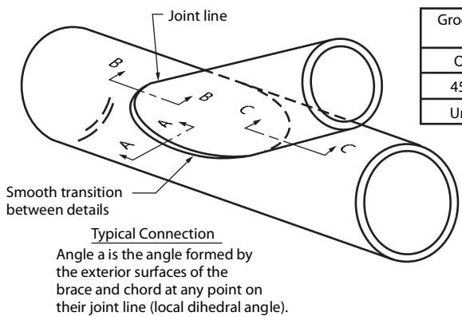

Note: Includes tolerance   

| Groove Angle "b" | Root Opening, G | Root Opening, G |
| --- | --- | --- |
| Groove Angle "b" | in. | mm |
| Over 90 | 0 to 3/16 | 0 to 4.8 |
| 45 to 90 | 1/16 to 3/16 | 1.6 to 4.8 |
| Under 45 | 1/8 to 1/4 | 3.2 to 6.4 |

| a | Min. "T" |
| --- | --- |
| 50 to 135 | 1.25 † |
| 35 to 50 | 1.50 † |
| Under 35 | 1.75 † |
| Over 135 | See Sec. B-B |

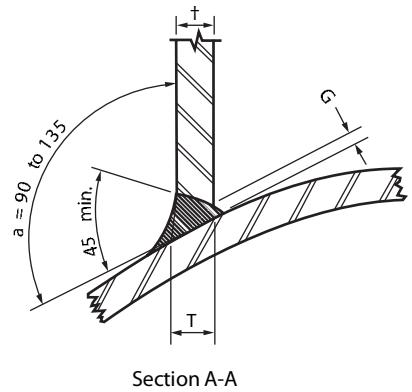

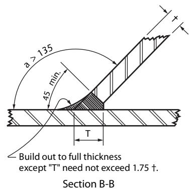

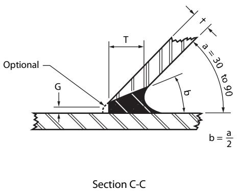

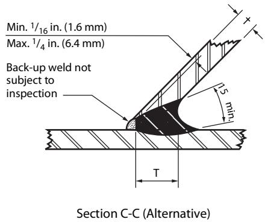  
Figure 11.1.3—Welded Tubular Connections—Shielded Metal Arc Welding

smoothly into flange and web. Girder splices, intersections, and moment connections should be full penetration welds unless a detailed stress analysis indicates it to be unnecessary. The connection between flanges and plates intended for flange stiffening should be a full penetration weld made from both sides.

Stiffener plate to web connections may be continuous double fillet welds. Weld metal and heat affected zone notch toughness should not be less than the minimum toughness requirements specified for the parent girder steel.

11.1.5 Final Fabrication Tolerances

11.1.5.a General

Each member of the structure should be located accurately to the final fabrication tolerances hereafter given. Other tolerances not stated herein should be in accordance with Specifications for the Design, Fabrication and Erection of Structural Steel for Buildings and Bridges, AISC, Eighth Edition.

11.1.5.b Jacket and Deck Section Columns

In any plane critical to field assembly, such as the top of the jacket and the bottom of the deck columns, the horizontal distance from the center line of any column to the center line of the column adjacent in any direction should be within a tolerance of $\pm 3/8$ in. (10 mm) of the net drawing dimension. At all deck levels, the horizontal distance from center line of any column to the center line of the column adjacent in any direction should be within a tolerance of $\pm 1/2$ in. (13 mm) and may be applied to working points on the outside diameter of the columns. In other jacket planes this tolerance may be increased to $\pm 3/4$ in. (19 mm) and may be applied to working points on the outside diameter of the columns. Diagonals of a rectangular plan layout should be identical within $3/4$ in. (19 mm). Every practical effort should be exerted to effect accuracy in column location at all planes.

The deviation from straightness of jacket columns should be less than $3/8$ in. （$10\mathrm{mm})$ . Such deviation should not be more than $1/8$ in. （$3\mathrm{mm})$ in any 10 foot （$3\mathrm{m})$ increment of length. The jacket fabrication should proceed on a flat and level surface. Frequent checks of blocking should be performed. When any column settles out of level, the settled column should be shimmed back into a level plane with the other columns. The tops of all jacket columns should relate to the drawing elevation within a tolerance of $\pm 1/2$ in. （$13\mathrm{mm})$ .

The location of the ends of the heavy wall jacket and deck leg joint cans should be within $\pm 1$ in. (25 mm) of the drawing dimensions. Other changes in wall thickness in the jacket legs or deck columns should be located within $\pm 2$ in. (51 mm) of the drawing dimensions.

11.1.5.c Jacket and Deck Section Bracing

All braces in a horizontal plane should be held vertically within $\pm 1/2$ in. (13 mm) tolerance of drawing dimension. Changes in wall thickness in braces should be located within $\pm 1$ in. (25 mm) of the drawing dimensions.

All other bracing where the end points are dimensioned should be erected so that such points are within $\pm 1 / 2$ in. (13 mm) of planned dimension.

11.1.5.d Deck Beams

The center-line of deck beams at their ends should be within $1/2$ in. (13 mm) of the drawing location. At no point along its center-line should any beam be out of line more than $3/4$ in. (19 mm) horizontally or $1/2$ in. (13 mm) vertically.

Deck beams should be erected with the top flanges level, or to the specified slope. Disparity in beam depth and flange out of level due to allowable mill tolerances in depth will be acceptable. Deck beams should be erected with the webs plumb. Distortion of deck beams from welding should be corrected or otherwise compensated so that the tolerances of this paragraph are met.

11.1.5.e Cap Beams

The center-lines of cap beams at their ends should be within $\pm 1/2$ in. (13 mm) of the drawing dimension. At no point along the center-line should the cap beam be more than $3/8$ in. (10 mm) out of line horizontally or $1/4$ in. (6 mm) vertically.

Cap beams should be erected with the top flanges level. Disparity in beam depth due to mill tolerances in depth should be compensated by shimming between the cap beam and column.

Cap beams should be erected with the webs plumb. Distortion of cap beams from welding should be corrected or otherwise compensated so that the tolerances of this paragraph are met.

11.1.5.f Grating

Joints in grating should occur only at points of support unless other appropriate details are provided on the drawings by the designer.

11.1.5.g Fencing and Handrails

Fabrication should be performed to such a degree of accuracy that, when erected, the top rail will be straight and level to the eye.

11.1.5.h Landings and Stairways

Landing elevations and landing and stairway locations horizontally should be within 3 in. (76 mm) of the drawing dimensions.

11.1.5.i Files

The minimum length of a segment of pipe used in fabricating piles should be one pipe diameter or 3 feet (1 m), whichever is less. The longitudinal seams of two adjacent pile segments should be placed $90^{\circ}$ apart as a minimum.

The maximum allowable deviation from straightness in any 10-foot （$3\mathrm{m})$ increment of length should be $^1 /8$ in. （$3$ mm). For lengths over 10 feet （$3\mathrm{m})$ , the maximum deviation of the entire length may be computed by the following formula, but not to exceed $^3 /8$ in. （$10\mathrm{mm})$ in any 40-ft （$12\mathrm{m})$ length.

$${ }^{ 1 } /_{ 8 } \text{ i n . } \left( \frac{ \text{ t o t a l ~ l e n g t h , ~ f e e t } } { 10 \text{ f e e t } } \right)$$

The method for checking straightness should be by taut wire along the length of pipe repeated at a minimum of three radius points.

The root face on the beveled ends of the finished pipe should not be out of square more than $1/16$ in. per foot (5 mm/m) of diameter except, that the maximum allowable out of square should not be more than $1/4$ in. (6 mm).

Pile sections and the total pipe make-up should be fabricated to a tolerance of plus or minus $1/2$ of 1 percent of the length shown on the drawings unless otherwise specified.

The outside circumference and out-of-roundness tolerances should be in accordance with Sections 4.2 and 4.3 of 00 API Spec 2B.

11.1.6 Provisions for Grouted Pile to Sleeve Connections

Steel surfaces of piles and the structure, which are to be connected by grout, should be free of mill glaze, varnish, grease or any other materials that would reduce the grout-steel bond. This is of special importance when no shear keys are used.

Care should be taken in installing packers to prevent damage from handling and high temperatures and splatter from welding. All debris should be removed from jacket legs to avoid damage to packers during launching and uprighting of the jacket.

11.1.7 Temporary Attachments

Any temporary attachments to the structure, such as scaffolding, fabrication and erection aids should be limited as much as practicable. When these attachments are necessary, the following requirements should be met:

Temporary attachments should not be removed by hammering or arc-air gouging. Attachments to leg joint cans, skirt sleeve joint cans, brace joint can, brace stub ends, and joint stiffening rings should be flame cut to $1/8$ inch (3 mm) above

parent metal and mechanically ground to a smooth flush finish with the parent metal.

Attachments on all areas which will be painted, should be removed in the same manner as above, prior to any painting.

Attachments to all other areas, not defined above, should be removed by flame cutting just above the attachment weld (maximum $1/4$ inch （$6\mathrm{mm})$ above weld). The remaining attachment steel shall be completely seal welded.

Attachments to aid in the splicing of legs, braces, sleeves, piling, conductors, etc., should be removed to a smooth flush finish.

## 11.2 CORROSION PROTECTION

11.2.1 Coatings

Unless specified otherwise by the designer, the application of coatings should conform to NACE RP-01-76.

11.2.2 Splash Zone Protection

Splash zone protection such as monel wrap, steel plate wrap, added steel thickness, etc., should be installed as specified, and should cover not less than the areas indicated on the drawings, and/or in the specifications.

11.2.3 Cathodic Protection

The cathodic protection system components, their installation, and their testing, if required, should be in accordance with the drawings and/or specifications.

## 11.3 STRUCTURAL MATERIAL

11.3.1 General

All structural steel should be new, without defects, and reasonably free of excess mill scale and rust. No casing steel, reject steel or other steel, originally intended for usage other than structural should be used unless otherwise specified. Steel which has been re-classified as structural after being rejected for other use should not be used. For fabrication of modifications for reuse of existing platforms structural steel in the existing platform may be reused provided it is suitable for the intended reuse.

11.3.2 Mill Certificates

Test reports on steel furnished or purchased should be those of the producing mill certified reports of tests as per 8.1.1 and not copies prepared by third party jobbers or suppliers. Mill certificates and test reports should indicate all pertinent data on strength, ductility, notch toughness, chemical analysis, heat treatment, non-destructive testing, supplementary testing, heat traceability as well as purchase order number. Mill certificates or test reports should be furnished before steel is incorporated into the structure.

11.3.3 Material Identification

Material receiving and handling is normally a fabrication contractor's function. Upon receipt of material and prior to fabrication, a material identification system should be established by the fabricator which will trace each primary structural member within the completed structure back to the original mill certificates. The identification system should eliminate any conflict or duplication of any primary structural element. The system should identify materials from manufacturing through transport, receipt, storage, fabrication and final erection. The system should be such that all NDT can also be identified.

## 11.4 LOADOUT

Loadout and tie-down is normally performed by the fabrication contractor. Loadout and tie-down should be performed in accordance with the loadout plan, Section 12, and owner requirements.

## 11.5 RECORDS AND DOCUMENTATION

The fabrication contractor should maintain the mill certificates as discussed in 11.3.2 which are necessary to demonstrate that proper materials were used in the structure. In addition, the fabricator should also compile and maintain the material identification records as discussed in 11.3.3 necessary to trace and identify the origin of each primary member. At the completion of the job the fabricator will compile and deliver to the owner these documents for permanent record.

During the course of fabrication, revisions may be approved to the primary structural members such as wall thickness, member size, type material, etc. For any substitutions and revisions made during fabrication, suitable records should be documented by the fabricator and listed as corrections to the fabrication drawings. The responsibility for the compilation of these records with other documentation related to the construction and inspection of the structure and the retention of these permanent records should be as specified by the owner.

12 Installation

## 12.1 GENERAL

12.1.1 Planning

The installation of a platform consists of loading out and transporting the various components of the platform to the installation site, positioning the platform on the site and assembling the various components into a stable structure in accordance with the design drawings and specifications. The installation of a platform should be accomplished in such a manner that the platform can fulfill the intended design purpose.

An installation plan should be prepared for each installation. This plan should include the method and procedures developed for the loadout, seafastenings and transportation of all components and for the complete installation of the jacket, pile/conductors, superstructure and equipment. This may be in the form of a written description, specifications and/or drawings. Depending upon the complexity of the installation, more detailed instructions may be required for special items such as grouting, diving, welding, inspection, etc. Any restrictions or limitations to operations due to items such as environmental conditions, barge stability or structural strength (i.e., lifting capacity), should be stated.

The installation plan is normally to be subdivided into phases, for example: Loadout, Seafastenings, Transportation, and Installation. The party responsible for the execution of each phase of the work should prepare the installation plan for that phase, unless otherwise designated by the Owner. Coordination and approval procedures between all parties should be established by the Owner.

12.1.2 Records and Documentation

During the loadout, transportation and installation, all daily reports logs, NDE reports, pile driving records, survey indicating platform orientation and verticality, etc., are to be prepared, compiled and retained by the party responsible for that phase of the work. These documents should also record any variation from intended installation procedures, all unusual environmental conditions which occurred during the installation. All "field modifications" which were made should be noted to record as-built condition of the structure. At the completion of the job each party will compile and deliver to the owner these documents in a form suitable for use as a permanent record. The responsibility for the compilation of these records with other documents related to the construction and inspection of the structure and for the retention of these permanent records will be in accordance with the requirements of the Owner.

12.1.3 Installation Forces and Allowable Stresses

The forces applicable to each phase of the installation should be calculated as described in Section 2.4. Analysis should be performed to ensure that the structural design is sufficient to withstand the type and magnitude of those forces or force combinations. The calculated stress in structural members should be in accordance with Section 3 as further qualified in Section 2.4.

12.1.4 Temporary Bracing and Rigging

Procedures covering the calculation of forces, load factors, allowable stresses and factors of safety for component parts of the structure as well as slings, shackles and fittings are listed in 2.4.2. Should any installation aids, temporary struts, bracing or rigging be required during any phase of the instal

lation, these same provisions should apply. If any of the installation aids, temporary struts or bracing are to be welded to the structure, then all welding shall be in accordance with 10.3.9. Removal shall be in accordance with 11.1.7.

## 12.2 TRANSPORTATION

12.2.1 General

The movement of the platform components from a fabrication yard to an installation site presents a complex task which requires detailed planning. Basic considerations vary with reference to the type of platform to be transported. Included herein are items which should be considered.

12.2.2 Template-type Platforms

12.2.2.a General

The template-type platform consists of one or more jackets or templates, piling, superstructure and other miscellaneous items. These are generally transported to location as deck cargo on barges or vessels.

12.2.2.b Cargo or Launch Barges

An adequate number of seaworthy cargo barges should be provided. The barges selected should be of proper size and structural strength to ensure that the stability and static and dynamic stresses in the barge, cargo and seafastenings due to the loading operation and during transportation are within acceptable limits. If the jacket portion of the platform is to be launched from a barge without the use of a derrick barge, the launch barge should be capable of this operation.

12.2.2.c Barge Strength and Stability

The various platform components and other items of cargo should be loaded on the barges in such a manner to ensure a balanced and stable condition. Barge stability should be determined in accordance with applicable regulations such as the U.S. Coast Guard or the current International Maritime Organization Standards. Ballasting of the barge as required to obtain designated draft and trim should be performed at dockside before seafastenings are attached, or in a sheltered area before reaching open water. Static and dynamic stresses in the barge hull and framing due to load out, transportation and launching should be in accordance with appropriate provisions of the AISC "Specifications for the Design, Fabrication and Erection of Structural Steel for Buildings," The American Bureau of Shipping "Rules and Building and Classing Steel Vessels," API RP 2V, or other applicable standards.

12.2.2.d Loadout

Loadout should be performed in accordance with the appropriate sections of the installation plan which should

include allowable environmental conditions during loadout operations, and design environmental conditions for the mooring system. All items of cargo should be positioned on the barge as shown on the loadout plan. For barges which will be floating during the loading operation, the ballast system must be capable of compensating the changes in tide and loading. An adequate standby ballast system should be provided.

For a barge which will be grounded during the loading operation, it should be demonstrated by analysis or by previous experience that the barge has sufficient structural strength to distribute the concentrated deck loads to the supporting foundation material. In addition, the seabed or pad should be smooth, level, and free of any obstructions which could damage the hull. Forces resulting from the loadout operation, either from direct lift, or from a skidding operation, should be in accordance with 2.4.3.

12.2.2.e Seafastenings

Adequate ties should be designed and installed for all platform and cargo components to prevent shifting while in transit. These ties should be designed for the forces and deflections predicted for the vessel motion resulting from the environmental conditions in accordance with 2.4.4. These seafastenings should also be described and detailed in the installation plan. They are to be attached to the jacket, deck, and other components only at locations approved by the designer. Additionally, they should be attached to the barge at locations which are capable of distributing the load to the internal framing. These fastenings should be designed to facilitate easy removal on location.

At the option of the owner, in areas where substantial experience can be demonstrated, tiedown procedures based on past successful practices can be utilized. This procedure is applicable only to routine installations and for similar cargoes during the same time of year. When detailed analysis is required, the design of tiedowns should be based on the sea state criteria established by the owner and/or the contractor based on the provisions of 2.4.4b. In lieu of more definitive owner-furnished criteria, the seafastenings may be designed for the environmental conditions predicted to have a risk of exceedance in the range of one to five percent during the period of time required to transport the barge to safe harbor. In determining this criteria, the length and reliability of the short-term weather forecast and the season of the year in which the tow will take place should be considered.

12.2.2.f Towing Vessels

The proper number of seagoing tugs should be provided, with sufficient power and size to operate safely for each particular route or ocean traveled. The size and power requirements of the towing vessel or vessels and the design of the towing arrangement should be calculated or determined from

past experience. This selection should consider such items as length of tow route, proximity of safe harbor and the weather conditions and sea states expected for the season of the year.

As a minimum, the tow should be capable of maintaining station in a 30 knot wind with accompanying waves. When more than one towing vessel is required, the total calculated bollard pull should be increased to take into account the loss of efficiency due to a dual tow. A stand-by or alternate towing line should be provided, rigged for easy access, in the event the tow line should fail.

12.2.2.g Forces

Consideration should be given to the forces applied to the various platform components as they are lifted on and off the barges or as they are rolled on and launched off the barges. Localized loads on the barge structure should also be considered.

12.2.2.h Buoyancy and Flooding Systems

The buoyancy of any platform component to be launched should be determined to ensure the unit will float. The flooding system, the buoyancy components and any necessary lifting connections should be designed to upright and land the structure safely.

12.2.3 Tower-type Platform

12.2.3.a General

The tower-type platform consists of a tower substructure which is floated to the installation site and placed in position by selective flooding. This substructure is also called a jacket. It has multiple piling and a superstructure. The movement considerations should include those specified for the template-type platform in addition to others listed herein.

12.2.3.b Water Tightness

The water tightness of the tower should be determined before towing commences.

12.2.3.c Flooding Controls

Consideration should be given to the location and accessibility of all controls for selective flooding and righting as well as the protection of the controls from environmental and operational hazards.

12.2.3.d Model Tests and Analysis

Model tests and detailed calculations should be considered for the prototype to determine towing and stability characteristics during towing and upending procedures.

12.2.4 Minimum Structures

Minimum structures, depending on the size, should include all applicable considerations specified above for both the template and tower-type platforms.

## 12.3 REMOVAL OF JACKET FROM TRANSPORT BARGE

12.3.1 General

This section covers the removal of a template-type platform jacket which has been transported to the installation site by a barge. Removal of the jacket from the barge is usually accomplished by either lifting with a derrick barge or launching.

12.3.2 Lifting Jacket

The rigging should be properly designed in accordance with 2.4.2 to allow the jacket to be lifted off the barge and lowered into the water. Usually the slings are attached above the center of gravity of the jacket being lifted to avoid possible damage to the jacket and/or barge during the lifting process.

12.3.3 Launching Jacket

For those jackets which are to be launched, a launching system should be provided considering the items listed below.

12.3.3.a Launch Barge

The launch barge should be equipped with launch ways, rocker arms, controlled ballast and dewatering system, and power unit (hydraulic ram, winch, etc.) to assist the jacket to slide down the ways.

12.3.3.b Loads

The jacket to be launched should be designed and fabricated to withstand the stresses caused by the launch. This may be done by either strengthening those members that might be overstressed by the launching operation or designing into the jacket a special truss, commonly referred to as a launch truss. A combination of the above two methods may be required.

12.3.3.c Flotation

A jacket which is to be launched should be water right and buoyant. If upending is to be derrick barge assisted the launched structure should float in a position so that lifting slings from the derrick barge may be attached thereto and/or previously attached slings are exposed and accessible.

12.3.3.d Equipment

The derrick barge should be of sufficient size to change the position of the launched jacket from its floating position to its erected position, or to hold the launched jacket at the site until it can be righted by a controlled flooding system.

## 12.4 ERECTION

12.4.1 General

This section covers the placement and assembling of the platform so that the structure is at the desired orientation, location and grade required for its intended purpose.

12.4.1.a Placement and Assembly

Placement and assembling of the platform should be in accordance with the installation plan.

12.4.1.b Safety

Necessary measures should be employed to conform to all State and Federal safety regulations at the installation site. This includes the provision and maintenance of all necessary safety and navigational aids and other measures in observance of appropriate regulations.

12.4.2 Anchorage

Appropriate anchoring of the derrick and supply barges should be provided during the erection phase. Basic principles which should be considered are outlined herein.

12.4.2.a Anchor Lines

The length of anchor lines should be adequate for the water depth at the site.

12.4.2.b Anchors

Anchor sizes and shapes should be selected so that they will bite and hold in the ocean bottom at the site. This holding action should be sufficient to resist the strongest tides, currents and winds that may reasonably be expected to occur at the site during the erection phase.

12.4.2.c Orientation

Where it appears that the desired anchorage may not be totally possible, orientation of construction equipment should be such that, if the anchors slip, the derrick and supply barges will move away from the platform.

12.4.2.d Anchor Line Deployment

Where anchoring of derrick or supply barge is required within the field of the guyline system of a guyed tower, measures should be employed to prevent fouling or damage of the guylines.

12.4.2.e Obstructions

When underwater obstructions or facilities such as cables, pipelines, wellheads, etc., are subject to fouling or damage during anchoring, or other marine operations, or constitute a hazard to navigation, they should be marked or suitably located and identified. The responsibility for such markings shall be in accordance with the requirements of the Owner.

12.4.3 Positioning

The term "positioning" generally refers to the placement of the jacket on the installation site in preparation for the piling to be installed. This may require upending of those platform components which have been towed to the site or launched from a barge at the site. Generally, the upending process is accomplished by a combination of a derrick barge and controlled or selective flooding system. This upending phase requires advanced planning to predetermine the simultaneous lifting and controlled flooding steps necessary to set the structure on site. Closure devices, lifting connections, etc., should be provided where necessary. The flooding system should be designed to withstand the water pressures which will be encountered during the positioning process.

Where the jacket is to be installed over an existing well, the wellhead should be properly protected from damage through accidental contact with the substructure. Advance planning and preparation should be in such detail as to minimize hazards to the well and structure.

When the jacket is not to be installed over an existing well or located adjacent to an existing structure, parameters for the accuracy of positioning should be stated in the installation plan. These parameters should be in line with current established standards available in surveying equipment, the water depth and the size and use of the platform.

When the design of the platform is based on the directional variation of environmental forces, proper orientation of the structure is essential. The required orientation of the platform, as well as the acceptable tolerance for out-of-alignment as discussed in 3.1.3b, must be shown on the drawings and stated in the installation plan. Procedures should be included in the installation plan to ensure that the structure can be positioned within the acceptable orientation tolerances.

12.4.4 Jacket Leveling

The jacket should be positioned at or near grade and leveled within the tolerances as specified in the installation plan before the piles are installed. Once level, care should be exercised to maintain grade and levelness of the jacket during the pile installation operation. Leveling the jacket after all the piles have been installed should be avoided if possible. However, it may be necessary to level the jacket by jacking or lifting after a minimum number of piles have been driven. In this instance, procedures should be utilized to minimize bending stresses in the piles.

12.4.5 Jacket Weight on Bottom

The soil loading at the base of the jacket can be critical prior to the installation of the permanent pile foundation. The load distribution on the soil should be considered for each combination of pile sections that will be supported from the jacket. For soils which increase in strength with depth, particularly soft clays and loose sands, the method of bearing capacity analysis employed should account for shape effects and the presence of any holes in the mudmats. This is because any reduction in mudmat dimensions may result in a shallow potential failure surface and hence a reduced bearing capacity.

The increase in soil loading resulting from waves of the maximum height anticipated during the installation period should be considered. The bearing capacity analysis should then take account of the combined effect of vertical, horizontal and moment loading. The more heavily loaded mudmats may experience a lowering of soil stiffness which can allow load to be transferred to other mudmats. Account may be taken of the benefits of suction developing under mudmats subject to uplift provided that they have been designed with an adequate skirt length and measures have been taken, such as the provision of valves, to prevent ingress of seawater into the skirt compartments. The factors of safety against bearing capacity failure recommended herein are 2.0 for on bottom gravity loads alone and 1.5 for the design environmental condition applicable for the installation period. At the operators discretion, with supporting analyses, an alternative of limiting penetration criteria may be used. Allowable steel stresses may be increased by one-third when wave loading is included. In the event of rough seas or if the installation equipment must leave the site for other reasons before the jacket has been adequately secured with piles, the effective weight on bottom may require adjustment to minimize the possibility of jacket movement due to skidding, overturning, or soil failure.

12.4.6 Guyline System Installation

Handling and erection of guyline system components offshore should employ equipment and procedures to minimize potential damage and installation problems.

12.4.6.a Guyline Handling Equipment

The design of equipment used to store, tension, and guide rope or strand should recognize minimum bending radius requirements. The handling equipment should be capable of supplying the necessary tensions to properly install the guylines. Special handling systems may be required to safely lower and position the clumpweights and anchors or anchor piles.

12.4.6.b Procedures

Maximum control of the guyline components should be a consideration in the development of installation procedures as design tolerances may require accurate positioning. Precautions should be taken to prevent fouling of the guylines. Elongation and rotation of guylines due to tensioning should be taken into account.

12.4.6.c Guyline Pretensioning

It may be required to preload the guylines to appropriate load levels in the installation phase. Accordingly, the tensioning equipment should be capable of supplying the specified pretensions as well as any preload which may be required to seat the guying system. Prior to the completion of the installation phase, the guylines should be tensioned to the nominal levels within specified design tolerance.

12.4.7 Alignment and Tolerances

The degree of accuracy required to align and position a guyed tower jacket and guyline system is determined by design tolerances. Consideration should be given to the requirements for special position and alignment monitoring systems during the placement of the jacket, lead lines, clumpweights and anchors or anchor piles.

## 12.5 PILE INSTALLATION

12.5.1 General

Proper installation of piling, including conductor piles, is vital to the life and permanence of the platform and requires each pile to be driven to or near design penetration, without damage, and for all field-made structural connections to be compatible with the design requirements. Pile sections should be marked in a manner to facilitate installing the pile sections in proper sequence.

The closure device on the lower end of the jacket columns and pile sleeves, when required, should be designed to avoid interference with the installation of the piles.

12.5.2 Stabbing Guides

Add-on pile sections should be provided with guides to facilitate stabbing and alignment. A tight uniform fit by the

guide should be provided for proper alignment. The guides should be capable of safely supporting the full weight of the add-on pile section prior to welding.

12.5.3 Lifting Methods

When lifting eyes are used to facilitate the handling of the pile sections, the eyes should be designed, with due regard for impact, for the stresses developed during the initial pick-up of the section as well as those occurring during the stabbingbing of the section. When lifting eyes or weld-on lugs are used to support the initial pile sections from the top of the jacket, the entire hanging weight should be considered to be supported by a single eye or lug. The lifting eyes or support lugs should be removed by torch cutting $\frac{1}{4}$ inch (6.4 mm) from the pile surface and grinding smooth. Care should be exercised to ensure that any remaining protusion does not prevent driving of the pile or cause damage to elements such as packers. If burned holes are used in lieu of lifting eyes, they should comply with the applicable requirements of this section and consideration should be given to possible detrimental effect during hard driving.

As an alternative to providing lifting eyes on the piles, pile handling tools may be used, providing they are the proper size and capacity for the piles being driven and the operating conditions anticipated. These tools should be inspected prior to each use to ensure that they are in proper working condition. They should be used in strict accordance with the manufacturer's instructions and/or recommendations. For installations which require the use of pile followers, the followers should be inspected prior to the first use and periodically during the installation, depending on the severity of pile driving.

12.5.4 Field Welds

The add-on pile sections should be carefully aligned and the bevel inspected to assure a full penetration weld can be obtained before welding is initiated. It may be necessary to open up the bevel or grinding or gouging. Welding should be in accordance with Section 10 of this Recommend Practice. Nondestructive inspection of the field welds, utilizing one or more of the methods referenced in Section 13, should be performed.

12.5.5 Obtaining Required Pile Penetration

The adequacy of the platform foundation depends upon each pile being driven to or near its design penetration. The driving of each pile should be carried to completion with as little interruption as possible to minimize the increased driving resistance which often develops during delays. It is often necessary to work one pile at a time during the driving of the last one or two sections to minimize "setup" time. Workable

back-up hammers with leads should always be available, especially when pile "setup" may be critical.

The fact that a pile has met refusal does not assure that it is capable of supporting the design load. Final blow count cannot be considered as assurance of the adequacy of piling. Continued driving beyond the defined refusal may be justified if it offers a reasonable chance of significantly improving the capability of the foundation. In some instances when continued driving is not successful the capacity of a pile can be improved utilizing methods such as those described in clause 6.2.1. Such methods should be approved by the design engineer prior to implementation.

12.5.6 Driven Pile Refusal

The definition of pile refusal is primarily for contractual purposes to define the point where pile driving with a particular hammer should be stopped and other methods instituted (such as drilling, jetting, or using a large hammer) and to prevent damage to the pile and hammer. The definition of refusal should also be adapted to the individual soil characteristics anticipated for the specific location. Refusal should be defined for all hammer sizes to be used and is contingent upon the hammer being operated at the pressure and rate recommended by the manufacturer.

The exact definition of refusal for a particular installation should be defined in the installation contract. An example (to be used only in the event that no other provisions are included in the installation contract) of such a definition is:

Pile driving refusal with a properly operating hammer is defined as the point where pile driving resistance exceeds either 300 blows per foot (0.3 m) for five consecutive feet (1.5 m) or 800 blows per foot (0.3 m) of penetration. (This definition applies when the weight of the pile does not exceed four times the weight of the hammer ram. If the pile weight exceeds this, the above blow counts are increased proportionally, but in no case shall they exceed 800 blows for six inches [152 mm] of penetration.)

If there has been a delay in pile driving operations for one hour or longer, the refusal criteria stated above shall not apply until the pile has been advanced at least one foot (0.3 m) following the resumption of pile driving. However, in no case shall the blow count exceed 800 blows for six inches (152 mm) of penetration.

In establishing the pile driving refusal criteria, the recommendations of the pile hammer manufacturer should be considered.

12.5.7 Pile Hammers

12.5.7.a Use of Hydraulic Hammers

Hydraulic hammers tend to be more efficient than steam hammers, so that the energy transferred to the pile for a given rated energy may be greater. They can be used both above

and below water, to drive battered or vertical piles, through legs or through sleeves and guides, or vertical piles through sleeves alone. In calculating pile stresses, full account should be taken of wave, current and wind forces, both during driving and during hammer stabbing (which may be either above or below water). Further, while for steam hammers the weight of the cage is generally held by crane, for hydraulic hammers the whole weight of the hammer is borne by the pile.

The energy output is generally varied by the contractor to maintain a fairly low blowcount. Thus, blowcounts do not give a direct guide to soil stratification and resistance. Since the ram is encased, hammer performance cannot be judged visually. It is therefore important that measurements are made to give a complete record of performance including for example, ram impact velocity, stroke, pressure of accelerating medium and blowrate. Reliable instrumentation of some piles may be also desirable, to verify the energy transferred to the pile to aid interpretation of soil stratification and to limit pile stresses.

Monitoring of underwater driving requires that easily identified, unambiguous datums, together with robust television cameras or remotely operated vehicles, capable of maintaining station, be employed. Alternatively, for shallow water sites, it is possible to extend the hammer casing so that blow-counts can be monitored above water.

Because no cushion block is used, there is no change in ram to anvil pile characteristics as driving progresses and no requirement for cushion changes. However, because of the steel to steel contact, particular attention should be paid to the design of the pile head.

In selecting hydraulic hammers for deeper water applications, account should be taken of possible decreases in efficiency due to increased friction between the ram and its surrounding air. Sufficient air should be supplied to the hammer so that water ingress is prevented and water in the pile should be able to escape freely.

It should be noted that hammer changes take much longer than for steam hammers.

12.5.7.b Selection of Pile Hammer Size

When piles are to be installed by driving, the influence of the hammers to be used should be evaluated as a part of the design process as set forth in Section 6.10. It is not unusual for alternate hammers to be proposed for use by the erector well after the design has been completed and reevaluation by the designer may not be feasible. In such an event, justification for the use of an alternate hammer shall include calculation of stresses in the pile resulting therefrom as set out in Section 6.10.

In lieu of an analytical solution for dynamic stress the guidelines in Table 12.5.7 may be used:

Table 12.5.7—Guideline Wall Thickness   

| Guideline Wall Thickness, In. | Guideline Wall Thickness, In. | Guideline Wall Thickness, In. | Guideline Wall Thickness, In. | Guideline Wall Thickness, In. | Guideline Wall Thickness, In. | Guideline Wall Thickness, In. |
| --- | --- | --- | --- | --- | --- | --- |
| Pile Outside Diameter in. | Hammer Size, Ft-Kips | Hammer Size, Ft-Kips | Hammer Size, Ft-Kips | Hammer Size, Ft-Kips | Hammer Size, Ft-Kips | Hammer Size, Ft-Kips |
| Pile Outside Diameter in. | 36 | 60 | 120 | 180 | 300 | 500 |
| 24 | 1/2 | 1/2 | 7/8 | — | — | — |
| 30 | 9/16 | 9/16 | 11/16 | — | — | — |
| 36 | 5/8 | 5/8 | 5/8 | 7/8 | — | — |
| 42 | 11/16 | 11/16 | 11/16 | 3/4 | 11/4 | — |
| 48 | 3/4 | 3/4 | 3/4 | 3/4 | 11/8 | 13/4 |
| 60 | 7/8 | 7/8 | 7/8 | 7/8 | 7/8 | 13/8 |
| 72 | — | — | 1 | 1 | 1 | 11/8 |
| 84 | — | — | — | 11/8 | 11/8 | 11/8 |
| 96 | — | — | — | 11/4 | 11/4 | 11/4 |
| 108 | — | — | — | — | 13/8 | 13/8 |
| 120 | — | — | — | — | 11/2 | 11/2 |

| Guideline Wall Thickness, mm | Guideline Wall Thickness, mm | Guideline Wall Thickness, mm | Guideline Wall Thickness, mm | Guideline Wall Thickness, mm | Guideline Wall Thickness, mm | Guideline Wall Thickness, mm |
| --- | --- | --- | --- | --- | --- | --- |
| Pile Outside Diameter mm | Hammer Size, KJ | Hammer Size, KJ | Hammer Size, KJ | Hammer Size, KJ | Hammer Size, KJ | Hammer Size, KJ |
| Pile Outside Diameter mm | 36 | 60 | 120 | 180 | 300 | 500 |
| 610 | 13 | 13 | 22 | — | — | — |
| 762 | 14 | 14 | 18 | — | — | — |
| 914 | 16 | 16 | 16 | 22 | — | — |
| 1067 | 18 | 18 | 18 | 19 | 32 | — |
| 1219 | 19 | 19 | 19 | 19 | 29 | 44 |
| 1524 | 22 | 22 | 22 | 22 | 22 | 35 |
| 1829 | — | — | 25 | 25 | 25 | 29 |
| 2134 | — | — | — | 29 | 29 | 29 |
| 2438 | — | — | — | 32 | 32 | 32 |
| 2743 | — | — | — | — | 35 | 35 |
| 3048 | — | — | — | — | 38 | 38 |

Values above the solid line based upon minimum pile area in square inches equals to $50\%$ of the rated energy of the hammer in ft-kips. Values below line controlled by Section 6.10.6.

Table 12.5.7 is based on industry experience with up to 60 in. diameter piles and 300 ft-kip hammers.

When it is necessary to use a pile hammer to drive piles with less than the guideline wall thickness set out in the above table, or that determined by an analytical solution, the definition of refusal used should be reduced proportionally.

12.5.8 Drilled and Grouted Piles

Drilling the hole for drilled and grouted piles may be accomplished with or without drilling mud to facilitate maintaining an open hole. Drilling mud may be detrimental to the surface of some soils. If used, consideration should be given to flushing the mud with circulating water upon completion of drilling, provided the hole will remain open. Reverse circulation should normally be used to maintain sufficient flow for cutting removal. Drilling operations should be done carefully to maintain proper hole alignment and to minimize the possibility of hole collapse. The insert pile with an upset drill bit on its tip may be used as the drill string so that it can be left in place after completion of the hole.

Centralizers should be attached to the pile to provide a uniform annulus between the insert pile and the hole. A grouting shoe may be installed near the bottom of the pile to permit grouting of the annulus without grouting inside the pile. It may be necessary to tie down the pile to prevent flotation in the grout if a grouting shoe is used. The time before grouting the hole should be minimized in soils which may be affected by exposure to sea water. The quality of the grout should be tested at intervals during the grouting of each pile. Means should be provided for determining that the annulus is filled as further discussed in 12.5.11. Holes for closely positioned piles should not be open at the same time unless there is assurance that this will not be detrimental to pile capacity and that grout will not migrate during placement to an adjacent hole.

12.5.9 Belled Piles

In general, drilling of bells for belled piles should employ only reverse circulation methods. Drilling mud should be used where necessary to prevent caving and sloughing. The expander or underreaming tool used should have a positive indicating device to verify that the tool has opened to the full width required. The shape of the bottom surface of the bell should be concave upward to facilitate later filling of the bell with tremie concrete.

To aid in concrete placement, longitudinal bars and spiral steel should be well spaced. Reinforcing steel may be bundled or grouped to provide larger openings for the flow of concrete. Special care should be taken to prevent undue congestion at the throat between the pile and bell where such congestion might trap laitance. Reinforcing steel cages or structural members should extend far enough into the pile to develop adequate transfer.

Concrete should be placed as tremie concrete, with the concrete being ejected from the lower end of a pipe at the bottom of the bell, always discharging into fresh concrete. Concrete with aggregates $3/8$ in. （$10\mathrm{mm})$ and less may be placed by direct pumping. Because of the long drop down the pile and the possibility of a vacuum forming with subsequent clogging, an air vent should be provided in the pipe near the

top of the pile. To start placement, the pipe should have a steel plate closure with soft rubber gaskets in order to exclude water from the pipe. Care should be taken to prevent unbalanced fluid heads and a sudden discharge of concrete. The pile should be filled to a height above the design concrete level equal to $5\%$ of the total volume of concrete placed so as to displace all laitance above the design level. Suitable means should be provided to indicate the level of the concrete in the pile. Concrete placement in the bell and adjoining section of the pile should be as continuous as possible.

12.5.10 Pile Installation Records

Throughout the pile driving operation, comprehensive driving and associated data should be recorded. The recorded data should include:

1. Platform and pile identification.   
2. Penetration of pile under its own weight.   
3. Penetration of pile under the weight of the hammer.   
4. Blow counts throughout driving with hammer identification.   
5. Unusual behavior of hammer or pile during driving.   
6. Interruptions in driving, including "set-up" time.   
7. Lapsed time for driving each section.   
8. Elevations of soil plug and internal water surface after driving.   
9. Actual length of each pile section and cutoffs.   
10. Pertinent data of a similar nature covering driving, drilling, grouting or concreting of grouted or belled piles.

12.5.11 Grouting Piles to Structure

If required by the design, the spaces between the piles and the surrounding structure should be carefully filled with grout using appropriate grouting equipment. The equipment should be capable of maintaining continuous grout flow until the annulus is filed. If the structure design does not require or permit grout to be returned to the surface, means should be provided to determine that the spaces have been filled as required. Such means might include but are not limited to underwater visual inspection, probing or detection devices.

## 12.6 SUPERSTRUCTURE INSTALLATION

The superstructure installation will normally consist of lifting such items as deck sections, module support frames, modules and packages from the transport barges onto the jacket. They are then connected to the jacket and each other as specified by the design.

12.6.1 Lifting Operations

For all lifting operations the structure strength and general suitability of the equipment are to be considered. The forces are to be derived as described in Section 2.4 and member checks are to be made to determine that members and joints are adequate for the lift conditions.

The lifting contractor should be familiar with the design assumptions for the lift and perform the operations in compliance with these assumptions. The operations should not be performed under more severe environmental conditions than those for which the objects involved are designed.

Prior to lifting, the lifted weight shall be predicted to ensure that it is within the limits defined by the design and within the capacity of all lifting equipment. Where weighing is not carried out, it is recommended that an adequate margin be applied to cover mill tolerance and growth in piping/ equipment weights, etc.

12.6.2 Lifting Points

Values of design forces for lifting points are recommended in 2.4.2. Padeye plates should be oriented in such a direction that the possibility for out-of-plane loading of the padeye plate and shackle is minimized.

12.6.3 Alignment and Tolerances

The superstructure components will be aligned within the tolerance specified in the design documents. After the piling has been driven and cut off to grade, the superstructure should be set with proper care being exercised to ensure proper alignment and elevation. Unless otherwise specified, the deck elevation shall not vary more than $\pm 3$ in. (76 mm) from the design elevation shown in the drawing. The finished elevation of the deck shall be within $1/2$ in. (13 mm) of level.

12.6.4 Securing Superstructure

Once the superstructure components have been set (placed) they should be secured to provide the support and fixity as required by the design.

12.6.5 Appurtenances

Once the superstructure is installed, all stairways, handrails, and other similar appurtenances should be installed as specified.

## 12.7 GROUNDING OF INSTALLATION WELDING EQUIPMENT

12.7.1 General

Normal welding procedures use reverse polarity wherein the welding rod is positive （$+)$ and the ground is negative （$-)$ .

The current flow is positive to negative, and an adequate and properly placed ground wire is necessary to prevent stray currents, which, if uncontrolled, may cause severe corrosion damage. (See NACE RP-01-76, Sec. 7, Par. 7.3.)

12.7.2 Recommended Procedure

The welding machine should be located on and grounded to the structure whenever possible. When this is impossible or impractical, and the welding machine is located on the barge or vessel, both leads from the output of the welding machine should be run to the structure and the ground lead secured to the structure as close as practical to the area of welding. Under no conditions should the hull of the barge (or vessel) be used as a current path. The case or frame of the welding machine should be grounded to the hull to eliminate shock hazards to personnel.

The welding cables should be completely insulated to prevent stray currents. Damaged cables should not be allowed to hang in the water.

Grounding cable lugs should be tightly secured to grounding plates. The lug contact should be thoroughly cleaned to bare metal. The resistance of the connection should be a maximum of 125 microhms per connection or the voltage drop across the connection should be a maximum of 62.5 millivolts for a current of 500 amperes. Use Ohm's Law （$\mathrm{V} = \mathrm{IR})$ for amperage other than 500 amperes.

The minimum cross-sectional area of the return ground cable should be one million circular mils per 1,000 amperes per 100 feet (645 circular mm per 1,000 amperes per 30.5 meters) of cable. One or more cables connected in parallel may be used to meet minimum cross-section requirements.

Note: 2/0 cable contains 133,392 circular mils (86 circular mm).

3/0 cable contains 169,519 circular mils (109 circular mm).

4/0 cable contains 212,594 circular mils (137 circular mm).

More than one ground cable of sufficient size is suggested to guard against a single return or ground becoming loose.

Connecting several welding machines to a common ground cable which is connected to the structure being welded will control stray currents if adequately sized and properly insulated from the barge or vessel containing welding machines.

12.7.3 Monitoring Remote Ground Efficiency

When welding is conducted using generators remote from a structure, grounding efficiency can be monitored by simultaneously measuring the potential of the structure and barge or ship housing the welding generators. A change in potential reading from either indicates insufficient grounding.

# 13 Inspection

## 13.1 GENERAL

Quality control, inspection, and testing should be performed to ensure adherence to the plans and specifications which contain the detailed instructions necessary to obtain the desired quality and service in the finished product. Quality control, inspection, and testing should be performed during all phases of construction, including the fabrication, loadout, seafastening, towing, and installation phases to ensure that specified requirements are being met. The most effective quality control and inspection scheme is one which prevents the introduction of defective materials or workmanship into a structure, rather than finding these problems after they occur.

## 13.2 SCOPE

Quality control is normally performed by the construction contractor prior to, during, and after fabrication, loadout, seafastening, transportation, and installation, to ensure that materials and workmanship meet the specified requirements. Inspection and testing is normally conducted by the owner to verify the required quality.

Responsibility for conducting the inspections and preparation of the recommended documentation should be as agreed upon between the owner and the construction contractor. Results of inspection should be prepared in a timely manner.

## 13.3 INSPECTION PERSONNEL

13.3.1 Inspectors

Inspectors should be qualified to carry out their duties by education, experience and practical testing. They should be knowledgeable in the general areas of welding technology, inspection, and testing procedures, as well as construction methods for those areas of their responsibility during fabrication, loadout, seafastening, transportation, and installation. They should know how and where to look for problems and situations which lead to problems, as well as the practical limitations on making repairs.

13.3.2 Inspector Qualifications

Personnel who perform nondestructive weld examinations should be required to qualify by passing a practical test based on the inspection methods and type of construction under consideration for a particular job. All inspectors should have demonstrated ability and experience, or be qualified to the appropriate codes, such as AWS (D1.1-2002), ASME/ANSI, or equivalent. Specialty technicians, such as ultrasonic (UT) or radiography (RT) should also be qualified to other guidelines such as API RP 2X (UT) or SNT-TC-1A (radiography, magnetic particle, liquid penetrant, etc.). Continued qualification should be based on satisfactory performance on the job.

Personnel who perform other inspection during any phase of construction of on offshore platform should be required to demonstrate ability and experience or be qualified to an appropriate code for the required inspection of a particular job.

13.3.3 Access to Work

Authorized personnel should have access at all times to all phases of the work under their responsibility to ensure that the required quality is obtained.

## 13.4 FABRICATION INSPECTION

13.4.1 Materials

Inspection should verify that all materials being incorporated into any portion of the fabrication are of good quality and in accordance with the specified requirements. Receipt of the correct material should be verified by cross-checking with appropriate original mill certificates and heat stamps, and with other appropriate documentation for non-structural material and structural materials other than steel.

13.4.2 Fabrication

Inspections of the structure should be made during all phases of fabrication (i.e., pre-fabrication, rolling, forming, welding, interim storage, assembly, erection, etc.) to confirm compliance with the specified requirements (i.e., joint details, weld profiles, dimensions, alignment, tolerances, orientation, etc.). In general, inspection should confirm that each component incorporated into the structure is of correct material; size and dimension; orientation, etc.; and is fitted, aligned, and permanently fastened according to the specified requirements. Jacket legs and pile sleeves through which piles will be field installed, should be carefully checked for internal clearance and, if possible, drifted with a template of nominal length or other appropriate method to ensure required tolerances have been met. Particular attention should be given to field mating points (such as the tops of jacket legs) which should be checked to ensure all dimensions are within tolerance. Inspection also should be made for all items affecting the assembly, including erection site structures (i.e., temporary foundations, bulkhead), erection aids, and erection equipment. Inspections should confirm that these items are in accordance with the specified requirements.

13.4.3 Welding

Welding inspection and testing should be performed to verify adherence to the specified requirements. Inspection and testing should be performed during all phases of fabrication with an aim to preventing introduction of defects into the weld.

Inspection should verify that the welder (or welding operator) is currently qualified for the procedure being used (as per Section 10) and that the appropriate qualified procedure is being followed. In addition, inspection should ensure that appropriate consumables are being used and that the consumables are being stored, handled, and used in accordance with appropriate requirements, including the manufacturer's recommendations.

13.4.3.a Inspection Methods

Three nondestructive inspection methods are routinely used on fabricated structures. These methods include visual, ultrasonics (UT), and radiography (RT). The magnetic particle inspection technique (MT) and the liquid penetrant technique (PT) are generally considered as enhanced visual inspection techniques. However, these two techniques have procedural requirements which should be followed if used.

An approved procedure for each inspection method should be developed for each job application, based on the referenced specification noted below.

Visual. The visual technique is used either by itself or as an integral part of other Non Destructive Examination (NDE) techniques. Visual inspection requirements should be conducted in accordance with AWS D1.1-2002 (Sections 6.5 and 6.9, plus Sections 5, 3, and Section 2 Parts A and D).

Penetrant Technique. The liquid penetrant inspection technique (PT) is useful for detecting surface discontinuities such as cracks, porosity, etc. The method for using PT for discontinuities that are open to the surface should conform to ASTM E165 (1983).

Magnetic Particle Technique. The magnetic particle Technique (MT) is useful for detecting discontinuities that are open to the surface or which are slightly subsurface. The procedure for magnetic particle inspection should conform to the requirements of ASTM E709.

Radiographic Technique. The radiographic technique (RT) is useful for determining buried or through thickness discontinuities. The RT procedures should conform to AWS D1.1-2002, Sections 6.12, 6.16 and 6.18.

Ultrasonic Technique. The ultrasonic technique (UT) is also used for determining buried or through thickness discontinuities. API RP 2X (1996) should be used for guidance on personnel qualifications, UT techniques, procedures, and inspection reports.

Method Selection. A number of parameters should be considered for selection of an inspection method, including: joint geometry, applied stress (type and magnitude), thickness(es) of the structural joint(s), and discontinuity (type-size-and

location). Coordination among the designer, fabricator, inspector, and owner is essential and consultation with an NDE specialist is recommended in order to select the most appropriate technique for a particular application.

13.4.3.b Extent of Weld Inspection

Scheduling. To the maximum extent possible, inspection and testing should be performed as construction progresses and be scheduled so as not to delay the progress of the job.

Inspection Criteria. The plans, procedures, and specifications, should clearly delineate which materials and fabricated items are to be inspected by nondestructive testing. The acceptance criteria, extent of testing, and the methods to be used in such inspection should be clearly defined.

Fit-Ups. All weld fit-ups (joint preparation prior to welding) should be visually inspected to ensure acceptable tolerances before welding.

Visual Inspection. Welding in progress should be visually inspected to assure proper cleaning, tie-in, etc. As a minimum the passes which should be inspected are: root, hot (or second) and the completed weld-cap.

Extent of NDE Inspection. Table 13.4.3 shows recommended minimum extent of inspection for various parts of the structure.

13.4.3.c Quality of Welds

Weld area surfaces should be adequately prepared so that NDE can be carried out. This should include removal of weld spatter and appropriate marking for inspection. Adequate time should be allowed for weld cool-down before conducting NDE.

UT Quality. Three levels of weld quality are widely accepted: 1) Level A—Workmanship Quality, 2) Level C—Experienced based fitness-for-purpose quality; and 3) Level F—specific fitness-for-purpose quality. Detailed interpretation of these levels and UT reject criteria for each level should be in accordance with API RP 2X (1996).

Weld Quality for NDE. For welds subjected to non-destructive testing by radiography or any method other than UT the weld quality requirements of AWS D1.1-2002 Section 6.12.1 (nontubular static), AWS D1.1-2000 Section 6.12.3 (tubular), as applicable, should apply, except as modified herein.

Weld Profiles. Weld profiles in simple tubular joints should be free of excessive convexity, and should merge smoothly with the base metal both brace and chord in accordance with AWS D1.1-2002 Section 3.13.4.

Penetrant Technique. The liquid penetrant inspection technique (PT) is useful for detecting surface discontinuities such as cracks, porosity, etc. The method for using PT for discontinuities that are open to the surface should conform to ASTM E165 (1983). Magnetic Particle Technique. The magnetic particle Technique (MT) is useful for detecting discontinuities that are open to the surface or which are slightly subsurface. The procedure for magnetic particle inspection should conform to the requirements of ASTM E709.

Magnetic Particle Technique. The magnetic particle Technique (MT) is useful for detecting discontinuities that are open to the surface or which are slightly subsurface. The procedure for magnetic particle inspection should conform to the requirements of ASTM E709.

05 Ultrasonic Technique. The ultrasonic technique (UT) is also used for determining buried or through thickness discontinuities. API RP 2X (1996) should be used for guidance on personnel qualifications, UT techniques, procedures, and inspection reports. Method Selection. A number of parameters should be considered for selection of an inspection method, including: joint geometry, applied stress (type and magnitude), thickness(es) of the structural joint(s), and discontinuity (type-size-and

Table 13.4.3—Recommended Minimum Extent of NDE Inspection   

| Case | Extent, Percent | Method |
| --- | --- | --- |
| Structural Tubulars |  |  |
| Longitudinal Weld Seam (L) | 10* | UT or RT |
| Circumferential Weld Seam (C) | 100 | UT or RT |
| Intersection of L & C | 100 | UT or RT |
| Tubular Joints |  |  |
| Major brace-to-chord welds | 100 | UT |
| Major brace-to-brace welds | 100 | UT |
| Misc. Bracing |  |  |
| Conductor Guides | 10* | UT (or MT)** |
| Secondary bracing and subassemblies, i.e., splash zone, and/or mudline secondary bracing, boat landings, etc. | 10* | UT (or MT)** |
| Attachment weld connecting secondary bracing/subassemblies to main members | 100 | UT or MT |
| Deck Members |  |  |
| All primary full penetration welds | 100 | UT or RT |
| All partial penetration welds | 100 | Visual*** |
| All fillet welds | 100 | Visual*** |

*Partial inspection should be conducted as 10 percent of each piece, not 100 percent of 10 percent of the number of pieces. Partial inspection should include a minimum of three segments randomly selected unless specific problems are known or suspected to exist. All suspect areas (e.g., areas of tack welds) shall be included in the areas to be inspected. If rejectable flaws are found from such $10\%$ inspection, additional inspection should be performed until the extent of rejects has been determined and the cause corrected.   
**Depending upon design requirements and if specified in the plans and specifications MT may be an acceptable inspection method.   
***May include MT and/or PT.

Relaxation of Rejection Criteria. For simple tubular joints, defects in the root area of the weld are less detrimental than elsewhere, as well as being more difficult to repair. Subject to specific guidelines provided by the designer, some relaxation of the above-mentioned reject criteria may be appropriate. Defects in back-up welds, or root lands, which are not part of theoretical strength weld (minimum "T" in Figure 11.1.3) should not be cause for rejection.

13.4.4 Corrosion Protection Systems

Details regarding the inspection of corrosion protection systems should be in accordance with NACE Standard RP-01-76 (1983 Revision).

13.4.4.a Coatings

Inspections should verify that surface preparation, climatic conditions (i.e., wind, temperature, humidity), coating process, and materials are in compliance with specified requirements prior to application of coating. Where applicable, manufacturer's instructions should be closely followed. During the coating process, inspection should be performed to verify the surface preparation, the thickness of each layer, and adherence of the coating to the base metal.

Repaired coating should be subjected to the same inspection requirements as the original coating.

13.4.4.b Splash Zone Protection

Inspection should verify that splash zone protection (i.e., monel wrap, fiberglass coatings, rubber sheathing, fusion bonded epoxy, etc.) is installed according to the

specified requirements, including the manufacturer's recommendations.

13.4.4.c Cathodic Protection Systems

Inspection of the cathodic protection equipment, whether sacrificial anode or impressed current type, should be performed to confirm that it meets the specified requirements.

If included in the system, cabling, junction boxes, etc., should be inspected to ensure all components are properly attached and that electrical continuity is confirmed. Attachment of anodes (e.g., welding of anode stand-off posts, double plates, impressed current anode sockets; installation of impressed current anodes into sockets) should be inspected to ensure compliance with the specified requirements.

13.4.5 Installation Aids and Appurtenances

Inspections should verify that all installation aids and appurtenances are installed and tested in accordance with the specified requirements, including manufacturer's recommendations. Installation Aids include the following:

- Launch Systems   
- Flooding Systems   
- Grouting Systems   
Mud Mats   
- Jetting Systems   
Lugs and Guides   
Monitoring Systems   
- Pre-installed Piles and Conductors

Appurtenances include the following:

- Boat Landings   
Riser Guards   
Risers and Clamps   
J-Tubes   
- Sump and Pump Caissons

The location, size and orientation should be checked, and weld attachments (including temporary restraints) should be subjected to $100\%$ NDE.

Inspections should include functional tests of all mechanical and electrical equipment and systems, including instrumentation. Cabling and instrumentation should be checked to ensure continuity and all hydraulic and pneumatic lines should be pressure tested.

All non-steel components (i.e., diaphragms, packers, valve seats, etc.) should be protected from damage by weld spatter, debris and/or any other construction activities, and hydraulic lines should be thoroughly flushed and drained before and after testing. The inside of jacket legs, skirt piles, etc., should be inspected to ensure complete removal of debris (e.g., welding rods, misc. pieces of wood, steel, etc.) which could damage non-steel components during installation.

## 13.5 LOAD OUT, SEAFASTENING, AND TRANSPORTATION INSPECTION

Inspection should be performed for all areas related to load out, seafastening and transportation to confirm compliance with the specified requirements. Prior to load out, final inspection of the structure should be conducted to ensure all components are in place; all welds have been properly completed and inspected; all temporary transportation/installation aids are included and secure; all hydraulic and pneumatic lines have been properly installed, tested, flushed, and secured; that all temporary fabrication aids and debris have been removed; and that all temporary welded attachments have been removed and attachment marks repaired according to the specified requirements.

The support foundations, including the loadout pathway, the dock, the transport vessel, and the sea bottom at dock side should be inspected to ensure compliance with the specified requirements.

Other areas for inspection include the lifting/pulling/pushing components attached to the structure (which require NDE) and those between the structure and lifting equipment (i.e., lifting slings, shackles, spreader beams). For vendor supplied items, documentation is required in addition to the inspections. The capacity and condition of loadout equipment should be confirmed by inspection and documentation.

For skidded loadouts inspection should be performed to confirm that the skidway and/or launch surface is clean and properly lubricated (if required) prior to loadout. The winches, jacks and pulling cables should be inspected for proper capacity and condition.

Where ballast and de-ballast operations are required to compensate for tidal variations, inspection of the ballast system is required to confirm adequacy and equipment condition. Monitoring of the operation is also recommended, to ensure compliance with the load out procedure.

Inspection for seafastening of the structure and all deck cargo is required to confirm compliance with the specified requirements. This includes temporary tie-downs and bracing required for transport. Materials, fabrication and weld inspection requirements shall be as per Section 13.4. Inspection for jacket launch items should be conducted where possible prior to sea transport.

Sea worthiness of tugs, towing attachments and the transport vessel should also be confirmed. For preparation of self floaters for transport to the site, inspection should be performed to confirm sea worthiness and that all towing/restraining lines are properly attached.

## 13.6 INSTALLATION INSPECTION

13.6.1 Jacket Launch and Upending

Prior to launch, inspection should confirm that all tie-downs and temporary bracing are cut loose, and tow lines and

loose items are removed from the launch barge or safely secured. Inspection is required to confirm that the jacket flooding system is undamaged, flooding valves are closed, and the launching arm system is in the proper mode of operation. For lifted jackets, inspection should confirm removal of all restraints, and proper attachment of lifting equipment, as well as the undamaged and properly configured operation mode of the flooding system. For self-floating jackets, inspection should confirm removal of tow lines as well as the undamaged and properly configured operation mode of the flooding system.

Inspection should be carried out after the jacket is secured in place. If inspection is necessary before then (i.e., suspected damage to flooding system), inspection should be limited to those items required to upend and secure the jacket.

13.6.2 Piling and Conductor Installation

All pile and conductor welds performed during fabrication should be inspected (as per Section 13.4) prior to load out, including lifting devices, lugs, and attachments. During installation, inspection should be conducted to ensure that the correct pile make-up is followed, and that the welding of add-on sections (if applicable) is performed in accordance with the specified requirements.

Prior to each use, pile hammers should be inspected for proper hook-up and alignment for operation.

If vibration levels in the structure (above water) appear to be excessive during pile driving, the driving operation should be interrupted to inspect for possible fatigue damage in the structure.

During pile installation, non-destructive testing should be performed on the welded connections at pile add-ons; between pile and deck support members; between the pile and jacket leg; and elsewhere, to confirm compliance with the specified requirements. NDE inspection should be performed as per Section 13.4 with $100\%$ UT of all critical welds is particularly difficult to evaluate with UT. Alternatively, careful visual inspection of each pass should be made, followed by MT inspection of the final weld.

13.6.3 Superstructure Installation

Prior to lifting, inspection should be performed to confirm that tie-downs and other items not considered in the lifting design are removed from the superstructure. Proper rigging and connection of all lifting components should also be confirmed.

Immediately after lifting, inspection should be performed on all scaffolding and other temporary support systems to confirm their adequacy for completion of weld out. Materials, fabrication and welding requirements shall be in accordance with Section 13.4. Inspection should be performed on the jacket and deck mating points to confirm proper alignment and fit-up and to ensure that weld preparations are as per

specified requirements. Following weld out, inspection should be performed on the welded connections as per Section 13.6.2 and/or other specified requirements.

These inspections should be performed for each component of a multiple-lift superstructure, with inspection for alignment during each lift.

13.6.4 Underwater Inspection

In the event the installation requires underwater operations, the inspection should verify either by direct communications with divers or through the use of a remote monitoring device that the operation has been conducted in accordance with the specified requirements.

## 13.7 INSPECTION DOCUMENTATION

13.7.1 General

During the fabrication, erection, load out and installation phases, data related to the inspection of the platform will be generated which may not be part of the Welding (Section 10.4); Fabrication (Section 11.5); or Installation (Section 12.1.2) records. Such inspection data should be recorded as the job progresses and compiled in a form suitable to be retained as a permanent record.

All documentation referenced in this Section 13, should be retained on file for the lift of the structure.

13.7.2 Fabrication Inspection Documentation

13.7.2.a Materials and Fabrication Inspection

During the fabrication phase material inspection documentation covering the Mill Certificates and Material Identification Records (as described in Section 11.3) as well as any additional materials, testing or special inspections which were conducted, should be prepared and assembled. This should include documentation for any inspection related to the assembly of the structure.

13.7.2.b Weld Inspection

A set of structural drawings should be marked with an appropriate identification system detailing the location of each weld to be examined and referenced as an integral part of the inspection record. All welds should be uniquely identified and be traceable to the individual welder or weld operator. A report should be prepared for each examination performed, the details of which should be documented sufficiently to permit repetition of the examination at a later date. Sketches and drawings incorporating the weld identification system should be used to augment descriptions of the part and locations of all discontinuities required to be reported. Forms should be provided to show the required details of documentation, and sketches of typical weld configurations should also be provided to clarify the written description. Disconti

nuities required to be reported should be identified on sketches by the appropriate weld number and position.

13.7.2.c Other Inspection

Inspection of all non-structural systems and test should be documented to confirm details of the inspection and results. Any deviations from the specified requirements should be properly recorded, including sketches if necessary.

13.7.3 Load Out, Seafastening and Transportation Inspection Documentation

Inspection documentation for any special materials, testing and for all welding inspection performed in connection with the load out, seafastening and transportation phases should be recorded and retained as part of the inspection record. Any special documentation for inspection of vendor-supplied items (i.e., lifting slings) and reports for other areas affecting loadout (i.e., transport vessel, dock) which is not included in the installation plan or records described in Section 12 should also be recorded.

13.7.4 Installation Inspection Documentation

Inspection documentation for materials, testing and welding inspection performed during the installation phase should be recorded and retained. Pile blow count versus depth and final pile penetration should be documented, and a continuous log of events, including climatic conditions (i.e., temperature, wind, barometric pressure, humidity), sea states, operational activities, etc., should be retained.

# 14 Surveys

## 14.1 GENERAL

During the life of the platform, in-place surveys that monitor the adequacy of the corrosion protection system and determine the condition of the platform should be performed in order to safeguard human life and property, protect the environment, and prevent the loss of natural resources.

The inspection program (that is, survey levels, frequency, special surveys and pre-selected survey areas) should be compiled and approved by a qualified engineer familiar with the structural integrity aspects of the platform.

## 14.2 PERSONNEL

14.2.1 Planning

Surveys should be planned by qualified personnel possessing survey experience and technical expertise commensurate with the level of survey to be performed.

14.2.2 Survey

Surveys should be performed by qualified personnel and should include the observations of platform operating and maintenance personnel familiar with its condition. The personnel conducting surveys of above-water areas should know how and where to look for damage and situations that could lead to damage.

Cathodic potential surveys and/or visual inspection of the underwater portion of a platform should be conducted by ROV or divers under the supervision of personnel experienced in the methods employed. Nondestructive examination of the platforms should be performed by personnel trained and experienced in application of the method being used. Cathodic potential surveys should be supervised by personnel knowledgeable in this area.

## 14.3 SURVEY LEVELS

14.3.1 Level I

A Level I survey consists of a below-water verification of performance of the cathodic protection system (for example, dropped cell), and of an above-water visual survey to determine the effectiveness of the corrosion protection system employed, and to detect deteriorating coating systems, excessive corrosion, and bent, missing, or damaged members.

This survey should identify indications of obvious overloading, design deficiencies, and any use that is inconsistent with the platform's original purpose. This survey should also include a general examination of all structural members in the splash zone and above water, concentrating on the condition of the more critical areas such as deck legs, girders, trusses, etc. If above-water damage is detected, nondestructive testing should be used when visual inspection cannot fully determine the extent of damage. Should the Level I survey indicate that underwater damage could have occurred, a Level II inspection should be conducted as soon as conditions permit.

14.3.2 Level II

A Level II survey consists of general underwater visual inspection by divers or ROV to detect the presence of any or all of the following:

1. Excessive corrosion.   
2. Accidental or environmental overloading.   
3. Scour, seafloor instability, etc.   
4. Fatigue damage detectable in a visual swim-around survey.   
5. Design or construction deficiencies.   
6. Presence of debris.   
7. Excessive marine growth.

The survey should include the measurement of cathodic potentials of pre-selected critical areas using divers or ROV. Detection of significant structural damage during a Level II survey should become the basis for initiation of a Level III survey. The Level III survey, if required, should be conducted as soon as conditions permit.

14.3.3 Level III

A Level III survey consists of an underwater visual inspection of preselected areas and/or, based on results of the Level II survey, areas of known or suspected damage. Such areas should be sufficiently cleaned of marine growth to permit thorough inspection. Preselection of areas to be surveyed (see Section 14.5) should be based on an engineering evaluation of areas particularly susceptible to structural damage, or to areas where repeated inspections are desirable in order to monitor their integrity over time.

Flooded member detection (FMD) can provide an acceptable alternative to close visual inspection (Level III) of pre-selected areas. Engineering judgment should be used to determine optimum use of FMD and/or close visual inspection of joints. Close visual inspection of pre-selected areas for corrosion monitoring should be included as part of the Level III survey.

Detection of significant structural damage during a Level III survey should become the basis for initiation of a Level IV survey in those instances where visual inspection alone cannot determine the extent of damage. The Level IV survey, if required, should be conducted as soon as conditions permit.

14.3.4 Level IV

A Level IV survey consists of underwater nondestructive testing of preselected areas and/or, based on results of the Level III survey, areas of known or suspected damage. A Level IV survey should also include detailed inspection and measurement of damaged areas.

A Level III and/or Level IV survey of fatigue-sensitive joints and/or areas susceptible to cracking could be necessary to determine if damage has occurred. Monitoring fatigue-sensitive joints, and/or reported crack-like indications, can be an acceptable alternative to analytical verification.

In the U.S. Gulf of Mexico, cracking due to fatigue is not generally experienced; if cracks occur, they are most likely found at joints in the first horizontal conductor framing below water, normally resulting from fatigue degradation; or cracks may also occur at the main brace to leg joints in the vertical framing at the first bay above mudline, normally due to environmental overload (for example, low cycle fatigue), or at the perimeter members in the vertical framing at the first bay below water level, normally as a result of boat impact.

If crack indications are reported, they should be assessed by a qualified engineer familiar with the structural integrity aspects of the platform(s).

## 14.4 SURVEY FREQUENCY

14.4.1 Definitions

The frequency of surveys are dependent upon the exposure categories of the platform for both life safety and consequence of failure considerations, as defined in Section 1.7.

14.4.2 Guideline Survey Intervals

The time interval between surveys for fixed platforms should not exceed the guideline intervals shown in Table 14.4.2-1 unless experience and/or engineering analyses indicate that different intervals are justified. Justification for changing guideline survey intervals should be documented and retained by the operator. In such cases, the following factors, which either increase or decrease the survey intervals, should be taken into account:

Table 14.4.2-1—Guideline Survey Intervals   

| Exposure Category Level | Survey level | Survey level | Survey level | Survey level |
| --- | --- | --- | --- | --- |
| Exposure Category Level | I | II | III | IV |
| L-1 | 1 yr | 3 through 5 yrs | 6 through 10 yrs | * |
| L-2 | 1 yr | 5 through 10 yrs | 11 through 15 yrs | * |
| L-3 | 1 yr | 5 through 10 yrs | * | * |

Note: yrs = years.   
*Surveys should be performed as indicated in Sections 14.3.3 and 14.3.4.

1. Original design/assessment criteria.   
2. Present structural condition.   
3. Service history of platform (for example, condition of corrosion protection system, results of previous inspections, changes in design operating or loading conditions, prior damage and repairs, etc.).   
4. Platform structural redundancy.   
5. Criticalness of the platform to other operations.   
6. Platform location (for example, frontier area, water depth, etc.).   
7. Damage.   
8. Fatigue sensitivity.

Survey intervals should be established by utilizing the ranges from Table 14.4.2-1, considerations of past inspection records and reference to Section 14.4.1. Alternatively, minimum survey intervals for each level should be used.

14.4.3 Special Surveys

A Level I survey should be conducted after direct exposure to a design environmental event (e.g., hurricane, earthquake, etc.).

A Level II survey should be conducted after severe accidental loading that could lead to structural degradation (for example, boat collision, dropped objects from a drilling program, etc.), or after an event exceeding the platform's original design/assessment criteria.

Areas critical to the structural integrity of the platform, which have undergone structural repair, should be subjected to a Level II survey approximately one year following completion of the repair. A Level III survey should be performed when excessive marine growth prevents visual inspection of the repaired areas.

Level II scour surveys in scour-prone areas should take account of local experience, and are usually more frequent than the intervals indicated in Table 14.4.2-1. Interpreters of periodic scour survey data should be aware that post-storm infilling of scour holes can obscure the extent of scour in storms.

## 14.5 PRESELECTED SURVEY AREAS

During initial platform design and any subsequent reanalysis, critical members and joints should be identified to assist in defining requirements for future platform surveys. Selection of critical areas should be based on such factors as joint and member loads, stresses, stress concentrations, structural redundancy, and fatigue lives determined during platform design and/or platform assessment.

## 14.6 RECORDS

Records of all surveys should be retained by the operator for the life of the platform. Such records should contain detailed accounts of the survey findings, including video tapes, photographs, measurements, and other pertinent survey results. Records should also identify the survey levels performed (that is, a Level IV survey should state whether a Level III survey and/or Level II survey were performed).

Descriptions of detected damage should be thoroughly documented and included with the survey results. Any resulting repairs and engineering evaluations of the platform's condition should be documented and retained.

# 15 Reuse

## 15.1 GENERAL

In general, platforms are designed for onshore fabrication, loadout, transportation and offshore installation. By reversing this construction sequence, platforms can be removed, onloaded, transported, upgraded (if required) and reinstalled at new sites. If a platform is reused the engineering design

principles and good practices contained in this publication should apply.

## 15.2 REUSE CONSIDERATIONS

Reuse platforms require additional considerations with respect to fatigue, material, inspection, removal and reinstallation. These provisions are discussed in the following sections:

15.2.1 Fatigue Considerations for Reused Platforms

For reused platforms having tubular connections inspected in accordance with the minimum requirements of Section 15.2.3, fatigue considerations must include appropriate allowances for fatigue damage that may have occurred during the initial in-service period of the platform as well as the planned service life at the new location. In general, Equation 5.2.5-1 should be satisfied. Beneficial effects on fatigue life from full inspection and/or remedial measures may be considered when determining prior damage or selecting safety factors.

The simplified fatigue analysis provisions addressed in Section C5.1 may be used to assess tubular joints in reused platforms, provided they are inspected per the minimum requirements of Section 15.2.3, have prior and new locations in less than 400 feet （$122\mathrm{m})$ of water, have similar wave climates with respect to platform orientation, are constructed of ductile steels, have redundant structural framing and have natural periods less than 3 seconds for both locations.

The Design Fatigue Life, $L$ , in years should satisfy the following expression:

$$L = S F_{1} L_{1} + S F_{2} L_{2} \tag{15.2.1-1}$$

where

$$L_{1} = \text{i n i t i a l i n s e r v i c e p e r i o d , y e a r s},$$

$$L_{2} = \text{p l a n n e d s e r v i c e l i f e a t n e w l o c a t i o n , y e a r s},$$

$$S F_{1} = 2.0 \text{for minimum requirements of Section 15.2.3 .} \quad \text{If the weld in a tubular connection is 100 % NDE inspection in accordance with requirements of 15.2.3 and is upgraded if defects are found ,} S F_{1} \quad \text{may be between zero and 2.0 selected on a rational basis ,}$$

$$S F_{2} = 2. 0.$$

For both safety factors, $SF_{1}$ and $SF_{2}$ , higher values for failure critical elements should be considered.

For the simplified fatigue analysis, the Allowable Peak Hot Spot Stresses may be obtained from Figure C5.1-1 or C5.1-2 for the water depths at the prior and new site for the Design Fatigue Life defined by Eq. 15.2.1-1. If the values are within

$5\%$ , then use the allowable Peak Hot Spot Stress for the depth where the platform was or will be installed for the longest durations. Otherwise, use the lower value.

Remedial measures (i.e., grinding welds, grouting, reinforcing, etc.) to increase the fatigue performance of a platform to be reused are acceptable.

15.2.2 Steel in Reused Platforms

The type and grade of steel used in primary structural members of platforms removed and reinstalled at new offshore sites should be determined from the original records. If information on the type and grade of steel used is unavailable from the original record, 33 ksi (225 Mpa) minimum yield strength shall be assumed. In addition, tubular sections of unknown steel type and grade with outside diameters typical of drilling tubulars, e.g., $5^{1}/2$ in., $9^{5}/8$ in., $13^{3}/8$ in., etc., should be avoided or removed from existing structures. Reused platforms having tubular connections in which the heavy wall joint-cans were inspected in accordance with the requirements of Section 15.2.3 including UT inspection to detect the occurrence of unacceptable defects.

15.2.3 Inspection of Reused Platforms

When structures are considered for reuse, inspection should be required and testing performed to verify suitability for the intended application. Such inspection and testing may be performed prior to removal from the original site or at a rework site.

15.2.3.1 General

Inspection programs prepared for evaluation of used structures being considered for reuse should be sufficiently detailed to establish the condition of the structures. Additionally, inspection should be performed to verify the absence of damage which may impair the structure's ability to withstand loadings imposed during all phases of removal operations from the prior site.

All pertinent assumptions made in the reanalysis should be verified by inspection, including material composition and properties, connection integrity, and extent of any corrosion or other degradation due to prior service.

Assessment of condition of used structures should generally begin with review of existing documentation from the original construction of the structure, together with results of any past in-service surveys. Where documentation is complete and in accordance with the requirements of Section 13.7, less field inspection may be justified, unless specific knowledge of unusual events such as collisions, damage from operations, etc., dictate additional review.

Applicable inspection techniques are covered in 13.4.3a.

15.2.3.2 Materials

The chemical composition and mechanical properties of all materials should be verified for consistency with the assumptions made for the reanalysis. Mill certificates or other documentation from the original fabrication with adequate material traceability may be used. Where such information is lacking, physical testing should be performed by a qualified laboratory.

Of particular importance is the verification of special materials such as steels classed as Groups II or III in Section 8.3.

In lieu of the above requirements, where 33 ksi (226 Mpa) minimum yield strengths are assumed in the reanalysis, inspection of materials may be limited to verifying that no drilling tubulars are used in the structures.

15.2.3.3 Conditions of Structural Members and Connections

Each structural member should be inspected to determine extent of any corrosion or other mechanical damage (e.g., pitting, dents, straightness, etc.) which would impair the intended service of the platform.

All structural connections should be inspected to insure that service damage (e.g., fatigue) does not impair the capability of the connection to carry design loads.

15.2.3.4 Damage-prone Connections

Damage-prone connections are defined as connections having in-service stresses or loads (based on reanalyses for the new location) equal to or greater than 90 percent of the strength allowable or having 90 percent of the Peak Hot Spot Stress (Simplified Fatigue Analysis) or fatigue damage ratios (Detailed Fatigue Analysis) equal to or greater than 30 percent.

15.2.3.5 Extent of Weld Inspection

Inspection of all new member fabrication and new member connections shall be performed per 13.4.3b. Weld inspection plans for existing welds should generally conform to the requirements of 13.4.3b, as modified herein.

15.2.3.5a Scheduling and Weld Access

Inspection techniques selected for use should consider access requirements and limitations, both to the weld and within the existing welded connections. Use of UT over RT may be preferred due to equipment portability.

15.2.3.5b Extent of NDE Inspection

Documentation of NDE performed during the original fabrication and periodic in-service surveys of the platform should be reviewed. Where adequate documentation exists and weld qualities were consistent with current acceptance

criteria, inspection may be limited to an investigation of in-service damage due to overload or fatigue.

Where such documentation is not available, an initial spot survey of the structure should be made to provide guidance to the engineer performing the reanalysis and to assist in the formulation of a detailed inspection plan.

The spot survey should include a general overview of 100 percent of the uncleaned structure to be reused to detect any gross structural damage (e.g., parted connections, missing

members, dented or buckled members, corrosion damage, etc.). Structural members and connections suspected or detected of having in-service damage should be 100 percent NDE inspected.

All NDE inspected welds should be thoroughly cleaned so as to enhance the effectiveness of the inspection.

Table 15.2.3.5 shows minimum recommended extent of inspection for various existing parts of the structure.

Table 15.2.3.5—Recommended Extent of NDE Inspection—Reused Structure   

| Case | Extent | Method |
| --- | --- | --- |
| Jacket Primary Tubulars |  |  |
| Longitudinal Weld Seams (L) | (a) | UT or MT |
| Circumferential Weld Seams (C) | (a) | UT or MT |
| Intersection of L&C | (a) | UT or MT |
| Tubular Joints |  |  |
| Major Brace-to-Chord Welds | (b) | MT |
| Major Brace-to-Brace Stub Welds | (b) | MT |
| Deck Members and Connections |  |  |
| Truss Bracing Members | 10%* | UT or MT |
| Truss Chord Members | 10%* | UT or MT |
| Plate Girder Members | 10%* | UT or MT |
| Connections to Deck Legs | 25%* | UT or MT |
| Crane Pedestal Connections | 100% | UT or MT |
| Cantilever Deck Connections | 100% | UT or MT |
| Survival/Safety Equipment Connections | 100% | UT or MT |
| Misc. Jacket/Deck Members and Connections |  |  |
| Nonredundant bracing and subassemblies, i.e., lifting eyes, lifting bracing, sole conductor guide framing level above mudline, etc. | 100% | UT or MT |
| Attachment Welds connecting nonredundant bracing/subassemblies to main members | 100% | UT or MT |
| Redundant bracing and subassemblies, i.e., multi-level conductor guide framing, secondary splash zone and mudline bracing, boat landings, etc. | 10% | Visual** |
| Attachment welds connecting redundant bracing/subassemblies to main members | 10% | Visual** |
| Piling |  |  |
| Longitudinal Weld Seams (L) | 10% | UT or RT |
| Circumferential Weld Seams (C) | 10% | UT or RT |
| Intersection of L & C | 10% | UT or RT |
| Filed Splices | 100% | UT or RT |

* Partial inspection should be conducted as percentage of each piece, not 100 percent of percentage of the number of pieces.   
** Limited to inspection of completed weld; may include MT and or PT.   
(a) Extent of inspection for these welds should be determined by comparing the design loadings and stresses (including removal and reinstallation loads and stresses) for the new site with those to which the welds have previously been designed for and/or exposed. Where new design loadings are less than or equal to initial design or actual loadings, then the extent of inspection, if any, should be determined based on NDE documentation or the results of the initial spot survey per Section 15.2.3.5b.   
Where new design loadings are significantly greater than initial design or actual loadings, or when comparison based on initial design or actual loadings is not possible, a minimum of one (1) bracing member and one (1) jacket leg spanning between each level should be inspected. Additional inspection per Section 15.2.3.5b should be performed where in-service damage is known of or suspected.   
(b) All damage-prone connections should be inspected. Damage-Prone connections are defined in Section 15.2.3.4. Where NDE inspection of these connections reveals significant defects, additional inspection of other connections should also be performed.   
For tubular connections, a minimum of one (1) brace to chord connection at each level and X brace connection between levels, as applicable, should be inspected.   
For tubular connections not having Class A steel in the heavy wall joint-cans both UT and MT should be performed.

15.2.3.6 Corrosion Protection Systems

Corrosion protection systems integrity should be verified in accordance with NACE RP-01-76 (1983 Revision). Verification should include assessment of remaining anode materials, anode connections, and condition of protective coatings, to include splash zone coatings, wraps, etc. Inspection should consider possible hidden damage under wraps, etc.

15.2.3.7 Inspections for Removal of Structures from Prior Site

Inspection and documentation should be performed for all phases of removal operations as defined in the offshore construction plan. Structural and equipment weights should be verified.

15.2.4 Removal and Reinstallation

15.2.4.1 Planning

All offshore construction should be accomplished in such a manner that the platform can fulfill the intended design purposes.

An offshore construction plan should be prepared for platform removal and reinstallation. This plan should include the method and procedures developed for the onloading, seafastenings and transportation of all components and for the complete reinstallation of the jacket, pile/conductors, superstructure and equipment.

Plans for platform removal from the prior site should be developed which describe methods and procedures for removal of the deck, appurtenances, jacket and piling. Seafastenings, transportation requirements, lift weights and centers of gravity should be defined. Particular emphasis should be placed on the prevention of damage of any platform components intended for reuse as a result of removal operations.

Offshore construction plans may be in the form of written descriptions, specifications, and/or drawings. Depending upon the complexity of the installation, more detailed instructions may be required for special items such as grouting, diving, welding/cutting, inspection, etc. Any restrictions or limitations to operations due to items such as environmental conditions, barge stability or structural strength (i.e., lifting capacity), should be stated.

The offshore construction plan should normally be subdivided into phases, for example—Removal, Onloading, Seaf-

astonings, Transportation, and Reinstallation. The party responsible for each phase of the work should prepare the plan for that phase, unless otherwise designated by the Owner. Coordination and approval procedures between all parties should be established by the Owner.

15.2.4.2 Records and Documentation

Adhere to the provisions of Section 12.1.2 during removal and reinstallation.

15.2.4.3 Forces and Allowable Stresses

Adhere to the provisions of Section 12.1.3 during removal and reinstallation.

15.2.4.4 Temporary Bracing and Rigging

Adhere to the provisions of Section 12.1.4 during removal and reinstallation.

15.2.4.5 Removal

Jackets originally installed by lifting may be removed in a process which essentially reverses the original installation sequence. Jackets originally installed by launching which cannot be lifted onto barges may be removed by controlled deballasting, and skidding the jacket back onto a properly configured launch barge. Such operations may require more precise control of barge ballasting, positioning, and alignment between jacket and barge than required for the original launch. Environmental conditions for such operations may also be more restrictive.

Anchorage during offshore removal operations should be conducted in accordance with the basic principles outlined in 12.4.2.

15.2.4.6 Buoyancy and Refloating

When removal of used platforms from a prior site requires refloating of platform components such as the jacket, additional buoyancy may be required in excess of that provided when the structures were originally installed to compensate for loss of buoyancy and for additional weights not present during the original installation, i.e., grouted piling.

15.2.4.7 Marine Growth Removal

When removing used platforms for reuse, appropriate equipment for marine growth removal from seafastening locations should be provided. If the jacket is to be skidded back onto a launch barge, marine growth should be removed from launch cradles to ensure reasonable prediction of coefficient of friction and sling loads on padeyes and winches. Waterblasting or sandblasting to remove marine growth has been found effective.

15.2.4.8 Barge Stability

During removal of used platform components from a prior site, ballasting of the barge for open water towing should be completed prior to loading of platform components on the barge, except where removal operation, otherwise dictate - e.g., reverse launching of jackets. If required to navigate shallow waters, deballasting from open water tow conditions should not be performed until the barge reaches sheltered waters.

15.2.4.9 Reinstallation

In general, the provisions of Section 12 should apply to the reinstallation of used platforms.

16 Minimum and Special Structures

## 16.1 GENERAL

This section addresses additional considerations for the design of non-jacket and special structures and single element structural systems, as defined in 1.6.1d.

## 16.2 DESIGN LOADS AND ANALYSIS

16.2.1 Design Considerations

Proper structural design is based on maintaining member stresses within certain allowable limits for the selected maximum design event. In addition, it is necessary to ensure that the structure has proper redundancy and reserve strength to prevent catastrophic failure or collapse if the selected design event is exceeded. The typical well designed jacket type offshore platform has proven to exhibit these characteristics. However, free standing caissons, guyed and braced caissons, as well as single leg deck units and other single member structural systems have less redundancy and may not necessarily exhibit the same characteristics.

When using the wave criteria information from Section 2, the allowable stress interaction ratio (or unity check) must be limited to 0.85 for free standing caissons or single element structural systems during storm conditions.

16.2.2 Dynamic Wave Analysis

A dynamic analysis utilizing the extreme wave sea state, in accordance with 2.3.1c, should be performed for all minimum Non-Jacket and Special structures with a natural period equal to or greater than three seconds and for all free standing caissons with a natural period of greater than two seconds. For caissons with a natural period of less than three seconds, approximate procedures may be applied. As an example, the system may be considered as a undamped, single degree of freedom cantilever with a uniformly distributed mass and a lumped mass at the top.

In reference to the masses mentioned in 2.3.1c, the dynamic model should include the maximum expected deck live load. In these calculations for caissons it is necessary to

consider the entire mass of the system including the caisson and all internal casing, conductors, tubing, grout, entrapped sea water as well as the virtual mass effects. Additional moment due to $\mathrm{P} / \Delta$ effects must be considered for the weight of the deck.

16.2.3 Fatigue Analysis

A fatigue analysis including dynamic effects should be performed in accordance with Sections 5.2 through 5.5. For caissons with natural periods less than two seconds, and in a water depth less than 50 feet, fatigue design in accordance with C5.1 may be used in lieu of dynamic fatigue analysis.

16.2.4 Foundation Effects

Experience has shown that due to the prolonged large deflection of caissons and other more flexible structures, the soil at and near the surface is subject to substantial degradation and frequently loses contact with the caisson for a short distance below the surface. This loss of soil strength due to remolding and the effective increase in unsupported length of the caisson should be considered in determining dynamic effects and the resulting bending stresses.

After severe storms in the Gulf of Mexico, caissons have been observed to be leaning with no visible overstressor damage to the caisson. This may have been caused by inadequate penetration which resulted in the ultimate lateral resistance of the soil being exceeded. Caissons should be designed for lateral loading in accordance with Section 6.8 with sufficient penetration to assure that the analysis is valid. Analysis procedures using "fixity" at an assumed penetration should be limited to preliminary designs only. For caissons, the safety factor for the overload case discussed in 6.8.1, should be at least 1.5.

## 16.3 CONNECTIONS

This section provides guidelines and considerations for utilizing connection types other than welded tubular connections as covered in Section 4. Connection types are as follows:

Bolted

Pinned

Clamped

Grouted

Doubler Plate

Threaded

Swagged

16.3.1 Analysis

Connections should be analyzed following the general guidelines of Section 4.3.5. Member forces should be obtained from the global structure analysis.

failure of which, would cause significant loss of structural

16.3.2 Field Installation

Where connections are designed to be field installed, inspection methods should be developed to ensure proper installation in accordance with design assumptions. As an example, the tension in high strength bolts should be field verified utilizing mechanical or procedural methods.

16.3.3 Special Considerations

16.3.3.a Bolted Connections

These joints should be designed in accordance with appropriate industry standards such as AISC Specification for Structural Joints using ASTM A325 or A490 bolts.

Consideration should be given to punching shear, lamellar tearing, friction factors, plate or shell element stresses, relaxation, pipe crushing, stress corrosion cracking, bolt fatigue, brittle failure, and other factors or combinations that may be present.

Retightening or possible replacement of bolts should be included as part of the owner's period surveys as defined in Section 14.

16.3.3.b Joints with Doubler, and/or Gusset Plates

Consideration should be given to punching shear, lamellar tearing, pullout, element stresses, effective weld length, stress concentrations and excessive rotation.

16.3.3.c Pinned Connections

These connections may significantly influence member forces; therefore pin ended tubular joints should be modeled in accordance with the actual detailing for fabrication.

16.3.3.d Grouted Connections

These connections should be designed in accordance with Section 7.4; however, all axial load transfer should be accomplished using shear keys only.

16.3.3.e Clamped Connections

Where primary members rely on friction to transfer load, it should be demonstrated, using appropriate analytical methods or experimental testing, that adequate load transfer will be developed and maintained during the life of the structure. Consideration should be given to the member crushing load when developing the friction mechanism.

## 16.4 MATERIAL AND WELDING

16.4.1 Primary Connections

Steel used for primary tubular joints or other primary connections should be Class A steels as defined in Section 8.1.3c or equivalent. Primary joints or connections are those, the strength.

16.4.2 Caisson Materials

Caissons may be fabricated utilizing Class C steel, as defined in 8.1.3a, if interaction ratios (as defined in Section 3) are equal to or less than 0.85 for all design loading conditions.

16.4.3 Caisson Welding

For field welds in caissons, special attention should be given to the provisions for complete joint penetration butt welds in AWS D1.1-2002, Sections 3.13 and 4.12, or else reduced fatigue performance (e.g., AWS Curve E) and root deduction should be considered.

17 Assessment of Existing Platforms

## 17.1 GENERAL

This section is applicable only for the assessment of platforms which were designed in accordance with the provisions in the 20th and earlier editions and for platforms designed prior to the first edition of this publication. For structures which were designed in accordance with the 21st Edition and later editions, assessment should be in accordance with the criteria originally used for the design of the platform. However, if factors affecting life-safety or consequence of failure have changed, then for L-1 and L-2 platforms, a special study to review the platform categorization may be performed to justify a reduced Exposure Category as defined in Section 1.7. No reduction in criteria can be considered for L-3 platforms.

In some cases, a platform owner may consider a change in the use of an existing platform which differs from its original purpose. In these instances, the platform has undergone a Change-of-Use and the reduced metocean criteria of this section may not be applicable. However, the engineering approaches used for the assessment of an existing platform would still be valid. The owner should carefully consider if design criteria for new platforms as defined in Section 2 is appropriate, or if assessment criteria as defined in this Section is appropriate. See also Section C17.1.

These guidelines are divided into separate sections describing assessment initiators, exposure categories, platform information necessary for assessment, the assessment process criteria/loads, design and ultimate strength level analysis requirements and mitigations. Several references [1-8] are noted which provide background, criteria basis, additional details and/or guidance including more specific technical references.

The guidelines in this section are based on the collective industry experience gained to date and serve as a recommended practice for those who are concerned with the assessment of existing platforms to determine their fitness for purpose.

The reduced criteria herein may leave a platform vulnerable to damage or collapse in a hurricane, particularly for an A-3 Low Assessment Category platform, as defined in Section 17.3. The assessment approach is structured so that the damage to or collapse of a platform will not increase life safety or environmental risk, however, it may create an economic burden to the owner in terms of facility and production losses. The determination of an acceptable level of economic risk is left to the operator's discretion. It can be beneficial for an operator to perform explicit cost-benefit risk analyses in addition to simply using this recommended practice. See also Section C17.1.

## 17.2 PLATFORM ASSESSMENT INITIATORS

An existing platform should undergo the assessment process if one or more of the conditions noted in 17.2.1 through 17.2.5 exist.

Any structure that has been totally decommissioned (for example, an unmanned platform with inactive flowlines and all wells plugged and abandoned) or is in the process of being removed (for example, wells being plugged and abandoned) is not subject to this assessment process.

17.2.1 Addition of Personnel

If the life safety level (as defined in Section 1.7.1) is changed to a more restrictive level, the platform must be assessed.

17.2.2 Addition of Facilities

If the original operational loads on a structure or the level deemed acceptable by the most recent assessment are significantly exceeded by the addition of facilities (for example, pipelines, wells, significant increase in topside hydrocarbon inventory capacity) or the consequence of failure level noted in Section 1.7.2 changes, the platform must be assessed.

17.2.3 Increased Loading on Structure

If the structure is altered such that the new combined environmental/operational loading is significantly increased beyond the combined loadings of the original design using the original design criteria or the level deemed acceptable by the most recent assessment, the structure must be assessed. See 17.2.6 for definition of "significant."

17.2.4 Inadequate Deck Height

If the platform has an inadequate deck height for its exposure category (see Sections 17.3 and 17.6.2; for U.S. Gulf of Mexico, also see Section 17.6.2a-2 and Figures 17.6.2-2b, 3b, and 5b) and the platform was not designed for the impact of wave loading on the deck, the platform must be assessed. The minimum elevation indicated in these figures

is measured to the underside of the support structure for the lowest substantial deck, which is typically called the cellar deck as defined in Section C17.2.4. In some cases lower decks or other large construction and/or equipment below the cellar deck may need to be considered as the lowest substantial deck for the assessment trigger. If in doubt, the lowest substantial deck should be used for the assessment trigger.

17.2.5 Damage Found During Inspections

The assessment process may be used to assess the fitness for purpose of a structure when significant damage to a primary structural component is found during any inspection. This includes both routine and special inspections as required and defined in Section 14. Minor structural damage may be justified by appropriate structural analysis without performing a detailed assessment. However, the cumulative effects of damage must be documented and, if not justified as insignificant, be accounted for in the detailed assessment.

17.2.6 Definition of Significant

Cumulative decreases in platform system capacity due to damage or cumulative increases in platform system loading due to changes from the design premise are considered to be significant if the total of the cumulative changes is greater than 10 percent. For example, if there is a $7\%$ decrease in system capacity due to damage and a $5\%$ increase in system loading due to changes, then the combined total of $12\%$ is considered significant.

## 17.3 PLATFORM ASSESSMENT CATEGORIES

Structures should be assessed in accordance with the applicable Assessment Category and corresponding assessment criteria as defined in this section. The Assessment Categories, known as A-1, A-2, and A-3, are defined as the most restrictive of life safety or consequence of failure considerations, similar to Section 1.7 for design of new platforms. For existing platforms, life safety considerations have the same definition as in Section 1.7. Consequence of failure considerations are similar to Section 1.7, with additional clarifications as noted below. See also Table 17.5.2.

A-1 - High Assessment Category. This refers to existing major platforms and/or those platforms that have the potential for well flow of either oil or sour gas in the event of platform failure. In addition, it includes platforms where the shut-in of the oil or sour gas production is not planned, or not practical prior to the occurrence of the design event (such as areas of high seismic activity). Platforms that support major oil transport lines (see Commentary C1.7.2-Pipelines) and/or storage facilities for intermittent oil shipment are also considered to be A-1, as defined in Section 1.7.2a. A-1 platforms can be

manned non-evacuated, manned evacuated or unmanned as defined in Section 1.7.1. All platforms in water depths greater than 400 ft. are considered A-1.

A-2 – Medium Assessment Category. This refers to existing platforms where production would be shut-in during the design event. All wells that could flow on their own in the event of platform failure must contain fully functional, subsurface safety valves which are manufactured and tested in accordance with applicable API specifications. Oil storage is limited to process inventory and “surge” tanks for pipeline transfer, as defined in Section 1.7.2b. A-2 platforms can be manned evacuated or unmanned as defined in Sections 1.7.1.b and 1.7.1.c, respectively. These are essentially existing platforms that do not meet the A-1 or A-3 definitions.

A-3 - Low Assessment Category. This refers to existing platforms where production would be shut-in during the design event. All wells that could flow on their own in the event of platform failure must contain fully functional, subsurface safety valves, which are manufactured and tested in accordance with applicable API specifications. These platforms may support production departing from the platform and low volume infeld operations. Oil storage is limited to process inventory, as defined in Section 1.7.2.c. The five well completion, two piece of production equipment, and 100 ft. water depth limit requirements contained in Section 1.7.2c for new platforms are not always valid for existing A-3 platforms. It is possible that some older, larger platforms with more wells, more production equipment and deeper water that are nearing the end of their useful life have a similar consequence of failure and can be considered A-3. This category typically includes low consequence auxiliary structures such as bridge supports and flare towers, although in some cases these structures should be considered A-2 based upon their consequence of failure. A-3 platforms are always unmanned as defined in Section 1.7.1c.

## 17.4 PLATFORM ASSESSMENT INFORMATION—SURVEYS

17.4.1 General

Sufficient information should be collected to allow an engineering assessment of a platform's overall structural integrity. It is essential to have a current inventory of the platform's structural condition and facilities. The operator should ensure that any assumptions made are reasonable and information gathered is both accurate and representative of actual conditions at the time of the assessment. Additional details can be found in C17.4.1 and in both "An Integrated Approach for Underwater Survey and Damage Assessment of Offshore Platforms," by J. Kallaby and P. O'Connor, [2] and "Structural Assessment of Existing Platforms," by J. Kallaby, et al. [3].

17.4.2 Surveys

17.4.2.1 Topside

The topside survey should, in most instances, only require the annual Level I survey as required in Section 14.3.1. The accuracy of the platform drawings should be verified when necessary. Where drawings are unavailable or inaccurate, additional walkaround surveys of the topside structure and facilities could be required to collect the necessary information; for example, topside arrangement and configuration, platform exposure category (see Section 1.7), structural framing details, etc.

17.4.2.2 Underwater

The underwater survey should, as a minimum, comprise a Level II survey (existing records or new survey), as required in Section 14.3.2.

In some instances, engineering judgment may necessitate additional Level III/Level IV surveys, as required in Sections 14.3.3 and 14.3.4, to verify suspected damage, deterioration due to age, lack of joint cans, major modifications, lack of/ suspect accuracy of platform drawings, poor inspection records, or analytical findings. The survey should be planned by personnel familiar with inspection processes. The survey results should be evaluated by a qualified engineer familiar with the structural integrity aspects of the platform(s).

17.4.3 Soil Data

Available on- or near-site soil borings and geophysical data should be reviewed. Many older platforms were installed based on soil boring information a considerable distance away from the installation site. Interpretation of the soil profile can be improved based on more recent site investigations (with improved sampling techniques and in-place tests) performed for other nearby structures. More recent and refined geophysical data might also be available to correlate with soil boring data developing an improved foundation model.

## 17.5 ASSESSMENT PROCESS

17.5.1 General

The assessment process for existing platforms separates the treatment of life safety and consequence of failure issues, and applies criteria that depend upon location and consequences. Additional details regarding the development and basis of this process can be found in "Process for Assessment of Existing Platforms to Determine Their Fitness for Purpose," by W. Krieger, et al. [4], with supporting experience in "A Comparison of Analytically Predicted Platform Damage to Actual Platform Damage During Hurricane Andrew," by F. J. Puskar, [5].

There are six components of the assessment process, which are shown in double line boxes in Figure 17.5.2:

1. Platform selection (Section 17.2).   
2. Categorization (Section 17.3).   
3. Condition assessment (Section 17.4).   
4. Design basis check (Sections 17.5 and 17.6).   
5. Analysis check (Sections 17.6 and 17.7).   
6. Consideration of mitigations (Section 17.8).

The screening of platforms to determine which ones should proceed to detailed analysis is performed by executing the first three components of the assessment process. If a structure does not pass screening, there are two potential sequential analysis checks:

1. Design level analysis.   
2. Ultimate strength analysis.

The design level analysis is a simpler and more conservative check, while the ultimate strength analysis is more complex and less conservative. It is generally more efficient to begin with a design level analysis, only proceeding with ultimate strength analysis as needed. However, it is permissible to bypass the design level analysis and to proceed directly with an ultimate strength analysis. If an ultimate strength analysis is required, it is recommended to start with a linear global analysis (see Section 17.7.3a), proceeding to a global inelastic analysis (see Section 17.7.3c) only if necessary.

Mitigation alternatives noted in Section 17.8 (such as platform strengthening, repair of damage, load reduction, or changes in exposure category) may be considered at any stage of the assessment process.

In addition, the following are acceptable alternative assessment procedures subject to the limitations noted in C17.5.1:

1. Assessment of similar platforms by comparison.   
2. Assessment through the use of explicit probabilities of failure.   
3. Assessment based on prior exposure, surviving actual exposure to an event that is known with confidence to have been either as severe or more severe than the applicable ultimate strength criteria based on the exposure category.

Assessment procedures for metocean, seismic, and ice loading are defined in 17.5.2, 17.5.3, and 17.5.4, respectively.

17.5.2 Assessment for Metocean Loading

The assessment process for metocean loading is shown in Figure 17.5.2. A different approach to defining metocean criteria is taken for U.S. Gulf of Mexico platforms than for other locations. For the U.S. Gulf of Mexico, the design level and ultimate strength metocean criteria are explicitly provided, including wave height versus water depth curves.

For other U.S. areas, metocean criteria are specified in terms of factors relative to loads caused by 100-year environ-

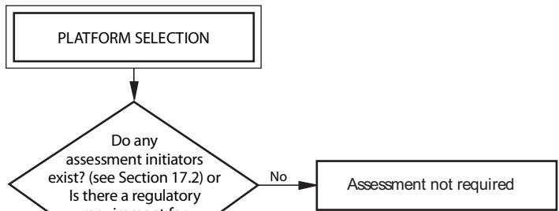

Table 17.5.2a-ASSESSMENT CRITERIA-U.S.GULF OF MEXICO (see Table 17.6.2-1)   

| Assessment Category | Exposure Category | Exposure Category | Design Level Analysis (see Notes 1 and 2) | Ultimate Strength Analysis |
| --- | --- | --- | --- | --- |
| Assessment Category | Consequence of Failure | Life Safety | Design Level Analysis (see Notes 1 and 2) | Ultimate Strength Analysis |
| A-1 | High | Manned-Non-Evacuated,Manned-Evacuated orUnmanned | High Consequence design level analysis loading (see Figure 17.6.2-2a) | High Consequence ultimate strength analysis loading (see Figure 17.6.2-2a) |
| A-2 | Medium | Manned-Evacuated orUnmanned | Sudden hurricane design level analysis loading (see Figure 17.6.2-3a) | Sudden hurricane ultimate strength analysis loading (see Figure 17.6.2-3a) |
| A-3 | Low | Unmanned | Minimum consequence design level analysis loading (see Figure 17.6.2-5a) | Minimum consequence ultimate strength analysis loading (see Figure 17.6.2-5a) |

Table 17.5.2b-ASSESSMENT CRITERIA-OTHER U.S. AREAS (see Table 17.6.2-2)   

| Consequence of Failure | Consequence of Failure | Consequence of Failure | Consequence of Failure | Consequence of Failure |
| --- | --- | --- | --- | --- |
| Assessment Category | Exposure Category | Exposure Category | Design Level Analysis (see Notes 1 and 2) | Ultimate Strength Analysis |
| Assessment Category | Consequence of Failure | Life Safety | Design Level Analysis (see Notes 1 and 2) | Ultimate Strength Analysis |
| A-1 | High | Manned- Non-Evacuated or Unmanned | 85% of lateral loading caused by 100-year environmental conditions (see Section 17.6.2b) | Reserve strength ratio (RSR)31.6 (see Section 17.6.2b) |
| A-3 | Low | Unmanned | 50% of lateral loading caused by 100-year environmental conditions (see Section 17.6.2b) | (RSR)30.8 (see Section 17.6.2b) |

Notes 1. Design level analysis not applicable for platforms with inadequate deck height.   
2. One-third increase in allowable stress is permitted for design level analysis (all categories).

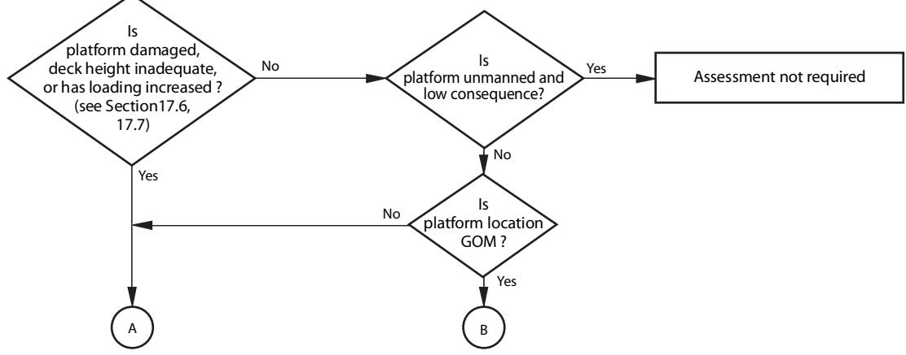  
Figure 17.5.2—Platform Assessment Process—Metrocean Loading

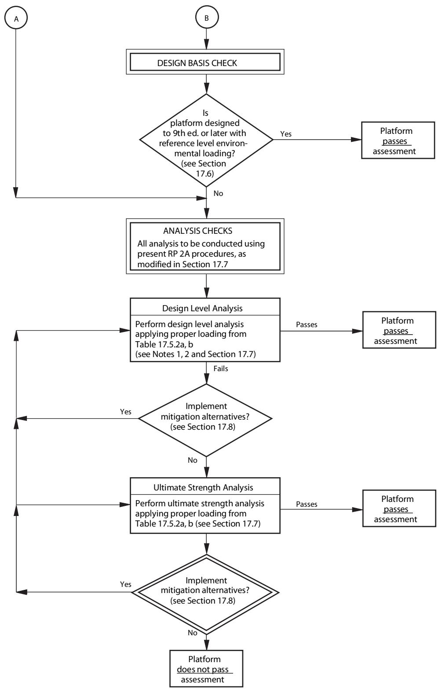  
Figure 17.5.2—Platform Assessment Process—Metroean Loading (Continued)

mental conditions. The reserve strength ratio (RSR) is used as a check of ultimate strength (see Table 17.5.2b). RSR is defined as the ratio of a platform's ultimate lateral load carrying capacity to its 100-year L-1 environmental condition lateral loading, computed using present API Recommended Practice 2A criteria for new design as contained in Section 2. Further discussion of metocean criteria is provided in Section 17.6.

The assessment process described herein is applicable for areas outside of the U.S., with the exception of the use of the reduced criteria which are applicable for indicated U.S. areas only. See also Section C17.1.

Platforms that have no significant damage, have an adequate deck height for their category (see Figures 17.6.2-2b, 17.6.2-3b, and 17.6.2-5b), and have not experienced significant changes from their design premise may be considered to be acceptable, subject to either of the following conditions:

1. Minimum consequence: If the platform is categorized as having minimum consequence (Level L-3, unmanned and low consequence of failure) the platform passes the assessment.   
2. Design basis check: If the platform is located in the U.S. Gulf of Mexico and was designed to the 9th Edition of API Recommended Practice 2A (1977) or later, the platform passes the assessment. However, in this case it must also be demonstrated that reference level hydrodynamic loading was used for platform design. The procedure to demonstrate that 9th Edition reference level forces were applied during design is described in Section 17.6.

Significant damage or change in design premise is defined in Section 17.2.6.

For all other platforms, the following applies:

3. Design level analysis: Design level analysis procedures are similar to those for new platform design, including the application of all safety factors, the use of nominal rather than mean yield stress, etc. Reduced metocean loading, relative to new design requirements, are referenced in Figure 17.5.2 and Section 17.6. Design level analysis requirements are described in 17.7.2. For minimum consequence platforms with damage or increased loading, an acceptable alternative to satisfying the design level analysis requirement is to demonstrate that the damage or increased loading is not significant relative to the as-built condition, as defined in 17.2.6. This would involve design level analyses of both the existing and as-built structures.   
4. Ultimate strength analysis: Ultimate strength analysis reduces conservatism, attempting to provide an unbiased estimate of platform capacity. The ultimate strength of a platform may be assessed using inelastic,

static pushover analysis. However, a design level analysis with all safety factors and sources of conservatism removed is also permitted, as this provides a conservative estimate of ultimate strength. See Section C17.7.3 .for further explanation. In both cases the ultimate strength metrocean criteria should be used. Ultimate strength analysis requirements are described in 17.7.3. For minimum consequence platforms with damage or increased loading, an acceptable alternative to the ultimate strength requirement is to demonstrate that the damage or increased loading is not significant relative to the as-built condition as defined in 17.2.6. This would involve ultimate strength analyses of both the existing and as-built structures.

Several investigators have developed simplified procedures for evaluation of the adequacy of existing platforms. To use these procedures successfully requires intimate knowledge of the many assumptions upon which they are based, as well as a thorough understanding of their application. The use of environmental loadings in simplified analysis are at the discretion of the operator; however, the simplified analysis method used must be validated as being more conservative than the design level analysis.

17.5.3 Assessment for Seismic Loading

For platforms with exposure categories noted in Section 1.7 (excluding the nonapplicable manned-evacuated category) that are subject to seismic loading in seismic zones 3, 4, and 5 (see Section C2.3.6c), the basic flow chart shown in Figure 17.5.2 is applicable to determine fitness for seismic loading with the following modifications:

1. Assessment for seismic loading is not a requirement for seismic zones 0, 1, and 2 (see Section C2.3.6c).   
2. Assessment for metocean loading should be performed for all seismic zones.   
3. Perform assessment for ice loading, if applicable.   
4. Design basis check: For all exposure categories defined in Section 1.7, platforms designed or recently assessed in accordance with the requirements of API Recommended Practice 2A, 7th Edition (1976), which required safety level analysis (referred to as "ductility level analysis" in subsequent editions), are considered to be acceptable for seismic loading, provided that:

a. No new significant fault has been discovered in the area.   
b. No new data indicate that a current estimate of strength level ground motion for the site would be significantly more severe than the strength level ground motion used for the original design.

c. Proper measures have been made to limit the life safety risks associated with platform appurtenances as noted in 2.3.6e.2.   
d. The platforms have no significant unrepaired damage.   
e. The platforms have been surveyed.   
f. The present and/or anticipated payload levels are less than or equal to those used in the original design.

5. Design level analysis: The design level analysis box in Figure 17.5.2 is not applicable to seismic assessment (see Section 17.6.3).   
6. Ultimate strength analysis: Level A-1 platforms that do not meet the screening criteria may be considered adequate for seismic loading provided they meet the life safety requirements associated with platform appurtenances as noted in 2.3.6e.2, and it can be suitably demonstrated by dynamic analysis using best estimate resistances that these platforms can be shown to withstand loads associated with a median 1,000-year return period earthquake appropriate for the site without system collapse.

Assessments of Level A-3 platforms also require satisfying the platform appurtenance requirements of 2.3.6e.2. However, A-3 platforms must be suitably demonstrated by dynamic analysis using best estimate resistance values that the platform can withstand earthquake loads associated with only a median 500-year return period event appropriate for the site without system collapse. A validated simplified analysis may be used for seismic assessment (see Section 17.5.2). It must be demonstrated that the simplified analysis will be more conservative than the ultimate strength analysis.

17.5.4 Assessment for Ice Loading

For all exposure categories of platforms subject to ice loading, the basic flowchart shown in Figure 17.5.2 is applicable to determine fitness for ice loading with the following modifications:

1. Perform assessment for metocean loading if applicable. Note this is not required for Cook Inlet, Alaska, as ice forces dominate.   
2. Perform assessment for seismic loading if applicable.   
3. Design basis check: All categories of platforms as defined in Section 1.7 that have been maintained and inspected, have had no increase in design level loading, are undamaged and were designed or previously assessed in accordance with API Recommended Practice 2N, 1st Edition (1988) or later, are considered to be acceptable for ice loading.

4. Design level analysis: Level A-1 platforms that do not meet the screening criteria may be considered adequate for ice loading if they meet the provision of API Recommended Practice 2N, 1st Edition (1988), using a linear analysis with the basic allowable stresses referred to in Section 3.1.2 increased by 50 percent.   
5. Level A-3 platforms that do not meet the screening criteria may be considered adequate for ice loading if they meet the provision of API Recommended Practice 2N, 1st Edition (1988), using a linear analysis with the basic allowable stresses referred to in Section 3.1.2 increased by 70 percent, which is in accordance with 2.3.6.c4 and 2.3.6.e.   
6. Ultimate strength analysis: Platforms that do not meet the design level analysis requirements may be considered adequate for ice loading if an ultimate strength analysis is performed using best estimate resistances, and the platform is shown to have a reserve strength ratio (RSR) equal to or greater than 1.6 in the case of A-1 platforms, and a RSR equal to or greater than 0.8 in the case of A-2 and A-3 platforms. RSR is defined as the ratio of platform ultimate lateral capacity to the lateral loading computed with API Recommended Practice 2N, 1st Edition (1988), procedures using the design level ice feature provided in Section 3.5.7 of Recommended Practice 2N.

A validated simplified analysis may be used for assessment of ice loading (see Section 17.5.2). It must be demonstrated that the simplified analysis will be as or more conservative than the design level analysis.

## 17.6 METOCEAN, SEISMIC, AND ICE CRITERIA/ LOADS

17.6.1 General

The criteria/loads to be utilized in the assessment of existing platforms should be in accordance with Section 2.0 with the exceptions, modifications, and/or additions noted herein as a function of assessment category defined in Section 17.3 and applied as outlined in Section 17.5.

17.6.2 Metrocean Criteria/Loads

The metocean criteria consist of the following items:

1. Omni-directional wave height versus water depth.   
2. Storm tide (storm surge plus astronomical tide).   
3. Deck height.   
4. Wave and current direction.   
5. Current speed and profile.   
6. Wave period.   
7. Wind speed.

The criteria are specified according to geographical region. At this time, only criteria for the U.S. Gulf of Mexico and three regions off the U.S. West Coast are provided. These regions are Santa Barbara, San Pedro Channels, and Central California (for platforms off Point Conception and Arguello). No metocean criteria are provided for Cook Inlet because ice forces dominate.

The criteria are further differentiated according to assessment category (that is, consequence of failure and life safety category combination) and type of analysis (that is, design level or ultimate strength).

Figures are provided that show metocean criteria in the Gulf of Mexico for each Assessment Category. The figures are valid down to water depths of 30 to 40 feet, depending upon where the criteria curve on each figure begins. The figures should not be used for water depths less than this since metocean conditions are difficult to predict in shallow water due to the effects of wave shoaling, bottom soils, coastline geometry and other factors. Development of the appropriate criteria for shallow water depths should be part of a specialist study by suitably qualified metocean personnel.

In some shallow water areas, platforms with large decks may be controlled by wind loads instead of wave and/or current loads. In such cases, the recommendations contained in Section 2.3.4.c7 Associated Wind Speed, should also be considered during the assessment process.

Wave/wind/current force calculation procedures for platform assessment have to consider two cases:

Case 1: wave clears the underside of the cellar deck.

Case 2: wave inundates the cellar deck; ultimate strength analyses must be performed.

For Case 1, the criteria are intended to be applied with wave/wind/current force calculation procedures specified in 2.3.1 through 2.3.4, except as specifically noted in 17.6.2.

For Case 2, the procedures noted in Case 1 apply in addition to the special procedures for calculating the additional wave/current forces on platform decks, provided in C17.6.2.

The following sections define the guideline metocean criteria and any special force calculation procedures for various geographical regions. Platform owners may be able to justify different metocean criteria for platform assessment than the guideline criteria specified herein. However, these alternative criteria must meet the following conditions:

1. Criteria must be based on measured data in winter storms and/or hurricanes, or on hindcast data from numerical models and procedures that have been thoroughly validated with measured data.   
2. Extrapolation of storm data to long return periods and determination of "associated" values of secondary met

ocean parameters must be done with defensible methodology.

3. Derivation of metocean criteria for platform assessment must follow the same logic as used to derive the guideline parameters provided herein. This logic is explained in "Metocean Criteria/Loads for use in Assessment of Existing Offshore Platforms," by C. Petrauskas, et al. [6].

17.6.2.a U.S. Gulf of Mexico Criteria

Criteria for platforms in the U.S. Gulf of Mexico include:

1. Metocean systems: Both hurricanes and winter storms are important to the assessment process. In calculating wave forces based on Section 2.3, a wave kinematics factor of 0.88 should be used for hurricanes, and 1.0 for winter storms.   
2. Deck height check: The deck heights shown in Figures 17.6.2-2b, 17.6.2-3b, and 17.6.2-5b are based on the ultimate strength analysis metocean criteria for each of the exposure categories. Specifically, the minimum deck height above MLLW measured to the underside of the cellar deck main beams is calculated as follows:

a. Minimum deck height = crest height of ultimate strength analysis wave height and associated wave period + ultimate strength analysis storm tide.   
b. The wave crest heights are calculated using the wave theory as recommended in 2.3.1b.2.   
c. If this criterion for the minimum deck height, measured to the minimum elevation of the underside of the cellar deck, is not satisfied, an ultimate strength analysis must be conducted with proper representation of hydrodynamic deck forces using the procedure described in C17.6.2.

3. Design basis check (for structures designed to Recommended Practice 2A, 9th Edition or later): For all exposure categories, a single vertical cylinder may be used to determine if the platform satisfies the 9th Edition reference level force. Figure 17.6.2-1 shows the 9th Edition wave forces as a function of water depth for diameters of 30 in., 48 in., 60 in., and 72 in. The forces are calculated using the wave theory as recommended in 2.3.1b.2. Consistent with the 9th Edition, the current is zero and no marine growth is used. The drag coefficient is 0.6 and the inertia coefficient is 1.5.

To verify that the platform was designed for 9th Edition reference level loads, the forces on the single cylinder need to be calculated using the original design wave height, wave period, current, tide, drag and inertia coefficients, wave-plus-current kinematics, and marine growth thickness. The cylinder diameter should

Figure 17.6.2-1—Base Shear for a Vertical Cylinder Based on API Recommended Practice 2A, 9th Edition Reference Level Forces   
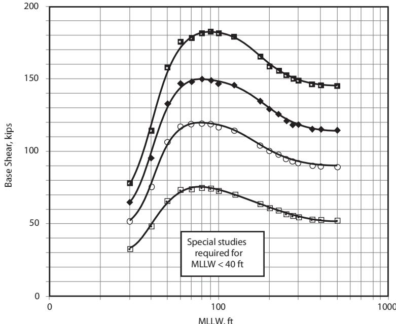  
30 in. OD Cylinder   
48 in. OD Cylinder   
60 in. OD Cylinder   
72 in. OD Cylinder

be equal to the platform leg diameter at the storm mean water level. If the forces are equal to or exceed that in Figure 17.6.2-1, the platform forces are considered consistent with 9th Edition requirements.

A more accurate approach is to build a hydrodynamic model of the structure and compare the base shear using the original design criteria with the base shear that is consistent with the 9th Edition reference level force. The 9th Edition forces should be calculated using the wave theory as recommended in 2.3.1b.2.

4. Design level and ultimate strength analyses:

a. A-1 High Assessment Category. The full hurricane population applies. The metocean criteria are provided in Table 17.6.2-1. The wave height and storm tide are functions of water depth; these are given in Figure 17.6.2-2a. The minimum deck height is also a function of water depth; this is shown in Figure 17.6.2-2b. The wave period, current speed, and wind speed do not depend on water depth; these are provided in Table 17.6.2-1.

If the underside of the cellar deck is lower than the deck height requirement given in Figure 17.6.2 2b, then an ultimate strength analysis will be required.

For design level analysis, omni-directional criteria are specified. The associated in-line current is given in Table 17.6.2-1 and is assumed to be constant for all directions and water depths. For some noncritical directions, the omni-directional criteria could exceed the design values of this recommended prac

tice, in which case the values of this recommended practice will govern for those directions. The current profile is given in 2.3.4c.4. The wave period, storm tide, and wind speed apply to all directions.

For ultimate strength analysis, the direction of the waves and currents should be taken into account. The wave height and current speed direction factor, and the current profile should be calculated in the same manner as described in 2.3.4c.4. The wave period and wind speed do not vary with water depth. Wave/current forces on platform decks should be calculated using the procedure defined in C17.6.2.

b. A-2 Medium Assessment Category: The combined sudden hurricane and winter storm population applies. The metocean criteria (referenced to the sudden hurricane population) are provided in Table 17.6.2-1. The wave height and storm tide are functions of water depth; these are shown in Figure 17.6.2-3a. The required deck height is also a function of water depth; this is given in Figure 17.6.2-3b. The wave period, current speed, and wind speed do not vary with water depth; these are provided in Table 17.6.2-1.

If the underside of the cellar deck is lower than the deck height requirement given in Figure 17.6.2-3b, then an ultimate strength analysis will be required.

For design level analysis, the metocean criteria are based on the 100-year force due to the combined

Table 17.6.2-1-U.S.Gulf of Mexico Metocean Criteria   

| Criteria | A-1 | A-1 | A-2 | A-2 | A-3 | A-3 |
| --- | --- | --- | --- | --- | --- | --- |
| Criteria | Full Population Hurricanes | Full Population Hurricanes | Sudden Hurricanes | Sudden Hurricanes | Winter Storms | Winter Storms |
| Criteria | Design Level Analysis | Ultimate Strength Analysis | Design Level Analysis | Ultimate Strength Analysis | Design Level Analysis | Ultimate Strength Analysis |
| Wave height and storm tide, ft | Fig. 17.6.2-2a | Fig. 17.6.2-2a | Fig. 17.6.2-3a | Fig. 17.6.2-3a | Fig. 17.6.2-5a | Fig. 17.6.2-5a |
| Deck height, ft | Fig. 17.6.2-2b | Fig. 17.6.2-2b | Fig. 17.6.2-3b | Fig. 17.6.2-3b | Fig. 17.6.2-5b | Fig. 17.6.2-5b |
| Wave and current direction | Omni-directional* | Fig. 2.3.4-4 | Omni-directional** | Fig. 17.6.2-4 | Omni-directional | Omni-directional |
| Current speed, knots | 1.6 | 2.3 | 1.2 | 1.8 | 0.9 | 1.0 |
| Wave period, seconds | 12.1 | 13.5 | 11.3 | 12.5 | 10.5 | 11.5 |
| Wind speed (1 hr @ 10 m), knots | 65 | 85 | 55 | 70 | 45 | 50 |

Note: ft = feet; hr = hour; m = meters.   
*If the wave height or current versus direction exceeds that required by Section 2, L-1 criteria for new designs, then the Section 2 criteria will govern.   
\*\*If the wave height or current versus direction exceeds that required for ultimate-strength analysis, then the ultimate-strength criteria will govern.

Figure 17.6.2-2a—Full Population Hurricane Wave Height and Storm Tide Criteria   
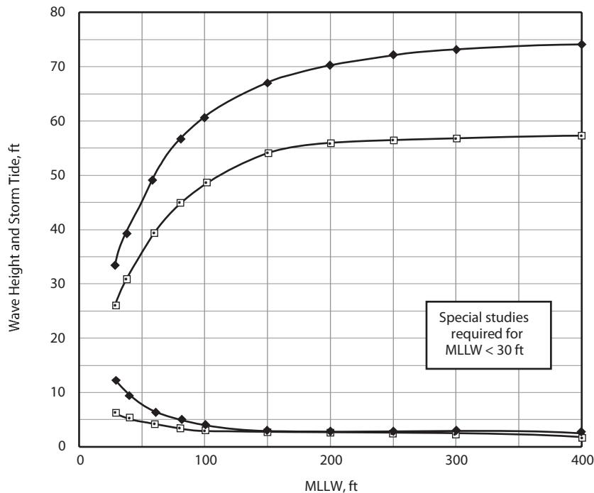  
Design Level   
Ultimate Str

sudden hurricane and winter storm population. Omni-directional criteria are specified. The associated in-line current is given in Table 17.6.2-1 and is assumed to be constant for all directions and water depths. For some noncritical directions, the omnidirectional criteria could exceed the ultimate strength analysis values, in which case the ultimate strength analysis values will govern for those direc

tions. The current profile is given in 2.3.4c.4. The wave period, storm tide, and wind speed apply to all directions. Although the criteria are based on both sudden hurricanes and winter storms, the wave forces should be calculated using a wave kinematics factor of 0.88 because the criteria are referenced to the sudden hurricane population.

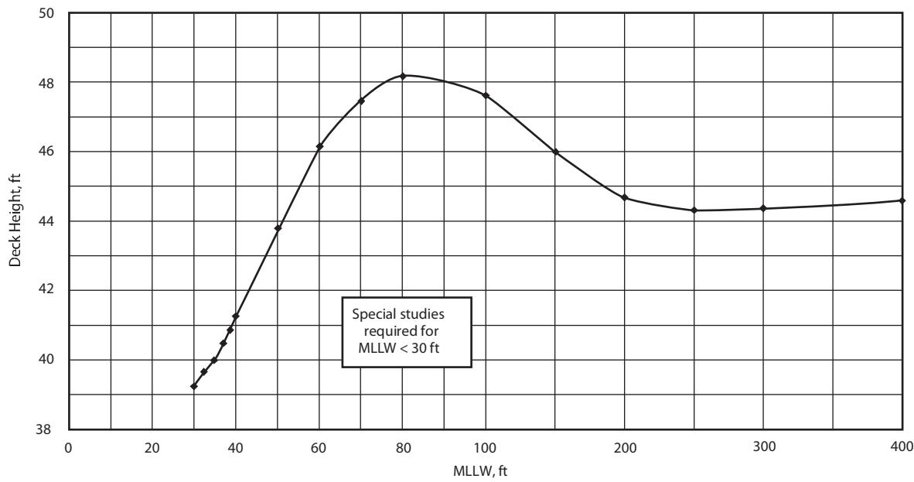  
Figure 17.6.2-2b—Full Population Hurricane—Minimum Elevation of Underside of the Cellar Deck

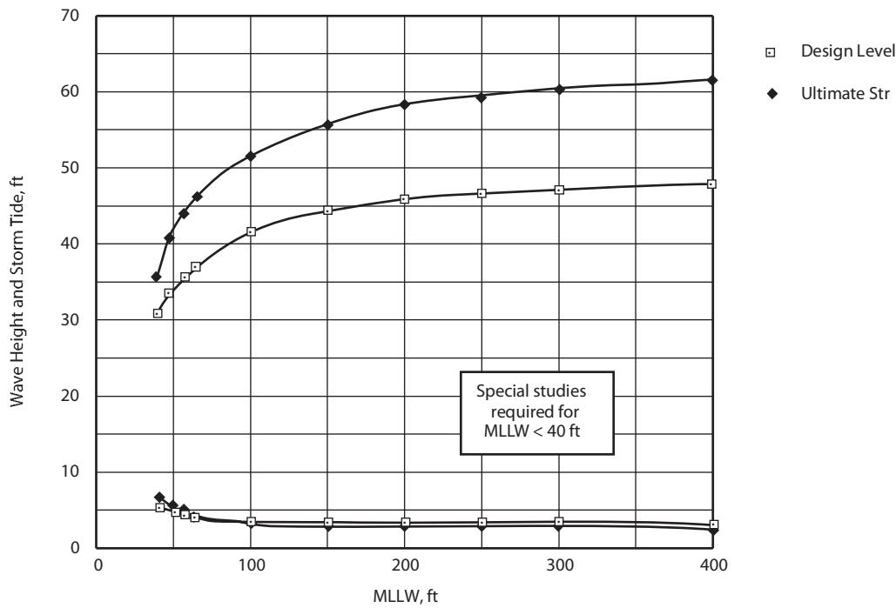  
Figure 17.6.2-3a—Sudden Hurricane Wave Height and Storm Tide Criteria

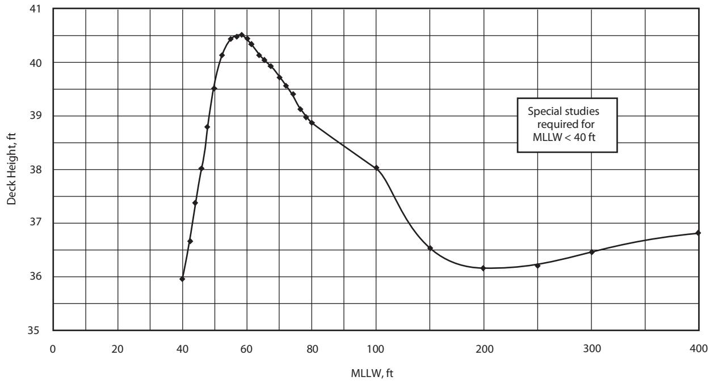  
Figure 17.6.2-3b—Sudden Hurricane—Minimum Elevation of Underside of the Cellar Deck

For ultimate strength analysis, the direction of the waves and currents should be taken into account. The wave height, associated current and profile, as a function of direction, should be calculated in the same manner as described in 2.3.4c.4, except that the directional factors should be based on Figure 17.6.2-4. The wave period and wind speed do not vary with water depth. Wave/current forces on platform decks should be calculated using the procedure defined in C17.6.2.

c. A-3 Low Assessment Category: The winter storm population applies. The metocean criteria are provided in Table 17.6.2-1. The wave height and storm tide are functions of water depth; these are shown in Figure 17.6.2-5a. The required deck height is also a function of water depth; this is given in Figure 17.6.2-5b. The wave period, current speed, and wind speed do not vary with water depth; these are provided in the Table 17.6.2-1.

If the underside of the cellar deck is lower than the deck height requirement given in Figure 17.6.2-5b, an ultimate strength analysis will be required.

For both design level and ultimate strength analysis, the wave height criteria are omnidirectional. The associated in-line current is provided in Table

17.6.2-1 and is assumed to be constant for all directions and water depths. The current profile should be the same as in Section 2.3.4c.4. The wave period, storm tide, and wind speed apply to all directions. Wave/current forces on platform decks should be calculated using the procedure defined in Section C17.6.2.

17.6.2.b U.S. West Coast Criteria

For platforms on the U.S. West Coast, the following criteria apply:

1. Metocean systems: The extreme waves are dominated by extratropical storm systems. In calculating wave forces based on Section 2.3, a wave kinematics factor of 1.0 should be used.   
2. Deck height check: The deck height for determining whether or not an ultimate strength check will be needed should be developed on the same basis as prescribed in Section 17.6.2a.2. The ultimate strength wave height should be determined on the basis of the acceptable RSR. The ultimate strength storm tide may be lowered from that in Table 17.6.2-2 to take into account the unlikely event of the simultaneous occurrence of highest astronomical tide and ultimate strength wave.

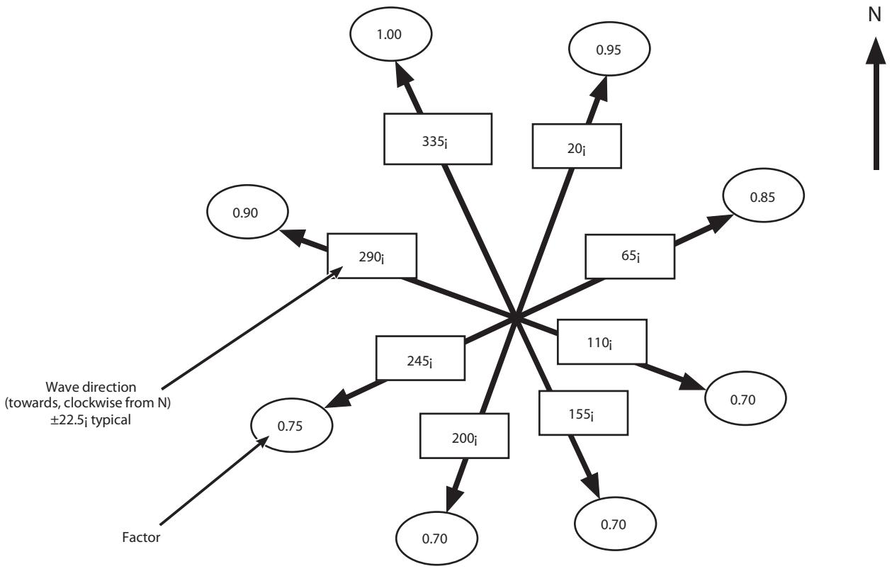  
Figure 17.6.2-4—Sudden Hurricane Wave Directions and Factors to Apply to the Omni-directional Wave Heights in Figure 17.6.2-3a for Ultimate Strength Analysis

Table 17.6.2-2—100-Year Metrocan Criteria for Platform Assessment U.S. Waters (Other Than Gulf of Mexico), Depth >300 feet   

| Santa Barbara Channel | Wave Height (ft) | Current (kts) | Wave Period (sec) | Storm Tide (ft) | Wave Speed, kts(1 hr @ 33 ft) |
| --- | --- | --- | --- | --- | --- |
| 120° 30′ W | 50 | 1 | 14 | 6 | 55 |
| 120° 15′ W | 43 | 1 | 13 | 6 | 50 |
| 120° 00′ W | 39 | 1 | 12 | 6 | 50 |
| 119° 45′ W and further east | 34 | 1 | 12 | 6 | 45 |
| San Pedro Channel |  |  |  |  |  |
| 118° 00′ to 118° 15′ | 43 | 1 | 13 | 6 | 50 |
| Central California |  |  |  |  |  |
| West of Point Conception | 56 | 1 | 14 | 7 | 60 |
| West of Point Arguello | 60 | 1 | 14 | 7 | 65 |

Note: ft = feet; kts = knots; sec = seconds; hr = hour.

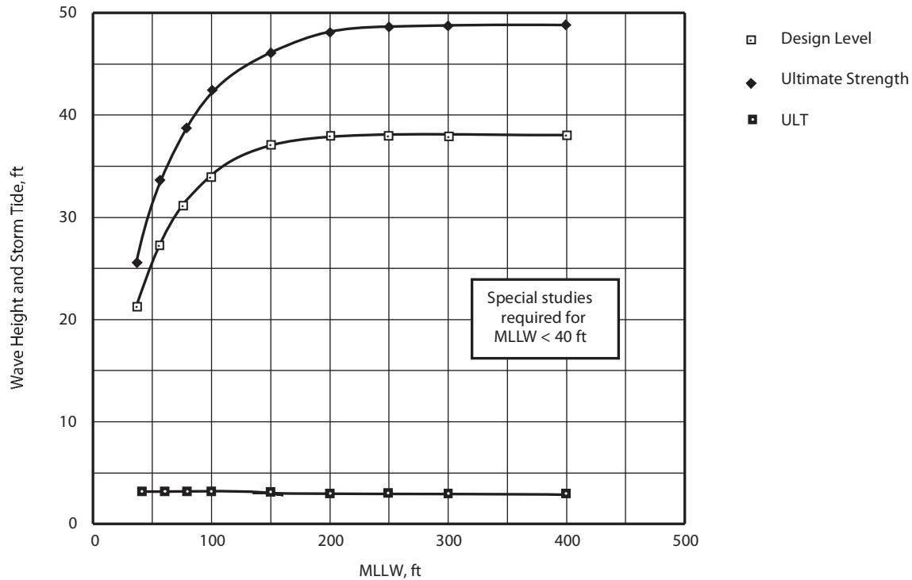  
Figure 17.6.2-5a—Winter Storm Wave Height and Storm Tide Criteria

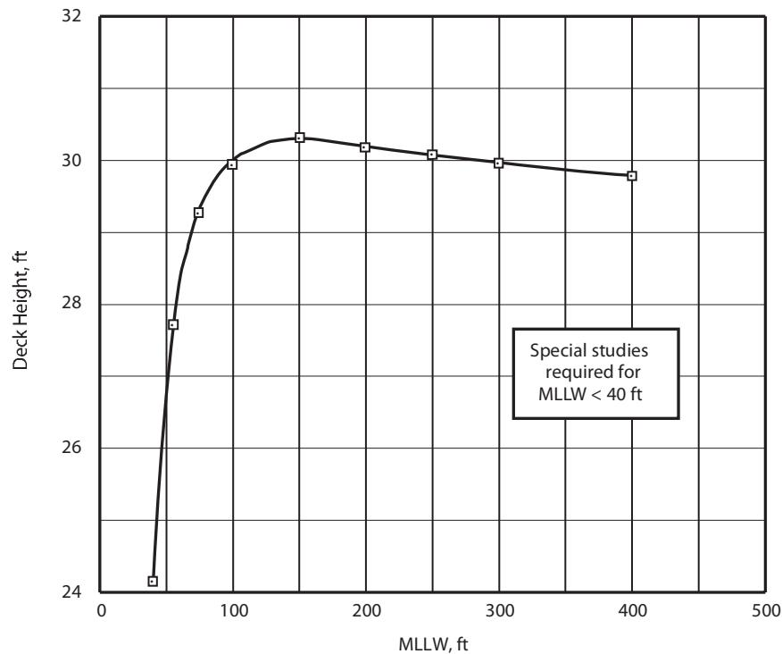  
Figure 17.6.2-5b—Winter Storm—Minimum Elevation of Underside of the Cellar Deck

3. Design basis check: Only applicable to U.S. Gulf of Mexico platforms.   
4. Design level and ultimate strength analysis: Table 17.6.2-2 presents the 100-year metocean criteria necessary for performing design level and ultimate strength checks. An ultimate strength check will be needed if the platform does not pass the design level check, or if the deck height is not adequate.

The criteria are for deep water (that is, greater than 91 meters [300 feet]) and should be applied omnidirectionally. Lower wave heights, provided they are substantiated with appropriate computations, may be justified for shallower water.

17.6.3 Seismic Criteria/Loads

Guidance on the selection of seismic criteria and loading is provided in 2.3.6 and C2.3.6. Additional details can be found in "Assessment of High Consequence-Platforms—Issues and Applications," by M.J.K. Craig and K.A. Digre [7]. In addition, the following applies:

1. The design basis check procedures noted in 17.5.3.4 are appropriate provided no significant new faults in the local area have been discovered, or any other information regarding site seismic hazard characterization has been developed that significantly increases the level of seismic loading used in the platform's original design.   
2. For seismic assessment purposes, the design level check is felt to be an operator's economic risk decision and, thus, is not applicable. An ultimate strength analysis is required if the platform does not pass the design basis check or screening.   
3. Ultimate strength seismic criteria is set at a median 1,000-year return period event for all platforms except those classified as minimum consequence. For the minimum consequence structures, a median 500-year return period event should be utilized. Characteristics of these seismic events should be based on the considerations noted in 2.3.6 and C2.3.6 as well as any other significant new developments in site seismic hazard characterization. The ultimate strength seismic criteria should be developed for each specific site or platform vicinity using best available technology.

17.6.4 Ice Criteria/Loads

Guidance on the selection of appropriate ice criteria and loading can be found in API Recommended Practice 2N, 1st Edition, 1988. Note that the ice feature geometries provided in Section 3.5.7 of API Recommended Practice 2N are not associated with any return period as no encounter statistics are presented. All references to screening, design level, and

ultimate strength analyses in Section 17.5.4 assume the use of the values noted in Table 3.5.7 of API Recommended Practice 2N. Where ranges are noted, the smaller number could be related to design level and the larger related to ultimate strength. Additional details can be found in "Assessment of High Consequence Platforms—Issues and Applications," by M.J.K. Craig and K.A. Digre [7].

## 17.7 STRUCTURAL ANALYSIS FOR ASSESSMENT

17.7.1 General

Structural analysis for assessment shall be performed in accordance with Sections 3, 4, 5, 6, and 7 with exceptions, modifications and/or additions noted herein. Additional information and references can be found in "Structural Assessment of Existing Platforms," by J. Kallaby, et. al. [3].

A structure should be evaluated based on its current condition, accounting for any damage, repair, scour, or other factors affecting its performance or integrity. Guidance on assessment information is provided in Section 17.4. The global structural model should be three-dimensional. Special attention should be given to defensible representation of the actual stiffness of damaged or corroded members and joints.

For platforms in areas subjected to ice loading, special attention should be given to exposed critical connections where steel that was not specifically specified for low temperature service was used.

17.7.2 Design Level Analysis Procedures

17.7.2.a General

Platforms of all exposure categories that do not pass the screening requirements may be evaluated using the design level procedures outlined below. These procedures may be bypassed by using the ultimate strength analysis procedures described in 17.7.3.

17.7.2.b Structural Steel Design

The assessment of structural members shall be in accordance with the requirements of Section 3, except as noted otherwise in this section. Effective length （$K)$ factors other than those noted in 3.3.1d may be used when justified. Damaged or repaired members may be evaluated using a rational, defensible engineering approach, including historical exposure or specialized procedures developed for that purpose.

17.7.2.c Connections

The evaluation of structural connections shall be in accordance with Section 4, except as noted otherwise in this section. The criteria listed in Section 4.1, which require that joints be able to carry at least 50 percent of the buckling load for compression members and at least 50 percent of the yield

stress for members loaded primarily in tension, need not be met. Tubular joints should be evaluated for the actual loads derived from the global analysis. The strength of grouted and ungrouted joints may be based on the results of ongoing experimental and analytical studies if it can be demonstrated that these results are applicable, valid, and defensible. For assessment purposes, the metallurgical properties of API Specification 2H material need not be met.

17.7.2.d Fatigue

As part of the assessment process for future service life, consideration should be given to accumulated fatigue degradation effects. Where Levels III and/or IV surveys are made (see Section 14.3) and any known damage is assessed and/or repaired, no additional analytical demonstration of future fatigue life is required. Alternatively, adequate fatigue life may be demonstrated by means of an analytical procedure compatible with Section 5.

17.7.3 Ultimate Strength Analysis Procedures

Platforms of all exposure categories, either by passing or not passing the requirements for screening and/or design level analysis, must demonstrate adequate strength and stability to survive the ultimate strength loading criteria set forth in Sections 17.5 and 17.6 to insure adequacy for the current or extended use of the platform. Special attention should be given to modeling of the deck should wave inundation be expected as noted in Section 17.6. The provisions of Section 17.7.2d (fatigue) apply even if the design level analysis is bypassed.

The following guidelines may be used for the ultimate strength analysis:

1. The ultimate strength of undamaged members, joints, and piles can be established using the formulas of Sections 3, 4, 6, and 7 with all safety factors removed (that is, a safety factor of 1.0). Nonlinear interactions (for example, arc-sine) may also be utilized where justified. The ultimate strength of joints may also be determined using a mean "formula or equation" versus the lower bound formulas for joints in Section 4.   
2. The ultimate strength of damaged or repaired elements of the structure may be evaluated using a rational, defensible engineering approach, including special procedures developed for that purpose.   
3. Actual (coupon test) or expected mean yield stresses may be used instead of nominal yield stresses. Increased strength due to strain hardening may also be acknowledged if the section is sufficiently compact, but not rate effects beyond the normal (fast) mill tension tests.

4. Studies and tests have indicated that effective length （$K)$ factors are substantially lower for elements of a frame subjected to overload than those specified in 3.3.1d. Lower values may be used if it can be demonstrated that they are both applicable and substantiated.

The ultimate strength may be determined using elastic methods, (see 17.7.3a and 17.7.3b), or inelastic methods, (see 17.7.3c), as desired or required.

17.7.3.a Linear Global Analysis

A linear analysis may be performed to determine if overstressing is local or global. The intent is to determine which members or joints have exceeded their buckling or yield strengths. The structure passes assessment if no elements have exceeded their ultimate strength. When few overloaded members and/or joints are encountered, local overload considerations may be used as outlined in 17.7.3b. Otherwise, a detailed global inelastic analysis is required.

17.7.3.b Local Overload Considerations

Engineering judgment suggests that overload in locally isolated areas could be acceptable, with members and/or joints having stress ratios greater than 1.0, if it can be demonstrated that such overload can be relieved through a redistribution of load to alternate paths, or if a more accurate and detailed calculation would indicate that the member or joint is not, in fact, overloaded. Such a demonstration should be based on defensible assumptions with consideration being given to the importance of the joint or member to the overall structural integrity and performance of the platform. In the absence of such a demonstration, it is necessary to perform an incremental linear analysis (in which failed elements are replaced by their residual capacities), or perform a detailed global inelastic analysis, and/or apply mitigation measures.

17.7.3.c Global Inelastic Analysis

1. General. Global inelastic analysis is intended to demonstrate that a platform has adequate strength and stability to withstand the loading criteria specified in Sections 17.5 and 17.6 with local overstress and damage allowed, but without collapse.

At this level of analysis, stresses have exceeded elastic levels and modeling of overstressed members, joints, and foundations must recognize ultimate capacity as well as post-buckling behavior, rather than the elastic load limit.

2. Method of Analysis. The specific method of analysis depends on the type of extreme environmental loading applied to the platform and the intended purpose of the analysis. Push-over and time-domain analysis methods are acceptable as described in C17.7.3c.2.

3. Modeling Element Types. For purposes of modeling, elements can be grouped as follows:

a. Elastic members: These are members that are expected to perform elastically throughout the ultimate strength analysis.   
b. Axially loaded members: These are members that are expected to undergo axial yielding or buckling during ultimate strength analysis. They are best modeled by strut-type elements that account for reductions in strength and stiffness after buckling.   
c. Moment resisting members: These members are expected to yield during the ultimate strength analysis, primarily due to high bending stresses. They should be modeled with beam-column type elements that account for bending and axial interaction, as well as the formation and degradation of plastic hinges.   
d. Joints: The assessment loads applied to the joint should be the actual loads, rather than those based on the strength of the braces connecting to the joint.   
e. Damaged/corroded elements: Damaged/corroded members or joints shall be modeled accurately to represent their ultimate and post-ultimate strength and deformation characteristics. Finite element and/ or fracture mechanics analysis could be justified in some instances.   
f. Repaired and strengthened elements: Members or joints that have been or must be strengthened or repaired should be modeled to represent the actual repaired or strengthened properties.   
g. Foundations: In carrying out a nonlinear pushover or dynamic time history analysis of an offshore platform, pile foundations should be modeled in sufficient detail to adequately simulate their response. It could be possible to simplify the foundation model to assess the structural response of the platform. However, such a model should realistically reflect the shear and moment coupling at the pile head. Further, it should allow for the nonlinear behavior of both the soil and pile. Lastly, a simplified model should accommodate the development of a collapse within the foundation for cases where this is the weak link of the platform system. Further foundation modeling guidance can be found in C17.7.3c.3g.

For ultimate strength analysis, it is usually appropriate to use best estimate soil properties as opposed to conservative interpretations. This is particularly true for dynamic analyses where it is not always clear what constitutes a conservative interpretation.

## 17.8 MITIGATION ALTERNATIVES

Structures that do not meet the assessment requirements through screening, design level analysis, or ultimate strength analysis (see Figure 17.5.2) will need mitigation actions. Mitigation actions are defined as modifications or operational procedures that reduce loads, increase capacities, or reduce exposure. Mitigation actions such as repairs should be designed to meet the requirements of this section, such that they do not reduce the overall strength of the platform. A "Review of Operations and Mitigation Methods for Offshore Platforms," by J. W. Turner, et al. [8] contains a general discussion of mitigation actions and a comprehensive reference list of prior studies and case histories.

## 17.9 REFERENCES

1. K.A. Digre, W.F. Krieger, D. Wisch, and C. Petrauskas, API Recommended Practice 2A, Draft Section 17, "Assessment of Existing Platforms," Proceedings of BOSS '94 Conference, July 1994.   
2. J. Kallaby, and P. O'Connor, "An Integrated Approach for Underwater Survey and Damage Assessment of Offshore Platforms," OTC 7487, Offshore Technology Conference Proceedings, May 1994.   
3. J. Kallaby, G. Lee, C. Crawford, L. Light, D. Dolan, and J.H. Chen, "Structural Assessment of Existing Platforms," OTC 7483, Offshore Technology Conference Proceedings, May 1994.   
4. W.F. Krieger, H. Banon, J. Lloyd, R. De, K.A. Digre, D. Nair, J.T. Irick, and S. Guynes, "Process for Assessment of Existing Platforms to Determine Their Fitness for Purpose," OTC 7482, Offshore Technology Conference Proceedings, May 1994.   
5. F.J. Puskar, R.K Aggarwal, C.A. Cornell, F. Moses, and C. Petrauskas, “A Comparison of Analytically Predicted Platform Damage to Actual Platform Damage During Hurricane Andrew,” OTC 7473, Offshore Technology Conference Proceedings, May 1994.   
6. C. Petrauskas, T.D. Finnigan, J. Heideman, M. Santala, M. Vogel, and G. Berek, “Metrocean Criteria/Loads for Use in Assessment of Existing Offshore Platforms,” OTC 7484, Offshore Technology Conference Proceedings, May 1994.   
7. M.J.K. Craig, and K.A. Digre, "Assessments of High Consequence Platforms: Issues and Applications," OTC 7485, Offshore Technology Conference Proceedings, May 1994.   
8. J.W. Turner, D. Wisch, and S. Guynes, “A Review of Operations and Mitigation Methods for Offshore Plat

forms," OTC 7486, Offshore Technology Conference Proceedings, May 1994.

18 Fire, Blast, and Accidental Loading

## 18.1 GENERAL

Fire, blast, and accidental loading events could lead to partial or total collapse of an offshore platform resulting in loss of life and/or environmental pollution. Considerations should be given in the design of the structure and in the layout and arrangement of the facilities and equipment to minimize the effects of these events.

Implementing preventive measures has historically been, and will continue to be, the most effective approach in minimizing the probability of occurrence of an event and the resultant consequences of the event. For procedures identifying significant events and for assessment of the effects of these events from a facility engineering standpoint, guidance for facility and equipment layouts can be found in API Recommended Practice 75, API Recommended Practice 14G, API Recommended Practice 14J, and other API 14 series documents.

The operator is responsible for overall safety of the platform and as such defines the issues to be considered (that is, in mild environments the focus may be on preventive measures, fire containment, or evacuation rather than focusing on control systems). The structural engineer needs to work closely with a facility engineer experienced in performing hazard analyses as described in API Recommended Practice 14J, and with the operator's safety management system as described in API Recommended Practice 75.

The probability of an event leading to a partial or total platform collapse occurring and the consequence resulting from such an event varies with platform type. In the U.S. Gulf of Mexico, considerations of preventive measures coupled with established infrastructure, open facilities and relatively benign environment have resulted in a good safety history. Detailed structural assessment should therefore not be necessary for typical U.S. Gulf of Mexico-type structures and environment.

An assessment process is presented in this section to:

1. Initially screen those platforms considered to be at low risk, thereby not requiring detailed structural assessment.   
2. Evaluate the structural performance of those platforms considered to be at high risk from a life safety and/or consequences of failure point of view, when subjected to fire, blast, and accidental loading events.

## 18.2 ASSESSMENT PROCESS

18.2.1 General

The assessment process is intended to be a series of evaluations of specific events that could occur for the selected platform over its intended service life and service function(s).

The assessment process is detailed in Figure 18.2-1 and comprises a series of tasks to be performed by the engineer to identify platforms at significant risk from fire, blast, or accidental loading, and to perform the structural assessment for those platforms.

The assessment tasks listed below should be read in conjunction with Figure 18.2-1 (Assessment Process) and Figure 18.5-1 (Risk Matrix). The tasks are as follows:

Task 1: For the selected platform, assign a platform exposure category as defined in Section 1.7 (that is, L-1, L-2, or L-3).

Task 2: For a given event, assign risk levels L, M, or H to the Probability (Likelihood or Frequency) of the event occurring as defined in Section 18.4.

Task 3: From Figure 18.5-1 (Risk Matrix), determine the appropriate risk level for the selected platform and event.

Task 4: Conduct further study or analyses to better define risk, consequence, and cost of mitigation. In some instances the higher risk may be deemed acceptable on the ALARP principle (that is, as low as reasonably practicable), when the effort and/or expense of mitigation becomes disproportionate to the benefit.

Task 5: If necessary, reassign a platform exposure category and/or mitigate the risk or the consequence of the event.

Task 6: For those platforms considered at high risk for a defined event, complete detailed structural integrity assessment for fire (see Section 18.6), blast (see Section 18.7), or accidental loading (see Section 18.9) events.

18.2.2 Definitions

Reassignment: Requires some change in the platforms function to allow the reassignment of life safety (that is, manned versus unmanned, and/or reassignment of consequence of failure level.

Mitigation: The action taken to reduce the probability or consequences of an event to avoid the need for reassignment (that is, provision of fire or blast walls to accommodation areas and/or escape routes).

Survival: For the purposes of Section 18, survival means demonstration that the escape routes and safe areas are maintained for a sufficient period of time to allow platform evacuation and emergency response procedure.

## 18.3 PLATFORM EXPOSURE CATEGORY

Platforms are categorized according to life safety and consequence of failure as defined in Section 1.7 (that is, L-1, L-2, or L-3).

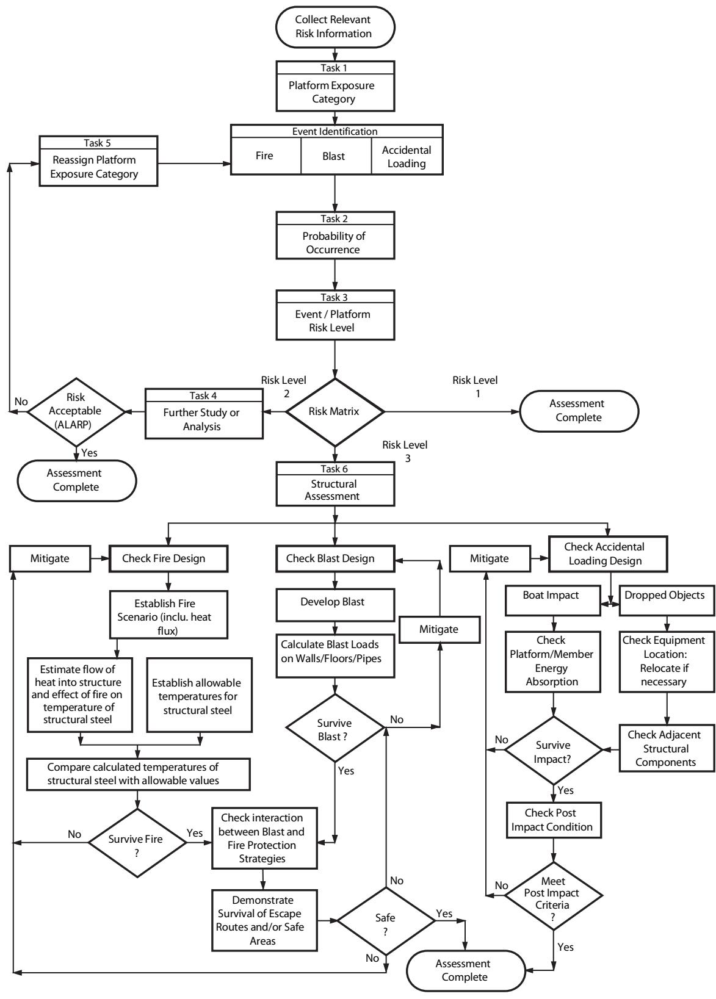  
Figure 18.2-1—Assessment Process

## 18.4 PROBABILITY OF OCCURRENCE

The probability of occurrence of a fire, blast, or accidental loading event is associated with the origin and escalation potential of the event. The type and presence of a hydrocarbon source can also be a factor in event initiation or event escalation. The significant events requiring consideration and their probability of occurrence levels (that is, L, M, or H) are normally defined from a fire and blast process hazard analysis.

The factors affecting the origin of the event can be as follows:

Equipment type: The complexity, amount, and type of equipment are important. Separation and measurement equipment, pump and compression equipment, fired equipment, generator equipment, safety equipment, and their piping and valves should be considered.

Product type: Product type (that is, gas, condensate, light or heavy crude) should be considered.

Operations type: The types of operations being conducted on the platform should be considered in evaluation of the probability of occurrence of an event. Operations can include drilling, production, resupply, and personnel transfer.

Production operations: Those activities that take place after the successful completion of the wells. They include separation, treating, measurement, transportation to shore, operational monitoring, modifications of facilities, and maintenance. Simultaneous operations include two or more activities.

Deck type: The potential of a platform deck to confine a vapor cloud is important. Whether a platform deck configuration is open or closed should be considered when evaluating the probability of an event occurring. Most platforms in mild environments such as the U.S. Gulf of Mexico are open allowing natural ventilation. Platform decks in northern or more severe climates (for example, Alaska, or the North Sea), are frequently enclosed, resulting in increased probability of containing and confining explosive vapors and high explosion overpressures. Equipment-generated turbulence on an open deck can also contribute to high explosion overpressures.

Structure Location: The proximity of the fixed offshore platform to shipping lanes can increase the potential for collision with non oil-field related vessels.

Other: Other factors such as the frequency of resupply, the type and frequency of personnel training, etc. should be considered.

Figure 18.5-1—Risk Matrix   
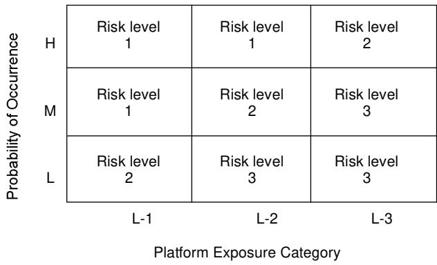  
Note: See Sections 1.7 and 18.5 for definitions of abbreviations

## 18.5 RISK ASSESSMENT

18.5.1 General

As shown in Figure 18.5-1, by using the exposure category levels assigned in Section 18.3 and the probability of occurrence levels developed in Section 18.4, fire, blast, and accidental loading scenarios may be assigned over all platform risk levels for an event as follows:

Risk Level 1: Significant risk that will likely require mitigation.

Risk Level 2: Risks requiring further study or analyses to better define risk, consequence, and cost of mitigation.

In some instances, the higher risk may be deemed acceptable on the ALARP principle (i.e., as low as reasonably practicable), when the effort and/or expense of mitigation becomes disproportionate to the benefit.

Risk Level 3: Insignificant or minimal risk that can be eliminated from further fire, blast, and accidental loading considerations.

18.5.2 Risk Matrix

The risk matrix shown in Figure 18.5-1 is a $3 \times 3$ matrix that compares the probability of occurrence with the platform exposure category for a defined event.

The matrix provides an overall risk level as described in Section 18.5.1 for each identified event for a given platform. More detailed risk assessment techniques or methodology, as described in API Recommended Practice 14J, may be used to determine the platform risk level. The overall risk level determines whether further assessment is required for the selected platform.

## 18.6 FIRE

If the assessment process discussed in Section 18.2 identifies that a significant risk of fire exists, fire should be considered as a load condition. Fire as a load condition may be treated using the techniques presented in the commentary.

The structural assessment must demonstrate that the escape routes and safe areas are maintained to allow sufficient time for platform evacuation and emergency response procedures to be implemented.

## 18.7 BLAST

If the assessment process discussed in Section 18.2 identifies that a significant risk of blast exists, blast should be considered as a load condition. Blast as a load condition may be treated using the techniques presented in the commentary.

The blast assessment needs to demonstrate that the escape routes and safe areas survive.

## 18.8 FIRE AND BLAST INTERACTION

Fire and blast are often synergistic. The fire and blast analyses should be performed together and the effects of one on the other carefully analyzed.

Examples of fire and blast interaction may be found in the commentary.

## 18.9 ACCIDENTAL LOADING

18.9.1 General

Section 2.3.7 is superseded by this Section 18.9.

Fixed offshore platforms are subject to possible damage from:

1. Vessel collision during normal operations.   
2. Dropped objects during periods of construction, drilling, or resupply operations.

If the assessment process discussed in Section 18.2 identifies a significant risk from this type of loading, the effect on structural integrity of the platform should be assessed.

18.9.2 Vessel Collision

The platform should survive the initial collision and meet the post-impact criteria.

The commentary offers guidance on energy absorption techniques for vessel impact loading and recommendations for post-impact criteria and analyses.

18.9.3 Dropped Objects

Certain locations such as crane loading areas are more subject to dropped or swinging objects. The probability of occurrence may be reduced by following safe handling practices

(for example, API Recommended Practice 2D, Recommended Practice for Operation and Maintenance of Offshore Cranes).

The consequences of damage may be minimized by considering the location and protection of facilities and critical platform areas. Operation procedures should limit the exposure of personnel to overhead material transfer.

The platform should survive the initial impact from dropped objects and meet the post-impact criteria as defined for vessel collision.

COMMENTARY ON SECTION 1.7—EXPOSURE CATEGORIES

C1.7.1 Life Safety

C1.7.1a L-1 Manned-nonevacuated

The manned-nonevacuated condition is not normally applicable to the U.S. Gulf of Mexico. Current industry practice is to evacuate platforms prior to the arrival of hurricanes.

C1.7.1b L-2 Manned-evacuated

In determining the length of time required for evacuation, consideration should be given to the distances involved; the number of personnel to be evacuated; the capacity and operating limitations of the evacuating equipment; the type and size of docking/landings, refueling, egress facilities on the platform; and the environmental conditions anticipated to occur throughout the evacuation effort.

C1.7.1c L-3 Unmanned

An occasionally manned platform, (for example, manned for only short duration such as maintenance, construction, workover operations, drilling, and decommissioning,) may be classified as Unmanned. However, manning for short duration should be scheduled to minimize the exposure of personnel to any design environmental event.

C1.7.2 Consequences of Failure

The degree to which negative consequences could result from platform collapse is a judgment which should be based on the importance of the structure to the owner's overall operation, and to the level of economic losses that could be sustained as a result of the collapse. In addition to loss of the platform and associated equipment, and damage to connecting pipelines, the loss of reserves should be considered if the site is subsequently abandoned. Removal costs include the salvage of the collapsed structure, reentering and plugging damaged wells, and cleanup of the sea floor at the site. If the site is not to be abandoned, restoration costs must be considered, such as replacing the structure and equipment, and reentering the wells. Other costs include repair, rerouting, or reconnecting pipelines to the new structure. In addition, the

cost of mitigating pollution and/or environmental damage should be considered in those cases where the probability of release of hydrocarbons or sour gas is high.

When considering the cost of mitigating of pollution and environmental damage, particular attention should be given to the hydrocarbons stored in the topside process inventory, possible leakage of damaged wells or pipelines, and the proximity of the platform to the shoreline or to environmentally sensitive areas such as coral reefs, estuaries, and wildlife refuges. The potential amount of liquid hydrocarbons or sour gas released from these sources should be considerably less than the available inventory from each source. The factors affecting the release from each source are discussed below.

Topsides Inventory. At the time of a platform collapse, liquid hydrocarbon in the vessels and piping is not likely to be suddenly released. Due to the continuing integrity of most of the vessels, piping and valves, it is most likely that very little of the inventory will be released. Thus, it is judged that significant liquid hydrocarbon release is a concern only in those cases where the topsides inventory includes large capacity containment vessels.

Wells. The liquid hydrocarbon or sour gas release from wells depends on several variables. The primary variable is the reliability of the subsurface safety valves (SSSV), which are fail-safe closed or otherwise activated when an abnormal flow situation is sensed. Where regulations require the use and maintenance of SSSVs, it is judged that uncontrolled flow from wells may not be a concern for the platform assessment. Where SSSVs are not used and the wells can freely flow, (for example, are not pumped) the flow from wells is a significant concern.

The liquid hydrocarbon or sour gas above the SSSV could be lost over time in a manner similar to a ruptured pipeline; however, the quantity will be small and may not have significant impact.

Pipelines. The potential for liquid hydrocarbon or sour gas release from pipelines or risers is a major concern because of the many possible causes of rupture, (for example, platform collapse, soil bottom movement, intolerable unsupported span lengths, and anchor snag). Only platform collapse is addressed in this document. Platform collapse is likely to rupture the pipelines or risers near or within the structure. For the design environmental event where the lines are not flowing, the maximum liquid hydrocarbon or sour gas release will likely be substantially less than the inventory of the line. The amount of product released will depend on several variables such as the line size, the residual pressure in the line, the gas content of the liquid hydrocarbon, the undulations of the pipeline along its route, and other secondary parameters.

Of significant concern are major oil transport lines which are large in diameter, longer in length, and have a large invent

tory. In-field lines, which are much smaller and have much less inventory, may not be a concern.

C1.7.2a L-1 High Consequence

This consequence of failure category includes drilling and/or production, storage or other platforms without restrictions on type of facility. Large, deep water platforms as well as platforms which support major facilities or pipelines with high flow rates usually fall into this category. Also included in the L-1 classification are platforms located where it is not possible or practical to shut-in wells prior to the occurrence of the design event such as areas with high seismic activity.

C1.7.2b L-2 Medium Consequence

This consequence of failure category includes conventional mid-sized drilling and/or production, quarters, or other platforms. This category is typical of most platforms used in the U.S. Gulf of Mexico and may support full production facilities for handling medium flow rates. Storage is limited to process inventory and "surge" tanks for pipeline transfer. Platforms in this category have a very low potential for well flow in the event of a failure since sub-surface safety valves are required and the wells are to be shut-in prior to the design event.

C1.7.2c L-3 Low Consequence

This consequence of failure category generally includes only caissons and small well protectors. Similar to Category L-2, platforms in this category have a very low potential for well flow in the event of a failure. Also, due to the small size and limited facilities, the damage resulting from platform failure and the resulting economic losses would be very low. New Gulf of Mexico platforms qualifying for this category are limited to shallow water consistent with the industry's demonstrated satisfactory experience. Also, new platforms are limited to no more than five well completions and no more than two pieces of production equipment. To qualify for this category, pressure vessels are considered to be individual pieces of equipment if used continuously for production. However, a unit consisting of a test separator, sump, and flare scrubber are to be considered as only one piece of equipment.

COMMENTARY ON WAVE FORCES, SECTION 2.3.1

C2.3.1b1 Apparent Wave Period

Kirby and Chen (1989) developed a consistent first-order solution for the apparent wave period of a wave propagating on a current with an arbitrary profile. Their procedure

requires the solution of the following three simultaneous equations for $T_{app}$ , $\lambda$ , and $V_I$ :

$$\frac{\lambda}{T} = \frac{\lambda}{T_{a p p}} + V_{I}$$

$$T_{a p p}^{2} = \frac{2 \pi \lambda}{g \tanh (2 \pi d / \lambda)}$$

$$V_{I} = \frac{(4 \pi / \lambda)}{\sinh (4 \pi d / \lambda)} \int_{- d}^{0} U_{c} (z) \cosh \left[ \frac{4 \pi (z + d)}{\lambda} \right] d z$$

Here, $\lambda$ is wave length, $T$ is the wave period seen by a stationary observer, $T_{app}$ is the wave period seen by an observer moving at the effective in-line current speed $V_I$ , $g$ is the acceleration due to gravity, $U_c(z)$ is the component of the steady current profile at elevation $z$ (positive above storm mean level) in the wave direction, and $d$ is storm water depth. For the special case of a uniform current profile, the solution to these equations is provided in dimensionless form in Figure 2.3.1-2.

C2.3.1b2 Two-dimensional Wave Kinematics

There are several wave theories that can be used to predict the kinematics of the two-dimensional, regular waves used for static, deterministic wave load calculations. The different theories all provide approximate solutions to the same differential equation and boundary conditions. All compute a wave that is symmetric about the crest and propagates without changing shape. They differ in their functional formulation and in the degree to which they satisfy the nonlinear kinematic and dynamic boundary conditions at the surface of the wave.

Linear wave theory is applicable only when the linearization of the free surface boundary conditions is reasonable, i.e., when the wave amplitude and steepness are infinitesimal. Stokes V (Sarpkaya and Icaacson, 1981) is a fifth order expansion about mean water level and satisfies the free surface boundary conditions with acceptable accuracy over a fairly broad range of applications, as shown in Figure 2.3.1-3 Atkins (1990). Chappelear's (1961) theory is similar to Stokes V but determines the coefficients in the expansion numerically through a least squares minimization of errors in the free surface boundary conditions, rather than analytically. EXVP-D (Lambrakos, 1981) satisfies the dynamic boundary condition exactly and minimum the errors in the kinematic boundary condition. Stream Function theory (Dean and Perlin, 1986) satisfies the kinematic boundary condition exactly and minimizes the errors in the dynamic boundary condition.

When Stokes V theory is not applicable, higher-order Chapplelear, EXVP-D, or Stream Function theory may be

used. Of these, the most broadly used is Stream Function. Selection of the appropriate solution order can be based on either the percentage error in the dynamic boundary condition or the percentage change in velocity or acceleration in going to the next higher order. These two methods select comparable solution orders over most of the feasible domain but differ in the extremes of $H > 0.9H_{b}$ and $d / gT_{app}^2 < 0.003$ . In these extremes, the theory has not been well substantiated with laboratory measurements, and should therefore be used with caution. In particular, the curve for breaking wave height $H_{b}$ shown in Figure 2.3.1-3 is not universally accepted.

C2.3.1b3 Wave Kinematics Factor

In wave force computations with regular waves, the kinematics are computed assuming a unidirectional sea (long-crested waves all propagating in the same direction), whereas the real sea surface is comprised of short-crested, directional waves. In fact, the sea surface can be viewed as the superposition of many small individual wavelets, each with its own amplitude, frequency, and direction of propagation. Fortunately, the directional spreading of the waves tends to result in peak forces that are somewhat smaller than those predicted from unidirectional seas. This force reduction due to directional spreading can be accommodated in static, deterministic wave force design procedures by reducing the horizontal velocity and acceleration from a two-dimensional wave theory by a "spreading factor."

There is generally much less directional spreading for wave frequencies near the peak of the wave spectrum than for higher frequencies (Forristall, 1986, for example). Since the kinematics of the large, well-formed individual waves used in static design are dominated by the most energetic wave frequencies, it is appropriate to use a "spreading factor" corresponding to the spectral peak period. Use of a weighted average spreading factor over all the wave frequencies in the spectrum would be unconservative. The spreading factor can be estimated either from measured or hindcast directional spectral wave data as $\sqrt{(n + 1) / (n + 2)}$ , where $n$ is the exponent in the $\cos^n\theta$ spreading function at the spectral peak frequency. Note that measured directional data from pitch/roll buoys tend to significantly overestimate spreading, while directional data from a two-horizontal axis particle velocimeter are thought to provide a good estimate of spreading.

There is some evidence that, even in seastates with very little directional spreading, two-dimensional Stream Function or Stokes V theory overpredicts the fluid velocities and accelerations (Skjelbreia et al., 1991). This may be attributed to the irregularity of the real wave, i.e., its front-to-back asymmetry about the wave crest and its change in shape as it propagates. If an "irregularity factor" less than unity is supported by high quality wave kinematics data, including measurements in the crest region above mean water level, appropriate for the types of design-level seastates that the platform may experience,

then the "spreading factor" can be multiplied by the "irregularity factor" to get an overall reduction factor for horizontal velocity and acceleration.

C2.3.1b4 Current Blockage Factor

No space-frame or lattice-type structure is totally transparent to waves and current. In other words, all structures cause a global distortion of the incident waves and current in and around the structure. Since global load for space-frame structures is calculated by summing individual member forces, it is important that the local incident flow used to calculate local member forces in Morison's equation account for global distortion effects.

Space-frame structures distort the waves as well as the current. Papers by Shankar and Khader (1981) and by Hanif and Boyd (1981), for example, address the reduction in wave amplitude across arrays of vertical cylinders. Some field data indicate that the rms orbital velocity very near the platform is slightly reduced from that at several platform widths upwave. However, this reduction is not evident in all the data. Until more evidence to the contrary is accumulated, it is appropriate to continue with the assumption that a typical space-frame platform does not significantly distort the incident wave kinematics in a global sense.

For currents, however, there now exists a substantial body of evidence which supports a reduction in the current within the platform space-frame relative to the freestream current. Laboratory and field data indicate that the blockage factor can be as low as 0.6 for a structure as dense as the Lena guyed tower (Steele, 1986; Steele et al., 1988; Lambrakos et al., 1989); about 0.7 for a typical compliant tower (Monopolis and Danaczko, 1989); and about 0.75 to 0.85 for a typical jacket (Allender and Petrauskas, 1987). Figure C2.3.1-1 shows the measured current field at 60 ft. depth around and through the Bullwinkle platform in a Loop Current event in 1991. The average blockage factor within the platform computed from the data is 0.77.

The blockage factor for steady current can be estimated from the "actuator disk" model (Taylor, 1991) as

$$[ 1 + \Sigma (C_{d} A)_{i} / 4 \overline{{A}} ]^{-1}$$

where $\Sigma (C_dA)_i$ is the summation of the "drag areas" of all the members (including horizontals) in the flow, and A is the area within the perimeter area of the platform projected normal to the current. For structures where geometry changes significantly with depth, the blockage factor can be computed for different depth levels, if the calculated reduction factor is less than 0.7, consideration should be given to modeling the platform as a series of actuator disks rather than a single actuator disk. Other limitations of the actuator disk model are discussed by Taylor (1991).

An alternative expression for the blockage factor based on a similar approach to Taylor's but accounting for mixing downstream, is given by Lambrakos and Beckmann (1982). In the case of small values of the ratio $\Sigma(C_dA)_i / \overline{A}$ , the alternative expression reduces to Taylor's. Lambrakos and Beckmann also give expressions for treating the jacket and conductor group separately.

The global "blockage" discussed here, and the "shielding" discussed in C2.3.1b8 are related. In fact, Lambrakos et al. (1989) use the term "shielding" instead of the term "blockage" to describe the current speed reduction. The term interference has also been used in discussions of these phenomena. For present purposes the term "shielding" is used only in reference to members in the local wake of neighboring members (like conductor arrays), and the "shielding factor" is to be applied to the calculated loads due to both waves and currents. The term "blockage" is used in reference to the entire structure, and the "blockage factor" is to be applied to the far-field current speed only. With this distinction, one would first use the blockage factor to calculate a reduced current speed and undisturbed wave kinematics would be used in Morison's equation to calculate local loads on all members. The calculated loads on conductors would then be reduced by the shielding factor.

C2.3.1b5 Combined Wave/Current Kinematics

Dalrymple and Heideman (1989) and Eastwood and Watson (1989) showed that waves alternately stretch and compress the current profile under crests and troughs, respectively. Dalrymple and Heideman found that a model that combined Doppler-shifted wave kinematics with a nonlinearly stretched current profile gave the best estimate of global loads on a structure. Nonlinear stretching computes the stretched current for a particle instantaneously at elevation $z$ as the speed $U_{c}(z^{\prime})$ evaluated from the specified current profile at elevation $z^{\prime}$ , the mean elevation of the particle over a full wave cycle. The elevations $z$ and $z^{\prime}$ are related through linear (Airy) wave theory as follows:

$$z = z^{\prime} + \eta \frac{\sinh (2 \pi (z^{\prime} + d) / \lambda_{n})}{\sinh (2 \pi d / \lambda_{n})}$$

Here, $d$ is storm water depth, $\eta$ is the wave surface directly above the water particle, and $\lambda_{n}$ is the wave length determined from nonlinear wave theory for a wave of height $H$ and period $T_{app}$ . The elevations $z$ , $z'$ , and $\eta$ are all positive above storm mean water level.

This equation gives a nonlinear stretching of the current, with the greatest stretching occurring high in the water column, where the particle orbits have the greatest radii. The nonlinearly stretched current profile, coupled with Doppler shifted wave kinematics, produces global platform loads that

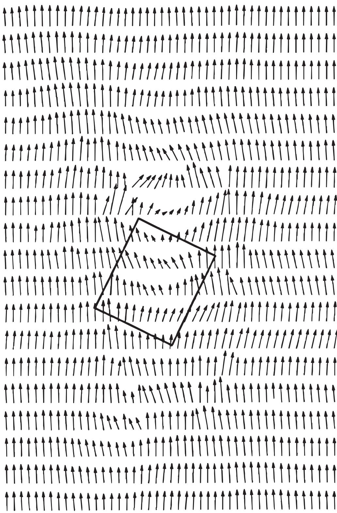  
Figure C2.3.1-1—Current Vectors Computed from Doppler Measurements at 60 ft   
on the Bullwinkle Platform (100 cm/s →)

are within $+1$ to $-4$ percent of those produced by the exact solution on a typical drag-dominant structure subjected to representative waves and current profiles.

Another acceptable approximate model for many applications is one that uses a linearly stretched current profile, with

$$z + d = \left(z^{\prime} + d\right) (d + \eta) / d$$

The stretched current profiles from the two models are compared qualitatively in Figure C2.3.1-2 for typical sheared and slab current profiles under a wave crest. The linearly stretched current produces global loads on a typical drag-dominant platform that are nearly as accurate as those produced by the nonlinearly stretched current, being within 0 to $-6$ percent of loads produced by the exact solution. However, it does not simulate the combined wave/current velocity profile from the exact solution as faithfully as nonlinear stretching.

Vertical extrapolation of the input current profile above mean water level produces reasonably accurate estimates of global loads on drag-dominant platforms in most cases. In particular, for a slab profile thicker than about $50\mathrm{m}$ , like the recommended profiles in Section 2.3.4, vertical extrapolation produces nearly the same result as nonlinear stretching, as illustrated in Figure C2.3.1-2. However, if the specified profile $U_{c}(z)$ has a very high speed at mean water level, sheared to much lower speeds just below mean water level, the global force may be overestimated (by about 8 percent in a typical application).

Another approximate model is the linearly stretched model described above, adjusted so that the total momentum in the stretched profile from the seafloor to the wave surface equals that in the specified profile from the seafloor to mean water level. This procedure is not supported by the theoretical analyses of Dalrymple and Heideman (1989) or Eastwood and Watson (1989).

If the current is not in the same direction as the wave, the methods discussed above may still be used, with one modification. Both the in-line and normal components of current would be stretched, but only the in-line component would be used to estimate $T_{app}$ for the Doppler-shifted wave.

While no exact solution has been developed for irregular waves, the wave/current solution for regular waves can be logically extended. In the first two approximations described above for regular waves, the period and length of the regular wave should be replaced with the period and length corresponding to the spectral peak frequency.

C2.3.1b6 Marine Growth

All elements of the structure (members, conductors, risers, appurtenances, etc.) are increased in cross-sectional area by marine growth. The effective element diameter (cross-sectional width for non-circular cylinders, or prisms) is $D = D_{c} +$

$2t$ , where $D_{c}$ is the "clean" outer diameter and $t$ is the average growth thickness that would be obtained by circumferential measurements with a 1 inch to 4 inch-wide tape. An additional parameter that affects the drag coefficient of elements with circular cross-sections is the relative roughness, $e = k / D$ , where $k$ is the average peak-to-valley height of "hard" growth organisms. Marine growth thickness and roughness are illustrated in Figure C.2.3.1-3 for a circular cylinder. Marine organisms generally colonize a structure soon after installation. They grow rapidly in the beginning, but growth tapers off after a few years. Marine growth has been measured on structures in many areas but must be estimated for other areas.

C2.3.1b7 Drag and Inertia Coefficients

In the ocean environment, the forces predicted by Morison's equation are only an engineering approximation. Morison's equation can match measured drag and inertia forces reasonably well in any particular half wave cycle with constant $C_d$ and $C_m$ , but the best fit values of $C_d$ and $C_m$ vary from one half wave cycle to another. Most of the variation in $C_d$ and $C_m$ can be accounted for by expressing $C_d$ and $C_m$ as functions of

Relative surface roughness $e = k / D$

Reynolds number $R_{m} = U_{m}D / \nu$

Keulegan-Carpenter number $K = 2U_{m}T_{2} / D$

Current/wave velocity ratio $r = V_{1} / U_{mo}$

Member orientation

Here $U_{m}$ is the maximum velocity (including current) normal to the cylinder axis in a half wave cycle, $T_{2}$ is the duration of the half wave cycle, $V_{1}$ is the in-line (with waves) current component, $U_{mo}$ is the maximum wave-induced orbital velocity, $D$ is effective diameter (including marine growth), $\nu$ is the kinematic viscosity of water, and $k$ is the absolute roughness height.

Surface Roughness. The dependence of $C_{ds}$ , the steady-flow drag coefficient at post-critical Reynolds numbers, on relative surface roughness, is shown in Figure C2.3.1-4, for "hard" roughness elements. All the data in this figure have been adjusted, if necessary, to account for wind tunnel blockage and to have a drag coefficient that is referenced to the effective diameter $D$ , including the roughness elements.

Natural marine growth on platforms will generally have $e > 10^{-3}$ . Thus, in the absence of better information on the expected value of surface roughness and its variation with depth for a particular site, it is reasonable to assume $C_{ds} = 1.00$ to 1.10 for all members below high tide level. One would still need to estimate the thickness of marine growth that will ultimately accumulate in order to estimate the

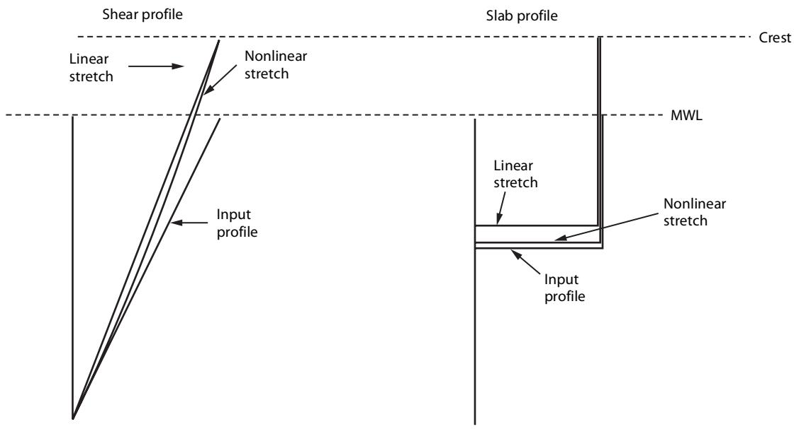  
Figure C2.3.1-2—Comparison of Linear and Nonlinear Stretching of Current Profiles

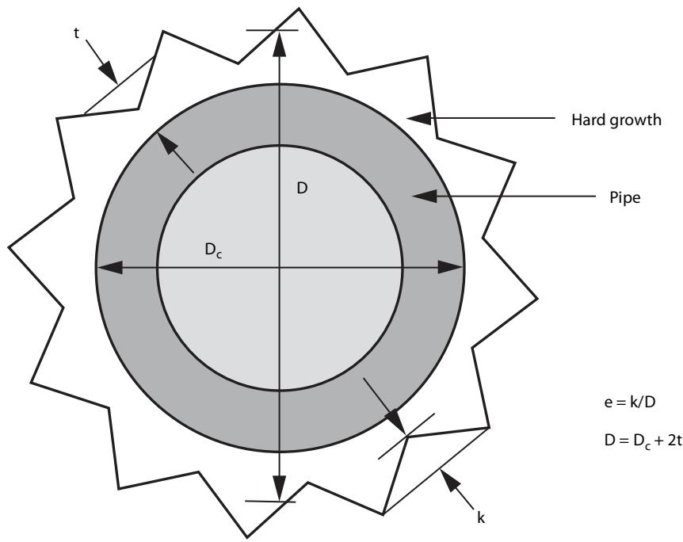  
Figure C2.3.1-3—Definition of Surface Roughness Height and Thickness

effective diameter $D$ . For members above high tide level, a reasonable estimate of surface roughness is $k = 0.002$ inches （$0.05 \mathrm{~mm})$ , which will give $C_{ds}$ in the range 0.6 to 0.7 for typical diameters.

All the data in Figure C2.3.1-4 are for cylinders that are densely covered with surface roughness elements. Force measurements (Kasahara and Shimazaki, 1987; Schlichting, 1979) show that there is little degradation in the effectiveness of surface roughness for surface coverage as sparse as $10\%$ , but that roughness effects are negligible for surface coverage less than $3\%$ .

The effect of soft, flexible growth on $C_{ds}$ is poorly understood. Tests run by Nath (1987) indicate that (a) soft, fuzzy growth has little effect, $C_{ds}$ being determined predominantly by the underlying hard growth; and (b) anemones and kelp produce drag coefficients similar to those for hard growth.

For cylindrical members whose cross section is not circular, $C_{ds}$ may be assumed to be independent of surface roughness. Suitable values are provided by $DnV$ (1977).

Surface roughness also affects the inertia coefficient in oscillatory flow. Generally, as $C_d$ increases with roughness, $C_m$ decreases. More information is provided in subsequent discussions.

Reynolds Number. The force coefficients for members whose cross sections have sharp edges are practically independent of Reynolds number. However, circular cylinders have coefficients that depend on Reynolds number.

Fortunately, for most offshore structures in the extreme design environment, Reynolds numbers are well into the post-critical flow regime, where $C_{ds}$ for circular cylinders is independent of Reynolds number. However, in less severe environments, such as considered in fatigue calculations, some platform members could drop down into the critical flow regime. Use of the post critical $C_{ds}$ in these cases would be conservative for static wave force calculations but nonconservative for calculating damping of dynamically excited structures.

In laboratory tests of scale models of platforms with circular cylindrical members, one must be fully aware of the dependence of $C_{ds}$ on Reynolds number. In particular, the scale of the model and the surface roughness should be chosen to eliminate or minimize Reynolds number dependence, and the difference between model-scale and full-scale $C_{ds}$ should be considered in the application of model test results to full-scale structures. Further guidance on the dependence of circular cylinder $C_{ds}$ on Reynolds number can be found in Achenbach (1971), Hoerner (1965), and Sarpkaya and Isaacson (1981).

Keulegan-Carpenter Number. This parameter is a measure of the unsteadiness of the flow; it is proportional to the distance normal to the member axis traveled by an undisturbed fluid particle in a half wave cycle, normalized by the member

diameter. For a typical full-scale jacket structure in design storm conditions, $K$ is generally greater than 40 for members in the 'wave zone', and drag force is predominant over inertia force. On the other hand, for the large-diameter columns of a typical gravity structure, $K$ may be less than 10 and inertia force is predominant over drag force.

The parameter $K$ is also a measure of the importance of "wake encounter" for nearly vertical (within $15^{\circ}$ of vertical) members in waves. As the fluid moves across a member, a wake is created. When oscillatory flow reverses, fluid particles in the wake return sooner and impact the member with greater velocity than undisturbed fluid particles. For larger $K$ , the wake travels farther and decays more before returning to the cylinder and, furthermore, is less likely to strike the cylinder at all if the waves are multidirectional or there is a component of current normal to the principal wave direction. For very large $K$ , wake encounter can be neglected. For smaller $K$ , wake encounter amplifies the drag force for nearly vertical members above its quasi-steady value estimated from undisturbed fluid velocities.

Figure C2.3.1-5 shows data for the drag coefficient $C_d$ that are most appropriate for calculating loads on nearly vertical members in extreme storm environments. All these data were obtained in the post-critical flow regime, in which $C_{ds}$ is practically independent of Reynolds number. All account for wave spreading, that is, all have two components of motion normal to the member axis. All except the 'figure 8' data implicitly account for random wave motion. The field data also naturally include an axial component of motion and, to some extent, a steady current. The data for smooth and rough cylinders are reasonably well represented by a single curve in Figure C2.3.1-5, for $K > 12$ , with $K$ normalized by $C_{ds}$ , as suggested by the far-field, quasi-steady wake model of Beckmann and McBride (1968).

Figure C2.3.1-6 shows drag coefficient data for $K < 12$ , which are more appropriate for calculating loads on nearly vertical members in less extreme sea states and drag damping in earthquake-excited motion, for example. For $K < 12$ , the smooth and rough cylinder data are similar if $K$ is not normalized by $C_{ds}$ . The data of Sarpkaya (1986) do not agree well with the curves in Figure C2.3.1-6, presumably because of the relatively low Reynolds number in his tests for the lowest values of $K$ and because of the lack of wave spreading in his tests for the higher values of $K$ .

It should be noted that the symbols shown in Figure C2.3.1-5 do not represent individual data points. Rather, they represent values from a curve fitted through a scatter of data points. In designing a structure consisting of a single isolated column, one should perhaps account for the scatter in the $C_d$ data. In this regard, the data of Sarpkaya (1986) for one-dimensional, sinusoidally oscillating motion, which are notably omitted from Figure C2.3.1-5, represent a reasonable upper bound. However, for a structure consisting of many members, the scatter in $C_d$ can probably be neglected, as the

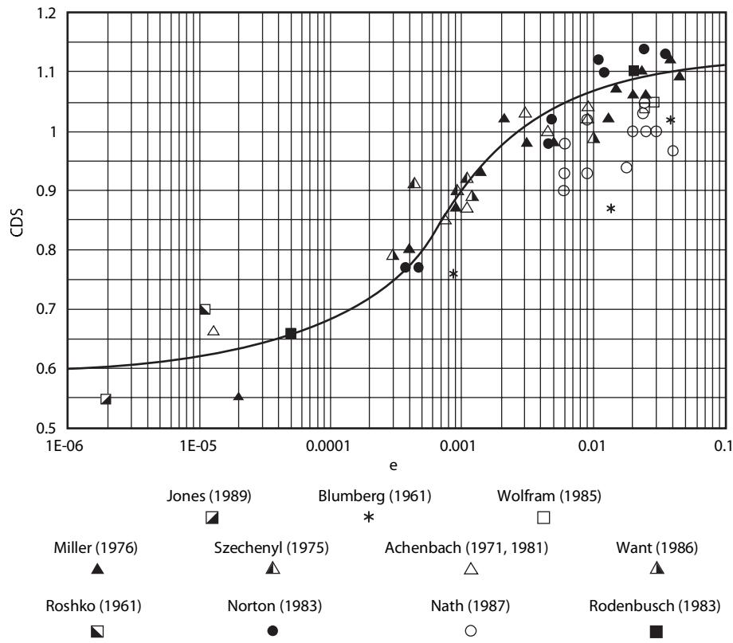  
Figure C2.3.1-4—Dependence of Steady Flow Drag Coefficient on Relative Surface Roughness

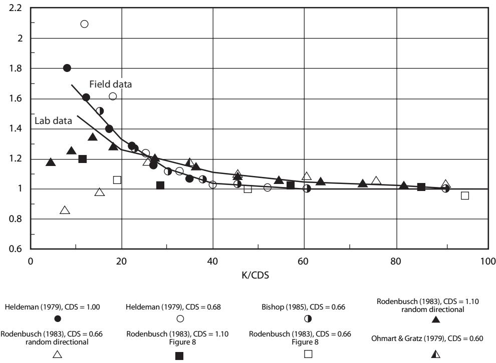  
Figure C2.3.1-5—Wake Amplification Factor for Drag Coefficient as a Function of $K / C_{ds}$

deviations from the mean curve are uncorrelated from member to member (see Heideman et al., 1979).

Figures C2.3.1-7 and C2.3.1-8 show data for the inertia coefficient $C_m$ for a nearly vertical circular cylinder. Figure C2.3.1-7 shows that $C_m$ for both smooth and rough cylinders approaches the theoretical value of 2.0 for $K \leq 3$ . For $K > 3$ , with the onset of flow separation, $C_m$ begins to decrease. With the exception of Sarpkaya's rough cylinder data, which exhibit a pronounced drop ('inertia crisis') in $C_m$ at $K \approx 12$ , it appears that a single sloping line is adequate for both smooth and rough cylinders, up to $\mathrm{K} \approx 12$ , beyond which smooth and rough cylinder data begin to diverge. In Figure C2.3.1-8, the single line from Figure C2.3.1-7 is seen to split into two lines because $K$ is divided by $C_{ds} = 0.66$ for smooth cylinders and $C_{ds} = 1.1$ for rough cylinders. The value of $C_m$ is taken as 1.6 for smooth cylinders and 1.2 for rough cylinders for $K / C_{ds} \geq 17$ .

Although Figures C2.3.1-5 through C2.3.1-8 are based on circular cylinder data, they are also applicable to non-circular cylinders, provided the appropriate value of $C_{ds}$ is used, and provided $C_m$ is multiplied by $C_{mo} / 2$ , where $C_{mo}$ is the theoretical value of $C_m$ for the non-circular cylinder as $\mathrm{K} \to 0$ .

Furthermore, while Figs. C2.3.1-5 through C2.3.1-8 were developed for use with individual, deterministic waves, they can also be used for random wave analysis (either time or frequency domain) of fixed platforms by using significant wave height and spectral peak period to calculate $K$ .

Current/Wave Velocity Ratio. The effect of a steady in-line current added to oscillatory motion is to push $C_d$ toward $C_{ds}$ , its steady flow value. Data show that, for practical purposes, $C_d = C_{ds}$ when the current/wave velocity ratio $r$ is greater than 0.4. For $r < 0.4$ , the effect of a steady in-line current can be accommodated by modifying the Keulegan-Carpenter number. A first-order correction would be to multiply $K$ due to wave alone by （$1 + r)2\theta * / \pi$ , where $\theta * = \arctan [\sqrt{1 - r^2}, -r]$ .

A current component normal to the wave direction also drives $C_d$ toward $C_{ds}$ , since it reduces the impact of wake encounter. Data show that, for practical purposes, $C_d = C_{ds}$ for $V_{N}T_{2} / C_{ds}D > 4$ . On the other hand, wake encounter has nearly its full impact for $V_{N}T_{2} / C_{ds}D < 0.5$ .

Member Orientation: For members that are not nearly vertical, the effect of wake encounter, as characterized by the K dependence in Figs. C2.3.1-5 through C2.3.1-8, is small. For horizontal and diagonal members, it is sufficient for engineering purposes to use the theoretical value of $C_m$ at $K \to 0$ and the steady-flow value of $C_d = C_{ds}$ at $K \to \infty$ .

C2.3.1b8 Conductor Shielding Factor

The empirical basis for the shielding wave force reduction factor for conductor arrays is shown in Figure C2.3.1-9. Data from flow directions perfectly aligned with a row or column of the array are excluded, for conservatism.

The data in Figure C2.3.1-9 are from steady flow tests and oscillatory flow tests at very high amplitudes of oscillation.

Thus the factor is strictly applicable only in a steady current with negligible waves or near the mean water level in very large waves. The data of Heideman and Sarpkaya (1985) indicate that the factor is applicable if $A / S > 6$ , where $A$ is the amplitude of oscillation and $S$ is the center-to-center spacing of the conductors in the wave direction. The data of Reed et al. (1990) indicate that range of applicability can be expanded to $A / S > 2.5$ . For lower values of $A / S$ , there is still some shielding, until $A / S < 0.5$ (Heideman and Sarpkaya, 1985). With $A \approx U_{mo} T_{app} / 2\pi$ , where $U_{mo}$ and $T_{app}$ are defined in C2.3.1b7 and C2.3.1b1, respectively, the approximate shielding regimes are:

- $A / S > 2.5$ , asymptotic shielding, factor from Figure C2.3.1-9.   
- $A / S < 0.5$ , no shielding factor $= 1.0$ .   
- $0.5 < A / S < 2.5$ , partial shielding.

In the absence of better information, the shielding factor in the partial shielding regime can be linearly interpolated as a function of A/S. Waves considered in fatigue analyses may lie in the partial shielding regime.

C2.3.1b9 Hydrodynamic Models for Appurtenances

The hydrodynamic model of a structure is used for the calculation of wave forces which represent the forces on the actual structure. The model need not explicitly include every element of the structure provided the dimensions and/or force coefficients for the included elements account for the contribution of the forces on the omitted elements. The hydrodynamic model should account for the effects of marine growth and for flow interference effects (blockage and shielding) where appropriate.

Appurtenances include sub-structures and elements such as boat landings, fenders or bumpers, walkways, stairways, grout lines, and anodes. Though it is beyond the scope of this commentary to provide modeling guidance for every conceivable appurtenance, some general guidance is provided.

Boat landings are sub-structures generally consisting of a large number of closely spaced tubular members, particularly on some of the older designs. If the members are modeled individually, shielding effects, depending upon the wave direction, can be accounted for in a manner similar to that for conductor arrays. Another option is to model a boat landing as either a rectangular solid or as one or more plates, with directionally dependent forces. Some guidance for coefficients for solid shapes and plates can be found in Det horske Veritas (1977).

Conductor guide frames may also be modeled as rectangular solids and sometimes as plates. In either case, different coefficients are appropriate for vertical and horizontal forces.

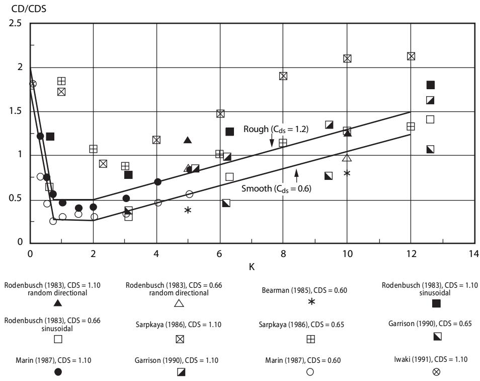  
Figure C2.3.1-6—Wake Amplification Factor for Drag Coefficient as a Function of $K$

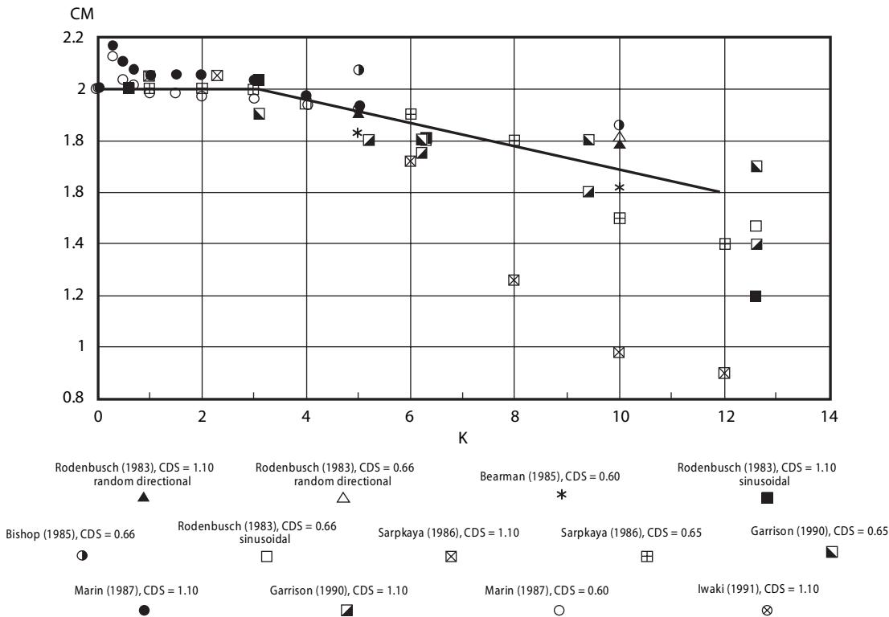  
Figure C2.3.1-7-Inertia Coefficient as a Function of $K$

Large fenders or boat bumpers and their supporting members are usually modeled as individual members. They may be treated as non-structural members provided that experience has shown their design to be adequate for their intended purpose. Walkways, stairways, and grout lines may be modeled as equivalent circular members though they are sometimes ignored where experience has proven the acceptability of such action.

The treatment of anodes depends somewhat upon the number and size of the anodes on the structure. Anodes are often ignored in the hydrodynamic model where experience has shown that their wave force contribution is negligible. If they are included, they can be modeled as equivalent circular cylinders. Alternatively, anode wave forces may be approximated by increasing the diameters and/or force coefficients of the member to which they are attached.

C2.3.1b10 Morison Equation

The use of the local acceleration rather than the total (local plus convective) acceleration in the inertia term of Morison's equation is the subject of ongoing debate. There have been several publications on this topic in recent years (Manners and Rainey, 1992; Madsen, 1986; Sarpkaya and Isaacson, Section 5.3.1, 1981; Newman, 1977). These publications all conclude that the total acceleration should be used. However, it must be noted that these publications all assume unrealistically that the flow does not separate from the cylinder. Realistically, except for very small amplitudes of oscillation （$K < 3)$ , the flow separates on the downstream side of the cylinder, creating a wake of reduced velocity. The local change in velocity across the cylinder due to the convective acceleration in the undisturbed far-field flow is generally much less than the change in velocity due to local flow separation, as implied in the paper by Keulegan and Carpenter (1958). The convective acceleration may also be nearly in phase with the locally incident flow velocity, which leads the undisturbed far field velocity in oscillatory flow because of "wake encounter" (Lambrakos, et al., 1987). Therefore, it could be argued that the convective acceleration should be neglected, either because it is small relative to local velocity gradients due to flow separation or because it is already implicitly included in drag coefficients derived from measurements of local force in separated flow. As a practical matter, the convective acceleration exceeds $15\%$ of the local acceleration only in steep waves, for which inertia force is generally much smaller than drag force (Sarpkaya and Isaacson, 1981).

Only the components of velocity and acceleration normal to the member axis are used in computing drag and inertia forces, based on the "flow independence," or "cross-flow," principle. This principle has been verified in steady subcritical flow by Hoerner (1965) and in steady postcritical flow by Norton, Heideman, and Mallard (1983). The data of Sarpkaya, et al. (1982), as reinterpreted by Garrison (1985), have shown the flow independence principle to be also for inertia

forces in one-dimensional oscillatory flow. Therefore, it is reasonable to assume that the flow independence principle is valid in general for both steady and multidimensional oscillatory flows, with the exception of flows near the unstable, critical Reynolds number regime.

C2.3.1b12 Local Member Design

The Morison equation accounts for local drag and inertia forces but not for the "out of plane" (plane formed by the velocity vector and member axis) local lift force due to periodic, asymmetric vortex shedding from the downstream side of a member. Lift forces can be neglected in the calculation of global structure loads. Due to their high frequency, random phasing, and oscillatory (with zero mean) nature, lift forces are not correlated across the entire structure. However, lift forces may need to be considered in local member design, particularly for members high in the structure whose stresses may be dominated by locally generated forces.

The oscillating lift force can be modeled as a modulated sine function, whose frequency is generally several times the frequency of the wave, and whose amplitude is modulated with $U^2$ , where $U$ is the time-varying component of fluid velocity normal to the member axis. In the absence of dynamic excitation, the maximum local lift force amplitude $F_{L}$ , $_{max}$ per unit length of the member is related $U_{max}$ , the maximum value of $U$ during the wave cycle, by the equation

$$F_{L, m a x} = C \not \ell , \max  (w / 2 g) D U_{m a x}^{2}$$

The coefficient $C\ell, \max$ has been found empirically by Rodenbusch and Gutierrez (1988) to have considerable scatter, with an approximate mean value $C\ell, \max \approx 0.7 \, C_d$ , for both smooth and rough circular cylinders, in both steady flow and in waves with large Keulegan-Carpenter numbers. Sarpkaya (1986) focussed on the rms value of the oscillating lift force and found that it was less than half $F_L, \max$ .

The frequency of the oscillating lift force is $St \, U_{total} / D$ , where $St$ is the Strouhal number and $U_{total}$ is the total incident velocity, including the axial component. Laboratory tests (Norton et al., 1983; Rodenbusch and Gutierrez, 1983) have shown that $St \simeq 0.2$ for circular cylinders over a broad range of Reynolds numbers and flow inclination angles in steady flow. If $St$ remains constant in waves, than the frequency of the oscillating lift force is also modulated as $U$ varies with time during a wave cycle.

In the event that any natural frequency of a member is near the lift force frequency, a large amplitude dynamic response, called vortex-induced-vibration (VIV), may occur. When VIV occurs, the motion of the member and the magnitude of the fluid-dynamic forces can increase to unacceptable levels. VIV can occur on long spans due to wind forces in the construction yard and on the tow barge as well as to waves and currents on the in-place structure. A complete treatise on VIV is beyond the scope of this commentary.

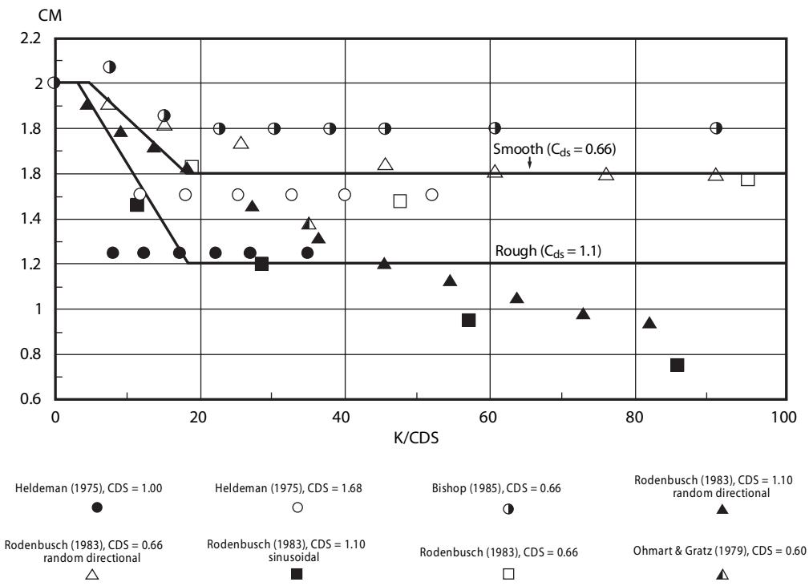  
Figure C2.3.1-8-Inertia Coefficient as a Function of $K / C_{ds}$

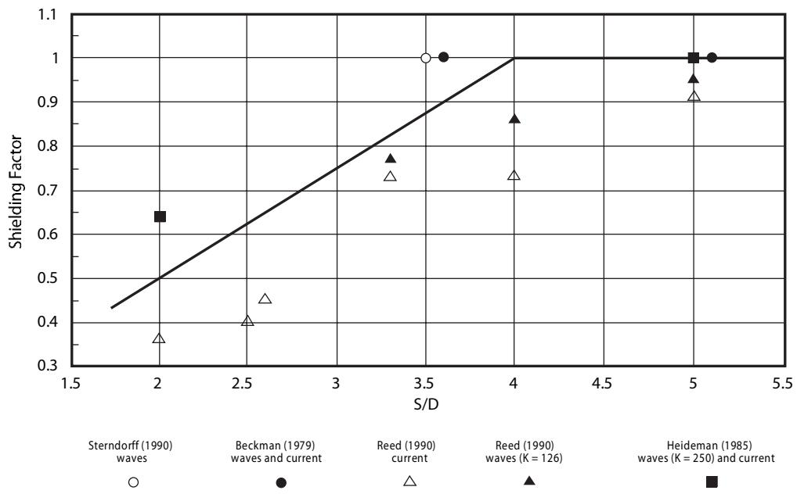  
Figure C2.3.1-9—Shielding Factor for Wave Loads on Conductor Arrays as a Function of Conductor Spacing

Horizontal members in the wave splash zone of an in-place structure may experience wave slam forces. These nearly vertical forces are caused by the local water surface rising and slapping against the underside of the member as a wave passes. Since these forces are nearly vertical, they contribute very little to the base shear and overturning moment of the platform. However, slam forces may need to be considered in local member design.

Slam forces can also occur on platform members overhanging the end of the barge while the platform is being towed, or on members that strike the water first during side launching of platforms.

In the theoretical case, slam force is impulsive. If the slam force is truly impulsive, the member may be dynamically excited. In the real world, the slam force may not be impulsive because of the three-dimensional shape of the sea surface, the compressibility of air trapped between the member and the sea surface, and the aerated nature of water near the free surface.

Slam force $F_{S}$ per unit length can be calculated from the equation

$$F_{S} = C_{s} (w / 2 g) D U^{2}$$

where $U$ is the component of water particle velocity normal to the member axis at impact. Sarpkaya (1978) has shown empirically that the coefficient $C_s$ may lie between 0.5 and 1.7 times its theoretical value of $\pi$ , depending on the rise time and natural frequency of the elastically mounted cylinder in his tests. Sarpkaya and Isaacson (1981) recommend that if a dynamic response analysis is performed, the theoretical value of $C_s = \pi$ can be used; otherwise, a value of $C_s = 5.5$ should be used.

Axial Froude-Krylov forces have the same form as the inertia force in Morison's equation, except that $C_m$ is set to unity and the normal component of local acceleration is replaced by the axial component. Axial Froude-Krylov forces on members that are nearly vertical contribute negligibly to platform base shear and overturning moment. Axial Froude-Krylov forces on diagonal and horizontal braces are relatively more important, contributing about $10\%$ as much to base shear and overturning moment as the inertia force included in Morison's equation, based on computations performed by Atkins (1990). In view of approximations made elsewhere in the computation of global wave force, axial Froude-Krylov forces can generally be neglected.

References

(1) Achenbach, E., "Influence of Surface Roughness or the Cross-Flow Around a Circular Cylinder," Journal of Fluid Mechanics, Vol., 46, pp. 321-335, 1971.   
(2) Achenbach, E., and Heinecke, E., "On Vortex Shedding from Smooth and Rough Cylinders in the Range of Reynolds

Numbers $6 \times 10^{3}$ to $5 \times 10^{6}$ , Journal for Fluid Mechanics, Vol. 109, pp. 239-251, 1981.   
(3) Allender, J. H., and Petrauskas, C., "Measured and Predicted Wave Plus Current Loading on Laboratory-Scale Space-Frame Structure," Offshore Technology Conference, OTC 5371, 1987.   
(4) Atkins Engineering Services, "Fluid Loading on Fixed Offshore Structures," OTH 90 322, 1990.   
(5) Bearman, P.W., Chaplin, J.R. Graham, J.M.R., Kostense, J.R., Hall, P.F., and Klopman, G., "The Loading of a Cylinder in Post-Critical Flow Beneath Periodic and Random Waves," Proceedings of Behavior of Offshore Structures Conference, pp. 213-225, 1985.   
(6) Beckmann, H., and McBride, C.M., “Inherent Scatter of Wave Forces on Submerged Structures,” ASME Petroleum Division Joint Conference with Pressure Vessels and Piping Division, Dallas, September 22–25, 1968.   
(7) Beckmann, H., and Merwin, J.E., "Wave Forces on Conductor Pipe Group," Proceedings of ASCE Civil Engineering in the Oceans IV Conference, September 1979.   
(8) Bishop, J.R., "Wave Force Data from the Second Christchurch Bay Tower," Offshore Technology Conference, OTC 4953, 1985.   
(9) Blumberg, R., and Rigg, A.M., "Hydrodynamic Drag at Supercritical Reynolds Numbers," ASME Conference, June 1961.   
(10)Chappelear, J.E., "Direct Numerical Calculation of Wave Properties," Journal of Geophysical Research, Vol., 66, NO. 2, February 1961.   
(11) Dalrymple, R.A., and Heideman, J.C., "Nonlinear Water Waves on a Vertically-Sheared Current," E&P Forum Workshop, "Wave and Current Kinematics and Loading," Paris, October 1989.   
(12)Dean, R.G., and Perlin, M., “Intercomparison of Near-Bottom Kinematics by Several Wave Theories and Field and Laboratory Data,” Coastal Engineering, Elsevier Science Publishers B. V., Amsterdam, The Netherlands, 1986.   
(13) Det horske Veritas, "Rules for the Design, Construction, and Inspection of Offshore Structures; Appendix B—Loads," 1977.   
(14)Eastwood, J.W., and Watson, C.J.H., “Implications of Wave-Current Interactions for Offshore Design,” E & P Forum Workshop, “Wave and Current Kinematics and Loading,” Paris, October 1989.   
(15) Forristall, G.Z., "Kinematics in the Crests of Storm Waves," 20th International Conference on Coastal Engineering, Taipei, 1986.   
(16) Garrison, C.J., "Comments on Cross-Flow Principle and Morison's Equation," ASCE Journal of Waterway, Port,

Coastal, and Ocean Engineering, Vol. III, No. 6, November 1985.   
(17) Garrison, C.J., "Drag and Inertia Forces on Circular Cylinders in Harmonic Flow," ASCE Journal of Waterway, Port, Coastal, and Ocean Engineering, Vol. 116, No. 2, March/April, 1990.   
(18) Hanif, M., and Boyd, M.J., “Experimental Analysis of Wave Interaction with Pile Structures,” Conference on Coastal and Ocean Engineering, Perth, 25–27 November, 1981.   
(19) Heideman, J.C., Olsen, O., and Johansson, P., "Local Wave Force Coefficients," Proceedings of ASCE Civil Engineering in the Oceans IV Conference, September 1979.   
(20) Heideman, J.C., and Sarpkaya, T., "Hydrodynamic Forces on Dense Arrays of Cylinders," Offshore Technology Conference, OTC 5008, 1985.   
(21) Hoerner, S.F., Fluid Dynamic Drag, Chapter V.1, Hoerner Fluid Dynamics, New Jersey, 1965.   
(22) Iwaki (1991) Personal communication from J. C. Heide-man.   
(23)Jones, G. W., Jr., Cincotta, J. J., and Walker, R. W., "Aerodynamic Forces on a Stationary and Oscillating Circular Cylinder at High Reynolds Numbers," NASA Technical Report R-300, 1969.   
(24) Kasahara, Y., and Shimazaki, K., "Wave Forces Acting on Rough Circular Cylinders at High Reynolds Numbers," Offshore Technology Conference, OTC 5372, 1987.   
(25) Keulegan, G. H., and Carpenter, L. H., “Forces on Cylinders and Plates in an Oscillating Fluid,” Journal of Research of the National Bureau of Standards, Vol. 60, No. 5, May 1958.   
(26) Kirby, J. T., and Chen, T. M., "Surface Waves on Vertically Sheared Flows, Approximate Dispersion Relations," Journal of Geophysical Research, January 15, 1989.   
(27) Lambrakos, K. F., Steele, K. M., and Finn, L. D., "Wake and Shielding Effects on Hydrodynamic Loading," Proceedings of E & P Forum Workshop on Wave and Current Kinematics and Loading, Paris, October 25-26, 1989.   
(28) Lambrakos, K. F., "Extended Velocity Potential Wave Kinematics," ASCE Journal of Waterway, Port, Coastal and Ocean Division, Vol. 107, No. WW3, August 1981.   
(29) Lambrakos, K. F., Chao, J. C., Beckman, H., and Brannon, H. R., "Wake Model of Hydrodynamic Forces on Pipelines," Ocean Engineering, Vol. 14, No. 2, pp. 117-136, 1987.

(30) Lambrakos, K. F., and Beckmann, H., "Shielding and Interference Model for Offshore Platforms." BOSS92 Conference, London, July 1992.   
(31) Madsen, O. S., "Hydrodynamic Force on Circular Cylinders," Applied Ocean Research, Vol. 8, No. 3, 1986.   
(32)Manners, W., and Rainey, R. C. T., “Hydrodynamic Forces on Fixed Submerged Cylinders,” Proceedings of the Royal Society of London, 436, 1992.   
(33) Marin (1987) Personal communication from J. C. Heideman.   
(34) Miller, B. L., “The Hydrodynamic Drag of Roughened Circular Cylinders,” The Royal Institution of Naval Architects, Spring Meetings, 1976.   
(35) Monopolis, G. M., and Danaczko, M. A., "Installation Model Tests of a Gulf of Mexico Compliant Tower," Offshore Technology Conference, OTC 5911, 1989.   
(36) Nath, J. H., "Hydrodynamic Coefficients for Marine-Roughened Cylinders," Final Report to API on Proc 85-31, Department of Civil Engineering, Oregon State University, March, 1987.   
(37) Newman, J. N., Marine Hydrodynamics, MIT Press, 1977.   
(38) Norton, D. J., Heideman, J. C., and Mallard W., "Wind Tunnel Tests of Inclined Circular Cylinders," Society of Petroleum Engineers Journal, Vol. 23, pp. 191-196, 1983.   
(39) Ohmart, R. D., and Gratz, R. L., "Drag Coefficients from Hurricane Wave Data," Proceedings of ASCE Civil Engineering in the Oceans IV Conference, September 1979.   
(40) Reed, K., Aarsnes, J. V., Beltrand, O., and Anderson, E., "Wave and Current Forces on Conductor Pipe Groups," Society for Underwater Technology, Environmental Forces on Offshore Structures and Their Prediction Conference, 1990.   
(41) Rodenbusch, G., and Gutierrez, C. A., “Forces on Cylinders in Two-Dimensional Flows, Volume 1,” Shell Development Company, Report No. BRC-13-83, 1983.   
(42) Roshko, A., "Experiments on the Flow Past a Circular Cylinder at Very High Reynolds Number," Journal of Fluid Mechanics, Vol. 10, pp. 345-356, 1961.   
(43) Sarpkaya, T., and Isaacson, M., Mechanics of Wave Forces on Offshore Structures, Van Nostrand Reinhold, New York, 1981.   
(44) Sarpkaya, T., "Wave Impact Loads on Cylinders," Offshore Technology Conference, OTC 3065, 1978.   
(45) Sarpkaya, T., "In-Line and Transverse Forces on Smooth and Rough Cylinders, in Oscillatory Flow at High Reynolds Numbers," Naval Postgraduate School, Report NPS69-86-003, July 4, 1986.

(46) Sarpkaya, T., Raines, T. S., and Trytten, D. O., "Wave Forces on Inclined Smooth and Rough Circular Cylinders," Offshore Technology Conference, Paper No. 4227, 1982.   
(47) Schlichting, H., Boundary Layer Theory, Chapter XX.g, McGraw-Hill, Inc., 1979.   
(48) Shankar, N. J., and Khader, M. H. A., "Performance Characteristics of Closely Spaced Pile Breakwaters," Conference on Coastal and Ocean Engineering, Perth, 25-27 November 1981.   
(49) Skjelbreia, J. E., et al., "Wave Kinematics in Irregular Waves," Offshore Mechanics and Arctic Engineering, Stavanger, 1991.   
(50) Sterndorff, M. J., Velk, P., and Klinting, P., “Coupled Experimental and Analytical Investigation of Hydrodynamic Forces on a Jacket in Waves,” Society for Underwater Technology, Environmental Forces on Offshore Structures and Their Prediction Conference, 1990.   
(51) Steel, K. M., Finn, L. D., and Lambrakos, K. F., “Compliant Tower Response Predictions,” Offshore Technology Conference, OTC 57833, 1988.   
(52) Steel, K. M., “Performance of the Lena Guyed Tower, Offshore Technology Conference, OTC 5255, 1986.   
(53) Szechenyi, E., "Supercritical Reynolds Number Simulation for Two-Dimensional Flow over Circular Cylinders," Journal of Fluid Mechanics, Vol. 70, pp. 529-542, 1975.   
(54) Taylor, P. H., "Current Blockage: Reduced Forces on Offshore Space-Frame Structures," Offshore Technology Conference, OTC 6519, 1991.   
(55) Wang, C., and Shih, W. C. L., "High Reynolds Number Flows around Smooth and Rough Cylinders," Final Report to ONR, Contract No. N00014-85-C-0764, Physical Research, Inc., February 1986.   
(56) Wolfram, J., and Theophanatos, A., “The Effects of Marine Fouling on the Fluid Loading of cylinders: Some Experimental Results,” Offshore Technology Conference Proceedings, OTC 4954, 1985.

COMMENTARY ON HYDRODYNAMIC FORCE GUIDELINES, SECTION 2.3.4

C2.3.4c Interpolation is required to determine current parameters for the immediate zone.

Example: Find current magnitude, direction, and profile associated with the principal wave direction （$290^{\circ})$ for a platform in a water depth of 250 ft., located at $95^{\circ}$ W longitude.

Calculation Steps:

a. Calculate (with respect to the wave direction, $\phi w = 290^{\circ}$ ) the inline, $U_i$ , and transverse, $U_t$ , components of the surface current, $U$ , for a water depth of 150 ft. at $95^{\circ}$ W longitude.

From Figure 2.3.4-5 the current direction, $\phi u$ , is $253^{\circ}$ , then

$$U i = U \cos (\phi u - \phi w) = 2. 1 \cos (253 - 290) = 1. 68 k t^{*}$$

$$U t = U \sin (\phi u - \phi w) = 2. 1 \sin (253 - 290) = - 1. 26 \mathrm{k t}$$

* must be greater than 0.20 kt

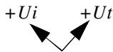

b. Calculate $Ui$ and $Ut$ for a water depth of 300 ft.

This is the beginning of the deep water zone. Therefore for the principal wave direction,

$$U_{i} = 2. 1 \mathrm{k t}$$

$$U t = 0$$

c. Calculate $Ui$ and $Ut$ for the target platform location in a water depth of 250 ft.

Assume a linear relationship of $Ui$ and $Ut$ vs. depth, $d$ , in the range of 150 ft. to 300 ft. Then, for any $d$ ,

$$U i (d) = U i (150) + \frac{[ U i (300) - U i (150) ]}{[ 300 - 150 ]} [ d - 150 ]$$

$$U t (d) = U t (150) + \frac{\left[ U t (800)^{= 0} - U t (150) \right]}{\left[ 300 - 150 \right]} [ d - 150 ]$$

For $d = 250$

$$U i = 1. 96$$

$$U t = - 0. 42.$$

d. Calculate the magnitude, $U_r$ , of the current and its direction, $\phi u$ , for $d = 150$ ft.

$$U r = (U i^{2} + U t^{2})^{1 / 2} = 2. 00 \mathrm{k t}$$

$$\phi u = \phi w + \arctan (- 0. 42 / 1. 96) = 290^{\circ} - 12^{\circ} = 278^{\circ}$$

e. Calculate the current profile for $d = 250$ ft.

The current is a constant $2.0\mathrm{kt}$ from the storm water level （$swl)$ to $-200$ ft. It decreases linearly from its value of $2.0\mathrm{kt}$ at $-200$ ft to a value of $0.2\mathrm{kt}$ at $-300$ ft. The profile is truncated at $-250$ ft. resulting in a value of $1.10\mathrm{kt}$ at the mudline.

$$\text{d e p t h} = 250 \mathrm{f t}$$

$$\varnothing u = 278$$

$$\mathrm{U r} = 2. 0 \mathrm{k t}$$

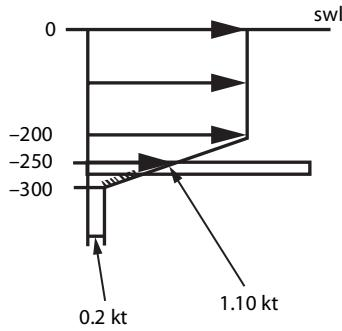  
Figure C2.3.4-1—Example Calculation of Current Magnitude, Direction, and Profile in the Intermediate Depth Zone

C2.3.4c Guideline Design Metocean Criteria for the Gulf of Mexico North of $27^{\circ}$ N Latitude and West of $86^{\circ}$ W Longitude

Prior to this edition, the 20th Edition and recent previous editions had recommended that all new structures be designed for a single criteria, based on the 100 year return period. This edition introduces a three level criteria based on life safety and the consequences of failure of the platform. The development, calibration, and basis for this three level consequence-based criteria is discussed in more detail in OTC Papers 11085 and 11086, as listed in Section 2.3.4h.

For new platforms with high life exposure and/or high consequences of failure which are classed as "L-1" as defined in Section 1.7, the 100 year wave height and associated tide and current is recommended. This is the 100 year criteria as specified in the 20th Edition and represents the best and safest technology that the industry has developed. This criteria was selected since it should provide suitable levels of reliability and safety for platforms in this category.

New platforms with minimal life exposure and moderate consequence of failure which are classed as "L-2" as defined in Section 1.7 can be designed for a mid-level reduced criteria based on 20th Edition procedures. It is intended that this criteria will result in a platform as reliable as those that had been designed to the 9th through 20th Editions. Platforms designed for the 9th through 19th Editions have produced a satisfactory performance during Gulf of Mexico hurricanes. Calibration studies indicated that platforms designed using 20th Edition procedures and metocean conditions with a return period of 33 to 50 years had equivalent ultimate capacities to the 19th Edition designs. Based on this calibration, the 50 year return period was selected as the basis for the "L-2" criteria. It should be noted that the 50 year return period was selected since it provides structures with equivalent reliability as the 19th Edition designs. Thus, this criteria was selected based on satisfactory experience and not on any other considerations.

New platforms with no life exposure and low consequence of failure which are classed as "L-3" as defined in Section 1.7 can be designed for a lower level reduced criteria based on 20th Edition procedures. This criteria will result in a platform with an ultimate capacity equal to the 100 year criteria as specified for L-1 structures. This design will produce an increased risk of failure. Use of this criteria increases the financial risk of damage to or loss of the platform. However, this loss is not expected to cause environmental damage or negative impact to the industry.

COMMENTARY ON EARTHQUAKE CRITERIA, SECTION 2.3.6

C2.3.6 Earthquake

C2.3.6a General

Portions of the coastal waters of the United States are located in seismically active areas and it is necessary that fixed offshore platforms in these areas be designed to resist earthquake ground motions. As for most other types of facilities, it is not warranted and normally not economical to design offshore platforms to preclude any damage for the most severe earthquake ground shaking possible. Accordingly the provisions are intended to provide resistance to moderate earthquakes, which have a reasonable likelihood of not being exceeded during the lift of the platform, without significant structural damage. Structural damage is likely to occur in the event of rare intense earthquake ground motion, but the provisions are intended to prevent collapse of the platform.

The strength requirements are presented to meet the first goal, that is to provide resistance to moderate earthquakes without significant structural damage. The ground motions for the strength design should be established through site specific studies as recommended in 2.3.6b1. The structural members should not exceed yielding of the complete section or buckling.

Earthquake forces in structures result from ground motion, and the intensity of the forces is dependent of the stiffness of the structure and its foundation. Unlike most other environmental forces, earthquake forces generally are reduced as the structure becomes less stiff due to inelastic yielding or buckling of structural or foundation elements. Where such inelastic action can occur without the structure becoming unstable under gravity loads, a significantly greater amount of ground shaking can be sustained without collapse than can be sustained at first yield.

It has been analytically demonstrated for locations such as offshore southern California that steel template type structures designed in accordance with the strength requirements and which are well configured and proportioned can withstand the rare, intense earthquake without collapsing. For structures of this type in these locations, specific guidelines for configuring the structure and for proportioning members are presented to ensure the necessary ductility. Where these provisions are not

applicable, requirements are included for analyzing structures for the rare, intense earthquake ground motion.

Earthquake Related Definitions. Some terms, when applied to earthquake engineering, have specific meanings. A list of some of these terms is:

1. Effective Ground Acceleration. A design coefficient used to describe a ground acceleration amplitude for dimensionalizing a smooth, normalized design spectra such as Figure C2.3.6-2 for use in structural design. The term "effective" is used in contrast to the commonly used value of peak acceleration. Although any single parameter is not adequate to fully describe the destructive energy of the ground motion, the effective ground acceleration associated with a given smooth design spectrum is a meaningful index of such energy.   
2. Ground Motion. The vibratory movement of the ground resulting from an earthquake. Motion at any point is uniquely described in terms of either acceleration, velocity, or displacement time histories.   
3. Response Spectrum. A response spectrum depicts the maximum response to a ground motion of a series of single degree of freedom oscillators having different natural periods but the same degree of internal damping. The response spectrum of a particular earthquake acceleration record is in fact a property of that ground motion, stated in terms of the maximum response of simple (single degree of freedom) structures. When this response is represented with a set of smooth lines such as shown in Figure 2.3.6-2, it is called a smooth response spectrum.   
4. Time History. Time history is a continuous record over time of ground motion or response.   
5. Near Field. The soil mass which transmits earthquake motions to the structure, provides immediate support for the structure and is affected by the motions of the structure. The near field soils may be represented by discrete lateral and vertical elements which reproduce the load-deflection characteristics of direct soil-pile interaction. In modeling the near field soil, account should be taken of the dynamic and cyclic behavior of the soil-pile system and the pile group effects.   
6. Free Field. The soil mass in the vicinity of the platform that is not significantly affected by the motions of the platform. When modeling the free field, account should be taken of the dynamic and cyclic behavior of the soils and of hysteretic and radiation energy dissipation. The soil mass may be modeled by using either finite elements or simplified equivalents.

C2.3.6b Preliminary Considerations

1. Evaluation of Seismic Activity. Design criteria consist of both a description of the environmental loading and the requirements to ensure adequate structural performance. The objective of design criteria specification is to allow the analyst to use relatively simple but realistic analysis procedures to proportion the elements of a structure such that the structure has acceptable strength and ductility. The environmental

loading is typically specified in terms of smoothed response spectra and/or a set of earthquake records which are representative of design level motions at the site.

The development of both site-specific spectra and records is described in this section. The structural performance aspects of design criteria consist of guidelines for structural modeling, response analysis, and response assessment including allowable stresses and recommended safety factors. All of these aspects of design criteria need to be considered as an integrated package to ensure consistently reliable design (57).

Site-specific studies should be considered as a basis for developing the ground motion specification of the design criteria, particularly for sites in areas of high seismicity (Zones 3-5) or in any location where earthquake loading is anticipated to significantly influence structural design. Performing a site specific study is the primary means by which information concerning the local characteristics of earthquake motion can be explicitly incorporated into the design criteria.

Since the platform should meet specific strength and ductility requirements, two levels of ground motion intensity should be considered: (1) ground motion which has a reasonable likelihood of not being exceeded at the site during the platform's life (associated with a recurrence interval somewhat longer than that used for wave design, taking into consideration the uncertainty in estimating ground motion and the differences between the performance requirements with wave vs. earthquake design—typically a recurrent interval of 200 years for southern California for permanent structures) and (2) ground motion from a rare intense earthquake (associated with an event controlled by the seismic environment that can have a recurrence interval of several hundred to a few thousand years). The first level provides the ground motion input for the elastic design of the structure. The second level may be required to determine if it is necessary to analyze the structure for the rare, intense earthquake, and if so, provides the ground motion input for the analysis.

The site-specific study description presented herein provides a framework to use data, theory and judgment for developing estimates of site ground motions. The process involves a synthesis of information requiring a broad range of professional skills and requires a considerable amount of engineering judgment. A thorough consideration of the steps below should be sufficient for the rational and defensible selection of design criteria.

The framework recommended for site-specific studies can be discussed in terms of the following four steps.

a. Seismotectonic and Site Characterization   
b. Seismic Exposure Assessment   
c. Ground Motion Characterization   
d. Design Ground Motion Specification

The level of detail to which each step should be developed depends on the consequences of the exposure and the availability of data and data analysis techniques. The following four sections further discuss data sources, analysis techniques

and judgments to be considered when performing a site-specific study. The following general references regarding site-specific studies are suggested for review (1, 2, 26, 27, 28).

a. Seismotectonic and Site Characterization. An explanation should be developed to explain where, why and how often earthquakes occur in a region. This step involves assembling and synthesizing all available data and theory into a consistent, conceptual "model" termed seismotectonic model, to characterize the generation and propagation of ground motion in the region. The step can be divided into three parts: source evaluation, source-to-site motion attenuation, and site evaluation.

Source Evaluation. The initial task in developing site-specific criteria is to identify and evaluate potential earthquake sources. Earthquake sources are defined as geologic features that are zones of weakness in the earth's crust which have exhibited seismic movement based on past geologic, historic, or instrumental seismicity (2, 29, 30).

Location and geometry of sources are based upon the regional tectonic setting and structural geology, observed or instrumentally recorded data of past earthquakes, geophysical data, and extrapolation from sources onshore. To account for undiscovered faults and historical seismicity that cannot be associated with any particular source, uniform area sources are generally introduced in the region of interest.

Sources can be classified according to the sense of motion of the slip along the fault, e.g., strike-slip, thrust or normal. Identifying the fault planes of the regional sources by examining first motions on seismograms of past events can help explain the ongoing tectonic processes.

Source activity rates expressed in terms of recurrence relationships, define the temporal distribution of the number of earthquakes as a function of magnitude. Activity rates can be quantified on the basis of histograms prepared from both observational and instrumentally recorded seismicity. Geologic field data pertaining to total cumulative displacement, recent fault slip rate, segmentation, displacement per event and possible rupture lengths can be used to augment the seismicity data, especially in determining seismic activity associated with long recurrence intervals. If the seismicity and geologic data are too sparse, rates may be inferred from other tectonically and geographically similar regions. Rates of particular sources may also be assigned as some percentage of the region's overall rate of seismicity.

The magnitude associated with a rare intense earthquake can be estimated from the historical seismicity and geologic evidence on the type and geometry of sources.

Source-to-Site Motion Attenuation. Attenuation relationships are developed to define the decay of ground motion as a function of the type of earthquake sources, the magnitude of earthquakes, the source-to-site geometry and geology, and distance of the site from the source. Significant changes in the intensity, frequency content, pulse sequencing and variability

of ground shaking can occur as the result of wave propagation along the travel paths from the source to the site.

Attenuation relationships are most often derived from empirical studies of recorded ground motion data (2, 31, 32, 33). If available, recordings are selected from past earthquakes in which the site, source, source-to-site geology and soils are similar to those of the site and sources being studied. Unfortunately, there are limited data available, and for only a limited range of earthquake magnitudes. Recently, analytical models have been developed to describe earthquake source, attenuation and local site effects. However, simplifications introduced to make such analyses possible or assumptions required because of limited data and knowledge can result in significant uncertainties. Analytical models may hold promise for realistically characterizing earthquake attenuation effects when the models can be adequately calibrated against empirical studies.

The evaluation of attenuation relationships must focus on ground motion parameters which correlate best with response of the structures for which the criteria are being developed. The familiar peak ground acceleration is a useful measure of potential damage for extremely stiff structures with short natural periods of vibration. However, it is not an effective measure of potential damage for long period, flexible structures such as offshore platforms designed for moderate to deep water. For this class of structures, response spectral velocities in the fundamental period range of the structure provide a more useful measure of the potential damage from earthquake ground motion.

Site Evaluation. The regional site conditions can influence the characteristics of incoming earthquake surface and body waves. The effects are primarily a function of local geology, e.g., proximity to basin edges or discontinuities, and soil conditions. For seismotectonic characterization, detailed evaluation of the site conditions is not necessary. Generally, it is incorporated into the derivation of the attenuation relationship. Effects of local site conditions can be treated more explicitly in ground motion characterization (step c).

b. Seismic Exposure Assessment. This step uses the information developed in the previous step to determine characteristic earthquakes which are likely to contribute most to strong ground shaking at the site. Characteristic earthquake should be determined for the strength level earthquake which has a reasonable likelihood of not being exceeded at the site during the life of the structure and for the rare intense earthquake. Generally, the characteristic earthquakes are expressed in terms of magnitude and distance from source to site.

Different earthquakes from different sources may dominate the motion in different period ranges, e.g., earthquakes from closer sources may contribute more to the shorter period motion while earthquakes from more distant sources may contribute more to longer period motion. Therefore, it may be appropriate to consider several earthquakes having the same recurrence interval. The knowledge that certain combinations

of magnitudes and distances define the controlling earthquakes permits a deterministic assessment of design ground motions through inspection ground motions recorded during earthquakes of similar magnitude and distance (as described in step c).

Strength Level Earthquakes. The selection of representative strength level earthquakes can be based on blending the results from (1) a probabilistic exposure analysis of the study region, and (2) a deterministic inspection of individual faults and the major historical earthquakes in the study region. The probabilistic exposure analysis provides a means for considering the total probability of earthquakes occurring on all sources over the entire study region to establish the relative contribution of each source to a given level of ground shaking (23). It also allows identification of sources which control various ground motion parameters such as spectral velocities, peak ground velocity and peak ground acceleration by using attenuation relationships developed for these parameters.

In performing the exposure analysis, special care needs to be taken to ensure that the model is a reasonable representation of the seismotectonic setting. A sensitivity analysis of the results to input parameters should be conducted. Special attention needs to be given to the effects of the assumed attenuation relationships because of the uncertainty associated with such relationships. By using exposure analysis to quantify the relative importance and contribution of different sources to motion at the site and to identify characteristic earthquakes, the exposure analyses results tend to be less sensitive to the attenuation relationships as compared to using exposure analysis to determine absolute ground motion values (as discussed below).

In addition to probabilistic analysis, deterministic assessment can serve as a check on the probabilistic results by ensuring that all appropriate types of events are being considered. The deterministic approach can help account for local anomalies and special sources which may not be appropriately accounted for in the exposure model.

An alternative approach to using exposure analyses results is to compute the value of a selected ground motion parameter (historically, effective ground acceleration has been selected) associated with the desired recurrence interval. Then, as a next step, these values are used to scale appropriate standardized spectra. However, in this approach the computed ground motion value is very sensitive to the assumed attenuation relationship. Because of the uncertainty associated with any attenuation relationship, ground motion values computed from exposure analysis results have to be interpreted very carefully.

Still another approach is to use the exposure analyses results to develop probabilistic spectra. Although probabilistic spectra may in theory best reflect the integrated effects of all sources on a consistent risk basis, they too are very sensitive to the assumed attenuation relationship and thus must be carefully interpreted.

— Rare Intense Earthquakes. A probabilistic exposure analysis approach may not be appropriate for the determination of the rare intense earthquake because of the limited time over which reliable data have been collected. As an alternate approach, the selection of representative rare intense earthquakes may be based on a deterministic evaluation. The assessment relies heavily on the geologic and seismologic evaluation conducted in the previous step. Geologic evidence can often distinguish between the level of several hundred to a few thousand years and the maximum credible event.

c. Ground Motion Characterization. This step involves developing estimates of ground motion which represent the strength level and rare intense characteristic earthquakes (as determined in the previous step), including the effects due to local site conditions. Preferably, the ground motion estimates can be developed based on strong motion records recorded during earthquakes similar to the characteristic earthquakes in terms of magnitude, distance and source type. Typically, existing records do not directly match the selected characteristic earthquakes, in which case scaling the records may be performed. In the case where the characteristic earthquakes are out of the practical scaling range of existing records, synthetic records may be substituted. The representative records and corresponding spectra may be corrected for the effects of the local soil condition. Once a set of representative records (unscaled, scaled, and/or synthetic) have been assembled, their response spectra can be superimposed on composite plots for each direction of motion (two horizontal and one vertical). The three components should be developed in a uniformly consistent manner rather than factoring a single component for the three directions. These plots will illustrate the natural range of ground motion to be associated with the characteristic earthquakes. They will also illustrate which characteristic earthquake will be the most important in terms of the structural design.

- Record Scaling. There are several techniques proposed to account for deviations in magnitude, distance and source type. It is recommended that a technique be employed which scales on the magnitude of the event, the distance from the source to the site and source type and which takes into account the general type of soils at the recording site (34). Any method that scales all proposed records to a predetermined absolute amplitude, e.g., peak acceleration or velocity, should be avoided. Prescribing the values defeats the objective of looking at representative records to determine the likely range of ground motions.

— Synthetic Records. For some seismic environments there are no recorded data within the practical scaling range. For these cases artificial or synthetic records may be generated. This reduces the confidence in the resulting range of ground motion amplitudes. There are several methods proposed for developing synthetic earthquake records ranging from observational techniques to analytical solutions of simplified earthquake rupture processes (35). Since the resulting records are

synthetic, considerable judgment should be used when deriving quantitative results from any of these methods.

- Site Response Modification. If the majority of the selected records do not represent site conditions similar to those of the study site, further modifications to the ground motions may be required. The influence of local site conditions is primarily a function of local soil properties, local geology, thickness of soil layers and the manner in which the seismic waves arrive at the site.

Both analytical and empirical methods are available to evaluate local site effects and to modify the ground motion estimates accordingly. One-dimensional shear wave, compression wave and surface wave models provide an analytical basis upon which to make judgments concerning the influence of local soil and geologic conditions (36, 37, 38). Using any one of these models, a new set of site-modified ground motion records may be developed by mathematically propagating the selected scaled records through a model of the site's soil profile. Parameter studies provide valuable insight into the details of ground motion as influenced by local site effects.

In empirical methods, statistical analyses can be performed on normalized response spectra in which recorded motions are categorized according to the soil conditions at the instrument recording site (4,5). Then based on these results, approximate adjustments are made to the composite spectra to reflect trends of the site conditions. However, large variability and uncertainties are generally present in such results due to the combined and unrecognized effects of recordings from different events, sources transmission paths and instrument locations.

d. Design Ground Motion Specification. Design ground motions should be specified based on the findings of the previous three steps and knowledge of how the design motions will be used in subsequent structural analysis and design. When specifying the criteria, the objective is to develop a description of ground shaking and a specification of how the structure will be analyzed and designed using the description of the earthquake loadings provided. Ideally, the net effect is a structural design having a desired level of reliability. In this overall context, neither the description of motion nor the structural analysis and performance requirements stand alone.

Typically, to ensure adequate structural strength, ground motions associated with the strength level earthquake are specified such that the structure must withstand these motions elastically. To ensure adequate ductility, either specific rare intense earthquake ground motions can be specified or for many jacket type structures, generic guidelines specified in 2.3.6d2 can be followed in detailing and designing the structure. A condition for adopting the latter procedure is that the intensity ratio of the rare, intense to strength level earthquake not exceed 2. (The intensity is proportional to the average spectral velocity in the period range of the structure. The value of 2 is typical for offshore southern California and

should be evaluated for other areas where the factor of 2 may be low or high.

Generally, ground motions are specified by design response spectra and/or a set of representative records. The smoothed spectra are usually set at a level of shaking which the analyst feels represents the expected range of likely motions (based on the results of steps b and c). Specification of the design spectra relies heavily upon the set of scaled and site corrected records derived in step c. The effects of other aspects of the local conditions that may not be realistically represented in the data set of recorded motions should also be included in a more judgmental fashion through the inspection of data collected in similar settings. Sets of ground motion recordings, appropriately scaled and filtered through the local soils, that are most representative of the design earthquakes may also be specified. The average of their spectra may not conform closely to the site-specific design spectra at all periods because of the limitations in finding records which reflect all elements of the design earthquake, local soil conditions and overall area geology. However, they should closely match in the range of the significant natural periods of the structure, and they should have similar ratios between the two horizontal and the vertical component intensities. It may be appropriate to use synthetic records when existing records are outside the practical scaling range to adequately represent the design earthquakes.

2. Evaluation for Zones of Low Seismic Activity. In seismic Zones 1 and 2, design of offshore structures for storm conditions will generally produce structures that are adequate to resist imposed seismic design conditions. For these zones, the ductility requirements may be waived and the tubular joints designed only for the calculated joint loads (instead of member yield or buckling loads) if the structure is found to meet the strength design requirements using ground motion characteristics established for the rare, intense earthquake in lieu of the strength level earthquake. However, even though the provisions do not require further earthquake analysis of the structure, the design engineer should consider seismic response in configuring the structure by providing redundancy and recognizing the implications of abrupt changes in stiffness or strength as discussed in 2.3.6d of this commentary and should apply engineering judgment in the design of structures of unusual configuration.

Design of deck appurtenances and equipment for motions induced by the strength level earthquake in accordance with Par. 2.3.6e2 is still recommended.

C2.3.6c Strength Requirements

1. Design Basis. For the purpose of preliminary designs and studies, a platform may be sized by either the response spectrum or the time history method using the following effective horizontal ground accelerations:

$$Z = 0 \quad 1 \quad 2 \quad 3 \quad 4 \quad 5$$

$$G = 0 \quad 0. 05 \quad 0. 10 \quad 0. 20 \quad 0. 25 \quad 0. 40$$

where

$Z =$ Zone or relative seismicity factor given in Figure C2.3.6-1.

$G =$ Ratio of effective horizontal ground acceleration to gravitational acceleration.

Using the response spectrum approach, the ordinates of the spectrum taken from Figure C2.3.6-2 should be multiplied by the factor $G$ for the zone in which the platform is to be located. The resulting spectrum should be applied equally along both principal orthogonal horizontal axes of the structure. An acceleration spectrum of one-half that for the given zone should be applied in the vertical direction. All three spectra should be applied simultaneously and the responses combined as given in 2.3.6c3.

If the design is accomplished by the time history method of analysis, the time histories used in each orthogonal direction should be scaled as stated in the above paragraph and generated or modified so that their normalized response spectra for five percent critical damping reasonably match the design spectrum shown in Figure C2.3.6-2 in the period range of interest. The phasing of each of the three time history components may be different. Because of the potential sensitivity of the platform response to variations in the input motion, the design should consider at least three sets of time histories.

The lateral and axial soil resistances of a pile foundation system are normally developed at different locations along the pile length. Therefore, the horizontal ground motion spectrum or time history for the soil near the surface is associated with the lateral pile motion and may be different than the vertical ground motion spectrum or time history associated with the axial pile motion.

Relative intensities of design ground motions for the U.S. Continental Shelves are given in Figure C2.3.6-1. Geographical locations of these zones have been based on results of seismic exposure studies (1,2,3).

The magnitudes of the G-factors were based on results of ground motion studies (1,2,3,65) on studies of design criteria for offshore platforms (8,9) and on analytical studies and experience with platforms subjected to intense loadings due to earthquakes and waves (10,11,12,13,14,15). The G-factors and design response spectra have been derived from consideration of the inelastic performance and ductility of platforms designed according to these guidelines. Consideration of inelastic performance and ductility in development of elastic design response spectra and ground motions is discussed by Whitman and Protonotarios (16) and by Bea (9).

The results of studies of the influence of local site conditions in recorded ground motions (4,5,6,7) were considered in the development of the response spectra in Figure C2.3.6-2. Three site conditions are covered. Response spectra for other soil conditions may be developed from the results of analyti

cal and experimental studies. For soil conditions characterized by significant accumulations of soft clays, loose sands and silts overlying alluvium or rock, the response spectra may indicate significant amplifications of both horizontal and vertical ground motions in the range of the natural periods of the soft soil column.

Selection of the above earthquake criteria has been influenced by oceanographic conditions. This interaction effect, which can be significant if both earthquake and oceanographic conditions are severe, can occur in two principal ways: First, in the face of two severe environmental conditions, the design intensity of each should be higher than the level which might be appropriate if only one existed, in order to maintain a constant overall level of safety. A second effect occurs due to the fact that forces induced in a platform by earthquake are, to at least some extent, proportional to the stiffness of both the structural and foundation systems. Thus, an increase in structural and foundation stiffness to resist oceanographic forces will in turn result in higher forces being induced in a platform by a given level of earthquake shaking. While the shift in period associated with such a stiffness increase will automatically lead to higher design forces for strength requirements for most offshore platforms, changes in the nonlinear ultimate response of the system may not be accounted for automatically. These interactive effects were significant for the Gulf of Alaska (8,9).

2. Structural Modeling. Structural modeling for analysis purposes involves a variety of considerations. Several publications, e.g., Nair (19), provide detailed guidance for the designer.

The ground motion developed by the site specific study typically represents that "free field" motion which would exist in the vicinity of the platform if the platform were not there. To be consistent, the mathematical model used in evaluating platform response should incorporate all important elements of the mass, stiffness and energy dissipation properties of both the structure and foundation components of the platform, as well as significant aspects of interaction between the foundation elements and the surrounding soil.

For foundation modeling, when there is a substantial difference in the soils near the pilehead and those along the lower portion of the pile, a variation in the free field motion with depth may have to be considered for the detailed design of the piles. For evaluation of the overall structure-foundation system, a satisfactory approximation is to assume that the lateral pile behavior is related to horizontal ground motions in the near surface soil and the axial pile behavior to the vertical motions in the deeper soil. (See Figure C2.3.6-3).

For example, consider that a platform is located in Zone 3 and has soil type B near the surface (i.e., several pile diameters for continuous soil profiles) and soil Type A near the lower portions of the pile. Using the G-factors and response

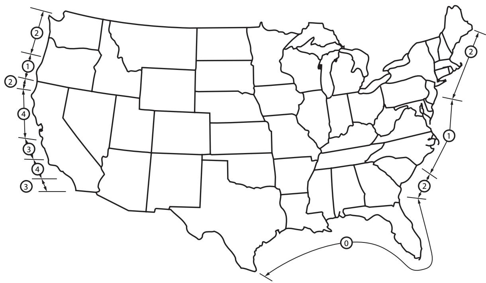

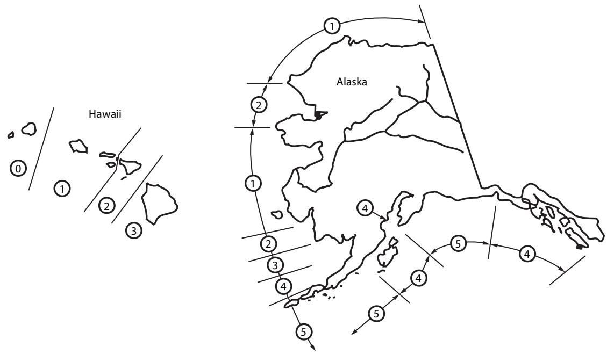  
Figure C2.3.6-1—Seismic Risk of United States Coastal Waters

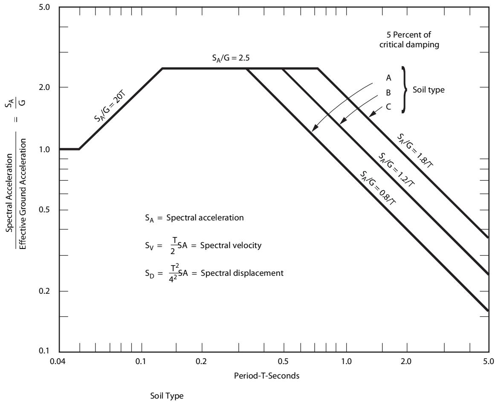  
Figure C2.3.6-2—Response Spectra—Spectra Normalized to 1.0 Gravity

A. Rock-crystalline, conglomerate, or shale-like material generally having shear wave velocities in excess of 3000 ft/sec (914 m/sec).   
B. Shallow Strong Alluvium—competent sands, silts and stiff clays with shear strengths in excess of about 1500 psf (72 kPa), limited to depths of less than about 200 ft (61 m), and overlying rock-like materials.   
C. Deep Strong Alluvium—competent sands, silts and stiff clays with thicknesses in excess of about 200 ft (61 m) and overlying rock-like materials.

spectra given in C2.3.6c1, the following are ground motion spectral accelerations which should be considered in conjunction with gravity and buoyance loading:

Ground Motion

Spectral Acceleration

$$\frac{X_{G}}{(0 . 20) (1 . 0) (B)} \quad \frac{Y_{G}}{(0 . 20) (1 . 0) (B)} \quad \frac{Z_{G}}{(0 . 20) (1 / 2) (A)}$$

where: $A$ and $B$ refer to curves in Figure C2.3.6-2

## 0.20 refers to the scaling factor $G$ for Zone 3,

## 1.0 refers to the principal horizontal axes scale factor,

$1 / 2$ refers to the vertical axis scale factor,

The use of the response spectrum approach requires that damping be identified with each mode. In 2.3.6c2, modal damping of five percent of critical is specified for use in all modes unless damping, $\eta$ (percent), are justified, either uniform or different for each mode, the following factor, $D$ , may be used to multiply the response ordinates obtained from the curves in (See Figure C2.3.6-3),

$$D = \frac{- 1 n (\eta / 100)}{1 n (20)}$$

This factor, $D$ , is appropriate for values of damping between 2 and 10 percent.

3. Response Analysis. Section 2.3.6c3 suggests that the complete quadratic combination (CQC) (20) of individual modal responses is appropriate for the evaluation of design response. This method accounts for correlation among responses of closely spaced modes. Other combinations may be appropriate for the evaluation of design response. The modal combination rule appropriate for a particular class of structures or members may be evaluated by comparing the response of the structure to a limited number of time histories with its response to the corresponding response spectra (58,59,60). It is also important to define the proper response variable in applying the response spectrum method. Note that the response variable such as member force is not necessarily the variable which will be directly compared to criteria such as allowable stress.

All of the modes need not be included to obtain an adequate representation of the structural response. The requirement for an adequate representation of the response will normally be met if the extracted nodes are selected on the basis of modal parameters such as mass participation factor or a major response parameter such as base shear or energy (21, 22). Additional nodes may be required if local member effects are important. However, the dynamic response of subassemblage and individual members may require separate consideration.

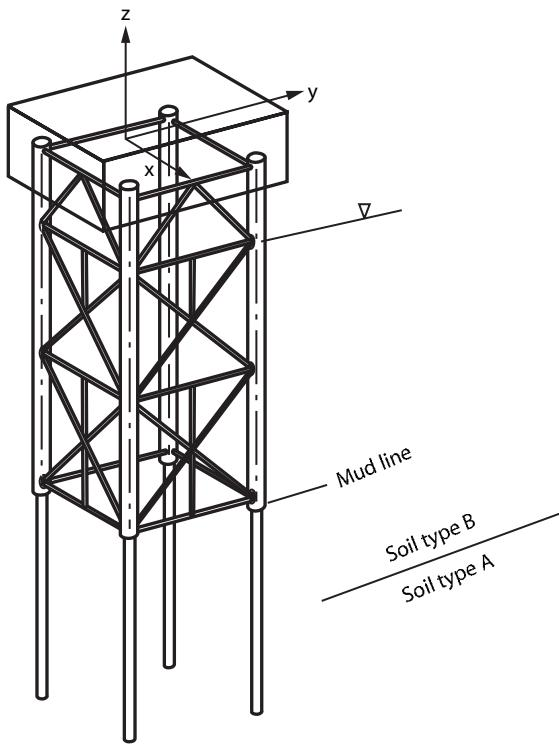  
Figure C2.3.6-3—Example Structure

4. Response Assessment, Member Stress. In the response spectrum analysis method, the response quantity of interest should be computed separately for each mode and then the modal responses combined using an appropriate method. For example, member end reactions are computed for each mode and combined to obtain the total earthquake induced forces. It should be noted that combining the modal values of actual-to-allowable stress ratios would not be conservative for columns because of the moment amplification term in the AISC allowable stress evaluation.

The total design force for each member is obtained by combining the earthquake induced forces together with forces due to gravity, buoyancy and hydrostatic loading. In combining the earthquake induced member forces with static forces account should be taken of the fact that the former have no sense of direction attached to them, and that earthquake induced forces are cyclic in nature. In general, the relative signs of the earthquake related forces acting on a member should be selected such that the most conservative condition will result. However, some unwarranted conservatism may be reduced by rational arguments concerning the expected member behavior such as the type of curvature.

In computing the earthquake induced forces for member design, consideration should also be given to the inertia forces introduced by the local vibrational characteristics of individual members.

For the strength requirement, the basic AISC allowable stresses and those presented in Section 3.2 may be increased by 70 percent. These provisions permit minor yielding but no significant damage to occur. The resulting allowable stresses are nearly the same as those proposed by the Applied Technology Council (3) for the earthquake response of steel buildings. Some yielding of the members may occur in bending since the 1.7 stress factor is within the range (1.52 to 1.92) of the AISC factors of safety for members subjected to axial and bending loads. Also, when multiplied by 1.7, the AISC allowable shear stress becomes 0.68 times the yield stress, which is eighteen percent greater than the von Mises yield criteria. However, as discussed by Beedle (24), the overstress in shear can be supported by strain hardening.

For combined earthquake loading and hydrostatic pressure, the suggested safety factors for local buckling and interaction formulas listed in Sections 2.5.3c and d are as follows:

Axial Tension 1.0

Axial Compression 1.0 to 1.2

Hoop Compression 1.2

These factors are approximately equal to those given in Section 2.5.3e for design condition 1 divided by 1.7.

C2.3.6d Ductility Requirements

1. In seismically active areas, platform response to rare, intense earthquake motions may involve inelastic action, and structural damage may occur. The provisions of Section 2.3.6d are intended to ensure that structure-foundation systems planned for such areas remain stable in the event of a rare, intense earthquake at the site. This can be achieved by providing sufficient system redundancy such that load redistribution and inelastic deformation will occur before collapse and by minimizing abrupt changes in stiffness in the vertical configuration of the structure. Adequate ductility can be demonstrated by adhering to the design practices outlined below or by non-linear analysis, where applicable.   
2. Considerable experience has been developed in recent years in the analysis of the overload performance of conventional structure-pile systems (10, 14, 39). Such systems are jacket type structures with 8 or more legs; supported by piles in competent soils whose local strength and stiffness degradation under extreme cyclic loading does not significantly compromise the overall integrity of the platform foundation; and located in areas where the intensity ratio of the rare, intense ground motions to the strength level ground motions is approximately 2. Based on this experience, the design guidelines of 2.3.6d2 have been developed (40). Implementation of these guidelines in the design of similar structures should ensure sufficient ductility for the overload condition.

Explicit analysis of the overload performance of such structures should not be necessary.

The guidelines include provisions for configuring and proportioning members in the vertical frames. Their purpose is to provide for redistribution of the horizontal shear loads in the vertical frames as buckling occurs in diagonal bracing, and to improve the post-buckling behavior of the diagonal braces and of non-tubular members at connections. These provisions will enhance ductile behavior of the structure under extreme lateral cyclic loading. Figure C2.3.6-4 shows examples of vertical frame configuration which do not meet the guidelines. Example configurations which meet the guidelines are shown in Figure C2.3.6-5. Note that the two "K" braced panels forming an "X" in two vertically adjacent panels meet the guidelines.

3. Reasons that a structure-foundation system may merit an explicit analysis of its performance during a rare, intense earthquake include:

- The seismicity of the site does not conform to the 1:2 ratio of strength to extreme level earthquake ground motion intensities common to offshore southern California. In other areas, this ratio may be higher.   
- The pile-supporting soils at the site are susceptible to significant strength and stiffness degradation under the cyclic loadings imposed by a rare, intense earthquake.   
- The configuration of the structure (bracing type, member size, $D/t$ and slenderness ratios) does not conform to the structural configurations typical of recently installed earthquake resistant platforms, from which the guidelines of 2.3.6d2 have been developed.

In order to demonstrate the satisfactory overload performance of these systems, it is necessary to establish appropriate performance criteria, develop representative platform and foundation models and perform analyses using a method of analysis that reasonably reflects the anticipated response of the platform and its foundation to rare, intense earthquake ground motion (17, 18, 39, 41).

Representative sets of ground motion time histories that are characteristic of a rare, intense earthquake at the site should be developed from a site-specific seismic hazard study following the provisions of 2.3.6b1 and C2.3.6b1. It should be demonstrated that the structure-foundation system remains stable under the loads imposed by these ground motions. The structure-foundation system may be considered unstable when the deflections are large enough to cause collapse under the influence of gravity loads.

The post-yield and post-buckling behavior of structural members subject to overload under cyclic load reversals should be modeled (15, 25, 42, 43, 44, 45, 46). For members required to develop significant bending, the interaction between axial load and moment capacity should be included (e.g., deck girders, jacket legs, and piles) (47). The ductility

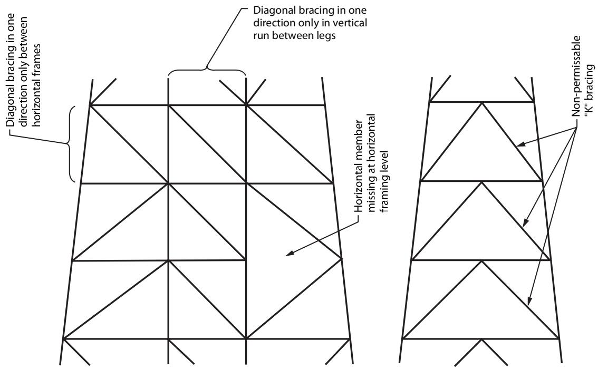  
Figure C2.3.6-4—Vertical Frame Configuration Not Meeting Guidelines

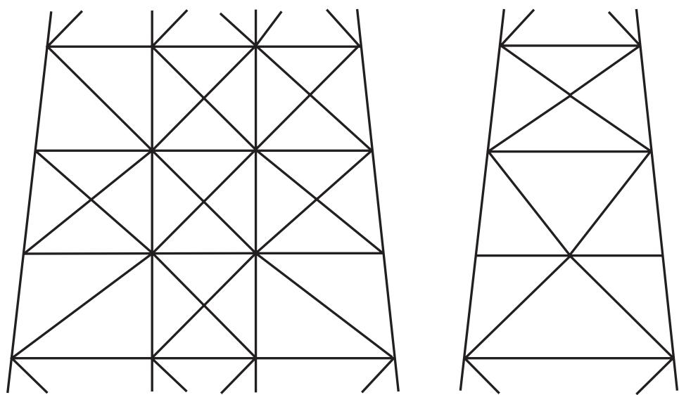  
Figure C2.3.6-5—Vertical Frame Configurations Meeting Guidelines

and cyclic degradation characteristics of tubular members are strongly dependent on their D/t and slenderness ratios (48). A significant amount of ductility can be built into the structure by implementation of the generic design guidelines presented in 2.3.6d2. Foundation models should consider the effects of cyclic load reversals, strain rate, pore water pressure generation on the strength and stiffness of the soils surrounding the piles (49, 50, 51, 52, 53), and energy dissipation mechanisms (54, 55, 56).

The designer should develop a thorough insight into the performance of the structure and foundation during a rare, intense earthquake. The time history method of analysis is recommended. The structure-foundation response should be determined to multiple sets of ground motions which characterize the likely envelope of ground motion intensity, frequency content, phasing and duration expected at the site. At least three sets of representative earthquake ground motion time histories should be analyzed. Additional more simplistic methods of analysis may be used to complement the results of the time history analysis (13).

C2.3.6e Additional Guidelines

1. Tubular Joints. Joints are sized for the yield or buckling capacity of incoming members, so that premature failure of the joints will be avoided and the ductility of the overall structure can be fully developed.

The recommended practice is to size jacket leg joint cans for full yield in main diagonals, and for the buckling load of principal horizontals. These horizontals typically have small loads for elastic analysis, but are required to pick up substantial compressive loads to prevent the structure from "unzipping" after main diagonals buckle. Excessive joint can thickness may often be avoided by using a conical stub end on the governing member; or by considering the beneficial effects of member overlap (Section 4.3.2) and/or grouted-in piles.

2. Deck Appurtenances and Equipment. The method of deriving seismic design forces for a deck appurtenance depends upon the appurtenance's dynamic characteristics and framing complexity. There are two analysis alternatives.

First, through proper anchorage and lateral restraint, most deck equipment and piping are sufficiently stiff such that their support framing, lateral restraint framing, and anchorage can be designed using static forces derived from peak deck accelerations associated with the strength level seismic event.

To provide assurance that the appurtenance is sufficiently stiff to meet this criterion, the lateral and vertical periods of the appurtenance should be located on the low period, 'flat' portion of the deck level floor response spectra. Additionally, the local framing of the deck that supports the appurtenance must also be rigid enough to not introduce dynamic amplification effects. In selecting the design lateral acceleration val

ues, consideration should be given to the increased response towards the corners of the deck caused by the torsional response of the platform.

Second, in cases of more compliant equipment—such as drilling and well servicing structures, flare booms, cranes, deck cantilevers, tall free-standing vessels, unbaffled tanks with free fluid surfaces, long-spanning risers and flexible piping, escape capsules, and wellhead/manifold interaction - consideration should be given to accommodating the additional stresses caused by dynamic amplification and/or differential displacements estimated through either coupled or decoupled analyses.

Decoupled analyses using deck floor spectra are likely to produce greater design loads on equipment than those derived using a more representative coupled analysis. This is particularly the case for more massive components, especially those with natural periods close to the significant natural periods of the platform. References 61 through 64 describe coupled procedures, and decoupled procedures which attempt to account for such interaction.

If coupled analyses are used on relatively rigid components that are modeled simplistically, care should be exercised such that the design accelerations which are derived from the modal combination procedure are not less than the peak deck accelerations.

Field inspections by experienced personnel of equipment and piping on existing platforms in seismic areas can help identify equipment anchorage and restraint that by experience and/or analysis should be upgraded. To accommodate loadings and/or differential displacements, the addition or deletion of simple bracing and/or anchorage to these components can significantly improve their performance during an earthquake. This is especially important for critical components such as piping and vessels handling hazardous materials, emergency battery racks, process control equipment, etc.

The use of one-third increase in basic allowable stresses is usually appropriate for designing deck supported structures, local deck framing, equipment anchorage, and lateral restraint framing under strength level earthquake loads. This lower increase in design allowances for strength level earthquake loads compared to a full yield stress allowable typically used for jackets is intended to provide a margin of safety in lieu of performing an explicit ductility level analysis.

However, in areas where the ratio of rare, intense ground motion intensities to strength level ground motion intensities is known to be higher than 2.0, an adjustment to the design allowable stresses should be considered. Also, for certain equipment, piping, appurtenances or supporting structures, the degree of redundancy, consequences of failure, and/or metallurgy may dictate the use of different allowable stresses or a full ductility analysis, depending on the component's anticipated performance under rare, intense earthquake ground motions.

References

(1) Algermissen, S. T., and Perkins, D. M., A Probabilistic Estimate of Maximum Acceleration in Rock in the Contiguous United States, U.S. Geological Survey, Open-file Report 76-416, 1976.   
(2) Woodward-Clyde Consultants, Offshore Alaska Seismic Exposure Study, Prepared for Alaska Subarctic Operators' Committee, March 1978.   
(3) Applied Technology Council (ATC), Tentative Provisions for the Development of Seismic Regulations for Buildings, ATC Pub. ATC3-06. NBS Special Pub. 510, NSF Pub. 78-8, June 1978.   
(4) Seed, H. B., Ugas, C., and Lysmer, L., Site Dependent Spectra for Earthquake Resistant Design, Bull. Seism. Soc. Amer., Vol. 66, No. 1, February 1976.   
(5) Mohraz, B., Earthquake Response Spectra for Different Geological Conditions, Bull. Seism. Soc. Amer., Vol. 66, No. 3, June 1976.   
(6) John A. Blume & Associates, Recommendations for Shape of Earthquake Response Spectra, Directorate of Licensing Report, U.S. Atomic Energy Commission, February 1973.   
(7) Nathan M. Newmark Consulting Engineering Services, A Study of Vertical and Horizontal Earthquake Spectra, Directorate of Licensing Report, U.S. Atomic Energy Commission, April 1973.   
(8) Bea, R. G., Earthquake Criteria for Platforms in the Gulf of Alaska, Journal of Petroleum Technology, SPE Paper No. 6264, March 1973.   
(9) Bea, R. G., Earthquake and Wave Design Criteria for Offshore Platforms, J. of the Structural Division, ASCE, Vol. 105, No. ST2, Proc. Paper 14387, February 1979.   
(10) Marshall, P. W., Gates, W. E., and Anagonostopoulos, S., Inelastic Dynamic Analysis of Tubular Offshore Structures, Offshore Technology Conference Proceedings, OTC 2908, 1977.   
(11) Bea, R. G., Audibert, J. M. E., and Akky, M. R., Earthquake Response of Offshore Platforms, J. of the Structural Division, ASCE, Vol. 105, No. ST2, Proc. Paper 14386, February 1979.   
(12) Marshall, P.W., and Bea, R. G., *Failure Modes of Offshore Platforms*, Proceedings of the First International Conference, Behavior of Offshore Structures, BOSS '76, Vol. II., Trondheim, Norway, 1976.

(13) Kallaby, J., and Millman, D., Inelastic Analysis of Fixed Offshore Platforms for Earthquake Loadings, Offshore Technology Conference Proceedings, OTC 2357, 1975.   
(14) Delflache, M. L., Glasscock, M. S., Hayes, D. A., and Ruez, W. J., Design of Hondo Platform for 850 Feet Water Depth in the Santa Barbara Channel, Offshore Technology Conference Proceedings, Paper OTC 2960, 1977.   
(15) Marshall, P. W., et al., Inelastic Behavior of Members and Structures, Combined Preprint for Session 45, ASCE Annual Convention & Exposition, Committee on Tubular Structures, Preprint 3302, Chicago, October 1978.   
(16) Whitman, R. V., and Protonotarios, J. N., Inelastic Response to Site-Modified Ground Motions, J. of the Geotechnical Engineering Division, ASCE, Vol. 103, No. GT10, Proc. Paper 13269, October 1977.   
(17) Arnold, P., Bea, R. G., Beebe, K. E., Marshall, P. W., Idriss, I. M., and Reimer, R. B., SPSS—A Study of Soil-Pile-Structure Systems in Severe Earthquake, Offshore Technology Conference Proceedings, OTC 2749, 1977.   
(18) Gates, W. E., Marshall, P. W., and Mahin, S. A., Analytical Methods for Determining the Ultimate Earthquake Resistance of Fixed Offshore Structures, Offshore Technology Conference Proceedings, OTC 2751, 1977.   
(19) Nair, V. V. D., Aseismic Design of Offshore Platforms, ASCE Specialty Conference—Earthquake Engineering and Soil Dynamics, Pasadena, June 1978, Vol. II, pp. 660-684.   
(20) Wilson, E. L., Der Kiureghian, A., and Bayo, E. P., A Replacement for the SRSS Method in Seismic Analysis, Earthquake Engineering and Structural Dynamics, Vol. 9, 1981.   
(21) Patstys, M., Jr., Criteria for Mode Selection in the DDAM Procedure, Shock and Vibration Bulletin, Vol. 40, Part 7, pp. 165-175, December 1969.   
(22) O'Hara, G. J., and Cunniff, P. F., Normal Modal Theory for Three-Dimensional Motion, Naval Research Laboratory Report 6170, January 1965.   
(23) Cornell, C. A., Engineering Seismic Risk Analysis, Bull. Seism. Soc. Amer., Vol. 58, No. 5, October 1968.   
(24) Beedle, L. S., Plastic Design of Steel Frames, John Wiley and Sons, Inc. 1958.   
(25) Sherman, D. R., Tests of Circular Steel Tubes in Bending, J. of the Structural Division, ASCE, Vol. 102, No. ST11, Proc. Paper 12568, November 1976.   
(26) Hays, W. W., Procedures for Estimating Earthquake Ground Motions, U.S. Geological Survey Professional Paper 1114, 1980.

(27) Donovan, N. C., and Bornstein, A. E., Uncertainties in Seismic Risk Procedures, J. of the Geotechnical Division, ASCE, Vol. 104, No. GT7, Proc. Paper 13896, July 1978.   
(28) McGuire, R. K., Effects of Uncertainty in Seismicity on Estimates of Seismic Hazard for the East Coast of the United States, Bull. Seism. Soc. Amer., Vol. 67, No. 3, June 1977.   
(29) Anderson, J. G., Estimating the Seismicity from Geological Structure for Seismic-Risk Studies, Bull. Seism. Soc. Amer., Vol. 69, No. 1, February 1979.   
(30) Allen, C. R., Geological Criteria for Evaluating Seismicity, Bull. Geological Society of America, Vol. 86, August 1975, pp. 1041-1057.   
(31) Idriss, I. M., Characteristics of Earthquake Ground Motions, Proc. ASCE Specialty Conference on Earthquake Engineering and Soil Dynamics, Pasadena, June 1978, Vol. 3, pp. 1151-1266.   
(32) Joyner, W. B., and Boore, D. M., Peak Horizontal Acceleration and Velocity from Strong-Motion Records Including Records from the 1979 Imperial Valley, California, Earthquake, Bull. Seism. Soc. Amer., Vol. 71, No. 6, December 1981.   
(33) Campbell, K. M., Near Source Attenuation of Peak Horizontal Acceleration, Bull. Seism. Soc. Amer., Vol. 71, No. 6, December 1981.   
(33) Campbell, K. M., Near Source Attenuation of Peak Horizontal Acceleration, Bull. Seism. Soc. Amer., Vol. 71, No. 6, December 1981.   
(34) Jennings, P. C., and Guzmann, R. A., Seismic Design Criteria for Nuclear Power Plants, Proc. U.S. National Conference on Earthquake Engineering, Ann Arbor, June 1975, pp. 474-483.   
(35) Kanamori, H., A Semi-Empirical Approach to Prediction of Long-Period Ground Motions from Great Earthquakes, Bull. Seism. Soc. Amer., Vol. 69, No. 6, December 1979.   
(36) Tsai, C. F., Lam, I., and Martin, G. R., Seismic Response of Cohesive Marine Soils, J. of the Geotechnical Division, ASCE, Vol. 106, No. GT9, Proc. Paper 15708, September 1980.   
(37) Moriwaki, Y., and Doyle, E. H., Site Effects on Microzonation in Offshore Areas, Proc. 2nd International Conference on Microzonation, San Francisco, November 1978, Vol. 3, pp. 1433-1446.   
(38) Finn, W. D. L., Martin, G. R., and Lee, M. K. W., Comparison of Dynamic Analyses for Saturated Sands, Proc.

ASCE Specialty Conference on Earthquake Engineering and Soil Dynamics, Pasadena, June 1978, Vol. 1, pp. 472-491.   
(39) Craig, M. J. K., and Skekher, V., Inelastic Earthquake Analyses of an Offshore California Platform, Offshore Technology Conference Proceedings, OTC 3822, 1980.   
(40) Kallaby, J., and Mitchell, W. W., Guidelines for Design of Offshore Structures for Earthquake Environment, Proceedings of the Second International Conference on Microzonation, San Francisco, November-December 1978.   
(41) Kagawa, T., Soil-Pile-Structure Interaction of Offshore Structures During an Earthquake, Offshore Technology Conference Proceedings, OTC 3820, 1980.   
(42) Zayas, V., Mahin, S. A., and Popov, E. P., Cyclic Inelastic Behavior of Steel Offshore Structures, Univ. of California, Berkeley, Earthquake Engineering Research Center Report No. UCCB/EERC-80/27, August 1980.   
(43) Zayas, V., Shing, P. S. B., Mahin, S. A., and Popov, E. P., Inelastic Structural Analysis of Braced Platforms for Seismic Loading, Proceedings, Offshore Technology Conference, OTC 3979, 1981.   
(44) Gugerli, H., and Goel, S. C., Inelastic Cyclic Behavior of Steel Bracing Members, Univ. of Michigan Report UMEE 82R1, January 1982.   
(45) Toma, S., Chen, W. F., and Finn, L. D., *External Pressure and Sectional Behavior of Fabricated Tubes*, J. of the Structural Div., ASCE, Vol. 108, No. ST1, Jan. 1982.   
(46) Anagnostopoulos, S. A., Post-Yield Flexural Properties of Tubular Members, J. of the Structural Division, ASCE Vol. 105, No. ST9, Paper No. 14821, September 1979.   
(47) Sherman, D. R., Erzurumlu, H., and Mueller, W. H., Behavioral Study of Circular Tubular Beam-Columns, J. of the Structural Division, ASCE, Vol. 105, No. ST6, Paper No. 14627, June 1979.   
(48) Marshall, P. W., An Overview of Recent Work on Cyclic, Inelastic Behavior and System Reliability. Proceedings, Structural Stability Research Council, Bethlehem, Pennsylvania, 1981.   
(49) Finn, W. D. L., Martin, G. R., and Lee, M. K. W., Application of Effective Stress Methods for Offshore Seismic Design in Cohesionless Seafloor Soils, Offshore Technology Conference Proceedings, OTC 3112, 1978.   
(50) Kagawa, T., and Kraft, L. M., *Lateral Pile Response During Earthquakes*, J. of the Geotechnical Engineering Division, ASCE, Vol. 109, No. GT12, Paper No. 16735, December 1981.

(51) Paulos, H. G., Cyclic Axial Response of a Single Pile, J. of the Geotechnical Engineering Division, ASCE, Vol. 107, No. GT1, Paper No. 15979, January 1981.   
(52) Paulos, H. G., Single Pile Response to Cyclic Lateral Load, J. of the Geotechnical Engineering Division, ASCE, Vol. 108, No. GT3, Paper No. 16921, March 1982.   
(53) Bea, R. G., Audibert, J. M. E., and Dover, A. R., Dynamic Response of Laterally and Axially Loaded Piles, Offshore Technology Conference Proceedings, OTC 3749, 1980.   
(54) Angelides, D., and Roesset, J. M., *Nonlinear Lateral Dynamic Stiffness of Piles*, J. of the Geotechnical Engineering Division, ASCE, Vol. 107, No. GT11, Paper No. 16635, November 1981.   
(55) Anagnostopoulos, S. A., *Pile Foundation Modeling for Inelastic Earthquake Analyses of Large Structures*, Engineering Structures, Vol. 5, No. 3 July 1983.   
(56) Dobry, R., Vincente, E., O'Rourke, M. J., and Roesset, J. M., Horizontal Stiffness and Damping of Single Piles, J. of Geotechnical Engineering Division, ASCE, Vol. 108, No. GT3, Paper No. 16917, March 1982.   
(57) Housner, G. W., and Jennings, P. C., Earthquake Design Criteria for Structures, EERL 77-06, Earthquake Engineering Research Laboratory, California Institute of Technology, Nov. 1977.   
(58) Nair, V. V. D., Valdivieso, J. B., and Johnson, C. M., Comparison of Spectrum and Tide History Techniques in Seismic Design of Platforms, Proceedings, Offshore Technology Conferences, OTC 3823, 1980.   
(59) Anagnostopoulos, S. A., Response Spectrum Techniques for Three-Component Earthquake Design, International Journal for Earthquake Engineering and Structural Dynamics, Vol. 9, No. 3, May-June 1981.   
(60) Anagnostopoulos, S. A., Spatial and Modal Combinations of Dynamic Response for Design of Fixed Offshore Platforms under Three Components of Earthquake Motion, Proceedings, 7th World Conference in Earthquake Engineering, Istanbul, Turkey, 1980.   
(61) ASCE 4-98, Seismic Analysis of Safety-Related Nuclear Structures and Commentary, ASCE, 1801 Alexander Graham Bell Drive, Reston, VA 20191-4400.   
(62) Soong, T. T., Sarkani, S., and Chen, Y., Reliability and Design Criteria for Secondary Systems, Proceedings of ICOSSAR'89, ASCE, pp. 463-470, 1989.   
(63) Yang, J. N., Sarkani, S., and Long, F. X., A Response Spectrum Approach for Seismic Analysis of Nonclassically

Damped Structures, Engineering Structures, Vol. 12, No. 3, pp. 173-184, July, 1990.   
(64) Sackman, J. L., and Kelly, J. M., Rational Design Methods for Light Equipment in Structures Subjected to Ground Motion, report number UCB/EERC—78/19, Earthquake Engineering Research Center, Berkeley, CA, 1978.   
(65) Vyas, Y K., Crouse, C. B., and Schell, B. A., Regional Design Ground Motion Criteria for the Southern Bering Sea. Proceedings, Offshore Mechanics and Arctic Engineering Conference, Houston, February 1988.

COMMENTARY ON ALLOWABLE STRESSES AND COMBINED STRESSES, SECTIONS 3.2 AND 3.3

C3.2 ALLOWABLE STRESSES FOR STEEL CYLINDRICAL MEMBERS

Introduction. Such a vast volume of literature is available on the subject of shell buckling that no particular purpose will be served by attempting to cover the subject in detail. This commentary is, therefore, confined to describing only the background of the design recommendations in Section 3.2 which covers the buckling and allowable stresses for fabricated steel cylinders. A comprehensive review of the subject is contained in Reference 1.

The design recommendations are tailored to cylinders of dimensions and material yield strengths typical of offshore platform members ( $F_{y} < 60$ ksi and $D/t < 120$ ). The local buckling formulas recommended for axial compression, bending and hydrostatic pressure are, however, considered valid up to $D/t < 300$ . Application of the recommendations to thin cylinders with high $D/t$ ratios ( $>300$ ) and high strength steels ( $F_{y} > 60$ ksi) may lead to unconservative results.

C3.2.1 Axial Compression

Tubular members under axial compression are subject to failure due either to material yield, Euler column buckling, or local buckling. For design against Euler column buckling, Section 3.2 recommends use of the AISC Specification for the Design, Fabrication, and Erection of Structural Steel for Buildings, latest edition. However, to supplement the AISC code, Section 3.3 includes appropriate interaction formulas for cylindrical members under axial compression and bending, together with recommended values for effective length factors, $K$ , and moment reduction factors, $C_m$ , for typical offshore platform members.

Cylindrical shells with low diameter-to-thickness （$D / t)$ ratio are generally not subject to local buckling under axial compression and can be designed on the basis of material failure, i.e., the local buckling stress may be considered equal to the yield stress. Cylindrical shells of relatively high $D / t$

ratios, on the other hand, must be checked for local shell buckling.

Unstiffened thin-wall cylinders under axial compression and bending are prone to sudden failures at loads well below theoretical buckling loads predicted by classical small-deflection shell theory. There is a sudden drop in load-carrying capacity upon buckling. The post-buckling reserve strength is small, in contrast to the post-buckling behavior of flat plates and columns, which continue to carry substantial load after buckling. For this reason, the degree of confidence in the buckling load should be higher for cylinders than for most other structural elements. This is made difficult by the large scatter in test data, and necessitates a relatively conservative design procedure. The large scatter in test data is considered to be the result of initial imperfections caused by fabrication tolerances and procedures. In addition to geometric imperfections, experimental and theoretical evidence has shown that the buckling load is also affected by boundary conditions and residual stresses. Residual stresses cause inelastic action to commence before the nominal stress due to applied loads reaches yield. As a result, the buckling process is hastened.

The elastic local buckling stress formula recommended in Eq. 3.2.2-3 represents one-half the theoretical local buckling stress computed using classical small deflection theory. This reduction accounts for the detrimental effect of geometric imperfections and, based on the available test data (Reference 2), shown in Figure C3.2.2-1, is considered to be conservative for cylinders with $t \geq 0.25$ in. and $D / t < 300$ . For thinner cylinders and cylinders with higher $D / t$ ratios, larger imperfection reduction factors would be required. Offshore platform members, however, are normally well within these dimensional limits.

Tubular members with $D / t < 300$ fabricated from typical offshore platform steels will normally buckle inelastically rather than elastically. The formula recommended in Eq. 3.2.2-4 to compute the inelastic local buckling stress, $F_{xc}$ , is empirical and is based primarily upon the results of local buckling tests sponsored by recent AISI and API projects, and tests conducted at the University of Illinois during the 1930s. These are the only known tests on fabricated cylinders with materials yield strengths in the range of structural steels used for offshore platforms.

Figure C3.2.2-2 shows a comparison of the recommended empirical formula and the results of the test data. Based on the test results, it is recommended that local buckling be checked whenever $D / t$ is greater than 60. The test data shows no clear trend of variation with $F_{y}$ for the $D / t$ cut-off value, below which it is unnecessary to check local buckling. The suggested constant value of $D / t = 60$ is considered to be appropriate for commonly-used offshore platform steels ( $F_{y} = 35$ to $60$ ksi).

The allowable axial compressive stress is obtained by substituting the value of $F_{xc}$ for $F_{y}$ in the appropriate AISC design formula.

C3.2.2 Bending

The ultimate bending capacity of fabricated circular cylinders, normalized with respect to yield moment capacity, （$M_u / M_y)$ , is illustrated in Figure C3.2.3-1. The data used in the figure is from Sherman (Reference 5) and Stephens, et al. (Reference 6). Cylinders with $F_{y}D/t$ ratios less than 1,500 ksi have ultimate bending capacities that exceed the plastic moment capacities by a considerable margin. Their load-deformation characteristics demonstrate very high post-yield ductility levels, which are typical of a ductile mode of failure. The normalized rotational capacity, defined as ultimate to yield rotation ratio, （$\theta_u / \theta_y)$ , invariably exceeds 10. When the $F_{y}D/t$ ratios increase, the ultimate bending capacities decrease. For cylinders with $F_{y}D/t$ ratios between 1,500 and 3,000 ksi, the load-deformation characteristics are semi-ductile, and the normalized rotational capacity is greater than 5. For cylinders with $F_{y}D/t$ ratios in excess of 3,000 ksi, the load-deformation characteristics indicate little post-yield ductility levels. Normalized rotational capacity of less than 5 is typical of a local buckling mode of failure. These local buckling strengths of cylinders under bending are significantly higher than those under uniform axial compressive loads, as shown in Figure C3.2.2-2. Additional data for $F_{y}D/t$ greater than 16,000 ksi, reported by Stephens, indicates that the local buckling strengths, under both bending moments and uniform axial compressive loads, converge at $D/t$ ratios greater than 300.

The lower bound of the normalized ultimate bending capacities has been interpreted as the nominal shape factor of 1.27. This is for cylinders with $F_{y}D / t$ up to 1,500 ksi, for which a ductile failure is assured. The lower bound of the normalized ultimate bending capacities decreased linearly to 1.10 for $F_{y}D / t$ of 3,000 ksi, where scatter of the data is still well-defined. For cylinders with $F_{y}D / t$ in excess of 3,000 ksi, the scatter of data is not defined. Therefore, a margin is provided in the interpretation of the lower bound of the normalized ultimate bending capacities. The normalized ultimate capacity for $F_{y}D / t$ of 6,000 ksi is approximately 1.0. The interpreted lower bound terminates near two data points (from Reference 6), for $D / t$ and $F_{y}D / t$ ratios of 298 and 444, and 16,240 and 19,710 ksi, respectively.

The allowable stresses for cylinders under bending have been derived by using a factor of safety of 1.67 against the lower bound of the ultimate bending capacities.

C3.2.3 Hydrostatic Pressure

This section describes the background of the design recommendations in Section 3.2.5, which covers the local instability of unstiffened and ring stiffened cylinders subjected to hydrostatic pressure. Other stiffening arrangements are not considered. However, the hydrostatic instability rules can be applied to circumferentially and longitudinally stiffened cylinders, since longitudinal stiffeners do not contribute signifi

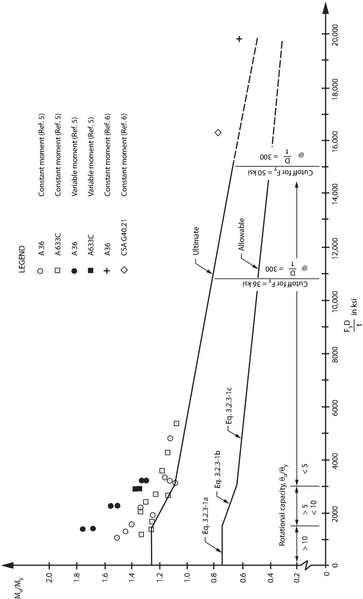  
Figure C3.2.3-1—Design Equation for Fabricated Steel Cylinders Under Bending

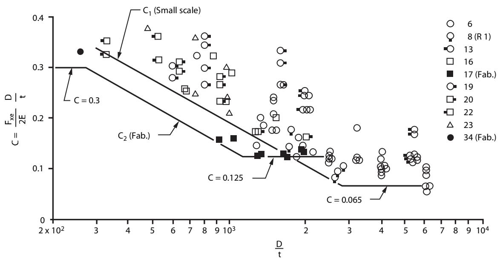  
Figure C3.2.2-1—Elastic Coefficients for Local Buckling of Steel Cylinders Under Axial Compression

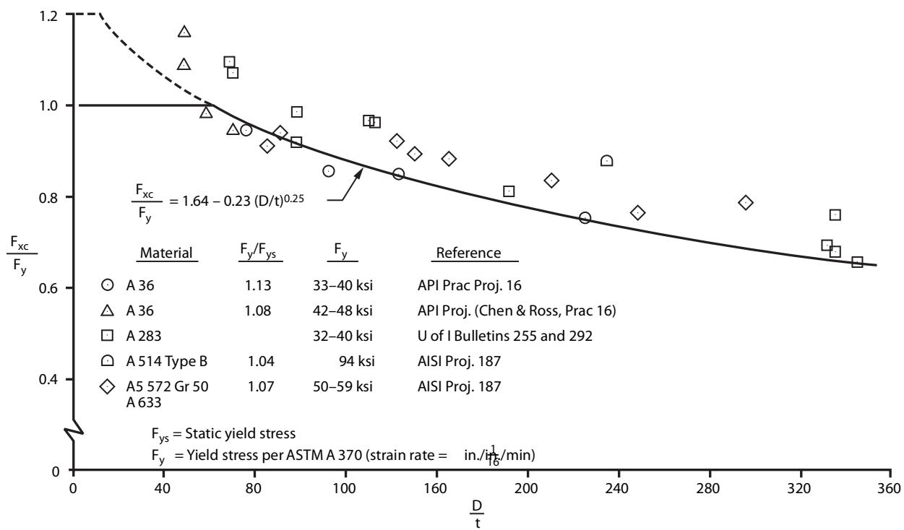  
Figure C3.2.2-2—Comparison of Test Data with Design Equation for Fabricated Steel Cylinders Under Axial Compression

cantly to buckling resistance against hydrostatic collapse, unless they are closely spaced. A comprehensive review of the subject is given in Reference 1.

The design recommendations are tailored to cylinders of dimensions and material yield strengths typical of offshore platform members ( $F_{y} < 60$ ksi and $D / t < 120$ ). Application of the recommendations to thin cylinders with much higher $D / t$ ratios and higher strength steels may lead to unconservative results.

Unstiffened cylinders under hydrostatic external pressure are subjected to local buckling of the shell wall between restraints. Ring-stiffened cylinders are subject to local buckling of the shell wall between rings. The shell buckles between the rings, while the rings remain essentially circular. However, the rings may rotate or warp out of their plane. Ring-stiffened cylinders are also subject to general instability, which occurs when the rings and shell wall buckle simultaneously at the critical load. In the general instability mode, ring instability is caused by "in-plane" buckling of the rings. Since general instability is more catastrophic than local buckling between rings, it is normally desirable to provide rings with sufficient reserve strength to preclude general instability.

The formulas given in Section 3.2.5 to compute the elastic buckling stress represent 0.8 times the theoretical stress obtained using classical small deflection theory. The implied 20 percent reduction factor （$\alpha = 0.80)$ , included in the coefficient $C_h$ , accounts for the effect of geometric imperfections due to fabrication. All available test data indicate that this is sufficiently conservative for cylinders fabricated within API Spec 2B out-of-roundness tolerances. For cylinders with greater out-of-roundness values, local buckling test results on steel cylinders suggest a lower bound reduction factor given by:

$$\alpha = 1. 0 - 1. 2 \sqrt{\frac{D_{\text{m a x}} - D_{\text{m i n}}}{0 . 01 D}} \tag{C3.2.5-1}$$

This value of $\alpha$ was used to normalize the available results with respect to $\alpha = 0.80$ (for one percent out-of-roundness), before plotting the results in Figures C3.2.5-1 and C3.2.5-2 for comparison with the design equations for $F_{he}$ .

When the elastic hoop buckling stress exceeds $0.55F_{y}$ , it is necessary to apply a plasticity reduction factor to account for the effect of inelasticity and residual stresses. The plasticity reduction factors given in Eq. 3.2.5-6 to compute the inelastic buckling stress $F_{he}$ represent a reasonable lower bound for the available test data shown in Figure C3.2.5-3.

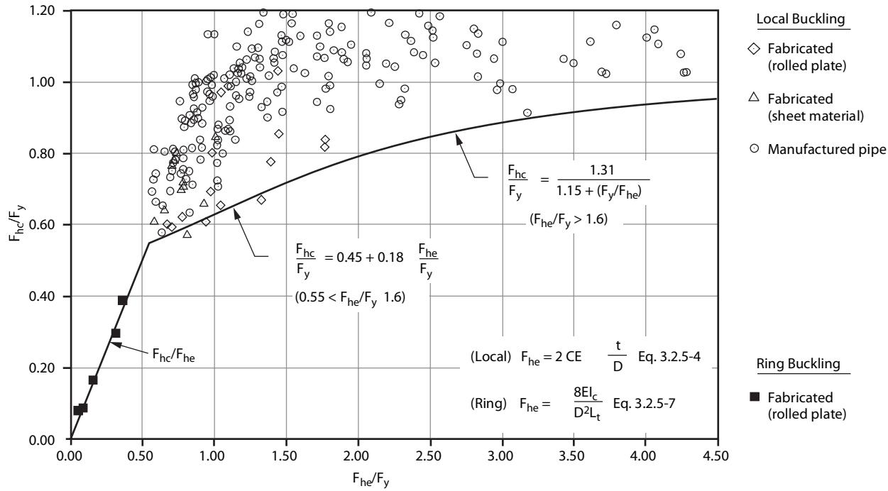  
Figure C3.2.5-3—Comparison of Test Data with Design Equations for Ring Buckling and Inelastic Local Buckling of Cylinders Under Hydrostatic Pressure (Elastic Local Buckling Data Shown in Figures C3.2.5-1 and C3.2.5-2 are Omitted for Clarity)

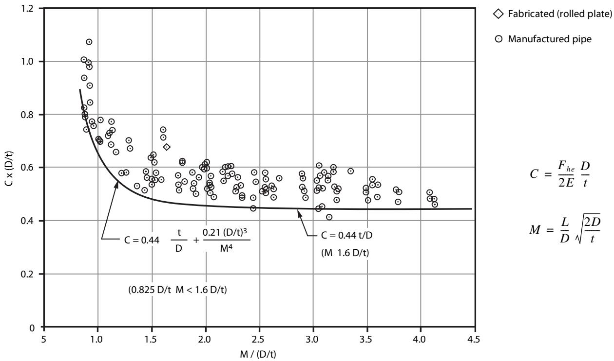  
Figure C3.2.5-1—Comparison of Test Data with Elastic Design Equations for Local Buckling of Cylinders Under Hydrostatic Pressure ( $M > 0.825$ $D/t$ )

The formula given for determining the moment of inertia of stiffening rings, Eq. 3.2.5-7, provides sufficient strength to resist collapse even after the shell has buckled between stiffeners. It is assumed that the shell offers no support after buckling and transfers all its load to the effective stiffener section. The stiffening ring is designed as an isolated ring that buckles into two waves （$n = 2)$ at a collapse pressure 20 percent higher than the strength of the shell.

Test results for steel cylinders indicate that a geometric imperfection reduction factor given by:

$$\alpha = 1. 0 - 0. 2 \sqrt{\frac{D_{\text{m a x}} - D_{\text{m i n}}}{0 . 01 D}} \tag{C3.2.5-2}$$

is applicable for general instability failures of cylinders with initial out-of-roundness values exceeding one percent. A value of $\alpha = 0.80$ is appropriate for out-of-roundness values less than one percent. These $\alpha$ values were used to normalize the general instability test results included in Figure C3.2.5-3 to correspond to a one percent out-of-roundness basis.

Note that when the geometric parameter $M$ exceeds 1.6 $D / t$ , a ring-stiffened cylinder behaves essentially like an unstiffened cylinder of infinite length. In order to be bene

ficial, therefore, ring stiffeners should be spaced such that $M < 1.6D / t$ .

References

(1) Guide to Stability Design Criteria for Metal Structures, Structural Stability Research Council, Fourth Edition, John Wiley & Sons, 1988.   
(2) Miller, C. D., Buckling of Axially Compressed Cylinders, Journal of the Structural Division, ASCE, March 1977.   
(3) Boardman, H. C., Stresses at Junctions of Two Right Cone Frustums with a Common Axis, the Water Tower, Chicago Bridge and Iron Co., March 1948.   
(4) Johns, D. J., Local Circumferential Buckling of Thin Circular Cylindrical Shells, Collected Papers on Instability of Shell Structures, NASA TN D-1510, December 1962.   
(5) Sherman, D. R., Bending Capacity of Fabricated Pipe at Fixed Ends, Report to API, University of Wisconsin-Milwaukee, December 1985.   
(6) Stephens, M. J., Kulak, G. L., and Montgomery, C. J., Local Buckling of Thin Walled Tubular Steel Members, Structural Engineering Report No. 103, University of Alberta, Edmonton, Canada, February 1982.

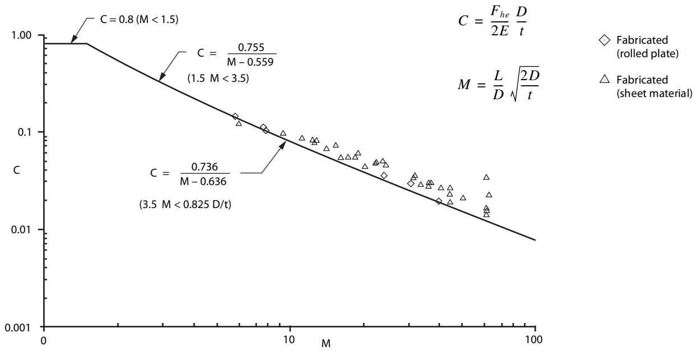  
Figure C3.2.5-2—Comparison of Test Data with Elastic Design Equations for Local Buckling of Cylinders Under Hydrostatic Pressure ( $M < 0.825$ $D/t$ )

C3.3 COMBINED STRESSES FOR STEEL CYLINDRICAL MEMBERS

Introduction. This section of the commentary describes the background of the design recommendations in Section 3.3, which covers the buckling of unstiffened and ring-stiffened cylinders under combined axial, bending, and hydrostatic external pressure loads.

07 C3.3.3 Axial Tension and Hydrostatic Pressure

The interaction formula recommended to check axial tension and hydrostatic pressure interaction is based on the Beltrami and Haigh maximum total energy theory, with the critical hydrostatic buckling stress substituted for the yield stress and Poisson's ratio set equal to 0.3. The Beltrami and Haigh failure theory reduces to the Hencky-von Mises distortion energy theory with Poisson's ratio equal to 0.5. A comparison with available test data, shown in Figure C3.3.3-1, confirms that the recommended interaction formula is appropriate for $D/t$ values typically used for offshore platform members. The test data that fall inside the ellipse correspond to stretch failures and tests with very low $D/t$ values.

07

C3.3.4 Axial Compression and Hydrostatic Pressure

The combination of hydrostatic pressure and axial load may produce a different critical buckling stress than either of these load systems acting independently. Figure C3.3.3-2 illustrates the recommended interaction equations for various

possible stress conditions. These interaction equations imply that no interaction occurs if the axial stress is less than one-half the allowable hoop stress.

The recommended interaction equations have been checked against the results of available tests and found to give conservative results, as shown in Figures C3.3.3-3, C3.3.3-4, and C3.3.3-5. Figure C3.3.3-3 shows the results of elastic buckling tests on mylar, plexiglass, and fabricated steel cylinders, while Figure C3.3.3-4 shows the results of fabricated steel cylinders alone. In Figure C3.3.3-3 the test results are compared with the recommended equation for elastic interaction, Eq. 3.3.4-3 using $F_{xe}$ and $F_{he}$ values determined from the tests. This comparison validates the form of Eq. 3.3.4-3. In Figure 3.3.3-4, the fabricated steel cylinder test results are compared with Eq. 3.3.4-3, using $F_{xe}$ and $F_{he}$ values computed from the design equations in Section 3.2. This confirms that Eq. 3.3.4-3 is conservative. In Figure C3.3.3-5, the recommended interaction equations are compared with the results of test data for unstiffened steel pipe with an elastic hydrostatic buckling stress and an inelastic axial buckling stress. This comparison demonstrates the validity of the recommended interaction equations for combined elastic and inelastic behavior.

References

(1) Weingarten, V. I., Morgan, E. J., and Seide, P., Final Report on Development of Design Criteria for Elastic Stability of Thin Shelled Structures, Space Technology Laboratories Report STL-TR-60-0000-19425, December 1960.

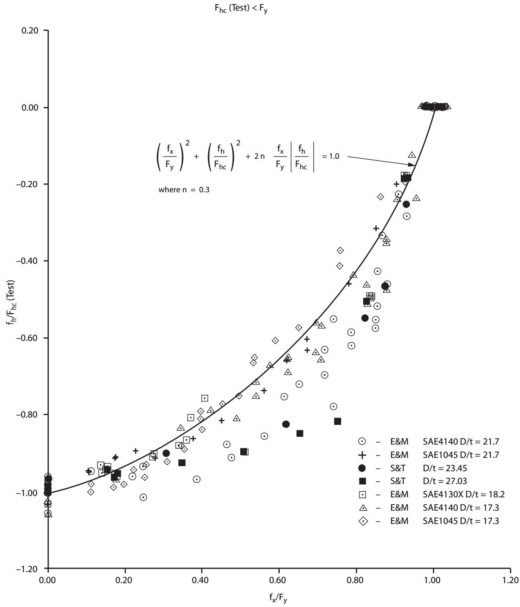  
Figure C3.3.3-1—Comparison of Test Data with Interaction Equation for Cylinders Under Combined Axial Tension and Hydrostatic Pressure ( $F_{hc}$ Determined from Tests)

(2) Mungan, I., Buckling Stress States of Cylindrical Shells, Journal of Structural Division, ASCE, Vol. 100. No. ST 11, November 1974, pp. 2289-2306.   
(3) Miller, C. D., Summary of Buckling Tests on Fabricated Steel Cylindrical Shells in USA, Paper 17, Presented at Buck-

ling of Shells in Offshore Structures Symposium, Imperial College of Science and Technology, London, April 1981.

(4) Stuiver, W., and Tomalin, P. F., The Failure of Tubes Under Combined External Pressure and Axial Loads, SESA Proceedings, Vol. XZ12, pp. 39-48.

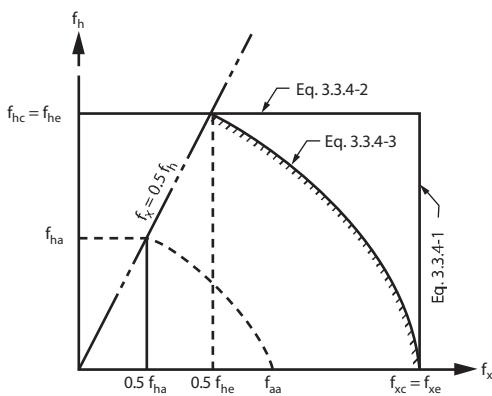  
(a) Elastic Buckling

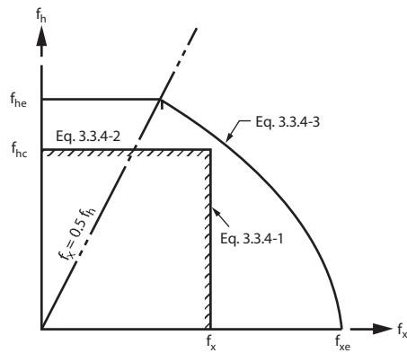  
(b) Yield Type Failure

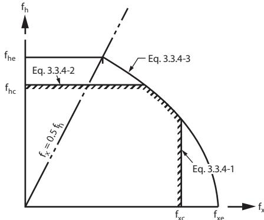  
(c) Elastic and Yield Type Combined

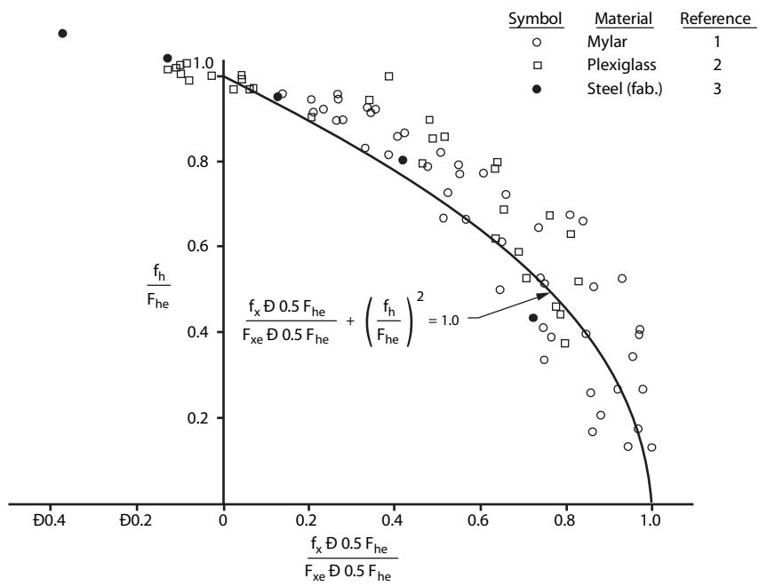  
Figure C3.3.3-2—Comparison of Interaction Equations for Various Stress Conditions for Cylinders Under Combined Axial Compressive Load and Hydrostatic Pressure   
Figure C3.3.3-3—Comparison of Test Data with Elastic Interaction Curve for Cylinders Under Combined Axial Compressive Load and Hydrostatic Pressure ( $F_{xe}$ and $F_{he}$ are Determined from Tests)

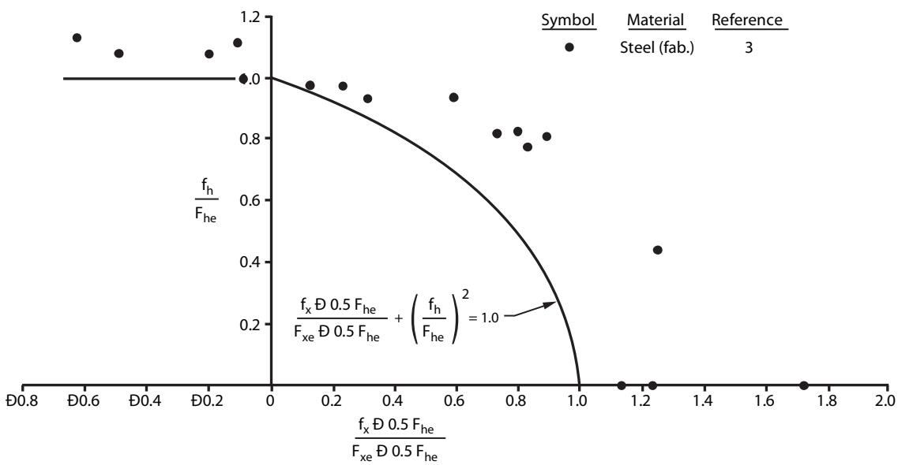  
Figure C3.3.3-4—Comparison of Test Data on Fabricated Cylinders with Elastic Interaction Curve for Cylinders Under Combined Axial Load and Hydrostatic Pressure （$F_{xe}$ and $F_{he}$ are Determined from Recommended Design Equations)

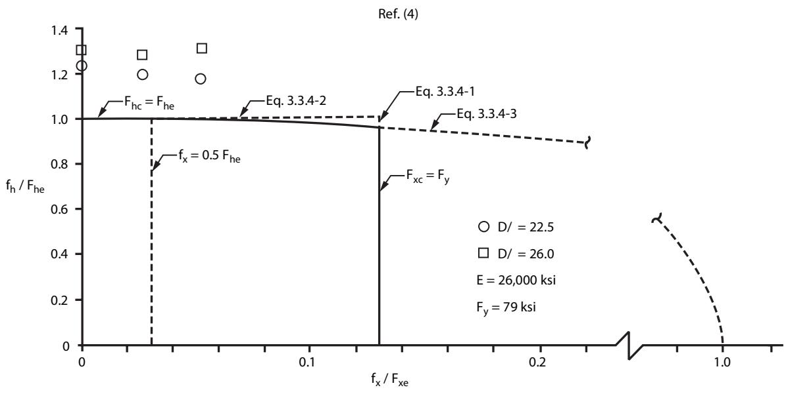  
Figure C3.3.3-5—Comparison of Test Data with Interaction Equations for Cylinders Under Combined Axial Compressive Load and Hydrostatic Pressure (Combination Elastic and Yield Type Failures)

C4 COMMENTARY ON STRENGTH OF TUBULAR JOINTS

C4.1 APPLICATION

The provisions of Section 4 are wide-ranging and are intended to provide the practicing engineer with as much guidance as is currently available in this field, for the range of joint configurations, geometries and load cases that exist in practice. Although a substantial effort has been expended to capture the present day technology, it is recognized that in some instances the designer may have to use test data and analytical techniques as a basis for design. Ref. 1 permits the designer to select an appropriate reduction factor for joint strength to account for a small number of data. Where the basis for the calculation of joint strength or calibration of numerical techniques to suitable test data is poor, a reduction factor of 0.7 has been known to be applied.

It is appropriate to summarize the historical development of the API RP 2A-WSD provisions and the background to the most recent major updates as incorporated into this supplement to the $21^{\mathrm{st}}$ edition. In the 3rd edition of API RP 2A-WSD, issued in 1972, some simple recommendations were introduced based on punching shear principles (Ref. 3). In the $4^{\mathrm{th}}$ edition, factors were introduced to allow for the presence of load in the chord and the brace-to-chord diameter ratio （$\beta)$ . In the $9^{\mathrm{th}}$ edition, issued in 1977, differentiation was introduced in the allowable stress formulations for the joint and loading configuration i.e., T/Y, X and K.

Much work was done over the period 1977 to 1983, including large-scale load tests to failure, to improve the understanding and prediction of joint behavior. This work culminated in the issue of the $14^{\mathrm{th}}$ edition of API RP 2A-WSD, in which the punching shear stress formulations were considerably modified and included a more realistic expression to account for the effect of chord loads as well as providing an interaction equation for the combined effect of brace axial and bending stresses. Also introduced in the $14^{\mathrm{th}}$ edition was the alternative nominal load approach, which gives equivalent results to the punching shear method. Some of the background to this step change in approach can be found in Ref. 4. The guidance then essentially remained unchanged for all editions up to the 21st, although further recommendations were added on load transfer through the chord in the $20^{\mathrm{th}}$ edition (1993).

Regardless of API RP 2A-WSD stability, much further knowledge, including both experimental data and numerical studies, has been gained on the behavior of joints since the $14^{\text{th}}$ edition was issued. Over the period 1994 to 1996 MSL Engineering, under the auspices of a joint industry project, undertook an update to the tubular joint database and guidance (Refs. 5 to 7). This work and more recent studies, notably by API/EWI and the University of Illinois, have formed the basis of the tubular joint strength provisions of ISO (Ref.

8). The ISO drafting committee took, as a starting point for drafting, the relevant provisions from API RP 2A-LRFD $1^{\text{st}}$ edition (similar to API RP 2A-WSD $20^{\text{th}}$ edition) because ISO is in LRFD format. However, the API RP 2A-WSD provisions were greatly modified during the drafting process to take account of the greater knowledge.

For the purposes of this supplement to the $21^{\mathrm{st}}$ edition of API RP 2A-WSD, the draft ISO provisions, in turn, have been used as a starting basis. Additional studies, not available at the time of the preparation of the draft ISO guidance have been incorporated into this supplement to the $21^{\mathrm{st}}$ edition of API RP 2A-WSD. The major updates between the $21^{\mathrm{st}}$ edition and this supplement to the $21^{\mathrm{st}}$ edition are detailed in the following subsections but, in summary, involve: a relaxation of the $2/3$ limit on tensile strength, additional guidance on detailing practice, removal of the punching shear approach, new $Q_{u}$ and $Q_{f}$ formulations, and a change in the form of the brace load interaction equation.

C4.2 DESIGN CONSIDERATIONS

C4.2.1 Materials

All of the empirical strength equations have been based upon measured yield. Very few test results have indicated unexpected low capacity due to substandard material properties. However, it is recognized that some limits are implied by the database.

One important change resulting from the MSL work (Refs. 5 to 7) concerns new steels with high yield-to-tensile strength ratios. Previous editions of API RP 2A-WSD did not allow the designer to assume more than a value of $2/3$ . In other words, if the ratio exceeded this limit, the designer had to downgrade the assumed chord yield level to 66 percent of tensile strength. The MSL work found that the database justified a limit of 0.8 for joints with a chord yield of up to at least 72 ksi (500 MPa).

The material property range is limited to $F_{y} \leq 72$ ksi (500 MPa). Historically, there has been a concern that the strength of joints with chord yield stresses in excess of 72 ksi (500 MPa) may not increase in proportion to the yield stress. The concern relates to the possibility that higher yield strength may be obtained at the expense of lower ductility and lower strain-hardening capacity, thereby compromising the post-yield reserve strength on which the design criteria rely. This matter is discussed in Ref. 9. A re-evaluation of the test results reported therein has revealed that use of the limiting yield-to-tensile strength ratio of 0.8 appears to be adequate to permit the capacity equations to be used for joints with 72 ksi (500 MPa) $< F_{y} \leq 115$ ksi (800 MPa), provided adequate ductility can be demonstrated in both the heat affected zone and parent material. However, the test data reported in Ref. 9 are limited to a small number of joint types and loading modes (i.e., 11 joints).

A recently completed joint industry project (Ref. 10) investigated the static strength of high strength steel X joints. The joint industry project involved the testing of four compression joints (two at a nominal yield strength of $355\mathrm{MPa}$ and one each at $500\mathrm{MPa}$ and $700\mathrm{MPa}$ ) and three tension joints (one each at nominal yield strength of $355\mathrm{MPa}$ , $500\mathrm{MPa}$ and $700\mathrm{MPa}$ ). The findings presented in Ref. 10 indicate that all the joints performed satisfactorily in the tests in terms of strength and ductility, confirming the practicality of using higher strength steels. These data indicate that a yield-to-tensile strength ratio of 0.8 can be used to estimate the ultimate compression and tension capabilities of the joints. However, for the tension loaded joints in which cracking prior to reaching the ultimate capacities was observed, no detailed assessments were presented.

Beyond $800\mathrm{MPa}$ , indicative capacity estimates may be obtained through use of a yield stress of $800\mathrm{MPa}$ or 0.8 times the tensile strength, whichever is the lesser. Given the lack of data and information in this area, this approach should be considered to be only indicative.

C4.2.2 Design Loads and Joint Flexibility

Given present-day computer power and software packages, it is generally recommended that working point offsets be defined in the analysis model to capture secondary moments. Optionally, rigid offsets from the working points on the chord centerline to the chord surface can also be defined. Such offsets can be used to reduce the bending moments from nodal values to those at the chord surface (the moment capacity equations were established for chord surface moments).

Historically, designers of offshore jacket structures have usually made the assumption that the joints are rigid and that the frame can be modeled with members extending to working points at chord centerlines. However, it has long been recognized that the linear elastic flexibility of tubular joints may be significant at locations such as skirt pile bracing and in computing fatigue life estimates for secondary connections. For conductor framing connections, fatigue life estimates can be substantially larger when linear elastic flexibilities are included in the analyses, because the member lengths are short and member flexibility tends to be less than joint flexibility. From a system ultimate strength standpoint, full, nonlinear, load-deformation curves for joints may be required in pushover analyses, especially where joint failures are expected to participate in the sequence of events leading to system collapse. Such analyses are common in the maintenance of infrastructure and life extension studies of existing facilities.

In 1993, Buitrago et al. (Ref. 11) published a robust set of equations for linear elastic flexibility/stiffness of simple tubular joints. Although a number of other sets of formulations are available in the literature, Buitrago's formulations are considered to be more wide-ranging, have better physical meaning, compare better with experimental data and are simpler to use manually and computationally.

In Ref. 6, the technology pertaining to linear elastic flexibility was extended through analyses of the updated database, to establish a range of closed-form expressions, which permit the designer to create non-linear load-deformation ( $P\delta$ or $M\theta$ ) curves in both the loading and unloading regimes for simple joints across the practical range of load cases and geometries. The full non-linear expressions will see application primarily in pushover analyses, especially where joint failures are postulated to influence the peak failure load.

Ref. 12 reports on a pilot study to assess the effect of hydrostatic pressure on tubular joint capacity. DT joints are studied, and the results indicate that capacity may be reduced by up to $30\%$ , depending on geometry, brace load case and hydrostatic pressure magnitudes. Apart from Ref. 12, no other studies in this area have been identified. Hydrostatic pressure effects can be significant, especially for deepwater structures, and the designer is referred to Ref. 12 when considering these effects. In many instances, members are purposefully flooded to avoid hydrostatic pressure effects.

C4.2.3 Minimum Capacity

API has a broad minimum capacity requirement that equate to 50 percent of the capacity of the incoming brace. For earthquake loading, the requirement is essentially 100 percent of the brace capacity. Aside from earthquake regions, the 50 percent capacity sometimes dominated secondary joint design (Ref. 13) and took precedence on primary joints. In general, joint failure prior to member reaching allowable stress is undesirable, due to uncertainty in failure behavior and the effect on surrounding structure.

However, joint yielding prior to member buckling may be a more benign failure mode. Also, where secondary branch members have been strengthened for localized loadings, corrosion allowance, or section availability, $50\%$ rule need not apply.

To address the relative reliability of joints and members, and to ensure that the members fail first, it has been suggested that the utilization factor of critical joints be limited to $85\%$ that of its branch members. The designer may wish to determine critical joints for this minimum capacity imposition, e.g. joints that influence the reserve strength of the structure in a design load event (wave load, earthquake, etc.) or joints that influence the response of the structure when subjected to accidental loads.

C4.2.4 Joint Classification

API has long recognized that joint classification should be based on axial load pattern as well as joint configuration. In principle, classification is an issue for both simple and complex joint configurations and is relevant to both fatigue and strength assessments. However, the classifications are not always the same as they can vary with wave direction and period. Classifications, and subsequent code checks, for strength should not be based on only a consideration of the wave loading at maximum shear or overturning moment. In

general, classification for wave loading is best established by stepping the wave through the structure.

Several schemes for automating the classification process have evolved over the years. None is unique. In all of them, member ends belonging to a particular joint are identified and the geometric information is catalogued. Member ends lying in a common plane and on the same side of the joint are identified and the gap between them is computed. Each member end is evaluated for each axial load case. Classification may change from load case to load case and is often different for each member end at a given joint. Mixed classifications generally occur.

In the logic of the recommended classification scheme, members whose axial load component perpendicular to the chord is essentially balanced by axial loads in other members on the same side of the joint are treated as K joints. Examples (a), (d), (e) and (g) in Figure 4.2-1 of Section 4.2.4 are such cases, as are the lower braces in examples (c) and (h). Members whose perpendicular load components are reacted across the chord are treated as X joints, as in example (f), even though the geometric appearance may be K. Finally, members whose perpendicular loads are neither K nor X but are reacted by beam shear in the chord are treated as Y joints, as in example (b). In some classification schemes, the hierarchy is K followed by Y, with X being the default.

There are instances where the axial load of a given brace is within $\pm 10\%$ of being purely one of the standard joint types (i.e., all Y, X, or K). In that case it is permissible to classify the brace end as totally of that joint type and no interpolation is required. However, many joints have braces that are not clearly of a given type. In other words, the loading conditions are complex in the sense that an individual member axial load must be divided into portions that are treated as K, Y and X. Examples (c) and (h) in Figure 4.2-1 of Section 4.2.4 contain member ends with mixed classifications.

The classification scheme does not quantitatively address multiplanar connections, even though offshore jackets are

space frames, not planar trusses. Furthermore, the scheme does not recognize that several braces in a given plane may simultaneously contribute to ovalization of the chord, as for launch trusses and other examples in Figure C4.2-1. Such load cases can produce a more adverse load condition than is recognized in the classification scheme. In cases such as those in Figure C4.2-1, it is conservative to first find the sum of the perpendicular load components that are passed through the chord section and assume that the capacity is the minimum of any one of the brace-chord intersections when acting as a X joint. To reduce the conservatism, the designer may resort to general collapse calculations or finite element analysis.

An alternative approach to joint classification is to use the ovalizing parameter $\alpha$ from Annex L of AWS D1.1-2002 (Ref. 14). See Figure C4.2-2. The attraction of the $\alpha$ -based classification in AWS D1.1 is that it does not require the designer to make decisions concerning classification. In a general sense, it encompasses the recommended simple joint classification scheme, and provides a viable design methodology for adverse loading cases (Figure C4.2-1) and multiplanar joints, for which it was originally derived. Typical values of $\alpha$ are: around 1.0 for balanced K-joints, around 1.7 for Y-joints, and around 2.4 for X-joints. For multi-planar X-X joints, $\alpha$ can vary from 1.0 to 3.8, depending on the load pattern; appropriateness of this has been verified by inelastic finite element analysis (Ref. 67). However, the severity of ovalizing is overstated when diameter ratio $\beta$ is above 0.9, and understated for K-K joints in delta trusses. Further, AWS does not properly incorporate the effect of transverse gap or address tension failures in the same manner as in Section 4.3. A recently completed joint industry project (Ref. 15) has generated a considerable database of FE results for multi-planar, axially loaded joints having no overlapped braces. Refined expressions are given for the ovalizing parameter $\alpha$ that may be used within the AWS D1.1 approach.

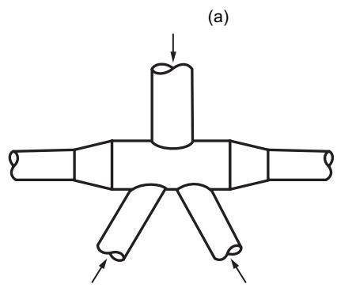

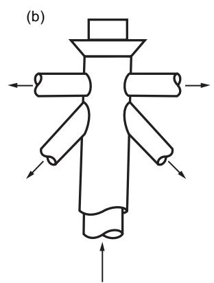

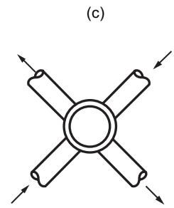  
Figure C4.2-1—Adverse Load Patterns with $\alpha$ Up to 3.8 (a) False Leg Termination, (b) Skirt Pile Bracing, (c) Hub Connection

$$\begin{array}{l} \begin{array}{l} \text{(a)} \\ = 1. 0 + 0. 7 \frac{\text{P s i n} \theta \cos 2 \phi \exp - \frac{Z}{0 . 6 \gamma}}{\left[ \text{P s i n} \theta \right]_{\text{r e f e r e n c e b r a c e f o r w h i c h}} \alpha_{\text{a p p l i e s}}} \end{array} \\ \alpha > 1. 0 \\ \end{array}$$

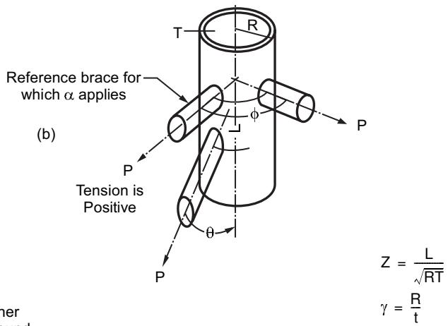

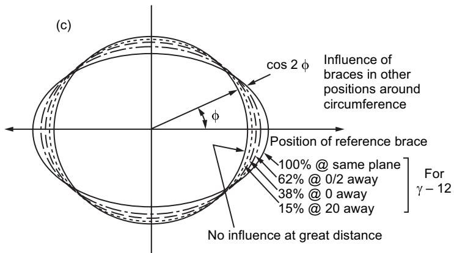  
Figure C4.2-2—Computed $\alpha$ (a) Equation, (b) Definitions, (c) Influence Surface

Additional provisions specific to axially loaded, multiplanar X, Y, and K joints can be found in the CIDECT Design Guide (Ref. 16). More contemporary information on multiplanar Y and K joints is available in Refs. 17 to 20. However, the designer should be aware that none of these guidances are especially robust. There are general restrictions as to loading pattern as well as joint configuration.

Effect of Classification on Basic Capacity. Unlike previous API practice where interpolation of $Q_{u}$ was adequate for axially loaded braces with mixed classification, interpolation based on a weighted average of $P_{a}$ is required since $Q_{f}$ also varies with axial load classification. Taking Figure 4.2-1(h) of Section 4.2.4 as an example, the diagonal brace has a $50\%$ K and $50\%$ X classification. In this case, $P_{a}$ is calculated separately for K classification and X classification. In the calculation for X classification, capacity downgrading (if any) in accordance with Section 4.3.5 requires consideration. The joint characteristic axial capacity can thereafter be calculated as follows:

$$P_{a} = 0. 5 (P_{a})_{K} + 0. 5 (P_{a})_{X}$$

where

$$\begin{array}{l} P_{a} = \text{T h e a l l o w a b l e a x i a l j o i n t c a p a c i t y}, \\ (P_{a})_{K} = \text{T h e a l l o w a b l e a x i a l j o i n t c a p a c i t y f o r K c l a s s i f i c a t i o n ,} \\ \end{array}$$

（$P_{a})_{X} =$ The allowable axial joint capacity for X classification.

In the interaction equation in Section 4.3.6, it can be seen that the axial term is thus computed as:

$$\frac{P}{P_{a}} = \frac{P}{k (P_{a})_{K} + x (P_{a})_{X} + y (P_{a})_{y}}$$

Where $k, x,$ and $y$ are the proportions of the classification (Note $k + x + y = 1.0$ ).

The above principle can also be extended to address the case of the middle brace of a KT joint, which may have K action with both adjacent braces. In this instance （$Pa)_{\mathrm{K}}$ would be computed as the weighted average of the （$Pa)_{\mathrm{K}}$ individual values.

Other possibilities exist for combining the effect of mixed classifications. These possibilities are addressed in Ref. 20, where it is concluded that a linear term in the interaction equation is also viable:

$$\frac{P}{P_{a}} = \frac{k P}{(P_{a})_{K}} + \frac{x P}{(P_{a})_{X}} + \frac{y P}{(P_{a})_{Y}}$$

C4.2.5 Detailing Practice

The previous API guidelines in the $21^{\mathrm{st}}$ edition have been changed in several important ways. The can and stub length

dimensions are unchanged, but measurement does not include thickness tapers.

The guidance on overlap dimension has been changed to simplify analysis and make measurement easier during fabrication. However, there is no need to treat the preferred minimum as a hard and fast rule. There are many practical instances where only minor overlap occurs. These cases are fully amenable to contemporary analysis for both strength and fatigue. Furthermore, fabrication of minor overlap has not proved particularly difficult in terms of welding. However, any amount of overlap may present a concern about in-service inspection.

In many instances, complying strictly with the minimum chord can length dimensions will lead to a substantial degradation of joint capacity, as given in 4.3.5. The designer may wish to consider extending the chord can by a margin sufficient to remove the need for capacity downgrading. The required can length to eliminate capacity downgrading can readily be obtained by mathematical manipulation of the capacity equation in 4.3.5.

C4.3 SIMPLE JOINTS

The bulk of the detailed guidance, as it has historically been in API RP 2A-WSD, is on simple joints comprised of circular hollow sections. Many offshore codes of practice, including previous editions of API RP 2A-WSD, are founded on an experimental database that existed in the early 1980s. Many additions to the database have occurred since that time, often because of testing a reference simple joint in the course of examining a complex configuration.

The MSL Joint Industry Project (JIP) in the period 1994-1996 (Refs. 5 to 7) examined all data that existed at that time and has significantly influenced the guidance for simple and overlapping joints. The general approach adopted in the MSL JIP was as follows:

- Collate comprehensive databases of worldwide experimental and pertinent FE results,   
- Validate and screen the databases,   
Conduct curve-fitting exercises to the data,   
- Compare databases and derived capacity formulations with existing guidance,   
- Select appropriate formulations.

A total of 1066 simple joint specimens with D greater than $100\mathrm{mm}$ were validated. The corresponding number following screening was 653 specimens. The significance of establishing a suitably screened database cannot be over-emphasized. The differences in various code provisions on joint strength are partly due to differences in databases.

To some extent, tolerances on dimensions are addressed by virtue of examining the database using measured values. However, the effect of actual dimensions being less than

nominal values is adequately accounted for in the safety factors.

The above-described ISO/MSL effort (Ref. 69) was extended by the API Offshore Tubular Joints Research Committee in 2002-2003. Unfortunately, the simple joint screened test database does not contain data covering the full range of joint types, joint geometries, and brace and chord loading conditions of interest. For example, except for T joints, test data on brace bending is relatively sparse. Tests with additional chord loads (i.e., in addition to equilibrium-induced) are likewise not sufficient in number and scope to adequately address the effect of chord loads on joint capacity.

Numerical finite element models, properly validated against test results, are now recognized as a reliable, relatively low cost way of extending static strength data for tubular joints that fail by plastic collapse. Joint tension failures, however, cannot yet be reliably predicted by numerical methods due to the unavailability of an appropriate failure criterion. Therefore, for joint tension capacity, test data must be exclusively relied upon. A comprehensive API/EWI study conducted at the University of Illinois (Refs. 21-28) has provided a large validated finite element database, containing over 1500 cases. This additional information was used to augment and extend the screened test database, particularly for the assessment of the effect of additional chord loads on joint capacity.

The screened test and numerical finite element data, where appropriate, have been used to assist in the creation of suitable expressions for joint strength, using regression analysis based on minimizing the percentage differences and statistical calculations that are characterized by a $95\%$ survivability level at a $50\%$ confidence level.

C4.3.1 Validity Range

The guidance is based on an interpretation of data, both experimental and numerical. As with all empirically based practices, a validity range has been imposed, although its implication in general is minimal since the range covers the wide spectrum of geometries currently used in practice. Joint designs outside these ranges are permitted, but require special investigation of design and welding issues.

Apart from the yield stress limitations discussed in C4.2.1, the guidance can be used for joints with geometries which lie outside the validity ranges, by taking the usable strength as the lesser of the capacities calculated on the basis of:

a. actual geometric parameters,   
b. imposed limiting parameters for the validity range, where these limits are infringed.

C4.3.2 Basic Capacity

The basic API format for nominal loads in previous API RP 2A-WSD editions has been retained for capacity equa

tions, except that the 0.8 factor in the formula for allowable moment capacity has been absorbed in the $Q_{u}$ term. Despite its intuitive appeal, the punching shear alternative has been eliminated, as computer nowadays does most joint checks.

Calibration of Safety Factor. For a WSD safety factor of 1.8, current AWS-AISC criteria for all types of tubular connections in axial compression give a safety index, beta, of 2.7 (for known static loads, e.g., dead load), including a bias of 1.10 and COV of 0.08 for the material, in addition to the bias and COV in the WRC data base (ref. 66). Tension data show notionally higher beta; however, the data trend indicates reduced conservatism with increasing thickness, possibly a reflection of the well-known size effect in fracture. These criteria are similar to the 1984 API criteria, except that separate $Q_{q}$ formulas for $K$ vs. $TY$ vs. $X$ were eliminated by using the alpha ovalizing term (ref. 67).

The 1988 safety calibration of API RP 2A-WSD found that the existing RP 2A-WSD had betas of 3.4 for $90\%$ static load, and 2.1 (lifetime) for $80\%$ storm loading (100-year design storm). The higher safety level was deemed appropriate for periods when the platforms are manned and loads are under human control. A target beta of 2.44 across the board was proposed for RP 2A-LRFD (ref. 68).

Rather than just matching the risk level of these benchmark criteria, a higher reliability, afforded by more accurate equations, was also considered. The approach was to find a single WSD safety factor, which produces betas in a desirable range across the range of joint types and load cases. This has been done in a way, which permits comparison with WSD precedents.

Combined statistics were assembled for the Offshore Tubular Joints Research Committee (OTJRC) data set, which includes 1115 joints of all types with compressive axial loads, similar to the earlier ASCE and AWS-AISC calibrations with much smaller data sets. Including the effect of material variations, this results in a bias of 1.35, the same as AWS-AISC, but the COV is substantially lower, 0.16 vs. 0.28.

Then beta, dead load safety index for the composite data set, was computed, using various trial safety factors.

Because of the lower scatter (COV), huge reductions in the safety factor would have still given reasonable betas for known static loads. However, for further study, a modest reduction of the WSD safety factor to 1.6 was chosen. Whereas API's existing WSD safety factor of 1.7 corresponded to an LRFD resistance factor of 0.95, a WSD safety factor of 1.62 (rounded off to 1.6) would correspond to an LRFD resistance factor of 1.0. A resistance factor of 1.0 is used in AWS-AISC and other CIDECT-based international codes for chord face plasticization in tubular connections using RHS.

There are twenty combinations of joint type, load type, and data type (finite element vs. physical test) in the OTJRC data-

base. A spreadsheet was used to examine the safety performance of each combination, to see if a constant safety factor produces results in an acceptable range. Values of the safety index, beta were calculated for both $100\%$ dead load (bias $= 1.0$ , $\mathrm{COV} = 0$ ), and $100\%$ storm load (bias $= 0.7$ , $\mathrm{COV} = 0.37$ , from Moses' 1988 OTC paper), for both existing API-WSD criteria and the corresponding OTJRC proposal. A lognormal safety format was used.

The resulting 80 betas are plotted as histograms on Figures C4.3.2-1 and C4.3.2-2. Static results are compared to target betas from AWS-AISC and Moses' 1988 calibration for tensile yielding. Storm results are compared to Moses' 1988 tensile yielding calibration for a 100-year design.

API RP 2A-WSD $21^{\text{st}}$ Edition, with $\mathsf{SF} = 1.7$ . Static betas for compressive axial load tests are safely in the range of 5 to 6, and most of the experimental betas (shaded) meet the target criteria. However, there is tremendous scatter, and most of the finite element betas fail to meet the targets. The test results are what the criteria were originally based upon. The finite element results cover a wider range of chord loading cases ( $Q_{f}$ effect) than was previously considered, and contain some bad news.

Storm betas tell a similar story. Compressive axial load tests (darker shading) are all acceptable, but some of the experimental results, and almost all of the finite element cases, are not.

OTJRC Static Strength Criteria, with SF = 1.6. The static betas are all acceptable, and their range of scatter is much reduced by the new criteria. Three cases (shaded) out of 20 are less conservative than existing API; these are the experimental axial compression cases. The composite beta (combining all joint types and load cases) is also shown. This shows considerable improvement in reliability over previous calibrations.

The storm betas are all acceptable, and fall in a tight cluster, except for the notionally more conservative tension test results. This is because the large storm load uncertainty overwhelms the small COVs on joint strength, making mean bias and safety factor (both elements of reserve strength) more important.

Conclusion. The WSD safety factor of 1.6 has been adopted for use with the new OTJRC static strength criteria. Static betas greatly exceed target values from precedent, benefiting from reduced scatter, but they do not govern. When the one-third increase is used for storm loadings, the safety factor becomes 1.2. Storm betas are clustered on the safe side of the API-WSD precedent.

C4.3.3 Strength Factor $Q_{U}$

The various $Q_{u}$ factors have been derived from appraisals of screened steel model data, supplemented by finite element (FE) data, for each joint and load type. In recommending the

factors, the formulations of existing codes were examined and the best formulations for capturing the effects of the joint parameters (e.g., $\beta$ and $\gamma$ ) were selected and the coefficients adjusted to give characteristic strength values. In some cases, new formulations are provided where significant improvements in the coefficient of variation (COV) have been found or where the new formulation has a wider range of applicability. In particular, the axial load formulation for overlapped K joints applies to the former, and the out-of-plane bending formulation applies to the latter.

The API/EWI FE study (Refs. 21 to 28) shows a dependence of the basic strength factor $Q_{u}$ on $\gamma$ (as well as $\beta$ ) which is more obvious at large $\gamma$ where there are less experimental data. The experimental database (Refs. 5 and 7) for DT/X joints under axial compression and K joints under balanced axial loading tends to show a somewhat weaker dependence on $g$ and this is reflected in the recommended strength factors shown in Table 4.3-1. This dependence of

$Q_{u}$ on $\gamma$ has not previously been recognized in API RP 2A-WSD (with one exception, i.e., the gap factor $Q_{g}$ for axially loaded K joints with $\gamma \leq 20$ ).

The gap factor $Q_{g}$ for K joints under balanced axial load is now expressed in terms of $g / D$ rather than $g / T$ (for $\gamma \leq 20$ ), eliminating the $g$ dependence formerly included in $Q_{g}$ for $\gamma \leq 20$ . The API/EWI finite element studies show that with $Q_{u}$ given as （$16 + 1.2\gamma)\beta^{1.2}Q_{g}$ , no significant additional effect of $\gamma$ on $Q_{g}$ remains for gap joints.

For overlap joints, there is a large effect of $\gamma$ . The equations for $Q_{g}$ are not defined for $|g / D|$ less than 0.05. Linearly interpolated value between the limiting values of the two $Q_{g}$ expressions may be used for assessment. However, the designer may wish to consider that this was formerly a forbidden zone. International equations for strength and SCF indicate a smooth transition in this region, but IIW s/c XV-E still recognizes a forbidden zone. Service cracking has been observed in joints that had too small an overlap, creating a

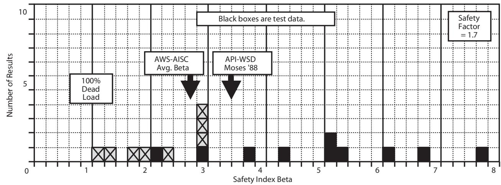

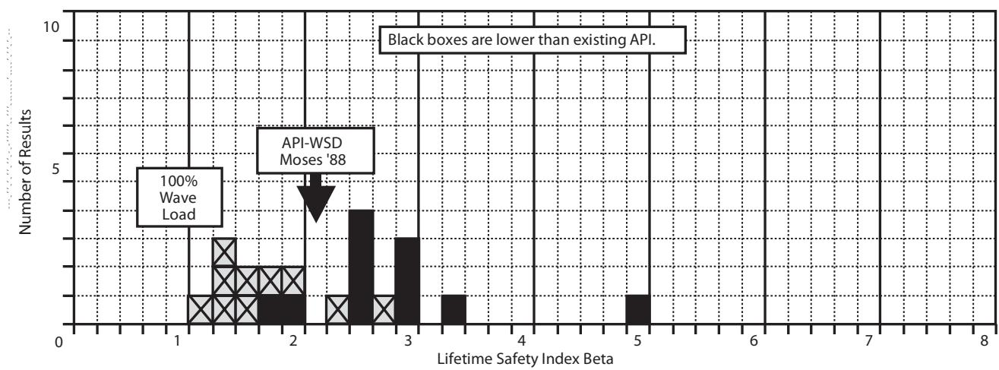  
Figure C4.3.2-1—Safety Index Betas, API RP 2A-WSD Edition 21 Formulation

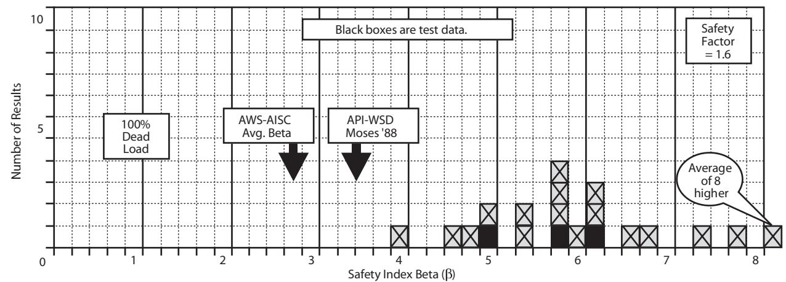

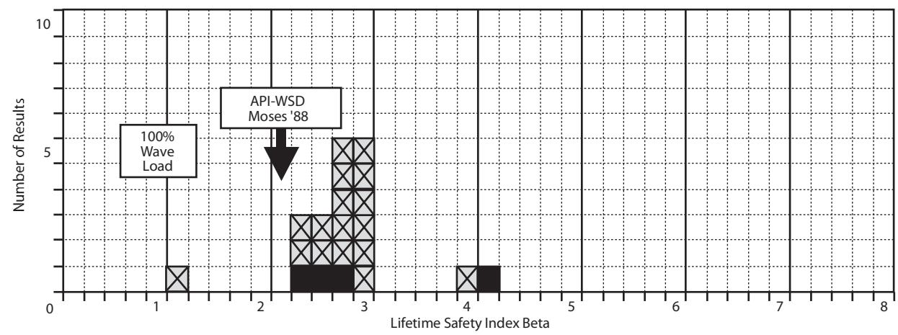  
Figure C4.3.2-2—Safety Index Betas, API RP 2A-WSD Edition 21, Supplement 2 Formulation

stiff but weak load path, with prying on the root of the hidden weld. Very small gaps (less than 2 inches or $0.1\beta D$ , whichever is smaller) make welding access difficult at the point of highest load transfer.

The brace in-plane bending strength for K joints is based on the governing case (Refs. 24 and 27) of equal magnitude closing moments (closing moments tend to increase the angle between chord and brace). Because no generally accepted classification scheme for brace moment loadings is available, the K joint closing moment capacity dictates the allowable inplane bending capacity of all joint types.

The brace out-of-plane bending strength for K joints is based on the governing case (Refs. 24 and 27) of equal magnitude aligned moments (aligned out-of-plane moments tend to bend both braces out-of-plane to the same side of the chord). The K joint out-of-plane aligned moment capacity

dictates the allowable out-of-plane bending capacity of all joint types.

The strength factor $Q_{u}$ for axially loaded T joints is given for a condition in which the effect of the equilibrium-induced global chord bending moment is eliminated. The effect of this chord bending moment must be accounted for in the chord load factor $Q_{f}$ as described in C4.3.4 below.

The $Q_{u}$ formulations for tension loaded T/Y and DT/X joints have been derived on the basis of loads at which cracking has been observed in test data. However, tension loaded joints made of thin or extremely tough steel (Ref. 35) can sustain further loading beyond first crack. As an estimate of this reserve strength may be important in predominantly statically loaded joints, characteristic ultimate tensile strength expressions have been developed in Ref. 5 and are given below.

(i) For T/Y joints (mean bias $= 1.805$ , $\mathrm{COV} = 0.263$ ):

$$Q_{u} = 42 \beta - 4. 1 \quad \text{f o r} \beta \geq 0. 35$$

(ii) For DT/X joints (mean bias $= 1.138$ , $\mathrm{COV} = 0.071$ ):

$$\begin{array}{l} Q_{u} = 41 \beta - 1. 9 \quad \text{f o r} \beta \leq 0. 9 \\ = 35 + (\beta - 0. 9) (32 \gamma - 285) \quad \text{f o r} \beta > 0. 9 \\ \end{array}$$

The bias is defined as the ratio of measured (test or FE) strength to predicted strength using the recommended equations and measured yield strength. The reliability of a formulation depends on both the mean bias and the coefficient of variation (COV); a higher mean bias and a lower COV lead to a higher reliability.

The large increase in strength indicated in the second expression for DT/X joints at high $\beta$ relies on membrane stresses in the chord saddle region as the load is essentially transferred directly from one brace to the other. If there is any significant misalignment of the braces (say, $e / D > 0.2$ , where $e$ is the eccentricity of the two braces), load transfer by membrane action should not be exploited, and the first expression should be invoked over the full range of $\beta$ .

In situations where fatigue cracking is evident, the strength formulations for tension loaded T/Y and DT/X joints based on loads at which cracking has been observed can be used to estimate the strength of the cracked joint. This applies for conditions in which the percentage of cracked area is not greater than $20\%$ of the full area. For other conditions, reference to further work published in this area (Refs. 34 to 36) should be made to determine the strength of the joint. Also see Ref. 64.

Example comparisons of $Q_{u}$ from Table 4.3-1 with $Q_{u}$ from earlier API RP 2A-WSD editions (e.g., the $21^{\mathrm{st}}$ edition prior to this supplement) are shown in Figures C4.3.3-1 and C4.3.3-2 for axial and moment loaded joints respectively. The 0.8 factor (see C4.3.2 above) has been applied to enable a fair comparison to be made.

C.4.3.3.1 Design for Axial Load in General and Multiplanar Connections

For general and multiplanar connections, the nominal axial joint strength for each of $N$ primary branch members may be checked in turn (starting with the largest punching load $P$ sinθ to initially size the chord) with $Q_{u}$ as follows:

$$Q_{u} = [ 3. 4 + 32 \beta / \alpha ] Q_{\beta}^{e}$$

where

$$\alpha = \begin{array}{l} \text{d e f i n e d i n F i g u r e C 4 . 3 . 3 - 2 , w i t h 1 . 0 <   \alpha <  } \\ 1 + 0. 7 \mathrm{N} \end{array}$$

$$Q_{\beta} = \text{d e f i n e d i n T a b l e 4 . 3 - 1 , n o t e (a)}$$

$$e = 0. 7 (\alpha - 1), \text{w i t h} 0 <   e <   1. 0$$

Lightly loaded secondary bracing members at such connections may simply be checked as T- or Y-connections.

C4.3.4 Chord Load Factor $Q_{f}$

Compared to the $21^{\mathrm{st}}$ edition of API RP 2A (prior to this supplement), a substantial change to the chord load factor $Q_{f}$ is given in 4.3.4:

1. The chord load factor $Q_{f}$ given in Equation 4.3-2 includes linear terms in the nominal chord axial load and in-plane bending moments, in addition to the quadratic terms retained in the parameter $A$ (Eq. 4.3-3). This is similar in form to the chord stress function proposed in Ref. 29 and adopted in the CIDECT design guide (Ref. 16).   
2. Equation 4.3-2 applies over the full range of chord loads. Previous versions of API RP 2A contained the additional provision that $Q_{f} = 1.0$ when all extreme fiber stresses in the chord are tensile. This provision had the unintended consequence that $Q_{\mathrm{f}}$ exhibited a step discontinuity when both axial and bending loads existed in the chord. The new formulation may produce a $Q_{f} < 1.0$ even when the chord is subjected to an axial tension load, particularly in high $\beta$ ( $\beta > 0.9$ ) DT joints under brace axial compression.   
3. Inspection of the $Q_{f}$ term shows that there is now no dependence on $\gamma$ . Previously, API RP 2A included such dependence; this was based on forcing the $Q_{\mathrm{f}}$ factors of X joints of a specific $\gamma$ and K joints of another specific $\gamma$ to align. The appraisals in Refs. 5 and 7 indicate that any $\gamma$ dependence in K joints is small. The API/EWI FE studies also show only a slight dependence of the chord load factor on $\gamma$ , for all joint types and brace loading conditions. The presence in $Q_{f}$ of the $\gamma$ -dependence in previous versions of API RP 2A-WSD leads to gross underestimates of the capacity of high $\gamma$ joints with high axial chord loads.

Example comparisons of $Q_{f}$ from Equations 4.3-2, 4.3-3 and Table 4.3-2 with $Q_{f}$ from earlier API RP 2A-WSD editions (e.g. the $21^{\mathrm{st}}$ edition prior to this supplement) are shown in Figure C4.3.4-1. These comparisons show the effect of chord axial load （$\mathrm{FS~P_c / P_y})$ on $Q_{\mathrm{f}}$ . Corresponding plots of $Q_{f}$ as a function of chord in-plane bending load （$FSM_{ap} / M_P)$ would be symmetric in （$FSM_{ap} / M_P)$ , except for K joints under balanced brace axial loading (for which the coefficient $C_2$ in Table 4.3-2 is non-zero). For that case a positive $M_{ap}$ (producing compression on the K joint footprint) yields a value $Q_{f} < 1.0$ , while a negative $M_{ap}$ of the same magnitude has a less deleterious effect (larger $Q_{f}$ ), and may actually produce a slight capacity enhancement （$Q_{f} > 1.0)$ . Although this behavior may be expected generally for joints that are not symmetric about the chord axis, the recommended formulation of $Q_{f}$ for T joints (Table 4.3-2) does not incorporate the beneficial effect of a negative $M_{ap}$ for brace axial compression (or a positive $M_{ap}$ for brace axial tension) because there is not sufficient data available to reliably quantify it.

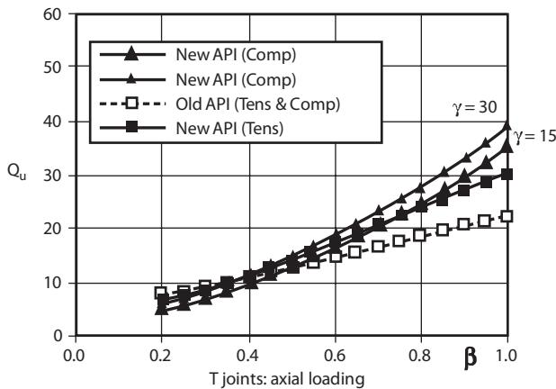

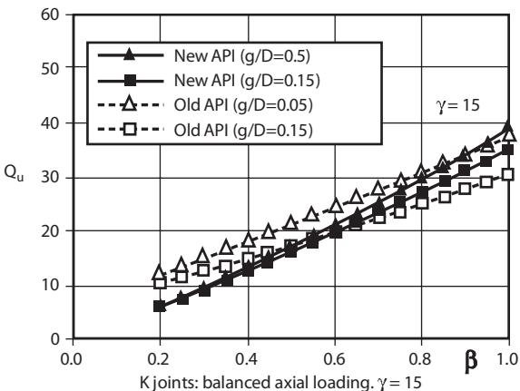

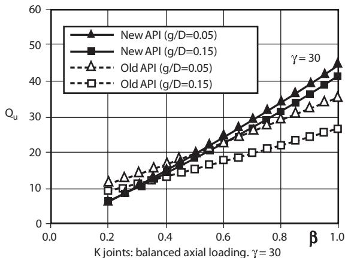

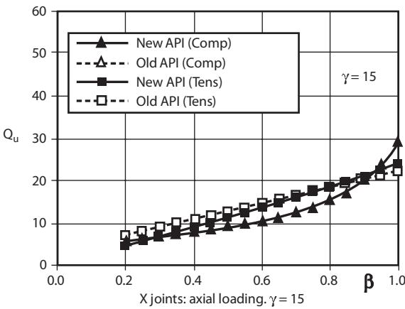

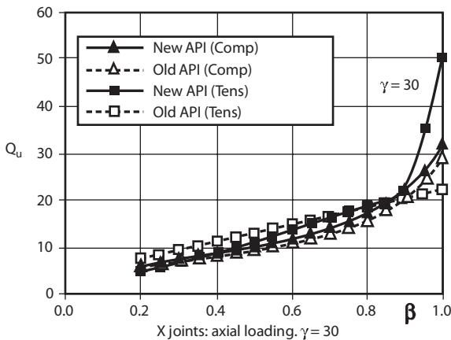  
Figure C4.3.3-1—Comparison of Strength Factors $Q_{U}$ for Axial Loading

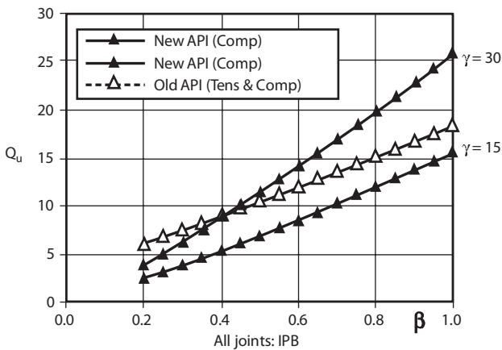

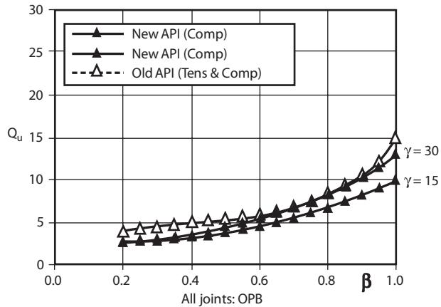  
Figure C4.3.3-2—Comparison of Strength Factors $Q_{U}$ for IPB and OPB (Note: API [21st ed.] $Q_{U}$ multiplied by 0.8 factor for comparisons)

The plots of $Q_{f}$ for DT joints under brace axial compression (Figure C4.3.4-1) show the marked transition in the effect of axial chord load on capacity that occurs between $0.9 < \beta \leq 1.0$ . Chord axial compression significantly reduces brace axial compression capacity in low to moderate $\beta$ DT joints (Ref.31), but has no appreciable effect for joints with $\beta \approx 1.0$ (Ref.32). Chord axial tension, on the other hand, has little effect on low to moderate $\beta$ DT joints, but reduces brace axial compression capacity for high $\beta$ ( $\beta \approx 1.0$ ) joints (Refs. 23, 25 and 31). Figure C4.3.4-2 shows results of tests performed at the University of Texas (Refs. 31 and 32) on a series of DT joints with different $\beta$ values (0.35, 0.67, 1.0), subjected to brace and chord axial compression loads. The test results are normalized for each geometry by the strength measured in nominally identical specimens with no chord load. These normalized results provide an experimental evaluation of the chord load factor for these joints, and they are compared with the recommended chord load factor $Q_{f}$ in Figure C4.3.4-2.

In most cases, brace loads induce equilibrium chord loads. For example, in a K joint with no joint eccentricity under balanced brace axial load, equilibrium axial loads are induced in the chord (tension on one side of the brace intersection and compression on the other side). In a T joint under brace in-plane bending, equilibrium in-plane bending moments are induced in the chord (positive on one side of the brace intersection and negative on the other). In both of these cases the relative magnitudes of the positive and negative equilibrium chord loads and bending moments depend on the relative stiffnesses and remote-end boundary conditions of the chord on either side of the brace intersection. A qualitatively different situation occurs in, for example, a T joint under brace axial compression. In that case, an equilibrium chord in-plane bending moment is induced on both sides of the brace intersection. The magnitude of the equilibrium bending moment depends not only on the relative stiffnesses and remote-end

boundary conditions of the chord on either side of the brace intersection, but also strongly depends on chord absolute length. This poses a significant problem in testing T joints with high $\beta$ values: because of the large axial capacity of these joints, substantial equilibrium in-plane bending moments are generated that may affect joint strength (Ref. 37) or even cause premature (i.e., before joint failure) chord plasticization. Smaller chord lengths reduce the equilibrium bending moments, but below some minimum length, the chord end conditions begin to influence the joint strength.

In the API/EWI FE analyses of T joints under brace axial compression, compensating negative in-plane bending moments, proportional to the brace load, are applied at the chord ends, so that the global bending moment at the intersection of the brace and chord centerlines remains zero throughout the loading history. The strength factor $Q_{u}$ determined from these FE analyses therefore represents the joint capacity corresponding to a very short chord, without the effect of the equilibrium chord bending moments. A series of FE analyses with different levels of additional applied chord bending moments (reflected in $Q_{f}$ ) allows the estimation of joint strength for different levels of chord global bending.

Therefore, equilibrium chord loads are present and accounted for in the strength factors $Q_{u}$ determined from tests, and (with the single exception of axially loaded T joints, in which the effects of equilibrium chord bending moments are explicitly removed) they are also present and accounted for in the strength factors $Q_{u}$ determined from the EWI/API FE database.

In order to determine the additional chord loads to be accounted for in the chord load factor $Q_{f}$ , the average of the total (equilibrium plus additional) chord loads on either side of the brace intersection should be used.

In cases (including the API/EWI FE analyses, and the vast majority of tests) where the chord cross-sections, lengths and

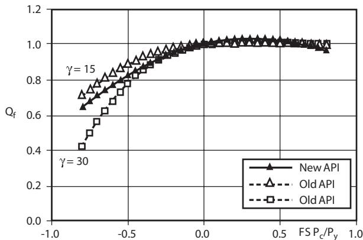  
K joints: brace axial loading

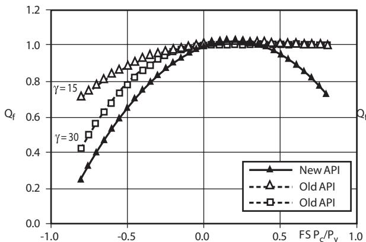  
T joints: brace axial loading

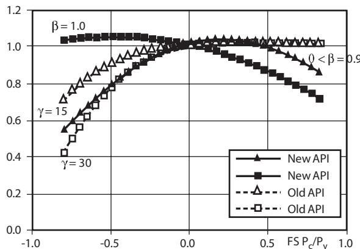  
X joints: brace axial loading

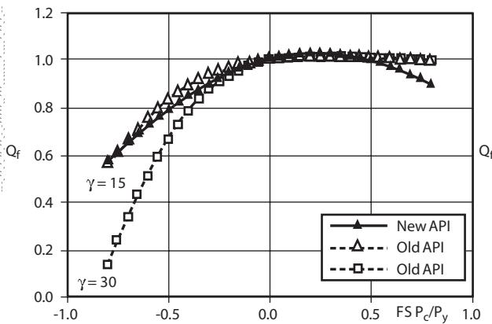  
All joints: brace IPB

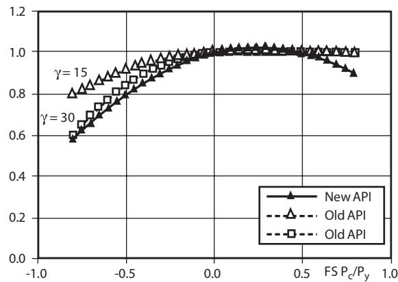  
All joints: brace OPB   
Figure C4.3.4-1—Comparison of Chord Load Factors $Q_{f}$

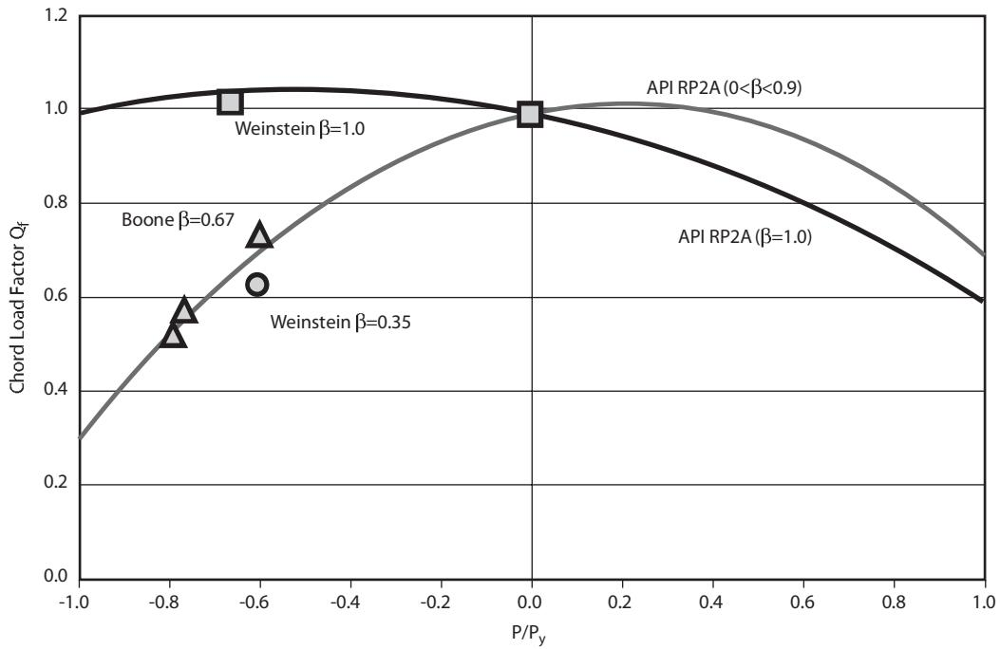  
Figure C4.3.4-2—Effect of Chord Axial Load on DT Brace Compression Capacity Comparison of University of Texas Test Data with Chord Load Factor

remote-end boundary conditions are the same on both sides of the brace intersection, averaging the total chord loads on either side of the brace intersection yields the correct additional chord load since the equilibrium chord loads cancel from the sum. More generally, in cases where the chord does not react the equilibrium loads equally on either side of the brace intersection, the averaging procedure produces a small equivalent additional chord load that is taken into account in $Q_{f}$ . In the axially loaded T joint, the equilibrium chord bending moment is the same on both sides of the brace intersection, and so it is properly accounted for in the average chord bending moment.

Implicit in this simple averaging procedure is the assumption that the capacity of the joint is not significantly affected by small variations in the sequence of brace vs. chord loading.

Brace load capacities calculated from Equations 4.3.1 to 4.3.3 (with the factor of safety $FS = 1$ ) were compared with the screened test data and with the API/EWI FE data, for K, Y, and X joints for the four brace load cases. The result of each individual comparison was expressed in the form of a ratio of (Test or FE Strength)/(Predicted Strength). Ratios greater than one, indicating that the joint capacity is greater than the predicted value, are obviously desirable. Statistics of the comparisons are given in Tables C4.3-1 to C4.3.4-1 for K, Y and X joints, respectively, for the four brace load cases. For each category (joint type & brace load), the mean bias, COV, and number of cases (tests or FE) $N$ are given. The same com

parisons were made for the previous API RP 2A-WSD (21st edition prior to this supplement) provisions, and the statistics of those comparisons are also given in these Tables.

It is clear that both the $Q_{u}$ formulation alone, and the combined $Q_{u}Q_{f}$ formulation given in Equations 4.3.1 to 4.3.3 is a great improvement over that of the previous API practice, particularly for brace bending loads. The former conclusion can be drawn by comparisons with the complete screened test database, since it contains relatively few cases with additional chord loads in most of the joint type/brace load categories. The latter conclusion is drawn by comparisons with the API/EWI FE database, which contains a relatively high proportion of cases with additional chord loads. In any case, the assessment of the accuracy of a chord load formulation cannot be uncoupled from that of the strength factor, even if a test database with a substantially higher proportion of cases with additional chord loads were in existence.

Figures C4.3.4-3 to C4.3.4-5, for the brace axial load cases, and Figures C4.3.4-6 and C4.3.4-7, for the brace bending cases, show the results of the comparisons plotted against $\beta$ . These figures show that the performance of the recommended and previous API formulations is consistent across joint type and brace load conditions for both test and FE databases. Additional comparisons (not shown) with a subset of the FE database containing only the cases with no chord load are also consistent with the test database comparisons for both the recommended and previous API practice.

Table C4.3-1—Mean Bias Factors and Coefficients of Variation for K Joints   

| Bridge Loading | K Joints Test Database | K Joints Test Database | K Joints Test Database | FE Database | FE Database |
| --- | --- | --- | --- | --- | --- |
| Bridge Loading |  | API 21st Edition Supplement | API 21st Edition | API 21st Edition Supplement | API 21st Edition |
| Balanced Axial | Mean Bias | 1.34 | 1.38 | 1.14 | 1.18 |
| Balanced Axial | COV | 0.17 | 0.18 | 0.11 | 0.42 |
| Balanced Axial | N | 161 | 161 | 440 | 440 |
| In-Plane Bending | Mean Bias | 1.47 | 1.29 | 1.32 | 0.94 |
| In-Plane Bending | COV | 0.15 | 0.09 | 0.17 | 0.50 |
| In-Plane Bending | N | 6 | 6 | 242 | 242 |
| Out-of-Plane Bending | Mean Bias | 1.54 | 1.15 | 1.2 | 0.84 |
| Out-of-Plane Bending | COV | 0.19 | 0.14 | 0.11 | 0.14 |
| Out-of-Plane Bending | N | 7 | 7 | 306 | 306 |

C4.3.5 Joints with Thickened Cans

The reduced strength for axially loaded simple Y- and X-joints having short can lengths is supported by numerical and experimental data, see Ref. 5. No reduction in capacity is required for axially loaded K joints.

The previous API provisions for load transfer across chords have been extended to cover axially loaded T joints. Axially loaded X joints with $\beta > 0.9$ increasingly transfer load across the chord through membrane action, and this beneficial mechanism is recognized.

The provisions are also intended for application to other cases where load-transfer through chords occurs, e.g., launch truss joints. However, the lack of data has precluded an assessment of capacity reduction (if any) for moment loaded or complex joints.

C4.3.6 Strength Check

The interaction ratio for the joint is evaluated using an interaction equation, which represents a change from the trigonometric ones that have historically existed in API. However, the recommended equation is identical to that already in use in the UK (Refs. 39 and 40) and it is supported by experi-

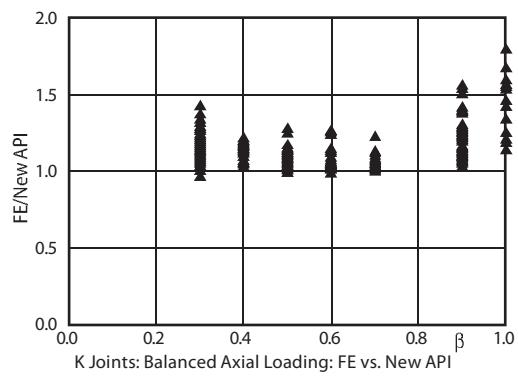

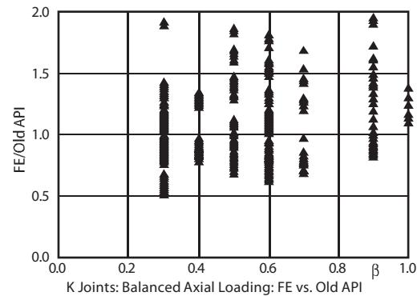

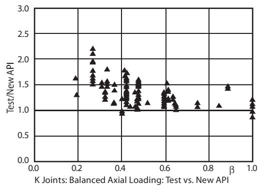

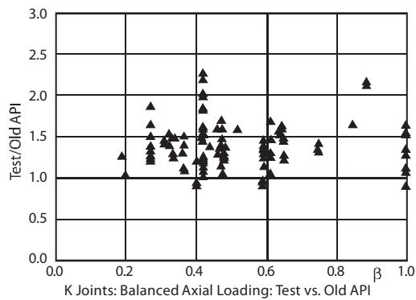  
Figure C4.3.4-3—K Joints Under Balanced Axial Loading-Test & FE vs. New & Old API

Table C4.3-2—Mean Bias Factors and Coefficients of Variation for Y Joints   

| Bridge Loading | Y Joints Test Database | Y Joints Test Database | Y Joints Test Database | FE Database | FE Database |
| --- | --- | --- | --- | --- | --- |
| Bridge Loading |  | API 21st Edition Supplement | API 21st Edition | API 21st Edition Supplement | API 21st Edition |
| Axial Compression | Mean Bias | 1.21 | 1.45 | 1.18 | 1.24 |
| Axial Compression | COV | 0.11 | 0.20 | 0.14 | 0.32 |
| Axial Compression | N | 64 | 64 | 46 | 46 |
| Axial Tension | Mean Bias | 2.56 | 3.45 |  |  |
| Axial Tension | COV | 0.29 | 0.29 |  |  |
| Axial Tension | N | 16 | 16 |  |  |
| In-Plane Bending | Mean Bias | 1.41 | 1.00 | 1.34 | 0.90 |
| In-Plane Bending | COV | 0.16 | 0.32 | 0.10 | 0.34 |
| In-Plane Bending | N | 29 | 29 | 18 | 18 |
| Out-of-Plane Bending | Mean Bias | 1.45 | 1.07 | 1.31 | 0.89 |
| Out-of-Plane Bending | COV | 0.26 | 0.26 | 0.08 | 0.17 |
| Out-of-Plane Bending | N | 27 | 27 | 18 | 18 |

Table C4.3.4-1—Mean Bias Factors and Coefficients of Variation for X Joints   

| Bridge Loading | X Joints Test Database | X Joints Test Database | X Joints Test Database | FE Database | FE Database |
| --- | --- | --- | --- | --- | --- |
| Bridge Loading |  | API 21st Edition Supplement | API 21st Edition | API 21st Edition Supplement | API 21st Edition |
| Axial Compression | Mean Bias | 1.17 | 1.16 | 1.31 | 1.47 |
| Axial Compression | COV | 0.09 | 0.11 | 0.12 | 1.33 |
| Axial Compression | N | 65 | 65 | 339 | 339 |
| Axial Tension | Mean Bias | 2.40 | 2.65 |  |  |
| Axial Tension | COV | 0.28 | 0.54 |  |  |
| Axial Tension | N | 34 | 34 |  |  |
| In-Plane Bending | Mean Bias | 1.55 | 1.27 | 1.35 | 0.97 |
| In-Plane Bending | COV | 0.19 | 0.21 | 0.11 | 0.35 |
| In-Plane Bending | N | 17 | 17 | 40 | 40 |
| Out-of-Plane Bending | Mean Bias | 1.39 | 1.13 | 1.52 | 0.75 |
| Out-of-Plane Bending | COV | 0.06 | 0.09 | 0.23 | 0.23 |
| Out-of-Plane Bending | N | 6 | 6 | 80 | 80 |

mental studies at the University of Texas in the mid 1980s (Ref. 41). The recommended equation is not distinctly more reliable than the API expressions, but its use is favored because in reassessments the interaction ratios could exceed 1.0 and the equation is better behaved in this regime.

C4.4 OVERLAPPING JOINTS

Guidance on capacity of overlapping joints has existed in API and other practices for more than a decade. However, the guidance has never addressed moment loading or out-of-plane overlap. Furthermore, recent work documented in Refs. 43 to 47 have shown that the guidance for axial load capacity of joints overlapping in plane could use updating. A relatively complete summary of the problems with the previous guidance and the background database can be found in Ref. 45.

The guidance recommended here has been based on the MSL JIP results (Ref. 5).

In several respects, the guidance here is simplified from that that has existed in API. For example, the designer is no longer routinely required to calculate weld lengths. However, in more precise analyses such lengths may be necessary. Ref. 46 reproduces equations for these calculations.

The guidance expands the MSL JIP provisions with a set of additional considerations that should avoid the need for FE analysis in all but the most unusual or failure-critical cases. There are simple but conservative suggestions for addressing both in-plane and out-of-plane loading conditions, as well as out-of-plane overlap conditions, which are not uncommon offshore. The hope is that ongoing research using FE analysis will eventually lead to more definitive guidance.

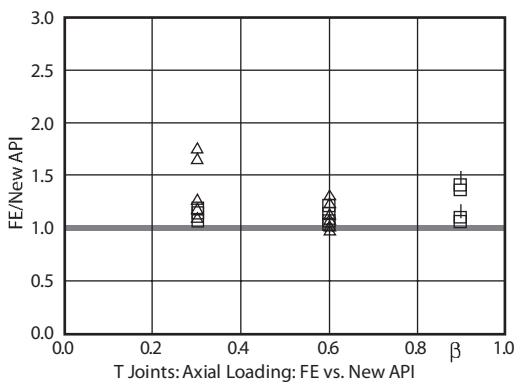

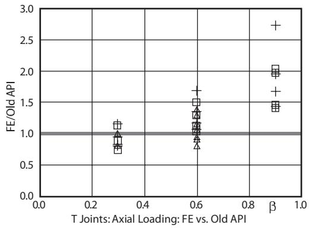

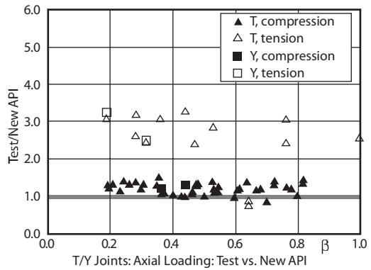

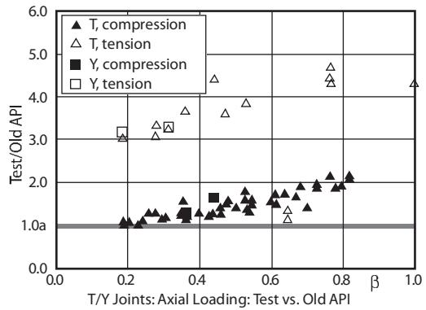  
Figure C4.3.4-4—T Joints Under Axial Loading-Test & FE vs. New & Old API

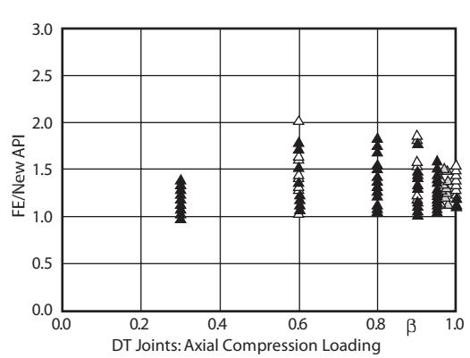

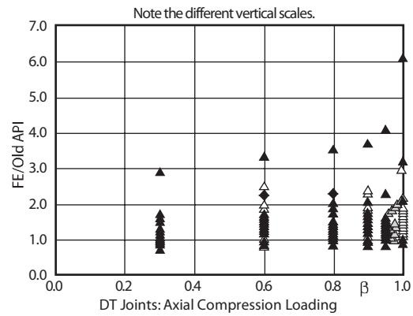

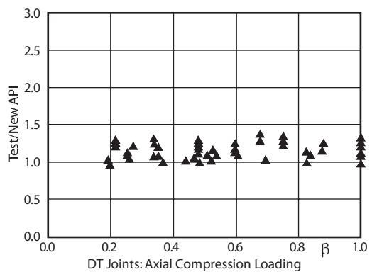

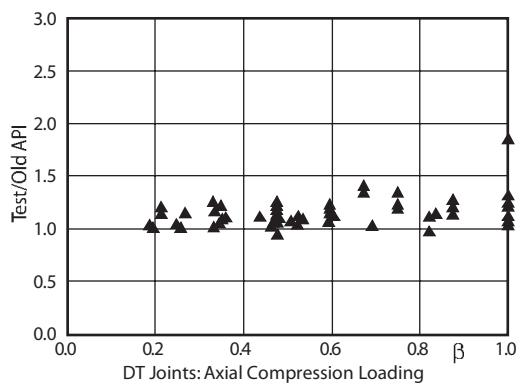  
Figure C4.3.4-5—X Joints Under Axial Compression-Test & FE vs. New & Old API

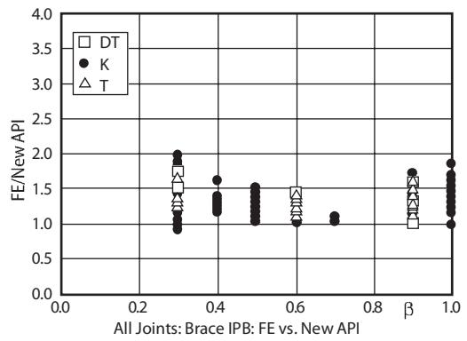

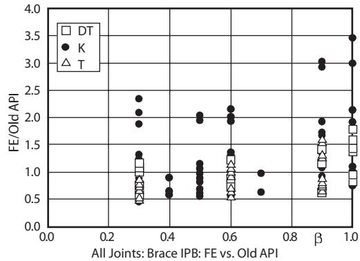

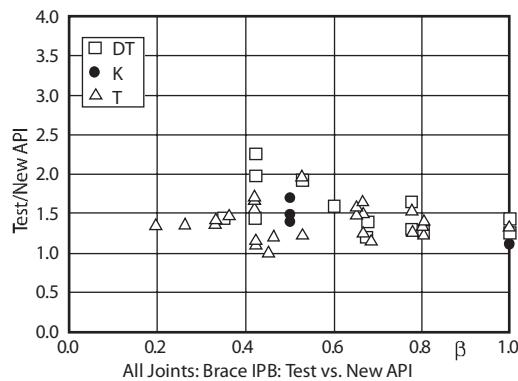

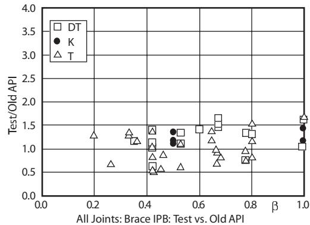  
Figure C4.3.4-6—All Joints Under BIPB-Test & FE vs. New & Old API

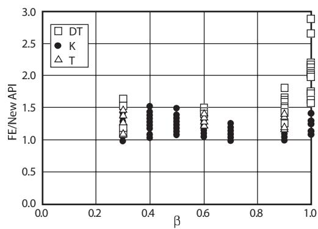

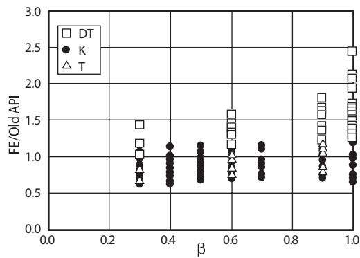

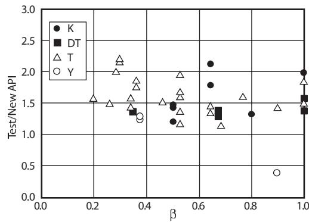

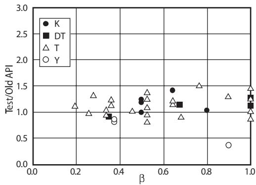  
Figure C4.3.4-7—All Joints Under BOPB-Test & FE vs. New & Old API

C4.5 GROUTED JOINTS

Grouted joints are common in new steel jacket structures and joint grouting is generally a cost-effective means of strengthening older structures. Yet, API and other offshore codes of practice have historically said little about how to assess grouted joint capacity. By the mid 1990s it was possible to provide guidance upon engineering approximations and some experimental evidence (Refs. 48 to 53). The experimental evidence is primarily on double-skin joints subjected to axial brace loading. However, a joint-industry project by MSL (Ref. 54) provides additional data for fully grouted joints, especially those subjected to brace bending moment.

The $Q_{u}$ values for grouted joints in Table 4.5-1 have been derived for Y/X/K joints and are reproduced from Ref. 53.

For double-skin joints, a further limiting capacity has been introduced, to cater for the potential of chord ovalization failure. In these cases, capacity is the lesser of:

- Brace capacity   
- Capacity calculated on the basis of effective thickness   
- Capacity calculated on the basis of $Q_{u}$ values for grouted joints.

Special joint capacity investigation may be warranted when grouted braces exist, whether or not grouted chords accompany them. Although joint capacity is heavily dependent on chord parameters, a grouted brace can cause a lower effective brace diameter, which, in turn, affects.

Consideration of the effects of grouted joints should include review and perhaps revision of the structural model used to determine the applied loads on the joint. The presence of grout clearly stiffens the joint, such that the most appropriate model is likely to be one with a rigid offset from the chord centerline to the chord wall at each incoming brace. If the analyst has modeled the structure with rigid joints located at the chord centerline, he/she should assess whether or not use of that force from that model will produce conservative results. If joint flexibility has been introduced at the chord surface, while using a rigid offset to that point, only the flexibility need be altered. It is generally conservative to assume grouted joints have no local flexibility, i.e., they are rigid up to failure.

C4.6 INTERNALLY RING-STIFFENED JOINTS

Some reported studies on strength are given in Refs. 55 to 61. The most extensive FE ultimate strength results of such joints are given in Refs. 60 and 61. Data from EWI, Ref. 61, could assist in providing further guidance in the design of ring-stiffened joints, in the future.

Since robust, codified design practices are not yet available, ring-stiffened joints require more engineering attention than many of the simpler joint types. For the same reason, the joint designs often are more conservative than would be

allowed on the basis of experimental evidence or calibrated FE analysis results.

At least three approaches exist for sizing the stiffeners and determining their required number. In all three cases, the first step is to assume ring dimensions, while being careful to avoid the possibility of local buckling. Then the required number of rings is evaluated. If the number is too large, the ring geometry is altered, possibly including the addition of an inner edge flange, and the number required is re-checked. It should be noted that in the case of in plane bending, at least two rings will be required to resist the de-coupled forces. The three approaches are:

a. The joint loading is assumed to be fully resisted by the rings on an elastic behavior basis. The ring cross-sectional properties are calculated using an effective flange width from the chord can. The elastic analysis of the ring is based upon Roark's formulas (Ref. 62). Usually a safety factor is applied, even though the check is elastic, i.e. a lower bound approach.   
b. The joint loading is assumed to be fully resisted by the rings on a plastic behavior basis. An effective flange width is assumed, and this value is often the same as in (a). Based upon a simple interaction expression for axial force, shear, and moment in the ring, a ring ultimate capacity is derived. This capacity is downgraded by a safety factor that is normally assumed to be the same as for simple joints.   
c. The joint loading is assumed to be resisted by a summation of simple joint strength and ultimate behavior of the rings (Ref. 61). This residual ultimate ring capacity may be calculated as simply the shear strength of two cross sections of the ring proper. Safety factors are applied to both the simple joint and ring strengths. This is an upper bound approach.

Several questions can arise with all of the above methods. It is not always clear how to address brace moment loadings. The usual approach is to break them into couples and take the absolute sum of axial plus coupling force as the applied loading. A second question is how to address rings that are outside of any brace footprint. Although outside rings have little advantage with respect to SCFs used in fatigue assessments, they can be much more effective where ultimate strength is concerned. Often the rings can be assumed fully effective if the clear distance from the edge of a given brace does not exceed D/2, although the shear transfer capacity of the chord wall between the brace and outer ring should still be examined. The effectiveness of rings under a given footprint is normally assumed limited to the particular brace involved. The mentioned D/2 dimension generally comes up for discussion only with rings at the end of the chord can. Consideration of ring spacing in terms of shell capacity of the intervening joint can segment can be found in Ref. 56.

A more general procedure is to simply cut sections or, rather, planes through the joint and ensure that the strength of all elements severed by the plane is sufficient to resist the applied loading. This approach is quite general although difficult to automate. Its advantages are that it can address even the most complex of conditions and it often provides a better physical feel for load paths. Designers are encouraged to use this approach as a hand check of expected behavior whenever possible. However, additional safety margins may be required to cater for potential local buckling or premature cracking, which this method does not normally address.

As for grouted joints, use of ring-stiffened joints warrants review of the structural model used to determine the loads applied to the joint. Rings often increase the joint stiffness substantially, such that rigid offsets to the chord surface are appropriate.

C4.7 CAST JOINTS

No further guidance is given here. See Refs. 70 and 71, and Sections C5.3.5 and C5.5.4.

C4.8 OTHER CIRCULAR JOINT TYPES

A general approach is suggested based upon strength-of-materials principles and the need to ensure that the potential for local buckling or premature cracking should be investigated. Information on circular joints with doubler or collar plates can be found in Ref. 63.

C4.9 DAMAGED JOINTS

In steels with suitable notch toughness, reduction in axial or moment capacities may be estimated by taking into account the reduced area or section modulus due to the presence of cracks. Refs. 34-37 and 64 address some of the research carried out on this subject. Additional safety margins may be required to reflect the uncertainties in the prediction method.

C4.10 NON-CIRCULAR JOINTS

The range of geometries for non-circular joints is almost limitless and often the design of such joints will involve the identification of load paths through elements of the joints, and then checking these elements against failure. For joints comprising at least one hollow section (circular, square or rectangular), some guidance has been formulated under the auspices of organizations such as IIW (International Institute of Welding) and CIDECT (Comité International pour le Développement et l'Etude de la Construction Tubulaire). Most of this guidance has been collated within Eurocode 3 (Ref. 65), but care should be exercised in using the Eurocode as it is written in LRFD format.

Working stress design criteria can be found in AWS D1.1-2002 (Ref. 14). These are consistent with LRFD criteria in

AISC Ref. 72. AISC are currently developing CIDET-based criteria in both formats.

C4.11 REFERENCES

1. Baker, M J. Variability of the Strength of Structural Steel - A Study in Structural Safety, CIRIA Technical Note No 44, London, April 1973.   
2. American Petroleum Institute. Proposed API RP 2A-WSD Upgrade Plan, 1990-1999, for Joint Strength and Fatigue Provisions, API Committee Chaired by N Zettlemoyer, 1990.   
3. Marshall, P.W. and Toprac, A.A. Basis for Tubular Joint Design, Welding Journal Vol. 53, No. 5, May 1974.   
4. Yura, J.A., Zettlemoyer, N. and Edwards, I.F. Ultimate Capacity Equations for Tubular Joints, OTC 3690, May 1980.   
5. MSL Engineering Limited. Assessment Criteria, Reliability and Reserve Strength of Tubular Joints, Doc. Ref. C14200R018, Ascot, England, March 1996.   
6. Dier, A.F. and Lalani, M. Strength and Stiffness of Tubular Joints for Assessment/Design Purposes, Paper OTC 7799, Offshore Technology Conference, Houston, May 1995.   
7. Dier, A.F. and Lalani, M. New Code Formulations for Tubular Joint Static Strength, 8th International Symposium on Tubular Structures, Singapore, August 1998.   
8. International Organization for Standardization, Petroleum and Natural Gas Industries - Offshore Structures - Part 2: Fixed Steel Structures, ISO/DIS 19902:2004.   
9. Lalani, M., Nichols, N.W. and Sharp, J.V. The Static Strength and Behavior of Joints in Jack-Up Rigs, Conference on Jack-up rigs, City University, London, August 1993.   
10. BOMEL Limited. Static Strength of High Strength Steel Tubular Joints, Doc. Ref. C753/01/009R, February 1999.   
11. Buitrago, J. et al. Local Joint Flexibility of Tubular Joints, Proceedings of the 12th International Conference on Offshore Mechanics and Arctic Engineering, Glasgow, 1993.   
12. Connelly, L.M., and Zettlemoyer, N. Hydrostatic Pressure Effects on the Capacity of DT Tubular Joints, OTC 6574, Houston, May 1991.   
13. Zettlemoyer, N. Developments in Ultimate Strength Technology for Simple Tubular Joints, Proceedings of Conference on Recent Developments in Tubular Joint Technology, OTJ 1988, Surrey, UK, October 1988.   
14. American Welding Society. Structural Welding Code, AWS D1.1, ANSI Document.   
15. Lee, M.M.K. and Dexter, E.M. A New Capacity Equation for Axially Loaded Multi-planar Tubular Joints in Offshore Structures, HSE, OTO Report 1999-095, December 1999.   
16. Wardenier, J., Kurobane, Y., Packer, J.A., Dutta, D. and Yeomans, N. Design Guide for Circular Hollow Section

(CHS) Joints under Predominantly Static Loading, CIDECT. Verlag TUV, Rheinland, Germany, 1991.   
17. van der Vegte, G.J., et al. The Static Strength and Stiffness of Multiplanar Tubular Steel X-Joints, ISOPE J Vol 1, No 1, March 1991.   
18. Paul, J.C., et al. *Ultimate Resistance of Tubular Double T-Joints under Axial Brace Loading*, J Construct Steel Research, Vol 24, 1993.   
19. Paul, J.C. et al. *Ultimate Behaviour of Multiplanar Double K-Joints of Circular Hollow Section Members*, ISOPEJ Vol 3, March 1993.   
20. Dier, A.F. and Turner, T.E. FE Studies on Joint Classification and $K$ Joints with Unequal Brace Angles, Proceedings of the $17^{\text{th}}$ International Conference on Offshore Mechanics and Arctic Engineering, Lisbon, 1998.   
21. Pecknold, D.A and Ha, C.C. Chord Stress Effects on Ultimate Strength of DT Tubular Joints, Proceedings of the $17^{\mathrm{th}}$ International Conference on Offshore Mechanics and Arctic Engineering, Lisbon, 1998.   
22. Ha, C.C. and Pecknold, D.A. FE Modeling of DT Tubular Joints with Chord Stress, Proceedings of the $17^{\mathrm{th}}$ International Conference on Offshore Mechanics and Arctic Engineering, Lisbon, 1998.   
23. Pecknold, D.A., Ha, C.C. and Mohr, W.C. Ultimate Strength of DT Tubular Joints with Chord Preloads, Proceedings of the $19^{\mathrm{th}}$ International Conference on Offshore Mechanics and Arctic Engineering, New Orleans, 2000.   
24. Pecknold, D.A., Park, J.B. and Koeppenhoefer, K.C. Ultimate Strength of Gap K Tubular Joints with Chord Preloads, Proceedings of the $20^{\mathrm{th}}$ International Conference on Offshore Mechanics and Arctic Engineering, Rio de Janeiro, 2001.   
25. Pecknold, D.A., Ha, C.C. and Mohr, W.C. Strength of Simple Joints—Effect of Chord Stress and Diameter-to-Thickness Ratio on the Static Strength of DT Tubular Joints Loaded in Brace Compression, Report to the American Petroleum Institute, EWI Project No. 42705-CAP, Edison Welding Institute, 1998.   
26. Pecknold, D.A., Ha, C.C. and Mohr, W.C. Strength of Simple Joints—Static Strength of DT Tubular Joints Loaded in Brace Compression or In-Plane Bending, Report to the American Petroleum Institute, EWI Project No. 42705-CAP, Edison Welding Institute, 1999.   
27. Pecknold, D.A., Park, J.B. and Koeppenhoefer, K.C. Static Strength of Gap K Tubular Joints with Chord Preloads under Brace Axial and Moment Loads, Report to the American Petroleum Institute, EWI Project No. 42705-CAP, Edison Welding Institute, 2003.   
28. Pecknold, D.A., Chang, T-Y, and Mohr, W.C. Static Strength of T Tubular Joints with Chord Preloads under Brace Axial and Moment Loads, Report to the American Petroleum Institute, EWI Project No. 42705-CAP, Edison Welding Institute, 2003.

29. Kurobane, Y., Makino, Y. and Ochi, K. Ultimate Resistance of Unstiffened Tubular Joints, Journal of Structural Engineering, Vol. 110, No. 2, 385-400, 1984.   
30. Van der Valk, C.A. New Aspects Related to the Ultimate Strength of Tubular $K$ and $X$ Joints, Proceedings of the $10^{\mathrm{th}}$ International Conference on Offshore Mechanics and Arctic Engineering, v. III-B, 417-422, 1991.   
31. Boone, T.T, Yura, J.A., and Hoadley, P.W. Chord Stress Effects on the Ultimate Strength of Tubular Connections, PMFSEL 82-1, University of Texas at Austin, 1982.   
32. Weinstein, R., and Yura, J.A. The Effect of Chord Stresses on the Static Strength of DT Tubular Connections, PMFSEL 85-1, University of Texas at Austin, 1985.   
33. Van der Vegte, G.J., and Wardenier, J. An Interaction Approach Based on Brace and Chord Loading for Uniplanar T-joints. Tubular Structures VI, Grundy, Holgate and Wong (eds.), Balkema, Rotterdam, 589-596, 1994.   
34. Stacey, A., Sharp, J.V. and Nichols, N.W. The influence of Cracks on the Static Strength of Tubular Joints, Proceedings of the $15^{\mathrm{th}}$ International Conference on Offshore Mechanics and Arctic Engineering, Florence, 1996.   
35. A. C. deKoning, et. Al., Feeling Free Despite LBZ, Proc. OMAE 1988 Houston, Vol. III.   
36. Stacey, A., Sharp, J.V. and Nichols, N.W. Static Strength of Assessment of Cracked Tubular Joints, Proceedings of the $15^{\mathrm{th}}$ International Conference on Offshore Mechanics and Arctic Engineering, Florence, 1996.   
37. Hadley, I. et al. Static Strength of Cracked Tubular Joints: New Data and Models, Proceedings of the $17^{\mathrm{th}}$ International Conference on Offshore Mechanics and Arctic Engineering, Lisbon, 1998.   
38. Van der Valk, C.A. Factors Controlling the Static Strength of Tubular T Joints, BOSS '88 Conference, Trondheim, June 1988.   
39. MSL Engineering Limited. Load Factor Calibration for ISO 13819 Regional Annex - Component Resistances, HSE, OTO Report 2000 072, 2000.   
40. UK Health and Safety Executive. Offshore Installations: Guidance on Design, Construction and Certification, 4th Edition (Formally issued by the Department of Energy), plus amendments, HMSO, 1990.   
41. Hoadley, P.W. and Yura, J.A. Ultimate Strength of Tubular Joints Subjected to Combined Loads, Proceedings of 17th Offshore Technology Conference, OTC 4854, Houston, May 1985.   
42. Swennson, K.D. and Yura, J.A. Ultimate Strength of Double-Tee Joints: Interaction Effects, Phase 3 Final Report, Ferguson Laboratory, U Texas July 1986.   
43. Dexter, E.M. and Lee, M.M.K. Effect of Overlap on Strength of K Joints in CHS Tubular Members, 6th International Symposium on Tubular Structures, Melbourne, December 1994.   
44. Healy B E. A Numerical Investigation into the Capacity of Overlapped Circular $K$ -Joints, 6th International Sym-

posium on Tubular Structures, Melbourne, December 1994.   
45. BOMEL. Static Strength, Design and Reassessment of Tubular Joints for Offshore Structures, Chapter 3, 1995.   
46. Gazzola, F., Lee, M.M.K. and Dexter, E.M. Strength Prediction of Axially Loaded Overlap Tubular K Joints, Proceedings of the Ninth International Offshore and Polar Engineering Conference, Brest, France, June 1999.   
47. Gazzola, F., Lee, M.M.K. and Dexter, E.M. Strength Sensitivities of Overlap Tubular K-Joints Under Axial Loading, Proceedings of the Ninth International Offshore and Polar Conference, Brest, France, June 1999.   
48. Tebbett, I E. The Reappraisal of Steel Jacket Structures allowing for Composite Action of Grouted Piles, OTC 4194, Houston, May 1982.   
49. Veritec. Double Skin Grout Reinforced Tubular Joints, Vols 1 and 2 Report No 84-3564, November 1984.   
50. Tebbett, I.E. et al. The Punching Shear Strength of Tubular Joints Reinforced with a Grouted $\text{Pile}_{\Delta}$ OTC 3463, Houston, May 1979.   
51. Lalani, M. et al. Justification of Enhanced Capacities for As-Welded and Grouted K Joints, OTC 5025, Houston, May 1985.   
52. UK HSE. Grouted and Mechanical Strengthening and Repair of Tubular Steel Structures, OTH 88 283 HMSO, London, 1988..   
53. Dier, A.F. and Lalani, M. Guidelines on Strengthening and Repair of Offshore Structures, BOSS '97, Volume 3, Structures, Delft University, Holland, 1997.   
54. MSL Engineering Limited. Development of Grouted Tubular Joint Technology for Offshore Strengthening and Repair - Phase 1 Report, Doc. Ref. C14100R020, Rev 2, Ascot, England, June 1997.   
55. Sawada, Y. et al. Static And Fatigue Tests on T Joints Stiffened by an Internal Ring, OTC 3422 Houston, May 1979.   
56. Marshall, P.W. Design of Internally Stiffened Tubular Joints, International Meeting on Safety Criteria in Design of Tubular Structures, Tokyo, July 1986.   
57. Murthy, D.S.R. et al. Structural Efficiency of Internally Ring-Stiffened Steel Tubular Joints, Journal of Structural Engineering, ASCE Vol 118, No 11, November 1992.   
58. Billington, C. J., Lalani, M., Tebbett, I. E., et. Al., Design of Tubular Joints for Offshore Structures, Part F5, Internally ring-stiffened Joints, UEG, 1985.   
59. Vegte, van der G.J., Lera, D.H. and Choo, Y.S. The Axial Strength of Uniplanar X-Joints Reinforced by T-Shaped Ring-Stiffeners, International Offshore and Polar Engineering Conference, Honolulu, USA, 1997.   
60. Lee, M.M.K. and Llewelyn-Parry, A. Ultimate Strength of Ring-Stiffened T-Joints - A Theoretical Model, Proceedings of the $8^{\text{th}}$ International Symposium on Tubular Structures, Singapore, Y.S. Choo & G.J. van der Vegte

(Eds.), Published by A.A. Balkema, The Netherlands, 1998.   
61. Pecknold, D.A., Ha, C.C. and Mohr, W.C. Static Strength of Internally Ring-Stiffened DT Joints Subjected to Brace Compression, Proceedings of the $19^{\mathrm{th}}$ International Conference on Offshore Mechanics and Arctic Engineering, New Orleans, USA, February 2000.   
62. Young W C. Roark's Formulas for Stress and Strain, 6th Edition, McGraw-Hill, 1989.   
63. Choo, Y.S., Li, B.H., van der Vegte, G.J., Zettlemoyer, N. and Liew, J.Y.R. Static Strength of T Joints Reinforced with Doubler or Collar Plates, $8^{\mathrm{th}}$ ISTS Conference, Singapore, 1998.   
64. Cheaitani, M.J. and Budekin, F.M. Ultimate Strength of Cracked Tubular Joints, Tubular Structures VI, Rotterdam, 1994.   
65. European Committee for Standardisation (CEN). Eurocode 3: Design of Steel Structures - Part 1.8: Design of Joints, European Prestandard prEN 1993-1-8: 20XX.   
66. Rodabaugh, E.C., Review of Data Relevant to the Design of Tubular Joints for Use in Fixed Offshore Platforms, WRC Bulletin 256, January 1980.   
67. Marshall, P.W., Design of Welded Tubular Connections – Basis and Use of AWS Code Provisions, Elsevier Science Publishers, Amsterdam, 1992.   
68. Moses, F., and Larrabee, R.D., Calibration of the Draft RP 2A-LRFD for Fixed Platforms, Proc. Offshore Tech Conf, OTC 5699, May 1988.   
69. MSL Services, Proposed Updates to Tubular Joint Static Strength Provisions in API RP 2A-WSD $21^{st}$ Edition, January 2002.   
70. Session on Cast Nodes, Tubular Structures $X$ , Proc. 10th Int'l Symposium on Tubular Structures, Madrid, 2003.   
71. Billington, C. J., Lalani, M., Tebbett, I. E., et. al., Design of Tubular Joints for Offshore Structures, Part F6, Cast Joints, UEG, 1985.   
72. AISC Hollow Structural Connections Manual, 1997.   
73. Pecknold D. A, Marshall, P.W, Bucknell, J, New API RP 2A-WSD Tubular Joint Strength Design Provisions, Proc. Offshore Tech Conf, OTC 17295, May 2005.   
74. Karsan, D.I., Marshall, P.W., Pecknold, D.A., Bucknell, J. and Mohr, W., The New API RP 2A, $22^{nd}$ Edition Tubular Joint Design Practice, Proc. Offshore Tech Conf, OTC 17236, May 2005.

C5 COMMENTARY ON FATIGUE, SECTION 5

Introduction. Fatigue has long been recognized as an important consideration for designing offshore structures, and intensive cooperative industry research on tubular joints occupied the full decade of the 1960s. The first edition of RP 2A gave some general statements regarding fatigue and brittle fracture.

More specific criteria were adopted in 1971 and appeared in the 3rd edition. These criteria included static strength requirements stated in terms of punching shear, along with general guidelines regarding fatigue. These guidelines included a 20 ksi (138 MPa) limitation on cyclic nominal stress, coupled with recommendations that simple joints be designed to meet the punching shear criteria and that complex joints be detailed with smooth flowing lines. For typical Gulf of Mexico structures utilizing joint can steels with improved notch toughness, this simple approach sufficed to relegate fatigue and brittle fracture to the status of secondary considerations. However, it was recognized that using higher design stresses (corresponding to steels with over 50 ksi (345 MPa) yield or more severe loading experience, e.g., dynamic amplification or North Atlantic type wave climate) would require specific reexamination of the fatigue problem.

Concurrently, the AWS structural welding code (Ref. 1) adopted similar punching shear requirements, along with a family of S-N curves applicable to tubular joints. The research basis for these code criteria was reviewed in References 2 and 8. The AWS fatigue criteria were subsequently incorporated into RP 2A.

The 11th edition expanded the allowable cyclic stress guidelines to assure ample fatigue lives as part of the normal design process for the large class of structures, which do not warrant detailed fatigue analyses.

The years 1974-89 saw a resurgence of research interest in tubular joints and fatigue, particularly on the part of governments bordering the North Sea (Refs. 13-17). These large-scale efforts have significantly increased the amount of available data, and have prompted several reexaminations of fatigue criteria. In particular, the endurance limits in the original AWS criteria were questioned in light of seawater environments, random loading, and fracture mechanics crack growth conditions. A number of designers and agencies have been using modified criteria, which defer or eliminate the endurance limit. These were reflected in the 11th edition when API included its own S-N curves for tubular joints.

In addition, large-scale test results emphasized the importance of weld profile and thickness. A lower set of S-N curves was included to bracket the range of fatigue performance, which can result from typical variations in fabrication practice.

An improved simplified fatigue analysis approach replacing the allowable cyclic stress guidelines was adopted in the 17th edition, along with changes to the provisions for detailed fatigue analysis reflecting greater consensus regarding preferred methods of analysis, description of sea states, structural frame analysis, S-N curves and stress concentration factors.

New Gulf of Mexico guideline wave heights were adopted in the 20th edition. Therefore, the simplified fatigue analysis

provisions were recalibrated in 1992. In addition to adjusting the Allowable Peak Hot Spot Stress values for the simplified fatigue analysis provisions, the 20th edition includes changes to the detail fatigue analysis provisions to the effect that only the spectral analysis techniques should be used for determining stress response. Thickness as well as profile effects were explicitly considered.

In this supplement to the $21^{\mathrm{st}}$ edition, the Offshore Tubular Joint Technical Committee (OTJTC) changed both the tubular joint S-N curve and the recommended SCF formulations. This necessitated a further recalibration of the simplified fatigue analysis provisions.

Fatigue Related Definitions. Some terms when applied to fatigue have specific meanings. Several such terms are defined below.

1. Hot spot stress:

The hot spot stress is the stress in the immediate vicinity of a structural discontinuity. More specifically, it is defined as the linear trend of shell bending and membrane stress, extrapolated to the actual weld toe, excluding the local notch effects of weld shape.

2. Mean zero-crossing period:

The mean zero-crossing period is the average time between successive crossings with a positive slope (up crossings) of the zero axis in a time history of water surface, stress, etc.

3. Nominal Stress:

The nominal stress is the stress determined from member section properties and the resultant forces and moments from a global stress analysis at the member end. The section properties must account for the existence of thickened or flared stub ends.

4. Random waves:

Random waves represent the irregular surface elevations and associated water particle kinematics of the marine environment. Random waves can be represented analytically by a summation of sinusoidal waves of different heights, periods, phases, and directions. For fatigue strength testing, a sequence of sinusoidal stress cycles of random amplitude may be used (Ref. 6).

5. Regular waves:

Regular waves are unidirectional waves having cyclical water particle kinematics and surface elevation.

6. S-N Curve:

S-N Curves represent empirically determined relationships between stress range and number of cycles to failure, including the effects of weld profile and discontinuities at the weld toe.

7. Sea state:

An oceanographic wave condition which for a specified period of time can be characterized as a stationary random process.

8. Significant wave height:

The significant wave height is the average height of the highest one-third of all the individual waves present in a sea state. In random seas, the corresponding significant stress range is more consistent with S-N curves than the often-misused RMS variance.

9. Steady state:

Steady state refers to the response of a structure to waves when the transient effects caused by the assumed initial conditions have become insignificant due to damping.

10. Stress concentration factor:

The stress concentration factor for a particular stress component and location on a tubular connection is the ratio of the hot spot stress to the nominal stress at the cross section containing the hot spot.

11. Transfer function:

A transfer function defines the ratio of the range of a structural response quantity to the wave height as a function of frequency.

C5.1 FATIGUE DESIGN

For typical shallow water structures in familiar wave climates, allowable peak stresses based on prior detailed fatigue analyses can be used for fatigue design. For typical redundant and inspectable Gulf of Mexico (GoM) template structures made of notch tough ductile steels and with natural periods less than three seconds and under $400\mathrm{ft}$ （$122\mathrm{m})$ water depth, allowable hot spot stresses have been derived based on calibration with detailed fatigue analyses. The simplified fatigue analysis approach using these allowable hot spot stresses appears below. The bases for these stresses are more fully described in Ref. 29 and in the $20^{\mathrm{th}} - 21^{\mathrm{st}}$ editions of RP 2A.

a. Fatigue Design Wave. Regardless of the platform category, the fatigue design wave is the reference level-wave for the platform water depth as defined in Figure 2.3.4-3. This wave should be applied to the structure without wind, current and gravity load effects. Tide as defined in Figure 2.3.4-7 should be included. The wave force calculations per Section 2.3.1 should be followed except that the omnidirectional wave should be applied in all design directions with wave kinematics factor equal to 0.88.

In general, four wave approach directions (end-on, broadside and two diagonal) and sufficient wave positions relative to the platform should be considered to identify

the peak hot spot stress at each member end for the fatigue design wave.

b. Allowable Peak Hot Spot Stresses. The allowable peak hot spot stress, $S_{p}$ , is determined from Figure C5.1-1 or C5.1-2 as a function of water depth, member location, AWS fatigue Level, and design fatigue life. The design fatigue life should be at least twice the service life. Members framed above the waterline and members extending down to and included in the framing level immediately below the fatigue design wave trough elevation are considered waterline members. The AWS fatigue Level to be used depends upon the weld profile and thickness, as described in Section 2.20.6.7 and Table 2.7 of AWS D1.1-2002.

c. Peak Hot Spot Stress for the Fatigue Design Wave. The peak hot spot stress at a joint should be taken as the maximum value of the following expression calculated at both the chord and brace sides of the tubular joint.

$$\left| S C F_{a x} f_{a x} \right| \sqrt{\left[ \left(S C F_{i p b} f_{i p b}\right)^{2} + \left(S C F_{o p b} f_{o p b}\right)^{2} \right]} \tag{C5.1-1}$$

where $f_{ax}, f_{ipb}$ and $f_{opb}$ are the nominal member end axial, in-plane bending and out-of-plane bending stresses; and $SCF_{ax}, SCF_{ipb}$ and $SCF_{opb}$ are the corresponding stress concentration factors for axial, in-plane bending, and out-of-plane bending stresses for the chord or the brace side. Table C5.1-1 includes SCF's developed from the referenced examples, to be used with equation (C5.1-1) for simple joints.

SCF's developed from other references may be larger for some joint parameters. The Efthymiou equations recommended in C5.3.2 include a safe side bias of $19\%$ , corresponding to an additional safety factor on fatigue life of 1.9 to 2.1 for the simplified method; where they are used, consideration may be given to reducing the design/service life multiple to unity.

a. Calibration. Closed form fatigue calculations have been performed for the new API fatigue curves, using the methodology of Reference 20. The sag or bulge in the long-term fatigue stress distribution is represented by the Weibull parameter $\xi$ (Greek xi). Several representative values of $\xi$ were chosen:

## 0.5 for static base shear in GoM jackets, and truss spars
## 0.7 for waterline braces & dynamic shear in GoM; also TLP pontoon
## 1.0 for North Sea, South China Sea, Southern California (static shear)
## 1.3 for North Sea, South China Sea, Southern California (dynamic) and West Africa (persistent swell)

The closed form expression is:

$$N_{t} S_{r m a x} / (K D) = \left(l n N_{t}\right)^{m / \xi} / \Gamma (m / \xi + 1)$$

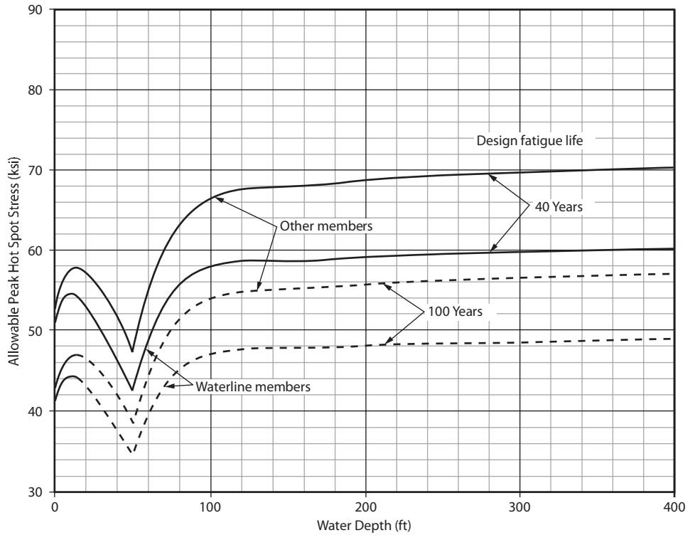  
Figure C5.1-1—Allowable Peak Hot Spot Stress, $S_{p}$ (AWS Level I)

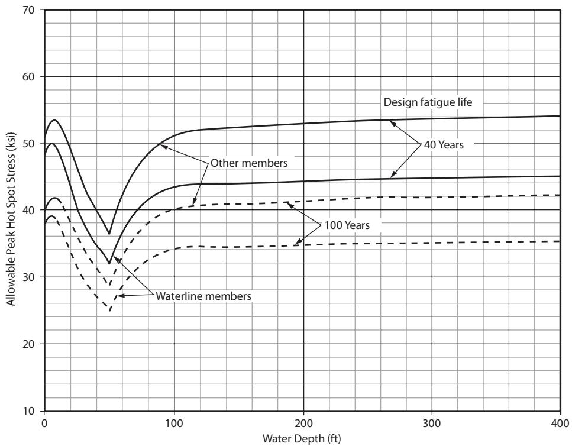  
Figure C5.1-2—Allowable Peak Hot Spot Stress, $S_{p}$ (AWS Level II)

Table C5.1-1-Selected SCF Formulas for Simple Joints   

| Joint Type | Joint Type | α | Axial Load | In-Plane Bending | Out-of-Plane Bending |
| --- | --- | --- | --- | --- | --- |
| Chord SCF | K | 1.0 | αA | 2/3 A | 3/2 A |
| Chord SCF | T & Y | 1.7 | αA | 2/3 A | 3/2 A |
| Chord SCF | Xβ<0.98 | 2.4 | αA | 2/3 A | 3/2 A |
| Chord SCF | Xβ≥0.98 | 1.7 | αA | 2/3 A | 3/2 A |
| Brace SCF's | Brace SCF's | Brace SCF's | 1.0 + 0.375 (1 + √τ/β SCFchord) ≥ 1.8 | 1.0 + 0.375 (1 + √τ/β SCFchord) ≥ 1.8 | 1.0 + 0.375 (1 + √τ/β SCFchord) ≥ 1.8 |

Where $A = 1.8\sqrt{\gamma}\tau \sin \theta$ and all other terms are defined in Figure 4.1-1.

where:

$N_{t} =$ total cycles in reference time period,

$S_{rmax} =$ the maximum (design) stress range in the reference time period (e.g., $100\mathrm{yr}$ )

$$K = N_{o} S_{o}^{m},$$

$N_{o} =$ reference cycles at knee of S-N curve,

$S_{o} =$ reference stress at knee of S-N curve,

$m = \log -\log$ inverse slope of S-N curve, and

$D =$ damage ratio for reference period (e.g., 5/SF for 20-year service life).

Solution of the equation is facilitated by plots of $G(\xi)$ , $\log(10)$ of the right-hand part of the expression, which can be found in Refs. 20 & 25.

Closed form calculations were performed, and the resulting allowable design stress ranges for proposed S-N curves for both profiled and non-profiled joints were determined. Results for the new profiled joint rules follow those for old curve X, even more closely than the S-N curves themselves, which crisscross each other. This is because we are now integrating fatigue damage along the curve, rather than just looking at one point. The results are so close in the range of $\xi = 0.5$ to $\xi = 0.8$ , that the API simplified design curves for the Gulf of Mexico remain valid. Results for new curve WJ for non-profiled welds correspond to those for old curve X-prime, and closely follow traditional DoE/HSE practice.

Some additional conservatism in the new fatigue rules will come from the adoption of Efthymiou's SCF, instead of the old Alpha Kellogg method. Reference 43 presented a comparison of the two and defense of the latter, to coincide with the 1993 fatigue changes in RP 2A-WSD. To maintain consistency with previous successful practice, Alpha Kellogg may be used for preliminary design, with a safety factor of 2.0 on life.

Design comparisons of joint can thickness (when governed by fatigue) have also been carried out for previous API, new RP 2A-WSD $21^{\mathrm{st}}$ edition supplement, and proposed ISO CD 19902 fatigue criteria (S-N knee at $10^{8}$ cycles). The design

comparisons are more comprehensive than just looking at the S-N curves. They include consideration of different long-term stress distributions (by region and water depth), new SCF formulae, weld toe corrections, profiling practices, and size effects for thicknesses typical of regional design practices.

Results are shown in Table C5.1-2. The new API (including Efthymiou SCFs and reduced safety factor) is more-or-less consistent with existing API practice. In view of the good track record of API fatigue criteria to date, this brute force calibration is considered satisfactory justification of the new criteria.

C5.2 FATIGUE ANALYSIS

A simplified fatigue analysis may be used as a first step for structures in deep water or frontier areas. However, a detailed analysis of cumulative fatigue damage should always be performed. A detailed analysis is necessary to design fatigue sensitive locations that may not follow the assumptions inherent in the simplified analysis.

C.5.2.1 Wave climate information is required for any fatigue analysis, and obtaining it often requires a major effort with significant lead time. Wave climates may be derived from both recorded data and hindcasts. Sufficient data should exist to characterize the long term oceanographic conditions at the platform site. Several formats are permissible and the choice depends on compatibility with the analytical procedures being used. However, for each format the wave climate is defined by a series of sea states, each characterized by its wave energy spectrum and physical parameters together with a probability of occurrence (percent of time). Formats that may be used include the following:

1. Two Parameter scatter diagrams. These describe the joint probability of various combinations of significant wave height and mean zero crossing period. Typically, 60 to 150 sea states are used to describe most sea environments. While a reduced number may be used for analysis, a sufficient number of sea states should be used to adequately define that scatter diagram and develop full structural response. If the scatter diagram

Table C5.1-2—Summary of Design Comparisons, Resulting Variation of Joint Can Thickness   

|  |  | 20th-21st Ed. RP 2A-WSD | 21st Edition RP 2A-WSD Supplement | 2001 ISO CD 19902 |
| --- | --- | --- | --- | --- |
| GULF OF MEXICO | profiled |  |  |  |
| shallow water | ξ=0.5 |  |  |  |
|  | old = multiplanar Fig C4.3.1-2 | 1.6" | 1.4" | 1.6" |
|  | old = α Table C5.1-1 | 1.4" | 1.5" | 1.7" |
| deep water | ξ=0.7 |  |  |  |
|  | old = multiplanar Fig C4.3.1-2 | 3.0" | 3.0" | 3.8" |
| CALIFORNIA | profiled |  |  |  |
| shallow water | ξ=1.0 old = Fig C4.3.1-2 | 1.4" | 1.3" | 1.8" |
| deep water | ξ=1.3 old = Fig C4.3.1-2 | 2.0" | 1.9" | 2.8" |
| NORTH SEA | NOT profiled | τ=0.33 | γ=13.3 |  |
| typical stiff | ξ=1.0 |  |  |  |
|  | existing = Efthymiou | 3.0" | 3.3" | 3.7" |
| BORNEO, INDONESIA | NOT profiled |  |  |  |
| ξ=1.0 | existing = Efthymiou | 1.4" | 1.5" | 1.6" |
| WEST AFRICA | NOT profiled |  |  |  |
| ξ=1.3 | persistent swell |  |  |  |
|  | existing = Efthymiou | 1.4" | 1.3" | 1.5" |
| All cases are for 45-degree K-joint with: | All cases are for 45-degree K-joint with: |  |  |  |
| concentric WP | concentric WP |  |  |  |
| τ=0.5 | τ=0.5 |  |  |  |
| γ=20 | γ=20 |  |  |  |
| β=0.5 | β=0.5 |  |  |  |
| unless noted otherwise | unless noted otherwise |  |  |  |

is condensed the effect of dynamic excitation, interaction between wave length and platform geometry, and drag force non-linearity should be considered. When condensing sea states of different height or period the resulting sea states should yield equivalent or greater damage than the original sea states. This format does not give any information on wave directionality.

2. Directional scatter diagrams. Each sea state is characterized by three parameters: significant wave height, mean zero-crossing period and central direction of wave approach (Ref. 3). If the measured data do not include wave directionality, directions may be estimated on the basis of wind measurements, local topography, and hindcasting, provided sufficient care is exercised.   
3. Directional scatter diagrams with spreading. Each sea state is characterized by four parameters: significant wave height, mean zero-crossing period, central direction of wave approach, and directional spreading. The directional spreading function, $D(\theta)$ , defines the distribution of wave energy in a sea state with direction and must satisfy:

$$\begin{array}{l} \pi / 2 \\ \int D (\theta) d \theta = 1 \tag{C5.2-1} \\ \end{array}$$

$$- \pi / 2$$

Where $\theta$ is measured from the central direction. A commonly used spreading function (Ref. 7) is:

$$D (\theta) = C_{n} \cos^{n} \theta \tag{C5.2-2}$$

Where $n$ is a positive integer and $C_n$ is a coefficient such that Eq. C5.2-1 is satisfied.

A value of $n$ equal to zero corresponds to the case when the energy is distributed in all directions. Observations of wind driven seas show that an appropriate spreading function is a cosine square function ( $n = 2$ ). For situations where limited fetch restricts degree of spread a value of $n = 4$ has been found to be appropriate. Other methods for directional spreading are given in Ref. 21.

4. Bimodal spectra. Up to eight parameters are used to combine swell with locally generated waves. Typically, swell is more unidirectional than wind generated waves and thus spreading should not be considered unless measured data shows otherwise (Ref. 22).

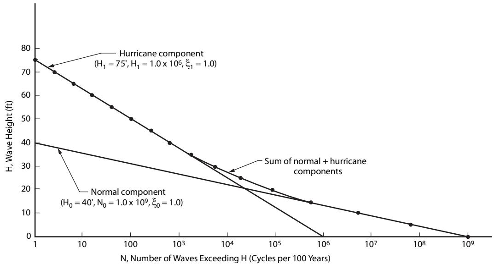

where:

$\mathsf{H}_0 =$ the maximum normal wave height over period T,

$\mathsf{H}_1 =$ the maximum hurricane wave height over period T,

$N_0 =$ the number of wave cycles from normal distribution over period T,

$N_{1} =$ the number of wave cycles from hurricane distribution over period T,

T = the duration of the long-term wave height distribution,

$\xi_0 =$ the parameter defining the shape of the Weibull normal distribution. Value of 1.0 corresponding to the exponential distribution results in a straight line,

$\xi_{1}$ = the parameter defining the shape of the Weibull hurricane distribution.

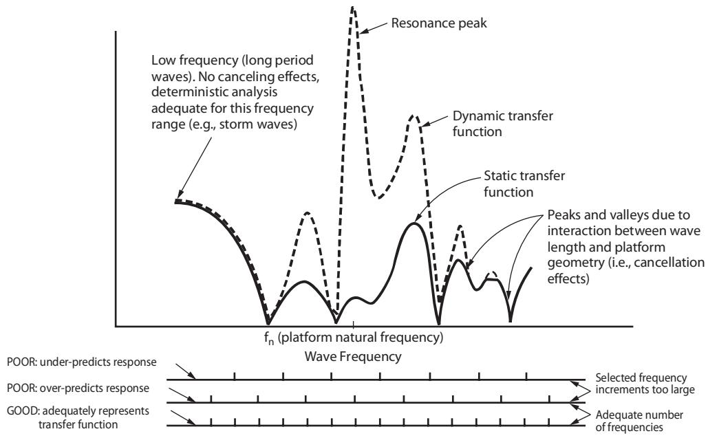  
Figure C5.1-3—Example Wave Height Distribution Over Time $T$   
Figure C5.2-1—Selection of Frequencies for Detailed Analyses

Data gathered in more complete formats can always be reduced to the simple ones. For recorded data and hindcasting, spectral characterizations described by Borgman and Cardone (Ref. 4 & 5), can serve as starting points.

C.5.2.2 The space frame model for fatigue analysis should include all important characteristics of the stiffness, mass, energy dissipation, marine growth and loading properties of the structure and foundation components of the platform. The analytical model consists primarily of beam elements. The adequacy of calculated member end stresses for fatigue analysis is contingent on the modeling techniques used. The model used for strength analysis may require refinements such as the additional or modification of members which are fatigue sensitive. Asymmetry in platform stiffness or mass distribution may lead to significant torsional response which should be considered.

Stiffness

The model should include the three dimensional distribution of platform stiffness. The member intersections should be modeled such that the resulting nominal member end stresses are consistent with their subsequent use in fatigue analysis. For typical jacket members, nominal brace stresses should be computed at the intersections of the brace and chord centerlines. For large diameter chords or short braces, local joint stiffness should be considered. One modeling technique that has been used to represent the joint stiffness is to simulate the chord stiffness between the intersection of the centerlines and the chord face as a rigid link with springs at the face representing the chord shell flexibility. Member end stresses should then be calculated at the face of the chord. Rigid links should not be used without also considering chord shell flexibility.

The stiffness of appurtenances such as launch cradles, mud mats, J-tubes, risers, skirt pile guides, etc., should be included in the model if they contribute significantly to the overall global stiffness of the structure. The stiffness of the conductors and horizontal framing levels should be included. In addition, down to and including the level immediately below the design wave trough elevation, sufficient detail should be included to perform a fatigue analysis of the individual components of the framing. Similar detailing of the mudline level is required if the conductors are considered in the foundation. Consideration of structural components such as mud mats, shear connectors, conductor guides, etc., may require finite element types other than beam elements (e.g., shell, plate, solid elements, etc.).

The stiffness of the deck should be considered in sufficient detail to adequately represent the deck-jacket interface.

A linear representation of the foundation may be used provided the stiffness coefficients reflect the cyclic response for those sea states contributing significantly to fatigue damage.

Mass

The mass model should include structural steel, equipment, conductors, appurtenances, grout, marine growth, entrapped water, and added mass. A lumped mass model is sufficient to obtain global structure response. However, this method may not adequately predict local dynamic response. Where necessary, local responses should be examined. The equipment mass included in the model should consider all equipment supported by the structure during any given operation on the platform. If the equipment mass is produced to vary significantly for different operations during the platform life, it is appropriate to perform independent analyses and combine fatigue damage. The added mass may be estimated as the mass of the displaced water for motion transverse to the longitudinal axis of the individual structural framing and appurtenances.

Energy Dissipation

The choice of damping factors can have a profound effect, and values of $2\%$ critical and less have been suggested on the basis of measurements in low sea states. Including structural velocities in the calculation of drag forces increases the total system damping. For non-compliant structures, this increase in damping is not observed in measurements and consequently should not be considered. For compliant structures such as guyed towers, these effects may be considered in addition to a $2\%$ structural (including foundation) damping.

Natural Period

For structural natural periods above three seconds, dynamic amplification is important, particularly for the lower sea states which may contribute the most to long term fatigue damage. Several authors have shown the desirability of retaining the detailed information available from a full static analysis and adding the inertial forces due to dynamic amplification of the first few modes (mode acceleration or static back-substitution method, Ref. 24). A pure modal analysis using a limited number of modes misses the essentially static response of some modes.

Since the natural period of a platform can vary considerably depending upon design assumptions and operational deck mass, a theoretical period should be viewed critically if it falls in a valley in the platform base shear transfer function. The period should be shifted by as much as 5 to $10\%$ to a more conservative location with respect to the transfer function. This should be accomplished by adjusting mass or stiffness within reasonable limits. The choice of which parameter to modify is platform specific and depends upon deck mass, soil conditions and structural configuration. It should be recognized that adjusting the foundation stiffness will alter the member loads in the base of the structure which can be fatigue.

Loading

The applied cyclic loads should be represented such that the effects of load distribution along the member are included in the member end stresses. Distributed loads on brace members need to be considered only between intersection points. Loads attributed to conductors and appurtenances such as launch cradles, mud mat framing, J-tubes, risers, skirt pile guides, anodes, etc., should be considered. The choice of wave theory as well as drag and mass coefficients should be examined as they may differ from those used in strength analyses for design wave loads. Attention should be given to modeling of conductor guide framing to ensure accurate vertical wave loads. When the loading varies significantly for different operations during the platform life, (e.g., transportation, drilling, and production), it is appropriate to perform separate analyses and combine the fatigue damages from each.

Tides, currents and marine growth each affect fatigue. For everyday waves, tides will have little effect. However, the tide and surge associated with storm seas can have a significant effect. For example, they may cause the wave crest to inundate a member or entire jacket level, which would otherwise be dry. Such effects should be considered.

Current is a complicated phenomenon that is difficult to account for in a fatigue analysis. Since fatigue considers the stress range, the static effect of current can be neglected. For large waves or currents, the drag will increase the crest-to-trough wave force difference and affect platform dynamics. While these effects can be important, analysis technology is lacking.

Marine growth may have a detrimental effect on fatigue life of members due to the increase in local and global wave loading. A marine growth profile should be specified for the average thickness and roughness expected at the platform site over the service life, if the inclusion of marine growth gives conservative results. A simplified analysis is useful in studying the effect of marine growth on global response. Marine growth affects platform added mass, member drag diameter, and drag coefficient.

Spectral Analysis Techniques

Several approaches are available for determining stress response to sea state loadings. In general, a spectral analysis should be used to properly account for the actual distribution of wave energy over the entire frequency range. The spectral approach can be subdivided based upon the method used to develop transfer functions.

1. Transfer functions developed using regular waves in the time domain.

- Characterize the wave climate using either the two, three, four or eight parameter format.   
- Select a sufficient number of frequencies to define all the peaks and valleys inherent in the jacket response transfer functions. A typical set of frequencies is illustrated in Figure C5.2-1. A simplified analysis (Ref. 7)

that develops a global base shear transfer function may be helpful in defining frequencies to be used in the detailed analysis.

- Select a wave height corresponding to each frequency. A constant wave steepness that is appropriate for the wave climate can be used. For the Gulf of Mexico a steepness between 1:20 and 1:25 is generally used. A minimum height of one foot and a maximum height equal to the design wave height should be used.   
- Compute a stress range transfer function at each point where fatigue damage is to be accumulated for a minimum of four platform directions (end-on, broadside and two diagonal). For jackets with unusual geometry or where wave directionality or spreading or current is considered, more directions may be required. At each frequency, a point on the transfer function is determined by passing an Airy wave of the appropriate height through the structure and dividing the response stress range by the wave height. The analysis procedure must eliminate transient effects by achieving steady state conditions. A sufficient number of time steps in the wave cycle at which members stresses are computed should be selected to determine the maximum brace hot spot stress range. A minimum of four hot spot locations at both the brace and chord side of the connection should be considered.   
- Compute the stress response spectra. In a spectral fatigue analysis in its most general form, each sea state is represented by a power spectral density function $S\alpha$ ( $\omega$ ) for each direction of wave approach $\alpha$ , where $\omega$ is circular frequency. At each location of interest, the platform stress response spectrum for each sea state is:

$$S_{\sigma , \alpha} (\omega) = \int_{- \pi / 2}^{\pi / 2} | H (\omega , \theta) |^{2} D (\theta) S_{\alpha} (\omega) d \theta \tag{C5.2-3}$$

where $\theta$ is measured from the central wave approach direction, $H(\omega ,\theta)$ is the transfer function and $D$ (0) is the preading function as defined in Section C5.2.1(3)

Several approximations and linearizations are introduced into the fatigue analysis with this approach:

- The way in which waves of different frequencies in a sea state are coupled by the non-linear drag force is ignored.   
- Assuming a constant wave steepness has the effect of linearizing the drag force about the height selected for each frequency. Consequently, drag forces due to waves at that frequency with larger heights will be under-predicted, while drag forces due to waves with smaller heights will be over-predicted.

2. Transfer functions developed using regular waves in the frequency domain. This approach is similar to method (1) except that the analysis is linearized prior to the calculation of structural response. In linearizing the applied wave force, drag forces are approximated by sinusoidally varying forces and inundation effects are approximated or neglected. As a result, the equations of motion can then be solved without performing direct time integration. For typical small waves the effects of linearization are not of great importance; however, for large waves they may be significant if inundation effects are neglected.   
3. Transfer functions developed using random waves in the time domain. (Ref. 23).

- Characterize the wave climate in terms of sea state scatter diagrams.   
- Simulate random wave time histories of finite length for a few selected reference sea states.   
- Compute response stress time histories at each point of a structure where fatigue life is to be determined and transform the response stress time histories into response stress spectra.   
- Generate "exact" transfer functions from wave and response stress spectra.   
- Calculate pseudo transfer functions for all the remaining sea states in the scatter diagram using the few "exact" transfer functions.   
- Calculate pseudo response stress spectra as described in Section (C5.2.2-1).

This method can take into account nonlinearities arising from wave-structure interaction and avoids difficulties in selecting wave heights and frequencies for transfer function generation.

C.5.2.3 In evaluating local scale stresses at hot spot locations the stress concentration factors used should be consistent with the corresponding S-N curve, reference Sections 5.4 and 5.5.

C.5.2.4 Various approaches to a Miner cumulative damage summation have been used. In all cases, the effects from each sea state are summed to yield the long term damage or predict the fatigue life. Approaches include:

For a spectral analysis, the response stress spectrum may be used to estimate the short-term stress range distribution for each sea state by assuming either:

1. A narrow band Rayleigh distribution. For a Rayleigh distribution the damage may be calculated in closed form.   
2. A broad band Rice distribution and neglecting the negative peaks.   
3. Time series simulation and cycle counting via rainfall, range pair, or some other algorithm.

Damage due to large waves that have significant drag forces or crest elevations should be computed and included in the total fatigue damage.

C.5.2.5 A calculated fatigue life should be viewed as notional at best. Where possible, the entire procedure being used should be calibrated against available failure/non-failure experience. Although $97\%$ of the available data falls on the safe side of the recommended S-N curves, additional uncertainties in wave action, seawater effects, and stress analysis result in a $95\%$ prediction interval for failures ranging from roughly 0.5 to 20 times the calculated fatigue life at $D$ of unity (ref. 11), for the API criteria of $11^{\mathrm{th}}$ to $21^{\mathrm{st}}$ editions (prior to this supplement), which anticipated the use of best-estimate SCF. For the new criteria, using Efthymiou SCF, the prediction interval becomes 0.85 to 50 times the calculated fatigue life. Additional time is required for the progressive failure of redundant structures. Calibration hindcasts falling outside this range should prompt a re-examination of the procedures used.

In light of the uncertainty, the calculated fatigue life should often be a multiple of the intended service life. (Alternatively, the estimated damage sum at the end of the service period should often be reduced from 1.0 by a safety factor.) Failure consequence and the extent of in-service inspections should be considered in selecting the safety factor on fatigue life. Failure criticality is normally established on the basis of redundancy analyses (Ref. 12). A robust structure with redundancy, capability for in-service inspection and possible repair/ strengthening, is to be preferred, especially in the design of a new structural concept or a conventional structure for new environmental conditions.

In lieu of more detailed assessment, and where the structural analysis has been conducted on the basis of rigid joint assumptions, the minimum safety factor has been reduced to unity. This recognizes increased conservatism in the high-cycle S-N curves and SCF, and has been calibrated against previous successful API practice.

Factors of 5 and 10 imply that a significant change in fatigue reliability occurs only when there is a significant change in the predicted life or Palmgren-Miner damage sum for the planned service life of the structure. These higher factors typically represent the minimum ratio of the predicted fatigue life and the planned service life of the structure, under adverse combinations of high failure consequence and uninspectability.

The safety factors do not differentiate between fatigue analysis procedures. At present, there is little certainty in how the various procedures compare in terms of reliability, so the same set of explicit safety factors is generally applied to all of them. The safety factors also do not differentiate such aspects as risk to assets and difficulties or lost production associated with repairs. The designer should consult with the owner as to

how these sorts of risk should be addressed in the design phase.

A recent study (Ref 59) has indicated that significant increase in predicted fatigue life can be obtained by the appropriate consideration of the local joint flexibility of tubular connections, particularly where out-of-plane bending is important (Ref. 43). This is supported by studies of in-service platform underwater inspection records (Ref 60) that show that substantially less fatigue damage occurs than is predicted using conventional rigid-joint assumptions. Where the structural analysis has been conducted on the basis of flexible joint assumptions, consideration should be given to adjusting the safety factors.

There are instances where the cited safety factors may be reduced. An example could be a component above water, for which inspection may be either easier or more frequent. A reduction in safety factor may also be appropriate if loss of the component does not jeopardize personnel safety or the environment. Lesser safety factors may be justified if the fatigue analysis algorithm has been calibrated to the structural type and load conditions being considered, e.g., for a structure which has already demonstrated a long service life.

In selecting safety factors, inspectability and inspection technique need careful consideration. In general, the in-service inspection being addressed is more thorough than a general diver or ROV survey (Level II) described in Section 14.3.2. Some complex joints, such as internally stiffened ones, may have cracking originating from the inside (hidden) surfaces. Hence, the possible need for inspection prior to crack penetration through thickness should be considered at the design stage. A trade-off may exist between introducing a lower safety factor (assuming the component is not failure critical) and inspecting in-service with a more complex technique such as MPI.

Although a given component may be considered readily inspectable from exposed surfaces, inspection frequency may still have to be balanced with the fatigue safety factor. References 12 and 61 (among others) discuss the relationship between inspection interval and calculated fatigue life, as they affect structural reliability. It is anticipated that most tubular joints spend about half their fatigue lives in the detectable crack growth stage. However, in some components, such as those with low SCFs, the period of crack growth can be a much smaller proportion of the total life. And even with conventional components, the usual inspection interval may not be adequate if the planned service life is short.

Despite the need to address inspectability during the design phase, there is no implied requirement in these provisions to perform a regular, detailed inspection of each and every joint for which a safety factor from the inspectable category is adopted. The scope and frequency associated with the inspection plan involve considerations that extend well beyond the issue of the fatigue analysis recipe alone. However, if no inspection is clearly intended from the start for a particular

class of joint, then the safety factor should be selected from the non-inspectable category. Joints in the splash zone should normally be considered as uninspectable.

Uncertainties in fatigue life estimates can be logically evaluated in a probabilistic framework. A fatigue reliability model based on the lognormal distributions is presented in Refs. 11 and 25. This model is compatible with both the closed form and detailed fatigue analysis methods described above. The sources of uncertainty in fatigue life, which is considered to be a random variable, are described explicitly. The fatigue reliability model can be used to develop fatigue design criteria calibrated to satisfactory historical performance but also characterized by uniform reliability over a range of fatigue design parameters.

C5.3 STRESS CONCENTRATION FACTORS

C5.3.1 General

The Hot Spot Stress Range (HSSR) concept places many different structural geometries on a common basis, enabling them to be treated using a single S-N curve. The basis of this concept is to capture a stress (or strain) in the proximity of the weld toes, which characterizes the fatigue life of the joint, but excludes the very local microscopic effects like the sharp notch, undercut and crack-like defects at the weld toe. These local weld notch effects are included in the S-N curve. Thus the Stress Concentration Factor (SCF) for a particular load type and at a particular location along the intersection weld may be defined as:

$$S C F = \frac{\text{H S S R} \text{a t t h e l o c a t i o n (e x c u l i n g n o t c h e f f e c t)}}{\text{R a n g e o f t h e n o m i n a l b r a c e s t r e s s}}$$

Consistency with the S-N curve is established by using a compatible method for estimating the HSSR during the fatigue test as used in obtaining SCFs. The Dovey 16-node thick shell element (Ref.10) enforces a linear trend of shell bending and membrane stress. This is consistent with the experimental HSS extrapolation procedure, and was used to derive Efthymiou's SCF (Ref.48).

SCFs may be derived from finite element (FE) analyses, model tests or empirical equations based on such methods. When deriving SCFs using FE analysis, it is recommended to use volume (brick and thick shell) elements to represent the weld region and adjoining shell (as opposed to thin shell elements). In such models the SCFs may be derived by extrapolating stress components to the relevant weld toes and combining these to obtain the maximum principal stress and, hence, the SCF. The extrapolation direction should be normal to the weld toes.

If thin shell elements are used, the results should be interpreted carefully since no single method is guaranteed to provide consistently accurate stresses (Refs. 47 and 62). Extrapolation to the mid-surface intersection generally over

predicts SCFs but not consistently, whereas truncation at the notional weld toes would generally under predict SCFs. In place of extrapolation, it is possible to use directly the nodal average stresses at the mid-surface intersection. This will generally over predict stresses, especially on the brace side. This last method is expected to be more sensitive to the local mesh size than the extrapolation methods.

When deriving SCFs from model tests, care should be taken to cover all potential hot spot locations with strain gauges. Further, it should be recognized that the strain concentration factor is not identical to SCF, but is related to it via the transverse strains and Poisson's Ratio. If the chord length in the joint tested is less than about 6 diameters （$\alpha < 12)$ , the SCFs may need to be corrected for the stiffening effect of nearby end diaphragms (vs. the weakening effect of a short joint can) as indicated by the Efthymiou short chord correction factors. The same correction may be needed in FE analysis if $\alpha < 12$ .

Geometric tolerances on wall thickness, ovalization and misalignment will result in some deviation in SCFs from the values based on an ideal geometry. These deviations are small and may be ignored.

a. Evaluation of Hot Spot Stress Ranges. The key hot spot stress range locations at the tubular joint intersection are termed saddle and crown (see Figure C5.3.1-1). A minimum of eight stress range locations need to be considered around each chord-brace intersection in order to adequately cover all relevant locations. These are: chord crowns (2), chord saddles (2), brace crowns (2) and brace saddles (2). The point-in-time hot spot stress (HSS) for the saddle and the crown are given by:

$$H S S_{s a} = S C F_{a x s a f_{a x}} \pm S C F_{o p b} f_{o p b}$$

$$H S S_{c r} = S C F_{a x c r} f_{a x} \pm S C F_{i p b} f_{i p b} + C E$$

where

$$f = \text{n o m i n a l}$$

$$s a = \text{s a d d l e},$$

$$c r = \text{c r o w n},$$

$$a x = \text{a x i a l},$$

$$i p b = \text{i n - p l a n e - b e n d i n g},$$

$$o p b = \text{o u t - o f - p l a n e}$$

$CE$ is the effect of the nominal cyclic stress in the chord as discussed below. The above equations are valid both for the HSS for the chord and for the HSS for the brace, but the $CE$ is only applicable for the chord crown.

Since the nominal brace stresses $f_{ax}$ , $f_{opb}$ and $f_{ipb}$ are functions of wave position, it follows that, when combining the contributions from the various loading modes, phase differences between them must be accounted for. In the time domain, the combination is done for each wave position, and the total range of HSS (i.e., HSSR) determined from the full cycle result at each location.

Nominal cyclic stresses in the chord member also contribute to fatigue loading. Their contribution is usually small because, unlike brace loading, chord loading does not cause any significant local bending of the chord walls. Hence any stress raising effects are minimal. The effect of nominal cyclic stresses in the chord member may be covered by including the stress due to axial load in the chord can member, with $\mathrm{SCF} = 1.25$ , at the chord crown location only, accounting for sign and phase differences with other brace load effects. Contributions at other locations, namely at the saddle and the brace side are considerably smaller and may be neglected. For the special case of a structure in which the cyclic loads in the chords dominate, the braces can be regarded as non-load carrying attachments and checked with an appropriate S-N curve.

b. Other Stress Locations. For some joints and certain individual load cases, the point of highest stress may lie at a location between the saddle and crown. Examples include balanced axial load in K-joints where the hot spot generally lies between the saddle and crown toe. For in-plane bending the hot spot may not be precisely at the crown, but may lie within a sector of $\pm 30^{\circ}$ from the crown depending on the $\gamma$ and $\beta$ values. The recommended SCF equations capture these higher SCFs even though, for simplicity, they are referred to as occurring notionally at the crown or the saddle.

For combined axial loads and bending moments, it is possible for the maximum HSSR to occur at a location between the crown and saddle even when the individual hot spots occur at the saddle or crown. These cases occur if IPB and OPB contributions are comparable in terms of HSSR and are in phase, and if, in addition, the axial contributions are small or relatively constant around the intersection.

For such cases, use of the above equations may under-predict the maximum stress range. To overcome this, the hot spot stress range around the entire joint intersection may be estimated (and, hence, the HSS) using an equation of the form:

$$\begin{array}{l} H S S (x) = S C F_{a x c h} (X) \times f_{a x} \pm S C F_{i p b c h} (X) \\ \times f_{i p b} \pm S C F_{o p b c h} (X) \times f_{o p b} \\ \end{array}$$

where $SCF_{axch}(X)$ describes the variation of chord-side SCF due to axial brace load, around the chord-brace intersection (defined by angle $X$ ), while $SCF_{ipbch}(X)$ and $SCF_{opbch}(X)$ relate to IPB and OPB, respectively. The distribution functions may be obtained from parametric expressions given in Ref. 49, or a sinusoidal variation may be assumed.

C5.3.2 SCFs in Unstiffened Tubular Joints

Several sets of parametric equations have been derived for estimating SCFs in tubular joints (e.g., Refs. 15, 20, 30, 48, and 50). Historically, SCF equations (e.g., Kuang and Alpha Kellogg) have been targeted at capturing the mean, not upper bound, SCF values. The performance of the various sets of

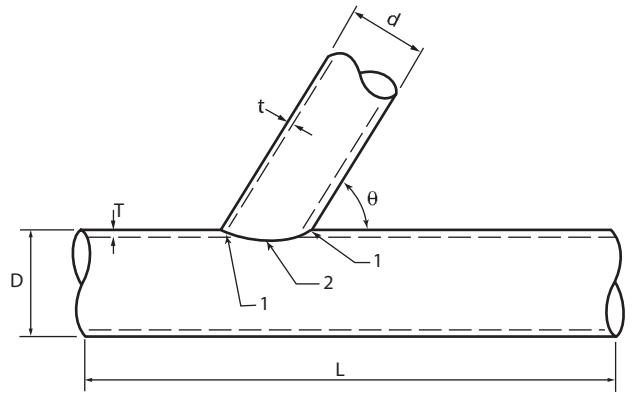  
a) T- or Y-joint

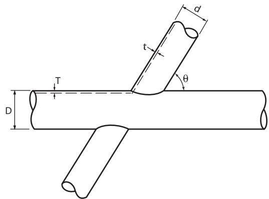  
b) X-joint

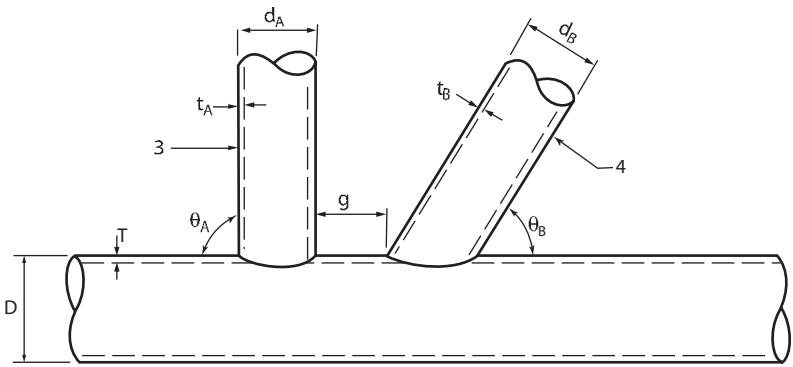  
c) K-joint

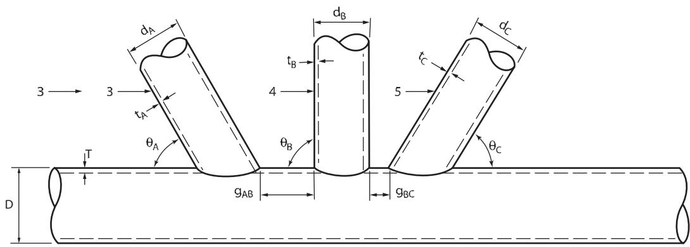  
Figure C5.3.1-1—Geometry Definitions for Efthymiou SCFs

d) KT-joint

KEY

# 1 Crown

$\beta = \mathrm{d} / \mathrm{D}$

$\beta_{\mathrm{A}} = \mathrm{d}_{\mathrm{A}} / \mathrm{D}$

$\beta_{\mathrm{B}} = \mathrm{d}_{\mathrm{B}} / \mathrm{D}$

$\beta_{C} = d_{C} / D$

# 2 Saddle

$\tau = t / T$

$\tau_{\mathrm{A}} = \mathrm{t}_{\mathrm{A}} / \mathrm{T}$

$\tau_{\mathrm{B}} = \mathrm{t}_{\mathrm{B}} / T$

$\tau_{C} = t_{C} / T$

# 3 Brace A

$\zeta = \mathrm{g} / \mathrm{D}$

$\zeta_{\mathrm{AB}} = \mathsf{g}_{\mathrm{AB}} / D$

$\zeta_{\mathrm{BC}} = g_{\mathrm{BC}} / D$

# 4 Brace B

$\gamma = D / 2T$

$\alpha = \mathrm{L} / 2\mathrm{D}$

SCF equations in terms of accuracy, degree of conservatism and range of applicability has been assessed in a number of recent studies, notably in a study by Edison Welding Institute (EWI) funded by API (Ref. 51) and a study by Lloyd's Register funded by HSE (Ref. 35).

The main conclusion from the EWI study was that the Efthymiou equations and the Lloyd's design equations have considerable advantages in consistency and coverage in comparison with other available equations. When discussing the Lloyd's SCF equations it is important to clarify that three modern sets of Lloyd's/Smedley SCF equations exist, namely:

i) mean SCF equations through the database of acrylic test results available in 1988;   
ii) design SCF equations defined as "mean plus one standard deviation" through the same database;   
iii) updated SCF equations (Ref. 75).

When assessed by EWI against the latest SCF database, the Lloyd's mean SCF equations are found to generally under predict SCFs and are not recommended for design.

A second conclusion from the EWI study was that the option of 'mixing-and-matching' equations from different sets would lead to inconsistencies and is not recommended. The updated equations are intended to solve the "mix & match" problem and to correct some of the inconsistencies in Efthymiou's approach.

For the Alpha-Kellogg equations that are given in previous editions of API RP 2A-WSD, Reference 43 concluded that they generally predict lower SCF than the Efthymiou equations over the range of common design cases. Perhaps the most significant weakness of the Alpha-Kellogg equations is that the predicted SCFs for all joint types are independent of $\beta$ . While reasonable for K-joints and multi-planar nodes, this is clearly not the case for isolated T, Y, and X-joints, as evidenced from test data and FE results. Further, the equations imply that chord SCFs are proportional to $T^{1.5}$ , as opposed to Efthymiou, which indicates that, they increase with $T^{1.4}$ to $T^2$ , depending on joint type and loading. However, one advantage of the Alpha-Kellogg equations is their simplicity.

In the comparison studies by Lloyd's Register, the Efthymiou SCF equations were found to provide a good fit to the screened SCF database, with a bias of about $10 - 25\%$ on the conservative side (Ref. 35). They generally pass the HSE criteria for goodness of fit and conservatism, except for the important case of K-joints under balanced axial load. A closer examination of this specific case revealed that these equations should be considered satisfactory for both the chord and the brace side. For the chord side in particular, the Efthymiou equation provides the best fit to the database （$\mathrm{COV} = 19\%)$ and has a bias of $19\%$ on the conservative side. The 'second best' equation (Lloyd's) has a COV of $21\%$ and a bias of $41\%$ on the conservative side. The HSE criteria were deliberately concocted to favor those equations that over-predict SCFs

and to penalize under-predictions. This is why the Efthymiou equations for K joints marginally failed the criteria, even though they provide a good fit and also are biased on the safe side. A bias of $19\%$ on stress becomes a hidden safety factor of $1.7\times$ to $2.4\times$ on fatigue life, compared to the earlier use of best estimate SCF.

Use of the Efthymiou SCF equations is recommended because this set of equations is considered to offer the best option for all joint types and load types and is the only widely vetted set that covers overlapped K and KT joints.

'Mix-and-match' between different sets of equations is not recommended. The Efthymiou equations are also recommended in the Proposed Revisions for Fatigue Design of Welded Connections (Ref. 52) for adoption by IIW (International Institute of Welding), Eurocode 3 and ISO DIS 14347. The Efthymiou equations are given in Tables C5.3.2-1 to C5.3.2-4.

The validity ranges for the Efthymiou parametric SCF equations are as follows:

$$\beta \text{f r o m} 0. 2 \text{t o} 1. 0$$

$$\tau \text{f r o m} 0. 2 \text{t o} 1. 0$$

$$\gamma \text{f r o m 8 t o 32}$$

$$\alpha (\text{l e n g t h}) \text{f r o m} 4 \text{t o} 40$$

$$\theta \text{f r o m 20 t o 90 d e g r e e s}$$

$$\zeta (\text{g a p}) \text{f r o m} - 0. 6 \beta / \sin \theta \text{t o} 1. 0$$

For cases where one or more parameters fall outside this range, the following procedure may be adopted:

i) evaluate SCFs using the actual values of geometric parameters,   
ii) evaluate SCFs using the limit values of geometric parameters,   
iii) use the maximum of i) or ii) above in the fatigue analysis.

(a) Effect of weld toe position. Ideally, the SCF should be invariant, given the tubular connection's geometry （$\gamma, \tau, \beta, \theta, \text{and} \zeta)$ . This is how Efthymiou and all the other SCF equations are formulated. Hot spot stress is calculated from the linear trend of notch-free stress extrapolated to the toe of the basic standard weld profile, with nominal weld toe position as defined in AWS D1.1 Figure 3.8. When this is done, size and profile effects must be accounted for in the S-N curve, regardless of the underlying cause. This is how the previous API rules were set up.

Influenced by deBack and others, international thinking tends to suggest that weld profile effects (mainly the variable position of the actual weld toe) should be reflected in the SCF, rather than in the S-N curve. This is consistent with how experimental hot spot stresses were measured to define the basic international S-N curve for hotspot fatigue in $16\mathrm{mm}$ thick tubular joints. One tentative method for correcting ana

Table C5.3.2-1—Equations for SCFs in T/Y Joints   

| Load Type and Fixity Conditions | SCF Equations | Equation No. | Short Chord Correction |
| --- | --- | --- | --- |
| Axial Load - Chord ends fixed | Chord saddle γτ1.1[1.11 - 3(β - 0.52)2]sin1.6θ | T1 | F1 |
| Axial Load - Chord ends fixed | Chord crown γ0.2τ[2.65 + 5(β - 0.65)2] + τβ(0.25α - 3) sinθ | T2 | None |
| Axial Load - Chord ends fixed | Brace saddle 1.3 + γτ0.52α0.1[0.187 - 1.25β1.1(β - 0.96)]sin(2.7-0.01α)θ | T3 | F1 |
| Axial Load - Chord ends fixed | Brace crown 3 + γ1.2[0.12exp(-4β) + 0.011β2 - 0.045] + βτ(0.1α - 1.2) | T4 | None |
| Axial Load - General fixity conditions | Chord saddle [T1] + C1(0.8α - 6)τβ2(1 - β2)0.5sin22θ | T5 | F2 |
| Axial Load - General fixity conditions | Chord crown γ0.2τ[2.65 + 5(β - 0.65)2] + τβ(C2α - 3) sinθ | T6 | None |
| Axial Load - General fixity conditions | Brace saddle: Eqn. T3 |  |  |
| Axial Load - General fixity conditions | Brace crown 3 + γ1.2[0.12exp(-4β) + 0.011β2 - 0.045] + βτ(C3α - 1.2) | T7 | None |
| In-Plane Bending | Chord crown 1.45βτ0.85γ(1-0.68β)sin0.7θ | T8 | None |
| In-Plane Bending | Brace crown 1 + 0.65βτ0.4γ(1.09-0.77β)sin(0.06γ-1.16)θ | T9 | None |
| Out-of-Plane Bending | Chord saddle γτβ(1.7 - 1.05β3)sin1.6θ | T10 | F3 |
| Out-of-Plane Bending | Brace saddle τ-0.54γ-0.05(0.99 - 0.47β + 0.08β4) × [T10] | T11 | F3 |

Short Chord Correction Factors （$a < 12)$

$$F 1 = 1 - (0. 83 \beta - 0. 56 \beta^{2} - 0. 02) \gamma^{0. 23} \exp \left[ - 0. 21 \gamma^{- 1. 16} \alpha^{2. 5} \right]$$

$$F 2 = 1 - (1. 43 \beta - 0. 97 \beta^{2} - 0. 03) \gamma^{0. 04} \exp \left[ - 0. 71 \gamma^{- 1. 38} \alpha^{2. 5} \right]$$

$$F 3 = 1 - 0. 55 \beta^{1. 8} \gamma^{0. 16} \exp \left[ - 0. 49 \gamma^{- 0. 89} \alpha^{1. 8} \right]$$

$$w h e r e \exp (x) = e^{x}$$

Chord-end Fixity Parameter C

$$0. 5 \leq C \leq 1. 0, \text{T y p i c a l l} C = 0. 7$$

$$C_{1} = 2 (C - 0. 5)$$

$$C_{2} = C / 2$$

$$C_{3} = C / 5$$

Table C5.3.2-2—Equations for SCFs in X-Joints   

| Load Type | SCF Equation | Equation No. |
| --- | --- | --- |
| Axial Load (balanced) | Chord saddle 3.87γτβ(1.10 - β1.8)sin1.7θ | X1 |
| Axial Load (balanced) | Chord crown γ0.2τ[2.65 + 5(β - 0.65)2] + 3τβsinθ | X2 |
| Axial Load (balanced) | Brace saddle 1 + 1.9γτ0.5β0.9(1.09 - β1.7)sin2.5θ | X3 |
| Axial Load (balanced) | Brace crown 3 + γ1.2[0.12exp(-4β) + 0.011β2 - 0.045] | X4 |
| Axial Load (balanced) | In joints with short chords (α < 12) and closed ends, the saddle SCFs can be reduced by the short chord factors F1 or F2 where F1 = 1 - (0.83β - 0.56β2 - 0.02)γ0.23 exp[-0.21γ-1.16α2.5] F2 = 1 - (1.43β - 0.97β2 - 0.03)γ0.04 exp[-0.71γ-1.38α2.5] |  |
| In-Plane Bending | Chord crown: Eqn. T8 Brace crown: Eqn. T9 |  |
| Out-of-Plane Bending (balanced) | Chord saddle γτβ(1.56 - 1.34β4)sin1.6θ | X5 |
| Out-of-Plane Bending (balanced) | Brace saddle τ-0.54γ-0.05(0.99 - 0.47β + 0.08β4) × [X5] | X6 |
| Out-of-Plane Bending (balanced) | In joints with short chords (α < 12) and closed ends, Equations X5 and X6 can be reduced by the short chord factor F3 where F3 = 1 - 0.55β1.8γ0.16 exp[-0.49γ-0.89α1.8] |  |

Table C5.3.2-3—Equations for SCFs in Gap/Overlap K-Joints   

| Load Type | SCF Equations | Equation No. | Short Chord Correction |
| --- | --- | --- | --- |
| Balanced Axial Load | Chord SCF$\tau^{0.9}\gamma^{0.5}(0.67-\beta^2+1.16\beta)\sin\theta\left[\frac{\sin\theta_{max}}{\sin\theta_{min}}\right]^{0.30}\left[\frac{\beta_{max}}{\beta_{min}}\right]^{0.30}\times$ [1.64 + 0.29β-0.38 ATAN(8ζ)] Brace SCF1 + [K1](1.97 - 1.57β0.25)τ-0.14 sin0.7θ+Cβ1.5γ0.5τ-1.22sin1.8(θmax+θmin) × [0.131 - 0.084 ATAN(14ζ + 4.2β)] whereC = 0 for gap joints,C = 1 for the through brace,C = 0.5 for the overlapping brace.Note that τ, β, θ and the nominal stress relate to the brace under consideration. ATAN is arctangent evaluated in radians. | K1K2 | NoneNone |
| Unbalanced IPB | Chord crown SCF: Eqn. T8(For overlaps exceeding 30% of contact length use 1.2 x [T8])Gap joint-brace crown SCF: Eqn. T9Overlap joint-brace crown SCF: [T9] x (0.9 + 0.4β) | K3 | NoneNone |
| Unbalanced OPB | Chord saddle SCF adjacent to brace A:[T10]A[1 - 0.08(βBγ)0.5exp(-0.8x)]+[T10]B[1 - 0.08(βAγ)0.5exp(-0.8x)][2.05βmax0.5exp(-1.3x)]wherex = 1 + ζsinθA/βA Brace A saddle SCF:$\tau^{-0.54}\gamma^{-0.05}(0.99 - 0.47\beta + 0.08\beta^4)\times[K4]$ | K4K5 | F4F4 |

$$F 4 = 1 - 1. 07 \beta^{1. 88} \exp \left[ - 0. 16 \gamma^{- 1. 06} \alpha^{2. 4} \right]$$

Note that $\left[\mathrm{T10}\right]_{\mathrm{A}}$ is the chord SCF adjacent to brace A as estimated from Eqn. T10.

The designation of braces A and B is not geometry dependent. It is nominated by the user.

Table C5.3.2-4—Equations for SCFs in KT-Joints   

| Load Type and Fixity Conditions | SCF Equations | Equation No. |
| --- | --- | --- |
| Balanced Axial Load | Chord SCF: Eqn. K1 Brace SCF: Eqn. K2 For the diagonal braces, A and C use ζ = ζAB + ζBC + βB For the central brace, B uses ζ = maximum of ζAB, ζBC |  |
| In-Plane Bending | Chord crown SCF: Eqn. T8 Brace crown SCF: Eqn. T9 |  |
| Unbalanced Out-of-Plane Bending | Chord saddle SCF adjacent to diagonal brace A: [T10]A[1-0.08(βBγ)0.5exp(-0.8xAB)] • [1-0.08(βCγ)0.5exp(-0.8xAC)] + [T10]B[1-0.08(βAγ)0.5exp(-0.8xAB)] • [2.05βmax0.5exp(-1.3xAB)] + [T10]c[1-0.08(βAγ)0.5exp(-0.8xAC)] • [2.05βmax0.5exp(-1.3xAC)] where xAB=1+ζABsinθA/βA and xAC=1+(ζAB+ζBC+βB)sinθA/βA | KT1 |
| Unbalanced Out-of-Plane Bending | Chord saddle SCF adjacent to central brace A: [T10]B•[1-0.08(βAγ)0.5exp(-0.8xAB)] (βA/βB)2 •[1-0.08(βCγ)0.5exp(-0.8xBC)] (βC/βB)2 +[T10]A•[1-0.08(βBγ)0.5exp(-0.8xAB)] • [2.05βmax0.5exp(-1.3xAB)] +[T10]C•[1-0.08(βBγ)0.5exp(-0.8xBC)] • [2.05βmax0.5exp(-1.3xBC)] where xAB=1+ζABsinθB/βB and xBC=1+ζBCsinθB/βB | KT2 |
| Unbalanced Out-of-Plane Bending | Brace saddle SCFs under OPB: Obtained from the adjacent chord SCFs using τ-0.54 γ-0.05(0.99-0.47β+0.08β4)×SCFchord where SCFchord=KT1 or KT2 | KTB |

In joints with short chords （$\alpha < 12)$ Eqns. KT1, KT2, KTB can be reduced by the short chord factor F4 where $F4 = 1$ . $-1.07\beta^{1.88}\exp [-0.16\gamma^{-1.06}\alpha^{2.4}]$

lytical SCF for weld toe position was presented in the seminal volume for deBack's retirement (Ref. 31). A more robust formulation is now proposed (Ref. 76):

$$S C F_{c o r r} = 1 - (L_{a} - L) / L_{m p}$$

where:

$$\begin{array}{l} \begin{array}{r c l} S C F_{c o r r} & = & \text{t h e c o r r e c t i o n f a c t o r a p p l i e d t o E f t h y m i o u S C F}, \\ L_{a} & = & \text{t h e a c t u a l w e l d t o e p o s i t i o n (t y p i c a l o f y a r d p r a c t i c e)}, \end{array} \\ L = \begin{array}{l} \text{t h e n o m i n a l w e l d t o e p o s i t i o n (F i g u r e 2 . 15 o f} \\ \text{R e f . 28)}, \end{array} \\ L_{m p} = \begin{array}{l} \text{t h e m o m e n t p e r s i s t e n c e l e n g t h (d i s t a n c e f r o m} \\ \text{n o m i n a l t o e t o r e v e r s a l o f s h e l l b e n d i n g s t r e s s)}. \end{array} \\ \end{array}$$

Various expressions for $L_{mp}$ are shown in Table C5.3.2-5 as a function of joint type, load type, and hotspot orientation. $R$ and $T$ are radius and thickness, respectively, of the joint can. Consistency in format with the rules for strain gage placement at crown and saddle position may be noted. Attempts to produce an improved as-welded profile often result in over-welding. As such, high estimates of $L_{mp}$ (low estimates of local stress gradient) will produce conservative corrections. This approach assumes that the weld is not so massive as to change the overall load distribution in the joint can, nor so finely tapered that positions other than the weld toe become critical, and that local hotspot stresses are dominated by shell bending stress.

Despite accounting for actual weld toe position, a residual effect of weld profile remains apparent in Hartt's seawater data (Ref.33), as shown in Figure 7.19 of Ref. 28. Here, at thicknesses greater than $16\mathrm{mm}$ , the higher performance of concave as-welded profiles is expressed in a smaller size effect exponent than for basic flat profiles. This variable size effect is discussed in the commentary on S-N curves.

(b) Double-Dipping. This term refers to the possibility of including the chord effect (CE) stresses twice: first because it is embedded in Efthymiou's SCF for T and Y connections, and again when chord stresses are extracted from the frame analysis. One should use either the chord bending from Efthymiou, or that from the frame analysis, but not both. The effect of average chord axial load should always be added.

A serious problem with the Efthymiou SCF equations is that they focus on accurately predicting hot spot stresses in isolated planar research joints as would be mounted in a test frame, rather than visualizing a tubular joint as part of a three-dimensional jacket. This is particularly evident in the case of the T-joint formulae, where the implicit effects of beam bending in the chord are introduced via terms containing alpha ( $\alpha = 2L / D$ , not the ovalizing term in Table C5.1-1).

Since most users do not have access to the source code for popular jacket analysis software, choices will be limited to the built-in options. There are various ways to interpret the

Table C5.3.2-5—Expressions for $L_{mp}$   

| Circumferential stress at saddle: | Circumferential stress at saddle: |
| --- | --- |
| All loading modes | Lmp= (0.42 - 0.28 β) R |
| All loading modes | Angle = (24 - 16 β) degrees |
| Longitudinal stress at crown: | Longitudinal stress at crown: |
| Axisymmetric | Lmp= 0.6 √(RT) |
| Gap (g) of K-joint | Lmp= lesser of 0.6 √(RT) or g/2 |
| Outer heel/toe, axial | Lmp= 1.5 √(RT) |
| In-plane bending | Lmp= 0.9 √(RT) |

choice of effective length $L$ , given lengths $L1$ and $L2$ of the two chord members adjoining the T-joint in question. This assumes that the adjacent nodes are also braced points in the jacket space frame. If not, the whole length-based method breaks down.

A general way to represent all the various patterns of bending is to take $L = 4$ $M / P$ (for $C = 1$ ), where $M$ in in-plane bending moment in the chord and $P$ is the axial load in the T-joint brace being considered.

A second consequence of the use of chord length $\alpha$ in Efthymiou's SCF formulas is that it reflects the use of rigid diaphragm at the ends of the chord in a typical test arrangement. When the length is less than 6 diameters ( $\alpha$ less than 12), a correction term kicks in, representing the strengthening effect of diaphragms in suppressing chord ovalizing. In typical structures, not only are the diaphragms absent, but we have the potentially weakening effect of short joint cans. This latter effect is particularly acute at the bottom of an ungrouted jacket leg.

Thus, the recommended protocol is to assume a standard $\alpha$ of 12 and $C$ of 0.5 (which makes most of the complicating terms drop out of Efthymiou's SCF), and use the frame analysis chord nominal stress, axial plus bending in the joint can, average of the adjoining chord segments. It is tempting to try to back out the small amount of bending that remains in Efthymiou, but this gets complicated in practice.

(c) Influence Functions. The concept of Influence Functions as a generalization of the SCF method of evaluating hot spot stress ranges is described in Refs. 48 and 26. This method is more accurate than the SCF approach because it can synthesize generalized loads and moments on all of the braces forming the joint, as opposed to the SCF approach which is based on individual planes and joint classification. The Influence Function algorithm is consistent with the SCF approach in the sense that it will lead to identical results as the SCF approach for a joint that is loaded and classed in the manner that is assumed by the SCF approach. In addition to being more robust than the SCF approach, the Influence Function concept obviates the need to classify joints a priority and, hence, is more convenient to use. An additional advantage is that it has been extended in Refs. 48 and 20 to handle

multi-planar joints for the important case of axial brace loading. A disadvantage of the Influence Function algorithm is that it is less transparent than the direct SCF approach and also it may not be as widely automated in commercial computer software.

For complex joints of particular interest, specific Influence Coefficients and hot spot stresses may be accurately established by developing a detailed local FE model of the joint and incorporating this model into the overall fatigue analysis (frame) model of the substructure (see Ref. 53). The advantage of this approach is that it captures brace-in-frame coupling of axial load and bending, as well as all brace and chord loads and moments, including phase differences, and all geometric stress concentration effects, including multi-planar effects.

(d) Tubular Joints Welded From One Side. Single-sided welding is used as the principal method for connecting braces to chords in tubular joints for offshore structures in many areas of the world. Single-sided welding presupposes that the critical fatigue crack typically initiates at the outer weld toe. However, if the stress concentration factor at the internal weld root of a tubular joint is relatively large compared to that at the external weld toe (e.g., $SCF_{in} > 0.7 \times SCF_{ex}$ ), then the crack may initiate at the internal weld root due to the more onerous S-N curve relevant for the root detail than for the external weld toe. A log-log re-plot of the SAE notch stress analysis in Figure 7.11 in Ref. 28 indicates that the weld root at AWS detail D has $70\%$ of the fatigue strength of the weld toe at detail A for 1-inch branch thickness, and a size effect exponent of 0.40 instead of 0.20. This degraded root behavior is consistent with OTJTC curve “Z”, having the S-N knee extended to $10^{8}$ cycles, and is particularly important when weld improvement techniques are employed externally. For further information, see Refs. 54 and 55.

C5.3.3 SCFs in Internally Ring Stiffened Tubular Joints

The Lloyds equations for ring-stiffened joints are given in Ref. 56. The following points should be noted regarding the equations:

a. The derived SCF ratios for the brace/chord inter-section and the SCFs for the ring edge are mean values, although the degree of scatter and proposed design factors are given.   
b. Short chord effects must be taken into account where relevant.   
c. For joints with diameter ratio $\beta > 0.8$ , the effect of stiffening is uncertain. It may even increase the SCF.   
d. The maximum of the saddle and crown values should be applied around the whole brace/chord intersection.   
e. The minimum SCF for the brace side under axial and OPB loading should be taken as 2.0. A minimum value of 1.5 is recommended for all other locations.

The following observations can be made about the use of ring stiffeners in general:

f. Thin shell FE analysis should be avoided for calculating the SCF if the maximum stress is expected to be near the brace-ring crossing point. Special consideration should be given to this crossing point in the fatigue analyses.   
g. Ring stiffeners have a marked effect on the circumferential stress in the chord, but have little or no effect on the longitudinal stress.   
h. Ring stiffeners outside the brace footprint have a modest effect on the SCF, but may be of greater help for static strength.   
i. Failures in the ring inner edge or brace ring interface occur internally and will probably only be detected after through thickness cracking, at which time the majority of the fatigue life will have been expended. These areas should therefore be considered as non-inspectable unless more sophisticated inspection methods are used.

C5.3.4 SCFs in Grouted Joints

Grouted joints have either the chord completely filled with grout (single skin grouted joints) or the annulus between the chord and an inner member filled with grout (double skin grouted joints). The SCF of a grouted joint can be influenced by the load history. The SCF is lower when the bond between the chord and the grout is unbroken. Due to disbonding of the grout, the tensile and compressive SCF may be different. The larger value should be used in fatigue analysis.

Grouted joints may be treated as simple joints except that the chord thickness in the $\gamma$ term for SCF calculation for brace and chord saddle points may be substituted with an equivalent chord wall thickness given by:

$$T_{e f f} = 0. 035 D + 0. 93 T_{c a n}$$

where $D$ and $T_{can}$ are chord outer diameter and thickness, respectively, this formulation been derived on the basis of engineering mechanics and testing. However, it can be unconservative for the gap region of axially loaded K-joints (Ref. 28).

Joints with high $\beta$ or low $\gamma$ ratios experience little effect of grouting. Although fully substantiated evidence is not available, the benefits of grouting should be neglected for joints with $\beta > 0.9$ or $\gamma < 12$ unless documented otherwise. A minimum SCF value of 1.5 is recommended for all locations.

C5.3.5 SCFs in Cast Nodes

It is recommended that finite element analysis should be used to determine the magnitude and location of the maximum stress range in castings sensitive to fatigue. The finite element model should use volume elements at the critical areas and properly model the shape of the joint. The peak

local stress at the fillet radius will generally be higher than the Efthymiou geometric SCF for comparable cylindrical configuration, as indicated in Roark's case 8B (Ref. 3). Consideration should be given to stresses at the inside of the castings. The brace-to-casting girth weld (which is designed to the appropriate weld class in C5.4) may be the most critical location for fatigue, especially at the ID root.

C5.4 S-N CURVES FOR ALL MEMBERS AND CONNECTIONS, EXCEPT TUBULAR JOINTS

API RP 2A-WSD Editions up to and including this supplement, make reference to ANSI/AWS D1.1. However, British Standards, which form the basis of the proposed ISO nominal stress curves (Ref. 34) and those in other international standards have been broadly used offshore and have a clear pedigree. DNV (Ref. 72) have addressed the use of hot spot stress for non-tubular details, and have ongoing JIP research in this area. The DNV and proposed ISO guidance, together with the weld detail categories described therein, represents a reasonably complete practice and can therefore be recommended here as an alternative. However, the new 2002 AWS criteria cited herein for constant cycle nominal stress in air are based on essentially the same international database, and are similarly comprehensive.

For cumulative fatigue damage under random variable loads, the shape of the long-term stress distribution is expressed in terms of the Weibull parameter $\xi$ (see C5.1). If the constant amplitude fatigue limit (CAFL) is retained, use of Miner's rule (Eq. 5.2.4-1) errs on the unsafe side. This is predicted by fracture mechanics, using an initial flaw size and $\Delta K$ threshold, which reproduces the CAFL. Ongoing crack growth will occur at lower applied stresses, once higher stresses have enlarged the initial flaw. Extending the steeply sloping （$m = 3)$ part of the S-N curve beyond the CAFL knee produces a conservative estimate of cumulative damage for all values of $\xi$ . For typical traffic load patterns in bridges （$\xi > 2)$ , Fisher recommends taking the 99.99 percentile stress at the CAFL (Ref. 73). For typical marine stress spectra ( $\xi$ of 0.5 to 2) the recommended practice is to extend the S-N curve at an inverse slope of $m = 5$ beyond the CAFL knee, creating a bi-linear plot. This is justified experimentally in Figure 3 of Ref. 74, for a transverse welded detail having a knee near $10^{7}$ cycles in air, and the C/12/20 North Sea spectrum ( $\xi$ of 1.3). Note that long term RMS stress cannot be compared directly to the bi-linear S-N curve, but Strating (cited in Ref.8) found that short term significant stress range （$4\sqrt[m_0]{m_{\mathrm{o}}})$ can.

For seawater service, both DNV and proposed ISO suggest the following construction: With effective cathodic protection, the $m = 3$ portion of the bi-linear curve is reduced by a factor of 2.5 on life, while the $m = 5$ portion remains unchanged and is extended to meet the new steeper part. For free corrosion, the $m = 3$ curve is reduced by a factor of 3.0 on life and there is no knee.

For single-sided open-root butt welds in which the root sees the full calculated stress, the following S-N curves in ANSI/AWS D1.1-2002 Figure 2.11 may be considered, as modified above: Class E' with loss factor deduction for tight root caisson welds; Class E for WPS and welder qualified per D1.1 Figure 4.24; Class D for special technique and inspection (e.g., TIG).

C5.5 S-N CURVES FOR TUBULAR CONNECTIONS

C5.5.1 Basic S-N Curves for Welded Joints

This section is based on the assumption that the connection has full penetration single or double sided welding. We begin by discussing the basis of the proposed ISO hotspot design approach (Refs. 34 and 67), from which the new API curves are derived.

Offshore structures are subjected to variable amplitude fatigue stresses. However, the prediction of fatigue damage under variable amplitude loading is a complex subject and the most commonly adopted approach for the assessment of offshore structures is the use of the Palmgren-Miner summation law.

A limited number of variable amplitude fatigue tests on tubular joints have been undertaken and the results compared with constant amplitude S-N curves using an equivalent stress range which has been defined as the cube root of the average value of (stress) $^3$ . This indicates that the Miner's sum for the mean S-N curve falls essentially within the range 0.5 to 2.0, with an average value of 1.8. A significantly larger number of test results are available for plate joints, which give an average Miner's sum of 1.1.

The S-N curves for tubular joints are based on a comprehensive review of fatigue data for both tubular and plated joints. The background information is presented in Refs. 35 and 36. The basic tubular joint S-N curve has been derived from an analysis of data on tubular joints manufactured using welds conforming to a standard flat profile given in AWS. The S-N curves apply to crack growth through thickness. Although through thickness cracking was taken to define failure, it may be noticed that for many types of components, there is reserve life after that.

U.S. investigations in this field have been carried out by Hartt, and the international data was reviewed by EWI, on behalf of API. Both the HSE (Ref. 35) and EWI (Ref. 36) investigations concur on the general form of basic S-N curves which relate to in-air conditions. Separate curves are presented (in Refs 35 and 36) for joints in seawater with adequate corrosion protection （$-850\mathrm{mV}$ to $-1100\mathrm{mV})$ ,with Hartt's data (Refs. 6, 9, 19, and 33) tending to confirm existing API curves (see Figure 5.5-4 in $11^{\mathrm{th}} - 21^{\mathrm{st}}$ editions). Fatigue data for tubular joints indicate that, in general, there is a reduction in the fatigue performance in seawater under cathodic protection in the low life region (i.e. endurances less than $10^{6}$ cycles) with the fatigue lives being restored to that of in-air at longer

endurances. Ref. 37 presents the results from fracture mechanics evaluations, and illustrates the detrimental effect of seawater relative to air for joints with and without adequate cathodic protection. Therefore, use of the new S-N curves given in Table 5.5.1-1 include a penalty factor of 2 for the low cycle end of the S-N curve (the $m = 3$ portion).

For joints in freely corroding conditions, or for joints with corrosion protection levels more negative than $-1100\mathrm{mV}$ at the welds, a penalty factor of 3 on $\mathbf{N}$ on the air $m = 3$ life, extended for all endurances without a change of slope, is recommended.

Most contemporary coatings used offshore will afford an effective barrier to ingress of seawater. Their effectiveness as an ionic barrier to hydrogen is less certain. Unless a particular coating is very brittle in nature, or may become subject to hydrogen blistering during the service life of the structure, use can be made of the in-air S-N curves.

A number of tubular joints used in deriving the basic S-N curve had chord and braces with nearly equal diameters and weld leg/branch thickness ratios up to 5. Some of these joints showed extensive weld inter-run cracking in preference to weld toe cracking. This could be significant in relation to the application of weld improvement techniques, since clearly improvement of the chord or brace weld toes alone may not improve the fatigue performance of the joint. This would only be achieved if the weld face is also ground to remove all of the inter-run crevices. However an assessment of these joints, using the recommended SCF equations indicate that the predicted lives are significantly above the basic S-N curve.

High strength steels are being used increasingly in the fabrication of offshore structures, particularly for jack-up legs, which are made from steels with typical yield strengths of 100-115 ksi (700-800 MPa). The effect of seawater on the fatigue performance of these materials is thought to be more detrimental than for medium strength structural steels because of their greater susceptibility to hydrogen cracking under fatigue loading in seawater. The susceptibility to hydrogen embrittlement increases with increasing yield strength and increasingly negative cathodic protection potential. A number of studies have identified excessively negative cathodic protection potential as a cause of cracking due to the generation of hydrogen, which enhances crack growth rates at the crack tip. Evidence of hydrogen cracking found in jack-ups during routine surveys has been reported in Ref. 38. It is therefore important that the fatigue performance of selected high strength steels is understood and that appropriate levels of cathodic protection are applied.

There is insufficient data on the fatigue behavior of high strength steel joints and the fatigue performance of higher strength steels cannot be confidently predicted. A limited amount of test data for plate joints with yield strengths up to 80 ksi (560 MPa) (Ref. 35) and tubular joints manufactured from modern high strength steels with yield strengths up to 100 ksi (700 MPa) (Ref. 39) have suggested that the fatigue performance in seawater under cathodic protection and under

free corrosion is similar to that for medium strength structural steels. Test data or fracture mechanics analysis may be used to determine appropriate S-N curves.

Following ISO proposals, the new API "WJ" curves are bilinear, with slope exponents of $m = 3$ and $m = 5$ , and no endurance limit. The specified chord size effect now depends on chord thickness rather than weld or notch size. However, since curves drawn at the reference thickness of $16\mathrm{mm}$ do not give a realistic picture of their impact on practical joint-can designs, comparisons are made with reference to joints having $t = 16$ mm branch and $T = 40$ mm chord, as discussed below.

(a) Profiled welds – formerly Curve X. Modified profile and size effects for this category of joints give them an effective reference thickness of $\sqrt[tT] = 1$ in. The resulting in-air curve corresponds closely to the $25 \, \mathrm{mm}$ S-N curve of ISO 14347 (Ref. 67), which comes from an IIW panel of technical experts in tubular connections with access to the same published database as ISO TC67/WG3.

Figure C5.5.1-1 shows a data comparison for improved profile welds in air, including tubular joint data from Bomel (Ref. 68), the OTJRC database (Mohr et al, Ref. 36) and large coupon data from Rice (in Refs. 18 and 28). Run-outs are retained here as especially useful information, although they are typically excluded from screened data sets. Adjustment of the test data to the $16\mathrm{mm}$ reference thickness also tests the new API adjustment for weld toe position, the new size effect exponent, and the $\tau^{-0.1}$ form of the profile effect expression. The data trend justifies flattening of the S-N curve beyond ten million cycles. The least conservative fit appears to be the $m = 3$ part from ISO.

Figure C5.5.1-2 shows a comparison of data for improved profile welds in seawater with cathodic protection, again reduced to the $16\mathrm{mm}$ reference. This includes data from the following sources: Hartt API 87-24 (Ref. 33), Bignonnet PS5 and Vosikovsky TS44 (Ref. 17), Kochera OTC 2604 (in old API Fig. C5.5-3), and Hartt (Ref. 9). This plot is most important for calibrating the new criteria for practical design of offshore platforms with cathodic protection. Again, runouts are particularly useful here.

Hartt's butt welds are used to represent the edge condition of profile welds made according to the upgraded AWS Figure C2.7. One might argue that these data points need to be adjusted downward slightly to account for the fillet radius effect as discussed for cast nodes. However, if this were done, the butt weld tests would simply be brought into alignment with the others, and the overall trend of the data remains consistent with flattening the high cycle part of the S-N curve, which is more optimistic than the extrapolation proposed in Reference 34.

The $m = 3$ part of the curve remains the least conservative, even though it was derived from the proposed ISO base case and includes the penalty factor of two. Using the air curve here, as proposed by ISO (Draft E), would be unsafe wherever it mattered.

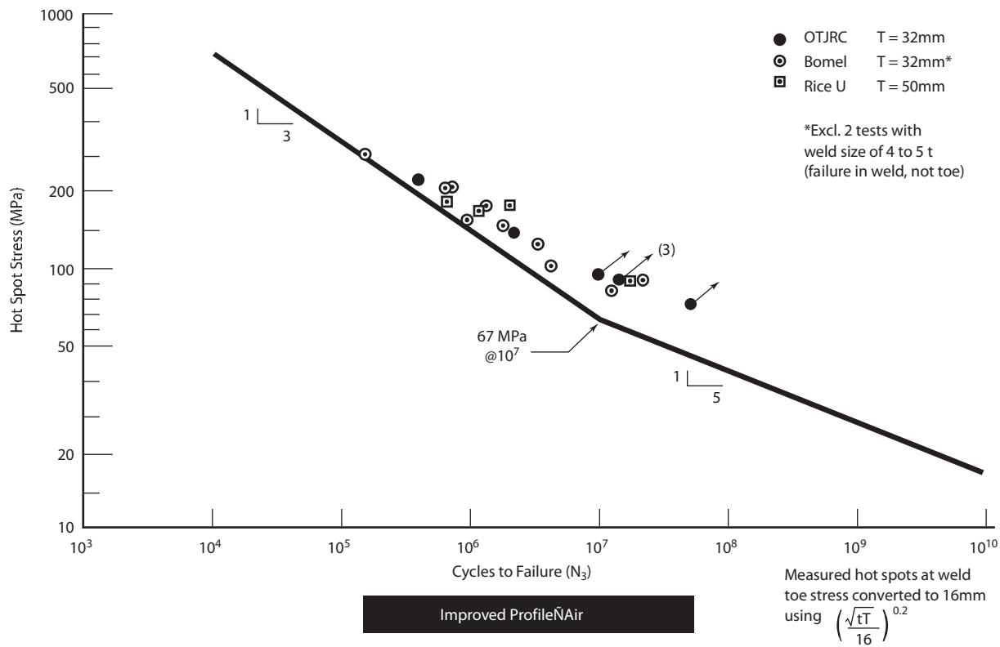  
Figure C5.5.1-1—Basic Air S-N Curve as Applicable to Profiled Welds, Including Size and Toe Correction to the Data

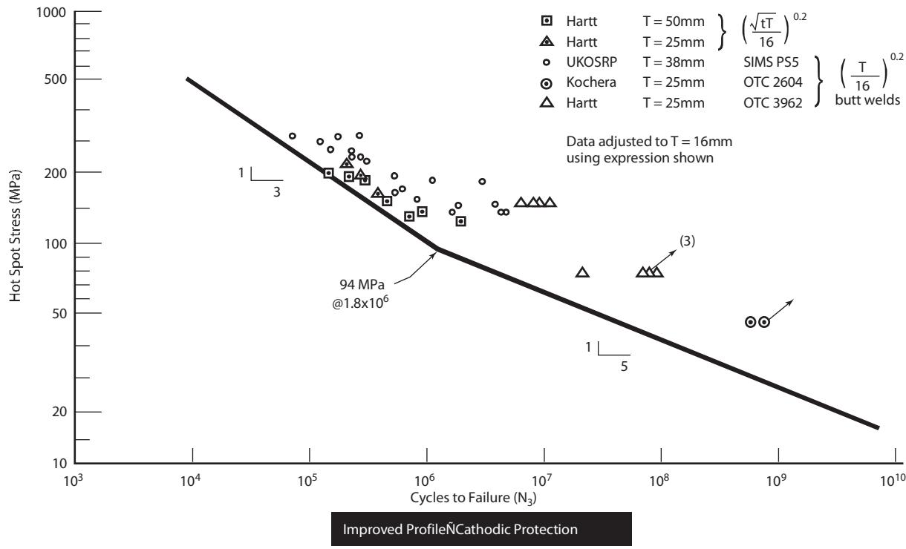  
Figure C5.5.1-2—S-N Curve and Data for Seawater with CP

(b) Non-profiled joints. The unmodified "WJ" base curve replaces former API curve X'. It corresponds most closely to the proposed ISO CD 19902 base case, whose background for hotspot stress in simple tubular joints has already been described. For joint cans with $T = 40 \mathrm{~mm}$ , it corresponds closely to criteria derived by the API Offshore Tubular Joint Technical Committee, although OTJTC curve "Y" would have been more conservative in the high cycle range, and for heavier thicknesses.

No guidance is given in Section 5 for the application of the hotspot method to more complex geometries, e.g., as used in the design of tower-type fixed platforms, semisubmersibles, and other marine structures (ref. 27). Niemi and others (Refs. 62 and 63) have investigated various protocols for the defining the SCF. Niemi's "structural hotspot stress" is consistent with what Efthymiou used for simple joints. Compatible hotspot design curves for ship details have been promulgated by DNV and ABS (Ref. 64).

Reference 65 describes Battelle's patented "New Structural Stress" definition and associated master S-N curve. Similar to Ref. 66, line load tractions and shell bending moments at the welded intersection are extracted, e.g. from nodal forces in a thin shell, and converted to a linear combination of membrane and shell bending stress normal to the weld. A JIP is in progress (2003) to sort out all the special cases and verify the robustness of the approach.

DNV's parallel competing JIP, "FPSO Fatigue Capacity" (Ref. 72), takes an alternative approach to a similar problem, based on fatigue testing of a wide variety of ship-type structural details, for a range of FEM analysis protocols.

Use of these new methods in the future is to be encouraged.

C5.5.2 Thickness Effect

Assessments by HSE (Ref. 35) and EWI (Ref. 36) of a wide range of data for various combinations of loading have shown that the fatigue performance is dependent on member thickness, the performance decreasing with increasing thickness for the same stress range when using the hot spot S-N approach. This apparent size effect virtually disappears (i.e., is captured by the methodology) when fatigue analysis is conducted on a notch stress or fracture mechanics basis.

The ISO base case design curve is based on a material thickness of $16\mathrm{mm}$ . An exponent, which depends on weld class is specified in these API provisions.

ISO 14347, Fatigue design procedures for welded hollow section joints, should become an approved international standard in 2004, with ballot comments in the DIS having been already resolved in IIW s/c XV-E. The scope covers circular tubes up to $50~\mathrm{mm}$ thick. The size effect exponent varies from 0.2 at 2000 cycles to 0.4 at about $10^{7}$ cycles, yielding a family of S-N curves which fan out in the high cycle region.

Although the ISO 19902 proposal has a constant size effect exponent of 0.25 for welded connections, which has been in DoE and AWS design codes since the early 1980s, the supporting data can also be used to make a case for a variable exponent. Fracture mechanics predicts a size effect exponent of 0.167 for $m = 3$ , and 0.30 for $m = 5$ .

MaTSU (Ref. 68) review thickness effect in profiled welded joints, and found a size effect exponent of 0.44 for welds with "poor" profiles in 28 tubular joints ranging from 16 to $76\mathrm{mm}$ thick. This report also vetted the Bomel report described below.

BOMEL (Ref. 69) looked at data from 45 tubular joint tests, $16 - 76\mathrm{mm}$ thick, with "satisfactory" weld profiles, and found a size effect exponent of 0.22, i.e., a less severe penalty. Since measured hot spot stresses were used in the database, this benefit is in addition to that of extending the weld toe.

Criteria for "poor" versus "satisfactory" profiles were judged to be subjective. Bomel were aware of the modified disk test in AWS D1.1-94 (radius $= 0.5t$ ), but for practical reasons most of the screening was done visually. Some of the "satisfactory" welds were flat and ugly, but they were grossly over-welded and passed the disc test at the chord hotspot. Some of the "poor" welds did not even meet AWS basic requirements. If all the data are combined, ignoring any influence of weld profile, a size effect exponent of 0.30 is obtained.

EWI derived a thickness exponent of 0.29 for basic flat welds. However, Mohr makes a case that comparison of worst case bounds yields slightly lower size effect exponents than the mean trend comparisons cited above.

The S.A.E Fatigue Design Handbook uses a local stress approach, based on stresses averaged over $6\mathrm{mm}$ straddling the weld toe. This picks up both notch effects and the geometric size effect, as the gage length for larger specimens will be deeper into the notch. To account for the statistical size effect (larger specimens having a greater chance of flaws at a given defect rate), fatigue strength is reduced by the 0.034 power of highly stressed volume, corresponding to a size effect exponent of 0.10. The same size effect should in principle be applicable to cast nodes, which also use local stress as their design basis.

Following the above discussion, a progression of size effect exponents is given in 5.5.2, for various weld classes. Basic flat welds get a round down of the exponent to 0.25. Concave as-weld profiling as per AWS Figure C2.7 gets a round-down of the exponent from 0.20. Toe grinding at constant radius retains a small geometric size effect, as it does not follow geometric similarity; however, OTJTC recommended an exponent of 0.15 for this case.

The $\tau^{-0.1}$ improvement factor for joints with profiled welds, when considering fatigue in the joint can （$T)$ , is actually a size effect compromise between existing API (using branch thickness $t$ to represent the size of the notch, as indi

cated to be more relevant for both notch stress theory and early stage crack growth in fracture mechanics) and ISO (using $T$ as relevant to the later stages of crack growth). Improved joints spend most of their fatigue life in initiation and early stage crack growth, whereas these stages are much shorter for sharply notched weld toes. This compromise is also similar to the modified size effect proposed by Vosikovsky (Ref. 32) and previously endorsed by OTJRC (Ref. 36), in which an exponent of 0.13 on the thickness ratio $\tau = t / T$ reduces to a size effect expression given by:

$$\tau^{0. 13} (T / t_{r e f})^{0. 25} = t^{0. 13} T^{0. 12} / t_{r e f}^{0. 25} \mathrm{o r} (\sqrt [ 6 ]{(T t) / t_{r e f}})^{0. 25}$$

The cast node design curve is based on a material thickness of $38~\mathrm{mm}$ . Fracture mechanics predictions (Ref. 41) show that the thickness effect in castings is smaller than that in welded joints, and an exponent of 0.15 is specified.

C5.5.3 Weld Improvement Techniques

Post-weld fatigue improvement techniques may be used to improve fatigue life. These techniques, discussed below, improve fatigue life by improving the local geometry at the weld toe, reducing the stress concentrations and/or by modifying the residual stresses. The designer should be wary when applying weld improvement techniques, especially a powerful one like peening. If later cracking occurs, it should not be expected to initiate at the treated location. However, if cracking does initiate at a treated weld toe, the life associated with subsequent propagation is likely to be proportionally shorter (in comparison to life-to-date) than is normal for untreated details.

It is anticipated that the hot spot stress ranges to be used for an assessment of the improved life would be obtained from equivalent joints, including standard welds, before the improvement technique is applied, from FE analysis or from SCF equations. Here, correction for actual weld toe position per C5.3.2(a) is appropriate. However, hotspot stresses obtained from measurements on or modeling of improved joints already include this effect.

Except as noted below, multiple improvement factors should not be considered for a single joint location. If more than one technique is applied, only the one giving the highest improvement factor should be considered.

Adequate quality control (QC) procedures have to be applied if the appropriate improvement factor is to be attained. Specific requirements for the various techniques are noted or referenced below.

(a) Weld Profiling. Investigations of the influence of weld profile on the fatigue strength of tubular joints have been limited and the effect of weld profile on fatigue life is unclear.

The ISO basic tubular joint S-N curve has been derived from an analysis of data on tubular joints manufactured using welds conforming to a standard flat profile given in AWS (Ref. 1). Therefore, their fatigue recommendations apply to joints, which conform to this AWS standard flat profile.

A 1987 study reported in Ref. 42 indicates that profiling does not improve the fatigue lives when measured in terms of the experimental hot spot stress range. However, the Reference notes that the weld leg length is generally larger in profiled joints, resulting in the weld toe moving into a region of lower stress and hence an increase in the fatigue load carrying capacity of the joint. On the other hand, References 18, 31, 32, 33, 43, 69 and 71 indicate that weld profile is a significant factor.

Booth's more recent review (Ref. 44) reiterates that, apart from the potential beneficial effect of increase in weld leg length, control of overall weld shape and weld surface finish for improved profile has limited influence on fatigue strength. Booth (WI) and ISO 14347 recommend that correction factors for the increased weld leg length may be derived and applied to parametric SCF equations, thus enabling the improvement of fatigue performance to be exploited in design. Where invariant SCF were used in design and analysis, previous editions of API RP 2A-WSD accounted for this improvement by using a higher S-N curve. The new API provisions do both, as indicated by References 31 and 69.

Thus, for fully concave improved profiles, conforming to AWS D1.1 Section 2.20.6.6 and Figure 3.10, the new API provisions consider:

(i) a less onerous size effect exponent (0.20 vs. 0.25),   
(ii) a modest improvement factor of $\tau^{-0.1}$ on stress, and   
(iii) consideration of actual weld toe position.

For $t = T = 16 \mathrm{~mm}$ , there is no improvement for (i) and (ii). For the reference geometry of $t = 16 \mathrm{~mm}$ and $T = 40 \mathrm{~mm}$ , and no over-welding, the foregoing amounts to an improvement factor of 1.15 on stress. A constant improvement factor of 2 on life (1.25 on stress for $m = 3$ ) would overstate the low cycle benefit of profiling, compared to calibrations by both OTJTC and HSE.

For weld profiles which are only partially improved, by the addition of a toe fillet as shown in AWS D1.1 Figure 3.9, but without the disc test and MT, only (ii) and (iii) above should be considered as-welded. However, for burr grinding or hammer peening at the weld toe, the appropriate additional improvement factors may be considered, together with a size effect exponent of 0.15.

Improvements through any form of profiling may be justified using information from either a test program for tubular joints for the condition being considered, or from fracture

mechanics predictions (Refs. 70 and 71). However, fracture mechanics still requires input on the localized weld toe notch effects, as well as the geometric hot spot stress, and with that in hand one can simply use the modified S-N approach.

(b) Weld Toe Grinding. For welded joints in air and for joints in seawater with cathodic protection, the fatigue life can be increased by controlled local machining or burr grinding to produce a smooth concave profile at the weld toe. This is especially beneficial at low stress ranges. Experimental data indicate that this technique can lead to an increase in the fatigue life by a factor of approximately 2. It should be noted that the beneficial effect of weld toe grinding can be reduced by pitting due to free corrosion, though it tends to be preserved by cathodic protection (Refs. 35 and 36). Since corrosion pitting tends to defeat the advantages of grinding, ground surfaces should be protected prior to being placed in permanent service, e.g., with a temporary coating.

A limited number of tests have demonstrated the importance of quality control. The grinding procedure should ensure that all defects in the weld toe region have been removed by grinding to a depth not less than $0.5\mathrm{mm}$ below the bottom of any visible undercut or defect. The maximum depth of local grinding should not exceed $2\mathrm{mm}$ or $5\%$ of the plate thickness, whichever is less. NDE of the joint is required after grinding to verify that no significant defects remain and, for fillet-welded connections, it is important that the required throat size is maintained. Further QC aspects apply, and recourse should be made to Ref. 35. Disk grinding at the weld toe is hard to control, and not the preferred method.

c) Full Profile Grinding, e.g., Butt Welds. For butt-welded joints, additional benefit can be gained by flush grinding of the weld cap. The effect of this is to improve the classification category. For welded tubular nodes, full grinding of the surface profile to a radius of not less than $0.5t$ qualifies for both the life improvement factor of 2 on curve WJ, and the 0.15 size effect exponent applicable to geometrically similar notch-free scale-ups.

(d) Hammer Peening. By hammer peening the toes of welded connections, surface defects can be eliminated or blunted, the transition between the parent and weld materials is smoothed out, and beneficial compressive residual stresses are induced at the surface, all of which contribute to the enhancement of the fatigue performance of the treated weld. The net effect is to delay crack development and retard or eliminate growth of cracks already present.

The objective in hammer peening is to obtain a smooth groove at the weld toe. The grooved depth should be at least $0.3\mathrm{mm}$ , but need not exceed $0.5\mathrm{mm}$ (Refs. 45 and 46). The equipment and procedure required to attain this groove configuration should be established via trials on detail mock

ups. Note that the number of passes required is determined by the equipment and procedure; there is no set number. Heavy-duty pneumatic hammers are preferred. The bit tip radius should be about $3\mathrm{mm}$ , so as to expedite the process and facilitate treatment right at the weld toe. Extensive use of peening has ergonomic implications. Consideration should be given to limiting the consecutive hours spent by one individual and use of vibration dampening gloves. Peening can result in metal "rollovers" along the sides of the groove. These are innocuous relative to fatigue performance, but can easily be removed with light burr grinding. Removal eliminates difficulty with interpretation of later inspection findings. Peened weld toes should be inspected directly after peening and any burr grinding with MPI.

The recommended fatigue life improvement factor is 4. This value is significantly less than that found in many test programs, and varies with stress range magnitude and other variables. The reduced value takes into account uncertainties in (a) mean stress, (b) dominant stress range magnitude, and (c) the effects of overloads. The life improvement factor may be applied to both tubular and non-tubular weld details.

The benefits of hammer peening in fatigue life can only be realized through adoption of adequate QC procedures. Refs. 45 and 46 contain the state-of-the-art practice in this field, and should be consulted in the preparation of adequate QC procedures prior to taking benefit for fatigue life enhancement.

(e) Post-Weld Heat Treatment. As-welded joints contain significant tensile residual stresses induced by the welding process, which can combine with the operating stresses to promote fatigue failure. This is due to the enhancement of the effective mean stress and, for situations where the stress range consists of a compressive component, the effective stress range. It follows that the reduction of tensile residual stresses can increase the fatigue life.

A comparison of the fatigue behavior of as-welded and post weld heat treatment joints has confirmed that post weld heat treatment (PWHT) can have a beneficial effect on the fatigue behavior of welded joints. However, the effect of PWHT diminishes with the increasing $R$ -ratio and is negligible at $R > 0$ . Thus, the fatigue performance of post-weld heat-treated and as-welded joints at $R$ -ratios greater than zero are very similar and the same S-N curves apply.

A significant drawback in the allowance for PWHT in fatigue design is that knowledge of the mean stress is still not well known. The mean stress contribution from applied loading is not difficult to establish, but the remaining built-in stresses from welding and far-field fit-up cannot be easily bounded.

Nevertheless, pre-fabricated welded nodes with fully ground profiles and PWHT may be treated as the equivalent of cast nodes with weld repair, provided the local stress intensification of the fillet radius is accounted for in design.

C5.5.4 Cast Nodes

The S-N curve for cast nodes has been derived from tests in air on large scale cast nodes with thicknesses in the range $18\mathrm{mm}$ to $40\mathrm{mm}$ , tested principally at $R = -1$ , and cruciform specimens with thicknesses in the range $38\mathrm{mm}$ to $125\mathrm{mm}$ tested at $R = 0$ . Similar mean curves are obtained from the two sets of data using an inverse slope of 4. Since cast joints are stress relieved, the R ratio has an influence on the fatigue behavior. The S-N curve for the test data may therefore overestimate the fatigue performance of cast nodes tested at $R > -1$ . Hence, allowance has been made for the influence of mean stresses by applying a $20\%$ reduction to the maximum experimental stress range used to determine the cast node S-N curve.

There is insufficient experimental evidence to support a change in slope, the highest experimental endurance being $5 \times 10^{6}$ cycles. However, the approach of using a constant slope of $m = 4$ to $N = 10^{7}$ and then $m = 5$ thereafter is recommended.

Fracture mechanics analysis shows that casting defects can have a significant effect on the fatigue life and the design curve corresponds to four standard deviations below the mean curve to allow for the possibility of undetected defects. The curve is applicable to castings that satisfy defect acceptance criteria compatible with current offshore practice. See Ref. 35 for further information.

In order to determine whether weld repairs could be detrimental to the fatigue performance of cast joints, fatigue tests on cruciform specimens in both air and seawater were undertaken (Ref. 40). These tests show that provided weld repaired surfaces are ground flush to the as-cast profile and are free from weld toe defects, the cast node S-N curve can be used for cast joints having weld repairs with PWHT.

The fatigue assessment of cast nodes requires a finite element analysis to be performed to determine the location of the maximum local stress range in the casting. Also, consideration should be given to the fact that for cast tubular nodal connections the brace to casting circumferential butt weld may be the most critical location.

C5.6 FRACTURE MECHANICS

The benefits of using defect assessment procedures (e.g., Refs. 57 and 58), for the fitness-for-purpose assessment of offshore structures are widely recognized and defect assessment is being used increasingly in design, fabrication and during in-service inspection. However, established procedures are based on general principles. Their application to tubular joints is complex due to the joint geometry and loading, but may be facilitated by the use of geometric or structural hot spot stress as the reference action (Refs. 31, 65, 70, 71). For further discussion, see proposed ISO 19902 clause A16.15 in Ref. 34.

C5.7 REFERENCES

1. American Welding Society, Structural Welding Code, AWS D1.1 (1st ed. 1972 - 18th ed. 2002).   
2. Marshall, P. W., and Toprac, A. A., "Basis for Tubular Joint Design," Welding Journal, Research Supplement, May 1974.   
3. R. J. Roark, Formulas for Stress and Strain, McGraw-Hill, 1954.   
4. Borgman, L. E., et al., "Storm Wave Kinematics," OTC 3227, Offshore Technology Conference Proceedings, May 1978.   
5. Cardone, V. J., and Pierson, W. J., "Hindcasting the Directional Spectra of Hurricane Waves," arc 2332, Offshore Technology Conference Proceedings, May 1975.   
6. Hartt, W.H. et al, "Evaluation of spectrum fatigue data under conditions applicable to welded steel in offshore structures," OTC 4773, Proc. Offshore Tech. Conf., Houston 1988.   
7. Kinra, R. K., and Marshall, P. W., "Fatigue Analysis of the Cognac Platform," SPE 8600, J. Petroleum Technology, March 1980.   
8. Marshall, P. W., "Basic Considerations for Tubular Joint Design in Offshore Construction," WRC Bulletin 193, April 1974.   
9. Hartt, W. H., et al., "Influence of Sea Water and Cathodic Protection upon Fatigue of Welded Plates, as Applicable to Offshore Structures," Final Report, First Two-Year Research Effort, API PRAC Project 12, March 1980 (also see OTC 3962).   
10. Reimer, R.B. et al., "Improved Finite Elements for Analysis of Welded Tubular Joints," OTC 2642, Proc. Offshore Tech. Conf. 1976.   
11. Marshall, P.W., "Failure Modes for Offshore Platforms - Fatigue," Proc. BOSS-76, Vol. II, Trondheim.   
12. Marshall, P.W., "Cost-Risk Trade-Offs in Design, Monitoring, Inspection, Repair, Verification and Fracture Control for Offshore Platforms," Proc. Int'l Ship Structures Congress, Paris, 1979.   
13. deBack, J., et al., "Fatigue Behavior of Welded joints in Air and Seawater," in (14).   
14. European Offshore Steels Research Seminar, The Welding Institute, Cambridge, UK, Nov. 1978.   
15. Wordsworth, A.C., "Stress Concentration Factors at K and KT Tubular Joints," Paper 7, Fatigue in Offshore Structural Steel, Institute of Civil Engineers, London, 1981.   
16. International Conference: Steel in Marine Structures, ECSC, Paris Oct. 1981.

17. Nordhoek & deBack (eds), *Steel in Marine Structures*, Proc. SIMS-87, Delft, Elsevier 1987   
18. Marshall, P.W., “Welding of Tubular Structures,” IIW Houdremont Lecture, Boston, 1984.   
19. Hartt, W.H. et al., "Fatigue properties of exemplary high strength steels in seawater," OTC 5663, Proc. Offshore Tech. Conf., Houston, 1988.   
20. Marshall, P. W., and Luyties, W. H., “Allowable Stresses for Fatigue Design,” Proc. BOSS-82 Conference held at Massachusetts Institute of Technology, Cambridge, Mass., August 2-5, 1982.   
21. Sarpkaya, T., and Isaacson, M., "Mechanics of Wave Forces on Offshore Structures," Van Nostrand Reinhold Co., 1981.   
22. Ochi, M. K., and Hubble, E. H., "Six Parameter Wave Spectra," Proceedings of 15th Coastal Engineering Conference, Honolulu, 1976, Vol. I, pp. 301 to 328.   
23. Kan, D. K. Y., and Petrauskas, C., "Hybrid Time-Frequency Domain Fatigue Analysis for Deepwater Platforms," OTC 3965, Offshore Technology Conference Proceedings, May 1981.   
24. Vugts, J. H., "Modal Superposition Direct Solution Techniques in the Dynamic Analysis of Offshore Structures," Proc. Int'l Conference on the Behavior of Offshore Structures, Boston, 1982.   
25. Wirsching, P. H., "Probability Based Fatigue Design Criteria for Offshore Structures," Final Report API PRAC Project 81-15, Jan. 1983.   
26. Buitrago, 1., Zettlemoyer, N., and Kahlich, J., "Combined Hot-Spot Stress Procedures for Tubular Joints," OTC 4775, Offshore Technology Conference Proceedings, May 1984.   
27. Marshall, P.W., "Design of Internally Stiffened Tubular Joints," Safety Criteria in Design of Tubular Structures, Tokyo, 1987; also pp. 257-273 in (28).   
28. Marshall, P.W., Design of Welded Tubular Connections: Basis and Use of AWS Code Provisions, Elsevier, 1992.   
29. Luyties, W. H., and Geyer, J.F., "The Development of Allowable Fatigue Stresses in API RP 2A," OTC 5555, Offshore Technology Conference Proceedings, May 1987.   
30. Kuang, J. G., Potvin, A B., Leick, R. D., and Kahlich, J. L., "Stress Concentration in Tubular Joints," Journal of Society of Petroleum Engineers, Aug., 1977.   
31. Marshall, P. W., "Recent Developments in Fatigue Design Rules in the U.S.A," Fatigue Aspects in Structural Design, Delft University Press, 1989.   
32. Vosikovsky, O., and Bell, R., "Attachment Thickness and Weld Profile Effects on the Fatigue Life of Welded Joints," Proc. 1991, OMAE, Stavangar, 1991.

33. Hart, W. H., and Sablok, A, "Weld Profile and Plate Thickness Effects as Applicable to Offshore Structures," final report, API project 87-24,1992.   
34. International Organization for Standardization, Petroleum and Natural Gas Industries - Offshore Structures - Part 2: Fixed Steel Structures, ISO/CD 19902 (Draft E), June 2001.   
35. Health & Safety Executive, Fatigue Background Guidance Document, HMSO, Report OTH 92 390.   
36. Edison Welding Institute, S-N Curves for Welded Tubular Joints, Final Report, EWI Project J7267, January 1995.   
37. King, R, Recommended S-N Curves for Tubular Joints in Air and Seawater; Fracture Control Limited, Doc Ref 6083/01 Rev 0, February 1997.   
38. King, R. et al, High strength steels for jack-up drilling rigs, the effect of seawater and cathodic protection, Proceedings of 11 the International Conference on Offshore Mechanics and Arctic Engineering, Calgary, June 1992.   
39. Smith, AT. et al, Corrosion fatigue of API 5L X85 Grade Welded Tubular Joints with Applied Cathodic Protection of -LOOOMV, Fatigue Crack Growth in Offshore Structures, Engineering Materials Advisory Services (EMAS) Limited, Solihull, UK..   
40. Ma, A and Sharp, J.V., Fatigue Design of Cast Steel Nodes in Offshore Structures Based on Research Data, Proceedings ICE, 1997, 124, June 112-126, paper 11324.   
41. Earl and Wright Consultancy Engineers, Fatigue Life Assessment of Castings using Fracture Mechanics, HMSO, Report No. OTH 91300.   
42. de Beck, 1., The Design Aspects and Fatigue Behavior of Welded Joints, Steel in Marine Structures, Proc., 3rd Int'1 Conf SIMS 87, Delft, 1987.   
43. Marshall, P.W., API Provisions for SCF, S-N and Size/ Profile Effects, OTC 7155, Proc. Offshore Tech. Conf., Houston 1993   
44. Maddox, S.1. et al, *Significance of Weld Profile on the Fatigue Lives of Tubular Joints*, Proceedings of the Offshore Mechanics and Arctic Engineering, Conference (OMAE), Copenhagen, 1995.   
45. Buitrago, J. and Zettlemoyer, N., Fatigue of welded joints peened underwater, Proceedings of Offshore Mechanics and Arctic Engineering, Materials Engineering Volume, Yokohama, Japan, 1997.   
46. Buitrago, J. and Zettlemoyer, N., Quality Control of underwater peening, Proceedings of the Offshore Mechanics and Arctic Engineering Conference (OMAE), Materials Engineering Volume, Yokohama, Japan, 1997.   
47. Healy RE. and Buitrago J., Extrapolation procedures for determining SCFs in mid-surface tubular joint models, 6th International Symposium on Tubular Structures, Monash University, Melbourne, Australia, 1994.

48. Efthymiou, M., Development of SCF formulae and generalized influence functions for use in fatigue analysis, Recent Developments in Tubular Joint Technology, OTJ'88, October 1988, London, plus updates.   
49. Lloyd's Register of Shipping, Stress Concentration Factors for Tubular Complex Joints, Complex Joints JIP. Final Report No.3 of 5 of Simple Unstiffened Joint SCFs, March 1988.   
50. Smedley, P. A. and Fisher, P., Stress Concentration Factors For Simple Tubular Joints, Offshore and Polar Engineering Conf., ISOPE-1, Edinburgh, 1991.   
51. Edison Welding Institute, Stress Concentration Factors for Tubular Connections, EWI Project No. J7266, March 1995.   
52. van Wingerde, AM., et al, Proposed Revisions for Fatigue Design of Planar Welded Connections Made of Hollow Structural Sections, pp 663-672, Tubular Structures V, Nottingham UK, August 1993.   
53. Gibstein, M. et al, Refined Fatigue Analysis Approach and its Application to the Veslefrikk Jacket, Third Int'l. Symposium on Tubular Structures, ISTS-3, Finland, 1990.   
54. Baerheim, M., Stress Concentrations in Tubular Joints Welded from one Side, ISOPE paper No 96-JSC-285, Los Angeles, May 1996.   
55. MSL Engineering Limited, Fatigue Life Implications for Design and Inspection for Single-Sided Welds of Tubular Joints, HSE Offshore Technology Report OTO 1999 022, June 1999.   
56. Smedley, P.A and Fisher, P.J., Stress concentration factors for ring stiffened tubular joints, Fourth International symposium on tubular structures, Delft, 1991.   
57. American Petroleum Institute, API RP 579: Fitness-for-Service, 1st Edition, January 2000.   
58. British Standards Institute, BS 7910 – Guide on Methods for Assessing the Acceptability of Flaws in Fusion Welded Structures, 1999 (replaces PD 6493, 1991)   
59. MSL Engineering Limited, The Effects of Local Joint Flexibility on the Reliability of Fatigue Life Estimates and Inspection Planning, HSE Offshore Technology Report OTO 2001 056.   
60. MSL Services Corporation, Rationalization and Optimization of Underwater Inspection Planning Consistent with API RP 2A-WSD Section 14, JIP Final Report Doc. Ref. CHI04RO06 November 2000.   
61. Vugts, J. (ed.), Structural system reliability considerations in fatigue inspection planning, plus 3 other papers in fatigue session, Proc. BOSS-97, Delft, 1997.

62. Niemi, E. et al., Stress Determination for Fatigue Analysis of Welded Components, IIW-1221-93, Abington Publishing, Cambridge (UK), 1995.   
63. Hobbacher, A., Fatigue Design of Welded Joints and Components: Recommendations of Joint Working Group XIII-XV, Abington Publishing, Cambridge (UK), 1996.   
64. Fricke, W. et al., Fatigue and Fracture: Report of Comm. III.2, Proc 13th Int'1 Ship & Offshore Structures Congress, Stavangar, 1997.   
65. Dong, P. et al, Master S-N Curve Approach for Fatigue Evaluation of Welded Components, WRC Bulletin 474, August 2002.   
66. FEWeld: weld calculations for FEA, software brochure, Weaver Engineering, Seattle, 2000.   
67. ISO DIS 14347, Fatigue design procedure for welded hollow section joints - Recommendations, approved by international ballot October 2002.   
68. MaTSU (V. Trembath), Review of thickness effect in profiled welded joints, MaTR 0238, June 1995.   
69. Bomel (H. Bolt et al), Design and Reassessment of Tubular Joints for Offshore Structures, Chapter 5: Fatigue life assessment, S-N approach, BOMEL report C6060R09.07 Rev A, February 1995.   
70. Hayes, D.J., Fracture mechanics based fatigue assessment of tubular joints - Review of potential applications, Aptech final report AES-81-01-45, Palo Alto, June 1981.   
71. Grover, J.L., Fracture mechanics based fatigue assessment of tubular joints - Development of analysis tools, Aptech final report AES-8211354-5, Palo Alto, December 1984.   
72. DNV RP C-203, Fatigue Strength Analysis of Offshore Steel Structures, Det Norske Veritas, Oct. 2001.   
73. John Fisher et al, Fatigue and Fracture, Chapter 24 in Chen, Handbook of Structural Engineering, CRC Press, 1997..   
74. R. Holmes et al, Fatigue and corrosion fatigue of welded joints under narrow band random loading, paper no. 7.2, International Conference on Steel in Marine Structures, SIMS-81, Paris, Oct. 1981.   
75. Smedley, P.A., Advanced SCF formulae for simple and multi-planar tubular joints, Proc. 10th Int'l Symposium on Tubular Structures, Madrid, Sept. 2003.   
76. Marshall P. W., Bucknell, J, Mohr W.C, Background to New RP 2A-WSD Fatigue Provision, OTC 17295, Proc. Offshore Tech. Conf., Houston, May 2005.

COMMENTARY ON AXIAL PILE CAPACITY IN CLAY, SECTION 6.4

Note: Cometary on Axial Pile Capacity in Clay has been revised and renumbered as C6.4.2a through C6.4.2e (with references following).

C6.4.2a Load Test Database for Piles in Clay

A number of studies $^{1,2,3,4,5,6}$ have been carried out, aimed at collecting and comparing axial capacities from relevant pile load tests to those predicted by traditional offshore pile design procedures. Studies such as these can be very useful in tempering one's judgement in the design process. It is clear, for example, that there is considerable scatter in the various plots of measured versus predicted capacities. The designer should be aware of the many limitations of such comparisons when making use of these results. Limitations of particular importance include the following:

1. There is considerable uncertainty in the determination of both predicted capacities and measured capacities. For example, determination of the predicted capacities is very sensitive to the selection of the undrained shear strength profile, which itself is subject to considerable uncertainty. The measured capacities are also subject to interpretation as well as possible measurement errors.   
2. The conditions under which the pile load tests are conducted generally vary significantly from the design loads and field conditions. One clear limitation is the limited number of tests on deeply embedded, large diameter, high capacity piles. Generally, pile load tests have capacities that are $10\%$ or less of the prototype capacities. Another factor is that the rate of loading and the cyclic load history are usually not well represented in the load tests[7,8]. For practical reasons, the pile load tests are often conducted before full set-up occurs[9]. Furthermore, the pile tip conditions (closed versus open-ended) may differ from offshore piles.   
3. In most of the studies an attempt has been made to eliminate those tests that are thought to be significantly affected by extraneous conditions in the load test, such as protrusions on the exterior of the pile shaft (weld beads, cover plates, etc.), installation effects (jetting, drilled out plugs, etc.), and artesian conditions, but it is not possible to be absolutely certain in all cases.

The database includes a number of tests that were specially designed for offshore applications as well as a number of published tests that are fortuitously relevant to offshore conditions (appropriate pile type, installation method, soil conditions, etc.). The former are generally higher quality and larger scale, and hence are particularly important in calibrating the design method. The tests most relevant to offshore applications have all been conducted in the United States or in Europe. As regional geology and particularly operating experience are considered very important in foundation design, care should be exercised in applying these results to other

regions of the world. In addition, the designer should note that certain important tests in silty clays of low plasticity, such as at the Pentre site9 indicate overprediction of frictional resistance by the Equations (6.4.2-1) and (6.4.2-2). The reason for this overprediction is not well understood and has been an area of active research. The designer is thus cautioned that pile design for soils of this type should be given special consideration.

Additional considerations that apply to drilled and grouted piles are discussed in References 10 and 11.

C6.4.2b Alternative Methods of Determining Pile Capacity

Alternative methods of determining pile capacity in clays, which are based on sound engineering principles and are consistent with industry experience, exist and may be used in practice. One such method is described below:

For piles driven through clay, $f$ may be equal to or less than, but should not exceed the undrained shear strength of the clay $c_{u}$ , as determined by unconsolidated-undrained (UU) triaxial tests and miniature vane shear tests.

Unless test data indicate otherwise, $f$ should not exceed $cu$ or the following limits:

1. For highly plastic clays, $f$ may be equal to cu for underconsolidated and normally consolidated clays. For overconsolidated clays, $f$ should not exceed 1 kips/ft² (48 kPa) for shallow penetrations or the equivalent value of cu for a normally consolidated clay for deeper penetrations, whichever is greater.   
2. For other types of clay:

$$f = c_{u} \quad \text{f o r} c_{u} <   0. 5 \mathrm{k i p s / f t^{2}} (24 \mathrm{k P a})$$

$$f = c_{u} / 2 \quad \text{f o r} c_{u} > 1. 5 \mathrm{k i p s} / \mathrm{f t}^{2} (72 \mathrm{k P a})$$

$f$ varies linearly for values of cu between the above limits.

For other methods, see References 1, 2, 3 and 5.

It has been shown $^{6}$ that, on the average, the above cited methods predict the available but limited pile load test database results with comparable accuracy. However, capacities for specific situations computed by different methods can differ by a significant amount. In such cases, pile capacity determination should be based on engineering judgement, which takes into account site-specific soils information, available pile load test data, and industry experience in similar soils.

C6.4.2c Establishing Design Strength and Effective Overburden Stress Profiles

The axial pile capacity in clay determined by these procedures is directly influenced by the undrained shear strength and effective overburden stress profiles selected for use in analyses. The wide variety of sampling techniques and the

potentially large scatter in the strength data from the various types of laboratory tests complicate appropriate selection.

UU triaxial compression tests on high quality samples, preferably taken by pushing a thin-walled sampler with a diameter of 3 in. (75 mm) or more into the soil, are recommended for establishing strength profile variations because of their consistency and repeatability. In selecting the specific shear strength values for design, however, consideration should be given to the sampling and testing techniques used to correlate the procedure to any available relevant pile load test data. The experience with pile performance is another consideration that can play an important role in assessing the appropriate shear strength interpretation.

Miniature vane tests on the pushed samples should correlate well with the UU test results and will be particularly beneficial in weak clays. In-situ testing with a vane or cone penetrometer will help in assessing sampling disturbance effects in gassy or highly structured soils. Approaches such as the SHANSEP technique (Stress History and Normalized Soil Engineering Properties) $^{12}$ , can help provide a more consistent interpretation of standard laboratory tests and will provide history information used to determine the effective overburden stress in normally or underconsolidated clays.

C6.4.2d Pile length effect

Long piles driven in clay soils can experience capacity degradation due to the following factors:

1. Continued shearing of a particular soil horizon during pile installation.   
2. Lateral movement of soil away from the pile due to "pile whip" during driving.   
3. Progressive failure in the soil due to strength reduction with continued displacement (softening).

The occurrence of degradation due to these effects depends on many factors related to both installation conditions and soil behavior. Methods of estimating the possible magnitude of reduction in capacity of long piles can be found in References 2, 3, 5, 13, 14 and 15.

C6.4.2e Changes in Axial Capacity in Clay with Time

Existing axial pile capacity calculation procedures for piles in clay are based on experience tempered by the results of axial pile load tests. In these tests, few of the piles were instrumented and in most cases little or no consideration was given to the effects of time after driving on the development of shear transfer in the soil. Axial capacity of a driven pipe pile in clay computed according to the guidelines set forth in Sections 6.4.1 and 6.4.2 is intended to represent the long-term static capacity of piles in undrained conditions when subjected to axial loads until failure, after dissipation of excess pore water pressure caused by the installation process. Immediately after pile driving, pile capacity in a cohesive deposit

can be significantly lower than the ultimate static capacity. Field measurements $^{9,16,17}$ have shown that the time required for driven piles to reach ultimate capacity in a cohesive deposit can be relatively long, as much as two to three years. However, it should be noted that the rate of strength gain is highest immediately after driving, and this rate decreases during the dissipation process. Thus a significant strength increase can occur in a relatively short time.

During pile driving in normally to lightly overconsolidated clays, the soil surrounding a pile is significantly disturbed, the stress state is altered, and large excess pore pressures can be generated. After installation, these excess pore pressures begin to dissipate, i.e. the surrounding soil mass begins to consolidate and the pile capacity increases with time. This process is usually referred to as "set-up." The rate of excess pore pressure dissipation is a function of the coefficient of radial (horizontal) consolidation, pile radius, plug characteristics (plugged versus unplugged pile), and soil layering.

In the case of driven pipe piles supporting a structure where the design loads can be applied to the piles shortly after installation, the time-consolidation characteristics should be considered in pile design. In such cases, the capacity of piles immediately after driving and the expected increase in capacity with time are important design variables that can impact the safety of the foundation system during early stages of the consolidation process.

A number of investigators $^{18,19}$ have proposed analytical models of pore pressure generation and the subsequent dissipation process for piles in normally consolidated to lightly overconsolidated clays. Since excess pore pressures are generated by pile driving operations, any dissipation of the excess pore pressures after installation should correspond to an equivalent increase in the shear strength of the surrounding soil mass and hence an increase in the capacity of the pile. After dissipation of excess pore pressures, the capacity of a pile approaches the long-term capacity, although some strength gain may continue due to secondary processes. In some overconsolidated clays, pile capacity can decrease as pore pressures dissipate, provided the rate of change of radial total stress decreases faster than the rate of change of pore pressure. The analytical models account for the degree of plugging by assuming various degrees of plug formation, ranging from closed- to open-ended pile penetration modes. Input necessary for the analysis includes the soil characteristics (compressibility, stress history, strength, etc.) and the initial site conditions.

In Reference 16, the behavior of piles subjected to significant axial loads in highly plastic, normally consolidated clays was studied using a large number of model pile tests and some full scale pile load tests. From the study of pore pressure dissipation and load test data at different times after pile driving, empirical correlations were obtained between the degree of consolidation, degree of plugging, and pile shaft shear transfer capacity. The analysis is dependent on the shear

strength of the surrounding soil mass. The method is presently limited to use in highly plastic, normally consolidated clays of the type encountered in the Gulf of Mexico, since validation data have been published only for those soils.

In Reference 17, pile capacity in highly overconsolidated glacial till was shown to undergo significant short-term reduction associated with pore pressure redistribution and reduction in radial effective stresses during the early stages of the equalization process. The capacity at the end of installation was never fully recovered. Test results for closed-ended steel piles in heavily overconsolidated London clay indicate that there is no significant change in capacity with time $^{20}$ . This is contrary to tests on 10.75 in. （$0.273\mathrm{m})$ diameter closed-ended steel piles in overconsolidated Beaumont clay, where considerable and rapid set-up (in 4 days) was found $^{21}$ .

Caution should be exercised in using the above mentioned procedures to evaluate set-up, particularly for soils with different plasticity characteristics and under different states of consolidation (especially overconsolidated clays) and piles with $D / t$ ratios greater than 40.

References

1. Kraft, L.M., Focht, J.A. and Amarasinghe, S.F., "Friction Capacity of Piles Driven Into Clay," ASCE Journal of the Geotechnical Engineering Division, 107, No. GT11, November 1981, p. 1521 - 1541.   
2. Semple, R. M. and Rigden, W. J., "Shaft Capacity of Driven Pipe Piles in Clay," In: Proc. of the Symposium on Analysis and Design of Pile Foundations, San Francisco. New York: American Society of Civil Engineers, October 1984.   
3. Randolph, M. F., and Murphy, B. S., "Shaft Capacity of Driven Piles in Clay," In: Proc. 17th Annual Offshore Technology Conference, OTC 4883, Houston, Texas, May 1985.   
4. Pelletier, J.H., Murff J.D. and Young A.C., "Historical Development and Assessment of current API Design Methods for Axially Loaded Piles," Proc. 27th Annual Offshore Technology Conference, OTC 7157, Houston, Texas, May 1995.   
5. Kolk, H.J. and Van Der Velde, E., "A Reliable Method to Determine Friction Capacity of Piles Driven into Clays," Proc. 28th Annual Offshore Technology Conference, OTC 7993, May 1996. Houston, Texas: OTC, 1996.   
6. Olson, R.E., "Analysis of Pile Response Under Axial Loads," Report to API, December 1984.   
7. Briaud, J-L., Felio, G. and Tucker, L., "Influence of Cyclic Loading on Axially Loaded Piles in Clay," Research Report for Phase 2, PRAC 83-42 entitled Pile Response to Static and Dynamic Loads, API, December 1984.   
8. Briaud, J-L. and Garland, E., "Influence of Loading Rate on Axially Loaded Piles in Clay," Research Report for Phase

1, PRAC 82-42 entitled Pile Response to Static and Dynamic Loads. API, March 1984   
9. Clarke, J. (Editor). Large-Scale Pile Tests in Clay, Thomas Telford, 1993.   
10. Kraft, L.M. and Lyons, C.G., "State of the Art: Ultimate Axial Capacity of Grouted Piles," Proc. 6th Annual Offshore Technology Conference, OTC 2081, Houston, Texas, May 1974.   
11. O'Neill, M.W. and Hassan, K.M., “Drilled Shafts: Effects of Construction on Performance and Design Criteria,” Proc. International Conference on Design and Construction of Deep Foundations. U.S. Federal Highway Administration (FHWA), 1, 1994, p. 137 – 187.   
12. Ladd, C. C., and Foott, R., "New Design Procedure for Stability of Soft Clays," ASCE Journal of the Geotechnical Engineering Division, Vol. 100, no. GT7, 1974, p.763-786.   
13. Murff, J.D., "Pile Capacity in a Softening Soil," International Journal for Numerical and Analytical Methods in Geomechanics, Vol. 4, no. 2, April - June 1980, p. 185 - 189.   
14. Randolph, M.F., "Design Considerations for Offshore Piles," In: Proc. of the Conference on Geotechnical Practice in Offshore Engineering, Austin, Texas, New York: American Society of Civil Engineers, April 27-29, 1983. pp. 422-439.   
15. Tomlinson, M.J., *Pile Design and Construction Practice*, 4th ed. London: E. and F.N. Spon, 1994.   
16. Bogard, J.D. and Matlock, H., "Applications of Model Pile Tests to Axial Pile Design," In: Proc. 22nd Annual Offshore Technology Conference, OTC 6376., Houston, Texas, May 1990.   
17. Lehane, B.M. and Jardine, R.J., "Displacement Pile Behavior in Glacial Clay," Canadian Geotechnical Journal, 31 No 1, 1994, p. 79 - 90.   
18. Miller, T.W., Murff, J.D. and Kraft, L.M., "Critical State Soil Mechanics Model of Soil Consolidation Stresses Around a Driven Pile," Proc. 10th Annual Offshore Technology Conference, OTC 3307, Houston, Texas, May 1978.   
19. Randolph, M.F. and Wroth, C.P., "An Analytical Solution for the Consolidation Around a Driven Pile," International Journal for Numerical and Analytical Methods in Geomechanics, Vol. 3, No. 3, July - September 1979, p. 217 - 230.   
20. Bond, A.J. and Jardine, R.J., "Shaft Capacity of Displacement Piles in a High OCR Clay," Geotechnique, Vol. 45, No. 1, March 1995, p. 3-23.   
21. O'Neill, M.W., Hawkins, R.A., and Audibert, J.M.E., "Installation of Pile Group in Overconsolidated Clay," ASCE Journal of the Geotechnical Engineering Division, Vol. 108, GT11, November 1982, pp. 1369 - 1386.

COMMENTARY ON AXIAL PILE CAPACITY IN SAND, SECTION 6.4.3

Note: Commentary on Axial Pile Capacity in Sand has been added as Sections C6.4.3a through C6.4.3f (with references following.).

C6.4.3a General

Estimating axial pile capacity in cohesionless soils requires considerable engineering judgment in selecting an appropriate method and associated parameter values. Some of the items that should be considered by geotechnical engineers are detailed in the following paragraphs.

The term "sand" is used hereafter for all cohesionless siliceous soils. Exceptions (e.g., carbonate sands and gravels) are dealt with in Section C6.4.3e.

The piles are assumed to be open-ended steel piles of uniform outer diameter. Installation is by impact driving into significant depths of clean siliceous sand. In general, such piles drive "unplugged" (i.e., they core). However, when statically loaded in compression, sufficient inner friction is generally mobilized to cause the pile to act as fully "plugged", (i.e., the soil plug does not undergo overall "slip" relative to the pile wall during compression pile loading).

Notation is given in Section C6.4.3b below. In this Commentary, the symbol $\sigma_{\nu o}^{\prime}$ is used instead of $p_{0}^{\prime}$ (as in the Main Text, Section 6.4.3) to denote soil in-situ vertical effective stress, and $p_m^\prime$ is used to denote soil in-situ mean effective stress.

The appropriate safety factors to be used with the methods below are not provided herein. The designer should carefully evaluate, for each design case, whether the safety factors provided in the main text are appropriate or not.

C6.4.3b Notation

$$A_{p} \quad = \quad \text{p i l e g r o s s e n d a r e a} = \pi D_{o}^{2} / 4$$

$$\begin{array}{l} A_{r} \quad = \quad \text{p i l e d i s p l a c e m e n t r a t i o} \\ = \quad 1 - (D_{i} / D_{o})^{2} \\ \end{array}$$

$$\begin{array}{l} D_{C P T} = \text{C P T t o o l d i a m e t e r} \\ 36 \mathrm{m m} \text{f o r a s t a n d a r d} 10 \mathrm{c m}^{2} \text{b a s e a r e a c o n e} \\ \end{array}$$

$$\begin{array}{l} D \quad = \quad \text{p i l e o u t e r d i a m e t e r} = D_{o} \\ D_{i} \quad = \quad \text{p i l e i n n e r d i a m e t e r} = D_{o} - 2 W T \\ \end{array}$$

$$\begin{array}{l} D_{o} \quad = \quad \text{p i l e o u t e r d i a m e t e r} \\ D_{r} \quad = \quad \text{s a n d r e l a t i v e d e n s i t y} [ 0 - 1 ] \\ e \quad = \quad \text{b a s e n a t u r a l} \\ \end{array}$$

$$\begin{array}{l} \begin{array}{r l r} f_{z} & = & \text{p i l e - s o i l u n i t s k i n f r i c t i o n c a p a c i t y} = f_{c, z} \\ & (\text{c o m p r e s s i o n}) \text{o r} = f_{t, z} (\text{t e n s i o n}) \end{array} \\ \begin{array}{r l r} f_{c, z} & = & \text{p i l e - s o i l u n i t s k i n f r i c t i o n c a p a c i t y i n} \\ & & \text{c o m p r e s s i o n , a f u n c t i o n o f d e p t h (z) a n d} \\ & & \text{p i l e g e o m e t r y (L , D , W T)} \end{array} \\ f_{t, z} \quad = \quad \text{p i l e - s o i l u n i t s k i n f r i c t i o n c a p a c i t y i n} \quad \text{t e n s i o n , a f u n c t i o n o f d e p t h (z) a n d p i l e} \quad \text{g e o m e t r y (L , D , W T)} \\ \end{array}$$

$$h \quad = \quad \text{d i s t a n c e} \quad \text{a b o v e p i l e} \quad \text{t i p} = L - z$$

$$K_{o} \quad = \quad \text{r a t i o e f f e c t i v e h o r i z o n t a l : v e r t i c a l i n - s i t u}$$

$$L \quad = \quad \text{p i l e}$$

$$L_{s} \quad = \quad \text{s a n d p l u g l e n g t h}$$

$$\ln \quad = \quad \text{n a t u r a l}$$

$$p_{a} \quad = \quad \text{a t m o s p h e r i c p r e s s u r e} = 100 \mathrm{k P a}$$

$$P_{o} \quad = \quad \text{p i l e o u t e r p e r i m e t e r} = \pi D_{o}$$

$$\begin{array}{l} \begin{array}{l l} \mathrm{q}_{c, a v, 1. 5 D} = & \text{a v e r a g e} q_{c, z} \text{v a l u e b e t w e e n} 1. 5 D_{o} \text{a b o v e} \\ & \text{p i l e t i p t o} 1. 5 D_{o} \text{b e l o w p i l e t i p l e v e l} \end{array} \\ = \int_{L - 1. 5 \cdot D_{o}}^{L + 1. 5 \cdot D_{o}} q_{c, z} d z / 3 D_{o} \\ \end{array}$$

$$q_{c, a v} \quad = \quad \text{a v e r a g e} q_{c, z} \text{v a l u e}$$

$$q_{c, z} \quad = \quad \text{C P T c o n e t i p r e s i s t a n c e} q_{c} \text{a t d e p t h} z$$

$$Q_{d} \quad = \quad \text{p i l e u l t i m a t e b e a r i n g c a p a c i t y}$$

$$= \quad Q_{f} + Q_{p}$$

$$q p \quad = \quad \text{u n i t e n d b e a r i n g a t p e n e t r a t i o n L o f p i l e} \quad \text{g r o s s t i p a r e a (f u l l y p l u g g e d)}$$

$$\begin{array}{l} Q_{f} \quad = \quad \text{p i l e u l t i m a t e s k i n f r i c t i o n c a p a c i t y i n} \quad \text{c o m p r e s s i o n} \\ = P_{o} \int f_{c, z} d z \\ \end{array}$$

$$Q_{f, i, c l a y} = \begin{array}{l} \text{c u m u l a t i v e s k i n f r i c t i o n o n c l a y l a y e r s} \\ \text{w i n i n s o i l p l u g} \end{array}$$

$$\begin{array}{l} Q_{p} \quad = \quad \text{p i l e u l t i m a t e e n d b e a r i n g r e s i s t a n c e} \\ = q_{p} A_{p} \\ \end{array}$$

$$\begin{array}{l} Q_{t} \quad = \quad \text{p i l e} \\ = P_{o} \int f_{t_{2} z} d z \\ \end{array}$$

$$\begin{array}{l} W T \quad = \quad \text{p i l e w a l l t h i c k n e s s a t p i l e t i p (i n c l u d i n g} \\ z \quad = \quad \text{d e p t h b e l o w o r i g i n a l s e a b e d} \\ \end{array}$$

$$\delta_{c v} \quad = \quad \text{p i l e - s o i l c o n s t a n t v o l u m e i n t e r f a c e f r i c t i o n}$$

$$\sigma^{\prime}_{h o} \quad = \quad \text{s o i l e f f e c t i v e h o r i z o n t a l i n - s i t u s t r e s s a t} \quad \text{d e p t h} z$$

$$\sigma_{v o}^{\prime} \quad = \quad \text{s o i l e f f e c t i v e v e r t i c a l i n - s i t u s t r e s s a t d e p t h}$$

C6.4.3c CPT-based Methods for Pile Capacity

C6.4.3c.1 Introduction

The Main Text (Section 6.4.3) presented a simple method for assessing pile capacity in cohesionless soils, which is a modification of methods recommended in previous editions of API RP 2A-WSD. Changes were made to remove potential unconservatism in previous editions. This Commentary presents recent and more reliable CPT-based methods for predict-

ing pile capacity. These methods are all based on direct correlations of pile unit friction and end bearing data with cone tip resistance （$q_{c})$ values from cone penetration tests (CPT). In comparison to the Main Text method, these CPT-based methods cover a wider range of cohesionless soils, are considered fundamentally better and have shown statistically closer predictions of pile load test results.

These new CPT-based methods for assessing pile capacity in sand are preferred to the method in the Main Text. However, more experience is required with all these new methods before any single one can be recommended for routine design instead of the Main Text method. These new CPT-based methods should be used only by qualified engineers who are experienced in interpreting CPT data, and understand the limitations and reliability of these CPT-based methods.

The assumption is made that friction and end bearing components are uncoupled. Hence, for all methods, the ultimate bearing capacity in compression （$Q_{d})$ and tensile capacity （$Q_{t})$ of plugged open-ended piles is determined by the equations:

$$Q_{d} = Q_{f} + Q_{p} = P_{o} \int f_{c, z} d z + A_{p} q_{p} \tag{C6.4.3-1}$$

$$Q_{t} = P_{o} \int f_{b, z} d z \tag{C6.4.3-2}$$

Note that since the friction component, $Q_{f}$ , involves numerical integration, results are sensitive to the depth increment used, particularly for CPT-based methods. As guidance, depth increments for CPT-based methods should be in the order of 1/100 of the pile length (or smaller). In any case, the depth increment should not exceed 0.5 ft (0.2 m).

The four recommended CPT-based methods discussed herein are:

1. Simplified ICP-05 (this publication)   
2. Offshore UWA-05 (Lehane et al., 2005a,b)   
3. Fugro-05 (Lehane et al., 2005a, Kolk et al., 2005)   
4. NGI-05 (Lehane et al., 2005a, Clausen et al., 2005)

The first method is a simplified version of the design method recommended by Jardine et al., (2005), whereas the second is a simplified version of the UWA-05 method applicable to offshore pipe piles. Methods 2, 3 and 4 are summarised by Lehane et al., (2005a). Friction and end-bearing components should not be taken from different methods. Following a general description applicable to the first three methods, details of individual methods are presented in subsections below.

The unit skin friction （$f_{z})$ formulae for open ended steel pipe piles for the first three recommended CPT-based methods

(Simplified ICP-05, Offshore UWA-05 and Fugro-05) can all be considered as special cases of the general formula:

$$\begin{array}{l} f_{z} = u \cdot q_{c, z} \left(\frac{\sigma^{\prime} {}_{v o}}{p_{a}}\right) A_{r}^{b} \left[ \max  \left(\frac{L - z}{D}, v\right) \right]^{- c} [ \tan \delta_{c v} ]^{d} \\ \times \left[ \min  \left(\frac{L - z}{D} \frac{1}{v}, 1\right) \right]^{e} \\ \end{array}$$

(C6.4.3-3)

Recommended values for parameters $a, b, c, d, e, u$ and $\nu$ for compression and tension are given in Table C6.4.3-1.

Table C6.4.3-1—Unit Skin Friction Parameter Values for Driven Open-ended Steel Piles

(Simplified ICP-05, Offshore UWA-05 and Fugro-05 Methods)

Additional recommendations for computing unit friction and end bearing of all four CPT-based methods are presented in the following subsections.

C6.4.3c.2 Simplified ICP-05

Friction

Jardine et al., (2005) presented a comprehensive overview of research work performed at Imperial College on axial pile design criteria of open and closed ended piles in clay and sand. The design equations for unit friction in sand in this publication include a soil dilatancy term, implying that unit friction is favourably influenced by soil dilatancy. This influence diminishes with increasing pile diameter. The Simplified ICP-05 method for unit skin friction of open ended pipe piles, given by equation C6.4.3-3 and parameter values in Table C6.4.3-1, is a conservative approximation of the full ICP-05 method since dilatancy is ignored and some parameter values were conservatively rounded up/down.

Use of the original "full" design equations in Jardine et al., (2005) may be considered [particularly for small diameter piles, $D < 30$ in （$0.76\mathrm{m})$ ], provided that larger factors of safety be considered in the WSD design. Reference should be made to Jardine et al., (2005) for a discussion on reliability based design using the "full" ICP-05 method.

End bearing

The ultimate unit end bearing for open ended pipe piles, $q_{p}$ , follows the recommendations of Jardine et al., (2005). These specify an ultimate unit end bearing for plugged piles given by:

$$q_{p} = q_{c, a v, 1. 5 D} \left(0. 5 - 0. 25 \log_{10} \left(D / D_{C P T}\right)\right) \geq 0. 15 q_{c, a v, 1. 5 D} \tag{C6.4.3-4}$$

Jardine et al., (2005) specify that plugged pile end bearing capacity applies, that is the unit end bearing $q_{p}$ acts across the entire tip cross section, only if both the following conditions are met:

$$D_{i} <   2 \left(D_{r} - 0. 3\right) \tag{C6.4.3-5}$$

Table C6.4.3-1—Unit Skin Friction Parameter Values for Driven Open-ended Steel Pipes (Simplified ICP-05, Offshore UWA-05 and Fugro-05 Methods)   

| Method | Parameter | Parameter | Parameter | Parameter | Parameter | Parameter | Parameter |
| --- | --- | --- | --- | --- | --- | --- | --- |
|  | a | b | c | d | e | u | v |
| Simplified ICP-05 compression tension | 0.1 | 0.2 | 0.4 | 1 | 0 | 0.023 | 4√A_r |
| Simplified ICP-05 compression tension | 0.1 | 0.2 | 0.4 | 1 | 0 | 0.016 | 4√A_r |
| Offshore UWA-05 compression tension | 0 | 0.3 | 0.5 | 1 | 0 | 0.030 | 2 |
| Offshore UWA-05 compression tension | 0 | 0.3 | 0.5 | 1 | 0 | 0.022 | 2 |
| Fugro-05 compression tension | 0.05 | 0.45 | 0.90 | 0 | 1 | 0.043 | 2√A_r |
| Fugro-05 compression tension | 0.15 | 0.42 | 0.85 | 0 | 0 | 0.025 | 2√A_r |

Note: $D_{i}$ units are [m] and $D_{r}$ units are [-], not [%] and

$$D_{i} / D_{C P T} <   0. 083 q_{c, z} <   p_{a} \tag{C6.4.3-6}$$

Should either of the above conditions not be met, then the pile will behave unplugged and the following equation should be used for computing the end bearing capacity:

$$Q_{p} = \pi W T (D - W T) q_{c, z} \tag{C6.4.3-7}$$

The full pile end bearing computed using equation (C6.4.3-4) for a plugged pile should not be less than the end bearing capacity of an unplugged pile computed according to equation (C6.4.3-7).

C6.4.3c.3 Offshore UWA-05

Friction

Lehane et al., (2005a) summarize the results of recent research work at the University of Western Australia on development of axial pile design criteria of open and closed ended piles driven into silica sands. The full design method (described in Lehane et al., 2005a,b) for unit friction on pipe piles includes a term allowing for favourable effects of soil dilatancy (similar to ICP-05) and an empirical term allowing for partial soil plugging during pile driving. Lehane et al. recommend for offshore pile design to ignore these two favourable effects (dilatancy and partial plugging), resulting in the recommended equation C6.4.3-3 and associated Table C6.4.3-1 parameter values. Use of the original ("full") design equations in Lehane et al., (2005a) may be considered (particularly for small diameter piles, $D < 30$ in. （$0.76\mathrm{m})$ ), provided that larger factors of safety be considered in the WSD design. Reference should be made to Lehane et al., (2005a) for a discussion on reliability based design using the UWA-05 method.

End Bearing

Lehane et al., (2005a,b) present design criteria for ultimate unit end bearing of plugged open ended pipe piles. Their

"full" design method for pipe piles includes an empirical term allowing for the favourable effect of partial plugging during pile driving. For offshore pile design, Lehane et al., (2005a,b) recommend to ignore this effect, resulting in the recommended design equation for plugged piles in the Offshore UWA-05 method:

$$q_{p} = q_{c, a v, 1. 5 D} \left(0. 15 + 0. 45 A_{r}\right) \tag{C6.4.3-8}$$

Since the UWA-05 method considers non-plugging under static loading to be exceptional for typical offshore piles, the method does not provide criteria for unplugged piles. The unit end bearing qp calculated in C6.4.3.-8 is therefore acting across the entire tip cross section. The use of $qc,av,1.5D$ in equation C6.4.3-8 is not recommended in sand profiles where the CPT qc values shows significant variations in the vicinity of the pile tip or when penetration into a founding stratum is less than five pile diameters. For these situations, Lehane et al., (2005a) provide guidance on the selection of an appropriate average qc value for use in place of $qc,av,1.5D$ .

C6.4.3c.4 Fugro-05

Friction

The Fugro-05 method is a modification of the ICP-05 method and was developed as part of a research project for API The unit friction equations were unfortunately misprinted in (Fugro 2004; Kolk et al., 2005) and these references are not to be used in design. However, the correct equations are presented both by Lehane et al., (2005a) and by equation C6.4.3-3 and the parameter values in Table C6.4.3-1. Like the "full" ICP-05 and the "full" UWA-05 methods, it is recommended to consider larger factors of safety when using the Fugro-05 method. Reference is made to CUR (2001), for a discussion on reliability based design using this method.

End Bearing

The basis for the ultimate unit end bearing on pipe piles according to Fugro-05 is presented in the research report to API (Fugro 2004) and summarised by Kolk et al., (2005). The recommended design criterion for plugged piles is given by:

$$q_{p} = 8. 5 p_{a} \left(\frac{q_{c , a v , 1 . 5 D}}{p_{a}}\right)^{0. 5} A^{0. 25} r \tag{C6.4.3-9}$$

Both UWA-05 and Fugro-05 do not specify unplugged end bearing capacity because typical offshore piles behave in a plugged mode during static loading (CUR, 2001). It can be shown that plugged behaviour applies if either:

a. The cumulative thickness of sand layers within a soil plug is in excess of $8D$ , or

b. The total end bearing （$Q_{p})$ is limited as follows:

$$Q_{p} \leq Q_{f, i, c l a y} e^{L_{s} / D} \tag{C6.4.3-10}$$

Where the cumulative frictional capacity of the clay layers within the soil plug （$Q_{f,i,clay})$ can be estimated using similar criteria as for computing estimated pile friction in clay (Section 6.4.2).

The above criteria apply for fully drained behaviour of sand within the pile plug. Criteria for undrained/partially drained sand plug behaviour are presented by Randolph et al., (1991).

For the exceptional case of unplugged end bearing behaviour in fully drained conditions, reference is made to CUR (2001) and Lehane & Randolph (2002) for estimating end bearing capacity.

C6.4.3c.5 NGI-05

Friction

Ultimate unit skin friction values for tension （$f_{t,z})$ and compression （$f_{c,z})$ for driven open-ended steel pipe piles in the NGI-05 method are given by Clausen et al., (2005):

$$f_{t_{z}} = (z / L) p_{a} F_{\text{s i g}} F_{D r} > 0. 1 \sigma^{\prime}_{v o} \tag{C6.4.3-11}$$

$$f_{c, z} = 1. 3 (z / L) p_{a} F_{\text{s i g}} F_{D r} > 0. 1 \sigma_{v o}^{\prime} \tag{C6.4.3-12}$$

where

$$F_{s i g} = \left(\sigma^{\prime}_{v o} / p_{a}\right)^{0. 25} \tag{C6.4.3-13}$$

$$F_{D r} = 2. 1 \left(D_{r} - 0. 1\right)^{1. 7} \tag{C6.4.3-14}$$

$$D_{r} = 0. 4 \ln \left[ q_{c, z} / \left(22 \left(\sigma^{\prime}_{v o} p_{a}\right)^{0. 5}\right) \right] > 0. 1 \tag{C6.4.3-15}$$

Note: $D_r > 1$ should be accepted and used.

Like the "full" ICP-05, "full" UWA-05 and the Fugro-05 methods, it is recommended to consider higher factors of safety when using the NGI-05 method.

End Bearing

The recommended design equation for ultimate unit end bearing of plugged open-ended steel pipe piles in NGI-05 method (Clausen et al., 2005) is:

$$q_{p} = \frac{0 . 7 q_{c , a v , 1 . 5 D}}{1 + 3 D_{r}^{2}} \tag{C6.4.3-16}$$

where

$$D_{r} = 0. 4 \ln \left[ q_{c, a v, 1. 5 D} / \left(22 \left(\sigma_{v o}^{\prime} p_{a}\right)^{0. 5}\right) \right] > 0. 1 \tag{C6.4.3-17}$$

Note: $D_r > 1$ should be accepted and used.

The resistance of non-plugging piles should be computed using an ultimate unit wall end bearing value （$q_{w,z})$ given by:

$$q_{w, z} = q_{c, z} \tag{C6.4.3-18}$$

and an ultimate unit friction （$f_{p,z})$ between the soil plug and inner pile wall given by:

$$f_{p, z} = 3 f_{c, z} \tag{C6.4.3-19}$$

The lower of the plugged resistance (equation C6.4.3-16) and unplugged resistance (equations C6.4.3.18 and C6.4.3.19) should be used in design.

C6.4.3d Parameter Value Assessment

The geotechnical site investigation should provide information adequate to capture the spatial variability, horizontally and vertically, of layer boundaries and layer parameter values.

For any CPT method, the computed pile capacity in sand is most sensitive to cone penetration resistance $q_{c}$ , followed by $\tan \delta_{cv}$ and $\sigma_{v0}'$ . Since an accurate capacity assessment is a function of the accuracy of both the model and parameters, guidance regarding selecting appropriate parameter values is given below.

Parameter $q_{c}$

The CPT should measure qc with apparatus and procedures that are in general accordance with those published by ASTM (2000). In particular, ISO (2005) prescribes cones with a base area in the range of $500\mathrm{mm}^2$ to $2000\mathrm{mm}^2$ and a penetration rate $20 \pm 5\mathrm{mm/s}$ .

It is noted that the CPT-based design methods were established for cone resistance values up to $100\mathrm{MPa}$ . Caution should be used when applying the enclosed methods to sands with higher resistances.

A measured, continuous $q_{c}$ profile is preferable to an assumed/interpolated discontinuous profile but is generally not achievable offshore at large depths below seabed with

downhole CPT apparatus. This is generally due to factors such as limited stroke and/or maximum resistance being achieved. When (near) continuous qc profiles are needed, one can consider overlapping CPT push strokes.

With discontinuous CPT data, a "blocked" $q_{c}$ profile can be used: the soil profile is divided into layers, in each of which $q_{c}$ is assumed to vary linearly with depth. "Blocked" profiles should be carefully assessed, particularly when they contain maximum $q_{c}$ values at the ends of CPT push strokes. When the push strokes contain no maximum $q_{c}$ data, a moving window may be used to determine the average (and standard deviation) profile, through which a straight line can be fitted. If present, thin layers of weaker material (e.g., silt or clay) need to be modelled conservatively.

For geotechnical investigations, where several vertical CPT profiles have been made (e.g., one per platform leg), it is suggested that at least two approaches be employed: capacity should be first based on the combined averaged $q_{c}$ profile and then based on individual $q_{c}$ profiles. Judgment is required to select the most appropriate $q_{c}$ profile and associated final axial capacity.

Parameter $\sigma_{\nu o}^{\prime}$

Usually, pore water pressures in sands are hydrostatic, and, in this case, $\sigma_{\nu o}^{\prime}$ equals （$\gamma_{sub}^{*}z)$ , where $\gamma_{sub}$ is the submerged soil unit weight. Offshore sands are generally very dense and often silty. In general, design $\gamma_{sub}$ values in sands should be based on measured laboratory values (corrected for sampling disturbance effects) which should be compatible with relative density （$D_r)$ estimated from $q_{c}$ and laboratory maximum and minimum dry unit weight values.

Parameter $D_{r}$

Common practice is to use the Ticino Sand relationship between $q_{c}$ and $D_{r}$ as proposed by Jamiolkowski et al., (1988):

$$D_{r} = \frac{1}{2 . 93} \ln \left(\frac{q_{c}}{205 \left(p_{m}^{\prime}\right)^{0 . 51}}\right) \tag{C6.4.3-20}$$

where

$$p_{m}^{\prime} = \text{s o i l e f f e c t i v e m e a n i n - s i t u s o i l s t r e s s a t d e p t h}$$

$$z = \left(\sigma_{v o}^{\prime} + 2 \sigma_{h o}^{\prime}\right) / 3 \text{w i t h} p_{m}^{\prime} \text{a n d} q_{c} \text{i n k P a .}$$

Ticino Sand is a medium grained silica sand with no fines. A reasonably comprehensive database is available for this sand (Baldi et al., 1986). However, $D_r$ assessment for the NGI-05 method should be according to Equations C6.4.3-15 and C6.4.3-17. Most $q_c - D_r$ relationships are not valid for silty sands. However, $q_c$ may be adjusted for such materials to derive a "Clean Sand Equivalent Normalised Cone Resistance" (e.g., Youd et al., 2001).

Parameter tan $\delta_{cv}$

The constant volume interface friction angle, $\delta_{cv}$ , should be measured directly in laboratory interface shear tests. The recommended test method is by ring shear apparatus, but the direct shear box may also be used. Guidance on test procedures is provided in Jardine et al., (2005).

If site-specific tests cannot be performed, the constant volume interface friction angle may be estimated as a function of mean effective particle diameter （$\mathrm{D}_{50})$ using Jardine et al., (2005). An upper limit of tan $\delta_{cv} = 0.55$ ( $\delta_{cv} = 28.8$ degrees) applies to all methods as shown on Figure C6.4.3-1. For materials with unusually weak grains or compressible structures, this method may not be appropriate. Of particular importance are sands containing calcium carbonate, for which specific advice is given in Section C6.4.3e.

C6.4.3e Application of CPT-based Methods

- $t-z$ ' Data for Axial Load-deformation Response

No strain softening is applicable. However, unlike for the method in the main text, the peak unit skin friction in compression and tension at a given depth, $f_{c,z}$ and $f_{t,z}$ are not unique and are both dependent on pile geometry. They depend not only on the pile diameter and wall thickness but also on the pile total penetration. An increased pile penetration will decrease these ultimate values at a given depth.

- $q-z$ 's Data for Axial Load-deformation Response

Unit end bearing （$q_{p})$ is assumed to be fully mobilized at a pile tip displacement value of $0.1D_{o}$ . This displacement is consistent with the manner in which pile load test data were interpreted.

- Other Sands—Carbonate Sands, Micaceous Sands, Glauconitic Sands and Volcanic Sands, Silts and Clayey Sands.

Some cohesionless soils have unusually weak structures/ compressible grains. These may require special in-situ and/or laboratory tests for selection of an appropriate design method and design parameters. Reference is made to Thompson and Jardine (1998) and Kolk (2000) for pile design in carbonate sand, and to Jardine et al., (2005) for guidelines on pile design in other sands and silts. Consideration should be given to using a design method for clays in case of low permeability sands and silts. All former methods should be applied cautiously since limited data are available to support their reliability in these sediments.

$q_{c}$ , in Gravel

The measured $q_{c}$ data should not be taken at face value in this cohesionless soil type and appropriate adjustments should be made. For example, CPTs made in (coarse) gravels, especially when particle sizes are in excess of $10\%$ of the CPT cone diameter, are misleading, and one possible approach could be to use the lower bound qc profile. Alterna-

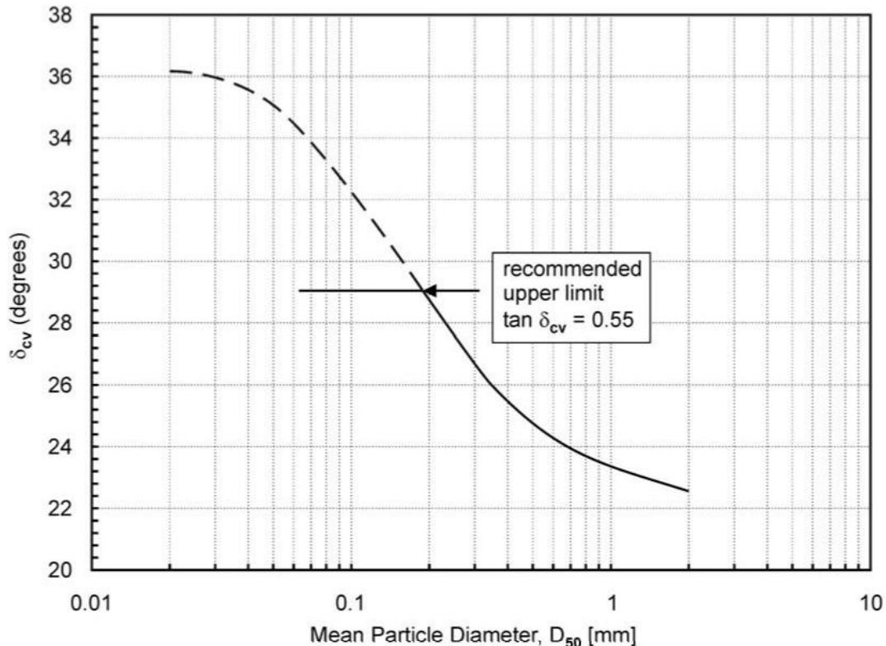  
Figure C6.4.3-1—Interface Friction Angle in Sand, $\delta_{cv}$ , from Direct Shear Interface Tests

tively, one may estimate an appropriate design qc profile from adjacent sand layers.

- Weaker Clay Layers Near Pile Tip

The use of $q_{c}$ data averaged between $1.5D_{o}$ above pile tip to $1.5D_{o}$ below pile tip level should generally be satisfactory provided qc does not vary significantly. This may not necessarily be the case when clay layers occur: the $q_{c}$ data used may have a substantial impact on qp (fully plugged unit end bearing). If significant $q_{c}$ variations occur, then the UWA-05 Dutch method (Figure 2.2 of Lehane et al., 2005a) should be used to compute $q_{c,av}$ .

Thin (less than around $0.1D_{o}$ thick) clay layers are problematic, particularly when CPT data are discontinuous vertically and/or not all pile locations have been investigated. Factors to be considered should include the variance of layer thickness, strength and compression parameters. If no direct data are available, a cautious interpretation should be made based on the engineering geology of the surrounding sand soil unit. Offshore piles usually develop only a small percentage of qp under extreme loading conditions. Hence, capacity and settlement calculations, using a finite element model of a pile tip on sand containing weaker layers, may be considered to assess axial pile response under such conditions.

For thick clay layers, shallow geophysical data may be useful to assess layer thickness and elevation. The Main Text

recommend reduces the end-bearing component should the pile tip be within a zone up to $\pm 3\mathrm{D}$ from such layers. When $q_{c}$ data averaging is also applied to this $\pm 3\mathrm{D}$ zone, the combined effects may be unduly cautious and such results should be critically reviewed. Similarly, for large diameter $[D$ say $>2$ m] piles, the Main Text reduction method should be carefully reviewed.

Near-shore and Onshore Files

In general, the assumptions (listed in Sections C6.4.3a and C6.4.3c) may not necessarily be valid for near-shore and onshore piles, and should be checked.

Near-shore and onshore pipe piles may respond "unplugged" when loaded (due to insufficient inner friction mobilization). Similarly, dilatancy effects (neglected for offshore piles) may be considered for smaller diameter piles. Scour (especially general scour) may be significant for nearshore pile foundations. In addition closed-ended (rather than open-ended) steel piles may be driven.

The original publications (i.e., CUR, 2001, Jardine et al., 2005, Clausen et al., 2005 and Lehane et al., 2005a) should be consulted for assumptions made and further guidance – most include methods to provide the capacity of "unplugged" pipe piles and closed-ended piles.

Scour

Scour (seabed erosion due to wave and current action) can occur around offshore piles. Common types of scour are (a) general scour (overall seabed erosion) and (b) local scour (steep sided scour pits around single piles or pile groups). There is no generally accepted method to account for scour in axial capacity for offshore piles. Publications like Whitehouse (1998) give techniques for scour depth assessment. In addition, general scour data may be obtained from national authorities.

In lieu of project specific data, Commentary C6.8 gives advice on local scour depth.

Scour decreases axial pile capacity in sand. Both friction and end bearing components may be affected. This is because scour reduces both $q_{c}$ and $\sigma_{v}^{\prime}$ (vertical effective stress). For excavations (i.e., general scour), NNI (1993) recommends that $q_{c}$ is simply proportional to $\sigma_{v}^{\prime}$ , i.e.,

$$q_{c, f} = \chi q_{c, o} \tag{C6.4.3-21}$$

where

$$q_{c, f} = \text{f i n a l (i . e . a f t e r g e n e r a l s c o u r)} q_{c} \text{v a l u e},$$

$$q_{c, o} = \text{o r i g i n a l (i . e . b e f o r e g e n e r a l s c o u r) q_{c} v a l u e ,}$$

$$\chi = \text{d i m e n s i o n l e s s s c o u r r e d u c t i o n f a c t o r} = \sigma^{\prime}_{v f} / \sigma^{\prime}_{v o},$$

$$\sigma^{\prime}_{v f} = \text{f i n a l} \sigma^{\prime}_{v} (\text{v e r t i c a l e f f e c t i v e s t r e s s}) \text{v a l u e},$$

$$\sigma^{\prime}_{v o} = \text{o r i g i n a l} \sigma^{\prime}_{v} (\text{v e r t a l e f f e c t i v e s t r e s s}) \text{v a l u e}.$$

For high general scour depths, an alternative conservative approach (Fugro, 1995) for normally consolidated sands may be to take

$$\chi = \left(\frac{1}{1 + 2 K_{o}} \sqrt{\frac{z_{S} + 2 K_{o} \sqrt{S z_{S} + z_{S}}^{2}}{S + z_{S}}}\right) \tag{C6.4.3-22}$$

where

$$z_{S} = \text{d e p t h b e l o w f i n a l s e a b e d l e v e l} = z - S,$$

$$S = \text{g e n e r a l}$$

Commentary C6.8 gives a $\sigma_{\nu}^{\prime}$ reduction method due to both general and local scour.

C6.4.3f Summary

This commentary has discussed four CPT $q_{c}$ -based methods for axial pile capacity that incorporate length effects and friction fatigue. Some of these methods have been recently made available in the literature. They have not yet been frequently compared for routine offshore pile projects. Hence, geotechnical engineering judgment will be needed to select

the most appropriate method for the design case under consideration.

Additional care is required in cases of clay layers at/near pile tip level.

References

1. ASTM International (1996), Standard Test Method for Performing Electronic Friction Cone and Piezocone Penetration Testing of Soils, ASTM D 5778-95 (Reapproved 2000), ASTM Standards on Disc Volume 04.09: Soil and Rock (II): D 5714 – Latest.   
2. Baldi, G., Bellotti, R., Ghionna, N., Jamiolkowski, M. and Pasqualini, E. (1986), "Interpretation of CPTs and CPTUs, 2nd Part: Drained Penetration of Sands," in Field Instrumentation and In-Situ Measurements: Proceedings of the 4th International Geotechnical Seminar, 25 - 27 November 1986, Singapore, Nanyang Technological Institute, Singapore, pp. 143 - 156.   
3. Clausen, C.J.F., Aas, P.M and Karlsrud, K. (2005), "Bearing Capacity of Driven Piles in Sand, the NGI Approach," Proceedings International Symposium on Frontiers in Offshore Geotechnics [ISFOG—05], Perth, September, A.A. Balkema, publishers, pp 677 - 682.   
4. CUR Centre for Civil Engineering Research and Codes (2001), "Bearing Capacity of Steel Pipe Piles," CUR, Gouda, CUR-Report, 2001-8.   
5. Fugro (1995), "Final Report, Foundation Design—Bridge Piles, Jamuna Bridge, Bangladesh," *Fugro Engineers BV Confidential Report No. K-2380/120 to HDEC*, 13 June 1995.   
6. Fugro (2004), "Axial Pile Capacity Design Method for Offshore Driven Piles in Sand," Fugro Engineers BV Report No. P1003 to API, Issue 3, 5 August 2004.   
7. ISO International Organization for Standardization (2005), ISO 22476-1 (DIS 2005), Geotechnical Investigation and Testing—Field Testing—Electrical Cone and Piezocone Penetration Tests, International Standard ISO 22476-1.   
8. Jamiolkowski, M., Ghionna, V.N., Lancellotta, R. and Pasqualini, E. (1988), "New Correlations of Penetration Tests for Design Practice," in De Ruiter, J. (Ed.), Penetration Testing 1988: Proceedings of the First International Symposium on Penetration Testing, ISOPT-1, Orlando, 20 - 24 March 1988, Vol. 1, A.A. Balkema, Rotterdam, pp. 263 - 296.   
9. Jardine, R., Chow, F., Overy, R., and Standing, J. (2005), ICP Design Methods for Driven Piles in Sands and Clays, Imperial College, Thomas Telford Publishing, London.   
10. Kolk, H.J. (2000), "Deep Foundations in Calcareous Sediments," in Al-Shafei, K.A. (Ed.), Engineering for Calcareous Sediments: Proceedings of the Second International Conference on Engineering for Calcareous Sediments, Bahr-

ain, 21 - 24 February 1999, Vol. 2, A.A. Balkema, Rotterdam, pp. 313 - 344.   
11. Kolk, H.J., Baaijens, A.E. and Senders, M. (2005), "Design Criteria for Pipe Piles in Silica Sands," in Gourvenec, S. and Cassidy, M. (Eds.), Frontiers in Offshore Geotechnics ISFOG 2005: Proceedings of the First International Symposium on Frontiers in Offshore Geotechnics, University of Western Australia, Perth, 19 - 21 e September 2005, Taylor & Francis, London, pp. 711 - 716.   
12. Lehane, B.M. and Randolph, M.F. (2002), "Evaluation of a Minimum Base Resistance for Driven Pipe Piles in Siliceous Sand," ASCE Journal Geotechnical and Geoenvironmental Engineering, Vol. 128, No. 3, pp. 198 - 205.   
13. Lehane, B.M., Schneider, J.A. and Xu, X. (2005a), "A Review of Design Methods for Offshore Driven Piles in Siliceous Sand," University of Western Australia Geomechanics Group, Report No. GEO: 05358, September.   
14. Lehane, B.M., Schneider, J.A. and Xu, X. (2005b),"The UWA-05 Method for Prediction of Axial Capacity of Driven Piles in Sand" in Gourvenec, S. and Cassidy, M. (Eds.), Frontiers in Offshore Geotechnics ISFOG 2005: Proceedings of the First International Symposium on Frontiers in Offshore Geotechnics, University of Western Australia, Perth, 19 - 21 September 2005, Taylor & Francis, London, pp. 683 - 689.   
15. NEN Nederlands Normalisatie-instituut (2003), Geotechnics. Calculation Method for Bearing Capacity of Pile Foundation. Compression Piles, NEN 6743, Nederlandse Normalisatie-Instituut, September.   
16. Randolph, M.F., Leong, E.C. and Houlsby, G.T. (1991), "One-dimensional Analysis of Soil Plugs in Pipe Piles," Geotechnique, Vol. 61, No. 4, pp. 587 - 598.   
17. Thompson, G.W.L. and Jardine, R.J. (1998), "The Applicability of the New Imperial College Design Method to Calcareous Sands," Proc. Conf. Offshore Site Investigations and Foundation Behaviour, Society for Underwater Technology, London, pp. 383 - 400.   
18. Whitehouse, R. (1998), Scour at Marine Structures, Thomas Telford Ltd., London, UK.   
19. Youd, T.L. et al. (2001), "Liquefaction Resistance of Soils: Summary Report from the 1996 NCEER and 1998 NCEER/NSF Workshops on Evaluation of Liquefaction Resistance of Soils," ASCE Journal of Geotechnical and Geoenvironmental Engineering, Vol. 127, No. 10, October, pp. 817 - 833.

COMMENTARY ON CARBONATE SOILS, SECTION 6.4.3

C6.1a General

Carbonate soils cover over 35 percent of the ocean floor. For the most part, these soils are biogenic, that is they are composed of large accumulations of the skeletal remains of plant and animal life such as coralline algae, coccoliths, foraminifera, echinoderms, etc. To a lesser extent they also exist as non-skeletal material in the form of oolites, pellets, grapestone, etc. These carbonate deposits are abundant in the warm, shallow water of the tropics, particularly between 30 degrees North and South latitudes. Deep sea calcareous oozes have been reported at locations considerably outside the mid latitudes. Since temperature and water conditions (water depth, salinity, etc.) have varied throughout geologic history, ancient deposits of carbonate material may be found buried under more recent terrestrial material outside the present zone of probable active deposition. In the Gulf of Mexico, major carbonate deposits are known to exist along the Florida coastline and in the Bay of Campeche.

C6.1.b Characteristic Features of Carbonate Soils

Carbonate soils differ in many ways from the silica rich soils of the Gulf of Mexico. An important distinction is that the major constituent of carbonate soils is calcium carbonate which has a low hardness value compared to quartz, the predominant constituent of the silica rich sediments. Susceptibility of carbonate soils to disintegration (crushing) into smaller fractions at relatively low stress levels is partly attributed to this condition. Typically, carbonate soils have large interparticle and intraparticle porosity resulting high void ratio and low density and hence are more compressible than soils from a terrigenous silica deposit. Furthermore, carbonate soils are prone to post-depositional alterations by biological and physio-chemical processes under normal pressure and temperature conditions which results in the formation of irregular and discontinuous layers and lenses of cemented material. These alterations, in turn, profoundly affect mechanical behavior.

The fabric of carbonate soils is an important characteristic feature. Generally, particles of skeletal material will be angular to subrounded in shape with rough surfaces and will have intraparticle voids. Particles of non-skeletal material, on the other hand, are solid with smooth surfaces and without intraparticle voids. It is generally understood that uncemented carbonate soils consisting of rounded nonskeletal grains that are resistant to crushing are stronger foundation materials than carbonate soils which show partial cementation and a low to moderate degree of crushing.

There is information that indicates the importance of carbonate content as it relates to the behavior of carbonate sediments. A soil matrix which is predominately carbonate is

more likely to undergo degradation due to crushing and compressibility of the material than soil which has low carbonate fraction in the matrix. Other important characteristic features that influence the behavior of the material are grain angularity, initial void ratio, compressibility and grain crushing. These are interrelated parameters in the sense that carbonate soils with highly angular particles often have a high in situ void ratio due to particle orientation. These soils are more susceptible to grain crushing due to angularity of the particles and thus will be more apt to be compressed during loading.

The above is a general overview of the mechanical behavior of carbonate soils. For a more detailed understanding of material characteristics, readers are directed to the references cited below.

C6.1.c Soil Properties

Globally, it is increasingly evident that there is no unique combination of laboratory and in situ testing program that is likely to provide all the appropriate parameters for design of foundations in carbonate soils. Some laboratory and in situ tests have been found useful. As a minimum, a laboratory testing program for carbonate soils should determine the following:

1. Material composition; particularly carbonate content.   
2. Material origin to differentiate between skeletal and nonskeletal sediments.   
3. Grain characteristics; such as particle angularity, porosity and initial void ratio.   
4. Compressibility of the material.   
5. Soil strength parameters; particularly friction angle.   
6. Formation cementation; at least in a qualitative sense.

For site characterization, maximum use of past local experience is important particularly in the selection of an appropriate in situ program. In new unexplored territories where the presence of carbonate soils is suspected, selection of an in situ test program should draw upon any experience with carbonate soils where geographical and environmental conditions are similar.

C6.1d Foundation Performance and Current Trends

C6.1d.1 Driven Piles

Several case histories have been reported that describe some of the unusual characteristics of foundations on carbonate soils and their often poor performance. It has been shown from numerous pile load tests that piles driven into weakly cemented and compressible carbonate soils mobilize only a fraction of the capacity (as low as 15 percent) predicted by conventional design/prediction methods for siliceous material of the type generally encountered in the Gulf of Mexico. On the other hand, dense, strongly cemented carbonate deposits can be very competent foundation material. Unfortunately,

the difficulty in obtaining high quality samples and the lack of generalized design methods sometimes make it difficult to predict where problems may occur.

C6.1d.2 Other Deep Foundation Alternatives

The current trend for deep foundations in carbonate soils is a move away from driven piles. However, because of lower installation costs, driven piles still receive consideration for support of lightly loaded structures or where extensive local pile load test data and experience exists to substantiate the design premise. Furthermore, driven piles may be appropriate in competent carbonate soils. At present, the preferred alternative to the driven pile is the drilled and grouted pile. These piles mobilize significantly higher unit skin friction. The result is a substantial reduction in the required pile penetration compared with driven piles. Because of the high construction cost of drilled and grouted piles, an alternative driven and grouted pile system has received some attention in the recent past. This system has the potential to reduce installation costs while achieving comparable capacity.

C6.1d.3 Shallow Foundations

Some evidence indicates that the bearing capacity of shallow foundations in weakly cemented and compressible granular carbonate deposits can be significantly lower than the capacity in the siliceous material generally encountered in the Gulf of Mexico. On the other hand, higher bearing capacities have been reported where the soil is dense, strongly cemented, competent material.

C6.1e Assessment

To date, general design procedures for foundations in carbonate soils are not available. Acceptable design methods have evolved but remain highly site specific and dependent on local experience. Stemming from some recent publications describing poor foundation performance in carbonate soils and the financial consequences of the remedial measures, there is a growing tendency to take a conservative approach to design at the mere mention of carbonate soils even if the carbonate content in the sediment fraction is relatively low. This is not always warranted. As with other designs, the judgment of knowledgeable engineers remains a critical link in economic development of offshore resources in carbonate soil environments.

References

To develop an understanding and appreciation for the State-of-the-Practice in carbonate soil, a starting point would be to review the proceedings from two major conferences on carbonate soils listed below:

1. Symposium on Performance and Behavior of Calcareous Soils Sponsored by ASTM Committee D-18 on Soil and Rock, Ft. Lauderdale, Florida, January 1981.   
2. International Conference on Calcareous Sediments, Perth, Australia, March, 1988.   
Other selected references are:   
1. Abbs, A. F., and Needham, A. D., Grouted Piles in Weak Carbonate Rocks, Proceedings, 17th Offshore Technology Conference, Houston, Texas, Paper No. 4852, May 1985.   
2. Angemeer, J., Carlson, E., and Klick, J. H., Techniques and Results of Offshore Pile Load Testing in Calcareous Soils, Proceedings, 5th Offshore Technology Conference, Houston, Texas, Paper No. 1894, May 1973.   
3. Barthelemy, H. C., Martin, R., Le Tirant, P. M., and Nauroy, J. F., Grouted Driven Piles: An Economic and Safe Alternate for Pile Foundation, Proceedings, 19th Offshore Technology Conference, Houston, Texas, Paper No. 5409, 1987.   
4. Clark, A. R., and Walker, B. F., A Proposed Scheme for the Classification and Nomenclature for Use in the Engineering Description of Middle Eastern Sedimentary Rocks, Geotechnique, Vol. 27, No. 1, 1977.   
5. Datta, M., Gulhati, S. K., and Rao, G. V., *Crushing of Calcareous Sands During Shear*, Proceedings 11th Offshore Technology Conference, Houston, Paper No. 3525, 1979.   
6. Dutt, R. N., and Cheng, A. P., Frictional Response of Piles in Calcareous Deposits, Proceedings, 16th Offshore Technology Conference, Houston, Texas, Paper No. 4838, May 1984.   
7. Dutt, R. N., Moore, J. E., Mudd, R. W., and Rees, T. E., Behavior of Piles in Granular Carbonate Sediments from Offshore Philippines, Proceedings, 17th Offshore Technology Conference, Houston, Texas, Paper No. 4849, May 1985.   
8. Fragio, A. G., Santiago, J. L., and Sutton, V. J. R., Load Tests on Grouted Piles in Rock, Proceedings, 17th Offshore Technology Conference, Houston, Texas, Paper No. 4851, May 1985.   
9. Gilchrist, J. M., Load Tests on Tubular Piles in Coralline Strata, Journal of Geotechnical Engineering, ASCE, Vol, III, No. 5, 1985.   
10. Murff, J. D., *Pile Capacity in Calcareous Sands; State-of-the-Art*, Journal of Geotechnical Engineering, ASCE, Vol. 113, No. 5, May 1987.   
11. Nauroy, J. F., Brucy, F., and Le Tirant, P., Static and Cyclic Load Tests on a Drilled and Grouted Pile in Calcareous Sands, Proceedings, 4th International Conference on Behavior of Offshore Structures, BOSS'85, Delft, July 1985.

12. Noorany, I., Friction of Calcareous Sands, Report to Civil Engineering Laboratory, Naval Construction Battalion Center, Port Hueneme, California, P.O. No. N62583/81 MR647, March 1982.   
13. Poulos, H. G., Uesugi, M. and Young, G. S., Strength and Deformation Properties of Bass Strait Carbonate Sands, Geotechnical Engineering, Vol. 2, No. 2, 1982.   
14. Paulos, H. G., Cyclic Degradation of Pile Performance in Calcareous Soils, Analysis and Design of Pile Foundations, Joseph Ray Meyer, Editor, October 1984.   
15. Paulos, H. G., Chua, E. W., Bearing Capacity of Foundations on Calcareous Sand, Proceedings, 11th International Conference on Soil Mechanics and Foundation Engineering, Vol, 3, San Francisco, California, 1985.

COMMENTARY ON PILE CAPACITY FOR AXIAL CYCLIC LOADINGS, SECTION 6.6.2

C6.6.2a General

The axial capacity of a pile is defined as its maximum axial load resistance while pile performance is a specified service requirement (e.g., deflection(s) at the pile head). Both axial capacity and pile performance are dependent upon many variables (e.g., the types of soils, the pile characteristics, the installation methods, and the loading characteristics) and should be considered in pile design. This commentary addresses the influences of cyclic loading characteristics on axial capacity and pile performance.

C6.6.2b Loadings

Axial loadings on piles are developed from a wide variety of operating, structural, and environmental sources.1 Operating (equipment, supplies) and structural (dead weight, buoyancy) loadings are generally long duration loadings, often referred to as static loadings. Refer to Section 2.1.2 for more detailed definitions.

Environmental loadings are developed by winds, waves and currents, earthquakes and ice floes. These loadings can have both low and high frequency cyclic components in which the rates of load application and duration are measured in seconds. Storm and ice loadings can have several thousand cycles of applied forces, while earthquakes can induce several tens of cycles of forces. $^{1}$

C6.6.2c Static Capacity

For most fixed offshore platforms supported on piles, experience has proven the adequacy of determining pile penetration based on static capacity evaluations, and static ultimate design loads and commonly accepted factors-of-safety² that, in part, account for the cyclic loading effects.

For some novel platform concepts (e.g., Compliant Towers, Tension Leg Platforms) soils, and loading conditions, or when there are unusual limitations on pile penetrations, detailed considerations of cyclic loading effects may be warranted.

C6.6.2d Cyclic Loading Effects

Compared with long-term, static loadings, cyclic loadings may have the following important influence on pile axial capacity and stiffness:

- Decrease capacity and stiffness due to the repeated loadings.3   
- Increase capacity and stiffness due to the high rates of loadings,4 whether cyclic or non-cyclic.

The resultant effect on capacity is primarily influenced by the pile properties (stiffness, length, diameter, material), the soil characteristics (type, stress history, strain rate, and cyclic degradation), and the loadings (numbers and magnitudes of repeated loadings).

Cyclic loading may also cause accumulation of pile displacements and either stiffening and strengthening or softening and weakening of the soils around the pile.

Hysteresic and radiation damping dissipate the loading energy in the soil. For earthquakes, the free-field ground motions (independent of the presence of the piles and structure) can develop important cyclic straining effects in the soils; these effects may influence pile capacity and stiffness.

C6.6.2e Analytical Models

A variety of analytical models have been developed and applied to determine the cyclic axial response of piles. These models can be grouped into two general categories:

1. Discrete Element Models—The soil around the pile is idealized as a series of uncoupled "springs" or elements attached between the pile and the far field soil (usually assumed rigid). The material behavior of these elements may vary from linearly elastic to non-linear, hysteretic, and rate dependent. The soil elements are commonly referred to as T-Z (shaft resistance-displacement) and Q-Z (tip resistance-displacement) elements.[7-10] Linear or non-linear dashpots (velocity dependent resistances) can be placed in parallel and series with the discrete elements to model radiation damping and rate of loading effects.[11, 12] The pile can also be modeled as a series of discrete elements, e.g., rigid masses interconnected by springs or modeled as a continuous rod, either linear or non-linear. In these models material properties (soil and pile) can vary along the pile.   
2. Continuum Models—The soil around the pile is idealized as a continuum attached continuously to the pile. The

material behavior may incorporate virtually any reasonable stress-strain rules the analyst can devise. Depending on the degree of non-linearity and heterogeneity, the model can be quite complicated. Again the pile is typically modeled as a continuous rod, either linear or nonlinear. In these models material properties can vary in any direction.[13-15]

There are a wide range of assumptions that can be used regarding boundary conditions, solution characteristics, etc., that lead to an unlimited number of variations for either of the two approaches.

Once the idealized model is established and the relevant equations developed, then a solution technique must be selected. For simple models, a closed form analytic approach may be possible. Otherwise a numerical procedure must be used. In some cases a combination of numerical and analytical approaches is helpful. The most frequently used numerical solution techniques are the finite difference method and the finite element method. Either approach can be applied to both the discrete element and continuum element models. Discrete element and continuum element models are occasionally combined in some instances.[1,11] Classical finite element models have been used for specialized analyses of piles subject to monotonic axial loadings.[13]

For practical reasons discrete element models solved numerically have seen the most use in evaluation of piles subjected to high intensity cyclic loadings. Results from these models are used to develop information on pile accumulated displacements and on pile capacity following high intensity cyclic loadings.[9,10]

Elastic continuum models solved analytically (similar to those used in machine vibration analyses) have proven to be useful for evaluations of piles subjected to low intensity, high frequency cyclic loadings at or below design working loadings.[13,14] At higher intensity loading, where material behavior is likely to be nonlinear, the continuum model solved analytically can still be used by employing equivalent linear properties that approximate the nonlinear, hysteretic effects.[16]

C6.6.2f Soil Characterization

A key part of developing realistic analytical models to evaluate cyclic loading effects on piles is the characterization of soil-pile interaction behavior. High quality in-situ, laboratory, and model-prototype pile load tests are essential in such characterizations. In developing soil-pile interaction (soil) characterizations, it is important that pile installation, and pile loading conditions be integrated into the testing programs.[1,10]

In-situ tests (e.g., vane shear, cone penetrometer, pressure meter) can provide important insights into in-place soil behavior and stress-strain properties.[17] Both low and high amplitude stress-strain properties can be developed. Long-term (static, creep), short-term (dynamic, impulsive), and cyclic (repeated) loadings sometimes can be simulated with in-situ testing equipment.

Laboratory tests on representative soil samples permit a wide variety of stress-strain conditions to be simulated and evaluated.[18] Soil samples can be modified to simulate pile installation effects (e.g., remolding and reconsolidating to estimated in-situ stresses). The samples can be subjected to different boundary conditions (triaxial, simple-shear, interface-shear), and to different levels of sustained and cyclic shear time histories to simulate in-place loading conditions.

Tests on model and prototype piles are another important source of data to develop soil characterizations for cyclic loading analyses. Model piles can be highly instrumented, and repeated tests performed in soils and for a variety of loadings.[19,20] Geometric scale, time scale and other modeling effects should be carefully considered in applying results from model tests to prototype behavior analyses.

Data from load tests on prototype piles are useful for calibrating analytical models.[21-24] Such tests, even if not highly instrumented, can provide data to guide development of analytical models. These tests can also provide data to verify results of soil characterizations and analytical models.[1,10,11,25,26] Prototype pile load testing coupled with in-situ and laboratory soil testing, and realistic analytical models can provide an essential framework for making realistic evaluations of the responses of piles to cyclic axial loadings.

C6.6.2g Analysis Procedure

The primary steps in performing an analysis of cyclic axial loading effects on a pile using discrete element models are summarized in the following sections.

1. Loadings. The pile head loadings should be characterized in terms of the magnitudes, durations, and numbers of cycles. This includes both long-term loadings and short-term cyclic loadings. Typically, the design static and cyclic loadings expected during a design event are chosen.   
2. Pile Properties. The properties of the pile including its diameter, wall thickness, stiffness properties, weight, and length must be defined. This will require an initial estimate of the pile penetration that might be appropriate for the design loadings. Empirical, pseudostatic methods based on pile load tests or soil tests might be used to make such estimates.   
3. Soil Properties. Different analytical approaches will require different soil parameters. For the continuum model the elastic properties of the soil (E, G, v, D) are required. In the discrete element model soil resistance-displacement relationships along the pile shaft (T-Z) and at its tip (Q-Z) should be determined. In-situ and laboratory soil tests, and model and prototype pile load tests can provide a basis for such determinations. These tests should at least implicitly include the effects of pile installation, loading, and time effects. In addition, the test should be performed so as to provide insight regarding the effects of pile loading characteristics. Most

importantly, the soil behavior characteristics must be appropriate for the analytical model(s) to be used, duly recognizing the empirical bases of these models.

4. Cyclic Loading Analyses. Analyses should be performed to determine the response (load resistance and displacement) characteristics of the pile subjected to its design static and cyclic loadings. Recognizing the inherent uncertainties in evaluations of pile loadings and soil-pile behavior, parametric analyses should be performed to evaluate the sensitivities of the pile response to these uncertainties. The analytical results should develop realistic predictions of pile load resistance and accumulated displacements at design loadings. In addition, following the simulation of static and cyclic design loadings, the pile should be further analyzed so as to estimate its reserve capacity and after-cyclic loading resistance.

C6.6.2h Performance Requirements

A primary objective of these analyses is to ensure that the pile and its penetration are adequate to meet the structure's serviceability and capacity (Ultimate Limit State) requirements.

In conventional static capacity based design, the pile design loading (static dead and operating plus maximum amplitude of cyclic loadings) is compared against the pile capacity (Ultimate Limit State). The pile capacity is defined as the integrated shaft and tip resistance (Section 2.6.4). An allowable load is calculated in accordance with Section 2.6.3d. This procedure ensures that the pile has an adequate margin of safety above its design loading to accommodate uncertainties in loadings and pile resistances.

The pile performance for explicit cyclic loading analyses should be evaluated for both serviceability and Ultimate Limit State conditions. At static and cyclic loading conditions appropriate for serviceability evaluations, the pile stiffness, settlements, and displacements must not impede or hamper structure operations. The pile should have a capacity (Ultimate Limit State) that provides an adequate margin of safety above its design loadings. In addition, the pile must not settle or pullout, nor accumulate displacements to the extent that could constitute failure of the structure-foundation system.

C6.6.2j Qualifications

Modeling cyclic loading effects explicitly may improve the designers insight into the relative importance of the loading characteristics. On the other hand extreme care should be exercised in applying this approach; historically, cyclic effects have been accounted for implicitly. Design methods developed and calibrated on an implicit basis may need extensive modification where explicit algorithms are employed.

References

1. Bea, R. G., "Dynamic Response of Marine Foundations," Proceedings of the Ocean Structural Dynamics Symposium '84, Oregon State University, Corvallis, Oregon, September 11-13, 1984.   
2. Focht, J. A., Jr. and Kraft, L. M., Jr., "Axial Performance and Capacity of Piles," Chapter 21, Planning and Design of Fixed Offshore Platforms, ed. by Bramlette McClelland and Michael D. Reifel, Van Nostrand Reinhold Company, New York, 1986.   
3. Briaud, J-L., Felio, G., and Tucker, L., "Influence of Cyclic Loading on Axially Loaded Piles in Clay," Research Report for Phase 2, Proc 83-42 entitled "Pile Response to Static and Dynamic Loads," API, December, 1984.   
4. Briaud, J-L, and Garland, E., "Influence of Loading Rate on Axially Loaded Piles in Clay," Research Report for Phase 1, Proc 82-42 entitled "Pile Response to Static and Dynamic Loads," API, March, 1984.   
5. Bea, R. G., "Dynamic Response of Piles in Offshore Platforms," ASCE Specialty Conference on Dynamic Response of Pile Foundations—Analytical Aspects, ASCE Geotechnical Engineering Division, October 30, 1980.   
6. Panel on Offshore Platforms, "Engineering Fixed Offshore Platforms to Resist Earthquakes," ASCE Specialty Conference on Earthquake Engineering and Soil Dynamics, ASCE Geotechnical Engineering Division, June 19-21, 1978.   
7. Bea, R. G., and Audibert, J. M. E., "Performance of Dynamically Loaded Pile Foundations," Proceedings of Second International Conference on Behavior of Offshore Structures, BOSS '79, Imperial College, London, England, August 28-31, 1979.   
8. Matlock, H. and Foo, S. H. C., “Axial Analysis of Piles Using a Hysteretic and Degrading Soil Model,” Proceedings of Conference on Numerical Methods in Offshore Piling, Institution of Civil Engineers, London, May 22–23, 1979.   
9.oulos, H.G., "Cyclic Axial Pile Response—Alternative Analyses," Proceedings of the Conference on Geotechnical Practice in Offshore Engineering, ASCE, Austin, Texas, April 27-29, 1983.   
10. Karlsrud, K., Nadim, F., and Haugen, T., "Pile in Clay under Cyclic Axial Loading Field Tests and Computational Modeling," Proceedings of the 3rd International Conference on Numerical Methods in Offshore Piling, Nantes, France, May 21-22, 1986.   
11. Bea, R. G., Litton, R. W., Nour-Omid, S., Chang, J. Y., and Vaish, A. K., “A Specialized Design and Research Tool for the Modeling of Near-Field Pile-Soil Interactions,” Proceedings of the Offshore Technology Conference, OTC 4806, Houston, Texas, May 1984, pp. 249–262.

12. Bea, R. G., "Soil Strain Rate Effects on Axial Pile Capacity," Proceedings of the 2nd International Conference on Numerical Methods in Offshore Piling," Austin, Texas, April 29-30, 1982.   
13. Novak, M., and Sharnouby, B. E., "Stiffness Constants of Single Piles," Journal of Geotechnical Engineering, ASCE, July 1983, pp. 961-974.   
14. Roesset, J. M., and Angelides, C., "Dynamic Stiffness of Piles," Proceedings, Numerical Methods in Offshore Piling, London, May 1979, pp. 75-81.   
15. Desai, C. S., and Holloway, D. M., "Load-Deformation Analysis of Deep Pile Foundation," Proceedings of the Symposium on Applications of the Finite Element Method in Geotechnical Engineering, U.S. Army Engineers Waterways Experiment Station, Vicksburg, Mississippi, 1972, pp. 629-656.   
16. Lysmer, John, "Analytical Procedures in Soil Dynamics," Report No. UCB/EERC-78/29, presented at the ASCE Geotechnical Engineering Division Specialty Conference on Earthquake Engineering and Soil Dynamics, Pasadena, California, December 1978.   
17. McClelland, B., and Ehlers, C. J., "Offshore Geotechnical Site Investigations," Chapter 9, Planning and Design of Fixed Offshore Platforms, ed. by Bramlette McClelland and Michael D. Reifel, Van Nostrand Reinhold Company, New York, 1986.   
18. Wood, D. M., “Laboratory Investigations of the Behavior of Soils under Cyclic Loading: A Review,” Chapter 20, Soil Mechanics—Transient and Cyclic Loads, ed. by G. N. Pande and O. C. Zienkiewicz, John Wiley & Sons, 1982.   
19. Bogard, J. D., Matlock, H., Audibert, J. M. E., and Bamford, S. R., “Three Years’ Experience with Model Pile Segment Tool Tests,” Proceedings of the Offshore Technology Conference, OTC 4848, Houston, Texas, May 6–9, 1985.   
20. Karlsrud, K., and Haugen, T., "Behavior of Piles in Clay under Cyclic Axial Loading—Results of Field Model Tests," Proceedings of the 4th International Conference on Behavior of Offshore Structures, BOSS '85, Delft, The Netherlands, July 1-5, 1985.   
21. Pelletier, J. H., and Doyle, E. H., "Tension Capacity in Silty Clays—Beta Pile Test," Proceedings of the 2nd International Conference on Numerical Methods of Offshore Piling," Austin, Texas, April 29-30, 1982.   
22. McAnoy, R. P. L., Cashman, A. C., and Purvis, O., "Cyclic Tensile Testing of a Pile in Glacial Till," Proceedings of the 2nd International Conference on Numerical Methods in Offshore Piling," Austin, Texas, April 29-30, 1982.   
23. Gallagher, K. A., and St. John, H. D., "Field Scale Model Studies of Piles as Anchorages for Buoyant Platforms," Paper EUR 135, European Offshore Petroleum Conference, London, England, 1980.

24. Arup, O., et al., "Research on the Behavior of Piles as Anchors for Buoyant Structures—Summary Report," Offshore Technology Report OTH 86 215, Department of Energy, London, March 1986.   
25. Pelletier, J. H., and Sgouros, G. E., "Shear Transfer Behavior of a 30-inch Pile in Silty Clay," Proceedings of the 19th Annual Offshore Technology Conference, OTC 5407, Houston, Texas, April 27-30, 1987.   
26. Bea, R. G., Vahdani, S., Guttman, S. I., Meith, R. M., and Paulson, S. F., "Analysis of the Performance of Piles in Silica Sands and Carbonate Formations," Proceedings of the 18th Annual Offshore Technology Conference, OTC 5145, Houston, Texas, May 5-8, 1986.   
27. Kraft, L. M., Jr., Cox, W. R., and Verner, E. A., "Pile Load Tests: Cyclic Loads and Varying Load Rates," Journal of the Geotechnical Engineering Div., ASCE, Vol. 107, No. GT1, Jan., 1981.   
28. Audibert, J. M. E., and Dover, A. R., Discussion of the above paper, ASCE, Vol. 108, No. GT3, March 1982.   
29. Hamilton, T. K., and Dover, A. R., Discussion of the above paper, ASCE, Vol. 108, No. GT3, March 1982.   
30. Kraft, L. M., Jr., Cox, W. R., and Verner, E. A. Closure of the discussions, ASCE, Vol. 108, No. GT3, March 1982.

COMMENTARY ON SOIL REACTION FOR LATERALLY-LOADED PILES, SECTION 6.8

Note: Commentary on Siol Reactions for Laterally-loaded Piles, Section 6.8 has been added.

C6.8 SOIL REACTION FOR LATERALLY-LOADED PILES

Generally, under lateral loads, clay soils behave as a plastic material which makes it necessary to relate pile-soil deformation to soil resistance. To facilitate this procedure, lateral soil resistance-displacement $p - y$ curves should be constructed using stress-strain data from laboratory soil samples. The ordinate for these curves is soil resistance $p$ and the abscissa is pile wall displacement, $y$ . By iterative procedures, a compatible set of lateral resistance-displacement values for the pile-soil system can be developed.

For a more detailed study of the construction of $p$ - $y$ curves, see Matlock (1970) for soft clay, Reese and Cox (1975) for stiff clay, O'Neill and Murchison (1983) for sand and Georgiadis (1983) for layered soils.

Scour (seabed sediment erosion due to wave and current action) can occur around offshore piles. Scour reduces lateral

soil support, leading to an increase in pile maximum bending stress. Scour is generally not a problem for cohesive soils, but should be considered for cohesionless soils. Common types of scour are:

a. general scour (overall seabed erosion), and   
b. local scour (steep sided scour pits around single piles).

Publications like Whitehouse (1998) give techniques for scour depth assessment. In addition, general scour data may be obtained from national authorities. In the absence of project specific data, for an isolated pile a local scour depth equal to $1.5D$ and an overburden reduction depth equal to $6D$ may be adopted, $D$ being the pile outside diameter; see Figure C6.8-1.

Reduction in lateral soil support is due to two effects:

- a lower ultimate lateral pressure caused by decreased vertical effective stress $p_{o}$ , and   
- a decreased initial modulus of subgrade reaction modulus （$E_S)$ .

There is no general accepted method to allow for scour in the $p - y$ curves for offshore piles. Figure C.6.8-1 suggests one of the methods for evaluating $p_{o}$ and $E_{S}$ as a function of scour depths. In this method general scour reduces the $p_{o}$ profile uniformly with depth, whereas local scour reduces p linearly with depth to a certain depth below the base of the scour pit. Subgrade modulus reaction values （$E_{S})$ may be computed assuming the general scour condition only. Other methods, based upon local practice and/or experience, may be used instead.

References

1.Matlock, H., "Correlations for Design of Laterally Loaded Piles in Soft Clay," In: Proc. 2nd Annual Offshore Technology Conference, OTC 1204, Houston, Texas, April 1970.   
2. Reese, L. C. and Cox, W. R., "Field Testing and Analysis of Laterally Loaded Piles in Stiff Clay," In: Proc. 5th Annual Offshore Technology Conference, OTC 2312, Houston, Texas, April 1975.   
3.O'Neill, M. W. and Murchison, J. M., "An Evaluation of $p$ -y Relationships in Sands," prepared for the American Petroleum Institute Report PRAC 82-41-1. Houston, University of Houston, March 1983.   
4. Georgiadis, M., "Development of p-y Curves for Layered Soils," Proc. of the Conference on Geotechnical Practice in Offshore Engineering, Austin, Texas, New York: American Society of Civil Engineers, 1983, pp. 536 - 545.   
5. Whitehouse R., Scour at Marine Structures, Thomas Telford Ltd, London, UK, 1998.

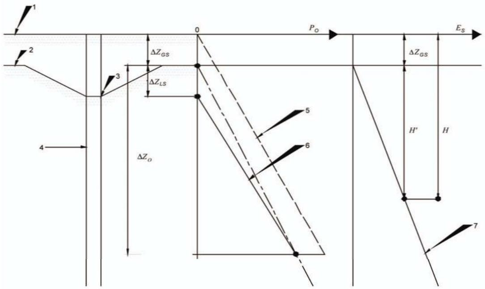  
Figure C6.8-1— $p$ - $y$ Lateral Support—Scour Model

Key

1 Original sea floor level   
2 Level after general scour   
3 Level of local scour   
# 4 Pile
5 No scour case   
6 Local scour case   
7 $E_{s} = kH^{\prime}$

$\Delta Z_{GS}$ General scour depth   
$\Delta Z_{15}$ Local scour dept （$1,5\times \Delta$ typical)   
$\Delta Z_{0}^{*}$ Overburden reduction depth （$6,0\times \Delta$ typical)   
$p_{o}$ Vertical effective stress   
$E_{s}$ Initial modulus of subgrade reaction   
$\bar{H}$ Depth below original sea floor   
$H^{\prime}$ Depth below final general sea floor

COMMENTARY ON FOUNDATIONS SECTIONS 6.14 THROUGH 6.17

FOUNDATIONS

C6.13 STABILITY OF SHALLOW FOUNDATIONS

C6.13.1 and C6.14.2 Bearing Capacity

The development of bearing capacity equations, such as Eqs. 6.13.1-1, -2, -3 and 6.13.2-1, -2, -3 has been predicated on the assumption that the soil is a rigid, perfectly plastic material that obeys the Mohr-Coulomb yield criterion. A number of comprehensive investigations on this subject have been undertaken in the past 25 years. Although the details of the various studies differ somewhat, the general framework is fundamentally the same. The procedures that will be followed here are those described by A.S. Vesic in Bearing Capacity of Shallow Foundations, Foundation Engineering Handbook, Ed. By H. F. Winterkorn and H. Y. Fang, Van Nostrand Publishing Company, 1975.

Eqs. 6.13.1-1, -2, -3 and 6.13.2-2, -3 are actually special cases of Eq. 6.13.2-1, the most general form of the bearing capacity equation. Thus in the following discussion attention is limited to Eq. 6.13.2-1.

Equations for factors $N_{c}, N_{q}$ , and $N_{\nu}$ are given in the main test under the discussion of Eq. 6.13.2-1. Figure C6.13.1-1 provides a plot and tabulation of these factors for varying friction angles, $\phi'$ .

Effective Area. Load eccentricity decreases the ultimate vertical load that a footing can withstand. This effect is accounted for in bearing capacity analysis by reducing the effective area of the footing according to empirical guidelines.

Figure C6.13.1-2 shows footings with eccentric loads, the eccentricity, e, being the distance from the center of a footing to the point of action of the resultant, measured parallel to the plane of the soil-footing contact. The point of action of the resultant is the centroid of the reduced area; the distance $e$ is $M / Q$ , where $M$ is the overturning moment and $Q$ is the vertical load.

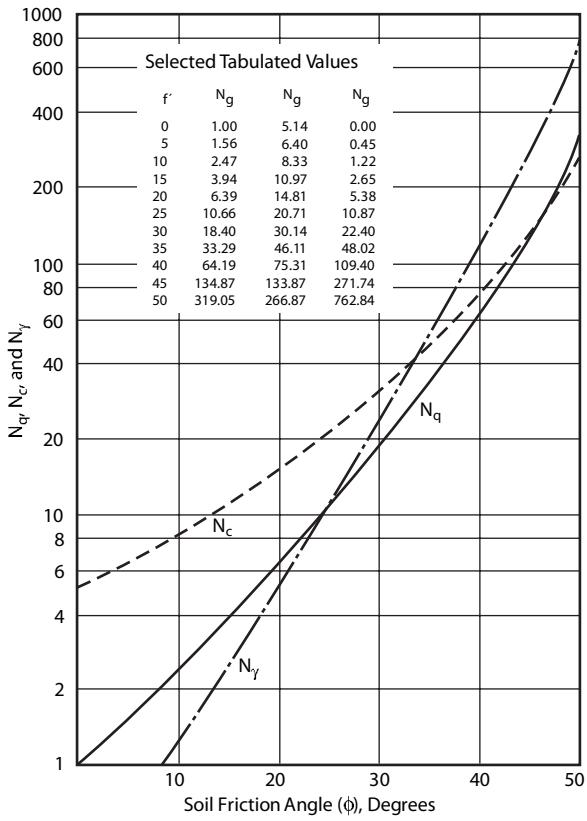  
Figure C6.13.1-1—Recommended Bearing Capacity Factors

For a rectangular base area, Figure C6.14.1-2(B), eccentricity can occur with respect to either axis of the footing. Thus, the reduced dimensions of the footing are:

$$L^{\prime} = L - 2 e_{1}$$

$$B^{\prime} = B - 2 e_{2} \tag{C6.13.1-1}$$

where $L$ and $B$ are the foundation length and width, respectively, the prime denotes effective dimensions, and $e_1$ and $e_2$ are eccentricities along the length and width.

For a circular base with radius, $R$ , the effective area is shown in Figure C6.13.1-2(c). The centroid of the effective area is displaced a distance $e_2$ from the center of the base. The effective area is then considered to be two times the area of the circular segment ADC.

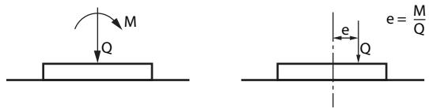  
(A) Equivalent Loadings

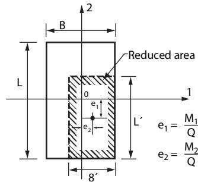  
(B) Reduced Area—Rectangular Footing

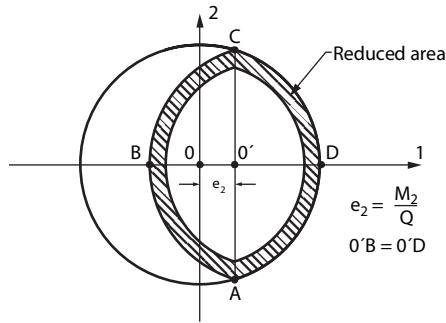  
(C) Reduced Area-Circular Footing   
Figure C6.13.1-2—Eccentrically-loaded Footings

In addition, the effective area is considered to be rectangular with a length-to-width ratio equal to the ratio of line lengths AC to BD. The effective dimensions are therefore:

$$\left. \begin{array}{l} A^{\prime} = 2 s = B^{\prime} L^{\prime} \\ L^{\prime} = \left(2 s \sqrt{\frac{R + e}{R - e}}\right)^{1 / 2} \\ B^{\prime} = L^{\prime} \sqrt{\frac{R - e}{R + e}} \end{array} \right\} \tag{C6.13.1-2}$$

where

$$s = \frac{\pi R^{2}}{2} - \left[ \sqrt [ e ]{R^{2} - e^{2}} + R^{2} \sin^{-1} \left(\frac{e}{\bar{R}}\right) \right]$$

Examples of effective areas as a function of eccentricity area shown in Figure C6.13.1-3 in a dimensionless form. No data are available on other foundation shapes. Intuitive approximations must be made to find an equivalent rectangular or circular foundation when nonstandard shapes are encountered.

Correction Factors. The correction factors $K_{c}$ , $K_{q}$ , and $K_{\gamma}$ are usually written

$$\left. \begin{array}{l} K_{c} = i_{c} \times s_{c} \times d_{c} \times b_{c} \times g_{c} \\ K_{q} = i_{a} \times s_{q} \times d_{q} \times b_{q} \times g_{q} \\ K_{\gamma} = i_{\gamma} \times s_{\gamma} \times d_{\gamma} \times b_{\gamma} \times g_{\gamma} \end{array} \right\} \tag{C6.13.1-3}$$

where $i, s, d, b,$ and $q$ are individual correction factors related to load inclination, foundation shape, embedment depth, base inclination, and ground surface inclination respectively. The subscripts $c, q,$ and $\gamma$ identify the factor （$N_{c}, N_{q},$ or $N_{\gamma})$ with which the correction term is associated.

The recommended correction factors for $N_{c}$ and $N_{q}$ that account for variations in loading and geometry not considered in the theoretical solutions are obtained from the expressions for $N_{c}$ and $N_{q}$ as suggested by DeBeer and Ladanyi (as cited by Vesic). Letting $k_{q}$ represent some general individual correction factor for the $N_{q}$ term (for example, $i_{q}$ , which accounts for load inclination), the relationship between $N_{c}$ and $N_{q}$ intuitively suggests that

$$k_{c} N_{c} = \left(k_{q} N_{q} - 1\right) \cot \phi \tag{C16.13.1-4}$$

Using $N_{c} = (N_{q} - 1)\cot \phi$ and solving for $k_{c}$ in terms of $N_{c}$ yields

$$k_{c} = k_{q} - \frac{1 - k_{q}}{N_{c} \tan \phi} \tag{C16.13.1-5}$$

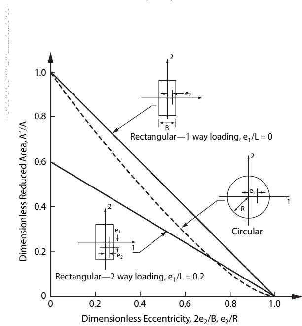  
Figure C6.13.1-3—Area Reduction Factors Eccentrically-loaded Footings

Thus, the appropriate correction factor for the $N_{c}$ term can be determined once it is shown for the $N_{q}$ term. Most expressions for correction factors for $N_{q}$ and $N_{\gamma}$ are determined empirically. Following are the recommended expressions for the correction factors.

Inclination Factors:

$$\left. \begin{array}{l} i_{q} = \left[ 1 - \frac{H}{Q + B^{\prime} L^{\prime} c \cot \phi} \right]^{m} \\ i_{\gamma} = \left[ 1 - \frac{H}{Q + B^{\prime} L^{\prime} c \cot \phi} \right]^{m + 1} \\ i_{c} = i_{q} - \frac{1 - i_{q}}{N_{c} \tan \phi} \\ i_{c} = 1 - \frac{m H}{B^{\prime} L^{\prime} c N_{c}} \quad \phi = 0 \end{array} \right\} \tag{C6.13.1-6}$$

where $H$ is the projection of the load resultant on the plan of the footing, $m$ is a dimensionless function of $B^{\prime} / L^{\prime}$ , and $\theta$ is the angle between the long axis of the footing and $H$ . The general expression for $m$ is

$$m = m_{L} \cos^{2} \theta + m_{B} \sin^{2} \theta$$

where

$$m_{L} = \frac{2 + \frac{L^{\prime}}{B^{\prime}}}{1 + \frac{L^{\prime}}{B^{\prime}}} \text{a n d} m_{B} = \frac{2 + \frac{B^{\prime}}{L^{\prime}}}{1 + \frac{B^{\prime}}{L^{\prime}}}$$

Shape Factors:

Rectangular:

$$\left. \begin{array}{l} s_{c} = 1 + \left(\frac{B^{\prime}}{L^{\prime}}\right) \left(\frac{N_{q}}{N_{c}}\right) \\ s_{q} = 1 + \left(\frac{B^{\prime}}{L^{\prime}}\right) \tan \phi \\ s_{\gamma} = 1 - 0. 4 \frac{B^{\prime}}{L^{\prime}} \end{array} \right\} \tag{C6.13.1-7}$$

Circular (centric load only):

$$\left. \begin{array}{l} s_{c} = 1 + \frac{N_{q}}{N_{c}} \\ s_{q} = 1 + \tan \phi \\ s_{\gamma} = 0. 6 \end{array} \right\} \tag{C6.13.1-8}$$

For an eccentrically loaded circular footing, the shape factors for an equivalent rectangular footing are used.

Depth Factors

$$\left. \begin{array}{l} d_{q} = 1 + 2 \tan \phi (1 - \sin \phi)^{2} \frac{D}{B^{\prime}} \\ d_{\gamma} = 1. 0 \\ d_{c} = d_{q} - \frac{1 - d_{q}}{N_{c} \tan \phi} \end{array} \right\} \tag{C6.13.1-9}$$

It should be emphasized that the effect of foundation embedment is very sensitive to soil disturbance at the soil/ structure interface along the sides of the embedded base. Where significant disturbance is expected, it may be prudent to reduce or discount entirely the beneficial effect of overburden shear strength.

Base and Ground Surface Inclination Factors:

Base inclination:

$$\left. \begin{array}{l} b_{q} = b_{\gamma} = (1 - v \tan \phi)^{2} \\ b_{c} = b_{q} - \frac{1 - b_{q}}{N_{c} \tan \phi} \\ b_{c} = 1 - \frac{2 v}{N_{c}} \quad \phi = 0 \end{array} \right\} \tag{C.6.13.1-10}$$

Ground slope:

$$\left. \begin{array}{l} g_{q} = g_{\gamma} = (1 - \tan \beta)^{2} \\ g_{c} = g_{q} - \frac{1 - g_{q}}{N_{c} \tan \phi} \\ g_{c} = 1 - \frac{2_{\beta}}{N_{c}} \end{array} \right\} \quad \left(\mathrm{C}. 6. 13. 1 - 11\right)$$

where $\nu$ and $\beta$ are base and ground inclination angles in radians. Figure C6.13.1-4 defines these angles for a general foundation problem.

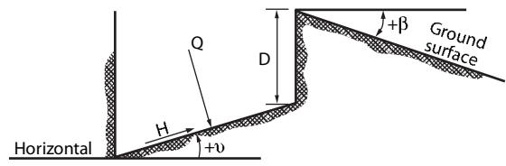  
Figure C6.13.1-4—Definitions for Inclined Base and Ground Surface (After Vesic)

Applications and Limitations. If loading occurs rapidly enough so that no drainage and hence no dissipation of excess pore pressures occurs, then an 'undrained analysis' (also called 'short term' or 'immediate') is to be performed. The soil may be treated as if $\phi = 0^{\circ}$ such that the stability of the foundation is controlled by an appropriate undrained shear strength, (c). In this case Eq. 6.13.2-1 reduces to Eq. 6.13.1-1.

If the rate of loading is slow enough such that no excess pore pressures are developed (i.e., complete drainage under the applied stresses) and sufficient time has elapsed since any previous application of stresses such that all excess pore pressures have been dissipated, a 'drained analysis' is to be performed. The stability of the foundation is controlled by the drained shear strength of the soil. The drained shear strength is determined from the Mohr-Coulomb effective stress failure envelope (i.e., the Cohesion intercept $c^{\prime}$ and the friction angle $\phi^{\prime}$ ).

For sliding analyses Eqs. 6.13.3-1 and -2 apply where a horizontal failure plane in the soil is insured by structural constraints, i.e., shear skirts at sufficiently close spacing. If appropriate, consideration may be given to resistance provided by side shear and passive soil forces. If a horizontal failure plane is not insured, other potential failure modes should be investigated with the mode giving the lowest lateral resistance selected as the design case.

In cases where shear skirts or similar appurtenances are not employed and for certain combinations of structure weight versus soil strength failure may occur at the structure-soil interface. For this case consideration should be given to the use of reduced soil strength parameters in Eqs. 6.13.3-1 and -2 and/or the results of specialized tests aimed at determining an effective coefficient of friction between soil and structure.

Special Considerations. Eqs. 6.13.1-1, -2, -3, 6.13.2-1, -2, -3 and 6.13.3-1 and -2 are strictly applicable to conditions of uniform soil strength but reasonable assessment of equivalent uniform properties can frequently be made. For example, the potential of a deep bearing failure depends on soil strengths at considerably greater depths than that of a sliding failure. Hence careful attention should be given to defining the soil parameters throughout the expected zone of influence. This may include the reduction of certain strength parameters for loose or highly compressible materials.

Where foundation conditions are highly nonhomogeneous or anisotropic (strength is dependent on load orientation); where load conditions deviate considerably from the simple conditions assumed in the stability formulae (e.g., torsion about the vertical axis of the foundation); where loading rates are such that the conditions are not clearly drained or undrained; or where foundation geometries are highly irregular (e.g., tripod base), the use of these stability formulae is not straightforward and alternate procedures such as one or combinations of the following may be selected.

1. Use of conservative equivalent parameters along with the above mentioned formulae.   
2. Use of limit analysis to determine bounds on collapse loads and to determine relative sensitivity of collapse loads to parameters of interest. An example of the use of such techniques is given in Stability of Offshore Gravity Structure Foundation, by J. D. Murff and T. W. Miller, OTC 2896, 1977.   
3. Use of numerical analyses such as finite differences of finite elements to solve the governing equations directly.   
4. Use of properly scaled model tests such as the centrifuge tests described in Displacement and Failure Modes of Model Offshore Gravity Platforms Founded on Clay by P. W. Rowe, Offshore Europe 75, 1975.

Consideration should be given to the effects of cyclic loading on pore pressures for effective stress analyses and its effect on undrained strength. Some examples of these effects are given in the above referenced article by Rowe.

Safety Factors. In many offshore applications the lateral loads and overturning moments as well as vertical loads are highly variable. In assessing margins of safety the uncertainty of all these loads should be considered. A consistent method for accomplishing this is construction of an envelope of load combinations which constitute failure and comparing these limiting conditions with design loading. A more detailed discussion of this procedure is given in Geotechnical Considerations in Foundation Design of Offshore Gravity Structures by A. G. Young, et al., OTC 2371, 1974.

C6.14 STATIC DEFORMATION OF SHALLOW FOUNDATIONS

General. Static deformations are generally considered to be of two types. Short term deformation is the more or less instantaneous response of a foundation to loading and primarily results from shear deformation (shear straining) of the soil. Long term deformation occurs over a period of time and is primarily associated with a gradual dissipation of excess pore pressure and attendant volume changes of the soil.

C6.14.1 Short Term Deformation

Because soils exhibit non-linear, path dependent behavior under load the short term deformation problem is quite complex. For monotonic, low level loads (with respect to failure loads) estimates of deformation can be made assuming the soil to be a homogeneous linearly elastic material.

Solutions for conditions other than those given by Eqs. 6.14.1-1 through -4 including point displacements within the soil mass itself can be found in Elastic Solutions for Soil and Rock Mechanics, by H. G. Poulos and E. H. Davis, John Wiley, 1974.

Considerable care must be exercised in determining the elastic constants of the soil since the elastic moduli of soils are strongly dependent on the state of effective mean stress. This is particularly significant for granular highly permeable soils where equivalent moduli must be selected from some weighted average mean stress taken over the volume of soil subjected to significant stresses. For cohesive, relatively impermeable soils a correlation of modulus with strength and overconsolidation ratio usually leads to satisfactory results. Further discussion of these points is presented in Pressure Distribution and Settlement by W. H. Perloff, Foundation Engineering Handbook, Ed. By H. F. Winterkorn and H. Y. Fang, Van Nostrand Publ. Co., 1975.

Where the foundation base is flexible or the loading is sufficiently severe to create high stresses throughout a significant volume of soil Eqs. 6.14.1-1 through -4 are inappropriate and numerical analyses may be required. Finite element and finite difference techniques have the capability of including complex geometries and loadings and nonlinear, variable soil profiles. Special consideration should be given to the potential effects of softening of the soil (reduction in modules) under cyclic loading.

C6.14.2 Long Term Deformation

The long term settlement of a foundation on clay is a 3-dimensional problem in which stress distributions and pore pressures are coupled. Complex numerical schemes are therefore necessary to determine theoretically exact solutions. Such schemes may be necessary to determine such things as creep, load redistributions, and differential settlements; and to account for important initial conditions such as excess pore pressures. Eq. 6.14.2-1 is a widely used simplified estimate of long term or consolidation settlement obtained by assuming a one-dimensional compression of soil layers under an imposed vertical stress.

Because of the finite extent of the foundation, the vertical stress imposed by the structure should be attenuated with depth. An estimate of such attenuation can be determined from elastic solutions such as those referenced above by Poulos and Davis. This approximate method is particularly appropriate where settlement is governed by thin, near-surface layers.

The rate at which settlement will occur can be estimated according to methods which are described in many soil mechanics texts, for example, Soil Mechanics, by T. W. Lambe and R. V. Whitman, John Wiley, 1969.

C6.15 DYNAMIC BEHAVIOR OF SHALLOW FOUNDATION

C6.15.1 Dynamic Response

In many cases the foundation can be treated as an elastic half space subject to the restrictions outlined in C6.14.1 above.

Consequently the stiffness of the soil can usually be accounted for in a manner similar to that suggested by Eqs. 6.14.1-1 through -4. Under dynamic conditions however elastic waves are generated in the soil and energy is radiated away from the footing. In some cases the stiffness and energy loss characteristics of the soil can be adequately represented by replacing the soil mass with linear spring and dashpot elements. A detailed discussion of this approach is given in Vibrations of Soil and Foundations, by F. E. Richart, et. Al., Prentice Hall, Inc. 1970. In reality, the spring and dashpot coefficients are functions of loading frequency. For many types of loading they can be considered constant but there are important cases where this frequency dependence is significant. A method for accounting for frequency dependence is described in Seismic Analysis of Gravity Platforms Including Soil-Structure Interaction Effects, by J. Penzien and W. S. Tseng, OTC 2674, 1976.

Half space solutions can be considerably in error where nonuniform soil profiles exist. This is particularly significant for damping considerations as significant amounts of energy can be reflected back to the footing from interfaces between layers. Solutions for layered soils are given in Impedance Functions for a Rigid Foundation of a Layered Medium by J. E. Luco, Nuclear Engineering and Design, Vol. 31, No. 2, 1974.

For large amplitude dynamic loading nonlinear soil behavior may be significant. In such cases a numerical analysis may be required or at least a study of a range of soil stiffness properties should be considered.

C6.15.2 Dynamic Stability

In lieu of a truly nonlinear analysis the stability of the foundation under dynamic loading can be treated by determining equivalent static loads and then performing a static stability analysis is described above. An example of a similar approach is given in Effects of Earthquakes on Dams and Embankments by N. M. Newmark, Geotechnique, 1965.

C6.17 INSTALLATION AND REMOVAL OF SHALLOW FOUNDATIONS

C6.17.1 Penetration of Shear Skirts

Shear skirts can provide a significant resistance to penetration. This resistance, $Q_{d}$ can be estimated as a function of depth by the following:

$$Q_{d} = Q_{f} + Q_{p} + = f a_{s} + q A_{p} \tag{C6.17.1-1}$$

where

$$Q_{f} = \text{s k i n f r i c t i o n r e s i s t a n c e},$$

$$Q_{p} = \text{t o t a l e n d b e a r i n g},$$

$$f = \text{u n i t}$$

$$A_{s} = \text{s i d e s u r f a c e a r e a o f s k i r t e m e d d e d a t a p a r t i c u l a r p e n t r a t i o n d e p t h (i n c l u d i n g b o t h s i d e s)},$$

$$q = \text{u n i t e n d b e a r i n g p r e s s u r e o n t h e s k i r t},$$

$$A_{p} = \text{e n d a r e a o f s k i r t}.$$

The end bearing components can be estimated by bearing capacity formulae or alternatively by the direct use of cone penetrometer resistance corrected for shape difference. The side resistance can be determined by laboratory testing or other suitable experience. In most cases it is highly desirable to achieve full skirt penetration. This should be considered in selecting soil strength properties for use in analysis as low estimates of strength are nonconservative in this case.

The foundation surface should be prepared in such a way to minimize high localized contact pressures. If this is not possible grout can be used between the structure foundation and soil to ensure intimate contact. In this case the grout must be designed so that its stiffness properties are similar to the soil.

In general, water will be trapped within the shear skirt compartments. The penetration rate should be such that removal of the water can be accomplished without forcing it under the shear skirts and damaging the foundation. In some cases a pressure drawdown can be used to increase the penetration force however, an analysis should be carried out to insure that damage to the foundation will not result.

In assessing the penetration of shear skirts careful attention should be given to site conditions. An uneven seafloor, lateral soil strength variability, existence of boulders, etc., can give rise to uneven penetration and/or structural damage of skirts. In some cases site improvements may be required such as leveling the area by dredging or fill emplacement.

C6.17.2 Removal

During removal suction forces will tend to develop on the foundation base and the tips of shear skirts. These forces can be substantial but can usually be overcome by sustained uplift forces or by introducing water into the base compartments to relieve the suction.

COMMENTARY ON GROUTED PILE TO STRUCTURE CONNECTIONS, SECTION 7.4

C7.4.4 Computation of Allowable Force

C7.4.4a Plain Pipe Connections

Tests indicate that the strength of a grouted pile to structure connection using plain pipe is due to the bond and confinement friction between the steel and grout. Failure of test specimens normally occurs by slippage between the grout and steel.

Figure C7.4.4a-1 shows a plot of available test data for plain pipe grouted connections. Ordinates are failing values of the ultimate load transfer stress, $f_{bu}$ , which were computed by dividing the failing value of axial load by the contact area between the grout and pipe at the surface of failure. Abscissas are corresponding values of unconfined grout compressive strength, $f_{cu}$ . Only tests in which $f_{cu} \geq 2,500$ psi (17.25 MPa) are included (see Section 7.4.4c). A comparison between the basic allowable load transfer stress of 20 psi and each of the 62 available test results gives a mean safety factor of 11.0, a minimum safety factor of 2.5, a maximum safety index (see Ref. 7) of 4.5. A histogram of the safety factors for these 52 tests is shown in Figure C7.4.4a-3 and a cumulative histogram of the safety factors is shown in Figure C7.4.4a-4.

C7.4.4b Shear Key Connections

Tests of grouted pile to structure connections using shear keys indicate that two separate sources of strength contribute to the ultimate strength of the connection: first, the contribution of bond and confinement friction between the steel and grout, and second, the contribution of bearing of the shear keys against the grout. At failure, two separate mechanisms occur: first, a slippage between the steel and grout, and second, a crushing of the grout against the shear keys. These specimens normally fail in a ductile manner, with both mechanisms acting, so that the ultimate strength of the connection is the sum of the two separate sources of strength. At some time prior to final failure, diagonal cracks tend to open across the grout, generally between diagonally opposite shear keys, or from one shear key to the opposite pipe.

The basic equation for allowable load transfer stress (Equation 7.4.4-1) is based on an ultimate strength formulation of the mechanisms of failure described above, with the application of a safety factor (see Ref. 5). Figure C7.4.4a-2 shows a plot of available test data for shear key grouted connections. Ordinates are failing values of load transfer stress, $f_{bu}$ , which were computed by dividing the failing value of axial load by the contact area ( $\pi$ times diameter times length) between the grout and the pipe at the surface of failure. Abscissas are corresponding values of $f_{cu} \cdot h / s$ . Only tests in which $f_{cu} \geq 2,500$ psi (17.25 MPa) are included (see Section 7.4.4c). A comparison between allowable values of Equation 7.4.4-1 and each

of the 85 available test results gives a mean safety factor of 4.8, a minimum safety factor of 2.0, a maximum safety factor of 16.6, and a safety index (see Ref. 7) of 4.6. A histogram of the safety factors for these 85 tests is shown in Figure C7.4.4a-3 and a cumulative histogram of the safety factors is shown in C7.4.4a-4. One test value is included in the statistical analysis but is not shown in Figure C7.4.4a-2 because the data point would fall outside of the limits shown. For this data point $f_{bu} = 2,200$ psi and $f_{cu} \frac{h}{s} = 1,770$ psi.

The provision for the design of shear key cross-section and weld (Figure C7.4.4a-2) is intended to provide a shear key whose failing capacity is greater than the failing capacity of the grout crushing against the shear key.

C7.4.4c Limitations

The maximum values of important variables which are specified in this paragraph correspond closely to the maximum values of those variables in the tests on which the allowable stress equations are based. Use of values outside of these limits should be based on additional testing.

C7.4.4d Other Design Methods

In recent years the design method included in the U.K. Department of Energy (DOE) Code has received considerable use in the design of connections using shear keys (see Ref. 1, 2, and 3). The allowable load transfer stress, $f_{ba}$ , by the DOE code is calculated from the following equation, using SI units:

$$f_{b a} = \frac{1}{6} K C_{L} \left(9 C_{S} + 1100 \frac{h}{s}\right) \left(f_{c u}\right)^{1 / 2} \quad \mathrm{M P a} \tag{C7.4.4d-1}$$

where, in this case, $f_{cu} =$ the characteristic grout compressive strength as defined in the DOE Code in units of MPa.

$K =$ a stiffness factor defined as follows:

$$K = \frac{1}{m} \left(\frac{D}{t}\right)_{g}^{-1} + \left[ \left(\frac{D}{t}\right)_{p} + \left(\frac{D}{t}\right)_{s} \right]^{-1} \text{d i m e n s i o n l e s s C 7 . 4 . 4 d - 2 ,}$$

$C_L =$ a length coefficient as specified in the DOE Code,

$C_S =$ a surface coefficient as specified in the DOE Code,

$h =$ the minimum shear connector outstand （$\mathrm{mm})$

$s =$ the nominal shear connector spacing （$\mathrm{mm})$

$m =$ the modular ratio of steel to grout,

$D =$ the outside diameter,

$t =$ the wall thickness.

suffixes $g, p,$ and $s$ refer to grout, pile, and sleeve, respectively.

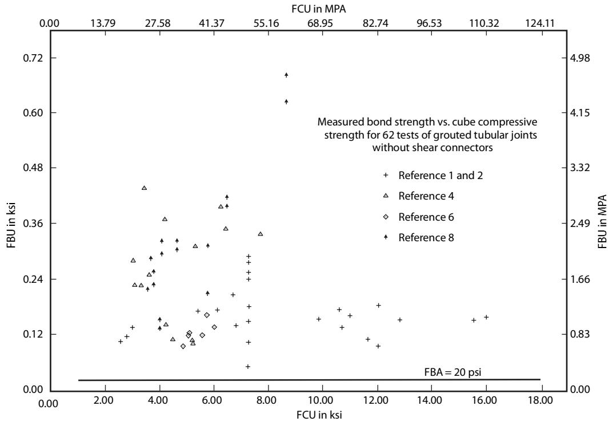  
Figure C7.4.4a-1—Measured Bond Strength vs. Cube Compressive Strength

The safety factor of 6 in Equation C7.4.4d-1 is specified for normal loading conditions on a connection in which the grout displaced water, and the safety factor is adjusted for other conditions. The stiffness factor, $K$ , which is defined in Equation C7.4.4d-2 and is used in Equation C7.4.4d-1, is intended to introduce into the equation the effect of the hoop flexibility of the pile, sleeve and grout on the connection strength. The DOE equations are based on extensive testing performed at the Wimpey Laboratories near London (Ref. 1, 2, and 3). Detailed instructions for the use of these equations and limitations on their use are set out explicitly in the DOE Code (Ref. 1), to which the designer is hereby referred.

References

(1) U.K. Department of Energy, Offshore Installations, Guidance on Design and Construction, Amendment No. 4, April 1982.   
(2) Billington, C. J., and Lewis, G. H. G., The Strength of Large Diameter Grouted Connections, Paper OTC 3033 of Offshore Technology Conference, Houston, Texas, 1978.   
(3) Billing, C. J., and Tebbett, I. E., The Basis of New Design Formulae for Grouted Jacket to Pile Connections, Paper

OTC 3788 of Offshore Technology Conference, Houston, Texas, 1980.

(4) Evans, George W., and Carter, L. Gregory, Bonding Studies of Cementing Compositions to Pipe and Formations, Presented at the Spring Meeting of the Southwester District, Division of Production, American Petroleum Institute, Odessa, Texas, March 21 - 23, 1962.   
(5) Karsan, D. I., and Krahl, N. W., New API Equation for Grouted Pile to Sleeve Connections, Paper OTC 4715 of Offshore Technology Conference, Houston, 1984.   
(6) Loset, Oystein, Grouted Connections in Steel Platforms—Testing and Design, Institute of Structural Engineers Informal Study Group—Model Analysis at a Design Tool, Joint I. Struct. E./B.R.E., Two Day Seminar on the Use of Physical Models in the Design of Offshore Structures, Nov. 15 and 16, 1979, Paper No. 8.   
(7) Moses, Fred, and Russell, Larry, Applicability of Reliability Analysis in Offshore Design Practice, API-PRAC Project 79-22, American Petroleum Institute, Dallas, Texas.   
(8) Test data made available to API Task Group on Fixed Platforms by Chicago Bridge and Iron Company.

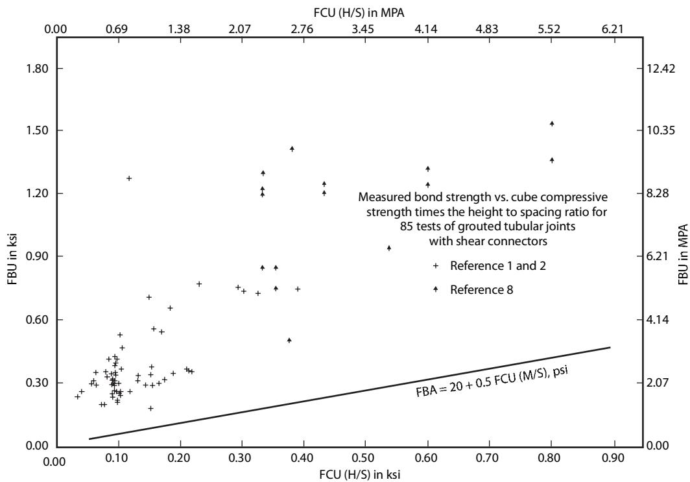  
Figure C7.4.4a-2—Measured Bond Strength vs. Cube Compressive Strength Times the Height-to-Spacing Ratio

COMMENTARY ON MATERIAL, SECTION 8 C8.2 STRUCTURAL STEEL PIPE

Tubulars used as structural components are often subjected to substantial axial and hoop stresses. Test data on tubulars fabricated with circumferential and longitudinal seams have provided insight into the effects of geometric imperfections and residual stresses introduced during fabrication and allowed development of empirical formulations to define elastic and critical buckling stresses as well as the interaction relationships between the axial and hoop stresses. Unless sufficient test data are obtained on spiral welded tubulars to evaluate applicability of API recommended empirical formulations, spiral welded tubulars cannot be recommended for structural use.

COMMENTARY ON WELDING, SECTION 10.2.2

C10.2.2 Charpy impact testing is a method for qualitative assessment of material toughness. Although lacking the technical precision of crack tip opening displacement (CTOD) testing, the method has been and continues to be a reasonable measure of fracture safety, when employed with a definitive

program of nondestructive examination to eliminate weld area imperfections. The recommendations contained herein are based on practices which have generally provided satisfactory fracture experience in structures located in moderate temperature environments (e.g., $40^{\circ}\mathrm{F}$ sea water and $14^{\circ}\mathrm{F}$ air exposure). For environments which are either more or less hostile, impact testing temperatures should be reconsidered, based on local temperature exposures.

For critical welded connections, the technically more exact CTOD test is appropriate. CTOD tests are run at realistic temperatures and strain rates, representing those of the engineering application, using specimens having the full prototype thickness. This yields quantitative information useful for engineering fracture mechanics analysis and defect assessment, in which the required CTOD is related to anticipated stress levels (including residual stress) and flaw sizes.

Achieving the higher levels of toughness may require some difficult trade-offs against other desirable attributes of the welding process - for example, the deep penetrations and relative freedom from trapped slag of uphill passes.

Since AWS welding procedure requirements are concerned primarily with tensile strength and soundness (with minor emphasis on fracture toughness) it is appropriate to consider additional essential variables which have an influence on fracture toughness—i.e., specific brand wire/flux combina-

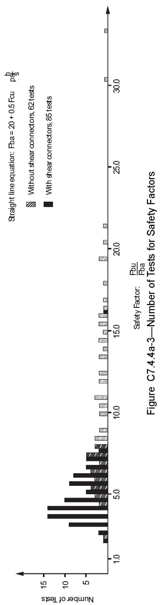

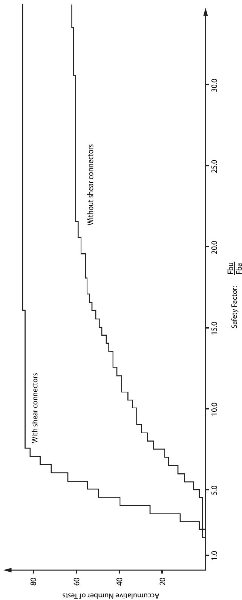  
Figure C7.4.4a-4-Cumulative Histogram of Safety Factors

tions, and the restriction of AWS consumables to the limits actually tested for AWS classification. Note that, for Class A steels, specified energy levels higher than the AWS classifications will require that all welding procedures be qualified by test, rather than having prequalified status.

Heat affected zone. In addition to weld metal toughness, consideration should be given to controlling the properties of the heat affected zone (HAZ). Although the heat cycle of welding sometimes improves base metals of low toughness, this region will more often have degraded properties. A number of early failures in welded tubular joints involved fractures which either initiated in or propagated through the HAZ, often before significant fatigue loading.

02

AWS D1.1-2002 Appendix III gives requirements for sampling both weld metal and HAZ, with Charpy energy and temperature to be specified in contract documents. The following average HAZ values have been found by experience to be reasonably attainable, where single specimen energy values (one of three) 5 ft-lbs (7J) lower are allowed without requiring retest:

As criticality of the component's performance increases, lower testing temperatures (implying more restrictive welding procedures) would provide HAZ's which more closely match the performance of the adjoining weld metal and parent material, rather than being a potential weak link in the system. The owner may also wish to consider more extensive sampling of the HAZ than the single set of Charpy tests required by AWS, e.g., sampling at $0.4\mathrm{-mm}$ , $2\mathrm{-mm}$ , and $5\mathrm{-mm}$ from the fusion line. More extensive sampling increases the likelihood of finding local brittle zones with low toughness values.

Since HAZ toughness is as much dependent on the steel as on the welding parameters, a preferable alternative for addressing this issue is through weldability prequalification of the steel. API RP 2Z spells out such a prequalification procedure, using CTOD as well as Charpy testing. This prequalification testing is presently being applied as a supplementary requirement for high-performance steels such as API Specs 2W and 2Y, and is accepted as a requirement by a few producers.

Caution: AWS permits testing one 50-ksi steel to qualify all other grades of 50-ksi and below. Consequently, selection of API-2H-50-Z (very low sulfur, 200 ft-lb upper shelf Charpies) for qualification test plates will virtually assure satisfying a HAZ impact requirement of 25 ft-lbs, even when welded with high heat inputs and high interpass temperatures. There is no reasonable way to extrapolate this test to ordinary A572 grade 50 with the expectation of either similar HAZ impact energies or similar 8:1 degradation. Thus, separate Charpy testing of each API steel class is appropriate, if HAZ toughness is being addressed via WPQ (weld procedure qualification) testing.

Table C10.2.2—Average HAZ Values   

| Steel Group | Steel Class | Impact Test Temperature | Heat Affected Zone | Heat Affected Zone |
| --- | --- | --- | --- | --- |
| Steel Group | Steel Class | Impact Test Temperature | Ft-Lbs | (Joules) |
| I | C | 50°F (10°C) | for information only | for information only |
| I | B | 40°F (4°C) | 15 | 20 |
| I | A | 14°F (-10°C) | 15 | 20 |
| II | C | 50°F (10°C) | for information only | for information only |
| II | B | 40°F (4°C) | 15 | 20 |
| II | A | 14°F (-10°C) | 25 | 34 |
| III | A | 14°F (-10°C) | 30 | 40 |

COMMENTARY ON MINIMUM STRUCTURES, SECTION 16

C16.2 Design Loads and Analysis

Analysis and design procedures contained in this recommended practice are usually appropriate for minimum structures. However, these procedures have evolved from historical experience primarily involving conventional four and eight leg, welded, template type structures. Minimum structures may exhibit structural behavior different from conventional structures. Special consideration should be given the following:

1. Minimum structures tend to be less stiff than conventional structures, hence dynamic effects and fatigue are of more concern even in shallow water depths.   
2. Minimum structures typically are less redundant than conventional structures. For example, such structures are more sensitive to design oversights, fabrication and welding deviations, in-service damage, fatigue and deterioration due to corrosion.   
3. Reserve strength is important in any structure exposed to unforeseen loading conditions such as accidental loading from vessels or greater than predicted environmental loads. Reserve strength is usually lower in less redundant structures unless the designer makes provisions otherwise. These provisions may include reductions in acceptable interaction ratios used for member design as well as designing joints for the full yield strength of the connecting members.   
4. Many minimum structures utilize connection and component types other than conventional welded tubular joints. Offshore experience with these complex joints is limited; therefore connection performance and reliability is of concern especially when utilized in a low redundancy structure. Consideration of joint flexibility, which is not commonly

accommodated during global structural analysis, may become important.

Evaluation of reserve strength and redundancy should be balanced by consequences of failure. The consequences of failure of a minimum structure are usually lower since most are designed for:

1. Minimum topside facilities.   
2. Unmanned operations.   
3. One to six wells.   
4. Drilling and work-over activity to be performed by a mobile drilling rig.

It is entirely appropriate for such a structure to have lower reserve strength and less redundancy than a conventional structure. However, under no circumstances should a quarters or oil storage platform be classified as a low consequence of failure structure.

Experience with minimum structures indicates possible hindrance of human performance, due to structural movement, from operating environmental conditions. The owner may choose to accept possible reduced operating and production efficiency. However the owner may also choose to perform a dynamic response analysis using owner selected environmental loads. The results can be compared to a personnel comfort graph (which depicts period vs. peak acceleration or similar criteria (1.2)).

C16.3.3d Grouted Connections

The recommendation that all axial load transfer be accomplished using only shear keys is made to insure the integrity of pile-pile sleeve connection. The significant movement inherent in these light weight structures could materially degrade the grout bond strength in such conditions.

C16.4.2 Caissons

There is a history of successful use of Class C material in caissons at service temperatures above freezing. However, most of this history was generated when $F_{b} = 0.66F_{y}$ .

（$F_{b} = 0.75 F_{y}$ starting with API RP 2A, 17th Edition, April 1, 1987).

Therefore, since caissons are primarily subjected to environmentally induced bending, the use of an interaction ratio allowable of 0.85 will closely approximate the use of $F_{b} = 0.66F_{y}$ rather than $F_{b} = 0.76F_{y}$ .

References

(1) Richart, Jr., F. E., Hall, Jr., J. R. and Woods, R. D., "Vibrations of Soils and Foundations," Prentice-Hall, Inc.

(2) Reese, R. C., and Picardi, E. A., "Special Problems of Tall Buildings," International Association for Bridge and Structural Engineering, Eighth Congress, Sept., 1968.

C17 COMMENTARY ON SECTION 17— ASSESSMENT OF EXISTING PLATFORMS

C17.1 GENERAL

Background. In engineering practice, it is widely recognized that although an existing structure does not meet present-day design standards, the structure may still be adequate or serviceable. Examples of this not only include fixed offshore platforms, but also buildings, bridges, dams, and onshore processing plants. The application of reduced criteria for assessing existing facilities is also recognized in risk management literature, justified on both cost-benefit and societal grounds.

Structural Integrity Management. Assessment forms one part of the life-cycle Structural Integrity Management (SIM) process for existing structures. The SIM process is continuous and is used as a means of determining whether an existing structure is capable of fulfilling its required function, based upon a fitness-for-purpose philosophy. The essence of the approach is based upon a realistic appraisal of the structure in conjunction with an effective topside and underwater survey and planned maintenance program. Assessment involves gathering all the known facts about a structure's configuration, condition and loading, analyzing the structure using realistic techniques, comparing analysis results with the evidence from survey of the structure, and correlating and refining both analysis and survey. This information is then used to make an engineering judgment on the structure's integrity and fitness-for-purpose. Mitigation is required when the risk levels exceed the fitness-for-purpose criteria. As the definition implies, assessment is concerned with existing real situations as opposed to the process of new design, which is concerned with future, yet to be built facilities. Platform owners that follow the SIM process should be able to operate their facilities for an extended period of time.

Change-of-Use. In situations where a platform Change-of-Use occurs, some of the approaches described in Section 17 are not appropriate since the original purpose of the platform has changed. Examples of platform Change-of-Use include the addition of a significant pipeline crossing to an existing platform, the use of an existing platform as a tie-back for a deepwater facility, and the conversion of an existing platform into a receiving terminal for LNG or other non exploration and production activity. In these cases, the use of the offshore structure has changed since the platform now has a different function, expected life and consequence of failure. For example, fatigue may have to be re-evaluated in detail since the structure now has a significantly longer term use under per

haps different loading conditions compared to its original design. A more rigorous above and below water survey may also be warranted. Section 15.2.3, Inspection of Reused Platforms, provides some guidance for more rigorous surveys, adjusted appropriately for an in-place platform. However, several of the Section 17 approaches may still be applicable, for example, the use of design and ultimate strength checks, where local component failure is acceptable, provided that the reserve against overall system failure and deformations remains acceptable. The platform owner should develop a systematic approach for the evaluation and where required, modification, for these types of structures that combines the merits of new design contained in Section 2, as well as the assessment approach contained in Section 17. In such cases the platform would not have to meet the minimum deck height requirements of Section 2.3.4.d3, Elevation of Underside of Deck, although wave-in-deck loading would have to be accounted for explicitly.

Reduced Criteria. Although the use of reduced criteria for assessing existing structures is well recognized, the use of the criteria in Section 17 results in existing platforms that may not withstand the same level of metocean loading as new platforms designed to the corresponding exposure levels in Section 2. Table C17.1-1 provides a comparison of Section 17 assessment wave height criteria to Section 2 new design wave height criteria for a 400 ft water depth platform. Also shown is the approximate annual return period for each wave height, considering the Gulf of Mexico full population of hurricanes (Krieger, et. al., 1994 [4], Petrauskas, et. al., 1994 [6]). Note that wave heights and return periods for other water depths will differ. A platform owner should take into account the higher risk of platform failure in extreme hurricanes, in comparison to new design, when using the reduced Section 17 criteria.

Application of Section 17 Outside of the U.S. The assessment process is generic and applicable for existing plat

forms in all offshore areas in terms of the overall approach and use of a stepwise procedure for demonstrating fitness-for-purpose. The exception is the use of reduced criteria, which was developed specifically for the U.S. areas indicated in Section 17. The use of reduced criteria for assessment may not be applicable in other offshore areas, unless special studies indicate otherwise. These studies should be in-depth and consider platform design, fabrication, installation and operation specific for the region as well as the local environmental conditions. The studies should be similar to those that support the application of the reduced criteria for U.S. areas, and as described in the Section 17 references.

Section 17 References. The references noted for Section 17 did not follow the review and balloting procedures necessary to be labeled API documents and in some cases reflect the opinions of only the authors.

C17.2 PLATFORM ASSESSMENT INITIATORS

C17.2.4 Inadequate Deck Height

Inadequate cellar deck height is considered an initiator because most historical platform failures in the U.S. Gulf of Mexico have been attributed to waves impacting the platform cellar deck, resulting in a large step-wise increase in loading. In a number of these cases this conclusion is based on hurricane wave and storm surge hindcast results, which indicate conditions at the platform location that include estimated wave crest elevations higher than the underside (bottom elevation) of the platform's cellar deck main beams.

A cellar deck is defined as a deck that has substantial deck structure and/or equipment that the wave loading will increase dramatically in a step-wise manner once the wave reaches the deck. Figure C17.6.2-1a provides a schematic representation of typical deck configurations for Gulf of Mexico platforms, and should be used as guidance in defin

Table C17.1-1—Comparison of Section 2 L-1 Wave Criteria and Section 17 Wave Criteria for 400 ft. Water Depth, Gulf of Mexico   

| API RP 2A Criteria | Wave Height Criteria Gulf of Mexico, 400 ft. Water Depth* | Wave Height Criteria Gulf of Mexico, 400 ft. Water Depth* |
| --- | --- | --- |
| API RP 2A Criteria | Design Level Assessment Height / Annual Return Period | Ultimate Strength Assessment Height / Annual Return Period |
| New Design (Section 2, L-1) | 70 ft / 100 yr. | Not Applicable |
| A-1 High (Section 17) | 57 ft / 30 yr. | 74 ft. / 200 yr. |
| A-2 Medium (Section 17) | 48 ft / 15 yr. | 62 ft. / 45 yr. |
| A-3 Low (Section 17) | 38 ft / <10 yr. | 48 ft. / 15 yr. |

* Wave heights and return periods for other water depths and in other regions will differ.

ing the cellar deck. If it is unclear which deck is the cellar deck, then the lowest deck under consideration should be taken as the assessment trigger. An ultimate strength analysis is the most appropriate technique to determine platform performance for this type of loading.

Inadequate cellar deck height may result from one or more of the following events:

1. Platform cellar deck elevation set by equipment limitations.   
2. Platform cellar deck elevation set to only clear a lower design wave height.   
3. Field installed cellar deck.   
4. Platform installed in deeper water than its original design specified.   
5. Subsidence due to reservoir compaction.

In some cases, the cellar deck elevation may be greater than the criteria specified in Section 17 as an Inadequate Deck Height trigger, but there may still be one or more smaller decks below the cellar deck, such as a scaffold, sump or spider deck, that will be impacted by waves. These decks will have a small profile and the anticipated wave loading is not expected to be sufficient to cause failure of the platform. However, the assessment should consider the appropriate hydrodynamic loads on these decks and associated equipment, as described in Section C17.6.2, for either a design level assessment or an ultimate strength assessment as may be required for the structure.

C17.4 PLATFORM ASSESSMENT INFORMATION—SURVEYS

C17.4.1 General

The adequacy of structural assessments is measured by the quality of data available. The following is a summary of data that may be required:

1. General information:

a. Original and current owner.   
b. Original and current platform use and function.   
c. Location, water depth and orientation.   
d. Platform type—caisson, tripod, 4/6/8-leg, etc.   
e. Number of wells, risers and production rate.   
f. Other site-specific information, manning level, etc.   
g. Performance during past environmental events.

2. Original design:

a. Design contractor and date of design.   
b. Design drawings and material specifications.   
c. Design code (for example, Edition of Recommended Practice 2A).   
d. Environmental criteria—wind, wave, current, seismic, ice, etc.   
e. Deck clearance elevation (underside of cellar deck steel).   
f. Operational criteria—deck loading and equipment arrangement.

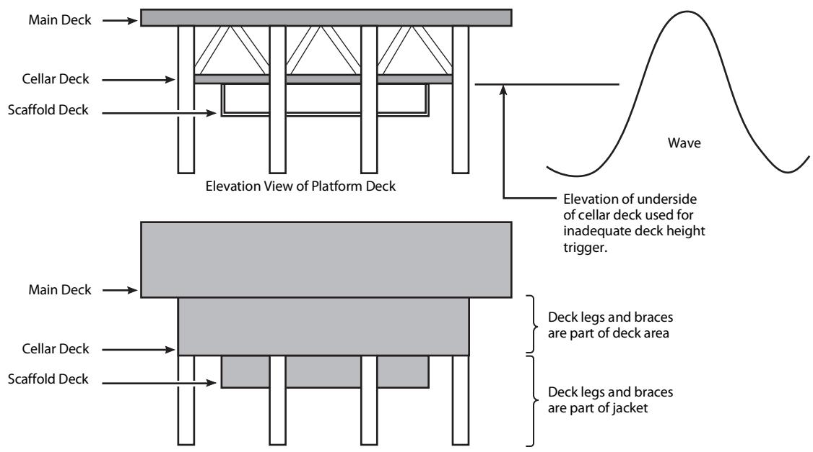  
Figure C17.6.2-1a—Silhouette Area Definition

g. Soil data.   
h. Number, size, and design penetration of piles and conductors.   
i. Appurtenances—list and location as designed.

3. Construction:

a. Fabrication and installation contractors and date of installation.   
b. "As-built" drawings.   
c. Fabrication, welding, and construction specifications.   
d. Material traceability records.   
e. Pile and conductor driving records.   
f. Pile grouting records, (if applicable).

4. Platform history:

a. Environmental loading history—hurricanes, earthquakes, etc.   
b. Operational loading history—collisions and accidental loads.   
c. Survey and maintenance records.   
d. Repairs—descriptions, analyses, drawings, and dates.   
e. Modifications—descriptions, analyses, drawings, and dates.

5. Present condition:

a. All decks—actual size, location and elevation.   
b. All decks—existing loading and equipment arrangement.   
c. Field measured deck clearance elevation (bottom of steel).   
d. Production and storage inventory.   
e. Appurtenances—current list, sizes, and locations.   
f. Wells-number, size, and location of existing conductors.   
g. Recent above-water survey (Level I).   
h. Recent underwater platform survey (Level II minimum).

If original design data, or as-built drawings are not available, assessment data may be obtained by field measurements of dimensions and sizes of important structural members and appurtenances. The thickness of tubular members can be determined by ultrasonic procedures, both above and below water, for all members except the piles. When the wall thickness and penetration of the piles cannot be determined and the foundation is a critical element in the structural adequacy, it may not be possible to perform an assessment. In this case, it may be necessary to downgrade the use of the platform to a

lower assessment category by reducing the risk or to demonstrate adequacy by prior exposure.

C17.4.3 Soil Data

Many sampling techniques and laboratory testing procedures have been used over the years to develop soil strength parameters. With good engineering judgment, parameters developed with earlier techniques may be upgraded based on published correlations. For example, design undrained shear strength profiles developed for many platforms installed prior to the 1970s were based on unconfined compression tests on 2.25-inch diameter driven wireline samples. Generally speaking, unconfined compression (UC) tests give lower strength values and greater scatter than unconsolidated undrained compression (UU) tests, which are now considered the standard (see Section 6). Studies have also shown that a 2.25-inch sampler produces greater disturbance than the 3.0-inch diameter thin-walled push samplers now typically used offshore. Therefore, depending on the type of sampling and testing associated with the available data, it may be appropriate to adjust the undrained shear strength values accordingly.

Pile-driving data may be used to provide additional insight on the soil profiles at each pile location, and to infer the elevations of pile end bearing strata.

C17.5 ASSESSMENT PROCESS

C17.5.1 General

Acceptable alternative assessment procedures include:

1. Assessment of similar platform by comparison: Design level or ultimate strength performance characteristics from an assessment of one platform may be used to infer the fitness for purpose of other similar platforms, provided the platforms' framing, foundation support, service history, structural condition, and payload levels are not significantly different. In cases where one platform's detailed performance characteristics are used to infer those of another similar platform, documentation should be developed to substantiate the use of such generic data.   
2. Assessment with explicit probabilities of failure: As an alternative to meeting the requirements herein, the computation of explicit probabilities of platform failure may be performed at the discretion of the owner, provided the failure probabilities are properly derived, and the acceptance criteria used can be satisfactorily substantiated.   
3. Assessment based on prior exposure: Another alternative to meeting the requirements herein for metocean loading assessment is to use prior storm exposure, provided the platform has survived with no significant damage. The procedure would be to determine, from either measurements or calibrated hind-casts, the

expected maximum base shear to which the platform has been exposed, and then check to see if it exceeds, by an appropriate margin, the base shear implied in the ultimate strength analysis check. The margin will depend on the uncertainty of the exposure wave forces, the uncertainty in platform ultimate strength, and the degree to which the platform's weakest direction was tested by the exposure forces. All sources of uncertainty, (that is, both natural variability and modeling uncertainty), should be taken into account. The margin has to be substantiated by appropriate calculations to show that it meets the acceptance requirements herein. Analogous procedures may be used to assess existing platforms based on prior exposure to seismic or ice loading.

C17.5.2 Assessment for Metocean Loading

The A-1 life safety manned-nonevacuated criteria are not typically applicable to the U.S. Gulf of Mexico. Current industry practice is to evacuate platforms for hurricanes whenever possible. Should this practice not be possible for a U.S. Gulf of Mexico platform under assessment, alternative criteria would need to be developed to provide adequate life safety. The A-2 life safety manned-evacuated criteria provide safety of personnel for hurricanes that originate inside the U.S. Gulf of Mexico, where evacuation may not be assured (for example, Hurricane Juan (1985)). The A-3 life safety manned-evacuated criteria also encompass winter storms.

In the U.S. Gulf of Mexico, many early platforms were designed to 25-year return period conditions, resulting in low deck heights. By explicitly specifying wave height, deck inundation forces can be estimated directly for ultimate strength analysis (see Section 17.6).

C17.5.3 Assessment for Seismic Loading

An alternative basis for seismic assessment is outlined in the API-sponsored Report titled: "Seismic Safety Requalification of Offshore Platforms," by W.D. Iwan, et. al., May 1992. This report was prepared by an independent panel whose members were selected based on their preeminence in the field of earthquake engineering and their experience in establishing practical guidelines for bridges, buildings, and other onland industrial structures. The basis for separating economic, life safety, and environmental safety issues is addressed in this report.

C17.6 METOCEAN, SEISMIC AND ICE CRITERIA/ LOADS

C17.6.2 Wave/Current Deck Force Calculation Procedure

The procedure described herein is a simple method for predicting the global wave/current forces on platform decks. The deck force procedure is calibrated to deck forces measured in

wave tank tests in which hurricane and winter storm waves were modeled.

The result of applying this procedure is the magnitude and point-of-application of the horizontal deck force for a given wave direction. The variability of the deck force for a given wave height is rather large. The coefficient of variation (that is, standard deviation divided by the mean) is about 0.35. The deck force should be added to the associated wave force.

Other wave/current deck force calculation procedures for static and/or dynamic analyses may be used provided they are validated with reliable and appropriate measurements of global wave/current forces on decks either in the laboratory or in the field.

The deck force procedure relies on a calculated crest height. The crest height should be calculated using the wave theory as recommended in Section 2.3.1b.2, and the ultimate strength analysis wave height, associated wave period, and storm tide.

The steps for computing the deck force and its point of application are as follows:

a. Step 1: Given the crest height, compute the wetted "silhouette" deck area, (A) projected in the wave direction, （$\theta_w)$ .

The full silhouette area for a deck is defined as the shaded area in Figure C17.6.2-1a, i.e., the area between the bottom of the scaffold deck and the top of the "solid" equipment on the main deck. The silhouette area for deck force calculations is a subset of the full area, extending up to the "crest elevation." This is an elevation above $mllw$ that is equal to the sum of the storm tide and crest height required for ultimate strength analysis. The silhouette area is therefore equal to the distance between the underside of the deck and the crest elevation, times the deck width.

For lightly framed sub-cellar deck sections with no equipment (for example, a scaffold deck comprised of angle iron), use one-half of the silhouette area for that portion of the full area. The areas of the deck legs and bracing above the cellar deck are part of the silhouette area. Deck legs and bracing members below the bottom of the cellar deck should be modeled along with jacket members in the jacket force calculation procedure. Lattice structures extending above the "solid equipment" on the main deck can be ignored in the silhouette.

The area, A, is computed as follows:

$$A = A_{x} \cos \theta_{w} + A_{y} \sin \theta_{w}$$

where:

$\theta_{w}, A_{x}$ and $A_{y}$ are as defined in Figure C17.6.2-1b.

b. Step 2: Use the wave theory recommended in Section 2.3.1 or C2.3.1, and calculate the maximum wave-induced horizontal fluid velocity, $V$ , at the crest elevation or the top of the main deck silhouette, whichever is lower.

c. Step 3: The wave/current force on the deck, $F_{dk}$ , is computed by the following:

$$F_{d k} =^{1} /_{2} \rho C_{d} (a_{w k f} \bullet V + \alpha_{c b f} \bullet U)^{2} A,$$

where:

$$U = \text{t h e c u r r e n t s p e e d i n - l i n e w i t h}$$

$$a_{w k f} = \text{t h e w a v e k i n e m a t i c s f a c t o r (0 . 88 f o r h u r i c a n e s} \text{a n d 1 . 0 f o r w i n t e r s t o m s)},$$

$$a_{c b f} = \text{t h e c u r r e n t b l o c k a g e f a c t o r f o r t h e j a c k e t},$$

$$\rho = \text{t h e m a s s d e n s i t y o f s e w a t e r}.$$

The drag coefficient, $C_d$ , is given in Table C17.6.2-1.

d. Step 4: The force $F_{dk}$ should be applied at an elevation $Z_{dk}$ above the bottom of the cellar deck. $Z_{dk}$ is defined as 50 percent of the distance between the lowest point of the silhouette area and the lower of the wave crest or top of the main deck.

Table C17.6.2-1—Drag Coefficient, $C_d$ , for Wave/Current Platform Deck Forces   

| Deck Type | Cd | Cd |
| --- | --- | --- |
| Deck Type | End-on and Broadside | Diagonal (45°) |
| Heavily equipped (solid) | 2.5 | 1.9 |
| Moderately equipped | 2.0 | 1.5 |
| Bare (no equipment) | 1.6 | 1.2 |

C17.6.2a U.S. Gulf of Mexico Criteria

The A-1 criteria are based on the "full population" hurricanes (all hurricanes affecting the U.S. Gulf of Mexico). A-2 criteria are based on a combined population consisting of "sudden" hurricanes (subset of full population hurricanes) and winter storms. The A-3 criteria are based on winter storms.

The sudden hurricane criteria are based on hurricanes that spawn in the U.S. Gulf of Mexico. These criteria apply to manned platforms in which there may not be enough warning to evacuate. Hurricanes that spawn outside the U.S. Gulf of Mexico were not included because sufficient warning to evacuate all platforms is available provided that conventional evacuation procedures are maintained. An example of a sudden hurricane is Juan (1985). The sudden hurricane population used here provides for conservative criteria because, among the 27 hurricanes that spawned in the U.S. Gulf of Mexico during 1900-1989, platforms would have been evacuated in almost all cases.

C17.7 STRUCTURAL ANALYSIS FOR ASSESSMENT

C17.7.1 General

Structural evaluation is intended to be performed in three consecutive levels of increasing complexity. Should a structure fail the screening or first level, it should be analyzed using the second level, and similarly for the third level. Conversely, should a structure pass screening, no further analysis is required, and similarly for the second level. The first level (screening) is comprised of the first four components of the assessment process: (1) selection, (2) categorization, (3) condition assessment, and (4) design basis checks. The second

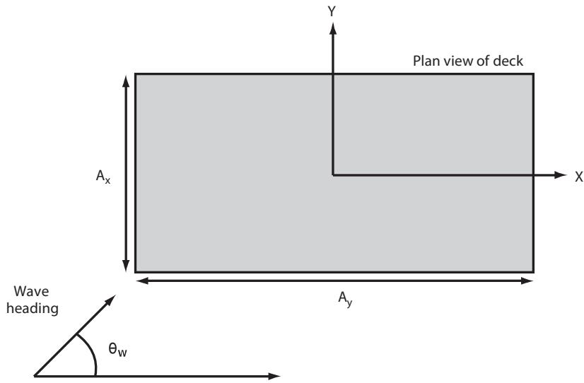  
Figure C17.6.2-1b—Wave Heading and Direction Convention

level (design level analysis) allows recognition of the working strength of a member or joint within the elastic range using current technology. The third level (ultimate strength analysis) recognizes the full strength of the platform structure to demonstrate adequacy and stability.

C17.7.2 Design Level Analysis Procedures

## C.17.7.2a General

It should be noted that the design level analysis criteria provided in Section 17.6 were calibrated for structures that did not have wave loading on their decks. It is therefore unconservative to consider wave loading on decks for assessments using design level analysis. Ultimate strength analysis is required instead, using the higher environmental criteria contained in Section 17.6. Note that for some wave-in-deck loading, only a linear global analysis will be necessary (see Section 17.7.3a).

## C.17.7.2b Structural Steel Design

Should ongoing research be used to determine the strength of members, it must be carefully evaluated to assure applicability to the type of member, its level of stress, and the level of confidence in the conclusions of the research. For example, the use of smaller values for effective length （$K)$ factors might be appropriate for members developing large end moments and high levels of stress, but might not be appropriate for lower levels of stress.

Because of availability and other nonstructural reasons, members could have steel with yield stress higher than the specified minimum. If no such data exist, tests can be used to determine the actual yield stress. Joint industry studies have indicated that higher yield stresses can be justified statistically.

## C.17.7.2c Connections

Joints are usually assumed rigid in the global structural model. Significant redistribution of member forces can result if joint flexibility is accounted for, especially for short bracing with small length-to-depth ratios, and for large leg can diameters where skirt piles are used. Joint flexibility analysis may use finite element methods as appropriate. Steel joints can have higher strength than currently accounted for. Similarly, the evaluation of strength for grouted joints, as well as the assessment of grout stiffness and strength, may consider higher values than normally used for design.

## C.17.7.2d Fatigue

All offshore structures, regardless of location, are subject to fatigue degradation. In many areas, fatigue is a major design consideration due to relatively high ratios of operational seastates to maximum design environmental events. In the U.S. Gulf of Mexico, however, this ratio is low. Still,

fatigue effects should be considered and engineering decisions should be consciously based on the results of any fatigue evaluations.

Selection of critical areas for any Level III and/or IV inspections should preferably be based on factors such as joint and member loads, stresses, stress concentration, structural redundancy, and fatigue lives as determined by platform design.

In the U.S. Gulf of Mexico, Level III and/or IV underwater surveys may be considered adequate if they indicate no fatigue cracks. Should cracks be indicated, no further analysis is required if these are repaired. The use of analytical procedures for the evaluation of fatigue can be adequate if only Level II survey is done.

C17.7.3 Ultimate Strength Procedures

It should be noted that limited structural damage is acceptable and that the more severe environmental loading as noted in Section 17.6 is required.

In ultimate strength analysis, structural elements are allowed to carry loads up to their ultimate capacities, they can continue to carry load after reaching those capacities, depending on their ductility and post-elastic behavior. Such elements may exhibit signs of damage, having crossed over buckling or inelastic yielding. In this context, damage is acceptable as long as the integrity of the structure against collapse is not compromised.

Since structures do not usually develop overload stresses in most of their elements at one time, the need to perform complex ultimate strength analyses for the whole structure might not be justified for a few overloaded elements, thus the need to distinguish between local and global overloading.

An efficient approach to ultimate capacity assessment is to carry it out in a step-wise procedure as follows: (a) perform a linear global analysis to determine whether nonlinearity is a local or a global problem, and (b) perform local or global ultimate strength analysis as required.

As an alternative to a nonlinear assessment such as a pushover analysis, it may be possible to demonstrate that the platform will pass the ultimate strength assessment by using a linear elastic analysis, similar to a design level analysis, with the exception that the typical factors of safety associated with axial, bending, shear and other loading conditions have been removed. Other known sources of conservatism such as the use of mean yield strength instead of nominal yield strength may also be taken into account. The intent is to approximate performance of the platform members when loads are above allowable stress but below actual yield or buckling. If all of the platform members can be shown to remain elastic, considering all combined stress states, then the platform passes the ultimate strength assessment. If the load in a platform member or members exceeds yield, then a nonlinear ultimate strength analysis should be utilized.

## C.17.7.3a Linear Global Analysis

This analysis is performed to indicate whether the structure has only a few or a large number of overloaded elements subject to loading past the elastic range.

## C.17.7.3b Local Overload Considerations

Minimal elastic overstress with adequate, clearly definable alternate load paths to relieve the portion of loading causing the overstress may be analyzed as a local overload without the need for full global inelastic analysis or the use of major mitigation measures. The intent here is not to dismiss such overstress, but to demonstrate that it would be relieved because of alternate load paths, or because of more accurate and detailed calculations based on sound assumptions. These assumptions must consider the level of overstress as well as the importance of the member or joint to the structural stability and performance of the platform.

Should demonstration of relief for such overstress be inconclusive or inadequate, a full and detailed global inelastic analysis would be required and/or mitigation measures taken as needed.

## C.17.7.3c Global Inelastic Analysis

1. General. It should be recognized that calculation of the ultimate strength of structural elements is a complex task and the subject of ongoing research that has neither been finalized nor fully utilized by the practicing engineering community. The effects of strength degradation due to cyclic loading, and the effects of damping in both the structural elements and the supporting foundation soils should be considered. Strength increases due to soil consolidation may be used if justified.

2. **Methods of Analysis.** Several methods have been proposed for ultimate strength evaluation of structural systems. Two methods that have been widely used for offshore platform analysis are the Push-over and the Time Domain methods. It is important to note that regardless of the method used, no further analysis is required once a structure reaches the specified extreme environmental loading, (that is, analysis up to collapse is not required). The methods are described as follows:

a. Push-over method. This method is well suited for static loading, ductility analysis, or dynamic loading which can be reasonably represented by equivalent static loading. Examples of such loading would be waves acting on stiff structures with natural periods under three seconds, having negligible dynamic effects, or ice loading that is not amplified by exciting the resonance of the structure. The structural model must recognize loss of strength and stiffness past ultimate. The analysis tracks the performance of the structure as the level of force is increased until it reaches the extreme

load specified. As the load is incrementally increased, structural elements such as members, joints, or piles are checked for inelastic behavior in order to ensure proper modeling. This method has also been widely used for ductility level earthquake analysis by evaluating the reserve ductility of a platform, or by demonstrating that a platform's strength exceeds the maximum loading for the extreme earthquake events. Although cyclic and hysteretic effects cannot be explicitly modeled using this method, their effects can be recognized in the model in much the same way that these effects are evaluated for pile head response to inelastic soil resistance.

b. Time Domain method. This method is well suited for detailed dynamic analysis in which the cyclic loading function can be matched with the cyclic resistance-deformation behavior of the elements step by step. This method allows for explicit incorporation of nonlinear parameters such as drag and damping into the analysis model. Examples of dynamic loading would be earthquakes and waves on platforms whose fundamental period is three seconds or greater. The identification of a collapse mechanism, or the confirmation that one does exist, can require significant judgment using this method. Further guidance to nonlinear analysis can be found in Sections 2.3.6 and C2.3.6.

3. Modeling. Regardless of the method of analysis used, it is necessary to accurately model all structural elements. Before selection of element types, detailed review of the working strength analysis results is recommended to screen those elements with very high stress ratios that are expected to be overloaded. Since elements usually carry axial forces and biaxial bending moments, the element type should be based on the dominant stresses. Beam column elements are commonly used, although plate elements may be appropriate in some instances. Elements can be grouped as follows:

a. Elastic Members. The majority of members are expected to have stresses well within yield, and would not be expected to reach their capacity during ultimate strength analysis. These elements should be modeled the same as in the working strength method, and tracked to ensure their stresses remain in the elastic range. Examples of such members are deck beams and girders that are controlled by gravity loading and with low stress for environmental loading, allowing for significant increase in the latter before reaching capacity. Other examples may be jacket main framing controlled by installation forces, and conductor guide framing, secondary bracing and appurtenances.

b. Axially loaded members. These are undamaged members with high $Kl / r$ ratios and dominant high axial loads that are expected to reach their capacity. Examples of such members are primary bracing in the hori

zontal levels and vertical faces of the jacket, and primary deck bracing. The strut element should recognize reductions in buckling and post-buckling resistance due to applied inertia or hydrodynamic transverse loads. Effects of secondary (frame-induced) moments may be ignored when this type of element is selected. Some jacket members, such as horizontals, may not carry high axial loads until after buckling or substantial loss of strength of the primary vertical frame bracing.

c. Moment resisting members. These are undamaged members with low $Kl / r$ ratios and dominant high-bending stresses that are expected to form plastic hinges under extreme loading. Examples of such members are unbraced sections of the deck and jacket legs, and piles.   
d. Joints. The joint model should recognize whether the joint can form a hinge or not, depending on its $D / t$ ratio and geometry, and should define its load deformation characteristics after hinge formation. Other evaluations of joint strength may be acceptable if applicable, and if substantiated with appropriate documentation.   
e. Damaged elements. The type of damage encountered in platforms ranges from dents, bows, holes, tears, and cracks to severely corroded or missing members and collapsed joints. Theoretical as well as experimental work has been ongoing to evaluate the effects of damage on structural strength and stiffness. Some of this work is currently proprietary, and others are in the public domain. Modeling of such members should provide a conservative estimate of their strength up to and past capacity.   
f. Repaired and strengthened elements. The type of repairs usually used on platforms ranges from wet or hyperbaric welding, grouting, and clamps to grinding and relief of hydrostatic pressure. Grouting is used to stiffen members and joints, and to preclude local buckling due to dents and holes. Grinding is commonly used to improve fatigue life and to remove cracks. Several types of clamps have been successfully used, such as friction, grouted, and long-bolted clamps. Platform strengthening can be accomplished by adding lateral struts to improve the buckling capacity of primary members, and by adding insert or outrigger piles to improve foundation capacity. Modeling of repaired elements requires a keen sense of judgment tempered by conservatism, due to lack of experience in this area.   
g. Foundations. In a detailed/pile-soil interaction analysis, the soil resistance can be modeled as a set of compliant elements that resist the displacements of the pile. Such elements are normally idealized as distributed, uncoupled, nonlinear springs. In dynamic analysis, hysteretic behavior can also be significant. Recommendations for characterizing nonlinear soil springs are as follows:

- Soil Strength and Stiffness Parameters: A profile of relevant soil properties at a site is required to characterize the soil resistance for extreme event analysis. Soil strength data are particularly important in characterizing soil resistance. In some cases, other model parameters (such as initial soil stiffness and damping) are correlated with strength values and thus can be estimated from the strength profile or other rules of thumb.   
- Lateral Soil Resistance Modeling: A method for constructing distributed, uncoupled, nonlinear soil springs (p-y curves) is described in Section 6.8. These techniques may be useful for modeling the monotonic loading behavior of laterally deforming piles where other site-specific data are not available. Due to their empirical nature, the curves should be used with considerable caution, particularly in situations where unloading and reloading behavior is important or where large displacement response such as ultimate capacity (displacements generally greater than $10\%$ of the pile diameter) is of interest.   
- Axial Soil Resistance Modeling: A method for constructing distributed, uncoupled, nonlinear soil springs (t-z and q-w curves) for axial resistance modeling is described in Section 6.7. These techniques may be useful for modeling the monotonic loading behavior of axially deforming piles where other site-specific data is not available. To construct a "best estimate" axial soil resistance model, it may be appropriate to adjust the curves in Section 6.7 for loading rate and cyclic loading effects, which are known to have a significant influence on behavior in some cases.   
- Torsional Soil Resistance Modeling: Distributed, uncoupled, nonlinear soil springs for torsional resistance modeling can be constructed in a manner similar to that for constructing t-z curves for axial resistance. Torsion is usually a minor effect and linear resistance models are adequate in most cases.   
- Mudmats and Mudline Horizontal Members: In an ultimate strength analysis for a cohesive soil site, it may be appropriate to consider foundation bearing capacities provided by mudmats and mudline horizontal members, in addition to the foundation capacity due to pilings, provided that:

1. Inspection was conducted to confirm the integrity of the mudmats.   
2. Inspection confirmed that the soil support underneath the mudmats and horizontals has not been undermined by scour. For design purposes, the bearing capacity due to mudmats and mudline jacket members are typically neglected.

Mudmats and mudline horizontal members may be treated as shallow foundations. Methods described in Sections 6.12 to 6.16 and the commentary on shallow foundations can be used to estimate their ultimate capacity and stiffness. In addition, other methods may be used in cases in which the shear strength of the soil increases with depth.

Care must be taken in correctly modeling the interaction between the mudmats (and mudline members) and the pile foundation. Depending on soil conditions, the two components of foundation capacity can have very different stiffnesses.

- Effect of Soil Aging: For ultimate strength analysis, aging (the increase of soil shear strength with time) has been suggested as a source of additional foundation capacity that is not accounted for in the present design methodology. However, the state-of-the-art of this subject has not been sufficiently developed to justify routine application. Any attempt to upgrade foundation capacity based on aging will have to be justified on a case-by-case basis.   
- Estimate As-Installed Pile Capacity: Pile capacity should be estimated primarily using the static design procedure described in Section 6.4. However, if pile driving records (blow counts and/or instrumented measurement) are available, one-dimensional wave equation-based methods may be used to estimate soil resistance to driving (SRD) and infer an additional estimate of as-installed pile capacity.

A conductor pull test offers an alternative means for estimating the as-installed capacity of a driven pile.

- Conductors: In an ultimate strength analysis, well conductors can contribute to the lateral resistance of a platform once the jacket deflects sufficiently to close the gap between the conductor guide frames and the conductors.

Below the mudline, conductors can be modeled using appropriate p-y and t-z soil springs in a manner similar to piles. Above the mudline, the jacket model must realistically account for any gaps between the jacket and the conductors.

COMMENTARY ON SECTIONS 18.6 - 18.9—FIRE, BLAST, AND ACCIDENTAL LOADING

C18.6 FIRE

C18.6.1 General

The following commentary presents design guidelines and information for consideration of fire on offshore platforms.

C18.6.2 Fire as a Load Condition

The treatment of fire as a load condition requires that the following be defined:

1. Fire scenario.   
2. Heat flow characteristics from the fire to unprotected and protected steel members.   
3. Properties of steel at elevated temperatures and where applicable.   
4. Properties of fire protection systems (active and passive).

The fire scenario establishes the fire type, location, geometry, and intensity. The fire type will distinguish between a hydrocarbon pool fire or a hydrocarbon jet fire. The fire's location and geometry defines the relative position of the heat source to the structural steel work, while the intensity (thermal flux, units of Btu/hr $\cdot$ square foot or kW/square meter) defines the amount of heat emanating from the heat source. Steelwork engulfed by the flames will be subject to a higher rate of thermal loading than steelwork that is not engulfed. The fire scenario may be identified during process hazard analyses.

The flow of heat from the fire into the structural member (by radiation, convection, and conduction) is calculated to determine the temperature of the member as a function of time. The temperature of unprotected members engulfed in flame is dominated by convection and radiation effects, whereas the temperature of protected members engulfed in flame is dominated by the thermal conductivity of the insulating material. The amount of radiant heat arriving at the surface of a member is determined using a geometrical "configuration" or "view" factor. For engulfed members, a configuration factor of 1.0 is used.

The properties of steel (thermal and mechanical) at elevated temperatures are required. The thermal properties (specific heat, density, and thermal conductivity) are required for the calculation of the steel temperature. The mechanical properties (expansion coefficient, yield stress, and Young's modulus) are used to verify that the original design still meets the strength and serviceability requirements. Loads induced by thermal expansion can be significant for highly restrained members and should be considered.

Examples of the effects on the stress/strain characteristics of ASTM A-36 and A-633 Grade C and D steels at elevated temperatures are presented in Figure C18.6.2-1 and Table C18.6.2-1 [1 (Table 1.1, Section FR1)] for temperatures in the range of $100^{\circ}\mathrm{C}$ to $600^{\circ}\mathrm{C}$ . Stress/strain data for temperatures in the range of $650^{\circ}\mathrm{C}$ to $1000^{\circ}\mathrm{C}$ may also be found in the same reference.

The interpretation of these data to obtain representative values of temperature effects on yield strength and Young's modulus should be performed at a strain level consistent with the design approach used:

a. For a design approach that does not permit some permanent set in the steelwork after the fire load condition has been

Table C18.6.2-1—Yield Strength Reduction Factors for Steel at Elevated Temperatures (ASTM A-36 and A-633 GR. C and D)   

| Temp. °C | Strain | Strain | Strain | Strain |
| --- | --- | --- | --- | --- |
| Temp. °C | 0.2% | 0.5% | 1.5% | 2.0% |
| 100 | 0.940 | 0.970 | 1.000 | 1.000 |
| 150 | 0.898 | 0.959 | 1.000 | 1.000 |
| 200 | 0.847 | 0.946 | 1.000 | 1.000 |
| 250 | 0.769 | 0.884 | 1.000 | 1.000 |
| 300 | 0.653 | 0.854 | 1.000 | 1.000 |
| 350 | 0.626 | 0.826 | 0.968 | 1.000 |
| 400 | 0.600 | 0.798 | 0.956 | 0.971 |
| 450 | 0.531 | 0.721 | 0.898 | 0.934 |
| 500 | 0.467 | 0.622 | 0.756 | 0.776 |
| 550 | 0.368 | 0.492 | 0.612 | 0.627 |
| 600 | 0.265 | 0.378 | 0.460 | 0.474 |

removed, a strain of 0.2 percent should be assumed.

b. For a design approach that allows some permanent set in the steelwork after the fire load condition has been removed, higher values of strain may be appropriate (0.5 percent to 1.5 percent).

At temperatures above $600^{\circ}\mathrm{C}$ （$1100^{\circ}\mathrm{F})$ , the creep behavior of steel may be significant and should be considered.

C18.6.3 Design for Fire

The treatment of fire as a load condition can be addressed using one of the following approaches:

1. Zone method.   
2. Linear elastic method (for example, a working stress code check).   
3. Elastic-plastic method (for example, a progressive collapse analysis).

The application of these three methods with respect to the maximum allowable temperature of steel is presented in Figure C18.6.3-1. The data presented in Figure C18.6.3-1 are extracted from Table C18.6.2-1 at 0.2 percent strain. Although a maximum temperature of 600 is presented in Figure C18.6.3-1, steel temperatures in excess of this level may be used in a time-dependent elastic-plastic analysis. Such an analysis should include the effects of creep and be able to accommodate large deflections and large strains.

The zone method of design assigns a maximum allowable temperature that can develop in a steel member without reference to the stress level in the member prior to the fire. The maximum allowable temperature is extracted from Table

C18.6.2-1 by selecting those steel temperatures that correspond to a yield strength reduction factor of 0.6, and are presented in Table C18.6.3-1. The fundamental assumption behind this method is that a member utilization ratio calculated using basic (AISC) allowable stress will remain unchanged for the fire load condition if the allowable stress is increased to yield, but the yield stress itself is subject to a reduction factor of 0.6.

This assumption is valid when the nonlinear stress/ strain characteristics of the steel may be linearized such that the yield strength reduction factor is matched by the reduction in Young's modulus (as for a 0.2 percent strain). With a matched reduction in both yield strength and Young's modulus, the governing design condition (strength of stability) will be unaffected. However, the use of maximum allowable steel temperatures that correspond to higher strain levels require that the stress/strain characteristics be linearized at higher strain levels; thus, the reduction in Young's modulus will exceed the reduction in yield strength. With an unmatched reduction in both yield strength and Young's modulus, the governing design condition may be affected; thus, the zone method may not be applicable.

For the linear elastic method, a maximum allowable temperature in a steel member is assigned based on the stress level in the member prior to the fire, such that as the temperature increases, the member utilization ratio (UR) remains below 1.00, (that is, the member continues to behave elastically). For those members that do not suffer a buckling failure, the allowable stress should be such that the extreme fibers on the cross section are at yield. This yield stress should correspond to the average core temperature of the member. For example, the maximum allowable temperature in a steel member as a function of utilization ratio is presented in Table C18.6.3-2 for a 0.2 percent strain limit.

As discussed for the zone method above, a strain limit greater than 0.2 percent may require that the stress/strain characteristics be linearized at higher strain levels; thus, the reduction in Young's modulus will exceed the reduction in yield strength. With an unmatched reduction in both yield strength and Young's modulus, the governing design condition may be affected; thus, the linear elastic method may not be applicable.

For the elastic-plastic method, a maximum allowable temperature in a steel member is assigned based on the stress level in the member prior to the fire. As the temperature increases, the member utilization ratio may go above 1.00, (that is, the member behavior is elastic plastic). A nonlinear analysis is performed to verify that the structure will not collapse and will still meet the serviceability criteria.

Regardless of the design method, the linearization of the nonlinear stress strain relationship of steel at elevated

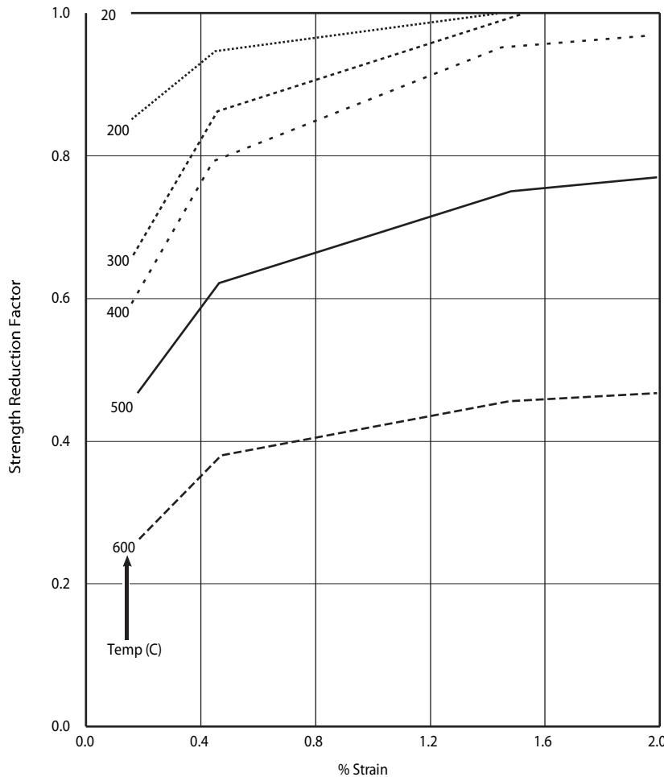  
Figure C18.6.2-1—Strength Reduction Factors for Steel at Elevated Temperatures (Reference 1)

Table C18.6.3-1—Maximum Allowable Steel Temperature as a Function of Strain for Use With the “Zone” Method   

| Strain (%) | Maximum Allowable Temperature of Steel | Maximum Allowable Temperature of Steel |
| --- | --- | --- |
| Strain (%) | °C | °F |
| 0.2 | 400 | 752 |
| 0.5 | 508 | 946 |
| 1.5 | 554 | 1029 |
| 2.0 | 559 | 1038 |

Note: Allowable temperatures calculated using linear interpolation of the data presented in Table C18.6.2-1.

temperatures can be achieved by the selection of a representative value of strain. A value of 0.2 percent is commonly used and has the benefit of giving a matched reduction in yield strength and Young's modulus, but has the disadvantage of limiting the allowable temperature of the steel to $400^{\circ}\mathrm{C}$ . Selection of a higher value of strain will result in a higher allowable temperature, but may well also result in an unmatched reduction in yield strength and Young's modulus.

An example is presented in Figure C18.6.3-2, where the stress/strain relationship of steel at $550^{\circ}\mathrm{C}$ is linearized at two different strain levels.

For choice A, both yield strength and Young's modulus are linearized at 1.4 percent strain, which is conservative for all stress strain combinations. However, while yield strength has only reduced by a factor of 0.60, Young's modulus has reduced by a factor of $0.09$ ( $= 0.6 \times 0.2 / 1.4$ ); thus, the reductions are unmatched and the load condition that governs

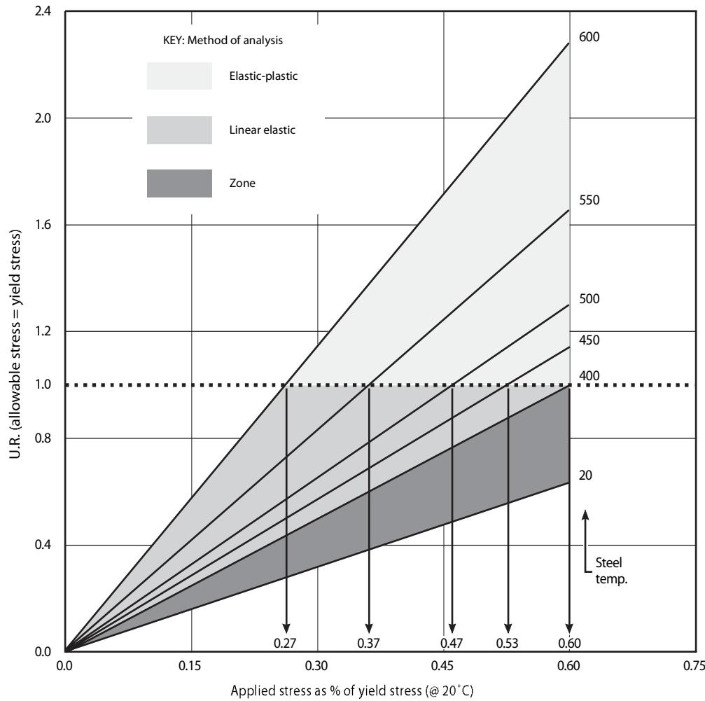  
Note: Strength reduction factors for steel linearized at $0.2\%$ strain.   
Figure C18.6.3-1—Maximum Allowable Temperature of Steel as a Function of Analysis Method

Table C18.6.3-2—Maximum Allowable Steel Temperature as a Function of Utilization Ratio (UR)   

| Maximum Member Temperature | Maximum Member Temperature | Yield Strength Reduction Factor at Max. Member Temperature | Member UR at 20°C To Give UR = 1.00 at Max. Member Temperature |
| --- | --- | --- | --- |
| °C | °F | Yield Strength Reduction Factor at Max. Member Temperature | Member UR at 20°C To Give UR = 1.00 at Max. Member Temperature |
| 400 | 752 | 0.60 | 1.00 |
| 450 | 842 | 0.53 | 0.88 |
| 500 | 932 | 0.47 | 0.78 |
| 550 | 1022 | 0.37 | 0.62 |
| 600 | 1112 | 0.27 | 0.45 |

design (strength or stability) will be affected.

For choice B, yield strength is linearized at 1.4 percent strain and Young's modulus is linearized at 0.2 percent strain. The reductions in yield strength and Young's modulus are both artificially maintained at 0.6 so that the load condition that governs design (strength or stability) is not affected. However, this choice of linearization is not conservative for all stress strain combinations. (See Figure C18.6.3-2.)

The linearization of the nonlinear stress/strain relationship of steel at elevated temperatures will not be necessary for those elastic-plastic analysis programs that permit temperature dependent stress/strain curves to be input.

C18.6.4 Fire Mitigation

A well designed and maintained detection, warning and shutdown system will provide considerable protection to the

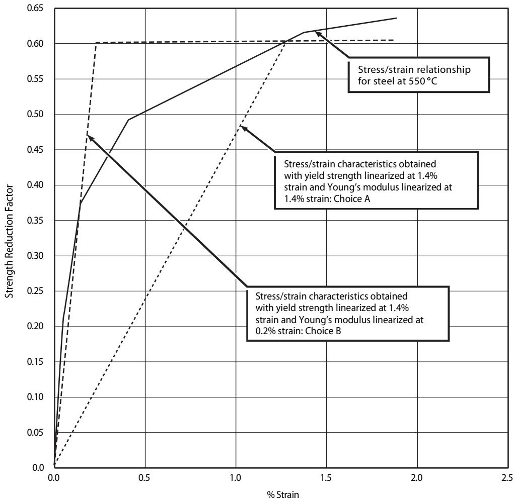  
Figure C18.6.3-2—Effect of Choice of Strain in the Linearization of the Stress/Strain Characteristics of Steel at Elevated Temperatures

structure. However, in the event that fire does occur, active or passive fire protection systems may be required to ensure that the maximum allowable member temperatures discussed in Section C18.6.3 are not exceeded for a designated period. They may also serve to prevent escalation of the fire. The designated period of protection is based on either the fire's expected duration or the required evacuation period.

Passive fire protection materials (PFP) comprise various forms of fire resistant insulation products that are used either to envelope individual structural members, or to form fire walls that contain or exclude fire from compartments, escape routes, and safe areas. Ratings for different types of fire wall are presented in Table C18.6.4-1.

Active fire protection (AFP) may be provided by water deluge and, in some instances by fire suppressing gas that is delivered to the site of the fire by dedicated equipment preinstalled for that purpose.

C18.7 BLAST

C18.7.1 General

The following commentary presents design guidelines and information for consideration of blast events on offshore platforms.

C18.7.2 Blast Loading

A blast scenario can be developed as part of the process hazard analysis. The blast scenario establishes the makeup and size of the vapor cloud, and the ignition source for the area being evaluated. The blast overpressures in a platform can vary from near zero on a small, open platform to more than 2 bars (1 bar = 14.7 psi) in an enclosed or congested installation.

There are no simple hand calculation methods for calculating explosion pressures for offshore structures. The equations that have been developed for other applications do not account for the significant amount of turbulence that is generated as the flame front passes through equipment. As a result, these methods significantly underpredict the blast pressures. Because of the complexity in predicting blast loads, the pressure-time curves should be generated by an expert in this field.

See Reference 1, Section 3.3.2 for a presentation of various types of explosion models that are available for predicting blast loading.

The loading generated by a blast depends on many factors, such as the type and volume of hydrocarbon released, the amount of congestion in a module, the amount of confinement, the amount of venting available, and the amount of module congestion caused by equipment blockage. Blast loading also depends on mitigation efforts such as water spray. Good natural venting will help reduce the chance of a major explosion.

A blast can cause two types of loading. Both should be considered when designing the topsides to resist explosions. The types of loading include the following:

Overpressure: Overpressure loading results from increases in pressure due to expanding combustion products. This loading is characterized by a pressure-time curve (see Figure C18.7.2-1). Overpressure is likely to govern the design of structures such as blast walls and floor/roof systems. When idealizing the pressure-time curve the important characteristics must be maintained. These characteristics are: rate of rise, peak overpressure, and area under the curve. For dynamic or quasi-static loading, it may be necessary to include the negative pressure portion of the curve.

Drag loading: Drag loading is caused by blast-generated wind. The drag loading is a function of gas velocity squared, gas density, coefficient of drag, and the area of the object being analyzed. Critical piping, equipment, and other items exposed to the blast wind should be designed to resist the predicted drag loads.

In addition to the blast loads, a best estimate of actual dead, live, and storage loads should be applied to the structure. Environmental loads can be neglected in a blast analysis. Any mass that is associated with the in-place loads should be included in a dynamic analysis.

C18.7.3 Structural Resistance

The purpose of this section is to give guidance on what should be considered when analyzing a structure for blast loads and what methods are appropriate. The main acceptance criteria, strength and deformation limits, are as follows:

Strength limit: Where strength governs design, failure is defined to occur when the design load or load effects exceed

Table C18.6.4-1—Summary of Fire Ratings and Performance for Fire Walls   

| Classification | Time Required for Stability and Integrity Performance to be Maintained (Minutes) | Time Required for Insulation Performance to be Maintained (Minutes) |
| --- | --- | --- |
| H120 | 120 | 120 |
| H60 | 120 | 60 |
| H0 | 120 | 0 |
| A60 | 60 | 60 |
| A30 | 60 | 30 |
| A15 | 60 | 15 |
| A0 | 60 | 0 |
| B15 | 30 | 15 |
| B0 | 30 | 0 |

Note: Maintaining stability and integrity requires that the passage of smoke and flame is prevented and the temperature of load bearing components should not exceed $400^{\circ}\mathrm{C}$ . Maintaining insulation performance requires that the temperature rise of the unexposed face is limited to $140^{\circ}\mathrm{C}$ for the specified period.

the design strength.

In the working stress design, maximum stresses are limited to some percentage of yield. This approach is clearly conservative for blast design. The allowable stresses can be increased so that the safety factor is 1.0.

See Reference 1, Section 3.5.4, for more details on this topic.

Deformation limit: Permanent deformation may be an essential feature of the design. In this case it is required to demonstrate the following:

1. No part of the structure impinges on critical operational equipment.   
2. The deformations do not cause collapse of any part of the structure that supports the safe area, escape routes, and embarkation points within the endurance period. A check should be performed to ensure that integrity is maintained if a subsequent fire occurs.

Deformation limits can be based on a maximum allowable strain or an absolute displacement as discussed below.

Strain limits: Most types of structural steel used offshore have a minimum strain capacity of approximately 20 percent at low strain rates. They usually have sufficient toughness against brittle fracture not to limit strain capacity significantly at the high strain rates associated with blast response for nominal U.S. Gulf of Mexico temperature ranges.

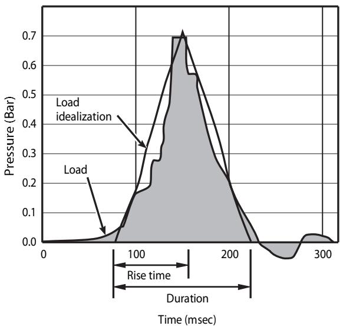  
Figure C18.7.2-1—Example Pressure Time Curve

Recommended strain limits for different types of loading are as follows:

| Type of Loading | Strain Limit |
| --- | --- |
| Tension | 5% |
| Bending or compression |  |
| Plastic sections | 5% |
| Compact sections | 3% |
| Semi-compact sections | 1% |
| Other sections | < yield strain |

The strain limits above assume that lateral torsional buckling is prevented. Reductions in these values may be required for cold-weather applications or for steel that has low fracture toughness.

Absolute limits: Absolute strain limits are adopted where there is a risk of a deforming element striking some component, usually process or emergency equipment or key structural members.

See Reference 1, Section 3.5.5, for more information on deformation limits.

C18.7.4 Determination of Yield Point

For all methods of analysis, it is necessary to determine the relationship between the deflection and the structural resistance. For most analyses, determination of the yield point is essential.

Actual yield stress, usually higher than the minimum specified, should be used in the analysis. Strain rates and strain hardening effects should be included in determining yield stress and general material behavior.

If maximum reaction forces are required, it is necessary to design using an upper bound yield stress. If maximum deflections are required, the design should use a lower bound yield stress.

C18.7.5 Methods of Analysis

The type of structural analysis performed should be based on the duration of the blast loading relative to the natural period of the structure. Low overpressures may allow a linear-elastic analysis with load factors to account for dynamic response. High overpressures may lead to more detailed analyses incorporating both material and geometric nonlinearities. The complexity of the structure being analyzed will determine if a single- or multiple-degree of freedom analysis is required. The types of analysis are as follows:

a. Static analysis: Where loads are quasi-static (that is, a long load duration relative to the structure's natural period), static-elastic or static-plastic analysis methods may be used. The peak pressure should be used to define the loading.   
b. Dynamic analysis: Where load duration is near the structure's natural period, a linear or nonlinear dynamic analysis should be performed. Simplified methods using idealized pressure time histories may be used to calculate dynamic load factors by which static loads can be scaled to simulate the effects of inertia and rapidly applied loads. The actual pressure-time curve can be applied to the structure to more accurately model the effects of the blast on the structure.

C18.7.6 Blast Mitigation

The blast effects can generally be minimized by making the vent area as large as possible; making sure the vent area is well distributed; concentrating on the layout, size, and location of internal equipment; and using blast barriers. Active suppressant/mitigation systems are being researched and may be used to minimize blast effects in the future.

To minimize blast pressures, vent areas should be located as close as possible to likely ignition sources. It is also desirable to keep equipment, piping, cable trays, etc., away from vent areas to minimize the drag loads on these items, and to fully use the vent area provided. Blast relief panels and louvers can be used to provide extra venting during an explosion. Relief panels must be designed to open rapidly at very low pressures to be effective in reducing the overpressures. Although the pressures needed to open the relief panels are best kept low for relief of blast pressures, they must not be so low as to allow wind to blow open the panels (for example, 0.02 bar [40 psf]). Note that wind pressures are at least an order of magnitude lower than blast pressures.

Blast walls can be used to separate parts of a platform so that an explosion within one area will not affect adjacent areas. This approach requires that the blast walls withstand the design overpressures without being breached. Failure of the blast wall could generate secondary projectiles and result in possible escalation. Blast walls generally double as firewalls and must maintain integrity after the explosion. Any passive fire protection attached to the wall must function as intended after the blast; otherwise, the loss of such fireproofing must be accounted for in the design.

C18.8 FIRE AND BLAST INTERACTION

C18.8.1 General

In many situations, there are conflicts that arise between fire and blast engineering. For example, to resist a fire, the structure may be segregated into small zones using firewalls to contain the fire. However, this segregation could result in an increase of overpressure if an explosion occurred. To reduce blast overpressures, the confinement must be reduced. This requires open modules with unobstructed access to the outside. This creates a direct conflict with the fire containment scheme. These conflicts need to be considered when designing the topsides.

Fire and blast assessments should be performed together and the effects of one on the other carefully analyzed. Usually, the explosion occurs first and is followed by a fire. However, it is possible that a fire could be initiated and then cause an explosion. The iteration process required between the fire and blast assessment is shown in Figure 18.2-1. Fire and blast assessments need to demonstrate that the escape routes and safe areas survive the fire and blast scenarios.

The following subsections cover practical considerations that should be considered when designing a structure to resist fire and blast loads.

C18.8.2 Deck Plating

Mobilizing membrane behavior in a deck will generally require substantial stiffening be provided at the beam support locations to prevent translation, and may be impractical. Deck plating may impose lateral forces during fire and blast loadings rather than restraint on deck structural members. Care should be taken in structural modeling of deck plate.

In general, the deck should be analyzed as a series of beams. The effective width of deck plate can affect the calculation of deck natural period and should be included. Plated decks may generally be allowed to deform plastically in the out-of-plane direction, provided that the integrity of their primary support structure is ensured.

C18.8.3 Blast and Fire Walls

Designs should allow as large a displacement as possible at mid-span. However, designs must consider the following:

1. Fire protection must be able to maintain integrity at the required strain.   
2. Member shortening under large lateral displacements could impose severe loads on top and bottom connections.

Piping, electrical, or HVAC penetrations should be located as near the top or bottom of the wall as possible.

C18.8.4 Beams

Members acting primarily in bending can also experience significant axial loads. These axial loads can have a significant affect on the strength and stiffness of the structural element. The additional bending moment caused as a result of the axial load and lateral deflection needs to be considered in either elastic or plastic analyses.

Axial restraints can result in a significant axial force caused by transverse loads being partially carried by membrane action. The effects of these loads on the surrounding structure need to be taken into account.

Both local and overall beam stability need to be considered when designing for blast loading. When considering lateral buckling, it is important that compression flanges be supported laterally. An upward load on a roof beam will put a normally unsupported bottom flange in compression.

C18.8.5 Structural Connections

Connections should be assessed for their ability to develop their plastic capacity.

Note that blast loadings may act in reverse direction from the normal design loadings.

Dynamic loading causes high strain rates that, if coupled with stress concentrations, could cause fracture.

C18.8.6 Slender Members

Slender members are prone to buckle prematurely during fire loading. If used, suitable lateral and torsional restraint should be provided. Note that the classification of members and parts of members as slender may be affected by the reduced Young's modulus (yE).

Deck plating during fire and blast loading may cause lateral loading rather than restraint.

C18.8.7 Pipe/Vessel Supports

Pipe and vessel supports may attract large lateral loads due to blast wind and/or thermal expansion of the supported pipes, etc.

Failed supports could load pipework and flanges with a risk of damage escalation.

Vessel supports should remain integral at least until process blowdown is complete.

Stringers to which equipment is attached may have significantly different natural periods than the surrounding structure. Their dynamic response may therefore need to be assessed separately.

C18.9 ACCIDENTAL LOADING

C18.9.1 General

The following commentary presents general guidance and information for consideration of vessel collision.

C18.9.2 Vessel Collision

All exposed elements at risk in the collision zone of an installation should be assessed for accidental vessel impact during normal operations.

The collision zone is the area on any side of the platform that a vessel could impact in an accidental situation during normal operations. The vertical height of the collision zone should be determined from considerations of vessel draft, operational wave height and tidal elevation.

Elements carrying substantial dead load (that is, knee braces), except for platform legs and piles, should not be located in the collision zone. If such elements are located in the collision zone they should be assessed for vessel impact.

C18.9.2a Impact Energy

The kinetic energy of a vessel can be calculated using Equation C18.9.2-1.

$$E = 0. 5 \mathrm{a m} v^{2} \tag{C18.9.2-1}$$

Where:

$E =$ the kinetic energy of the vessel,   
$a =$ added mass factor,   
$= 1.4$ for broadside collision,   
$= 1.1$ for bow/stern collision,

$m =$ vessel mass,

$\nu =$ velocity of vessel at impact.

The added mass coefficients shown are based on a ship-shaped or boat-shaped hull.

For platforms in mild environments and reasonably close to their base of supply, the following minimum requirements should be used, unless other criteria can be demonstrated:

Vessel Mass $= 1,100$ short tons (1,000 metric tons)

Impact Velocity $= 1.64$ feet/second (0.5 meters/second)

The 1100-short-ton vessel is chosen to represent a typical 180-200-foot-long supply vessel in the U.S. Gulf of Mexico.

For deeper and more remote locations, the vessel mass and

impact velocity should be reviewed and increased where necessary. In shallow areas, it may be possible to reduce this criteria where access to the platform is limited to small workboats.

18.9.2b Energy Absorption

An offshore structure will absorb energy primarily from the following:

a. Localized plastic deformation (that is, denting) of the tubular wall.   
b. Elastic/plastic bending of the member.   
c. Elastic/plastic elongation of the member.   
d. Fending device, if fitted.   
e. Global platform deformation (that is, sway).   
f. Ship deformation and/or rotation.

In general, resistance to vessel impact is dependent upon the interaction of member denting and member bending. Platform global deformation may be conservatively ignored. For platforms of a compliant nature, it may be advantageous to include the effects of global deformation.

C18.9.2c Damage Assessment

Two cases should be considered:

1. Impact (energy absorption and survival of platform).   
2. Post-impact (platform to meet post-impact criteria).

Primary framework should be designed and configured to absorb energy during impact, and to control the consequences of damage after impact. Some permanent deformation of members may be allowable in this energy absorption.

The platform should retain sufficient residual strength after impact to withstand the one-year environmental storm loads in addition to normal operating loads. Special attention should be given to defensible representation of actual stiffness of damaged members or joints in the post-impact assessment. Damaged members may be considered totally ineffective providing their wave areas are modeled in the analyses.

Where adequate energy absorption can be calculated for individual members, further checking is not required. In cases where very stiff members (grouted legs or members) cause the main energy absorption to be in the vessel, the supporting braces for the member, the joints at each end of the member, and the adjacent framing members should be checked for structural integrity resulting from the impact loads.

Bracing members: A number of research studies have been performed to evaluate the force required to locally damage tubular members [2, 3]. O. Furnes [3], reported on these experimental test results and found the relationship between force and dent depth to be:

$$P_{\mathrm{d}} = 15 M_{\mathrm{p}} (D / t)^{1 / 2} (X / R)^{1 / 2} \tag{C18.9.2-2}$$

Where:

$P_{\mathrm{d}} =$ the denting force,

$M_{\mathrm{p}} =$ the plastic moment capacity of the tube,

$= F_{\mathrm{v}}t^{2} / 4$ with $F_{\mathrm{v}}$ being the yield strength,

$D, R =$ the diameter and radius of the tube, respectively,

$t =$ the wall thickness,

$X =$ the dent depth.

Alternatively, C. P. Ellinas [4], reported the relationship to be:

$$P_{\mathrm{d}} = 40 F_{\mathrm{y}} t^{2} (X / D)^{1 / 2} \tag{C18.9.2-3}$$

The energy used in creating the dent is the integral of the force applied over the distance or:

$$E_{d} = \int_{0}^{x} P_{d} d x \tag{C18.9.2-4}$$

Combining Equation C18.9.2-2 and C18.9.2-4 yields:

$$E_{\mathrm{d}} = 14. 14 M_{\mathrm{p}} X^{3 / 2} / \mathrm{t}^{1 / 2} \tag{C18.9.2-5}$$

Substitution of $M_{\mathrm{p}}$ yields:

$$E_{\mathrm{d}} = 3. 54 F_{\mathrm{y}} (t X)^{3 / 2} \tag{C18.9.2-6}$$

and introducing the relationship $X = D / B$ to solve for various $D / t$ ratios yield:

$$E_{\mathrm{d}} = 3. 54 F_{\mathrm{y}} (t D / B)^{3 / 2} \tag{C18.9.2-7}$$

Where:

$B =$ brace diameter/dent depth

The energy required to cause a dent of limited depth may be equated with the kinetic energy from the vessel impact. Table C18.9.2-1 lists required tubular thickness of various diameters for $B = 8$ , 6, and 4 (corresponding to dents 12.5, 16.7, and 25 percent of the member diameter). Values have been tabulated for $F_{\mathrm{y}} = 35$ and 50 ksi. If the dent should be limited to $D / 8$ ( $B = 8$ ), then, from Table C18.9.2-1 the required wall thickness for a 36-inch diameter 50 ksi tubular is 0.94 inches.

Note that for small diameters, the required thicknesses get quite large resulting in low $D / t$ ratios. Much of the test data falls in the $D / t$ region of 30 to 60; projection of the results outside of these ranges should be considered with caution.

Forces developed from Equation C18.9.2-2 applied to horizontal and vertical diagonal members commonly found in offshore jackets indicates that, in most situations, these members would experience plastic deformation at the member ends before the full denting force could be reached. Because of this, the designer should consider the relative trade-offs

between increasing the wall thickness and diameter so that the brace will be locally damaged rather than entirely destroyed. In most normal operating conditions, the loss of a brace in a redundant structure at the waterline is not catastrophic provided the leg to which the brace was attached remains relatively undamaged. Other members connecting to the same joint need to withstand forces resulting from the impact. Where other brace members significantly overlap the impacted member at the joint, the integrity of the connection should be evaluated.

For structures with limited redundancy, such as minimal structures, the loss of a waterline brace may be catastrophic. Also, some decks have critical knee braces in the vessel impact zone. These braces should be designed to withstand vessel impact if the loss of the structure is unacceptable.

**Jacket leg members:** Energy absorption in jacket leg members occurs mainly through localized denting of the tubular shell and elastic/plastic bending of the member.

Denting should be minimized to ensure sufficient member capacity for the platform post impact considerations. This is accomplished through the selection of appropriate $D/t$ ratios for jacket legs. Using the U.S. Gulf of Mexico energy level for broadside vessel impacts, dent depths for various $D/t$ ratios may be computed and the axial capacity of the damaged member may then be compared to the undamaged case. Figures C18.9.2-1 through C18.9.2-4 present the percentage reduction in axial capacity of dented legs for both straight and bent (L/360) conditions for 35 and 50 ksi yield strengths.

C18.9.2d Fendering

Fendering devices may be used to protect platform appurtenances (for example, risers, external conductors, etc.) or parts of the structure. Fendering should be designed to withstand vessel impact without becoming detached from the structure.

Clearances between fendering and protected elements of the installation should be adequate to ensure integrity of protection throughout the energy absorption process of vessel impact.

Supports for fendering systems should be designed to avoid concentrating loads on primary structural members (for example, legs).

C18.9.2e Risers and Conductors

Evaluation of risers and conductors is essential when such elements are external to the structure. Clear warnings are suggested for those sides of the platform where such elements are located and not protected by some form of fendering.

Table C18.9.2-1—Required Tubular Thickness to Locally Absorb Vessel Impact Broadside Vessel Impact Condition   

|  | Fy=345 MPa (50 ksi) | Fy=345 MPa (50 ksi) | Fy=345 MPa (50 ksi) | Fy=240 MPa (35 ksi) | Fy=240 MPa (35 ksi) | Fy=240 MPa (35 ksi) |
| --- | --- | --- | --- | --- | --- | --- |
|  | B*=8.0 | 6.0 | 4.0 | 8.0 | 6.0 | 4.0 |
| Diameter (inch) | Wall Thickness, t (inch) | Wall Thickness, t (inch) | Wall Thickness, t (inch) | Wall Thickness, t (inch) | Wall Thickness, t (inch) | Wall Thickness, t (inch) |
| 12.0 | 2.834 | 2.125 | 1.417 | 3.595 | 2.696 | 1.797 |
| 14.0 | 2.429 | 1.822 | 1.215 | 3.081 | 2.311 | 1.541 |
| 16.0 | 2.125 | 1.594 | 1.063 | 2.696 | 2.022 | 1.348 |
| 18.0 | 1.889 | 1.417 | 0.945 | 2.396 | 1.797 | 1.198 |
| 20.0 | 1.700 | 1.275 | 0.850 | 2.157 | 1.618 | 1.078 |
| 22.0 | 1.546 | 1.159 | 0.773 | 1.961 | 1.471 | 0.980 |
| 24.0 | 1.417 | 1.063 | 0.708 | 1.797 | 1.348 | 0.899 |
| 26.0 | 1.308 | 0.981 | 0.654 | 1.659 | 1.244 | 0.830 |
| 28.0 | 1.215 | 0.911 | 0.607 | 1.541 | 1.155 | 0.770 |
| 30.0 | 1.134 | 0.850 | 0.567 | 1.438 | 1.078 | 0.719 |
| 32.0 | 1.063 | 0.797 | 0.531 | 1.348 | 1.011 | 0.674 |
| 34.0 | 1.000 | 0.750 | 0.500 | 1.269 | 0.952 | 0.634 |
| 36.0 | 0.945 | 0.708 | 0.472 | 1.198 | 0.899 | 0.599 |
| 38.0 | 0.895 | 0.671 | 0.447 | 1.135 | 0.851 | 0.568 |
| 40.0 | 0.850 | 0.638 | 0.425 | 1.078 | 0.809 | 0.539 |
| 42.0 | 0.810 | 0.607 | 0.405 | 1.027 | 0.770 | 0.514 |
| 44.0 | 0.773 | 0.580 | 0.386 | 0.980 | 0.735 | 0.490 |
| 46.0 | 0.739 | 0.554 | 0.370 | 0.938 | 0.703 | 0.469 |
| 48.0 | 0.708 | 0.531 | 0.354 | 0.899 | 0.674 | 0.449 |
| 50.0 | 0.680 | 0.510 | 0.340 | 0.863 | 0.647 | 0.431 |
| 52.0 | 0.654 | 0.490 | 0.327 | 0.830 | 0.622 | 0.415 |
| 54.0 | 0.630 | 0.472 | 0.315 | 0.799 | 0.599 | 0.399 |
| 56.0 | 0.607 | 0.455 | 0.304 | 0.770 | 0.578 | 0.385 |
| 58.0 | 0.586 | 0.440 | 0.293 | 0.744 | 0.558 | 0.372 |
| 60.0 | 0.567 | 0.425 | 0.283 | 0.719 | 0.539 | 0.359 |
| 62.0 | 0.548 | 0.411 | 0.274 | 0.696 | 0.522 | 0.348 |
| 64.0 | 0.531 | 0.399 | 0.266 | 0.674 | 0.505 | 0.337 |
| 66.0 | 0.515 | 0.386 | 0.258 | 0.654 | 0.490 | 0.327 |
| 68.0 | 0.500 | 0.375 | 0.250 | 0.634 | 0.476 | 0.317 |
| 70.0 | 0.486 | 0.364 | 0.243 | 0.616 | 0.462 | 0.308 |
| 72.0 | 0.472 | 0.354 | 0.236 | 0.599 | 0.449 | 0.300 |

Note: the table lists the required wall thickness for selected values of $D$ , $B$ and $F_{\mathrm{y}}$ based on Equation C18.9.2-7. Values are derived assuming a broadside impact of a 1000-metric-ton vessel moving at 0.50 meters/sec. All energy is assumed to be absorbed by the member.  
*Where $B =$ Diameter/ $X$ (dent depth).

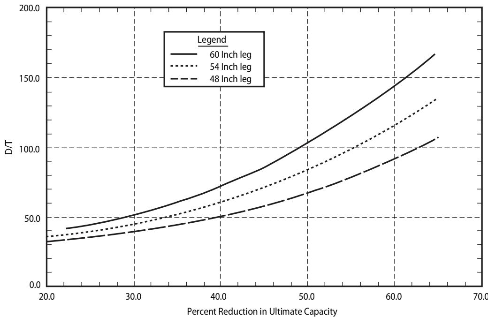  
Figure C18.9.2-1—D/T Ratio versus Reduction in Ultimate Capacity, 48, 54, and 60 Inch Legs—Straight with $L = 60$ Feet, $K = 1.0$ , and $F_y = 35$ ksi

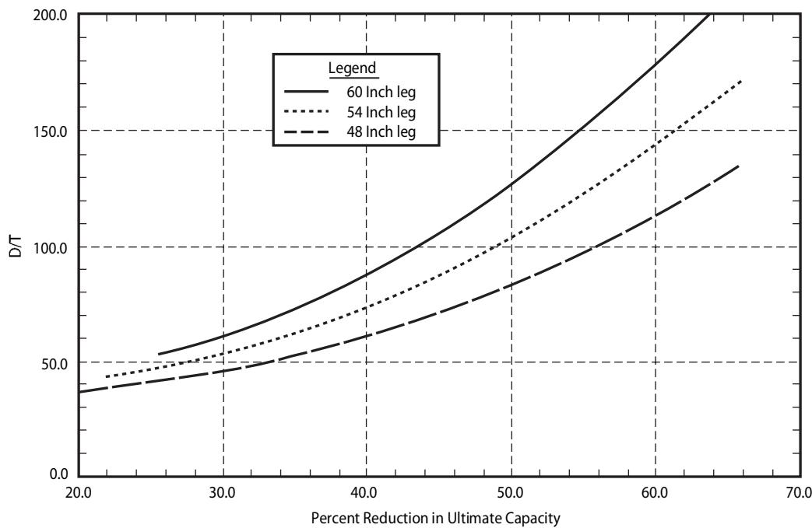  
Figure C18.9.2-2—D/T Ratio versus Reduction in Ultimate Capacity, 48, 54, and 60 Inch Legs—Straight with $L = 60$ Feet, $K = 1.0$ , and $F_{y} = 50$ ksi

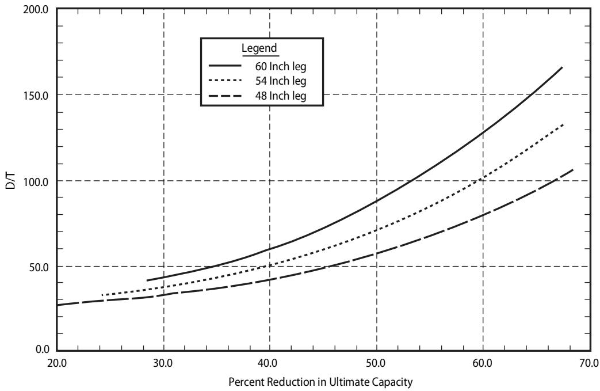  
Figure C18.9.2-3—D/T Ratio versus Reduction in Ultimate Capacity, 48, 54, and 60 Inch Legs—Bent with $L = 60$ Feet, $K = 1.0$ , and $F_{y} = 35$ ksi

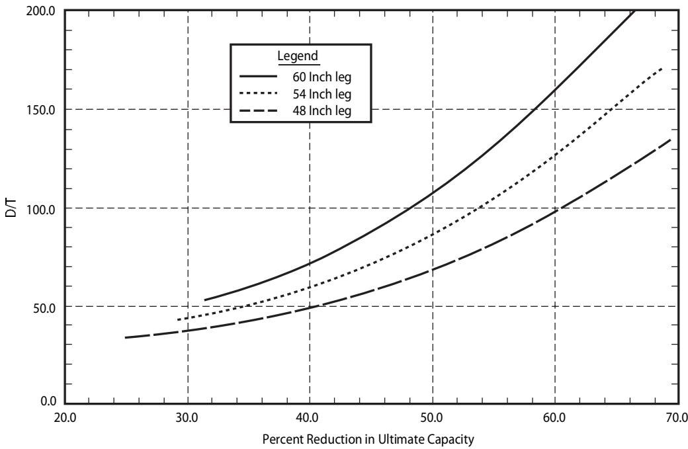  
Figure C18.9.2-4—D/T Ratio versus Reduction in Ultimate Capacity, 48, 54, and 60 Inch Legs—Bent with $L = 60$ Feet, $K = 1.0$ , and $F_y = 50$ ksi

C18.10 REFERENCES

1. Interim Guidance Notes for the Design and Protection of Topsides Structures Against Explosion and Fire, The Steel Construction Institute, April 1993.   
2. G. Foss and G. Edvardsen, "Energy Absorption During Ship on Offshore Steel Structures," OTC 4217, 1982.

3. O. Furnes and J. Amdahl, "Ship Collisions with Offshore Platforms," Intermaric '80, September 1980.   
4. C.P. Ellinas and A.C. Walker, "Effects of Damage on Offshore Tubular Bracing Members," IABSE, May 1983.   
5. NFPA 68.   
6. C.P. Ellinas, W.J. Supple, and A.C. Walker, Buckling of Offshore Structures, Gulf Publishing Company.

1220 L Street, NW

Washington, DC 20005-4070

USA

202.682.8000

Additional copies are available through IHS

Phone Orders: 1-800-854-7179 (Toll-free in the U.S. and Canada)

303-397-7956 (Local and International)

Fax Orders: 303-397-2740

Online Orders: global.ihs.com

Information about API Publications, Programs and Services

is available on the web at www api.org

Product No. G2AWSD