Planning, Designing, and Constructing Fixed Offshore Platforms—Working Stress Design

API RECOMMENDED PRACTICE 2A-WSD

TWENTY-SECOND EDITION, NOVEMBER 2014

Special Notes

API publications necessarily address problems of a general nature. With respect to particular circumstances, local, state, and federal laws and regulations should be reviewed.

Neither API nor any of API's employees, subcontractors, consultants, committees, or other assignees make any warranty or representation, either express or implied, with respect to the accuracy, completeness, or usefulness of the information contained herein, or assume any liability or responsibility for any use, or the results of such use, of any information or process disclosed in this publication. Neither API nor any of API's employees, subcontractors, consultants, or other assignees represent that use of this publication would not infringe upon privately owned rights.

API publications may be used by anyone desiring to do so. Every effort has been made by the Institute to assure the accuracy and reliability of the data contained in them; however, the Institute makes no representation, warranty, or guarantee in connection with this publication and hereby expressly disclaims any liability or responsibility for loss or damage resulting from its use or for the violation of any authorities having jurisdiction with which this publication may conflict.

API publications are published to facilitate the broad availability of proven, sound engineering and operating practices. These publications are not intended to obviate the need for applying sound engineering judgment regarding when and where these publications should be utilized. The formulation and publication of API publications is not intended in any way to inhibit anyone from using any other practices.

Any manufacturer marking equipment or materials in conformance with the marking requirements of an API standard is solely responsible for complying with all the applicable requirements of that standard. API does not represent, warrant, or guarantee that such products do in fact conform to the applicable API standard.

All rights reserved. No part of this work may be reproduced, translated, stored in a retrieval system, or transmitted by any means, electronic, mechanical, photocopying, recording, or otherwise, without prior written permission from the publisher. Contact the Publisher, API Publishing Services, 1220 L Street, NW, Washington, DC 20005.

Copyright © 2014 American Petroleum Institute

Foreword

This document contains engineering design principles and good practices that have evolved during the development of offshore oil resources. Good practice is based on good engineering; therefore, this recommended practice consists essentially of good engineering recommendations. In no case is any specific recommendation included that could not be accomplished by presently available techniques and equipment. Consideration is given in all cases to the safety of personnel, compliance with existing regulations, and antipollution of water bodies. U.S. customary (USC) conversions of primary metric (SI) units are provided throughout the text of this publication in parentheses, for example, 150 mm (6 in.). Most of the converted values have been rounded for most practical usefulness; however, precise conversions have been used where safety and technical considerations dictate. In case of dispute, the SI units should govern.

Offshore technology continues to evolve. In those areas where the committee felt that adequate data were available, specific and detailed recommendations are given. In other areas, general statements are used to indicate that consideration should be given to those particular points. Designers are encouraged to utilize all research advances available to them. As offshore knowledge continues to grow, this recommended practice will be revised. It is hoped that the general statements contained herein will gradually be replaced by detailed recommendations.

Reference in this document is made to the 1989 edition of the AISC Specification for Structural Steel Buildings— Allowable Stress Design and Plastic Design. The use of later editions of AISC specifications is specifically not recommended for design of offshore platforms. The load and resistance factors in these specifications are based on calibration with building design practices and may not be applicable to offshore platforms. Research work is now in progress to incorporate the strength provisions of the new AISC code into offshore design practices.

In this document, reference is made to AWS D1.1/D1.1M:2010, Structural Welding Code—Steel. While use of this edition is endorsed, the primary intent is that the AWS code be followed for the welding and fabrication of fixed offshore platforms. However, where specific guidance is given in this API document, this guidance should take precedence.

This edition supersedes the 21st Edition dated December 2000, as well as Errata and Supplement 1 dated December 2002, Errata and Supplement 2 dated September 2005, and Errata and Supplement 3 dated October 2007. Revision bars are not used for this edition for clarity because of the extensive document reorganization outlined in the Introduction.

The verbal forms used to express the provisions in this recommended practice are as follows:

— the term “shall” denotes a minimum requirement in order to conform to the recommended practice,   
— the term “should” denotes a recommendation or that which is advised but not required in order to conform to the recommended practice,   
— the term “may” is used to express permission or a provision that is optional,   
— the term “can” is used to express possibility or capability.

Nothing contained in any API publication is to be construed as granting any right, by implication or otherwise, for the manufacture, sale, or use of any method, apparatus, or product covered by letters patent. Neither should anything contained in the publication be construed as insuring anyone against liability for infringement of letters patent.

This document was produced under API standardization procedures that ensure appropriate notification and participation in the developmental process and is designated as an API standard. Questions concerning the interpretation of the content of this publication or comments and questions concerning the procedures under which this publication was developed should be directed in writing to the Director of Standards, American Petroleum Institute, 1220 L Street, NW, Washington, DC 20005. Requests for permission to reproduce or translate all or any part of the material published herein should also be addressed to the director.

Generally, API standards are reviewed and revised, reaffirmed, or withdrawn at least every five years. A one-time extension of up to two years may be added to this review cycle. Status of the publication can be ascertained from the API Standards Department, telephone (202) 682-8000. A catalog of API publications and materials is published annually by API, 1220 L Street, NW, Washington, DC 20005.

Suggested revisions are invited and should be submitted to the Standards Department, API, 1220 L Street, NW, Washington, DC 20005, standards@api.org.

Contents

Page

1 Scope . . .   
2 Normative References . . .   
3 Terms, Definitions, Acronyms, and Abbreviations . . .   
## 3.1 Terms and Definitions. . . .
## 3.2 Acronyms and Abbreviations .
4 Planning . . . 5   
## 4.1 General . . . 5
## 4.2 Operational Considerations. . .
## 4.3 Environmental Considerations . .
## 4.4 Site Investigation-Foundations . . . 13
## 4.5 Selecting the Design Environmental Conditions . 14
## 4.6 Platform Types. . . . 16
## 4.7 Exposure Categories . . . 18
## 4.8 Platform Reuse . . . . 20
## 4.9 Platform Assessment . . . 20
## 4.10 Safety Considerations . . . . 20
## 4.11 Regulations . . . . 21
5 Design Criteria and Procedures . 22   
## 5.1 General . . . . 22
## 5.2 Loading Conditions . 23
## 5.3 Design Loads. . . . 24
## 5.4 Fabrication and Installation Forces . 51
6 Structural Steel Design. . . . . 56   
## 6.1 General . . . . 56
## 6.2 Allowable Stresses for Cylindrical Members. . . . 57
## 6.3 Combined Stresses for Cylindrical Members . . . 63
## 6.4 Conical Transitions . . . . . 68
7 Strength of Tubular Joints . . . . 73   
## 7.1 Application . . . . 73
## 7.2 Design Considerations. . . . 73
## 7.3 Simple Joints . . . . . 79
## 7.4 Overlapping Joints . . . . 83
## 7.5 Grouted Joints. . . . . 84
## 7.6 Internally Ring-stiffened Joints . . . . 85
## 7.7 Cast Joints . . . . . 85
## 7.8 Other Circular Joint Types . . . . . 85
## 7.9 Damaged Joints. . . . . . 86
## 7.10 Noncircular Joints. . . . . 86
8 Fatigue . . . . . 86   
## 8.1 Fatigue Design. . . . . . 86
## 8.2 Fatigue Analysis . . . 86
## 8.3 Stress Concentration Factors (SCFs). . . . 88
## 8.4 S-N Curves for All Members and Connections, Except Tubular Connections . . 89
## 8.5 S-N Curves for Tubular Connections . . . 90
## 8.6 Fracture Mechanics . . 93

Contents

Page

9 Foundation Design . . . . 93   
## 9.1 General . . . . . 93
## 9.2 Pile Foundations . . . . . 93
## 9.3 Pile Design . . . . . . 95
## 9.4 Pile Capacity for Axial Compression Loads . 96
## 9.5 Pile Capacity for Axial Pullout Loads . . 97
## 9.6 Axial Pile Performance . . . 97
## 9.7 Soil Reaction for Axially Loaded Piles . . . . . 98
## 9.8 Soil Reaction for Laterally Loaded Piles . . . . 98
## 9.9 Pile Group Action . . . . . 99
## 9.10 Pile Wall Thickness. . . . 100
## 9.11 Length of Pile Sections . 103
## 9.12 Shallow Foundations . . . 103
10 Other Structural Components and Systems . . . 104   
## 10.1 Superstructure Design . . . . 104
## 10.2 Plate Girder Design. . . . . 105
## 10.3 Crane Supporting Structure. . . . 105
## 10.4 Grouted Pile-to-structure Connections . . . 106
## 10.5 Guyline System Design . . . 110
11 Material . . . 112   
## 11.1 Structural Steel . 112
## 11.2 Structural Steel Pipe . . . . 113
## 11.3 Steel for Tubular Joints . 114
## 11.4 Cement Grout and Concrete . . . . 118
## 11.5 Corrosion Protection . . 118
12 Drawings and Specifications. . . . 118   
## 12.1 General 118
## 12.2 Conceptual Drawings . . . 119
## 12.3 Bid Drawings and Specifications . . . 119
## 12.4 Design Drawings and Specifications . . . 119
## 12.5 Fabrication Drawings and Specifications . . . 120
## 12.6 Shop Drawings . . . 121
## 12.7 Installation Drawings and Specifications. . . 121
## 12.8 As-built Drawings and Specifications . . . 121
13 Welding. . . . 122   
## 13.1 General . . . 122
## 13.2 Qualification. 123
## 13.3 Welding Details . . 124
## 13.4 Records and Documentation. . . . 125
14 Fabrication . . . . 125   
## 14.1 Assembly . . . . 125
## 14.2 Corrosion Protection . . . 131
## 14.3 Structural Material. . . . 131
## 14.4 Loadout . . . 131
## 14.5 Records and Documentation. . 132

Contents

Page

15 Installation . . . . 132

## 15.1 General . . . 132

## 15.2 Transportation . . . . 133

## 15.3 Removal of Jacket from Transport Barge . . . 135

## 15.4 Erection 136

## 15.5 Pile Installation . . . 139

## 15.6 Superstructure Installation . . . 145

## 15.7 Grounding of Installation Welding Equipment . . 145

16 Inspection . . . 146

## 16.1 General . . 146

## 16.2 Scope . . . . 147

## 16.3 Inspection Personnel . 147

## 16.4 Fabrication Inspection . . . 147

## 16.5 Loadout, Seafastening, and Transportation Inspection . . . . 152

## 16.6 Installation Inspection . . . . . 153

## 16.7 Inspection Documentation. . . . . 154

17 Accidental Loading . . . . 155

## 17.1 General . . . . . 155

## 17.2 Assessment Process . . . . 156

## 17.3 Platform Exposure Category . . . . . 158

## 17.4 Probability of Occurrence . . 158

## 17.5 Risk Assessment . 159

## 17.6 Fire . . 160

## 17.7 Blast . . . . 160

## 17.8 Fire and Blast Interaction. . . . 160

## 17.9 Accidental Loading . . . . . 160

18 Reuse . . . . 161

## 18.1 General . . . . . 161

## 18.2 Reuse Considerations . . . . 161

19 Minimum and Special Structures . . 166

## 19.1 General . . . 166

## 19.2 Design Loads and Analysis . . 167

## 19.3 Connections. . . . 168

## 19.4 Material and Welding . . 169

Annex A (informative) API 2A-WSD, 21st Edition vs 22nd Edition Cross-reference . . . 170

Annex B (informative) Commentary. . . . . 184

Bibliography . . . 292

Figures

## 5.1 Procedure for Calculation of Wave Plus Current Forces for Static Analysis . . . . 25
## 5.2 Doppler Shift Due to Steady Current . . . . 26
## 5.3 Regions of Applicability of Stream Function, Stokes V, and Linear Wave Theory (from Atkins, 1990; Modified by API Task Group on Wave Force Commentary) 28
## 5.4 Shielding Factor for Wave Loads on Conductor Arrays as a Function of Conductor Spacing . . . . . 30
## 6.1 Example Conical Transition . . . . 69

Contents

Page

## 7.2 In-plane Joint Detailing . . . . 77
## 7.3 Out-of-plane Joint Detailing . . . 78
## 7.4 Terminology and Geometric Parameters, Simple Tubular Joints. . . . 79
## 7.5 Examples of Chord Length, $\pmb{ L }_{ \pmb{ \nu } }$ . . . . 83
## 8.1 Example Tubular Joint S-N Curve for T = 16 mm (5/8 in.) . . . 91
## 10.1 Grouted Pile-to-structure Connection with Shear Keys . . . . 108
## 10.2 Recommended Shear Key Details . . . . 109
## 10.1 Connection Design Limitations . . . . 109
## 14.1 Welded Tubular Connections—Shielded Metal Arc Welding . . . 127
## 17.1 Assessment Process. . . 157
B.5.1 Measured Current Field at 60 ft Depth Around and Through the Bullwinkle Platform in a Loop Current Event in 1991 189   
B.5.2 Comparison of Linear and Nonlinear Stretching of Current Profiles. . . . . 190   
B.5.3 Definition of Surface Roughness Height and Thickness . . 191   
B.5.4 Dependence of Steady Flow Drag Coefficient on Relative Surface Roughness . . . 193   
B.5.5 Wake Amplification Factor for Drag Coefficient as a Function of $K / C_{ \mathsf{ d } \mathsf{ s } }$ . . . . 195   
B.5.6 Wake Amplification Factor for Drag Coefficient as a Function of $\pmb{ K } .$ . . 195   
B.5.7 Inertia Coefficient as a Function of K. . . . 196   
B.5.8 Inertia Coefficient as a Function of K/Cds . . . . 196   
B.5.9 Shielding Factor for Wave Loads on Conductor Arrays as a Function of Conductor Spacing . . . . 198   
B.5.10 Example Structure . . . 207   
B.5.11 Seismic Load Deformation Curve . 209   
B.6.1 Elastic Coefficients for Local Buckling of Steel Cylinders Under Axial Compression . . . . . 213   
B.6.2 Comparison of Test Data with Design Equation for Fabricated Steel Cylinders Under Axial Compression . . 213   
B.6.3 Design Equation for Fabricated Steel Cylinders Under Bending. . . . 215   
B.6.4 Comparison of Test Data with Elastic Design Equations for Local Buckling of Cylinders Under Hydrostatic Pressure (M > 0.825D/t). . 217   
B.6.5 Comparison of Test Data with Elastic Design Equations for Local Buckling of Cylinders Under Hydrostatic Pressure (M < 0.825D/t). . 217   
B.6.6 Comparison of Test Data with Design Equations for Ring Buckling and Inelastic Local Buckling of Cylinders Under Hydrostatic Pressure . 218   
B.6.7 Comparison of Test Data with Interaction Equation for Cylinders Under Combined Axial Tension and Hydrostatic Pressure （$F_{ \mathbf{ h c } }$ Determined from Tests) . . . 219   
B.6.8 Comparison of Interaction Equations for Various Stress Conditions for Cylinders Under Combined Axial Compressive Load and Hydrostatic Pressure . 220   
B.6.9 Comparison of Test Data with Elastic Interaction Curve for Cylinders Under Combined Axial Compressive Load and Hydrostatic Pressure 221   
B.6.10 Comparison of Test Data on Fabricated Cylinders with Elastic Interaction Curve for Cylinders Under Combined Axial Load and Hydrostatic Pressure . 221   
B.6.11 Comparison of Test Data with Interaction Equations for Cylinders Under Combined Axial Compressive Load and Hydrostatic Pressure (Combination Elastic and Yield-type Failures) . . . . 222   
B.7.1 Adverse Load Patterns with α up to 3.8. . 226   
B.7.2 Computed ${ \pmb \alpha } .$ 226   
B.7.3 Safety Index Betas, API 2A-WSD, 21st Edition, Supplement 1 . . . . 231   
B.7.4 Safety Index Betas, API 2A-WSD, 21st Edition, Supplement 2 . . . . 231   
B.7.5 Comparison of Strength Factors $\varrho_{ \mathrm{ u } }$ for Axial Loading . . . . 234   
B.7.6 Comparison of Strength Factors $\varrho_{ \mathrm{ u } }$ for IPB and OPB . . . . 235   
B.7.7 Comparison of Chord Load Factors $\varrho_{ \mathsf{ f } }$ . . . . 237

Contents

Page

B.7.8 Effect of Chord Axial Load on DT Brace Compression Capacity Comparison of University of Texas Test Data with Chord Load Factor. . . 238   
B.7.9 K-joints Under Balanced Axial Loading—Test and FE vs New and Old API. . . 241   
B.7.10 T-joints Under Axial Loading—Test and FE vs New and Old API. . 242   
B.7.11 DT-joints Under Axial Compression—Test and FE vs New and Old API. . 242   
B.7.12 All Joints Under BIPB—Test and FE vs New and Old API. . 243   
B.7.13 All Joints Under BOPB—Test and FE vs New and Old API. . . 243   
B.8.1 Selection of Frequencies for Detailed Analyses. . . . . 251   
B.8.2 Geometry Definitions for Efthymiou SCFs . . 257   
B.8.3 Basic Air S-N Curve as Applicable to Profiled Welds, Including Size and Toe Correction to the Data . 273   
B.8.4 S-N Curve and Data for Seawater with CP 273   
B.10.1 Measured Bond Strength vs Cube Compressive Strength . . 279   
B.10.2 Histogram of the Safety Factors—Tests with and Without Shear Key Connections . . . . . 279   
B.10.3 Cumulative Histogram of the Safety Factors—Tests with and Without Shear Key Connections . . 280   
B.10.4 Measured Bond Strength vs. Cube Compressive Strength Multiplied by the Height-to-spacing Ratio. . 280   
B.17.1 D/T Ratio vs Reduction in Ultimate Capacity, 1220 mm, 1370 mm, and 1525 mm (48 in., 54 in., and 60 in.) Legs—Straight with $L = 18 . 3$ m (60 ft), $K = 1 . 0 ,$ , and $F_{ \mathbf{ y } } = 240 \ \mathsf{ M P a }$ (35 ksi) . . . . 288   
B.17.2 D/T Ratio vs Reduction in Ultimate Capacity, 1220 mm, 1370 mm, and 1525 mm (48 in., 54 in., and 60 in.) Legs—Straight with $L = 18 . 3$ m (60 ft), K = 1.0, and $F_{ \mathbf{ y } } = 345 ~ \mathsf{ M P a }$ (50 ksi) . . . . 288   
B.17.3 D/T Ratio vs Reduction in Ultimate Capacity, 1220 mm, 1370 mm, and 1525 mm (48 in., 54 in., and 60 in.) Legs—Bent with L = 18.3 m (60 ft), K = 1.0, and $\cal F_{ \checkmark } = 240$ MPa (35 ksi) . . 289   
B.17.4 D/T Ratio vs Reduction in Ultimate Capacity, 1220 mm, 1370 mm, and 1525 mm (48 in., 54 in., and 60 in.) Legs—Bent with L = 18.3 m (60 ft), K = 1.0, and $F_{ \mathbf{ y } } = 345 ~ \mathsf{ M P a }$ (50 ksi) . . . 289

Tables

## 4.1 Exposure Category Matrix . . . 18
## 5.1 Design Loading Conditions . . 23
## 5.2 Approximate Current Blockage Factors for Typical Gulf of Mexico Jacket-type Structures . . . . . . . 27
## 5.3 Values Coherence Spectrum Coefficients α, p, q, r, and Δ . . . 38
## 5.4 Wind Shape Coefficients. . . . 39
## 5.5 Design Level Criteria and Robustness Analysis . . 41
## 5.6 Cr Factors for Steel Jacket of Fixed Offshore Platforms . . . . 47
## 5.7 Offshore Design Reference Wind Speed for Drilling Structures . . . 49
## 5.8 Design Wind Speeds used for Existing Drilling . . . . . 50
## 5.9 Deck Acceleration During Design Hurricanes . . . 50
## 6.1 Values of K and $c_{ \mathsf{ m } }$ for Various Member Situations. . . . 66
## 6.2 Safety Factors. 68
## 6.3 Limiting Angle α for Conical Transitions. . . . 69
## 7.1 Examples of Joint Classification . . . . . 76
## 7.1 Geometric Parameter Validity Range. . . . . 79
## 7.2 Values for $\varrho_{ \mathsf{ u } }$ . . . . . . 81
## 7.3 Values for $c_{ 1 } , c_{ 2 } , c_{ 3 }$ . . . . 82
$\varrho_{ \mathrm{ u } }$ for Grouted Joints. . . . . 84   
## 8.1 Fatigue Life Safety Factors . . . . . 88
## 8.2 Basic Design S-N Curves . . . 90
## 8.3 Factors on Fatigue Life for Weld Improvement Techniques. . . . . . 92
## 9.1 Pile Factors of Safety for Different Loading Conditions . . . 96

Contents

Page

## 9.2 Minimum Pile Wall Thickness. . . 102
## 9.3 Shallow Foundation Safety Factors Against Failure . . . 104
## 10.2 Guyline Factors of Safety . 111
## 11.1 Structural Steel Plates . 114
## 11.1 Structural Steel Plates (Continued) . 115
## 11.2 Structural Steel Shapes. . . 116
## 11.3 Structural Steel Pipe . 117
Input Testing Conditions. . 117   
## 13.1 Impact Testing 123
## 15.1 Guideline Wall Thickness (in SI Units). . 142
## 15.2 Guideline Wall Thickness (in USC Units) 143
## 16.1 Recommended Minimum Extent of NDE Inspection . . . . 150
## 17.1 Platform Risk Matrix. 158
## 18.1 Recommended Extent of NDE Inspection-Reused Structure . 164
## A.1 API 2A-WSD, 21st Edition vs 22nd Edition Cross-reference of Figures 170
## A.2 API 2A-WSD, 21st Edition vs 22nd Edition Cross-reference of Tables . . . . 175
## A.3 API 2A-WSD, 21st Edition vs 22nd Edition Cross-reference of Equations . . . . 178
B.7.1 Mean Bias Factors and Coefficients of Variation for K-joints. . . 240   
B.7.2 Mean Bias Factors and Coefficients of Variation for Y-joints . . . . 240   
B.7.3 Mean Bias Factors and Coefficients of Variation for X-joints . . . . 241   
B.8.1 Equations for SCFs in T/Y-joints . . . . 260   
B.8.2 Equations for SCFs in X-joints . . . . 261   
B.8.3 Equations for SCFs in Gap/Overlap K-joints . 262   
B.8.4 Equations for SCFs in KT-joints . . . . 263   
B.8.5 Expressions for Lmp. . . . . 265   
B.13.1 Average Heat Affected Zone (HAZ) Values . . . . 283   
B.17.1 Required Tubular Thickness to Locally Absorb Vessel Impact . . . . 287

Introduction

This publication serves as a guide for those who are concerned with the design and construction of new fixed offshore platforms and for the relocation of existing platforms used for the drilling, development, production, and storage of hydrocarbons in offshore areas.

In addition, these guidelines are used in conjunction with API 2SIM for the assessment of existing platforms in the event that it becomes necessary to make a determination of the “fitness for purpose” of the structure.

This recommended practice is organized around the framework of the API 2A-WSD, 21st Edition, with the following sections:

— Section 1: Scope;   
— Section 2: Normative References;   
— Section 3: Terms, Definitions, Acronyms, and Abbreviations;   
— Section 4: Planning (API 2A-WSD, 21st Edition, Section 1);   
— Section 5: Design Criteria and Procedures (API 2A-WSD, 21st Edition, Section 2);   
— Section 6: Structural Steel Design (API 2A-WSD, 21st Edition, Section 3);   
— Section 7: Strength of Tubular Joints (API 2A-WSD, 21st Edition, Section 4);   
— Section 8: Fatigue (API 2A-WSD, 21st Edition, Section 5);   
— Section 9: Foundation Design (API 2A-WSD, 21st Edition, Section 6);   
— Section 10: Other Structural Components and Systems (API 2A-WSD, 21st Edition, Section 7);   
— Section 11: Material (API 2A-WSD, 21st Edition, Section 8);   
— Section 12: Drawings and Specifications (API 2A-WSD, 21st Edition, Section 9);   
— Section 13: Welding (API 2A-WSD, 21st Edition, Section 10);   
— Section 14: Fabrication (API 2A-WSD, 21st Edition, Section 11);   
— Section 15: Installation (API 2A-WSD, 21st Edition, Section 12);   
— Section 16: Inspection (API 2A-WSD, 21st Edition, Section 13);   
— Section 17: Accidental Loading (API 2A-WSD, 21st Edition, Section 18);   
— Section 18: Reuse (API 2A-WSD, 21st Edition, Section 15);   
— Section 19: Minimum and Special Structures (API 2A-WSD, 21st Edition, Section 16);   
— Annex A: Listing of figures, tables, and equations;   
— Annex B: Commentary;   
— Bibliography.

The following additional changes to the content of API 2A-WSD not previously noted above have been made:

— API 2A-WSD, 21st Edition, Section 14 (Surveys) and Section 17 (Assessment of Existing Platforms) have been removed in their entirety and now reside in API 2SIM;   
— with the publication of API 2FB, the new Section 17 contains only the accidental loading portion of API 2A-WSD, 21st Edition, Section 18;   
— Annex A provides a listing of API 2A-WSD, 21st Edition tables, figures, and equations with corresponding 22nd Edition numbers;   
— Annex B contains any commentary for the sections;   
— Bibliography contains references for all sections.

Planning, Designing, and Constructing Fixed Offshore Platforms— Working Stress Design

1 Scope

This recommended practice is based on global industry best practices and serves as a guide for those who are concerned with the design and construction of new fixed offshore platforms and for the relocation of existing platforms used for the drilling, development, production, and storage of hydrocarbons in offshore areas.

NOTE 1 Specific guidance for hurricane conditions in the Gulf of Mexico and other U.S. offshore areas, previously provided in API 2A-WSD, 21st Edition, Section 2, is now provided in API 2MET.   
NOTE 2 Specific guidance for earthquake loading in U.S. offshore areas, previously provided in the API 2A-WSD, 21st Edition, Section 2, is now provided in API 2EQ.   
NOTE 3 Specific guidance for soil and foundation considerations in offshore areas, previously provided in API 2A-WSD, 21st Edition, Section 6, is now provided in API 2GEO.   
NOTE 4 Specific guidance for the evaluation of structural damage, above and below water structural inspection, fitness-for-purpose assessment, risk reduction and mitigation planning, plus the process of decommissioning has been removed and is now provided in API 2SIM.   
NOTE 5 Specific guidance for fire and blast loading, previously provided in the 2A-WSD, 21st Edition, Section 18, is now provided in API 2FB [3].   
NOTE 6 Specific guidance for marine operations, supplementing the guidance provided in this document, is now provided in API 2MOP [6]. The provisions in API 2A-WSD shall govern if there are any conflicts.

2 Normative References

The following referenced documents are indispensable for the application of this document. For dated references, only the edition cited applies. For undated references, the latest edition of the referenced document applies (including any addenda/errata).

API Specification 2B, Fabrication of Structural Steel Pipe   
API Specification 2C, Specification for Offshore Pedestal-mounted Cranes   
API Recommended Practice 2EQ, Seismic Design Procedures and Criteria for Offshore Structures   
API Recommended Practice 2GEO, Geotechnical and Foundation Design Considerations   
API Recommended Practice 2MET, Derivation of Metocean Design and Operation Conditions   
API Recommended Practice 2N, Planning, Designing, and Constructing Structures and Pipelines for Arctic Conditions   
API Recommended Practice 2SIM, Structural Integrity Management of Fixed Offshore Structures   
API Bulletin 2TD, Guidelines for Tie-downs on Offshore Production Facilities for Hurricane Season

API Bulletin 2U, Stability Design of Cylindrical Shells

API Specification 4F, Drilling and Well Servicing Structures

AISC 335-89 1, Specification for Structural Steel Buildings—Allowable Stress Design and Plastic Design, 1989 (included in AISC Manual of Steel Construction, Allowable Stress Design, Ninth Edition)

AWS D1.1/D1.1M:2010 2, Structural Welding Code—Steel

3 Terms, Definitions, Acronyms, and Abbreviations

For the purposes of this document, the terms, definitions, acronyms, and abbreviations apply.

## 3.1 Terms and Definitions

3.1.1

fixed platform

A platform extending above and supported by the sea bed by means of piling, spread footings, or other means with the intended purpose of remaining stationary over an extended period.

3.1.2

hot spot stress

HSS

The stress in the immediate vicinity of a structural discontinuity.

NOTE Can also be described as the linear trend of shell bending and membrane stress, extrapolated to the actual weld toe, excluding the local notch effects of weld shape.

3.1.3

manned platform

A platform that is actually and continuously occupied by persons accommodated and living thereon.

3.1.4

mean zero-crossing period

The average time between successive crossings with a positive slope (up crossings) of the zero axis in a time history of water surface, stress, etc.

3.1.5

nominal stress

The stress determined from member section properties and the resultant forces and moments from a global stress analysis at the member end taking into account the existence of thickened or flared stub ends.

3.1.6

operator

The person, firm, corporation, or other organization employed by the owners to conduct operations.

3.1.7

random waves

A representation of the irregular surface elevations and associated water particle kinematics of the marine environment.

NOTE Random waves can be represented analytically by a summation of sinusoidal waves of different heights, periods, phases, and directions. For fatigue strength testing, a sequence of sinusoidal stress cycles of random amplitude may be used [253].

3.1.8

regular waves

Unidirectional waves having cyclical water particle kinematics and surface elevation.

3.1.9

sea state

An oceanographic wave condition that for a specified period of time can be characterized as a stationary random process.

3.1.10

significant wave height

The average height of the highest one-third of all the individual waves present in a sea state.

NOTE In random seas, the corresponding significant stress range is more consistent with S-N curves than the often misused RMS variance.

3.1.11

S-N curve

A representation of empirically determined relationships between stress range and number of cycles to failure, including the effects of weld profile and discontinuities at the weld toe.

3.1.12

steady state

The response of a structure to waves when the transient effects caused by the assumed initial conditions have become insignificant due to damping.

3.1.13

stress concentration factor

SCF

The SCF for a particular stress component and location on a tubular connection is the ratio of the HSS to the nominal stress at the cross section containing the hot spot.

3.1.14

transfer function

The ratio of the range of a structural response quantity to the wave height as a function of frequency.

3.1.15

unmanned

A platform upon which persons may be employed at any one time with no living accommodations or quarters.

## 3.2 Acronyms and Abbreviations

ALE abnormal level earthquake

CAFL constant amplitude fatigue limit

COV coefficient of variation

CP cathodic protection

CPT Cone Penetration Test

CTOD crack tip opening displacement

DOE UK Department of Energy

ELE extreme level earthquake

FE finite element

GMAW gas metal arc welding

HAZ heat-affected zone

HSS hot spot stress

HSSR hot spot stress range

IPB in-plane bending

JIP joint industry project

LRFD load and resistance factor design

MT magnetic particle inspection technique

NDE nondestructive examination

NDT nondestructive testing

OPB out-of-plane bending

OTC Offshore Technology Conference

OTJTC Offshore Tubular Joint Technical Committee

PT liquid penetrant inspection technique

PWHT postweld heat treatment

QC quality control

ROV remotely operated vehicle

RT radiographic inspection technique

SCF stress concentration factor

SSSV subsurface safety valves

UT ultrasonic inspection technique

VIV vortex-induced vibration

WSD working stress design

ZPA zero-period acceleration

# 4 Planning

## 4.1 General

4.1.1 Planning

This publication serves as a guide for those who are concerned with the design and construction of new platforms and for the relocation of existing platforms used for the drilling, development, and storage of hydrocarbons in offshore areas.

In addition, these guidelines shall be used in conjunction with API 2SIM for the assessment of existing platforms in the event that it becomes necessary to make a determination of the fitness-for-purpose of the structure.

Adequate planning should be done before actual design is started in order to obtain a workable and economical offshore structure to perform a given function. The initial planning should include the determination of all criteria upon which the design of the platform is based.

4.1.2 Design Criteria

Design criteria as used herein include all operational requirements and environmental data that could affect the detailed design of the platform.

4.1.3 Codes and Standards

This publication has also incorporated and made maximum use of existing codes and standards that have been found acceptable for engineering design and practices from the standpoint of public safety.

## 4.2 Operational Considerations

4.2.1 Function

The function for which a platform is designed is usually categorized as drilling, producing, storage, materials handling, living quarters, or a combination of these. The platform configuration should be determined by a study of layouts of equipment to be located on the decks. Careful consideration should be given to the clearances and spacing of equipment before the final dimensions are decided upon.

4.2.2 Location

The location of the platform should be specific before the design is completed. Environmental conditions vary with geographic location; within a given geographic area, the foundation conditions generally vary as do such parameters as design wave heights, periods, and tides.

4.2.3 Orientation

The orientation of the platform refers to its position in the plan referenced to a fixed direction such as true north. Orientation is usually governed by the direction of prevailing seas, winds, currents, and operational requirements.

4.2.4 Water Depth

Information on water depth and tides is needed to select appropriate oceanographic design parameters. The water depth should be determined as accurately as possible so that elevations can be established for boat landings, fenders, decks, and corrosion protection.

4.2.5 Access and Auxiliary Systems

The location and number of stairways and access boat landings on the platform should be governed by safety considerations. A minimum of two accesses to each manned level should be installed and should be located so that escape is possible under varying conditions. Operating requirements should also be considered in stairway locations.

4.2.6 Fire Protection

The safety of personnel and possible destruction of equipment requires attention to fire protection methods. The selection of the system depends upon the function of the platform. Procedures should conform to all federal, state, and local regulations where they exist.

4.2.7 Deck Elevation

Large forces and overturning moments result when waves strike a platform’s lower deck and equipment. Unless the platform has been designed to resist these forces, the elevation of the deck should be established to provide adequate clearance above the design maximum crest elevation. Consideration should be given to providing an “air gap” and an additional allowance for local maximum crest elevations, which are higher than the design maximum crest elevation. The deck elevation shall be determined in accordance with 5.3.4.3 and API 2MET.

4.2.8 Wells

Exposed well conductors add environmental forces to a platform and require support. Their number, size, and spacing should be known early in the planning stage. Conductor pipes may or may not assist in resisting the wave force. If the platform is to be set over an existing well with the wellhead above water, information is needed on the dimensions of the tree, size of conductor pipe, and the elevations of the casing head flange and top of wellhead above mean low water. If the existing well is a temporary subsea completion, plans should be made for locating the well and setting the platform properly so that the well can later be extended above the surface of the water. Planning should consider the need for future wells.

4.2.9 Equipment and Material Layouts

Layouts and weights of drilling equipment and material and production equipment are needed in the development of the design. Heavy concentrated loads on the platform should be located so that proper framing for supporting these loads can be planned. When possible, consideration should be given to future operations.

4.2.10 Personnel and Material Handling

Plans for handling personnel and materials should be developed at the start of the platform design, along with the type and size of supply vessels and the anchorage system required to hold them in position at the platform. The number, size, and location of the boat landings should be determined as well.

The type, capacity, number, and location of the deck cranes should also be determined. If equipment or materials are to be placed on a lower deck, then adequately sized and conveniently located hatches should be provided on the upper decks as appropriate for operational requirements. The possible use of helicopters should be established and facilities provided for their use.

4.2.11 Spillage and Contamination

Provision for handling spills and potential contaminants should be provided. A deck drainage system that collects and stores liquids for subsequent handling should be provided. The drainage and collection system should meet appropriate governmental regulations.

4.2.12 Exposure

Design of all systems and components should anticipate extremes in environmental phenomena that may be experienced at the site.

## 4.3 Environmental Considerations

4.3.1 General Meteorological and Oceanographic Considerations

Experienced specialists should be consulted when defining the pertinent meteorological and oceanographic conditions affecting a platform site. The following sections present a general summary of the information that could be required. Selection of information needed at a site should be made after consultation with both the platform designer and a meteorological-oceanographic specialist. Measured and/or model-generated data should be statistically analyzed to develop the descriptions of normal and extreme environmental conditions as follows.

a) Normal environmental conditions (conditions that are expected to occur frequently during the life of the structure) are important both during the construction and the service life of a platform.   
b) Extreme conditions (conditions that occur quite rarely during the life of the structure) are important in formulating platform design loadings.

All data used should be carefully documented. The estimated reliability and the source of all data should be noted, and the methods employed in developing available data into the desired environmental values should be defined.

4.3.2 Winds

Wind forces are exerted upon that portion of the structure that is above the water, as well as on any equipment, deck houses, and derricks that are located on the platform. The wind speed may be classified as:

— gusts that average less than 1 min. in duration, and   
— sustained wind speeds that average 1 min. or longer in duration.

Wind data should be adjusted to a standard elevation, such as 10 m (33 ft) above mean water level, with a specified averaging time, such as 1 hour. Wind data may be adjusted to any specified averaging time or elevation using standard profiles and gust factors (see 5.3.2).

The spectrum of wind speed fluctuations about the average should be specified in some instances. For example, compliant structures like compliant towers and tension leg platforms in deep water may have natural sway periods in the range of 1 min., in which there is significant energy in the wind speed fluctuations.

The following should be considered in determining appropriate design wind speeds.

For normal conditions:

— the frequency of occurrence of specified sustained wind speeds from various directions for each month or season,   
— the persistence of sustained wind speeds above specified thresholds for each month or season,   
— the probable speed of gusts associated with sustained wind speeds.

For extreme conditions:

— projected extreme wind speeds of specified directions and averaging times as a function of their recurrence interval should be developed. Data should be given concerning the following:   
— the measurement site, date of occurrence, magnitude of measured gusts and sustained wind speeds, and wind directions for the recorded wind data used during the development of the projected extreme winds;   
— the projected number of occasions during the specified life of the structure when sustained wind speeds from specified directions should exceed a specific lower bound wind speed.

4.3.3 Waves

Wind-driven waves are a major source of environmental forces on offshore platforms. Such waves are irregular in shape, vary in height and length, and may approach a platform from one or more directions simultaneously. For these reasons, the intensity and distribution of the forces applied by waves are difficult to determine. Because of the complex nature of the technical factors to be considered in developing wave-dependent criteria for the design of platforms, experienced specialists knowledgeable in the fields of meteorology, oceanography, and hydrodynamics should be consulted.

In those areas where prior knowledge of oceanographic conditions is insufficient, the development of wave-dependent design parameters shall include at least the following steps.

— Development of all necessary meteorological data.   
— Projection of surface wind fields.   
— Prediction of deepwater general seastates along storm tracks using an analytical model.   
— Definition of maximum possible seastates consistent with geographical limitations.   
— Delineation of bathymetric effects on seastates.

— Introduction of probabilistic techniques to predict seastate occurrences at the platform site against various time bases.   
— Development of design wave parameters through physical and economic risk evaluation.

In areas where considerable previous knowledge and experience with oceanographic conditions exist, the foregoing sequence may be shortened to those steps needed to project this past knowledge into the required design parameters.

It is the responsibility of the platform owner to select the design seastate, after considering all of the factors listed in 4.5. In developing seastate data, consideration should be given to the following.

For normal conditions (for both wind seas and swell):

— for each month and/or season, the probability of occurrence and average persistence of various sea states [e.g. waves higher than 3 m (10 ft)] from specified directions in terms of general seastate description parameters (e.g. the significant wave height and the average wave period);   
— the wind speeds, tides, and currents occurring simultaneously with the above seastates.

For extreme conditions:

definition of the extreme seastates should provide an insight as to the number, height, and crest elevations of all waves above a certain height that might approach the platform site from any direction during the entire life of the structure. Projected extreme wave heights from specified directions should be developed and presented as a function of their expected average recurrence intervals. Other data that should be developed include:   
— the probable range and distribution of wave periods associated with extreme wave heights;   
— the projected distribution of other wave heights, maximum crest elevations, and the wave energy spectrum in the sea state producing an extreme wave height(s);   
— the tides, currents, and winds likely to occur simultaneously with the seastate producing the extreme waves;   
— the nature, date, and place of the events that produced the historical seastates, for example, Hurricane Camille, August 1969, U.S. Gulf of Mexico was used in the development of the projected values.

4.3.4 Tides

Tides are important considerations in platform design. Tides may be classified as:

a) astronomical tide,   
b) wind tide, and   
c) pressure differential tide.

The latter two are frequently combined and called storm surge; the sum of the three tides is called the storm tide. In the design of a fixed platform, the storm tide elevation is the datum upon which storm waves are superimposed. The variations in elevations of the daily astronomical tides, however, determine the elevations of the boat landings, barge fenders, the splash zone treatment of the steel members of the structure, and the upper limits of marine growth.

4.3.5 Currents

Currents are important in the design of fixed platforms. They affect:

— the location and orientation of boat landings and barge bumpers, and   
— the forces on the platform.

Where possible, boat landings and barge bumpers should be located to allow the boat to engage the platform as it moves against the current.

The most common categories of currents are:

a) tidal currents (associated with astronomical tides),   
b) circulatory currents (associated with oceanic-scale circulation patterns), and   
c) storm-generated currents.

The vector sum of these three currents is the total current, and the speed and direction of the current at specified elevations is the current profile. The total current profile associated with the sea state producing the extreme waves should be specified for platform design. The frequency of occurrence of total current speed and direction at different depths for each month and/or season may be useful for planning operations.

4.3.6 Ice

In some areas where petroleum development is being carried out, subfreezing temperatures can prevail a major portion of the year, causing the formation of sea ice. Sea ice may exist in these areas as first-year sheet ice, multiyear floes, first-year and multiyear pressure ridges, and/or ice islands. Loads produced by ice features could constitute a dominant design factor for offshore platforms in the most severe ice areas such as the Alaskan Beaufort and Chukchi Seas, and Norton Sound. In milder climates, such as the southern Bering Sea and Cook Inlet, the governing design factor may be seismic or wave induced, but ice features would nonetheless influence the design and construction of the platforms considered.

Research in ice mechanics is being conducted by individual companies and joint industry groups to develop design criteria for arctic and subarctic offshore areas. Global ice forces vary depending on such factors as size and configuration of platform, location of platform, mode of ice failure, and unit ice strength. Unit ice strength depends on the ice feature, temperature, salinity, speed of load application, and ice composition. Forces to be used in design should be determined in consultation with qualified experts.

API 2N outlines conditions that shall be addressed in the design and construction of structures in arctic and subarctic offshore regions.

4.3.7 Active Geologic Processes

4.3.7.1 General

In many offshore areas, geologic processes associated with movement of the near-surface sediments occur within time periods that are relevant to fixed platform design. The nature, magnitude, and return intervals of potential seafloor movements should be evaluated by site investigations and judicious analytical modeling to provide input for determination of the resulting effects on structures and foundations. Because of uncertainties with definition of these processes, a parametric approach to studies may be helpful in the development of design criteria.

4.3.7.2 Earthquakes

Seismic forces should be considered in platform design for areas that are determined to be seismically active. Areas are considered seismically active on the basis of previous records of earthquake activity, both in frequency of occurrence and in magnitude. Seismic activity of an area for purposes of design of offshore structures is rated in terms of possible severity of damage to these structures. The seismic maps for U.S. coastal waters contained in API 2EQ shall be used if no detailed investigation regarding the seismicity of an area has been performed.

4.3.7.3 Faults

In some offshore areas, fault planes may extend to the seafloor with the potential for either vertical or horizontal movement. Fault movement can occur as a result of seismic activity, removal of fluids from deep reservoirs, or long-term creep related to large-scale sedimentation or erosion. Siting of facilities in close proximity to fault planes intersecting the seafloor should be avoided if possible. If circumstances dictate siting structures near potentially active features, the magnitude and time scale of expected movement should be estimated on the basis of geologic study for use in the platform design.

4.3.7.4 Seafloor Instability

Movement of the seafloor can occur as a result of loads imposed on the soil mass by ocean wave pressures, earthquakes, soil self-weight, or combination of these phenomena. Weak, under-consolidated sediments occurring in areas where wave pressures are significant at the seafloor are most susceptible to wave-induced movement and may be unstable under negligible slope angles. Earthquake-induced forces can induce failure of seafloor slopes that are otherwise stable under the existing self-weight forces and wave conditions.

In areas of rapid sedimentation, such as actively growing deltas, low soil strength, soil self-weight, and wave-induced pressures are believed to be the controlling factors for the geologic processes that continually move sediment downslope. Important platform design considerations under these conditions include the effects of large-scale movement of sediment in areas subjected to strong wave pressures, downslope creep movements in areas not directly affected by wave-seafloor interaction, and the effects of sediment erosion and/or deposition on platform performance.

The scope of site investigations in areas of potential instability should focus on identification of metastable geologic features surrounding the site and definition of the soil engineering properties required for modeling and estimating seafloor movements.

Analytical estimates of soil movement as a function of depth below the mudline can be used with soil engineering properties to establish expected forces on platform members. Geologic studies employing historical bathymetric data may be useful for quantifying deposition rates during the design life of the facility.

4.3.7.5 Scour

Scour is removal of seafloor soils caused by currents and waves. Such erosion can be a natural geologic process or can be caused by structural elements interrupting the natural flow regime near the seafloor.

From observation, scour can usually be characterized as some combination of the following.

a) Local scour—steep-sided scour pits around such structure elements as piles and pile groups, generally as seen in flume models.   
b) Global scour—shallow scoured basins of large extent around a structure, possibly due to overall structure effects, multiple structure interaction, or wave/soil/structure interaction.   
c) Overall seabed movement—movement of sandwaves, ridges, and shoals that would occur in the absence of a structure. This movement can be caused by lowering or accumulation.

The presence of mobile seabed sandwaves, sandhills, and sand ribbons indicates a vigorous natural scour regime. Past bed movement may be evidenced by geophysical contrasts or by variation in density, grading, color, or biological indicators in seabed samples and soundings. Sand or silt soils in water depths less than about 40 m (130 ft) are particularly susceptible to scour, but scour has been observed in cobbles, gravels, and clays; in deeper water, the presence of scour depends on the vigor of currents and waves.

Scour can result in removal of vertical and lateral support for foundations, causing undesirable settlements of mat foundations and overstressing of foundation elements. Where scour is a possibility, it should be accounted for in design and/or its mitigation should be considered. Offshore scour phenomena are described in References [36] and [37].

4.3.7.6 Shallow Gas

The presence of either biogenic or petrogenic gas in the pore water of near-mudline soils is an engineering consideration in offshore areas. In addition to being a potential drilling hazard for both site investigation soil borings and oil well drilling, the effects of shallow gas may be important to engineering of the foundation. The importance of assumptions regarding shallow gas effects on interpreted soil engineering properties and analytical models of geologic processes should be established during initial stages of the design.

4.3.7.7 Marine Growth

Offshore structures accumulate marine growth to some degree in all the world’s oceans. Marine growth is generally greatest near the mean water level but in some areas may be significant 60 m (200 ft) or more below the mean water level. Marine growth increases wave forces (by increasing member diameter and surface roughness) and mass of the structure and should be considered in design.

4.3.7.8 Tsunamis

Platforms in shallow water that may be subjected to tsunamis shall be investigated for the effects of the resulting forces.

4.3.7.9 Other Environmental Information

Depending on the platform site, other environmental information of importance includes records and/or predictions with respect to precipitation, fog, wind chill, air temperatures, and sea temperatures. General information on the various types of storms that might affect the platform site should be used to supplement other data developed for normal conditions. Statistics can be compiled giving the expected occurrence of storms by season, direction of approach, etc. Of special interest for construction planning are the duration, the speed of movement and development, and the extent of these conditions. Also of major importance is the ability to forecast storms in the vicinity of a platform.

## 4.4 Site Investigation—Foundations

4.4.1 Site Investigation Objectives

Knowledge of the soil conditions existing at the site of construction on any sizable structure is necessary to permit a safe and economical design. On-site soil investigations should be performed to define the various soil strata and their corresponding physical and engineering properties. Previous site investigations and experience at the site may permit the installation of additional structures without additional studies.

The initial step for a site investigation is reconnaissance. Information may be collected through a review of available geophysical data and soil boring data available in engineering files, literature, or government files. The purpose of this review is to identify potential problems and to aid in planning subsequent data acquisition phases of the site investigation.

Soundings and any required geophysical surveys should be part of the on-site studies and generally should be performed before borings. These data should be combined with an understanding of the shallow geology of the region to develop the required foundation design parameters. The on-site studies should extend throughout the depth and areal extent of soils that will affect or be affected by installation of the foundation elements.

4.4.2 Seabottom Surveys

The primary purpose of a geophysical survey in the vicinity of the site is to provide data for a geologic assessment of foundation soils and the surrounding area that could affect the site. Geophysical data provide evidence of slumps, scarps, irregular or rough topography, mud volcanoes, mud lumps, collapse features, sand waves, slides, faults, diapirs, erosional surfaces, gas bubbles in the sediments, gas seeps, buried channels, and lateral variations in strata thicknesses. The areal extent of shallow soil layers may sometimes be mapped if good correspondence can be established between the soil boring information and the results from the seabottom surveys.

The geophysical equipment used includes the following:

a) sub-bottom profiler (tuned transducer) for definition of bathymetry and structural features within the near-surface sediments;   
b) side-scan sonar to define surface features;   
c) boomer or minisparker for definition of structure to depths past a hundred meters (few hundred feet) below the seafloor;

d) sparker, air gun, water gun, or sleeve exploder for definition of structure at deeper depths and to tie together with deep seismic data from reservoir studies.

Shallow sampling of near-surface sediments using drop, piston, grab samplers, or vibrocoring along geophysical track lines may be useful for calibration of results and improved definition of the shallow geology.

See Reference [38] for a more detailed description of commonly used seabottom survey systems.

4.4.3 Soil Investigation and Testing

If practical, the soil sampling and testing program should be defined after a review of the geophysical results. On-site soil investigation should include one or more soil borings to provide samples suitable for engineering property testing and a means to perform in situ testing, if required. The number and depth of borings depend on the soil variability in the vicinity of the site and the platform configuration. Likewise, the degree of sophistication of soil sampling and preservation techniques, required laboratory testing, and the need for in situ property testing are a function of the platform design requirements and the adopted design philosophy.

As a minimum requirement, the foundation investigation for pile-supported structures should provide the soil engineering property data needed to determine the following parameters:

a) axial capacity of piles in tension and compression,   
b) load-deflection characteristics of axially and laterally loaded piles,   
c) pile driveability characteristics,   
d) mudmat bearing capacity.

The required scope of the soil sampling, in situ testing, and laboratory testing programs is a function of the platform design requirements and the need to characterize active geologic processes that may affect the facility. For novel platform concepts, deepwater applications, platforms in areas of potential slope instability, and gravity-base structures, the geotechnical program should be tailored to provide the data necessary for pertinent soil-structure interaction and pile capacity analyses.

When performing site investigations in frontier areas or areas known to contain carbonate material, the investigation should include diagnostic methods to determine the existence of carbonate soils. Typically, carbonate deposits are variably cemented and range from lightly cemented with sometimes significant void spaces to extremely well-cemented. In planning a site investigation program, there should be enough flexibility in the program to switch between soil sampling, rotary coring, and in situ testing as appropriate. Qualitative tests should be performed to establish the carbonate content. In a soil profile that contains carbonate material (usually in excess of 15 % to 20 % of the soil fraction) engineering behavior of the soil could be adversely affected. In these soils additional field and laboratory testing and engineering may be warranted.

## 4.5 Selecting the Design Environmental Conditions

Selection of the environmental conditions to which platforms are designed shall be the responsibility of the owner. The design environmental criteria should be developed from the environmental information

described in 4.3, and may also include a risk analysis where prior experience is limited. The risk analysis may include the following:

— historical experience;   
— the planned life and intended use of the platform;   
— the possible loss of human life;   
— prevention of pollution;   
— the estimated cost of the platform designed to environmental conditions for several average expected recurrence intervals;   
— the probability of platform damage or loss when subjected to environmental conditions with various recurrence intervals;   
— the financial loss due to platform damage or loss including lost production, cleanup, replacing the platform and redrilling wells, etc.

As a guide, the recurrence interval for oceanographic design criteria should be several times the planned life of the platform. Experience with major platforms in the U.S. Gulf of Mexico supports the use of 100-year oceanographic design criteria. This is applicable only to new and relocated platforms that are manned during the design event or that are structures where the loss of or severe damage to the structure could result in a high consequence of failure. Consideration may be given to reduced design requirements for the design or relocation of other structures that are unmanned or evacuated during the design event and have either a shorter design life than the typical 20 years or where the loss of or severe damage to the structure would not result in a high consequence of failure. Guidelines to assist in the establishment of the exposure category to be used in the selection of criteria for the design of new platforms are provided in 4.7. Risk analyses may justify either longer or shorter recurrence intervals for design criteria. However, not less than 100-year oceanographic design criteria shall be considered where the design event may occur without warning while the platform is manned and/or when there are restrictions on the speed of personnel removal (e.g. great flying distances).

Section 5 provides guidelines for developing oceanographic design criteria that are appropriate for use with the exposure category levels defined in 4.7. For all new Category L-1 structures located in U.S. waters, the use of nominal 100-year return period is recommended. For all new Category L-2 and L-3 structures located in the U.S. Gulf of Mexico north of 27 °N latitude and west of 86 °W longitude, guidelines for using shorter return criteria are provided.

Where sufficient information is available, the designer may take into account the variation in environmental conditions expected to occur from different directions. When this is considered, an adequate tolerance in platform orientation should be used in the design of the platform and measures shall be employed during installation to ensure the platform is positioned within the allowed tolerance.

Structures should be designed for the combination of wind, wave, and current conditions causing the extreme load, accounting for their joint probability of occurrence (both magnitude and direction). For most template, tower, gravity, and caisson types of platforms, the design fluid dynamic load is predominantly due to waves, with currents and winds playing a secondary role. The design conditions, therefore, consist of the wave conditions and the currents and winds likely to coexist with the design waves. For compliant

structures, response to waves is reduced so that winds and currents become relatively more important. Also, for structures in shallow water and structures with a large deck and/or superstructure, the wind load may be a more significant portion of the total environmental force. This may lead to multiple sets of design conditions including, as an example, for Level L-1 structures:

— the 100-year waves with associated winds and currents, and   
— the 100-year winds with associated waves and currents.

Two levels of earthquake environmental conditions are needed to address the risk of damage or structure collapse. These are:

a) ground motion, which has a reasonable likelihood of not being exceeded at the site during the platform life; and   
b) ground motion for a rare, intense earthquake.

Consideration of the foregoing factors has led to the establishment of the hydrodynamic force guidelines of 5.3.4 and the guidelines for earthquake design of 5.3.6.

## 4.6 Platform Types

4.6.1 Fixed Platforms

4.6.1.1 General

A fixed platform is defined as a platform extending above the water surface and supported at the seabed by means of piling, spread footing(s), or other means with the intended purpose of remaining stationary over an extended period.

4.6.1.2 Jackets or Templates

These type platforms generally consist of the following:

— completely braced, redundant welded tubular space frame extending from an elevation at or near the sea bed to above the water surface, which is designed to serve as the main structural element of the platform, transmitting lateral and vertical forces to the foundation;   
— piles or other foundation elements that permanently anchor the platform to the ocean floor and carry both lateral and vertical loads;   
— a superstructure providing deck space for supporting operational and other loads.

4.6.1.3 Towers

A tower platform is a modification of the jacket platform that has relatively few large diameter [e.g. 5 m (15 ft)] legs. Some towers may be floated to location and placed in position by selective flooding. Tower platforms may or may not be supported by piling. Where piles are used, they are driven through sleeves inside or attached to the outside of the legs. The piling may also serve as well conductors. If the tower’s support is furnished by spread footings instead of by piling, the well conductors may be installed either inside or outside the legs.

4.6.1.4 Gravity Structures

A gravity structure is one that relies on the weight of the structure rather than piling to resist environmental loads.

4.6.1.5 Minimum Nonjacket and Special Structures

Many structures have been installed and are serving satisfactorily that do not meet the definition for jacket type platforms as defined above. In general, these structures do not have reserve strength or redundancy equal to conventional jacket type structures. For this reason, special recommendations regarding design and installation are provided in Section 19. Minimum structures are defined as structures that have one or more of the following attributes:

a) structural framing that provides less reserve strength and redundancy than a typical well-braced, three-leg template type platform;   
b) freestanding and guyed caisson platforms that consist of one large tubular member supporting one or more wells;   
c) well conductor(s) or freestanding caisson(s), which are utilized as structural and/or axial foundation elements by means of attachment using welded, nonwelded, or nonconventional welded connections;   
d) threaded, pinned, or clamped connections to foundation elements (piles or pile sleeves);   
e) braced caissons and other structures where a single element structural system is a major component of the platform, such as a deck supported by a single deck leg or caisson.

4.6.1.6 Compliant Towers

A compliant tower is a bottom-founded structure having substantial flexibility. It is flexible enough that applied dynamic forces are resisted in significant part by inertial forces. The result is a reduction in forces transmitted to the supporting foundation. Guyed towers are included in this category as they are normally compliant, unless the guying system is very stiff. Compliant towers are covered in this document only to the extent that the provisions are applicable.

4.6.2 Floating Production Systems

A number of different floating structures are being developed and used as floating production systems (e.g. tension leg platforms, spars, semisubmersibles). Many aspects of this document are applicable to certain aspects of the design of these structures. API 2FPS [4] provides general guidance for floating production systems while API 2T [7] provides specific advice for TLPs.

4.6.3 Related Structures

Other structures include underwater oil storage tanks, bridges connecting platforms, flare booms, drilling derricks, etc. Specific advice regarding tie-downs for these types of structures is provided in API 2TD.

## 4.7 Exposure Categories

4.7.1 General

Structures can be categorized by various levels of exposure to determine criteria for the design of new platforms and the assessment of existing platforms that are appropriate for the intended service of the structure.

The levels are determined by consideration of life safety and consequences of failure. Life safety considers the maximum anticipated environmental event that would be expected to occur while personnel are on the platform. Consequences of failure should consider the factors listed in 4.5 and discussed in B.4.7. Such factors include anticipated losses to the owner (platform and equipment repair or replacement, lost production, cleanup), anticipated losses to other operators (lost production through trunklines), and anticipated losses to industry and government.

Categories for life safety are as follows:

— S-1 is manned-nonevacuated,   
— S-2 is manned-evacuated,   
— S-3 is unmanned.

Categories for consequences of failure are as follows:

— C-1 is high consequence of failure,   
— C-2 is medium consequence of failure,   
— C-3 is low consequence of failure.

The level to be used for platform categorization is the more restrictive level for either life safety or consequence of failure. Platform categorization may be revised over the life of the structure as a result of changes in factors affecting life safety or consequence of failure.

The exposure category should be determined using the matrix provided in Table 4.1.

Table 4.1—Exposure Category Matrix   

| Life Safety Category | Consequence Category | Consequence Category | Consequence Category |
| --- | --- | --- | --- |
| Life Safety Category | C-1, High Consequence | C-2, Medium Consequence | C-3, Low Consequence |
| S-1 manned-nonevacuated | L-1a | L-1a | L-1a |
| S-2 manned-evacuated | L-1 | L-2 | L-2 |
| S-3 unmanned | L-1 | L-2 | L-3 |
| aManned-nonevacuated platforms are presently not applicable to the U.S. GoM waters where platforms are normally evacuated ahead of hurricane events. The metocean design criteria in Section 5 have not been verified as adequate for manned-nonevacuated in the U.S. GoM. However, the winter storm, sudden hurricane, and earthquake criteria for the U.S. GoM have been verified as adequate for the manned-nonevacuated situation occurring during those events when platforms in the U.S. GoM waters are not normally evacuated. | aManned-nonevacuated platforms are presently not applicable to the U.S. GoM waters where platforms are normally evacuated ahead of hurricane events. The metocean design criteria in Section 5 have not been verified as adequate for manned-nonevacuated in the U.S. GoM. However, the winter storm, sudden hurricane, and earthquake criteria for the U.S. GoM have been verified as adequate for the manned-nonevacuated situation occurring during those events when platforms in the U.S. GoM waters are not normally evacuated. | aManned-nonevacuated platforms are presently not applicable to the U.S. GoM waters where platforms are normally evacuated ahead of hurricane events. The metocean design criteria in Section 5 have not been verified as adequate for manned-nonevacuated in the U.S. GoM. However, the winter storm, sudden hurricane, and earthquake criteria for the U.S. GoM have been verified as adequate for the manned-nonevacuated situation occurring during those events when platforms in the U.S. GoM waters are not normally evacuated. | aManned-nonevacuated platforms are presently not applicable to the U.S. GoM waters where platforms are normally evacuated ahead of hurricane events. The metocean design criteria in Section 5 have not been verified as adequate for manned-nonevacuated in the U.S. GoM. However, the winter storm, sudden hurricane, and earthquake criteria for the U.S. GoM have been verified as adequate for the manned-nonevacuated situation occurring during those events when platforms in the U.S. GoM waters are not normally evacuated. |

4.7.2 Life Safety

4.7.2.1 General

The determination of the applicable level for life safety should be based on the following descriptions in 4.7.2.2 through 4.7.2.4.

4.7.2.2 S-1, Manned-nonevacuated

The manned-nonevacuated category refers to a platform that is continuously (or nearly continuously) occupied by persons accommodated and living thereon and from which personnel evacuation prior to the design environmental event is either not intended or impractical. A platform shall be categorized as S-1 manned-nonevacuated unless the particular requirements for S-2 or S-3 apply throughout the design service life of the platform.

4.7.2.3 S-2, Manned-evacuated

The manned-evacuated category refers to a platform that is normally manned except during a forecast design environmental event. For categorization purposes, a platform shall not be categorized as a mannedevacuated platform unless all of the following apply:

a) reliable forecast of a design environmental event is technically and operationally feasible, and the weather between any such forecast and the occurrence of the design environmental event is not likely to inhibit an evacuation;   
b) prior to a design environmental event, evacuation is planned;   
c) sufficient time and resources exist to safely evacuate all personnel from the platform and all other platforms likely to require evacuation for the same storm.

4.7.2.4 S-3, Unmanned

The unmanned category refers to a platform that is not normally manned or a platform that is not classified as either manned-nonevacuated or manned-evacuated. Platforms in this classification may include emergency shelters. However, platforms with permanent quarters are defined as manned and should be classified as manned-nonevacuated or as manned-evacuated as defined above. An occasionally manned platform may be categorized as unmanned only in certain conditions (see B.4.7.2.4).

4.7.3 Consequence of Failure

4.7.3.1 General

As stated in 4.7.1, consequences of failure should include consideration of anticipated losses to the owner, the other operators, and the industry in general. The following descriptions of relevant factors serve as a basis for determining the appropriate level for consequence of failure.

4.7.3.2 C-1 High Consequence

The high consequence of failure category refers to major platforms and/or those platforms that have the potential for well flow of either oil or sour gas in the event of platform failure. In addition, it includes platforms where the shut-in of the oil or sour gas production is not planned or not practical prior to the

occurrence of the design event (such as areas with high seismic activity). Platforms that support major oil transport lines [see B.4.7.3 c)] and/or storage facilities for intermittent oil shipment are also considered to be in the high consequence category. All new U.S. Gulf of Mexico platforms that are designed for installation in water depths greater than 122 m (400 ft) are included in this category unless a lower consequence of failure can be demonstrated to justify a reduced classification.

4.7.3.3 C-2 Medium Consequence

The medium consequence of failure category refers to platforms where production would be shut-in during the design event. All wells that could flow on their own in the event of platform failure shall contain fully functional, subsurface safety valves, which are manufactured and tested in accordance with the applicable API specifications. Oil storage is limited to process inventory and “surge” tanks for pipeline transfer.

4.7.3.4 C-3 Low Consequence

The low consequence of failure category refers to minimal platforms where production would be shut-in during the design event. All wells that could flow on their own in the event of platform failure shall contain fully functional, subsurface safety valves, which are manufactured and tested in accordance with applicable API specifications. These platforms may support production departing from the platform and low volume infield pipelines. Oil storage is limited to process inventory. New U.S. Gulf of Mexico platforms in this category includes caissons or small well protectors with no more than five well completions on or connected to the platform and no more than two conductors at the platform. Total deck area (excluding helideck) is limited to 37 m2 (400 ft2) and contains no more than two pieces of production equipment. In addition, platforms in this category are defined as structures in water depths not exceeding 30 m (100 ft).

## 4.8 Platform Reuse

Existing platforms may be removed and relocated for continued use at a new site. When relocation is considered, the platform should be inspected to ensure that it is in (or can be returned to) an acceptable condition. In addition, it should be reanalyzed and reevaluated for the use, conditions, and loading anticipated at the new site. In general, this inspection, reevaluation, and any required repairs or modification should follow the procedures and provisions for new platforms that are stated in this recommended practice. Additional special provisions regarding reuse are listed in Section 18.

## 4.9 Platform Assessment

An assessment to determine fitness-for-purpose may be required during the life of a platform. This procedure is normally initiated by a change in the platform usage such as revised manning or loading, by modifications to the condition of the platform such as damage or deterioration, or by a reevaluation of the environmental loading or the strength of the foundation. General industry practices recognize that older, existing structures may not meet current design standards. However, many of these platforms that are in an acceptable condition can be shown to be structurally adequate using a risk-based assessment criteria that considers platform use, location, and the consequences of failure. Guidance on how to assess an existing platform is provided in API 2SIM.

## 4.10 Safety Considerations

The safety of life and property depends upon the ability of the structure to support the loads for which it was designed and to survive the environmental conditions that may occur. Over and above this overall

concept, good practice dictates use of certain structural additions, equipment, and operating procedures on a platform so that injuries to personnel will be minimized and the risk of fire, blast, and accidental loading (e.g. collision from ships, dropped objects) is reduced. Governmental regulations listed in 4.11 and all other applicable regulations should be met.

## 4.11 Regulations

Each country has its own set of regulations concerning offshore operations. Listed below are some of the typical rules and regulations that, if applicable, should be considered when designing and installing offshore platforms in U.S. territorial waters. Other regulations may also be in effect. It is the responsibility of the operator to determine which rules and regulations are applicable and should be followed, depending upon the location and type of operations to be conducted.

a) 33 Code of Federal Regulations Parts 140 to 147, Outer Continental Shelf Activities, U.S. Coast Guard, Department of Transportation. These regulations stipulate requirements for identification marks for platforms, means of escape, guard rails, fire extinguishers, life preservers, ring buoys, firstaid kits, etc.   
b) 33 Code of Federal Regulations Part 67, Aids to Navigation on Artificial Islands and Fixed Structures, U.S. Coast Guard, Department of Transportation. These regulations prescribe in detail the requirements for installation of lights and foghorns on offshore structures in various zones.   
c) 30 Code of Federal Regulations Part 250, Oil and Gas and Sulphur Operations in the Outer Continental Shelf. These regulations govern the marking, design, fabrication, installation, operation, and removal of offshore structures and related appurtenances.   
d) 29 Code of Federal Regulations Part 1910, Occupational Safety and Health Standards. These regulations provide requirements for safe design of floors, handrails, stairways, ladders, etc. Some of the requirements may apply to components of offshore structures that are located in state waters.   
e) 33 Code of Federal Regulations Part 330, Nationwide Permit Program, U.S. Corps of Engineers. This document describes requirements for making application for permits for work (e.g. platform installation) in navigable waters. Section 10 of the River and Harbor Act of 1899 and Section 404 of the Clean Water Act apply to state waters.   
f) Obstruction Marking and Lighting, Federal Aviation Administration. This booklet sets forth requirements for marking towers, poles, and similar obstructions. Platforms with derricks, antennae, etc. are governed by the rules set forth in this booklet. Additional guidance is provided by API 2L.   
g) Various state and local agencies (e.g. U.S. Department of Wildlife and Fisheries) require notification of any operations that may take place under their jurisdiction.

Other regulations concerning offshore pipelines, facilities, drilling operations, etc. may be applicable and should be consulted.

5 Design Criteria and Procedures

## 5.1 General

5.1.1 Dimensional System

All drawings, calculations, etc. should be consistent in a single dimensional system, such as metric (SI) or U.S. customary (USC) units.

5.1.2 Definition of Loads

5.1.2.1 General

The following loads and any dynamic effects resulting from them should be considered in the development of the design loading conditions in 5.2.1.

5.1.2.2 Dead Loads

Dead loads are the weights of the platform structure and any permanent equipment and appurtenant structures that do not change with the mode of operation. Dead loads should include the following:

a) weight of the platform structure in air, including where appropriate the weight of piles, grout, and ballast;   
b) weight of equipment and appurtenant structures permanently mounted on the platform;   
c) hydrostatic forces acting on the structure below the waterline including external pressure and buoyancy.

5.1.2.3 Live Loads

Live loads are the loads imposed on the platform during its use that may change either during a mode of operation or from one mode of operation to another. Live loads should include the following:

a) the weight of drilling and production equipment, which can be added or removed from the platform;   
b) the weight of living quarters, heliport, and other life support equipment, life-saving equipment, diving equipment, and utilities equipment, which can be added or removed from the platform;   
c) the weight of consumable supplies and liquids in storage tanks;   
d) the forces exerted on the structure from operations such as drilling, material handling, vessel mooring, and helicopter loadings;   
e) the forces exerted on the structure from deck crane usage. These forces are derived from consideration of the suspended load and its movement as well as dead load.

5.1.2.4 Environmental Loads

Environmental loads are loads imposed on the platform by natural phenomena including wind, current, wave, earthquake, snow, ice, and earth movement. Environmental loads also include the variation in hydrostatic pressure and buoyancy on members caused by changes in the water level due to waves and

tides. Environmental loads should be anticipated from any direction unless knowledge of specific conditions makes a different assumption more reasonable.

5.1.2.5 Construction Loads

Loads resulting from fabrication, loadout, transportation, and installation should be considered in design and are further defined in 5.4.

5.1.2.6 Removal and Reinstallation Loads

For platforms that are to be relocated to new sites, loads resulting from removal, onloading, transportation, upgrading, and reinstallation should be considered in addition to the above construction loads.

5.1.2.7 Dynamic Loads

Dynamic loads are the loads imposed on the platform due to response to an excitation of a cyclic nature or due to reacting to impulsive loads or impact. Excitation of a platform may be caused by waves, wind, earthquake, or machinery. Impact may be caused by a barge or boat berthing against the platform or by drilling operations.

## 5.2 Loading Conditions

5.2.1 General

Design environmental load conditions are those forces imposed on the platforms by the selected design event, whereas operating environmental load conditions are those forces imposed on the structure by a lesser event that is not severe enough to restrict normal operations, as specified by the operator.

5.2.2 Design Loading Conditions

The platform should be designed for the appropriate loading conditions that produce the most severe effects on the structure. The loading conditions should include environmental conditions combined with appropriate dead and live loads as indicated in Table 5.1.

Table 5.1—Design Loading Conditions   

| Loading Condition | Description |
| --- | --- |
| 1 | Operating environmental conditions combined with dead loads and maximum live loads appropriate to normal operations of the platform. |
| 2 | Operating environmental conditions combined with dead loads and minimum live loads appropriate to the normal operations of the platform. |
| 3 | Design environmental conditions with dead loads and maximum live loads appropriate for combining with extreme conditions. |
| 4 | Design environmental conditions with dead loads and minimum live loads appropriate for combining with extreme conditions. |

Environmental loads, with the exception of earthquake load, should be combined in a manner consistent with the probability of their simultaneous occurrence during the loading condition being considered.

Earthquake load, where applicable, should be imposed on the platform as a separate environmental loading condition.

The operating environmental conditions should be representative of moderately severe conditions at the platform. They should not necessarily be limiting conditions that, if exceeded, require the cessation of platform operations. Typically, a 1-year to 10-year winter storm is used as an operating condition in the Gulf of Mexico. API 2MET or site-specific data developed in accordance with the requirements of API 2MET shall be used for specific values of the associated environmental conditions.

Maximum live loads for drilling and production platforms should consider drilling, production, and workover mode loadings and any appropriate combinations of drilling or workover operations with production.

Variations in supply weights and the locations of movable equipment such as a drilling derrick should be considered to maximize design stress in the platform members.

5.2.3 Temporary Loading Conditions

Temporary loading conditions occurring during fabrication, transportation, installation, or removal and reinstallation of the structure should be considered. For these conditions a combination of the appropriate dead loads, maximum temporary loads, and the appropriate environmental loads should be considered.

5.2.4 Member Loadings

Each platform member should be designed for the loading condition that produces the maximum stress in the member, taking into consideration the allowable stress for the loading condition producing this stress.

## 5.3 Design Loads

5.3.1 Waves

5.3.1.1 General

The wave loads on a platform are dynamic in nature. For most design water depths presently encountered, these loads may be adequately represented by their static equivalents. For deeper waters or where platforms tend to be more flexible, the static analysis may not adequately describe the true dynamic loads induced in the platform. Correct analysis of such platforms requires a load analysis accounting for the dynamic response of the structure.

5.3.1.2 Static Wave Analysis

5.3.1.2.1 General

The sequence of steps in the calculation of deterministic static design wave forces on a fixed platform (neglecting platform dynamic response and distortion of the incident wave by the platform) is shown graphically in Figure 5.1. The procedure, for a given wave direction, begins with the specification of the design wave height and associated wave period, storm water depth, and current profile. The parameters for U.S. waters specified in API 2MET or site-specific data developed in accordance with the requirements of API 2MET shall be used. The wave force calculation procedure follows these steps.

1) An apparent wave period is determined, accounting for the Doppler effect of the current on the wave.

2) The two-dimensional wave kinematics are determined from an appropriate wave theory for the specified wave height, storm water depth, and apparent period.   
3) The horizontal components of wave-induced particle velocities and accelerations are reduced by the wave kinematics factor, which accounts primarily for wave directional spreading.   
4) The effective local current profile is determined by multiplying the specified current profile by the current blockage factor.   
5) The effective local current profile is combined vectorially with the wave kinematics to determine locally incident fluid velocities and accelerations for use in Morison’s equation.   
6) Member dimensions are increased to account for marine growth.   
7) Drag and inertia force coefficients are determined as functions of wave and current parameters, member shape, roughness (marine growth), size, and orientation.   
8) Wave force coefficients for the conductor array are reduced by the conductor shielding factor.   
9) Hydrodynamic models for risers and appurtenances are developed.   
10) Local wave/current forces are calculated for all platform members, conductors, risers, and appurtenances using Morison’s equation.   
11) The global force is computed as the vector sum of all the local forces.

The discussion in the remainder of this section is in the same order as the steps listed above. There is also some discussion on local forces (such as slam and lift) that are not included in the global force.

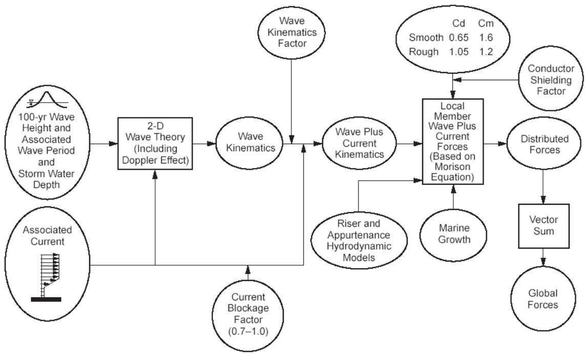  
Figure 5.1—Procedure for Calculation of Wave Plus Current Forces for Static Analysis

5.3.1.2.2 Apparent Wave Period

A current in the wave direction tends to stretch the wavelength, while an opposing current shortens it. For the simple case of a wave propagating on a uniform in-line current, the apparent wave period seen by an observer moving with the current can be estimated from Figure 5.2, in which T is the actual wave period (as seen by a stationary observer). $V_{ \mathrm{ i } }$ is the current component in the wave direction, $d ,$ is storm water depth (including storm surge and tide), and $g$ is the acceleration of gravity. This figure provides estimates for d g T 2 > 0.01. For smaller values of d g T 2 , the equation ( ) T T V g d app = +1 i $d / g T^{ 2 } > 0 . 01$ $d / g T^{ 2 }$ $\left( T_{ \mathsf{ a p p } } / T \right) = 1 + V_{ \mathsf{ i } } \sqrt{ g d }$ can be used. While strictly applicable only to a current that is uniform over the full water depth, Figure 5.2 provides acceptable estimates of $T_{ \mathsf{ a p p } }$ for “slab” current profiles that are uniform over the top 50 m (165 ft) or more of the water column. For other current profiles, $T_{ \mathsf{ a p p } }$ (see B.5.3.1.2.2) is generally determined from the iterative solution of a system of simultaneous nonlinear equations. The current used to determine $T_{ \mathsf{ a p p } }$ should be the free-stream current (not reduced by structure blockage).

Figure 5.2—Doppler Shift Due to Steady Current   
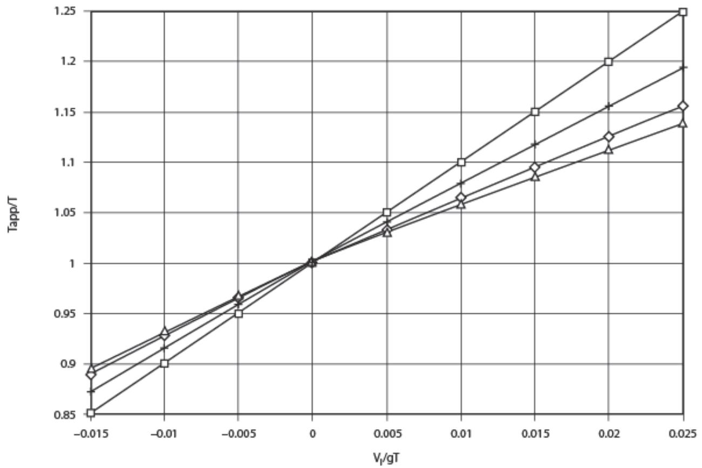  
Key   
d g T = 2 0.01 $d / g T^{ 2 } = 0 . 01$   
+ 0.02   
## 0.04
∆ 0.10

5.3.1.2.3 Two-dimensional Wave Kinematics

For the apparent wave period $T_{ \mathsf{ a p p } } ,$ specified wave height H, and storm water depth, d, two-dimensional regular wave kinematics can be calculated using the appropriate order of stream function wave theory. In many cases, Stokes V wave theory produces acceptable accuracy. Figure 5.3 shows the regions of applicability of Stokes V and various orders of stream function solutions in the $H / g T_{ \mathsf{ a p p } }^{ 2 } , \ d / g T_{ \mathsf{ a p p } }^{ 2 }$ plane.

Other wave theories, such as extended velocity potential and Chappelear, may be used if an appropriate order of solution is selected.

5.3.1.2.4 Wave Kinematics Factor

The two-dimensional regular wave kinematics from stream function or Stokes V wave theory do not account for wave directional spreading or irregularity in wave profile shape. These “real world” wave characteristics can be approximately modeled in deterministic wave analyses by multiplying the horizontal velocities and accelerations from the two-dimensional regular wave solution by a wave kinematics factor. Wave kinematics measurements support a factor in the range 0.85 to 0.95 for tropical storms and 0.95 to 1.00 for extratropical storms. Particular values within these ranges that shall be used for calculating guideline wave forces are specified for the Gulf of Mexico and for other U.S. waters in API 2MET. Section B.5.3.1.2.4 provides additional guidance for calculating the wave kinematics factor for particular sea states whose directional spreading characteristics are known from measurements or hindcasts.

5.3.1.2.5 Current Blockage Factor

The current speed in the vicinity of the platform is reduced from the specified “free stream” value by blockage. In other words, the presence of the structure causes the incident flow to diverge; some of the incident flow goes around the structure rather than through it, and the current speed within the structure is reduced. Since global platform loads are determined by summing local loads from Morison’s equation, the appropriate local current speed should be used. Table 5.2 gives typical current blockage factors for Gulf of Mexico jacket platforms.

For structures with other configurations or structures with a typical number of conductors, a current blockage factor can be calculated with the method described in B.5.3.1.2.5. Calculated factors less than 0.7 should not be used without empirical evidence to support them. For freestanding or braced caissons the current blockage factor should be 1.0.

Table 5.2—Approximate Current Blockage Factors for Typical Gulf of Mexico Jacket-type Structures   

| Number of Legs | Heading | Factor |
| --- | --- | --- |
| 3 | all | 0.90 |
| 4 | end-on | 0.80 |
| 4 | diagonal | 0.85 |
| 4 | broadside | 0.80 |
| 6 | end-on | 0.75 |
| 6 | diagonal | 0.85 |
| 6 | broadside | 0.80 |
| 8 | end-on | 0.70 |
| 8 | diagonal | 0.85 |
| 8 | broadside | 0.80 |

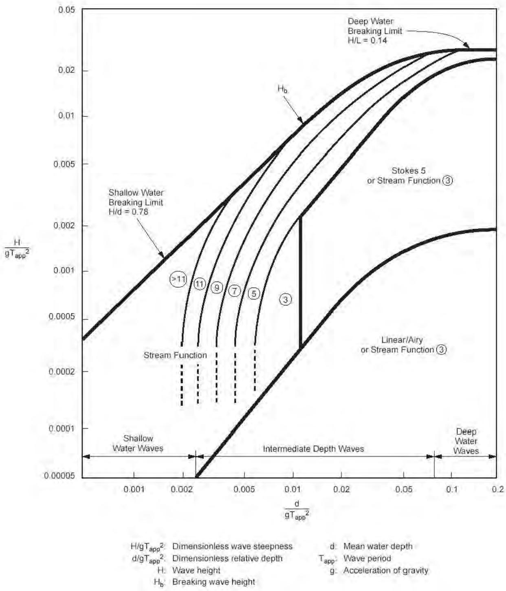  
Figure 5.3—Regions of Applicability of Stream Function, Stokes V, and Linear Wave Theory (from Atkins, 1990; Modified by API Task Group on Wave Force Commentary)

5.3.1.2.6 Combined Wave/Current Kinematics

Wave kinematics, adjusted for directional spreading and irregularity, should be combined vectorially with the current profile, adjusted for blockage. Since the current profile is specified only to storm mean water level in the design criteria, various methods to stretch (or compress) it to the local wave surface are used. As discussed in B.5.3.1.2.6, “nonlinear stretching” is the preferred method. For slab current profiles such as those specified for U.S. waters in API 2MET, simple vertical extension of the current profile from storm mean water level to the wave surface is a good approximation to nonlinear stretching. For other current profiles, linear stretching is an acceptable approximation. In linear stretching, the current at a point with elevation z, above which the wave surface elevation is η (where z and η are both positive above storm mean water level and negative below), is computed from the specified current profile at elevation z′. The elevations z and z′ are linearly related, as follows:

$$\left(z^{\prime} + d\right) = \left(z + d\right) d / (d + \eta) \tag{5.1}$$

where

d is the storm water depth.

5.3.1.2.7 Marine Growth

All structural members, conductors, risers, and appurtenances should be increased in cross-sectional area to account for marine growth thickness. Also, elements with circular cross sections should be classified as either “smooth” or “rough” depending on the amount of marine growth expected to have accumulated on them at the time of the loading event. Specific marine growth profiles are provided for U.S. waters in API 2MET. Site-specific data shall be used when available.

5.3.1.2.8 Drag and Inertia Coefficients

Drag and inertia coefficients are discussed in detail in B.5.3.1.2.8. For typical design situations, global platform wave forces can be calculated using the following values for unshielded circular cylinders:

Smooth: $C_{ \mathsf{ d } } = 0 . 65 , C_{ \mathsf{ m } } = 1 . 6$

Rough: Cd = 1.05, Cm = 1.2

These values are appropriate for the case of a steady current with negligible waves or the case of large waves with $U_{ \mathsf{ m o } } T_{ \mathsf{ a p p } } / D > 30$ . Here $U_{ \mathsf{ m o } }$ is the maximum horizontal particle velocity at storm mean water level under the wave crest from the two-dimensional wave kinematics theory, $T_{ \mathsf{ a p p } }$ is the apparent wave period, and D is platform leg diameter at storm mean water level.

For wave-dominant cases with $U_{ \mathsf{ m o } } T_{ \mathsf{ a p p } } / D < 30$ , guidance on how $C_{ \mathsf{ d } }$ and $C_{ \mathbf{ m } }$ for nearly vertical members are modified by “wake encounter” is provided in B.5.3.1.2.8. Such situations may arise with largediameter caissons in extreme seas or ordinary platform members in lower sea states considered in fatigue analyses.

For members that are not circular cylinders, appropriate coefficients can be found in Reference [39].

5.3.1.2.9 Conductor Shielding Factor

Depending upon the configuration of the structure and the number of well conductors, the wave forces on the conductors can be a significant portion of the total wave forces. If the conductors are closely spaced, the forces on them may be reduced due to hydrodynamic shielding. A wave force reduction factor, to be applied to the drag and inertia coefficients for the conductor array, can be estimated from Figure 5.4, in which S is the center-to-center spacing of the conductors in the wave direction and D is the diameter of the conductors, including marine growth. This shielding factor is appropriate for either steady current with negligible waves or extreme waves, with $U_{ \mathsf{ m o } } T_{ \mathsf{ a p p } } / S > 5 \pi$ . For less extreme waves with $U_{ \mathsf{ m o } } T_{ \mathsf{ a p p } } / S < 5 \pi$ , as in fatigue analyses, there may be less shielding. Section B.5.3.1.2.9 provides some guidance on conductor shielding factors for fatigue analyses.

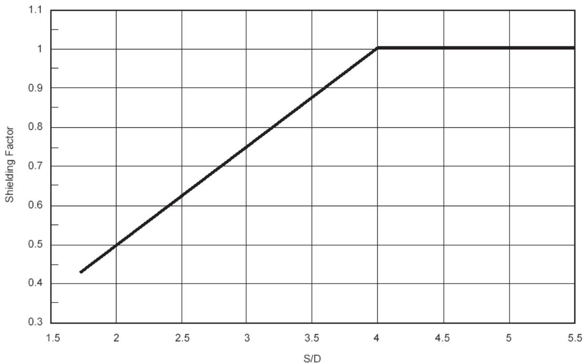  
Figure 5.4—Shielding Factor for Wave Loads on Conductor Arrays as a Function of Conductor Spacing

5.3.1.2.10 Hydrodynamic Models for Appurtenances

Appurtenances such as boat landings, fenders or bumpers, walkways, stairways, grout lines, and anodes should be considered for inclusion in the hydrodynamic model of the structure. Depending upon the type and number of appurtenances, they can significantly increase the global wave forces. In addition, forces on some appurtenances may be important for local member design. Appurtenances are generally modeled by nonstructural members, which contribute equivalent wave forces. For appurtenances such as boat landings, wave forces are highly dependent on wave direction because of shielding effects. Additional guidance on the modeling of appurtenances is provided in B.5.3.1.2.10.

5.3.1.2.11 Morison Equation

The computation of the force exerted by waves on a cylindrical object depends on the ratio of the wavelength to the member diameter. When this ratio is large (>5), the member does not significantly

modify the incident wave. The wave force can then be computed as the sum of a drag force and an inertia force, as follows:

$$F = F_{\mathrm{D}} + F_{\mathrm{I}} = C_{\mathrm{D}} \frac{w}{2 g} A U | U | + C_{\mathrm{m}} \frac{w}{g} V \frac{\delta U}{\delta t} \tag{5.2}$$

where

F is the hydrodynamic force vector per unit length acting normal to the axis of the member, N/m (lb/ft);

$F_{ \mathsf{ D } }$ is the drag force vector per unit length acting to the axis of the member in the plane of the member axis and U, N/m (lb/ft);

$F_{ \parallel }$ is the inertia force vector per unit length acting normal to the axis of the member in the plane of the member axis and ∂U/∂t, N/m (lb/ft);

$C_{ \mathsf{ D } }$ is the drag coefficient;

w is the weight density of water, ${ \mathsf{ N } } / { \mathsf{ m } }^{ 3 } ( \left| { \mathsf{ b } } / { \mathsf{ f } } { \mathsf{ f } }^{ 3 } \right) ;$

g is the gravitational acceleration, $\mathsf{ m } / \mathsf{ s }^{ 2 } ( \mathsf{ f t } / \mathsf{ s }^{ 2 } )$ ;

A is the projected area normal to the cylinder axis per unit length (= D for circular cylinders), m (ft);

V is the displaced volume of the cylinder per unit length （$= \pi D^{ 2 } / 4$ for circular cylinders), $\mathsf{ m }^{ 2 } ( \mathsf{ f t }^{ 2 } ) ;$

D is the effective diameter of circular cylindrical member including marine growth, m (ft);

U is the component of the velocity vector (due to wave and/or current) of the water normal to the axis of the member, m/s (ft/s);

|U | is the absolute value of U, m/s (ft/s);

$C_{ \mathbf{ m } }$ is the inertia coefficient;

$\frac{ \delta{ U } } { \delta t }$ is the component ofthe local acceleration vector of the water normal to the axis of the member, $\mathsf{ m } / \mathsf{ s }^{ 2 } ( \mathsf{ f t } / \mathsf{ s }^{ 2 } )$ .

Note that the Morison equation, as stated here, ignores the convective acceleration component in the inertia force calculation (see B.5.3.1.2.11). It also ignores lift forces, slam forces, and axial Froude-Krylov forces.

When the size of a structural body or member is sufficiently large to span a significant portion of a wavelength, the incident waves are scattered, or diffracted. This diffraction regime is usually considered to occur when the member width exceeds a fifth of the incident wavelength. Diffraction theory, which computes the pressure acting on the structure due to both the incident wave and the scattered wave, should be used, instead of the Morison equation, to determine the wave forces. Depending on their diameters, caissons may be in the diffraction regime, particularly for the lower sea states associated with

fatigue conditions. Diffraction theory is reviewed in Reference [40]. A solution of the linear diffraction problem for a vertical cylinder extending from the seabottom through the free surface (caisson) can be found in Reference [41].

5.3.1.2.12 Global Structure Forces

Total base shear and overturning moment are calculated by a vector summation of:

a) local drag and inertia forces due to waves and currents (see 5.3.1.2.11);   
b) dynamic amplification of wave and current forces (see 5.3.1.3)—note that this is preferably represented by a modal inertia load set (due to structure mass and added mass), rather than by simply scaling up the hydrodynamic loads; and   
c) wind forces on the exposed portions of the structure (see 5.3.2).

Local slamming forces can be neglected because they are primarily vertical. Lift forces can be neglected for jacket-type structures because they are not correlated from member to member. Axial Froude-Krylov forces can also be neglected for slender jacket bracing. The wave crest should be positioned relative to the structure so that the total base shear and overturning moment have their maximum values. The following should be kept in mind:

— maximum base shear may not occur at the same wave position as maximum overturning moment;   
— in special cases of waves with low steepness and an opposing current, maximum global structure force may occur near the wave trough rather than near the wave crest; and   
— maximum local member stresses may occur for a wave position other than that causing the maximum global structure force.

5.3.1.2.13 Local Member Design

Local member stresses are due to both local hydrodynamic forces and loads transferred from the rest of the structure. Locally generated forces include not only the drag and inertia forces modeled by the Morison equation [Equation (5.2)] but also lift forces, axial Froude-Krylov forces, hydrostatic pressure, buoyancy, and weight. Horizontal members near storm mean water level will also experience vertical slam forces as a wave passes. Both lift and slamming forces can dynamically excite individual members, thereby increasing stresses (see B.5.3.1.2.13). Transferred loads are due to the global fluid-dynamic forces and dynamic response of the entire structure. The fraction of total stress due to locally generated forces is generally greater for members higher in the structure; therefore, local lift and slam forces may need to be considered in designing these members. The maximum local member stresses may occur at a different position of the wave crest relative to the structure centerline than that which causes the greatest global wave force on the platform. For example, some members of conductor guide frames may experience their greatest stresses due to vertical drag and inertia forces, which generally peak when the wave crest is far away from the structure centerline.

5.3.1.3 Dynamic Wave Analysis

5.3.1.3.1 General

A dynamic analysis of a fixed platform is indicated when the design sea state contains significant wave energy at frequencies near the platform’s natural frequencies. The wave energy content versus frequency

can be described by wave (energy) spectra as determined from measured data or predictions appropriate for the platform site. Dynamic analyses should be performed for compliant towers and tension leg platforms.

5.3.1.3.2 Waves

Use of a random linear wave theory with modified crest kinematics is appropriate for dynamic analysis of fixed platforms. Wave spreading (three-dimensionality) should be considered. Wave group effects may also cause important dynamic responses in compliant structures.

5.3.1.3.3 Currents

Currents associated with the design sea state can affect dynamic loading through the nonlinear drag force term in the Morison equation [Equation (5.2)] and therefore should be considered in dynamic analysis.

5.3.1.3.4 Winds

For analysis of template, tower, gravity, or minimum platforms, global loads due to the sustained wind may be superimposed on the global wave and current load.

For compliant towers and tension leg platforms, the analysis should include the simultaneous action of wind, waves, and current. It may be appropriate to consider wind dynamics.

5.3.1.3.5 Fluid Force on a Member

Equation (5.2) may be used to compute forces on members of template, tower, gravity, or minimum structure platforms. Guidance on selection of drag and inertia coefficients for dynamic analysis is provided in B.5.3.1.2.8. For compliant towers and tension leg platforms, Equation (5.2) should be modified to account for relative velocity by making the following substitution in the drag force term:

replace U and | U | by (U – x ) and | U – x |, respectively

where

x is the component of structural velocity normal to the axis of the member, m/s (ft/s);

U is the component of the velocity vector (due to wave and/or current) of the water normal to the axis of the member, m/s (ft/s) [see Equation (5.2)].

Fluid forces associated with the platform acceleration are accounted for by added mass.

5.3.1.3.6 Structural Modeling

The dynamic model of fixed platforms should reflect the key analytical parameters of mass, damping, and stiffness. The mass should include that of the platform steel, all appurtenances, conductors, and deck loads, the mass of water enclosed in submerged tubular members, the mass of marine growth expected to accumulate on the structure and the added mass of submerged members, accounting for increased member diameter due to marine growth.

Equivalent viscous damping values may be used in lieu of an explicit determination of damping components. In the absence of substantiating information for damping values for a specific structure, a

damping value of 2 % to 3 % of critical for extreme wave analyses and 2 % of critical for fatigue analyses may be used.

The analytical model should include the elastic stiffness of the platform and reflect the structure/foundation interaction. It may be appropriate to consider a stiffer foundation for fatigue analyses than for extreme wave response analyses. However, static p-y data is appropriate for use for an inelastic push over analysis [330]. For guyed towers, these stiffness values should be augmented to account for the guyline system. Analysis procedures should generally account for the dynamic interaction of the tower and guyline system. In general, compliant tower analytical models should include geometric stiffness (large displacement effects). Forces affecting geometric stiffness include gravity loads, buoyancy, the vertical component of the guyline system reaction (where applicable), and the weight of conductors including their contents.

5.3.1.3.7 Analysis Methods

Time history methods of dynamic analysis are preferred for predicting the extreme wave response of template platforms, minimum structures, and compliant towers because these structures are generally drag force dominated. The nonlinear guyline system stiffness also indicates time domain analysis for guyed towers. Frequency domain methods may be used for extreme wave response analysis to calculate the dynamic amplification factor to combine with the static load, provided linearization of the drag force can be justified; for guyed towers, both the drag force and nonlinear guyline stiffness would require linearization. Frequency domain methods are generally appropriate for small wave fatigue analysis.

For member design, stresses may be determined from static analyses that include in an appropriate manner the significant effects of dynamic response determined from separate analyses made according to the provisions of this section.

5.3.2 Wind

5.3.2.1 General

The wind criteria for design should be determined by proper analysis of wind data collected in accordance with 4.3.2. As with wave loads, wind loads are dynamic in nature, but some structures will respond to them in a nearly static fashion. For conventional fixed steel templates in relatively shallow water, winds are a minor contributor to global loads (typically less than 10 %). Sustained wind speeds should be used to compute global platform wind loads, and gust speeds should be used for the design of individual structural elements. The values of wind criteria for different return intervals provided in API 2MET shall be used.

In deeper water and for compliant designs, wind loads can be significant and should be studied in detail. A dynamic analysis of the platform is indicated when the wind field contains energy at frequencies near the natural frequencies of the platform. Such analyses may require knowledge of the wind turbulence intensity, spectra, and spatial coherence. These items are addressed below.

5.3.2.2 Wind Properties

5.3.2.2.1 General

Wind speed and direction vary in space and time. On length scales typical of even large offshore structures, statistical wind properties (e.g. mean and standard deviation of speed) taken over durations of the order of an hour do not vary horizontally, but do change with elevation (profile factor). Within long

durations, there will be shorter durations with higher mean speeds (gusts factor). Therefore, a wind speed value is only meaningful if qualified by its elevation and duration.

5.3.2.2.2 Wind Profiles and Gusts

In SI units, for strong wind conditions (near-neutral stratification) the design wind speed u （$z , \ t )$ (m/s) at height z (m) above sea level and corresponding to an averaging time period $t \leq t_{ 0 } = 3600 ~ \mathrm{ s }$ is given by:

$$u (z, t) = U (z) \times \left[ 1 - 0. 41 \times I_{\mathrm{u}} (z) \times \ln \left(\frac{t}{t_{0}}\right) \right] \tag{5.3}$$

where the 1-hour mean wind speed U(z) (m/s) at level z (m) is given by:

$$U (z) = U_{0} \times \left[ 1 + C \times \ln \left(\frac{z}{10}\right) \right] \tag{5.4}$$

where

$$C = 5. 73 \times 10^{-2} \times \left(1 + 0. 15 U_{0}\right)^{1 / 2}$$

and where the turbulence intensity $I_{ \mathsf{ u } } ( z )$ at level z (m) is given by:

$$I_{\mathrm{u}} (z) = 0. 06 \times \left(1 + 0. 043 \times U_{\mathrm{o}}\right) \times \left(\frac{z}{10}\right)^{- 0. 22} \tag{5.5}$$

where $U_{ \mathbf{ o } }$ (m/s) is the 1-hour mean wind speed at 10 m above sea level.

In USC units, for strong wind conditions the design wind speed $u \left( z , t \right) \left( \mathsf{ f t } / \mathsf{ s } \right)$ at height z (ft) above sea level and corresponding to an averaging time period $t < t_{ 0 } = 3600$ s is given by:

$$u (z, t) = U (z) \times \left[ 1 - 0. 41 \times I_{u} (z) \times \ln \left(\frac{t}{t_{o}}\right) \right] \tag{5.6}$$

where the 1-hour mean wind speed U(z) (ft/s) at level z (ft) is given by:

$$U (z) = U_{0} \times \left[ 1 + C \times \ln \left(\frac{z}{32 . 8}\right) \right] \tag{5.7}$$

where

$$C = 5. 73 \times 10^{-2} \times \left(1 + 0. 0457 \times U_{\mathrm{o}}\right)^{1 / 2}$$

and where the turbulence intensity $I_{ \mathsf{ u } } ( z )$ at level z (ft) is given by:

$$I_{\mathrm{u}} (z) = 0. 06 \times \left(1 + 0. 0131 \times U_{\mathrm{o}}\right) \times \left(\frac{z}{32 . 8}\right)^{- 0. 22} \tag{5.8}$$

where $U_{ 0 } \left( \mathsf{ f t } / \mathsf{ s } \right)$ is the 1-hour mean wind speed at 32.8 ft above sea level.

5.3.2.2.3 Wind Spectra

For structures and structural elements for which the dynamic wind behavior is of importance, Equation (5.9) through Equation (5.12) for the 1-point wind spectrum may be used for the energy density of the longitudinal wind speed fluctuations.

In SI units:

$$S (f) = \frac{320 \left(\frac{U_{0}}{10}\right)^{2} \left(\frac{z}{10}\right)^{0 . 45}}{\left(1 + \tilde{f}^{\mathrm{n}}\right)^{\left(\frac{5}{3 \mathrm{n}}\right)}} \tag{5.9}$$

$$\tilde{f} = 172 f \left(\frac{z}{10}\right)^{2 / 3} \left(\frac{U_{0}}{10}\right)^{- 0. 75} \tag{5.10}$$

where

n equals 0.468;

S(f) is the spectral energy density at frequency f, in m2/s2/Hz;

z is the height above sea level, in m;

$U_{ \mathbf{ o } }$ is the 1-hour mean wind speed at 10 m above sea level, in m/s.

In USC units:

$$S (f) = \frac{3444 \left(\frac{U_{\mathrm{o}}}{32 . 8}\right)^{2} \left(\frac{z}{32 . 8}\right)^{0 . 45}}{\left(1 + \tilde{f}^{\mathrm{n}}\right)^{\left(\frac{5}{3 \mathrm{n}}\right)}} \tag{5.11}$$

$$\tilde{f} = 172 f \left(\frac{z}{32 . 8}\right)^{2 / 3} \left(\frac{U_{0}}{32 . 8}\right)^{- 0. 75} \tag{5.12}$$

where

n equals 0.468;

S(f) is the spectral energy density at frequency f, in $\scriptstyle \hbar^{ 2 } / \mathsf{ s }^{ 2 } / \mathsf{ H z } .$ ;

z is the height above sea level, in ft;

$U_{ \mathbf{ o } }$ is the 1-hour mean wind speed at 32.8 ft above sea level, in ft/s.

5.3.2.2.4 Spatial Coherence

Wind gusts have three-dimensional spatial scales related to their durations. For example, 3-s gusts are coherent over shorter distances and therefore affect smaller elements of a platform superstructure than 15-s gusts. The wind in a 3-s gust is appropriate for determining the maximum static wind load on individual members; 5-s gusts are appropriate for maximum total loads on structures whose maximum horizontal dimension is less than 50 m (164 ft); and 15-s gusts are appropriate for the maximum total static wind load on larger structures. The 1-min. sustained wind is appropriate for total static superstructure wind loads associated with maximum wave forces for structures that respond dynamically to wind excitation but that do not require a full dynamic wind analysis. For structures with negligible dynamic response to winds, the 1-hour sustained wind is appropriate for total static superstructure wind forces associated with maximum wave forces.

In frequency domain analyses of dynamic wind loading, it can be conservatively assumed that all scales of turbulence are fully coherent over the entire superstructure. For dynamic analysis of some substructures, it may be beneficial to account for the less-than-full coherence at higher frequencies. The squared correlation between the spectral energy densities of the longitudinal wind speed fluctuations of frequency f between two points in space is described in terms of the 2-point coherence spectrum.

Equation (5.13) through Equation (5.15) may be used for the recommended coherence spectrum between two points （$x_{ \mathrm{ i } } , y_{ \mathrm{ j } } , z_{ \mathrm{ i } } )$ .

In SI units:

— at levels $z_{ 1 }$ and $z_{ 2 }$ above the sea surface, in m;   
— with across-wind positions $y_{ 1 }$ and $y_{ 2 } ,$ in m;   
— with along-wind positions $x_{ 1 }$ and $x_{ 2 } ,$ in m.

is given by

$$\operatorname{c o h} (f) = \exp \left[ - \frac{1}{U_{0}} \left(\sum_{\mathrm{i} = 1}^{3} A_{\mathrm{i}}^{2}\right)^{\frac{1}{2}} \right] \tag{5.13}$$

where

$$A_{i} = \alpha_{i} f^{r_{i}} \Delta_{i}^{q_{i}} z_{g}^{- p_{i}} \tag{5.14}$$

$$z_{g} = \sqrt{z_{1} z_{2}} / (10)$$

In USC units:

— at levels $z_{ 1 }$ and $z_{ 2 }$ above the sea surface, in ft;   
— with across-wind positions $y_{ 1 }$ and $y_{ 2 } ,$ , in ft;   
— with along-wind positions $x_{ 1 }$ and $x_{ 2 } ,$ in ft.

is given by:

$$\operatorname{c o h} (f) = \exp \left[ - \frac{1}{U_{\mathrm{o}} / 3 . 28} \left(\sum_{\mathrm{i} = 1}^{3} A_{\mathrm{i}}^{2}\right)^{\frac{1}{2}} \right] \tag{5.15}$$

where

$$A_{i} = \alpha_{i} f^{r_{i}} \left(\frac{\Delta_{i}}{3 . 28}\right)^{q_{i}} z_{g}^{- p_{i}} \tag{5.16}$$

$$z_{\mathrm{g}} = \frac{\sqrt{z_{1} z_{2}}}{32 . 8}$$

and where the coefficients $\alpha , \mathsf{ p , q , }$ r and the distances Δ are given in Table 5.3.

Table 5.3—Values Coherence Spectrum Coefficients ${ \pmb{ a } } ,$ p, q, r, and Δ   

| i | Δi | qi | pi | ri | αi |
| --- | --- | --- | --- | --- | --- |
| 1 | \|x2-x1\| | 1.00 | 0.4 | 0.92 | 2.9 |
| 2 | \|y2-y1\| | 1.00 | 0.4 | 0.92 | 45.0 |
| 3 | \|z2-z1\| | 1.25 | 0.5 | 0.85 | 13.0 |

5.3.2.3 Wind Speed and Force Relationship

The wind drag force on an object should be calculated as:

$$F = (\rho / 2) u^{2} C_{\mathrm{S}} A \tag{5.17}$$

where

$F$ is the wind force, in N (lb);

$\rho$ is the mass density of air (kg/ $m^{ 3 }$ , 1.22 $\mathsf{ k g } / \mathsf{ m }^{ 3 }$ for standard temperature and pressure) （$\mathsf{ s l u g } / \mathsf{ f } \mathsf{ f }^{ 3 }$ , 0.0023668 slugs $/ \mu^{ 3 }$ for standard temperature and pressure);

u is the wind speed, in m/s (ft/s);

$C_{ \mathsf{ s } }$ is the shape coefficient;

A is the area of object, in m2 (ft2).

5.3.2.4 Local Wind Force Considerations

For all angles of wind approach to the structure, forces on flat surfaces should be assumed to act normal to the surface and forces on vertical cylindrical tanks, pipes, and other cylindrical objects should be assumed to act in the direction of the wind. Forces on cylindrical tanks, pipes, and other cylindrical

objects that are not in a vertical attitude should be calculated using appropriate formulas that take into account the direction of the wind in relation to the attitude of the object. Forces on sides of buildings and other flat surfaces that are not perpendicular to the direction of the wind shall also be calculated using appropriate formulas that account for the skewness between the direction of the wind and the plane of the surface. Where applicable, local wind effects such as pressure concentrations and internal pressures should be considered by the designer. These local effects should be determined using appropriate means such as the analytical guidelines set forth in Reference [42].

5.3.2.5 Shape Coefficients

In the absence of data indicating otherwise, the shape coefficients in Table 5.4 are recommended for perpendicular wind approach angles with respect to each projected area.

Table 5.4—Wind Shape Coefficients   

| Area | Shape Coefficient (C_S) |
| --- | --- |
| Beams | 1.5 |
| Sides of buildings | 1.5 |
| Cylindrical sections | 0.5 |
| Overall projected wind area of platform | 1.0 |

5.3.2.6 Shielding Coefficients

Shielding coefficients may be used when, in the judgment of the designer, the second object lies close enough behind the first to warrant the use of the coefficient.

5.3.2.7 Wind Tunnel Data

Wind pressures and resulting forces may be determined from wind tunnel tests on a representative model.

5.3.2.8 Wind-induced Vibration

All slender members exposed to the wind should be investigated for the possibility of vibration due to periodic vortex shedding.

5.3.3 Current

5.3.3.1 General

As described in 4.3.5, the total current is the vector sum of the tidal, circulational, and storm-generated currents. The relative magnitude of these components, and thus their importance for computing loads, varies with offshore location.

Tidal currents are generally weak in deep water past the shelf break. They are generally stronger on broad continental shelves than on steep shelves, but rarely exceed 0.3 m/s (1 ft/s) along any open coastline. Tidal currents can be strengthened by shoreline or bottom configurations such that strong tidal

currents can exist in many inlet and coastal regions; for example, surface values of about 3 m/s (10 ft/s) can occur in Cook Inlet.

Circulational currents are relatively steady, large-scale features of the general oceanic circulation. Examples include the Gulf Stream in the Atlantic Ocean and the Loop Current in the Gulf of Mexico where surface velocities can be in the range of about 1 m/s to 2 m/s (3 ft/s to 6 ft/s). While relatively steady, these circulation features can meander and intermittently break off from the main circulation feature to become large-scale eddies or rings that then drift a few miles per day. Velocities in such eddies or rings can approach that of the main circulation feature. These circulation features and associate eddies occur in deep water beyond the shelf break and generally do not affect sites with depths less than about 300 m (1000 ft).

Storm generated currents are caused by the wind stress and atmospheric pressure gradient throughout the storm. Current speeds are a complex function of the storm strength and meteorological characteristics, bathymetry and shoreline configuration, and water density profile. In deep water along open coastlines, surface storm current can be roughly estimated to have speeds up to 2 % to 3 % of the 1-hour sustained wind speed during tropical storms and hurricanes and up to 1 % of the 1-hour sustained wind speed during winter storms or extratropical cyclones. As the storm approaches shallower water and the coastline, the storm surge and current can increase.

API 2MET or site-specific data developed in accordance with the requirements of API 2MET shall be used for details regarding specific magnitude of currents for U.S. waters.

5.3.3.2 Current Profile

A qualified oceanographer should determine the variation of current speed and direction with depth. The profile of storm-generated currents in the upper layer of the ocean is the subject of active research. See API 2MET for details regarding specific current profiles for U.S. waters.

5.3.3.3 Current Force Only

Where current is acting alone (i.e. no waves) the drag force should be determined by Equation (5.2) with $\delta U_{ \delta t } = 0$

5.3.3.4 Current Associated with Waves

Due consideration should be given to the possible superposition of current and waves. In those cases where this superposition is necessary, the current velocity should be added vectorially to the wave particle velocity before the total force is computed as described in 5.3.1.2. Where there is sufficient knowledge of wave/current joint probability, it may be used to advantage. See API 2MET for details regarding specific magnitude of current associated with waves for U.S. waters.

5.3.3.5 Vortex-induced Vibration

All slender members exposed to the current should be investigated for the possibility of vibration due to periodic vortex shedding as discussed in B.5.3.1.2.13.

5.3.4 Hydrodynamic Force Guidelines for U.S. Waters

5.3.4.1 General

Design parameters for hydrodynamic loading shall be selected based on life safety and consequence of failure in the manner described in 4.5, using environmental data collected and presented as outlined in 4.3. API 2MET provides design magnitude of hydrodynamic force parameters for U.S. waters that shall be used if the special site-specific studies described in 4.3 and 4.5 are not performed.

5.3.4.2 Intent

The provisions of API 2MET or site-specific date developed in accordance with the requirements of API 2MET shall be used in determining metocean criteria for the analysis of static wave loads for platforms in U.S. waters. Depending upon the natural frequencies of the platform and the predominant frequencies of wave energy in the area, it may be necessary to perform dynamic analyses. Further, the general wave conditions in certain of these areas are such that consideration of fatigue loads may be necessary.

As described in 4.5, the selection of environmental criteria shall be based on risk considering life safety and consequence of failure. Table 5.5 shall be used in defining the design level criteria and new robustness level analyses both now required for new platforms. Guidelines for selecting the hydrodynamic criteria are provided in Table 5.5 for the three platform exposure categories defined in 4.7. Platform owners may find economic or cost-risk justification for designing structures to conditions more or less severe than indicated by these guidelines, while keeping risks to human life as low as reasonably practicable. Depending on the exposure category and platform configuration, guidelines are also provided in Table 5.5 for selecting the robustness level hydrodynamic force criteria to be used in the required robustness ultimate strength analysis. Information on ultimate strength analysis is provided in API 2SIM.

Table 5.5—Design Level Criteria and Robustness Analysis   

| Exposure Category | Design Level Criteria | Robustness Level Ultimate Strength Analysis |
| --- | --- | --- |
| L-1a | Use the 100-year full population and associated conditions from API 2MET or site-specific data developed in accordance with the requirements of API 2MET | Use the 1000-year full population wave and associated conditions from API 2MET or site-specific data developed in accordance with the requirements of API 2MET |
| L-2 | Use the 50-year full population and associated conditions from API 2MET or site-specific data developed in accordance with the requirements of API 2MET | Not required if L-2 exposure category platform has a robust configurationFor nonrobust configurations—Use the 500-year full population wave and associated conditions from API 2MET or site-specific data developed in accordance with the requirements of API 2MET |
| L-3 | Use the 25-year full population and associated conditions from API 2MET or site-specific data developed in accordance with the requirements of API 2MET | Not required |
| aManned-nonevacuated platforms are presently not applicable to the U.S. GoM waters where platforms are normally evacuated ahead of hurricane events. The metocean design criteria in Section 5 have not been verified as adequate for manned-nonevacuated in the U.S. GoM. However, the winter storm, sudden hurricane, and earthquake criteria for the U.S. GoM have been verified as adequate for the manned-nonevacuated situation occurring during those events when platforms in the U.S. GoM waters are not normally evacuated | aManned-nonevacuated platforms are presently not applicable to the U.S. GoM waters where platforms are normally evacuated ahead of hurricane events. The metocean design criteria in Section 5 have not been verified as adequate for manned-nonevacuated in the U.S. GoM. However, the winter storm, sudden hurricane, and earthquake criteria for the U.S. GoM have been verified as adequate for the manned-nonevacuated situation occurring during those events when platforms in the U.S. GoM waters are not normally evacuated | aManned-nonevacuated platforms are presently not applicable to the U.S. GoM waters where platforms are normally evacuated ahead of hurricane events. The metocean design criteria in Section 5 have not been verified as adequate for manned-nonevacuated in the U.S. GoM. However, the winter storm, sudden hurricane, and earthquake criteria for the U.S. GoM have been verified as adequate for the manned-nonevacuated situation occurring during those events when platforms in the U.S. GoM waters are not normally evacuated |

An L-2 exposure category platform has a robust configuration if it has all of the following characteristics.

a) The structure has four or more legs.   
b) The lower deck bottom of beam elevation is above the 1000-year return “max crest elevation” provided in API 2MET, or site-specific data developed in accordance with the requirements of API 2MET.   
c) The piles are founded in competent soils that are not susceptible to mudslide or other type of seafloor deformation.   
d) The nominal sections of any ungrouted legs have a maximum D/t ratio of 50 at the nominal sections between the joint cans. Alternately, piles are grouted to the jacket leg for the full length of the leg.   
e) The vertical framing transmitting shear forces between horizontal frames consists of X-braces, or single (leg-to-leg) diagonals, arranged such that shear between horizontal frames is carried by braces in both tension and compression. K-bracing cannot be used. See Figure 5.5 and Figure 5.6.   
f) Horizontal members are provided between all adjacent legs at horizontal framing levels in vertical frames and these horizontal members have sufficient strength in compression to support the redistribution of actions resulting from any buckling of adjacent diagonal braces. See Figure 5.5.   
g) The slenderness ratio (KL/r) of primary diagonal bracing in vertical frames is limited to no more than 80 and （$F_{ \mathbf{ y } } D ) / ( E t ) \leq 0 . 0 \dot{ 6 } 9$ .   
h) Joints for primary structural members are sized for either the tensile yield load or the compressive buckling load of the members framing into the joint, as appropriate for the ultimate behavior of the structure. This can be accomplished by increasing the 50 % minimum cord capacity requirement of 7.2.3 to 100 % for in-place design conditions.   
i) All pile-jacket shim connections are complete 360 welded connections with smooth curved crown shims designed to reduce stress concentrations that affect fatigue life and are designed to carry the ultimate capacity of the pile.

Any robustness level analysis shall follow the ultimate strength analysis procedures provided in API 2SIM.

Extreme metocean parameters for the Gulf of Mexico are provided in API 2MET. Specific annual conditions are also provided in API 2MET with information on how to combine different wave, wind, and currents.

Use of the guidelines should result in safe but not necessarily optimal structures. Platform owners may find justification for designing structures for conditions more or less severe than indicated by these guidelines. As discussed in 4.5 design criteria depend upon the overall loading, strength, and exposure characteristics of the installed platform. The guidelines should not be taken as a condemnation of platforms designed by different practices. Historical experience, loading, and strength characteristics of these structures may be used for such evaluations. The provisions of this section are intended to accommodate such considerations. The actual platform experience and exposure and the amount of detailed oceanographic data available vary widely among the different U.S. waters. The Gulf of Mexico is characterized by a substantial amount of experience, exposure, and data. For other areas, there may be less experience and data.

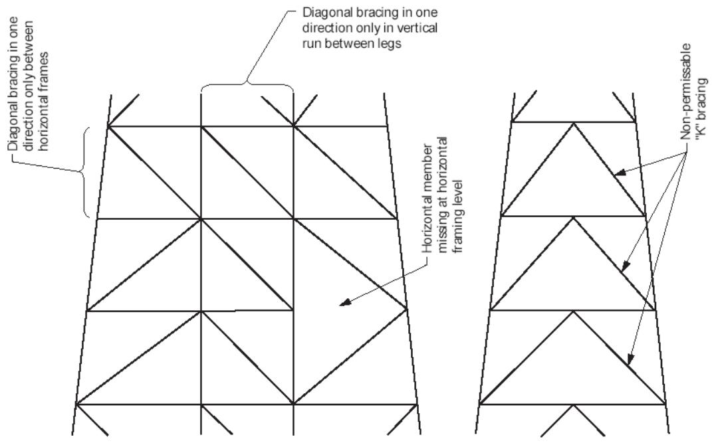

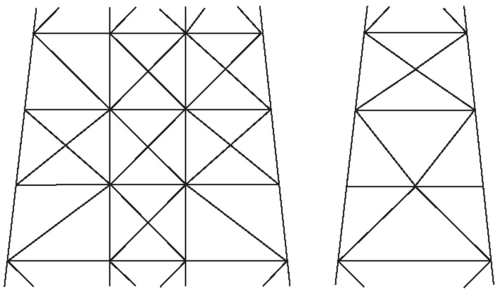  
Figure 5.5—Vertical Framing Configurations Not Meeting Robustness Requirements   
Figure 5.6—Vertical Framing Configurations Meeting Robustness Requirements

5.3.4.3 Deck Clearance

Large forces result when waves strike a platform’s deck and equipment. To avoid this, the bottom of the lowest deck should be located at an elevation that will clear the calculated crest of the design wave with adequate allowance for safety. For new platforms in the Gulf of Mexico, the elevation for the underside of the deck shall not be lower than the 1000-year return period maximum crest elevation provided in API 2MET or site-specific data developed in accordance with the requirements of API 2MET. For new L-3 platforms, the deck may be located below the 1000-year return period maximum crest elevation only if the entire topsides are located below the calculated crest elevation of the design wave designated for L-3 structures. In this case, the full wave and current forces on the topsides shall be considered. API 2SIM provides guidance for predicting the wave/current forces on the deck and topsides.

An air gap, the distance between the maximum crest elevation used for deck clearance and the bottom of steel on the lower deck, shall be provided for any known or predicted long term seafloor subsidence, both regional and that due to hydrocarbon extraction. An additional air gap should be allowed to account for structures that experience significant structural rotation or “set down.”

In general, no platform components, piping or equipment should be located below the lower deck. However, when it is unavoidable to position such items as minor subcellars, sumps, drains, or production piping below bottom of steel on the lower deck, provisions should be made for the wave forces developed on these items. These wave forces may be calculated using the crest pressure of the design wave applied against the projected area. These forces may be considered on a “local” basis in the design of the item. These provisions do not apply to vertical members such as deck legs, conductors, risers, etc., which normally penetrate the air gap.

5.3.5 Ice

API 2N shall also be used in areas where ice is expected to be a consideration in the planning, designing, or constructing of fixed offshore platforms.

5.3.6 Earthquake

5.3.6.1 General

This section presents guidelines for the design of a platform for earthquake ground motion including both strength and ductility requirements. Strength requirements are intended to provide a platform that is adequately sized for strength and stiffness to ensure no significant structural damage for the level of earthquake shaking that has a reasonable likelihood of not being exceeded during the life of the structure. The ductility requirements are intended to ensure that the platform has sufficient reserve capacity to prevent its collapse during rare intense earthquake motions, although structural damage may occur. Strength requirements are checked at the extreme level earthquake (ELE) and ductility requirements at the abnormal level earthquake (ALE).

It should be recognized that these provisions are state of the art and that a structure adequately sized and proportioned for overall stiffness, ductility, and adequate strength at the joints, and that incorporates good detailing and welding practices, is the best assurance of good performance during earthquake shaking.

The guidelines in the following paragraphs of this section are intended to apply to the design of major steel framed structures. Only vibratory ground motion is addressed in this section. Other major concerns

such as those identified in 4.3.7 (e.g. large soil deformations or instability) should be resolved by special studies.

5.3.6.2 Preliminary Considerations

5.3.6.2.1 Evaluation of Seismic Activity

For seismically active areas it is intended that the intensity and characteristics of seismic ground motion used for design be determined by a site-specific study. Evaluation of the intensity and characteristics of ground motion should consider the active faults within the region, the type of faulting, the maximum magnitude of earthquake that can be generated by each fault, the regional seismic activity rate, the proximity of the site to the potential source faults, the attenuation of the ground motion between these faults and the platform site, and the soil conditions at the site.

To satisfy the strength requirements a new platform shall be designed for ground motions having an average recurrence interval determined in accordance with API 2EQ. The earthquake with average recurrence is referred to by API 2EQ as the extreme level earthquake (ELE). This was the strength level earthquake in API 2A-WSD, 21st Edition and earlier.

The return period and intensity of ground motion that may occur during a rare intense earthquake should also be determined in accordance with API 2EQ. The rare intense earthquake is referred to by API 2EQ as the ALE. This was the ductility level earthquake in API 2A-WSD, 21st Edition and earlier.

In API 2EQ, maps provide the 1000-year earthquake, which is scaled (up) to get the ALE based on a number of site and risk factors. The seismic reserve capacity factor $C_{ \Gamma } ,$ which accounts for structure reserve strength and ductility, is then used to scale down to the ELE for elastic analysis.

5.3.6.2.2 Evaluation for Zones of Low Seismic Activity

In areas of low seismic activity, platform design would normally be controlled by storm or other environmental loading rather than earthquake. For areas defined in API 2EQ as Site Seismic Zone 0, earthquake analysis may be omitted, since the design for environmental loading other than earthquake will provide sufficient resistance against potential effects from seismically active zones. For other areas, the guidelines of API 2EQ shall be followed.

5.3.6.3 Strength Requirements (ELE)

5.3.6.3.1 Design Basis

The platform shall be designed to resist the inertially induced loads produced by the strength level ground motion determined in accordance with API 2EQ using dynamic analysis procedures such as response spectrum analysis or time history analysis.

5.3.6.3.2 Structural Modeling

The mass used in the dynamic analysis should consist of the mass of the platform associated with gravity loading defined in 5.3.6.3.3, the mass of the fluids enclosed in the structure and the appurtenances, and the added mass. The added mass may be estimated as the mass of the displaced water for motion transverse to the longitudinal axis of the individual structural framing and appurtenances. For motions along the longitudinal axis of the structural framing and appurtenances, the added mass may be neglected.

The analytical model should include the three dimensional distribution of platform stiffness and mass. Asymmetry in platform stiffness or mass distribution may lead to significant torsional response that should be considered.

In computing the dynamic response of braced, pile supported steel structures, a uniform modal damping ratio of 5 % of critical damping should be used for an elastic analysis. Where substantiating data exist, other damping ratios may be used.

5.3.6.3.3 Response Analysis

It is intended that the design response should be comparable for any analysis method used. When the response spectrum method is used, the complete quadratic combination method may be used for combining modal responses and the square root of the sum of the squares may be used for combining the directional responses. If other methods are used for combining modal responses, such as the square root of the sum of the squares, care should be taken not to underestimate corner pile and leg loads. For the response spectrum method, as many modes should be considered as required for an adequate representation of the response. At least two modes having the highest overall response should be included for each of the three principal directions plus significant torsional modes.

Where the time history method is used, the design response should be calculated in accordance with API 2EQ.

Earthquake loading should be combined with other simultaneous loadings such as gravity, buoyancy, and hydrostatic pressure. Gravity loading should include the platform dead weight (comprised of the weight of the structure, equipment, and appurtenances), actual live loads, and 75 % of the maximum supply and storage loads.

5.3.6.3.4 Response Assessment

In the calculation of member stresses, the stresses due to earthquake-induced loading should be combined with those due to gravity, hydrostatic pressure, and buoyancy. For the strength requirement, the basic AISC 335-89 allowable stresses and those presented in 6.2 may be increased by 70 %. Pile-soil performance and pile design requirements should be determined based on special studies. These studies should consider the design loadings of 5.3.6.3.3, installation procedures, earthquake effects on soil properties, and characteristics of the soils as appropriate to the axial or lateral capacity algorithm being used. Both the stiffness and capacity of the pile foundation should be addressed in a compatible manner for calculating the axial and lateral response.

5.3.6.4 Ductility Requirements (ALE)

5.3.6.4.1 The intent of these requirements is to ensure that platforms to be located in seismically active areas have adequate reserve capacity to prevent collapse under a rare, intense earthquake. Platform ductility is based upon a combination of reserve strength and ductility expressed by the seismic reserve capacity factor, $C_{ \mathsf{ r } }$ (the ratio between the abnormal and extreme level spectral accelerations), as defined in 5.3.6.4.2 and 5.3.6.4.3.

5.3.6.4.2 The $C_{ \mathsf{ r } }$ factor represents a structure’s ability to sustain ground motions due to earthquakes beyond the strength level event. It is defined as the ratio of spectral acceleration that causes structural collapse or catastrophic system failure to the strength level event spectral acceleration. For fixed steel offshore structures, the representative value of $C_{ \mathsf{ r } }$ may be estimated from the general characteristics of a structure’s design in accordance with Table 5.6.

Table 5.6—Cr Factors for Steel Jacket of Fixed Offshore Platforms   

| Characteristics of Structure Design | Cr |
| --- | --- |
| The recommendations for ductile design in 5.3.6.4.3 are followed and a nonlinear static pushover analysis according to API 2EQ is performed to verify the global performance of the structure under ALE conditions. | Variable up to 2.80, as demonstrated by analysis. |
| The recommendations for ductile design in 5.3.6.4.3 are followed, but a nonlinear static pushover analysis to verify ALE performance is not performed. | 2.00 |
| The structure has a minimum of three legs and a bracing pattern consisting of leg-to-leg diagonals with horizontals or X-braces without horizontals. The slenderness ratio (KL/r) of diagonal bracing in vertical frames is limited to no more than 80 and (FyD)/(Et) ≤ 0.069. For X-bracing in vertical frames the same restrictions apply, where the length L to be used depends on the loading pattern of the X-bracing. A nonlinear analysis to verify the ductility level performance is not performed. | 1.40 |
| If none of the above characterizations apply. | 1.10 |

Where the values of $C_{ \mathsf{ r } }$ in Table 5.6 are not used, a value may be assumed. In such cases, both of the following conditions shall apply.

a) If the simplified seismic action procedure in API 2EQ is followed, the assumed value of $C_{ \mathsf{ r } }$ shall not exceed 2.8 for L-1 platforms, 2.4 for L-2 platforms, and 2.0 for L-3 platforms.   
b) A nonlinear time history analysis in accordance with API 2EQ shall be performed to ensure survival in the ductility level event. As an alternative, a static pushover analysis in accordance with API 2EQ may be performed to confirm that $C_{ \mathsf{ r } }$ is equal to or higher than that assumed.

5.3.6.4.3 For a platform to use a $C_{ \mathsf{ r } }$ factor of 2.0 or greater, the structure-foundation system shall be in accordance with the following.

a) The structure has eight or more legs supported by piles.   
b) The piles are founded in competent soils that are not susceptible to liquefaction during the strength and the ductility level events.   
c) The legs of the structure, including any enclosed piles, meet the requirements of 5.3.6.3.4 using twice the design load during the strength level event.   
d) The vertical framing transmitting shear forces between horizontal frames consists of X-braces, or single (leg-to-leg) diagonals, arranged such that shear between horizontal frames is carried by braces in both tension and compression (see Figure 5.6). K-bracing should not be used (see Figure 5.5).   
e) Horizontal members are provided between all adjacent legs at horizontal framing levels in vertical frames (see Figure 5.6) and these horizontal members have sufficient strength in compression to support the redistribution of actions resulting from any buckling of adjacent diagonal braces.   
f) The slenderness ratio (KL/r) of primary diagonal bracing in vertical frames is limited to no more than 80 and （$F_{ \mathsf{ y } } D ) / ( E t ) \le 0 . 069$ .

g) All nontubular members at connections in vertical frames have greater local buckling strength than global buckling strength, can develop fully plastic behavior (i.e. are compact sections) and the requirements of 5.3.6.4.4 and 5.3.6.2 using twice the design loads during the ELE event (see API 2EQ).   
h) Joints for primary structural members in the structure are all sized to meet the minimum strength requirements given in B.5.3.6.5.1. This requirement may be relaxed if joint strengths are verified by time history analyses simulating the ALE event (see API 2EQ).

5.3.6.4.4 Structure-foundation systems that do not meet the conditions listed in 5.3.6.4.3 shall be analyzed to demonstrate their ability to withstand the rare, intense earthquake without collapsing. The characteristics of the rare, intense earthquake should be developed from site-specific studies of the local seismicity following the provisions of 5.3.6.2.1. Demonstration of the stability of the structure-foundation system should be by analytical procedures that are rational and reasonably representative of the expected response of the structural and soil components of the system to intense ground shaking. Models of the structural and soil elements should include their characteristic degradation of strength and stiffness under extreme load reversals and the interaction of axial forces and bending moments, hydrostatic pressures and local inertial forces, as appropriate. The P-delta effect of loads acting through elastic and inelastic deflections of the structure and foundation should be considered.

5.3.6.5 Additional Guidelines

5.3.6.5.1 Tubular Joints

Where the strength level design horizontal ground motion is Seismic Zone 1 or greater, joints for primary structural members in the seismic resistance framing should be sized for either the tensile yield load or the compressive buckling load of the members framing into the joint, as appropriate for the ultimate behavior of the structure.

Joint capacity may be determined in accordance with 7.3, with the exception that Equations (7.1) through (7.4) should all have the safety factor (FS) equal to 1.0. See B.7.2 for the influence of chord load and other detailed considerations.

5.3.6.5.2 Deck Appurtenances and Equipment

Equipment, piping, and other deck appurtenances should be supported so that induced seismic forces can be resisted and induced displacements can be restrained such that no damage to the equipment, piping, appurtenances, and supporting structure occurs. Equipment should be restrained by means of welded connections, anchor bolts, clamps, lateral bracing, or other appropriate tie-downs. The design of restraints should include both strength considerations as well as their ability to accommodate imposed deflections.

Special consideration should be given to the design of restraints for critical piping and equipment whose failure could result in injury to personnel, hazardous material spillage, pollution, or hindrance to emergency response.

Design acceleration levels should include the effects of global platform dynamic response and, if appropriate, local dynamic response of the deck and appurtenance itself. Because of the platform’s dynamic response, these design acceleration levels are typically much greater than those commonly associated with the seismic design of similar onshore processing facilities.

In general, most types of properly anchored deck appurtenances are sufficiently stiff so that their lateral and vertical responses can be calculated directly from maximum computed deck accelerations, since local dynamic amplification is negligible.

Forces on deck equipment that do not meet this “rigid body” criterion should be derived by dynamic analysis using either: 1) uncoupled analysis with deck level floor response spectra or 2) coupled analysis methods. Appurtenances that typically do not meet the “rigid body” criterion are drilling rigs, flare booms, deck cantilevers, tall vessels, large unbaffled tanks, and cranes.

Coupled analyses that properly include the dynamic interactions between the appurtenance and deck result in more accurate and often lower design accelerations than those derived using uncoupled floor response spectra.

Drilling and well servicing structures shall be designed for earthquake loads in accordance with API 4F. It is important that these movable structures and their associated setback and piperack tubulars be tied down or restrained at all times except when the structures are being moved.

5.3.7 Equipment Tie-down Guidance

5.3.7.1 General

API 2TD shall be used for detailed guidelines on tie-downs. Also see 5.3.6.5 for further guidance.

5.3.7.2 Design Wind Speed and Loads

For the Gulf of Mexico, reference wind speed shall be taken from API 2MET or site-specific data developed in accordance with the requirements of API 2MET, with recurrence intervals from full population or sudden storm data as noted in Table 5.7.

Table 5.7—Offshore Design Reference Wind Speed for Drilling Structures   

| Environment | Return Period | Speed |
| --- | --- | --- |
| Operating | — | 23 m/s (44 knots)a |
| Wind—expected | 100-year full population hurricanes | See API 2MET or site-specific data |
| Wind—unexpected | 100-year sudden hurricanes | See API 2MET or site-specific data |
| aThis operating wind speed in a 1-hour average at 10 m (32.8 ft) elevation. It should be converted to a 3-s gust at the equipment elevation before application (see. 5.3.2.2.2). | aThis operating wind speed in a 1-hour average at 10 m (32.8 ft) elevation. It should be converted to a 3-s gust at the equipment elevation before application (see. 5.3.2.2.2). | aThis operating wind speed in a 1-hour average at 10 m (32.8 ft) elevation. It should be converted to a 3-s gust at the equipment elevation before application (see. 5.3.2.2.2). |

If the drilling structure is purpose-built for a specific location, metocean conditions for the specific Gulf of Mexico Region may be used. If the rig is intended to work anywhere in the Gulf, then Central Region metocean conditions should be used.

Design wind speeds for drilling derricks are defined as the 3-s gust at the standard reference height of 10 m (32.8 ft). See 5.3.2.2.2 for guidance on the wind profile variation with elevation.

API 4F provides guidance and a methodology for computing wind loads on derricks and masts. The projected area method is recommended and all structural members and appurtenances should be considered when computing wind loads. The projected area method is expected to be conservative in that the effects of global shielding and gust effect factors are not considered.

If an existing drilling structure is to be placed on a structure designed in accordance with this recommended practice, the following information is typical for drilling structures designed to API 4F, which specifies design wind speeds that are independent of a return period or averaging period. For the purposes of this document, they are presumed to be equivalent to a 3-s averaging period. By rig type, they are shown in Table 5.8.

Table 5.8—Design Wind Speeds used for Existing Drilling   

| Structures Rig Type | Bare Survival | Bare Survival | Rig with Setback | Rig with Setback |
| --- | --- | --- | --- | --- |
| Structures Rig Type | Existing API 4F 3-s Gust m/s (kt) | Equivalent 1-hour Speed m/s (kt) | Existing API 4F 3-s Gust m/s (kt) | Equivalent 1-hour Speed m/s (kt) |
| Workover mast with guylines | 31 (60) | 23 (45) | 31 (60) | 23(45) |
| Drilling mast | 48 (93) | 33 (65) | 36 (70) | 26 (51) |
| Large derrick (>18A) | 55 (107) | 38 (73) | 48 (93) | 33 (65) |

5.3.7.3 Motions

The design of tie-downs for drilling structures should include the effects of platform or vessel motion in combination with wind, dead and live loads, as applicable. The use of accelerations from platform specific analyses is recommended. Responses including mean, slow drift, wave frequency, and high frequency contributions should be combined with the effect of inclination with respect to the direction of gravity. Peak response (action) is 3.5 to 4.0 times the spectral RMS.

If application-specific values are not available, the following representative values of deck acceleration during design hurricanes (including rotation and tilt effects) are suggested in Table 5.9.

It should be noted that the tie-down forces for a drilling rig (drill floor/substructure skid beam) could be significantly different from those acting on its supporting substructure (substructure/deck skid beam).

Combination rules are currently not defined. Peak wind plus peak dynamics may be taken as moderately conservative.

Table 5.9—Deck Acceleration During Design Hurricanes   

| Structure Type | Restrictions | Deck Acceleration |
| --- | --- | --- |
| Fixed platforms | Waves clear deck, water depth < 300 m (985 ft) | 0.02g to 0.03g |
| Fixed platforms | Waves clear deck, water depth > 300 m (985 ft) | 0.04g to 0.06g |
| Fixed platforms | Waves impact deck | 0.18g |
| Compliant towers |  | 0.05g to 0.07g |
| Tension leg platforms |  | 0.20g to 0.33g |
| Semisubmersibles |  | 0.20g to 0.36g |
| Spars |  | 0.27g to 0.38g |

5.3.7.4 Drilling Structure Tie-down Systems

Drilling structures shall be secured to the capping beams or deck of the platform using suitable tie-down system or means to prevent overturning and sliding. These tie-down systems shall be rated to resist overturning and sliding loads calculated using design lateral wind and dynamic forces factored by a value of 1.25, at basic allowable stress levels (see 6.1.1) without the one-third increase for design environmental conditions of 6.1.2. For the calculations, dead weights of the drilling structures should be based on 90 % of the rig minimum weight. The calculation of minimum weight may assume the removal of all optional structures and equipment, and fluid tanks may be considered empty unless otherwise specified in the rig operations manual for storm preparations. The distribution of foundation support reactions should be limited to comply with design allowable bearing loadings for the supporting structure.

For tie-down systems that utilize clamps to prevent rig movement, the maximum allowable static coefficient of friction to be used in overturning or inadvertent rig sliding calculations of drilling structures supported by steel foundations should generally be less than or equal to 0.12. Alternative values for the above coefficient of friction may be used, provided such values have been validated through testing and are consistent with rig skidding procedures. For example, if the design of an offshore sliding rig incorporates a coefficient of friction consistent with ungreased surfaces, the owner/operator should maintain and inspect the beams to ensure that they are not inadvertently greased.

Welded tie-downs may be sized according to the normal rules for topside structure design. Welded stops and mechanical dogs with appreciable clearances should be designed for the corresponding impact forces.

Tie-downs for equipment should also satisfy any wave in deck requirements as discussed in 5.3.4.3.

## 5.4 Fabrication and Installation Forces

5.4.1 General

Fabrication forces are those forces imposed upon individual members, component parts of the structure, or complete units during the unloading, handling and assembly in the fabrication yard. Installation forces are those forces imposed upon the component parts of the structure during the operations of moving the components from their fabrication site or prior offshore location to the final offshore location, and installing the component parts to form the completed platform. Since installation forces involve the motion of heavy weights, the dynamic loading involved should be considered and the static forces increased by appropriate impact factors to arrive at adequate equivalent loads for design of the members affected. For those installation forces that are experienced only during transportation and launch, and which include environmental effects, basic allowable stresses for member design may be increased by one-third in keeping with provisions of 6.1.2. Also see Section 15 for comments complementary to this section.

5.4.2 Lifting Forces

5.4.2.1 General

Lifting forces are imposed on the structure by erection lifts during the fabrication and installation stages of platform construction. The magnitude of such forces should be determined through the consideration of static and dynamic forces applied to the structure during lifting and from the action of the structure itself. Lifting forces on padeyes and on other members of the structure shall include both vertical and horizontal components, the latter occurring when lift slings are other than vertical. Vertical forces on the lift shall include buoyancy as well as forces imposed by the lifting equipment.

To compensate for any side loading on lifting eyes that may occur, in addition to the calculated horizontal and vertical components of the static load for the equilibrium lifting condition, lifting eyes and the connections to the supporting structural members shall be designed for a horizontal force of 5 % of the static sling load, applied simultaneously with the static sling load. This horizontal force shall be applied perpendicular to the padeye at the center of the pinhole.

5.4.2.2 Static Loads

When suspended, the lift will occupy a position such that the center of gravity of the lift and the centroid of all upward acting forces on the lift are in static equilibrium. The position of the lift in this state of static equilibrium should be used to determine forces in the structure and in the slings. The movement of the lift as it is picked up and set down shall be taken into account in determining critical combinations of vertical and horizontal forces at all points, including those to which lifting slings are attached.

5.4.2.3 Dynamic Load Factors

For lifts where either the lifting derrick or the structure to be lifted is on a floating vessel, the selection of the design lifting forces shall consider the impact from vessel motion. Load factors should be applied to the design forces as developed from considerations of 5.4.2.1 and 5.4.2.2.

For lifts to be made at open, exposed sea (i.e. offshore locations), padeyes and other internal members (and both end connections) framing into the joint where the padeye is attached and transmitting lifting forces within the structure shall be designed for a minimum load factor of 2.0 applied to the calculated static loads. All other structural members transmitting lifting forces shall be designed using a minimum load factor of 1.35.

For other marine situations (i.e. loadout at sheltered locations), the selection of load factors shall meet the expected local conditions but should not be less than a minimum of 1.5 and 1.15 for the two conditions listed in the previous paragraph.

API 2MOP [6] may be used to determine alternate load factors however, the load factors shall not be less than those defined above. If API 2MOP [6] is used for dynamic load factors, all the appropriate factors such as weight contingency, COG skew, etc. shall be included.

For typical fabrication yard operations where both the lifting derrick and the structure or components to be lifted are land-based, dynamic load factors may be lower than those defined above. For special procedures where unusual dynamic loads are possible, appropriate load factors should be considered.

5.4.2.4 Allowable Stresses

The lift shall be designed so that all structural steel members are proportioned for basic allowable stresses as specified in 6.1. The 6.1.2 increase in allowable stresses for short-term loads shall not be used. In addition, all critical structural connections and primary members should be designed to have adequate reserve strength to ensure structural integrity during lifting.

5.4.2.5 Effect of Tolerances

Fabrication tolerances and sling length tolerances both contribute to the distribution of forces and stresses in the lift system, which is different from those normally used for conventional design purposes. The load factors recommended in 5.4.2.3 are intended to apply to situations where fabrication tolerances do not exceed the requirements of 14.1.5 and where the variation in length of slings does not exceed ± 0.25 % of nominal sling length, or 38 mm (1.5 in.).

The total variation from the longest to the shortest sling should not be greater than 0.5 % of the sling length or 75 mm (3 in.). If either fabrication tolerance or sling length tolerance exceeds these limits, a detailed analysis taking into account these tolerances should be performed to determine the redistribution of forces on both slings and structural members. This same type analysis should also be performed in any instances where it is anticipated that unusual deflections of particularly stiff structural systems may also affect load distribution.

5.4.2.6 Slings, Shackles, and Fittings

For normal offshore conditions, slings shall be selected to have a factor of safety of 4 for the manufacturer’s rated minimum breaking strength of the cable compared to static sling load. The static sling load should be the maximum load on any individual sling, as calculated in 5.4.2.1, 5.4.2.2, and 5.4.2.5, by taking into account all components of loading and the equilibrium position of the lift. This factor of safety should be increased when unusually severe conditions are anticipated and may be reduced to a minimum of 3 for carefully controlled conditions.

Shackles and fittings should be selected so that the manufacturer’s rated working load is equal to or greater than the static sling load, provided the manufacturer’s specifications include a minimum factor of safety of 3 compared to the minimum sling breaking strength.

5.4.3 Loadout Forces

5.4.3.1 Direct Lift

Lifting forces for a structure loaded out by direct lift onto the transportation barge should be evaluated only if the lifting arrangement differs from that to be used in the installation, since lifting in open water will impose more severe conditions.

5.4.3.2 Horizontal Movement onto Barge

Structures skidded onto transportation barges are subject to load conditions resulting from movement of the barge due to tidal fluctuations, nearby marine traffic, and/or change in draft, as well as from load conditions imposed by location, slope, and/or settlement of supports at all stages of the skidding operation. See API 2MOP [6] for additional guidance. Since movement is normally slow, impact need not be considered.

5.4.4 Transportation Forces

5.4.4.1 General

Transportation forces acting on templates, towers, guyed towers, minimum structures, and platform deck components shall be considered in their design, whether transported on barges or self-floating. These forces result from the way in which the structure is supported, either by barge or buoyancy, and from the response of the tow to environmental conditions encountered in route to the site. See API 2MOP [6] for additional guidance. In the subsequent paragraphs, the structure and supporting barge and the selffloating tower are referred to as the tow.

5.4.4.2 Environmental Criteria

The selection of environmental conditions to be used in determining the motions of the tow and the resulting gravitational and inertial forces acting on the tow shall consider the following:

a) previous experience along the tow route;

b) exposure time and reliability of predicted “weather windows”;   
c) accessibility of safe havens;   
d) seasonal weather systems;   
e) appropriateness of the recurrence interval used in determining maximum design wind, wave, and current conditions and considering the characteristics of the tow, such as size, structure, sensitivity, and cost.

5.4.4.3 Determination of Forces

The tow including the structure, sea fastenings and barge shall be analyzed for the gravitational, inertial and hydro-dynamic loads resulting from the application of the environmental criteria in 5.4.4.2. The analysis should be based on model basin test results or appropriate analytical methods. Beam, head and quartering wind and seas should be considered to determine maximum transportation forces in the tow structural elements. In the case of large barge-transported structures, the structure’s stiffness may be substantially larger than the barge stiffness. This stiffness difference may have significant implications and should be considered in the structural analysis.

Where relative size of barge and jacket, magnitude of the sea states, and experience make such assumptions reasonable, tows may be analyzed based on gravitational and inertial forces resulting from the tow’s rigid body motions using appropriate period and amplitude by combining roll with heave and pitch with heave.

5.4.4.4 Other Considerations

Large jackets, templates, and compliant towers often overhang the length and/or the sides of the barge and may be subjected to partial submersion during tow. Submerged members should be investigated for slamming, buoyancy and collapse forces. Large buoyant overhanging members also may affect motions and should be considered. The effects on long slender members of wind-induced vortex shedding vibrations should be investigated. This condition may be avoided by the use of simple wire rope spoilers helically wrapped around the member.

For long transoceanic tows, repetitive member stresses may become significant to the fatigue life of certain member connections or details and should be investigated.

5.4.5 Launching Forces and Uprighting Forces

5.4.5.1 Compliant/Guyed Towers and Templates

Compliant/guyed tower and template structures that are transported by barge are usually launched at or near the installation location. The jacket is generally moved along ways, which terminate in rocker arms, on the deck of the barge. As the position of the jacket reaches a point of unstable equilibrium, the jacket rotates, causing the rocker arms at the end of the ways to rotate as the jacket continues to slide from the rocker arms. Forces supporting the jacket on the ways shall be evaluated for the full travel of the jacket. Deflection of the rocker beam and the effect on loads throughout the jacket should be considered. In general, the most severe forces occur at the instant rotation starts. Consideration should be given to the development of dynamically induced forces resulting from launching. Horizontal forces required to initiate movement of the jacket should also be evaluated. Consideration should be given to wind, wave, current,

and dynamic forces expected on the structure and barge during launching and uprighting. See API 2MOP [6] for additional guidance.

5.4.5.2 Towers

Tower structures designed to be self-buoyant are generally launched from the fabrication yard to float with their own buoyancy for tow to the installation site. The last portion of such a tower leaving the launching ways may have localized forces imposed on it as the first portion of the tower to enter the water gains buoyancy and causes the tower to rotate from the slope of the ways. Forces shall be evaluated for the full travel of the tower down the ways.

5.4.5.3 Hook Load

Floating jackets for which lifting equipment is employed for turning to a vertical position should be designed to resist the gravitational and inertial forces required to upright the jacket.

5.4.5.4 Submergence Pressures

The submerged, nonflooded, or partially flooded members of the structure shall be designed to resist pressure-induced hoop stresses during launching and uprighting.

A member may be exposed to different values of hydrostatic pressure during installation and while in place. The integrity of the member shall be determined using the guidelines of 6.2.5 and 6.4.2.

5.4.6 Installation Foundation Loads

5.4.6.1 General

Calculated foundation loads during installation shall be conservative enough to give reasonable assurance that the structure will remain at the planned elevation and attitude until piles can be installed. Reference should be made to appropriate paragraphs in Section 9 and Section 15.

5.4.6.2 Environmental Conditions

Consideration shall be given to effects of anticipated storm conditions during this stage of installation.

5.4.6.3 Structure Loads

Vertical and horizontal loads shall be considered taking into account changes in configuration/exposure, construction equipment, and required additional ballast for stability during storms.

5.4.7 Hydrostatic Pressure

Unflooded or partially flooded members of a structure shall be able to withstand the hydrostatic pressure acting on them caused by their location below the water surface. A member may be exposed to different values of pressure during installation and while in place. The integrity of the member shall be determined using the guidelines of 6.2.5 and 6.4.2.

5.4.8 Removal Forces

Due consideration shall be taken of removal forces such as blast loads, sudden transfer of pile weight to jacket and mudmats, lifting forces, concentrated loads during barge loading, increased weight, reduced buoyancy, and other forces that may occur. See API 2MOP [6] for additional guidance.

6 Structural Steel Design

## 6.1 General

6.1.1 Basic Stresses

Unless otherwise recommended the platform shall be designed so that all members are proportioned for basic allowable stresses specified by the AISC 335-89. Where the structural element or type of loading is not covered by this recommended practice or by AISC 335-89, a rational analysis should be used to determine the basic allowable stresses with factors of safety equal to those given by this recommended practice or by AISC 335-89. Allowable pile stresses are discussed in 9.10. Members subjected to combined compression and flexure should be proportioned to satisfy both strength and stability criteria at all points along their length.

AISC 360 is not recommended for design of offshore platforms.

6.1.2 Increased Allowable Stresses

Where stresses are due in part to the lateral and vertical forces imposed by design environmental conditions, the basic AISC 335-89 allowable stresses may be increased by one-third. For earthquake loadings, design levels should be in accordance with 5.3.6.3.4 and 5.3.6.4. The required section properties computed on this basis shall not be less than required for design dead and live loads or same with operating loads plus any operating environmental loading computed without the one-third increase.

6.1.3 Design Considerations

6.1.3.1 General

Industry experience to date has indicated that existing, conventional, jacket-type, fixed offshore platforms have demonstrated good reliability and reserve strength not only for the design environmental loads but for general usage as well. For these structures, the design environmental loading has been more or less equal from all directions. This has resulted in platform designs that are reasonably symmetrical from a structural standpoint and that have proven to be adequate for historical operational and storm conditions as well as for loads not normally anticipated in conventional in-place analysis.

With recent improvements in metocean technology in some operational areas, it is now possible to specify the variation in design conditions from different directions. This allows the designer to take advantage of platform orientation and the directional aspects of storm forces. However, application of the predicted directional loads may result in a structure that is designed for lower forces in one direction than another. In order to provide minimum acceptable platform strength in all directions, the following recommendations are made.

6.1.3.2 Directional Environmental Forces

API 2MET provides wave directions and factors to be applied to the omnidirectional wave heights to be used in the determination of in-place environmental forces. When these directional factors are used, the

environmental forces shall be calculated for all directions that are likely to control the design of any structural member or pile. As a minimum, this shall include environmental forces in both directions parallel and perpendicular to each jacket face as well as all diagonal directions, if applicable. These directions shall be determined from the geometry of the base of the jacket.

A minimum of 8 directions shall be used for symmetrical, rectangular, and square platforms, and a minimum of 12 directions shall be used for tripod jackets. For unsymmetrical platforms or structures with skirt piles, the calculation of the environmental forces from additional directions may also be required. If one of these directions is not the principal direction, then the omnidirectional wave from the principal direction shall also be considered. The maximum force should be calculated with the crest of the wave at several locations as the crest of the wave passes through the platform.

6.1.3.3 Platform Orientation

Because of difficulties in orienting the jacket during installation it is not always possible to position the jacket exactly as planned. When platforms are to be installed on a relatively flat bottom with no obstructions and with no more than one existing well conductor, in addition to the directions stated above, the jacket should be designed for wave conditions that would result if the jacket were positioned $5 . 0^{ \circ }$ in either direction from the intended orientation.

When a jacket is to be installed over two or more existing well conductors or in an area where obstructions on the bottom, such an uneven seafloor resulting from previous drilling by mobile drilling rigs, are likely, the condition of the site shall be determined prior to the design of the platform. The probability of the jacket being installed out of alignment should be considered and the $5 . 0^{ \circ }$ tolerance increased accordingly.

6.1.3.4 Pile Design

Piling shall be designed in accordance with Section 6 and Section 9 and may be designed for the specific loading for each pile individually as predicted considering directionality of design conditions. This is likely to result in nonsymmetrical foundations with piles having different penetration, strength, and stiffness. Industry experience to date, based on symmetrical foundations with piles having the same wall thickness, material grades, and penetration, has demonstrated good reliability and reserve strength. For the design of nonsymmetrical foundations, the different stiffness of each pile shall be considered as well as the redistribution of loads through jacket bracing to stiffer pile members by modeling the relative stiffness of foundation members interacting with the jacket stiffness.

## 6.2 Allowable Stresses for Cylindrical Members

6.2.1 Axial Tension

The allowable tensile stress, $F_{ \mathbf{ t } } ,$ , for cylindrical members subjected to axial tensile loads should be determined from:

$$F_{\mathrm{t}} = 0. 6 F_{\mathrm{y}} \tag{6.1}$$

where

$F_{ \mathsf{ y } }$ is the yield strength, MPa (ksi).

6.2.2 Axial Compression

6.2.2.1 Column Buckling

The allowable axial compressive stress, $F_{ \mathsf{ a } } ,$ should be determined from the following AISC 335-89 equations for members with a D/t ratio equal to or less than 60:

$$F_{\mathrm{a}} = \frac{\left[ 1 - \frac{\left(K l / r\right)^{2}}{2 C_{\mathrm{c}}^{2}} \right] F_{\mathrm{y}}}{5 / 3 + \frac{3 (K l / r)}{8 C_{\mathrm{c}}} - \frac{(K l / r)^{3}}{8 C_{\mathrm{c}}^{3}}} \tag{6.2}$$

for $K l / r < C_{ \mathrm{ c } }$

$$F_{\mathrm{a}} = \frac{12 \pi^{2} E}{23 (K l / r)^{2}} \tag{6.3}$$

Kfor $l / r \geq C_{ \mathsf{ c } }$

where

$$C_{\mathbf{c}} = \left(\frac{2 \pi^{2} E}{F_{\mathrm{y}}}\right)^{0. 5}$$

E is Young’s Modulus of elasticity, MPa (ksi);

K is the effective length factor, see 6.3.2.4;

l is the unbraced length, m (in.);

r is the radius of gyration, m (in.).

For members with a D/t ratio greater than 60, substitute the critical local buckling stress （$F_{ \mathsf{ x e } }$ or $F_{ \mathsf{ x c } } ,$ whichever is smaller) for $F_{ \mathsf{ y } }$ in determining $C_{ \mathsf{ c } }$ and $F_{ \mathsf{ a } }$ .

6.2.2.2 Local Buckling

6.2.2.2.1 General

Unstiffened cylindrical members fabricated from structural steels should be investigated for local buckling due to axial compression when the D/t ratio is greater than 60. When the D/t ratio is greater than 60 and less than 300, with wall thickness $t > 6$ mm (0.25 in.), both the elastic （$F_{ \mathsf{ x e } } )$ and inelastic local buckling stress （$F_{ \mathsf{ x c } } )$ due to axial compression should be determined from Equation (6.4) and Equation (6.5). Overall column buckling should be determined by substituting the critical local buckling stress $[ F_{ \mathsf{ x e } }$ (see 6.2.2.2.2) or $F_{ \mathsf{ x c } }$ (see 6.2.2.2.3), whichever is smaller] for $F_{ \tt y }$ in Equation (6.2) and in the equation for $C_{ \mathsf{ c } } .$ .

6.2.2.2.2 Elastic Local Buckling Stress

The elastic local buckling stress, $F_{ \mathsf{ x e } }$ , should be determined from:

$$F_{\text{x e}} = 2 C E t / D \tag{6.4}$$

where

C is the critical elastic buckling coefficient;

D is the outside diameter, m (in.);

t is the wall thickness, m (in.).

The theoretical value of $C = 0 . 6$ . However, a reduced value of C = 0.3 is recommended for use in Equation (6.4) to account for the effect of initial geometric imperfections within API 2B tolerance limits.

6.2.2.2.3 Inelastic Local Buckling Stress.

The inelastic local buckling stress, $F_{ \mathsf{ x c } } ,$ should be determined from:

$$\left. \begin{array}{l} F_{\mathrm{x c}} = F_{\mathrm{y}} \left[ 1. 64 - 0. 23 (D / t)^{1 / 4} \right] \leq F_{\mathrm{x e}} \\ F_{\mathrm{x c}} = F_{\mathrm{y}} \text{f o r} (D / t) \leq 60 \end{array} \right\} \tag{6.5}$$

6.2.3 Bending

The allowable bending stress, $F_{ \mathsf{ b } } ,$ , should be determined from:

$$F_{\mathrm{b}} = 0. 75 F_{\mathrm{y}} \text{f o r} \frac{D}{t} \leq \frac{10 , 340}{F_{\mathrm{y}}} \text{i n S I u n i t s} \tag{6.6}$$

$$F_{\mathrm{b}} = 0. 75 F_{\mathrm{y}} \text{f o r} \frac{D}{t} \leq \frac{1500}{F_{\mathrm{y}}} \text{i n U S C u n i t s}$$

$$F_{\mathrm{b}} = \left[ 0. 84 - 1. 74 \frac{F_{\mathrm{y}} D}{E t} \right] F_{\mathrm{y}} \text{f o r} \frac{10 , 340}{F_{\mathrm{y}}} \leq \frac{D}{t} \leq \frac{20 , 680}{F_{\mathrm{y}}} \quad \text{i n S I u n i t s} \tag{6.7}$$

$$F_{\mathrm{b}} = \left[ 0. 84 - 1. 74 \frac{F_{\mathrm{y}} D}{E t} \right] F_{\mathrm{y}} \text{f o r} \frac{1500}{F_{\mathrm{y}}} \leq \frac{D}{t} \leq \frac{3000}{F_{\mathrm{y}}} \text{i n U S C u n i t s}$$

$$F_{\mathrm{b}} = \left[ 0. 72 - 0. 58 \frac{F_{\mathrm{y}} D}{E t} \right] F_{\mathrm{y}} \text{f o r} \frac{20 , 680}{F_{\mathrm{y}}} <   \frac{D}{t} \leq 300 \text{i n S I u n i t s} \tag{6.8}$$

$$F_{\mathrm{b}} = \left[ 0. 72 - 0. 58 \frac{F_{\mathrm{y}} D}{E t} \right] F_{\mathrm{y}} \text{f o r} \frac{3000}{F_{\mathrm{y}}} \leq \frac{D}{t} \leq 300 \text{i n U S C u n i t s}$$

For D/t ratios greater than 300, API 2U shall be used.

6.2.4 Shear

6.2.4.1 Beam Shear

The maximum beam shear stress, $f_{ \mathsf{ V } } ,$ for cylindrical members is:

$$f_{V} = \frac{V}{0 . 5 A} \tag{6.9}$$

where

$f_{ \mathsf{ v } }$ is the maximum shear stress, MPa (ksi);

V is the transverse shear force, MN (kips);

A is the cross sectional area, m2 (in. 2).

The allowable beam shear stress, $F_{ \mathsf{ v } } ,$ should be determined from:

$$F_{\mathrm{v}} = 0. 4 F_{\mathrm{y}} \tag{6.10}$$

NOTE While the shear yield stress of structural steel has been variously estimated as between $1_{ / 2 }$ and $5_{ / 8 }$ of the tension and compression yield stress and is frequently taken as $F_{ \mathtt{ y } } / { \sqrt{ 3 } }$ , its permissible working stress value is given by AISC 335-89 as ${ ^ 2 } / { _ 3 }$ the recommended basic allowable tensile stress. For cylindrical members when local shear deformations may be substantial due to cylinder geometry, a reduced yield stress may need to be substituted for $F_{ \mathsf{ y } }$ in Equation (6.12). Further treatment of this subject appears in Reference [168].

6.2.4.2 Torsional Shear

The maximum torsional shear stress, $f_{ \mathsf{ v t } } ,$ , for cylindrical members caused by torsion is:

$$f_{\mathrm{v}} = \frac{M_{\mathrm{t}} (D / 2)}{I_{\mathrm{p}}} \tag{6.11}$$

where

$f_{ \mathrm{ v t } }$ is the maximum torsional shear stress, $\mathsf{ M P a }$ (ksi);

$M_{ \mathrm{ t } }$ is the torsional moment, MN-m (kips-in.);

$I_{ \mathsf{ p } }$ is the polar moment of inertia, $\mathsf{ m }^{ 4 } ( \mathsf{ i } \mathsf{ n } . { }^{ 4 } )$ .

and the allowable torsional shear stress, $F_{ \mathrm{ v t } } ,$ should be determined from:

$$F_{\mathrm{v t}} = 0. 4 F_{\mathrm{y}} \tag{6.12}$$

6.2.5 Hydrostatic Pressure (Stiffened and Unstiffened Cylinders)

6.2.5.1 General

For tubular platform members satisfying API 2B out-of-roundness tolerances, the acting membrane stress, $f_{ \natural } ,$ in MPa (ksi), should not exceed the critical hoop buckling stress, $F_{ \mathsf{ h c } } ,$ divided by the appropriate safety factor:

$$f_{\mathrm{h}} \leq F_{\mathrm{h c}} / \mathrm{S F}_{\mathrm{h}} \tag{6.13}$$

$$f_{\mathrm{h}} = p D / 2 t \tag{6.14}$$

where

$f_{ \natural }$ is the hoop stress due to hydrostatic pressure, MPa (ksi);

$p$ is the hydrostatic pressure, MPa (ksi);

$\mathrm{ S F }_{ \mathsf{ h } }$ is the safety factor against hydrostatic collapse (see 6.3.5).

NOTE For large diameter cylinders of finite length, a more rigorous analysis may be used to justify fewer or smaller ring stiffeners provided the effects of geometrical imperfections and plasticity are properly considered. API 2U and Reference [168] provides detailed analysis methods.

6.2.5.2 Design Hydrostatic Head

The hydrostatic pressure （$p = \gamma H_{ z } )$ to be used should be determined from the design head, $H_{ z } ,$ defined as follows:

$$H_{z} = z + \frac{H_{\mathrm{w}}}{2} \left\{\frac{\cosh [ k (d - z) ]}{\cosh k d} \right\} \tag{6.15}$$

where

z is the depth below still water surface including tide, m (ft); z is positive measured downward from the still water surface.

NOTE For installation, z should be the maximum submergence during the launch or differential head during the upending sequence, plus a reasonable increase in head to account for structural weight tolerances and for deviations from the planned installation sequence.

$H_{ \mathrm{ w } }$ is the wave height, m (ft);

$\begin{array} { r l } { k } & { { } = \frac{ 2 \pi } { L } } \end{array}$ with L equal to wave length, $\mathsf{ m }^{ - 1 } ( \mathsf{ f t }^{ - 1 } )$ ;

d is the still water depth, m (ft);

γ is the seawater density, 0.01005 MN/m3 (64 lb/ft3).

6.2.5.3 Hoop Buckling Stress

6.2.5.3.1 General

The elastic hoop buckling stress, $F_{ \mathsf{ h e } } ,$ and the critical hoop buckling stress, $F_{ \mathsf{ h c } } ,$ are determined from Equations (6.16) to (6.18).

6.2.5.3.2 Elastic Hoop Buckling Stress

The elastic hoop buckling stress determination is based on a linear stress-strain relationship from:

$$F_{\mathrm{h e}} = 2 C_{\mathrm{h}} E t / D \tag{6.16}$$

where

The critical hoop buckling coefficient $C_{ \mathsf{ h } }$ includes the effect of initial geometric imperfections within API 2B tolerance limits.

$$\begin{array}{l} C_{\mathrm{h}} = 0. 44 t / D \quad \text{a t} M > 1. 6 D / t \\ C_{\mathrm{h}} = 0. 44 (t / D) + \frac{0 . 21 (D / t)^{3}}{M^{4}} \quad \text{a t} 0. 825 D / t <   M <   1. 6 D / t \\ C_{\mathrm{h}} = 0. 736 / (M - 0. 636) \quad \text{a t} 3. 5 <   M <   0. 825 D / t \\ C_{\mathrm{h}} = 0. 755 / (M - 0. 559) \quad \text{a t} 1. 5 <   M <   3. 5 \\ C_{\mathrm{h}} = 0. 8 \quad \text{a t} M <   1. 5 \\ \end{array}$$

The geometric parameter, M, is defined as:

$$M = L / D (2 D / t)^{0. 5} \tag{6.17}$$

where

L is the length of cylinder between stiffening rings, diaphragms, or end connections, m (in.).

NOTE For M > 1.6D/t, the elastic buckling stress is approximately equal to that of a long unstiffened cylinder. Thus, stiffening rings, if required, should be spaced such that M < 1.6D/t in order to be beneficial.

6.2.5.3.3 Critical Hoop Buckling Stress

The material yield strength relative to the elastic hoop buckling stress determines whether elastic or inelastic hoop buckling occurs and the critical hoop buckling stress, $F_{ \mathsf{ h c } } ,$ in MPa (ksi) is defined by the appropriate equation.

Elastic buckling:

$$F_{\mathrm{h c}} = F_{\mathrm{h c}} \quad \text{a t} F_{\mathrm{h e}} \leq 0. 55 F_{\mathrm{y}}$$

$$\text{I n e l a s t i c b u c k l i n g :} \tag{6.18}$$

$$F_{\mathrm{h c}} = 0. 45 F_{\mathrm{y}} + 0. 18 F_{\mathrm{h e}} \quad \text{a t} 0. 55 F_{\mathrm{y}} <   F_{\mathrm{h e}} \leq 1. 6 F_{\mathrm{y}}$$

$$F_{\mathrm{h c}} = \frac{1 . 31 F_{\mathrm{y}}}{1 . 15 + \left(F_{\mathrm{y}} / F_{\mathrm{h e}}\right)} \quad \text{a t} 1. 6 F_{\mathrm{y}} <   F_{\mathrm{h e}} <   6. 2 F_{\mathrm{y}}$$

$$F_{\mathrm{h c}} = F_{\mathrm{y}} \quad \text{a t} F_{\mathrm{h e}} > 6. 2$$

6.2.5.4 Ring Design

Circumferential stiffening ring size may be selected on the following approximate basis.

$$I_{\mathrm{c}} = \frac{t L D^{2}}{8 E} F_{\mathrm{h e}} \tag{6.19}$$

where

$I_{ \mathsf{ c } }$ is the required moment of inertia for ring composite section, ${ \mathbf{ m } }^{ 4 } ( { \mathbf{ i } } { \mathbf{ n } } .^{ 4 } ) ;$   
L is the ring spacing, m (in.);   
D is the diameter, m (in.) (see Note 2 for external rings).

NOTE 1 An effective width of shell equal to $1 . 1 ( D t )^{ 0 . 5 }$ may be assumed as the flange for the composite ring section.   
NOTE 2 For external rings, D in Equation (6.19) should be taken to the centroid of the composite ring.

NOTE 3 Where out-of-roundness in excess of API 2B is permitted, larger stiffeners may be required. The bending due to out-of-roundness should be specifically investigated.   
NOTE 4 The width-to-thickness ratios of stiffening rings should be selected in accordance with AISC 335-89 requirements so as to preclude local buckling of the rings.   
NOTE 5 For flat bar stiffeners, the minimum dimensions should be 10 mm × 76 mm （$^{ 3 } / 8 \ \mathrm{ i n . } \ \times 3 \ \mathrm{ i n . } )$ for internal rings and 13 mm × 102 mm (1/2 in. × 4 in.) for external rings.   
NOTE 6 Equation (6.19) assumes that the cylinder and stiffening rings have the same yield strength.

## 6.3 Combined Stresses for Cylindrical Members

6.3.1 General

Sections 6.3.1 and 6.3.2 apply to overall member behavior while 6.3.3 and 6.3.4 apply to local buckling.

6.3.2 Combined Axial Compression and Bending

6.3.2.1 Cylindrical Members

Cylindrical members subjected to combined compression and flexure shall be proportioned to satisfy both the following requirements at all points along their length.

$$\frac{f_{\mathrm{a}}}{F_{\mathrm{a}}} + \frac{C_{\mathrm{m}} \sqrt{f_{\mathrm{b x}}^{2} + f_{\mathrm{b y}}^{2}}}{\left(1 - \frac{f_{\mathrm{a}}}{F_{\mathrm{e}}^{\prime}}\right) F_{\mathrm{b}}} \leq 1. 0 \tag{6.20}$$

$$\frac{f_{\mathrm{a}}}{0 . 6 F_{\mathrm{y}}} + \frac{\sqrt{f_{\mathrm{b x}}^{2} + f_{\mathrm{b y}}^{2}}}{F_{\mathrm{b}}} \leq 1. 0 \tag{6.21}$$

where the undefined terms used are as defined by the AISC 335-89.

When $\frac{ f_{ \tt a } } { F_{ \tt a } } { \tt a } = 0 . 15$ , Equation (6.22) may be used in lieu of Equations (6.20) and (6.21).

$$\frac{f_{\mathrm{a}}}{F_{\mathrm{a}}} + \frac{\sqrt{f_{\mathrm{b x}}^{2} + f_{\mathrm{b y}}^{2}}}{F_{\mathrm{b}}} \leq 1. 0 \tag{6.22}$$

Equation (6.20) assumes that the same values of $C_{ \mathsf{ m } }$ and $F_{ \mathsf{ e } }^{ \prime }$ are appropriate for $f_{ \mathsf{ b } \mathsf{ x } }$ and $f_{ \mathsf{ b y } } .$ If different values are applicable, Equation (6.23), or other rational analysis, should be used instead of Equation (6.20):

$$\frac{f_{\mathrm{a}}}{F_{\mathrm{a}}} + \frac{\sqrt{\left(\frac{C_{\mathrm{m x}} f_{\mathrm{b x}}}{1 - \frac{f_{\mathrm{a}}}{F_{\mathrm{e x}}^{\prime}}}\right)^{2} + \left(\frac{C_{\mathrm{m y}} f_{\mathrm{b y}}}{1 - \frac{f_{\mathrm{a}}}{F_{\mathrm{e y}}^{\prime}}}\right)^{2}}}{F_{\mathrm{b}}} \leq 1. 0 \tag{6.23}$$

6.3.2.2 Cylindrical Piles

Column buckling tendencies should be considered for piling below the mudline. Overall column buckling is normally not a problem in pile design, because even soft soils help to inhibit overall column buckling. However, when laterally loaded pilings are subjected to significant axial loads, the load deflection （$P - \varDelta )$ effect should be considered in stress computations. An effective method of analysis is to model the pile as a beam column on an inelastic foundation. When such an analysis is utilized, the following interaction check shown in Equation (6.24), with the one-third increase where applicable, should be used:

$$\frac{f_{\mathrm{a}}}{0 . 6 F_{\mathrm{x c}}} + \frac{\sqrt{f_{\mathrm{b x}}^{2} + f_{\mathrm{b y}}^{2}}}{F_{\mathrm{b}}} \leq 1. 0 \tag{6.24}$$

where $F_{ \mathsf{ x c } }$ is given by Equation (6.5).

6.3.2.3 Pile Overload Analysis

For overload analysis of the structural foundation system under lateral loads (see 9.8), the following interaction equation may be used to check piling members:

$$\frac{P / A}{F_{\mathrm{x c}}} + \frac{2}{\pi} \left[ \arcsin \left(\frac{M / Z}{F_{\mathrm{x c}}}\right) \right] \leq 1. 0 \tag{6.25}$$

where the arcsin term is in radians and

A is the cross-sectional area, $\mathsf{ m }^{ 2 } ( \mathsf{ i n } .^{ 2 } )$ ;

Z is the plastic section modulus, ${ \mathsf{ m } }^{ 3 } ( \mathsf{ i n } .^{ 3 } ) ;$

P, M are the axial loading and bending moment computed from a nonlinear analysis, including the (P – Δ) effect;

$F_{ \mathsf{ x c } }$ is the critical local buckling stress from Equation (6.5) with a limiting value of $1 . 2 F_{ \mathrm{ y } }$ considering the effect of strain hardening.

Load redistribution between piles and along a pile may be considered.

6.3.2.4 Member Slenderness

Determination of the slenderness ratio $K l / r$ for cylindrical compression members should be in accordance with AISC 335-89. A rational analysis for defining effective length factors should consider joint fixity and joint movement. Moreover, a rational definition of the reduction factor should consider the character of the cross section and the loads acting on the member. In lieu of such an analysis, the values in Table 6.1 may be used.

6.3.2.5 Reduction Factor

Values of the reduction factor $C_{ \mathsf{ m } }$ referred to in Table 6.1 are as follows (with terms as defined by AISC 335-89):

a) 0.85;   
b) $0 . 6 - 0 . 4 \Biggl ( { \frac{ M_{ 1 } } { M_{ 2 } } } \Biggr )$ , but not less than 0.4, nor more than 0.85;   
c) $1 - 0 . 4 { \left( \frac{ f_{ \mathsf{ a } } } { F_{ \mathsf{ e } }^{ \prime } } \right) }$ , or 0.85, whichever is less.

6.3.3 Combined Axial Tension and Bending

Cylindrical members subjected to combined tension and bending shall be proportioned to satisfy Equation (6.21) at all points along their length, where $f_{ \mathsf{ b x } }$ and $f_{ \mathsf{ b y } }$ are the computed bending tensile stresses.

6.3.4 Axial Tension and Hydrostatic Pressure

When member longitudinal tensile stresses and hoop compressive stresses (collapse) occur simultaneously, the following interaction equation shall be satisfied:

$$A^{2} + B^{2} + 2 \nu | A | B \leq 1. 0 \tag{6.26}$$

where

$$A = \frac{f_{\mathrm{a}} + f_{\mathrm{b}} - (0 . 5 f_{\mathrm{h}})^{(\text{s e e F o o t n o t e} 3)}}{F_{\mathrm{y}}} \times \left(\mathrm{S F}_{\mathrm{x}}\right)$$

Table 6.1—Values of K and $c_{ \mathbf{ m } }$ for Various Member Situations   

| Situation | Effective Length Factor K | Reduction Factor $C_{\text{m}}^{\text{a}}$ |
| --- | --- | --- |
| Superstructure legs |  |  |
| Braced | 1.0 | See 6.3.2.5 a) |
| Portal (unbraced) | $K^{\text{b}}$ | See 6.3.2.5 a) |
| Jacket legs and piling |  |  |
| Grouted composite section | 1.0 | See 6.3.2.5 c) |
| Ungrouted Jacket Legs | 1.0 | See 6.3.2.5 c) |
| Ungrouted piling between shim points | 1.0 | See 6.3.2.5 b) |
| Deck truss web members |  |  |
| In-plane action | 0.8 | See 6.3.2.5 b) |
| Out-of-plane action | 1.0 | See 6.3.2.5 a) or b) c) |
| Jacket Braces |  |  |
| Face-to-face length of main diagonals | 0.8 | See 6.3.2.5 a) or c) c) |
| Face of leg to centerline of joint length of K-braces | 0.8 | See 6.3.2.5 c) |
| Longer segment length of X-braces | 0.9 | See 6.3.2.5 c) |
| Secondary horizontals | 0.7 | See 6.3.2.5 c) |
| Deck truss chord members | 1.0 | See 6.3.2.5 a), b), or c) c) |
| For K-braces and X-braces, at least one pair of members framing into a joint shall be in tension if the joint is not braced out-of-plane. | For K-braces and X-braces, at least one pair of members framing into a joint shall be in tension if the joint is not braced out-of-plane. | For K-braces and X-braces, at least one pair of members framing into a joint shall be in tension if the joint is not braced out-of-plane. |
| a Defined in 6.3.2.5.b Use Figure C-C2.2 in commentary of AISC 335-89. This may be modified to account for conditions different from those assumed in developing the chart.c Whichever is more applicable to a specific situation. | a Defined in 6.3.2.5.b Use Figure C-C2.2 in commentary of AISC 335-89. This may be modified to account for conditions different from those assumed in developing the chart.c Whichever is more applicable to a specific situation. | a Defined in 6.3.2.5.b Use Figure C-C2.2 in commentary of AISC 335-89. This may be modified to account for conditions different from those assumed in developing the chart.c Whichever is more applicable to a specific situation. |

the term “A” shall reflect the maximum tensile stress combination,

$$B = \left(\frac{f_{\mathrm{h}}}{F_{\mathrm{h c}}}\right) \times \left(\mathrm{S F}_{\mathrm{h}}\right)$$

ν is Poisson’s ratio, equal to 0.3;

$F_{ \mathsf{ y } }$ is the yield strength, MPa (ksi);

$f_{ \mathsf{ a } }$ is the absolute value of acting axial stress, MPa (ksi);

$f_{ \mathsf{ b } }$ is the absolute value of acting resultant bending stress, MPa (ksi);

$f_{ \natural }$ is the absolute value of hoop compression stress MPa (ksi);

$F_{ \mathsf{ h c } }$ is the critical hoop stress [see Equation (6.18)];

$\operatorname{ S F }_{ \mathsf{ X } }$ is the safety factor for axial tension (see 6.3.6);

$\mathrm{ S F }_{ \mathsf{ h } }$ is the safety factor for hoop compression (see 6.3.6).

6.3.5 Axial Compression and Hydrostatic Pressure

When longitudinal compressive stresses and hoop compressive stresses occur simultaneously, the following equations shall be satisfied:

$$\frac{f_{\mathrm{a}} + \left(0 . 5 f_{\mathrm{h}}\right)^{(\text{s e e F o o t n o t e} 3)}}{F_{\mathrm{x c}}} \times \left(\mathrm{S F}_{\mathrm{x}}\right) + \frac{f_{\mathrm{b}}}{f_{\mathrm{y}}} \left(\mathrm{S F}_{\mathrm{b}}\right) \leq 1. 0 \tag{6.27}$$

$$\mathrm{S F}_{\mathrm{h}} \times \frac{f_{\mathrm{h}}}{F_{\mathrm{h c}}} \leq 1. 0 \tag{6.28}$$

Equation (6.27) should reflect the maximum compressive stress combination.

The following equation should also be satisfied when $f_{ \mathsf{ X } } > 0 . 5 F_{ \mathsf{ h a } }$

$$\frac{f_{\mathrm{x}} - 0 . 5 F_{\mathrm{h a}}}{F_{\mathrm{a a}} - 0 . 5 F_{\mathrm{h a}}} + \left(\frac{f_{\mathrm{h}}}{F_{\mathrm{h a}}}\right)^{2} \leq 1. 0 \tag{6.29}$$

where

$$F_{a a} = \frac{F_{\mathrm{x e}}}{\mathrm{S F}_{\mathrm{x}}}$$

$$F_{\mathrm{h a}} = \frac{F_{\mathrm{h e}}}{\mathrm{S F}_{\mathrm{h}}}$$

$\operatorname{ S F }_{ \mathsf{ x } }$ is the safety factor for axial compression (see 6.3.6);

$\operatorname{ S F }_{ \mathbf{ b } }$ is the safety factor for bending (see 6.3.6);

$\begin{array} { r l } { f_{ \mathsf{ X } } } & { { } = f_{ \mathsf{ a } } + f_{ \mathsf{ b } } + ( 0 . 5 f_{ \mathsf{ h } } )^{ ( \mathsf{ s e e } } } \end{array}$ Footnote 3); $f_{ \mathsf{ x } }$ should reflect the maximum compressive stress combination.

$F_{ \mathsf{ x e } } , F_{ \mathsf{ x c } } , F_{ \mathsf{ h e } }$ , and $F_{ \mathrm{ h c } }$ are given by Equations (6.4), (6.5), (6.16), and (6.18), respectively. The remaining terms are defined in 6.3.4.

$1 \mathsf{ f } f_{ \mathsf{ b } } > f_{ \mathsf{ a } } + 0 . 5 f_{ \mathsf{ h } } ,$ both Equation (6.26) and Equation (6.27) shall be satisfied.

6.3.6 Safety Factors

To compute allowable stresses within 6.2.5, 6.3.4, and 6.3.5, the safety factors in Table 6.2 should be used with the local buckling interaction equations.

Table 6.2—Safety Factors   

| Design Condition | Loading | Loading | Loading | Loading |
| --- | --- | --- | --- | --- |
| Design Condition | Axial Tension | Bending | Axial Comp. a | Hoop Comp. |
| 1) Where the basic allowable stresses would be used, for example, pressures that will definitely be encountered during the installation or life of the structure. | 1.67 | Fy/Fb b | 1.67 to 2.0 | 2.0 |
| 2) Where the one-third increase in allowable stresses is appropriate, for example, when considering interaction with storm loads. | 1.25 | Fy/1.33Fb | 1.25 to 1.5 | 1.5 |
| a The value used should not be less than the AISC 335-89 safety factor for column buckling under axial. b The safety factor with respect to the ultimate stress is equal to 1.67 and illustrated in Figure B.6.3. | a The value used should not be less than the AISC 335-89 safety factor for column buckling under axial. b The safety factor with respect to the ultimate stress is equal to 1.67 and illustrated in Figure B.6.3. | a The value used should not be less than the AISC 335-89 safety factor for column buckling under axial. b The safety factor with respect to the ultimate stress is equal to 1.67 and illustrated in Figure B.6.3. | a The value used should not be less than the AISC 335-89 safety factor for column buckling under axial. b The safety factor with respect to the ultimate stress is equal to 1.67 and illustrated in Figure B.6.3. | a The value used should not be less than the AISC 335-89 safety factor for column buckling under axial. b The safety factor with respect to the ultimate stress is equal to 1.67 and illustrated in Figure B.6.3. |

## 6.4 Conical Transitions

6.4.1 Axial Compression and Bending

6.4.1.1 General

The recommendations in this section may be applied to a concentric cone frustum between two cylindrical tubular sections. In addition, the rules may be applied to conical transitions at brace ends, with the conecylinder junction ring rules applicable only to the brace end of the transition.

6.4.1.2 Cone Section Properties

The cone section properties should be chosen to satisfy the axial and bending stresses at each end of the cone. The nominal axial and bending stresses at any section in a cone transition are given approximately by （$f_{ \mathsf{ a } }^{ } + f_{ \mathsf{ b } }^{ } ) / { \mathsf{ c o s } } a$ , where α equals one-half the projected apex angle of the cone (see Figure 6.1 and Table 6.3) and $f_{ \mathsf{ a } }$ and $f_{ \mathsf{ b } }$ are the nominal axial and bending stresses computed using the section properties of an equivalent cylinder with diameter and thickness equal to the cone diameter and thickness at the section.

6.4.1.3 Local Buckling

For local buckling under axial compression and bending, conical transitions with an apex angle less than $60^{ \circ }$ may be considered as equivalent cylinders with diameter equal to D/cosα, where D is the cone diameter at the point under consideration. This diameter is used in Equation (6.5) to determine $F_{ \mathsf{ x c } } .$ For cones of constant thickness, using the diameter at the small end of the cone would be conservative.

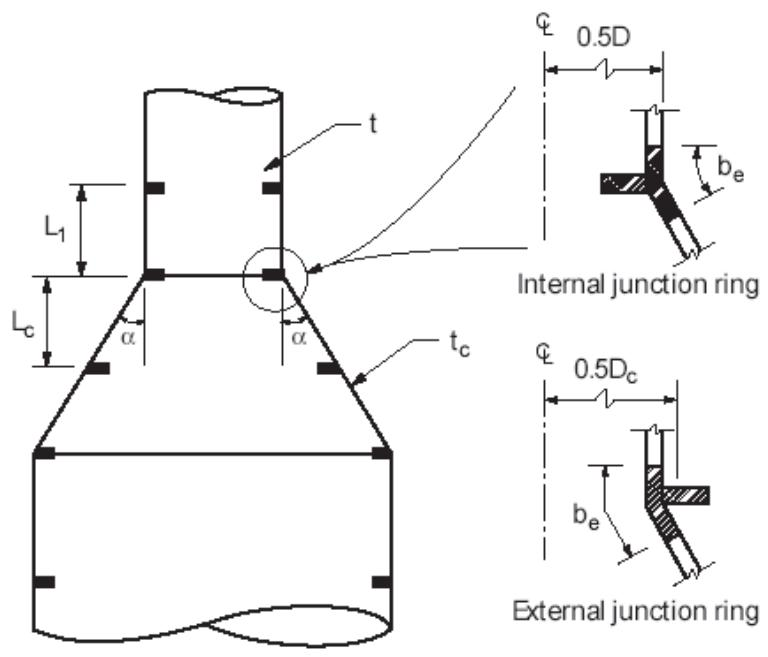  
Figure 6.1—Example Conical Transition

Table 6.3—Limiting Angle α for Conical Transitions   

| D/t | Limiting Angle α, Deg. | Limiting Angle α, Deg. |
| --- | --- | --- |
| D/t | Normal Condition | Extreme Condition |
| D/t | (fa + fb) = 0.6Fy | (fa + fb) = 0.8Fy |
| 60 | 10.5 | 5.8 |
| 48 | 11.7 | 6.5 |
| 36 | 13.5 | 7.5 |
| 24 | 16.4 | 9.1 |
| 18 | 18.7 | 10.5 |
| 12 | 22.5 | 12.8 |
| A cone-cylinder junction that does not satisfy the above criteria may be strengthened either by increasing the cylinder and cone wall thickness at the junction, or by providing a stiffening ring at the junction. | A cone-cylinder junction that does not satisfy the above criteria may be strengthened either by increasing the cylinder and cone wall thickness at the junction, or by providing a stiffening ring at the junction. | A cone-cylinder junction that does not satisfy the above criteria may be strengthened either by increasing the cylinder and cone wall thickness at the junction, or by providing a stiffening ring at the junction. |

6.4.1.4 Unstiffened Cone-cylinder Junctions

6.4.1.4.1 General

Cone-cylinder junctions are subject to unbalanced radial forces due to longitudinal axial and bending loads and to localized bending stresses caused by the angle change. The longitudinal and hoop stresses at the junction may be evaluated as described in 6.4.1.4.2 and 6.4.1.4.3.

6.4.1.4.2 Longitudinal Stress

In lieu of detailed analysis, the localized bending stress at an unstiffened cone-cylinder junction may be estimated, based on results presented in Reference [170] from:

$$f_{\mathrm{b}}^{\prime} = \frac{0 . 6 t \sqrt{D \left(t + t_{\mathrm{c}}\right)}}{t_{\mathrm{e}}^{2}} \left(f_{\mathrm{a}} + f_{\mathrm{b}}\right) \tan \alpha \tag{6.30}$$

where

D is the cylinder diameter at junction, in m (in.);

t is the cylinder thickness, in m (in.);

$t_{ \mathsf{ C } }$ t c is the cone thickness, in m (in.);

$t_{ \mathsf{ e } }$ is the t for stress in cylinder section or $t_{ \mathsf{ c } }$ for stress in cone section, in MPa (ksi);

$f_{ \mathsf{ a } }$ is the acting axial stress in cylinder section at junction, in MPa (ksi);

$f_{ \mathsf{ b } }$ is the acting resultant bending stress in cylinder section at junction, in $\mathsf{ M P a }$ (ksi);

α is one-half the apex angle of the cone, in degrees.

For strength requirements, the total stress （$f_{ \mathsf{ a } } + f_{ \mathsf{ b } } + f_{ \mathsf{ b } }^{ \prime } )$ should be limited to the minimum tensile strength of the cone and cylinder material, with $f_{ \mathsf{ a } } + f_{ \mathsf{ b } }$ limited to the appropriate allowable stress. For fatigue considerations, the cone-cylinder junction should satisfy the requirements of Section 8 with a SCF equal to $1 + f_{ \mathrm{ b } }^{ \prime } / ( f_{ \mathrm{ a } }^{ \prime } + f_{ \mathrm{ b } } )$ , where $f_{ \mathsf{ b } }^{ \prime }$ is given by Equation (6.30). For equal cylinder and cone wall thicknesses, the SCF is equal to $1 + 0 . 6 \sqrt{ 2 D / t }$ tan α .

6.4.1.4.3 Hoop Stress

The hoop stress caused by the unbalanced radial line load may be estimated from:

$$f_{\mathrm{h}}^{\prime} = 0. 45 \sqrt{\frac{D}{t}} \left(f_{\mathrm{a}} + f_{\mathrm{b}}\right) \tan \alpha \tag{6.31}$$

where the terms are as defined in 6.4.1.4.2. For hoop tension, $f_{ \mathsf{ h } }^{ \prime }$ should be limited to $0 . 6 F_{ \mathrm{ v } } .$ For hoop compression, $f_{ \mathsf{ h } }^{ \prime }$ should be limited to $0 . 5 F_{ \mathrm{ h c } } .$ , where $F_{ \mathsf{ h c } }$ is computed using Equation (6.18) with $F_{ \mathsf{ h e } } = 0 . 4 E t / D$ . This suggested value of $F_{ \mathsf{ h e } }$ is based on results presented in Reference [171].

Based on the strength requirements of Equations (6.30) and (6.31), limiting cone transition angles can be derived below in which no stiffening is required to withstand the cone-cylinder junction stresses. For example, Table 6.3 of limiting cone transition angles is derived for equal cone and cylinder wall thicknesses, $F_{ \mathsf{ y } } \leq 415 ~ \mathsf{ M P a }$ (60 ksi), and the corresponding minimum tensile strengths given in Table 11.1. The limiting angles in the table represent the smaller of the two angles evaluated by satisfying the strength requirements of Equations (6.30) and (6.31). The limiting angles in the table were governed by Equation (6.30). The limiting angles for the normal condition apply to design cases where basic allowable stresses are used. While elastic HSSs are notionally at the ultimate tensile strength, limit analysis indicates that plastic section modulus and load redistribution provide sufficient reserve strength so that transitions with these angles can develop the full yield capacity of the cylinder. If the steels used at the transition have sufficient ductility to develop this reserve strength, similar to joint cans, these same angles may be applied to load cases in which allowable stresses are increased by one third.

The limiting angles for the extreme condition have been derived on the more conservative basis that the allowable HSS at the transition continues to be the ultimate tensile strength, while allowable stresses in the cylinder have been increased by one-third. This also reduces the SCF from 2.22 to 1.67. The fatigue strength of the cone-cylinder junction should be checked in accordance with the requirements of Section 8.

6.4.1.5 Cone-cylinder Junction Rings

If stiffening rings are required, the section properties should be chosen to satisfy both the following requirements:

$$A_{\mathrm{c}} = \frac{t D}{F_{\mathrm{y}}} \left(f_{\mathrm{a}} + f_{\mathrm{b}}\right) \tan \alpha \tag{6.32}$$

$$I_{\mathrm{c}} = \frac{t D D_{\mathrm{c}}^{2}}{8 E} \left(f_{\mathrm{a}} + f_{\mathrm{b}}\right) \tan \alpha \tag{6.33}$$

where

D is the cylinder diameter at junction, m (in.);

$D_{ \mathsf{ c } }$ is the diameter to centroid of composite ring section, m (in.) (see Note 3);

$A_{ \mathsf{ c } }$ is the cross-sectional area of composite ring section, $\mathsf{ m }^{ 2 } ( \mathsf{ i n } .^{ 2 } ) ;$

$I_{ \mathsf{ c } }$ is the moment of inertia of composite ring section, $\mathsf{ m }^{ 4 } ( \mathsf{ i } \mathsf{ n } . { }^{ 4 } )$

In computing $A_{ \mathsf{ c } }$ and $I_{ \mathsf{ c } } ,$ the effective width of shell wall acting as a flange for the composite ring section may be computed from:

$$b_{\mathrm{e}} = 0. 55 \left(\sqrt{D t} + \sqrt{D t_{\mathrm{c}}}\right) \tag{6.34}$$

NOTE 1 Where the one-third increase is applicable, the required section properties $A_{ \mathsf{ c } }$ and $I_{ \mathsf{ c } }$ may be reduced by 25 %.

NOTE 2 For flat bar stiffeners, the minimum dimensions should be 10 mm × 76 mm （$^{ 3 } / 8 \ \mathrm{ i n . } \ \times 3 \ \mathrm{ i n . } )$ for internal rings and 13 mm × 102 mm (1/2 in. × 4 in.) for external rings.

NOTE 3 For internal rings, D should be used instead of $D_{ \mathsf{ c } }$ in Equation (6.33).

6.4.2 Hydrostatic Pressure

6.4.2.1 General

The recommendations in this section may be applied to a concentric cone frustum between two cylindrical tubular sections. In addition, the rules may be applied to conical transitions at brace ends, with the conecylinder junction ring rules applicable only to the brace end of the transition.

6.4.2.2 Cone Design

Unstiffened conical transitions or cone sections between rings of stiffened cones with a projected apex angle less than 60° may be designed for local buckling under hydrostatic pressure as equivalent cylinders with a length equal to the slant height of the cone between rings and a diameter equal to D/cosα, where D is the diameter at the large end of the cone section and α equals one-half the apex angle of the cone (see Figure 6.1).

6.4.2.3 Intermediate Stiffening Rings

If required, circumferential stiffening rings within cone transitions may be sized using Equation (6.19) with an equivalent diameter equal to D∕cosα, where D is the cone diameter at the ring, t is the cone thickness, L is the average distance to adjacent rings along the cone axis, and $F_{ \mathsf{ h e } }$ is the average of the elastic hoop buckling stress values computed for the two adjacent bays.

6.4.2.4 Cone-cylinder Junction Rings

Circumferential stiffening rings required at the cone-cylinder junctions should be sized such that the moment of inertia of the composite ring section satisfies the following equation:

$$I_{\mathrm{c}} = \frac{D^{2}}{16 E} \left(t L_{1} F_{\mathrm{h e}} + \frac{t_{\mathrm{c}} L_{\mathrm{c}} F_{\mathrm{h e c}}}{\cos^{2} \alpha}\right) \tag{6.35}$$

where

$I_{ \mathsf{ c } }$ is the moment of inertia of composite ring section with effective width of flange computed from Equation (6.34), in $\mathsf{ m }^{ 4 } ( \mathsf{ i } \mathsf{ n } .^{ 4 } ) ;$ ;

D is the diameter of cylinder at junction, m (in.) (see Note 2);

t is the cylinder thickness, in m (in.);

$t_{ \mathsf{ C } }$ is the cone thickness, in m (in.);

$L_{ \mathsf{ c } }$ is the distance to first stiffening ring in cone section along cone axis, in m (in.);

$L_{ 1 }$ is the distance to first stiffening ring in cylinder section, in m (in.);

$F_{ \mathsf{ h e } }$ is the elastic hoop buckling stress for cylinder, in MPa (ksi);

$F_{ \mathsf{ h e c } }$ is the $F_{ \mathsf{ h e } }$ for cone section treated as an equivalent cylinder, in MPa (ksi).

NOTE 1 A junction ring is not required for hydrostatic collapse if Equation (6.13) is satisfied with $F_{ \mathsf{ h e } }$ computed using $C_{ \mathsf{ h } } = 0 . 44 ( t / D )$ )cosα in Equation (6.16), where D is the cylinder diameter at the junction.

NOTE 2 For external rings, D in Equation (6.35) should be taken to the centroid of the composite ring.

7 Strength of Tubular Joints

## 7.1 Application

The guidelines given in this section are concerned with the static design of joints formed by the connection of two or more tubular members.

In lieu of these guidelines, reasonable alternative methods may be used for the design of joints. Test data, numerical methods, and analytical techniques may be used as a basis for design, provided that it is demonstrated that the strength of such joints can be reliably estimated. Such analytical or numerical techniques shall be calibrated and benchmarked to suitable test data.

The recommendations presented below have been derived from a consideration of the characteristic strength of tubular joints. Characteristic strength corresponds to a lower bound estimate. Care should therefore be taken in using the results of very limited test programs or analytical investigations to provide an estimate of joint capacity since very limited test programs form an improper basis for determining the characteristic (lower bound) value. Consideration should be given to the imposition of a reduction factor on the calculation of joint strength to account for the small amount of data or a poor basis for the calculation.

## 7.2 Design Considerations

7.2.1 Materials

See 11.3 for the primary discussion of steel for tubular joints. Additional material guidelines specific to the strength of connections are given below.

The value of yield stress for the chord, in the calculation of joint capacity, should be limited to 0.8 times the tensile strength of the chord for materials with a yield stress of 500 MPa (72 ksi) or less. The relevant yield stress and tensile strength are usually minimum specified values.

Joints often involve close proximity of welds from several brace connections. High restraint of joints can cause large strain concentrations and potential for cracking or lamellar tearing. Hence, adequate throughthickness toughness of the chord steel (and brace steel, if overlapping is present) should be considered as an explicit requirement (see 11.3.4).

Existing platforms that are either being reused (Section 18) or assessed (see API 2SIM) could have uncertain material properties. In these instances, material tests of samples removed from the actual structure should be considered. If the through-thickness toughness of joint can steel is ill-defined, inspection for possible cracks or lamellar tearing should be considered.

Section 11.4.1 contains recommendations for grout materials (for use in grouted joints).

7.2.2 Design Loads and Joint Flexibility

The adequacy of the joint may be determined on the basis of nominal loads in both the brace and chord.

Reductions in secondary (deflection induced) bending moments or inelastic relaxation through the use of joint elastic stiffness may be considered, and for ultimate strength analysis of the platform, information concerning the force-deformation characteristics for joints may be utilized. These calculations are dependent on the joint type, configuration, geometry, material properties, load case, and in certain instances, hydrostatic pressure effects. See B.7.2 for more information.

7.2.3 Minimum Capacity

Chords at the ends of primary tension and compression braces, in addition to developing the strength required by design loads, shall also have a minimum capacity of at least 50 % of the effective strength of each incoming brace for each design load condition (in-place, loadout, lifting, launch, accidental, etc.).

For earthquake loading (see 5.3.6.5.1) and for L-2 platforms not analyzed for robustness [see 5.3.4.2 h)], the chord capacity shall be at least 100 % of the brace effective strength of each incoming brace for the design in-place load condition.

The effective strength of the brace is defined as the yield load of the brace for braces loaded primarily in tension or the ultimate buckling load of the brace for braces loaded primarily in compression. Inelasticity should be considered in the calculation of the ultimate buckling load. The effective strength calculations should be based on the nominal material and geometric properties of the brace, not of the brace stub (should one exist).

For the purposes of this requirement, the chord capacity shall be determined using Equation (7.1) with a factor of safety (FS) equal to 1.0. The strength factor （$\varrho_{ \mathsf{ u } } )$ and the chord load factor (Qf) shall be consistent with the design load condition being considered.

Welds in connections at the ends of tubular members should be in accordance with 14.1.3 or should not be less than required to develop a capacity equal to the lesser of

— strength of the branch member based on yield, or   
— strength of the chord based on basic capacity Equations (7.1) and (7.2) (where applicable).

7.2.4 Joint Classification

Joint classification is the process whereby the axial load in a given brace is subdivided into K, X, and Y components of loading corresponding to the three joint types for which capacity equations exist. Such subdivision normally considers all of the members in one plane at a joint. For purposes of this provision, brace planes within ± 15° of each other may be considered as being in a common plane. Each brace in the plane can have a unique classification that could vary with load condition. The classification can be a mixture between the above three joint types. Once the breakdown into axial components is established, the capacity of the joint can be estimated using the procedures in 7.3.

Figure 7.1 provides some simple examples of joint classification. For a brace to be considered as K-joint classification, the axial load in the brace should be balanced to within 10 % by loads in other braces in the same plane and on the same side of the joint. For Y-joint classification, the axial load in the brace is reacted as beam shear in the chord. For X-joint classification, the axial load in the brace is transferred through the chord to the opposite side (e.g. to braces, padeyes, launch rails).

Case (h) in Figure 7.1 is a good example of the loading and classification hierarchy that should be adopted in the classification of joints. Replacement of brace load by a combination of tension and compression load to give the same net load is not permitted. For example, replacing the load in the horizontal brace on the left hand side of the joint by a compression load of 1000 and tension load of 500 is not permitted as this may result in an inappropriate X classification for this horizontal brace and a K classification for the diagonal brace.

Special consideration should be given to establishing the proper gap if a portion of the load is related to K-joint behavior. The most obvious case in Figure 7.1 is (a), for which the appropriate gap is between adjacent braces. However, if an intermediate brace exists, as in case (d), the appropriate gap is between the outer loaded braces. In this case, since the gap is often large, the K-joint capacity could revert to that of a Y-joint. Case (e) is instructive in that the appropriate gap for the middle brace is gap 1, whereas for the top brace it is gap 2. Although the bottom brace is treated as 100 % K classification, a weighted average in capacity shall be determined, depending on how much of the acting axial load in this brace is balanced by the middle brace (gap 1) and how much is balanced by the top brace (gap 2).

There are some instances where the joint behavior is more difficult to define or is apparently worse than predicted by the above approach to classification. Two of the more common cases in the latter category are launch truss loading and in situ loading of skirt pile sleeves. Some guidance for such instances is provided in B.7.2.

7.2.5 Detailing Practice

Joint detailing is an essential element of joint design. For unreinforced joints, the recommended detailing nomenclature and dimensioning is shown in Figure 7.2 and Figure 7.3. This practice indicates that if an increased chord wall thickness (or special steel) is required, it should extend past the outside edge of incoming bracing a minimum of one quarter of the chord diameter or 300 mm (12 in.), whichever is greater. Even greater lengths of increased wall thickness or special steel may be needed to avoid downgrading of joint capacity in accordance with 7.3.5. If an increased wall thickness of brace or special steel is required, it should extend a minimum of one brace diameter or 600 mm (24 in.), whichever is greater. Neither the cited chord can nor brace stub dimension include the length over which the 1:4 thicknesses taper occurs. In situations where fatigue considerations can be important, tapering on the inside may have an undesirable consequence of fatigue cracking originating on the inside surface and be difficult to inspect.

The minimum nominal gap between adjacent braces, whether in- or out-of-plane, is 50 mm (2 in.). Care should be taken to ensure that overlap of welds at the toes of the joint is avoided. When overlapping braces occur, the amount of overlap should preferably be at least d/4 (where d is the diameter of the through brace) or 150 mm (6 in.), whichever is greater. This dimension is measured along the axis of the through member. Where overlapping of braces is necessary or preferred and that differ in nominal thickness by more than 10 %, the brace with the larger wall thickness should be the through brace and be fully welded to the chord. Further, where substantial overlap occurs, the larger diameter brace should be specified as the through member. This brace may require an end stub to ensure that the thickness is at least equal to that of the overlapping brace.

Longitudinal seam welds and girth welds should be located to minimize or eliminate their impact on joint performance. The longitudinal seam weld of the chord should be separated from incoming braces by at least 300 mm (12 in.), see Figure 7.3. The longitudinal seam weld of a brace should be located near the crown heel of the joint. Longer chord cans may require a girth weld. This weld should be positioned at a lightly loaded brace intersection, between saddle and crown locations (see Figure 7.2).

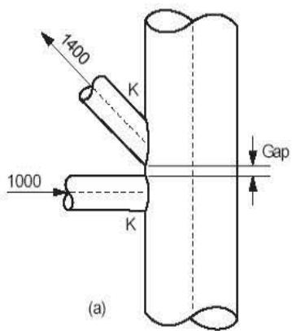

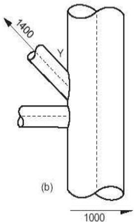

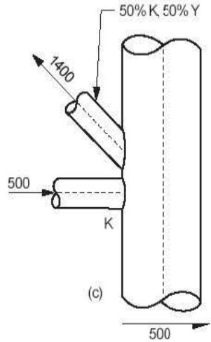

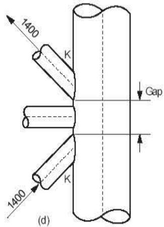

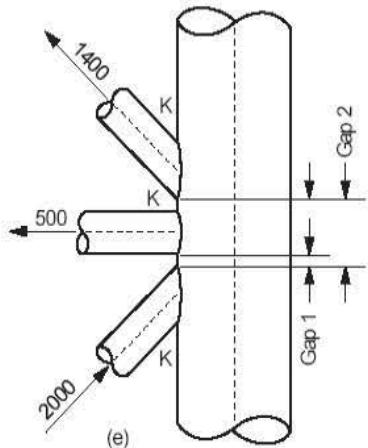

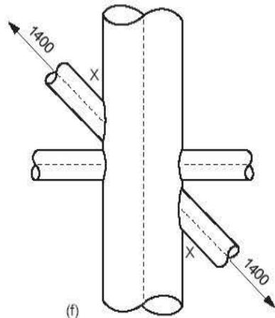

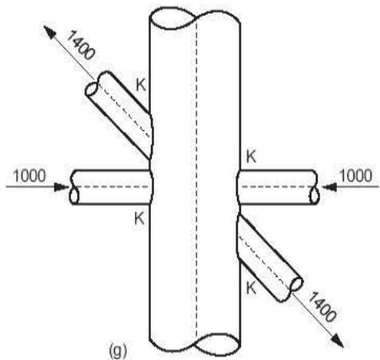

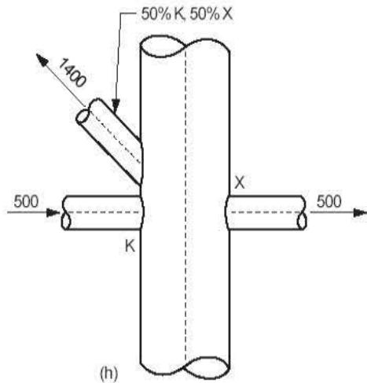  
Figure 7.1—Examples of Joint Classification

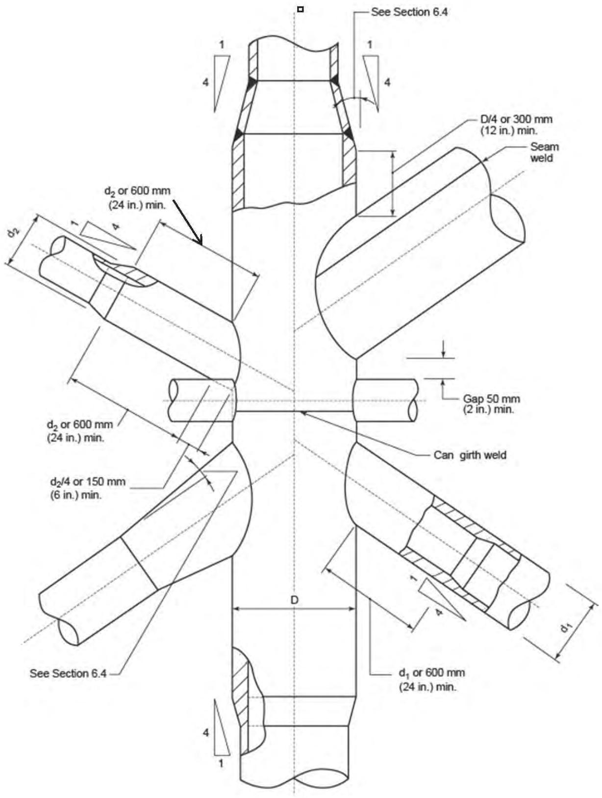  
Figure 7.2—In-plane Joint Detailing

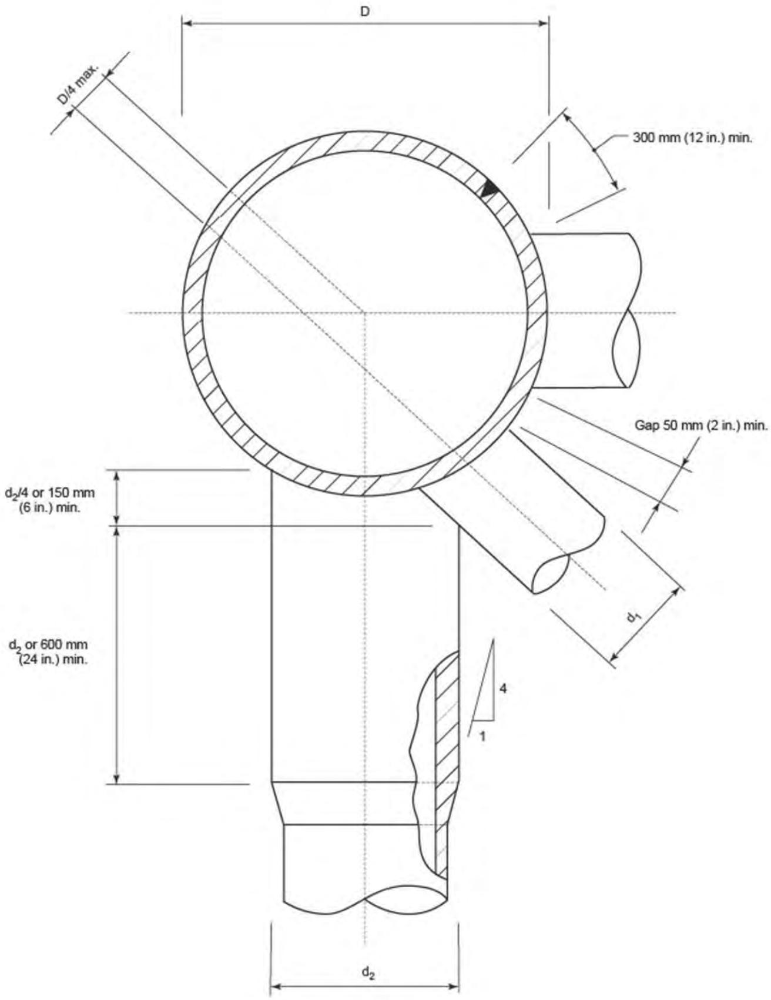  
Figure 7.3—Out-of-plane Joint Detailing

## 7.3 Simple Joints

7.3.1 Validity Range

The terminology for simple joints is defined in Figure 7.4.

The validity range for application of the practice defined in 7.3 is provided in Table 7.1

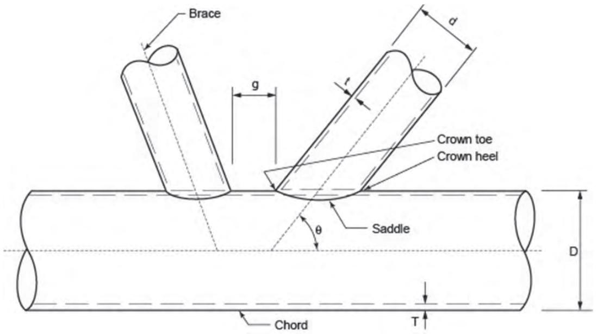  
Figure 7.4— Terminology and Geometric Parameters, Simple Tubular Joints

Key

θ is the brace included angle

$$\beta = \frac{d}{D}$$

g is the gap between braces, in mm (in.)

$$\gamma = \frac{D}{2 T}$$

t is the brace wall thickness at intersection, in mm (in.)

$$\tau = \frac{t}{T}$$

T is the chord wall thickness at intersection, in mm (in.)

d is the brace outside diameter, in mm (in.)

D is the chord outside diameter, in mm (in.)

Table 7.1—Geometric Parameter Validity Range   

| Lower Boundary | Lower Boundary | Parameter | Upper Boundary | Upper Boundary |
| --- | --- | --- | --- | --- |
| 0.2 | ≤ | β | ≤ | 1.0 |
| 10 | ≤ | γ | ≤ | 50 |
| 30° | ≤ | θ | ≤ | 90° |
|  |  | Fy | ≤ | 500 MPa (72 ksi) |
| -0.6 (for K-joints) | < | g/D |  |  |

Section B.7.3.1 discusses approaches that may be adopted for joints that fall outside the above range.

7.3.2 Basic Capacity

Tubular joints without overlap of principal braces and having no gussets, diaphragms, grout, or stiffeners should be designed using the following guidelines.

$$P_{\mathrm{a}} = Q_{\mathrm{u}} Q_{\mathrm{f}} \frac{F_{\mathrm{y c}} T^{2}}{\mathrm{F S} \sin \theta} \tag{7.1}$$

$$M_{\mathrm{a}} = Q_{\mathrm{u}} Q_{\mathrm{f}} \frac{F_{\mathrm{y c}} T^{2} d}{\mathrm{F S} \sin \theta} \tag{7.2}$$

(plus one-third increase in both cases where applicable)

where

$P_{ \mathsf{ a } }$ is the allowable capacity for brace axial load;

$M_{ \mathbf{ a } }$ is the allowable capacity for brace bending moment;

$F_{ \mathsf{ y c } }$ is the yield stress of the chord member at the joint (or 0.8 of the tensile strength, if less), in MPa (ksi);

FS is the safety factor, equal to 1.60.

For joints with thickened cans, $P_{ \mathsf{ a } }$ shall not exceed the capacity limits defined in 7.3.5.

For axially loaded braces with a classification that is a mixture of K-, Y-, and X-joints, take a weighted average of $P_{ \mathsf{ a } }$ based on the portion of each in the total load.

7.3.3 Strength Factor, $\varrho_{ \mathrm{ u } }$

$Q_{ \mathsf{ u } }$ varies with the joint and load type, as given in Table 7.2.

Where the working points of members at a gap connection are separated by more than D/4 along the chord centerline, or where a connection has simultaneously loaded branch members in more than one plane, the connection may be classified as a general or multiplanar connection, and designed as described in B.7.

7.3.4 Chord Load Factor, $\varrho_{ \mathsf{ f } }$

$\mathcal{ Q }_{ \mathbf{ f } }$ is a factor to account for the presence of nominal loads in the chord.

$$Q_{\mathrm{f}} = \left[ 1 + C_{1} \left(\frac{\mathrm{F S P}_{\mathrm{c}}}{P_{\mathrm{y}}}\right) - C_{2} \left(\frac{\mathrm{F S M}_{\mathrm{i p b}}}{M_{\mathrm{p}}}\right) - C_{3} A^{2} \right] \tag{7.3}$$

Table 7.2—Values for $\varrho_{ \mathrm{ u } }$   

| Joint Classification | Brace Load | Brace Load | Brace Load | Brace Load |
| --- | --- | --- | --- | --- |
| Joint Classification | Axial Tension | Axial Compression | In-Plane Bending | Out-of-plane Bending |
| K | (16 + 1.2γ)β1.2Qg but ≤ 40β1.2Qg | (16 + 1.2γ)β1.2Qg but ≤ 40β1.2Qg | (5 + 0.7γ)β1.2 | 2.5 + (4.5 + 0.2γ)β2.6 |
| T/Y | 30β | 2.8 + (20 + 0.8γ)β1.6 but ≤ 2.8 + 36β1.6 | (5 + 0.7γ)β1.2 | 2.5 + (4.5 + 0.2γ)β2.6 |
| X | 23β for β ≤ 0.9 20.7 + (β - 0.9)(17γ - 220) for β > 0.9 | [2.8 + (12 + 0.1γ)β]Qβ | (5 + 0.7γ)β1.2 | 2.5 + (4.5 + 0.2γ)β2.6 |
| NOTE 1 Qβ is a geometric factor defined by: Qβ = 0.3/β(1 - 0.833β) Qβ = 1.0 for β ≤ 0.6 | NOTE 1 Qβ is a geometric factor defined by: Qβ = 0.3/β(1 - 0.833β) Qβ = 1.0 for β ≤ 0.6 | NOTE 1 Qβ is a geometric factor defined by: Qβ = 0.3/β(1 - 0.833β) Qβ = 1.0 for β ≤ 0.6 | NOTE 1 Qβ is a geometric factor defined by: Qβ = 0.3/β(1 - 0.833β) Qβ = 1.0 for β ≤ 0.6 | NOTE 1 Qβ is a geometric factor defined by: Qβ = 0.3/β(1 - 0.833β) Qβ = 1.0 for β ≤ 0.6 |
| NOTE 2 Qg is the gap factor defined by: Qg = 1 + 0.2 [1 - 2.8g/D]3 for g/D ≥ 0.05 but ≥ 1.0 Qg = 0.13 + 0.65Φγ0.5 for g/D ≤ -0.05 where Φ = tFyb/(TFyc) | NOTE 2 Qg is the gap factor defined by: Qg = 1 + 0.2 [1 - 2.8g/D]3 for g/D ≥ 0.05 but ≥ 1.0 Qg = 0.13 + 0.65Φγ0.5 for g/D ≤ -0.05 where Φ = tFyb/(TFyc) | NOTE 2 Qg is the gap factor defined by: Qg = 1 + 0.2 [1 - 2.8g/D]3 for g/D ≥ 0.05 but ≥ 1.0 Qg = 0.13 + 0.65Φγ0.5 for g/D ≤ -0.05 where Φ = tFyb/(TFyc) | NOTE 2 Qg is the gap factor defined by: Qg = 1 + 0.2 [1 - 2.8g/D]3 for g/D ≥ 0.05 but ≥ 1.0 Qg = 0.13 + 0.65Φγ0.5 for g/D ≤ -0.05 where Φ = tFyb/(TFyc) | NOTE 2 Qg is the gap factor defined by: Qg = 1 + 0.2 [1 - 2.8g/D]3 for g/D ≥ 0.05 but ≥ 1.0 Qg = 0.13 + 0.65Φγ0.5 for g/D ≤ -0.05 where Φ = tFyb/(TFyc) |
| The overlap should preferably not be less than 0.25βD. Linear interpolation between the limiting values of the above two Qg expressions may be used for -0.05 < g/D < 0.05 when this is otherwise permissible or unavoidable. See B.7.3.3. Fyb = yield stress of brace or brace stub if present (or 0.8 times the tensile strength if less), in MPa (ksi) | The overlap should preferably not be less than 0.25βD. Linear interpolation between the limiting values of the above two Qg expressions may be used for -0.05 < g/D < 0.05 when this is otherwise permissible or unavoidable. See B.7.3.3. Fyb = yield stress of brace or brace stub if present (or 0.8 times the tensile strength if less), in MPa (ksi) | The overlap should preferably not be less than 0.25βD. Linear interpolation between the limiting values of the above two Qg expressions may be used for -0.05 < g/D < 0.05 when this is otherwise permissible or unavoidable. See B.7.3.3. Fyb = yield stress of brace or brace stub if present (or 0.8 times the tensile strength if less), in MPa (ksi) | The overlap should preferably not be less than 0.25βD. Linear interpolation between the limiting values of the above two Qg expressions may be used for -0.05 < g/D < 0.05 when this is otherwise permissible or unavoidable. See B.7.3.3. Fyb = yield stress of brace or brace stub if present (or 0.8 times the tensile strength if less), in MPa (ksi) | The overlap should preferably not be less than 0.25βD. Linear interpolation between the limiting values of the above two Qg expressions may be used for -0.05 < g/D < 0.05 when this is otherwise permissible or unavoidable. See B.7.3.3. Fyb = yield stress of brace or brace stub if present (or 0.8 times the tensile strength if less), in MPa (ksi) |
| NOTE 3 The Qu term for tension loading is based on limiting the capacity to first crack. The Qu associated with full ultimate capacity of tension loaded Y- and X-joints is given in B.7. | NOTE 3 The Qu term for tension loading is based on limiting the capacity to first crack. The Qu associated with full ultimate capacity of tension loaded Y- and X-joints is given in B.7. | NOTE 3 The Qu term for tension loading is based on limiting the capacity to first crack. The Qu associated with full ultimate capacity of tension loaded Y- and X-joints is given in B.7. | NOTE 3 The Qu term for tension loading is based on limiting the capacity to first crack. The Qu associated with full ultimate capacity of tension loaded Y- and X-joints is given in B.7. | NOTE 3 The Qu term for tension loading is based on limiting the capacity to first crack. The Qu associated with full ultimate capacity of tension loaded Y- and X-joints is given in B.7. |
| NOTE 4 The X-joint, axial tension, Qu term for β > 0.9 applies to coaxial braces (i.e. e/D ≤ 0.2 where e is the eccentricity of the two braces). If the braces are not coaxial (e/D > 0.2) then 23β should be used over the full range of β. | NOTE 4 The X-joint, axial tension, Qu term for β > 0.9 applies to coaxial braces (i.e. e/D ≤ 0.2 where e is the eccentricity of the two braces). If the braces are not coaxial (e/D > 0.2) then 23β should be used over the full range of β. | NOTE 4 The X-joint, axial tension, Qu term for β > 0.9 applies to coaxial braces (i.e. e/D ≤ 0.2 where e is the eccentricity of the two braces). If the braces are not coaxial (e/D > 0.2) then 23β should be used over the full range of β. | NOTE 4 The X-joint, axial tension, Qu term for β > 0.9 applies to coaxial braces (i.e. e/D ≤ 0.2 where e is the eccentricity of the two braces). If the braces are not coaxial (e/D > 0.2) then 23β should be used over the full range of β. | NOTE 4 The X-joint, axial tension, Qu term for β > 0.9 applies to coaxial braces (i.e. e/D ≤ 0.2 where e is the eccentricity of the two braces). If the braces are not coaxial (e/D > 0.2) then 23β should be used over the full range of β. |

The parameter A is defined as follows:

$$A = \left[ \left(\frac{\mathrm{F S} P_{\mathrm{c}}}{P_{\mathrm{y}}}\right)^{2} + \left(\frac{\mathrm{F S} M_{\mathrm{c}}}{M_{\mathrm{p}}}\right)^{2} \right]^{0. 5} \tag{7.4}$$

NOTE 1 Where one-third increase is applicable, FS = 1.20 in Equations (7.3) and (7.4);

NOTE 2 Where $P_{ \mathtt{ c } }$ and $M_{ \mathtt{ C } }$ are the nominal axial load and bending resultant (i.e. $M_{ \mathsf{ c } }^{ 2 } = M_{ \mathsf{ i p b } }^{ 2 } + M_{ \mathsf{ o p b } }^{ 2 } \ )$ in the chord;

$P_{ \ y }$ is the yield axial capacity of the chord;

$M_{ \mathsf{ p } }$ is the plastic moment capacity of the chord;

and $C_{ 1 } , C_{ 2 } ,$ and $C_{ 3 }$ are coefficients depending on joint and load type as given in Table 7.3.

Table 7.3—Values for $c_{ 1 } , c_{ 2 } , c_{ 3 }$   

| Joint Type | C1 | C2 | C3 |
| --- | --- | --- | --- |
| K-joints under brace axial loading | 0.2 | 0.2 | 0.3 |
| T/Y-joints under brace axial loading | 0.3 | 0 | 0.8 |
| X-joints under brace axial loadinga |  |  |  |
| β≤0.9 | 0.2 | 0 | 0.5 |
| β=1.0 | -0.2 | 0 | 0.2 |
| All joints under brace moment loading | 0.2 | 0 | 0.4 |
| aLinearly interpolated values between β = 0.9 and β = 1.0 for X-joints under brace axial loading. | aLinearly interpolated values between β = 0.9 and β = 1.0 for X-joints under brace axial loading. | aLinearly interpolated values between β = 0.9 and β = 1.0 for X-joints under brace axial loading. | aLinearly interpolated values between β = 0.9 and β = 1.0 for X-joints under brace axial loading. |

The average of the chord loads and bending moments on either side of the brace intersection should be used in Equations (7.3) and (7.4). Chord axial load is positive in tension, chord resultant bending moment is positive when it produces compression on the joint footprint. The chord thickness at the joint should be used in the above calculations.

Statistics are presented in B.7 to permit both the estimation of mean strength and the performance of reliability analyses.

7.3.5 Joints with Thickened Cans

For simple, axially loaded Y- and X-joints where a thickened joint can is specified, the joint allowable capacity may be calculated as follows:

$$P_{\mathrm{a}} = \left[ r + (1 - r) \left(T_{\mathrm{n}} / T_{\mathrm{c}}\right)^{2} \right] \left(P_{\mathrm{a}}\right)_{\mathrm{c}} \tag{7.5}$$

where

（$P_{ \mathsf{ a } } )_{ \mathsf{ c } }$ is the $P_{ \mathsf{ a } }$ from Equation (7.1) based on chord can geometric and material properties, including $\mathcal{ Q }_{ \mathbf{ f } }$ calculated with respect to chord can;

$T_{ \mathbf{ n } }$ is the nominal chord member thickness;

$T_{ \mathsf{ c } }$ is the chord can thickness;

r = $L_{ \mathrm{ c } } / ( 2 . 5 D )$ for joints with $\beta \leq 0 . 9 ;$ ;   
= （$4 \beta - 3 ) L_{ \mathrm{ c } } / ( 1 . 5 D )$ for joints with $\beta > 0 . 9$ ;

$L_{ \mathsf{ c } }$ is the effective total length. Figure 7.5 gives examples for calculation of $L_{ \mathsf{ c } } .$

In no case shall r be taken as greater than unity.

Alternatively, an approximate closed ring analysis may be employed, including plastic analysis with appropriate safety factors, using an effective chord length up to 1.25D either side of the line of action of

the branch loads at the chord face but not more than actual distance to the end of the can. More complex joints shall receive special considerations. For multiple branches in the same plane, dominantly loaded in the same sense, the relevant crushing load is $\sum_{ \mathrm{ i } } P_{ \mathrm{ i } }$ i θ sin . Any reinforcement within this dimension (e.g. diaphragms, rings, gussets, or the stiffening effect of out of plane members) may be considered in the analysis, although its effectiveness decreases with distance from the branch footprint.

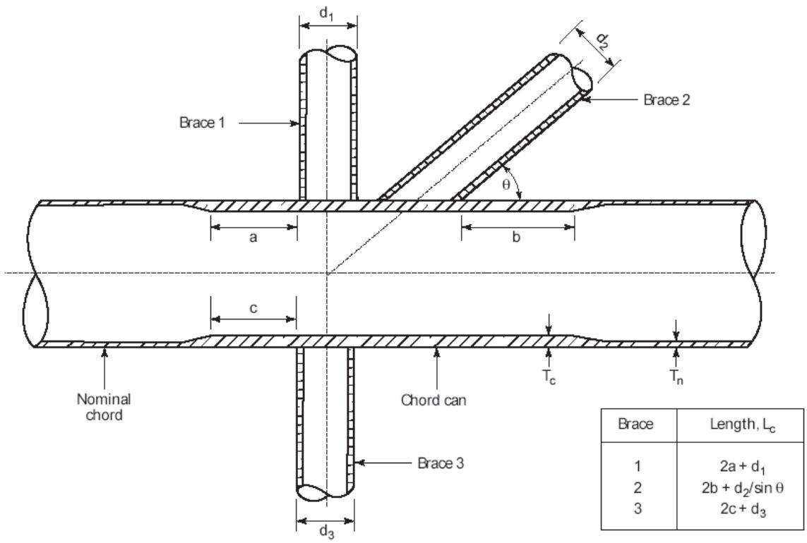  
Figure 7.5—Examples of Chord Length, $\pmb{ L_{ \mathsf{ c } } }$

7.3.6 Strength Check

The joint interaction ratio, IR, for axial loads and/or bending moments in the brace should be calculated using the following expression:

$$\mathrm{I R} = \left| \frac{P}{P_{\mathrm{a}}} \right| + \left(\frac{M}{M_{\mathrm{a}}}\right)_{\mathrm{i p b}}^{2} + \left| \frac{M}{M_{\mathrm{a}}} \right|_{\mathrm{o p b}} \leq 1. 0 \tag{7.6}$$

## 7.4 Overlapping Joints

Braces that overlap in- or out-of-plane at the chord member form overlapping joints. Examples are shown in Figure 7.2 and Figure 7.3.

Joints that have in-plane overlap involving two or more braces in a single plane (e.g. K- and KT-joints) may be designed using the simple joint provisions of 7.3, using negative gap in $\varrho_{ \mathbf{ g } } ,$ with the following exceptions and additions.

a) Shear parallel to the chord face is a potential failure mode and should be checked.   
b) Section 7.3.5 does not apply to overlapping joints with balanced loads.   
c) If axial forces in the overlapping and through braces have the same sign, the combined axial force representing that in the through brace plus a portion of the overlapping brace forces should be used to check the through brace intersection capacity. The portion of the overlapping brace force can be calculated as the ratio of cross sectional area of the brace that bears onto the through brace to the full area.   
d) For either in-plane or out-of-plane bending moments, the combined moment of the overlapping and through braces should be used to check the through brace intersection capacity. This combined moment should account for the sign of the moments. Where combined nominal axial and bending stresses in the overlapping brace peak in the overlap region, the overlapping brace should also be checked on the basis of its chord being the through brace, using $\varrho_{ \mathbf{ g } } = 1 . 0$ . That is, through brace capacity should be checked for combined axial and moment loading in the overlapping brace. In this instance the $Q_{ \mathsf{ f } }$ associated with the through brace should be used.

Joints having out-of-plane overlap may be assessed on the same general basis as in-plane overlapping joints, with the exception that axial load capacity may be calculated as for multiplanar joints in B.7.3.3.1.

## 7.5 Grouted Joints

Two varieties of grouted joints commonly occur in practice. The first relates to a fully grouted chord. The second is the double-skin type, where grout is placed in the annulus between a chord member and an internal member. In both cases, the grout is unreinforced, and as far as joint behavior is concerned, benefit for shear keys that may be present is not permitted.

For grouted joints that are otherwise simple in configuration, the simple joint provisions defined in 7.3 may be used with the following modifications and limitations.

a) For fully grouted and double-skin joints, the $Q_{ \mathsf{ u } }$ values in Table 7.2 may be replaced with the values pertinent to grouted joints given in Table 7.4. Classification and joint can derating may be disregarded. The adopted $Q_{ \mathsf{ u } }$ values should not be less than those for simple joints.

Table $7 . 4 \mathrm{ - } Q_{ \mathrm{ u } }$ for Grouted Joints   

| Brace Load | Qu |
| --- | --- |
| Axial tension | 2.5βγKa where Ka = 1/2(1 + 1/sinθ) |
| Bending | 1.5βγ |
| NOTE No term is provided for axial compression since most grouted joints cannot fail under compression. Compression capacity is limited by that of the brace. | NOTE No term is provided for axial compression since most grouted joints cannot fail under compression. Compression capacity is limited by that of the brace. |

b) For double-skin joints, failure may also occur by chord ovalization. The ovalization capacity can be estimated by substituting the following effective thickness into the simple joint equations:

$$T_{\mathrm{e}} = \left(T^{2} + T_{\mathrm{p}}^{2}\right)^{0. 5} \tag{7.7}$$

where

$T_{ \mathbf{ e } }$ is the effective thickness, in mm (in.);

$T$ is the wall thickness of chord, in mm (in.);

$T_{ \mathbf{ p } }$ is the wall thickness of inner member, in mm (in.).

$T_{ \mathbf{ e } }$ should be used in place of T in the simple joint equations, including the γ term.

c) The $\mathcal{ Q }_{ \mathbf{ f } }$ calculation for both fully grouted and double-skinned joints should be based on $T ;$ it is presumed that calculation of $Q_{ \mathsf{ f } }$ has already accounted for load sharing between the chord and inner member, such that further consideration of the effect of grout on that term is unnecessary.

However, for fully grouted joints, $Q_{ \mathsf{ f } }$ may normally be set to unity, except in the instance of high $\beta ( \geq 0 . 9 )$ X-joints with brace tension/OPB and chord compression/OPB.

d) The minimum capacity requirements of 7.2.3 should still be observed.

## 7.6 Internally Ring-stiffened Joints

Primary joints along launch trusses of steel jacket structures are often strengthened by internal ring stiffening. Internal stiffening is also used in some structures to address fatigue requirements or to avoid very thick chord cans.

B.7.6 outlines the salient features of several common approaches to the design of internally ring-stiffened joints.

## 7.7 Cast Joints

Cast joints are defined as joints formed using a casting process. They can be of any geometry and of variable wall thickness.

The design of a cast joint requires calibrated finite element (FE) analyses. An acceptable design approach for strength is to limit stresses at all locations in the joint due to nominal loads to below yielding of the material using appropriate yield criteria with a 1.6 safety factor. Such an approach can be quite conservative when compared to welded joints, which are designed based on overall ultimate behavior.

Often, the manufacturer of the cast joint carries out the design process.

## 7.8 Other Circular Joint Types

Joints not covered in 7.3 to 7.7 may be designed on the basis of appropriate experimental, numerical or in-service evidence. Strength-of-materials approaches may be employed although extreme care is needed in identifying all elements that are expected to participate in resisting incoming brace loads, and

in establishing the acting load envelopes prior to conducting strength checks. Often, strength-of-materials checks are complemented with calibrated FE analyses to establish the magnitude and location of acting stresses.

## 7.9 Damaged Joints

Joints in existing installations could be damaged as a result of fatigue loading, corrosion, or overload (environmental or accidental). In such cases, the reduced joint capacity can be estimated either by simple models (e.g. reduced area or reduced section modulus approaches), calibrated numerical (FE) models, or experimental evidence.

## 7.10 Noncircular Joints

Connections with noncircular chord and/or brace sections are typically used on topside structures. Common types include wide flange (I-beam, column, plate girder) sections and rectangular/square sections. For some arrangements, detailed land-based design practice is available. For arrangements for which little or no practice is available, the provisions noted in 7.8 apply.

# 8 Fatigue

## 8.1 Fatigue Design

In the design of tubular connections, due consideration shall be given to fatigue action as related to local cyclic stresses.

A detailed fatigue analysis shall be performed for all structures. It is recommended that a spectral analysis technique be used. Other rational methods may be used provided adequate representation of the forces and member responses can be demonstrated.

Caissons, monopods, and similar nonjacket structures deserve detailed analysis, with consideration of vortex shedding where applicable.

## 8.2 Fatigue Analysis

8.2.1 General

A detailed analysis of cumulative fatigue damage, when required, shall be performed as described in 8.2.2 through 8.2.6.

8.2.2 Wave Climate

The wave climate should be derived as the aggregate of all sea states to be expected over the long term. This may be condensed for purposes of structural analysis into representative sea states characterized by wave energy spectra and physical parameters together with a probability of occurrence.

8.2.3 Space Frame Analysis

A space frame analysis should be performed to obtain the structural response in terms of nominal member stress for given wave forces applied to the structure. In general, wave force calculations should follow the procedures described in 5.3.1. However, current may be neglected and, therefore, considerations for apparent wave period and current blockage are not necessary. In addition, wave

kinematics factor equal to 1.0 and conductor shielding factor equal to 1.0 should be applied for fatigue waves. The drag and inertia coefficients depend on the sea state level, as parameterized by the Keulegan-Carpenter number, K (see B.5.3.1.2.8). For small waves （$1 . 0 < K < 6 . 0$ for platform legs at mean water level), values of $C_{ \mathsf{ m } } = 2 . 0 , C_{ \mathsf{ d } } = 0 . 8$ for rough members, and $C_{ \mathsf{ d } } = 0 . 5$ for smooth members should be used. Guidelines for considering directionality, spreading, tides, and marine growth are provided in the commentary for this section.

A spectral analysis technique should be used to determine the stress response for each sea state. Dynamic effects should be considered for sea states having significant energy near a platform's natural period.

8.2.4 Local Stresses

Local stresses that occur within tubular connections should be considered in terms of HSSs located immediately adjacent to the joint intersection using suitable SCFs. The microscale effects occurring at the toe of the weld are reflected in the appropriate choice of the S-N curve.

8.2.5 Stress Responses

For each location around each member intersection of interest in the structure, the stress response for each sea state should be computed, giving adequate consideration to both global and local stress effects.

The stress responses shall be combined into the long term stress distribution, which should then be used to calculate the cumulative fatigue damage ratio, D, where:

$$D = \sum (n / N) \tag{8.1}$$

where

n is the number of cycles applied at a given stress range;

N is the number of cycles for which the given stress range would be allowed by the appropriate S-N curve.

Alternatively, the damage ratio may be computed for each sea state and combined to obtain the cumulative damage ratio.

8.2.6 Fatigue Life Safety Factors

In general the design fatigue life of each joint and member shall not be less than the intended service life of the structure multiplied by a safety factor. For the design fatigue life, the cumulative fatigue damage ratio D should not exceed unity.

For in situ conditions, the safety factor for fatigue of steel components shall depend on the failure consequence (i.e. criticality) and in-service inspectability. Critical elements are those whose sole failure could be catastrophic. In lieu of a more detailed safety assessment of Category L-1 structures, a safety factor of 2.0 is recommended for inspectable, nonfailure critical connections. For failure-critical and/or noninspectable connections, increased safety factors are recommended, as shown in Table 8.1. A reduced safety factor is recommended for Category L-2 and L-3 conventional steel jacket structures on the basis of in-service performance data: SF = 1.0 for redundant diver or ROV inspectable framing, with safety factors for other cases being half those in the table.

Table 8.1—Fatigue Life Safety Factors   

| Failure Critical | Inspectable | Not Inspectable |
| --- | --- | --- |
| No | 2 | 5 |
| Yes | 5 | 10 |

When fatigue damage can occur due to other cyclic loadings, such as transportation, the following equation shall be satisfied:

$$\sum_{j} \mathrm{S F}_{j} D_{j} <   1. 0 \tag{8.2}$$

where

$D_{ \mathrm{ j } }$ is the fatigue damage ratio for each type of loading;

$\mathrm{ S F_{ j } }$ is the associated safety factor.

For transportation where long-term wave distributions are used to predict short-term damage a larger safety factor should be considered.

## 8.3 Stress Concentration Factors (SCFs)

8.3.1 General

The welds at tubular joints are among the most fatigue sensitive areas in offshore platforms because of the high local stress concentrations. Fatigue lives at these locations should be estimated by evaluating the hot spot stress range (HSSR) and using it as input into the appropriate S-N curve from 8.5.

For each tubular joint configuration and each type of brace loading, SCF is defined as:

$$\mathrm{S C F} = \mathrm{H S S R} / \text{n o m i n a l b r a c e s t r s s r a n g e} \tag{8.3}$$

The nominal brace stress range should be based on the section properties of the brace end under consideration, taking due account of the brace stub, or a flared member end, if present. Likewise, the SCF evaluation shall be based on the same section dimensions. Nominal cyclic stress in the chord may also influence the HSSR and should be considered; see B.8.3.1.

The SCF shall include all stress raising effects associated with the joint geometry and type of loading, except the local (microscopic) weld notch effect, which is included in the S-N curve. SCFs may be derived from FE analyses, model tests, or empirical equations based on such methods. Generally, the SCFs depend on the type of brace cyclic loading (i.e. brace axial load, in-plane bending, out-of-plane bending), the joint type, and details of the geometry. The SCF varies around the joint, even for a single type of brace loading. When combining the contributions from the various loading modes, phase differences between them should be accounted for, with the design HSSR at each location being the range of hot spot stress resulting from the point-in-time contribution of all loading components.

For all welded tubular joints under all three types of loading, a minimum SCF of 1.5 should be used.

8.3.2 SCFs in Unstiffened Tubular Joints

For unstiffened welded tubular joints, SCFs should be evaluated using the Efthymiou equations; see B.8.3.2.

The linearly extrapolated HSS from Efthymiou may be adjusted to account for the actual weld toe position, where this systematically differs from the assumed AWS basic profiles; see B.8.3.2.

For the purpose of computing SCF, the tubular joints are typically classified into types T/Y, X, K, and KT depending on the joint configuration, the brace under consideration and the loading pattern. As a generalization of the classification approach, the Influence Function algorithm discussed in B.8.3.2 may be used to evaluate the HSSRs. This algorithm can handle generalized loads on the braces. Moreover, the Influence Function algorithm can handle multiplanar joints for the important case of axial loading.

Section B.8.3.2 contains a discussion on tubular joints welded from one side.

8.3.3 SCFs in Internally Ring-stiffened Tubular Joints

The SCF concept also applies to internally ring-stiffened joints, including the stresses in the stiffeners and the stiffener-to-chord weld. Ring-stiffened joints may have stress peaks at the brace-ring intersection points. Special consideration should be given to these locations. SCFs for internally ring-stiffened joints can be determined by applying the Lloyds reduction factors to the SCFs for the equivalent unstiffened joint, see B.8.3.3. For ring-stiffened joints analyzed by such means, the minimum SCF for the brace side under axial or out-of-plane bending loading should be taken as 2.0.

Ring stiffeners without flanges on the internal rings should consider high stress that may occur at the inner edge of the ring.

8.3.4 SCFs in Grouted Joints

Grouting tends to reduce the SCF of the joint since the grout reduces the chord deformations. In general, the larger the ungrouted SCF, the greater the reduction in SCF with grouting. Hence, the reductions are typically greater for X- and T-joints than for Y- and K-joints. B.8.3.4 discusses approaches for calculating SCFs for grouted joints.

8.3.5 SCFs in Cast Nodes

For cast joints, the SCF is derived from the maximum principal stress at any point on the surface of the casting (including the inside surface) divided by the nominal brace stress outside the casting. The SCFs for castings are not extrapolated values but are based on directly measured or calculated values at any given point, using an analysis that is sufficiently detailed to pick up the local notch effects of fillet radii, etc. Consideration should also be given to the brace-to-casting girth weld, which can be the most critical location for fatigue.

## 8.4 S-N Curves for All Members and Connections, Except Tubular Connections

Nontubular members and connections in deck structures, appurtenances and equipment; and tubular members and attachments to them, including ring stiffeners, may be subject to variations of stress due to environmental loads or operational loads. Operational loads would include those associated with machine vibration, crane usage and filling and emptying of tanks. Where variations of stress are applied to conventional weld details, identified in AWS D1.1/D1.1M:2010, Table 2.5, the associated S-N curves provided in AWS D1.1/D1.1M:2010, Figure 2.11 should be used, dependent on degree of redundancy. Where such variations of stress are applied to tubular nominal stress situations identified in AWS

D1.1/D1.1M:2010, Table 2.7, the associated S-N curves provided in AWS D1.1/D1.1M:2010, Figure 2.13 should be used. Stress Categories DT, ET, FT, $\mathsf{ K }_{ 1 } ,$ and $\mathsf{ K }_{ 2 } ,$ refer to tubular connections where the SCF is not known. Where the hot spot SCF can be determined, 8.3 and 8.5 of this recommended practice take precedence.

For service conditions where details may be exposed to random variable loads, seawater corrosion, or submerged service with effective cathodic protection, see B.8.4.

The referenced S-N curves in AWS D1.1/D1.1M:2010, Figure 2.11 are class curves. For such curves, the nominal stress range in the vicinity of the detail should be used. Because of load attraction, shell bending, etc. not present in the class type test specimens, the appropriate stress may be larger than the nominal stress in the gross member. Geometrical stress concentration and notch effects associated with the detail itself are included in the curves.

For single-sided butt welds, see B.8.4.

Reference may alternatively be made to the S-N criteria similar to the OJ curves contained within ISO 19902 [33], Clause 16.11. ISO 19902 uses a weld detail classification system, whereby the OJ curves include an allowance for notch stress and modest geometrical stress concentration.

## 8.5 S-N Curves for Tubular Connections

8.5.1 Basic S-N Curves

Design S-N curves are given below for welded tubular and cast joints. The basic design S-N curve is of the form:

$$\log_{10} (N) = \log_{10} \left(k_{1}\right) - m \log_{10} (S) \tag{8.4}$$

where

$N$ is the predicted number of cycles to failure under stress range S;

$k_{ 1 }$ is a constant;

m is the inverse slope of the S-N curve.

Table 8.2 presents the basic WJ and CJ curves. These S-N curves are based on steels with yield strength less than 500 MPa (72 ksi).

Table 8.2—Basic Design S-N Curves   

| Curve | log10(k1) S in ksi | log10(k1) S in MPa | m |
| --- | --- | --- | --- |
| Welded joints (WJ) | 9.95 | 12.48 | 3 for N < 107 |
| Welded joints (WJ) | 11.92 | 16.13 | 5 for N > 107 |
| Cast joints (CJ) | 11.80 | 15.17 | 4 for N < 107 |
| Cast joints (CJ) | 13.00 | 17.21 | 5 for N > 107 |

For welded tubular joints exposed to random variations of stress due to environmental or operational loads, the WJ curve should be used. The brace-to-chord tubular intersection for ring-stiffened joints should be designed using the WJ curve. For cast joints, the CJ curve should be used. For other details, including plated joints and, for ring-stiffened joints, the ring stiffener-to-chord connection and the ring inner edge, see 8.4.

The basic allowable cyclic stress should be corrected empirically for seawater effects, the apparent thickness effect (in accordance with 8.5.2, with exponent depending on profile), and the weld improvement factor on S in accordance with 8.5.3. An example of S-N curve construction is given in Figure 8.1.

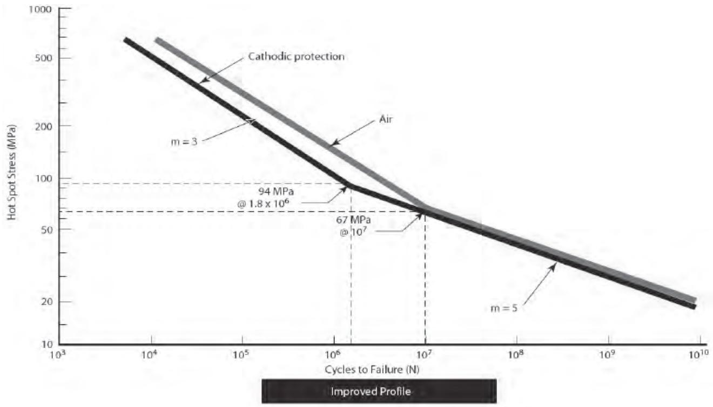  
Figure 8.1—Example Tubular Joint S-N Curve for T = 16 mm (5/8 in.)

The basic design S-N curves given in Table 8.2 are applicable for joints in air and submerged coated joints. For welded joints in seawater with adequate cathodic protection, the m = 3 branch of the S-N curve should be reduced by a factor of 2.0 on life, with the m = 5 branch remaining unchanged and the position of the slope change adjusted accordingly. Plots of the WJ curves versus data, and information concerning S-N curves for joints in seawater without adequate corrosion protection are given in B.8.5.1.

Fabrication of welded joints should be in accordance with Section 14. The curve for cast joints is only applicable to castings having an adequate fabrication inspection plan.

8.5.2 Thickness Effect

The WJ curve is based on 16 mm (5/8 in.) reference thickness. For material thickness above the reference thickness, the thickness effect in Equation (8.4) should be applied for as-welded joints.

$$S = S_{0} (t_{\mathrm{r e f}} / t)^{0. 25} \tag{8.5}$$

where

$t_{ \mathsf{ r e f } }$ is the reference thickness, 16 mm （$^{ 5 } / 8 \ \mathrm{ i n . } ) ;$

$S$ is the allowable stress range;

$S_{ \circ }$ is the allowable stress range from the S-N curve;

t is the member thickness for which the fatigue life is predicted.

If the weld has profile control as defined in 14.1.3.4, the exponent in the above equation may be taken as 0.20. If the weld toe has been ground or peened, the exponent in the above equation may be taken as 0.15.

The material thickness effect for castings is given by:

$$S = S_{0} \left(t_{\text{r e f}} / t\right)^{0. 15} \tag{8.6}$$

where the reference thickness $t_{ \mathsf{ r e f } }$ is 38 mm (1.5 in.).

No effect shall be applied to material thickness less than the reference thickness.

For any type of connection analyzed on a chord hot spot basis, the thickness for the chord side of tubular joint should be used in the foregoing equations. For the brace side hot spot, the brace thickness may be used.

8.5.3 Weld Improvement Techniques

For welded joints, improvement factors on fatigue performance can be obtained by a number of methods, including controlled burr grinding of the weld toe, hammer peening, or as-welded profile control to produce a smooth concave profile that blends smoothly with the parent metal. Table 8.3 shows improvement factors that can be applied, provided adequate control procedures are followed. The grinding improvement factor is not applicable for joints in seawater without adequate cathodic protection. The various weld improvement techniques are discussed in B.8.5.3.

Table 8.3—Factors on Fatigue Life for Weld Improvement Techniques   

| Weld Improvement Technique | Improvement Factor on S | Improvement Factor on N |
| --- | --- | --- |
| Profile (see 14.1.3.4) | τ-0.1 a | Varies |
| Weld toe burr grind | 1.25 | 2 |
| Hammer peening | 1.56 | 4 |
| a Chord side only. | a Chord side only. | a Chord side only. |

For welds with profile control as defined in 14.1.3.4 where the weld toe has been profiled, by grinding if required, to merge smoothly with the parent metal, and magnetic particle inspection (MT) demonstrates the weld toe is free of surface and near-surface defects, the improvement on fatigue performance can be considered as shown in the table, where ߬ is the ratio of brace/chord thickness. This improvement is in addition to the use of hot spot stress at the actual weld toe location, and the reduced size effect exponent. Either the factor on S or on N is used, but not both.

## 8.6 Fracture Mechanics

Fracture mechanics methods may be employed to quantify fatigue design lives of welded details or structural components in situations where the normal S-N fatigue assessment procedures are inappropriate. Some typical applications are to assess the fitness-for-purpose and inspection requirements of a joint with and without known defects, or to assess the structural integrity of castings.

It is important that the fracture mechanics formulation that is used should be shown to predict, with acceptable accuracy, either the fatigue performance of a joint class with a detail similar to that under consideration, or test data for joints that are similar to those requiring assessment.

9 Foundation Design

## 9.1 General

The recommended criteria of 9.1 through 9.11 are devoted to pile foundations, and more specifically to steel cylindrical (pipe) pile foundations. The recommended criteria of 9.12 are devoted to shallow foundations. API 2GEO shall be used for further details on foundation design.

The foundation shall be designed to carry static, cyclic, and transient loads without excessive deformations or vibrations in the platform. Special attention should be given to the effects of cyclic and transient loading on the strength of the supporting soils as well as on the structural response of piles. Guidance provided in 9.3, 9.4, and 9.5 is based upon static, monotonic loadings. Furthermore, this guidance does not necessarily apply to problem soils such as carbonate material or volcanic sands or highly sensitive clays. The possibility of movement of the seafloor against the foundation members should be investigated and the forces caused by such movements, if anticipated, should be considered in the design.

## 9.2 Pile Foundations

9.2.1 General

Types of pile foundations used to support offshore structures are described in 9.2.2 through 9.2.4.

9.2.2 Driven Piles

9.2.2.1 General

Open-ended piles are commonly used in foundations for offshore platforms. These piles are usually driven into the seabed with impact hammers that use steam, diesel fuel, or hydraulic power as the source of energy. The pile wall thickness should be adequate to resist axial and lateral loads as well as the stresses during pile driving. It is possible to approximately predict the stresses during pile driving using the principles of one-dimensional elastic stress wave transmission by carefully selecting the parameters that govern the behavior of soil, pile, cushions, capblock, and hammer. For a more detailed study of these principles, refer to Reference [43]. This approach may also be used to optimize the pile hammer cushion and capblock with the aid of computer analyses (commonly known as the wave equation analyses). The design penetration of driven piles should be determined in accordance with the principles outlined in 9.3 through 9.7 and 9.9, rather than upon any correlation of pile capacity with the number of blows required to drive the pile a certain distance into the seafloor.

When a pile refuses before it reaches design penetration, one or more of the actions in 9.2.2.2 through 9.2.2.4 can be taken.

9.2.2.2 Review of Hammer Performance

A review of all aspects of hammer performance, possibly with the aid of hammer and pile head instrumentation, may identify problems that can be solved by improved hammer operation and maintenance or by the use of a more powerful hammer.

9.2.2.3 Reevaluation of Design Penetration

Reconsideration of loads, deformations, and required capacities, of both individual piles and other foundation elements, and the foundation as a whole may identify reserve capacity available. An interpretation of driving records in conjunction with instrumentation mentioned above may allow design soil parameters or stratification to be revised and pile capacity to be increased.

9.2.2.4 Modifications to Piling Procedures

Usually the last course of action may include one of the following.

a) Plug Removal—The soil plug inside the pile is removed by jetting and air lifting or by drilling to reduce pile driving resistance. If plug removal results in inadequate pile capacities, the removed soil plug should be replaced by a gravel grout or concrete plug having sufficient load-carrying capacity to replace that of the removed soil plug. Attention should be paid to plug/pile load transfer characteristics. Plug removal may not be effective in some circumstances particularly in cohesive soils.   
b) Soil Removal Below Pile Tip—Soil below the pile tip is removed either by drilling an undersized hole or jetting equipment is lowered through the pile that acts as the casing pipe for the operation. The effect on pile capacity of drilling an undersized hole is unpredictable unless there has been previous experience under similar conditions. Jetting below the pile tip should in general be avoided because of the unpredictability of the results.   
c) Two-stage Driven Piles—A first stage or outer pile is driven to a predetermined depth, the soil plug is removed, and a second stage or inner pile is driven inside the first stage pile. The annulus between the two piles is grouted to permit load transfer and develop composite action.   
d) Drilled and grouted insert piles as described in 9.2.3.3.

9.2.3 Drilled and Grouted Piles

9.2.3.1 General

Drilled and grouted piles can be used in soils that will hold an open hole with or without drilling mud. Load transfer between grout and pile should be designed in accordance with 10.4. There are two types of drilled and grouted piles, as described in 9.2.3.2 and 9.2.3.3.

9.2.3.2 Single Stage

For the single-staged, drilled, and grouted pile, an oversized hole is drilled to the required penetration, a pile is lowered into the hole and the annulus between the pile and the soil is grouted. This type pile can be installed only in soils that will hold an open hole to the surface. As an alternative method, the pile with expendable cutting tools attached to the tip can be used as part of the drill stem to avoid the time required to remove the drill bit and insert a pile.

9.2.3.3 Two Stage

The two-staged, drilled and grouted pile consists of two concentrically placed piles grouted to become a composite section. A pile is driven to a penetration that has been determined to be achievable with the available equipment and below which an open hole can be maintained. This outer pile becomes the casing for the next operation, which is to drill through it to the required penetration for the inner or “insert” pile. The insert pile is then lowered into the drilled hole and the annuli between the insert pile and the soil and between the two piles are grouted. Under certain soil conditions, the drilled hole is stopped above required penetration, and the insert pile is driven to required penetration. The diameter of the drilled hole should be at least 150 mm (6 in.) larger than the insert pile diameter.

9.2.4 Belled Piles

Bells may be constructed at the tip of piles to give increased bearing and uplift capacity through direct bearing on the soil. Drilling of the bell is carried out through the pile by under reaming with an expander tool. A pilot hole may be drilled below the bell to act as a sump for unrecoverable cuttings. The bell and pile are filled with concrete to a height sufficient to develop necessary load transfer between the bell and the pile. Bells are connected to the pile to transfer full uplift and bearing loads using steel reinforcing such as structural members with adequate shear lugs, deformed reinforcement bars, or prestressed tendons. Load transfer into the concrete should be designed in accordance with ACI 318 [22]. The steel reinforcing should be enclosed for their full length below the pile with spiral reinforcement meeting the requirements of ACI 318. Load transfer between the concrete and the pile should be designed in accordance with 10.4.

## 9.3 Pile Design

9.3.1 Foundation Size

When sizing a pile foundation, the following items shall be considered: diameter, penetration, wall thickness, type of tip, spacing, number of piles, geometry, location, mudline restraint, material strength, installation method, and other parameters as may be considered appropriate.

9.3.2 Foundation Response

A number of different analysis procedures may be utilized to determine the requirements of a foundation. At a minimum, the procedure used shall properly simulate the nonlinear response behavior of the soil and assure load-deflection compatibility between the structure and the pile-soil system.

9.3.3 Deflections and Rotations

Deflections and rotations of individual piles and the total foundation system should be checked at all critical locations, which may include pile tops, points of contraflecture, mudline, etc. Deflections and rotations should not exceed serviceability limits that would render the structure inadequate for its intended function.

9.3.4 Pile Penetration

The design pile penetration shall be sufficient to develop adequate capacity to resist the maximum computed axial bearing and pullout loads with an appropriate factor of safety. The ultimate pile capacities can be computed in accordance with 9.4 and 9.5 or by other methods that are supported by reliable comprehensive data. The allowable pile capacities are determined by dividing the ultimate pile capacities by appropriate factors of safety that shall not be less than the values provided in Table 9.1. These safety factors shall be used after the effects of scouring, cyclic loading, and compressibility of the pile soil system have been taken into account. API 2GEO provides guidance on how to consider these effects.

Table 9.1—Pile Factors of Safety for Different Loading Conditions   

| Condition Number | Load Condition | Factors of Safety |
| --- | --- | --- |
| 1 | Design environmental conditions with appropriate drilling loads | 1.5 |
| 2 | Operating environmental conditions during drilling operations | 2.0 |
| 3 | Design environmental conditions with appropriate producing loads | 1.5 |
| 4 | Operating environmental conditions during producing operations | 2.0 |
| 5 | Design environmental conditions with minimum loads (for pullout) | 1.5 |

9.3.5 Alternative Design Methods

The provisions of this recommended practice for sizing the foundation pile are based on an allowable stress (working stress) method except for pile penetration per 9.3.4. In this method, the foundation piles should conform to the requirements of 6.2, 6.3, and 9.10 in addition to the provisions of 9.3. Any alternative method supported by sound engineering methods and empirical evidence may also be utilized. Such alternative methods include the limit state design approach or ultimate strength design of the total foundation system.

9.3.6 Scour

Seabed scour affects both lateral and axial pile performance and capacity. Scour prediction remains an uncertain art. Sediment transport studies may assist in defining scour design criteria but local experience is the best guide. The uncertainty on design criteria should be handled by robust design or by an operating strategy of monitoring and remediation as needed. Typical remediation experience is documented in References [44] and [45]. Scour design criteria will usually be a combination of local and global scour.

## 9.4 Pile Capacity for Axial Compression Loads

9.4.1 Ultimate Bearing Capacity

The ultimate bearing capacity of piles, including belled piles, $\mathit{ Q_{ \mathrm{ c } } } ,$ shall be determined by Equation (16) found in API 2GEO.

The foundation configurations should be based on those that experience has shown can be installed consistently, practically, and economically under similar conditions with the pile size and installation equipment being used. Alternatives for possible remedial action in the event design objectives cannot be obtained during installation should also be investigated and defined prior to construction.

9.4.2 Shaft Friction and End Bearing in Cohesive Soils

For pipe piles in cohesive soils, the unit shaft friction, $\mathcal{ I } ,$ in kPa (lb/ft2), at any point along the pile shall be calculated by Equation (17) in API 2GEO.

For piles end bearing in cohesive soils, the unit end bearing $q ,$ in kPa （$| \mathsf{ b } / \mathsf{ f } \mathsf{ f }^{ 2 } )$ , shall be computed by Equation (20) in API 2GEO.

9.4.3 Shaft Friction and End Bearing in Cohesionless Soils

See Section 8.1.4 in API 2GEO for alternative methods for assessing pile capacity in cohesionless soils. Both simple methods and CPT-based methods are addressed.

For pipe piles in cohesionless soils, the unit shaft friction at a given depth, $f ,$ may be calculated by Equation (21) found in API 2GEO.

For piles end bearing in cohesionless soils, the unit end bearing, q, may be computed by Equation (22) found in API 2GEO.

9.4.4 Skin Friction and End Bearing of Grouted Piles in Rock

The unit skin friction of grouted piles in jetted or drilled holes in rock should not exceed the triaxial shear strength of the rock or grout but in general should be much less than this value based on the amount of reduced shear strength from installation. For example, the strength of dry compacted shale may be greatly reduced when exposed to water from jetting or drilling. The sidewall of the hole may develop a layer of slaked mud or clay that will never regain the strength of the rock. The limiting value for this type pile may be the allowable bond stress between the pile steel and the grout as recommended in 10.4.4.

The end bearing capacity of the rock should be determined from the triaxial shear strength of the rock and an appropriate bearing capacity factor based on sound engineering practice for the rock materials but shall not exceed 9.58 MPa (100 tons/ft2).

## 9.5 Pile Capacity for Axial Pullout Loads

The ultimate pile pullout capacity may be equal to or less than but shall not exceed $\mathcal{ Q }_{ \mathbf{ f } } ,$ the total skin friction resistance in compression (see Section 8.2 in API 2GEO for further guidance and Section 8.1 in API 2GEO for methods of calculating $\varrho_{ \sf t }^{ \mathrm{ } } )$ .

The allowable pullout capacity shall be determined by applying the factors of safety in 9.3.4 to the ultimate pullout capacity.

## 9.6 Axial Pile Performance

9.6.1 Static Load-deflection Behavior

The axial capacity of a pile is its axial resistance, while pile performance refers to a specified service requirement by the owner [e.g. deflection(s) at the pile head]. Both axial capacity and pile performance are dependent upon many variables (e.g. the types of soils, the pile characteristics, the installation methods, and the characteristics of the applied loads). The influence of these variables shall be considered in pile design.

Piling axial deflections shall be within acceptable serviceability limits and these deflections shall be compatible with the structural forces and movements. An analytical method for determining axial pile performance is provided in Reference [46]. This method makes use of axial pile shear transition vs local pile deflection (t-z) curves to model the axial support provided by the soil along the size of the pile. An additional (Q-z) curve is used to model the tip end bearing vs the deflection response. Methods for constructing t-z and Q-z curves are provided in API 2GEO as well as further guidance on static behavior. Pile response is affected by load directions, load types, load rates, loading sequence installation technique, soil type, axial pile stiffness, and other parameters.

9.6.2 Cyclic Response

Unusual pile loading conditions or limitations on design pile penetrations may warrant detailed consideration of cyclic loading effects.

Cyclic loadings (including inertial loadings) developed by environmental conditions such as storm waves and earthquakes can have two potentially counteractive effects on the static axial capacity. Repetitive loadings can cause a temporary or permanent decrease in load-carrying resistance, and/or an accumulation of deformation. Rapidly applied loadings can cause an increase in load-carrying resistance and/or stiffness of the pile. Very slowly applied loadings can cause a decrease in load-carrying resistance and/or stiffness of the pile. The resultant influence of cyclic loadings will be a function of the combined effects of the magnitudes, cycles, and rates of applied pile loads, the structural characteristics of the pile, the types of soils, and the factors of safety used in design of the piles.

The design pile penetration shall be sufficient to develop an effective pile capacity to resist the design static and cyclic loadings as discussed in 9.3.4.

The design pile penetration can be confirmed by performing pile response analyses of the pile-soil system subjected to static and cyclic loadings. Analytical methods to perform such analyses are described in API 2GEO. The pile-soil resistance-displacement t-z, Q-z characterizations are discussed in API 2GEO.

9.6.3 Overall Pile Response Analyses

When any of the above effects are explicitly considered in pile response analysis, the design static and cyclic loadings should be imposed on the pile top and the resistance-displacements of the pile determined. At the completion of the design loadings, the maximum pile resistance and displacement shall be determined. Pile deformations shall meet structure serviceability requirements. The total pile resistance after the design loadings shall meet the requirements of 9.3.4.

## 9.7 Soil Reaction for Axially Loaded Piles

The pile foundation shall be designed to resist the static and cyclic axial loads. The axial resistance of the soil is provided by a combination of axial soil-pile adhesion or load transfer along the sides of the pile and end bearing resistance at the pile tip. The plotted relationship between mobilized soil-pile shear transfer and local pile deflection at any depth is described using a t-z curve. Similarly, the relationship between mobilized end bearing resistance and axial tip deflection is described using a Q-z curve. Information on soil reaction t-z and Q-z curves for axially loaded piles can be found in API 2GEO.

## 9.8 Soil Reaction for Laterally Loaded Piles

The pile foundation shall be designed to sustain lateral loads, whether static or cyclic. Additionally, the designer should consider overload cases in which the design lateral loads on the platform foundation are increased by an appropriate safety factor. The designer should satisfy himself that the overall structural foundation system will not fail under the overloads. The lateral resistance of the soil near the surface is significant to pile design and the effects on this resistance of scour and soil disturbance during pile installation should be considered. Generally, under lateral loading, clay soils behave as a plastic material, which makes it necessary to relate pile-soil deformation to soil resistance. To facilitate this procedure, lateral soil resistance deflection (p-y) curves should be constructed using stress-strain data from laboratory soil samples. The ordinate for these curves is soil resistance, p, and the abscissa is soil deflection, y. By iterative procedures, a compatible set of load-deflection values for the pile-soil system can be developed.

For a more detailed study of the construction of p-y curves refer to the following:

— soft clay, see Reference [47];   
— stiff clay, see Reference [48];   
— sand, see Reference [49].

In the absence of more definitive criteria, procedures recommended in API 2GEO may be used for constructing ultimate lateral bearing capacity curves and p-y curves. It is noted that these p-y curves are recommended to estimate pile bending moment, displacement, and rotation profiles for various (static or cyclic) loads. Different criteria may be applicable for fatigue analysis of a pile that has previously been subjected to loads larger than those used in the fatigue analysis that resulted in “gapping” around the top of the pile. A discussion on this subject and associated guidelines are presented in Reference [47]

The methods referred to in this section are intended as guidelines only. Where detailed information such as advanced testing on high quality samples, model tests, centrifuge tests, or full-scale pile testing is available, other methods may be justified.

## 9.9 Pile Group Action

9.9.1 General

Consideration should be given to the effects of closely spaced adjacent piles on the load and deflection characteristics of pile groups. Generally, for pile spacing less than eight (8) diameters, group effects may have to be evaluated. For more detailed discussions refer to the four papers in References [50], [51], [52], and [53]. See API 2GEO, Section 8.6, for more information on pile group action.

9.9.2 Axial Behavior

For piles embedded in clays, the group capacity may be less than a single isolated pile capacity multiplied by the number of piles in the group; conversely, for piles embedded in sands the group capacity may be higher than the sum of the capacities in the isolated piles. The group settlement in either clay or sand would normally be larger than that of a single pile subjected to the average pile load of the pile group.

In general, group effects depend considerably on pile group geometry and penetrations, and thickness of any bearing strata underneath the pile tips. See References [50], and [54].

9.9.3 Lateral Behavior

For piles with the same pile head fixity conditions and embedded in either cohesive or cohesionless soils, the pile group would normally experience greater lateral deflection than that of a single pile under the average pile load of the corresponding group. The major factors influencing the group deflections and load distribution among the piles are the pile spacing, the ratio of pile penetration to the diameter, the pile flexibility relative to the soil the dimensions of the group, and the variations in the shear strength and stiffness modulus of the soil with depth. See References [55], [56], and [57].

9.9.4 Pile Group Stiffness and Structure Dynamics

When the dynamic behavior of a structure is determined to be sensitive to variations in foundation stiffness, parametric analyses such as those described in 9.9.3 should be performed to bound the vertical and lateral foundation stiffness values to be used in the dynamic structural analyses. For insight regarding how changes in foundation stiffness can impact the natural frequencies of tall steel jacket platforms, see Reference [58].

9.9.5 Factors of Safety

The pile group capacity shall comply with the requirements of 9.3.4. Where there is a nonuniform distribution of loads in the piles, factors of safety for individual piles in the group may be less than

specified in 9.3.4. This is provided that it can be demonstrated that displacements and corresponding deformations of the piles and associated structural members are acceptable.

## 9.10 Pile Wall Thickness

9.10.1 General

The wall thickness of the pile may vary along its length and may be controlled at a particular point by any one of several loading conditions or requirements that are discussed in the paragraphs below.

9.10.2 Allowable Pile Stresses

The allowable pile stresses shall be the same as those permitted by AISC 335-89 for a compact hot rolled section, giving due consideration to 6.1, 6.2, and 6.3. A rational analysis considering the restraints placed upon the pile by the structure and the soil should be used to determine the allowable stresses for the portion of the pile that is not laterally restrained by the soil. General column buckling of the portion of the pile below the mudline need not be considered unless the pile is believed to be laterally unsupported because of extremely low soil shear strengths, large computed lateral deflections, or for some other reason.

9.10.3 Design Pile Stresses

The pile wall thickness in the vicinity of the mudline, and possibly at other points, is normally controlled by the combined axial load and bending moment that results from the design loading conditions for the platform. The moment curve for the pile may be computed with soil reactions determined in accordance with 9.8 giving due consideration to possible soil removal by scour. It may be assumed that the axial load is removed from the pile by the soil at a rate equal to the ultimate soil-pile adhesion divided by the appropriate pile safety factor from 9.3.4. When lateral deflections associated with cyclic loads at or near the mudline are relatively large (e.g. exceeding $y_{ \mathtt{ C } }$ as defined in API 2GEO, Section 8.5.3 for soft clay), consideration should be given to reducing or neglecting the soil-pile adhesion through this zone.

9.10.4 Stresses Due to Weight of Hammer During Hammer Placement

Each pile or conductor section on which a pile hammer (pile top drilling rig, etc.) will be placed should be checked for stresses due to placing the equipment. These loads may be the limiting factors in establishing maximum length of add-on sections. This is particularly true in cases where piling will be driven or drilled on a batter. The most frequent effects include: static bending, axial loads, and arresting lateral loads generated during initial hammer placement.

Experience indicates that reasonable protection from failure of the pile wall due to the above loads is provided if the static stresses are calculated as follows.

a) The pile projecting section should be considered as a freestanding column with a minimum effective length factor K of 2.1 and a minimum reduction factor, $C_{ \mathsf{ m } } ,$ of 1.0.   
b) Bending moments and axial loads should be calculated using the full weight of the pile hammer, cap, and leads acting through the center of gravity of their combined masses, and the weight of the pile add-on section with due consideration to pile batter eccentricities. The bending moment so determined should not be less than that corresponding to a load equal to 2 % of the combined weight of the hammer, cap, and leads applied at the pile head and perpendicular to its centerline.   
c) Allowable stresses in the pile should be calculated in accordance with 6.2 and 6.3. The one-third increase in stress should not be allowed.

9.10.5 Stresses During Driving

Consideration should also be given to the stresses that occur in the freestanding pile section during driving. Generally, stresses are checked based on the conservative criterion that the sum of the stresses due to the impact of the hammer (the dynamic stresses) and the stresses due to axial load and bending (the static stresses) should not exceed the minimum yield stress of the steel. Less conservative criteria are permitted, provided that these are supported by sound engineering analyses and empirical evidence.

A method of analysis based on wave propagation theory should be used to determine the dynamic stresses (see 9.2.2). In general, it may be assumed that column buckling will not occur as a result of the dynamic portion of the driving stresses. The dynamic stresses should not exceed 80 % to 90 % of yield depending on specific circumstances such as the location of the maximum stresses down the length of pile, the number of blows, previous experience with the pile-hammer combination, and the confidence level in the analyses.

Separate considerations apply when significant driving stresses may be transmitted into the structure, in order to avoid damage to appurtenances. The static stress during driving may be taken to be the stress resulting from the weight of the pile above the point of evaluation plus the pile hammer components actually supported by the pile during the hammer blows, including any bending stresses resulting there from. When using hydraulic hammers it is possible that the driving energy may exceed the rated energy and this should be considered in the analyses. Also, the static stresses induced by hydraulic hammers need to be computed with special care due to the possible variations in driving configurations, for example when driving vertical piles without lateral restraint and exposed to environmental forces (see 15.5.7.1). Allowable static stresses in the pile shall be calculated in accordance with 6.2 and 6.3. The one-third increases in stress shall not be allowed. The pile hammers evaluated for use during driving should be noted by the designer on the installation drawings or specifications.

9.10.6 Minimum Wall Thickness

The D/t ratio of the entire length of a pile should be small enough to preclude local buckling at stresses up to the yield strength of the pile material. Consideration should be given to the different loading situations occurring during the installation and the service life of a piling. For in-service conditions, and for those installation situations where normal pile-driving is anticipated or where piling installation will be by means other than driving, the limitations of 6.2 shall be considered to be the minimum requirements. For piles that are to be installed by driving where sustained hard driving [820 blows/m (250 blows/ft) with the largest size hammer to be used] is anticipated, the minimum piling wall thickness used shall not be less than the values calculated from Equations (9.1) or (9.2).

In SI units:

$$t = 6. 35 + \frac{D}{100} \tag{9.1}$$

In USC units:

$$t = 0. 25 + \frac{D}{100} \tag{9.2}$$

where

t is the wall thickness, in mm (in.);

D is the diameter, in mm (in.).

Minimum wall thickness for normally used pile sizes should be as listed in Table 9.2.

The preceding requirement for a lesser D/t ratio when hard driving is expected may be relaxed when it can be shown by past experience or by detailed analysis that the pile will not be damaged during its installation.

Table 9.2—Minimum Pile Wall Thickness   

| Pile Diameter mm (in.) | Nominal Wall Thickness, t mm (in.) |
| --- | --- |
| 610 (24) | 13 (1/2) |
| 762 (30) | 14 (9/16) |
| 914 (36) | 16 (5/8) |
| 1067 (42) | 17 (11/16) |
| 1219 (48) | 19 (3/4) |
| 1524 (60) | 22 (7/8) |
| 1829 (72) | 25 (1) |
| 2134 (84) | 28 (1.125) |
| 2438 (96) | 31 (1.25) |
| 2743 (108) | 34 (1.375) |
| 3048 (120) | 37 (1.50) |

9.10.7 Allowance for Underdrive and Overdrive

With piles having thickened sections at the mudline, consideration should be given to providing an extra length of heavy-wall material in the vicinity of the mudline so the pile will not be overstressed at this point if the design penetration is not reached. The amount of underdrive allowance provided in the design will depend on the degree of uncertainty regarding the penetration that can be obtained. In some instances an overdrive allowance should be provided in a similar manner in the event an expected bearing stratum is not encountered at the anticipated depth.

9.10.8 Driving Shoe

The purpose of driving shoes is to assist piles to penetrate through hard layers or to reduce driving resistances allowing greater penetrations to be achieved than would otherwise be the case. Different design considerations apply for each use. If an internal driving shoe is provided to drive through a hard layer it should be designed to ensure that unacceptably high driving stresses do not occur at and above the transition point between the normal and the thickened section at the pile tip. Also it should be checked that the shoe does not reduce the end bearing capacity of the soil plug below the value assumed in the design. External shoes are not normally used as they tend to reduce the skin friction along the length of pile above them.

9.10.9 Driving Head

Any driving head at the top of the pile should be designed in association with the installation contractor to ensure that it is fully compatible with the proposed installation procedures and equipment.

## 9.11 Length of Pile Sections

In selecting pile section lengths consideration should be given to the following:

a) the capability of the lift equipment to raise, lower and stab the sections;   
b) the capability of the lift equipment to place the pile driving hammer on the sections to be driven;   
c) the possibility of a large amount of downward pile movement immediately following the penetration of a jacket leg closure;   
d) stresses developed in the pile section while lifting;   
e) the wall thickness and material properties at field welds;   
f) avoiding interference with the planned concurrent driving of neighboring piles;   
g) the type of soil in which the pile tip is positioned during driving interruptions for field welding to attach additional sections; and   
h) static and dynamic stresses due to the hammer weight and operation should be considered as discussed in 9.10.4 and 9.10.5.

Each pile section on which driving is required should contain a cutoff allowance to permit the removal of material damaged by the impact of the pile driving hammer. The normal allowance is 0.5 m to 1.5 m (2 ft to 5 ft) per section. Where possible the cut for the removal of the cutoff allowance should be made at a conveniently accessible elevation.

## 9.12 Shallow Foundations

9.12.1 General

Shallow foundations are those foundations for which the depth of embedment is less than the minimum lateral dimension of the foundation element. The design of shallow foundations should include, where appropriate to the intended application, consideration of the following.

a) Stability, including failure due to overturning moment, bearing load, sliding load, torsion load, or combinations thereof.   
b) Foundation displacements or rotations that could cause damage to components of the supported structure, including the foundation and associated facilities.   
c) Foundation response to static and environmental loading. When considering cyclic loading, such as from waves, both the influence of the foundation on the structural response and the ability of the foundation to withstand the cyclic loads shall be considered.   
d) Hydraulic instability such as scour or piping due to wave pressures, including the potential for damage to the structure and for foundation instability.   
e) Installation and removal, including penetration and pull-out of shear skirts or the foundation base itself and the effects of pressure buildup or drawdown of trapped water underneath the base.

Recommendations pertaining to these aspects of shallow foundation design are given in API 2GEO.

9.12.2 Safety Factors

Foundations should have an adequate margin of safety against failure under the design loading conditions. The following factors of safety in Table 9.3 shall be used for the specific failure modes indicated.

Table 9.3—Shallow Foundation Safety Factors Against Failure   

| Failure Mode | Safety Factor |
| --- | --- |
| Bearing failure | 2.0 |
| Pure sliding and/or torsional failure | 1.5 |

These values should be used after cyclic loading effects have been taken into account. Where geotechnical data are sparse or site conditions are particularly uncertain, increases in these values may be warranted.

In many offshore applications the lateral loads and overturning moments as well as vertical loads are highly variable. In assessing margins of safety the uncertainty of all these loads should be considered. A consistent method for accomplishing this is construction of an envelope of load combinations that constitute failure and comparing these limiting conditions with design loading. See Reference [59] for a more detailed discussion of this procedure.

10 Other Structural Components and Systems

## 10.1 Superstructure Design

The superstructure may be modeled in a simplified form for the analysis of the platform jacket, or substructure; however, recognition should be given to the vertical and horizontal stiffness of the system and the likely effect on the substructure. This modeling should consider the overturning effects of wind load for environmental loading conditions, the proper location of superstructure and equipment masses for seismic loading conditions, and the alternate locations of heavy gravity loads such as the derrick.

The superstructure itself may be analyzed as one or more independent structures depending upon its configuration; however, consideration should be given to the effect of deflections of the substructure in modeling the boundary supports. Differential deflections of the support points of heavy deck modules placed on skid beams or trusses at the top of the substructure may result in a significant redistribution of the support reactions. In such a case, the analysis model should include the deck modules and the top bay or two of the substructure to facilitate accurate simulation of support conditions. This model should be analyzed to develop support reaction conditions that reflect these effects.

Depending upon the configuration of a platform designed with a modular superstructure, consideration should be given to connecting adjacent deck modules to resist lateral environmental forces. Connection may also have the advantage of providing additional redundancy to the platform in the event of damage to a member supporting the deck modules.

In areas where seismic forces may govern the design of superstructure members, a pseudo-static analysis may be used. The analysis should be based on peak deck accelerations determined from the

overall platform seismic analysis. The height at which the acceleration is selected should be based upon the structural configuration and the location of the dominant superstructure masses.

## 10.2 Plate Girder Design

Plate girders should be designed in accordance with the AISC 335-89 and AWS D1.1/D1.1M:2010, Clause 2, Part C, “Specific Requirements for Design of Nontubular Connections (Cyclically Loaded).” Where stress concentrations such as abrupt changes in section, penetrations, jacking slots, etc. occur, their effect on fatigue and fracture should be considered. Steel for plate girders should have sufficient notch toughness to prevent brittle fracture at the lowest anticipated ambient temperature.

## 10.3 Crane Supporting Structure

10.3.1 Static Design

The supporting structure shall be designed for the dead load of the crane plus a minimum of 2.0 times the safe working loads and the stresses compared to the allowables found in 6.1.1 with no increase in allowables.

The loading conditions to be investigated should include the following:

a) maximum overturning moment with corresponding vertical load plus a side load, equal to 4 % of the maximum vertical load, applied simultaneously to the boom head sheave;   
b) maximum vertical load with corresponding overturning moment plus a side load, equal to 4 % of the maximum vertical load, applied simultaneously to the boom head sheave.

When a specific crane has been identified for a location, it shall be confirmed that the load conditions defined above equal or exceed the crane manufacturer’s rated loads as defined in API 2C.

10.3.2 Dynamic Design

No increase for dynamic load is necessary in the design of supporting structures for cranes with ratings in accordance with API 2C.

10.3.3 Fatigue Design

The supporting structure should be designed to resist the crane foundation fatigue loads in compliance with 8.4. In lieu of a detailed fatigue analysis, the following may be used.

A minimum of 25,000 cycles should be assumed under the following conditions:

a) a load of 1.33 times the static rated load at the boom position and crane orientation producing maximum stress in each component of the supporting structure,   
b) the stress range used should be the difference between the stress caused by the above loading and stress with the boom in the same position but unloaded.

## 10.4 Grouted Pile-to-structure Connections

10.4.1 General

Platform loads may be transferred to steel piles by grouting the annulus between the jacket leg (or sleeve) and the pile. The load is transferred to the pile from the structure across the grout. Experimental work indicates that the mechanism of load transfer is a combination of bond and confinement friction between the grout and the steel surfaces and the bearing of the grout against mechanical aids such as shear keys.

Centralizers should be used to maintain a uniform annulus or space between the pile and the surrounding structure. A minimum annulus width of 38 mm (1 1/2 in.) should be provided where grout is the only means of load transfer. Adequate clearance between pile and sleeve should be provided, taking into account the shear keys’ outstand dimension, h. Packers should be used as necessary to confine the grout. Proper means for the introduction of grout into the annulus should be provided so that the possibility of dilution of the grout or formation of voids in the grout will be minimized. The use of wipers or other means of minimizing mud intrusion into the spaces to be occupied by piles should be considered at sites having soft mud bottoms.

10.4.2 Factors Affecting the Connection Strength

Many factors affect the strength of a grouted connection. These include, but are not limited to, the unconfined compressive strength of the grout; size and spacing of the shear keys; type of admixture; method of placing grout; condition of the steel surfaces, presence of surface materials that would prevent bonding of grout to steel; and the amount of disturbance from platform movement while the grout is setting. For high D/t ratios the hoop flexibility of the sleeve and the pile is also known to be a factor.

10.4.3 Computation of Applied Axial Force

In computing the axial force applied to a grouted pile-to-structure connection, due account should be taken of the distribution of overall structural loads among various piles in a group or cluster. The design load for the connection should be the highest computed load with due consideration given to the range of axial pile and in situ soil stiffness.

10.4.4 Computation of Allowable Axial Force

10.4.4.1 General

In the absence of reliable comprehensive data that would support the use of other values of connection strength, the allowable axial load transfer should be taken as the smaller value (pile or sleeve) of the force calculated by a multiplication of the contact area between the grout and steel surfaces and the allowable axial load transfer stress ${ f }_{ \mathsf{ b a } } ,$ where $f_{ \mathsf{ b } \mathsf{ a } }$ is computed by the appropriate value in Equations (10.1) or (10.2) for the grout/steel interface. This allowable axial force should be greater than or equal to the applied axial force computed according to 10.4.3.

10.4.4.2 Plain Pipe Connections

The value of the allowable axial load transfer stress, ${ f }_{ \mathsf{ b a } } ,$ should be taken as 138 KPa (20 psi) for Loading Conditions 1 and 2 and 184 KPa (26.7 psi) for Loading Conditions 3 and 4 (see 5.2.2).

10.4.4.3 Shear Key Connections

Where shear keys are used at the interface between steel and grout, the value of the nominal allowable axial load transfer stress, ${ \mathit{ f } }_{ \mathsf{ b } \mathsf{ a } } ,$ for Loading Conditions 1 and 2 may be calculated as:

In SI units:

$$f_{\mathrm{b a}} = 138 \mathrm{K P a} + 0. 5 f_{\mathrm{c u}} \times \frac{h}{s} \tag{10.1}$$

In USC units:

$$f_{\mathrm{b a}} = 20 \mathrm{p s i} + 0. 5 f_{\mathrm{c u}} \times \frac{h}{s}$$

For Loading Conditions 3 and $4 , f_{ \mathsf{ b a } }$ may be calculated as:

In SI units:

$$f_{\mathrm{b a}} = 184 \mathrm{K P a} + 0. 67 f_{\mathrm{c u}} \times \frac{h}{s} \tag{10.2}$$

In USC units:

$$f_{\mathrm{b a}} = 26. 7 \mathrm{p s i} + 0. 67 f_{\mathrm{c u}} \times \frac{h}{s}$$

where

$f_{ \mathtt{ C U } }$ is the unconfined grout compressive strength, in MPa (psi) in accordance with 11.4.1;

h is the shear key outstand dimension, in mm (in.) (see Figure 10.1 and Figure 10.2);

s is the shear key spacing, in mm (in.) (see Figure 10.1 and Figure 10.2).

Shear keys designed according to Equations (10.1) and (10.2) shall be detailed in accordance with the following requirements.

a) Shear keys may be circular hoops at spacing “s” or a continuous helix with a pitch of $^{ * } s .^{ * }$ See 10.4.4.4 for limitations.   
b) Shear keys should be one of the types indicated in Figure 10.2.   
c) For driven piles, shear keys on the pile should be applied to sufficient length to ensure that, after driving, the length of the pile in contact with the grout has the required number of shear keys.   
d) Each shear key cross section and weld should be designed to transmit that part of the connection capacity that is attributable to the shear key for Loading Conditions 1 and 2 in 5.2.2. The shear key and weld should be designed at basic allowable steel and weld stresses to transmit an average force equal to the shear key bearing area multiplied by $1 . 7 f_{ \mathrm{ c u } } ,$ except for a distance of 2 pile diameters from the top and the bottom end of the connections where $2 . 5 f_{ \mathrm{ c u } }$ should be used.

10.4.4.4 Limitations

The limitation 17 MPa (2,500 psi) $\leq{ f_{ \mathtt{ C U } } } \leq 110$ MPa (16,000 psi) should be observed when designing a connection in accordance with 10.4.4.2 or 10.4.4.3.

The limitations in Table 10.1 should be observed when designing a connection according to 10.4.4.3 (see Figure 10.1 and Figure 10.2).

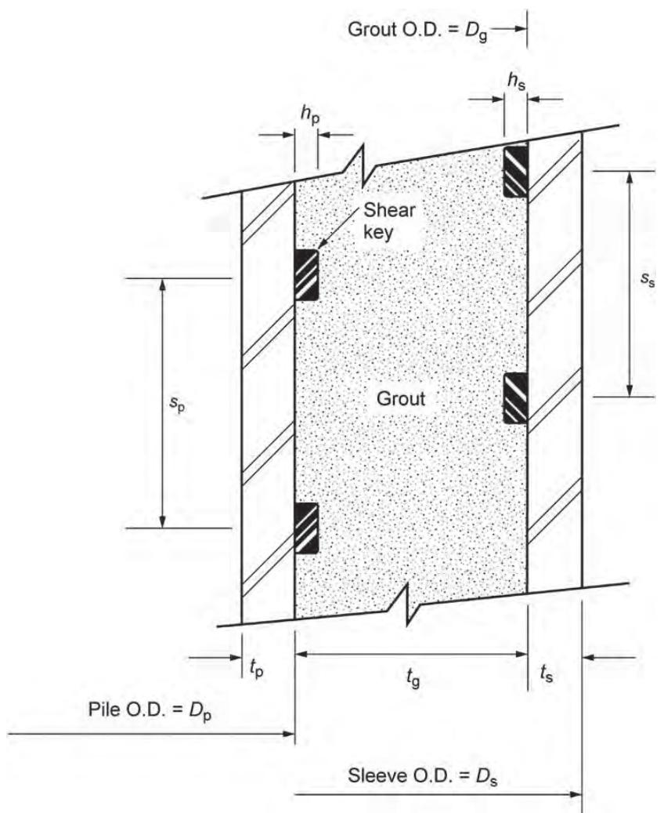  
Figure 10.1—Grouted Pile-to-structure Connection with Shear Keys

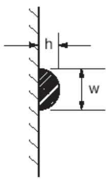  
(A) Weld bead

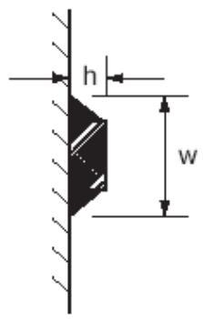  
(B) Fat bar with fillet welds

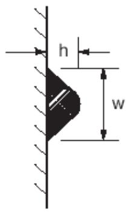  
(C) Round bar with fillet welds   
Figure 10.2—Recommended Shear Key Details

Table 10.1—Connection Design Limitations   

| Attribute | Limitation |
| --- | --- |
| Sleeve geometry | Ds/ts≤80 |
| Pile geometry | Dp/tp≤40 |
| Grout annulus geometry | 7≤Dg/tg≤45 |
| Shear key spacing ratioc | 2.5≤Dp/s≤8 |
| Shear key ratio | h/s≤0.10 |
| Shear key shape factor | 1.5≤w/h≤3.0 |
| Product of fcuand h/s | ≤5.5 MPa (800 psi) |
| a For helical shear keys only. | a For helical shear keys only. |

10.4.4.5 Other Design Methods

Other methods, which are based on testing and verification, may be used for calculating the allowable load transfer stress $f_{ \mathsf{ b } \mathsf{ a } }$ . One such method is described in B.10.4.4.5.

10.4.5 Loadings Other Than Axial Load

Grouted pile to sleeve connections will be subjected to loading conditions other than axial load, such as transverse shear and bending moment or torque. The effect of such loadings, if significant, should be considered in the design of connections by appropriate analytical or testing procedures.

## 10.5 Guyline System Design

10.5.1 General

A guyline system provides lateral restoring force and stability to a guyed tower. The guyline system consists of an array of guylines, each attached to the tower and anchored on the seafloor.

10.5.2 Components

10.5.2.1 General

A guyline system may be composed of the components described in 10.5.2.2 through 10.5.2.6.

10.5.2.2 Lead Lines

The lead line extends from the tower to a clumpweight. If steel rope or strand is used, API 9A [14] and API 9B [15] establish standards for procurement and usage. Other materials may be used if sufficient design information is available.

Design consideration should include mechanical properties, fatigue characteristics, corrosion protection, and abrasion resistance.

10.5.2.3 Clumpweights

The clumpweight is a heavy mass intermediate between the lead line and anchor line. The clumpweights serve to soften the stiffness of the guyline system during extreme sea states to allow larger tower deflection without increasing line tensions excessively. Clumpweight variables include weight, location, dimensions, and construction details. The configuration of the clumpweight should be chosen to minimize soil suction and break-out forces. Since settlement or “mudding in” of the clumpweights might occur, the increased resistance to lift-off should be considered.

10.5.2.4 Anchor Lines

The anchor line extends from the clumpweight to the anchor. API 9A [14], API 9B [15], and API 2F [2] are establish standards for steel rope, strand, and chain respectively. The design considerations for anchor lines are similar to those for lead lines. In addition, abrasion of the line caused by contact with the seafloor should be considered.

10.5.2.5 Anchor

The anchor transmits guyline loads to the soil. The anchor system design should consider both horizontal and vertical components of the anchor load.

An anchor system may consist of a single pile [60], a piled template, or other anchoring devices. The pile components of an anchor should be designed using the criteria recommended in Section 9, except that the ultimate capacity of the anchor system should be twice the anchor line load during Loading Condition 1 (see 10.5.5).

Other anchoring methods may be employed if these techniques can be substantiated by sufficient analysis or experimentation.

10.5.2.6 Tower Terminations

The tower terminations system transmits guyline forces into the tower framework. Specific hardware should be chosen with consideration for bending fatigue of the lead line, limitations on bend radius, tolerance of lead line azimuth, capacity of the hardware to support the mooring loads, and operational requirements.

10.5.2.7 Terminations at Clump or Anchor

Resin or hot metal sockets used for guyline terminations should include a method of bending strain relief to reduce the SCF and minimize the mass discontinuity.

10.5.3 Configuration

The guyline system should provide the desired strength, stiffness, and redundancy to support the tower under the action of the environmental forces. Tower response should be evaluated and shown to remain stable with one or more critically loaded guylines out of service for the design environmental conditions. Major design variables include the number and size of individual guylines, the distance from the tower to the clumpweight and anchor, the size and configuration of the clumpweight, and the guyline preload and connections.

10.5.4 Analysis

Generally, the loads in a guyline should be determined from a specific dynamic analysis of a detailed guyline model. The model should consider hydrodynamic and structural damping, inertia and drag characteristics of the guyline and clump weight, and interaction with the seafloor. The guyline may be excited at the tower termination with a displacement input determined according to the provisions of 5.3.1.3. Other design considerations are local vibration of the guyline and overall current force on the guyline system.

10.5.5 Recommended Factors of Safety

The ultimate guyline capacities can be assumed to be the rated breaking strengths. The allowable guyline capacities are determined by dividing the ultimate guyline capacity by appropriate factors of safety that shall not be less than the values provided in Table 10.2.

Table 10.2—Guyline Factors of Safety   

| Condition Number | Loading Conditions | Safety Factor |
| --- | --- | --- |
| 1 | Design environmental conditions with appropriate deck loads, including appropriate dynamic amplification of guyline forces. | 2.0 |
| 2 | Operating environmental conditions. | 3.0 |

These safety factors are based on the redundancy found in typical guyline configurations.

10.5.6 Fatigue

The axial and bending fatigue life of the guylines should be evaluated. The loading history should be developed in accordance with 8.2. Discussions of fatigue for steel rope or strand are given in References [61] and [62].

# 11 Material

## 11.1 Structural Steel

11.1.1 General

Steel shall conform to a definite specification and to the minimum strength level, group, and class specified by the designer. Certified mill test reports or certified reports of tests made by the fabricator or a testing laboratory in accordance with ASTM A6 [24] or ASTM A20 [25], as applicable to the specification listed in Table 11.1, Table 11.2, and Table 11.3, constitutes evidence of conformity with the specification. Unidentified steel shall not be used.

11.1.2 Steel Groups

11.1.2.1 General

Steel may be grouped according to strength level and welding characteristics as follows.

11.1.2.2 Group I

Group I designates mild steels with specified minimum yield strengths of 280 MPa (40 ksi) or less. Carbon equivalent is generally 0.40 % or less, and these steels may be welded by any of the welding processes as described in AWS D1.1/D1.1M:2010.

11.1.2.3 Group II

Group II designates intermediate strength steels with specified minimum yield strengths of over 280 MPa (40 ksi) through 360 MPa (52 ksi). Carbon equivalent ranges of up to 0.45 % and higher, and these steels require the use of low hydrogen welding processes.

11.1.2.4 Group III

Group III designates high strength steels with specified minimum yield strengths in excess of 360 MPa (52 ksi). Such steels may be used provided that each application is investigated with regard to:

— weldability and special welding procedures that may be required;   
— fatigue problems that may result from the use of higher working stresses; and   
— notch toughness in relation to other elements of fracture control, such as fabrication, inspection procedures, service stress, and temperature environment.

11.1.3 Steel Classes

11.1.3.1 Consideration should be given for the selection of steels with notch toughness characteristics suitable for the conditions of service. For this purpose, steels may be classified as follows in 11.1.3.2 through 11.1.3.4.   
11.1.3.2 Class C steels are those that have a history of successful application in welded structures at service temperatures above freezing but for which impact tests are not specified. Such steels are applicable to primary structural members involving limited thickness, moderate forming, low restraint, modest stress concentration, quasistatic loading (rise time 1 second or longer), and structural redundancy

such that an isolated fracture would not be catastrophic. Examples of such applications are piling, jacket braces and legs, and deck beams and legs.

11.1.3.3 Class B steels are suitable for use where thickness, cold work, restraint, stress concentration, impact loading, and/or lack of redundancy indicate the need for improved notch toughness. Where impact tests are specified, Class B steels should exhibit Charpy V-notch energy of 20 J (15 ft-lb) for Group I, and 34 J (25 ft-lb) for Group II, at the lowest anticipated service temperature. Steels enumerated herein as Class B can generally meet these Charpy requirements at temperatures ranging from $10 ~^{ \circ } \mathsf{ C }$ to $0 ~^{ \circ } \mathsf C$ （$50 ~^{ \circ } \mathsf{ F }$ to $32^{ \circ } \mathsf{ F } )$ . When impact tests are specified for Class B steel, testing in accordance with ASTM A673 [30], frequency H, is suggested.

11.1.3.4 Class A steels are suitable for use at subfreezing temperatures and for critical applications involving adverse combinations of the factors cited above. Critical applications may warrant Charpy testing at ${ 20 ~^{ \circ } \mathrm{ C } }$ to $30 ~^{ \circ } \mathsf{ C }$ (68 °F to $86 ~^{ \circ } \mathsf{ F } )$ below the lowest anticipated service temperature. This extra margin of notch toughness prevents the propagation of brittle fractures from large flaws and provides for crack arrest in thicknesses of several inches. Steels enumerated herein as Class A can generally meet the Charpy requirements stated above at temperatures ranging from $- 20 ~^{ \circ } \mathsf{ C }$ to $40 ~^{ \circ } \mathrm{ C }$ (–4 °F to $\scriptstyle - 40^{ \circ } \mathsf{ F } )$ . Impact testing frequency for Class A steels should be in accordance with the specification under which the steel is ordered; in the absence of other requirements, heat lot testing may be used.

11.1.4 Steel Specifications

Unless otherwise specified by the designer, plates should conform to one of the specifications listed in Table 11.1. Structural shape specifications are listed in Table 11.2. Steels above the thickness limits stated may be used, provided applicable provisions of 11.1.2.4 are considered by the designer.

## 11.2 Structural Steel Pipe

11.2.1 Specifications

Unless otherwise specified, seamless or welded pipe 4 should conform to one of the specifications listed in Table 11.3. Pipe should be prime quality unless the use of limited service, structural grade, or reject pipe is specifically approved by the designer.

11.2.2 Fabrication

Structural pipe should be fabricated in accordance with API 2B, ASTM A139 $[ 26 ] 4_{ , }$ , ASTM A252 [27] 4, ASTM A381 [28], or ASTM A671 [29] using grades of structural plate listed in Table 11.1 except that hydrostatic testing may be omitted.

11.2.3 Selections for Conditions of Service

Consideration should be given for the selection of steels with toughness characteristics suitable for the conditions of service (see 11.1.3). For tubes cold formed to D/t less than 30, and not subsequently heat treated, due allowance should be made for possible degradation of notch toughness, for example, by specifying a higher class of steel or by specifying notch toughness tests run at reduced temperature.

## 11.3 Steel for Tubular Joints

11.3.1 General

Tubular joints are subject to local stress concentrations that may lead to local yielding and plastic strains at the design load. During the service life, cyclic loading may initiate fatigue cracks, making additional demands on the ductility of the steel, particularly under dynamic load. These demands are particularly severe in heavy-wall joint cans designed for punching shear.

Table 11.1—Structural Steel Plates   

| Group | Class | ASTM Specification and Grade | Yield Strength | Yield Strength | Tensile Strength | Tensile Strength |
| --- | --- | --- | --- | --- | --- | --- |
| Group | Class | ASTM Specification and Grade | MPa | ksi | MPa | ksi |
| I | C | ASTM A36 [to 51 mm (2 in.) thick] | 250 | 36 | 400-550 | 58-80 |
| I | C | ASTM A131, Grade A [to 13.0 mm ($^1/2$ in.) thick] | 235 | 34 | 400-490 | 58-71 |
| I | C | ASTM A285, Grade C [to 19.0 mm ($^3/4$ in.) thick] | 205 | 30 | 380-515 | 55-75 |
| I | B | ASTM A131, Grades B, D | 235 | 34 | 400-490 | 58-71 |
| I | B | ASTM A516, Grade 65 | 240 | 35 | 450-585 | 65-85 |
| I | B | ASTM A573, Grade 65 | 240 | 35 | 450-530 | 65-77 |
| I | B | ASTM A709, Grade 36T2 | 250 | 36 | 400-550 | 58-80 |
| I | A | ASTM A131, Grades CS, E | 235 | 34 | 400-490 | 58-71 |
| II | C | ASTM A572, Grade 42 [to 51 mm (2 in.) thick a] | 290 | 42 | 415 min. | 60 min. |
| II | C | ASTM A572, Grade 50 [to 51 mm (2 in.) thick];[ASTM A6 [S29 required over 13.0 mm ($^1/2$ in.) a]] | 345 | 50 | 450 min. | 65 min. |
| II | B | API 2MT1 | 345 | 50 | 483-620 | 70-90 |
| II | B | ASTM A709, Grades 50T2, 50T3 | 345 | 50 | 450 min. | 65 min. |
| II | B | ASTM A131, Grade AH32 | 315 | 45.5 | 470-585 | 68-85 |
| II | B | ASTM A131, Grade AH36 | 350 | 51 | 490-620 | 71-90 |
| II | A | API 2H, Grade 42 | 290 | 42 | 430-550 | 62-80 |
| II | A | API 2H, Grade 50 [to 64 mm ($2^1/2$ in. thick)] | 345 | 50 | 483-620 | 70-90 |
| II | A | API 2H, Grade 50 [over 64 mm ($2^1/2$ in. thick)] | 325 | 47 | 483-620 | 70-90 |
| II | A | API 2W ,Grade 50 [to 25 mm (1 in.) thick] | 345-483 | 50-70 | 448 min. | 65 min. |
| II | A | API 2W, Grade 50 [over 25 mm (1 in.) thick] | 345-552 | 50-80 | 483 min. | 70 min. |
| II | A | API 2Y, Grade 50 [to 25 mm (1 in.) thick] | 345–517 | 50–75 | 448 min. | 65 min. |
| II | A | API 2Y, Grade 50 [over 25 mm (1 in.) thick] | 345–483 | 50–70 | 448 min. | 65 min. |
| II | A | ASTM A131, Grades DH32, EH32 | 315 | 45.5 | 470–585 | 68–85 |
| II | A | ASTM A131 Grades DH36, EH36 | 350 | 51 | 490–620 | 71–90 |
| II | A | ASTM A537 Class I [to 64 mm (21/2in.) thick] | 345 | 50 | 485–620 | 70–90 |
| II | A | ASTM A633, Grade A | 290 | 42 | 435–570 | 63–83 |
| II | A | ASTM A633 Grades C, D | 345 | 50 | 485–620 | 70–90 |
| II | A | ASTM A678 Grade A | 345 | 50 | 485–620 | 70–90 |
| III | A | ASTM A537, Class II [to 64 mm (21/2in.) thick] | 415 | 60 | 550–690 | 80–100 |
| III | A | ASTM A678, Grade B | 415 | 60 | 550–690 | 80–100 |
| III | A | API 2W, Grade 60 [to 25 mm (1 in.) thick] | 414–621 | 60–90 | 517 min. | 75 min. |
| III | A | API 2W, Grade 60 [over 25 mm (1 in.) thick] | 414–586 | 60–85 | 517 min. | 75 min. |
| III | A | API 2Y, Grade 60 [to 25 mm (1 in.) thick] | 414–621 | 60–90 | 517 min. | 75 min. |
| III | A | API 2Y, Grade 60 [over 25 mm (1 in.) thick] | 414–586 | 60–85 | 517 min. | 75 min. |
| III | A | ASTM A710, Grade A Class 3 (quenched and precipitation heat treated) |  |  |  |  |
| III | A | [Through 51 mm (2 in.)] | 515 | 75 | 585 | 85 |
| III | A | [51 mm (2 in.) to 102 mm (4 in.)] | 450 | 65 | 515 | 75 |
| III | A | [Over 102 mm (4 in.)] | 415 | 60 | 485 | 70 |
| a Maximum vanadium level permitted = 0.10 % V. | a Maximum vanadium level permitted = 0.10 % V. | a Maximum vanadium level permitted = 0.10 % V. | a Maximum vanadium level permitted = 0.10 % V. | a Maximum vanadium level permitted = 0.10 % V. | a Maximum vanadium level permitted = 0.10 % V. | a Maximum vanadium level permitted = 0.10 % V. |

Table 11.2—Structural Steel Shapes   

| Group | Class | ASTM Specification and Grade | Yield Strength | Yield Strength | Tensile Strength | Tensile Strength |
| --- | --- | --- | --- | --- | --- | --- |
| Group | Class | ASTM Specification and Grade | MPa | ksi | MPa | ksi |
| I | C | ASTM A36 to 51 mm (2 in.) thick | 250 | 36 | 400-550 | 58-80 |
| I | C | ASTM A131, Grade A to 13 mm ($1/2$ in.) thick | 235 | 34 | 400-550 | 58-80 |
| I | B | ASTM A709, Grade 36T2 | 250 | 36 | 400-550 | 58-80 |
| II | C | API 2MT2, Class C | 345 | 50 | 450-620 | 65-90 |
| II | C | ASTM A572, Grade 42 [to 51 mm (2 in.) thick]a | 290 | 42 | 415 min. | 60 min. |
| II | C | ASTM A572, Grade 50 [to 51 mm (2 in.) thick;][ASTM A6 S29 required over 13.0 mm ($1/2$ in.) ]a | 345 | 50 | 450 min. | 65 min. |
| II | C | ASTM A992 | 345-450 | 50-65 | 450 min. | 65 min. |
| II | B | API 2MT2 Class B | 345 | 50 | 450-620 | 65-90 |
| II | B | ASTM A709 Grades 50T2, 50T3 | 345 | 50 | 450 min. | 65 min. |
| II | B | ASTM A131 Grade AH32 | 315 | 45.5 | 470-585 | 68-85 |
| II | B | ASTM A131 Grade AH36 | 350 | 51 | 490-620 | 71-90 |
| II | A | API 2MT2 Class A | 345 | 50 | 450-620 | 65-90 |
| II | A | ASTM A913 Grade 50with CVN at -20 °C (-4 °F) | 345 | 50 | 450 min. | 65 min. |
| a Maximum vanadium level permitted = 0.10 % V. | a Maximum vanadium level permitted = 0.10 % V. | a Maximum vanadium level permitted = 0.10 % V. | a Maximum vanadium level permitted = 0.10 % V. | a Maximum vanadium level permitted = 0.10 % V. | a Maximum vanadium level permitted = 0.10 % V. | a Maximum vanadium level permitted = 0.10 % V. |

11.3.2 Underwater Joints

For underwater portions of redundant template-type platforms, steel for joint cans (such as jacket leg joint cans, chords in major X- and K-joints, and through-members in joints designed as overlapping) should meet one of the following notch toughness criteria at the temperature given in Table 11.4:

— NRL drop-weight test no-break performance;   
— Charpy V-notch energy: 20 joules (15 ft-lb) for Group I steels and 34 joules (25 ft-lb) for Group II steels, and 47 joules (35 ft-lb) for Group III steels (transverse test).

For water temperature of 4 °C (40 °F) or higher, these requirements may normally be met by using the Class A steels listed in Table 11.1.

11.3.3 Above-water Joints

For above-water joints exposed to lower temperatures and possible impact from boats, or for critical connections at any location in which it is desired to prevent all brittle fractures, the tougher Class A steels should be considered, for example, API 2H [5], Grade 42 or Grade 50. For 345 MPa (50 ksi) yield and higher strength steels, special attention should be given to welding procedures.

Table 11.3—Structural Steel Pipe   

| Group | Class | ASTM Specification and Grade | Yield Strength | Yield Strength | Tensile Strength | Tensile Strength |
| --- | --- | --- | --- | --- | --- | --- |
| Group | Class |  | MPa | ksi | MPa | ksi |
| I | C | API 5L, Grade B a | 240 | 35 | 415 min. | 60 min. |
| I | C | ASTM A53, Grade B | 240 | 35 | 415 min. | 60 min. |
| I | C | ASTM A135, Grade B | 240 | 35 | 415 min. | 60 min. |
| I | C | ASTM A139, Grade B | 240 | 35 | 415 min. | 60 min. |
| I | C | ASTM A500, Grade A (round) | 230 | 33 | 310 min. | 45 min. |
| I | C | ASTM A500, Grade A (shaped) | 270 | 39 | 310 min. | 45 min. |
| I | C | ASTM A501 | 250 | 36 | 400 min. | 58 min. |
| I | B | ASTM A106, Grade B (normalized) | 240 | 35 | 415 min. | 60 min. |
| I | B | ASTM A524, Grade I [through 10 mm (3/8 in.) w.t.] | 240 | 35 | 415 min. | 60 min. |
| I | B | ASTM A524, Grade II [over 10 mm (3/8 in.) w.t.] | 205 | 30 | 380–550 | 55–80 |
| I | A | ASTM A333, Grade 6 | 240 | 35 | 415 min. | 60 min. |
| I | A | ASTM A334, Grade 6 | 240 | 35 | 415 min. | 60 min. |
| II | C | API 5L, Grade X42 2% max. cold expansion | 290 | 42 | 415 min. | 60 min. |
| II | C | API 5L, Grade X52 2% max. cold expansion | 360 | 52 | 455 min. | 66 min. |
| II | C | ASTM A500, Grade B (round) | 290 | 42 | 400 min. | 58 min. |
| II | C | ASTM A500, Grade B (shaped) | 320 | 46 | 400 min. | 58 min. |
| II | C | ASTM A618 | 345 | 50 | 485 min. | 70 min. |
| II | B | API 5L, Grade X52 PSL 2 with SR5 or SR6 | 360 | 52 | 455 min. | 66 min. |
| II | A | See 11.2.2 |  |  |  |  |
| a Seamless or with longitudinal seam welds. | a Seamless or with longitudinal seam welds. | a Seamless or with longitudinal seam welds. | a Seamless or with longitudinal seam welds. | a Seamless or with longitudinal seam welds. | a Seamless or with longitudinal seam welds. | a Seamless or with longitudinal seam welds. |

Table 11.4—Input Testing Conditions   

| D/t | Test Temperature | Test Condition |
| --- | --- | --- |
| Over 30 | 20 °C (36 °F) below LASTa | Flat plate |
| 20 to 30 | 30 °C (54 °F) below LAST | Flat plate |
| Under 20 | 10 °C (18 °F) below LAST | As fabricated |
| a LAST means lowest anticipated service temperature. | a LAST means lowest anticipated service temperature. | a LAST means lowest anticipated service temperature. |

11.3.4 Critical Joints

For critical connections involving high restraint (including adverse geometry, high yield strength, and/or thick sections), through-thickness shrinkage strains, and subsequent through-thickness tensile loads in service, consideration should be given to the use of steel having improved through-thickness (Z-direction) properties, for example, API 2H [5], Supplements S4 and S5.

11.3.5 Brace Ends

Although the brace ends at tubular connections are also subject to stress concentration, the conditions of service are not quite as severe as for joint cans. For critical braces, for which brittle fracture would be catastrophic, consideration should be given to the use of stub ends in the braces having the same class as the joint can, or one class lower. This provision need not apply to the body of braces (between joints).

## 11.4 Cement Grout and Concrete

11.4.1 Cement Grout

If required by the design, the space between the piles and the surrounding structure should be carefully filled with grout. Prior to installation, the compressive strength of the grout mix design should be confirmed on a representative number of laboratory specimens cured under conditions that simulate the field conditions. Laboratory test procedures should be in accordance with ASTM C109 [31]. The unconfined compressive strength of 28-day-old grout specimens computed as described in ACI 214-77 [21] but equating $f_{ \mathtt{ C } }^{ \prime }$ to $f_{ \mathtt{ C U } } .$ , should not be less than either 17 MPa (2500 psi) or the specified design strength.

A representative number of specimens taken from random batches during grouting operations should be tested to confirm that the design grout strength has been achieved. Test procedures should be in accordance with ASTM C109 [31]. The specimens taken from the field should be subjected, until test, to a curing regime representative of the situ curing conditions, that is, underwater and with appropriate seawater salinity and temperature.

11.4.2 Concrete

The concrete mix used in belled piles should be selected on the basis of shear strength, bond strength and workability for underwater placement including cohesiveness and flow ability. The concrete mix may be made with aggregate and sand, or with sand only. The water-cement ratio should be less than 0.45. If aggregate is used, the aggregates should be small and rounded, the sand content should be 45 % or greater, the cement content should be not less than 445 kg/m3 (750 lb per cubic yard), and the workability as measured by the slump test should be 180 mm to 230 mm (7 in. to 9 in.). To obtain the properties required for proper placement, a suitable water-reducing and plasticizing admixture may be necessary.

## 11.5 Corrosion Protection

Unless specified otherwise by the designer, the systems for corrosion protection should be designed in accordance with NACE SP0176-2007 [34].

12 Drawings and Specifications

## 12.1 General

The drawings and specifications for use in connection with fixed offshore platforms and related facilities are defined in 12.2 through 12.8.

## 12.2 Conceptual Drawings

Conceptual drawings are intended to supply a general idea of the facility under consideration. These drawings should include preliminary layouts and elevation views of the overall facility showing the number, type of construction and approximate size of each platform, as well as the more important auxiliary features, such as heliports and boat landings.

Simplified process or mechanical flow diagrams and electrical one-line diagrams should be included for all production or utility systems. A generalized equipment layout drawing should be included that also indicates buildings, storage of supplies, etc.

All information that contributes to clarify the overall intent of the facility should be shown. Specifications are not generally required. However, if included, they should be of general descriptive nature to supplement the drawings to adequately describe the facility.

## 12.3 Bid Drawings and Specifications

Bid drawings are intended to show the total facility with its configuration and dimension in sufficient detail to accurately define the scope of the project. With supplemental specifications, bid drawings are suitable for submittal by the contractor to generally define the scope of the proposal, or suitable to be furnished by the owner requesting a quotation where the design is to be part of the contractor’s bid. In the latter case, all essential information needed by the designer should be included.

Structural drawings should show major overall dimensions, deck arrangements, operational loading requirements, and any preferred type of construction and materials. Structural details and member sizes are not necessarily furnished since these are considered as “design” drawings. All auxiliary items that are to be included in the bid, such as boat landings, barge bumpers, stairs, walks, fence, handrail, etc., should be shown on these drawings. Typical preferred construction details of the terms should be included.

Equipment layout drawings should be included for all decks. Sufficiently detailed process, mechanical, and utility flow diagrams and electrical one-line diagrams should be included for all systems that are covered by the bid.

Specifications for equipment, machinery, and other engineered components should include an itemized list and description of all items not shown on the drawings but that are to be included in the bid, even such items as lighting and cathodic protection. Specifications for materials and fabrication should include all types of material allowed for use and any particular requirements for dimensional tolerances, inspection, testing, and welding.

## 12.4 Design Drawings and Specifications

Design drawings give descriptive information about the major components of the facility. Emphasis in these drawings is placed on overall layouts and definition of critical items, supplemental by essential details. They should indicate all appurtenances and should include all dimensions where strict adherence is required.

Design drawings should include a layout of the location and orientation of the structure or structures in the field, as well as the location of equipment on the decks of each structure. Structural drawings showing member sizes of all major structural members and all controlling dimensions should be included. General locations and preliminary or typical details of miscellaneous structural items, such as joints, cover plates,

web plate stiffeners, etc., should be indicated. Also any other typical structural details should be included that are not normally standard to this type construction.

Design drawings should also include all items necessary for installation purposes, such as lifting eyes and launching trusses, which are critical to the structural design of the platform.

Mechanical and utility flow diagrams showing size of all equipment, piping, and valves and electrical oneline diagrams showing rating and sizes of feeders and controls should be included. Equipment layout drawings of all equipment shown on the flow diagrams or one-line diagrams, manifolds, and major instrumentation items, such as large control valves, meter runs, control valve stations, and control panels should be shown. Piping plan and elevation drawings should show major piping only and indicate adequate space reserved for minor piping and for conduit and cable runs.

Design drawings should be supplemented by all specifications necessary to convey the intent of the design. Specifications for material and fabrication referenced in this document can be properly referenced on appropriate drawings. However, any deviations from these specifications shall be documented. Specifications should be included for equipment, machinery and other engineered items.

Design drawings and specifications are often used as part of the solicitation package or as part of the contract document. As such, they need to be sufficiently detailed and suitable to be furnished by the owner to the contractor to be used for making accurate material take-offs for bidding purposes when no design is required on the part of the contractor, or suitable for submittal by the contractor to the owner to completely define the proposal. When design drawings are used for bid or contract purposes, all auxiliary items such as stairs, boat landing, walkways, etc. should be shown in sufficient detail for estimating purposes.

## 12.5 Fabrication Drawings and Specifications

Fabrication drawings are intended to supply sufficient information that fabrication can be performed directly from these drawings. They should contain all design data fully detailed and dimensioned. At the fabricator’s option, they may be supplemented by shop drawings.

A set of fabrication drawings includes completely detailed design drawings with descriptions, exact locations, sizes, thicknesses, and dimensions of all structural members and stiffeners. This information should also be shown for all structural items, such as brackets, stiffeners, cover plates, etc., and for all auxiliary items, such as stairs, walkways, fence, handrail, etc. Connections and joints should be completely detailed, including welding symbols, unless standard procedures apply. Methods of attaching timber, grating and plate should be included.

In addition to complete piping plan and elevation drawings, a set of fabrication drawings should include piping isometric drawings and details for all pipe supports, if required by the complexity of the facility. Instrumentation location plans and supports, electrical location diagrams showing general routing, and wire and cable tie-ins to electrical equipment should be included.

Fabrication drawings should clearly indicate the components or “packages” scheduled for assembly as units in the fabrication yard. Welds and connections to be performed in the “field” should be indicated.

Detailed specifications should be included for all work to be done by the fabricator such as welding, fabrication, testing, etc. and for all materials, equipment, or machinery to be furnished by the fabricator. However, for standard specifications covered under the recommendations of this document, no copies

need to be furnished provided reference is made on key drawings. Specifications for equipment and other engineered items not purchased by the fabricator may also be included with fabrication drawings for general information.

## 12.6 Shop Drawings

Shop drawings or sketches are prepared by or for the fabricator, at his/her option, to facilitate the fabrication of parts and/or components of platforms. They are intended to provide all information and instructions for that purpose. Because of differences in methods and procedures of various fabricators, shop drawings may vary in appearance.

Shop drawings may include typical shop details to supplement details and dimensions shown on either fabrication drawings or patterns for coping the ends of members, detailed piece-marked drawings for each member, and pipe spool drawings.

Shop drawings are the responsibility of the fabricator. Approval or review of shop drawings by the designer or owner should not relieve the fabricator of his/her responsibility to complete the work in accordance with the contract or fabrication drawings and specifications.

## 12.7 Installation Drawings and Specifications

Installation drawings furnish all pertinent information necessary for the construction of the total facility on location at sea. They contain relevant information not included on fabrication drawings.

If special procedures are required, a set of installation drawings may include installation sequence drawings. Details of all installation aids such as lifting eyes, launching runners or trusses, jacket brackets, stabbing points, etc. should be included if these are not shown on fabrication drawings. For structures installed by flotation or launching, drawings showing launching, upending, and flotation procedures should be provided. Details should also be provided for piping, valving, and controls of the flotation system, closure plates, etc.

Erection of temporary struts or support should be indicated. All rigging, cables, hoses, etc. that are to be installed prior to loadout should be detailed. Barge arrangement, loadout, and tie-down details should be provided.

Installation drawings are intended to be used in connection with fabrication drawings. They should be supplemented by detailed installation specifications, installation procedures, or special instructions as required to provide all information required to complete the field installation.

## 12.8 As-built Drawings and Specifications

As-built drawings show in detail the manner in which the facility was actually constructed. These drawings are usually made by revising the original fabrication drawings, supplemented by additional drawings if necessary. As-built drawings are intended to reflect all changes, additions, corrections, or revisions made during the course of construction. They are prepared for use by the owner to provide information related to the operation, servicing, maintenance, and future expansion of the facility.

When the preparation of as-built drawings has been authorized by the owner, it is the responsibility of the fabricator and the field erector to furnish to the owner or to the designer adequate information regarding all variations between the drawings and the facility as actually constructed. This is usually furnished as

corrections from the yard, the shop, and the field, marked on prints of the original drawings or by supplementary sketches, if required. This information should be sufficiently complete that the owner or the designer can correct and revise the original drawings without additional data or field measurements. Since the fabricator and erector are responsible for the accuracy of the corrections, a review and/or approval of the corrected drawings should be made by both the fabricator and erector.

Minor deviations from the original drawings can be numerous. Differences between the actual dimensions and those shown on the drawings need not be reported if they are within the specified allowable tolerances.

Specifications should also be corrected to reflect any changes made during the purchase of material, equipment, or machinery.

# 13 Welding

## 13.1 General

13.1.1 Specifications

Welding and weld procedure qualifications shall be done in accordance with the applicable provisions of AWS D1.1/D1.1M:2010.

13.1.2 Welding Procedures

Written welding procedures should be provided for all work, even where prequalified. The essential variables should be specified in the welding procedure and adhered to in production welding.

13.1.3 Welding Procedure Limitations

13.1.3.1 Excluding the root pass, all welding of steel with a nominal yield strength of 280 MPa (40 ksi) or more, or a weld throat thickness in excess of 13 mm (1/2 in.), should be accomplished with low hydrogen processes (i.e. less than 15 ml/100 g).   
13.1.3.2 All welding by processes employing an external gas shield of the arc area should be accomplished with wind protection.   
13.1.3.3 Any procedure requiring the gas metal arc welding (GMAW) process should be proven by tests, per AWS D1.1/D1.1M:2010, Clause 4, to produce the desired properties and quality, prior to any production welding. In general, the short-circuiting mode GMAW should be limited to secondary or minor structural welds, and to root passes in welding procedures qualified by tests.   
13.1.3.4 Downhill progression deposition of cover passes, using any welding procedure where heat of the cover pass deposition is less than 1000 KJ/m (25 KJ/in.), should be prohibited unless qualified by hardness testing of the heat-affected zones (HAZs). A macrosection for hardness testing should be prepared from a weld of the maximum thickness and of the maximum carbon equivalent steel to be welded by the procedure; with the cover pass deposited at a preheat no higher than the minimum preheat specified on the welding procedure specification. The maximum hardness acceptable in the HAZs, at any point of sampling, should not exceed 325 HV10.

13.1.4 Welders and Welding Operators

Welders should be qualified for the type of work assigned and should be issued certificates of qualification describing the materials, processes, electrode classifications, positions, and any restrictions of qualification.

## 13.2 Qualification

13.2.1 General

Welding procedures, welders, and welding operators should be qualified in accordance with AWS D1.1/D1.1M:2010 as further qualified herein.

13.2.2 Impact Requirements

When welding procedure qualification by test is required (i.e. when the procedure is not prequalified, when comparable impact performance has not been previously demonstrated, or when the welding consumables are to be employed outside the range of essential variables covered by prior testing), qualifications should include Charpy V-notch testing of the as-deposited weld metal. Specimens should be removed from the test weld, and impact tested, in accordance with AWS D1.1/D1.1M:2010, Clause 4, Part D. The test temperatures and minimum energy values in Table 13.1 are recommended for matching the performance of the various steel grades as listed in Table 11.1, Table 11.2, and Table 11.3. Single specimen energy values (one of three) may be 7 J (5 ft-lb) lower without requiring retest.

Table 13.1—Impact Testing   

| Steel Group | Steel Class | Impact Test Temperature °C (°F) | Weld Metal Average J (ft-lb) |
| --- | --- | --- | --- |
| I | C | -18 (0) | 27 (20) |
| I | B | -18 (0) | 27 (20) |
| I | A | -29 (–20) | 27 (20) |
| II | C | -18 (0) | 27 (20) |
| II | B | -29 (–20) | 27 (20) |
| II | A | -40 (–40) | 34 (25) |
| III | A | -40 (–40) | 40 (30) |
| NOTE See B.13.2.2 for further discussion of prequalification, crack tip opening displacement testing, and heat-affected zones. | NOTE See B.13.2.2 for further discussion of prequalification, crack tip opening displacement testing, and heat-affected zones. | NOTE See B.13.2.2 for further discussion of prequalification, crack tip opening displacement testing, and heat-affected zones. | NOTE See B.13.2.2 for further discussion of prequalification, crack tip opening displacement testing, and heat-affected zones. |

13.2.3 Mechanical Testing in Procedure Qualification

The mechanical testing of procedure qualification test coupons should be performed by a competent independent testing laboratory.

13.2.4 Prior Qualifications

New qualifications may be waived by owner if prior qualifications are deemed suitable.

## 13.3 Welding Details

13.3.1 General

Welding should conform to sizes of welds and notes on drawings as well as qualified welding procedures; otherwise welding should conform to the AWS specifications listed in 13.1.1 and further qualified herein.

13.3.2 Specified Welds

Intersecting and abutting parts should be joined by complete joint penetration groove welds, unless otherwise specified. This includes “hidden” intersections, such as may occur in overlapped braces and pass-through stiffeners.

13.3.3 Groove Welds Made from One Side

At intersecting tubular members, where access to the root side of the weld is prevented, complete joint penetration groove welds conforming to Figure 14.1 may be used. The procedure and methods as well as the acceptability of in-place weld buildup of wide root opening should be evaluated and approved by the owner’s engineer or inspector.

13.3.4 Seal Welds

Unless specified otherwise, all faying surfaces should be sealed against corrosion by continuous fillet welds. Seal welds should not be less than 3 mm (1/8 in.) but need not exceed 5 mm (3/16 in.) regardless of base metal thickness. Minimum preheat temperatures of AWS D1.1/D1.1M:2010, Table 3.2 or Annex I should be applied.

13.3.5 Stress Relief

In general, thermal stress relieving need not be performed for the weldable structural steels listed in Table 11.1, Table 11.2, and Table 11.3 for the range of wall thickness normally used in offshore platforms. However, where postweld heat treatment (PWHT) is planned, it should be included in the procedure qualification tests.

13.3.6 Installation Welding

Welding machines should be properly grounded to prevent underwater corrosion damage. Recommended procedures are presented in 15.7.1 through 15.7.3.

13.3.7 Arc Strikes

Arc strikes should be made only in the weld groove. A procedure should be established for determining the extent of any methods for repairing damage to materials resulting from inadvertent arc strikes outside of the weld groove. The methods of defining the hardened zone, presence of cracks, and surface integrity restoration should be detailed.

13.3.8 Air-arc Gouging

Surfaces and cavities produced by gouging operations using the air carbon arc cutting process should be thoroughly cleaned to remove all traces of residual carbon and oxidation prior to commencement of welding in the affected area.

13.3.9 Temporary Attachments

The same care and procedures used in permanent welds shall be used in welding temporary attachments.

## 13.4 Records and Documentation

Before construction begins, the fabricator should compile all owner approved welding procedures as well as a weld procedure matrix identifying where each welding procedure is to be used. This documentation should be forwarded to the owner for permanent record.

14 Fabrication

## 14.1 Assembly

14.1.1 General

Fabrication, other than welding, should be in accordance with the AISC 335-89, unless otherwise specified herein.

14.1.2 Splices

14.1.2.1 Pipe

Pipe splices shall be in accordance with the requirements of API 2B. Pipe used as beams should also be subject to the requirements of 14.1.2.2.

14.1.2.2 Beams

Segments of beams with the same cross sections may be spliced. Splices should be full penetration in accordance with AWS D1.1/D1.1M:2010. The use of the beam should determine the location and frequency of splicing. Splices should not be located closer together than twice the depth of the beam or 1 m (3 ft), whichever is smaller. In areas critical to the integrity of the structure, splice locations should be specified by the designer.

14.1.2.3 Joint Cans

In order to avoid bracing members falling on a longitudinal weld of a can, the longitudinal welds for joint cans may be staggered a minimum of 300 mm (12 in.) to avoid the interference. Otherwise, the longitudinal welds should be staggered a minimum of 90°.

14.1.3 Welded Tubular Connections

14.1.3.1 General

The intersection of two or more tubular members forms a connection with stress concentrations at and near the joining weld. Proper fabrication is essential; in particular, welds should achieve as full a joint penetration as is practicable, and the external weld profile should merge smoothly with the base metal on either side.

14.1.3.2 Fabrication Sequence

When two or more tubulars join in an X-joint, the large diameter member should continue through the joint, and the other should frame onto the through member and be considered the minor member. Unless specified otherwise on the drawings, when two or more minor members intersect or overlap at a joint, the order in which each member frames into the joint should be determined by wall thickness and/or diameter. The member with the thickest wall should be the continuous or through member, and the sequence for framing the remaining members should be based on the order of decreasing wall thickness. If two or more members have the same wall thickness, the larger diameter member should be the continuous or through member. If two or more members have the same diameter and wall thickness, either member may be the through member unless a through member has been designated by the designer.

14.1.3.3 Joint Details

Any member framing into or overlapping onto any other member should be beveled for a complete joint penetration groove weld. Where member size or configuration allows access from one side only, edge preparation and welding should be as shown in Figure 14.1. Bevels should be feather edged without a root face, and the root opening should be as detailed. Tolerance on bevel angles should be +5°. Grooves that are too tight after fit-up may be opened up by arc gouging to the dimensions as shown in Figure 14.1. If the gap is too wide, it may be built up in accordance AWS D1.1/D1.1M:2010, Clause 5.22.4, and 13.3.3 of this document.

14.1.3.4 Weld Profile Control

Where controlled weld profiling has been considered in the fatigue analysis incorporating moderated thickness effect (see 8.5.2) or profile improvement factor (see 8.5.3), a capping layer should be applied so that the as-welded surface merges smoothly with the adjoining base metal and approximates the concave profiles shown in Figure 14.1. In addition to considering the weld quality provisions of 16.4, deviations in the weld profile should be no deeper than 1 mm (0.04 in.) relative to a thin disk with a diameter equal to or greater than the brace thickness at the weld. Every effort should be made to achieve the profile in the as-welded condition. However, the weld surface may be ground to the profile shown in Figure 14.1. Final grinding marks should be transverse to the weld axis. For tubular joints requiring weld profile control, the weld toes on both the brace and chord side should receive 100 % MT (16.4) for surface and near surface defects.

14.1.3.5 Special Details

Special details should be prepared when the local dihedral angle is less than 30°. These should be of a manner and type to develop adequate welds, as demonstrated on sample joints or mock-ups.

14.1.3.6 Slotted Members

When members are slotted to receive gusset plates, the slot should be 300 mm (12 in.) or 12 times the member wall thickness, whichever is greater, from any circumferential weld. To avoid notches the slotted member should be drilled or cut and ground smooth at the end of the slot with a diameter of at least 3 mm (1/8 in.) greater than the width of the slot. Where the gusset plate passes through the slot, the edge of the gusset plate should be ground to an approximately half-round shape to provide a better fit-up and welding condition.

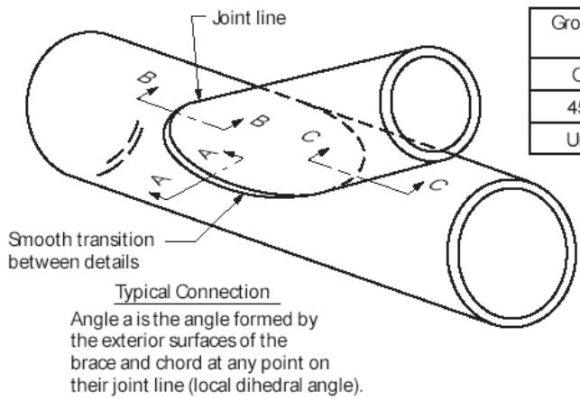

Note: Indudes tolerance   

| Groove Angle "b" | Root Opening, G | Root Opening, G |
| --- | --- | --- |
| Groove Angle "b" | in. | mm |
| Over 90 | $0\mathrm{{to}}{}^{3}/{16}$ | 0 to 4.8 |
| 45 to 90 | ${}^{1/{16}}$ to ${}^{3/{16}}$ | 1.6 to 4.8 |
| Under 45 | ${}^{1}/{}_{8}$ to ${}^{1}/{}_{4}$ | 3.2 to 6.4 |

| a | Min. "T" |
| --- | --- |
| 50 to 135 | 1.25 † |
| 35 to 50 | 1.50 † |
| Under 35 | 1.75 † |
| Over 135 | See Sec. B-B |

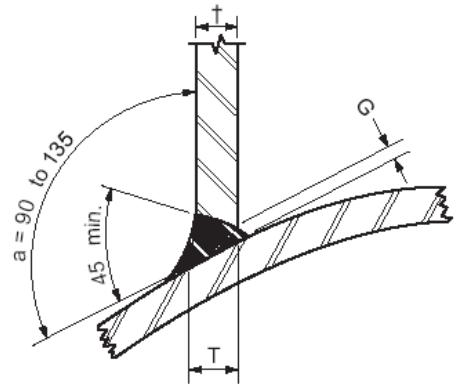  
Section A-A

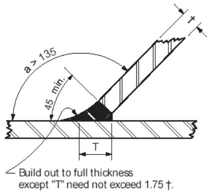  
Section B-B

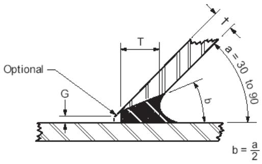  
Section C-C

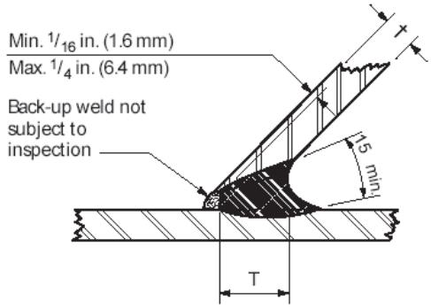  
Section C-C(Altermative)   
Figure 14.1—Welded Tubular Connections—Shielded Metal Arc Welding

14.1.4 Plate Girder Fabrication and Welding

14.1.4.1 Fabrication tolerances should be governed by AWS D1.1/D1.1M:2010 except where specific service requirements dictate the use of more severe control over the deviations from the theoretical dimensions assumed in the design. If localized heating is proposed for the straightening or repair of out of tolerance, consideration should be given to its effect on the material properties and the procedure should be approved by the owner.

14.1.4.2 Web to flange connections may be continuous double fillet welds. Welds should have a concave profile and transition smoothly into flange and web. Girder splices, intersections, and moment connections should be full penetration welds unless a detailed stress analysis indicates it to be unnecessary. The connection between flanges and plates intended for flange stiffening should be a full penetration weld made from both sides.

14.1.4.3 Stiffener plate to web connections may be continuous double fillet welds. Weld metal and HAZ notch toughness should not be less than the minimum toughness requirements specified for the parent girder steel.

14.1.5 Final Fabrication Tolerances

14.1.5.1 General

Each member of the structure should be located accurately to the final fabrication tolerances hereafter given. Other tolerances not stated herein should be in accordance with the AISC 335-89.

14.1.5.2 Jacket and Deck Section Columns

14.1.5.2.1 In any plane critical to field assembly, such as the top of the jacket and the bottom of the deck columns, the horizontal distance from the center line of any column to the center line of the column adjacent in any direction should be within a tolerance of ± 10 mm (3/8 in.) of the net drawing dimension. At all deck levels, the horizontal distance from center line of any column to the center line of the column adjacent in any direction should be within a tolerance of ± 13 mm (1/2 in.) and may be applied to working points on the outside diameter of the columns. In other jacket planes this tolerance may be increased to ± 19 mm (3/4 in.) and may be applied to working points on the outside diameter of the columns. Diagonals of a rectangular plan layout should be identical within 19 mm (3/4 in.). Every practical effort should be exerted to affect accuracy in column location at all planes.

14.1.5.2.2 The deviation from straightness of jacket columns should be less than 10 mm (3/8 in.). Such deviation should not be more than 3 mm (1/8 in.) in any 3 m (10 ft) increment of length. The jacket fabrication should proceed on a flat and level surface. Frequent checks of blocking should be performed. When any column settles out of level, the settled column should be shimmed back into a level plane with the other columns. The tops of all jacket columns should relate to the drawing elevation within a tolerance of ± 13 mm (1/2 in.).

14.1.5.2.3 The location of the ends of the heavy-wall jacket and deck leg joint cans should be within ± 25 mm (1 in.) of the drawing dimensions. Other changes in wall thickness in the jacket legs or deck columns should be located within ± 50 mm (2 in.) of the drawing dimensions.

14.1.5.3 Jacket and Deck Section Bracing

All braces in a horizontal plane should be held vertically within ± 13 mm (1/2 in.) tolerance of drawing dimension. Changes in wall thickness in braces should be located within ± 25 mm (1 in.) of the drawing dimensions.

All other bracing where the end points are dimensioned should be erected so that such points are within ± 13 mm (1/2 in.) of planned dimension.

14.1.5.4 Deck Beams

The centerline of deck beams at their ends should be within 13 mm (1/2 in.) of the drawing location. At no point along its centerline should any beam be out of line more than 19 mm (3/4 in.) horizontally or 13 mm (1/2 in.) vertically.

Deck beams should be erected with the top flanges level, or to the specified slope. Disparity in beam depth and flange out of level due to allowable mill tolerances in depth will be acceptable. Deck beams should be erected with the webs plumb. Distortion of deck beams from welding should be corrected or otherwise compensated so that the tolerances of this paragraph are met.

14.1.5.5 Cap Beams

The centerlines of cap beams at their ends should be within ± 13 mm (1/2 in.) of the drawing dimension. At no point along the centerline should the cap beam be more than 10 mm (3/8 in.) out of line horizontally or 6 mm (1/4 in.) vertically.

Cap beams should be erected with the top flanges level. Disparity in beam depth due to mill tolerances in depth should be compensated by shimming between the cap beam and column.

Cap beams should be erected with the webs plumb. Distortion of cap beams from welding should be corrected or otherwise compensated so that the tolerances of this paragraph are met.

14.1.5.6 Grating

Joints in grating should occur only at points of support unless other appropriate details are provided on the drawings by the designer.

14.1.5.7 Fencing and Handrails

Fabrication should be performed to such a degree of accuracy that, when erected, the top rail will be straight and level to the eye.

14.1.5.8 Landings and Stairways

Landing elevations and landing and stairway locations horizontally should be within 76 mm (3 in.) of the drawing dimensions.

14.1.5.9 Piles

14.1.5.9.1 The minimum length of a segment of pipe used in fabricating piles should be one pipe diameter or 1 m (3 ft), whichever is less. The longitudinal seams of two adjacent pile segments should be placed 90° apart as a minimum.

14.1.5.9.2 The maximum allowable deviation from straightness in any 3 m (10 ft) increment of length should be 3 mm (1/8 in.). For lengths over 3 m (10 ft), the maximum deviation of the entire length may be computed by the following formula, but not to exceed 10 mm (3/8 in.) in any 12 m (40 ft) length.

In SI units:

$$3 \mathrm{m m} \times (\text{t o t a l} \mathrm{l e n g t h} \mathrm{m} / 3 \mathrm{m})$$

In USC units:

## 0.125 in. × (total length ft/10 ft)

14.1.5.9.3 The method for checking straightness should be by taut wire along the length of pipe repeated at a minimum of three radius points.   
14.1.5.9.4 The root face on the beveled ends of the finished pipe should not be out of square more than 5 mm/m (1/16 in./ft) of diameter except that the maximum allowable out of square should not be more than 6 mm (1/4 in.).   
14.1.5.9.5 Pile sections and the total pipe make-up should be fabricated to a tolerance of ± 0.5 % of the length shown on the drawings unless otherwise specified.   
14.1.5.9.6 The roundness and circumference tolerances shall be in accordance with API 2B.

14.1.6 Provisions for Grouted Pile to Sleeve Connections

Steel surfaces of piles and the structure, which are to be connected by grout, should be free of mill glaze, varnish, grease or any other materials that would reduce the grout-steel bond. This is of special importance when no shear keys are used.

Care should be taken in installing packers to prevent damage from handling and high temperatures and spatter from welding. All debris should be removed from jacket legs to avoid damage to packers during launching and uprighting of the jacket.

14.1.7 Temporary Attachments

14.1.7.1 Any temporary attachments to the structure, such as scaffolding, fabrication and erection aids should be limited as much as practicable. When these attachments are necessary, the following requirements should be met.   
14.1.7.2 Temporary attachments should not be removed by hammering or arc-air gouging. Attachments to leg joint cans, skirt sleeve joint cans, brace joint can, brace stub ends, and joint stiffening rings should be flame cut to 3 mm (1/8 in.) above parent metal and mechanically ground to a smooth flush finish with the parent metal.   
14.1.7.3 Attachments on all areas that will be painted should be removed in the same manner as above, prior to any painting.   
14.1.7.4 Attachments to all other areas not defined in 14.7.1 through 14.7.3 should be removed by flame cutting just above the attachment weld [maximum 6 mm (1/4 in.) above weld]. The remaining attachment steel shall be completely seal welded.   
14.1.7.5 Attachments to aid in the splicing of legs, braces, sleeves, piling, conductors, etc. should be removed to a smooth flush finish.

## 14.2 Corrosion Protection

14.2.1 Coatings

Unless specified otherwise by the designer, the application of coatings should conform to NACE SP0108-2008 [35].

14.2.2 Splash Zone Protection

Splash zone protection such as Monel wrap, steel plate wrap, added steel thickness, etc. should be installed as specified and should cover not less than the areas indicated on the drawings and/or in the specifications.

14.2.3 Cathodic Protection

The cathodic protection system components, their installation, and their testing, if required, should be in accordance with the drawings and/or specifications.

## 14.3 Structural Material

14.3.1 General

All structural steel should be new, without defects, and reasonably free of excess mill scale and rust. No casing steel, reject steel, or other steel originally intended for usage other than structural should be used unless otherwise specified. Steel that has been reclassified as structural after being rejected for other use should not be used. For fabrication of modifications for reuse of existing platforms, structural steel in the existing platform may be reused provided it is suitable for the intended reuse.

14.3.2 Mill Certificates

Test reports on furnished or purchased steel should be those of the producing mill certified reports of tests in accordance with 11.1.1 and not copies prepared by third party jobbers or suppliers. Mill certificates and test reports should indicate all pertinent data on strength, ductility, notch toughness, chemical analysis, heat treatment, nondestructive testing (NDT), supplementary testing, and heat traceability, as well as purchase order number. Mill certificates or test reports should be furnished before steel is incorporated into the structure.

14.3.3 Material Identification

Material receiving and handling is normally a fabrication contractor’s function. Upon receipt of material and prior to fabrication, a material identification system should be established by the fabricator that will trace each primary structural member within the completed structure back to the original mill certificates. The identification system should eliminate any conflict or duplication of any primary structural element. The system should identify materials from manufacturing through transport, receipt, storage, fabrication, and final erection. The system should be such that all nondestructive testing can also be identified.

## 14.4 Loadout

Loadout and tie-down is normally performed by the fabrication contractor. Loadout and tie-down shall be performed in accordance with the loadout plan, Section 15, and owner requirements.

## 14.5 Records and Documentation

The fabrication contractor should maintain the mill certificates as discussed in 14.3.2 that are necessary to demonstrate that proper materials were used in the structure. In addition, the fabricator should also compile and maintain the material identification records as discussed in 14.3.3 necessary to trace and identify the origin of each primary member. At the completion of the job the fabricator will compile and deliver to the owner these documents for permanent record.

During the course of fabrication, revisions may be approved to the primary structural members such as wall thickness, member size, type material, etc. For any substitutions and revisions made during fabrication, suitable records should be documented by the fabricator and listed as corrections to the fabrication drawings. The responsibility for the compilation of these records with other documentation related to the construction and inspection of the structure and the retention of these permanent records should be as specified by the owner.

15 Installation

## 15.1 General

15.1.1 Planning

15.1.1.1 The installation of a platform consists of loading out and transporting the various components of the platform to the installation site, positioning the platform on the site and assembling the various components into a stable structure in accordance with the design drawings and specifications. The installation of a platform should be accomplished in such a manner that the platform can fulfill the intended design purpose. Additional guidance on installation operations can be found in API 2MOP [6].

15.1.1.2 An installation plan shall be prepared for each installation. This plan should include the method and procedures developed for the loadout, seafastenings and transportation of all components and for the complete installation of the jacket, pile/conductors, superstructure and equipment. This may be in the form of a written description, specifications, and/or drawings. Depending upon the complexity of the installation, more detailed instructions may be required for special items such as grouting, diving, welding, inspection, etc. Any restrictions or limitations to operations due to items such as environmental conditions, barge stability, or structural strength (i.e. lifting capacity) should be stated.

15.1.1.3 The installation plan is normally to be subdivided into phases, for example: loadout, seafastenings, transportation, and installation. The party responsible for the execution of each phase of the work should prepare the installation plan for that phase, unless otherwise designated by the owner. Coordination and approval procedures between all parties shall be established by the owner.

15.1.2 Records and Documentation

During the loadout, transportation, and installation, all daily reports logs, nondestructive examination (NDE) reports, pile driving records, surveys indicating platform orientation and verticality, etc. shall be prepared, compiled, and retained by the party responsible for that phase of the work. These documents should also record any variation from intended installation procedures and all unusual environmental conditions that occurred during the installation. All “field modifications” that were made shall be noted to record as-built condition of the structure. At the completion of the job each party will compile and deliver to the owner these documents in a form suitable for use as a permanent record. The responsibility for the compilation of these records with other documents related to the construction and inspection of the

structure and for the retention of these permanent records will be in accordance with the requirements of the owner.

15.1.3 Installation Forces and Allowable Stresses

The forces applicable to each phase of the installation should be calculated as described in 5.4. Analysis should be performed to ensure that the structural design is sufficient to withstand the type and magnitude of those forces or force combinations. The calculated stress in structural members should be in accordance with Section 6 as further qualified in 5.4.

15.1.4 Temporary Bracing and Rigging

Procedures covering the calculation of forces, load factors, allowable stresses, and factors of safety for component parts of the structure as well as slings, shackles, and fittings are listed in 5.4.2. Should any installation aids, temporary struts, bracing, or rigging be required during any phase of the installation, these same provisions should apply. If any of the installation aids, temporary struts, or bracing are to be welded to the structure, then all welding shall be in accordance with 13.3.9. Removal shall be in accordance with 14.1.7.

## 15.2 Transportation

15.2.1 General

The movement of the platform components from a fabrication yard to an installation site presents a complex task that requires detailed planning. Basic considerations vary with reference to the type of platform to be transported. Included herein are items that should be considered.

15.2.2 Template Platforms

15.2.2.1 General

A template platform consists of one or more jackets or templates, piling, superstructure, and other miscellaneous items. These are generally transported to location as deck cargo on barges or vessels.

15.2.2.2 Cargo or Launch Barges

An adequate number of seaworthy cargo barges should be provided. The barges selected should be of proper size and structural strength to ensure that the stability and static and dynamic stresses in the barge, cargo, and seafastenings due to the loading operation and during transportation are within acceptable limits. If the jacket portion of the platform is to be launched from a barge without the use of a derrick barge, the launch barge should be capable of this operation.

15.2.2.3 Barge Strength and Stability

The various platform components and other items of cargo should be loaded on the barges in such a manner to ensure a balanced and stable condition. Barge stability should be determined in accordance with applicable regulations such as the U.S. Coast Guard or the current International Maritime Organization Standards. Ballasting of the barge as required to obtain designated draft and trim should be performed at dockside before seafastenings are attached or in a sheltered area before reaching open water. Static and dynamic stresses in the barge hull and framing due to loadout, transportation, and

launching should be in accordance with appropriate provisions of AISC 335-89 , ABS Pub 2 [20], API 2V [8], or other applicable standards.

15.2.2.4 Loadout

Loadout shall be performed in accordance with the appropriate sections of the installation plan that should include allowable environmental conditions during loadout operations and design environmental conditions for the mooring system. All items of cargo shall be positioned on the barge as shown on the loadout plan. For barges that will be floating during the loading operation, the ballast system shall be capable of compensating for the changes in tide and loading. An adequate standby ballast system should be provided.

For a barge that will be grounded during the loading operation, it should be demonstrated by analysis or by previous experience that the barge has sufficient structural strength to distribute the concentrated deck loads to the supporting foundation material. In addition, the seabed or pad should be smooth, level, and free of any obstructions that could damage the hull. Forces resulting from the loadout operation, either from direct lift or from a skidding operation, should be in accordance with 5.4.3.

15.2.2.5 Seafastenings

Adequate ties shall be designed and installed for all platform and cargo components to prevent shifting while in transit. These ties shall be designed for the forces and deflections predicted for the vessel motion resulting from the environmental conditions in accordance with 5.4.4. These seafastenings should also be described and detailed in the installation plan. They shall be attached to the jacket, deck, and other components only at locations approved by the designer. Additionally, they shall be attached to the barge at locations that are capable of distributing the load to the internal framing. These fastenings should be designed to facilitate easy removal on location.

At the option of the owner, in areas where substantial experience can be demonstrated, tie-down procedures based on past successful practices can be utilized. This procedure is applicable only to routine installations and for similar cargoes during the same time of year. When detailed analysis is required, the design of tie-downs should be based on the sea state criteria established by the owner and/or the contractor based on the provisions of 5.4.4.2. In lieu of more definitive owner-furnished criteria, the seafastenings may be designed for the environmental conditions predicted to have a risk of exceedance in the range of 1 % to 5 % during the period of time required to transport the barge to safe harbor. In determining this criterion, the length and reliability of the short-term weather forecast and the season of the year in which the tow will take place should be considered.

15.2.2.6 Towing Vessels

The proper number of seagoing tugs shall be provided with sufficient power and size to operate safely for each particular route or ocean traveled. The size and power requirements of the towing vessel or vessels and the design of the towing arrangement should be calculated or determined from past experience. This selection should consider such items as length of tow route, proximity of safe harbor, and the weather conditions and sea states expected for the season of the year.

As a minimum, the tow should be capable of maintaining station in a 30-knot wind with accompanying waves. When more than one towing vessel is required, the total calculated bollard pull should be increased to take into account the loss of efficiency due to a dual tow. A standby or alternate towing line should be provided, rigged for easy access, in the event the towline should fail.

15.2.2.7 Forces

Consideration shall be given to the forces applied to the various platform components as they are lifted on and off the barges or as they are rolled on and launched off the barges. Localized loads on the barge structure should also be considered.

15.2.2.8 Buoyancy and Flooding Systems

The buoyancy of any platform component to be launched shall be determined to ensure the unit will float. The flooding system, the buoyancy components, and any necessary lifting connections should be designed to upright and land the structure safely.

15.2.3 Tower Platform

15.2.3.1 General

As described in 4.6.1.3, a tower platform generally consists of a tower substructure that is floated to the installation site and placed in position by selective flooding. The movement considerations should include those specified for the template platforms in addition to others listed herein.

15.2.3.2 Water Tightness

The water tightness of the tower should be determined before towing commences.

15.2.3.3 Flooding Controls

Consideration should be given to the location and accessibility of all controls for selective flooding and righting as well as the protection of the controls from environmental and operational hazards.

15.2.3.4 Model Tests and Analysis

Model tests and detailed calculations should be considered for the prototype to determine towing and stability characteristics during towing and upending procedures.

15.2.4 Minimum Structures

Minimum structures, depending on the size, should include all applicable considerations specified above for both the template and tower platforms.

## 15.3 Removal of Jacket from Transport Barge

15.3.1 General

This section covers the removal of a template jacket that has been transported to the installation site by a barge. Removal of the jacket from the barge is usually accomplished by either lifting with a derrick barge or launching.

15.3.2 Lifting Jacket

The rigging should be properly designed in accordance with 5.4.2 to allow the jacket to be lifted off the barge and lowered into the water. Usually the slings are attached above the center of gravity of the jacket being lifted to avoid possible damage to the jacket and/or barge during the lifting process.

15.3.3 Launching Jacket

15.3.3.1 General

For jackets designed to be launched, a launching system shall be provided considering the items described in 15.3.3.2 through 15.3.3.5.

15.3.3.2 Launch Barge

The launch barge shall be equipped with launch ways, rocker arms, controlled ballast and dewatering system, and power unit (hydraulic ram, winch, etc.) to assist the jacket to slide down the ways.

15.3.3.3 Loads

The jacket to be launched shall be designed and fabricated to withstand the stresses caused by the launch. This may be done by strengthening those members that might be overstressed by the launching operation, by designing into the jacket a special truss, commonly referred to as a launch truss, or by a combination of the above two methods.

15.3.3.4 Flotation

A jacket that is to be launched should be water tight and buoyant. If upending is to be derrick barge assisted the launched structure should float in a position so that lifting slings from the derrick barge may be attached thereto and/or previously attached slings are exposed and accessible.

15.3.3.5 Equipment

The derrick barge should be of sufficient size to change the position of the launched jacket from its floating position to its erected position, or to hold the launched jacket at the site until it can be righted by a controlled flooding system.

## 15.4 Erection

15.4.1 General

15.4.1.1 General

This section covers the placement and assembling of the platform so that the structure is at the desired orientation, location, and grade required for its intended purpose.

15.4.1.2 Placement and Assembly

Placement and assembling of the platform should be in accordance with the installation plan.

15.4.1.3 Safety

Necessary measures should be employed to conform to all state and federal safety regulations at the installation site. This includes the provision and maintenance of all necessary safety and navigational aids and other measures in observance of appropriate regulations.

15.4.2 Anchorage

15.4.2.1 General

Appropriate anchoring of the derrick and supply barges should be provided during the erection phase. Basic principles that should be considered are outlined herein.

15.4.2.2 Anchor Lines

The length of anchor lines should be adequate for the water depth at the site.

15.4.2.3 Anchors

Anchor sizes and shapes should be selected so that they will bite and hold in the ocean bottom at the site. This holding action should be sufficient to resist the strongest tides, currents, and winds that may reasonably be expected to occur at the site during the erection phase.

15.4.2.4 Orientation

Where it appears that the desired anchorage may not be totally possible, orientation of construction equipment should be such that, if the anchors slip, the derrick and supply barges will move away from the platform.

15.4.2.5 Anchor Line Deployment

Where anchoring of derrick or supply barge is required within the field of the guyline system of a guyed tower, measures should be employed to prevent fouling or damage of the guylines.

15.4.2.6 Obstructions

When underwater obstructions or facilities such as cables, pipelines, wellheads, etc. are subject to fouling or damage during anchoring or other marine operations, or constitute a hazard to navigation, they should be marked or suitably located and identified. The responsibility for such markings shall be in accordance with the requirements of the owner.

15.4.3 Positioning

The term “positioning” generally refers to the placement of the jacket on the installation site in preparation for the piling to be installed. This may require upending of those platform components that have been towed to the site or launched from a barge at the site. Generally, the upending process is accomplished by a combination of a derrick barge and controlled or selective flooding system. This upending phase requires advanced planning to predetermine the simultaneous lifting and controlled flooding steps necessary to set the structure on site. Closure devices, lifting connections, etc. should be provided where necessary. The flooding system should be designed to withstand the water pressures that will be encountered during the positioning process.

Where the jacket is to be installed over an existing well, the wellhead should be properly protected from damage through accidental contact with the substructure. Advance planning and preparation should be in such detail as to minimize hazards to the well and structure.

When the jacket is not to be installed over an existing well or located adjacent to an existing structure, parameters for the accuracy of positioning should be stated in the installation plan. These parameters

should be in line with current established standards available in surveying equipment, the water depth, and the size and use of the platform.

When the design of the platform is based on the directional variation of environmental forces, proper orientation of the structure is essential. The required orientation of the platform, as well as the acceptable tolerance for out-of-alignment as discussed in 6.1.3.3, shall be shown on the drawings and stated in the installation plan. Procedures should be included in the installation plan to ensure that the structure can be positioned within the acceptable orientation tolerances.

15.4.4 Jacket Leveling

The jacket should be positioned at or near grade and leveled within the tolerances as specified in the installation plan before the piles are installed. Once level, care should be exercised to maintain grade and levelness of the jacket during the pile installation operation. Leveling the jacket after all the piles have been installed should be avoided if possible. However, it may be necessary to level the jacket by jacking or lifting after a minimum number of piles have been driven. In this instance, procedures should be utilized to minimize bending stresses in the piles.

15.4.5 Jacket Weight on Bottom

The soil loading at the base of the jacket can be critical prior to the installation of the permanent pile foundation. The load distribution on the soil should be considered for each combination of pile sections that will be supported from the jacket. For soils that increase in strength with depth, particularly soft clays and loose sands, the method of bearing capacity analysis employed should account for shape effects and the presence of any holes in the mudmats. This is because any reduction in mudmat dimensions may result in a shallow potential failure surface and hence a reduced bearing capacity.

The increase in soil loading resulting from waves of the maximum height anticipated during the installation period should be considered. The bearing capacity analysis should then take account of the combined effect of vertical, horizontal and moment loading. The more heavily loaded mudmats may experience a lowering of soil stiffness that can allow load to be transferred to other mudmats. Account may be taken of the benefits of suction developing under mudmats subject to uplift provided that they have been designed with an adequate skirt length and measures have been taken, such as the provision of valves, to prevent ingress of seawater into the skirt compartments. The factors of safety against bearing capacity failure recommended herein are 2.0 for on bottom gravity loads alone and 1.5 for the design environmental condition applicable for the installation period. At the operator’s discretion, with supporting analyses, an alternative of limiting penetration criteria may be used. Allowable steel stresses may be increased by one-third when wave loading is included. In the event of rough seas or if the installation equipment leaves the site for other reasons before the jacket has been adequately secured with piles, the effective weight on bottom may require adjustment to minimize the possibility of jacket movement due to skidding, overturning, or soil failure.

15.4.6 Guyline System Installation

15.4.6.1 General

Handling and erection of guyline system components offshore should employ equipment and procedures to minimize potential damage and installation problems.

15.4.6.2 Guyline Handling Equipment

The design of equipment used to store, tension, and guide rope or strand should recognize minimum bending radius requirements. The handling equipment should be capable of supplying the necessary tensions to properly install the guylines. Special handling systems may be required to safely lower and position the clumpweights and anchors or anchor piles.

15.4.6.3 Procedures

Maximum control of the guyline components should be a consideration in the development of installation procedures as design tolerances may require accurate positioning. Precautions should be taken to prevent fouling of the guylines. Elongation and rotation of guylines due to tensioning should be taken into account.

15.4.6.4 Guyline Pretensioning

It may be required to preload the guylines to appropriate load levels in the installation phase. Accordingly, the tensioning equipment should be capable of supplying the specified pretensions as well as any preload that may be required to seat the guying system. Prior to the completion of the installation phase, the guylines should be tensioned to the nominal levels within specified design tolerance.

15.4.6.5 Alignment and Tolerances

The degree of accuracy required to align and position a guyed tower jacket and guyline system is determined by design tolerances. Consideration should be given to the requirements for special position and alignment monitoring systems during the placement of the jacket, lead lines, clumpweights, and anchors or anchor piles.

## 15.5 Pile Installation

15.5.1 General

Proper installation of piling, including conductor piles, is vital to the life and permanence of the platform and requires each pile to be driven to or near design penetration, without damage, and for all field-made structural connections to be compatible with the design requirements. Pile sections should be marked in a manner to facilitate installing the pile sections in proper sequence.

The closure device on the lower end of the jacket columns and pile sleeves, when required, should be designed to avoid interference with the installation of the piles.

15.5.2 Stabbing Guides

Add-on pile sections should be provided with guides to facilitate stabbing and alignment. A tight uniform fit by the guide should be provided for proper alignment. The guides should be capable of safely supporting the full weight of the add-on pile section prior to welding.

15.5.3 Lifting Methods

When lifting eyes are used to facilitate the handling of the pile sections, the eyes should be designed, with due regard for impact, for the stresses developed during the initial pick-up of the section as well as those occurring during the stabbing of the section. When lifting eyes or weld-on lugs are used to support the

initial pile sections from the top of the jacket, the entire hanging weight should be considered to be supported by a single eye or lug. The lifting eyes or support lugs should be removed by torch cutting 6 mm (1/4 in.) from the pile surface and grinding smooth. Care should be exercised to ensure that any remaining protrusion does not prevent driving of the pile or cause damage to elements such as packers. If burned holes are used in lieu of lifting eyes, they should comply with the applicable requirements of this section and consideration should be given to possible detrimental effect during hard driving.

As an alternative to providing lifting eyes on the piles, pile-handling tools may be used, providing they are the proper size and capacity for the piles being driven and the operating conditions anticipated. These tools should be inspected prior to each use to ensure that they are in proper working condition. They should be used in strict accordance with the manufacturer’s instructions and/or recommendations. For installations that require the use of pile followers, the followers should be inspected prior to the first use and periodically during the installation, depending on the severity of pile driving.

15.5.4 Field Welds

The add-on pile sections should be carefully aligned and the bevel inspected to assure a full penetration weld can be obtained before welding is initiated. It may be necessary to open up the bevel by grinding or gouging. Welding should be in accordance with Section 13. Nondestructive inspection of the field welds, utilizing one or more of the methods referenced in Section 16, should be performed.

15.5.5 Obtaining Required Pile Penetration

The adequacy of the platform foundation depends upon each pile being driven to or near its design penetration. The driving of each pile should be carried to completion with as little interruption as possible to minimize the increased driving resistance that often develops during delays. It is often necessary to work one pile at a time during the driving of the last one or two sections to minimize “set-up” time. Workable backup hammers with leads should always be available, especially when pile “set-up” may be critical.

The fact that a pile has met refusal does not assure that it is capable of supporting the design load. Final blow count cannot be considered as assurance of the adequacy of piling. Continued driving beyond the defined refusal may be justified if it offers a reasonable chance of significantly improving the capability of the foundation. In some instances when continued driving is not successful the capacity of a pile can be improved utilizing methods such as those described in 9.2.2. Such methods should be approved by the design engineer prior to implementation.

15.5.6 Driven Pile Refusal

15.5.6.1 The definition of pile refusal is primarily for contractual purposes to define the point where pile driving with a particular hammer should be stopped and other methods instituted (such as drilling, jetting, or using a larger hammer) and to prevent damage to the pile and hammer. The definition of refusal should also be adapted to the individual soil characteristics anticipated for the specific location. Refusal should be defined for all hammer sizes to be used and is contingent upon the hammer being operated at the pressure and rate recommended by the manufacturer.

15.5.6.2 The exact definition of refusal for a particular installation should be defined in the installation contract. An example (to be used only in the event that no other provisions are included in the installation contract) of such a definition is provided in 15.5.6.3.

15.5.6.3 Pile driving refusal with a properly operating hammer is defined as the point where pile driving resistance exceeds either 300 blows per 0.3 m (1 ft) for 1.5 consecutive meters (5 ft) or 800 blows per 0.3 m (1 ft) of penetration. [This definition applies when the weight of the pile does not exceed 4 times the weight of the hammer ram. If the pile weight exceeds this, the above blow counts are increased proportionally, but in no case shall they exceed 800 blows for 150 mm (6 in.) of penetration.]

15.5.6.4 If there has been a delay in pile driving operations for 1 h or longer, the refusal criteria stated in 15.5.6.3 shall not apply until the pile has been advanced at least 0.3 m (1 ft) following the resumption of pile driving. However, in no case shall the blow count exceed 800 blows for 150 mm (6 in.) of penetration.

15.5.6.5 In establishing the pile driving refusal criteria, the recommendations of the pile hammer manufacturer should be considered.

15.5.7 Pile Hammers

15.5.7.1 Use of Hydraulic Hammers

15.5.7.1.1 Hydraulic hammers tend to be more efficient than steam hammers, so that the energy transferred to the pile for a given rated energy may be greater. They can be used both above and below water, to drive battered or vertical piles, through legs or through sleeves and guides, or vertical piles through sleeves alone. In calculating pile stresses, full account should be taken of wave, current and wind forces, both during driving and during hammer stabbing (which may be either above or below water). Further, while for steam hammers the weight of the cage is generally held by crane, for hydraulic hammers the whole weight of the hammer is borne by the pile.

15.5.7.1.2 The energy output is generally varied by the contractor to maintain a fairly low blowcount. Thus, blowcounts do not give a direct guide to soil stratification and resistance. Since the ram is encased, hammer performance cannot be judged visually. It is therefore important that measurements are made to give a complete record of performance including, for example, ram impact velocity, stroke, pressure of accelerating medium, and blowrate. Reliable instrumentation of some piles may be also desirable to verify the energy transferred to the pile, to aid interpretation of soil stratification, and to limit pile stresses.

15.5.7.1.3 Monitoring of underwater driving requires that easily identified, unambiguous datums, together with robust television cameras or remotely operated vehicles, capable of maintaining station, be employed. Alternatively, for shallow water sites, it is possible to extend the hammer casing so that blowcounts can be monitored above water.

15.5.7.1.4 Because no cushion block is used, there is no change in ram to anvil pile characteristics as driving progresses and no requirement for cushion changes. However, because of the steel-to-steel contact, particular attention should be paid to the design of the pile head.

15.5.7.1.5 In selecting hydraulic hammers for deeper water applications, account should be taken of possible decreases in efficiency due to increased friction between the ram and its surrounding air. Sufficient air should be supplied to the hammer so that water ingress is prevented and water in the pile should be able to escape freely.

NOTE Hydraulic hammer changes can take much longer than steam hammers.

15.5.7.2 Selection of Pile Hammer Size

15.5.7.2.1 When piles are to be installed by driving, the influence of the hammers to be used should be evaluated as a part of the design process as set forth in 9.10. It is not unusual for alternate hammers to be proposed for use by the erector well after the design has been completed and reevaluation by the designer may not be feasible. In such an event, justification for the use of an alternate hammer shall include calculation of stresses in the pile resulting from the proposed hammer using the design process as set out in 9.10.

15.5.7.2.2 In lieu of an analytical solution for dynamic stress the guidelines in Table 15.1 or Table 15.2 may be used.

Table 15.1 and Table 15.2 are based on industry experience with up to 1520 mm (60 in.) diameter piles and 400 KJ (300 ft-kips) hammers.

15.5.7.2.3 When it is necessary to use a pile hammer to drive piles with less than the guideline wall thickness set out in the above table, or that determined by an analytical solution, the definition of refusal used should be reduced proportionally.

15.5.8 Drilled and Grouted Piles

15.5.8.1 Drilling the hole for drilled and grouted piles may be accomplished with or without drilling mud to facilitate maintaining an open hole. Drilling mud may be detrimental to the surface of some soils. If used, consideration should be given to flushing the mud with circulating water upon completion of drilling, provided the hole will remain open. Reverse circulation should normally be used to maintain sufficient flow for cutting removal. Drilling operations should be done carefully to maintain proper hole alignment and to minimize the possibility of hole collapse. The insert pile with an upset drill bit on its tip may be used as the drill string so that it can be left in place after completion of the hole.

Table 15.1—Guideline Wall Thickness (in SI Units)   

| Pile Outside Diameter (mm) | Hammer Size KJ | Hammer Size KJ | Hammer Size KJ | Hammer Size KJ | Hammer Size KJ | Hammer Size KJ |
| --- | --- | --- | --- | --- | --- | --- |
| Pile Outside Diameter (mm) | 50 | 80 | 160 | 240 | 400 | 680 |
| 610 | 13 | 13 | 22 | - | - | - |
| 762 | 14 | 14 | 18 | - | - | - |
| 914 | 16 | 16 | 16 | 22 | - | - |
| 1067 | 18 | 18 | 18 | 19 | 32 | - |
| 1219 | 19 | 19 | 19 | 19 | 29 | 44 |
| 1524 | 22 | 22 | 22 | 22 | 22 | 35 |
| 1829 | - | - | 25 | 25 | 25 | 29 |
| 2134 | - | - | - | 29 | 29 | 29 |
| 2438 | - | - | - | 32 | 32 | 32 |
| 2743 | - | - | - | - | 35 | 35 |
| 3048 | - | - | - | - | 38 | 38 |
| NOTE Values above the solid line are based on minimum pile area in mm2, equal to 24 % of the rated energy of the hammer in KJ. Values below line are controlled by 9.10.6. | NOTE Values above the solid line are based on minimum pile area in mm2, equal to 24 % of the rated energy of the hammer in KJ. Values below line are controlled by 9.10.6. | NOTE Values above the solid line are based on minimum pile area in mm2, equal to 24 % of the rated energy of the hammer in KJ. Values below line are controlled by 9.10.6. | NOTE Values above the solid line are based on minimum pile area in mm2, equal to 24 % of the rated energy of the hammer in KJ. Values below line are controlled by 9.10.6. | NOTE Values above the solid line are based on minimum pile area in mm2, equal to 24 % of the rated energy of the hammer in KJ. Values below line are controlled by 9.10.6. | NOTE Values above the solid line are based on minimum pile area in mm2, equal to 24 % of the rated energy of the hammer in KJ. Values below line are controlled by 9.10.6. | NOTE Values above the solid line are based on minimum pile area in mm2, equal to 24 % of the rated energy of the hammer in KJ. Values below line are controlled by 9.10.6. |

Table 15.2—Guideline Wall Thickness (in USC Units)   

| Pile Outside Diameter (in.) | Hammer Size ft-kips | Hammer Size ft-kips | Hammer Size ft-kips | Hammer Size ft-kips | Hammer Size ft-kips | Hammer Size ft-kips |
| --- | --- | --- | --- | --- | --- | --- |
| Pile Outside Diameter (in.) | 36 | 60 | 120 | 180 | 300 | 500 |
| 24 | 1/2 | 1/2 | 7/8 | — | — | — |
| 30 | 9/16 | 9/16 | 11/16 | — | — | — |
| 36 | 5/8 | 5/8 | 5/8 | 7/8 | — | — |
| 42 | 11/16 | 11/16 | 11/16 | 3/4 | 1.25 | — |
| 48 | 3/4 | 3/4 | 3/4 | 3/4 | 1.125 | 1.75 |
| 60 | 7/8 | 7/8 | 7/8 | 7/8 | 7/8 | 1.375 |
| 72 | — | — | 1 | 1 | 1 | 1.125 |
| 84 | — | — | — | 1.125 | 1.125 | 1.125 |
| 96 | — | — | — | 1.25 | 1.25. | 1.25 |
| 108 | — | — | — | — | 1.375 | 1.375 |
| 120 | — | — | — | — | 1.50 | 1.50 |
| NOTE Values above the solid line are based upon minimum pile area in in.2, equal to 50% of the rated energy of the hammer in ft-kips. Values below line are controlled by 9.10.6. | NOTE Values above the solid line are based upon minimum pile area in in.2, equal to 50% of the rated energy of the hammer in ft-kips. Values below line are controlled by 9.10.6. | NOTE Values above the solid line are based upon minimum pile area in in.2, equal to 50% of the rated energy of the hammer in ft-kips. Values below line are controlled by 9.10.6. | NOTE Values above the solid line are based upon minimum pile area in in.2, equal to 50% of the rated energy of the hammer in ft-kips. Values below line are controlled by 9.10.6. | NOTE Values above the solid line are based upon minimum pile area in in.2, equal to 50% of the rated energy of the hammer in ft-kips. Values below line are controlled by 9.10.6. | NOTE Values above the solid line are based upon minimum pile area in in.2, equal to 50% of the rated energy of the hammer in ft-kips. Values below line are controlled by 9.10.6. | NOTE Values above the solid line are based upon minimum pile area in in.2, equal to 50% of the rated energy of the hammer in ft-kips. Values below line are controlled by 9.10.6. |

15.5.8.2 Centralizers should be attached to the pile to provide a uniform annulus between the insert pile and the hole. A grouting shoe may be installed near the bottom of the pile to permit grouting of the annulus without grouting inside the pile. It may be necessary to tie down the pile to prevent flotation in the grout if a grouting shoe is used. The time before grouting the hole should be minimized in soils that may be affected by exposure to seawater. The quality of the grout should be tested at intervals during the grouting of each pile. Means should be provided for determining that the annulus is filled as further discussed in 15.5.11. Holes for closely positioned piles should not be open at the same time unless there is assurance that this will not be detrimental to pile capacity and that grout will not migrate during placement to an adjacent hole.

15.5.9 Belled Piles

15.5.9.1 In general, drilling of bells for belled piles should employ only reverse circulation methods. Drilling mud should be used where necessary to prevent caving and sloughing. The expander or underreaming tool used should have a positive indicating device to verify that the tool has opened to the full width required. The shape of the bottom surface of the bell should be concave upward to facilitate later filling of the bell with tremie concrete.

15.5.9.2 To aid in concrete placement, longitudinal bars and spiral steel should be well spaced. Reinforcing steel may be bundled or grouped to provide larger openings for the flow of concrete. Special care should be taken to prevent undue congestion at the throat between the pile and bell where such congestion might trap laitance. Reinforcing steel cages or structural members should extend far enough into the pile to develop adequate transfer.

15.5.9.3 Concrete should be placed as tremie concrete, with the concrete being ejected from the lower end of a pipe at the bottom of the bell, always discharging into fresh concrete. Concrete with aggregates 10 mm (3/8 in.) and less, may be placed by direct pumping. Because of the long drop down the pile and the possibility of a vacuum forming with subsequent clogging, an air vent should be provided in the pipe near the top of the pile. To start placement, the pipe should have a steel plate closure with soft rubber gaskets in order to exclude water from the pipe. Care should be taken to prevent unbalanced fluid heads and a sudden discharge of concrete. The pile should be filled to a height above the design concrete level equal to 5 % of the total volume of concrete placed so as to displace all laitance above the design level. Suitable means should be provided to indicate the level of the concrete in the pile. Concrete placement in the bell and adjoining section of the pile should be as continuous as possible.

15.5.10 Pile Installation Records

Throughout the pile driving operation, comprehensive driving and associated data shall be recorded. The recorded data shall include:

a) platform and pile identification;   
b) penetration of pile under its own weight;   
c) penetration of pile under the weight of the hammer;   
d) blow counts throughout driving with hammer identification;   
e) unusual behavior of hammer or pile during driving;   
f) interruptions in driving, including “set-up” time;   
g) lapsed time for driving each section;   
h) elevations of soil plug and internal water surface after driving;   
i) actual length of each pile section and cutoffs;   
j) pertinent data of a similar nature covering driving, drilling, grouting, or concreting of grouted or belled piles.

15.5.11 Grouting Piles to Structure

If required by the design, the spaces between the piles and the surrounding structure should be carefully filled with grout using appropriate grouting equipment. The equipment should be capable of maintaining continuous grout flow until the annulus is filled. If the structure design does not require or permit grout to be returned to the surface, means should be provided to determine that the spaces have been filled as required. Such means might include but are not limited to underwater visual inspection, probing, or detection devices.

## 15.6 Superstructure Installation

15.6.1 General

The superstructure installation will normally consist of lifting such items as deck sections, module support frames, modules and packages from the transport barges onto the jacket. They are then connected to the jacket and each other as specified by the design.

15.6.2 Lifting Operations

15.6.2.1 For all lifting operations the structure strength and general suitability of the equipment shall be considered. The forces shall be derived as described in 5.4 and member checks shall be made to determine that members and joints are adequate for the lift conditions.

15.6.2.2 The lifting contractor should be familiar with the design assumptions for the lift and perform the operations in compliance with these assumptions. The operations should not be performed under more severe environmental conditions than those for which the objects involved are designed.

15.6.2.3 Prior to lifting, the lifted weight shall be predicted to ensure that it is within the limits defined by the design and within the capacity of all lifting equipment. Where weighing is not carried out, it is recommended that an adequate margin be applied to cover mill tolerance and growth in piping/equipment weights, etc.

15.6.3 Lifting Points

Values of design forces for lifting points are recommended in 5.4.2. Padeye plates should be oriented in such a direction that the possibility for out-of-plane loading of the padeye plate and shackle is minimized.

15.6.4 Alignment and Tolerances

The superstructure components will be aligned within the tolerance specified in the design documents. After the piling has been driven and cut off to grade, the superstructure should be set with proper care being exercised to ensure proper alignment and elevation. Unless otherwise specified, the deck elevation shall not vary more than ± 76 mm (3 in.) from the design elevation shown in the drawing. The finished elevation of the deck shall be within 13 mm (1/2 in.) of level.

15.6.5 Securing Superstructure

Once the superstructure components have been set (placed) they should be secured to provide the support and fixity as required by the design.

15.6.6 Appurtenances

Once the superstructure is installed, all stairways, handrails, and other similar appurtenances should be installed as specified.

## 15.7 Grounding of Installation Welding Equipment

15.7.1 General

Normal welding procedures use reverse polarity wherein the welding rod is positive (+) and the ground is negative (–). The current flow is positive to negative, and an adequate and properly placed ground wire is

necessary to prevent stray currents, which if uncontrolled may cause severe corrosion damage (see NACE SP0176-2007) [34].

15.7.2 Recommended Procedure

15.7.2.1 The welding machine should be located on and grounded to the structure whenever possible. When this is impossible or impractical, and the welding machine is located on the barge or vessel, both leads from the output of the welding machine should be run to the structure and the ground lead secured to the structure as close as practical to the area of welding. Under no conditions should the hull of the barge (or vessel) be used as a current path. The case or frame of the welding machine should be grounded to the hull to eliminate shock hazards to personnel.   
15.7.2.2 The welding cables should be completely insulated to prevent stray currents. Damaged cables should not be allowed to hang in the water.   
15.7.2.3 Grounding cable lugs should be tightly secured to grounding plates. The lug contact should be thoroughly cleaned to bare metal. The resistance of the connection should be a maximum of 125 microhms per connection or the voltage drop across the connection should be a maximum of 62.5 millivolts for a current of 500 amperes. Use Ohm’s Law (V = IR) for amperage other than 500 amperes.   
15.7.2.4 The minimum cross-sectional area of the return ground cable should be 645 circular mm per 1000 amperes per 30.5 m (one million circular mils per 1000 amperes per 100 ft) of cable. One or more cables connected in parallel may be used to meet minimum cross-section requirements.

NOTE 1 — 2/0 cable contains 86 circular mm (133,392 circular mils);

— 3/0 cable contains 109 circular mm (169,519 circular mils);   
— 4/0 cable contains 137 circular mm (212,594 circular mils).

More than one ground cable of sufficient size is suggested to guard against a single return or ground becoming loose.

15.7.2.5 Connecting several welding machines to a common ground cable that is connected to the structure being welded will control stray currents if adequately sized and properly insulated from the barge or vessel containing welding machines.

15.7.3 Monitoring Remote Ground Efficiency

When welding is conducted using generators remote from a structure, grounding efficiency can be monitored by simultaneously measuring the potential of the structure and barge or ship housing the welding generators. A change in potential reading from either indicates insufficient grounding.

# 16 Inspection

## 16.1 General

Quality control, inspection, and testing should be performed to ensure adherence to the plans and specifications that contain the detailed instructions necessary to obtain the desired quality and service in the finished product. Quality control, inspection, and testing should be performed during all phases of construction, including the fabrication, loadout, seafastening, towing, and installation phases to ensure that specified requirements are being met. The most effective quality control and inspection scheme is

one that prevents the introduction of defective materials or workmanship into a structure, rather than finding these problems after they occur.

## 16.2 Scope

Quality control is normally performed by the construction contractor prior to, during, and after fabrication, loadout, seafastening, transportation, and installation, to ensure that materials and workmanship meet the specified requirements. Inspection and testing is normally conducted by the owner to verify the required quality.

Responsibility for conducting the inspections and preparation of the recommended documentation should be as agreed upon between the owner and the construction contractor. Results of inspection should be prepared in a timely manner.

## 16.3 Inspection Personnel

16.3.1 Inspectors

Inspectors should be qualified to carry out their duties by education, experience, and practical testing. They should be knowledgeable in the general areas of welding technology, inspection, and testing procedures, as well as construction methods for those areas of their responsibility during fabrication, loadout, seafastening, transportation, and installation. They should know how and where to look for problems and situations that lead to problems, as well as the practical limitations on making repairs.

16.3.2 Inspector Qualifications

Personnel who perform nondestructive weld examinations should be required to qualify by passing a practical test based on the inspection methods and type of construction under consideration for a particular job. All inspectors should have demonstrated ability and experience or be qualified to the appropriate codes, such as AWS, ASME International, or equivalent. Specialty technicians, such as ultrasonic (UT) or radiography (RT), should also be qualified to other guidelines such as API 2X [10] (UT) or ASNT SNT-TC-1A [RT, MT, liquid penetrant inspection technique (PT), etc.]. Continued qualification should be based on satisfactory performance on the job.

Personnel who perform other inspection during any phase of construction of an offshore platform should be required to demonstrate ability and experience or be qualified to an appropriate code for the required inspection of a particular job.

16.3.3 Access to Work

Authorized personnel should have access at all times to all phases of the work under their responsibility to ensure that the required quality is obtained.

## 16.4 Fabrication Inspection

16.4.1 Materials

Inspection should verify that all materials being incorporated into any portion of the fabrication are of good quality and in accordance with the specified requirements. Receipt of the correct material should be verified by cross-checking with appropriate original mill certificates and heat stamps and with other appropriate documentation for nonstructural material and structural materials other than steel.

16.4.2 Fabrication

Inspections of the structure should be made during all phases of fabrication (i.e. prefabrication, rolling, forming, welding, interim storage, assembly, erection, etc.) to confirm compliance with the specified requirements (i.e. joint details, weld profiles, dimensions, alignment, tolerances, orientation, etc.). In general, inspection should confirm that each component incorporated into the structure is of correct material; size and dimension; orientation, etc. and is fitted, aligned, and permanently fastened according to the specified requirements. Jacket legs and pile sleeves through which piles will be field installed should be carefully checked for internal clearance and, if possible, drifted with a template of nominal length or other appropriate method to ensure required tolerances have been met. Particular attention should be given to field mating points (such as the tops of jacket legs), which should be checked to ensure all dimensions are within tolerance. Inspection also should be made for all items affecting the assembly, including erection site structures (i.e. temporary foundations, bulkhead), erection aids, and erection equipment. Inspections should confirm that these items are in accordance with the specified requirements.

16.4.3 Welding

16.4.3.1 General

Welding inspection and testing should be performed to verify adherence to the specified requirements. Inspection and testing should be performed during all phases of fabrication with an aim to preventing introduction of defects into the weld.

Inspection should verify that the welder (or welding operator) is currently qualified for the procedure being used (in accordance with Section 13) and that the appropriate qualified procedure is being followed. In addition, inspection should ensure that appropriate consumables are being used and that the consumables are being stored, handled, and used in accordance with appropriate requirements, including the manufacturer’s recommendations.

16.4.3.2 Inspection Methods

16.4.3.2.1 General

Three nondestructive inspection methods are routinely used on fabricated structures. These methods include visual, UT, and RT. MT and PT are generally considered as enhanced visual inspection techniques. However, these two techniques have procedural requirements that should be followed if used.

An approved procedure for each inspection method should be developed for each job application, based on the referenced specification noted in the following.

a) Visual—The visual technique is used either by itself or as an integral part of other NDE techniques. Visual inspection requirements should be conducted in accordance with AWS D1.1/D1.1M:2010 (Subclauses 6.5 and 6.9, plus Clause 5, Clause 3, and Clause 2 Parts A and D).   
b) Penetrant—PT is useful for detecting surface discontinuities such as cracks, porosity, etc. The method for using PT for discontinuities that are open to the surface should conform to ASTM E165.   
c) Magnetic Particle—MT is useful for detecting discontinuities that are open to the surface or that are slightly subsurface. The procedure for MT should conform to the requirements of ASTM E709.

d) Radiographic—RT is useful for determining buried or through thickness discontinuities. The RT procedures should conform to AWS D1.1/D1.1M:2010, Clause 6.12 and Clause 6 Part E.   
e) Ultrasonic—UT is also used for determining buried or through thickness discontinuities. API 2X [10] should be used for guidance on personnel qualifications, UT techniques, procedures, and inspection reports.

16.4.3.2.2 Method Selection

A number of parameters should be considered for selection of an inspection method, including: joint geometry, applied stress (type and magnitude), thickness(es) of the structural joint(s), and discontinuity (type, size, and location). Coordination among the designer, fabricator, inspector, and owner is essential and consultation with an NDE specialist is recommended in order to select the most appropriate technique for a particular application.

16.4.3.3 Extent of Weld Inspection

16.4.3.3.1 Scheduling

To the maximum extent possible, inspection and testing should be performed as construction progresses and be scheduled so as not to delay the progress of the job.

16.4.3.3.2 Inspection Criteria

The plans, procedures, and specifications should clearly delineate which materials and fabricated items are to be inspected by nondestructive testing. The acceptance criteria, extent of testing, and the methods to be used in such inspection should be clearly defined.

16.4.3.3.3 Fit-ups

All weld fit-ups (joint preparation prior to welding) should be visually inspected to ensure acceptable tolerances before welding.

16.4.3.3.4 Visual Inspection

Welding in progress should be visually inspected to assure proper cleaning, tie-in, etc. As a minimum the passes that should be inspected are: root, hot (or second), and the completed weld cap.

16.4.3.3.5 Extent of NDE Inspection

Table 16.1 shows recommended minimum extent of inspection for various parts of the structure.

16.4.3.4 Quality of Welds

16.4.3.4.1 General

Weld area surfaces should be adequately prepared so that NDE can be carried out. This should include removal of weld spatter and appropriate marking for inspection. Adequate time should be allowed for weld cooldown before conducting NDE.

Table 16.1—Recommended Minimum Extent of NDE Inspection   

| Case | Extent % | Method |
| --- | --- | --- |
| Structural tubularis |  |  |
| Longitudinal weld seam (L) | 10a | UT or RT |
| Circumferential weld seam (C) | 100 | UT or RT |
| Intersection of L and C | 100 | UT or RT |
| Tubular joints |  |  |
| Major brace-to-chord welds | 100 | UT |
| Major brace-to-brace welds | 100 | UT |
| Misc. bracing |  |  |
| Conductor guides | 10a | UT (or MT)b |
| Secondary bracing and subassemblies, that is, splash zone, and/or mudline secondary bracing, boat landings, etc. | 10a | UT (or MT)b |
| Attachment weld connecting secondary bracing/subassemblies to main members | 100 | UT or MT |
| Deck members |  |  |
| All primary full penetration welds | 100 | UT or RT |
| All partial penetration welds | 100 | Visualc |
| All fillet welds | 100 | Visualc |
| a Partial inspection should be conducted as 10% of each piece, not 100% of 10% of the number of pieces. Partial inspection should include a minimum of three segments randomly selected unless specific problems are known or suspected to exist. All suspect areas (e.g. areas of tack welds) shall be included in the areas to be inspected. If rejectable flaws are found from such 10% inspection, additional inspection should be performed until the extent of rejects has been determined and the cause corrected.b Depending upon design requirements and if specified in the plans and specifications MT may be an acceptable inspection method.c May include MT and/or PT. | a Partial inspection should be conducted as 10% of each piece, not 100% of 10% of the number of pieces. Partial inspection should include a minimum of three segments randomly selected unless specific problems are known or suspected to exist. All suspect areas (e.g. areas of tack welds) shall be included in the areas to be inspected. If rejectable flaws are found from such 10% inspection, additional inspection should be performed until the extent of rejects has been determined and the cause corrected.b Depending upon design requirements and if specified in the plans and specifications MT may be an acceptable inspection method.c May include MT and/or PT. | a Partial inspection should be conducted as 10% of each piece, not 100% of 10% of the number of pieces. Partial inspection should include a minimum of three segments randomly selected unless specific problems are known or suspected to exist. All suspect areas (e.g. areas of tack welds) shall be included in the areas to be inspected. If rejectable flaws are found from such 10% inspection, additional inspection should be performed until the extent of rejects has been determined and the cause corrected.b Depending upon design requirements and if specified in the plans and specifications MT may be an acceptable inspection method.c May include MT and/or PT. |

16.4.3.4.2 UT Quality

Three levels of weld quality are widely accepted:

a) Level A—workmanship quality,   
b) Level C—experienced based fitness-for-purpose quality, and   
c) Level F—specific fitness-for-purpose quality.

Detailed interpretation of these levels and UT reject criteria for each level should be in accordance with API 2X [10].

16.4.3.4.3 Weld Quality for NDE

For welds subjected to nondestructive testing by radiography or any method other than UT the weld quality requirements of AWS D1.1/D1.1M:2010, Clause 6.12.1 (nontubular static or tubular static/cyclic), as applicable, should apply, except as modified herein.

16.4.3.4.4 Weld Profiles

Weld profiles in simple tubular joints should be free of excessive convexity and should merge smoothly with the base metal both brace and chord in accordance with AWS D1.1/D1.1M:2010.

16.4.3.4.5 Relaxation of Rejection Criteria

For simple tubular joints, defects in the root area of the weld are less detrimental than elsewhere, as well as being more difficult to repair. Subject to specific guidelines provided by the designer, some relaxation of the above-mentioned reject criteria may be appropriate. Defects in backup welds, or root lands, that are not part of theoretical strength weld (minimum “T” in Figure 14.1) should not be cause for rejection.

16.4.4 Corrosion Protection Systems

16.4.4.1 General

Details regarding the inspection of corrosion protection systems should be in accordance with NACE SP0176-2007 [34] and NACE SP0108-2008 [35].

16.4.4.2 Coatings

Inspections should verify that surface preparation, climatic conditions (i.e. wind, temperature, and humidity), coating process, and materials are in compliance with specified requirements prior to application of coating. Where applicable, manufacturer’s instructions should be closely followed. During the coating process, inspection should be performed to verify the surface preparation, the thickness of each layer, and adherence of the coating to the base metal.

Repaired coating should be subjected to the same inspection requirements as the original coating.

16.4.4.3 Splash Zone Protection

Inspection should verify that splash zone protection (i.e. Monel wrap, fiberglass coatings, rubber sheathing, fusion bonded epoxy, etc.) is installed according to the specified requirements, including the manufacturer’s recommendations.

16.4.4.4 Cathodic Protection Systems

Inspection of the cathodic protection equipment, whether sacrificial anode or impressed current type, should be performed to confirm that it meets the specified requirements.

If included in the system, cabling, junction boxes, etc. should be inspected to ensure all components are properly attached and that electrical continuity is confirmed. Attachment of anodes (e.g. welding of anode standoff posts, doubler plates, impressed current anode sockets; installation of impressed current anodes into sockets) should be inspected to ensure compliance with the specified requirements.

16.4.5 Installation Aids and Appurtenances

16.4.5.1 Inspections should verify that all installation aids and appurtenances are installed and tested in accordance with the specified requirements, including manufacturer’s recommendations. Installation aids include the following:

— launch systems,   
— flooding systems,

— grouting systems,   
— mudmats,   
— jetting systems,   
— lugs and guides,   
— monitoring systems,   
— preinstalled piles and conductors.

Appurtenances include the following:

— boat landings,   
— riser guards,   
— risers and clamps,   
— J-tubes,   
— sump and pump caissons.

The location, size, and orientation should be checked, and weld attachments (including temporary restraints) should be subjected to 100 % NDE.

16.4.5.2 Inspections should include functional tests of all mechanical and electrical equipment and systems, including instrumentation. Cabling and instrumentation should be checked to ensure continuity and all hydraulic and pneumatic lines should be pressure tested.

16.4.5.3 All nonsteel components (i.e. diaphragms, packers, valve seats, etc.) should be protected from damage by weld spatter, debris and/or any other construction activities, and hydraulic lines should be thoroughly flushed and drained before and after testing. The inside of jacket legs, skirt piles, etc. should be inspected to ensure complete removal of debris (e.g. welding rods, misc. pieces of wood, steel) that could damage nonsteel components during installation.

## 16.5 Loadout, Seafastening, and Transportation Inspection

16.5.1 Inspection should be performed for all areas related to loadout, seafastening and transportation to confirm compliance with the specified requirements. Prior to loadout, final inspection of the structure should be conducted to ensure:

a) all components are in place;   
b) all welds have been properly completed and inspected;   
c) all temporary transportation/installation aids are included and secure;   
d) all hydraulic and pneumatic lines have been properly installed, tested, flushed, and secured;

e) all temporary fabrication aids and debris have been removed; and   
f) all temporary welded attachments have been removed and attachment marks repaired according to the specified requirements.

16.5.2 The support foundations, including the loadout pathway, the dock, the transport vessel, and the seabottom at dockside should be inspected to ensure compliance with the specified requirements.

16.5.3 Other areas for inspection include the lifting/pulling/pushing components attached to the structure (which require NDE) and those between the structure and lifting equipment (i.e. lifting slings, shackles, spreader beams). For vendor-supplied items, documentation shall be provided in addition to the inspections. The capacity and condition of loadout equipment should be confirmed by inspection and documentation.

16.5.4 For skidded loadouts inspection should be performed to confirm that the skidway and/or launch surface is clean and properly lubricated (if required) prior to loadout. The winches, jacks, and pulling cables should be inspected for proper capacity and condition.

16.5.5 Where ballast and deballast operations are required to compensate for tidal variations, inspection of the ballast system shall be carried out to confirm adequacy and equipment condition. Monitoring of the operation is also recommended, to ensure compliance with the loadout procedure.

16.5.6 Inspection for seafastening of the structure and all deck cargo is required to confirm compliance with the specified requirements. This includes temporary tie-downs and bracing required for transport. Materials, fabrication and weld inspection requirements shall be as per 16.4. Inspection for jacket launch items should be conducted where possible prior to sea transport.

16.5.7 Sea worthiness of tugs, towing attachments and the transport vessel should also be confirmed. For preparation of self-floaters for transport to the site, inspection should be performed to confirm sea worthiness and that all towing/restraining lines are properly attached.

## 16.6 Installation Inspection

16.6.1 Jacket Launch and Upending

Prior to launch, inspection should confirm that all tie-downs and temporary bracing are cut loose, and tow lines and loose items are removed from the launch barge or safely secured. Inspection shall be performed to confirm that the jacket flooding system is undamaged, flooding valves are closed, and the launching arm system is in the proper mode of operation. For lifted jackets, inspection should confirm removal of all restraints and proper attachment of lifting equipment, as well as the undamaged and properly configured operation mode of the flooding system. For self-floating jackets, inspection should confirm removal of tow lines as well as the undamaged and properly configured operation mode of the flooding system.

Inspection should be carried out after the jacket is secured in place. If inspection is necessary before then (i.e. suspected damage to flooding system), inspection should be limited to those items required to upend and secure the jacket.

16.6.2 Piling and Conductor Installation

16.6.2.1 All pile and conductor welds performed during fabrication should be inspected (as per 16.4) prior to loadout, including lifting devices, lugs, and attachments. During installation, inspection should be conducted to ensure that the correct pile make-up is followed, and that the welding of add-on sections (if applicable) is performed in accordance with the specified requirements.

16.6.2.2 Prior to each use, pile hammers should be inspected for proper hook-up and alignment for operation.

16.6.2.3 If vibration levels in the structure (above water) appear to be excessive during pile driving, the driving operation should be interrupted to inspect for possible fatigue damage in the structure.

16.6.2.4 During pile installation, nondestructive testing should be performed on the welded connections at pile add-ons; between pile and deck support members; between the pile and jacket leg; and elsewhere, to confirm compliance with the specified requirements. NDE inspection should be performed as noted in 16.4 with 100 % UT of all critical welds except the pile-to-shim weld. The pile-to-shim weld is particularly difficult to evaluate with UT. Alternatively, careful visual inspection of each pass should be made, followed by MT inspection of the final weld.

16.6.3 Superstructure Installation

Prior to lifting, inspection should be performed to confirm that tie-downs and other items not considered in the lifting design are removed from the superstructure. Proper rigging and connection of all lifting components should also be confirmed.

Immediately after lifting, inspection should be performed on all scaffolding and other temporary support systems to confirm their adequacy for completion of weld out. Materials, fabrication, and welding requirements shall be in accordance with 16.4. Inspection should be performed on the jacket and deck mating points to confirm proper alignment and fit-up and to ensure that weld preparations are as per specified requirements. Following weld out, inspection should be performed on the welded connections as noted in 16.6.2 and/or other specified requirements.

These inspections should be performed for each component of a multiple-lift superstructure, with inspection for alignment during each lift.

16.6.4 Underwater Inspection

In the event the installation requires underwater operations, the inspection should verify either by direct communications with divers or through the use of a remote monitoring device that the operation has been conducted in accordance with the specified requirements.

## 16.7 Inspection Documentation

16.7.1 General

During the fabrication, erection, loadout, and installation phases, data related to the inspection of the platform will be generated that may not be part of the welding (see 13.4); fabrication (see 14.5); or installation (see 15.1.2) records. Such inspection data should be recorded as the job progresses and compiled in a form suitable to be retained as a permanent record.

All documentation described in this section, should be retained on file for the life of the structure.

16.7.2 Fabrication Inspection Documentation

16.7.2.1 Materials and Fabrication Inspection

During the fabrication phase, material inspection documentation covering the mill certificates and material identification records (as described in 14.3), as well as any additional materials, testing, or special inspections that were conducted, should be prepared and assembled. This should include documentation for any inspection related to the assembly of the structure.

16.7.2.2 Weld Inspection

A set of structural drawings should be marked with an appropriate identification system detailing the location of each weld to be examined and referenced as an integral part of the inspection record. All welds should be uniquely identified and be traceable to the individual welder or weld operator. A report should be prepared for each examination performed, the details of which should be documented sufficiently to permit repetition of the examination at a later date. Sketches and drawings incorporating the weld identification system should be used to augment descriptions of the part and locations of all discontinuities required to be reported. Forms should be provided to show the required details of documentation, and sketches of typical weld configurations should also be provided to clarify the written description. Discontinuities required to be reported should be identified on sketches by the appropriate weld number and position.

16.7.2.3 Other Inspection

Inspection of all nonstructural systems and testing should be documented to confirm details of the inspection and results. Any deviations from the specified requirements should be properly recorded, including sketches if necessary.

16.7.3 Loadout, Seafastening, and Transportation Inspection Documentation

Inspection documentation for any special materials, testing and for all welding inspection performed in connection with the loadout, seafastening, and transportation phases should be recorded and retained as part of the inspection record. Any special documentation for inspection of vendor-supplied items (i.e. lifting slings) and reports for other areas affecting loadout (i.e. transport vessel, dock) that is not included in the installation plan or records described in Section 15 should also be recorded.

16.7.4 Installation Inspection Documentation

Inspection documentation for materials, testing, and welding inspection performed during the installation phase should be recorded and retained. Pile blow count versus depth and final pile penetration should be documented, and a continuous log of events, including climatic conditions (i.e. temperature, wind, barometric pressure, and humidity), sea states, operational activities, etc., should be retained.

17 Accidental Loading

## 17.1 General

17.1.1 Accidental loading events could lead to partial or total collapse of an offshore platform resulting in loss of life and/or environmental pollution. Considerations should be given in the design of the structure and in the layout and arrangement of the facilities and equipment to minimize the effects of these events.

17.1.2 Implementing preventive measures has historically been, and will continue to be, the most effective approach in minimizing the probability of occurrence of an event and the resultant consequences of the event. For procedures identifying significant events and for assessment of the effects of these events from a facility engineering standpoint, guidance for facility and equipment layouts can be found in API 75 [18], API 14G [16], API 14J [17], and other API 14-series documents.

17.1.3 The operator is responsible for overall safety of the platform and as such defines the issues to be considered (i.e. in mild environments the focus may be on preventive measures, fire containment, or evacuation rather than focusing on control systems). The structural engineer needs to work closely with a facility engineer experienced in performing hazard analyses as described in API 14J [17] and with the operator’s safety management system as described in API 75 [18].

17.1.4 The probability of an event leading to a partial or total platform collapse occurring and the consequence resulting from such an event varies with platform type. In the U.S. Gulf of Mexico, considerations of preventive measures coupled with established infrastructure, open facilities and relatively benign environment have resulted in a good safety history. Detailed structural assessment should therefore not be necessary for typical U.S. Gulf of Mexico–type structures and environment.

17.1.5 An assessment process is presented in this section to:

— initially screen those platforms considered to be at low risk, thereby not requiring detailed structural assessment; and   
evaluate the structural performance of those platforms considered to be at high risk from a life safety and/or consequences of failure point of view, when subjected to fire, blast, and accidental loading events.

## 17.2 Assessment Process

17.2.1 General

The assessment process is intended to be a series of evaluations of specific events that could occur for the selected platform over its intended service life and service function(s).

The assessment process is detailed in Figure 17.1 and comprises a series of tasks to be performed by the engineer to identify platforms at significant risk from fire, blast, or accidental loading and to perform the structural assessment for those platforms.

The following assessment tasks should be read in conjunction with Figure 17.1 and Table 17.1.

Task 1—Assign a platform exposure category as defined in 4.7 (i.e. L-1, L-2, or L-3) for the selected platform.

Task 2—Assign risk levels L, M, or H to the probability (likelihood or frequency) of the event occurring, as defined in 17.4. for a given event.

Task 3—Determine the appropriate risk level for the selected platform and event from Table 17.1.

Task 4—Conduct further study or analyses to better define risk, consequence, and cost of mitigation. In some instances the higher risk may be deemed acceptable on the ALARP principle (i.e. as low as reasonably practicable), when the effort and/or expense of mitigation becomes disproportionate to the benefit.

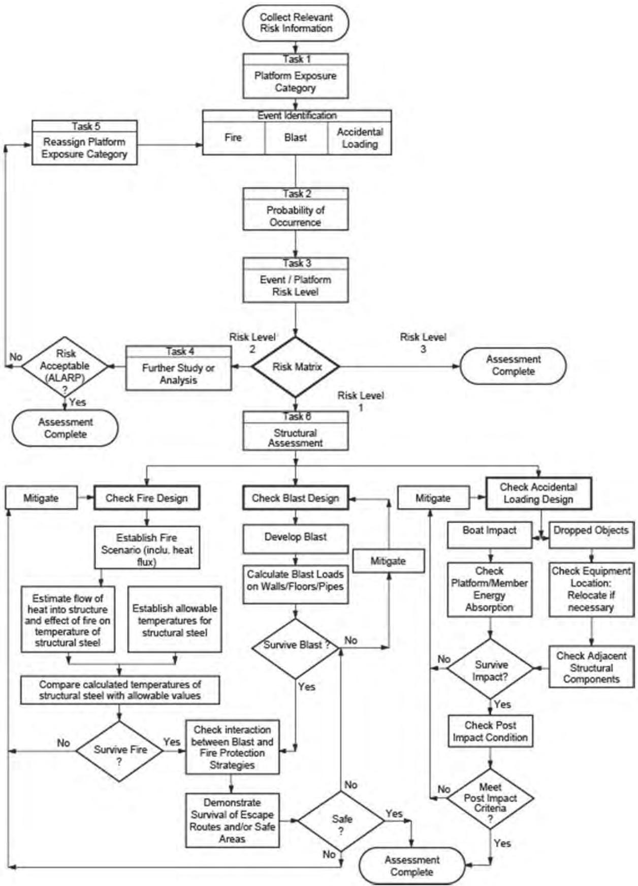  
Figure 17.1—Assessment Process

Table 17.1—Platform Risk Matrix   

| Probability of Occurrence | Platform Exposure Category | Platform Exposure Category | Platform Exposure Category |
| --- | --- | --- | --- |
| Probability of Occurrence | L-1 | L-2 | L-3 |
| H | Risk Level 1 | Risk Level 1 | Risk Level 2 |
| M | Risk Level 1 | Risk Level 2 | Risk Level 3 |
| L | Risk Level 2 | Risk Level 3 | Risk Level 3 |
| NOTE See 4.7 and 17.5 for definitions of abbreviations. | NOTE See 4.7 and 17.5 for definitions of abbreviations. | NOTE See 4.7 and 17.5 for definitions of abbreviations. | NOTE See 4.7 and 17.5 for definitions of abbreviations. |

Task 5—If necessary, reassign a platform exposure category and/or mitigate the risk or the consequence of the event.

Task 6—Complete a detailed structural integrity assessment for fire (see 17.6), blast (see 17.7), or accidental loading (see 17.9) events for those platforms considered at high risk for a defined event.

17.2.2 Definitions

17.2.2.1

mitigation

The action taken to reduce the probability or consequences of an event to avoid the need for reassignment (i.e. provision of fire or blast walls to accommodation areas and/or escape routes).

17.2.2.2

reassignment

Requires some change in the platforms function to allow the reassignment of life safety (i.e. manned vs unmanned, and/or reassignment of consequence of failure level).

17.2.2.3

survival

For the purposes of Section 17, survival means demonstration that the escape routes and safe areas are maintained for a sufficient period of time to allow platform evacuation and emergency response procedure.

## 17.3 Platform Exposure Category

Platforms are categorized according to life safety and consequence of failure as defined in 4.7 (i.e. L-1, L-2, or L-3).

## 17.4 Probability of Occurrence

17.4.1 General

The probability of occurrence of a fire, blast, or accidental loading event is associated with the origin and escalation potential of the event. The type and presence of a hydrocarbon source can also be a factor in event initiation or event escalation. The significant events requiring consideration and their probability of occurrence levels (i.e. L, M, or H) are normally defined from a fire and blast process hazard analysis.

The factors affecting the origin of the event can be found in 17.4.2 through 17.4.8.

17.4.2 Equipment Type

The complexity, amount, and type of equipment are important. Separation and measurement equipment, pump and compression equipment, fired equipment, generator equipment, safety equipment, and their piping and valves should be considered.

17.4.3 Product Type

Product type (i.e. gas, condensate, light or heavy crude) should be considered.

17.4.4 Operations Type

The types of operations being conducted on the platform should be considered in evaluation of the probability of occurrence of an event. Operations can include drilling, production, resupply, and personnel transfer.

17.4.5 Production Operations

Production operations are those activities that take place after the successful completion of the wells. They include separation, treating, measurement, transportation to shore, operational monitoring, modifications of facilities, and maintenance. Simultaneous operations include two or more activities.

17.4.6 Deck Type

The potential of a platform deck to confine a vapor cloud is important. Whether a platform deck configuration is open or closed should be considered when evaluating the probability of an event occurring. Most platforms in mild environments such as the U.S. Gulf of Mexico are open allowing natural ventilation. Platform decks in northern or more severe climates (e.g. Alaska, the North Sea), are frequently enclosed, resulting in increased probability of containing and confining explosive vapors and high explosion overpressures. Equipment-generated turbulence on an open deck can also contribute to high explosion overpressures.

17.4.7 Structure Location

The proximity of the fixed offshore platform to shipping lanes can increase the potential for collision with non-oil-field related vessels.

17.4.8 Other

Other factors such as the frequency of resupply and the type and frequency of personnel training, etc. should be considered.

## 17.5 Risk Assessment

17.5.1 General

As indicated in Table 17.1, by using the exposure category levels assigned in 17.3 and the probability of occurrence levels developed in 17.4, fire, blast, and accidental loading scenarios may be assigned over all platform risk levels for an event as follows:

— Risk Level 1, significant risk that will likely require mitigation;

— Risk Level 2, risks requiring further study or analyses to better define risk, consequence, and cost of mitigation;   
— Risk Level 3, insignificant or minimal risk that can be eliminated from further fire, blast, and accidental loading considerations.

In some instances, the higher risk may be deemed acceptable on the ALARP principle (i.e. as low as reasonably practicable) when the effort and/or expense of mitigation becomes disproportionate to the benefit.

17.5.2 Risk Matrix

The risk matrix shown in Table 17.1 is a 3 × 3 matrix that compares the probability of occurrence with the platform exposure category for a defined event.

The matrix provides an overall risk level as described in 17.5.1 for each identified event for a given platform. More detailed risk assessment techniques or methodology, as described in API 14J [17], may be used to determine the platform risk level. The overall risk level determines whether further assessment should be performed for the selected platform.

## 17.6 Fire

See API 2FB [3]for information on assessment of fire risk.

## 17.7 Blast

See API 2FB [3] for information on assessment of blast risk.

## 17.8 Fire and Blast Interaction

See API 2FB [3] for information on assessment of fire and blast interaction.

## 17.9 Accidental Loading

17.9.1 General

Fixed offshore platforms are subject to possible damage from:

— vessel collision during normal operations; and   
— dropped objects during periods of construction, drilling, or resupply operations.

If the assessment process discussed in 17.2 identifies a significant risk from this type of loading, the effect on structural integrity of the platform should be assessed.

17.9.2 Vessel Collision

The platform should survive the initial collision and meet the postimpact criteria.

See B.17.9.2 for guidance on energy absorption techniques for vessel impact loading and recommendations for postimpact criteria and analyses.

17.9.3 Dropped Objects

Certain locations such as crane loading areas are more subject to dropped or swinging objects. The probability of occurrence may be reduced by following safe handling practices (e.g. API 2D [1]).

The consequences of damage may be minimized by considering the location and protection of facilities and critical platform areas. Operation procedures should limit the exposure of personnel to overhead material transfer.

The platform should survive the initial impact from dropped objects and meet the postimpact criteria as defined for vessel collision.

# 18 Reuse

## 18.1 General

In general, platforms are designed for onshore fabrication, loadout, transportation, and offshore installation. By reversing this construction sequence, platforms can be removed, on-loaded, transported, upgraded (if required), and reinstalled at new sites. If a platform is reused the engineering design principles and good practices contained in this publication shall apply.

## 18.2 Reuse Considerations

18.2.1 General

Reuse platforms require additional considerations with respect to fatigue, material, inspection, removal, and reinstallation. These provisions are discussed in the following sections.

18.2.2 Fatigue Considerations for Reused Platforms

18.2.2.1 For reused platforms having tubular connections inspected in accordance with the minimum requirements of 18.2.4, fatigue considerations shall include appropriate allowances for fatigue damage that may have occurred during the initial in-service period of the platform as well as the planned service life at the new location. In general, Equation (8.2) should be satisfied. Beneficial effects on fatigue life from full inspection and/or remedial measures may be considered when determining prior damage or selecting safety factors.

18.2.2.2 The design fatigue life, L, in years should satisfy the following expression:

$$L = \mathrm{S F}_{1} L_{1} + \mathrm{S F}_{2} L_{2} \tag{18.1}$$

where

$L_{ 1 }$ is the initial in service period, years;

$L_{ 2 }$ is the planned service life at new location, years;

$\mathrm{ S F }_{ 1 }$ is equal to 2.0 for minimum requirements of 18.2.4. If the weld in a tubular connection is 100 % NDE inspection in accordance with requirements of 18.2.4 and is upgraded if defects are found, $\mathrm{ S F }_{ 1 }$ may be between zero and 2.0, selected on a rational basis.

$\mathrm{ S F }_{ 2 }$ is equal to 2.0.

For both safety factors, $\mathrm{ S F }_{ 1 }$ and ${ \mathrm{ S F } }_{ 2 } ,$ higher values for failure critical elements should be considered.

18.2.2.3 Remedial measures (i.e. grinding welds, grouting, reinforcing, etc.) to increase the fatigue performance of a platform to be reused are acceptable.

18.2.3 Steel in Reused Platforms

The type and grade of steel used in primary structural members of platforms removed and reinstalled at new offshore sites should be determined from the original records. If information on the type and grade of steel used is unavailable from the original record, 225 MPa (33 ksi) minimum yield strength shall be assumed. In addition, tubular sections of unknown steel type and grade with outside diameters typical of drilling tubulars (e.g. 5 1/2 in., 9 5/8 in., 13 3/8 in., etc.) should be avoided or removed from existing structures. Reused platforms having tubular connections in which the heavy-wall joint cans were fabricated from other than Class A steel should be inspected in accordance with the requirements of 18.2.4, including UT inspection to detect the occurrence of unacceptable defects.

18.2.4 Inspection of Reused Platforms

18.2.4.1 General

When structures are considered for reuse, inspection shall be carried out and testing performed to verify suitability for the intended application. Such inspection and testing may be performed prior to removal from the original site or at a rework site.

18.2.4.2 Requirements

Inspection programs prepared for evaluation of used structures being considered for reuse should be sufficiently detailed to establish the condition of the structures. Additionally, inspection should be performed to verify the absence of damage that may impair the structure’s ability to withstand loadings imposed during all phases of removal operations from the prior site.

All pertinent assumptions made in the reanalysis should be verified by inspection, including material composition and properties, connection integrity, and extent of any corrosion or other degradation due to prior service.

Assessment of condition of used structures should generally begin with review of existing documentation from the original construction of the structure, together with results of any past in-service surveys. Where documentation is complete and in accordance with the requirements of 16.7, less field inspection may be justified, unless specific knowledge of unusual events such as collisions, damage from operations, etc. dictate additional review.

Applicable inspection techniques are covered in 16.4.3.2.

18.2.4.3 Materials

The chemical composition and mechanical properties of all materials should be verified for consistency with the assumptions made for the reanalysis. Mill certificates or other documentation from the original design drawings, specifications, or fabrication records with adequate material identification may be used. Where such information is lacking, physical testing should be performed by a qualified laboratory.

Of particular importance is the verification of special materials such as steels classed as Group II or Group III in Section 11.

In lieu of the above requirements, where 226 MPa (33 ksi) minimum yield strengths are assumed in the reanalysis, inspection of materials may be limited to verifying that no drilling tubulars are used in the structures.

18.2.4.4 Conditions of Structural Members and Connections

Each structural member should be inspected to determine extent of any corrosion or other mechanical damage (e.g. pitting, dents, straightness, etc.) that would impair the intended service of the platform.

All structural connections should be inspected to insure that service damage (e.g. fatigue) does not impair the capability of the connection to carry design loads.

18.2.4.5 Damage-prone Connections

Damage-prone connections are defined as connections having in-service stresses or loads (based on reanalyses for the new location) equal to or greater than 90 % of the strength allowable or fatigue damage ratios (from the detailed fatigue analysis) equal to or greater than 30 %.

18.2.4.6 Extent of Weld Inspection

18.2.4.6.1 General

Inspection of all new member fabrication and new member connections shall be performed per 16.4.3.3. Weld inspection plans for existing welds should generally conform to the requirements of 16.4.3.3, as modified herein.

18.2.4.6.2 Scheduling and Weld Access

Inspection techniques selected for use should consider access requirements and limitations, both to the weld and within the existing welded connections. Use of UT over RT may be preferred due to equipment portability.

18.2.4.6.3 Extent of NDE Inspection

18.2.4.6.3.1 Documentation of NDE performed during the original fabrication and periodic in-service surveys of the platform should be reviewed. Where adequate documentation exists and weld qualities were consistent with current acceptance criteria, inspection may be limited to an investigation of inservice damage due to overload or fatigue.   
18.2.4.6.3.2 Where such documentation is not available, an initial spot survey of the structure should be made to provide guidance to the engineer performing the reanalysis and to assist in the formulation of a detailed inspection plan.   
18.2.4.6.3.3 The spot survey should include a general overview of 100 % of the uncleaned structure to be reused to detect any gross structural damage (e.g. parted connections, missing members, dented or buckled members, corrosion damage). Structural members and connections suspected or detected of having in-service damage should be 100 % NDE inspected.   
18.2.4.6.3.4 All NDE inspected welds should be thoroughly cleaned so as to enhance the effectiveness of the inspection.   
18.2.4.6.3.5 Table 18.1 shows minimum recommended extent of inspection for various existing parts of the structure.

Table 18.1—Recommended Extent of NDE Inspection—Reused Structure   

| Case | Extent | Method |
| --- | --- | --- |
| Jacket primary tubular |  |  |
| Longitudinal weld seams (L) | a | UT or MT |
| Circumferential weld seams (C) | a | UT or MT |
| Intersection of L and C | a | UT or MT |
| Tubular joints |  |  |
| Major brace-to-chord welds | b | MT |
| Major brace-to-brace stub welds | b | MT |
| Deck members and connections |  |  |
| Truss bracing members | 10 % c | UT or MT |
| Truss chord members | 10 % c | UT or MT |
| Plate girder members | 10 % c | UT or MT |
| Connections to deck legs | 25 % c | UT or MT |
| Crane pedestal connections | 100 % | UT or MT |
| Cantilever deck connections | 100 % | UT or MT |
| Survival/safety equipment connections | 100 % | UT or MT |
| Miscellaneous jacket/deck members and connections |  |  |
| Nonredundant bracing and subassemblies, that is, lifting eyes, lifting bracing sole conductor guide framing level above mudline, etc. | 100 % | UT or MT |
| Attachment welds connecting nonredundant bracing/subassemblies to main members | 100 % | UT or MT |
| Redundant bracing and subassemblies, that is, multilevel conductor guide framing, secondary splash zone and mudline bracing, boat landings, etc. | 10 % | Visual d |
| Attachment welds connecting redundant bracing/subassemblies to main members | 10 % | Visual d |
| Piling |  |  |
| Longitudinal weld seams (L) | 10 % | UT or RT |
| Circumferential weld seams (C) | 10 % | UT or RT |
| Intersection of L and C | 10 % | UT or RT |
| Field splices | 100 % | UT or RT |
| a Extent of inspection for these welds should be determined by comparing the design loadings and stresses (including removal and reinstallation loads and stresses) for the new site with those to which the welds have previously been designed for and/or exposed. Where new design loadings are less than or equal to initial design or actual loadings, then the extent of inspection, if any, should be determined based on NDE documentation or the results of the initial spot survey per 18.2.4.6.3. Where new design loadings are significantly greater than initial design or actual loadings, or when comparison based on initial design or actual loadings is not possible, a minimum of one (1) bracing member and one (1) jacket leg spanning between each level should be inspected. Additional inspection per 18.2.4.6.3 should be performed where in-service damage is known of or suspected. | a Extent of inspection for these welds should be determined by comparing the design loadings and stresses (including removal and reinstallation loads and stresses) for the new site with those to which the welds have previously been designed for and/or exposed. Where new design loadings are less than or equal to initial design or actual loadings, then the extent of inspection, if any, should be determined based on NDE documentation or the results of the initial spot survey per 18.2.4.6.3. Where new design loadings are significantly greater than initial design or actual loadings, or when comparison based on initial design or actual loadings is not possible, a minimum of one (1) bracing member and one (1) jacket leg spanning between each level should be inspected. Additional inspection per 18.2.4.6.3 should be performed where in-service damage is known of or suspected. | a Extent of inspection for these welds should be determined by comparing the design loadings and stresses (including removal and reinstallation loads and stresses) for the new site with those to which the welds have previously been designed for and/or exposed. Where new design loadings are less than or equal to initial design or actual loadings, then the extent of inspection, if any, should be determined based on NDE documentation or the results of the initial spot survey per 18.2.4.6.3. Where new design loadings are significantly greater than initial design or actual loadings, or when comparison based on initial design or actual loadings is not possible, a minimum of one (1) bracing member and one (1) jacket leg spanning between each level should be inspected. Additional inspection per 18.2.4.6.3 should be performed where in-service damage is known of or suspected. |
| b All damage-prone connections should be inspected. Damage-prone connections are defined in 18.2.4.5. Where NDE inspection of these connections reveals significant defects, additional inspection of other connections should also be performed. For tubular connections, a minimum of one (1) brace to chord connection at each level and X brace connection between levels, as applicable, should be inspected. For tubular connections not having Class A steel in the heavy-wall joint cans both UT and MT should be performed. | b All damage-prone connections should be inspected. Damage-prone connections are defined in 18.2.4.5. Where NDE inspection of these connections reveals significant defects, additional inspection of other connections should also be performed. For tubular connections, a minimum of one (1) brace to chord connection at each level and X brace connection between levels, as applicable, should be inspected. For tubular connections not having Class A steel in the heavy-wall joint cans both UT and MT should be performed. | b All damage-prone connections should be inspected. Damage-prone connections are defined in 18.2.4.5. Where NDE inspection of these connections reveals significant defects, additional inspection of other connections should also be performed. For tubular connections, a minimum of one (1) brace to chord connection at each level and X brace connection between levels, as applicable, should be inspected. For tubular connections not having Class A steel in the heavy-wall joint cans both UT and MT should be performed. |
| c Partial inspection should be conducted as percentage of each piece, not 100 % of percentage of the number of pieces. | c Partial inspection should be conducted as percentage of each piece, not 100 % of percentage of the number of pieces. | c Partial inspection should be conducted as percentage of each piece, not 100 % of percentage of the number of pieces. |
| d Limited to inspection of completed weld; may include MT and or PT. | d Limited to inspection of completed weld; may include MT and or PT. | d Limited to inspection of completed weld; may include MT and or PT. |

18.2.4.7 Corrosion Protection Systems

Corrosion protection systems integrity should be verified in accordance with NACE SP0176-2007 [34] and NACE SP0108-2008 [35]. Verification should include assessment of remaining anode materials, anode connections, and condition of protective coatings, to include splash zone coatings, wraps, etc. Inspection should consider possible hidden damage under wraps, etc.

18.2.4.8 Inspections for Removal of Structures from Prior Site

Inspection and documentation should be performed for all phases of removal operations as defined in the offshore construction plan. Structural and equipment weights should be verified.

18.2.5 Removal and Reinstallation

18.2.5.1 Planning

18.2.5.1.1 All offshore construction should be accomplished in such a manner that the platform can fulfill the intended design purposes.

18.2.5.1.2 An offshore construction plan should be prepared for platform removal and reinstallation. This plan should include the method and procedures developed for the onloading, seafastenings, and transportation of all components and for the complete reinstallation of the jacket, pile/conductors, superstructure, and equipment.

18.2.5.1.3 Plans for platform removal from the prior site should be developed that describe methods and procedures for removal of the deck, appurtenances, jacket, and piling. Seafastenings, transportation requirements, lift weights, and centers of gravity should be defined. Particular emphasis should be placed on the prevention of damage of any platform components intended for reuse as a result of removal operations.

18.2.5.1.4 Offshore construction plans may be in the form of written descriptions, specifications, and/or drawings. Depending upon the complexity of the installation, more detailed instructions may be required for special items such as grouting, diving, welding/cutting, inspection, etc. Any restrictions or limitations to operations due to items such as environmental conditions, barge stability, or structural strength (i.e. lifting capacity) should be stated.

18.2.5.1.5 The offshore construction plan should normally be subdivided into phases, for example, removal, onloading, seafastenings, transportation, and reinstallation. The party responsible for each phase of the work should prepare the plan for that phase, unless otherwise designated by the owner. Coordination and approval procedures between all parties should be established by the owner.

18.2.5.2 Records and Documentation

The provisions of 15.1.2 shall be followed during removal and reinstallation.

18.2.5.3 Forces and Allowable Stresses

The provisions of 15.1.3 shall be followed during removal and reinstallation.

18.2.5.4 Temporary Bracing and Rigging

The provisions of 15.1.4 shall be followed during removal and reinstallation.

18.2.5.5 Removal

Jackets originally installed by lifting may be removed in a process that essentially reverses the original installation sequence. Jackets originally installed by launching that cannot be lifted onto barges may be removed by controlled deballasting and skidding the jacket back onto a properly configured launch barge. Such operations may require more precise control of barge ballasting, positioning, and alignment between jacket and barge than required for the original launch. Environmental conditions for such operations may also be more restrictive.

Anchorage during offshore removal operations should be conducted in accordance with the basic principles outlined in 15.4.2.

18.2.5.6 Buoyancy and Refloating

When removal of used platforms from a prior site requires refloating of platform components such as the jacket, additional buoyancy may be required in excess of that provided when the structures were originally installed to compensate for loss of buoyancy and for additional weights not present during the original installation (i.e. grouted piling).

18.2.5.7 Marine Growth Removal

When removing used platforms for reuse, appropriate equipment for marine growth removal from seafastening locations should be provided. If the jacket is to be skidded back onto a launch barge, marine growth should be removed from launch cradles to ensure reasonable prediction of coefficient of friction and sling loads on padeyes and winches. Waterblasting or sandblasting to remove marine growth has been found effective.

18.2.5.8 Barge Stability

During removal of used platform components from a prior site, ballasting of the barge for open water towing should be completed prior to loading of platform components on the barge, except where removal operation, otherwise dictate (e.g. reverse launching of jackets). If required to navigate shallow waters, deballasting from open water tow conditions should not be performed until the barge reaches sheltered waters.

18.2.5.9 Reinstallation

The provisions of Section 15 shall apply to the reinstallation of used platforms.

19 Minimum and Special Structures

## 19.1 General

This section addresses additional considerations for the design of nonjacket and special structures and single element structural systems, as defined in 4.6.1.5.

## 19.2 Design Loads and Analysis

19.2.1 Design Considerations

Proper structural design is based on maintaining member stresses within certain allowable limits for the selected maximum design event. In addition, it is necessary to ensure that the structure has proper redundancy and reserve strength to prevent catastrophic failure or collapse if the selected design event is exceeded. The typical well-designed jacket type offshore platform has proven to exhibit these characteristics. However, freestanding caissons, guyed and braced caissons, as well as single leg deck units and other single member structural systems have less redundancy and may not necessarily exhibit the same characteristics.

When using the wave criteria information from Section 5, the allowable stress interaction ratio (or unity check) shall be limited to 0.85 for freestanding caissons or single element structural systems during storm conditions.

19.2.2 Dynamic Wave Analysis

A dynamic analysis utilizing the extreme wave sea state, in accordance with 5.3.1.3, should be performed for all minimum nonjacket and special structures with a natural period equal to or greater than three seconds and for all freestanding caissons with a natural period of greater than two seconds. For caissons with a natural period of less than three seconds, approximate procedures may be applied. As an example, the system may be considered as an undamped, single degree of freedom cantilever with a uniformly distributed mass and a lumped mass at the top.

In reference to the masses mentioned in 5.3.1.3, the dynamic model should include the maximum expected deck live load. In these calculations for caissons it is necessary to consider the entire mass of the system including the caisson and all internal casing, conductors, tubing, grout, entrapped seawater as well as the virtual mass effects. Additional moment due to P/Δ effects due to the weight of the deck shall be considered.

19.2.3 Fatigue Analysis

A fatigue analysis including dynamic effects should be performed in accordance with 8.2 through 8.5.

19.2.4 Foundation Effects

Experience has shown that due to the prolonged large deflection of caissons and other more flexible structures, the soil at and near the surface is subject to substantial degradation and frequently loses contact with the caisson for a short distance below the surface. This loss of soil strength due to remolding and the effective increase in unsupported length of the caisson should be considered in determining dynamic effects and the resulting bending stresses.

After severe storms in the Gulf of Mexico, caissons have been observed to be leaning with no visible overstress or damage to the caisson. This may have been caused by inadequate penetration that resulted in the ultimate lateral resistance of the soil being exceeded. Caissons should be designed for lateral loading in accordance with 9.8 with sufficient penetration to assure that the analysis is valid. Analysis procedures using “fixity” at an assumed penetration should be limited to preliminary designs only. For caissons, the safety factor for the overload case discussed in 9.8 should be at least 1.5.

## 19.3 Connections

19.3.1 General

This section provides guidelines and considerations for utilizing connection types other than welded tubular connections as covered in Section 7. Connection types are as follows:

一 bolted,  
— pinned,   
— clamped,   
— grouted,   
— doubler plate,   
— threaded,   
— swagged.

19.3.2 Analysis

Connections should be analyzed following the general guidelines of Section 7. Member forces should be obtained from the global structure analysis.

19.3.3 Field Installation

Where connections are designed to be field installed, inspection methods should be developed to ensure proper installation in accordance with design assumptions. As an example, the tension in high strength bolts should be field verified utilizing mechanical or procedural methods.

19.3.4 Special Considerations

19.3.4.1 Bolted Connections

These joints should be designed in accordance with appropriate industry standards such as the RCSC Specification for Structural Joints Using ASTM A325 or ASTM A490 Bolts.

Consideration should be given to punching shear, lamellar tearing, friction factors, plate or shell element stresses, relaxation, pipe crushing, stress corrosion cracking, bolt fatigue, brittle failure, and other factors or combinations that may be present.

Retightening or possible replacement of bolts should be included as part of the owner’s periodic surveys as defined in API 2SIM.

19.3.4.2 Joints with Doubler, and/or Gusset Plates

Consideration should be given to punching shear, lamellar tearing, pullout, element stresses, effective weld length, stress concentrations, and excessive rotation.

19.3.4.3 Pinned Connections

These connections may significantly influence member forces; therefore, pin-ended tubular joints should be modeled in accordance with the actual detailing for fabrication.

19.3.4.4 Grouted Connections

These connections should be designed in accordance with 7.5 or 10.4 as appropriate to the function and detailing of the connection. However, all axial load transfer should be accomplished using shear keys only (see B.19.3.4.4).

19.3.4.5 Clamped Connections

Where primary members rely on friction to transfer load, it should be demonstrated, using appropriate analytical methods or experimental testing, that adequate load transfer will be developed and maintained during the life of the structure. Consideration should be given to the member-crushing load when developing the friction mechanism.

## 19.4 Material and Welding

19.4.1 Primary Connections

Steel used for primary tubular joints or other primary connections should be Class A steels as defined in 11.1.3.4 or equivalent. Primary joints or connections are those, the failure of which would cause significant loss of structural strength.

19.4.2 Caisson Materials

Caissons may be fabricated utilizing Class C steel, as defined in 11.1.3.2, if interaction ratios (as defined in Section 6) are equal to or less than 0.85 for all design loading conditions.

19.4.3 Caisson Welding

For field welds in caissons, special attention should be given to the provisions for complete joint penetration butt welds in AWS D1.1/D1.1M:2010, Subclauses 3.13 and 4.12, or else reduced fatigue performance (e.g. AWS Curve E′) and root deduction should be considered.

Annex A

(informative)

API 2A-WSD, 21st Edition vs 22nd Edition Cross-reference

Table A.1 through Table A.3 provide a cross-reference of the figures, tables, and equations in the 21st Edition of API 2A-WSD versus the 22nd Edition.

Table A.1—API 2A-WSD, 21st Edition vs 22nd Edition Cross-reference of Figures   

| API 2A-WSD, 21st Edition Figure Number | API 2A-WSD, 22nd Edition Figure Number | Description |
| --- | --- | --- |
| 2.3.1-1 | 5.1 | Procedure for calculation of wave plus current forces for static analysis |
| 2.3.1-2 | 5.2 | Doppler shift due to steady current |
| 2.3.1-3 | 5.3 | Regions of applicability of stream function, Stokes V, and linear wave theory |
| 2.3.1-4 | 5.4 | Shielding factor for wave loads on conductor arrays as a function of conductor spacing |
| C2.3.6-4 | 5.5 | Vertical framing configurations not meeting robustness requirements |
| C2.3.6-5 | 5.6 | Vertical framing configurations meeting robustness requirements |
| 2.3.4-1 | See API 2MET for new figures | Area location map |
| 2.3.4-2 | See API 2MET for new figures | Region of applicability of extreme metocean criteria |
| 2.3.4-3 | See API 2MET for new figures | Guideline omnidirectional design wave height vs MLLW, Gulf of Mexico, north of 27 °N and west of 86 °W |
| 2.3.4-4 | See API 2MET for new figures | Guideline design wave directions and factors to apply to the omnidirectional wave heights (Figure 2.3.4-3) for L-1 and L-2 structures, Gulf of Mexico, north of 27 °N and west of 86 °W |
| 2.3.4-5 | See API 2MET for new figures | Guideline design current direction (towards) with respect to north in shallow water (depth < 150 ft) for L-1 and L-2 structures, Gulf of Mexico, north of 27 °N and west of 86 °W |
| 2.3.4-6 | See API 2MET for new figures | Guideline design current profile for L-1, L-2, and L-3 structures, Gulf of Mexico, north of 27 °N and west of 86 °W |
| 2.3.4-7 | See API 2MET for new figures | Guideline storm tide vs MLLW and platform category, Gulf of Mexico, north of 27 °N and west of 86 °W |
| 2.3.4-8 | See API 2MET for new figures | Elevation of underside of deck (above MLLW) vs MLLW, Gulf of Mexico, north of 27 °N and west of 86 °W |
| 3.4.1-1 | 6.1 | Example of conical transition |
| 4.2-1 | 7.1 | Examples of joint classification |
| 4.2-2 | 7.2 | In-plane joint detailing |
| 4.2-3 | 7.3 | Out-of-plane joint detailing |
| 4.3-1 | 7.4 | Terminology and geometric parameters for simple tubular joints |
| 4.3-2 | 7.5 | Examples of chord length, Lc |
| 5.5-1 | 8.1 | Example tubular joint S-N curve for T=16 mm (5/8 in.) |
| 5.5-2 | Deleted in API 2A-WSD, 21st Edition, Supplement 1 | Basic S-N curve applicable to profiled welds for both air and seawater with CP |
| 6.7.2-1 | See API 2GEO, Figure 2 | Typical axial pile load transfer-displacement (t-z) curves |
| 6.7.3-1 | See API 2GEO, Figure 3 | Pile end bearing capacity-displacement curve |
| 6.8.6-1 | See API 2GEO, Figure 4 | Coefficients as function of φ' |
| 6.8.7-1 | Deleted | Relative density, % |
| 7.4.4-1 | 10.1 | Grouted pile-to-structure connection with shear keys |
| 7.4.4-2 | 10.2 | Recommended shear key details |
| 11.1.3 | 14.1 | Welded tubular connections-shielded metal arc welding |
| 17.5.2 | See API 2SIM | Platform assessment process-metocean loading |
| 17.6.2-1 | See API 2SIM | Base shear for a vertical cylinder based on API 2A, Ninth Edition reference level forces |
| 17.6.2-2a | See API 2SIM | Full population hurricane wave height and storm tide criteria |
| 17.6.2-2b | See API 2SIM | Full population hurricane deck height criteria |
| 17.6.2-3a | See API 2SIM | Sudden hurricane wave height and storm tide criteria |
| 17.6.2-3b | See API 2SIM | Sudden hurricane deck height criteria |
| 17.6.2-4 | See API 2SIM | Sudden hurricane wave directions and factors to apply to the omnidirectional wave heights in Figure 17.6.2-3a for ultimate strength analysis |
| 17.6.2-5a | See API 2SIM | Winter storm wave height and storm tide criteria |
| 17.6.2-5b | See API 2SIM | Winter storm deck height criteria |
| 18.2-1 | 17.1 | Assessment process |
| 18.5-1 | See Table 17.1 | Risk matrix |
| C2.3.1-1 | B.5.1 | Measured current field at 60 ft depth around and through the Bullwinkle platform in a loop current event in 1991 |
| C2.3.1-2 | B.5.2 | Comparison of linear and nonlinear stretching of current profiles |
| C2.3.1-3 | B.5.3 | Definition of surface roughness height and thickness |
| C2.3.1-4 | B.5.4 | Dependence of steady flow drag coefficient on relative surface roughness |
| C2.3.1-5 | B.5.5 | Wake amplification factor for drag coefficient as a function of K/Cds |
| C2.3.1-6 | B.5.6 | Wake amplification factor for drag coefficient as a function of K |
| C2.3.1-7 | B.5.7 | Inertia coefficient as a function of K |
| C2.3.1-8 | B.5.8 | Inertia Coefficient as a Function of K/Cds |
| C2.3.1-9 | B.5.9 | Shielding factor for wave loads on conductor arrays as a function of conductor spacing |
| C2.3.4-1 | See API 2MET for new example | Example calculation of current magnitude, direction, and profile in the intermediate depth zone |
| C2.3.6-1 | See API 2EQ | Seismic risk of U.S. coastal waters |
| C2.3.6-2 | See API 2EQ | Response spectra—spectra normalized to 1.0 gravity |
| C2.3.6-3 | B.5.10 | Example structure |
| C2.3.6-4 | 5.5 | Vertical frame configuration not meeting guidelines |
| C2.3.6-5 | 5.6 | Vertical frame configurations meeting guidelines |
| None | B.5.11 | Seismic load deformation curve |
| C3.2.2-1 | B.6.1 | Elastic coefficients for local buckling of steel cylinders under axial compression |
| C3.2.2-2 | B.6.2 | Comparison of test data with design equation for fabricated steel cylinders under axial compression |
| C3.2.3-1 | B.6.3 | Design equation for fabricated steel cylinders under bending |
| C3.2.5-3 | B.6.4 | Comparison of test data with design equations for ring buckling and inelastic local buckling of cylinders under hydrostatic pressure |
| C3.2.5-1 | B.6.5 | Comparison of test data with elastic design equations for local buckling of cylinders under hydrostatic pressure (M>0.825D/t) |
| C3.2.5-2 | B.6.6 | Comparison of test data with elastic design equations for local buckling of cylinders under hydrostatic pressure (M>0.825D/t) |
| C3.3.3-1 | B.6.7 | Comparison of test data with interaction equation for cylinders under combined axial tension and hydrostatic pressure (Fhc determined from tests) |
| C3.3.3-2 | B.6.8 | Comparison of interaction equations for various stress conditions for cylinders under combined axial compressive load and hydrostatic pressure |
| C3.3.3-3 | B.6.9 | Comparison of test data with elastic interaction curve for cylinders under combined axial compressive load and hydrostatic pressure (Fxe and Fhe determined from tests) |
| C3.3.3-4 | B.6.10 | Comparison of test data on fabricated cylinders with elastic interaction curve for cylinders under combined axial load and hydrostatic pressure (Fxe and Fhe are determined from recommended design equations) |
| C3.3.3-5 | B.6.11 | Comparison of test data with interaction equations for cylinders under combined axial compressive load and hydrostatic pressure (combination elastic and yield failures) |
| C4.2-1 | B.7.1 | Adverse load patterns with a up to 3.8 (a) false leg termination, (b) skirt pile bracing, and (c) hub connection |
| C4.2-2 | B.7.2 | Computed α (a) equation, (b) definitions, and (c) influence surface |
| C4.3.2-1 | B.7.3 | Safety index betas, API 2A-WSD, 21st Edition, Supplement 1 formulation |
| C4.3.2-2 | B.7.4 | Safety index betas, API 2A-WSD, 21st Edition, Supplement 2 formulation |
| C4.3.3-1 | B.7.5 | Comparison of strength factors Qu for axial loading |
| C4.3.3-2 | B.7.6 | Comparison of strength factors Qu for IPB and OPB |
| C4.3.4-1 | B.7.7 | Comparison of chord load factors Qf |
| C4.3.4-2 | B.7.8 | Effect of chord axial load on DT brace compression capacity comparison of University of Texas Test data with chord load factor |
| C4.3.4-3 | B.7.9 | K-joints under balanced axial loading—test and FE vs new and old API |
| C4.3.4-4 | B.7.10 | T-joints under axial loading—test and FE vs new and old API |
| C4.3.4-5 | B.7.11 | DT-joints under axial compression—test and FE vs new and old API |
| C4.3.4-6 | B.7.12 | All joints under BIPB—test and FE vs new and old API |
| C4.3.4-7 | B.7.13 | All joints under BOPB—test and FE vs new and old API |
| C5.1-1 | Deleted | Allowable peak hot spot stress, Sp (AWS Level I) |
| C5.1-2 | Deleted | Allowable peak hot spot stress, Sp (AWS Level II) |
| C5.1-3 | Deleted | Example wave height distribution over time, T |
| C5.2-1 | B.8.1 | Selection of frequencies for detailed analysis |
| C5.3.1-1 | B.8.2 | Geometry definitions for Efthymiou SCFs |
| C5.5.1-1 | B.8.3 | Basic air S-N curve as applicable to profiled welds, including size and toe correction to the data |
| C5.5.1-2 | B.8.4 | S-N curve and data for seawater with CP |
| C6.4.3-1 | See API 2GEO, Figure C.1 | Interface friction angle in sand, δcv from direct shear interface tests |
| C6.8-1 | See API 2GEO, Figure C.2 | p-y lateral support—scour model |
| C6.13.1-1 | See API 2GEO, Figure A.10 | Recommended bearing capacity factors |
| C6.13.1-2 | See API 2GEO, Figure A.2 | Eccentrically-loaded footings |
| C6.13.1-3 | See API 2GEO, Figure A.3 | Area reduction factors eccentrically-loaded footings |
| C6.13.1-4 | See API 2GEO, Figure A.8 | Definitions for inclined base and ground surface (after Vesic) |
| C7.4.4a-1 | B.10.1 | Measured bond strength vs cube compressive strength |
| C7.4.4a-2 | B.10.4 | Measured bond strength vs cube compressive strength times the height-to-spacing ratio |
| C7.4.4a-3 | B.10.2 | Number of tests for safety factors |
| C7.4.4a-4 | B.10.3 | Cumulative histogram of safety factors |
| C17.6.2-1a | See API 2SIM | Silhouette area definition |
| C17.6.2-1b | See API 2SIM | Wave heading and direction convention |
| C18.6.2-1 | See API 2FB | Strength reduction factors for steel at elevated temperatures (Reference 1) |
| C18.6.3-1 | See API 2FB | Maximum allowable temperature of steel as a function of analysis method |
| C18.6.3-2 | See API 2FB | Effect of choice of strain in the linearization of the stress/strain characteristics of steel at elevated temperatures |
| C18.7.2-1 | See API 2FB | Example pressure time curve |
| C18.9.2-1 | B.17.1 | D/T ratio vs reduction in ultimate capacity, 48-in., 54-in., and 60-in. legs—straight with L = 60 ft, K = 1.0, and Fy = 35 ksi |
| C18.9.2-2 | B.17.2 | D/T ratio vs reduction in ultimate capacity, 48-in., 54-in., and 60-in. legs—straight with L = 60 ft, K = 1.0, and Fy = 50 ksi |
| C18.9.2-3 | B.17.3 | D/T ratio vs reduction in ultimate capacity, 48-in., 54-in., and 60-in. legs—bent with L = 60 ft, K = 1.0, and Fy = 35 ksi |
| C18.9.2-4 | B.17.4 | D/T ratio vs reduction in ultimate capacity, 48-in., 54-in., and 60-in. legs—bent with L = 60 ft, K = 1.0, and Fy = 50 ksi |

Table A.2—API 2A-WSD, 21st Edition vs 22nd Edition Cross-reference of Tables   

| API 2A-WSD, 21st Edition Table Number | API 2A-WSD, 22nd Edition Table Number | Description |
| --- | --- | --- |
| None, new in 22nd Edition | 4.1 | Exposure category matrix |
| Not numbered (see 2.2.2) | 5.1 | Design loading conditions |
| Not numbered (see 2.3.1.b.4) | 5.2 | Approximate current blockage factors for typical Gulf of Mexico jacket-type structures |
| Not numbered (see 2.3.2.b.3) | 5.3 | Values coherence spectrum coefficients α, p, q, r, and Δ |
| Not numbered (see 2.3.2.e) | 5.4 | Wind shape coefficients |
| None, new in 22nd Edition | 5.5 | Design level criteria and robustness analysis |
| None, new in 22nd Edition | 5.6 | Crfactors for steel jacket of fixed offshore platforms |
| API 2INT-DG, Figure 4.1.1 | 5.7 | Offshore design reference wind speed for drilling structures |
| API 2INT-DG, Figure C4.1.2 | 5.8 | Design wind speeds used for existing drilling structures |
| None, new in 22nd Edition | 5.9 | Deck acceleration during design hurricanes |
| 2.3.4-1 | See API 2MET for new table | U.S. Gulf of Mexico guideline design metocean criteria |
| 2.3.4-2 | See API 2MET for new table | Guideline extreme wave, current, and storm tide values for 20 areas in U.S. waters [water depth >300 ft (91 m) except as noted] |
| 2.3.4-3 | See API 2MET for new table | Guideline extreme wind speeds for 20 areas in U.S. waters |
| Not numbered (see 3.3.1.d) | 6.1 | Values of K and Cmfor various member situations |
| Not numbered (see 3.3.5) | 6.2 | Safety factors |
| Not numbered (see 3.4.1.b) | 6.3 | Limiting angle α for conical transitions |
| Not numbered (see 4.3) | 7.1 | Geometric parameter validity range |
| 4.3-1 | 7.2 | Values for Qu |
| 4.3-2 | 7.3 | Values for C1, C2, C3 |
| 4.5-1 | 7.4 | Qufor grouted joints |
| 5.2.5-1 | 8.1 | Fatigue life safety factors |
| 5.5.1-1 | 8.2 | Basic design S-N curves |
| 5.5.3-1 | 8.3 | Factors on fatigue life for weld improvement techniques |
| Not numbered (see 6.3.4) | 9.1 | Pile factors of safety for different loading conditions |
| 6.4.3-1 | See Table 1 in API 2GEO | Design parameters for cohesionless siliceous soil |
| Not numbered (see 6.10.6) | 9.2 | Minimum pile wall thickness |
| Not numbered (see 6.13.4) | 9.3 | Safety factors against failure |
| Not numbered (see 7.4.4.c) | 10.1 | Connection design limitations |
| Not numbered (see 7.5.5) | 10.2 | Guyline factors of safety |
| 8.1.4-1 | 11.1 | Structural steel plates |
| 8.1.4-2 | 11.2 | Structural steel shapes |
| 8.2.1-1 | 11.3 | Structural steel pipe |
| 8.3.1-1 | 11.4 | Input testing conditions |
| 10.2.2 | 13.1 | Impact testing |
| 12.5.7 | 15.1 | Guideline wall thickness (in SI units) |
| 12.5.7 | 15.2 | Guideline wall thickness (in USC units) |
| 13.4.3 | 16.1 | Recommended minimum extent of NDE inspection |
| 14.4.2-1 | See API 2SIM | Guideline survey intervals |
| See Figure 18.5-1 | 17.1 | Platform risk matrix |
| 15.2.3.5 | 18.1 | Recommended extent of NDE inspection—reused structure |
| 17.6.2-1 | See API 2SIM | U.S. Gulf of Mexico metocean criteria |
| 17.6.2-2 | See API 2SIM | 100-year metocean criteria for platform assessment U.S. waters (other than Gulf of Mexico), depth >300 ft |
| C4.3-1 | B.7.1 | Mean bias factors and coefficients of variation for K-joints |
| C4.3-2 | B.7.2 | Mean bias factors and coefficients of variation for Y-joints |
| C4.3.4-1 | B.7.3 | Mean bias factors and coefficients of variation for X-joints |
| C5.1-1 | Deleted | Selected SCF formulas for simple joints |
| C5.1-2 | Deleted | Summary of design comparisons, resulting variation of joint can thickness |
| C5.3.2-1 | B.8.1 | Equations for SCFs in T/Y-joints |
| C5.3.2-2 | B.8.2 | Equations for SCFs in X-joints |
| C5.3.2-3 | B.8.3 | Equations for SCFs in gap/overlap K-joints |
| C5.3.2-4 | B.8.4 | Equations for SCFs in KT-joints |
| C5.3.2-5 | B.8.5 | Expressions for Lmp |
| C6.4.3-1 | See API 2GEO, Table C.1 | Unit skin friction parameter values for driven open-ended steel pipes |
| C10.2.2 | B.13.1 | Average heat-affected zone values |
| C17.1-1 | See API 2SIM | Comparison of Section 2 L-1 wave criteria and Section 17 wave criteria for 400 ft water depth, Gulf of Mexico |
| C17.6.2-1 | See API 2SIM | Drag coefficient, $C_{\mathrm{d}}$, for wave/current platform deck forces |
| C18.6.2-1 | See API 2FB | Yield strength reduction factors for steel at elevated temperatures (ASTM A36 and ASTM A633, Grades C and D) |
| C18.6.3-1 | See API 2FB | Maximum allowable steel temperature as a function of strain for use with the “Zone” Method |
| C18.6.3-2 | See API 2FB | Maximum allowable steel temperature as a function of utilization ratio (UR) |
| C18.6.4-1 | See API 2FB | Summary of fire ratings and performance for fire walls |
| C18.9.2-1 | B.17.1 | Required tubular thickness to locally absorb vessel impact broadside vessel impact condition |

Table A.3—API 2A-WSD, 21st Edition vs 22nd Edition Cross-reference of Equations   

| API 2A-WSD 21st Edition Equation Number | API 2A-WSD 22nd Edition Equation Number | Description |
| --- | --- | --- |
| Not numbered (see 2.3.1.b.5) | 5.1 | Linear stretching formula for slab current profiles |
| 2.3.1-1 | 5.2 | Morison's equation |
| 2.3.2-1 | 5.3 | Design wind speed u at height z and averaging time t (SI units) |
| 2.3.2-2 | 5.4 | 1-hour mean wind speed U at height z (SI units) |
| 2.3.2-3 | 5.5 | Turbulence Intensity Iu at height z (SI units) |
| 2.3.2-1 | 5.6 | Design wind speed u at height z and averaging time t (USC units) |
| 2.3.2-2 | 5.7 | 1-hour mean wind speed U at height z (USC units) |
| 2.3.2-3 | 5.8 | Turbulence intensity Iu at height z (USC units) |
| 2.3.2-4 | 5.9 | Wind spectra S (SI units) |
| 2.3.2-5 | 5.10 | Frequency f (SI units) |
| 2.3.2-4 | 5.11 | Wind spectra S (USC units) |
| 2.3.2-5 | 5.12 | Frequency f (USC units) |
| 2.3.2-6 | 5.13 | Coherence spectrum between two points (SI units) |
| 2.3.2-7 | 5.14 | Ai in Equation (5.13) (SI units) |
| 2.3.2-6 | 5.15 | Coherence spectrum between two points (USC units) |
| 2.3.2-7 | 5.16 | Ai in Equation (5.15) (USC units) |
| 2.3.2-8 | 5.17 | Wind drag force on an object |
| 3.2.1-1 | 6.1 | Allowable tensile stress Ft |
| 3.2.2-1 | 6.2 | Allowable compressive stress Fa for column buckling for Kl/r < Cc |
| 3.2.2-2 | 6.3 | Allowable compressive stress Fa for column buckling for Kl/r ≥ Cc |
| 3.2.2-3 | 6.4 | Elastic local buckling stress Fxe |
| 3.2.2-4 | 6.5 | Inelastic local buckling stress Fxc |
| 3.2.3-1a | 6.6 | Allowable bending stress Fb for low values of D/t |
| 3.2.3-1b | 6.7 | Allowable bending stress Fb for middle values of D/t |
| 3.2.3-1c | 6.8 | Allowable bending stress Fb for high values of D/t |
| 3.2.4-1 | 6.9 | Maximum beam shear stress fv for cylindrical members |
| 3.2.4-2 | 6.10 | Allowable beam shear stress Fv |
| 3.2.4-3 | 6.11 | Maximum torsional shear stress fv for cylindrical members |
| 3.2.4-4 | 6.12 | Allowable torsional shear stress Fvt |
| 3.2.5-1 | 6.13 | Maximum acting membrane stress fn |
| 3.2.5-2 | 6.14 | Hoop stressfhdue to hydrostatic pressure |
| 3.2.5-3 | 6.15 | Design hydrostatic head Hz |
| 3.2.5-4 | 6.16 | Elastic hoop buckling stress Fhe |
| 3.2.5-5 | 6.17 | Geometric parameter M |
| 3.2.5-6 | 6.18 | Critical hoop buckling stress Fhc |
| 3.2.5-7 | 6.19 | Required moment of inertia Ic for stiffening ring |
| 3.3.1-1 | 6.20 | Requirements at all points along their length for cylindrical members subjected to combined compression and bending—buckling |
| 3.3.1-2 | 6.21 | Requirements at all points along their length for cylindrical members subjected to combined compression and bending—strength |
| 3.3.1-3 | 6.22 | Requirements at all points along their length for cylindrical members subjected to combined compression and bending when fa/Fa ≤ 0.15 |
| 3.3.1-4 | 6.23 | Requirements at all points along their length for cylindrical members subjected to combined compression and bending for 6.3-1 when the same Cm and Fe' are not appropriate for both fbx and by |
| 3.3.1-5 | 6.24 | Interaction check for pile buckling |
| 3.3.1-6 | 6.25 | Interaction check for pile overload analysis |
| 3.3.3-1 | 6.26 | Interaction check for axial tension and hydrostatic pressure |
| 3.3.4-1 | 6.27 | Interaction check for axial compression and hydrostatic pressure using the maximum compressive stress combination |
| 3.3.4-2 | 6.28 | Interaction check for axial compression and hydrostatic pressure |
| 3.3.4-3 | 6.29 | Interaction check for axial compression and hydrostatic pressure when fx > 0.5Fha |
| 3.4.1-1 | 6.30 | Localized bending stress fb' |
| 3.4.1-2 | 6.31 | Hoop stressfh' |
| 3.4.1-3 | 6.32 | Cross-sectional area Ac of composite stiffener ring |
| 3.4.1-4 | 6.33 | Moment of inertia Ic of composite stiffener ring |
| 3.4.1-5 | 6.34 | Effective width be of shell wall acting as flange for stiffener ring |
| 3.4.2-1 | 6.35 | Moment of Inertia Ic of composite stiffener ring at the cone-cylinder junctions |
| 4.3-1a | 7.1 | Tubular joint allowable capacity for brace axial load Pa |
| 4.3-1b | 7.2 | Tubular joint allowable capacity for brace bending moment Ma |
| 4.3-2 | 7.3 | Factor Qf to account for the presence of nominal loads in the chord |
| 4.3-3 | 7.4 | Parameter A in Equation (7.3) |
| 4.3-4 | 7.5 | Tubular Y- and X-joints with thickened joint cans—allowable capacity for brace axial load Pa |
| 4.3-5 | 7.6 | Strength check IR |
| 4.5-1 | 7.7 | Effective thickness Te for double-skin joints |
| 5.2.4-1 | 8.1 | Cumulative fatigue damage ratio D |
| 5.2.5-1 | 8.2 | Equation to be satisfied for fatigue damage due to multiple types of cyclic loading |
| 5.3.1-1 | 8.3 | SCF definition |
| 5.4.1-1 | 8.4 | Form for basic design S-N curve |
| 5.5.2-1 | 8.5 | Allowable stress range S for thickness effect |
| 5.5.2-2 | 8.6 | Allowable stress range S for thickness effect for castings |
| 6.4.1-1 | See API 2GEO, Equation (16) | Ultimate bearing capacity of piles Qd |
| 6.4.2-1 | See API 2GEO, Equation (17) | The shaft friction, f, for piles in cohesive soils |
| 6.4.2-2 | See API 2GEO, Equation (18) | α, when ψ ≤ 1.0 |
| 6.4.2-2 | See API 2GEO, Equation (18) | α, when ψ > 1.0 |
| 6.4.2-3 | See API 2GEO, Equation (20) | Unit end bearing q in cohesive soils |
| 6.4.3-1 | See API 2GEO, Equation (21) | Unit shaft friction, f, for pipe piles in cohesionless soils |
| 6.4.3-2 | See API 2GEO, Equation (22) | End bearing q in cohesionless soils |
| 6.10.6-1 | 9.1 | Minimum pile wall thickness t (SI units) |
| 6.10.6-1 | 9.2 | Minimum pile wall thickness t (USC units) |
| 7.4.4-1 | 10.1 | Shear key allowable axial load transfer stress, fb |
| 7.4.4-2 | 10.2 | Shear key allowable axial load transfer stress, fb, for Loading Conditions 1 and 2 of 5.2.2 |
| 15.2.1-1 | 18.1 | Design fatigue life L for reused platforms |
| Not numbered | B.5.1 | Tapp simultaneous Equation 1 of 3 |
| Not numbered | B.5.2 | Tapp simultaneous Equation 2 of 3 |
| Not numbered | B.5.3 | Tapp simultaneous Equation 3 of 3 |
| Not numbered | B.5.4 | Steady current blockage factor |
| Not numbered | B.5.5 | Airy theory relationship between z and z' |
| Not numbered | B.5.6 | Linearly stretched current profile formula |
| Not numbered | B.5.7 | Maximum lift force amplitude, FL |
| Not numbered | B.5.8 | Slam force, FS |
| Not numbered | B.5.9 | Formula for factor, D |
| C3.2.5-1 | B.6.1 | Reduction factor α for high out-of-roundness |
| C3.2.5-2 | Deleted—same as B.6.1 | Geometric imperfection reduction factor α |
| Not numbered | B.7.1 | Weighted average calculation for Pa |
| Not numbered | B.7.2 | The axial term in the interaction equation in 7.3.6 |
| Not numbered | B.7.3 | Alternate linear term in the interaction equation |
| Not numbered | B.7.4 | Qu formulation for T/Y joints |
| Not numbered | B.7.5 | Qu formulation for DT/X joints for β ≤ 0.9 |
| Not numbered | B.7.6 | Qu formulation for DT/X joints for β > 0.9 |
| Not numbered | B.7.7 | Qu formulation for multiplanar connections |
| C5.1-1 | Deleted | Peak hot spot stress at a joint |
| C5.2-1 | B.8.1 | Directional spreading function D(θ) |
| C5.2-2 | B.8.2 | Commonly used spreading function |
| C5.2-3 | B.8.3 | Platform stress response spectrum for each sea state |
| Not numbered (see C5.3.1) | B.8.4 | Point in time HHS for saddle |
| Not numbered (see C5.3.1) | B.8.5 | Point in time HHS for crown |
| Not numbered (see C5.3.1) | B.8.6 | Point in time HHS around entire joint intersection |
| Not numbered (see C5.3.2.a) | B.8.7 | Correction of analytical SCF for weld toe position |
| Not numbered (see C5.3.4) | B.8.8 | Equivalent chord wall thickness Teff for grouted joints |
| Not numbered (see C5.5.2) | B.8.9 | Improvement factor for joints with profiled welds |
| C6.4.3-1 | See API 2GEO, Equation (C.3) | Ultimate bearing capacity in compression of plugged open-ended piles, Qd |
| C6.4.3-2 | See API 2GEO, Equation (C.4) | Ultimate tensile capacity Qt of plugged open-ended piles |
| C6.4.3-3 | See API 2GEO, Equation (C.5) | Unit skin friction, fz, for open ended pipe piles |
| C6.4.3-4 | See API 2GEO, Equation (C.6) | Jardine's ultimate end bearing for plugged tubular piles |
| C6.4.3-5 | See API 2GEO, Equation (C.7) | First condition check for unit end bearing across entire area |
| C6.4.3-6 | See API 2GEO, Equation (C.8) | Second condition check for unit end bearing across entire area |
| C6.4.3-7 | See API 2GEO, Equation (C.9) | End bearing for unplugged tubular piles |
| C6.4.3-8 | See API 2GEO, Equation (C.10) | Lehane's ultimate end bearing for plugged tubular piles |
| C6.4.3-9 | See API 2GEO, Equation (C.11) | Fugro's design criteria for plugged piles |
| C6.4.3-10 | See API 2GEO, Equation C.12 | Limitation on total end bearing |
| C6.4.3-11 | See API 2GEO, Equation (C.13) | Clausen's ultimate unit skin friction values for tension, f1,z |
| C6.4.3-12 | See API 2GEO, Equation (C.14) | Clausen's ultimate unit skin friction values for compression, fC,z |
| C6.4.3-13 | See API 2GEO, Equation (C.15) | Fsig for C6.4-11,12 |
| C6.4.3-14 | See API 2GEO, Equation (C.16) | FDrfor C6.4-11,12 |
| C6.4.3-15 | See API 2GEO, Equation (C.17) | Drfor C6.4-14 |
| C6.4.3-16 | See API 2GEO, Equation (C.18) | Clausen's ultimate end bearing |
| C6.4.3-17 | See API 2GEO, Equation (C.17) | Drfor C6.4-16 |
| C6.4.3-18 | See API 2GEO, Equation (C.20) | Unit wall end bearing value |
| C6.4.3-19 | See API 2GEO, Equation (C.21) | Ultimate unit skin friction |
| C6.4.3-20 | See API 2GEO, Equation (C.22) | Jamiolkowski's formula for Dr |
| C6.4.3-21 | See API 2GEO, Equation (C.23) | General scour reduction for friction and end bearing |
| C6.4.3-22 | See API 2GEO, Equation (C.24) | Formula for higher general scour |
| C6.17.1-1 | See API 2GEO, Equation (A.30) | Resistance of shear skirts to penetration |
| C7.4.4d-1 | B.10.1 | Shear key allowable axial load transfer stress, fba in SI units |
| C7.4.4d-2 | B.10.2 | K a stiffness factor in C10.4-1 |
| C18.9.2-1 | B.17.1 | Kinetic energy of a vessel |
| C18.9.2-2 | B.17.2 | Furnes' relationship between force and dent depth |
| C18.9.2-3 | B.17.3 | Ellinas' relationship between force and dent depth |
| C18.9.2-4 | B.17.4 | Energy used in creating dent |
| C18.9.2-5 | B.17.5 | Combined B.17.2 and B.17.4 |
| C18.9.2-6 | B.17.6 | B.17.5 with Mp substituted |
| C18.9.2-7 | B.17.7 | B.17.6 in form for D/t ratios |

Annex B (informative)

Commentary

NOTE This annex includes commentary on certain sections of this document. The section numbers correspond to the numbering in the referenced section.

## B.4 Commentary on Planning

B.4.7 Exposure Categories

B.4.7.2 Life Safety

B.4.7.2.2 S-1, Manned-nonevacuated

The manned-nonevacuated condition is not normally applicable to the U.S. Gulf of Mexico. Current industry practice is to evacuate platforms prior to the arrival of hurricanes.

B.4.7.2.3 S-2, Manned-evacuated

In determining the length of time required for evacuation, consideration should be given to the distances involved; the number of personnel to be evacuated; the capacity and operating limitations of the evacuating equipment; the type and size of docking/landings, refueling, egress facilities on the platform; and the environmental conditions anticipated to occur throughout the evacuation effort.

B.4.7.2.4 S-3, Unmanned

An occasionally manned platform (e.g. manned for only short duration such as maintenance, construction, workover operations, drilling, and decommissioning) may be classified as unmanned. However, manning for short duration should be scheduled to minimize the exposure of personnel to any design environmental event.

B.4.7.3 Consequence of Failure

The degree to which negative consequences could result from platform collapse is a judgment that should be based on the importance of the structure to the owner’s overall operation, and to the level of economic losses that could be sustained as a result of the collapse. In addition to loss of the platform and associated equipment, and damage to connecting pipelines, the loss of reserves should be considered if the site is subsequently abandoned. Removal costs include the salvage of the collapsed structure, reentering and plugging damaged wells, and cleanup of the seafloor at the site. If the site is not to be abandoned, restoration costs should be considered, such as replacing the structure and equipment, and reentering the wells. Other costs include repair, rerouting, or reconnecting pipelines to the new structure. In addition, the cost of mitigating pollution and/or environmental damage should be considered in those cases where the probability of release of hydrocarbons or sour gas is high.

When considering the cost of mitigating of pollution and environmental damage, particular attention should be given to the hydrocarbons stored in the topside process inventory, possible leakage of damaged wells or pipelines, and the proximity of the platform to the shoreline or to environmentally sensitive areas such as coral reefs, estuaries, and wildlife refuges. The potential amount of liquid

hydrocarbons or sour gas released from these sources should be considerably less than the available inventory from each source. The factors affecting the release from each source are discussed in the following.

a) Topsides Inventory—At the time of a platform collapse, liquid hydrocarbon in the vessels and piping is not likely to be suddenly released. Because of the continuing integrity of most of the vessels, piping, and valves, it is most likely that very little of the inventory will be released. Thus, it is judged that significant liquid hydrocarbon release is a concern only in those cases where the topsides inventory includes large capacity containment vessels.   
b) Wells—The liquid hydrocarbon or sour gas release from wells depends on several variables. The primary variable is the reliability of the subsurface safety valves (SSSV), which are fail-safe closed or otherwise activated when an abnormal flow situation is sensed. Where regulations require the use and maintenance of SSSVs, it is judged that uncontrolled flow from wells may not be a concern for the platform assessment. Where SSSVs are not used and the wells can freely flow (e.g. are not pumped) the flow from wells is a significant concern.   
c) The liquid hydrocarbon or sour gas above the SSSV could be lost over time in a manner similar to a ruptured pipeline; however, the quantity will be small and may not have significant impact.   
d) Pipelines—The potential for liquid hydrocarbon or sour gas release from pipelines or risers is a major concern because of the many possible causes of rupture (e.g. platform collapse, soil bottom movement, intolerable unsupported span lengths, and anchor snag). Only platform collapse is addressed in this document. Platform collapse is likely to rupture the pipelines or risers near or within the structure. For the design environmental event where the lines are not flowing, the maximum liquid hydrocarbon or sour gas release will likely be substantially less than the inventory of the line. The amount of product released will depend on several variables such as the line size, the residual pressure in the line, the gas content of the liquid hydrocarbon, the undulations of the pipeline along its route, and other secondary parameters.   
Of significant concern are major oil transport lines that are large in diameter, longer in length, and have a large inventory. In-field lines, which are much smaller and have much less inventory, may not be a concern.

B.4.7.3.2 C-1 High Consequence

This consequence of failure category includes drilling and/or production, storage, or other platforms without restrictions on type of facility. Large, deep water platforms as well as platforms that support major facilities or pipelines with high flow rates usually fall into this category. Also included in the C-1 classification are platforms located where it is not possible or practical to shut-in wells prior to the occurrence of the design event, such as areas with high seismic activity.

B.4.7.3.3 C-2 Medium Consequence

This consequence of failure category includes conventional midsized drilling and/or production, quarters, or other platforms. This category is typical of most platforms used in the U.S. Gulf of Mexico and may support full production facilities for handling medium flow rates. Storage is limited to process inventory and “surge” tanks for pipeline transfer. Platforms in this category have a very low potential for well flow in the event of a failure since subsurface safety valves are required and the wells are to be shut-in prior to the design event.

B.4.7.3.4 C-3 Low Consequence

This consequence of failure category generally includes only caissons and small well protectors. Similar to Category C-2, platforms in this category have a very low potential for well flow in the event of a failure. In addition, due to the small size and limited facilities, the damage resulting from platform failure and the resulting economic losses would be very low. New Gulf of Mexico platforms qualifying for this category are limited to shallow water consistent with the industry’s demonstrated satisfactory experience. Also, new platforms are limited to no more than five well completions and no more than two pieces of production equipment. To qualify for this category, pressure vessels are considered to be individual pieces of equipment if used continuously for production. However, units consisting of a test separator, sump, and flare scrubber are considered as only one piece of equipment.

## B.5 Commentary on Design Criteria and Procedures

B.5.3 Design Loads

B.5.3.1 Waves

B.5.3.1.2.2 Apparent Wave Period

Kirby and Chen [88] developed a consistent first-order solution for the apparent wave period of a wave propagating on a current with an arbitrary profile. Their procedure requires the solution of the following three simultaneous equations for $T_{ \mathsf{ a p p } } , \lambda$ , and $V_{ \parallel } \colon$

$$\frac{\lambda}{T} = \frac{\lambda}{T_{\mathrm{a p p}}} + V_{1} \tag{B.5.1}$$

$$T_{\text{a p p}}^{2} = \frac{2 \pi \lambda}{\operatorname{g t a n h} (2 \pi d / \lambda)} \tag{B.5.2}$$

$$V_{1} = \frac{(4 \pi / \lambda)}{\sinh (4 \pi d / \lambda)} \int_{- d}^{0} U_{c} (z) \cosh \left[ \frac{4 \pi (z + d)}{\lambda} \right] d z \tag{B.5.3}$$

Here λ is wave length, T is the wave period seen by a stationary observer, $T_{ \mathsf{ a p p } }$ is the wave period seen by an observer moving at the effective in-line current speed $V_{ \parallel } ,$ g is the acceleration due to gravity, $U_{ \mathsf{ c } } ( z )$ is the component of the steady current profile at elevation z (positive above storm mean level) in the wave direction, and $d$ is storm water depth. For the special case of a uniform current profile, the solution to these equations is provided in dimensionless form in Figure 5.2.

Some other sources consider the wave period seen by a stationary observer to be the apparent period rather than the actual period. Users of wave loading software should determine the assumptions and terminology assumed in developing the software and ensure that the data input is consistent with that approach.

B.5.3.1.2.3 Two-dimensional Wave Kinematics

There are several wave theories that can be used to predict the kinematics of the two-dimensional, regular waves used for static, deterministic wave load calculations. The different theories all provide approximate solutions to the same differential equation and boundary conditions. All compute a wave that

is symmetric about the crest and propagates without changing shape. They differ in their functional formulation and in the degree to which they satisfy the nonlinear kinematic and dynamic boundary conditions at the surface of the wave.

Linear wave theory is applicable only when the linearization of the free surface boundary conditions is reasonable, that is, when the wave amplitude and steepness are infinitesimal. Stokes V (Sarpkaya and Isaacson [40]) is a fifth order expansion about mean water level and satisfies the free surface boundary conditions with acceptable accuracy over a fairly broad range of applications, as shown in Figure 5.3. Chappelear’s [72] theory is similar to Stokes V but determines the coefficients in the expansion numerically through a least squares minimization of errors in the free surface boundary conditions, rather than analytically. EXVP-D (Lambrakos [90]) satisfies the dynamic boundary condition exactly and minimizes the errors in the kinematic boundary condition. Stream function theory (Dean and Perlin [74]) satisfies the kinematic boundary condition exactly and minimizes the errors in the dynamic boundary condition.

When Stokes V theory is not applicable, higher-order Chappelear, EXVP-D, or stream function theory may be used. Of these, the most broadly used is stream function. Selection of the appropriate solution order can be based on either the percentage error in the dynamic boundary condition or the percentage change in velocity or acceleration in going to the next higher order. These two methods select comparable solution orders over most of the feasible domain but differ in the extremes of $H { > } 0 . 9 H_{ \mathbf{ b } }$ and d gT 2app $d / g T_{ \mathsf{ a p p } }^{ 2 } < 0 . 003$ . In these extremes, the theory has not been well substantiated with laboratory measurements, and should therefore be used with caution. In particular, the curve for breaking wave height $H_{ \mathsf{ b } }$ shown in Figure 5.3 is not universally accepted.

B.5.3.1.2.4 Wave Kinematics Factor

In wave force computations with regular waves, the kinematics are computed assuming a unidirectional sea (long-crested waves all propagating in the same direction), whereas the real sea surface is comprised of short-crested, directional waves. In fact, the sea surface can be viewed as the superposition of many small individual wavelets, each with its own amplitude, frequency, and direction of propagation. Fortunately, the directional spreading of the waves tends to result in peak forces that are somewhat smaller than those predicted from unidirectional seas. This force reduction due to directional spreading can be accommodated in static, deterministic wave force design procedures by reducing the horizontal velocity and acceleration from a two-dimensional wave theory by a “spreading factor.”

There is generally much less directional spreading for wave frequencies near the peak of the wave spectrum than for higher frequencies (Forristall [77] for example). Since the kinematics of the large, wellformed individual waves used in static design are dominated by the most energetic wave frequencies, it is appropriate to use a “spreading factor” corresponding to the spectral peak period. Use of a weighted average spreading factor over all the wave frequencies in the spectrum would be unconservative. The spreading factor can be estimated either from measured or hindcast directional spectral wave data as $\sqrt{ ( n + 1 ) / ( n + 2 ) }$ , where n is the exponent in the cosnθ spreading function at the spectral peak frequency.

Note that measured directional data from pitch/roll buoys tend to significantly overestimate spreading, while directional data from a two-horizontal axis particle velocimeter are thought to provide a good estimate of spreading.

There is some evidence that, even in sea states with very little directional spreading, two-dimensional stream function or Stokes V theory overpredicts the fluid velocities and accelerations (Skjelbreia et al. [110]). This may be attributed to the irregularity of the real wave, that is, its front-to-back asymmetry

about the wave crest and its change in shape as it propagates. If an “irregularity factor” less than unity is supported by high quality wave kinematics data, including measurements in the crest region above mean water level, appropriate for the types of design-level sea states that the platform may experience, then the “spreading factor” can be multiplied by the “irregularity factor” to get an overall reduction factor for horizontal velocity and acceleration.

B.5.3.1.2.5 Current Blockage Factor

No space-frame or lattice-type structure is totally transparent to waves and current. In other words, all structures cause a global distortion of the incident waves and current in and around the structure. Since global load for space-frame structures is calculated by summing individual member forces, it is important that the local incident flow used to calculate local member forces in Morison’s equation account for global distortion effects.

Space-frame structures distort the waves as well as the current. Papers by Shankar and Khader [109] and by Hanif and Boyd [80], for example, address the reduction in wave amplitude across arrays of vertical cylinders. Some field data indicate that the rms orbital velocity very near the platform is slightly reduced from that at several platform widths upwave. However, this reduction is not evident in all the data. Until more evidence to the contrary is accumulated, it is appropriate to continue with the assumption that a typical space-frame platform does not significantly distort the incident wave kinematics in a global sense.

For currents, however, there now exists a substantial body of evidence that supports a reduction in the current within the platform space-frame relative to the freestream current. Laboratory and field data indicate that the blockage factor can be as low as 0.6 for a structure as dense as the Lena guyed tower (Steele, 1986; Steele et al., 1988; Lambrakos et al. [89]); about 0.7 for a typical compliant tower (Monopolis and Danaczko [97]); and about 0.75 to 0.85 for a typical jacket (Allender and Petrauskas [65]). Figure B.5.1 shows the measured current field at 60 ft depth around and through the Bullwinkle platform in a Loop Current event in 1991. The average blockage factor within the platform computed from the data is 0.77.

The blockage factor for steady current can be estimated from the “actuator disk” model (Taylor, 1991) as:

$$\left[ 1 + \sum \left(C_{\mathrm{d}} A\right)_{\mathrm{i}} / 4 \bar{A} \right]^{-1} \tag{B.5.4}$$

where $\sum ( C_{ \mathsf{ d } } A )_{ \mathsf{ i } }$ is the summation of the “drag areas” of all the members (including horizontals) in the flow, and A is the area within the perimeter area of the platform projected normal to the current. For structures where geometry changes significantly with depth, the blockage factor can be computed for different depth levels. If the calculated reduction factor is less than 0.7, consideration should be given to modeling the platform as a series of actuator disks rather than a single actuator disk. Other limitations of the actuator disk model are discussed by Taylor [115].

An alternative expression for the blockage factor based on a similar approach to Taylor’s but accounting for mixing downstream, is given by Lambrakos and Beckmann (1982). In the case of small values of the ratio $\sum ( C_{ \mathsf{ d } } A )_{ \mathsf{ i } } / \overline{ { A } }$ , the alternative expression reduces to Taylor’s. Lambrakos and Beckmann [92] also give expressions for treating the jacket and conductor group separately.

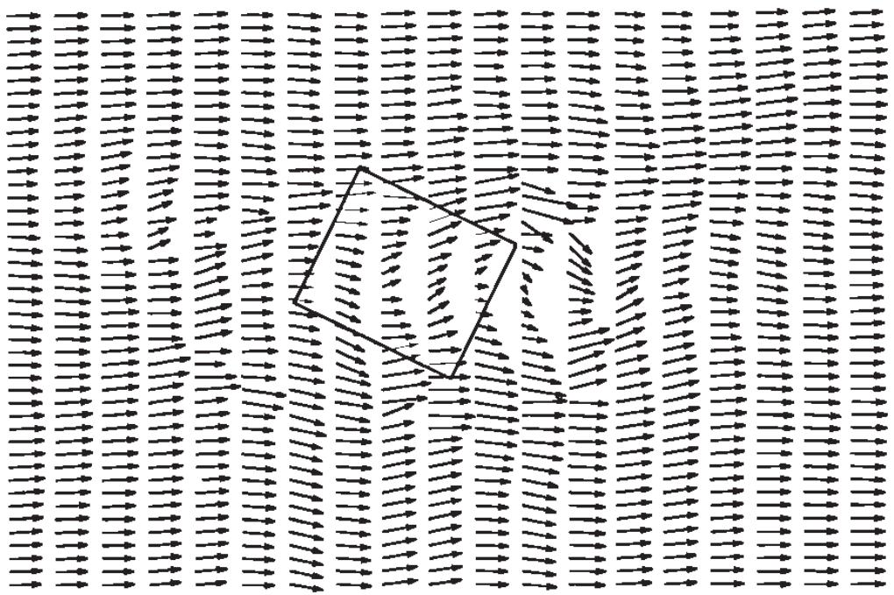  
Figure B.5.1—Measured Current Field at 60 ft Depth Around and Through the Bullwinkle Platform in a Loop Current Event in 1991

The global “blockage” discussed here, and the “shielding” discussed in B.5.3.1.2.9 are related. In fact, Lambrakos et al. [89] use the term “shielding” instead of the term “blockage” to describe the current speed reduction. The term interference has also been used in discussions of these phenomena. For present purposes the term “shielding” is used only in reference to members in the local wake of neighboring members (like conductor arrays), and the “shielding factor” should be applied to the calculated loads due to both waves and currents. The term “blockage” is used in reference to the entire structure, and the “blockage factor” should be applied to the far-field current speed only. With this distinction, one would first use the blockage factor to calculate a reduced current speed and undisturbed wave kinematics would be used in Morison’s equation to calculate local loads on all members. The calculated loads on conductors would then be reduced by the shielding factor.

B.5.3.1.2.6 Combined Wave/Current Kinematics

Dalrymple and Heideman [73] and Eastwood and Watson [76] showed that waves alternately stretch and compress the current profile under crests and troughs, respectively. Dalrymple and Heideman found that a model that combined Doppler-shifted wave kinematics with a nonlinearly stretched current profile gave the best estimate of global loads on a structure. Nonlinear stretching computes the stretched current for a particle instantaneously at elevation z as the speed $U_{ \mathsf{ c } } ( z^{ \prime } )$ evaluated from the specified current profile at elevation $z^{ \prime } ,$ the mean elevation of the particle over a full wave cycle. The elevations z and $z^{ \prime }$ are related through linear (Airy) wave theory as follows:

$$z = z^{\prime} + \eta \frac{\sinh \left[ 2 \pi \left(z^{\prime} + d\right) / \lambda_{n} \right]}{\sinh \left(2 \pi d / \lambda_{n}\right)} \tag{B.5.5}$$

Here d is storm water depth, η is the wave surface directly above the water particle, and $\lambda_{ \mathbf{ n } }$ is the wave length determined from nonlinear wave theory for a wave of height H and period $T_{ \mathsf{ a p p } } .$ . The elevations $z , z^{ \prime } ,$ and η are all positive above storm mean water level.

This equation gives a nonlinear stretching of the current, with the greatest stretching occurring high in the water column, where the particle orbits have the greatest radii. The nonlinearly stretched current profile, coupled with Doppler shifted wave kinematics, produces global platform loads that are within +1 % to –4 % of those produced by the exact solution on a typical drag-dominant structure subjected to representative waves and current profiles.

Another acceptable approximate model for many applications is one that uses a linearly stretched current profile, with:

$$z + d = \left(z^{\prime} + d\right) (d + \eta) / d \tag{B.5.6}$$

The stretched current profiles from the two models are compared qualitatively in Figure B.5.2 for typical sheared and slab current profiles under a wave crest. The linearly stretched current produces global loads on a typical drag-dominant platform that are nearly as accurate as those produced by the nonlinearly stretched current, being within 0 to –6 % of loads produced by the exact solution. However, it does not simulate the combined wave/current velocity profile from the exact solution as faithfully as nonlinear stretching.

Vertical extrapolation of the input current profile above mean water level produces reasonably accurate estimates of global loads on drag-dominant platforms in most cases. In particular, for a slab profile thicker than about 50 m, like the recommended profiles in API 2MET, vertical extrapolation produces nearly the same result as nonlinear stretching, as illustrated in Figure B.5.2. However, if the specified profile $U_{ \mathsf{ c } } ( z^{ \prime } )$ has a very high speed at mean water level, sheared to much lower speeds just below mean water level, the global force may be overestimated (by about 8 % in a typical application).

Another approximate model is the linearly stretched model described above, adjusted so that the total momentum in the stretched profile from the seafloor to the wave surface equals that in the specified profile from the seafloor to mean water level. This procedure is not supported by the theoretical analyses of Dalrymple and Heideman [73] or Eastwood and Watson [76].

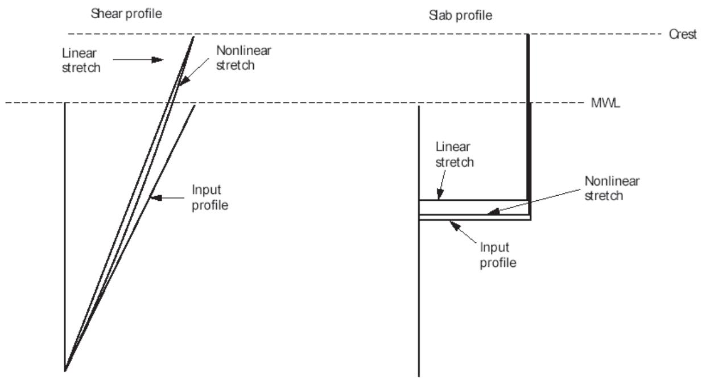  
Figure B.5.2—Comparison of Linear and Nonlinear Stretching of Current Profiles

If the current is not in the same direction as the wave, the methods discussed above may still be used, with one modification. Both the in-line and normal components of current would be stretched, but only the in-line component would be used to estimate $T_{ \mathsf{ a p p } }$ for the Doppler-shifted wave.

While no exact solution has been developed for irregular waves, the wave/current solution for regular waves can be logically extended. In the first two approximations described above for regular waves, the period and length of the regular wave should be replaced with the period and length corresponding to the spectral peak frequency.

B.5.3.1.2.7 Marine Growth

All elements of the structure (members, conductors, risers, appurtenances, etc.) are increased in crosssectional area by marine growth. The effective element diameter (cross-sectional width for noncircular cylinders, or prisms) is $D = D_{ \mathsf{ c } } + 2 t ,$ , where $D_{ \mathsf{ c } }$ is the “clean” outer diameter and t is the average growth thickness that would be obtained by circumferential measurements with a 25 mm to 100 mm (1 in. to 4 in.) wide tape. An additional parameter that affects the drag coefficient of elements with circular cross sections is the relative roughness, e = k/D, where k is the average peak-to-valley height of “hard” growth organisms. Marine growth thickness and roughness are illustrated in Figure B.5.3 for a circular cylinder. Marine organisms generally colonize a structure soon after installation. They grow rapidly in the beginning, but growth tapers off after a few years. Marine growth has been measured on structures in many areas but should be estimated for other areas where no measurements exist.

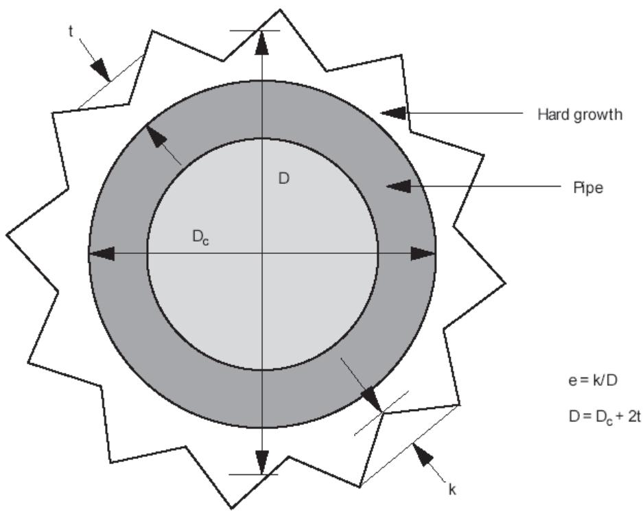  
Figure B.5.3—Definition of Surface Roughness Height and Thickness

B.5.3.1.2.8 Drag and Inertia Coefficients

B.5.3.1.2.8.1 General

In the ocean environment, the forces predicted by Morison’s equation are only an engineering approximation. Morison’s equation can match measured drag and inertia forces reasonably well in any particular half wave cycle with constant $C_{ \mathsf{ d } }$ and $C_{ \mathsf{ m } } ,$ but the best fit values of $C_{ \mathsf{ d } }$ and $C_{ \mathsf{ m } }$ vary from one half wave cycle to another. Most of the variation in $C_{ \mathsf{ d } }$ and $C_{ \mathsf{ m } }$ can be accounted for by expressing $C_{ \mathsf{ d } }$ and $C_{ \mathsf{ m } }$ as functions of:

— relative surface roughness, $e = k / D ;$   
— Reynolds number, $R_{ \mathsf{ m } } = U_{ \mathsf{ m } } D / \upsilon ;$   
— Keulegan-Carpenter number, $K = 2 U_{ \mathrm{ m } } T_{ 2 } / D ;$   
— current/wave velocity ratio, $r = V_{ 1 } / U_{ \mathrm{ m o } } ,$   
— member orientation.

Here $U_{ \mathbf{ m } }$ is the maximum velocity (including current) normal to the cylinder axis in a half wave cycle, $T_{ 2 }$ is the duration of the half wave cycle, $V_{ 1 }$ is the in-line (with waves) current component, $U_{ \mathsf{ m o } }$ is the maximum wave-induced orbital velocity, D is effective diameter (including marine growth), υ is the kinematic viscosity of water, and k is the absolute roughness height.

B.5.3.1.2.8.2 Surface Roughness

The dependence of $C_{ \mathsf{ d } \mathsf{ s } }$ , the steady-flow drag coefficient at postcritical Reynolds numbers, on relative surface roughness, is shown in Figure B.5.4, for “hard” roughness elements. All the data in this figure have been adjusted, if necessary, to account for wind tunnel blockage and to have a drag coefficient that is referenced to the effective diameter $D ,$ including the roughness elements.

Natural marine growth on platforms will generally have $e > 10^{ - 3 } ,$ . Thus, in the absence of better information on the expected value of surface roughness and its variation with depth for a particular site, it is reasonable to assume $C_{ \mathsf{ d s } } = 1 . 00 \mathrm{ ~ t o ~ } 1 . 10$ for all members below high tide level. One would still need to estimate the thickness of marine growth that will ultimately accumulate in order to estimate the effective diameter D. For members above high tide level, a reasonable estimate of surface roughness is k = 0.05 mm (0.002 in.), which will give $C_{ \mathsf{ d } \mathsf{ s } }$ in the range 0.6 to 0.7 for typical diameters.

All the data in Figure B.5.4 are for cylinders that are densely covered with surface roughness elements. Force measurements (Kasahara and Shimazak [86]; Schlichting [108]) show that there is little degradation in the effectiveness of surface roughness for surface coverage as sparse as 10 %, but that roughness effects are negligible for surface coverage less than 3 %.

The effect of soft, flexible growth on $C_{ \mathsf{ d } \mathsf{ s } }$ is poorly understood. Tests run by Nath [98] indicate that:

a) soft, fuzzy growth has little effect, $C_{ \mathsf{ d } \mathsf{ s } }$ being determined predominantly by the underlying hard growth; and   
b) anemones and kelp produce drag coefficients similar to those for hard growth.

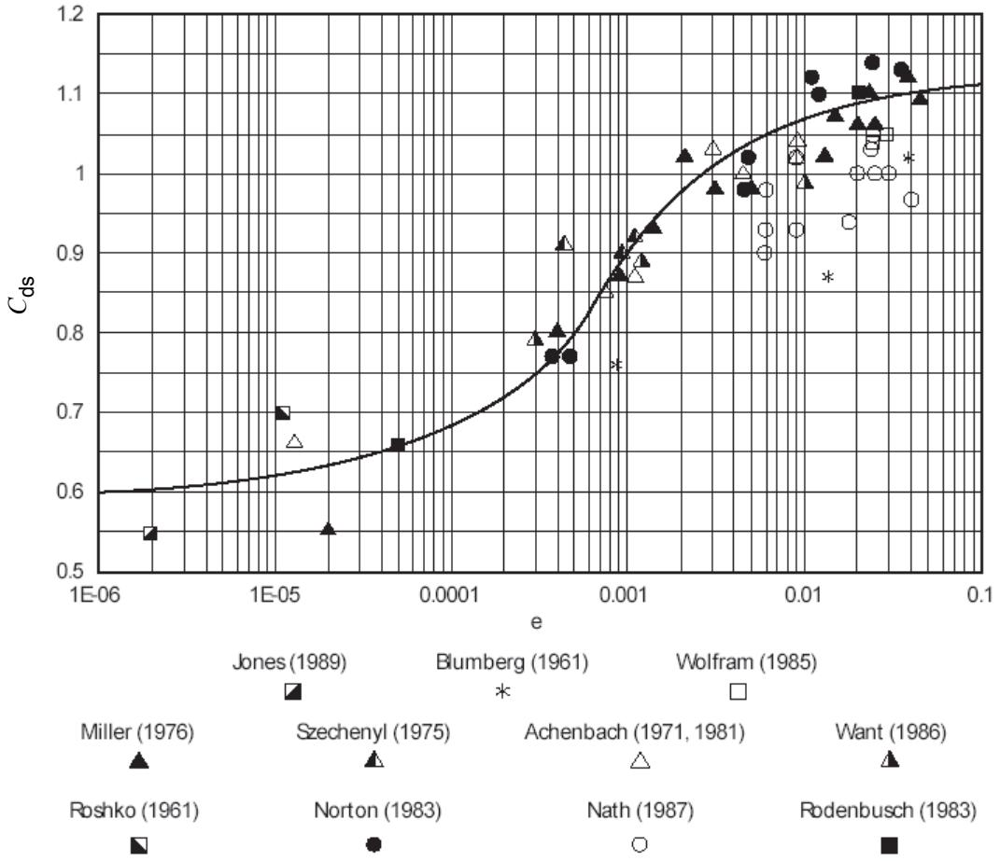  
Figure B.5.4—Dependence of Steady Flow Drag Coefficient on Relative Surface Roughness

For cylindrical members whose cross section is not circular, $C_{ \mathsf{ d } \mathsf{ s } }$ may be assumed to be independent of surface roughness. Suitable values are provided by DNV RP-C205 [39].

Surface roughness also affects the inertia coefficient in oscillatory flow. Generally, as $C_{ \mathsf{ d } }$ increases with roughness, $C_{ \mathsf{ m } }$ decreases. More information is provided in subsequent discussions.

B.5.3.1.2.8.3 Reynolds Number

The force coefficients for members whose cross sections have sharp edges are practically independent of Reynolds number. However, circular cylinders have coefficients that depend on Reynolds number.

Fortunately, for most offshore structures in the extreme design environment, Reynolds numbers are well into the postcritical flow regime, where $C_{ \mathsf{ d } \mathsf{ s } }$ for circular cylinders is independent of Reynolds number. However, in less severe environments, such as considered in fatigue calculations, some platform members could drop down into the critical flow regime. Use of the post critical $C_{ \mathsf{ d } \mathsf{ s } }$ in these cases would be conservative for static wave force calculations but nonconservative for calculating damping of dynamically excited structures.

In laboratory tests of scale models of platforms with circular cylindrical members, the dependence of $C_{ \mathsf{ d } \mathsf{ s } }$ on Reynolds number should be taken into account. In particular, the scale of the model and the surface roughness should be chosen to eliminate or minimize Reynolds number dependence, and the difference between model-scale and full-scale $C_{ \mathsf{ d } \mathsf{ s } }$ should be considered in the application of model test results to

full-scale structures. Further guidance on the dependence of circular cylinder $C_{ \mathsf{ d } \mathsf{ s } }$ on Reynolds number can be found in Achenbach [63], Hoerner [83], and Sarpkaya and Isaacson [40].

B.5.3.1.2.8.4 Keulegan-Carpenter Number

This parameter is a measure of the unsteadiness of the flow; it is proportional to the distance normal to the member axis traveled by an undisturbed fluid particle in a half wave cycle, normalized by the member diameter. For a typical full-scale jacket structure in design storm conditions, K is generally greater than 40 for members in the “wave zone,” and drag force is predominant over inertia force. On the other hand, for the large-diameter columns of a typical gravity structure, K may be less than 10 and inertia force is predominant over drag force.

The parameter K is also a measure of the importance of “wake encounter” for nearly vertical (within $15^{ \circ }$ of vertical) members in waves. As the fluid moves across a member, a wake is created. When oscillatory flow reverses, fluid particles in the wake return sooner and impact the member with greater velocity than undisturbed fluid particles. For larger K, the wake travels farther and decays more before returning to the cylinder and, furthermore, is less likely to strike the cylinder at all if the waves are multidirectional or there is a component of current normal to the principal wave direction. For very large K, wake encounter can be neglected. For smaller K, wake encounter amplifies the drag force for nearly vertical members above its quasisteady value estimated from undisturbed fluid velocities.

Figure B.5.5 shows data for the drag coefficient $C_{ \mathsf{ d } }$ that are most appropriate for calculating loads on nearly vertical members in extreme storm environments. All these data were obtained in the postcritical flow regime, in which $C_{ \mathsf{ d } \mathsf{ s } }$ is practically independent of Reynolds number. All account for wave spreading, that is, all have two components of motion normal to the member axis. All except the “Figure $8 "$ data implicitly account for random wave motion. The field data also naturally include an axial component of motion and, to some extent, a steady current. The data for smooth and rough cylinders are reasonably well represented by a single curve in Figure B.5.5, for K > 12, with K normalized by $C_{ \mathsf{ d } \mathsf{ s } } ,$ as suggested by the far-field, quasisteady wake model of Beckmann and McBride [68].

Figure B.5.6 shows drag coefficient data for $K < 12$ , which are more appropriate for calculating loads on nearly vertical members in less extreme sea states and drag damping in earthquake-excited motion, for example. For $K < 12$ , the smooth and rough cylinder data are similar if K is not normalized by $C_{ \mathsf{ d } \mathsf{ s } } .$ . The data of Sarpkaya [106] do not agree well with the curves in Figure B.5.6, presumably because of the relatively low Reynolds number in his tests for the lowest values of K and because of the lack of wave spreading in his tests for the higher values of K.

It should be noted that the symbols shown in Figure B.5.5 do not represent individual data points. Rather, they represent values from a curve fitted through a scatter of data points. In designing a structure consisting of a single isolated column, one should perhaps account for the scatter in the $C_{ \mathsf{ d } }$ data. In this regard, the data of Sarpkaya [106] for one-dimensional, sinusoidally oscillating motion, which are notably omitted from Figure B.5.5, represent a reasonable upper bound. However, for a structure consisting of many members, the scatter in $C_{ \mathsf{ d } }$ can probably be neglected, as the deviations from the mean curve are uncorrelated from member to member (see Heideman et al. [81]).

Figure B.5.7 and Figure B.5.8 show data for the inertia coefficient $C_{ \mathsf{ m } }$ for a nearly vertical circular cylinder. Figure B.5.7 shows that $C_{ \mathsf{ m } }$ for both smooth and rough cylinders approaches the theoretical value of 2.0 for $K \leq 3 .$ For $K > 3$ , with the onset of flow separation, $C_{ \mathsf{ m } }$ begins to decrease. With the exception of Sarpkaya’s rough cylinder data, which exhibit a pronounced drop (“inertia crisis’”) in $C_{ \mathsf{ m } }$ at $K \approx 12$ , it appears that a single sloping line is adequate for both smooth and rough cylinders, up to $K \approx 12$ , beyond which smooth and rough cylinder data begin to diverge. In Figure B.5.8, the single line from Figure B.5.7 is seen to split into two lines because K is divided by $C_{ \mathrm{ d } \mathsf{ s } } = 0 . 66$ for smooth cylinders and $C_{ \mathsf{ d s } } = 1 . 1$ for rough cylinders. The value of $C_{ \mathbf{ m } }$ is taken as 1.6 for smooth cylinders and 1.2 for rough cylinders for $K / C_{ \mathsf{ d s } } \geq 17$ .

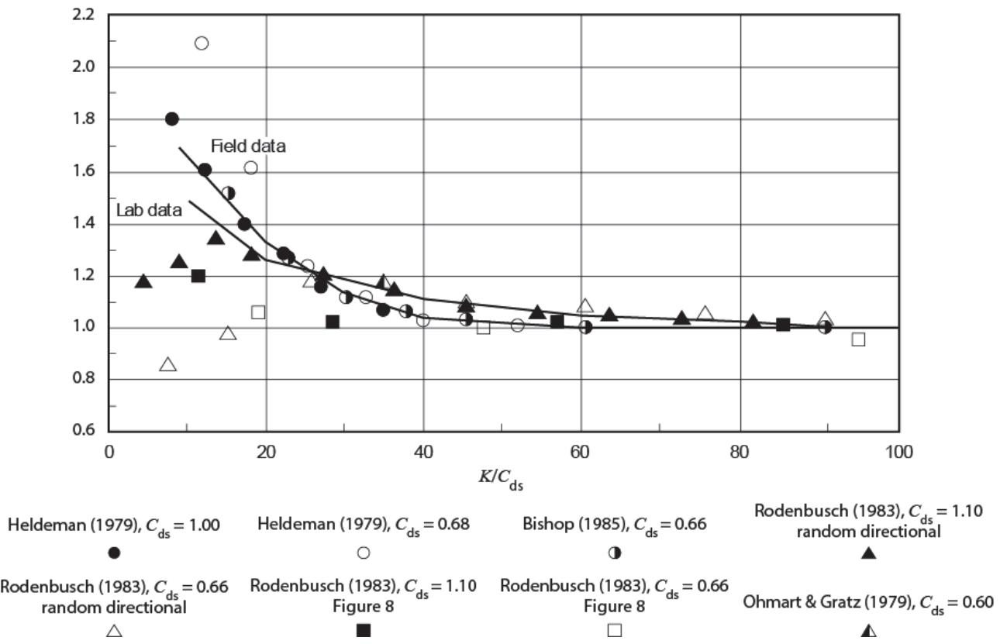  
Figure B.5.5—Wake Amplification Factor for Drag Coefficient as a Function of $K / C_{ \mathsf{ d } \mathsf{ s } }$

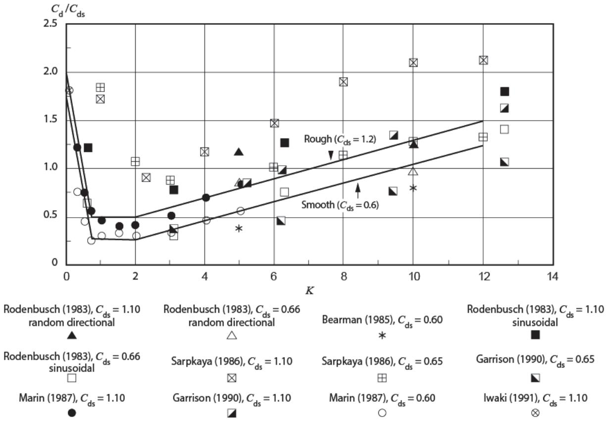  
Figure B.5.6—Wake Amplification Factor for Drag Coefficient as a Function of K

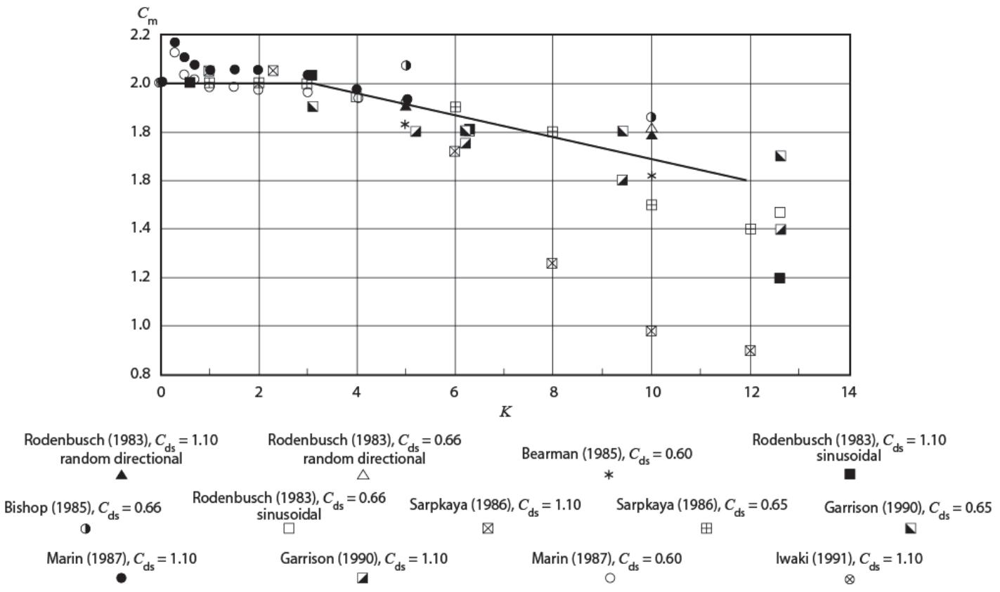

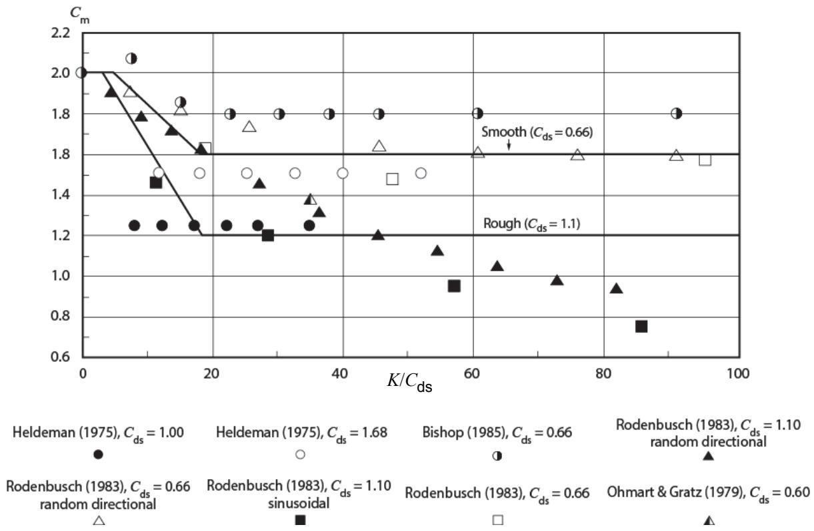  
Figure B.5.7—Inertia Coefficient as a Function of K   
Figure B.5.8—Inertia Coefficient as a Function of $K / C_{ \mathsf{ d } \mathsf{ s } }$

Although Figure B.5.5 through Figure B.5.8 are based on circular cylinder data, they are also applicable to noncircular cylinders, provided the appropriate value of $C_{ \mathsf{ d } \mathsf{ s } }$ is used, and provided $C_{ \mathsf{ m } }$ is multiplied by $C_{ \mathrm{ m o } } / 2$ , where $C_{ \mathsf{ m o } }$ is the theoretical value of $C_{ \mathsf{ m } }$ for the noncircular cylinder as K approaches 0.

Furthermore, while Figure B.5.5 through Figure B.5.8 were developed for use with individual, deterministic waves, they can also be used for random wave analysis (either time or frequency domain) of fixed platforms by using significant wave height and spectral peak period to calculate K.

B.5.3.1.2.8.5 Current/Wave Velocity Ratio

The effect of a steady in-line current added to oscillatory motion is to push $C_{ \mathsf{ d } }$ toward $C_{ \mathsf{ d } \mathsf{ s } } ,$ its steady flow value. Data show that, for practical purposes, $C_{ \mathsf{ d } } = C_{ \mathsf{ d } \mathsf{ s } }$ when the current/wave velocity ratio, $r ,$ is greater than 0.4. For $r < 0 . 4$ , the effect of a steady in-line current can be accommodated by modifying the Keulegan-Carpenter number. A first-order correction would be to multiply K due to wave alone by （$1 + r ) 2 \theta{ * } / \pi$ , where $\theta_{ * } = \mathsf{ a r c t a n } \left( \sqrt{ 1 - r^{ 2 } } , - r \right)$ .

A current component normal to the wave direction also drives $C_{ \mathsf{ d } }$ toward $C_{ \mathsf{ d } \mathsf{ s } }$ , since it reduces the impact of wake encounter. Data show that, for practical purposes, $C_{ \mathsf{ d } } = C_{ \mathsf{ d } \mathsf{ s } }$ for $V_{ \mathsf{ N } } T_{ 2 } / C_{ \mathsf{ d s } } D > 4$ . On the other hand, wake encounter has nearly its full impact for $V_{ \sf N } T_{ 2 } / C_{ \sf d s } D < 0 . 5$ .

B.5.3.1.2.8.6 Member Orientation

For members that are not nearly vertical, the effect of wake encounter, as characterized by the K dependence in Figure B.5.5 through Figure B.5.8, is small. For horizontal and diagonal members, it is sufficient for engineering purposes to use the theoretical value of $C_{ \mathsf{ m } }$ as $K {  } 0$ and the steady-flow value of $C_{ \mathsf{ d } } = C_{ \mathsf{ d } \mathsf{ s } }$ as $K {  } \infty$ .

B.5.3.1.2.9 Conductor Shielding Factor

The empirical basis for the shielding wave force reduction factor for conductor arrays is shown in Figure B.5.9. Data from flow directions perfectly aligned with a row or column of the array are excluded, for conservatism.

The data in Figure B.5.9 are from steady flow tests and oscillatory flow tests at very high amplitudes of oscillation. Thus the factor is strictly applicable only in a steady current with negligible waves or near the mean water level in very large waves. The data of Heideman and Sarpkaya [82] indicate that the factor is applicable if $A / S > 6 ,$ , where A is the amplitude of oscillation and S is the center-to-center spacing of the conductors in the wave direction. The data of Reed et al. [102] indicate that range of applicability can be expanded to $A / S > 2 . 5$ . For lower values of $A / S ,$ there is still some shielding, until $A / S < 0 . 5 ~ [ 82 ]$ . With $A { \approx } U_{ \mathsf{ m o } } T_{ \mathsf{ a p p } } / 2 \pi$ , where $U_{ \mathsf{ m o } }$ and $T_{ \mathsf{ a p p } }$ are defined in B.5.3.1.2.8.1 and B.5.3.1.2.2, respectively, the approximate shielding regimes are:

— A/S > 2.5, asymptotic shielding, factor from Figure B.5.9;   
— $A / S < 0 . 5 ,$ , no shielding, factor = 1.0;   
$- 0 . 5 < A / S < 2 . 5$ , partial shielding.

In the absence of better information, the shielding factor in the partial shielding regime can be linearly interpolated as a function of A/S. Waves considered in fatigue analyses may lie in the partial shielding regime.

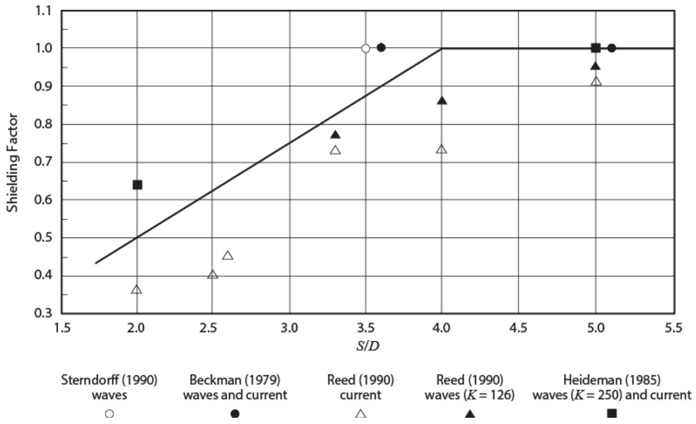  
Figure B.5.9—Shielding Factor for Wave Loads on Conductor Arrays as a Function of Conductor Spacing

B.5.3.1.2.10 Hydrodynamic Models for Appurtenances

The hydrodynamic model of a structure is used for the calculation of wave forces that represent the forces on the actual structure. The model need not explicitly include every element of the structure provided the dimensions and/or force coefficients for the included elements account for the contribution of the forces on the omitted elements. The hydrodynamic model should account for the effects of marine growth and for flow interference effects (blockage and shielding) where appropriate.

Appurtenances include substructures and elements such as boat landings, fenders or bumpers, walkways, stairways, grout lines, and anodes. Though it is beyond the scope of this commentary to provide modeling guidance for every conceivable appurtenance, some general guidance is provided.

Boat landings are substructures generally consisting of a large number of closely spaced tubular members, particularly on some of the older designs. If the members are modeled individually, shielding effects, depending upon the wave direction, can be accounted for in a manner similar to that for conductor arrays. Another option is to model a boat landing as either a rectangular solid or as one or more plates, with directionally dependent forces. Some guidance for coefficients for solid shapes and plates can be found in Reference [75].

Conductor guide frames may also be modeled as rectangular solids and sometimes as plates. In either case, different coefficients are appropriate for vertical and horizontal forces.

Large fenders or boat bumpers and their supporting members are usually modeled as individual members. They may be treated as nonstructural members provided that experience has shown their design to be adequate for their intended purpose. Walkways, stairways, and grout lines may be modeled as equivalent circular members though they are sometimes ignored where experience has proven the acceptability of such action.

The treatment of anodes depends somewhat upon the number and size of the anodes on the structure. Anodes are often ignored in the hydrodynamic model where experience has shown that their wave force contribution is negligible. If they are included, they can be modeled as equivalent circular cylinders. Alternatively, anode wave forces may be approximated by increasing the diameters and/or force coefficients of the member to which they are attached.

B.5.3.1.2.11 Morison Equation

The use of the local acceleration rather than the total (local plus convective) acceleration in the inertia term of the Morison equation is the subject of ongoing debate. There have been several publications on this topic in recent years (Manners and Rainey [94]; Madsen [93]; Sarpkaya and Isaacson, Section 5.3.1 [40]; Newman [99]). These publications all conclude that the total acceleration should be used. However, these publications all assume unrealistically that the flow does not separate from the cylinder. Realistically, except for very small amplitudes of oscillation (K < 3), the flow separates on the downstream side of the cylinder, creating a wake of reduced velocity. The local change in velocity across the cylinder due to the convective acceleration in the undisturbed far-field flow is generally much less than the change in velocity due to local flow separation, as implied in the paper by Keulegan and Carpenter (1958). The convective acceleration may also be nearly in phase with the locally incident flow velocity, which leads the undisturbed far field velocity in oscillatory flow because of “wake encounter” (Lambrakos et al. [91]). Therefore, it could be argued that the convective acceleration should be neglected, either because it is small relative to local velocity gradients due to flow separation or because it is already implicitly included in drag coefficients derived from measurements of local force in separated flow. As a practical matter, the convective acceleration exceeds 15 % of the local acceleration only in steep waves, for which inertia force is generally much smaller than drag force (Sarpkaya and Isaacson [40]).

Only the components of velocity and acceleration normal to the member axis are used in computing drag and inertia forces, based on the “flow independence,” or “cross-flow,” principle. This principle has been verified in steady subcritical flow by Hoerner [83] and in steady postcritical flow by Norton, Heideman, and Mallard [100]. The data of Sarpkaya et al. [107], as reinterpreted by Garrison [78], have shown the flow independence principle to be also for inertia forces in one-dimensional oscillatory flow. Therefore, it is reasonable to assume that the flow independence principle is valid in general for both steady and multidimensional oscillatory flows, with the exception of flows near the unstable, critical Reynolds number regime.

B.5.3.1.2.13 Local Member Design

The Morison equation accounts for local drag and inertia forces but not for the “out-of-plane” (plane formed by the velocity vector and member axis) local lift force due to periodic, asymmetric vortex shedding from the downstream side of a member. Lift forces can be neglected in the calculation of global structure loads. Because of their high frequency, random phasing, and oscillatory (with zero mean) nature, lift forces are not correlated across the entire structure. However, lift forces may need to be considered in local member design, particularly for members high in the structure whose stresses may be dominated by locally generated forces.

The oscillating lift force can be modeled as a modulated sine function, whose frequency is generally several times the frequency of the wave and whose amplitude is modulated with $U^{ 2 }$ , where U is the timevarying component of fluid velocity normal to the member axis. In the absence of dynamic excitation, the maximum local lift force amplitude $F_{ \mathsf{ L , m a x } }$ per unit length of the member is related to $U_{ \sf m a x } ,$ the maximum value of U during the wave cycle, by the equation:

$$F_{\mathrm{L}, \max } = C_{\ell , \max } (w / 2 g) D U_{\max }^{2} \tag{B.5.7}$$

The coefficient $C_{ \ell , \mathsf{ m a x } }$ has been found empirically by Rodenbusch and Gutierrez [103] to have considerable scatter, with an approximate mean value $C_{ \ell , \mathrm{ m a x } } \approx 0 . 7 C_{ \mathrm{ d } } ,$ , for both smooth and rough circular cylinders, in both steady flow and in waves with large Keulegan-Carpenter numbers. Sarpkaya [106] focused on the rms value of the oscillating lift force and found that it was less than half FL,max. $F_{ \mathsf{ L , m a x } } .$

The frequency of the oscillating lift force is $S_{ \sf t } U_{ \sf t o t a l } / D$ , where $S_{ \mathrm{ t } }$ is the Strouhal number and $U_{ \mathrm{ t o t a l } }$ is the total incident velocity, including the axial component. Laboratory tests [100] [103] have shown that $S_{ \mathrm{ t } } \sim 0 . 2$ for circular cylinders over a broad range of Reynolds numbers and flow inclination angles in steady flow. If $S_{ \mathrm{ t } }$ remains constant in waves, than the frequency of the oscillating lift force is also modulated as U varies with time during a wave cycle.

In the event that any natural frequency of a member is near the lift force frequency, a large amplitude dynamic response, called vortex-induced vibration (VIV), may occur. When VIV occurs, the motion of the member and the magnitude of the fluid-dynamic forces can increase to unacceptable levels. VIV can occur on long spans due to wind forces in the construction yard and on the tow barge as well as to waves and currents on the in-place structure. A complete treatise on VIV is beyond the scope of this commentary.

Horizontal members in the wave splash zone of an in-place structure may experience wave slam forces. These nearly vertical forces are caused by the local water surface rising and slapping against the underside of the member as a wave passes. Since these forces are nearly vertical, they contribute very little to the base shear and overturning moment of the platform. However, slam forces may need to be considered in local member design.

Slam forces can also occur on platform members overhanging the end of the barge while the platform is being towed, or on members that strike the water first during side launching of platforms.

In the theoretical case, slam force is impulsive. If the slam force is truly impulsive, the member may be dynamically excited. In the real world, the slam force may not be impulsive because of the threedimensional shape of the sea surface, the compressibility of air trapped between the member and the sea surface, and the aerated nature of water near the free surface.

Slam force $F_{ \mathsf{ S } }$ per unit length can be calculated from the equation:

$$F_{\mathrm{S}} = C_{\mathrm{S}} (w / 2 g) D U^{2} \tag{B.5.8}$$

where

U is the component of water particle velocity normal to the member axis at impact.

Sarpkaya (1978) has shown empirically that the coefficient $C_{ \mathsf{ S } }$ may lie between 0.5 and 1.7 times its theoretical value of π, depending on the rise time and natural frequency of the elastically mounted cylinder in his tests. Sarpkaya and Isaacson (1981) recommend that if a dynamic response analysis is performed, the theoretical value of $C_{ \mathsf{ S } } = \pi$ can be used; otherwise, a value of $\dot{ C }_{ \mathsf{ S } } = 5 . 5$ should be used.

Axial Froude-Krylov forces have the same form as the inertia force in the Morison equation, except that $C_{ \mathbf{ m } }$ is set to unity and the normal component of local acceleration is replaced by the axial component. Axial Froude-Krylov forces on members that are nearly vertical contribute negligibly to platform base shear and overturning moment. Axial Froude-Krylov forces on diagonal and horizontal braces are relatively more important, contributing about 10 % as much to base shear and overturning moment as the inertia force included in the Morison equation, based on computations performed by Atkins (1990). In view of approximations made elsewhere in the computation of global wave force, axial Froude-Krylov forces can generally be neglected.

B.5.3.4 Hydrodynamic Force Guidelines for U.S. Waters

Prior to the 21st Edition of API 2A-WSD, the 20th Edition and recent previous editions had recommended that all new structures be designed for a single criteria, based on the 100-year return period. Starting with the 21st Edition a three level criteria based on life safety and the consequences of failure of the platform was introduced. The development, calibration, and basis for this three level consequence-based criteria is discussed in more detail in OTC Papers 11885 and 11886, as noted in API 2MET.

For new platforms with high life exposure and/or high consequences of failure that are classed as $^{ \mathbf{ s } } \lfloor - 1^{ \mathbf{ s } }$ as defined in 4.7, the 100-year wave height and associated tide and current is recommended. This is the 100-year criteria as previously specified in API 2A-WSD, 20th Edition and represented the best and safest technology that the industry had developed until API 2MET.

New platforms with minimal life exposure and moderate consequence of failure that are classed as L-2, as defined in 4.7 may be designed for a midlevel reduced criteria. It is intended that this criteria will result in a platform as reliable as those that had been designed to API 2A-WSD, the 9th through 20th Editions. Platforms designed for the 9th through 19th Editions have produced a satisfactory performance during Gulf of Mexico hurricanes. Calibration studies indicated that platforms designed using API 2A-WSD, 20th Edition procedures and metocean conditions with a return period of 33 to 50 years had equivalent ultimate capacities to the API 2A-WSD, 19th Edition designs. Based on this calibration, the 50-year return period was selected as the basis for the L-2 criteria. It should be noted that the 50-year return period was selected since it provides structures with equivalent reliability as the API 2A-WSD, 19th Edition designs. Thus, these criteria were selected based on satisfactory experience and not on any other considerations.

New platforms with no life exposure and low consequence of failure that are classed as L-3, as defined in 4.7, can be designed for a lower level reduced criteria. These criteria will result in a platform with an ultimate capacity equal to the 100-year criteria as specified for L-1 structures. This design will produce an increased risk of failure. Use of these criteria increases the financial risk of damage to or loss of the platform. However, this loss is not expected to cause environmental damage or negative impact to the industry.

B.5.3.6 Earthquake

B.5.3.6.1 General

Portions of the coastal waters of the United States are located in seismically active areas, and it is necessary that fixed offshore platforms in these areas be designed to resist earthquake ground motions. As for most other types of facilities, it is not warranted and normally not economical to design offshore platforms to preclude any damage for the most severe earthquake ground shaking possible. Accordingly the provisions are intended to provide resistance to moderate earthquakes, which have a reasonable likelihood of not being exceeded during the lift of the platform, without significant structural damage. Structural damage is likely to occur in the event of rare intense earthquake ground motion, but the provisions are intended to prevent collapse of the platform.

The strength requirements are presented to meet the first goal, which is to provide resistance to moderate earthquakes without significant structural damage. The ground motions for the strength design should be established through site-specific studies as recommended in API 2EQ. Forces in the structural members should not exceed yielding of the complete section or buckling capacity.

Earthquake forces in structures result from ground motion, and the intensity of the forces is dependent of the stiffness of the structure and its foundation. Unlike most other environmental forces, earthquake forces generally are reduced as the structure becomes less stiff due to inelastic yielding or buckling of structural or foundation elements. Where such inelastic action can occur without the structure becoming unstable under gravity loads, a significantly greater amount of ground shaking can be sustained without collapse than can be sustained at first yield.

It has been analytically demonstrated for locations such as offshore Southern California that steel template type structures designed in accordance with the strength requirements and that are well configured and proportioned can withstand the rare, intense earthquake without collapsing. For structures of this type in these locations, specific guidelines for configuring the structure and for proportioning members are presented to ensure the necessary ductility. Where these provisions are not applicable, requirements are included for analyzing structures for the rare, intense earthquake ground motion.

In areas of low seismic activity, platform design would normally be controlled by storm or other environmental loading rather than earthquake. For areas where the strength level design horizontal ground acceleration is less than 0.05 g (e.g. the Gulf of Mexico), earthquake analysis need not be performed, since the design for environmental loading other than earthquake will provide sufficient resistance against potential effects from seismically active zones. For areas where the strength level design horizontal ground acceleration is in the range of 0.05 g to 0.10 g, inclusive, all of the earthquake requirements, except those for deck appurtenances, may be considered satisfied if the strength requirements (see 5.3.6.3) are met using the ground motion intensity and characteristics of the rare, intense earthquake in lieu of the strength level earthquake. In this event, the deck appurtenances should be designed for the strength level earthquake in accordance with 5.3.6.5.2, but the ductility requirements (5.3.6.4) are waived, and tubular joints need be designed for allowable stresses specified in 5.3.6.3 using the computed joint loads instead of the tensile load or compressive buckling load of the member.

Earthquake-related Definitions. Some terms, when applied to earthquake engineering, have specific meanings. A list of some of these terms is as follows.

a) Site Seismic Zone—A parameter defined in API 2EQ that is used to describe the expected ground motion at a specific offshore location. Although any single parameter is not adequate to fully describe

the destructive energy of earthquake ground motion, the site seismic zone is a meaningful index of the level of earthquake activity expected for a given location.

b) Ground Motion—The vibratory movement of the ground resulting from an earthquake. Motion at any point is uniquely described in terms of either acceleration, velocity, or displacement time histories.   
c) Response Spectrum—A response spectrum depicts the maximum response to a ground motion of a series of single degree of freedom oscillators having different natural periods but the same degree of internal damping. The response spectrum of a particular earthquake acceleration record is in fact a property of that ground motion, stated in terms of the maximum response of simple (single degree of freedom) structures. When this response is represented with a set of smooth lines such as shown in API 2EQ, it is called a smooth response spectrum.   
d) Time History—Time history is a continuous record over time of ground motion or response.   
e) Near Field—The soil mass that transmits earthquake motions to the structure, provides immediate support for the structure and is affected by the motions of the structure. The near field soils may be represented by discrete lateral and vertical elements that reproduce the load-deflection characteristics of direct soil-pile interaction. In modeling the near field soil, account should be taken of the dynamic and cyclic behavior of the soil-pile system and the pile group effects.   
f) Free Field—The soil mass in the vicinity of the platform that is not significantly affected by the motions of the platform. API 2EQ provides guidance on modifying the response spectrum to account for free field site effects. When modeling the free field, account should be taken of the dynamic and cyclic behavior of the soils and of hysteretic and radiation energy dissipation. The soil mass may be modeled by using either FEs or simplified equivalents.   
g) Seismic Risk Category—A designation used in API 2EQ to define seismic design rules as a function of site specific zone and exposure level (L-1, L-2, or L-3).

B.5.3.6.2 Preliminary Considerations

B.5.3.6.2.1 Evaluation of Seismic Activity

Design criteria consist of both a description of the environmental loading and the requirements to ensure adequate structural performance. The objective of design criteria specification is to allow the designer to use relatively simple but realistic analysis procedures to proportion the elements of a structure such that the structure has acceptable strength and ductility. The environmental loading is typically specified in terms of smoothed response spectra and/or a set of earthquake records that are representative of design level motions at the site.

The development of both site-specific spectra and records is described in API 2EQ. The structural performance aspects of design criteria consist of guidelines for structural modeling, response analysis, and response assessment including allowable stresses and recommended safety factors. All of these aspects of design criteria need to be considered as an integrated package to ensure consistently reliable design [167].

Site-specific studies should be considered as a basis for developing the ground motion specification of the design criteria, as defined in API 2EQ. Performing a site-specific study is the primary means by which information concerning the local characteristics of earthquake motion can be explicitly incorporated into the design criteria.

Since the platform should meet specific strength and ductility requirements, two levels of ground motion intensity should be considered [118]: ground motion that has a reasonable likelihood of not being exceeded at the site during the platform’s life (associated with a recurrence interval somewhat longer than that used for wave design, taking into consideration the uncertainty in estimating ground motion and the differences between the performance requirements with wave vs earthquake design), which is defined as an extreme level earthquake (ELE) in API 2EQ, and Reference [119] ground motion from a rare intense earthquake (associated with an event controlled by the seismic environment that can have a recurrence interval of several hundred to a few thousand years), which is defined as an abnormal level earthquake (ALE) in API 2EQ.

The site-specific study description presented in API 2EQ provides a framework to use data, theory, and judgment for developing estimates of site ground motions. The process involves a synthesis of information requiring a broad range of professional skills and requires a considerable amount of judgment. A thorough consideration of these steps should be sufficient for the rational and defensible selection of design criteria.

It should be noted that U.S. seismic hazard maps are periodically updated by the U.S. Geological Survey, (USGS), but these updates may not be reflected in API 2EQ (and ISO 19901-2). Unless negligible, these changes to the seismic hazards may be worth consideration.

B.5.3.6.3 Strength Requirements (ELE)

B.5.3.6.3.1 Design Basis

For structures subjected to base excitations from seismic events, either of the following two methods of analysis is allowed for the ELE design check:

a) the response spectrum analysis method,   
b) the time history analysis method.

In both methods, the base excitations shall be composed of three motions—two orthogonal horizontal motions and the vertical motion. Reasonable amounts of damping compatible with the ELE deformation levels are used in the ELE design; see the applicable offshore structures in ISO 19902 [33]. Higher values of damping due to hydrodynamics or soil deformation shall be substantiated with special studies. The foundation may be modeled with equivalent elastic springs and, if necessary, mass and damping elements; off-diagonal and frequency dependence can be significant. The foundation stiffness and damping values shall be compatible with the ELE level of soil deformations.

In a response spectrum analysis, the methods for combining the responses in the three orthogonal directions shall consider correlation between the modes of vibration. When responses due to each directional component of an earthquake are calculated separately, the responses due to the three earthquake directions may be combined using the square root of the sum of the squares method. Alternatively, the three directional responses may be combined linearly assuming that one component is at its maximum while the other two components are at 40 % of their respective maximum values. In this method, the sign of each response parameter shall be selected such that the response combination is maximized.

When the time history analysis method is used, a minimum of four sets of time history records shall be used to capture the randomness in seismic motions. The earthquake time history records shall be selected such that they represent the dominating ELE events. Component code checks are calculated at

each time step and the maximum code utilization during each time history record shall be used to assess the component performance. The ELE design is satisfactory if the median of the code utilization maximums is less than 1.0; a factor of 1.05 shall be applied to the median if fewer than 7 sets of records are used.

For the purpose of preliminary designs and studies, a response spectrum may be developed based on API 2EQ seismic maps, risk exposure, and soil amplification factors as well as the seismic reserve capacity factor, $C_{ \Gamma } .$

If the design is accomplished by the time history method of analysis, the time histories used in each orthogonal direction should be scaled as stated in the above paragraph and generated or modified so that their normalized response spectra for 5 % critical damping reasonably match the design spectrum in the period range of interest.

The lateral and axial soil resistances of a pile foundation system are normally developed at different locations along the pile length. Therefore, the horizontal ground motion spectrum or time history for the soil near the surface is associated with the lateral pile motion and may be different than the vertical ground motion spectrum or time history associated with the axial pile motion at depth.

Selection of the earthquake criteria may be influenced by oceanographic conditions. This interaction effect, which can be significant if both earthquake and oceanographic conditions are severe, can occur in two principal ways: First, in the face of two severe environmental conditions, the design intensity of each could be higher than the level that might be appropriate if only one existed, in order to maintain a constant overall level of safety. A second effect occurs due to the fact that forces induced in a platform by earthquake are, to at least some extent, proportional to the stiffness of both the structural and foundation systems. Thus, an increase in structural and foundation stiffness to resist oceanographic forces will in turn result in higher forces being induced in a platform by a given level of earthquake shaking. While the shift in period associated with such a stiffness increase will automatically lead to higher design forces for strength requirements for most offshore platforms, changes in the nonlinear ultimate response of the system may not be accounted for automatically. These interactive effects were significant for the Gulf of Alaska [125] [126].

B.5.3.6.3.2 Structural Modeling

Structural modeling for analysis purposes involves a variety of considerations. Several publications (e.g. Nair [136]) provide detailed guidance for the designer.

The ground motion developed by the site-specific study typically represents that “free field” motion that would exist in the vicinity of the platform if the platform were not there. To be consistent, the mathematical model used in evaluating platform response should incorporate all important elements of the mass, stiffness and energy dissipation properties of both the structure and foundation components of the platform, as well as significant aspects of interaction between the foundation elements and the surrounding soil.

For foundation modeling, when there is a substantial difference in the soils near the pilehead and those along the lower portion of the pile, a variation in the free field motion with depth may have to be considered for the detailed design of the piles. For evaluation of the overall structure-foundation system, a satisfactory approximation is to assume that the lateral pile behavior is related to horizontal ground motions in the near surface soil and the axial pile behavior to the vertical motions in the deeper soil. (See Figure B.5.10.)

The use of the response spectrum approach requires that damping be identified with each mode. In 5.3.6.3.2, modal damping of 5 % of critical is specified for use in all modes unless damping, n (percent)，are justified,either uniform or diferent for each mode.The following factor,D, may be used to multiply the response ordinates obtained from the curves in API 2EQ:

$$D = \frac{- \ln (\eta / 100)}{\ln (20)} \tag{B.5.9}$$

The factor D is appropriate for values of damping between 2 % and 10 %.

B.5.3.6.3.3 Response Analysis

Section 5.3.6.3.3 suggests that the complete quadratic combination [137] of individual modal responses is appropriate for the evaluation of design response. This method accounts for correlation among responses of closely spaced modes. Other combinations may be appropriate for the evaluation of design response. The modal combination rule appropriate for a particular class of structures or members may be evaluated by comparing the response of the structure to a limited number of time histories with its response to the corresponding response spectra [160] [161] [162]. It is also important to define the proper response variable in applying the response spectrum method. Note that the response variable such as member force is not necessarily the variable that will be directly compared to criteria such as allowable stress.

To obtain an adequate representation of the structural response, all of the modes having frequencies higher than the zero-period acceleration (ZPA) need not be included, provided that the residual rigid response due to the missing mass is calculated and is combined algebraically with the structure response [23]. The ZPA is the response spectrum acceleration in the rigid range of the spectrum, typically above 33 Hz, which is equal to the maximum acceleration of the time history record.

B.5.3.6.3.4 Response Assessment

In the response spectrum analysis method, the response quantity of interest should be computed separately for each mode and then the modal responses combined using an appropriate method. For example, member end reactions are computed for each mode and combined to obtain the total earthquake-induced forces. It should be noted that combining the modal values of actual-to-allowable stress ratios would not be conservative for columns because of the moment amplification term in the AISC 335-89 allowable stress evaluation.

The total design force for each member is obtained by combining the earthquake-induced forces together with forces due to gravity, buoyancy and hydrostatic loading. In combining the earthquake-induced member forces with static forces account should be taken of the fact that the former have no sense of direction attached to them, and that earthquake-induced forces are cyclic in nature. In general, the relative signs of the earthquake related forces acting on a member should be selected such that the most conservative condition will result. However, some unwarranted conservatism may be reduced by rational arguments concerning the expected member behavior such as the type of curvature.

In computing the earthquake-induced forces for member design, consideration should also be given to the inertia forces introduced by the local vibrational characteristics of individual members.

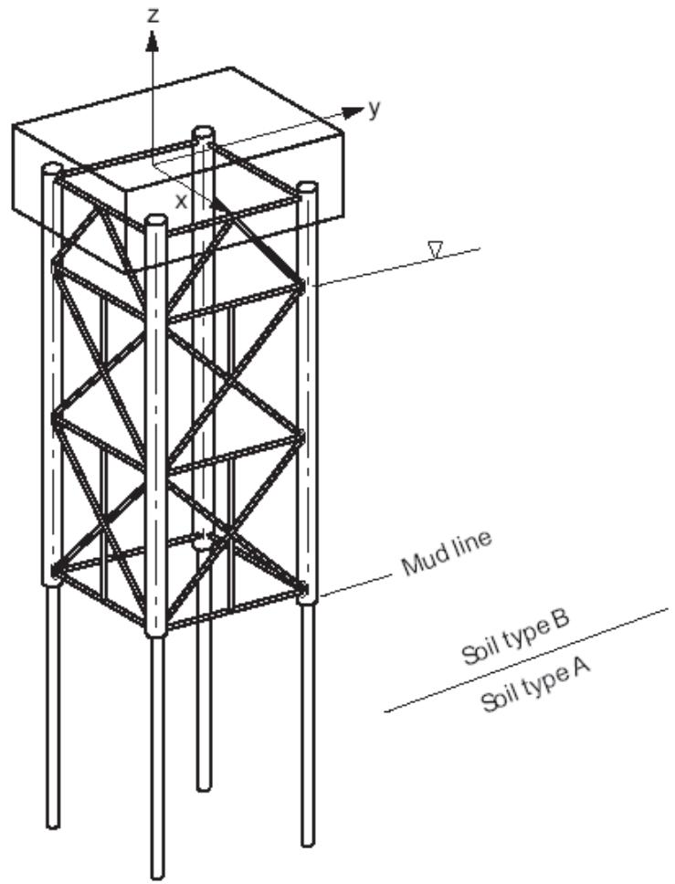  
Figure B.5.10—Example Structure

For the strength requirement, the basic allowable stresses in 6.1 and those presented in 6.2 may be increased by 70 %. These provisions permit minor yielding but no significant damage to occur. The resulting allowable stresses are nearly the same as those proposed by the Applied Technology Council [120] for the earthquake response of steel buildings. Some yielding of the members may occur in bending since the 1.7 stress factor is within the range (1.52 to 1.92) of the AISC 335-89 factors of safety for members subjected to axial and bending loads. Also, when multiplied by 1.7, the AISC 335-89 allowable shear stress becomes 0.68 times the yield stress, which is 18 % greater than the von Mises yield criteria. However, as discussed by Beedle [140], the overstress in shear can be supported by strain hardening.

For combined earthquake loading and hydrostatic pressure, the suggested safety factors for local buckling and interaction equations listed in 6.2.2.2 and 6.2.5 are as follows:

— axial tension, 1.0;   
— axial compression, 1.0 to 1.2;   
— hoop compression, 1.2.

These factors are approximately equal to those given in 6.2 for Design Condition 1, divided by 1.7.

B.5.3.6.4 Ductility Requirements (ALE)

In seismically active areas, platform response to rare, intense earthquake motions may involve inelastic action, and structural damage may occur. The provisions of 5.3.6.4 are intended to ensure that structurefoundation systems planned for such areas remain stable in the event of a rare, intense earthquake at the site. This can be achieved by providing sufficient system redundancy such that load redistribution and inelastic deformation will occur before collapse and by minimizing abrupt changes in stiffness in the vertical configuration of the structure. Adequate ductility can be demonstrated by adhering to the design practices outlined below or by nonlinear analysis, where applicable.

Considerable experience has been developed in recent years in the analysis of the overload performance of conventional structure-pile systems [127] [131] [142]. Such systems are jacket type structures with eight or more legs; supported by piles in competent soils whose local strength and stiffness degradation under extreme cyclic loading does not significantly compromise the overall integrity of the platform foundation; and located in areas where the intensity ratio of the rare, intense ground motions to the strength level ground motions is approximately 2. Based on this experience, the design guidelines of 5.3.6.4 [119] and 5.3.6.5 have been developed [143]. Implementation of these guidelines in the design of similar structures should ensure sufficient ductility for the overload condition. Explicit analysis of the overload performance of such structures should not be necessary for low seismic risk categories.

The guidelines include provisions for configuring and proportioning members in the vertical frames. Their purpose is to provide for redistribution of the horizontal shear loads in the vertical frames as buckling occurs in diagonal bracing, and to improve the postbuckling behavior of the diagonal braces and of nontubular members at connections. These provisions will enhance ductile behavior of the structure under extreme lateral cyclic loading. Figure 5.5 shows examples of vertical frame configurations that do not meet the guidelines. Example configurations that meet the guidelines are shown in Figure 5.6. Note that the two “K” braced panels forming an “X” in two vertically adjacent panels meet the guidelines.

The objective of a static pushover analysis is to verify that the seismic reserve capacity factor, $C_{ \mathsf{ r } } ,$ of the structure as designed is greater than that initially estimated for design. The actions used in a static pushover analysis should represent the pattern of ALE seismic actions on the structure and foundation. Action patterns in a pushover analysis may be constructed to match the shear and moment distributions determined from an ALE response spectrum analysis along the height of the structure. Pushover analyses should be performed in several directions, as given below, to identify the structure’s weakest direction:

— with the pattern of seismic actions aligned with the longitudinal (end-on) axis of the structure;   
— with the pattern of seismic actions aligned with the transverse (broadside) axis of the structure;   
— with the pattern of seismic actions aligned with one or more diagonal axes of the structure.

Diagonal direction(s) can be the weakest direction(s), especially with regard to foundation performance. Yielding of structural members or piles shall not occur at global action levels lower than or equal to the global ELE action $F_{ \mathsf{ E L E } }$ (see Figure B.5.11). The seismic reserve capacity factor may be estimated from the global seismic action deformation curve obtained in a static pushover analysis (e.g. from global shear vs deck displacement) (see Figure B.5.11).

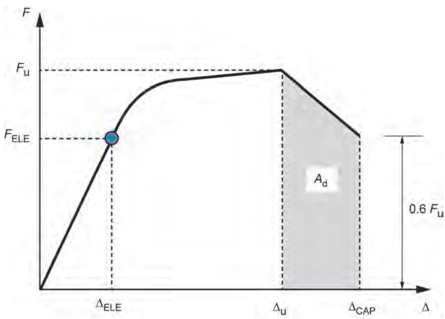  
Figure B.5.11—Seismic Load Deformation Curve

The seismic reserve capacity factor, $C_{ \mathsf{ r } } = C_{ \mathsf{ s r } } C_{ \mathsf{ d r } }$ , where $C_{ \mathsf{ s r } }$ is a factor corresponding to the strengthening regime of the action-deformation curve and is estimated as:

$$C_{\mathrm{s r}} = \Delta_{\mathrm{u}} / \Delta_{\mathrm{E L E}}$$

where

$\varDelta_{ \mathrm{ u } }$ is the deformation corresponding to $F_{ \mathsf{ U } } ,$ the ultimate action where the slope of the actiondeformation curve becomes negative (see Figure B.5.11);

$\boldsymbol{ \varDelta }_{ \sf E L E }$ is the deformation caused by the global ELE action $F_{ \mathsf{ E L E } }$

$C_{ \mathsf{ d r } }$ is a factor corresponding to the degrading regime of the action-deformation curve. It is a measure of the energy dissipation capacity of the structure beyond the ultimate seismic action and the corresponding deformation. $C_{ \mathsf{ d r } }$ is estimated as:

$$C_{\mathrm{d r}} = \sqrt{1 + \frac{A_{\mathrm{d}}}{F_{\mathrm{u}} \Delta_{\mathrm{u}}}}$$

where

$A_{ \mathsf{ d } }$ is the area under the action-deformation curve starting from $\varDelta_{ \mathsf{ u } }$ and ending with $\scriptstyle \varDelta_{ \mathsf{ C A P } }$ , the deformation capacity of the structure.

For the purpose of a nonlinear static pushover analysis, the deformation capacity shall be assumed to be the deformation where the global action falls to 60 % of $F_{ \mathsf{ U } }$ .

The previous determination of $C_{ \mathsf{ r } }$ presupposes that the primary sources of degradation of the global resistance have been properly modeled in the static pushover analysis, for example, soil degradation, buckling of compression members, and local buckling of members due to rotations at the member end

(reducing the plastic moment capacity). Alternatively, $\varDelta_{ \mathsf{ u } }$ shall be set as the deformation where the slope of the action-deformation curve is reduced to 5 % of the initial elastic slope, and $C_{ \mathsf{ d r } }$ shall be assumed equal to 1.0. To ensure the seismic design process is conservative the lower of the two values of $C_{ \mathsf{ r } }$ thus determined shall be adopted.

Reasons that a structure-foundation system may merit an explicit analysis of its nonlinear dynamic performance during a rare, intense earthquake are defined in API 2EQ.

In order to demonstrate the satisfactory overload performance of these systems, it is necessary to establish appropriate performance criteria, develop representative platform and foundation models, and perform analyses using a method of analysis that reasonably reflects the anticipated response of the platform and its foundation to rare, intense earthquake ground motion [134] [135] [142] [144].

Representative sets of ground motion time histories that are characteristic of a rare, intense earthquake at the site should be developed from a site-specific seismic hazard study following the provisions of API 2EQ. It should be demonstrated that the structure-foundation system remains stable under the loads imposed by these ground motions. The structure-foundation system may be considered unstable when the deflections are large enough to cause collapse under the influence of gravity loads.

The postyield and postbuckling behavior of structural members subject to overload under cyclic load reversals should be modeled [132] [141] [145] [146] [147] [148] [149]. For members required to develop significant bending, the interaction between axial load and moment capacity should be included (e.g. deck girders, jacket legs, and piles) [150]. The ductility and cyclic degradation characteristics of tubular members are strongly dependent on their D/t and slenderness ratios [151]. A significant amount of ductility can be built into the structure by implementation of the generic design guidelines presented in 5.3.6.4.3. Foundation models should consider the effects of cyclic load reversals, strain rate, pore water pressure generation on the strength and stiffness of the soils surrounding the piles [152] [153] [154] [155] [156], and energy dissipation mechanisms [157] [158] [159].

The designer should develop a thorough insight into the performance of the structure and foundation during a rare, intense earthquake. The time history method of analysis is recommended for high seismicrisk-category platforms as defined in API 2EQ. The structure-foundation response should be determined to multiple sets of ground motions that characterize the likely envelope of ground motion intensity, frequency content, phasing and duration expected at the site. At least three sets of representative earthquake ground motion time histories should be analyzed. Additional more simplistic methods of analysis may be used to complement the results of the time history analysis [130].

B.5.3.6.5 Additional Guidelines

B.5.3.6.5.1 Tubular Joints

Joints are sized for the yield or buckling capacity of incoming members, so that premature failure of the joints will be avoided and the ductility of the overall structure can be fully developed. This requirement may be relaxed if joint strengths are verified by time history analysis simulating the ALE event according to 5.3.6.4.

The recommended practice is to size jacket leg joint cans for full yield in main diagonals, and for the buckling load of principal horizontals. These horizontals typically have small loads for elastic analysis, but are required to pick up substantial compressive loads to prevent the structure from “unzipping” after main diagonals buckle. Excessive joint can thickness may often be avoided by using a conical stub end on the governing member or by considering the beneficial effects of member overlap (7.4) and/or grouted-in piles.

B.5.3.6.5.2 Deck Appurtenances and Equipment

The method of deriving seismic design forces for a deck appurtenance depends upon the appurtenance’s dynamic characteristics and framing complexity. There are two analysis alternatives.

a) Through proper anchorage and lateral restraint, most deck equipment and piping are sufficiently stiff such that their support framing, lateral restraint framing, and anchorage can be designed using static forces derived from peak deck accelerations associated with the strength level seismic event.

To provide assurance that the appurtenance is sufficiently stiff to meet this criterion, the lateral and vertical periods of the appurtenance should be located on the low period, “flat” portion of the deck level floor response spectra. Additionally, the local framing of the deck that supports the appurtenance should also be rigid enough to not introduce dynamic amplification effects. In selecting the design lateral acceleration values, consideration should be given to the increased response towards the corners of the deck caused by the torsional response of the platform.

b) In cases of more compliant equipment—such as drilling and well servicing structures, flare booms, cranes, deck cantilevers, tall freestanding vessels, unbaffled tanks with free fluid surfaces, long-spanning risers and flexible piping, escape capsules, and wellhead/manifold interaction— consideration should be given to accommodating the additional actions caused by dynamic amplification and/or differential displacements estimated through either coupled or decoupled analyses.

Decoupled analyses using deck floor spectra are likely to produce greater design loads on equipment than those derived using a more representative coupled analysis. This is particularly the case for more massive components, especially those with natural periods close to the significant natural periods of the platform. Coupled procedures and decoupled procedures, which attempt to account for such interaction, are described in ASCE 4-98 [23] and References [163], [164], [165], and [166].

If coupled analyses are used on relatively rigid components that are modeled simplistically, care should be exercised such that the design accelerations which are derived from the modal combination procedure are not less than the peak deck accelerations.

Field inspections by experienced personnel of equipment and piping on existing platforms in seismic areas can help identify equipment anchorage and restraint that by experience and/or analysis should be upgraded. To accommodate loadings and/or differential displacements, the addition or deletion of simple bracing and/or anchorage to these components can significantly improve their performance during an earthquake. This is especially important for critical components such as piping and vessels handling hazardous materials, emergency battery racks, process control equipment, etc.

## B.6 Commentary on Structural Steel Design

B.6.2 Allowable Stresses for Cylindrical Members

Such a vast volume of literature is available on the subject of shell buckling that no particular purpose will be served by attempting to cover the subject in detail. This commentary is confined to describing only the background of the design recommendations in 6.2, which covers the buckling and allowable stresses for fabricated steel cylinders. A comprehensive review of the subject is contained in Reference [174].

The design recommendations are tailored to cylinders of dimensions and material yield strengths typical of offshore platform members $[ F_{ \mathsf{ y } } < 415$ MPa (60 ksi) and $D / t < 120 ]$ . The local buckling equations recommended for axial compression, bending, and hydrostatic pressure are, however, considered valid up to $D / t < 300$ . Application of the recommendations to thin cylinders with high D/t ratios (>300) and high strength steels $[ F_{ y }^{ \prime } > 415 \mathsf{ M P a }$ (60 ksi)] may lead to unconservative results.

B.6.2.2 Axial Compression

Tubular members under axial compression are subject to failure due either to material yield, Euler column buckling, or local buckling. For design against Euler column buckling, 6.2 recommends use of the AISC 335-89. However, to supplement AISC 335-89, 6.3 includes appropriate interaction equations for cylindrical members under axial compression and bending, together with recommended values for effective length factors, $K ,$ and moment reduction factors, $C_{ \mathsf{ m } } ,$ for typical offshore platform members.

Cylindrical shells with low diameter-to-thickness (D/t) ratio are generally not subject to local buckling under axial compression and can be designed on the basis of material failure (i.e. the local buckling stress may be considered equal to the yield stress). Cylindrical shells of relatively high D/t ratios, on the other hand, shall be checked for local shell buckling.

Unstiffened thin-wall cylinders under axial compression and bending are prone to sudden failures at loads well below theoretical buckling loads predicted by classical small-deflection shell theory. There is a sudden drop in load-carrying capacity upon buckling. The postbuckling reserve strength is small, in contrast to the postbuckling behavior of flat plates and columns, which continue to carry substantial load after buckling. For this reason, the degree of confidence in the buckling load should be higher for cylinders than for most other structural elements. This is made difficult by the large scatter in test data, and necessitates a relatively conservative design procedure. The large scatter in test data is considered to be the result of initial imperfections caused by fabrication tolerances and procedures. In addition to geometric imperfections, experimental and theoretical evidence has shown that the buckling load is also affected by boundary conditions and residual stresses. Residual stresses cause inelastic action to commence before the nominal stress due to applied loads reaches yield. As a result, the buckling process is hastened.

The elastic local buckling stress formula recommended in Equation (6.4) represents one-half the theoretical local buckling stress computed using classical small deflection theory. This reduction accounts for the detrimental effect of geometric imperfections and, based on the available test data [175], shown in Figure B.6.1, is considered to be conservative for cylinders with t ≥ 6 mm (0.25 in.) and $D / t < 300$ . For thinner cylinders and cylinders with higher D/t ratios, larger imperfection reduction factors would be required. Offshore platform members, however, are normally well within these dimensional limits.

Tubular members with D/t < 300 fabricated from typical offshore platform steels will normally buckle inelastically rather than elastically. The formula recommended in Equation (6.5) to compute the inelastic local buckling stress, $F_{ \mathsf{ x c } } ,$ is empirical and is based primarily upon the results of local buckling tests sponsored by recent AISI and API projects, and tests conducted at the University of Illinois during the 1930s. These are the only known tests on fabricated cylinders with materials yield strengths in the range of structural steels used for offshore platforms.

Figure B.6.2 shows a comparison of the recommended empirical formula and the results of the test data. Based on the test results, it is recommended that local buckling be checked whenever D/t is greater than 60. The test data shows no clear trend of variation with $F_{ \mathsf{ y } }$ for the D/t cut-off value, below which it is

unnecessary to check local buckling. The suggested constant value of $D / t = 60$ is considered to be appropriate for commonly-used offshore platform steels $[ F_{ \mathsf{ y } } = 245 \mathsf{ M P a }$ to 415 MPa (35 ksi to 60 ksi)].

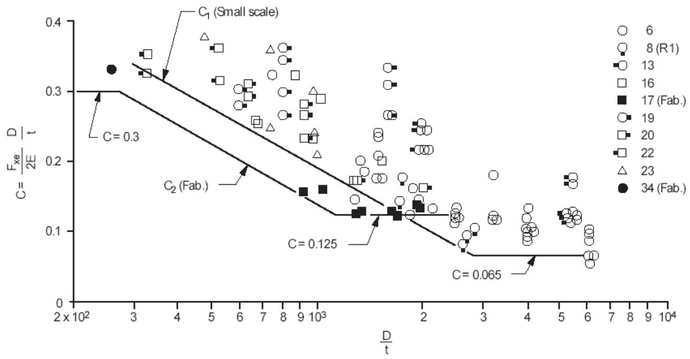  
Figure B.6.1—Elastic Coefficients for Local Buckling of Steel Cylinders Under Axial Compression

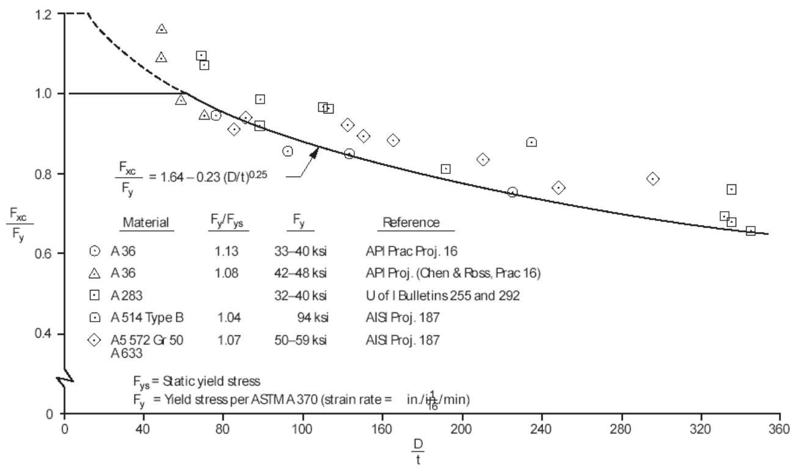  
Figure B.6.2—Comparison of Test Data with Design Equation for Fabricated Steel Cylinders Under Axial Compression

The allowable axial compressive stress is obtained by substituting the value of $F_{ \mathsf{ x c } }$ for $F_{ \mathsf{ y } }$ in the appropriate AISC 335-89 design formula.

B.6.2.3 Bending

The ultimate bending capacity of fabricated circular cylinders, normalized with respect to yield moment capacity （$M_{ \mathrm{ U } } / M_{ \mathrm{ y } } )$ is illustrated in Figure B.6.3. The data used in the figure is from Sherman [172] and Stephens et al. [173]. Cylinders with $F_{ \mathsf{ y } } D / t$ ratios less than 10,345 MPa (1,500 ksi) have ultimate bending capacities that exceed the plastic moment capacities by a considerable margin. Their load-deformation characteristics demonstrate very high postyield ductility levels, which are typical of a ductile mode of failure. The normalized rotational capacity, defined as ultimate to yield rotation ratio （$\theta_{ \mathsf{ U } } / \theta_{ \mathsf{ y } } )$ , invariably exceeds 10. When the $F_{ \mathsf{ y } } D / t$ ratios increase, the ultimate bending capacities decrease. For cylinders with $F_{ \mathsf{ y } } D / t$ ratios between 10,345 MPa and 20,685 MPa (1,500 ksi and 3,000 ksi), the load-deformation characteristics are semiductile, and the normalized rotational capacity is greater than 5. For cylinders with $F_{ \mathsf{ y } } D / t$ ratios in excess of 20,685 MPa (3,000 ksi), the load-deformation characteristics indicate little postyield ductility levels. Normalized rotational capacity of less than five is typical of a local buckling mode of failure. These local buckling strengths of cylinders under bending are significantly higher than those under uniform axial compressive loads, as shown in Figure B.6.2. Additional data for $F_{ \mathsf{ y } } D / t$ greater than 110,320 MPa (16,000 ksi), reported by Stephens, indicates that the local buckling strengths, under both bending moments and uniform axial compressive loads, converge at D/t ratios greater than 300.

The lower bound of the normalized ultimate bending capacities has been interpreted as the nominal shape factor of 1.27. This is for cylinders with $F_{ \mathsf{ y } } D / t$ up to 10,345 MPa (1,500 ksi), for which a ductile failure is assured. The lower bound of the normalized ultimate bending capacities decreased linearly to 1.10 for $F_{ \mathsf{ y } } D / t$ of 20,685 MPa (3,000 ksi), where scatter of the data is still well-defined. For cylinders with $F_{ \mathsf{ v } } D / t$ in excess of 20,685 MPa (3,000 ksi), the scatter of data is not defined. Therefore, a margin is provided in the interpretation of the lower bound of the normalized ultimate bending capacities. The normalized ultimate capacity for $F_{ \mathsf{ y } } D / t$ of 41,370 MPa (6,000 ksi) is approximately 1.0. The interpreted lower bound terminates near two data points (6), for $D / t$ and $F_{ \mathsf{ v } } D / t$ ratios of 298 and 444, and 111,975 MPa and 135,900 MPa (16,240 ksi and 19,710 ksi), respectively.

The allowable stresses for cylinders under bending have been derived by using a factor of safety of 1.67 against the lower bound of the ultimate bending capacities.

B.6.2.5 Hydrostatic Pressure

Here we describe the background of the design recommendations in 6.2.5, which covers the local instability of unstiffened and ring stiffened cylinders subjected to hydrostatic pressure. Other stiffening arrangements are not considered. However, the hydrostatic instability rules can be applied to circumferentially and longitudinally stiffened cylinders, since longitudinal stiffeners do not contribute significantly to buckling resistance against hydrostatic collapse, unless they are closely spaced. A comprehensive review of the subject is given in Reference [168].

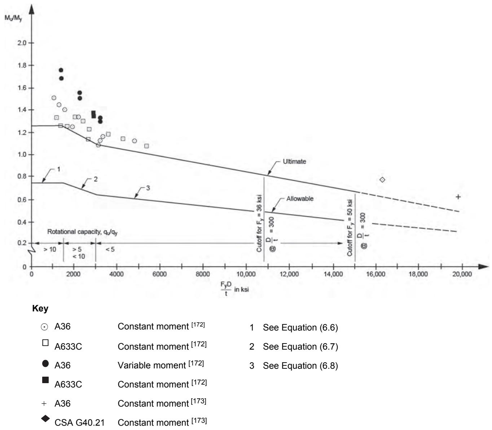  
Figure B.6.3—Design Equation for Fabricated Steel Cylinders Under Bending

The design recommendations are tailored to cylinders of dimensions and material yield strengths typical of offshore platform members $[ F_{ \mathsf{ y } } < 415 \mathsf{ M P a }$ (60 ksi) and $D / t < 120 ]$ . Application of the recommendations to thin cylinders with much higher D/t ratios and higher strength steels may lead to unconservative results.

Unstiffened cylinders under hydrostatic external pressure are subjected to local buckling of the shell wall between restraints. Ring-stiffened cylinders are subject to local buckling of the shell wall between rings. The shell buckles between the rings, while the rings remain essentially circular. However, the rings may rotate or warp out of their plane. Ring-stiffened cylinders are also subject to general instability, which occurs when the rings and shell wall buckle simultaneously at the critical load. In the general instability mode, ring instability is caused by “in-plane” buckling of the rings. Since general instability is more catastrophic than local buckling between rings, it is normally desirable to provide rings with sufficient reserve strength to preclude general instability.

The equations given in 6.2.5 to compute the elastic buckling stress represent 0.8 times the theoretical stress obtained using classical small deflection theory. The implied 20 % reduction factor （$\alpha = 0 . 80 )$ , included in the coefficient $C ,$ accounts for the effect of geometric imperfections due to fabrication. All available test data indicate that this is sufficiently conservative for cylinders fabricated within API 2B outof-roundness tolerances. For cylinders with greater out-of-roundness values, local buckling test results on steel cylinders suggest a lower bound reduction factor given by:

$$\alpha = 1. 0 - 0. 2 \sqrt{\frac{D_{\max} - D_{\min}}{0 . 01 D}} \tag{B.6.1}$$

This value of α was used to normalize the available results with respect to $a ~ = ~ 0 . 80$ (for 1 % out-of-roundness), before plotting the results in Figure B.6.4 and Figure B.6.5 for comparison with the design equations for $F_{ \mathsf{ h e } }$ .

When the elastic hoop buckling stress exceeds $0 . 55 F_{ \mathrm{ y } } ,$ a plasticity reduction factor to account for the effect of inelasticity and residual stresses shall be applied. The plasticity reduction factors given in Equation (6.18) to compute the inelastic buckling stress $F_{ \mathrm{ h c } }$ represent a reasonable lower bound for the available test data shown in Figure B.6.6.

The formula given for determining the moment of inertia of stiffening rings in Equation (6.19) provides sufficient strength to resist collapse even after the shell has buckled between stiffeners. It is assumed that the shell offers no support after buckling and transfers its entire load to the effective stiffener section. The stiffening ring is designed as an isolated ring that buckles into two waves (n = 2) at a collapse pressure 20 % higher than the strength of the shell.

Test results for steel cylinders indicate that a geometric imperfection reduction factor given by Equation B.6.1 is applicable for general instability failures of cylinders with initial out-of-roundness values exceeding one percent. A value of $\alpha = 0 . 80$ is appropriate for out-of-roundness values less than one percent. These α values were used to normalize the general instability test results included in Figure B.6.4 to correspond to a 1 % out-of-roundness basis.

When the geometric parameter, M, exceeds 1.6D/t, a ring-stiffened cylinder behaves essentially like an unstiffened cylinder of infinite length. In order to be beneficial, therefore, ring stiffeners should be spaced such that M < 1.6D/t.

B.6.3 Combined Stresses for Steel Cylindrical Members

This section of the commentary describes the background of the design recommendations that cover the buckling of unstiffened and ring-stiffened cylinders under combined axial, bending, and hydrostatic external pressure loads.

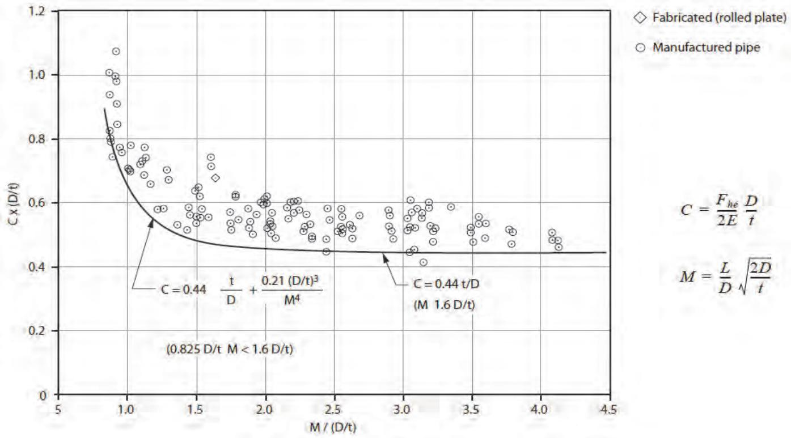  
Figure B.6.4—Comparison of Test Data with Elastic Design Equations for Local Buckling of Cylinders Under Hydrostatic Pressure (M > 0.825D/t)

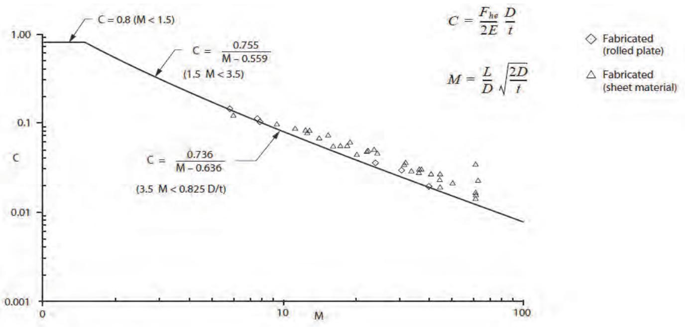  
Figure B.6.5—Comparison of Test Data with Elastic Design Equations for Local Buckling of Cylinders Under Hydrostatic Pressure (M < 0.825D/t)

Figure B.6.6—Comparison of Test Data with Design Equations for Ring Buckling and Inelastic Local Buckling of Cylinders Under Hydrostatic Pressure   
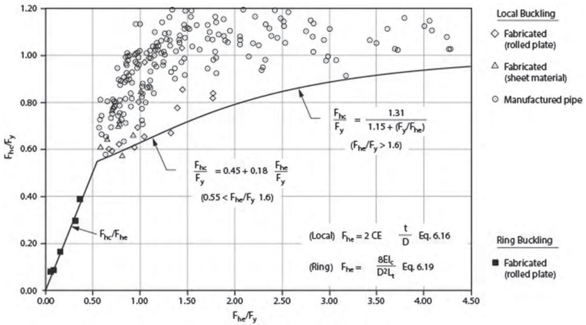  
NOTE Elastic local buckling data shown in Figure B.6.4 and Figure B.6.5 are omitted for clarity.

B.6.3.3 Axial Tension and Hydrostatic Pressure

The interaction formula recommended to check axial tension and hydrostatic pressure interaction is based on the Beltrami and Haigh maximum total energy theory, with the critical hydrostatic buckling stress substituted for the yield stress and Poisson’s ratio set equal to 0.3. The Beltrami and Haigh failure theory reduces to the Hencky–von Mises distortion energy theory with Poisson’s ratio equal to 0.5. A comparison with available test data, shown in Figure B.6.7, confirms that the recommended interaction formula is appropriate for D/t values typically used for offshore platform members. The test data that fall inside the ellipse correspond to stretch failures and tests with very low D/t values.

B.6.3.4 Axial Compression and Hydrostatic Pressure

The combination of hydrostatic pressure and axial load may produce a different critical buckling stress than either of these load systems acting independently. Figure B.6.8 illustrates the recommended interaction equations for various possible stress conditions. These interaction equations imply that no interaction occurs if the axial stress is less than one-half the allowable hoop stress.

The recommended interaction equations have been checked against the results of available tests and found to give conservative results, as shown in Figure B.6.9, Figure B.6.10, and Figure B.6.11. Figure B.6.9 shows the results of elastic buckling tests on Mylar, plexiglass, and fabricated steel cylinders, while Figure B.6.10 shows the results of fabricated steel cylinders alone. In Figure B.6.9 the test results are compared with the recommended equation for elastic interaction, Equation (6.10), using $F_{ \mathsf{ x e } }$ and $F_{ \mathsf{ h e } }$ values determined from the tests. This comparison validates the form of Equation (6.10). In Figure B.6.10,

the fabricated steel cylinder test results are compared with Equation (6.10), using $F_{ \mathsf{ x e } }$ and $F_{ \mathsf{ h e } }$ values computed from the design equations in 6.2. This confirms that Equation (6.10) is conservative. In Figure B.6.11, the recommended interaction equations are compared with the results of test data for unstiffened steel pipe with an elastic hydrostatic buckling stress and an inelastic axial buckling stress. This comparison demonstrates the validity of the recommended interaction equations for combined elastic and inelastic behavior.

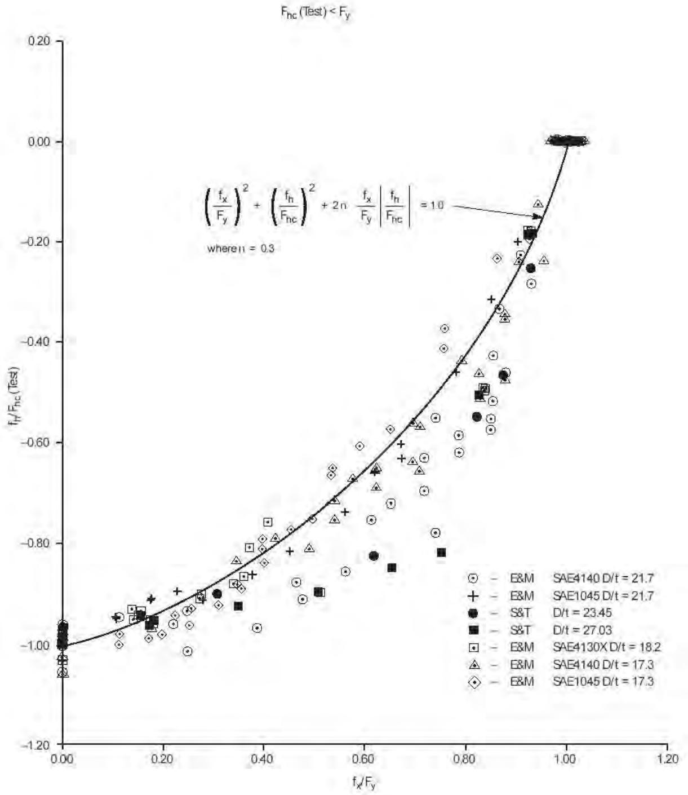  
Figure B.6.7—Comparison of Test Data with Interaction Equation for Cylinders Under Combined Axial Tension and Hydrostatic Pressure （$F_{ \mathsf{ h c } }$ Determined from Tests)

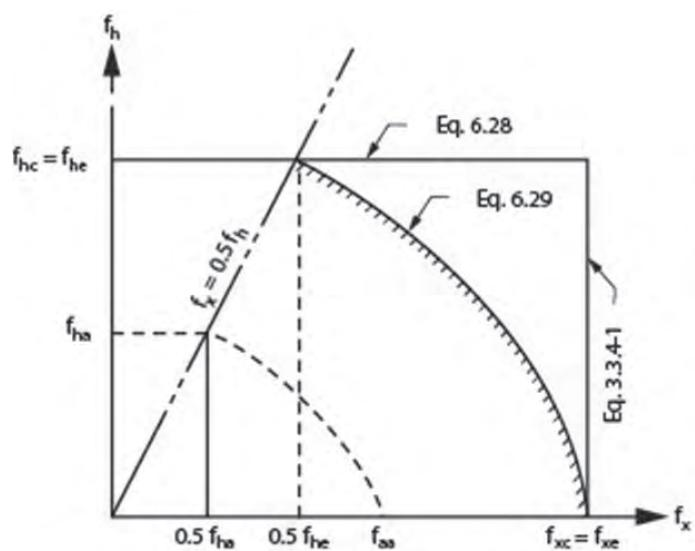  
（a)Elastic Buckling

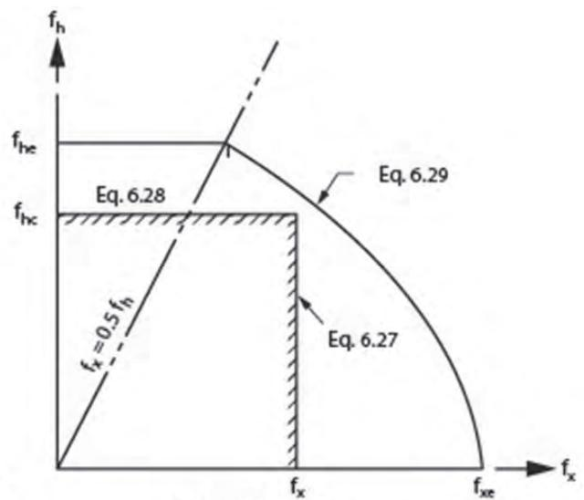  
（b)YieldTypeFailure

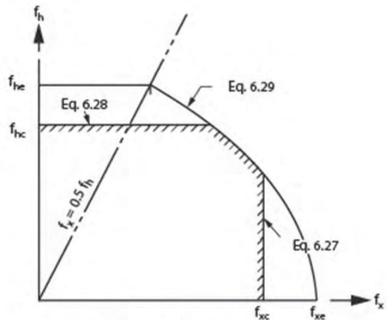  
(c)ElasticandYield Type Combined   
Figure B.6.8—Comparison of Interaction Equations for Various Stress Conditions for Cylinders Under Combined Axial Compressive Load and Hydrostatic Pressure

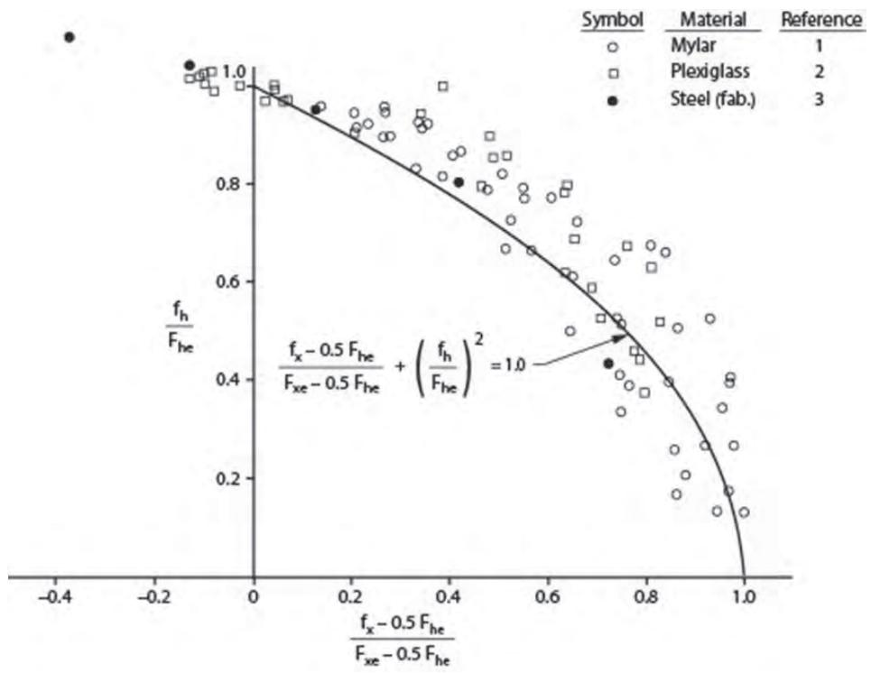  
NOTE $F_{ \mathsf{ X } \mathsf{ e } }$ and $F_{ \mathsf{ h e } }$ are determined from tests.

Figure B.6.9—Comparison of Test Data with Elastic Interaction Curve for Cylinders Under Combined Axial Compressive Load and Hydrostatic Pressure

Figure B.6.10—Comparison of Test Data on Fabricated Cylinders with Elastic Interaction Curve for Cylinders Under Combined Axial Load and Hydrostatic Pressure   
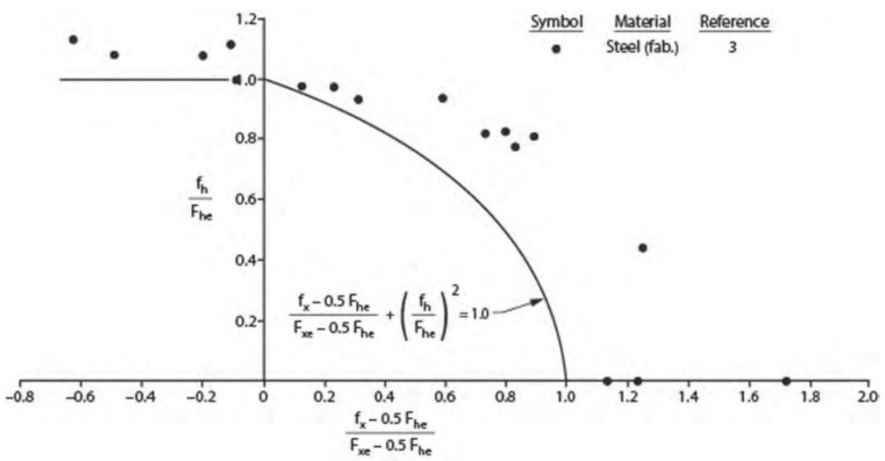  
NOTE $F_{ \mathsf{ x e } }$ and $F_{ \mathsf{ h e } }$ are determined from recommended design equations.

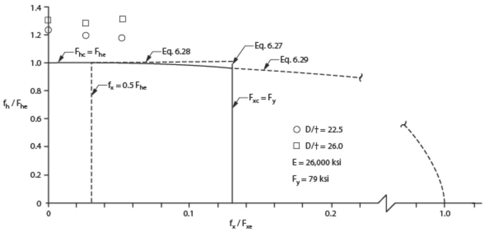  
Figure B.6.11—Comparison of Test Data with Interaction Equations for Cylinders Under Combined Axial Compressive Load and Hydrostatic Pressure (Combination Elastic and Yield-type Failures)

## B.7 Commentary on Strength of Tubular Joints

B.7.1 Application

The provisions of Section 7 are wide ranging and are intended to provide the practicing engineer with as much guidance as is currently available in this field, for the range of joint configurations, geometries and load cases that exist in practice. Although a substantial effort has been expended to capture the present day technology, it is recognized that in some instances the designer may have to use test data and analytical techniques as a basis for design [178] permits the designer to select an appropriate reduction factor for joint strength to account for a small number of data. Where the basis for the calculation of joint strength or calibration of numerical techniques to suitable test data is poor, a reduction factor of 0.7 has been known to be applied.

It is appropriate to summarize the historical development of the API 2A-WSD provisions and the background to the most recent major updates as incorporated into the Second Supplement to the 21st Edition. In the Third Edition of API 2A-WSD, issued in 1972, some simple recommendations were introduced based on punching shear principles [180]. In the Fourth Edition, factors were introduced to allow for the presence of load in the chord and the brace-to-chord diameter ratio (β). In the Ninth Edition, issued in 1977, differentiation was introduced in the allowable stress formulations for the joint and loading configuration (i.e. T/Y, DT/X, and K).

Much work was done over the period 1977 to 1983, including large-scale load tests to failure, to improve the understanding and prediction of joint behavior. This work culminated in the issue of the 14th Edition of API 2A-WSD, in which the punching shear stress formulations were considerably modified and included a more realistic expression to account for the effect of chord loads as well as providing an interaction equation for the combined effect of brace axial and bending stresses. Also introduced in the 14th Edition was the alternative nominal load approach, which gives equivalent results to the punching shear method. Some of the background to this step change in approach can be found in Reference [181]. The guidance

then essentially remained unchanged for all editions up to the 21st, although further recommendations were added on load transfer through the chord in the 20th Edition (1993).

Regardless of API 2A-WSD stability, much further knowledge, including both experimental data and numerical studies, has been gained on the behavior of joints since the 14th Edition was issued. Over the period 1994 to 1996 MSL Engineering, under the auspices of a joint industry project (JIP), undertook an update to the tubular joint database and guidance [182] [183] [184]. This work and more recent studies, notably by API/EWI and the University of Illinois, have formed the basis of the tubular joint strength provisions of ISO 19902 [33]. The ISO drafting committee took, as a starting point for drafting, the relevant provisions from API 2A-LRFD, First Edition (similar to API 2A-WSD, 20th Edition) because ISO 19902 is in LRFD format. However, the API 2A-WSD provisions were greatly modified during the drafting process to take account of the greater knowledge.

For the purposes of the Second Supplement to the 21st Edition of API 2A-WSD, the draft ISO 19902 provisions, in turn, were used as a starting point. Additional studies, not available at the time of the preparation of the draft ISO 19902 guidance have been incorporated into the Second Supplement to the 21st Edition of API 2A-WSD. The major updates between the 21st Edition and the Second Supplement to the 21st Edition are detailed in the following subsections but, in summary, involve: a relaxation of the twothirds limit on tensile strength, additional guidance on detailing practice, removal of the punching shear approach, new $Q_{ \mathsf{ u } }$ and $Q_{ \mathsf{ f } }$ formulations, and a change in the form of the brace load interaction equation.

B.7.2 Design Considerations

B.7.2.1 Materials

All of the empirical strength equations have been based upon measured yield. Very few test results have indicated unexpected low capacity due to substandard material properties. However, it is recognized that some limits are implied by the database.

One important change resulting from the MSL JIP [182] [183] [184] concerns new steels with high yield-totensile strength ratios. Previous editions of API 2A-WSD did not allow the designer to assume more than a value of two-thirds. In other words, if the ratio exceeded this limit, the designer had to downgrade the assumed chord yield level to 66 % of tensile strength. The MSL JIP found that the database justified a limit of 0.8 for joints with a chord yield of up to at least 500 MPa (72 ksi).

The material property range is limited to $F_{ \mathsf{ y } } { \leq } 500 \mathsf{ M P a } \left( 72 \mathsf{ k s i } \right)$ . Historically, there has been a concern that the strength of joints with chord yield stresses in excess of 500 MPa (72 ksi) may not increase in proportion to the yield stress. The concern relates to the possibility that higher yield strength may be obtained at the expense of lower ductility and lower strain-hardening capacity, thereby compromising the postyield reserve strength on which the design criteria rely. This matter is discussed in Reference [185]. A reevaluation of the test results reported therein has revealed that use of the limiting yield-to-tensile strength ratio of 0.8 appears to be adequate to permit the capacity equations to be used for joints with 500 MPa (72 ksi) $< F_{ \mathrm{ y } } \le 800$ MPa (115 ksi), provided adequate ductility can be demonstrated in both the HAZ and parent material. However, the test data reported in Reference [185] are limited to a small number of joint types and loading modes (i.e. 11 joints).

A JIP [186] investigated the static strength of high strength steel X-joints. The project involved the testing of four compression joints [two at a nominal yield strength of 355 MPa (51.5 ksi) and one each at 500 MPa (72.5 ksi) and 700 MPa (101.5 ksi)] and three tension joints [one each at nominal yield strength of 355 MPa (51.5 ksi), 500 MPa (72.5 ksi), and 700 MPa (101.5 ksi)]. The findings presented in

Reference [186] indicate that all the joints performed satisfactorily in the tests in terms of strength and ductility, confirming the practicality of using higher strength steels. These data indicate that a yield-totensile strength ratio of 0.8 can be used to estimate the ultimate compression and tension capabilities of the joints. However, for the tension loaded joints in which cracking prior to reaching the ultimate capacities was observed, no detailed assessments were presented.

Beyond 800 MPa (116 ksi), indicative capacity estimates may be obtained through use of a yield stress of 800 MPa (116 ksi) or 0.8 times the tensile strength, whichever is the lesser. Given the lack of data and information in this area, this approach should be considered to be only indicative.

B.7.2.2 Design Loads and Joint Flexibility

Given present-day computer power and software packages, it is generally recommended that working point offsets be defined in the analysis model to capture secondary moments. Optionally, rigid offsets from the working points on the chord centerline to the chord surface can also be defined. Such offsets can be used to reduce the bending moments from nodal values to those at the chord surface (the moment capacity equations were established for chord surface moments).

Historically, designers of offshore jacket structures have usually made the assumption that the joints are rigid and that the frame can be modeled with members extending to working points at chord centerlines. However, it has long been recognized that the linear elastic flexibility of tubular joints may be significant at locations such as skirt pile bracing and in computing fatigue life estimates for secondary connections. For conductor framing connections, fatigue life estimates can be substantially larger when linear elastic flexibilities are included in the analyses, because the member lengths are short and member flexibility tends to be less than joint flexibility. From a system ultimate strength standpoint, full, nonlinear, loaddeformation curves for joints may be required in pushover analyses, especially where joint failures are expected to participate in the sequence of events leading to system collapse. Such analyses are common in the maintenance of infrastructure and life extension studies of existing facilities.

In 1993, Buitrago et al. [187] published a robust set of equations for linear elastic flexibility/stiffness of simple tubular joints. Although a number of other sets of formulations are available in the literature, Buitrago’s formulations are considered to be more wide ranging, have better physical meaning, compare better with experimental data, and are simpler to use manually and computationally.

In Reference [183], the technology pertaining to linear elastic flexibility was extended through analyses of the updated database, to establish a range of closed-form expressions, which permit the designer to create nonlinear load-deformation (Pδ or Mθ) curves in both the loading and unloading regimes for simple joints across the practical range of load cases and geometries. The full nonlinear expressions will see application primarily in pushover analyses, especially where joint failures are postulated to influence to the peak failure load.

Reference [188] reports on a pilot study to assess the effect of hydrostatic pressure on tubular joint capacity. DT/X joints are studied, and the results indicate that capacity may be reduced by up to 30 %, depending on geometry, brace load case, and hydrostatic pressure magnitudes. Apart from Reference [188], no other studies in this area have been identified. Hydrostatic pressure effects can be significant, especially for deepwater structures, and the designer is referred to Reference [188] when considering these effects. In many instances, members are purposefully flooded to avoid hydrostatic pressure effects.

B.7.2.3 Minimum Capacity

In general, joint failure prior to a brace failure is undesirable due to uncertainties in the failure mechanism and in the effect on the surrounding structure. The requirement for a minimum chord capacity of 50 % of

the strength of the incoming braces is intended to improve the relative reliability of joints and members and to increase platform robustness. Furthermore, the minimum capacity requirement provides a safety net for unanticipated loads such as support failure during loadout, unexpected weather conditions during launch or lifting, vessel collisions, and dropped objects. The requirement also ensures a minimum capacity for connections of secondary members that take on primary importance in reserve strength assessments. To be able to take full advantage during reserve strength assessments, the effective strength of the brace should include the effects of strengthening for corrosion allowance, section availability, or design events other than the one under consideration.

The more stringent requirement of 100 % chord capacity for earthquake loading and for L-2 platforms not explicitly analyzed for robustness is intended to ensure maximum robustness during extreme events.

Noncritical joints may be excluded from the minimum capacity requirement. A joint may be considered noncritical only if its failure would not reduce the reserve strength of the structure for the design event being considered, would not reduce the capacity of the structure to withstand accidental loads, or would not have significant safety or environmental consequences. The designer may also judge the 50 % requirement to be inappropriate in certain limited instances, such as the connections of certain appurtenances for which failure of the connection would not lead to significant safety or environmental consequences.

B.7.2.4 Joint Classification

API has long recognized that joint classification should be based on axial load pattern as well as joint configuration. In principle, classification is an issue for both simple and complex joint configurations and is relevant to both fatigue and strength assessments. However, the classifications are not always the same as they can vary with wave direction and period. Classifications, and subsequent code checks, for strength should not be based on only a consideration of the wave loading at maximum shear or overturning moment. In general, classification for wave loading is best established by stepping the wave through the structure.

Several schemes for automating the classification process have evolved over the years. None is unique. In all of them, member ends belonging to a particular joint are identified and the geometric information is catalogued. Member ends lying in a common plane and on the same side of the joint are identified and the gap between them is computed. Each member end is evaluated for each axial load case. Classification may change from load case to load case and is often different for each member end at a given joint. Mixed classifications generally occur.

In the logic of the recommended classification scheme, members whose axial load component perpendicular to the chord is essentially balanced by axial loads in other members on the same side of the joint are treated as K-joints. Examples (a), (d), (e), and (g) in Figure 7.1 are such cases, as are the lower braces in examples (c) and (h). Members whose perpendicular load components are reacted across the chord are treated as X-joints, as in example (f), even though the geometric appearance may be K. Finally, members whose perpendicular loads are neither K nor X but are reacted by beam shear in the chord are treated as Y-joints, as in example (b). In some classification schemes, the hierarchy is K followed by Y, with X being the default.

There are instances where the axial load of a given brace is within ± 10 % of being purely one of the standard joint types (i.e. all Y, X, or K). In that case it is permissible to classify the brace end as totally of that joint type and no interpolation is required. However, many joints have braces that are not clearly of a given type. In other words, the loading conditions are complex in the sense that an individual member axial load should be divided into portions that are treated as K, Y, and X. Examples (c) and (h) in Figure 7.1 contain member ends with mixed classifications.

The classification scheme does not quantitatively address multiplanar connections, even though offshore jackets are space frames, not planar trusses. Furthermore, the scheme does not recognize that several braces in a given plane may simultaneously contribute to ovalization of the chord, as for launch trusses and other examples in Figure B.7.1. Such load cases can produce a more adverse load condition than is recognized in the classification scheme. In cases such as those in Figure B.7.1, it is conservative to first find the sum of the perpendicular load components that are passed through the chord section and assume that the capacity is the minimum of any one of the brace-chord intersections when acting as an X-joint. To reduce the conservatism, the designer may resort to general collapse calculations or FE analysis.

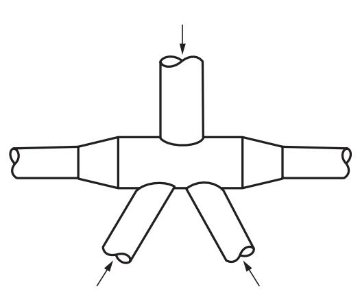

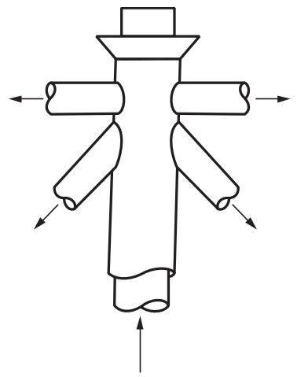  
(a) False leg termination   
(b) Skirt pile bracing

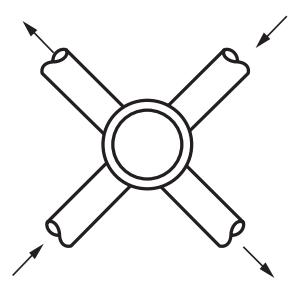

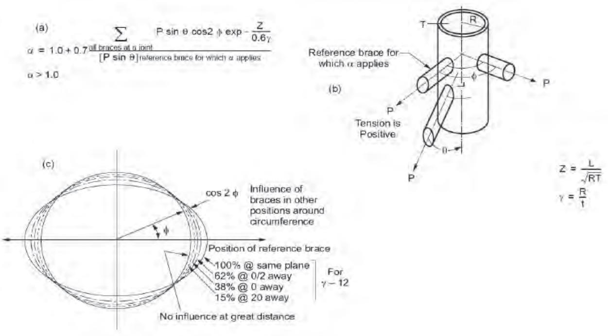  
(c) Hub connection   
Figure B.7.1—Adverse Load Patterns with α up to 3.8   
(a) Equation, (b) Definitions, (c) Influence surface   
Figure B.7.2—Computed α

An alternative approach to joint classification is to use the ovalizing parameter α from Annex T of AWS D1.1 (see Figure B.7.2). The attraction of the α-based classification in AWS D1.1 is that it does not require the designer to make decisions concerning classification. In a general sense, it encompasses the recommended simple joint classification scheme, and provides a viable design methodology for adverse loading cases (Figure B.7.1) and multiplanar joints, for which it was originally derived. Typical values of α are: approximately 1.0 for balanced K-joints, approximately 1.7 for Y-joints, and approximately 2.4 for Xjoints. For multiplanar X-X joints, α can vary from 1.0 to 3.8, depending on the load pattern; appropriateness of this has been verified by inelastic FE analysis [242]. However, the severity of ovalizing is overstated when diameter ratio $\beta$ is above 0.9, and understated for K-K-joints in delta trusses. Further, AWS does not properly incorporate the effect of transverse gap or address tension failures in the same manner as in 7.3. A JIP [190] has generated a considerable database of FE results for multiplanar, axially loaded joints having no overlapped braces. Refined expressions are given for the ovalizing parameter α that may be used within the AWS D1.1 approach.

Additional provisions specific to axially loaded, multiplanar X-, Y-, and K-joints can be found in the CIDECT design guide [191]. More contemporary information on multiplanar Y- and K-joints is available in References [192], [193], [194], and [195]. However, the designer should be aware that none of this guidance is especially robust. There are general restrictions as to loading pattern as well as joint configuration.

Effect of Classification on Basic Capacity. Unlike previous API practice where interpolation of $Q_{ \mathsf{ u } }$ was adequate for axially loaded braces with mixed classification, interpolation based on a weighted average of $P_{ \mathsf{ a } }$ is required since $\mathcal{ Q }_{ \mathbf{ f } }$ also varies with axial load classification. Taking Figure 7.1(h) as an example, the diagonal brace has a 50 % K and 50 % X classification. In this case, $P_{ \mathsf{ a } }$ is calculated separately for K classification and X classification. In the calculation for X classification, capacity downgrading (if any) in accordance with 7.3.5 requires consideration. The joint characteristic axial capacity can thereafter be calculated as follows:

$$P_{a} = 0. 5 \left(P_{a}\right)_{K} + 0. 5 \left(P_{a}\right)_{X} \tag{B.7.1}$$

where

$P_{ \mathsf{ a } }$ is the allowable axial joint capacity;

（$P_{ \mathsf{ a } } )_{ \mathsf{ K } }$ is the allowable axial joint capacity for K classification;   
（$P_{ \mathsf{ a } } )_{ \mathsf{ X } }$ is the allowable axial joint capacity for X classification.

In the interaction equation in 7.3.6, it can be seen that the axial term is thus computed as:

$$\frac{P}{P_{\mathrm{a}}} = \frac{P}{k \left(P_{\mathrm{a}}\right)_{\mathrm{k}} + x \left(P_{\mathrm{a}}\right)_{\mathrm{x}} + y \left(P_{\mathrm{a}}\right)_{\mathrm{y}}} \tag{B.7.2}$$

where k, x, and y are the proportions of the classification.

NOTE $k + x + y = 1 . 0 .$

The above principle can also be extended to address the case of the middle brace of a KT joint, which may have K action with both adjacent braces. In this instance （$P_{ \mathsf{ a } } )_{ \mathsf{ K } }$ would be computed as the weighted average of the （$P_{ \mathsf{ a } } )_{ \mathsf{ K } }$ individual values.

Other possibilities exist for combining the effect of mixed classifications. These possibilities are addressed in Reference [195], where it is concluded that a linear term in the interaction equation is also viable:

$$\frac{P}{P_{\mathrm{a}}} = \frac{k P}{\left(P_{\mathrm{a}}\right)_{\mathrm{k}}} + \frac{x P}{\left(P_{\mathrm{a}}\right)_{\mathrm{x}}} + \frac{y P}{\left(P_{\mathrm{a}}\right)_{\mathrm{y}}} \tag{B.7.3}$$

B.7.2.5 Detailing Practice

The previous API guidelines in the 21st Edition have been changed in several important ways. The can and stub length dimensions are unchanged, but measurement does not include thickness tapers.

The guidance on overlap dimension has been changed to simplify analysis and make measurement easier during fabrication. However, there is no need to treat the preferred minimum as a hard and fast rule. There are many practical instances where only minor overlap occurs. These cases are fully amenable to contemporary analysis for both strength and fatigue. Furthermore, fabrication of minor overlap has not proved particularly difficult in terms of welding. However, any amount of overlap may present a concern about in-service inspection.

In many instances, complying strictly with the minimum chord can length dimensions will lead to a substantial degradation of joint capacity, as given in 7.3.5. The designer may wish to consider extending the chord can by a margin sufficient to remove the need for capacity downgrading. The required can length to eliminate capacity downgrading can readily be obtained by mathematical manipulation of the capacity equation in 7.3.5.

B.7.3 Simple Joints

The bulk of the detailed guidance, as it has historically been in API 2A-WSD, is on simple joints comprised of circular hollow sections. Many offshore codes of practice, including previous editions of API 2A-WSD, are founded on an experimental database that existed in the early 1980s. Many additions to the database have occurred since that time, often because of testing a reference simple joint in the course of examining a complex configuration.

The MSL JIP in the period 1994 to 1996 [182] [183] [184] examined all data that existed at that time and has significantly influenced the guidance for simple and overlapping joints. The general approach adopted in the MSL JIP was as follows:

a) collate comprehensive databases of worldwide experimental and pertinent FE results,   
b) validate and screen the databases,   
c) conduct curve-fitting exercises to the data,   
d) compare databases and derived capacity formulations with existing guidance,   
e) select appropriate formulations.

A total of 1066 simple joint specimens with D greater than 100 mm were validated. The corresponding number following screening was 653 specimens. The significance of establishing a suitably screened database cannot be overemphasized. The differences in various code provisions on joint strength are partly due to differences in databases.

To some extent, tolerances on dimensions are addressed by virtue of examining the database using measured values. However, the effect of actual dimensions being less than nominal values is adequately accounted for in the safety factors.

The above-described ISO/MSL effort [244] was extended by the API Offshore Tubular Joints Research Committee in 2002 to 2003. Unfortunately, the simple joint screened test database does not contain data covering the full range of joint types, joint geometries, and brace and chord loading conditions of interest. For example, except for T-joints, test data on brace bending is relatively sparse. Tests with additional chord loads (i.e. in addition to equilibrium induced) are likewise not sufficient in number and scope to adequately address the effect of chord loads on joint capacity.

Numerical FE models, properly validated against test results, are now recognized as a reliable, relatively low cost way of extending static strength data for tubular joints that fail by plastic collapse. Joint tension failures, however, cannot yet be reliably predicted by numerical methods due to the unavailability of an appropriate failure criterion. Therefore, joint tension capacity is based essentially on test data. A comprehensive API/EWI study conducted at the University of Illinois [196]–[203] has provided a large validated FE database, containing over 1500 cases. This additional information was used to augment and extend the screened test database, particularly for the assessment of the effect of additional chord loads on joint capacity.

The screened test and numerical FE data, where appropriate, have been used to assist in the creation of suitable expressions for joint strength, using regression analysis based on minimizing the percentage differences and statistical calculations that are characterized by a 95 % survivability level at a 50 % confidence level.

B.7.3.1 Validity Range

The guidance is based on an interpretation of data, both experimental and numerical. As with all empirically based practices, a validity range has been imposed, although its implication in general is minimal since the range covers the wide spectrum of geometries currently used in practice. Joint designs outside these ranges are permitted, but require special investigation of design and welding issues.

Apart from the yield stress limitations discussed in B.7.2.1, the guidance can be used for joints with geometries that lie outside the validity ranges, by taking the usable strength as the lesser of the capacities calculated on the basis of

— actual geometric parameters, and   
— imposed limiting parameters for the validity range, where these limits are infringed.

B.7.3.2 Basic Capacity

The basic API format for nominal loads in previous API 2A-WSD editions has been retained for capacity equations, except that the 0.8 factor in the formula for allowable moment capacity has been absorbed in the $Q_{ \mathsf{ u } }$ term. Despite its intuitive appeal, the punching shear alternative has been eliminated, as computer nowadays does most joint checks.

Calibration of Safety Factor. For a working stress design (WSD) safety factor of 1.8, current AWS-AISC criteria for all types of tubular connections in axial compression give a safety index, beta, of 2.7 (for known static loads, e.g. dead load), including a bias of 1.10 and coefficient of variation (COV) of 0.08 for the material, in addition to the bias and COV in the WRC database [241]. Tension data show notionally higher beta; however, the data trend indicates reduced conservatism with increasing thickness, possibly a reflection of the well-known size effect in fracture. These criteria are similar to the 1984 API criteria, except that separate $\mathcal{ Q }_{ \mathbf{ q } }$ equations for K versus TY versus X were eliminated by using the alpha ovalizing term [242].

The 1988 safety calibration of API 2A-WSD found that the existing API 2A-WSD had betas of 3.4 for 90 % static load, and 2.1 (lifetime) for 80 % storm loading (100-year design storm). The higher safety level was deemed appropriate for periods when the platforms are manned and loads are under human control. A target beta of 2.44 across the board was proposed for API 2A-LRFD [243].

Rather than just matching the risk level of these benchmark criteria, a higher reliability, afforded by more accurate equations, was also considered. The approach was to find a single WSD safety factor, which produces betas in a desirable range across the range of joint types and load cases. This has been done in a way, which permits comparison with WSD precedents.

Combined statistics were assembled for the Offshore Tubular Joints Research Committee (OTJRC) data set, which includes 1115 joints of all types with compressive axial loads, similar to the earlier ASCE and AWS-AISC calibrations with much smaller data sets. Including the effect of material variations, this results in a bias of 1.35, the same as AWS-AISC, but the COV is substantially lower, 0.16 versus 0.28.

Then beta, dead load safety index for the composite data set, was computed using various trial safety factors.

Because of the lower scatter (COV), huge reductions in the safety factor would have still given reasonable betas for known static loads. However, for further study, a modest reduction of the WSD safety factor to 1.6 was chosen. Whereas API’s existing WSD safety factor of 1.7 corresponded to a load and resistance factor design (LRFD) resistance factor of 0.95, a WSD safety factor of 1.62 (rounded off to 1.6) would correspond to an LRFD resistance factor of 1.0. A resistance factor of 1.0 is used in AWS-AISC and other CIDECT-based international codes for chord face plasticization in tubular connections using RHS.

There are 20 combinations of joint type, load type, and data type (FE vs physical test) in the OTJRC database. A spreadsheet was used to examine the safety performance of each combination, to see if a constant safety factor produces results in an acceptable range. Values of the safety index, beta were calculated for both 100 % dead load (bias = 1.0, COV = 0), and 100 % storm load (bias = 0.7, COV = 0.37, from Moses’ 1988 OTC paper), for both existing API-WSD criteria and the corresponding OTJRC proposal. A lognormal safety format was used.

The resulting 80 betas are plotted as histograms on Figure B.7.3 and Figure B.7.4. Static results are compared to target betas from AWS-AISC and Moses’ 1988 calibration for tensile yielding. Storm results are compared to Moses’ 1988 tensile yielding calibration for a 100-year design.

API 2A-WSD, 21st Edition, with SF = 1.7. Static betas for compressive axial load tests are safely in the range of 5 to 6, and most of the experimental betas (shaded) meet the target criteria. However, there is tremendous scatter, and most of the FE betas fail to meet the targets. The test results are what the criteria were originally based upon. The FE results cover a wider range of chord loading cases (Qf effect) than was previously considered and contain some bad news.

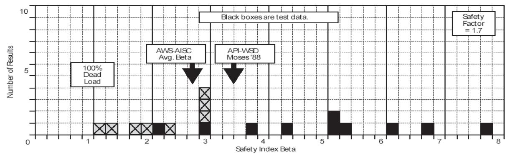

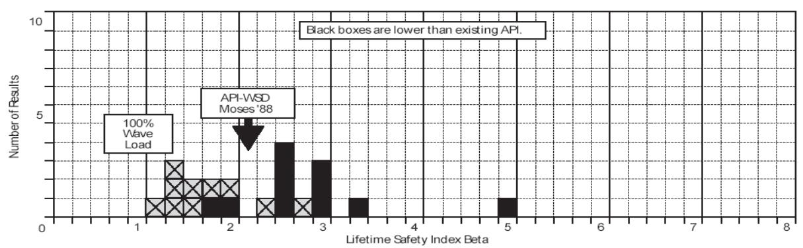  
Figure B.7.3—Safety Index Betas, API 2A-WSD, 21st Edition, Supplement 1

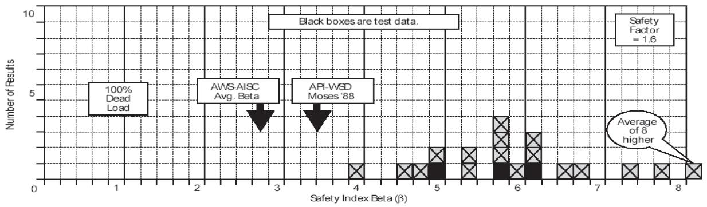

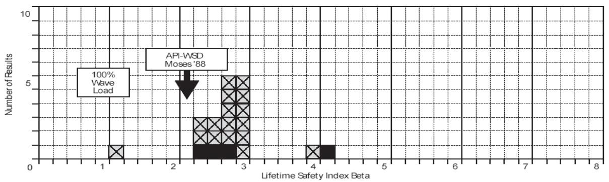  
Figure B.7.4—Safety Index Betas, API 2A-WSD, 21st Edition, Supplement 2

Storm betas tell a similar story. Compressive axial load tests (darker shading) are all acceptable, but some of the experimental results, and almost all of the FE cases, are not.

OTJRC Static Strength Criteria, with $\mathbf{ S } \mathbf{ F } = 1 . 6 .$ . The static betas are all acceptable, and their range of scatter is much reduced by the new criteria. Three cases (shaded) out of 20 are less conservative than existing API; these are the experimental axial compression cases. The composite beta (combining all joint types and load cases) is also shown. This shows considerable improvement in reliability over previous calibrations.

The storm betas are all acceptable, and fall in a tight cluster, except for the notionally more conservative tension test results. This is because the large storm load uncertainty overwhelms the small COVs on joint strength, making mean bias and safety factor (both elements of reserve strength) more important.

Conclusion. The WSD safety factor of 1.6 has been adopted for use with the new OTJRC static strength criteria. Static betas greatly exceed target values from precedent, benefiting from reduced scatter, but they do not govern. When the one-third increase is used for storm loadings, the safety factor becomes 1.2. Storm betas are clustered on the safe side of the API WSD precedent.

B.7.3.3 Strength Factor $\varrho_{ \mathrm{ u } }$

The various $Q_{ \mathsf{ u } }$ factors have been derived from appraisals of screened steel model data, supplemented by FE data, for each joint and load type. In recommending the factors, the formulations of existing codes were examined and the best formulations for capturing the effects of the joint parameters (e.g. β and γ) were selected and the coefficients adjusted to give characteristic strength values. In some cases, new formulations are provided where significant improvements in the COV have been found or where the new formulation has a wider range of applicability. In particular, the axial load formulation for overlapped Kjoints applies to the former, and the out-of-plane bending formulation applies to the latter.

The API/EWI FE study [196]–[203] shows a dependence of the basic strength factor $\boldsymbol{ Q_{ \mathrm{ u } } } \ : \mathsf{ o n } \ : \gamma$ (as well as $\beta ) ,$ which is more obvious at large γ where there are less experimental data. The experimental database [182] [184] for DT/X-joints under axial compression and K-joints under balanced axial loading tends to show a somewhat weaker dependence on γ and this is reflected in the recommended strength factors shown in Table 7.2. This dependence of $Q_{ \mathsf{ u } }$ on γ has not previously been recognized in API 2A-WSD (with one exception, i.e. the gap factor $\varrho_{ \mathbf{ g } }$ for axially loaded K-joints with $\gamma \leq 20 )$ .

The gap factor $\varrho_{ \mathbf{ g } }$ for K-joints under balanced axial load is now expressed in terms of $g / D$ rather than $g / T$ （${ \mathsf{ f o r } } \ \gamma \leq 20 )$ , eliminating the g dependence formerly included in $\varrho_{ \mathbf{ g } }$ for $\gamma \leq 20$ . The API/EWI FE studies show that with $Q_{ \mathsf{ u } }$ given as （$16 + 1 . 2 \gamma ) \beta 1 . 2 Q_{ 9 }$ , no significant additional effect of $\gamma$ on $\varrho_{ \mathbf{ g } }$ remains for gap joints.

For overlap joints, there is a large effect of $\gamma .$ The equations for $\varrho_{ \mathbf{ g } }$ are not defined for $| g / D |$ less than 0.05. Linearly interpolated value between the limiting values of the two $\varrho_{ \mathbf{ g } }$ expressions may be used for assessment. However, the designer may wish to consider that this was formerly a forbidden zone. International equations for strength and SCF indicate a smooth transition in this region, but IIW s/c XV-E still recognizes a forbidden zone. Service cracking has been observed in joints that had too small an overlap, creating a stiff but weak load path, with prying on the root of the hidden weld. Very small gaps [less than 50 mm (2 in.) or 0.1βD, whichever is smaller] make welding access difficult at the point of highest load transfer.

The brace in-plane bending strength for K-joints is based on the governing case [199] [202] of equal magnitude closing moments (closing moments tend to increase the angle between chord and brace). Because no generally accepted classification scheme for brace moment loadings is available, the K-joint closing moment capacity dictates the allowable in-plane bending capacity of all joint types.

The brace out-of plane bending strength for K-joints is based on the governing case [199] [202] of equal magnitude aligned moments (aligned out-of-plane moments tend to bend both braces out-of-plane to the same side of the chord). The K-joint out-of-plane aligned moment capacity dictates the allowable out-ofplane bending capacity of all joint types.

The strength factor $Q_{ \mathsf{ u } }$ for axially loaded T-joints is given for a condition in which the effect of the equilibrium-induced global chord bending moment is eliminated. The effect of this chord bending moment shall be accounted for in the chord load factor $\mathcal{ Q }_{ \mathbf{ f } }$ as described in B.7.3.4.

The $Q_{ \mathsf{ u } }$ formulations for tension loaded T/Y and DT/X joints have been derived on the basis of loads at which cracking has been observed in test data. However, tension loaded joints made of thin or extremely tough steel [210] can sustain further loading beyond first crack. As an estimate of this reserve strength may be important in predominantly statically loaded joints, characteristic ultimate tensile strength expressions have been developed in Reference [182] and are given as follows.

a) For T/Y joints (mean bias = 1.805, COV = 0.263):

$$Q_{u} = 42 \beta - 4. 1, f o r \beta \geq 0. 35 \tag{B.7.4}$$

b) For DT/X joints (mean bias = 1.138, COV = 0.071):

$$Q_{U} = 41 \beta - 1. 9, f o r \beta \leq 0. 9 \tag{B.7.5}$$

$$Q_{u} = 35 + (\beta - 0. 9) (32 \gamma - 285), \text{f o r} \beta > 0. 9 \tag{B.7.6}$$

The bias is defined as the ratio of measured (test or FE) strength to predicted strength using the recommended equations and measured yield strength. The reliability of a formulation depends on both the mean bias and the COV; a higher mean bias and a lower COV lead to a higher reliability.

The large increase in strength indicated in the second expression for DT/X joints at high β relies on membrane stresses in the chord saddle region as the load is essentially transferred directly from one brace to the other. If there is any significant misalignment of the braces (say, $e / D > 0 . 2$ , where e is the eccentricity of the two braces), load transfer by membrane action should not be exploited, and the first expression should be invoked over the full range of β.

In situations where fatigue cracking is evident, the strength formulations for tension loaded T/Y and DT/X joints based on loads at which cracking has been observed can be used to estimate the strength of the cracked joint. This applies for conditions in which the percentage of cracked area is not greater than 20 % of the full area. For other conditions, reference to further work published in this area [209] [210] [211] should be made to determine the strength of the joint (also see Reference [239]).

Example comparisons of $Q_{ \mathsf{ u } }$ from Table 7.2 with $Q_{ \mathsf{ u } }$ from earlier API 2A-WSD editions (e.g. the 21st Edition prior to Supplement 2) are shown in Figure B.7.5 and Figure B.7.6 for axial and moment loaded joints respectively. The 0.8 factor (see B.7.3.2) has been applied to enable a fair comparison to be made.

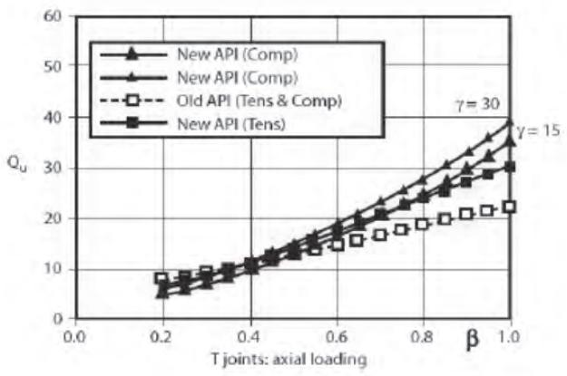

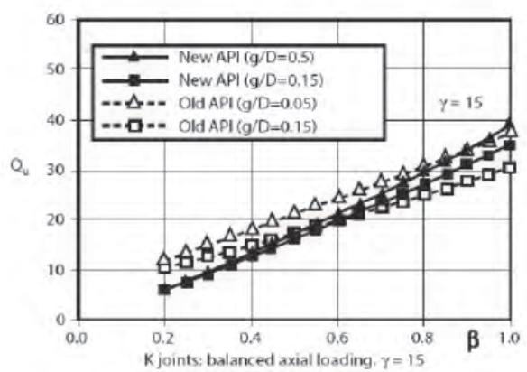

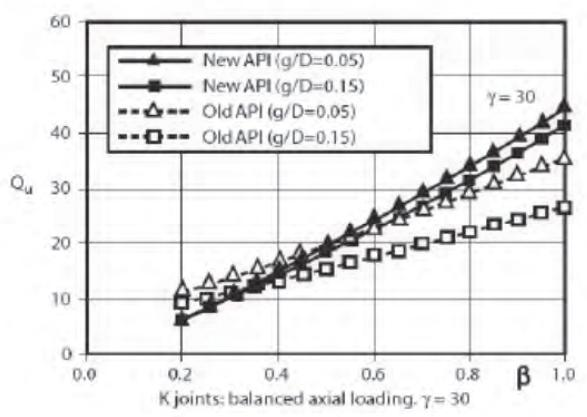

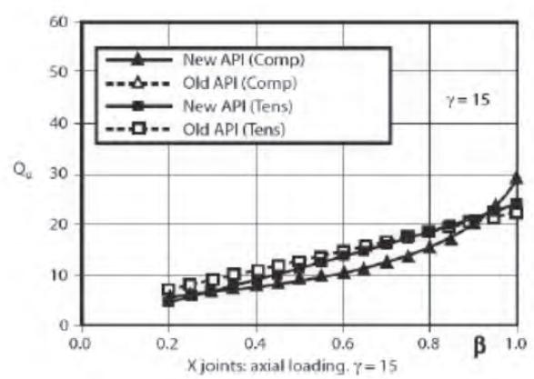

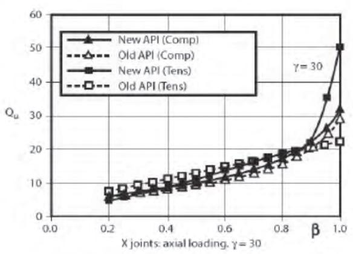  
Figure B.7.5—Comparison of Strength Factors $\varrho_{ \mathrm{ u } }$ for Axial Loading

B.7.3.3.1 Design for Axial Load in General and Multiplanar Connections

For general and multiplanar connections, the nominal axial joint strength for each of N primary branch members may be checked in turn (starting with the largest punching load P sinθ to initially size the chord) with $Q_{ \mathsf{ u } }$ as follows:

$$Q_{u} = (3. 4 + 32 \beta / \alpha) Q_{\beta}^{e} \tag{B.7.7}$$

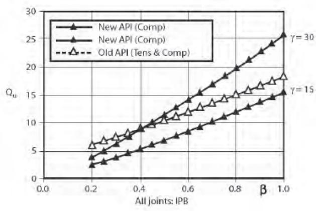

Figure B.7.6—Comparison of Strength Factors $\varrho_{ \mathrm{ u } }$ for IPB and OPB   
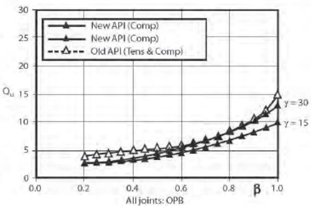  
NOTE In API 2A-WSD, 21st Edition, $Q_{ \mathsf{ U } }$ is multiplied by a factor of 0.8 for comparisons.

where

α is defined in Figure B.7.2, with $1 . 0 < \alpha < 1 + 0 . 7 \mathrm{ N } ;$

$\varrho_{ \mathsf{ \beta } }$ is defined in Table 7.2, footnote (a);

$\begin{array} { r l } { \textsf{ e } } & { { } = 0 . 7 ( \alpha - 1 ) } \end{array}$ , with $0 < \mathsf{ e } < 1 . 0$ .

Lightly loaded secondary bracing members at such connections may simply be checked as T- or Y-connections.

B.7.3.4 Chord Load Factor $\varrho_{ \mathsf{ f } }$

Compared to the 21st Edition of API 2A-WSD (prior to Supplement 2), a substantial change to the chord load factor $\mathcal{ Q }_{ \mathbf{ f } }$ is given in 7.3.4.

a) The chord load factor $Q_{ \mathsf{ f } }$ given in Equation (7.3) includes linear terms in the nominal chord axial load and in-plane bending moments, in addition to the quadratic terms retained in the parameter A [see Equation (7.4)]. This is similar in form to the chord stress function proposed in Reference [204] and adopted in the CIDECT design guide [191].   
b) Equation (7.3) applies over the full range of chord loads. Previous editions of API 2A-WSD contained the additional provision that $Q_{ \mathsf{ f } } = 1 . 0$ when all extreme fiber stresses in the chord are tensile. This provision had the unintended consequence that $\mathcal{ Q }_{ \mathbf{ f } }$ exhibited a step discontinuity when both axial and bending loads existed in the chord. The new formulation may produce a $\varrho_{ \mathsf{ f } } { \mathsf{ < } } 1 . 0$ even when the chord is subjected to an axial tension load, particularly in high $\beta ~ ( \beta > 0 . 9 )$ DT-joints under brace axial compression.   
c) Inspection of the $\mathcal{ Q }_{ \mathbf{ f } }$ term shows that there is now no dependence on $\gamma .$ . Previously, API 2A-WSD included such dependence; this was based on forcing the $Q_{ \mathsf{ f } }$ factors of X-joints of a specific $\gamma$ and Kjoints of another specific $\gamma$ to align. The appraisals in References [182] and [184] indicate that any $\gamma$ dependence in K-joints is small. The API/EWI FE studies also show only a slight dependence of the chord load factor on $\gamma ,$ for all joint types and brace loading conditions. The presence in $\mathcal{ Q }_{ \mathbf{ f } }$ of the $\gamma$

dependence in previous editions of API 2A-WSD leads to gross underestimates of the capacity of high γ joints with high axial chord loads.

Example comparisons of $Q_{ \mathsf{ f } }$ from Equation (7.3), Equation (7.4), and Table 7.3 with $\mathcal{ Q }_{ \mathbf{ f } }$ from earlier API 2A-WSD editions (e.g. the 21st Edition prior to Supplement 2) are shown in Figure B.7.7. These comparisons show the effect of chord axial load （$\mathrm{ F S } P_{ \mathrm{ c } } / P_{ \mathrm{ y } } )$ on $\mathcal{ Q }_{ \mathsf{ f } } .$ Corresponding plots of $Q_{ \mathsf{ f } }$ as a function of chord in-plane bending load $\mathrm{ ( F S } M_{ \mathsf{ a p } } / M_{ \mathsf{ P } } )$ would be symmetric in （$\mathrm{ F S } M_{ \mathsf{ a p } } / M_{ \mathsf{ P } } )$ , except for K-joints under balanced brace axial loading (for which the coefficient $C_{ 2 }$ in Table 7.3 is nonzero). For that case a positive $M_{ \mathsf{ a p } }$ (producing compression on the K-joint footprint) yields a value $\mathcal{ Q }_{ \sf f } < 1 . 0$ , while a negative $M_{ \mathsf{ a p } }$ of the same magnitude has a less deleterious effect (larger $\mathcal{ Q }_{ \mathbf{ f } } )$ , and may actually produce a slight capacity enhancement （$Q_{ \mathsf{ f } } > 1 . 0 )$ . Although this behavior may be expected generally for joints that are not symmetric about the chord axis, the recommended formulation of $\mathcal{ Q }_{ \mathbf{ f } }$ for T-joints (Table 7.3) does not incorporate the beneficial effect of a negative $M_{ \mathsf{ a p } }$ for brace axial compression (or a positive $M_{ \mathsf{ a p } }$ for brace axial tension) because there is not sufficient data available to reliably quantify it.

The plots of $\mathcal{ Q }_{ \mathbf{ f } }$ for DT-joints under brace axial compression (Figure B.7.7) show the marked transition in the effect of axial chord load on capacity that occurs between $0 . 9 \ : < \ : \beta \ : \leq \ : 1 . 0$ . Chord axial compression significantly reduces brace axial compression capacity in low to moderate $\beta$ DT-joints [206] but has no appreciable effect for joints with $\beta \approx 1 . 0 \ [ 207 ]$ . Chord axial tension, on the other hand, has little effect on low to moderate $\beta$ DT-joints, but reduces brace axial compression capacity for high β （$\beta \approx 1 . 0 )$ joints [198] [200] [206]. Figure B.7.8 shows results of tests performed at the University of Texas [206] [207] on a series of DTjoints with different $\beta$ values (0.35, 0.67, 1.0), subjected to brace and chord axial compression loads. The test results are normalized for each geometry by the strength measured in nominally identical specimens with no chord load. These normalized results provide an experimental evaluation of the chord load factor for these joints, and they are compared with the recommended chord load factor $\mathcal{ Q }_{ \mathbf{ f } }$ in Figure B.7.8.

In most cases, brace loads induce equilibrium chord loads. For example, in a K-joint with no joint eccentricity under balanced brace axial load, equilibrium axial loads are induced in the chord (tension on one side of the brace intersection and compression on the other side). In a T-joint under brace in-plane bending, equilibrium in-plane bending moments are induced in the chord (positive on one side of the brace intersection and negative on the other). In both of these cases the relative magnitudes of the positive and negative equilibrium chord loads and bending moments depend on the relative stiffness values and on the remote-end boundary conditions of the chord on either side of the brace intersection. A qualitatively different situation occurs in, for example, a T-joint under brace axial compression. In that case, an equilibrium chord in-plane bending moment is induced on both sides of the brace intersection. The magnitude of the equilibrium bending moment depends not only on the relative stiffness values and on the remote-end boundary conditions of the chord on either side of the brace intersection, but also strongly depends on chord absolute length. This poses a significant problem in testing T-joints with high β values: because of the large axial capacity of these joints, substantial equilibrium in-plane bending moments are generated that may affect joint strength [213] or even cause premature (i.e. before joint failure) chord plasticization. Smaller chord lengths reduce the equilibrium bending moments, but below some minimum length, the chord end conditions begin to influence the joint strength.

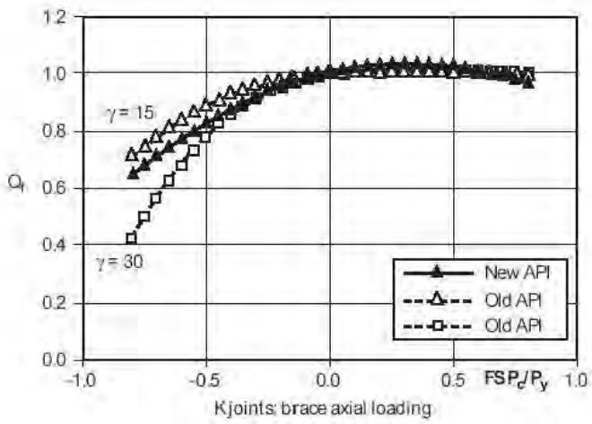

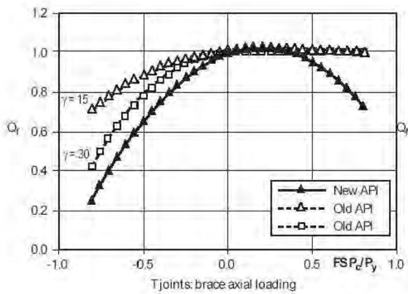

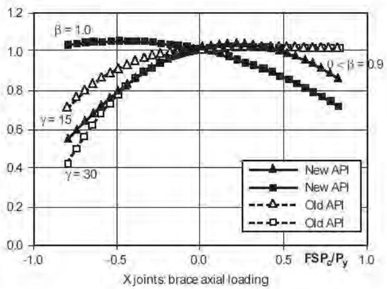

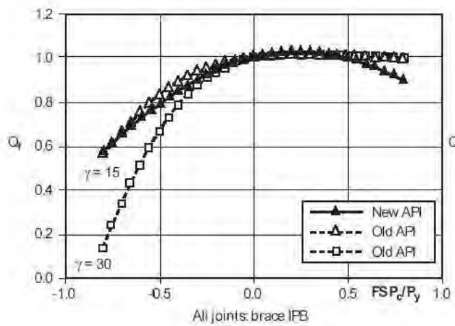

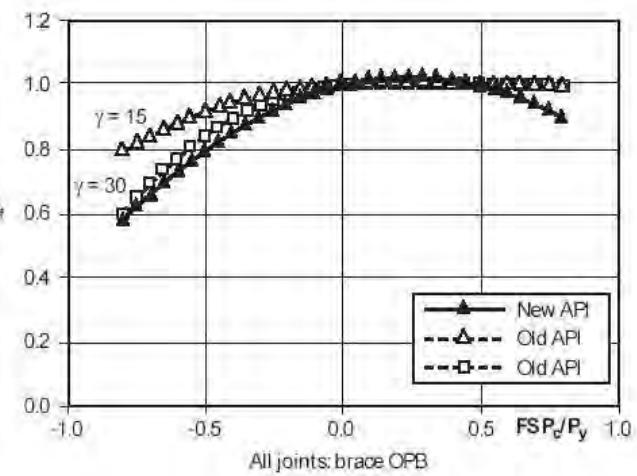  
Figure B.7.7—Comparison of Chord Load Factors $\varrho_{ \mathsf{ f } }$

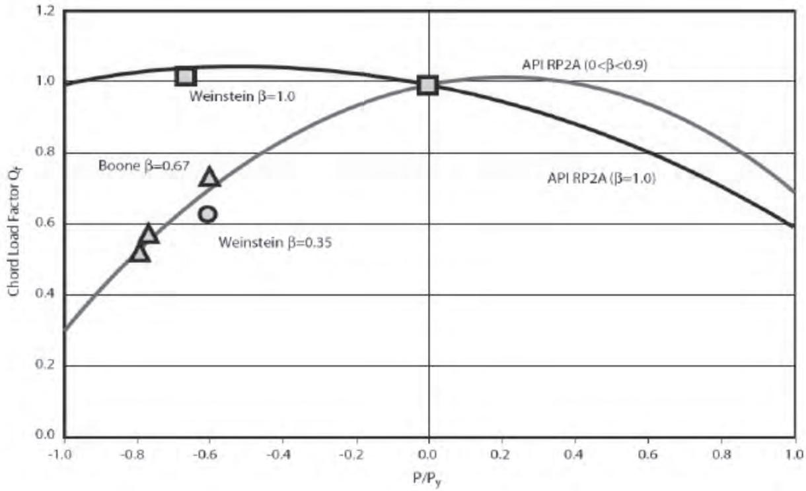  
Figure B.7.8—Effect of Chord Axial Load on DT Brace Compression Capacity Comparison of University of Texas Test Data with Chord Load Factor

In the API/EWI FE analyses of T-joints under brace axial compression, compensating negative in-plane bending moments, proportional to the brace load, are applied at the chord ends so that the global bending moment at the intersection of the brace and chord centerlines remains zero throughout the loading history. The strength factor $Q_{ \mathsf{ u } }$ determined from these FE analyses therefore represents the joint capacity corresponding to a very short chord, without the effect of the equilibrium chord bending moments. A series of FE analyses with different levels of additional applied chord bending moments (reflected in Qf ) allows the estimation of joint strength for different levels of chord global bending.

Therefore, equilibrium chord loads are present and accounted for in the strength factors $Q_{ \mathsf{ u } }$ determined from tests, and (with the single exception of axially loaded T-joints, in which the effects of equilibrium chord bending moments are explicitly removed) they are also present and accounted for in the strength factors $Q_{ \mathsf{ u } }$ determined from the EWI/API FE database.

In order to determine the additional chord loads to be accounted for in the chord load factor $\mathcal{ Q }_{ \mathbf{ f } } ,$ the average of the total (equilibrium plus additional) chord loads on either side of the brace intersection should be used.

In cases (including the API/EWI FE analyses, and the vast majority of tests) where the chord cross sections, lengths, and remote-end boundary conditions are the same on both sides of the brace intersection, averaging the total chord loads on either side of the brace intersection yields the correct additional chord load since the equilibrium chord loads cancel from the sum. More generally, in cases where the chord does not react the equilibrium loads equally on either side of the brace intersection, the averaging procedure produces a small equivalent additional chord load that is taken into account in $\mathcal{ Q }_{ \mathsf{ f } } .$ In the axially loaded T-joint, the equilibrium chord bending moment is the same on both sides of the brace intersection, and so it is properly accounted for in the average chord bending moment.

Implicit in this simple averaging procedure is the assumption that the capacity of the joint is not significantly affected by small variations in the sequence of brace versus chord loading.

Brace load capacities calculated from Equations (7.1) through (7.4) (with the factor of safety FS = 1) were compared with the screened test data and with the API/EWI FE data, for K-, Y-, and X-joints for the four brace load cases. The result of each individual comparison was expressed in the form of a ratio of (test or FE strength)/(predicted strength). Ratios greater than one, indicating that the joint capacity is greater than the predicted value, are obviously desirable. Statistics of the comparisons are given in Table B.7.1 to Table B.7.3 for K-, Y- and X-joints, respectively, for the four brace load cases. For each category (joint type and brace load), the mean bias, COV, and number of cases (tests or FE), N, are given. The same comparisons were made for the previous API 2A-WSD (21st Edition prior to Supplement 2) provisions, and the statistics of those comparisons are also given in these tables.

It is clear that both the $Q_{ \mathsf{ u } }$ formulation alone, and the combined $\mathcal{ Q }_{ \sf u } \mathcal{ Q }_{ \sf f }$ formulation given in Equations (7.1) through (7.4) is an improvement over that of the previous API practice, particularly for brace bending loads. The former conclusion can be drawn by comparisons with the complete screened test database, since it contains relatively few cases with additional chord loads in most of the joint type/brace load categories. The latter conclusion is drawn by comparisons with the API/EWI FE database, which contains a relatively high proportion of cases with additional chord loads. In any case, the assessment of the accuracy of a chord load formulation cannot be uncoupled from that of the strength factor, even if a test database with a substantially higher proportion of cases with additional chord loads were in existence.

Figure B.7.9 through Figure B.7.11, for the brace axial load cases, and Figure B.7.12 and Figure B.7.13, for the brace bending cases, show the results of the comparisons plotted against β. These figures show that the performance of the recommended and previous API formulations is consistent across joint type and brace load conditions for both test and FE databases. Additional comparisons (not shown) with a subset of the FE database containing only the cases with no chord load are also consistent with the test database comparisons for both the recommended and previous API practice.

B.7.3.5 Joints with Thickened Cans

The reduced strength for axially loaded simple Y- and X-joints having short can lengths is supported by numerical and experimental data [182]. No reduction in capacity is necessary for axially loaded K-joints.

The previous API provisions for load transfer across chords have been extended to cover axially loaded T-joints. Axially loaded X-joints with β > 0.9 increasingly transfer load across the chord through membrane action, and this beneficial mechanism is recognized.

The provisions are also intended for application to other cases where load transfer through chords occurs (e.g. launch truss joints). However, the lack of data has precluded an assessment of capacity reduction (if any) for moment loaded or complex joints.

B.7.3.6 Strength Check

The interaction ratio for the joint is evaluated using an interaction equation, which represents a change from the trigonometric ones that have historically existed in API. However, the recommended equation is identical to that already in use in the UK [214] [215] and it is supported by experimental studies at the University of Texas in the mid-1980s [216]. The recommended equation is not distinctly more reliable than the API expressions, but its use is favored because in reassessments the interaction ratios could exceed 1.0 and the equation is better behaved in this regime.

Table B.7.1—Mean Bias Factors and Coefficients of Variation for K-joints   

| Brace Loading | Factors, Coefficients, and Load Cases | Test Database | Test Database | FE Database | FE Database |
| --- | --- | --- | --- | --- | --- |
| Brace Loading | Factors, Coefficients, and Load Cases | API 2A-WSD, 21st Edition Supplement 2 | API 2A-WSD, 21st Edition | API 2A-WSD, 21st Edition Supplement 2 | API 2A-WSD, 21st Edition |
| Balanced axial | Mean bias | 1.34 | 1.38 | 1.14 | 1.18 |
| Balanced axial | COV | 0.17 | 0.18 | 0.11 | 0.42 |
| Balanced axial | Na | 161 | 161 | 440 | 440 |
| In-plane bending | Mean bias | 1.47 | 1.29 | 1.32 | 0.94 |
| In-plane bending | COV | 0.15 | 0.09 | 0.17 | 0.50 |
| In-plane bending | Na | 6 | 6 | 242 | 242 |
| Out-of-plane bending | Mean bias | 1.54 | 1.15 | 1.20 | 0.84 |
| Out-of-plane bending | COV | 0.19 | 0.14 | 0.11 | 0.14 |
| Out-of-plane bending | Na | 7 | 7 | 306 | 306 |
| a Number of load cases. | a Number of load cases. | a Number of load cases. | a Number of load cases. | a Number of load cases. | a Number of load cases. |

Table B.7.2—Mean Bias Factors and Coefficients of Variation for Y-joints   

| Brace Loading | Factors, Coefficients, and Load Cases | Test Database | Test Database | FE Database | FE Database |
| --- | --- | --- | --- | --- | --- |
| Brace Loading | Factors, Coefficients, and Load Cases | API 2A-WSD, 21st Edition, Supplement 2 | API 2A-WSD, 21st Edition | API 2A-WSD, 21st Edition, Supplement 2 | API 2A-WSD, 21st Edition |
| Axial compression | Mean bias | 1.21 | 1.45 | 1.18 | 1.24 |
| Axial compression | COV | 0.11 | 0.20 | 0.14 | 0.32 |
| Axial compression | Na | 64 | 64 | 46 | 46 |
| Axial tension | Mean bias | 2.56 | 3.45 |  |  |
| Axial tension | COV | 0.29 | 0.29 |  |  |
| Axial tension | Na | 16 | 16 |  |  |
| In-plane bending | Mean bias | 1.41 | 1.00 | 1.34 | 0.90 |
| In-plane bending | COV | 0.16 | 0.32 | 0.10 | 0.34 |
| In-plane bending | Na | 29 | 29 | 18 | 18 |
| Out-of-plane bending | Mean bias | 1.45 | 1.07 | 1.31 | 0.89 |
| Out-of-plane bending | COV | 0.26 | 0.26 | 0.08 | 0.17 |
| Out-of-plane bending | Na | 27 | 27 | 18 | 18 |
| a Number of load cases. | a Number of load cases. | a Number of load cases. | a Number of load cases. | a Number of load cases. | a Number of load cases. |

Table B.7.3—Mean Bias Factors and Coefficients of Variation for X-joints   

| Brace Loading | Factors, Coefficients, and Load Cases | Test Database | Test Database | FE Database | FE Database |
| --- | --- | --- | --- | --- | --- |
| Brace Loading | Factors, Coefficients, and Load Cases | API 2A-WSD, 21st Edition, Supplement 2 | API 2A-WSD, 21st Edition | API 2A-WSD, 21st Edition, Supplement 2 | API 2A-WSD, 21st Edition |
| Axial compression | Mean bias | 1.17 | 1.16 | 1.31 | 1.47 |
| Axial compression | COV | 0.09 | 0.11 | 0.12 | 1.33 |
| Axial compression | Na | 65 | 65 | 339 | 339 |
| Axial tension | Mean bias | 2.40 | 2.65 |  |  |
| Axial tension | COV | 0.28 | 0.54 |  |  |
| Axial tension | Na | 34 | 34 |  |  |
| In-plane bending | Mean bias | 1.55 | 1.27 | 1.35 | 0.97 |
| In-plane bending | COV | 0.19 | 0.21 | 0.11 | 0.35 |
| In-plane bending | Na | 17 | 17 | 40 | 40 |
| Out-of-plane bending | Mean bias | 1.39 | 1.13 | 1.52 | 0.75 |
| Out-of-plane bending | COV | 0.06 | 0.09 | 0.23 | 0.23 |
| Out-of-plane bending | Na | 6 | 6 | 80 | 80 |
| a Number of load cases. | a Number of load cases. | a Number of load cases. | a Number of load cases. | a Number of load cases. | a Number of load cases. |

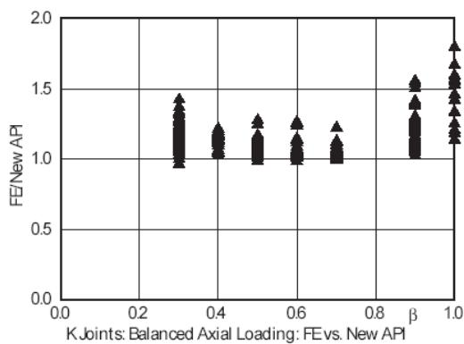

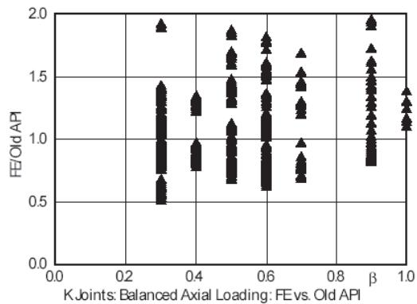

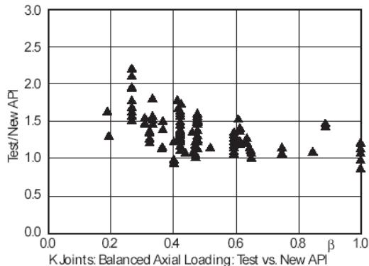

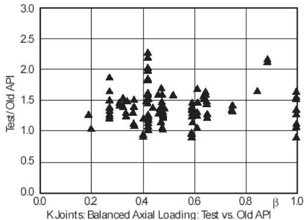  
Figure B.7.9—K-joints Under Balanced Axial Loading—Test and FE vs New and Old API

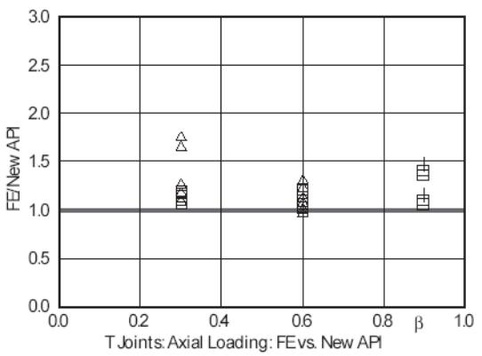

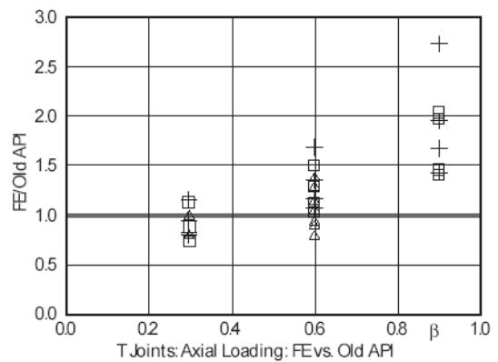

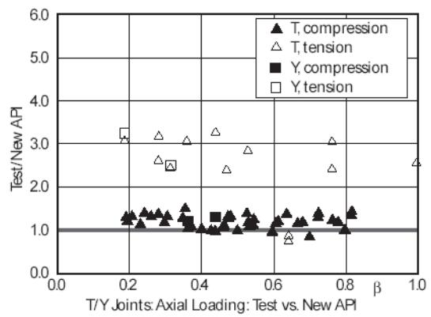

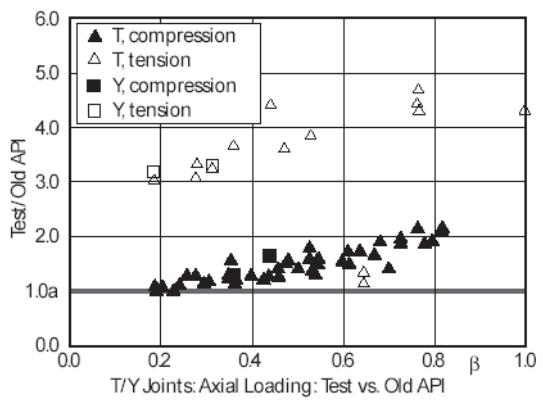  
Figure B.7.10—T-joints Under Axial Loading—Test and FE vs New and Old API

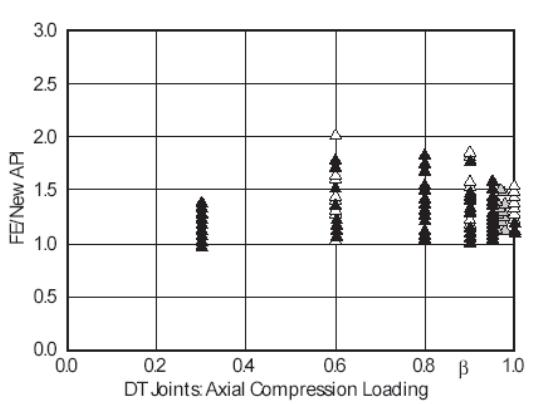

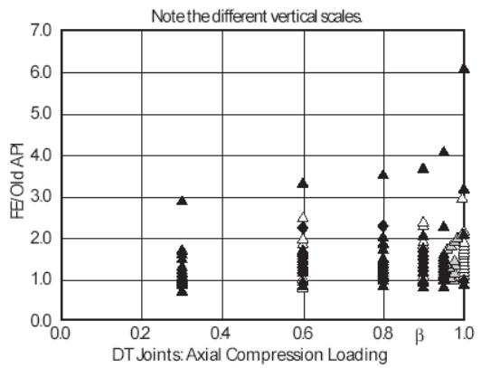

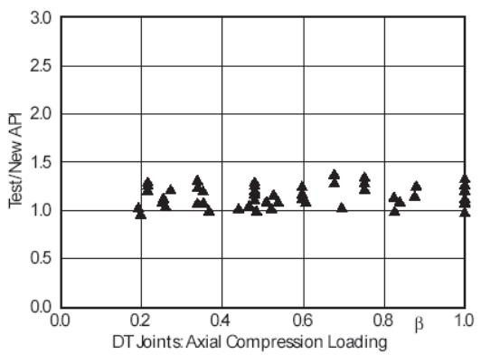

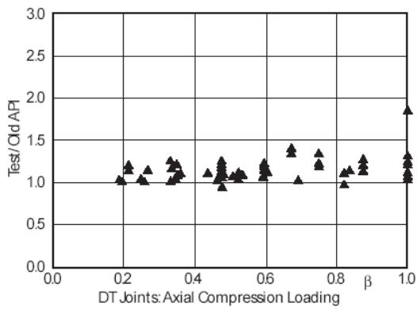  
Figure B.7.11—DT-joints Under Axial Compression—Test and FE vs New and Old API

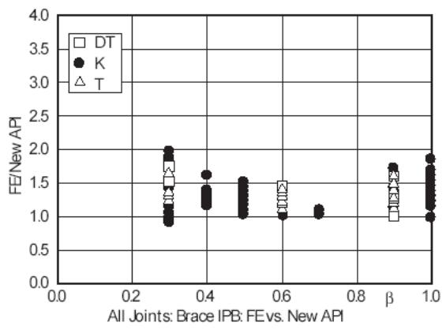

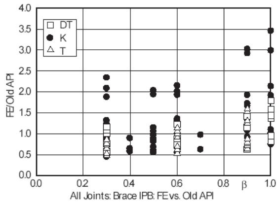

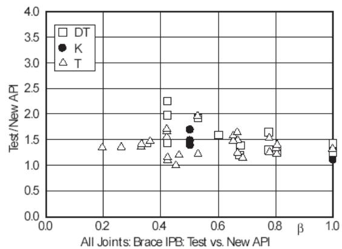

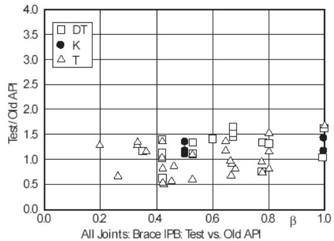  
Figure B.7.12—All Joints Under BIPB—Test and FE vs New and Old API

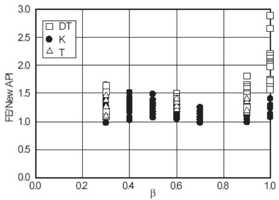

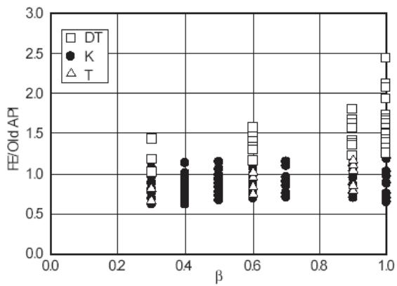

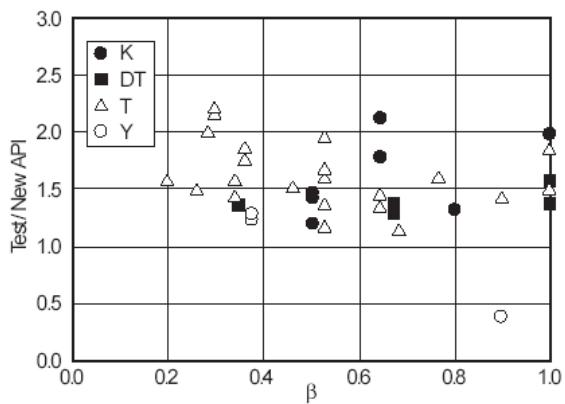

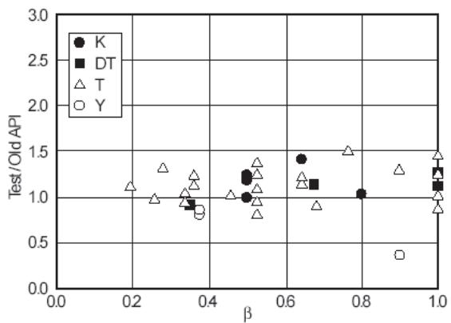  
Figure B.7.13—All Joints Under BOPB—Test and FE vs New and Old API

B.7.4 Overlapping Joints

Guidance on capacity of overlapping joints has existed in API and other practices for more than a decade. However, the guidance has never addressed moment loading or out-of-plane overlap. Furthermore, recent work documented in References [218] through [222] has shown that the guidance for axial load capacity of joints overlapping in plane could use updating. A relatively complete summary of the problems with the previous guidance and the background database can be found in Reference [220]. The guidance recommended here has been based on the MSL JIP results [182].

In several respects, the guidance here is simplified from previous practice. For example, the designer is no longer routinely required to calculate weld lengths. However, in more precise analyses such lengths may be necessary. Reference [221] reproduces equations for these calculations.

The guidance expands the MSL JIP provisions with a set of additional considerations that should avoid the need for FE analysis in all but the most unusual or failure-critical cases. There are simple but conservative suggestions for addressing in-plane and out-of-plane loading conditions, as well as out-ofplane overlap conditions, which are not uncommon offshore. The hope is that ongoing research using FE analysis will eventually lead to more definitive guidance.

B.7.5 Grouted Joints

Grouted joints are common in new steel jacket structures and joint grouting is generally a cost-effective means of strengthening older structures. Yet, API and other offshore codes of practice have historically said little about how to assess grouted joint capacity. By the mid-1990s it was possible to provide guidance upon engineering approximations and some experimental evidence (see References [223] to [228]). The experimental evidence is primarily on double-skin joints subjected to axial brace loading. However, a JIP by MSL [229] provides additional data for fully grouted joints, especially those subjected to brace bending moment.

The $Q_{ \mathsf{ u } }$ values for grouted joints in Table 7.4 have been derived for Y-/X-/K-joints and are reproduced from Reference [228].

For double-skin joints, a further limiting capacity has been introduced, to cater for the potential of chord ovalization failure. In these cases, capacity is the lesser of:

— brace capacity;   
— capacity calculated on the basis of effective thickness;   
— capacity calculated on the basis of $Q_{ \mathsf{ u } }$ values for grouted joints.

Special joint capacity investigation may be warranted when grouted braces exist, whether or not grouted chords accompany them. Although joint capacity is heavily dependent on chord parameters, a grouted brace can cause a lower effective brace diameter, which in turn affects joint capacity.

Consideration of the effects of grouted joints should include review and perhaps revision of the structural model used to determine the applied loads on the joint. The presence of grout clearly stiffens the joint, such that the most appropriate model is likely to be one with a rigid offset from the chord centerline to the chord wall at each incoming brace. If the analyst has modeled the structure with rigid joints located at the chord centerline, he/she should assess whether or not use of that force from that model will produce

conservative results. If joint flexibility has been introduced at the chord surface, while using a rigid offset to that point, only the flexibility need be altered. It is generally conservative to assume grouted joints have no local flexibility, that is, they are rigid up to failure.

B.7.6 Internally Ring-stiffened Joints

Some reported studies on strength are given in References [230] through [236]. The most extensive FE ultimate strength results of such joints are given in References [235] and [236]. Data from EWI [236] could assist in providing further guidance in the design of ring-stiffened joints, in the future.

Since robust, codified design practices are not yet available, ring-stiffened joints require more engineering attention than many of the simpler joint types. For the same reason, the joint designs often are more conservative than would be allowed on the basis of experimental evidence or calibrated FE analysis results.

At least three approaches exist for sizing the stiffeners and determining their required number. In all three cases, the first step is to assume ring dimensions, while being careful to avoid the possibility of local buckling. Then the required number of rings is evaluated. If the number is too large, the ring geometry is altered, possibly including the addition of an inner edge flange, and the number required is rechecked. It should be noted that in the case of in plane bending, at least two rings will be required to resist the decoupled forces. The three approaches are described in the following.

a) The joint loading is assumed to be fully resisted by the rings on an elastic behavior basis. The ring cross-sectional properties are calculated using an effective flange width from the chord can. The elastic analysis of the ring is based upon Roark’s formulas [237]. Usually a safety factor is applied, even though the check is elastic, that is, a lower bound approach.   
b) The joint loading is assumed to be fully resisted by the rings on a plastic behavior basis. An effective flange width is assumed, and this value is often the same as in Item a). Based upon a simple interaction expression for axial force, shear, and moment in the ring, a ring ultimate capacity is derived. This capacity is downgraded by a safety factor that is normally assumed to be the same as for simple joints.   
c) The joint loading is assumed to be resisted by a summation of simple joint strength and ultimate behavior of the rings [236]. This residual ultimate ring capacity may be calculated as simply the shear strength of two cross sections of the ring proper. Safety factors are applied to both the simple joint and ring strengths. This is an upper bound approach.

Several questions can arise with all of the above methods. It is not always clear how to address brace moment loadings. The usual approach is to break them into couples and take the absolute sum of axial plus coupling force as the applied loading. A second question is how to address rings that are outside of any brace footprint. Although outside rings have little advantage with respect to SCFs used in fatigue assessments, they can be much more effective where ultimate strength is concerned. Often the rings can be assumed fully effective if the clear distance from the edge of a given brace does not exceed D/2, although the shear transfer capacity of the chord wall between the brace and outer ring should still be examined. The effectiveness of rings under a given footprint is normally assumed limited to the particular brace involved. The aforementioned D/2 dimension generally comes up for discussion only with rings at the end of the chord can. Consideration of ring spacing in terms of shell capacity of the intervening joint can segment can be found in Reference [231].

A more general procedure is to simply cut sections or, rather, planes through the joint and ensure that the strength of all elements severed by the plane is sufficient to resist the applied loading. This approach is quite general although difficult to automate. Its advantages are that it can address even the most complex of conditions and it often provides a better physical feel for load paths. Designers are encouraged to use this approach as a hand check of expected behavior whenever possible. However, additional safety margins may be required to cater for potential local buckling or premature cracking, which this method does not normally address.

As for grouted joints, use of ring-stiffened joints warrants review of the structural model used to determine the loads applied to the joint. Rings often increase the joint stiffness substantially, such that rigid offsets to the chord surface are appropriate.

B.7.7 Cast Joints

No further guidance is given here, see References [245] and [246], and B.8.3.5 and B.8.5.4.

B.7.8 Other Circular Joint Types

A general approach is suggested based upon strength-of-materials principles and the need to ensure that the potential for local buckling or premature cracking should be investigated. Information on circular joints with doubler or collar plates can be found in Reference [238].

B.7.9 Damaged Joints

In steels with suitable notch toughness, reduction in axial or moment capacities may be estimated by taking into account the reduced area or section modulus due to the presence of cracks [209] to [212] [239] address some of the research carried out on this subject. Additional safety margins should be considered to reflect the uncertainties in the prediction method.

B.7.10 Noncircular Joints

The range of geometries for noncircular joints is almost limitless and often the design of such joints will involve the identification of load paths through elements of the joints, and then checking these elements against failure. For joints comprising at least one hollow section (circular, square, or rectangular), some guidance has been formulated under the auspices of organizations such as IIW (International Institute of Welding) and CIDECT (Comité International pour le Dévelopement et l’Etude de la Construction Tubulaire). Most of this guidance has been collated within Eurocode 3 [240], but care should be exercised in using the Eurocode as it is written in LRFD format.

WSD criteria can be found in AWS D1.1. These are consistent with LRFD criteria in AISC [247]. AISC is currently developing CIDET-based criteria in both formats.

## B.8 Commentary on Fatigue

Introduction. Fatigue has long been recognized as an important consideration for designing offshore structures, and intensive cooperative industry research on tubular joints occupied the full decade of the 1960s. The First Edition of API 2A-WSD gave some general statements regarding fatigue and brittle fracture.

More specific criteria were adopted in 1971 and appeared in the Third Edition. These criteria included static strength requirements stated in terms of punching shear, along with general guidelines regarding fatigue. These guidelines included a 138 MPa (20 ksi) limitation on cyclic nominal stress, coupled with recommendations that simple joints be designed to meet the punching shear criteria and that complex joints be detailed with smooth flowing lines. For typical Gulf of Mexico structures utilizing joint can steels with improved notch toughness, this simple approach sufficed to relegate fatigue and brittle fracture to the status of secondary considerations. However, it was recognized that using higher design stresses [corresponding to steels with over 345 MPa (50 ksi) yield or more severe loading experience, e.g. dynamic amplification or North Atlantic type wave climate] would require specific reexamination of the fatigue problem.

Concurrently, AWS D1.1 adopted similar punching shear requirements, along with a family of S-N curves applicable to tubular joints. The research basis for these code criteria was reviewed in Reference [180] and [255]. The AWS fatigue criteria were subsequently incorporated into API 2A-WSD.

The 11th Edition expanded the allowable cyclic stress guidelines to assure ample fatigue lives as part of the normal design process for the large class of structures, which do not warrant detailed fatigue analyses.

The years 1974 to 1989 saw a resurgence of research interest in tubular joints and fatigue, particularly on the part of governments bordering the North Sea [260]–[264]. These large-scale efforts have significantly increased the amount of available data, and have prompted several reexaminations of fatigue criteria. In particular, the endurance limits in the original AWS criteria were questioned in light of seawater environments, random loading, and fracture mechanics crack growth conditions. A number of designers and agencies have been using modified criteria, which defer or eliminate the endurance limit. These were reflected in the 11th Edition when API included its own S-N curves for tubular joints.

In addition, large-scale test results emphasized the importance of weld profile and thickness. A lower set of S-N curves was included to bracket the range of fatigue performance, which can result from typical variations in fabrication practice.

An improved simplified fatigue analysis approach replacing the allowable cyclic stress guidelines was adopted in the 17th Edition, along with changes to the provisions for detailed fatigue analysis reflecting greater consensus regarding preferred methods of analysis, description of sea states, structural frame analysis, S-N curves and SCFs.

New Gulf of Mexico guideline wave heights were adopted in the 20th Edition. Therefore, the simplified fatigue analysis provisions were recalibrated in 1992. In addition to adjusting the allowable peak HSS values for the simplified fatigue analysis provisions, the 20th Edition includes changes to the detail fatigue analysis provisions to the effect that only the spectral analysis techniques should be used for determining stress response. Thickness as well as profile effects were explicitly considered.

In API 2A-WSD, 21st Edition, Supplement 2, the Offshore Tubular Joint Technical Committee (OTJTC) changed both the tubular joint S-N curve and the recommended SCF formulations. This necessitated a further recalibration of the simplified fatigue analysis provisions.

B.8.2 Fatigue Analysis

A detailed analysis of cumulative fatigue damage should always be performed. A detailed analysis is necessary to design fatigue sensitive locations.

B.8.2.2 Wave Climate

Wave climate information shall be obtained for any fatigue analysis, and obtaining it often requires a major effort with significant lead time. Wave climates may be derived from both recorded data and hindcasts. Sufficient data should exist to characterize the long term oceanographic conditions at the platform site. Several formats are permissible and the choice depends on compatibility with the analytical procedures being used. However, for each format the wave climate is defined by a series of sea states, each characterized by its wave energy spectrum and physical parameters together with a probability of occurrence (percent of time). Formats that may be used include the following.

a) Two Parameter Scatter Diagrams—These describe the joint probability of various combinations of significant wave height and mean zero crossing period. Typically, 60 to 150 sea states are used to describe most sea environments. While a reduced number may be used for analysis, a sufficient number of sea states should be used to adequately define that scatter diagram and develop full structural response. If the scatter diagram is condensed the effect of dynamic excitation, interaction between wave length and platform geometry, and drag force nonlinearity should be considered. When condensing sea states of different height or period the resulting sea states should yield equivalent or greater damage than the original sea states. This format does not give any information on wave directionality.   
b) Directional Scatter Diagrams—Each sea state is characterized by three parameters: significant wave height, mean zero-crossing period and central direction of wave approach. If the measured data do not include wave directionality, directions may be estimated on the basis of wind measurements, local topography, and hindcasting, provided sufficient care is exercised.   
c) Directional Scatter Diagrams with Spreading—Each sea state is characterized by four parameters: significant wave height, mean zero-crossing period, central direction of wave approach, and directional spreading. The directional spreading function, D(θ), defines the distribution of wave energy in a sea state with direction and by definition:

$$\int_{- \pi / 2}^{\pi / 2} D (\theta) d \theta = 1 \tag{B.8.1}$$

where θ is measured from the central direction. A commonly used spreading function [254] is:

$$D (\theta) = C_{n} \cos^{n} \theta \tag{B.8.2}$$

where n is a positive integer and $C_{ \mathbf{ n } }$ is a coefficient such that Equation (B.8.1) is satisfied.

A value of n = 0 corresponds to the case when the energy is distributed in all directions. Observations of wind driven seas show that an appropriate spreading function is a cosine square function (n = 2). For situations where limited fetch restricts degree of spread a value of n = 4 has been found to be appropriate. Other methods for directional spreading are given in Reference [40].

d) Bimodal Spectra—Up to eight parameters are used to combine swell with locally generated waves. Typically, swell is more unidirectional than wind generated waves and thus spreading should not be considered unless measured data shows otherwise [268].

Data gathered in more complete formats can always be reduced to the simple ones. For recorded data and hindcasting, spectral characterizations described by Borgman [251] and Cardone [252] can serve as starting points.

B.8.2.3 Space Frame Analysis

The space frame model for fatigue analysis should include all important characteristics of the stiffness, mass, energy dissipation, marine growth, and loading properties of the structure and foundation components of the platform. The analytical model consists primarily of beam elements. The adequacy of calculated member end stresses for fatigue analysis is contingent on the modeling techniques used. The model used for strength analysis may require refinements such as the addition or modification of members that are fatigue sensitive. Asymmetry in platform stiffness or mass distribution may lead to significant torsional response that should be considered.

Stiffness. The model should include the three-dimensional distribution of platform stiffness. The member intersections should be modeled such that the resulting nominal member end stresses are consistent with their subsequent use in fatigue analysis. For typical jacket members, nominal brace stresses should be computed at the intersections of the brace and chord centerlines. For large diameter chords or short braces, local joint stiffness should be considered. One modeling technique that has been used to represent the joint stiffness is to simulate the chord stiffness between the intersection of the centerlines and the chord face as a rigid link with springs at the face representing the chord shell flexibility. Member end stresses should then be calculated at the face of the chord. Rigid links should not be used without also considering chord shell flexibility.

The stiffness of appurtenances such as launch cradles, mudmats, J-tubes, risers, skirt pile guides, etc. should be included in the model if they contribute significantly to the overall global stiffness of the structure. The stiffness of the conductors and horizontal framing levels should be included. In addition, down to and including the level immediately below the design wave trough elevation, sufficient detail should be included to perform a fatigue analysis of the individual components of the framing. Similar detailing of the mudline level is required if the conductors are considered in the foundation. Consideration of structural components such as mudmats, shear connectors, conductor guides, etc. may require FE types other than beam elements (e.g. shell, plate, solid elements, etc.).

The stiffness of the deck should be considered in sufficient detail to adequately represent the deck-jacket interface.

A linear representation of the foundation may be used provided the stiffness coefficients reflect the cyclic response for those sea states contributing significantly to fatigue damage.

Mass. The mass model should include structural steel, equipment, conductors, appurtenances, grout, marine growth, entrapped water, and added mass. A lumped mass model is sufficient to obtain global structure response. However, this method may not adequately predict local dynamic response. Where necessary, local responses should be examined. The equipment mass included in the model should consider all equipment supported by the structure during any given operation on the platform. If the equipment mass is predicted to vary significantly for different operations during the platform life, it is appropriate to perform independent analyses and combine fatigue damage. The added mass may be estimated as the mass of the displaced water for motion transverse to the longitudinal axis of the individual structural framing and appurtenances.

Energy Dissipation. The choice of damping factors can have a profound effect, and values of 2 % critical and less have been suggested on the basis of measurements in low sea states. Including structural velocities in the calculation of drag forces increases the total system damping. For noncompliant structures, this increase in damping is not observed in measurements and consequently should not be considered. For compliant towers, these effects may be considered in addition to a 2 % structural (including foundation) damping.

Natural Period. For structural natural periods above 3 s, dynamic amplification is important, particularly for the lower sea states that may contribute the most to long term fatigue damage. Several authors have shown the desirability of retaining the detailed information available from a full static analysis and adding the inertial forces due to dynamic amplification of the first few modes (mode acceleration or static backsubstitution method [270]). A pure modal analysis using a limited number of modes misses the essentially static response of some modes.

Since the natural period of a platform can vary considerably depending upon design assumptions and operational deck mass, a theoretical period should be viewed critically if it falls in a valley in the platform base shear transfer function. The period should be shifted by as much as 5 % to 10 % to a more conservative location with respect to the transfer function. This should be accomplished by adjusting mass or stiffness within reasonable limits. The choice of which parameter to modify is platform specific and depends upon deck mass, soil conditions and structural configuration. It should be recognized that adjusting the foundation stiffness will alter the member loads in the base of the structure that can be fatigue sensitive.

Loading. The applied cyclic loads should be represented such that the effects of load distribution along the member are included in the member end stresses. Distributed loads on brace members need to be considered only between intersection points. Loads attributed to conductors and appurtenances such as launch cradles, mudmat framing, J-tubes, risers, skirt pile guides, anodes, etc. should be considered. The choice of wave theory as well as drag and mass coefficients should be examined as they may differ from those used in strength analyses for design wave loads. Attention should be given to modeling of conductor guide framing to ensure accurate vertical wave loads. When the loading varies significantly for different operations during the platform life (e.g. transportation, drilling, and production), it is appropriate to perform separate analyses and combine the fatigue damages from each.

Tides, currents and marine growth each affect fatigue. For everyday waves, tides will have little effect. However, the tide and surge associated with storm seas can have a significant effect. For example, they may cause the wave crest to inundate a member or entire jacket level, which would otherwise be dry. Such effects should be considered.

Current is a complicated phenomenon that is difficult to account for in a fatigue analysis. Since fatigue considers the stress range, the static effect of current can be neglected. For large waves or currents, the drag will increase the crest-to-trough wave force difference and affect platform dynamics. While these effects can be important, analysis technology is lacking.

Marine growth may have a detrimental effect on fatigue life of members due to the increase in local and global wave loading. A marine growth profile should be specified for the average thickness and roughness expected at the platform site over the service life, if the inclusion of marine growth gives conservative results. A simplified analysis is useful in studying the effect of marine growth on global response. Marine growth affects platform added mass, member drag diameter, and drag coefficient.

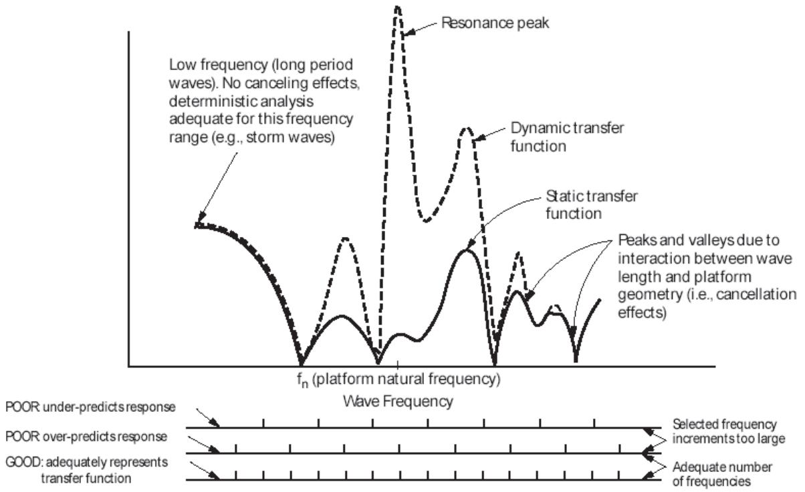  
Figure B.8.1—Selection of Frequencies for Detailed Analyses

Spectral Analysis Techniques. Several approaches are available for determining stress response to sea state loadings. In general, a spectral analysis should be used to properly account for the actual distribution of wave energy over the entire frequency range. The spectral approach can be subdivided based upon the method used to develop transfer functions.

a) Transfer functions developed using regular waves in the time domain.

— Characterize the wave climate using either the two, three, four, or eight parameter format.   
Select a sufficient number of frequencies to define all the peaks and valleys inherent in the jacket response transfer functions. A typical set of frequencies is illustrated in Figure B.8.1. A simplified analysis [254] that develops a global base shear transfer function may be helpful in defining frequencies to be used in the detailed analysis.   
Select a wave height corresponding to each frequency. A constant wave steepness that is appropriate for the wave climate can be used. For the Gulf of Mexico a steepness between 1:20 and 1:25 is generally used. A minimum height of 0.3 m (1 ft) and a maximum height equal to the design wave height should be used.   
Compute a stress range transfer function at each point where fatigue damage is to be accumulated for a minimum of four platform directions (end-on, broadside, and two diagonal). For jackets with unusual geometry or where wave directionality or spreading or current is considered, more directions may be required. At each frequency, a point on the transfer function is determined by passing an Airy wave of the appropriate height through the structure and dividing the response stress range by the wave height. Transient effects are eliminated by achieving steady state conditions. A sufficient number of time steps in the wave cycle at which members stresses are computed should be selected to determine the maximum brace HSSR. A minimum of four hot spot locations at both the brace and chord side of the connection should be considered.

Compute the stress response spectra. In a spectral fatigue analysis in its most general form, each sea state is represented by a power spectral density function $S_{ \mathbf{ a } } ( \omega )$ for each direction of wave approach α, where ω is circular frequency. At each location of interest, the platform stress response spectrum for each sea state is:

$$S_{\sigma , \alpha} (\omega) = \int_{- \pi / 2}^{\pi / 2} \left| H (\omega , \theta) \right|^{2} D (\theta) S_{\alpha} (\omega) d \theta \tag{B.8.3}$$

where

θ is measured from the central wave approach direction;

$H ( \omega , \theta )$ is the transfer function;

D(θ) is the spreading function as defined in B.8.2.2 c).

Several approximations and linearizations are introduced into the fatigue analysis with this approach:

— The way in which waves of different frequencies in a sea state are coupled by the nonlinear drag force is ignored.   
— Assuming constant wave steepness has the effect of linearizing the drag force about the height selected for each frequency. Consequently, drag forces due to waves at that frequency with larger heights will be under-predicted, while drag forces due to waves with smaller heights will be overpredicted.

b) Transfer functions developed using regular waves in the frequency domain. This approach is similar to the method described in Item a), except that the analysis is linearized prior to the calculation of structural response. In linearizing the applied wave force, drag forces are approximated by sinusoidally varying forces and inundation effects are approximated or neglected. As a result, the equations of motion can then be solved without performing direct time integration. For typical small waves the effects of linearization are not of great importance; however, for large waves they may be significant if inundation effects are neglected.

c) Transfer functions developed using random waves in the time domain [269].

— Characterize the wave climate in terms of sea state scatter diagrams.   
— Simulate random wave time histories of finite length for a few selected reference sea states.   
— Compute response stress time histories at each point of a structure where fatigue life is to be determined and transform the response stress time histories into response stress spectra.   
— Generate “exact” transfer functions from wave and response stress spectra.   
— Calculate pseudo transfer functions for all the remaining sea states in the scatter diagram using the few “exact” transfer functions.   
— Calculate pseudo response stress spectra as described in Item a).

This method can take into account nonlinearities arising from wave-structure interaction and avoids difficulties in selecting wave heights and frequencies for transfer function generation.

B.8.2.4 Local Stresses

In evaluating local-scale stresses at hot spot locations the SCFs used should be consistent with the corresponding S-N curve, reference 8.4 and 8.5.

B.8.2.5 Stress Responses

Various approaches to a Miner cumulative damage summation have been used. In all cases, the effects from each sea state are summed to yield the long term damage or predict the fatigue life. Approaches include the following.

For a spectral analysis, the response stress spectrum may be used to estimate the short-term stress range distribution for each sea state by assuming either:

a) a narrow band Rayleigh distribution. For a Rayleigh distribution the damage may be calculated in closed form;   
b) a broad band Rice distribution and neglecting the negative peaks;   
c) time series simulation and cycle counting via rainflow, range pair, or some other algorithm.

Damage due to large waves that have significant drag forces or crest elevations should be computed and included in the total fatigue damage.

B.8.2.6 Fatigue Life Safety Factors

A calculated fatigue life should be viewed as notional at best. Where possible, the entire procedure being used should be calibrated against available failure/nonfailure experience. Although 97 % of the available data falls on the safe side of the recommended S-N curves, additional uncertainties in wave action, seawater effects, and stress analysis result in a 95 % prediction interval for failures ranging from roughly 0.5 to 20 times the calculated fatigue life at D of unity [258], for the criteria of API 2A-WSD, 11th Edition through the 21st Edition (prior to Supplement 2), which anticipated the use of best-estimate SCF. For the new criteria, using Efthymiou SCF, the prediction interval becomes 0.85 to 50 times the calculated fatigue life. Additional time is required for the progressive failure of redundant structures. Calibration hindcasts falling outside this range should prompt a reexamination of the procedures used.

In light of the uncertainty, the calculated fatigue life should often be a multiple of the intended service life. (Alternatively, the estimated damage sum at the end of the service period should often be reduced from 1.0 by a safety factor.) Failure consequence and the extent of in-service inspections should be considered in selecting the safety factor on fatigue life. Failure criticality is normally established on the basis of redundancy analyses [259]. A robust structure with redundancy, capability for in-service inspection and possible repair/strengthening, should be preferred, especially in the design of a new structural concept or a conventional structure for new environmental conditions.

In lieu of more detailed assessment, and where the structural analysis has been conducted on the basis of rigid joint assumptions, the minimum safety factor has been reduced to unity. This recognizes increased conservatism in the high-cycle S-N curves and SCF and has been calibrated against previous successful API practice.

Factors of 5 and 10 imply that a significant change in fatigue reliability occurs only when there is a significant change in the predicted life or Palmgren-Miner damage sum for the planned service life of the

structure. These higher factors typically represent the minimum ratio of the predicted fatigue life and the planned service life of the structure, under adverse combinations of high failure consequence and uninspectability.

The safety factors do not differentiate between fatigue analysis procedures. At present, there is little certainty in how the various procedures compare in terms of reliability, so the same set of explicit safety factors is generally applied to all of them. The safety factors also do not differentiate such aspects as risk to assets and difficulties or lost production associated with repairs. The designer should consult with the owner as to how these sorts of risk should be addressed in the design phase.

A study [301] has indicated that significant increase in predicted fatigue life can be obtained by the appropriate consideration of the local joint flexibility of tubular connections, particularly where out-of-plane bending is important [286]. This is supported by studies of in-service platform underwater inspection records [302] that show that substantially less fatigue damage occurs than is predicted using conventional rigid-joint assumptions. Where the structural analysis has been conducted on the basis of flexible joint assumptions, consideration should be given to adjusting the safety factors.

There are instances where the cited safety factors may be reduced. An example could be a component above water, for which inspection may be either easier or more frequent. A reduction in safety factor may also be appropriate if loss of the component does not jeopardize personnel safety or the environment. Lesser safety factors may be justified if the fatigue analysis algorithm has been calibrated to the structural type and load conditions being considered, for example, for a structure that has already demonstrated a long service life.

In selecting safety factors, inspectability and inspection technique need careful consideration. In general, the in-service inspection being addressed is more thorough than a general diver or ROV survey (Level II) described in API 2SIM. Some complex joints, such as internally stiffened ones, may have cracking originating from the inside (hidden) surfaces. Hence, the possible need for inspection prior to crack penetration through thickness should be considered at the design stage. A trade-off may exist between introducing a lower safety factor (assuming the component is not failure critical) and inspecting in-service with a more complex technique such as MT.

Although a given component may be considered readily inspectable from exposed surfaces, the inspection frequency may still have to be balanced with the fatigue safety factor. References [259] and [303] (among others) discuss the relationship between inspection interval and calculated fatigue life, as they affect structural reliability. It is anticipated that most tubular joints spend about half their fatigue lives in the detectable crack growth stage. However, in some components, such as those with low SCFs, the period of crack growth can be a much smaller proportion of the total life. In addition, even with conventional components, the usual inspection interval may not be adequate if the planned service life is short.

Despite the need to address inspectability during the design phase, there is no implied requirement in these provisions to perform a regular, detailed inspection of each and every joint for which a safety factor from the inspectable category is adopted. The scope and frequency associated with the inspection plan involve considerations that extend well beyond the issue of the fatigue analysis recipe alone. However, if no inspection is clearly intended from the start for a particular class of joint, then the safety factor should be selected from the noninspectable category. Joints in the splash zone should normally be considered as uninspectable.

Uncertainties in fatigue life estimates can be logically evaluated in a probabilistic framework. A fatigue reliability model based on the lognormal distributions is presented in References [258] and [271]. This

model is compatible with both the closed form and detailed fatigue analysis methods described above. The sources of uncertainty in fatigue life, which is considered to be a random variable, are described explicitly. The fatigue reliability model can be used to develop fatigue design criteria calibrated to satisfactory historical performance but also characterized by uniform reliability over a range of fatigue design parameters.

B.8.3 SCFs

B.8.3.1 General

The HSSR concept places many different structural geometries on a common basis, enabling them to be treated using a single S-N curve. The basis of this concept is to capture a stress (or strain) in the proximity of the weld toes, which characterizes the fatigue life of the joint, but excludes the very local microscopic effects like the sharp notch, undercut and cracklike defects at the weld toe. These local weld notch effects are included in the S-N curve. Thus, the SCF for a particular load type and at a particular location along the intersection weld may be defined as:

$$\mathrm{S C F} = \frac{\text{H S S R a t h e l o c a t i o n (e x c l u d i n g n o t c h e f f e c t)}}{\text{r a n g e o f t h e n o m i n a l b r a c e s t r e s s}}$$

Consistency with the S-N curve is established by using a compatible method for estimating the HSSR during the fatigue test as used in obtaining SCFs. The Dovey 16-node thick shell element [257] enforces a linear trend of shell bending and membrane stress. This is consistent with the experimental HSS extrapolation procedure, and was used to derive Efthymiou’s SCF [291].

SCFs may be derived from FE analyses, model tests or empirical equations based on such methods. When deriving SCFs using FE analysis, it is recommended to use volume (brick and thick shell) elements to represent the weld region and adjoining shell (as opposed to thin shell elements). In such models the SCFs may be derived by extrapolating stress components to the relevant weld toes and combining these to obtain the maximum principal stress and, hence, the SCF. The extrapolation direction should be normal to the weld toes.

If thin shell elements are used, the results should be interpreted carefully since no single method is guaranteed to provide consistently accurate stresses [290] [304]. Extrapolation to the midsurface intersection generally over predicts SCFs but not consistently, whereas truncation at the notional weld toes would generally under predict SCFs. In place of extrapolation, it is possible to use directly the nodal average stresses at the midsurface intersection. This will generally over predict stresses, especially on the brace side. This last method is expected to be more sensitive to the local mesh size than the extrapolation methods.

When deriving SCFs from model tests, care should be taken to cover all potential hot spot locations with strain gauges. Further, it should be recognized that the strain concentration factor is not identical to SCF, but is related to it via the transverse strains and Poisson’s Ratio. If the chord length in the joint tested is less than about 6 diameters (α < 12), the SCFs may need to be corrected for the stiffening effect of nearby end diaphragms (vs the weakening effect of a short joint can) as indicated by the Efthymiou short chord correction factors. The same correction may be needed in FE analysis if α < 12.

Geometric tolerances on wall thickness, ovalization and misalignment will result in some deviation in SCFs from the values based on an ideal geometry. These deviations are small and may be ignored.

Evaluation of HSSRs. The key HSSR locations at the tubular joint intersection are termed saddle and crown (see Figure B.8.2). A minimum of eight stress range locations should be considered around each chord-brace intersection in order to adequately cover all relevant locations. These are:

— chord crowns (2),   
— chord saddles (2),   
— brace crowns (2), and   
— brace saddles (2).

The point-in-time HSS for the saddle and the crown are given by:

$$\mathrm{H S S}_{\mathrm{s a}} = \mathrm{S C F}_{\mathrm{a x}, \mathrm{s a}} f_{\mathrm{a x}} \pm \mathrm{S C F}_{\mathrm{o p b}} f_{\mathrm{o p b}} \tag{B.8.4}$$

$$\mathrm{H S S}_{\mathrm{c r}} = \mathrm{S C F}_{\mathrm{a x}, \mathrm{c r}} f_{\mathrm{a x}} \pm \mathrm{S C F}_{\mathrm{i p b}} f_{\mathrm{i p b}} + \mathrm{C E} \tag{B.8.5}$$

where

SCFax,sa $\operatorname{ S C F }_{ \mathsf{ a x } , \mathsf{ s a } }$ is the axial SCF at the saddle;

$f_{ \mathsf{ a x } }$ is axial nominal stress;

SCFopb ${ \mathrm{ S C F } }_{ \mathsf{ o p b } }$ is the out-of-plane bending SCF;

$f_{ \mathsf{ o p b } }$ is out-of-plane bending nominal stress;

SCFax,cr $\mathrm{ S C F }_{ \mathsf{ a x , c r } }$ is the axial SCF at the crown;

${ \mathrm{ S C F } }_{ \mathsf{ i p b } }$ is the in-plane bending SCF;

$f_{ \mathsf{ i p b } }$ is in-plane bending nominal stress;

CE is the effect of the nominal cyclic stress in the chord as discussed as follows.

Equations (B.8.4) and (B.8.5) are valid both for the HSS for the chord and for the HSS for the brace, but the CE is only applicable for the chord crown.

Since the nominal brace stresses $f_{ \mathsf{ a x } } , f_{ \mathsf{ o p b } }$ , and $f_{ \mathsf{ i p b } }$ are functions of wave position, it follows that, when combining the contributions from the various loading modes, phase differences between them are accounted for. In the time domain, the combination is done for each wave position, and the total range of HSS (i.e. HSSR) determined from the full cycle result at each location.

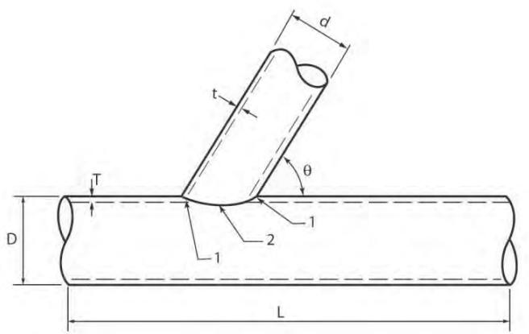  
a）T-orY-joint

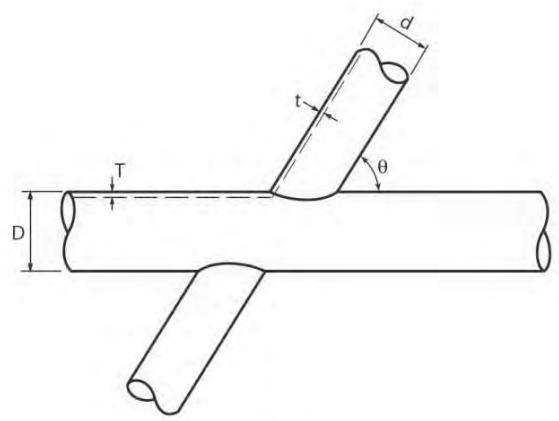  
b)X-joint

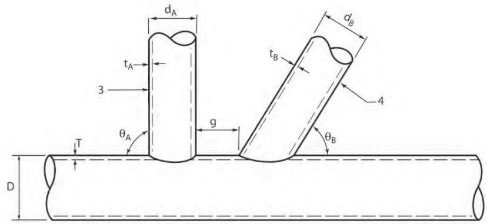  
cK-joint

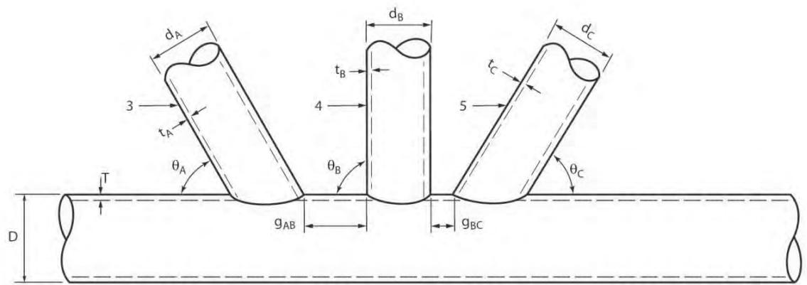  
Figure B.8.2—Geometry Definitions for Efthymiou SCFs

d)KT-joint

Key

1 Crown β = d D A Aβ = d D B Bβ = d D C Cβ = d D   
2 Saddle τ = t T A Aτ = t T B Bτ = t T C Cτ = t T   
3 Brace A ζ = g D AB ABζ = g D BC BC ζ = g D   
4 Brace B γ = D T2   
5 Brace C α = 2L D

Nominal cyclic stresses in the chord member also contribute to fatigue loading. Their contribution is usually small because, unlike brace loading, chord loading does not cause any significant local bending of the chord walls. Hence any stress raising effects are minimal. The effect of nominal cyclic stresses in the chord member may be covered by including the stress due to axial load in the chord can member, with ${ \mathsf{ S C F } } = 1 . 25$ , at the chord crown location only, accounting for sign and phase differences with other brace load effects. Contributions at other locations, namely at the saddle and the brace side, are considerably smaller and may be neglected. For the special case of a structure in which the cyclic loads in the chords dominate, the braces can be regarded as nonload carrying attachments and checked with an appropriate S-N curve.

Other Stress Locations. For some joints and certain individual load cases, the point of highest stress may lie at a location between the saddle and crown. Examples include balanced axial load in K-joints where the hot spot generally lies between the saddle and crown toe. For in-plane bending the hot spot may not be precisely at the crown but may lie within a sector of $\pm 30^{ \circ }$ from the crown depending on the γ and β values. The recommended SCF equations capture these higher SCFs even though, for simplicity, they are referred to as occurring notionally at the crown or the saddle.

For combined axial loads and bending moments, it is possible for the maximum HSSR to occur at a location between the crown and saddle even when the individual hot spots occur at the saddle or crown. These cases occur if IPB and OPB contributions are comparable in terms of HSSR and are in phase, and if, in addition, the axial contributions are small or relatively constant around the intersection.

For such cases, use of the above equations may under-predict the maximum stress range. To overcome this, the HSSR around the entire joint intersection may be estimated (and, hence, the HSS) using an equation of the form:

$$\operatorname{H S S} (X) = \operatorname{S C F}_{\mathbf{a x}, \mathbf{c h}} (X) \times f_{\mathbf{a x}} \pm \operatorname{S C F}_{\mathbf{i p b}, \mathbf{c h}} (X) \times f_{\mathbf{i p b}} \pm \operatorname{S C F}_{\mathbf{o p b}, \mathbf{c h}} (X) \times f_{\mathbf{o p b}} \tag{B.8.6}$$

where

$\mathrm{ S C F }_{ \mathsf{ a x , c h } } ( X )$ is the variation of chord-side SCF due to axial brace load, around the chord-brace intersection (defined by angle X);

$\mathrm{ S C F_{ i p b , c h } } ( X )$ is the variation of chord-side SCF due to in-plane bending load around the chord-brace intersection (defined by angle X);

$\mathrm{ S C F }_{ \mathsf{ o p b } , \mathsf{ c h } } ( X )$ is the variation of chord-side SCF due to out-of-plane bending load around the chord-brace intersection (defined by angle X);

The distribution functions may be obtained from parametric expressions given in Reference [292], or a sinusoidal variation may be assumed.

B.8.3.2 SCFs in Unstiffened Tubular Joints

Several sets of parametric equations have been derived for estimating SCFs in tubular joints (e.g. References [262], [267], [274], [291], and [293]). Historically, SCF equations (e.g. Kuang and Alpha Kellogg) have been targeted at capturing the mean, not upper bound, SCF values. The performance of the various sets of SCF equations in terms of accuracy, degree of conservatism and range of applicability has been assessed in a number of recent studies, notably in a study by Edison Welding Institute (EWI) funded by $\mathsf{ A P l } \left[ 294 \right]$ and a study by Lloyd’s Register funded by HSE [278].

The main conclusion from the EWI study was that the Efthymiou equations and the Lloyd’s design equations have considerable advantages in consistency and coverage in comparison with other available equations. When discussing the Lloyd’s SCF equations it is important to clarify that three modern sets of Lloyd’s/Smedley SCF equations exist, namely:

— mean SCF equations through the database of acrylic test results available in 1988,   
— design SCF equations defined as “mean plus one standard deviation” through the same database,   
— updated SCF equations [315].

When assessed by EWI against the latest SCF database, the Lloyd’s mean SCF equations are found to generally under predict SCFs and are not recommended for design.

A second conclusion from the EWI study was that the option of “mixing-and-matching” equations from different sets would lead to inconsistencies and is not recommended. The updated equations are intended to solve the “mixing-and-matching” problem and to correct some of the inconsistencies in Efthymiou’s approach.

For the Alpha-Kellogg equations that are given in previous editions of API 2A-WSD, Reference [286] concluded that they generally predict lower SCF than the Efthymiou equations over the range of common design cases. Perhaps the most significant weakness of the Alpha-Kellogg equations is that the predicted SCFs for all joint types are independent of β. While reasonable for K-joints and multiplanar nodes, this is clearly not the case for isolated T-, Y-, and X-joints, as evidenced from test data and FE results. Further, the equations imply that chord SCFs are proportional to T1.5, as opposed to Efthymiou, which indicates that, they increase with T1.4 to T2, depending on joint type and loading. However, one advantage of the Alpha-Kellogg equations is their simplicity.

In the comparison studies by Lloyd’s Register, the Efthymiou SCF equations were found to provide a good fit to the screened SCF database, with a bias of about 10 % to 25 % on the conservative side [278]. They generally pass the HSE criteria for goodness of fit and conservatism, except for the important case of K-joints under balanced axial load. A closer examination of this specific case revealed that these equations should be considered satisfactory for both the chord and the brace side. For the chord side in particular, the Efthymiou equation provides the best fit to the database (COV = 19 %) and has a bias of 19 % on the conservative side. The “second best” equation (Lloyd’s) has a COV of 21 % and a bias of 41 % on the conservative side. The HSE criteria were deliberately concocted to favor those equations that overpredict SCFs and to penalize under-predictions. This is why the Efthymiou equations for K-joints marginally failed the criteria, even though they provide a good fit and also are biased on the safe side. A bias of 19 % on stress becomes a hidden safety factor of 1.7× to 2.4× on fatigue life, compared to the earlier use of best estimate SCF.

Use of the Efthymiou SCF equations is recommended because this set of equations is considered to offer the best option for all joint types and load types and is the only widely vetted set that covers overlapped K- and KT-joints.

“Mix-and-match” between different sets of equations is not recommended. The Efthymiou equations are also recommended in Reference [295] for adoption by IIW (International Institute of Welding), Eurocode 3 and ISO 14347. The Efthymiou equations are given in Table B.8.1 through Table B.8.4.

Table B.8.1—Equations for SCFs in T/Y-joints   

| Load Type and Fixity Conditions | SCF Equations | Equation No. | Short Chord Correction |
| --- | --- | --- | --- |
| Axial load—chord ends fixed | Chord saddle γ11[1.11-3(β-0.52)2]sin16θ | T1 | F1 |
| Axial load—chord ends fixed | Chord crown γ02τ[2.65+5(β-0.65)2]+πβ(0.25α-3)sinθ | T2 | None |
| Axial load—chord ends fixed | Brace saddle 1.3+γ0.52α0.1[0.187-1.25β1.1(β-0.96)]sin(2.7-0.01α)θ | T3 | F1 |
| Axial load—chord ends fixed | Brace crown 3+γ12[0.12 exp(-4β)+0.011β2-0.045]+βτ(0.1α-1.2) | T4 | None |
| Axial load—general fixity conditions | Chord saddle [T1+C1(0.8α-6)τβ2(1-β2)0.5sin22θ | T5 | F2 |
| Axial load—general fixity conditions | Chord crown γ02τ[2.65+5(β-0.65)2]+πβ(C2α-3)sinθ | T6 | None |
| Axial load—general fixity conditions | Brace saddle (see Equation T3) Brace crown 3+γ12[0.12exp(-4β)+0.011β2-0.045]+βτ(C3α-1.2) | T7 | None |
| In-plane bending | Chord crown 1.45βτ0.85γ(1-0.68β)sin0.7θ | T8 | None |
| In-plane bending | Brace crown 1+0.65βτ0.4γ(1.09-0.77β)sin(0.06γ-1.16)θ | T9 | None |
| Out-of-plane bending | Chord saddle γβ(1.7-1.05β3)sin16θ | T10 | F3 |
| Out-of-plane bending | Brace saddle τ-0.54γ-0.05(0.99-0.47β+0.08β4)×[T10] | T11 | F3 |
| Short chord correction factors (α<12) | Short chord correction factors (α<12) | Chord end fixity parameter C | Chord end fixity parameter C |
| F1=1-(0.83β-0.56β2-0.02)γ0.23exp[-0.21γ-1.16α2.5] | F1=1-(0.83β-0.56β2-0.02)γ0.23exp[-0.21γ-1.16α2.5] | 0.5≤C≤1.0; typically, C=0.7 | 0.5≤C≤1.0; typically, C=0.7 |
| F2=1-(1.43β-0.97β2-0.03)γ0.04exp[-0.71γ-1.38α2.5] | F2=1-(1.43β-0.97β2-0.03)γ0.04exp[-0.71γ-1.38α2.5] | C1=2(C-0.5) | C1=2(C-0.5) |
| F3=1-0.55β1.8γ0.16exp[-0.49γ-0.89α1.8] | F3=1-0.55β1.8γ0.16exp[-0.49γ-0.89α1.8] | C2=C/2 | C2=C/2 |
| where exp(x)=ex | where exp(x)=ex | C3=C/5 | C3=C/5 |

Table B.8.2—Equations for SCFs in X-joints   

| Load Type and Fixity Conditions | SCF Equations | Equation No. |
| --- | --- | --- |
| Axial load—balanced | Chord saddle 387γβ(1.10−β18) sin1.7θ | X1 |
| Axial load—balanced | Chord crown γ0.2τ[2.65+5(β−0.65)2]−3τβsinθ | X2 |
| Axial load—balanced | Brace saddle 1+1.9γ0.5β0.9(1.09−β1.7)sin2.5θ | X3 |
| Axial load—balanced | Brace crown 3+γ12[0.12 exp(−4β)+0.011β2−0.045] | X4 |
| Axial load—balanced | In joints with short chords (α<12) and closed ends, the saddle SCFs may be reduced by the short chord factors F1 or F2 as defined in Table B.8.1 |  |
| In-plane bending | Chord crown (see Equation T8 in Table B.8.1) |  |
| In-plane bending | Brace crown (see Equation T9 in Table B.8.1) |  |
| Out-of-plane bending (balanced) | Chord saddle γτβ(1.56−1.34β4) sin1.6θ | X5 |
| Out-of-plane bending (balanced) | Brace saddle τ-0.54 γ-0.05(0.99−0.47β+0.08β4)×[X5] | X6 |
| Out-of-plane bending (balanced) | In joints with short chords (α<12) and closed ends, Equations X5 and X6 may be reduced by the short chord factor F3 as defined in Table B.8.1 |  |

Table B.8.3—Equations for SCFs in Gap/Overlap K-joints   

| Load Type and Fixity Conditions | SCF Equations | Equation No. | Short Chord Correction |
| --- | --- | --- | --- |
| Balanced axial load | Chord SCF$\tau^{0.9}\gamma^{0.5}(0.67-\beta^2+1.16\beta)\sin\theta\left[\frac{\sin\theta_{\text{max}}}{\sin\theta_{\text{min}}}\right]^{0.30}\left[\frac{\beta_{\text{max}}}{\beta_{\text{min}}}\right]^{0.30}\times$ $\left[1.64+0.29\beta^{-0.38}\text{ATAN}(8\zeta)\right]$ | K1 | None |
| Balanced axial load | Brace SCF$1+[K1](1.97-1.57\beta^{0.25})\tau^{-0.14}\sin^{0.7}\theta+C\beta^{1.5}\gamma^{0.5}\tau^{-1.22}\sin^{1.8}(\theta_{\text{max}}+\theta_{\text{min}})\times$ $\left[0.131-0.084\text{ATAN}(14\zeta+4.2\beta)\right]$ where $C=0$ for gap joints; $C=1$ for the through brace; $C=0.5$ for the overlapping brace. NOTE $\tau,\beta,\gamma,$ and the nominal stress relate to the brace under consideration. ATAN is the arctangent evaluated in radians. | K2 | None |
| Unbalanced IPB | Chord crown SCF (see Equation T8 in Table B.8.1)(For overlaps exceeding 30% of contact length use 1.2×[T8])Gap joint-brace crown SCF (see Equation T9 in Table B.8.1)Overlap joint-brace crown SCF [T9]$×(0.9+0.4\beta)$ | K3 | NoneNone |
| Unbalanced OPB | Chord saddle SCF adjacent to Brace A[T10]A[1-0.08($\beta_{\text{B}}\gamma$)^{0.5}\exp(-0.8x)]+[T10]B[1-0.08($\beta_{\text{A}}\gamma$)^{0.5}\exp(-0.8x)][2.05-$\beta_{\text{max}}^{0.5}\exp(-1.3x)]$where $x=1+\frac{\zeta\sin\theta_{\text{A}}}{\beta_{\text{A}}}$ Brace A saddle SCF$\tau^{-0.54}\gamma^{-0.05}(0.99-0.47\beta+0.08\beta^4)\times[K4]$ | K4K5 | F4F4F4 |
| F4=1-1.07$\beta^{1.88}\exp[-0.16\gamma^{-1.06}\alpha^{2.4}]$NOTE 1 [T10]A is the chord SCF adjacent to Brace A, as estimated from Equation T10 in Table B.8.1.NOTE 2 The designation of Braces A and B is not geometry dependent, it is designated by the user. | F4=1-1.07$\beta^{1.88}\exp[-0.16\gamma^{-1.06}\alpha^{2.4}]$NOTE 1 [T10]A is the chord SCF adjacent to Brace A, as estimated from Equation T10 in Table B.8.1.NOTE 2 The designation of Braces A and B is not geometry dependent, it is designated by the user. | F4=1-1.07$\beta^{1.88}\exp[-0.16\gamma^{-1.06}\alpha^{2.4}]$NOTE 1 [T10]A is the chord SCF adjacent to Brace A, as estimated from Equation T10 in Table B.8.1.NOTE 2 The designation of Braces A and B is not geometry dependent, it is designated by the user. | F4=1-1.07$\beta^{1.88}\exp[-0.16\gamma^{-1.06}\alpha^{2.4}]$NOTE 1 [T10]A is the chord SCF adjacent to Brace A, as estimated from Equation T10 in Table B.8.1.NOTE 2 The designation of Braces A and B is not geometry dependent, it is designated by the user. |

Table B.8.4—Equations for SCFs in KT-joints   

| Load Type and Fixity Conditions | SCF Equations | Equation No. |
| --- | --- | --- |
| Balanced axial load | Chord SCF (see Equation K1 in Table B.8.3) Brace SCF (see Equation K2 in Table B.8.3) For the diagonal braces A and C, use ζ = ζAB + ζBC + βB For the central brace B use ζ = maximum of ζAB, ζBC |  |
| In-plane bending | Chord crown (see Equation T8 in Table B.8.1) Brace crown (see Equation T9 in Table B.8.1) |  |
| Unbalanced out-of-plane bending | Chord saddle SCF adjacent to diagonal Brace A [T10]A[1-0.08(βBγ)0.5exp(-0.8xAB)]×[1-0.08(βCγ)0.5exp(-0.8xAC)] + [T10]B[1-0.08(βAγ)0.5exp(-0.8xAB)]×[2.05βmaxexp(-1.3xAB)] + [T10]C[1-0.08(βAγ)0.5exp(-0.8xAC)]×[2.05βminexp(-1.3xAC)] where xAB=1+ζABsinθA/βA and xAC=1+(ζAB+ζBC+βB)sinθA/βA | KT1 |
| Unbalanced out-of-plane bending | Chord saddle SCF adjacent to central Brace B [T10]B×[1-0.08(βAγ)0.5exp(-0.8xAB)]/(βA/βB)2×[1-0.08(βCγ)0.5exp(-0.8xBC)]/(βC/βB)2+ [T10]A[1-0.08(βBγ)0.5exp(-0.8xAB)]×[2.05βmaxexp(-1.3xAB)] + [T10]C[1-0.08(βBγ)0.5exp(-0.8xBC)]×[2.05βminexp(-1.3xBC)] where xAB=1+ζABsinθB/βB and xBC=1+ζBCsinθA/βB | KT2 |
| Unbalanced out-of-plane bending | Bridge saddle SCFs under OPB Obtained from the adjacent chord SCFs using τ-0.54γ-0.05(0.99-0.47β+0.08β4)×SCFchord where SCFchord=KT1 or KT2 | KTB |
| In joints with short chords (∞<12), Equations KT1, KT2, and KTB may be reduced by the short chord factor F4, where F4 is defined in Table B.8.3 | In joints with short chords (∞<12), Equations KT1, KT2, and KTB may be reduced by the short chord factor F4, where F4 is defined in Table B.8.3 | In joints with short chords (∞<12), Equations KT1, KT2, and KTB may be reduced by the short chord factor F4, where F4 is defined in Table B.8.3 |

The validity ranges for the Efthymiou parametric SCF equations are as follows:

— β from 0.2 to 1.0;   
— τ from 0.2 to 1.0;   
— γ from 8 to 32;   
— α (length) from 4 to 40;   
— θ from 20° to 90°;   
— ζ (gap) from −0.6β/sinθ to 1.0.

For cases where one or more parameters fall outside this range, the following procedure may be adopted:

— evaluate SCFs using the actual values of geometric parameters,   
— evaluate SCFs using the limit values of geometric parameters,   
— use the larger of the SCFs determined in the previous steps.

Effect of Weld Toe Position. Ideally, the SCF should be invariant, given the tubular connection’s geometry （$\gamma , \tau , \beta , \theta ,$ and ζ). This is how Efthymiou and all the other SCF equations are formulated. HSS is calculated from the linear trend of notch-free stress extrapolated to the toe of the basic standard weld profile, with nominal weld toe position as defined in AWS D1.1, Figure 3.8. When this is done, size and profile effects shall be accounted for in the S-N curve, regardless of the underlying cause. This is how the previous API rules were set up.

Influenced by deBack and others, international thinking tends to suggest that weld profile effects (mainly the variable position of the actual weld toe) should be reflected in the SCF, rather than in the S-N curve. This is consistent with how experimental HSSs were measured to define the basic international S-N curve for hot spot fatigue in 16 mm thick tubular joints. One tentative method for correcting analytical SCF for weld toe position was presented in the seminal volume for deBeck’s retirement [275]. A more robust formulation is now proposed [316]:

$$\mathrm{S C F}_{\text{c o r r}} = 1 - \left(L_{\alpha} - L\right) / L_{\mathrm{m p}} \tag{B.8.7}$$

where

$\operatorname{ S C F }_{ \mathsf{ c o r r } }$ is the correction factor applied to Efthymiou SCF;

$L_{ \mathbf{ a } }$ is the actual weld toe position (typical of yard practice);

$L$ is the nominal weld toe position (Figure 2.15 of Reference [242]);

$L_{ \mathsf{ m p } }$ is the moment persistence length (distance from nominal toe to reversal of shell bending stress).

Various expressions for $L_{ \mathsf{ m p } }$ are shown in Table B.8.5 as a function of joint type, load type, and hot spot orientation. R and T are radius and thickness, respectively, of the joint can. Consistency in format with the rules for strain gage placement at crown and saddle position may be noted. Attempts to produce an improved as-welded profile often result in overwelding. As such, high estimates of $L_{ \mathsf{ m p } }$ (low estimates of local stress gradient) will produce conservative corrections. This approach assumes that the weld is not so massive as to change the overall load distribution in the joint can, nor so finely tapered that positions other than the weld toe become critical, and that local hot spot stresses are dominated by shell bending stress.

Table B.8.5—Expressions for $L_{ \mathbf{ m p } }$   

| Load Type | Expression |
| --- | --- |
| Circumferential stress at saddle: All loading modes | Lmp=(0.42-0.28β)R Angle=(24-16β) degrees |
| Longitudinal stress at crown: Axisymmetric | Lmp=0.6√(RT) |
| Gap (g) of K-joint | Lmp=lesser of 0.6√(RT) or g/2 |
| Outer heel/toe, axial | Lmp=1.5√(RT) |
| In-plane bending | Lmp=0.9√(RT) |

Despite accounting for actual weld toe position, a residual effect of weld profile remains apparent in Hartt’s seawater data [277], as shown in Figure 7.19 of Reference [242]. Here, at thicknesses greater than 16 mm, the higher performance of concave as-welded profiles is expressed in a smaller size effect exponent than for basic flat profiles. This variable size effect is discussed in B.8.5.

Double-dipping. This term refers to the possibility of including the chord effect (CE) stresses twice: first because it is embedded in Efthymiou’s SCF for T- and Y-connections, and again when chord stresses are extracted from the frame analysis. One should use either the chord bending from Efthymiou, or that from the frame analysis, but not both. The effect of average chord axial load should always be added.

A serious problem with the Efthymiou SCF equations is that they focus on accurately predicting HSSs in isolated planar research joints as would be mounted in a test frame, rather than visualizing a tubular joint as part of a three-dimensional jacket. This is particularly evident in the case of the T-joint formulae, where the implicit effects of beam bending in the chord are introduced via terms containing alpha （$\alpha = 2 L / D )$ .

Since most users do not have access to the source code for popular jacket analysis software, choices will be limited to the built-in options. There are various ways to interpret the choice of effective length L, given lengths $L_{ 1 }$ and $L_{ 2 }$ of the two chord members adjoining the T-joint in question. This assumes that the adjacent nodes are also braced points in the jacket space frame. If not, the whole length-based method breaks down.

A general way to represent all the various patterns of bending is to take $L = 4 M / P$ (for C = 1), where M is in-plane bending moment in the chord and P is the axial load in the T-joint brace being considered.

A second consequence of the use of chord length α in Efthymiou’s SCF equations is that it reflects the use of rigid diaphragm at the ends of the chord in a typical test arrangement. When the length is less than

6 diameters (α < 12), a correction term kicks in, representing the strengthening effect of diaphragms in suppressing chord ovalizing. In typical structures, not only are the diaphragms absent, but we have the potentially weakening effect of short joint cans. This latter effect is particularly acute at the bottom of an ungrouted jacket leg.

Thus, the recommended protocol is to assume a standard α of 12 and C of 0.5 (which makes most of the complicating terms drop out of Efthymiou’s SCF) and use the frame analysis chord nominal stress, axial plus bending in the joint can, average of the adjoining chord segments. It is tempting to try to back out the small amount of bending that remains in Efthymiou, but this gets complicated in practice.

Influence Functions. The concept of Influence Functions as a generalization of the SCF method of evaluating HSSRs is described in References [272] and [291]. This method is more accurate than the SCF approach because it can synthesize generalized loads and moments on all of the braces forming the joint, as opposed to the SCF approach that is based on individual planes and joint classification. The Influence Function algorithm is consistent with the SCF approach in the sense that it will lead to identical results as the SCF approach for a joint that is loaded and classed in the manner that is assumed by the SCF approach. In addition to being more robust than the SCF approach, the Influence Function concept obviates the need to classify joints a priori and, hence, is more convenient to use. An additional advantage is that it has been extended in References [267] and [291] to handle multiplanar joints for the important case of axial brace loading. A disadvantage of the Influence Function algorithm is that it is less transparent than the direct SCF approach and also may not be as widely automated in commercial computer software.

For complex joints of particular interest, specific Influence Coefficients and HSSs may be accurately established by developing a detailed local FE model of the joint and incorporating this model into the overall fatigue analysis (frame) model of the substructure [296]. The advantage of this approach is that it captures brace-in-frame coupling of axial load and bending, as well as all brace and chord loads and moments, including phase differences, and all geometric stress concentration effects, including multiplanar effects.

Tubular Joints Welded from One Side. Single-sided welding is used as the principal method for connecting braces to chords in tubular joints for offshore structures in many areas of the world. Singlesided welding presupposes that the critical fatigue crack typically initiates at the outer weld toe. However, if the SCF at the internal weld root of a tubular joint is relatively large compared to that at the external weld toe （$\mathsf{ e . g . ~ S C F }_{ \mathsf{ i n } } > 0 . 7 \times \mathrm{ S C F }_{ \mathsf{ e x } } )$ , then the crack may initiate at the internal weld root due to the more onerous S-N curve relevant for the root detail than for the external weld toe. A log-log replot of the SAE notch stress analysis in Figure 7.11 in Reference [242] indicates that the weld root at AWS Detail D has 70 % of the fatigue strength of the weld toe at Detail A for 25 mm (1 in.) branch thickness and a size effect exponent of 0.40 instead of 0.20. This degraded root behavior is consistent with OTJTC curve “Z,” having the S-N knee extended to $10^{ 8 }$ cycles, and is particularly important when weld improvement techniques are employed externally. For further information, see References [297] and [298].

B.8.3.3 SCFs in Internally Ring-stiffened Tubular Joints

The Lloyds equations for ring-stiffened joints are given in Reference [299]. The following points should be noted regarding the equations.

— The derived SCF ratios for the brace/chord intersection and the SCFs for the ring edge are mean values, although the degree of scatter and proposed design factors are given.   
— Short chord effects shall be taken into account where relevant.

— For joints with diameter ratio β > 0.8, the effect of stiffening is uncertain. It may even increase the SCF.   
— The maximum of the saddle and crown values should be applied around the whole brace/chord intersection.   
— The minimum SCF for the brace side under axial and OPB loading should be taken as 2.0. A minimum value of 1.5 is recommended for all other locations.

The following observations can be made about the use of ring stiffeners in general:

Thin shell FE analysis should be avoided for calculating the SCF if the maximum stress is expected to be near the brace-ring crossing point. Special consideration should be given to this crossing point in the fatigue analyses.   
— Ring stiffeners have a marked effect on the circumferential stress in the chord but have little or no effect on the longitudinal stress.   
— Ring stiffeners outside the brace footprint have a modest effect on the SCF but may be of greater help for static strength.   
— Failures in the ring inner edge or brace ring interface occur internally and will probably only be detected after through thickness cracking, at which time the majority of the fatigue life will have been expended. These areas should therefore be considered as noninspectable unless more sophisticated inspection methods are used.

B.8.3.4 SCFs in Grouted Joints

Grouted joints have either the chord completely filled with grout (single skin grouted joints) or the annulus between the chord and an inner member filled with grout (double skin grouted joints). The SCF of a grouted joint can be influenced by the load history. The SCF is lower when the bond between the chord and the grout is unbroken. Because of disbonding of the grout, the tensile and compressive SCF may be different. The larger value should be used in fatigue analysis.

Grouted joints may be treated as simple joints except that the chord thickness in the γ term for SCF calculation for brace and chord saddle points may be substituted with an equivalent chord wall thickness given by:

$$T_{\text{e f f}} = 0. 035 D + 0. 93 T_{\text{c a n}} \tag{B.8.8}$$

where

D and $T_{ \mathsf{ c a n } }$ are the chord outer diameter and thickness, respectively.

This formulation has been derived on the basis of engineering mechanics and testing. However, it can be unconservative for the gap region of axially loaded K-joints [242].

Joints with high β or low γ ratios experience little effect of grouting. Although fully substantiated evidence is not available, the benefits of grouting should be neglected for joints with $\beta > 0 . 9 \ \mathsf{ o r } \ \gamma < \ 12$ unless documented otherwise. A minimum SCF value of 1.5 is recommended for all locations.

B.8.3.5 SCFs in Cast Nodes

It is recommended that FE analysis should be used to determine the magnitude and location of the maximum stress range in castings sensitive to fatigue. The FE model should use volume elements at the critical areas and properly model the shape of the joint. The peak local stress at the fillet radius will generally be higher than the Efthymiou geometric SCF for comparable cylindrical configuration, as indicated in Roark’s case 8b[250]. Consideration should be given to stresses at the inside of the castings. The brace-to-casting girth weld (which is designed to the appropriate weld class in B.8.4) may be the most critical location for fatigue, especially at the ID root.

B.8.4 S-N Curves for All Members and Connections, Except Tubular Connections

API 2A-WSD editions up to and including the 21st Edition, Supplement 2 make reference to AWS D1.1. However, British Standards, which form the basis of the ISO nominal stress curves, and those in other international standards have been broadly used offshore and have a clear pedigree. DNV [313] has addressed the use of HSS for nontubular details and have ongoing JIP research in this area. The DNV and ISO guidance, together with the weld detail categories described therein, represents a reasonably complete practice and can therefore be recommended here as an alternative. However, the 2010 AWS D1.1 criteria cited herein for constant cycle nominal stress in air are based on essentially the same international database and are similarly comprehensive.

For cumulative fatigue damage under random variable loads, the shape of the long-term stress distribution is expressed in terms of the Weibull parameter, ξ [267]. If the CAFL is retained, use of Miner’s rule [Equation (8.1)] errs on the unsafe side. This is predicted by fracture mechanics, using an initial flaw size and ΔK threshold, which reproduces the CAFL. Ongoing crack growth will occur at lower applied stresses, once higher stresses have enlarged the initial flaw. Extending the steeply sloping (m = 3) part of the S-N curve beyond the CAFL knee produces a conservative estimate of cumulative damage for all values of $\xi .$ For typical traffic load patterns in bridges (ξ > 2), Fisher recommends taking the 99.99 percentile stress at the CAFL [331]. For typical marine stress spectra (ξ of 0.5 to 2), the recommended practice is to extend the S-N curve at an inverse slope of m = 5 beyond the CAFL knee, creating a bilinear plot. This is justified experimentally in Figure 3 of Reference [314], for a transverse welded detail having a knee near $10^{ 7 }$ cycles in air, and the C/12/20 North Sea spectrum (ξ of 1.3). Note that long term RMS stress cannot be compared directly to the bilinear S-N curve, but Strating (cited in Reference [255]) found that short term significant stress range （$4 \sqrt{ m_{ 0 } } )$ can.

For seawater service, both DNV and ISO suggest the following construction: With effective cathodic protection, the $m = 3$ portion of the bilinear curve is reduced by a factor of 2.5 on life, while the $m = 5$ portion remains unchanged and is extended to meet the new steeper part. For free corrosion, the $m = 3$ curve is reduced by a factor of 3.0 on life and there is no knee.

For single-sided open-root butt welds in which the root sees the full calculated stress, the following S-N curves in AWS D1.1, Figure 2.11, may be considered, as modified above: Class E′ with loss factor deduction for tight root caisson welds; Class E for WPS qualified per AWS D1.1, Figure 4.25(A) and welder qualified per AWS D1.1, Figure 4.24(A); and Class D for special technique and inspection (e.g. TIG).

B.8.5 S-N Curves for Tubular Connections

B.8.5.1 Basic S-N Curves

Welded Joints

This section is based on the assumption that the connection has full penetration single or double sided welding. We begin by discussing the basis of the ISO hot spot design approach [32] [33], from which the new API curves are derived.

Offshore structures are subjected to variable amplitude fatigue stresses. However, the prediction of fatigue damage under variable amplitude loading is a complex subject and the most commonly adopted approach for the assessment of offshore structures is the use of the Palmgren-Miner summation law.

A limited number of variable amplitude fatigue tests on tubular joints have been undertaken and the results compared with constant amplitude S-N curves using an equivalent stress range that has been defined as the cube root of the average value of (stress)3. This indicates that the Miner’s sum for the mean S-N curve falls essentially within the range 0.5 to 2.0, with an average value of 1.8. A significantly larger number of test results are available for plate joints, which give an average Miner’s sum of 1.1.

The S-N curves for tubular joints are based on a comprehensive review of fatigue data for both tubular and plated joints. The background information is presented in References [278] and [279]. The basic tubular joint S-N curve has been derived from an analysis of data on tubular joints manufactured using welds conforming to a standard flat profile given in AWS. The S-N curves apply to crack growth through thickness. Although through thickness cracking was taken to define failure, it may be noticed that for many types of components, there is reserve life after that.

U.S. investigations in this field have been carried out by Hartt, and the international data was reviewed by EWI, on behalf of API. Both the HSE [278] and EWI [279] investigations concur on the general form of basic S-N curves that relate to in-air conditions. Separate curves are presented in References [278] and [279] for joints in seawater with adequate corrosion protection (–850 mV to –1100 mV), with Hartt’s data [253] [256] [266] [277] tending to confirm existing API curves (see Figure 5.5-4 in API 2A-WSD, 11th to 21st Editions). Fatigue data for tubular joints indicate that, in general, there is a reduction in the fatigue performance in seawater under cathodic protection in the low life region (i.e. endurances less than 106 cycles) with the fatigue lives being restored to that of in-air at longer endurances. Reference [280] presents the results from fracture mechanics evaluations, and illustrates the detrimental effect of seawater relative to air for joints with and without adequate cathodic protection. Therefore, the new S-N curves given in Table 8.2 include a penalty factor of 2 for the low cycle end of the S-N curve (the m = 3 portion).

For joints in freely corroding conditions, or for joints with corrosion protection levels more negative than −1100 mV at the welds, a penalty factor of 3 on N on the air m = 3 life, extended for all endurances without a change of slope, is recommended.

Most contemporary coatings used offshore will afford an effective barrier to ingress of seawater. Their effectiveness as an ionic barrier to hydrogen is less certain. Unless a particular coating is very brittle in nature, or may become subject to hydrogen blistering during the service life of the structure, use can be made of the in-air S-N curves.

A number of tubular joints used in deriving the basic S-N curve had chord and braces with nearly equal diameters and weld leg/branch thickness ratios up to 5. Some of these joints showed extensive weld inter-

run cracking in preference to weld toe cracking. This could be significant in relation to the application of weld improvement techniques, since clearly improvement of the chord or brace weld toes alone may not improve the fatigue performance of the joint. This would only be achieved if the weld face is also ground to remove all of the inter-run crevices. However, an assessment of these joints by using the recommended SCF equations indicates that the predicted lives are significantly above the basic S-N curve.

High strength steels are being used increasingly in the fabrication of offshore structures, particularly for jack-up legs, which are made from steels with typical yield strengths of 700 MPa to 800 MPa (100 ksi to 115 ksi). The effect of seawater on the fatigue performance of these materials is thought to be more detrimental than for medium strength structural steels because of their greater susceptibility to hydrogen cracking under fatigue loading in seawater. The susceptibility to hydrogen embrittlement increases with increasing yield strength and increasingly negative cathodic protection potential. A number of studies have identified excessively negative cathodic protection potential as a cause of cracking due to the generation of hydrogen, which enhances crack growth rates at the crack tip. Evidence of hydrogen cracking found in jack-ups during routine surveys has been reported in Reference [281]. It is therefore important that the fatigue performance of selected high strength steels is understood and that appropriate levels of cathodic protection are applied.

There is insufficient data on the fatigue behavior of high strength steel joints and the fatigue performance of higher strength steels cannot be confidently predicted. A limited amount of test data for plate joints with yield strengths up to 560 MPa (80 ksi) [278] and tubular joints manufactured from modern high strength steels with yield strengths up to 700 MPa (100 ksi) [282] have suggested that the fatigue performance in seawater under cathodic protection and under free corrosion is similar to that for medium strength structural steels. Test data or fracture mechanics analysis may be used to determine appropriate S-N curves.

Following ISO proposals, the new API “WJ” curves are bilinear, with slope exponents of m = 3 and m = 5 and no endurance limit. The specified chord size effect now depends on chord thickness rather than weld or notch size. However, since curves drawn at the reference thickness of 16 mm (0.625 in.) do not give a realistic picture of their impact on practical joint can designs, comparisons are made with reference to joints having t = 16 mm (0.625 in.) branch and T = 40 mm (1.625 in.) chord, as discussed in the following.

Profiled Welds—Formerly Curve X

Modified profile and size effects for this category of joints give them an effective reference thickness of √(tT) = 25 mm (1 in.). The resulting in-air curve corresponds closely to the 25 mm (1 in.) S-N curve of ISO 14347 [32], which comes from an IIW panel of technical experts in tubular connections with access to the same published database as ISO TC 67/WG 3.

Figure B.8.3 shows a data comparison for improved profile welds in air, including tubular joint data from BOMEL [310], the OTJRC database (Mohr et al. [279]), and large coupon data from Rice [242]. Run-outs are retained here as especially useful information, although they are typically excluded from screened data sets. Adjustment of the test data to the 16 mm (0.625 in.) reference thickness also tests the new API adjustment for weld toe position, the new size effect exponent, and the τ–0.1 form of the profile effect expression. The data trend justifies flattening of the S-N curve beyond ten million cycles. The least conservative fit appears to be the m = 3 part from ISO.

Figure B.8.4 shows a comparison of data for improved profile welds in seawater with cathodic protection, again reduced to the 16 mm (0.625 in.) reference. This includes data from the following sources: Hartt API 87-24 [277], Bignonnet PS5 and Vosikovsky TS44 [264], Kochera OTC 2604 (in old API Figure C5.5-3),

and Hartt [256]. This plot is most important for calibrating the new criteria for practical design of offshore platforms with cathodic protection. Again, run-outs are particularly useful here.

Hartt’s butt welds are used to represent the edge condition of profile welds made according to the upgraded AWS D1.1, Figure C2.9. One might argue that these data points need to be adjusted downward slightly to account for the fillet radius effect as discussed for cast nodes. However, if this were done, the butt weld tests would simply be brought into alignment with the others, and the overall trend of the data remains consistent with flattening the high cycle part of the S-N curve, which is more optimistic than the extrapolation in ISO 19902 [33].

The m = 3 part of the curve remains the least conservative, even though it was derived from the ISO base case and includes the penalty factor of two. Using the air curve here would be unsafe wherever it mattered.

Nonprofiled Joints

The unmodified “WJ” base curve replaces former API Curve X′. It corresponds most closely to the ISO 19902 base case, whose background for hot spot stress in simple tubular joints has already been described. For joint cans with T = 40 mm (1.625 in.), it corresponds closely to criteria derived by the API Offshore Tubular Joint Technical Committee, although OTJTC Curve “Y” would have been more conservative in the high cycle range, and for heavier thicknesses.

No guidance is given in Section 8 for the application of the hot spot method to more complex geometries, for example, as used in the design of tower-type fixed platforms, semisubmersibles, and other marine structures [231]. Niemi and others [304] [305] have investigated various protocols for the defining the SCF. Niemi’s “structural hot spot stress” is consistent with what Efthymiou used for simple joints. Compatible hot spot design curves for ship details have been promulgated by DNV and ABS [306].

Reference [307] describes Battelle’s patented “New Structural Stress” definition and associated master S-N curve. Similar to Reference [308], line load tractions and shell bending moments at the welded intersection are extracted, for example, from nodal forces in a thin shell, and converted to a linear combination of membrane and shell bending stress normal to the weld. A JIP is in progress (2003) to sort out all the special cases and verify the robustness of the approach.

DNV’s parallel competing JIP, “FPSO Fatigue Capacity” [313], takes an alternative approach to a similar problem, based on fatigue testing of a wide variety of ship-type structural details, for a range of FEM analysis protocols.

Use of these new methods in the future should be encouraged.

Cast Joints

The S-N curve for cast nodes has been derived from tests in air on large-scale cast nodes with thicknesses in the range 18 mm to 40 mm (0.75 in. to 1.625 in.), tested principally at R = −1, and cruciform specimens with thicknesses in the range 38 mm (1.5 in.) to 125 mm (5 in.), tested at R = 0. Similar mean curves are obtained from the two sets of data using an inverse slope of 4. Since cast joints are stress relieved, the R-ratio has an influence on the fatigue behavior. The S-N curve for the test data may therefore overestimate the fatigue performance of cast nodes tested at R > –1. Hence, allowance has been made for the influence of mean stresses by applying a 20 % reduction to the maximum experimental stress range used to determine the cast node S-N curve.

There is insufficient experimental evidence to support a change in slope, the highest experimental endurance being $5 \times 10^{ 6 }$ cycles. However, the approach of using a constant slope of m = 4 to $N = 10^{ 7 }$ and then m = 5 thereafter is recommended.

Fracture mechanics analysis shows that casting defects can have a significant effect on the fatigue life and the design curve corresponds to four standard deviations below the mean curve to allow for the possibility of undetected defects. The curve is applicable to castings that satisfy defect acceptance criteria compatible with current offshore practice. See Reference [278] for further information.

In order to determine whether weld repairs could be detrimental to the fatigue performance of cast joints, fatigue tests on cruciform specimens in both air and seawater were undertaken [283]. These tests show that provided weld repaired surfaces are ground flush to the as-cast profile and are free from weld toe defects, the cast node S-N curve can be used for cast joints having weld repairs with PWHT.

The fatigue assessment of cast nodes requires a FE analysis to be performed to determine the location of the maximum local stress range in the casting. In addition, consideration should be given to the fact that for cast tubular nodal connections the brace to casting circumferential butt weld may be the most critical location.

B.8.5.2 Thickness Effect

Assessments by HSE [278] and EWI [279] of a wide range of data for various combinations of loading have shown that the fatigue performance is dependent on member thickness, the performance decreasing with increasing thickness for the same stress range when using the hot spot S-N approach. This apparent size effect virtually disappears (i.e. is captured by the methodology) when fatigue analysis is conducted on a notch stress or fracture mechanics basis.

The ISO base case design curve is based on a material thickness of 16 mm (0.625 in.). An exponent, which depends on weld class, is specified in these API provisions.

ISO 14347 [32] was approved as an international standard in 2008. The scope covers circular tubes up to 50 mm (2.0 in.) thick. The size effect exponent varies from 0.2 at 2000 cycles to 0.4 at about 107 cycles, yielding a family of S-N curves that fan out in the high cycle region.

Although ISO 19902 [33] has a constant size effect exponent of 0.25 for welded connections, which has been in UK Department of Energy (DOE) and AWS design codes since the early 1980s, the supporting data can also be used to make a case for a variable exponent. Fracture mechanics predicts a size effect exponent of 0.167 for m = 3 and 0.30 for m = 5.

MaTSU [309] reviews thickness effect in profiled welded joints, and finds a size effect exponent of 0.44 for welds with “poor” profiles in 28 tubular joints ranging from 16 mm to 76 mm (0.625 in. to 3.0 in.) thick. This report also vetted the BOMEL report described below.

BOMEL [310] looked at data from 45 tubular joint tests, 16 mm to 76 mm (0.625 in. to 3.0 in.) thick, with “satisfactory” weld profiles, and found a size effect exponent of 0.22, that is, a less severe penalty. Since measured HSSs were used in the database, this benefit is in addition to that of extending the weld toe.

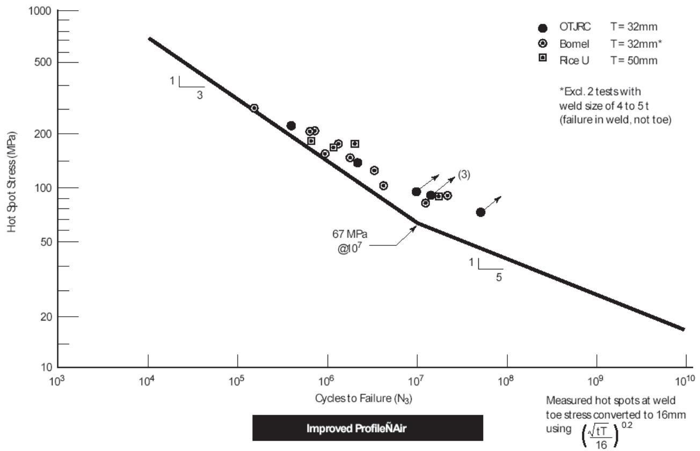  
Figure B.8.3—Basic Air S-N Curve as Applicable to Profiled Welds, Including Size and Toe Correction to the Data

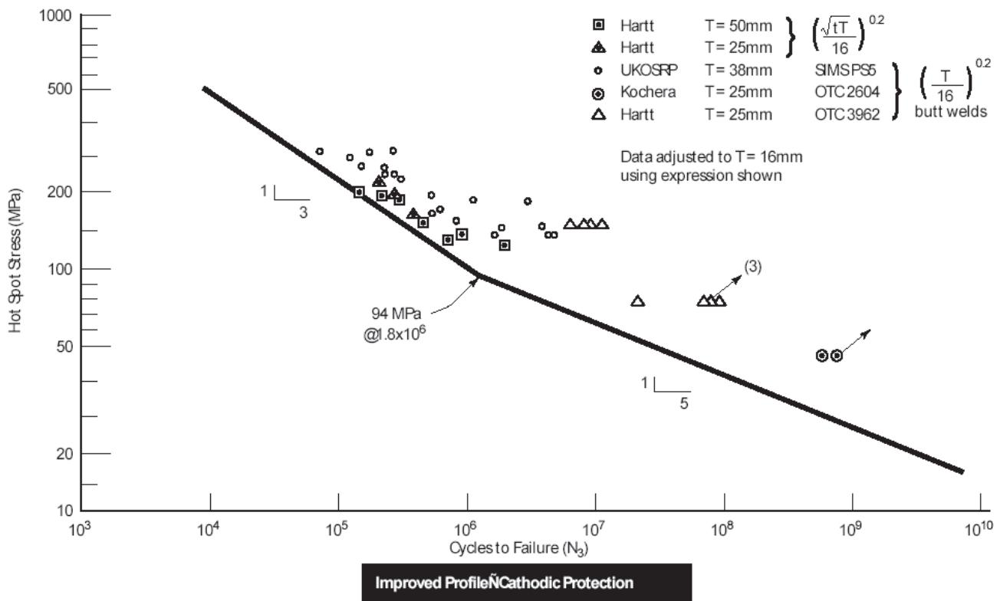  
Figure B.8.4—S-N Curve and Data for Seawater with CP

Criteria for “poor” versus “satisfactory” profiles were judged to be subjective. BOMEL were aware of the modified disk test in AWS D1.1 (radius = 0.5t), but for practical reasons most of the screening was done visually. Some of the “satisfactory” welds were flat and ugly, but they were grossly overwelded and passed the disc test at the chord hot spot. Some of the “poor” welds did not even meet AWS basic requirements. If all the data are combined, ignoring any influence of weld profile, a size effect exponent of 0.30 is obtained.

EWI [279] derived a thickness exponent of 0.29 for basic flat welds. However, Mohr makes a case that comparison of worst case bounds yields slightly lower size effect exponents than the mean trend comparisons cited above.

The SAE Fatigue Design Handbook uses a local stress approach, based on stresses averaged over 6 mm (0.24 in.) straddling the weld toe. This picks up both notch effects and the geometric size effect, as the gage length for larger specimens will be deeper into the notch. To account for the statistical size effect (larger specimens having a greater chance of flaws at a given defect rate), fatigue strength is reduced by the 0.034 power of highly stressed volume, corresponding to a size effect exponent of 0.10. The same size effect should in principle be applicable to cast nodes, which also use local stress as their design basis.

Following the above discussion, a progression of size effect exponents is given in 8.5.2, for various weld classes. Basic flat welds get a round down of the exponent to 0.25. Concave as-weld profiling as per AWS Figure C2.9 gets a round-down of the exponent to 0.20. Toe grinding at constant radius retains a small geometric size effect, as it does not follow geometric similarity; however, OTJTC recommended an exponent of 0.15 for this case.

The τ−0.1 improvement factor for joints with profiled welds, when considering fatigue in the joint can (T), is actually a size effect compromise between existing API (using branch thickness, t, to represent the size of the notch, as indicated to be more relevant for both notch stress theory and early stage crack growth in fracture mechanics) and ISO (using T as relevant to the later stages of crack growth). Improved joints spend most of their fatigue life in initiation and early stage crack growth, whereas these stages are much shorter for sharply notched weld toes. This compromise is also similar to the modified size effect proposed by Vosikovsky [276] and previously endorsed by OTJRC [279], in which an exponent of 0.13 on the thickness ratio τ = t/T reduces to a size effect expression given by:

$$\tau^{0. 13} (T / t_{\mathrm{r e f}})^{0. 25} = t^{0. 13} T^{0. 12} / t_{\mathrm{r e f}} 0. 25 \text{o r} [ \sqrt{} (T t) / t_{\mathrm{r e f}} ]^{0. 25} \tag{B.8.9}$$

The cast node design curve is based on a material thickness of 38 mm (1.5 in.). Fracture mechanics predictions [284] show that the thickness effect in castings is smaller than that in welded joints, and an exponent of 0.15 is specified.

B.8.5.3 Weld Improvement Techniques

Postweld fatigue improvement techniques may be used to improve fatigue life. These techniques, discussed below, improve fatigue life by improving the local geometry at the weld toe, reducing the stress concentrations and/or by modifying the residual stresses. The designer should be wary when applying weld improvement techniques, especially a powerful one like peening. If later cracking occurs, it should not be expected to initiate at the treated location. However, if cracking does initiate at a treated weld toe, the life associated with subsequent propagation is likely to be proportionally shorter (in comparison to lifeto-date) than is normal for untreated details.

It is anticipated that the HSSRs to be used for an assessment of the improved life would be obtained from equivalent joints, including standard welds, before the improvement technique is applied, from FE analysis or from SCF equations. Here, correction for actual weld toe position per B.8.3.2 is appropriate. However, hot spot stresses obtained from measurements on or modeling of improved joints already include this effect.

Except as noted below, multiple improvement factors should not be considered for a single joint location. If more than one technique is applied, only the one giving the highest improvement factor should be considered.

Adequate quality control (QC) procedures have to be applied if the appropriate improvement factor is to be attained. Specific requirements for the various techniques are noted or referenced below.

Weld Profiling. Investigations of the influence of weld profile on the fatigue strength of tubular joints have been limited and the effect of weld profile on fatigue life is unclear.

The ISO basic tubular joint S-N curve has been derived from an analysis of data on tubular joints manufactured using welds conforming to a standard flat profile given in AWS D1.1. Therefore, their fatigue recommendations apply to joints, which conform to this AWS standard flat profile.

A 1987 study reported in Reference [285] indicates that profiling does not improve the fatigue lives when measured in terms of the experimental HSSR. However, the reference notes that the weld leg length is generally larger in profiled joints, resulting in the weld toe moving into a region of lower stress and hence an increase in the fatigue load carrying capacity of the joint. On the other hand, References [265] [275], [276], [277], [286], [310], and [312] indicate that weld profile is a significant factor.

Booth’s more recent review [287] reiterates that, apart from the potential beneficial effect of increase in weld leg length, control of overall weld shape and weld surface finish for improved profile has limited influence on fatigue strength. Booth (WI) and ISO 14347 [32] recommend that correction factors for the increased weld leg length may be derived and applied to parametric SCF equations, thus enabling the improvement of fatigue performance to be exploited in design. Where invariant SCF were used in design and analysis, previous editions of API 2A-WSD accounted for this improvement by using a higher S-N curve. The new API provisions do both, as indicated by References [275] and [310].

Thus, for fully concave improved profiles, conforming to AWS D1.1 Clause 2.21.6.6 and Figure 3.10, the new API provisions consider

a) a less onerous size effect exponent (0.20 vs 0.25),   
b) a modest improvement factor of $\tau^{ - 0 . 1 }$ on stress, and   
c) consideration of actual weld toe position.

For t = T = 16 mm (0.625 in.), there is no improvement for Items a) and b). For the reference geometry of t = 16 mm (0.625 in.) and T = 40 mm (1.625 in.), and no overwelding, the foregoing amounts to an improvement factor of 1.15 on stress. A constant improvement factor of 2 on life (1.25 on stress for m = 3) would overstate the low cycle benefit of profiling, compared to calibrations by both OTJTC and HSE.

For weld profiles that are only partially improved, by the addition of a toe fillet as shown in AWS D1.1, Figure 3.9, but without the disc test and MT, only Items b) and c) should be considered as-welded.

However, for burr grinding or hammer peening at the weld toe, the appropriate additional improvement factors may be considered, together with a size effect exponent of 0.15.

Improvements through any form of profiling may be justified using information from either a test program for tubular joints for the condition being considered, or from fracture mechanics predictions [311] [312]. However, fracture mechanics still requires input on the localized weld toe notch effects, as well as the geometric HSS, and with that in hand one can simply use the modified S-N approach.

Weld Toe Grinding. For welded joints in air and for joints in seawater with cathodic protection, the fatigue life can be increased by controlled local machining or burr grinding to produce a smooth concave profile at the weld toe. This is especially beneficial at low stress ranges. Experimental data indicate that this technique can lead to an increase in the fatigue life by a factor of approximately 2. It should be noted that the beneficial effect of weld toe grinding can be reduced by pitting due to free corrosion, though it tends to be preserved by cathodic protection [278] [279]. Since corrosion pitting tends to defeat the advantages of grinding, ground surfaces should be protected prior to being placed in permanent service (e.g. with a temporary coating).

A limited number of tests have demonstrated the importance of quality control. The grinding procedure should ensure that all defects in the weld toe region have been removed by grinding to a depth not less than 0.5 mm (1/32 in.) below the bottom of any visible undercut or defect. The maximum depth of local grinding should not exceed 2 mm (1/16 in.) or 5 % of the plate thickness, whichever is less. NDE of the joint is required after grinding to verify that no significant defects remain and, for fillet-welded connections, it is important that the required throat size is maintained. Further QC aspects apply, and recourse should be made to Reference [278]. Disk grinding at the weld toe is hard to control, and is not the preferred method.

Full Profile Grinding (e.g. Butt Welds). For butt-welded joints, additional benefit can be gained by flush grinding of the weld cap. The effect of this is to improve the classification category. For welded tubular nodes, full grinding of the surface profile to a radius of not less than 0.5t qualifies for both the life improvement factor of 2 on curve WJ, and the 0.15 size effect exponent applicable to geometrically similar notch-free scale-ups.

Hammer Peening. By hammer peening the toes of welded connections, surface defects can be eliminated or blunted, the transition between the parent and weld materials is smoothed out, and beneficial compressive residual stresses are induced at the surface, all of which contribute to the enhancement of the fatigue performance of the treated weld. The net effect is to delay crack development and retard or eliminate growth of cracks already present.

The objective in hammer peening is to obtain a smooth groove at the weld toe. The grooved depth should be at least 0.3 mm (1/64 in.), but need not exceed 0.5 mm (1/32 in.) [288] [289]. The equipment and procedure required to attain this groove configuration should be established via trials on detail mock-ups. Note that the number of passes required is determined by the equipment and procedure; there is no set number. Heavy-duty pneumatic hammers are preferred. The bit tip radius should be about 3 mm (1/8 in.), so as to expedite the process and facilitate treatment right at the weld toe. Extensive use of peening has ergonomic implications. Consideration should be given to limiting the consecutive hours spent by one individual and use of vibration dampening gloves. Peening can result in metal “rollovers” along the sides of the groove. These are innocuous relative to fatigue performance, but can easily be removed with light burr grinding. Removal eliminates difficulty with interpretation of later inspection findings. Peened weld toes should be inspected directly after peening and any burr grinding with MT.

The recommended fatigue life improvement factor is 4. This value is significantly less than that found in many test programs, and varies with stress range magnitude and other variables. The reduced value takes into account uncertainties in:

— mean stress,   
— dominant stress range magnitude, and   
— the effects of overloads.

The life improvement factor may be applied to both tubular and nontubular weld details.

The benefits of hammer peening in fatigue life can only be realized through adoption of adequate QC procedures. References [288] and [289] contain the state-of-the-art practice in this field and should be consulted in the preparation of adequate QC procedures prior to taking benefit for fatigue life enhancement.

Postweld Heat Treatment (PWHT). As-welded joints contain significant tensile residual stresses induced by the welding process, which can combine with the operating stresses to promote fatigue failure. This is due to the enhancement of the effective mean stress and, for situations where the stress range consists of a compressive component, the effective stress range. It follows that the reduction of tensile residual stresses can increase the fatigue life.

A comparison of the fatigue behavior of as-welded and PWHT joints has confirmed that PWHT can have a beneficial effect on the fatigue behavior of welded joints. However, the effect of PWHT diminishes with the increasing R-ratio and is negligible at R > 0. Thus, the fatigue performance of postweld heat-treated and as-welded joints at R-ratios greater than zero are very similar and the same S-N curves apply.

A significant drawback in the allowance for PWHT in fatigue design is that knowledge of the mean stress is still not well known. The mean stress contribution from applied loading is not difficult to establish, but the remaining built-in stresses from welding and far-field fit-up cannot be easily bounded.

Nevertheless, prefabricated welded nodes with fully ground profiles and PWHT may be treated as the equivalent of cast nodes with weld repair, provided the local stress intensification of the fillet radius is accounted for in design.

B.8.6 Fracture Mechanics

The benefits of using defect assessment procedures (e.g. API 579-1 [19] and BSI BS 7910 [300]) for the fitness-for-purpose assessment of offshore structures are widely recognized and defect assessment is being used increasingly in design, fabrication, and during in-service inspection. However, established procedures are based on general principles. Their application to tubular joints is complex due to the joint geometry and loading but may be facilitated by the use of geometric or structural HSS as the reference action [275] [307] [311] [312]. For further discussion, see ISO 19902 [33], Clause A16.15.

## B.10 Commentary on Other Structural Components and Systems

B.10.3 Crane Supporting Structure

## B.10.3.3 Fatigue Design

The deterministic fatigue approach provided of 25,000 cycles of factored working load is unconservative for large boom cranes. Fatigue cracks in pedestal butt welds for cranes have occurred in some cranes even though a criterion of the check was met. Large boom cranes (moment due to boom weight greater than 30 % of design moment) should have the moment/stress due to the boom weight working load cycles in rotation added in for the fatigue calculation.

B.10.4 Grouted Pile-to-structure Connections

## B.10.4.4 Computation of Allowable Axial Force

## B.10.4.4.2 Plain Pipe Connections

Tests indicate that the strength of a grouted pile-to-structure connection using plain pipe is due to the bond and confinement friction between the steel and grout. Failure of test specimens normally occurs by slippage between the grout and steel. However, in practice, large diameter sandwich shells and wind turbine monopile caps with annulus radius over 1 m or 2 m (3 ft or 6 ft) have been observed to disbond due to grout shrinkage (no load) or low level cyclic loading.

Figure B.10.1 shows a plot of available test data for plain pipe grouted connections. Ordinates are failing values of the ultimate load transfer stress, $f_{ \mathsf{ b u } }$ , which were computed by dividing the failing value of axial load by the contact area between the grout and pipe at the surface of failure. Abscissas are corresponding values of unconfined grout compressive strength, $f_{ \mathtt{ C U } } .$ Only tests in which $f_{ \mathtt{ c u } } \geq 17 . 25$ MPa (2,500 psi) are included (see 10.4.4.5). A comparison between the basic allowable load transfer stress of 138 KPa (20 psi) and each of the 62 available test results gives a mean safety factor of 11.0, a minimum safety factor of 2.5, a maximum safety factor of 33.6, a maximum safety index of 4.5 (see Reference [323]). A histogram of the safety factors for these 52 tests is shown in Figure B.10.2 and a cumulative histogram of the safety factors is shown in Figure B.10.3.

## B.10.4.4.3 Shear Key Connections

Tests of grouted pile-to-structure connections using shear keys indicate that two separate sources of strength contribute to the ultimate strength of the connection: first, the contribution of bond and confinement friction between the steel and grout, and second, the contribution of bearing of the shear keys against the grout. At failure, two separate mechanisms occur: first, a slippage between the steel and grout, and second, a crushing of the grout against the shear keys. These specimens normally fail in a ductile manner, with both mechanisms acting, so that the ultimate strength of the connection is the sum of the two separate sources of strength. At some time prior to final failure, diagonal cracks tend to open across the grout, generally between diagonally opposite shear keys, or from one shear key to the opposite pipe.

The basic equation for allowable load transfer stress [Equation (10.1)] is based on an ultimate strength formulation of the mechanisms of failure described above, with the application of a safety factor, see Reference [321]. Figure B.10.4 shows a plot of available test data for shear key grouted connections. Ordinates are failing values of load transfer stress, $f_{ \mathsf{ b u } } .$ , which were computed by dividing the failing value of axial load by the contact area (π times diameter times length) between the grout and the pipe at the surface of failure. Abscissas are corresponding values of $f_{ \mathtt{ C U } } \times h / s$ . Only tests in which $f_{ \mathtt{ c u } } \geq 17 . 25 ~ \mathsf{ M P a }$ (2500 psi) are included (see 10.4.4.4). A comparison between allowable values of Equation (10.1) and each of the 85 available test results gives a mean safety factor of 4.8, a minimum safety factor of 2.0, a maximum safety factor of 16.6, and a safety index of 4.6, see Reference [323]. A histogram of the safety factors for these 85 tests is shown in Figure B.10.2 and a cumulative histogram of the safety factors is shown in Figure B.10.3. One test value is included in the statistical analysis but is not shown in Figure B.10.2 because the data point would fall outside of the limits shown. For this data point $f_{ \mathsf{ b u } } = 15 \mathsf{ M P a }$ (2200 psi) and $f_{ \mathtt{ c u } } \times h / s = 12 \mathsf{ M P a }$ (1770 psi).

The provision for the design of shear key cross section and weld (Figure B.10.4) is intended to provide a shear key whose failing capacity is greater than the failing capacity of the grout crushing against the shear key.

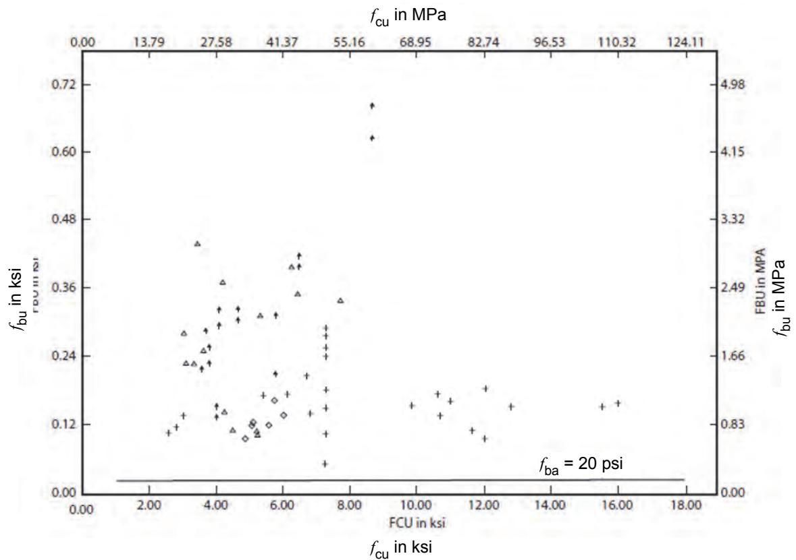  
NOTE Measured bond strength vs cube compressive strength for 62 tests of grouted tubular joints without shear connectors.

Key

+ See References [317] and [318]   
See Reference [320]   
See Reference [322]   
→ See Reference [324]

Figure B.10.1—Measured Bond Strength vs Cube Compressive Strength

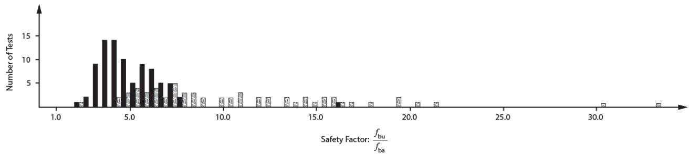  
Figure B.10.2—Histogram of the Safety Factors—Tests with and Without Shear Key Connections

Key

四 Without shear connectors, 62 tests.  
■ With shear connectors, 85 tests.

NOTE Straight line equation: $f_{ b a } = 20 + 0 . 5 f_{ \mathsf{ c u } } \%_{ \mathsf{ \Gamma } , \mathsf{ i n p s i } }$

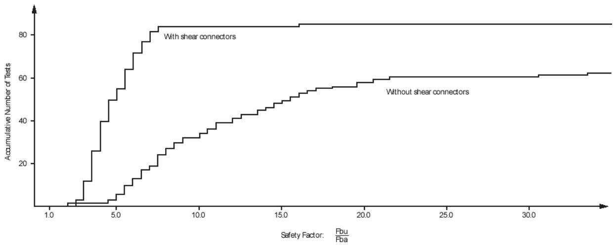  
Figure B.10.3—Cumulative Histogram of the Safety Factors—Tests with and Without Shear Key Connections

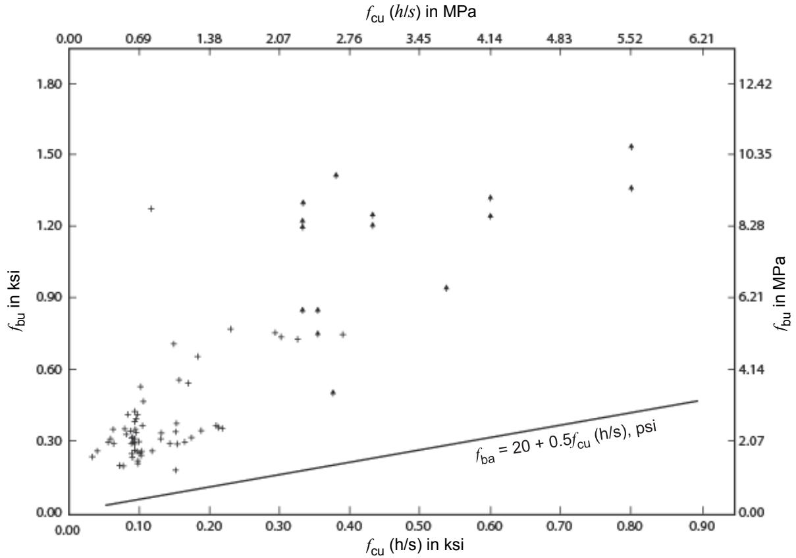  
Figure B.10.4—Measured Bond Strength vs. Cube Compressive Strength Multiplied by the Height-to-spacing Ratio

Key   
+ See References [317] and [318]   
→ See Reference [324]

NOTE Measured bond strength vs. cube compressive strength times the height-to-spacing ratio for 85 tests of grouted tubular joints with shear connectors.

## B.10.4.4.4 Limitations

The maximum values of important variables that are specified in this paragraph correspond closely to the maximum values of those variables in the tests on which the allowable stress equations are based. Use of values outside of these limits should be based on additional testing.

## B.10.4.4.5 Other Design Methods

In recent years the design method included in the DOE Code has received considerable use in the design of connections using shear keys see References [317], [318], and [319]. The allowable load transfer stress, ${ f }_{ \mathsf{ b a } } ,$ by the DOE Code is calculated from the following equation, using SI units:

$$f_{\mathrm{b a}} = \frac{1}{6} K C_{\mathrm{L}} \left(9 C_{\mathrm{S}} + 1100 \frac{h}{s}\right) \left(f_{\mathrm{c u}}\right)^{1 / 2} \mathrm{M P a} \tag{B.10.1}$$

where

$f_{ \mathtt{ C U } }$ is the characteristic grout compressive strength as defined in the DOE Code in units of MPa;

K is a dimensionless stiffness factor defined as follows:

$$K = \frac{1}{m} \left(\frac{D}{t}\right)_{\mathrm{g}}^{-1} + \left[ \left(\frac{D}{t}\right)_{\mathrm{p}} + \left(\frac{D}{t}\right)_{\mathrm{s}} \right]^{-1} \tag{B.10.2}$$

and where

$C_{ \mathrm{ L } }$ is the length coefficient as specified in the DOE Code;

$C_{ \mathsf{ S } }$ is the a surface coefficient as specified in the DOE Code;

h is the minimum shear connector outstand expressed in millimeters;

s is the nominal shear connector spacing (mm);

m is the modular ratio of steel to grout;

D is the outside diameter, expressed in millimeters;

t is the wall thickness, expressed in millimeters.

suffixes g, p, and s refer to grout, pile, and sleeve, respectively.

The safety factor of 6 in Equation (B.10.1) is specified for normal loading conditions on a connection in which the grout displaced water, and the safety factor is adjusted for other conditions. The stiffness factor, K, which is defined in Equation (B.10.2) and is used in Equation (B.10.1), is intended to introduce into the equation the effect of the hoop flexibility of the pile, sleeve and grout on the connection strength. The DOE equations are based on extensive testing performed at the Wimpey Laboratories near London (see References [317], [318], and [319]. Detailed instructions for the use of these equations and limitations on

their use are set out explicitly in the DOE Code (see Reference [317]), to which the designer is hereby referred.

## B.11 Commentary on Material

B.11.2 Structural Steel Pipe

Tubulars used as structural components are often subjected to substantial axial and hoop stresses. Test data on tubulars fabricated with circumferential and longitudinal seams have provided insight into the effects of geometric imperfections and residual stresses introduced during fabrication and allowed development of empirical formulations to define elastic and critical buckling stresses as well as the interaction relationships between the axial and hoop stresses. Unless sufficient test data are obtained on spiral welded tubulars to evaluate applicability of API recommended empirical formulations, spiral welded tubulars cannot be recommended for structural use.

## B.13 Commentary on Welding

## B.13.2.2 Impact Requirements

Charpy impact testing is a method for qualitative assessment of material toughness. Although lacking the technical precision of crack tip opening displacement (CTOD) testing, the method has been and continues to be a reasonable measure of fracture safety, when employed with a definitive program of NDE to eliminate weld area imperfections. The recommendations contained herein are based on practices that have generally provided satisfactory fracture experience in structures located in moderate temperature environments [e.g. $4^{ \circ } \mathsf C ( 40^{ \circ } \mathsf F )$ seawater and $^{ - 10^{ \circ } \mathsf{ C } } ( 14^{ \circ } \mathsf{ F } )$ air exposure]. For environments that are either more or less hostile, impact testing temperatures should be reconsidered, based on local temperature exposures.

For critical welded connections, the technically more exact CTOD test is appropriate. CTOD tests are run at realistic temperatures and strain rates, representing those of the engineering application, using specimens having the full prototype thickness. This yields quantitative information useful for engineering fracture mechanics analysis and defect assessment, in which the required CTOD is related to anticipated stress levels (including residual stress) and flaw sizes.

Achieving the higher levels of toughness may require some difficult trade-offs against other desirable attributes of the welding process, for example, the deep penetrations and relative freedom from trapped slag of uphill passes.

Since AWS welding procedure requirements are concerned primarily with tensile strength and soundness (with minor emphasis on fracture toughness) it is appropriate to consider additional essential variables that have an influence on fracture toughness, that is, specific brand wire/flux combinations, and the restriction of AWS consumables to the limits actually tested for AWS classification. Note that for Class A steels, specified energy levels higher than the AWS classifications will require that all welding procedures be qualified by test, rather than having prequalified status.

In addition to weld metal toughness, consideration should be given to controlling the properties of the HAZ. Although the heat cycle of welding sometimes improves base metals of low toughness, this region will more often have degraded properties. A number of early failures in welded tubular joints involved fractures that either initiated in or propagated through the HAZ, often before significant fatigue loading.

AWS D1.1:2010, Clause 4, Part D gives requirements for sampling both weld metal and HAZ, with Charpy energy and temperature to be specified in contract documents. Average HAZ values shown in Table B.13.1 have been found by experience to be reasonably attainable, where single specimen energy values (one of three) 7 J (5 ft-lb) lower are allowed without requiring retest.

As criticality of the component’s performance increases, lower testing temperatures (implying more restrictive welding procedures) would provide HAZs that more closely match the performance of the adjoining weld metal and parent material, rather than being a potential weak link in the system. The owner may also wish to consider more extensive sampling of the HAZ than the single set of Charpy tests required by AWS, for example, sampling at 0.4 mm (0.016 in.), 2 mm (0.079 in.), and 5 mm (0.20 in.) from the fusion line. More extensive sampling increases the likelihood of finding local brittle zones with low toughness values.

Since HAZ toughness is as much dependent on the steel as on the welding parameters, a preferable alternative for addressing this issue is through weldability prequalification of the steel. API 2Z [12] spells out such a prequalification procedure, using CTOD as well as Charpy testing. This prequalification testing is presently being applied as a supplementary requirement for high-performance steels such as API 2W [9] and API 2Y [11] and is accepted as a requirement by a few producers.

Caution—AWS permits testing one 345 MPa (50 ksi) steel to qualify all other grades of 345 MPa (50 ksi) and below. Consequently, selection of API-2H [5]-50-Z [very low sulphur, 270 J (200 ft-lb) upper shelf Charpy] for qualification test plates will virtually assure satisfying a HAZ impact requirement of 34 J (25 ft-lb), even when welded with high heat inputs and high interpass temperatures. There is no reasonable way to extrapolate this test to ordinary A572 Grade 50 with the expectation of either similar HAZ impact energies or similar 8:1 degradation. Thus, separate Charpy testing of each API steel class is appropriate, if HAZ toughness is being addressed via WPQ (weld procedure qualification) testing.

Table B.13.1—Average Heat Affected Zone (HAZ) Values   

| Steel Group | Steel Class | Impact Test Temperature °C (°F) | HAZ J (ft-lb) |
| --- | --- | --- | --- |
| I | C | 10 (50) | For information only |
| I | B | 4 (40) | 20 (15) |
| I | A | -10 (14) | 20 (15) |
| II | C | 10 (50) | For information only |
| II | B | 4 (40) | 20 (15) |
| II | A | -10 (14) | 34 (25) |
| III | A | -10 (14) | 40 (30) |

## B.17 Commentary on Accidental Loading

B.17.9 Accidental Loading

## B.17.9.2 Vessel Collision

All exposed elements at risk in the collision zone of an installation should be assessed for accidental vessel impact during normal operations.

The collision zone is the area on any side of the platform that a vessel could impact in an accidental situation during normal operations. The vertical height of the collision zone should be determined from considerations of vessel draft, operational wave height and tidal elevation.

Elements carrying substantial dead load (i.e. knee braces), except for platform legs and piles, should not be located in the collision zone. If such elements are located in the collision zone they should be assessed for vessel impact.

Impact Energy. The kinetic energy of a vessel can be calculated using Equation (B.17.1).

$$E = 0. 5 a m v^{2} \tag{B.17.1}$$

where

E is the kinetic energy of the vessel;   
a is the added mass factor (1.4 for broadside collision or 1.1 for bow/stern collision);   
m is the vessel mass;   
v is the velocity of vessel at impact.

The added mass coefficients shown are based on a ship-shaped or boat-shaped hull.

For platforms in mild environments and reasonably close to their base of supply, the following minimum requirements should be used, unless other criteria can be demonstrated:

Vessel displacement = 1000 metric tons (1100 short tons)

Impact velocity = 0.5 m/s (1.64 ft/s)

The 1000 metric ton (1100 short ton) vessel is chosen to represent a typical 55 m to 61 m (180 ft to 200 ft) long supply vessel in the U.S. Gulf of Mexico.

For deeper and more remote locations, the vessel mass and impact velocity should be reviewed and increased where necessary. In shallow areas, it may be possible to reduce this criteria where access to the platform is limited to small workboats.

Energy Absorption. An offshore structure will absorb energy primarily from the following:

a) localized plastic deformation (i.e. denting) of the tubular wall;   
b) elastic/plastic bending of the member;   
c) elastic/plastic elongation of the member;   
d) fendering device, if fitted;   
e) global platform deformation (i.e. sway);   
f) ship deformation and/or rotation.

In general, resistance to vessel impact is dependent upon the interaction of member denting and member bending. Platform global deformation may be conservatively ignored. For platforms of a compliant nature, it may be advantageous to include the effects of global deformation.

Damage Assessment. Two cases should be considered:

— impact (energy absorption and survival of platform);   
— postimpact (platform to meet postimpact criteria).

Primary framework should be designed and configured to absorb energy during impact, and to control the consequences of damage after impact. Some permanent deformation of members may be allowable in this energy absorption.

The platform should retain sufficient residual strength after impact to withstand the 1-year environmental storm loads in addition to normal operating loads. Special attention should be given to defensible representation of actual stiffness of damaged members or joints in the postimpact assessment. Damaged members may be considered totally ineffective providing their wave areas are modeled in the analyses.

Where adequate energy absorption can be calculated for individual members, further checking is not necessary. In cases where very stiff members (grouted legs or members) cause the main energy absorption to be in the vessel, the supporting braces for the member, the joints at each end of the member, and the adjacent framing members should be checked for structural integrity resulting from the impact loads.

Bracing Members. A number of research studies have been performed to evaluate the force required to locally damage tubular members [325] [326]. Furnes [326] reported on these experimental test results and found the relationship between force and dent depth to be:

$$P_{\mathrm{d}} = 15 M_{\mathrm{p}} (D / t)^{1 / 2} (X / R)^{1 / 2} \tag{B.17.2}$$

where

$P_{ \mathsf{ d } }$ is the denting force;

$M_{ \mathsf{ p } }$ is the plastic moment capacity of the tube, which equals $M_{ \mathsf{ p } } t^{ 2 } / 4$ , where $F_{ \mathsf{ y } }$ is the yield strength;

D is the diameter of the tube;

R is the radius of the tube;

t is the wall thickness;

X is the dent depth.

Alternatively, C. P. Ellinas [327] reported the relationship to be:

$$P_{\mathrm{d}} = 40 F_{\mathrm{y}} t^{2} (X / D)^{1 / 2} \tag{B.17.3}$$

The energy used in creating the dent is the integral of the force applied over the distance or:

$$E_{\mathrm{d}} = \int_{0}^{x} P_{\mathrm{d}} d x \tag{B.17.4}$$

Combining Equations (B.17.2) and (B.17.4) yields:

$$E_{\mathrm{d}} = 14. 14 M_{\mathrm{p}} X^{3 / 2} / t^{1 / 2} \tag{B.17.5}$$

Substitution of $M_{ \mathbf{ p } }$ yields:

$$E_{\mathrm{d}} = 3. 54 F_{\mathrm{y}} (t X)^{3 / 2} \tag{B.17.6}$$

and introducing the relationship X = D/B to solve for various D/t ratios yield:

$$E_{\mathrm{d}} = 3. 54 F_{\mathrm{y}} (t D / B)^{3 / 2} \tag{B.17.7}$$

where

B is the brace diameter/dent depth.

The energy required to cause a dent of limited depth may be equated with the kinetic energy from the vessel impact. Table B.17.1 lists required tubular thickness of various diameters for B = 8, 6, and 4 (corresponding to dents 12.5 %, 16.7 %, and 25 % of the member diameter). Values have been tabulated for $F_{ \tt y } = 345$ MPa and 240 MPa (50 ksi and 35 ksi). If the dent should be limited to D/8 (B = 8), then from Table B.17.1 the required wall thickness for a 900 mm (36 in.) diameter 345 MPa (50 ksi) tubular is 24 mm (0.95 in.).

NOTE For small diameters, the required thickness gets quite large resulting in low D/t ratios. Much of the test data falls in the D/t region of 30 to 60; projection of the results outside of these ranges should be considered with caution.

Forces developed from Equation (B.17.2) applied to horizontal and vertical diagonal members commonly found in offshore jackets indicates that, in most situations, these members would experience plastic deformation at the member ends before the full denting force could be reached. Because of this, the designer should consider the relative trade-offs between increasing the wall thickness and diameter so that the brace will be locally damaged rather than entirely destroyed. In most normal operating conditions, the loss of a brace in a redundant structure at the waterline is not catastrophic provided the leg to which the brace was attached remains relatively undamaged. Other members connecting to the same joint need to withstand forces resulting from the impact. Where other brace members significantly overlap the impacted member at the joint, the integrity of the connection should be evaluated.

Table B.17.1—Required Tubular Thickness to Locally Absorb Vessel Impact   

| Diameter mm (in.) | Diameter mm (in.) | $F_y=345 MPa (50 ksi)$ | $F_y=345 MPa (50 ksi)$ | $F_y=345 MPa (50 ksi)$ | $F_y=345 MPa (50 ksi)$ | $F_y=240 MPa (35 ksi)$ | $F_y=240 MPa (35 ksi)$ | $F_y=240 MPa (35 ksi)$ | $F_y=240 MPa (35 ksi)$ |
| --- | --- | --- | --- | --- | --- | --- | --- | --- | --- |
| Diameter mm (in.) | Diameter mm (in.) | $B^1=8.0$ | $B^1=8.0$ | $B=6.0$ | $B=4.0$ | $B=8.0$ | $B=8.0$ | $B=6.0$ | $B=4.0$ |
| Diameter mm (in.) | Diameter mm (in.) | Wall Thickness, $t$mm (in.) | Wall Thickness, $t$mm (in.) | Wall Thickness, $t$mm (in.) | Wall Thickness, $t$mm (in.) | Wall Thickness, $t$mm (in.) | Wall Thickness, $t$mm (in.) | Wall Thickness, $t$mm (in.) | Wall Thickness, $t$mm (in.) |
| 300 | (12.0) | 73 | (2.83) | 55 | (2.13) | 37 | (1.42) | 93 | (3.60) |
| 350 | (14.0) | 63 | (2.43) | 47 | (1.82) | 31 | (1.23) | 79 | (3.08) |
| 400 | (16.0) | 55 | (2.13) | 41 | (1.59) | 27 | (1.06) | 70 | (2.70) |
| 450 | (18.0) | 49 | (1.89) | 37 | (1.42) | 24 | (0.95) | 62 | (2.40) |
| 500 | (20.0) | 44 | (1.70) | 33 | (1.28) | 22 | (0.85) | 56 | (2.16) |
| 550 | (22.0) | 40 | (1.55) | 30 | (1.16) | 20 | (0.77) | 51 | (1.96) |
| 600 | (24.0) | 37 | (1.42) | 27 | (1.06) | 18 | (0.71) | 46 | (1.80) |
|  |  |  |  |  |  |  |  |  |  |
| 650 | (26.0) | 34 | (1.31) | 25 | (0.98) | 17 | (0.65) | 43 | (1.66) |
| 700 | (28.0) | 31 | (1.22) | 23 | (0.91) | 16 | (0.61) | 40 | (1.54) |
| 750 | (30.0) | 29 | (1.13) | 22 | (0.85) | 15 | (0.57) | 37 | (1.44) |
| 800 | (32.0) | 27 | (1.06) | 21 | (0.80) | 14 | (0.53) | 35 | (1.35) |
| 850 | (34.0) | 26 | (1.00) | 19 | (0.75) | 13 | (0.50) | 33 | (1.27) |
| 900 | (36.0) | 24 | (0.95) | 18 | (0.71) | 12 | (0.47) | 31 | (1.20) |
|  |  |  |  |  |  |  |  |  |  |
| 950 | (38.0) | 23 | (0.90) | 17 | (0.67) | 12 | (0.45) | 29 | (1.14) |
| 1000 | (40.0) | 22 | (0.85) | 16 | (0.64) | 11 | (0.43) | 28 | (1.08) |
| 1050 | (42.0) | 21 | (0.81) | 16 | (0.61) | 10 | (0.41) | 26 | (1.03) |
| 1100 | (44.0) | 20 | (0.77) | 15 | (0.58) | 10 | (0.39) | 25 | (0.98) |
| 1150 | (46.0) | 19 | (0.74) | 14 | (0.55) | 10 | (0.37) | 24 | (0.94) |
| 1200 | (48.0) | 18 | (0.71) | 14 | (0.53) | 9 | (0.35) | 23 | (0.90) |
|  |  |  |  |  |  |  |  |  |  |
| 1250 | (50.0) | 18 | (0.68) | 13 | (0.51) | 9 | (0.34) | 22 | (0.86) |
| 1300 | (52.0) | 17 | (0.65) | 13 | (0.49) | 8 | (0.33) | 21 | (0.83) |
| 1350 | (54.0) | 16 | (0.63) | 12 | (0.47) | 8 | (0.32) | 21 | (0.80) |
| 1400 | (56.0) | 16 | (0.61) | 12 | (0.46) | 8 | (0.30) | 20 | (0.77) |
| 1450 | (58.0) | 15 | (0.59) | 11 | (0.44) | 8 | (0.29) | 19 | (0.74) |
| 1500 | (60.0) | 15 | (0.57) | 11 | (0.43) | 7 | (0.28) | 19 | (0.72) |
|  |  |  |  |  |  |  |  |  |  |
| 1550 | (62.0) | 14 | (0.55) | 11 | (0.41) | 7 | (0.27) | 18 | (0.70) |
| 1600 | (64.0) | 14 | (0.53) | 10 | (0.40) | 7 | (0.27) | 17 | (0.67) |
| 1650 | (66.0) | 13 | (0.52) | 10 | (0.39) | 7 | (0.26) | 17 | (0.65) |
| 1700 | (68.0) | 13 | (0.50) | 10 | (0.38) | 6 | (0.25) | 16 | (0.63) |
| 1750 | (70.0) | 13 | (0.49) | 9 | (0.36) | 6 | (0.24) | 16 | (0.62) |
| 1800 | (72.0) | 12 | (0.47) | 9 | (0.35) | 6 | (0.24) | 15 | (0.60) |
| NOTE 1 The table lists the required wall thickness for selected values of D, B, and F_y based on Equation (B.17.7).NOTE 2 Values are derived assuming a broadside impact of a 1000-metric-ton vessel moving at 0.50 m/s.NOTE 3 All energy is assumed to be absorbed by the member. | NOTE 1 The table lists the required wall thickness for selected values of D, B, and F_y based on Equation (B.17.7).NOTE 2 Values are derived assuming a broadside impact of a 1000-metric-ton vessel moving at 0.50 m/s.NOTE 3 All energy is assumed to be absorbed by the member. | NOTE 1 The table lists the required wall thickness for selected values of D, B, and F_y based on Equation (B.17.7).NOTE 2 Values are derived assuming a broadside impact of a 1000-metric-ton vessel moving at 0.50 m/s.NOTE 3 All energy is assumed to be absorbed by the member. | NOTE 1 The table lists the required wall thickness for selected values of D, B, and F_y based on Equation (B.17.7).NOTE 2 Values are derived assuming a broadside impact of a 1000-metric-ton vessel moving at 0.50 m/s.NOTE 3 All energy is assumed to be absorbed by the member. | NOTE 1 The table lists the required wall thickness for selected values of D, B, and F_y based on Equation (B.17.7).NOTE 2 Values are derived assuming a broadside impact of a 1000-metric-ton vessel moving at 0.50 m/s.NOTE 3 All energy is assumed to be absorbed by the member. | NOTE 1 The table lists the required wall thickness for selected values of D, B, and F_y based on Equation (B.17.7).NOTE 2 Values are derived assuming a broadside impact of a 1000-metric-ton vessel moving at 0.50 m/s.NOTE 3 All energy is assumed to be absorbed by the member. | NOTE 1 The table lists the required wall thickness for selected values of D, B, and F_y based on Equation (B.17.7).NOTE 2 Values are derived assuming a broadside impact of a 1000-metric-ton vessel moving at 0.50 m/s.NOTE 3 All energy is assumed to be absorbed by the member. | NOTE 1 The table lists the required wall thickness for selected values of D, B, and F_y based on Equation (B.17.7).NOTE 2 Values are derived assuming a broadside impact of a 1000-metric-ton vessel moving at 0.50 m/s.NOTE 3 All energy is assumed to be absorbed by the member. | NOTE 1 The table lists the required wall thickness for selected values of D, B, and F_y based on Equation (B.17.7).NOTE 2 Values are derived assuming a broadside impact of a 1000-metric-ton vessel moving at 0.50 m/s.NOTE 3 All energy is assumed to be absorbed by the member. | NOTE 1 The table lists the required wall thickness for selected values of D, B, and F_y based on Equation (B.17.7).NOTE 2 Values are derived assuming a broadside impact of a 1000-metric-ton vessel moving at 0.50 m/s.NOTE 3 All energy is assumed to be absorbed by the member. |
| 1 Where B = diameter/X (dent depth). | 1 Where B = diameter/X (dent depth). | 1 Where B = diameter/X (dent depth). | 1 Where B = diameter/X (dent depth). | 1 Where B = diameter/X (dent depth). | 1 Where B = diameter/X (dent depth). | 1 Where B = diameter/X (dent depth). | 1 Where B = diameter/X (dent depth). | 1 Where B = diameter/X (dent depth). | 1 Where B = diameter/X (dent depth). |

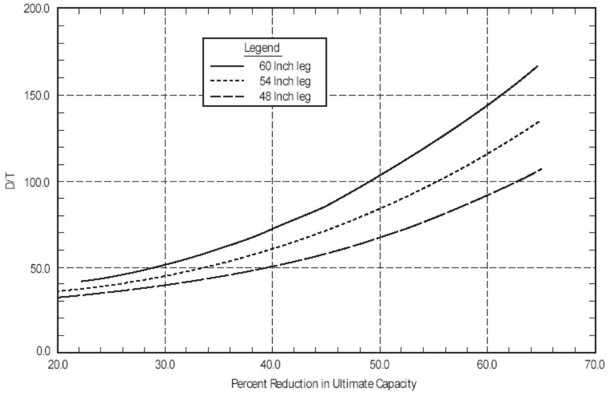  
Figure B.17.1—D/T Ratio vs Reduction in Ultimate Capacity, 1220 mm, 1370 mm, and 1525 mm (48 in., 54 in., and 60 in.) Legs—Straight with L = 18.3 m (60 ft), K = 1.0, and $F_{ \mathbf{ y } } = 240$ MPa (35 ksi)

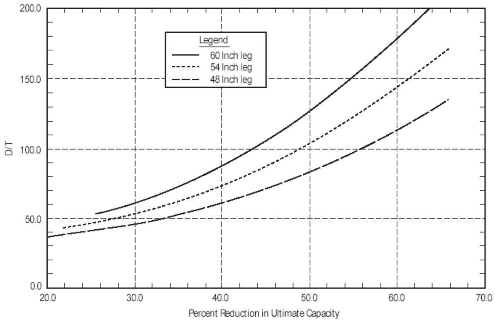  
Figure B.17.2—D/T Ratio vs Reduction in Ultimate Capacity, 1220 mm, 1370 mm, and 1525 mm (48 in., 54 in., and 60 in.) Legs—Straight with L = 18.3 m (60 ft), K = 1.0, and $F_{ \mathbf{ y } } = 345 ~ \mathsf{ M P a }$ (50 ksi)

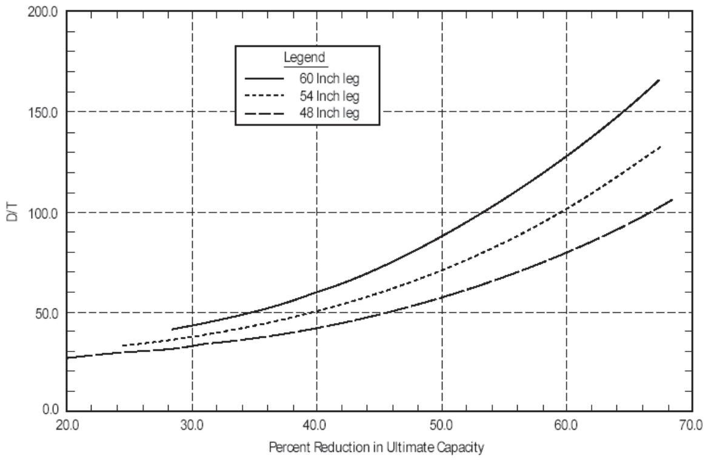  
Figure B.17.3—D/T Ratio vs Reduction in Ultimate Capacity, 1220 mm, 1370 mm, and 1525 mm (48 in., 54 in., and 60 in.) Legs—Bent with L = 18.3 m (60 ft), K = 1.0, and $F_{ \mathbf{ y } } = 240 \ \mathsf{ M P a }$ (35 ksi)

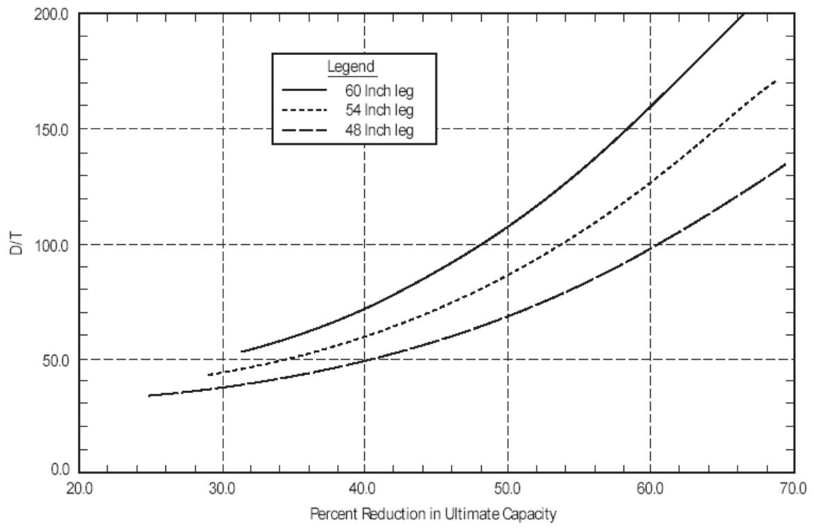  
Figure B.17.4—D/T Ratio vs Reduction in Ultimate Capacity, 1220 mm, 1370 mm, and 1525 mm (48 in., 54 in., and 60 in.) Legs—Bent with L = 18.3 m (60 ft), K = 1.0, and $F_{ \mathbf{ y } } = 345 ~ \mathsf{ M P a }$ (50 ksi)

For structures with limited redundancy, such as minimal structures, the loss of a waterline brace may be catastrophic. In addition, some decks have critical knee braces in the vessel impact zone. These braces should be designed to withstand vessel impact if the loss of the structure is unacceptable.

Jacket Leg Members. Energy absorption in jacket leg members occurs mainly through localized denting of the tubular shell and elastic/plastic bending of the member.

Denting should be minimized to ensure sufficient member capacity for the platform post impact considerations. This is accomplished through the selection of appropriate D/t ratios for jacket legs. Using the U.S. Gulf of Mexico energy level for broadside vessel impacts, dent depths for various D/t ratios may be computed and the axial capacity of the damaged member may then be compared to the undamaged case. Figure B.17.1 through Figure B.17.4 present the percentage reduction in axial capacity of dented legs for both straight and bent (L/360) conditions for 240 MPa and 345 MPa (35 ksi and 50 ksi) yield strengths.

Fendering. Fendering devices may be used to protect platform appurtenances (e.g. risers, external conductors) or parts of the structure. Fendering should be designed to withstand vessel impact without becoming detached from the structure.

Clearances between fendering and protected elements of the installation should be adequate to ensure integrity of protection throughout the energy absorption process of vessel impact.

Supports for fendering systems should be designed to avoid concentrating loads on primary structural members (e.g. legs).

Risers and Conductors. Evaluation of risers and conductors is essential when such elements are external to the structure. Clear warnings are suggested for those sides of the platform where such elements are located and not protected by some form of fendering.

## B.19 Commentary on Minimum and Special Structures

B.19.2 Design Loads and Analysis

Analysis and design procedures contained in this recommended practice are usually appropriate for minimum structures. However, these procedures have evolved from historical experience primarily involving conventional four and eight leg, welded, template type structures. Minimum structures may exhibit structural behavior different from conventional structures. Special consideration should be given the following.

a) Minimum structures tend to be less stiff than conventional structures, hence dynamic effects and fatigue are of more concern even in shallow water depths.   
b) Minimum structures typically are less redundant than conventional structures. For example, such structures are more sensitive to design oversights, fabrication and welding deviations, in-service damage, fatigue, and deterioration due to corrosion.   
c) Reserve strength is important in any structure exposed to unforeseen loading conditions such as accidental loading from vessels or greater than predicted environmental loads. Reserve strength is usually lower in less redundant structures unless the designer makes provisions otherwise. These

provisions may include reductions in acceptable interaction ratios used for member design as well as designing joints for the full yield strength of the connecting members.

d) Many minimum structures utilize connection and component types other than conventional welded tubular joints. Offshore experience with these complex joints is limited; therefore, connection performance and reliability is of concern especially when utilized in a low redundancy structure. Consideration of joint flexibility, which is not commonly accommodated during global structural analysis, may become important.

Evaluation of reserve strength and redundancy should be balanced by consequences of failure. The consequences of failure of a minimum structure are usually lower since most are designed for the following:

— minimum topside facilities,   
— unmanned operations,   
— one to three wells,   
— drilling and workover activity to be performed by a mobile drilling rig.

It is entirely appropriate for such a structure to have lower reserve strength and less redundancy than a conventional structure. However, under no circumstances should a quarters or oil storage platform be classified as a low consequence of failure structure.

Experience with minimum structures indicates possible hindrance of human performance, due to structural movement, from operating environmental conditions. The owner may choose to accept possible reduced operating and production efficiency. However, the owner may also choose to perform a dynamic response analysis using owner selected environmental loads. The results can be compared to a personnel comfort graph (which depicts period vs peak acceleration or similar criteria [328] [329].

## B.19.3.4.4 Grouted Connections

The recommendation that all axial load transfer be accomplished using only shear keys is made to insure the integrity of pile-pile sleeve connection. The significant movement inherent in these light weight structures could materially degrade the grout bond strength in such conditions.

## B.19.4.2 Caissons Materials

There is a history of successful use of Class C material in caissons at service temperatures above freezing. However, most of this history was generated when $F_{ \natural } = 0 . 66 F_{ y } ~ ( F_{ \natural } = 0 . 75 F_{ y }$ starting with API 2A-WSD, 17th Edition, April 1987). Therefore, since caissons are primarily subjected to environmentally induced bending, the use of an interaction ratio allowable of 0.85 will closely approximate the use of $F_{ \mathsf{ b } } { = } \mathsf{ \bar{ 0 } } . 66 F_{ \mathsf{ y } }$ rather than $F_{ \mathsf{ b } } = 0 . 75 F_{ \mathsf{ y } }$ .

Bibliography

[1] API Recommended Practice 2D, Operation and Maintenance of Offshore Cranes   
[2] API Specification 2F, Mooring Chain   
[3] API Recommended Practice 2FB, Recommended Practice for Design of Offshore Facilities Against Fire and Blast Loading   
[4] API Recommended Practice 2FPS, Planning, Designing, and Constructing Floating Production Systems   
[5] API Specification 2H, Carbon Manganese Steel Plate for Offshore Platform Tubular Joints   
[6] API Recommended Practice 2MOP, Marine Operations   
[7] API Recommended Practice 2T, Planning, Designing, and Constructing Tension Leg Platforms   
[8] API Bulletin 2V, Design of Flat Plate Structures   
[9] API Specification 2W, Steel Plates for Offshore Structures, Produced by Thermo-mechanical Control Processing (TMCP)   
[10] API Recommended Practice 2X, Ultrasonic and Magnetic Examination of Offshore Structural Fabrication and Guidelines for Qualification of Technicians   
[11] API Specification 2Y, Specification for Steel Plates, Quenched-and-tempered, for Offshore Structures   
[12] API Recommended Practice 2Z, Recommended Practice for Preproduction Qualification for Steel Plates for Offshore Structures   
[13] API Specification 5L, Specification for Line Pipe   
[14] API Specification 9A, Specification for Wire Rope   
[15] API Recommended Practice 9B, Application, Care, and Use of Wire Rope for Oil Field Service   
[16] API Recommended Practice 14G, Recommended Practice for Fire Protection and Control on Open Type Offshore Production Platforms   
[17] API Recommended Practice 14J, Recommended Practice for Design and Hazards Analysis for Offshore Production Facilities   
[18] API Recommended Practice 75, Development of a Safety and Environmental Management Program for Offshore Operations and Facilities   
[19] API Standard 579-1, Fitness-for-Service   
[20] ABS Publ 2, (all parts) Rules for Building and Classing Steel Vessels

[21] ACI 214-77 5, Evaluation of Strength Test Results of Concrete   
[22] ACI 318, Building Code Requirements for Structural Concrete and Commentary   
[23] ASCE 4-98 6, Seismic Analysis of Safety-Related Nuclear Structures and Commentary   
[24] ASTM A6/A6M 7, Standard Specification for General Requirements for Rolled Structural Steel Bars, Plates, Shapes, and Sheet Piling   
[25] ASTM A20/A20M, Standard Specification for General Requirements for Steel Plates for Pressure Vessels   
[26] ASTM A139/A139M, Standard Specification for Electric-Fusion (Arc)-Welded Steel Pipe (NPS 4 and Over)   
[27] ASTM A252, Standard Specification for Welded and Seamless Steel Pipe Piles   
[28] ASTM A381, Standard Specification for Metal-Arc-Welded Steel Pipe for Use With High-Pressure Transmission Systems   
[29] ASTM A671/A671M, Standard Specification for Electric-Fusion-Welded Steel Pipe for Atmospheric and Lower Temperatures   
[30] ASTM A673/A673M, Standard Specification for Sampling Procedure for Impact Testing of Structural Steel   
[31] ASTM C109, Standard Test Method for Compressive Strength of Hydraulic Cement Mortars (Using 2-in. or [50-MM] Cube Specimens)   
[32] ISO 14347 8, Fatigue—Design procedure for welded hollow-section joints—Recommendations   
[33] ISO 19902, Petroleum and natural gas industries—Fixed steel offshore structures   
[34] NACE SP0176-2007 9, Corrosion Control of Submerged Areas of Permanently Installed Steel Offshore Structures Associated with Petroleum Production (formerly NACE RP0176)   
[35] NACE SP0108-2008, Corrosion Control of Offshore Structures by Protective Coatings   
[36] Seafloor Scour, Design Guidelines for Ocean Founded Structures, Herbich et al., No. 4, Marcel Dekker Inc., Ocean Engineering Series, 1984   
[37] Scour Prevention Techniques around Offshore Structures, SUT Seminars, London, December 1980   
[38] Analysis of High Resolution Seismic Data, H. C. Sieck and G. W. Self (AAPG), Memoir 26: Seismic Stratigraphfy—Applications to Hydrocarbon Exploration, pp. 353–385, 1977

[39] DNV-RP-C205, Environmental Conditions and Environmental Loads, April 2007   
[40] Mechanics of Wave Forces on Offshore Structures, T. Sarpkaya and M. Isaacson, Van Nostrand Reinhold Co., 1981   
[41] Wave Forces on Piles: A Diffraction Theory, R. C. MacCamy and R. A. Fuchs, U.S. Army Corps of Engineers, Beach Erosion Board, Tech. Memo No. 69, 1954   
[42] ANSI A58.1-1982 10, Building Code Requirements for Minimum Design Loads in Buildings and Other Structures, Section 6   
[43] Pile Driving Analysis by the Wave Equation, E. A. L. Smith, Transactions ASCE, Vol. 127, 1962, Part 1, Paper 3306, pp. 1145–1193   
[44] Erosion Protection of Production Structures, C. J. Posey and J. H. Sybert, Proc. 9th Conv. I.A.H.R., Dobrovnik, pp. 1157–1162, 1961   
[45] Scour Repair Methods in the Southern North Sea, N. M. Angus and R. L. Moore, Offshore Technology Conference, OTC 4410, May 1982   
[46] Computer Predictions of Axially Loaded Piles with Non-linear Supports, P. T. Meyer et al., Offshore Technology Conference, OTC 2186, May 1975   
[47] Correlations for Design of Laterally Loaded Piles in Soft Clay, H. Matlock, Offshore Technology Conference, OTC 1204, April 1970   
[48] Field Testing and Analysis of Laterally Loaded Piles in Stiff Clay, L. C. Reese and W. R. Cox, Offshore Technology Conference, OTC 2312, April 1975   
[49] An Evaluation of p-y Relationships in Sands, M. W. O’Neill and J. M. Murchinson, A Report to the American Petroleum Institute, May 1983   
[50] Group Action in Offshore Piles, M. W. O’Neill, Proceedings of the Conference on Geotechnical Practice in Offshore Engineering, ASCE, Austin, Texas, pp. 25–64   
[51] An Approach for the Analysis of Offshore Pile Groups, H. G. Poulos, Proceedings of the 1st International Conference on Numerical Methods in Offshore Piling, Institution of Civil Engineers, London, pp. 119–126   
[52] The Analysis of Flexible Raft-Pile System, S. J. Han and I. K. Lee, Geotechnique, 28, No. 1, 1978   
[53] Analysis of Three-dimensional Pile Groups with Non-linear Soil Response and Pile-soil Interaction, M. W. O’Neill et al., Offshore Technology Conference, OTC 2838, 1977   
[54] Pile Group Analysis: A Study of Two Methods, H. G. Poulos and M. F. Randolph, Journal Geotechnical Engineering Division, ASCE, Vol, 109, No. 3, pp. 355–372   
[55] An Evaluation of the Behavior and Analysis of Laterally Loaded Pile Groups, API, PRAC 84-52, University of Houston, University Park, Department of Civil Engineering, Research Report No. UHCE 85-11   
[56] Rational Analysis of the Lateral Performance of Offshore Pile Groups, Focht and Koch, Offshore Technology Conference, OTC 1896, 1973

[57] Analysis of a Pile Group Under Lateral Loading, 1984, L. C. Reece et al., Laterally Loaded Deep Foundations: Analysis and Performance, ASTM, STP 835, pp. 56–71   
[58] The Design of the Bullwinkle Platform, K. A. Digre et al., Offshore Technology Conference, OTC 6060, 1989   
[59] Geotechnical Considerations in Foundation Design of Offshore Gravity Structures, Offshore Technology Conference, OTC 2371, 1974   
[60] A Design Method for an Anchor Pile in a Mooring System, L. D. Reese, Offshore Technology Conference, OTC 1745, May 1973   
[61] Tensile Fatigue in Wire Rope, F. R. Stonsifer and H. L. Smith, Offshore Technology Conference, OTC 3419, May 1979   
[62] Ropes for Deep Water Mooring, K. T. Ronson, Offshore Technology Conference, OTC 3850, May 1980   
[63] Influence of Surface Roughness on the Cross-Flow Around a Circular Cylinder, E. Achenbach, Journal of Fluid Mechanics, Vol. 46, pp. 321–335, 1971   
[64] On Vortex Shedding from Smooth and Rough Cylinders in the Range of Reynolds Numbers 6 x 103 to 5 x 106, E. Achenbach and E. Heinecke, Journal for Fluid Mechanics, Vol. 109, pp. 239–251, 1981   
[65] Measured and Predicted Wave Plus Current Loading on Laboratory-scale Space-frame Structure, J. H. Allender and C. Petrauskas, Offshore Technology Conference, OTC 5371, 1987   
[66] Fluid Loading on Fixed Offshore Structures, Atkins Engineering Services, OTH 90 322, 1990   
[67] The Loading of a Cylinder in Post-Critical Flow Beneath Periodic and Random Waves, P. W. Bearman, J. R. Chaplin, J. M. R. Graham, J. R. Kostense, P. F. Hall, and G. Klopman, Proceedings of Behavior of Offshore Structures Conference, pp. 213–225, 1985   
[68] Inherent Scatter of Wave Forces on Submerged Structures, H. Beckmann and C. M. McBride, ASME Petroleum Division Joint Conference with Pressure Vessels and Piping Division, Dallas, September 22–25, 1968   
[69] Wave Forces on Conductor Pipe Group, H. Beckmann, and J. E. Merwin, ASCE Civil Engineering in the Oceans IV Conference, September 1979   
[70] Wave Force Data from the Second Christchurch Bay Tower, J. R. Bishop, Offshore Technology Conference, OTC 4953, 1985   
[71] Hydrodynamic Drag at Supercritical Reynolds Numbers, R. Blumberg and A. M. Rigg, ASME Conference, June 1961   
[72] Direct Numerical Calculation of Wave Properties, J. E. Chappelear, Journal of Geophysical Research, Vol., 66, No. 2, February 1961   
[73] Nonlinear Water Waves on a Vertically-Sheared Current, R. A. Dalrymple and J. C. Heideman, E&P Forum Workshop, Wave and Current Kinematics and Loading, Paris, October 1989

[74] Intercomparison of Near-Bottom Kinematics by Several Wave Theories and Field and Laboratory Data, R. G. Dean and M. Perlin, Coastal Engineering, Elsevier Science, Amsterdam, the Netherlands, 1986   
[75] DNV-RP-C205, Environmental Conditions and Environmental Loads   
[76] Implications of Wave-Current Interactions for Offshore Design, J. W. Eastwood and C. J. H. Watson, E&P Forum Workshop, Wave and Current Kinematics and Loading, Paris, October 1989   
[77] Kinematics in the Crests of Storm Waves, G. Z. Forristall, 20th International Conference on Coastal Engineering, Taipei, 1986   
[78] Comments on Cross-Flow Principle and Morison’s Equation, C. J. Garrison, ASCE Journal of Waterway, Port, Coastal, and Ocean Engineering, Vol. III, No. 6, November 1985   
[79] Drag and Inertia Forces on Circular Cylinders in Harmonic Flow, C. J. Garrison, ASCE Journal of Waterway, Port, Coastal, and Ocean Engineering, Vol. 116, No. 2, March/April 1990   
[80] Experimental Analysis of Wave Interaction with Pile Structures, M. Hanif and M. J. Boyd, Conference on Coastal and Ocean Engineering, Perth, 25–27 November, 1981   
[81] Local Wave Force Coefficients, J. C. Heideman, O. Olsen, and P. Johansson, ASCE Civil Engineering in the Oceans IV Conference, September 1979   
[82] Hydrodynamic Forces on Dense Arrays of Cylinders, J. C. Heideman and T. Sarpkaya, Offshore Technology Conference, OTC 5008, 1985   
[83] Fluid Dynamic Drag, Chapter V.1, Hoerner Fluid Dynamics, S. F. Hoerner, New Jersey, 1965   
[84] Iwaki (1991) Personal communication from J. C. Heideman   
[85] Aerodynamic Forces on a Stationary and Oscillating Circular Cylinder at High Reynolds Numbers, G. W. Jones, Jr., J. J. Cincotta, and R. W. Walker, NASA Technical Report R-300, 1969   
[86] Wave Forces Acting on Rough Circular Cylinders at High Reynolds Numbers, Y. Kasahara and K. Shimazaki, Offshore Technology Conference, OTC 5372, 1987   
[87] Forces on Cylinders and Plates in an Oscillating Fluid, G. H. Keulegan and L. H. Carpenter, Journal of Research of the National Bureau of Standards, Vol. 60, No. 5, May 1958   
[88] Surface Waves on Vertically Sheared Flows, Approximate Dispersion Relations, J. T. Kirby and T. M. Chen, Journal of Geophysical Research, January 15, 1989   
[89] Wake and Shielding Effects on Hydrodynamic Loading, K. F. Lambrakos, K. M. Steele, and L. D. Finn, E&P Forum Workshop on Wave and Current Kinematics and Loading, Paris, October 25–26, 1989   
[90] Extended Velocity Potential Wave Kinematics, K. F. Lambrakos, ASCE Journal of Waterway, Port, Coastal and Ocean Division, Vol. 107, No. WW3, August 1981   
[91] Wake Model of Hydrodynamic Forces on Pipelines, K. F. Lambrakos, J. C. Chao, H. Beckman, and H. R. Brannon, Ocean Engineering, Vol. 14, No. 2, pp. 117–136, 1987

[92] Shielding and Interference Model for Offshore Platforms, K. F. Lambrakos, and H. Beckmann, BOSS92 Conference, London, July 1992   
[93] Hydrodynamic Force on Circular Cylinders, O. S. Madsen, Applied Ocean Research, Vol. 8, No. 3, 1986   
[94] Hydrodynamic Forces on Fixed Submerged Cylinders, W. Manners and R. C. T. Rainey, Proceedings of the Royal Society of London, Vol. 436, 1992   
[95] Marin (1987), personal communication from J. C. Heideman   
[96] The Hydrodynamic Drag of Roughened Circular Cylinders, B. L. Miller, The Royal Institution of Naval Architects, Spring Meetings, 1976   
[97] Installation Model Tests of a Gulf of Mexico Compliant Tower, G. M. Monopolis and M. A. Danaczko, Offshore Technology Conference, OTC 5911, 1989   
[98] Hydrodynamic Coefficients for Marine-Roughened Cylinders, J. H. Nath, Final Report to API on Prac 85–31, Department of Civil Engineering, Oregon State University, March 1987   
[99] Marine Hydrodynamics, J. N. Newman, MIT Press, 1977   
[100] Wind Tunnel Tests of Inclined Circular Cylinders, D. J. Norton, J. C. Heideman, and W. Mallard, Society of Petroleum Engineers Journal, Vol. 23, pp. 191–196, 1983   
[101] Drag Coefficients from Hurricane Wave Data, R. D Ohmart and R. L. Gratz, ASCE Civil Engineering in the Oceans IV Conference, September 1979   
[102] Wave and Current Forces on Conductor Pipe Groups, K. Reed, J. V. Aarsnes, O. Beltrand, and E. Anderson, Society for Underwater Technology, Environmental Forces on Offshore Structures and Their Prediction Conference, 1990   
[103] Forces on Cylinders in Two-Dimensional Flows, G. Rodenbusch, and C. A. Gutierrez, Vol. 1, Shell Development Company, Report No. BRC-13-83, 1983   
[104] Experiments on the Flow Past a Circular Cylinder at Very High Reynolds Number, A. Roshko, Journal of Fluid Mechanics, Vol. 10, pp. 345–356, 1961   
[105] Wave Impact Loads on Cylinders, T. Sarpkaya, Offshore Technology Conference, OTC 3065, 1978   
[106] In-Line and Transverse Forces on Smooth and Rough Cylinders, in Oscillatory Flow at High Reynolds Numbers, T. Sarpkaya, Naval Postgraduate School, Report NPS69-86-003, July 4, 1986   
[107] Wave Forces on Inclined Smooth and Rough Circular Cylinders, T. Sarpkaya, T. S. Raines, and D. O. Trytten, Offshore Technology Conference, Paper 4227, 1982   
[108] Boundary Layer Theory, H. Schlichting, Chapter XX.g, McGraw-Hill, Inc., 1979   
[109] Performance Characteristics of Closely Spaced Pile Breakwaters, N. J. Shankar and M. H. A. Khader, Conference on Coastal and Ocean Engineering, Perth, 25–27 November 1981   
[110] Wave Kinematics in Irregular Waves, J. E. Skjelbreia et al., Offshore Mechanics and Arctic Engineering, Stavanger, Norway, 1991

[111] Coupled Experimental and Analytical Investigation of Hydrodynamic Forces on a Jacket in Waves, M. J. Sterndorff, P. Velk, and P. Klinting, Society for Underwater Technology, Environmental Forces on Offshore Structures and Their Prediction Conference, 1990   
[112] Compliant Tower Response Predictions, K. M. Steel, L. D. Finn, and K. F. Lambrakos, Offshore Technology Conference, OTC 5783, 1988   
[113] Performance of the Lena Guyed Tower, K. M. Steele, Offshore Technology Conference, OTC 5255, 1986   
[114] Supercritical Reynolds Number Simulation for Two-Dimensional Flow Over Circular Cylinders, E. Szechenyi, Journal of Fluid Mechanics, Vol. 70, pp. 529–542, 1975   
[115] Current Blockage: Reduced Forces on Offshore Space-Frame Structures, P. H. Taylor, Offshore Technology Conference, OTC 6519, 1991   
[116] High Reynolds Number Flows around Smooth and Rough Cylinders, C. Wang and W. C. L. Shih, Final Report to ONR, Contract No. N00014-85-C-0764, Physical Research, Inc., February 1986   
[117] The Effects of Marine Fouling on the Fluid Loading of Cylinders: Some Experimental Results, J. Wolfram and A. Theophanatos, Offshore Technology Conference, OTC 4954, 1985   
[118] A Probabilistic Estimate of Maximum Acceleration in Rock in the Contiguous United States, S. T. Algermissen and D. M. Perkins, U.S. Geological Survey, Open-file Report 76-416, 1976   
[119] Offshore Alaska Seismic Exposure Study, Woodward-Clyde Consultants, Prepared for Alaska Subarctic Operators’ Committee, March 1978   
[120] Tentative Provisions for the Development of Seismic Regulations for Buildings, Applied Technology Council (ATC), ATC Pub. ATC3-06. NBS Special Pub. 510, NSF Pub. 78-8, June 1978   
[121] Site Dependent Spectra for Earthquake Resistant Design, H. B. Seed, C. Ugas, and L. Lysmer, Bull. Seism. Soc. Amer., Vol. 66, No. 1, February 1976   
[122] Earthquake Response Spectra for Different Geological Conditions, B. Mohraz, Bull. Seism. Soc. Amer., Vol. 66, No. 3, June 1976   
[123] Recommendations for Shape of Earthquake Response Spectra, John A. Blume & Associates, Directorate of Licensing Report, U.S. Atomic Energy Commission, February 1973   
[124] A Study of Vertical and Horizontal Earthquake Spectra, Nathan M. Newmark Consulting Engineering Services, Directorate of Licensing Report, U.S. Atomic Energy Commission, April 1973   
[125] Earthquake Criteria for Platforms in the Gulf of Alaska, R. G. Bea, Journal of Petroleum Technology, SPE Paper 6264, March 1973   
[126] Earthquake and Wave Design Criteria for Offshore Platforms, R. G. Bea, Journal of the Structural Division, ASCE, Vol. 105, No. ST2, Proc. Paper 14387, February 1979   
[127] Inelastic Dynamic Analysis of Tubular Offshore Structures, P. W. Marshall, W. E. Gates, and S. Anagonostopoulos, Offshore Technology Conference, OTC 2908, 1977   
[128] Earthquake Response of Offshore Platforms, R. G. Bea, J. M. E. Audibert, and M. R. Akky, Journal of the Structural Division, ASCE, Vol. 105, No. ST2, Proc. Paper 14386, February 1979

[129] Failure Modes of Offshore Platforms, P. W. Marshall and R. G. Bea, Proceedings of the First International Conference, Behavior of Offshore Structures, BOSS ’76, Vol. II, Trondheim, Norway, 1976   
[130] Inelastic Analysis of Fixed Offshore Platforms for Earthquake Loadings, J. Kallaby and D. Millman, Offshore Technology Conference, OTC 2357, 1975   
[131] Design of Hondo Platform for 850 Feet Water Depth in the Santa Barbara Channel, M. L. Delflache, M. S. Glasscock, D. A. Hayes, and W. J. Ruez, Offshore Technology Conference, OTC 2960, 1977   
[132] Inelastic Behavior of Members and Structures, P. W. Marshall et al., Combined Preprint for Session 45, ASCE Annual Convention & Exposition, Committee on Tubular Structures, Preprint 3302, Chicago, October 1978   
[133] Inelastic Response to Site-Modified Ground Motions, R. W. Whitman, and J. N. Protonotarios, Journal of the Geotechnical Engineering Division, ASCE, Vol. 103, No. GT10, Proc. Paper 13269, October 1977   
[134] Study of Soil-pile-structure Systems in Severe Earthquake, P. Arnold, R. G. Bea, K. E. Beebe, P. W. Marshall, I. M. Idriss, and R. B. Reimer, Offshore Technology Conference, OTC 2749, 1977   
[135] Analytical Methods for Determining the Ultimate Earthquake Resistance of Fixed Offshore Structures, W. E. Gates, P. W. Marshall, and S. A. Mahin, Offshore Technology Conference, OTC 2751, 1977   
[136] Aseismic Design of Offshore Platforms, V. V. D. Nair, ASCE Specialty Conference—Earthquake Engineering and Soil Dynamics, Pasadena, June 1978, Vol. II, pp. 660–684   
[137] A Replacement for the SRSS Method in Seismic Analysis, E. L. Wilson, A. Der Kiureghian, and E. P. Bayo, Earthquake Engineering and Structural Dynamics, Vol. 9, 1981   
[138] Criteria for Mode Selection in the DDAM Procedure, M. Patstys, Jr., Shock and Vibration Bulletin, Vol. 40, Part 7, pp. 165–175, December 1969   
[139] Normal Modal Theory for Three-Dimensional Motion, G. J. O’Hara and P. F. Cunniff, Naval Research Laboratory Report 6170, January 1965   
[140] Plastic Design of Steel Frames, L. S. Beedle, John Wiley and Sons, Inc. 1958   
[141] Tests of Circular Steel Tubes in Bending, D. R. Sherman, Journal of the Structural Division, ASCE, Vol. 102, No. ST11, Proc. Paper 12568, November 1976   
[142] Inelastic Earthquake Analyses of an Offshore California Platform, M. J. K. Craig and V. Skekher, Offshore Technology Conference, OTC 3822, 1980   
[143] Guidelines for Design of Offshore Structures for Earthquake Environment, J. Kallaby and W. W. Mitchell, Second International Conference on Microzonation, San Francisco, November–December 1978   
[144] Soil-Pile-Structure Interaction of Offshore Structures During an Earthquake, T. Kagawa, Offshore Technology Conference, OTC 3820, 1980

[145] Cyclic Inelastic Behavior of Steel Offshore Structures, V. Zayas, S. A. Mahin, and E. P. Popov, Univ. of California, Berkeley, Earthquake Engineering Research Center Report No. UCCB/EERC-80/27, August 1980   
[146] Inelastic Structural Analysis of Braced Platforms for Seismic Loading, V. Zayas, P. S. B. Shing, S. A. Mahin, and E. P. Popov, Offshore Technology Conference, OTC 3979, 1981   
[147] Inelastic Cyclic Behavior of Steel Bracing Members, H. Gugerli and S. C. Goel, Univ. of Michigan Report UMEE 82R1, January 1982   
[148] External Pressure and Sectional Behavior of Fabricated Tubes, S. Toma, W. F. Chen, and L. D. Finn, Journal of the Structural Division, ASCE, Vol. 108, No. ST1, January 1982   
[149] Post-Yield Flexural Properties of Tubular Members, S. A. Anagnostopoulos, Journal of the Structural Division, ASCE Vol. 105, No. ST9, Paper 14821, September 1979   
[150] Behavioral Study of Circular Tubular Beam-Columns, D. R. Sherman, H. Erzurumlu, and W. H. Mueller, Journal of the Structural Division, ASCE, Vol. 105, No. ST6, Paper 14627, June 1979   
[151] An Overview of Recent Work on Cyclic, Inelastic Behavior and System Reliability, P. W. Marshall, Structural Stability Research Council, Bethlehem, Pennsylvania, 1981   
[152] Application of Effective Stress Methods for Offshore Seismic Design in Cohesionless Seafloor Soils, W. D. L. Finn, G. R. Martin, and M. K. W. Lee, Offshore Technology Conference, OTC 3112, 1978   
[153] Lateral Pile Response During Earthquakes, T. Kagawa and L. M. Kraft, Journal of the Geotechnical Engineering Division, ASCE, Vol. 109, No. GT12, Paper 16735, December 1981   
[154] Cyclic Axial Response of a Single Pile, H. G. Poulos, Journal of the Geotechnical Engineering Division, ASCE, Vol. 107, No. GT1, Paper 15979, January 1981   
[155] Single Pile Response to Cyclic Lateral Load, H. G. Poulos, Journal of the Geotechnical Engineering Division, ASCE, Vol. 108, No. GT3, Paper 16921, March 1982   
[156] Dynamic Response of Laterally and Axially Loaded Piles, R. G. Bea, J. M. E. Audibert, and A. R. Dover, Offshore Technology Conference, OTC 3749, 1980   
[157] Nonlinear Lateral Dynamic Stiffness of Piles, D. Angelides and J. M. Roesset, Journal of the Geotechnical Engineering Division, ASCE, Vol. 107, No. GT11, Paper 16635, November 1981   
[158] Pile Foundation Modeling for Inelastic Earthquake Analyses of Large Structures, S. A. Anagnostopoulos, Engineering Structures, Vol. 5, No. 3 July 1983   
[159] Horizontal Stiffness and Damping of Single Piles, R. Dobry, E. Vincente, M. J. O’Rourke, and J. M. Roesset, Journal of Geotechnical Engineering Division, ASCE, Vol. 108, No. GT3, Paper 16917, March 1982   
[160] Comparison of Spectrum and Tide History Techniques in Seismic Design of Platforms, V. V. D. Nair, J. B. Valdivieso, and C. M. Johnson, Offshore Technology Conference, OTC 3823, 1980   
[161] Response Spectrum Techniques for Three-Component Earthquake Design, S. A. Anagnostopoulos, International Journal for Earthquake Engineering and Structural Dynamics, Vol. 9, No. 3, May–June 1981

[162] Spatial and Modal Combinations of Dynamic Response for Design of Fixed Offshore Platforms Under Three Components of Earthquake Motion, S. A. Anagnostopoulos, 7th World Conference in Earthquake Engineering, Istanbul, Turkey, 1980   
[163] Reliability and Design Criteria for Secondary Systems, T. T. Soong, S. Sarkani, and Y. Chen, Proceedings of ICOSSAR’ 89, ASCE, pp. 463–470, 1989   
[164] A Response Spectrum Approach for Seismic Analysis of Nonclassically Damped Structures, Engineering Structures, J. N. Yang, S. Sarkani, and F. X. Long, Vol. 12, No. 3, pp. 173–184, July 1990   
[165] Rational Design Methods for Light Equipment in Structures Subjected to Ground Motion, J. L. Sackman and J. M. Kelly, Report Number UCB/EERC—78/19, Earthquake Engineering Research Center, Berkeley, California, 1978   
[166] Regional Design Ground Motion Criteria for the Southern Bering Sea, Y. K. Vyas, C. B. Crouse, and B. A. Schell, Offshore Mechanics and Arctic Engineering Conference, Houston, Texas, February 1988   
[167] Earthquake Design Criteria for Structures, G. W. Housner and P. C. Jennings, EERL 77-06, Earthquake Engineering Research Laboratory, California Institute of Technology, November 1977   
[168] Guide to Stability Design Criteria for Metal Structures, Structural Stability Research Council, Fourth Edition, John Wiley & Sons, 1988   
[169] Buckling of Axially Compressed Cylinders, C. D. Miller, Journal of the Structural Division, ASCE, March 1977   
[170] Stresses at Junctions of Two Right Cone Frustums with a Common Axis, the Water Tower, H. C. Boardman, Chicago Bridge and Iron Co., March 1948   
[171] Local Circumferential Buckling of Thin Circular Cylindrical Shells, Collected Papers on Instability of Shell Structures, D. J. Johns, NASA TN D-1510, December 1962   
[172] Bending Capacity of Fabricated Pipe at Fixed Ends, D. R. Sherman, Report to API, University of Wisconsin-Milwaukee, December 1985   
[173] Local Buckling of Thin Walled Tubular Steel Members, M. J. Stephens, G. L. Kulak, and C. J. Montgomery, Structural Engineering Report No. 103, University of Alberta, Edmonton, Canada, February 1982   
[174] Final Report on Development of Design Criteria for Elastic Stability of Thin Shelled Structures, V. I. Weingarten, E. J. Morgan, and P. Seide, Space Technology Laboratories Report STL-TR-60-0000- 19425, December 1960   
[175] Buckling Stress States of Cylindrical Shells, I. Mungan, Journal of Structural Division, ASCE, Vol. 100. No. ST 11, November 1974, pp. 2289–2306   
[176] Summary of Buckling Tests on Fabricated Steel Cylindrical Shells in USA, C. D. Miller, Paper 17, Presented at Buckling of Shells in Offshore Structures Symposium, Imperial College of Science and Technology, London, April 1981   
[177] The Failure of Tubes Under Combined External Pressure and Axial Loads, W. Stuiver and P. F. Tomalin, SESA Proceedings, Vol. XZ12, pp. 39–48

[178] Variability of the Strength of Structural Steel—A Study in Structural Safety, M. J. Baker, CIRIA Technical Note No. 44, London, April 1973   
[179] Proposed API RP 2A-WSD Upgrade Plan, 1990–1999, for Joint Strength and Fatigue Provisions, American Petroleum Institute, API Committee Chaired by N. Zettlemoyer, 1990   
[180] Basis for Tubular Joint Design, P. W. Marshall and A. A. Toprac, Welding Journal, Vol. 53, No. 5, May 1974   
[181] Ultimate Capacity Equations for Tubular Joints, J. A. Yura, N. Zettlemoyer, and I. F. Edwards, Offshore Technology Conference, OTC 3690, May 1980   
[182] Assessment Criteria, Reliability and Reserve Strength of Tubular Joints, MSL Engineering Limited. Doc. Ref. C14200R018, Ascot, England, March 1996   
[183] Strength and Stiffness of Tubular Joints for Assessment/Design Purposes, A. F. Dier and M. Lalani, Offshore Technology Conference, OTC 7799, Houston, Texas, May 1995   
[184] New Code Formulations for Tubular Joint Static Strength, A. F. Dier and M. Lalani, 8th International Symposium on Tubular Structures, Singapore, August 1998   
[185] The Static Strength and Behavior of Joints in Jack-Up Rigs, M. Lalani, N. W. Nichols, and J. V. Sharp, Conference on Jack-up Rigs, City University, London, August 1993   
[186] Static Strength of High Strength Steel Tubular Joints, BOMEL Limited. Doc. Ref. C753/01/009R, February 1999   
[187] Local Joint Flexibility of Tubular Joints, J. Buitrago et al., 12th International Conference on Offshore Mechanics and Arctic Engineering, Glasgow, 1993   
[188] Hydrostatic Pressure Effects on the Capacity of DT Tubular Joints, L. M. Connelly and N. Zettlemoyer, Offshore Technology Conference, OTC 6574, Houston, Texas, May 1991   
[189] Developments in Ultimate Strength Technology for Simple Tubular Joints, N. Zettlemoyer, Conference on Recent Developments in Tubular Joint Technology, OTJ 1988, Surrey, UK, October 1988   
[190] A New Capacity Equation for Axially Loaded Multi-planar Tubular Joints in Offshore Structures, M. M. K. Lee and E. M. Dexter, HSE, OTO Report 1999-095, December 1999   
[191] Design Guide for Circular Hollow Section (CHS) Joints Under Predominantly Static Loading, J. Wardenier, Y. Kurobane, J. A. Packer, D. Dutta, and N. Yeomans, CIDECT, Verlag TUV, Rheinland, Germany, 1991   
[192] The Static Strength and Stiffness of Multiplanar Tubular Steel X-Joints, G. J. van der Vegte et al., ISOPE J., Vol. 1, No. 1, March 1991   
[193] Ultimate Resistance of Tubular Double T-Joints Under Axial Brace Loading, J. C. Paul et al., J. Construct Steel Research, Vol. 24, 1993   
[194] Ultimate Behaviour of Multiplanar Double K-Joints of Circular Hollow Section Members, J. C. Paul et al., ISOPE J., Vol. 3, March 1993

[195] FE Studies on Joint Classification and K-joints with Unequal Brace Angles, A. F. Dier and T. E. Turner, 17th International Conference on Offshore Mechanics and Arctic Engineering, Lisbon, 1998   
[196] Chord Stress Effects on Ultimate Strength of DT Tubular Joints, D. A. Pecknold and C. C. Ha, 17th International Conference on Offshore Mechanics and Arctic Engineering, Lisbon, 1998   
[197] FE Modeling of DT Tubular Joints with Chord Stress, C. C. Ha and D. A. Pecknold, 17th International Conference on Offshore Mechanics and Arctic Engineering, Lisbon, 1998   
[198] Ultimate Strength of DT Tubular Joints with Chord Preloads, D. A. Pecknold, C. C. Ha, and W. C. Mohr, 19th International Conference on Offshore Mechanics and Arctic Engineering, New Orleans, 2000   
[199] Ultimate Strength of Gap K Tubular Joints with Chord Preloads, D. A. Pecknold, J. B. Park, and K. C. Koeppenhoefer, 20th International Conference on Offshore Mechanics and Arctic Engineering, Rio de Janeiro, 2001   
[200] Strength of Simple Joints—Effect of Chord Stress and Diameter-to-Thickness Ratio on the Static Strength of DT Tubular Joints Loaded in Brace Compression, D. A. Pecknold, C. C. Ha, and W. C. Mohr, Report to the American Petroleum Institute, EWI Project No. 42705-CAP, Edison Welding Institute, 1998   
[201] Strength of Simple Joints—Static Strength of DT Tubular Joints Loaded in Brace Compression or In-Plane Bending, D. A. Pecknold, C. C. Ha, and W. C. Mohr, Report to the American Petroleum Institute, EWI Project No. 42705-CAP, Edison Welding Institute, 1999   
[202] Static Strength of Gap K Tubular Joints with Chord Preloads under Brace Axial and Moment Loads, D. A. Pecknold, J. B. Park, and K. C. Koeppenhoefer, Report to the American Petroleum Institute, EWI Project No. 42705-CAP, Edison Welding Institute, 2003   
[203] Static Strength of T Tubular Joints with Chord Preloads under Brace Axial and Moment Loads, D. A. Pecknold, T.-Y. Chang, and W. C. Mohr, Report to the American Petroleum Institute, EWI Project No. 42705-CAP, Edison Welding Institute, 2003   
[204] Ultimate Resistance of Unstiffened Tubular Joints, Y. Kurobane, Y. Makino, and K. Ochi, Journal of Structural Engineering, Vol. 110, No. 2, pp. 385–400, 1984   
[205] New Aspects Related to the Ultimate Strength of Tubular K and X Joints, C. A. Van der Valk, Proceedings of the 10th International Conference on Offshore Mechanics and Arctic Engineering, Vol. III-B, pp. 417–422, 1991   
[206] Chord Stress Effects on the Ultimate Strength of Tubular Connections, T. T. Boone, J. A. Yura, and P. W. Hoadley, PMFSEL 82-1, University of Texas at Austin, 1982   
[207] The Effect of Chord Stresses on the Static Strength of DT Tubular Connections, R. Weinstein and J. A. Yura, PMFSEL 85-1, University of Texas at Austin, 1985   
[208] An Interaction Approach Based on Brace and Chord Loading for Uniplanar T-joints, G. J. Van der Vegte and J. Wardenier, Grundy, Tubular Structures VI, Holgate and Wong (Eds.), Balkema, Rotterdam, pp. 589–596, 1994   
[209] The Influence of Cracks on the Static Strength of Tubular Joints, A. Stacey, J. V. Sharp, and N. W. Nichols, 15th International Conference on Offshore Mechanics and Arctic Engineering, Florence, Italy, 1996

[210] Feeling Free Despite LBZ, A. C. deKoning et. al., Proc. OMAE, Vol. III, Houston, Texas, pp. 161–179, 1988   
[211] Static Strength of Assessment of Cracked Tubular Joints, A. Stacey, J. V. Sharp, and N. W. Nichols, 15th International Conference on Offshore Mechanics and Arctic Engineering, Florence, Italy, 1996   
[212] Static Strength of Cracked Tubular Joints: New Data and Models, I. Hadley et al., 17th International Conference on Offshore Mechanics and Arctic Engineering, Lisbon, 1998   
[213] Factors Controlling the Static Strength of Tubular T Joints, C. A. Van der Valk, BOSS ‘88 Conference, Trondheim, June 1988   
[214] Load Factor Calibration for ISO 13819 Regional Annex—Component Resistances, MSL Engineering Limited, HSE, OTO Report 2000 072, 2000   
[215] Offshore Installations: Guidance on Design, Construction and Certification, 4th Edition UK Health and Safety Executive (formally issued by the Department of Energy), plus amendments, HMSO, 1990   
[216] Ultimate Strength of Tubular Joints Subjected to Combined Loads, P. W. Hoadley and J. A. Yura, 17th Offshore Technology Conference, OTC 4854, Houston, Texas, May 1985   
[217] Ultimate Strength of Double-Tee Joints: Interaction Effects, Phase 3 Final Report, K. D. Swennson and J. A. Yura, Ferguson Laboratory, Univ. of Texas, July 1986   
[218] Effect of Overlap on Strength of K-joints in CHS Tubular Members, E. M. Dexter and M. M. K. Lee, 6th International Symposium on Tubular Structures, Melbourne, December 1994   
[219] A Numerical Investigation into the Capacity of Overlapped Circular K-Joints, B. E. Healy, 6th International Symposium on Tubular Structures, Melbourne, December 1994   
[220] Static Strength, Design and Reassessment of Tubular Joints for Offshore Structures, BOMEL, Chapter 3, 1995   
[221] Strength Prediction of Axially Loaded Overlap Tubular K-joints, F. Gazzola, M. M. K. Lee, and E. M. Dexter, Ninth International Offshore and Polar Engineering Conference, Brest, France, June 1999   
[222] Strength Sensitivities of Overlap Tubular K-Joints Under Axial Loading, F. Gazzola, M. M. K. Lee, and E. M. Dexter, Ninth International Offshore and Polar Conference, Brest, France, June 1999   
[223] The Reappraisal of Steel Jacket Structures Allowing for Composite Action of Grouted Piles, I. E. Tebbett, Offshore Technology Conference, OTC 4194, Houston, Texas, May 1982   
[224] Double Skin Grout Reinforced Tubular Joints, Veritec, Vol. 1 and 2 Report No 84-3564, November 1984   
[225] The Punching Shear Strength of Tubular Joints Reinforced with a Grouted Pile, I. E. Tebbett et al., Offshore Technology Conference, OTC 3463, Houston, Texas, May 1979   
[226] Justification of Enhanced Capacities for As-welded and Grouted K-joints, M. Lalani et al., Offshore Technology Conference, OTC 5025, Houston, Texas, May 1985   
[227] Grouted and Mechanical Strengthening and Repair of Tubular Steel Structures, UK HSE, Report OTH 88 283, HMSO, London, 1988

[228] Guidelines on Strengthening and Repair of Offshore Structures, A. F. Dier and M. Lalani, BOSS ‘97, Vol. 3, Structures, Delft University, the Netherlands, pp. 263–277, 1997   
[229] Development of Grouted Tubular Joint Technology for Offshore Strengthening and Repair—Phase 1 Report, MSL Engineering Limited, Doc. Ref. C14100R020, Rev 2, Ascot, UK, June 1997   
[230] Static and Fatigue Tests on T-joints Stiffened by an Internal Ring, Y. Sawada et al., Offshore Technology Conference, OTC 3422, Houston, Texas, May 1979   
[231] Design of Internally Stiffened Tubular Joints, International Meeting on Safety Criteria in Design of Tubular Structures, P. W. Marshall, Tokyo, July 1986, also pp. 257–273 in Reference [242]   
[232] Structural Efficiency of Internally Ring-stiffened Steel Tubular Joints, D. S. R. Murthy et al., Journal of Structural Engineering, ASCE, Vol. 118, No. 11, November 1992   
[233] Design of Tubular Joints for Offshore Structures, Part F5, Internally Ring-stiffened Joints, C. J. Billington, M. Lalani, and I. E. Tebbett et al., UEG, 1985   
[234] The Axial Strength of Uniplanar X-Joints Reinforced by T-Shaped Ring-Stiffeners, G. J. van der Vegte, D. H. Lera, and Y. S. Choo, International Offshore and Polar Engineering Conference, Honolulu, 1997   
[235] Ultimate Strength of Ring-stiffened T-joints—A Theoretical Model, M. M. K. Lee and A. Llewelyn-Parry, Proceedings of the 8th International Symposium on Tubular Structures, Singapore, Y.S. Choo and G. J. van der Vegte (Eds.), A.A. Balkema, the Netherlands, pp. 147–156, 1998   
[236] Static Strength of Internally Ring-stiffened DT-joints Subjected to Brace Compression, D. A. Pecknold, C. C. Ha, and W. C. Mohr, 19th International Conference on Offshore Mechanics and Arctic Engineering, New Orleans, Louisiana, February 2000   
[237] Roark’s Formulas for Stress and Strain, W. C. Young, 6th Edition, McGraw-Hill, 1989   
[238] Static Strength of T-joints Reinforced with Doubler or Collar Plates, Y. S. Choo, B. H. Li, G. J. van der Vegte, N. Zettlemoyer, and J. Y. R. Liew, Proceedings of the 8th International Symposium on Tubular Structures, Singapore, Y.S. Choo and G. J. van der Vegte (Eds.), A.A. Balkema, the Netherlands, pp. 139–146, 1998   
[239] Ultimate Strength of Cracked Tubular Joints, M. J. Cheaitani and F. M. Budekin, Tubulars Structures VI, Rotterdam, 1994   
[240] Eurocode 3, Design of Steel Structures—Part 1.8: Design of Joints, European Committee for Standardisation (CEN), European Prestandard prEN 1993-1-8: 20XX   
[241] Review of Data Relevant to the Design of Tubular Joints for Use in Fixed Offshore Platforms, E. C. Rodabaugh, WRC Bulletin 256, January 1980   
[242] Design of Welded Tubular Connections—Basis and Use of AWS Code Provisions, P. W. Marshall, Elsevier Science, Amsterdam, 1992   
[243] Calibration of the Draft RP 2A-LRFD for Fixed Platforms, F. Moses and R. D. Larrabee, Offshore Technology Conference, OTC 5699, May 1988   
[244] Proposed Updates to Tubular Joint Static Strength Provisions in API RP 2A-WSD 21st Edition, MSL Services, January 2002

[245] Tubulars Structures X, Session on Cast Nodes, 10th International Symposium on Tubular Structures, Madrid, 2003   
[246] Design of Tubular Joints for Offshore Structures, Part F6, Cast Joints, C. J. Billington, M. Lalani, and I. E. Tebbett et al., UEG, 1985   
[247] AISC, Hollow Structural Connections Manual, 1997   
[248] New API RP 2A-WSD Tubular Joint Strength Design Provisions, D. A. Pecknold, P. W. Marshall, and J. Bucknell, Offshore Technology Conference, OTC 17310, May 2005   
[249] The New API RP 2A, 22nd Edition Tubular Joint Design Practice, D. I. Karsan, P. W. Marshall, D. A. Pecknold, J. Bucknell, and W. Mohr, Offshore Technology Conference, OTC 17236, May 2005   
[250] Formulas for Stress and Strain, R. J. Roark, McGraw-Hill, 1954   
[251] Storm Wave Kinematics, L. E. Borgman et al., Offshore Technology Conference, OTC 3227, May 1978   
[252] Hindcasting the Directional Spectra of Hurricane Waves, V. J. Cardone and W. J. Pierson, Offshore Technology Conference, OTC 2332, May 1975   
[253] Evaluation of Spectrum Fatigue Data Under Conditions Applicable to Welded Steel in Offshore Structures, W. H. Hartt et al., Offshore Technology Conference, OTC 4773, Houston, Texas, 1988   
[254] Fatigue Analysis of the Cognac Platform, R. K. Kinra and P. W. Marshall, SPE 8600, Journal of Petroleum Technology, Vol. 32, pp. 374–386, March 1980   
[255] Basic Considerations for Tubular Joint Design in Offshore Construction, P. W. Marshall, WRC Bulletin 193, April 1974   
[256] Influence of Sea Water and Cathodic Protection upon Fatigue of Welded Plates, as Applicable to Offshore Structures, Final Report, First Two-Year Research Effort, W. H. Hartt et al., API PRAC Project 12, March 1980 (also see OTC 3962)   
[257] Improved Finite Elements for Analysis of Welded Tubular Joints, R. B. Reimer et al., Offshore Technology Conference, OTC 2642, 1976   
[258] Failure Modes for Offshore Platforms—Fatigue, P. W. Marshall, BOSS '76, First International Conference on Behaviour of Off-shore Structures, Trondheim, Norway   
[259] Cost-risk Trade-offs in Design, Monitoring, Inspection, Repair, Verification and Fracture Control for Offshore Platforms, P. W. Marshall, International Ship Structures Congress, Paris, 1979   
[260] Fatigue Behavior of Welded Joints in Air and Seawater, H. Wildaschut and J. deBack et al., European Offshore Steels Research Seminar, The Welding Institute, Cambridge, UK, November 1978   
[261] European Offshore Steels Research Seminar, The Welding Institute, Cambridge, UK, November 1978   
[262] Stress Concentration Factors at K and KT Tubular Joints, A. C. Wordsworth, Paper 7, Fatigue in Offshore Structural Steel Conference, Institute of Civil Engineers, London, 1981

[263] International Conference: Steel in Marine Structures, ECSC, Paris, October 1981   
[264] Steel in Marine Structures, Proc. SIMS-87, C. Noordhoek and J. deBack (Eds.), Elsevier, Delft, the Netherlands, 1987   
[265] Welding of Tubular Structures, P. W. Marshall, IIW Houdremont Lecture, Boston, 1984   
[266] Fatigue Properties of Exemplary High Strength Steels in Seawater, W. H. Hartt et al., Offshore Technology Conference, OTC 5663, Houston, Texas, 1988   
[267] Allowable Stresses for Fatigue Design, P. W. Marshall and W. H. Luyties, BOSS-82 Conference, held at Massachusetts Institute of Technology, Cambridge, Massaschusetts, August 2–5, 1982   
[268] Six Parameter Wave Spectra, M. K. Ochi and E. H. Hubble, Proceedings of 15th Coastal Engineering Conference, Vol. I, pp. 301–328, Honolulu, 1976   
[269] Hybrid Time–Frequency Domain Fatigue Analysis for Deepwater Platforms, D. K. Y. Kan and C. Petrauskas, Offshore Technology Conference, OTC 3965, May 1981   
[270] Modal Superposition Direct Solution Techniques in the Dynamic Analysis of Offshore Structures, J. H. Vugts, International Conference on the Behavior of Offshore Structures, Boston, 1982   
[271] Probability Based Fatigue Design Criteria for Offshore Structures, P. H. Wirsching, Final Report API PRAC Project 81-15, January 1983   
[272] Combined Hot-spot Stress Procedures for Tubular Joints, J. Buitrago, N. Zettlemoyer, and J. Kahlich, Offshore Technology Conference, OTC 4775, May 1984   
[273] The Development of Allowable Fatigue Stresses in API RP 2A, W. H. Luyties and J. F. Geyer, Offshore Technology Conference, OTC 5555, May 1987   
[274] Stress Concentration in Tubular Joints, J. G. Kuang, A. B. Potvin, R. D. Leick, and J. L. Kahlich, Society of Petroleum Engineers Journal, pp. 287–299, August 1977   
[275] Recent Developments in Fatigue Design Rules in the U.S.A, Fatigue Aspects in Structural Design, P. W. Marshall, Delft University Press, the Netherlands,1989   
[276] Attachment Thickness and Weld Profile Effects on the Fatigue Life of Welded Joints, O. Vosikovsky and R. Bell, OMAE, Stavanger, Norway, 1991   
[277] Weld Profile and Plate Thickness Effects as Applicable to Offshore Structures, W. H. Hart and A. Sablok, Final Report, API project 87-24, 1992   
[278] Fatigue Background Guidance Document, UK HSE, Report OTH 92 390, HMSO, London   
[279] S-N Curves for Welded Tubular Joints, Edison Welding Institute, Final Report, EWI Project J7267, January 1995   
[280] Recommended S-N Curves for Tubular Joints in Air and Seawater, R. King, Fracture Control Limited, Doc Ref 6083/01 Rev 0, February 1997   
[281] High Strength Steels for Jack-up Drilling Rigs, The Effect of Seawater and Cathodic Protection, R. King et al., 11th International Conference on Offshore Mechanics and Arctic Engineering, Calgary, Canada, June 1992

[282] Corrosion Fatigue of API 5L X85 Grade Welded Tubular Joints with Applied Cathodic Protection of - lOOOMV, Fatigue Crack Growth in Offshore Structures, A. T. Smith et al., Engineering Materials Advisory Services (EMAS) Limited, Solihull, UK   
[283] Fatigue Design of Cast Steel Nodes in Offshore Structures Based on Research Data, A. Ma and J. V. Sharp, Proceedings ICE, Vol. 124, Paper 11324, pp. 112–126, June 1997   
[284] Fatigue Life Assessment of Castings Using Fracture Mechanics, Earl and Wright Consultancy Engineers, Report OTH 91300, HMSO, London   
[285] The Design Aspects and Fatigue Behavior of Welded Joints, J. de Beck, Third International Conference on Steel in Marine Structures, Delft, the Netherlands, 1987   
[286] API Provisions for SCF, S-N and Size/Profile Effects, P. W. Marshall, Offshore Technology Conference, OTC 7155, Houston, Texas, 1993   
[287] Significance of Weld Profile on the Fatigue Lives of Tubular Joints, S. J. Maddox et al., Offshore Mechanics and Arctic Engineering, Conference (OMAE), Copenhagen, 1995   
[288] Fatigue of Welded Joints Peened Underwater, J. Buitrago and N. Zettlemoyer, Proceedings of Offshore Mechanics and Arctic Engineering, Vol. 3, Materials Engineering Volume, Yokohama, Japan, pp. 187–196, 1997   
[289] Quality Control of Underwater Peening, J. Buitrago and N. Zettlemoyer, Proceedings of Offshore Mechanics and Arctic Engineering, Vol. 3, Materials Engineering Volume, Yokohama, Japan, pp. 1– 12, 1997   
[290] Extrapolation Procedures for Determining SCFs in Mid-surface Tubular Joint Models, R. E. Healy and J. Buitrago, 6th International Symposium on Tubular Structures, Monash University, Melbourne, Australia, 1994   
[291] Development of SCF Formulae and Generalized Influence Functions for Use in Fatigue Analysis, Recent Developments in Tubular Joint Technology, M. Efthymiou, OTJ'88, October 1988, London, plus updates   
[292] Stress Concentration Factors for Tubular Complex Joints, Lloyd’s Register of Shipping, Complex Joints JIP, Final Report No. 3 of 5 of Simple Unstiffened Joint SCFs, March 1988   
[293] Stress Concentration Factors for Simple Tubular Joints, P. A. Smedley and P. Fisher, Offshore and Polar Engineering Conference ISOPE-l, Edinburgh, 1991   
[294] Stress Concentration Factors for Tubular Connections; Edison Welding Institute, EWI Project No. J7266, March 1995   
[295] Proposed Revisions for Fatigue Design of Planar Welded Connections Made of Hollow Structural Sections, A. M. van Wingerde et al., Tubular Structures V, Nottingham, UK, pp. 663–672, August 1993   
[296] Refined Fatigue Analysis Approach and its Application to the Veslefrikk Jacket, M. Gibstein et al., Third International Symposium on Tubular Structures, ISTS-3, Finland, 1990   
[297] Stress Concentrations in Tubular Joints Welded from One Side, M. Baerheim, ISOPE Paper 96- JSC-285, Los Angeles, May 1996

[298] Fatigue Life Implications for Design and Inspection for Single-sided Welds of Tubular Joints, MSL Engineering Limited, HSE Offshore Technology Report OTO 1999 022, June 1999   
[299] Stress Concentration Factors for Ring Stiffened Tubular Joints, P. A. Smedley and P. J. Fisher, Fourth International Symposium on Tubular Structures, Delft, the Netherlands 1991   
[300] BS 7910, Guide on Methods for Assessing the Acceptability of Flaws in Fusion Welded Structures, 1999 British Standards Institute (replaces PD 6493, 1991)   
[301] The Effects of Local Joint Flexibility on the Reliability of Fatigue Life Estimates and Inspection Planning, MSL Engineering Limited, HSE Offshore Technology Report OTO 2001 056   
[302] Rationalization and Optimization of Underwater Inspection Planning Consistent with API RP 2A-WSD Section 14, MSL Services Corporation, JIP Final Report Doc. Ref. CHl04RO06 November 2000   
[303] Structural System Reliability Considerations in Fatigue Inspection Planning, plus three other papers in fatigue session, J. Vugts (Ed.), Proc. BOSS-97, Delft, the Netherlands, 1997   
[304] Stress Determination for Fatigue Analysis of Welded Components, E. Niemi et al., IIW-1221-93, Abington Publishing, Cambridge, UK, 1995   
[305] Fatigue Design of Welded Joints and Components: Recommendations of Joint Working Group XIII-XV, A. Hobbacher, Abington Publishing, Cambridge, UK, 1996   
[306] Fatigue and Fracture: Report of Comm. III.2, W. Fricke et al., 13th International Ship and Offshore Structures Congress, Stavanger, Norway, 1997   
[307] Master S-N Curve Approach for Fatigue Evaluation of Welded Components, P. Dong et al., WRC Bulletin 474, August 2002   
[308] FEWeld: Weld Calculations for FEA, Software Brochure, Weaver Engineering, Seattle, 2000   
[309] Review of Thickness Effect in Profiled Welded Joints, MaTSU (V. Trembath), MaTR 0238, June 1995   
[310] Design and Reassessment of Tubular Joints for Offshore Structures, Chapter 5: Fatigue life assessment, S-N approach, BOMEL (H. Bolt et al.), BOMEL report C6060R09.07 Rev A, February 1995   
[311] Fracture Mechanics Based Fatigue Assessment of Tubular Joints—Review of Potential Applications, D. J. Hayes, Aptech Final Report AES-81-01-45, Palo Alto, California, June 1981   
[312] Fracture Mechanics Based Fatigue Assessment of Tubular Joints—Development of Analysis Tools, J. L. Grover, Aptech Final Report AES-8211354-5, Palo Alto, California, December 1984   
[313] DNV RP C-203, Fatigue Strength Analysis of Offshore Steel Structures   
[314] Fatigue and Corrosion Fatigue of Welded Joints Under Narrow Band Random Loading, R. Holmes et al., Paper 7.2, International Conference on Steel in Marine Structures, SIMS-81, Paris, October 1981   
[315] Advanced SCF Formulae for Simple and Multi-planar Tubular Joints, P. A. Smedley, 10th International Symposium on Tubular Structures, Madrid, September 2003

[316] Background to New RP 2A-WSD Fatigue Provision, P. W. Marshall, J. Bucknell, and W. C. Mohr, Offshore Technology Conference, OTC 17295, Houston, Texas, May 2005   
[317] Offshore Installations, Guidance on Design and Construction, UK Department of Energy, Amendment No. 4, April 1982   
[318] The Strength of Large Diameter Grouted Connections, C. J. Billington and G. H. G. Lewis, OTC 3033, Houston, Texas, 1978   
[319] The Basis of New Design Formulae for Grouted Jacket to Pile Connections, C. J. Billington and I. E. Tebbett, Offshore Technology Conference, OTC 3788, Houston, Texas, 1980   
[320] Bonding Studies of Cementing Compositions to Pipe and Formations, G. W. Evans and L. G. Carter, Spring Meeting of the Southwester District, Division of Production, API, Odessa, Texas, March 21– 23, 1962   
[321] New API Equation for Grouted Pile to Sleeve Connections, D. I. Karsan and N. W. Krahl, Offshore Technology Conference, OTC 4715, Houston, Texas, 1984   
[322] Grouted Connections in Steel Platforms—Testing and Design, Institute of Structural Engineers Informal Study Group—Model Analysis at a Design Tool, Joint I. Struct. E./B.R.E., Loset, Oystein, Two Day Seminar on the Use of Physical Models in the Design of Offshore Structures, Paper 8, Nov. 15 and 16, 1979   
[323] Applicability of Reliability Analysis in Offshore Design Practice, F. Moses and L. Russell, API-PRAC Project 79-22, API, Dallas, Texas   
[324] Test data made available to API Task Group on Fixed Platforms by Chicago Bridge and Iron Company   
[325] Energy Absorption During Ship on Offshore Steel Structures, G. Foss and G. Edvardsen, Offshore Technology Conference, OTC 4217, 1982   
[326] Ship Collisions with Offshore Platforms, O. Furnes and J. Amdahl, Intermaric ‘80, September 1980   
[327] Effects of Damage on Offshore Tubular Bracing Members, C.P. Ellinas and A.C. Walker, IABSE, May 1983   
[328] Vibrations of Soils and Foundations, F. E. Richart, J. R. Hall, and R. D. Woods, Prentice-Hall, Inc., Englewood Cliffs, New Jersey   
[329] Special Problems of Tall Buildings, International Association for Bridge and Structural Engineering, R. C. Reese and E. A. Picardi, Eighth Congress, September 1968   
[330] Comparison of Observed and Predicted Performance for Jacket Pile Foundations in Hurricanes, R. B. Gilbert, J.-Y. Chen, F. Puskar, S. Verret, J. Carpenter, A. Young, and J. D. Muff, Offshore Technology Conference, OTC 20861, Houston, Texas, 2010   
[331] Fatigue and Fracture, Chapter 24 in Chen, Handbook of Structural Engineering, John Fisher et al., CRC Press, 1997

EXPLORE SOME MORE

Check out more of  API’s certification and training programs, standards, statistics and publications.

API Monogram™ Licensing Program

Sales: 877-562-5187

(Toll-free U.S. and Canada)

(+1) 202-682-8041

(Local and International)

Email: certification@api.org

Web: www.api.org/monogram

API Quality Registrar (APIQR™)

• ISO 9001   
• ISO/TS 29001   
• ISO 14001   
• OHSAS 18001   
• API Spec Q1®   
• API Spec Q2™   
• API QualityPlus™   
• Dual Registration

Sales: 877-562-5187

(Toll-free U.S. and Canada)

(+1) 202-682-8041

(Local and International)

Email: certification@api.org

Web: www.api.org/apiqr

API Training Provider Certification Program (API TPCP®)

Sales: 877-562-5187

(Toll-free U.S. and Canada)

(+1) 202-682-8041

(Local and International)

Email: tpcp@api.org

Web: www.api.org/tpcp

API Individual Certification Programs (ICP™)

Sales: 877-562-5187

(Toll-free U.S. and Canada)

(+1) 202-682-8041

(Local and International)

Email: icp@api.org

Web: www.api.org/icp

API Engine Oil Licensing and Certification System (EOLCS™)

Sales: 877-562-5187

(Toll-free U.S. and Canada)

(+1) 202-682-8041

(Local and International)

Email: eolcs@api.org

Web: www.api.org/eolcs

Motor Oil Matters™

Sales: 877-562-5187

(Toll-free U.S. and Canada)

(+1) 202-682-8041

(Local and International)

Email: motoroilmatters@api.org

Web: www.motoroilmatters.org

API Diesel Exhaust Fluid™ Certification Program

Sales: 877-562-5187

(Toll-free U.S. and Canada)

(+1) 202-682-8041

(Local and International)

Email: apidef@api.org

Web: www.apidef.org

API Perforator Design™ Registration Program

Sales: 877-562-5187

(Toll-free U.S. and Canada)

(+1) 202-682-8041

(Local and International)

Email: perfdesign@api.org

Web: www.api.org/perforators

API WorkSafe™

Sales: 877-562-5187

(Toll-free U.S. and Canada)

(+1) 202-682-8041

(Local and International)

Email: apiworksafe@api.org

Web: www.api.org/worksafe

API-U®

Sales: 877-562-5187

(Toll-free U.S. and Canada)

(+1) 202-682-8041

(Local and International)

Email: training@api.org

Web: www.api-u.org

API eMaintenance™

Sales: 877-562-5187

(Toll-free U.S. and Canada)

(+1) 202-682-8041

(Local and International)

Email: apiemaint@api.org

Web: www.apiemaintenance.com

API Standards

Sales: 877-562-5187

(Toll-free U.S. and Canada)

(+1) 202-682-8041

(Local and International)

Email: standards@api.org

Web: www.api.org/standards

API Data™

Sales: 877-562-5187

(Toll-free U.S. and Canada)

(+1) 202-682-8041

(Local and International)

Service: (+1) 202-682-8042

Email: data@api.org

Web: www.api.org/data

API Publications

Phone: 1-800-854-7179

(Toll-free U.S. and Canada)

(+1) 303-397-7956

(Local and International)

Fax: (+1) 303-397-2740

Web: www.api.org/pubs

global.ihs.com

AMERICAN PETROLEUM INSTITUTE

1220 L Street, NW

Washington, DC 20005-4070

USA

# 202-ti82-8000

Additional copies are available online at www.apl.org,lpubs

Phone Orders: 1-800-854-7179 (Toll-free in the U.S. and canada)

303-397-7956 (Local and International)

Fax Orders: 303-397-2740

Information about API publications, programs and services is available on the web at www.api.org.

Product No. G2AWSD22