Topsides Structure

ANSI/API RECOMMENDED PRACTICE 2TOP

FIRST EDITION, AUGUST 2019

ISO 19901-3:2010 (Modified), Petroleum and natural gas industries — Specific requirements for offshore structures — Part 3: Topsides structure

Special Notes

API publications necessarily address problems of a general nature. With respect to particular circumstances, local, state, and federal laws and regulations should be reviewed.

Neither API nor any of API’s employees, subcontractors, consultants, committees, or other assignees make any warranty or representation, either express or implied, with respect to the accuracy, completeness, or usefulness of the information contained herein, or assume any liability or responsibility for any use, or the results of such use, of any information or process disclosed in this publication. Neither API nor any of API’s employees, subcontractors, consultants, or other assignees represent that use of this publication would not infringe upon privately owned rights.

API publications may be used by anyone desiring to do so. Every effort has been made by the Institute to ensure the accuracy and reliability of the data contained in them; however, the Institute makes no representation, warranty, or guarantee in connection with this publication and hereby expressly disclaims any liability or responsibility for loss or damage resulting from its use or for the violation of any authorities having jurisdiction with which this publication may conflict.

API publications are published to facilitate the broad availability of proven, sound engineering and operating practices. These publications are not intended to obviate the need for applying sound engineering judgment regarding when and where these publications should be utilized. The formulation and publication of API publications is not intended in any way to inhibit anyone from using any other practices.

Any manufacturer marking equipment or materials in conformance with the marking requirements of an API standard is solely responsible for complying with all the applicable requirements of that standard. API does not represent, warrant, or guarantee that such products do in fact conform to the applicable API standard.

Users of this recommended practice should not rely exclusively on the information contained in this document. Sound business, scientific, engineering, and safety judgment should be used in employing the information contained herein.

API Foreword

Nothing contained in any API publication is to be construed as granting any right, by implication or otherwise, for the manufacture, sale, or use of any method, apparatus, or product covered by letters patent. Neither should anything contained in the publication be construed as insuring anyone against liability for infringement of letters patent.

The verbal forms used to express the provisions in this standard are as follows:

— the term “shall” denotes a minimum requirement in order to conform to the standard;   
— the term “should” denotes a recommendation or that which is advised but not required in order to conform to the standard;   
— the term “may” is used to express permission or a provision that is optional;   
— the term “can” is used to express possibility or capability.

This document was produced under API standardization procedures that ensure appropriate notification and participation in the developmental process and is designated as an API standard. Questions concerning the interpretation of the content of this publication or comments and questions concerning the procedures under which this publication was developed should be directed in writing to the Director of Standards, American Petroleum Institute, 200 Massachusetts Avenue, Suite 1100, Washington, DC 20001. Requests for permission to reproduce or translate all or any part of the material published herein should also be addressed to the director.

Generally, API standards are reviewed and revised, reaffirmed, or withdrawn at least every 5 years. A one-time extension of up to 2 years may be added to this review cycle. Status of the publication can be ascertained from the API Standards Department, telephone (202) 682-8000. A catalog of API publications and materials is published annually by API, 200 Massachusetts Avenue, Suite 1100, Washington, DC 20001.

Suggested revisions are invited and should be submitted to the Standards Department, API, 200 Massachusetts Avenue, Suite 1100, Washington, DC 20001, standards@api.org.

Contents

Page

1 Scope . . .   
2 Normative References . .   
3 Terms and Definitions . . .   
4 Symbols and Abbreviated Terms . .   
## 4.1 Symbols . . 6
## 4.2 Abbreviated Terms . . 8
5 Overall Considerations . . . .   
## 5.1 Design Situations . . .
## 5.2 Codes and Standards . . 9
## 5.3 Deck Elevation and Green Water. . . 10
## 5.4 Exposure Level . . 10
## 5.5 Operational Considerations . 11
## 5.6 Selecting the Design Environmental Conditions . . 11
## 5.7 Assessment of Existing Topsides Structures . . 11
## 5.8 Reuse of Topsides Structure . . 11
## 5.9 Modifications and Refurbishment . . 11
6 Design Requirements . . . 11   
## 6.1 General . . . 11
## 6.2 Materials Selection . . . 12
## 6.3 Design Conditions 12
## 6.4 Structural Interfaces . 12
## 6.5 Design for Serviceability Limit States . . . 12
## 6.6 Design for Ultimate Limit States . . 14
## 6.7 Design for Fatigue Limit States . . . 15
## 6.8 Design for Accidental Limit States . 15
## 6.9 Robustness . . 15
## 6.10 Corrosion Control . . 16
## 6.11 Design for Fabrication and Inspection . . 16
## 6.12 Design Considerations for Structural Integrity Management . . . 17
## 6.13 Design for Decommissioning, Removal, and Disposal . . 17
7 Actions . . . . 18   
## 7.1 General . . . . . 18
## 7.2 In-place Actions 18
## 7.3 Action Factors . 19
## 7.4 Vortex-induced Vibrations . . 21
## 7.5 Deformations . . . 21
## 7.6 Wave and Current Actions . . . 22
## 7.7 Wind Actions . . . 22
## 7.8 Seismic Actions 22
## 7.9 Actions during Fabrication and Installation . . . 24
## 7.10 Accidental Situations . 24
## 7.11 Other Actions . 33
8 Strength and Resistance of Structural Components. . 35   
## 8.1 Use of Local Building Standards. . . 35
## 8.2 Cylindrical Tubular Member Design . . . . 36

Contents

Page

## 8.3 Design of Noncylindrical Sections . . . . 36
## 8.4 Connections 37
## 8.5 Castings . . . 38
## 8.6 Design for Stability . . . 38
9 Structural Systems . . . 40   
## 9.1 Topsides Design . . . 40
## 9.2 Topsides Structure Design Models . . 40
## 9.3 Substructure Interface . . 41
## 9.4 Flare Towers, Booms, Vents, and Similar Structures . 41
## 9.5 Helicopter Landing Facilities (Helidecks) . . 42
## 9.6 Crane Support Structure . . 42
## 9.7 Derrick Design . . . 44
## 9.8 Bridges . . . . 44
## 9.9 Bridge Bearings . . 44
## 9.10 Antivibration Mountings for Modules and Major Equipment Skids . . 45
## 9.11 System Interface Assumptions . . . 45
## 9.12 Fire Protection Systems . . . 46
## 9.13 Penetrations 46
## 9.14 Difficult-to-inspect Areas . . . 46
## 9.15 Drainage. . . 46
## 9.16 Actions due to Drilling Operations . 46
## 9.17 Strength Reduction due to Heat . 46
## 9.18 Walkways, Laydown Areas, and Equipment Maintenance . . . 47
## 9.19 Muster Areas and Lifeboat Stations 47
10 Materials. . 47   
## 10.1 General . . . 47
## 10.2 Carbon Steel . . 48
## 10.3 Stainless Steel . . . 49
## 10.4 Aluminum Alloys . . . . 49
## 10.5 Fiber-reinforced Composites . . 50
## 10.6 Timber . 51
11 Fabrication, Quality Control, Quality Assurance, and Documentation . . 51   
## 11.1 Assembly . . . 51
## 11.2 Welding 52
## 11.3 Fabrication Inspection . . 52
## 11.4 Quality Control, Quality Assurance, and Documentation . . 52
## 11.5 Corrosion Protection . . . 52
12 Corrosion Control . . . 53   
## 12.1 General . . . 53
## 12.2 Forms of Corrosion, Associated Corrosion Rates, and Corrosion Damage. . . 53
## 12.3 Design of Corrosion Control . 53
## 12.4 Fabrication and Installation of Corrosion Control . 54
## 12.5 In-service Inspection, Monitoring, and Maintenance of Corrosion Control 55
13 Loadout, Transportation, and Installation . . 55   
14 In-service Inspection and Structural Integrity Management. . . 56   
## 14.1 General. 56

Contents

Page

## 14.2 Particular Considerations Applying to Topsides Structures . . 56
## 14.3 Topsides Structure Default Inspection Scopes . . 56
15 Assessment of Existing Topsides Structures . . . 58   
16 Reuse of Topsides Structure . . 58   
Annex A (informative) Commentary Additional Information and Guidance . . . 59   
Annex B (informative) Example Calculation of Building Code Correspondence Factor . . . 112   
Annex C (informative) Regional Information . . . 118   
Bibliography . . . . 119

Figures

1 Assessment of Accidental Events. 28   
2 Detailed Structural Assessment for Fires and Explosions. . . 29   
3 Detailed Structural Assessment for Impact and Accidental Flooding Events . . . 30   
## A.1 1000-year Sa (1.0 s Oscillation) Map of North America (from API 2EQ). . 67
## A.2 1000-year Sa (0.2 s Oscillation) Map of North America (from API 2EQ). . 67
## A.3 Generic Response Spectrum (from API 2EQ) . . 68
## A.4 Example of Explosion Overpressure versus Time . . . 74
## A.5 Stress versus Strain Relationships of Typical Structural Steels at Different Temperatures . . . . . . . . . 85
## A.6 P-Δ Effects versus P-δ Effects . . . . 96
## A.7 Braced Topsides . . 99
## A.8 Unbraced Portal Frame between Lowest Deck and Jacket . . . 100
## A.9 Unbraced Portal Frame at Intermediate Deck Level . 101
## A.10 Unbraced Portal Frame between Main Legs 102
## A.11 Unbraced Portal Frame Associated with Floatover Deck Configuration . . . . 103

Tables

1 Maximum Vertical Deflections . . . 14   
2 Partial Damage Design Factors, FD . . . . . 15   
3 Description of Risk Levels . . . . . 25   
4 Indication of Risk Level for Accidental Events . . 27   
5 Material Category—Material Selection for Topsides. . . . 48   
## A.1 Normative References for Exposure Level. . . 60
## A.2 Normative References for Assessment of Existing Topsides Structures . 60
## A.3 Normative References for Reuse of Topsides Structures . 61
## A.4 Normative References for Modification and Refurbishment . 61
## A.5 Site Seismic Zone (from API 2EQ) . . . . 68
## A.6 Site Amplification Factors (from API 2EQ) . . . . 69
## A.7 Scale Factors for ALE Spectra (API 2EQ). . . . 69
## A.8 Yield Strength Reduction Factors for Steel at Elevated Temperatures. . . . 84
## A.9 Maximum Allowable Steel Temperature as a Function of Strain for Use with the Zone Method. . . . . . . 86
## A.10 Maximum Allowable Steel Temperature as a Function of Utilization Ratio . . . 86
## A.11 Summary of Fire Ratings and Performance for Fire Walls. . . 90
## A.12 Effective Length Factors . . 97
## A.13 Normative References for Assessment of Existing Topsides Structures 111
## A.14 Normative References for Reuse of Topsides Structures . . 111
## B.1 Basic Data . 112

Contents

Page

## B.2 Design and Utilizations to API 2A-LRFD—Tension Case . . . 113
## B.3 Design and Utilizations to API 2A-LRFD—Compression Case . . 113
## B.4 Design and Utilizations to API 2A-LRFD—Bending Case. . . 114
## B.5 Design and Utilizations to API 2A-LRFD—Combined Compression and Bending . . . 114
## B.6 Design and Utilizations to AISC 360-05—Tension Case . . 115
## B.7 Design and Utilizations to AISC 360-05—Compression Case . . . 115
## B.8 Design and Utilizations to AISC 360-05—Bending Case 116
## B.9 Design and Utilizations to AISC 360-05—Combined Compression and Bending . . 116
## B.10 Derivation of Building Code Correspondence Factor. . 117
## C.1 Value of Building Code Correspondence Factor. . . 118

Foreword

The International Organization for Standardization (ISO) is a worldwide federation of national standards bodies (ISO member bodies). The work of preparing international standards is normally carried out through ISO technical committees. Each member body interested in a subject for which a technical committee has been established has the right to be represented on that committee. International organizations, governmental and nongovernmental, in liaison with ISO, also take part in the work. ISO collaborates closely with the International Electrotechnical Commission (IEC) on all matters of electrotechnical standardization.

International standards are drafted in accordance with the rules given in the ISO/IEC Directives, Part 2.

The main task of technical committees is to prepare international standards. Draft international standards adopted by the technical committees are circulated to the member bodies for voting. Publication as an international standard requires approval by at least 75 % of the member bodies casting a vote.

Attention is drawn to the possibility that some of the elements of this document may be the subject of patent rights. ISO shall not be held responsible for identifying any or all such patent rights.

ISO 19901-3 was prepared by technical committee ISO/TC 67, Materials, equipment and offshore structures for petroleum, petrochemical and natural gas industries, Subcommittee 7, Offshore structures.

ISO 19901 consists of the following parts, under the general title Petroleum and natural gas industries — Specific requirements for offshore structures:

— Part 1: Metocean design and operating considerations   
— Part 2: Seismic design procedures and criteria   
— Part 3: Topsides structure   
— Part 4: Geotechnical and foundation design considerations   
— Part 5: Weight control during engineering and construction   
— Part 6: Marine operations   
— Part 7: Stationkeeping systems for floating offshore structures and mobile offshore units

ISO 19901 is one of a series on international standards for offshore structures. The full series consists of the following international standards:

— ISO 19900, Petroleum and natural gas industries — General requirements for offshore structures   
— ISO 19901 (all parts), Petroleum and natural gas industries — Specific requirements for offshore structures   
— ISO 19902, Petroleum and natural gas industries — Fixed steel offshore structures   
— ISO 19903, Petroleum and natural gas industries — Fixed concrete offshore structures   
— ISO 19904-1, Petroleum and natural gas industries — Floating offshore structures — Part 1: Monohulls, semisubmersibles and spars   
— ISO 19905-1, Petroleum and natural gas industries — Site-specific assessment of mobile offshore units — Part 1: Jack-ups   
ISO/TR 19905-2, Petroleum and natural gas industries — Site-specific assessment of mobile offshore units — Part 2: Jack-ups commentary and detailed sample calculation   
— ISO 19906, Petroleum and natural gas industries — Arctic offshore structures

Introduction

The API Subcommittee on Offshore Structures (SC 2) voted to adopt a modified version of ISO 19901-3:2010 (corrected version, December 15, 2011) as American National Standard (ANSI)/API Recommended Practice 2TOP. SC 2 has also ensured that 2TOP is consistent with ISO 19901-3:2014, which was issued subsequent to the initial draft of this document.

API decided to adopt a modified version of ISO 19901-3 covering the design of topsides structures on offshore platforms, including certain planning and construction considerations, using a limit state approach with partial load and resistance factors. The result is this recommended practice (RP), API 2TOP. The modifications of the aforementioned ISO standard have been incorporated directly into the text.

API 2TOP reflects the evolution in structural design methodology from allowable strength design (ASD) to load and resistance factor design (LRFD). ASD, also known as working stress design (WSD), essentially utilizes a uniform factor of safety, whereas LRFD utilizes different partial factors to better capture the level of certainty with which the various loads and resistances are known. Whereas API 2TOP covers topsides structures, other API documents cover the design of the associated supporting substructures, either fixed (2A-LRFD) or floating (2FPS, etc.). ASD/WSD and LRFD are two separate and distinct design methodologies, which shall not be mixed when designing a given facility, including the topsides and substructure. API 2A-WSD continues to be an acceptable, alternate design choice, and it shall be followed when executing allowable strength or WSD.

The API offshore structures standards constitute a common basis covering those aspects that address design requirements and assessments of offshore structures used by the petroleum and natural gas industries worldwide. Through their application, the intention is to achieve consistent reliability levels appropriate for manned and unmanned offshore structures, whatever the type of structure and the nature of the materials used.

It is important to recognize that structural integrity is an overall concept comprising models for describing actions, structural analyses, design rules, safety elements, workmanship, quality control procedures, and national requirements, all of which are mutually dependent. The modification of one aspect of design in isolation can disturb the balance of reliability inherent in the overall concept or structural system. The implications involved in modifications, therefore, need to be considered in relation to the overall reliability of offshore structural systems.

The API and international standards for offshore structures are intended to provide wide latitude in the choice of structural configurations, materials, and techniques without hindering innovation. Sound engineering judgment is therefore necessary in the use of these standards.

API 2TOP is focused on the topsides structures of offshore platforms. Other standards are focused on the substructures supporting the topsides, whether they be fixed or floating. Previous national and international standards for offshore structures have concentrated on design aspects of the substructures, and the approach to the many specialized features of topsides has been variable and inconsistent, with good practice poorly recorded.

Historically, the design of structural components in topsides has been performed to national or regional codes for onshore structures, modified in accordance with experience within the offshore industry, or to relevant parts of classification society rules. While API 2TOP permits use of national or regional codes, and indeed remains dependent on them for the formulation of component resistance equations, it provides modifications that result in a more consistent level of component safety between substructures and topsides structures.

In some respects, the requirements for topsides structures are the same as, or similar to, those for fixed steel structures; in such cases, reference is made to API 2A-LRFD, Second Edition, with modifications where necessary. Annex A provides background to, and guidance on, the use of API 2TOP and is intended to be read in conjunction with the main body of API 2TOP. The clause numbering in Annex A follows the same structure as that in the body of the normative text in order to facilitate cross-referencing.

Annex B provides an example of the use of national standards for onshore structures in conjunction with this document.

The modifications to ISO 19901-3 that have been made for API 2TOP are based on industry practices applicable to US waters. Regional information relevant to US waters is provided in Annex C.

A comparison of the API documents corresponding to the aforementioned ISO documents is given in the table below, as applicable. In API 2TOP, the relevant API document is referenced wherever appropriate. Where there is not an appropriate API document to reference, the relevant ISO document is referenced.

API/ISO Document Comparison   

| Topic | API Document | ISO Document |
| --- | --- | --- |
| General/Introduction | N/A | 19900 |
| Topsides Design | 2TOP | 19901-3 |
| Fixed Steel Structures-LRFD | 2A-LRFD | 19902 |
| Fixed Steel Structures-WSD | 2A-WSD | N/A |
| Concrete Structures | N/A | 19903 |
| Floating Structures | 2FPS | 19904-1 |
| TLP | 2T | N/A |
| Mobile Offshore Units-Part 1: Jack-ups | N/A | 19905-1 |
| Metrocan Considerations | 2MET | 19901-1 |
| Seismic Design | 2EQ | 19901-2 |
| Structural Integrity Management (SIM) | 2SIM | 19902 (as pertains to fixed steel structures) 19904-1 (as pertains to floating structures) |
| Arctic Offshore Structures | 2N | 19906 |
| Marine Operations | 2MOP | 19901-6 |
| Fire and Blast | 2FB | 19901-3 |
| Weight Control | N/A | 19901-5 |
| Plates | 2V | N/A |
| Shells | 2U | N/A |
| NOTE 1 N/A = not applicable or not available. NOTE 2 There are additional API and ISO documents not listed, including for geotechnical/foundations (API 2GEO), stationkeeping, floating MODUs, and riser design. See ISO 19900 for information on these documents as well as for general information on the basis of the various documents. | NOTE 1 N/A = not applicable or not available. NOTE 2 There are additional API and ISO documents not listed, including for geotechnical/foundations (API 2GEO), stationkeeping, floating MODUs, and riser design. See ISO 19900 for information on these documents as well as for general information on the basis of the various documents. | NOTE 1 N/A = not applicable or not available. NOTE 2 There are additional API and ISO documents not listed, including for geotechnical/foundations (API 2GEO), stationkeeping, floating MODUs, and riser design. See ISO 19900 for information on these documents as well as for general information on the basis of the various documents. |

Topsides Structure

1 Scope

This document provides requirements for the design, fabrication, transportation, installation, modification, and structural integrity management for the topsides structure for an oil and gas platform; API 2TOP complements API 2A-WSD, API 2A-LRFD, ISO 19903, API 2FPS, API 2T, ISO 19905-1, and API 2N, which give requirements for various forms of substructures. It is based on ISO 19901-3:2010 (Corrected version, 15-Dec-2011) and is consistent with ISO 19901-3:2014 to the fullest extent possible and modified only where needed for API purposes. Requirements in this standard concerning modifications and maintenance relate only to those aspects that are of direct relevance to the structural integrity of the topsides structure.

The actions on the topsides structure and structural components are derived from this document and where necessary, in combination with API, other international standards and the ISO 19900 series. The resistances of structural components of the topsides structure are determined by the use of international or national building codes, as specified in this document. If the topsides structure is integrated with the supporting substructure to help resist global platform forces, the requirements of this standard are supplemented with applicable requirements of the associated substructure such as API 2A-LRFD for fixed steel structures and API 2FPS for floating structures. This document is applicable to:

— topsides of fixed offshore structures;   
— topsides on the hulls of floating offshore structures and mobile offshore units as long as interface displacements and internal forces associated with the hull or substructure are correctly accounted for in the analysis (see A.1).

For those parts of floating offshore structures and mobile offshore units that are chosen to be governed by the rules of a recognized classification society, the corresponding class rules supersede the associated requirements of this standard.

This document has limited guidance on corrosion control, alternate structural materials, and other miscellaneous topics that the structural engineer often has to consider.

This document contains requirements for, as well as guidance and information on, the following aspects of topsides structures:

— design, fabrication, transportation, installation, and modification;   
— in-service inspection and structural integrity management;   
— assessment of existing topsides structures;   
— reuse;   
— decommissioning, removal, and disposal;   
— prevention, control, and assessment of fire, explosions, and other accidental events.

This document applies to structural components including the following:

— structural components in decks, module support frames, and modules;   
— flare structures;   
— crane pedestal and other crane support arrangements;   
— helicopter landing decks (helidecks);

— permanent bridges between separate offshore structures;   
— masts, towers, and booms on offshore structures.

2 Normative References

The following referenced documents are indispensable for the application of this document. For dated references, only the edition cited applies. For undated references, the latest edition of the referenced document (including amendments) applies.

API Recommended Practice 2A-LRFD, Planning, Designing, and Constructing Fixed Steel Offshore Structures— Load and Resistance Factor Design   
API Recommended Practice 2A-WSD, Planning, Designing, and Constructing Fixed Offshore Platforms—Working Stress Design   
API Recommended Practice 2EQ, Seismic Design Procedures and Criteria for Offshore Structures   
API Recommended Practice 2FB, Design of Offshore Facilities Against Fire and Blast Loading   
API Recommended Practice 2FPS, Planning, Designing, and Constructing Floating Production Systems   
API Recommended Practice 2MET, Derivation of Metocean Design and Operating Considerations   
API Recommended Practice 2MOP, Marine Operations   
API Recommended Practice 2N, Planning, Designing, and Constructing Structures and Pipelines for Arctic Conditions   
API Recommended Practice 2SIM, Structural Integrity Management of Fixed Offshore Structures   
API Recommended Practice 2T, Planning, Designing, and Constructing Tension Leg Platforms   
API Specification 2C, Offshore Pedestal-mounted Cranes   
AISC 360-10 1, Specification for Structural Steel Buildings   
AWC 2 National Design Specification (NDS) for Wood Construction—2015   
ISO 2631-1 3, Mechanical vibration and shock — Evaluation of human exposure to whole-body vibration — Part 1: General requirements   
ISO 2631-2, Mechanical vibration and shock — Evaluation of human exposure to whole-body vibration — Part 2: Vibration in buildings (1 Hz to 80 Hz)   
ISO 19900:2002, Petroleum and natural gas industries — General requirements for offshore structures   
ISO 19903, Petroleum and natural gas industries — Fixed concrete offshore structures   
ISO 19905-1, Petroleum and natural gas industries — Site-specific assessment of mobile offshore units — Part 1: Jack-ups

3 Terms and Definitions

For the purposes of this document, the following terms and definitions apply.

## 3.1 abnormal environmental event

Environmental hazardous occurrence considered in an abnormal design situation.

NOTE Abnormal environmental events are most typically associated with probabilities of occurrence less than 103 per annum (return periods more than 1000 years). A hurricane with a return period greater than 1000 years is one example.

## 3.2 action

External load applied to the structure (direct action) or an imposed deformation or acceleration (indirect action).

## 3.3 accidental event

Unexpected or unintended hazardous occurrence considered in an accidental design situation.

NOTE 1 Accidental events, as defined in this document, are associated with a substantial release of energy, such as vessel collisions, fires, and explosions, most typically associated with probabilities of occurrence less than 103 per annum (return periods more than 1000 years).

NOTE 2 Lesser accidents that could be expected during the life of the structure, such as the more probable dropped objects and low energy impact, are termed incidents and are addressed under operational design situations.

## 3.4 active fire protection

System of fire protection that reacts to a fire by discharging water or an inert or reactive substance in the vicinity of the fire to extinguish it.

NOTE There is a possibility that such a system fails to operate as designed.

## 3.5 caisson

Appurtenance used for abstracting water from the sea or for utilization as a drain.

NOTE For context as a structural component, see definition of “braced caisson” in API 2A-LRFD.

## 3.6 conductor

Tubular pipe set into the ground to provide the initial stable structural foundation for a borehole or oil well, protecting the well string from metocean actions.

NOTE 1 A conductor is generally vertical and is continuous from below the sea floor to the wellbay in the topsides and can be laterally supported in both the substructure and topsides structure. The vertical support is in the seabed.

NOTE 2 In a few cases, conductors are rigidly attached to the topsides or to the substructure above sea level. In these cases, the conductor’s axial stiffness can affect the load distribution within the overall structure.

## 3.7 critical component

Structural component, failure of which would cause failure of the whole structure or a significant part of it, or render it structurally unsafe or on the verge of collapse, or compromise emergency response systems.

NOTE 1 A “failure critical component”, as used in fatigue assessments, is synonymous with a structural critical component as defined here.

NOTE 2 A critical component is part of the primary structure. One example of a compromise of emergency response systems is failure of a primary member in the flare boom/tower that would compromise operation of the flare under an emergency situation.

## 3.8 design accidental action

Action that results from an accidental event (see 3.3).

## 3.9 design service life

Planned period for which a structure is used for its intended purpose with anticipated maintenance, but without substantial repair being necessary.

## 3.10 design situation

Set of physical conditions for which the design is verified.

NOTE A design event is an occurrence that results in an action or a group of actions, whereas a design situation is a relevant combination of jointly occurring events that results in a set of physical conditions for which the design is verified.

## 3.11 design value

Value derived from the representative value for use in design verification.

## 3.12 explosion

Rapid chemical reaction of gas or dust in air.

NOTE An explosion results in increased temperatures and pressure impulses. A gas explosion on an offshore platform is usually a deflagration in which flame speeds remain subsonic.

## 3.13 exposure level

Classification system used to define the requirements for a structure based on consideration of life safety and consequences of failure.

NOTE The method for determining exposure levels is described in API 2A-LRFD. An exposure level 1 (L1) platform is the most critical and an exposure level 3 (L3) the least. A normally manned platform, which cannot be reliably evacuated before a design event, or a platform with high consequences of failure is an exposure level 1 (L1) platform.

## 3.14 extreme value

Value of a parameter used in ultimate limit state checks, in which a structure’s global behavior is intended to stay in the elastic range.

NOTE Extreme values and events have probabilities of exceedance of the order of 102 per annum.

## 3.15 load case

Compatible load arrangements, sets of deformations and imperfections considered simultaneously with permanent actions and fixed variable actions for a particular design or verification.

NOTE 1 This is similar to a design situation (see 3.10).

NOTE 2 Load arrangements are the identification of the position, magnitude, and direction of a free action.

## 3.16 mitigation

Action taken to reduce the likelihood and/or consequences of a hazardous event.

EXAMPLE Provision of fire or explosion walls; use of water deluge on gas detection; structural strengthening.

## 3.17

nominal value

Value assigned to a basic variable determined on a nonstatistical basis, typically from acquired experience or physical conditions.

## 3.18

owner

Representative of the company or companies owning or leasing a development.

NOTE The owner is often the operator on behalf of co-licensees.

## 3.19

passive fire protection

#

Coating on the surface of a structural component that improves the structural component’s resistance to fire.

## 3.20

platform

Complete assembly of structural and nonstructural systems, including topsides, substructure (whether fixed or floating), foundations (excluding soils), and stationkeeping systems.

## 3.21

regulator

Authority established by a national governmental administration to oversee the activities of the offshore oil and natural gas industries within its jurisdiction, with respect to the overall safety to life and protection of the environment.

NOTE 1 The term “regulator” can encompass more than one agency in any particular territorial waters.

NOTE 2 The regulator can appoint other agencies, such as marine classification societies, to act on its behalf, and in such cases, “regulator” as it is used in this document includes such agencies.

NOTE 3 In this document, the term “regulator” does not include any agency responsible for approvals to extract hydrocarbons, unless such agency also has responsibility for safety and environmental protection.

## 3.22

reliability

Ability of a structure or a structural component to fulfill the specified requirements.

NOTE When reliability is used in the context of limit states, it can be expressed as the probability that the limit is not exceeded.

## 3.23

representative value

Value assigned to a basic variable in a design situation.

## 3.24

return period

Average time between occurrences of an event or of a particular value being exceeded.

NOTE The offshore industry commonly uses a return period measured in years for environmental events. The return period in years is equal to the reciprocal of the annual probability of exceedance of the event.

## 3.25

riser

That part of an offshore pipeline extending from the seabed to a termination point on the platform.

NOTE 1 For a fixed structure, the termination point is usually the topsides. For floating structures, the riser can terminate at other locations on the platform.

NOTE 2 A riser can be supported both laterally and vertically in the topsides structure and transmit actions from thermal effects, wave action, permanent and variable actions, and variations in fluid flow to the topsides structure.

## 3.26

risk reduction process

RRP

Process of reducing the level of risk to the point where the economics of further reduction measures become grossly disproportionate to the additional risk reduction obtained.

NOTE RRP is effectively equivalent to the ALARP process, but the RRP term and definition is thought to better capture the risk reduction process involved.

## 3.27

robustness

Ability of a structure to withstand events that have a reasonable likelihood of occurring, including abnormal environmental and accidental design events, without being damaged to an extent that renders it structurally unsafe or on the verge of collapse.

## 3.28

safety-critical element

SCE

Item of structure, piping, or equipment, the failure of which can result in major accidents or which is provided to prevent or mitigate against them.

EXAMPLE Primary structure, pressure-containing equipment, blow-down and other safety systems, vessels and pipework containing hazardous materials, fire and gas detection systems, supports for SCE.

## 3.29

structural component

Physically distinguishable part of a structure.

EXAMPLE Column, beam, stiffened plate, tubular joint, or foundation pile, or an assembly of such parts.

## 3.30

substructure

Structure supporting the topsides.

NOTE The substructure can take many forms including fixed steel (see API 2A-LRFD), fixed concrete (see ISO 19903), floating (see API 2T and API 2FPS), mobile offshore units (see ISO 19905-1), or the various forms of arctic structures (see API 2N).

## 3.31

topsides

Structures and equipment placed on a substructure (fixed or floating) to provide some or all of a platform’s functions.

NOTE 1 For a ship-shaped floating structure, the hull main deck is not part of the topsides.

NOTE 2 For a jack-up, the hull is not part of the topsides.

NOTE 3 For the purposes of this standard, a module support frame is considered to be part of the topsides.

4 Symbols and Abbreviated Terms

## 4.1 Symbols

a acceleration

A accidental action

b spacing of stiffeners

| De | equivalent quasi-static action representing dynamic response effects to the extreme environmental action, Ee |
| --- | --- |
| Do | equivalent quasi-static action representing dynamic response effects to the operating environmental action, EO |
| E | quasi-static environmental action |
| Ee | extreme quasi-static environmental action due to wind, waves, and current |
| Eo | quasi-static environmental action due to wind, waves, and current for an operating condition under consideration |
| Fd | design action |
| Fr | representative action |
| g | acceleration due to gravity |
| G | permanent action |
| I | explosion impulse |
| l | span or length |
| Kc | building code correspondence factor |
| p | instantaneous explosion overpressure |
| p(t) | variation of overpressure with time |
| P | probability |
| Q | variable action |
| R | resistance |
| RD | design resistance |
| RK | representative resistance |
| S | internal force or moment |
| Sd | design internal force or moment |
| t | time from ignition of an explosion |
| td | duration of positive explosion pressure pulse |
| T | fundamental period of vibration of a component or structure |
| TC,max | maximum allowable temperature in a component |
| δ | thickness of a structural component, plate, or finite element |
| γ | partial safety factor |
| γf | partial action factor |

FD partial damage design factor   
R partial resistance factor   
# 4 deflection
$\varepsilon_{ \mathsf{ c r } }$ &cr critical average strain   
0 stress
0 temperature

## 4.2 Abbreviated Terms

ALARP as low as reasonably practicable (This term has been replaced by RRP throughout 2TOP.)   
ALE abnormal level earthquake   
ALS accidental limit states   
ASD allowable strength design   
AVM antivibration mounting   
CFD computational fluid dynamics   
CTOD crack tip opening displacement   
CVI close visual inspection   
DLB ductility level blast   
ELE extreme level earthquake   
FEA finite element analysis   
FLS fatigue limit states   
FPSO floating production storage and off-loading   
GVI general visual inspection   
LRFD load and resistance factor design   
MC material category   
MPI magnetic particle inspection   
MTOW maximum take-off weight   
PFP passive fire protection   
RRP risk reduction process   
SCE safety-critical element   
SDOF single degree of freedom

| SLB | strength level blast |
| --- | --- |
| SLS | serviceability limit state |
| SPJ | steel-piled jacket |
| SSS | substructure standard |
| SWLH | safe working load ho |
| TLP | tension leg platform |
| ULS | ultimate limit states |
| UR | utilization ratio |
| WSD | working stress design |

5 Overall Considerations

## 5.1 Design Situations

Design situations cover the sets of physical conditions for which the design is being verified including relevant operational events and incidents, extreme and abnormal environmental events, accidental events, and pertinent pre-service conditions. Adequate planning shall be undertaken before detailed design is started in order to obtain a workable and economical topsides layout and structure to perform its functions. The initial planning shall include the determination of all criteria upon which the design of the topsides will be based.

The extent and magnitude of possible fire and explosion actions, which can be affected by the structural and equipment layouts, congestion, and containment, should be addressed during the initial planning of the topsides layout.

## 5.2 Codes and Standards

5.2.1 Limit State and Allowable Stress Design Philosophies

This standard is based on limit state design using the partial factor design format, and it is aligned with API 2A-LRFD, which governs fixed steel substructures that are also designed using the limit state methodology. The ISO 19900 series 4 of international standards follows the requirements of ISO 2394 [60] and as such is intended to be a limit state design standard. Limit state methods are commonly known as load and resistance factor design (LRFD).

Within the ISO 19900 series, ISO 19902 and ISO 19903 are explicit limit state design standards. ISO 19904-1 allows either allowable strength design (ASD) or limit state design methods, but limit state methods for ships are only currently being finalized in LRFD formats. Within the API recommended practice series, API 2FPS and API 2N permit the use of either ASD or limit state design, although ASD has been more commonly utilized for floating facilities.

NOTE ASD methods are also known as working stress design (WSD) and permissible stress design methods.

This standard is based on the use of the limit state method. However, where the substructure is designed using ASD, the ASD method shall also be used for the topsides structural design utilizing API 2A-WSD.

Thus, ASD and LRFD standards shall not be mixed in the structural design of an offshore platform. Either ASD or LRFD shall be used to design the entire platform, including the topsides and associated substructure.

If the user chooses to design a fixed platform structure based on ASD/WSD, then they shall follow the latest edition of API 2A-WSD for designing both the topsides and the substructure. With respect to floating facilities, API 2FPS states that structural design of floating platforms shall be based on either the partial factor design format or the WSD format unless directed otherwise by the classification society. It is noted that the partial factors presented in API 2FPS have been derived from a calibration process focused mainly on North Sea environmental conditions, as explained in that document. Therefore, use of these partial factors for the Gulf of Mexico or for sites other than the North Sea can yield an uncalibrated design. Consequently, in the absence of partial factors specifically derived for the intended environment, floating structures in US waters should be designed utilizing the WSD format following the provisions given in API 2FPS regarding the use of this format, as agreed by the owner and the local regulatory authority.

5.2.2 Use of National Codes and Standards

The detailed design for a topsides structure shall be based on national or regional building codes. These should normally be those for the nation or region in which the platform is to be located, but may, with the agreement of the owner and the regulator, be those from other nations or regions. The standards used for fabrication should be consistent with and compatible with those used for design. In the case of this document, the reference national building code or specification is AISC 360-10.

NOTE As stated in Clause 1, this document does not apply to those parts of floating offshore structures and mobile offshore units that are governed by the rules of a recognized classification society and that are wholly within the class rules.

In order to realize a consistent level of reliability, the partial action factors shall be taken from the relevant standard governing the substructure on which the topsides is mounted and shall be used unmodified. The partial resistance factors shall be taken from the reference national building code, AISC 360-10, and modified by the application of a building code correspondence factor (see 8.1).

Floating structures and production jack-ups that are registered as vessels are also subject to the requirements of the prospective flag state or classification society acting on behalf of the flag state.

## 5.3 Deck Elevation and Green Water

For fixed structures, see the Deck Elevation clause in API 2A-LRFD for deck elevation requirements and for guidelines to determine wave forces on topsides components that shall unavoidably be placed below the lowest deck and below the design wave crest such as minor subcellars, sumps, drains, or certain production piping. In addition, see the Deck Force Calculation Procedure outlined in API 2SIM for a specific procedure to calculate wave forces on those topsides deck components that could be impacted by a wave. Hydrodynamic actions related to topsides components placed below the lowest deck should be identified and coordinated with the substructure designer as early as possible. The annex to the Deck Elevation clause in API 2A-LRFD contains additional guidance on air gap provisions. In any case, the 1000-year return period maximum crest elevation specified in the normative clause of 2A-LRFD covers the air gap requirement for new platforms in the Gulf of Mexico.

When assessing the air gap for floating structures, see the clause entitled Air Gap in API 2FPS. However, for tension leg platforms (TLPs), in particular, see the clause entitled Minimum Deck Clearance Criteria in API 2T.

## 5.4 Exposure Level

The exposure level for the topsides structure shall be the same as for the substructure and shall be determined in accordance with the provisions given in API 2A-LRFD, API 2A-WSD, API 2FPS, API 2T, API 2N, API 2SIM, ISO 19903, and ISO 19905-1, as appropriate.

## 5.5 Operational Considerations

5.5.1 Function

The structural engineer shall be aware of the functional requirements of the platform including drilling, process, access, safety, and auxiliary systems. In particular, the integrity of the structure shall conform to the platform’s safety philosophy and any defined performance standards.

5.5.2 Spillage and Containment

Provisions for handling spills, overflows, and potential contaminants should be made in the design. A deck drainage system should be considered that collects and stores liquid spillages and overflows for subsequent handling.

## 5.6 Selecting the Design Environmental Conditions

The design environmental conditions (metocean, ice and seismic) for the topsides shall be those selected for the substructure. Less onerous environmental conditions may be adopted for specific short-term operations.

The wind speed shall be modified in accordance with API 2MET, depending upon the dimensions and elevation of the part of the structure or the component being considered.

EXAMPLE The short-term installation of specific pieces of equipment can be considered with lower environmental conditions if an assessment of the risks and consequences of exceeding the environmental criteria are considered.

## 5.7 Assessment of Existing Topsides Structures

Assessments of existing topsides structures to confirm that they comply with this document shall be performed in accordance with the assessment requirements of API 2A-LRFD, API 2A-WSD, API 2FPS, API 2N , API 2SIM, API 2T, ISO 19900, ISO 19903, and ISO 19905-1, as appropriate.

## 5.8 Reuse of Topsides Structure

Existing topsides structures may be removed and relocated for use at a new location. When this is considered, the topsides structure shall be evaluated in accordance with the requirements of API 2A-LRFD, API 2A-WSD, API 2FPS, API 2N, API 2T, ISO 19900, ISO 19903, and ISO 19905-1, as appropriate, for the use (including exposure level) and conditions that are applicable at the new location. Necessary repairs or modifications shall be in accordance with the requirements of this document.

## 5.9 Modifications and Refurbishment

Where modifications or refurbishment of an existing topsides structure are planned, the structure shall be assessed for the revised configuration in accordance with the assessment requirements of API 2A-LRFD, API 2A-WSD, API 2FPS, API 2N, API 2SIM, API 2T, ISO 19900, ISO 19903, and ISO 19905-1, as appropriate. All changes shall be documented (see 11.4). In some cases, the justification of a strengthening or stiffening modification requires the use of techniques that are outside the scope of this document.

6 Design Requirements

## 6.1 General

This clause presents the overall minimum requirements for design of topsides. The general principles on which structural design requirements are based are given in ISO 19900.

## 6.2 Materials Selection

Materials selection shall be in conformance with Clause 10 where the material category (MC) approach is specified for carbon steel, as described in API 2A-LRFD, and where guidance and requirements for alternate materials, including stainless steel, aluminum alloys, fiber-reinforced composites, and timber are also given.

## 6.3 Design Conditions

The topsides shall be designed to resist permanent and variable actions; wind, wave, and current actions; earthquake actions; temperature and deformation effects, temporary conditions, and accidental conditions—all of which can occur during its service life. These actions shall include both actions directly applied to the topsides and also the effects of actions on the substructure (such as waves, currents, and earthquakes). In addition, actions due to the motions of the substructure shall be addressed; these are particularly significant for floating structures.

The nominal values of these actions, or the derivation of these values, are given in Clause 7. Each mode of operation of the platform, such as drilling, production, work-over, or anticipated combinations thereof, shall be considered. In areas where icing can occur, the effects of both the weight of ice accretion and the increase in effective dimensions of components due to the ice, resulting in increased wind actions, shall be included.

## 6.4 Structural Interfaces

Topsides structural design shall address the following interfaces:

a) interfaces between different structures in order to ensure adequate alignment when fabrication and installation tolerances are taken into account;   
b) compatibility of stiffnesses, distortions, and displacements during fabrication, transportation, installation, and in-service conditions.

The effects of displacements on different structures supported on one or more separate structures shall be considered.

EXAMPLE 1 The flexing of a ship-shaped floating structure can cause differential movements, which may be significant, between adjacent modules supported on the hull of the structure.

EXAMPLE 2 Jacket installation tolerances affecting bridge landing design and various system interfaces between a substructure or hull and the associated topsides are other examples.

## 6.5 Design for Serviceability Limit States

6.5.1 General

The serviceability of the topsides structures can be affected by excessive relative displacement or vibration (vertical or horizontal). Limits for either can be dictated by:

a) discomfort to personnel;   
b) integrity and operability of equipment or connecting pipework;   
c) control of deflection of supported structures, e.g. flare structures and telecommunication masts;   
d) damage to architectural finishes; or   
e) operational requirements for drainage (free surface or piped fluids).

The vibration limits are specified in 6.5.2, and the deflection limits are specified in 6.5.3.

Assessments of serviceability shall be based on the relevant unfactored actions and unfactored resistance parameters such that all factors are set equal to 1.0, comparable to ASD.

6.5.2 Vibrations

6.5.2.1 Sources of Vibration

Potential sources of vibration shall be evaluated in the design of the topsides structure. As a minimum, the following shall be addressed for their effect on the structure:

a) operating mechanical equipment, including that used in drilling operations;   
b) vibrations from variations of fluid flow in piping systems, in particular slugging;   
c) vortex-induced vibrations on slender tubular structures due to wind;   
d) global motions due to environmental actions on the total platform structure;   
e) vibrations due to earthquake and accidental events.

6.5.2.2 Design Limits

Design limits for vibration shall be established from operational limits set by equipment suppliers and the requirements of personnel comfort and health and safety.

The design limits for horizontal and vertical vibration effects on personnel shall not exceed those given in ISO 2631-1 and ISO 2631-2. More onerous limits can be required by the owner or by the regulator.

6.5.2.3 Long-period Vibrations

Long cantilevers (whether formed by simple beams or trusses) forming an integral part of the topsides, but excluding masts or booms, should be proportioned to have a natural period of less than 1 s in the operating condition.

6.5.2.4 Dynamic Analysis and Avoidance of Resonance

Analytical techniques should be used to assess the dynamic response of various parts of the topsides to ensure that resonance is avoided. The dynamic behavior of long cantilevers can be calculated by eigenvalue analysis. Such analysis should include unfactored static and imposed actions. Where heavy rotating or reciprocating machinery is installed (such as variable speed pump skids, compressors, etc.), three-dimensional vibration analysis should be performed. To avoid resonance, the cantilevered local structure should be designed such that the natural frequencies of the deck do not lie between 0.65 times and 1.5 times the operating frequency of the equipment supported.

6.5.3 Deflections

The final deflected shape, $\varDelta_{ \mathrm{ m a x } } ,$ , of an element, structural component or structure comprises three parts as follows:

$$\Delta_{\max } = \Delta_{1} + \Delta_{2} - \Delta_{0} \tag{1}$$

where

$\varDelta_{ 0 }$ is any pre-camber (hogging)of a beam or element prior to the addition of any permanent or variable actions;

$\varDelta_{ 1 }$ is the deflection from permanent actions;   
$\varDelta_{ 2 }$ is the deflection from the variable actions and any time-dependent deformations from permanent actions.

Vertical deflections shall not exceed the values presented in Table 1.

Table 1—Maximum Vertical Deflections   

| Structural Component | Maximum Deflection | Maximum Deflection |
| --- | --- | --- |
| Structural Component | Δmax | Δ2 |
| Floor beams | l/200 | l/300 |
| Cantilever beams | l/100 | l/150 |
| Deck plate | — | 2δ or b/150 (whichever is smaller) |
| l span.δ deck plate thickness.b stiffener spacing. | l span.δ deck plate thickness.b stiffener spacing. | l span.δ deck plate thickness.b stiffener spacing. |

More onerous limits can be required by the owner or by the regulator or can be specified for individual items of equipment in order to facilitate shaft alignment or mitigate vibration issues, for example.

Lower limits can be necessary to limit ponding of surface fluids and ensure that drainage systems function correctly; ponding should be avoided by cambering deck plating in areas susceptible to icing of surface water.

The alignment of telecommunications equipment can be critical for their reliable operation, and due consideration should be given to maintaining the required tolerances for such equipment in terms of the related support structure design.

Relative horizontal deflections between floors should be limited to 0.3 % of the height between floors. For multifloor modules, the total horizontal deflection should not exceed 0.2 % of the total height of the topsides structure. More onerous limits can be necessary to limit pipe stresses.

Higher deflections can be acceptable for cladding panels and other components where serviceability is not compromised by deflection.

## 6.6 Design for Ultimate Limit States

To obtain design actions, an action factor shall be applied to each of the representative applied actions in the combinations given in Clause 7. The action factors are given in the relevant standard for the supporting substructure on which the topsides is mounted, as described in Clause 7. For example, for fixed steel platforms, the relevant standard is API 2A-LRFD, and, for floating platforms, the relevant standard is API 2FPS.

The combination of factored representative actions results in factored internal forces and moments, S.

A resistance factor is applied to the representative strength of each component to determine its design strength. Each component shall be proportioned to have sufficient factored strength to resist S. The appropriate strength and stability criteria shall be taken from the appropriate national or international building code and shall be modified by a correspondence factor to account for differences in approach between the building code and the

applicable supporting substructure standard (SSS). This is to ensure that a similar level of reliability for topsides design is achieved to that implied in the SSS.

In some conditions, particularly during construction and installation, the internal forces should be computed from unfactored representative actions and then modified by appropriate action factors to arrive at S (see the relevant SSS).

## 6.7 Design for Fatigue Limit States

The design actions to be used in the fatigue limit states (FLS) are addressed in the international standard in the ISO 19900 series that is applicable to the substructure. Additional considerations for specific systems are given in Clause 9. The fatigue methodology in API 2A-LRFD, API 2FPS, API 2N, ISO 19903, and ISO 19905-1, as appropriate, shall be followed in the design of the topsides structure; in cases where the SSS does not provide adequate fatigue provisions for a topsides structure, the requirements of API 2A-LRFD shall apply.

The fatigue damage design factors provided in Table 2 are recommended.

Table 2—Partial Damage Design Factors, FD   

| Failure Critical Component | Inspectable and Repairable | Not Inspectable or Repairable |
| --- | --- | --- |
| No | 2 | 5 |
| Yes | 5 | 10 |

NOTE See the definition of a critical component in 3.7.

Where the topsides structure is subjected to a long sea transportation or to a potentially major single storm event during sea transport that could govern the design of certain primary structural components, particular attention shall be given to the fatigue performance of structural details that do not normally see significant fatigue actions. Note that transportation fatigue and in-place fatigue should be added when evaluating structure fatigue damage.

## 6.8 Design for Accidental Limit States

Accidental limit states (ALS) are addressed in 7.10, where requirements and recommendations are given for determining the conditions and actions, the partial action factors, and the partial resistance factors related to ALS.

## 6.9 Robustness

The topsides shall incorporate robustness through consideration of the effects of hazards and their probabilities of occurrence to ensure that damage is not disproportionate to the cause. Damage from an event with a reasonable likelihood of occurrence shall not lead to complete loss of integrity of the structure. In such cases, the structural integrity in the damaged state shall be sufficient to allow a process system close-down, or a safe evacuation, or both. Framing patterns should be designed to provide alternative loading paths to minimize the effects of overloading the structure upon occurrence of a hazardous event.

Robustness can be achieved by the following:

a) designing the structure in such a way that each load-bearing component remains capable of carrying its normal design actions without causing collapse of the structure or part of it when exposed to a hazard;   
b) ensuring by design or by protective measures that no critical component exposed to a hazard can be made ineffective; using a design measure, this can be accomplished by providing alternate loading paths to redistribute the load so that, if any failure mechanisms occur, they will be of a ductile instead of a brittle nature; using a protective measure, this can be accomplished by applying passive fire protection (PFP) to a critical member that might be impinged by a jet fire, for example; or

c) a combination of (a) and (b) above.

Reference A.6.9 for additional guidance concerning ways to help ensure the robustness of topsides, including safety critical secondary or tertiary structure.

## 6.10 Corrosion Control

The design of structural details should, whenever possible, avoid corrosion traps and provide for free drainage of liquids.

The design of corrosion protection for the topsides structure should account for the following:

a) corrosion allowance (if any) considered in the design;   
b) design life and requirement for planned maintenance;   
c) access for maintenance of corrosion protection systems;   
d) protection of details sensitive to crevice corrosion (e.g. bolted connections and the interface between piping and pipe supports);   
e) protection of voids vulnerable to corrosion (e.g. by plugging vent holes in pipe supports after welding and by sealing off difficult-to-maintain spots using seal plates unless such seal plates would block needed inspection access);   
f) specification of requirements for corrosion protection;   
g) avoidance of galvanic corrosion (e.g. between carbon steel framework and aluminum helidecks and between carbon steel framework and stainless steel process pipework and vessels).

Where structural components are also used for fluid storage, e.g. diesel tanks within crane pedestals, a suitable corrosion control system shall be installed.

Where a corrosion allowance is incorporated in a component, the allowance shall be documented for use in inspection planning and assessment (see Clause 14).

Particular attention shall be paid to the prevention of water leakage and subsequent corrosion under lagging systems and under PFP systems.

Further requirements and recommendations for corrosion control are given in Clause 12.

## 6.11 Design for Fabrication and Inspection

The designers shall be familiar with, and anticipate likely methods of, fabrication, welding, and erection to execute the design, and they shall provide a design that accommodates these through the provision of appropriate material thicknesses, clearances, access, and stability at all stages of construction. Accordingly, the design shall evaluate actions/loading from installation aids used in fabrication and installation. Also refer to Clause 13 and A.13 for pre-service considerations including loadout, transportation, and installation.

The design should be prepared with a clear understanding of the level of in-service inspection and maintenance planned during the topsides structure’s life. Where the integrity of the topsides structure during its design life requires in-service inspection, provision for access for such inspection shall be included.

Any design assumptions with respect to in-service inspection shall be clearly recorded and communicated to the fabricator and owner.

The design intent shall be followed during construction, and variances shall be resolved without compromising the design intent.

The designers shall communicate the extent, type, and rejection criteria for all nondestructive inspections. Where performance level (e.g. fatigue performance) depends on the achievement of particular standards in construction, the designer shall ensure that these are communicated.

NOTE Requirements are given elsewhere in this document for materials (see Clause 10), quality control, quality assurance and documentation, welding and fabrication inspection (see Clause 11).

## 6.12 Design Considerations for Structural Integrity Management

During the design, fabrication, inspection, transportation, and installation of the topsides structure, sufficient data shall be collected and compiled for use in preparing in-service inspection programs (to monitor fatigue, for example), in preparing for possible topsides modifications. Safety-critical elements (SCEs) in the topsides structure shall be identified, and the information shall be used in the preparation of in-service protection programs (see API 2SIM). The aforementioned requirements are driven by the extent to which any in-service inspection programs, future topsides additions or modifications, or related activities are planned during the platform’s design life. If none are planned, then the aforementioned requirements are moot.

The design of equipment supports and skids should provide adequate access to the structure to facilitate inspection and maintenance (e.g. painting) of primary and secondary steelwork and of equipment.

## 6.13 Design for Decommissioning, Removal, and Disposal

6.13.1 General

Decommissioning and removal requirements should be addressed during the topsides structure design phase, particularly for fixed platforms and deep draft floating platforms. Where the preferred removal option requires the use of special features, these should be evaluated for inclusion in the topsides structure during its fabrication. The platform’s structural integrity management system should prevent in-service structural modifications that can prejudice later removal (reference API 2SIM for fixed platform facilities).

6.13.2 Structural Releases

Consideration should be given to designing secondary structures between modules and elsewhere that are supported from one side only so as not to depend on temporary supports during dismantling.

The design of module support points, antivibration mountings (AVMs), and equipment supports should consider access requirements for future disconnection.

6.13.3 Lifting Appurtenances

Lifting attachments for installation of the topsides structure should be retained for subsequent use during decommissioning. Where attachments are removed during installation or during the service life of the topsides structure, consideration should be given to facilitating their reattachment or replacement for subsequent removal.

The design should allow for periodic access for inspection.

6.13.4 Heavy Lift and Set-down Operations

Consideration should be given to the dynamic impact factors used in design for allowing for a removal case involving set-down onto a barge that could be more severe than for installation, if such a removal scenario is envisioned.

# 7 Actions

## 7.1 General

A topsides structure can be exposed to a number of design situations throughout its design service life. These include the following:

— responses to extreme conditions of wind, waves, and currents;   
— responses to normal operating conditions of wind, waves, and currents;   
— fabrication;   
— transportation;   
— installation;   
— fatigue: pre-installation and during the design service life;   
— accidental situations including fire, explosions, ship impact, and dropped objects;   
— abnormal conditions of wind, waves, and currents;   
— extreme earthquake conditions;   
— abnormal earthquake conditions;   
— snow and ice accumulations;   
— dismantling/removal.

Each of these design situations comprises several actions such as permanent, variable and environmental actions, deformations, temperature effects, and accidental events, each with appropriate partial action factors.

Both provisions and guidance concerning design situations are given in API 2A-LRFD, API 2FPS, API 2N, API 2T, ISO 19900, ISO 19903, and ISO 19905-1, as appropriate.

## 7.2 In-place Actions

Each topsides structural component shall be assessed for internal force (action effect), S, resulting from the design action, $F_{ \mathsf{ d } }$ . The design action shall be derived from the following combinations of actions:

a) maximum permanent and variable actions, $G_{ 1 } , G_{ 2 } , \mathcal{ Q }_{ 1 }$ , and $\mathcal{ Q }_{ 2 } ;$   
b) extreme environmental actions, $G_{ 1 } , G_{ 2 } , Q_{ 1 } , E_{ \bf e } ,$ , and $D_{ \mathsf{ e } } ,$ together with any actions resulting from associated substructure movements;   
c) operating environmental actions, $G_{ 1 } , \ G_{ 2 } , \ Q_{ 1 } , \ Q_{ 2 } , \ E_{ 0 } ,$ and $D_{ \circ } ,$ together with any actions resulting from associated substructure movements;

where

$G_{ 1 }$ is the permanent action imposed on the topsides structure by the self-weight of the topsides structure with associated equipment and other objects (see API 2A-LRFD); in addition, any actions due to the misalignment of structures, such as between the topsides structure and the substructure, are part of $G_{ 1 } ;$

$G_{ 2 }$ is the permanent action imposed on the topsides structure by self-weight of equipment and other objects that remain constant for long periods of time, but which can change from one mode of operation to another, or during a mode of operation (see API 2A-LRFD);   
$\mathcal{ Q }_{ 1 }$ is the variable action imposed on the topsides structure by the weight of consumable supplies and fluids in pipes, process vessels, tanks, and stores, the weight of transportable tanks and containers used for delivering supplies, the weight of ice accretions, and the weight of personnel and their personal effects (see API 2A-LRFD); in addition, any actions due to the movement of supporting structures not due to environmental effects, such as trim of a floating production storage and off-loading (FPSO) vessel and the effects of cargo loading, including flexure of the substructure due to such effects, are part of $\mathcal{ Q }_{ 1 }$ ;   
$Q_{ 2 }$ is the short-duration variable action imposed on the topsides structure from operations such as the lifting of drill string, lifting by cranes, liquids in pipes and process vessels for pressure testing, machine operations, mooring of an adjacent ship to the platform, and helicopters (see API 2A-LRFD);   
$E_{ \mathsf{ e } }$ is the extreme quasi-static environmental action on the topsides structure and any environmental action effects transmitted through the substructure (see API 2A-LRFD, API 2FPS, API 2N, API 2T, ISO 19903, and ISO 19905-1, as appropriate); in addition, any actions due to the movement of supporting structures due to extreme environmental effects, such as roll of an FPSO, including any consequent flexure of the substructure due to such effects, are part of $E_{ \Theta } ;$   
$D_{ \mathsf{ e } }$ is the equivalent quasi-static action on the topsides structure representing dynamic response to the extreme environmental action (see API 2A-LRFD, API 2FPS, API 2N, ISO 19903, and ISO 19905-1, as appropriate);   
$E_{ \circ }$ is the operating environmental action on the topsides structure and any operating environmental action effects transmitted through the substructure for environmental conditions limiting a particular operation (see 7.3.4); in addition, any actions due to the movement of supporting structures due to the operating environmental effects, such as roll of an FPSO, including any consequent flexures of the substructure due to such effects, are part of $E_{ \circ } ;$ ;   
$D_{ \circ }$ is the equivalent quasi-static action on the topsides structure representing dynamic response to the operating environmental action, $E_{ \circ } .$ .

The values of $G_{ 1 } , \ G_{ 2 } , \ Q_{ 1 }$ , and $Q_{ 2 }$ are often not well defined at early stages of the design process, and the potential lack of accuracy should be taken into account (see A.7.2). In a similar manner, potential variation of the center of gravity of the topsides during the design process should be evaluated, particularly with respect to design for loadout, transportation, and installation of the topsides.

## 7.3 Action Factors

7.3.1 Design Action for In-place Situations with Permanent and Variable Actions Only

The design action, $F_{ { \mathsf{ d } } } ,$ for the in-place design situation due to maximum permanent and variable actions only shall be calculated using Equation (2).

$$F_{\mathrm{d}} = \gamma_{\mathrm{f}, \mathrm{G} 1} G_{1} + \gamma_{\mathrm{f}, \mathrm{G} 2} G_{2} + \gamma_{\mathrm{f}, \mathrm{Q} 1} Q_{1} + \gamma_{\mathrm{f}, \mathrm{Q} 2} Q_{2} \tag{2}$$

The partial action factors, $\gamma_{ \mathsf{ f } } ,$ shall be the same as those used for the substructure design or assessment. See API 2A-LRFD, API 2FPS, API 2N, API 2T, ISO 19903, or ISO 19905-1, as appropriate.

7.3.2 Design Actions for Equipment Testing

Tanks, pipework, and pressure systems can be subjected to hydrostatic and pressure testing at various stages of a platform’s life. The additional actions due to the weight of liquid used for the test should be included in the shortduration variable action, $\mathcal{ Q }_{ 2 } .$ to the extent known in the design stage if such inclusion will have an impact on the member design.

7.3.3 Design Action for In-place Situations due to Extreme Environmental Actions

The design action, $F_{ { \mathsf{ d } } } ,$ for the in-place design situation due to extreme environmental situation actions for topsides on fixed structures shall be calculated using Equation (3).

$$F_{\mathrm{d}} = \gamma_{\mathrm{f}, \mathrm{G} 1} G_{1} + \gamma_{\mathrm{f}, \mathrm{G} 2} G_{2} + \gamma_{\mathrm{f}, \mathrm{Q} 1} Q_{1} + \gamma_{\mathrm{f}, \mathrm{E e}} \left(E_{\mathrm{e}} + \gamma_{\mathrm{f}, \mathrm{D}} D_{\mathrm{e}}\right) \tag{3}$$

Since no short-term duration loads are expected during extreme environmental situations, the $Q_{ 2 }$ term has been eliminated from Equation (3). Ensure that $G_{ 2 }$ and $Q_{ 1 }$ include only those parts of each mode of operation that can reasonably be present during extreme conditions.

The design action for floating structures shall be calculated in a similar manner, which includes allowing for the rotations and accelerations due to the vessel motions.

The partial action factors, $\gamma_{ \mathsf{ f } } ,$ shall be the same as those used for the substructure design or assessment. See API 2A-LRFD, API 2FPS, API 2N, API 2T, ISO 19903, or ISO 19905-1, as appropriate.

When the internal forces due to permanent and variable actions oppose those due to wind, wave, and current actions in extreme environmental conditions, the design action, $F_{ { \mathsf{ d } } } ,$ shall be calculated in accordance with Equation (4) using reduced partial action factors for the permanent and variable actions.

$$F_{\mathrm{d}} = \gamma_{\mathrm{f}, \mathrm{G} 1} G_{1} + \gamma_{\mathrm{f}, \mathrm{G} 2} G_{2} + \gamma_{\mathrm{f}, \mathrm{Q} 1} Q_{1} + \gamma_{\mathrm{f}, \mathrm{E e}} \left(E_{\mathrm{e}} + \gamma_{\mathrm{f}, \mathrm{D}} D_{\mathrm{e}}\right) \tag{4}$$

For this check, $G_{ 2 }$ and $Q_{ 1 }$ shall exclude any parts associated with the mode of operation considered that cannot be ensured of being present during the operational conditions.

The partial action factors, ${ \mathit{ \gamma } }_{ \hbar } ,$ shall be the same as those used for the substructure design or assessment (see API 2A-LRFD, ISO 19903, API 2FPS, API 2N, API 2T, or ISO 19905-1, as appropriate) for the case when the internal forces due to permanent and variable actions oppose those due to wind, wave, and current actions in extreme environmental conditions.

NOTE 1 The appropriate partial action factor for the environmental action depends on the exposure level, the long-term environment at the offshore location of the platform, and the geometrical and structural properties of the structure considered.

NOTE 2 API 2A-LRFD specifies a value of $\gamma_{ \mathsf{ f } , \mathsf{ E e } }$ of 1.35 where no other information is available.

7.3.4 Design Actions for In-place Situations with Operating Environmental Actions

Platform operations are often limited by environmental conditions, and differing limits can be set for different operations. Examples of operations that can be limited by environmental conditions include the following:

— drilling and workover,   
— crane transfer to and from supply ships,   
— crane operations on deck,

— deck and over-the-side working,   
— deck access, and   
— helicopter operations.

Each operating situation that is restricted by environmental conditions shall be assessed as demonstrated in Equations (5) and (6), in which $E_{ \circ }$ and $D_{ \circ }$ represent the environmental actions limiting the operations.

The design action, $F_{ { \mathsf{ d } } } ,$ for in-place situations involving platform operations on fixed structures shall be calculated using Equation (5).

$$F_{\mathrm{d}} = \gamma_{\mathrm{f}, \mathrm{G} 1} G_{1} + \gamma_{\mathrm{f}, \mathrm{G} 2} G_{2} + \gamma_{\mathrm{f}, \mathrm{Q} 1} Q_{1} + \gamma_{\mathrm{f}, \mathrm{Q} 2} Q_{2} + \gamma_{\mathrm{f}, \mathrm{E o}} \left(E_{\mathrm{o}} + \gamma_{\mathrm{f}, \mathrm{D}} D_{\mathrm{o}}\right) \tag{5}$$

For this check, $G_{ 2 } , \varrho_{ 1 }$ , and $Q_{ 2 }$ shall be the maximum values associated with the particular operating situation being considered.

When the internal forces due to permanent and variable actions oppose those due to wind, wave and current actions in operating environmental conditions, the design action, ${ \dot{ F } }_{ \mathsf{ d } } ,$ shall be calculated in accordance with Equation (6) using reduced partial action factors for the permanent and variable actions.

$$F_{\mathrm{d}} = 0. 9 G_{1} + 0. 9 G_{2} + 0. 8 Q_{1} + \gamma_{\mathrm{f}, \mathrm{E o}} \left(E_{\mathrm{o}} + \gamma_{\mathrm{f}, \mathrm{D}} D_{\mathrm{o}}\right) \tag{6}$$

For this check, $G_{ 2 }$ and $Q_{ 1 }$ shall exclude any parts associated with the mode of operation considered that cannot be ensured of being present during the operational conditions.

The design action for floating structures shall be calculated in a similar manner, which includes allowing for the rotations and accelerations due to the vessel motions.

NOTE API 2A-LRFD allows a value of $\gamma_{ \mathsf{ f } , \mathsf{ E o } }$ of $0 . 9 \times 1 . 35 \approx 1 . 20$ where no other information is available.

## 7.4 Vortex-induced Vibrations

For the fabrication, transportation and in-place phases, an assessment of the possibility of vortex-induced vibrations (VIV) due to wind on exposed structural components shall be undertaken. Vibration due to currentinduced VIV of risers and J-tubes has been reported in fixed structures, which, in turn, affected the topsides (see A.7.4).

The possibility of fatigue due to vortex-induced vibrations on lattice structures (e.g. flare booms and drilling derricks) and exposed pipework shall be evaluated.

## 7.5 Deformations

Internal forces due to imposed deformations can arise from the effects of fabrication tolerance, foundation settlement, and the effects of transportation and lift. Internal forces can also occur from operational or accidental thermal effects.

Where a primary topsides structure is supported by a multicolumn gravity base structure, the movements and deformations of the column tops can result in significant indirect actions applied to the topsides structure. This can also occur with other combinations of topsides and substructures. For this reason, the substructure and the topsides structure should normally be analyzed together, such that an adequate representation of stiffness of one is included in the detail evaluation of the other, for both the serviceability limit states (SLS), ultimate limit states (ULS) and FLS.

All such actions or action effects shall be addressed in combination with appropriate operating and environmental actions to ensure that serviceability and ULS are not exceeded.

The hull of a monohull is often much stiffer than the topsides structure, and, as it sags and hogs, deformations can be introduced at the topsides structure level. It is important that the differences between essentially static behavior due to ballast and cargo loading, and dynamic behavior due to environmental effects are understood. During the sea transportation, it is important that the overall flexibility characteristics of the vessel are captured and that the sagging and hogging effects of the vessel are considered in the topsides structural design and strength verification.

## 7.6 Wave and Current Actions

Although wave and current actions mainly affect the substructure directly, there are frequently indirect actions on the topsides due to the displacements and deformations of the substructure. Wave and current effects on both the substructure and the topsides shall be included in the calculation of the environmental actions on the topsides, including those listed below.

a) For fixed platforms:

1) lateral accelerations of the topsides due to dynamic response of the platform as well as deck acceleration during design hurricane events (see 7.8.2 and 7.10.11);   
2) framing actions due to horizontal actions on the substructure;   
3) particular attention shall be given to topsides on multileg concrete platforms in which the wave actions can act in differing directions on different legs, resulting in various forces and moments through the topsides in conditions well below the extreme wave heights.

b) For floating platforms:

1) translational accelerations due to sway, surge, and heave of the substructure;   
2) rotational accelerations due to roll, pitch, and yaw of the substructure;   
3) rotation of the topsides due to roll and pitch with the consequent effects on the directions of actions;   
4) particular attention shall be paid to the distortions of the substructure and the consequent effects on the support points of the topsides structure.

Large actions can result when seawater strikes a platform’s deck and equipment. Where insufficient air gap exists, when wave run-up against large diameter legs and columns strikes the deck, or when water inundates the deck for floating structures (green water effects), then actions resulting from the water flow including buoyancy, inertia, drag, and slam shall be taken into account. See API 2A-LRFD, API 2FPS, API 2MET, API 2N, API 2T, ISO 19903, or ISO 19905-1, as appropriate.

## 7.7 Wind Actions

Provisions and guidance on wind speeds, including wind profiles and gust durations, are given in API 2MET. The derivation of the wind action on the topsides should follow the methodology in API 2A-LRFD.

## 7.8 Seismic Actions

7.8.1 General

The topsides structure shall be evaluated for earthquake conditions, where applicable, as part of the overall platform consisting of the substructure with its foundation. If quasi-static accelerations are determined from the overall platform model, then the topsides may be able to be analyzed separately using those accelerations along with the appropriate boundary conditions. Reference API 2EQ for seismic design requirements and guidance.

Though earthquakes primarily affect fixed platforms, floating facilities shall still be evaluated with respect to the potential applicability of seismic actions. TLPs, for example, could be subject to vertical ground motions.

Topsides structure, equipment piping, and other deck appurtenances shall be designed and supported to satisfy the demand requirements (seismic loading) described in API 2EQ, with a particular focus given to SCEs in this regard. Even in low seismic areas, a minimum level of connectivity and tie-down of topsides components is needed to satisfy the requirement for a minimum lateral design acceleration, as described in 7.8.2.

Design acceleration levels shall include the effects of overall platform dynamic response, and, if appropriate, local dynamic response of the deck and the appurtenance itself. Due to the platform’s dynamic response, the design acceleration levels can be greater than the ground motions and hence greater than those commonly associated with the seismic design of similar onshore processing facilities.

7.8.2 Minimum Lateral Acceleration

A minimum lateral design acceleration of 0.05 g shall be applied as an extreme level earthquake (ELE) to the topsides, including equipment and supporting framework, for all fixed structures including those in Seismic Zone 0. This is based on the fact that, even in Seismic Zone 0, ground motions can occur that can generate lateral accelerations in the topsides of fixed facilities on the order of 0.05 g, as described in A.7.8.

Furthermore, 7.10.11 states that a minimum lateral design acceleration of 0.05 g shall be applied to all topsides structures, including those on floating platforms, to ensure a minimum level of connectivity and tie-down of equipment, piping, and other topsides components due to accidental actions or due to deck accelerations generated during storm events. On floating facilities, actual motion analysis will determine the appropriate lateral design accelerations to use, not to be less than the minimum design value of 0.05 g.

7.8.3 Equipment and Appurtenances

In general, most types of properly anchored equipment and appurtenances are sufficiently stiff for their lateral and vertical responses to be calculated directly from maximum computed deck accelerations, since local dynamic amplification of the appurtenances themselves is negligible. However, in some circumstances the flexibility of the topsides can affect the natural frequency of equipment and appurtenances.

For relatively stiff equipment and appurtenances, in which the mass is small compared to that of the topsides structure and which can reasonably be treated as single degree of freedom (SDOF), a simplified uncoupled analysis may be performed using the following steps:

a) from prior modal analysis of the overall platform (see API 2EQ), extract the accelerations, ${ \boldsymbol{ a } }_{ \mathsf{ S } } ,$ at the equipment support location; and   
b) multiply the equipment or appurtenance mass by the resulting acceleration and design its supports for the resulting actions.

A more rigorous analysis shall be undertaken if any of the following apply:

c) the equipment or appurtenance mass is greater than 5 % of the total platform mass;   
d) the equipment or appurtenance has dynamic characteristics or its supporting structure affects its vibration; or   
e) the SDOF natural period of the equipment or appurtenance exceeds 1.25 times the period of a significant mode of the complete structure.

Where more rigorous analysis is required, it shall be undertaken by:

f) an uncoupled analysis with deck-level floor response spectra, or   
g) coupled analysis methods.

Equipment and appurtenances that typically require a more rigorous analysis include drilling rigs, flare booms, vent and communications towers, deck cantilevers, tall process vessels, large unbaffled tanks, bridges, and cranes.

Coupled analyses that properly include the dynamic interactions between the equipment or appurtenance and the topsides structure result in more accurate and often lower design accelerations than those derived using uncoupled floor response spectra.

Drilling and well servicing structures shall be designed for earthquake actions in accordance with an appropriate standard (see A.7.8.2) and shall be tied down or restrained at all times except when being moved.

## 7.9 Actions during Fabrication and Installation

7.9.1 General

The primary objective of 7.9 is to ensure that a topsides structure begins its design service life with its designed strength and structural integrity intact. Installation encompasses the operations of moving the topsides components from the fabrication site (or prior offshore location) to the substructure and installing them to form the completed platform. Clause 13 contains further details on installation procedures.

7.9.2 Fabrication

The sequence of construction and temporary erection conditions, including jacking and weighing conditions, shall be evaluated to ensure that the ULS requirements are met during all temporary conditions. Individual support reactions during fabrication depend on the stiffness of the topsides structure and of the supporting foundation. Internal forces in the topsides structure due to uneven support points shall be determined.

7.9.3 Loadout, Transportation, and Installation

Specific requirements, recommendations, and guidance for marine operations, including loadout, transportation, and installation are given in API 2MOP. The design actions for loadout, transportation, and installation conditions may exceed those for the in-place conditions and shall be accounted for accordingly. Also reference the Topsides Installation clause of API 2A-LRFD for additional guidance on this topic.

## 7.10 Accidental Situations

7.10.1 General

Prevention, detection, control, and mitigation of accidental situations arising from hazards shall be addressed in the design in order to promote inherently safe topsides. Implementing preventive measures has historically been, and will continue to be, the most effective approach in minimizing the probability of occurrence of an event and the resultant consequences of the event. The owner or operator responsible for the overall safety of the platform shall identify the hazard management issues to be evaluated. Accidental events shall be identified and assessed by means of hazard analysis performed in accordance with ISO 19900. A suitable screening process is shown in Figure 1. (See 7.10.2.)

For topsides structures, the accidental and abnormal environmental situations considered shall include the following where the associated events typically have probabilities of occurrence less than $10^{ - 3 }$ per annum, i.e. return periods more than 1000 years:

a) explosion;   
b) fire;   
c) vessel collision;   
d) impact from dropped and swinging objects, from projectiles, and from broken cables and wire;   
e) helicopter impact (emergency landing or crash);   
f) for floating structures, the effects of accidental flooding due to compartment damage, and so forth.

The main load-bearing primary structure, which is one of the SCE and is fundamental to the support of the temporary refuge, the lifeboats, safety-critical piping, equipment, and associated supports and other components

essential to the safety of the personnel, shall be designed to retain sufficient integrity during accidental situations to provide protection to:

— personnel for a duration sufficient to allow their evacuation, and   
— the environment for a duration sufficient to effect containment of hydrocarbon spillages from process equipment.

An accidental situation can directly or indirectly impose actions, including drag actions, deflections, strong vibration, impact, and thermal/heat, on structural components and SCE, such as blow-down systems, emergency shut-down systems, deluge systems, processing systems, and piping. Structural discipline engineers shall work closely with engineers of other disciplines (mechanical, electrical, process, etc.), including safety engineers experienced in performing hazard analyses, as part of the owner or operator’s safety management system, as described in ISO 13702, to ensure that the likely response of the topsides structure and equipment is suitably assessed.

Interaction between the topsides structure and the substructure shall be assessed. For a floating platform, suitable means of structurally decoupling the topsides structure from the hull should be provided to reduce the internal forces resulting from accidental and abnormal actions to acceptable levels if needed to achieve a workable structural design.

The structural system shall be designed to resist accidental actions to ensure that the main safety functions of the topsides structure are not so impaired as to lead to either unacceptable loss of integrity of the structure or escalation causing its partial collapse. ALS design verification shall be carried out by considering, for each accidental event, a value that reduces risks in accordance with the risk reduction process (RRP) to levels representative of the accidental situations listed in items a)–f) in the second paragraph above. This probability level can be taken as indicative of an order of magnitude since the data basis for accurate determination of this small exceedance probability can be limited and include uncertainties.

Items of equipment and piping essential to the survival of the topsides (i.e. SCE) shall be assessed for structural resistance to accidental actions. The assessment shall include supports to such equipment and associated critical pipework.

Imposed and self-weight actions shall be included in the assessment of the integrity of the structure and its response. The self-weight of the structure shall be combined with a realistic estimate of live or operating actions. Partial action and resistance factors may be set to unity for the ALS. The ALS assessment shall also include appropriate assessment of the integrity of the damaged structure (after-damage design situation) in assessing its capability to resist appropriate environmental actions. An assessment is necessary where the resistance of the structure has been significantly reduced by the structural damage caused by the accident. Criteria for this assessment are given in API 2A-LRFD.

7.10.2 Evaluation of Accidental Situations

## 7.10.2.1 General

Three risk levels are considered in this document, as described in Table 3.

Table 3—Description of Risk Levels   

| Risk Level | Description |
| --- | --- |
| 1—Low risk | Insignificant or minimal risks that can be eliminated from further consideration. |
| 2—Medium risk | Risks shown to be acceptable in accordance with the RRP process. |
| 3—High risk | Risks requiring further mitigation or modification of platform functions or manning philosophy, to reduce the risk level to medium or low. |

A risk assessment process shall be undertaken as described in this subclause to:

a) initially screen the accidental events on the platform to determine if they can be considered low risk in which case no further action is required;   
b) otherwise, study the probabilities, accidental action magnitudes and consequences, and the cost effectiveness of mitigating measures;   
c) determine which mitigation measures are necessary and re-evaluate the risk levels when RRP criteria cannot be met without mitigation.

The assessment process as outlined in Figure 1, comprises a series of tasks to be performed to identify the risk to a platform from fire or explosion actions, from impact loading, or from compartment flooding and to perform a suitable structural assessment.

The assessment tasks listed below should be read in conjunction with Figures 1, 2, and 3 and with Table 4.

Task 1: For each accidental event in turn, estimate the order of magnitude of the probability of the event. Determining the probability of accidental events can be based on a review of statistics of occurrences at other locations, for example, the occurrence of leaks from particular types of flanges in pipework coupled with the probability of an ignition, but the limitations and inaccuracies in such estimates should be understood.   
Task 2: For the accidental event, estimate the potential for injury from the descriptions in Table 4 and consequently determine the risk level for the event under consideration. In many cases, it can be necessary to undertake a structural assessment of the event to determine the potential consequences (see Figures 2 and 3). For events with low risk, the assessment is complete and the next accidental event shall be addressed.   
Task 3: For medium or high risks, further studies shall be undertaken to better define the risks, consequences, possible mitigation measures, and the costs of those mitigation measures. Mitigation measures can include changes to hardware or to procedures to reduce the likelihood of the event, as well as changes to structure or equipment to reduce the consequences of the event. Having determined costs and possible mitigation measures, the costs shall be compared against the benefit in risk reduction to determine if the RRP process has been satisfied.   
— Task 4: Where necessary, mitigation measures shall be undertaken and the risk assessment repeated.

## 7.10.2.2 Likelihood of Failure and Consequence of Failure due to Accidental Events

The likelihood of failure due to a fire, explosion, impact loading, or flooding event is associated with its origin, point of ignition (fires and explosions), source of impact (other accidental events), location of flooding, and escalation potential. The type and presence of a hydrocarbon source can also be a factor in event initiation or event escalation. The significant events requiring consideration and the associated likelihood of failure levels are normally defined from hazard analysis.

Factors affecting the likelihood of failure and consequence of failure due to an accidental event include the following:

a) Product type: e.g. gas, condensate, light or heavy crude, should be considered in evaluating the likelihood of failure.   
b) Operation type: The types of operations being conducted on the platform shall be addressed when evaluating the likelihood of failure. Operations to be considered shall include drilling, production, supply boat operations and personnel transfer. Production operations are defined as those activities that take place after the successful completion of the wells; they include separation, treatment, measurement, transportation to shore, operational monitoring, modification of facilities, and maintenance. Simultaneous operations include two or more activities.   
c) Decks, ceiling, and boundary walls: The potential of a platform deck, ceiling, wall, or other physical barrier to confine a vapor cloud is important. Whether a platform configuration is open or closed should be considered when evaluating the probability of an event occurring. Most platforms in mild environments, such as the US Gulf of Mexico, are open allowing natural ventilation. Platform decks in more severe climates (e.g. Alaska or

the North Sea) are frequently enclosed, resulting in increased probability of containing and confining explosive vapors and higher explosion overpressures if ignited.

d) Equipment type: The complexity, amount, and type of equipment are important. Separation and measurement equipment, pump and compression equipment, heating equipment, generator equipment, safety equipment, and their piping and valves should be considered when evaluating the likelihood of failure due to an accidental event.   
e) Equipment congestion: Turbulence generated by equipment, structure, piping and cable trays, and so forth, can cause high overpressures in the event of an explosion with or without the presence of confining boundaries.   
f) Platform location: The proximity of the platform to shipping lanes can increase the potential for collision with passing vessels.   
g) Compartmentation: For floating structures, the increase in draft and the degree of listing following the accidental flooding of one or more watertight compartments can be influenced by the size of the compartments and any common-mode failures in the pipework or controls to the compartments.   
h) Other factors, such as the frequency of supply boat operations, the type and frequency of personnel training, and so forth, shall be addressed, as necessary.

## 7.10.2.3 Risk Assessment

## 7.10.2.3.1 General

Accidental events of fire and explosion are assigned overall risk levels for a particular platform using Table 4. The risk levels are based on probabilities of accidental events and the likely consequences of those events.

Accidental events for platforms with low- and medium-risk levels shall be evaluated as to whether to include them as load cases for structural design.

## 7.10.2.3.2 Risk Matrix

The risk level matrix in Table 4 provides a means of determining the acceptability of the risks of particular accidental events and is primarily a means of screening low-risk events that do not need further investigation from those that require more detailed investigation and possibly mitigation measures. Documentation of the screening and detailed assessment processes shall be required, particularly with regard to the conservatism of the data used and the sensitivity of the results to changes in assumptions.

Table 4—Indication of Risk Level for Accidental Events   

| High | Medium risk | High risk | High risk |  |
| --- | --- | --- | --- | --- |
| Medium | Low risk | Medium risk | High risk |  |
| Low | Low risk | Low risk | Medium risk |  |
| Likelihood of failure | Consequence of occurrence | Low | Medium | High |

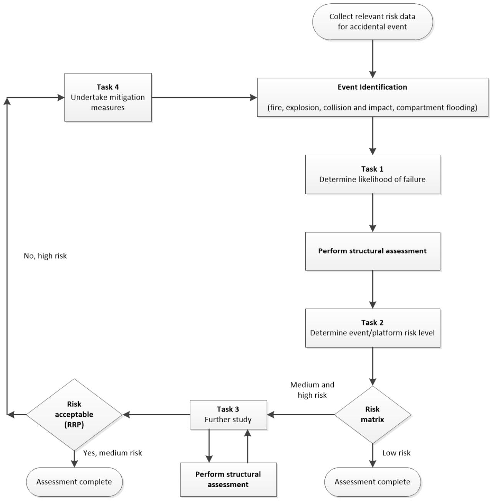  
Figure 1—Assessment of Accidental Events

Figure 2—Detailed Structural Assessment for Fires and Explosions   
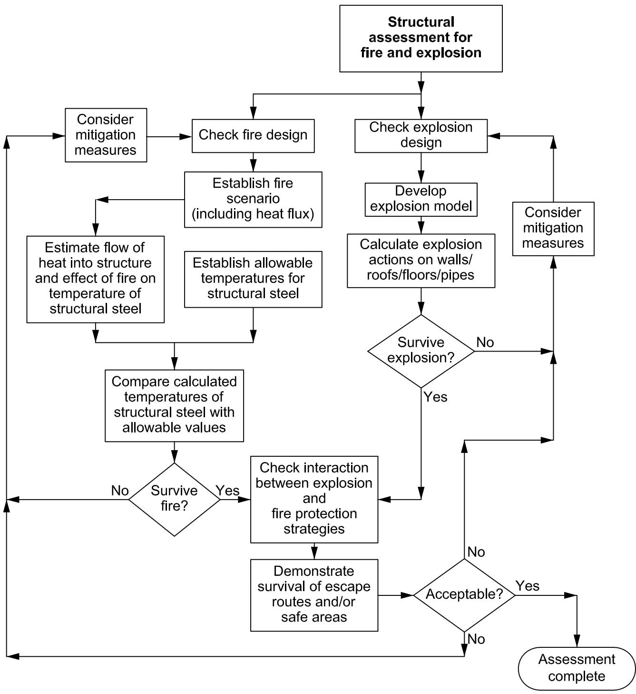  
NOTE Survival indicates no loss in serviceability of SCE.

Figure 3—Detailed Structural Assessment for Impact and Accidental Flooding Events   
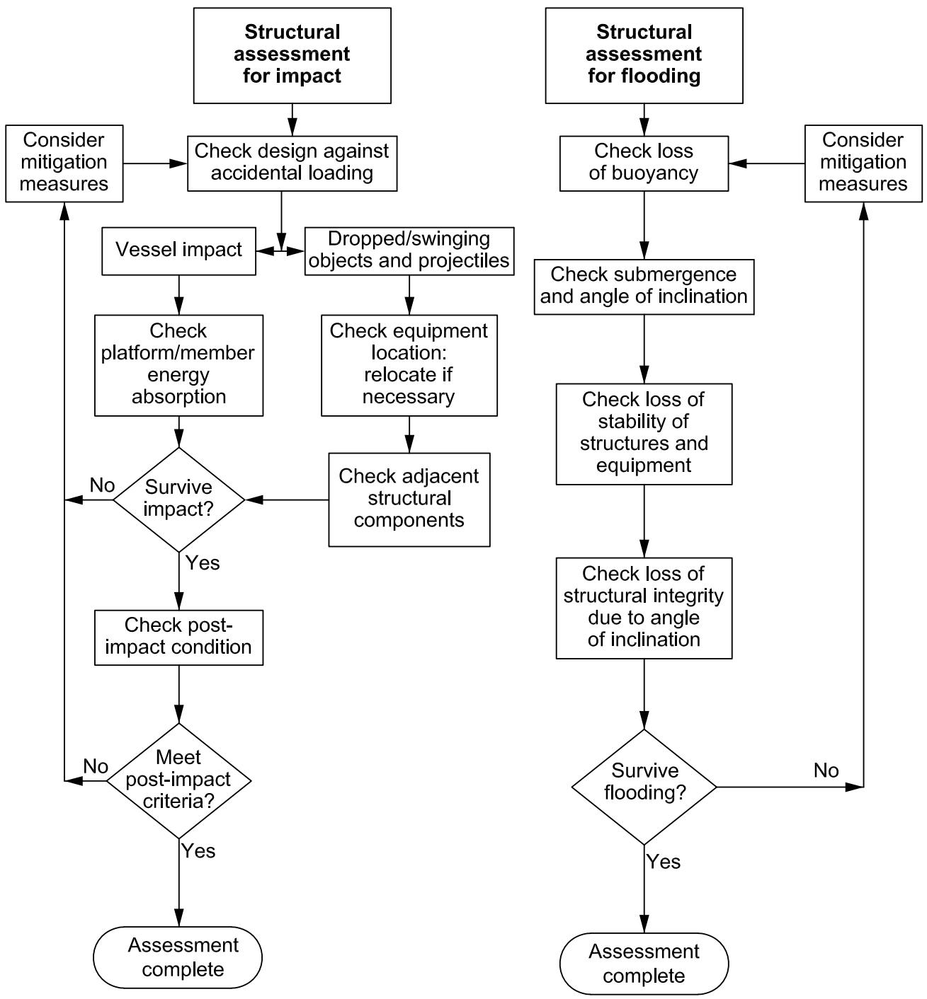  
NOTE Survival indicates no loss in serviceability of SCE.

7.10.3 Hydrocarbon Incidents

Explosion and fire events can lead to equipment damage, or to partial or total collapse of topsides and other structures, or to both damage and collapse, resulting in loss of life, or in environmental pollution, or in both loss of life and environmental pollution.

Designing topsides to control the risks associated with explosions and fires requires a multidisciplinary approach to developing and implementing a suitable safety management process. Steps in this process can include the following:

— defining global systems and component performance standards for the topsides SCE;   
— assessing the probability of hydrocarbon leaks and minimizing them;   
— assessing the probability of ignition sources and minimizing them;   
optimizing the layout of equipment and structures to minimize the severity of potential explosion actions, or fire actions, or both explosion and fire actions;   
considering the use of mitigation systems to minimize the severity of potential explosion actions, or fire actions, or both explosion and fire actions;   
— quantifying the potential explosion and fire design actions;   
— designing SCE and structures with the necessary inherent safety to satisfy predetermined performance criteria, plus considering the integrity of the damaged structure to resist appropriate environmental actions;   
— demonstrating by suitable and sufficient fire and explosion assessments that safe areas exist and that sufficient escape routes are available to satisfy the performance criteria to survive design accidental actions.

The operator or owner shall define their risk acceptance criteria in advance of assessment and analysis.

NOTE In many cases, the steps listed above are undertaken by fire and explosion specialists in association with laying out the facilities.

7.10.4 Explosion

In many cases, particularly for larger and more complex platforms in hostile environments, it is not practicable to design the topsides to withstand the highest conceivable explosions that could occur and, consequently, a balance should be found between the probability of explosion of differing magnitudes and the provision of sufficient resistance to withstand the explosion.

Explosion scenarios shall be developed as part of the process hazard analysis. Assessment of explosions shall be performed in accordance with API 2FB. For each topsides area, exceedance curves should be drawn, showing the probability of an explosion overpressure and an explosion impulse exceeding a particular value. The explosion overpressure and impulse at the limit of significant probability should be the minimum value used for design explosion overpressure and impulse. A realistic blast duration corresponding to the design explosion overpressure or impulse should be used.

Five major, controllable parameters influence explosion overpressure. These are:

— confinement by walls, decks, and larger equipment;   
— congestion due to equipment, piping, structure, and cable trays;   
— size of combustible gas-air cloud formed by the hydrocarbon release;   
— composition and concentration of the gas-air cloud formed by the hydrocarbon release;   
— location of ignition.

As part of the detailed explosion assessment process described in Figure 2, confinement shall be suitably represented, congestion shall be sufficiently detailed, and representative gas-air clouds (including variation in

location of ignition source within the cloud) shall be used. The latter requirement poses the largest challenge. Two possible approaches are to use:

— worst-case gas clouds containing stoichiometric mixes, where it is certain or at least highly probable that the resulting actions are conservative;   
— a distribution of gas clouds with associated probabilities, where the resulting actions and their probabilities can be presented as a series of curves showing a range of overpressures with associated probabilities; this approach is particularly suitable when probabilistic acceptance criteria are set.

The explosion assessment shall demonstrate that the escape routes and safe areas survive.

7.10.5 Fire

If the assessment process identifies that a significant risk of fire exists, fire should be included as a load case. Since accidental fires in offshore facilities have a real potential for consequences that could be severe, endangering personnel safety, environment, asset integrity, production continuity, and company reputation, they shall be evaluated as a design accidental event. Fire scenarios shall be developed as part of the process hazard analysis.

The structural assessment shall demonstrate that the escape routes and safe areas are maintained to allow time for platform evacuation and emergency response procedures to be implemented.

7.10.6 Explosion and Fire Interaction

Fires and explosions can both occur during the same overall event; for example, a leak can cause a gas cloud to form that can explode when it meets an ignition source; following the resulting explosion, the original leak can remain but as a fire. The explosion and fire analyses shall be evaluated together, and the effects of one on the other shall be analyzed. Examples of explosion and fire interaction can be found in A.7.10.6.

7.10.7 Vessel Collision

If an assessment identifies that a significant (i.e. potentially unacceptable) risk of vessel collision exists, then the effects on the topsides structure and equipment of a ship impacting the substructure shall be taken into account. This is particularly important where a module support frame or integrated deck contributes to the reserve strength of the platform as a whole. The effects of the resulting strong vibration shall also be investigated, as described in 7.10.10.

7.10.8 Dropped and Swinging Objects and Projectiles

Topsides design for dropped objects should consider the results of an associated mechanical handling study. Dropped object initiated within the topsides can have serious implications not only for topsides components but also for platform components located below the topsides.

Certain locations, such as in and around crane laydown areas, are more likely to be subjected to dropped or swinging objects. The probability of occurrence can be reduced by training and by following safe handling practices.

The consequences of damage can be minimized by considering the location and protection of facilities and critical platform areas. Operational procedures should limit the exposure of personnel to overhead material transfer.

The platform shall survive the impact from dropped objects being lifted in accordance with operational procedures (i.e. within crane limits and following any restrictions on heights and directions of lifts above decks).

The potential impact depends on the functional activities taking place on the topsides. An assessment shall be carried out to determine the cumulative probability of occurrence. Events that can cause unacceptable effects, but cannot be disregarded due to their frequency of occurrence, shall be assessed as design accidental events.

Design measures shall be taken to protect the platform’s safety functions against such accidental events or the activities shall be modified to reduce the probability of occurrence.

7.10.9 Loss of Buoyancy

For floating structures, there are minimum criteria to be considered for compartment damage (see API 2FPS or API 2T). The effect of any resulting inclination (heel and trim) shall be checked to ensure that there is no loss of stability or integrity of the structure, including supports to equipment.

7.10.10 Strong Vibration

Strong vibration shall be addressed explicitly as an accidental event in the design of new exposure level L1 and L2 platforms and in the assessment of existing exposure level L1 and L2 platforms. Strong vibration can be defined as the vibration resulting from accidental shock actions caused by major events such as gas explosions, ship collision, helicopter emergency landing or crash, sudden failure of loaded cables, extreme weather, and seismic events. The response of offshore structures to seismic events is considered separately in 7.8.

Vibrations can propagate from the site of an initiating event through the structure to affect other parts of the topsides, such as the flare boom, drilling derrick and helideck, as well as the platform’s safety systems. Failure or excessive deformation of individual components that could lead to failure of safety-critical systems shall be evaluated. Safety systems that can be vulnerable to damage from strong vibration include emergency shutdown systems, emergency power supplies and communications, fire and gas detection systems, fire protection systems and evacuation, escape and rescue equipment.

Pipework and risers can leak when subjected to excessive relative deflections between modules or to large dynamic actions. Module supports and their connections can fail when subjected to large horizontal actions. Connections of equipment items to their support structures can fail. Control equipment, including computers and microprocessors, and telecommunications equipment, can be particularly susceptible to high-frequency vibration.

Supports for pipework, cables, and equipment can be liable to large deformations or collapse. Severe deformations in the accommodation, escape routes, or at the helideck can impair evacuation, escape, and rescue.

Modifications or remedial work to increase the robustness of the topsides structure, including strengthening of local support structures and access platforms and their connections to reduce the effects of shock, should be considered.

7.10.11 Minimum Lateral Acceleration

To account for accidental actions transmitted to the topsides that are not specifically accounted for otherwise in 7.10, a minimum lateral acceleration of 0.05 g shall be applied to the topsides, including safety-critical equipment, piping, and supporting framework in order to ensure a minimum level of anchorage and connectivity for such components. This applies to topsides on both fixed and floating facilities.

Note that the above is consistent with the minimum lateral design acceleration specified for fixed platforms in Seismic Zone 0 in accordance with 7.8.2 as well as with the suggested deck accelerations for fixed platforms during hurricane conditions given in API 2A-WSD. Thus, the minimum topsides lateral design acceleration of 0.05 g satisfies multiple purposes. This minimum design value will need to be modified to meet the seismic requirements for zones other than Zone 0, to meet acceleration levels for deep water fixed or compliant platforms during hurricane events that may exceed this value, and/or to satisfy the actual motion analyses for floating facilities.

## 7.11 Other Actions

7.11.1 Drilling Operations

Drilling operations result in actions transmitted from a derrick to the topsides. Those most commonly occurring are described below.

a) Drilling actions: Sufficient drill rig positions shall be accounted in combination with appropriate environmental actions to ensure that maximum forces in the supporting structures are identified. Reverse environmental actions with associated minimum actions shall also be assessed to check stability and uplift.   
b) Increased action from the drilling derrick when it is required to pull on a stuck drill string should be considered.   
c) Actions from skidding the derrick substructure over the skid base and the skid base over any integrated deck skid beams shall include sufficient locations in order to allow for the maximum stresses resulting from possible relative positions of the structures to be evaluated. Horizontal frictional forces and bearing stresses shall be checked, including racking components that can result from a stuck jack.   
d) Under extreme environmental conditions certain drilling operations are suspended. This constraint may be taken into account in assessing the appropriate combinations of actions (see API 4F [36]).   
e) Certain drilling operations require the temporary support of heavy drill strings from the floor of the supporting structure. The need to support such actions shall be identified and evaluated.

7.11.2 Conductors

Supports for conductors shall allow for (axial) movement from thermal growth (including the effects of thermal growth of the well string) and differential settlement of the platform and conductor. Radial movement of the conductors within the guides should be minimized to reduce impact actions/loads on the supports and the substructure. The topsides cellar deck guides shall be designed for actions from wave, current, and flow-induced vibrations on conductors. Drilling operations can require the temporary support of vertical actions from conductors at the cellar deck. The need to support such actions shall be identified and evaluated.

7.11.3 Risers

In addition to normal actions due to weight, supports for risers shall take into account possible actions resulting from waves, current, flow-induced vibrations, thermal growth, and the dynamic reaction to slugs of fluid moving in the risers. Radial movement of the risers within the guides should be minimized to reduce impact actions/loads on the supports and the substructure.

7.11.4 Caissons

In addition to normal actions due to weight, supports for caissons shall take into account possible actions resulting from waves, load variations from pump reaction and fluid contents, and the particular actions associated with offshore erection or completion. The effects of internal/external corrosion are a major cause of caisson failure and shall be accounted for. Radial movement of the caissons within the guides should be minimized to reduce impact actions/loads on the supports and the substructure.

7.11.5 Maintenance, Mechanical Handling, and Lifting Aids

Design of the structure shall take into account the actions resulting from equipment maintenance, variable actions from hydrostatic pressure testing and mechanical handling. In particular, the principal routes and means for moving heavy equipment shall be identified and the supporting structures assessed to ensure that these actions, in combination with those normally acting, do not result in unacceptable combinations. Care shall be taken to ensure that the actions from trolley wheels do not locally yield deck plate, resulting in ponding.

Where lifting aids (runway and lifting beams, padeyes, etc.) are attached to a primary or secondary structure, the effects on the strength and stability of the structure shall be evaluated. Particular attention shall be paid to the potential negative influence on local stability of webs and flanges caused, for instance, by differential displacements of beam supports.

7.11.6 Bridge Supports

Topsides structures can be required to carry permanent and variable actions from bridges to other structures, including temporary construction, drilling, and other equipment.

The following potential actions shall be addressed:

a) variation in point of application resulting from extreme tolerances in platform position;   
b) actions resulting from installing and removing temporary bridges;   
c) actions resulting from any bridge-imposed constraints on differential displacement of linked platforms in all degrees of freedom, giving consideration to in-phase and out-of-phase wave actions at different wave periods;   
d) actions from the differential constraint of any pipework carried over the bridge;   
e) any jacking actions that can be applied during maintenance operations, such as bridge-bearing change-out.

8 Strength and Resistance of Structural Components

## 8.1 Use of Local Building Standards

The general requirement in this document is that for the structure as a whole, and for each component:

$$R_{\mathrm{D}} \geq S_{\mathrm{d}} \tag{7}$$

or

$$\frac{R_{\mathrm{K}}}{\gamma_{\mathrm{R}}} \geq S_{\mathrm{d}} \tag{8}$$

where

$R_{ \mathsf{ D } }$ is the design value of the resistance;

$S_{ \mathsf{ d } }$ is the design value of the internal force or moment due to factored actions;

$R_{ \mathsf{ K } }$ is the representative resistance of the structure or component;

$\gamma_{ \mathsf{ R } }$ is the partial resistance factor shown based on ISO terminology where $\zeta_{ \mathsf{ R } } \ge 1 . 0$ .However，in AlSC terminology, $\zeta_{ \mathsf{ R } } \leq 1 . 0_{ : }$ , in which case Equation (8) becomes $\zeta_{ \mathsf{ R } } \times \mathsf{ R }_{ \mathsf{ K } } \geq \mathsf{ S }_{ \mathsf{ d } }$ .

This document allows the use of representative actions, $F_{ \mathsf{ r } } ,$ with the partial action factors, $\gamma_{ \mathsf{ f } } ,$ from the SSS (API 2A-LRFD, API 2FPS, API 2N, API 2T, ISO 19903, or ISO 19905-1), to determine the design value of the internal force or moment, $S_{ \mathsf{ d } } .$ It also allows the use of appropriate national or regional building standard or classification society rules for the derivation of the representative component resistances, $R_{ \mathsf{ K } } ,$ in conjunction with appropriate partial resistance factors, $\gamma_{ \mathsf{ R } } .$ .

The balance between the partial action factors and the partial resistance factors differs between the various building standards and the SSS (API 2A-LRFD, API 2FPS, API 2N, API 2T, ISO 19903, or ISO 19905-1). Therefore, for topsides structures design and assessment, Equation (8) is modified to become:

$$K_{\mathrm{c}} \times \frac{R_{\mathrm{K} , \text{c o d e}}}{\gamma_{\mathrm{R} , \text{c o d e}}} = \frac{R_{\mathrm{K} , \text{s u p p o r t i n g s u b s c r u t u r e s t a n d a r d}}}{\gamma_{\mathrm{R} , \text{s u p p o r t i n g s u b s c r u t u r e s t a n d a r d}}} \geq S_{\mathrm{d}} \tag{9}$$

where

$K_{ \mathsf{ c } }$ is a building code correspondence factor that matches the design resistance(s) of the building standard to the design resistance(s) of SSS;

$K_{ \mathsf{ c } }$ can be different for the various national and regional building standards or classification society rules and shall be evaluated to give equivalent reliability to that implicit in the SSS.

NOTE The term ${ \mathsf{ R } } \kappa ,$ code/R,code is shown based on ISO terminology where R,code ≥ 1.0; however, in AISC terminology, this term becomes [R,code x RK,code] since R,code ≤ 1.0 in this case.

A procedure that may be used to determine a value of $K_{ \mathsf{ c } }$ is given in A.8.1. Annex C shows the recommended value to use with API 2A-LRFD and AISC 360-10. Note that the partial resistance factor in ISO is greater than 1.0, and so the representative resistance is divided by the partial factor. However, the partial resistance factor in AISC is less than 1.0, and so the representative resistance is multiplied by the partial factor in this case. In either case, the design resistance （$R_{ \mathsf{ D } } )$ is multiplied by $K_{ \mathsf{ c } } ,$ and thus the lowest value of $K_{ \mathsf{ c } }$ determined by the procedure in A.8.1 should be used.

## 8.2 Cylindrical Tubular Member Design

The requirements for the design of cylindrical tubular members shall be taken from API 2A-LRFD, including the use of the 2A-LRFD partial resistance factors (without $K_{ \mathsf{ c } } )$ , since it is the 2A-LRFD strength equations being used.

## 8.3 Design of Noncylindrical Sections

8.3.1 General

The strength equations to be used in the design of noncylindrical structural shapes shall be taken from the national or regional standard being used in conjunction with the appropriate partial action factors (see 7.3) In this case, AISC 360-10 is the relevant standard and its partial resistance factors apply in conjunction with $K_{ \mathsf{ c } }$ .

8.3.2 Plate Girder Design

Plate girders shall be designed in accordance with a suitable code of practice (see A.8.3.2). Design methodologies based on developing tension fields in the web of the plate girder shall not be used where large penetrations would inhibit such development or where the necessary anchorages at the ends of plate girders do not exist (e.g. due to lack of plating continuity through legs). Where stress concentrations occur, such as at abrupt changes in section, penetrations, jacking slots, and so forth, their effect on fatigue and fracture shall be assessed. Unstiffened plate girders shall have web thicknesses of not less than 1.25 % of the web depth or 6 mm (0.25 in.), whichever is greater unless the design is justified otherwise based on the procedures and guidelines in the applicable national or regional building standard. For purposes of this standard, see A.8.3.2 for the relevant references to use for plate girder design.

8.3.3 Box Girder Sections

Box girders shall be designed in accordance with AISC 360-10 (see A.8.3.3). Particular attention shall be paid to internal stiffening of the box girder with diaphragms or other components to facilitate a cost-effective fabrication and to mitigate the effects of welding and stress-induced distortions.

Specific issues that should be considered in design include the following:

a) the effect of high local bending forces,

b) warping,   
c) distortion,   
d) distortional warping, and   
e) the effect of shear lag on the distribution of elastic stresses.

8.3.4 Stiffened Plate Structures

The webs of longitudinally stiffened plate girders and box girders shall be designed in accordance with AISC 360-10 (see A.8.3.4).

8.3.5 Stressed Skin Structures

Stressed skin structures are designed on the basis that the applied actions are resisted by axial forces and shear in the plane of the plate. Framed structures with plated walls may be designed as a hybrid where the plating resists shear forces only and where the axial forces are carried by the framing (see A.8.3.5). If a pure or hybrid stressed skin structure is exposed to cyclic actions, the possible detrimental effects from such repeated actions shall be evaluated.

## 8.4 Connections

8.4.1 General

Connections shall be designed in accordance with the same national or international building code as used for the topsides structural components, except for connections situated between cylindrical tubular members, where the provisions of API 2A-LRFD shall apply.

Connections shall be designed to transfer the design actions from applicable design combinations imposed by all adjoining members, unless structural releases are part of the design. It shall be demonstrated that the ductility associated with the failure modes of the connection is acceptable.

8.4.2 Restraint and Shrinkage

Design details shall minimize constraints of ductile behavior and excessive concentration of welding. Details shall allow simple access for the placing of weld metal.

Connections shall be designed so as to minimize, insofar as practicable, stresses due to the contraction of the weld metal and adjacent base metal upon cooling. Particular care is required where shrinkage strains in the through-thickness direction can lead to lamellar tearing in highly restrained connections (see A.8.4.2).

8.4.3 Bolted Connections

Bolted connections can be safe and efficient, but have historically been avoided in the design of new primary topsides structure because of concerns about crevice corrosion. Where structures are not exposed to direct contact with sea spray, and where welding is undesirable, bolted connections can be satisfactory.

A bolted connection can form an extremely simple and cost-effective connection for the modification of existing topsides. With appropriate safety procedures, bolted connections can be effected on live production platforms without a hot work permit.

Bolted connections shall be designed for the applicable design situations and limit states described in Clauses 6 and 7, and in accordance with the RCSC Specification for Structural Joints Using ASTM A325 or A490 Bolts [73] (which is contained in AISC 360-10). Joints that are subject to tensile fatigue loading shall be specified as pretensioned or slip critical in accordance with RCSC Specification for Structural Joints Using ASTM A325 or A490 Bolts [73].

When bolted connections are used, the following recommendations and requirements apply.

a) The effective length of the bolt (between the underside of the head and the nut) should be sufficiently long to minimize the consequence of creep in reducing the tension in the bolt.   
b) The reduction in pretension due to creep should be calculated, and it is recommended that a creep equivalent to 50 % of the initial pretension be included. Care shall be taken to ensure that bolt hole edges are rounded and that the connection is completely sealed with a durable sealant, or a durable paint system, or both.   
c) Hardened washers should be used beneath both bolt heads and nuts to minimize coating damage. Double nutting is often recommended in offshore facilities to minimize the potential for loosening and backing out of the nut, especially where reciprocating machinery exists and/or vibrations can occur.   
d) Corrosion protection of bolted connections is important. Bolts shall be protected by a high-protection system suitable for long-term use in the offshore marine environment. Cadmium-plated bolts shall be avoided as they can emit a lethal toxic fume when heated.   
e) It is not recommended to use A490 bolts in the offshore environment because their high-tensile strength increases the possibility of cathodic hydrogen absorption and stress corrosion cracking arising from the corrosion process. Furthermore, the application of protective coatings to high-tensile steel can add to the potential for hydrogen embrittlement.   
f) Regular inspection of bolted connections should be specified.

## 8.5 Castings

Castings may be used in place of otherwise complex fabricated components (e.g. padears, component supporting structures, transition components, etc.). The design of complex geometries requires the use of suitable numerical analysis and specifications for both design and manufacture shall be prepared. The specifications shall address acceptance criteria for stresses and for the extent of plastic strain in regions above nominal yield, differentiating between stresses within and outside bearing areas. In complex castings subjected to significant fatigue actions, an evaluation of the local peak stress shall be made to evaluate the fatigue performance of the component.

The material properties of the casting shall be compatible with the adjacent materials to ensure weldability and avoidance of corrosion. It is recommended that tests be conducted at the time of the casting to verify the weldability of the casting to the surrounding steel material.

## 8.6 Design for Stability

The procedure for structural stability design shall be a modified adoption of the AISC 360-10 procedures for assessing structural stability that includes the added stiffness inherent in most offshore structures as described below.

a) Evaluate the bracing of the topsides structure between those columns that will form the resistance of the frame to overall sidesway deflection. Reference Figures A.7 through A.11 that show examples of a braced frame versus different variations of portal/moment frames. To be considered a braced frame, all major framing levels shall be braced. If one major framing level is not braced, then the focus will be on that level. Note that knee braces, which extend over only a portion of the frame height (between major deck levels) and not effectively over the full height of the frame, are not considered to be proper bracing in this context. Furthermore, the designer should minimize the height between the bottom of bracing under the lowest deck level and the top of jacket braced level to the extent reasonable, as indicated in Figure A.7, to minimize any portal frame effect in this area.   
b) If the frame is well braced against sidesway translation (see Figure A.7), then no assessment of second-order effects is required and the structure can be analyzed using traditional first-order techniques.   
c) If the frame is not well braced against sidesway translation (see Figures A.8 through A.11), then further assessment shall be performed as outlined below.

1) Perform an analysis to determine the second-order drift （$\varDelta_{ 2 } )$ of the frame at the top of the highest unbraced framing level and compare it to the first-order drift （$\varDelta_{ 1 } )$ at the same level in order to calculate the ratio of second-order to first-order drift, $\varDelta_{ 2 } / \varDelta_{ 1 }$ .   
2) For any value of $\varDelta_{ 2 } / \varDelta_{ 1 }$ , the direct analysis method in accordance with AISC 360-10 can be used. If $\varDelta_{ 2 } / \varDelta_{ 1 }$ is ≤ 1.5, either the effective length method or the first-order method can be used in accordance with AISC 360-10. Note the first-order method requires that the ratio of $P / P_{ \ y }$ be $\le ~ 0 . 5$ for all columns resisting sidesway (i.e. columns in unbraced bays).   
3) If $\varDelta_{ 2 } / \varDelta_{ 1 }$ is ≤ 1.1, the effective length method can be used where K is set equal to 1.0 for all column and beam-column members. In addition, notional loads need to be applied to gravity-only load cases per A.8.6. Since the stiffness of offshore structures is such that $\varDelta_{ 2 } / \varDelta_{ 1 }$ may be ≤ 1.1 in many cases, then designers may find the effective length method to be their best choice for those situations. If $\varDelta_{ 2 } / \varDelta_{ 1 }$ is > 1.5, then use of the direct analysis method will be required.   
4) For the effective length or first-order method, ensure that the “available strength” using the AISC 360-10 Chapter E column strength equations for nontubular members or API $2 A - \angle R F D$ , for tubular members, as appropriate, is greater than the “required strength” determined via one of these methods. For the direct analysis method, ensure that the “available strength” of members determined in accordance with Chapters C through K in AISC 360-10 for nontubular members or API 2A-LRFD, for tubular members, as appropriate, is greater than the “required strength” assessed in this method.   
5) For offshore structure applications, it is suggested that a P-Delta analysis may be a good methodology for determining $\varDelta_{ 2 }$ and for executing the second-order analysis required by the direct analysis or effective length methods, as outlined below.

i) P-Delta analysis: The calculation of the $\varDelta_{ 2 } / \varDelta_{ 1 }$ ratio is key to executing the stability design procedure. The second-order drift, $\varDelta_{ 2 }$ , can be determined by conducting a P-Delta analysis. However, it captures only the $P { - } A$ (P-large delta) effect, at least explicitly. This should be acceptable for most offshore structures due to their relatively high stiffness compared to typical onshore structures, limiting the influence of the P-δ (P-small delta) effect. On the other hand, one may be able to implicitly capture much of the $P { \cdot } \delta$ effect as well by using certain modeling techniques, as briefly described in A.8.6. This annex also includes figures that show the difference between the large delta and the small delta deformations.   
ii) Structural analysis programs that can calculate P-Delta effects are commercially available. They can be used not only to calculate $\varDelta_{ 2 }$ but also to execute the requisite second-order analysis and to evaluate the associated member design by using a built-in AISC code check to compare the “required strength” to the “available strength.”

6) According to AISC 360-10, any rational method that considers flexural, shear, and axial member deformations, second-order effects (both P-Δ and $P { \cdot } \delta$ effects), geometric imperfections, stiffness reductions due to inelasticity, and uncertainties in stiffness and strength is permitted in lieu of the procedure outlined above. Considering this, a pushover analysis may be an alternative approach. However, be sure to include key gravity-dominant load conditions (and associated P-delta effects) that are critical to the topsides stability check since pushover analyses typically focus on the application of metocean loadings to the substructure and may miss certain gravity load conditions crucial to the stability check in the topsides.

See A.8.6 for commentary on the stability design procedure.

9 Structural Systems

## 9.1 Topsides Design

9.1.1 General

The topsides shall be investigated for appropriate design situations and load cases. Permanent and variable actions may be treated as a series of discrete action combinations representing the range of anticipated platform operations, taking account of variable area actions and skid beam reactions.

Structural analysis of the topsides shall include an adequate representation of the substructure to ensure that the effects of the substructure stiffness are incorporated and that substructure actions (e.g. environmental) transferred to the topsides are included.

9.1.2 Topsides on Concrete Substructures

In analysis, particular attention shall be paid to the interaction between steel topsides and concrete substructures (see 7.6). Depending on the details of this interface, the deck can comprise part of a portal frame resisting environmental actions and can be subject to internal actions due to differential movements. In general, the substructure designer should design the steel to concrete connection, and an overlapping interface within the body of the primary topsides structure should be agreed between the topsides and substructure designers.

Attention should be given to the response of the integrated platform to wave actions and to the magnitude of fatigue-inducing actions introduced into the topsides shall be assessed. The subdivision of a topsides structure into small modules can reduce wave-induced stresses.

Concrete exhibits significant creep under sustained actions and has an elastic modulus that varies significantly with time. The topsides designer should therefore seek specific advice from the substructure designer on the values of elastic modulus that should be used in the analyses.

The assumptions shall be communicated to those subsequently responsible for platform operations such that significant variations in the actions shall be cause for assessment.

9.1.3 Topsides on Floating Structures

Particular attention shall be paid to the interaction between topsides and hull structures for mobile and floating structures. Deformations of the hull under environmental actions and varying cargo and ballast conditions can be significant and shall be evaluated in the design of supports. The use of sliding or elastomeric bearings at the topsides/hull interface can be required. Such sliding bearings can preclude or minimize the imposition of lateral and bending forces from the hull into the topsides at the interface, and they can also help accommodate greater relative deflections of the topsides structure at or between supports, which may be important for interconnect piping as well as for certain services such as drilling operations.

## 9.2 Topsides Structure Design Models

9.2.1 General

Internal forces in structural components are normally derived using an indeterminate, three-dimensional structural analysis methodology. In general, a linear-elastic model of the topsides structure is sufficient. The stiffness of the substructure can influence the distribution of forces within the topsides.

9.2.2 Substructure Model for Topsides Design

The substructure shall be modelled in sufficient detail to ensure that simplifications of the boundary conditions for the substructure do not influence the topsides behavior. It can be necessary to include the foundations of bottomfounded substructures in this model. This model may be simplified, but shall be sufficient to represent the vertical and horizontal stiffness of the substructure together with its inertial response and major variations in operational

action effects. Thus, both substructure stiffness and actions that could affect the topsides structural behavior shall be captured in the model.

9.2.3 Topsides Model for Topsides Design

The topsides structure can be modelled as one or more independent structures to represent the actual sequence of fabrication and installation. The interaction between the separate structures shall be addressed and differential deflections allowed for where these can have a significant effect on the performance of the structures, particularly for serviceability conditions. The sequence of stressing introduced into rigid jointed structures arising from fabrication and erection shall be evaluated.

Where the model is used to represent pre-service conditions, appropriate boundary conditions shall be applied to represent the stiffness of the supports and, for transportation conditions, appropriate accelerations and displacements shall be applied.

9.2.4 Modelling for Design of Equipment and Piping Supports

Local supports for piping and individual items of equipment can generally be analyzed in isolation. However, where relative displacements and deflections between pieces of equipment, between supports, or between modules could affect the integrity of the interconnecting pipework; such pipework and its supports shall be checked for the effects of interaction. For piping bridging between modules, deflections due to environmental, accidental, and seismic actions shall be evaluated.

## 9.3 Substructure Interface

9.3.1 Responsibility

All assumptions at the interface between the topsides and substructure shall be documented and any outstanding issues resolved to ensure that the designs are not compromised by differences in assumptions.

9.3.2 Static Strength Design

Care shall be taken to ensure that the governing conditions for the connection of the topsides to the substructure are correctly identified. The governing case for this connection can be the requirement to ensure global integrity for the whole platform under accidental actions. The design shall be checked to ensure that simplifying assumptions at the interface do not mask the most onerous condition for the connection.

9.3.3 Fatigue Design

When the internal forces in the connection between the topsides structure and the substructure vary significantly, a fatigue analysis shall be undertaken. The structural models to be used for fatigue analyses shall reflect the expected value of member stiffness. Stiffness of nonstructural components like piping, cladding, and so forth, should be included in the model if they could adversely impact the fatigue assessment. Stiffness contributions, such as grouted legs, corrosion allowance, and soil stiffness, shall be evaluated with their expected values. If the stiffness is uncertain, parametric studies shall be undertaken to establish a safe estimate. For floating and compliant substructures, the fatigue analysis shall include the effects of the distortions of the substructure, the stiffnesses of the supporting points, and the changes in the direction of actions due to the motions and deformations of the substructure.

## 9.4 Flare Towers, Booms, Vents, and Similar Structures

This subclause gives requirements that apply to separate structures where varying actions constitute a major proportion of total actions.

Flare towers, booms, and other structures can be susceptible to global and local resonant responses due to:

— global and local wind actions,

— thermal actions from the flare including thermal cycling,   
— seismic actions,   
— accidental actions, and   
— the indirect effects of wave and current actions on the substructure.

Global modes of vibration can be due to vortex-induced vibrations of major components of the structure, or pipework supported by it, or both. The structures shall be checked to establish the natural modes of vibration of the structure as a whole and of critical components of the structure. Guidance on such structures is given in A.9.4.

The static and dynamic behavior of such structures can be substantially influenced by accumulations of snow and ice, and these shall be taken into account for the design. Both wind actions and variable actions can be increased by such accumulations. The snow/ice accumulation shall be combined with actions generated by wind having a representative return period of 10 years unless dictated otherwise by the owner or by unusual environmental site conditions.

The thicknesses and densities of snow and ice accumulations shall be determined from site-specific environmental data. Simplified build-up profiles for calculation purposes may be applied.

The designer of the flare boom and the designer and manufacturer of the flare tip should liaise to ensure compatibility between their designs and maintainability of the flare tip.

## 9.5 Helicopter Landing Facilities (Helidecks)

Informative guidance for the design of helidecks is provided in API 2L [70]. It is important to determine the correct category to which the various types of actions affecting helideck design belong, as described in 7.2. Permanent actions, such as self-weight, are designated by $G_{ 1 }$ and $G_{ 2 }$ . Variable actions are designated by $Q_{ 1 }$ and $\mathcal{ Q }_{ 2 } .$ . In this case, actions resulting from helicopter operations should fall under $\mathcal{ Q }_{ 2 } ,$ , the short-term variable action category. Environmental actions, such as wind or accelerations due to storm events, are designated by $E_{ \circ }$ and $E_{ \mathsf{ e } } .$ Dynamic actions are covered by $D_{ \circ }$ and $D_{ \mathsf{ e } } ,$ , but these types of actions will likely not be pertinent to helideck design. Once the actions are defined and categorized, then the design action equations in 7.3 can be properly executed.

## 9.6 Crane Support Structure

9.6.1 General

The crane support structure comprises the crane pedestal and its connections to the topsides primary steelwork. It does not include the slew ring or its equivalent, or the connections between the slew ring and the pedestal. If possible, it is advisable to consult the crane manufacturer as to the actions likely to be imposed on the crane support structure.

Crane support structures shall, where practical, be attached at an intersection of topsides structure primary framing with minimal eccentricities and be connected to a minimum of two main deck elevations. The pedestal shall be included in the analytical model of the primary structure as its stiffness can have a significant effect on load distribution. When located in accordance with these provisions, the crane support performance is generally governed by static actions with negligible dynamic amplification. Such structures are, however, subject to fatigue actions and shall always be checked to ensure that fatigue life is satisfactory for the required service conditions.

Except where specifically noted otherwise in 9.6, the user shall follow the provisions for offshore pedestalmounted cranes given in API 2C for executing the design of the crane support structure. The pedestal structural engineer shall ensure that the information provided by the crane manufacturer for crane foundation support structure design includes the effects of the dynamic coefficient, $C_{ \mathsf{ v } } ,$ as well as of the pedestal factor, PF, as described in API 2C.

In addition, see A.9.6 for guidance on designing the crane pedestal to minimize excessive crane motion for operational purposes and to preclude dynamic response of the crane/support structure system.

9.6.2 Design Actions

It is necessary to determine the correct category to which the various types of actions affecting the crane support structure design belong, as described in 7.2. Permanent actions, such as self-weight, are designated by $G_{ \mathit{ 1 } }$ and $G_{ 2 } .$ . Variable actions, such as the lifted loads, are designated by $Q_{ 1 }$ and $\mathcal{ Q }_{ 2 } .$ . Environmental actions, such as wind or accelerations due to storm events, are designated by $E_{ \circ }$ and $E_{ \mathsf{ e } } .$ . Dynamic actions, such as dynamic responses to environmental or accidental situations, are designated by $D_{ \circ }$ and $D_{ \mathsf{ e } } .$ Once the actions are defined and categorized, then the design action equations in 7.3 can be properly executed.

Thus, it is important that the pedestal structural engineer work with the crane manufacturer to ensure the various crane loads/actions are communicated in such a manner that they can be assigned to the correct action category, as described above.

9.6.3 Design Situations

The following design situations shall be addressed as outlined below.

a) In-service loads involving both onboard and offboard lifts along with the associated operating condition parameters and the applicable wind, ice, and/or seismic loads/actions in accordance with API 2C.   
b) Out-of-service loads where the crane has no load suspended from the hook, including when the crane is in the stowed position during an extreme hurricane event in accordance with API 2C. The latter situation, in particular, can affect the design of the crane boom rest structure.   
c) The gross overload condition planned to cover some unintended event such as the crane hooking a supply boat, as described in API 2C. It is not required to design the crane pedestal for the gross overload condition unless the pedestal has a smaller section modulus than the pedestal piece that comes with the crane being installed or unless specifically required to do so by the crane manufacturer.

9.6.4 Static Design

The conditions to be investigated shall include the following:

a) maximum overturning moment with corresponding vertical load/action plus a horizontal load/action, as described below, applied simultaneously to the boom head sheave;   
b) maximum vertical load/action with corresponding overturning moment plus a horizontal load/action, as described below, applied simultaneously to the boom head sheave.

In Items a) and b) above, the vertical load shall be the factored (not rated) load that includes the effects of the vertical dynamic coefficient, $C_{ \mathsf{ v } } ,$ applied to SWLH, which, by definition includes the safe working load plus the weight of the hook and load block. The horizontal load shall include the effects of any applicable supply boat and/or crane motions. Both the aforementioned vertical and horizontal loads shall be computed as described in API 2C and as typically provided by the crane manufacturer.

9.6.5 Fatigue Design

The crane support structure shall be checked for resistance to the crane foundation fatigue loads in compliance with API 2A-WSD and the applicable S-N curves therein as well as with the partial damage design factors provided in 6.7. In lieu of a detailed analysis, the following deterministic fatigue check may be utilized, consistent with API 2C. Use of this simplified fatigue approach along with the design and fabrication practices described in A.9.6.1 precludes the need to apply the partial damage design factors in 6.7.

A minimum of 1,000,000 cycles should be assumed under the following conditions.

a) A load of 2/3 or 0.66 of SWLH at the boom position and crane orientation producing maximum stress in each component of the crane support structure. It is not necessary to add the boom weight or add the effect of any accelerations to the requirement of 0.66 of SWLH since the latter encompasses these considerations in the context of fatigue assessment. However, for large boom cranes, see A.9.6.5.   
b) The stress range used should be the difference between the stress caused by the above loading and stress with the boom in the same position but unloaded.

## 9.7 Derrick Design

Design of the derrick structure shall be carried out in a manner consistent with the requirements of this document, taking full account of the type of supporting structure and including all direct and indirect actions due to the supporting structure; temporary and short-term situations shall be addressed, including situations such as jarring.

Design standards for derricks are given in A.9.7.

As part of the assessment of accidental actions on a platform, the risk and consequence of collapse of the derrick structure shall be evaluated.

The reactions at the base of the derrick structure, in all directions, and the need for tie-downs of the derrick structure shall be addressed for all conditions including seismic and abnormal storm conditions.

## 9.8 Bridges

The design of bridges shall account for the design displacements and installation tolerances of the structures that they connect. Bridges shall be fitted with longitudinal, lateral, or rotational bearings at support points, arranged to both constrain the bridge from movement relative to supporting structures and minimize the transmission of forces into the bridge from displacements of the support points.

The location, level, and depth of bridge structures shall take due account of potential hazards to helicopter and supply boat operations.

Where bridges accommodate escape routes, enclosed fire-rated escape tunnels can be required. Such escape tunnels shall be explosion-rated for credible far-field explosion effects and suitably ventilated during fires.

Bridges that accommodate escape routes shall be suitably sited, or protected from falling objects and debris during accident conditions, or both.

Bridges that can be subjected to explosion actions shall be provided with suitable restraints for both lateral and vertical action effects. Both initial action effects and rebound action effects shall be addressed.

Actions, whether direct or indirect, applied to the bridge that can result in vibrations of the bridge or of equipment and piping on the bridge shall be evaluated.

Where bridge collapse is allowable in certain accidental situations, including fire, the structural arrangement shall be such that the potential collapse modes do not endanger structures and systems that are required to survive these events.

Local support arrangements shall be detailed to accommodate longitudinal movement, including thermal expansion due to fires if applicable.

## 9.9 Bridge Bearings

Bridge bearings shall be designed to accommodate actions under operating and design accidental situations. In addition, bridge bearings and their support structures should be designed to accommodate installation

inaccuracies and tolerances. At locations where relative movement between a bridge and its supporting structure is to be accommodated, the following actions and action effects shall be included:

a) fatigue and wear due to fluctuating actions and movements;   
b) extreme displacements under ULS and ALS situations, including their effect on assessed actions;   
c) extreme actions under ULS and ALS situations;   
d) the most severe combination of both translational and rotational tolerances of the bridge supports.

The design and fire protection of bearing systems should consider inspection and change-out of bearing components in service, including the provision of jacking and lifting points, as necessary.

## 9.10 Antivibration Mountings for Modules and Major Equipment Skids

Where modules or equipment skids are supported on AVMs, these shall be designed for the most unfavourable combination of actions and displacements under ULS, extreme environmental conditions, and accidental situations, including fire.

Where the AVMs themselves cannot accommodate certain actions, supplementary guide and restraint systems shall be provided, and these shall be dimensioned to withstand the same actions.

Due considerations should be given to the design and fire protection of AVMs and their support systems for inspection and change-out of components in service.

## 9.11 System Interface Assumptions

The design of the topsides involves complex interfaces with process equipment and plant. Liaison with the other technical disciplines shall be undertaken as part of the design process; in particular, the assumptions made by equipment suppliers about the behavior of the structure shall be verified. There is a significant potential for these interfaces to compromise structural design assumptions, such as:

— the location of continuous trough drains penetrating deck plate can compromise lateral support of beam flanges;   
— uncontrolled attachments of minor equipment or utilities to fatigue-sensitive structures can increase potential fatigue damage;   
— penetrations in decks or walls can compromise membrane action required to resist accidental actions;   
— the criticality of components of the topsides structure can depend on their interface with the process plant where the consequence of failure can result in the release of hydrocarbons and consequent fire or explosion;   
— components supporting plant or pipework can be exposed to extremely low temperatures from process operations or blow-down in an emergency situation;   
— spillage of damaging fluids, for example liquid nitrogen, is likely to cause cracking of steel plate and underlying supporting steelwork.

These considerations can affect design, material, and fabrication (welding).

The design process shall ensure that interfaces are monitored and the results of this process are clearly recorded.

## 9.12 Fire Protection Systems

Fire protection is used to protect personnel and safety-critical structure and equipment from the effects of heat for time to allow evacuation of personnel from the area. Safety-critical structures shall be identified and are likely to include primary structure required to prevent progressive collapse as well as structures supporting walkways, decks, muster areas, temporary refuge, living quarters, lifeboat stations, and so forth, that are needed for evacuation.

Active fire protection (water deluge or foam spray) or PFP (cementitious coatings, or intumescent coatings or fireresistant panels) shall be specified depending on location and use. Where active fire protection is specified, the effects of possible enhanced corrosion rates on structures subjected to wetting during testing shall be evaluated. Where PFP is likely to be wetted frequently or for long periods, the top (weather) coat shall be designed to withstand such conditions. The PFP shall be designed to withstand the effects of direct radiation to which it can be subjected, both during normal or upset operating (blow-down) and accidental situations. Note that, since some PFP can produce toxic fumes in fires, the use of PFP along escape routes should be carefully considered.

Further information can be found in API 2FB.

## 9.13 Penetrations

Penetrations and access openings may be included in structural components, provided the capacity of the component is not compromised. Openings shall be included to allow access for inspection of the surrounding structure, including stiffeners and reinforcement, where necessary.

The effects of penetrations and cut-outs on both static and fatigue strength shall be evaluated. Openings may be provided with reinforcement (e.g. lips, single- or double-sided rings), as necessary, designed to carry the internal forces around the opening. Alternatively, the reinforcement can be designed by reference to experimental or numerical data.

## 9.14 Difficult-to-inspect Areas

Consideration should be given at the design stage to the accessibility of all parts of the structure for inspection, cleaning, and coating by appropriate positioning and detailing of structural components in relation to the adjacent structure and equipment.

## 9.15 Drainage

Areas where ponding can occur shall be minimized and adequately drained. Where there is a potential for such areas to be fouled with oil, adequate provision shall be made for drainage to a closed-drain system. Arrangements for cleaning to eliminate or reduce hazards to the environment and to health and safety shall be implemented before any discharge to the sea. In areas susceptible to freezing weather, the possibility of ponding on decks and walkways shall be avoided to prevent slipping hazard.

## 9.16 Actions due to Drilling Operations

The consequences of operational impulse actions and vibration on SCE, protective coatings, and so forth, shall be addressed at the design stage of the project.

## 9.17 Strength Reduction due to Heat

Critical load-bearing structures shall not be sited near heat-producing facilities, such as flares and exhaust ducts, since the heat reduces the stiffness and strength of the structures. Where it is not reasonably practicable to relocate the structure and associated facilities, suitable design measures and thermal protection shall be provided and the resultant effects on the structure evaluated.

## 9.18 Walkways, Laydown Areas, and Equipment Maintenance

Walkways and access ways shall be designed to support a variable action for personnel access of 5 kN/m2 for the design of the grating or plating and for the design of the supporting structure, but the total allowance for the variable actions due to personnel, their personal effects, and hand tools need not exceed 1.5 kN per individual of the maximum number of persons on the platform.

Laydown areas for the storage of containers and other equipment transported to the platform shall be designed with sufficient capacity to support the functioning of the platform. The total laydown requirement and arrangement is dependent on the size, functions, and manning of the platform. A laydown control system shall be operated to ensure that no laydown area can become inadvertently overloaded. Each laydown area shall be designed to withstand impact from a dropped object, the impact energy of which shall be derived from the lift height and the maximum capacity of the cranes serving the laydown area; it shall be assumed that the impact energy is applied at one point. During fabrication and installation, spaces used as laydown areas that are not typically designated as in-service laydown areas shall be designed for higher loadings that can occur during the fabrication or installation design situations.

Maintenance areas shall be provided adjacent to equipment likely to require heavy maintenance. The size and weight capacity of the maintenance area depends on the nature of the equipment and the size and weight of any components that can be required to be removed and replaced.

All laydown and maintenance areas shall be clearly marked with signage to show the maximum laydown capacity, and such information shall also be presented in the platform operating manual.

## 9.19 Muster Areas and Lifeboat Stations

The uniform allowance for variable actions on major access ways, muster areas, lifeboat stations, and other similar areas shall account for the number of personnel who can congregate at such locations during an emergency based on the design criteria. The total variable action for personnel in these areas should allow for at least twice the number of persons for which the muster area, lifeboat station, or other escape equipment is intended. Lifeboat supports should be designed to withstand the full capacity of the lifeboat davits or other supporting system.

# 10 Materials

## 10.1 General

Most offshore platforms have topsides structures fabricated from carbon steels, and this practice is expected to continue. However, stainless steel, aluminum, fiber-reinforced composites, and timber have been successfully used in offshore structures, and some considerations on their use are given in this clause.

Where a new material that has not previously been used for a particular function is considered, it shall be carefully evaluated with, as a minimum, the following issues being addressed:

a) strength, toughness, stiffness, and durability;   
b) behavior at elevated temperatures: flammability, surface spread of flame, emission of smoke and toxic combustion products;   
c) resistance to environmental degradation, including various forms of corrosion;   
d) compatibility with other materials (e.g. the risk of galvanic corrosion for a specific application);   
e) consequential effects on other parts of the topsides, e.g. increased deflection resulting in higher pipe stresses;

f) resistance to fatigue;   
g) maintenance requirements;   
h) weight;

i) whole life-cycle cost;   
j) availability of material of consistent quality complying with recognized standards supported by reliable certification.

## 10.2 Carbon Steel

For structural steel material and associated welding, fabrication, and weld inspection requirements, the related clauses and annexes in API 2A-LRFD, which utilize the MC approach, shall be followed. In addition, for specific topsides components, Table 5 shall be used for the appropriate minimum strength group and toughness class for material selection purposes in conjunction with the related clauses in API 2A-LRFD.

Table 5—Material Category—Material Selection for Topsides   

| Component Location in Topsides | Component Location in Topsides | Strength Group | Toughness Classa | Toughness Classa | Toughness Classa |
| --- | --- | --- | --- | --- | --- |
| Component Location in Topsides | Component Location in Topsides | Strength Group | MC1 | MC2 | MC3 |
| Deck legs | Connections up to 50 mm thick | II | CV2Z | CV2Z | CV2d |
| Deck legs | Connections up to 50 mm thick | III | CV2Z | CV2Z | CV2d |
| Deck legs | Connections greater than 50 mm thick | II | CV2ZXb | CV2Zc | CV2d |
| Deck legs | Connections greater than 50 mm thick | III | CV2ZXb | CV2Zc | CV2d |
| Deck legs | Elsewhere | I | CV2 | CV1 or C | NT |
| Deck legs | Elsewhere | II | CV2 | CV1 | CV1 |
| Deck legs | Elsewhere | III | CV2 | CV1 | CV1 |
| Deck truss | Chords | I | — | NT | NT |
| Deck truss | Chords | II | CV2 | CV2 or CV1 | CV1 |
| Deck truss | Chords | III | CV2 | — | — |
| Deck truss | Diagonals | I | CV2 or CV1 | CV1 or NT | NT |
| Deck truss | Diagonals | II | CV2 or CV1 | CV1 | CV1 or C |
| Deck truss | Diagonals | III | CV2 or CV1 | CV1 | CV1 or C |
| Girders | Flange at connections and panel points | II | CV2ZXb | CV2Z | CV2d |
| Girders | Flange at connections and panel points | III | CV2ZXb | CV2Z | — |
| Girders | Other flange, web, stiffeners | I | CV2 | CV1 or NT | NT |
| Girders | Other flange, web, stiffeners | II | CV2 | CV1 | CV1 |
| Girders | Other flange, web, stiffeners | III | CV2 | CV2 | — |
| Secondary structure | Bracing and floor beams (redundant) | I | NT | NT | NT |
| Secondary structure | Bracing and floor beams (redundant) | II | CV1 | NT | NT |
| Crane pedestal |  | II | CV2ZXb | CV2Z | CV2d |
| Crane pedestal |  | III | CV2ZXb | CV2Z | CV2d |
| Lifting points | Padeye main plates and attachment points | II | CV2ZXb | CV2Z | CV2d |
| Lifting points |  | III | CV2ZXb | CV2Z | CV2d |
| aWhere two toughness classes are given, the higher class is recommended for tension structural components greater than 25 mm thick. bCV2ZX includes mandatory crack tip opening displacement (CTOD) testing if greater than 50 mm thick. cFor connections greater than 75 mm thick, consider CV2ZX. dSpecify steel with a low sulfur content below 0.006 %. | aWhere two toughness classes are given, the higher class is recommended for tension structural components greater than 25 mm thick. bCV2ZX includes mandatory crack tip opening displacement (CTOD) testing if greater than 50 mm thick. cFor connections greater than 75 mm thick, consider CV2ZX. dSpecify steel with a low sulfur content below 0.006 %. | aWhere two toughness classes are given, the higher class is recommended for tension structural components greater than 25 mm thick. bCV2ZX includes mandatory crack tip opening displacement (CTOD) testing if greater than 50 mm thick. cFor connections greater than 75 mm thick, consider CV2ZX. dSpecify steel with a low sulfur content below 0.006 %. | aWhere two toughness classes are given, the higher class is recommended for tension structural components greater than 25 mm thick. bCV2ZX includes mandatory crack tip opening displacement (CTOD) testing if greater than 50 mm thick. cFor connections greater than 75 mm thick, consider CV2ZX. dSpecify steel with a low sulfur content below 0.006 %. | aWhere two toughness classes are given, the higher class is recommended for tension structural components greater than 25 mm thick. bCV2ZX includes mandatory crack tip opening displacement (CTOD) testing if greater than 50 mm thick. cFor connections greater than 75 mm thick, consider CV2ZX. dSpecify steel with a low sulfur content below 0.006 %. | aWhere two toughness classes are given, the higher class is recommended for tension structural components greater than 25 mm thick. bCV2ZX includes mandatory crack tip opening displacement (CTOD) testing if greater than 50 mm thick. cFor connections greater than 75 mm thick, consider CV2ZX. dSpecify steel with a low sulfur content below 0.006 %. |

## 10.3 Stainless Steel

10.3.1 General

Stainless steels generally exhibit excellent corrosion resistance, and this is the main reason for their selection. However, these steels can be subject to corrosion under certain conditions, although this can be minimized by paying attention to grade selection and detailed design. The risk of galvanic corrosion of connected materials, particularly with carbon steel, shall be assessed.

The stainless steels used offshore generally retain higher strengths at elevated temperatures than carbon steels. They can also provide exceptional ductility and energy-absorbing characteristics. The avoidance of a corrosion allowance and low maintenance requirements can lead to the economic selection of stainless steel as a structural material. Typical offshore applications include cable trays and ladders, ventilation louvers, floor panels, fire and explosion walls, ladders, walkways, and module cladding.

Product availability, particularly for shapes, is such that greater use is made of cold-formed, welded or extruded sections.

10.3.2 Types of Stainless Steel

There are many types of stainless steel, and these fall into five main groups, classified according to their metallurgical structure (i.e. the austenitic, ferritic, martensitic, duplex, and precipitation-hardening groups). Not all of these are suitable for structural applications, particularly where welding is required. The austenitic stainless steels are the most useful group for offshore structural applications. The most common alloy used is 17Cr 12Ni 2Mo steel (more usually referred to as 316 steel with the low-carbon variant 316L steel). In the absence of other guidance, 316L should be utilized for offshore applications of stainless steel.

Austenitic steels can be strengthened by work hardening. Welding and heat treatments will partially anneal such strengthened materials resulting in some loss of the strength enhancement.

Compatible fastenings shall be selected to avoid corrosion problems. Bolting materials are covered in ISO 3506 [26].

10.3.3 Material Properties

The density of stainless steel is dependent on the properties of the alloying elements but may be taken as 8000 kg/m3 for grade 316 steels.

As a first approximation, Young’s modulus may be taken as 195,000 N/mm2.

Austenitic stainless steels have lower thermal conductivity, but higher thermal expansion than ferritic steels, including structural carbon steels. The effects of differential thermal expansion should be considered in design. These thermal properties can also lead to greater welding distortion in austenitic stainless steel components, even where careful jigging is used during fabrication.

## 10.4 Aluminum Alloys

10.4.1 General

Not all aluminum alloys are resistant to marine corrosion, and careful material selection is required. Appropriate alloys have excellent corrosion resistance in marine environments, but are liable to galvanic corrosion when combined with other materials, including structural steels, stainless steels, and copper alloys. Electrical isolation is generally required, often obtained by using insulating packers at connections to carbon steel. In addition, aluminum should not be utilized where there is potential for contact with mercury.

The properties of aluminum alloys can be severely degraded by welding, and this shall be allowed for in the design of connections.

Aluminum loses strength and stiffness rapidly when subjected to heat.

Aluminum alloys have found successful applications in the construction of living quarter modules, helidecks, crane boom rests, and general decking.

10.4.2 Types of Aluminum

The two most common types of aluminum alloy used for offshore structures are the heat-treatable 6XXX series, specifically 6082, and the non-heat-treatable 5XXX series, specifically 5083, which obtains its increased strength from work hardening. Both materials are susceptible to loss of strength in the heat-affected zone of a welded connection.

For welded structures, alloys should be used in the annealed condition and be selected from materials with a strength not exceeding 130 N/mm2 at the specified 0.2 % strain.

Higher-strength alloys can be considered for nonwelded construction.

10.4.3 Material Properties

Typical properties of aluminum alloys are as follows:

— density: 2700 kg/m3;   
— Young’s modulus: 7  104 N/mm2;   
— yield strength (6082 alloy): 130 N/mm2;   
— yield strength (5083 alloy): 220 N/mm2.

Aluminum has a high heat conductivity and specific heat. It melts at 550 °C and loses 50 % of its strength at ${ }^{ 225 } { }^{ \circ } \mathsf{ C }$ . Its thermal expansion is twice that of steel.

10.4.4 Thermite Sparking

Thermite (aluminum-iron oxide) sparking can occur when iron oxide (rusty steel) comes into contact with aluminum. It requires specific circumstances to produce a thermite spark of appreciable energy; for this to represent a hazard, it has to occur in combination with an explosive gas/air mixture. When aluminum is used for structural applications, the operations manual or other documentation shall contain warnings and advice that precautions should be taken to prevent thermite sparking, and the structure itself shall be labelled with warnings.

NOTE Thermite sparking is also called frictional sparking and incendive sparking.

## 10.5 Fiber-reinforced Composites

Fiber-reinforced composites can be produced with a wide range of properties, including high strength, and with considerable resistance to fire. A wide range of resin binders and fibers is used, and the technology has been developing rapidly. Nevertheless, heat can degrade fiber-reinforced plastics more quickly than steel, and so the user should carefully consider their use on escape routes unless the risk is well understood and appropriate measures are taken.

Due to the large variation in material properties, there is a paucity of design codes for use of these materials and their suitability is usually determined by type-testing to meet performance criteria.

Fiber-reinforced composites have been successfully used in the production of floor grating, hand railing and ladders, lightweight fire and explosion-resistant panels, and for reinforcement and repair of carbon steel sections.

Fiber-reinforced composites are often electrically nonconductive; conductive and metallic objects attached to fiber-reinforced composites should be independently earthed where necessary.

In fire conditions, fiber-reinforced composites can give off toxic fumes and the risks from such fumes should be considered.

## 10.6 Timber

The use of timber in offshore topsides structures has generally been restricted to the protection of weather decks from dropped objects and damage from pipe handling. It has been found effective against dropped objects when sandwiched between two steel sheets.

Because timber is generally flammable, a problem exacerbated by its ability to soak up hydrocarbon spills, it shall not be used in confined hazardous areas.

Timber properties are highly variable and anisotropic. Timber design shall be undertaken in accordance with the AWC National Design Specification (NDS) for Wood Construction—2015.

11 Fabrication, Quality Control, Quality Assurance, and Documentation

## 11.1 Assembly

11.1.1 General

The requirements for fabrication, quality control, quality assurance, and documentation given in API 2A-LRFD shall be followed with the additional requirements given below.

Fabrication, other than welding, should be in accordance with a national or regional fabrication specification that complements the design code. Fabrication tolerances shall be compatible with design assumptions. In some situations, tighter than normal tolerances are required, and these shall be documented on the drawings.

11.1.2 Grating

Joints in grating shall occur only at points of support, unless other appropriate details are specified.

11.1.3 Landing and Stairways

Landing elevations and landing and stairway locations shall be within 50 mm in plan of the drawing dimensions unless required to align with other access ways or equipment, in which case the mismatches in elevation and alignment shall not exceed 4 mm.

11.1.4 Temporary Attachments

Temporary attachments to the topsides structure, such as scaffolding, fabrication, and erection aids, and including attachments to crane pedestals as well as attachments involving temporary transportation and installation aids and supports, can create a localized stress rise (even after removal) and should be applied only as necessary. When these attachments are necessary, the following requirements apply.

a) Temporary attachments shall not be removed by hammering or arc air gouging. Attachments to leg joint cans, brace joint cans, brace stub ends, and joint stiffening rings shall be cut to 3 mm above parent metal and mechanically ground to a smooth flush finish with the parent metal.   
b) Attachments on areas that are to be painted shall be removed as above, prior to painting.   
c) Attachments to other areas, not defined above, shall be removed by cutting just above the attachment weld (maximum 6 mm above weld). The remaining attachment steel shall be completely seal-welded.

d) Attachments to aid in the splicing of legs, braces, sleeves, piling, conductors, and so forth, shall be removed to a smooth, flush finish.   
e) The parent steel shall be tested by magnetic particle inspection (MPI) following removal of temporary attachments.

## 11.2 Welding

Welding shall comply with the requirements of API 2A-LRFD with the following additional considerations.

a) Metal thicknesses encountered in topsides structures can exceed those in the associated support structures, particularly at support and lifting points. At such points post-weld heat treatment can be required and shall comply with the requirements of API 2A-LRFD.   
b) The sequence of welding can have a significant effect on residual stresses. This is of particular concern when large decks with several levels are fabricated deck by deck with a large number of splices in primary structural columns and braces. The potential for such build-up of residual stress should be considered by both designer and fabricator, and, where appropriate, measures shall be taken to reduce it to a minimum.   
c) The use of automatic welding machines on large areas of deck plate or in the fabrication of girders or grillages can significantly increase heat-induced distortion that can result in unacceptable deflections in deck steelwork. Welding procedures shall be assessed for their potential to cause such distortion and modified if necessary.

## 11.3 Fabrication Inspection

The requirements for quality control and fabrication inspection shall follow the applicable clauses of API 2A-LRFD.

## 11.4 Quality Control, Quality Assurance, and Documentation

The requirements for quality control, quality assurance, and documentation, including drawings and specifications, given in API 2A-LRFD shall be followed for the topsides structure.

Drawings and specifications shall clearly and unambiguously show the intention of the design. Sufficient information shall be given to define the materials and any special construction methods, tolerances, inspection requirements, and operational constraints.

Engineering information necessary for the safe use of the topsides structures shall be made readily available and transmitted to those personnel operating the platform. Such information shall include a topsides load plan defining the maximum carrying capacity of areas used for storage, access, and maintenance and the total maximum topsides weight. Areas requiring periodic inspection to ensure the continued safe operation of the structures shall be identified.

## 11.5 Corrosion Protection

11.5.1 Coatings

The application of coatings shall conform to the manufacturer’s recommendations and to suitable standards specified by the owner or by the designer.

11.5.2 Under Deck Areas

Splash zone protection, such as a mesh tape wrap, steel plate wrap, corrosion allowance, and so forth, shall be installed as specified and shall cover not less than the areas indicated on the drawings or in the specifications.

12 Corrosion Control

## 12.1 General

Corrosion damage can affect structural integrity in various ways. The primary objective of corrosion control is to prevent loss of strength and changes in fatigue resistance. The presence of corrosion in fatigue-sensitive areas can result in increased stress concentrations and hence the initiation of fatigue damage.

## 12.2 Forms of Corrosion, Associated Corrosion Rates, and Corrosion Damage

Corrosion damage to uncoated carbon steel is associated with oxygen attack and is typically more or less uniform. In typical conditions, the steady-state corrosion rate for carbon steel (i.e. as uniform attack) is around 0.1 mm/yr (0.004 in./yr) or lower. However, this value can increase in a nonuniform manner where alternate wetting and drying occurs such as in and near the splash zone or where the atmosphere otherwise leads to alternate wetting and drying cycles. See Reference [75].

Aluminum alloys of the 5XXX and 6XXX series, as used for topsides structural components, are highly resistant to marine atmospheres and suffer only superficial staining or micropitting. However, galvanic coupling (i.e. metallic plus electrolytic coupling) to structural steel, stainless steels, and copper alloys shall be avoided. Otherwise, severe galvanic corrosion of aluminum can result at the point of contact. Similarly, structural steel can suffer enhanced corrosion if in galvanic contact with stainless steel or with copper base alloys.

Very-high-strength steels (yield strength in excess of 1200 MPa [173 ksi]) and certain high-strength aluminum, nickel, and copper alloys are sensitive to stress corrosion cracking in marine atmospheres.

NOTE The term “stress corrosion cracking” refers to cracking that is caused by an interaction between static tensile stresses in a material and a specific corrosion medium.

## 12.3 Design of Corrosion Control

12.3.1 General

The main systems for corrosion control of topsides structures are as follows:

— coatings, linings, and wrappings;   
— corrosion-resistant materials;   
— corrosion allowance.

12.3.2 Considerations in the Design of Corrosion Control

The initial selection and subsequent detailed design of systems for corrosion control of topsides structures shall take the following factors into account:

a) regulatory requirements;   
b) criticality of the overall system and the functional requirements to individual structural components to be protected;   
c) type and severity of corrosion environment(s);   
d) design service life (and likelihood of lifetime extension);   
e) accessibility for inspection and maintenance, including overall maintenance philosophy;   
f) suitability, reliability, and economy of optional techniques for corrosion control.

12.3.3 Coatings, Linings, and Wrappings

Coatings are defined as relatively thin (< 1 mm [0.04 in.]) organic or metallic layers, single or multiple, that are applied by spraying, brushing, or dipping. Linings and wrappings are defined as thicker (> 1 mm [0.04 in.]) corrosion-protective layers applied with the objective of resisting mechanical wear, protecting against impacts, and so forth. Organic materials used for linings and wrappings are normally reinforced (e.g. by glass fibers or flakes). Metallic materials are typically copper-based.

Special precautions are required to prevent corrosion under coatings, linings, and wrappings, including under fireprotective coatings. Metallic materials should be seal-welded to structural components.

Coating systems include various forms of organic (paint) coatings and certain metallic coatings. Of the latter, zinc layers are applied as hot dipping or thermal spraying. Thermally sprayed aluminum coatings have been used more recently, particularly for more demanding applications.

Coating and lining systems shall primarily be selected based on proven experience for a specific application and environment. Comprehensive field testing is required when practical experience is lacking. Maintainability is a major criterion. Resistance to damage is also required. Components to be painted shall be designed to ease both the initial application and later maintenance. This includes a preference for tubular shapes, rounding of sharp edges, requirements for securing scaffolding, and so forth. Structural components exposed to sea spray, rain, or intermittent wetting, externally or internally, shall be designed to prevent accumulation of moisture, e.g. by using continuous welding and making provisions for drainage.

12.3.4 Corrosion-resistant Materials

The selection of corrosion-resistant materials for structural components shall take into account their anticipated corrosion resistance for the intended application, their compatibility with other materials, their mechanical properties, and their ease of fabrication.

Precautions shall be taken to prevent galvanic corrosion of less resistant materials; these can include coating components with the higher electrochemical potential or the use of electric insulation.

12.3.5 Corrosion Allowance

A corrosion allowance, i.e. extra metal thickness to compensate for loss by corrosion, can be used alone or in combination with a coating. The thickness of any corrosion allowance shall be determined by taking expected corrosivity, design service life, and maintenance plans into account.

## 12.4 Fabrication and Installation of Corrosion Control

12.4.1 General

Fabrication procedures can affect the corrosion resistance of certain materials. Fabrication involving welding or brazing to structural components shall be performed in accordance with API 2A-LRFD and should be performed in accordance with appropriate regulatory requirements, applicable codes and standards, and approved projectspecific procedures and drawings.

12.4.2 Coatings and Linings

Manufacturer’s recommendations and any recommendations given in applicable standards and practices for surface preparation, materials, coating application, inspection, and repairs should be followed.

Quality control during surface preparation, coating application, and repairs ensures consistent performance of coatings and linings. All coating work, from surface preparation to completion, should be inspected by a certified coating inspector.

12.4.3 Corrosion-resistant Materials

Work with corrosion-resistant materials shall be performed with due consideration of how the applicable techniques (welding, grinding, etc.) affect their corrosion resistance and mechanical properties. Improper fabrication methods can easily cause staining and incipient pitting of stainless steel and aluminum surfaces.

## 12.5 In-service Inspection, Monitoring, and Maintenance of Corrosion Control

12.5.1 General

Periodic inspections assess the physical condition and integrity of the corrosion control system(s), or the actual components to be protected, or both. Monitoring of corrosion control refers to regular recording of data associated with corrosion control.

Plans for inspection and monitoring of corrosion control shall take into account the following:

a) criticality of the overall system and of the individual components being protected;   
b) type and severity of the corrosion environment(s);   
c) potential forms of corrosion damage;   
d) capability of inspection and monitoring tools, as well as accessibility for inspection;   
e) results and consequences of previous inspections, or monitoring, or both.

NOTE See Clause 14 for in-service inspection and corrosion control requirements for structural integrity management.

12.5.2 Coatings and Linings

Inspection of coatings and linings is primarily performed by visual inspection and has the objective to assess the need for maintenance (i.e. repairs). A visual examination can also disclose areas where coating degradation has allowed corrosion to develop to a degree requiring repair or replacement of structural components.

12.5.3 Corrosion-resistant Materials

Inspection of corrosion control based on corrosion-resistant materials can be integrated with visual inspection of the structural integrity of critical components associated with such materials.

13 Loadout, Transportation, and Installation

For the structural analysis and design of topsides under loadout, transportation, and installation situations, the requirements given in API 2MOP or the provisions and guidance given in the clause entitled Actions for Preservice and Removal Situations in API 2A-LRFD (as applicable to the design techniques and partial action factors for structures in air) shall be followed. Where there is overlap between the two methodologies, the more onerous shall apply. Based on the aforementioned references, the design basis should be agreed between the design, fabrication, transportation, and installation contractors, taking account of the owner’s requirements.

Structural components required for loadout, transportation, and installation shall be designed using the actions and partial action factors from the selected references described above, as defined in the design basis, in conjunction with the representative resistances and associated partial resistance factors defined in this document, including the adjustment for $K_{ \mathsf{ c } } ,$ the building code correspondence factor.

14 In-service Inspection and Structural Integrity Management

## 14.1 General

The requirements for in-service inspection and structural integrity management given in API 2SIM shall apply to all topsides structures covered by this document, noting the particular considerations applying to topsides structures given in 14.2 and the default inspection scopes given in 14.3.

## 14.2 Particular Considerations Applying to Topsides Structures

14.2.1 Corrosion Protection Systems

For many parts of topsides structures, corrosion, rather than fatigue or accidental damage, is likely to be the principal cause of deterioration. Topsides structures are generally protected by paint and coating systems to reduce the rate of corrosion (see Clause 12). Corrosion protection systems shall be suitably maintained to retain their effectiveness.

14.2.2 Access Routes, Floors, and Gratings

To safeguard personnel for both in-service and accident conditions, the safety criticality of these structures shall be evaluated and suitable inspection intervals and techniques devised.

14.2.3 Supports for Safety-critical Equipment, Including Communications, Electrical, and Firewater Systems

Equipment supports can be affected by extreme, abnormal, and accidental actions, including consequent strong vibration. Inspection scopes and techniques shall be determined accordingly.

14.2.4 Control of Hot Work (e.g. Welding and Cutting)

Hot work in service to attach appurtenances, pipe supports, cable trays, and so forth, or to cut access holes, shall be carefully controlled to prevent damage to the integrity of safety-critical parts of the structure. Hot work should be minimized as far as possible by considering possible future requirements at the design stage.

14.2.5 Accidental Events

The structural integrity management plan for the topsides structure shall include procedures for revising remedial measures and evacuation plans following an accidental event.

14.2.6 Change Control

Changes, as well as the cumulative effect of changes, that can adversely affect the actions on and structural response of safety-critical structural components, or of the entire structural system, shall be assessed at the planning and design stages of the proposed alterations. As-built inspections shall be undertaken to assess the impact and extent of potential modifications.

## 14.3 Topsides Structure Default Inspection Scopes

14.3.1 General

The default inspection scope for the baseline inspection and for the subsequent periodic inspections given in 14.3 shall apply to the topsides structure unless an in-service structural inspection strategy has been prepared and implemented in accordance with API 2SIM.

14.3.2 Baseline Inspection

A baseline inspection, to provide a benchmark of the installed condition of the topsides structure, shall be undertaken as soon as possible after installation and commissioning of the topsides, and no later than 1 year after installation.

The objective of this inspection is to identify any defects that have the potential to impair the integrity of the topsides structure and equipment, so as to allow these defects to be assessed and repaired before having an effect on structural integrity.

The minimum scope of inspection shall include the following items:

a) a general visual inspection (GVI), without removal of paint and coatings, of all parts of the topsides structure, including equipment support structures, to check that:   
1) all parts of the topsides structure are intact and undamaged;   
2) all fixings between structures and between structures and equipment, including gratings and handrails, are secure; and   
3) paintwork and protective coatings are not damaged;   
b) a walk-down survey to assess the vulnerability of safety-critical equipment and supports to damage from impulsive actions and strong vibration induced by actions from extreme environmental events or accidental actions, unless this survey was undertaken at the fabrication site (see A.6.9);   
c) an examination to determine the integrity of any installed PFP systems;   
d) an assessment of any vibration caused by operating equipment or by local vortex-induced vibration.

14.3.3 Periodic Inspection

The inspection intervals described in API 2SIM shall apply to topsides structures. They may be simplified for topsides as described below.

In Level I inspection, the minimum scope shall consist of a visual survey to determine:

a) the continued effectiveness of coating and PFP systems;   
b) signs of excessive corrosion; and   
c) the existence of bent, missing, or damaged structural components.

The survey shall identify indications of obvious overloading, design deficiencies, and operational usage that are inconsistent with the original design intent for the topsides structure. The survey shall include a GVI of all areas of topsides structure that have been identified as safety-critical. Should the Level I survey indicate that damage has occurred, then further inspection shall be conducted in accordance with API 2SIM.

14.3.4 Special Inspection

Special inspections shall be performed where necessary, as follows:

a) to assess the performance of repairs undertaken to ensure the continuing structural integrity of the topsides structure: the minimum requirement for such repairs is a GVI conducted approximately 1 year after completion of the repair;

b) to monitor known defects, damage, local corrosion, or other conditions, which could potentially affect the structural integrity of the topsides structure, risers and J-tubes, conductors, and other safety-critical structures and equipment;   
c) before and after any modification or refurbishment that changes the primary steel design, such as a new riser pull-in, deck extension, and so forth;   
d) if the topsides structure is planned for reuse.

See also API 2SIM.

14.3.5 Unscheduled Inspection

An inspection shall be conducted as soon as practical after the occurrence of an environmental event (e.g. storm, earthquake, or mudslide) exceeding that for which the platform was designed or assessed, or an accidental event (e.g. vessel impact, dropped object, fire, or explosion). The minimum scope of inspection shall consist of a GVI of safety-critical structures and supporting structures, including equipment and pipework supports, conductors, risers, and appurtenances, in order to:

a) check for signs of damage, and   
b) confirm the continuing effectiveness of corrosion protection systems.

Where signs of significant damage to the topsides structure or coatings are found, a close visual inspection (CVI) shall be performed. Detailed nondestructive examination shall be performed as appropriate, depending on the results of the CVI.

15 Assessment of Existing Topsides Structures

The requirements for assessment of existing structures given in API 2A-LRFD, API 2SIM, API 2T, and API 2FPS shall apply to topsides structures covered by this document, following the assessment of actions and resistances detailed in this document where applicable.

16 Reuse of Topsides Structure

API 2A-LRFD and API 2A-WSD give requirements and guidance on fixed steel structure reuse. Topsides structures present particular problems in this respect, as access for inspection is likely to be restricted by the plant and equipment and there is a likelihood that modifications to both the topsides structure and the equipment have been made during the platform’s original service life.

In addition to survey work, all of the considerations applicable to a new design are likely to be relevant.

Annex A (informative)

Commentary Additional Information and Guidance

NOTE The clauses in this annex provide additional information and guidance on the clauses in the body of this document. The same numbering system and heading titles have been used for ease in identifying the subclause in the body of this document to which it relates. Guidance is only offered on the identified clauses.

## A.1 Scope

For topsides structures that are integrated with the hull or substructure on floating platforms, the interface displacements and internal forces are accounted for by considering the provisions of the applicable SSS (such as API 2FPS). For topsides structures not integrated with the hull or substructure, the topsides structural model should include those components of the hull or substructure needed to evaluate the effects of boundary conditions on the model.

## A.5 Overall Considerations

A.5.2 Codes and Standards

General procedures for the design of fixed steel structures were originally developed and documented by the American Petroleum Institute in earlier versions of API 2A-WSD, which is only concerned with components formed from tubular sections. Topsides, however, are constructed from a large range of structural sections. So, API 2A-WSD made reference to AISC to provide the requirements and guidance needed for design of nontubular sections. Thus, different countries adopted a variety of national codes to execute such designs, e.g. AISC 360-05 in the USA, the so-called “Eurocodes” in Europe and CSA-S16-09 in Canada. These choices were natural, being the building codes for the countries concerned.

In the United States, AISC 360-05 [1] was calibrated as AISC LRFD against API 2A-LRFD with resistance factors derived for consistency with the reliability implicit in API. Such consistency was achieved by developing the socalled building code correspondence factor, $K_{ \mathsf{ c } } ,$ as defined in 8.1, as further described in A.8.1, and as demonstrated by an example calculation in Annex B. In 2010, AISC 360-05 was replaced by AISC 360-10. However, the resistance factors are the same in each, and therefore the calculations to derive the building code correspondence factor remain valid as shown.

Building code correspondence factors （$K_{ \mathtt{ c } }$ factors) for codes other than AISC are being developed by some national standards bodies (e.g. Canada) and should be available in the respective national standards version of this document when published.

A.5.3 Deck Elevation and Green Water

The probability of having the estimated wave crest elevation exceeded somewhere locally within the extent of the full platform deck area is higher than the probability of having it exceeded at just one point since the potential crest encounter area is larger than one point. When the entire deck area is considered, a local crest elevation occurring somewhere in the deck area may exceed the point-estimated crest height by as much as 15 % for the same probability level. This effect is described by Forristall in Reference [80]. As a result, the design wave crest elevation, above which the lowest deck should be set, equals [100-year wave crest elevation (including storm surge and tide) + 15 % + 1.5 m safety air gap]. For the Gulf of Mexico, it turns out that the 1000-year wave crest envelopes this latter elevation, and thus the 1000-year wave crest is used without any additional air gap applied.

API 2A-WSD outlines an exception to the deck clearance criteria specifically for new L-3 platforms. The deck for new L-3 structures can be located below the 1000-year return period maximum crest elevation as long as, and only if, the entire topsides is located below the calculated crest elevation of the design wave designated for L-3 structures. In this case, the full wave and current forces on the topsides shall be evaluated. API 2SIM provides guidance for predicting the wave/current forces on the deck and topsides. This exception may be exercised only if the appropriate corresponding calculations are provided, and the Owner and Regulator officially give their

approval. Furthermore, such calculations shall include justification of the partial factors used and demonstrate that those factors are properly calibrated with the return period for the designated design wave event.

A safety margin or air gap is required between the crest of the design wave and the lowest point (structural component, equipment, or fixing) of the lowest deck of the platform, either explicitly or implicitly, such that abnormal wave crests do not impinge on the deck or equipment. This is necessary since very large actions can occur if a wave hits the deck. If there is insufficient deck elevation, wave impact can reduce the reliability of the structure. The determination of the air gap should account for uncertainty in water depth, structure settlement, sea floor subsidence, sea level rise, storm surge and tide, and abnormal wave crest elevation.

Further guidance is given in API 2A-LRFD, API 2A-WSD, API 2FPS, API 2MET, API 2N, API 2T, ISO 19903, and ISO 19905-1, as appropriate.

A.5.4 Exposure Level

The API 2TOP adoption of ISO 19901-3 uses the normative references as outlined in the Table A.1.

Table A.1—Normative References for Exposure Level   

| Previous ISO 19901-3 Reference (provided for information only) | API 2TOP Normative Reference |
| --- | --- |
| ISO 19902 | API 2A-LRFD |
| ISO 19902 | API 2A-WSD |
| ISO 19902 | API 2SIM |
| ISO 19903 | No API equivalent and uses ISO reference |
| ISO 19904-1 | API 2FPS |
| ISO 19905 | No API equivalent and uses ISO reference |
| ISO 19906 | API 2N |

A.5.6 Selecting the Design Environmental Conditions

For most purposes a relatively simple wind model suffices (see API 2MET).

The wind speed in a 3 s gust is appropriate for determining the maximum quasi-static local actions caused by wind on individual components of the structure; 5 s gusts are appropriate for maximum quasi-static local or global actions on structures whose maximum horizontal dimension is less than 50 m; and 15 s gusts are appropriate for the maximum quasi-static global actions on larger structures.

A.5.7 Assessment of Existing Topsides Structures

The API 2TOP adoption of ISO 19901-3 replaces the normative references as outlined in the Table A.2.

Table A.2—Normative References for Assessment of Existing Topsides Structures   

| Previous Reference (provided for information only) | API 2TOP Normative Reference |
| --- | --- |
| ISO 19900 | No API equivalent and uses ISO reference |
| ISO 19902 | API 2A-LRFD |
| ISO 19902 | API 2SIM |
| ISO 19903 | No API equivalent and uses ISO reference |
| ISO 19904-1 | API 2FPS |
| ISO 19905 | No API equivalent and uses ISO reference |
| ISO 19906 | API 2N |
| No ISO equivalent | API 2T |

A.5.8 Reuse of Topsides Structure

API 2TOP adoption of ISO 19901-3 replaces the normative references as outlined in the Table A.3.

Table A.3—Normative References for Reuse of Topsides Structures   

| Previous ISO 19901-3 Reference (provided for information only) | API 2TOP Normative Reference |
| --- | --- |
| ISO 19900 | No API equivalent and uses ISO reference |
| ISO 19902 | API 2A-LRFD |
| ISO 19902 | API 2A-WSD |
| ISO 19903 | No API equivalent and uses ISO reference |
| ISO 19904-1 | API 2FPS |
| ISO 19905 | No API equivalent and uses ISO reference |
| ISO 19906 | API 2N |
| No ISO equivalent | API 2T |

A.5.9 Modifications and Refurbishment

It has been common practice to modify or refurbish topsides structure that has been damaged or degraded with “like for like” material, i.e. reinstate structural components in accordance with the original design. This does not achieve the improved reliability levels as outlined in API 2TOP but should meet the original design reliability. The “like for like” replacement philosophy should not be used where there is a change-of-use for the structural components (e.g. to support additional equipment).

The API 2TOP adoption of ISO 19901-3 replaces the normative references as outlined in the Table A.4.

Table A.4—Normative References for Modification and Refurbishment   

| Previous ISO 19901-3 Reference provided for information only) | API 2TOP Normative Reference |
| --- | --- |
| ISO 19900 | No API equivalent and uses ISO reference |
| ISO 19902 | API 2A-LRFD |
| ISO 19902 | API 2SIM |
| ISO 19902 | API 2A-WSD |
| ISO 19903 | No API equivalent and uses ISO reference |
| ISO 19904-1 | API 2FPS |
| ISO 19905-1 | No API equivalent and uses ISO reference |
| ISO 19906 | API 2N |
| No ISO equivalent | API 2T |

## A.6 Design Requirements

A.6.1 General

The design of all systems of a topsides should be undertaken by competent engineers with appropriate training, qualifications, design office, and on-site experience, as necessary.

A.6.5.2 Vibrations

A.6.5.2.1 Sources of Vibration

Vibration control is best achieved during design. The specification of equipment so as to minimize out-of-balance energy and the isolation of vibration at source by the use of AVMs at points of support should form a part of the design philosophy. Where AVMs are specified, the flexibility requirements and potential for damage to services bridging between the equipment and topsides structure should be evaluated.

Because of the complex interaction between structural components and various actions within a topsides, the accurate calculation of the natural frequency of individual components is extremely difficult (particularly so for torsional modes in open sections). Where an analytical solution is sought, the equipment supporting structure should be designed to have a natural frequency at least 2.5 times higher than or lower than the principal operating frequencies of the equipment concerned. Where this cannot be achieved, the amplitudes should be assessed and shown to be within acceptable limits.

The majority of resonant response will be avoided by compliance with the specified deflection limits. With the possible exception of the beams directly supporting large rotating equipment that is not isolated by AVMs, control of resonance can best be established by monitoring performance during commissioning and locally modifying stiffness or mass where problems are identified.

A.6.5.2.2 Design Limits

ISO 2631-1, ISO 2631-2, and ISO 6897 [3] present methods of determining, and guidelines on, the effects of vibrations on humans. Vibration can contribute to:

— motion sickness,   
— discomfort,   
— noise,   
— health disorders, and   
— fatigue.

The acceptable accelerations depend on the duration of the exposure. With regard to comfort, accelerations of less than 0.315 m/s2 are not likely to be uncomfortable and those in the range 0.315 m/s2 to 0.63 m/s2 can be a little uncomfortable. Guidance from ISO 2631 and ISO 6897 [3] should be followed where expected accelerations are greater than 0.63 m/s2.

A.6.5.2.3 Long-period Vibrations

The natural period limit of 1 s should restrict movements from occasional resonant response to platform operations (drilling and crane operations). Where this cannot be achieved, the system should be analyzed to demonstrate satisfactory performance in both serviceability and limit-state conditions. In areas of significant seismic activity, lower natural period limits would apply and an analysis should be performed unless previous design experience demonstrates that this is unnecessary.

A.6.5.2.4 Dynamic Analysis and Avoidance of Resonance

Nonrotating reciprocating steam/gas pumps impose impulsive actions that excite all structural frequencies.

A.6.5.3 Deflections

The deflection limits in 6.5.3 are derived from BS EN 1993-1-1 [4], but have been simplified. In BS EN 1993-1-1, the intention is to limit damage to finishes, but the same values are appropriate to limit stresses in pipework.

To avoid disruptions to communications, rotation at the top of telecommunications masts should not exceed 0.01 rad. Microwave communications require particularly well-aligned dishes.

A.6.9 Robustness

The robustness concept is closely related to resisting and mitigating the effects of accidental, abnormal, and seismic events; consequences of human error; and failure of equipment. In accordance with ISO 19900, these situations are denoted hazardous circumstances, or simply hazards. Robustness is also important in the event of serious but unidentified fatigue damage.

Robustness is achieved by considering the ALS that represent the structural effects of hazards. Ideally, ALSrelated hazards should be identified and quantified by means of rational analyses. However, in many cases, it is possible, based on experience and engineering judgment, to identify and reasonably quantify the most important ALS hazards. They will often be those from ship impact, dropped objects, explosions, and fires.

The design should comply with ISO 19900, which uses the following approach:

— careful planning of all phases of development and operation;   
— avoiding the structural effects of the hazards by either eliminating the source or by bypassing and overcoming these hazards;   
— minimizing the consequences;   
— designing for hazards.

When the hazard cannot reliably be avoided, the designer has a choice between minimizing the consequences (i.e. the consequences of losing a component due to a hazard), or designing for the hazard (i.e. making the component strong enough to resist the hazard). In the first case, the topsides structure should be designed in such a way that primary structural components that can be exposed to hazards have redundancy such that the forces they carry can be redistributed within the topsides structure. In the second case, critical components that can be exposed to hazards are made strong enough to resist the hazards considered.

It should be emphasized that robustness requirements do not imply that all structures should be able to survive removal of any structural component if no hazards are likely to occur. The starting point is a hazard that is more unlikely to happen than the usual design situations, but not unlikely enough to be neglected. If there is no hazard, then there is no requirement in relation to robustness. Only one hazard at a time should be addressed.

Qualitative assessments to evaluate measures to improve the robustness of critical tertiary structure, such as select pipe supports and equipment anchorages where their failure could cause escalation of fire, blast, or other accidental events or block major egress ways, should be addressed before detailed analysis. For a new topsides, a walk-down study is recommended to be carried out in the fabrication yard or shortly after installation, but before production starts.

Walk-downs primarily involve methodical, on-site, visual evaluations of existing structures and equipment as installed. However, a walk-down is not just a physical inspection of a topsides, but encompasses the steps necessary to demonstrate the adequacy of the components under assessment. These include the initial identification of SCE, whether a component and its anchorages appear able to withstand the applied actions, whether the component and its supports appear able to exhibit ductile behavior under extreme actions, and whether there are likely to be interactions with nearby equipment or structures. The review of the support structures and access platforms to equipment is based on knowledge from previous experience and consideration of possible load paths during different loading situations.

The walk-down scope should include the following:

— planning for the walk-down;   
— preparation of walk-down documentation;   
— a screening evaluation to determine zones of potential severe vibration and to identify structures and equipment most at risk;   
the walk-down itself;   
— post-walk-down assessment;   
— reporting and recommendations.

Planning should include an assessment to identify areas and components most at risk. Post-walk-down assessment should include simple calculations to determine the adequacy of anchorages where there is doubt as to their suitability. Necessary remedial actions should be identified, reported, and implemented as quickly as possible.

A.6.10 Corrosion Control

Where reference is made to the prevention of corrosion under lagging systems, the term “lagging” refers to the substrate that holds a coating in place. For example, wire mesh and/or a matrix of pins may act as the lagging to hold certain passive fireproofing materials in place on a firewall. The prevention of water leakage under lagging can be accomplished by proper surface preparation of the steel firewall and by proper application of the PFP material so that it bonds to the lagging and firewall as specified.

In general, the thickness of a painted steel deck will be governed by the need for stiffness and to prevent excessive weld-induced distortion rather than by corrosion considerations.

A.6.12 Design Considerations for Structural Integrity Management

If in-service inspection programs or changes to the topsides are planned during the facility’s design life, it is important to identify those structural components whose failure due to fatigue or escalation of an accidental event, for example, could detrimentally impact the basic integrity or functioning of the topsides. Compiling such a list enables the operator to focus monitoring and inspection programs on the structural health of those members that are most critical to topsides integrity in the area(s) of concern. The identification of these components is typically linked, at least in part, to the identification of SCEs where cross-discipline coordination is often needed.

A.6.13 Design for Decommissioning, Removal, and Disposal

A.6.13.1 General

A detailed design or analysis is not specifically required for platform decommissioning and removal, but a conceptual study should be carried out to ensure no major or unusual problems exist and to demonstrate that a cost-effective and environmentally sound method exists.

A.6.13.3 Lifting Appurtenances

Where lifting attachments are removed, particular consideration should be given to their reinstatement without undue constraint on the removal schedule (i.e. avoidance of marine spread waiting while attachments are reinstated). The method of lifting-attachment reinstatement should address possible load paths, with attention being given to shear connections and avoidance of lamellar tearing.

A.6.13.4 Heavy Lift and Set-down Operations

The dynamic factors associated with placing a module on a transportation barge in open seas can be greater than those associated with their placement on a platform offshore or on the deck of the crane vessel (see also ISO 19901-6).

## A.7 Actions

A.7.2 In-place Actions

During the design of a topsides, the structure usually has to be analyzed and dimensions of components defined before the design of the process plant and other equipment is completed. Usual practice is to use a weight database that is updated periodically during the design process. Contingency factors are applied to the values from the weight database to ensure that the structural design is sufficient for the weights at the conclusion of the topsides design. These contingency factors are progressively reduced as the design matures. The values of $G_{ 1 } ,$ $G_{ 2 } , \mathsf{ Q }_{ 1 }$ , and $Q_{ 2 }$ should be increased to include these contingency factors until the conclusion of the design. See ISO 19901-5 [5] for further guidance.

Uniform area loads (UALs) that vary by function and type of equipment and that are often based on historical data and industry experience are also used to represent the weights applied to topsides deck areas, especially during the earlier stages of design when specific project data are lacking. Such UAL-based design situations/conditions are often maintained in the analysis model throughout the design process in addition to those based on discrete equipment weights.

Potential shifts of center-of-gravity can be addressed by considering a center-of-gravity envelope and applying an additional factor based on the potential variation of reactions due to shifts of the center-of-gravity within the envelope.

The assessment of existing structures can be required when the understanding of the weights is poor, possibly due to the loss of original design data. In such cases, efforts should be made to improve the quality of the weight database, for example by undertaking a weight audit, and contingency factors should be used to ensure that weights are not underestimated.

A.7.3 Action Factors

The partial dynamic factor of 1.25 only applies to fixed platforms. This factor should be separately computed for floating and mobile facilities to account for the unique dynamic response of floating and mobile structures.

In 7.3.4, the check for gravity load effects opposing wave load effects can be omitted, since doing so would be conservative.

A.7.4 Vortex-induced Vibrations

The method detailed in API 2A-LRFD provides a rational method for this evaluation.

DNV-RP-C205 [7] and Reference [6] provide information for lattice structures and exposed pipework.

OTC 24164 [78] provides information on how vortex-induced vibrations of risers and J-tubes due to current affected the topsides on fixed platform structures.

A.7.5 Deformations

In general, the ultimate strength of ductile structural systems is not sensitive to internal forces due to imposed deformations. For ductile failure modes, the resistance is not affected by the initial level of internal stressing or by deformation-controlled phenomena such as uneven settlements. Internal forces due to deformations can become important when subsequent loading is cyclic and can cause repeated plastic deformation. In such cases, it should

be shown that the structure, after the initial plastic deformation, establishes a stable condition after which the cycling takes place in the linear domain. This process is called shake-down. If shake-down is not achieved, a fatigue check against repeated yielding should be undertaken.

A.7.8 Seismic Actions

A.7.8.1 General

For Seismic Zones 0 and 1 (see API 2EQ), the design of topsides for earthquake actions remains limited. In areas where the design horizontal spectral acceleration for the ELE does not exceed 0.10 g, the design of fixed platforms for storm conditions generally produces support structures that are adequate to resist imposed seismic design conditions; module support frames, deck structure, and appurtenances can be exceptions to the foregoing. For fixed platforms in these seismic zones, the ductility requirements for topsides structure may be waived and the tubular joints designed only for the calculated joint forces (instead of structural component yield or buckling forces), provided the topsides structure meets the strength design requirements using ground motion characteristics established for the rare, abnormal level earthquake (ALE). However, even though the provisions do not require further earthquake analysis of the topsides structure, the designer should consider the seismic response in configuring the topsides structure by providing redundancy and recognizing the implications of abrupt changes in stiffness or strength, as well as by applying engineering judgment in the design of structures of unusual configuration.

Amplification of the vertical overall platform response has been found to be a problem when the natural periods of beams or cantilever trusses are close to a vertical mode of the overall platform. Coupled analysis can be necessary in these circumstances.

The ELE requirements are intended to provide a topsides that is adequately sized for strength and stiffness. This is to ensure that no significant structural damage is sustained. The ALE requirements are intended to ensure that the topsides has sufficient reserve capacity to prevent its collapse during rare, intense earthquake motions with an annual probability of exceedance of 104. These rare earthquake motions may result in inelastic behavior and structural damage as long as there is no progressive collapse.

Additional guidance on seismic design is given in API 2EQ.

A.7.8.2 Minimum Lateral Acceleration

Topsides that are supported on steel-piled jackets (SPJ) together represent a dynamically coupled structural system. ASCE 4-98 [77] proposes three models (A, B, C) for analyzing a coupled primary-secondary system, depending on mass and frequency ratios:

— Model A: two fully decoupled systems, one primary and the other secondary.   
— Model B: two decoupled systems, but mass of primary system is augmented with mass of secondary system.   
— Model C: one fully coupled system.

For an example, a SPJ case is considered with the following noted:

— A SPJ natural period is typically > 1 s, whereas a TS (topsides) lateral period ranges from 0.2 to 0.4 s. This means that the secondary-to-primary structural frequency ratio is:

$$f_{\mathrm{T S}} / f_{\mathrm{S P J}} > 2. 5$$

— One also may notice that the TS-to-SPJ mass ratio covers a range of:

$$m_{\mathrm{T S}} / m_{\mathrm{S P J}} = [ 0. 1, 0. 5 ]$$

For this combined range of frequency and mass ratios, ASCE 4-98 [77] allows the use of either Model B or Model C. Herein, Model B is selected for developing topsides or deck spectra as input for a deck without explicit deck stiffness.

Reference is made to the North America spectral acceleration maps in API 2EQ (First Edition [86], prior to Addendum 1) shown in Figures A.1 and A.2. Figure A.1 displays the 1 s spectral acceleration values, $S_{ \mathsf{ a } }$ (1.0 s); Figure A.2 displays the 0.2 s acceleration, $S_{ \mathsf{ a } }$ (0.2 s).

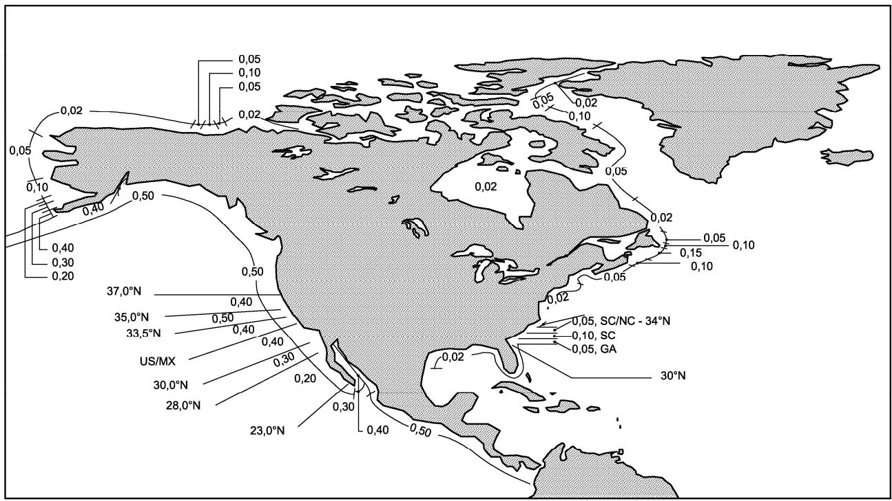

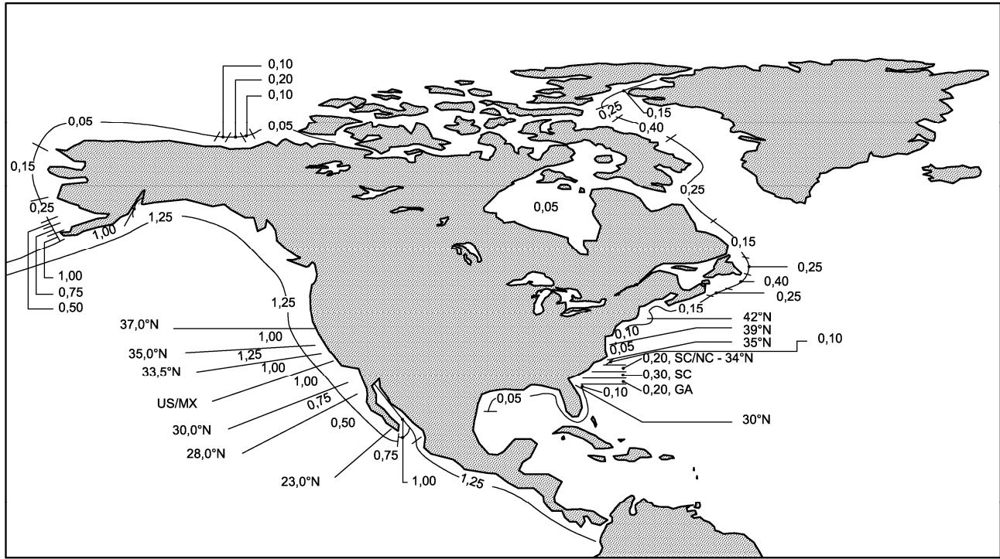  
Figure A.1—1000-year $S_{ \mathsf{ a } }$ (1.0 s Oscillation) Map of North America (from API 2EQ)   
Figure A.2—1000-year $S_{ \mathsf{ a } }$ (0.2 s Oscillation) Map of North America (from API 2EQ)

By comparing the bottom to the corresponding top values, it can be observed that:

$$- S_{a, \mathrm{m a p}} (0. 2 \mathrm{s}) \leq 2. 5 \times S_{a, \mathrm{m a p}} (1 \mathrm{s})$$

For Seismic Zone 0 according to API 2EQ (see Table A.5), the 1 s spectral acceleration is:

$$- S_{\mathrm{a , m a p}} (1. 0 \mathrm{s}) <   0. 03 \mathrm{g}$$

Making use of the above observation, the 0.2 s corresponding spectral acceleration is:

$$\begin{array}{l} - S_{a, m a p} (0. 2 s) = 2. 5 \times 0. 03 g \\ - S_{\mathrm{a}, \text{m a p}} (0. 2 \mathrm{s}) = 0. 075 \mathrm{g} \\ \end{array}$$

Table A.5—Site Seismic Zone (from API 2EQ)   

| Sa map (1.0) | < 0.03g | 0.03–0.10g | 0.11–0.25g | 0.26–0.45g | > 0.45g |
| --- | --- | --- | --- | --- | --- |
| Seismic Zone | 0 | 1 | 2 | 3 | 4 |

With $S_{ \mathsf{ a , m a p } } \left( 0 . 2 \ \mathsf{ s } \right)$ and $S_{ \mathsf{ a , m a p } } \left( 1 . 0 \ \mathsf{ s } \right)$ now established for Seismic Zone 0, the API 2EQ generic response spectrum (Figure $\mathsf{ A } . 3 )$ can be used to develop a Seismic Zone 0 response spectrum. This also requires the soil amplification factors, $C_{ \mathsf{ a } }$ and $C_{ \mathsf{ v } } ,$ displayed in Table A.6.

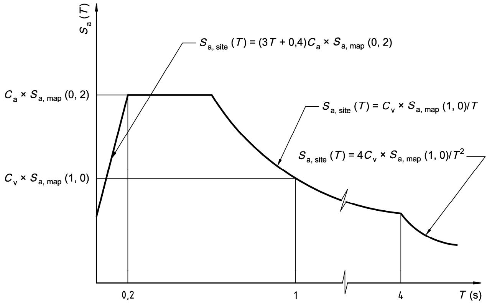  
Figure A.3—Generic Response Spectrum (from API 2EQ)

Table A.6—Site Amplification Factors (from API 2EQ)   

| Site Class | Ca | CV |
| --- | --- | --- |
| A/B | 1.0 | 0.8 |
| C | 1.0 | 1.0 |
| D | 1.0 | 1.2 |
| E | 1.0 | 1.8 |
| F | # | # |
| # A site-specific geotechnical investigation and dynamic site response analyses shall be performed. | # A site-specific geotechnical investigation and dynamic site response analyses shall be performed. | # A site-specific geotechnical investigation and dynamic site response analyses shall be performed. |

It should be observed that:

$- \ C_{ \mathsf{ a } } = 1 . 0$ for all site classes (undefined for Class F), and   
$\begin{array} { r l r } { - } &  { } C_{ \vee } = 0 . 8 \mathrm{ t o } \ 1 . 8 \ \end{array}$

In accordance with Figure A.4, for a SPJ with a natural period of T = 1 s, the deck PGA (peak ground acceleration) will be:

$\begin{array} { r } { - \mathsf{ D e c k } \mathsf{ P G A } = C_{ \mathsf{ v } } \times S_{ a , \mathsf{ m a p } } \left( 1 . 0 \mathsf{ s } \right) / \textit{ T } } \end{array}$   
$- \mathsf{ D e c k } \mathsf{ P G A } = C_{ \mathsf{ v } } \times S_{ \mathsf{ a , m a p } } \left( 1 . 0 \mathsf{ s } \right)$

The final step is to scale the 1000-year spectral values for an ELE design. This is done by using the following API 2EQ relations:

$- \mathrm{ \Delta } S_{ \mathsf{ a , A L E } } \left( T \right) = N_{ \mathsf{ A L E } } \times S_{ \mathsf{ a , m a p } } \left( T \right)$   
$- \ S_{ \mathsf{ a } , \mathsf{ E L E } } \left( T \right) = S_{ \mathsf{ a } , \mathsf{ A L E } } \left( T \right) I C_{ \mathsf{ r } }$   
$- \ S_{ \mathsf{ a } , \mathsf{ E } \mathsf{ L } \mathsf{ E } } \left( T \right) = N_{ \mathsf{ A } \mathsf{ L } \mathsf{ E } } / C_{ \mathsf{ r } } \times S_{ \mathsf{ a } , \mathsf{ m } \mathsf{ a } \mathsf{ p } } \left( 1 . 0 \ \mathsf{ s } \right)$

$N_{ \mathsf{ A L E } }$ is an ALE scale factor defined in Table $\mathsf{ A . 7 . } C_{ \mathsf{ r } }$ is the platform resistance factor ranging from 1.4 to 2.8; the median value of about 2.0 is assumed for $C_{ \mathsf{ r } } .$ .

Table A.7—Scale Factors for ALE Spectra (API 2EQ)   

| Exposure Category | ALE Scale Factor, NALE |
| --- | --- |
| L3 | 0.85 |
| L2 | 1.15 |
| L1 | 1.60 |

Thus, using the maximum $N_{ \mathsf{ A L E } }$ value of 1.6 corresponding to an L1 exposure category, the following can be derived:

$- \ \mathsf{ D e c k } \mathsf{ P G A }_{ \mathsf{ E L E } } = C_{ \mathrm{ v } } \times S_{ \mathsf{ a , E L E } } \left( 1 . 0 \mathsf{ s } \right)$

$\begin{array} { r } { - \mathsf{ \Pi } \mathsf{ D e c k } \mathsf{ P G A }_{ \mathsf{ E L E } } = C_{ \mathsf{ v } } \times \{ N_{ \mathsf{ A L E } } / \mathsf{ C }_{ \mathsf{ r } } \times S_{ \mathsf{ a , m a p } } \left( 1 . 0 \mathsf{ s } \right) \} } \end{array}$   
$\begin{array} { r } { \begin{array} { l l } { - } & { { \mathsf{ D e c k } } { \mathsf{ P G A } }_{ \mathsf{ E L E } } = [ 0 . 8 , 1 . 8 ] \times \{ 1 . 6 / 2 . 0 \times 0 . 039 \} } \end{array} } \end{array}$   
$- \ \mathsf{ D e c k } \mathsf{ P G A }_{ \mathsf{ E L E } } = [ 0 . 0199 , 0 . 0439 ]$   
$- \ \mathtt{ D e c k } \mathtt{ P G A }_{ \mathtt{ E L E } } < 0 . 05 \mathbf{ g }$

Therefore, based on Seismic Zone 0 according to API 2EQ, 0.05g could be considered a reasonable minimum lateral acceleration for topsides seismic design.

A.7.8.3 Equipment and Appurtenances

The method of deriving actions for the seismic design for equipment or a deck appurtenance depends upon its dynamic characteristics and the framing complexity. There are two analysis alternatives.

First, through proper anchorage and lateral restraint, most deck equipment and piping are sufficiently stiff that their support framing, lateral restraint framing, and anchorage can be designed using static actions derived from peak deck accelerations associated with the ELE.

To provide assurance that the equipment or appurtenance is sufficiently stiff to meet this criterion, the lateral and vertical periods of the equipment or appurtenance should be very different from the main periods of vibration of the topsides structure. Additionally, the local framing of the deck that supports the equipment or appurtenance should also be rigid enough not to introduce dynamic amplification effects. In selecting design lateral acceleration values, consideration should be given to the increased response towards the corners of the deck caused by torsional response of the platform.

Second, in cases of more compliant equipment or appurtenances—such as drilling and well servicing structures, flare booms, cranes, deck cantilevers, tall free-standing vessels, unbaffled tanks with free fluid surfaces, longspanning risers and flexible piping, escape capsules, and wellhead/manifold interaction—consideration should be given to accommodating the additional forces caused by dynamic amplification, or differential displacements, or both. These forces can be estimated through either coupled or uncoupled analyses.

Uncoupled analyses using deck floor spectra are likely to produce larger design actions on equipment than those derived using a more representative coupled analysis, particularly for more massive components and those with natural periods close to the significant natural periods of the overall platform. API 2A-LRFD and References [11] and [12] describe coupled procedures and uncoupled procedures that attempt to account for such interaction.

If coupled analyses are used on relatively rigid components that are modelled simplistically, the design accelerations derived from the modal combination procedure should not be less than the peak deck accelerations.

Walk-down inspection by experienced personnel of equipment and piping on existing platforms in seismic areas can identify equipment and pipework supports that should be improved (see 6.9). The addition or deletion of simple bracing, or supports, or both, can significantly improve the behavior of equipment and pipework during an earthquake.

The use of higher partial action factors can be appropriate for designing deck supported structures, local deck framing, equipment supports, and lateral restraints under ELE actions. This higher partial action factor is intended to provide an additional margin of safety in place of performing an explicit ductility analysis. In areas where the ratio of rare, abnormal ground motion intensities to extreme level ground motion intensities is known to be greater than 2.0, an adjustment to the partial action factor should be considered. In addition, for certain equipment, piping, appurtenances or their supporting structures, the degree of redundancy, consequences of failure and/or characteristics of the metallurgy can dictate the use of different (i.e. higher) partial action factors for the ELE or a full ductility analysis, depending on the component’s anticipated performance under rare, abnormal earthquake ground motions.

For drilling and well servicing structures, ISO 13626 [10] should be used to design for earthquake actions.

A.7.10 Accidental Situations

A.7.10.1 General

Methods to prevent accidents and to control and mitigate their consequences should be addressed during the design of the topsides structure and in laying out the facilities and equipment so as to minimize the probability of occurrence and the effects of accidental events. Control and mitigation measures, including those to protect SCEs against fire and explosion actions, should conform to ISO 13702 [73].

The facilities layout, including equipment positioning, should be arranged to minimize the exposure of personnel to accidental events and their consequences. Where the process of risk assessment identifies a hazard, the topsides structure should be designed to have sufficient capability to resist or contain its effects so as to reduce risks to personnel and the environment in accordance with the RRP process. Robustness and inherent safety are important design considerations. Provision of adequate structural strength and ductile deflection capability as inherent safety measures to enhance the survivability of the platform should be evaluated for the design of the topsides structure, equipment, and SCE attached to it.

The maintenance of structural integrity can prevent or reduce escalation of accidental events causing significant damage. The design of the structure therefore plays an important role, along with other engineering disciplines, in developing inherent safety and in implementing a safety management system for the platform. Accidental situations are low-probability events. Provided that the total risk from all causes is minimized in accordance with the RRP process, actions having an annual probability of exceedance of less than 104 need not be considered.

In evaluating resistances, it is appropriate to use the ultimate strength of the individual components and global structure. Best estimates of actions and resistances should be used for the structural calculations. These may include removal of implicit factors of safety (e.g. actual yield strength, large deflection effects such as membrane and catenary effects, enhanced strength due to high strain rates and strain hardening, etc.). Where dynamic actions are involved, the energy absorption due to ductile deformation should be taken into account. In addition to direct accidental actions, the structure should have sufficient capability to resist projectiles resulting from explosions.

Certain locations of the deck, such as crane loading areas and areas near the drilling rig, are likely to be subject to dropped and swinging objects. The location of equipment and facilities below these areas should be considered so as to minimize potential damage from these causes.

When it is necessary to enclose parts of a topsides at locations where the potential for a gas explosion exists, the protective side panels or walls should include suitable blow-out panels to minimize confinement and reduce resultant actions on primary structural components. However, blow-out panels can have a limited effect in reducing overpressures in large, congested areas. Blow-out panels should not be considered an alternative to open boundaries unless the increase in the overall risk, e.g. by increasing probable cloud size, is shown to be acceptable. In cold climates their use can, however, be necessary.

Accidents or equipment failures can cause significant structural damage. Inspection of this damage in accordance with Clause 14 can provide the information for analytical work to determine the need for immediate or eventual repair. Such analysis will also identify under what conditions the platform should be shut in, or evacuated, or both. The probability of an accidental event coinciding with a design environmental event is considered to be too low for design.

The screening process shown in Figure 1 involves a preliminary assessment of accidental events for the options under study. This should be sufficiently accurate and comprehensive to ensure that:

a) realistic estimates of consequences are used in selecting the overall platform layout and risk level;

b) the levels of design actions determined in the detailed assessment are sufficiently close to those determined in Task 3 and used in setting out the basic design; any excess should be within the capabilities of practical and realistic mitigation measures.

An SCE is defined as an item of equipment whose failure in an accidental event can lead to unacceptable escalation, for example where failure of an SCE would cause a fire whose intensity and spread is such that the required fire endurance of other SCEs or the main structure cannot be achieved.

Where environmental protection is a particular consideration, the required fire endurance can be much longer than that required for personnel escape (life-safety consideration). In such instances, mitigation can involve measures to reduce the blow-down time of systems containing hazardous inventories.

Achieving an optimum design with respect to SCEs involves, but is not limited to, the following considerations:

minimizing the number of SCEs by sectionalizing the hazardous components of the process system or sectionalizing the topsides layout to reduce the probability of escalation from one area to adjacent areas;   
— siting and orienting SCEs to minimize exposure to explosion wind and projectiles;   
arranging and locating SCEs to minimize imposed accelerations and displacements of support structures, especially where SCE systems interconnect support structures that can move relative to each other;   
— where large displacements are imposed on piping systems, giving consideration to using all-welded pipe systems or increasing a specified fitting class beyond purely process requirements, so as to ensure that plastic deformation of pipe systems and nozzles can occur without prior failure of fittings;   
reducing fire duration by reducing the blow-down times of critical systems, e.g. by draining the liquid phase at the same time as venting the gaseous phase of hazardous inventories; this can require the provision of liquid dump tanks in a suitably protected location (e.g. subsea);   
ensuring that blow-down rates are consistent with the PFP provisions and fire intensities applied in likely escalation events, such as jet fires, so that the pressure decay always outstrips the decay in containment strength; in specifying PFP, allowance should be made for the possible impact of intermittent deluge on PFP endurance;   
considering the interaction between the performance of SCEs and the structures that support them, or can impact them, in an explosion event; it can be necessary to classify secondary structures in equipment room spaces as primary structure where they are required to remain in place for the full duration of the hazardous event.

More guidance on protecting and designing SCEs can be found in Reference [18].

A.7.10.2 Evaluation of Accidental Situations

A.7.10.2.1 General

Task 3 in the assessment process shown in Figure 1 can require the quantification of any significant accidental actions identified, or reference to similar platform designs for which such actions have been evaluated in detail. When comparison to similar platforms is used, it can be necessary to also compare factors such as weather statistics, for example of winds that can influence gas cloud build-up and dispersion.

A.7.10.2.2 Probability of Occurrence and Severity of Accidental Events

It is usually necessary to consider a range of possible events of each accidental type; for example, a ship impact can include impacts from a small work boat, a supply boat undertaking routine operations, a contracted-in vessel undertaking specific work such as a diving support vessel, and passing ships unconnected with the installation. Each of these ships will have different masses, velocities, and probabilities of impact. Similarly, for gas explosions,

there can be many potential sources of gas leak and ignition, different detection equipment, and different responses to detection (e.g. deluge on gas detection); all these can affect the location, magnitude, and probability of an explosion.

A.7.10.3 Hydrocarbon Incidents

Comprehensive guidance on the prevention, control, and mitigation of fires and explosions is given in Reference [13]. Other guidance is provided in API 2FB. Specific pieces of research and development work are undertaken by the Fire and Blast Information Group (FABIG) and published as technical notes; examples of these are References [14], [15], [16], [17], and [18].

Assessments should be performed in accordance with ISO 13702, which defines an overall framework for the fire and explosion assessment process. More detail can be found in References [19] and [20].

Typically, the topsides on an offshore structure are constructed as an open framework of structural shapes and tubular structural components which are relatively resistant to explosion. Decks and walls are subject to explosion actions when gas clouds are ignited; confined spaces and equipment congestion increase explosion actions.

A.7.10.4 Explosion

A.7.10.4.1 Explosion Design Situations and Actions

A.7.10.4.1.1 General

The explosion scenario establishes the make-up and size distributions of potential vapor clouds and identifies potential ignition sources for the area being evaluated. Potential ignition sources include electrical equipment, instrumentation systems, hot surfaces, and static electricity. Attention should be paid to minimize the possibilities of ignition, including earthing conductive equipment that is otherwise isolated electrically from the topsides structure. Reference should be made to ISO 13702. A general introductory guide on the subject of gas explosions can be found in Reference [15].

For the initial and conceptual design stage of a project, overpressures and impulses in certain areas on a platform can be estimated using the simplified computational fluid dynamics (CFD) analysis or phenomenological models by competent engineers. The effects of likely interaction between explosion actions and the response of the structure should be evaluated. These can include the effects of deformation or other movement of the equipment and structural components when opening up vents, producing impact or shock loading, increasing local actions, load shedding, load redistribution and displacement, and dynamic amplification, for example.

An explosion requires both a vapor cloud within the explosive limits of the mixture and an ignition source. The overpressures generated by an explosion depend on many factors, such as the type, volume, and concentration of hydrocarbon released; the location of the ignition source; the degree of congestion within the compartment; and the extent of confinement. In many cases, explosion actions can be reduced by active mitigation systems such as water spray and inert gas. Good natural ventilation reduces the probability of a major explosion.

A.7.10.4.1.2 Methods of Analysis

The explosion overpressures on a platform can vary from near zero on a small, open platform to greater than 0.8 MPa (8 bar) on an enclosed or congested platform. Traditional simple hand calculation methods for determining explosion overpressures are not appropriate for offshore platforms. Equations that have been developed for applications on land do not always account for the significant amounts of turbulence generated as a flame front passes around equipment offshore. As a result, simple methods can significantly under predict explosion pressures and should not be used. Techniques that can usefully be used include the following:

— CFD analysis, and   
— phenomenological models.

Reference [13] presents various types of explosion models currently available for predicting explosion actions.

Models should be able to predict overpressure, duration, impulse and drag actions. These parameters should be evaluated when designing topsides to resist explosions. The models chosen should be able to identify regions of particularly high overpressures. Presenting only one overall pressure level for an area is not likely to be sufficient. Reference [21] reports the results of full-scale test experiments and a test evaluation of a number of CFD codes and phenomenological models.

A.7.10.4.1.3 Overpressure

Explosion actions result from increases in pressure due to expanding combustion products. These actions are characterized by a pressure–time curve; an example is given in Figure A.4. Explosions actions can govern the design of many components such as explosion walls, floors, and roofs. When idealizing the pressure–time curve, the important characteristics should be maintained. Such characteristics include the rate of pressure rise, peak overpressure and impulse, the area under the pressure-time curve. For dynamic actions, it is necessary to include the negative pressure portion of the curve.

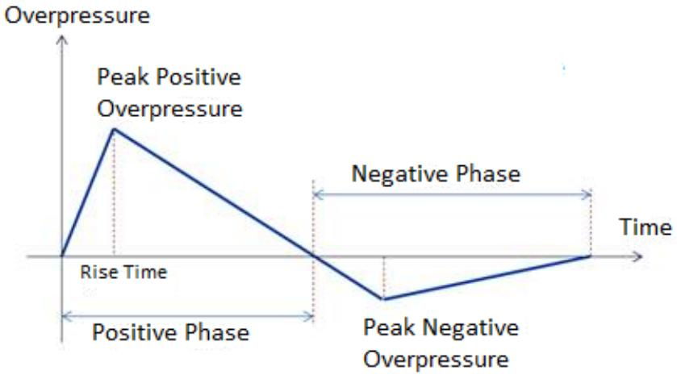  
Figure A.4—Example of Explosion Overpressure versus Time

A.7.10.4.1.4 Drag Actions

Drag actions are caused by explosion-generated wind. The drag actions on small isolated obstacles are a function of gas velocity squared, gas density, drag coefficient, and the cross-sectional area of the object being analyzed. Critical piping, equipment, and other items exposed to explosion wind should be designed to resist the predicted drag actions. Drag coefficients should be selected with due account for Reynolds number.

In the case of larger obstacles and grouped obstacles, drag actions can be increased by other effects such as inertial effects in an accelerating flow or turbulence at high Mach numbers (see Reference [22]). In such circumstances, actions should be calculated directly by computing the pressure differential between upstream and downstream sides or by using drag coefficients that suitably account for these factors (see References [18] and [23]).

In addition to directly applied explosion actions, concurrent actions such as self-weight and variable and operating actions should be applied to the structure. Environmental actions may be neglected in an explosion analysis. Any mass that is associated with in-place actions should be included in a dynamic analysis.

Congestion due to small structural components, piping, and equipment can be a significant factor that should be considered. Explosion pressures and the nature of the explosion’s behavior cannot be accurately assessed without accounting for representative congestion in the geometry model used to analyze the topsides concept. All piping and small structural components should be represented in such studies.

Simulations performed on offshore topsides projects where all piping is included have shown that explosion pressures can increase by one to two orders of magnitude compared to a bare equipment model. The effect of including piping of 50 mm in diameter and below has been seen to increase pressures significantly, sometimes by a factor of about two.

These factors should be taken into account when selecting the analytical tool and developing the geometry model.

Methodologies for generating and implementing anticipated congestion are defined in References [21] and [23].

Representative congestion can be developed from previous studies of similar platforms. The same techniques can also be adapted for re-analysis of existing platforms, when there is insufficient detailed information about small equipment.

Where a detailed equipment and structure layout is not established at the time of calculating explosion pressures, actions and consequences can be based on assessments made using representative geometry models using anticipated congestion, or using similar geometry models, or previous studies of geometrically similar platforms.

It is therefore important when selecting a platform design to minimize congestion, i.e. the packing density of equipment. It can also be valuable to separate densely packed equipment zones by open un-congested zones, as practiced in onshore facilities. Studies have shown that 10 m open venting gaps may reduce peak explosion pressures (see Reference [24]).

A.7.10.4.2 Structural Resistance

A.7.10.4.2.1 General

The significance of risks from explosion events depends particularly on the structural barriers that are present between the area affected by the explosion and people and systems in adjoining areas. The purpose of A.7.10.4.2 is to give guidance on what should be considered when analysing a structure for explosion actions and what methods are appropriate. Connections should be assessed for their ability to allow structural components to develop their full plastic strength. Explosion actions can act in the opposite direction to gravity actions and the design of connections should take account of this. Dynamic actions cause high strain rates which, coupled with stress concentrations, can cause fracture.

In the analysis of accidental actions, all partial action factors, $\gamma_{ \mathsf{ f } , \mathsf{ G } }$ and $\gamma_{ \mathsf{ f } , \mathsf{ Q } } ,$ may be reduced to 1.0, and best estimates of yield strengths and tensile strengths should be used. Strain rates and strain hardening effects should be included in determining the yield strength and/or tensile strength and general material behavior.

The main acceptance criteria are strength and deformation or strain limits (see A.7.10.2.3 and A.7.10.4.2.4).

A.7.10.4.2.2 Strength Limit

Where strength governs the design, failure is defined to occur when the design value of the internal force or moment due to the design action exceeds the design resistance. The design action is determined by Equation (2) in 7.3.1 by setting the partial action factors to 1.0 and adding any accidental actions. The design resistance is determined by Equation (9) in 8.1 with the partial resistance factor set to 1.0. Strength design should satisfy the combination of these two equations, as described in Equation A.1 below.

$$F_{\mathrm{d}} = 1. 0 G + 1. 0 Q + 1. 0 A \tag{A.1}$$

where (including for the referenced equations):

$F_{ \mathsf{ d } }$ is the design value of the action;

$G$ is the permanent action;

Q is the variable action;

A is the action resulting from an accidental event;

$S_{ \mathsf{ d } }$ is the design value of the internal force or moment due to $F_{ \mathsf{ d } } ,$

$R_{ \mathsf{ D } }$ is the design value of the resistance;

$K_{ \mathsf{ c } }$ is the building code correspondence factor (see 8.1);

$R_{ \sf K , c o d e }$ is the representative resistance of the structure or component.

A.7.10.4.2.3 Deformation Limit

Permanent deformation can be acceptable following an accidental event. In such cases, the following should be demonstrated:

a) no part of the structure impinges on critical operational equipment;   
b) the deformations do not cause collapse of any part of the structure that supports critical equipment, the safe area, evacuation routes, or muster stations; a check should be performed to ensure that structural integrity is maintained if a subsequent fire occurs;   
c) the deformations do not cause escalation of the event (e.g. by damaging riser integrity or emergency shutdown valve control).

Deformation limits can be based on a maximum allowable strain or an absolute displacement as discussed in A.7.10.2.4.2.4 and A.7.10.4.2.5. An absolute displacement can be dictated by the ductile bending and rotation capability of the structural components.

A.7.10.4.2.4 Strain Limits

Generally, structural steels used offshore have sufficient toughness and are not significantly limited in strain capability at the high strain rates associated with explosion response. Reductions in strain limits can be required for cold weather applications or for steel that has low fracture toughness.

For typical structural steel grades, the effective plastic strain from a nonlinear finite element analysis (FEA) should be limited to about 15 % for parent material. For welds, welded joints, and splices, an effective plastic strain of about 5 % from a nonlinear FEA should be used. See Reference [68].

The critical strain for plastic deformations of sections containing defects should be determined based on fracture mechanics methods. Welds normally contain defects and welded joints are likely to achieve lower toughness than the parent material. For these reasons, structures that undergo large plastic deformations should be designed in such a way that the plastic straining takes place outside the weld. In complete joint penetration welds, the overmatching of weld material strength relative to the parent material will ensure that minimal plastic straining occurs in the welded joints, even in cases with yielding of the gross cross-section of the structural component. In such situations, the critical strain occurs in the parent material and is dependent on the following:

— stress gradients,   
— dimensions of the cross-section,   
— presence of strain concentrations,   
— material yield to tensile strength ratio, and

— material ductility.

Simple plastic theory does not provide information on strains. Therefore, strain levels should be assessed by means of adequate analytical models of the strain distributions in the plastic zones or by nonlinear FEA with a sufficiently detailed mesh in the plastic zones.

A.7.10.4.2.5 Absolute Strain Limits

Absolute strain limits are adopted where there is a risk of a deforming component striking another component, usually process or emergency equipment or key structural components.

It should be demonstrated that the structural component being considered can accept the deflections and deformations without failure due, for example, to local buckling or to rupture initiated at points of local stress concentration, e.g. at structural connections, welds, and cut-outs. Membrane action in plating and stiffened plating can lead to increased compression in primary structural components and, by doing so, can cause buckling of these primary structural components. In floating structures, stresses in the decks due to unfavourable distributions of ballast or cargo can lead to reductions in ductile strength and out-of-plane deflection under explosion or fire actions.

Survival of deck-mounted SCE can dictate lower ductility limits for the structure in order to limit imposed deformations and acceleration of equipment supports. Similarly, the overall resistance of the topsides structure against explosions can be reduced when the wind actions associated with peak explosion overpressures reached at the ductile limit of the structure exceed the resistance of SCEs.

See References [15], [16], and [25] for more information on deformation limits.

A.7.10.4.3 Methods of Analysis

A.7.10.4.3.1 General

The structural response to explosion actions can be determined by:

— linear dynamic analysis (for nonredundant structures governed by strength limit criteria) (see A.7.10.4.3.3),   
— simple calculation models based on SDOF analogies and elastoplastic methods of analysis (see A.7.10.4.4), or   
— nonlinear dynamic FEA (see A.7.10.4.3.3).

Structures can be designed to respond elastically (i.e. in the elastic deflection range) or plastically, in response to explosion pressures. In the latter case, structures will be found to have resistance to higher levels of explosion. In design, this can be accounted for by specifying two different explosion levels:

— a ductility level blast (DLB) defined as a low-probability high-consequence event, which shall be investigated for at least retaining the integrity of the temporary refuge, safe muster areas, and escape routes;   
— a strength level blast (SLB) defined as a higher-probability lower-consequence event where the primary structure is generally expected to remain elastic.

These two cases are analogous to an abnormal storm and an extreme storm, respectively.

Design and analysis for SLB design situations are much easier and quicker to perform in a project time scale than an assessment to DLB, and design change and evolution can be handled more easily. A further advantage is that the code check aspect of an SLB assessment is an effective screening tool for all components of the structure, which will not necessarily be matched by nonlinear FEA. Therefore, an SLB assessment is a recommended step for all structure designs.

In design situations based on an SLB, the structure should not be permanently damaged by an explosion; however, the ultimate acceptance of the topsides structure should be based on the DLB.

The ultimate acceptance based on the DLB should demonstrate that:

a) there is no sudden or progressive collapse of the overall topsides structure;   
b) there is no excessive damage to SCE, e.g. by limiting deflections and acceleration of the structure (avoidance of escalation potential); and   
c) there is no structural damage that significantly affects subsequent fire endurance.

For SLB design situations, SDOF methods are usually applied, coupled to a quasi-static analysis, using a linear FEA, controlled by code checks to API 2A-LRFD or the national or regional building standard.

For DLB design situations, SDOF methods can still be applied, providing that ductile deformation limits can be determined for the structural components and an overall characteristic load-deflection curve can be established for the topsides structure. For ductile deformation limits, literature references based on test data can be used, where available.

It can be difficult to determine the ductile deformation limits and overall characteristic load-deflection curve for complex structures; hence, nonlinear FEA is often applied for a DLB assessment.

The type of structural analysis to be performed should be based on the nature of the explosion and the duration of the explosion pressure pulse relative to the natural period of the structure or component. Low overpressures can be satisfactorily considered with a linear-elastic analysis using factors to account for dynamic response. High overpressures can require more detailed analysis incorporating both material and geometric nonlinearities. The complexity of the structure being analyzed will determine if a single- or a multiple-degree-of-freedom analysis is required.

If nonlinear dynamic FEA is used, the major effects described in A.7.10.4.3 and A.7.10.4.4 should either be implicitly covered by the modelling adopted or be subjected to special considerations, whenever relevant (e.g. local buckling, finite ductility, strength of connections, interaction with adjacent structure). The choice of FEA tool type, e.g. explicit/implicit program, should be appropriate to the problem being studied.

A.7.10.4.3.2 Dynamic Analysis

The pressure–time curve generated by a CFD analysis as part of the assessment process in 7.10.2 and A.7.10.4.1 can be applied to the structure or structural component to model more precisely the effects of the explosion.

In simple calculation models based on SDOF analysis, the structural component is transformed to a single massspring system exposed to an equivalent pressure pulse by means of suitable shape functions to determine the displacements in the elastic and elastoplastic range.

For an arbitrary pressure pulse, the maximum response for the SDOF model is generally obtained by numerical step-wise integration of the differential equation or by Duhamel integration. Provided that the temporal variation of the pressure can be assumed to be triangular, the maximum displacement of the component can be calculated from design charts for the SDOF system (see References [14] and [27]) as a function of pressure duration versus fundamental period of vibration and equivalent explosion pressure amplitude versus maximum resistance in the elastic range. The maximum displacement for both the primary and rebound response should comply with ductility and stability requirements for the structural component; for charts for rebound response, see Reference [15].

The response of a structural component can conveniently be classified into three categories according to the duration of the explosion pressure pulse, $t_{ \mathsf{ d } } ,$ relative to the fundamental period of vibration of the component, T.

— In the impulsive domain, $t_{ \mathsf{ d } } / T < 0 . 3$ , the maximum displacement is governed by the explosion impulse:

$$I = \int_{0}^{t_{\mathrm{d}}} p (t) d t \tag{A.2}$$

— In the dynamic domain, $0 . 3 < t_{ \mathrm{ d } } / T < 3$ , the response is solved from integration of the dynamic equilibrium equations.   
In the quasi-static domain, $3 < t_{ \mathrm{ d } } / T_{ \mathrm{ \ell } }$ , the maximum displacement is governed by the peak pressure, $p_{ \mathsf{ m a x } } ,$ and the rise time of the pressure relative to the fundamental period of vibration of the structure or structural component under consideration. If the rise time is large, i.e. if $t_{ \mathsf{ d } } / T$ is much greater than 3, the maximum deformation of the component can be solved from static equilibrium. If the rise time is small, i.e. if $t_{ \mathsf{ d } } / T$ is closer to 3, a dynamic magnification will be present.

In the near field the gas explosion pressure impulse has a finite rise time, about 50 % of the impulse duration, but in the far field the pressure rise is usually instantaneous.

Further guidance on structural design for explosion can be obtained from References [15] and [16]. Guidance on design of equipment for explosion actions is given in References [25] and [28].

A.7.10.4.3.3 Nonlinear Finite Element Analysis

Where nonlinear FEA is used for dynamic analysis, the type of program selected (implicit or explicit) should be suitable for the type of structure being analyzed and the potential local and global actions expected. Due to the practical limitations of modelling large complex structures in sufficient detail, the equivalent of a full code check, as used in linear-elastic analysis, is not normally carried out within the nonlinear FEA code. In many instances, it is necessary to perform additional code checks according to the recognized national or regional building standard, using forces and stresses generated from the nonlinear FEA code. Undertaking analysis of complex structures using nonlinear FEA requires a detailed understanding of the potential failure modes of the structure and the contribution of coexisting operating actions to component utilization. In nonlinear FEA, overall modelling accuracy can be checked by comparing this case with the results of the same case in the linear-elastic analysis.

The nonlinear FEA model used should contain initial imperfections of sufficient magnitude to trigger critical local and global failure modes. Initial displacements can be introduced by using distorted coordinates or induced by functional actions. Eigenmodes determined in linear buckling analysis do not always account for sufficient imperfections at all the required locations. In place of more accurate information, imperfections should be based on fabrication tolerances.

In conjunction with the modelling of imperfections, it should be ensured that the modelling of beams can allow torsional buckling behavior.

When performing nonlinear FEA, a sufficient number of explosion load cases and sufficient simulation durations should be evaluated to ensure that the envelope of explosion scenarios is covered by the analyses undertaken.

The documentation of the nonlinear FEA work should include the results of code checks and a statement of the allowed permanent explosion damage (if any), so that structural input to fire response analysis can be consistent with output from the explosion analysis.

Further information on the use of nonlinear FEA techniques can be found in ISO 19902.

A.7.10.4.4 Simple Calculation Methods

A.7.10.4.4.1 Component Resistance by Simplified Methods

Simplified methods can be used for the design of structural components as described below.

a) Deck plating and stringers:

1) Main deck girders rely on the deck plating and the secondary steelwork supporting the plating (stringers) for lateral and torsional restraint; the plating and stringers can assist in redistribution of loads and load paths in accidental situations. Deck plating and stringers should have higher design explosion pressure strength than the girders that support them; a wide spatial variation in explosion pressure in an area can be expected, so average pressures (applicable for the design of the deck girder) will be less than the local peak pressures (applicable to the deck plating and stringer design).   
2) Where deck plating and stringers are expected to fail prior to the girders that support them, the impact of the failure modes of the stringers should be addressed when assessing the strength and ductile deflection limit of the girders.   
3) The combined effect of these factors is that a tradition has grown in some countries (e.g. Norway) for deck plating and stringer arrangements with at least two to three times the quasi-static explosion pressure resistance of the girders that support them. This leads to a deck design with enhanced reserve ductile deformation capability and improved performance in fire.   
4) Elasto-plastic resistance can be fairly well determined from elastic and rigid-plastic methods. For plates continuously loaded over several spans, clamped boundary conditions can be assumed. It is always conservative to assume no restraint against inward displacements. If the beneficial effect of membrane forces is taken into account, the ability of the adjacent structure to anchor the membrane forces should be demonstrated. The flexibility of the adjacent structure can delay the build-up of membrane forces. A simplified method to quantify the effect of this flexibility on the basis of a plate strip analogy is given in Norsok N-004 [29]. Finite ductility should be taken into account. In most cases, plate resistance is not the limiting factor, the stiffeners will collapse before the plating reaches its critical deformation.   
5) For plate stringers, a beam-type idealization is often appropriate. It should, however, be demonstrated that the stringer does not undergo significant tripping undermining its bending resistance. Provided that the connections and the adjacent structure can anchor the generated forces, the beneficial effect of membrane forces in the large deflection range can be accounted for, so long as the reduction in bending strength resulting from the coexisting membrane stress in the stringer is also accounted for. Rupture due to excessive straining should also be considered.

b) Beam or girder:

1) Resistance relationships of beams for the elastic, elastoplastic, and rigid-plastic domain, based on SDOF models can be found in Norsok N-004 [29] and Reference [15]. Beams and girders with slender crosssections should be checked for local failure in shear and bending. The tension field concept can be used to determine ultimate resistance. Although resistance in the post-ultimate region can be significant, information to allow the engineer to make use of this effect is limited. Shear deformations can have a significant impact on the response for beams and girders with small length/height ratios and clamped boundary conditions.   
2) Deck girders often act with associated deck plates as a composite section, which causes an upward shift in neutral axis position. While this increases section modulus, it can also alter the section class and ductile bending resistance. Similarly, membrane forces in adjacent deck plating can cause axial compression force in girders. This can reduce bending moment resistance. Other effects, such as transverse deck stringers and cut-outs for transverse stiffeners can stabilize the compression flange against torsion and can affect section class and ductile bending resistance.   
3) In hogging moment regions, lateral stabilization of the bottom flange is required at suitably frequent intervals to prevent lateral buckling prior to development of the full section moment resistance. In offshore topsides, deck girders can be subjected to lateral explosion wind actions.   
4) Where girders act as pipe supports, lateral actions due to explosion wind on the supported pipes and cable racks can lead to significant additional lateral destabilizing actions on girders. If time-domain dynamic analysis of girders is performed without considering these additional actions, lateral instability modes can be missed, with consequent unconservatism in the analysis results.

5) Reference [15] gives guidance and worked examples on deck girders designed by manual methods. Reference [19] gives some limited guidance on the analysis of deck girders by nonlinear FEA.

A.7.10.4.4.2 Ductile Deflection Limits and Local Buckling

The maximum deformation the structural component can undergo is ultimately limited by local buckling on the compressive side or by fracture on the tensile side of cross-sections undergoing finite rotation. If the structural component is restrained against inward axial displacement, any local buckling that occurs will occur before the tensile strain due to membrane elongation overrides the effect of the compressive strain induced by rotation. If local buckling does not occur, further deflection can occur until fracture is assumed to occur, when the tensile strain due to the combined effect of rotation and membrane elongation exceeds a critical value. To ensure that structural components with small axial restraint maintain sufficient moment resistance during significant plastic rotation, cross-sections should be proportioned to Class 1 requirements as defined in References [15] and [16]. Ductility limits for beams proportioned to Class 1 are limited by the onset of local buckling (for further guidance, see Reference [30]). Simplified equations extracted from this reference are contained in Reference [15].

The effective flange of the stiffened deck plating should be evaluated to allow calculation by SDOF methods. Norsok N-004 [29] gives recommendations on effective deck plating, depending on whether the plate field is elastic (shear lag effect) or can undergo buckling (effective width concept for post-buckling resistance). Initiation of local buckling does not necessarily imply that the resistance with respect to energy dissipation is exhausted, particularly for Class 1 and Class 2 cross-sections. The degradation of the cross-sectional resistance in the postbuckling range can be taken into account where this information is available. Alternatively, for beams and plates with full or partial restraint, the limiting deformation at tensile fracture is given in Norsok N-004 [29].

A.7.10.4.4.3 Support Reactions, Beam Releases, and Nonfixed Connections

In order to prevent structural component failure in shear at the supports preceding ductile bending failure, design support reactions for structural components should be enhanced by a minimum of 20 % compared to theoretical values to allow for the structural component resistance being higher than assumed in the response analysis.

Nonfixed joints at stringer connections to girders should not generally be specified where the stringers are otherwise continuous across the girder (i.e. there is no strength continuity in the bottom flange). However, such moment releases can be useful for enhancing the pattern of load distribution in deck structures, especially at overall deck deflections beyond the elastic limit. Deliberate releases can indicate lower tolerance for ductile rotation in regions of sagging moment.

A.7.10.4.4.4 Material Properties for Design

Strain rate affects yield strength and tensile strength. Reference [18] gives the relationship between strain rate and strength enhancement for a range of carbon and stainless steels. Strain rate–induced strength enhancement is beneficial in terms of increased strength, but can be detrimental in terms of section class and ductile deformation capability. It is important to use appropriate values of strain rate and enhancement. Reference [18] gives some typical straining rates for different structural situations.

For low-strength steel grades (e.g. yield strength less than or equal to 50 ksi or 345 MPa), the average yield strength in current production is about 10 % larger than the minimum specified yield strength. Therefore, for design of new topsides, the yield strength for low-strength steel grades should be multiplied by a strength increase factor (SIF) of 1.10 (see Reference [72]).

A.7.10.4.5 Explosion Mitigation

Explosion effects can generally be minimized by:

— making the vent area as large as possible;   
— making sure the vent area is well distributed;

— concentrating on the layout, size, and location of internal equipment;   
— using explosion barriers.

Active suppressant and mitigation systems can be used to minimize explosion effects in appropriate circumstances.

To minimize explosion pressures, vent areas should be located as close as possible to likely ignition sources. Consideration should also be given to the effect of vent area size and location on combustible cloud development. It is desirable to keep equipment, piping, cable trays, and so forth, away from vent areas to minimize the drag actions on these items and to fully use the vent area provided. Explosion relief panels and louvres can provide extra venting during an explosion, although these will not be sufficient where high overpressures are predicted. Relief panels should be designed to open rapidly at very low pressures to be effective in reducing the overpressures. Given that the use of relief panels is based on tests in medium scale and at low equipment congestion, an analysis of their effect on risk should be undertaken, particularly when they are used to close otherwise open walls. Although the pressures needed to open the relief panels are best kept low for relief of explosion pressures, they should not be so low as to allow wind to blow open the panels, e.g. 0.005 MPa (0.05 bar).

NOTE Wind pressures are at least an order of magnitude lower than explosion pressures.

Explosion walls and floors can be used to separate parts of a topsides, so an explosion within one area will not affect adjacent areas. This approach requires that the explosion walls and floors can withstand the design overpressures without being breached. Failure of these structures can generate primary projectiles and result in possible escalation. Explosion walls and floors generally double as fire walls and floors and should therefore maintain integrity after the explosion. Any PFP attached to the wall or floor should function as intended after an explosion; alternatively, the loss of such fireproofing should be accounted for in the design.

In an explosion, pressure waves radiate out from the immediate area of the explosion becoming explosion waves that can affect persons and facilities in the far field. Such waves are typically of short duration and very dynamic with significant underpressure phases. Where explosion waves are reflected, pressures can be augmented increasing applied actions and mortality and injury rates for persons in such zones (see References [13] and [19]).

Where applicable, the actions due to explosion waves should be evaluated and used for the design of facilities and temporary refuges in the far field. Guidance can be obtained from References [13] and [31].

Further guidance on design of explosion mitigation systems, including explosion relief panels, can be found in Reference [14].

A.7.10.5 Fire

A.7.10.5.1 Fire Design Situations

The factors relevant to the assessment of the effects of a fire include the following:

— the fire scenario, including duration;   
— the heat flow characteristics from the fire to unprotected and protected steel structural components;   
— the properties of the material at elevated temperatures;   
— the characteristics of fire protection systems (active and passive).

The fire scenario establishes the fire type, location, geometry, intensity, and duration. The fire type will distinguish between a hydrocarbon pool fire, a hydrocarbon jet fire, or other, generally less significant, types of fire. The location and geometry of the fire determines the relative position of the heat source to the structure, while the intensity (thermal flux) determines the amount of heat emanating from the heat source. Fire duration is the length

of time that combustion occurs at a given point. The duration of the fire will primarily depend on the amount of fuel that will be released in a scenario, its release rate, and its burning rate. Structure and equipment engulfed by flames are subjected to a higher rate of thermal actions than those that are not engulfed. The fire scenarios can be identified during process hazard analyses.

The heat flow from the fire into structural components (by radiation, convection, and conduction) is calculated to determine the temperature of each component as a function of time. The temperature of unprotected components engulfed in flames is dominated by convection and radiation effects, whereas the temperature of protected components engulfed in flames is dominated by the thermal conductivity of the insulating material. The amount of radiant heat arriving at the surface of a component is determined using a geometrical configuration or view factor. For engulfed components, a configuration factor of 1.0 is used.

The thermal and mechanical properties of the structural materials at elevated temperatures are required. The thermal properties (specific heat, density, and thermal conductivity) are required for the calculation of the material temperature. The mechanical properties (expansion coefficient, yield strength, and Young’s modulus) are used to verify that the original design still meets the strength and serviceability requirements. Actions induced by thermal expansion can be significant for highly restrained components and should be evaluated.

A.7.10.5.2 Fire Actions

Predictive techniques for the fire process are often classified as follows:

— empirical models,   
— zone (phenomenological) models,   
— CFD, or   
— field models (Reference [19]).

Empirical models can yield accurate and reliable predictions provided that conditions are similar to those in the underlying experiments. Examples of empirical models are the standard temperature–time curves for cellulosic fires and hydrocarbon fires. Zone models represent more of the governing phenomena, but the equations are limited to one dimension (the equations express the conditions in each zone and the fluxes present on the boundaries between the zones). Neither the empirical nor the zone models have the capability to model and predict the combustion process. CFD models analyze the problem in three dimensions, in either a steady state or transiently, by applying basic principles such as conservation of mass, momentum, and energy, supplemented by models for turbulence generation and dissipation, soot formation, and the chemical reactions associated with the combustion. Suitable models for fire prediction are applicable for well-defined fuels or burning materials such as gas and oil, but less suitable for materials for which the combustion process is not well established (e.g. wood, building materials, etc.). The outcome of a CFD analysis is, in this context, radiative and convective heat flux to surrounding structures, and also smoke production and movement.

CFD analysis provides the most fundamental understanding of the processes involved and has the greatest potential, but is very challenging with respect to both demand for computer resources and mathematical modelling. Significant progress has been made in recent years and the scope of successful application expands. Simplified methods and FEA can be used where appropriate. Where PFP is applied, rigorous modelling of a numerical solution can become very difficult due to the thermal properties of the structural material and PFP differing by an order of magnitude. An equivalent heat transfer coefficient should be used, which has been derived from a value measured in tests.

Examples of the effects on the stress/strain characteristics of ASTM A36 and ASTM A633 Grades C and D steels at elevated temperatures are presented in Table A.8 and Figure A.5 (taken from Reference [28]) for temperatures in the range 20 °C to 900 °C.

The interpretation of these data to obtain representative values of temperature effects on yield strength and Young’s modulus should be performed at a strain level consistent with the design approach used:

a) for a design approach that does not permit some permanent set in steelwork after the fire load case has been removed, a strain of 0.2 % should be assumed;   
b) for a design approach that allows some permanent set in steelwork after the fire load case has been removed, higher values of strain can be appropriate (0.5 % to 1.5 %).

At temperatures above $600^{ \circ } \mathsf C$ , the creep behavior of steel can be significant and should be addressed (see Reference [17]).

This document does not include any thermal data for other structural materials (see Clause 10 and A.10).

Table A.8—Yield Strength Reduction Factors for Steel at Elevated Temperatures (ASTM A36/A36M and ASTM A633/A633M Grades C and D)   

| Temperature °C | Strain 0.2 % | Strain 0.5 % | Strain 1.5 % | Strain 2.0 % |
| --- | --- | --- | --- | --- |
| 100 | 0.940 | 0.970 | 1.000 | 1.000 |
| 150 | 0.898 | 0.959 | 1.000 | 1.000 |
| 200 | 0.847 | 0.946 | 1.000 | 1.000 |
| 250 | 0.769 | 0.884 | 1.000 | 1.000 |
| 300 | 0.653 | 0.854 | 1.000 | 1.000 |
| 350 | 0.626 | 0.826 | 0.968 | 1.000 |
| 400 | 0.600 | 0.798 | 0.956 | 0.971 |
| 450 | 0.531 | 0.721 | 0.898 | 0.934 |
| 500 | 0.467 | 0.622 | 0.756 | 0.776 |
| 550 | 0.368 | 0.492 | 0.612 | 0.627 |
| 600 | 0.265 | 0.378 | 0.460 | 0.474 |

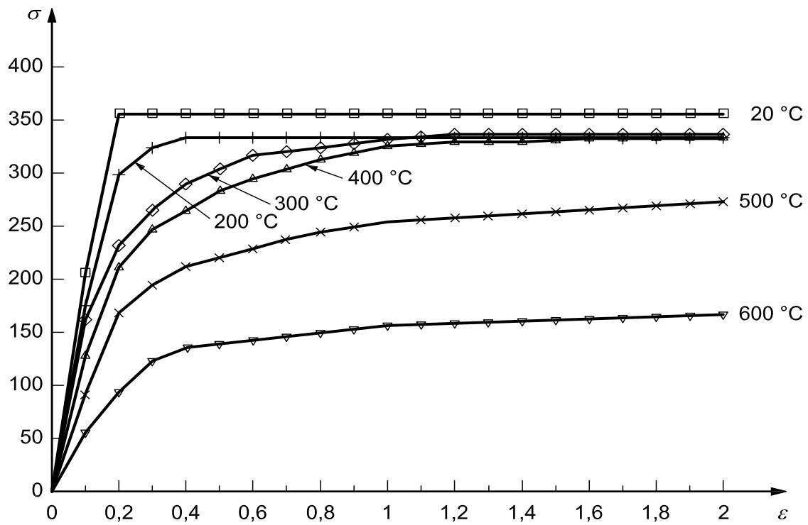

Figure A.5—Stress versus Strain Relationships of Typical Structural Steels at Different Temperatures   
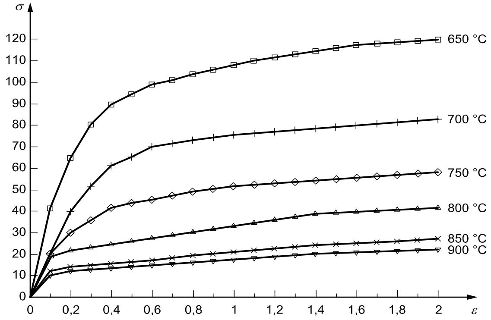  
  
εstrain, as a percentage   
σstress,in newtons per square millimeter

A.7.10.5.3 Design for Fire

Fire load cases can be addressed using one of the following approaches.

a) Zone method:

The zone method assumes that each component is fully utilized in normal situations and that, for structural steel, the combined total factor of safety results in a stress level of 60 % of yield strength for normal conditions (without a fire). The maximum temperature that can be tolerated is therefore taken as the temperature at which the yield strength reduces to 60 % of that at normal temperatures. This results in a maximum allowable temperature for structural steel of $400^{ \circ } \mathsf{ C } ;$ PFP should be applied to keep all structural steel below this temperature, the thickness of the PFP depending on the applied heat flux and the properties of the PFP.

The proportion of normal yield strength and the yield strength reduction are different for other materials, and the appropriate values should be determined and used.

Higher temperatures can be tolerated if higher strain rates are accepted (see Table A.9), but in these cases the reduction in steel stiffness should be taken into account by analysis, thereby detracting from the simplicity of this method.

Table A.9—Maximum Allowable Steel Temperature as a Function of Strain for Use with the Zone Method   

| Strain % | Maximum Allowable Temperature °C |
| --- | --- |
| 0.2 | 400 |
| 0.5 | 508 |
| 1.5 | 554 |
| 2.0 | 559 |

b) Linear-elastic method:

For the linear-elastic method, a maximum allowable temperature in a steel component is determined from the stress level in the component prior to the fire, such that, as the temperature increases, the component’s utilization ratio (UR) remains below 1.00, i.e. the component continues to behave elastically. For those components that do not suffer a buckling failure, the allowable stress should be such that the extreme fibers on the cross-section are at yield. The yield strength should correspond to the average core temperature of the component. For example, the maximum allowable temperature, $T_{ \mathsf{ C , m a x } } ,$ in a steel component as a function of UR is presented in Table A.10 for a 0.2 % strain limit.

Table A.10—Maximum Allowable Steel Temperature as a Function of Utilization Ratio   

| Maximum Component Temperature TC,max, °C | Yield Strength Reduction Factor at TC,max | Structural Component UR at 20 °C to give UR of 1.00 at TC,max |
| --- | --- | --- |
| 400 | 0.60 | 1.00 |
| 450 | 0.53 | 0.88 |
| 500 | 0.47 | 0.78 |
| 550 | 0.37 | 0.62 |
| 600 | 0.27 | 0.45 |

At higher temperatures, the reduction in Young’s modulus can be greater than the reduction in yield strength and care should be taken to ensure that failure modes (particularly those including any form of buckling) are not changed at these higher temperatures.

c) Elasto-plastic method (e.g. a progressive collapse analysis):

For the elasto-plastic method, a maximum allowable temperature in a steel component is assigned based on the stress level in the component prior to the fire, such that, as the temperature increases, the component UR can go above 1.00, i.e. the component’s behavior is elasto-plastic. A nonlinear analysis should be performed to verify that the structure does not collapse and does still meet the serviceability criteria. Such an analysis should include the effects of temperature-dependent stress/strain behavior and creep and be able to accommodate large deflections and large strains.

The linearization of the nonlinear stress/strain relationship of steel at elevated temperatures is necessary for an elasto-plastic analysis program that does not permit temperature-dependent stress/strain curves to be input. Data for such relationships can be obtained from Reference [19].

A.7.10.5.4 Transient Heat Transfer Analysis

The flow of heat from the fire into the structural component (by radiation, convection, and conduction) is calculated in a transient heat transfer analysis. The analysis can be performed by:

— simplified methods (see BS EN 1993-1-2 [32]), or   
— FEA.

The thermal properties of the structural material, specific heat, density and thermal conductivity are required for the calculation of its temperature. Temperature-dependent properties or equivalent constant values can be used (see BS EN 1993-1-2 [32]). Internal radiation from warm to cold surfaces should be considered for hollow sections and open sections with significant mutual-view factors. The effect of PFP should be included in the transient heat transfer analysis. Rigorous modelling of PFP is numerically difficult, due to very different thermal diffusivity of PFP and the structural material and the often complex physical behavior of the PFP. Instead, the performance of PFP can be described by an equivalent heat transfer coefficient. The equivalent heat transfer coefficient can be derived from fire-proofing tests. It depends on the product used, is thickness-dependent, and represents the average protection offered by the PFP (regardless of the physical processes involved) in the steady-state condition. The type of PFP and the thickness of application are specified for both the type and intensity or the fire and the duration for which the PFP has to remain effective; if the fire is still burning after this duration, the PFP should be assumed to be ineffective.

Large strains can be acceptable where permanent deformations can be allowed. For a component-based design approach, the effective yield strength can, for carbon steel, be taken as equal to the yield strength at 2.0 % strain. In nonlinear FEA-based design, in place of more accurate values, the yield strength should be assumed constant from 2 % strain up to the ultimate strain limit.

A.7.10.5.5 Creep

At temperatures above 600 °C, the creep behavior of steel can be significant. The yield strength reduction factors implicitly take some degree of creep into account. Considering the relatively short fire duration, the explicit evaluation of creep may be omitted in most situations. However, if a vital compression component in a nonredundant structure is close to its critical temperature for a substantial time (significantly larger than 20 min), the effect of creep should be given explicit consideration.

Structural analysis can be performed on different structural components or systems including the following:

— individual structural components,   
— subassemblies, or   
— an entire system.

The assessment of action effects and mechanical response due to fire should be based on either:

a) simple calculation methods applied to individual structural components,   
b) nonlinear FEA, or   
c) a combination of simple and nonlinear methods.

Simple calculation methods can give overly conservative results. Nonlinear FEA allows simulation of the fundamental processes in a realistic manner. Assessment of individual structural components by means of simple calculation methods can, for example, be based on the provisions given in BS EN 1993-1-2 [32]. Assessment of ultimate strength of carbon steel is not needed if the steel maximum temperature does not exceed 400 °C.

A.7.10.5.6 Nonlinear Finite Element Analysis

A.7.10.5.6.1 General

Structural analysis methods for nonlinear ultimate strength assessment can be classified as:

— stress–strain-based methods, or   
— stress-resultant-based (yield/plastic hinge) methods.

Stress–strain-based methods are methods where nonlinear material behavior is accounted for on fiber level. Stress-resultant-based methods are methods where nonlinear material behavior is based on closed-form solutions for interaction equations for cross-sectional forces and moments.

A.7.10.5.6.2 Material Modelling of Carbon Steels

In stress-strain-based analysis of carbon steel structures, the temperature-dependent stress-strain relationships given in Figure A.5 may be used.

For stress-resultant-based design, the temperature reduction of the elastic modulus may be taken from BS EN 1993-1-2 [32]. The yield strength temperature reduction can be taken as equal to the yield strength at 2 % strain (see Table A.8).

A.7.10.5.6.3 Initial Out-of-straightness

In nonlinear FEA, the model should contain an initial out-of-straightness of members of sufficient magnitude to trigger relevant local and global failure modes that can become critical. Such initial out-of-straightness can be introduced by distorted coordinates or induced by functional actions. Eigenmodes determined in linear buckling analysis do not necessarily provide sufficient imperfections for all required locations. In place of more accurate information, the out-of-straightness should be taken as:

a) 1.0 times fabrication tolerance levels if cross-sectional temperature gradients are accurately simulated, or   
b) 2.5 times fabrication tolerance levels if cross-sectional temperature gradients are not accurately simulated.

The initial out-of-straightness should be applied on each physical structural component. If the component is modelled by several finite elements, the initial out-of-straightness should be applied as displaced nodes. The initial out-of-straightness should be applied in the same direction as the deformations caused by the temperature gradients.

A.7.10.5.6.4 Local Cross-sectional Buckling

If shell modelling is used, it should be verified that the software and the modelling is capable of predicting local buckling with sufficient accuracy. If necessary, local shell imperfections should be introduced in a similar manner to the approach adopted for lateral distortion of beams in A.7.10.5.6.3.

If beam modelling is used, local cross-sectional buckling should be given explicit consideration.

In place of more accurate analysis, cross-sections subjected to plastic deformations should satisfy compactness requirements:

a) Class 1: locations with plastic hinges (approximately full plastic utilization);   
b) Class 2: locations with yield hinges (partial plastification).

If this criterion is not satisfied, the effects of plastic deformations should be explicitly considered. The strength will be reduced significantly after the onset of buckling, but can still be significant. A conservative approach is to remove the component from further analysis.

Compactness requirements for Class 1 and Class 2 cross-sections can be disregarded provided that the component develops a significant membrane tension as it undergoes finite displacements.

A.7.10.5.6.5 Strain Limits

The ductility of beams and connections increases at elevated temperatures compared to normal conditions. Limited information exists. In place of more accurate analysis, the provisions given for structural components subjected to explosions should be followed in addition to the following.

a) Tensile members: In place of more accurate analysis, an average elongation of 3 % of member length for a reasonably uniform temperature may be assumed. Local temperature peaks can localize plastic strains.   
b) Connections: In place of more accurate calculations, the strength of the connection at a temperature  may be taken as:

$$R_{\theta} = k_{y, \theta} R_{0} \tag{A.3}$$

where

$R_{ \theta }$ is the strength of the connection at the maximum temperature, ;

$R_{ 0 }$ is the strength of the connection at normal temperature;

$k_{ \ y , \theta }$ is the yield strength reduction factor for the maximum temperature, , in the connection (see A.7.10.5.2).

A.7.10.5.6.6 Robustness of Calculation

In view of the uncertainties implicit in the fire process, in the transient heat transfer and in the mechanical response, the robustness of nonlinear FEA calculations should be checked by increasing the functional actions at the most critical time during the fire. If the structure remains intact for a 10 % increase of the functional actions, the structure may be considered to have a sufficient global resistance against the fire effects, in other cases a more rigorous analysis, such as elasto-plastic, should be undertaken.

NOTE Other criteria can be governing.

For the elasto-plastic method, a maximum allowable temperature in a steel component is determined based on the stress level in the component prior to the fire, such that, as the temperature increases, the component’s UR

can go above 1.00, i.e. the component’s behavior is elasto-plastic. A nonlinear analysis should be performed to verify that the structure does not collapse and still meets the serviceability criteria.

A.7.10.5.7 Fire Mitigation

In the event of a fire, mitigation can be provided by active and PFP systems to ensure that the maximum allowable component temperatures are not exceeded for a designated period. The active and PFP systems can also inhibit escalation of a fire. The designated period of protection should be based on either the fire’s expected duration or the required evacuation period, whichever is shorter, and is used to specify the materials and thicknesses of application.

PFP materials comprise various forms of fire-resistant insulation products that are either used to envelope individual structural components or are used to form fire walls that contain or exclude fire from compartments, escape routes and safe areas. Ratings for different types of fire protection are obtained from testing using a set time–temperature heating curve and are presented in Table A.11. These ratings are applicable to PFP materials subject to pool fires. Special consideration should be given to the application of PFP materials for jet fire service (see ISO 22899-1 [33]). The minimum coat-back (protection given to components that can be exposed to the fire but that are not primary structure, measured from the connection with the primary component) should not be less than 150 mm. Particular attention should be given to ensuring adequate protection to beams supporting gratings and to the supports to safety-critical equipment.

Table A.11—Summary of Fire Ratings and Performance for Fire Walls   

| PFP Ratinga | Period Required for Stability and Integrity Performance to Be Maintained min | Period Required for Insulation Performance to Be Maintained min |
| --- | --- | --- |
| H120 | 120 | 120 |
| H60 | 120 | 60 |
| H0 | 120 | 0 |
| A60 | 60 | 60 |
| A30 | 60 | 30 |
| A15 | 60 | 15 |
| A0 | 60 | 0 |
| B15b | 30 | 15 |
| B0b | 30 | 0 |
| aThe classification system consists of two elements. The first element is a designation of the type of fire: “H” for a hydrocarbon fire; “A” and “B” for cellulosic fires; and (where used) “J” for a jet fire. The second element describes the required minimum protection time, in minutes. The intensity of the “H”, “A,” and “B” fires is described in Reference [13] and ISO 834-1 [34], and that of “J” fires is described in ISO 22899-1 [33]. bA “B” rating is not commonly used on offshore platforms, except on some occasions with accommodation units. “B”-rated fire barriers are not required to prevent the passage of smoke. | aThe classification system consists of two elements. The first element is a designation of the type of fire: “H” for a hydrocarbon fire; “A” and “B” for cellulosic fires; and (where used) “J” for a jet fire. The second element describes the required minimum protection time, in minutes. The intensity of the “H”, “A,” and “B” fires is described in Reference [13] and ISO 834-1 [34], and that of “J” fires is described in ISO 22899-1 [33]. bA “B” rating is not commonly used on offshore platforms, except on some occasions with accommodation units. “B”-rated fire barriers are not required to prevent the passage of smoke. | aThe classification system consists of two elements. The first element is a designation of the type of fire: “H” for a hydrocarbon fire; “A” and “B” for cellulosic fires; and (where used) “J” for a jet fire. The second element describes the required minimum protection time, in minutes. The intensity of the “H”, “A,” and “B” fires is described in Reference [13] and ISO 834-1 [34], and that of “J” fires is described in ISO 22899-1 [33]. bA “B” rating is not commonly used on offshore platforms, except on some occasions with accommodation units. “B”-rated fire barriers are not required to prevent the passage of smoke. |

Active fire protection can be provided by water deluge, foam, and, in some instances, by fire-suppressing gas that is delivered to the site of the fire by dedicated equipment pre-installed for that purpose.

Maintaining stability and integrity requires that the passage of smoke and flame be prevented and the temperature of load-bearing components not exceed $40 { \dot{ 0 } }^{ \circ } \mathsf{ C } .$ . Maintaining insulation performance requires that the average and maximum temperature rise of the unexposed face be limited to $140^{ \circ } \mathrm{ C }$ and $180^{ \circ } \mathsf C ,$ , respectively, for the specified period.

A.7.10.6 Explosion and Fire Interaction

A.7.10.6.1 General

In many circumstances conflicts arise between fire and explosion engineering (see Reference [13]). For example, in order to resist a fire, the structure can be segregated into small zones using fire walls to contain the fire. However, this segregation can result in an increase of overpressure if an explosion occurred. To reduce explosion overpressures, the confinement should be reduced. This requires open modules with unobstructed access to the outside. This creates a direct conflict with the fire containment scheme. These conflicts should be considered when designing the topsides.

Fire and explosion assessments should be performed together and the effects of one on the other should be carefully considered. It is more likely for an explosion to occur first and be followed by a fire. However, it is possible that a fire could be initiated, which then causes an explosion. The iteration process required between the fire and explosion assessment is shown in Figure 2. Fire and explosion assessments should demonstrate that the escape routes and safe areas survive the fire and explosion scenarios.

A.7.10.6.2 to A.7.10.6.6 describe practical considerations for designing a structure to resist fire and explosion actions.

A.7.10.6.2 Deck Plating

During fire and explosion actions, deck plating can impose lateral forces rather than restraint on deck structural components. Care should be taken in structural modelling of deck plates.

In general, the deck should be analyzed as a series of beams. The effective width of deck plates can affect the calculation of deck natural period and should be included. Plated decks can generally be allowed to deform plastically in the out-of-plane direction provided that adequate performance of the primary structure is demonstrated.

A.7.10.6.3 Explosion and Fire Walls

Designs should allow as large a displacement as possible at mid-span; however:

a) fire protection should be able to maintain integrity at the required strain;   
b) member shortening under large lateral displacements can impose severe actions on top and bottom connections;   
c) the rotational capacity of the end connections should be sufficient, without prior rupture.

Piping, electrical or heating, ventilation, and air conditioning (HVAC) penetrations should be located as near as possible to the top or bottom of the wall at locations of low predicted deformations (strains). However, for explosion pressures, reinforcement of penetrations can be appropriate to ensure that wall strength and deflection capability are not compromised.

A.7.10.6.4 Beams and Connections

Structural components acting primarily in bending can experience significant axial actions in fire and explosion situations. These axial actions can affect the strength and stiffness of the structural component. Any additional bending moment caused as a result of the axial action and lateral deflection should be evaluated in either elastic or plastic analyses.

Axial restraints can result in a significant axial force in the member caused by transverse actions being partially carried by membrane action. The effects of these actions on the surrounding structure should be taken into account.

Under the temperature effects of fires, beams can change from resisting actions through bending and shear to resisting the actions by displacing and developing tension. This effect can be exploited to provide significantly greater resistance by designing connections to withstand membrane behavior. Connections should be designed to the ultimate plastic capacity of the beam under the fire and explosion loading scenario in bending as well as in axial compression or tension.

Both local and overall beam stability should be addressed when designing for explosion actions. When considering lateral buckling, it is important that compression flanges be supported laterally. An upward action on a roof beam can put a normally unrestrained bottom flange into compression.

NOTE Explosion actions can act in reverse direction from the normal design actions.

A.7.10.6.5 Slender Structural Components

Slender members can be prone to premature buckling during fire actions. If used, suitable lateral and torsional restraint should be provided.

Deck plating during fire and explosion actions can cause lateral actions rather than restraint.

NOTE The classification of members and parts of members as “slender” is controlled by the slenderness ratio and by the ratio of yield strength to Young’s modulus.

A.7.10.6.6 Pipe and Vessel Supports

Pipe and vessel supports can attract large lateral actions due to explosion wind, or thermal effects, or both.

Vessel supports should remain integral at least until process blow-down is complete. The supports for vessels containing flammable liquids should remain integral for time to allow platform evacuation.

Stringers to which equipment is attached can have significantly different natural periods than the surrounding structure. Their dynamic response should be assessed separately. Further guidance can be obtained from References [16] and [25].

A.7.10.7 Vessel Collision

Guidance on a vessel collision with a fixed platform substructure can be found in API 2A-LRFD.

A.7.10.8 Dropped and Swinging Objects and Projectiles

In general, design for dropped and swinging objects and for projectiles involves the following stages:

— determining scenarios for possible dropped and swinging objects and projectiles, including the dimensions, masses, and velocities of objects;   
— detecting the most likely progressive collapse mechanisms that can be caused by a swinging or falling object (e.g. global structural collapse, local impact on high-pressure pipework, etc.);   
— checking whether the object has sufficient energy to trigger a collapse mechanism where no barrier structures exist;   
where there are barrier structures, checking whether the object is sufficiently arrested or retarded by the barrier to avoid triggering a collapse mechanism, and checking the load transfer mechanisms between the barrier structure and the topsides primary structure;   
checking if the damaged structure can resist the functional actions and the environmental actions with a return period reflecting the time to allow a repair to be completed; in lieu of other information and further analysis, a 10-year return period environmental event should be used.

A.7.10.9 Loss of Buoyancy

Since the industry has experienced several abnormal hull-heeling incidents involving semisubmersibles, it is recommended that a check be carried out to ensure that topsides on semis (and possibly on other floating structures) can survive the maximum heeling angle for which the platform remains stable. This angle typically corresponds to the lesser of:

1) the angle for which the area under the righting moment curve is equal to or greater than 1.30–1.40 times the area under the wind overturning arm curve, as defined by the governing classification society rules, or   
2) 25°.

The purpose of this check is to ensure that the topsides can survive an accidental event where the hull heels to an abnormal angle up to a maximum value determined by the lesser of 1) or 2) above. In this context, survival means that the topsides will not be damaged to the extent that it is on the verge of collapse. Performing such a check is viewed as part of the owner’s RRP process.

A.7.10.10 Strong Vibration

Strong vibration is a shaking of the topsides structure of a platform. There can be a large overall movement of the topsides from side to side. The effects can be evident as shock damage. In the case of a gas explosion on a topsides module, for example, venting through one side of a module can cause a large out-of-balance action on the topsides structure leading to large horizontal deflections, together with accelerations of local structures, possibly including the accommodation and helideck. Even if there is no significant overall effect, considerable vibration of the topsides can occur in the higher modes.

During an earthquake, a fixed offshore structure can move vertically as well as horizontally. The structure is initially at rest, apart from movements due to waves and normal operations, until the movement of the ground begins to shake the base of the legs. Ground movement can continue for 20 s or more. Earthquakes have little effect on floating structures and can generally be discounted; however, vertical ground accelerations can affect TLPs and possibly FPSOs with taut leg moorings.

For topsides gas explosion or ship collision events, the acceleration or impact will be at a higher level in the structure, and the duration of the applied action will be shorter. For explosion actions, the pressure pulse is likely to last for less than 1 s, although a structure can continue to vibrate for some time after the initiating event.

Safety-critical systems can include auxiliary diesel generators, emergency fire pumps and firewater ring mains, electrical control panels and cabling. Vibration mountings for equipment have limited ability to resist strong vibration actions, which can result in large lateral displacements.

## A.8 Strength and Resistance of Structural Components

A.8.1 Use of Local Building Standards

A simple and pragmatic method of determining the building code correspondence factor, $K_{ \mathsf{ c } } ,$ comprises the steps below.

a) Select a typical size of tubular circular member for a primary component of a topsides structure, e.g. 1000 mm (40 in.) external diameter, 30 mm (1.125 in.) wall thickness and 20 m (66 ft) length.   
b) Assume end fixity conditions for the element.   
c) Determine (by trial and error or other means) a set of member forces for the element that give approximately 90 % utilizations for the element for each of the following situations:

1) pure tension;

2) pure bending;   
3) pure compression;   
4) combined bending and compression.

d) Calculate the utilization of the element for each situation following the requirements of API 2A-LRFD or applicable supporting SSS (USSS).   
e) Calculate the utilization of the element for each situation following the requirements of the selected national or regional building standard （$U_{ \mathrm{ c o d e } } )$ .   
f) Calculate $K_{ \mathsf{ c } }$ as the most onerous of the ratios of utilizations for equivalent situations for API 2A-LRFD or applicable SSS and the selected national or regional building standard:

$$K_{\mathrm{c}} = \min  \left(U_{\text{c o d e}} / U_{\text{S S S}}\right) \tag{A.4}$$

An example calculation for a different size circular tubular member is given in Annex B using API 2A-LRFD as the supporting SSS and AISC 360-10 as the national building code. This example was taken from ISO 19901-3.

A.8.3 Use of Local Building Standards

A.8.3.2 Plate Girder Design

Guidance on the design of plate girders for offshore topsides structures include AISC 360-10 and API 2V [39].

A.8.3.3 Box Girder Sections

Guidance on the design of fabricated box girders of the size and type normally associated with offshore topsides structures include AISC 360-10 and API 2V [39].

A.8.3.4 Stiffened Plate Structures

Guidance on the design of stiffened plating for offshore topsides structures include AISC Steel Construction Manual [66], API 2V [39], and AWS D1.1 [38].

Care should, however, be taken with the design of stiffened compression flanges since many design codes are written for flanges in uniaxial compression. Generally, flanges with significant biaxial stress can be designed to API 2V [39].

Guidance for shell structures is given in API 2U [79].

A.8.3.5 Stressed Skin Structures

Guidance on the design of shear strength of stiffened plates for offshore topsides structures can be found in API 2V [39].

A.8.4 Connections

A.8.4.2 Restraint and Shrinkage

Advice on restraint and shrinkage is given in AWS D1.1 [38].

A.8.4.3 Bolted Connections

In the case of bolt holes drilled into members in existing topsides structures, reduced section capacities shall be accounted for as required by AISC 360-10.

A.8.5 Castings

Guidance on structural steel castings can be found in API 2SC [76].

A.8.6 Design for Stability

A.8.6.1 General

Stability design requirements have undergone major revisions beginning in about 2005 when AISC 360-05 [1] was issued, as described in the 13th Edition of the AISC Steel Manual [64]. A small number of additional stabilityrelated revisions then followed in AISC 360-10 issued in 2010, as described in the 14th Edition of the Steel Manual [65]. Stability design has traditionally been executed based on the use of effective length factors, K. However, the determination of K by simplified methods, such as the alignment chart, is based on assumptions of idealized conditions, which seldom exist in real structures. Furthermore, modern building design utilizes lighter, more highly stressed, slender and flexible structures where second-order effects play a larger role. As a result, AISC decided to revise the stability design methodology to take these factors into account. At the same time, because the design of offshore structures is typically influenced by a wide range of loading conditions, including significant metocean environmental actions as well as transportation and installation actions, offshore structures are usually much stiffer against sidesway and thus less sensitive to second-order effects in comparison to most onshore buildings.

API 2TOP has taken the above considerations into account by developing a modified adoption of the stability design provisions of AISC 360-10, and the user is advised to familiarize himself with the AISC 360-10 provisions, particularly as they apply to stability design.

AISC 360-10 requires a rational analysis that accounts for second-order effects, including the following:

a) flexural, shear, and axial deformations;   
b) second-order effects calculated with consideration of both P-Δ effects and P-δ effects, as appropriate (see A.8.6.2 for definitions);   
c) geometric imperfections accounted for by select application of “notional” loads in accordance with the AISC specification;   
d) residual stresses accounted for by certain reductions in stiffness in accordance with the AISC specification;   
e) uncertainty in stiffness and strength; this implies analysis using API 2A-LRFD principles.

AISC 360-10 recognizes the following three methods to assess structural stability and the related effects listed above; the stability checks are applied to the subject portal (unbraced, moment) frame(s).

The direct analysis method, described in AISC 360-10, Chapter C: This is the most general procedure. It can be used for any design situation. It requires a second-order analysis to be executed for every analyzed combination of actions. This method also requires use of stiffness reductions for all members in the subject portal frame(s) whose flexural stiffness is considered to contribute to the stability of the structure. Since actual member lengths are utilized in this method, it is not necessary to determine K-factors when using the direct analysis method.   
— The effective length method, described in AISC 360-10, Appendix 7.2: This method also requires a secondorder analysis, but it does not require use of stiffness reductions since the latter are built into the column

strength equations that utilize an effective column length. AISC limits use of this method to conditions in which the ratio of maximum second-order drift （$\varDelta_{ 2 } )$ to maximum first-order drift （$\varDelta_{ 1 } )$ does not exceed 1.5 for API 2A-LRFD load combinations. Because many offshore structures are well braced against sidesway, this will generally be the case. Even for offshore topsides structures with significant portal frames, the structures are usually sufficiently stiff to permit use of this method. Significantly, if the ratio $\varDelta_{ 2 } / \varDelta_{ 1 }$ does not exceed 1.1, which is likely the case for most offshore structures, then K can be set equal to 1.0 for all column and beam-column members. Otherwise, the K factors need to be rigorously determined using Table A.12, the alignment charts, or other rational method. Notional loads shall also be included to account for out-of-plumb columns and geometric imperfections. However, for offshore structural applications, such notional loads only need be applied in gravity-only load cases, as described in Appendix 7.2 and C2.2b of AISC 360-10.

The first-order analysis method, described in AISC 360-10, Appendix 7.3: Like the effective length method, this method does not require use of stiffness reductions, and AISC limits its use to conditions in which the ratio of maximum second-order drift to maximum first-order drift does not exceed 1.5 for API 2A-LRFD load combinations. In addition, an important limitation is that, for API 2A-LRFD combinations of actions, the required axial strength cannot exceed 50 % of the yield strength for any compression member whose flexural strength contributes to the lateral stability of the structure. The 50 % requirement is applicable just to bays with portal/moment frames and not to properly braced bays. Furthermore, notional loads need to be applied. And, in this case, the notional loads are approximately double the magnitude of those applied in either of the direct analysis or effective length methods.

The intent of AISC 360-10 is to ensure that structures are stable, especially considering second-order effects. If the second-order effects are not substantively in excess of first-order effects, then AISC relaxes certain of the requirements, as described above. Because offshore structures are typically designed for multiple load conditions, including transport and installation in addition to in-place, and because the in-place conditions usually involve significant metocean environmental loadings (such as from hurricanes in the open sea), then such structures are often well braced against sidesway and are usually notably stiffer than their onshore building counterparts. As a result, such structures will typically undergo relatively small second-order effects compared to first-order deformations, but the requirement to check stability is always there.

A.8.6.2 P-Δ Effects and P-δ Effects

Figure A.6 illustrates the differences between $P { - } \varDelta$ effects and $P { \cdot } \delta$ effects. $P { - } A$ effects, illustrated on the left, are the effects of actions on the displaced location of joints or nodes in a structure. P-δ effects, illustrated on the right, are the effects of actions on the deflected shape of a member between joints or nodes. In a P-Delta analysis, the $P { \cdot } \delta$ effects can often be adequately approximated by modelling three or four additional nodes along each column in a portal frame between the column’s end connections.

The P-Delta analysis is available in most major software packages utilized in the offshore industry. It formulates a linearized geometric stiffness matrix and combines that with the traditional material stiffness matrix to calculate the second-order deflections.

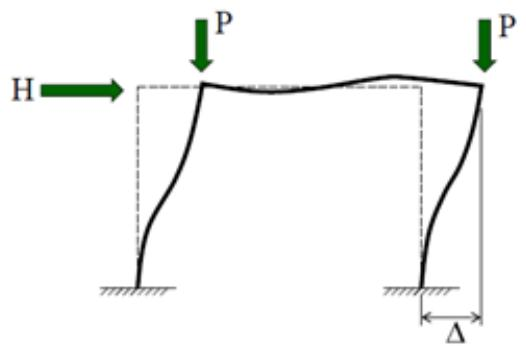

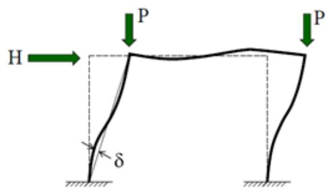  
Figure A.6—P-Δ Effects versus P-δ Effects

A.8.6.3 Guidance for Stability Design of Offshore Platforms

The title of AISC 360-10 is Specification for Structural Steel Buildings, and its stability design requirements are written with such buildings in mind. These types of buildings are typically built in-place and designed for in-service gravity and lateral actions.

As previously noted, offshore structures are typically sized for pre-service conditions such as load-out, transport, and installation/lift, as well as for in-service gravity and lateral actions, which may be several times greater than a typical onshore building will experience. Consequently, compression members in offshore structures are typically quite robust, and overall stability is almost never a practical limit state in the design of such structures. The following guidance is written with this situation in mind.

a) If items a) and b) in the stability analysis procedure described in 8.6 are satisfied, then second-order effects will be minimal and detailed assessment of second-order effects is not required. The analysis may be performed using traditional first-order techniques with effective length factors, $K ,$ not less than stated in Table A.12.

Table A.12—Effective Length Factors   

| Situation | Effective Length Factor, K |
| --- | --- |
| Superstructure legs |  |
| Braced | 1.0 |
| Portal frame (unbraced) | a, b |
| Deck truss chord members | 1.0 |
| Deck truss web members |  |
| In-plane action | 0.8 |
| Out-of-plane action | 1.0 |
| Jacket legs, piling, and braces | See Table 13.5-1 in API 2A-LRFD, Second Edition. |
| a When the effective length method is used: a) If the greatest ratio Δ2/Δ1 does not exceed 1.1, K may be taken as 1.0. b) If the greatest ratio Δ2/Δ1 exceeds 1.1, K > 1 and should be determined, as appropriate, using: 1) Case c, e, or f in Table C-A-7.1 in the commentary to Appendix 7.2 in AISC 360-10, 2) P-Delta analysis of the elastic structural model, or 3) alignment charts or other rigorous method also described in the commentary to Appendix 7.2 in AISC 360-10. b If the first-order analysis method is used, K may be taken as 1.0, but the limitation that P/Py not exceed 0.5 for columns in unbraced bays shall be followed. | a When the effective length method is used: a) If the greatest ratio Δ2/Δ1 does not exceed 1.1, K may be taken as 1.0. b) If the greatest ratio Δ2/Δ1 exceeds 1.1, K > 1 and should be determined, as appropriate, using: 1) Case c, e, or f in Table C-A-7.1 in the commentary to Appendix 7.2 in AISC 360-10, 2) P-Delta analysis of the elastic structural model, or 3) alignment charts or other rigorous method also described in the commentary to Appendix 7.2 in AISC 360-10. b If the first-order analysis method is used, K may be taken as 1.0, but the limitation that P/Py not exceed 0.5 for columns in unbraced bays shall be followed. |

b) If items a) and b) in the stability analysis procedure described in 8.6 are not satisfied, then a more detailed assessment of second-order effects is required to satisfy AISC 360-10, as described in item c) of the procedure summarized in 8.6. For either of the effective length or first-order methods, this assessment need not be performed for all combinations of actions, but only for those expected to cause the greatest ratio $\varDelta_{ 2 } / \varDelta_{ 1 } ;$ these will be combinations with large gravity actions and small lateral actions usually found in operating conditions.   
c) Once item c), parts 1–6, of the procedure given in 8.6 is triggered, then AISC 360-10 directs that the assessment of second-order effects be performed using one of the three methods shown therein, as summarized below. The direct analysis method can be used in any case.

1) If $A_{ 2 } / A_{ 1 } \mathrm{ i } \mathsf{ s } \leq 1 . 1$ , then either the effective length or first-order method can be implemented to satisfy the stability provisions of AISC 360-10. In this case, K can be set equal to 1.0 for all compression members.

2) A P-Delta analysis may be the most useful approach for assessing the second-order drift （$\varDelta_{ 2 } )$ and for executing a second-order analysis because this type of analysis has been automated in commercially available computer programs used by the industry.

3) If $\varDelta_{ 2 } / \varDelta_{ 1 }$ is > 1.1 and ≤ 1.5, then again either the effective length or first-order method can be implemented. However, K shall be more rigorously assessed in the effective length method, and $P / P_{ \ y }$ shall be $\le 0 . 5$ in any unbraced bays when using the first-order method. Furthermore, Appendix 7.3.2 of AISC 360-10 states that additional nonsway amplification of beam-column moments be considered in the first-order method by applying the so-called B1 amplifier described in Appendix 8 of AISC 360-10. Thus, this method involves additional computational effort compared to previous editions of API 2A.

4) For $_{ \varOmega } / { { \varDelta }_{ 1 } } > 1 . 5$ , AISC lists the direct analysis method as the only analysis option. The direct analysis method is applied across all action combinations. In general, AISC recommends use of the direct analysis method because they consider it to be the most rational and most programmable approach to account for second-order effects. Several commercial structural analysis programs now incorporate the direct analysis method, although without accounting for P-δ effects. See Reference [67] for a discussion of such programs.

NOTE Additional valuable guidance on stability design procedures can be found in AISC Design Guide 28, Stability Design of Steel Buildings [66].

Figures A.7 through A.11 below illustrate examples of a braced frame versus different variations of portal/moment frames, as referenced from 8.6.

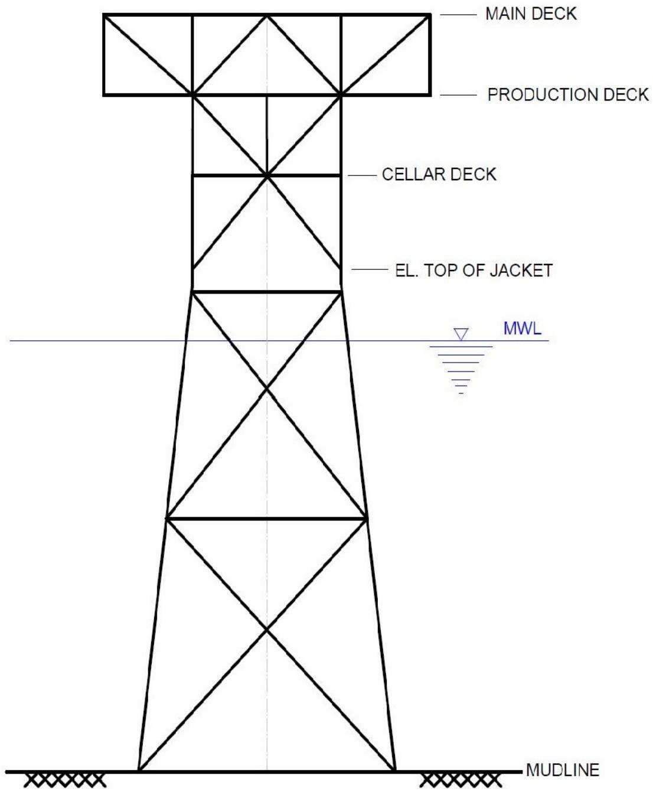  
Figure A.7—Braced Topsides

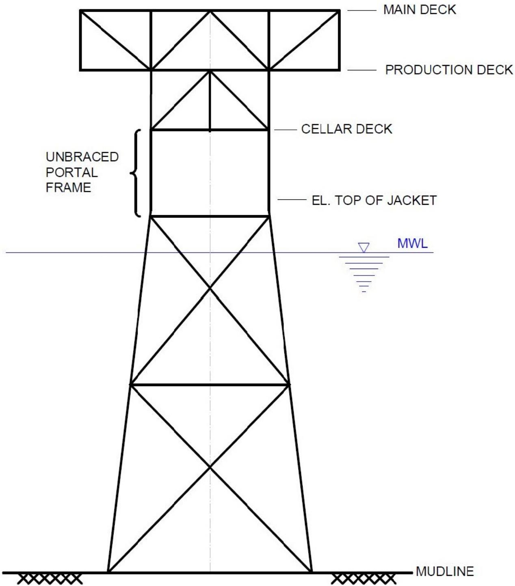  
Figure A.8—Unbraced Portal Frame between Lowest Deck and Jacket

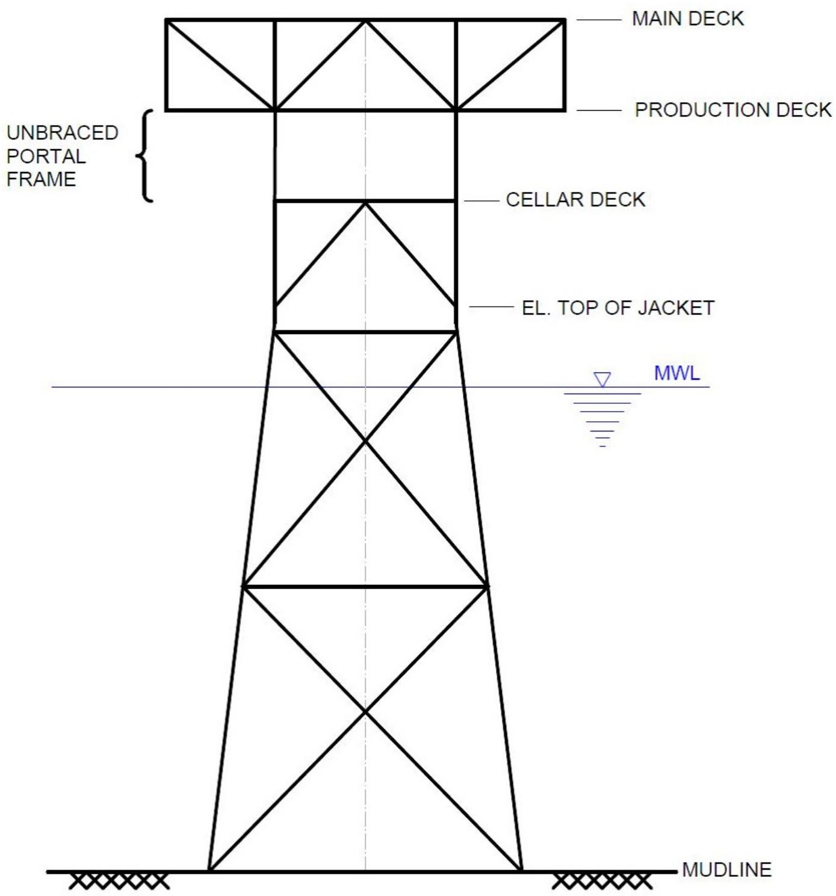  
Figure A.9—Unbraced Portal Frame at Intermediate Deck Level

Figure A.10—Unbraced Portal Frame between Main Legs   
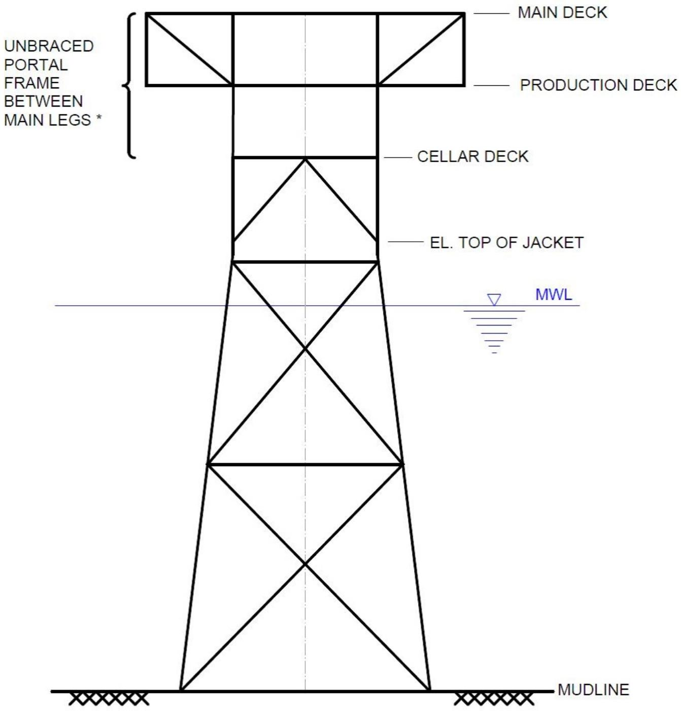  
* Bracing in cantilevers may not be sufficient to adequately minimize primary frame sidesway and second-order effects.

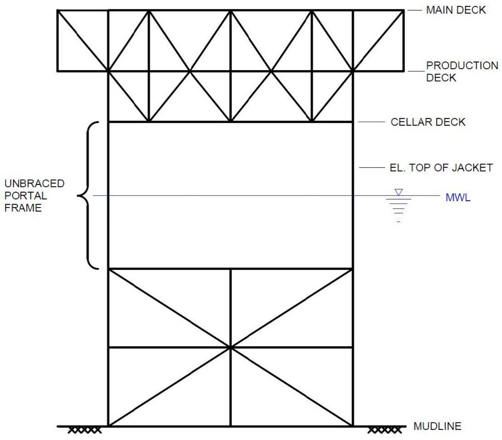  
Figure A.11—Unbraced Portal Frame Associated with Floatover Deck Configuration

## A.9 Structural Systems

A.9.4 Flare Towers, Booms, Vents, and Similar Structures

Wind-sensitive structures can be evaluated by the methods in, or those similar to, BS EN 1993-3-1 [41] and Reference [42]. A 3 s gust should be adopted for the design of individual structural components and equipment secured to components on open decks.

Guidance on vortex-induced vibrations can be found in Reference [43].

For individual tubular structural components in a wind-sensitive structure, the following guidelines may be used to avoid the necessity for a rigorous analysis:

a) member length-to-diameter ratios should not exceed 40;   
b) member diameter-to-thickness ratios should be less than 33, i.e.:

$$D / \delta <   33 \tag{A.5}$$

where

δ is the member thickness;

c) stress concentration factors at the end connections of members should not be greater than 5.

Regarding load combinations, the likelihood of a combination of an extreme snow/ice accumulation on the structure with the wind is such that a 10-year return wind is deemed appropriate for the combined event. This philosophy is similar to combining a 10-year current with the 100-year wind and wave.

A.9.5 Helicopter Landing Facilities (Helidecks)

As noted in 9.5, see API 2L [70] for additional guidance.

A.9.6 Crane Support Structure

A.9.6.1 General

When designing crane support pedestals, there are three typical types of connection interface:

— where the crane incorporates a slewing ring;   
— where the crane revolves around a king post, the base of which is bolted to the pedestal flange;   
— where the kingpost is welded directly to the pedestal.

In all of these cases, the pedestal flange should be machined to a flatness and surface finish compatible with the type of slewing ring or king post base being used. Suitable tolerances should be obtained from the crane manufacturer along with the values of stiffness necessary to support the crane slewing ring or king post flange. The information given by the manufacturer should enable a suitable diameter of pedestal and thickness of top flange to be calculated and thus enable an outer diameter for the pedestal tube to be determined after making clearance allowances for the mounting bolt tensioner or torque spanner to be used, if and as applicable.

Crane pedestals that have an unsupported height above the top deck attachment area of more than ten times the outside diameter of the tube should be checked for their dynamic characteristics, and the associated dynamic effects should be included in the fatigue life calculations for the pedestal structure.

The pedestal top flange should be hot-rolled and drop-forged, then machined to profile. The shaped flange should be attached to the pedestal wall by means of a full-penetration butt weld. The flange should be perpendicular to, and its axis concentric with, the pedestal axis. The flange material should be compatible with that of the pedestal and be provided with documentation from the flange supplier.

After fabrication of the pedestal, the top flange surface should be machined to the tolerances and values specified by the crane supplier. Clearance holes for bolts should be drilled from a template supplied by the crane manufacturer. No further welding should be carried out around the flange area after machining, as heavy welding work can jeopardize the integrity and flatness of the machined surface. When machining the top flanges of pedestals, the machined face of the flange should be kept as near as possible to 90° to the central axis of the pedestal tube. Values of angular tolerance should be determined for the diameter of pedestal being used and for the type of machining being utilized.

As noted in API 2C, for tall kingposts and pedestals, additional stiffness may be required to prevent excessive motion of the crane and operator. Excessive motion may cause the operator discomfort even if the strength requirements are satisfied. Some manufacturers use a bending deflection limit of 50 mm (2 in.) to ensure that such excessive motion is precluded. It is recommended the user consult the crane manufacturer in this regard. In addition, the maximum rotation with respect to strong-axis bending at the top of the pedestal relative to the primary support framing at the base, should not exceed 1° for the most onerous static load case. Where this criterion cannot be met, the dynamic response should be checked. Usually the deflection limit to minimize excessive motion is more restrictive.

A.9.6.5 Fatigue Design

The simplified deterministic fatigue approach expressed in this clause may be unconservative for large boom cranes. Fatigue cracks have been observed in pedestal butt welds in some large boom cranes even though deterministic fatigue criteria equivalent to that presented in 9.6.5 were checked. For the fatigue calculation, large boom cranes, i.e. those where the moment due to boom weight is greater than 30 % of the design moment, should have the bending stress due to boom weight added to the associated stress produced by 66 % of SWLH.

The stated simplified fatigue criteria are based on finding that combination of lift load (with associated stress range) and number of cycles which will result in approximately the same damage as produced by the historical benchmark criteria of 1.33 times the rated crane load over 25,000 cycles previously used by API for many years. The exercise to match damages started with the fatigue criteria specified in API 2C, i.e. 50 % of SWLH over 1,000,000 cycles. Because the new WJ S-N curve in API 2A-WSD is a different two-part curve with different inverse slopes compared to the previous X’ curve that API 2C used to match damages, the ratio of damage levels varies by stress range. Calculations showed that a reasonable match in damage levels was obtained by using the same number of cycles as specified in API 2C while slightly increasing the associated lift load used to generate the stress range in the pedestal from ½ or 50 % of rated load to 2/3 or 66 % of rated load. This is understandable since the new WJ S-N curve allows a larger stress range for the same number of cycles compared to the previous X’ S-N curve.

A.9.7 Derrick Design

See API 4F [36] for further guidance on derrick design. Note that API 4F is in WSD format and will need to be utilized with that in mind. Also note that the reference to API 2INT-MET [83] for wind loading in API 4F has been superseded by API 2MET. Given that, reference is made to API 2A-WSD for design wind speed and wind loading provisions and guidance relevant to derrick design.

Furthermore, the shape coefficients in API 4F are recommended for use in wind force calculations for derrick design since they are more comprehensive and more applicable to derrick design purposes than those provided in API 2A-LRFD.

A.9.12 Fire Protection Systems

Types of PFP commonly in use offshore include those applied directly to the structure to be protected and those attached as prefabricated composite fire walls, or combined fire-and-explosion protection panels, to the topsides

structure. Inspection of structural components covered by PFP for signs of deterioration can have many of the same difficulties as for coated and painted structures.

A.9.14 Difficult-to-inspect Areas

Certain areas of the topsides can be difficult to inspect in service because of their function and location (e.g. flares, drilling derricks, and areas hidden by plant and equipment or PFP). Construction details that are difficult to inspect and maintain in service should be avoided as far as possible. Where this is not possible, materials and configurations requiring little or no inspection and maintenance should be followed. Higher fatigue damage design factors are required in such areas (see 6.7).

The need for coating areas that cannot be inspected can be avoided by airtight welded sealing of such areas.

A.9.15 Drainage

Ponding can occur due to layout, deformation of plating, and other causes. Where oil-fouled waste can be anticipated, the design should allow for contaminated water to be cleaned before discharge into the sea. Reference should be made to appropriate environmental standards.

A.9.16 Actions due to Drilling Operations

Jarring of the drilling derrick and equipment from drilling operations is a foreseeable cause of shock actions that should be addressed during design.

A.9.18 Walkways, Laydown Areas, and Equipment Maintenance

Reference USCG, Code of Federal Regulations, Title 33, Part 143, Subpart B for guidance on numbers and locations of access/egress ways to be included in facility layouts.

## A.10 Materials

A.10.2 Carbon Steel

The range of applications for which steel is selected for use in topsides structures is considerable. Steel interfacing with process plant and pipework can be subjected to very low temperatures during certain operations, in particular system blow-down. Conversely, steel exposed to radiation from flaring during blow-down can be subjected to high temperatures.

Steel structures supporting risers can be subject to substantial impact and fatigue from slugging in the pipework and high levels of uncertainty with regard to the interaction with pipe stresses in lines, which can be orders of magnitude stiffer than the structure.

The above issues should be carefully considered in relation to material selection.

Selection of steel quality and requirements for inspection of welds should be based on a systematic classification of welded joints according to the structural significance and complexity of connections. The main criterion for decision is the significance, with respect to consequences of failure, of the connection. In addition, the stress predictability can influence the selection.

Based on ISO 19902, there are two approaches described in API 2A-LRFD for carbon steel material selection, the MC approach and the Design Class approach. The API practice has traditionally been based on the MC approach and that continues to be shown as the preferred approach in API 2A-LRFD as well as in API 2TOP.

A.10.3 Stainless Steel

Guidance on the structural use of stainless steel is given in Reference [50].

A.10.4 Aluminum Alloys

Guidance on the structural use of aluminum is given in BS EN 1999-1-1 [51].

A.10.5 Fiber-reinforced Composites

Composites are strong, generally insulating, durable, and corrosion-resistant and can be manufactured to a consistent and reliable standard providing the right materials and processes are used. Although the fibers in carbon-reinforced composites can be electrically conductive, design using such fibers should not rely on either the conductivity of the fibers or the insulation of the composite material.

The majority of composites have lower stiffnesses than metals and this should be taken into account, particularly where composites and metals interface. High- and ultra-high-stiffness fibers are available, and, with careful selection of the composite specification, the stiffness of steels can be matched. This is particularly useful for reinforcing steelwork (see Reference [52]).

Composites are usually brittle materials, and this can affect their robustness and ability to redistribute forces in a controlled manner. Long-term creep can occur and moisture absorption can influence the ultimate tensile strength.

The design of joints and connections requires detailed knowledge of the properties of the composite material.

Carbon fiber composites can theoretically cause galvanic corrosion problems when in direct contact with steel structures, and layers of nonconductive fibers have been used to ensure insulation between carbon fibers and adjacent steel structure.

A.10.6 Timber

Suitable alternate standards for timber design to the specifications described in 10.6 include BS EN 1995-1-1 [53] and BS EN 1995-1-2 [54].

## A.11 Fabrication, Quality Control, Quality Assurance, and Documentation

A.11.1 Assembly

The fabrication of topsides structures requires different skills, facilities, and experience from those needed for their substructures. Fabricators selected for topsides structures should have appropriate experience and skills for the size and complexity of the topsides to be fabricated. Major topsides structures have a high level of multidiscipline interfaces and the early involvement of a fabricator in the planning and design process can yield significant advantages leading to the successful outcome of a project. Key issues to be considered include the following:

— planning for timely delivery and installation of major items of equipment and mitigation of the effects of potential late delivery;   
— engineering joints and connections to suit the most efficient construction method;   
— scheduling to allow for the impact of design information that depends on the procurement cycle for equipment;   
— designing, fabricating, and commissioning onshore the topsides to minimize the requirement for work offshore;   
— scheduling the application of paint and PFP coatings to minimize the impact on equipment installation and commissioning;   
allowing for the potential interference of equipment and pipework with the temporary steel and equipment for moving and transporting the topsides, both during construction and on completion;   
— allowing for the reversal of normal load paths during loadout, transport, and installation and for their impact on walls, piping, and equipment.

ISO 20340 [55] gives performance requirements for offshore painting systems as guidance for coating specifications.

A.11.2 Welding

Weld volumes have a significant impact on the cost of topsides structures and the heat input for oversized welds can increase distortion. Topsides structures can have a large number of small structural components that are sized for convenience or detail rather than stress. Also, a partial penetration rather than full penetration weld may be acceptable in certain circumstances depending on strength and fatigue considerations. Careful evaluation of the minimum acceptable sizes and types of welds can result in significant cost savings with no loss of safety or serviceability.

A.11.3 Fabrication Inspection

The requirements of API 2A-LRFD do not give criteria for all the situations that can occur in a topsides structure. In particular, classifications of components in API 2A-LRFD do not include items of equipment support that can be critical to safety because of the potential for consequent fire or explosion. Designers of topsides structures should ensure that the inspection requirements specified are appropriate to component criticality.

A.11.4 Quality Control, Quality Assurance, and Documentation

Drawings and specifications for topsides structures can cover a wider range and considerably higher levels of detail than those for substructures. The drawings define interfaces with details provided by other engineering disciplines. It is important that the responsibility for engineering interfaces be clearly defined and recorded to avoid the risk of details prepared by one discipline undermining the integrity of the engineering in another.

Issues that should be addressed include the following:

a) welded attachments affecting stress concentrations in primary structure;   
b) penetrations in plates affecting structural assumptions of available support or load path;   
c) penetrations in beam webs undermining bearing or shear strength;   
d) the interface with major pipework affecting the load path and stress level in structure or pipes;   
e) the temporary removal of key components to assist with installation of equipment;   
f) the use of minimum default weld sizes on drawings or in specifications (in the event that a large weld is not correctly defined, the undetected use of the default weld by a fabricator can result in connection failure).

## A.12 Corrosion Control

Guidance for coatings is given in ISO 8501-1 [56], ISO 8503 [57], ISO 12944-5 [58], and Norsok M-CR-501 [59].

## A.13 Loadout, Transportation, and Installation

Many of the difficulties encountered in the movement and installation of topsides structures result from poor planning, poor communication, and late decisions. They also arise from a lack of attention to detail. The following lists identify good practice and areas of detail that should be addressed:

a) good practice:

1) early involvement of key contractors in planning and preliminary engineering;   
2) identification, recording, and updating of technical interfaces and those responsible for them;

3) early agreement on methods and equipment to be used;   
4) early integration of the space required for temporary equipment, topsides structure, and equipment support structures in the design model;

b) common problems:

1) spatial conflict between the topsides equipment and the equipment used for loadout and lift, including:

i) under-deck platforms and piping clashing with loadout trailers;   
ii) external sea fastenings clashing with access platforms and walkways;   
iii) roof-mounted equipment clashing with lifting slings and sling laydown areas;

2) issues of detail, including:

i) loose or poorly sea-fastened equipment or materials in modules causing damage (this can result from inadequate knowledge of the forces likely to be encountered);   
ii) eccentricities between temporary structural components not being considered and consequently failing;   
iii) the effect of incomplete work not being communicated or clearly understood;   
iv) inadequate consideration of load path reversals involved in transient phases.

An example of a possible consequence of load reversal is the buckling of nonstructural walls that experience compressive stresses when trailer loadout is used.

Table 9 of API 2MOP, First Edition, lists coefficients of friction for various surfaces. Note that pulling forces approaching 25 % of the topsides weight have been encountered in actual skidded load-outs of heavy topsides where polytetrafluoroethylene (PTFE) is not used but where waxed wood and greased steel skid plates are utilized. As such, contingency equipment and procedures should be considered to account for the possibility of high friction coefficients when PTFE is not used.

Light structures can be lifted by a crane vessel or by the larger onshore cranes directly onto a transport barge or onto the deck of the crane vessel. In practice, use of crane vessels is often constrained by their draft.

Both API 2MOP and API 2A-LRFD contain useful requirements and guidance concerning loadout, transportation, and installation applicable to topsides structures. Since, at this time, no single standard captures all relevant requirements and guidance, Clause 13 references both standards. It is recommended that the designer combine the most relevant aspects of these standards to develop the design basis for the subject topsides, as agreed with the owner and participating contractors.

## A.14 In-service Inspection and Structural Integrity Management

A.14.2 Particular Considerations Applying to Topsides Structures

## A.14.2.2 Access Routes, Floors, and Gratings

Good practice is to define main and secondary escape routes and to subject these areas to detailed inspection. This is normally done in close cooperation with the safety discipline. Main and secondary escape routes are often defined on specific drawings. These areas should be closely inspected to avoid impediments to evacuation of the structure.

## A.14.2.5 Accidental Events

The structural integrity management plan for the topsides structure should consider emergency arrangements following an accidental event. These should include arrangements for the inspection of the damage to assess and evaluate effects on the integrity of the topsides structure, to recommend necessary emergency evacuation, and to monitor repairs.

A.14.3 Topsides Structure Default Inspection Scopes

## A.14.3.2 Baseline Inspection

A walk-down is a systematic on-site inspection of the topsides structure and equipment that can complement the baseline structural inspection if not undertaken before installation (see A.6.9).

## A.14.3.3 Periodic Inspection

ISO 19901-3 requires the following minimum inspection scope for topsides in addition to that provided in API 2TOP, as stated below in the form of a direct quote from ISO 19901-3:

a) “In Level II inspection, the minimum scope shall consist of a:

1) GVI without removal of paint and coatings of all parts of the topsides structure including equipment support structures (as described above for a Level I inspection),   
2) CVI of all structural components identified as safety-critical, and   
3) detailed nondestructive examination of a selection of safety-critical structural components and comprising not less than 10 % of all safety-critical structural components.

If damage is detected, 100 % nondestructive testing of the suspect area shall be used where visual inspection alone cannot fully determine the extent of the damage.

b) In Level III inspection, the minimum scope shall consist of a:

1) GVI without removal of paint and coatings of all parts of the topsides structure including equipment support structures (as described above for Level I and Level II inspections),   
2) CVI of all structural components identified as safety-critical, and   
3) detailed nondestructive examination of all safety-critical structural components.

c) There is no requirement for a Level IV inspection of topsides structures.”

## A.14.3.4 Special Inspections

Special inspections are conducted to monitor repairs and other remedial work, any growth in the extent of known damage and defects, and other known or suspected areas of vulnerability. Special inspections can also be needed for topsides structure reuse (see Clause 16). Key features of special inspections include definition of the goals and objectives, selection of appropriate tools and techniques, scopes of work, and inspection intervals.

## A.14.3.5 Unscheduled Inspections

No guidance is offered.

## A.15 Assessment of Existing Topsides Structures

The API 2TOP adoption of ISO 19901-3 has the normative references outlined in Table A.13.

Table A.13—Normative References for Assessment of Existing Topsides Structures   

| Previous ISO 19901-3 Reference (provided for information only) | API 2TOP Normative Reference |
| --- | --- |
| ISO 19902 | API 2A-LRFD |
| ISO 19902 | API 2A-WSD |

## A.16 Reuse of Topsides Structure

The API 2TOP adoption of ISO 19901-3 replaces the normative references as outlined in Table A.14.

Table A.14—Normative References for Reuse of Topsides Structures   

| Previous ISO 19901-3 Reference (provided for information only) | API 2TOP Normative Reference |
| --- | --- |
| ISO 19902 | API 2A-LRFD |
| ISO 19902 | API 2A-WSD |

The following describes the minimum recommended inspection extent for a topsides, but this should be modified in the light of the structural assessment for the reuse condition and the previous in-service inspection history.

Ultrasonic testing (UT) or MPI should be carried out for:

a) 10 % of each truss-bracing structural component;   
b) 10 % of each truss chord structural component;   
c) 10 % of each plate girder structural component;   
d) 25 % of each connection to a deck leg;   
e) 100 % of crane pedestal connections;   
f) 100 % of cantilever deck connections;   
g) 100 % of survival/safety equipment connections.

Unless the functional requirements of reuse are identical to those of the original design, engineering for the reuse of a topsides will be a multidiscipline exercise to assess the practicability of re-configuring the equipment within the space and strength of the existing topsides structures.

Unless the records of the existing design and any modifications are of a high standard, the re-engineering and modification of existing topsides can be more difficult and potentially more expensive than new construction. Extensive survey work can be necessary to identify the nature and condition of existing topsides structures. It can be necessary to use advanced forms of structural analysis and detailed reliability analysis to prove adequate strength, durability, and safety for a reused topsides structure.

Annex B (informative)

Example Calculation of Building Code Correspondence Factor

## B.1 General

This annex contains an example of the derivation of the building code correspondence factor for a commonly used code. Care should be taken to ensure that up-to-date versions of the standards are used for both the derivation of the correspondence factor and the member and joint checks. Furthermore, reference is made to A.8.1 for commentary on the derivation of the building code correspondence factor, $K_{ \mathsf{ c } } ,$ related to values of Cm and/or of the factored axial compression that are larger than those used in the example presented herein.

## B.2 Basic Data

The data in Table B.1 are used for the example presented in this annex.

Table B.1—Basic Data   

| Data | Data | Symbol | Value |
| --- | --- | --- | --- |
| Assumptions (circular tube) | Outside diameter | D | 500 mm |
| Assumptions (circular tube) | Thickness | δ | 20 mm |
| Assumptions (circular tube) | Length | L | 15 m |
| Assumptions (circular tube) | Yield strength | fy | 355 N/mm² |
| Assumptions (circular tube) | Effective length factor | K | 1.0 |
| Assumptions (circular tube) | Young's modulus | E | 205,000 N/mm² |
| Derived properties (circular tube) | Inner diameter | d | 460 mm |
| Derived properties (circular tube) | D/δ | — | 25.0 |
| Derived properties (circular tube) | Cross-sectional area | A | 30,159 mm² |
| Derived properties (circular tube) | 2nd moment of area | I | 870 × 10^6 mm^4 |
| Derived properties (circular tube) | Elastic section modulus | Ze | 3.48 × 10^6 mm^3 |
| Derived properties (circular tube) | Radius of gyration | r | 169.8 mm |
| Tension case | Factored axial tension | ST | 9500 kN |
| Compression case | Factored axial compression | SC | 5000 kN |
| Bending case | Factored bending moment | SM | 1400 kNm |
| Combined case | Factored axial compression | SC,bc | 2500 kN |
| Combined case | Factored bending moment | SM,bc | 700 kNm |
| Combined case | Bending amplification reduction factor | Cm = Cm,y = Cm,z | 0.6 (uniform bending) |

## B.3 Design and Utilizations to API 2A-LRFD

B.3.1 Tension Case

Table B.2—Design and Utilizations to API 2A-LRFD—Tension Case   

| Parameter | Symbol | Method of Calculation | Value |
| --- | --- | --- | --- |
| Axial tensile stress | σt | ST/A | 315 N/mm2 |
| Partial resistance factor for axial tensile strength | γR,t | From API 2A-LRFD | 1.05 |
| Representative axial tensile strength | ft | fy | 355 N/mm2 |
| Utilization | Um,t | σt/ft/γR,t | 0.932 |

B.3.2 Compression Case

Table B.3—Design and Utilizations to API 2A-LRFD—Compression Case   

| Parameter | Symbol | Method of Calculation | Value |
| --- | --- | --- | --- |
| Elastic critical buckling coefficient | Cx | From API 2A-LRFD | 0.30 |
| Representative elastic local buckling strength | fxe | 2×Cx×E×δ/D | 4920 N/mm2 |
| Ratio | fy/fxe | — | 0.072 |
| Representative local buckling strength | fyc | fy | 355 N/mm2 |
| Column slenderness parameter | λ | K×L/π×r√(fyc/E) | 1.170 |
| Representative axial compressive strength | fc | (1-0.278λ2)fyc | 220 N/mm2 |
| Partial resistance factor for axial compressive strength | γR,c | From API 2A-LRFD | 1.18 |
| Axial compressive stress | σc | SC/A | 165.8 N/mm2 |
| Utilization | Um,c | σc/fc/γR,c | 0.890 |

B.3.3 Bending Case

Table B.4—Design and Utilizations to API 2A-LRFD—Bending Case   

| Parameter | Symbol | Method of Calculation | Value |
| --- | --- | --- | --- |
| Ratio | — | $\frac{f_{y} \times D}{E \times \delta}$ | 0.0433 |
| Hence use API 2A-LRFD, Second Edition, Equation (13.2-13) | Hence use API 2A-LRFD, Second Edition, Equation (13.2-13) | Hence use API 2A-LRFD, Second Edition, Equation (13.2-13) | Hence use API 2A-LRFD, Second Edition, Equation (13.2-13) |
| Plastic section modulus | $Z_{p}$ | $\frac{1}{6}\left[\begin{array}{l}D^{3}-\left(D-2\delta\right)^{3}\end{array}\right]$ | 4.611 × 10^6 mm^3 |
| Representative bending strength | $f_{b}$ | $\left(\frac{Z_{p}}{Z_{e}}\right)f_{y}$ | 470 N/mm^2 |
| Elastic yield moment | $M_{y}$ | $Z_{e} \times f_{y}$ | 1235 kNm |
| Bending stress | $\sigma_{b}$ | $\frac{S_{M}}{Z_{e}}$ | 402 N/mm^2 |
| Partial resistance factor for bending strength | $\gamma_{R,b}$ | From API 2A-LRFD | 1.05 |
| Utilization | $U_{m,b}$ | $\frac{\sigma_{b}}{f_{b} / \gamma_{R,b}}$ | 0.898 |

B.3.4 Combined Compression and Bending

Table B.5—Design and Utilizations to API 2A-LRFD—Combined Compression and Bending   

| Parameter | Symbol | Method of Calculation | Value |
| --- | --- | --- | --- |
| Euler buckling strength | fe,y = fe,z | π2 × E/(K × L/r)2 | 259.3 N/mm2 |
| Axial compressive stress | σc | SC,bc/A | 82.9 N/mm2 |
| Bending stress | σb,y and σb,z | SM,bc/Ze | σb,y = 201.0 N/mm2σb,z = 0 |
| Utilization 1 | Um,bc1 | γR,c × σc/fc + γR,b/fb[(Cm,y × σb,y)/1-σc/fe,y]2 + (Cm,z × σb,z)/1-σc/fe,z)2[0.5] | 0.841 |
| Utilization 2 | Um,bc2 | γR,c × σc/fyc + γR,b√σb,y2 + σb,z2/fb | 0.725 |
| Maximum utilization | Um,bc | max (Um,bc1, Um,bc2) | 0.841 |

## B.4 Design and Utilizations to AISC 360-10

AISC 360-05 [1] is referenced throughout this annex, as shown in ISO19901-3 from which a modified adoption has been extracted for API 2TOP. Since the resistance factors given in AISC 360-05 [1] are the same as those given in the updated AISC 360-10, then all of the derivations, values, and conclusions given in this annex remain valid for AISC 360-10.

B.4.1 Tension Case

Table B.6—Design and Utilizations to AISC 360-05—Tension Case   

| Parametera | Symbola | Method of Calculation | Value |
| --- | --- | --- | --- |
| Axial tensile strength | Pn | fy×A | 10,706 kN |
| Resistance factor for tension | φt | From AISC 360-05 | 0.90 |
| Design tensile strength | — | φt×Pn | 9636 kN |
| Utilization | Um,t | ST/φt×Pn | 0.986 |
| aISO 19902 terminology and symbols are used in this table, where possible; Pn and φt are from AISC 360-05. | aISO 19902 terminology and symbols are used in this table, where possible; Pn and φt are from AISC 360-05. | aISO 19902 terminology and symbols are used in this table, where possible; Pn and φt are from AISC 360-05. | aISO 19902 terminology and symbols are used in this table, where possible; Pn and φt are from AISC 360-05. |

B.4.2 Compression Case

Table B.7—Design and Utilizations to AISC 360-05—Compression Case   

| Parametera | Symbola | Method of Calculation | Value |
| --- | --- | --- | --- |
| Euler buckling strength | fe | π2×E/(K×L/r)2 | 259.3 N/mm2 |
| Slenderness ratio | — | K×L/r | 88.3 |
| Ratio (from ANSI/AISC 360-05) | — | 4.71√(E/fy) | 113.2 |
| (K×L/r≤4.71√(E/fy) so critical stress [from AISC 360-05, Equation (E3-2)] | Fcr | fy/0.658fe×fy | 200.1 N/mm2 |
| Compressive strength | Pn | Fcr×A | 6038 kN |
| Resistance factor for compression | φc | From AISC 360-05 | 0.90 |
| Design compressive strength | — | φc×Pn | 5434 kN |
| Utilization | Um,c | Sc/φc×Pn | 0.920 |
| a ISO 19902 terminology and symbols are used in this table, where possible; Fcr, Pn, and φc are from AISC 360-05. | a ISO 19902 terminology and symbols are used in this table, where possible; Fcr, Pn, and φc are from AISC 360-05. | a ISO 19902 terminology and symbols are used in this table, where possible; Fcr, Pn, and φc are from AISC 360-05. | a ISO 19902 terminology and symbols are used in this table, where possible; Fcr, Pn, and φc are from AISC 360-05. |

B.4.3 Bending Case

Table B.8—Design and Utilizations to AISC 360-05—Bending Case   

| Parametera | Symbola | Method of Calculation | Value |
| --- | --- | --- | --- |
| Ratio (from AISC 360-05) | — | 0.45 × E/fy | 259.9 |
| Hence AISC 360-05, Section F.8, is applicable | Hence AISC 360-05, Section F.8, is applicable | Hence AISC 360-05, Section F.8, is applicable | Hence AISC 360-05, Section F.8, is applicable |
| Plastic section modulus | Z | 1/6[D3-(D-2δ)3] | 4.611 × 10^6 mm3 |
| Nominal flexural strength for yielding | Mn = Mp | fy × Z | 1637 kNm |
| Check for compactness | D/δ | — | 25 |
| Limit for compact section(from AISC 360-05, Table B4-1) | — | 0.07 × E/fy | 40.4 |
| Section qualifies as compact, so local buckling inapplicable | Section qualifies as compact, so local buckling inapplicable | Section qualifies as compact, so local buckling inapplicable | Section qualifies as compact, so local buckling inapplicable |
| Resistance factor for flexure | φb | From AISC 360-05 | 0.90 |
| Design bending strength | — | φb × Mn | 1473 kNm |
| Utilization | Um,b | SM/φb × Mn | 0.950 |
| aISO 19902 terminology and symbols are used in this table, where possible; Mn and φb are from AISC 360-05. | aISO 19902 terminology and symbols are used in this table, where possible; Mn and φb are from AISC 360-05. | aISO 19902 terminology and symbols are used in this table, where possible; Mn and φb are from AISC 360-05. | aISO 19902 terminology and symbols are used in this table, where possible; Mn and φb are from AISC 360-05. |

B.4.4 Combined Compression and Bending

Table B.9—Design and Utilizations to AISC 360-05—Combined Compression and Bending   

| Parametera | Symbola | Method of Calculation | Value |
| --- | --- | --- | --- |
| Required axial compressive strength | Pr | SC,bc | 2500 kN |
| Available axial compressive strength | Pc | φc×Pn | 5434 kN |
| Required flexural strength | Mrxand Mry | SM,bc | Mrx=700 kNm Mry=0 |
| Available flexural strength | Mcxand Mcy | φb×Mn | 1473 kNm |
| Ratio | — | Pr/Pc=Required axial compressive strength/Available axial compressive strength | 0.460 |
| Hence use AISC 360-05, Equation (H1-1a) | Hence use AISC 360-05, Equation (H1-1a) | Hence use AISC 360-05, Equation (H1-1a) | Hence use AISC 360-05, Equation (H1-1a) |
| Utilization | Um,bc | Pr/Pc+8/9(Mrx/Mcx+Mry/Mcy) | 0.883 |
| aISO 19902 terminology and symbols are used in this table, where possible; Pc, Pn, Pr, Mn, Mcx, Mcy, Mrx, Mry, φb, and φc are from AISC 360-05. | aISO 19902 terminology and symbols are used in this table, where possible; Pc, Pn, Pr, Mn, Mcx, Mcy, Mrx, Mry, φb, and φc are from AISC 360-05. | aISO 19902 terminology and symbols are used in this table, where possible; Pc, Pn, Pr, Mn, Mcx, Mcy, Mrx, Mry, φb, and φc are from AISC 360-05. | aISO 19902 terminology and symbols are used in this table, where possible; Pc, Pn, Pr, Mn, Mcx, Mcy, Mrx, Mry, φb, and φc are from AISC 360-05. |

B.4.5 Derivation of Building Code Correspondence Factor

Table B.10—Derivation of Building Code Correspondence Factor   

| Check | Utilization from API 2A-LRFD U2A-LRFD | Utilization from AISC 360-05 U360-05 | U360-05 U2A-LRFD |
| --- | --- | --- | --- |
| Tension | 0.932 | 0.986 | 1.058 |
| Compression | 0.890 | 0.920 | 1.034 |
| Bending | 0.898 | 0.950 | 1.058 |
| Compression and bending | 0.841 | 0.883 | 1.050 |
| Minimum ratio | Minimum ratio | Minimum ratio | 1.034 |

Hence, the building code correspondence factor, $K_{ \mathsf{ c } } ,$ for AISC 360-05 is 1.034.

The above correspondence factor, while based on cylindrical tubular sections, is applicable to noncylindrical sections (including design checks not explicitly covered, e.g. web shear checks). As can be seen from the range of utilization ratios between the two standards in Table B.10 above, there is scope for more sophisticated analysis for different cases. Any results should be shared with other users of these standards.

Annex C (informative)

Regional Information

The values in Table C.1 may be used for the building code correspondence factor, $K_{ \mathsf{ c } } ,$ for certain national or regional building standards.

Table C.1—Value of Building Code Correspondence Factor   

| Building Standard | Building Code Correspondence Factor Kc |
| --- | --- |
| AISC 360-05 | 1.034 |

Table C.1 is valid for AISC 360-10 as well as for AISC 360-05, as described in B.4. The correspondence factor given in Table C.1 is dependent upon the input parameters in Table B.1, and therefore the designer should only use such a value of correspondence factor if it is representative of the specific design situation being considered.

Bibliography

[1] AISC 360-05, Specification for Structural Steel Buildings   
[2] CSA S16-09 5, Design of Steel Structures   
[3] ISO 6897, Guidelines for the evaluation of the response of occupants of fixed structures, especially buildings and off-shore structures, to low-frequency horizontal motion (0.063 to 1 Hz)   
[4] BS EN 1993-1-1:2005 6, Eurocode 3: Design of steel structures — Part 1-1: General rules and rules for buildings   
[5] ISO 19901-5, Petroleum and natural gas industries — Specific requirements for offshore structures — Part 5: Weight control during engineering and construction   
[6] Rudge, D. et al., Design of Fatigue Resistant Structural Members Excited by Wind, Proc. 25th Offshore Technology Conf., Paper OTC 6902 (with corrections), Houston, May 1992   
[7] DNV-RP-C205 7, Environmental Conditions and Environmental Loads   
[8] ASCE/SEI 7-05 8, Minimum Design Loads for Buildings and Other Structures   
[9] BS EN 1998-1:2004, Eurocode 8: Design of structures for earthquake resistance — Part 1: General rules, seismic actions and rules for buildings   
[10] ISO 13626, Petroleum and natural gas industries — Drilling and production equipment — Drilling and wellservicing structures   
[11] Bea, R.G. and Bowen, C., Simplified Earthquake Spectra for Equipment on Offshore Platforms, Proc. Int. Workshop on Wind and Earthquake Engineering, University of California, Berkeley, 1995   
[12] Biggs, J.M. and Roesett, J.M., Seismic Analysis of Equipment Mounted on a Massive Structure, Seismic Design of Nuclear Power Plants, J.R. Hansen (Ed.), MIT Press, 1970   
[13] Fireandblast.com Ltd, Fire and Explosion Guidance, Oil and Gas UK, London, 2007   
[14] Fire and Blast Information Group 9, Explosion Mitigation Systems, FABIG Technical Note 2, The Steel Construction Institute, Ascot, 1994   
[15] Fire and Blast Information Group, Explosion Resistant Design of Offshore Structures, FABIG Technical Note 4, The Steel Construction Institute, Ascot, 1996   
[16] Fire and Blast Information Group, Design Guide for Stainless Steel Blast Walls, FABIG Technical Note 5, The Steel Construction Institute, Ascot, 1999   
[17] Fire and Blast Information Group, Design Guide for Steel at Elevated Temperatures and High Strain Rates, FABIG Technical Note 6, The Steel Construction Institute, Ascot, 2001

[18] Fire and Blast Information Group, Protection of Piping Systems Subject to Fires and Explosions, FABIG Technical Note 8, The Steel Construction Institute, Ascot, 2005   
[19] Bjerketvedt, D. et al., Gas Explosion Handbook, GexCon AS, http://www.gexcon.com   
[20] Bakke, J.R. and Skogrand, P.E., The Effect of Relief Panels on Gas Explosion Overpressure, GexCon AS, 2004   
[21] Joint Industry Project, Blast and Fire Engineering for Topsides Structures Phase 2, The Steel Construction Institute, Ascot, 1997   
[22] Sand, I.O., Received Loading Test Cases, Proc. Explosion Model Evaluation Conference, Fire and Blast Information Group, London and Aberdeen, 1998   
[23] Natabelle Technology Ltd 10, Explosion Pressures Evaluation in Early Project Phase, Offshore Technology Report OTO 1999-048, Health and Safety Executive, London, 1999   
[24] Berg, J.T. et al., A CFD Layout Sensitivity Study to Identify Optimum Safe Design of a FPSO, Proc. 33rd Offshore Technology Conf., OTC 12159, Houston, May 2000   
[25] Natabelle Technology Ltd, Explosion Loading on Topsides Equipment — Part 1: Treatment of Explosion Loads, Analysis and Design, Offshore Technology Report OTO 1999-046, Health and Safety Executive, London, 1999   
[26] ISO 3506 (all parts), Mechanical properties of corrosion-resistant stainless steel fasteners   
[27] Biggs, J.M., An Introduction to Structural Dynamics, ISBN 0070052557, McGraw Hill   
[28] Christian Michelsen Research AS 11, Explosion Loading on Topsides Equipment — Part 2: Determination of Explosion Loading on Offshore Equipment Using FLACS, Offshore Technology Report OTO 1999-047, Health and Safety Executive, London, 1999   
[29] NORSOK N-004 12, Design of Steel Structures   
[30] Kato, B., Rotation Capacity of Steel Members Subject to Local Buckling, Proc. 9th World Conference on Earthquake Engineering, Vol. 4, Japan, 1989   
[31] Gilbert, F. et al., Explosive Shocks in Air, Springer Verlag, Berlin, New York, Tokyo, 1985   
[32] BS EN 1993-1-2:2005, Eurocode 3: Design of steel structures — Part 1-2: General rules — Structural fire design   
[33] ISO 22899-1, Determination of the resistance to jet fires of passive fire protection materials — Part 1: General requirements   
[34] ISO 834-1, Fire-resistance tests — Elements of building construction — Part 1: General requirements   
[35] NS 3472 13, Steel Structures — Design Rules

[36] API Specification 4F, Specification for Drilling and Well Servicing Structures   
[37] Det Norske Veritas, Fatigue Strength Analysis for Mobile Offshore Units, Classification Note No. 30.2., Oslo, 1984   
[38] AWS D1.1 14, Structural Welding Code—Steel   
[39] API Bulletin 2V, Design of Flat Plate Structures   
[40] Cheal, B.D., Design Guidance Notes for Friction Grip Bolted Connections, CIRIA Technical Note 98, Construction Industry Research and Information Association, London, 1980   
[41] BS EN 1993-3-1:2006, Eurocode 3: Design of steel structures — Part 3-1: Towers, masts and chimneys — Towers and masts   
[42] Brown and Root Ltd, A Criterion for Assessing Wind Induced Cross-Flow Vortex Vibrations in Wind Sensitive Structures, Offshore Technology Report OTH 92 379, Health and Safety Executive, London, 1992   
[43] Carr, M., et al., Fatigue Life Evaluation for Inclined Flare Booms, Proc. OMAE, The Hague, 1985   
[44] International Civil Aviation Organization 15, Annex 14 — Aerodromes. Volume II — Heliports, AN14-2, ICAO, Montreal, 2009   
[45] CAP 437, 2008 16, Standards for Offshore Helicopter Landing Areas   
[46] BS EN 13852-1:2004, Cranes — Offshore cranes — General-purpose offshore cranes   
[47] Det Norske Veritas, Rules for Certification of Lifting Appliances, Oslo, 1989   
[48] BS EN 1993-1-9:2005, Eurocode 3: Design of steel structures — Part 1-9: Fatigue   
[49] API Specification 4E, Drilling and Well Servicing Structures   
[50] Steel Construction Institute 17, Design Manual for Structural Stainless Steel, 2006   
[51] BS EN 1999-1-1: 2007, Eurocode 9: Design of aluminium structures — Part 1-1: General structural rules   
[52] Galbraith D.N. and Barnes F., Beryl Bravo — Blast Walls Conversion, Development and Testing of Steel/Carbon Fibre Composite, 95-CPE-02, Proc. ISOPE, The Hague, 1995   
[53] BS EN 1995-1-1:2004, Eurocode 5: Design of timber structures — Part 1-1: General — Common rules and rules for buildings   
[54] BS EN 1995-1-2:2004, Eurocode 5: Design of timber structures — Part 1-2: General — Structural fire design   
[55] ISO 20340, Paints and varnishes — Performance requirements for protective paint systems for offshore and related structures

[56] ISO 8501-1, Preparation of steel substrates before application of paints and related products — Visual assessment of surface cleanliness — Part 1: Rust grades and preparation grades of uncoated steel substrates and of steel substrates after overall removal of previous coatings   
[57] ISO 8503 (all parts), Preparation of steel substrates before application of paints and related products — Surface roughness characteristics of blast-cleaned steel substrates   
[58] ISO 12944-5, Paints and varnishes — Corrosion protection of steel structures by protective paint systems — Part 5: Protective paint systems   
[59] NORSOK M-CR-501, Surface Preparation and Protective Coating   
[60] ISO 2394, General principles on reliability for structures   
[61] ISO 19900:2002, Petroleum and natural gas industries — General requirements for offshore structures   
[62] ISO 19901-1:2005, Petroleum and natural gas industries — Specific requirements for offshore structures — Part 1: Metocean design and operating considerations   
[63] ISO 19902:2007, Petroleum and natural gas industries — Fixed steel offshore structures   
[64] AISC, Steel Construction Manual, 13th Edition   
[65] AISC, Steel Construction Manual, 14th Edition   
[66] AISC, Design Guide 28: Stability Design of Steel Buildings   
[67] Gabremeskei, A., Software and the Direct Analysis Method, Modern Steel Construction, December 2009   
[68] UKOOA 18, Fire and Explosion Guidance, HS025, 2007   
[69] API Bulletin 2TD, Guidelines for Tie-downs on Offshore Production Facilities for Hurricane Season   
[70] API Recommended Practice 2L, Recommended Practice for Planning, Designing, and Constructing Heliports for Fixed Offshore Platforms   
[71] ASCE, Design of Blast-Resistant Buildings in Petrochemical Facilities, Task Committee on Blast Resistant Design, 2010   
[72] RCSC, Specification for Structural Joints Using ASTM A325 or A490 Bolts 19, June 2004   
[73] ISO 13702:2015, Petroleum and natural gas industries — Control and mitigation of fires and explosions on offshore production installations — Requirements and guidelines   
[74] ISO 19904-1, Petroleum and natural gas industries — Floating offshore structures — Part 1: Monohulls, semi-submersibles and spars   
[75] Dismuke, T.D., S.K. Coburn, and C.M. Hirsh, Editors (1981), Handbook of Corrosion Protection for Steel Pile Structures in Marine Environments, American Iron and Steel Institute   
[76] API Specification 2SC, Manufacture of Structural Steel Castings for Primary Offshore Applications

[77] ASCE 4-98, Seismic Analysis of Safety-Related Nuclear Structures and Commentary   
[78] OTC 24164, Eddy Current-Caused Platform Vibration and Correction, Offshore Technology Conference, Houston, May 2013   
[79] API Bulletin 2U, Stability Design of Cylindrical Shells   
[80] Forristall, G.Z., Wave Crest Heights and Deck Damage in Hurricanes Ivan, Rita, and Katrina, OTC 18620, Proceedings of the 2007 Offshore Technology Conference, Houston, May 2007   
[81] ASTM A36/A36M, Standard Specification for Carbon Structural Steel   
[82] ASTM A633/A633M, Standard Specification for Normalized High-Strength Low-Alloy Structured Steel Plates   
[83] API INT-MET, Interim Guidance on Hurricane Conditions in the Gulf of Mexico   
[84] API 2MOP, Marine Operations, First Edition   
[85] API 2A-LRFD, Planning, Designing, and Constructing Fixed Offshore Platforms—Load and Resistance Factor Design, Second Edition   
[86] API 2EQ, Seismic Design Procedures and Criteria for Offshore Structures, First Edition (without Addendum 1)

AMERICAN PETROLEUM INSTITUTE

200 Massachusetts Avenue, NW

Suite 1100

Washington, DC 20001-5571

USA

# 202-682-8000

Additional copies are available online at www.api.org/pubs

Phone Orders: 1-800-854-7179 (Toll-free in the U.S. and Canada)

303-397-7956 (Local and International)

Fax Orders: 303-397-2740

Information about API publications, programs and services is available

on the web at www.api.org.

Product No. GG2TOP01