Second edition

2020-11

Petroleum and natural gas industries — Fixed steel offshore structures

Industries du pétrole et du gaz naturel — Structures en mer fixes en acier


COPYRIGHT PROTECTED DOCUMENT

@ IS0 2020

All rights reserved. Unless otherwise specified, or required in the context of its implementation, no part of this publication may be reproduced or utilized otherwise in any form or by any means, electronic or mechanical, including photocopying, or posting on the internet or an intranet, without prior written permission. Permission can be requested from either ISO at the address below or ISO's member body in the country of the requester.

ISO copyright office

CP 401·Ch.de Blandonnet 8

CH-1214 Vernier, Geneva

Phone:+41 22 749 0111

Email: copyright@iso.org

Website: www.iso.org

Published in Switzerland

Contents

Foreword...... ............. xiv

Introduction.................. ............. xvii

1 Scope ..............   
2 Normative references ...............   
3 Terms and definitions.....   
4 Symbols ............. ..... 10   
5 Abbreviated terms ..... .14   
6 Overall considerations............. ..... 16

## 6.1 Types of fixed steel offshore structure... ... 16

6.1.1 General ..... ...... 16   
6.1.2 Jackets ........ ..... 16   
6.1.3 Towers...... ... 17   
6.1.4 Jack-ups........ ..... 17

## 6.2 Planning................ ....... 18

6.2.1 General. ... 18   
6.2.2 Hazards .. ... 18   
6.2.3 Designing for hazards........ .19   
6.2.4 Design situations and criteria.. .. 19   
6.2.5 Design for inspection and maintenance... .. 19   
6.2.6 Foundations and active geological processes ............. ... 20   
6.2.7 Regulations ........ ... 20

## 6.3 Service and operational considerations ..... ..20

6.3.1 General considerations .......... .... 20   
6.3.2 Water depth..... ... 20   
6.3.3 Structural configuration .. ... 20   
6.3.4 Access and auxiliary systems........... .... 21

## 6.4 Safety considerations............. ..21

## 6.5 Environmental considerations... .. 21

6.5.1 General ..... .... 21   
6.5.2 Selecting design metocean parameters and action factors........... .22

## 6.6 Exposure levels ............ .22
## 6.7 Assessment of existing structures... ..23
## 6.8 Structure reuse ................. ..... 23

7 General design requirements................ .... 23

## 7.1 General... .23
## 7.2 Material properties for steel....... ..... 24
## 7.3 Incorporating limit states ..... .24
## 7.4 Determining design situations ........... ..... 24
## 7.5 Structural modelling and analysis ...... ..25
## 7.6 Design for pre-service and removal situations .... ..25
## 7.7 Design for the in-place situation............. ..... 25

## 7.8 Determination of component resistances.......... ..... 25

7.8.1 General. ..25   
7.8.2 Physical testing to derive resistances............. ..... 26   
7.8.3 Resistances derived from computer simulations validated by physical testing ........ ..... 26

7.8.4 Resistances derived from computer simulations validated against design formulae.... ... 26   
7.8.5 Resistances derived from unvalidated computer simulations .......... .. 26

## 7.9 Strength and stability checks . .. 26

7.9.1 Action and resistance factors ............ ..... 26   
7.9.2 Strength and stability equations .............. ..... 26   
7.9.3 Unfactored actions . . 27

## 7.10 Robustness ........... .... 27

7.10.1 General ............ .... 27   
7.10.2 Damage tolerance.... . 27

## 7.11 Reserve strength....... .... 28

7.11.1 New structures............ .... 28   
7.11.2 Existing structures .. 29

## 7.12 Indirect actions.... 29
## 7.13 Structural reliability analysis.......... .. 29

8 Actions for pre-service and removal situations.... . 30

## 8.1 General .................. ...... 30

8.1.1 Coverage...... .... 30   
8.1.2 Design situations........... ..... 30   
8.1.3 Actions ....................... .................. ...... 30

## 8.2 General requirements............ .... 31

8.2.1 Weight control .. .. 31   
8.2.2 Dynamic effects........... ............. 31   
8.2.3 Action effects ... . 31

## 8.3 Onshore lifting .... . 33

8.3.1 General .. .. 33   
8.3.2 Dynamic effects........... ..... ..... 33   
8.3.3 Effect of tolerances ............ ... 34   
8.3.4 Multi-crane lift ...... ..... 34   
8.3.5 Local factor......... ... 34   
8.3.6 Member and joint strengths........... ... 35   
8.3.7 Lifting attachments .... . 35   
8.3.8 Slings, shackles and fittings .............. .... 36

## 8.4 Fabrication... .. 36

## 8.5 Loadout............ ..... 36

8.5.1 Direct lift ..... .... 36   
8.5.2 Horizontal movement onto vessel... ............. 36   
8.5.3 Self-floating structures ............ ... 37

## 8.6 Transportation ............ .... 37

8.6.1 General ....... .... 37   
8.6.2 Metocean conditions..... . 37   
8.6.3 Determination of actions ............ ..... 37   
8.6.4 Other considerations........... .... 38

## 8.7 Installation ... 38

8.7.1 Lifted structures.......... .... 38   
8.7.2 Launched structures.......... .. 38   
8.7.3 Crane assisted uprighting of structures ..... .. 38   
8.7.4 Submergence pressures ............. ............ 38   
8.7.5 Member flooding.. . 39   
8.7.6 Actions on the foundation during installation ... .. 39

9 Actions for in-place situations............. .. 39

## 9.1 General .. . 39
## 9.2 Permanent actions (G) and variable actions (Q) ............. ............ 40

9.2.1 Permanent action 1, $\pmb{ G }_{ 1 }$ ... ... 40   
9.2.2 Permanent action 2, ${ \pmb G }_{ 2 }$ ......... ..... 40   
9.2.3 Variable action 1, $\pmb{ Q }_{ 1 }$ .......... .... 40   
9.2.4 Variable action 2, $\mathbf{ Q_{ 2 } }$ ........ ... 41   
9.2.5 Unintentional flooding ........... ............. 41   
9.2.6 Position and range of permanent and variable actions ... ... 41   
9.2.7 Carry down factors......... ...... 41   
9.2.8 Representation of actions from topsides............. ..... 41   
9.2.9 Weight control.. ..41

## 9.3 Extreme metocean actions............. ............. 42

9.3.1 General ..... .42   
9.3.2 Notation .. ..42

## 9.4 Extreme quasi-static action due to wind, waves and current $\mathbf{ ( } E_{ \mathbf{ e } } \mathbf{ ) }$ .. .. 42

9.4.1 Procedure for determining $\pmb{ E_{ \mathbf{ e } } }$ ............. ... 42   
9.4.2 Direction of extreme wind, waves and current ... ... 43   
9.4.3 Extreme global actions ......... ...... ..... 44   
9.4.4 Extreme local actions and action effects............. ..... 44   
9.4.5 Vortex induced vibrations (VIV). ... 45

## 9.5 Extreme quasi-static action caused by waves only $\mathbf{ ( } E_{ \mathbf{ w e } } )$ or by waves and currents $\mathbf{ ( } E_{ \mathbf{ W C Q } }$ ........ ....... 45

9.5.1 Procedure for determining ${ { E }_{ \bf{ w e } } }$ and ${ E }_{ \mathbf{ w c e } }$ .. ... 45   
9.5.2 Models for hydrodynamic actions.............. ..... 46   
9.5.3 Hydrodynamic models for appurtenances ............... ..... 50

## 9.6 Actions caused by current....... ..50
## 9.7 Actions caused by wind.. ..51

9.7.1 General ..... .51   
9.7.2 Determining actions caused by wind.. .. 51   
9.7.3 Wind actions determined from models ............ .. 52

## 9.8 Equivalent quasi-static action representing dynamic response caused by extreme wave conditions .... .52

9.8.1 General. .52   
9.8.2 Equivalent quasi-static action （$D_{ \mathbf{ e } } )$ representing the dynamic response.....53   
9.8.3 Global dynamic analysis in waves.... ..53

## 9.9 Factored actions .............. .... 55

9.9.1 General ..... ..... 55   
Factored permanent and variable actions... ..55   
9.9.3 Factored extreme metocean action ............... ..... 55

## 9.10 Design situations .............. .... 56

9.10.1 General considerations on the ultimate limit state ... .. 56   
9.10.2 Demonstrating sufficient RSR under metocean actions.......... ... 56   
9.10.3 Partial factor design format ...... .57

## 9.11 Local hydrodynamic actions ... ..58

10 Accidental and abnormal situations.............. ..59

## 10.1 General.. ..59

10.1.1 Treatment of ALS events.......... ..59   
10.1.2 Accidental events ...... ..60   
10.1.3 Abnormal environmental events.............. ..... 60

## 10.2 Vessel collisions..... ... 60

10.2.1 General..... ............ 60   
10.2.2 Collision events ...... ..... 61   
10.2.3 Collision process.. ... 61

## 10.3 Dropped objects .. . 61
## 10.4 Fires and explosions .............. . 62
## 10.5 Abnormal environmental actions.............
## 10.6 Assessment of structures following damage .................... ............ 63

11 Seismic design considerations .................... ........ 63

## 11.1 General .. . 63
## 11.2 Seismic design procedure............. . 63
## 11.3 Seismic reserve capacity factor .............. .............. 64
## 11.4 Recommendations for ductile design................ ............ 64
## 11.5 ELE requirements... .. 66

11.5.1 Partial action factors ............ ............. 66   
11.5.2 ELE structural and foundation modelling.............. ........... 66

## 11.6 ALE requirements.. . 67

11.6.1 General ....... ............. 67   
11.6.2 ALE structural and foundation modelling............. ..... 68   
11.6.3 Non-linear static pushover analysis..... .. 68   
11.6.4 Time-history analysis....... ............ 70

12 Structural modelling and analysis .............. ........ 70

## 12.1 Purpose of analysis . . 70
## 12.2 Analysis principles ........... . 71

12.2.1 Extent of analysis .. . 71   
12.2.2 Calculation methods ......... ............ 71

## 12.3 Modelling ..................... ...... 71

12.3.1 General ..... . 71   
12.3.2 Level of accuracy .................. ..... 71   
12.3.3 Geometrical definition for framed structures........... ..... 72   
12.3.4 Modelling of material properties............. ...... 75   
12.3.5 Topsides structure modelling .............. ............. 75   
12.3.6 Appurtenances... . 75   
12.3.7 Soil-structure interaction ........... .............. 76   
12.3.8 Other support conditions.......... ...... 77   
12.3.9 Local analysis structural models........   
12.3.10 Actions ........ .... 78   
12.3.11 Mass simulation.. . 78   
12.3.12 Damping.. 79

## 12.4 Analysis requirements........... . 79

12.4.1 General . 79   
12.4.2 Fabrication .. . 81   
12.4.3 Other pre-service and removal situations........... ...... 81   
12.4.4 In-place situations .......... ... 84

## 12.5 Types of analysis... . 86

12.5.1 Natural frequency analysis......... ............. 86   
12.5.2 Dynamically responding structures................ ...... 86   
12.5.3 Static and quasi-static linear analysis.. . 86   
12.5.4 Static ultimate strength analysis.......... ....... 87   
12.5.5 Dynamic linear analysis .. . 87   
12.5.6 Dynamic ultimate strength analysis ............ ............ 87

## 12.6 Non-linear analysis ... ... 88

12.6.1 General ....... 88   
12.6.2 Geometry modelling ..... . 88   
12.6.3 Component strength ........ .... 89   
12.6.4 Models for member strength......... . 89   
12.6.5 Models for joint strength.......... . 89

12.6.6 Ductility limits ......... ... 89   
12.6.7 Yield strength of structural steel.. .. 90   
12.6.8 Models for foundation strength .. ..90   
12.6.9 Investigating non-linear behaviour..... ... 90

13 Strength of tubular members .................... ..... 91

## 13.1 General.. ..91
## 13.2 Tubular members subjected to tension, compression, bending, shear, torsion or hydrostatic pressure ..... ........ 93

13.2.1 General.. .. 93   
13.2.2 Axial tension.. .. 93   
13.2.3 Axial compression....... .. 94   
13.2.4 Bending.. ... 95   
13.2.5 Shear ... .. 97  
13.2.6 Hydrostatic pressure ........... ... 98

## 13.3 Tubular members subjected to combined forces without hydrostatic pressure .... 101

13.3.1 General.. 101   
13.3.2 Axial tension and bending............. ............ 101   
13.3.3 Axial compression and bending.. .. 102   
13.3.4 Axial tension or compression, bending, shear and torsion..... .... 103   
13.3.5 Piles ..........

## 13.4 Tubular members subjected to combined forces with hydrostatic pressure........... 105

13.4.1 General.. . 105   
13.4.2 Axial tension, bending and hydrostatic pressure............. ........... 106   
13.4.3 Axial compression, bending and hydrostatic pressure... .. 107   
13.4.4 Axial tension or compression, bending, hydrostatic pressure, shear and torsion..... 108

## 13.5 Effective lengths and moment reduction factors.............. ........... 108
## 13.6 Conical transitions.... . 110

13.6.1 General.. .. 110   
13.6.2 Design stresses....... ............ 110   
13.6.3 Strength requirements without external hydrostatic pressure.................... 113   
13.6.4 Strength requirements with external hydrostatic pressure ... .. 118   
13.6.5 Ring design ....... ........... 118

## 13.7 Dented tubular members... . 121

13.7.1 General ..... ........... 121   
13.7.2 Dented tubular members subjected to tension, compression, bending or shear ...... ....... 121   
13.7.3 Dented tubular members subjected to combined forces... .. 126

## 13.8 Corroded tubular members............. ............ 129
## 13.9 Grouted tubular members ... . 129

13.9.1 General.. . 129   
13.9.2 Grouted tubular members subjected to tension, compression or bending ....... .. 129   
13.9.3 Grouted tubular members subjected to combined forces... ... 133

14 Strength of tubular joints.............. .. 134

## 14.1 General.... ........ 134
## 14.2 Design considerations .............. ............ 135

14.2.1 Materials.... ... 135   
14.2.2 Design forces and joint flexibility.............. ............. 136   
14.2.3 Minimum joint strength. .. 136   
14.2.4 Weld strength .... ............. 136   
14.2.5 Joint classification.. .. 136   
14.2.6 Detailing practice .......... ............ 139

## 14.3 Simple tubular joints.. ..142

14.3.1 General ...... ............. 142   
14.3.2 Basic joint strength .......... ........ 143   
14.3.3 Strength factor, Qu... ...... 144   
14.3.4 Chord force factor, Qf.............. ........ 145   
14.3.5 Effect of chord can length on joint strength ........ ........ 146   
14.3.6 Strength check . ..147

## 14.4 Overlapping joints.......... ...... 148
## 14.5 Grouted joints ... .. 148
## 14.6 Ring stiffened joints... .. 149
## 14.7 Other joint types .......... ........ 149
## 14.8 Damaged joints.... ..149
## 14.9 Non-circular joints ... ...150
## 14.10 Cast joints ............. ........... 150

15 Strength and fatigue resistance of other structural components............. ..... 150

## 15.1 Grouted connections ............ ............ 150

15.1.1 General ...... ..... 150   
15.1.2 Detailing requirements .......... ........ 152   
15.1.3 Axial force.... ..152   
15.1.4 Reaction force from horizontal shear force and bending moment in piles........ .. 152   
15.1.5 Interface transfer stress........... ........... 153   
15.1.6 Interface transfer strength........ ........ 154   
15.1.7 Strength check ...... .............. 157   
15.1.8 Fatigue assessment .. ..157

## 15.2 Mechanical connections ............ ............ 158

15.2.1 Types of mechanical connectors .......... ........ 158   
15.2.2 Design requirements........... .......... 158   
15.2.3 Actions and forces on the connector... ... 159   
15.2.4 Resistance of the connector ............. .......... 159   
15.2.5 Strength criteria ......... ...... 159   
15.2.6 Fatigue criteria ............ ........ 160   
15.2.7 Stress analysis validation .......... ....... 160   
15.2.8 Threaded fasteners.... ..161   
15.2.9 Swaged connections.. ..162

## 15.3 Clamps for strengthening and repair ............. .............. 163

15.3.1 General . ..163   
15.3.2 Split sleeve clamps ............ ........ 163   
15.3.3 Prestressed clamps .............. ...... 163   
15.3.4 Forces on clamps... ..164   
15.3.5 Clamp design . ..164   
15.3.6 General requirements for bolted clamps............. ........... 166   
15.3.7 Bolting considerations.... ..167

16 Fatigue.........................., ``-`- ..... 167

## 16.1``, ``` General ...... ...... 167

16.1.1 Applicability... ..167   
16.1.2 The fatigue process ... ..167   
16.1.3 Fatigue assessment by analysis using S–N data ........ ...... 167   
16.1.4 Fatigue assessment by analysis using fracture mechanics methods ...........168   
16.1.5 Fatigue assessment by other methods........... ........ 168

## 16.2 General requirements.......... ...... 168

16.2.1 Applicability.............. ...... 168   
16.2.2 Fatigue crack initiation and crack propagation .. ...169

16.2.3 Sources of variable stresses causing fatigue ....... .... 169   
16.2.4 Service life and fatigue life.. ....... 169   
16.2.5 The nature of fatigue damage .............. ............. 170   
16.2.6 Characterization of the stress range data governing fatigue ......................... 170   
16.2.7 The long-term stress range history ................ ............. 170   
16.2.8 Partial action and resistance factors............ .......... 171   
16.2.9 Fatigue resistance .. .. 171   
16.2.10 Fatigue damage calculation ............ ............. 171   
16.2.11 Weld improvement techniques............ ............. 171

## 16.3 Description of the long-term wave environment .. .... 172

16.3.1 General ..... ........... 172   
16.3.2 Wave scatter diagram........ .......... 172   
16.3.3 Mean wave directions.. .. 172   
16.3.4 Wave frequency spectra ... .. 173   
16.3.5 Wave directional spreading function.............. ............ 173   
16.3.6 Periodic waves ... .. 173   
16.3.7 Long-term distribution of individual wave heights........... ........ 173   
16.3.8 Current ....... ............. 173   
16.3.9 Wind.. . 173   
16.3.10 Water depth...... ............ 174   
16.3.11 Marine growth.. .. 174

## 16.4 Performing the global stress analyses............ ............ 174

16.4.1 General.. .. 174   
16.4.2 Actions caused by waves........ ............ 175   
16.4.3 Quasi-static analyses.. .. 176   
16.4.4 Dynamic analyses........ ............ 176

## 16.5 Characterization of the stress range data governing fatigue ............ .......... 177

## 16.6 The long-term local stress range history.............. ............... 178

16.6.1 General.. .. 178   
16.6.2 Probabilistic determination using spectral analysis methods ...................... 179   
16.6.3 Deterministic determination using individual periodic waves ..... ..... 179   
16.6.4 Approximate determination using simplified methods........ ....... 180

## 16.7 Determining the long-term stress range distribution by spectral analysis............... 180

16.7.1 General ..... .......... 180   
16.7.2 Stress transfer functions......... ......... 181   
16.7.3 Short-term stress range statistics .............. ............. 182   
16.7.4 Long-term stress range statistics ............. ........... 182

## 16.8 Determining the long-term stress range distribution by deterministic analysis.... 184

16.8.1 General... .. 184   
16.8.2 Wave height selection.......... ............ 184   
16.8.3 Wave period selection ........ ....... 184   
16.8.4 Long-term stress range distribution ............. ............. 184

## 16.9 Determining the long-term stress range distribution by approximate methods.... 184

## 16.10 Geometric stress ranges .............. ............ 185

16.10.1 General.... ........... 185   
16.10.2 Stress concentration factors for tubular joints ............. ........... 185   
16.10.3 Geometric stress ranges for other fatigue sensitive locations............ ........... 186

## 16.11 Fatigue resistance of the material... .............. 187

16.11.1 Basic S–N curves....... ............ 187   
16.11.2 High strength steel.. ..... 188   
16.11.3 Cast joints ........ ............. 188   
16.11.4 Thickness effect .......... ........... 188

## 16.12 Fatigue assessment....... ............ 189

16.12.1 Cumulative damage and fatigue life .. .. 189

16.12.2 Fatigue damage design factors..... ..190   
16.12.3 Local experience factor............. ........ 190

## 16.13 Other causes of fatigue damage than wave action............. ........... 190

16.13.1 General . ..190   
16.13.2 Vortex induced vibrations........... ............ 191   
16.13.3 Wind induced vibrations............ ........ 191   
16.13.4 Transportation .. 191   
16.13.5 Installation ............ ............. 191   
16.13.6 Risers............. ........ 191

## 16.14 Further design considerations... ... 192

16.14.1 General ...... ............ 192   
16.14.2 Conductors, caissons and risers ........... ............ 192   
16.14.3 Miscellaneous non-load carrying attachments.. ... 192   
16.14.4 Miscellaneous load carrying attachments ..... .... 192   
16.14.5 Conical transitions............ ............. 192   
16.14.6 Members in the splash zone... ...192   
16.14.7 Topsides structure ..... ...193   
16.14.8 Inspection strategy............. ............. 193

## 16.15 Fracture mechanics methods .. ...193

16.15.1 General ....... ............ 193   
16.15.2 Fracture assessment.. ..194   
16.15.3 Fatigue crack growth law............... ............. 194   
16.15.4 Stress intensity factors .. ..195   
16.15.5 Fatigue stress ranges............ ............. 195   
16.15.6 Castings... .. 195

## 16.16 Fatigue performance improvement of existing components ...... .... 195

17 Foundation design ................ ............ 195

## 17.1 General .. .. 195
## 17.2 Design of pile foundations............ ............ 196
## 17.3 Pile wall thickness............. ....... 198

17.3.1 General ...... ........ 198   
17.3.2 Pile stresses ... ..198   
17.3.3 Pile design checks.......... ........... 198

17.3.4 Check for design situation due to weight of hammer during hammer placement .. ..198

17.3.5 Stresses during driving........... ........ 199   
17.3.6 Minimum wall thickness ............. ....... 200   
17.3.7 Allowance for underdrive and overdrive.. ... 200   
17.3.8 Driving shoe ........... ........ 200   
17.3.9 Driving head .. ..200

## 17.4 Length of pile sections .... ..200

## 17.5 Shallow foundations .............. ..... 201

17.5.1 General ..... ....... 201   
17.5.2 Stability of shallow foundations.. ..202

18 Corrosion control ....... ..... 202

## 18.1 General .. ..202
## 18.2 Corrosion zones and environmental parameters affecting corrosivity ......................202
## 18.3 Forms of corrosion, associated corrosion rates and corrosion damage ......... ..... 203
## 18.4 Design of corrosion control... .... 204

18.4.1 General .. ..204   
18.4.2 Considerations in design of corrosion control.... ........ 204   
18.4.3 Coatings, linings and wrappings.. ..204   
18.4.4 Cathodic protection........... ........... 205

18.4.5 Corrosion resistant materials....... ............ 208   
18.4.6 Corrosion allowance ...... ...... 208

## 18.5 Fabrication and installation of corrosion control...... .......... 209

18.5.1 General.. . 209   
18.5.2 Coatings and linings ............. ....... 209   
18.5.3 Cathodic protection ............. ............ 209   
18.5.4 Corrosion resistant materials. .. 209

## 18.6 In-service inspection, monitoring and maintenance of corrosion control ................ 209

18.6.1 General ...... ....... 209   
18.6.2 Coatings and linings .. .. 210   
18.6.3 Cathodic protection ........... ...... 210   
18.6.4 Corrosion resistant materials....... ............. 211

19 Materials . . 211

## 19.1 General..... ...... 211
## 19.2 Lowest anticipated service temperature........... ..... 212
## 19.3 Chemical composition . . 212

19.3.1 General ...... ............. 212   
19.3.2 Carbon equivalent.. .. 212   
19.3.3 Modified carbon equivalent .............. ........... 213

## 19.4 Strength, toughness and other considerations ............ ............ 213

19.4.1 Yield strength ........... ....... 213   
19.4.2 Toughness... . 213   
19.4.3 Other considerations ............ ........... 214

## 19.5 Material category approach . .. 214

19.5.1 Steel selection philosophy . .. 214   
19.5.2 Material characterization.. .. 214   
19.5.3 Material selection criteria........... ........... 214   
19.5.4 Selection process... .. 215   
19.5.5 Steel strength groups ........... ........... 216   
19.5.6 Toughness class .............. ............. 216   
19.5.7 Applicable steels...... ............. 217

## 19.6 Design class approach . . 217

19.6.1 General ...... ....... 217   
19.6.2 DC component classification .. .. 218   
19.6.3 Materials....... ....... 218   
19.6.4 Applicable steels...... ...... 221

## 19.7 Cement grout ........ .... 221

19.7.1 Grout materials . . 221   
19.7.2 Onshore grout trial ..... ....... 221   
19.7.3 Offshore grout trial. .. 222   
19.7.4 Offshore quality control.. .. 222

20 Welding, weld inspection and fabrication ................. .. 222

## 20.1 General.. . 222
## 20.2 Welding.... . 223

20.2.1 Selected generic welding and fabrication standards ........ ..... 223   
20.2.2 Weld metal and HAZ properties. .. 225   
20.2.3 Tubular T-, Y- and K-joints............ ....... 229

## 20.3 Inspection .......... .. 229

## 20.4 Fabrication .............. .. 229

20.4.1 General.. .. 229   
20.4.2 Weld requirements............ ............. 230   
20.4.3 Forming... .. 232   
20.4.4 Fabrication tolerances........... ....... 232

20.4.5 Grouted connections.... ..233

21 Quality control, quality assurance and documentation....... ... 233

## 21.1 General .. ..233
## 21.2 Quality management system ............. ...... 234
## 21.3 Quality control plan .......... ..... 235
21.3.1 General .. .. 235   
21.3.2 Inspector qualifications.................. .... 235   
21.3.3 NDT personnel qualifications............. ........ 235   
21.3.4 Inspection of materials .......... ... 235   
21.3.5 Inspection of fabrication ..   
21.3.6 Inspection of welding ................ ..... 236

## 21.4 Documentation. ..236

21.4.1 General .. ..236   
21.4.2 Calculations........... ..... 237   
21.4.3 Weight and centre of gravity reports .......... .... 237   
21.4.4 Fabrication inspection documentation ..... ..237

## 21.5 Drawings and specifications............ ....... 237

22 Loadout, transportation and installation .................... ...238

## 22.1 General .. ..238

22.1.1 Planning ....................... .... 238   
22.1.2 Records and documentation............ .... 239   
22.1.3 Actions and required resistance ............... ...... 239   
22.1.4 Temporary bracing and rigging................ ..... 239

## 22.2 Loadout and transportation ............. ..... 239

22.2.1 General .. ..239   
22.2.2 Loadout........... ..... 239   
22.2.3 Cargo and launch vessels ............ .... 240   
22.2.4 Towing vessels ........... ..... 240   
22.2.5 Actions on the platform components . ..241   
22.2.6 Buoyancy and flooding systems ............... ..... 241

## 22.3 Transfer of the structure from the transport vessel into the water .. .. 241

22.3.1 General ............. .... 241   
22.3.2 Lifting operations ............ ... 241   
22.3.3 Launching . ..242

## 22.4 Placement on the sea floor and assembly of the structure... ..242

22.4.1 General ............. .... 242   
22.4.2 Safety of navigation.......... ... 243   
22.4.3 Stationkeeping ............ ... 243   
22.4.4 Positioning of the structure ............. ..... 243

## 22.5 Pile installation ... ..244

22.5.1 General .. ..244   
22.5.2 Stabbing guides... ..244   
22.5.3 Lifting methods.......... ... 244   
22.5.4 Field welds... ..245   
22.5.5 Driveability studies............. ..... 245   
22.5.6 Drilled and grouted piles ............ .... 245   
22.5.7 Grouting pile-to-sleeve connections and grouted repairs.......... .... 245   
22.5.8 Pile installation records ... ..245

## 22.6 Installation of conductors.............. .... 245

## 22.7 Topsides installation.. ..245

22.7.1 General ............. ..... 245   
22.7.2 Alignment and tolerances ..................... ..... 246   
22.7.3 Securing topsides............. ..... 246

## 22.8 Grounding of installation welding equipment .. .... 246

22.8.1 General ...... .. 246   
22.8.2 Welding equipment ....... ..... 246   
22.8.3 Monitoring remote ground efficiency... .. 246

Annex A (informative) Additional information and guidance............... .......... 247   
Annex B (normative) Weld CTOD testing procedures................... .............. 497   
Annex C (informative) Material category approach........ ............. 502   
Annex D (informative) Design class approach ............ ....... 508   
Annex E (informative) Welding and weld inspection requirements — Material category approach .... . 512   
Annex F (informative) Welding and weld inspection requirements – Design class approach... 516   
Annex G (normative) Fabrication tolerances ........................ .. 523   
Annex H (informative) Regional information ..... . 538   
Bibliography ................. .. 544

Foreword

ISO (the International Organization for Standardization) is a worldwide federation of national standards bodies (ISO member bodies). The work of preparing International Standards is normally carried out through ISO technical committees. Each member body interested in a subject for which a technical committee has been established has the right to be represented on that committee. International organizations, governmental and non-governmental, in liaison with ISO, also take part in the work. ISO collaborates closely with the International Electrotechnical Commission (IEC) on all matters of electrotechnical standardization.

The procedures used to develop this document and those intended for its further maintenance are described in the ISO/IEC Directives, Part 1. In particular, the different approval criteria needed for the different types of ISO documents should be noted. This document was drafted in accordance with the editorial rules of the ISO/IEC Directives, Part 2 (see www.iso.org/directives).

Attention is drawn to the possibility that some of the elements of this document may be the subject of patent rights. ISO shall not be held responsible for identifying any or all such patent rights. Details of any patent rights identified during the development of the document will be in the Introduction and/or on the ISO list of patent declarations received (see www.iso.org/patents).

Any trade name used in this document is information given for the convenience of users and does not constitute an endorsement.

For an explanation of the voluntary nature of standards, the meaning of ISO specific terms and expressions related to conformity assessment, as well as information about ISO's adherence to the World Trade Organization (WTO) principles in the Technical Barriers to Trade (TBT) see www.iso.org/iso/foreword.html.

This document was prepared by Technical Committee ISO/TC 67, Materials, equipment and offshore structures for petroleum, petrochemical and natural gas industries, Subcommittee SC 7, Offshore structures, in collaboration with the European Committee for Standardization (CEN) Technical Committee CEN/TC 12, Materials, equipment and offshore structures for petroleum, petrochemical and natural gas industries.

This second edition cancels and replaces the first edition (ISO 19902:2007), which has been technically revised. It also incorporates the Amendment ISO 19902:2007/Amd.1:2013. The main changes compared to the previous edition are as follows:

— duplication of symbols has largely been eliminated (see Clause 4);   
use of metocean versus environmental has been rationalized. Metocean now refers to wind, wave and current actions only while environmental encompasses metocean, ice and seismic;   
— high strength steel: applicable specified minimum yield strength increased to 800 MPa but only with respect to non-material requirements;   
— hazards and designing for hazards moved from 10.1.1 and 10.1.2, respectively, to 6.2.2 and 6.2.3, respectively;--   
— deck elevation (6.3.3.2) expanded to include air gap plus need to consider crest levels 15 % higher``,,,, than calculated values;, `,,,, `   
— exposure levels (6.6) are addressed in ISO 19900 so text modified accordingly;```,,,`

— damage tolerance now more appropriately addressed in 7.10.2 rather than 10.1.6.1;   
reserve strength ratio (7.11.1): detailed procedure introduced because of general lack of adequate, appropriate documentation;   
— structural reliability analysis (7.13): text reordered and supplemented by text from completely rewritten A.9.9.3.3;   
onshore lifting (8.3): because offshore lifting is now addressed in ISO 19901-6, the text and tabulated information on DAFs have been modified accordingly;   
— multi-crane lifts (8.3.4): for consistency with ISO 19901-6, now considered in place of dual lifts;   
gravity load partial action factors for extreme conditions reduced from 1.1 to 1.0 (Table 9.10-1 and Table 8.2-1);   
— clarified that for abnormal design situations, verification is required even if wave-in-deck events do not occur to ensure that the appropriate robustness requirement is realized;   
ELE structural and foundation modelling: new first paragraph added in response to questions to Seismic Panel (responsible for ISO 19901-2) regarding the appropriate weight of personnel to consider during an event;   
— tubular member diameter to thickness ratio non-dimensionalized (13.1);   
— shear and torsion now included in all tubular member strength formulae including those addressing hydrostatic pressure;   
tubular member strength formulae for combined axial and bending loading now of cosine interaction form instead of previously adopted linear interaction;   
— formulae (13.6-2) and (13.6-3) relating to conical transitions corrected;   
tubular joint strength formulae nearly all changed through adoption of the API RP 2A-WSD 21st Edition Supplement 2 (October 2005) tubular joint formulae supplemented by some limited nonlinear FEA;   
— grouted connections: pile outer diameter limited (15.1.5.2);   
— use of HSS in fatigue applications: warning re possible hydrogen embrittlement when yield strength exceeds 700 MPa (16.11.2);   
— fatigue damage design factors: effect of considering life cycle (16.12.2);   
— Clause 17: detailed pile design requirements moved to ISO 19901-4 so no longer addressed;   
— Clause 19: expanded to include more detailed requirements for Design class approach;   
— Clause 20: expanded to include more detailed requirements for Design class approach;   
Clause 21: some requirements for Design class approach added to Tables 21.2-1 and 21.4-1 (previously 21.7-1);   
— particular standards identified for NDT personnel qualification (21.3.3);   
— Clause 21: existing 21.4 to 21.6 moved to ISO 19901-6;

— Clause 22: reference to ISO 19901-6 added where appropriate. Requirements for flotation (22.3.2.4) and crane barges (22.3.2.5) combined (22.3.3.4);   
— Clauses 23 to 25 (and A.23 to A.25) deleted because ISO 19901-9 Structural integrity management approved;   
— Annex A modified to accommodate above changes to normative text as appropriate;   
— Table C.1: extra strength groups for chord cans and padeyes;   
— Table C.4 enlarged considerably;   
— Annex D completely rewritten;   
— E.3: 100 % CVI now required for all welding;   
— Annex F: substantially rewritten and expanded. Now important to consider whether LAST is  − 10 C or   − 10 C ;   
new Table F.5 and Figure F.1 similar to existing requirements in Table D.3 and Figure D.1, now deleted from Annex D;   
— new Table F.6 addressing subsea structures whereas Table F.5 only concerns jacket structures;   
— minimum RSR requirement added for North West Europe (H.2.3.1);   
— H.3.3.2 Canadian welding references revised;   
— US Customary units have been deleted;   
— a number of figures have been corrected.

Any feedback or questions on this document should be directed to the user’s national standards body. A complete listing of these bodies can be found at www.iso.org/members.html.

Introduction

The International Standards on offshore structures prepared by TC 67/SC 7 (i.e. ISO 19900, the ISO 19901 series, ISO 19902, ISO 19903, ISO 19904-1, the ISO 19905 series, ISO 19906) constitute a common basis covering those aspects that address design requirements and assessments of all offshore structures used by the petroleum and natural gas industries worldwide. Through their application, the intention is to achieve reliability levels appropriate for manned and unmanned offshore structures, whatever the type of structure and the nature or combination of the materials used.

It is important to recognize that structural integrity is an overall concept comprising models for describing actions, structural analyses, design rules, safety elements, workmanship, quality control procedures and national requirements, all of which are mutually dependent. The modification of one aspect of design in isolation can disturb the balance of reliability inherent in the overall concept or structural system. The implications involved in modifications, therefore, need to be considered in relation to the overall reliability of all offshore structural systems.

These documents applicable to the various types of offshore structure are intended to provide wide latitude in the choice of structural configurations, materials and techniques without hindering innovation. Sound engineering judgment is therefore crucial in the use of these documents.

Annex A provides background to and guidance on the use of this document and should be read in conjunction with the main body of this document. The clause numbering in Annex A is the same as in the normative text to facilitate cross-referencing.

Materials, welding and weld inspection requirements can be based either on a “material category” or on a “design class” approach, as discussed in Clauses 19 and 20. If the material category approach is used, see the corresponding provisions of Annexes C and E; if the design class approach is used, see the--- corresponding provisions of Annexes D and F.

Annex G gives requirements on fabrication tolerances.

Regional information on the application of the document to certain specific offshore areas is provided in`,,,`` Annex H.

To meet certain needs of industry for linking software to specific elements in this document, a special numbering system has been permitted for figures, tables, formulae and bibliographic references.

Petroleum and natural gas industries — Fixed steel offshore structures

1 Scope

This document specifies requirements and provides recommendations applicable to the following types of fixed steel offshore structures for the petroleum and natural gas industries:

— caissons, free-standing and braced;   
— jackets;   
— monotowers;   
— towers.

In addition, it is applicable to compliant bottom founded structures, steel gravity structures, jack-ups, other bottom founded structures and other structures related to offshore structures (such as underwater oil storage tanks, bridges and connecting structures).

This document contains requirements for planning and engineering of the design, fabrication, transportation and installation of new structures as well as, if relevant, their future removal.

NOTE 1 Specific requirements for the design of fixed steel offshore structures in arctic environments are presented in ISO 19906.

NOTE 2 Requirements for topsides structures are presented in ISO 19901-3; for marine operations in, ISO 19901-6; for structural integrity management, in ISO 19901-9 and for the site-specific assessment of jack-ups, in ISO 19905-1.

2 Normative references

The following documents are referred to in the text in such a way that some or all of their content constitutes requirements of this document. For dated references, only the edition cited applies. For undated references, the latest edition of the referenced document (including any amendments) applies.

ISO 9712, Non-destructive testing — Qualification and certification of NDT personnel

ISO 10414-1, Petroleum and natural gas industries — Field testing of drilling fluids — Part 1: Water-based -`,,, ` fluids``,,,, `   
ISO 12135, Metallic materials — Unified method of test for the determination of quasistatic fracture ``-`-`` toughness```,,,   
ISO 15653, Metallic materials — Method of test for the determination of quasistatic fracture toughness of welds   
ISO 19900, Petroleum and natural gas industries — General requirements for offshore structures

ISO 19901-1, Petroleum and natural gas industries — Specific requirements for offshore structures — Part 1: Metocean design and operating considerations   
ISO 19901-2, Petroleum and natural gas industries — Specific requirements for offshore structures — Part 2: Seismic design procedures and criteria   
ISO 19901-3, Petroleum and natural gas industries — Specific requirements for offshore structures — Part 3: Topsides structure   
ISO 19901-4, Petroleum and natural gas industries — Specific requirements for offshore structures — Part 4: Geotechnical and foundation design considerations   
ISO 19901-6, Petroleum and natural gas industries — Specific requirements for offshore structures — Part 6: Marine operations   
ISO 19901-8, Petroleum and natural gas industries — Specific requirements for offshore structures — Part 8: Marine soil investigations   
ISO 19901-9, Petroleum and natural gas industries — Specific requirements for offshore structures — Part 9: Structural integrity management   
ISO 19905-1, Petroleum and natural gas industries — Site-specific assessment of mobile offshore units — Part 1: Jack-ups   
ISO 19906, Petroleum and natural gas industries — Arctic offshore structures

3 Terms and definitions

For the purposes of this document, the terms and definitions given in ISO 19901-1, ISO 19901-2, ISO 19901-4, ISO 19901-9 and the following apply.   
ISO and IEC maintain terminological databases for use in standardization at the following addresses:   
— ISO Online browsing platform: available at https://www.iso.org/obp   
— IEC Electropedia: available at http://www.electropedia.org/

## 3.1 `,,, `` abnormal environmental event`,,,,

environmental hazardous event having a probability of occurrence typically between 10−3 and 10−4 per `,,,,` annum (i.e. return periods between 1 000 years and 10 000 years)-`-``,

[SOURCE: ISO 19900:2019, 3.1, modified]--

## 3.2 accidental event

non-environmental hazardous event having a probability of occurrence typically of 10−4 per annum (i.e. return period of 10 000 years)

EXAMPLE Impact, fire, explosion, local structural failure, loss of intended differential pressure (e.g. buoyancy).

[SOURCE: ISO 19900:2019, 3.2, modified]

## 3.3

#

external load applied to the structure (direct action) or an imposed deformation or acceleration (indirect action)

EXAMPLE An imposed deformation can be caused by fabrication tolerances, differential settlement, temperature change or moisture variation. An imposed acceleration can be caused by an earthquake.

[SOURCE: ISO 19900:2019, 3.3]

## 3.4

action effect

effect of actions on a structure or on structural components

EXAMPLE Internal force, moment, stress or strain.

[SOURCE: ISO 19900:2019, 3.4, modified]

## 3.5

air gap

clearance between the highest water surface or ice surface that occurs during abnormal metocean or ice events and the lowest exposed part not designed to withstand wave or ice impingement

#

analysis type

method including governing equations for deriving action effects

EXAMPLE Static analysis, transient dynamic analysis, non-linear analysis (see Clause 12).

## 3.7

basic variable

one of a specified set of parameters representing physical quantities which characterize actions, environmental influences, geometrical quantities, or material properties including soil properties

[SOURCE: ISO 19900:2019, 3.7, modified]

## 3.8

braced caisson

monotower where the lower part of the centre column is supported laterally by one or more inclined braces between the column and one or more foundation piles

## 3.9

bucket foundation

foundation consisting of a cylindrical shell open on one end and installed by suction

## 3.10

compliant bottom founded structure

structure which is supported at its base by foundation piles or by another non-superficial foundation system and which is sufficiently flexible that applied lateral dynamic actions are substantially balanced by inertial reactions

Note 1 to entry: Although this document is applicable to fixed steel offshore structures and is not intended to form a complete document for compliant bottom founded structures, some of its requirements and guidance can be applied to compliant bottom founded structures. Parts of its requirements can also apply to other bottom founded structures (e.g. some forms of minimal structure), as considered appropriate and as agreed upon by parties concerned on a case by case basis.

## 3.11 consequence category

classification system for identifying the environmental, economic and indirect personnel safety consequences of structural failure of a platform used to determine exposure level

## 3.12 critical component

structural component, failure of which would cause failure of the whole structure, or a significant part of it

Note 1 to entry: A critical component is part of the primary structure.

## 3.13 deformation capacity

ability of a structure or structural component to deform without significant loss of resistance, or the extent to which it can do so

## 3.14 design service life

planned period for which a structure is used for its intended purpose with anticipated maintenance, but without substantial repair being necessary

[SOURCE: ISO 19900:2019, 3.13]

## 3.15 design situation

set of actions and combination of actions representing real conditions during a certain time interval, for which the design demonstrates that relevant limit states are not exceeded

## 3.16 design value

value of an action or strength variable derived from its representative value for use in the design verification procedure

Note 1 to entry: For action variables, the design value is found by multiplying the representative value by a partial action factor while for strength variables, the design value is found by dividing the representative value by a partial resistance factor.

Note 2 to entry: For yield strength, the design value is equal to the representative yield strength (see 3.42).

## 3.17 ductility

ability of material, structural component or structural system to deform and dissipate energy without fracturing or tearing

[SOURCE: ISO 19900:2019, 3.55, 3.56 and 3.57, modified]

## 3.18 dynamic amplification factor DAF

ratio of a dynamic action effect to the corresponding static action effect

Note 1 to entry: An appropriately selected dynamic amplification factor can be applied to static actions to simulate the effects of dynamic actions.

## 3.19 environmental action

effect of wind, wave, current, ice and seismic phenomena on a structure

## 3.20

exposure level

classification system used to define the requirements for a structure based on consideration of life-safety and of environmental and economic consequences of structural failure

Note 1 to entry: See 6.6.

[SOURCE: ISO 19900:2019, 3.20, modified]

## 3.21

extreme environmental event

environmental hazardous event having a probability of occurrence typically of 10−2 per annum (i.e. return period of 100 years)

[SOURCE: ISO 19900:2019, 3.21, modified]

## 3.22

fitness-for-service assessment

demonstration that continued service of a structure does not cause unacceptable risk to life-safety or the environment

## 3.23

fixed structure

structure that is bottom founded and transfers most of the actions on it to the seabed

[SOURCE: ISO 19900:2019, 3.24]

Note 1 to entry: Typical bottom founded fixed steel piled structures include jackets (see 6.1.2) and towers (see 6.1.3). Non-piled fixed structures include steel gravity structures and fixed concrete structures (see ISO 19903).

#

free-standing caisson

monotower consisting of a single vertical column that continues into the seabed as the foundation pile

## 3.25

hazard

situation or event with the potential for human injury, damage to the environment, damage to property, or a combination of these

Note 1 to entry: See 6.2.2.

## 3.26

high strength steel

HSS

steel with specified minimum yield strength greater than 460 MPa and up to 800 MPa

Note 1 to entry: There is no consistent definition of HSS. The lower value given here coincides with that adopted for HSS in EN 1993 [9].

## 3.27

life-safety category

classification system for identifying the applicable level of life-safety for a platform used to determine exposure level

Note 1 to entry: See 3.20 for definition of exposure level.

## 3.28

lowest anticipated service temperature LAST

reference temperature for determining test temperatures of structural materials

Note 1 to entry: In this document, the value corresponding to the extreme environmental event applies.

## 3.29

maintenance

set of activities performed during the working life of the structure to enable it to fulfil the requirements for reliability

Note 1 to entry: Activities to restore the structure after an abnormal, accidental or seismic event are outside the scope of maintenance.

## 3.30

metocean action

effect of wind, wave and current on a structure

Note 1 to entry: The determination of these effects includes the influence of marine growth, tide, surge, and related processes, as appropriate.

## 3.31

monotower

fixed structure in which the whole structure, or at least the upper part of the structure, consists of a single vertical column (tubular or framed) that carries the topsides

Note 1 to entry: Where only the upper part of the structure is a single vertical column, the lower part of the structure consists of tubular members or frames that connect the vertical column to the foundation piles or to another nonsuperficial foundation system that supports the monotower at its base, such as bucket foundations.

## 3.32

nominal stress

stress calculated in a sectional area, including the stress raising effects of the macro-geometrical shape of the component of which the section forms a part, but disregarding the local stress raising effects from the section shape and any weldment or other fixing detail

Note 1 to entry: Overall elastic behaviour is assumed when calculating nominal stresses.

## 3.33

nominal value

value assigned to a basic variable, action or strength model determined on a non-statistical basis, typically from acquired experience or physical conditions

EXAMPLE Value published in a recognized code or standard, such as yield strength.

[SOURCE: ISO 19900:2019, 3.33, modified]

## 3.34

owner

representative of the companies which own a development

Note 1 to entry: The owner is normally the operator on behalf of co-licensees.

## 3.35

post-damage design situation

design situation for which the condition of the structure reflects damage due to an accidental or abnormal event and for which metocean or ice events are defined for use in verification

Note 1 to entry: Metocean or ice event return periods appropriate for post-damage verification are discussed in 7.10.2.

## 3.36

primary structure

all main structural components that provide the structure's main strength and stiffness

## 3.37

quasi-static analysis

static analysis of a structure subjected to actions that vary slowly in relation to the structure's fundamental natural period such that the influence of structural accelerations can be either safely neglected or approximated by using an equivalent quasi-static action

## 3.38

redundancy

ability of the structure to find alternative load paths following structural failure of one or more components, thus limiting the consequences of such failures

Note 1 to entry: Statically determinate structures, contrary to statically indeterminate structures, do not generally exhibit redundancy.

## 3.39

regulator

authority established by a national governmental administration to oversee the activities of the offshore oil and natural gas industries within its jurisdiction, with respect to the overall safety to life and protection of the environment

Note 1 to entry: The term “regulator” can encompass more than one agency in any particular territorial waters.

Note 2 to entry: The regulator can appoint other agencies, such as marine classification societies, to act on its behalf, and in such cases, regulator as it is used in this document includes such agencies.

Note 3 to entry: In this document, the term “regulator” does not include any agency responsible for approval to extract hydrocarbons, unless such agency also has responsibility for safety and environmental protection.

## 3.40

repair

activities performed to preserve or restore the function of a structure (usually following damage) that fall outside the scope of maintenance

## 3.41

representative value

value assigned to a basic variable for verification of a limit state

Note 1 to entry: The representative value is generally a characteristic value.

Note 2 to entry: The representative value of yield strength is a nominal value.

[SOURCE: ISO 19900:2019. 3.40, modified]

## 3.42 representative yield strength specified minimum yield strength

Note 1 to entry: See 3.55.

## 3.43 reserve strength capacity of a structural system to withstand overload

## 3.44 reserve strength ratio RSR

measure of reserve strength with respect to metocean actions

Note 1 to entry: See 7.11.1; alternative measures are available (see A.7.11.1.2).

Note 2 to entry: The concept of a reserve strength ratio can be applied to all types of actions (metocean, ice, seismic), but RSR as described in 7.11.1 applies to metocean actions only.

## 3.45 robustness

ability of a structure to withstand events with a reasonable likelihood of occurring without being damaged to an extent disproportionate to the cause

[SOURCE: ISO 19900:2019, 3.44, modified]

## 3.46 secondary structure

structural components that, when removed, do not significantly alter the overall strength and stiffness of the structure

## 3.47 steel gravity structure

fixed structure that is held in place against environmental actions by the weight of the structure and any contained ballast together with foundation resistance resulting from its weight and lateral resistance from any skirts

Note 1 to entry: Although this document is not intended to apply to all aspects of steel gravity structures, some of the requirements and guidance can be applied to these structures.

## 3.48 strength

mechanical property of a material indicating its ability to resist actions, usually given in units of stress

## 3.49 stress concentration factor

SCF factor relating a local stress to the nominal stress at a detail

Note 1 to entry: SCFs are very important for and especially used in determining fatigue damage (see 16.10.2).

## 3.50

structural analysis

process or algorithm for determining action effects from a given set of actions

Note 1 to entry: Structural analyses are performed at three levels (global analysis of an entire structure, local analysis of a structural component, local analysis of a section of a structural component) using different structural models.

## 3.51

structural component

physically distinguishable part of a structure

Note 1 to entry: The main structural components of a fixed steel structure are tubular members (see Clause 13), tubular joints (see Clause 14), mechanical connectors and clamps (see Clause 15), foundation piles and bucket foundations (see Clause 17 and ISO 19901-4).

[SOURCE: ISO 19900:2019, 3.49, modified]

## 3.52

structural system

load-bearing components of a structure and the way in which these components function together

## 3.53

topsides

structures and equipment placed on a supporting structure (fixed or floating) to provide some or all of a platform’s functions

Note 1 to entry: A separate fabricated deck or module support frame is part of the topsides.

Note 2 to entry: Topsides design is addressed in ISO 19901-3.

[SOURCE: ISO 19900:2019, 3.54]

## 3.54

utilization

member utilization

joint utilization

maximum value of the ratio of the generalized representation of action effects in stress (force) units in a structural component to the generalized representation of the design resistance in stress (force) units of the component

Note 1 to entry: The utilization is the maximum absolute value of the ratio for all design situations being considered.

Note 2 to entry: Only utilizations smaller than or equal to 1,0 satisfy the design criteria for a particular limit state.

Note 3 to entry: The design action effect is the stress (force) due to factored actions: $F_{ \mathrm{ d } } = F_{ \mathrm{ r } } \gamma_{ \mathrm{ f } } .$ . The design resistance is the representative resistance divided by the partial resistance factor: $R_{ \mathrm{ d } } = R_{ \mathrm{ r } } / \gamma_{ \mathrm{ R } }$ .

Note 4 to entry: For members and joints subjected to a single force, the utilization, U, is equal to: $F_{ \mathrm{ d } } / R_{ \mathrm{ d } } = F_{ \mathrm{ r } } \gamma_{ \mathrm{ f } } \gamma_{ \mathrm{ R } } / R_{ \mathrm{ r } } .$

Note 5 to entry: For members and joints subjected to combined action effects, the internal stress (force) pattern and the design resistance combine into a single interaction equation. If the interaction equation governing the design situation is, or can be, reduced to an inequality of the form I  1,0, then the utilization is equal to I.

## 3.55

yield strength

specified minimum yield strength

SMYS

value of stress in a tensile test corresponding to a 0,2% offset

Note 1 to entry: The offset value is as specified in ISO 6892.

Note 2 to entry: Alternative terminology for “yield strength” is used in different regions of the world and in different standards in the same region of the world. Commonly used terms include specified minimum yield strength, yield point and nominal yield strength. The term “characteristic yield strength” has also been used when it is in fact just the nominal value.

4 Symbols

The following is a summary of the main symbols that are used throughout this document. Many other symbols are locally defined where they are used. Local use includes main symbols with one or more subscripts when a more specific use and associated definition of the symbol is intended.

A accidental action (see ISO 19900)   
Ar area   
C coefficient in general   
$C_{ \mathrm{ d } }$ hydrodynamic drag coefficient   
$C_{ \mathrm{ m } }$ hydrodynamic inertia coefficient   
Cm,i $C_{ \mathrm{ m } , i }$ moment reduction factor   
$C_{ \mathrm{ r } }$ seismic reserve capacity factor   
$C_{ s }$ shape coefficient   
$D$ diameter of a cylindrical element   
$D_{ \mathrm{ R } }$ Palmgren-Miner's fatigue damage ratio   
$d$ diameter of tubular joint brace   
$E$ Young’s modulus of elasticity   
$E_{ \mathrm{ e } }$ extreme quasi-static metocean action due to wind, waves and current   
$E_{ \mathbf{ o } }$ metocean action due to owner defined operating wind, wave and current parameters   
$F$ action   
$F_{ \mathrm{ d } }$ design value of action (see ISO 19900)   
$F_{ \mathrm{ r } }$ representative value of action (see ISO 19900)

f representative strength in general, in stress units

$f_{ \mathrm{ b } }$ representative bending strength, in stress units

$f_{ \mathrm c }$ representative axial compressive strength, in stress units

$f_{ \mathrm{ c u } }$ unconfined cube strength of grout

$f_{ \mathrm{ e } }$ Euler buckling strength, in stress units

$f_{ \mathrm{ h } }$ representative hoop buckling strength, in stress units

$f_{ \mathrm{ t } }$ representative axial tensile strength, in stress units

$f_{ \mathrm{ v } }$ representative shear strength, in stress units

$f_{ \mathrm{ y } }$ representative yield strength, in stress units

G permanent action (see ISO 19900)

g gap

H height of an individual wave

$H_{ s }$ significant wave height

I moment of inertia

K effective length factor

$K_{ \mathrm{ c } }$ Keulegan-Carpenter number

$k$ wave number

$k_{ \mathrm{ D A F } }$ dynamic amplification factor

$L$ length

$M$ moment (bending or torsion) due to factored actions

$M_{ \mathrm{ d } }$ design value of joint bending moment strength, in moment units

Muj $M_{ \mathrm{ u j } }$ representative value of joint bending moment strength, in moment units

m inverse slope of the S-N curve

N number of cycles to failure in fatigue of a specified constant amplitude stress range, S

n number of occurrences of a specified stress range, S, during a specified time

$P$ member axial force due to factored actions

$P_{ \mathrm{ C E } }$ carbon equivalent

PCM $P_{ \mathrm{ C M } }$ modified carbon equivalent   
$P_{ \mathrm{ d } }$ design value of joint axial strength, in force units   
$P_{ \mathrm{ u j } }$ representative value of joint axial strength, in force units   
$P_{ \mathrm{ f } }$ probability of failure   
$\mathrm{ P } { \cdot } \Delta$ second order bending effect due to axial compressive force, $P ,$ and lateral deflection, Δ   
$P ( x )$ cumulative probability of variable x   
$p_{ \mathtt{ a } }$ atmospheric pressure   
$p ( x )$ probability density function of variable x   
$p { - } y$ lateral soil resistance versus local pile displacement   
$Q$ variable action (see ISO 19900)   
$Q_{ \mathrm{ f } }$ chord force factor   
$Q_{ \mathrm{ g } }$ gap factor for a joint   
$Q_{ \mathrm{ u } }$ chord strength factor   
$Q { - } z$ pile end bearing resistance versus pile tip displacement   
$Q_{ \beta }$ geometrical factor for a joint   
$R$ radius of a circular cross-section   
$R_{ \mathrm{ d } }$ design value of a component resistance (see ISO 19900)   
$R_{ \mathrm{ e } }$ Reynolds number   
$R_{ \mathrm{ R S } }$ reserve strength ratio   
$r$ radius of gyration   
S internal force (action effect)   
$S$ constant amplitude stress range for fatigue assessments   
$S_{ \mathrm{ r } }$ Strouhal number   
$T$ wall thickness of the chord member   
$T_{ \mathrm{ i } }$ intrinsic wave period   
$T_{ \mathrm{ z } }$ average zero-crossing wave period   
t wall thickness

t-z soil pile shear transfer versus local pile displacement   
U utilization   
V beam shear due to factored actions   
$V_{ \mathrm{ R } }$ coefficient of variation   
$Z_{ \mathrm{ e } }$ elastic section modulus   
$Z_{ \mathrm{ p } }$ plastic section modulus   
$\alpha$ slope angle of a cone section   
$\beta$ ratio of brace outside diameter to chord outside diameter   
γ ratio of chord outside radius to chord wall thickness   
$\gamma_{ \mathrm{ f } }$ partial action factor the value of which reflects the uncertainty or randomness of the action (from ISO 19900)   
$\gamma_{ \mathrm{ { R } } }$ partial resistance factor the value of which reflects the uncertainty or variability of the component resistance including those of material properties (from ISO 19900)   
$\theta$ angle in general   
θm $\theta_{ \mathrm{ { m } } }$ mean wave direction   
λ wave length   
λ column slenderness parameter   
ν Poisson’s ratio, which may be taken as 0,3 for structural steel, in lieu of more detailed information   
$\xi$ fraction of critical damping   
$\rho_{ \mathsf{ a } }$ mass density of air, which may be taken as 1,22 $\mathrm{ k g } / \mathrm{ m }^{ 3 }$ in lieu of more detailed information   
$\rho_{ s }$ mass density of steel, which may be taken as 7 850 $\mathrm{ k g } / \mathrm{ m }^{ 3 }$ for structural steel, in lieu of more detailed information   
$\rho_{ \mathrm{ w } }$ mass density of sea water, which may be taken as $1 ~ 025 ~ \mathrm{ k g } / \mathrm{ m }^{ 3 }$ , in lieu of more detailed information   
σ stress in general   
τ shear stress in general   
τ ratio of brace wall thickness to chord wall thickness   
υ kinematic viscosity of water   
Ω ratio of frequency of excitation to natural frequency

ω circular frequency   
$\omega_{ \mathrm{ e } }$ ωe frequency of excitation   
$\omega_{ \mathrm{ n } }$ natural frequency in general   
$\omega_{ 1 }$ first natural frequency

5 Abbreviated terms

ALE abnormal level earthquake   
ALS accidental limit states including abnormal limit states   
API American Petroleum Institute   
ASD allowable stress design   
CTOD crack tip opening displacement   
CVN Charpy V-notch   
DC design class   
ELE extreme level earthquake   
ERW electric resistance welded   
FEA finite element analysis   
FLS fatigue limit states   
GS geometric stress   
GSR geometric stress range   
HAT highest astronomical tide   
HAZ heat affected zone   
HISC hydrogen-induced stress cracking   
HV Vicker’s hardness   
RCS Recognized Classification Society   
IC impressed current   
ipb in-plane bending   
JIP joint industry project   
LAT lowest astronomical tide

LBZ local brittle zone

LRFD load and resistance factor design

MC material category

MIC microbiologically influenced corrosion

MPI magnetic particle inspection

MPM most probable maximum

NDT non-destructive testing

opb out-of-plane bending

POD probability of detection

PQR procedure qualification record

PWHT post weld heat treatment

QA quality assurance

QC quality control

QMS quality management system

Q&T quenched and tempered

RAO response amplitude operator

rms root-mean-square

RT radiographic testing

SAW submerged arc welding

SDOF single degree of freedom

SLS serviceability limit states

SRA structural reliability analysis

SRC seismic risk category

SSSV subsurface safety valve

TMCP thermo-mechanically controlled process

TRF transfer function

ULS ultimate limit states

UT ultrasonic testing

VIV vortex induced vibrations   
WPS welding procedure specification   
WSD working stress design   
WPQ welding procedure qualification

6 Overall considerations

## 6.1 Types of fixed steel offshore structure

6.1.1 General

A fixed steel offshore structure can take many forms including:

— braced caisson (3.8);   
— free-standing caisson (3.24);   
— jacket (see 6.1.2);   
— monotower (3.31);   
— tower (see 6.1.3);   
— steel gravity structure (3.47);   
— jack-up (see 6.1.4).

NOTE 1 There have been historical differences in the usage and understanding of the terms “jacket” and “tower”, particularly between the USA and Europe. The difference in such understanding of the terms has no significant impact on the application of this document as long as the differences in structural behaviour are considered in the analyses of the different structures.

NOTE 2 There have been historical differences, which continue to exist, in the use and understanding of the term “caisson”. In the offshore oil and gas industry, this term, together with its variants "braced caisson" or "free-standing caisson", has traditionally been used to refer to a particular type of minimum fixed structure, where the main component is a relatively large diameter tubular member, with or without additional lateral support, intended to satisfy various functional requirements such as supporting one or more wells, or supporting small decks and associated facilities. Conversely, in the geotechnical arena the term “caisson” has traditionally been used to refer to "foundation caisson", i.e. foundation component/system consisting of shorter and more rigid chamber of larger diameter or larger lateral dimensions than the caisson structures described above.

6.1.2 Jackets

Jackets and towers are superficially similar structures, the essential differences between them being the arrangement of the foundation piles and, associated with this, the location of axial force transfer from the structure and topsides into the piles. The location and method of transferring the axial forces results in significant differences in the behaviour of jackets and towers.

A jacket is a welded tubular space frame with three or more vertical (or near vertical) tubular chords (the legs) and a bracing system between the legs. The jacket provides support for the foundation piles, conductors, risers, and other appurtenances.

A jacket foundation typically includes leg piles that are inserted through the legs and are connected to the legs either at the top, by welding or mechanical means, or along the length of the legs, by grouting. Additional piles, called skirt piles, can be inserted through and connected to sleeves at the base of the structure. Leg and skirt piles jointly anchor the structure and transfer both vertical and horizontal actions to the seabed.

Where the foundation piles are connected to the legs only at the top of the jacket, the axial forces (including moments caused by shear forces) are transferred to the piles at the connection and the jacket “hangs” from the piles.

Where the foundation piles are connected to the legs by grouting along the full length of the leg, the jacket behaviour is similar to that of a tower, with the legs and piles acting together as composite components.

6.1.3 Towers

A tower type structure is supported by foundation arrangements at the base of the structure.

The tower is made of a welded tubular space frame with three or more vertical (or near vertical) tubular chords, called legs, with a bracing system between the legs. The tower provides support for the topsides, conductors, risers and other appurtenances.

A tower foundation usually includes cluster piles, which are inserted through and connected to sleeves around the (corner) legs at the base of the structure. Additional piles, called skirt piles, can be inserted through and connected to sleeves at the base and along the perimeter of the structure. As an alternative to piles, a tower can be supported by another non-superficial foundation system that supports it at its base, such as bucket foundations. Cluster and skirt piles, or another non-superficial foundation system, anchor the structure and transfer both vertical and horizontal actions to the seabed.

The global behaviour of a tower is that of a vertical cantilever, with all actions being transferred to the foundation system at the base of the tower.

6.1.4 Jack-ups

A jack-up comprises a floating hull and one or more legs, which can move up and down relative to the hull. A jack-up reaches its operational mode by lowering the leg(s) to the sea floor and then raising the hull to the required elevation. Most jack-ups have three or more legs, each of which can be moved independently, and which are supported on the sea floor by spudcans or mat type foundation.

Most jack-ups are built for short-term operations at different locations around the world. As metocean and foundation conditions vary between locations, such jack-ups are assessed for each particular location, see ISO 19905-1. A few jack-ups are purpose built for production operations at a single location, albeit that there can be an intent for eventual reuse at further locations.

Two options are available for a jack-up within the framework of the International Standards on offshore structures prepared by TC 67/SC 7. These are:

a) design and operation to the requirements of this document;   
b) site-specific assessment to the requirements of ISO 19905-1, in which case either the periodic inspection requirements of a RCS or the alternative requirements for long-term deployment in ISO 19905-1 shall be satisfied.

NOTE 1 ISO 19905-1 applies only to structures holding valid certification as self-elevating units from an RCS, or `` equivalent.

NOTE 2 See ISO 19905-1 for the definition of RCS.

Option a) above shall be used for a jack-up purpose built for production at a particular location and where option b) does not apply. Option b) should be used for a jack-up built to operate in a variety of locations. In other cases, when an existing jack-up is to be used for an extended period at a single location for production (rather than for exploration, appraisal or other short-term application) either the reuse requirements in ISO 19901-9 or the requirements of ISO 19905-1 shall apply.

When option a) is selected, some aspects of the requirements of this document do not apply, including the determination of environmental actions and action effects due to dynamic response, structural behaviour and foundation behaviour. The alternative procedures given in ISO 19905-1 may be used in such cases. However, the procedures shall be modified as necessary to give an equivalent level of structural integrity to that intended by this document. The foundation strength, the foundation preload, overturning, leg chord strength and the strength of the holding system shall be checked in accordance with the requirements of ISO 19905-1.

## 6.2 Planning

6.2.1 General

Adequate planning shall be completed before actual design is started to obtain a safe, workable, and economical offshore structure. The initial planning shall include the determination of hazards, design situations and design criteria upon which the design of the structure is to be based, following the general requirements and conditions specified in ISO 19900.

6.2.2 Hazards

Offshore structures are exposed to various hazards of greatly different types and having vastly different probabilities of occurrence. Hazards can be categorized in several ways, one of which is based on probability of occurrence. Using this criterion, hazards can be divided into three main groups:

— group 1

hazards with a probability of occurring or being exceeded of the order of $10^{ - 2 }$ per annum (return periods of the order of 100 years);

— group 2

hazards with a 10 to 100 times lower probability of occurring or being exceeded, i.e. probabilities of the order of $10^{ - 3 }$ to 10-4 per annum (return periods of the order of 1 000 to 10 000 years);

— group 3

hazards with a probability of occurring or being exceeded less than 10-4 per annum (return periods in excess of 10 000 years).

These probabilities (return periods) should be seen as an indication of the order of magnitude rather than as precise numbers, since accurate databases for such low probabilities of occurrence rarely exist.

The main hazards that are faced by an offshore structure include:

— extreme and abnormal metocean conditions;   
— active geological processes such as extreme and abnormal earthquakes, seabed instability and scour;

— ice and icebergs;   
— vessel (ship) collisions;   
— dropped objects;   
— fires and explosions.

Designers can choose between avoiding a hazard (e.g. by taking special preventive measures such as operational restrictions), minimizing the (structural) consequences of the considered hazard (e.g. by implementing protective measures) or designing for the hazard. The options of avoiding the hazard and minimizing consequences are not extensively addressed in this document.

6.2.3 Designing for hazards

For an offshore structure, each hazard generates a number of design situations which, in accordance with ISO 19900, are dealt with by satisfying a number of limit states. Each limit state is verified by requiring that the associated action effects meet given design criteria.

Designing for hazards of group 1 from exposure to design environmental conditions is normally treated by the regular design process and incorporated in the verification of relevant limit states. Design wind, wave and current conditions and the corresponding extreme metocean parameters are described in ISO 19901-1, while the associated design actions (action effects) are given in Clause 9. The extreme level earthquake is described in ISO 19901-2 and the associated design actions (action effects) are given in Clause 11. Verification of the ultimate limit states (ULS) of structural components is described in Clauses 13, 14, 15 and 17. Verification of fatigue limit states (FLS) is described mainly in Clause 16 and partly in Clause 15.

Other hazards belonging to group 1 and not treated by the regular design process, as well as hazards belonging to group 2, are specially addressed by a requirement that the structure satisfy particular accidental and abnormal design situations, see 10.1.2 and 10.1.3.

Hazards falling into group 3 are normally neglected for design.

6.2.4 Design situations and criteria

Design situations as used herein include all the service and operational requirements resulting from the intended use of the structure (see 6.3). Criteria that are to be met by the design are directly related to the specific formulation of the design situations. Therefore, design situations and design criteria shall not be separated from one another. They are jointly specified in Clauses 8 to 17.

6.2.5 Design for inspection and maintenance

During the planning stage a philosophy for inspection and maintenance should be developed. The design of the structure as a whole, as well as the structural details, should be consistent with this philosophy. In preparing the philosophy, a realistic assessment should be made of the ability to actually achieve the intended quality of the results of inspection and maintenance efforts. This assessment should be taken into account during the design to fine-tune design situations and criteria. Relevant requirements related to inspection and maintenance requirements are given in ISO 19901-9.

6.2.6 Foundations and active geological processes

The capacity and suitability of the foundations and the susceptibility to active geological processes shall be considered in selecting the type of structure and the location. Requirements and guidance are given in ISO 19901-2 and ISO 19901-4.

6.2.7 Regulations

Further to the requirements given in this document, depending upon the geographic location of the structure, additional national regulations and standards can apply. This is relevant to all phases of planning, design, fabrication, transportation, installation, service and removal.

## 6.3 Service and operational considerations

6.3.1 General considerations

The principal service and operational requirements to be considered to establish the design basis for fixed steel offshore structures are summarized in ISO 19900. Operational requirements include:

a) service requirements, i.e. function of the platform;   
b) manning;   
c) conductors and risers;   
d) equipment and material layouts, including rig access to conductor slots;   
e) personnel and material transfer;   
f) motions and vibrations;   
g) any special requirements;   
h) location and orientation.

In addition, requirements for decommissioning and removal shall be considered.

6.3.2 Water depth

The water depth, surge height and tide shall be determined as accurately as possible, so that elevations can be established for boat landings, fenders, decks, and corrosion protection; see ISO 19901-1 for information on these parameters. The potential subsidence of the sea floor and settlement of the structure shall be considered when determining the design water depth.

6.3.3 Structural configuration

6.3.3.1 General

Requirements for the structural configuration are given in ISO 19900; some further requirements are given in 6.3.3.2 and 6.3.3.3.

6.3.3.2 Deck elevation and air gap

In general, the elevation of the lowest deck, e.g. bottom of steel, and any facilities or equipment hanging below the lowest deck, shall be set to provide sufficient clearance (air gap) to allow the passage of wave crests because very large actions can occur if a wave hits the deck. Adequate deck elevation further ensures that green water does not interfere with platform operation or safety devices.

Air gap should be calculated considering uncertainty in water depth, structure settlement, sea floor subsidence, sea level rise, storm surge and tide, and extreme (ULS) or abnormal (ALS) crest height, as appropriate. Because the highest water surface is normally calculated as the most probable maximum value, there is a significant chance that it can be exceeded. For typical deck areas, for extreme crest heights this can result in water surface elevations some 15 % in excess of the calculated value – see ISO 19901-1 Clause A.8.7. Such increase should be accounted for in setting the required air gap or in the calculation of local forces on exposed parts, as appropriate. For abnormal crest heights, further investigations are necessary.

Whenever the air gap requirement is not satisfied, the structure shall be designed to resist any wave and current actions on the deck(s), including the actions on facilities or equipment supported by the deck(s). For water surfaces in excess of the calculated crest height, such actions may be treated as local actions only, i.e. have no impact of global loading.

A.6.3.3.2 provides guidance on the calculation of deck elevation.

6.3.3.3 Topsides reactions

Topsides support reactions and centres of gravity associated with permanent and variable actions shall be provided.

6.3.4 Access and auxiliary systems

The number and location of stairways and access boat landings on the structure shall, as a minimum, be governed by safety considerations. Consideration shall be given to providing access to the water level for sea escape and to facilitate self-rescue in man-overboard situations. Furthermore, operating requirements as well as installation, maintenance and inspection requirements shall be considered in determining the number and location of access platforms, walkways and stairways.

## 6.4 Safety considerations

General requirements for personnel safety and possible damage to or loss of the structure are presented in ISO 19900. With regard to methods of protecting against fires and explosions, the selection of the system depends upon the function of the platform. Procedures should conform to ISO 13702 [4]. National and regional requirements also apply, where they exist.

## 6.5 Environmental considerations

6.5.1 General

Information on environmental conditions and guidance on its use is provided in ISO 19900. Specific requirements are contained in ISO 19901-1, ISO 19901-2, ISO 19906, as well as in this document.

In the absence of site-specific information on the environmental conditions, ISO 19901-1 contains indicative values for the extreme conditions in certain areas. These values may be used for conceptual

design studies. The owner shall review the validity of these values and, if necessary, use site specific data for the final design of a structure, see also 6.5.2 and 7.3.

6.5.2 Selecting design metocean parameters and action factors

Design in accordance with this document shall be based on a return period of 100 years. Where the data are available and sufficient, the 100-year return period may apply to responses (action effects) of the structure instead of to metocean design parameters. Further requirements and guidance are provided in Clause 9 and in ISO 19901-1.

In some cases, lower return periods may be considered, provided that the partial action factors used and the deck elevation selected can be demonstrated to provide structural reliability levels consistent with those implicit in this document.

Some aspects that can affect the selection of partial action factors are:

a) the intended use of the structure;   
b) the structure design service life;   
c) the time and duration of construction, installation, and actions due to environmental conditions during these operations;   
d) the exposure level;   
e) the requirements of regulators;   
f) the uncertainty in actions associated with specific metocean parameters and with operating conditions, and the ability to predict the structure’s resistance to the actions;   
g) the probability of occurrence and magnitude of extreme and abnormal metocean actions, taking into account the joint frequency of occurrence of extreme winds, waves and currents (both in magnitude and direction);   
h) the probability of occurrence and magnitude of actions due to extreme and abnormal earthquakes, see ISO 19901-2;   
i) the probability of occurrence and magnitude of extreme and abnormal actions due to sea ice, see ISO 19906.

In addition to specifying extreme and abnormal environmental parameters, the owner shall specify the limiting corresponding conditions for performing any particular operation inducing specific actions, or for any particular situation of the platform.

## 6.6 Exposure levels

Structures can be categorized by various levels of exposure to determine criteria that are appropriate for the intended service of the structure. The levels (L1, L2, L3) are determined by consideration of life-safety and of environmental and economic consequences.

The life-safety category addresses personnel on the platform and the likelihood of successful evacuation before a design environmental event occurs.

The consequence category considers the potential risk to life of personnel brought in to react to any incident, the potential risk of environmental damage and the potential risk of economic losses.

Exposure levels (L1, L2, L3) are considered in detail in ISO 19900.

In this document, only L1 structures are addressed in detail. Some consideration is given to aspects of design of L2 and L3 structures.

NOTE More detailed requirements for L2 and L3 structures are planned for future editions.

## 6.7 Assessment of existing structures

Assessment of existing structures shall be performed in accordance with ISO 19900 and ISO 19901-9 to demonstrate either full compliance with the requirements of this document or fitness-for-service.

## 6.8 Structure reuse

Structures can be removed and relocated for use at a new location. In such cases, the structure shall be assessed in accordance with ISO 19900 and ISO 19901-9, and for the use (including exposure level) and conditions that are applicable at the new location.

7 General design requirements

## 7.1 General

The general principles on which structural design requirements given in Clauses 6 to 22 are based are documented in ISO 19900. ISO 19900 requires that structural design be performed with reference to a specified set of limit states. For each limit state, design situations shall be determined, and an appropriate calculation model shall be established. ISO 19900 describes:

— the variables that occur in a calculation model, comprising geometrical parameters, actions and properties of materials and soils;   
— the analyses to be performed;   
— the design format using partial action and partial resistance factors.

Clause 7 outlines the overall requirements for:

a) properties of materials (see 7.2);   
b) incorporating limit states (see 7.3);   
c) determining design situations (see 7.4);   
d) structural modelling and analysis (see 7.5);   
e) design of the structure (see 7.6 to 7.12).

These requirements are a minimum.

## 7.2 Material properties for steel

The basic material properties necessary for the analysis and design of structures to this document are modulus of elasticity, Poisson’s ratio, yield strength and ultimate tensile strength. Further material property requirements are presented in 19, 20, A.19 and A.20.

The values of modulus of elasticity (Young’s modulus) and Poisson’s ratio may be taken, in lieu of more detailed information, as 205 000 MPa and 0,3, respectively.

For design, yield strength is normally assumed as the specified minimum yield strength; see Clause 19.

## 7.3 Incorporating limit states

ISO 19900 divides the limit states into four categories:

a) Ultimate limit states (ULS)

The design actions to be used in the various ULS are specified in Clauses 8, 9 and 11. The design resistances and the application of the ULS are specified in Clauses 13, 14, 15 and 17.

b) Serviceability limit state (SLS)

The design shall comply with the serviceability requirements of caissons, conductors, risers and topsides interfaces, as defined by the owner.

c) Fatigue limit states (FLS)

The various FLS are addressed in Clause 16, covering methods, actions and resistances. Additionally, FLS requirements for grouted connections, mechanical connections and clamps are given in Clause 15.

d) Abnormal/accidental limit states (ALS)

ALS are addressed in Clause 10, in respect of actions and modifications to both partial action factors and partial resistance factors.

## 7.4 Determining design situations

Determination of situations for which structures are to be designed is the responsibility of the owner in accordance with the requirements of a regulator, where one exists. Aspects significant in determining design situations include:

a) service requirements for the intended function of the structure;   
b) expected service life for each function;   
c) method and duration of construction activities;   
d) expected method of removal of the structure and, where applicable, any intended relocation;   
e) hazards (accidental and abnormal events) to which the structure can be exposed during its design service life;   
f) potential consequences of partial or complete structural failure;

g) the nature and severity of environmental conditions to be expected during its construction and design service life.

Usually, three sets of environmental conditions should be considered: one associated with operating situations (normal conditions), one associated with extreme conditions, and one associated with abnormal conditions.

## 7.5 Structural modelling and analysis

Internal forces in components shall be determined by an analysis method that is suitable for statically indeterminate structures and that accounts for axial, bending, shear and torsion action effects. In general, a linear elastic model of the structure is sufficient; however, the non-linear behaviour of structurefoundation interaction shall be addressed. Non-linear geometrical effects (both p-?? and P-??) shall be addressed where applicable. For piled foundations, the non-linear behaviour of the axial and lateral pilesoil support shall be explicitly modelled to ensure load-deflection compatibility between the structure and pile-soil system. For a pile analysis, the effects of geometrical and material non-linearities shall also be considered within the structure-pile-soil system. Additional or adjusted partial action factors shall not be used as a substitute for a rational analysis to determine internal forces. Other aspects of structural modelling and analysis are discussed in Clauses 8 to 17.

## 7.6 Design for pre-service and removal situations

The structure shall be designed to resist actions occurring during fabrication, loadout, transportation, installation and removal, as specified in Clause 8. For structures that are intended to be relocated to new sites, actions resulting from removal, on-loading, transportation, upgrading, and re-installation shall be considered in the design, in addition to the above construction actions.

Methods for fabrication, assembly, loadout, transportation, installation and removal of the structure shall be considered during design to identify potential difficulties and limitations for available equipment. Design situations for partially fabricated components of the structure and for the assembled structure as a whole shall be established. Fabrication and assembly tolerances assumed in design shall be compatible with those specified in the construction specifications and achievable during construction.

## 7.7 Design for the in-place situation

The structure shall be designed to resist permanent actions, variable actions, environmental actions, repetitive actions and accidental actions occurring during its design service life, as well as rational combinations thereof, to obtain the most onerous conditions for all structural components. The representative values of these actions are given in Clauses 9 to 11. Clarification on the selection of representative values and return periods is provided in A.7.6.

## 7.8 Determination of component resistances

7.8.1 General

The resistances of components in a fixed steel offshore structure shall, wherever possible, be derived from the formulae given in Clauses 13 to 15. These formulae provide representative resistances to which the partial resistance factors are applied.

NOTE Clause 13, in addition to providing formulae for determining the strength of intact tubular members, also provides formulae for determining the strength of damaged tubulars, including the effects of repair by grouting.

Where the resistance of a component is not adequately described in Clauses 13 to 15, the resistance shall be determined from a rational study of the behaviour of the component. Both physical testing and computer simulation may be used to derive representative resistances but, in both cases, the results shall be compared to any other available test data.

7.8.2 Physical testing to derive resistances

Physical tests may be used to derive resistances for specific components. Care shall be taken to account for the differences between the test arrangements and the arrangement of the component within the structure. Guidance on these differences is given in A.7.8.2.

Comparisons shall be made with other available test data to give an indication of the variability of the component behaviour.

A.7.8.2 describes a procedure to determine the design value of component resistance from test results assuming the results fit to a normal distribution. The design value is calculated to represent the 95 % fractile at a 75 % confidence level.

7.8.3 Resistances derived from computer simulations validated by physical testing

Computer simulations can provide an indication of resistance and can be particularly valuable for investigating the effects of changes of various parameters. Computer simulations shall be validated against physical test data wherever possible. If test data are not available, the requirements of 7.8.5 apply.

7.8.4 Resistances derived from computer simulations validated against design formulae

As an alternative to validation against physical test data, computer simulations may be validated against the formulae given in Clauses 13 to 15. It should be noted that Clauses 13 to 15 give representative resistances, and therefore take account of structural behaviour variability.

7.8.5 Resistances derived from unvalidated computer simulations

Unvalidated computer simulations may be used only when no physical test data or design formulae are available. The similarity of available data and the component being simulated is a matter of judgment, and the analyst shall take account of statistical variability of material and component behaviour, and limitations and errors that can be introduced in computer simulations.

## 7.9 Strength and stability checks

7.9.1 Action and resistance factors

A partial action factor shall be applied to each of the external actions in the combinations given in Clauses 8 to 11. The combination of factored representative actions results in design values of internal forces. These internal forces are designated by the symbol S in Clauses 8 to 11.

A partial resistance factor is applied to the strength of each member, joint and foundation component to determine its design resistance.

7.9.2 Strength and stability equations

Each component shall be proportioned to resist the internal forces, S. The appropriate strength and stability formulae are given in Clauses 13, 14, 15 and 17. These formulae comprise:

a) the formulae for the representative strength of the component;   
b) the partial resistance factors;   
c) the internal force, S, from the design actions specified in Clauses 8 to 11.

7.9.3 Unfactored actions

Where actions are time-varying and non-synchronous, the most onerous values of action effects cannot generally be determined by simply adding factored individual actions. In some construction and installation situations, the action effects are best computed from unfactored actions and by investigating the sensitivity of the action effects with realistic variations of the governing parameters. The design values of the internal forces, S, may then be obtained by factoring the action effects by the partial action factors given in Clause 8.

## 7.10 Robustness

7.10.1 General

A structure shall incorporate robustness through consideration of the effects of all hazardous events and their probabilities of occurrence, to ensure that consequent damage is not disproportionate to the cause. A group 1 hazardous event (see 6.2.2) typically does not cause damage although limited localized damage can occur. Damage from an event due to a group 2 hazardous event (see 6.2.2) shall not lead to complete loss of integrity of the structure. In such cases, the structural integrity in the damaged state shall be sufficient to allow a process system shut down and a safe evacuation, see 7.10.2.

Robustness is achieved by:

a) designing the structure in such a way that any single load bearing component exposed to a hazardous event can become incapable of carrying its normal design actions without causing collapse of the structure or any significant part of it, or   
b) ensuring (by design or by protective measures) that no critical component exposed to a hazardous event can be made ineffective, or   
c) a combination of a) and b), above.

7.10.2 Damage tolerance

For new structures, or existing structures being assessed for compliance with this document, the extent of damage following a group 2 hazard event (accidental or abnormal) can only be determined by analysis (see 10.1). If a linear structural analysis of such an event indicates no damage, then no further checks for that situation are required. However, if damage is indicated, a reliable prediction of the nature and the extent of the damage normally requires the application of non-linear structural analysis methods (see 12.6).

The requirements for damage tolerance are, to an extent, dependent on the environmental conditions in the geographic area, regulatory requirements, and the owner's preference. The possible requirements vary between the following:

— the platform shall remain intact for a period sufficient for all personnel to be evacuated (if manned at the time of the hazardous event), for all process plant to be made safe and for all risk of pollution to be removed;

— the platform shall remain intact and without further damage for such time as it takes for repairs to be effected and for the platform to be made fit-for-service;   
— the platform shall remain fit-for-service throughout.

In lieu of specific requirements, the post-damage design situation shall be analysed using environmental conditions corresponding to actions (action effects) of a return period commensurate with twice a conservative assessment of the time required to effect sufficient repairs (including inspection, design, fabrication and installation) to restore the structure to a fit-for-service condition; the minimum return period shall be one year. The specified partial action factors for the in-place situation (see Clause 9) shall be used. For intact components, the partial resistance factors and strength requirements given in Clauses 13, 14, 15 and 17 shall be applied. For damaged tubular members, the strength shall be assessed either using the formulations given in Clause 13 together with the specified partial resistance factors or using a rational approach. For other damaged components, the strength shall either be assessed using a rational approach, e.g. the procedures of 7.8 (see A.7.8 for guidance on appropriate partial resistance factors), or shall be neglected.

## 7.11 Reserve strength

7.11.1 New structures

Generally, the design of fixed steel offshore structures proceeds on the basis of a component-based design approach. Alternatively, a system-based approach may be adopted in which the system reserve strength (the margin by which the system withstands metocean action effects in excess of the design action effects) is compared with a target value. Reserve strength ratio (RSR) has become an established measure of system reserve strength.

For the system approach, a common tool to determine system strength is (quasi-static) non-linear pushover analysis; see 12.5.4. For a dynamically-sensitive structure, a dynamic system strength analysis can be required. RSR is calculated using a non-linear pushover analysis in the following manner:

— Apply the unfactored permanent and variable actions that co-exist with the unfactored 100 year metocean action calculated in accordance with Clause 9.   
— Apply the unfactored 100 year metocean action calculated in accordance with Clause 9 multiplied by a scaling factor, normally less than 1,0.   
— Gradually increase the scaling factor until the ultimate strength, $F_{ \mathrm{ c o l l a p s e } } ,$ of the structure has been determined. This normally requires the analysis to be continued beyond the ultimate strength value.   
— Compute the structure’s RSR using Formula (7.11­1), in which $F_{ 100 }$ is the unfactored 100 year metocean action calculated in accordance with Clause 9:

$$R_{\mathrm{R S}} = F_{\text{c o l l a p s e}} / F_{100} \tag{7.11-1}$$

The calculation of RSR should proceed using actual values of yield strength rather than SMYS values. Such information is not normally available during the design phase of new structures, so the calculation may be based on yield strength values 10 % larger than the likely SMYS values.

Target values of RSR depend upon, amongst others, the geographical region in which the structure is located, exposure level, engineering practices in the region in question, regulator’s requirements (where one exists) and owner’s preferences.

NOTE There is no industry consensus as to target values. Notwithstanding, a typical value for a L1 structure is given in A.7.11.1.3. However, this typical value can need adjusting to account for inaccuracies in the RSR analysis procedure; see A.12.6.1.

Subclause 9.10 describes application of both the component-based and system-based approaches to the design of fixed steel structures. The partial action factors for metocean actions shall be determined based on the considerations given in Clause 9.

When using this document for structures that provide less inherent system reserve strength (smaller RSR) for the metocean actions than a typical space frame type structure, the partial action factor for metocean actions shall be increased to yield the same RSR as for a typical space frame type structure; see A.7.11.1.3.

7.11.2 Existing structures

During its design service life, the reserve strength of a structure can vary (increase or decrease) due to a variety of causes. ISO 19901-9 provides requirements for the assessment of existing structures, including the use of system strength approaches.

## 7.12 Indirect actions

Consideration shall be given to internal forces and stresses induced by indirect actions, including imposed or constrained deformations, temperature changes, relaxation, and prestressing.

## 7.13 Structural reliability analysis

The objective of structural reliability analysis (SRA) is to determine the probability of an event (usually a failure event) occurring during a specified reference period. The failure probability during the structure's design service life (or for some other specified reference period) can be of use in economic risk models; annual failure probabilities are generally evaluated when considering life-safety issues.

SRA accounts for the effects of uncertainties in the actions, resistances and modelling of (parts of) a structure and its performance. Uncertainties exist due to the natural variation, the physical uncertainty or the randomness in the basic variables (aleatoric or Type I uncertainties), and due to those factors that are a function of a lack of complete understanding or knowledge (epistemic or Type II uncertainties).

Reliability models and methods should be tested prior to their application. Their predictions of failure rates should be compared with similarly derived values for geographical areas where there is experience of structural survival (and failure) in extreme storms and well-proven metocean data, where available. As well as testing the models and methods, the exercise aids the engineering judgment of subsequent results.

For areas where an established practice in the application of SRA exists (see A.9.9.3.3), target reliabilities have often been determined particularly where the application has led to the derivation of corresponding partial factors. These target reliabilities normally allow for the consequences and nature of failure and have been calibrated against well-established cases (jacket structures) known to have adequate safety but without unnecessary conservatism. New SRA users should compare their evaluated failure probabilities with such target values and, if significant differences are found, identify the source of such differences and adjust their modelling accordingly.

SRA is not normally undertaken as part of a new design in accordance with this document, but may be used during the initial design process to provide comparative data. SRA may be used in the (re)calibration of partial action and resistance factors for special or unusual circumstances, in decision analyses to support inspection and monitoring programmes, and in some cases in the structural assessment of

existing structures – see ISO 19901-9. Normally, new designs shall be executed using the design procedures presented in this document.

8 Actions for pre-service and removal situations

## 8.1 General

8.1.1 Coverage

Clause 8 presents requirements for pre-service and removal situations. The requirements apply to both the structure and to any temporary components, such as buoyancy aids, mooring supports or sea fastenings attached to the structure for pre-service and removal situations.

The primary objective in addressing pre-service situations is to ensure that a structure begins its design service life at an offshore location with sufficient strength and structural integrity. Clause 8 covers the following topics:

a) the type of actions to be included;   
b) procedures for determining representative values for the actions;   
c) the partial action factors to be applied;   
d) methods for determining the internal forces due to the effect of factored actions or combinations of factored actions.

8.1.2 Design situations

Pre-service design situations are generally governed by permanent and variable actions and include:

a) fabrication (including assembly during fabrication);   
b) loadout (including float-out);   
c) transportation;   
d) installation (including launching and uprighting).

The requirements for b) to d) are primarily addressed in ISO 19901-6; however, some aspects are also addressed within this document.

Removal design situations can include those addressed from pre-service considerations. However, given the wide variability of techniques and procedures used for removal, it is difficult to provide an exhaustive list of corresponding design situations.

Further requirements concerning pre-service situations are given in Clause 19 to 22.

8.1.3 Actions

Actions associated with these design situations, mainly due to the weight of structural components, appurtenances and equipment, are predominantly static. When dynamic effects can be important, these shall be considered. When appropriate, environmental and accidental actions shall also be given due attention, following the requirements of Clauses 9 and 10.

Actions on (parts of) the structure and internal forces in components of the structure shall be calculated for pre-service and removal situations in accordance with the principles given in 7.3 to 7.5.

## 8.2 General requirements

8.2.1 Weight control

The weight and centre of gravity of each structure or part of a structure shall be evaluated during design and during all pre-service situations. This applies in particular prior to any lifting being performed. Where applicable, allowances for weight variations based on weight reports, the status of design and/or fabrication, known outstanding items and/or operational modifications to the structures should be applied.

During pre-service situations, the behaviour of the structure and the magnitude and distribution of internal forces in the structure can be very sensitive to the position of the centre of gravity. In such cases, due allowances shall be made for uncertainties and potential changes in the position of the centre of gravity.

NOTE Guidance on weight control is given in ISO 19901-5 [6].

8.2.2 Dynamic effects

If operations during pre-service situations involve significant motion of large masses, the dynamic actions involved shall be considered.

The action effects shall be adjusted to arrive at adequate representative internal forces for the design of the components affected. These representative internal forces can be derived from an appropriate analysis to determine the static and dynamic effects due to both the external actions and the motion, or they can be based on relevant previous experience.

For dynamic effects during onshore lifting, see the requirements given in 8.3.2.

8.2.3 Action effects

8.2.3.1 Factored actions

Each member, joint and other relevant component shall be checked for strength using the internal force (action effect) (S) resulting from the design action $\left( F_{ \mathrm{ d } } \right)$ .

The design action, $F_{ \mathrm{ d } } ,$ is due to the following:

— factored permanent actions (G);   
— factored variable actions (Q);   
— factored quasi-static transient actions (T).

Formula (8.2-1) defines $F_{ \mathrm{ d } }$ for situations not involving lift (additional factors are applied for lift conditions, see 8.3.6):

$$F_{\mathrm{d}} = \gamma_{\mathrm{f}, \mathrm{G T}} G_{\mathrm{T}} + \gamma_{\mathrm{f}, \mathrm{Q T}} Q_{\mathrm{T}} + \gamma_{\mathrm{f}, \mathrm{T}} T \tag{8.2-1}$$

where

$G_{ \mathrm{ T } }$ is the action imposed by the weight of the structure in air during the transient situation being considered, including any permanent equipment or other objects and any piles or conductors installed on the structure;   
$Q_{ \mathrm{ T } }$ is the action imposed by the weight of the temporary equipment or other objects, including any rigging installed or carried by the structure, during the transient situation being considered;   
T represents the actions from the transient situation being considered, including:

a) when appropriate, metocean actions,   
b) when appropriate, a suitable representation of dynamic effects (see A.8.1 and 8.2.2),   
c) for lifting, the effects of fabrication tolerances and variances in sling length as detailed in 8.3.3 and for a multi-crane lift as detailed in 8.3.4;

γf,GT, γf,QT and $\gamma_{ \mathrm{ f , T } }$ are the partial action factors.

All three design situations in Table 8.2-1 shall be considered.

Table 8.2-1 — Partial action factors for calculating internal forces   


| Situation | Partial action factor | Partial action factor | Partial action factor |
| --- | --- | --- | --- |
| Situation | ${\gamma }_{\mathrm{f},\mathrm{{GT}}}$ | ${\gamma }_{\mathrm{f},\mathrm{{QT}}}$ | ${\gamma }_{\mathrm{f},\mathrm{T}}$ |
| 1 | 1,3 | 1,3 | 1,0 |
| 2 | 1,0 | 1,0 | 1,35 |
| 3 | 0,95 | 0,9 | 1,35 |


NOTE Situation 1 governs for components in which permanent and variable action effects are dominant. Situation 2 governs for components in which transient action effects are dominant and in which the permanent and variable actions increase the magnitudes of the internal forces. Situation 3 governs for components in which transient action effects are dominant, but in which the permanent and variable actions decrease the magnitudes of the internal forces.-

Additional requirements and factors for lifting situations are given in 8.3.,,,,`,

8.2.3.2 Unfactored actions`-``,``

In some situations, it is not possible or appropriate to apply action factors to each of the individual actions, see A.8.1 and 7.8.3. An example of such a situation is lifting in which substantial dynamic or nonlinear effects can occur. In such cases each member, joint and other relevant component shall be checked for strength using the internal force (action effect) (S) determined from Formula (8.2-2) and the following:

$$F_{\mathrm{u n}} = G_{\mathrm{T}} + Q_{\mathrm{T}} + T$$

$$S = \gamma_{\mathrm{f}, \text{S u n}} S_{\text{u n}} \tag{8.2-2}$$

where

$F_{ \mathrm{ u n } }$ is the total action due to the unfactored actions $G_{ \mathrm{ T } } , Q_{ \mathrm{ T } }$ and T defined in 8.2.3.1;

$S_{ \mathrm{ u n } }$ is the internal force resulting from $F_{ \mathrm{ u n } } ;$

$\gamma_{ \mathrm{ f , } \mathrm{ S u n } }$ is the partial factor to be applied to $S_{ \mathrm{ u n } } ,$ usually 1,3.

Additional requirements and factors for lifting situations are given in 8.3.

If both this method and that in accordance with 8.2.3.1 can be applied, the method giving the more onerous result shall be used.

## 8.3 Onshore lifting

8.3.1 General

Lifting imposes static and dynamic actions on the structure. The magnitude of these actions shall be based on the weight of the (part of the) structure to be lifted and shall be determined considering static and dynamic equilibrium during the lift. The internal forces in the structure and in the lifting slings and rigging equipment (e.g. spreader bars) shall be derived from a rational analysis of the lifting arrangement. General guidance on lifting is given in A.8.3.1.

Dynamic amplification (see 8.3.2), as well as the effects of fabrication and sling length tolerances (see 8.3.3), and weight and centre of gravity location inaccuracies (see 8.2.2), shall be included in such rational analysis.

Additional factors and considerations apply to members adjacent to lifting attachments (see 8.3.5), and to the lifting attachments themselves (see 8.3.6 and 8.3.7).

Alternative lift criteria can be appropriate, for example when the characteristics of, and interactions between, the structure and crane are fully understood. Alternative criteria may be used, subject to demonstration of a margin of safety, consistent with the requirements of this document, and to the agreement of the owners of the structure, the contractors and any appropriate regulator or warranty surveyor.

8.3.2 Dynamic effects

Dynamic effects of onshore crane(s) taking up load(s) and any resulting movements of either the crane or the lifted structure shall be accounted for by the use of a dynamic amplification factor (DAF), $k_{ \mathrm{ D A F } } ,$ as specified in Table 8.3-1 (see ISO 19901-6:2009, Table 15).

Table 8.3-1 — DAF for a single onshore crane   


| Mass of lifted objecta tonnes | Gross weight W kN | kDAFin air | kDAFin air |
| --- | --- | --- | --- |
| Mass of lifted objecta tonnes | Gross weight W kN | moving | static |
| <=100 | W<=1000 | 1,15 | 1,00 |
| from 100 to 1000 | 1000<W<=10000 | 1,10 | 1,00 |
| from 1000 to 2500 | 10000<W<=25000 | 1,05 | 1,00 |
| greater than 2500 | 25000<W | 1,05 | 1,00 |
| aThis column is included to facilitate comparison with weight reporting. | aThis column is included to facilitate comparison with weight reporting. | aThis column is included to facilitate comparison with weight reporting. | aThis column is included to facilitate comparison with weight reporting. |


8.3.3 Effect of tolerances

Both fabrication misalignments in the structure and sling length variability affect the distribution of forces in the lifting system. However, the effects of fabrication misalignments may be ignored provided they fall within the tolerances specified in Annex ${ \sf G } ;$ see 12.3.3.1, which also provides for modelling requirements in the cases where fabrication misalignments exceed those specified in Annex G.

When sling length variability does not exceed the greater of 0,25 % of the nominal sling length or 40 mm (sling length tolerance), the effect of sling length variability may be ignored in the analysis of statically determinate lifts, i.e. lifts involving three or fewer slings, although such analyses do not normally account for changes in, e.g. centres of gravity.

However, the effect of sling length variability shall be accounted for when executing statically indeterminate lifts. The requirements and partial action factors specified in 8.2, 8.3.1 and 8.3.2 apply to situations where the variability in sling length does not exceed the sling length tolerance. Sling forces or sling lengths shall be varied in a stiffness analysis of the structure and lifting system so as to determine the redistribution of forces in both slings and structural members. A.8.3.3 provides specific guidance on how this can be conducted. The resulting sling forces shall be increased by a factor of not less than 1,25 (1,15 for floating spreader beams) to determine the required safe working load of the sling in 8.3.8; the local effects on the structure shall be checked using the local factor given in 8.3.5.

Where sling length variability exceeds the sling length tolerance, the guidance provided in A.8.3.3 may be--`,, followed while the resulting sling forces shall be increased by a factor of not less than 1,40. A lower factor`,``, may be adopted if both sling stiffnesses and sling lengths have been measured and the analysis performed ,`,`, using these measured values. A factor less than 1,25 shall not be used.,``-`

8.3.4 Multi-crane lift`---

For an onshore lift using multiple cranes, an additional rigging factor should be considered in lieu of an assessment of the effects of tilt and yaw on lift forces caused by, e.g. differential soil settlement under the cranes. Unless special and reliable investigations are performed to substantiate lower values, a minimum value of such a rigging factor of $\gamma_{ \mathrm{ f , d l } } = 1$ ,10 should be applied. For single crane lifts, $\gamma_{ \mathrm{ f , d l } } = 1 , 00$ .

NOTE In ISO 19901-6, this factor is referred to as “dual lift rigging factor”.

Where a multi-crane lift is used, the most onerous orientations of the structure shall be considered, and the design of lifting attachments shall allow for any necessary rotation of the lifting arrangements.

8.3.5 Local factor

Due to local inaccuracies, which often occur in the analysis of internal force distributions around lifting points, a further factor $\left( \gamma_{ \mathrm{ f , l f } } \right)$ , for both statically determinate and statically indeterminate lifts, shall be applied to account for the importance of the structural components involved. This local factor includes the effects of tolerances (see 8.3.3) and shall be applied in addition to the DAF $\left( k_{ \mathrm{ D A F } } \right)$ in accordance with 8.3.2 and the rigging factor $\left( \gamma_{ \mathrm{ f , d l } } \right)$ in accordance with 8.3.4.

For lifting attachments (padeyes, trunnions, padears), spreader beams, and internal members (including both end connections) framing into the joint where the lifting attachment is located and transmitting lift forces, the local factor, $\gamma_{ \mathrm{ f , l f } } = 1 , 15$ shall be applied. For other structural members, $\gamma_{ \mathrm{ f , l f } } = 1 , 00$ .

8.3.6 Member and joint strengths

The DAF $\left( k_{ \mathrm{ D A F } } \right)$ , the multi-crane lift factor $\left( \gamma_{ \mathrm{ f , d l } } \right)$ and the local factor $\left( \gamma_{ \mathrm{ f , l f } } \right)$ shall be applied to either the factored actions to determine the design action $\left( F_{ \mathrm{ d } } \right)$ as in Formula (8.2-1), giving Formula (8.3-1), or to unfactored actions to give the internal forces (S) as in Formula (8.2-2), giving Formula (8.3-2):

$$F_{\mathrm{d}} = k_{\mathrm{D A F}} \gamma_{\mathrm{f}, \mathrm{d l}} \gamma_{\mathrm{f}, \mathrm{l f}} \left(\gamma_{\mathrm{f}, \mathrm{G T}} G_{\mathrm{T}} + \gamma_{\mathrm{f}, \mathrm{Q T}} Q_{\mathrm{T}} + \gamma_{\mathrm{f}, \mathrm{T}} T\right) \tag{8.3-1}$$

$$S = k_{\mathrm{D A F}} \gamma_{\mathrm{f}, \mathrm{d l}} \gamma_{\mathrm{f}, \mathrm{l f}} \gamma_{\mathrm{f}, \mathrm{S u n}} S_{\mathrm{u n}} \tag{8.3-2}$$

where

γf,GT, $G_{ \mathrm{ T } } , \gamma_{ \mathrm{ f , Q T } } , Q_{ \mathrm{ T } } , \gamma_{ \mathrm{ f , T } } , T , \gamma_{ \mathrm{ f , S u n } } , S_{ \mathrm{ u n } }$ are as defined in 8.2.3 and incorporate the effects of sling length variability as discussed in 8.3.3;

$k_{ \mathrm{ D A F } }$ is as specified in 8.3.2;

$\gamma_{ \mathrm{ f , d l } }$ is as specified in 8.3.4;

γf,lf is as specified in 8.3.5. $\boldsymbol{ \gamma }_{ \mathrm{ f , l f } }$

8.3.7 Lifting attachments

Lifting attachments can be of various forms, including the following.

a) Padeyes, where a shackle pin passes through a hole in a padeye plate attached to or built into the structure, the sling being connected to the shackle. The padeye plate is normally reinforced to increase strength and avoid undue slack between the shackle and the padeye, thereby reducing eccentricity between the padeye plate and the sling.   
b) Trunnions, where the sling, or an eye of a sling, passes round a short tubular which transfers the forces into the structure, and which allows rotation of the sling around the axis of the trunnion. Trunnions can be arranged to carry either end of a sling on either side of a central plate.   
c) Padears, which are similar to trunnions, but in which rotation of the sling is not intended.

Padeye plates shall be oriented in such a direction that the possibility for out-of-plane loading of the padeye plate and shackle is minimized.

To account for any side loading on lifting attachments, lifting attachments and the connections to the supporting structural members shall be designed for a lateral force of 5 % of the sling force, in addition to the calculated horizontal and vertical components of the sling force (including DAF, rigging factor, local factor and partial action factors) for the equilibrium lifting condition. This lateral force acts simultaneously with the static sling force and shall be applied perpendicular to the lifting attachment at the centre of the pinhole or tubular. However, where the sling is out-of-plane with respect to the padeye, the static sling force shall be applied at the bow of the shackle. Where a spreader bar is directly connected to the padeyes, a lateral force of 8 % shall be used.

Where two slings are connected to one padeye, or where a sling is doubled over a trunnion, the padeye or trunnion should be designed for a 45:55 % split of the lift point force between the two slings.

8.3.8 Slings, shackles and fittings

The calculated sling force is the maximum force on each sling, as calculated in 8.3.1 to 8.3.4, by taking into account all actions, the equilibrium position of the lift, any dynamic amplification, the effect of tolerances and multi-crane lift considerations. For normal offshore conditions, slings should have a total resistance factor of 4,0 applied to the manufacturer's rated minimum breaking strength of the cable or a resistance factor of 1,0 applied to the sling safe working load. The total resistance factor includes all necessary partial resistance factors. The total resistance factor should be increased when unusually severe conditions are anticipated. Conversely, the total resistance factor may be reduced to a minimum of 3,0 for carefully controlled conditions.

Where two slings are connected to one padeye, or where a sling is doubled over a trunnion, the slings should be assumed to carry the lift point force in a 45:55 % split of the lift point force between the two slings.

Shackles and fittings should be such that the manufacturer's rated working load is greater than or equal to the calculated sling force, provided the manufacturer's specifications include a minimum resistance factor of 3,0 on the minimum breaking strength of the shackle or fitting.

## 8.4 Fabrication

In addition to the associated permanent and variable actions, the effects of wind-induced vortex shedding vibrations on long slender members during fabrication should be considered.

## 8.5 Loadout

8.5.1 Direct lift

Actions on a structure that is lifted onto the transportation vessel shall be evaluated in accordance with 8.3. If the lifting arrangement is the same as that used to offload the structure from the transportation vessel at sea, it normally suffices to check the latter design situation(s) only; see 8.7.1.

8.5.2 Horizontal movement onto vessel

Structures skidded onto transportation vessels are subject to actions resulting from horizontal and/or vertical movement of the vessel due to tidal fluctuations, nearby marine traffic, metocean conditions-`,,,` and/or changes in draught, as well as to actions derived from the location, slope, and/or settlement of ``,,, supports onshore and the flexibility of the vessel, at all stages of the skidding operation.`,`,,,,

The effect of actions on the structure during loadout shall be investigated, taking account of the tolerances `,```,,, on the levels of support on land and on the vessel. The effect of pulling/pushing, friction forces and--- twisting of the structure due to differential horizontal jacking or winching during loadout shall be considered.

In cases of loadout with trailers, the effects of wind, hydraulic pressure variations, distributed actions imposed by the hydraulic trailer and dynamic actions due to braking of the trailers shall be considered. This can require consideration of the methods of controlling the elevation and alignment of trailers. The effects of inertial loads during trailer acceleration and deceleration should be addressed for unusually tall and slender structures.

Since movement is normally slow, impact need not be considered.

8.5.3 Self-floating structures

Self-floating structures are generally not transported on a vessel but are towed while floating to the offshore location.

Self-floating structures skidded directly into the water at the fabrication yard shall be analysed to determine the actions on the structures as they move down the slipways and into the floating position. Consideration should be given to local metocean conditions and dynamically-induced forces.

This subclause does not apply to self-floating structures built in a dry dock and floated by flooding the dock.

## 8.6 Transportation

8.6.1 General

Actions on a structure or structural part during transportation shall be considered in the design of the structure, whether it is transported on vessels or is self-floating. Such actions result from the way in which the structure is supported, either by vessel or by buoyancy, and from the response of the towing arrangement (structure, tug boats, tow lines and, where applicable, vessel and/or additional buoyancy) to metocean conditions encountered en route to the site.

8.6.2 Metocean conditions

For the selection of metocean conditions to be used in determining the motions of the towing arrangement and the resulting actions on the structure, the sea fastenings and the vessel system, the following should be considered:

a) previous experience along the tow route;   
b) exposure time and reliability of predicted weather windows;   
c) accessibility of safe havens;   
d) seasonal weather systems;   
e) appropriateness of the recurrence interval used in determining design wind, wave and current conditions in relation to the characteristics of the tow.

8.6.3 Determination of actions

The motions of the towing arrangement due to the metocean conditions determined from 8.6.2 shall be analysed using suitable methods. Relevant requirements and guidance are provided in ISO 19901-6. Sea states with peak periods corresponding to the natural periods of the loaded vessel, as well as peak periods corresponding to wave lengths which are critical in relation to the dimensions of the vessel, shall be considered, as these can represent governing conditions. In combining responses, the analysis shall correctly account for relative phasing between motion components (heave, pitch, roll, etc.).

Head, beam and quartering winds and seas should be considered to determine maximum responses due to the metocean actions on the overall system. In cases of large vessel-transported structures, the stiffnesses of both the structure and the vessel shall be included in the structural analysis.

Actions on the structure, sea fastenings and the vessel system shall be derived from appropriate combinations of permanent, metocean and inertial actions resulting from the motion, taking due account of the position, orientation and possible differential deformations of parts of the overall system.

8.6.4 Other considerations

Large structures overhanging the vessel are usually subjected to partial submersion during tow. Submerged members should be investigated for actions due to slamming and buoyancy. These actions should be included in the local and, where relevant, overall design of the structure and the sea fastenings. Large buoyant overhanging members can also affect motions and this effect should also be considered. The effects of vortex induced vibrations (VIV) due to wind on long slender members should also be investigated.

The effects of repetitive actions during tow can become significant to the fatigue life of certain members, joints or other components, especially for long transoceanic tows. These effects should be investigated using methods and acceptance criteria agreed upon by the owner and the design or transportation contractor.

## 8.7 Installation

8.7.1 Lifted structures

Actions on a structure that is lifted off the transportation vessel at sea shall be evaluated in accordance with ISO 19901-6.

8.7.2 Launched structures

A structure shall only be launched from a barge if:

1) the significant wave height is less than the value given in the approved installation manual (see ISO 19901-6) for launching operations;   
2) the forecast significant wave height while on-bottom stability of the structure is being achieved (see 8.7.6) is smaller than the value given in the approved installation manual (see ISO 19901-6).

Barge-launched structures shall be analysed to determine the actions on the structure throughout the launch. Consideration shall be given to hydrostatic pressure (see 8.7.4), wind and current actions, and the development of dynamically induced actions resulting from the launch.

Horizontal actions required to initiate launching of the structure from the barge should also be evaluated. Expected actions on both the structure and the barge during launching should be considered.

8.7.3 Crane assisted uprighting of structures

Where lifting equipment is used to assist in the uprighting of a structure as part of the installation, the structure should be analysed for the permanent and variable actions together with the dynamically induced actions during uprighting. The requirements of 8.3 apply to this situation.

8.7.4 Submergence pressures

Submerged non-flooded, or partially-flooded, components shall be designed to resist pressure-induced stresses during launching and uprighting, in addition to other internal forces simultaneously acting on the components.

8.7.5 Member flooding

Consideration shall be given to the effects of unexpected flooding of members or failure of members to flood when intended, either by allowing for such occurrences or by making adequate provisions to prevent such occurrences. Any one failure of the flooding control shall be considered, including commonmode failures such as failure of a valve at a manifold.

8.7.6 Actions on the foundation during installation

8.7.6.1 General

The metocean conditions considered for installation shall be consistent with the limiting metocean conditions in the installation procedure. A more severe metocean condition should also be checked, corresponding to the last stage of installation, when the structure is upright and placed on the sea floor, but not yet permanently anchored.

For structures that are to be piled, the actions to be expected from contact with the sea floor during installation of the structure should be assessed to give adequate assurance that the structure remains at the planned elevation, location and attitude until piles can be installed.

The following conditions apply:

a) the footings or mudmats shall have adequate capacity against sliding and bearing failure, and pinpiles, if any, shall have adequate strength to avoid being damaged;   
b) the footings, mudmats, or other bearing components and structural members supporting these, shall have adequate strength to avoid being damaged;   
c) adequate safety margins against overturning of the structure shall be provided;   
d) the structure should be checked in a piled condition in the absence of the topsides.

8.7.6.2 Determination of actions

Both vertical and horizontal actions shall be determined, taking into account changes in configuration and exposure, construction equipment and additional ballast that can be required for stability during storms.

9 Actions for in-place situations

## 9.1 General

Clause 9 presents actions and combinations of actions and their effects that shall be considered for the in-place situation. It covers the following topics, in accordance with the requirements of ISO 19900:

a) the type of actions to be included;   
b) procedures for determining representative values for the actions;   
c) the partial action factors to be applied;   
d) methods for determining the internal forces due to the effect of factored actions or combinations of factored actions.

Design situations to be considered for the structure in-place can be distinguished between persistent situations and accidental (including abnormal) situations, in accordance with ISO 19900. In Clause 9, only the persistent situations are addressed; accidental and abnormal situations are addressed in Clause 10.

## 9.2 Permanent actions (G) and variable actions (Q)

9.2.1 Permanent action 1, ${ \pmb G }_{ 1 }$

$G_{ 1 }$ is the action imposed on the structure by the self-weight of the structure with associated equipment and other objects. $G_{ 1 }$ includes the following:

a) weight of the structure in air, including, where appropriate, the weight of piles, grout, and solid ballast;   
b) weight of equipment and other objects permanently mounted on the structure that do not change with the mode of operation;   
c) hydrostatic actions acting on the structure below the waterline, including internal and external pressure, and resulting buoyancy;   
d) the weight of water enclosed in the structure, whether permanently installed or temporary ballast; see 9.2.5 for unintentional flooding.

The representative value of $G_{ 1 }$ is the value computed from nominal dimensions and mean values of densities.

9.2.2 Permanent action 2, ${ \pmb G }_{ 2 }$

$G_{ 2 }$ is the action imposed on the structure by the self-weight of equipment and other objects that remain constant for long periods of time, but which can change from one mode of operation to another or during a mode of operation. $G_{ 2 }$ includes the following:

a) weight of drilling and production equipment that can be added to or removed from the structure;   
b) weight of living quarters, heliport and other life-support equipment, diving equipment, and utilities equipment, which can be added to or removed from the structure.

The representative value of $G_{ 2 }$ is the estimated lift weight of the object plus any field installed appurtenances.

9.2.3 Variable action 1, $Q_{ 1 }$

$Q_{ 1 }$ is the action imposed on the structure by the weight of consumable supplies and fluids in pipes, tanks and stores, the weight of transportable vessels and containers used for delivering supplies, and the weight of personnel and their personal effects. Where appropriate, the weight of marine fouling and ice shall be included in--`,,, $Q_{ 1 }$ .

The weight of scaffolding or other temporary access systems used during operations and maintenance of `,`,, the platform shall also be included in``-`- $Q_{ 1 }$ . The representative value of $Q_{ 1 }$ is computed from the nominal weight of the heaviest material and the largest personnel capacity under the mode of operation```,,, considered.--

9.2.4 Variable action 2, $\pmb{ Q }_{ 2 }$

$Q_{ 2 }$ is the short duration action imposed on the structure from operations, such as lifting of the drill string, the moving of drilling and production equipment, lifting by cranes, machine operations, vessel mooring, and helicopters. The additional weight of liquids used for testing of vessels and pipes is also included in $Q_{ 2 }$ .

The representative value of $Q_{ 2 }$ is computed from the rated maximum capacity of the equipment involved and includes dynamic and impact effects.

9.2.5 Unintentional flooding

All members that are intended to be internally dry and that are located under the water line shall be checked for strength for the dry as well as for the flooded state.

All flooded members shall also be checked for strength for the dry as well as the flooded state, unless positive means of ensuring full flooding is provided.

In addition, when computing the aggregate weight of the submerged portion of the structure, a minimum of 10 % of the volume of unflooded members shall be assumed to be flooded, if this creates a more severe design situation, and shall be included as part of $G_{ 1 }$ . A value lower than 10 % may be used, if justified.

9.2.6 Position and range of permanent and variable actions

Variations in weights and locations of movable equipment shall be considered to determine the maximum internal force, S (action effect), in each component. Maximum and minimum values of $G_{ 2 } , Q_{ 1 }$ and $Q_{ 2 }$ for each mode of operation shall be considered, to ensure that the most onerous condition for each structural component is determined.

9.2.7 Carry down factors

Where permanent or variable actions can be moved, or their magnitudes can vary, it is conservative to apply the maximum values over the whole area of their influence. In such cases, a reduction in the resulting actions may be used, if operating practices provide adequate safeguards to prevent action effects from exceeding the reduced values.

9.2.8 Representation of actions from topsides

Distributed actions over an area may be used to represent permanent and variable actions on platform decks. Partial action factors for distributed actions shall be based on the proportion of permanent and variable actions represented by the distributed action.

Concentrated actions on the deck, for example from separators, may be included within the distributed actions on the topsides for the design of the structure. If a combined analysis model of the structure and topsides is used, concentrated actions should be represented as such with the appropriate partial action factor based on the proportion of permanent and variable actions represented by the concentrated action.

9.2.9 Weight control

During design for in-place situations, the following applies:

a) The weight of the structure or part of the structure shall be evaluated using a rational weightestimating procedure. A factor for weight growth based on a weight report should be applied.   
b) The centre of gravity of the structure or part of the structure shall be evaluated using a rational procedure. Allowances shall be made for uncertainties and potential changes in the centre of gravity position.

NOTE Guidance on weight control is given in ISO 19901-5 [6].

## 9.3 Extreme metocean actions

9.3.1 General

Wind, wave and current conditions for calculating extreme metocean actions shall be selected in accordance with ISO 19901-1.

Metocean actions, notably those caused by waves, vary with time. Structural responses (action effects) therefore also vary with time and are subject to some degree of dynamic amplification. However, in many cases, the dynamic amplification of the global structural responses is negligibly small. The metocean actions can then be treated as quasi-static actions (see 9.4). Where dynamic effects are significant but remain limited in magnitude, the dynamic amplification of the global structural responses can be adequately approximated by the addition of an equivalent quasi-static action (see 9.8). If the dynamic effects exceed the limitations given in 9.8.1, a dynamic analysis shall be performed (see 12.5.2).

9.3.2 Notation

Actions due to each of the metocean conditions separately are indicated by $E_{ \mathrm{ i } }$ for wind, $E_{ \mathrm{ w } }$ for waves, and $E_{ \mathrm{ c } }$ for current. Actions due to waves and current considered together are denoted by $E_{ \mathrm{ w c } } .$ . The extreme values of each of these actions is indicated by an additional subscript e, i.e. $E_{ \mathrm{ e } } , E_{ \mathrm{ i e } } , E_{ \mathrm{ w e } } , E_{ \mathrm{ c e } } , E_{ \mathrm{ w c e } } ,$ where $E_{ \mathrm{ e } }$ is the extreme value of the total quasi-static metocean action. The extreme value of the additional equivalent quasi-static action at the sea floor, taking into account dynamic effects, is denoted by $D_{ \mathrm{ e } }$ .

## 9.4 Extreme quasi-static action due to wind, waves and current $\mathbf{ ( } E_{ \mathrm{ e } } )$

9.4.1 Procedure for determining $E_{ \mathrm{ e } }$

The methods addressed in 9.4 cover the quasi-static part of the action. $E_{ \mathrm{ e } }$ is the extreme quasi-static direct action, with a 100-year return period, that is exerted on the structure by the combined effect of wind, waves and currents in an extreme storm. $E_{ \mathrm{ e } }$ therefore generally includes the joint probability of the occurrence of extreme winds, waves and currents, both in magnitude and in direction.

One of the following three methods is normally used for defining an environment that generates the extreme direct action $E_{ \mathrm{ e } }$ and generally also the extreme action effect, caused by the combined extreme wind, wave and current conditions:

a) 100-year return period wave height (significant or individual) with associated wave period, wind and current velocities;   
b) 100-year return period wave height and period combined with the 100-year return period wind speed and the 100-year return period current velocity, all determined by extrapolation of the individual parameters considered independently;

c) any reasonable combination of wave height and period, wind speed and current velocity that results in

— the global extreme metocean action on the structure with a return period of 100 years, or   
— a relevant action effect (global response) of the structure (e.g. base shear or overturning moment) with a return period of 100 years.

These three methods are discussed in ISO 19901-1, which also describes the selection of appropriate parameters for determining the design conditions.

For structures for which the metocean action is dominated by waves, $E_{ \mathrm{ e } }$ can be estimated by method a) above. For other structures, other combinations of wind, wave and current can be more appropriate. In some cases, consideration of a 100-year extreme current velocity with an associated wave height, wave period(s) and wind can provide the best estimate of $E_{ \mathrm{ e^{ \prime } } }$ .

In locations where joint probability information for the metocean conditions is not available, a conservative estimate of $E_{ \mathrm{ e } }$ can be determined through the sum of the metocean actions caused by the independent extreme values of wind velocities, wave heights and periods, and current velocities, assuming that they act simultaneously and in the same direction, method b) above. Use of this method results in Formula (9.4-1):

$$E_{\mathrm{e}} = E_{\mathrm{i e}} + E_{\mathrm{w c e}} \tag{9.4-1}$$

The most general approach for correctly estimating $E_{ \mathrm{ e } }$ due to combinations of wind, waves and current is via the calculation of the long-term statistics of global metocean actions (such as applied base shear or overturning moment), or action effects for a generic structure at the intended location, method c) above. The statistical distributions thus obtained represent response-based global metocean actions for the type of structure and location involved. They contain the most appropriate information on actions for in-place design situations. Based on these long-term statistical distribution(s), a particular combination of wind, wave and current parameters can be identified that is most likely to generate the 100 year extreme global metocean action(s), in conjunction with a corresponding partial action factor, $\gamma_{ \mathrm{ f , E } } ,$ that provides adequate protection against structural failure under metocean actions in an extreme storm.

An acceptable procedure by which $E_{ \mathrm{ e } }$ can be calculated is given in 9.5 to 9.7.

In the absence of site-specific data, regional information in ISO 19901-1 can give an indication of the extreme metocean conditions in certain geographical areas. These values are only indicative (e.g. for use in conceptual design studies), unless stated otherwise. For final design of a structure, the owner shall use site-specific data.

9.4.2 Direction of extreme wind, waves and current

In some locations, wave height varies by direction due to either characteristic storm tracks or topographic features limiting the fetch. Similarly, tidal currents, general circulation currents or winddriven currents can also have predominant directions. In such situations, different extreme wind, waves and/or current magnitudes for different approach directions may be used in design, provided that reliable data are available to derive these. However, the owner shall ensure that the overall safety level of the structure is not compromised by the use of such lower directional metocean conditions.

When directional data are used, directional sectors should generally not be smaller than $45^{ \circ }$ . The metocean conditions should be scaled up such that the most severe sector is no less severe than the omnidirectional 100 year condition. The tolerance on orientation, or the as-installed orientation, of the structure at installation should be taken into account when determining the appropriate parameters.

In locations where reliable directional data are not available, the directions of the extreme wind, waves and current shall be assumed to coincide when determining $E_{ \mathrm{ e } } .$

9.4.3 Extreme global actions

Total base shear and overturning moment are calculated by a vector summation of:

a) local hydrodynamic drag and inertia actions due to waves and currents (see 9.5.2) integrated over the whole structure:   
b) dynamic amplification of wave and current actions (see 9.8): and   
c) actions on the structure and the topsides caused by wind (see 9.7).

The above pre-supposes that there is sufficient air gap and that the extreme wave crest does not impinge on the topsides. If these conditions are not satisfied, actions associated with the wave crest impinging on the topsides shall be included in a).

Wave slamming and slapping actions due to water surface impact on structural components may be neglected, as they are only of local significance. Actions due to hydrodynamic lift may be neglected for space frame type structures, because they are not correlated from member to member. Axial Froude-Krylov actions may also be neglected. The wave crest shall be positioned relative to the structure and the water depth shall be selected such that the total base shear and/or the overturning moment have their maximum values. It should be kept in mind that:

— maximum base shear does not necessarily occur at the same wave position as maximum overturning moment;   
— maximum base shear often occurs at minimum possible water depth (low tide with minimum storm surge);   
— maximum global action can be induced by the trough of a wave in a direction opposite to the direction in which the waves propagate, especially when an opposing current is present and the wave height is moderate.

Shallow water effects and limits on wave models shall be investigated where appropriate. Particularly in shallow water, the range of water depths between the maximum and minimum depth in the 100 year storm shall be investigated to determine the maximum global action.

9.4.4 Extreme local actions and action effects

The following shall be considered in the local design of components:

a) maximum local actions on, as well as maximum internal forces in, a component can occur for wave positions other than those causing the maximum global action, and maximum local forces in all components do not occur for the same wave position;   
b) some components can see their maximum internal force due to global action in one direction, while others see their maxima due to the global action in another direction;   
c) slamming actions on horizontal components and slapping actions on inclined components can occur when the water surface impacts on components at right angles to the component's surface, resulting in local actions perpendicular to the component.

9.4.5 Vortex induced vibrations (VIV)

All slender members shall be investigated for the possibility of in-line and/or cross-flow vibrations due to vortex shedding resulting from the flow of water or air past the member, as appropriate.

Where relevant, the impact that cross-flow vibrations can have on the hydrodynamic coefficients given in 9.5.2.3 shall be considered.

## 9.5 Extreme quasi-static action caused by waves only $\left( E_{ \mathrm{ w e } } \right)$ or by waves and currents $\mathbf{ ( } E_{ \mathrm{ w c e } } )$

9.5.1 Procedure for determining $E_{ \mathrm{ w e } }$ and $E_{ \mathrm{ w c e } }$

The procedure used to determine the extreme, deterministic, quasi-static global action exerted on the structure caused by waves alone or by waves and current is applicable only to a fixed structure that satisfies the following conditions:

— negligible distortion of the incident wave by the structure;   
— negligible dynamic structural response.

The sequence of steps described below is shown graphically in Figure 9.5-1. The procedure, for a given wave direction begins with the specification of the design wave height and period, storm water depth and current profile. If the action of waves only is to be calculated, the current velocity is put to zero with no change to the procedure.

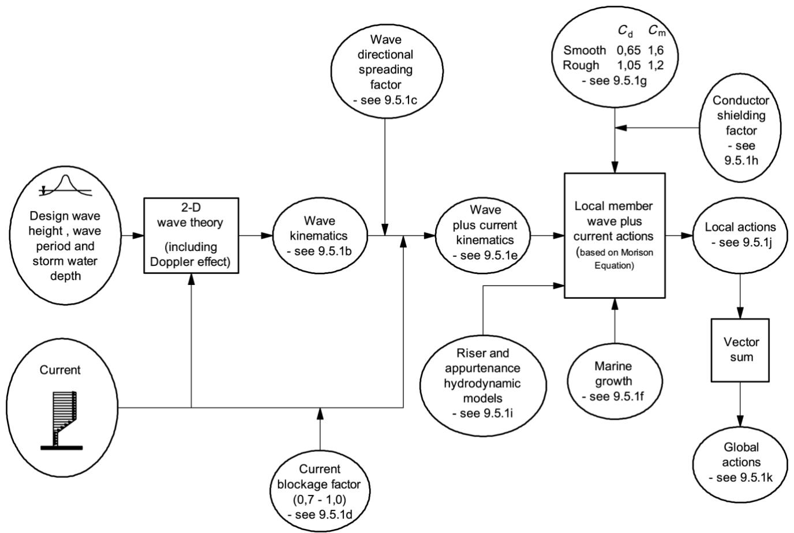  
Figure 9.5-1 — Procedure for calculating the quasi-static action caused by wave plus current

The procedure for estimating the extreme quasi-static action caused by waves and current follows the steps a) to k):

a) Determine the intrinsic wave period, taking into account the Doppler effect of the current on the wave length and period, in accordance with ISO 19901-1.   
b) Determine the two-dimensional wave kinematics for the specified wave height, storm water depth, and intrinsic period, using an appropriate wave theory; see ISO 19901-1.   
c) The horizontal components of the wave-induced water particle velocities and accelerations may be reduced by the wave directional spreading factor; see ISO 19901-1.   
d) Determine the effective local current profile by multiplying the specified current profile by the current blockage factor; see 9.5.2.4 and A.9.5.2.4.   
e) Determine the locally incident fluid velocities and accelerations for use in Morison's equation (see 9.5.2.1) by vectorially combining the effective local current profile from step d) after stretching it to the instantaneous water surface elevation (see ISO 19901-1) with the wave kinematics from step c).   
f) Increase the member diameters to account for marine growth; see 9.5.2.2.   
g) Determine drag and inertia coefficients for use in Morison’s equation in accordance with the relevant wave and current parameters, as well as member shape, size, orientation and roughness (including marine growth). Typical values of these coefficients are given in 9.5.2.3.   
h) Drag and inertia coefficients for the conductor array may be reduced by the conductor shielding factor in 9.5.2.5.   
i) Determine hydrodynamic models for actions on risers and appurtenances in accordance with 9.5.3.   
j) Calculate local actions caused by waves and current for all structural components, conductors, risers, and appurtenances using Morison's equation, taking the requirements of steps e) to i) into account.   
k) Calculate the extreme global action caused by waves and current as the vector sum of all the local actions from step j).

9.5.2 Models for hydrodynamic actions

9.5.2.1 Morison's equation

The computation of the action on a cylindrical object (a member) caused by waves, currents or a combination of waves and currents depends on the ratio of the wave length to the member diameter. When this ratio is large (> 5), the member does not significantly modify the incident wave. The action can then be computed as the sum of a hydrodynamic drag action and a hydrodynamic inertia action, as given in Formula (9.5-1):

$$\boldsymbol{F} = \boldsymbol{F}_{\mathrm{d}} + \boldsymbol{F}_{\mathrm{i}} = C_{\mathrm{d}} \cdot \frac{1}{2} \rho_{w} \cdot \boldsymbol{U} \cdot | \boldsymbol{U} | \cdot D + C_{\mathrm{m}} \cdot \rho_{w} \cdot V \cdot \frac{\partial \boldsymbol{U}}{\partial t} \tag{9.5-1}$$

where

$\pmb{ F }$ is the local action vector per unit length acting normal to the axis of the member;

${ F_{ \mathrm{ d } } }$ is the vector for the drag action per unit length acting normal to the axis of the member in the plane of the member axis and U;

$F_{ \mathrm{ i } }$ is the vector for the inertia action per unit length acting normal to the axis of the member in the plane of the member axis and (δU/δt);   
$C_{ \mathrm{ d } }$ is the hydrodynamic drag coefficient;   
$\rho_{ \mathrm{ w } }$ is the mass density of water;   
V is the displaced volume of the member per unit length $\scriptstyle ( = \pi D^{ 2 } / 4$ for circular cylinders);   
D is the effective diameter of a member (a circular cylinder), including marine growth;   
U is the component of the local water particle velocity vector (due to waves and/or current) normal to the axis of the member;   
|U| is the modulus (the absolute value) of $U ;$   
$C_{ \mathrm{ m } }$ is the hydrodynamic inertia coefficient;   
$\partial \pmb{ U }$ is the component of the local water particle acceleration vector normal to the axis of the $\partial t$ member.

Morison's equation, as stated here, ignores the contribution from the Froude-Krylov action associated with the convective acceleration component. This is not always appropriate for inertia dominated structures, small wave heights, steep waves or very large diameter components. The equation also excludes actions due to hydrodynamic lift, slamming or slapping actions and axial Froude-Krylov actions.

When the size of a structural object or component is sufficiently large compared to the wave length, the incident waves are scattered or diffracted. This “diffraction regime” is usually considered to occur when the component width exceeds a fifth of the incident wave length. In such cases, diffraction theory, which computes the pressures acting on the structure due to both the incident wave and the scattered wave, shall be used instead of Morison's equation to determine the local action caused by waves. If a structure has some components in the Morison regime and others in the diffraction regime, or a component is adjacent to another (component of a) structure that is in the diffraction regime, the effect of wave diffraction on the wave kinematics to be used for the Morison component should be considered.

NOTE Depending on its diameter, a free-standing caisson structure can be in the diffraction regime, particularly for the lower sea states associated with fatigue conditions.

9.5.2.2 Marine growth

The expected effect of marine growth on the hydrodynamic actions on the structure during its design service life shall be taken into account.

The cross-sectional dimensions of structural components, conductors, risers and appurtenances shall be increased to account for marine growth thickness. Components with circular cross-sections shall further be classified as either “smooth” or “rough”, depending on the amount and size of marine growth expected to have accumulated on them at the time of the loading event. ---

Structural elements can be considered hydrodynamically smooth if they are located either above the-`-`` highest astronomical tide (HAT) or sufficiently deep below the lowest astronomical tide (LAT). In both,`,,,, these zones, marine growth accumulation is usually small enough to ignore the effect of roughness.``,,,, However, caution should be taken because it takes very little roughness to make the rough value of the`,,,` $C_{ \mathrm{ d } }$ in 9.5.2.3 realistic. Site-specific data shall be used to reliably establish the extent of the -

hydrodynamically rough zones. Otherwise, the structural components shall be considered rough down to the sea floor.

9.5.2.3 Drag and inertia coefficients

For typical design situations, global hydrodynamic action on a structure can be calculated using Morison’s equation, with the values of the hydrodynamic coefficients for unshielded circular cylinders given in Table 9.5-1:

Table 9.5-1 — Typical values of hydrodynamic coefficients   


| Surface of component | Cd | Cm |
| --- | --- | --- |
| smooth | 0,65 | 1,6 |
| rough | 1,05 | 1,2 |


The values in Table 9.5-1 are appropriate for situations of a steady current with negligible waves and for large waves with $U_{ \mathrm{ m o } } T_{ \mathrm{ i } } / D > 30$ , where

$U_{ \mathrm{ m o } }$ Umo is the maximum horizontal water particle velocity at storm still water level under the wave crest from two-dimensional wave kinematics theory;   
$T_{ \mathrm{ i } }$ is the intrinsic wave period;   
D is the diameter of the structure’s legs at storm still water level.

Additional information and guidance on hydrodynamic coefficients in a variety of circumstances is given in A.9.5.2.3.

For situations where waves are dominant but $U_{ \mathrm{ m o } } T_{ \mathrm{ i } } / D < 30 , C_{ \mathrm{ m } }$ and $C_{ \mathrm{ d } }$ for nearly vertical members are modified by “wake encounter” and shall be specially determined.

NOTE Such situations can arise for a large diameter free-standing caisson structure in extreme seas or for ordinary structural components in the lower sea states that are considered in fatigue analyses.

9.5.2.4 Current blockage

The presence of a structure within a current flow causes the incident flow to diverge; some of the flow goes around the structure rather than through it. This phenomenon is referred to as current blockage. As a consequence, the in-line current speed within the structure is reduced compared to the free-stream value.

Global hydrodynamic actions on a structure are determined by summing local hydrodynamic actions ``,``, from Morison’s equation using local current velocities in conjunction with the recommended current ,`,`, blockage factors given in Table A.9.5-1.,``-`-

Data sets obtained from measurements of the current speed in the vicinity of a structure generally include,`--- the effect of current blockage. Therefore, current blockage factors should not be applied to such (extrapolated) data sets.

Current blockage effects should be considered before those of conductor shielding; see A.9.5.2.4.

9.5.2.5 Conductor shielding factor

Depending upon the configuration of the structure and the number of well conductors, the hydrodynamic action on the conductors can be a significant portion of the total hydrodynamic action on the structure. If the conductors are closely spaced, the global hydrodynamic action on them can be reduced as a result of hydrodynamic shielding. To account for this, a shielding factor, $k_{ s } ,$ may be applied to the drag and inertia coefficients for the conductor array. The value of the shielding factor is shown in Figure 9.5-2, in which S is the centre-to-centre spacing of the conductors in the wave direction and D is the diameter of the conductors, including marine growth. This shielding factor is appropriate for either

a) steady current with negligible waves, or   
b) waves with $U_{ \mathrm{ m o } } T_{ \mathrm{ i } } / S > 5$ π, where $U_{ \mathrm{ m o } }$ and $T_{ \mathrm{ i } }$ are defined in 9.5.2.3.

For waves with $U_{ \mathrm{ m o } } T_{ \mathrm{ i } } / S < \pi_{ i }$ , shielding does not apply and the shielding factor is 1,0. For waves with $\pi < U_{ \mathrm{ m o } } T_{ \mathrm{ i } } / S < 5 \tau$ π, partial shielding may be accounted for using linear interpolation.

Conductor shielding in fatigue analyses is addressed in 16.4.2.

When the angle between the wave or current direction and centre plane of the row (or column) of conductors is less than 22,5°, S is taken as the centre-to-centre spacing between the conductors in the row (or column). For angles between 22,5° and 67,5°, S can be approximated as the average of the centreto-centre row spacing and the centre-to-centre column spacing. For a single row of conductors, shielding should not be included if the angle between the plane of the row and the wave or current direction is greater than 22,5°.

The shielding phenomenon in this subclause does not adequately address the situation of small diameter members adjacent to large diameter members, e.g. an external conductor at a monotower. The interaction between the small and the large diameter members in such situations shall be carefully considered; see also 9.11.

A possible increase in the added mass (and inertia actions) for closely spaced conductors （$S / D < 1 , 75 )$ shall be considered.

Figure 9.5-2 — Factor for reduction of hydrodynamic coefficients for conductors in array due to shielding as function of conductor spacing/diameter ratio   
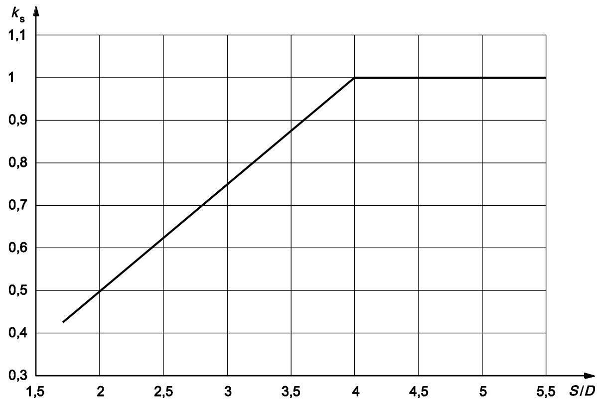  
Key   
S conductor spacing   
D conductor diameter   
$k_{ s }$ shielding factor

9.5.3 Hydrodynamic models for appurtenances

Appurtenances, such as boat landings, fenders or bumpers, walkways, stairways, grout lines, and anodes, shall be considered for inclusion in the hydrodynamic model of the structure. Depending upon the type and number of appurtenances these can significantly increase the global hydrodynamic action on the structure. Furthermore, hydrodynamic actions on some appurtenances can be important for local member design. Appurtenances are generally modelled by means of non-structural members that contribute equivalent hydrodynamic action. For some appurtenances, such as boat landings, the hydrodynamic action is highly dependent on wave direction due to shielding effects.

## 9.6 Actions caused by current

The current velocity and current profile as a function of depth shall be determined in accordance with ISO 19901-1.

Where current acts alone, the local action due to current can be calculated in accordance with the procedure in 9.5 (as far as relevant) by putting $\delta U / \delta t = 0$ . Where current acts together with waves, the current velocity shall be stretched and vectorially added to the wave particle velocity before the total local action due to waves and current is calculated, as described in 9.5.

Where a global action caused by current only is to be determined, the extreme quasi-static global action, $E_{ \mathrm{ c e } } ,$ shall be calculated as the vector sum of the above local current actions.

## 9.7 Actions caused by wind

9.7.1 General

The wind velocity, vertical wind profile and time averaging duration in relation to the dimensions and dynamic sensitivity of the structure's components shall be determined in accordance with ISO 19901-1. In special cases, dynamic response to wind action can be significant and shall be taken into account; see ISO 19901-1.

9.7.2 Determining actions caused by wind

Wind induced actions on cylindrical objects shall be calculated using formulae that take account of the direction of the wind in relation to the orientation of the object, in the same way as drag actions on submerged cylinders due to wave and current are calculated. Actions on walls of buildings and other flat surfaces that are not perpendicular to the direction of the wind shall also be calculated using formulae that account for the angle between the direction of the wind and the plane of the surface. Where appropriate, wind-induced actions shall be calculated taking due account of increased exposure area and of surface roughness due to ice. Local wind effects, such as pressure concentrations and internal pressures, should be considered by the designer where applicable.

The wind action on an object is typically calculated using Formula (9.7-1). However, in accordance with the above observations due attention shall be given to which velocity (in magnitude and direction) and which area is to be used. Similarly, the direction of the resulting action vector shall be carefully considered. The basic relationship between the wind velocity and the wind action on an object is expressed by Formula (9.7-1):

$$F = \frac{1}{2} \rho_{\mathrm{a}} U_{w}^{2} C_{\mathrm{s}} A_{\mathrm{r}} \tag{9.7-1}$$

where

F is the wind action on the object;

$\rho_{ \mathsf{ a } }$ is the mass density of air (at standard temperature and pressure);

$U_{ \mathrm{ w } }$ is the wind speed;

$C_{ s }$ Cs is the shape coefficient;

$A_{ \mathrm{ r } }$ is the area of the object.

In the absence of data indicating otherwise, the shape coefficients given in Table 9.7-1 are recommended for perpendicular wind approach angles with respect to each projected area.

Table 9.7-1 — Shape coefficients, $c_{ s } ,$ for perpendicular wind approach angles   


| Component | Component | Shape coefficients Cs |
| --- | --- | --- |
| Flat walls of buildings | Flat walls of buildings | 1,50 |
| Overall projected area of structure | Overall projected area of structure | 1,00 |
| Beams | Beams | 1,50 |
| Cylinders | Smooth, Re > 5 × 10^5 | 0,65 |
| Cylinders | Smooth, Re ≤ 5 × 10^5 | 1,20 |
| Cylinders | Rough, all Re | 1,05 |
| Cylinders | Covered with ice, all Re | 1,20 |
| Re Reynolds number | Re Reynolds number | Re Reynolds number |


Wind actions on downstream components can be reduced due to shielding by upstream components.

See A.9.7.2 for further information and guidance on the use of calculation method and coefficients.

The extreme quasi-static global action, $E_{ \mathrm{ i e } } ,$ caused by wind shall be calculated as the vector sum of the above wind actions on all objects.

9.7.3 Wind actions determined from models

When wind actions are important for structural design, wind pressures and resulting local actions shall be determined from wind tunnel tests on a representative model, or from a computational model representing the structure, considering the range and variation of wind velocities. Computational models shall be validated against wind tunnel tests or full scale measurements of similar structures.

## 9.8 Equivalent quasi-static action representing dynamic response caused by extreme wave conditions

9.8.1 General

Actions caused by waves vary with time. Any structure subjected to these actions therefore experiences dynamic response to a greater or lesser degree. However, in many cases the dynamic response remains rather limited in magnitude. In such cases and in accordance with ISO 19900, the global effects of dynamic response can be adequately approximated by the introduction of an equivalent quasi-static action, $D ,$ representing the overall dynamic action effect. The corresponding equivalent quasi-static action in design metocean conditions （$D_{ \mathrm{ e } } )$ is added to the total extreme quasi-static action due to wind, waves and current $E_{ \mathrm{ e } } .$

For the definition of dynamically responding structures, see 12.5.2.

In general, all (quasi-)static and dynamic actions are vectors. However, for the purposes of this document and for the conditions under which an equivalent quasi-static action representing dynamic response can be used, only scalar values are required. The symbols $D_{ \mathrm{ e } } , E_{ \mathrm{ e } }$ and $E_{ \mathrm{ w c e } } ,$ as used in this document, refer to the magnitudes of the corresponding vectors at the sea floor. Once determined, the equivalent extreme quasi-static action, $D_{ \mathrm{ e } } ,$ is next distributed over the height of the structure in a set of horizontal actions, $d_{ \mathrm{ k } } ,$ at elevations $k = 1 , 2 , . . . , K .$ The actions $d_{ \mathrm{ k } }$ represent the inertial actions caused by a global acceleration of

the masses lumped at each elevation k. The actions $d_{ \mathrm{ k } }$ are then added to the corresponding actions due to $E_{ \mathrm{ e } }$ at the same elevation.

For the applicability of the approximate procedure described in 9.8, it is required that:

a) the dynamic and the quasi-static responses be approximately in phase; and   
b) the magnitude of $D_{ \mathrm{ e } }$ be considerably smaller than the magnitude of $E_{ \mathrm{ w c e } } .$

These requirements are considered to be satisfied if the following two conditions are met:

— the dynamic response is stiffness controlled, which may be assumed if the fundamental natural period of the structure is less than one-quarter of the peak period of the wave spectrum of the design sea state;   
— the magnitude of $D_{ \mathrm{ e } }$ is less than one-half of the magnitude of $E_{ \mathrm{ w c e } } .$

In all other cases, a more detailed dynamic analysis shall be performed. Requirements for such an analysis are covered in Clause 12.

To apply the methodology described in 9.8.2 and 9.8.3, $D_{ \mathrm{ e } }$ is estimated and combined with $E_{ \mathrm{ e } }$ in accordance with Formula (9.9-2) to determine the total design action. The action factor for $E_{ \mathrm{ e } }$ is $\boldsymbol{ \gamma }_{ \mathrm{ f , E } }$ while that for De is γf,E  γf,D. $D_{ \mathrm{ e } }$ $\gamma_{ \mathrm{ f , E } } \times \gamma_{ \mathrm{ f , D } }$

9.8.2 Equivalent quasi-static action （$D_{ \mathbf{ e } } )$ representing the dynamic response

The magnitude of the equivalent quasi-static action, $D_{ \mathrm{ e }^{ \prime } }$ represents the total global inertial action that the structure experiences at the time when the total global dynamic response is a maximum. Under the conditions specified in 9.8.1, the return period of the extreme global dynamic response to the metocean action is approximately the same as that of the extreme quasi-static response to $E_{ \mathrm{ w c e } }$ alone.

The equivalent quasi-static action, $D_{ \mathrm{ e } } ,$ is established through a global dynamic analysis in waves. $D_{ \mathrm{ e } }$ can be determined from the results of the dynamic analysis in one of the following two ways:

a) directly, by subtracting the extreme quasi-static base shear (which is equal to the extreme applied horizontal wave action on the structure) from the extreme dynamic base shear obtained from the analysis;   
b) indirectly, by multiplying $E_{ \mathrm{ w c e } }$ by a factor （$k_{ \mathrm{ D A F } } - 1 )$ , where $k_{ \mathrm{ D A F } }$ is a dynamic amplification factor on the quasi-static base shear that is derived from the global dynamic analysis as the ratio of the extreme dynamic base shear to the extreme quasi-static base shear.

$D_{ \mathrm{ e } }$ subsequently should be distributed along the height of the structure to model the individual contributions of the total global inertial action that act at each mass point; see A.9.8.2.

9.8.3 Global dynamic analysis in waves

9.8.3.1 General

This subclause describes the global dynamic analysis for the purpose of determining $D_{ \mathrm{ e } }$ in 9.8.2.

9.8.3.2 Dynamic analysis methods

The time varying actions caused by waves shall realistically model the sea surface and the frequency content of wave action in extreme wave conditions. This necessitates the use of random waves; the procedure described in 9.5 is only appropriate for quasi-static analysis. When there are significant nonlinearities in modelling the environment, the structure, the fluid-structure interaction or the structurefoundation interaction, time-history methods are preferred. When linearization of hydrodynamic drag actions, inundation effects, and structure-foundation interaction can be justified, frequency domain methods generally provide a more transparent and computationally more efficient means of using random waves and may be used for the global dynamic analysis.

9.8.3.3 Design sea state

The random waves shall correspond with one or more wave spectra that are plausible representations of sea state(s) that produce the 100-year design action effect or, alternatively, the 100-year design wave condition defined in 9.4; see also 6.5.2. Consideration should be given to including currents in the global dynamic analysis as currents associated with the design sea state can affect dynamic response through the drag action in Morison’s equation, see Formula (9.5-1). Wind fluctuations may generally be neglected for conventional fixed steel offshore structures, i.e. actions caused by wind can be assumed to be static actions.

9.8.3.4 Hydrodynamic action on a member

Morison’s equation is typically used to compute actions on members of fixed structures. Its relative velocity form should be used for compliant structures. Hydrodynamic actions in phase with the structure’s acceleration are taken into account by the hydrodynamic added mass. Hydrodynamic damping may be taken into account by an equivalent viscous damping as described in 9.8.3.6.

9.8.3.5 Mass

The dynamic analysis model of a fixed structure shall include appropriately modelled masses of:

— the topsides;   
— the structural steel in the structure;   
— the appurtenances and conductors;   
— the mass of marine growth expected to accumulate on the structure;   
— the mass of water within submerged members;   
— the hydrodynamic added mass of submerged members, taking into account increased outside member diameters due to marine growth.

9.8.3.6 Damping

In lieu of an explicit determination of various damping contributions, an equivalent viscous damping model may be used. The equivalent viscous damping coefficient is sensitive to many effects, including structure type and layout, the severity of excitation and response, and the relationship of the natural period of the structure to the peak period of the design wave spectrum. In the absence of substantiating information for damping values for a specific structure, a damping coefficient of 2 % to 3 % of critical may be used for the global dynamic analyses in extreme wave conditions. For less severe sea states used for fatigue analyses, damping values less than 2 % are more appropriate.

9.8.3.7 Stiffness

A linear elastic stiffness model of the structure that includes the interaction between the structure and the foundation is normally adequate for the global dynamic analysis in waves.

## 9.9 Factored actions

9.9.1 General

In accordance with 7.6 and 7.8.1, each representative action shall be multiplied by a partial action factor, $\gamma_{ \mathrm{ f } } .$ The design action(s), $F_{ \mathrm{ d } } ,$ , for a particular design situation comprise one or more combinations of factored actions.

This subclause relates to actions and partial action factors for strength design satisfying the ultimate limit state during extreme conditions for the in-place situation; see 7.2 and 7.6. The corresponding design actions are specified in 9.9.2, 9.9.3 and 9.10. Design actions for operating situations are also specified in 9.10.

Actions and partial action factors for strength design satisfying accidental limit states are given in Clause 10.

Actions and partial action factors for fatigue limit states are given in Clause 16; those for fatigue limit states of grouted and mechanical connections and clamps are given in Clause 15.

9.9.2 Factored permanent and variable actions

The design action for permanent and variable actions is given by Formula (9.9-1):

$$F_{\mathrm{d}} = \gamma_{\mathrm{f}, \mathrm{G} 1} G_{1} + \gamma_{\mathrm{f}, \mathrm{G} 2} G_{2} + \gamma_{\mathrm{f}, \mathrm{Q} 1} Q_{1} + \gamma_{\mathrm{f}, \mathrm{Q} 2} Q_{2} \tag{9.9-1}$$

where $G_{ 1 } , G_{ 2 } , Q_{ 1 }$ and $Q_{ 2 }$ are defined in 9.2.1 to 9.2.4, taking account of the requirements of 9.2.5 to 9.2.9.

Values for the partial action factors, $\gamma_{ \mathrm{ f } } ,$ for various design situations are given in 9.10.

9.9.3 Factored extreme metocean action

The design action for extreme metocean action is given by Formula (9.9-2):

$$F_{\mathrm{d}} = \gamma_{\mathrm{f}, \mathrm{E}} \left(E_{\mathrm{e}} + \gamma_{\mathrm{f}, \mathrm{D}} D_{\mathrm{e}}\right) \tag{9.9-2}$$

where

$E_{ \mathrm{ e } }$ is the extreme quasi-static action due to wind, waves and current, defined in 9.4, taking account of the requirements of 9.5 to 9.7;

$D_{ \mathrm{ e } }$ is the equivalent quasi-static action representing the dynamic action effect defined in 9.8.1;

$\boldsymbol{ \gamma }_{ \mathrm{ f , E } }$ is the partial action factor for $E_{ \mathrm{ e } } { \mathrm{ , } }$

$\boldsymbol{ \gamma }_{ \mathrm{ f , D } }$ is an additional partial action factor for $D_{ \mathrm{ e } } .$

The value of $\boldsymbol{ \gamma }_{ \mathrm{ f , E } }$ depends principally on:

a) the target safety level represented by the exposure levels L1, L2 and L3, see 6.6;   
b) the characteristics of the long-term environment at the offshore location of the structure, specifically the local climate of waves, current and wind at the geographical location (the wave climate usually being the most influential, in particular its sensitivity to return period).

Additionally, the value is generally affected by the method(s) used to derive the extreme wind, wave and current parameters and the corresponding extreme metocean action.

For steel space frame structures and a number of geographical areas, or regions within geographical areas, studies have been performed to determine appropriate values of $\boldsymbol{ \gamma }_{ \mathrm{ f , E } }$ . Some examples are presented in A.9.9.3.3; further information, where available, can be found in Annex H.

The value of $\boldsymbol{ \gamma }_{ \mathrm{ f , D } }$ accounts for the uncertainty of $D_{ \mathrm{ e } }$ to represent the global dynamic response of the structure, as well as the variability of the influence of global dynamic response on individual components of the structure.

See A.9.9 for a further discussion on the partial action factors $\gamma_{ \mathrm{ f , E } }$ and $\boldsymbol{ \gamma }_{ \mathrm{ f , D } }$

## 9.10 Design situations

9.10.1 General considerations on the ultimate limit state

The basic requirement for satisfying the ultimate limit state under design metocean conditions in the inplace situation for structures that respond predominantly quasi-statically in accordance with the conditions of 9.9.1 is that the structure possesses adequate strength to meet a minimum safety level commensurate with its exposure level; see 7.10.

This requirement can in principle be met in several ways, two of which are listed below and both of which are within the scope of this document:

— by implicitly following a partial factor design format, which is the usual design procedure, and which is described in 9.10.3;   
— by explicitly demonstrating that a structure has a certain minimum RSR, as discussed in 9.10.2.

For structures where dynamic response exceeds the limitations of 9.8.1 and a proper dynamic analysis is performed, the requirements for the ultimate limit state shall be explicitly considered. As a minimum, the total design action can be determined from Formula (9.9-2) where $D_{ \mathrm{ e } } ,$ as determined from the dynamic analysis, is combined with $E_{ \mathrm{ e } }$ in accordance with Formula (9.9-2), but the action factor for $D_{ \mathrm{ e } }$ is just $\boldsymbol{ \gamma }_{ \mathrm{ f , E } }$ (i.e. $\boldsymbol{ \gamma }_{ \mathrm{ f , D } }$ is unity).

9.10.2 Demonstrating sufficient RSR under metocean actions

A structure’s ultimate system strength may be determined by means of a suitable non-linear pushover analysis, from which the RSR can be calculated as described in 7.11.1. If the RSR meets an appropriate criterion for:

a) the relevant exposure level L1, L2 or L3, (see 6.6); and   
b) the geographical location concerned;

the design satisfies the ultimate limit state for the situation being considered.

This approach represents a significant departure from conventional design practice and can be hampered by several difficulties. These difficulties include the need for special and advanced knowledge and experience of the designers, the limited relevant experience that is available with this approach, the fact that the calculated ultimate strength depends on the method and the details by which the assessment is carried out, and the lack of common agreement on the setting of appropriate RSR criteria. Consequently, the approach can only be adopted if it is approved by the owner and the regulator, where one exists; such approval shall include the methodology to be used and the RSR value to be achieved. For a discussion of the elements involved, see A.9.9.

Notwithstanding this, when these difficulties can be overcome and the owner, the designer and the regulator, where one exists, can reach agreement on all the aspects involved, the approach is fully in agreement with the general requirements of ISO 19900 and the requirements for fixed steel offshore structures in this document.

9.10.3 Partial factor design format

## 9.10.3.1 General

For a quasi-statically responding structure, adequate proof of satisfying the ultimate limit state shall be deemed to be provided by the partial design format described in this subclause. Each member, joint and foundation component shall be checked for strength using the internal force (action effect) (S) due to the combinations of factors:

a) permanent actions;   
b) variable actions;   
c) extreme quasi-static metocean actions;   
d) where relevant, equivalent quasi-static actions representing dynamic response caused by extreme wave conditions.

The combinations and factors are specified in 9.10.3.2.

## 9.10.3.2 Design actions for in-place situations

The general formula for determining the design action $\left( F_{ \mathrm{ d } } \right)$ for in-place situations is given in Formula (9.10-1), and the appropriate partial action factors for each design situation are given in Table 9.10-1:

$$F_{\mathrm{d}} = \gamma_{\mathrm{f}, \mathrm{G} 1} G_{1} + \gamma_{\mathrm{f}, \mathrm{G} 2} G_{2} + \gamma_{\mathrm{f}, \mathrm{Q} 1} Q_{1} + \gamma_{\mathrm{f}, \mathrm{Q} 2} Q_{2} + \gamma_{\mathrm{f}, \mathrm{E o}} \left(E_{\mathrm{o}} + \gamma_{\mathrm{f}, \mathrm{D}} D_{\mathrm{o}}\right) + \gamma_{\mathrm{f}, \mathrm{E e}} \left(E_{\mathrm{e}} + \gamma_{\mathrm{f}, \mathrm{D}} D_{\mathrm{e}}\right) \tag{9.10-1}$$

where

$G_{ 1 } , G_{ 2 }$ are the permanent actions defined in 9.2;

$Q_{ 1 } , Q_{ 2 }$ are the variable actions defined in 9.2;

$E_{ \mathbf{ o } }$ is the metocean action due to the owner-defined operating wind, wave and current parameters;

Do $D_{ \mathbf{ o } }$ is the equivalent quasi-static action representing dynamic response in accordance with 9.8, but caused by the wave condition that corresponds with that for $E_{ 0 } ;$ ;

$E_{ \mathrm{ e } }$ is the extreme quasi-static action due to wind, waves and current as defined in 9.4 and taking account of the requirements of 9.5 to 9.7;   
$D_{ \mathrm{ e } }$ is the equivalent quasi-static action representing dynamic response defined in 9.8.1;

γf,G1, γf,G2, γf,Q1, $\gamma_{ \mathrm{ f } , 02 }$ are the partial action factors for the various permanent and variable actions discussed in 9.9 and for which values for different design situations are given in Table 9.10-1 (see A.9.10.3.2.1);   
γf,Eo, $\gamma_{ \mathrm{ f , E e } }$ are partial action factors applied to the total quasi-static metocean action plus equivalent quasi-static action representing dynamic response for operating and extreme metocean conditions, respectively, and for which values for different design situations are given in Table 9.10-1;   
γf,E, γf,D are the partial action factors for the metocean actions discussed in 9.9 and for which $\boldsymbol{ \gamma }_{ \mathrm{ f , D } }$ appropriate values shall be determined by the owner.

Table 9.10-1 — Partial action factors for in-place situations and exposure level L1   


| Design situation | Partial action factorsa | Partial action factorsa | Partial action factorsa | Partial action factorsa | Partial action factorsa | Partial action factorsa |
| --- | --- | --- | --- | --- | --- | --- |
| Design situation | γf,G1 | γf,G2 | γf,Q1 | γf,Q2 | γf,Eo | γf,Ee |
| Permanent and variable actions only | 1,3 | 1,3 | 1,5 | 1,5 | 0,0 | 0,0 |
| Operating situation with corresponding wind, wave, and/or current conditionsb | 1,3 | 1,3 | 1,5 | 1,5 | 0,9γf,E | 0,0 |
| Extreme conditions when the action effects due to permanent and variable actions are additivec | 1,0 | 1,0 | 1,0 | 0,0 | 0,0 | γf,E |
| Extreme conditions when the action effects due to permanent and variable actions opposed | 0,9 | 0,9 | 0,8 | 0,0 | 0,0 | γf,E |
| a A value of 0 for a partial action factor means that the action is not applicable to the design situation. b For this, check that G2, Q1 and Q2 are the maximum values for each mode of operation. c For this, check that G1, G2 and Q1 include those parts of each mode of operation that can reasonably be present during extreme conditions. d For this, check that G2 and Q1 exclude any parts associated with the mode of operation considered that cannot be ensured of being present during extreme conditions. | a A value of 0 for a partial action factor means that the action is not applicable to the design situation. b For this, check that G2, Q1 and Q2 are the maximum values for each mode of operation. c For this, check that G1, G2 and Q1 include those parts of each mode of operation that can reasonably be present during extreme conditions. d For this, check that G2 and Q1 exclude any parts associated with the mode of operation considered that cannot be ensured of being present during extreme conditions. | a A value of 0 for a partial action factor means that the action is not applicable to the design situation. b For this, check that G2, Q1 and Q2 are the maximum values for each mode of operation. c For this, check that G1, G2 and Q1 include those parts of each mode of operation that can reasonably be present during extreme conditions. d For this, check that G2 and Q1 exclude any parts associated with the mode of operation considered that cannot be ensured of being present during extreme conditions. | a A value of 0 for a partial action factor means that the action is not applicable to the design situation. b For this, check that G2, Q1 and Q2 are the maximum values for each mode of operation. c For this, check that G1, G2 and Q1 include those parts of each mode of operation that can reasonably be present during extreme conditions. d For this, check that G2 and Q1 exclude any parts associated with the mode of operation considered that cannot be ensured of being present during extreme conditions. | a A value of 0 for a partial action factor means that the action is not applicable to the design situation. b For this, check that G2, Q1 and Q2 are the maximum values for each mode of operation. c For this, check that G1, G2 and Q1 include those parts of each mode of operation that can reasonably be present during extreme conditions. d For this, check that G2 and Q1 exclude any parts associated with the mode of operation considered that cannot be ensured of being present during extreme conditions. | a A value of 0 for a partial action factor means that the action is not applicable to the design situation. b For this, check that G2, Q1 and Q2 are the maximum values for each mode of operation. c For this, check that G1, G2 and Q1 include those parts of each mode of operation that can reasonably be present during extreme conditions. d For this, check that G2 and Q1 exclude any parts associated with the mode of operation considered that cannot be ensured of being present during extreme conditions. | a A value of 0 for a partial action factor means that the action is not applicable to the design situation. b For this, check that G2, Q1 and Q2 are the maximum values for each mode of operation. c For this, check that G1, G2 and Q1 include those parts of each mode of operation that can reasonably be present during extreme conditions. d For this, check that G2 and Q1 exclude any parts associated with the mode of operation considered that cannot be ensured of being present during extreme conditions. |


## 9.11 Local hydrodynamic actions

Internal forces in a component derive from both the overall response to global actions and the local response to direct hydrodynamic actions.

Local actions include not only the drag and inertia actions modelled by Morison's equation, see Formula (9.5-1), but also those due to hydrodynamic lift, axial Froude-Krylov effects, distributed weight, and buoyancy. Additionally, actions due to hydrodynamic lift, vortex induced vibrations and wave slamming can dynamically excite individual members, thereby increasing internal forces. The fraction of total internal forces due to locally generated actions is generally greater for members near still water level.

For smaller members adjacent to larger members, such as appurtenances supported by legs, the calculation of the kinematics used in Morison's equation should take account of the flow modification caused by the larger member.

The maximum local internal forces can also occur at a different position of the wave crest relative to the structure centre line than those which cause the greatest global metocean action on the structure. For example, some members of conductor guide frames can experience their greatest internal forces due to vertical hydrodynamic actions, which generally peak when the wave crest is far from the structure centre line. Also, maximum internal forces in some members can occur for wind, wave and current directions other than those which cause maximum global metocean actions.

10 Accidental and abnormal situations

## 10.1 General

10.1.1 Treatment of ALS events

Accidental situations, as introduced in ISO 19900 and used in this document, relate to group 2 hazards,,``,` (6.2.2) as follows:,,, `, `

— hazards associated with specially identified accidental events;`-``,`   
— hazards associated with abnormal environmental events.-

The two types of hazards are different by nature. In principle, accidental events can in some cases be avoided by taking appropriate measures to eliminate the source of the event or by bypassing and overcoming its structural effects. In contrast with this, the possible occurrence of abnormal events cannot be influenced by taking such measures.

An accidental situation (ALS) normally comprises the occurrence of an identified accidental event or of an abnormal environmental event, in combination with expected concurrent operating conditions and associated permanent and variable actions.

As a consequence of an accidental event or of an abnormal environmental event, the structure can sustain damage, however, is not expected to suffer a complete loss of integrity. Such consequential damage creates a new situation, which is characterized by the post-damage design situation. Consequently, the structure shall be verified adopting a two-stage procedure:

a) analyse the structure for the considered hazard;   
b) verify the structure for the post-damage design situation to achieve fitness-for-service - see 7.10.2 to select an appropriate return period.

The second step is only necessary if the resistance of the structure is reduced by the structural damage caused by the hazard event; see 6.2.2.

Abnormal environmental actions are evaluated for abnormal environmental events (see 3.1 and 10.1.3).

Consequential damage is evaluated using post-damage design situations (see 3.37 and 10.6).

As accidental and abnormal environmental events are generally statistically independent, only one such event need be considered for a particular ALS design situation. If certain accidental and abnormal

environmental events are not statistically independent, a corresponding design situation or situations shall be specially considered.

10.1.2 Accidental events

Typical examples of accidental events are:

— collision from vessels (see 10.2);   
— impact from dropped objects (see 10.3);   
— fire or explosion (see 10.4).

When checking an accidental limit state event, all partial action and resistance factors may be set to 1,0. For the post-damage check, the normal in-place partial action factors given in Table 9.10-1 shall apply together with the partial resistance factors given in Clauses 13, 14, 15 and 17.

10.1.3 Abnormal environmental events

The appropriate return period for the design situation for abnormal actions is typically dependent upon the location of the platform (see ISO 19901-1, ISO 19901-2, and ISO 19901-6). Additional guidance for certain geographical regions can be found in Annex H.

In lieu of other information, or of specific regional guidance in Annex H, and in agreement with the regulator where one exists, the abnormal design situation may be based on a probability of exceedance between 10-3 and 10-4. These values are an indication of the order of magnitude since accurate databases for such small probabilities of exceedance rarely exist.

When performing checks for structural components subject to this design situation, the actions shall be calculated in accordance with Clauses 8, 9 and 11 while the strength requirements of Clauses 13, 14, 15 and 17 apply. All partial action and resistance factors may be set to 1,0. Such checks shall be performed even if wave-in-deck events do not occur.

## 10.2 Vessel collisions--`,,,

10.2.1 General`,,,,

Vessel impact shall be addressed for structures with exposure levels L1 and L2.```,,,

When evaluating the effects of vessel impact, all vessel operations in the platform vicinity shall be taken into account. Such vessel operations can include vessels servicing the platform, fishing vessels working in the area, and passing vessels.

Potential vessel impact on the structure's waterline members, risers, and external wells shall be considered. Barge bumpers, boat landings, and other external fendering may be used as protection.

Depending on the risk of collision and the consequences for the structural integrity of the structure, an analysis of vessel impact conditions can be required. Irrespective of whether an analysis is required, robustness in relation to vessel collisions should be incorporated into the design by indirect means such as:

— avoiding weak elements in the structure (particularly at joints);   
— selecting materials with sufficient toughness;

— ensuring that critical components are not placed in vulnerable locations.

10.2.2 Collision events

In a rigorous impact analysis, if required, design situations shall be established representing bow, stern and beam-on impacts on all exposed components. Evaluation of accidental design situations shall be in accordance with 10.1.1.

The collision events shall represent both a fairly frequent condition, during which the structure should only suffer insignificant damage, and a rare event where the emphasis is on avoiding a complete loss of integrity of the structure.

Two energy levels shall be considered:

a) low energy level, representing the most frequent condition, based on the type of vessel that would routinely approach alongside the platform (e.g. a supply boat) and that would have a velocity representing normal manoeuvring of the vessel approaching, leaving, or standing alongside the platform;   
b) high energy level, representing a rare condition, based on the type of vessel that would operate in the -``,``` platform vicinity, drifting out of control in the worst sea state in which it would be allowed to operate close to the platform.

The general requirements given in 10.1.1 apply to the accidental design situations for both energy levels. Level a) above represents a serviceability limit state to which the owner can set his own requirements based on practical and economic considerations, while level b) represents an ultimate limit state in which the structure is damaged but progressive collapse shall not occur.

In both cases, the analysis shall account for the vessel's mass, its added mass, orientation and velocity. Effective operational restrictions on vessel approach sectors can limit the exposure to impacts in some areas of the structure.

The vertical height of the impact zone shall be established, based on the dimensions and geometry of the structure and the vessel, and shall account for tidal ranges, operational sea state restrictions, vessel draught, and motions of the vessel.

10.2.3 Collision process

The energy absorbing mechanisms during the collision should be evaluated. Typically, local member denting, elastic and plastic deflection of the impacted member, global elastic and plastic response of the whole structure, and denting of the ship are the main mechanisms.

In a rigorous impact analysis, the collision actions should be evaluated based on a dynamic time domain simulation. The duration of the simulation should be sufficient to cover all relevant phases of the collision and the energy dissipation process.

See A.10.2.3 for guidance on collision scenarios and processes.

## 10.3 Dropped objects

When evaluating the impact risk from dropped objects, the nature of all crane operations in the platform vicinity shall be taken into account. Relevant accidental design situations shall be defined and evaluated in accordance with 10.1.1. Depending on the consequences for the structural integrity of the structure, the need for a rigorous impact analysis shall be determined.

Irrespective of whether a rigorous analysis is required, robustness in relation to dropped objects should be incorporated into the design by indirect means such as:

— avoiding weak elements in the structure (particularly at joints);   
— selecting materials with sufficient toughness;   
— ensuring that critical components are not placed in vulnerable locations.

## 10.4 Fires and explosions

Hydrocarbon pool fires on the sea surface and jet fires from ruptured risers can cause heating of structural components and hence degradation of their properties. Sources of hydrocarbons can include conductor or riser fracture, or spillage from the topsides following a process vessel rupture, while ignition sources can include radiation from oil burners and flares. ISO 13702 [4] contains requirements and recommendations for fires and explosions. Relevant accidental design situations shall be defined and evaluated following the requirements of 10.1.1. Consequential damage resulting from such accidental design situations should be provided for in the structure design as required by 10.1.1.

Generally, conventional steel-framed structures with relatively small topsides that do not have enclosed compartments containing flammable fluids or ignition sources do not require design against explosion. However, if explosion studies of the topsides indicate significant or unusual actions on the structure or specific support requirements to ensure that the topsides integrity is maintained, then such actions or support requirements shall be provided for in the structure design in accordance with 10.1.1.

NOTE ISO 19901-3 contains specific requirements for topsides structures exposed to fires and explosions.

## 10.5 Abnormal environmental actions

Abnormal design situations shall be defined and evaluated following the requirements of 10.1.1. Table 10.5-1 compares the requirements for extreme and abnormal metocean actions.

Table 10.5-1 — Comparison of extreme and abnormal metocean action requirements   


| Requirement | Situation | Situation |
| --- | --- | --- |
| Requirement | Extreme metocean actions | Abnormal metocean actions |
| Governing clause for actions | Clause 9 | Clause 10 |
| Limit state | ULS | ALS |
| Return period | 100 years | See 10.1.3 |
| Partial action factor | See Clause 9, default 1,35 | 1,0 if required - see 10.1.3 |
| Partial resistance factors | See Clauses 13, 14, 15, 17; generally 1,05 to 1,25 but up to 2,0 | 1,0 if required - see 10.1.3 |
| Wave crest height | Associated with 100 year return event | Associated with abnormal metocean event |


Where applicable, abnormal actions and action effects due to the abnormal level earthquake shall also be determined; see Clause 11 for further seismic design considerations. Ice and iceberg abnormal conditions shall conform to ISO 19906.

## 10.6 Assessment of structures following damage

For existing structures damaged during service, the nature and extent of the structural damage shall be established by inspection in accordance with ISO 19901-9. The modelling of the structure for the corresponding post-damage design situation shall reflect the actual damage as accurately as possible. For the post-damage check, the normal in-place partial action factors given in Table 9.10-1 shall apply together with the partial resistance factors given in Clauses 13, 14, 15 and 17. See 7.10.2 to select an appropriate return period for metocean or ice events to use in post-damage verification.

Appropriate analysis combined with the information on the actual damage gathered by inspection shall determine any requirements for a shut-in and/or evacuation of the platform, as well as the need for any immediate (possibly temporary) repairs, while awaiting a decision and plan for the implementation of definitive repairs or for abandonment.

11 Seismic design considerations

## 11.1 General

The procedures in ISO 19901-2 for design against seismic events shall be followed. Clause 11 complements ISO 19901-2 by presenting:

a) the design actions, combinations of actions and action effects resulting from ground motions;   
b) the requirements for a fixed steel offshore structure subjected to seismic actions.

As outlined in ISO 19901-2, a two-level seismic design procedure shall be followed. The structure shall be designed to the ultimate limit state (ULS) for strength and stiffness when subjected to an extreme level earthquake (ELE), from which it should sustain little or no damage. The structure is next checked when subjected to an abnormal level earthquake (ALE) to ensure that it meets reserve strength and energy dissipation requirements. Considerable local damage from an ALE is acceptable provided structural failure causing loss of life and/or major environmental damage does not to occur; see 7.10.2.

## 11.2 Seismic design procedure

ISO 19901-2 gives alternative procedures for determining seismic actions and alternative methods of evaluation of seismic activity. The selection of the procedure and the method of evaluation of activity depend on a structure's seismic risk category (SRC). The SRC according to ISO 19901-2 depends on the platform's exposure level and the seismic zone in which it stands. The recommended procedure according to ISO 19901-2 is:

a) determine seismic actions using either the simplified seismic action procedure or the detailed seismic action procedure, as specified in ISO 19901-2;   
b) evaluate seismic activity and the associated response spectra for the design of a structure against excitation of its base by ground motions using either rock outcrop spectral acceleration maps (see ISO 19901-2), or the site-specific seismic hazard analysis specified in ISO 19901-2;   
c) demonstrate the ALE performance of the structure, which can require a non-linear analysis.

Specific recommendations for the ductile design of fixed steel offshore structures, dependent on the structure's SRC as given in Table 11.2-1, are presented in 11.4.

Table 11.2-1 — Applicability of ductile design recommendations   


| SRC | Recommendations for ductile design |
| --- | --- |
| 1 | Not applicable |
| 2 | Optional |
| 3 | Recommended |
| 4 | Recommended |


## 11.3 Seismic reserve capacity factor

Both simplified and detailed seismic action procedures require an estimate of the seismic reserve capacity factor, $C_{ \mathrm{ r } } .$ This factor represents a structure’s ability to sustain ground motions due to earthquakes beyond the level of ELE. It is defined as the ratio of spectral acceleration which causes structural collapse or catastrophic system failure to the ELE spectral acceleration. For fixed steel offshore structures, the representative value of $C_{ \mathrm{ r } }$ may be estimated from the general characteristics of a structure's design in accordance with Table 11.3-1:

Table 11.3-1 — Representative values of seismic reserve capacity factor, $c_{ \mathrm{ r } }$   


| Characteristics of structure design | Cr |
| --- | --- |
| The recommendations for ductile design according to 11.4 are followed and a non-linear static pushover analysis according to 11.6.3 is performed to verify the global performance of the structure under ALE conditions. | 2,80 |
| The recommendations for ductile design according to 11.4 are followed, but a non-linear static pushover analysis to verify ALE performance is not performed. | 2,00 |
| The structure has a minimum of three legs and a bracing pattern consisting of leg-to-leg diagonals with horizontals, or X-braces without horizontals. The slenderness ratio (K·L/r) of primary bracing in vertical frames is limited to no more than 80 [with the corresponding column slenderness parameter λ not exceeding 80/π × √(fyc/E), see Clause 13] and fy·D/E·t ≤ 0,069. For X-bracing in vertical frames the same restrictions apply, where the length L to be used depends on the loading pattern of the X-bracing.A non-linear analysis to verify ALE performance is not performed. | 1,40 |
| If none of the above characterizations apply. | 1,10 |


Where the values of $C_{ \mathrm{ r } }$ according to Table 11.3-1 are not adopted, previous experience may be used to assume a value. In such cases, the following requirements apply:

— If the simplified seismic action procedure is followed, the assumed value of $C_{ \mathrm{ r } }$ shall not exceed 2,8 for L1 platforms, 2,4 for L2 platforms or 2,0 for L3 platforms;   
— A non-linear time-history analysis in accordance with 11.6.4 shall be performed to ensure survival in the ALE event. As an alternative, a static pushover analysis in accordance with 11.6.3 may be performed to confirm that $C_{ \mathrm{ r } }$ is equal to or higher than that assumed.

## 11.4 Recommendations for ductile design

In seismically active areas, platform response to rare, intense earthquake motions can involve inelastic actions, and structural damage can occur. The provisions of this subclause are intended to ensure that

structure-foundation systems planned for such areas remain stable in the event of a rare, intense earthquake at the site. This can be achieved by providing sufficient system redundancy such that load redistribution and inelastic deformation occurs before collapse and by minimizing abrupt changes in stiffness in the vertical configuration of the structure. Adequate ductility can be demonstrated by adhering to the design practices outlined in this subclause or by non-linear analysis, where applicable.

The number of legs is very important for the reserve strength and energy dissipation capacity of a structure (sometimes also termed its ductility) and hence for the values of the seismic reserve capacity factor $C_{ \mathrm{ r } }$ given in 11.3. A structure with a minimum of three legs may be assumed to have a $C_{ \mathrm{ r } }$ value of 1,40, if the associated requirements given in 11.3 are met. A structure may be assumed to have a $C_{ \mathrm{ r } }$ value greater than or equal to 2,0 only if the structure-foundation system meets all of the following requirements:

— The structure shall have eight or more legs supported by piles.   
— The piles shall be founded in competent soils that are not susceptible to liquefaction during the ELE and the ALE events.   
— The legs of the structure, including any enclosed piles, shall meet the requirements of 11.5.1 using twice the design environmental action E during the ELE event.   
— The vertical framing transmitting shear forces between horizontal frames shall consist of X-braces, or single (leg-to-leg) diagonals, and shall be arranged so that the shear between horizontal frames is carried by braces in both tension and compression (see Figure 11.4-1). K-bracing should not be used.   
— Horizontal members shall be provided between all adjacent legs at horizontal framing levels in vertical frames (see Figure 11.4-1) and these horizontal members shall have sufficient strength in compression to support the redistribution of actions resulting from any buckling of adjacent diagonal braces.   
— The slenderness ratio (K·L/r) of primary bracing in vertical frames shall be limited to no more than 80 (with the corresponding column slenderness parameter λ not exceeding $80 / \pi \times \surd ( f_{ \mathrm{ y c } } / E )$ , see Clause 13) and $f_{ \mathrm{ y } } { \cdot } D / E { \cdot } t \leq 0 , 069$ .   
— All non-tubular members at connections in vertical frames shall have greater local buckling strength than global buckling strength, can develop fully plastic behaviour (i.e. are compact sections) and meet the requirements of 11.5.1 using twice the design environmental action E during the ELE event;   
— All joints for primary structural members in the structure shall be sized to meet the minimum strength requirements given in 14.2.3. In lieu of this requirement, joint strengths may be verified by timehistory analyses simulating the ALE event following the requirements of 11.6.4.

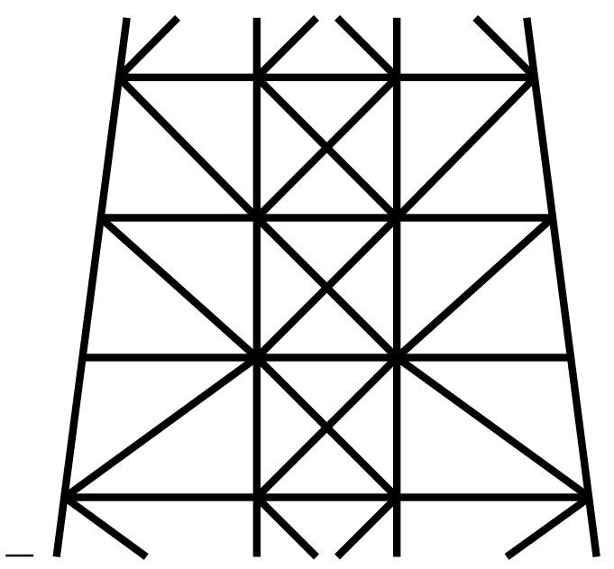

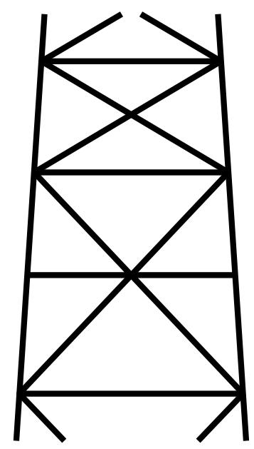  
Figure 11.4-1 — Recommendations for vertical frame configurations for seismic conditions

## 11.5 ELE requirements

11.5.1 Partial action factors

Each member, joint and foundation component shall be checked for strength using the internal force (action effect), S, resulting from the design action, $F_{ \mathrm{ d } } ,$ calculated using Formulas (11.5-1) and (11.5-2):

$$F_{\mathrm{d}} = 1, 1 G_{1} + 1, 1 G_{2} + 1, 1 Q_{1} + 0, 9 E \tag{11.5-1}$$

where E is the inertia action induced by the ELE ground-motion and determined using dynamic analysis procedures such as response spectrum analysis or time-history analysis. $G_{ 1 } , G_{ 2 }$ and $Q_{ 1 }$ are defined in 9.2.1 to 9.2.3, as modified in 11.5.2, and shall include actions that are likely to be present during an earthquake.

When contributions to the internal weight-induced forces oppose earthquake-induced inertia effects, the partial action factors for permanent and variable actions shall be reduced such that:

$$F_{\mathrm{d}} = 0, 9 G_{1} + 0, 9 G_{2} + 0, 8 Q_{1} + 0, 9 E \tag{11.5-2}$$

where $G_{ 1 } , G_{ 2 }$ and $Q_{ 1 }$ shall include only actions that are reasonably certain to be present during an earthquake.

11.5.2 ELE structural and foundation modelling

The requirements in this subclause for the mass to be used in a dynamic analysis have been established from many years of successful practice. For this analysis, personnel are normally treated as consisting of a ‘permanent’ complement and a ‘variable’ complement. The means to incorporate these two complements in the dynamic analysis is indicated in this subclause.

The mass used in the dynamic analysis shall consist of the mass of the structure associated with:

— the permanent actions $G_{ 1 }$ and $G_{ 2 } ;$

— 75 % of the variable actions $Q_{ 1 } ;$   
— the mass of entrapped water;   
— the added mass.

The added mass may be estimated as the mass of the displaced water for motion transverse to the longitudinal axis of individual structural members and of appurtenances. For motions along the longitudinal axis of the structural members and appurtenances, the added mass may be neglected.

The structural model shall include the three-dimensional distribution of the stiffness and mass of the structure. Joints in the model may be treated as rigid. Asymmetry in the distribution of the stiffness and mass of the structure can lead to significant torsion and should be considered in design.

In computing the dynamic characteristics of braced, pile-supported fixed steel offshore structures, a modal damping ratio of up to 5 % of critical may be used in the dynamic analysis of the ELE event. Additional damping, including hydrodynamic or soil induced damping, shall be substantiated by special studies.

Pile-soil performance and pile design requirements should be determined on the basis of studies that consider the design actions, installation procedures, cyclic and strain rate effects on soil properties, and characteristics of soils as appropriate for the axial or lateral capacity algorithm being used. When an equivalent linear foundation model is used, the stiffness of the pile foundation should be compatible with the expected level of non-linearity in the axial and lateral foundation response. See ISO 19901-4 for guidance.

The foundation stiffness can have a large effect on the natural period(s) of the structure, hence upper and lower bound foundation stiffness values shall be considered to evaluate the sensitivity to a range of possible natural periods.

For the design of piles for the ELE event, a partial resistance factor of 1,25 shall be used to determine the axial pile capacity (see 17.1) and a partial resistance factor for the p-y curves of 1,0 shall be used to determine the lateral pile performance (see ISO 19901-4).

## 11.6 ALE requirements

11.6.1 General

The structure-foundation system shall be analysed to demonstrate an ability to withstand the rare, intense ALE earthquake. This analysis shall establish that:

a) the structure does not globally collapse during the earthquake;   
b) the structural integrity of the topsides is maintained.

The characteristics of the rare, intense ALE event shall be developed in accordance with ISO 19901-2. The,```, stability of the structure-foundation system during the ALE event shall be demonstrated by analytical``-` procedures that are rational and reasonably representative of the expected response of the structural,`,`,, and soil components to intense ground shaking. Performance requirements of the structure-foundation`,``, system shall be in accordance with ISO 19901-2.

The designer should develop a thorough insight into the performance of the structure and its foundation during the ALE event. The expected non-linear effects, including material yielding, buckling of structural components and pile failures, shall be adequately modelled and captured. The time-history method of

analysis is recommended; however, a static pushover analysis may be used. While an analysis for the ELE event focuses on internal forces and stresses, the focus of an analysis for the ALE event is on strains and displacements.

11.6.2 ALE structural and foundation modelling

Analysis of the ALE event should be based on the most realistic estimate of values of parameters, such as steel yield strength, member slenderness, member strength and soil strength used for determining the axial capacity and the lateral performance of piles. The partial resistance factors for axial capacity and lateral pile performance under ALE conditions shall be 1,0. Models of the structural and soil elements should include, as appropriate, the representative degradation of strength and stiffness under abnormal action reversals, the interaction of axial forces and bending moments in structural members, hydrostatic pressures, local inertial effects caused by members vibrating out of plane, and the P–Δ effect of earthquake actions.

NOTE See ISO 19901-4 for general guidance on foundation modelling.`,``,,

In an analysis of the ALE event, the most realistic estimate of the yield strength of the material and of the,``-` non-linear behaviour of the joints (including any design strength bias) should be used. Local joint`,``` deformations greater than 5 % of the chord diameter shall be specifically investigated; otherwise, the,`--- joint should be assumed to fracture at this deformation level.

11.6.3 Non-linear static pushover analysis

The objective of a static pushover analysis is to verify that the seismic reserve capacity factor, $C_{ \mathrm{ r } } ,$ of the structure as designed is greater than that initially estimated for design. The actions used in a static pushover analysis should represent the pattern of ALE seismic actions on the structure and foundation. Action patterns in a pushover analysis may be constructed to match the shear and moment distributions determined from an ALE response spectrum analysis along the height of the structure. Pushover analyses should be performed in several directions, as follows, to identify the structure’s weakest direction:

— with the pattern of seismic actions aligned with the longitudinal (end-on) axis of the structure;   
— with the pattern of seismic actions aligned with the transverse (broadside) axis of the structure;   
— with the pattern of seismic actions aligned with one or more diagonal axes of the structure.

Diagonal direction(s) can be the weakest direction(s), especially with regard to foundation performance.

Yielding of structural members or piles shall not occur at global action levels lower than or equal to the global ELE action, $F_{ \mathrm{ E L E } }$ (Figure 11.6-1). The seismic reserve capacity factor, $C_{ \mathrm{ r } } ,$ shall be the smallest value computed among all pushover analyses (i.e. weakest direction). $C_{ \mathrm{ r } }$ may be estimated using Formulas (11.6-1) and (11.6-2) from the global seismic action-deformation curve obtained in a static pushover analysis, e.g. from global shear versus deck displacement (see Figure 11.6-1):

$$C_{\mathrm{r}} = C_{\mathrm{s r}} C_{\mathrm{d r}} \tag{11.6-1}$$

where $C_{ \mathrm{ s r } }$ is a factor corresponding to the strengthening regime of the action-deformation curve, estimated as:

$$C_{\mathrm{s r}} = \Delta_{\mathrm{u}} / \Delta_{\mathrm{E L E}} \tag{11.6-2}$$

where $\Delta_{ \mathrm{ E L E } }$ is the deformation caused by the global ELE action $F_{ \mathrm{ E L E } }$ and $\varDelta_{ \mathrm{ u } }$ is the deformation corresponding to $F_{ \mathrm{ u } } ,$ the ultimate action where the slope of the action-deformation curve becomes negative, see Figure 11.6-1.

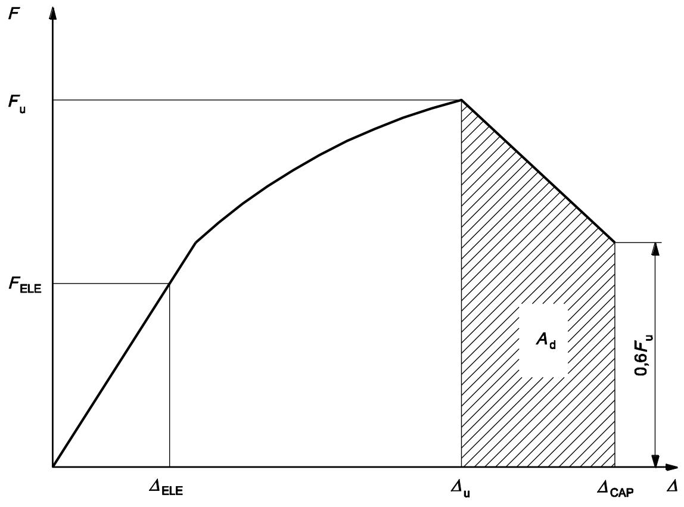  
Figure 11.6-1 — Seismic action–deformation curve

$C_{ \mathrm{ d r } }$ is a factor corresponding to the degrading regime of the action-deformation curve. It is a measure of the energy dissipation capacity of the structure beyond the ultimate seismic action and the corresponding deformation. $C_{ \mathrm{ d r } }$ r is estimated using Formula (11.6-3):

$$C_{\mathrm{d r}} = \sqrt{1 + \frac{A_{\mathrm{d}}}{F_{\mathrm{u}} \Delta_{\mathrm{u}}}} \tag{11.6-3}$$

$A_{ \mathrm{ d } }$ is the area under the action-deformation curve starting from $\varDelta_{ \mathrm{ u } }$ and ending with the deformation capacity, $\varDelta_{ \mathrm{ C A P } } .$ For the purpose of a non-linear static pushover analysis, the deformation capacity shall be assumed to be the deformation where the global action falls to 60 % of $F_{ \mathrm{ u } } .$ .

NOTE The deformation used is a displacement of the deck (location of largest mass). As ratios of deformations and areas are used, the exact elevation within the deck is unlikely to have any effect. It is expected that non-linearity is confined to the structure below the deck and that the seismic action–deformation curves for different deck elevations are similar.

The above determination of $C_{ \mathrm{ r } }$ presupposes that the primary sources of degradation of the global resistance have been properly modelled in the static pushover analysis to represent the structure's weakest direction, e.g. soil degradation, buckling of compression members, local buckling of members due to rotations at the member end (reducing the plastic moment capacity) and pushover direction.

Alternatively, $\varDelta_{ \mathrm{ u } }$ shall be defined as the deformation where the slope of the action–deformation curve is reduced to 5 % of the initial elastic slope, with $C_{ \mathrm{ d r } }$ assumed to be equal to 1,0.

11.6.4 Time-history analysis

The objective of a non-linear time-history analysis is to demonstrate that the structure can be expected to sustain the ALE seismic event without collapse and without major structural failure of the topsides. It shall be demonstrated that the structure-foundation system is expected to remain stable under the deformations induced by the ALE ground motions. The structure-foundation system shall be considered unstable when the deformations and degradation are severe enough to cause collapse under the influence of applicable permanent and variable actions.

The response of the structure-foundation shall be determined by a minimum of four sets of ground motion records characterizing the likely intensity, frequency content and duration of the ALE event. If seven or more time-history records are used, global structural survival shall be demonstrated in half or more of the time-history analyses. If fewer than seven time-history analyses are used, global survival shall be demonstrated in at least four time-history analyses.

12 Structural modelling and analysis

## 12.1 Purpose of analysis

Structural analysis is the process of determining the action effects in a structure, or part thereof, in response to a given set of actions. It is a necessary step in demonstrating that a fixed steel offshore structure is able to satisfy the general requirements laid down in ISO 19900. Action effects required for the design of fixed steel offshore structures typically include the following:

— internal section forces, which shall not exceed the strength of the section;   
— displacements and vibrations, which shall be within acceptable limits for operation of the structure;   
— support reactions, from which the required foundation capacity can be determined.

Clause 12 presents the requirements for structural analyses necessary for the design of fixed steel offshore structures for the following design situations:

a) pre-service situations including fabrication, loadout, transportation and installation (for which the design actions are given in Clause 8);   
b) in-place situations, including:

— permanent, variable and metocean actions (for which the design actions are given in Clause 9), but excluding fatigue, which is dealt with in Clause 16;   
— accidental situations (see Clause 10);   
— seismic events (see Clause 11);   
— ice actions (see ISO 19906);

c) removal situations (see Clause 8).

Structural analysis shall be based on actions and partial action factors specified in Clauses 8 to 11. Action effects calculated by structural analysis shall be used as input to the design process for components as described in Clauses 13 to 17.

## 12.2 Analysis principles

12.2.1 Extent of analysis

Structural analyses shall be performed to provide action effects suitable for checking the structure for all relevant design situations.

The number, types and extent of analyses to be performed shall cover all phases of the lifetime of the structure, i.e. pre-service, in-place and decommissioning. However, if it can be demonstrated that particular phases in the design service life of a component of the structure do not govern its design, such phases need not be analysed for that component.

Requirements for typical analyses to be performed for a fixed steel structure and its components are given in 12.4. Complex or unusual structures can require other forms of analysis to determine all significant action effects in the structure.

Actions shall be applied simultaneously, if they can coexist, and shall include partial action factors, in accordance with Clauses 8 to 11, for each design situation being checked.

12.2.2 Calculation methods

Various calculation methods can be used for the determination of action effects in response to a given set of actions. These include, but are not limited to, hand calculations and computer methods, such as spreadsheets and finite element analysis (FEA).

Non-linear FEA is appropriate for the analysis of foundation components and may also be used to estimate ultimate strengths of structural components, and hence RSR.

## 12.3 Modelling

12.3.1 General

This subclause provides guidance on the modelling of a structure, its structural components, their interactions and support conditions for the purpose of structural analysis.

Structural analyses can normally be limited to the structure being considered. However, where adjacent structures interact with the structure, the interaction shall be included in the analysis, to the extent required to predict the action effects accurately.

Due consideration shall be given to the interaction between primary structure, secondary structure, and the topsides structure (see 12.3.5).

Consideration shall further be given to any imperfections due to fabrication and to accidental damage.

12.3.2 Level of accuracy

Material properties and geometrical tolerances are defined in Clause 19 and Annex G. Where a particular component does not conform to these tolerances, the effect of the non-conformities on structural behaviour shall be evaluated. The effect of tolerances shall also be incorporated into the analysis where

the structural design is particularly sensitive to their magnitude. The need for non-linear analysis to account for non-conformities shall be evaluated.

Where FEA is performed, consideration shall be given to the type and accuracy of the element formulations, to ensure that sufficient elements are used to predict the structural behaviour, particularly in areas where the action effects change rapidly.

12.3.3 Geometrical definition for framed structures

12.3.3.1 General

Dimensions used in structural analysis calculations shall represent the structure as accurately as necessary to produce reliable values of the action effects.

A space frame model shall be created to describe the three-dimensional geometry of the structure. The model is usually based on nominal sizes and dimensions. Where as-built dimensions differ from nominal sizes by more than the permissible tolerances set out in Annex G, the effect of this dimensional mismatch shall be assessed and incorporated into the analysis, if appropriate.

The dimensions used in structural analysis calculations shall produce reliable, conservative values of the structural resistance and action effects. Stiffness and strength assessment shall normally be based on nominal sizes and dimensions. Mass, weight and hydrodynamic action calculations shall account for corrosion allowances (if any) and for the presence of marine growth.

A space frame model consists of members that are connected at nodes. The continuous member at a connection point (a node) is called the chord, members that end or are interrupted at the chord are called braces. The assembly of chord and braces is a joint.

The nodes of the space frame model shall be the intersection points (working points) of the centre lines of the braces with the centre line of the chord (see Figure 12.3-1). The offset is the distance between brace working points. Joints with zero offset are called concentric.

For a global analysis, offsets smaller than D/4 (see Figure 12.3-1) need not be included in the space frame model of the structure. However, for a local analysis, the axial forces in the brace members of K- and X-joints (see 14.2.4) cause secondary moments in the chord that can be important and should generally be assessed (see A.12.3.3.1).

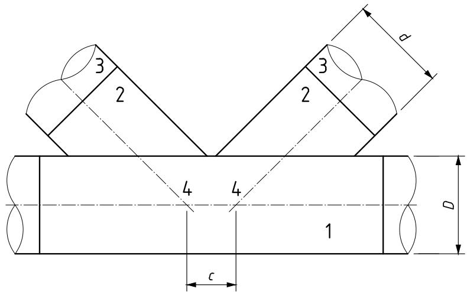  
Figure 12.3-1 — Definition of offset

Key

1 chord can
2 stub
3 brace
4 working points

D can diameter   
c offset   
d brace diameter

12.3.3.2 Member modelling

The structural model of a framework shall primarily consist of beam elements representing the axial, bending, shear and torsional stiffnesses of the structural members. In some cases, special modelling arrangements are necessary for pile clusters and large diameter members provided for storage or flotation.

The structural members of the framework shall be modelled using one or more beam elements for each span between the nodes of the model of the framework. The number of beam elements depends on the element formulation, actions, and potential for local dynamic response. The element properties shall be varied along the spans to account for variations in the component cross-section, where appropriate. The element properties shall also be adjusted to account for any corrosion allowance.

The structure shall be modelled in detail to include the primary and secondary structures, conductors, and appurtenances to ensure that action effects are accurately predicted. If this is not possible, the necessary detail of the model shall be prioritized as follows, in the order given:

a) The primary structure.   
b) The secondary structure; if representation of secondary framework is simplified, a more rigorous analysis of the secondary framework shall be undertaken for its local design with local analysis boundary conditions applied.   
c) Components provided for temporary conditions, such as launch framing, mudmats, etc. These shall be included in the model for appropriate analyses unless:

— they are removed prior to the design situation under consideration, or   
— the action effects on these components (and the effect of their stiffness on the rest of the structure) are not significant.

d) Conductors; these shall be included in the model, if they contribute significantly to the overall stiffness or strength of the structural system, including the foundation. Otherwise, they may be treated as appurtenances (see 12.3.6).   
e) Appurtenances.

Care shall be taken not to exclude secondary structure or appurtenances that can be subjected to excessive action effects induced by deformation of the primary structure.

Interaction with adjacent structures shall be considered and appropriate actions shall be applied to represent any relative movement. Particular consideration shall be given to actions that do not result in overcoming friction at bearings, and actions resulting from pipe-work movements.

When the structural contribution of any component is neglected, the self-weight, buoyancy and hydrodynamic actions on the component shall still be included in the model.

12.3.3.3 Joint modelling

For typical structures, depending on the diameter of the chord, the length between the physical end of the brace stub and the centre line of the chord can be significant, and can affect the calculation of member end forces and stresses, weights, masses, hydrodynamic and hydrostatic actions. In such cases, it is customary to model the length of braces between the outer surface of the chord can and its centre line as rigid connections (rigid links); flexibility of brace and chord can connections is thus neglected.

For joints between small diameter braces and large diameter chords, rigid links may be introduced between the longitudinal axis of the chord and the intersection of the chord can with the brace stub, see Figure 12.3-2. Where rigid links are included, care shall be taken that they only contribute stiffness to the structural model. Their stiffness shall be at least one order of magnitude greater than that of the brace and the brace stub, if present. Rigid links shall not contribute to the mass and shall not attract direct hydrodynamic or aerodynamic actions. Some computer analysis systems allow the introduction of member end offsets to achieve these requirements. Care should be taken when using elements with very high stiffnesses to represent rigid links, as computational problems can occur.

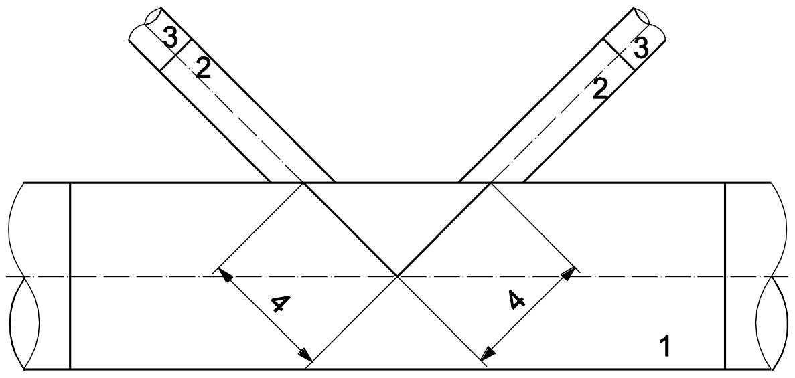  
Figure 12.3-2 — Definition of member rigid links

Key

1 chord can
2 brace stub

3 brace member   
4 rigid link

Joint flexibility is an elastic effect in which bending moments are redistributed. Where several braces connect with the chord at the same joint, the flexibility effects are dominated by the rotation of the brace ends as a result of chord wall rotation. This chord wall rotation results from the forces and moments in all the braces at the node and can increase or decrease any particular member end moments. In practice, full joint modelling is rarely performed, where joint flexibility is modelled, it shall be modelled throughout the structure.

12.3.4 Modelling of material properties

Material properties (e.g. modulus of elasticity, Poisson’s ratio, yield strength, ultimate tensile strength) used in the structural analyses of a new design shall reflect the materials specified for construction.

For existing structures, material properties may be based on statistical analysis of the material certificate data. Where no documentation can be found for assessing existing structures, coupon tests may be used to indicate which grades of steel were used to fabricate the structure.

The value of yield strength found from a coupon test shall be compared with the SMYS for the component in question.

Material properties used for non-linear analysis (e.g. true stress-strain curve) shall be based on published or test data for the appropriate steel specification and grades, including, if appropriate, strain hardening and plasticity effects (see also 12.6.7).

When assessing the resistance of a structure to elevated temperatures arising from fires, account shall be taken of the dependency of material properties, including yield strength, $f_{ \mathrm{ y } } ,$ and Young's modulus, E, on temperature.

12.3.5 Topsides structure modelling

Where the structure and the topsides structure interact significantly, a combined model of structure and topsides structure shall be used. The modelling of the topsides structure shall represent the interaction of the structures and the sequence of installation. The primary topsides structure shall be included in the structural model of the whole platform. The model shall include any deck members, deck plating and stiffening that affect or contribute to the distribution of forces into the structure. Differential deflections shall be taken into account when these can have a significant effect on the performance of the structures, particularly for serviceability conditions. The sequence of stressing introduced into rigid jointed structures arising from installation shall be considered.

If separate models for the structure and the topsides structure can be justified, the stiffness of the topsides structure and its interface with the structure shall be modelled in sufficient detail to ensure that its self-weight and applied actions are appropriately distributed to the structure.

12.3.6 Appurtenances,,,``

The support and movement of appurtenances shall be modelled with appropriate constraint conditions`,,,, so that the actions applied to them, including those due to self-weight, are correctly transferred to the`-``, main structure. An example of an arrangement that often occurs is that unrestrained differential axial``,,, displacement and rotations between an appurtenance and its guide(s) are possible, but that the guide(s)-- constrain the appurtenance to have the same lateral movements. The effect of any eccentricity in the support arrangement on the appurtenance and the structure shall be checked and included in the analysis, if significant.

12.3.7 Soil-structure interaction

12.3.7.1 General

The stiffness of a piled foundation generally displays non-linear characteristics. The appropriate soil properties shall be determined in accordance with ISO 19901-4.

The foundation shall be modelled and analysed using non-linear soil p-y, t-z and Q-z curves generated from site-specific data, when available. Particular care should be taken in modelling relatively thin layers near the sea floor, where p–y soil properties change rapidly. The soil layers shall be modelled accurately to at least the depth at which the piles are expected to terminate. If the pile tip rests on weak soil layers, the possibility of punch-through shall be investigated.

For an analysis to determine the behaviour of the structure, an equivalent simple linear elastic model may be used to model a piled foundation. When such a simple model is used, the forces and displacements at the pile heads (at the sea floor) shall be checked for compatibility with the predicted non-linear foundation behaviour.

Pile penetrations shall be conservatively assessed, based on upper and lower bound considerations of soil properties and pile driving hammer properties. Either upper or lower bounds can be more critical for different situations and different components of the overall structural system.

The effects of global seabed scour, of local scour in granular soils and of the partial loss of soil-pile contact in cohesive soils shall be taken into account.

12.3.7.2 Pile groups

When modelling the individual piles in a pile group (or cluster), the non-linear soil p-y, t-z and Q-z curves shall be adjusted to account for pile group effects. Alternatively, a model to account for interaction between individual piles shall be included in the analysis; see also ISO 19901-4.

For pile groups, each pile-sleeve connection may be represented by one or more coaxial tubular member(s). Any bracing, shear plates or similar connections between a pile-sleeve and a leg shall be simulated by an appropriate combination of bar, beam and plate elements that models the method of transfer of forces between the leg and pile-sleeve connection.

12.3.7.3 Pile connectivity

The constrained movement of ungrouted piles within legs shall be modelled. Each pile shall be allowed to move independently of its leg, both along its axis and around all rotational axes, but the leg and piles shall be constrained to have the same lateral displacements (normal to the longitudinal axis of the leg/pile). Such constraints should be applied at locations where contact is expected to occur, such as at shims or centralizer locations or at plan bracing levels.

12.3.7.4 Conductor modelling

Conductors can contribute significantly to the foundation stiffness and lateral strength of a structure. In such cases, the conductors shall be modelled and analysed as structural components with their own foundation stiffness.

The lateral behaviour of the conductors below the sea floor may be modelled in the same way as piles, either as equivalent members or individually, employing non-linear soil p-y curves generated from sitespecific data when available. For vertical, self-supporting conductors that are constrained only in the

horizontal direction, modelling the conductors' axial behaviour using the soil t-z and Q-z characteristics may be omitted. Group effects of conductors shall be considered.

When equivalent members are used, the displacements at the sea floor shall be checked for compatibility with the predicted non-linear foundation behaviour.

The installation of conductors can cause significant disturbance to the integrity of the soil, and the contribution from the conductors to the foundation stiffness can be much lower than anticipated. Where the foundation stiffness associated with the conductors is included in the analysis, consideration shall be-- given to the effectiveness of the conductor foundations and to situations where not all of the conductors``,,, are installed. In the latter cases, although the hydrodynamic actions on the structure are lower, the action-`-`` effects on the main structure piles can be higher. An upper bound value of the action effects on the main`,,,, structure piles should be determined by releasing the horizontal and bending (but not torsion) restraints``,,,, at the base of each conductor. An upper bound value of the action effects on any conductor bracings close`,,,` to the sea floor should be determined by modelling an upper bound foundation stiffness.

12.3.7.5 Conductor connectivity

The constrained movement of conductors within their guide frames shall be modelled. Each conductor shall be allowed to move independently of its guide, both along its axis and around all rotational axes, but the conductor and its guide shall be constrained to have the same lateral displacements (normal to the longitudinal axis of the conductor) as the guide. The contact action, including friction, between curved or slanting conductors and their guide frames requires special consideration.

12.3.8 Other support conditions

The action of water pressure on a structure (or on a supporting vessel) while floating (e.g. during transportation or installation) shall be evaluated from suitable hydrostatic and hydrodynamic analyses for wave and current, as appropriate, and shall be applied to appropriate external surfaces of the structure (and/or the supporting vessel); see also 12.4.3.2.

Where balanced actions are applied to a structure or component, the minimum number of artificial restraints shall be applied for certain types of analysis (e.g. lift) to prevent rigid body movement. Artificial restraints shall be applied as follows:

— as translational restraints that do not inhibit relative deflections within the structure or the component;   
— at points where no direct actions are applied, although distributed self-weight may be applied at a restraint;   
— to extreme locations in the structure or the component;   
— to relatively stiff points in the structure or the component.

Where components of the structure are not fully restrained, such as conductors within guides (see 12.3.7.5) and bearing surfaces between topsides structure and bridge structure, consideration shall be given in the analysis for movement at such interaction points.

12.3.9 Local analysis structural models

Local models may be created to study the behaviour of a structural component in greater detail. The boundaries of the local model shall be sufficiently remote from the component being studied that the method of applying the boundary conditions does not affect the component's behaviour. The actions

applied to the local model shall be the same as those applied to that part of the global model represented by the local model. The application of the actions to the local model may be more detailed than in the global model.

The boundary conditions applied to the local model shall be one of the following:

— forces extracted from an analysis of the overall structural system and applied as direct actions at the boundaries of the local model together with the minimum number of restraints to prevent rigid body movement;   
— displacements extracted from an analysis of the overall structural system and applied as imposed deformations at the boundaries of the local model;   
— a set of related forces, displacements and stiffnesses determined by substructuring the overall structural system in which one or more substructured parts represent local models with connections to the remainder of the structural system at the intended boundaries of the local model.

12.3.10 Actions

In a structural analysis, the applied actions shall include partial action factors appropriate to the action being considered and the limit state checks to be performed. It is common practice to subdivide actions into categories to allow separate application of partial action factors and to provide flexibility in the analysis.

Actions shall be determined by recognized methods, taking into account the variation of actions in time and space, relevant environmental and soil conditions and the limit states being addressed, see Clauses 8 to 11.

Permanent and variable actions shall be based on the most likely representative values for the situation -`,,,` being analysed. Consideration shall be given to both representative maximum and minimum values. In a ,``,, number of cases representative minimum values can govern the design of some components.,`,,,

Hydrostatic pressures shall be based on the likely range of fluid surface elevations and densities.,```,, Hydrostatic pressures on structures while afloat, such as during transportation, installation and removal,--- shall include the effects of tilt of the structure due to wind, wave action or damage.

The action effects due to wave, current and wind actions shall include the influence of such actions on structure motions when the structure is afloat or on a transportation vessel. In cases where dynamic action can be of importance, such influence shall be considered in determining action effects. Quasi-static or dynamic analyses shall be used in accordance with 12.5.

Less well defined actions, such as variations in topsides weight and centre of gravity and actions during loadout, should be represented by ranges of representative values, the structure being checked for the most onerous values.

Actions on a local model shall be included in that model (see 12.3.9).

12.3.11 Mass simulation

For dynamic analysis and for motion prediction during transportation and installation, a suitable representation of the mass of a structure is required. Generally, masses should be determined as a representative combination of mass values for the situation considered. Such a mass simulation shall include relevant contributions from, at least, the following:

— all structural components and appurtenances;

— the operating mass of all intended equipment;   
— the estimated mass of temporary items, such as slings, storage, lay-down, etc.;   
— masses of any fluids contained within the structure or topsides, including vessels, piping contents, oil and bulk storage, etc.;   
— snow and ice accumulation on the structure, if significant;   
— drill cuttings or other deposits on the structure, if significant;   
— the mass of marine growth;   
— the added mass representing hydrodynamic reaction to structure motions (allowing for any marine growth thickness);   
— the internal mass (flooded members) moving with the structure.

The magnitude and distribution of mass shall be as accurate as necessary for the determination of all significant rigid body motions or modes of vibration for the structural analysis being performed. Particular attention shall be paid to the location of individual centres of mass, in particular for heavy equipment and storage tanks in the topsides structure. Sufficient dynamic analyses shall be carried out to determine the sensitivity of action effects to anticipated variations in the magnitude and distribution of mass.

Calculation of the hydrodynamic reactions to structure motions (represented in the form of added mass and damping) shall be based on the best available published information or suitable hydrodynamic analysis. In lieu of such analysis, the added mass may conservatively be taken as equal to the full mass of water displaced by the structure.

12.3.12 Damping

Damping arises from a number of sources, including material damping, soil damping, hydrodynamic damping and frictional damping between moving parts. For fixed steel offshore structures, damping is relatively small. In the absence of substantiating values obtained from measurements of existing structures conservative (lower bound) damping values shall be used.

## 12.4 Analysis requirements

12.4.1 General

All structural analyses performed shall simulate, with sufficient accuracy, the action effects in the structural system or the structural component for the limit state being considered. This shall be achieved by appropriate selection of the analysis type and method of solution with due regard to the nature of the actions and the nature of the structural behaviour. More than one analysis type can be required to simulate the behaviour of the structural system during a given phase of its life.

Sufficient global analyses of the structural system shall be performed to allow subsequent assessment of the structural components. As a minimum, the structural system shall be assessed for ultimate limit state (ULS) conditions. Local analysis shall be performed to assess any detail that is complex in form and/or appears from the global analysis to experience large action effects. Such local analysis may be based on non-linear methods.

Table 12.4-1 summarizes the applicability of analysis types for different design situations. The analyses in this table shall be performed using the partial action and resistance factors specified in Clauses 9 to 11 and Clauses 13 to 15, respectively. In cases where these partial factors are deemed inappropriate, the analyses may be performed within a structural reliability framework.

Table 12.4-1 — Applicability of analysis types for design situations   


| Situation | Situation | Analysis type | Analysis type | Analysis type | Analysis type |
| --- | --- | --- | --- | --- | --- |
| Situation | Situation | Static/Quasi-static linear elastic | Dynamic linear | Non-linear | Structural reliability |
| 1 Pre-service and removal situations | 1 Pre-service and removal situations | 1 Pre-service and removal situations | 1 Pre-service and removal situations | 1 Pre-service and removal situations | 1 Pre-service and removal situations |
| 1.1 Fabrication Fatigue during fabrication | 1.1 Fabrication Fatigue during fabrication | Appropriate | Appropriate (needed for wind induced vibrations for long slender braces only, see Clause 16) |  |  |
| 1.2 Loadout | 1.2 Loadout | Appropriate |  |  |  |
| 1.3 Transportation Fatigue during transportation | 1.3 Transportation Fatigue during transportation | Appropriate | Appropriate (needed for long sea tows only, see Clause 16) |  |  |
| 1.4 Installation | 1.4 Installation | Appropriate | Appropriate for fatigue analysis of piles during pile driving |  |  |
| 1.5 Removal | 1.5 Removal | Appropriate |  | Appropriate if needed to demonstrate that no failures occur during removal |  |
| 2 In-place situations | 2 In-place situations | 2 In-place situations | 2 In-place situations | 2 In-place situations | 2 In-place situations |
| 2.1 Normal operating and extreme metocean situationsFatigue during the in-place situation | 2.1 Normal operating and extreme metocean situationsFatigue during the in-place situation | Appropriate for structures that are not unduly dynamically sensitive, see 9.9 Appropriate for structures that are not unduly dynamically sensitive, see Clause 16 | Appropriate for structures that are appreciably dynamically sensitiveAppropriate for structures that are appreciably dynamically sensitive, see Clause 16 | Appropriate for foundation components | Appropriate, but outside the scope of this document |
| 2.2 Accidental situations | 2.2 Accidental situations | Appropriate, but can be unduly conservative | Appropriate, but can be conservative | Appropriate | Appropriate, but outside the scope of this document |
| 2.3 Seismic events | 2.3 Seismic events | Appropriate for extreme level earthquake (ELE) event, see Clause 11 | Appropriate (see Clause 11) | Appropriate for abnormal level earthquake (ALE) event, see Clause 11 | Appropriate, but outside the scope of this document |


NOTE 1 Quasi-static linear analysis includes inertia actions to represent rigid body structural accelerations.

NOTE 2 Linear static or quasi-static analysis as defined here includes simple non-linearities, e.g. from gaps opening and closing.

NOTE 3 Non-linear local analysis of a component would be expected to include buckling as well as material non-linearity (e.g. using the provisions of 12.6).

12.4.2 Fabrication

Fixed steel offshore structures, particularly large or slender structures, or those with particularly slender structural components, should be reviewed to determine whether analysis for fabrication is required.

Where such analysis is undertaken, consideration shall be given to the sequence and to the completeness of fabrication (e.g. whether welding has been completed at particular joints) in determining action effects. Specific consideration shall also be given to the stability and strength of structural components during fabrication and to the need for any temporary supports or strengthening. Adequate support for equipment subjected to temporary actions, such as for crane footings, shall be demonstrated.

Fabrication phase analyses may generally be performed using static analysis. However, dynamic analysis shall be considered for the determination of action effects in tall, slender structures and long thin appurtenances in view of vibrations induced by wind turbulence.

12.4.3 Other pre-service and removal situations

12.4.3.1 General

Mass inertial forces due to accelerations shall be taken into account in analyses involving loadout, transportation, installation (including launch, floating, upending and/or lifting), and other situations in which the structure is in motion. However, in many cases, in particular for loadout and installation, static linear elastic analysis is adequate. Care shall be taken in the definitions of the actions and the application of partial action factors to ensure that only feasible and stable conditions are analysed. In general, the analysis should be undertaken for unfactored actions, with action effects factored after the internal forces are calculated (see 8.2.4.2).

Requirements for the calculation of actions and partial action factors for pre-service and removal situations are given in Clause 8.

12.4.3.2 Loadout

Loadout refers to the series of operations needed to transfer the structure from its assembly position in the fabrication yard to the transportation or launch barge. During loadout, the structure is generally supported unevenly, with changing support conditions. Limitations on the acceptable support conditions shall be identified during the design phase, and shall not be exceeded during loadout. Because loadout occurs slowly, inertial actions may be neglected, and linear static analysis is sufficient. However, the nonlinearities due to lift off from the supports should be taken into account.

12.4.3.3 Transportation

Fixed steel offshore structures and topsides are normally transported to location by vessel. During transportation, the structures are subjected to actions generated by heave, sway, surge, pitch and roll accelerations. Parts of the structure overhanging the vessel are also susceptible to actions due to buoyancy, wave action and wave slam, if the structure penetrates the water. Structural components can

also be subjected to excitations associated with wind induced vortex shedding. These action effects should neither exceed the strength of structural components nor cause excessive fatigue damage.

The structural integrity of a steel structure shall be assessed for the transportation phase (sea tow) of the structure, whether it is self-floating, vessel-supported or barge-assisted. Analysis of situations during sea tow is normally based on quasi-static analysis, representing the motion of the steel structure due to the most onerous combination of heave, sway, surge, pitch and roll accelerations, as predicted by hydrodynamic analysis. For a long sea tow, where the duration of the tow precludes assurance of calm weather for the whole length of the tow, fatigue damage shall be assessed (see Clause 16).

The model of the structure (see 12.3) shall include all sea fastenings. If the bending and torsional stiffness of the vessel is significantly greater than that of the structure, the vessel may be assumed to be rigid with appropriate boundary conditions applied where the sea fastenings are connected to the deck of the vessel. A quasi-static analysis shall be carried out for design combinations of self-weight, roll, pitch and heave, with roll and pitch accelerations applied about the appropriate roll and pitch centres for the combined vessel and structure, with the vessel and structure inclined at the maximum angle of roll and/or pitch.

If vessel flexibility is important, the model shall include the structure and the vessel, as well as a representation of the hydrostatic and hydrodynamic actions due to the surrounding water. The vessel should preferably be modelled using plate/shell elements, having both in-plane (membrane) and out-ofplane bending stiffness. The total actions on the vessel and the structure, with the water pressure distribution derived from a motion analysis, should be in quasi-static equilibrium.

Sea fastening and grillage supporting the structure on the vessel shall be checked for strength using design situations including appropriate combinations of:

— self-weight;   
— roll and pitch angles;   
— roll, pitch and heave accelerations.

The modelling shall recognize the sequence of loadout of the structure onto the vessel and the attachment of the sea fastenings. In particular, as sea fastenings are installed after the structure loadout on the transport vessel is completed, it is common practice to assume that they do not resist any of the structure dead weight in the still water condition. The validity of this assumption should be verified in consideration of the relative flexibility of the vessel and the structure.

Structural components, sea fastenings and grillage shall be checked for strength in accordance with Clauses 13 to 15. The fatigue life of structural components and sea fastenings shall be assessed, when relevant, in accordance with Clause 16. Structural components that are subjected to wave slam shall be assessed for strength and fatigue due to the associated actions.

12.4.3.4 Installation

Structures are either launched or lifted into the water. When launched, a time-history analysis shall be performed:

a) to determine the launch trajectory to ensure sufficient clearance from the sea floor;   
b) to determine the stability of the structure after separating from the vessel;   
c) to check that the structure is not overstressed as it:

1) rotates and enters the water;   
2) upends, with or without crane assistance;   
3) is ballasted so that it rests on the sea floor;

d) to check that the vessel is not overstressed at any stage of the launch.

The strength of the structure shall be checked using representative actions generated at various stages of the launch and upending process. The actions shall include hydrostatic and hydrodynamic actions on the structure, actions from self-weight at the appropriate orientation relative to the structure and the actions due to the instantaneous translational and rotational accelerations of the structure. Sufficient boundary conditions shall be applied to prevent rigid body movement of the structure and to provide a datum for deflections. The structure shall be analysed for each set of representative actions.

Transients are important for lift installations, but a full dynamic analysis is normally not carried out. Instead, static analysis is performed employing representative actions to cover motions of the structure and crane vessel, actions due to “snatching” as the structure is lifted off the vessel and due to impact between the structure and the sea floor, etc. As with the launch, sufficient boundary conditions shall be applied to prevent rigid body movement and to provide a datum for deflections. Except at the lifting points, the support reactions should be negligible. When performing single-point lift analysis, it is often convenient to determine the centre of gravity and orient the model so that the centre of gravity is vertically below the lifting point. The effects of variances in the lengths of the slings should be taken into account.

Installation of the topsides by lifting does not normally impose actions on the structure that are greater than, or in a different direction to, those induced by the topsides in in-place situations. Accordingly, analysis of the actions on the structure due to the installation of the topsides may be omitted.

For float-over topsides installation, the design of the structure legs and other components can be substantially affected by the lateral actions induced by the topsides/vessel system. This design situation shall be appropriately analysed.

For each installation analysis, structural components shall be checked for strength in accordance with Clauses 13 to 15. In particular, structural components and appurtenances attached to the structure can be subjected to significant slamming action upon entering the water. Consideration shall be given to the stresses induced by slamming.

The structure shall also be assessed for on-bottom stability, when the structure is resting on the sea floor with the aid of mudmats prior to piling being completed. The cases considered shall include that of the structure with and without pile(s) stabbed.

12.4.3.5 Removal

Analysis of the structure for removal shall represent the structure in all appropriate configurations, and shall include the suction and pull out resistances of pile stubs (i.e. any length of pile attached to the structure following pile cutting) prior to separation from the sea floor. Weights of accumulated debris and marine growth left in place at the time of removal shall also be considered, together with the weights of the piles and pile grout to be lifted during removal.

The effect of any structural damage, including degradation of the materials during the life of the structure, shall be considered. The determination of the material degradation shall take into account any results from underwater surveys and inspections.

12.4.4 In-place situations

12.4.4.1 General

The design of a fixed steel structure for in-place situations can generally be based on a static or quasistatic analysis, using a linear elastic model of the structure coupled with a non-linear foundation model, unless there is a likelihood of significant dynamic or non-linear response to a given type of action. In such cases, linear dynamic or non-linear static or dynamic analysis approaches, respectively, are normally required, as described in 12.5.

It is generally acceptable to base static structural analysis on the principles of deterministic analysis, predicting action effects to specific events.

The structure shall be analysed for operating and extreme metocean actions. Clause 9 defines the partial action factors for permanent and variable actions for in-place situations.

Selection of metocean parameters for the analysis of in-place situation(s) shall be in accordance with ISO 19901-1. The analysis shall ensure that sufficient variations and combinations of the parameters are analysed to capture the most onerous action effects throughout the structure.

If soils data are available, a pile-soil interaction analysis shall be carried out using non-linear soil p-y, t-z and Q-z curves (see 12.3.7). When, during preliminary analysis, soils data are not yet available, a simplified model of the foundation may be used. Such a simplified model may also be used if design of the foundation and the lower portion of the structure is not the purpose of the analysis.

The foundation capacity shall be verified in accordance with Clause 17 and ISO 19901-4, and the strength of structural components in accordance with Clauses 13 to 15.

12.4.4.2 Extreme metocean conditions

To determine the governing action effects for each structural component, the structure shall be analysed``,,, for metocean actions due to the most onerous combinations of wind, current and wave conditions, as `,,,, specified in Clause 9. To achieve this, a sufficient number of appropriate combinations of the following `-`-``, metocean parameters shall be considered:``,,,

— water depth, including effects of tides and storm surge;   
— wind speed, omnidirectional or in relation to wind direction;   
— current speed, omnidirectional or in relation to current direction;   
— wave height and period, omnidirectional or in relation to wave direction;   
— wave position (phase angle) relative to the structure.

In regions with seasonal ice cover, actions due to ice shall also be considered.

12.4.4.3 Accidental situations

Analyses for accidental situations shall be performed in accordance with Clause 10.

The analysis of collisions (such as ship, helicopter or iceberg collisions) may be performed by considering the energy absorption arising from the combined effect of local and global deformation. The energy absorbed shall be compared with, and equated to, the impact (kinetic) energy due to collision, and the results shall be documented.

The analyses should allow for:

— the energy absorbed in local deformation of the structures at the point of impact, e.g. denting of the colliding ship and denting of a structural component or a group of structural components: and   
— the energy absorbed in elastic and plastic deformation of the structural system, e.g. using quasi-static non-linear analysis of the structural system under the estimated impact.

The resistance of the impact area may be studied using local models. These generally involve non-linear geometrical and material analyses, because the local structure can yield and deform substantially under the accidental actions. Appropriate boundary conditions should be applied far enough away from the damaged region for inaccuracies to be minimized.

Global analysis of the structure under accidental situations, including those due to dropped objects, fire and explosion, shall normally be required to ensure that a progressive collapse is not initiated. The analysis shall include the weakening effect of damage to the structural system in the affected area. Linear elastic redundancy analysis may be used to demonstrate that removal of a damaged member does not initiate progressive collapse. Non-linear analysis may be used to simulate the redistribution of action effects as section resistances are exceeded. The global analysis may be based on a simplified representation of the structure that is sufficient to simulate progressive collapse.

The natural frequencies of the structural system shall be estimated and compared with the frequency content of the accidental actions. Analysis of the overall structural system shall include any significant dynamic response under these actions.

12.4.4.4 Seismic events

Analyses for seismic events shall be performed in accordance with Clause 11 for the extreme level earthquake (ELE) and the abnormal level earthquake (ALE).

12.4.4.5 Fatigue analysis

Requirements for, and guidance on, performing a fatigue analysis are provided in Clause 16.

12.4.4.6 Analysis for reserve strength

Reserve strength analyses can be used to determine the adequacy of unconventionally framed structures and for the assessment of existing structures (see 7.10). They are intended to identify the ultimate strength of the space frame structure and foundation under the action of abnormal metocean actions. The uncertainties associated with foundation capacity are significantly greater than those associated with the ultimate strength of space frame structures (see A.12.5.4). In performing reserve strength analyses, it is therefore important to make this distinction and to evaluate both structural and foundation failure modes. Owing to this, the following strategy is recommended:

a) structural or foundation failure should be identified using an analysis based on the mean (or best estimates) of structural steel properties and soil properties;   
b) where foundation failure occurs before structural failure, structural failure should be determined by assuming a foundation capacity based on upper bound estimates of soil properties.

The upper bound approach, b) above, provides an assessment of the steel structure strength.

In each case, the foundation should be included in the model to evaluate potential combined structure and foundation collapse mechanisms.

For dynamically responding structures (see 12.5.2), dynamic effects can influence collapse due to environmental actions.

Reserve strength evaluation is used to estimate the most likely collapse strength of a structure with partial resistance factors set to 1,0. Since partial resistance factors are omitted, an ultimate strength evaluation shall be interpreted and used with care.

## 12.5 Types of analysis

12.5.1 Natural frequency analysis

A natural frequency analysis shall be carried out to determine whether dynamic behaviour is significant. A reasonably accurate structural model, including both stiffness and mass, shall be developed and analysed so that the natural frequencies of the structural system can be compared to the frequencies of any excitations.

Dynamic behaviour is likely to be significant if any natural frequency, particularly the fundamental frequency, is similar to the frequency of an excitation. Analyses should be carried out to determine any sensitivity to structural stiffness and mass, and to foundation stiffness.

12.5.2 Dynamically responding structures

Structures for which dynamic behaviour is significant are generally referred to as dynamically responding structures. Redundant, multi-legged fixed structures (e.g. jackets, towers, etc.), with fundamental natural periods or having one or more components with natural periods greater than 2,5 s to 3 s usually respond dynamically to wave action during sea tow or in-place situations. For other types of structures, such as monotowers and caissons, dynamic behaviour can be significant even with natural periods of 1 s or less.

Other actions to which the structural system can be subjected, such as wind turbulence, seismic events, impact and explosion, can also cause dynamic effects of significant magnitude at other natural periods.

12.5.3 Static and quasi-static linear analysis

Static analysis is appropriate when dynamic effects are minimal and can be assumed to be covered by the partial action and resistance factors.

Quasi-static analysis is appropriate when dynamic effects can be assumed to be approximately uniform throughout the structural systems and so small that one static analysis or a series of static analyses, with a small correction for dynamic effects, is adequate. The correction for dynamic effects may be determined using one of the following methods:

a) by performing one static analysis in which the actions are enhanced by a set of equivalent quasi-static inertial actions representing the dynamic response;   
b) by performing a series of static analyses over an appropriate range of frequencies of excitation, where, at each frequency, the corresponding actions are applied and the calculated action effects are multiplied by the dynamic amplification factor (DAF) of a single degree of freedom (SDOF) system at that frequency.

Guidance on the application of the chosen method is given in A.12.5.3.

12.5.4 Static ultimate strength analysis

The ultimate strength of an offshore structure is usually defined as the global metocean action at collapse, measured in terms of base shear or overturning moment, which is found by applying the unfactored permanent and variable actions followed by the metocean actions. The metocean actions are gradually increased until structural collapse occurs.

For a static strength analysis, the following checks shall be performed:

a) assess the deformation patterns of the structural system to identify whether a clear failure mechanism has developed;   
b) check the plastic strains in all members that have yielded in tension against the ductility limits set by fracture considerations (see 12.6.6);   
c) check the internal axial forces acting on the pile heads against pile capacities and performances;   
d) check the joint forces against the joint strength.

The structural behaviour should also be studied to determine how forces are redistributed as members, joints and piles fail.

12.5.5 Dynamic linear analysis

When dynamic response is considered significant, the structural system shall be analysed for dynamic behaviour. An accurate structural model including both stiffness and mass shall be used. Lumped and consistent mass modelling shall be employed as appropriate.

The type of analysis is governed by the form of applied actions:

— steady state analysis in response to harmonic actions, as required for spectral analysis;   
— transient analysis in response to arbitrary time-history actions, as can be required for accidental situations and non-linear actions due to waves or earthquakes.

For both types of analysis, the behaviour of the structure and the foundation are assumed to be linear elastic.

12.5.6 Dynamic ultimate strength analysis

Dynamic non-linear structural analysis may be performed in one of the following ways:

— Full transient dynamic non-linear analysis, in which the environmental action is simulated in time.   
— Quasi-static analysis, in which static non-linear analysis procedures are carried out using the `,,,`` environmental actions enhanced by a set of equivalent quasi-static inertial actions representing the dynamic response. The set of equivalent quasi-static inertial actions may be determined in a manner analogous to the procedures in 9.8 and A.9.8. A static pushover analysis can then be performed using the procedure suggested in 12.5.4.

## 12.6 Non-linear analysis

12.6.1 General

When, for example, the structure is subjected to abnormal environmental actions due to wind, wave and current or an earthquake, or to accidental actions from ship impact, fire or explosion, and when a linear analysis predicts

— displacements of a magnitude that are likely to cause second order P-Δ effects,   
— joint failure,   
— member buckling, and/or   
— stresses that exceed the yield strength of the material,

non-linear analysis may be performed to demonstrate that overall structural integrity is not impaired.

Non-linear analysis shall include all relevant actions to represent the maximum actions to which the structure or component is subjected. The actions shall be applied to simulate the action history, e.g. the actions due to permanent and variable actions shall be applied first, to be followed by the actions due to wave and current. The modelling of action history is necessary because non-linear behaviour is dependent on the sequence of the force distribution through the structure. The magnitude of the actions should be the representative values, i.e. without partial action factors. Similarly, no partial resistance factors should be applied to the resistances. Any suspected sensitivity of behaviour to material properties, e.g. Young’s modulus and yield strength, shall be investigated by additional non-linear analyses with modified material properties (see 12.6.7).

The behaviour of the structural system to the applied actions can be static or dynamic (see 12.5.2). Depending on this, a (quasi-)static or transient dynamic non-linear analysis shall be performed in accordance with 12.5.4 or 12.5.6.

As a non-linear analysis is undertaken without partial factors, an appropriate margin of safety — dependent on the situation being considered — should be included in the interpretation of the results. An appropriate margin of safety can be achieved when the resulting structure has a reserve strength ratio, determined in accordance with this document, that matches or exceeds the value cited in A.7.10.1 as typical for L1 structures of 1,85. However, the achieved value of RSR shall account for:

a) the accuracy of the non-linear analysis methodology;   
b) whether the actions represent normal or abnormal/accidental events;   
c) whether a nominal or representative 'true' value of yield strength has been used.

See A.12.6.1 for further guidance.

12.6.2 Geometry modelling

In addition to the requirements of 12.3, the following applies:

When creating models for a non-linear analysis, due consideration shall be given to the types of elements and size of mesh required to predict non-linear structural behaviour. Sufficient elements shall be employed along the length of a member to simulate elasto-plastic buckling involving yielding at the ends and the middle of the member; insufficient elements are likely to overestimate the strength of the member. In addition, sufficient elements shall be employed to simulate all possible modes of failure —

especially beams that can fail due to lateral torsional buckling. Thus, a model for non-linear analysis is usually more complex than the model required for extreme environmental and fatigue analysis.

12.6.3 Component strength

The collapse of a space frame structure usually results from progressive failure of its components, in particular its primary members and/or joints. Correct modelling of component behaviour is therefore essential for predicting non-linear behaviour. This can be achieved using a finite element formulation or phenomenological models.

The redistribution of internal forces following a component failure, and the prediction of collapse behaviour, therefore depends on the accuracy of the models used to describe the full path of member and joint behaviour, from their initial stress-free state to failure and including their post-failure response.

12.6.4 Models for member strength

The ultimate strength of intact tubular members can be established using the formulae given in Clause 13, with all partial resistance factors set to 1,0. The models for describing the ultimate strength and the subsequent post-collapse behaviour of members in a space frame structure shall be able to describe the following failure modes:

— tensile and compressive material yielding of a member's cross-section, which can be achieved by adopting a plastic hinge formulation or by monitoring the stresses and strains in the member;   
— buckling of a member and the post-buckling redistribution of internal forces that can involve local buckling; for open sections, member buckling includes both Euler and lateral torsional buckling as well as interaction between yielding and buckling;   
— local buckling.

The models should allow for the effects of initial geometric imperfections and hydrostatic pressure. Consideration should be given to any locked-in forces due to fabrication.

12.6.5 Models for joint strength

The ultimate strengths of intact tubular joints can be established using the formulae given in Clause 14, with all partial resistance factors set to 1,0. If both the ultimate strengths for axial forces and moments, as provided by these joint strength formulae, exceed the axial yield force and plastic moment strengths of the brace cross-section, the brace fails before the joint. If this is the case, joint failure does not need to be included in the structural model. If it is not the case, joints which can participate in the failure mechanism, shall be identified and their behaviour included in the non-linear structural model.

12.6.6 Ductility limits

When joints are stronger than the incoming brace members, the model for member tensile failure shall include a ductility criterion that disconnects (severs) a member end when the plastic strains have reached the tensile fracture strain. In lieu of more advanced analysis, the member end can be assumed to disconnect when the tensile strain in the extreme fibres of a steel member exceeds an indicative value of 5 %; see A.12.6.6.

12.6.7 Yield strength of structural steel

If the yield strength of a component can be reliably determined, this value may be used for the part under consideration instead of the SMYS of the material. The SMYS is the representative value of the yield strength and should be used in all other cases.

The yield strength can be determined from either generic studies of the specific grades or from statistical analysis of coupon tests from particular plates used in the specific structure. Strain rate effects on yield strength may be considered provided coupon test strain rate effects are included.

NOTE When considering gravity load conditions, the relevant strain rate is zero so that coupon test yield strengths will overstate the effective value of yield strength, typically by about 7 % for European standards and 12 % for US standards.

Increased strength due to strain hardening shall be considered carefully, as often there are uncertainties in the post-yield stress-strain behaviour:

— the effect is important in reducing strains in plastic hinges;   
— for compression members, strain hardening only occurs in the post-collapse range and reduces the amount of internal force redistribution;   
— for tensile members, ductility criteria limit strains to values which have to be exceeded for strain hardening to become significant;   
— for joints, strain hardening is, to some extent, included in the ultimate strength formulae.

12.6.8 Models for foundation strength

The foundation shall be included in the overall model and shall be analysed as a fully integrated part of the structural system using non-linear soil p-y, t–z and Q-z curves. For detailed design, these curves shall be generated from site-specific data. The effect of cyclic actions on the soil curves shall be considered. The model shall include the non-linear geometric and material behaviour of the piles. See also ISO 19901-4.

Simplified models for foundation failure may be used when modelling collapse mechanisms, which involve part of the framework and when structural failure occurs before foundation failure.

For non-linear ultimate strength analysis of the structural system, it can be more appropriate to use mean soil properties as opposed to representative properties. Representative soil properties shall be used to determine a lower bound of the system collapse strength, if system collapse is governed by the foundation.

12.6.9 Investigating non-linear behaviour

Having performed a non-linear analysis of a structural system or one of its components, the magnitude of the stresses, particularly the equivalent Mises-Hencky stresses, shall be examined. The plastic strains shall also be examined to ensure that the ductility limit (fracture strain) has not been exceeded (see 12.6.6), and to confirm areas of yield. For analyses involving high temperatures, the material properties are significantly less than those at a normal ambient temperature of 15 °C.

The deformation of members provides information on their behaviour, e.g. members failing due to elastic buckling have large deformations but no areas of yield, while members yielding in tension remain straight and have areas of yield that can extend along the whole length of the member although they tend to concentrate around one position along the length.

Any excessive rotations at the ends of members shall be examined to determine whether they are due to yielding of the member (plastic hinge) or to joint failure. The response of failed joints shall be checked to ensure that the forces in the chord and braces are consistent with respect to the defined behaviour, see 12.6.4 and 12.6.5.

The structural deflections shall also be checked to ensure that serviceability requirements are satisfied with regard to appurtenances, such as risers and caissons, failure of which can necessitate platform shutdown or impair the platform’s safety systems.

The behaviour of the structure in a sequence of high waves shall be considered. If repeated plastic strains occur, a low cycle fatigue analysis shall be carried out.

The checks in this subclause shall be carried out for various stages of the non-linear analysis to gain an understanding of the history of the structure's behaviour, in particular the sequence of component failures and internal force redistribution.

13 Strength of tubular members

## 13.1 General

The requirements given in Clause 13 apply to unstiffened and ring stiffened cylindrical tubulars and conical transitions with:

— material meeting the general requirements of Clause 19;   
— representative yield strength $f_{ \mathrm{ y } } \leq 800 \mathrm{ M P a } ;$   
— thickness t ≥ 6 mm;   
— diameter to thickness ratio $D / t \leq 0 , 2 E / f_{ \mathrm{ y } }$   
— all applicable actions;   
— local denting and overall damage;   
— without and with complete grouting.

Additionally, for design purposes, the usable value of yield strength shall not exceed 0,90 of the ultimate tensile strength.

For structural shapes other than circular tubulars, the requirements and recommendations given in ISO 19901-3 are applicable. ISO 19901-3 provides for specific guidance on detailing and dimensioning to be taken from onshore building standards and describes a methodology in which a correspondence factor is introduced to address any differences in the derivation of the action and resistance factors specified in the onshore standards and the factors prescribed in this document.

For convenience, the tubulars conditions (intact, dented, grouted) considered in the subclauses are crossreferenced in Table 13.1-1 with respect to the independent or combined actions to which they are subjected. Where no reference is included for a particular condition or action, there exists insufficient test data to enable comprehensive design formulae to be prepared, and these situations shall be assessed on a case-by-case basis. For completeness, conical transitions are also included in Table 13.1-1.

Table 13.1-1 — Arrangement of requirements for members   


| Subclause | Condition | Actions | Actions | Actions | Actions | Actions | Actions |
| --- | --- | --- | --- | --- | --- | --- | --- |
| Subclause | Condition | Tension | Compress- sion | Bending | Shear | Torsion | Hydrostatic |
| 13.2.2 | Intact | X |  |  |  |  |  |
| 13.2.3 | Intact |  | X |  |  |  |  |
| 13.2.4 | Intact |  |  | X |  |  |  |
| 13.2.5.1 | Intact |  |  |  | X |  |  |
| 13.2.5.2 | Intact |  |  |  |  | X |  |
| 13.2.5.3 | Intact |  |  |  | X | X |  |
| 13.2.6 | Intact |  |  |  |  |  | X |
| 13.3.2 | Intact | X |  | X |  |  |  |
| 13.3.3 | Intact |  | X | X |  |  |  |
| 13.3.4 | Intact | X | X | X | X | X |  |
| 13.3.5 | Intact | X | X | X | X |  |  |
| 13.4.2 | Intact | X |  | X |  |  | X |
| 13.4.3 | Intact |  | X | X |  |  | X |
| 13.4.4 | Intact | X | X | X | X | X | X |
| 13.6.3 | Conical transition | X | X | X |  |  |  |
| 13.6.4 | Conical transition | X | X | X |  |  | X |
| 13.7.2.2 | Dented | X |  |  |  |  |  |
| 13.7.2.3 | Dented |  | X |  |  |  |  |
| 13.7.2.4 | Dented |  |  | X |  |  |  |
| 13.7.2.5 | Dented |  |  |  | X |  |  |
| 13.7.3.1 | Dented | X |  | X |  |  |  |
| 13.7.3.2 | Dented |  | X | X |  |  |  |
| 13.8 | Corroded | X | X | X | X |  | X |
| 13.9.2.2 | Grouted | X |  |  |  |  |  |
| 13.9.2.3 | Grouted |  | X |  |  |  |  |
| 13.9.2.4 | Grouted |  |  | X |  |  |  |
| 13.9.3.1 | Grouted | X |  | X |  |  |  |
| 13.9.3.2 | Grouted |  | X | X |  |  |  |


For tubulars subjected to hydrostatic pressure, it can be necessary to ensure that the circumferential value of yield strength is consistent with the value adopted in design.

The requirements in Clause 13 assume that the tubular is constructed in accordance with the fabrication tolerances given in Clause 21. The requirements allow structural design to proceed on the basis that stresses due to the forces from the capped-end actions of hydrostatic pressure are either included in or excluded from the analysis.

In Clause 13, y and z are the axes of a tubular cross-section used to define in-plane and out-of-plane behaviour respectively. “In-plane” is the plane common to the longitudinal axis of the brace member under consideration and the longitudinal axes of the chord member providing restraint, while “out-ofplane” is perpendicular to this plane.

In Formulae (13.2-1) to (13.9-39), the stresses are always the absolute values of the stresses as computed, and hence — whether tensile or compressive — are always positive.

The partial resistance factors applicable for tubulars subjected to independent actions are specified in 13.2. These same factors apply for tubulars subjected to combined actions. Background to the derivation of the factors is given in A.13.2.1.2.

## 13.2 Tubular members subjected to tension, compression, bending, shear, torsion or hydrostatic pressure

13.2.1 General

Tubular members subjected independently to axial tension, axial compression, bending, shear, or hydrostatic pressure shall be designed to satisfy the strength and stability requirements specified in 13.2.2 to 13.2.6.

13.2.2 Axial tension

Tubular members subjected to axial tensile forces shall be designed to satisfy the following condition:

$$\sigma_{\mathrm{t}} \leq \frac{f_{\mathrm{t}}}{\gamma_{\mathrm{R} , \mathrm{t}}} \tag{13.2-1}$$

where

$\sigma_{ \mathrm{ t } }$ is the axial tensile stress due to forces from factored actions;

$f_{ \mathrm{ t } }$ is the representative axial tensile strength, $f_{ \mathrm{ t } } = f_{ \mathrm{ y } } ,$ ;

$f_{ \mathrm{ y } }$ is the representative yield strength, in stress units;

$\gamma_{ \mathrm{ R , t } }$ is the partial resistance factor for axial tensile strength, $\gamma_{ \mathrm{ R , t } } = 1 , 05$ .

The utilization of a member, $U_{ \mathrm{ m } } ,$ , under axial tension shall be calculated from Formula (13.2-2):

$$U_{m} = \frac{\sigma_{\mathrm{t}}}{f_{\mathrm{t}} / \gamma_{\mathrm{R , t}}} \tag{13.2-2}$$

13.2.3 Axial compression

13.2.3.1 General

Tubular members subjected to axial compressive forces shall be designed to satisfy the following condition:

$$\sigma_{\mathrm{c}} \leq \frac{f_{\mathrm{c}}}{\gamma_{\mathrm{R} , \mathrm{c}}} \tag{13.2-3}$$

where

$\sigma_{ \mathrm{ c } }$ is the axial compressive stress due to forces from factored actions;

$f_{ \mathrm c }$ is the representative axial compressive strength, in stress units, see 13.2.3.2;

$\gamma_{ \mathrm{ R , c } }$ is the partial resistance factor for axial compressive strength, $\gamma_{ \mathrm{ { R , c } } } = 1 , 10 .$

The utilization of a member, $U_{ \mathrm{ m } } ,$ under axial compression shall be calculated from Formula (13.2-4):

$$U_{\mathrm{m}} = \frac{\sigma_{\mathrm{c}}}{f_{\mathrm{c}} / \gamma_{\mathrm{R , c}}} \tag{13.2-4}$$

13.2.3.2 Column buckling

In the absence of hydrostatic pressure, the representative axial compressive strength in 13.2.3.1 for tubular members shall be the smaller of the in-plane and the out-of-plane buckling strengths determined from Formulae (13.2-5), (13.2-6) and (13.2-7):

$$f_{\mathrm{c}} = \left(1, 0 - 0, 278 \lambda^{2}\right) f_{\mathrm{y c}} \quad \text{f o r} \lambda \leq 1, 34 \tag{13.2-5}$$

$$f_{\mathrm{c}} = \frac{0 , 9}{\lambda^{2}} f_{\mathrm{y c}} \quad \text{f o r} \lambda > 1, 34 \tag{13.2-6}$$

$$\lambda = \sqrt{\frac{f_{\mathrm{y c}}}{f_{\mathrm{e}}}} = \frac{K L}{\pi r} \sqrt{\frac{f_{\mathrm{y c}}}{E}} \tag{13.2-7}$$

where

$f_{ \mathrm c }$ is the representative axial compressive strength, in stress units;

$f_{ \mathrm{ y c } }$ is the representative local buckling strength, in stress units, see 13.2.3.3;

λ is the column slenderness parameter;

$f_{ \mathrm{ e } }$ is the smaller of the Euler buckling strengths in the y- and z-directions, in stress units, see 13.3.3;

E is Young’s modulus of elasticity;

K is the effective length factor in the y- or z-direction selected so that K L is the larger of the values in the y- and z-directions, see 13.5;

L is the unbraced length in y- or z-direction;

r is the radius of gyration, $r = \sqrt{ I / A_{ \mathrm{ r } } }$ ;

I is the moment of inertia of the cross-section;

$A_{ \Gamma }$ is the cross-sectional area.

13.2.3.3 Local buckling

The representative local buckling strength, $f_{ \mathrm{ y c } } ,$ in 13.2.3.2 shall be determined from Formula (13.2-8) to Formula (13.2-10):

$$f_{\mathrm{y c}} = f_{\mathrm{y}} \quad \text{f o r} \frac{f_{\mathrm{y}}}{f_{\mathrm{x e}}} \leq 0, 170 \tag{13.2-8}$$

$$f_{\mathrm{y c}} = \left(1, 047 - 0, 274 \frac{f_{\mathrm{y}}}{f_{\mathrm{x e}}}\right) f_{\mathrm{y}} \quad \text{f o r} 0, 170 > \frac{f_{\mathrm{y}}}{f_{\mathrm{x e}}} \tag{13.2-9}$$

and

$$f_{\mathrm{x e}} = 2 C_{\mathrm{x}} E t / D \tag{13.2-10}$$

where

$f_{ \mathrm{ y } }$ is the representative yield strength, in stress units;   
$f_{ \mathrm{ x e } }$ is the representative elastic local buckling strength, in stress units;   
$C_{ \mathrm{ x } }$ is the elastic critical buckling coefficient, see below;   
E is Young’s modulus of elasticity;   
D is the outside diameter of the member;   
t is the wall thickness of the member.

The theoretical value of $C_{ \mathrm{ x } }$ for an ideal tubular is 0,6. However, a reduced value of $C_{ \mathrm{ x } } = 0 { , } 3$ should be used in Formula (13.2-10) to account for the effect of initial geometric imperfections within the tolerance limits given in Clause 21. A reduced value of $C_{ \mathrm{ x } } { = } 0 { , } 3$ is implicit in the value of $\mathrm{ \Delta } f_{ \mathrm{ x e } }$ used in Formulae (13.2-8) and (13.2-9).

13.2.4 Bending

Tubular members subjected to bending moments shall be designed to satisfy the following condition:

$$\sigma_{\mathrm{b}} = \frac{M}{Z_{\mathrm{e}}} \leq \frac{f_{\mathrm{b}}}{\gamma_{\mathrm{R} , \mathrm{b}}} \tag{13.2-11}$$

where

$\sigma_{ \mathrm{ b } }$ is the bending stress due to forces from factored actions; when $M > M_{ \mathrm{ y } } , \sigma_{ \mathrm{ b } }$ is to be considered as an equivalent elastic bending stress, $\sigma_{ \mathrm{ b } } = M / Z_{ \mathrm{ e } }$ ;   
$f_{ \mathrm{ b } }$ is the representative bending strength, in stress units, see Formulae (13.2-13) to (13.2-15);   
$\boldsymbol{ \gamma_{ \mathrm{ R , b } } }$ is the partial resistance factor for bending strength, $\gamma_{ \mathrm{ R , b } } = 1 , 05$   
M is the bending moment due to factored actions;   
$M_{ \mathrm{ y } }$ is the elastic yield moment;   
$Z_{ \mathrm{ e } }$ Ze is the elastic section modulus, $Z_{ \mathrm{ e } } = \frac{ \pi } { 64 } \bigg ( D^{ 4 } - \big ( D - 2 t \big )^{ 4 } \bigg ) / \bigg ( \frac{ D } { 2 } \bigg )$

The utilization of a member, $U_{ \mathrm{ m } } ,$ , under bending moments shall be calculated from Formula (13.2-12):

$$U_{\mathrm{m}} = \frac{\sigma_{\mathrm{b}}}{f_{\mathrm{b}} / \gamma_{\mathrm{R} , \mathrm{b}}} = \frac{M / Z_{\mathrm{e}}}{f_{\mathrm{b}} / \gamma_{\mathrm{R} , \mathrm{b}}} \tag{13.2-12}$$

The representative bending strength for tubular members shall be determined from:

$$f_{\mathrm{b}} = \left(\frac{Z_{\mathrm{p}}}{Z_{\mathrm{e}}}\right) f_{\mathrm{y}} \quad \text{f o r} \frac{f_{\mathrm{y}} D}{E t} \leq 0, 0517 \tag{13.2-13}$$

$$f_{\mathrm{b}} = \left[ 1, 13 - 2, 58 \left(\frac{f_{\mathrm{y}} D}{E t}\right) \right] \left(\frac{Z_{\mathrm{p}}}{Z_{\mathrm{e}}}\right) f_{\mathrm{y}} \quad \text{f o r} 0, 0517 <   \frac{f_{\mathrm{y}} D}{E t} \leq 0, 1034 \tag{13.2-14}$$

$$f_{\mathrm{b}} = \left[ 0, 94 - 0, 76 \left(\frac{f_{\mathrm{y}} D}{E t}\right) \right] \left(\frac{Z_{\mathrm{p}}}{Z_{\mathrm{e}}}\right) f_{\mathrm{y}} \quad \text{f o r} 0, 1034 <   \frac{f_{\mathrm{y}} D}{E t} \leq 0, 2 \tag{13.2-15}$$

where, additionally,

$f_{ \mathrm{ y } }$ is the representative yield strength, in stress units;

$D$ is the outside diameter of the member;

t is the wall thickness of the member;

$Z_{ \mathrm{ p } }$ Zp is the plastic section modulus, $Z_{ \mathrm{ p } } = { \frac{ 1 } { 6 } } { \left[ D^{ 3 } - \left( D - 2 t \right)^{ 3 } \right] }$

13.2.5 Shear

13.2.5.1 Beam shear

Tubular members subjected to beam shear forces shall be designed to satisfy the following condition:

$$\tau_{\mathrm{b}} = \frac{2 V}{A_{\mathrm{r}}} \leq \frac{f_{\mathrm{v}}}{\gamma_{\mathrm{R , v}}} \tag{13.2-16}$$

where

$\tau_{ \mathrm{ b } }$ is the maximum beam shear stress due to forces from factored actions;

$f_{ \mathrm{ v } }$ is the representative shear strength, in stress units, $f_{ \mathrm{ v } } = f_{ \mathrm{ v } } / \sqrt{ 3 }$ ;

$\boldsymbol{ \gamma }_{ \mathrm{ R , v } }$ is the partial resistance factor for shear strength, $\gamma_{ \mathrm{ { R , v } } } = 1 , 05 ;$

V is the beam shear due to factored actions, in force units;

Ar is the cross-sectional area.

The utilization of a member, $U_{ \mathrm{ m } } ,$ under beam shear shall be calculated from Formula (13.2-17):

$$U_{\mathrm{m}} = \frac{\tau_{\mathrm{b}}}{f_{\mathrm{v}} / \gamma_{\mathrm{R , v}}} = \frac{2 V / A_{\mathrm{r}}}{f_{\mathrm{v}} / \gamma_{\mathrm{R , v}}} \tag{13.2-17}$$

13.2.5.2 Torsional shear

Tubular members subjected to torsional shear forces shall be designed to satisfy the following condition:---

$$\tau_{\mathrm{t}} = \frac{M_{\mathrm{v} , \mathrm{t}} D}{2 I_{\mathrm{p}}} \leq \frac{f_{\mathrm{v}}}{\gamma_{\mathrm{R} , \mathrm{v}}} \tag{13.2-18}$$

where, in addition to the definitions in 13.2.5.1,

$\tau_{ \mathrm{ t } }$ is the torsional shear stress due to forces from factored actions;

$M_{ \mathrm{ v , t } }$ is the torsional moment due to factored actions;

$I_{ \mathrm{ p } }$ is the polar moment of inertia, $I_{ \mathrm{ p } } = { \frac{ \pi } { 32 } } { \left[ D^{ 4 } - \left( D - 2 t \right)^{ 4 } \right] }$

The partial resistance factor, $\gamma_{ \mathrm{ R , v } } ,$ for shear, is the same for both torsional shear and beam shear, see 13.2.5.1.

The utilization of a member, $U_{ \mathrm{ m } } ,$ under torsional shear shall be calculated from Formula (13.2-19):

$$U_{\mathrm{m}} = \frac{\tau_{\mathrm{t}}}{f_{\mathrm{v}} / \gamma_{\mathrm{R , v}}} = \frac{M_{\mathrm{v , t}} D / 2 I_{\mathrm{p}}}{f_{\mathrm{v}} / \gamma_{\mathrm{R , v}}} \tag{13.2-19}$$

13.2.5.3 Combined beam shear and torsional shear

For tubular members subjected to combined beam shear forces and torsional shear forces, the representative shear strength, $f_{ \mathrm{ v } } ,$ shall be reduced to $f_{ \mathrm{ v , t } }$ to account for the presence of torsion using

$$f_{\mathrm{v}, \mathrm{t}} = \left(1 - \frac{\tau_{\mathrm{t}}}{f_{\mathrm{v}} / \gamma_{\mathrm{R} , \mathrm{v}}}\right) f_{\mathrm{v}} \tag{13.2-20}$$

The utilization of a member, $U_{ \mathrm{ m } } ,$ , under beam shear shall then be calculated from Formula (13.2-21):

$$U_{\mathrm{m}} = \frac{\tau_{\mathrm{b}}}{f_{\mathrm{v} , \mathrm{t}} / \gamma_{\mathrm{R} , \mathrm{v}}} = \frac{2 V / A}{f_{\mathrm{v} , \mathrm{t}} / \gamma_{\mathrm{R} , \mathrm{v}}} \tag{13.2-21}$$

The utilization of the member, $U_{ \mathrm{ m } } ,$ under torsional shear shall still be calculated from Formula (13.2-19).

13.2.6 Hydrostatic pressure

13.2.6.1 Calculation of hydrostatic pressure

The effective depth at the location being checked shall be calculated taking into account the depth of the member below still water level and the effect of passing waves. The factored hydrostatic pressure (p) shall be calculated from Formula (13.2-22):

$$p = \gamma_{\mathrm{f}, \mathrm{G} 1} \rho_{\mathrm{w}} g H_{\mathrm{z}} \tag{13.2-22}$$

where

$\gamma_{ \mathrm{ f , G 1 } }$ is the partial action factor for permanent actions 1, see Table 9.10-1;

$\rho_{ \mathrm{ w } }$ is the density of the sea water which may be taken as 1 025 $\mathrm{ k g } / \mathrm{ m }^{ 3 } ;$ ;

$g$ is the acceleration due to gravity （$\mathrm{ m } / s^{ 2 } )$ ;

$H_{ \mathrm{ z } }$ is the effective hydrostatic head (m)

$$H_{z} = - z + \frac{H_{w}}{2} \frac{\cosh [ k (d + z) ]}{\cosh (k d)} \tag{13.2-23}$$

where

z is the depth of the member relative to still water level (measured positive upwards);

$d$ is the still water depth to the sea floor;

$H_{ \mathrm{ w } }$ is the wave height;

$k$ is the wave number, $k = 2 \pi / \lambda ;$ where λ is the wave length.

For installation conditions, z shall be the maximum depth of submergence during launch, or the maximum differential head during the upending and installation sequence plus an amount to allow for deviations from the planned sequence, and $\gamma_{ \mathrm{ f , G 1 } }$ in Formula (13.2-22) shall be replaced by $\gamma_{ \mathrm{ f , T } } ,$ see Clause 8.

13.2.6.2 Hoop buckling

Tubular members subjected to external pressure shall be designed to satisfy the following condition:

$$\sigma_{\mathrm{h}} = \frac{p D}{2 t} \leq \frac{f_{\mathrm{h}}}{\gamma_{\mathrm{R , h}}} \tag{13.2-24}$$

where

$\sigma_{ \mathrm{ h } }$ is the hoop stress due to the forces from factored hydrostatic pressure;

p is the factored hydrostatic pressure, see 13.2.6.1;

D is the outside diameter of the member;

t is the wall thickness of the member;

$f_{ \mathrm{ h } }$ is the representative hoop buckling strength, in stress units, see Formulae (13.2-25) to (13.2-27);

$\gamma_{ \mathrm{ R , h } }$ is the partial resistance factor for hoop buckling strength, $\gamma_{ \mathrm{ R , h } } = 1 , 25$

For tubular members satisfying the out-of-roundness tolerances given in Annex $_ \mathrm{ G } , f_{ \mathrm{ h } }$ shall be determined from:

$$f_{\mathrm{h}} = f_{\mathrm{y}} \quad \text{f o r} f_{\mathrm{h e}} > 2, 44 f_{\mathrm{y}} \tag{13.2-25}$$

$$f_{\mathrm{h}} = 0, 7 \left(f_{\mathrm{h e}} / f_{\mathrm{y}}\right)^{0, 4} f_{\mathrm{y}} \leq f_{\mathrm{y}} \quad \text{f o r} 0. 55 f_{\mathrm{y}} <   f_{\mathrm{h e}} \leq 2. 44 f_{\mathrm{y}} \tag{13.2-26}$$

$$f_{\mathrm{h}} = f_{\mathrm{h e}} \quad \text{f o r} f_{\mathrm{h e}} \leq 0. 55 f_{\mathrm{y}} \tag{13.2-27}$$

where

$f_{ \mathrm{ y } }$ is the representative yield strength, in stress units;

$f_{ \mathrm{ h e } }$ is the representative elastic critical hoop buckling strength, in stress units

$$f_{\mathrm{h e}} = 2 C_{\mathrm{h}} E t / D \tag{13.2-28}$$

where the elastic critical hoop buckling coefficient $C_{ \mathrm{ h } }$ is:

$$C_{\mathrm{h}} = 0, 44 t / D \quad \text{f o r} \mu \geq 1, 6 D / t \tag{13.2-29}$$

$$C_{\mathrm{h}} = 0, 44 t / D + 0, 21 (D / t)^{3} / \mu^{4} \quad \text{f o r} 0, 825 D / t \leq \mu <   1, 6 D / t \tag{13.2-30}$$

$$C_{\mathrm{h}} = 0, 737 / (\mu - 0, 579) \quad \text{f o r} 1, 5 \leq \mu <   0, 825 D / t \tag{13.2-31}$$

$$C_{\mathrm{h}} = 0, 80 \quad \text{f o r} \mu <   1, 5 \tag{13.2-32}$$

where μ is a geometric parameter and

$$\mu = \frac{L_{\mathrm{r}}}{D} \sqrt{\frac{2 D}{t}}$$

where $L_{ \mathrm{ r } }$ is the length of tubular between stiffening rings, diaphragms, or end connections.

For tubular members exceeding the out-of-roundness tolerances, see A.13.2.6.2.

The utilization of a member, $U_{ \mathrm{ m } } ,$ under external pressure shall be calculated from Formula (13.2-33):

$$U_{\mathrm{m}} = \frac{\sigma_{\mathrm{h}}}{f_{\mathrm{h}} / \gamma_{\mathrm{R} , \mathrm{h}}} = \frac{p D / 2 t}{f_{\mathrm{h}} / \gamma_{\mathrm{R} , \mathrm{h}}} \tag{13.2-33}$$

13.2.6.3 Ring stiffener design

For $\mu \geq 1 , 6 D / t ,$ the elastic critical hoop buckling stress is approximately equal to that of a long unstiffened tubular. Hence, to be effective, stiffening rings, if required, should be spaced such that

$$L_{\mathrm{r}} <   1, 6 \sqrt{\frac{D^{3}}{2 t}} \tag{13.2-34}$$

The circumferential stiffening ring size may be calculated from Formula (13.2-35) or Formula (13.2-36) as appropriate, provided, if the yield strength of the ring stiffener is less than that of the member, that this smaller value of yield strength is used instead of $f_{ \mathrm{ y } }$ in Formulae (13.2-25) to (13.2-27).

$$I_{\mathrm{c}} = f_{\mathrm{h e}} \frac{t L_{\mathrm{r}} D^{2}}{8 E} \quad \text{f o r i n t e r n a l r i n g s} \tag{13.2-35}$$

$$I_{\mathrm{c}} = f_{\mathrm{h e}} \frac{t L_{\mathrm{r}} D_{\mathrm{r}}^{2}}{8 E} \quad \text{f o r e x t e r n a l r i n g s} \tag{13.2-36}$$

where, in addition to the definitions given in 13.2.6.2,

$I_{ \mathrm{ c } }$ is the required moment of inertia for the composite ring section;   
Lr $L_{ \mathrm{ r } }$ is the ring spacing;   
$D$ is the outside diameter of the member;   
$D_{ \mathrm{ r } }$ is the diameter of the centroid of the composite ring section;   
$E$ is Young’s modulus of elasticity.

The composite ring section may be assumed to include an effective width of the member wall of $1 , 1 \sqrt{ D t }$ .

Where out-of-roundness is in excess of that permitted by Annex G, larger stiffeners can be required. In such cases the bending due to excess out-of-roundness shall be specifically investigated.

To avoid local buckling of ring stiffeners with flanges, the following conditions should be satisfied:

$$\frac{h}{t_{\mathrm{w}}} \leq 1, 1 \sqrt{\frac{E}{f_{\mathrm{y} , \mathrm{r}}}} \tag{13.2-37}$$

and

$$\frac{b}{t_{\mathrm{f}}} \leq 0, 6 \sqrt{\frac{E}{f_{\mathrm{y} , \mathrm{r}}}} \tag{13.2-38}$$

where, in addition,

h is the web height;

$t_{ \mathrm{ w } }$ is the web thickness;

b is half the flange width of T stiffeners or the full flange width for angle stiffeners;

$t_{ \mathrm{ f } }$ is the flange thickness;

$f_{ \mathrm{ y , r } }$ is the representative yield strength of the ring stiffeners, in stress units.

To avoid local buckling of ring stiffeners without flanges, the following condition should be satisfied:

$$\frac{h}{t_{\mathrm{w}}} \leq 0. 6 \sqrt{\frac{E}{f_{\mathrm{y} , \mathrm{r}}}} \tag{13.2-39}$$

Ring stiffeners, including their components and whether internal or external, shall have a minimum thickness of 10 mm.

## 13.3 Tubular members subjected to combined forces without hydrostatic pressure

13.3.1 General

This subclause gives requirements for members subjected to combined forces, which give rise to global and local interactions between axial forces and bending moments, without hydrostatic pressure. Generally, the secondary moments from factored global actions and the associated bending stresses (P–Δ effects) do not need to be considered. However, when the axial member force is substantial, or when the component on which the axial force acts is very flexible, the secondary moments due to P– Δ effects from factored global actions should be taken into account.

13.3.2 Axial tension and bending

Tubular members subjected to combined axial tension and bending forces shall be designed to satisfy the following condition at all cross-sections along their length:

$$1 - \cos \left(\frac{\pi}{2} \frac{\gamma_{\mathrm{R} , \mathrm{t}} \sigma_{\mathrm{t}}}{f_{\mathrm{t}}}\right) + \frac{\gamma_{\mathrm{R} , \mathrm{b}} \sqrt{\sigma_{\mathrm{b} , \mathrm{y}}^{2} + \sigma_{\mathrm{b} , \mathrm{z}}^{2}}}{f_{\mathrm{b}}} \leq 1, 0 \tag{13.3-1}$$

where, in addition to the definitions in 13.2.2 and 13.2.4,

$\sigma_{ \mathrm{ b , y } }$ is the bending stress about the member y-axis (in-plane) due to forces from factored actions;   
σb,z $\sigma_{ \mathrm{ b , z } }$ is the bending stress about the member z-axis (out-of-plane) due to forces from factored actions.

The utilization of a member, $U_{ \mathrm{ m } } ,$ under combined axial tension and bending shall be calculated from Formula (13.3-2):

$$U_{m} = 1 - \cos \left(\frac{\pi}{2} \frac{\gamma_{\mathrm{R} , \mathrm{t}} \sigma_{\mathrm{t}}}{f_{\mathrm{t}}}\right) + \frac{\gamma_{\mathrm{R} , \mathrm{b}} \sqrt{\sigma_{\mathrm{b} , \mathrm{y}}^{2} + \sigma_{\mathrm{b} , \mathrm{z}}^{2}}}{f_{\mathrm{b}}} \tag{13.3-2}$$

13.3.3 Axial compression and bending

Tubular members subjected to combined axial compression and bending forces shall be designed to satisfy the following conditions at all cross-sections along their length:

$$\frac{\gamma_{\mathrm{R} , \mathrm{c}} \sigma_{\mathrm{c}}}{f_{\mathrm{c}}} + \frac{\gamma_{\mathrm{R} , \mathrm{b}}}{f_{\mathrm{b}}} \left[ \left(\frac{C_{\mathrm{m} , \mathrm{y}} \sigma_{\mathrm{b} , \mathrm{y}}}{1 - \sigma_{\mathrm{c}} / f_{\mathrm{e} , \mathrm{y}}}\right)^{2} + \left(\frac{C_{\mathrm{m} , \mathrm{z}} \sigma_{\mathrm{b} , \mathrm{z}}}{1 - \sigma_{\mathrm{c}} / f_{\mathrm{e} , \mathrm{z}}}\right)^{2} \right]^{0, 5} \leq 1, 0 \tag{13.3-3}$$

and

$$1 - \cos \left(\frac{\pi}{2} \frac{\gamma_{\mathrm{R} , \mathrm{c}} \sigma_{\mathrm{c}}}{f_{\mathrm{y c}}}\right) + \frac{\gamma_{\mathrm{R} , \mathrm{b}} \sqrt{\sigma_{\mathrm{b} , \mathrm{y}}^{2} + \sigma_{\mathrm{b} , \mathrm{z}}^{2}}}{f_{\mathrm{b}}} \leq 1, 0 \tag{13.3-4}$$

where, in addition to the definitions given in 13.2.3, 13.2.4 and 13.3.2,--`

$C_{ \mathrm{ m , y^{ \prime } } } C_{ \mathrm{ m , z } }$ are the moment reduction factors corresponding to the member y- and z-axes, respectively (see 13.5);

$f_{ \mathrm{ e , y } } , f_{ \mathrm{ e , z } }$ are the Euler buckling strengths corresponding to the member y- and z-axes, respectively, in stress units

$$f_{\mathrm{e}, \mathrm{y}} = \frac{\pi^{2} E}{\left(K_{\mathrm{y}} L_{\mathrm{y}} / r\right)^{2}} \tag{13.3-5}$$

$$f_{\mathrm{e}, \mathrm{z}} = \frac{\pi^{2} E}{\left(K_{\mathrm{z}} L_{\mathrm{z}} / r\right)^{2}} \tag{13.3-6}$$

where

$K_{ \mathrm{ y } } , K_{ \mathrm{ z } }$ are the effective length factors for the y- and z-directions, respectively, see 13.5;

$L_{ \mathrm{ y } } , L_{ \mathrm{ z } }$ are the unbraced lengths in the y- and z-directions, respectively.

The utilization of a member, $U_{ \mathrm{ m } } ,$ under axial compression and bending shall be the larger value calculated from Formulae (13.3-7) and (13.3-8):

$$U_{\mathrm{m}} = \frac{\gamma_{\mathrm{R} , \mathrm{c}} \sigma_{\mathrm{c}}}{f_{\mathrm{c}}} + \frac{\gamma_{\mathrm{R} , \mathrm{b}}}{f_{\mathrm{b}}} \left[ \left(\frac{C_{\mathrm{m} , \mathrm{y}} \sigma_{\mathrm{b} , \mathrm{y}}}{1 - \sigma_{\mathrm{c}} / f_{\mathrm{e} , \mathrm{y}}}\right)^{2} + \left(\frac{C_{\mathrm{m} , \mathrm{z}} \sigma_{\mathrm{b} , \mathrm{z}}}{1 - \sigma_{\mathrm{c}} / f_{\mathrm{e} , \mathrm{z}}}\right)^{2} \right]^{0, 5} \tag{13.3-7}$$

$$U_{\mathrm{m}} = 1 - \cos \left(\frac{\pi}{2} \frac{\gamma_{\mathrm{R , c}} \sigma_{\mathrm{c}}}{f_{\mathrm{y c}}}\right) + \frac{\gamma_{\mathrm{R , b}} \sqrt{\sigma_{\mathrm{b , y}}^{2} + \sigma_{\mathrm{b , z}}^{2}}}{f_{\mathrm{b}}} \tag{13.3-8}$$

13.3.4 Axial tension or compression, bending, shear and torsion

The effect of torsion on the strength of tubular members subjected to axial tension or compression or bending can be ignored if, using the definitions of 13.2.5.2:

$$\tau_{\mathrm{t}} \leq \frac{0 . 2 f_{\mathrm{v}}}{\gamma_{\mathrm{R} , \mathrm{v}}} \tag{13.3-9}$$

If Formula (13.3-9) is not satisfied, calculate a reduced value of representative yield strength, $f_{ \mathrm{ y , t } } ,$ , using:

$$f_{\mathrm{y}, \mathrm{t}} = \left(1 - \frac{\tau_{\mathrm{t}}}{f_{\mathrm{v}} / \gamma_{\mathrm{R}, \mathrm{v}}}\right) f_{\mathrm{y}} \tag{13.3-10}$$

Substitute Formula (13.3-10) into Formulae (13.2-1), (13.2-8) and (13.2-9), and Formulae (13.2-13) to (13.2-15) to determine corresponding reduced representative values of tensile strength $f_{ \mathrm{ t , t } } ,$ , local buckling strength $f_{ \mathrm{ y c , t } } ,$ and bending strength $f_{ \mathrm{ b , t } } ,$ respectively. The effect of torsion on shear strength is accounted for by Formula (13.2-20).

The effect of shear on the strength of tubular members subjected to axial tension or compression or bending can be ignored if, using the definitions of 13.2.5.1:

$$\tau_{\mathrm{b}} \leq \frac{0 . 7 f_{\mathrm{v}}}{\gamma_{\mathrm{R} , \mathrm{v}}} \tag{13.3-11}$$

If Formula (13.3-11) is not satisfied, calculate a reduced value of representative tensile strength, $f_{ \mathrm{ t , v } } ,$ using Formula (13.3-12) and Formula (13.3-13):

$$f_{\mathrm{t}, \mathrm{v}} / f_{\mathrm{t}} = 1, 0 \quad \text{i f} \frac{\tau_{\mathrm{b}}}{f_{\mathrm{v}} / \gamma_{\mathrm{R}, \mathrm{v}}} \leq 0, 7 \tag{13.3-12}$$

$$f_{\mathrm{t}, \mathrm{v}} / f_{\mathrm{t}} = 0, 7 + 1, 2 \frac{\tau_{\mathrm{b}}}{f_{\mathrm{v}} / \gamma_{\mathrm{R} , \mathrm{v}}} \left(1 - \frac{\tau_{\mathrm{b}}}{f_{\mathrm{v}} / \gamma_{\mathrm{R} , \mathrm{v}}}\right) \quad \text{i f} \frac{\tau_{\mathrm{b}}}{f_{\mathrm{v}} / \gamma_{\mathrm{R} , \mathrm{v}}} > 0, 7 \tag{13.3-13}$$

a reduced value of representative local buckling strength, $f_{ \mathrm{ y c , v^{ \prime } } }$ using Formula (13.3-14) and Formula (13.3-15):

$$f_{\mathrm{y c}, \mathrm{v}} / f_{\mathrm{y c}} = 1, 0 \quad \text{i f} \frac{\tau_{\mathrm{b}}}{f_{\mathrm{v}} / \gamma_{\mathrm{R}, \mathrm{v}}} \leq 0, 7 \tag{13.3-14}$$

$$f_{\mathrm{y c}, \mathrm{v}} / f_{\mathrm{y c}} = 0, 7 + 1, 2 \frac{\tau_{\mathrm{b}}}{f_{\mathrm{v}} / \gamma_{\mathrm{R} , \mathrm{v}}} \left(1 - \frac{\tau_{\mathrm{b}}}{f_{\mathrm{v}} / \gamma_{\mathrm{R} , \mathrm{v}}}\right) \quad \text{i f} \frac{\tau_{\mathrm{b}}}{f_{\mathrm{v}} / \gamma_{\mathrm{R} , \mathrm{v}}} > 0, 7 \tag{13.3-15}$$

and a reduced value of representative bending strength, $f_{ \mathrm{ b , v } } ,$ using Formula (13.3-16) and Formula (13.3- 17):

$$f_{\mathrm{b}, \mathrm{v}} / f_{\mathrm{b}} = 1, 0 \quad \text{i f} \frac{\tau_{\mathrm{b}}}{f_{\mathrm{v}} / \gamma_{\mathrm{R}, \mathrm{v}}} \leq 0, 7 \tag{13.3-16}$$

$$f_{\mathrm{b}, \mathrm{v}} / f_{\mathrm{b}} = 0, 7 + 1, 2 \frac{\tau_{\mathrm{b}}}{f_{\mathrm{v}} / \gamma_{\mathrm{R}, \mathrm{v}}} \left(1 - \frac{\tau_{\mathrm{b}}}{f_{\mathrm{v}} / \gamma_{\mathrm{R}, \mathrm{v}}}\right) \quad \text{i f} \frac{\tau_{\mathrm{b}}}{f_{\mathrm{v}} / \gamma_{\mathrm{R}, \mathrm{v}}} > 0, 7 \tag{13.3-17}$$

NOTE Formulae (13.3-13), (13.3-15) and (13.3-17) demonstrate that the reduced tensile strength, reduced local buckling strength and reduced bending strength equate to 70 % of their representative strengths even when fully utilized in shear.--`,

Further, combinations of axial tension, bending and shear shall satisfy Formula (13.3-18):,,,,`,`

$$1 - \cos \frac{\pi}{2} \left(\frac{\gamma_{\mathrm{R} , \mathrm{t}} \sigma_{\mathrm{t}}}{f_{\mathrm{t} , \mathrm{v}}}\right) + \frac{\gamma_{\mathrm{R} , \mathrm{b}} \sqrt{\sigma_{\mathrm{b} , \mathrm{y}}^{2} + \sigma_{\mathrm{b} , \mathrm{z}}^{2}}}{f_{\mathrm{b}, \mathrm{v}}} \leq 1, 0 \tag{13.3-18}$$

and the utilization found from Formula (13.3-19):

$$U_{\mathrm{m}} = 1 - \cos \frac{\pi}{2} \left(\frac{\gamma_{\mathrm{R} , \mathrm{t}} \sigma_{\mathrm{t}}}{f_{\mathrm{t} , \mathrm{v}}}\right) + \frac{\gamma_{\mathrm{R} , \mathrm{b}} \sqrt{\sigma_{\mathrm{b} , \mathrm{y}}^{2} + \sigma_{\mathrm{b} , \mathrm{z}}^{2}}}{f_{\mathrm{b} , \mathrm{v}}} \tag{13.3-19}$$

while combinations of axial compression, bending and shear shall satisfy Formulae (13.3-20) and Formula (13.3-21):

$$\frac{\gamma_{\mathrm{R} , \mathrm{c}} \sigma_{\mathrm{c}}}{f_{\mathrm{c}}} + \frac{\gamma_{\mathrm{R} , \mathrm{b}}}{f_{\mathrm{b} , \mathrm{v}}} \left[ \left(\frac{C_{\mathrm{m} , \mathrm{y}} \sigma_{\mathrm{b} , \mathrm{y}}}{1 - \sigma_{\mathrm{c}} / f_{\mathrm{e} , \mathrm{y}}}\right)^{2} + \left(\frac{C_{\mathrm{m} , \mathrm{z}} \sigma_{\mathrm{b} , \mathrm{z}}}{1 - \sigma_{\mathrm{c}} / f_{\mathrm{e} , \mathrm{z}}}\right)^{2} \right]^{0, 5} \leq 1, 0 \tag{13.3-20}$$

$$1 - \cos \frac{\pi}{2} \left(\frac{\gamma_{\mathrm{R , c}} \sigma_{\mathrm{c}}}{f_{\mathrm{y c , v}}}\right) + \frac{\gamma_{\mathrm{R , b}} \sqrt{\sigma_{\mathrm{b , y}}^{2} + \sigma_{\mathrm{b , z}}^{2}}}{f_{\mathrm{b , v}}} \leq 1, 0 \tag{13.3-21}$$

and the utilizations found from Formulae (13.3-22) and Formula (13.3-23):

$$U_{\mathrm{m}} = \frac{\gamma_{\mathrm{R} , \mathrm{c}} \sigma_{\mathrm{c}}}{f_{\mathrm{c}}} + \frac{\gamma_{\mathrm{R} , \mathrm{b}}}{f_{\mathrm{b} , \mathrm{v}}} \left[ \left(\frac{C_{\mathrm{m} , \mathrm{y}} \sigma_{\mathrm{b} , \mathrm{y}}}{1 - \sigma_{\mathrm{c}} / f_{\mathrm{e} , \mathrm{y}}}\right)^{2} + \left(\frac{C_{\mathrm{m} , \mathrm{z}} \sigma_{\mathrm{b} , \mathrm{z}}}{1 - \sigma_{\mathrm{c}} / f_{\mathrm{e} , \mathrm{z}}}\right)^{2} \right]^{0, 5} \tag{13.3-22}$$

$$U_{\mathrm{m}} = 1 - \cos \frac{\pi}{2} \left(\frac{\gamma_{\mathrm{R} , \mathrm{c}} \sigma_{\mathrm{c}}}{f_{\mathrm{y c} , \mathrm{v}}}\right) + \frac{\gamma_{\mathrm{R} , \mathrm{b}} \sqrt{\sigma_{\mathrm{b} , \mathrm{y}}^{2} + \sigma_{\mathrm{b} , \mathrm{z}}^{2}}}{f_{\mathrm{b} , \mathrm{v}}} \tag{13.3-23}$$

In Formula (13.3-12) to Formula (13.3-23), the representative tensile, local buckling and bending strengths shall be calculated using the reduced value of representative yield strength, $f_{ \mathrm{ y , t } } ,$ Formula (13.3- 10), to account for the presence of torsion, if necessary; see Formula (13.3-9).

In Formulae (13.3-20) to Formula (13.3-23), the axial compression strength, $f_{ \mathrm{ c } } ,$ shall be calculated from Formula (13.2-5) or Formula (13.2-6), as appropriate, using $f_{ \mathrm{ y c , v } }$ instead of $f_{ \mathrm{ y c } }$

13.3.5 Piles

Overall column buckling is normally not a problem in the design of pile segments below the sea floor because the surrounding soils inhibit overall column buckling. However, whenever laterally loaded piles are subjected to significant axial actions, the secondary moments (P–Δ effects) should be considered in stress computations. An effective method of analysis is to model the pile as a beam-column on an elastic foundation. When such an analysis is used, the pile segment should be designed to satisfy Formula (13.3-4) or Formula (13.3-18), as appropriate, using a reduced value of representative yield `` strength when necessary, except that $\sigma_{ \mathrm{ b , y } }$ and $\sigma_{ \mathrm{ b , z } }$ in this formula should include the stresses from the `` secondary moments (P–Δ effects) computed from factored actions.

## 13.4 Tubular members subjected to combined forces with hydrostatic pressure

13.4.1 General

A tubular member below the water line is subjected to hydrostatic pressure, unless it has been flooded. Flooding is normally only used for a structure's legs to assist in upending and placement, and for pile installation. Even where members are flooded in the in-place condition, they can be subjected to hydrostatic pressure during launch and installation. The effects of hydrostatic pressure shall be taken into account when conducting member checks, including the axial components of such pressure (i.e. capped-end actions). When conducting an analysis of the axial components of hydrostatic pressure, such action effects can be taken directly into account during the analysis or can be included subsequently. The formulations presented in 13.4 allow either approach to be used to account for the axial effects of hydrostatic pressure.

When checking tubular members subjected to hydrostatic pressure, four checks are required:

a) check for hoop buckling under hydrostatic pressure alone, according to Formula (13.2 24);   
b) check for tensile yielding when the combination of action effects, including those due to capped-end forces, results in tension in the member, see 13.4.2;   
c) check for compression yielding and local buckling when the combination of action effects, including those due to capped-end forces, results in compression in the member, see 13.4.3;   
d) check for column buckling when the action effects, excluding those due to capped-end forces, result in compression in the member, see 13.4.3.

For analyses using factored actions that include capped-end actions:

$\sigma_{ \mathrm{ t , c } }$ is the axial tensile stress due to forces from factored actions;   
$\sigma_{ \mathrm{ c , c } }$ is the axial compressive stress due to forces from factored actions.

For analyses using factored actions that do not include the capped-end actions [see Formula (13.4-1) to Formula (13.4-3)]:

$$\sigma_{\mathrm{t}, \mathrm{c}} = \sigma_{\mathrm{t}} - \sigma_{\mathrm{q}} \quad \text{i f} \sigma_{\mathrm{t}} \geq \sigma_{\mathrm{q}} \tag{13.4-1}$$

$$\sigma_{\mathrm{c}, \mathrm{c}} = \sigma_{\mathrm{q}} - \sigma_{\mathrm{t}} \quad \text{i f} \sigma_{\mathrm{t}} <   \sigma_{\mathrm{q}} \tag{13.4-2}$$

$$\sigma_{\mathrm{c}, \mathrm{c}} = \sigma_{\mathrm{c}} + \sigma_{\mathrm{q}} \tag{13.4-3}$$

where

$\sigma_{ \mathrm{ t } }$ is the axial tensile stress due to forces from factored actions without capped-end actions;   
$\sigma_{ \mathrm{ c } }^{ }$ is the axial compressive stress due to forces from factored actions without capped-end actions;   
$\sigma_{ \mathbf{ q }_{ \mathtt{ . } }^{ \mathtt{ j } } }$ σq is the compressive axial stress due to the capped-end hydrostatic actions calculated using the value of pressure from Formula (13.2-22).

NOTE 1 In some circumstances, the use of factored actions leads to conditions in which```,,, ` $\sigma_{ \mathrm{ t , c } }$ is tensile, whereas under unfactored actions,- $\sigma_{ \mathrm{ t , c } }$ is compressive. These cases usually occur for relatively low values of $\sigma_{ \mathrm{ t , c } }$ and the error is not considered to be significant.

The capped-end stresses $\left( \sigma_{ \mathrm{ q } } \right)$ may be approximated as half the hoop stress due to forces from factored hydrostatic pressure, i.e. Formula (13.4-4).

$$\sigma_{\mathrm{q}} = 0, 5 \sigma_{\mathrm{h}} \tag{13.4-4}$$

NOTE 2 In accordance with 13.1, $\sigma_{ \boldsymbol{ \mathrm{ q } } }$ always has a positive value.

The magnitude of these stresses depends on the restraint on the member provided by the rest of the structure and its value can be of the order of $0 { , } 5 \sigma_{ \mathrm{ h } } .$ . The approximation 0,5 $\sigma_{ \mathrm{ h } }$ may be replaced by a stress computed from a more rigorous analysis, using factored actions.

When an analysis uses factored actions that include capped-end actions, $\sigma_{ \mathrm{ c } }$ for net compression cases may be approximated by Formulae (13.4-5) and (13.4-6):

$$\sigma_{\mathrm{c}} = \sigma_{\mathrm{q}} - \sigma_{\mathrm{t}, \mathrm{c}} \quad \text{i f} \sigma_{\mathrm{t}, \mathrm{c}} <   \sigma_{\mathrm{q}} \tag{13.4-5}$$

$$\sigma_{\mathrm{c}} = \sigma_{\mathrm{c}, \mathrm{c}} - \sigma_{\mathrm{q}} \quad \text{i f} \sigma_{\mathrm{c}, \mathrm{c}} > \sigma_{\mathrm{q}} \tag{13.4-6}$$

13.4.2 Axial tension, bending and hydrostatic pressure

Tubular members subjected to combined axial tension, bending and hydrostatic pressure shall be designed to satisfy the following requirements at all cross-sections along their length.

$$1 - \cos \left(\frac{\pi}{2} \frac{\gamma_{\mathrm{R} , \mathrm{t}} \sigma_{\mathrm{t} , \mathrm{c}}}{f_{\mathrm{t} , \mathrm{h}}}\right) + \frac{\gamma_{\mathrm{R} , \mathrm{b}} \sqrt{\sigma_{\mathrm{b} , \mathrm{y}}^{2} + \sigma_{\mathrm{b} , \mathrm{z}}^{2}}}{f_{\mathrm{b} , \mathrm{h}}} \leq 1, 0 \tag{13.4-7}$$

where, in addition to the definitions in 13.2, 13.3 and 13.4.1:

$f_{ \mathrm{ t , h } }$ is the representative axial tensile strength in the presence of external hydrostatic pressure, in stress units

$$f_{\mathrm{t}, \mathrm{h}} = f_{\mathrm{y}} \left(\sqrt{1 + 0 . 09 B^{2} - B^{2 \eta}} - 0, 3 B\right) \tag{13.4-8}$$

$f_{ \mathrm{ b , h } }$ is the representative bending strength in the presence of external hydrostatic pressure, in stress units

$$f_{\mathrm{b}, \mathrm{h}} = f_{\mathrm{b}} \left(\sqrt{1 + 0 . 09 B^{2} - B^{2 \eta}} - 0, 3 B\right) \tag{13.4-9}$$

and

$$B = \frac{\gamma_{\mathrm{R} , \mathrm{h}} \sigma_{\mathrm{h}}}{f_{\mathrm{h}}} \quad B \leq 1, 0 \tag{13.4-10}$$

$$\eta = 5 - 4 \frac{f_{\mathrm{h}}}{f_{\mathrm{y}}} \tag{13.4-11}$$

The utilization of a member, $U_{ \mathrm{ m } } ,$ , under axial tension, bending and hydrostatic pressure shall be calculated from Formula (13.4-12):

$$U_{\mathrm{m}} = \frac{\gamma_{\mathrm{R} , \mathrm{t}} \sigma_{\mathrm{t} , \mathrm{c}}}{f_{\mathrm{t} , \mathrm{h}}} + \frac{\gamma_{\mathrm{R} , \mathrm{b}} \sqrt{\sigma_{\mathrm{b} , \mathrm{y}}^{2} + \sigma_{\mathrm{b} , \mathrm{z}}^{2}}}{f_{\mathrm{b} , \mathrm{h}}} \tag{13.4-12}$$

13.4.3 Axial compression, bending and hydrostatic pressure

Tubular members subjected to combined axial compression, bending and hydrostatic pressure shall be designed to satisfy the following requirements at all cross-sections along their length:

$$1 - \cos \left(\frac{\pi}{2} \frac{\gamma_{\mathrm{R} , \mathrm{c}} \sigma_{\mathrm{c} , \mathrm{c}}}{f_{\mathrm{y c}}}\right) + \frac{\gamma_{\mathrm{R} , \mathrm{b}} \sqrt{\sigma_{\mathrm{b} , \mathrm{y}}^{2} + \sigma_{\mathrm{b} , \mathrm{z}}^{2}}}{f_{\mathrm{b} , \mathrm{h}}} \leq 1, 0 \tag{13.4-13}$$

$$\frac{\gamma_{\mathrm{R} , \mathrm{c}} \sigma_{\mathrm{c}}}{f_{\mathrm{c} , \mathrm{h}}} + \frac{\gamma_{\mathrm{R} , \mathrm{b}}}{f_{\mathrm{b} , \mathrm{h}}} \left[ \left(\frac{C_{\mathrm{m} , \mathrm{y}} \sigma_{\mathrm{b} , \mathrm{y}}}{1 - \sigma_{\mathrm{c}} / f_{\mathrm{e} , \mathrm{y}}}\right)^{2} + \left(\frac{C_{\mathrm{m} , \mathrm{z}} \sigma_{\mathrm{b} , \mathrm{z}}}{1 - \sigma_{\mathrm{c}} / f_{\mathrm{e} , \mathrm{z}}}\right)^{2} \right]^{0, 5} \leq 1, 0 \tag{13.4-14}$$

where, additionally:

$f_{ \mathrm{ c , h } }$ is the representative axial compressive strength in the presence of external hydrostatic pressure, in stress units

$$f_{\mathrm{c}, \mathrm{h}} = \frac{1}{2} f_{\mathrm{y c}} \left[ \left(1, 0 - 0, 278 \lambda^{2}\right) - \frac{2 \sigma_{\mathrm{q}}}{f_{\mathrm{y c}}} + \sqrt{\left(1 , 0 - 0 , 278 \lambda^{2}\right)^{2} + 1 , 12 \lambda^{2} \frac{\sigma_{\mathrm{q}}}{f_{\mathrm{y c}}}} \right] \text{f o r} \lambda \leq 1, 34 \sqrt{\left(1 - \frac{2 \sigma_{\mathrm{q}}}{f_{\mathrm{y c}}}\right)^{-1}} \tag{13.4-15}$$

$$f_{\mathrm{c}, \mathrm{h}} = \frac{0 , 9}{\lambda^{2}} f_{\mathrm{y c}} \quad \text{f o r} \lambda > 1, 34 \sqrt{\left(1 - \frac{2 \sigma_{\mathrm{q}}}{f_{\mathrm{y c}}}\right)^{-1}} \tag{13.4-16}$$

If the maximum combined compressive stress, $\sigma_{ \mathrm{ x } } = \sigma_{ \mathrm{ b } } + \sigma_{ \mathrm{ c , c } } ,$ and the representative elastic local buckling strength, $f_{ \mathrm{ x e } } ,$ exceed the limits given below, then Formula (13.4-18) shall also be satisfied:

$$\sigma_{\mathrm{x}} > 0, 5 \frac{f_{\mathrm{h e}}}{\gamma_{\mathrm{R} , \mathrm{h}}} \text{a n d} \frac{f_{\mathrm{x e}}}{\gamma_{\mathrm{R} , \mathrm{c}}} > 0, 5 \frac{f_{\mathrm{h e}}}{\gamma_{\mathrm{R} , \mathrm{h}}} \tag{13.4-17}$$

$$\frac{\sigma_{\mathrm{x}} - 0 . 5 f_{\mathrm{h e}} / \gamma_{\mathrm{R} , \mathrm{h}}}{f_{\mathrm{x e}} / \gamma_{\mathrm{R} , \mathrm{c}} - 0 . 5 f_{\mathrm{h e}} / \gamma_{\mathrm{R} , \mathrm{h}}} + \left(\frac{\gamma_{\mathrm{R} , \mathrm{h}} \sigma_{\mathrm{h}}}{f_{\mathrm{h e}}}\right)^{2} \leq 1, 0 \tag{13.4-18}$$

where

$f_{ \mathrm{ h e } }$ is the representative elastic critical hoop buckling strength defined in 13.2.6.2;

$f_{ \mathrm{ x e } }$ is the representative elastic local buckling strength defined in 13.2.3.3.

The utilization of a member, $U_{ \mathrm{ m } } ,$ under axial compression, bending and hydrostatic pressure shall be the largest value calculated from Formulae (13.4-19), (13.4-20) and (13.4-21):

$$U_{\mathrm{m}} = 1 - \cos \frac{\pi}{2} \left(\frac{\gamma_{\mathrm{R} , \mathrm{c}} \sigma_{\mathrm{c} , \mathrm{c}}}{f_{\mathrm{y c}}}\right) + \frac{\gamma_{\mathrm{R} , \mathrm{b}} \sqrt{\sigma_{\mathrm{b} , \mathrm{y}}^{2} + \sigma_{\mathrm{b} , \mathrm{z}}^{2}}}{f_{\mathrm{b} , \mathrm{h}}} \text{w h e n F o r m u l a (13 . 4 - 13) a p p l i e s} \tag{13.4-19}$$

$$U_{\mathrm{m}} = \frac{\gamma_{\mathrm{R} , \mathrm{c}} \sigma_{\mathrm{c}}}{f_{\mathrm{c} , \mathrm{h}}} + \frac{\gamma_{\mathrm{R} , \mathrm{b}}}{f_{\mathrm{b} , \mathrm{h}}} \left[ \left(\frac{C_{\mathrm{m} , \mathrm{y}} \sigma_{\mathrm{b} , \mathrm{y}}}{1 - \sigma_{\mathrm{c}} / f_{\mathrm{e} , \mathrm{y}}}\right)^{2} + \left(\frac{C_{\mathrm{m} , \mathrm{z}} \sigma_{\mathrm{b} , \mathrm{z}}}{1 - \sigma_{\mathrm{c}} / f_{\mathrm{e} , \mathrm{z}}}\right)^{2} \right]^{0, 5} \text{w h e n F o r m u l a (13 . 4 - 14) a p p l i e s} \tag{13.4-20}$$

$$U_{\mathrm{m}} = \frac{\sigma_{\mathrm{x}} - 0 . 5 f_{\mathrm{h e}} / \gamma_{\mathrm{R} , \mathrm{h}}}{f_{\mathrm{x e}} / \gamma_{\mathrm{R} , \mathrm{c}} - 0 . 5 f_{\mathrm{h e}} / \gamma_{\mathrm{R} , \mathrm{h}}} + \left(\frac{\gamma_{\mathrm{R} , \mathrm{h}} \sigma_{\mathrm{h}}}{f_{\mathrm{h e}}}\right)^{2} \text{w h e n F o r m u l a (13 . 4 - 18) a p p l i e s} \tag{13.4-21}$$

13.4.4 Axial tension or compression, bending, hydrostatic pressure, shear and torsion

The effect of shear and torsion when combined with axial tension or compression, bending and hydrostatic pressure should follow the approach described in 13.3.4.

Thus, the effect of torsion can be ignored if Formula (13.3-9) is satisfied and, if not, accounted for using Formula (13.2-20) and by substituting Formula (13.3-10) into the relevant formulae in 13.4.2 and 13.4.3. Shear can be ignored if Formula (13.3-11) is satisfied and, if not, using Formulae (13.3-12) to (13.3-17) with $f_{ \mathrm{ t } }$ and $f_{ \mathrm{ b } }$ replaced by $f_{ \mathrm{ t , h } }$ and $f_{ \mathrm{ b , h } } ,$ respectively.

## 13.5 Effective lengths and moment reduction factors

The effective lengths and moment reduction factors may be determined using a rational analysis that includes joint flexibility and side-sway. In lieu of such a rational analysis, values of effective length factors (K) and moment reduction factors （$C_{ \mathrm{ m , i } } )$ may be taken from Table 13.5-1. These factors:

a) do not apply to cantilever members;   
b) assume both member ends are rotationally restrained in both planes of bending (see A.13.5).

NOTE 1 Examples of the use of rational analysis can be found in the relevant references cited in Annex A.

Lengths to which the effective length factors K are applied are normally measured from centre line to centre line of the end joints. However, for members framing into legs, the following modified lengths may be used, provided that no interaction between the buckling of members and legs affects the utilization of the legs:

— face-of-leg to face-of-leg for main diagonal braces;   
— face-of-leg to centre line of end joint for K-braces.

Lower K factors than those according to Table 13.5-1 may be used provided they are supported by more rigorous analysis.

Table 13.5-1 — Effective length and moment reduction factors for member strength checking   


| Structural component | Structural component | K | Cm,i a |
| --- | --- | --- | --- |
| Topsides legs | Topsides legs |  |  |
|  | Braced | 1,0 | 1) |
|  | Portal (unbraced) | Kb | 1) |
|  | Portal (topsides & jacket topmost bay both braced) | 1,8 | 1) |
| Structure legs and piling | Structure legs and piling |  |  |
|  | Grouted composite section | 1,0 | 3) |
|  | Ungrouted legs | 1,0 | 3) |
|  | Ungrouted piling between shim points | 1,0 | 2) |
| Structure brace members | Structure brace members |  |  |
|  | Primary diagonals and horizontals | 0,7 | 2) or 3) |
|  | K-bracesc | 0,7 | 2) or 3) |
|  | X-braces |  |  |
|  | Longer segment lengthc | 0,8 | 2) or 3) |
|  | Full lengthd | 0,7 | 2) or 3) |
| Secondary horizontals | Secondary horizontals | 0,7 | 2) or 3) |
| a Cm,i values for the three cases defined in this table are as follows: - 0,85; - for members with no transverse loading, other than self-weight, Cm,i=0,6-0,4×M1/M2but≤0,85 where M1/M2is the ratio of smaller to larger moments at the ends of the unbraced portion of the member in the plane of bending under consideration; M1/M2is positive when the member is bent in reverse curvature, negative when bent in single curvature. - for members with transverse loading, other than self-weight, Cm,i=1,0-0,4×(σc/fe) but≤0,85, and fe=fey or fez as appropriate. b See effective length alignment chart in A.13.5. This may be modified to account for conditions different from those assumed in the development of the chart. c For either in-plane or out-of-plane effective lengths, at least one pair of members framing into a K- or X-joint shall be in tension, if the joint is not braced out-of-plane. d When all members are in compression and the joint is not braced out-of-plane. | a Cm,i values for the three cases defined in this table are as follows: - 0,85; - for members with no transverse loading, other than self-weight, Cm,i=0,6-0,4×M1/M2but≤0,85 where M1/M2is the ratio of smaller to larger moments at the ends of the unbraced portion of the member in the plane of bending under consideration; M1/M2is positive when the member is bent in reverse curvature, negative when bent in single curvature. - for members with transverse loading, other than self-weight, Cm,i=1,0-0,4×(σc/fe) but≤0,85, and fe=fey or fez as appropriate. b See effective length alignment chart in A.13.5. This may be modified to account for conditions different from those assumed in the development of the chart. c For either in-plane or out-of-plane effective lengths, at least one pair of members framing into a K- or X-joint shall be in tension, if the joint is not braced out-of-plane. d When all members are in compression and the joint is not braced out-of-plane. | a Cm,i values for the three cases defined in this table are as follows: - 0,85; - for members with no transverse loading, other than self-weight, Cm,i=0,6-0,4×M1/M2but≤0,85 where M1/M2is the ratio of smaller to larger moments at the ends of the unbraced portion of the member in the plane of bending under consideration; M1/M2is positive when the member is bent in reverse curvature, negative when bent in single curvature. - for members with transverse loading, other than self-weight, Cm,i=1,0-0,4×(σc/fe) but≤0,85, and fe=fey or fez as appropriate. b See effective length alignment chart in A.13.5. This may be modified to account for conditions different from those assumed in the development of the chart. c For either in-plane or out-of-plane effective lengths, at least one pair of members framing into a K- or X-joint shall be in tension, if the joint is not braced out-of-plane. d When all members are in compression and the joint is not braced out-of-plane. | a Cm,i values for the three cases defined in this table are as follows: - 0,85; - for members with no transverse loading, other than self-weight, Cm,i=0,6-0,4×M1/M2but≤0,85 where M1/M2is the ratio of smaller to larger moments at the ends of the unbraced portion of the member in the plane of bending under consideration; M1/M2is positive when the member is bent in reverse curvature, negative when bent in single curvature. - for members with transverse loading, other than self-weight, Cm,i=1,0-0,4×(σc/fe) but≤0,85, and fe=fey or fez as appropriate. b See effective length alignment chart in A.13.5. This may be modified to account for conditions different from those assumed in the development of the chart. c For either in-plane or out-of-plane effective lengths, at least one pair of members framing into a K- or X-joint shall be in tension, if the joint is not braced out-of-plane. d When all members are in compression and the joint is not braced out-of-plane. |


NOTE 2 In A.13.3.3, $C_{ \mathrm{ m } , i }$ option 2) in Table 13.5-1, i.e. $C_{ \mathrm{ m } , i } = 0 , 6 - 0 , 4 \times M_{ 1 } / M_{ 2 } ,$ , is used when interpreting tubular beam-column test results for comparisons with the predictions of Formula (13.3-3). Where the test results involve reverse curvature created by eccentric axial loading, Formula (13.3-3) can lead to non-conservative estimates of strength. This appears to be the consequence of using reverse curvature created by eccentric axial loading instead of by frame action. Given that reverse curvature in tubular members of typical offshore steel structures is rarely generated by eccentric axial loading, that most governing cases involve transverse loading so option 2) does not apply, and there is no service experience to suggest that this non-conservatism is an issue, no changes to current recommendations are proposed. Further, a detailed study of this and related issues is expected to be conducted in 2017, so it would not be appropriate to anticipate the outcome of such work.

## 13.6 Conical transitions

13.6.1 General

The requirements in this subclause apply to the design of concentric cone frusta between tubular sections including the junction between the cylindrical and conical sections. They also apply to conical transitions at tubular joints in which case the junction requirements only apply to the end remote from the tubular joint.

The angle of the transition, α, should be less than $30^{ \circ }$ , see Figure 13.6-1.

13.6.2 Design stresses

13.6.2.1 Equivalent axial stress in conical transitions

The equivalent axial stress (meridional stress) at any section s-s within a cone (see Figure 13.6-1) can be determined from Formula (13.6-1):

$$\sigma_{\mathrm{a , e q}} = \frac{\sigma_{\mathrm{a , c}} + \sigma_{\mathrm{b , c}}}{\cos \alpha} \tag{13.6-1}$$

where

σa,eq $\sigma_{ \mathrm{ a , e q } }$ is the equivalent axial stress at section s-s;

$\sigma_{ \mathrm{ a c } }$ is the axial stress at section s-s due to global axial forces from factored actions;

$$\sigma_{\mathrm{a}, \mathrm{c}} = \frac{P_{\mathrm{s}}}{\pi \left(D_{\mathrm{s}} - \frac{t_{\mathrm{c}}}{\cos \alpha}\right) t_{\mathrm{c}}} \tag{13.6-2}$$

$\sigma_{ \mathrm{ b , c } }$ is the bending stress at section s-s due to global bending moments from factored actions;

$$\sigma_{\mathrm{b}, \mathrm{c}} = \frac{4 M_{\mathrm{s}}}{\pi \left(D_{\mathrm{s}} - \frac{t_{\mathrm{c}}}{\cos \alpha}\right)^{2} t_{\mathrm{c}}} \tag{13.6-3}$$

$D_{ s }$ is the outer diameter of the cone at section s-s;

$t_{ \mathrm{ c } }$ is the thickness of the cone at section s-s;

α is the slope angle of the cone (see Figure 13.6-1);   
$P_{ s }$ is the axial force at section s-s due to factored actions;   
$M_{ s }$ is the bending moment at section s-s due to factored actions.

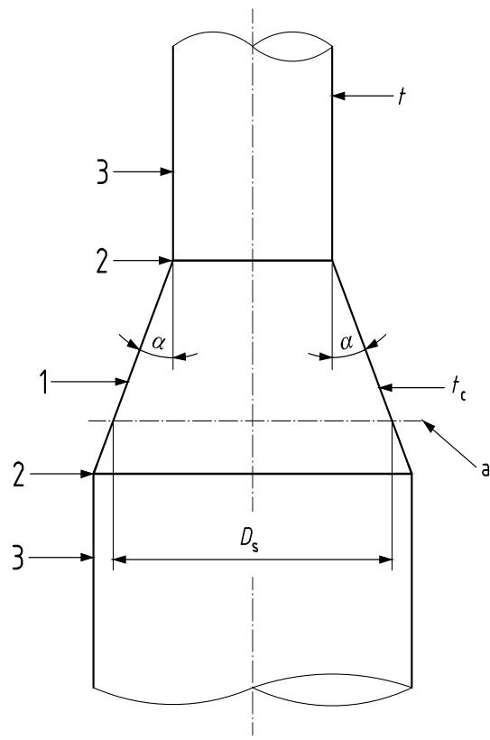  
a) Unstiffened

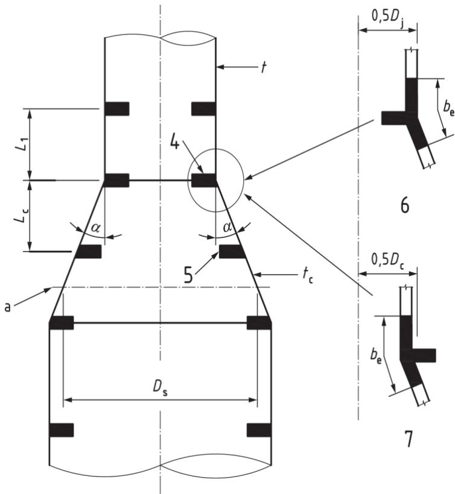  
Figure 13.6-1 — Typical unstiffened and stiffened conical transitions

b) Internally stiffened

Key

1 cone
2 junction between tubular and conical section   
3 tubular
4 junction stiffener   
5 intermediate stiffener   
6 typical internal junction stiffener   
7 alternative external junction stiffener

α slope angle of cone   
$b_{ \mathrm{ e } }$ effective shell width (acting with stiffener)   
$D_{ \mathrm{ c } }$ diameter to centroid of composite external ring section   
$D_{ \mathrm{ j } }$ outer diameter at junction   
$D_{ s }$ outer cone diameter at section s-s   
$L_{ 1 }$ distance from junction to first ring stiffener in tubular member   
$L_{ \mathrm{ c } }$ distance from junction to first ring stiffener in cone section   
t tubular member thickness at the junction   
$t_{ \mathrm{ c } }$ cone thickness

a Section s-s under consideration.

13.6.2.2 Local stresses at unstiffened junctions

Stress generation

The transfer of longitudinal force between a cylindrical section and a cone results in both a radial and an axial component at the junction, which generate:

a) local bending stresses in the tubular and the cone;   
b) hoop stresses in both the tubular and the cone.

Bending stresses

In lieu of a detailed analysis, the local bending stress at an unstiffened tubular-cone junction may be estimated from Formula (13.6-4):

$$\sigma_{\mathrm{b}, \mathrm{j}} = 0. 85 \sqrt{\frac{D_{\mathrm{j}}}{t}} \left(\sigma_{\mathrm{a}, \mathrm{t}} + \sigma_{\mathrm{b}, \mathrm{t}}\right) \tan \alpha \tag{13.6-4}$$

where

$\sigma_{ \mathrm{ b , j } }$ is the local bending stress at the junction;   
$D_{ \mathrm{ j } }$ is the outer diameter at the junction (see Figure 13.6-1);   
t is the wall thickness of the tubular member at the junction;   
σa,t $\sigma_{ \mathrm{ a , t } }$ is the axial stress in the tubular section at the junction due to global axial forces from factored actions;   
σb,t $\sigma_{ \mathrm{ b , t } }$ is the bending stress in the tubular section at the junction due to global bending moments from factored actions;   
α is the slope angle of the cone.

Hoop stresses

The hoop stresses at an unstiffened tubular-cone junction due to unbalanced radial line forces may be estimated using Formulae (13.6-6) and (13.6-7):

$$\begin{array}{l} \sigma_{\mathrm{h}, \mathrm{t}} = 0. 45 \sqrt{\frac{D_{\mathrm{j}}}{t}} \left(\sigma_{\mathrm{a}, \mathrm{t}} + \sigma_{\mathrm{b}, \mathrm{t}}\right) \tan \alpha (13.6-6) \\ \sigma_{\mathrm{h}, \mathrm{c}} = 0, 45 \sqrt{\frac{D_{\mathrm{j}}}{t_{\mathrm{c}}}} \left(\sigma_{\mathrm{a}, \mathrm{t}} + \sigma_{\mathrm{b}, \mathrm{t}}\right) \tan \alpha (13.6-7) \\ \end{array}$$

where, in addition to previous variables,

$\sigma_{ \mathrm{ h , t } }$ is the hoop stress at the tubular side of the junction;   
$\sigma_{ \mathrm{ h , c } }$ is the hoop stress at the cone side of the junction.

At the smaller diameter junction, the hoop stress is tensile (or compressive) when $\left( \sigma_{ \mathrm{ a , t } } + \sigma_{ \mathrm{ b , t } } \right)$ is tensile (or compressive). Similarly, the hoop stress at the larger diameter junction is tensile (or compressive) when $\left( \sigma_{ \mathrm{ a , t } } + \sigma_{ \mathrm{ b , t } } \right)$ is compressive (or tensile); see Figure 13.6-2.

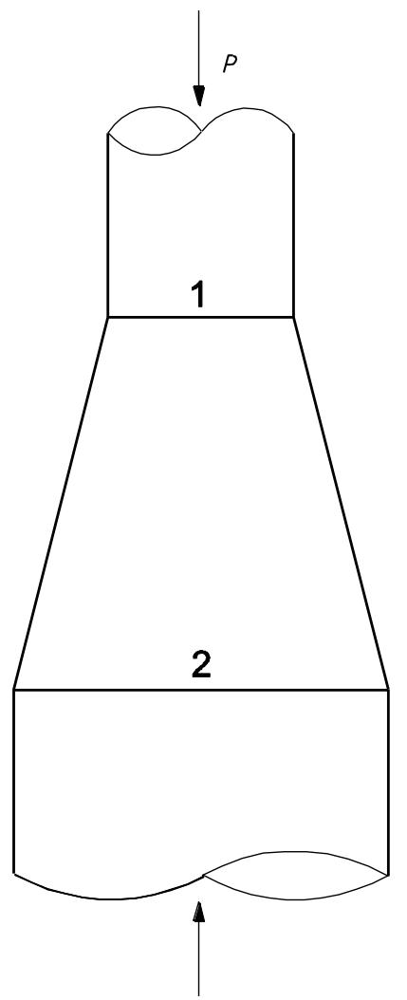

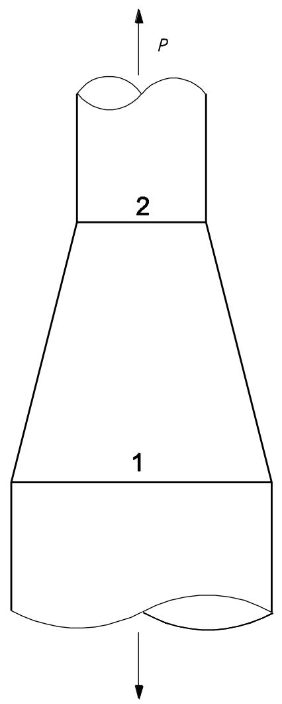  
Figure 13.6-2 — Hoop tension and hoop compression at cone junctions due to axial forces

Key

1 area of hoop compression   
2 area of hoop tension

13.6.3 Strength requirements without external hydrostatic pressure

13.6.3.1 General

The properties of a conical transition shall be chosen to satisfy the requirements given in 13.6.3 and 13.6.4 for combined axial and bending stresses at each end of the cone and along the cone transition. Conical sections may generally be checked as tubular sections with equivalent diameters and actual thicknesses.

13.6.3.2 Local buckling within conical transition

For local buckling under combined axial compression and bending, the Formula (13.6-8) shall be satisfied at all sections within the cone:

$$\sigma_{\mathrm{a , e q}} \leq \frac{f_{\mathrm{y c}}}{\gamma_{\mathrm{R} , \mathrm{c}}} \tag{13.6-8}$$

where

σa,eq $\sigma_{ \mathrm{ a , e q } }$ is the equivalent axial stress at any section s-s, see 13.6.2.1;

$f_{ \mathrm{ y c } }$ is the representative local buckling strength of a cone, in stress units;

$\gamma_{ \mathrm{ R , c } }$ is the partial resistance factor for axial compressive strength (see 13.2.3.1).

For cones with slope angle $\alpha \leq 30^{ \circ } , f_{ \mathrm{ y c } }$ may be determined using Formulae (13.2-8) to (13.2-10),in which $f_{ \mathrm{ y } }$ is the representative yield strength of the cone section being checked and t and D respectively are replaced by the wall thickness of the cone, $t_{ \mathrm{ c } } ,$ and an equivalent diameter, $D_{ \mathrm{ e } } ,$ both at the section under consideration. $D_{ \mathrm{ e } }$ is given by

$$D_{\mathrm{e}} = \frac{D_{\mathrm{s}}}{\cos \alpha} \tag{13.6-9}$$

where $D_{ s }$ and α are defined in 13.6.2.1. If $\alpha > 30^{ \circ }$ , Formula (13.6-9) is not applicable.

The utilization of a cone, $U_{ \mathrm{ m } } ,$ under local buckling shall be calculated from Formula (13.6-10):

$$U_{\mathrm{m}} = \gamma_{\mathrm{R}, \mathrm{c}} \frac{\sigma_{\mathrm{a} , \mathrm{e q}}}{f_{\mathrm{y c}}} \tag{13.6-10}$$

13.6.3.3 Junction yielding

The requirements for junction yielding only apply to cases where the hoop stresses $\sigma_{ \mathrm{ h , t } }$ and $\sigma_{ \mathrm{ h , c } }$ are tensile. Yielding at a junction shall be checked on both the tubular and the cone side of the junction using Formula (13.6-11) or Formula (13.6-12), as appropriate.

For net axial tension, i.e. when $\sigma_{ \mathrm{ m a x } }$ is tensile:

$$\sqrt{\sigma_{\max}^{2} + \sigma_{\mathrm{j}}^{2} - \sigma_{\mathrm{j}} \sigma_{\max}} \leq \frac{f_{\mathrm{y}}}{\gamma_{\mathrm{R} , \mathrm{t}}} \tag{13.6-11}$$

For net axial compression, i.e. when $\sigma_{ \mathrm{ m a x } }$ is compressive:

$$\sqrt{\sigma_{\max }^{2} + \sigma_{\mathrm{j}}^{2} + \sigma_{\mathrm{j}} \left| \sigma_{\max } \right|} \leq \frac{f_{\mathrm{y}}}{\gamma_{\mathrm{R} , \mathrm{t}}} \tag{13.6-12}$$

where

$\sigma_{ \mathrm{ m a x } }$ is the maximum axial tensile stress at the junction;

$\sigma_{ \mathrm{ m a x } } = \sigma_{ \mathrm{ a , t } } + \sigma_{ \mathrm{ b , t } }$ for checking yielding on the tubular side of the junction,

$\sigma_{ \mathrm{ m a x } } = \frac{ \sigma_{ \mathrm{ a , c } } + \sigma_{ \mathrm{ b , c } } } { \cos \alpha }$ max for checking yielding on the cone side of the junction,

(see 13.6.2.1 and 13.6.2.2 for definitions of the stress components),

$\sigma_{ \mathrm{ j } }$ is the hoop stress at the junction

$\sigma_{ \mathrm{ j } } = \sigma_{ \mathrm{ h , t } }$ for checking yielding on the tubular side of the junction;

$\sigma_{ \mathrm{ j } } = \sigma_{ \mathrm{ h , c } }$ for checking yielding on the cone side of the junction;

$f_{ \mathrm{ y } }$ is the representative yield strength of the tubular or cone section being checked;

$\gamma_{ \mathrm{ R , t } }$ is the partial resistance factor for axial tensile strength (see 13.2.2).

The local bending stresses, $\sigma_{ \mathrm{ b , j t } }$ and $\sigma_{ \mathrm{ b , j c } }$ , at the junction shall be limited to the plastic moment capacities of the tubular member and conical transition wall thicknesses, respectively, in accordance with Formulae (13.6-12a) and (13.6-12b)

$$\sigma_{\mathrm{b}, \mathrm{j t}} \leq 1. 5 \frac{f_{\mathrm{y}}}{\gamma_{\mathrm{R} , \mathrm{t}}} \left(1 - \frac{\sigma_{\max} {}^{2}}{f_{\mathrm{y}} {}^{2}}\right) \quad \text{f o r c h e c k i n g o n t h e t u b u l a r s i d e o f t h e j u n c t i o n} \tag{13.6-12a}$$

$$\sigma_{\mathrm{b}, \mathrm{j c}} \leq 1. 5 \frac{f_{\mathrm{y}}}{\gamma_{\mathrm{R} , \mathrm{t}}} \left(1 - \frac{\sigma_{\max} {}^{2}}{f_{\mathrm{y}} {}^{2}}\right) \quad \text{f o r c h e c k i n g o n t h e c o n e s i d e o f t h e j u n c t i o n} \tag{13.6-12b}$$

The utilization of a junction of a conical transition, $U_{ \mathrm{ m } } ,$ for junction yielding shall be calculated from Formula (13.6-13) or Formula (13.6-14), as appropriate:

$$U_{\mathrm{m}} = \gamma_{\mathrm{R}, \mathrm{t}} \frac{\sqrt{\sigma_{\operatorname* {m a x}} {}^{2} + \left(\sigma_{\mathrm{j}}\right)^{2} - \sigma_{\mathrm{j}} \cdot \sigma_{\operatorname* {m a x}}}}{f_{\mathrm{y}}} \quad \text{w h e n} \sigma_{\max } \text{i s t e n s i l e} \tag{13.6-13}$$

$$U_{\mathrm{m}} = \gamma_{\mathrm{R}, \mathrm{t}} \frac{\sqrt{\sigma_{\max} {}^{2} + \left(\sigma_{\mathrm{j}}\right)^{2} - \sigma_{\mathrm{j}} \cdot \left| \sigma_{\max} \right|}}{f_{\mathrm{y}}} \quad \text{w h e n} \sigma_{\max} \text{i s c o m p r e s s i v e} \tag{13.6-14}$$

The utilization of a junction of a conical transition, $U_{ \mathrm{ m } } ,$ for local bending plastification shall be calculated from Formula (13.6-14a) or Formula (13.6-14b), as appropriate:

$$U_{\mathrm{m}} = \gamma_{\mathrm{R}, \mathrm{t}} \frac{\sigma_{\mathrm{b} , \mathrm{j t}}}{1 . 5 f_{\mathrm{y}} \left(1 - \frac{\sigma_{\max} {}^{2}}{f_{\mathrm{y}} {}^{2}}\right)} \quad \text{f o r c h e c k i n g o n t h e t u b u l a r s i d e o f t h e j u n c t i o n} \tag{13.6-14a}$$

$$U_{\mathrm{m}} = \gamma_{\mathrm{R}, \mathrm{t}} \frac{\sigma_{\mathrm{b} , \mathrm{j c}}}{1 . 5 f_{\mathrm{y}} \left(1 - \frac{\sigma_{\max} {}^{2}}{f_{\mathrm{y}} {}^{2}}\right)} \quad \text{f o r c h e c k i n g o n t h e c o n e s i d e o f t h e j u n c t i o n} \tag{13.6-14b}$$

13.6.3.4 Junction buckling

The requirements for junction buckling only apply to cases where the hoop stress, $\sigma_{ \mathrm{ j } } ,$ is compressive, and shall be checked on both the tubular and the cone side of the junction using Formula (13.6-15) or Formulae (13.6-19) and (13.6 20), as appropriate.

For net axial tension, i.e. when $\sigma_{ \mathrm{ m a x } }$ is tensile, the following requirement shall be satisfied:

$$A^{2} + B^{2 \eta} + 2 \mathrm{v} A B \leq 1, 0 \tag{13.6-15}$$

where, in addition to the definitions given in 13.6.3.3,

$$A = \frac{\gamma_{\mathrm{R} , \mathrm{t}} \sigma_{\max }}{f_{\mathrm{y}}} \tag{13.6-16}$$

$$B = \frac{\gamma_{\mathrm{R} , \mathrm{h}} \sigma_{\mathrm{j}}}{f_{\mathrm{h}}} \tag{13.6-17}$$

$\gamma_{ \mathrm{ R , h } }$ is the partial resistance factor for hoop buckling strength (see 13.2.6.2);

$f_{ \mathrm{ h } }$ is the representative hoop buckling strength, in stress units, calculated using Formulae (13.2-25) to (13.2-27), with $f_{ \mathrm{ h e } } = 0 , 4 E t / D_{ \mathrm{ i } } ;$

$\sigma_{ \mathrm{ j } }$ is the positive absolute value of the hoop compression;

ν is Poisson’s ratio, $\nu = 0 , 3 ;$

η is as defined in Formula (13.4-11);

The utilization of a junction of a conical transition, $U_{ \mathrm{ m } } ,$ for junction buckling when $\sigma_{ \mathrm{ m a x } }$ is tensile shall be calculated from Formula (13.6-18):

$$U_{\mathrm{m}} = A^{2} + B^{2 \eta} + 2 v A B \tag{13.6-18}$$

For net axial compression, i.e. when $\sigma_{ \mathrm{ m a x } }$ is compressive, the following requirements shall be satisfied:

$$\sigma_{\max } \leq \frac{f_{\mathrm{y c}}}{\gamma_{\mathrm{R} , \mathrm{c}}} \tag{13.6-19}$$

and

$$\sigma_{\mathrm{j}} \leq \frac{f_{\mathrm{h}}}{\gamma_{\mathrm{R} , \mathrm{h}}} \tag{13.6-20}$$

where

$f_{ \mathrm{ y c } }$ is the representative local buckling strength of the section being checked, in stress units (see 13.2.3.3); for cones with slope angle $\alpha \leq 30^{ \circ } , f_{ \mathrm{ y c } }$ may be calculated in accordance with 13.6.3.2;

$\gamma_{ \mathrm{ R , c } }$ is the partial resistance factor for axial compressive strength (see 13.2.3.1);

$f_{ \mathrm{ h } }$ is the representative hoop buckling strength, in stress units, calculated using Formulae (13.2-25) to (13.2-27), with $f_{ \mathrm{ h e } } = 0 , 4 E t / D_{ \mathrm{ j } } ;$

$\sigma_{ \mathrm{ j } }$ is the positive absolute value of the hoop compression.

The utilization of a junction of a conical transition, $U_{ \mathrm{ m } } ,$ for junction buckling when $\sigma_{ \mathrm{ m a x } }$ is compressive shall be the larger value calculated from Formulae (13.6-21) and (13.6-22):

$$U_{\mathrm{m}} = \frac{\sigma_{\max}}{f_{\mathrm{y c}} / \gamma_{\mathrm{R , c}}} \tag{13.6-21}$$

$$U_{\mathrm{m}} = \frac{\sigma_{\mathrm{j}}}{f_{\mathrm{h}} / \gamma_{\mathrm{R , h}}} \tag{13.6-22}$$

As in the case of junction yielding (see 13.6.3.3), plastification under local bending shall be checked using Formulae (13.6-14a) or (13.6-14b), as appropriate.

13.6.3.5 Junction fatigue

An unstiffened junction of a conical transition shall satisfy the fatigue requirements of Clause 16, with the following stress concentration factors, C:

$$C_{\mathrm{t}} = 1 + \frac{\sigma_{\mathrm{b} , \mathrm{j t}}}{\sigma_{\mathrm{a} , \mathrm{t}} + \sigma_{\mathrm{b} , \mathrm{t}}} \quad \text{o n t h e t u b u l a r s i d e} \tag{13.6-23}$$

and

$$C_{\mathrm{c}} = 1 + \frac{\sigma_{\mathrm{b} , \mathrm{j c}}}{\sigma_{\mathrm{a} , \mathrm{c}} + \sigma_{\mathrm{b} , \mathrm{c}}} \quad \text{o n t h e c o n e s i d e} \tag{13.6-24}$$

where the variables are as defined in 13.6.2.1 and 13.6.2.2.1.

For equal tubular member and cone wall thicknesses, $\sigma_{ \mathrm{ b , j t } }$ approximates to $\sigma_{ \mathrm{ b , j c } }$ and, similarly, $\sigma_{ \mathrm{ a , c } }$ and $\sigma_{ \mathrm{ b , c } }$ at the junction approximate to $\sigma_{ \mathrm{ a , t } }$ and $\sigma_{ \mathrm{ b , t^{ \prime } } }$ respectively, so that Formulae (13.6-23) and (13.6-24) reduce to:

$$C_{\mathrm{t}} = C_{\mathrm{c}} = 1 + 0, 6 \sqrt{\frac{2 D_{\mathrm{j}}}{t}} \tan \alpha \tag{13.6-25}$$

When using tapers at the ends of cones for connection to incoming tubulars, the taper should be on the inside of the small end of the cone and on the outside of the large end of the cone to keep stress concentration factors at a minimum.

13.6.4 Strength requirements with external hydrostatic pressure

13.6.4.1 Hoop buckling

Unstiffened conical transitions or cone segments between stiffening rings with a slope angle $\alpha \leq 30^{ \circ }$ , may be designed for hoop buckling as equivalent tubulars in accordance with 13.4. The equivalent diameter is $D / { \cos \alpha } ,$ where D is the diameter at the larger end of the cone or segment. An equivalent axial stress shall be used in the formulae in 13.4; the equivalent axial stress shall be calculated using Formula (13.6-1), substituting $\sigma_{ \mathrm{ a , c } }$ for $\sigma_{ \mathrm{ t , c } } \ : 0 \ : \mathrm{ r } \ : \sigma_{ \mathrm{ c , c } } , \sigma_{ \mathrm{ t } } , \sigma \mathrm{ r } \ : \sigma_{ \mathrm{ c } } ,$ as appropriate. The length of the cone shall be taken as the maximum distance between adjacent rings for a ring-stiffened cone transition or the maximum unstiffened distance, including the tubular members on both ends of the cone, for an unstiffened conical transition. The tubular members on both ends of a ring-stiffened cone shall also be checked against the requirements of 13.4.

13.6.4.2 Junction yielding and buckling

The net hoop stress （$\sigma_{ \mathrm{ h , j } } )$ at a junction of a conical transition is given by Formula (13.6-26):

$$\sigma_{\mathrm{h}, \mathrm{j}} = \sigma_{\mathrm{j}} + \sigma_{\mathrm{h}} \tag{13.6-26}$$

where

$\sigma_{ \mathrm{ j } }$ is the hoop stress at the junction due to unbalanced radial forces as defined in 13.6.2.2.3 and 13.6.3.3;   
$\sigma_{ \mathrm{ h } }$ is the hoop stress due to forces from the factored external hydrostatic pressure (see 13.2.6).

When $\sigma_{ \mathrm{ h , j } }$ is tensile, Formulae (13.6-11) to (13.6-14) in 13.6.3.3 shall be satisfied using $\sigma_{ \mathrm{ h , j } }$ instead of $\sigma_{ \mathrm{ j } } .$ When $\sigma_{ \mathrm{ h , j } }$ is compressive, Formulae (13.6-15) to (13.6-22) in 13.6.3.4 shall be satisfied using $\sigma_{ \mathrm{ h , j } }$ instead of $\sigma_{ \mathrm{ { j } } } ,$ while the representative hoop buckling strength $f_{ \mathrm{ h } }$ shall be determined in accordance with 13.2.6.2 using the equivalent diameter as described in 13.6.3.2.

13.6.5 Ring design

13.6.5.1 General

A tubular-cone junction that does not satisfy the requirements of 13.6.3 or 13.6.4 can be strengthened either by increasing the tubular and cone thicknesses at the junction or by providing a stiffening ring at the junction. Where rings are provided, their dimensions shall satisfy Formulae (13.2-37) and (13.2-38) or Formula (13.2-39), as appropriate.

13.6.5.2 Junction rings without external hydrostatic pressure

If stiffening rings are required in the absence of hydrostatic pressure, their section properties shall satisfy both the following requirements:

$$A_{\mathrm{c}} = \frac{t D_{\mathrm{j}}}{f_{\mathrm{y}}} \left(\sigma_{\mathrm{a}} + \sigma_{\mathrm{b}}\right) \tan \alpha \tag{13.6-27}$$

$$I_{\mathrm{c}} = \frac{t D_{\mathrm{j}} D_{\mathrm{c}}^{2}}{8 E} \left(\sigma_{\mathrm{a}} + \sigma_{\mathrm{b}}\right) \tan \alpha \tag{13.6-28}$$

where

t is the thickness of the tubular member at the junction;   
$\sigma_{ \mathrm{ a } }$ σa is the larger of $\sigma_{ \mathrm{ a , t } }$ (see 13.6.2.2.2) and $\sigma_{ \mathrm{ a , c } }$ (see 13.6.2.1);   
σb $\sigma_{ \mathrm{ b } }$ is the larger of $\sigma_{ \mathrm{ b , t } }$ (see 13.6.2.2.2) and $\sigma_{ \mathrm{ b , c } }$ (see 13.6.2.1);   
$D_{ \mathrm{ j } }$ is the outer diameter at the junction (see Figure 13.6-1);   
$D_{ \mathrm{ c } }$ for external rings, is the diameter to centroid of composite ring section (see Figure 13.6-1);   
Dc $D_{ \mathrm{ c } }$ for internal rings, is taken as $D_{ \mathrm{ j } } ;$   
$\alpha$ is the slope angle of the conical transition, see Figure 13.6-1;   
$A_{ \mathrm{ c } }$ is the cross-sectional area of the composite ring section;   
$I_{ \mathrm{ c } }$ is the moment of inertia of the composite ring section.

In computing $A_{ \mathrm{ c } }$ and $I_{ \mathrm{ c } } ,$ the effective width of shell wall acting as a flange for the composite ring section (see Figure 13.6-1) may be computed from Formula (13.6-29):

$$b_{\mathrm{e}} = 0. 55 \left(\sqrt{D_{\mathrm{j}} t} + \sqrt{D_{\mathrm{j}} t_{\mathrm{c}}}\right) \tag{13.6-29}$$

Where out-of-roundness is in excess of that permitted by Annex G, larger stiffeners can be required. The bending due to excess out-of-roundness shall be specifically investigated.

13.6.5.3 Junction rings with external hydrostatic pressure

If stiffening rings are required in the presence of external hydrostatic pressure, their section properties and spacing shall be chosen to satisfy Formulae (13.6-30), (13.6-31), (13.6-32) and (13.6-33):

$$\begin{array}{l} I_{\mathrm{c}, \mathrm{T}} \geq I_{\mathrm{c}} + I_{\mathrm{c}, \mathrm{h}} (13.6-30) \\ L_{1} \leq 1, 13 \sqrt{\frac{D_{\mathrm{j}}^{3}}{t}} (13.6-31) \\ L_{\mathrm{c}} \leq 1, 13 \sqrt{\frac{D_{\mathrm{e}}^{3}}{t}} (13.6-32) \\ \end{array}$$

where

$I_{ \mathrm{ c , T } }$ is the moment of inertia of the composite ring section in the presence of external hydrostatic pressure;   
$I_{ \mathrm{ c } }$ is the moment of inertia of the composite ring section in the absence of external hydrostatic pressure (see 13.6.5.2);   
$I_{ \mathrm{ c , h } }$ is the additional moment of inertia of the composite ring section required for external hydrostatic pressure

$$I_{\mathrm{c}, \mathrm{h}} = \frac{D_{\mathrm{c}} {}^{2}}{16 E} \left(t L_{1} f_{\mathrm{h e}} + \frac{t_{\mathrm{c}} L_{\mathrm{c}} f_{\mathrm{h e c}}}{\cos^{2} \alpha}\right) \tag{13.6-33}$$

where

$D_{ \mathrm{ c } }$ Dc is as defined in 13.6.5.2;   
t is the wall thickness of the tubular member at the junction under consideration;   
$t_{ \mathrm{ c } }$ is the wall thickness of the cone at the junction under consideration;   
$\alpha$ is the slope angle of the conical transition (see Figure 13.6-1);   
$E$ is Young’s modulus of elasticity;   
$L_{ 1 }$ is the distance from the junction to the first stiffening ring in the tubular section (see Figure 13.6-1);   
$L_{ \mathrm{ c } }$ is the distance from the junction to the first stiffening ring in the cone, measured along the axis of the cone (see Figure 13.6-1);   
$f_{ \mathrm{ h e } }$ is the representative elastic critical hoop buckling stress of the tubular [see Formula (13.2-28)];   
$f_{ \mathrm{ h e c } }$ is the representative elastic critical hoop buckling stress of the conical transition treated as an equivalent tubular of diameter $D_{ \mathrm{ e } } { \mathrm{ , } }$   
$D_{ \mathrm{ e } }$ is the largest of the equivalent diameters for the bay of the conical transition adjacent to the junction under consideration [see Formula (13.6-9)].

The effective width of shell wall acting as a flange for the composite ring section (see Figure 13.6-1) may be computed from Formula (13.6-29).

A junction ring is not required for hydrostatic collapse if Formula (13.2-24) is satisfied using $\sigma_{ \mathrm{ h , j } }$ from 13.6.4.2. In satisfying Formula (13.2-24), the elastic hoop buckling stress, $f_{ \mathrm{ h e } } ,$ should be computed using Formula (13.2-28) with $C_{ \mathrm{ h } } = 0 { , } 44$ t cos $\alpha / D_{ \mathrm{ j } }$ .

Where out-of-roundness is in excess of that permitted by Annex G, larger stiffeners can be required. The bending due to excess out-of-roundness shall be specifically investigated.

13.6.5.4 Intermediate stiffening rings

If required, circumferential stiffening rings within conical transitions shall be designed using Formula (13.2-35) or Formula (13.2-36), as appropriate, with the following modifications:

— for internal rings, diameter D shall be taken as being equal to the equivalent diameter, $D_{ \mathrm{ e } } ,$ from Formula (13.6-9);   
— for external rings, diameter $D_{ \mathrm{ r } }$ shall be taken as being equal to the diameter, $D_{ \mathrm{ c } } ,$ to the centroid of the composite ring section, see Figure 13.6-1;-

— the wall thickness, $t ,$ shall be taken as being equal to the cone thickness, $t_{ \mathrm{ c } } ,$ at the position of the stiffening ring;   
— the spacing, $L_{ \mathrm{ r } } ,$ shall be taken as the average distance along the axis of the cone between adjacent rings;   
$- f_{ \mathrm{ h e } }$ shall be taken as the average of the representative elastic critical hoop buckling stresses for the two adjacent bays calculated using equivalent diameters, with the equivalent diameters based on the largest diameter for each of the adjacent bays.

## 13.7 Dented tubular members

13.7.1 General

Neither the effects of external hydrostatic pressure nor the presence of cracks have been considered in the derivation of the formulae of this subclause. Such effects shall be considered on a case-by-case basis. Fatigue problems can arise at dent locations and shall also be considered.

The limits of calibration for the formulae in this subclause are a dent depth, $h ,$ of $h \leq 0 , 3 \mathrm{ ~ D ~ }$ and $h \leq 10 t .$ The effects of dent depths in excess of either of these values shall be examined by other means.

13.7.2 Dented tubular members subjected to tension, compression, bending or shear

13.7.2.1 General

Dented tubular members subjected independently to axial tension, axial compression, bending or shear shall be assessed using the strength and stability requirements specified in 13.7.2.2 to 13.7.2.5.

13.7.2.2 Axial tension

Dented tubular members subjected to axial tensile forces shall satisfy the following condition:

$$\sigma_{\mathrm{t}, \mathrm{d}} \leq \frac{f_{\mathrm{y}}}{\gamma_{\mathrm{R} , \mathrm{t} , \mathrm{d}}} \tag{13.7-1}$$

where

$\sigma_{ \mathrm{ t , d } }$ is the axial tensile stress due to forces from factored actions on the intact cross-section, $\sigma_{ \mathrm{ t , d } } = T / A_{ \mathrm{ r } } ;$

$T$ is the member axial tensile force;

$A_{ \mathrm{ r } }$ is the cross-sectional area of the intact section;

$f_{ \mathrm{ y } }$ is the representative yield strength, in stress units;

$\boldsymbol{ \gamma }_{ \mathrm{ R , t , d } }$ is the partial resistance factor for axial tensile strength for dented members, $\gamma_{ \mathrm{ R , t , d } } = 1 , 05$

The utilization of a dented member, $U_{ \mathrm{ m , d } } ,$ under axial tension shall be calculated from Formula (13.7-2):

$$U_{\mathrm{m}, \mathrm{d}} = \frac{\sigma_{\mathrm{t} , \mathrm{d}}}{f_{\mathrm{y}} / \gamma_{\mathrm{R} , \mathrm{t} , \mathrm{d}}} \tag{13.7-2}$$

13.7.2.3 Axial compression

13.7.2.3.1 General

Dented tubular members subjected to axial compressive forces shall satisfy the following condition:

$$\sigma_{\mathrm{c}, \mathrm{d}} \leq \frac{f_{\mathrm{c} , \mathrm{d}}}{\gamma_{\mathrm{R} , \mathrm{c} , \mathrm{d}}} \tag{13.7-3}$$

where

σc,d $\sigma_{ \mathrm{ c , d } }$ is the axial compressive stress due to forces from factored actions on the intact cross section, $\sigma_{ \mathrm{ c , d } } = P / A_{ \mathrm{ r } } ;$

$P$ is the member axial compressive force;

$f_{ \mathrm{ c , d } }$ is the representative axial compressive strength of dented members, in stress units, see 13.7.2.3.2;

$\gamma_{ \mathrm{ R , c , d } }$ is the partial resistance factor for axial compressive strength of dented members, $\gamma_{ \mathrm{ R , c , d } } = 1 , 18 .$ .

The utilization of a dented member, $U_{ \mathrm{ m , d } } ,$ under axial compression shall be calculated from Formula (13.7-4):

$$U_{\mathrm{m}, \mathrm{d}} = \frac{\sigma_{\mathrm{c} , \mathrm{d}}}{f_{\mathrm{c} , \mathrm{d}} / \gamma_{\mathrm{R} , \mathrm{c} , \mathrm{d}}} \tag{13.7-4}$$

13.7.2.3.2 Column buckling

The representative axial compressive strength for the dented members considered in 13.7.2.3.1 shall be determined from Formula (13.7-5) to Formula (13.7-15):

$$f_{\mathrm{c}, \mathrm{d}} = f_{\mathrm{c}, \mathrm{d}, \mathrm{o}} \quad \text{f o r} \Delta y / L \leq 0, 001 \tag{13.7-5}$$

$$\frac{f_{\mathrm{c} , \mathrm{d}}}{f_{\mathrm{c} , \mathrm{d} , \mathrm{o}}} + \frac{f_{\mathrm{c} , \mathrm{d}} A_{\mathrm{d}} (\Delta y - 0 , 001 L)}{\left(1 - \frac{f_{\mathrm{c} , \mathrm{d}}}{\xi_{\mathrm{c}} f_{\mathrm{e} , \mathrm{d}}}\right) \xi_{\mathrm{m}} f_{\mathrm{b}} Z_{\mathrm{e}}} = 1. 0 \quad \text{f o r} \Delta y / L > 0, 001 \tag{13.7-6}$$

where

$\varDelta y$ is the maximum out-of-straightness of the dented member;

$L$ is the unbraced member length, in the plane of buckling which coincides with the plane of $\varDelta y$

$f_{ \mathrm{ c , d } }$ is the representative axial compressive strength of dented members, in stress units;

$f_{ \mathrm{ c , d } , 0 }$ is the representative axial compressive strength of dented members when $\varDelta y / L \leq 0 , 001$ , in stress units

$$f_{\mathrm{c}, \mathrm{d}, \mathrm{o}} = \left(1, 0 - 0, 278 \lambda_{\mathrm{d}}^{2}\right) \xi_{\mathrm{c}} f_{\mathrm{y c}} \quad \text{f o r} \lambda_{\mathrm{d}} \leq 1, 34 \tag{13.7-7}$$

$$f_{\mathrm{c}, \mathrm{d}, \mathrm{o}} = \frac{0 , 9}{\lambda_{\mathrm{d}}^{2}} \xi_{\mathrm{c}} f_{\mathrm{y c}} \quad \text{f o r} \lambda_{\mathrm{d}} > 1, 34 \tag{13.7-8}$$

$f_{ \mathrm{ y c } }$ is the representative local buckling strength as defined in 13.2.3.3, in stress units;   
$f_{ \mathrm{ b } }$ is the representative bending strength as defined in 13.2.4, in stress units;   
$f_{ \mathrm{ e , d } }$ is the Euler buckling strength of the dented member, in stress units

$$f_{\mathrm{e}, \mathrm{d}} = \frac{\pi^{2} E}{\left(K_{\mathrm{d}} L / r_{\mathrm{d}}\right)^{2}} \tag{13.7-9}$$

$Z_{ \mathrm{ e } }$ is the elastic section modulus of the intact member as defined in 13.2.4;   
λd $\lambda_{ \mathrm{ d } }$ is the slenderness parameter of the dented member

$$\lambda_{\mathrm{d}} = \sqrt{\frac{f_{\mathrm{y c}}}{f_{\mathrm{e} , \mathrm{d}}}} = \frac{K_{\mathrm{d}} L}{\pi r_{\mathrm{d}}} \sqrt{\frac{f_{\mathrm{y c}}}{E}} \tag{13.7-10}$$

Kd $K_{ \mathrm{ d } }$ is the effective length factor of the dented member, which may be assumed to be the same as that for the intact member as defined in 13.2.3.2;

$r_{ \mathrm{ d } }$ is the radius of gyration of the dented member, which shall be calculated as

$$r_{\mathrm{d}} = \sqrt{\frac{I_{\mathrm{d}}}{A_{\mathrm{d}}}} \tag{13.7-11}$$

$I_{ \mathrm{ d } }$ is the effective moment of inertia of the dented cross-section

$$I_{\mathrm{d}} = \xi_{\mathrm{m}} I_{\mathrm{o}} \tag{13.7-12}$$

$I_{ \phantom{ }_{ 0 } }$ is the moment of inertia of the intact member, as defined in 13.2.3.2;

$A_{ \mathrm{ d } }$ is the effective cross-sectional area of the dented section

$$A_{\mathrm{d}} = \xi_{\mathrm{c}} A_{\mathrm{r}} \tag{13.7-13}$$

where

$A_{ \mathrm{ r } }$ is the cross-sectional area of the intact section, as defined in 13.2.3.2;

$\xi_{ \mathrm{ c } }$ and $\xi_{ \mathrm{ m } }$ are coefficients defined by

$$\xi_{\mathrm{c}} = \mathrm{e}^{- 0, 08 h / t} \quad \text{f o r} h / t \leq 10, 0 \tag{13.7-14}$$

$$\xi_{\mathrm{m}} = \mathrm{e}^{- 0, 06 h / t} \quad \text{f o r} h / t \leq 10, 0 \tag{13.7-15}$$

h is the maximum depth of the dent, see Figure 13.7-1;

t is the thickness of the member.

13.7.2.4 Bending

13.7.2.4.1 General

Depending upon the plane of bending, dented cylindrical members subjected to bending can experience tensile, compressive, or zero (neutral) stress conditions existing in the central region of the dent (see Figure 13.7-1). Accordingly, they shall satisfy the requirements of 13.7.2.4.2 to 13.7.2.4.4.

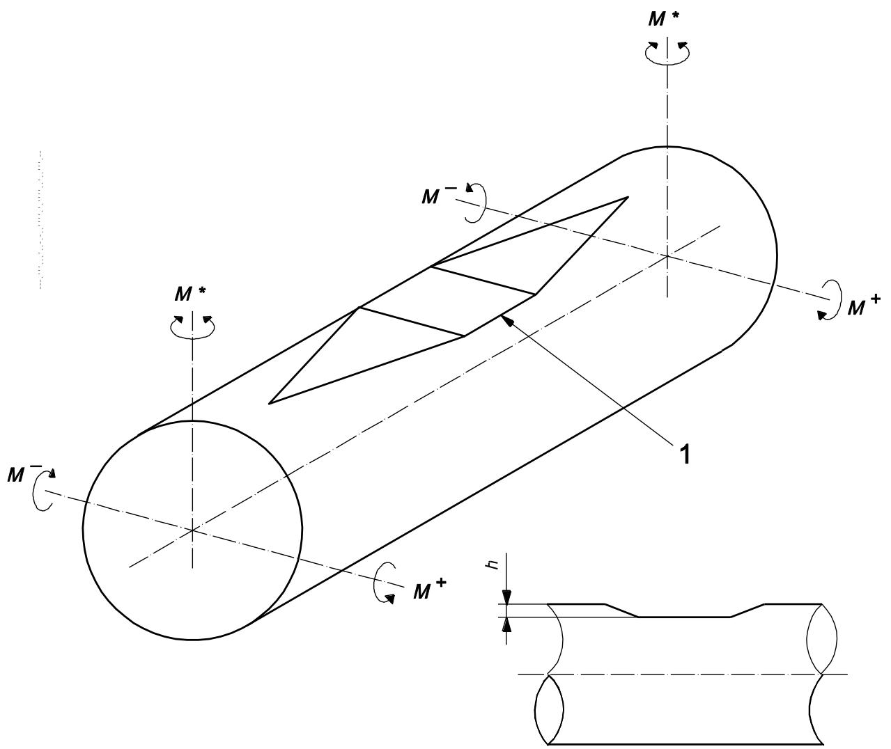  
Figure 13.7-1 — Sign convention for dented tubular

Key

1 dented section of the member   
$M^{ + }$ positive moment — dent in tension   
$M^{ - }$ negative moment — dent in compression   
$M^{ * }$ neutral moment — zero stress in centre of dent   
$h$ maximum depth of the dent

13.7.2.4.2 Positive bending

When the dented region is subjected to a positive bending moment $M^{ + }$ :

$$\sigma_{\mathrm{b}, \mathrm{d}}^{+} = \frac{M^{+}}{Z_{\mathrm{e}}} \leq \frac{f_{\mathrm{b}}}{\gamma_{\mathrm{R} , \mathrm{b} , \mathrm{d}}} \tag{13.7-16}$$

where

$f_{ \mathrm{ b } }$ is the representative bending strength defined in 13.2.4, in stress units;

$\sigma_{ \mathrm{ b , d } }^{ + }$ + is the positive bending stress due to forces from factored actions with respect to the intact crosssection, $\sigma_{ \mathrm{ b , d } }^{ + } = M^{ + } / Z_{ \mathrm{ e } }$ ;

$\gamma_{ \mathrm{ R , b , d } }$ is the partial resistance factor for bending strength for dented members, $\gamma_{ \mathrm{ R , b , d } } = 1 , 05$

The utilization of a dented member, $U_{ \mathrm{ m , d } } ,$ under positive bending shall be calculated from Formula (13.7-17):

$$U_{\mathrm{m}, \mathrm{d}} = \frac{\sigma_{\mathrm{b} , \mathrm{d}}^{+}}{f_{\mathrm{b}} / \gamma_{\mathrm{R} , \mathrm{b} , \mathrm{d}}} = \frac{M^{+} / Z_{\mathrm{e}}}{f_{\mathrm{b}} / \gamma_{\mathrm{R} , \mathrm{b} , \mathrm{d}}} \tag{13.7-17}$$

13.7.2.4.3 Negative bending

When the dented region is subjected to a negative bending moment $M^{ - }$

$$\sigma_{\mathrm{b}, \mathrm{d}} = \frac{M^{-}}{Z_{\mathrm{e}}} \leq \xi_{\mathrm{m}} \frac{f_{\mathrm{b}}}{\gamma_{\mathrm{R} , \mathrm{b} , \mathrm{d}}} \tag{13.7-18}$$

where $\sigma_{ \mathrm{ b , d } }^{ - }$ is the negative bending stress due to forces from factored actions with respect to the intact cross-section, $\sigma_{ \mathrm{ b , d } }^{ - } = M^{ - } / Z_{ \mathrm{ e } }$ .

The utilization of a dented member, $U_{ \mathrm{ m , d } } ,$ under negative bending shall be calculated from Formula (13.7-19):

$$U_{\mathrm{m}, \mathrm{d}} = \frac{\sigma_{\mathrm{b} , \mathrm{d}}^{-}}{\xi_{\mathrm{m}} f_{\mathrm{b}} / \gamma_{\mathrm{R} , \mathrm{b} , \mathrm{d}}} = \frac{M^{-} / Z_{\mathrm{e}}}{\xi_{\mathrm{m}} f_{\mathrm{b}} / \gamma_{\mathrm{R} , \mathrm{b} , \mathrm{d}}} \tag{13.7-19}$$

where $\xi_{ \mathrm{ m } }$ is as defined in 13.7.2.3.2.

13.7.2.4.4 Neutral bending

When the dented region is subjected to a neutral bending moment $M^{ * }$

$$\sigma_{\mathrm{b}, \mathrm{d}}^{*} = \frac{M^{*}}{Z_{\mathrm{e}}} \leq \frac{f_{\mathrm{b}}}{\gamma_{\mathrm{R} , \mathrm{b} , \mathrm{d}}} \tag{13.7-20}$$

where $\sigma_{ \mathrm{ b , d } }^{ * }$ is the neutral bending stress due to forces from factored actions with respect to the intact cross-section, $\sigma_{ \mathrm{ b , d } }^{ * } = M^{ * } / Z_{ \mathrm{ e } }$ .

The utilization of a dented member, $U_{ \mathrm{ m , d } } ,$ under neutral bending shall be calculated from Formula (13.7-21):

$$U_{\mathrm{m}, \mathrm{d}} = \frac{\sigma_{\mathrm{b} , \mathrm{d}}^{*}}{f_{\mathrm{b}} / \gamma_{\mathrm{R} , \mathrm{b} , \mathrm{d}}} = \frac{M^{*} / Z^{\mathrm{e}}}{f_{\mathrm{b}} / \gamma_{\mathrm{R} , \mathrm{b} , \mathrm{d}}} \tag{13.7-21}$$

13.7.2.5 Shear

Dented tubular members subjected to beam shear forces shall satisfy the condition specified in 13.2.5.1 in which the maximum shear stress due to forces from factored actions should be approximated by Formulae (13.7-22) and (13.7-23):

$$\tau_{\mathrm{b}, \mathrm{d}} = \frac{2 V}{A_{\mathrm{r}}} \quad \text{f o r} h \leq 0, 25 D \tag{13.7-22}$$

$$\tau_{\mathrm{b}, \mathrm{d}} = \frac{2 V / A_{\mathrm{r}}}{(1 , 5 - 2 h / D)} \quad \text{f o r} 0, 25 D <   h \leq 0, 3 D \tag{13.7-23}$$

where V and Ar are as defined in 13.2.5.1.

13.7.3 Dented tubular members subjected to combined forces

13.7.3.1 Axial tension and bending

13.7.3.1.1 General

Dented tubular members subjected to combined axial tension and bending forces shall satisfy the following conditions at all cross-sections along their length.

13.7.3.1.2 Axial tension, positive bending and neutral bending

Dented tubular members shall satisfy Formula (13.7-24):

$$\frac{\gamma_{\mathrm{R} , \mathrm{t} , \mathrm{d}} \sigma_{\mathrm{t} , \mathrm{d}}}{f_{\mathrm{y}}} + \frac{\gamma_{\mathrm{R} , \mathrm{b} , \mathrm{d}} \sqrt{\left(\sigma_{\mathrm{b} , \mathrm{d}}^{+}\right)^{2} + \left(\sigma_{\mathrm{b} , \mathrm{d}}^{*}\right)^{2}}}{f_{\mathrm{b}}} \leq 1, 0 \tag{13.7-24}$$

The utilization of a dented member, $U_{ \mathrm{ m , d } } ,$ , under axial tension, positive bending and neutral bending shall be calculated using Formula (13.7-25):

$$U_{\mathrm{m}, \mathrm{d}} = \frac{\gamma_{\mathrm{R} , \mathrm{t} , \mathrm{d}} \sigma_{\mathrm{t} , \mathrm{d}}}{f_{\mathrm{y}}} + \frac{\gamma_{\mathrm{R} , \mathrm{b} , \mathrm{d}} \sqrt{\left(\sigma_{\mathrm{b} , \mathrm{d}}^{+}\right)^{2} + \left(\sigma_{\mathrm{b} , \mathrm{d}}^{*}\right)^{2}}}{f_{\mathrm{b}}} \tag{13.7-25}$$

13.7.3.1.3 Axial tension, negative bending and neutral bending

Dented tubular members shall satisfy Formula (13.7-26):

$$\frac{\gamma_{\mathrm{R} , \mathrm{t} , \mathrm{d}} \sigma_{\mathrm{t} , \mathrm{d}}}{f_{\mathrm{y}}} + \sqrt{\left(\frac{\gamma_{\mathrm{R} , \mathrm{b} , \mathrm{d}} \sigma_{\mathrm{b} , \mathrm{d}}^{-}}{\xi_{\mathrm{m}} f_{\mathrm{b}}}\right)^{\alpha} + \left(\frac{\gamma_{\mathrm{R} , \mathrm{b} , \mathrm{d}} \sigma_{\mathrm{b} , \mathrm{d}}^{*}}{f_{\mathrm{b}}}\right)^{2}} \leq 1, 0 \tag{13.7-26}$$

where

$$\alpha = 2 - 3 \frac{h}{D} \tag{13.7-27}$$

and $\xi_{ \mathrm{ m } }$ is as defined in 13.7.2.3.2.

The utilization of a dented member, $U_{ \mathrm{ m , d } } ,$ , under axial tension, negative bending and neutral bending shall be calculated from Formula (13.7-28):

$$U_{\mathrm{m}, \mathrm{d}} = \frac{\gamma_{\mathrm{R} , \mathrm{t} , \mathrm{d}} \sigma_{\mathrm{t} , \mathrm{d}}}{f_{\mathrm{y}}} + \sqrt{\left(\frac{\gamma_{\mathrm{R} , \mathrm{b} , \mathrm{d}} \sigma_{\mathrm{b} , \mathrm{d}}^{-}}{\xi_{\mathrm{m}} f_{\mathrm{b}}}\right)^{\alpha} + \left(\frac{\gamma_{\mathrm{R} , \mathrm{b} , \mathrm{d}} \sigma_{\mathrm{b} , \mathrm{d}}^{*}}{f_{\mathrm{b}}}\right)^{2}} \tag{13.7-28}$$

13.7.3.2 Axial compression and bending

13.7.3.2.1 General``, ``,

Dented tubular members subjected to combined axial compressive and bending forces shall satisfy the,``-`- following conditions at all sections along their length.``, ```,

13.7.3.2.2 Axial compression, positive bending and neutral bending

Dented tubular members shall satisfy Formulae (13.7-29) and (13.7-30):

$$\frac{\gamma_{\mathrm{R} , \mathrm{c} , \mathrm{d}} \sigma_{\mathrm{c} , \mathrm{d}}}{f_{\mathrm{c} , \mathrm{d}}} + \frac{\gamma_{\mathrm{R} , \mathrm{b} , \mathrm{d}}}{f_{\mathrm{b}}} \sqrt{\left(\frac{\sigma_{\mathrm{b} , \mathrm{d}}^{+}}{\left(1 - \sigma_{\mathrm{c} , \mathrm{d}} / f_{\mathrm{e}}\right)}\right)^{2} + \left(\frac{\sigma_{\mathrm{b} , \mathrm{d}}^{*}}{1 - \sigma_{\mathrm{c} , \mathrm{d}} / f_{\mathrm{e}}}\right)^{2}} \leq 1, 0 \tag{13.7-29}$$

$$\frac{\gamma_{\mathrm{R} , \mathrm{c} , \mathrm{d}} \sigma_{\mathrm{c} , \mathrm{d}}}{f_{\mathrm{y c} , \mathrm{d}}} + \frac{\gamma_{\mathrm{R} , \mathrm{b} , \mathrm{d}} \sqrt{\left(\sigma_{\mathrm{b} , \mathrm{d}}^{+}\right)^{2} + \left(\sigma_{\mathrm{b} , \mathrm{d}}^{*}\right)^{2}}}{f_{\mathrm{b}}} \leq 1, 0 \tag{13.7-30}$$

where

$f_{ \mathrm{ y c , d } }$ is the representative local buckling strength of the dented member, in stress units;

$$f_{\mathrm{y c}, \mathrm{d}} = \xi_{\mathrm{c}} f_{\mathrm{y c}} \tag{13.7-31}$$

$\xi_{ \mathrm{ c } }$ is as defined in 13.7.2.3.2;

$f_{ \mathrm{ y c } }$ is the representative local buckling strength of the intact member, as defined in 13.2.3.3;

$f_{ \mathrm{ e } }$ is the smaller of the Euler buckling strengths of the intact member in the positive and neutral bending directions, in stress units, as defined in 13.3.3.

The utilization of a dented member, $U_{ \mathrm{ m , d } } ,$ under axial compression, positive bending and neutral bending, shall be the larger value calculated from Formulae (13.7-32) and (13.7-33):

$$U_{\mathrm{m}, \mathrm{d}} = \frac{\gamma_{\mathrm{R} , \mathrm{c} , \mathrm{d}} \sigma_{\mathrm{c} , \mathrm{d}}}{f_{\mathrm{c} , \mathrm{d}}} + \frac{\gamma_{\mathrm{R} , \mathrm{b} , \mathrm{d}}}{f_{\mathrm{b}}} \left[ \left(\frac{\sigma_{\mathrm{b} , \mathrm{d}}^{+}}{\left(1 - \sigma_{\mathrm{c} , \mathrm{d}} / f_{\mathrm{e}}\right)}\right)^{2} + \left(\frac{\sigma_{\mathrm{b} , \mathrm{d}}^{*}}{\left(1 - \sigma_{\mathrm{c} , \mathrm{d}} / f_{\mathrm{e}}\right)}\right)^{2} \right]^{0, 5} \tag{13.7-32}$$

$$U_{\mathrm{m}, \mathrm{d}} = \frac{\gamma_{\mathrm{R} , \mathrm{c} , \mathrm{d}} \sigma_{\mathrm{c} , \mathrm{d}}}{f_{\mathrm{y c} , \mathrm{d}}} + \frac{\gamma_{\mathrm{R} , \mathrm{b} , \mathrm{d}} \sqrt{\left(\sigma_{\mathrm{b} , \mathrm{d}}^{+}\right)^{2} + \left(\sigma_{\mathrm{b} , \mathrm{d}}^{*}\right)^{2}}}{f_{\mathrm{b}}} \tag{13.7-33}$$

13.7.3.2.3 Axial compression, negative bending and neutral bending

Dented tubular members shall satisfy Formulae (13.7-34) and (13.7-35):

$$\frac{\gamma_{\mathrm{R} , \mathrm{c} , \mathrm{d}} \sigma_{\mathrm{c} , \mathrm{d}}}{f_{\mathrm{c} , \mathrm{d}}} + \sqrt{\left(\frac{\gamma_{\mathrm{R} , \mathrm{b} , \mathrm{d}} \sigma_{\mathrm{b} , \mathrm{d}}^{*}}{\left(1 - \frac{\sigma_{\mathrm{c} , \mathrm{d}}}{\xi_{\mathrm{c}} f_{\mathrm{e} , \mathrm{d}}}\right) \xi_{\mathrm{m}} f_{\mathrm{b}}}\right)^{\alpha} + \left(\frac{\gamma_{\mathrm{R} , \mathrm{b} , \mathrm{d}} \sigma_{\mathrm{b} , \mathrm{d}}^{*}}{\left(1 - \frac{\sigma_{\mathrm{c} , \mathrm{d}}}{f_{\mathrm{e}}}\right) f_{\mathrm{b}}}\right)^{2}} \leq 1, 0 \tag{13.7-34}$$

$$\frac{\gamma_{\mathrm{R} , \mathrm{c} , \mathrm{d}} \sigma_{\mathrm{c} , \mathrm{d}}}{f_{\mathrm{y c} , \mathrm{d}}} + \sqrt{\left(\frac{\gamma_{\mathrm{R} , \mathrm{b} , \mathrm{d}} \sigma_{\mathrm{b} , \mathrm{d}}^{-}}{\xi_{\mathrm{m}} f_{\mathrm{b}}}\right)^{\alpha} + \left(\frac{\gamma_{\mathrm{R} , \mathrm{b} , \mathrm{d}} \sigma_{\mathrm{b} , \mathrm{d}}^{*}}{f_{\mathrm{b}}}\right)^{2}} \leq 1, 0 \tag{13.7-35}$$

where

$\alpha$ is as defined in 13.7.3.1.3;

$f_{ \mathrm{ e , d } }$ is as defined in 13.7.2.3.2;

$f_{ \mathrm{ e } }$ is the Euler buckling strength of the intact member in the neutral bending direction as defined in 13.3.3;

The utilization of a dented member, $U_{ \mathrm{ m , d } } ,$ under axial compression, negative bending and neutral bending shall be the larger value calculated from Formulae (13.7-36) and (13.7-37):

$$U_{\mathrm{m}, \mathrm{d}} = \frac{\gamma_{\mathrm{R} , \mathrm{c} , \mathrm{d}} \sigma_{\mathrm{c} , \mathrm{d}}}{f_{\mathrm{c} , \mathrm{d}}} + \left\{\left[ \frac{\gamma_{\mathrm{R} , \mathrm{b} , \mathrm{d}} \bar{\sigma_{\mathrm{b} , \mathrm{d}}^{*}}}{\left(1 - \frac{\sigma_{\mathrm{c} , \mathrm{d}}}{\xi_{\mathrm{c}} f_{\mathrm{e} , \mathrm{d}}}\right) \xi_{\mathrm{m}} f_{\mathrm{b}}} \right]^{\alpha} + \left[ \frac{\gamma_{\mathrm{R} , \mathrm{b} , \mathrm{d}} \bar{\sigma_{\mathrm{b} , \mathrm{d}}^{*}}}{\left(1 - \frac{\sigma_{\mathrm{c} , \mathrm{d}}}{f_{\mathrm{e}}}\right) f_{\mathrm{b}}} \right]^{2} \right\}^{0, 5} \tag{13.7-36}$$

$$U_{\mathrm{m}, \mathrm{d}} = \frac{\gamma_{\mathrm{R} , \mathrm{c} , \mathrm{d}} \sigma_{\mathrm{c} , \mathrm{d}}}{f_{\mathrm{y c} , \mathrm{d}}} + \left[ \left(\frac{\gamma_{\mathrm{R} , \mathrm{b} , \mathrm{d}} \sigma_{\mathrm{b} , \mathrm{d}}^{-}}{\xi_{\mathrm{m}} f_{\mathrm{b}}}\right)^{\alpha} + \left(\frac{\gamma_{\mathrm{R} , \mathrm{b} , \mathrm{d}} \sigma_{\mathrm{b} , \mathrm{d}}^{*}}{f_{\mathrm{b}}}\right)^{2} \right]^{0, 5} \tag{13.7-37}$$

## 13.8 Corroded tubular members

The presence of local or overall corrosion should be taken into account in determining the residual strength of a corroded tubular member. There is insufficient information on the strength of corroded tubular members for inclusion of requirements in this document at time of publication. A methodology for estimating the effect of corrosion on member strength is discussed in A.13.8.

## 13.9 Grouted tubular members

13.9.1 General

This subclause applies to both fully grouted intact members and fully grouted dented tubular members, with the dent depth h limited to either $h { \le } 0 { , } 3 D$ or $h \leq 10 t$ . For grouted tubular members, neither the effect of external hydrostatic pressure nor the presence of cracks has been taken into account in the derivation of the formulae given in this subclause. Such effects shall be considered on a case-by-case basis.

Requirements for partially grouted tubular members are excluded, owing to the limited availability of relevant test data (see A.13.9.1 for additional information).

The strength model recognizes that grout filling inhibits the development of local buckling of intact tubulars and the growth of dents in damaged tubulars. Therefore, it is assumed that completely grouted tubular members can undergo column buckling, but not local buckling. However, in cases where local buckling can be important (e.g. large $D / t )$ , the representative steel yield strength, $f_{ \mathrm{ y } } ,$ may be replaced by the representative local buckling strength, $f_{ \mathrm{ y c } }$ (see 13.2.3.3).

13.9.2 Grouted tubular members subjected to tension, compression or bending

13.9.2.1 General

Grouted tubular members subjected independently to axial tension, axial compression or bending shall be assessed using the strength and stability requirements specified in 13.9.2.2 to 13.9.2.4.

13.9.2.2 Axial tension

Fully grouted tubular members subjected to axial tensile forces shall normally satisfy the following condition:

$$\sigma_{\mathrm{t}, \mathrm{g}} \leq \frac{f_{\mathrm{t}}}{\gamma_{\mathrm{R} , \mathrm{t g}}} \tag{13.9-1}$$

where

σt,g $\sigma_{ \mathrm{ t , g } }$ is the axial tensile stress in the steel tubular member due to forces from factored actions, neglecting the grout;

$f_{ \mathrm{ t } }$ is the representative axial tensile strength of the steel, in stress units, $f_{ \mathrm{ t } } = f_{ \mathrm{ y } } ;$

$f_{ \mathrm{ y } }$ is the representative yield strength of the steel, in stress units;

$\boldsymbol{ \gamma }_{ \mathrm{ R , t , g } }$ is the partial resistance factor for axial tensile strength of the grouted member, $\gamma_{ \mathrm{ R , t , g } } = 1 , 05$

Where it can be demonstrated that complete grouting of the tubular has been achieved, $f_{ \mathrm{ t } }$ may be taken as $1 { , } 12 f_{ \mathrm{ y } }$ .

The utilization of a grouted tubular member, $U_{ \mathrm{ m , g } } ,$ under axial tension shall be calculated from Formula (13.9-2):

$$U_{\mathrm{m}, \mathrm{g}} = \frac{\sigma_{\mathrm{t} , \mathrm{g}}}{f_{\mathrm{t}} / \gamma_{\mathrm{R} , \mathrm{t} , \mathrm{g}}} \tag{13.9-2}$$

13.9.2.3 Axial compression

Fully grouted tubular members subjected to axial compressive forces shall satisfy the following condition:

$$\sigma_{\mathrm{c}, \mathrm{g}} \leq \frac{f_{\mathrm{c} , \mathrm{g}}}{\gamma_{\mathrm{R} , \mathrm{c} , \mathrm{g}}} \tag{13.9-3}$$

where

$\sigma_{ \mathrm{ c , g } }$ σc,g is the axial compressive stress in the fully grouted member due to forces from factored actions acting on the transformed area, $\sigma_{ \mathrm{ c , g } } = P / A_{ \mathrm{ t r } }^{ }$ ;

$f_{ \mathrm{ c , g } }$ is the representative axial compressive strength of the grouted member, in stress units, as defined in Formulae (13.9-8) and (13.9-9);

$\boldsymbol{ \gamma }_{ \mathrm{ R , c , g } }$ is the partial resistance factor for axial compressive strength of the grouted member, $\gamma_{ \mathrm{ { R , c , g } } } = 1 , 18 ;$

$P$ is the axial compressive force in the grouted member due to factored actions;

$A_{ \mathrm{ t r } }$ is the transformed area of the fully grouted member

$$A_{\mathrm{t r}} = A_{\mathrm{s}} + \frac{A_{\mathrm{g}}}{m} \tag{13.9-4}$$

$A_{ s }$ is the cross-sectional area of the steel

$$A_{\mathrm{s}} = (D - t) t \left[ \pi - \left(\alpha_{\mathrm{g}} - \sin \alpha_{\mathrm{g}}\right) \right] \tag{13.9-5}$$

$$\alpha_{\mathrm{g}} = \arccos  \left[ 1 - 2 h / (D - t) \right] \tag{13.9-6}$$

$A_{ \mathrm{ g } }$ is the cross-sectional area of the grout

$$A_{\mathrm{g}} = (D - 2 t)^{2} \left(\pi - \alpha_{\mathrm{g}} + 1 / 2 \sin 2 \alpha_{\mathrm{g}}\right) / 4 \tag{13.9-7}$$

$m$ is the ratio of elastic moduli of steel and grout, $m = E_{ \mathrm{ s } } / E_{ \mathrm{ g } } ( m = 18$ , in lieu of actual data);

$E_{ s }$ is Young's modulus of elasticity for steel;

$E_{ \mathrm{ g } }$ is the modulus of elasticity of grout;   
h is the maximum dent depth, if present;   
D is the outer diameter of the steel tubular member;   
t is the thickness of the steel.

NOTE The function arccos is the inverse of the function cos, i.e. $y { = } { \operatorname{ a r c c o s } { x } } \Longleftrightarrow x { = } \cos .$ y $0 \leq y \leq \pi$ .

The representative axial compressive strength of fully grouted tubular members is due to column buckling and shall be determined from Formula (13.9-8) to Formula (13.9-23):

$$f_{\mathrm{c}, \mathrm{g}} = \left(1, 0 - 0, 278 \lambda_{\mathrm{g}}^{2}\right) f_{\mathrm{u g}} \quad \text{f o r} \lambda_{\mathrm{g}} \leq 1, 34 \tag{13.9-8}$$

$$f_{\mathrm{c}, \mathrm{g}} = \frac{0 , 9}{\lambda_{\mathrm{g}}^{2}} f_{\mathrm{u g}} \quad \text{f o r} \lambda_{\mathrm{g}} > 1, 34 \tag{13.9-9}$$

$$\lambda_{\mathrm{g}} = \sqrt{\frac{f_{\mathrm{u g}}}{f_{\mathrm{e} , \mathrm{g}}}} \tag{13.9-10}$$

where, in addition to the definitions given above,

$\lambda_{ \mathrm{ g } }$ is the column slenderness parameter of the grouted member;

$f_{ \mathrm{ u g } }$ is the axial squash strength of the grouted member, in stress units

$$f_{\mathrm{u g}} = \left(A_{\mathrm{s}} f_{\mathrm{y}} + 0. 67 A_{\mathrm{g}} f_{\mathrm{c u}}\right) / A_{\mathrm{t r}} \tag{13.9-11}$$

$f_{ \mathrm{ y } }$ is the representative yield strength of the steel, in stress units;

$f_{ \mathrm{ c u } }$ is the representative unconfined cube strength of grout, in stress units;

$f_{ \mathrm{ e , g } }$ is the Euler buckling strength of the fully grouted member, in stress units

$$f_{\mathrm{e}, \mathrm{g}} = \frac{\pi^{2} \left(E_{\mathrm{s}} I_{\mathrm{s}} + 0 . 8 E_{\mathrm{g}} I_{\mathrm{g}}\right)}{A_{\mathrm{t r}} \left(K L\right)^{2}} \tag{13.9-12}$$

K is the effective length factor (see 13.5);

L is the longer of the unbraced lengths in the y- and z-directions;

$I_{ s }$ is the effective moment of inertia of the steel cross-section

$$I_{\mathrm{s}} = \left[ (D - t)^{3} t \left(\pi - \alpha_{\mathrm{g}} - \frac{1}{2} \sin 2 \alpha_{\mathrm{g}} + 2 \sin \alpha_{\mathrm{g}} \cos^{2} \alpha_{\mathrm{g}}\right) / 8 \right] - A_{\mathrm{s}} e_{\mathrm{s}}^{2} \tag{13.9-13}$$

$I_{ \mathrm{ g } }$ is the effective moment of inertia of the grout cross-section

$$I_{\mathrm{g}} = \left[ (D - 2 t)^{4} \left(\pi - \alpha_{\mathrm{g}} + \frac{1}{4} \sin 4 \alpha_{\mathrm{g}}\right) / 64 \right] - A_{\mathrm{g}} e_{\mathrm{g}}^{2} \tag{13.9-14}$$

$$e_{\mathrm{s}} = \frac{1}{2} (D - t)^{2} t \sin \alpha_{\mathrm{g}} \left(1 - \cos \alpha_{\mathrm{g}}\right) / A_{\mathrm{s}} \tag{13.9-15}$$

$$e_{\mathrm{g}} = (D - 2 t)^{3} \sin^{3} \alpha_{\mathrm{g}} / \left(12 A_{\mathrm{g}}\right) \tag{13.9-16}$$

The utilization of a grouted member, $U_{ \mathrm{ m , g } } ,$ under axial compression shall be calculated from Formula (13.9-17):

$$U_{\mathrm{m}, \mathrm{g}} = \frac{\sigma_{\mathrm{c} , \mathrm{g}}}{f_{\mathrm{c} , \mathrm{g}} / \gamma_{\mathrm{R} , \mathrm{c} , \mathrm{g}}} \tag{13.9-17}$$

13.9.2.4 Bending

Fully grouted tubular members subjected to bending forces shall satisfy the following condition:

$$\sigma_{\mathrm{b}, \mathrm{g}} = \frac{M}{Z_{\mathrm{e}}} \leq \frac{f_{\mathrm{b} , \mathrm{g}}}{\gamma_{\mathrm{R} , \mathrm{b} , \mathrm{g}}} \tag{13.9-18}$$

where, in addition to the definitions given in 13.2.4, 13.9.2.2 and 13.9.2.3,, `,,,

$\sigma_{ \mathrm{ b , g } }$ σb,``,,, ` is the bending stress due to forces from factored actions and, when $\sigma_{ \mathrm{ b , g } } > f_{ \mathrm{ b , g } } ,$ is to be considered as an equivalent elastic bending stress, $\sigma_{ \mathrm{ b , g } } = M / Z_{ \mathrm{ e } } ;$ ;

M is the bending moment in the grouted member due to factored actions;

$f_{ \mathrm{ b , g } }$ is the representative bending strength of the grouted member, in stress units, defined as

$$f_{\mathrm{b}, \mathrm{g}} = \frac{Z_{\mathrm{p}}}{Z_{\mathrm{e}}} f_{\mathrm{y}} \delta (1 + 0, 01 k) \tag{13.9-19}$$

$$\delta = 1 - 0, 5 \frac{h}{D} - 1, 6 \left(\frac{h}{D}\right)^{2} \tag{13.9-20}$$

$$k = 5, 5 \delta \left(\rho \frac{D}{t}\right)^{0, 66} \tag{13.9-21}$$

$$\rho = \frac{0 . 6 f_{\mathrm{c u}}}{f_{\mathrm{y}}} \tag{13.9-22}$$

$Z_{ \mathrm{ e } } , Z_{ \mathrm{ p } }$ are calculated as in 13.2.4 for intact and ungrouted members;

$\gamma_{ \mathrm{ R , b , g } }$ is the partial resistance factor for the bending strength of grouted members, $\gamma_{ \mathrm{ R , b , g } } = 1 , 05 ,$

The utilization of a grouted tubular member, $U_{ \mathrm{ m , g } } ,$ under bending shall be calculated from Formula (13.9-23):

$$U_{\mathrm{m}, \mathrm{g}} = \frac{\sigma_{\mathrm{b} , \mathrm{g}}}{f_{\mathrm{b} , \mathrm{g}} / \gamma_{\mathrm{R} , \mathrm{b} , \mathrm{g}}} = \frac{M / Z_{\mathrm{e}}}{f_{\mathrm{b} , \mathrm{g}} / \gamma_{\mathrm{R} , \mathrm{b} , \mathrm{g}}} \tag{13.9-23}$$

13.9.3 Grouted tubular members subjected to combined forces

13.9.3.1 Axial tension and bending

No requirements for fully grouted tubular members subjected to axial tension and bending forces are presented, because of the limited availability of relevant test data. Several approximate methods that can be used to estimate the interaction are discussed in A.13.9.3.1.

13.9.3.2 Axial compression and bending

Fully grouted tubular members subjected to combined axial compressive and bending forces shall satisfy the following conditions at all cross-sections along their length for intact tubulars, and along the dented section for damaged tubulars:

$$\frac{\gamma_{\mathrm{R} , \mathrm{c} , \mathrm{g}} \sigma_{\mathrm{c} , \mathrm{g}}}{f_{\mathrm{c} , \mathrm{g}}} + \frac{\gamma_{\mathrm{R} , \mathrm{b} , \mathrm{g}} T_{1} \sigma_{\mathrm{b} , \mathrm{g}}}{f_{\mathrm{b} , \mathrm{g}}} + \frac{T_{2} \left(\gamma_{\mathrm{R} , \mathrm{b} , \mathrm{g}} \sigma_{\mathrm{b} , \mathrm{g}}\right)^{2}}{f_{\mathrm{b} , \mathrm{g}}^{2}} \leq 1, 0 \quad \text{f o r} \frac{\gamma_{\mathrm{R} , \mathrm{c} , \mathrm{g}} \sigma_{\mathrm{c} , \mathrm{g}}}{f_{\mathrm{c} , \mathrm{g}}} \geq \frac{K_{2}}{K_{1}} \tag{13.9-24}$$

$$\frac{\gamma_{\mathrm{R} , \mathrm{b} , \mathrm{g}} \sigma_{\mathrm{b} , \mathrm{g}}}{f_{\mathrm{b} , \mathrm{g}}} \leq 1, 0 \quad \text{f o r} \frac{\gamma_{\mathrm{R} , \mathrm{c} , \mathrm{g}} \sigma_{\mathrm{c} , \mathrm{g}}}{f_{\mathrm{c} , \mathrm{g}}} <   \frac{K_{2}}{K_{1}} \tag{13.9-25}$$

where, in addition to the definitions given in 13.9.2.3 and 13.9.2.4,

$$T_{1} = 1 - \frac{K_{2}}{K_{1}} - T_{2} \tag{13.9-26}$$

$$T_{2} = 4 \frac{K_{3}}{K_{1}} \tag{13.9-27}$$

$$K_{1} = 1, 0 - 0, 278 \lambda_{\mathrm{g}}^{2} \quad \text{f o r} \lambda_{\mathrm{g}} \leq 1, 34 \tag{13.9-28}$$

$$K_{1} = 0, 9 / \lambda_{\mathrm{g}}^{2} \quad \text{f o r} \lambda_{\mathrm{g}} > 1, 34 \tag{13.9-29}$$

$$K_{2} = \frac{K_{20} \left[ 115 - 30 (2 \beta - 1) (1 , 8 - \theta) - 100 \lambda_{\mathrm{g}} \right]}{50 (2 , 1 - \beta)} \quad \text{f o r} 0 \leq K_{2} \leq K_{20} \tag{13.9-30}$$

$$K_{3} = K_{30} + \frac{\lambda_{\mathrm{g}} \left[ (0 , 5 \beta + 0 , 4) \left(\theta^{2} - 0 , 5\right) + 0 , 15 \right]}{1 + \lambda_{\mathrm{g}}^{3}} \tag{13.9-31}$$

$$K_{20} = \left(0, 9 \theta^{2} + 0, 2\right) \leq 0, 75 \tag{13.9-32}$$

$$K_{30} = (0, 04 - \theta / 15) \geq 0 \tag{13.9-33}$$

$$\theta = \frac{0 . 67 A_{\mathrm{g}} \left(f_{\mathrm{c u}} + \frac{C_{1} f_{\mathrm{y}} t}{D}\right)}{f_{\mathrm{u g}} A_{\mathrm{t r}}} \tag{13.9-34}$$

β is the ratio of the smaller to the larger end moment, with β = 1 if no end moments apply;

$$C_{1} = 4 \phi \varepsilon \left(1 + \phi + \phi^{2}\right)^{- 0, 5} \tag{13.9-35}$$

$$\phi = 0, 02 \left(25 - \frac{K L}{D}\right) \geq 0 \tag{13.9-36}$$

$$\varepsilon = 0, 25 \left(25 - \frac{K L}{D}\right) \geq 0 \tag{13.9-37}$$

The utilization of a grouted tubular member, $U_{ \mathrm{ m , g } } ,$ under axial compression and bending shall be the larger value calculated from Formulae (13.9-38) and (13.9-39):

$$U_{\mathrm{m}, \mathrm{g}} = \frac{\gamma_{\mathrm{R} , \mathrm{c} , \mathrm{g}} \sigma_{\mathrm{c} , \mathrm{g}}}{f_{\mathrm{c} , \mathrm{g}}} + \frac{\gamma_{\mathrm{R} , \mathrm{b} , \mathrm{g}} T_{1} \sigma_{\mathrm{b} , \mathrm{g}}}{f_{\mathrm{b} , \mathrm{g}}} + \frac{T_{2} \left(\gamma_{\mathrm{R} , \mathrm{b} , \mathrm{g}} \sigma_{\mathrm{b} , \mathrm{g}}\right)^{2}}{f_{\mathrm{b} , \mathrm{g}}^{2}} \tag{13.9-38}$$

$$U_{\mathrm{m}, \mathrm{g}} = \frac{\gamma_{\mathrm{R} , \mathrm{b} , \mathrm{g}} \sigma_{\mathrm{b} , \mathrm{g}}}{f_{\mathrm{b} , \mathrm{g}}} \tag{13.9-39}$$

14 Strength of tubular joints

## 14.1 General

The requirements given in Clause 14 apply to the static design of tubular joints formed by the connection of two or more members. Members shall satisfy the requirements of 13.1 together with the additional requirements of 14.2.

Generic requirements for non-tubular joints are also given. Joint types are classified in 14.2.4.

In lieu of the requirements in this document, alternative methods may be used for the design of joints. Test data and analytical techniques may be used as a basis for design provided that it can be demonstrated that the strength of such joints can be determined reliably. Analytical or numerical techniques should always be calibrated and benchmarked to suitable test data.

The requirements have been derived from a consideration of the representative strength (as opposed to the mean strength) of tubular joints. Representative strength is comparable to lower bound strength. The background to, and a discussion of, the requirements are presented in A.14.

Care should be taken in using the results of very limited test programmes or analytical investigations to provide an estimate of joint strength, since very limited test programmes form an improper basis for determining representative values (see 7.7). In such cases, consideration shall be given to the imposition of a reduction factor on the calculation of joint strength to account for the small amount of data or for the inadequate number of calculations.

The nomenclature for simple joints is given in Figure 14.1-1. See also 12.3 and Figure 12.3-1. In all joint types, the chord is the through member. The chord where it forms the joint is usually referred to as a chord can or just can.

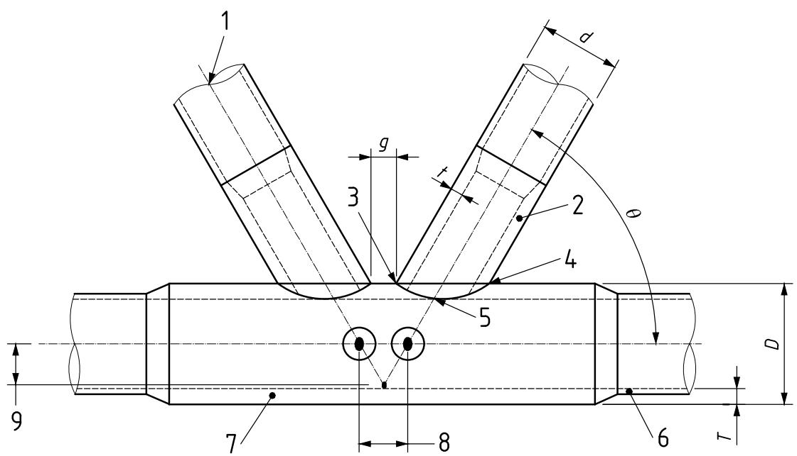  
Figure 14.1-1 — Terminology and geometrical parameters for simple tubular joints

Key   


| 1 | brace | θ | included angle between chord and brace axes |
| --- | --- | --- | --- |
| 2 | stub (where present) | g | gap between braces, negative for overlapping braces |
| 3 | crown toe | t | brace wall thickness at intersection |
| 4 | crown heel | T | chord can wall thickness at intersection |
| 5 | saddle | d | brace outside diameter |
| 6 | chord | D | chord can outside diameter |
| 7 | chord can |  |  |
| 8 | offset | β = d/D | γ = D/2T |
| 9 | eccentricity |  | τ = t/T |


## 14.2 Design considerations

14.2.1 Materials

The provisions of this subclause apply to joints made of steels having representative yield strengths not exceeding 800 MPa. However, the usable value of yield strength as a fraction of ultimate tensile strength shall not exceed:

— 0,80 in the case of a chord;   
— 0,90 of the case of a brace.

Recommendations for grout materials for use in grouted joints are given in 19.7.

14.2.2 Design forces and joint flexibility

Joints shall be designed and assessed using internal forces resulting from factored actions in accordance with Clauses 8 to 11.

The reduction in secondary (deflection induced) bending moments due to joint flexibility or due to inelastic relaxation may be considered. For ultimate strength analysis of the structure, information on the force-deformation characteristics of joints may be used. These characteristics are dependent on the joint type, configuration, geometry, material properties, design situation under consideration and, in certain instances, hydrostatic pressure effects. See A.14.2.2 for a further discussion on joint flexibility.

14.2.3 Minimum joint strength

Chord cans, in addition to developing the strength required by design actions, shall have a minimum axial--`,,,` capacity of at least 50 % of the effective strength of each incoming brace for each design situation (in-,``,,, place, loadout, lifting, launch, accidental, etc.). `, `,,,

For earthquake actions, the chord can capacity shall be at least 100 % of the brace effective strength of ```,, each incoming brace for the in-place design situation.---

The effective strength of the brace is defined as the representative yield strength for braces where the axial component is tensile, Formula (13.2-1), or the compression buckling strength where the axial component is compressive, Formula (13.2-5) or Formula (13.2-6). The effective strength calculations shall be based on the nominal material and geometric properties of the brace, not those of the brace stub (if one exist).

For the purposes of this requirement, the chord can capacity shall be determined using the representative strength given in Formula (14.3-1). The strength factor $\left( Q_{ \mathrm{ u } } \right)$ and the chord force factor $\left( Q_{ \mathrm{ f } } \right)$ shall be consistent with the design situation being considered.

14.2.4 Weld strength

Welds in fabricated joints shall be designed to develop a strength greater than or equal to both the yield strength of the nominal brace cross-section (ignoring any brace stubs) and the full strength of the joint. Further guidelines for welds for circular tubular joints are given in Clause 20.

Joints often involve welds from several brace connections in close proximity. The high restraint of joints can cause large strain concentrations and a potential for cracking or lamellar tearing. Hence the chord material (and brace/stub material, if overlapping is present) shall have adequate through-thickness toughness, see Clause 19.

14.2.5 Joint classification

There are three basic planar joint types, Y-, K- and X-joints (also called cross-joints), as shown in Figure 14.2-1 and as described as follows:

a) A brace and a chord constitute a Y-joint if the component of the brace axial force perpendicular to the chord is reacted by beam shear in the chord. The brace axial force parallel to the chord is balanced by axial force in the chord.   
b) A pair of braces in the same plane and on the same side of a chord constitute a K-joint if the components of the brace axial forces perpendicular to the chord balance each other to within 10 %. The components of the axial brace forces parallel to the chord are balanced by an axial force in the chord.

c) A pair of braces in the same plane and on opposite sides of a chord or a brace in combination with other structural components on opposite sides of the chord (e.g. padeyes, launch rails) constitute a Xjoint if the axial force is transferred through the chord to the opposite side: there is no overall reaction in the chord.

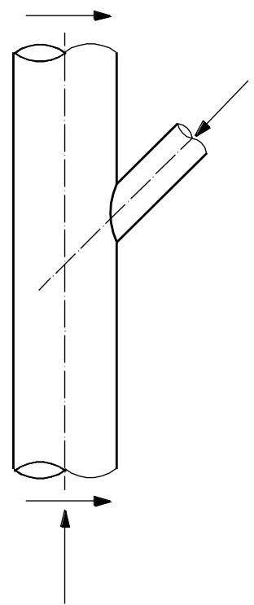  
a) Y-joint

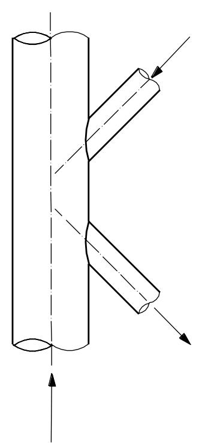  
b) K-joint

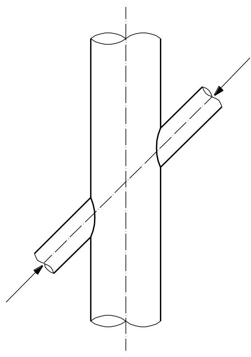  
c) X-joint   
Figure 14.2-1 — Basic planar joint types

Fixed steel offshore structures are normally space frames containing mixtures of the above joint types either in one plane or in several planes (multi-planar joints). For the purposes of classification, all members in planes within ±15° of each other may be considered as being in one plane. Joint classification is based solely on consideration of the axial forces in the braces.

Variants of the above joint types are T-joints which are Y-joints where the angle between the brace and the chord is approximately 90° and DT-joints, or Double T-joints, which look like X-joints with angles of approximately 90°, but behave as two T-joints because the brace axial forces are transferred to the chord - rather than to the opposite brace.

The design strength of most joints can be determined using the parametric formulae given in 14.3 for the,,,`` three basic planar joint types. The practical use of the basic joint formulae shall reflect, as closely as,,,,`, possible, the force pattern assumed in deriving the formulae by classifying each combination of brace(s),,``,` and chord according to the flow of the axial force in the brace(s).

Classification shall apply to the combination of an individual brace with a chord (Y-joint) or combination of a pair of braces with a chord (K- or X-joints), rather than to the whole joint based on the axial force pattern for each design situation. Thus, an individual brace can form part of a K-joint and part of a Y-joint and shall be classified accordingly as a proportion of each relevant type, e.g. 50 % K-joint and 50 % Y-joint. This classification is relevant to both fatigue and strength considerations.

Classification shall proceed on the basis of assessing whether the joint is, firstly, a K-joint and secondly a Y-joint or a X-joint. Figure 14.2-2 shows some simple examples of the brace joint classification scheme.

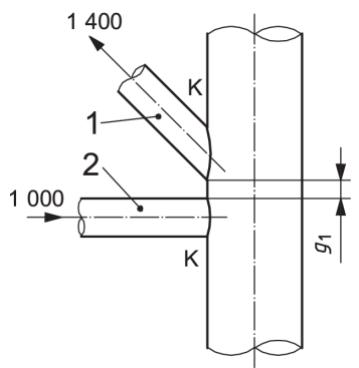  
a) Braces 1 and 2 classified as a K-joint

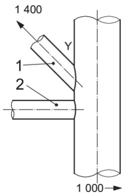  
b) Brace 1 classified as a Yjoint, brace 2 unclassified

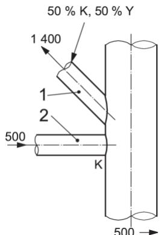  
c) Brace 1 classified as 50 % Kjoint and 50 % Y-joint, brace 2 classified as a K-joint

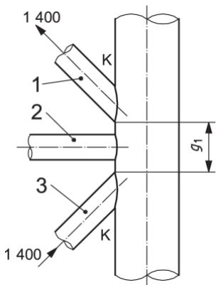  
d) Braces 1 and 3 classified as K-joints, brace 2 unclassified

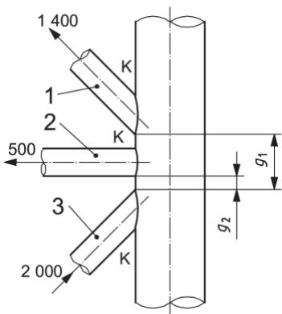  
e) Braces 1, 2 and 3 classified as K-joints

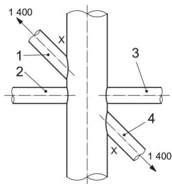  
f) Braces 1 and 4 classified as a X-joint, braces 2 and 3 unclassified

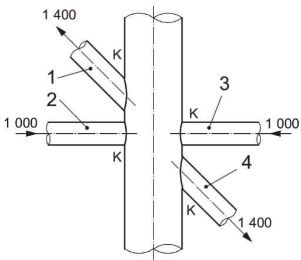  
g) Braces 1 and 2 classified as a K-joint, braces 3 and 4 classified as a K-joint

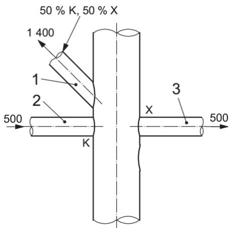  
Figure 14.2-2 — Examples of joint classification

h) Braces 1 and 2 are classified as a K-joint (using half the axial force in Brace 1) Braces 1 and 3 are classified as a X-joint

Key

g1 gap 1

1, 2, 3, 4 brace designators – see 14.2.5

g2 gap 2

Figure 14.2-2 h) is a good example of the axial force flow and classification hierarchy that should be adopted in the classification of braces in joints. The braces 1 and 2 on the left hand side of the chord act as a K-joint accounting for 50 % of the axial force in the diagonal brace. The other 50 % of the axial force in brace 1 forms an X-joint with brace 3. Replacement of brace axial forces by a combination of tension and compression forces to give the same net force is not permitted. For the example shown in Figure 14.2-2 h), replacing the axial force in brace 2 by a compression force of 1 000 and a tension force of 500 is not permitted, as this results in an inappropriate X-joint classification for this horizontal brace and a full K-joint classification for brace 1.

Careful consideration should be given to determining the correct gap between braces in a K-joint. In Figure 14.2-2 a) the appropriate gap is between adjacent braces. However, if an intermediate brace exists, as in Figure 14.2-2 d), the appropriate gap is between the outer braces acting as the K-joint. In this case, since the gap is often large, the K-joint strength can revert to that of a Y-joint. Figure 14.2-2 e) is instructive in that the appropriate gap for brace 2 is $g_{ 2 } ,$ , whereas for brace 1 it is $g_{ 1 } .$ . Although brace 3 is classified wholly as a K-joint (with brace 2 for 500 normal to the chord and with brace 1 for the remainder of the normal component of brace 3), the strength is determined by weighting the strength with gaps of $g_{ 1 }$ and $g_{ 2 }$ by the proportions of the axial force balancing from braces 1 and 2.

There are some instances where the above joint classification methodology is difficult to apply or is not applicable. Two of the more common cases in the latter category are associated with actions on a launch frame and with in situ actions on skirt pile-sleeves. Some guidance for such instances is given in A.14.2.5.

Once the classification is determined, joint strength can be determined using the procedures in 14.3.

14.2.6 Detailing practice

Joint detailing is an essential element of joint design. For unreinforced joints, the recommended detailing nomenclature and dimensioning are shown in Figures 14.2-3 and 14.2-4. Where an increased wall thickness or higher yield or toughness properties is required for the chord, this material should extend beyond the outside edge of incoming braces by the greater of a minimum of one quarter of the chord diameter, or 300 mm. The strength of Y- and X-joints is a function of the can length (see 14.3.5) and short can lengths can lead to a reduction in joint strength. Increasing the chord can lengths beyond the minimum values given here should be considered to avoid the need for downgrading strength.

In an X-joint, the larger diameter member shall continue through the joint, and the other should frame onto the through member. Where members of equal diameter meet at an X-joint, the member that carries the greater forces should be adopted as the through member.

When two or more braces intersect or overlap at a joint, the order in which each member frames into the joint should be determined by wall thickness and/or diameter. Typically the member with the thickest wall should be the continuous or through member, and the sequence for framing the remaining members should be based on the order of decreasing wall thickness. If two or more members have the same wall thickness, the larger diameter member shall be the continuous or through member. If two or more members have the same diameter and wall thickness, either member may be the through member unless the designer has designated a through member. Where substantial overlap occurs, the larger diameter brace should be specified as the through member. This through member can require an end stub to ensure that the thickness is equal to that of the overlapping brace. Lengths of brace welds which are covered by other brace connections shall be inspected by NDT prior to cover up.

When a brace requires increased wall thickness, higher yield strength, or more stringent toughness properties, such material should extend from its connection with the chord or beyond its connection with any overlapping brace(s) by the greater of the brace diameter or 600 mm.

Neither the chord can nor the brace stub minimum dimensions given above include the length over which any thickness taper occurs; any difference in thickness between chord can and chord member or between brace stub and brace member shall be tapered at 1:4 or lower, see Figure 14.2-3. For joints where fatigue considerations are important, tapering on the inside can have both an undesirable influence on crack origin and make early detection of cracks more difficult; for such joints, tapering should be on the outside (i.e. matching internal diameters).

The nominal gap (i.e. excluding weld toes) between adjacent braces, whether in-plane or out-of-plane, should not be less than 50 mm. Overlapping of welds of non-overlapping braces at the weld toes shall be avoided. When braces overlap, the overlap should be at least d/4 (where d is the diameter of the through brace) or 150 mm, whichever is greater. This dimension is measured along the axis of the through member, see Figure 14.2-3.

Longitudinal seam welds and circumferential welds should be located to minimize or eliminate their `,,,` impact on joint performance. The longitudinal seam weld of a brace should be located near the crown ``,,, heel of the joint, see Figure 14.2-3. The longitudinal seam weld of the chord should be separated from ,`,,,, incoming braces by at least 300 mm, see Figure 14.2-4. Where a chord requires a circumferential weld to-`-` achieve the desired can length, the weld should be positioned at a lightly loaded brace intersection, ```,,, between saddle and crown locations, see Figure 14.2-3.---

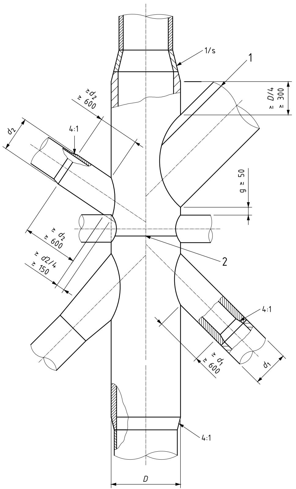  
Figure 14.2-3 — In-plane joint detailing

Key

1 seam weld
2 can circumferential weld   
s slope of conical transition （$s = 4$ for $D / T < 30 .$ ; flatter slope necessary for higher $D / T$ ratios)

The notation adopted in this figure of, e.g. ≥d2 $\begin{array} { l } { { \geq } d_{_{ 2 } } } \\ { { \geq } 600 } \end{array}$ indicates that the dimension shall be the larger of $d_{ 2 }$ and 600.

Figure 14.2-4 — Out-of-plane joint detailing   
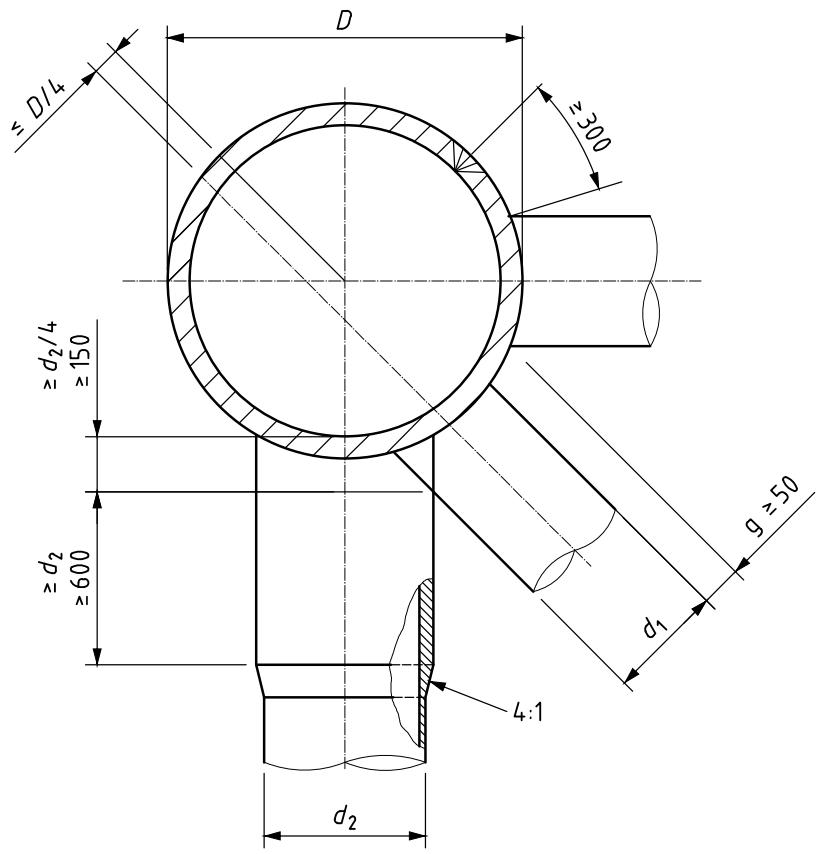  
a Longitudinal seam weld of chord can.

## 14.3 Simple tubular joints

14.3.1 General

Simple tubular joints are joints having no gussets, diaphragms, grout or stiffeners. Simple Y- and X-joints have no overlap of principal braces, but simple K-joints may have overlaps up to 0,6 D.

The validity ranges for the geometrical parameters, which are used in the formulae given in the remainder of 14.3, are as follows:

$$\begin{array}{l} 0, 2 \leq \beta \leq 1, 0 \\ 10 \leq \gamma \leq 50 \\ 30^{\circ} \leq \theta \leq 90^{\circ} \\ \tau \leq 1, 0 \\ \end{array}$$

For K-joints, the following validity range also applies:

$$- 0, 6 <   g / D$$

Annex A discusses approaches that can be adopted for joints which fall outside the above ranges.

14.3.2 Basic joint strength

The strength of a joint varies not only with its material properties and geometry, but also with the pattern of forces on each brace. Consequently, values of the strength can vary between design situations.

The strength of simple tubular joints should be calculated for each brace, for each individual force component of tension, compression, in-plane bending and out-of-plane bending, and for each design situation consisting of a combination of forces.

Representative strengths for simple tubular joints are given in Formulae (14.3-1) and (14.3-2):

$$P_{\mathrm{u j}} = \frac{f_{\mathrm{y}} T^{2}}{\sin \theta} Q_{\mathrm{u}} Q_{\mathrm{f}} \tag{14.3-1}$$

$$M_{\mathrm{u j}} = \frac{f_{\mathrm{y}} T^{2} d}{\sin \theta} Q_{\mathrm{u}} Q_{\mathrm{f}} \tag{14.3-2}$$

where

$P_{ \mathrm{ u j } }$ is the representative joint axial strength, in force units;

$M_{ \mathrm{ u j } }$ is the representative joint bending moment strength, in moment units;

$f_{ \mathrm{ y } }$ is the representative yield strength of the chord can (the lesser of SMYS or $^{ 0 , 8 }$ of the tensile strength), in stress units;

T is the chord wall thickness at the intersection with the brace;

d is the brace outside diameter;

θ is the included angle between brace and chord;

$Q_{ \mathrm{ u } }$ Qu is a strength factor (see 14.3.3);

$Q_{ \mathrm{ f } }$ is a chord force factor (see 14.3.4).

For braces with a mixed classification, $P_{ \mathrm{ u j } }$ and $M_{ \mathrm{ u j } }$ should be calculated by weighting the contributions from Y-, K- and X-joint behaviour by the proportions of that behaviour in the joint. This means that $P_{ \mathrm{ u j } }$ and $M_{ \mathrm{ u j } }$ can be different for each design situation considered, see A.14.3.2.

For X- and Y-joints with chord cans, $P_{ \mathrm{ u j } }$ shall not exceed the strength limits defined in 14.3.5.

The design values of the strength of simple tubular joints are given Formula (14.3-3) and Formula (14.3- 4):

$$P_{\mathrm{d}} = \frac{P_{\mathrm{u j}}}{\gamma_{\mathrm{R} , \mathrm{j}}} \tag{14.3-3}$$

$$M_{\mathrm{d}} = \frac{M_{\mathrm{u j}}}{\gamma_{\mathrm{R} , \mathrm{j}}} \tag{14.3-4}$$

where

$P_{ \mathrm{ d } }$ is the design value of the joint axial strength, in force units;

$M_{ \mathrm{ d } }$ is the design value of the joint bending moment strength, in moment units;

$\gamma_{ \mathrm{ R , j } }$ is the partial resistance factor for tubular joints, $\gamma_{ \mathrm{ R , j } } = 1 , 00$ .

14.3.3 Strength factor, $Q_{ \mathrm{ { u } } }$

In general, the strength factor, $Q_{ \mathrm{ u } } ,$ varies with joint classification and type of brace force: it is given in Table 14.3-1. For in-plane and out-of-plane bending, $Q_{ \mathrm{ u } }$ is independent of joint classification.

Table 14.3-1 — Values for $Q_{ \mathrm{ { u } } }$   


| Joint classification | Brace force | Brace force | Brace force | Brace force |
| --- | --- | --- | --- | --- |
| Joint classification | Axial tension | Axial compression | In-plane bending | Out-of-plane bending |
| K | (16+1,2γ)β1,2Qg but 40β1,2Qg | (16+1,2γ)β1,2Qg but 40β1,2Qg | (5,0+0,7γ)β1,2 | 2,5+(4,5+0,2γ)β2,6 |
| T/Y | 30β | 2,8+(20+0,8γ)β1,6but ≤2,8+36β1,6 | (5,0+0,7γ)β1,2 | 2,5+(4,5+0,2γ)β2,6 |
| X | 6,4γ0,6β2 | [2,8+(12+0,1γ)β]Qβ | (5,0+0,7γ)β1,2 | 2,5+(4,5+0,2γ)β2,6 |


In Table 14.3-1, $Q_{ \beta }$ is a geometrical factor defined by

$$Q_{\beta} = \frac{0 , 3}{\beta (1 - 0 , 833 \beta)} \quad \text{f o r} \beta > 0, 6 \tag{14.3-5}$$

$$Q_{\beta} = 1, 0 \quad \text{f o r} \beta \leq 0, 6 \tag{14.3-6}$$

and $Q_{ \mathrm{ g } }$ is a gap factor defined by

$$Q_{\mathrm{g}} = 1, 0 + 0, 2 \left(1, 0 - 2. 8 g / D\right)^{3} \text{b u t} \geq 1, 0 \quad \text{f o r} g / D \geq 0, 05 \tag{14.3-7}$$

$$Q_{\mathrm{g}} = 0, 13 + 0, 65 \Phi \gamma^{0, 5} \quad \text{f o r} g / D \leq - 0, 05 \tag{14.3-8}$$

$\mathrm{ F o r } - 0 , 05 < g / D < 0 , 05 , Q_{ \mathrm{ g } }$ can be found by linear interpolation between the results of Formulae (14.3-7) and (14.3-8) for the limiting values of $g / D = 0 , 05$ and $g / D = - 0 { , } 05$ , respectively.

where

$$\Phi = t f_{\mathrm{y , b}} / \left(T f_{\mathrm{y}}\right)$$

and, in addition to the definitions given in 14.3.2,

$f_{ \mathrm{ y , b } }$ is the representative yield strength of the brace at its intersection with the chord, in stress units;

t is the brace wall thickness at its intersection with the chord.

14.3.4 Chord force factor, $\mathbf{ Q_{ f } }$

The chord force factor, $Q_{ \mathrm{ f } } ,$ is a factor that accounts for the presence of forces from factored actions in the chord:

$$Q_{\mathrm{f}} = 1 + C_{1} \frac{P_{\mathrm{c}}}{P_{\mathrm{y}}} - C_{2} \frac{M_{\mathrm{i p b}}}{M_{\mathrm{p}}} - C_{3} A^{2} \tag{14.3-9}$$

where

$$A = \left[ \left(\frac{P_{\mathrm{c}}}{P_{\mathrm{y}}}\right)^{2} + \left(\frac{M_{\mathrm{c}}}{M_{\mathrm{p}}}\right)^{2} \right]^{0, 5} \tag{14.3-10}$$

Pc $P_{ \mathrm{ c } }$ is the axial force in the chord from factored actions;

$M_{ \mathrm{ c } }$ is the bending moment resultant in the chord from factored actions, $M_{ \mathrm{ c } } = \left( M_{ \mathrm{ i p b } }^{ 2 } + M_{ \mathrm{ o p b } }^{ 2 } \right)^{ 0 , 5 }$

$P_{ \mathrm{ y } }$ is the representative axial strength due to yielding of the chord can ignoring buckling, in force units

$$P_{\mathrm{y}} = A_{\mathrm{c}} f_{\mathrm{y}}$$

$f_{ y }$ is the representative yield strength of the chord can, in stress units;

$A_{ \mathrm{ c } }$ is the cross-sectional area of the chord or chord can at the brace intersection;

$M_{ \mathrm{ p } }$ is the representative plastic moment strength of the chord can;

ipb refers to in-plane bending;

opb refers to out-of-plane bending;

$C_{ 1 } , C_{ 2 } , C_{ 3 }$ are the coefficients given in Table 14.3-2.

Table 14.3-2 — Values for the coefficients $c_{ 1 } , c_{ 2 }$ and $c_{ 3 }$   


| Joint type | Joint type | C1 | C2 | C3 |
| --- | --- | --- | --- | --- |
| K-joints subject to brace axial forces | K-joints subject to brace axial forces | 0,2 | 0,2 | 0,3 |
| T/Y-joints subject to brace axial forces | T/Y-joints subject to brace axial forces | 0,3 | 0 | 0,8 |
| X-joints subject to brace axial tensiona | β≤0,9 | 0,2 | 0 | 0,5 |
| X-joints subject to brace axial tensiona | β=1,0 | 0,2 | 0 | 0,2 |
| X-joints subject to brace axial compressiona | β≤0,9 | 0,2 | 0 | 0,5 |
| X-joints subject to brace axial compressiona | β=1,0 | -0,2 | 0 | 0,2 |
| All joints subject to brace bending moments | All joints subject to brace bending moments | 0,2 | 0 | 0,4 |
| a Use linear interpolation for 0,9<β<1,0 | a Use linear interpolation for 0,9<β<1,0 | a Use linear interpolation for 0,9<β<1,0 | a Use linear interpolation for 0,9<β<1,0 | a Use linear interpolation for 0,9<β<1,0 |


The average of the chord forces and bending moments on either side of the brace intersection should be used in Formulae (14.3-9) and (14.3-10). Chord axial force is positive in tension and chord resultant bending moment is positive when it produces compression at the brace footprint.

14.3.5 Effect of chord can length on joint strength

For simple Y- and X-joints chord cans, the joint representative axial strength shall be calculated using Formula (14.3-11):

$$P_{\mathrm{u j}} = \left[ r + (1 - r) \left(T_{\mathrm{n}} / T_{\mathrm{c}}\right)^{2} \right] P_{\mathrm{u j}, \mathrm{c}} \tag{14.3-11}$$

where

$P_{ \mathrm{ u j } }$ is the representative joint axial strength, in force units;

$P_{ \mathrm{ u j , c } }$ Puj,c is the value of $P_{ \mathrm{ u j } }$ from Formula (14.3-1), based on chord can geometrical and material properties, including $Q_{ \mathrm{ f } }$ calculated from chord can properties and dimensions;

r = Lc/(2,5 D) for joints with $\beta \leq 0 , 9 .$ ;   
= （$4 \beta - 3 ) L_{ \mathrm{ c } } / ( 1 , 5 D )$ for joints with $\beta > 0 , 9 .$ ;   
≤ 1,0

$L_{ \mathrm{ c } }$ is the effective total chord length, see Figure 14.3-1;   
$T_{ \mathbf{ n } }$ is the lesser of the chord thicknesses either side of the chord can, see Figure 14.3-1;   
$T_{ \mathrm{ c } }$ is the chord can thickness, see Figure 14.3-1.

Figure 14.3-1 gives examples for the calculation of $L_{ \mathrm{ c } } .$

As an alternative to Formula (14.3-11), joint axial strength $P_{ \mathrm{ u j } } ,$ may be evaluated using an approximate closed ring analysis. Such an analysis should include plastic behaviour with appropriate safety factors, and an effective chord length up to 1,25 D on either side of the line of action of the brace force at the chord face, taking into account any thickness changes within this distance. Where multiple braces are in the

same plane and dominantly loaded in the same sense (tension or compression), the relevant perpendicular force is derived as the summation of relevant components over all the braces.

NOTE There is no reduction in the strength of K-joints due to length effects.

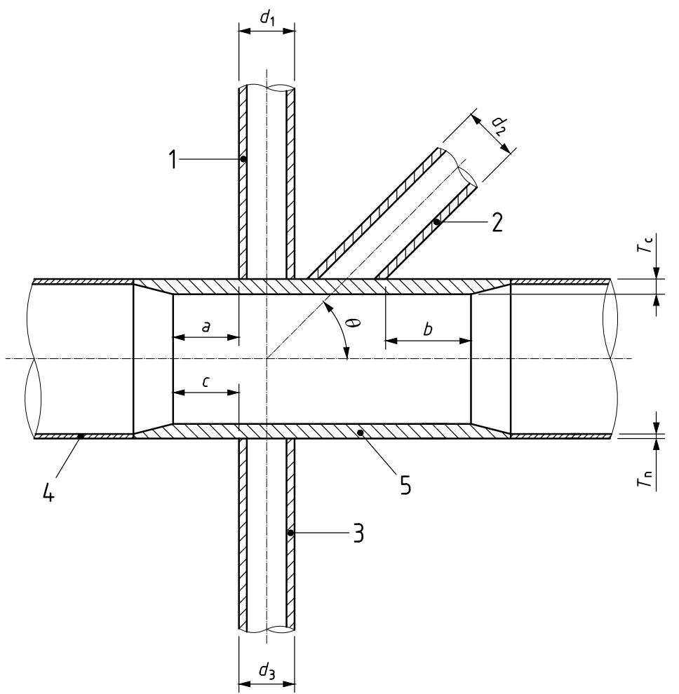  
Figure 14.3-1 — Example calculations of effective total chord length $\pmb{ L }_{ \mathbf{ c } }$

Key

1 brace 1
2 brace 2
3 brace 3
4 nominal chord   
5 chord can


| Brace | Lc |
| --- | --- |
| 1 | 2a + d1 |
| 2 | 2b + d2/sinθ |
| 3 | 2c + d3 |


14.3.6 Strength check

Each brace in a joint that is subjected either to an axial force or a bending moment alone, or to an axial force combined with bending moments, shall satisfy:

$$U_{\mathrm{j}} = \left| \frac{P_{\mathrm{B}}}{P_{\mathrm{d}}} \right| + \left(\frac{M_{\mathrm{B}}}{M_{\mathrm{d}}}\right)_{\mathrm{i p b}}^{2} + \left| \frac{M_{\mathrm{B}}}{M_{\mathrm{d}}} \right|_{\mathrm{o p b}} \leq 1, 0 \tag{14.3-12}$$

where

$U_{ \mathrm{ j } }$ is the joint utilization;

PB $P_{ \mathrm{ { B } } }$ is the axial force in the brace from factored actions;

$M_{ \mathrm{ B } }$ is the bending moment in the brace from factored actions;

$P_{ \mathrm{ d } }$ is the design value of the joint axial strength (see 14.3.2);

$M_{ \mathrm{ d } }$ is the design value of the joint bending moment strength (see 14.3.2);

ipb represents in-plane bending;

opb represents out-of-plane bending.

## 14.4 Overlapping joints

The strength of joints with in-plane overlaps involving two or more braces (see 14.2.6) shall be determined using the requirements for simple joints defined in 14.3, with the following exceptions and additions:

a) Shearing of the brace parallel to the chord surface is a potential failure mode and shall be checked; see A.14.4.   
b) 14.3.5 shall not apply to overlapping joints.   
c) If axial forces in the overlapping and through braces have the same sign (both compression or both tension), when determining the strength of the through brace, $P_{ \mathrm{ { B } } }$ shall be calculated as the combined axial force equal to the force in the through brace plus a portion of the overlapping brace force(s). The portion of the overlapping brace force is calculated as the ratio of the cross-sectional area of the overlapping brace that bears onto the through brace to the full area of the overlapping brace multiplied by the force in the brace.   
d) When checking the strength of the through brace, the combined moments on the overlapping and through braces, taking account of the sign of the moments, shall be used to compute--`,,, $M_{ \mathrm{ B } }$ .   
e) The overlap onto the through brace shall be checked by using the through brace as the chord in the`,`,, formulae in 14.3. The through brace strength shall also be checked for combined axial force and`-`- bending moment in the overlapping brace in accordance with 14.3.6 using the value of,```,, $Q_{ \mathrm{ f } }$ calculated for the through brace.`---   
f) Where nominal thicknesses of the overlapping and through braces differ by more than 10 %, the thicker brace shall be treated as the through brace. If this leads to β >1, β shall be taken as 1,0.

Joints having out-of-plane overlap can be checked on the same general basis as in-plane overlapping joints, except that the axial strength should normally revert to that for Y-joints.

## 14.5 Grouted joints

Two varieties of grouted joints are commonly used in practice. The first is a fully grouted chord, the second has a double-skin, whereby grout is placed in the annulus between an outer chord and an internal member. In both cases, the grout is unreinforced and no benefit to joint strength shall be derived from shear keys (if present).

The strength of grouted joints that are otherwise of simple configuration may be determined using the simple joint requirements defined in 14.3, with the modifications and limitations below.

a) For double-skin grouted joints, an effective thickness, $T_{ \mathrm{ e } , }$ should be determined from Formula (14.5-1):

$$T_{\mathrm{e}} = \left(T^{2} + T_{\mathrm{p}}^{2}\right)^{0, 5} \tag{14.5-1}$$

where

$T$ is the wall thickness of the chord;

$T_{ \mathbf{ p } }$ is the wall thickness of the inner member.

The effective thickness, $T_{ \mathrm{ e } } ,$ should be used in place of T in the simple joint equations, including the determination of the γ parameter, but taking into account b) and c) hereafter.

b) The $Q_{ \mathrm{ u } }$ values given in Table 14.3-1 should be replaced with values pertinent to grouted joints determined from Table A.14.5-1. As the expressions in Table A.14.5-1 are based on tear-out of the chord wall, the chord wall thickness, T, should be used instead of the effective thickness, $T_{ \mathrm{ e } } . Q_{ \mathrm{ u } }$ values should not be less than those for simple ungrouted joints with the same geometry and forces. The reduction in the strength of Y- and X-joints due to length effects (see 14.3.5) may be disregarded for fully grouted joints, but should be included for double-skin grouted joints.   
c) The $Q_{ \mathrm{ f } }$ value calculated from Formulae (14.3-9) and (14.3-10) depends on joint type and brace loading through the coefficients in Table 14.3-2, but not on thickness.   
d) Axial and moment design strengths calculated for the joint shall exceed the brace design strengths, for non-compact members inclusive of the local buckling strength at the brace end.

## 14.6 Ring stiffened joints

Primary joints along launch frames are often strengthened by ring stiffening. Ring stiffening is also used in some structures to address fatigue requirements or to avoid very thick chord cans. A.14.6 outlines the salient features of several common approaches available to design ring-stiffened joints.

## 14.7 Other joint types

Joints not covered by 14.3 to 14.6 may be designed on the basis of appropriate experimental, numerical, or in-service evidence.

For circular joints with doubler or collar plates, material strength approaches may be employed, although extreme care is needed in identifying all components that are expected to participate in resisting incoming brace forces and in establishing the acting force envelopes prior to conducting strength checks. Often material strength checks are complemented with calibrated FEA to establish the magnitude and location of acting stresses.

## 14.8 Damaged joints

Joints in existing structures can become damaged as a result of fatigue, corrosion, or overload (environmental or accidental). In such cases, the reduced joint strength shall be estimated from simple

models, e.g. based on the use of reduced area or section modulus, from more extensive numerical analysis using FEA models, or from experimental evidence.

## 14.9 Non-circular joints

Joints with non-circular chord or brace sections are typically used in topsides structures, see ISO 19901-3. Common types include I beam, column, and plate girder sections and rectangular or square hollow sections. For some configurations, detailed land-based design practice is available, see A.14.9. For arrangements for which little or no practice is available, the requirements are similar to those according to 14.7.

## 14.10 Cast joints

Cast joints can be of any geometry and are usually of variable wall thickness; they are of particular benefit when there are many similar joints or where fatigue is causing difficulties. The design of a cast joint requires calibrated FEA. A conservative design approach for strength is to limit stresses in the joint due to forces from factored actions to below the design yield strength of the material, $f_{ \mathrm{ y } } / \gamma_{ \mathrm{ R , q } }$ (see 14.3.4). The design of cast joints is often carried out in conjunction with the manufacturer.

15 Strength and fatigue resistance of other structural components

## 15.1 Grouted connections

15.1.1 General

Forces can be transferred between concentric tubular members by grouting the annulus between them. These forces are transferred from steel member to steel member, across the steel to grout interfaces and through the grout. Such connections are most commonly used for foundation pile-to-sleeve connections, but are also used for other types of connections, such as connecting pins and repairs.

The grout shall comply with the requirements of 19.7. Fabrication and installation shall be in accordance with 20.4.5 and 22.5.12, respectively.

In lieu of the requirements in this document, alternative methods may be used for the design of grouted connections. Test data and analytical techniques may be used as a basis for design provided that it can be demonstrated that the strength of such joints can be determined reliably. Analytical or numerical techniques should always be calibrated and benchmarked to suitable test data.

Within 15.1, the nomenclature and symbols shown in Figure 15.1-1 and Figure 15.1-2 are used.

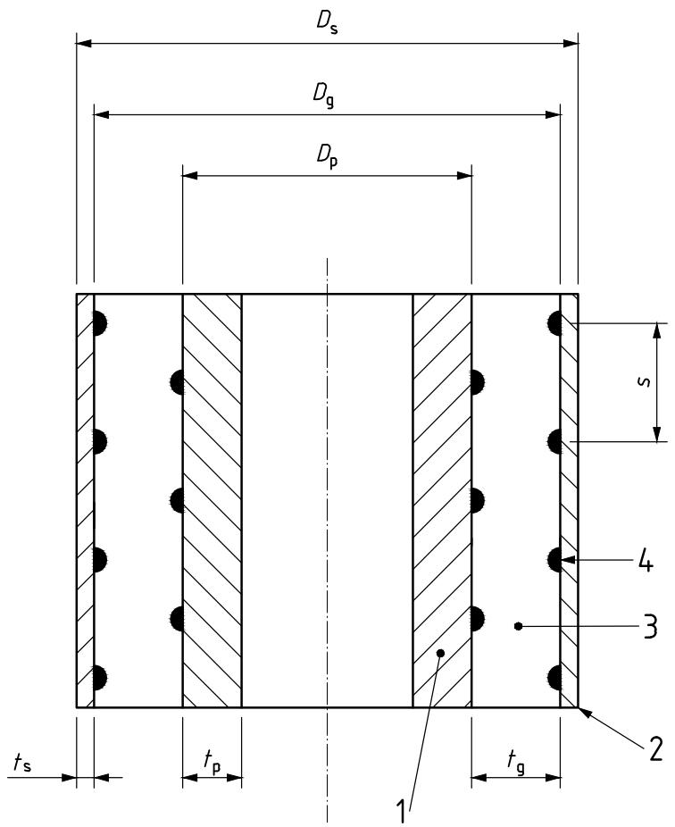

#

1 inner steel tubular member (pile in foundation pile-to-sleeve connection)   
2 outer steel tubular member (sleeve in foundation pile-to-sleeve connection)   
3 grout
4 shear keys (if present)   
$D_{ s }$ outside diameter of the outer steel tubular member (the sleeve)   
$D_{ \mathrm{ g } }$ outside diameter of grout annulus   
$D_{ \mathbf{ p } }$ outside diameter of the inner steel tubular member (the pile)   
$t_{ s }$ wall thickness of the outer steel tubular member (the sleeve)   
$t_{ \mathrm{ g } }$ nominal thickness of the grout annulus (i.e. assuming inner and outer members are concentric)   
$t_{ \mathrm{ p } }$ wall thickness of the inner steel tubular member (the pile)   
s centre-to-centre spacing of the shear keys

Figure 15.1-1 — Grouted connection symbols and terminology

Where shear keys are used, they shall be of one of the forms shown in Figure 15.1-2.

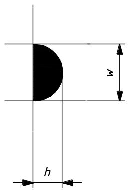  
a) weld bead

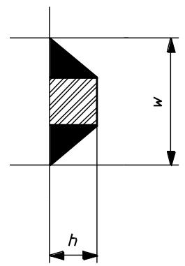  
b) square bar with fillet beads

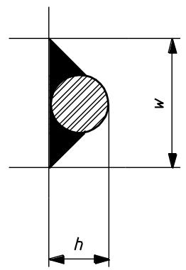  
Figure 15.1-2 — Shear key detail options

c) round bar with fillet beads

Key

h shear key height

w shear key width

15.1.2 Detailing requirements

In cases where a full fatigue assessment is required in accordance with 15.1.8 and A.15.1.8, the placing of shear keys near an unconfined end of the annulus shall conform to the requirements of A.15.1.8.

Centralizers shall be used to maintain a sufficient annular space between the two tubulars. For pile-tosleeve connections, the nominal width of the annulus shall be 40 mm or greater when a cement and water grout is used. In other types of connections, and when fillers are used in the grout, the width of the annulus shall be sized appropriately to enable free and uniform grout flow.

Proper means for the introduction of the grout slurry into the annulus shall be provided so that the potential for the dilution of the grout and formation of voids is minimized. The grouting arrangements shall be such that grout enters at the bottom of the annulus, and displaces water upwards as it fills the annulus.

Packers or other forms of end seals shall, as a minimum, be used at the lowest end of a connection. Provisions should, if necessary, be made for setting a grout plug in the event that an end seal fails. At sites having a soft seabed, the use of wipers or other means of minimizing mud intrusion should be provided for pile-to-sleeve connections.

15.1.3 Axial force

The axial force, P, to be used for the design of a grouted connection, shall be the largest axial force on the connection (either tensile or compressive) determined from factored actions.

In determining P for pile-to-sleeve (foundation) connections, consideration shall be given to soil-pilestructure interaction. In addition, account shall be taken of the distribution of overall actions on the structure over various piles in a group or cluster.

15.1.4 Reaction force from horizontal shear force and bending moment in piles

For piles of a jacket structure, the horizontal shear force due to environmental actions is transferred to the foundation as shear forces in the piles with associated bending moments at the lower end of the grouted pile-to-sleeve connections. It is important to provide a sound design to minimize potentially large

grout bearing stresses in this region. It is also recommended that these stresses be kept within acceptable values. Guidance on this is provided in Section A.15.1.4.

15.1.5 Interface transfer stress

When a grouted connection is subjected to combined axial force and a torsional moment, the interface transfer stress, $\sigma_{ \mathrm{ { p } } } ,$ shall be taken as the resultant of the component stresses caused by axial force and torsional moment at the inner member.

The component of the interface transfer stress at the inner steel tubular member due to axial force, $\sigma_{ \mathrm{ a } }$ , is defined by Formula (15.1-1):

$$\sigma_{\mathrm{a}} = \frac{P}{\pi D_{\mathrm{p}} L_{\mathrm{e}}} \tag{15.1-1}$$

where

$P$ is the axial force on the grouted connection due to factored actions;   
$D_{ \mathbf{ p } }$ is the outside diameter of the inner steel tubular member (the pile);   
Le $L_{ \mathrm{ e } }$ is the effective grouted connection length.

The effective grouted connection length shall be calculated as the overall length of the grout along the axis of the members, reduced by the following non-structural lengths:

a) Where setting a grout plug is the primary means of sealing or is the contingency sealing method in the event of packer failure, the grout plug length shall be considered as non-structural.   
b) To allow for potentially weak interface zones, grout slump, etc., at each end of the connection, the greater of the following grouted lengths shall be considered as non-structural:

1) two thicknesses of the grout annulus, $2 t_{ \mathrm{ g } } \mathrm{ , }$   
2) one shear key spacing, s, if shear keys are used.

c) Any grouted length that is not certain to contribute effectively to the connection strength shall be considered as non-structural.

EXAMPLE When shear keys are used, the implications of possible over- and under-driving of piles (foundation) are required to be considered in relation to the number of keys present in the grouted length.

The component of the interface transfer stress at the inner steel tubular member due to torsion, $\sigma_{ \mathrm{ t } } ,$ is defined as follows:

$$\sigma_{\mathrm{t}} = \frac{2 M_{t}}{\pi D_{\mathrm{p}}^{2} L_{\mathrm{e}}} \tag{15.1-2}$$

where

$M_{ \mathrm{ t } }$ is the torsional moment on the grouted connection due to factored actions;   
$D_{ \mathbf{ p } }$ is the outside diameter of the inner steel tubular member (the pile).

For connections without shear keys, the combined interface transfer stress （$\sigma_{ \mathrm{ p } } )$ is the stress resultant of both components:

$$\sigma_{\mathrm{p}} = \sqrt{\sigma_{\mathrm{a}}^{2} + \sigma_{\mathrm{t}}^{2}} \tag{15.1-3}$$

where $\sigma_{ \mathrm{ { p } } }$ is the interface transfer stress at the inner steel tubular member (the pile).

For connections with shear keys, the strength under axial force and torsion shall be checked separately.

15.1.6 Interface transfer strength

15.1.6.1 General

The design interface transfer strength, $f_{ \mathrm{ d } } ,$ for cement-water grouts shall be calculated from the lesser of the representative interface transfer strengths for sliding at the grout-steel interface, $f_{ \mathrm{ g , s l i d i n g } } ,$ and the representative interface transfer strength for grout matrix failure, $f_{ \mathrm{ g , s h e a r } } \mathrm{ . }$ :

$$f_{\mathrm{d}} = \frac{f_{\mathrm{g}} k_{\mathrm{r e d}}}{\gamma_{\mathrm{R} , \mathrm{g}}} \tag{15.1-4}$$

where

$f_{ \mathrm{ g } }$ is the representative interface transfer strength and is the lesser of $f_{ \mathrm{ g , s l i d i n g } }$ and $f_{ \mathrm{ g , s h e a r } } ;$

$k_{ \mathrm{ r e d } }$ is a reduction factor for the effects of movement during grout setting, see 15.1.5.3;

$\boldsymbol{ \gamma }_{ \mathrm{ R , g } }$ is the partial resistance factor for interface transfer strength

$$\gamma_{\mathrm{R}, \mathrm{g}} = 2, 0$$

If the representative interface transfer strength is based on test results, rather than using Formula (15.1-5) or Formula (15.1-6), account shall be taken of the inherent variability in the data when calculating the representative interface strength, see 7.7.

The representative interface transfer strength for grout-steel interface sliding （$f_{ \mathrm{ g , s l i d i n g } } )$ for the range of validity of the parameters given in 15.1.5.2 is calculated using Formula (15.1-5):

$$f_{\mathrm{g}, \text{s l i d i n g}} = \left[ \left(1, 4 + \frac{600}{D_{\mathrm{p}}}\right) + 140 C_{\mathrm{p}} \left(\frac{h}{s}\right)^{0, 8} \right] K^{0, 6} f_{\mathrm{c u}}^{0, 3} \tag{15.1-5}$$

The representative interface transfer strength for grout matrix shear failure （$f_{ \mathrm{ g , s h e a r } } )$ for the range of validity of the parameters given in 15.1.5.2 is calculated using Formula (15.1-6):

$$f_{\mathrm{g}, \text{s h e a r}} = \left[ 0, 75 - 1, 4 \left(\frac{h}{s}\right) \right] f_{\mathrm{c u}}^{0, 5} \tag{15.1-6}$$

where

$C_{ \mathrm{ p } }$ is a scale factor for the diameter of the inner steel member (the pile)

$$C_{\mathrm{p}} = \left(\frac{D_{\mathrm{p}}}{1000 \mathrm{m m}}\right)^{2} - \left(\frac{D_{\mathrm{p}}}{500 \mathrm{m m}}\right) + 2 \quad \text{f o r} D_{\mathrm{p}} \leq 1000 \mathrm{m m} \tag{15.1-7}$$

$$C_{\mathrm{p}} = 1, 0 \quad \text{f o r} D_{\mathrm{p}} \leq 1000 \mathrm{m m} \tag{15.1-8}$$

s is the shear key spacing;

h is the shear key height;

$f_{ \mathrm{ c u } }$ is the specified unconfined cube strength of the grout as defined in 19.7.2;

K is the radial stiffness factor of the grouted connection

$$K = \left[ \left(\frac{D_{\mathrm{p}}}{t_{\mathrm{p}}}\right) + \left(\frac{D_{\mathrm{s}}}{t_{\mathrm{s}}}\right) \right]^{-1} + \frac{1}{m} \left(\frac{D_{\mathrm{g}}}{t_{\mathrm{g}}}\right)^{-1} \tag{15.1-9}$$

where m is the ratio of elastic moduli of steel and grout = $E_{ \mathrm{ s } } / E_{ \mathrm{ g } }$ (to be taken as 18 in lieu of actual data).

Formulae (15.1-5) and (15.1-6) may also be used for grouts containing sand aggregate in lieu of more specific information. However, the strengths calculated are conservative and the use of test results and of other data for sand-cement-water grouts is recommended.

15.1.6.2 Ranges of validity

Formulae (15.1-5) and (15.1-6) are valid for non-machined and uncoated tubular members, where mill scale has been fully removed by corrosion or mechanical means, and for the following ranges of associated parameters:

— The specified minimum cube strength shall be within the following range:

$$20 \mathrm{M P a} \leq f_{\mathrm{c u}} \leq 80 \mathrm{M P a}$$

For the design of grouted connections for new structures, the specified minimum 28-day grout cube strength should not be less than 40 MPa.

— The SMYS shall be limited to:

$$f_{\mathrm{y}} \leq 800 \mathrm{M P a}$$

— The geometric dimensions of the grouted connection shall be within the following ranges:

$$1, 5 \leq w / h \leq 3, 0$$

$$0, 0 \leq h / s \leq 0, 10$$

For connections with shear keys, $0 , 004 \leq h / D_{ \mathrm{ p } } \leq 0 , 012$

$$20 \leq D_{\mathrm{p}} / t_{\mathrm{p}} \leq 40$$

$$30 \leq D_{s} / t_{s} \leq 140$$

$$4 \leq D_{\mathrm{g}} / t_{\mathrm{g}} \leq 45$$

$$h / D_{\mathrm{p}} \leq 0, 012$$

$$D_{\mathrm{p}} / s \leq 16$$

$$1 \leq L_{\mathrm{e}} / D_{\mathrm{p}} \leq 10$$

For connections with shear keys, $D_{ \mathrm{ p } } { \leq } 3000 \mathrm{ m m }$

For connections without shear keys, $D_{ \mathrm{ p } } \leq 1500 \mathrm{ m m }$

— Shear keys, where used, shall be continuous hoops or a continuous helix. Hoop shear keys shall be uniformly spaced, orientated perpendicular to the axes of the tubular members and be of the same form, height and spacing on both the inner and the outer tubular members. Where helical shear keys are used, the representative interface transfer strengths, given by Formulae (15.1-5) and (15.1-6), shall be reduced by a factor of $_{ 0 , 75 }$ and the following additional limitation shall be applied:

$$\frac{D_{\mathrm{p}}}{s} \geq 2, 5$$

15.1.6.3 Effect of movements during grout setting

The possible movements between the inner and outer steel tubular members during the 24 h period after grouting shall be determined for the maximum expected sea state during that time, assuming the grout makes no contribution to the stiffness of the system. For foundation pile-to-sleeve connections, this analysis shall be an on-bottom analysis of the structure with ungrouted piles.

The reduction factor, $k_{ \mathrm{ r e d } } ,$ for the effects of movement during grout setting shall be calculated as follows:

— For a relative axial movement between the steel tubular members of less than ±0,035 % of $D_{ \mathbf{ p } } \colon$

$$k_{\mathrm{r e d}} = 1, 0 \tag{15.1-10}$$

— For a relative axial movement between the steel tubular members of between ±0,035 % of $D_{ \mathbf{ p } }$ and ±0,35 % of $D_{ \mathbf{ p } }$ and for $h / s \leq 0 , 06$ :

$$k_{\mathrm{r e d}} = 1, 0 - 0, 1 (h / s) f_{\mathrm{c u}} \tag{15.1-11}$$

— For a relative axial movement between the steel tubular members of between ±0,035 % of $D_{ \mathbf{ p } }$ and ±0,35 % of $D_{ \mathbf{ p } }$ and for $h / s > 0 , 06 ,$ , see A.15.1.5.3.

This reduction factor is valid for relative movements between steel tubular members that do not exceed ±0,35 % of $D_{ \mathbf{ p } } .$ . Movements in excess of ±0,35 % of $D_{ \mathbf{ p } }$ cause higher levels of strength degradation and shall be avoided.

15.1.7 Strength check

The combined interface transfer stress $\left( \sigma_{ \mathrm{ p } } \right)$ from Formula (15.1-3) shall satisfy the following strength check:

$$U_{\mathrm{g}, \mathrm{c}} = \frac{\sigma_{\mathrm{p}}}{f_{\mathrm{d}}} \leq 1, 0 \tag{15.1-12}$$

where

$U_{ \mathrm{ g , c } }$ is the utilization of the grouted connection for combined axial force and torsion;

$f_{ \mathrm{ d } }$ is the design interface transfer strength from Formula (15.1-4).

The component of the interface transfer stress at the inner member due to torsion, $\sigma_{ \mathrm{ t } } ,$ from Formula (15.1-2) shall additionally satisfy the following check:

$$U_{\mathrm{g}, \mathrm{t}} = \frac{\sigma_{\mathrm{t}}}{f_{\mathrm{d} , 0}} \leq 1, 0 \tag{15.1-13}$$

where

$U_{ \mathrm{ g , t } }$ is the utilization of the grouted connection for torsion alone;

$f_{ \mathrm{ d } , 0 }$ is the design interface transfer strength from Formula (15.1-4), calculated for a plain grouted connection with no shear keys, i.e. with $h / s = 0$ .

In bending and shear, the grout principally acts as a confined spacer transferring compressive stresses only. For connections which comply with the ranges of validity given in 15.1.6.2, the representative interface strength for axial force is not reduced by coexisting bending and shear. However, local buckling of the free end of the internal tubular member can occur. Further, local failure of the grout at the lower end of the connection can occur as a consequence of bearing stresses due to the bending moment and shear force in the pile below the lower end of the grouted annulus. A15.1.4 provides guidance on the latter.

The steel components of the connection shall be designed in accordance with Clauses 13, 14 and 17, with 15.2 and 15.3, or by testing and analysis in accordance with Clause 7.

15.1.8 Fatigue assessment

Grouted connections that comply with the static strength requirements of 15.1.5 and 15.1.6, and that are subjected primarily to cyclically varying compressive forces during full load cycles need not be subjected to a detailed fatigue assessment.

In other cases, the fatigue strength may be assumed to be adequate if, in any force cycle:

— the direction of the maximum axial stress is determined (e.g. tension or compression in the tubular steel members beyond the end of the grout);   
— the maximum axial stress in the opposite direction $\left( \sigma_{ \mathrm{ a , r e v } } \right)$ is determined (i.e. compression or tension, respectively);

— the combined interface transfer stress $\left( \sigma_{ \mathrm{ p } } \right)$ calculated using $\sigma_{ \mathrm{ a , r e v } }$ in Formula (15.1-3) satisfies Formula (15.1-12) with $f_{ \mathrm{ d } } = f_{ \mathrm{ d } , 0 } ,$ i.e. for $f_{ \mathrm{ d } }$ calculated for a plain grouted connection with no shear keys $\left( h / s = 0 \right)$ .

If the above requirement is not satisfied, a detailed evaluation should be carried out. A.15.1.7 provides guidance on this.

## 15.2 Mechanical connections

15.2.1 Types of mechanical connectors

Mechanical connectors may be used to join structural components of offshore structures. These components include, but are not limited to, (foundation) piles, conductors, production and export risers, and tendons. Although there are a variety of connector designs, the following four general types of connectors are most commonly used for joining coaxial tubular members:

a) threaded or grooved connectors of the pin-and-box type assembled by torque or radial interference;-   
b) flanged connectors assembled by threaded fasteners;``,,,,   
c) dogged connectors that use radial wedges between the pin and box parts;``-`-``   
d) swaged connectors.---

Requirements for conventional mechanical connectors a) to c) above are given in 15.2.2 to 15.2.7; specific requirements for threaded connections only are given in 15.2.8; and requirements for swaged connections are given in 15.2.9.

Connectors that rely on impinging grip or friction grip by means of collets or sliding wedges to effect load transfer are generally not amenable to the analysis procedures discussed in A.15.2. However, the structural and validation requirements still apply and testing is recommended for validating performance.

15.2.2 Design requirements

15.2.2.1 General

The design of mechanical connectors for structural applications shall comply with the following structural and functional requirements. Structural requirements relate to the static strength and fatigue performance, while functional requirements include assembly, disassembly, installation, and sealing.

15.2.2.2 Static strength requirements

Connectors should be as strong as, or stronger than, the weakest of the connected tubular members. In all cases, connectors shall be designed to the strength criteria in 15.2.5. If the connector has a strength lower than the representative yield strength of the attached full tubular cross-section, the effect of relevant extreme forces imparted by waves and current, as well as forces due to deformation of the connector, forces due to possible restraints, and accidental actions shall all be considered. The effects of deformations and sudden disengagement, such as thread jump-out, shall also be considered in detail.

15.2.2.3 Fatigue performance requirements

Connectors should have a fatigue endurance greater than the fatigue endurance of full penetration, circumferential welds between tubular members of the same size. Failing this, the fatigue life of the connector shall exceed the planned life for the tubular component by a fatigue damage design factor (see 16.12.2), taking into consideration:

— the inspectability and inspection programme (see ISO 19901-9);   
— the likelihood and consequence of failure;   
— the uncertainty in forces due to actions and analysis methods;   
— the uncertainty in the fatigue life calculation method;   
— the remaining life, if through-thickness cracking does occur.

For structurally critical applications, where in-service inspection of the connector is unreliable or not possible, the calculated fatigue life of the connector shall be a minimum of 10 times the planned life of the connected tubular members.

15.2.2.4 Functional requirements

Connectors shall assemble and disassemble (when applicable) in a reliable manner consistent with the assumptions made in the analysis of the model used to demonstrate compliance with both strength and fatigue criteria. In cases where the connector is to contain internal or external pressure, seals shall be provided such that they remain sound after installation and for the design service life of the connection. All necessary functions of the connector shall remain effective upon application of the design and installation forces.

15.2.3 Actions and forces on the connector

Actions can be applied directly to a connector or indirectly through the tubular members being connected. The actions can include any combination of pressures (internal, external or both), forces and moments in the connected tubular members, deformations and thermal gradients. A simplified approach for calculating an equivalent axial force on the tubular members, when they are simultaneously subjected to axial forces and bending moments, is given in A.15.2.3.

15.2.4 Resistance of the connector

The strength of the connector can be determined by a calibrated analysis (see A.15.2.4) or prototype testing to failure (see 7.7). The strength shall be determined as the maximum applied typical force that can be sustained by the fully made up connector in combination with all other relevant deformations and actions applied repeatedly and in any order, without giving rise to gross deformation, disengagement or, if applicable, loss of sealing. The representative resistance of the connector, $R_{ \mathrm{ c } } ,$ shall be derived in accordance with 7.7.

15.2.5 Strength criteria

Connectors shall be designed to sustain the forces due to factored actions and deformations arising from external actions applied to the tubular members, thermal gradients, internal and external pressures, and assembly, without exceeding the representative resistance of the connector as defined in 15.2.4 and reduced by the partial resistance factor $\gamma_{ \mathrm{ { R } } } .$ . The potential effect of temperature on material strength shall

be taken into account. One approach to conducting strength checks for connectors based on linear FEA is given in A.15.2.5.

15.2.6 Fatigue criteria

The fatigue life of the connector shall be determined in accordance with the requirements given in 15.2.2.3. For an approximate fatigue life calculation, either of two methods can be used: the stress life approach (the S–N curve method) or the strain life approach (the initiation life method). Both approaches require local elastic stresses at the fatigue critical location(s) in the connector induced by the forces in the connected tubular members and material-specific fatigue data (see A.15.2.6).

15.2.7 Stress analysis validation

15.2.7.1 General

Although FEA programs are used to analyse connectors, some degree of experimental verification of the results obtained is highly desirable for confirming the validity of boundary conditions, simplifications in geometry, and preload simulation. Hence, direct measurements of actual strains/stresses using experimental techniques, e.g. strain gauges or photo elasticity, shall be included in a validation programme.

15.2.7.2 Strength validation

Experimental validation of the static strength of connectors shall either

a) demonstrate that the connector is stronger than the weakest of the connected tubular members, or   
b) establish the actual strength of the connector.

The advantage of b) is that it gives a measure of the actual reserve strength of the connector. In planning strength tests, specimen size and force-moment-pressure $\left( P \mathrm{ - } M \mathrm{ - } p \right)$ interaction should reflect the conditions of the particular application.

15.2.7.3 Fatigue validation

Because of the many uncertainties involved in fatigue calculation methods and the nature of the phenomenon itself, prototype tests shall be conducted to confirm the fatigue performance of the connector, unless equivalent life-time service records are available for the connector in question. Uncertainties arise from effects that are difficult, if not impossible, to account for in the analysis procedures, but which can have a significant impact on fatigue life. Examples are connector size, surface finish, and metallurgical and other effects. The extent and conditions of the fatigue testing should be commensurate with the level of conservatism built into the design process, the refinement of the analytical tools, the criticality of the connector application, and the degree of reliability sought through the validation exercise.

15.2.7.4 Functionality validation

Analytical modelling of variables, such as surface contact, surface roughness and friction, is difficult and unreliable. These variables affect the functional performance of connectors in terms of assembly and sealing. Thus, tests shall be conducted to demonstrate that connectors meet the functionality requirements. The tests shall use full-scale prototypes under conditions equivalent to, or more stringent than, those expected during operation.

15.2.8 Threaded fasteners

15.2.8.1 General

In some structural components, such as flanges and clamps, threaded fasteners are the primary means to transfer forces across the assembled mechanical connector. Threaded fasteners should normally be pretensioned to provide resistance to disengagement and to improve fatigue performance. Stresses in the threaded fastener induced by preload alone should be treated as secondary, see A.15.2.5.1.

15.2.8.2 Threaded fastener materials and manufacturing

Threaded fastener materials shall be selected taking account of the function of the connector. Aspects that influence selection include:

— maximum stress level to which the fastener is subjected;   
— material yield strength, ultimate tensile strength, and ductility;   
— corrosion resistance and galvanic corrosion;   
— durability at service temperature in the offshore environment;   
— selection of suitable coatings to provide the resistance to corrosion;   
— embrittlement;   
— loss of stress in the fastener due to relaxation and creep.

The yield strength of carbon steel threaded fasteners should be less than 725 MPa, to avoid potential embrittlement due to hydrogen absorption from exposure to cathodic protection potentials.

Manufacture of threaded fastenings shall take account of their intended service (see A.15.2.8.2).

15.2.8.3 Threaded fastener installation

To ensure that the threaded fasteners achieve their design tension, a suitable installation technique is required. A comprehensive installation methodology shall be derived and documented. Simultaneous use of hydraulic jacks or tensioners, one for each threaded fastener, is recommended. This technique avoids uneven preload, which can result from sequential stressing techniques. For clamps where torqueing devices are used, the accuracy of the relation between applied torque and tension shall be allowed for during installation (see A.15.2.8.3).

When using tensioners, the installation stress shall allow for transfer losses due to immediate elastic strains in the fastener thread and structural components that occur when the preload transfers from the tensioner to the threaded fastener. The installation stress shall also allow for longer term losses caused by creep in the threaded fastener and clamp components and for shrinkage of grout annuli or liner where used.

Spherical washers can relieve bending of the threaded fastener due to initial nut/bearing and plate misalignment.

Methods to prevent loosening of the fasteners shall be considered.

15.2.8.4 Threaded fastener inspection

Threaded fasteners should be periodically inspected during operation to ensure that they remain sound, protected from corrosion and properly tensioned. The inspection of the threaded fasteners should include measurements with respect to cathodic protection and tension (see A.15.2.8.4 and ISO 19901-9).

The inspection of threaded fasteners may take into account any redundancy provided by the number of threaded fasteners.

15.2.8.5 Threaded fastener strength criteria

Threaded fasteners shall be designed to sustain the combined effect of assembly preload and the factored actions applied to the connected tubular members.

15.2.8.6 Threaded fastener fatigue criteria

The fatigue performance of threaded fasteners is directly linked to the stress ranges induced in them by the variation of the applied actions. Such stress ranges shall be calculated by accepted engineering methods, taking into account the effect of preload, and the relative stiffness of the fasteners and the-- structural component parts they fasten. Palmgren-Miner's rule, in conjunction with stress histories and ,,``, S-N curves, based on tests of actual fasteners, may be used to calculate fatigue damage.,,,,`,`

15.2.9 Swaged connections``,```

15.2.9.1 Strength of swaged connections

A swaged connection between concentric tubular members is made by radially expanding (swaging) the inner tubular into circumferential grooves machined on the internal surface of the outer tubular. Swaging develops a radial preload and a longitudinal mechanical interlock between the inner and the outer tubular walls.

Swaged connections shall be designed to sustain the static forces in the tubular members with no significant relative axial slippage between the inner member and the outer member, and no permanent deformation upon loading the connection within its rated strength. The static strength of swaged connections may be determined by calibrated analytical means or by representative tests with regard to size, material, and forming process. Variables that affect the strength of a swaged connection include:

— the number, depth, and width of the grooves;   
— the spacing between adjacent grooves;   
— the radii of the re-entrant and protruding corners inside and between the grooves;   
— the pressure used in the swaging process.

The hoop stiffness of both tubular members shall be selected so that sufficient residual radial pressure remains at the contact points between the two parts to develop adequate radial preload upon swaging.

15.2.9.2 Fatigue performance of swaged connections

The fatigue performance of swaged connections shall be demonstrated by tests representative of inservice actions, in which the definition of fatigue failure shall include cracking anywhere within the connection and unacceptable progressive slippage between the two tubular members.

15.2.9.3 Material for swaged connections

The material properties of the tubular members shall be selected to ensure that no cracks develop during the expansion of the tubular wall. In corrosive environments, such as offshore, the potential deleterious effects on the performance of the connection arising from general corrosion, stress corrosion cracking, corrosion fatigue, and crevice corrosion shall be considered.

For swaged connections of foundation piles, the fracture performance of the material shall remain within acceptable limits for the intended purpose following pile driving and swaging. Particular attention in this regard shall be given to the weld material present in the pile and the sleeve.

15.2.9.4 Installation of swaged connections

Swaged connections can be produced by mechanical or hydraulic means applied to the inside of the inner tubular member. In both cases, the tool and the installation procedure shall ensure that the inner tubular member is swaged onto all of the grooves in the outer tubular member and that the intended amount of swaging of the tubular is reliably attained. One way to accomplish this is by conducting onshore trials and`--- calibrating the tools. ,```

## 15.3 Clamps for strengthening and repair

15.3.1 General

This subclause applies to the design of clamps to strengthen or repair tubular members or joints, or to connect tubular members.

The common features among these clamps are that they are deployed in two or more pieces, are fastened by bolts, and typically surround a structural component, such as a joint or a member. The surrounded component is further denominated as the substrate component. However, a key distinction can be made on the basis of the function and effect of the bolts, resulting in two generic types of clamps: split sleeve clamps and prestressed clamps.

15.3.2 Split sleeve clamps

In split sleeves, the initial tension applied to the bolts is merely intended to provide continuity of the sleeve parts. When sufficiently stiff and properly preloaded, the longitudinal chord can provide hoop stiffness continuity in the split sleeve. Otherwise, the bolts simply maintain the pieces together to produce an encasement around the substrate component. In both cases, the annulus or space created between the outer clamp pieces and the substrate component is filled with grout, but no prestress develops between the clamp and the substrate component.

15.3.3 Prestressed clamps

In prestressed clamps, the pre-tensioned bolts induce a continuous radial pressure on the substrate component, allowing friction on the contact surfaces, which then allows shear forces to be transferred between the parts of the clamp. The bolts can also provide a direct load path between the clamp’s parts. The following types of prestressed clamps are used:

a) Prestressed grouted clamps: these clamps have the cavity left between the substrate members and the clamp filled with grout. After the grout is cured, prestress is applied normal to the grout surface to enhance the friction capacity strength. This prestress is normally achieved by stressing external bolts.   
b) Prestressed mechanical clamps: these clamps are similar to the prestressed grouted clamps, except that the grout is omitted and the clamp is in direct metal-to-metal contact with the substrate structure.

c) Prestressed lined clamps: these clamps are the same as prestressed mechanical clamps, except that an elastomeric material is placed between the clamp and the substrate structure to accommodate local irregularities better.

CAUTION — Test data and in-service performance indicate that elastomeric lined clamps can be unreliable, see 15.3.6.3. Extreme care should be taken in their application.

15.3.4 Forces on clamps

15.3.4.1 Mechanism of force transfer

The internal forces in the substrate components and in the attached members generally translate into the following forces on the clamp:

a) shear forces and bending moments that tend to separate the clamp pieces;   
b) axial force and torque along the clamp axis that tend to produce relative slippage between the clamp and the substrate members.

Prestressed clamps transfer forces by radial bearing contact and friction at the clamp to member interface. Therefore, the long-term bolt forces shall be of such magnitude as to ensure that the contact pressure induced by the bolts is not overcome by the separation action due to the forces applied to the clamp. At the same time, the contact pressure shall develop sufficient friction to resist slippage. Similar to grouted connections, the interaction of the bending moments and shear forces with the axial force, all acting at the free ends of the clamp, tends to enhance the slip strength of the clamp. Therefore, it is conservative to assume that the separation and slip forces do not interact.

15.3.4.2 Member forces

In determining the forces in the members of the structure, the effects of both the modified stiffness and the modified environmental actions, due to the presence of the clamp, shall be taken into account.

15.3.4.3 Bolt forces

To evaluate the bolt forces necessary to resist the separation and slip actions on the clamp, the contributions from all actions on the clamped members (the substrate members) and the members attached to the clamp body shall be taken into account. The forces induced in the bolts may be determined by accepted analytical or numerical engineering methods or by testing. Particular attention shall be paid to the forces in the bolts at the ends of the clamp. Approximate methods for calculating the forces induced in the bolts by the separation forces and by the acting slip force at the clamp interface are presented in A.15.3.4.3.

15.3.5 Clamp design

15.3.5.1 General approach

Clamps shall be designed to fully sustain and transfer all of the forces and moments acting in:

a) members attached to the clamp;   
b) substrate members on which the clamp is installed.

In cases where adequate static or fatigue strength of the intact or damaged substrate structural component can be demonstrated, the clamp may be designed to transfer only the portion of the forces and moments attracted by the clamp.

The design process involves selecting the size, number, distribution and preload of the bolts, in conjunction with a clamp configuration such that the clamp sustains and transfers the forces in the clamped and attached members without opening, slipping or crushing the clamped members. If timevarying fatigue forces are acting on the clamp, the fatigue performance of both the clamp and the bolts shall also be evaluated.

15.3.5.2 Check of the clamped member

Because the bolt forces are directly resisted by hoop forces in the clamped tubular members, the substrate members shall be checked to avoid crushing at the free end of the clamp. For mechanical and lined clamps, crimping (local buckling of the part of the substrate member not contained within the clamp) shall also be checked, if appropriate. In prestressed grouted clamps, advantage may be taken of the strength of the grout annulus to carry compression forces when calculating the radial crushing pressure on the clamped member, provided that the grout annulus is circumferentially continuous. Crushing of the clamped member can be alleviated by lengthening the clamp or filling the member with grout.

15.3.5.3 Static design of bolts

The long-term bolt tension shall be determined as the largest of the bolt forces required to:

a) maintain a positive contact between the clamp and the substrate member under the action of the separating forces from factored actions;   
b) resist slippage under the action of the separating forces from factored actions.

Bolts shall be sized to sustain the long-term tension in accordance with the requirements given in 15.2.8.5 for threaded fasteners.

The contribution from individual bolts to the overall strength of the clamp shall be considered at the design stage to ensure that failure of any individual bolt or loss of tension in one or more bolts does not lead to overall failure of the clamp. The degree of bolt redundancy should be linked to the extent of inspection (see 15.2.8.4 for threaded fasteners).

15.3.5.4 Fatigue design of bolts

The evaluation of the variable bolt stresses caused by the time-varying forces shall be conducted by FEA or by any other demonstrably conservative engineering method (see A.15.3.5.4).

Fatigue lives can be predicted using the cumulative Palmgren-Miner’s damage ratio with an appropriate S-N curve. In selecting the S-N curve, account shall be taken of the type of bolts, the diameter and the exposure conditions (see A.15.2.8.6 for threaded fasteners).

15.3.5.5 Interface transfer strength of prestressed clamps

The ability of prestressed clamps to transfer force at the clamp-substrate interface depends on numerous variables. These include the bolt size and the level of preload, the number and distribution of the bolts, the length and stiffness of the clamp, the size and surface finish of the clamped member, and, if applicable, the grout strength. In the absence of specific strength data, the slip strength of prestressed clamps may be calculated using the formulae given in A.15.3.5.5.

When calculating the slip strength of a prestressed clamp, the loss of bolt tension from transfer losses upon tensioning and long-term effects on the grout and steel shall be allowed for in the derivation of the long-term bolt forces (see 15.2.8 for threaded fasteners).

In prestressed clamps comprising a continuous ring of grout, a proportion of the bolt preload is resisted by hoop compression in the grout, leading to a reduction of the effective prestress at the grout/member interface. This loss of effective prestress shall be considered in the slip strength calculations.

15.3.5.6 Interface transfer strength of split sleeve clamps

The interface transfer strength of split sleeve clamps may be taken as that given for grouted connections (see 15.1.6), provided that the hoop stiffness continuity of the longitudinal seams can be demonstrated by showing that no separation occurs on any part of the contact faces along the splits under any combination of forces and allowing for all losses of bolt stress, including time dependent effects. Where hoop stiffness continuity cannot be demonstrated, the strength of the split sleeve clamp is reduced, while the degree of reduction depends on the contribution of the sleeve size to hoop stiffness, the configuration of the seam flanges, and the bolting arrangement. Again, tests are the only reliable approach to quantifying the strength of this type of clamp (see 7.7).

15.3.6 General requirements for bolted clamps

15.3.6.1 Mechanical clamps

Reliance on metal-to-metal contact to develop the interface transfer strength in mechanical clamps requires that account is taken of:

a) fabrication and installation tolerances;   
b) the finish of the contacting surfaces (see A.15.3.6.1).

15.3.6.2 Grouted clamps

Clamps using grout as a filler medium provide greater flexibility for installation tolerances than mechanical clamps. The following additional points shall be considered when using grouted clamps:

a) the completeness of grout filling between the clamp and the substrate member can be affected by the position of grout inlets and outlets, the effectiveness of seals, and grout bleed;   
b) the interface transfer strength, calculated in accordance with Formulae (15.1-4), (15.1-5) and (15.1-6), provided the clamp body can be regarded as continuous;   
c) the shrinkage and creep of grout effectively reduces the contact pressure between the clamp and the clamped member;   
d) the relative movement between the clamp and the substrate member during grout curing and prior to bolt force application (see 15.1.5.3);   
e) the requirements of 19.7 in respect of grout materials.

15.3.6.3 Lined clamps

Elastomeric lined clamps should not be used where stiffness is important (see A.15.3.6.3). Relative stiffness is particularly important for partial strength repairs, where the original damaged structure can

be significantly stiffer than the repair or where the repair relies to any extent on the stiffness contribution from the existing structure through the load path being repaired.

Elastomeric lined clamps should not be used for primary structural members, unless specific data on strength and long-term effects are available.

15.3.6.4 Corrosion protection

Adequate corrosion protection shall be provided when attaching clamps and additional strengthening of members to an existing structure. Underwater corrosion protection is preferably achieved by providing the clamp with sacrificial anodes or, alternatively, by ensuring electrical continuity between the clamp and the structure, if appropriate. In both cases, continuity between the clamp body and the bolts shall be provided to ensure protection of the bolts. The use of coated bolts, whether these are cathodically protected or not, is recommended. Erosion or other sources of damage of the coating should be avoided.

Interaction between repairs and the existing structure should be considered with regard to levels of cathodic protection, and to possible damaging effects on the repair components, especially the bolts.

15.3.7 Bolting considerations

The requirements of 15.2.8 on threaded fasteners apply.

# 16 Fatigue

## 16.1 General

16.1.1 Applicability

Clause 16 presents general considerations and methods for verifying that fixed steel offshore structures satisfy the fatigue limit state (FLS) at all locations in the structure during their design service life, from fabrication via the in-place situation to the removal of the structure.

16.1.2 The fatigue process

Fatigue refers to the cumulative damage done by repeated application of time-varying stresses at a specific location in the structure. These time-varying stresses are caused by variable actions, especially, but not exclusively, due to wave action. For general reference, a brief overview of the fatigue process is given in A.16.1.2.

16.1.3 Fatigue assessment by analysis using S–N data

Normally, during design a fatigue assessment is performed by analysis using S–N data. The following major aspects for determining fatigue damage due to wave action are addressed in this clause:

a) general requirements for a fatigue assessment (see 16.2);   
b) a description of the long-term wave environment during the design service life (see 16.3);   
c) a description of the stress analyses methodology adopted for a fatigue assessment (see 16.4);   
d) the characterization of the stress range data governing fatigue (see 16.5);

e) the long-term local stress range history (see 16.6 to 16.9);   
f) the geometric stress range concept, including stress concentration factors (see 16.10);   
g) the fatigue resistance of the material (see 16.11);   
h) the fatigue damage assessment during a period of exposure (see 16.12).

Aspects e) to h) are specific to the particular location in the structure being considered and shall be repeated for all locations that are fatigue sensitive.

The various aspects a) to h) are integral parts of a fatigue assessment and should not be seen as independent. Even though they generally involve distinctly different technologies, which are often developed by different specialists, they shall be treated in an interrelated manner. This is essential in view of the large influence they can jointly have on the results obtained. Lack of appreciation of these interrelationships presents an inherent danger to any fatigue assessment.

NOTE The various steps in the assessment are usually performed separately and in sequence. Therefore, it is most convenient to also discuss them separately.

Clause 16 provides the fundamental requirements that shall be met to achieve reliable results. It leaves flexibility where possible or necessary to accommodate differences in the details of calculation procedures that are embodied in established practices or in computer programs that are used in the industry.

The design assessment is concluded with some observations on fatigue damage due to causes other than wave action (see 16.13) and some practical design considerations (see 16.14).

16.1.4 Fatigue assessment by analysis using fracture mechanics methods

In some special cases, fatigue lives can be determined using fracture mechanics methods (see 16.15). Fracture mechanics methods can also be used for special purposes associated with, but not directly aimed at, designing components of a new structure, and for determining the remaining fatigue life of components in which a crack has developed.

16.1.5 Fatigue assessment by other methods

Normally, a fatigue assessment requires detailed analyses using rational methods. However, when it can be demonstrated that either the fatigue limit state is not violated in the design service life or, alternatively, when relevant prior experience exists to reliably indicate that this is the case, a detailed fatigue analysis as per 16.1.3 or 16.1.4 may be replaced by (a) simpler assessment(s).

## 16.2 General requirements

16.2.1 Applicability

The requirements given in this document apply specifically to fixed steel structures of welded tubular space frame configuration. However, the principles described are much more widely applicable to steel structures in general. This includes structure types such as free-standing or braced caissons, compliant bottom founded structures, jack-ups and topside structures. Assessing the degree of applicability, or the need for specialization of the requirements for a particular type of structure, is the responsibility of the user of this document.

When used for components of non-tubular configuration, or for framed structures containing such components [e.g. components constructed of welded, rolled or fabricated beams, or of welded (un)stiffened plates], care shall be exercised to adapt the procedure for selecting the most appropriate stress parameter that governs the fatigue process in these cases.

All components of a structure are potentially sensitive to fatigue damage accumulation. In particular, every welded connection, every connection joined by other means than welding, every attachment, every structural discontinuity, and every place where some form of stress concentration is present, is a potential location of fatigue cracking and can require individual consideration. It is therefore often useful to first perform lower bound screening assessments to determine those locations in the structure that are most susceptible to fatigue damage accumulation and that are to be subsequently assessed in detail on an individual basis.

The requirements in this document are applicable to the fatigue design of new structures. However, they only relate to fatigue evaluations of “uncracked” locations. Therefore, in the case of existing structures, the proviso is that there be no crack present. The reason for this is that the local stress situation at a crack is not captured by the stress calculations described herein, while the fatigue crack growth process is neither adequately modelled by the S–N curves describing the fatigue resistance of the material or the structural detail. An assessment of the acceptability of a pre-existing crack requires a fatigue crack growth evaluation using fracture mechanics methods; see 16.15.

In this context “uncracked” refers to the absence of macroscopic cracks of a size that would be detectable by suitable inspection techniques. Microscopic defects of a size that cannot be detected by suitable inspection techniques are always present in welded connections, and these are not considered as cracks in the present sense. Successful application of the requirements given in this document to the fatigue design of new structures implies that the structure at the end of its design service life does not have cracks of critical size.

Requirements for fatigue design may be relaxed when they are complemented with requirements for inservice inspection to verify actual fatigue performance; see 16.14.8 and A.16.14.8.

16.2.2 Fatigue crack initiation and crack propagation

The small crack-like defects present in welds, or the material in the heat affected zones adjacent to welds, can act as initiators for crack growth under the influence of variable stresses. Therefore, for the procedures described in this document, there is only a crack propagation phase and no crack initiation phase in welded construction.

16.2.3 Sources of variable stresses causing fatigue

The predominant source of variable stresses causing fatigue in an offshore structure is wave action in the in-place situation during the design service life. However, other sources of variable stresses causing fatigue damage also require consideration; see 16.13. The observations and requirements given in 16.3 to 16.12 largely refer to the in-place situation, but with due alteration of details they are much more widely applicable.

16.2.4 Design service life and fatigue life

Design service life is defined in ISO 19900 as the assumed period during which a structure is to be used for its intended purpose with anticipated maintenance, but without substantial repair being necessary. For a fixed offshore structure, this is the period during which it is in-place at its offshore location. The design service life is preceded by a pre-service period, which generally comprises a period of onshore fabrication in the yard, a period of ocean transportation and a period of (offshore) installation.

The structure’s design service life shall be specified by the owner — where appropriate, in accordance with the requirements of a regulator where one exists. For a fatigue assessment, the design service life shall not be taken as less than 10 years. The fatigue life at any location in the structure, calculated in accordance with 16.12, shall not be less than the design service life.

Fatigue damage incurred prior to the design service life, and fatigue damage due to causes other than wave action in the in-place situation, shall be taken into account; see 16.12 and 16.13.

16.2.5 The nature of fatigue damage

Fatigue damage is a localized phenomenon; the damage originates at one or several neighbouring locations in the structure and develops from there. The methods described in this document do not deal with progressive fatigue failures, which can eventually lead to the global failure of a structure. Therefore, it is meaningless to speak of fatigue of a structure in a global sense. Consequently, the local situation with respect to stress variations, and the local details of construction and workmanship during fabrication, have a profound effect on the fatigue damage done.

For reliable fatigue assessment, all these aspects should be taken into account as accurately as possible. Therefore, a fatigue analysis generally requires much more detailed models of the actions and of the structure, as well as much more refined analysis procedures than those of a strength analysis.

16.2.6 Characterization of the stress range data governing fatigue

Due to the highly localized nature of fatigue damage, it is very important to select appropriate stress range parameter(s) for describing the local stress range history as discussed in 16.5; see also A.16.1.2.

16.2.7 The long-term stress range history

The stress variations occurring during a particular period at a specified location in the structure shall be specified in the form of a long-term stress range history. The period considered can, for example, be the design service life for the in-place situation, or the duration of yard fabrication or the duration of an ocean tow for the pre-service situation.

The long-term stress range history can be given as a function of time or as a statistical distribution.- Specification as a function of time is usually impractical and, more importantly, for nearly all cases of ,,,`` practical interest, the sequence of events producing the stress range time-history during the period `,,,,` considered is, a priori, unknown. A selected time-history would hence merely be an arbitrary choice from `,,,,` an infinite number of equally probable possibilities. Experience further indicates that the impact of the-`-``, sequence of events on the assessment of fatigue damage averages out with time. When considered over`,,, a long period, as is normal for a fatigue assessment, the effect is hence very small, if noticeable at all.- Therefore, the long-term stress range history is normally specified in the form of a statistical distribution.

The long-term stress range history can be determined by means of the following:

— a series of spectral analyses if a spectral fatigue analysis method is used, as described in 16.7;   
— a series of deterministic analyses if a deterministic fatigue analysis is used, as described in 16.8;   
— other approximate procedures that are usually based on previous experience for the type of structure and the geographical area concerned, see 16.9.

Guidance on the choice between a spectral and a deterministic fatigue analysis is given in 16.6.

The use of other approximate procedures can only be justified for screening analyses during initial design phases or if previous experience indicates that fatigue is not an important design issue. Even in these cases, great care combined with sound knowledge shall be exercised.

16.2.8 Partial action and resistance factors

In determining stress variations for a fatigue analysis, the partial action factors shall be taken as 1,0. The partial resistance factor on the fatigue resistance shall also be taken as 1,0. Safety against fatigue failure is provided by using fatigue resistance in the form of a design S–N curve, which is the mean minus two standard deviations of log N. Overall safety against failures associated with fatigue damage accumulation is further provided by a fatigue damage design factor $\gamma_{ \mathrm{ F D } } \geq 1 , 0$ . Local experience can be taken into account by a local experience factor $k_{ \mathrm{ L E } } ,$ , which can be larger or smaller than 1,0; see 16.12.3.

16.2.9 Fatigue resistance

The fatigue resistance of the material in or around a weld to variable stresses is given in the form of empirical S–N curves, where S is a constant amplitude stress range and N the number of cycles to failure. Many S–N curves have been determined and can be found in the literature. Each curve is strictly associated with a particular definition of S and N, as well as a particular structural detail. They shall not be used with variables that are defined in a different manner or for different structural details; see also A.16.1.2. The S–N curves that shall be used are presented in 16.11.

16.2.10 Fatigue damage calculation

The long-term stress range history and the fatigue resistance both relate to a particular location in the structure. These two items are combined via Palmgren-Miner’s rule to determine the fatigue damage at the location during the period under consideration; see also A.16.1.2. Application of Palmgren-Miner’s rule is discussed in 16.12.

16.2.11 Weld improvement techniques

Weld improvement techniques shall not be used for the design of a new structure in lieu of reducing fatigue damage by means of appropriate modifications to the design, as long as such modifications are still practically possible. Appropriate design modifications can include:

— reducing the variable actions causing stress variations, if possible;   
— changing the geometry or the dimensions of the component(s) involved to reduce the magnitudes of the stress variations (the action effects) occurring;   
— changing the construction details of the component(s) concerned.

Weld improvement techniques (see 16.16) may be considered as a last resort measure that can only be justified when the project is too far advanced to still enable design changes to be introduced in a timely and practical manner.

## 16.3 Description of the long-term wave environment

16.3.1 General

In a description of the wave environment, short-term and long-term conditions are distinguished.

Short-term conditions refer to a stationary situation in which the sea remains the same in a statistical sense. Such stationary situations are limited in duration and are normally assumed to last for a standard period of 3 h. A stationary situation (short-term condition) of the sea is referred to as a sea state. A shortterm condition of the sea can be realistically described by a theoretical model in the form of a wave spectrum, the parameters of which can be chosen to reflect the actual wave conditions at a particular time and location.

Long-term conditions refer by definition to situations in which the wave environment is no longer stationary but changes. Long-term wave conditions hence always consist of a succession of sea states. As there are no theoretical models to describe the long-term wave climate, long-term conditions at a particular location are always empirical.

Long-term conditions typically refer to the duration of a season, a year or the design service life of a structure. For a fatigue assessment of the in-place situation, the long-term conditions during the design service life or the long-term conditions during a typical year can be used. In the latter case, it is assumed that the conditions in a typical year repeat themselves every year during the design service life. For a fatigue assessment of pre-service situations, the long-term conditions relate to the duration of yard fabrication, the duration of the transportation from the yard to the offshore location, or the duration of the offshore installation.

16.3.2 Wave scatter diagram

The most suitable representation of the long-term wave environment at a location is the wave scatter diagram. Ideally, a wave scatter diagram specifies the probability density function, $p ( H_{ \mathrm{ S } } , T_{ \mathrm{ R } } , \theta_{ \mathrm{ m } } )$ , of the joint occurrence of the three main parameters defining a sea state, being the significant wave height $H_{ \mathrm{ S } } ,$ , a representative period, $T_{ \mathrm{ R } } ,$ and the mean wave direction, $\theta_{ \mathrm{ { m } } } .$ However, joint statistics of these three parameters are rare and the best that is usually available is a two-dimensional wave scatter diagram, $p ( H_{ \mathrm{ S } } , T_{ \mathrm{ R } } )$ .

In some cases, the available data permit the determination of directional wave scatter diagrams for eight, or preferably 12 equally spaced directions. Directional wave scatter diagrams are discrete subsets, $p ( H_{ \mathrm{ S } } , T_{ \mathrm{ R } } )$ , of the three-dimensional wave scatter diagram, $p ( H_{ \mathrm{ S } } , T_{ \mathrm{ R } } , \theta_{ \mathrm{ m } } )$ , for specific wave directions.

Wave scatter diagrams usually represent the long-term wave environment during a (typical) year and should be based on several years of site-specific data to ensure that they adequately represent the wave environment at the location of the structure. The data can be determined by measurements, by hindcast modelling or by a combination of the two.

16.3.3 Mean wave directions

Where no information on wave directions is available, an omnidirectional wave scatter diagram can be used that does not distinguish the mean direction of individual sea states. It is then assumed that the three dimensional wave scatter diagram, $p ( H_{ \mathrm{ S } } , T_{ \mathrm{ R } } , \theta_{ \mathrm{ m } } )$ , can be transformed into an omnidirectional twodimensional wave scatter diagram, $\mathsf{ p } ( H_{ \mathrm{ S } } , T_{ \mathrm{ R } } )$ , by a separation of variables:

$$p \left(H_{S}, T_{R}, \theta_{\mathrm{m}}\right) = p \left(\theta_{\mathrm{m}}\right) p \left(H_{S}, T_{R}\right) \tag{16.3-1}$$

where $p ( \theta_{ \mathrm{ m } } )$ is the probability of occurrence of each mean wave direction irrespective of the significant wave height $H_{ S }$ and the representative period $T_{ \mathrm{ R } }$ .

Mean wave directions are difficult to measure and information on them is not often available. In such cases, the statistics of wind directions can be used as an approximation to the probability of occurrence of mean wave directions. It is then assumed that the distribution of the mean wave direction $p ( \theta_{ \mathrm{ m } } )$ coincides with the distribution of the mean wind direction $p ( \theta_{ \mathrm{ w } } )$ .

Where applicable, care shall be taken to account for special geographic features, such as restrictions in fetch from certain directions or special sea floor topography, which can impose limitations on wave generation for specific wind directions.

16.3.4 Wave frequency spectra

Each sea state in the wave scatter diagram is described by a two-parameter wave spectrum. For fatigue analysis purposes, a wave spectrum shape shall be chosen that is representative of the average distribution of wave energy over wave frequency for a large number of sea states. For fully developed sea states, the two-parameter Pierson-Moskowitz spectral formulation is normally most appropriate. For sea states that are not fully developed, the two-parameter Jonswap wave spectral formulation can be preferred.

The wave period used in the spectral formulation shall be consistent with the representative period, $T_{ \mathrm{ R } } ,$ for the data in the wave scatter diagram.

16.3.5 Wave directional spreading function

The water surface elevation in a real sea is short-crested (see A.16.3.1), i.e. the frequency components are spread over a range of directions around the mean wave direction. To accommodate the effect of wave spreading on structural responses, a directional spreading function may be used where appropriate.

16.3.6 Periodic waves

In all fatigue analysis methods, the basic stress variations in the structure are calculated using individual periodic waves. The particular way in which the periodic waves are used in the various fatigue analysis methods is described in 16.7 to 16.9.

16.3.7 Long-term distribution of individual wave heights

In a deterministic fatigue analysis, the long-term wave environment is specified by the long-term distribution of individual wave heights, which can be derived from the wave scatter diagram; see A.16.3.7.

16.3.8 Current

Currents are normally not taken into account in calculating applied wave actions for a fatigue analysis (see A.16.3.8). However, fatigue damage due to VIV caused by currents shall be considered; see 16.13.

16.3.9 Wind

For a fixed offshore structure, variable actions due to wind are small in comparison with variable actions due to waves and do not need to be considered for the in-place fatigue analysis.

There is no direct wave action on the topsides of a fixed offshore structure, and therefore variable actions due to wind are normally the most important source of fatigue stresses in components of the topsides structure in the in-place situation, particularly for long slender structures such as flare structures.

Wind-induced fatigue shall be considered for other situations than the in-place situation; see 16.13.

16.3.10 Water depth

In a fatigue analysis of the in-place situation the average water depth during the design service life of the structure shall be used. The potential effect of subsidence should be considered, see A.16.3.10.

16.3.11 Marine growth

For new structures, the design marine growth thickness shall be used.

## 16.4 Performing the global stress analyses

16.4.1 General

General guidance on structural modelling and analysis is given in Clause 12. The guidance in this subclause relates specifically to stress analyses for a fatigue assessment.

All methods of fatigue assessment by analysis are based on the results of a large series of global stress analyses in individual periodic waves (see 16.3.6). The calculated stress variations are the input data for all subsequent steps in the fatigue assessment and should therefore be fully reliable. The computer models used for the stress analyses shall be suitably detailed to ensure that the nominal stress variations at a particular location in the structure are adequately captured and are compatible with the purpose and the chosen method of fatigue analysis. This applies to both the action model and to the structural model. None of the models used for the strength analysis of the structure is normally detailed enough for stress analyses for fatigue assessment purposes and both require suitable additions and refinements.

For the action model, only time-varying direct actions are required; permanent actions do not need to be considered.

The structural model shall include all relevant characteristics of the structure and its foundation to correctly reflect the magnitude and distribution of its stiffness. Where dynamic structural response is involved, the magnitude and distribution of the structure's mass shall also be correctly represented. Care shall further be taken to model the geometry of the structure in sufficient detail to capture any asymmetry in the structure's stiffness, in its mass or in the applied actions to ensure that torsional responses are also properly taken into account. Where required, damping can normally be modelled by viscous damping using a damping ratio (a non-dimensional damping coefficient).

For space frame structures the time-varying stresses in an individual structural component are due to overall frame action and to direct wave action on and around the component considered. Direct wave action usually becomes more important the higher the component's elevation in the structure. Therefore, all relevant members in the (near) vertical frames and in the plan framing levels shall normally be included and shall be modelled in a realistic manner. Recognizing the potential influence of asymmetry, the lack of symmetry in bracing patterns, with respect to the overall configuration of the structure in combination with the lack of symmetry in applied actions for seemingly similar wave directions, shall not be overlooked. The transfer of applied actions to foundation piles, any foundation constraint provided by conductors, where present, and associated details in the modelling of the plan framing at the sea floor, shall also be included in the model to ensure that the distribution of support reactions through the structure is correctly represented for different levels of the applied actions.

In many respects, the modelling aspects adopted in the different fatigue assessment methods are the same. Those aspects that are common are described in this subclause. Aspects that are specific to one of the methods are described in 16.7 to 16.9.

16.4.2 Actions caused by waves

The actions on the structure for the stress analyses are the direct actions caused by periodic waves. The basis of the procedure for calculating these actions is described in 9.5, with the following specializations and modifications:

a) current and the current blockage factor shall not be used (see 16.3.8);   
b) instead of the storm water depth, the water depth specified in 16.3.10 shall be used;   
c) in the context of the procedure used in 9.5, the wave directional spreading factor shall be 1,0;   
d) care shall be taken that the influence of marine growth on the stresses calculated for fatigue analyses is correctly taken into account, as marine growth affects both the drag and the inertia term in Morison's equation (see below);   
e) for fatigue analyses, the values of the drag and inertia coefficients shall not be taken from 9.5.2.3 (see below);   
f) the conductor shielding factor shall be 1,0.

For spectral and deterministic fatigue analysis methods, different periodic wave theories can be applicable; see 16.7 and 16.8.

All fatigue assessment methods are based on stress ranges. Each stress range in an individual periodic wave is due to a full wave cycle. The resulting stress cycle at a particular location consists of contributions from an axial and a bending stress cycle, which are in general not synchronous. To determine the appropriate resulting stress range in the time domain, a full cycle of each periodic wave shall be stepped past the structure, requiring a substantial number of separate wave positions with the associated calculations (see A.16.4.2). When the whole formulation for the structural analysis is adequately linearized, the stress calculations may alternatively be performed in the frequency domain. In this latter case, two calculations for each periodic wave suffice, one for the real (in-phase) and one for the imaginary (out-of-phase) components of the applied wave actions.

For all fatigue assessment methods, the actions due to waves shall be calculated for a sufficient number of wave directions to adequately capture the influence of wave direction on local stress variations resulting both from overall frame action due to global hydrodynamic actions and from direct wave action on individual components. For typical configurations of steel structures a minimum of 8 to 12 wave directions covering the full 360° of the compass are required for a comprehensive representation of the stresses at a particular location. The selected wave directions should normally coincide with the mean wave directions for which statistical information in the wave scatter diagram is available (see 16.3.2).

The model for hydrodynamic actions shall include a three-dimensional representation of all components of the structure that are exposed to wave action. Whereas for a global strength analysis horizontal actions are usually the most important, for a fatigue analysis careful attention shall be paid to the accurate modelling of actions on components in all directions. This notably includes vertical applied actions on submerged plan frames.

Appurtenances subjected to wave action shall be included and shall be properly modelled in their correct location and with their appropriate connection details, to realistically represent the transfer of any actions on them to the structure. Appurtenances that shall be modelled in this manner include, but are

not limited to conductors, caissons, risers, J-tubes, boat landings, fenders, launch rails, pile guides, and pile sleeve assemblies. Miscellaneous attachments, such as anodes, also attract hydrodynamic actions, which shall be included as well. However, wave actions on anodes are representative of a more distributed type of action and may be modelled with an increase in the drag and/or inertia coefficients in Morison's equation.

The influence of marine growth shall be included by taking into account the influence of an increase in the diameter on the drag term as well as on the inertia term in Morison's equation. The drag coefficient shall additionally reflect the influence of roughness. All this is normally achieved by using an effective hydrodynamic diameter in conjunction with appropriately adjusted drag and inertia coefficients.

The analyses shall be run for a wide range of wave heights and periods, most of these being much lower and shorter than the design wave height and period for the strength analysis. The inertia term in Morison's equation is hence much more important in fatigue analyses than for the strength analysis in an extreme storm condition, up to the point that the inertia term can become dominant over the drag term. Therefore, the cross-sectional area (or the equivalent volume of components with shapes that are not tubular) and the associated choice of inertia coefficients require careful attention.

As short wave periods are associated with short wave lengths, it is generally necessary to calculate the applied actions at a larger than usual number of discrete points along the length of components for extreme wave analyses to adequately define the distribution of wave actions over individual components as well as the total wave action on the entire structure. Only in this manner can the influence of distributed actions on member end moments be properly taken into account.

In fatigue analyses, an inertia coefficient of $C_{ \mathrm{ m } } = 2 { , } 0$ shall be used for tubular members (see A.16.4.2). The drag coefficient $C_{ \mathrm{ d } }$ may be chosen in accordance with A.9.5.2.3. The coefficients that shall be used for nontubular members and non-tubular appurtenances are subject to special consideration.

16.4.3 Quasi-static analyses

As the actions on the structure are by definition time-varying, the stress responses are also time-varying. Structures for which dynamic behaviour is significant are referred to as dynamically responding structures (see 12.5.2). When the influence of structural accelerations can be neglected, stresses may becalculated using a quasi-static linear structural analysis (see 12.5.3). The acceptability of neglecting `,,,``, dynamic effects should be carefully reviewed; some guidance is provided in 12.5.2 and A.16.4.3.`,,,,

16.4.4 Dynamic analyses`-``,`

16.4.4.1 General

In global structural analyses to determine member nominal stresses, the steady state dynamic response to each of the periodic waves stepped past the structure shall be included by performing a dynamic linear analysis (see 12.5.5). The influence of dynamic response on the long-term local stress range history shall be determined using spectral analysis and a frequency domain dynamic solution.

The position of the platform natural frequencies relative to the peaks and troughs of the transfer function of the applied wave action can have a profound effect on the level of dynamic response. Since the natural frequencies can vary significantly, depending upon design assumptions and operational deck mass, the theoretical natural frequencies shall be reviewed and their position adjusted, if necessary (see A.16.4.4.1).

16.4.4.2 Mass

The mass model shall include all structural elements, conductors, appurtenances, miscellaneous attachments, grout, marine growth, entrapped water and added mass. A lumped mass model is sufficient to obtain global structural response. However, it does not always adequately predict local dynamic response. Where necessary, local responses shall be examined using a consistent mass model.

The model of the topsides shall represent the total topsides mass, the centre of mass and the rotational inertia of the topsides mass to correctly account for torsional response.

16.4.4.3 Stiffness

The structural model shall include an appropriate three-dimensional distribution of structure stiffness. The stiffness of the deck structure shall be modelled in sufficient detail to adequately represent its effect on the behaviour of the structure due to fatigue excitation.

Foundation springs shall be included for all foundation components that carry significant reactions (e.g. main piles or pile groups, skirt piles and conductors). The relative stiffness of different components shall be taken into account.

The foundation stiffness shall be modelled by an equivalent linear representation, such that the foundation deflections and rotations in a sea state representing wave conditions that contribute significantly to fatigue damage are correctly reflected. The centre of fatigue damage sea state, calculated as described in A.16.7.2.3, is appropriate for this purpose.

The foundation stiffness can have a large effect on the natural period(s) of the structure. When assessing the range of natural period values which can occur, upper and lower bound foundation stiffness values shall be considered.

16.4.4.4 Damping

Energy dissipation due to damping has a profound effect on structural response calculations at and in the immediate vicinity of the resonant frequency or frequencies. Outside the resonance region, the influence of damping is negligible.

Offshore structures are very lightly damped. The physical sources of damping are difficult to determine and to quantify with any certainty. For the purpose of a fatigue analysis damping shall be modelled by a viscous damping coefficient that accounts for all sources of damping including structural, foundation and hydrodynamic effects. For typical pile founded tubular space frame structures, a total damping value of 1 % to 2 % of critical is appropriate. For other structural configurations and for topsides structures, damping values are typically of similar magnitude, but should be selected with care.

## 16.5 Characterization of the stress range data governing fatigue

The general conditions of a fatigue assessment are discussed in 16.1.2 and A.16.1.2. The requirements in 16.5 to 16.12 are specifically concerned with the fatigue assessment of welded connections of tubular and non-tubular components in a fixed steel offshore structure caused by variable actions due to waves during the structure’s design service life. However, the concepts discussed are more widely applicable to fatigue assessment in general.

Residual stresses in or around welds can be assumed to have magnitudes equal to the stress at which the material yields in tension. Stress variations in or around welds can hence be assumed to always range downwards from the yield strength in tension. Consequently, other than for plain steel, the mean stress and the stress ratio, R (the ratio of the minimum to the maximum stress during a cycle), of the applied

stresses are inappropriate parameters to assess fatigue damage potential in welded components. For applied stresses that are less than or equal to half the yield strength, the local R value is always greater than or equal to zero. Therefore, the stress range is universally accepted as the sole stress parameter that governs fatigue of welded components.

The most important factors influencing fatigue damage are the stress range at a location, the number of applied cycles of a particular stress range magnitude, and the fatigue resistance of the material.

A global analysis model is normally used to determine nominal stress ranges in the vicinity of the connection. Requirements for performing global analyses are given in Clause 12 and in 16.4. These analyses shall provide the full cycle of relevant stress components (e.g. axial stresses and bending stresses), which are generally not synchronous; for harmonic stresses, this manifests itself in phase differences. The non-synchronous nature (phase differences) between stress components shall be duly taken into account.

For beam elements, nominal stresses are calculated at member ends. The relevant stresses are the stresses that are parallel to the longitudinal axis of the beam, i.e. axial stresses, in-plane bending stresses and out-of-plane bending stresses. The stress variations of these three nominal stress components shall be kept separate and shall not be combined. Shear stresses and torsional stresses may be neglected. For elements other than beam elements, special considerations apply for determining which stress component(s) are to be considered.

For tubular connections, geometric stress ranges (GSRs) are determined at specific locations of the connection by multiplying the nominal stresses first by stress concentration factors (SCFs) and then combining the stress components as described in A.16.5. The SCFs are described in 16.10.2.

For non-tubular connections, GSRs are determined at specific locations of the connection by assigning a joint classification to the connection (or to a particular construction detail of the connection) and specifying which stress range is to be used as the GSR (see 16.10.3).

The GSR is subsequently used to determine the long-term local stress range history, which is ultimately combined with the corresponding S–N curve (see 16.11) in performing the fatigue assessment (see 16.12).

Both test data and analytical techniques may be used to determine an SCF for the specific location at the tubular joint and the type of stress considered, in relation to the corresponding S–N curve, provided that it can be demonstrated that the magnitude of the SCF can be estimated reliably with the selected method. Care shall be taken when using results obtained from limited test programmes with models that are not entirely adequate for the purpose. Similar care shall be exercised when using results from analytical investigations performed with techniques that are not entirely adequate for modelling the local situation.

## 16.6 The long-term local stress range history

16.6.1 General

The long-term local stress range history is a statistical distribution that combines information on the magnitudes and numbers of cycles of the stress ranges at a specific point during a given period of time. It thus provides the number of occurrences, $n_{ \mathrm{ i } } ,$ of local stress ranges, $S_{ \mathrm{ { i } } } ,$ where $S_{ \mathrm{ i } }$ is the GSR (see 16.5). All stress ranges that can potentially contribute to fatigue damage shall be included in the distribution.

For the in-place situation, the stress ranges are caused by wave action. The long-term distribution is then determined by summing the weighted short-term distributions for all individual sea states and wave approach directions occurring during the design service life. The weight factor for the contribution of

each short-term distribution is the product of the probability of occurrence of each sea state and the probability of occurrence of its wave approach direction.

The GSR stress data from which the short-term distribution of $S_{ \mathrm{ i } }$ for each individual sea state is compiled can be obtained from:

a) a probabilistic determination using spectral analysis methods, or   
b) a deterministic determination using individual periodic waves.

The two methods require different computational effort and provide different levels of accuracy. Their main fundamental difference lies in the manner in which the long-term wave climate is represented, with corresponding differences in the subsequent steps; see 16.6.2 and 16.6.3.

16.6.2 Probabilistic determination using spectral analysis methods

In the spectral analysis method, a sea state (the short-term wave environment) is represented by a twoparameter wave frequency spectrum (see 16.3.4). This spectral description provides the most comprehensive representation of the features of waves in a real sea. The description retains the random nature as well as the frequency content of a real sea. As a result of this, it is able to realistically model the effect of wave frequency on applied wave actions and structural response. Thus, the spectral procedure:

— enables a probabilistic determination of the short-term distribution of $S_{ \mathrm{ i } }$ for each sea state and at each location of interest in the structure;   
— is the only method that can be applied to both (quasi-)statically responding and dynamically responding structures.

A disadvantage of the spectral method is that the global analyses by which the nominal stresses are determined require linearization of the hydrodynamic drag action, of wave inundation effects around the still water level and of foundation behaviour. Appropriate treatment of these aspects shall be carefully considered in all applications. Application of the spectral method is detailed in 16.7.

The spectral method is the preferred method for the final fatigue assessment of all structures, unless it can be reliably demonstrated that another method can be justified.

16.6.3 Deterministic determination using individual periodic waves

Instead of a probabilistic description using wave spectra, the ocean environment is sometimes described by a series of deterministic individual waves. These are periodic (regular) waves with a particular height, period and direction, and an associated number of occurrences. Such periodic waves are merely an abstraction of reality for analysis purposes and do not attempt to produce a realistic representation of the features of waves in a real sea. Consequently, they reflect neither the random nature nor the frequency content of real waves. Hence, the deterministic procedure:

— produces a deterministic short-term distribution of Si for each sea state and at each location of interest in the structure;   
— is not suitable for application to dynamically responding structures.

Guidance on whether the dynamic behaviour of a structure shall be taken into account or may be neglected is given in 16.4.3.

The deterministic method does not require linearization of the global analyses by which the nominal stresses are determined. Application of the deterministic method is detailed in 16.8.

Where a deterministic method can be justified, it may be used for screening evaluations during the initial design phases and for the final fatigue assessment of structures that are not critically fatigue sensitive.

16.6.4 Approximate determination using simplified methods

Experience from many analyses as well as some measurements from existing structures have shown that in many cases the long-term distribution of local stress ranges can be represented reasonably well by a Weibull distribution or combination of two Weibull distributions.

In extratropical areas (outside the areas where tropical cyclones can occur), the whole range of sea states — from very light wave conditions to severe storms — belongs essentially to one and the same weather population. Consequently, the short-term distribution of GSRs for each sea state and the long-term distribution of GSRs, being the weighted summation of all the short-term distributions, are also of this type. Generally, the distribution is well approximated by a Weibull distribution.

In tropical areas, both wave conditions due to normal atmospheric conditions (including winter storms and monsoon conditions) and wave conditions due to tropical cyclones (depending on the area, cyclones are called hurricanes or typhoons) belong to two different populations. This results in two different types of short-term distributions of GSRs for sea states belonging to the two populations. In these circumstances, the long-term distribution of local GSRs can be approximated by the combination of two Weibull distributions.

The applicability of these simplified methods is limited; see 16.9 for further information.

## 16.7 Determining the long-term stress range distribution by spectral analysis

16.7.1 General

Spectral analysis is a practical method that is best able to represent the random nature of the wave environment. Accordingly, the spectral method is the most comprehensive and most reliable assessment method for fatigue due to wave action. As it is based on superimposition of many individual frequency components, it is, strictly speaking, only applicable to linear systems. However, by suitable linearization of non-linear elements in the problem formulation (principally the drag term in Morison's equation and wave inundation effects around the still water level), this formal constraint can be adequately overcome.

The spectral method is performed in the frequency domain and explicitly accounts for the influence of the frequency of excitation (the wave frequency) on actions as well as on structural response.

The two crucial steps in the procedure are the determination of the frequency response functions (also referred to as transfer functions) for all GSRs and the subsequent calculation of the short-term response statistics in each sea state. These steps are described in 16.7.2 and 16.7.3, respectively, together with the information provided in A.16.7.

The final step in the procedure is to determine the long-term response distribution by accumulating the short-term response statistics for all sea states in the scatter diagram; see 16.7.4.

16.7.2 Stress transfer functions

16.7.2.1 General

When a linear system is subjected to harmonic excitation at a particular frequency (the input), the response of the system (the output) is also harmonic with the same frequency and a phase shift between input and output. The transfer function is defined as the ratio of the amplitude of the output to the amplitude of the input. This ratio is also known as the response amplitude operator (RAO). The complete operator between the input and the output, comprising both the RAO and the phase shift, is referred to as the frequency response function. Both the RAO and the phase shift are frequency dependent. The frequency response function is thus a complex valued function of frequency. The transfer function (or RAO) is the modulus of the frequency response function and hence a real function of frequency. Both the frequency response function and the transfer function are system properties and do not depend on the magnitude of the excitation. The distinction in terminology is, however, not always adhered to and the terms “frequency response function” and “transfer function” are often considered as synonyms. This practice is followed in this document as well: the transfer function can hence consist of the RAO and phase shift or of the RAO alone, depending on circumstances.

During the calculations, phase shifts are very important and shall be strictly maintained to obtain the correct response values. In the global analyses for a fatigue assessment of the in-place situation, the single input is the water surface elevation (the wave) and the multiple outputs are the nominal stresses at all locations of interest in the structure. All calculated nominal stresses are functions of wave frequency as well as wave approach direction.

The stress transfer functions may be determined by performing global stress analyses directly in the frequency domain for the real (in-phase) and imaginary (out-of-phase) parts of the applied wave action separately. If this method is chosen, the global analyses shall be performed using linear wave theory and the drag term in Morison’s equation shall be used in a linearized form. The calculated stresses are then linearly dependent on the wave amplitude (height) and non-linear wave height influences are not included. Guidance on the selection of wave frequencies is given in 16.7.2.2.

Alternatively, the stress transfer functions may be determined by performing global stress analyses in the time domain by stepping a full wave cycle past the structure. If this method is chosen, the global analyses may be performed using various wave theories. The use of linear (Airy) wave theory is in strict accordance with the linearity of spectral analysis. A sinusoidal wave input to the structural analysis produces sinusoidal stress outputs. However, for the determination of transfer functions in engineering applications, the linearity demand can be somewhat relaxed. Use of non-linear waves (e.g. stretched Airy waves, Stokes V waves) and a non-linear drag term can be allowed. The wave input to the structural analysis is then no longer sinusoidal, and/or the model for the hydrodynamic actions is no longer fully linear, as a result of which the stress outputs are no longer purely sinusoidal either.

Using this relaxation, it is possible to approximate the influence of non-linear wave actions on the calculated stresses by an appropriate selection of the wave height input and suitable linearization of the results. Guidance on the selection of wave heights to achieve this is given in 16.7.2.3. The selection of wave frequencies is the same as for the calculations in the frequency domain and is described in 16.7.2.2.

Once the transfer functions of the GSRs (see 16.5) have been determined, the RAO is the only variable that is needed in the further calculations.

16.7.2.2 Selection of wave frequencies

The frequencies of the regular waves used in the determination of the transfer functions shall be selected --- so that the transfer functions adequately define response features due to applied wave excitation as well ``` as structural behaviour over the entire frequency range of interest. The selection shall hence be based on ``-`-`

the characteristics of the environment as well as on the characteristics of the structure. Guidance on the selection is given in A.16.7.2.2.

The outcome of the further numerical calculations depends critically on the definition of the transfer functions. Therefore, their adequacy shall be checked. This can be done by plotting the transfer function of total applied actions on the structure (statically and dynamically) that are due to waves for each wave direction to ensure good definition of peaks and valleys and to verify the reliability of interpolation routines, if these are used. Figure A.16.7-2 shows an example of the shape of transfer functions of total applied actions and depicts typical features of the frequency grid selection.

16.7.2.3 Selection of wave heights

Where applicable, the heights of the regular waves used in the determination of the transfer functions shall be selected in a suitable manner, so that an appropriate level of non-linear (drag) action due to waves is included in the linearized calculations. This is normally achieved by means of choosing a constant wave steepness, which provides a simple relationship between the wave height and the wave frequency. Typical wave steepness values are in the range of 1:15 to 1:25. The value used can, for example, be determined by calibration for the structure under consideration in the applicable environment. For this calibration, the sea state at the centre of the fatigue damage scatter diagram may be used, which is representative of the conditions that contribute most to fatigue damage; see A.16.7.2.3.

NOTE Wave steepness is the ratio of wave height to wave length. The wave length is related to the wave frequency by the appropriate wave theory that is used in the analysis.

16.7.3 Short-term stress range statistics

Once the GSR transfer functions for one wave direction and all locations in the structure have been determined, short-term GSR statistics shall be calculated for each sea state using standard statistical procedures for Gaussian processes. The short-term statistics give the number of times that the GSR exceeds a certain value during one occurrence of the sea state and the wave approach direction considered. This shall be repeated for all sea states in the wave scatter diagram and for all wave approach directions.

16.7.4 Long-term stress range statistics

The long-term GSR statistics for each location in the structure shall be calculated by accumulating the corresponding short-term GSR statistics over all sea states in the wave scatter diagram and all wave approach directions. Prior to summation, the short-term GSR statistics for an individual sea state and direction are weighted by the product of the probability of occurrence of the sea state and the probability of occurrence of the wave approach direction.

From the long-term cumulative distribution of GSR values, the numbers of occurrences in discrete GSR blocks are determined, which are used in the fatigue damage calculation as described in 16.12. An example of a long-term cumulative distribution of GSR values and its subdivision into discrete GSR blocks is shown in Figure 16.7-1. The distribution is usually found to be close to an exponential distribution and plots approximately as a straight line on log-linear scales.

NOTE 1 A legitimate alternative procedure is to calculate the fatigue damage per sea state directly from the shortterm GSR statistics. If this is done, these partial fatigue damages are summed after weighting them by the product of the probability of occurrence of the sea state and the probability of occurrence of the wave approach direction.   
NOTE 2 In some computer programs, the fatigue damage per sea state is calculated using a closed-form solution based on analytical expressions for the short-term GSR statistics and the applicable S–N curve. Provided the closedform procedure can handle bilinear S–N curves, where applicable, this is another legitimate procedure.

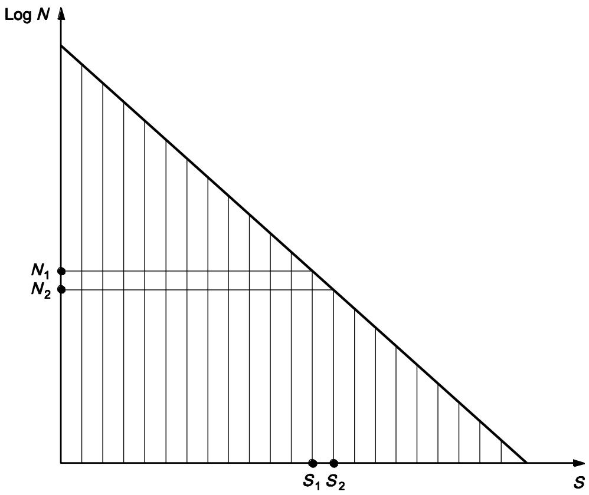

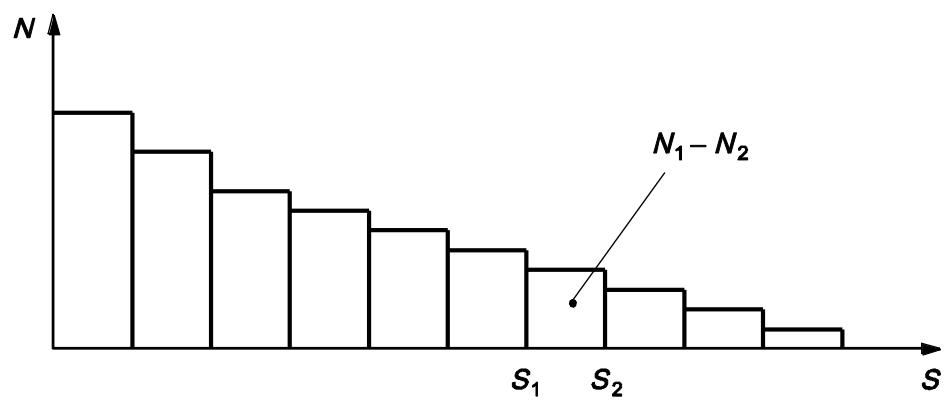  
Figure 16.7-1 — Typical long-term cumulative distribution of GSR values

Mean GSR in block = (S1+S2)/2

Key

S stress range at location, $S = C \times S_{ \mathrm{ n o m } } = C \times ( \sigma_{ \mathrm{ m a x } } - \sigma_{ \mathrm{ m i n } } )$ , linear scale, where

C is the stress concentration factor;

$\sigma_{ \mathrm{ m a x } }$ and $\sigma_{ \mathrm{ m i n } }$ are the maximum and minimum nominal stresses.

$N$ number of cycles, logarithmic scale

$N_{ 1 } - N_{ 2 }$ number of cycles in GSR block being considered

$N_{ 1 }$ number of cycles by which stress range exceeds $S_{ 1 }$

$N_{ 2 }$ number of cycles by which stress range exceeds $S_{ 2 }$

$S_{ 1 }$ lower value of stress range in GSR block being considered

$S_{ 2 }$ upper value of stress range in GSR block being considered

## 16.8 Determining the long-term stress range distribution by deterministic analysis

16.8.1 General

The deterministic fatigue analysis procedure uses an artificial representation of the true random nature of the wave environment. The method has similarities with conventional design wave analyses in that metocean actions and structural responses are calculated directly by periodic (regular) waves. The method can offer some computational saving compared with a spectral analysis, but it still requires a substantial computational effort.

A deterministic fatigue analysis method is not recommended for final checking of structures in harsh fatigue environments. It can find application for screening evaluations during the initial design stages, or for a final fatigue assessment of structures for which dynamic effects can be neglected and that are not critically fatigue sensitive. It is included in this document only to cover such general applications. Guidance on dynamically responding structures is given in 16.4.4 and 16.6.3. By exception, members in the splash zone between the highest submerged plan level and the lowest plan level above still water are often best analysed by means of a deterministic fatigue analysis; see also 16.14.6.

The deterministic fatigue analysis method uses the long-term distribution of individual wave heights to represent the long-term wave environment (see 16.3.7). Stresses are calculated in a series of analyses, using deterministic waves with wave heights that are selected from this distribution (see 16.8.2) and wave periods that are appropriate for the chosen wave height classes (see 16.8.3).

The influence of non-linear effects in the applied wave actions for the selected regular waves, as well as non-linear aspects of structural behaviour, can be included in the analysis.

16.8.2 Wave height selection

The periodic (regular) waves used for the deterministic analysis are selected to represent the long-term distribution of individual wave heights. This distribution is discretized into a number of wave height blocks. Typically, a minimum of 6 to 10 blocks with uniform increments in wave height are selected. Assuming that omni-directional wave height statistics are used, then the same set of wave heights apply for all wave directions.

16.8.3 Wave period selection

The wave periods for the selected regular wave heights shall be determined, based on the expected joint distribution of wave heights and periods for the location. Considerations similar to the selection of wave frequencies for the spectral method apply (see 16.7.2.2).

16.8.4 Long-term stress range distribution

For each location in the structure, the long-term distribution of GSR values is calculated by accumulating the GSR values from all regular wave analyses. Assuming that omni-directional wave height statistics are used, the total number of GSR occurrences for each wave height block is the sum of the number of occurrences in the wave height block, weighted with the probability of occurrence of the wave approach direction.

## 16.9 Determining the long-term stress range distribution by approximate methods

As noted in 16.6.4, the long-term distribution of local geometric stress ranges (GSRs) can in many cases be represented by a Weibull distribution. The Weibull distribution is a very general class of statistical distributions by which natural phenomena (e.g. wave heights, wind speeds) and engineering applications

(e.g. reliability problems) can be suitably described. See A.16.9 for a discussion of the Weibull distribution, the determination of its parameters and their application to fatigue assessments.

Methods using estimated Weibull distributions are intended for initial screening of structures, or for providing supposedly conservative fatigue checks of structures in benign fatigue environments. The methods are not suitable for final checking of structures in harsh fatigue environments or for structures that respond dynamically; see also 16.2.7.

The methods can also be used to establish approximate allowable GSR values, which may be used as a guide for initial joint design. The expected adequacy of the structure during the design process in satisfying final fatigue requirements is then assessed by comparing an allowable design value of the local GSR with the GSR calculated by stepping the associated fatigue design wave through the structure (see A.16.9). The final design should be checked by performing a spectral or a deterministic fatigue analysis, as appropriate.

Due to the increase in computing power and the availability of computer programs for performing detailed fatigue analyses in a relatively straightforward and rapid manner the relevance of, and interest in, approximate procedures for determining the long-term stress range distribution has distinctly diminished.

## 16.10 Geometric stress ranges

16.10.1 General

The stress parameter that shall be used to evaluate fatigue damage at any weld is the geometric stress range (GSR), see 16.5.

16.10.2 Stress concentration factors for tubular joints

## 16.10.2.1General requirements for the determination of the stress concentration factor

The welds at tubular joints are among the most fatigue-sensitive areas in offshore structures, due to the high local stress concentrations. Fatigue damage at locations around the connection weld shall be estimated by evaluating the GSR using the associated SCFs at each location of interest. Specific information and guidance is provided in A.16.10.2.1.

The nominal brace stress shall be based on the section properties of the brace end under consideration, taking due account of the brace stub or a flared member end, if present. The evaluation of the SCF shall be based on the same section dimensions. Nominal variable stress in the chord can also influence the GSR and shall be considered; see A.16.10.2.1.5.

The SCF shall include all stress raising effects associated with the geometry and force pattern of the joint, except the local (microscopic) weld notch effect, which is included in the S–N curve.

SCFs may be derived from FEA, model tests or empirical equations based on such methods. In general, the SCFs depend on the type of variable forces exerted by the brace on the joint, the type of joint, and details of the joint geometry; see the classification of tubular joints into types in Clause 14 and in A.16.10.2.1.3. Brace axial forces, brace in-plane bending (ipb) and brace out-of-plane bending (opb) moments cause different patterns of variable stresses around the joint.

For welded tubular joints subjected to all three types of variable forces and moments, a minimum SCF of 1,5 shall be used. For ring-stiffened joints, the minimum SCF for the brace side of the weld and brace axial forces or brace opb moments shall be taken as 2,0.

## 16.10.2.2 Unstiffened tubular joints

General guidance and discussion of SCFs for unstiffened welded tubular joints is given in A.16.10.2.2. The SCFs may be evaluated using the Efthymiou formulae, see A.16.10.2.2.2. For this purpose, the tubular joints are typically classified into T/Y-, X-, K- and KT-joints, depending on the joint configuration, the brace under consideration and the brace force pattern, as described in A.16.10.2.1.

As a generalization of the classification approach, the influence function algorithm discussed in A.16.10.2.2.4 may be used to evaluate the GSRs. This algorithm can handle generalized forces and moments on the braces. Moreover, the influence function algorithm can handle multi-planar joints for the important case of axial forces.

For a discussion on tubular joints welded from one side, see A.16.10.2.2.5.

Thickness transitions between butt welded tubular members are also subject to stress concentrations. This can apply to all joint-can-to-chord and brace-stub-to-brace connections. It is recommended that thickness transitions be designed to be internally flush; see A.16.10.2.2.6. The transition should normally have a slope of 1:4. Similarly, diameter transitions achieved through the use of a truncated cone are subject to stress concentrations; see 13.6.

## 16.10.2.3 Internally ring stiffened tubular joints

The SCF concept also applies to internally ring stiffened joints, including the stresses in the stiffeners and the stiffener to chord weld. Ring stiffened joints can have stress peaks at the brace to ring intersection points. Special consideration should be given to these locations. SCFs for internally ring stiffened joints can be determined by applying the Lloyds reduction factors to the SCFs for the equivalent unstiffened joint, see A.16.10.2.3. Ring stiffeners without flanges on the internal rings should be used with care, since high stress concentrations can occur at the inner edge of the ring.

## 16.10.2.4 Grouted tubular joints

Grouting tends to reduce the SCF of the joint, since the grout reduces the chord deformations. In general, the larger the ungrouted SCF, the greater the reduction in SCF for grouted joints. Hence, the reductions are typically higher for X- and T-joints than for Y- and K-joints. Approaches for calculating SCFs for grouted joints are discussed in A.16.10.2.4.

## 16.10.2.5 Cast joints

For cast joints, the SCF is defined as the maximum principal stress at any point on the surface of the casting (including the inside) divided by the nominal brace stress outside the casting. The SCFs for castings are not extrapolated values, but are based on directly measured or calculated values at any given point. Consideration shall be given to the brace to casting circumferential butt weld, which can be the most critical location for fatigue.

16.10.3 Geometric stress ranges for other fatigue sensitive locations

This subclause covers all types of fatigue-sensitive locations other than tubular joints, which are considered in 16.10.2. These locations include, but are not limited to, material away from the weld, plate to tubular connections and weld attachments. Each location at which a fatigue crack can potentially develop, shall be classified according to the appropriate type of constructional detail, see A.16.10.3.

For non-tubular connections, the GSR is obtained by assigning a joint classification to the plain metal, to the connection (or to a constructional detail of a connection) and specifying which stress range in the vicinity of the detail is considered the most appropriate for the local geometry of the class and the type

of variable forces involved. This stress range shall be used as the GSR. Any additional stress-raising effect due to the gross geometry of the joint (e.g. stress concentrations resulting from holes, shear lag or local through-wall bending) should be separately included where appropriate.

A procedure for the fatigue assessment of bolts is given in Clause 15.

## 16.11 Fatigue resistance of the material

16.11.1 Basic S–N curves

The basic representative S–N curve is of the form:

$$\log_{10} N = \log_{10} k_{1} - m \log_{10} S \tag{16.11-1}$$

where

N is the predicted number of cycles to failure under constant amplitude stress range, S;   
k1 $k_{ 1 }$ is a constant （$k_{ 1 } = N \mathrm{ f o r } S = 1 )$ ;   
m is the inverse slope of the S–N curve;   
S is the constant amplitude stress range, which is the geometric stress range according to 16.10.

Representative S–N curves for tubular joints (TJ), cast joints (CJ) and other joints (OJ) are given in Table 16.11-1. These S–N curves are based on steels with a yield strength less than 800 MPa; see 16.11.2 for steels with higher yield strengths.

The representative S–N curves presented in Table 16.11-1 are the mean minus two standard deviations in log10N from the database of test results for each class. The curves are applicable for joints in both air and sea water with adequate corrosion protection. Information concerning S–N curves for joints without adequate protection is given in A.16.11.1.

For welded tubular joints exposed to constant amplitude or random variations of stress due to metocean or operational actions, the TJ curve shall be used. The brace to chord tubular intersection for ring stiffened joints shall also be designed using the TJ curve. Fabrication of welded joints shall be in accordance with Clause 20.

The set of OJ S–N curves shall be used for joints classified in 16.10.3, including plated joints. For ringstiffened joints, the ring stiffener to chord connection as well as the ring inner edge shall also be designed using the OJ curve.

Fatigue crack growth from the weld root into the section under the weld is possible and should be considered. This type of cracking is referred to in A.16.10.3, with examples in Table A.16.10-8.

For cast joints see 16.11.3.

(with adequate corrosion protection)

Table 16.11-1 — Basic representative S–N curves for air and sea water   


| Curve | Air | Air | Sea water with adequate corrosion protection | Sea water with adequate corrosion protection |
| --- | --- | --- | --- | --- |
| Curve | log10k1(for S in units of MPa) | m | log10k1(for S in units of MPa) | m |
| Tubular joints (TJ) | 12,48 | 3,0 for N ≤ 107 | 12,18 | 3,0 for N ≤ 1,8 × 106 |
| Tubular joints (TJ) | 16,13 | 5,0 for N > 107 | 16,13 | 5,0 for N > 1,8 × 106 |
| Cast joints (CJ) | 15,17 | 4,0 | See A.16.10.2.5 and A.16.11.3 | See A.16.10.2.5 and A.16.11.3 |
| Other joints (OJ) |  |  |  |  |
| B | 15,01 | 4,0 for N ≤ 107 | 14,61 | 4,0 for N ≤ 105 |
| B | 17,01 | 5,0 for N > 107 | 17,01 | 5,0 for N > 105 |
| C | 13,63 | 3,5 for N ≤ 107 | 13,23 | 3,5 for N ≤ 4,68 × 105 |
| C | 16,47 | 5,0 for N > 107 | 16,47 | 5,0 for N > 4,68 × 105 |
| D | 12,18 | 3,0 for N ≤ 107 | 11,78 | 3,0 for N ≤ 106 |
| D | 15,63 | 5,0 for N > 107 | 15,63 | 5,0 for N > 106 |
| E | 12,02 | 3,0 for N ≤ 107 | 11,62 | 3,0 for N ≤ 106 |
| E | 15,37 | 5,0 for N > 107 | 15,37 | 5,0 for N > 106 |
| F | 11,80 | 3,0 for N ≤ 107 | 11,40 | 3,0 for N ≤ 106 |
| F | 15,00 | 5,0 for N > 107 | 15,00 | 5,0 for N > 106 |
| F2 | 11,63 | 3,0 for N ≤ 107 | 11,23 | 3,0 for N ≤ 106 |
| F2 | 14,71 | 5,0 for N > 107 | 14,71 | 5,0 for N > 106 |
| G | 11,40 | 3,0 for N ≤ 107 | 11,00 | 3,0 for N ≤ 106 |
| G | 14,33 | 5,0 for N > 107 | 14,33 | 5,0 for N > 106 |
| W1 | 10,97 | 3,0 for N ≤ 107 | 10,57 | 3,0 for N ≤ 106 |
| W1 | 13,62 | 5,0 for N > 107 | 13,62 | 5,0 for N > 106 |
| See A.16.10.3 and Tables A.16.10-6 to A.16.10-11 for application of the relevant OJ curve from B to W1 to a particular construction detail. | See A.16.10.3 and Tables A.16.10-6 to A.16.10-11 for application of the relevant OJ curve from B to W1 to a particular construction detail. | See A.16.10.3 and Tables A.16.10-6 to A.16.10-11 for application of the relevant OJ curve from B to W1 to a particular construction detail. | See A.16.10.3 and Tables A.16.10-6 to A.16.10-11 for application of the relevant OJ curve from B to W1 to a particular construction detail. | See A.16.10.3 and Tables A.16.10-6 to A.16.10-11 for application of the relevant OJ curve from B to W1 to a particular construction detail. |


16.11.2 High strength steel

HSS with yield strengths in excess of 700 MPa can be susceptible to cracking from hydrogen embrittlement under variable stresses in sea water; see A.16.11.2.

16.11.3 Cast joints

For cast joints, the CJ curve in Table 16.11-1 shall be used. The curve for cast joints is only applicable to castings having an adequate fabrication inspection plan.

16.11.4 Thickness effect

The TJ and OJ curves presented in Table 16.11-1 are based on 16 mm material thickness. For material thickness above 16 mm, the thickness effect in Formula (16.11-2) shall be applied:

$$S = S_{0} (16 / t)^{0, 25} \tag{16.11-2}$$

where

S is the stress range of the S–N curve, when adjusted for thickness effects;   
S0 $S_{ 0 }$ is the stress range of the S–N curve in Table 16.11-1;   
t is the member thickness in mm for which the fatigue life is predicted.

The CJ curve is based on 38 mm material thickness. For material thickness above 38 mm, the thickness effect in Formula (16.11-3) shall be applied:

$$S = S_{0} \left(38 / t\right)^{0, 15} \tag{16.11-3}$$

No thickness effect shall be applied to material thicknesses less than 16 mm for the TJ and OJ curves and less than 38 mm for the CJ curve.

## 16.12 Fatigue assessment

16.12.1 Cumulative damage and fatigue life

Fatigue assessment due to variable actions is normally based on the hypothesis of a linear accumulation of fatigue damage under constant amplitude stress ranges, according to the Palmgren-Miner's rule, Formula (16.12-1):

$$D_{\mathrm{R}} = k_{\mathrm{L E}} \cdot \gamma_{\mathrm{F D}} \cdot \sum_{i} \frac{n_{i}}{N_{i}} \tag{16.12-1}$$

where

$D_{ \mathrm{ R } }$ is a non-dimensional number, the Palmgren-Miner's sum or damage ratio for a time T;

$k_{ \mathrm{ L E } }$ is a local experience factor, see 16.12.3;

$\gamma_{ \mathrm{ F D } }$ is a fatigue damage design factor, see 16.12.2;

$n_{ i }$ is the number of cycles of stress range, $S_{ i } ,$ occurring during time period, $T ;$

$N_{ i }$ is the number of cycles to failure under constant amplitude stress range, $S_{ i } ,$ taken from the relevant S–N curve.

In the fatigue assessment procedure, fatigue failure is assumed to occur when $D_{ \mathrm{ R } } = 1 , 0$ .

Formula (16.12-1) may be employed for:

a) variable stress ranges associated with a given sea state;   
b) multiple sea states and wave directions;`,``,,   
c) multiple sources of cyclic actions.``-`-

Formula (16.12-1) may also be used to evaluate multiple sets of in situ conditions, such as for a structure ,`--- that has been relocated.

Formula (16.12-1) may be used to estimate fatigue life. If all damage is due to the same circumstances (e.g. in the in-place situation), the calculated fatigue life L may be calculated using Formula (16.12-2):

$$L = T / D_{\mathrm{R}} \tag{16.12-2}$$

where

L is the calculated fatigue life based on the calculated fatigue damage;   
$T$ is the time period (T ≥ 1 year) over which Palmgren-Miner’s sum was determined;   
$D_{ \mathrm{ R } }$ is the calculated fatigue damage during time, T, according to Palmgren-Miner’s sum.

If some prior fatigue damage, $D_{ \mathrm{ R 1 } }$ , has occurred, Formula （$16 . 12 \cdot 2 )$ shall be applied to the remaining fatigue damage, DR2. As failure is assumed to occur when $D_{ \mathrm{ R 1 } } + D_{ \mathrm{ R 2 } } = 1 , 0$ , the allowable remaining fatigue damage is $D_{ \mathrm{ R } 2 } = \left( 1 , 0 { - } D_{ \mathrm{ R } 1 } \right)$ . If $D_{ \mathrm{ R } 2 }$ is associated with a time period, $T_{ 2 } ,$ over which Palmgren-Miner’s sum is determined, the remaining fatigue life, $L_{ 2 } ,$ is given by Formula (16.12-3):

$$L_{2} = T_{2} / \left(1, 0 - D_{\mathrm{R} 1}\right) \tag{16.12-3}$$

The prior damage, $D_{ \mathrm{ R 1 . } }$ , can, for example, be due to damage during fabrication in the construction yard, or damage during the tow to location, or damage due to prior structure use.

16.12.2 Fatigue damage design factors

For fatigue of steel components for in situ conditions, the fatigue damage design factors, $\gamma_{ \mathrm{ F D } } ,$ depend primarily on failure consequence (i.e. component criticality) and in-service inspectability. In lieu of more detailed assessment, a $\gamma_{ \mathrm{ F D } }$ of 2,0 is recommended for inspectable and non-failure critical locations. For failure-critical and/or non-inspectable locations, $\gamma_{ \mathrm{ F D } }$ values of up to 10 are recommended, see A.16.12.2. Inspectability implies meeting the appropriate in-service inspection requirements as detailed in ISO 19901-9. For new designs, $\gamma_{ \mathrm{ F D } }$ shall not be taken as less than 1,0.

When assessing fatigue for all phases of the structure’s life cycle including fabrication, loadout, transportation, launching and installation (including pile installation), the fatigue damage design factor shall apply to the total fatigue damage.

16.12.3 Local experience factor

As stated in several places, fatigue analyses and assessment procedures are subject to many and considerable uncertainties. Therefore, actual experience with existing structures is of great value and may justifiably be taken into account through the application of an overall local experience factor, $k_{ \mathrm{ L E } } ,$ provided this experience is directly relevant to the case being considered, can be substantiated by reliable evidence and is fully documented; see A.16.12.3.

## 16.13 Other causes of fatigue damage than wave action

16.13.1 General

Wave action in the in-place situation is the predominant source of fatigue damage to offshore structures. However, other sources of fatigue damage should also be given consideration. The most relevant ones are described in this subclause. If different damage sources are not acting concurrently, damage due to each source can in general be evaluated separately and damage ratios can be added.

16.13.2 Vortex induced vibrations

Structural members that are susceptible to VIV due to wind, current or waves, can experience large cyclic stresses causing fatigue damage. The susceptibility of components to VIV shall be assessed. For members likely to experience VIV, an evaluation of vibration amplitudes, stresses and associated fatigue damage shall be undertaken.

16.13.3 Wind induced vibrations

During construction in the fabrication yard some members can experience vibrations due to wind. If this occurs, the associated fatigue damage shall be assessed.

Flexible topsides structures, such as vent or flare structures with comparatively long natural periods, can be susceptible to resonant vibrations due to wind gust effects. The resulting stresses can be evaluated using dynamic spectral analysis techniques using a suitable wind spectrum. If these stresses are significant, the resulting fatigue damage shall be evaluated.

16.13.4 Transportation

Structures with long, exposed ocean tows from the fabrication yard to the in-place location shall be checked for fatigue damage arising during transportation. The fatigue damage during tow in all components of the structure shall be combined with the fatigue damage from other sources using suitable fatigue damage design and/or experience factors to account for uncertainties in its determination. Sea fastening members shall be included in the fatigue damage assessment.

16.13.5 Installation

The main source of cyclic stresses during installation is due to pile driving. If hard driving is expected, the fatigue damage in piles and conductors due to driving shall be evaluated and combined with the fatigue damage from other sources. Information on the expected number of hammer blows and the magnitude and number of stress cycles per blow can be determined from the driveability analysis and shall be used as the basis for the fatigue calculation. For pile driving analyses, worst case soil conditions should be applied.

During pile driving, large cyclic stresses can further occur due to vibrations of miscellaneous attachments such as anodes and installation piping in the vicinity of the pile, pile sleeves and hammer. Rigorous analysis of these vibrations is usually not feasible, but simplified assessments using appropriate assumptions on peak accelerations, dynamic amplification and number of vibration cycles can provide insight into the severity of the problem. In practice, design measures to avoid the potential fatigue problem are most effective.

16.13.6 Risers

The design of risers normally requires input from both the structure designer and the pipeline designer. Risers are normally modelled in the structure analysis to assess fatigue damage due to wave action on the risers; see also 16.14.2. This damage shall be combined with fatigue damage due to other sources that is normally assessed by the pipeline designer, including damage due to pipeline start-up and shut-down forces and slug induced forces. Variations in the actions on the riser often also act on the riser supports and these shall hence be included in the assessment.

## 16.14 Further design considerations

16.14.1 General

In addition to the description of the procedures to determine the fatigue resistance during design (see 16.11 and 16.12), close attention to good detailing for both the main structure and all significant constructional details is of great importance in ensuring that adequate fatigue performance is achieved.

Some aspects requiring particular attention during design and analysis with regard to fatigue are discussed in this subclause.

Furthermore, the approach normally followed in fatigue evaluations is inherently linked to fabrication and inspection methods and to the in-service inspection philosophy. Some guidance in relation to these aspects is given.

16.14.2 Conductors, caissons and risers

To check the fatigue of conductors, caissons and risers and their supports, it is normally necessary to include a detailed structural model of these components in the overall structural analysis. Where there are several components with a standard arrangement, it can be adequate to model only one typical example of each in detail. Depending on structural connection details, these components can also contribute stiffness to the members of the space frame and thereby influence the stresses, and hence the fatigue damage experienced, by the members in the frame(s) to which they are connected.

16.14.3 Miscellaneous non-load carrying attachments

To check the structure for miscellaneous non-load carrying attachments, such as brackets or padeyes which are left from construction, all members of the structure shall be screened using the $F_{ 2 } S { \mathrm{ - N } }$ curve in conjunction with a GSR that is equal to the maximum combination of nominal stresses in the member (i.e. all SCFs equal to unity).

16.14.4 Miscellaneous load carrying attachments--`,

It is recommended that connections of miscellaneous attachments, such as anodes, ladders, walkways, ,,,`,`, minor piping, etc., which are subjected to local wave action and are not explicitly modelled in the,,``- structural analysis, are separately checked for possible fatigue damage. Simplified evaluations based on ``,``` the principles of deterministic analyses are normally adequate for these applications, using realistic ,,`--- numbers of cycles and action magnitudes.

Where the connections of attachments to primary members are found to be sensitive to fatigue, doubler plates are recommended. Doubler plates reduce the stresses in the primary member, and any cracking due to the attachment to the doubler plate is remote from the primary member.

16.14.5 Conical transitions

See 13.6 for stresses in conical transitions.

16.14.6 Members in the splash zone

Fatigue damage for members close to the water surface is subject to additional uncertainty due to the complexities of local actions (see A.16.14.6) and sensitivity of the actions to the actual structure elevation, both initially and, because this can change, during the design service life. Where uncertainty exists in the water depth or final structure settlement, all members in the splash zone, the actions on which can be

significantly affected by this uncertainty, shall be designed with an increased fatigue damage design factor or by explicitly assessing the possible range of water depths.

16.14.7 Topsides structure

Topsides structures supported by conventional steel jacket or tower structures do not normally experience cyclic stresses from wave action. However, exceptions can occur. For example, for structures with an unbraced portal arrangement supporting the topsides structure, cyclic wave action on the structure can introduce significant bending moments and associated variable stresses into the topsides structure. Another exception concerns conductors or other components that span from the water surface to the deck without intermediate supports.

Where the configuration is such that the deck can be subjected to the effects of cyclic wave action, fatigue of the topsides structure shall be evaluated. This evaluation shall take appropriate account of the effect of wave frequency on wave actions applied to structural components in the wave zone. This normally requires that a spectral analysis is performed.

For structures that are subject to significant dynamic response, the mass inertia forces of the topsides,`--- can cause significant cyclic stresses in the topsides structure. This can, for example, be the case for`,``` structures with relatively long natural periods and associated large dynamic excitation. In such cases, ,,``-` fatigue analysis of the topsides structure shall be performed. This normally requires a spectral analysis,`,`, of the combined substructure and topsides structure.

16.14.8 Inspection strategy

The predicted fatigue performance of structural components provides valuable input for establishing a strategy for underwater inspection, in addition to other considerations. However, designing new structures with a comfortable margin in calculated fatigue lives generally provides a cost-effective solution compared with a marginal design requiring more extensive inspection for fatigue.

## 16.15 Fracture mechanics methods

16.15.1 General

Fracture mechanics methods may be employed to quantify fatigue lives of welded details or structural components in situations where the normal S–N fatigue assessment procedures are inappropriate. Some typical applications are to assess:

— the fitness-for-service of a component with or without known defects;   
— the inspection requirements for a component with or without known defects;   
— the inspection requirements for components which may not be subjected to post-weld heat treatment (PWHT);   
— the structural integrity of castings.

It is important that the fracture mechanics formulation used can be shown to predict, with acceptable accuracy, either

— the fatigue performance of a component class with a detail similar to that under consideration, or   
— test data for components which are similar to those requiring assessment.

16.15.2 Fracture assessment

The principal modes of failure in offshore structures are:

— crack growth driven by fatigue followed by the onset of fracture due to exceedance of the fracture toughness at a critical crack size (not necessarily through-thickness);

— the occurrence of plastic collapse.

16.15.3 Fatigue crack growth law

Using fracture mechanics, the predicted number of cycles to failure (providing the fatigue life) is determined by the integration of a suitable fatigue crack growth law, which relates the fatigue crack growth rate to the stress intensity factor range. The relationship is usually of a sigmoidal shape with a linear central region which is defined by the Paris law:

$$d a / d N = C (\Delta K)^{m} \tag{16.15-1}$$

where

a is the crack depth;

N is the number of cycles to failure;

ΔK is the stress intensity factor range;

C and m are parameters of the crack growth rate.

The stress intensity factor range is given by the general formula:

$$\Delta K = Y (\Delta \sigma) \sqrt{\pi a} \tag{16.15-2}$$

where, additionally,

Y is the normalized stress intensity factor;

Δσ is the stress range.

It is normal practice to extrapolate the Paris law to all ranges of ΔK. The number of cycles to failure is thus determined by integrating Formula (16.15-1):

$$N = \int_{a_{i}}^{a_{f}} \frac{d a}{C \left[ Y (\Delta \sigma) \sqrt{\pi a} \right]^{m}} \tag{16.15-3}$$

where, further,

$a_{ \mathrm{ i } }$ is the initial crack size;

af $a_{ \mathrm{ f } }$ is the final crack size.

Guidance on the integration is provided in A.16.15.3.

16.15.4 Stress intensity factors

Stress intensity factors for tubular joints can be determined by a number of different methods; see A.16.15.3.

16.15.5 Fatigue stress ranges

For a crack growth analysis using fracture mechanics methods, the stress ranges at the location of the crack tip are required, which differ from the GSR used for an S–N assessment. Both are derived from the same nominal axial and bending stresses obtained from the global structural analyses. However, while the GSR is determined by applying appropriate SCFs to the nominal stress components (see 16.10), the stress field at the crack tip is determined by applying Formula (16.15-2) with the appropriate stress intensity factors to the nominal axial and bending stresses. As for the GSR, the full stress range at the location of the crack is next calculated by combining the local axial and bending stresses.

16.15.6 Castings

An advantage of using castings is that stress concentrations can be minimized by profiling the corners between parts of the casting. Consequently, higher fatigue lives than for similar fabricated joints are obtained. However, castings are susceptible to internal and surface casting defects. Fitness-for-service assessments of castings shall therefore include a fracture mechanics assessment.

## 16.16 Fatigue performance improvement of existing components

For welded joints, improvements of fatigue performance can be obtained by a number of methods. These methods include hammer peening and controlled local machining or grinding of the weld toe to produce a smooth concave profile, which blends smoothly with the base metal. Table 16.16-1 indicates associated improvement factors on fatigue life that can be achieved. Adequate quality control procedures shall be applied, if the appropriate improvement factor is to be attained.

The grinding improvement factor is not applicable to joints in sea water without adequate cathodic protection.

Benefit shall only be taken for one improvement technique, even if more than one technique is employed.

Specific requirements for the various weld improvement techniques are discussed in A.16.16.

Table 16.16-1 — Achievable improvement factors on fatigue performance for weld improvement techniques   


| Weld improvement technique | Improvement factor |
| --- | --- |
| Weld toe burr grinding | 2 |
| Hammer peening | 4 |


17 Foundation design

## 17.1 General

Clause 17 provides an overview of the design of long slender piles and shallow foundations. The provisions also apply to braced or free-standing caisson structures. In all these applications, the pile

geometry is limited to $L / D \ge 10$ , where L is the length embedded in the soil, and D is the outside diameter. Clause 17 does not apply to the design of short and rigid, large diameter foundations with $L / D < 10 .$ .

Design requirements and guidance for the design of pile foundations of any $L / D$ and of shallow foundations can be found in ISO 19901-4.

## A.17 contains discussion and guidance on the requirements of this clause.

Designers are encouraged to use relevant industry experience, some of which is mentioned in ISO 19901- 4, as well as their own experience, to determine whether the quoted formulae are appropriate for a given situation and to evaluate the suitability of alternatives. Alternative design procedures are permitted, always subject to an evaluation. Circumstances can arise when neither the procedures from ISO 19901-4 nor any existing alternative procedures satisfy the evaluation. The design shall then be conservative and flexible, and shall be based on and verified by a combination of load testing, model tests and monitoring.

The foundation shall be designed to carry static, cyclic and transient actions without excessive deformations or vibrations in the structure. Special attention shall be given to the effects of cyclic and transient actions on the structural behaviour of piles, as well as on the strength of the supporting soils. The criteria for foundation capacity provided in ISO 19901-4 are typically based upon static, monotonic actions. Furthermore, these criteria do not necessarily apply to so-called “problem” soils, such as carbonate material, volcanic sands or highly sensitive clays. The possibility of movement of the sea floor against the foundation components shall be investigated. The actions caused by such movements, if anticipated, shall be considered in the design. The potential for disturbance to foundation soils by installation of well conductors or shallow well drilling shall also be assessed (see ISO 19901-4). The design of foundations differs from that of the rest of the structure in that the soil behaviour is non-linear as well as dependent on the rate of change of the actions.

The geotechnical investigation for pile-supported structures shall provide, as a minimum, the soil engineering property data needed to determine the following parameters: axial capacity of piles in tension and compression, force-deflection characteristics of piles subjected to axial and lateral actions,-- pile driveability characteristics, and mudmat bearing capacity. Mudmat design requires careful,,`` determination of the slope of the sea floor and accurate assessment of the shear strength of soft surface`,,,,` layers. Equipment and procedures for marine soil investigations shall conform to ISO 19901-8.,,,,`

It is not normal practice to apply the concept of exposure levels, as presented in ISO 19900, to the``,,, foundation design for new structures. Therefore, the partial action factors that are applicable to exposure -- level L1 shall be used for the design of foundations for structures of all exposure levels. If enhanced or reduced reliability of the foundations is justified, a proper risk assessment shall be undertaken and the resistance factor varied accordingly. For existing structures, the use of reduced partial action factors for the assessment of exposure level L2 and L3 structures may be considered.

## 17.2 Design of pile foundations

The types of pile foundation generally used to support offshore structures are:

a) driven piles;   
b) drilled and grouted piles;   
c) belled piles (rarely used);   
d) vibro-driven piles.

When sizing a pile foundation, the following items shall be considered: design actions, diameter, penetration, wall thickness, type of tip, number of piles, spacing, geometry, location, pile head fixity, material strength, installation method, and other parameters as appropriate.

A number of different analysis procedures may be used to determine the requirements of a foundation. As a minimum, the procedure used shall properly simulate the non-linear behaviour of the soil and ensure force-deflection compatibility between the structure and the pile-soil system.

Deflection and rotation of individual piles and of the total foundation system shall be checked at all critical locations, which include pile tops, points of contraflexure, sea floor, etc. Deflections and rotations shall not exceed serviceability limits which, if exceeded, would render the structure inadequate for its intended function, see 7.2.

The foundation capacity is the lower of the pile strength and the pile axial resistance as follows:

a) Pile strength

The pile strength shall be verified using the steel tubular strength checking formulae given in 13.3 or 13.4 for conditions of combined axial force and bending. Internal pile forces at the location being checked shall be those due to the design actions according to 9.10 using a coupled structure/soil nonlinear foundation model. When lateral restraint normally provided by the soil is inadequate or nonexistent, column buckling effects on the pile shall also be checked in accordance with 17.3.2.

b) Pile axial resistance

The axial pile capacity shall satisfy the following conditions:

$$P_{\mathrm{d}, \mathrm{e}} \leq Q_{\mathrm{d}} = Q_{\mathrm{r}} / \gamma_{\mathrm{R}, \mathrm{P e}} \tag{17.2-1}$$

$$P_{\mathrm{d}, \mathrm{p}} \leq Q_{\mathrm{d}} = Q_{\mathrm{r}} / \gamma_{\mathrm{R}, \mathrm{P p}} \tag{17.2-2}$$

where

$Q_{ \mathrm{ d } }$ is the design axial pile capacity, i.e. the design resistance of the pile;

$Q_{ \mathrm{ r } }$ is the representative value of the axial pile capacity as determined in ISO 19901-4;

$P_{ \mathrm{ d , e } }$ Pd,e is the design axial action on the pile, determined from a coupled linear structure and nonlinear foundation model using the design actions for extreme conditions according to 9.10.3;

$P_{ \mathrm{ d , p } }$ Pd,p is the design axial action on the pile, determined from a coupled linear structure and nonlinear foundation model using the design actions for permanent and variable actions or the design axial action for operating situations according to 9.10.3;

$\boldsymbol{ \gamma }_{ \mathrm{ R , P e } }$ is the pile partial resistance factor for extreme conditions （$\gamma_{ \mathrm{ R , P e } } = 1 , 25 )$ ;

$\gamma_{ \mathrm{ { R , P p } } }$ is the pile partial resistance factor for permanent and variable actions or operating situations （$\gamma_{ \mathrm{ R , P p } } = 1 , 50 )$ .

Seabed scour shall be considered in the design of the foundation, as it affects both lateral and axial pile performance and capacity. Scour depends on very local circumstances and its prediction remains an uncertain art. Sediment transport studies can assist in defining scour design criteria, but local experience is the best guide. The uncertainty regarding design criteria should be taken into account by robust design

and/or an operating strategy of monitoring and remediation as needed. Scour design criteria are usually a combination of local and global scour and overall movement of the sea floor; see also ISO 19901-4.

The axial capacity of a pile is its axial resistance, while pile performance refers to a specified service requirement by the owner (e.g. deflection(s) at the pile head). Both axial capacity and pile performance are dependent upon many variables (e.g. the types of soils, the pile characteristics, the installation methods, and the characteristics of the applied actions). The influence of these variables should be considered in pile design.

## 17.3 Pile wall thickness

17.3.1 General

The wall thickness of the pile may vary along its length and can be controlled at a particular point by any one of several design situations or requirements that are discussed in 17.3.2 to 17.3.9. The designer shall note the pile hammers that have been evaluated for use during driving on the installation drawings or specifications.

17.3.2 Pile stresses

Pile stresses due to the design action(s) shall be checked in accordance with Clause 13. A rational analysis considering the restraints placed upon the pile by the structure and by the soil shall be used to check the pile stresses for the portion of the pile that is not laterally restrained by the soil. General column buckling of the portion of the pile below the sea floor need not be considered, unless the pile is believed to be laterally unsupported because of extremely low soil shear strengths, large computed lateral deflections, or for some other reason.

Pile stresses and, as a result thereof, the pile wall thickness in the vicinity of the sea floor and possibly at - other points are normally controlled by the combined axial force and bending moment which result from `,,,` the design action(s) on the structure. The moment curve for the pile can be computed with soil resistance`,,,, determined in accordance with ISO 19901-4, giving consideration to possible soil removal due to scour.,`,,,,

17.3.3 Pile design checks``,,,`

When lateral deflections associated with cyclic actions at or near the sea floor are relatively large (e.g. exceeding yc as defined in ISO 19901-4 for soft clay), consideration shall be given to reducing or neglecting the soil-pile adhesion through this zone.

17.3.4 Check for design situation due to weight of hammer during hammer placement

Each pile or well conductor section on which a hammer (or pile top drilling rig, etc.) is placed, shall be checked for the actions associated with placing the equipment. This design situation can be the limiting factor in establishing the maximum length of add-on sections. This is particularly so in cases where piles are driven or drilled under an angle. The action effects that shall be checked include static bending, axial forces and lateral forces generated during initial hammer placement.

Experience indicates that reasonable protection from failure of the pipe wall due to the above design situation is provided, if the static strength is calculated as follows:

a) The projecting add-on section is considered as a free-standing fixed-end column with its appropriate effective length factor K.

b) Axial forces and bending moments are calculated using the full factored weight of the hammer, pile cap and leads, acting through the centre of gravity of their combined masses with $\gamma_{ \mathrm{ f , G } } = 1 , 3 \mathrm{ o r } \gamma_{ \mathrm{ f , 0 } } = 1 , 5 ,$ depending on how well the weight of each item is known, and the factored weight of the add-on section with $\gamma_{ \mathrm{ f , G } } = 1 , 3$ , taking into account the angle and eccentricities of the centres of mass. Nearly vertical add-ons are considered as inclined cantilevers, having an initial or realistic small out-of-plumb inclination of at least 2 % when determining their design moment.   
c) The secondary bending moment, also to be determined, is the sum of the P-Δ moments due to the firstorder lateral deflections of the add-on (considered as a fixed end cantilever). The deflection at the top should be associated with the factored weight of the hammer, etc. and the deflection at mid-height of the add-on should be associated with the factored weight of the add-on.   
d) In accordance with 13.3.3, the beam-column resistance check shall be satisfied in accordance with Formula (13.3-3), but the bending stresses should include the secondary bending stresses due to deflection of the add-on. If the formula is applied to the plane in which bending takes place, the formula can be simplified to:

$$\frac{\gamma_{\mathrm{R} , \mathrm{c}} \sigma_{\mathrm{c}}}{f_{\mathrm{c}}} + \frac{\gamma_{\mathrm{R} , \mathrm{b}} \sigma_{\mathrm{b}}}{f_{\mathrm{b}}} \left(1 + \frac{\Sigma P \Delta}{M}\right) \leq 1, 0 \tag{17.3-3}$$

where

$\Sigma P \Delta$ is the sum of the secondary P-Δ moments discussed in item b) above, where P is the factored weight of the item and Δ is the associated first order lateral deflection;

M is the primary bending moment at the foot of the add-on (in undeflected state);

$\sigma_{ \mathrm{ b } }$ is the primary bending stress due to M at the foot of the add-on;

$\gamma_{ \mathrm{ R , c } } , \sigma_{ \mathrm{ c } } , f_{ \mathrm{ c } } , \gamma_{ \mathrm{ R , b } }$ and $f_{ \mathrm{ b } }$ are as defined in Clause 13.

17.3.5 Stresses during driving

Consideration shall be given to the stresses that occur in the free-standing pile section during driving. Generally, stresses are checked against the conservative criterion that the sum of the stresses due to the impact of the hammer (the dynamic stresses) and the stresses due to axial force and bending moment(s) (the static stresses) shall not exceed the SMYS of the steel. Less conservative criteria are permitted, provided that these are supported by sound engineering analyses and empirical evidence. The potential fatigue damage due to driving and its impact on the in-service fatigue life of the piles shall also be considered.

A method of analysis based on wave propagation theory should be used to determine the dynamic stresses (see ISO 19901-4). In general, it may be assumed that column buckling does not occur as a result of the dynamic portion of the driving stresses. The unfactored dynamic stresses should not exceed 80 % to 90 % of yield, depending on specific circumstances such as the location of the maximum stresses down the length of pile, the number of blows, previous experience with the pile-hammer combination and the confidence level in the analyses. Separate considerations apply when significant driving stresses are transmitted into the structure and damage to appurtenances shall be avoided.

When using hydraulic hammers, the driving energy can exceed the rated energy and this should be considered in the analyses. When computing the static stresses induced by hydraulic hammers, possible variations in driving configurations should be accounted for (e.g. when driving vertical piles without lateral restraint that are exposed to metocean actions).

17.3.6 Minimum wall thickness

The D/t ratio of the entire length of a pile shall be small enough to preclude local buckling at stresses up to the yield strength of the pile material. Consideration shall be given to the different situations and associated design situations occurring during the installation and the design service life of a pile.

Experience indicates that for piles with a high D/t ratio, minor local damage near the pile tip (e.g. out-ofroundness or denting) can propagate during installation (e.g. by driving) to cause more extensive deformation and collapse of the pile. In addition to selecting an appropriate D/t ratio, the pile bottom section shall be checked for all design situations occurring during handling (e.g. pick-up, upending, stabbing, etc.) to ensure that local damage does not occur.

17.3.7 Allowance for underdrive and overdrive

With piles having thickened sections at the sea floor, consideration shall be given to providing an extra length of heavy wall material in the vicinity of the sea floor, so that the pile is not overstressed at this point if the design penetration is not reached. The amount of underdrive allowance provided in the design depends on the degree of uncertainty regarding the penetration that can be obtained. In some instances, consideration shall also be given to providing an overdrive allowance in a similar manner, in the event that an expected bearing stratum is not encountered at the anticipated depth.

The possibility of underdrive and overdrive shall also be considered for determining the required length of the piles and for determining the position and extent of shear keys in grouted pile-to-sleeve connections.

17.3.8 Driving shoe

The purpose of driving shoes is to assist piles to penetrate through hard layers or to reduce driving resistances, thereby allowing greater penetrations to be achieved than would otherwise be the case. Different design considerations apply for each use.

If an internal driving shoe is provided for driving through a hard layer, it should be designed to ensure that unacceptably high driving stresses do not occur at and above the transition point between the normal and the thickened section of the pile tip. It should also be checked that the shoe does not reduce the end bearing capacity of the soil plug below the value assumed in the design. External shoes are not normally used, as they tend to reduce the skin friction along the length of pile above them.

For reducing the internal skin friction during driving in cohesive soils, an internal driving shoe at the pile tip can be considered. The effect of an internal driving shoe should be taken into account when evaluating the total representative capacity of the pile.

17.3.9 Driving head

Any driving head at the top of the pile shall be designed in association with the installation contractor to ensure that it is fully compatible with the proposed installation procedures and equipment.

## 17.4 Length of pile sections

In selecting pile section lengths, consideration shall be given to:

a) the capability of the lift equipment to raise, lower and stab the sections;   
b) the capability of the lift equipment to place the pile driving hammer on the sections to be driven;

c) the possibility of a large amount of downward pile movement (e.g. due to self-weight of the pile or immediately following the penetration of the closure of one of the structure’s legs, placement of the hammer or of a new add-on);   
d) stresses developed in the pile section while lifting;   
e) the wall thickness and material properties at field welds;   
f) interference with the planned concurrent driving of neighbouring piles;   
g) the type of soil in which the pile tip is positioned during driving interruptions for field welding to attach additional sections.

In addition, static and dynamic stresses due to the hammer weight and operation shall be considered, as discussed in 17.3.4 and 17.3.5.

Each pile section on which driving is required, shall contain a cut-off allowance to permit the removal of material damaged by the impact of the pile driving hammer. The normal allowance is 0,5 m to 1,5 m per -- section. Where possible, the cut for the removal of the cut-off allowance should be made at a conveniently``,,,` accessible elevation. `

## 17.5 Shallow foundations

17.5.1 General

The shallow foundations considered herein are typically used for the support of a piled offshore structure, e.g. mudmats, or the support of subsea structures. Detailed requirements for the design of shallow foundations and of foundations of gravity base structures are contained in ISO 19901-4, while ISO 19905-1 provides additional information for jack-ups. The design practice in ISO 19905-1 applies a material factor to soil properties, rather than a resistance factor to the capacity calculations, as is the case in ISO 19901-4. Care should be taken when applying design procedures from one document to formulations in another.

The design of shallow foundations shall address, where appropriate, the following:

a) stability, including failure due to overturning, bearing, sliding or combinations thereof;   
b) static foundation deformations, including possible damage to components of the structure and its foundation or attached facilities;   
c) dynamic foundation characteristics, including the influence of the foundation on action effects in the structure and the performance of the foundation itself under dynamic actions;   
d) hydraulic instability, such as scour or piping action due to wave pressures, including the potential for foundation instability and damage to the structure;   
e) installation and removal, including penetration and pull-out of shear skirts or the foundation base itself, and the effects of pressure build-up or draw-down of trapped water underneath the base;   
f) flat-bottomed components or structures, which shall be designed with due consideration given to the possibility of non-uniform soil reactions which can cause hard spots acting on the base of the structure, and where under-base grouting, differential ballasting and/or site preparation may be used to mitigate the effects from such loads.

17.5.2 Stability of shallow foundations

The formulae to be considered in evaluating the stability of shallow foundations are given in ISO 19901-4. The formulae are for static conditions (monotonic actions only). This is normally acceptable since a limiting weather criterion applies during the installation of offshore structures and, for subsea structures, design situations other than static are normally not applicable. However, if cyclic actions are likely to occur, e.g. during prolonged installation periods for structures with insufficient piles installed, these shall be taken into account separately. See also ISO 19901-4.

18 Corrosion control

## 18.1 General

Fixed steel offshore structures require efficient control of corrosion to ensure that their strength is not reduced by progressive corrosion degradation. Corrosion damage can affect structural integrity and the ability to resist operational, environmental and accidental actions in various ways. One primary objective of corrosion control is to prevent such damage in fatigue-sensitive areas, as corrosion damage can result in stress concentrations for the initiation of fatigue cracks. Corrosion control can also avoid a potential reduction of the strength of structural components subjected to static actions only.

## 18.2 Corrosion zones and environmental parameters affecting corrosivity

Marine corrosion environments can be divided into the following corrosion zones:

a) atmospheric zone;   
b) splash zone (or intermediate zone);   
c) submerged zone;   
d) buried zone.

The splash zone is defined in ISO 19900 as that area of the structure that is frequently wetted due to ,``,`` waves and tidal variations. However, surfaces which are only wetted during major storms are excluded.,,`,`, The extent of the splash zone is subject to large local variations and can vary approximately between 2 m ,,,``- and 10 m. In some areas, progressive subsidence of the structure shall be considered when defining the ``,``` splash zone.,,`--

The atmospheric zone includes freely exposed and semi-sheltered areas above the splash zone. The sea water submerged zone extends below the splash zone and is defined here to include any sea waterflooded internal compartments. The buried zone includes any structural parts buried in the sea floor sediments or covered by disposed solids.

The corrosivity of corrosion zones varies as a function of geographical location. Of the primary environmental factors influencing corrosion, the main factor is temperature, which is also subject to significant seasonal variations. Salinity, sea currents, wave action and cycles of fresh water intrusion are other important parameters.

In the atmospheric zone, the frequency and duration of wetting (“time-of-wetness”) is a main factor affecting corrosion. The corrosive conditions are typically most severe in areas sheltered from direct rainfall and sunlight, but freely exposed to sea spray and condensation that facilitates accumulation of sea salts and moisture, with a resultant high time-of-wetness. A combination of high ambient temperature and time-of-wetness creates the most corrosive conditions.

In the upper submerged zone and the lower part of the splash zone, the corrosion environment is normally modified by marine growth. Depending on the type of growth and the local conditions, the net effect can be either to enhance or retard corrosion attack. Enhancement of corrosion processes by marine growth (e.g. through corrosive metabolites) is commonly referred to as microbiologically influenced corrosion (MIC). Marine growth can also interfere with systems for corrosion control, including coatings/linings and cathodic protection. Ice scoring in arctic waters can cause very high corrosion rates by removal of corrosion retarding rust layers, corrosion protective coatings, or marine growth. In deeper waters, variations in oxygen content and sea currents are the dominating parameters, although the corrosivity is relatively low.

In addition to freely exposed surfaces in the submerged zone, MIC can potentially occur in flooded steel members unless special precautions are taken to ensure that water remains sterile (e.g. by addition of a biocide).

In the buried zone, corrosion is predominantly related to MIC. In undisturbed sediments, MIC is only significant in the uppermost layer. However, disturbance of sediments and discharge of drill-cuttings or other effluents can enhance bacterial activity and hence MIC.

NOTE Other splash zone definitions can apply in regulations or in other design codes.

## 18.3 Forms of corrosion, associated corrosion rates and corrosion damage

Corrosion damage to uncoated carbon steel in the atmospheric zone and in the splash zone is associated with oxygen attack and is typically more or less uniform. In typical conditions for the atmospheric zone, the steady state corrosion rate for carbon steel (i.e. as uniform attack) is normally around 0,1 mm/yr or lower. In the splash zone and the most corrosive conditions for the atmospheric zone (i.e. high time-ofwetness and high ambient temperature), corrosion rates can amount to 0,3 mm/yr, and for internally heated surfaces in the splash zone even much higher (up to an order of magnitude of 3 mm/yr).

In the submerged and buried zones, corrosion is mostly governed by MIC causing colonies of corrosion pits. Welds are often preferentially attacked. Corrosion as uniform attack is unlikely to significantly exceed about 0,1 mm/yr, but the rate of pitting can be much higher: 1 mm/yr and even more under conditions favouring high bacterial activity (e.g. ambient temperature of 20 °C to 40 °C and access to organic material).

In most cases, the static strength of large structural components is not jeopardized by MIC, due to its localized form. However, MIC can initiate fatigue cracking of components subjected to cyclic actions.

Aluminium alloys of the 5 000 and 6 000 series as used for topsides structural components are highly resistant to marine atmospheres and suffer only superficial staining or micro-pitting. However, galvanic coupling (i.e. metallic plus electrolytic coupling) to structural steel, stainless steels and copper alloys can result in severe galvanic corrosion of aluminium at the point of contact and should be avoided.

Similarly, structural steel can suffer enhanced corrosion, if in galvanic contact with stainless steel or with copper base alloys. The propensity for galvanic corrosion is highest in the submerged zone but is normally prevented by cathodic protection.

Very high strength steels (yield strength in excess of 1 200 MPa) and certain high strength aluminium, nickel, and copper alloys are sensitive to stress corrosion cracking in marine atmospheres.

NOTE The term “stress corrosion cracking” refers to cracking that is caused by an interaction between static tensile stresses in a material and a specific corrosion medium.

## 18.4 Design of corrosion control

18.4.1 General

The following main systems for corrosion control of fixed steel offshore structures apply:

a) coatings, linings and wrappings;   
b) cathodic protection;   
c) corrosion resistant materials;   
d) corrosion allowance.

18.4.2 Considerations in design of corrosion control

The initial selection and subsequent detailed design of systems for corrosion control of fixed steel offshore structures shall take the following factors into account:

a) regulatory requirements;   
b) criticality of the overall system and the functional requirements of individual structural components to be protected;   
c) type and severity of corrosion environment(s);   
d) design service life (and likelihood of lifetime extension);   
e) accessibility for inspection and maintenance, including overall maintenance philosophy;   
f) suitability, reliability and economy of optional techniques for corrosion control.

18.4.3 Coatings, linings and wrappings

Coatings are defined as relatively thin (<1 mm) organic or metallic layers, single or multiple, that are applied by spraying, brushing, or dipping. Linings and wrappings are defined as thicker (>1 mm) corrosion protective layers applied with the objective of resisting mechanical wear by wave action, facilitating removal of marine fouling, protecting against impacts, etc. Organic materials used for linings and wrappings are normally reinforced (e.g. by glass fibres or flakes). Metallic materials are typically copper based (to incorporate antifouling properties).

Special precautions are required to prevent corrosion under coatings, linings and wrappings, including under fire protective coatings. Metallic materials shall preferably be seal welded to structural components.

Coating systems in the atmospheric zone include various forms of organic (paint) coatings and certain metallic coatings. Of the latter, zinc layers are applied as hot dipping or thermal spraying. Thermally sprayed aluminium coatings have been used, particularly for more demanding applications.

In the sea water submerged zone, organic coatings or thermally sprayed aluminium can be used to reduce weight or hydrodynamic actions due to drag caused by galvanic anodes and/or to improve the current distribution by cathodic protection. On subsea production systems, paint coatings are primarily used to ease visibility. In the upper submerged zone, coatings can also be chosen to improve periodic removal of marine growth.

Coating and lining systems shall primarily be selected based on proven experience for a specific application and environment. Comprehensive field testing is required when practical experience is lacking. For the atmospheric and splash zones, maintainability is a major criterion, while compatibility with cathodic protection is normally required in the submerged and buried zones. Resistance to damage, e.g. due to the removal of marine fouling, is also required.

The design of all components to be paint coated shall take into account relevant measures to ease both the initial application and later maintenance. This includes a preference for tubular shapes, rounding of sharp edges and requirements for securing scaffolding. Structural components exposed to sea spray, rain or intermediate wetting, either externally or internally, shall be designed to prevent accumulation of moisture, e.g. by using continuous welding and making provisions for drainage.

18.4.4 Cathodic protection

18.4.4.1 Cathodic protection systems

Cathodic protection can be effected using:

— galvanic (sacrificial) anodes, or   
— impressed current (IC) from one or more rectifiers.

Cathodic protection is applicable to the submerged and the buried zones. In the splash zone, cathodic protection is generally fully effective for any part of the structure extending below the lowest astronomical tide (LAT) and marginally effective in the tidal zone.

With adequate design, any form of corrosion damage can be prevented, including galvanic corrosion between dissimilar materials. Cathodic protection is also efficient in preventing corrosion damage in narrow crevices between structural components. It is generally accepted that cathodic protection-`,,, restores resistance to initiation of fatigue cracks to the same level as in dry air. Laboratory testing has,``,, shown that cathodic protection can enhance propagation of fatigue cracks at high stress intensities.`,`,, However, practical experience indicates that this effect is not critical for normal structural materials at,``-`- the potential range required below.,```,

Cathodic protection by galvanic anodes has proven reliability for long-term protection, even in the harshest weather conditions. IC systems are less tolerant of any shortcomings of design, installation and maintenance, and require a dependable external current source. IC systems have also been used for upgrading cathodic protection systems based on galvanic anodes. Reliability and costs for installation, operation and maintenance shall be taken into account when choosing between IC and galvanic anode systems.

Owing to the risk of hydrogen induced stress cracking (HISC), steels with a SMYS in excess of 720 MPa shall not be used for critical cathodically protected components without special considerations. This imposes some restrictions on the subsea use of high strength parts, e.g. bolting. Furthermore, any welding (or other construction method affecting ductility or tensile properties) shall be carried out according to a qualified procedure which limits hardness to 350 HV10 (Vicker’s hardness). This restricts the use of welded structural steels to a maximum SMYS of approximately 550 MPa.

The cathodic protection system for fixed steel offshore structures shall account for risers, conductors, pull-tubes and other submerged objects electrically connected to the structure. In some cases, subsea pipelines are provided with electrical insulation to prevent interaction between the structure and pipeline cathodic protection systems.

Current drain to piles, well casings, concrete reinforcing bars or other components not considered to require cathodic protection shall be assessed.

Internal compartments flooded with sea water shall be provided with sufficient galvanic anodes, suitably arranged, to last the design service life of the structure. IC systems are not normally applicable for this purpose.

The design shall ensure a protection potential within the range ­̵0,80 V to ­̵1,1 V relative to Ag/AgCl/sea water. More negative potentials can be achieved by IC systems, but these can be harmful to coatings and promote HISC in ordinary structural steels.

The current demand, $I_{ \mathrm{ c } } ,$ for cathodic protection of external surfaces in the submerged and buried zones, and for wetted surfaces in any internal compartments shall be calculated from Formula (18.4-1):

$$I_{\mathrm{c}} = A_{\mathrm{c}} k_{\mathrm{c}} i_{\mathrm{c}} \tag{18.4-1}$$

where

Ic $I_{ \mathrm{ c } }$ is the current demand （$\mathsf{ A } )$ ;

$A_{ \mathrm{ c } }$ is the actual surface area （$\mathrm{ m }^{ 2 } )$ ;

$k_{ \mathrm{ c } }$ kc is the coating break-down factor for any coated surfaces, with $k_{ \mathrm{ c } } = 1$ for bare steel;

$i_{ \mathrm{ c } }$ is the design current density $\scriptstyle ( { \mathrm{ A } } / { \mathrm{ m } }^{ 2 } )$ .

$I_{ \mathrm{ c } }$ shall be calculated as the average current demand, $I_{ \mathrm{ c , a v e r a g e } } ,$ to maintain cathodic protection throughout the design service life, $t_{ \mathrm{ L } } ,$ , in years, of the system. The initial and final current demands, i.e. $I_{ \mathrm{ c , i n i t i a l } }$ and $I_{ \mathrm{ c , f i n a l } }$ respectively, required to polarize the relevant surfaces to a protection potential of ­̵0,80 V relative to $\mathrm{ A g / A g C l }_{ I }$ sea water, shall also be calculated.

Design current densities and coating break-down factors for calculations of average and initial/final current demands are given in the applicable cathodic protection design codes; see A.18.

For large structures, it is always convenient, and often necessary, to subdivide the structure into units to be protected. The division can be based on, for example, depth zones. Each internal compartment shall comprise at least one unit for individual design.

The design service life, $t_{ \mathrm{ L } }$ (in years), of cathodic protection systems shall normally be equal to the design service life of the structure itself. If the design is based on replacement of anodes, provisions to facilitate retrofitting shall be addressed during the design.

Possible interaction with other structures, pipelines, and vessels shall be evaluated. The need for temporary corrosion protection prior to the energizing of the IC system shall be assessed.

To ensure consistency, all design parameters shall be collected from the same cathodic protection design `,,,`` code selected, see A.18.`,,,,

18.4.4.2 Galvanic anode systems`-``,`

Based on the average total current demand,-- $I_{ \mathrm{ c , a v e r a g e } } ,$ for each unit (including any current drain), the total net anode mass, $m_{ \mathrm{ t o t a l } }$ (in kg), required to maintain cathodic protection throughout the design service life, $t_{ \mathrm{ L } }$ (in years), is calculated from Formula (18.4-2):

$$m_{\text{t o t a l}} = \frac{I_{\mathrm{c} , \text{a v e r a g e}} \cdot t_{\mathrm{L}} \cdot 8760}{u \cdot \varepsilon} \tag{18.4-2}$$

where

u is the anode's utilization factor;   
ε is the anode materials electrochemical efficiency $\left( \mathrm{ A } { \cdot } \mathrm{ h } / \mathrm{ k g } \right)$

Design values for ε and u are given in the applicable cathodic protection design codes; see A.18.

From the required total net anode mass, $m_{ \mathrm{ t o t a l } } ,$ a tentative selection of anode dimensions and number of anodes can be determined. It shall subsequently be demonstrated that this selection meets the requirements for the initial/final current output, $I_{ \mathrm{ a } }$ (in A), per anode, and the total current capacity, $C_{ \mathrm{ a } }$ (in A·h).

The anode current output, $I_{ \mathrm{ a } } ,$ is calculated from Ohm’s law according to:

$$I_{\mathrm{a}} = \frac{E_{\mathrm{c}} - E_{\mathrm{a}}}{R_{\mathrm{a}}} \tag{18.4-3}$$

where

$E_{ \mathrm{ c } }$ is the design protective potential (V) matching the initial/final design current densities (normally ­̵0,80 V relative to $\mathrm{ A g / A g C l / }$ sea water);

$E_{ \mathrm{ a } }$ is the design closed circuit anode potential (V);

$R_{ \mathrm{ a } }$ Ra is the anode resistance (ohms).

$E_{ \mathrm{ c } } , E_{ \mathrm{ a } }$ and $R_{ \mathrm{ a } }$ are also given in the applicable cathodic protection design codes; see A.18.

The current capacity $c_{ \mathrm{ a } }$ of one anode is given by:

$$c_{\mathrm{a}} = m u \varepsilon \tag{18.4-4}$$

where m is the net mass per anode.

The total current capacity $C_{ \mathrm{ a } }$ for n anodes thus becomes:

$$C_{\mathrm{a}} = n c_{\mathrm{a}} \tag{18.4-5}$$

Anode dimensions and net weight shall be selected to match all requirements for current output (initial/final) and current capacity for a specific number of anodes. Calculations shall be carried out to demonstrate that the following requirements are met:

$$C_{\mathrm{a}} = n c_{\mathrm{a}} \geq I_{\mathrm{c}, \text{a v e r a g e}} t_{\mathrm{L}} 8760 \tag{18.4-6}$$

$$n I_{\mathrm{a}, \text{i n i t i a l}} \geq I_{\mathrm{c}, \text{i n i t i a l}} \tag{18.4-7}$$

$$n I_{\mathrm{a}, \text{f i n a l}} \geq I_{\mathrm{c}, \text{f i n a l}} \tag{18.4-8}$$

The final current output shall be calculated using the estimated anode resistance when the anode has been consumed to its utilization factor.

The calculated number of anodes shall be distributed to provide a uniform current distribution, taking into account the current demand of individual surface areas and any current drain.

Design of galvanic anode cores shall take into account forces induced by environmental actions and installation activities (including any pile driving operations). For large stand-off anodes, the use of doubler plates shall be considered. Effects of added weight, increased drag actions, and subsea operations shall be evaluated.

Anodes shall be located in the submerged zone for the protection of both splash zone, submerged zone and buried zone. The uppermost part of the submerged zone should be avoided to reduce the effects of tide, waves, and marine fouling. Anodes shall not be located close to joints and other areas that are critical to structural integrity. The distribution of anodes shall otherwise reflect the current demand of individual areas to be protected.

For sacrificial anode systems, equipping a few anodes with instruments to enable current output -`,,, monitoring can aid in future maintenance and retrofit decisions.,``,,,

18.4.4.3 Impressed current systems`-`-``

The design of impressed current (IC) cathodic protection systems shall include extra capacity (i.e.--- compared to the calculated current demand) to compensate for a more uneven current distribution from the relatively few, high output IC anodes. Furthermore, redundancy shall be included to compensate for some deficiency of individual anodes and rectifiers. The design shall include detailed procedures for maintenance (replacement) of anodes and other subsea equipment.

IC systems shall have a structure-to-sea water monitoring system that is able to show that cathodic protection is maintained within specified limits at both areas closest to and furthest from the anodes.

18.4.5 Corrosion resistant materials

The selection of corrosion-resistant materials for structural components shall take into account their anticipated corrosion resistance for the intended application (including resistance to environmentally induced cracking) and compatibility with other materials, mechanical properties and ability to fabricate.

Precautions shall be taken to prevent galvanic corrosion of less resistant materials. In the submerged and buried zones, galvanic corrosion can be efficiently prevented by cathodic protection. However, in the atmospheric and splash zones, special precautions shall be taken to prevent galvanic corrosion. These can include coating of the component with the highest electrochemical potential or electric insulation.

NOTE The term “environmentally induced cracking”, sometimes also called “environmentally assisted cracking”, includes stress corrosion cracking, corrosion fatigue and hydrogen-induced cracking associated with hydrogen generated by cathodic protection.

18.4.6 Corrosion allowance

A corrosion allowance, i.e. extra steel thickness to compensate for the effect of metal loss by corrosion on structural integrity, is sometimes applicable, e.g. for tubular sections in the splash zone. It can be used alone or in combination with a coating. The thickness of any corrosion allowance shall be determined taking expected corrosivity, design service life and maintenance plans into account.

## 18.5 Fabrication and installation of corrosion control

18.5.1 General

Fabrication procedures can affect the corrosion resistance of materials, in particular for certain corrosion resistant materials. All fabrication involving welding or brazing to structural components shall be performed in accordance with Clause 20, regulatory requirements, applicable codes/standards, and approved project specific procedures and drawings.

18.5.2 Coatings and linings

Recommendations for surface preparation, materials, coating application, inspection, and repairs are given in applicable standards and practices.

Quality control during surface preparation, coating application, and repairs is most essential to ensure consistent performance of coatings and linings. Follow-up of coating work, from surface preparation to final inspection by a certified coating inspector, is highly recommended.

18.5.3 Cathodic protection

Manufacturing and quality control of sacrificial anodes shall be performed in accordance with a procedure which defines compositional limits of anode and anode core materials, weights and dimensional tolerances, visual inspection and permissible surface defects, marking and documentation. Short-term electrochemical testing may be specified for the verification of electrochemical performance on a heat basis.

Installation of galvanic anodes by welding or brazing shall be in accordance with 18.5.1. After completing installation, anode locations and sizes shall be verified.

Commissioning of IC cathodic protection systems shall include detailed structure-to-sea water potential measurements for verifying readings from fixed reference electrodes and to confirm that the protective potential range is achieved for all concerned parts of the structure.

18.5.4 Corrosion resistant materials

Fabrication of corrosion resistant materials shall be performed with due consideration of how the applicable techniques (welding, grinding, etc.) affect their corrosion resistance and mechanical properties. Improper fabrication methods can easily cause staining and incipient pitting of stainless steel and aluminium surfaces.

## 18.6 In-service inspection, monitoring and maintenance of corrosion control

18.6.1 General

In-service inspection of corrosion control is a periodic activity for confirmation of the physical condition and integrity of the corrosion control system(s) and/or the actual components to be protected. Monitoring of corrosion control refers to regular recording of data associated with corrosion control. It is frequently carried out on-line.

EXAMPLE Recordings of structure-to-sea water potentials from fixed reference electrodes.

Planning of schemes for inspection and monitoring of corrosion control shall take into account:

a) regulatory requirements;   
b) the criticality of the overall system and of the individual components being protected;   
c) the type and severity of the corrosion environment(s);   
d) potential forms of corrosion damage;   
e) the capability of inspection and monitoring tools, as well as accessibility for inspection;   
f) results and consequences of previous inspections and/or monitoring.

NOTE 1 See ISO 19901-9 for in-service inspection and corrosion control requirements for structural integrity management.

NOTE 2 In other standards, other definitions of inspection, monitoring and maintenance of corrosion control can apply. For example, corrosion monitoring is sometimes defined to include corrosion inspection and vice versa.

18.6.2 Coatings and linings

Inspection of coatings and linings is primarily performed by visual inspection and has as its objective the assessment of the need for maintenance (i.e. repairs). A close visual examination can also disclose any areas where coating degradation has allowed corrosion to develop to a degree requiring repair or replacement of structural components.

18.6.3 Cathodic protection

Inspection of cathodic protection may include visual examination of anodes and measurements of structure-to-sea water potentials and anode-to-sea water potentials. A protection potential of ̵0,80 V relative to Ag/AgCl/sea water or more negative is a generally accepted criterion for cathodic protection of carbon steel in sea water. Accurate and detailed potential measurements require a suitable reference electrode positioned by a diver or an underwater vehicle. A general assessment of the protection of the structure or parts thereof can be obtained by lowering a reference electrode from the surface.

Galvanic anode potential measurements shall be performed as part of a detailed structure survey. Average anode and cathode potentials can be used to estimate cathode current demand and anode design service life.

Galvanic anode potential measurements shall be performed with minimum disruption of any deposit layers. Accurate estimates of anode consumption can require removal of deposits and should therefore be performed after potential measurements have been completed.

Monitoring of galvanic anode cathodic protection systems is sometimes performed using recordings from fixed reference electrodes.

For galvanic anode systems, an initial survey comprising structure-to-sea water potential measurements (with emphasis on the more critical areas) and preferably anode-to-sea water potential measurements should be performed within 1 year after installation. The frequency of further potential surveys shall be assessed on the basis of results from any such surveys performed earlier and from periodic visual inspection of structural components and anodes.

For IC cathodic protection systems, a comprehensive mapping of the potential distribution shall be performed during commissioning (see 18.5.3). Fixed reference electrodes used to control current output

shall be calibrated at regular intervals. Rectifier voltage and total current outputs shall be recorded on a frequent basis, together with readings from individual anodes and fixed reference

Safety regulations can prohibit diver activities whilst IC systems are in operation. Divers can suffer electric shocks from faulty electric equipment or from direct contact with anodes. The following shall be considered when divers inspect structures with IC systems installed:

— when divers are not involved in or not aware of cathodic protection (such as for marine growth cleaning), it is recommended to switch off the IC system during diving;   
— for divers involved in cathodic protection inspection, a safe distance shall be kept between divers and IC anodes which are in operation;   
— for the performance of close visual inspection of IC anodes, the current supply to anodes shall be switched off.

18.6.4 Corrosion resistant materials

Inspection of corrosion control based on corrosion resistant materials can be integrated with visual inspection of the structural integrity of critical components associated with such materials.

# 19 Materials

## 19.1 General

Clause 19 describes the basis for selection of steel and grout for fixed steel offshore structures.

For steel, Clause 19 presents good practice, supported by industry-wide consensus, for the selection of steels that are expected to perform effectively over the structure’s life cycle, while allowing practical and economical fabrication and inspection.

Two methods are presented for selecting the steel to be used for a specific structure and the accompanying welding, fabrication and inspection requirements:

a) the material category (MC) approach;   
b) the design class (DC) approach.

These methods, which have been successfully used within the offshore industry for many years, are briefly introduced in 19.5 and 19.6, and described in detail in Annexes C and D. Both methods, albeit from different philosophical perspectives, provide a framework to guide the designer in arriving at specific material selections commensurate with the level of reliability implicit in the design process. Such selections shall be shown on design drawings and in project specifications. The strength, toughness and other characteristics of the selected steels are part of an integrated solution that includes the related welding, inspection, fabrication and quality requirements in Clause 20.

Annexes C and D, when chosen, provide the normative requirements for implementing the MC and DC methodologies, respectively.

A flow chart of the process followed by Clause 19 is given in Figure 19.1-1. The MC and DC methods are mutually exclusive. Once a method has been selected, it is not interchangeable at any stage with the other.

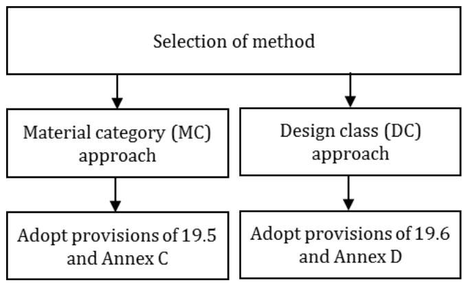  
Figure 19.1-1 — Flow chart for selection of MC or DC method

## 19.2 Lowest anticipated service temperature

The steel performance characteristics are affected by the lowest anticipated service temperature (LAST). The value of LAST to be used when selecting material shall be in accordance with regional or national standards (see Annex H), where they exist, or ISO 19906, if applicable. Suggested LAST values for certain offshore areas are given in A.19.2.

The LAST value is the basis for the temperature at which the Charpy V-Notch (CVN) and crack tip opening displacement (CTOD) toughness tests are conducted. The test temperatures for CVN shall be taken as the LAST minus the temperature margins shown in Table 19.5-2 and Table 19.6-3 for the MC and DC approaches, respectively. The test temperatures for CTOD shall be the LAST.

For LAST lower than ${ \mathbf{ - 10 } }^{ \circ } \mathrm{ C } ,$ special grades of steel are typically required to meet a material testing temperature lower than -40 °C – see ISO 19906. For DC steels, some test requirements for LAST lower than ${ \boldsymbol{ \mathbf{ \mathit{ 10 } } } }^{ \circ } \mathrm{ { C } }$ are given in Annex F.

## 19.3 Chemical composition

19.3.1 General

Carbon content has a major influence on the hardness, toughness and weldability of offshore steel. However, other chemical elements used in the steel alloying process also have an impact on these factors. To provide a measure of the combined effect of these added elements, particularly when assessing weldability, two common expressions, carbon equivalent, $P_{ \mathrm{ C E } } ,$ and modified carbon equivalent, $P_{ \mathrm{ C M } } ,$ have been developed as described in 19.3.2 and 19.3.3.

19.3.2 Carbon equivalent

Carbon equivalent $P_{ \mathrm{ C E } }$ is calculated from Formula (19.3-1):

$$P_{\mathrm{C E}} = P_{\mathrm{C}} + P_{\mathrm{M n}} / 6 + \left(P_{\mathrm{C r}} + P_{\mathrm{M o}} + P_{\mathrm{V}}\right) / 5 + \left(P_{\mathrm{N i}} + P_{\mathrm{C u}}\right) / 15 \tag{19.3-1}$$

where

$P_{ \mathrm C }$ is the weight percentage of carbon;

$P_{ \mathrm{ M n } }$ is the weight percentage of manganese;

$P_{ \mathrm{ C r } }$ is the weight percentage of chromium;

$P_{ \mathrm{ M }_{ 0 } }$ is the weight percentage of molybdenum;

$P_{ \mathrm{ { V } } }$ is the weight percentage of vanadium;

$P_{ \mathrm{ N i } }$ is the weight percentage of nickel;

$P_{ \mathrm{ C u } }$ is the weight percentage of copper.

19.3.3 Modified carbon equivalent

Modified carbon equivalent $P_{ \mathrm{ C M } }$ is computed from Formula (19.3-2):

$$P_{\mathrm{C M}} = P_{\mathrm{C}} + P_{\mathrm{S i}} / 30 + \left(P_{\mathrm{M n}} + P_{\mathrm{C u}} + P_{\mathrm{C r}}\right) / 20 + P_{\mathrm{N i}} / 60 + P_{\mathrm{M o}} / 15 + P_{\mathrm{V}} / 10 + 5 P_{\mathrm{B}} \tag{19.3-2}$$

where, in addition to the symbols given in 19.3.2,

$P_{ \mathrm{ S i } }$ is the weight percentage of silicon;

$P_{ \mathrm{ { B } } }$ is the weight percentage of boron.

## 19.4 Strength, toughness and other considerations

19.4.1 Yield strength

Both MC and DC approaches recognize the relevance of yield strength when selecting steel for a particular application. The MC approach does this explicitly by allocating steel into five strength groups – see Table 19.5-1. The DC approach incorporates yield strength indirectly in its allocation – see Table 19.6-1.

Clauses 13 to 16 are applicable for SMYS up to 800 MPa (see 13.1, 14.2.1, 14.3.1, 15.1.5.2, and 16.11.1). However, current application of the MC approach limits SMYS to 550 MPa and of the DC approach to 500 MPa.

19.4.2 Toughness

Toughness is a measure of a material to absorb energy and plastically deform without fracture. Toughness is measured typically using three techniques, CVN, CTOD and HV.

Typical CVN requirements are listed in Table 19.5-2 and Table 19.6-3 for the MC and DC approaches, respectively. For LAST lower than -10 °C, CVN requirements for the DC approach are listed in Table F.2.

CTOD tests are normally required for welds including the HAZ (see Annex B) and can be required for the base material.

For each condition of (parent) material supplied by each manufacturer, pre-production and production qualification CTOD tests shall be performed. Essential variables for material supply shall include melting practice, rolling practice, maximum thickness, specific chemical composition range and plate manufacturing process (e.g. normalized, TMCP or Q&T).

CTOD data for the HAZ is generally provided as part of the steel manufacturer’s weldability data. Repetition of HAZ CTOD testing may be waived for tests in which the CTOD properties are not expected to be degraded (e.g. where the ranges of heat input, preheat/interpass temperatures and thicknesses, and

additional essential variables of a second procedure are within those qualified by the first). However, when reliance is placed on the manufacturer’s data, Charpy test results on the PQR should not be substantially lower than those obtained by the steel manufacturer in parallel with the CTOD testing.

Qualification welding shall be conducted at both the highest heat input/interpass temperature and lowest input/interpass temperature to be allowed in production welding, as governed by the WPS. Further, the test welding positions shall be selected as those representing the highest and lowest heat input of the procedure(s) to be qualified by such tests.

HV testing is normally limited to welds including the HAZ as discussed in 20.2.2.6.

19.4.3 Other considerations

Other factors that can affect steel selection include resistance to fracture in the presence of plastic deformation, residual stress, thickness restraint, cost, availability, resistance to lamellar tearing, and demonstrated successful use. Guidance on these topics is generally included in complementary standards or guidelines that should be used in conjunction with this document.

## 19.5 Material category approach

19.5.1 Steel selection philosophy

In the material category (MC) approach (see Annex C), steel selection is based on the interrelation of the structure’s exposure level, the material yield strength and toughness, and the component consequence ranking. Thickness is considered in connection with component type and material specification as given in Tables C.1 to C.4, as applicable. The corresponding welding and inspection requirements are given in Annex E.

19.5.2 Material characterization

For the purposes of material selection and utilization in offshore structures, steels are characterized as belonging to a strength group and a toughness class.

A strength group (see 19.5.5) is defined by a range of SMYS values.

Toughness classes (see 19.5.6) are determined by the ability of steels to achieve a minimum CVN test energy at a specified minimum temperature. Toughness becomes more important as the magnitude of varying actions increases, as the criticality of the structure increases, and as LAST decreases. Steel toughness affects fracture resistance.

Guidance on appropriate test temperatures for the MC toughness classes is given in the specifications listed in Table C.2.

The designer should also consider (at least qualitatively) the extent of plastic deformation acceptable before fracture, the degree of restraint provided by thick sections, as well as residual stress generated by both weld shrinkage and the use of thick sections.

19.5.3 Material selection criteria

19.5.3.1 Yield strength requirements

For a given component geometry and thickness, the SMYS can be determined from the design requirements of Clauses 13 to 16, as appropriate, within the limitation in 19.4.1.

19.5.3.2 Structure exposure level

Material selection shall account for the structure’s exposure level (L1, L2, L3) established at the outset of the design process in accordance with ISO 19900. The exposure level generally determines the material category (MC1, MC2, MC3) as shown in C.1, although component criticality also influences the MC allocations as discussed in 19.5.3.3.

19.5.3.3 Component criticality

When selecting material, consideration shall be given to the criticality of the component – see (3.13). In general, the toughness and inspection requirements of this document ensure that material selected for a critical component has greater toughness and ductility than material selected for a component in a redundant structural configuration where alternative load paths lessen the risk of major failure.

Some limited guidance on determining component criticality can be found in Table C.1 as a function of component type and functionality.

19.5.4 Selection process

Once the criteria described in 19.5.3 have been established, the steel selection process follows the flowchart shown in Figure 19.5-1.

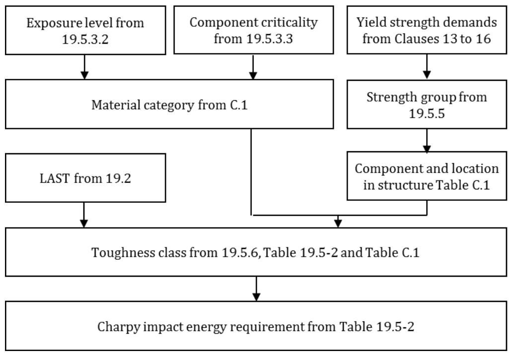  
Figure 19.5-1 — Flow chart for steel selection for MC method

19.5.5 Steel strength groups

Steel is grouped according to its SMYS, as shown in Table 19.5-1.

Table 19.5-1 — Steel group SMYS requirements   


| Group | SMYS MPa | Tensile strength MPa |
| --- | --- | --- |
| I | 220-275 | 380-550 |
| II | 275-395 | 380-550 |
| III | 395-455 | 485-690 |
| IV | 455-495 | - |
| V | 495-550 | - |


19.5.6 Toughness class

This subclause describes the MC category toughness classes and the types of steel assigned to these classes.

Class NT steel (not CVN tested) is suitable for application in welded components where acceptable for the MC as per Table C.1.

Class CV1 steel (CVN tested) is suitable for use where LAST, thickness, cold work, restraint, stress concentration, impact loading and/or lack of structural redundancy indicate the need for improved notch toughness. Class CV1 steels shall, as a minimum, exhibit CVN test energy as shown in Table 19.5-2.

Class CV2 steel (CVN tested) has a large margin between CVN testing temperature and LAST, as prescribed in Table 19.5-2. Such steels are suitable for major primary structures or structural components and for critical or non-structurally-redundant components, particularly in the presence of factors such as:

— high stresses and stress concentrations;   
— high residual stresses;   
— severe cold work from fabrication;   
— low temperatures;   
— high calculated fatigue damage; and/or   
— impact loading.

In addition to all the other characteristics of class CV2 steel, class CV2Z steels shall have throughthickness (short transverse direction) ductility for resistance to lamellar tearing caused by tensile stress in the through-thickness direction. Through-thickness ductility shall be demonstrated either by having a minimum reduction in area of 30 % in a tension test conducted on a specimen cut from the throughthickness direction, or by specifying a weight percentage of sulphur （$P_{ \mathrm{ S } } )$ of 0,006 % or less in a product analysis.

Class CV2X steels (CVN tested) shall have a formal CTOD pre-qualification in addition to the other characteristics of class CV2 steel.

Class CV2ZX (CVN tested) steels shall have a formal CTOD pre-qualification in addition to the other characteristics of class CV2Z steel.

NOTE For CV2X and CV2ZX steels, it is the base material that requires formal CTOD pre-qualification – see API RP 2Z [A.20.2-5].

Testing of material shall be performed in accordance with suitable national or internationally recognized standards.

Minimum CVN toughness requirements are given in Table 19.5-2. This table is not intended to supersede the designer’s judgment for special situations, such as the need to increase the toughness level for any of the reasons described in 19.5.2.

Table 19.5-2 — Minimum CVN toughness requirements for structural steels   


| Steel group | SMYS range MPa | Charpy toughness J | Toughness classes and Charpy impact test temperature | Toughness classes and Charpy impact test temperature | Toughness classes and Charpy impact test temperature | Toughness classes and Charpy impact test temperature |
| --- | --- | --- | --- | --- | --- | --- |
| Steel group | SMYS range MPa | Charpy toughness J | NT (CVN testing not required) | CV1 Test at LAST | CV2 Test at 30 °C lower than LAST | CV2Z, CV2X and CV2ZX Test at 30 °C lower than LAST |
| I | 220-275 | 20 | NT | ✓ | ✓ | Not applicable |
| II | 275-395 | 35 | NT | ✓ | ✓ | ✓ |
| III | 395-455 | 45 | Combination not allowed | ✓ | ✓ | ✓ |
| IV | 455-495 | 60 | Combination not allowed | ✓ | ✓ | ✓ |
| V | 495-550 | 60 | Combination not allowed | Combination not allowed | ✓ | ✓ |
| ✓ denotes required tests to minimum Charpy toughness at the specified temperature For LAST lower than -10 °C, see 19.2 | ✓ denotes required tests to minimum Charpy toughness at the specified temperature For LAST lower than -10 °C, see 19.2 | ✓ denotes required tests to minimum Charpy toughness at the specified temperature For LAST lower than -10 °C, see 19.2 | ✓ denotes required tests to minimum Charpy toughness at the specified temperature For LAST lower than -10 °C, see 19.2 | ✓ denotes required tests to minimum Charpy toughness at the specified temperature For LAST lower than -10 °C, see 19.2 | ✓ denotes required tests to minimum Charpy toughness at the specified temperature For LAST lower than -10 °C, see 19.2 | ✓ denotes required tests to minimum Charpy toughness at the specified temperature For LAST lower than -10 °C, see 19.2 |


19.5.7 Applicable steels

Annex C lists commonly used specifications for steel plates, steel shapes (open sections), and steel tubulars, when applying the MC approach. Steels that are not listed in Annex C may be used provided they satisfy the relevant provisions of Clauses 19 and 20.

## 19.6 Design class approach

19.6.1 General

In the design class (DC) approach, selection of steel quality (measured by steel quality level – SQL) and requirements for inspection of welds shall be based on a systematic classification of welded members and joints according to the structural significance and complexity of the joints.

19.6.2 DC component classification

For a component (joint or member), the main criteria for determining its appropriate DC are its significance with respect to global structural integrity and its consequences of failure. In addition, the degree of redundancy and the design uncertainties (geometrical complexity), where applicable, influence DC selection while for joints, the level of multiaxial stress is also relevant. The structure’s exposure level (L1, L2, L3) has no direct impact on DC assignment.

The selection of component or joint DC shall be in accordance with Table 19.6-1 for all permanent structural elements.

The DC approach also applies to temporary structures, the components of which can also be classed in accordance with Table 19.6-1.

Table 19.6-1 — Design class classification of structural components   


| Design class | Component complexitya | Consequences of failure |
| --- | --- | --- |
| DC 1 | High | Applicable to joints and members where failure has substantial consequencesb and the structure possesses limited residual strengthc |
| DC 2 | Low | Applicable to joints and members where failure has substantial consequencesb and the structure possesses limited residual strengthc |
| DC 3 | High | Applicable to joints and members where failure does not have substantial consequencesb because of the structure's residual strengthc |
| DC 4 | Low | Applicable to joints and members where failure does not have substantial consequencesb because of the structure's residual strengthc |
| DC 5 | Any | Applicable to joints and members where failure does not have substantial consequencesb |
| a High joint complexity means joints where the geometry of connected elements and weld type leads to high restraint and to a triaxial stress pattern, e.g. typically multi-planar plated connections with full penetration welds and unstiffened leg nodes subject to high stress concentrations.b “Substantial consequences” in this context means that failure of the joint or member could entail one or more of the following: - loss of human life; - significant pollution; - major financial consequences.c A structure may be assumed to have adequate residual strength, if it meets the ALS requirements when the component under consideration is damaged. | a High joint complexity means joints where the geometry of connected elements and weld type leads to high restraint and to a triaxial stress pattern, e.g. typically multi-planar plated connections with full penetration welds and unstiffened leg nodes subject to high stress concentrations.b “Substantial consequences” in this context means that failure of the joint or member could entail one or more of the following: - loss of human life; - significant pollution; - major financial consequences.c A structure may be assumed to have adequate residual strength, if it meets the ALS requirements when the component under consideration is damaged. | a High joint complexity means joints where the geometry of connected elements and weld type leads to high restraint and to a triaxial stress pattern, e.g. typically multi-planar plated connections with full penetration welds and unstiffened leg nodes subject to high stress concentrations.b “Substantial consequences” in this context means that failure of the joint or member could entail one or more of the following: - loss of human life; - significant pollution; - major financial consequences.c A structure may be assumed to have adequate residual strength, if it meets the ALS requirements when the component under consideration is damaged. |


19.6.3 Materials

19.6.3.1 Steel selection

Selection of structural steel shall be based on the following:

— DC classification;   
— LAST;   
— strength;   
— thickness.

The minimum requirements for material selection (SQL) are shown in Table 19.6-2. Member SQL selection shall normally be based on the most stringent DC of interconnected joints. Through-thickness stresses shall be assessed.

Selection of a SQL higher than the minimum required can lead to more stringent requirements in fabrication, therefore, such selection should only be pursued if the full implications of such action are understood.

Table 19.6-2 — Correlation between DC and SQL   


| Design class | SQL | SQL | SQL | SQL |
| --- | --- | --- | --- | --- |
| Design class | I | II | III | IV |
| DC 1 | ✓ |  |  |  |
| DC 2 | (✓) | ✓ |  |  |
| DC 3 | (✓) | ✓ |  |  |
| DC 4 | (✓) |  | ✓ |  |
| DC 5 |  |  |  | ✓ |
| (✓) = Select when joint strength through-thickness ductility is required. | (✓) = Select when joint strength through-thickness ductility is required. | (✓) = Select when joint strength through-thickness ductility is required. | (✓) = Select when joint strength through-thickness ductility is required. | (✓) = Select when joint strength through-thickness ductility is required. |


19.6.3.2 SQL

There are four SQL categories:

— SQL I steels – steels for which the most stringent requirements apply and that are used for the most critical parts of the structure. SQL I steels are used for DC 1 components and in cases where throughthickness properties are required.   
— SQL II steels – steels with somewhat lower quality than SQL I steels and that are used for DC 2 and DC 3 components.   
— SQL III steels – steels with lower quality than SQL II steels and that are used for DC 4 components.   
— SQL IV steels – steels with lower quality than SQL III steels and that are used for DC 5 components.

SQL III and IV steels are considered more as commercial steel grades, with few additional requirements.

Minimum required average CVN impact fracture toughness values are shown in Table 19.6-3. No individual value shall be less than 70 % of the minimum average value. Reduction factors for the energy required for subsize specimens shall be 5/6 for 7,5 mm and 2/3 for 5 mm. Where the test temperature is indicated to be greater than LAST, testing need not be performed for temperatures greater than ambient temperature.

Table 19.6-3 — CVN impact fracture toughness test temperatures and energy requirements   


| SQL | I | I | II | II | III | IV |
| --- | --- | --- | --- | --- | --- | --- |
| SMYS | ≤400 | 400 ≤ 500 | ≤400 | 400 ≤ 500 | 355 ≤ 500 | 275 ≤ 355 |
| Material thickness (mm) | Test temperature (°C) | Test temperature (°C) | Test temperature (°C) | Test temperature (°C) | Test temperature (°C) | Test temperature (°C) |
| t ≤ 12 | L +10 | L - 10 | L + 10 | L + 10 | L + 10 | L + 20 |
| 12 < t ≤ 25 | L - 10 | L - 30 | L + 10 | L - 10 | L + 10 | L + 20 |
| 25 < t ≤ 50 | L - 30 | L - 30 | L - 10 | L - 30 | L - 10 | NA |
| t > 50 | L - 30 | L - 30 | L - 30 | L - 30 | L - 30 | NA |
| Energy requirement | 50 J | 60 J | 50 J | 60 J | 40 J | 27 J |
| L: LAST: Lowest Anticipated Service Temperature. For LAST lower than -10 °C, see Annex F and ISO 19906. SMYS: Specified Minimum Yield Strength in MPa NA: Not Applicable | L: LAST: Lowest Anticipated Service Temperature. For LAST lower than -10 °C, see Annex F and ISO 19906. SMYS: Specified Minimum Yield Strength in MPa NA: Not Applicable | L: LAST: Lowest Anticipated Service Temperature. For LAST lower than -10 °C, see Annex F and ISO 19906. SMYS: Specified Minimum Yield Strength in MPa NA: Not Applicable | L: LAST: Lowest Anticipated Service Temperature. For LAST lower than -10 °C, see Annex F and ISO 19906. SMYS: Specified Minimum Yield Strength in MPa NA: Not Applicable | L: LAST: Lowest Anticipated Service Temperature. For LAST lower than -10 °C, see Annex F and ISO 19906. SMYS: Specified Minimum Yield Strength in MPa NA: Not Applicable | L: LAST: Lowest Anticipated Service Temperature. For LAST lower than -10 °C, see Annex F and ISO 19906. SMYS: Specified Minimum Yield Strength in MPa NA: Not Applicable | L: LAST: Lowest Anticipated Service Temperature. For LAST lower than -10 °C, see Annex F and ISO 19906. SMYS: Specified Minimum Yield Strength in MPa NA: Not Applicable |


Characteristics of SQL I and II steels include:

— Secondary refining (vacuum degassing or ladle refining) is required for SQL 1 as part of the steel manufacturing process. This produces steel with a low content of impurity elements (e.g. phosphorus and sulphur) and a low content of gases (oxygen, hydrogen and nitrogen) and results in a steel with improved toughness properties.   
— Low carbon content, low $P_{ \mathrm{ C E } }$ and low $P_{ \mathrm{ C M } }$ (see 19.3.2 and 19.3.3). The effect is improved weldability properties (e.g. low preheat and interpass temperatures).   
— Excellent base material properties, e.g. strength, ductility, toughness, strain ageing, and throughthickness.   
— Extensive test programmes are required to verify weldability properties. CTOD properties of the HAZ shall be documented for all products exceeding 50 mm in thickness – see F.2.2 when LAST is lower than -10 °C. Testing shall be carried out at the LAST, at two positions of the HAZ (i.e. course-grained HAZ and inter-critical HAZ), and for both high and low heat input.   
— For SQL I steels, Z-properties shall be documented by through-thickness tensile testing and ultrasonic testing.   
— Plates with SMYS 420 MPa and above are specified to have the same minimum yield strength for all thicknesses. This is normally achieved through adjustments of the chemical composition and minor changes in the manufacturing process.

Current practice for the DC approach is to limit SYMS to 500 MPa - see 19.4.1.

NOTE Where CTOD requirements are required for base material, such requirements are found in the relevant standard for that base material.

SQL I steel should be selected where through-thickness properties are required.

19.6.4 Applicable steels

Annex D lists commonly used specifications for steel plates, steel shapes (open sections), and hollow sections, when applying the DC approach. Steels that are not listed in Annex D may be used provided they satisfy the relevant provisions of Clauses 19 and 20.

## 19.7 Cement grout

19.7.1 Grout materials

In general, Portland cement grouts should be used with or without inert fillers mixed with either seawater or fresh water. However, there can be special circumstances where the use of seawater is undesirable because of corrosion or other durability effects.

Any water used to mix grout should be free of hydrocarbons and other deleterious matter.

In the grout composition, the water/cement ratio shall not exceed 0,40.

High alumina cement (HAC) grout shall only be used with extreme care, and restricted to below splash zone applications to reduce conversion and associated strength loss.

Admixtures may be used to improve grout slurry properties, provided it can be demonstrated that they do not adversely affect the required grout durability and performance.

Grout constituent materials should be supplied to a recognized national standard and stored in accordance with the manufacturer's recommendations.

19.7.2 Onshore grout trial

In the absence of previous production data, the compressive strength of the grout mix shall be confirmed,,`,` by an onshore trial. An onshore trial shall consist of at least three separate batches of grout. A minimum,``,`` of six cubes shall be cast from each batch for each age at which strength is to be determined. The--` compressive strength of 75 mm cubes at 28 days should be used as the basis for strength compliance. However, it is recommended that strength gain with age should be measured at 30 hours, at 3 days and at 7 days, or at other ages as considered appropriate. Cubes of other sizes may be used provided appropriate conversion factors relating the strength to a 75 mm cube are available. Cylinders shall not be used.

The mean cube strength calculated from the data should be greater than:

$$f_{\mathrm{c u}} + 1, 64 \sigma \left(0, 86 + \sqrt{2 / n}\right) \quad \text{w h e n} 10 \leq n <   100 \tag{19.7-1}$$

$$f_{\mathrm{c u}} + 1, 64 \sigma \quad \text{w h e n} n \geq 100 \tag{19.7-2}$$

where

$f_{ \mathrm{ c u } }$ is the required specified minimum compressive strength;

σ is the standard deviation of the data;

n is the number of cubes.

The grout mixing equipment and mixing times used in the onshore trials, or in previous production grouting from which data is taken, should both be the same as those to be used during offshore grouting to ensure the grout slurry is similarly sheared.

The specific gravity of the grout slurry should be correlated against the mean compressive strength for offshore monitoring.

19.7.3 Offshore grout trial

Prior to grouting, an offshore trial shall be performed, using the equipment and materials to be used for production grouting, to check the 30 hour grout strength compliance. Grouting shall not proceed until compliance has been achieved. Compliance is satisfied if all cube results exceed the specified minimum 30 hour compressive strength, calculated as defined in 19.7.2.

19.7.4 Offshore quality control

Specific gravity measurements of the grout slurry prior to pumping shall, as a minimum, be recorded once per batch or once per cubic metre, whichever is the more frequent, and should preferably be measured and recorded continuously. The specific gravity of the in-place grout slurry should also be measured at the most appropriate of the following locations: surface returns, the highest point within the grout volume, or from a suitably sized vertical standpipe. An in-place specific gravity greater than or equal to that determined during the onshore trial shall be achieved. Specific gravity measurements shall be made using a pressurized fluid density balance in accordance with ISO 10414-1 or monitoring devices calibrated to this type of balance.

In situations where subsea measuring devices fail, a percentage over volume may be pumped in lieu of direct measurements, if the following conditions are met:

a) it can be demonstrated that on similar connections on the structure, where measurements are available, the required specific gravity was achieved with a recorded net level of grout over volume having been pumped;   
b) an additional 20 % in-place volume of grout over and above the net recorded volume in a) above is pumped;   
c) no major grout system losses are evident.

During the grouting operation, samples shall be taken from randomly selected batches. At least four samples, each of three cubes, should be taken for each grout volume to give a representative distribution throughout the in-place grout. The cubes should be cast and tested to a recognized standard and match cured to the in place grout environmental conditions. At least one cube should be tested from each sample to confirm compliance at 28 days. Compliance is satisfied, if all individual cube results, in a set of four, exceed the specified minimum compressive strength, $f_{ \mathrm{ c u } } ,$ as defined in 19.7.2.

20 Welding, weld inspection and fabrication

## 20.1 General

Clause 20 is to be used in conjunction with owner specifications and selected international, national or regulatory standards for welding, fabrication and inspection. It describes complementary provisions for welding, inspection, fabrication, and quality issues, in which requirements specific to fixed steel offshore structures are adapted to steel strength, toughness class and criticality of the structure or component.

An overview of the process is given in Figure 20.1-1. Inputs to procurement and construction are derived from engineering design processes described in Clause 19 and Annexes C and D.

The provisions of Clause 20 shall be supplemented by those of Annexes B and G. If the MC approach is used, also see the corresponding provisions of Annex E while if the DC approach is used, also see the corresponding provisions of Annex F.

Typically, proactive project-specific QC inspections and controls (e.g. qualification) prior to and during fabrication (see Clause 21) can be extracted from the fabricator’s quality management system (QMS).

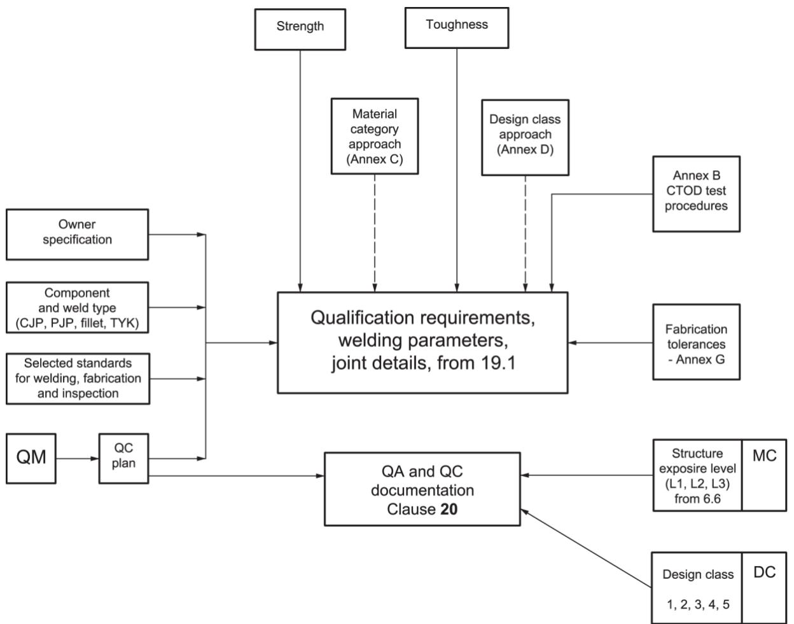  
Figure 20.1-1 — Flow chart for welding, inspection, fabrication and QA/QC documentation

Key

CJP complete joint penetration

PJP partial joint penetration

TYK T-, Y- or K-Joint

QM quality management

## 20.2 Welding

20.2.1 Selected generic welding and fabrication standards

The welding of fixed offshore structures shall be performed in accordance with selected generic international or national standards that complement requirements given herein to jointly address, at a minimum, the following topics:

a) applicable welding processes;   
b) approved consumables (electrodes, flux, etc.);   
c) approved base metals;   
d) interchangeability of steels and consumables within groups;   
e) matching, undermatching and overmatching of base metals and consumables;   
f) minimum/maximum preheat and interpass temperatures;   
g) welding procedure and welding personnel qualification, including:

1) weld metal tensile testing and CVN testing, and CTOD testing when required, of weld metal and heat affected zone (HAZ) (for welding procedures only);   
2) range of applicability (positions, thicknesses, etc.);   
3) essential variables;   
4) number and type of test specimens;   
5) test specimen descriptions;   
6) test specimen locations, and rolling direction where relevant;   
7) test specimen acceptance criteria;   
8) welding of single sided T-, Y- and K-joints;

h) production weld joint details and tolerances, including:

1) welding of single-sided T-, Y- and K-joints;   
2) other welds;

i) PWHT;   
j) heat straightening limits;   
k) weld size/profile limits;   
l) environmental limitations for welding;   
m)back-gouging/backing/runoff tab criteria;   
n) preparation of base metal (cleaning, bevelling, etc.);   
o) fatigue improvement techniques (if applicable);   
p) NDT procedures;   
q) NDT discontinuity acceptance criteria;   
r) repairs.

The international or national standards used to address a) to r) above can be generic documents applicable to a wide range of steel structures. In the remainder of Clause 20, these standards are referred to as “the selected standard”. The requirements of this Clause 20 deal with issues specific to fixed offshore structures and shall be used to supplement the selected standard.

For a particular project application, the owner shall identify suitable standard(s) to satisfy the above requirements. Examples are given in A.20.2.1.

20.2.2 Weld metal and HAZ properties

20.2.2.1 General

This subclause describes required properties for weld metal and heat affected zones for the strength grade and toughness class of the connected base metal.

Strength matching shall be as specified in the selected standard (20.2.1). Where undermatching is permitted, this shall be as specified in the design. Where materials of two different strengths are joined, the protocol for matching shall be as described in design documents.

20.2.2.2 Material category (MC) toughness

Annex E defines the minimum toughness requirements for weld metal and HAZ, respectively, for use with the MC approach. Group V steels are not fully described, as these steels require the designer to specify the minimum toughness requirements.

20.2.2.3 Design class (DC) toughness

Annex F defines the minimum toughness requirements for weld metal and HAZ, for use in the DC methodology.

20.2.2.4 Charpy V-notch toughness

20.2.2.4.1 Testing

The selected standard’s requirements shall be followed for specimen tests.

The test temperatures and minimum energy values in weld metal and HAZ shall be selected to be consistent with those of the steels to be joined, as tabulated in Annex E or Annex F for the MC and DC approaches, respectively.

20.2.2.4.2 Additional essential variables

For welding procedures that are Charpy-tested, the following variables shall be adopted as essential variables, in addition to the essential variables for Charpy-testing listed in the selected standard. The conditions under which requalification of the welding procedure specification (WPS) and procedure qualification record (PQR), as appropriate, shall be performed, are also listed:

a) Carbon equivalent $P_{ \mathrm{ C E } }$ (see Formula (19.3-1)) — an increase in $P_{ \mathrm{ C E } }$ greater than 0,03 % with respect to the value specified in the procedure qualification test.   
b) Modified carbon equivalent $P_{ \mathrm{ C M } }$ (see Formula (19.3-2)) — an increase in $P_{ \mathrm{ C M } }$ greater than 0,02 %, with respect to the value specified in the procedure qualification test.

c) Maximum interpass temperature — an increase of more than 28 °C over the maximum interpass temperature attained during the procedure qualification test.   
d) Heat input — a change greater than 25 % in the heat input of the welding passes from the average value calculated in the supporting procedure qualification test. Heat input average for fill passes shall be calculated separately from that for cap and root passes.   
e) Electrode supply and manufacture — any change in electrode or electrode/flux brand name or of manufacturer when the CVN test temperature is lower than -18 °C.

20.2.2.5 CTOD toughness

20.2.2.5.1 General

CTOD tests are required for the weld metal, and for HAZ unless pre-production qualified as per 20.2.2.5.2, for:

— CV2X and CV2ZX steels for the MC approach ;   
— SQL I and II steels for the DC approach.

For testing details, see Annex B.

For CV2X and CV2ZX steels, the base material also requires formal CTOD pre-qualification – see 19.5.6. For DC materials, any base material CTOD requirements are specified in the relevant standard for such material.

20.2.2.5.2 Pre-production and production qualification

Pre-production and production qualification of base material can be required as discussed in 19.4.2.

20.2.2.5.3 CTOD fracture toughness requirements

CTOD requirements are a function of design philosophy. The test temperature shall not be higher than the LAST.

Preparation of test specimens, test procedure and reporting shall be in accordance with ISO 15653 or equivalent test standards (e.g. ASTM E2818 [A.20.2-10]) – also see Annex B.

All test results shall meet the target CTOD acceptance level set by the designer. Acceptance criteria shall be based on a fracture mechanics evaluation and address the variability of test results - see A.20.2.2.5 and F.2.2.

20.2.2.5.4 Additional essential variables

For welding procedures that are CTOD-tested, the additional essential variables and the conditions under which requalification of the WPS and PQR, as appropriate, shall be performed, are:

a) Joint thickness — an increase in joint thickness greater than 10 % of that used for the CTOD procedure qualification tests.   
b) Welding consumables — any change in welding consumable brand name.   
c) highest heat input/interpass temperature and the lowest heat input/interpass temperature.

20.2.2.5.5 Qualification range

The CTOD qualification tests qualify production welding thickness up to and including the thickness tested.

20.2.2.5.6 Documentation and results

CTOD testing reports shall be included in the PQR documentation. Photographs of at least 1 magnification, clearly showing the fatigue pre-crack and the fracture face of one of the broken halves of all CTOD specimens, shall also be included.

20.2.2.6 Vicker’s Hardness testing

If not otherwise specified in the selected standard, a Vickers hardness survey shall be performed on one of the macro sections from each test weld in accordance with a recognized standard, using an applied load of 100 N or less. The sample shall be ground, polished and etched with a suitable solution to give, under a microscope, a clear definition of the weld, HAZ and fusion line microstructures.

Hardness test locations shall be located as followed and as shown in Figure 20.2-1:

a) HAZ — starting at 0,25 mm to 0,50 mm from the fusion line with three indentations at 0,50 mm to 0,75 mm intervals;   
b) weld metal — a minimum of three equally spaced indentations for each hardness traverse.

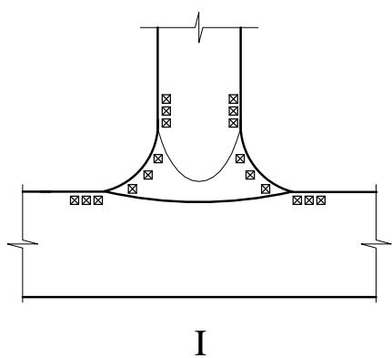

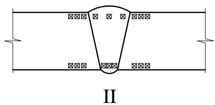

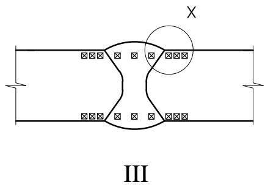

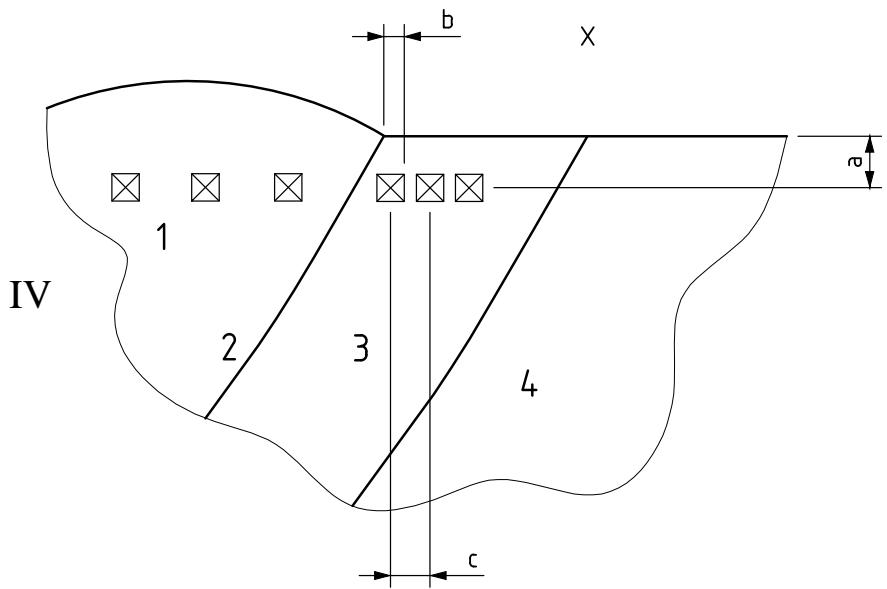  
Figure 20.2-1 — Vickers hardness test locations

Key

1 weld metal
2 fusion line   
3 HAZ
4 base metal
I location of hardness traverse for double-sided full penetration weld   
II location of hardness traverse for single-sided butt weld   
III location of hardness traverse for double -sided butt weld   
IV dimensioning details for hardness traverses   
a Hardness indentations shall be placed at a distance of 1 mm to 2 mm below the surface.   
b The first indentation shall be placed at a distance of 0,25 mm to 0,50 mm from the fusion line.   
c The spacing of indentations shall between 0,50 mm and 0,75 mm.

NOTE A minimum of three equally spaced indentations for each hardness traverse.

The hardness traverse on fillet welds shall be similar to that for T-connections.

Maximum hardness values shall not exceed 350 HV10. If any individual hardness value exceeds the limit specified, two further sections shall be taken, both of which shall meet the specified requirements.

Hardness test sample locations for qualification tests performed on pipe shall be at the 3 o’clock or 9 o’clock position for downhill cap and at the 6 o’clock position for uphill cap passes.

A photograph or photo macrograph of 1 to 3 magnification, clearly showing the hardness indentations, `--- HAZ and the weld zone, shall be included in the test results. For acceptable qualification, the macro-etch```,, test specimen, when inspected visually, shall also conform to the requirements for visual examination.``-`-

20.2.2.7 Other mechanical tests

Other mechanical tests shall be conducted during the welding procedure qualification in accordance with the selected standard’s requirements. These shall include, as applicable:

a) cross weld tensile tests;   
b) bend tests;   
c) macro-etch sectioning.

20.2.2.8 NDT of qualification welds

The qualification welds shall be subjected to 100 % volumetric and 100 % surface NDT in accordance with the requirements for fabrication welds.

20.2.3 Tubular T-, Y- and K-joints

When executing single-sided welds in T-, Y- and K-joints, achieving the performance attributes of complete joint penetration welds requires specialized consideration of geometry and position variations, weld joint bevel preparation, fit-up tolerances, welding procedure qualification, welding personnel qualification, welder qualifications, cap profiling and fitness-for-service NDT flaw acceptance criteria. Some guidance on such welding is given in A.20.2.3.

## 20.3 Inspection

The inspection requirements for the MC and DC methodologies are described in Annexes E and F, respectively.

Additional requirements for QC, QA and documentation are presented in Clause 21.

## 20.4 Fabrication

20.4.1 General

This subclause provides complementary requirements that pertain specifically to fixed steel offshore structures and that take precedence over the selected standard.

20.4.2 Weld requirements

20.4.2.1 Splice welds

Splices shall be fabricated using full penetration welds.

20.4.2.2 Weld proximity

Weld proximity shall satisfy the following requirements:

a) Circumferential welds are not permitted within cones and node stubs, unless specified on design or approved shop drawings.   
b) The minimum spacing between circumferential welds in tubular members shall be the smaller of 915 mm or the diameter of the member.   
c) Ring stiffeners in tubular members shall be at least 100 mm from circumferential welds, except that, where this is not possible, the welds shall overlap by at least 10 mm.   
d) Rings used to stiffen cone-cylinder junctions shall not be offset and the welds shall overlap by at least 10 mm, to avoid coincident location of weld toes.   
e) Longitudinal and circumferential welds in tubular joints shall avoid the most critical areas of a joint, as shown in Figure 20.4-1.   
f) The angular offset between longitudinal seams in adjacent cans in tubular joints shall be maximized, taking into account connections at each end of each member, and shall not be less than 90°. However, this requirement need not be met when, to avoid the prohibited locations shown in Figure 20.4-1 b), the location of a longitudinal seam is adjusted, in which case such adjustment shall not exceed 300 mm measured circumferentially.   
g) In any members to be slotted to receive gusset plates, the slot shall be at a distance of 300 mm or twelve times the member wall thickness, whichever is greater, from any circumferential weld. To avoid notches, the slotted member shall be drilled or cut and ground smooth at the end of the slot with a diameter of at least 3 mm greater than the width of the slot. Where the gusset plate passes through the slot, the edge of the gusset plate shall approximately conform to the shape of the slot to provide a better fit-up and welding condition.

Dimensions in millimetres

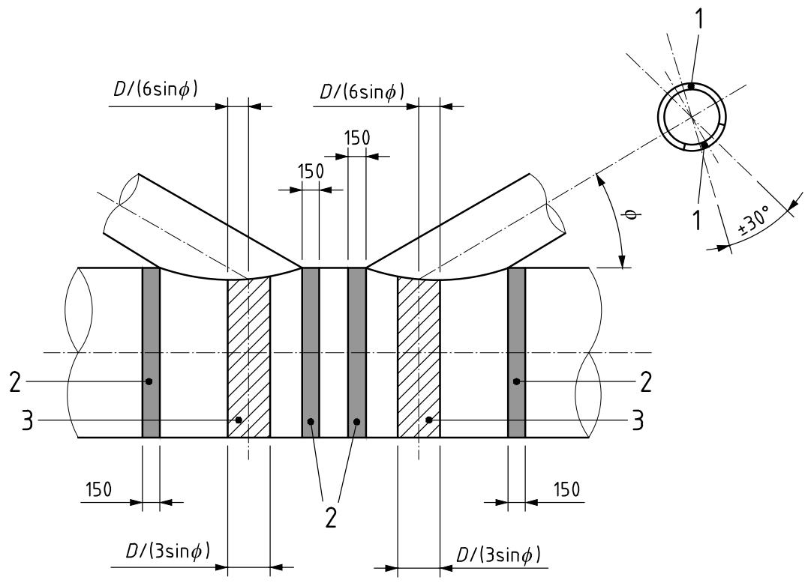

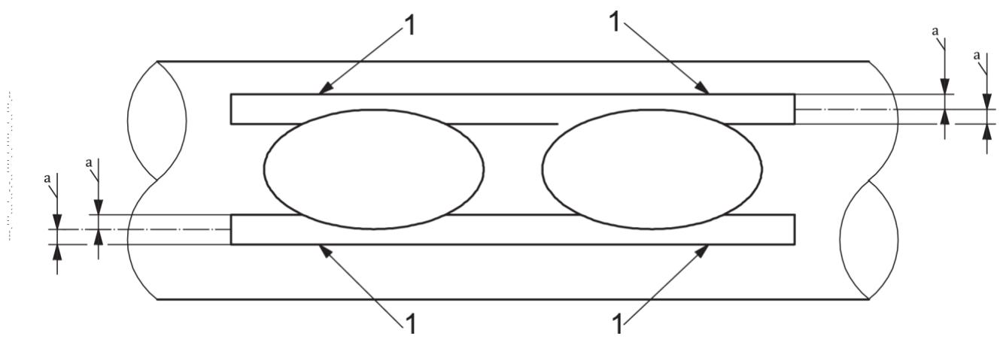  
a) Prohibited locations for circumferential welds on chords and longitudinal seams on stubs   
b) Prohibited locations for longitudinal seams on chords

Key

1 longitudinal seams not permitted in these areas   
2 circumferential welds not permitted in these areas   
3 circumferential welds should be avoided in these areas   
a Lesser of 150 mm or twice the chord thickness (measured along the chord circumference).   
D chord outer diameter

Figure 20.4-1— Positioning of longitudinal and circumferential welds in tubular joints

20.4.2.3 Fabrication aids

When fabrication aids and temporary attachments occur in areas that become part of a completed weldment within 300 mm of an intersecting weld or in areas that require coating, the attachment shall be removed by oxy-fuel cutting, leaving a minimum of 3 mm above the surface of the structural member and grinding the remainder flush with the surface of the member. After grinding, if the ground areas lie close to or underneath a future weld, the surface shall be inspected using MPI before performing the permanent weld.

Fabrication aids and temporary attachments, which occur in areas that do not require coating and that are located more than 300 mm from an intersecting weld, shall be seal welded and shall be removed to within 6 mm of the surface of the member with sharp edges removed by grinding. Oxy-fuel cutting may be used for the bulk removal of a fabrication aid or temporary attachment but shall not be used within 3 mm of the surface of the underlying component. Fabrication aids and temporary attachments shall not be removed by hammering or oxy-fuel washing.

20.4.3 Forming

Guidelines for forming steel plates into a circular tubular member are given below.

For a diameter-to-thickness (D/t) ratio of less than 20, mechanical tests shall be undertaken to demonstrate that the steel retains its mechanical properties. Post-forming heat treatments, or hot forming, can be used to mitigate the effects of cold forming.

Any materials that require straightening before use to achieve the specified tolerances may be cold straightened if the strain does not exceed 5 %. Similarly, tubular cans for members or joints may be rerolled after welding to meet the dimensional tolerances if the strain during re-rolling does not exceed 5 %.

Consideration should be given to strain concentration and discontinuity growth in the weld metal or HAZ if the nominal strain during re-rolling exceeds 4 %, or the product of SMYS times thickness exceeds 3 200 MPa cm.

Re-rolling, hot forming, or post-forming heat treatments, if used, shall be incorporated in WPQ testing of weld metal and HAZ.

20.4.4 Fabrication tolerances

The location of each member of the structure shall be in accordance with approved design drawings and within final fabrication tolerances. The fabrication tolerances are given in Annex G. Tolerances not stated in Annex G shall follow applicable regional or national standards.

Tolerances should be checked at each stage in accordance with fabrication procedures and the results as finally surveyed shall meet the defined tolerances. Fitters should perform their own checking as the work progresses; their tape measures and straight edges need not be calibrated. Final surveys on complete sub-assemblies and on the completed structure shall be performed after PWHT, if applicable.

The personnel responsible for the final survey should be either qualified surveyors or have at least five years of experience of similar work. Instruments used shall be in accurate adjustment and shall have current valid calibration certificates.

Allowance shall be made for weld gap tolerances and weld shrinkage in all components, sub-assembly and global tolerance calculations.

Where tolerances are derived from a formula (i.e. tolerances expressed in terms of the component dimension; e.g. wall thickness), the results shall be taken to the nearest mm.

20.4.5 Grouted connections

20.4.5.1 Preparation

Steel surfaces in contact with in-place grout and on which interface shear is to be developed shall be free of loose material, mill scale, grease and any other material that can reduce the grout to steel friction.

Care shall be taken during and after the installation of packers to prevent damage from handling, high temperatures and splatter from welding and debris. Any debris that could cause damage to the packers during the installation process shall be removed. For pile to sleeve connections, measures such as dressing of the pile tip to a smooth profile and positioning of centralizers on the sleeve directly above the packers should be taken to minimize potential packer damage during pile stabbing.

20.4.5.2 Grouting operations

The grouting operation for grouting pile-to-sleeve connections and grouted repairs should be performed using materials consistent with the requirements of 19.7 and an approved and proven procedure by experienced grouting operatives.

The equipment should have sufficient capacity to achieve the grout filling in a single continuous operation. Grouting should not commence unless there are sufficient materials available, including a contingency, to complete the task. Grout slurry stored in a holding tank should be continuously stirred and should not be held for more than 30 min prior to pumping. In case of rapid hardening mixes, the storage duration in a holding tank should be reduced to less than 30 min.

Prior to grouting and after activating any sealing devices, dyed water should be flushed through the complete grouting system to both remove any deleterious matter and to prove its functionality. A pressure test can be appropriate for closed systems. The annulus should then be carefully filled by maintaining a continuous grout flow through the lowest practical point.

Grout returns to allow surface sampling are preferable. If these are provided, grout samples for strength compliance testing may be taken from the returns in addition to the slurry specific gravity measurements. If surface returns are not provided, visual inspection to confirm that grout has completely filled the annulus should be performed immediately after cessation of grout pumping and again after initial grout set, typically 12 h.

21 Quality control, quality assurance and documentation

## 21.1 General

Clause 21 provides the quality control (QC), quality assurance (QA) and documentation requirements for fabrication, transportation and installation phases of a typical offshore structure construction project.

QC inspection and testing shall be performed to ensure adherence to the plans and specifications containing the detailed instructions necessary to obtain the desired quality and service in the finished product, during all phases of construction, including the fabrication, loadout, sea fastening, transportation and installation.

QA/QC, inspection and documentation requirements should be as listed in Table 21.2-1. Additional requirements and modifications to suit the project application can be specified by the owner. These should be coordinated with the material selection and fracture control philosophy used in design.

The extent of NDT of welds during fabrication shall be appropriate to the inspection category. The selection of an inspection category for each weld should be in accordance with Annex E or Annex F, as appropriate.

The most effective QC scheme is one that prevents the introduction of defective materials or workmanship into a structure, rather than depending upon QA and documentation which come after the fact.

## 21.2 Quality management system

All design, fabrication, and installation shall be performed under a documented quality management system (QMS). The QMS shall, as a minimum and where applicable, address the items listed in Table 21.2-1. The QMS shall address components of the structure and additional components and procedures critical to its fabrication, e.g. design and testing of lifting beams and lifting procedures.

Table 21.2-1 — Quality management requirements   


| Documentation description | MC approach | MC approach | MC approach | DC approach | DC approach | DC approach | DC approach | DC approach |
| --- | --- | --- | --- | --- | --- | --- | --- | --- |
| Documentation description | Exposure level | Exposure level | Exposure level | Design class | Design class | Design class | Design class | Design class |
| Documentation description | L1 | L2 | L3 | 1 | 2 | 3 | 4 | 5 |
| Quality assurance manual | X | X | - | X | X | X | X | - |
| Organizational chart | X | - | - | - | - | - | - | - |
| Documentation and drawing control procedures | X | X | - | X | X | X | X | X |
| Design change procedures | X | X | - | X | X | X | X | X |
| Design calculations | X | X | - | X | X | X | X | X |
| Fabrication procedures | X | X | - | X | X | X | X | X |
| Lifting procedures | X | X | - | X | X | X | X | X |
| Material tracing control procedures | X | X | - | X | X | X | X | - |
| Dimensional control/survey procedures | X | X | X | X | X | X | X | X |
| Welding consumable storage and handling procedures | X | X | X | X | X | X | X | X |
| Pressure/leak, and equipment operability test procedures | X | - | - | - | - | - | - | - |
| Preheat procedures | X | X | X | X | X | X | X | - |
| NDT procedures | X | X | - | X | X | X | X | - |
| Non-conformance/remedial procedures | X | X | - | X | X | X | X | - |
| Pressure/leak test procedures | X | X | - | - | - | - | - | - |
| Inspection equipment calibration procedures and certificates | X | - | - | X | X | X | X | X |
| Subcontractor quality procedures | X | X | - | X | X | X | X | X |
| Weight reports procedures | X | - | - | X | X | X | X | X |
| Procurement procedures for materials/services | X | X | X | X | X | X | X | - |
| Procedures for handling special processes (e.g. heat treatment) | X | - | - | - | - | - | - | - |
| X minimum requirements for applicable phases of the overall project not required | X minimum requirements for applicable phases of the overall project not required | X minimum requirements for applicable phases of the overall project not required | X minimum requirements for applicable phases of the overall project not required | X minimum requirements for applicable phases of the overall project not required | X minimum requirements for applicable phases of the overall project not required | X minimum requirements for applicable phases of the overall project not required | X minimum requirements for applicable phases of the overall project not required | X minimum requirements for applicable phases of the overall project not required |


Fabrication welding activities should be performed in accordance with ISO 3834-2 [1] and ISO 14731 [5].

## 21.3 Quality control plan

21.3.1 General

QC is normally performed as appropriate prior to and during fabrication, loadout, transportation and installation. The purpose of QC is to ensure that materials and workmanship meet the specified requirements. QA is generally performed during and after QC activities, to provide records and documents.

A QC plan shall be developed which makes reference to procedures for all inspection and NDT techniques, including proposed report formats and the names and qualifications of inspection and NDT personnel.

The QC plan shall define the scope of inspection required for fabrication while meeting the requirements of Clause 20 and either Annex E or Annex F, as appropriate.

The QC plan shall consider the elements in 21.3.2 to 21.3.6.

21.3.2 Inspector qualifications

Inspectors shall be qualified to carry out their duties by education, experience, or practical testing according to recognized international, regional or national standards.

Personnel, who assist inspectors during any phase of construction of an offshore structure, should demonstrate ability and experience, or be qualified to an appropriate standard for the required inspection of a particular project.

21.3.3 NDT personnel qualifications

NDT personnel shall be recognized according to an approved programme consistent with a recognized standard that requires experience and passing written and practical tests applicable to the project inspection methods and type of construction.

Personnel responsible for NDT activities shall be qualified according to ISO 9712 or equivalent qualification scheme. The NDT operator shall be qualified according to ISO 9712, level 2 or equivalent qualification scheme.

NDT personnel performing visual inspection of welded joints shall be qualified in accordance with ISO 9712, visual inspection (VT) level 2 or equivalent scheme.

Operators simply producing radiographs and not performing evaluation, need not be qualified to VT level 2.

21.3.4 Inspection of materials

Inspection shall verify that all materials being incorporated into any portion of the fabrication are in accordance with the specified requirements.

Steel that does not have supporting material traceability record (MTR) documentation from the steel manufacturer or supplier shall not be used.

21.3.5 Inspection of fabrication

Inspections of the structure shall be made upon completion of fabrication to confirm compliance with the dimensional requirements, using the tolerances established by the selected standard and the specific requirements of Clause 20. Inspections made during fabrication shall be used to determine compliance with in-process requirements, such as joint fit-up, that cannot be confirmed upon general fabrication completion.

21.3.6 Inspection of welding

Welding inspection and testing shall be performed to verify compliance with the requirements specified in Annex E or Annex F, as appropriate.

## 21.4 Documentation

21.4.1 General

During the structure’s fabrication, construction, loadout, and installation, inspection-related data are generated. This information, along with any pertinent additional data, shall be recorded as the job progresses, and shall be compiled in a timely manner and in a form suitable to be retained as a permanent record.

The inspection results and other documents listed in Table 21.4-1 shall be prepared. All documentation referenced in 21.4 shall be retained on file for the life of the structure.

Table 21.4-1 — Documentation requirements   


| Documentation description | MC approach | MC approach | MC approach | DC approach | DC approach | DC approach | DC approach | DC approach |
| --- | --- | --- | --- | --- | --- | --- | --- | --- |
| Documentation description | Exposure level | Exposure level | Exposure level | Design class | Design class | Design class | Design class | Design class |
| Documentation description | L1 | L2 | L3 | 1 | 2 | 3 | 4 | 5 |
| Material tracing records | X | X | — | X | X | X | X | — |
| Engineering drawings | X | X | X | X | X | X | X | — |
| Shop drawings | X | X | — | X | X | X | X | — |
| Design calculations for construction activities | X | X | — | X | X | X | — | — |
| Dimensional control/survey records | X | — | — | X | X | X | — | — |
| Mill certificates | X | X | — | X | X | X | X | — |
| Welding procedure matrix | X | X | — | X | X | X | X | X |
| Welding procedure specification | X | X | X | X | X | X | X | X |
| Welding procedure (PQR) test results | X | X | X | X | X | X | X | — |
| Site welding instruction sheets (short WPS) | X | X | — | X | X | X | X | X |
| Welder qualifications | X | X | X | X | X | X | X | X |
| NDT test results | X | X | — | X | X | X | X | — |
| NDT personnel qualifications | X | X | — | X | X | X | X | — |
| Inspection records | X | X | — | X | X | X | X | — |
| Pressure/leak and equipment operability test reports | X | X | — | — | — | — | — | — |
| Weight reports | X | — | — | X | X | X | X | X |
| Other inspection | X | — | — | — | — | — | — | — |
| Foundation verification report (pile driving records, etc.) | X | X | X | X | X | X | — | — |
| As built drawings | X | X | — | X | X | X | X | — |
| Weld numbering system | X | X | — | X | X | X | X | — |
| X minimum requirements for fabrication — not required | X minimum requirements for fabrication — not required | X minimum requirements for fabrication — not required | X minimum requirements for fabrication — not required | X minimum requirements for fabrication — not required | X minimum requirements for fabrication — not required | X minimum requirements for fabrication — not required | X minimum requirements for fabrication — not required | X minimum requirements for fabrication — not required |


21.4.2 Calculations

The structural integrity of components and adequacy of equipment during all phases of construction shall be verified.

Calculations should:

a) address the structure, attachments, temporary works, cranes, and rigging;   
b) address structural strength and stability;   
c) address all actions, stresses, deflections, equipment, and rigging;   
d) reference appropriate drawings and specifications.

Calculation documentation should provide the source of calculation methods.

21.4.3 Weight and centre of gravity reports

Weight and centre of gravity reports shall be based on design, shop or as-built drawings as the job progresses.

NOTE Guidance on weight control is given in ISO 19901-5 [6].

21.4.4 Fabrication inspection documentation

Documentation related to fabrication activities shall be provided in accordance with Table 21.4-1, as appropriate.

## 21.5 Drawings and specifications

The drawings and specifications prepared through the course of the project shall comprise the following:

a) conceptual drawings (see A.21.5.2);   
b) bid drawings and specifications (see A.21.5.3);

c) design drawings and specifications (see A.21.5.4);   
d) fabrication drawings and specifications (see A.21.5.5):

The contractor shall prepare and furnish fabrication procedures and assembly drawings describing and showing the proposed methods and order of assembly on the structure. These procedures and drawings shall include rigging components, rigging configuration, lifting crane capacity and location, temporary aids and attachments to the structure.

e) shop drawings (see A.21.5.6):

Shop drawings shall include all shop details, including material types, cuts, copes, joint details, holes, bolts and piece numbers in accordance with the contract drawings. All welds shall be identified according to Clause 20.

f) installation drawings and specifications (see A.21.5.7);   
g) as-built drawings and specifications (see A.21.5.8):

The contractor shall prepare and furnish as-built versions of the design drawings that accurately reflect the structure as built. These should be clear and legible, permanently reproducible drawings with all changes highlighted by clouds around the details concerned. Only those dimensions outside the fabrication tolerances shall be marked on the as-built drawings.

22 Loadout, transportation and installation

## 22.1 General

22.1.1 Planning

The installation of a platform consists of loading out and transporting its various components from the fabrication site to the installation location, positioning the structure on location, and assembling the various components into a stable structure in accordance with the design drawings and specifications.

An installation plan shall be prepared for each platform. This plan should include the methods and procedures developed for the loadout, the sea fastenings, the transportation of all components, the complete installation of the structure, with piles/conductors and topsides, as well as the equipment used in executing the procedures. The information may be provided in the form of written descriptions, specifications, and/or drawings. Depending upon the complexity of the installation, more detailed instructions can be required for special items such as grouting, diving, welding and inspection. Any restrictions or limitations to operations due to, for example, metocean conditions, vessel stability or structural strength (e.g. lifting capacity), should be stated.

The installation plan is normally subdivided into phases, for example, for the structure: loadout, transportation, transfer from the transport vessel into the water, placement on the sea floor, pile installation, conductor installation and topsides installation.

Guidance on marine operations is also given in ISO 19901-6; references to Clause 8 should also be taken as references to ISO 19901-6, where applicable.

22.1.2 Records and documentation

To aid in compiling the records and documentation required by ISO 19901-6, during loadout, transportation and installation, all daily reports, logs, test reports, pile driving records, etc. shall be prepared, compiled and retained. These documents should also record any variation from intended installation procedures and all unusual metocean conditions that occurred during the installation. Any field modifications made shall be noted to record the as-built condition of the structure. At the completion of the work, all documentation shall be collected and retained by the owner (see Clause 21), together with other documents related to the construction and inspection of the structure.

22.1.3 Actions and required resistance

The actions associated with each phase of the installation shall be calculated in accordance with Clause 8. Structural analysis and design shall be performed in accordance with the appropriate clauses of this document to ensure that the structure has sufficient strength and stiffness to resist the internal forces from all relevant combinations of actions.

The structural strength and deformation of any installation equipment (vessels, sea fastenings, etc.) should also be considered in as much as they can affect the structure.

22.1.4 Temporary bracing and rigging

The requirements of this document shall also apply to any installation aids, temporary struts, bracing or rigging required during any phase of the installation. Any welding of installation aids, temporary struts, or bracing to the structure shall be in accordance with Clause 20.

## 22.2 Loadout and transportation

22.2.1 General

The transfer of all parts of a platform from their fabrication sites to the installation location presents a complex task which requires detailed planning. Detailed considerations vary with the type of platform to be transported, but the aspects in this subclause shall be considered, where appropriate.

A platform normally consists of a structure, piling, topsides and other miscellaneous items. These parts are usually transported to site as deck cargo on barges or other vessels. In some cases, the structure is designed with sufficient buoyancy to be floated to site without the use of a vessel; such buoyancy can include temporary buoyancy removed after installation of the structure.

Additional information and requirements for marine operations related to loadout and transportation can be found in ISO 19901-6.

22.2.2 Loadout

Loadout shall be performed in accordance with the requirements of the installation plan. The plan should include allowable metocean conditions during loadout operations and design metocean conditions for any mooring system. All items of cargo should be positioned on the vessel as shown on loadout plans.

If the structure is loaded out onto a free-floating vessel, the vessel's ballast system shall be capable of compensating the changes in draught, trim, heel and tide. An adequate standby ballast system should be provided.

If the structure is loaded out onto a grounded vessel, it shall be demonstrated by analysis or by previous experience that the vessel has sufficient structural strength to distribute the concentrated actions on its deck to the supporting foundation. In addition, the seabed or pad should be smooth, level and free of any obstructions that could damage the hull.

Actions resulting from the loadout operation are addressed in 8.5.

22.2.3 Cargo and launch vessels

22.2.3.1 General

An adequate number of seaworthy cargo vessels shall be provided. The vessels selected shall be of proper size and structural strength to ensure that the stresses in the vessel, cargo and sea fastening during loadout and transportation are within acceptable limits. If the structure is to be launched from a barge without the use of a crane vessel, the launch barge shall be suitable for this operation.

22.2.3.2 Vessel strength and stability

The structure and any other platform part to be transported on the same vessel shall be loaded out in such a manner that a balanced and stable condition is ensured at all times. The vessel trim is then adjusted, and the vessel is ballasted to the appropriate draught for transportation to site. Such operations should be performed at the dockside or in sheltered waters, before sea fastenings are attached.

Static and dynamic stresses in the vessel hull and framing due to loadout (e.g. from localized actions), transportation and launching should be in accordance with the requirements of the classification society responsible for classification of the vessel.

A review of the stability of the vessel together with its cargo should take into consideration applicable international regulations and flag state requirements.

22.2.3.3 Sea fastenings

Adequate sea fastenings shall be designed and installed for all cargo components to prevent shifting while in transit. The sea fastenings shall be described and detailed in the installation plan. They shall be attached to the structure, topsides and other platform components only at locations approved by the structure designer. Additionally, they shall be attached to the vessel at locations capable of distributing the actions to the internal framing. The sea fastenings should be designed to facilitate their easy removal on-site.

Sea fastenings shall be designed for actions calculated in accordance with 8.6. Where there is substantial operational experience for routine installations, for similar cargoes, in a particular area and at a similar time of year, then sea fastening arrangements may be based on that previous experience.

In lieu of a specific assessment for the transportation being considered, the sea fastenings may be designed for metocean conditions determined from the time required for the vessel to reach safe haven. The probability of exceeding the selected metocean conditions during such time should be in the range of 1 % to 5 %, taking into account the season of the year in which the tow is scheduled to take place and the length and reliability of the weather forecast.

22.2.4 Towing vessels

A sufficient number of seagoing tugs shall be provided, with ample power and size to operate safely for each particular route or ocean to be travelled. The size and power requirement of the towing vessel and the design of the towing arrangement shall be calculated or determined from past experience.

The selection of towing vessels should consider the length of the tow route, the proximity of sheltered water, and the weather conditions and sea states expected for the season of the year. When more than one towing vessel is required, the total calculated required bollard pull should be increased to take into account the loss of efficiency due to a multiple tow.

A standby or alternative towing line should be provided and rigged for easy access, in the event of tow line failure.

22.2.5 Actions on the platform components

Consideration shall be given to the actions applied to the various platform components as they are lifted on and off the vessel, or as they are rolled on, and launched from, or floated-off the transportation vessel. The actions, inclusive of the actions from transportation, shall be determined in accordance with Clause 8. The resistance to such actions shall be determined in accordance with Clauses 13 to 16, as appropriate.

22.2.6 Buoyancy and flooding systems

22.2.6.1 General

Any platform part intended to float during transport and/or installation shall be checked to ensure adequate buoyancy for flotation, with sufficient reserve buoyancy for the planned operations. All components shall be designed to withstand the actions associated with transport and/or installation, including hydrodynamic pressures arising during launching or other phases of installation. Consideration shall be given to accidental flooding of compartments and the implication of this for other platform parts.

The flooding system, the buoyancy compartments and any necessary lifting connections on the structure shall be designed to ensure that the structure can be safely uprighted and landed on the sea floor.

Buoyant members shall be checked for hydrostatic collapse.

22.2.6.2 Flooding controls

The location and accessibility of all controls for selective flooding and righting, as well as the protection of the controls from environmental and operational hazards, shall be carefully considered.

22.2.6.3 Model tests and analysis

Model tests and detailed calculations shall be considered for any platform part to be towed to site, to determine towing and stability characteristics during towing and upending procedures.

## 22.3 Transfer of the structure from the transport vessel into the water

22.3.1 General

Transfer of the structure from the transport vessel into the water is usually accomplished by lifting, launching, floating-off, or other means. Additional information and requirements for the marine aspects of these operations can be found in ISO 19901-6.

22.3.2 Lifting operations

For all lifting operations, the strength of the structure and the suitability of lifting equipment, including acceptable margins on capacity and reach, shall be determined. The actions shall be derived in accordance with Clause 8, and members and joints shall be checked to ensure they are adequate for the lift conditions.

Lifting operations shall be performed in accordance with the agreed plans. The operations should not be performed under more severe metocean conditions than those considered in the design phase.

Prior to lifting, the lifted weight shall be assessed to ensure that it is within the limits defined by the design and within the capacity of all lifting equipment. If no weighing is carried out, an adequate margin should be applied to cover mill tolerances and growths in piping, equipment weights, etc.

The derivation of design actions for lifting points is addressed in Clause 8. Padeye plates should be oriented in such a direction that the possibility for out-of-plane actions on the padeye plate and shackle are minimized.

The rigging shall be designed to carry actions derived in accordance with 8.7, with the appropriate resistance requirements according to this document to allow the structure to be lifted off the vessel and lowered into the water. The slings should be attached above the centre of gravity of the structure being lifted to provide good control of the operation.

22.3.3 Launching

22.3.3.1 General

For those structures that are to be launched, a launching system shall be provided considering the items listed in 22.3.3.2 to 22.3.3.4.

22.3.3.2 Launch barge

A launch barge is generally equipped with launchways, rocker arms, a controlled ballast and dewatering system, and an appropriate power unit (hydraulic ram, winch, etc.), to assist the structure to slide down the skid beams.

22.3.3.3 Actions on the structure

The structure to be launched shall be designed and fabricated to withstand the actions of the launch. This can be done by either strengthening those members that can become overstressed by the launching operation or by designing a special frame into the structure, commonly referred to as a launch frame. A combination of the above two methods may also be used.

22.3.3.4 Flotation

A launched structure shall be watertight and buoyant. If its upending is to be assisted by a crane vessel, the launched structure should float in a position such that lifting slings from the crane can be safely attached, the attachment points of any pre-installed slings should be exposed and accessible, and the crane vessel shall be of sufficient size either:

a) to change the position of the launched structure from its floating position to its upright position, or   
b) to hold the launched structure at the site, until it can be righted by a controlled flooding system.

## 22.4 Placement on the sea floor and assembly of the structure

22.4.1 General

Placement on the sea floor and assembly of the structure shall be in accordance with the installation plan.

22.4.2 Safety of navigation

Safety and navigational aids shall be positioned and maintained as required throughout the installation phase, particularly when the structure is to be left for some time before the installation of the topsides.

22.4.3 Stationkeeping

During marine operations, the crane and cargo vessels may be held in position using either dynamic positioning systems or anchors.

Where anchors are used, the following apply, in accordance with ISO 19901-7 [7] and ISO 19901-4:

a) The length of anchor lines shall be adequate for the water depth at the site.   
b) Anchor sizes and shapes shall be selected such that the anchors bite and hold in the seabed at the site. The holding capacity should be sufficient to resist the strongest tides, currents and winds that can reasonably be expected to occur at the site.

22.4.4 Positioning of the structure

22.4.4.1 General

The term “positioning” includes the placement of the structure on the sea floor at the installation location, in a position and with an orientation within the allowable tolerances, and levelling the structure ready for the installation of the foundation piles, in accordance with the installation plan. This often requires upending the platform parts that have been towed to the site or launched from a barge at the site.

If the structure is to be installed over one or more existing wells, the wellheads shall be protected from damage through accidental contact with the structure. Advance planning and preparation shall be in such detail as to minimize hazards to both the wells and the structure. If the structure is not to be installed over an existing well, and not to be located adjacent to an existing structure, parameters for the accuracy of the positioning should be stated in the installation plan.

If the directionality of metocean actions is critical to the design, correct orientation of the structure is essential. The required orientation of the platform, as well as the acceptable tolerance for out-ofalignment as discussed in 9.4.2, shall be shown on the drawings and stated in the installation plan. Procedures should be included in the installation plan to ensure that the structure can be positioned within the acceptable orientation tolerances.

22.4.4.2 Upending

The upending process is generally accomplished by a combination of crane vessel assistance and controlled or selective flooding systems. The upending phase requires advanced planning to predetermine the simultaneous lifting and controlled flooding steps necessary to set the structure on the sea floor. The flooding system shall be designed to withstand the water pressures that can be encountered during the positioning process.

22.4.4.3 Levelling of the structure

The structure shall be levelled within the tolerances specified in the installation plan. Levelling the structure before any of the piles are installed is preferred, but often not practical. It can therefore be necessary to level the structure by jacking or lifting after a minimum number of piles have been driven. Levelling the structure after all the piles have been installed should be avoided, if possible. Procedures

shall minimize bending stresses in the piles. Once the structure is level, this condition should be maintained during further pile installation operations.

22.4.4.4 On-bottom weight

The soil stresses under foundation components at the base of the structure (mudmats, footings or other bearing components) prior to the installation of the permanent pile foundation can be critical. The distribution of the structure's weight on the sea floor shall be considered for each combination of pile sections that are planned to be supported by the structure. Bearing capacity analyses shall be performed in accordance with ISO 19901-4.

For soils that increase in strength with depth, particularly soft clays and loose sands, the bearing capacity analysis should account for shape effects and for the presence of any holes in the mudmats. This is because any reduction in mudmat area can result in a potential shallow failure surface and hence a reduced bearing capacity. Also, if there are loose sands at the sea floor, vibrations produced by pile driving operations can contribute to additional settlement.

The soil stresses resulting from the most onerous waves anticipated during the installation period shall be considered. The bearing capacity analysis shall take account of the combined effect of vertical and horizontal action effects (forces and moments) on foundation components at the base of the structure. The more heavily loaded components can experience a reduction of soil stiffness, which can allow forces to be transferred to other components. In the analysis, consideration may be given to suction developing under components that are subjected to uplift, provided that the components have been designed with an adequate skirt length and that measures have been taken to prevent ingress of sea water into the skirt compartments, e.g. by the provision of valves.

The structure and foundation components at its base should be checked for the applicable actions specified in Clause 22. The metocean action $\left( E_{ \mathrm{ e } } \right)$ in Formula (9.10-1) should be replaced by the action induced by the most onerous waves anticipated during the installation period.

In the event of rough seas, or if the installation equipment leaves the site for other reasons before the structure has been adequately secured with piles, it can be necessary to adjust the effective weight on bottom to minimize the possibility of movement of the structure due to skidding, overturning or soil failure.

## 22.5 Pile installation

22.5.1 General

Pile design and installation assessment is addressed in ISO 19901-4, while pile installation is also discussed in ISO 19901-6. The information provided therein is supplemented by 22.5.2 to 22.5.8.

22.5.2 Stabbing guides

Add-on pile sections shall be provided with guides to facilitate stabbing and alignment. The guide should provide a tight and uniform fit for proper alignment. The guides shall be capable of safely supporting the full weight of the add-on pile section prior to welding.

22.5.3 Lifting methods

If lifting padeyes are used for the handling of the pile sections, the padeyes shall be designed (with due regard for the influence of impact) for the stresses developed during the initial pick-up of the section as well as those occurring during the stabbing of the section. If lifting padeyes or weld-on lugs are used to

support the initial pile sections from the top of the structure, the entire hanging weight should be supported by a single padeye or lug. The lifting padeyes or support lugs should be removed by torch cutting 6 mm from the pile surface and ground smooth. Care should be exercised to ensure that any remaining protrusion does not prevent driving of the pile or cause damage to elements such as packers. If burned holes are used in lieu of lifting padeyes, consideration should be given to possible detrimental effects during hard driving.

Alternatively, pile handling tools may be used provided they are of the proper size and capacity for the piles being driven and the operating conditions anticipated. The tools should be inspected prior to each use to ensure that they are in proper working condition. They should be used in strict accordance with the manufacturer's instructions and/or recommendations. For installations that require the use of pile followers, the followers should be inspected prior to their first use and periodically during the installation, depending on the severity of pile driving.

22.5.4 Field welds

The add-on pile sections should be carefully aligned and the bevel inspected before welding is initiated to ensure that a full penetration weld can be obtained. If necessary, the bevel should be opened up by grinding or gouging. Welding should be performed in accordance with Clause 20. Non-destructive testing of the field welds, using one or more of the methods referenced in Clause 20, should be performed.

22.5.5 Driveability studies

See ISO 19901-4.

22.5.6 Drilled and grouted piles

See ISO 19901-4.

22.5.7 Grouting pile-to-sleeve connections and grouted repairs

See 20.4.5.2.

22.5.8 Pile installation records

See ISO 19901-4.

## 22.6 Installation of conductors

See ISO 19901-4.

## 22.7 Topsides installation

22.7.1 General

The topsides installation normally consists of lifting items such as deck sections, module support frames, modules and packages from the transport vessels onto the structure, connecting them to the structure and to each other as specified by the design.

More detailed requirements for topsides installation can be found in ISO 19901-3.

22.7.2 Alignment and tolerances

After the piling has been driven and cut off to grade, the topsides should be set, with proper care being exercised to ensure proper alignment and elevation. The topsides parts shall be aligned within the tolerance specified in the design documents. Unless otherwise specified, the deck elevation shall not vary more than ± 75 mm from the design elevation shown in the drawing. The finished elevation of the deck shall be within 13 mm of level.

22.7.3 Securing topsides

Once the topsides parts have been set, they should be secured to provide the support and fixity as required by the design.

## 22.8 Grounding of installation welding equipment

22.8.1 General

Normal welding procedures use reverse polarity, wherein the welding rod is positive and the ground is negative. An adequate and properly placed ground wire is necessary to prevent stray currents, which, if uncontrolled, can cause severe corrosion damage.

22.8.2 Welding equipment

The welding machine should be located on, and grounded to, the structure whenever possible. When this is impossible or impractical, and the welding machine is located on the vessel, both leads from the output of the welding machine should be run to the structure and the ground lead secured to the structure as close as practical to the area of welding. Under no conditions shall the hull of the vessel be used as a current path. The case or frame of the welding machine shall be grounded to the hull to eliminate shock hazards to personnel.

The welding cables should be completely insulated to prevent stray currents. Damaged cables shall not be allowed to hang in the water.

Grounding cable lugs should be tightly secured to grounding plates. The contact should be thoroughly cleaned to bare metal. The resistance of the connection should be a maximum of 125 µΩ per connection or the voltage drop across the connection should be a maximum of 62,5 mV for a current of 500 A.

The minimum cross sectional area of the return ground cable should be 645 mm2/1 000 A per 30 m of cable. One or more cables connected in parallel may be used to meet minimum cross section requirements.

More than one ground cable of sufficient size should be used to guard against a single return or ground becoming loose.

Connecting several welding machines to a common ground cable which is connected to the structure being welded can control stray currents, if adequately sized and properly insulated from the vessel containing welding machines.

22.8.3 Monitoring remote ground efficiency

If welding is conducted using generators remote from a structure, grounding efficiency can be monitored by simultaneously measuring the potential of the structure and the vessel housing the welding generators. A change in potential reading from either indicates insufficient grounding.

Annex A (informative)

Additional information and guidance

NOTE This annex provide additional information and guidance on the clauses in the body of this document. The same numbering system and heading titles have been used for ease in identifying the subclause in the body of this document to which it relates.

## A.1 Scope

No guidance is offered.

## A.2 Normative references

No guidance is offered.

## A.3 Terms and definitions

No guidance is offered.

## A.4 Symbols

No guidance is offered.

## A.5 Abbreviated terms

No guidance is offered.

## A.6 Overall considerations

A.6.1 Types of fixed steel offshore structure

No guidance is offered.

A.6.2 Planning

No guidance is offered.

A.6.3 Service and operational considerations

A.6.3.1 General considerations

If the structure is to be set over an existing well with the wellhead above water, information is needed on the dimensions of the tree, size of conductor pipe, and the elevations of the casing head flange and top of

wellhead above mean low water. If the existing well is a temporary subsea completion, plans should be made for locating the well and setting the structure such that the well can later be extended above the surface of the water.

A.6.3.2 Water depth

No guidance is offered.

A.6.3.3 Structural configuration

A.6.3.3.1 General

No guidance is offered.

A.6.3.3.2 Deck elevation and air gap

Deck elevation can be determined by either

a) a rational process, using long-term surface elevation statistics and reliability considerations, going to various levels of complexity; or   
b) experience and judgment, if a rational approach is not possible.

Method a) can be followed, if the metocean database is sufficiently accurate and comprehensive. Account should be taken of the joint probability of tide, surge height, and crest heights to estimate the maximum surface elevation relative to the deck.

When method a) is not appropriate, the deck elevation, h, above the mean sea level can be estimated from Formula (A.6.3-1) or Formula (A.6.3-2).

If storm surge is not expected to occur at the same time as the abnormal wave crest, Formula (A.6.3-1) applies:

$$h = \sqrt{a^{2} + s^{2} + t^{2}} + f \tag{A.6.3-1}$$

If storm surge is expected to occur at the same time as the abnormal wave crest, Formula (A.6.3-2) applies:

$$h = \sqrt{\left(a + s\right)^{2} + t^{2}} + f \tag{A.6.3-2}$$

where

a is the abnormal wave crest height;   
s is the extreme storm surge;   
t is the maximum elevation of the tide relative to the mean sea level;   
f is the expected sum of subsidence, settlement and sea level rise over the design service life of the structure.

For deep and intermediate water depths, a can be approximated by

$$a > 1, 3 a_{100} \tag{A.6.3-3}$$

$$a > a_{100} + 1, 5 \tag{A.6.3-4}$$

where $a_{ 100 }$ is the extreme wave crest height (in m) with a return period of 100 years (ULS) without including the 15 % (see 6.3.3.2). As indicated in 6.3.3.2, further investigation is necessary to determine an appropriate increase for abnormal wave crest heights. Such investigation should be undertaken to determine a more accurate value for a.

The estimate for h obtained with this procedure is indicative and suitable for conceptual design studies.

NOTE 1,5 m is the traditional value used for air gap for ULS conditions but analysis of metocean data has shown that it does not always allow sufficient reliability in certain geographical areas (see 6.3.3.2).

A.6.3.3.3 Topsides reactions

No guidance is offered.

A.6.3.4 Access and auxiliary systems

No guidance is offered.

A.6.4 Safety considerations

No guidance is offered.

A.6.5 Environmental considerations

A.6.5.1 General

No guidance is offered.

A.6.5.2 Selecting design metocean parameters and action factors

Worldwide experience of drilling and production structures supports the use of 100 year return metocean parameters. The partial action and resistance factors recommended herein are intended for use in designing the structure in accordance with this practice.

Where the recommended partial action factors are not used, the values used should be based on a risk and reliability analysis. This analysis should include the estimated cost of the structure designed to resist actions from metocean conditions using various action factors, the probability of damage or loss when subjected to metocean conditions of various recurrence intervals, the financial loss due to damage or loss including lost production, clean-up, structure and well replacement, etc. The reliability approach used to develop the partial action and resistance factors is reasonable for such a study.

A.6.6 Exposure levels

A.6.6.1 General

Guidance in A.6.6.2 to A.6.6.4 relates to life-safety and the consequences of platform loss. Life-safety concerns personnel belonging to the normal complement of personnel on the platform. Consequences is

a broad notion, which includes factors such as the life-safety of personnel that are not part of the normal complement of the platform (e.g. rescue personnel or those who might be brought in to clean up and make safe a platform after an incident), damage to the environment and anticipated economic losses (see 6.6.3). The emphasis is normally on the first and second of these factors. Owners may, however, choose to consider economic factors more specifically in setting exposure levels to give a higher level of reliability of a structure.

NOTE When considering economic losses, in addition to loss of the platform and associated equipment, and damage to connecting pipelines, the loss of reserves can be considered, if the field is subsequently abandoned. Removal costs include the salvage of the collapsed structure, re-entering and plugging damaged wells, and cleanup of the sea floor at the site. If the site is not intended to be abandoned, restoration costs include replacing the structure and equipment and re-entering the wells. Other costs include repair, re-routing or reconnecting pipelines to the new structure.

A.6.6.2 Life-safety categories

When determining the length of time required for evacuation of a manned evacuated platform, consideration should be given to:

a) the number of personnel to be evacuated;   
b) the distances involved;   
c) the capacity and operating limitations of the evacuating equipment;   
d) the type and size of docking/landings, refuelling, egress facilities on the platform;   
e) the environmental conditions anticipated to occur throughout the evacuation effort.

An occasionally manned platform (e.g. one manned for only short duration activities, such as maintenance, construction, workover operations, drilling and decommissioning) may be classified as unmanned provided that the activities are scheduled such that all exposure of personnel to any design environmental event is both minimal and as low as reasonably practicable.

A.6.6.3 Consequence categories

The degree to which negative consequences could result from platform collapse is a judgment which should be based on the importance of the structure to the safety of any personnel associated with the platform on a normal basis or in relation to the failure, the potential damage to the environment, the owner’s overall operation and the level of economic losses that could be sustained as a result of the collapse.

When considering pollution and environmental damage and the cost of mitigation, particular attention should be given to the hydrocarbons contained in the topsides process inventory, possible leakage of damaged wells or pipelines, and the proximity of the platform to the shoreline or environmentally sensitive areas, such as coral reefs, estuaries, and wildlife refuges. The potential amount of liquid hydrocarbons or sour gas released from these sources should be considerably less than the available inventory from each source. The factors affecting the release from each source are discussed below.

— Topsides inventory

At the time of a platform collapse, liquid hydrocarbon in the vessels and piping is not likely to be suddenly released. Due to the continuing integrity of most of the vessels, piping and valves, it is most likely that very little of the inventory is released. Thus, it is judged that significant liquid hydrocarbon

release is a concern only in those cases where the topsides inventory includes large capacity containment vessels.

— Wells

The liquid hydrocarbon or sour gas release from wells depends on several variables. The primary variable is the reliability of the subsurface safety valves (SSSV), which are fail-safe closed or otherwise activated when an abnormal flow situation is sensed. Where regulations require the use and maintenance of SSSV, it can be judged that uncontrolled flow from wells is not a concern for the platform assessment. Where SSSV are not used and the wells can freely flow (e.g. under well pressure), the flow from wells can be a significant concern.

Any liquid hydrocarbon or sour gas above the SSSV could be lost over time in a manner similar to a ruptured pipeline. However, the quantity is small and does not necessarily have a significant impact.

— Pipelines

The potential for liquid hydrocarbon or sour gas release from pipelines or risers is a major concern, because of the many possible causes of rupture (e.g. platform collapse, soil bottom movement, intolerable unsupported span lengths, and anchor snag). Only platform collapse is addressed in this document. Platform collapse is likely to rupture pipelines or risers near to or within the structure. For the design environmental event where the lines are not flowing, the maximum liquid hydrocarbon or sour gas release is likely to be substantially less than the inventory of the line. The amount of product released depends on several variables, such as the line size, the residual pressure in the line, the gas content of the liquid hydrocarbon, the undulations of the line along its route, and other secondary parameters.

Of significant concern are major oil transport lines, which are long, large in diameter and have a large inventory. In-field lines, which are smaller and have less inventory, are not necessarily a concern.

A.6.7 Assessment of existing structures

No guidance is offered.

A.6.8 Structure reuse

No guidance is offered.

## A.7 General design requirements

A.7.1 General

No guidance is offered.

A.7.2 Material properties for steel

No guidance is offered.

A.7.3 Incorporating limit states

No guidance is offered.

A.7.4 Determining design situations

No guidance is offered.

A.7.5 Structural modelling and analysis

In general, partial action factors are applied to external actions before calculating internal forces. If the structure and support conditions are linear, it does not matter whether the partial action factor is applied to the external action or to the internal force. However, when non-linearity exists, applying the partial action factors to the external actions ensures compatible deformations and equilibrium of internal forces at a load level closer to an overload condition.

A.7.6 Design for pre-service and removal situations

No guidance is offered.

A.7.7 Design for the in-place situation

Except for fatigue, the design requirements for exposure level L1 are the same for structures of all design service lives. For example, the return period and action factor for wind, wave and current actions are the same whether the structure has a design service life of 5 years or 30 years. This ensures that all structures have the same reliability in any single year. This is desirable for the safety of personnel on the structure and to control the exposure to potential consequences of failure.

A shorter design service life reduces the probability of encountering an extreme environmental event and so increases the lifetime probability of survival. The owner of exposure levels L2 and L3 structures may take advantage of this fact. However, any change in the return period and design action factors impacting the risk to life, injury, damage to the environment or economic losses to parties other than the owner should be determined by a reliability analysis. Changes impacting solely on economic losses to the owner are at the discretion of the owner.

A.7.8 Determination of component resistances

A.7.8.1 General

In many cases, it is possible to derive the resistance of a complex component from a computer simulation, usually using finite element techniques. Guidance on the use of such techniques, including the selection of appropriate elements, is given in Clause 12.

There is a significant possibility of errors being introduced in both physical tests and in computer simulations. Considerations for physical tests are given in A.7.8.2. When using computer simulations, potential errors in deriving a representative resistance should be taken into account by:

— calibrating the results of analyses to similar results from tests or design formulae;   
— using computer simulations where the statistical variation is introduced in the derivation of the representative resistance value based on “known” values of the variance.

Where no test data are sufficiently similar, requirements are given in 7.8.5.

A.7.8.2 Physical testing to derive resistances

Large scale testing is a valid method of determining the behaviour and the resistance of structures and of components of structures. However, such tests can be expensive and can also introduce additional unknowns. The factors that should be considered in designing tests include:

— the expected mode of failure;   
— the scale of the test pieces and consequent scaling factors required;   
— the methods of application of the loads (e.g. by the use of hydraulic rams);   
— the arrangement and stiffness of the support and reaction framing;   
— the method of controlling the application of the load (e.g. by controlling the applied load, or by controlling the applied displacements);   
— whether the method of load application and control affects the test conclusions;   
— other actions on the real structure that are not replicated in the test (e.g. hydrostatic pressure);   
— the use of different materials to represent the materials intended for the real component;   
— the methods of monitoring the behaviour of the test piece including strain and displacement gauges;   
— the determination of the resistance of the component from the test results, such as the load/displacement relationships.

The test arrangement should be designed to minimize the influence or take account of these considerations. The experience of the test contractors can be of great benefit in optimizing the test programme and in understanding the results of testing.

Where the resistance is derived by physical testing, and where the variability of the behaviour is expected to follow a normal distribution, Formula (A.7.8-1) may be used to derive the design resistance $R_{ \mathrm{ d } } \mathrm{ : }$

$$R_{\mathrm{d}} = \frac{\eta_{\mathrm{d}}}{\gamma_{\mathrm{R}}} \cdot R_{\text{m e a n}} \left(1 - k_{\mathrm{n}} \cdot V_{\mathrm{R}}\right) \tag{A.7.8-1}$$

where

$\eta_{ \mathrm{ d } }$ is a correction factor;

$\gamma_{ \mathrm{ { R } } }$ is the partial resistance factor which, in the absence of a detailed derivation, may be assumed to be 1,2;

$R_{ \mathrm{ m e a n } }$ is the mean of the test results;

$k_{ \mathrm{ n } }$ is a statistical factor;

$V_{ \mathrm{ R } }$ is the coefficient of variation.

Factor $\eta_{ \mathrm{ d } }$ is intended to account for the differences between the test arrangements and the real component, such as scaling, differences in support and restraint between test piece and real conditions, differences in yield strengths and strain rates, etc. Consequently, the value of $\eta_{ \mathrm{ d } }$ is specific to the

arrangement of both the real component and the test arrangement and specific guidance cannot be given in this document.

The partial factor approach adopted in this document takes account of the statistical variations in the actions applied to a structure and in the resistances of the components of the structure. In deriving the representative resistances formulated in Clauses 13 to 15, large numbers of tests have been undertaken and the mean strengths and coefficients of variation are well understood. Where few tests are available the natural coefficient of variation, $V_{ \mathrm{ R } } ,$ is estimated from the sample using Formula (A.7.8-2):

$$V_{\mathrm{R}} = \frac{1}{R_{\text{m e a n}}} \sqrt{\frac{1}{n - 1} \sum \left(x_{\mathrm{i}} - R_{\text{m e a n}}\right)^{2}} \tag{A.7.8-2}$$

where

$R_{ \mathrm{ m e a n } }$ is the mean of the test results;

$x_{ \mathrm{ i } }$ are individual test results;

n is the number of tests.

The factor, $k_{ \mathrm{ n } } ,$ used in Formula (A.7.8-1) is a statistically derived factor for taking account of the low number of test results that could be available from the test programme. Where no data from similar testing can be found for deriving an appropriate $V_{ \mathrm{ R } } ,$ a minimum of three tests should be undertaken. Less conservative values of $k_{ \mathrm{ n } }$ may be used if comparisons with data from similar tests can be used. Factor $k_{ \mathrm{ n } }$ is given in Table A.7.8-1 for cases where $V_{ \mathrm{ R } }$ can be established from similar data （$V_{ \mathrm{ R } }$ known), and where similar data are not available （$V_{ \mathrm{ R } }$ unknown). Table A.7.8-1 assumes a normal distribution and is for a 95 % exceedance at the 75 % confidence level.

Table A.7.8-1 — Statistical factor, ${ k_{ \mathrm{ n } } }^{ [ \mathrm{ A } . 7 . 7 - 1 ] }$   


| n | 1 | 2 | 3 | 4 | 5 | 6 | 8 | 10 | 20 | 30 | ∞ |
| --- | --- | --- | --- | --- | --- | --- | --- | --- | --- | --- | --- |
| VRknown | 2,31 | 2,01 | 1,89 | 1,83 | 1,80 | 1,77 | 1,74 | 1,72 | 1,68 | 1,67 | 1,64 |
| VRunknown | — | — | 3,37 | 2,63 | 2,33 | 2,18 | 2,00 | 1,92 | 1,76 | 1,73 | 1,64 |


Where similar tests are available the $V_{ \mathrm{ R } }$ may be taken from those tests and used in Formula (A.7.8-1). The degree of similarity of tests is a matter of judgment, but this approach should only be used if no additional behavioural effects, such as a change in mode of failure, are likely. Cases where appropriate data are available and where the $V_{ \mathrm{ R } }$ from those data is used in Formula (A.7.8-1) are classed as ${ }^{ " } V_{ \mathrm{ R } }$ known” in Table A.7.8-1.

It is not always necessary to conduct a series of tests on nominally similar specimens to establish $k_{ \mathrm{ n } }$ and $V_{ \mathrm{ R } }$ if the mode of failure is well-defined. In such cases, it is sometimes possible to replicate only that part of the specimen which causes the failure. For example, if it is known that failure of a particular bolted connection is always associated with bolt shear, then simpler tests on bolts in shear may be used to establish $V_{ \mathrm{ R } }$ and $k_{ \mathrm{ n } } .$ . The mean $R_{ \mathrm{ m e a n } }$ should, however, be established with reference to at least three complete specimens. Care should be exercised to ensure that all relevant parts of the complete component which can affect the failure (including stiffness) are included in any simpler tests.

A.7.8.3 Resistances derived from computer simulations validated by physical testing

A methodology for deriving resistances from computer simulations validated by physical testing is presented below. In some cases, it is possible to use data from existing tests rather than requiring new tests. This methodology captures both bias in the predictions and natural variability in structural behaviour, and is particularly appropriate when there are a series of components with varying parameters, such that the test series covers the parameter ranges. A series of tests should be simulated and the ratios of measured resistances $\left( R_{ \mathrm{ m } } \right)$ to predicted resistances $\left( R_{ \mathrm{ p } } \right)$ calculated. The predicted resistances may be based on the measured yield strengths of the test pieces. A representative ratio （$R_{ \mathrm{ m } } / R_{ \mathrm{ p } } )_{ \mathrm{ r e p } }$ is calculated using Formula (A.7.8-3):

$$\left(R_{\mathrm{m}} / R_{\mathrm{p}}\right)_{\text{r e p}} = \left(R_{\mathrm{m}} / R_{\mathrm{p}}\right)_{\text{m e a n}} \left(1 - k_{\mathrm{n}} V_{\mathrm{m} / \mathrm{p}}\right) \tag{A.7.8-3}$$

where

（$R_{ \mathrm{ m } } / R_{ \mathrm{ p } } )_{ \mathrm{ m e a n } }$ is the mean ratio of measured to predicted strengths;

$k_{ \mathrm{ n } }$ kn is a statistical factor based on the number of tests, see A.7.8.2;

$V_{ \mathrm{ m / p } }$ is the coefficient of variation of the ratio $R_{ \mathrm{ m } } / R_{ \mathrm{ p } } .$ .

The design resistance of the in situ component, $R_{ \mathrm{ d } }^{ } ,$ is given by Formula (A.7.8-4):

$$R_{\mathrm{d}} = \frac{1}{\gamma_{\mathrm{R}}} \cdot \left(R_{\mathrm{m}} / R_{\mathrm{p}}\right)_{\text{r e p}} \cdot R_{\mathrm{p}, s} \tag{A.7.8-4}$$

where

$\gamma_{ \mathrm{ { R } } }$ is the partial resistance factor which, in the absence of a detailed derivation, may be assumed to be 1,2;

（$R_{ \mathrm{ m } } / R_{ \mathrm{ p } } )_{ \mathrm{ r e p } }$ is the representative ratio from Formula (A.7.8-3);

$R_{ \mathrm{ p } , s }$ is the predicted resistance of the in situ component from the simulation, based on its specified minimum yield strength.

To use Formula (A.7.8-4), the analyst should be satisfied that the variability of the behaviour of the in situ component is no greater than the variability of the test specimens. This requires sufficient tests to be undertaken to evaluate the variability to the appropriate level of confidence. Consideration should be given to the effects of any additional parameters, such as welding stresses and geometrical imperfections.

The value of $R_{ \mathrm{ p } , s }$ in Formula (A.7.8-4) is the predicted resistance of the component based on computer simulation and taking into account the accuracy of computer simulations of available test configurations. As the analysis introduces additional parameters (e.g. mesh size selection), the same techniques should be used for analyses of both the real component and the available test configurations.

A.7.8.4 Resistances derived from computer simulations validated against design formulae

When validating computer simulations against design formulae it should be noted that the formulae from Clauses 13 to 15 give representative resistances, and therefore take account of structural behaviour variability. The design resistance, $R_{ \mathrm{ d } } ,$ is given by Formula (A.7.8-5):

$$R_{\mathrm{d}} = \frac{1}{\gamma_{\mathrm{R}}} \cdot \left(R_{\mathrm{f}} / R_{\mathrm{p}}\right)_{\text{m e a n}} \cdot R_{\mathrm{p}, s} \tag{A.7.8-5}$$

where

$\gamma_{ \mathrm{ { R } } }$ is the partial resistance factor from this document;

（$R_{ \mathrm{ f } } / R_{ \mathrm{ p } } )_{ \mathrm{ m e a n } }$ is the mean ratio of design formulae resistances $\left( R_{ \mathrm{ f } } \right)$ to simulation resistances （$R_{ \mathrm{ p } } )$ for the same values of parameters;

$R_{ \mathbf{ p } , s }$ is the predicted strength of the real component from the simulation.

Both $R_{ \mathrm{ p } }$ and $R_{ \mathbf{ p } , s }$ should be calculated using the specified minimum yield strength.

The value of $R_{ \mathrm{ p } , s }$ in Formula (A.7.8-5) is the predicted resistance of the component based on the computer simulation and taking into account the accuracy of computer simulations of arrangements covered by design formulations. As the analysis introduces additional parameters (e.g. mesh size selection), the same techniques should be used for analyses of both the real component and the simulations of the arrangements covered by design formulae. Depending on the accuracy of the simulations, it can be appropriate to adjust modelled material properties or to apply a factor to the results of the analysis in determining Rp,s. $R_{ \mathrm{ p } , s }$

To use Formula (A.7.8-5), the analyst should be satisfied that the arrangement of the component is sufficiently similar to that from which the design formula was derived and that both have the same mode of failure. An example of an appropriate use of Formula (A.7.8-5) is to extrapolate just beyond the limits of validity of available design formulae.

A.7.8.5 Resistances derived from unvalidated computer simulations

It is preferable that computer simulations be validated against true structural performance; 7.8.3 directly achieves this while 7.8.4 achieves validation through design formulae, which in themselves are derived from test data. It is recognized that there are occasions in which physical testing is unrealistic, for example, due to scale and complexity, and hence this guidance is given for deriving resistances from computer simulations for such cases. Where no physical testing or design formulae validation is available, $R_{ \mathrm{ d } }$ may be derived from Formula (A.7.8-6):

$$R_{\mathrm{d}} = \frac{\eta_{\mathrm{a}}}{\gamma_{\mathrm{R}}} \cdot R_{\mathrm{p}, \text{r e p}} \tag{A.7.8-6}$$

where

$\eta_{ \mathrm{ a } }$ is a modelling conversion factor;

$\gamma_{ \mathrm{ { R } } }$ is the partial resistance factor which, in the absence of a detailed derivation, may be assumed to be 1,2;

$R_{ \mathrm{ p , r e p } }$ is the representative resistance derived from the analysis;

$$R_{\mathrm{p}, \text{r e p}} = R_{\mathrm{p}, \mathrm{s}} \left(1 - k_{1} V_{\mathrm{R}}\right) \tag{A.7.8-7}$$

where

$R_{ \mathrm{ p } , s }$ is the resistance derived from the simulation;

k1 $k_{ 1 }$ is a statistical factor equal to 2,31;

$V_{ \mathrm{ R } }$ is a coefficient of variation to reflect the variability of structural behaviour.

Since the value of $k_{ 1 }$ is quite onerous, multiple analyses can be performed to allow the use of $k_{ \mathrm{ n } }$ in place of $k_{ 1 } ,$ with $R_{ \mathrm{ p } , s }$ becoming the mean resistance from the analyses. Where this is done, and to reduce some of the systematic errors being introduced, the multiple analyses should be undertaken using different analysis techniques and different analysts.

A similar approach to that in A.7.8.2 is used for the determination of the design value from computer simulations, with a modelling factor, $\eta_{ \mathrm{ a } } ,$ provided to take account of differences between the simulation and the real conditions. Modelling factor $\eta_{ \tt a }$ approaches a value of 1,0 as the real conditions are more closely simulated. It should be determined by the analyst and is not intended to be used as an indiscriminate reduction factor to enhance safety.

Each of the analysis techniques should be validated by comparison to available test data, and the value of $R_{ \mathbf{ p } , s }$ used in Formula (A.7.8-7) should be the mean of the resistances from the various analyses. The appropriate value of $V_{ \mathrm{ R } }$ depends on the expected mode of failure. The analyst should consider any available data on testing and select the value of $V_{ \mathrm{ R } }$ accordingly. $V_{ \mathrm{ R } }$ should not be less than the values given in Table A.7.8-2.

Table A.7.8-2 — Minimum coefficients of variation   


| Type of failure expected | Minimum coefficient of variation, VR |
| --- | --- |
| Excessive yielding or gross deformation | 0,05 |
| Local buckling | 0,11 |
| Overall buckling | 0,17 |


It is customary to use the SMYS as the yield strength when determining $R_{ \mathrm{ p } , s }$ The use of SMYS together with the use of $V_{ \mathrm{ R } }$ from Table A.7.8-2 can lead to over-conservatism. Where the analyst has sufficient understanding of the statistical variation of the material yield strength, $f_{ \mathrm{ y , n } } ,$ the value of yield strength, $f_{ \mathrm{ y } } ,$ used in the analysis may be modified. In the absence of data on the material yield strength, the analysis may be based on a yield strength from Formula (A.7.8-8):

$$f_{\mathrm{y}, \mathrm{a}} = \frac{f_{\mathrm{y} , \mathrm{n}}}{\left(1 - 1 . 64 \times 0 . 05\right)} = 1. 09 f_{\mathrm{y}, \mathrm{n}} \tag{A.7.8-8}$$

where

$f_{ \mathrm{ y , a } }$ is the yield strength used in the analysis when determining $R_{ \mathrm{ p } , s } ;$

$f_{ \mathrm{ y , n } }$ is the characteristic yield strength for a normal distribution that is not truncated by removing rejected samples with yield strengths below SMYS （$f_{ \mathrm{ y , n } }$ is normally slightly larger than SMYS).

The values of 1,64 and 0,05 are valid for a large sample size and a typical coefficient of variation for structural steel yield strength.

Steel for offshore structures is usually purchased by stipulating the SMYS, and that, while steel with yield strengths falling below the SMYS can be rejected, it cannot be assumed that the yield strength distribution of purchased steel is normal. For this reason, $f_{ \mathrm{ y , a } }$ should not be taken as greater than the mean of the SMYS of the steel being used and the SMYS of the next grade of steel available.

The value of $k_{ 1 } = 2 , 31$ for use in Formula (A.7.8-7) is the value appropriate for a single physical test from Table A.7.8-1. As the solution of a particular computer simulation generally produces the same result, there is a requirement to use different analysis techniques and different analysts if the opportunity to use a lower value of $k_{ \mathrm{ n } }$ is desired. The variations between the analyses should include as many of the following as possible:

— different analysts, with little collaboration in establishing their simulations;   
— different analysis programs;   
— different formulations for the behaviour of the finite elements;   
— different mesh sizes and arrangements.

Where computer simulations are used to extend or explore the range of a parameter, which is difficult to control in physical tests (e.g. imperfections in columns), then it is possible to use the results to establish $V_{ \mathrm{ R } }$ if reasonable correspondence to the existing results is obtained with relevant simulations.

A.7.9 Strength and stability checks

These requirements refer to the partial factor design format. In general, different components (tubular members, joints, piles, etc.) have different partial resistance factors (also known as strength reduction factors or Φ factors), while different actions (self-weight, variable actions due to movable equipment, environmental actions, etc.) have different partial action factors (also known as γ factors). The partial action factors can also vary depending on which other actions are combined with them.

A.7.10 Robustness

The robustness concept is closely related to accidental actions, consequences of human error, and failure of equipment. Robustness is also important in the event of serious but unidentified fatigue damage.

Robustness is achieved by considering abnormal and accidental limit states. Ideally, all such hazards should be identified and quantified by means of rational analyses. However, in many cases it is possible, based on experience and engineering judgment, to identify and reasonably quantify the most important accidental limit states. They are usually those from ship impact, dropped objects, fires and explosions.

ISO 19900 requires the following approach:

— careful planning of all phases of development and operation;   
— avoidance of the structural effects of the hazards by either eliminating the source or by bypassing and overcoming them;   
— minimizing the consequences; or   
— designing for hazards.

When the hazard cannot reliably be avoided, the designer has a choice between minimizing the consequences (i.e. the consequences of losing a structural component due to a hazard) or designing for the hazard (i.e. making the component strong enough to resist the hazard). In the first case, the structure should be designed such that all structural components that can be exposed to hazards are non-critical. In the second case, critical components that can be exposed to hazards are made strong enough to resist the hazards considered.

A.7.11 Reserve strength

A.7.11.1 New structures

A.7.11.1.1 Sources of reserve strength

The global strength of structural systems able to safely withstand environmental overload situations is greater than that inferred from component-based design. This is due to different sources of reserve strength in the design such as:

— conservatism in code design equations;   
— the difference between actual and representative material yield strengths;   
— additional strength required by design situations other than in-place environmental actions;   
— a designer's choice to oversize members to comply with standard sizes, reduce the number of different sizes used, facilitate fabrication or speed up the design process;   
— reserve strength offered by system behaviour.

A.7.11.1.2 Alternative to RSR

Non-linear pushover analysis can be used to estimate system reserve strength, and thus quantify a structure’s ability to resist metocean action overload. As described in 7.11.1, RSR is an established procedure for doing this. However, this procedure suffers from one major weakness in that it has no associated return period or probability of exceedance. Non-linear pushover analysis can be used to overcome this by, instead of applying a scaling factor to the unfactored 100 year metocean action, the unfactored metocean action is increased in line with return period (by increasing wave height, current speed, wind velocity and other relevant metocean parameters and calculated in accordance with Clause 9). By adopting increasing return period and corresponding unfactored metocean action, a return period can be found which coincides with the ultimate strength of the structure.

Some procedures in the public domain apparently adopt this approach while still defining it as RSR. This is not RSR as defined by this document or by traditional API RP 2A practice. Notwithstanding, it does have several advantages such as:

— ultimate strength is determined under unfactored metocean loading conditions with a known return period;   
— it is consistent with the way metocean loading is applied in a SRA determination;   
— if appropriately monitored, the return period associated with the onset of wave-in-deck can be identified;

— if a suitable deck model and an appropriate wave-in-deck procedure have been incorporated, the wave-in-deck response can be quantified together with the return period at which the structure’s ultimate strength is reached together with an understanding of the likely extent of damage to the deck.

A.7.11.1.3 Metocean partial action factor for non-redundant structures

The partial action factors for metocean actions specified in Clause 9 are derived from a database of space frame structures, which assumes a certain minimum degree of reserve strength due to various sources such as listed above.

The determination of system reserve strength is not required for design of new space frame structures. For structures with less inherent reserve system strength than that of a typical space frame type structure, an adequate safety level can be achieved by determining the structure’s RSR and adjusting $\gamma_{ \mathrm{ f , E m } }$ so as to yield the required system reserve strength.

In lieu of more refined methods, $\gamma_{ \mathrm{ f , E m } } ,$ for the extreme environmental action:

$$\gamma_{\mathrm{f}, \mathrm{E m}} = \frac{R_{\mathrm{R S} , \mathrm{T y p}}}{R_{\mathrm{R S} , \mathrm{M}}} \gamma_{\mathrm{f}, \mathrm{E}} \tag{A.7.11-1}$$

where

RRS,Typ $R_{ \mathrm{ R S , T y p } }$ is the minimum acceptable value of RSR for a conventionally framed jacket structure for the relevant exposure level;

$R_{ \mathrm{ R S , M } }$ is the RSR for the structural arrangement being considered, found either from a pushover analysis or from lower bound estimates from component resistances;

$\gamma_{ \mathrm{ f , E } }$ is the partial action factor for extreme metocean actions (see 9.9 and A.9.9).

$R_{ \mathrm{ R S , T y p } }$ should be close to 1,85 for an L1 structure. This value was calculated in References [A.7.10-1] and [A.7.10-2] from an analysis of North Sea type structures. As the value of $R_{ \mathrm{ R S , M } }$ depends on the component sizes, which are themselves dependent on $\gamma_{ \mathrm{ f , E m } } ,$ an iterative process can be required to determine both $\gamma_{ \mathrm{ f , E m } }$ and $R_{ \mathrm{ R S , M } }$ . Lower values of RSR can be appropriate for L2 and L3 structures.

A.7.11.2 Existing structures,,,`,`

Assessment of existing structures may be based on different levels of refinement. It is recommended that -``,` simple techniques be exhausted prior to the use of technically complex analyses.,,`--

For existing structural systems, non-linear pushover analysis is an option for the designer to document if a structure is fit-for-service. The overall safety level of the structure is measured by an estimate of its RSR for metocean actions. Each exposure level is associated with a required minimum reserve strength. Given a certain exposure level, the same RSR requirements apply to all structural configurations (jackets, towers, monotowers, free-standing caissons and braced caissons).

A.7.12 Indirect actions

In general, the ultimate strengths of ductile structural systems are not sensitive to indirect actions, because the behaviour of ductile components beyond full plastic loading is not affected by the initial level of internal stress. Nevertheless, indirect actions can be particularly important in the following instances:

a) where a component loses resistance during buckling (e.g. a thin curved shell or torsional buckling of a nominally straight stiffener);   
b) where the indirect stresses move the component's response from the linear region to a near buckling geometrically non-linear region (as a guide, this effect can be important if the indirect action effect is greater than about 20 % of the elastic critical buckling resistance);   
c) where the indirect stresses result in significant triaxial tensile stresses, such as the result of weld shrinkage in a complex component (a triaxial stress state can reduce the fracture toughness of the affected steel).

The effects of indirect actions should therefore be checked on a case-by-case basis. Where a) above applies, the indirect actions should be included in the ultimate limit state check; where b) or c) applies, the indirect actions need not be included in the ultimate limit state check, but the enhanced stress ranges should be included in fatigue calculations.

Where indirect actions are considered in detail, they should be included with permanent and variable````` actions as detailed in Table A.7.12-1 (see 9.2).

Table A.7.12-1 — Inclusion of indirect actions in permanent and variable actions   


| Indirect action | Included in |
| --- | --- |
| Prestressing | Permanent action, G1 |
| Creep/relaxation | Permanent action, G1 |
| Settlement | Permanent action, G1 |
| Permanent temperature loads (air, sea water) | Permanent action, G2 |
| Production oriented temperature loads | Variable action, Q1 |


A.7.13 Structural reliability analysis

Where SRA has been used to determine partial factors for the design of offshore structures, this has involved a procedure termed ‘calibration’. Calibration was first formally described in Reference [A.7.13-1]. The procedure usually aims to match, in average terms, the reliability of components designed to a successor standard with those of a successful predecessor standard, while also minimising the spread of reliabilities about the average. A successful predecessor standard is one that relevant interested parties, such as owners, designers, regulators, etc., accept that it generates safe, but economic structures that also perform satisfactorily throughout their design service life. The reliabilities determined for the predecessor are purely notional because they only relate to the loading condition under consideration and ignore other design conditions, e.g. serviceability requirements and accidental events.

Statistical characterisation, i.e. mean, standard deviation and distribution, of each components’ basic loading and resistance variables is required as well as that of the components’ modelling uncertainty parameters, which quantify the ratio of actual loading or strength to the loading or strength determined using the formulations specified in the standard. Modelling uncertainty parameters often dominate, in statistical terms, component reliability determinations.

The average predecessor standard component reliabilities can be used as ‘targets’ for the average of the successor standard component reliabilities. However, they can also be adjusted up or down to account for, e.g. inadequate test data to quantify component modelling uncertainty, or perceived pessimism or optimism in the calculated reliabilities.

## A.8 Actions for pre-service and removal situations

A.8.1 General

A.8.1.1 Coverage

During lifting operations, the structure is in a state of dynamic equilibrium such that arbitrary use of partial action factors can lead to incorrect and even unsafe results. Unlike other situations, the representative values to be used for lifting analyses, including stiffness parameters and external actions, should be best estimates rather than conservative values. Safety considerations should be taken into account in these cases by performing appropriate sensitivity analyses, instead of applying partial action and resistance factors.

Partial action factors should not be confused with dynamic or impact factors. The dynamic and impact factors represent the effects of inertial actions. Partial action factors, on the other hand, account for the uncertainty in estimating the effect of individual static and/or dynamic actions.

A.8.1.2 Design situations

No guidance is offered.

A.8.1.3 Actions

Examples of actions associated with removal are those due to explosive cutting, the sudden transfer of pile weight to structure and mudmats, pile and mudmat suction forces, lifting forces, reduced buoyancy and increased weight (e.g. from marine growth or grout) compared with those at installation, and concentrated actions during landing the structure on a vessel.

A.8.2 General requirements

A.8.2.1 Weight control

Cases where the behaviour of the structure and the magnitude and distribution of the forces in the structure can be very sensitive to the position of the centre of gravity include:

— uprighting;   
— floating;   
— lifts with very eccentric locations of the centre of gravity;   
— cases where the arrangement of equipment items leads to high uncertainty in the centre of gravity location.

In normal cases, where the effect of a shift in the centre of gravity is mainly local, this effect can be assumed to be included in the local factor of 8.3.5.

A.8.2.2 Dynamic effects

No guidance is offered.

A.8.2.3 Action effects

No guidance is offered.

A.8.3 Onshore lifting

A.8.3.1 General

Lifting actions depend on the nature of the object being lifted (size, weight, stiffness, etc.), the particulars of the lifting equipment (crane stiffness, hook speed, sling arrangement, etc.), and on the conditions and procedures under which the lift is made. The general guidance on lifting loads provided in this document assumes typical lifts in reasonably controlled conditions.

Specific lift criteria used for final design should be determined in conjunction with the installation contractor.

For the lifting of an object, the following considerations should be taken into account:

a) weight and weight growth;   
b) dynamic amplification;   
c) effects of a shift in the centre of gravity;   
d) tilt, which, for a single crane lift with four slings, is caused by the fact that the centre of gravity is not located exactly under the crane hook, and for a dual crane lift, by the fact that the centre of gravity position is not exactly below the line through both crane hooks and by possible uneven hoisting speeds.   
e) yaw, an effect present only in multi-crane lift operations, caused by yawing of the lifted object.   
f) sling force distribution, which depends on sling stiffness, the stiffness of the lifted object, sling length and the hook assembly.

Actions due to lifting on lifting attachments and on other components of the structure should include both vertical and horizontal components, the latter occurring when lift slings are other than vertical. Vertical actions on the lifted object should include the effect of actions imposed by the lifting equipment.

When suspended, the structure occupies a position such that its centre of gravity is below the centroid of all applied upward actions, such that the structure is in static equilibrium. The attitude of the lift in this state of static equilibrium should be used to determine internal forces in the structure and in the slings. The movement of the lift as it is picked up and set down should be taken into account in determining critical combinations of vertical and horizontal actions at all points, including those to which lifting slings are attached.

The lift should be designed such that all structural steel members are proportioned for factored resistances as specified in 7.7. In addition, all critical structural connections and primary members should be designed to have adequate reserve strength to ensure structural integrity during lifting.

A.8.3.2 Dynamic effects

The lifting DAFs are in accordance with ISO 19901-6.

A.8.3.3 Effect of tolerances

The effect of tolerances in a lift analysis of a standard four-point lift may be taken into account by one of the following methods:

— an analysis with one pair of opposite slings assumed to carry 75 % and the other pair 25 % of the hook force, and vice versa;   
— an analysis with modified sling lengths, e.g. two diagonally opposite slings with increased length, each by an amount corresponding to the total tolerance, for each diagonal in turn.

These analyses are very detailed, and yet reality is more complex. For instance, during design, the sling lengths, final location of the centre of gravity, hook geometry and effect of hook assembly hinges, and the stiffness of the slings are not exactly known. The minimum sling force increase given in 8.3.3 compensates for these unknowns.

A.8.3.4 Multi-crane lift

No guidance is offered.

A.8.3.5 Local factor

The objective of the local factors is to account for the sensitivity of framing members to tolerances in the fabrication of lifting attachments and for tolerances in the load transfer from the structure through the lifting attachments to the slings. As the whole weight of the structure normally passes through four lifting attachments, which are essentially pinned connections, the effect of misalignment can be significant. The effect of misalignment, however, reduces quickly away from the lifting attachment, thereby allowing γf,lf to be reduced for members not framing directly into lifting attachments.

A.8.3.6 Member and joint strengths

No guidance is offered.

A.8.3.7 Lifting attachments

No guidance is offered.

A.8.3.8 Slings, shackles and fittings

No guidance is offered.

A.8.4 Fabrication

No guidance is offered.

A.8.5 Loadout

A.8.5.1 Direct lift

No guidance is offered.

A.8.5.2 Horizontal movement onto vessel

No guidance is offered.

A.8.5.3 Self-floating structures

Self-floating structures can be launched from the fabrication yard to float with their own buoyancy for tow to the installation site. The last portion of such a structure leaving the launchways can be subjected,,,`- to localized forces as the first portion of the structure to enter the water gains buoyancy. This causes the`-``,` structure to separate from the launchways and creates a free span. Actions should be evaluated for the,,,` full travel of the structure down the launchways. ,,,,`

A.8.6 Transportation

A.8.6.1 General

No guidance is offered.

A.8.6.2 Metocean conditions

The metocean conditions used in determining the motions of the towing arrangement should be established by the owner, in consultation with the marine warranty surveyor if appropriate, taking account of the expected tow route and season. For long ocean tows, where the structure and vessel are unmanned, the extreme metocean conditions are typically selected to have a probability of exceedance during the tow duration in the range of 1 % to 10 %. The specific value depends on an evaluation of acceptable risks. For short duration tows, the metocean conditions should generally have a return period of not less than 1 year for the season in which the tow takes place.

A.8.6.3 Determination of actions

No guidance is offered.

A.8.6.4 Other considerations

No guidance is offered.

A.8.7 Installation

A.8.7.1 Lifted structures

No guidance is offered.

A.8.7.2 Launched structures

Barge-launched structures are usually launched at or near the intended destination. The structure is generally moved along slipways, which terminate in rocker arms, on the deck of the barge; these rocker arms distribute reactions into strong points of the structure, while a barge can have both primary and secondary rocker arms. As the centre of gravity of the structure moves over the edge of the barge, the structure starts to rotate, causing the rocker arms at the end of the slipways to rotate while the structure continues to slide from the rocker arms. Reactions supporting the structure on the slipways should be evaluated for the full travel of the structure. Deflection of the rocker beam and the effect on internal forces throughout the structure should also be considered. In general, the most severe forces occur as rotation starts.

A.8.7.3 Crane assisted uprighting of structures

No guidance is offered.

A.8.7.4 Submergence pressures

No guidance is offered.

A.8.7.5 Member flooding

No guidance is offered.

A.8.7.6 Actions on the foundation during installation

A.8.7.6.1 General

The wind, wave, and current conditions used to determine the metocean actions should be established for the installation season, and are typically selected to have a probability of exceedance during the exposure period in the range of 1 % to 10 %. The specific value depends on an evaluation of acceptable risks. The exposure period used should take account of the installation sequence and the structure configuration for the various phases, considering relevant operations, such as buoyancy tank removal, pile stabbing, driving and securing, conductor installation, and deck placement. For short exposure durations, the seasonal metocean conditions should generally have a return period of not less than 1 year, unless restrictions are imposed in installation procedures to limit the conditions in which operations can proceed.

A.8.7.6.2 Determination of actions

No guidance is offered.

## A.9 Actions for in-place situations

A.9.1 General

The partial action factors provided in Clause 9 are intended to cover variations in the intensity of direct actions from the specified representative values and as far as appropriate the uncertainties in predicting internal forces.

The values of the partial factors given in this document replicate those of API RP 2A LRFD [A.9.1-1] and thus have been primarily determined for conditions experienced in the Gulf of Mexico. They were derived, in part, by calibration (see A.7.13) to several editions of API RP 2A WSD [A.9.1-2] in a decade-long series of projects funded by API and executed by Moses [A.9.1-3]. The derivation used a simplified advanced firstorder second-moment reliability analysis methodology [A.7.13-1], often referred to as the safety index or reliability index methodology, because the reliabilities are usually expressed in terms of the reliability index β. Partial action factors may be obtained from this document, including any regional information in Annex H, or from national application documents, or where sufficient data and statistical information is available by an appropriate reliability analysis. Such a reliability analysis includes:

a) uncertainties in the intensity of direct actions;   
b) probability of simultaneous occurrence of independent actions;   
c) accuracy of the prediction of action effects (e.g. internal forces);

d) uncertainties in component strengths (i.e. tubular members, tubular joints, piles and other structural components);   
e) interpretation of relevant field experience, verification, and control.

Acceptable reliability should be based on failure consequences and compatibility with minimum safety levels intended to be achieved by this document; see A.7.11.1.

In no instance should partial action factors be used as a substitute for rational analysis, e.g. to account for dynamics.

A.9.2 Permanent actions (G) and variable actions (Q)

A.9.2.1 Permanent action 1, ${ \pmb G }_{ 1 }$

No guidance is offered.

A.9.2.2 Permanent action 2, ${ \pmb G }_{ 2 }$

This category has been separated from traditional variable actions because there is little variability in its magnitude when the equipment or package is known.

A.9.2.3 Variable action 1, $\pmb{ Q }_{ 1 }$

No guidance is offered.

A.9.2.4 Variable action 2, $Q_{ 2 }$

No guidance is offered.

A.9.2.5 Unintentional flooding

As noted in 9.2.1, buoyancy (and hydrostatic pressure) is deemed to be a permanent action. This is consistent with the relatively high certainty of the displaced volume of a component.

One uncertainty in the action due to buoyancy is whether the component remains internally dry. The occurrence of unintentional flooding is not well-documented, so rather than developing an ad hoc partial action factor, several additional checks are called for. The check of unflooded members as flooded can be done for all members at once, rather than each singly. For intentionally flooded members, the need to ensure positive flooding can be critical to prevent hydrostatic collapse, particularly during rapid submergence that can occur during installation.

The requirement for flooding some fraction of all unflooded members can be modelled by a set of equivalent actions on joints.

A.9.2.6 Position and range of permanent and variable actions

No guidance is offered.

A.9.2.7 Carry down factors

No guidance is offered.

A.9.2.8 Representation of actions from topsides

No guidance is offered.

A.9.2.9 Weight control

No guidance is offered.

A.9.3 Extreme metocean actions

No guidance is offered.

A.9.4 Extreme quasi-static action due to wind, waves and current $\mathbf{ ( } E_{ \mathrm{ e } } )$

A.9.4.1 Procedure for determining $E_{ \mathrm{ e } }$

The return period in years means the inverse of the annual probability of exceedance of a parameter (e.g. a wave height or wind speed). In this context, a 100 year storm, for example, has no meaning; the quantity of interest should be qualified in terms of metocean parameters.

The three methods noted in 9.4.1 are all used to determine the extreme direct action, $E_{ \mathrm{ e } } { \mathrm{ , } }$ further discussion of these methods is given in ISO 19901-1. Method a) in 9.4.1 (100 year return period wave with other associated parameters estimated from correlations) has been used for Gulf of Mexico designs, while method b) (100 year return period wave with 100 year return period wind and 100 year return period current) has been used in the North Sea and many other areas, whereas method c) (100 year return period action or action effect) is a more recent development, suitable when a database of joint occurrences of wind, waves and current is available.

Additional considerations should be given to obtaining the extreme direct action, $E_{ \mathrm{ e } } ,$ for locations where there are strong currents that are not driven by local storms. Such currents can be driven by tides or by deep water currents, such as the Loop Current in the Gulf of Mexico or the Gulf Stream. In this case, method 9.4.1 a) can be acceptable if the storm generated conditions are the predominant contributors to the extreme global metocean action (action effect) and if the appropriate “associated” value of tidal and circulation current can be determined. However, method c) is conceptually more straightforward and preferable. Method b) is the simplest method and ensures an adequate design metocean action (action effect) that can be very conservative compared to the true 100 year return period global metocean action (action effect).

For some areas, substantial databases are becoming available with which it is possible to establish statistics of joint occurrence of wind, wave and current magnitudes and directions. When such a database is available, this should be used to develop metocean conditions based on method 9.4.1 c), which provides the 100 year return period extreme global metocean action on the structure. The corresponding partial action factors and RSR to be used in conjunction with the 100 year return period global metocean action (action effect) should be determined using structural reliability analysis principles to ensure that an appropriate safety level is achieved. This approach provides more consistent reliability (safety) for different geographic areas than has been achieved by the practice of using separate (marginal) statistics of winds, currents, and waves.

A.9.4.2 Direction of extreme wind, waves and current

No guidance is offered.

A.9.4.3 Extreme global actions

No guidance is offered.

A.9.4.4 Extreme local actions and action effects

No guidance is offered.

A.9.4.5 Vortex induced vibrations (VIV)

No guidance is offered.

A.9.5 Extreme quasi-static action caused by waves only $\left( E_{ \mathrm{ w e } } \right)$ or by waves and currents $\mathbf{ ( } E_{ \mathrm{ w c e } } )$

A.9.5.1 Procedure for determining ${ \cal E }_{ \mathrm{ w e } }$ and $E_{ \mathrm{ w c e } }$

The procedure depicted in Figure 9.5-1 can be used with any combination of wave and current, not just the 100 year wave and associated current. However, the wave-current combination used as input to the procedure should account for wave-current joint probability insofar as possible. The procedure is intended to account for the principal hydrodynamic phenomena as realistically as is practical within the framework of the calculation of a deterministic quasi-static global metocean action, and has been validated using measured hydrodynamic actions on full-scale structures in simultaneously occurring waves and currents [A.9.5-1]. Therefore, use of wave-current combinations that do not account for wavecurrent joint probability can result in hydrodynamic actions that are biased high.

When appropriate, the procedure is repeated for various relevant and foreseeable combinations of --` extreme wave height, wave period, current and wind speeds.,``,`

A.9.5.2 Models for hydrodynamic actions,,``-`

A.9.5.2.1 , `--- Morison's equation

The use of the local acceleration rather than the total (local plus convective) acceleration in the inertia term of Morison's equation is the subject of ongoing debate. There have been several publications on this topic, see References [A.9.5-2], [A.9.5-3], [A.9.5-4] and [A.9.5-5]. These publications all conclude that the total acceleration should be used. However, these publications all unrealistically assume that the flow does not separate from the cylinder. Realistically, except for very small amplitudes of oscillation (Keulegan-Carpenter number, $K_{ \mathrm{ c } } < 3$ , see A.9.5.2.3.4), the flow separates on the downstream side of the cylinder, creating a wake of reduced velocity. The local change in velocity across the cylinder due to the convective acceleration in the undisturbed far-field flow is generally much less than the change in velocity due to local flow separation, as implied in Reference [A.9.5-6]. The convective acceleration can also be nearly in phase with the locally incident flow velocity, which leads the undisturbed far-field velocity in oscillatory flow because of “wake encounter” [A.9.5-7]. Therefore, it can be argued that the convective acceleration should be neglected, either because it is small relative to local velocity gradients due to flow separation or because it is already implicitly included in drag coefficients derived from measurements of local actions in separated flow. As a practical matter, the convective acceleration only exceeds 15 % of the local acceleration in steep waves, for which inertia action is generally much smaller than drag action [A.9.5-5].

Only the components of velocity and acceleration normal to the member axis are used in computing drag and inertia actions, based on the “flow-independence” or “cross flow” principle. This principle has been verified in steady sub-critical flow in Reference [A.9.5-8] and in steady post-critical flow in

Reference [A.9.5-9]. The data given in Reference [A.9.5-10], as re-interpreted by Reference [A.9.5-11], have shown the flow-independence principle to be acceptable also for inertia actions in one dimensional oscillatory flow. Therefore, it is reasonable to assume that the flow-independence principle is valid in general for both steady and multi-dimensional oscillatory flows, with the exception of flows near the unstable, critical Reynolds number regime.

A.9.5.2.2 Marine growth

It is necessary to account for the foreseen influence of marine growth on hydrodynamic action that the structure can experience during its design service life. This influence arises from an increased drag coefficient due to roughness, increased diameter, and addition to density. It can vary over depth and with time throughout the design service life of the structure.

All components of the structure (members, conductors, risers, appurtenances, etc.) are increased in cross-sectional area by marine growth, see Figure A.9.5-1. The effective component diameter (or crosssectional width for non-circular members or prisms) is $D = { { D }_{ \mathrm{ { c } } } } + 2 \mathrm{ { } } t ,$ where $D_{ \mathrm{ c } }$ is the “clean” outer diameter and t is the average marine growth thickness that would be obtained by circumferential measurements with a 25 mm to 100 mm wide tape. An additional parameter that affects the drag coefficient of elements with circular cross-sections is the relative roughness, $e = k / D ,$ , where k is the average peak-to-valley height of “hard” growth organisms. Marine growth thickness and roughness are illustrated in Figure A.9.5-1 for a circular cylinder. Marine organisms generally colonize a structure soon after installation. They grow rapidly at the beginning, but growth tapers off after a few years. In some areas, the initial colonization is by one species (e.g. mussels), which is subsequently removed by a predatory species (e.g. starfish), and ultimately replaced by another (e.g. sea anemones). In areas where marine growth has not been measured, estimated values are generally used.

The thickness of marine growth depends on location. Experience in one area of the world cannot necessarily be applied in another. Where possible, site-specific studies should be conducted to establish marine growth thickness and its dependence on depth below water.

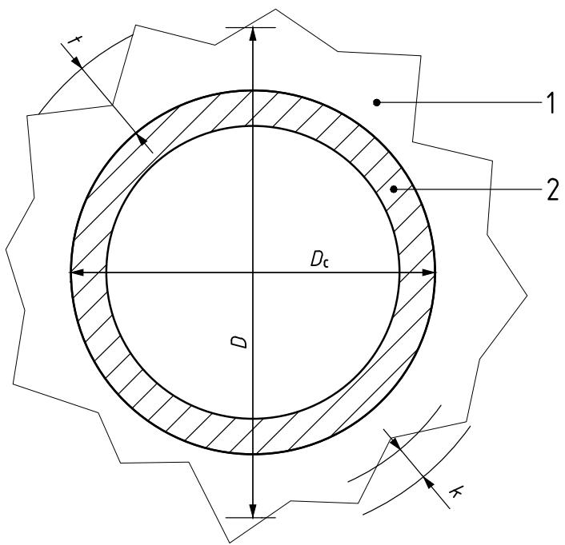  
Figure A.9.5-1 — Definition of surface roughness height and thickness

Key

1 hard growth   
2 member
t average marine growth thickness   
k average marine growth peak to valley height   
D effective component diameter, $D = { D_{ \mathrm{ { c } } } } + 2 \mathrm{ { } } t$   
$D_{ \mathrm{ c } }$ diameter of clean member   
e relative roughness, $e = k / D$

A.9.5.2.3 Drag and inertia coefficients

A.9.5.2.3.1 General

In the ocean environment, hydrodynamic action predicted by Morison's equation is only an engineering approximation. Morison's equation can match measured drag and inertia actions reasonably well in any particular half wave cycle with the constants, $C_{ \mathrm{ d } }$ and $C_{ \mathrm{ m } } ,$ but the best fit values of $C_{ \mathrm{ d } }$ and $C_{ \mathrm{ m } }$ vary from one half wave cycle to another. Most of the variation in $C_{ \mathrm{ d } }$ and $C_{ \mathrm{ m } }$ can be taken into account by expressing $C_{ \mathrm{ d } }$ and $C_{ \mathrm{ m } }$ as functions of:

— relative surface roughness e = k/D   
— Reynolds number $R_{ \mathrm{ e } } = U_{ \mathrm{ m } } D / \upsilon$   
— Keulegan-Carpenter number $K_{ \mathrm{ c } } = U_{ \mathrm{ m } } T / D$   
— current/wave velocity ratio $r_{ \mathrm{ ~ \normalfont ~ = ~ } } U_{ \mathrm{ c } } / U_{ \mathrm{ m o } }$

where

$k$ is the average roughness height;   
$D$ is the effective diameter (including marine growth);   
$U_{ \mathrm{ m } }$ Um is the maximum speed (including current) normal to the cylinder axis in a wave cycle;   
υ is the kinematic viscosity of water;   
$T$ is the wave period;   
$U_{ \mathrm{ c } }$ is the current speed measured in-line with the waves;   
$U_{ \mathrm{ m o } }$ is the maximum wave-induced orbital velocity.

A.9.5.2.3.2 Surface roughness

The dependence of the steady-flow drag coefficient at post-critical Reynolds numbers $\left( C_{ \mathrm{ d } s } \right)$ on relative surface roughness is shown in Figure A.9.5-2 for “hard” roughness elements. Where applicable, the data in this figure have been adjusted to account for wind tunnel blockage while the drag coefficient has been referenced to the effective diameter, $D ,$ including the roughness elements.

Natural marine growth on structures generally has a relative surface roughness, $e > 10^{ - 3 }$ . Thus, in the absence of better information on the expected value of surface roughness and its variation with depth for a particular site, it is reasonable to assume $C_{ \mathrm{ d } s }$ in the range 1,00 to 1,10 for all members below high tide level. It is still necessary to estimate the thickness of marine growth that ultimately accumulates to estimate D. For elements above high tide level, a reasonable estimate of surface roughness is $k = 0 , 05$ mm, which gives $C_{ \mathrm{ d } s }$ in the range of $^{ 0 , 6 }$ to 0,7 for typical diameters.

All the data in Figure A.9.5-2 are for cylinders that are densely covered with surface roughness elements. Load measurements, see References [A.9.5-12] and [A.9.5-13], show that there is little degradation in the effectiveness of surface roughness for surface coverage as sparse as 10 %, but that roughness effects are negligible for surface coverage less than 3 %.

The effect of soft, flexible growth on $C_{ \mathrm{ d } s }$ is poorly understood. Tests reported in Reference [A.9.5-14] indicate that:

— soft, fuzzy growth has little effect, as $C_{ \mathrm{ d } s }$ is predominantly determined by the underlying hard growth;   
— anemones and kelp produce drag coefficients similar to those for hard growth.

For cylindrical elements whose cross-section is not circular, $C_{ \mathrm{ d } s }$ may be assumed to be independent of surface roughness. Suitable values are provided in Reference [A.9.5-15].

Surface roughness also affects the inertia coefficient in oscillatory flow. Generally, as $C_{ \mathrm{ d } }$ increases with roughness, $C_{ \mathrm{ m } }$ decreases. More information is provided in subsequent discussions.

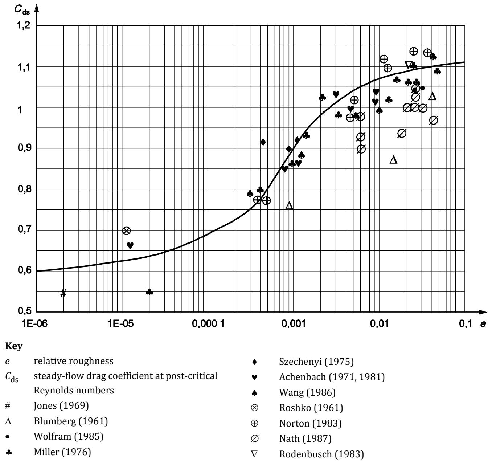  
Figure A.9.5-2 — Dependence of steady flow drag coefficient on relative surface roughness

A.9.5.2.3.3 Reynolds number

Hydrodynamic coefficients for elements whose cross-sections have sharp edges are practically independent of Reynolds number. However, circular cylinders have coefficients that depend on Reynolds number.

For most offshore structures in an extreme design environment, Reynolds numbers are well into the postcritical flow regime, where- $C_{ \mathrm{ d } s }$ for circular cylinders is independent of Reynolds number. However, in less severe environments, such as those considered in fatigue calculations, some platform members can drop,,``,` into the critical flow regime. Use of the post-critical` $C_{ \mathrm{ d } s }$ in these cases would be conservative for static calculations of wave actions but non-conservative for calculating damping of dynamically excited``- structures.-````

In laboratory tests on scale models of structures with circular cylindrical members, one should be fully aware of the dependence of $C_{ \mathrm{ d } s }$ on Reynolds number. In particular, the scale of the model and the surface

roughness should be chosen to eliminate or minimize Reynolds number dependence, while the difference between model-scale and full-scale $C_{ \mathrm{ d } s }$ should be considered in the application of model test results to full scale structures. Further guidance on the dependence of circular cylinder $C_{ \mathrm{ d } s }$ on Reynolds number can be found in References [A.9.5-16], [A.9.5-8] and [A.9.5-5].

A.9.5.2.3.4 Keulegan Carpenter number

Keulegan-Carpenter number, $K_{ \mathrm{ c } } ,$ is a measure of the unsteadiness of the flow. It is proportional to the distance normal to the member axis travelled by an undisturbed fluid particle in a half wave cycle, normalized by the member diameter. For a typical full-scale space frame structure in design storm conditions, - $K_{ \mathrm{ c } }$ is generally greater than 40 for members in the “wave zone”, and drag action is predominant over inertia action. However, for large diameter legs that can be found on self-floating `,,,``, structures,`,,,, ` $K_{ \mathrm{ c } }$ can be less than 10, and inertia action is predominant over drag action.

The parameter-`-` $K_{ \mathrm{ c } }$ is also a measure of the importance of “wake encounter” for nearly vertical (within $15^{ \circ } { }$ of vertical) members in waves. As the fluid moves across a member, a wake is created. When oscillatory ``,,,` flow reverses, fluid particles in the wake return sooner and impact the member with greater velocity than -- undisturbed fluid particles. For larger $K_{ \mathrm{ c } } ,$ the wake travels further and decays more before returning to the cylinder and is less likely to strike the cylinder at all if the waves are multidirectional or if there is a component of current normal to the principal wave direction. For very large $K_{ \mathrm{ c } } ,$ , wake encounter may be neglected. For smaller $K_{ \mathrm{ c } } ,$ wake encounter amplifies the drag action for nearly vertical members above its quasi-steady value estimated from undisturbed fluid velocities.

Figure A.9.5-3 shows data for the drag coefficient $C_{ \mathrm{ d } }$ that are most appropriate for calculating hydrodynamic actions on nearly vertical elements in extreme storm environments. All these data were obtained in the post-critical flow regime, in which $C_{ \mathrm{ d } s }$ is practically independent of the Reynolds number. All data account for wave spreading, i.e. all have two components of motion normal to the element axis. All data, except the data from “figure of $8^{ \prime \prime }$ orbits, implicitly account for random wave motion. The field data also naturally include an axial component of motion and, to some extent, a steady current. For $K_{ \mathrm{ c } } > 12_{ \mathrm{ \iota } }$ , with $K_{ \mathrm{ c } }$ normalized by $C_{ \mathrm{ d } s } ,$ the data for smooth and rough cylinders are reasonably well represented by a single curve in Figure A.9.5-3, as suggested by the far-field, quasi-steady wake model described in Reference [A.9.5-17].

Figure A.9.5-4 shows drag coefficient data for $K_{ \mathrm{ c } } < 12$ , which are more appropriate for calculating hydrodynamic actions on nearly vertical members in less extreme sea states and drag damping in earthquake-excited motion. For $K_{ \mathrm{ c } } < 12 ,$ , the smooth and rough cylinder data are similar if $K_{ \mathrm{ c } }$ is not normalized by $C_{ \mathrm{ d } s } .$ The data in Reference [A.9.5-18] do not agree well with the curves in Figure A.9.5-4, presumably because of the relatively low Reynolds numbers in the tests for the lowest values of $K_{ \mathrm{ c } }$ and because of the lack of wave spreading in the tests for the higher values of $K_{ \mathrm{ c } } .$ .

The symbols shown in Figure A.9.5-3 do not represent individual data points. Rather, they represent values from a curve fitted through a scatter of data points. When designing a structure consisting of a single isolated column, the scatter in the $C_{ \mathrm{ d } }$ data should be considered. The data in Reference [A.9.5-18] for one dimensional, sinusoidally oscillating motion, which are notably omitted from Figure ${ \tt A } . 9 . 5 { \cdot } 3 ,$ , represent a reasonable upper bound. For a structure consisting of many members, the scatter in $C_{ \mathrm{ d } }$ may be neglected, as the deviations from the mean curve are uncorrelated from member to member, see Reference [A.9.5-19].

Figures A.9.5-5 and A.9.5-6 show data for the inertia coefficient, $C_{ \mathrm{ m } } ,$ for a nearly vertical circular cylinder. Figure A.9.5-5 shows that $C_{ \mathrm{ m } }$ for both smooth and rough cylinders approaches the theoretical value of 2,0 for $K_{ \mathrm{ c } } \leq 3$ . For $K_{ \mathrm{ c } } > 3$ with the onset of flow separation, $C_{ \mathrm{ m } }$ begins to decrease. With the exception of rough cylinder data given in Reference [A.9.5-18], which exhibit a pronounced drop (“inertia crisis”) in $C_{ \mathrm{ m } }$ at $K_{ \mathrm{ c } } \approx 12$ , it appears that a single sloping line is adequate for both smooth and rough cylinders up to $K_{ \mathrm{ c } } \approx 12$ , beyond which smooth and rough cylinder data begin to diverge. In Figure A.9.5-6, the single line from Figure A.9.5-5 is seen to split into two lines because $K_{ \mathrm{ c } }$ is divided by $C_{ \mathrm{ d } s } = 0 { , } 66$ for smooth cylinders and $C_{ \mathrm{ d s } } = 1 , 1$ for rough cylinders. The value of $C_{ \mathrm{ m } }$ is taken as 1,6 for smooth cylinders and 1,2 for rough cylinders for $K_{ \mathrm{ c } } / C_{ \mathrm{ d s } } { \geq } 17$ .

Although Figures A.9.5-3 to A.9.5-6 are based on circular cylinder data, the figures are also applicable to non-circular cylinders, provided the appropriate value of $C_{ \mathrm{ d } s }$ is used and $C_{ \mathrm{ m } }$ is multiplied by $C_{ \mathrm{ m } 0 } / 2$ , where $C_{ \mathrm{ m } 0 }$ is the theoretical value of $C_{ \mathrm{ m } }$ for the non-circular cylinder as $K_{ \mathrm{ c } }  0$ .

Furthermore, while Figures A.9.5-3 to A.9.5-6 were developed for use with individual, deterministic waves, they can also be used for dynamic analysis (either in the time or in the frequency domain) of fixed structures by using significant wave height and spectral peak period to calculate $K_{ \mathrm{ c } } .$ .

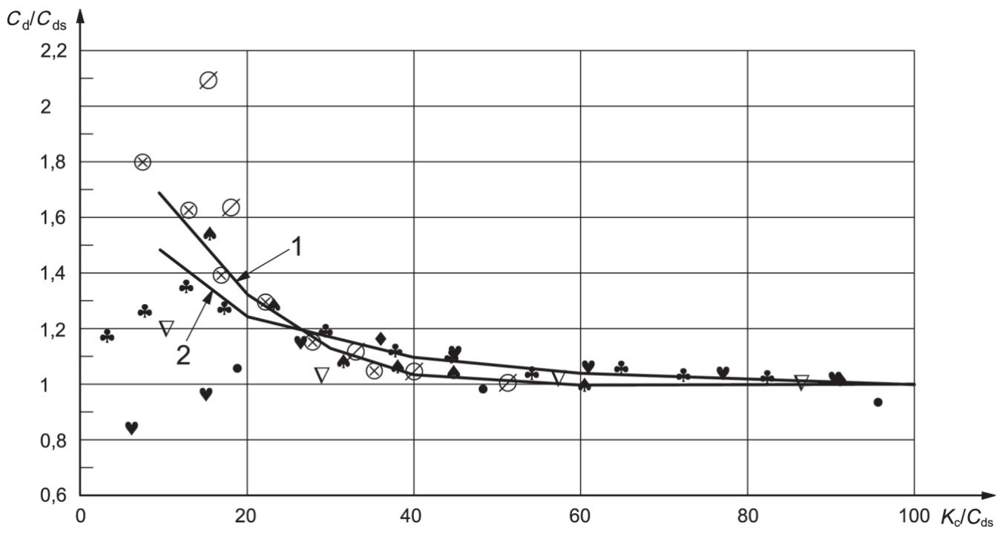  
Figure A.9.5-3 — Wake amplification factor for drag coefficients as function of $K_{ \mathrm{ c } } / C_{ \mathrm{ d } s }$

Key

1 rough member （$C_{ \mathrm{ d } s } = 1 \mathrm{ , } 2 )$   
2 smooth member （$C_{ \mathrm{ d } s }^{ } = 0 \mathrm{ , } 6 )$   
$K_{ \mathrm{ c } }$ Keulegan-Carpenter number   
$C_{ \mathrm{ d } }$ drag coefficient   
$C_{ \mathrm{ d } s }$ steady-flow drag coefficient at post-critical Reynolds numbers   
 Heideman （$1979 ) , C_{ \mathrm{ d } s } = 1 , 00$   
 Heideman (1979), $C_{ \mathrm{ d } s } = 0 { , } 68$   
 Bishop (1985), $C_{ \mathrm{ d } s } = 0 { , } 66$   
 Rodenbusch (1983), $C_{ \mathrm{ d s } } = 1 , 10$ random directional   
Rodenbusch (1983), $C_{ \mathrm{ d } s } = 0 { , } 66$ random directional   
 Rodenbusch (1983), $C_{ \mathrm{ d s } } = 1 , 10$ figure 8 orbits   
Rodenbusch (1983), $C_{ \mathrm{ d } s } = 0 { , } 66$ figure 8 orbits   
Ohmart & Gratz (1979), $C_{ \mathrm{ d } s } = 0 { , } 66$ figure 8 orbits

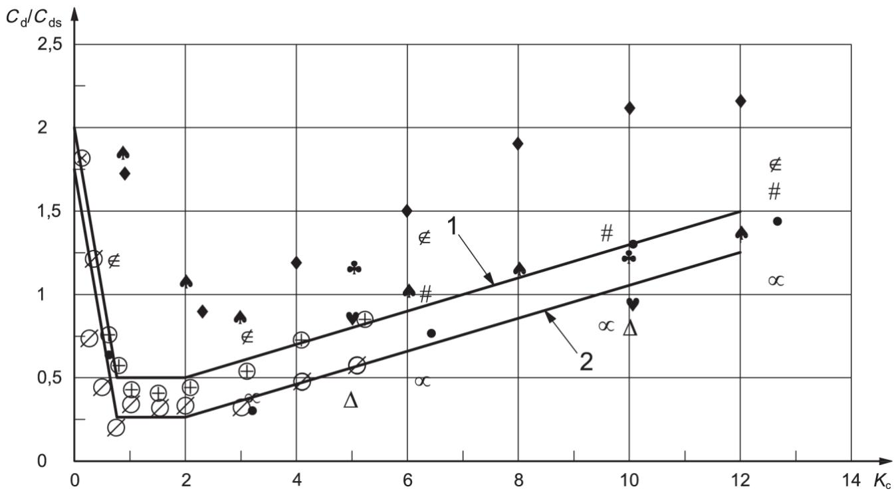  
Figure A.9.5-4 — Wake amplification factor for drag coefficients as function of $\pmb{ K }_{ \pmb{ c } }$

Key   


| 1 | rough member (Cds=1,2) | Δ | Bearman (1985), Cds=0,60 |
| --- | --- | --- | --- |
| 2 | smooth member (Cds=0,6) | ∉ | Rodenbusch (1983), Cds=1,10 sinusoidal |
| Kc | Keulegan-Carpenter number | ● | Rodenbusch (1983), Cds=0,66 sinusoidal |
| Cd | drag coefficient | ◆ | Sarpkaya (1986), Cds=1,10 |
| Cds | steady-flow drag coefficient at post-critical Reynolds numbers | ▲ | Sarpkaya (1986), Cds=0,65 |
| Cds | steady-flow drag coefficient at post-critical Reynolds numbers | ∞ | Garrison (1990), Cds=0,65 |
| ♣ | Rodenbusch (1983), Cds=1,10 random directional | ⊕ | Marin (1987), Cds=1,10 |
| ♥ | Rodenbusch (1983), Cds=0,66 random directional | # | Garrison (1990), Cds=1,10 |
| ♥ | Rodenbusch (1983), Cds=0,66 random directional | ∅ | Marin (1987), Cds=0,60 |
| ♥ | Rodenbusch (1983), Cds=0,66 random directional | ⊗ | Iwaki (1991), Cds=1,10 |


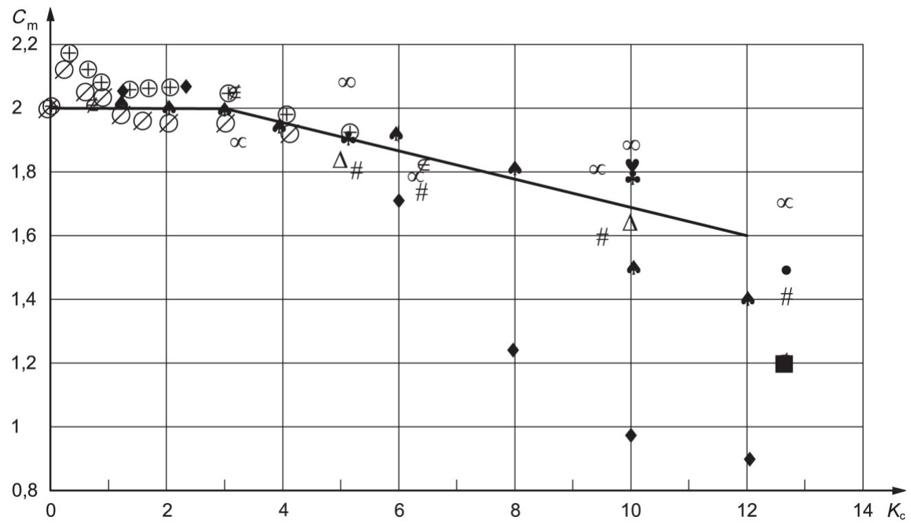  
Figure A.9.5-5 — Inertia coefficient as function of $K_{ \mathrm{ c } }$


| Kc | Keulegan-Carpenter number | ● | Rodenbusch (1983), Cds=0,66 sinusoidal |
| --- | --- | --- | --- |
| Cm | inertia coefficient | ◆ | Sarpkaya (1986), Cds=1,10 |
| ♣ | Rodenbusch (1983), Cds=1,10 random directional | ♠ | Sarpkaya (1986), Cds=0,65 |
| ♥ | Rodenbusch (1983), Cds=0,66 random directional | ∞ | Garrison (1990), Cds=0,65 |
| Δ | Bearman (1985), Cds=0,60 | ⊕ | Marin (1987), Cds=1,10 |
| ≠ | Rodenbusch (1983), Cds=1,10 sinusoidal | # | Garrison (1990), Cds=1,10 |
| ∞ | Bishop (1985), Cds=0,66 random directional | ∅ | Marin (1987), Cds=0,60 |
|  |  | ⊗ | Iwaki (1991), Cds=1,10 |


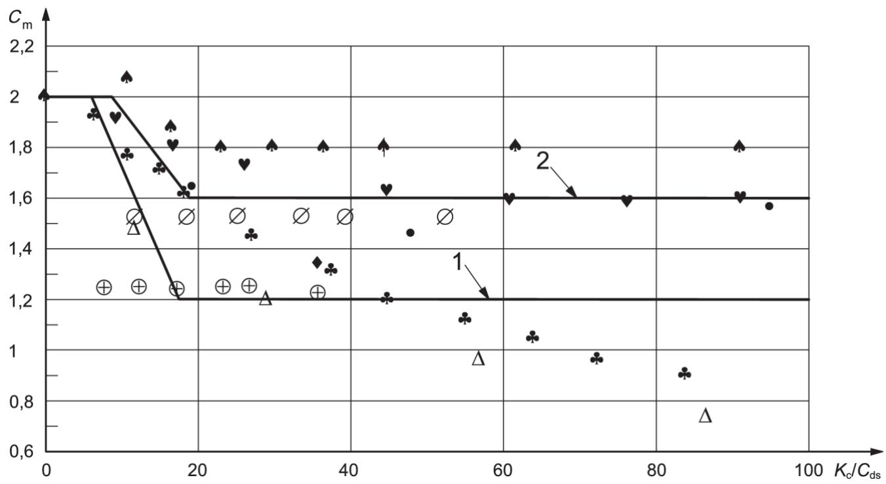  
Figure A.9.5-6 — Inertia coefficient as function of $K_{ \mathrm{ c } } / C_{ \mathrm{ d } s }$

Key   


| 1 | rough member (Cds=1,1) | ♥ | Rodenbusch (1983), Cds=0,66 random directional |
| --- | --- | --- | --- |
| 2 | smooth member (Cds=0,66) | Δ | Rodenbusch (1983), Cds=1,10 sinusoidal |
| Kc | Keulegan-Carpenter number | ● | Rodenbusch (1983), Cds=0,66 |
| Cds | steady-flow drag coefficient at post-critical Reynolds numbers | ♣ | Ohmart & Gratz (1979), Cds=0,60 |
| Cm | inertia coefficient | ♠ | Bishop (1985), Cds=0,66 |
| ♣ | Rodenbusch (1983), Cds=1,10 random directional | ⊕ | Heideman (1979), Cds=1,00 |
| ♣ | Rodenbusch (1983), Cds=1,10 random directional | ∅ | Heideman (1979), Cds=0,68 |


A.9.5.2.3.5 Current/wave velocity ratio

The effect of a steady in-line current added to oscillatory motion is to push $C_{ \mathrm{ d } }$ toward $C_{ \mathrm{ d } s } ,$ its steady flow value. Data show that, for practical purposes, $C_{ \mathrm{ d } } = C_{ \mathrm{ d } s }$ when the current/wave velocity ratio (r) is greater than $^{ 0 , 4 . }$ For $r < < 0 , 4_{ \scriptscriptstyle \mathrm{ i } }$ , the effect of a steady in-line current can be accommodated by modifying the Keulegan-Carpenter number. A first order correction would be to multiply Kc due to wave alone by

$$1 + 1, 6 r + 0, 8 r^{2} \quad \text{f o r} 0 <   r <   0, 4 \tag{A.9.5-1}$$

A current component normal to the wave direction also drives $C_{ \mathrm{ d } }$ toward $C_{ \mathrm{ d } s } ,$ since it reduces the impact of wake encounter. Data show that, for practical purposes, $C_{ \mathrm{ d } } = C_{ \mathrm{ d } s }$ for $V_{ \mathrm{ N } } T_{ \mathrm{ i } } / C_{ \mathrm{ d } s } D > 8 .$ . On the other hand, wake encounter has nearly its full impact for $V_{ \mathrm{ N } } \ T_{ \mathrm{ i } } / C_{ \mathrm{ d s } } D < 1$ . Here, $V_{ \mathrm{ N } }$ is the component of the current velocity normal to the wave direction and $T_{ \mathrm{ i } }$ is the intrinsic wave period.

A.9.5.2.3.6 Member orientation

For members that are not nearly vertical, the effect of wake encounter, as characterized by the K dependence shown in Figures A.9.5-3 to A.9.5-6, is small. For horizontal and diagonal members, it is sufficient to use the theoretical value of $C_{ \mathrm{ m } }$ at $K {  } 0$ and the steady flow value of $C_{ \mathrm{ d } } = C_{ \mathrm{ d } s } \mathrm{ a t } K_{ \mathrm{ c } } {  } { \infty }$ .

A.9.5.2.4 Current blockage

In general, no space frame or lattice type structure is totally transparent to waves and current. These structures cause global distortion of the incident waves and of the current in and around the structure. Since global hydrodynamic action is calculated by summing hydrodynamic actions on individual members, it is important that the correct local incident flow be used to calculate the hydrodynamic action on individual members to account for global distortion effects.

Space frame structures distort the waves, as well as the current. Some field data indicate that the rootmean-square wave orbital velocity very near the structure is slightly reduced from that several structure widths up-wave. However, this reduction is not evident in all the data. Until more evidence to the contrary is accumulated, it is appropriate to continue with the assumption that a typical space frame structure does not significantly distort the incident wave kinematics in a global sense.

For currents, however, there exists a substantial body of evidence that demonstrates a reduction of the current flow within space frame structures relative to the free stream current. The amount of blockage depends on the type of structure. For dense structures, such as those with a large number of conductors, the blockage effect can be large, while for very transparent structures it can be small. Laboratory and field data indicate that the blockage factor can be as low as 0,6 for a dense structure (e.g. Lena guyed tower [A.9.5-20]), approximately 0,7 for a typical compliant tower [A.9.5-21], and approximately 0,75 to 0,85 for a typical four- to eight-legged space frame structure [A.9.5-22]; see Table A.9.5-1. Figure A.9.5-7 shows the measured current field at 18 m depth around and through the eight-legged Bullwinkle platform during a Loop Current event in the Gulf of Mexico in 1991 [A.9.523]. The average blockage factor within the structure computed from the data is $^{ 0 , 77 }$ .

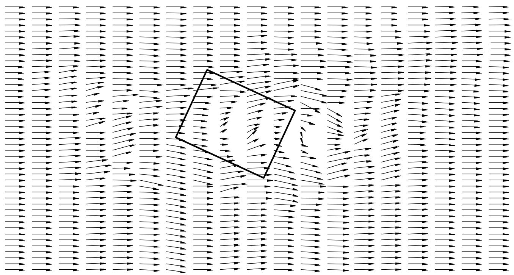  
Figure A.9.5-7 — Current blockage flow — Current vectors computed from Doppler measurements

Table A.9.5-1 — Approximate factors for typical tubular space frame structures   


| Number of legs | Wave heading | Current blockage factor |
| --- | --- | --- |
| 3 | all | 0,90 |
| 4 | end-on | 0,80 |
| 4 | diagonal | 0,85 |
| 4 | broadside | 0,80 |
| 6 | end-on | 0,75 |
| 6 | diagonal | 0,85 |
| 6 | broadside | 0,80 |
| 8 | end-on | 0,70 |
| 8 | diagonal | 0,85 |
| 8 | broadside | 0,80 |


For structures with other configurations or structures with an atypical number of conductors, a current blockage factor can be calculated using the method described in this subclause. Factors calculated to be less than 0,7 should not be used without supporting empirical evidence. For free-standing or braced caissons and tripod structures, the current blockage factor should be 1,0.

The blockage factor for steady current can be estimated from the “actuator disk” model [A.9.5-22] as

$$\left[ 1 + \sum_{i} \left(C_{\mathrm{d}} A_{\mathrm{r}}\right)_{i} / 4 \bar{A}_{\mathrm{r}} \right]^{-1} \tag{A.9.5-2}$$

where

$\sum_{ i } \bigl ( C_{ \mathrm{ d } } A_{ \mathrm{ r } } \bigr )_{ i }$ is the summation of the “drag areas” of all members (including horizontal members) in the flow;

${ \overline{ { A } }_{ \mathrm{ { r } } } }$ is the area within the perimeter area of the structure projected normal to the current.

For structures where geometry changes significantly with depth, the blockage factor can be computed for different depth levels. If the calculated reduction factor is less than 0,7, consideration should be given to modelling the structure as a series of actuator disks rather than a single actuator disk.

An alternative expression for the blockage factor based on a similar approach, but accounting for mixing downstream, is given in Reference [A.9.5-24]. In the case of small values of the ratio $\sum_{ i } ( C_{ \mathrm{ d } } A_{ \mathrm{ r } } )_{ i } / { \overline{ { A } } }_{ \mathrm{ r } }$ , the alternative expression reduces to Formula (A.9.5-2).

The terms “global blockage”, discussed in this subclause, and “shielding”, discussed in 9.5.2.5, are related and are sometimes used to describe the same phenomenon, as is the term interference. In this document shielding is used only with reference to members in the local wake of neighbouring members (such as conductor arrays), and the shielding factor should be applied to the calculated hydrodynamic action due to both waves and currents. “Blockage” is used in relation to the entire structure, and the blockage factor should be applied to the far-field current velocity only. The blockage factor is first used to calculate a reduced current velocity for the entire structure and then the reduced current velocity and undisturbed

wave kinematics are used in Morison's equation to calculate local hydrodynamic actions on all members. The calculated hydrodynamic action on conductors would then be further reduced by the shielding factor.

A.9.5.2.5 Conductor shielding factor

The empirical basis for the shielding factor for the hydrodynamic action on conductor arrays is shown in Figure A.9.5-8. Data from flow directions perfectly aligned with a row or column of the array are excluded for conservatism.

The data in Figure A.9.5-8 are from steady flow tests and oscillatory flow tests at very high amplitudes of oscillation. Thus, the factor is strictly applicable only in a steady current with negligible waves or near the mean water level in very large waves. The data in Reference [A.9.5-25] indicate that the factor is applicable if $A / S > 6$ , where A is the amplitude of oscillation and S is the centre-to-centre spacing of the conductors in the wave direction.

The data in Reference [A.9.5-26] indicate that the range of applicability can be expanded to $A / S > 2 { , } 5$ . For lower values of $A / S ,$ there is still some shielding until $A / S < 0 , 5 [ { \tt A } . 9 . 5 { - } 25 ]$ . With $A { \approx } U_{ \mathrm{ m 0 } } T_{ \mathrm{ i } } { / } 2 \pi$ , where $U_{ \mathrm{ m } 0 }$ is defined in A.9.5.2.3 and $T_{ \mathrm{ i } }$ is the intrinsic wave period, respectively, the approximate shielding regimes are as follows:

a) $A / S > 2 , 5 ,$ asymptotic shielding, factor from Figure A.9.5-8;   
b) $0 , 5 < A / S < 2 , 5$ , partial shielding;   
c) $A / S < 0 { , } 5 ,$ no shielding, factor = 1,0.

In the absence of better information, the shielding factor in the partial shielding regime for any value of $S / D$ may be linearly interpolated as a function of $A / S ,$ between the factor from Figure A.9.5-8 for $A / S = 2 { , } 5$ and 1,0 for $A / S = 0 { , } 5$ . Waves considered in fatigue analyses can lie in the partial shielding regime.

NOTE See also A.9.5.2.4 for the relationship of shielding to current blockage.

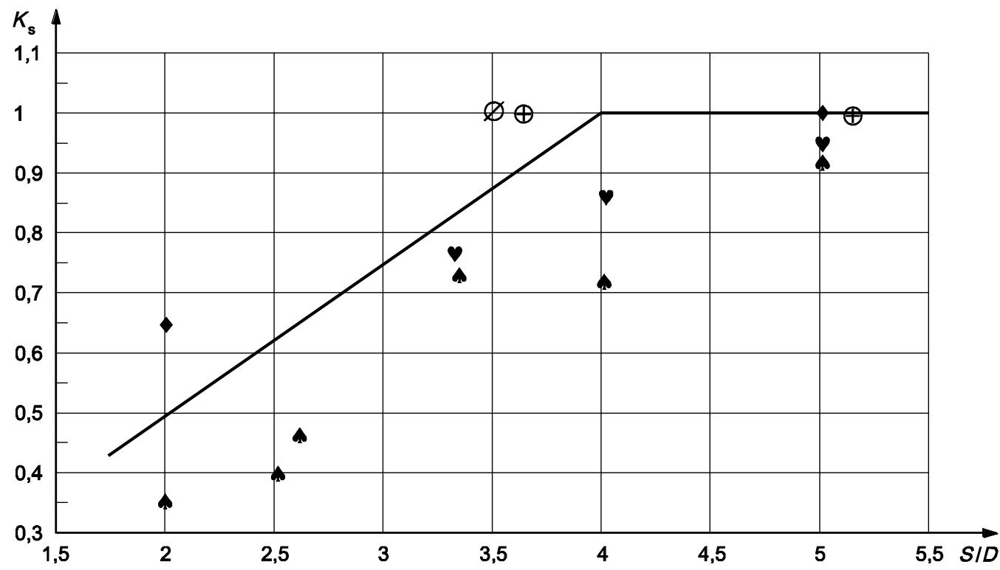  
Figure A.9.5-8 — Shielding factor for actions due to waves on conductor arrays as function of conductor spacing

Key   


| S | conductor spacing | ◆ | Heideman (1985) waves (K=250) and current |
| --- | --- | --- | --- |
| D | conductor diameter | ◆ | Reed (1990) current |
| Ks | shielding factor | ⊕ | Beckman (1979) waves and current |
| ♥ | Reed (1990) waves (K=126) | ∅ | Sterndorff (1990) waves |


A.9.5.3 Hydrodynamic models for appurtenances

The hydrodynamic model of a structure is used for the calculation of hydrodynamic actions that represent the global hydrodynamic action on the actual structure. The model does not explicitly need to include every component of the structure, provided the dimensions and/or hydrodynamic coefficients of the components included account for the contribution of the omitted components to the global hydrodynamic action. The hydrodynamic model should account for the effects of marine growth and for flow interference effects (blockage and shielding), where appropriate.

Appurtenances include components, such as boat landings, fenders or bumpers, walkways, stairways, grout lines and anodes. Although it is beyond the scope of this annex to provide modelling guidance for every appurtenance, some general guidance is provided.

Boat landings generally consist of a large number of closely spaced tubular members. If the components are modelled individually, shielding effects, depending upon the wave direction, may be considered in a similar manner to those for conductor arrays. Alternatively, boat landings may be modelled as either rectangular solids or as one or more plates, with directionally dependent hydrodynamic properties. Guidance for hydrodynamic coefficients for solid shapes and plates can be found in Reference [A.9.5-15].

Conductor guide frames may also be modelled as rectangular solids or, if appropriate, as plates. In both cases, different coefficients are appropriate for vertical and horizontal fluid flow.

Large fenders or boat bumpers and their supports are usually modelled as individual members. They may be treated as non-structural members, provided that their design has been shown to be adequate for their intended purpose. Walkways, stairways and grout lines may be modelled using equivalent circular members.

The treatment of anodes depends upon their number and size. Anodes may be modelled as equivalent circular cylinders. Alternatively, hydrodynamic actions on anodes may be approximated by increasing the diameters and/or hydrodynamic coefficients of the components to which they are attached.

A.9.6 Actions caused by current

No guidance is offered.

A.9.7 Actions caused by wind

A.9.7.1 General

No guidance is offered.

A.9.7.2 Determining actions caused by wind

Shielding and shape coefficients for individual components, modules and lattice structures are described in Reference [A.9.7-1].

A.9.7.3 Wind actions determined from models

No guidance is offered.

A.9.8 Equivalent quasi-static action representing dynamic response caused by extreme wave conditions

A.9.8.1 General

The conditions specified in 9.8 are generally not satisfied in comparatively light sea states. However, while dynamic response in light sea states can be important for checking of fatigue, it generally does not govern structural design for strength. Therefore, the principle of using an equivalent quasi-static action may, under the conditions stated, be applied to extreme metocean conditions.

A.9.8.2 Equivalent quasi-static action （$D_{ \mathbf{ e } } )$ representing the dynamic response

The equivalent quasi-static action, $D_{ \mathrm{ e } } ,$ is determined at a global level and subsequently distributed over the height of the structure to produce the approximately correct extreme dynamic base shear and overturning moment in the design sea state. Structural design may then proceed as for a quasi-statically responding structure, using design actions that are modified to account for dynamics. This makes design of dynamically responding structures in accordance with the conditions specified in 9.8.1 practical and yet entirely adequate.

The magnitude of $D_{ \mathrm{ e } }$ should be such that the probability of the total extreme dynamic response due to $\left( E_{ \mathrm{ w c e } } + D_{ \mathrm{ e } } \right)$ is approximately the same as that of the quasi-static response due to $E_{ \mathrm{ w c e } }$ alone. The conditions given in 9.8.1 ensure that phase differences between the dynamic and the quasi-static responses are small enough to assume that this is achieved.

For structures with a sufficiently short fundamental natural period, when compared to the predominant excitation periods present in extreme wave conditions, $D_{ \mathrm{ e } }$ may be neglected entirely. However, dynamic response depends on several factors and it is difficult to make a universal statement as to when dynamic response is negligibly small. Generally speaking, dynamic response increases as the fundamental natural period of the structure increases and moves closer to the period of the peak of the design wave spectrum, thereby entering a range of periods where the wave spectrum has noticeable energy. Studies, as well as a history of successful performance, indicate that fixed structures of space frame configuration with fundamental natural periods shorter than 2,5 s to 3,0 s experience only a few percent dynamic amplification in the design sea state. For such structures, dynamic amplification may be neglected. However, these observations should not be generalized to other types of structure or to other design situations.

See 12.5 for further information and guidance on dynamically responding structures and how dynamic behaviour should be treated.

Dynamic response can also be influenced by the following:

a) Cancellation or reinforcement of wave action due to the spatial separation of members in the space frame, particularly between the legs. Structures that do not benefit from this effect, such as small structures with closely spaced legs or one leg only, are therefore potentially more susceptible to dynamic response from short period waves than large space frame structures. For these cases, the conditions given in 9.8.1 are not generally satisfied and the influence of dynamics should be assessed more carefully in accordance with Clause 12.

NOTE When directional spreading is taken into account, cancellation/reinforcement effects are reduced.

b) Higher harmonic frequency components of the hydrodynamic action originating from non-linear drag ,``-`-` actions and free surface inundation effects. These effects require special evaluation if significant.

The indirect approach for the determination of $D_{ \mathrm{ e } }$ presented in 9.8.2 b) uses a global dynamic analysis to-`,,, estimate the dynamic amplification factor, $k_{ \mathrm{ D A F , B S } } ,$ for base shear, where $k_{ \mathrm{ D A F , B S } }$ is the ratio of the dynamic base shear to the static base shear. In time domain analyses, $k_{ \mathrm{ D A F , B S } }$ can be estimated by taking the average of the values of $k_{ \mathrm{ D A F , B S } }$ for a few dozen short wave segments that include the design wave. A robust method of deducing $k_{ \mathrm{ D A F , B S } }$ from time domain analyses is to plot order statistics of dynamic response and quasi-static response to the same realization of the design sea state. The ratio of the dynamic to quasistatic response, at the level of the exceedance probability of the design wave in the sea state, can be used to obtain a reliable estimate of $k_{ \mathrm{ D A F , B S^{ \cdot } } } D_{ \mathrm{ e } }$ should then be distributed over the height of the structure to form a set of inertial actions, $d_{ \mathrm{ k } } ,$ that is added to the metocean actions at the elevations, k. This distribution may be done in proportion to the fundamental mode shape of the structure. The procedure is as follows:

$$D_{\mathrm{e}} = \sum_{k = 1}^{K} d_{k} = \sum_{k = 1}^{K} \alpha_{1} \omega_{1}^{2} m_{k} \phi_{1 k} = \alpha_{1} \omega_{1}^{2} \sum_{k = 1}^{K} m_{k} \phi_{1 k} \tag{A.9.8-1}$$

$$d_{k} = \alpha_{1} \omega_{1}^{2} m_{k} \phi_{1 k} = \frac{m_{k} \phi_{1 k}}{K} \cdot D_{\mathrm{e}} \tag{A.9.8-2}$$

where

$D_{ \mathrm{ e } }$ is the extreme dynamic base shear minus the extreme quasi-static base shear;   
$d_{ k }$ is the inertial action at elevation k （$k = 1 , 2 , \ldots K )$ ;   
$\alpha_{ 1 }$ is a scale factor for the first mode shape (in length units);   
$\omega_{ 1 }$ is the first natural frequency of the structure;   
$m_{ k }$ is the lumped mass at elevation $k ;$   
$\phi_{ 1 k }$ is the non-dimensional displacement of the first mode shape at elevation k.

This results in a set of distributed actions, $d_{ k } ,$ that reproduces the dynamic base shear, but generally not the dynamic overturning moment at the same time.

The above procedure for the equivalent quasi-static base shear may also be applied to the equivalent quasi-static overturning moment $M_{ \mathrm{ e } }$ to determine an analogous distribution. This results in Formulae (A.9.8-3) and (A.9.8-4):

$$\begin{array}{l} M_{\mathrm{e}} = \sum_{k = 1}^{K} d_{k} h_{k} = \sum_{k = 1}^{K} \beta_{1} \omega_{1}^{2} m_{k} \phi_{1 k} h_{k} = \beta_{1} \omega_{1}^{2} \sum_{k = 1}^{K} m_{k} \phi_{1 k} h_{k} (A.9.8-3) \\ d_{k} = \beta_{1} \omega_{1}^{2} m_{k} \phi_{1 k} = \frac{m_{k} \phi_{1 k}}{\sum_{k = 1}^{K} m_{k} \phi_{1 k} h_{k}} \cdot M_{\mathrm{e}} (A.9.8-4) \\ \end{array}$$

where, additionally,`,,, ``

$M_{ \mathrm{ e } }$ is the extreme dynamic overturning moment minus the extreme quasi-static overturning moment;   
$h_{ k }$ hk- is the height of mass point, $m_{ k } ,$ above the sea floor;   
$\beta_{ 1 }$ is a scale factor for the first mode shape (in length units).

As the scale factors, $\alpha_{ 1 }$ and $\beta_{ 1 } ,$ , are usually not the same, the dynamic overturning moment is now correctly reproduced, but the dynamic base shear is not.

Using both the magnitudes of $D_{ \mathrm{ e } }$ and $M_{ \mathrm{ e } } ,$ a linear combination of the first and the second mode may be used to determine a distribution of inertial actions such that both the dynamic base shear and the dynamic overturning moment are reproduced by the set of inertial actions. This is done in the following manner:

$$D_{\mathrm{e}} = \sum_{k = 1}^{K} d_{k} = \sum_{k = 1}^{K} \left(\gamma \omega_{1}^{2} m_{k} \phi_{1 k} + \delta \omega_{2}^{2} m_{k} \phi_{2 k}\right) = \gamma \omega_{1}^{2} \sum_{k = 1}^{K} \left(m_{k} \phi_{1 k}\right) + \delta \omega_{2}^{2} \sum_{k = 1}^{K} \left(m_{k} \phi_{2 k}\right) \tag{A.9.8-5}$$

$$M_{\mathrm{e}} = \sum_{k = 1}^{K} d_{k} h_{k} = \sum_{k = 1}^{K} \left(\gamma \omega_{1}^{2} m_{k} \phi_{1 k} h_{k} + \delta \omega_{2}^{2} m_{k} \phi_{2 k} h_{k}\right) = \gamma \omega_{1}^{2} \sum_{k = 1}^{K} \left(m_{k} \phi_{1 k} h_{k}\right) + \delta \omega_{2}^{2} \sum_{k = 1}^{K} \left(m_{k} \phi_{2 k} h_{k}\right) \tag{A.9.8-6}$$

$$d_{k} = \gamma \omega_{1}^{2} m_{k} \phi_{1 k} + \delta \omega_{2}^{2} m_{k} \phi_{2 k} \tag{A.9.8-7}$$

where, additionally,

$\gamma , \delta$ are scale factors for the first and the second mode shapes, respectively (in length units);   
$\omega_{ 2 }$ is the second natural frequency of the structure;   
$\phi_{ 2 k }$ is the non-dimensional displacement of the second mode shape at level k.

The two unknown scalars, γ and δ, are determined by solving the two Formulae (A.9.8-5) and (A.9.8-6) for $D_{ \mathrm{ e } }$ and $M_{ \mathrm{ e } }$ simultaneously, after which the set of inertial actions, $d_{ k } ,$ can be determined from Formula (A.9.8-7).

A.9.8.3 Global dynamic analysis in waves

A.9.8.3.1 General

The dynamic analysis is performed at a global level, for which purpose a suitably simplified structural model can be used, as appropriate. This subclause gives some guidance for performing the dynamic analysis.

A.9.8.3.2 Dynamic analysis methods

No guidance is offered.

A.9.8.3.3 Design sea state

Random waves are generally modelled as a linear superposition of a large number of sinusoidal (Airy) components, each with different amplitude, frequency and phase. For dynamic analyses, random waves can be modelled either in the time domain or in the frequency domain. Time domain simulation is usually considered the most general of the methods because non-linearities can be directly included. Results from such simulations therefore serve as a reference with which other approaches can be compared. Nonlinearities in the metocean actions arise from the squared drag term in Morison’s equation and the inundation effects as the wave surface moves from trough to crest. Non-linearities from the structural system come from a non-linear foundation, and from large displacements and yielding of members and joints. When linearization of these non-linearities can be justified, frequency domain analysis provides a very efficient and easy-to-interpret means of using random waves for the determination of global $k_{ \mathrm{ D A F } }$ factors.

In the frequency domain, each frequency component is considered separately, one at a time, and the response of the structure to that frequency component is determined. In this manner, a “frequency response function” is established, which is then multiplied by the wave spectrum of the design sea state to obtain the response spectrum. For linear problems, this frequency response function is independent of the amplitude chosen for each wave component. The influence of non-linearities may be included in an approximate manner if each wave component is modelled with a realistic finite steepness. However, for finite steepness, the linear (Airy) wave kinematics theory that applies below mean still water level should be modified accordingly. Extrapolation of the theory to elevations above still water level results in particle velocities that are (much) too high. Adequate models commonly employed use vertical extrapolation above the still water level: they include Wheeler (linear) stretching [A.9.8-1], and delta stretching [A.9.8-2]; see also ISO 19901-1.

NOTE Frequency response function is the most correct name for the response of a linear system to harmonic excitation: it is a complex-valued function of frequency having magnitude (the modulus) and phase (the argument). The frequency response function is often also called transfer function or response amplitude operator (RAO). In general, the transfer function also has magnitude and phase but in many cases, it refers more particularly to the magnitude (the modulus) only. RAO is by definition a scalar function associated with the modulus only.

In the time domain, the response of the structure to the simultaneously applied frequency components is determined in the form of a time series. Each component should be given an appropriate amplitude and phase before they are combined. Typically, the amplitudes are randomly selected from a Rayleigh distribution in accordance with the discretized design wave spectrum, while phases are randomly selected from a uniform distribution over 0° to 360°. A wave model thus derived is referred to as a simulation model. An alternative method is to determine the amplitude and phase of each component from a Fourier analysis of a measured wave elevation trace that corresponds with the design wave spectrum, if such a measured wave trace is available. Such a wave model is referred to as a conditional model. Other methods for selecting amplitudes and phases are the subject of research. Both a simulation and a conditional model require modification of the linear (Airy) kinematics, as with the frequency domain approach. A weakness of the simulation model, as it is usually applied, is that it produces a Gaussian water surface elevation and does not reproduce the skewness observed in real wave records (higher, sharper crests and shallower, flatter troughs). The conditional model incorporates these effects to some extent but cannot faithfully reproduce simultaneous wave traces at spatially separated points because the linear dispersion relationship does not propagate the components correctly. Random wave theories that account for the non-linear interactions between frequency components and the consequent effects on wave kinematics and wave propagation are under development [A.9.8-3]. Methods that include directional spreading of wave energy are also available.

A time domain simulation is a single realization (a sample of finite length) of the full population of an infinite number of possible realizations of infinite length that represent the underlying random process, regardless of whether a simulation or a conditional wave model is used. The interpretation of the results of one (or a few) time domain simulations (samples) and their use to derive statistical properties that provide correct and unbiased results for the underlying random process is far from straightforward. If these difficulties are not carefully managed, the potential error associated with the use of time domain simulations can be larger than the error involved in the linearization that is required when frequency domain methods are applied. When time domain simulation is applied, the use of order statistics as mentioned in A.9.8.2 is strongly recommended.

A.9.8.3.4 Hydrodynamic action on a member

For fixed structures, the relative velocity formulation of Morison's equation should not be used for regular or random waves. When the displacement of the structure is less than the diameter of a representative member and the motion of the structure is at a high frequency compared to the frequency(ies) of the wave(s), the motion of an individual member interacts with its own wake and does not develop the hydrodynamic actions predicted by the relative velocity formulation of Morison's equation (see A.9.5.2.3 and, for example, Reference [A.9.8-4]). Using relative velocity would have the same effect on the dynamic analysis as using too large a value of the damping. In this situation, as the damping force and the metocean action do not interact, the use of a formulation with absolute water particle velocities is more realistic. The associated viscous damping coefficient should be estimated in the absence of waves.

A.9.8.3.5 Mass

No guidance is offered.

A.9.8.3.6 Damping

Estimating damping coefficients is difficult; reliable data for relevant circumstances are extremely scarce, if available at all. However, for the conditions to which 9.8 applies, dynamic response is stiffness controlled, thus the influence of damping is moderated and the selection of a damping coefficient is not critical to the results. A value of 2 % to 3 % can be slightly conservative for extreme wave conditions but has little influence on $D_{ \mathrm{ e } } .$ For the lighter sea states that are relevant for fatigue analyses, the damping coefficient should be reduced to a value of 1 % to 2 % of critical.

A.9.8.3.7 Stiffness

For fixed structures, a linear stiffness model is normally sufficient; second order geometrical stiffness effects (so-called P-Δ effects) are only relevant for more flexible structures and do not normally need to be included in the global dynamic analysis. Linearization of the foundation stiffness, if required, should be performed at a suitable response level reflecting the response in the extreme sea state. For fatigue analyses it is generally appropriate to consider a lower response level and a correspondingly stiffer foundation.

When the objective is to determine a set of inertial actions for use with a non-linear ultimate strength (pushover) analysis, non-linear stiffness properties should be maintained.

A.9.9 Factored actions

A.9.9.1 General

No guidance is offered.

A.9.9.2 Factored permanent and variable actions

The partial factors presented in ISO 19902:2007, Table 9.10-1 for combined additive permanent, variable and metocean actions were derived using the calibration reported in Reference [A.9.1-3]. However, the partial factors for permanent and variable actions alone, or when combined with operating metocean actions, were initially selected to reflect API RP 2A practice at the time (see Reference [A.9.1-3 1980]), but were then confirmed, in Reference [A.9.1-3 1986], by requiring the use of the same partial factors for jacket design as for topsides design. As described in Reference [A.9.1-3 1986], these factors arose from a ‘brute force’ determination to the pair of gravity loading combinations specified in a draft of AISC LRFD [A.9.9-1]. This AISC standard was selected because, traditionally, the allowable stress design (ASD ≡ WSD) version [A.9.9-2] had been used in the Gulf of Mexico for topsides design.

In the determination of the partial permanent and variable action factors in Reference [A.9.1-3], no distinction was made between $G_{ 1 }$ and $G_{ 2 }$ or $Q_{ 1 }$ and $Q_{ 2 } ,$ , so the partial action factors are the same. Nevertheless, it was considered to be useful at the time to define these subsets, in which the actions have common degrees of uncertainty and durations of occurrence.

The component safety index calibration and partial factor derivation used the following statistical model: $G_{ 1 }$ and $G_{ 2 }$ had a $V_{ \mathrm{ R } } ,$ of 8 $\% , Q_{ 1 }$ and $Q_{ 2 }$ had a $V_{ \mathrm{ R } }$ of 14 % and in all cases the mean value was the nominal value. For the determination of the partial factors for situations dominated by permanent and variable actions, a range of ratios of permanent actions to variable actions was considered. However, when deriving the extreme metocean action partial factor, the internal force due to permanent and variable actions was assumed to be 25 % of $\left( G_{ 1 } + G_{ 2 } \right)$ and 75 % of $\left( Q_{ 1 } + Q_{ 2 } \right)$ .

For permanent and variable actions alone or when combined with operating metocean actions (ISO 19902:2007, Table 9.10-1), the partial factor determination resulted in a factor of 1,3 for permanent

actions and of 1,5 for variable actions. For components subjected to these design situations, these partial factors resulted in a smaller component safety index (β) when using LRFD practice compared with that found using WSD practice [A.9.1-3].

For additive permanent and variable actions combined with extreme metocean actions (ISO 19902:2007, Table 9.10-1), the partial factor determination [A.9.1-3] resulted in a factor of 1,1 for both permanent actions and variable actions. For components subjected to this design situation, these partial factors resulted in a larger component safety indices when using LRFD practice compared with those found using WSD practice [A.9.1-3].

Reference [A.9.9-3] describes a detailed study which concluded that, for permanent and variable actions combined with extreme metocean actions, the corresponding partial factors could be reduced from 1,1 --`, to 1,0 without compromising safety. The study involved:`,``,

— A critical review of four significant offshore structure component partial factor determinations, ,,,``-` References [A.9.1-3], [A.9.9-4], [A.9.9-5] and [A.9.9-6]. References [A.9.1-3] and [A.9.9-5] used a `, ``` simplified advanced first-order second-moment reliability analysis (AFOSM) methodology while,,`-- References [A.9.9-4] and [A.9.9-6] used first-order reliability methods (FORM): a FORM reliability analysis methodology is more accurate than a simplified AFOSM methodology.   
— The observation that the need for partial factors of 1,1 on permanent and variable actions when combined with extreme metocean actions was a direct result of the adopted reliability analysis methodology and that, if FORM had been used instead of a simplified AFOSM methodology, partial factors of 1,0 would have been found to be adequate.   
— A further observation that some of the partial resistance factors needed to be amended to demonstrate consistency with the tubular member strength formulations in Clause 13 and with corresponding experimental databases. In particular, the partial factor for tubular members subjected to compression could be reduced to 1,10 instead of the current value of 1,18 – further changes to resistance partial factors are discussed in A.13.   
— A comparative FEA study of two Gulf of Mexico platforms subjected to extreme metocean situations and assessed to API RP 2A WSD 21st Edition [A.9.9-7] and ISO 19902:2007 (using these modified partial factors) demonstrated that for tubular members with high utilizations (greater than 0,7), the ISO 19902 utilizations were always larger than the corresponding API 2A WSD utilizations.

This work was used to justify the revised partial action factors for the additive extreme metocean conditions in Table 9.10-1 of this document.

The partial action factors for extreme metocean conditions opposing gravity actions were first addressed in Reference [A.9.1-3 1980]. The main finding was that for piles in tension, adopting a partial factor of 0,8 on gravity actions led to higher and more consistent reliability indices under LRFD action combinations than found from adopting corresponding API 2A WSD provisions. Further, a higher reliability index was found for this tension case compared with the corresponding minimum value for piles in compression for the ‘additive’ condition. The same study and findings were repeated in Reference [A.9.1-3 1988], where the calculated reliability indices were based on the adoption of a partial resistance factor on tension (piles) of 0,8.

The publication of API 2A LRFD [A.9.1-1] showed two departures from the above partial factor determination, particularly for the opposing condition. Firstly, for dead load, a factor of 0,9 was adopted although the 0,8 factor was retained for live load. Secondly, a tension resistance factor of 0,95 was adopted instead of the 0,8 value used in the above studies. Neither change is discussed in the calibration studies [A.9.1-3] or in the Commentary to API 2A LRFD [A.9.1-1]. However, the LRFD Commentary does acknowledge that, for a resistance factor of 0,95, tubulars in tension have lower reliability indices than tubulars subject to other loading modes, but that the indices are still higher than the corresponding

API 2A WSD values. The Commentary further notes that indices for tension members lower than those for other loading modes are acceptable because the consequences of yielding are less severe than those associated with other loading modes, such as local buckling or overall instability.

A.9.9.3 Factored extreme metocean actions

A.9.9.3.1 Component-based partial factors

The numerical values of both the partial action factors and the resistance factors given in ISO 19902:2007 were adopted directly from API RP 2A LRFD [A.9.1-1] which, in turn, had been mostly derived by (reliabilitybased) calibration supported by a database of extensive Gulf of Mexico experience [A.9.1-3].

As can be seen from Table 9.10-1, the same partial factor applies to both the wind and wave components of the metocean actions, however, the calibration [A.9.1-3] considered only wave-induced actions. In the NBS-ANSI study [A.9.9-8], [A.9.9-9], which set the basis for the derivation of the partial factors in AISC 2A LRFD [A.9.9-1], the bias and coefficient of variation for maximum lifetime wind effects was found to be 0,78 and 37 % — similar to the 0,7 and 37 % used for the induced actions [A.9.1-3]. This fact plus the correlation of high winds with high waves (typical in the Gulf of Mexico) justifies the use of the same partial action factor for wind and waves.

For other geographical regions, to achieve designs with a safety level consistent with that of previous design practice in that area, derivation of $\gamma_{ \mathrm{ f , E } } ,$ and $\gamma_{ \mathrm{ f , D } } ,$ if applicable, should adopt the same calibration process as used in previous studies [A.9.1-3], [A.9.9-4], [A.9.9-5], [A.9.9-6] but using the FORM reliability analysis methodology presented in References [A.9.9-4] and [A.9.9-6]. These studies showed $\gamma_{ \mathrm{ f , E } } = 1 , 35$ to be generally conservative particularly in regions dominated by monsoons and extratropical storms. In the absence of such calibration, the extreme metocean partial action factors may be taken to be $\gamma_{ \mathrm{ f , E } } = 1 , 35$ and $\gamma_{ \mathrm{ f , D } } = 1 , 25$ .

This additional calibration work [A.9.9-4], [A.9.9-5], [A.9.9-6] confirmed that the long-term distribution of metocean actions is a function of the geographic location so that, for structures with similar geometrical and structural properties, location-dependent partial metocean action factors result.

A.9.9.3.2 System-based partial factors

In place of a component reliability-based derivation of the extreme metocean partial factor (calibration), a system based factor can be determined. This can be found by taking account of typical RSR values, such as that indicated in A.7.11.1.3, as well as allowances for other sources of structure reserve strength such as [A.9.9-10]:

— explicit codified safety factors;   
— implicit safety in standards;   
— actual material strength;   
— redundancy;   
— steelwork required for other (temporary) phases, e.g. transportation;   
— other design situations, e.g. fatigue, boat impact;   
— engineering practice, e.g. non-optimum member sizes.

The reliability associated with system strength is usually referred to as the system reliability. Appropriate reliability models for use in the determination of system reliability should include all the following distinguishing features:

a) metocean conditions: models that account for the joint probability of waves, currents and winds in defining the complete long-term distribution of the extreme metocean actions including the 100 year extreme parameters: both the modelling and physical uncertainty depend on the geographical area;   
b) wave load models: models that account for actions due to waves and incorporate a wave action recipe that accounts for the three-dimensional features of real seas and use realistic hydrodynamic coefficients;   
c) structural strength: model that accounts for the ultimate strength of the structural system rather than-`,,,` that of individual components.``,,,

A.9.9.3.3 `-`-`` Examples of RSR and partial action factor determinations

In the determination of partial factors, different geographic areas can require different treatment of the `--- modelling uncertainties associated with metocean data, both in relation to confidence in the design metocean action and the statistics of extreme actions.

References [9.9-4] and [9.9-11] report studies on the determination of extreme metocean partial action factor to facilitate the use of API RP 2A LRFD on North Sea and Mediterranean Sea structures, respectively, on the basis that the resistance factors derived in Reference [9.1-3] still applied to these different metocean regions.

References [A.9.9-12] and [A.9.9-13] present applications of SRA in the determination of system-based extreme metocean partial action factors. The reliability model, which was consistent with the guidance given in A.9.9.3.2, appeared to predict the failure rate of post-1977 structures in the Gulf of Mexico with a possible bias of over prediction. By using a consistent metocean loading model, the authors derived location-dependent partial action factors for three different geographic areas (Australia, North Sea and Gulf of Mexico).

Reference [9.9-5] reports a partial action and resistance factor determination for a preliminary draft of ISO 19902:2007. Statistical characterization of the basic variables was effectively the same as those in ISO 19902:2007.

Partial action factors for North-west European waters were also studied in References [A.9.9-6] and [A.9.9-10]. The relationship between partial action factor and RSR is reviewed in Reference [A.9.9-10]. The results of both studies suggest that a smaller metocean action factor than that adopted in ISO 19902:2007 is sufficient to achieve reliability levels consistent with those derived for the Gulf of Mexico.

The effects of introducing the metocean conditions specified in API Bulletin 2INT MET [A.9.9-14] are examined in Reference [9.9-15]: RSR and SRA are used in the work. Based on estimates of the numbers of platforms in the Gulf of Mexico in the decades 1980s, 1990s and 2000s and on recorded platform failures, the annual failure rate of post-1979 Gulf of Mexico platforms is found to be 3 × 10-3. API Bulletin 2INT MET [A.9.9-14] was replaced by API RP 2MET [A.9.9-16] in 2014 but the changes resulting from this new practice have no impact on the findings of Reference [9.9-15].

Reference [9.9-17] describes a study to derive extreme metocean partial action factors for three Malaysian waters’ regions assuming the use of ISO 19902:2007 for design and calibrated against API RP 2A WSD 21st Edition requirements. Different action factors were found for each region, all of which are less than the ISO 19902:2007 default metocean action factor.

A.9.9.3.4 Partial action factor $\gamma_{ \mathbf{ f } , \mathbf{ D } }$

$D_{ \mathrm{ e } }$ and $E_{ \mathrm{ e } }$ are assumed to act in the same direction, implying that the dynamic response is in phase with the applied metocean action. This is applicable to stiffness controlled dynamic response where the natural period is shorter than the predominant period of the applied loading, as discussed previously.

The 1,25 factor is based on a reliability analysis by Moses [A.9.1-3 1983]. Calibration of the permanent actions and the extreme quasi-static metocean action was repeated with the addition of another random variable, the inertial partial action factor （$\gamma_{ \mathrm{ f , i } } )$ . The random resistance was compared to the random internal force (S); thus S is due to the following $F_{ \mathrm{ d } } \mathrm{ . }$ :

$$F_{\mathrm{d}} = G + Q + E_{\mathrm{e}} \left(1 + \gamma_{\mathrm{f}, \mathrm{i}}\right) \tag{A.9.9-1}$$

where $G , Q , E_{ \mathrm{ e } }$ and $\gamma_{ \mathrm{ f , i } }$ are all random variables.

The term （$1 + \gamma_{ \mathrm{ f , i } } )$ is the ratio of the total dynamic (static and inertial) member internal force to the static member internal force due only to $E_{ \mathrm{ e^{ \prime } } }$ . The variable $\gamma_{ \mathrm{ f , i } }$ was taken to have a $V_{ \mathrm{ R } }$ of 60 %. The mean value of $\gamma_{ \mathrm{ f , i } }$ was taken to have a range $^{ 0 , 0 }$ to 0,8 to represent the fact that $\gamma_{ \mathrm{ f , i } }$ values of individual members can be considerably larger than for a global response, such as base shear. The factor of 1,25 ensures that in any of these cases, the safety index (β) for a member is at least as great as the case when $D_{ \mathrm{ e } }$ equals zero.

The results of the calibration and the determined value of $\boldsymbol{ \gamma }_{ \mathrm{ f , D } }$ depend on the degree of detail and refinement of the dynamic analysis performed. Some experience indicates that $\boldsymbol{ \gamma }_{ \mathrm{ f , D } }$ may be taken as 1,0, provided that the requirements of 9.8 and recommendations of A.9.8 are carefully followed.

A.9.10 Design situations

A.9.10.1 General considerations on the ultimate limit state

No guidance is offered.

A.9.10.2 Demonstrating sufficient RSR under metocean actions

No guidance is offered.

A.9.10.3 Partial factor design format

A.9.10.3.1 General

No guidance is offered.

A.9.10.3.2 Design actions for in-place situations

A.9.10.3.2.1 Design actions for operating situations

Where permanent and/or variable actions on the structure during temporary operating conditions are more severe than normal maximum operating conditions (e.g. crane lifts), it is generally appropriate to define limiting metocean conditions in which the particular mode of operation can proceed. These limiting metocean conditions should then be applied when determining the metocean action for that mode of operation.

Typically, a 1 year to 5 year winter storm is used as an operating wind, wave and current condition in the Gulf of Mexico. In the South China Sea, for example, 1 year return period conditions have traditionally been used. Since these are mild by comparison with the extreme conditions, they do not have an unduly severe impact on the design. In the North Sea, however, 1 year metocean conditions are relatively severe by comparison with 100 year conditions, and their use would have an unduly large impact on design. In this area, the operating condition is most commonly considered in conjunction with specific activities undertaken on the platform, e.g. running drill pipe or crane operations. The operating environment is consequently determined as being the maximum condition in which the associated activities can be undertaken, see ISO 19901-3.

“Operating metocean conditions” combined with permanent and variable actions (and without a onethird allowable stress increase) has been a load case (design situation) in API RP 2A WSD [A.9.1-2] since the first edition. This recognizes that some metocean actions due to wave, wind and current are generally present in combination with the maximum permanent and variable actions. For this reason, and because it is part of current Gulf of Mexico practice, an operating strength check was maintained in API RP 2A LRFD [A.9.1-1] and, therefore, in this document.

Unlike extreme metocean actions, the operating metocean actions were intentionally not tied to a specific return period in API RP 2A LRFD [A.9.1-1]. The partial factor calibration was performed without making use of the operating wind-wave-current case. The use of Formula (9.10-1) with $E_{ \mathbf{ o } }$ corresponding to “moderately severe conditions” in the Gulf of Mexico adds a small but uncalibrated increment to member size and safety for members loaded principally by permanent actions. Outside the Gulf of Mexico, if “moderately severe conditions” are defined as the same return period event, Formula (9.10-1) can be conservative beyond the original intention. Formula (9.10-1) can produce smaller design internal forces compared to API RP 2A WSD for certain cases, particularly for members that are subjected to mostly (but not 100 %) permanent actions in combination with an action due to operating metocean conditions $\left( E_{ \mathrm{ o } } \right)$ that exceed approximately 0,5 $E_{ \mathrm{ e } } .$

In API RP 2A LRFD, an overall partial action factor of 1,2 was selected to cover the analysis uncertainty that is associated with all action factors. Since the operational metocean check does not assess safety for unusual metocean actions but, instead, primarily for permanent actions, a factor less than 1,35 is appropriate. To generalize the intent of this result in an approximate manner to geographical areas other than the Gulf of Mexico, an additional reduction factor on the metocean actions is introduced, giving $\gamma_{ \mathrm{ f , E o } } = 0 , 9 \gamma_{ \mathrm{ f , E } } .$

A.9.10.3.2.2 Design actions for extreme conditions when the action effects oppose

The last line of Table 9.10-1 covers the situation of counteracting effects when two representative internal forces are similar in magnitude but opposite in sign, as discussed in A.9.9.2.

For brace members in the structure, an analogous case of counteracting effects exists. A calibration structure (Platform “C”) [A.9.1-3] was investigated for this phenomenon by looking at the most critical component in each design group. Although the partial action factors in Table 9.10-1 for extreme conditions when the action effects are additive serve to raise β compared to API RP 2A-WSD for opposing design situations, it was deemed prudent to have the values for when action effects oppose apply to all structure components to guard against low $\beta$ cases.

A.9.11 Local hydrodynamic actions

Morison's equation accounts for local drag and inertia actions but not for the “out-of-plane” (i.e. the plane formed by the velocity vector and the member axis) local actions caused by hydrodynamic lift due to periodic, asymmetric vortex shedding from the downstream side of a member. Hydrodynamic lift can be neglected in the calculation of global actions on the structure. Due to their high frequency, random

phasing, and oscillatory (with zero mean) nature, lift actions are not correlated across the entire structure. However, such lift actions should be considered for local member design, particularly for members high in the structure whose internal forces can be dominated by locally generated actions.

The oscillating lift actions can be modelled as a modulated sine function, whose frequency is generally several times the frequency of the wave, and whose amplitude is modulated with $U^{ 2 } ,$ where U is the time varying component of fluid velocity normal to the member axis. In the absence of dynamic excitation, the maximum amplitude of the local lift action, $F_{ \mathrm{ L , m a x } } ,$ per unit length of the member is related to the maximum value of U during the wave cycle $\left( U_{ \mathrm{ m a x } } \right)$ , by Formula (A.9.11-1):

$$F_{\mathrm{L}, \max } = C_{\mathrm{L}, \max } \cdot \frac{1}{2} \rho_{\mathrm{w}} D U^{2}_{\max } \tag{A.9.11-1}$$

The coefficient $C_{ \mathrm{ L , m a x } }$ has been found empirically [A.9.11-1] to have considerable scatter, with an approximate mean value of $C_{ \mathrm{ L , m a x } } \approx 0 { , } 7 ~ C_{ \mathrm{ d } }$ for both smooth and rough circular cylinders, and in both steady flow and waves with large Keulegan-Carpenter numbers. Reference [A.9.11-2] focuses on the rootmean-square (rms) value of the oscillating lift load, finding that it was less than half $F_{ \mathrm{ L , m a x } } .$

The frequency of the oscillating lift action is Sr $U_{ \mathrm{ t o t a l } } / D ,$ , where $S_{ \mathrm{ r } }$ is the Strouhal number and $U_{ \mathrm{ t o t a l } }$ is the total incident velocity, including the axial component. Laboratory tests [A.9.11-3], [A.9.11-1] have shown that $S_{ \mathrm{ r } } \approx 0 { , } 2$ for circular cylinders over a broad range of Reynolds numbers and flow inclination angles in steady flow. If $S_{ \mathrm{ r } }$ remains constant in waves, the frequency of the oscillating action varies as U varies with time during a wave cycle.

In the event that any natural frequency of a member is near the frequency of lift actions, a large amplitude dynamic response called VIV can occur. When VIV occurs, the motion of the member and the magnitude of the fluid dynamic actions can increase to unacceptable levels. VIV can occur on long spans due to actions caused by wind in the construction yard and on the tow structure, as well as by waves and currents on the in-place structure.

Horizontal members in the wave zone (between wave crest and trough elevations) of an in-place structure can experience actions due to wave slam. These nearly vertical actions are caused by the local water surface rising and impacting on the underside of the member as a wave passes. Since these actions are nearly vertical, they contribute very little to the base shear and overturning moment of the structure. However, actions due to slamming should be considered in local design of members in the wave zone.

Actions due to slamming can also occur on structural members overhanging a vessel while the structure is being towed, or on members that strike the water first during side launching of structures.

In the theoretical case, slamming actions are impulsive. If the slamming action is truly impulsive, the member can be dynamically excited. In the real world, the slamming action is possibly not impulsive because of the three-dimensional shape of the sea surface, the compressibility of air trapped between the member and the sea surface and the aerated nature of water near the free surface.

Slamming action, $F_{ s } ,$ per unit length may be calculated using Formula (A.9.11-2):

$$F_{s} = C_{s} \cdot \frac{1}{2} \rho_{\mathrm{w}} D U^{2} \tag{A.9.11-2}$$

where U is the component of water particle velocity normal to the member axis at impact.

Reference [A.9.11-2] shows empirically that the slamming coefficient lies between 0,5 and 1,7 times its theoretical value of π, depending on the rise time and natural frequency of the elastically mounted

cylinder in tests. Reference [A.9.11-4] recommends that if a dynamic response analysis is performed, the theoretical value of $C_{ s } = \pi$ may be used; otherwise, a value of $C_{ s } = 5 { , } 5$ should be used.

Additional information on slamming actions and dynamic response is provided in Reference [A.9.11-5].

Axial Froude-Krylov actions have the same form as the inertia action in Morison's equation, except that $C_{ \mathrm{ m } }$ is set to unity and the normal component of the local acceleration is replaced by the axial component. Such actions on members that are nearly vertical contribute negligibly to the structure's base shear and overturning moment. Axial Froude-Krylov actions on diagonal and horizontal braces are relatively more important, contributing approximately 10 % as much as the inertia action included in Morison's equation to base shear and overturning moment, based on computations in Reference [A.9.11-6]. In view of approximations made elsewhere in the computation of global metocean actions, axial Froude-Krylov actions can generally be neglected.

## A.10 Accidental and abnormal situations

A.10.1 General

Consideration should in particular be given to accidental events arising from vessel collision and dropped objects. The severity and likelihood of these accidental events depend on many factors, including operating environment, service vessel size, material handling equipment, operator qualifications and proximity to shipping lanes. The specified accidental design situations and associated design criteria for collisions and dropped objects should therefore depend on the platform location, operational procedures adopted and safety measures taken.

Design criteria for collisions and dropped objects are difficult to quantify for three reasons:

— the interaction of human and equipment error that combine to cause an accidental event cannot easily be quantified in probabilistic terms;   
— satisfying arbitrary or simplistic quantification rules is no guarantee that the required safety for a given accidental event can be achieved;   
— blindly satisfying simple rules can exclude the option of implementing potentially inexpensive preventive measures derived from a more in-depth understanding of the problem.

Where the consequences of an accidental event are very great, and the probabilities of events occurring are very low, preventive measures can serve to provide the required safety. For example, measures to prevent collision by tanker are acceptable if they are effective. Designing to resist a tanker collision is not a practical approach.

A.10.2 Vessel collisions

## A.10.2.1 General

No guidance is offered.

## A.10.2.2 Collision events

The kinetic energy of a vessel may be calculated using Formula (A.10.2-1):

$$E = \frac{1}{2} (a \times m) u^{2} \tag{A.10.2-1}$$

where

E is the kinetic energy of the vessel;   
a is the added mass coefficient, with a = 1,4 for a broadside collision, a = 1,1 for a bow/stern collision;   
m is the vessel mass;   
u is the velocity of vessel at impact.

The added mass coefficients given above are typical values for large (5 000 t displacement) supply vessels. For smaller vessels, a value slightly higher than 1,4 should be applied, e.g. 1,6 for a typical 2 500 t supply vessel.

The representative velocity and size of the vessels used for impact analyses should correspond to those used in the operation and servicing of the platform (e.g. supply boats). By way of example, for the northern North Sea, a vessel mass can be 8 000 t, whereas in the southern North Sea a mass of around 2 500 t is more normal. For Gulf of Mexico structures in mild environments and reasonably close to their base of supply, a 1 000 t vessel represents a typical 55 m to 60 m supply vessel. For deeper and more remote locations in the Gulf of Mexico, the vessel mass can be different. The masses of vessels that could collide with the platform when drifting out-of-control should be specifically considered.

The two energy levels specified for vessel impact analysis represent a frequent condition and a rare condition. The low energy level represents a serviceability condition based on economic considerations, and is intended to ensure that the structure does not require to be shut-in or need major repairs after minor collisions. The high energy level represents a rare condition and an ultimate limit state in which progressive collapse should not occur and the safety of personnel should be ensured, although the structure could be substantially damaged.

For low energy impacts, a vessel velocity of 0,5 m/s is commonly used, representing a minor accidental “bump” during normal manoeuvring of the vessel while loading or unloading or while standing alongside the platform. For high energy conditions, a vessel velocity of 2 m/s is commonly used, representing a vessel drifting out-of-control in a sea state with significant wave height of approximately 4 m.

## A.10.2.3 Collision process

Most ship impact analyses performed to date have used quasi-static methods based on energy absorption. However, when the duration of the collision is short, dynamic effects can be significant.

The collision duration depends on the size and configuration of both the structure and the vessel, and on the nature of the collision. Dynamic effects can be significant when the duration is of the same order or less than the structure's natural period. In such cases, an assessment of the dynamic behaviour during the collision should be considered.

Dynamic collision analyses can be carried out as time domain dynamic calculations in which the collision actions represent both the direct impact and the inertia of the structure. Because the two excitations do not attain their maximum value at the same time, the duration of the time simulation should be long enough to cover all relevant phases of the collision. Typically, the direct impact due to the collision attains its maximum value early during the collision, while the effects of inertia reach their maximum values later during the collision. Energy is absorbed in both the structure and the vessel, but additional absorption sources, such as energy imparted to platform vibration and energy dissipating from radiating waves generated as a result of the collision, can also be represented.

A.10.3 Dropped objects

No guidance is offered.

A.10.4 Fires and explosions

A number of documents address both hazard management in general (e.g. ISO 17776 [A.10.4-1]) and more specific issues associated with fires and explosions (e.g. ISO 13702 [4]).

The industry associations have produced their own more detailed guidance applicable to particular types of operation and circumstances and these include API [A.10.4-2], which can be used for Gulf of Mexico type platforms, Oil & Gas UK [A.10.4-3], which are suited to larger platforms operated in a safety case regime, and NORSOK Z-013 [A.10.4-4], which contains explicit analytical requirements.

A.10.5 Abnormal environmental actions

No guidance is offered.

A.10.6 Assessment of structures following damage

No guidance is offered.

## A.11 Seismic design considerations

A.11.1 General

No guidance is offered.

A.11.2 Seismic design procedure

No guidance is offered.

A.11.3 Seismic reserve capacity factor

In both the simplified and detailed seismic action procedures, the ALE return period is determined so that the structure/foundation system is expected to meet the target annual probability of failure. The ELE return period is then determined from the ALE event so that a balance exists between the ELE and ALE requirements, i.e. that the ratio of ALE to ELE spectral accelerations is approximately equal to the inherent static and dynamic reserve strengths of the design. Having this balance, a fixed steel structure that is designed for ELE should have a high likelihood of meeting the ALE design demand, so that costly design cycles can be avoided.

A good initial estimate for the seismic reserve capacity factor, $C_{ \mathrm{ r } } ,$ can ensure that a balance exists between the ELE and ALE requirements. If the initial estimate of $C_{ \mathrm{ r } }$ is too high, the ALE check can lead to major design modifications and costly design cycles. On the other hand, if the initial estimate of $C_{ \mathrm{ r } }$ is too low, the design would be conservative and the ALE design check could be easily met.

Aside from having a balance between the ELE and ALE requirements, the guidelines also require that the ELE design should lead to an economically viable structure, i.e. the structure should not be severely damaged when subjected to more frequent earthquakes than the ALE. This economic objective is presented in terms of minimum ELE return periods which depend on the platform exposure level (L1, L2

or L3). Because this economic objective is not explicitly checked in the simplified seismic action procedure, and to avoid ELE return periods that are too low, the $C_{ \mathrm{ r } }$ factor is limited to 2,8 for L1 structures, 2,4 for L2 structures and 2,0 for L3 structures.

A.11.4 Recommendations for ductile design

The recommendations given in 11.4 are mainly based on experience of seismic design of offshore ,`--- California (USA) structures and are consistent with Reference [A.9.1-1]. The industry has shown that `,``` these recommendations lead to structural/foundation designs that are ductile and have high seismic ,,``-` reserve capacity factors.

The legs of the structure should be designed against twice the design environmental action, E, during the--` ELE event. This is to ensure that braces fail before the legs and to avoid a premature collapse of the structure. For primary joints, it is desirable that braces achieve their full compressive or tensile strength before the joints fail. In lieu of the recommendation for designing joints in accordance with 14.2.3, the survival of joints against actions calculated in non-linear ALE time-history analyses may be demonstrated in accordance with 11.6.4. Using this procedure, joints should be checked for internal member forces at each time step of the time-history analysis.

A.11.5 ELE requirements

No guidance is offered.

A.11.6 ALE requirements

## A.11.6.1 General

No guidance is offered.

## A.11.6.2 ALE structural and foundation modelling

The foundation strength can have a large effect on the energy dissipation mechanisms within the structure-foundation system, and sensitivity to higher than expected soil stiffness should be investigated.

## A.11.6.3 Non-linear static pushover analysis

Dynamic time-history techniques may also be used to effectively replicate static pushover analyses, see for example Reference [A.11.6-1].

## A.11.6.4 Time-history analysis

No guidance is offered.

## A.12 Structural modelling and analysis

A.12.1 Purpose of analysis

No guidance is offered.

A.12.2 Analysis principles

## A.12.2.1 Extent of analysis

No guidance is offered.

## A.12.2.2 Calculation methods

Hand and spreadsheet calculations are generally limited to simple components of the structure (beams, regular panels, etc.) under simple actions. The methodology used should reflect standard engineering practice with due consideration for the conditions of equilibrium and compatibility. Elastic or plastic design principles may be adopted, dependent on the limit state being checked.

Analysis of the structural system and detailed assessment of its components is normally performed by FEA. FEA involves subdivision of the structure or a component into elements of known behaviour (e.g. beam, plane stress, plate bending, shell) and subsequent matrix solution on a computer. The method allows the behaviour of large and complex structures to be determined in terms of displacements, internal forces and stresses. Furthermore, once a computer model has been created, different types of analysis can be performed and repeated with ease.

Certain checks should be undertaken for each analysis, whether by hand calculations or by computer, to ensure that gross errors have not been made and the results are sufficiently accurate. Advice on such checking, and also on the validation and verification of structural analysis software, is given in Reference [A.12.2-1].

A.12.3 Modelling

## A.12.3.1 General

No guidance is offered.

## A.12.3.2 Level of accuracy

No guidance is offered.

## A.12.3.3 Geometrical definition for framed structures

## A.12.3.3.1 General

For steel space frame structures that respond statically, the influence of joint flexibility, offsets and eccentricities is discussed in A.12.3.3.1 to A.12.3.3.3 in terms of their effects on member forces and on member strengths. For dynamically sensitive structures, these factors can also affect the overall stiffness of the structure and hence the natural period. These aspects are also discussed in A.12.3.3.3.

Changes in dimensions as a result of design changes should be monitored during and after the completion of an analysis. Where these impact on the accuracy of the analysis, the changes should be incorporated and evaluated by reanalysis of the component or the complete structure. Ideally, the final analyses should reflect the as-built structure.

The secondary moments in the chord member of K- and X-joints are proportional to the product of the offset and the component of the axial brace forces that is perpendicular to the chord. The secondary moments may be neglected for joints where the diameter, D, of the chord is substantially greater than the diameters of the braces and where the offset is smaller than D/4. However, for joints where all members are of similar diameter, the secondary moments should be assessed. For a K-joint at the end of a chord

member, the angle between one of the braces and the chord is approximately 90° (sometimes called an N joint). In this case, the secondary moment cannot be distributed over the chord member on both sides of the joint, and the secondary moment may only be neglected if the offset is smaller than D/8.

## A.12.3.3.2 Member modelling

The contribution of the horizontal plan members to the global lateral stiffness when the structure is inplace depends on the arrangement of the structure framing. The horizontal plan members do, however, contribute to the global torsional stiffness and also add stiffness during temporary phases, such as loadout/lift, transportation and launch. Furthermore, they often provide lateral support to conductors and other appurtenances. Hence, the main plan bracing members should be regarded as primary structure.

Where secondary members transfer or attract significant actions, they may be represented by equivalent members, with appropriate stiffness and properties, such that the applied actions are appropriately apportioned to the surrounding primary framework. For example, conductor guide frames within the plan framing, which directly support the conductors, may be considered as secondary framework and modelled by equivalent members. The simplification can be used to reduce the complexity of the computer model, the complexity of data input, the amount of output and the potential for errors. Care should be taken to ensure that design situations (e.g. the wave crest positions) chosen for analysis are appropriate for the design of all classes of member, whether primary or secondary.

Modelling of structural components, such as mudmats, shear plates and conductor guides, can require finite element types other than beam elements (e.g. plane stress, plate bending, shell elements). Deck plating may be simulated in several ways, e.g. by truss (axial) elements to represent in-plane shear stiffness, by plane stress elements to represent both in-plane axial and shear stiffness, or by shell elements to represent membrane, shear and lateral bending stiffness.

The stiffness of appurtenances, such as launch rails (fitted to legs to provide a smooth launching), mudmats, J tubes, risers and skirt pile guides, should be included in the model if they contribute significantly to the overall stiffness of the structure. It should be possible to model appurtenances without oversimplification, although care should be taken to ensure that very short stiff members do not cause numerical ill-conditioning of the global stiffness matrix.

## A.12.3.3.3 Joint modelling

Joint flexibility does not significantly affect the primary axial forces in a simple framework [A.12.3-1]. , ``, ``, However, joint flexibility does modify member end bending moments and mid-span moments.,,`,`

In addition to modifying member bending moments, the inclusion of joint flexibility and member end-``,`` offsets can reduce the overall stiffness of the framework and thus increase the main periods of vibration,,,`-- by 3 % ̶ 6 % [A.12.3-1]. To avoid complex structural analysis, consideration of joint flexibility may be included by appropriate definition of the effective length (K) factors required to evaluate member strength, see 13.5. Similarly, the cross-section characteristics and the member end moments determine the moment reduction factor, $C_{ \mathrm{ m } , i^{ \prime } }$ for members subjected to combined axial compression and bending. Both K and $C_{ \mathrm{ m } , i }$ may be determined by separate rational analysis or prescribed conservative values in accordance with Table 13.5-1.

In a non-linear analysis to determine ultimate strength, joint flexibility should be considered and included, particularly if joint failure occurs before member failure and before the ultimate strength is reached. Joint failure results in the redistribution of internal forces.

## A.12.3.4 Modelling of material properties

In linear elastic analysis the material properties required to determine stiffness are elastic modulus, shear modulus and Poisson's ratio. To check the strength of members and joints, the SMYS and ultimate tensile strength are required.

In non-linear analysis, in which internal forces and/or stresses are monitored as the analysis proceeds, the material properties should be defined by the appropriate “true” stress-strain curves incorporating first yield, strain hardening and tensile fracture.

For frameworks, non-linear material behaviour may be formulated using the plastic hinge theory based on a yield surface, plastic flow normal to the yield surface and an expanding yield surface (strainhardening). The yield surface for a member is normally defined in terms of the axial yield strength, $P_{ \mathrm{ y } } ,$ and the plastic moment strength about the principal axes of the cross-section, $M_{ \mathrm{ P y } }$ and $M_{ \mathrm{ P z } }$ . Variables $P_{ \mathrm{ y } } ,$ $M_{ \mathrm{ P y } }$ and $M_{ \mathrm{ P z } }$ are all based on the yield strength from the “true” stress-strain curve.

For frameworks, tensile failure (fracture) of members and joints may be simulated by severing members.

## A.12.3.5 Topsides structure modelling

Detailed requirements for the topsides structure are given in ISO 19901-3.

## A.12.3.6 Appurtenances

Appurtenances, such as caissons or risers, are generally considered secondary structures. However, depending on their size and method of attachment to the structure, caissons and risers can provide a load path or can be subjected to action effects induced by relative movement between plan elevations arising from overall bending/sway of the structure. As the functionality of these components is critical for production containment or for safety reasons (e.g. fire water), their integrity should be given proper consideration.

## A.12.3.7 Soil-structure interaction

## A.12.3.7.1 General

Non-linear behaviour of a piled foundation arises from non-linear characteristics of the soil, second order axial force-displacement (P-Δ) effects and yielding in the pile. There are several ways of modelling single and group actions of piles, based on different implicit assumptions [A.12.3-2]. Their applicability depends on the importance of foundation characteristics in the overall response of the structure, the type of analysis (i.e. static in-place analysis, fatigue analysis, etc.) and the nature of the problem being studied (e.g. use of a detailed model for dealing with local effects).

To allow the soil to be modelled by a set of non-linear springs, simplifying assumptions are made regarding the stiffness, damping and added mass. Typically, it is assumed that the actions between the pile and soil at any level are independent of the deflections at any other level, that soil damping is part of the percentage critical damping assumed for the whole structure, and that the mass of soil acting with the piles has a negligible effect on the dynamic behaviour of the structure.

For well-spaced piles, interaction effects between piles need not be considered. However, for closely spaced piles, group behaviour should be considered, see A.12.3.7.2.

For approximate modelling of foundations and a preliminary estimate of pile behaviour, pile fixity may be assumed at a distance of 4 to 10 pile diameters below the sea floor (or depth of scour). Distances of 4 to 5 and 8 to 10 pile diameters are appropriate for stiff clays and very soft silts, respectively. Above this

level of fixity, the pile is modelled using its actual cross-section properties and without lateral support (i.e. no soil springs).

The use of a simple foundation model is allowed for determining the behaviour of the structure — one such model consists of a beam fully fixed at its lower end and two lateral springs and one torsional spring at the sea floor. The properties of the equivalent system are generally chosen to represent the secant stiffness of the foundation. They are determined by comparing the pile (group) stiffness matrix, with interaction between lateral and rotational movement, and the stiffness matrix for the equivalent system. When used for fatigue analysis, a single linearization for all design situations due to wave actions that are expected to cause the most fatigue damage is usually acceptable, in the knowledge that for some cases it can be over-stiff and for other cases over-flexible, but that the “average” stiffness is probably reasonable.

A full non-linear soil-structure interaction analysis combines a linear analysis of the structure with a nonlinear analysis of the piled foundation. The non-linear soil p–y, t–z and Q–z curves are represented by piecewise linear springs and the piles by a linear or beam-column formulation. The solution involves substructuring of the structure to connection nodes at the pile heads, a non-linear iterative solution of the foundation and structure to determine the pile head displacements, and back-substitution of these displacements into the reduced equations of the structure to determine the displacements throughout the structure. Both the finite difference and finite element methods have been adopted in offshore structural analysis programs for analysing piled foundations.

Where an estimate of an existing structure's stiffness is available via natural frequency measurements, this should be used as a basis for the calculation of foundation stiffness. Due account should be taken of the difference between the response of the foundation under normal and extreme situations. Any available driving records should also be reviewed for assessment of an existing structure.

## A.12.3.7.2 Pile groups

For closely spaced piles, interaction effects between piles should be considered as their capacity can differ from the sum of the individual piles. Soil failure around the whole group should be prevented.

A pile group may be modelled by simpler means, such as an equivalent single member with equivalent structural and foundation properties. Normally, a detailed analysis of the structural components within the pile group is required.

## A.12.3.7.3 Pile connectivity

No guidance is offered.

## A.12.3.7.4 Conductor modelling

No guidance is offered.

## A.12.3.7.5 Conductor connectivity

No guidance is offered.

## A.12.3.8 Other support conditions

In all static analyses, the structure is in equilibrium and should be prevented from rigid body movement. For launch and floating analyses, to suppress global motion in each of the six rigid body degrees of freedom (surge, sway, heave, roll, pitch and yaw) without inhibiting relative displacements within the structure, six restraints are necessary, one for each degree of freedom. Provided the applied actions are balanced and the structure is properly restrained, there should be no (or minimal) reactions at the

restraints. The structure should be similarly restrained for lift situations. It is preferable to provide six translational restraints (two parallel to each axis and arranged to inhibit free rotation as well as free displacement, this requiring three non-collinear nodes that have some form of translational restraint) rather than to suppress all six freedoms (three translations and three rotations) at a single node. This minimizes the effect of any imbalance in the actions, since a minor error in global moment, while insignificant in overall terms, can be significant when applied as a reaction at a single point in the structure.

## A.12.3.9 Local analysis structural models

Local analyses are structural analyses performed on a part or component of the overall structural system, their purpose being to provide a more accurate representation of the selected region than that provided by global analysis. They should typically provide more accurate information about the variation of section forces (or stresses) at complex regions of the structure. Local analyses may be non-linear in nature, where such effects are likely to include material yielding in areas of stress concentration at geometrical discontinuities.

The boundaries of a local analysis, and hence the extent of the local model, should be chosen so that displacements and/or forces from the model of the whole structural system (global analysis) can be readily applied as boundary conditions. The boundaries should be sufficiently far from areas of interest so that the forces and stresses in the areas of interest are not affected by any local effects at the boundaries due to the method of applying the boundary conditions or owing to any inaccuracies in the boundary conditions. For example, in a detailed FEA of a tubular joint the braces should extend approximately two brace diameters to three brace diameters away from the heel of the brace-chord intersection to ensure that the stresses at the intersection are not affected by the boundary conditions at the end of the brace.

Displacements, forces and stresses at nodes or across a finite element's boundaries are generally extracted from the global analysis to act as boundary conditions for the local analysis. Force boundary conditions should be used when the force distribution in the global analysis is considered to be correct.

The actions and boundary conditions applied to a local model should represent a self-equilibrating system. If the boundary conditions applied to a local model are extracted from an overall model, then the external actions applied to the idealization of the local model in the global analysis should also be applied to the local model (see A.12.3.10). Force and displacement restraints are both possible. Where it is uncertain which of these types of boundary condition is more appropriate, both should be used and the more onerous results retained.

Any significant actions within the boundaries of a local model should also be applied to the local model. This includes reactions due to support of the structure as well as other external actions. Such locally applied actions should be consistent with the corresponding actions in the global analysis from which the boundary conditions were obtained.

## A.12.3.10 Actions

Crane lift conditions are significant for sub-assemblies and are often best modelled by simulating the slings as pin-ended ties fixed at the crane hook point or points. Imbalance between sling forces may be incorporated by replacing selected slings with reaction forces calculated to support a percentage of the total lift weight, or by specifying artificial temperature increases in the pin-ended ties representing the slings. In most cases, additional fixity is required to restrain the structure against rigid body rotations about the hook point(s). It is common practice to determine the centre of gravity of the structure and align this vertically below the hook point.

During transportation, the structure is supported by external water pressure, either directly applied or through a transportation vessel. It is common practice to simulate this condition by applying the external water pressures as actions on the structure equal to and opposing all other actions (self-weight, ballast, towing, etc.). The effects of acceleration (roll, pitch and heave) and tilt of the structure are usually taken into account by applying various combinations of mass, acceleration(s) (varying in magnitude and direction) and actions from self-weight to a quasi-static model of the structure.

## A.12.3.11 Mass simulation

In FEA, “consistent” element mass matrices are generated if the same interpolation functions are used as in the evaluation of the stiffness matrix. A “consistent” mass matrix has off-diagonal terms, indicating coupling between the various element degrees of freedom.

An approximate mass matrix may be established by “lumping” (distributing) an element's mass to the nodal points defining its topology. Thus the total mass at a nodal joint represents the elementcontributing volume around the node. The use of lumped (or diagonal) mass matrices can have a considerable computational advantage in the solution of the dynamic equations of equilibrium. For an assessment of the global response of framed structures, the use of lumped masses instead of consistent masses is fully acceptable, as this has only a minor effect on the results of a dynamic analysis. For other structural configurations, or for an assessment of the response of individual components, the influence can be appreciably larger and a consistent mass matrix is recommended.

## A.12.3.12 Damping

In a similar way to mass simulation (see A.12.3.11), “consistent” damping matrices can be derived, but in`,,,` practice it is difficult, if not impossible, to determine the element damping parameters. Experimental -`-`` results indicate that structural damping is frequency dependent, suggesting that damping is dependent`,,,,` on displacement amplitude. Models that take this into account are a hysteretic model, which is suitable`,,,, for yielding materials, and a friction damping model, which is suitable for some soils (e.g. sand) and joints,,,`` where damping arises from friction between sliding surfaces [A.12.3-2].

Although hysteretic and friction damping are more representative of energy dissipation in an offshore structure, viscous damping is assumed for most analyses because it is mathematically more convenient and more important to model the correct energy loss per cycle than the exact mode(s) of damping. For damped vibration, viscous damping is usually expressed in terms of a damping factor, based on the ratio, $\xi = c / c_{ \mathrm{ c } } ,$ where c is a viscous damping coefficient and $c_{ \mathrm{ c } }$ is the critical damping. Critical damping is the amount of damping which separates the two types of response: over-damped decay without oscillation （$c / c_{ \mathrm{ c } } > 1 , 0 )$ and decaying sinusoidal response （$c / c_{ \mathrm{ c } } < 1 , 0 )$ .

The choice of damping factor can have a profound effect on the predicted response. Values of 2 % of critical and less have been suggested on the basis of full-scale measurements in low sea states. For extreme sea states, a value of 5 % of critical is commonly used and for extreme seismic events, where inelastic behaviour of both structure and foundation is likely, a value of 10 % can be applicable, provided such higher value can be substantiated for the case under consideration. In dynamic analyses for a fatigue assessment, damping factors of 1 % to 2 % are appropriate; see Clause 16.

Including structural velocities in the calculation of hydrodynamic drag actions increases the predicted total system damping. For non-compliant structures, this increase is included in the measured values and the damping based on relative velocities should not be used.

A.12.4 Analysis requirements

## A.12.4.1 General

No guidance is offered.

## A.12.4.2 Fabrication

No guidance is offered.

## A.12.4.3 Other pre-service and removal situations

A structural component (or an appurtenance attached to the structure) can be subjected to large slamming actions if the longitudinal axis of the component is nearly parallel to the water surface as it enters the water. The slamming actions may be determined using the same procedures used to determine slamming actions due to waves.

## A.12.4.4 In-place situations

## A.12.4.4.1 General

Combinations of permanent and variable actions, particularly those involving drilling and production equipment that can be added to, removed from or repositioned on the structure, should be defined carefully so that each structural component can be assessed for the most onerous design situation. Modern four-leg, vertical-pile structures, in particular, can experience net tension on the piles, and as the pile tension capacity is lower than its compression capacity, the tension case with minimum permanent and variable actions loading can control pile design.

The design of legs and primary framing, particularly diagonal bracing in vertical frames, is generally governed by the actions causing maximum base shear or maximum overturning moment. However, primary and secondary structural components in horizontal frames, especially when these are located in the vicinity of the splash zone, are generally not governed by these wave positions; see also A.12.4.4.2.

## A.12.4.4.2 Extreme metocean conditions

Internal forces in structural components are due to the force distribution associated with global actions as well as local actions on the component itself. It is often not obvious which combination of metocean parameters produces extreme global actions or what constitutes the most severe local situation for a particular structural component. Unless it is clear which wave directions and which crest positions govern the design of all structural components, it is generally necessary to adopt the following procedure:

a) Analyse eight wave directions corresponding to the main compass directions or the main directions relative to the structure. When there are significant differences in the metocean parameters from different directions, it is usual to align the longer axis of a platform with the prevailing or most onerous direction. Symmetry in structure geometry and in metocean conditions from opposite directions can reduce the analytical requirements but should be used with care as symmetry requirements are rarely fully satisfied.   
b) Step each wave through the structure using a sufficient number of wave positions (phase angles) relative to the structure, to capture the governing positions, ensuring that governing positions for all structural components are identified.

Wave directions and wave positions should be selected by considering the metocean parameters (e.g. wave direction, wave length, wave height) as well as the geometry of the structure (e.g. leg spacing, elevation of plan framing levels).

## A.12.4.4.3 Accidental situations

No guidance is offered.

## A.12.4.4.4 Seismic events

No guidance is offered.

## A.12.4.4.5 Fatigue analysis

No guidance is offered.

## A.12.4.4.6 Analysis for reserve strength

## A.12.4.4.6.1 Analytical software

Three basic types of analytical software are described in this subclause and are available for performing reserve strength analyses:

a) General-purpose non-linear finite element programs

With these programs, the equations of equilibrium are usually evaluated in the deformed condition and, because the beam element formulations generally do not incorporate geometric non-linearity at the element level, multiple beam elements along a member span are required to model global member buckling response accurately.

b) Non-linear beam-column space frame programs

These programs have specifically been written for the ultimate strength analysis of space frame structures. The elements embodied in this type of program have been derived to model beam-column behaviour, and therefore each member span only requires a single element to model buckling behaviour.

c) Phenomenological space frame programs

In a phenomenological model, the failure of individual elements is prescribed through force– deformation relationships that can be empirically related to the element geometry. Non-linear analysis is less intensive given these relationships are known prior to the analysis. However, this typically requires some prediction of the type of member behaviour prior to the analysis, and can include the following behaviour:

1) Elastic members

These are members that are expected to perform elastically throughout the analysis.

2) Axial force members

These are members that are expected to undergo tensile yielding or axial buckling during ultimate strength analysis.

3) Moment resisting members

These are members that are expected to yield during an ultimate strength analysis, primarily due to high bending stresses. They should be modelled with beam-column elements that account for the formation of plastic hinges. A plastic hinge occurs when the axial and bending forces acting on a cross-section of the beam lie on the yield surface as defined by an axial force-bending moment $\left( P / P_{ \mathrm{ y } } , M_{ \mathrm{ y } } / M_{ \mathrm{ P y } } , M_{ \mathrm{ z } } / M_{ \mathrm{ P z } } \right)$ interaction surface.

## A.12.4.4.6.2 Structural failure modes

Care should be taken that the buckling response of beam elements that are used in analyses of type a), b) or c) according to A.12.4.4.6.1 include the possibility of localized failure (local buckling).

The following types of structural failure modes can often be identified. The modelling should be able to describe these failure modes.

a) Geometrically brittle failure modes, in which only compression members are involved in the failure mechanism (Z- and K-braced structures) and the collapse strength of the framework is achieved at first compression member failure. An accurate model of elasto-plastic buckling can therefore identify the structure's peak ultimate strength, which generally occurs at relatively small deflections, after which redistribution of internal forces occurs. As the lateral deflections increase, portal frame action occurs. Eventually plastic hinges develop in the legs and a full portal frame failure mechanism occurs in the bay containing the failed compression member. Prior to collapse, the forces in the members are well defined and therefore the ultimate strength depends on the ability to predict the member’s compressive strength, which should be reasonably accurate provided the yield strength is correct and fabrication tolerances for out-of-straightness have been considered.   
b) Ductile failure modes, in which tension members are involved in the failure mechanism. Often, clear portal frame plastic failure mechanisms develop for which, at larger displacements when the internal forces in the compression member have been redistributed, the tensile member is the prime contributor to the collapse strength. In this state, the forces in all members of the failure mechanism are directly defined by equilibrium and the requirement to comply with plasticity limits. Again, it should be possible to predict the collapse strength and behaviour accurately.   
c) Other modes of structural failure, which are not as easily classified. In these failure modes, a progressive failure of members (and joints) occurs with a corresponding loss of global stiffness. At a certain level of actions, the global stiffness becomes zero and the ultimate strength is achieved. However, the deflections are still relatively small and a clear plastic portal frame failure mechanism has not yet developed. This is often seen in the failure mode for the diagonal wave attack direction of skirt pile structures; a corner leg in the bottom bay fails in compression and the global stiffness reduces to zero before a clear plastic failure mechanism develops.

The progressive collapse of a framework structure usually involves compressive and tensile member failures over complete spans. Localized failure (excluding brittle fracture) of a member's cross-section prior to global member failure does not occur often. Although joint failures can be viewed as localized failures, their failure prescribes the forces in and force redistribution from the attached members and hence can be effectively included in a component model of the members.

Material brittle failure modes should be avoided by specifying suitable steel toughness.

A.12.5 Types of analysis

## A.12.5.1 Natural frequency analysis

When performing a natural frequency analysis, solution techniques should enable all significant modes of vibration to be determined, i.e. both global and local modes of vibration. Methods involving the definition of a master set of nodes are generally not suitable because local modes are excluded when the stiffness and mass matrices for the complete structural system are condensed to the master nodes.

As predicted and measured natural periods of structures have sometimes been found to vary considerably, it is often prudent to shift the natural periods by as much as ±10 % to a more onerous value. This may be accomplished by adjusting mass or stiffness within reasonable limits. Where measured periods are available (e.g. for assessment of existing structures), the model may be modified to reflect the measured values (e.g. by adjusting the elastic modulus or the foundation stiffness).

## A.12.5.2 Dynamically responding structures

No guidance is offered.

## A.12.5.3 Static and quasi-static linear analysis

The two methods for determining the correction for dynamic effects are applicable if the excitation causing the dynamic effects can be considered to vary approximately harmonically in time. If the variation in time is essentially different from harmonic, the influence of dynamic effects should be specially considered.

Guidance on the two methods is given below:

a) The first method involves the determination of an equivalent set of quasi-static inertial actions that adequately represents the dynamic behaviour. When the dynamic response is caused by wave action, this method is described in 9.8 and A.9.8 at a global analysis level for base shear and/or overturning moment. When the dynamic behaviour is due to a cause other than wave action, the equivalent quasistatic inertial actions corresponding with that cause can be determined in an analogous manner. After adding the equivalent actions to the real actions, both factored by appropriate partial action factors, if required, one static analysis is performed. The action effects resulting from the static analysis are directly used in any further evaluation.

This method is particularly recommended for parts of the structure that are above the application of the dynamic actions. These parts do normally not experience any quasi-static action effects so when multiplied by a dynamic amplification factor [method b)], the quasi-static action effects are still negligible, whereas the properly calculated dynamic action effects resulting from inertial actions can be significant.

b) The second method is performed in the following three steps:

1) Determine the appropriate range of frequencies for which some influence of dynamic effects is expected to occur. For a number of discrete frequencies of excitation, $\omega_{ \mathrm{ e } } ,$ within this range a series of static analyses is performed. At each of these excitation frequencies the corresponding design actions are applied; note that the actions in general are different for different frequencies. The calculated action effects of interest at each frequency are the static responses $r_{ \mathrm{ s t a t } } ( \omega_{ \mathrm{ e } } )$ which, in general, are also a function of the frequency of excitation.

2) Determine the dynamic amplification factor (DAF), $k_{ \mathrm{ D A F } } ,$ for a single degree of freedom system (SDOF) for each frequency of excitation, $\omega_{ \mathrm{ e } } .$ The natural frequency of the SDOF system is the relevant natural frequency, $\omega_{ \mathrm{ n } } ,$ of the structural system, or structural part, that is responsible for the dynamic effect in the range of frequencies under consideration. The DAF is calculated using Formula (A.12.5-1):

$$k_{\mathrm{D A F}} \left(\omega_{\mathrm{e}}\right) = \frac{1}{\sqrt{\left(1 - \Omega^{2}\right)^{2} + \left(2 \cdot \xi \cdot \Omega\right)^{2}}} \tag{A.12.5-1}$$

where

$$\Omega \quad = \omega_{\mathrm{e}} / \omega_{\mathrm{n}};$$

$\omega_{ \mathrm{ e } }$ is the frequency of excitation for which a static analysis is performed;

ωn $\omega_{ \mathrm{ n } }$ is the relevant natural frequency of the structural system, or structural part, that is responsible for the dynamic effect;

ξ is the fraction of critical damping associated with the dynamic effects (see A.12.3.12).

$k_{ \mathrm{ D A F } }$ should not be smaller than 1,0, which corresponds to $\varOmega \leq{ \sqrt{ 2 } } .$ .

3) Determine the dynamically amplified responses, $r_{ \mathrm{ d y n } } ( \omega_{ \mathrm{ e } } )$ , from Formula (A.12.5-2):

$$r_{\mathrm{d y n}} \left(\omega_{\mathrm{e}}\right) = r_{\mathrm{s t a t}} \left(\omega_{\mathrm{e}}\right) k_{\mathrm{D A F}} \left(\omega_{\mathrm{e}}\right) \tag{A.12.5-2}$$

The action effect that should be used in the further evaluation is the most onerous value of $r_{ \mathrm{ d y n } } ( \omega_{ \mathrm{ e } } )$ within the range of excitation frequencies considered.

## A.12.5.4 Static ultimate strength analysis

The models used for describing tensile, compressive and bending ultimate strengths of tubular members and their cross-sections may be verified against the ultimate strengths derived from the formulae given in Clause 13, with all resistance factors set to 1,0. Differences can be checked to ensure that they fall within the range of expected scatter through statistics provided in Clause A.13. However, values greater than the mean of any distribution should be used with caution.

The post-buckling redistribution of forces, described by the axial force/axial shortening curve, should be verified to be kinematically correct, see References [A.12.5-1] and [A.12.5-2].

The model for combined compression and bending strength should, if possible, account for any reduction associated with local buckling of the cross-section. However, as local buckling does not usually occur in a well-designed structure until after member failure, local buckling is unlikely to affect the ultimate strength of a structural system. Guidelines are provided in Reference [A.12.2-1], which also provides information on the increased rate of redistribution of forces associated with local buckling of the crosssection.

Models for compressive strength and redistribution of forces should take account of the effects resulting from transverse hydrodynamic member actions. Some non-linear beam-column and phenomenological space frame analysis programs only consider concentrated actions at the ends of members (often known as joint loads). This is because internal forces and moments in a primary member are predominantly

caused by global frame behaviour and not by the hydrodynamic action imposed on the member itself. In these cases, local bending effects should be separately taken into account.

Hydrostatic pressure can reduce the strength of submerged buoyant members, and this should be taken into account in the modelling.

Phenomenological models for member behaviour generally require effective length (k) factors to be defined. The factors are used to establish the strength of members in compression in an ultimate strength assessment. Factors substantially lower than those specified in Clause 13 may be applied, if it can be demonstrated that they are both applicable and valid. It is suggested that, prior to performing pushover analyses, detailed elastic analysis be undertaken to determine accurate effective length factors; these factors are subsequently used in the pushover analyses. However, the effective length factors can require revision when joints begin to fail and there is a loss of member end restraint.

When creating structural models for a non-linear analysis, due consideration should be given to out of straightness, out-of-roundness and locked-in forces arising from the methods of fabrication (see Annex G).

Typical foundation failure modes to be checked include pile punch-through, pile pullout and pile lateral failure. These are failure mechanisms that are unlikely to be influenced by variations in the local flexibility/stiffness of the framework. It is therefore possible to capture each of these three failure modes using simple strength models, where detailed modelling of the foundation using beam-column elements for the pile and non-linear springs for the soil by p–y, t–z and Q–z curves is not required. A description of foundation failure modes is given below:

a) Pile punch-through or pile pullout

This occurs when the applied actions produce an overturning moment that results in a pile head axial force that exceeds the pile capacity in compression (punch-through) or tension (pullout). The capacity is determined by the skin friction strength given by t–z curves and, for pile compression, by end bearing strength given by Q–z curves, see ISO 19901-4. The yield strength of the pile usually exceeds the pile capacity, and therefore full axial plasticity is unlikely to form in the piles. As piles pullout or punch through, force redistribution in the piles and/or the structure can occur, depending on whether the soil maintains or loses its strength.

This type of pile failure occurs if the steel framework is stronger than, or of similar strength to, the foundation. If stronger, only the piles fail; if similar, a combined framework and foundation failure mechanism can occur with the component failures in the framework being influenced by redistribution of the forces in the piles.

b) Pile lateral failure

This occurs when the applied actions produce a shear force in a pile that cannot be resisted by the lateral p–y resistance of the upper layers of soil. This results in excessive lateral movement of the piles and, therefore, additional bending moments, which combine with the existing pile axial forces to cause yielding and plastic hinges in the piles.

This type of failure can occur if the steel framework is sufficiently stiff and strong against lateral movement and the upper layers of the soil are relatively weak. When the soil fails, a portal frame mechanism develops in the piles below the sea floor with plastic hinges occurring at the sea floor and at some distance below the sea floor. When the portal frame failure mechanism has developed, the structure in the failed area is effectively statically determinate as the forces in the piles are defined by their plastic capacity and equilibrium. Since most of the energy dissipated is associated with plastic hinge deformation in the piles, it is unlikely that the joint flexibility and/or local variation in the stiffness of the framework can affect the pile lateral failure mechanism.

Variability in structural steel strength and the mechanical behaviour of steel structures is relatively well researched and can be rationally quantified, see References [A.12.5-3], [A.12.5-4] and [A.12.5-5]. The variability in behaviour of offshore piled foundations is significantly less well researched. Often, when reanalysing hurricane damaged structures, pushover analyses predict pile failures, although these have not been observed (see References [A.12.5-6] and [A.12.5-7]). Design values for axial and lateral pile performance appear to underpredict actual capacity and performance, and it appears that there is far more modelling and parameter uncertainty in the description of axial pile capacity and lateral pile performance than in the description of the steel structure's strength.

## A.12.5.5 Dynamic linear analysis

For a specific wave direction, the total action on a structure caused by waves depends on the wave frequency and the structure's geometry, e.g. leg spacing. Consequently, for certain wave frequencies, the total wave action can approach zero. If any one of these wave frequencies coincide with a natural frequency of the structure, the dynamic response would be artificially minimized. Care should therefore be taken when selecting waves for dynamic analysis to ensure that the calculation frequencies associated with artificially minimized wave actions do not coincide with the natural frequencies of the structure.

Dynamic analysis should not be limited to one wave direction. A minimum of three wave directions should be considered, i.e. end-on, broadside and diagonal wave directions.

## A.12.5.6 Dynamic ultimate strength analysis

The guidance given in A.12.5.4 is equally applicable to dynamic ultimate strength analysis.

A.12.6 Non-linear analysis

## A.12.6.1 General

Reference [A.12.2-1] gives guidance on non-linear analysis methods including representation of nonlinear member and joint behaviour.

With respect to an appropriate margin of safety, the following should be considered:

a) The accuracy of the non-linear model used should be documented against available 2-D and 3-D frame tests. On the grounds that few such tests exist so that, although it is possible to quantify the statistical bias (i.e. test value/value predicted by non-linear model), it is unlikely that a sensible measure of statistical uncertainty (i.e. standard deviation or coefficient of variation) can be derived. As an alternative measure, the accuracy achieved by the tubular member strength models with respect to corresponding experimental data may be used (see Clause A.13). Thus, a minimum $V_{ \mathrm{ R } }$ of 12 % should be adopted when analysing intact structures but 20 % when considering structures with damaged tubulars, either non-grouted or grouted.

To account for this non-linear (pushover analysis) modelling accuracy, it is necessary to increase the RSR when determined in accordance with the requirements of this document, so that the calculated value corresponds to the 5 % fractile of the calculated non-linear capacity. This is equivalent to an RSR of 1,85/[non-linear model bias × (1 – 1,645 × VR)] where $V_{ \mathrm{ R } }$ adopts, as a minimum, 0,12 for an intact structure and 0,20 for a damaged structure. The 1,85 factor is the value of RSR described in A.7.11.1.3 as $R_{ \mathrm{ R S , T y p } } ,$ i.e. the minimum acceptable value of RSR for a conventionally framed L1 structure.

b) If the actions being considered represent extreme design load levels (100 year return period), then action factors would be applied for a linear elastic analysis whereas, if the actions represent abnormal or accidental loading, action factors of unity would be appropriate. Thus, the necessary safety margin should account for the design situation being considered. For extreme design loading, the structure is not expected to suffer any damage whereas for abnormal/accidental loading, minor damage is permitted. Thus, when achieving the RSR demand in a), the extent of non-linearity should be carefully checked in ensure compliance with these differing demands.

## A.12.6.2 Geometry modelling

Most finite element formulations are based on polynomial functions which describe the deformation of an element in terms of the displacements and/or rotations at the nodes of the element. The same polynomial functions are often used to describe the element geometry in terms of its nodal coordinates. Increasing the order of the polynomial (linear, quadratic, cubic, etc.) generally improves the accuracy of the element so that fewer elements are required, for example, to model non-linear geometrical behaviour due to elastic buckling. However, sufficient elements should be used to simulate initial imperfections and the various modes of buckling, including buckling due to combined axial forces and bending moments and also lateral torsional buckling of open sections (e.g. I-beams) due to major axis bending. To model lateral torsional buckling, a minimum of two elements are usually required between each laterally restrained section of a member if the mode is essentially sinusoidal.

The requirements for finite element models are generally not applicable to phenomenological models.

The guidance in A.12.4.4.6 also applies to non-linear analysis.

## A.12.6.3 Component strength

No guidance is offered.

## A.12.6.4 Models for member strength

Member failure usually involves yielding of the material. In most finite element formulations, material behaviour is monitored at specific locations within an element; for beams, these would be the numerical integration points along the beam and various points over the cross-section, including the extreme fibres, at the integration points. The finite element mesh for critical members should therefore be defined so that there are integration points close to the positions of maximum internal member forces. Otherwise, the member strength is likely to be overestimated.

The same mesh requirement is applicable to non-linear finite element space frame programs based on plastic hinge formulations, when the internal forces are monitored at the integration points along a beam.

Special-purpose programs for framework analysis have been developed based on adaptive meshing techniques and also on phenomenological models (see A.12.4.4.6). Their performance is often more reliable than general purpose non-linear finite element programs. A thorough understanding of the theoretical background and limitations of a non-linear framework analysis should be gained before use.

## A.12.6.5 Models for joint strength

Joints which can participate in the failure mechanism, should be identified by an initial non-linear analysis assuming rigid joints and checking the joint strengths using the formulae given in Clause 14 with resistance factors set to 1,0. Joint non-linear behaviour may be modelled by uncoupled non-linear springs, individual springs being used for axial force, in-plane bending and out-of-plane bending, as these are the force components used to calculate joint strength. Infinitely stiff springs are usually adopted for shear and torsional joint stiffness.

Empirical formulae have been derived to describe the force-deflection and moment-rotation behaviour of joints to ultimate member forces. The formulae cover uncoupled axial force, in-plane bending moments and out-of-plane bending moments for simple joints. They do not allow for interaction between force and moment components, e.g. axial force and in-plane bending moments. They should therefore be used with caution and checks should be undertaken to ensure that joint strengths in Clause 14 are not exceeded. Checks should also be carried out to ensure that the behaviour is realistic and the interaction formula for joint strength is satisfied. For example, if the axial strength has been reached as defined by the axial forcedeflection curve, the magnitude of the other internal forces should be small and not increase unless the axial force is redistributed. Also, if the chord strength of a joint has been reached, the brace forces should not increase. The effect of redistribution of internal forces on joint behaviour should also be carefully examined.

## A.12.6.6 Ductility limits

The 5 % limit is given in EN 13445-3:2016, Annex B [A.12.6-1] together with limitations on its applicability. The 5 % limit assumes an initially strain-free state.

Some FEA models provide the required strain values directly, such as those using shell or beam elements. Where the model does not give structural strain directly, e.g. finite element models using volume (brick) elements, the value of the quantity of interest at a critical point (hot spot) can be determined by quadratic extrapolation.

Further discussion on this can be found in [A.12.6-2].

## A.12.6.7 Yield strength of structural steel

The steel used in a fixed offshore structure can come from several different sources, e.g. from different steel mills, even if it is purchased from a single vendor. It is also possible for steel made to one specification to be sold as being to a different specification, provided that it meets the chemical and mechanical requirements. Therefore, it cannot be assumed that all the steel in a fixed offshore structure is from a single statistical population, without examination of the mill certificates and/or analysis of a statistically significant number of coupon tests taken from plates or casts used throughout the structure. Unless sufficient data is available for the particular structure being analysed, generic data for the steel grades in use should be used. In assessing the strength of particular structural components, it is acceptable for individual measured yield strengths to be used where coupons are taken from the point under consideration, or where it can be demonstrated that the test piece is taken from the same manufactured plate, pipe or steel cast being assessed.

National standards for tensile tests can specify differing strain rates. Care should be taken to correlate strain rates applied during extreme and accidental situations with test data.

## A.12.6.8 Models for foundation strength

## A.12.5.4 contains descriptions of foundation failure modes, their possible interaction with structural failure modes and associated modelling features. The most likely modes of failure are pile pullout (insufficient t–z soil strength), pile punch-through (insufficient t–z soil strength and/or Q–z end bearing strength) and pile failure due to excessive bending (weak p–y soil strength). Simplified models for representing foundation failure should include, as a minimum, these three modes of failure.

## A.12.6.9 Investigating non-linear behaviour

No guidance is offered.

## A.13 Strength of tubular members

A.13.1 General

The requirements presented in Clause 13 have been developed specifically for circular tubular shapes that are typical of offshore structure construction. The types of tubulars covered include fabricated rollbent tubulars with a longitudinal weld seam, hot-finished seamless pipes and ERW pipes that have undergone some form of PWHT or normalization to relieve residual stresses. Relief of the residual stresses is necessary to remove the “rounded” stress-strain characteristic that frequently arises from the ERW form of manufacture.

The design requirements are tailored to tubulars with dimensions and material yield strengths typical of offshore structures （$f_{ \mathrm{ v } } D / E t \le 0 , 2$ and $f_{ \mathrm{ v } } < 800 ~ \mathrm{ M P a } )$ . Application of the requirements to tubulars with $f_{ \mathrm{ y } } D / E t { \mathrm{ ~ r a t i o s ~ } } > 0 , 2$ or steels with $f_{ \mathrm{ y } } > 800$ MPa can lead to non-conservative results. For $f_{ \mathrm{ y } } D / E t > 0 { , } 2$ , guidance is available in References [A.13.1-1] and [A.13.1-2].

In the previous edition of ISO 19902, yield strength was limited to 500 MPa, both with respect to strength and fatigue provisions for tubular members, tubular joints and other structural components (Clauses 13 to 16) and with respect to material requirements (Clauses 19 and 20 and the corresponding annexes). Reference (13.1-3) examined the consequences of increasing the yield strength limit to 800 MPa and found no evidence to indicate that the strength and fatigue formulae in Clauses 13, 14 and 16 did not apply to HSS (3.27). The report did not address other structural components (Clause 15) or material requirements so their corresponding limits on yield strength are unchanged from the previous edition.

Fabrication imperfections should conform to the following:

a) global out-of-straightness smaller than length/1 000;   
b) global out-of-roundness, i.e. maximum difference between any two diameters measured at one cross section, smaller than 1 % of the nominal diameter, independent of diameter and applicable to all D/t ratios;   
c) for $D / t > 60$ , local out-of-straightness not exceeding 0,2 % of the nominal diameter when measured using a gauge length of $4 \sqrt{ R t }$ where R is the radius.

A.13.2 Tubular members subjected to tension, compression, bending, shear, torsion or hydrostatic pressure

## A.13.2.1 General

## A.13.2.1.1 Test data selection

The compression, bending, and hydrostatic pressure recommendations contained in this subclause are based on a wide range of tests. The screened test data used in the substantiation comparisons presented in A.13.2.3 to A.13.2.6 were collected from References [A.13.2-1] and [A.13.2-2]. Both references presented substantial collections of data, including both acceptable and non-acceptable test results. The main criterion for acceptability was completeness of data. This was extended to include yield strength measurements for each specimen as well as individual values of critical geometrical variables, such as diameter and thickness. The absence of measurements of elastic modulus alone was not considered reason enough to reject the data. Where elastic modulus was not measured, a value of 205 000 MPa was used when comparing measured and predicted strength. The lack of detailed measurements of critical geometry was usually taken as a reason to ignore data pertaining to columns, beam-columns and tubulars subjected to external pressure either alone or in combination.

Tubulars with initial geometry outside API RP 2B tolerances [A.13.2-3] were always rejected, except those subjected to external pressure. In the presence of pressure, correction for out-of-tolerance construction was effected using the formula explicitly for this purpose given in Reference [A.13.2-1]. Column results that exhibited strengths in excess of the Euler buckling strength were rejected along with other specimens in the same series. This excess is only possible if the end fixities do not approach the simply supported end conditions claimed to exist during the tests.

Static values of yield strength were used where available, dynamic values were used in their absence. In the form used to normalize test results, dynamic yield strengths generate conservative comparisons.

Specimens constructed from steel of thickness of about 1,8 mm and less were rejected because of unease over the potential for being out-of-tolerance and possibly of higher than usual variability in material properties. Most of the specimens in question belonged to early test series when the need and ability to accurately measure circularity was not always appreciated or possible. The possible variability in material properties was judged a consequence of the production processes available at the time. The need to take account of such issues to some extent reflected the inherent variability in the test results in question.

Figures showing comparisons between test results and predictions using the formulae given in 13.2 to 13.4 in support of the requirements of this document are included in the corresponding subclauses of this annex. The statistical characteristics (bias and coefficient of variation) of the fit are also included in the figures.

## A.13.2.1.2 Partial resistance factors

The background to the derivation of the partial action factors specified in ISO 19902:2007 and in this document is described in detail in A.9.9.2 and A.9.9.3.1. Corresponding resistance factors were derived in the calibration reported in Reference [A.9.1-3], which were adopted in API RP 2A LRFD [A.9.1-1].

The same factors were adopted in ISO 19902:2007, despite the formal study conducted by Moses [A.9.9-5] of the ISO 19902:2007 tubular member strength formulations (although in draft form at the time) and their updated test databases, which recommended changes to some API LRFD partial resistance factors particularly that for compression. Reference [A.9.9-3] recommended the adoption of a compression partial resistance factor of 1,10, consistent with that proposed in Reference [A.9.9-5], and demonstrated that it led to utilizations still larger than corresponding API 2A WSD utilizations for tubular members with utilizations greater than 0,7. This modified partial resistance factor is now specified in 13.2.3.

## A.13.2.2 Axial tension

The formula for checking axial tension is applicable only for yielding of the gross section of circular tubulars. This condition should cover the large majority of tubular members in offshore structures.

The consequences of tensile yielding are less severe than other tubular member failure conditions, such as local buckling and beam-column buckling.

## A.13.2.3 Axial compression

## A.13.2.3.1 General

Tubular members subjected to axial compression can fail due to material yield, overall column buckling, local buckling, or combinations thereof. Column buckling is discussed in A.13.2.3.2, while local buckling and material yield are discussed in A.13.2.3.3.

## A.13.2.3.2 Column buckling

The formula for the representative column buckling strength is a function of $\lambda ,$ a normalized form of column slenderness parameter given by （$f_{ \mathrm{ y c } } / f_{ \mathrm{ e } } )^{ 0 , 5 }$ where $f_{ \mathrm{ y c } }$ is the local buckling strength of the crosssection (see A.13.2.3.3) and $f_{ \mathrm{ e } }$ is the Euler buckling strength for a perfect column. The formula is similar in format to the existing API LRFD formula [A.13.2-4]. Formulae given in this subclause are appropriate for tubular column buckling accounting for fabrication imperfections. At large slenderness, the buckling strength equates to 90 % of the Euler strength.

The column test database consists of 12 tests on fabricated tubulars, two on seamless pipe and 70 on ERW pipe, see References [A.13.2-5] to [A.13.2-8]. This database is considerably larger than that previously adopted for the purpose of substantiating offshore tubular strength formulations. The increase in the number of tests is primarily due to the inclusion of the relevant results from a large CIDECT test programme [A.13.2-8], although in the process of selection based on the criteria cited in A.13.2.1, a number of previously accepted data were rejected.

A comparison between the test data and predictions by the formula is shown in Figure A.13.2-1, together with the statistics of the fit. The representative column strength formula can be seen to approximate a lower bound of the tested strength, although it is not possible to verify this in the range $\lambda > 1 , 0$ where no relevant data exist. The overall fit achieved is good, with a bias of 1,057 and a VR of 0,041.

For a member composed of two or more different cross-sections along its length, the following steps can be used to determine the representative axial compressive strength, in force terms.

Determine the elastic buckling strength, $P_{ \mathrm{ e } }$ (in force units), for the complete member, taking into account the end restraints and variable cross-sectional properties. In most cases, the effective length factor for the member should be determined. The resulting representative axial compressive strength, P = (in force units), is then given by Formulae (A.13.2-1) and (A.13.2-2):

$$P_{\mathrm{c}, \mathrm{r}} = \left(1 - 0, 278 \frac{P_{\mathrm{y c} , \mathrm{r}}}{P_{\mathrm{e}}}\right) P_{\mathrm{y c}, \mathrm{r}} \quad \text{f o r} \left(\frac{P_{\mathrm{y c} , \mathrm{r}}}{P_{\mathrm{e}}}\right)^{0, 5} \leq 1, 34 \tag{A.13.2-1}$$

$$P_{\mathrm{c}, \mathrm{r}} = 0, 9 P_{\mathrm{e}} \quad \text{f o r} \left(\frac{P_{\mathrm{y c} , \mathrm{r}}}{P_{\mathrm{e}}}\right)^{0, 5} > 1, 34 \tag{A.13.2-2}$$

where

$P_{ \mathrm{ c , r } }$ is the representative axial compressive strength, in force units;

Pe $P_{ \mathrm{ { e } } }$ is the elastic buckling strength of the complete member, in force units;

$P_{ \mathrm{ y c , r } }$ is the smallest axial compressive strength of all the cross-sections, in force units, and is given as the minimum of $f_{ \mathrm{ y c } , i } A_{ i } ,$

$f_{ \mathrm{ y c } , i }$ is the representative local buckling strength as given by Formulae (13.2-8) and (13.2-9) for the $i^{ \mathrm{ t h } }$ section;

$A_{ i }$ is the cross-sectional area of the $i^{ \mathrm{ t h } }$ section.

The representative axial compressive stress for each section is obtained by dividing $P_{ \mathrm{ c , r } }$ by each of the respective cross-sectional areas, $A_{ i } .$

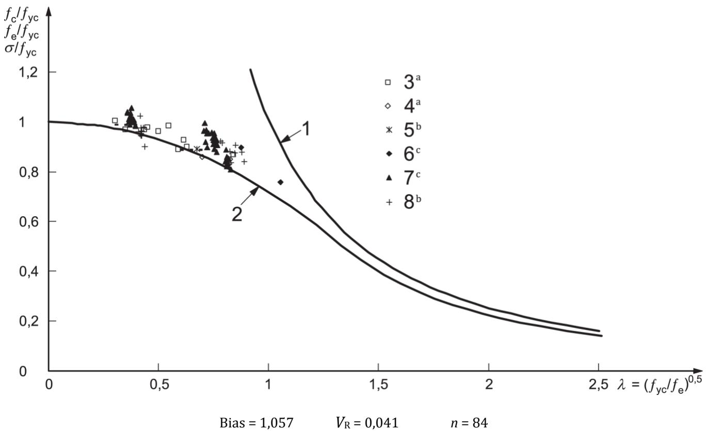  
Figure A.13.2-1 — Comparison of test data with representative column buckling strength formulae for fabricated cylinders subjected to axial compression


| Key |  | Test data | Test data |
| --- | --- | --- | --- |
| 1 | Euler buckling strength, fe/fyc | 3 | Chen & Ross [A.13.2-5] |
| 2 | formulae in this document, fc/fyc | 4 | Smith, Somerfield & Swan [A.13.2-6] |
| σ | compressive stress in test member | 5 | Smith, Somerfield & Swan [A.13.2-6] |
| fc | representative axial compressive strength | 6 | Steinmann & Vojta [A.13.2-7] |
| fe | Euler buckling strength | 7 | Yeomans [A.13.2-8] |
| λ | column slenderness parameter | 8 | Yeomans [A.13.2-8] |
| fyc | representative local buckling strength | a | Fabricated pipe. |
| n | frequency (number of occurrences) | b | Seamless pipe. |
|  |  | c | ERW pipe. |


## A.13.2.3.3 Local buckling

Short tubular members subjected to axial compression fail either by material yield or by local buckling depending on the diameter to thickness (D/t) ratio. Tubular members with low (D/t) ratios are generally not subject to local buckling under axial compression and can be designed on the basis of material failure, i.e. the local buckling stress may be considered to be equal to the yield strength. However, as the (D/t) ratio increases, the elastic local buckling strength decreases, and the tubular should be checked for local buckling.

Unstiffened thin-wall tubulars subjected to axial compression and bending are prone to sudden failures at stress levels well below the theoretical elastic critical buckling stresses predicted by classical smalldeflection shell theory. There is a sudden drop in load-carrying capacity upon buckling. The post-buckling

reserve strength of tubular members is small, in contrast to the post-buckling behaviour of flat plates in compression which usually continue to carry substantial load after local buckling. For this reason, there is a need for more conservatism in the definition of the buckling strength for tubulars than for most other structural elements made difficult by the large scatter in test data. The large scatter is primarily the result of initial imperfections generated during fabrication. In addition to geometric imperfections, experimental and theoretical evidence has shown that the buckling strength is also affected by boundary conditions and built-in residual stresses, see References [A.13.2-5] and [A.13.2-9].

To achieve a robust design, member geometry should be selected such that local buckling due to axial forces is avoided.

The formulae for the representative local buckling strength were developed by screening test data and establishing a strength curve at 95 % success at the 50 % confidence level, which satisfies the following conditions:

a) it had a plateau equal to the material representative yield strength over the range $0 < f_{ \mathrm{ y } } / f_{ \mathrm{ x e } } \leq 0 , 17$ ;   
b) it had the general form of Formula (13.2-9);   
c) it converged to the elastic critical buckling stress curve with increasing member slenderness ratio;   
d) the difference between the mean minus 1,645 standard deviations of test data and the developed equations was minimal.

The local buckling database consists of 38 acceptable tests performed by several different investigators, see References [A.13.2-5] and [A.13.2-10] to [A.13.2-14].

A comparison between test data and the representative local buckling strength formula [Formulae (13.2-8) and (13.2-9)] is plotted in Figure A.13.2-2. The developed formulae have a bias of 1,065, a standard deviation of 0,073, with a VR of 0,068.

The elastic local buckling stress formula of Formula (13.2-10) represents one-half of the theoretical local buckling stress computed using classical small-deflection theory and is created by setting the buckling coefficient $C_{ \mathrm{ x } }$ to 50 % of its theoretical value, i.e. 0,3 instead of 0,6. This reduction accounts for the prime detrimental effect of geometric imperfections as well as the secondary effects of residual stresses and end conditions. Based on the test data shown in Figure A.13.2-2, Formula (13.2-10) is conservative for tubulars with $t > 6$ mm and $f_{ \mathrm{ y } } D / E t \leq 0 { , } 2$ . For thinner tubulars, larger imperfection reduction factors can be required. For the design of tubular members beyond these limits, References [A.13.1-1] and [A.13.1-2] provide guidance.

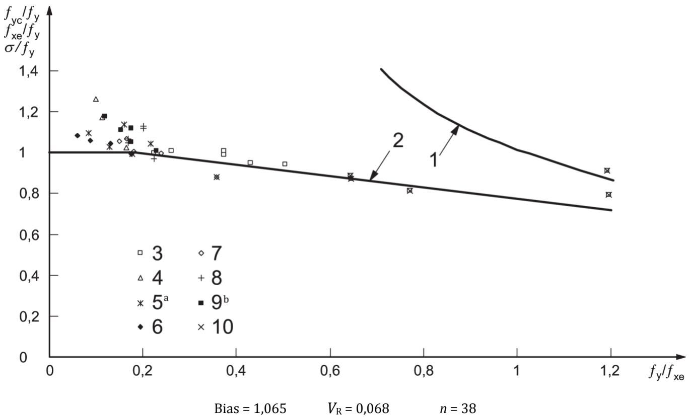  
Figure A.13.2-2 — Comparison of test data and the representative local buckling strength formulae for cylinders subjected to axial compression

Key   


| 1 | elastic local buckling strength, fxe/fy | 3 | Marzullo & Ostapenko [A.13.2-10] |
| --- | --- | --- | --- |
| 2 | formulae in this document, fyc/fy | 4 | Chen & Ross [A.13.2-5] |
| σ | compressive stress in test member | 5 | Eder et al a [A.13.2-13] |
| fy | representative yield strength | 6 | Kiziltug et al [A.13.2-14] |
| fyc | representative local buckling strength | 7 | Ostapenko & Grimm [A.13.2-11] |
| fxe | representative elastic local buckling strength | 8 | Prion & Birkemoe [A.13.2-12] |
| D/t | diameter to thickness ratio | 9 | Eder et al b [A.13.2-13] |
| n | frequency (number of occurrences) | 10 | D/t > 170 |
|  |  | a | Fabricated pipe. |
|  |  | b | ERW pipe. |


## A.13.2.4 Bending

The representative bending strength of fabricated tubular members, as given in Formulae (13.2-13) to (13.2-15), is obtained by dividing the (ultimate) plastic moment strength by the calculated elastic yield moment. A comparison of the representative bending strength with test data is shown in Figure A.13.2-3. The bias and coefficient of variation of the strength formulae are also given. The test data were taken from References [A.13.2-7], [A.13.2-14] and [A.13.2-15] to [A.13.2-18].

The test data show that simply-supported beam tests have bending strengths lower than corresponding fixed end beam tests in which cross-sectional distortion is prevented. However, the end condition has little influence on the rotational capacity of a beam.

At low $\frac{ f_{ \mathrm{ y } } D } { E t }$ , the plastic hinge mechanism forms over a short length of the beam. As the end support rigidity is reduced, the hinge mechanism forms over a longer length with the same rotation.

$\mathrm{ A s } \ \frac{ f_{ \mathrm{ y } } D } { E t }$ increases, both the bending strength and the rotational capacity decrease.

The behaviour of a tubular member under bending is grouped into three regions:

a) high rotational capacity — ductile failure mode, exhibiting very gradual strength decay, see Formula (13.2-13);   
b) intermediate rotational capacity — semi-ductile failure mode, exhibiting gradual strength decay, see Formula (13.2-14);   
c) low rotational capacity — little post-ultimate ductility, exhibiting rapid strength decay and susceptibility to pre-yield local buckling, see Formula (13.2-15).

The ultimate bending moment strength is the full plastic moment of the member. For members with $f_{ \mathrm{ y } } = 345$ MPa and $E = 205000 \mathrm{ M P a }$ , the development of the full plastic moment is realized when $D / t \leq 30$ , as reflected in Formula (13.2-13). This strength is linearly reduced to about $10 ~ \%$ in excess of the yield strength when $D / t ~ \approx ~ 60$ as reflected in Formula (13.2-14). Although it is not reflected in Formula (13.2-15), the bending strength of a tubular member with very high $D / t$ should approach the local elastic critical buckling strength for a tubular member subjected to axial compression.

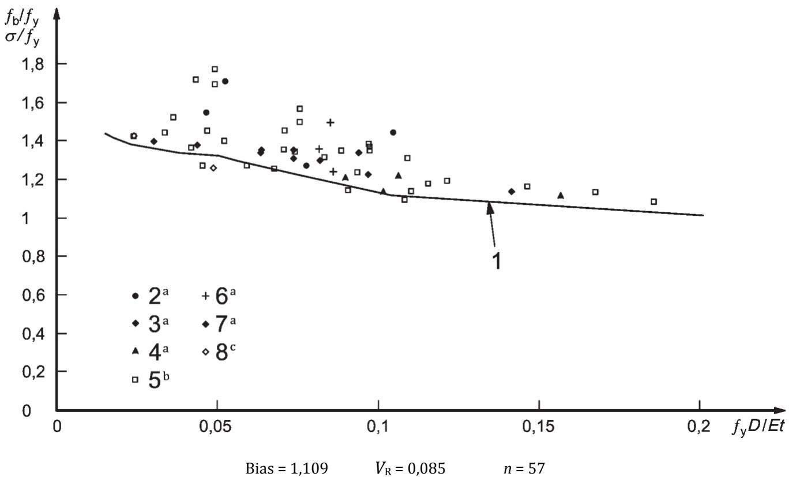  
Figure A.13.2-3 — Comparison of test data with representative bending strength formulae for fabricated cylinders

Key   


| 1 | formulae in this document | 2 | Kiziltug et al [A.13.2-14] |
| --- | --- | --- | --- |
| σ | bending stress in test member | 3 | Korol & Hudoba [A.13.2-16] |
| fb | representative bending strength | 4 | Sherman (1984) [A.13.2-18] |
| fy | representative yield strength | 5 | Sherman (1987) [A.13.2-15] |
| n | frequency (number of occurrences) | 6 | Steinmann & Vojta [A.13.2-7] |
|  |  | 7 | Korol [A.13.2-17] |
|  |  | 8 | Sherman (1984) [A.13.2-18] |
|  |  | a | ERW pipe. |
|  |  | b | Fabricated pipe. |
|  |  | c | Seamless pipe. |


## A.13.2.5 Shear

## A.13.2.5.1 Beam shear

At the neutral axis of a tubular, beam shear is maximum and bending stress is zero. Plastic theory exploits this distribution by assuming shear is present only over half of the area of the tubular, or 70,7 % of its--`, diameter, see Formula (13.2-16).``,``

## A.13.2.5.2 Torsional shear,,``-`

Torsional shear is taken purely as “St. Venant’s” torsion.,,`--

## A.13.2.5.3 Combined beam and torsional shear

Torsional shear acts uniformly around the perimeter of a tubular. On one ‘face’, it adds to the beam shear while on the other ‘face’, it opposes beam shear. Because the shears are simply additive, the check on the combined condition can be simplified by using a reduced value of shear yield strength, see Formula (13.2-20). EN 1993-1-1 [A.13.2-22] adopts a similar approach.

## A.13.2.6 Hydrostatic pressure

## A.13.2.6.1 Calculation of hydrostatic pressure

No guidance is offered.

## A.13.2.6.2 Hoop buckling

Unstiffened tubulars subjected to external hydrostatic pressure are susceptible to elastic or inelastic local,`--- buckling of the shell wall between restraints. Once initiated, the collapse tends to flatten the member`,``` from one end to the other. Ring-stiffened tubulars are subject to local buckling of the shell wall between,,``-` rings, with the rings remaining essentially circular. However, the rings can rotate or warp out of their,,`,` plane. Ring-stiffened tubular members are also subject to general instability, which occurs when the rings``,``, and shell wall buckle simultaneously at the critical stress. It is highly desirable to provide rings with--`, sufficient reserve of strength to prevent general instability.

For tubulars satisfying the maximum out-of-roundness tolerance of 1 %, the representative hoop buckling strength is given by Formulae (13.2-25) to (13.2-27). For ring-stiffened tubulars, these formulae give the hoop buckling strength of the shell wall between rings. To account for the 1 % out-of-roundness, the elastic hoop buckling stress is taken as $^{ 0 , 8 }$ times the theoretical value calculated using classical small deflection theory, that is, $C_{ \mathrm{ h } } { = } 0 { , } 44 \ : t / D$ , whereas the theoretical value is 0,55 t/D. In addition, the other $C_{ \mathrm{ h } }$ values are lower bound estimates.

For members with an out-of-roundness greater than 1 %, but less than 3 %, a reduced elastic hoop buckling stress, $f_{ \mathrm{ h e , r e d } } ,$ is applicable [A.13.2-19]. The representative hoop buckling strength $\left( f_{ \mathrm{ h } } \right)$ is then determined using fhe,red: $f_{ \mathrm{ h e , r e d } } \mathrm{ : }$

$$f_{\mathrm{h e , r e d}} = a f_{\mathrm{h e}} / 0, 8$$

where

α is a geometric imperfection factor:

$$\alpha = 1 - 0, 2 \sqrt{\frac{D_{\mathrm{m a x}} - D_{\mathrm{m i n}}}{0 , 01 D_{\mathrm{n o m}}}}$$

max minD D− is the out-of-roundness (%) $\frac{ D_{ \mathrm{ m a x } } - D_{ \mathrm{ m i n } } } { 0 , 01 D_{ \mathrm{ n o m } } } \mathrm{ i s \ t h e \ o u t \mathrm{ - } o f \mathrm{ - } r o u n d n e s s \ ( \% ) }$

where $D_{ \mathrm{ m a x } }$ and $D_{ \mathrm{ m i n } }$ are the maximum and minimum values of any measured outside diameter at a crosssection and $D_{ \mathrm{ n o m } }$ is the nominal diameter. $f_{ \mathrm{ h e } }$ is taken from Formula (13.2-28).

A comparison of the representative hoop buckling strength with test data is shown in Figure A.13.2-4. The bias and coefficient of variation of the strength formula are also given. The test data were taken from References [A.13.2-19], [A.13.2-20], [A.13.2-13], [A.13.2-14] and [A.13.2-7].

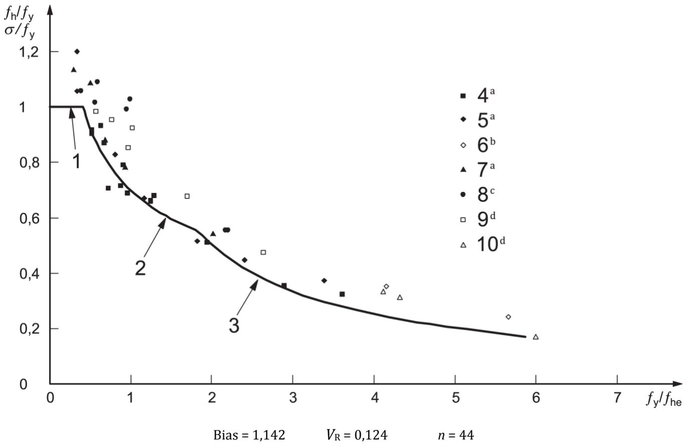  
Figure A.13.2-4 — Comparison of test data with representative hoop buckling strength formulae for fabricated cylinders subjected to hydrostatic pressure

Key   


| 1 | Formula (13.2-25),fh/fy | 4 | Miller & Kinra [A.13.2-20] |
| --- | --- | --- | --- |
| 2 | Formula (13.2-26),fh/fy | 5 | Miller, Kinra & Marlow [A.13.2-19] |
| 3 | Formula (13.2-27),fh/fy | 6 | Miller, Kinra & Marlow [A.13.2-19] |
| σ | hoop stress in test member | 7 | Eder et al [A.13.2-13] |
| fh | representative hoop buckling strength | 8 | Eder et al [A.13.2-13] |
| fhe | representative elastic critical hoop buckling strength | 9 | Kiziltug et al [A.13.2-14] |
| fy | representative yield strength | 10 | Steinmann & Vojta [A.13.2-7] |
| n | frequency (number of occurrences) | a | Fabricated pipe with ring stiffeners. |
|  |  | b | Fabricated pipe unstiffened. |
|  |  | c | ERW pipe with ring stiffeners. |
|  |  | d | ERW pipe unstiffened. |


## A.13.2.6.3 Ring stiffener design

The formulae for determining the required moment of inertia of the stiffening rings, Formulae (13.2-35) and (13.2-36), provide sufficient strength to resist buckling of the ring and shell even after the shell has buckled between stiffeners. It is assumed that the shell offers no support after buckling and transfers all its force to the effective stiffener section. The stiffener ring is designed as an isolated ring that buckles into two waves (n = 2) at a collapse pressure 20 % higher than the strength of the shell.

The dimensional requirements recommended in this subclause are based on an evaluation of References [A.13.1-1], [A.13.2-21] and [A.13.2-22]. Table A.13.2-1 presents a comparison of the geometry requirements for stiffeners with flanges. The selected values are the same as those for Eurocode 3 [A.13.2-22], but the proposed formulae are presented non-dimensionally.

Table A.13.2-1 — Comparison of geometry requirements in different codes for stiffeners with flanges   


| Reference | b/tf | h/tw |
| --- | --- | --- |
| AISC [A.13.2-21] | 16,6 | 32 |
| EUROCODE 3 [A.13.2-22] | 13 | 25 |
| DNV GL [A.13.1-1] | 9 | 30.2 |
| This document | 13,4 | 24,6 |
| NOTE The data in this table apply for E = 210 000 MPa and a yield strength of 420 MPa. | NOTE The data in this table apply for E = 210 000 MPa and a yield strength of 420 MPa. | NOTE The data in this table apply for E = 210 000 MPa and a yield strength of 420 MPa. |


A.13.3 Tubular members subjected to combined forces without hydrostatic pressure

## A.13.3.1 General

This subclause describes the background of the design requirements given in 13.3, which cover tubular members subjected to combined axial and bending forces without hydrostatic pressure.

In this subclause, as for 13.4, the designer should include second-order frame moments, i.e. P-Δ effects in the bending stress determination, when they are significant. The P-Δ effects can be significant in the design of unbraced deck legs, piles, and laterally flexible structures.

## A.13.3.2 Axial tension and bending

In ISO 19902:2007, a linear interaction between axial tension and bending was adopted for consistency with the corresponding strength formulation governing combined axial compression and bending. With the change in the latter in the subsequent edition to the cosine interaction (described in A.13.3.3), again for consistency, the cosine interaction was adopted for combined tension and bending.

## A.13.3.3 Axial compression and bending

This subclause provides an overall beam-column stability check, Formula (13.3-3), and a strength check, Formula (13.3-4), for tubulars subjected to combined axial compression and bending.

Formula (13.3-3) was inherited from API LRFD [A.13.2-4], although also used in API WSD [A.9.1-2] at the time, based on the corresponding AISC-ASD beam-column stability interaction formula [A.13.2-21].

Formula (13.3-4), the interaction formula for the strength check, is of “cosine form”. Although this form was adopted in API LRFD [A.13.2-4], the linear form was specified in the first edition of this document. Justification for adopting the cosine form can be found in Reference [A.13.3-1], where test data with $f_{ \mathrm{ y } } D / E t$ ranging from 0,036 0 to 0,123 9 is plotted with respect to the cosine formula. All data fall outside the formula predictions, even the slenderest tubular results for which D/t = 100 and $f_{ \mathrm{ y } }$ of 254,0 MPa.

The test data for tubular members subjected to combined axial compression and bending were taken from References [A.13.2-9], [A.13.2-12], [A.13.2-14] and [A.13.3-2] to [A.13.3-4]. Comparisons between these data and predicted strength are plotted in Figures A.13.3-1 and A.13.3-2 for short and long columns, respectively. The statistics of the fits are included in the figures.

For the cosine strength check (Figure A.13.3-1), compared with the linear fit in the previous edition of this document, i.e. ISO 19902:2007, with a bias = 1,246 and $V_{ \mathrm{ R } } = 0 { , } 067$ , the spread of the modelling uncertainty parameter $X_{ \mathrm{ m } }$ is seen to have reduced significantly, and even though the bias has also reduced, the formulation still equates to a mean minus 3,0 standard deviations. Some of the data relates to beam-column tests, but for which the local strength check governs, not the beam-column check. All the $X_{ \mathrm{ m } }$ values less than 1,00 correspond to beam-column data.

Formula (13.3-3) is conservative with respect to the results of tests on large-scale fabricated tubulars; see Reference [A.13.2-12]: the corresponding bias = 1,081 and $V_{ \mathrm{ R } } = 0 { , } 048$ . In Figure A.13.3-2, data with values of $X_{ \mathrm{ m } }$ less than 1,00 nearly all relate to small-scale tests in which the loading was in the form of a force applied eccentrically at one end, but with no eccentricity at the other.

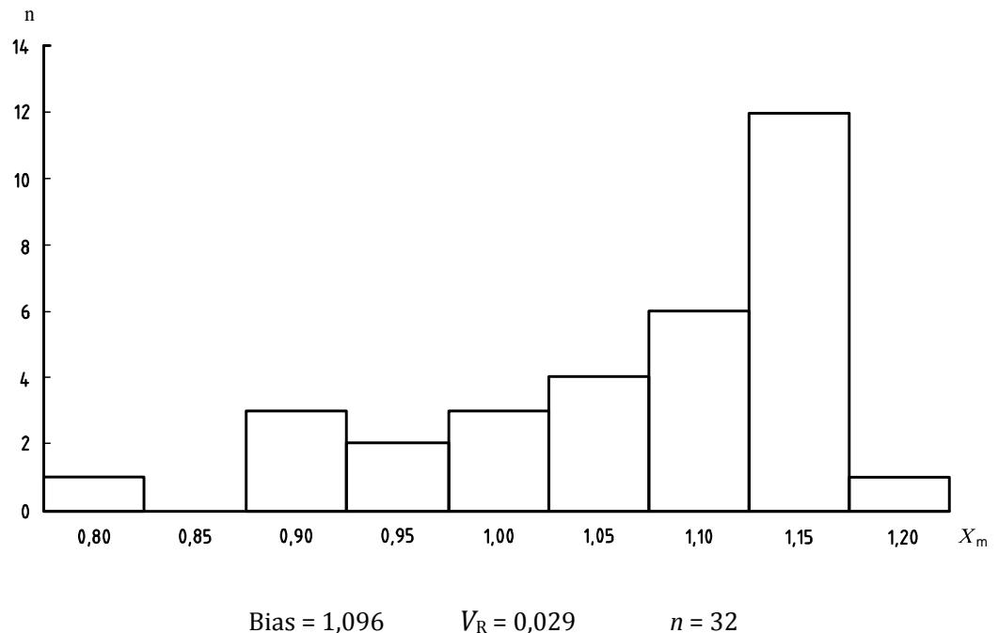  
Figure A.13.3-1 — Comparison of measured and predicted strengths of short tubulars subjected to combined compression (local buckling) and bending

Key

n frequency (number of occurrences)

$X_{ \mathrm{ m } }$ measured strength/predicted strength

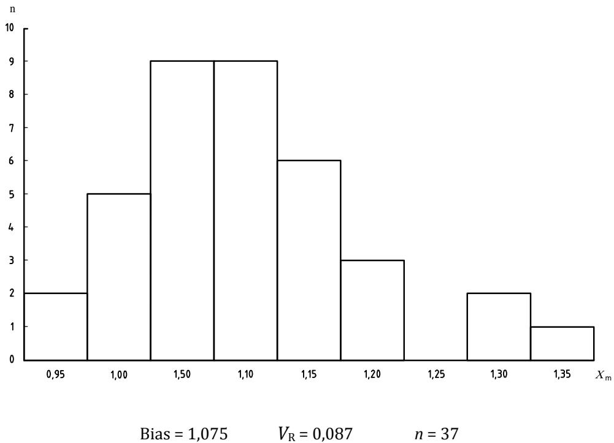  
Figure A.13.3-2 — Comparison of measured and predicted strengths of long tubulars subjected to combined compression (column buckling) and bending

Key

n frequency (number of occurrences)

Xm $X_{ \mathrm{ m } }$ measured strength/predicted strength

## A.13.3.4 Axial tension or compression, bending, shear and torsion

The value of torsion that can be ignored when coexisting with axial tension or compression, bending and shear, of 20 % of the representative shear yield strength, is based on a similar requirement in Reference [A.13.3-5]. The formula to determine the reduced representative yield strength for values of torsion in excess of 20 % is based on that prescribed in Reference [A.13.2-22].

The effect of shear on tubular member strength is based on the approach documented in Reference [A.13.2-22]. This assumes shear and shear yielding are limited in their extent to the shear area prescribed by Formula (13.2-16), i.e. half the cross-sectional area. Over the shear area, yielding is controlled by the Mises-Hencky criterion. Over the remaining area, direct stresses up to yield are permitted whether bending stresses or axial stresses. Reference [A.13.2-22] states that the effect of shear on bending and axial behaviour can be ignored for levels of shear up to half the representative shear strength. Formulae (13.3-13), (13.3-15) and (13.3-17) prescribe the form of interaction between shear and axial force, and shear and bending. When plotted in full, they demonstrate no effect of shear on axial or bending strength for values of shear less than half the representative shear strength. Further, for a level of shear equal to 70 % of representative shear strength, the reduction in axial or bending strength is less than 5 % of the corresponding representative axial or bending strength: this is the origin of the 0,7 in Formula (13.3-11).

The requirement when torsion is present to use a value of yield strength reduced to account for torsion is also based on the equivalent provision in Reference [A.13.2-22].

## A.13.3.5 Piles

No guidance is offered.

A.13.4 Tubular members subjected to combined forces with hydrostatic pressure

## A.13.4.1 General

This subclause provides both beam-column stability and strength design interaction formula for the cases in which a tubular member is subjected to axial tension or compression, and/or bending combined with external hydrostatic pressure. The design formulae are formulated so that the effects of capped-end actions can be included irrespective of whether they are calculated directly within the structural analysis or not. The purpose of providing formulae in this form is to facilitate tubular member design by the two forms of analysis commonly used by designers. In the limit when the hydrostatic pressure is zero, the design formulae in this subclause reduce to those given in 13.3.

In the formulae, hoop compression is not explicitly included in the analysis, but its effect on member design is considered within the design interaction formulae. To facilitate the application of these particular formulae, the hoop collapse design check stipulated in 13.2.6 should be satisfied first.

A structural analysis in which the capped-end axial compression is explicitly included in the analysis, is preferred, because it allows for a more precise redistribution of the capped-end forces based on the relative stiffnesses of the braces at a node.

As the redistribution of the capped-end axial compression is minimal, because of similar brace sizes at a node, the difference between including or excluding the capped-end axial compression in the analysis is usually small. Further discussion of the development of the formulae in this subclause can be found in References [A.13.4-1] and [A.13.4-2]. A collection of the test data and additional comparisons of the design formula with the test data can be found in Reference [A.13.2-1].

## A.13.4.2 Axial tension, bending and hydrostatic pressure

In the presence of tensile forces in members, external hydrostatic pressure has three main effects:

a) a reduction of the axial tension due to the presence of capped-end axial compression;   
b) a reduction of the axial tensile strength $\left( f_{ \mathrm{ t } } \right)$ caused by hoop compression, resulting in $f_{ \mathrm{ t , h } } ,$   
c) a reduction of the bending strength $\left( f_{ \mathrm{ b } } \right)$ caused by hoop compression, resulting in $f_{ \mathrm{ b , h } } .$

As demonstrated in Reference [A.13.4-2], bending hydrostatic pressure interaction is similar to axial tension hydrostatic pressure interaction. The reduced axial tensile and bending strengths, as given by Formulae (13.4-8) and (13.4-9), were derived from the following ultimate strength interaction formulae, which are doubly-modified versions of the Beltrami-Haigh yield function:

— combined axial tension and hydrostatic pressure:

$$\left(\frac{\sigma_{\mathrm{t}}}{f_{\mathrm{y}}}\right)^{2} + \left(\frac{\sigma_{\mathrm{h}}}{f_{\mathrm{h}}}\right)^{2 \eta} + 2 \nu \left(\frac{\sigma_{\mathrm{h}}}{f_{\mathrm{h}}}\right) \left(\frac{\sigma_{\mathrm{t}}}{f_{\mathrm{y}}}\right) = 1, 0 \tag{A.13.4-1}$$

— combined bending and hydrostatic pressure:

$$\left(\frac{\sigma_{\mathrm{b}}}{f_{\mathrm{b}}}\right)^{2} + \left(\frac{\sigma_{\mathrm{h}}}{f_{\mathrm{h}}}\right)^{2 \eta} + 2 \nu \left(\frac{\sigma_{\mathrm{h}}}{f_{\mathrm{h}}}\right) \left(\frac{\sigma_{\mathrm{b}}}{f_{\mathrm{b}}}\right) = 1, 0 \tag{A.13.4-2}$$

where υ is Poisson's ratio, taken for steel as 0,3 in the derivation of Formulae (13.4-8) and (13.4-9).

The Beltrami-Haigh yield function is similar to the Mises-Hencky function in that it is elliptical, has the same tension-tension, tension-compression, etc., quadrants, but the cross-term is factored by 2υ whereas Mises-Hencky has no factoring. This factoring has the effect of shortening the major axis but lengthening the minor axis) [A.13.3-1]. The cross-term in Formula (A.13.4-1) is positive, because axial tension and external pressure generate stress in the opposite sense, i.e. tension versus compression. The same sign is adopted in Formula (A.13.4-2), which indicates it is the tensile zone of the bending stress distribution that governs ultimate strength.

To obtain the axial tensile and bending strengths from Formulae (A.13.4-1) and (A.13.4-2), the $\sigma_{ \mathrm{ t } }$ and $\sigma_{ \mathrm{ b } }$ terms are represented by $f_{ \mathrm{ t , h } }$ and $f_{ \mathrm{ b , h } } ,$ respectively, and the positive roots taken of the resulting quadratic formulae.

In References [A.9.1-2] and [A.13.4-3], a formula identical to Formula (A.13.4-1) but without the η parameter, was adopted for the design of tubular members under combined axial tension and hydrostatic pressure. It was the first modified form of the Beltrami-Haigh formula created by replacing $f_{ \mathrm{ y } }$ by $f_{ \mathrm{ h } }$ in the hoop component: in the original form of the formula, all stress components were normalized by yield strength. This was later found to be conservative for elastic conditions, such as in the design of tendons of tension leg platforms. A further modification was made to the formula to remove this unnecessary conservatism by introducing η in Formula (A.13.4-1) [A.13.4-2]. The use of η results in a family of interaction curves representing different hoop collapse to yield strength ratios （$f_{ \mathrm{ h } } / f_{ \mathrm{ y } } )$ .

When the calculated axial tensile stress is greater than or equal to the capped-end axial compression, i.e. $\sigma_{ \mathrm{ t } } > \sigma_{ \mathrm{ q } } ,$ the member is subjected to net axial tension. For this case, the member is not susceptible to local buckling.

When the calculated axial tensile stress is less than the capped-end axial compression, i.e. $\sigma_{ \mathrm{ t } } < \sigma_{ \mathrm{ q } } ,$ the member is subjected to net axial compression and to a quasi-hydrostatic pressure condition. (A member is subjected to a pure hydrostatic pressure condition when the net axial compressive stress is equal to the capped-end axial stress, i.e. $\sigma_{ \mathrm{ c , c } } = \sigma_{ \mathrm{ q } } . )$ Under this condition, there is no member instability. Hence, for the case of $\sigma_{ \mathrm{ { t } } } < \sigma_{ \mathrm{ { q } } } ,$ both the local strength check, Formula (13.4-13), and the elastic local buckling check, Formula (13.4-18), should be satisfied.

The test data for tubular members subjected to combined axial tension and hydrostatic pressure (no bending) were taken from Reference [A.13.2-19]. Figure A.13.4-1 presents a comparison between these data and the predictions of Formula (13.4-7) together with the statistics of the fit. Highlighted are test specimens with weld defects that could have had a detrimental effect on strength, and specimens that were not ring stiffened. These non-stiffened specimens are seen to generate relatively high bias values.

Comparison of the statistics of this fit with the corresponding ones in the first edition of this document shows that the bias has increased from 1,075 to 1,103 and the $V_{ \mathrm{ R } }$ increased from 0,098 to 0,112. In simple terms, the introduction of the cosine interaction compared with the linear one should have reduced the bias. However, the replacement by $f_{ \mathrm{ t , h } }$ for $f_{ \mathrm{ t } }$ in the denominator of the first term indicates bias, at least, was likely to increase in the presence of pressure, as it has done.

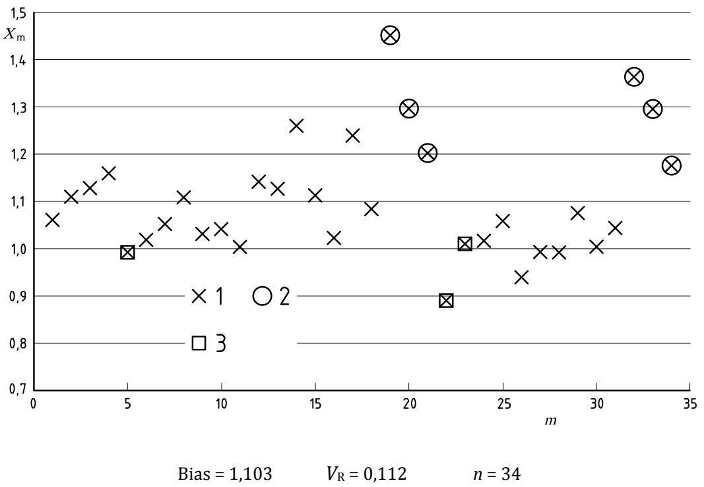  
Figure A.13.4-1 — Comparison of measured and predicted strengths of tubulars subjected to combined tension and external pressure

Key

Xm $X_{ \mathrm{ m } }$ measured strength/predicted strength

m specimen number   
1 Formula (13.4-7)   
2 specimens with no ring stiffeners   
3 specimens with welding defects

## A.13.4.3 Axial compression, bending and hydrostatic pressure

Capped-end axial compression arising from hydrostatic pressure does not cause column buckling. It is therefore incorrect to determine the reduced column buckling strength by subtracting the capped-end axial compression from the in-air buckling strength calculated by Formula (13.2-5) or Formula (13.2-6). An analogy to the hydrostatic pressure problem is the design of offshore platform conductors, as discussed in Reference [A.13.4-4]. Thus, for the overall stability check, Formula (13.4-14), only the calculated axial compression $\left( \sigma_{ \mathrm{ c } } \right)$ is used.

The effect of capped-end axial compression is manifested in two ways. Firstly, it leads to earlier yielding of the member in the presence of the additional external axial compression. Earlier yielding in turn results in a reduced column buckling strength, as given by Formula (13.4-15). When there is no hydrostatic pressure, i.e. $\sigma_{ \mathrm{ q } } = 0$ , Formula (13.4-15) reduces to the in-air case of Formula (13.2-5). Secondly, it contributes to the net axial compression （$\sigma_{ \mathrm{ c , c } } )$ , which is used for the local strength check, Formula (13.4-13).

In addition, the elastic local buckling criterion, Formula (13.4-18), should be satisfied.

The test data for tubular members subjected to combined axial compression, bending, and hydrostatic pressure were taken from References [A.13.2-7], [A.13.2-13], [A.13.2-14] and [A.13.2-19].

The comparisons between test data and predictions using the formulae are presented Figures A.13.4-2 and A.13.4-3 for short and long columns, respectively: the statistics of the comparisons are indicated. Highlighted are specimens which were not subjected either to bending or to axial compression, as discussed in this subclause.

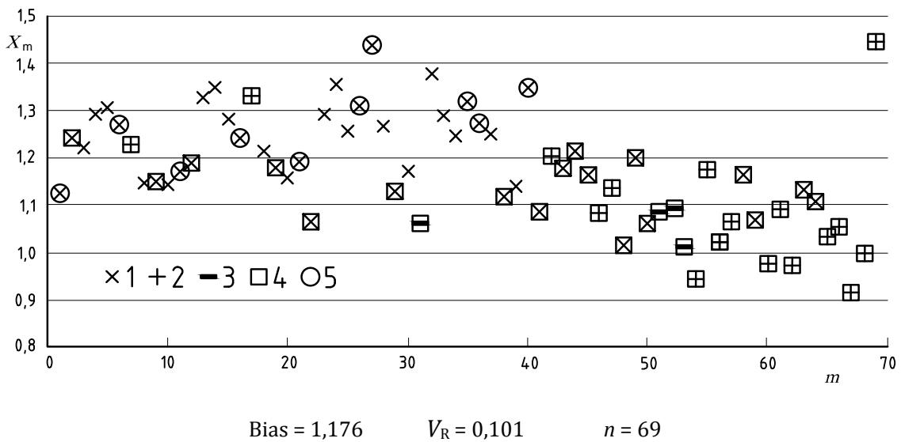  
Figure A.13.4-2 — Comparison of measured and predicted strengths of short columns subjected to combined compression, bending and external pressure

Key

$X_{ \mathrm{ m } }$ measured strength/predicted strength

m specimen number

1 Formula (13.4-13) - local buckling, bending & pressure   
2 Formula (13.2-24) - hydrostatic pressure   
3 Formula (13.4-18) - elastic compression, bending & pressure   
4 no bending
5 no axial compression

The test data on both short and long tubular specimens subjected to combined axial compression, bending, and hydrostatic pressure were taken from References [A.13.2-7], [A.13.2-13], [A.13.2-14] and [A.13.2-19].

From Figure A.13.4-2, it can be seen that for short columns Formula (13.4-13) governs most failures, 71 %, followed by Formula (13.2-24), 23 %, while Formula (13.4-18) governs least, 6 %. In light of the observation in relation to tubulars subjected to axial tension and pressure, A.13.4.2, it is perhaps relevant that specimens numbered 41 to 68 relate to ring stiffened tubulars. None of the tubulars considered in Figure 13.4-3 is stiffened so, from Figures A.13.2-4, A.13.4.1 and A.13.4.2, it could be concluded that ring stiffeners have a detrimental effect on the strength of tubulars subjected to pressure.

Ignoring ring stiffened specimens in Figure 13.4-2, it can be seen that the lower range of $X_{ \mathrm{ m } }$ values is dominated by specimens not subjected to bending and that most cases involving no axial compression lie in the upper range of $X_{ \mathrm{ m } }$ values. In the absence of bending, inspection of Formula (13.4-13), i.e. local buckling, bending and pressure, reveals that pressure has no effect on the value of $X_{ \mathrm{ m } } .$ .

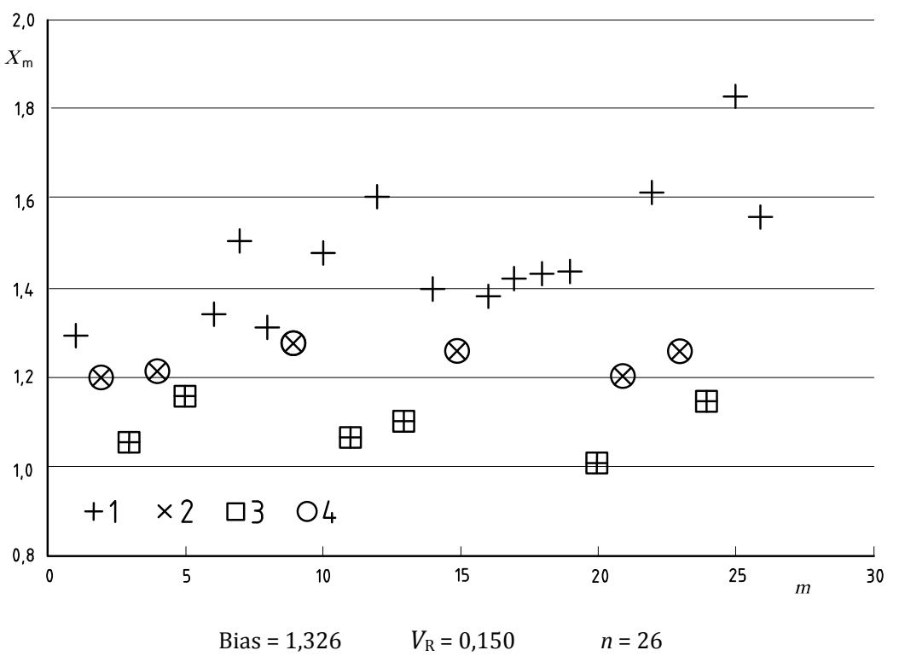  
Figure A.13.4-3 — Comparison of measured and predicted strengths of long columns subjected to combined compression, bending and external pressure

Key

Xm $X_{ \mathrm{ m } }$ measured strength/predicted strength   
m specimen number   
1 Formula (13.4-14) - column buckling, bending & pressure   
2 Formula (13.4-13) - local buckling, bending & pressure   
3 no bending
4 no axial compression

From Figure A.13.4-3, it can be seen that Formula (13.4-14) governs most failures, 77 %, and Formula (13.4-13) the rest, 23 %. Further, the lower range of $X_{ \mathrm{ m } }$ values is dominated by non-bending cases and that all of the cases governed by Formula (13.4-13), local buckling, bending and pressure, involve no axial compression.

A comparison between the statistical characteristics of Figure A.13.4-2 and the corresponding values in the first edition of this document shows a small reduction in both bias (from 1,199 to 1,176) and VR (from 0,134 to 0,101). This is a result of:   
a) Adopting the maximum value of $X_{ \mathrm{ m } }$ whereas, in the first edition of this document, the maximum value was replaced by the value calculated using the hydrostatic check of Formula (13.2-24) should this exceed unity. The reason for instigating this was because, in a draft of this document, an attempt was made to anticipate and avoid software problems in trying to solve Formulae (13.4-8) and (13.4-9) for values of B, Formula (13.4-10), greater than unity, which would be the consequence of Formula (13.2-24) exceeding unity.

b) For interaction between local buckling and bending, the change from the linear form to the cosine form which was also extended to include interaction between local buckling, bending and pressure, Formula (13.4-13).

A comparison between the statistical characteristics of Figure A.13.4-3 and the corresponding values in the first edition of this document shows increases in both bias (from 1,197 to 1,326) and $V_{ \mathrm{ R } }$ (from 0,091 to 0,150). In addition to a) and b), this is a result of:

c) Consistent use of $X_{ \mathrm{ m } }$ when calculating the statistical characteristics of the relevant formulae, in particular, in Formula (13.4-14), dividing $\sigma_{ \mathrm{ c } }$ in the Euler amplification terms by $X_{ \mathrm{ m } }$ and, in Formula (13.4-17), dividing $\sigma_{ \mathrm{ x } }$ by $X_{ \mathrm{ m } }$ .

d) Eliminating a possible error in the original $X_{ \mathrm{ m } }$ calculation.

The purpose for highlighting the specimens in Figures A.13.4-2 and A.13.4-3 that were not subjected to axial compression or bending is to provide an opportunity to further examine the impact of the cosine interaction between local buckling and bending, already considered in A.13.3.3, as well as the effect of adopting the same failure criterion for bending in the presence of pressure independent of whether the axial force is tensile or compressive, as described in A.13.4.2.

As noted in A.13.3.3, in the absence of pressure, the effect of introducing the cosine form to axial compression bending interaction was to reduce the bias, $X_{ \mathrm{ m } } ,$ from 1,246 to 1,096. However, when pressure is involved, Figure A.13.4-2, the reduction was only from 1,199 to 1,176. This suggests a counteracting effect that leads to an increase in bias. This is particularly obvious when only the unstiffened specimens in Figure A.13.4-2 are considered for which the bias is 1,242 and the $V_{ \mathrm{ R } }$ is 0,075 together with the specimens in Figure A.13.4-3 controlled by local buckling, bending and pressure for which the bias is 1,228 and the $V_{ \mathrm{ R } }$ is 0,027. The common factor generating these high biases is a conservative determination of $f_{ \mathrm{ b , h } }$ , the representative bending strength in the presence of external hydrostatic pressure, given by Formula (13.4-9). As noted, $f_{ \mathrm{ b , h } }$ assumes failure occurs in tension in the tension compression quadrant of the Beltrami-Haigh yield function whereas, under a combination of axial compression and bending, failure is likely to be precipitated by yield in the compression-compression quadrant.

A preliminary examination of assuming compression-compression quadrant failure for the unstiffened specimens governed by local buckling, bending and pressure in Figures A.13.4-2 and A.13.4-3 is, for Figure A.13.4-2, to reduce the bias to 1,090 while the $V_{ \mathrm{ R } }$ increases to 0,106, and for Figure A.13.4-3, to reduce both the bias to 0,913 and the $V_{ \mathrm{ R } }$ to 0,018. Whilst clearly the accuracy has improved, the column specimens of Figure A.13.4-3 are now non-conservatively predicted. It is concluded that, although the local buckling, bending and pressure formulation of Formula (13.4-13) could be rewritten to recognize failure occurs in the compression-compression quadrant of the Beltrami-Haigh yield function, the use of the cosine interaction between local buckling and bending when pressure is also present seems to be non-conservative and possibly should be replaced by its linear alternative, but only after further investigation.

Calculation of $X_{ \mathbf{ m } }$

For comparing design formula predictions with test data, a case of combined axial compression, bending, and hydrostatic pressure is used as an example to illustrate the procedure. In a typical test, values of axial compression, bending, external pressure and capped-end stress are measured at member failure. The test values are denoted by $\sigma_{ \mathrm{ a , t e s t } }$ for axial compression, $\sigma_{ \mathrm{ b , t e s t } }$ for bending, $\sigma_{ \mathrm{ h , t e s t } }$ for hoop stress due to external pressure, and $\sigma_{ \mathrm{ q , t e s t } }$ for capped-end stress. All components of the test values contain bias and these biases cannot be accurately determined individually. In the comparison of the test data with the predicted values, it is assumed that the bias for all components is the same (say, $X_{ \mathrm{ b i a s } } )$ .

In the calculation of member utilization ratio using, e.g. Formulae (13.4-19) to (13.4-21), all components of measured test values are modified by dividing them by a constant parameter, $X_{ \mathrm{ m } } ,$ and the modified test values are then substituted into the formulae to determine the corresponding utilization ratio. All partial resistance factors are excluded (i.e. set to 1,0) in the calculation. An iterative procedure is necessary to determine a particular $X_{ \mathrm{ m } }$ value （$X_{ \mathrm{ b i a s } } )$ that yields a utilization ratio of 1,0. This value of $X_{ \mathrm{ b i a s } }$ is a measure of the accuracy of the design formula against the test data in terms of the ratio of test strength to predicted strength. Each of the Formulae (13.4-19) to (13.4-21) generates a different $X_{ \mathrm{ b i a s } } \mathrm{ . }$ the largest value governs. Depending upon the assumed $X_{ \mathrm{ m } }$ value, some numerical instability can occur, but this should not affect the determination of the correct $X_{ \mathrm{ b i a s } } .$

Using Test No. C3JD of the Steinmann and Vojta data [A.13.2-7] as an example, this tubular member has an outside diameter of 168,3 mm, a thickness of 3,96 mm, an overall length of 4 191 mm, Young’s modulus of 167 379 $\mathrm{ N } / \mathrm{ m m }^{ 2 }$ , and yield strength of 353,9 $\mathrm{ N } / \mathrm{ m m }^{ 2 } ,$ . At failure, the measured test components show an axial compressive stress of $149 , 2 \ \mathrm{ N / m m }^{ 2 }$ , bending stress of $174 , 1 \ \mathrm{ N / m m^{ 2 } }$ , and a hoop stress due to hydrostatic pressure of $88 , 7 ~ \mathrm{ N / m m }^{ 2 }$ . Figure A.13.4-4 shows how the calculated value of utilization ratio varies with the assumed $X_{ \mathrm{ m } }$ value. The calculated $X_{ \mathrm{ m } }$ that yields a utilization ratio of 1,0 is 1,832. Note that at failure for this example, the test value of hydrostatic pressure exceeds the representative strength.

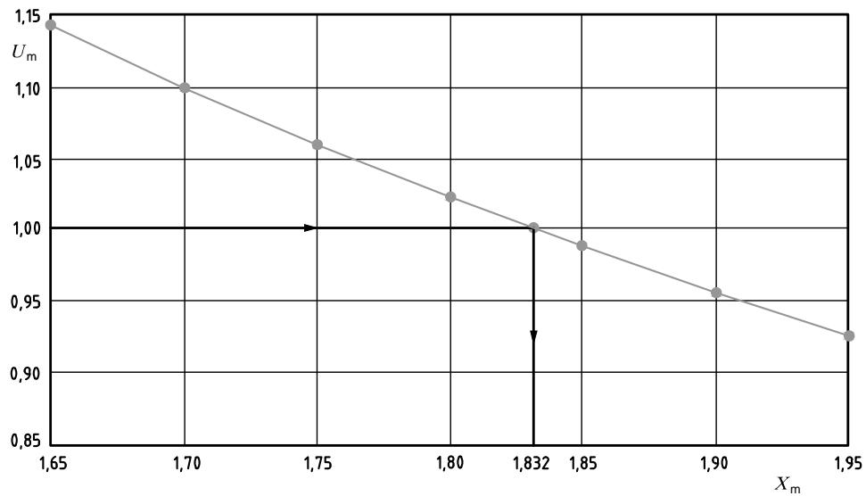  
Figure A.13.4-4 — Variation of utilization ratio with assumed $X_{ \mathbf{ m } }$ value

Key

Um $U_{ \mathrm{ m } }$ utilization ratio

Xm $X_{ \mathrm{ m } }$ measured strength/predicted strength

## A.13.4.4 Axial tension or compression, bending, hydrostatic pressure, shear and torsion

No guidance is offered.

A.13.5 Effective lengths and moment reduction factors

The effective length used for a bracing member in framed structures is important for determining its axial compressive strength.

Based on experience with the use of non-linear pushover analyses, it was concluded in Reference [A.13.5-1] and others that the accuracy of linear design predictions is significantly improved by using

buckling lengths determined from refined analysis. Studies indicate that buckling lengths for real, three dimensional structures demonstrate little variation when actions are increased up to collapse. Thus, buckling lengths calculated for the initial elastic loading regime are, in fact, representative throughout the complete loading history.

The effective lengths for initial conditions can be calculated for an X-frame through the use of the differential formulae given in Reference [A.13.5-2] or for a general structural component through the use of ϕ functions derived from differential formulae, see Reference [A.13.5-3]. Use of ϕ functions implies that exact solutions are obtained for the considered buckling problem. General effective buckling lengths have been derived using ϕ functions incorporating end flexibility of members. The results for an X-brace with four equal-length members are shown in Figure A.13.5-1 as a function of the force distribution in the system, expressed by the ratio Q/P (where P is the maximum compressive force in the X-brace structure), and of the non-dimensional end rotational stiffness parameter, ρ, which is defined by:

$$\rho = \frac{C L}{E I} \tag{A.13.5-1}$$

In this formula, C is the rotational stiffness at a node and I is the moment of inertia of the tubular member. C should take into account the local joint flexibility [A.13.5-4] and the flexural and torsional stiffnesses of the incoming members. L refers to centre line to centre line distances between end nodes, i.e. excluding the intermediate X-joint node.

Figures A.13.5-1 to A.13.5-3 provide effective length factors as a function of the rotational stiffness of the member ends and the ratio of the axial forces in the braces for three X-brace configurations:

a) equal segment lengths;   
b) a segment length ratio of 0,6 to $^{ 0 , 4 ; }$   
c) a segment length ratio of 0,7 to 0,3.

In developing Figures A.13.5-1 to A.13.5-3, the local bending stiffness at the X-joint is assumed to be infinite. The torsional stiffness of incoming members at the X-joint has been conservatively neglected.

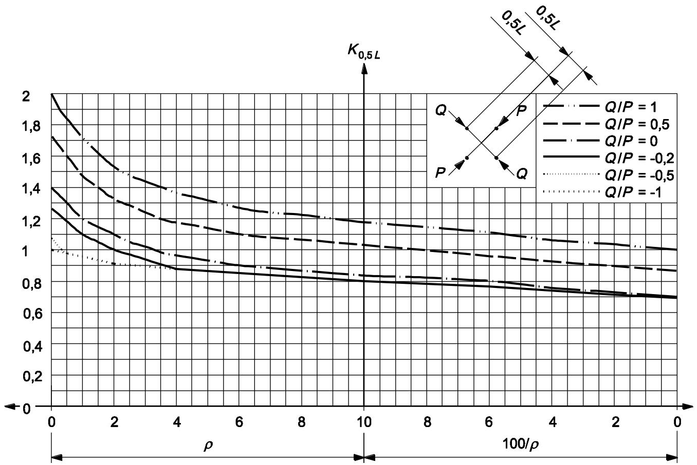  
Figure A.13.5-1 — Effective length factors for symmetric X-braces as function of force distribution and rotational end stiffnesses for equal lengths (torsional stiffness of crossing member included)

Key

$K_{ 0 , \mathrm{ S L } }$ effective length factor relative to 50 % of member length   
ρ rotational stiffness parameter from Formula (A.13.5-1)   
P compressive force in member under consideration   
Q compressive force in other member of X-frame

Figure A.13.5-2 — Effective length factors for non-symmetric X-braces as function of force distribution and rotational end stiffnesses (longer segment = 0,6 times the brace length)   
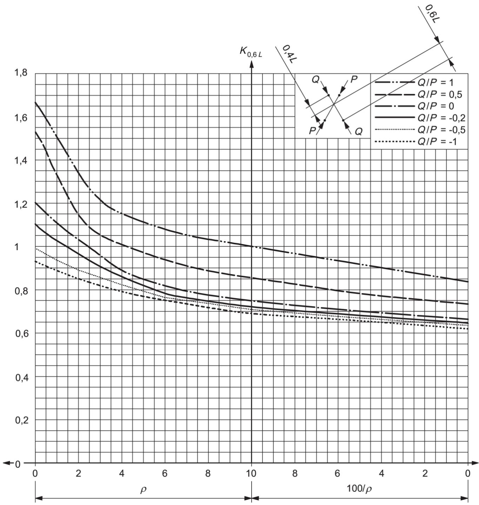  
Key   
$K_{ 0 , \mathrm{ 6 L } }$ effective length factor relative to 60 % of member length   
ρ rotational stiffness parameter from Formulae (A.13.5-1)   
P compressive force in member under consideration   
Q compressive force in other member of X-frame

Figure A.13.5-3 — Effective length factors for non-symmetric X-braces as function of force distribution and rotational end stiffnesses (longer segment = 0,7 times the brace length)   
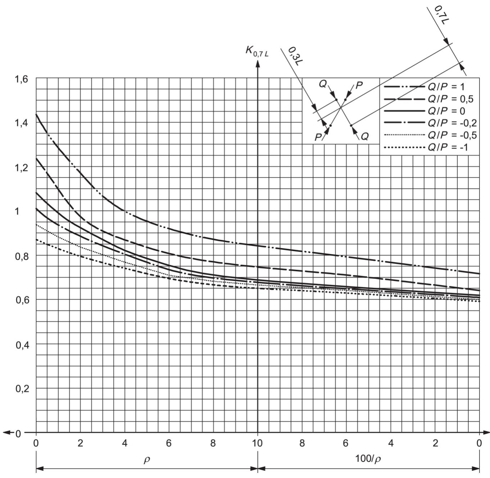  
Key   
$K_{ 0 , \mathrm{ 7 L } }$ effective length factor relative to 70 % of member length   
ρ rotational stiffness parameter from Formula (A.13.5-1)   
P compressive force in member under consideration   
Q compressive force in other member of X-frame

Figure A.13.5-1 indicates that for realistic end conditions $\left( \rho > 3 \right)$ and for single braces, i.e. when $Q / P = 1$ (when $Q / P = 1$ , the Q-loaded member has no effect on the P-loaded member), a K factor with respect to the full X-brace length of less than 0,8 (i.e. less than 1,6 of 0,5 L) is acceptable provided end joint stiffnesses do not diminish as the braces become fully loaded. Experimental results relating to frames seem to confirm 0,7 with respect to the full brace length is acceptable, which is confirmed by the results in Figure A.13.5-1 and recommended in Table 13.5-1.

In Table 13.5-1, a K factor of 0,8 with respect to the longer segment length is recommended for X-braces in which $Q / P \leq 0$ . This value is well supported by the results in Figure A.13.5-3 for unequal X-braces with realistic end conditions $\left( \rho = 3 \ \mathrm{ t o } \ 5 \right)$ . For equal X-braces, an unusually high rotational end stiffness is required （$100 / \rho < 7 )$ to obtain a K factor of 0,8 (Figure A.13.5-1). Notwithstanding, the experimental results studied in Reference [A.13.5-5] support a K factor value of 0,8 for equal X-braces. This can be attributed to the fact that significant rotational restraint is provided at the X-joint and at member ends.

For realistic end conditions and when both X-braces are in compression, a K factor of 0,7 with respect to the full member length may be used. Implicitly, the X-joint is not braced.

Traditionally, to estimate the effective length of an unbraced column, such as topsides legs, the alignment chart in Figure A.13.5-4 has been used to provide a fairly rapid method for determining K values. This alignment chart has been used in a number of editions of AISC 360 [A.13.3-5] as well as in API RP 2A, both WSD and LRFD. Permission is given in these API documents to modify the chart to allow for conditions-`,,,` different from those assumed in the development of the chart: this same permission was given in the first ,``,, edition of this document.`, `,,

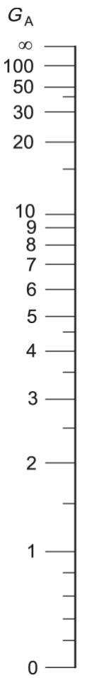

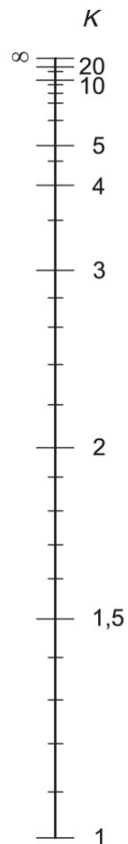

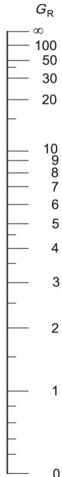

The subscripts A and R refer to the joints at the two ends of the column section being considered. G is defined as:

$$G = \frac{\sum \frac{I_{c}}{L_{c}}}{\sum \frac{I_{0}}{L_{0}}}$$

where

Σ indicates a summation of all members rigidly connected to that joint and lying in the plane in which buckling of the column is being considered;

$I_{ \mathrm{ c } }$ is the moment of inertia;

$L_{ \mathrm{ c } }$ is the unsupported length of the column section;

$I_{ 0 }$ is the moment of inertia;

$L_{ 0 }$ is the unsupported length of a girder or other restraining member.

$I_{ \mathrm{ c } }$ and $I_{ 0 }$ are taken about axes perpendicular to the plane of buckling being considered.

For column ends supported by, but not rigidly connected to, a footing or foundation, G is theoretically infinity. It may be taken as 10 for practical designs unless designed as a friction free pin. If the column end is rigidly attached to a properly designed footing, G may be taken as 1,0. Smaller values may be used if justified by analysis.

Figure A.13.5-4 — Alignment chart for determining the effective length of unbraced columns

The alignment chart in Figure A.13.5-4 assumes that, in addition to the portal legs, the topsides structure above and the topmost jacket substructure below the portal legs, are all unbraced. AISC 360, for example, also provides an alignment chart for when all three bays are braced against sidesway. For many fixed offshore structures, both the topsides structure above and the topmost jacket substructure below the portal legs, are braced while the portal legs are unbraced. Ku et al. in [A.13.5-8], treated this configuration as an eigenvalue buckling problem using an advanced finite element package and found that, even for a topsides of relatively minimal structure, the effective length of the portal legs studied in their examples was always less than 1,78. This value is believed to be representative of typical portal frame columns. For use in Table 13.5-1, a slightly conservative value of 1,80 was adopted.

Ku et al. also calculated the K value in accordance with the first edition of this standard. The absence of the summation sign in the numerator of the formula for G in Figure A.13.5-4 was highlighted. The resulting K values ranged from 2,32 for the simplest topsides configuration to 1,80 for the most complex configuration, all conservative with respect to the finite element buckling solution. The omission of the summation sign in the numerator was an editing error, the summation sign should have been included as shown in the current version of Figure A.13.5-4.

Given the findings of Ku et al., it is possible that the alignment chart presented in Figure A.13.5-4 is no longer applicable in the design/assessment of typical fixed offshore structures. However, until experience is gained with the changes introduced into Table 13.5-1 and the implications of these findings have been considered further, it is not intended that Figure A.13.5-4 be deleted.

For cantilever tubular members, an independent rational analysis is required for the determination of appropriate effective length factors. Such an analysis should take full account of all large deflection (P-Δ) effects. For a cantilever tubular member, $C_{ \mathrm{ m } , i } = 1 , 0$ , where $C_{ \mathrm{ m } , i }$ is the moment reduction factor.

The purpose of using of $C_{ \mathrm{ m } , i }$ in the interaction Formulae (13.3-3) and (13.4-14) is to obtain an equivalent moment for the moment pattern to which the beam column is subjected that more accurately reflects the effect of the moment pattern on beam-column buckling of the member. Further discussion can be found in Reference [A.13.5-6], where more accurate expressions are provided — particularly for relatively low levels of axial compression. The $C_{ \mathrm{ m } , i }$ values recommended in Table 13.5-1 are similar to those recommended in Reference [A.13.5-7] and its commentary.

A.13.6 Conical transitions

## A.13.6.1 General

No guidance is offered.

## A.13.6.2 Design stresses,,``,`

## A.13.6.2.1,,, ``- Equivalent axial stress in conical transitions

The relationship between global section forces and axial stresses in a conical transition is shown in Figure,,,`- A.13.6-1. The axial stress due to global bending is considered to be of similar nature to that of the compressive stress, although at the opposite side of the conical transition it is tensile.

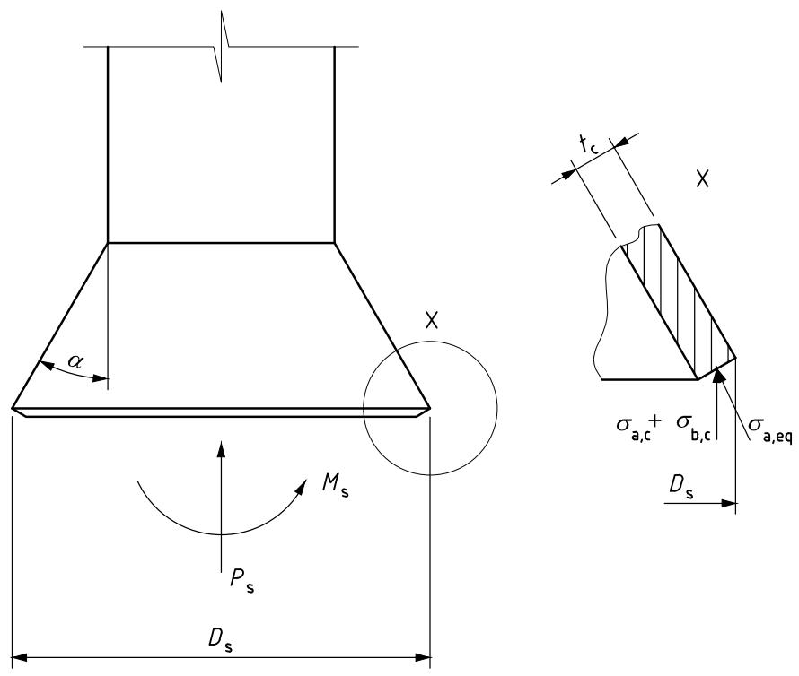

Key

$M_{ s }$ bending moment on section under consideration due to factored actions

$P_{ s }$ axial force on section under consideration due to factored actions

Ds $D_{ s }$ outer diameter of cone section under consideration

$\alpha$ slope angle of conical section

$t_{ \mathrm{ c } }$ thickness of cone at section under consideration

σa,c $\sigma_{ \mathrm{ a , c } }$ axial stress at conical section under consideration

$\sigma_{ \mathrm{ b , c } }$ bending stress at conical section under consideration

$\sigma_{ \mathrm{ a , e q } }$ equivalent axial stress at conical section under consideration

Figure A.13.6-1 — Relationship between section forces and axial stresses in a conical transition

## A.13.6.2.2 Local stresses at unstiffened junctions

The radial force component per unit circumferential length at a junction (see the right hand side of Figure A.13.6-2) is proportional to the global longitudinal stress in the tubular due to factored actions and the tangent of the cone angle, i.e. radial force ∝ （$\sigma_{ \mathrm{ a , t } } + \sigma_{ \mathrm{ b , t } } ) t$ t tanα, see Figure A.13.6-2. This radial force is additional to any action effects caused by hydrostatic pressure.

The radial force results in a local bending moment and associated shear forces at the junction. The resulting local bending stresses in the tubular and the cone sides of the junction are given by Formulae (13.6-4) and (13.6-5). Both formulae are based on results presented in Reference [A.13.6-1].

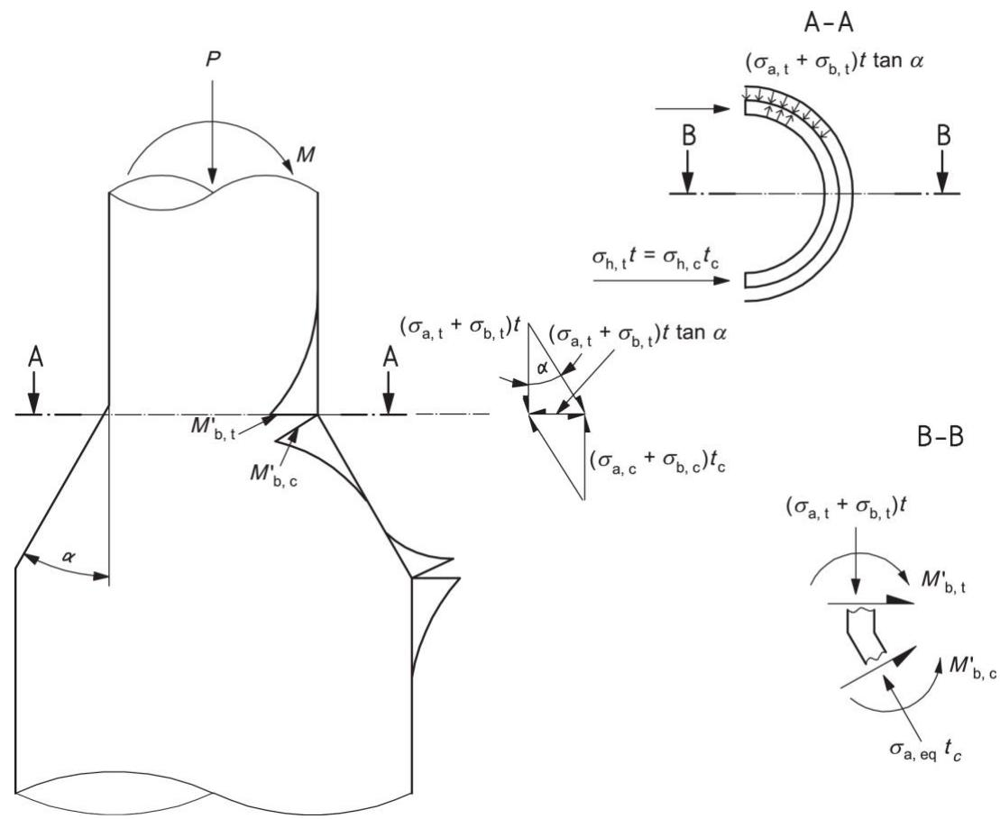  
Figure A.13.6-2 — Local bending stress and hoop stress at unstiffened junction

Key

M bending moment on member about cone/tubular junction due to factored actions   
$P$ axial force on member due to factored actions   
t thickness of tubular at junction   
$t_{ \mathrm{ c } }$ thickness of cone at junction   
$\alpha$ slope angle of conical section   
M'b,t $M_{ \mathrm{ b , t } }^{ \prime }$ bending moment in tubular at junction for unit circumference

M'b,c $M_{ \mathrm{ b , c } }^{ \prime }$ bending moment in cone at junction for unit circumference   
σa,t $\sigma_{ \mathrm{ a , t } }$ axial stress in tubular section at junction   
σb,t $\sigma_{ \mathrm{ b , t } }$ bending stress in tubular section at junction   
σa,c $\sigma_{ \mathrm{ a , c } }$ axial stress in cone section at junction   
$\sigma_{ \mathrm{ b , c } }$ bending stress in cone section at junction   
$\sigma_{ \mathrm{ a , e q } }$ equivalent axial stress

NOTE The bending moment distributions presented here are approximate.--`,

## A.13.6.3 Strength requirements without external hydrostatic pressure`---

## A.13.6.3.1 General

No guidance is offered.

## A.13.6.3.2 Local buckling within conical transition

For local buckling under axial compression and bending, conical transitions with an apex angle less than $60^{ \circ }$ may be considered as equivalent cylinders with the local cone wall thickness and a diameter equal to $D_{ s } /$ cosα. For conical transitions of constant wall thickness, it is conservative to use the diameter at the larger end of the cone for $D_{ s } .$ .

Offshore structures generally have a very small number of cones. Thus, it can be expeditious to design the cones with a geometry such that the representative local buckling strength of the conical transition is equal to the yield strength, i.e. use Formula (13.2-8) given in 13.2.3.3.

## A.13.6.3.3 Junction yielding

When the hoop stress is tensile, the strength of the junction is determined by a yield check in accordance with the Mises-Hencky yield criterion.

## A.13.6.3.4 Junction buckling

The strength of the junction with regard to buckling is checked for the absolute largest value of the,,,`-- compressive hoop stress. Formula (13.6-15) is the same as Formula (A.13.4-1), apart from the addition-``,` of partial resistance factors in the former. The value suggested for the calculation of $f_{ \mathrm{ h e } }$ is based on the,,,`` results in Reference [A.13.6-1].

## A.13.6.3.5 A.13.6.3.5 Junction fatigue

The stress concentration factors are derived directly as the ratio between the maximum global plus local stresses normal to the junction and the global axial stresses in the tubular or the cone, respectively, as derived from forces due to factored actions.

## A.13.6.4 Strength requirement with external hydrostatic pressure

## A.13.6.4.1 Hoop buckling

Hoop buckling is analysed in a similar manner to that for a tubular subjected to external hydrostatic pressure, using equivalent geometry properties.

## A.13.6.4.2 Junction yielding and buckling

The action effect from external hydrostatic pressure is added directly to the other stresses at the junction when performing the utilization checks with respect to yielding and buckling.

## A.13.6.5 Ring design

No guidance is offered.

A.13.7 Dented tubular members

## A.13.7.1 General

The design recommendations are tailored to dented tubulars with dimensions and material yield strengths typical of offshore structure members （$f_{ \mathrm{ y } } \leq 500$ MPa and $D / t \leq 120 ]$ ). Because of the lack of test data for larger dent depths, the applicability of the proposed equations for dented members should be limited to $h / D \leq 0 { , } 3$ and $h / t \leq 10$ .

The most significant parameter affecting the residual strength of dented members is dent depth. Experimental and analytical data [A.13.7-1], [A.13.7-2], [A.13.7-3], [A.13.7-4] have shown that dent length and shape all have relatively negligible effects on the strength of a dented member. Furthermore, provided the dent is located length-wise in the middle half of the member, the loss of strength in a dented member seems insensitive to dent location [A.13.7-2].

The formulae in this subclause are based largely on those of Reference [A.13.7-5] although the force format adapted therein has been converted to a “stress” format for inclusion in this document.

## A.13.7.2 Dented tubular members subjected to tension, compression, bending or shear

## A.13.7.2.1 General

The tension, compression and bending recommendations contained in this subclause are based on a programme of testing carried out since the late 1970s. Hydrostatic pressure recommendations have not been included in 13.7 due to limited data. Applicable tests up to 1995 have been documented in the references cited.

## A.13.7.2.2 Axial tension

The strength formula for axial tension relies on yielding of the steel of the dented cross-section whose cross-sectional area is assumed unaltered by the damage.

## A.13.7.2.3 Axial compression

Dented tubular members subjected to axial compression fail primarily due to overall column buckling, with or without local buckling. The capacity of the dented member has been reduced by $\xi_{ \mathrm{ c } }$ with respect to the intact cross-section to account for the reduced effective cross-sectional area of the dented section.

The parameter $\xi_{ \mathrm{ c } } ,$ defined in Formula (13.7-14), is discussed below.

a) Column buckling

The representative axial compressive strength for members with an out-of-straightness, $\varDelta y ,$ which is not necessarily a consequence of the damage, is determined from Formulae (13.7-5) and (13.7-6), which account for the additional bending stress on the dented cross-section due to the member outof-straightness. Formula (13.7-5) deals with an out-of-straightness for dented tubulars that is still within the corresponding fabrication tolerance for intact members, i.e. 0,001 of the length. As such, only the effect of the reduction in effective cross-sectional properties at the dent should be taken into account. For an out-of-straightness greater than the fabrication tolerance, only the out-of-straightness in excess of the tolerance should be considered [Formula (13.7-6)], because the column buckling Formulae (13.2-5) and (13.2-6) already account for Δy values up to the level of the tolerance.

The column buckling formulae are similar to the intact member formulae [Formulae (13.2-5) and (13.2-6)] except that λ has been replaced by $\lambda_{ \mathrm{ d } } ,$ the column slenderness parameter that accounts for the effects of denting on cross-sectional properties. The test database was obtained from several different investigators, see References [A.13.2-6], [A.13.2-9], [A.13.7-1] to [A.13.7-4], and [A.13.7-6] to [A.13.7-13]. A comparison between the test data and the predictions using Formulae (13.7-5) and (13.7-6) is given in Figure A.13.7-1.

b) Local buckling

The local buckling formula for dented members is similar to that for intact tubular members except that the parameter $\xi_{ \mathrm{ c } }$ has been introduced [Formulae (13.7-7) and (13.7-8)] to account for the reduced strength of the dented cross-section. Discussion of the dented member parameters $\xi_{ \mathrm{ c } }$ and $\xi_{ \mathrm{ m } }$ (see A.13.7.2.4) can be found in Reference [A.13.7-14].

The results of column tests on relatively short damaged tubulars $\left( \lambda_{ \mathrm{ d } } < 0 , 252 \right)$ are plotted normalized with respect to their intact strength [Formulae (13.2-8) and (13.2-9)] against the dent damage ratio $h / t$ in Figure A.13.7-2. Also plotted is the cross-sectional area dented member parameter, $\xi_{ \mathrm{ c } } ,$ [Formula (13.7-14)]. The appropriateness of $\xi_{ \mathrm{ c } }$ to represent the effects of dent damage on the local buckling strength is clearly seen.

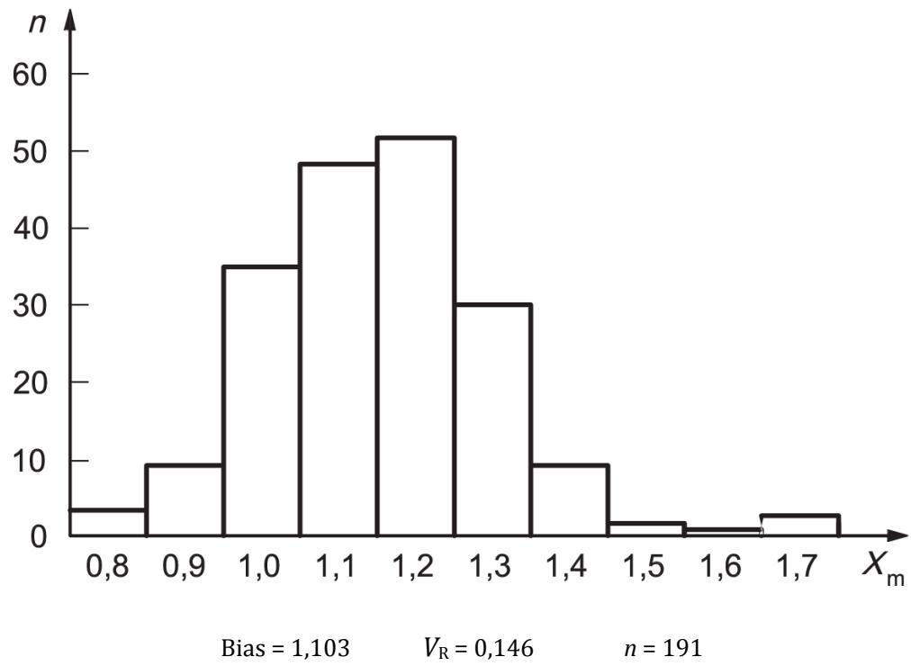  
Figure A.13.7-1 — Comparison of measured and predicted strengths for dented tubulars subjected to axial compression

Key, ``- `-

n```, frequency (number of occurrences)   
Xm--- $\mathrm{ \ddot{ \it{ X } }_{ m } }$ measured strength/predicted strength

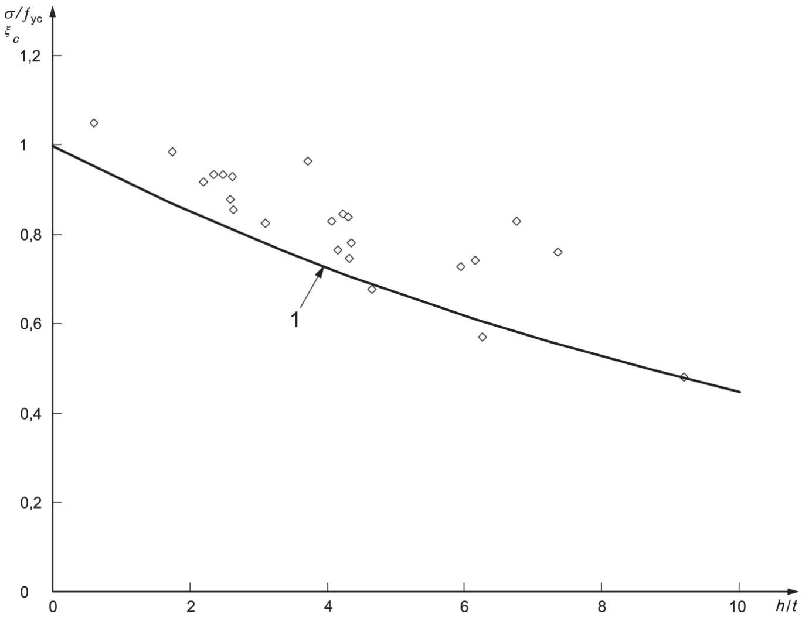  
Figure A.13.7-2 — Comparison of normalized test data of dented tubulars with compression strength knock-down factor for $\lambda_{ \mathrm{ d } } < 0 , 252$

Key

1 e -0,08 h/t   
h dent depth   
t wall thickness   
σ stress in test member   
$f_{ \mathrm{ y c } }$ representative local buckling strength (intact)   
$\xi_{ \mathrm{ c } }$ compression strength knock-down factor

## A.13.7.2.4 Bending

When dented tubulars are subjected to bending moments resulting in tensile (positive) or zero (neutral) stresses in the centre region of the dent, the bending strength of the dented tubular is not appreciably lower than that of an intact member. The representative bending strength formulae for members under positive [Formula (13.7-16)] or neutral [Formula (13.7-20)] bending are thus similar to that for intact members [Formula (13.2-11)].

For members subjected to bending moments resulting in compressive (negative) stress in the centre region of the dent, the bending strength of the dented member is reduced compared with that of the intact

member. Test data from References [A.13.7-9] and [A.13.7-15] indicate that the reduction in strength can be approximated by the application of Formulae (13.7-15) to (13.2-11).

A comparison between test data and the prediction of the representative bending strength formula, $\xi_{ \mathrm{ m } } \times f_{ \mathrm{ b } } ,$ , is plotted in Figure A.13.7-3. The statistics of the fit are indicated on this figure.

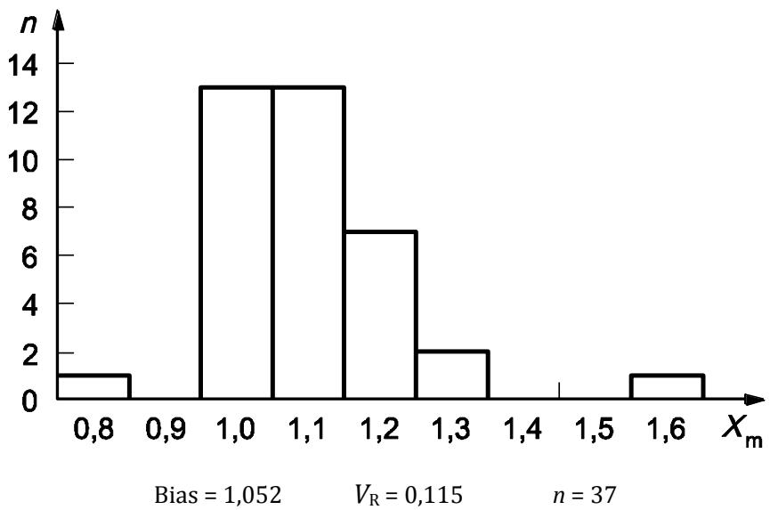  
Figure A.13.7-3 — Comparison of measured and predicted strengths for dented tubulars subjected to bending (dent in compression)

Key

n frequency (number of occurrences)

$X_{ \mathrm{ m } }$ measured strength/predicted strength

## A.13.7.2.5 Shear

No guidance is offered.

## A.13.7.3 Dented tubular members subjected to combined forces

## A.13.7.3.1 Axial tension and bending

The tension-bending interaction formulae for dented tubulars, Formulae (13.7-24) and (13.7-26), are similar in form to the corresponding formula for intact members, Formula (13.3-1), although, for Formula (13.7-26), a less compact format is used because of the need to cater to the differences between positive and negative bending effects. The α term in Formula (13.7-26) reflects the change in the interaction between the two orthogonal moments when a dent is present, see Reference [A.13.7-14].

Recommendations for the interaction of axial tension, bending, and hydrostatic loads have not been included due to limited test data.

## A.13.7.3.2 Axial compression and bending

The format of both the overall beam-column stability checks, Formulae (13.7-29) and (13.7-34), and the strength checks, Formulae (13.7-30) and (13.7-35), for dented tubular members subjected to combined axial compression and bending is similar to that adopted for intact tubulars in 13.3.3.

For members with different effective length factors in the negative and neutral bending directions, the Euler buckling strengths, $f_{ \mathrm{ e } }$ and $f_{ \mathrm{ e , d } } ,$ are generally different and should be taken into account in Formula (13.7-34).

The value of $C_{ \mathrm{ m } , i }$ used in the stability formulae for dented tubulars has been conservatively set to 1,0, although an upper limit of 0,85 is normally recommended for end-restrained intact members in laterally braced frames typical of offshore steel structures as described in Table 13.5-1. For dented members, values of $C_{ \mathrm{ m } , i }$ smaller than 1,0 may be justified, but these should be considered on a case-by-case basis.

A comparison between test data and the combined axial compression and bending strength formulae, Formulae (13.7-29), (13.7-30), (13.7-34) and (13.7-35), is plotted in Figure A.13.7-4. The statistics of the fit are indicated in this figure.

Recommendations for the interaction of axial compression, bending, and hydrostatic loads have not been included due to limited test data.

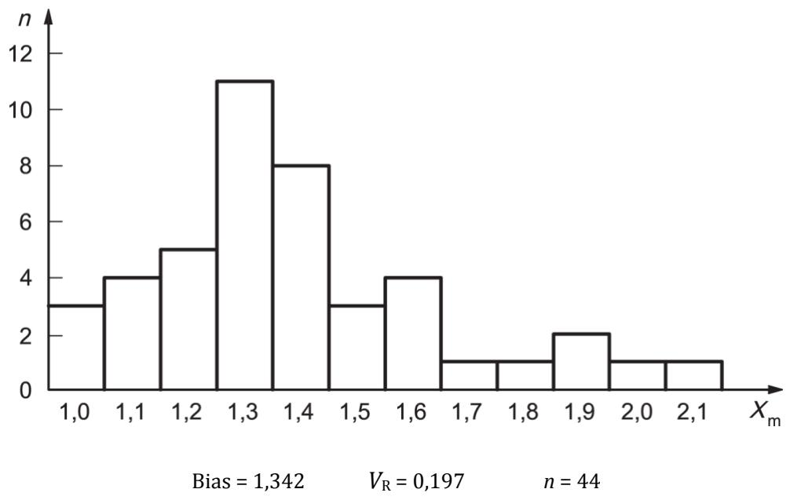  
Figure A.13.7-4 — Comparison of measured and predicted strengths for dented tubulars subjected to combined compression and bending (dent in tension, compression or on neutral axis)

Key

n frequency (number of occurrences)

$X_{ \mathrm{ m } }$ measured strength/predicted strength

A.13.8 Corroded tubular members

One approach to estimate the strength of an approximately uniformly corroded member is to assume a reduced thickness for the entire member. The reduced thickness should be consistent with the average material loss due to corrosion. The member with the reduced thickness can then be evaluated as an intact member. This reduced thickness approach is generally conservative, as discussed in Reference [A.13.8-1]. However, caution should be exercised with respect to fatigue.

Another common case of corroded members is the presence of severe localized corrosion in the form of patches. This form of corrosion cannot be approximated as uniform. References [A.13.7-13], [A.13.8-2] and [A.13.8-3] provide formulae to estimate the local buckling strength of these corroded members as a function of the thickness loss. No information is available on the effect of localized corrosion on overall member strength. In this case, FEA or a numerical segment approach based on empirical or analytical moment-axial force-curvature (M-P-Φ) relations can be used. For fatigue sensitive conditions, a fatigue evaluation of the corroded member should also be considered.

A.13.9 Grouted tubular members

## A.13.9.1 General

Grout filling offers benefits to intact members but offers greater benefits to members suffering limited damage following impacts from vessels or dropped objects. For intact members, greater member strength and stiffness can be achieved at the expense of weight, but without any corresponding increase in environmental actions. For damaged members, growth in dent damage is inhibited, enabling the full strength of the damaged cross-section to be achieved.

Most of the available test data relates to tubulars in which grouting has been introduced following damage, usually in the form of local dents but frequently accompanied by overall bowing. The reason for this is that the use of grouting in offshore tubulars has largely been driven by the need to strengthen/stiffen damaged members.

The formulae presented in 13.9 are only applicable to fully grouted tubular members. Based on actual experience, it can be difficult to achieve a fully grouted condition in offshore repair or strengthening operations. Consequently, some reduction in the calculated residual strength can be necessary to account for the potential incomplete grouting at the end of the grouted member. Because only limited data are available for partially grouted tubular members (especially intact ones) and because defining the extent of the grout filling of tested specimens is not precise, no design formulae for partially grouted tubular members can be given at this time. However, the strength formulae for such partially filled tubulars can be formulated by assuming that the grout does not contribute either to the axial compressive strength or to the moment capacity. This is achieved by setting the terms for the fully grouted members that relate specifically to the grout to zero, see References [A.13.9-1] and [A.13.9-2].

## A.13.9.2 Grouted tubular members subjected to tension, compression or bending

## A.13.9.2.1 General

The tension, compression and bending requirements contained in this subclause are based largely on the studies reported in References [A.13.9-1] and [A.13.9-2]. Shear and hydrostatic pressure requirements are not included because of lack of data. Applicable tests up to 1995 have been documented in the above references. Figures, showing test results supporting the requirements of 13.9, are included in the appropriate subclauses.

## A.13.9.2.2 Axial tension

The strength formula for axial tension reflects only yielding of the steel cross-section. The contribution of the grout to the tensile capacity of the fully grouted member has been conservatively ignored. When complete grouting can be demonstrated, advantage can be taken of the benefits of the grouting.

## A.13.9.2.3 Axial compression

The axial compressive strength of fully grouted tubular members is determined from Formula (13.9-8) and (13.9-9). These column buckling formulae are similar to the intact and non-grouted member strength formulae [Formulae (13.2-5) and (13.2-6)] except that the slenderness parameter λ has been replaced by $\lambda_{ \mathrm{ g } }$ and the representative local buckling strength $f_{ \mathrm{ y c } }$ has been replaced by the axial squash strength $f_{ \mathrm{ u g } }$ of the fully grouted member.

The test data for fully grouted intact tubulars are taken from References [A.13.9-1] and [A.13.9-3] to [A.13.9-5]. Similar data for fully grouted damaged tubulars are taken from References [A.13.9-3] to [A.13.9-8]. A comparison between the test data and the predictions using the strength formulae is presented in Figure A.13.9-1.

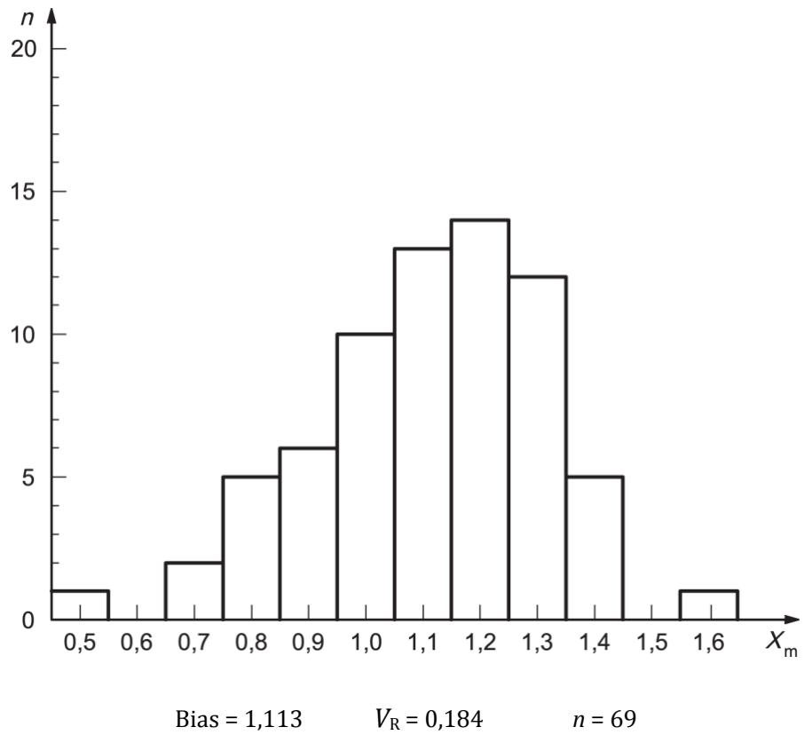  
Figure A.13.9-1 — Comparison of measured and predicted strengths using the representative axial compressive strength equations for fully grouted damaged and intact tubular members

Key

n frequency (number of occurrences)

$X_{ \mathrm{ m } }$ measured strength/predicted strength

## A.13.9.2.4 Bending

The bending strength of fully grouted tubular members may be calculated from Formula (13.9-19). The bending strength of the dented section is found from a second order fit to the exact formula, simply expressed in terms of dent depth to diameter ratio. The effect of the presence of the grout is based on an approximation to the semi-graphical representation of this feature in BS 5400 [A.13.9-9].

## A.13.9.3 Grouted tubular members subjected to combined forces

## A.13.9.3.1 Axial tension and bending

For a fully grouted, intact tubular subjected to combined axial tension and bending forces, there are several ways to estimate its strength. The member may be assessed using Formula (13.3-1) by neglecting the effect of the grout or using Formula (13.9-19) if the maximum stress due to tension is small in comparison to that due to bending. For a fully grouted, dented tubular member, Formulae (13.7-24) and (13.7-26) may be used by replacing $f_{ \mathrm{ b } }$ with $f_{ \mathrm{ b , g } } .$

## A.13.9.3.2 Axial compression and bending

The design requirements are based on those given in Reference [A.13.9-9] for concrete-filled tubular members subjected to combined axial compression and bending. The background to the design requirements is documented in References [A.13.9-10] and [A.13.9-11]. The interaction formulae for fully concrete-filled tubular members are judged to be applicable to grout-filled tubular members because both their behaviour and the contribution of the grout to the strength are very similar to those of concrete-filled tubulars.

The parameter, $K_{ 1 } ,$ as given in Formulae (13.9-28) and (13.9-29), is the non-dimensional axial compressive strength of the member. A slightly different $K_{ 1 }$ formula is given in Reference [A.13.9-9]. The significance of the parameters $K_{ 2 }$ and $K_{ 3 }$ is illustrated in Figure A.13.9-2. The influence of the parameter $K_{ 2 }$ is low for tubular members having a small outer diameter and a high slenderness ratio, regardless of the $D / t$ ratio. Low values of $K_{ 2 }$ generally also mean a low value of $K_{ 3 } ,$ , which can be negative for very small diameters and a high slenderness ratio. In general, the advantageous effect of grouting resulting in increased strength diminishes as the diameter becomes smaller.

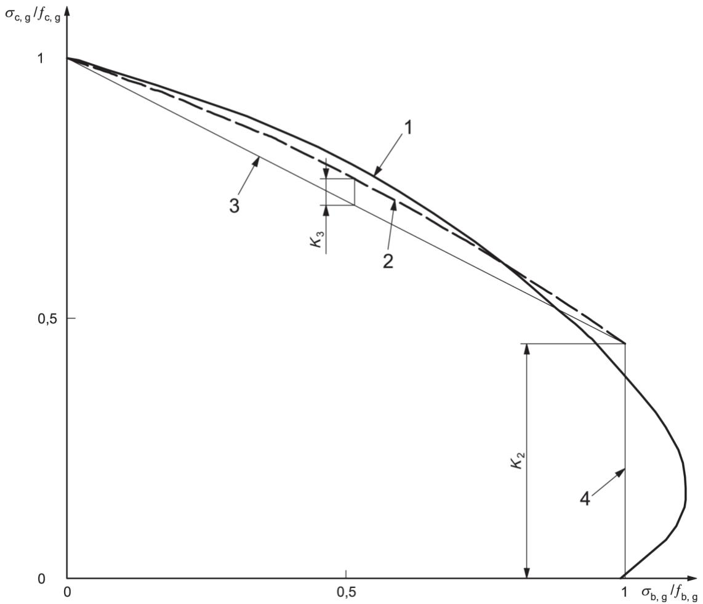  
Figure A.13.9-2 — Illustration of relevance of parameters $K_{ 2 }$ and $K_{ 3 }$

#

1 interaction curve from analytical solution   
2 approximating parabolic curve in Formula (13.9-24)   
3 Formula (13.9-38) for fully utilized and fully grouted member with $K_{ 3 } = 0$   
4 Formula (13.9-39) for fully utilized and fully grouted member   
σc,g $\sigma_{ \mathrm{ c , g } }$ axial compressive stress in fully grouted member   
σb,g $\sigma_{ \mathrm{ b , g } }$ bending stress in fully grouted member   
fc,g $f_{ \mathrm{ c , g } }$ representative axial compressive strength of grouted member   
$f_{ \mathrm{ b , g } }$ representative bending strength of grouted member   
$K_{ 2 }$ variable from Formula (13.9-30)   
$K_{ 3 }$ variable from Formula (13.9-31)

## A.14 Strength of tubular joints

A.14.1 General

The historical development of tubular joint strength provisions for offshore structures is summarized in A.14.3.

Major updates compared with the previous edition of this document are detailed in the following subclauses and involve a relaxation of the $2 / 3$ limit on tensile strength, new $Q_{ \mathrm{ u } }$ and $Q_{ \mathrm{ f } }$ formulations, and a change in the form of the brace load interaction formula. Further, the limit on yield strength has been increased to 800 MPa as described in A.13.1.

A.14.2 Design considerations

## A.14.2.1 Materials

All the empirical strength formulae are based on measured yield strength. Few test results have demonstrated low strength because of substandard material properties.

Updates of the tubular joint database and of design guidance were undertaken from 1994 to 1996 [A.14.2-1], [A.14.2-2]. At that time, some existing codes limited the useable value of yield strength to no more than $^{ 0 , 7 }$ or $2 / 3^{ \mathrm{ r d s } }$ of ultimate tensile strength. Analysis of the database [A.14.2-1] demonstrated that the limit on the ratio could be increased to 0,8 for joints with chord yield strength up to 800 MPa.

Figure A.14.2-1 shows a plot of the ratio of measured to predicted K-joint strength against the chord material yield-to-ultimate strength ratio based on the updated database [A.14.2-1]. In this plot, the predicted value is the representative joint strength from Clause 14 calculated using actual chord yield strength values and suitably upgraded to reflect joint mean strength. It can be seen from Figure A.14.2-1 that no effect of yield strength occurs for yield-to-tensile strength ratios up to 0,8. Similar observations have been made with respect to other joint types and design situations. Some steels exhibit adequate toughness even when the ratio exceeds 0,8. However, use of this limit is still considered appropriate, because strength formulae generally imply some degree of strain hardening. Lack of strain hardening can lead to large local strains and premature cracking.

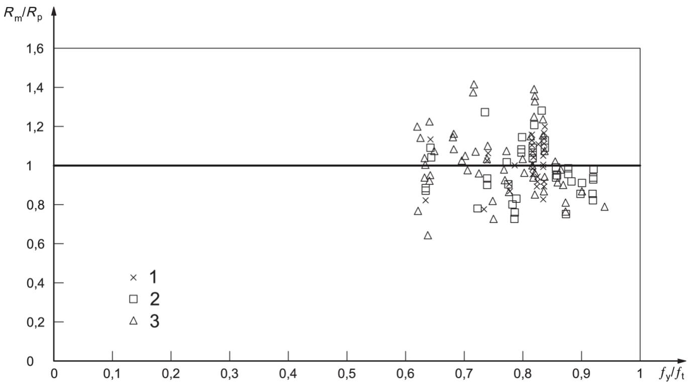  
Figure A.14.2-1 — Effect of $f_{ \mathrm{ y } } / f_{ \mathrm{ t } }$ for K-joints on joint strength under balanced axial forces

Key   


| 1 | near zero gap/overlap K-joints | fy | yield strength |
| --- | --- | --- | --- |
| 2 | overlapping K-joints | ft | tensile strength |
| 3 | gapped K-joints | Rm | measured joint strength |
|  |  | Rp | predicted joint strength |


The material property range is limited to $f_{ \mathrm{ y } } \leq 800$ MPa. Previously there had been a concern that the strength of joints with chord yield strength in excess of 500 MPa did not increase in proportion to the yield strength. The concern related to the potential that higher yield strength was obtained at the expense of lower ductility and lower strain-hardening capacity, thereby compromising the post-yield reserve strength on which the strength formulae rely. A re-evaluation of the test results reported in Reference [A.14.2-3] revealed that the strength formulae could still be used for joints with 500 MPa $< f_{ \mathrm{ y } } \leq 800$ MPa, as long as the limit on yield-to-tensile strength ratio did not exceed $^{ 0 , 8 }$ and provided adequate ductility could be demonstrated in both the heat affected zone and the base material. These test data were limited to a small number of joint types and loading modes with just 11 joints tested in total.

A JIP [A.14.2-4] investigated the static strength of high strength steel X-joints. It involved the testing of four compression joints (two with a yield strength of 355 MPa and one each with 500 MPa and 700 MPa) and three tension joints (one each with a yield strength of 355 MPa, 500 MPa and 700 MPa). The findings indicated that all joints performed satisfactorily in terms of strength and ductility. The results confirmed a yield-to-tensile strength ratio of not greater than 0,8 could be used to determine joint ultimate compressive strength, but not necessarily tensile strength because the tension joints were not subjected to a detailed assessment since cracking occurred prior to achieving ultimate strength.

Beyond 800 MPa, indicative capacity estimates can be obtained through use of a yield strength of 800 MPa or 0,8 times the tensile strength, whichever is the lesser.

## A.14.2.2 Design forces and joint flexibility

It has long been recognized that tubular joints can show significant linear elastic flexibility at locations, such as skirt pile bracing. Joint flexibility has sometimes been included in calculating fatigue life estimates. Fatigue life estimates for conductor framing connections can sometimes be substantially greater when linear elastic flexibilities are included in the analysis. Full non-linear joint forcedeformation relationships can be required for pushover analyses to determine system ultimate strength, especially where joint failures participate in the sequence leading to collapse. Such pushover analyses are common in design robustness studies as well as structural assessments of existing structures.

Reference [A.14.2-5] provides a robust set of formulae to model the linear elastic flexibility and stiffness of simple tubular joints. Although other sets of formulae are available, the formulae in [A.14.2-5] are wide-ranging, have physical meaning, compare well with hard data, and are simple to use both manually and computationally.

In Reference [A.14.2-1], additional analysis was undertaken and closed-form expressions were derived which could be used to generate joint non-linear force-deformation (P-δ or M-θ) relationships, in both loading and unloading regimes, for simple joints across a practical range of design situations and geometries. Details were presented in Reference [A.14.2-6]. Figure A.14.2-2 shows an example of a generated curve compared with a curve fitted to experimental data.

Figure A.14.2-2 — Comparison of generated curve to experimental curve for force-deformation behaviour of a simple tubular joint   
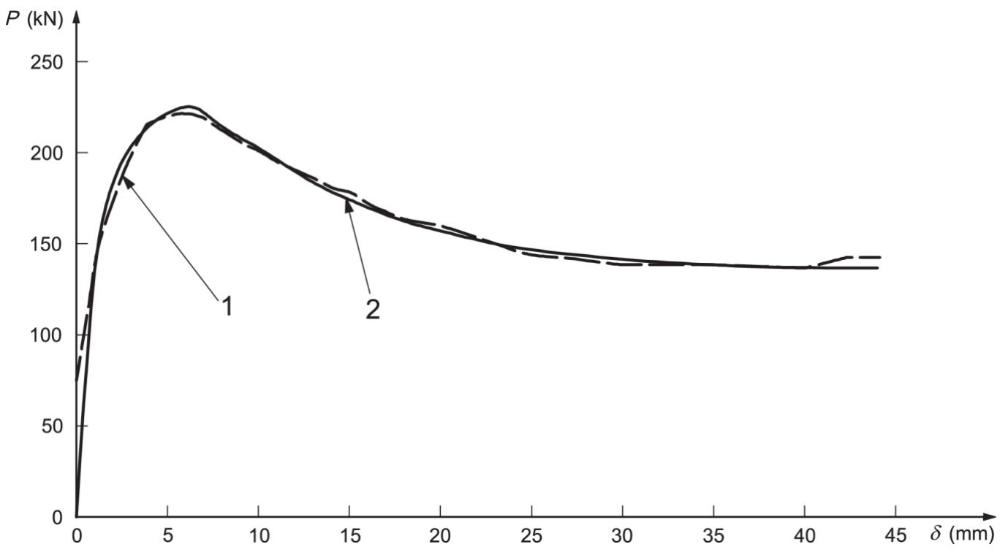  
Key   
1 experimental curve   
2 generated curve   
P force   
δ deformation

Reference [A.14.2-7] reports on a pilot study to assess the effect of hydrostatic pressure on tubular joint strength. Double T-joints (DT-joints, see 14.2.4) were considered, and the results indicate that joint strength can be reduced by up to 30 %, depending on geometry, brace force or moment and hydrostatic

pressure. No other studies on this subject have been identified. Hydrostatic pressure effects can be significant, especially for deep water structures.

## A.14.2.3 Minimum joint strength

In general, joint failure prior to a brace failure is undesirable, due to uncertainties in the failure mechanism and of the effect on the surrounding structure. The requirement for a minimum chord capacity of 50 % of incoming brace strength is intended to improve the relative reliability of joints and members, and to increase platform robustness. Furthermore, this requirement provides a safety net for unanticipated loads, such as support failure during loadout, unexpected weather conditions during launch or lifting, vessel collisions, and dropped objects. It also ensures a minimum capacity for connections of secondary members that take on primary importance in reserve strength assessments.

The more stringent requirement for a minimum chord capacity of 100 % of incoming brace strength for seismic actions is intended to ensure maximum robustness during extreme seismic events.

Non-critical joints may be excluded from the minimum capacity requirement. A joint is considered noncritical only if its failure does not:

— reduce the reserve strength of the structure for the considered design event;   
— reduce the capacity of the structure to withstand accidental actions;   
— have significant safety consequences;   
— have significant environmental consequences.

The 50 % requirement may be relaxed in certain limited instances, such as the connections of appurtenances for which failure of the connection would not lead to significant safety or environmental consequences.

## A.14.2.4 Weld strength

No guidance is offered.

## A.14.2.5 Joint classification

Some special cases of basic planar joint types have their own names. For example, a Y-joint with a brace angle of approximately 90° is called a T-joint. A double T- or DT-joint, appears to be a special case of an X-joint with braces at 90°. However, the axial forces in both braces of a DT-joint are reacted by beam shear in the chord while in an X-joint the brace axial force is transferred through the chord to the opposite side without any beam shear in the chord. A joint should be classified as a DT-joint if one brace is in tension and the other brace is in compression. Each brace is then treated separately as a T-joint.

A K-joint where one of the two braces has a brace angle of approximately 90° (see, for example, case a) in Figure 14.2-2) is sometimes referred to as an N-joint.

Joint classification is based on axial force pattern, as well as on joint configuration. The favourable strength factor $Q_{ \mathrm{ u } }$ (see 14.3.3) for K-joints reflects reduced chord can ovalization when compared to that of Y-joints. $Q_{ \mathrm{ u } }$ values for X-joints are typically worse than for Y-joints because X-joints have greater ovalization tendencies.

If the axial force in a given brace corresponds within ± 10 % to one of the standard joint types, it is permissible to classify the brace as totally of that joint type: no interpolation is required. However, many

joints have braces that are not clearly of one given type. Because force distributions are complex, an individual brace axial force is normally divided into portions for which the brace is treated, in turn, as a Y-joint, a K-joint or an X-joint. Figure 14.2-2 c) and h) contain braces with mixed classifications.

Several schemes for automating the classification process have evolved over the years. None is unique. In all of them, braces belonging to a particular joint type are identified and the geometrical information is catalogued. Braces lying in a common plane and on the same side of the joint are identified and the gap between them is computed. Each brace is evaluated based on its axial force for each design situation. Classification can change from one design situation to the next, and is often different for each brace at a given joint. Mixed classifications generally occur.

In a typical classification scheme, braces whose axial force component perpendicular to the chord is essentially balanced by axial forces in other braces on the same side of the chord are treated as K-joints. Figure 14.2-2 a), d), e) and g) are such cases, as are the lower braces shown in Figure 14.2-2 c) and h). A brace whose perpendicular force component is reacted by beam shear in the chord is treated as a Y-joint, as in Figure 14.2-2 b), even though its geometrical appearance suggests a K-joint. Finally, braces with ``` perpendicular forces that follow neither K-joint nor Y-joint patterns are treated as X-joints. In other `` classification schemes, the hierarchy is K- followed by X-, with T/Y- being the default.

Typically, these classification schemes do not address multiplanar connections, even though fixed steel offshore structures are generally space frames, not planar trusses. Furthermore, the schemes do not recognize that several braces in a given plane can simultaneously contribute to ovalization of the chord, for example, in launch frames and the other examples illustrated in Figure A.14.2-3. Such cases can produce a more adverse force distribution than is recognized in the classification schemes.

In cases such as those illustrated in Figure A.14.2-3, it is conservative to find the sum of the force components perpendicular to the chord and assume that the strength is the minimum of any one of the brace-chord intersections when acting as an X-joint. General collapse calculations or FEA can reduce the conservatism.

An alternative approach to joint classification is to use the ovalization parameter, α, from AWS D1.1 [A.14.2- 9]. The attraction of the α-based approach is that it does not require any decisions concerning classification. In a general sense, it encompasses the simple joint classification scheme described above and appears to be more applicable for multiplanar joints. However, limitations exist where:

a) α significantly exceeds baseline X-joint classification;   
b) the diameter ratio β is above 0,9; or   
c) a low value of α is not the result of classical K-joint action.

Further, AWS D1.1 does not properly incorporate the effect of gap nor addresses tension failures in the same manner as this document.

A JIP described in Reference [A.14.2-10] generated a considerable database of FEA results for multiplanar joints without overlapping braces and subjected to axial brace forces. Refined formulae were given for the ovalization parameter, α, which have been adopted in the AWS D1.1 approach.

Additional guidance specific to multiplanar T/Y-, K- and X-joints with axial forces can be found in Reference [A.14.2-11]. More information on multiplanar T/Y- and K-joints is available in References [A.14.2-12] to [A.14.2-14].

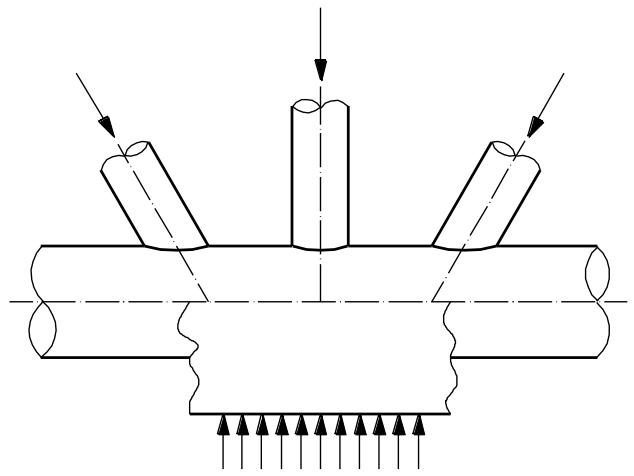  
a) Launch pad

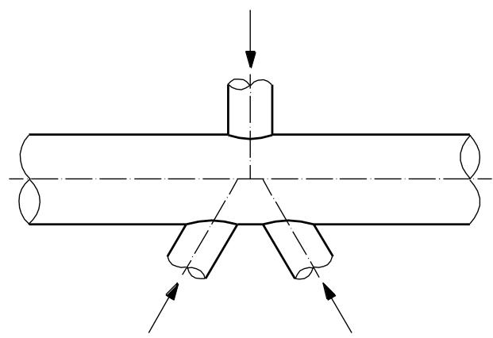  
b) False leg termination

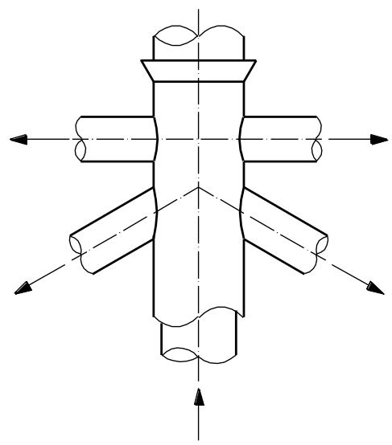  
c) Skirt pile bracing

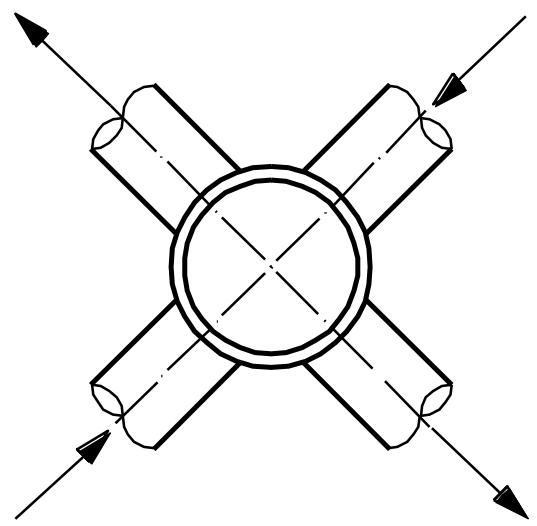  
d) Hub connection   
Figure A.14.2-3 — Force patterns causing chord ovalization greater than that implied in the strength formulae

## A.14.2.6 Detailing practice

Consistent with recent API guidance [A.14.2-15], the can and stub length measurements do not include thickness tapers.

The minimum overlap dimension is a recommendation rather than an absolute requirement. There are many practical instances where smaller overlaps occur. These cases are fully amenable to analysis for both strength and fatigue and can be readily fabricated. However, any overlap in a joint reduces the extent to which in-service inspection can be performed.

In many instances, using the minimum chord can length provides a significant reduction in joint strength compared with that of a longer can. Formula (14.3-11) can be used to optimize the strength of the joint by providing sufficient can length.

A.14.3 Simple tubular joints

## A.14.3.1 General

## A.14.3.1.1 Parameter ranges

The requirements and recommendations contained in this document are based on interpretation of available data, both experimental and numerical. As with all empirically-based practices, the recommendations have specific validity ranges, although these cover a wide spectrum of the geometries and materials currently used in practice. However, differences in design practice and in application can lead to the selection of different acceptable data on which to base empirical formulae with the consequence that variations in various code joint strength requirements are, in part, due to differences in the databases.

Apart from the yield strength limit given in 14.2.1, the recommendations can be used for joints with geometries which fall outside the validity ranges given in 14.3.1 by taking the usable joint strength to be the lesser of the values calculated from:

— actual geometrical dimensions;

— actual geometrical dimensions together with, for those geometrical parameters where limits are exceeded, geometrical dimensions corresponding to the limiting values of the validity ranges of the relevant geometrical parameters.

## A.14.3.1.2 Historical background

## A.14.3.1.2.1 Early work

In the early 1970s, in the 3rd Edition of API RP 2A (1972), some simple recommendations for tubular joint strength were introduced based on punching shear principles. In the 4th Edition of API RP 2A (1973), these were enhanced by factors introduced to allow for the presence of forces in the chord and for the brace-to-chord diameter ratio (β). In the 9th Edition of API RP 2A (1977) modifications were introduced to account for joint type and loading configuration, i.e., T/Y, DT/X, and K.

Much work was done over the period 1977 to 1983, including large-scale tests to failure, which culminated in the 14th Edition of API RP 2A (1984) with substantial revisions to the punching shear stress formulae as well as in more realistic formulae to account for chord load effects and for the combined effect of brace axial and bending stresses. The alternative nominal load approach was also introduced: it gives equivalent results to the punching shear method [A.14.3-10].

In the 20th Edition of API RP 2A (1993), recommendations were added on load transfer through the chord.

Further data were added to the existing experimental database, often as a consequence of testing a simple joint as a reference in the course of examining a complex configuration, e.g. the database for in-plane bending doubled [A.14.3-1]. In addition, FEA studies were initiated to help improve the understanding of tubular joint behaviour [A.14.3-1].

In support of the development of the first edition of this document, a tubular joints JIP [A.14.2-1], [A.14.2-2] was undertaken over the period 1994-1996, which subsequently significantly influenced practice for simple and overlapping joints. This work, as well as further studies, notably by API/EWI and the University of Illinois [A.14.3-2], formed the basis of the tubular joint strength provisions of the 1st edition of this document.

## A.14.3.1.2.2 Database for ISO 19902:2007 tubular joints formulae

The general approach adopted in the JIP [A.14.2-1], [A.14.2-2] was:

a) collation of comprehensive databases of worldwide experimental and pertinent FEA results;   
b) validation and screening of the databases;   
c) fitting curves to the data;   
d) comparison of databases and of derived strength formulae with previous practice;   
e) selection of appropriate formulae.

Baseline screening criteria adopted in the JIP are described in A.14.3.1.2.3 to A.14.3.1.2.8.

## A.14.3.1.2.3 Data range for chord diameter

A lower limit of 100 mm was imposed because of the concern that small-scale specimens were not representative of fabricated joints found offshore from a material, weld or tolerance standpoint.

## A.14.3.1.2.4 K-joint gap

Some data only recorded eccentricity (see Figure 14.1-1) and not gap, which results in calculated gaps falling into a narrow range around zero. Consequently, using zero gap as a basis for separating overlapping from non-overlapping braces proved impractical. Accordingly, non-overlapping (gapped) joints were defined as those having at least a small finite gap and overlapping joints as those having at least a small finite overlap. Thus nominally zero gap specimens, $g_{ 0 } ,$ were defined by the following criterion:

$$- g_{0} \leq g \leq g_{0} \tag{A.14.3-1}$$

where

$$g_{0} = 7, 5 \mathrm{m m} \text{o r} 2 T, \text{w h i c e v e r i s t h e g r e a t e r};$$

$$T \quad \text{i s t h e t h i c k n e s s o f t h e c h o r d .}$$

Use of the above criterion excluded only a relatively small number of data from either the gapped joint or the overlapping joint database.

## A.14.3.1.2.5 Data range for other dimensions

No other limitations on dimensions were imposed. However, derived non-dimensional quantities were screened as follows:

a) Length/diameter ratio

Specimens having very low chord length to diameter ratios were removed as they were unduly affected by short chord effects and by end restraints, and because unusual chord stress flow patterns would exist at the joint. A limit on the ratio of 3 was initially selected.

b) Thickness ratio

Most data corresponded to joints with chord wall thickness nominally the same as or greater than that of the brace, in accordance with general offshore practice. For nominally the same chord and brace thicknesses and allowing for a ± 5 % variation of both, an upper limit of τ = 1,1 was selected.

## A.14.3.1.2.6 Data range for material properties

All specimens where the chord yield strength was not recorded were excluded from the database.

## A.14.3.1.2.7 Utilization of chord and brace

The data were segregated into two groups:

a) joints where nominal stresses in both brace and chord were below yield;   
b) joints where nominal stresses in brace or chord exceeded yield.

The first group was treated as true joint strength data with no reservation. The second group was treated as lower bounds to joint failure because, once yield occurred, joint deformation often became significant and impractical for the test rig to accommodate.

## A.14.3.1.2.8 Database summary

A total of 1 066 simple joint specimens with D greater than 100 mm were screened. Of these 653 specimens were validated and included in the database. The screened data were used to develop formulae for joint strength, using regression analysis based on minimizing percentage differences and using statistical calculations characterized by a 95 % survivability level and a 50 % confidence level. These formulations formed the basis of the joint strength provisions of ISO 19902:2007.

## A.14.3.1.2.9 Recent advances

Limitations in the above database were identified with respect to the full range of joint types, joint geometries, and brace and chord loading conditions of interest. For example, except for T-joints, test data on brace bending were relatively sparse as were tests with additional chord loads (i.e. in addition to equilibrium induced). This concern was addressed by exploiting FEA models properly validated against test results because they were recognized to provide relatively low cost solutions for extending the database (except in the case of joint tension failure because of the absence of an appropriate failure criterion). As a consequence, a comprehensive API/EWI numerical analysis study [A.14.3-2] resulted in over 1 500 validated FEA data.

The extended database was used to revise the joint strength formulations in 14.3, using regression analysis and statistical calculations similar to those used previously although, given the limitations of FEA in respect of joints failing in tension, tension capacity was still essentially based on test data. All of the work of this extended study led to the revised tubular joint strength formulae presented in API RP 2A WSD 21st Edition Supp. 2.

## A.14.3.2 Basic joint strength

## A.14.3.2.1 General

The calculation of $P_{ \mathrm{ u j } }$ for a joint subjected to mixed mode loading is based on a weighted average of the values of $P_{ \mathrm{ u j } }$ relevant for each loading mode. Taking Figure 14.2-1 h) as an example, the diagonal brace

has a 50 % K- and a 50 % X-joint classification. The representative joint axial strength can be calculated from:

$$P_{\mathrm{u j}} = 0, 50 P_{\mathrm{u j , K}} + 0, 50 P_{\mathrm{u j , X}} \tag{A.14.3-2}$$

where

Puj $P_{ \mathrm{ u j } }$ is the representative joint axial strength, in force units;   
$P_{ \mathrm{ u j , K } }$ is the representative joint axial strength for K-joint classification, in force units;   
$P_{ \mathrm{ u j , X } }$ is the representative joint axial strength for X-joint classification, in force units.

## A.14.3.2.2 Calibration of partial resistance factor

API RP 2A WSD $21^{ \mathbf{ s t } }$ Edition Supp. 2 describes the derivation of the safety factor incorporated therein. It exploits the enlarged database described in A.14.3.1.2.9. Because of improvements in the accuracy of the basic strength formulae that arose from the use of the enhanced database, it was possible to reduce the API RP 2A WSD $21^{ \mathbf{ s t } }$ Edition Supp. 2 safety factor without compromising safety levels with the consequence that the corresponding API RP 2A LRFD factor could be increased from 0,95 to 1,00: this is the partial resistance factor, $\gamma_{ \mathrm{ { R , j } } } ,$ adopted in 14.3.2.

## A.14.3.3 Strength factor, $\pmb{ Q_{ \mathrm{ u } } }$

In exploiting the database described in A.14.3.1.2.9, new formulae were derived which provided significant improvements in the coefficient of variation or which had a wider range of applicability. The axial load formula for overlapping K-joints is an example of the former and the out-of-plane bending formula is an example of the latter. With one exception, the new formulae are superficially very different from their predecessors. The availability of the new data has brought to light trends in the formulae with respect to the tubular joint non-dimensional geometric parameters not previously appreciated. These trends and their effects on the formulae are fully discussed in Reference [A.14.2-15], except for the case of X-joints in tension.

The $Q_{ \mathrm{ u } }$ formulae for tension loaded T/Y- and DT/X-joints were derived on the basis of forces at which cracking was observed in tests. However, tension loaded joints made of thin or extremely tough steel can sustain further loading beyond first crack. Because an estimate of this reserve strength can be important in predominantly statically loaded joints, characteristic ultimate tensile strength formulae were developed [A.14.2-1] and are as follows:

a) For T/Y-joints (bias = 1,805, VR = 0,263):

$$Q_{\mathrm{u}} = 42 \beta - 4, 1 \quad \text{f o r} \beta \geq 0, 35 \tag{A.14.3-3}$$

b) For DT/X-joints (bias = 1,138, VR = 0,071):

$$Q_{\mathrm{u}} = 41 \beta - 1, 9 \quad \text{f o r} \beta \leq 0, 9 \tag{A.14.3-4}$$

$$Q_{\mathrm{u}} = 35 + (\beta - 0, 9) (32 \gamma - 285) \quad \text{f o r} \beta > 0, 9 [ \text{n o t v a l i d f o r} e / D > 0, 2 ] \tag{A.14.3-5}$$

NOTE 1 Bias is defined as the ratio of measured (test or numerical) strength to strength predicted using the recommended formulae and measured yield strength but assuming all partial factors to have a value of unity.

NOTE 2 e is the eccentricity of the two braces; see Figure 14.1-1.

The large increase in strength indicated in the second formula for DT/X-joints at high β relies on membrane stresses in the chord saddle region as the load is essentially transferred directly from one brace to the other. However, if there is any significant misalignment of the braces （$\mathrm{ i } . \mathrm{ e } . , e / D > 0 , 2 )$ , force transfer by membrane action is limited and the Formula (A.14.3-4) should be adopted over the full range of ${ \mathrm{ ~ ~ } } \beta .$

In situations where fatigue cracking is evident, the strength formulations for tension loaded $\mathrm{ T / Y } \mathrm{ - }$ and DT/X-joints based on forces at which cracking has been observed can be used to estimate the strength of the cracked joint; see Table 14.3-1. This applies for conditions in which the percentage of cracked area is not greater than 20 % of the full area. For other conditions, reference to further work [A.14.8-1], [A.14.8-2] should be made to determine the strength of the joint (also see Reference [A.14.5-5]).

Reference [A.14.3-11] introduced new strength formulations for X-joints in tension, which were adopted in NORSOK N-004 [A.14.3-12]. In addition to the characteristic capacity formula for $Q_{ \mathrm{ u } }$ provided in Table 14.3-1, Reference [A.14.3-11] also reported the mean capacity for X-joints under tension as given in Formula (A.14.3-6)

$$Q_{\mathrm{u}} = 9. 0 \gamma^{0. 6 \beta^{2}} \tag{A.14.3-6}$$

This formula can be used in the assessment of existing structures (see ISO 19901-9) in agreement with the regulator, where one exists.

## A.14.3.4 Chord force factor, $\pmb{ Q_{ \mathrm{ f } } }$

Compared to ISO 19902:2007, a substantial change to the chord force factor $\left( Q_{ \mathrm{ f } } \right)$ has been introduced.

a) The factor $Q_{ \mathrm{ f } }$ given in Formula (14.3-9) includes linear terms in the nominal chord axial load and inplane bending moments, in addition to the quadratic terms retained in the parameter A, see Formula (14.3-10). This is similar in form to the chord stress function proposed in Reference [A.14.3-13] and adopted in the CIDECT design guide [A.14.2-11].   
b) Formula (14.3-9) applies over the full range of chord loads.

The $Q_{ \mathrm{ f } }$ factor adopted herein is similar to that provided in API RP 2A 22nd Edition for X-joints with the brace in compression. For X-joints with the brace in tension, modified values for the $Q_{ \mathrm{ f } }$ factor are recommended. The API RP 2A 22nd Edition formulae are based on tests and analyses with the brace in compression only. In the most recent update to NORSOK N-004 Rev 3 [A.14.3-12], it was assumed that the influence of chord loading on joint strength could be different from that when the brace is in tension. As test and analytical results were not available, the recommended $Q_{ \mathrm{ f } }$ factors for when the brace was in tension were adopted in NORSOK N-004 Rev 3 based on the following assumptions, see also Figure A.14.3-1:

— For $\beta = 1 , 0$ , the $Q_{ \mathrm{ f } }$ factor for when the brace is in tension, is assumed to mirror the case of when the brace is in compression.   
— For $\beta < 0 , 9$ , it is assumed that when the brace is in tension and the chord in compression, the $Q_{ \mathrm{ f } }$ factor mirrors the case for the brace in compression and the chord in tension. For the case with the brace in tension and the chord in tension, the $Q_{ \mathrm{ f } }$ factor is assumed to mirror the case with the brace in compression and the chord in compression.

A recent study into the validity of these assumptions [A.14.3-14] concluded that for of X-joints with $\beta > 0 , 9$ and the brace in tension, the assumption in NORSOK N-004 was sound and provided a significant

improvement in the accuracy of the strength formulation. When $\beta < 0 , 9$ , it was observed that the existing API RP 2A WSD formula better represented joint capacity for X-joints with the brace in tension. Figures A.14.3-1 (a) and A.14.3-1 (b) show the results of the FEA used to validate the assumptions in NORSOK N-004 for $\beta = 1 , 0$ and $\beta < 0 , 9$ , respectively.

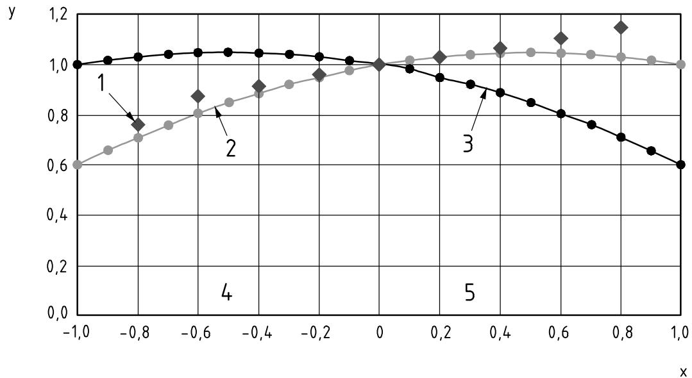  
a) $\beta = 1 , 0$

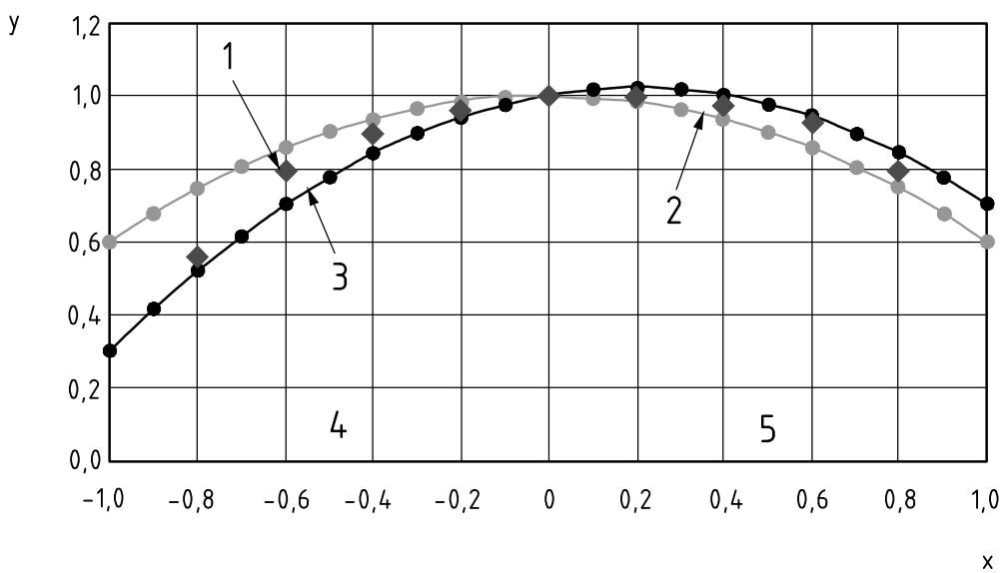  
Figure A.14.3-1 — Chord load effects for X-joints in tension

b) $\beta < 0 , 9$

Key

1 FEA results for brace in tension

2 NORSOK N-004 brace in tension

3 API RP 2A WSD brace in tension or compression and NORSOK N-004 brace in compression

4 chord compression   
5 chord tension   
x normalized chord axial force $\sigma_{ \mathrm{ a } } / f_{ \mathrm{ y } }$   
y chord load factor $Q_{ \mathrm{ f } }$

Joint strengths calculated using Formulae (14.3-1) to (14.3-10), with the partial resistance factor = 1,0, were compared with the screened test data and with the API/EWI FEA data [A.14.3-2] for K-, Y-, and X-joints for the three or four, as applicable, brace design situations. The result of each individual comparison was expressed in the form of (test or FEA strength)/(predicted strength), termed bias. Ratios greater than one, indicating that the joint capacity is greater than the predicted value, are obviously desirable. For each category (joint type and brace load), the mean bias, coefficient of variation, and number of cases (tests or FE), n is given in Tables A.14.3-1 to A.14.3-3 for K-, Y- and X-joints, respectively. Similar comparisons are presented using the API RP 2A WSD 21st Edition Supp. 1 provisions.

Table A.14.3-1 — Comparison of joint strength from test or FEA with predictions using Formulae (14.3-1) to (14.3-10) – Mean biases and $V_{ \mathrm{ { R } } }$ for K-joints   


| Brace loading | Mean bias, VR and number of data (n) | Test database | Test database | FE database | FE database |
| --- | --- | --- | --- | --- | --- |
| Brace loading | Mean bias, VR and number of data (n) | ISO 19902 2nd Edition | API 2A-WSD 21st Edition | ISO 19902 2nd Edition | API 2A-WSD, 21st Edition |
| Balanced axial | Mean bias | 1,34 | 1,38 | 1,14 | 1,18 |
| Balanced axial | VR | 0,17 | 0,18 | 0,11 | 0,42 |
| Balanced axial | n | 161 | 161 | 440 | 440 |
| In-plane bending | Mean bias | 1,47 | 1,29 | 1,32 | 0,94 |
| In-plane bending | VR | 0,15 | 0,09 | 0,17 | 0,50 |
| In-plane bending | n | 6 | 6 | 242 | 242 |
| Out-of-plane bending | Mean bias | 1,54 | 1,15 | 1,20 | 0,84 |
| Out-of-plane bending | VR | 0,19 | 0,14 | 0,11 | 0,14 |
| Out-of-plane bending | n | 7 | 7 | 306 | 306 |


Table A.14.2-2 — Comparison of joint strength from test or FEA with predictions using Formulae (14.3-1) to (14.3-10) – Mean biases and $V_{ \mathrm{ R } }$ for Y-joints   


| Brace loading | Mean bias, VRand number of data (n) | Test database | Test database | FE database | FE database |
| --- | --- | --- | --- | --- | --- |
| Brace loading | Mean bias, VRand number of data (n) | ISO 19902 2ndEdition | API 2A-WSD21stEdition | ISO 19902 2ndEdition | API 2A-WSD,21stEdition |
| Axial compression | Mean bias | 1,21 | 1,45 | 1,18 | 1,24 |
| Axial compression | VR | 0,11 | 0,20 | 0,14 | 0,32 |
| Axial compression | n | 64 | 64 | 46 | 46 |
| Axial tension | Mean bias | 2,56 | 3,45 |  |  |
| Axial tension | VR | 0,29 | 0,29 |  |  |
| Axial tension | n | 16 | 16 |  |  |
| In-plane bending | Mean bias | 1,41 | 1,00 | 1,34 | 0,90 |
| In-plane bending | VR | 0,16 | 0,32 | 0,10 | 0,34 |
| In-plane bending | n | 29 | 29 | 18 | 18 |
| Out-of-plane bending | Mean bias | 1,45 | 1,07 | 1,31 | 0,89 |
| Out-of-plane bending | VR | 0,26 | 0,26 | 0,08 | 0,17 |
| Out-of-plane bending | n | 27 | 27 | 18 | 18 |


Table A.14.3-3 — Comparison of joint strength from test or FEA with predictions using Formulae (14.3-1) to (14.3-10) – Mean biases and $V_{ \mathrm{ R } }$ for X-joints   


| Brace loading | Mean bias, VRand number of data (n) | Test database | Test database | FE database | FE database |
| --- | --- | --- | --- | --- | --- |
| Brace loading | Mean bias, VRand number of data (n) | ISO 19902 2ndEdition | API 2A-WSD21stEdition | ISO 19902 2ndEdition | API 2A-WSD,21stEdition |
| Axial compression | Mean bias | 1,17 | 1,16 | 1,31 | 1,47 |
| Axial compression | VR | 0,09 | 0,11 | 0,12 | 1,33 |
| Axial compression | n | 65 | 65 | 339 | 339 |
| Axial tension | Mean bias | 2,40 | 2,65 |  |  |
| Axial tension | VR | 0,28 | 0,54 |  |  |
| Axial tension | n | 34 | 34 |  |  |
| In-plane bending | Mean bias | 1,55 | 1,27 | 1,35 | 0,97 |
| In-plane bending | VR | 0,19 | 0,21 | 0,11 | 0,35 |
| In-plane bending | n | 17 | 17 | 40 | 40 |
| Out-of-plane bending | Mean bias | 1,39 | 1,13 | 1,52 | 0,75 |
| Out-of-plane bending | VR | 0,06 | 0,09 | 0,23 | 0,23 |
| Out-of-plane bending | n | 6 | 6 | 80 | 80 |


## A.14.3.5 Effect of chord can length on joint strength

The reduced strength for simple Y- and X-joints with axial forces and short can lengths is supported by numerical and experimental data, see Reference [A.14.2-1].

No reduction in strength is required for K-joints with axial forces.

No guidance is provided on length effects for joints subjected to moments or for complex joints.

## A.14.3.6 Strength check

No guidance is offered.

A.14.4 Overlapping joints

The guidance in this document is primarily based on the results in Reference [A.14.2-1]. A critical assessment of design practice up to 1995 can be found in Reference [A.14.4-4]. More recent guidance can be found in Reference [A.14.4-7].

The current guidance generally avoids the need for numerical analysis in all but the most unusual or failure-critical cases. It addresses both in-plane and out-of-plane force situations, as well as out-of-plane overlap situations, which are not uncommon in offshore structures.

Generally, there is no need to calculate weld lengths. For more precise analyses, such lengths can still be necessary. Reference [A.14.4-5] reproduces formulae for these calculations.

A.14.5 Grouted joints

Grouted joints are becoming more common in new steel frame structures and joint grouting is generally a cost-effective means of strengthening older structures. Current guidance [A.14.5-1] is based upon engineering approximations and some experimental evidence, see References [A.14.5-2] to [A.14.5-6]. The experimental evidence is primarily for double-skin joints subjected to axial brace forces. Reference A.14.5-7 provides additional data for fully grouted joints, especially those subjected to brace bending moments.

$Q_{ \mathrm{ u } }$ values for Y-, X- and K-grouted joints, given in References A.14.5-1 and A.14.5-3, are reproduced in Table A.14.5-1.

Table A.14.5-1 — Q values for grouted joints   


| Brace loadinga | Qu |
| --- | --- |
| Axial tension | 2,5βγKa b |
| In-plane bending | 1,5βγ |
| Out-of-plane bending | 1,5βγ |
| aNo term is provided for axial compression, since most grouted joints cannot fail under compression because the compression strength is limited by that of the brace. bKa=(1+1/sinθ)/2 | aNo term is provided for axial compression, since most grouted joints cannot fail under compression because the compression strength is limited by that of the brace. bKa=(1+1/sinθ)/2 |


When braces are grouted, whether or not they frame into grouted chords, special joint strength investigation can be warranted. Grouting a brace can change the failure mode from chord ovalization/distortion to punching, which is equivalent to reducing $\beta .$ The failure modes and associated strengths should be checked to ascertain whether brace grouting has a positive or negative effect.

For double-skin joints, a further limiting strength has been introduced to cater for the potential of failure due to chord ovalization. In such cases, the design strength is the lesser of:

a) brace strength;   
b) strength calculated on the basis of effective thickness;   
c) strength calculated on the basis of $Q_{ \mathrm{ u } }$ values for grouted joints.

Consideration of the presence of grouted joints should include review and perhaps revision of the structural model used to determine the sectional forces for the joint. The presence of grout in the chord clearly stiffens the joint, so that the most appropriate model is likely to be one with a rigid offset from the chord centre line to the chord wall at each incoming brace. If the structure has been modelled with rigid joints located at the chord centre line, the conservatism, or otherwise, of the internal forces should be assessed. If joint flexibility has been introduced at the chord surface while using a rigid offset to that point, only the flexibility should be altered. It is generally conservative to assume grouted joints to have no local flexibility, i.e. that they are assumed to be rigid up to failure.

A.14.6 Ring stiffened joints

Studies on the strength of ring-stiffened joints are given in References [A.14.6-1] to [A.14.6-7]. The most extensive FEA ultimate strength results for such joints are given in References [A.14.6-4] and [A.14.6-7].

The following describes three approaches for determining the required number and sizes of stiffeners. In all three approaches, the first step is to set ring dimensions, ensuring they are appropriate to avoid local ring buckling, see Formula (13.2-39). Calculate the required number of rings. If the number is excessive, modify the ring stiffener geometry, possibly with the addition of an inner edge flange, and recalculate the number of required stiffeners.

a) Joint forces are fully resisted by the rings assuming elastic behaviour. Ring cross-sectional properties are calculated using an effective flange width of the chord can. The effective width and the elastic analysis of the ring are based upon Roark's formulae [A.14.6-8]. Apply a partial resistance factor on yield strength, e.g. $\gamma_{ \mathrm{ R , t } }$ from Formula (13.2-1).   
b) Joint forces are fully resisted by the rings assuming plastic behaviour. Assume an effective flange width, as in a). Use a simple interaction expression for axial force, shear and moment in the ring to derive a ring ultimate strength. Apply a partial resistance factor, as in a).   
c) Joint forces are resisted by a summation of simple joint strength and ring ultimate strength. Ring ultimate strength is simply calculated as being the shear strength of two cross-sections of the ring. Partial resistance factors are applied to both the simple joint and ring strengths.

Several questions can arise with respect to all three approaches. It is not always clear how to address brace moments. The usual step is to break them into couples and take the absolute sum of the forces from axial and moment couple as the applied action. Further, rings that are outside any brace footprint are also not addressed by any of these approaches.

Although external rings offer little advantage with respect to fatigue (by reducing stress concentration factors), they can be much more effective than internal rings where ultimate strength is of concern. Often,

external rings can be assumed to be fully effective if the clear distance from the edge of a given brace does not exceed D/2, although shear transfer strength of the chord wall between the brace and outer ring should still be examined. The effectiveness of rings under a given footprint is normally assumed to be limited to the particular brace involved. The D/2 limit is only of concern for rings at the end of the chord can.

A more general procedure for the design of ring stiffened joints is to consider sections or planes through the joint and ensure that the strength of all parts severed by the plane is sufficient to resist the applied forces. This approach is quite general, although difficult to automate. Its advantages are that it can address even the most complex conditions, and it often provides a better physical feel for load paths. It is recommended as a manual check of expected behaviour whenever possible. However, it does not implicitly address potential local buckling or premature cracking.

As with grouted joints, the use of ring stiffened joints warrants a review of the structural model used to determine the sectional forces of the joint. Rings often increase the joint stiffness substantially such that rigid offsets to the chord surface are appropriate.

A.14.7 Other joint types

The potential for local buckling or premature cracking should be investigated. Further information on circular joints with doubler or collar plates can be found in References [A.14.7-1] to [A.14.7-4].

A.14.8 Damaged joints

Reduction in axial or moment strengths may be estimated by taking into account the reduced area or section modulus due to the presence of cracks. References [A.14.8-1] to [A.14.8-3] cover some of the research carried out in this area.

A.14.9 Non-circular joints

Detailed design practices and guidance for some connections with non-circular chords and braces are available in References [A.14.9-1] and [A.14.9-2]. These were developed for onshore use. Care should be taken with the use of these documents to ensure consistency with the design approach and philosophy in this document.

A.14.10 Cast joints

No guidance is offered.

## A.15 Strength and fatigue resistance of other structural components

A.15.1 Grouted connections

## A.15.1.1 General

No guidance is offered.

## A.15.1.2 Detailing requirements

No guidance is offered.

## A.15.1.3 Axial force

No guidance is offered.

## A.15.1.4 Reaction force from horizontal shear and bending moment in piles

No guidance is offered.

## A.15.1.5 Interface transfer stress

Grouted connections in offshore structures are normally subjected to axial loading in combination with bending moments, transverse shear forces and torsional moments. However, test data with geometrical and material properties within the ranges of applicability given in 15.1.5.2 show that bending moments and transverse shear forces do not significantly affect overall connection interface transfer strength.

For grouted connections between the piles and sleeves in jackets, horizontal shear forces due to environmental actions are applied to the pile sleeves by yoke plates, braces or ring stiffeners, cause concentrated bearing stresses between the sleeve and the grout, and moments and horizontal shear forces in the piles below the sleeves, see Figure A.15.1-1. The bearing pressure is dependent on the design of the grouted connection at the position of the reaction force.

Two different design solutions for the force transfer are shown in Figure A.15.1-2. In the left figure the grout is terminated above the yoke plate which resists the horizontal reaction F1. This can result in an uneven load transfer through the grout and significant stresses in the lower part of the grout. The quality of the grout close to the grout packers can also be lower. During load reversals, high bearing pressure can lead to wear and cracking of the grout. Therefore, this configuration should be avoided.

The recommended configuration is shown on the right of Figure A.15.1-2 where the grout is extended below the yoke plate for a distance of $\sqrt{ D_{ s } t_{ s } }$ in addition to the non-structural length defined in 15.1.4.

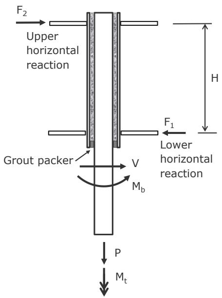  
Figure A.15.1-1 — Pile forces and reactions

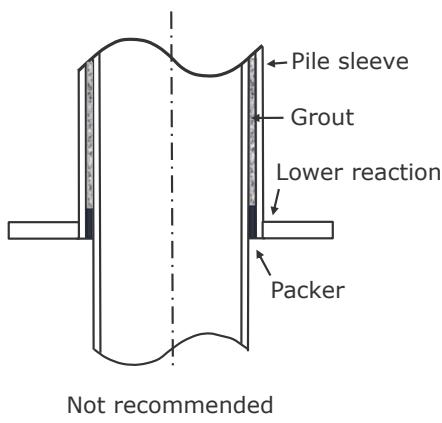

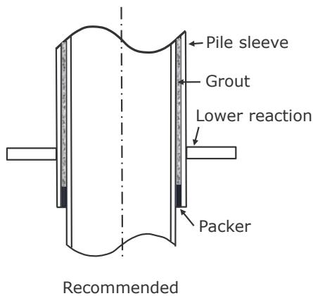  
Figure A.15.1-2 — Examples of termination of lower grout section

An additional check is recommended to account for the bending moment and the shear force shown in Figure A.15.1-1. This is in addition to the check for axial force presented in 15.1.5.1.

The reaction force $F_{ 1 }$ is calculated using Formula (A.15.1-1):

$$F_{1} = V + \frac{M_{\mathrm{b}}}{H} \tag{A.15.1-1}$$

where

V is the shear force due to factored actions in the pile below the lower yoke plate;   
$M_{ \mathrm{ b } }$ is the bending moment due to factored actions in the pile below the lower yoke plate;   
H is the distance between horizontal reaction forces, $H \leq 3 D_{ s }$ .

The design bearing pressure $\sigma_{ \mathrm{ p c } }$ between the sleeve and the grout for the extended configuration (right hand diagram of Figure A.15.1-2), calculated using Formula (A.15.1-2):

$$\sigma_{\mathrm{p c}} = \frac{F_{1}}{\sqrt{D_{\mathrm{s}}^{3} t_{\mathrm{s}}}} \tag{A.15.1-2}$$

should satisfy Formula (A.15.1-3)

$$\sigma_{\mathrm{p c}} \leq 0, 3 \frac{f_{\mathrm{c u}}}{\gamma_{\mathrm{m}}} \tag{A.15.1-3}$$

where $\gamma_{ \mathrm{ m } }$ is a partial factor equal to 1,0 with more than two piles at each jacket legs and 1,5 for jackets with one or two piles at each jacket leg.

Additional capacity can be achieved by the addition of two or three ring stiffeners. The reaction should be assumed to act at the centre of these stiffeners. The stiffener spacing should be $2 \sqrt{ D_{ s } t_{ s } }$ .

This formulation assumes that the grout packer is placed a distance $\sqrt{ D_{ s } t_{ s } }$ below the position of the resultant that resists $F_{ 1 }$ . This distance is in addition to the height of the layer of lower quality grout above the grout packer.

Formula (A.15.1-3) addresses both ULS and FLS conditions for bending moment and shear. Axial force should be subject to a separate verification – see 15.1.3.

## A.15.1.6 Interface transfer strength

## A.15.1.6.1 General

The strength of a grouted connection is defined as the lesser of the following:

a) interface strength, which is the mechanical interlocking strength of the pile to grout interface to avoid sliding;   
b) grout matrix strength, which is the shear strength of the grout in the annulus.

The formulae for interface strength and grout matrix strength are derived from statistical analyses of the results of a large number of ultimate strength tests on cylindrical grouted connection specimens with geometrical and material properties within the ranges of applicability given in 15.1.5.2.

An example case showing these two strengths for $f_{ \mathrm{ c u } } = 50 ~ \mathrm{ \ M P a }$ and $K = 0 , 015$ is presented in Figure A.15.1-3. Effects of movements during grout setting (also known as early age movements) are not included.

Figure A.15.1-3 — Example of grouted connection interface transfer strength   
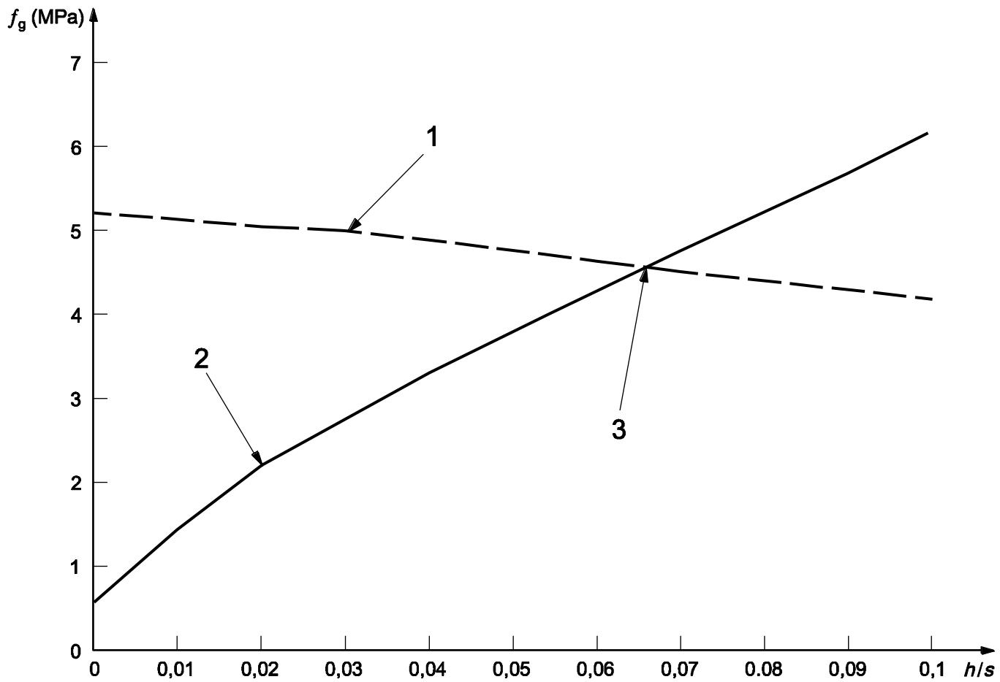  
Key   
1 grout matrix strength （$f_{ \mathrm{ g , s h e a r } } )$   
2 interface strength (fg,sliding) （$f_{ \mathrm{ g , s l i d i n g } } )$   
3 point of optimal interface transfer strength

fg representative interface transfer strength

h shear key height

s centre-to-centre spacing of shear keys

The representative interface strengths for the two failure modes are defined by Formulae (15.1-5) and (15.1-6), respectively. For a given grout strength $\left( f_{ \mathrm{ c u } } \right)$ and radial stiffness factor (K), there is generally an optimum value for the ratio of shear key height to spacing （$h / s ) .$ , as shown at the point where the two lines cross in Figure A.15.1-3. For most practical designs, this optimum strength is achieved for a ratio of $h / s$ in the region of 0,05 to 0,07, when the early age degradation effect is included. To limit the effects of movements during grout setting and degradation due to fatigue, as described in A.15.1.5.3 and A.15.1.7, respectively, the h/s value should not exceed 0,05.

## A.15.1.6.2 Ranges of validity

For a grout strength less than 20 MPa, as can be encountered during the early stage of curing, ,`--- Formulae (15.1-5) and (15.1-6) may be used down to a lower limit o $\mathrm{ \Delta } f_{ \mathrm{ c u } } = 7$ MPa, provided that the partial ,``` ,, resistance factor $\boldsymbol{ \gamma }_{ \mathrm{ R , g } }$ is increased from 2,0 to 2,5.

Test data and long term operational performance have demonstrated the validity of Formulae (15.1-5),``,`` and (15.1-6) within the validity ranges given in 15.1.5.2. However, plain grouted tubular connections--`, (without shear keys) having $D_{ \mathbf{ p } }$ and $D_{ \mathrm{ p } } / t_{ \mathrm{ p } }$ significantly above the upper limits given in 15.1.5.2 have not given satisfactory performance. The largest diameter plain grouted connection ultimate strength tests

available were carried out at $D_{ \mathbf{ p } }$ ≈ 1 400 mm. Therefore, without further test data, plain tubular grouted connections should not be used for $D_{ \mathbf{ p } }$ greater than 1 500 mm .

## A.15.1.6.3 Effect of movements during grout setting

The background to the development of the design requirements is detailed in Reference [A.15.1-1]. The major area of uncertainty in the design of grouted connections is the potential degradation of both strength and fatigue performance due to relative movements between the inner tubular member (the pile) and the outer tubular member (the sleeve) during the grout setting period (generally the 24 h period following grout placement). This movement is often termed “early age cycling”. Strength degradation due to early age cycling increases with h/s and $f_{ \mathrm{ c u } } .$ .

During the grouting operation, and during grout setting, the potential exists for the inner and outer steel tubulars to move relative to each other due to metocean action on the structure, particularly when the tubulars are a foundation pile and its sleeve. Tests to simulate this effect in the laboratory have demonstrated the following consequences:

a) The reduction in static strength increases as:

— the relative pile-sleeve movement increases;   
— the pile shear key density （$h / s )$ increases; and/or   
— the grout strength $\left( f_{ \mathrm{ c u } } \right)$ increases.

b) The fatigue strength is degraded in direct proportion to the degradation in static strength.

Most of the laboratory tests, which included large scale tests with pile diameters up to 1 863 mm, were performed with an initial relative movement of ±0,35 % of the inner tubular (pile) diameter （$D_{ \mathrm{ p } } )$ . The degradation factors given in 15.1.5.3 are based on these data. This level of movement was chosen based on calculations of the anticipated movements between foundation piles and sleeves for a number of structures, founded on different soils, in sea states typically required for installation activities. If movements in excess of ±0,35 % of $D_{ \mathbf{ p } }$ are anticipated during the grouting and grout setting period, test data can be required to validate the design. As an alternative, pile grippers or other mechanical locking devices can be used to reduce relative movements.

As noted in A.15.1.8, efficient designs can be achieved without $h / s$ exceeding 0,05. Test data on movements during grouting are only available for connections with $h / s$ ratios up to 0,06. For $h / s$ ratios exceeding this value, either movements should be eliminated or validation tests should be carried out to quantify the appropriate degradation factor.

## A.15.1.7 Strength check

No guidance is offered.

## A.15.1.8 Fatigue assessment

Fatigue testing of grouted connections has demonstrated the following fatigue characteristics:

a) plain grouted tubular connections (without shear keys) do not suffer fatigue damage unless the applied variable force amplitude approaches the ultimate strength of the connection;

b) the fatigue performance of shear key connections increases rapidly as the R ratio of minimum to maximum variable force amplitude moves from –1 (reverse direction cycling of equal magnitude) to 0 (single direction cycling);   
c) fatigue damage is characterized by a shouldered force-displacement hysteresis loop, where the shoulder, i.e. the point of initiation of rapid slip, has been shown to correspond to the plain grouted tubular strength of the connection.

The combination of these three observed characteristics indicates that fatigue damage can be averted by ensuring that the peak reverse force cycle is less than the plain grouted tubular connection strength.,,`-- Under these circumstances, fatigue damage does not accumulate as the rapid slip mechanism, which-``,`` produces the impact damage and ultimately fails grouted connections in reverse cycling, is averted. If the,,,``- plain grouted tubular connection strength is inadequate, the connection length should be increased.

If it is not possible to increase the connection length to provide the necessary plain grouted tubular--`, connection strength, a detailed fatigue evaluation should be carried out. The recommended approach is to compute fatigue life using S-N curves in a manner similar to that described in Clause 16 for steel components. However, there are two principal differences between the fatigue performance of steel components and grouted connections which should be taken into account:

a) Grouted connection fatigue performance is dependent on the static axial stress due to permanent and non-varying variable actions as well as the cyclic stress range.   
b) Grouted connections are more susceptible to high-stress low-cycle fatigue, such as metocean actions that arise during an extreme storm which are not necessarily captured by the long-term stress range distribution characterized by annual occurrences of each stress band. The extreme storm, (which might comprise some 1000 load cycles of a magnitude greater than those within the long-term stress range distribution), can account for as much as 50 % of the fatigue damage accumulated during the design service life of a grouted connection with load reversal above the plain pipe capacity.

An S-N curve for axially loaded grouted connections has been derived from approximately 100 fatigue test results with fully reversible (R = –1) loading on specimens with properties within the validity ranges given in 15.1.5.2. These included a representative number of test specimens subjected to a combination of cyclic axial loads and bending moments, which indicated that coexistent moments did not affect fatigue life. However, it is known that coexistent bending moments can affect fatigue performance for pile-tosleeve connections in jacket structures and for values of $D_{ \mathrm{ p } } / t_{ \mathrm{ p } }$ and $D_{ s } / t_{ s }$ greater than the upper limits given in 15.1.5.2 and, in such cases, the approach given below should not be used in the absence of specific test data based on the actual ratios proposed for the connection under consideration. Tests have also indicated that, when the peak reverse force cycle exceeds the plain grouted tubular connection strength, local failure of the grout can occur at the ends of grouted connection if the grout is not confined in the longitudinal direction, for example, by a grout plug or annular steel plate attached to the inner or outer steel tubular member. In such cases, local failure can be prevented by eliminating shear keys from any unconfined end of the annulus as follows:

a) Shear keys on the outer steel tubular should not be placed within a longitudinal distance of 1,0 s from the unconfined end of the annulus;   
b) Shear keys on the inner steel tubular should not be placed within a longitudinal distance equal to the greater of 3,0 s and $0 , 75 \left( D_{ \mathbf{ g } } - D_{ \mathbf{ p } } \right)$ from the shear key on the outer steel tubular nearest to the unconfined end of the annulus. The effective grouted connection length $L_{ e }$ should be calculated in accordance with the requirements of 15.1.4 but should not be greater than the number of shear keys on the inner steel tubular multiplied by the shear key spacing, s.

The representative S-N curve is given by

$$\log S_{\mathrm{g}} = - 0, 25 - 0, 11 \log N \tag{A.15.1-4}$$

where

$S_{ \mathrm{ g } }$ is the constant amplitude stress ratio, which is the ratio of the constant amplitude applied interface stress $\sigma_{ \mathrm{ { p } } }$ to the lesser of the representative interface transfer strengths for sliding at the grout-steel interface, $f_{ \mathrm{ g , s l i d i n g } } ,$ and the representative interface transfer strength for grout matrix failure, $f_{ \mathrm{ g , s h e a r } } ,$ given by Formulae (15.1-5) and (15.1-6), respectively. $\sigma_{ \mathrm{ { p } } }$ should be taken as the maximum absolute value of applied interface stress in any loading cycle. Early age movements should be accounted for in the calculation of $S_{ \mathrm{ g } }$ as described below.

N is the predicted number of cycles to failure under constant amplitude stress ratio, $S_{ \mathrm{ g } } .$

Fatigue assessment due to variable actions is normally based on the hypothesis of a linear accumulation of fatigue damage under constant amplitude stress ranges, according to the Palmgren-Miner's rule

$$D_{\mathrm{R}} = y_{\mathrm{F D}} \Sigma \left(n_{i} / N_{i}\right) \tag{A.15.1-5}$$

where

$D_{ \mathrm{ R } }$ is a non-dimensional number, the Palmgren-Miner's sum or damage ratio for a time $T ;$

$\gamma_{ \mathrm{ F D } }$ is a fatigue damage design factor and should be taken as 10 for grouted structure to pile connections;

$n_{ i }$ is the number of occurrences of stress ratio, $S_{ \mathrm{ g } i } ,$ during time period, $T ;$

$N_{ i }$ is the number of occurrences to failure under constant amplitude stress ratio, $S_{ \mathrm{ g } i } ,$ taken from the S–N curve described above.

Fatigue failure is assumed to occur if

$$D_{\mathrm{R}} \geq 1, 0 \tag{A.15.1-6}$$

It has been observed that the fatigue performance of grouted connections is reduced by movements during grout setting as the $h / s$ ratio increases (see A.15.1.5.3). Therefore, it is advisable to minimize, as far as is practicable, both the $h / s$ ratio and the early age movement. For most practical designs, a structurally efficient pile-to-sleeve connection, with an $L_{ \mathrm{ e } } / D_{ \mathrm{ p } }$ of approximately 5 to 6, can be achieved with an $h / s$ of less than 0,05, using a grout with a 28 day strength of 50 MPa. Any early age movements within the limits given in 15.1.5.3 should be taken into account in the fatigue evaluation methodology described above by multiplying $S_{ \mathrm{ g } }$ by the early age movement reduction factor $k_{ \mathrm{ r e d } }$ given in 15.1.5.3.

A.15.2 Mechanical connections

## A.15.2.1 Types of mechanical connectors

No guidance is offered.

## A.15.2.2 Design requirements

## A.15.2.2.1 General

No guidance is offered.

## A.15.2.2.2 Static strength requirements

If connectors are designed to be stronger than the weakest of the connected tubular members, strain hardening effects may be relied upon to ensure that the connector has sufficient strength to mobilize the ductile deformation capacity of the tubular members. The factor by which the connector strength should exceed that of the weakest tubular member depends on the uncertainty of the analysis procedure, the connector material strength, and the consequence of connector failure.

The connector, if not stronger than the weakest of the connected tubular members, should have sufficient ductility to sustain all actions due to deformations, as well as accidental actions, without impairing the safety of the structure.

## A.15.2.2.3 Fatigue performance requirements

No guidance is offered.

## A.15.2.2.4 Functional requirements

No guidance is offered.

## A.15.2.3 Actions and forces on the connector

When the connector can be considered to be axisymmetric and the connected tubular is subjected to both an axial force (P) and a bending moment (M), the moment can be converted into an equivalent axial force （$P_{ \mathrm{ e q } } )$ . The concept of the equivalent axial force is simple and slightly conservative for relatively thin tubulars （$D / t > 20 )$ . The design axial force $\left( P_{ \mathrm{ d } } \right)$ can be expressed as in Formula (A.15.2-1):

$$P_{\mathrm{d}} = P + P_{\mathrm{e q}} \tag{A.15.2-1}$$

with

$$P_{\mathrm{e q}} = \frac{M (D - t)}{2 I} \cdot A_{\mathrm{r}} = M \cdot \frac{32 t (D - t)^{2}}{D^{4} - (D - 2 t)^{4}} \tag{A.15.2-2}$$

where

Peq $P_{ \mathrm{ e q } }$ is the equivalent axial force representing the bending moment;

M is the bending moment in the tubular member;

I is the moment of inertia of the cross-section of the tubular member;

Ar is the cross-sectional area of the tubular member;

D is the outside diameter of the tubular member;

t is the wall thickness of the tubular member.

## A.15.2.4 Resistance of the connector

Non-linear FEA can be used to determine the global force deformation behaviour of the connector. In this case, the connector's ultimate strength can be established by progressing the analysis until the connector can no longer sustain the force, or significant plastic deformation takes place that impairs the functional requirements of the connector, or precipitates its disengagement. In conducting these analyses, due consideration should be given to the connector material properties in terms of yield, strain hardening, ductility and ultimate strength. However, both the connector modelling and the solution methodology should be calibrated to experimental data, see 7.7.

In developing the model for the FEA, the modelling of each adjoining tubular member should extend at least four diameters. For non-linear analysis, a force displacement diagram should be developed from which the connector resistance can be obtained. The force should correspond to the equivalent axial force on the nominal tubular member, whereas the displacement is the elongation of the connector measured between the two circumferential welds joining the connector to the tubular members. To achieve this, the connector portion of the model should include the non-linear modelling aspects, while the portion of the model corresponding to the nominal tubular, extending beyond each circumferential weld, is linear elastic.

## A.15.2.5 Strength criteria

## A.15.2.5.1 General

FEA may be used to calculate the stresses induced in the connector for the purpose of strength checks. Strength checks may use linear analysis to determine stress component distributions across particular cross sections. The stresses induced in connectors by the factored actions can be classified as primary or secondary.

Primary stresses are normal and shear stress distributions across a connector section that result from the application of external actions and are required to satisfy equilibrium. Primary stresses are not selflimiting and, if not controlled, induce failure. Stresses arising from axial force and bending moments acting in the tubular members are primary stresses.

Secondary stresses are normal and shear stress distributions across a connector section that are selflimiting and self-equilibrating. Stresses resulting from assembly of connectors can be primary or secondary stresses.

Other stresses are pure shear stresses and bearing stresses.

A pure shear stress is an average stress over a connector cross-section that is parallel to the direction of the acting force. An example of this stress is the average stress along the thread roots due to an axial force on the connector.

A bearing stress is an average stress normal to contact surfaces between connector parts mutually or between a connector part and the connector body, such as those between engaged threads, at preload shoulders, or between washers, dogs, etc.

Connector design using stresses resulting from linear FEA is based on criteria from ASME [A.15.2-1]. To take advantage of ductile steels and eliminate stress limits based on ultimate stress, material for connectors should:

a) have at least 20 % elongation;   
b) have ratios of yield-to-ultimate stress no greater than 0,75;   
c) be sufficiently tough at the lowest anticipated service temperatures.

## A.15.2.5.2 Linearization and Mises-Hencky stresses

To use the stress criteria given in A.15.2.5.3 to A.15.2.5.6, each of the stress component distributions across the section of interest should first be linearized, from which an average and a differential stress can be obtained, as shown in Figure A.15.2-1.

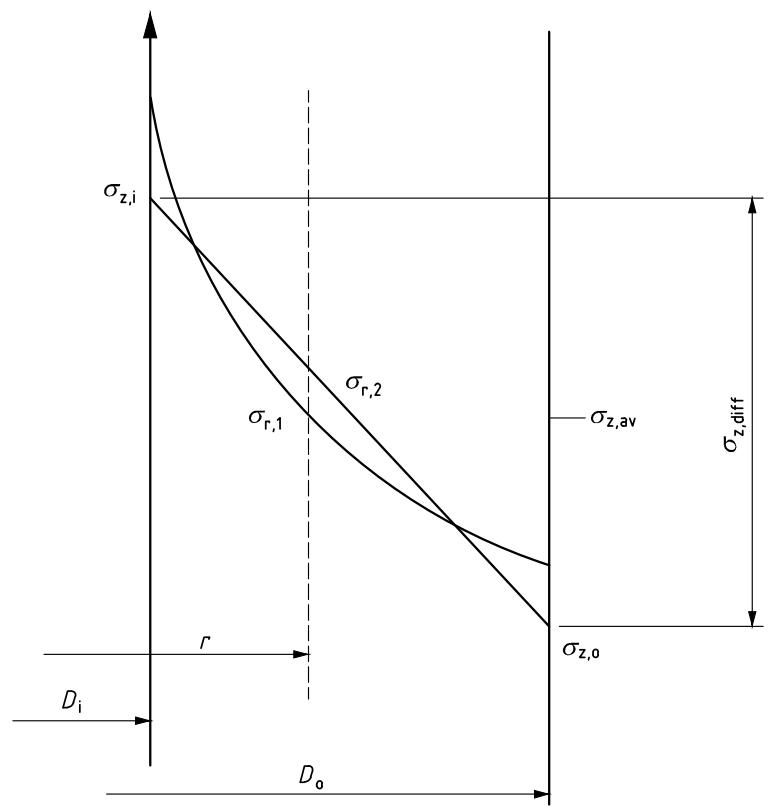  
Figure A.15.2-1 — Linearization of axial stress components

$\sigma_{ \mathrm{ z , i } }$ and $\sigma_{ \mathrm{ z } , 0 }$ are determined by satisfying

$$\sum_{r = D_{\mathrm{i}} / 2}^{D_{\mathrm{o}} / 2} \sigma_{r, 1} d r = \sum_{r = D_{\mathrm{i}} / 2}^{D_{\mathrm{o}} / 2} \sigma_{r, 2} d r$$

and

$$\sum_{r = D_{\mathrm{i}} / 2}^{D_{\mathrm{o}} / 2} \left(\sigma_{r, 1} \times r^{2}\right) d r = \sum_{r = D_{\mathrm{i}} / 2}^{D_{\mathrm{o}} / 2} \left(\sigma_{r, 2} \times r^{2}\right) d r$$

Average and differential stresses are

$$\sigma_{z, a v} = 0, 5 \left(\sigma_{z, i} + \sigma_{z, 0}\right)$$

$$\sigma_{z, \text{d i f f}} = 0, 5 \left(\sigma_{z, \mathrm{i}} - \sigma_{z, 0}\right)$$

Key

$\sigma_{ \mathrm{ z , i } }$ σz,i axial stress at inner face

σz,o $\sigma_{ \mathrm{ z } , 0 }$ axial stress at outer face

$r$ radius to point being considered

$D_{ \mathrm{ i } }$ inner diameter

Do $D_{ 0 }$ outer diameter

$\sigma_{ \mathrm{ r } , 1 }$ radial stress at radius r for elastic stress distribution

$\sigma_{ \mathrm{ r } , 2 }$ radial stress at radius r for linearized stress distribution

$\sigma_{ \mathrm{ z , a v } }$ average linearized axial stress

$\sigma_{ \mathrm{ z , d i f f } }$ difference between average and maximum linearized axial stresses

The Mises-Hencky effective stress can be calculated using Formula (A.15.2-3):

$$\sigma_{\mathrm{e}} = 0, 707 \left[ \left(\sigma_{\mathrm{r}} - \sigma_{\theta}\right)^{2} + \left(\sigma_{\theta} - \sigma_{\mathrm{z}}\right)^{2} + \left(\sigma_{\mathrm{z}} - \sigma_{\mathrm{r}}\right)^{2} + 6 \left(\tau_{\mathrm{r} \theta}^{2} + \tau_{\theta \mathrm{z}}^{2} + \tau_{\mathrm{z r}}^{2}\right) \right]^{1 / 2} \tag{A.15.2-3}$$

where

$\sigma_{ \mathrm{ e } }$ is the Mises-Hencky effective stress;

$\sigma_{ \mathrm{ r } }$ is the normal radial stress;

$\sigma_{ \theta }$ σθ is the normal hoop stress;

$\sigma_{ \mathrm{ z } }$ is the normal axial stress;

$\tau_{ \mathrm{ r { \theta } } } , \tau_{ \theta \mathrm{ z } } , \tau_{ \mathrm{ z r } }$ are the shear stress components.

The average Mises-Hencky stresses （$\sigma_{ \mathrm{ e , a v } } )$ can be calculated from the average values of the linearized stresses and the maximum Mises-Hencky stresses （$\sigma_{ \mathrm{ e , m a x } } )$ can be calculated from the maximum values of the linearized stresses, taken as the average +/– the differential stress.

If detailed radial and hoop stresses are not available, the radial stress, $\sigma_{ \mathrm{ r } , i }$ may be assumed to equal the internal pressure at the internal wall and to equal the external pressure at the external wall, and the hoop stress may be assumed to equal half the radial pressure.

The intent of linearization is:

a) to eliminate the effect of the peak stresses arising from elastic FEA at the location of stress raisers;   
b) to account for the global section behaviour.

Linearization involves finding, for each stress component distribution across the thickness of the section, a linear distribution whose equivalent force and moment are the same as those of the actual distribution (see Figure A.15.2-1). The average and differential components of the normal axial stress distribution physically correspond to the membrane and bending components acting on that section in accordance with P/A and $M \left( D - t \right) / 2 I .$ .

Linearization of the shear stress is not recommended. Instead, an average value across the section suffices for the calculation of the effective Mises-Hencky stresses.

In cases where torsion is a significant external action, the average shear stress $\left( \tau_{ \mathrm{ r \theta } } \right)$ at the cross-section of interest should be approximated by the shear stress calculated by $T r / J ,$ where T is the applied torque, r is the mean radius of the section, and J is the polar moment of the section.

Strength checks should be made at both connector cross-sections and through other sections. For instance in flanges, cylindrical sections parallel to the flange axis and containing the bolt circle should be checked. For arbitrary sections, the stress components are rotated from the global coordinates to the local coordinates parallel and perpendicular to the section in question. The hoop component, however, remains the same for axisymmetric models.

## A.15.2.5.3 Primary stress criteria

For primary stress checks, the portion of the stress due to secondary forces, such as preload due to assembly, may be subtracted from the total stress calculated due to actions and forces following preloading.

The primary average Mises-Hencky effective stress, $\sigma_{ \mathrm{ e , a v } } ,$ and the maximum Mises-Hencky effective stress, $\sigma_{ \mathrm{ e , m a x } } ,$ resulting from factored actions should satisfy both the following conditions:

$$\begin{array}{l} \sigma_{\mathrm{e}, \mathrm{a v}} \leq \frac{f_{\mathrm{y}}}{\gamma_{\mathrm{R} , \mathrm{t}}} (A.15.2-4) \\ \sigma_{\mathrm{e}, \max } \leq \frac{f_{\mathrm{y}}}{\gamma_{\mathrm{R} , \mathrm{b}}} (A.15.2-5) \\ \end{array}$$

where, in addition to the definitions in A.15.2.5.2,

$f_{ \mathrm{ y } }$ is the representative yield strength of the connector material;

$\boldsymbol{ \gamma }_{ \mathrm{ R , t } }$ is the partial resistance factor for tension:

= 1,35 for cases that are dominated by metocean actions,   
= 1,6 for cases where metocean actions are not included;

$\boldsymbol{ \gamma }_{ \mathrm{ R , b } }$ is the partial resistance factor for bending:

$= 0 { , } 9$ for cases that are dominated by metocean actions,   
= 1,1 for cases where metocean actions are not included.

Strains developed under primary stress conditions should also be limited, so that the connector's sealability, its ability to disassemble, and/or the function of the tubular string are not adversely affected.

## A.15.2.5.4 Primary plus secondary stress criteria

The average plus differential Mises-Hencky effective stress, $\sigma_{ \mathrm{ e , a v + d i f f } } ,$ as calculated by linear analysis under preload and factored actions, should additionally satisfy the following condition:

$$\sigma_{\mathrm{e}, \mathrm{a v} + \text{d i f f}} \leq \frac{f_{\mathrm{y}}}{\gamma_{\mathrm{R} , \mathrm{b}}} \tag{A.15.2-6}$$

where

$\boldsymbol{ \gamma }_{ \mathrm{ R , b } }$ is the partial resistance factor for bending:

= 0,5 for cases that are dominated by metocean actions,   
= $^{ 0 , 6 }$ for cases where metocean actions are not included.

## A.15.2.5.5 Shear stress criteria

The average shear stress on a gross section, $\tau_{ \mathrm{ a v } } ,$ resulting from factored actions should satisfy the following condition:

$$\tau_{\mathrm{a v}} \leq \frac{f_{\mathrm{y}}}{\gamma_{\mathrm{R , v}} \sqrt{3}} \tag{A.15.2-7}$$

where, further to previous definitions, $\gamma_{ \mathrm{ R , v } } ,$ the partial resistance factor for shear stresses, = 1,25.

## A.15.2.5.6 Bearing stress criteria

The average bearing stress, $\sigma_{ \mathrm{ b r } } ,$ from factored actions should satisfy the following condition:

$$\sigma_{\mathrm{b r}} \leq \frac{f_{\mathrm{y}}}{\gamma_{\mathrm{R} , \mathrm{b r}}} \tag{A.15.2-8}$$

where, further to previous definitions, $\gamma_{ \mathrm{ R , b r } }$ the partial resistance factor for bearing stresses, = 1,0.

## A.15.2.6 Fatigue criteria

## A.15.2.6.1 General

To be able to predict the fatigue life at a particular location of a structural component, both the stress history at the point under consideration and the resistance of the material to time-varying stresses should be determined.

For the S–N curve method, the stress history during the lifetime may be given in statistical form as the long-term stress range distribution(s) at the most highly stressed location(s) of the connector. The stress ranges at the location(s) of interest can be determined by linear FEA of a suitable structural model, using all forces and moments occurring in the tubular member as input. The resistance of the connector material should be given by an appropriate S–N curve. If such an S–N curve is not known, it should be determined experimentally. The damage due to each stress range is the number of times, n, that the stress range, S, occurs in the long-term stress range distribution, divided by the allowable number of cycles to failure, N, from the S–N curve. Total damage is obtained by the linear accumulation of the damage done by each stress range, in accordance with Palmgren-Miner's rule. The method is described in detail in Clause 16. In the calculations for mechanical connections, the effect of the mean stress due to make-up and preload on the connector may be taken into account.

In the initiation life method, the fatigue resistance of the connector is compared to the lowest fatigue resistance of the circumferential welds in the tubular members connected by the connector. The lowest circumferential weld resistance is characterized by the usual S–N curve. The fatigue resistance of the connector is determined in an equivalent form by determining the local stress ranges S’ at notches in the connector, due to the same forces that cause S at the relevant circumferential weld in the tubular member. Pairs of S’ versus the allowable number of cycles N’ to crack initiation can be calculated using the local strain approach of Reference [A.15.2-2]. The effect of mean stress at the notch due to make-up and preload on the connector should be included.

If the S’–N’ curve characterizing the fatigue resistance of the connector is higher than the S–N curve characterizing the lowest fatigue resistance of the circumferential welds, the connector does not control the fatigue life of the connection. However, if the curves cross, the relative fatigue performances of the connector and the circumferential weld depend on the stress history. In this case, both fatigue lives should be calculated, using the same stress history as input for the fatigue life calculation of the connector and for the fatigue life calculation of the circumferential weld.

## A.15.2.6.2 Initiation life method

The calculation of initiation lives at notches in the connector requires:

— detailed FEA of the connector to generate local stresses at the notches;   
— material data for both the monotonic (static) and the cyclic properties of the material in question.

Reference [A.15.2-2] contains one such set of data typical for connector material.

The crack initiation life or number of cycles to failure, $N_{ \mathrm{ f } } ,$ at a generic notch of a mechanical connector can be evaluated by solving for the number of reversals to failure, $2 N_{ \mathrm{ f } }$ in the non-linear Formula (A.15.2-9):

$$\sigma_{\mathrm{r e}} \varepsilon_{\mathrm{r e}} E = \sigma_{\mathrm{f}}^{\prime 2} (2 N_{\mathrm{f}})^{2 b} + \sigma_{\mathrm{f}}^{\prime} \varepsilon_{\mathrm{f}}^{\prime} E (2 N_{\mathrm{f}})^{b + c} \quad \text{s o l v e f o r} N_{\mathrm{f}} \tag{A.15.2-9}$$

where

$\sigma_{ \mathrm{ r e } }$ is the equivalent fully-reversible elasto-plastic stress amplitude at the notch (not known);   
εre $\varepsilon_{ \mathrm{ r e } }$ is the equivalent fully-reversible elasto-plastic strain amplitude at the notch (not known);   
$E$ is the modulus of elasticity (material constant);   
${ \boldsymbol{ \sigma } }_{ \mathrm{ ~ f ~ } }^{ \prime }$ is the fatigue strength coefficient (material constant);   
ε’f $\varepsilon_{ \textrm{ f } }^{ \prime }$ is the fatigue ductility coefficient (material constant);   
b is the fatigue strength exponent (material constant);   
c is the fatigue ductility exponent (material constant).

The coefficients and exponents defined in Formula (A.15-2-9) are generated experimentally for the material in question, and $\varepsilon_{ \mathrm{ r e } }$ is obtained using the cyclic stress strain relation for the material, according to Formula (A.15.2-10):

$$\varepsilon_{\mathrm{r e}} = \frac{\sigma_{\mathrm{r e}}}{E} + \left(\frac{\sigma_{\mathrm{r e}}}{K^{\prime}}\right)^{\frac{1}{n^{\prime}}} \tag{A.15.2-10}$$

where

$K , n^{ \prime }$ are the cyclic strain hardening coefficient and exponent, respectively, which are known as material constants and are determined experimentally;

$\sigma_{ \mathrm{ r e } }$ is the equivalent fully reversible elasto-plastic stress amplitude at the notch (not known at this point).

The equivalent fully reversible stress amplitude at the notch, $\sigma_{ \mathrm{ r e } } ,$ includes the effect of the mean stress at the notch and can be calculated using Formula (A.15.2-11):

$$\sigma_{\mathrm{r e}} = \left[ \frac{\sigma_{\mathrm{a}}}{1 - \sigma_{0} / \sigma_{\mathrm{f}}^{\prime}} \sqrt{\left(\sigma_{0} + \sigma_{\mathrm{a}}\right) \cdot \sigma_{\mathrm{a}}} \right]^{0, 5} \quad \text{s o l v e f o r} \sigma_{\mathrm{r e}} \tag{A.15.2-11}$$

where

$\sigma_{ 0 }$ is the elasto-plastic mean stress at the notch [see Figure A.15.2-2 c)] (not known at this point);   
$\sigma_{ \mathrm{ a } }$ σa is the elasto-plastic stress amplitude at the notch, given by $\sigma_{ \mathrm{ a } } = \frac{ 1 } { 2 } \sigma_{ \mathrm{ r } }$ 2 ;   
$\sigma_{ \mathrm{ r } }$ is the elasto-plastic stress range at the notch [see Figure A.15.2-2 c)] (not known at this point).

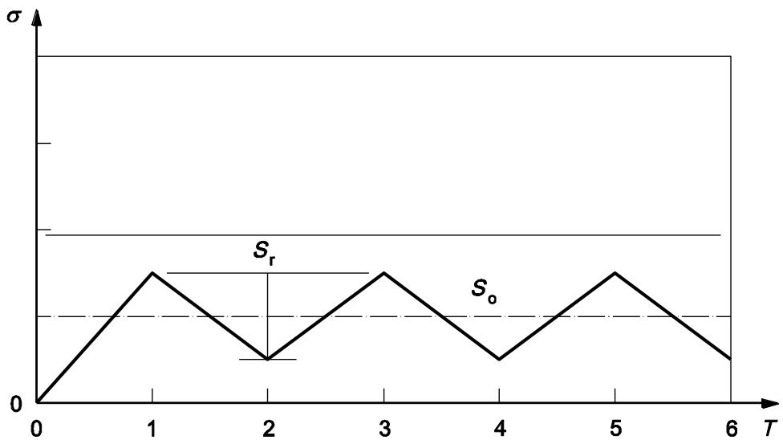  
a) Nominal pipe stress variation

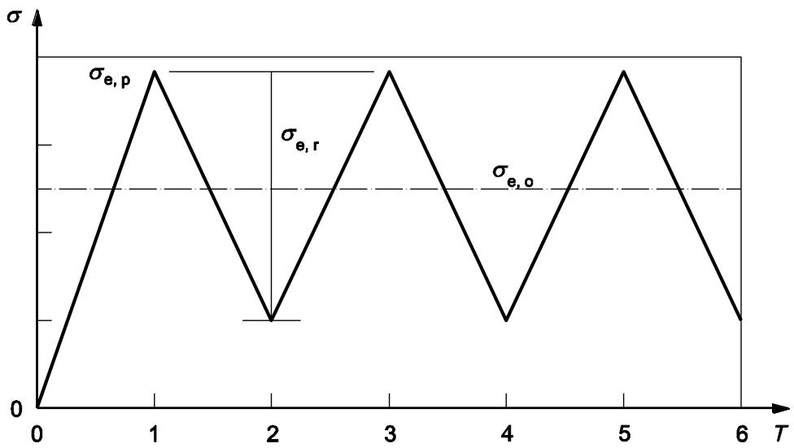

b) Elastic stress at notch (effect of SCF)   
c) Transformed notch stress (effect of elasto-plastic behaviour)   
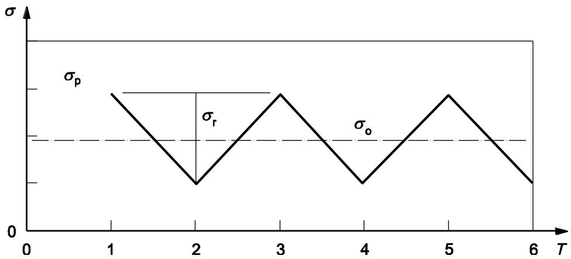  
Key   
σ stress--   
T time step,, ``, `

$\sigma_{ \mathrm{ e , r } }$ elastic stress range at notch

σe,o $\sigma_{ \mathrm{ e , 0 } }$ mean elastic stress at notch

$S_{ \mathrm{ r } }$ nominal pipe stress range

$S_{ \mathrm{ o } }$ mean nominal pipe stress

$\sigma_{ \mathrm{ e , p } }$ peak elastic stress at notch

$\sigma_{ \mathrm{ p } }$ peak elasto-plastic stress at notch

$\sigma_{ \mathrm{ r } }$ elasto-plastic stress range at notch

$\sigma_{ 0 }$ σo mean elasto-plastic stress at notch

Figure A.15.2-2 — Definition of pipe and notch stresses

The local elasto-plastic notch stresses, mean and range, can be obtained by transforming the elastic notch response obtained from FEA. This transformation accounts for the local plasticity that takes place at the notch. The elastic notch response can be given in terms of the stresses directly calculated at the notch, the nominal pipe tubular stresses and a geometric SCF, which relates the pipe tubular stress, $S ,$ to the notch stress, σ (preferred), or a combination thereof. The elastic notch stresses may be transformed to elasto-plastic stresses by one of two methods: the strain energy density or Neuber’s.

a) energy density method

The energy method simply equates the elastic strain energy at the notch to the elasto plastic energy given by the actual cyclic stress strain behaviour obtained experimentally for the material in question (see Figure A.15.2-3). This transformation is general and accurate. Knowing the elastic notch stress range and peak stress [Figure A.15.2-2 b)], Formulae (A.15.2-12) to (A.15.2-14) apply:

$$\frac{\sigma_{\mathrm{e} , \mathrm{r}}^{2}}{2 E} = \frac{\sigma_{\mathrm{r}}^{2}}{2 E} + \frac{\sigma_{\mathrm{r}}}{n^{\prime} + 1} \left(\frac{\sigma_{\mathrm{r}}}{K^{\prime}}\right)^{1 / n^{\prime}} \quad \text{s o l v e f o r} \sigma_{\mathrm{r}} \tag{A.15.2-12}$$

and

$$\frac{\sigma_{\mathrm{e} , \mathrm{p}}^{2}}{2 E} = \frac{\sigma_{\mathrm{p}}^{2}}{2 E} + \frac{\sigma_{\mathrm{p}}}{n^{\prime} + 1} \left(\frac{\sigma_{\mathrm{p}}}{K^{\prime}}\right)^{1 / n^{\prime}} \quad \text{s o l v e f o r} \sigma_{\mathrm{p}} \tag{A.15.2-13}$$

where

$\sigma_{ \mathrm{ e , r } }$ σe,r is the elastic stress range at the notch from FEA;

$\sigma_{ \mathrm{ r } }$ is the elasto-plastic stress range (transformed) at the notch;

$\sigma_{ \mathrm{ e , p } }$ is the elastic peak stress at the notch from FEA;

$\sigma_{ \mathrm{ { p } } }$ is the elasto-plastic peak stress (transformed) at the notch.

Then, the elasto-plastic mean stress, $\sigma_{ \mathrm{ o } } ,$ at the notch is

$$\sigma_{\mathrm{o}} = \sigma_{\mathrm{p}} - \frac{\sigma_{\mathrm{r}}}{2} \tag{A.15.2-14}$$

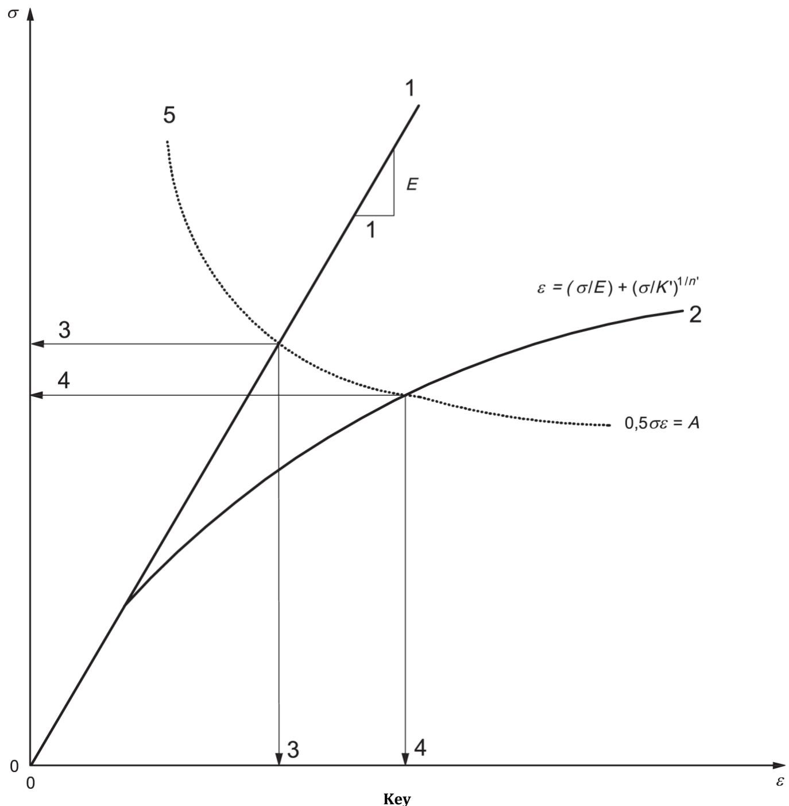  
Figure A.15.2-3 — Transformation of elastic stress via strain energy

1 elastic behaviour

5 line of equal strain energy (area below stressstrain curve)

2 elasto-plastic behaviour

σ notch stress

3 intersect with elastic behaviour

ε notch strain

4 intersect with elasto-plastic behaviour

b) Neuber’s method

Neuber’s method represents an engineering approximation to the same transformation and is based on Neuber’s rule (the geometric mean of the strain and stress concentration factors remains constant with load) and Peterson’s empirical fatigue strength reduction factor, $K_{ \mathrm{ f } } ,$ see Reference [A.15.2-3]. Referring to Figure A.15.2-4, the notch stress is linearly related to the pipe tubular stress via a SCF and

there is no initial prestress at the notch. Two approaches can be followed to obtain the notch peak stress and stress range to calculate the notch mean stress.

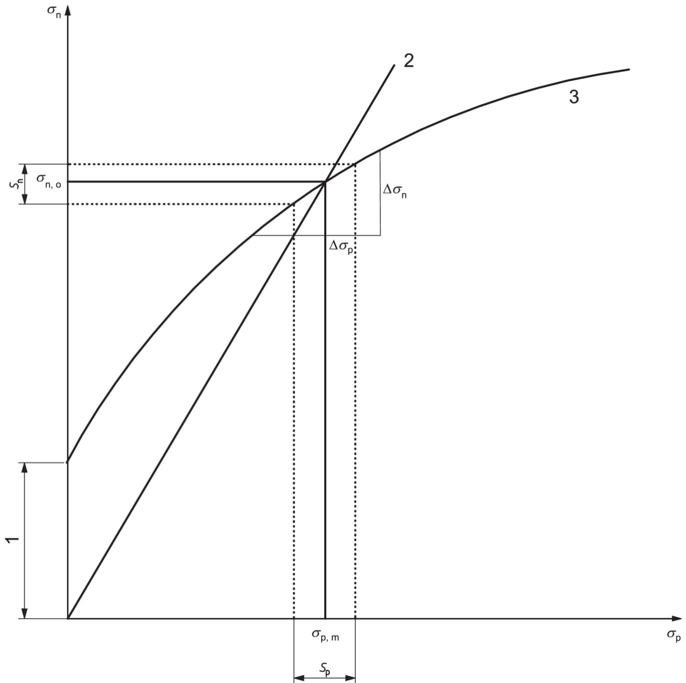  
Figure A.15.2-4 — Relation between notch and pipe stresses

Knowing the nominal pipe tubular stress range $\left( S_{ \mathrm{ r } } \right)$ , peak stress （$S_{ 0 } )_{ i }$ , the elastic SCF, the transformed elasto plastic notch stress range, $\sigma_{ \mathrm{ { r } } } ,$ and the peak notch stress, $\sigma_{ \mathrm{ { p } } } ,$ can be obtained directly from the nominal pipe tubular stresses [Figure A.15.2-2 a)] according to the following two relations: --

$$\sigma_{\mathrm{r}} \left[ \frac{\sigma_{\mathrm{r}}}{E} + \left(\frac{\sigma_{\mathrm{r}}}{K^{\prime}}\right)^{1 / n^{\prime}} \right] = \frac{1}{E} \left(K_{\mathrm{f}} \cdot S_{\mathrm{r}}\right)^{2} \quad \text{s o l v e f o r} \sigma_{\mathrm{r}} \tag{A.15.2-15}$$

and

$$\sigma_{\mathrm{p}} \left[ \frac{\sigma_{\mathrm{p}}}{E} + \left(\frac{\sigma_{\mathrm{p}}}{K^{\prime}}\right)^{1 / n^{\prime}} \right] = \frac{1}{E} K_{\mathrm{f}}^{2} \left(S_{\mathrm{o}} + \frac{S_{\mathrm{r}}}{2}\right)^{2} \quad \text{s o l v e f o r} \sigma_{\mathrm{p}} \tag{A.15.2-16}$$

where

$S_{ \mathrm{ r } }$ is the nominal stress range in the pipe tubular (known);

$S_{ \mathrm{ o } }$ is the mean nominal stress in the pipe tubular (known);

$K_{ \mathrm{ f } }$ is the fatigue strength reduction factor, or effective fatigue SCF given by:

$$K_{\mathrm{f}} = 1 + \frac{\mathrm{S C F} - 1}{1 + A / r}$$

where

r is the notch radius, in millimetres;

${ \mathrm{ S C F } } = { \frac{ \Delta \sigma } { \Delta S } }$   known from FEA;

$$A = 0, 821 \left(\frac{300}{\sigma_{\mathrm{u}}}\right)^{1, 8};$$

$\sigma_{ \mathrm{ u } }$ is the ultimate stress of the material, in MPa.

Then, the elasto-plastic mean stress, $\sigma_{ \mathrm{ o } } ,$ at the notch is:

$$\sigma_{\mathrm{o}} = \sigma_{\mathrm{p}} - \frac{\sigma_{\mathrm{r}}}{2} \tag{A.15.2-17}$$

The accuracy of the transformation by Neuber’s method depends on the relative contribution of the connector preload to the notch stress and on the degree of non-linearity between the notch stress and the pipe tubular stress. If linearity between the notch and pipe tubular stresses exists and there is no preload, the notch stresses can be calculated using the pipe tubular stresses and an SCF, and the energy method can alternatively be used.

If the local notch stress is not linearly related to the pipe tubular stress and the connector is preloaded (Figure A.15.2-4), then

1) the SCF varies with the pipe tubular stress, and   
2) there is an initial stress at the notch that is not related to the pipe tubular stress but to dimensional interferences in the connector.

In this case, the instantaneous SCF may be taken as the derivative of the notch stress with respect to the pipe tubular stress to relate the pipe tubular stress range to the notch stress range. However, the pipe tubular mean stress can no longer be related to the notch stress via a SCF. To avoid this situation, the elastic mean stress directly calculated at the notch via FEA is used.

Knowing the elastic mean notch stress $\left( \sigma_{ \mathrm{ o } } \right)$ and the pipe tubular stress range $\left( S_{ \mathrm{ r } } \right)$ and the instantaneous SCF, the transformed notch stress range, $\sigma_{ \mathrm{ r } }$ and the notch peak stress, $\sigma_{ \mathrm{ { p } } } ,$ can be obtained using Neuber’s method by:

$$\sigma_{\mathrm{r}} \left[ \frac{\sigma_{\mathrm{r}}}{E} + \left(\frac{\sigma_{\mathrm{r}}}{K^{\prime}}\right)^{1 / n^{\prime}} \right] = \frac{1}{E} \left(K_{\mathrm{f}} \cdot S_{\mathrm{r}}\right)^{2} \quad \text{s o l v e f o r} \sigma_{\mathrm{r}} \tag{A.15.2-18}$$

and

$$\sigma_{\mathrm{p}} \left[ \frac{\sigma_{\mathrm{p}}}{E} + \left(\frac{\sigma_{\mathrm{p}}}{K^{\prime}}\right)^{1 / n^{\prime}} \right] = \frac{1}{E} \left[ \sigma_{\mathrm{e}, \mathrm{o}} + K_{\mathrm{f}} \left(\frac{S_{\mathrm{r}}}{2}\right) \right]^{2} \quad \text{s o l v e f o r} \sigma_{\mathrm{p}} \tag{A.15.2-19}$$

Again, the elasto-plastic mean stress, $\sigma_{ \mathrm{ o } } ,$ at the notch is:

$$\sigma_{\mathrm{o}} = \sigma_{\mathrm{p}} - \frac{\sigma_{\mathrm{r}}}{2} \tag{A.15.2-20}$$

Using $\sigma_{ \mathrm{ r } }$ and $\sigma_{ 0 }$ in Formula (A.15.2-11), calculate $\sigma_{ \mathrm{ r e } } .$ Determine the corresponding strain, $\varepsilon_{ \mathrm{ r e } } ,$ from Formula (A.15.2-11). With $\sigma_{ \mathrm{ r e } }$ and $\varepsilon_{ \mathrm{ r e } } ,$ it is possible to solve for $N_{ \mathrm{ f } }$ using Formula (A.15.2-9).

An example of S-N curves developed for an actual connector is presented in Figure A.15.2-5, compared to a ground flush circumferential weld estimated as the D curve from the UK HSE guidance, shifted by a factor of two on life. The connector in question develops preload upon makeup, the notch stress is not linear with the pipe tubular stress, and the nominal pipe tubular is maintained at a mean tension of 690 MPa. For this example, Formulae (A.15.2-18) to (A.15.2-20) were used to transform the stresses. The material used is HY-80 from Reference [A.15.2-2].

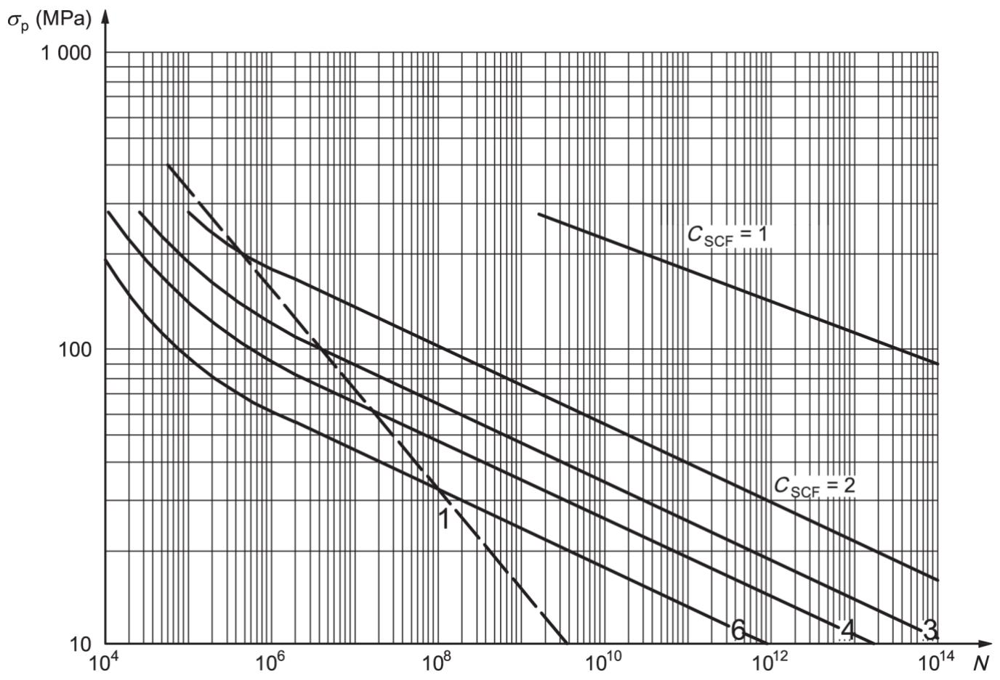  
Figure A.15.2-5 — Example of calculated S-N curves for various SCFs and constant pipe mean``,,,, stress for HY-80 material compared with the circumferential weld between connector and pipe,`,,,,`

Key

1 S-N curve for ground circumferential weld

solid lines S-N curves for varying SCF

$\sigma_{ \mathrm{ p } }$ pipe stress

N number of cycles to failure

HY-80 material property data

n = 0,147

K’ = 1 184 MPa

σf' = 1 249 MPa

εf’ = 1,456

a = –0,101

b = –0,693

## A.15.2.7 Stress analysis validation`---

No guidance is offered.

## A.15.2.8 Threaded fasteners

## A.15.2.8.1 General

No guidance is offered.

## A.15.2.8.2 Threaded fastener materials and manufacturing

Threaded fasteners should comply with the requirements of BS 4882 [A.15.2-5] or similar.

Rolled threads, as opposed to cut threads, tend to improve fatigue performance, provided the rolling process is undertaken after the heat treatment. However, the S-N curve provided in A.15.2.8.7 does not take advantage of an improvement associated with rolled threads, if any. Furthermore, fatigue test results in air show only a marginal fatigue performance improvement due to rolling of the threads [A.15.2-6].

If threaded fasteners or studs are partially threaded, the location and geometry of thread run-out should be such that stress concentrations are minimized.

## A.15.2.8.3 Threaded fastener installation

Threaded fasteners may be preloaded by controlling the applied load, the stretch or the torque. The load control method to preload threaded fasteners is considered the most reliable. In this case, threaded fastener preload can be achieved by applying an axial load to the threaded fastener and running the nut to a hand-tight position before releasing the load. Typically, hydraulic bolt tensioners are used, which are modified hydraulic jacks. When allowed to react against a rigid, even support and calibrated to a standard traceable to a recognized national standard, axial hydraulic bolt tensioners can provide a very precise prestress.

When the load is released from the tensioner and transferred to the nut, the resulting deformations as the nut engages the threaded fastener lead to what is known as a transfer loss. This loss should be taken into account during tensioning. The percentage of transfer losses for standard metric and UNS (unified screw thread, standard series) threads bearing on a rigid steel plate may be taken as:

$$\Delta P_{\text{ave}} = \left(0, 9 \frac{d}{l}\right) \cdot 100 \% \tag{A.15.2 - 21}$$

$$\Delta P_{\max } = \left(1, 0 \frac{d}{l}\right) \cdot 100 \% \tag{A.15.2 - 22}$$

where

$\Delta P_{ \mathrm{ a v e } }$ is the average percentage transfer loss;

$\Delta P_{ \mathrm{ m a x } }$ is the maximum percentage transfer loss;

d is the threaded fastener diameter;

is the stressed length of the threaded fastener, which can be taken as the distance between the first and the last engaged threads.

Where the surface supporting fasteners is flexible, reduced transfer losses can occur. The reduction in losses may be taken into account by calculating an equivalent effective stressed length.

When using hydraulic tensioners, care should be taken to ensure that threaded fasteners are not tensioned beyond yield, since this can lead to excessive deformation. The maximum tensioner load applied to the threaded fastener should not exceed the yield load less a safety margin equal to two standard deviations, as obtained from the tensioning calibration test.

In the absence of specific data, the threaded fastener preload should also include a material relaxation loss of approximately 2 % for steel threaded fasteners with a minimum yield strength above 600 MPa at room temperature. Steel threaded fasteners with a minimum yield strength less than 600 MPa are not recommended for use where a controlled preload is required.

Other methods for preloading threaded fasteners are direct torqueing and the turn of the nut, a stretch-controlled method. The latter method differs from the former in that a specified torque is initially applied, followed by a measured rotation between the nut and the threaded fastener. Although more practical than direct preload, these methods are inherently less reliable due to the friction on the threads and between the nut and the bearing surface. Use of the direct torque method is not recommended unless carefully calibrated tests, traceable to a national standard, are carried out to consistently account for friction. Control of lubrication and avoidance of galling is important to achieve consistent results.

For threaded fastener connections intended for multiple assembly and disassembly operations, in which the threaded fasteners are to be reused, the calibration procedure should include multiple make-up and break-out operations.

## A.15.2.8.4 Threaded fastener inspection

The level of cathodic protection of individual bolts should be checked. The cathodic potential of any individual bolt should be minus 900 mV ± 50 mV compared with an $\mathrm{ A g - A g C l }$ cell.

When inspecting the bolts for tension, the bolts should be re-tensioned to the same level to which they were intended to be preloaded during installation, using the original installation procedure and calibrated tools. If any bolt is found to fall below the minimum design value, the bolt should be retensioned to its originally required value.

## A.15.2.8.5 Threaded fastener strength criteria

The extreme fibre stress in the connector (axial plus bending), induced by preload and factored actions on the connected tubular members, should satisfy the following criterion:

$$\sigma_{\mathrm{b t}} \leq \frac{f_{\mathrm{y}}}{\gamma_{\mathrm{R} , \mathrm{b t}}} \tag{A.15.2-23}$$

where

$\sigma_{ \mathrm{ b t } }$ is the extreme fibre stress (axial plus bending), acting on the minimum section;

$f_{ \mathrm{ y } }$ is the representative yield strength of the material;

$\gamma_{ \mathrm{ R , b t } }$ is the resistance factor for axial tensile strength = 1,0.

In addition, the size and number of threaded tension fasteners used should be such that the total factored tension force, $P_{ \mathrm{ t } } ,$ due to factored actions, acting on the connected tubular members, does not exceed:

$$P_{\mathrm{t}} \leq \frac{f_{\mathrm{y}} A_{\mathrm{b}} N_{\mathrm{b}}}{\gamma_{\mathrm{R} , \mathrm{b a}}} \tag{A.15.2-24}$$

where, additionally,

$A_{ \mathrm{ b } }$ is the area of the shank of the threaded element;

$N_{ \mathrm{ b } }$ is the total number of threaded elements;

$\gamma_{ \mathrm{ { R , b a } } }$ is the resistance factor for threaded fastener area = 1,15.

## A.15.2.8.6 Threaded fasteners fatigue criteria

To minimize the stress fluctuation response in threaded fasteners caused by fluctuating actions, the fastener stressed length and cross-sectional area should be chosen to give maximum flexibility of the fastener within the constraints of the design (i.e. maximize the fastener preload extension).

FEA may be used to evaluate threaded fastener stress variations due to fluctuating actions. The FEA model for this case may be developed with the intent of only simulating stiffness, requiring only a coarse mesh. Ignoring the fastener preload in evaluating the fastener force variations is always conservative.

To calculate fatigue damage, Palmgren-Miner’s sum may be used, in which the damages induced in the fastener by each of the stress variations are linearly superimposed. The damage due to a given variable force may be expressed in closed form when a spectral fatigue analysis of the structure has been performed. Alternatively, the damage may be calculated as the discrete sum of the ratios of the acting number of cycles of a given stress range in the fastener, as defined by the long-term distribution of annual occurrence versus stress range, to the allowed number of cycles for the same stress range, as given by an S-N curve.

In the absence of specific fatigue data for threaded fasteners, the S-N curve described by Formula (A.15.2-25) may be used. However, the user should be aware that the curve does not necessarily account for the effects of preload:

$$\log N = 11, 55 - 3 \log S \tag{A.15.2-25}$$

where N is the number of cycles to failure and S is the stress range in the fastener.

The S-N curve provided above is lower bound to fatigue tests in air given in Reference [A.15.2-6] augmented by tests conducted at TWI in the UK on behalf of HSE [A.15.2-7]. The data include tests in which the applied load is transferred to the fastener from the loading plate via a single or double nut arrangement. In the latter arrangement, the load is transferred from a perforated plate, through which the fastener passes. The fastener is connected to the plate by means of two nuts torqued against each other, one on each side of the plate. The above S-N curve provides for reasonably conservative designs for fasteners made of ASTM A193 [A.15.2-8], Grade B7 and L7 steels, as well as of ISO Grades 8,8 and 12,2 to BS 3692 [A.15.2-9].

Unless demonstrated by pertinent tests under relevant conditions, no advantage may be taken of an endurance limit.

Although fatigue data show that rolling the threads after heat treatment tends to improve the fatigue performance of fasteners, the above given S-N curve conservatively ignores this effect. Heat treating fasteners after rolling the threads essentially results in a fastener with a fatigue performance similar to that of fasteners with cut threads.

Tests conducted at TWI in the UK showed that the fatigue performance of Grades 8.8, B7 and L7 bolts, tested under cathodically protected conditions, experienced reductions on fatigue life relative to in-air performance. Therefore, a reduction factor of 3,0 on the life obtained by the S-N curve given above may be used to account for the effect of using bolts underwater with adequate cathodic protection in the range –850 mV to –1 000 mV. However, the underwater fatigue performance of fasteners made of higher grade steels should be specifically addressed via a validated test programme, as should the effect of hydrogen embrittlement.

Tests on threaded fasteners varying from 19 mm to 44 mm in diameter made of Grades 8.8, B7 and L7 support a correction factor on stress, relative to the 20 mm size, given by Formula (A.15.2-26):

$$k_{\text{c o r r}} = \left(\frac{d}{20}\right)^{0, 3} \tag{A.15.2-26}$$

where d is the fastener diameter, in millimetres.

The factor, $k_{ \mathrm{ c o r r } } ,$ is applied to the stress range prior to entering the S-N curve given above.

## A.15.2.9 Swaged connections

No guidance is offered.

A.15.3Clamps for strengthening and repair

## A.15.3.1 General

The general clamp design process is presented in Figure A.15.3-1.

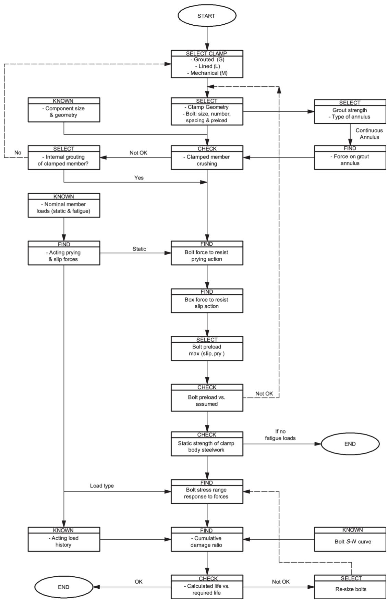  
Figure A.15.3-1 — General design procedure for stressed clamps

## A.15.3.2 Split-sleeve clamps

No guidance is offered.

## A.15.3.3 Prestressed clamps

No guidance is offered.

## A.15.3.4 Forces on clamps

## A.15.3.4.1 Mechanism of force transfer

No guidance is offered.

## A.15.3.4.2 Member forces

No guidance is offered.

## A.15.3.4.3 Bolt forces

## A.15.3.4.3.1 General

Figures A.15.3-2, A.15.3-3 and A.15.3-4 illustrate typical applications of clamps for strengthening or repair of structures for, respectively:

a) end-to-end connections;   
b) addition of members;   
c) tubular joints.

The capability of prestressed clamps to transfer forces is determined by the bolt prestress. Bolts should be prestressed so that the clamp does not open or slip due to the forces acting on the clamp. Shear forces and bending moments from the substrate member tend to pry or separate the clamp, whereas axial force and torsion tend to cause the clamp to slip.

The prying action on the clamp arising from the shear forces and bending moments is directly resisted by extension in the bolts. However, the forces that tend to pull out or slip the substrate member from the clamp are resisted by the friction developed at the clamp member interface. This frictional resistance is`,,,` induced by the contact pressure developed as the bolts are tightened or prestressed. Because the prying ,``,,,, action tends to relieve the contact pressure and, thus, decrease the resistance against slippage, the bolt,`,,,, prestress should correspond to the greater of the following two bolt forces:`-`-``

— bolt forces required to resist the prying (without separation);---   
— bolt forces required to prevent slippage.

When calculating the bolt forces in clamps intended to strengthen or repair joints between tubulars, advantage may be taken of the sharing of forces between the clamp and the substrate member, provided that such load sharing of forces is demonstrated by analysis or tests. Otherwise, it is conservative to assume that no sharing of forces takes place and that the clamp fully transfers the substrate forces across the joint.

Methods for calculating the required prestressing forces in the bolts to prevent prying and slipping at the clamp-member interface for each of the three clamp applications are presented in A.15.3.4.3.2 to A.15.3.4.3.4, ignoring sharing of forces between the clamp and the substrate member.

## A.15.3.4.3.2 End-to-end connection clamps

Figure A.15.3-2 shows a generic clamp over an end-to-end connection and a typical set of substrate member end forces. The prying forces from the substrate member are transferred to the clamp and, thus, to the bolts over the contact length $L_{ \mathrm{ c } } .$ To calculate the axial force sustained by the bolts due to the prying forces, in the absence of test data, it may conservatively be assumed that the vectorial resultants from the acting prying moments and shear forces superimpose on one another to separate the clamp (Figure A.15.3-2, section A-A).

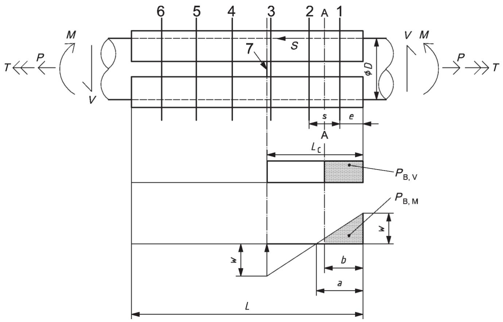  
Figure A.15.3-2 — Typical application of a clamp on an end-to end connection

Key

1-6 bolts

7 end of substrate member on the right hand side

D member diameter

$L$ length of clamp

$L_{ \mathrm{ c } }$ contact length on substrate member

$P_{ \mathrm{ B , V } }$ total shear force on end bolt due to shear force V on substrate member (shaded area)

$P_{ \mathrm{ B , M } }$ total force on end bolt due to bending moment M on substrate member (shaded area)

w maximum force per unit length due to bending moment M

S slip force

The resultants of the in-plane and out-of-plane bending moments and shears can be taken as:

$$M = \sqrt{\left(M_{\mathrm{i p b}}\right)^{2} + \left(M_{\mathrm{o p b}}\right)^{2}} \tag{A.15.3-1}$$

and

$$V = \sqrt{\left(V_{\mathrm{i p}}\right)^{2} + \left(V_{\mathrm{o p}}\right)^{2}} \tag{A.15.3-2}$$

where

$M { \mathrm{ : } }$ is the resultant bending moment on the substrate member assumed acting as if in-plane;   
$M_{ \mathrm{ i p \bar{ b } } }$ is the in-plane bending moment on the substrate member;   
$M_{ \mathrm{ o { \dot{ p } } b } }$ is the out-of-plane bending moment on the substrate member;   
V is the resultant shear force on the substrate member assumed acting as if in-plane;   
$V_{ \mathrm{ i p } }$ is the in-plane shear force on the substrate member;   
$V_{ \mathrm{ o p } }$ is the out-of-plane shear force on the substrate member.

Tests of an end-to-end joint have shown that in the case of grouted clamps with the bolts oriented as shown in Figure A.15.3-2, only a fraction of the applied out-of-plane bending moment （$M_{ \mathrm{ o p b } } )$ results in bolt force variation so long as no separation of the clamp halves occurs. In absence of pertinent data, one half of the acting $M_{ \mathrm{ o p b } }$ can be substituted in Formula (A.15.3-1), when calculating the total bending moment, M. However, for neoprene-lined clamps, tests show that the full $M_{ \mathrm{ o p b } }$ should be used.

The overall separation action on the clamp results in a contact pressure distribution at the clamp-member interface that is maximum at the free end of the clamp and decreases toward the centre of the clamp. The distribution of this pressure and the length over which it acts is not well understood. In the absence of a detailed analytical or experimental evaluation of such pressure, the pressure distribution arising from the resulting bending moment (M) may be assumed to decrease over a distance, $2 a ,$ from the free end, where it is maximum, as indicated in Figure A.15.3-2. The distance 2a can be taken as equal to the contact length, $L_{ \mathrm{ c } } .$ The pressure arising from the resulting shear force (V) may be assumed to be uniform over the same length (2a) over which the bending moment was assumed to have dissipated.

In general, the force resisted by the end bolts due to prying action should include the effect of the resultant bending moment and resultant shear force and, if applicable, any other components of forces acting directly on the clamp (e.g. add-on members) that are parallel to the bolt axes. Thus, the bolt force, $P_{ \mathrm{ B , b } } ,$ assuming two rows of bolts parallel with the axis of the substrate members (one on either side) as shown in Figure A.15.3-2, can in general be given by:

$$P_{\mathrm{B}, \mathrm{b}} = \frac{1}{2} \left(P_{\mathrm{B}, \mathrm{M}} + P_{\mathrm{B}, \mathrm{V}} + P_{\mathrm{B}, \mathrm{P}}\right) \tag{A.15.3-3}$$

where

$P_{ \mathrm{ B , b } }$ is the total force on the end bolt (assuming two parallel rows of bolts);

$P_{ \mathrm{ B , M } }$ is the force on the end bolt induced by the resultant bending moment, $M ;$

$P_{ \mathrm{ B , V } }$ is the force on the end bolt induced by the resultant shear force, $V ;$

PB,P $P_{ \mathrm{ B , P } }$ is the bolt force induced by other forces parallel to the bolt axes and acting on the clamp, if present.

For clamps installed over end-to-end connections $P_{ \mathrm{ B , P } } { = } 0$ , therefore, only the bending moments and shear forces on the substrate member contribute to the bolt force through $P_{ \mathrm{ B , M } }$ and $P_{ \mathrm{ B , V } } .$ As indicated in Figure A.15.3-2 by the shaded area, these forces can generally be obtained from the corresponding pressure distributions brought about by the bending moment and shear force resultants acting over a distance equal to one half of the bolt spacing on each side of the bolt.

The force on the end bolt induced by the resultant shear force is equal to the average shear force over the contact length (V/2a) times the distance, b:

$$P_{\mathrm{B}, \mathrm{V}} = \frac{V}{2 a} \cdot b \tag{A.15.3-4}$$

where, further to previous definitions,

$$a \quad = L_{c} / 2;$$

b is the larger of the two distances s and （$s / 2 + e )$ ;   
s is the bolt spacing;   
e is the distance between the end bolt and the end of the clamp (see Figure A.15.3-2).

In addition, the substrate member tends to slip relative to the clamp. The total slip force may be taken as the vectorial sum of the slip forces in the longitudinal and circumferential directions. The slip force associated with the longitudinal shear force induced by the bending moment (M) in the substrate member may be ignored. Hence, the total acting slip force is according to Formula (A.15.3-5):

$$P_{\mathrm{S I}} = \sqrt{P_{\mathrm{a x}}^{2} + \left(\frac{2 T}{D}\right)^{2}} \tag{A.15.3-5}$$

where

$P_{ \mathrm{ S l } }$ is the slip force between the substrate member and the clamp;

$P_{ \mathrm{ a x } }$ is the axial force on the substrate member;

T is the torsional moment on the substrate member;   
D is the outside diameter of the substrate member (see Figure A.15.3-2).

The minimum bolt force required to prevent slip of the clamp can be obtained by comparing the acting slip or interface transfer stress to the corresponding strength as given in A.15.3.5.5.

The interface transfer stress $\sigma_{ \mathrm{ { p } } }$ acting on the clamp is according to Formula (A.15.3-6):

$$\sigma_{\mathrm{p}} = \frac{P_{\mathrm{S I}}}{\pi D L_{\mathrm{s}}} \tag{A.15.3-6}$$

where $L_{ s }$ is the length of the clamp over which the slip force, $P_{ \mathrm{ S l } } ,$ is assumed to transfer.

For clamps used in end-to-end joints, $L_{ s }$ should be taken as the shortest length from the joint to either end of the clamp, i.e. the shortest contact length $L_{ \mathrm{ c } } ,$ if the clamp is not placed symmetrically relative to the joint. Both halves of the clamp are assumed to contribute to the slip resistance.

## A.15.3.4.3.3 Addition-of-member clamps

Figure A.15.3-3 illustrates the use of clamps to add a member. In this instance, the substrate member only supports the clamp and the forces acting on the add-on member tend to pry and slide the clamp relative to the substrate member.

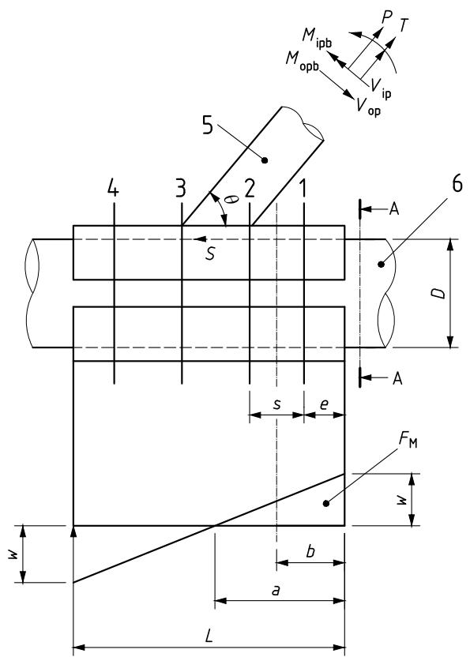

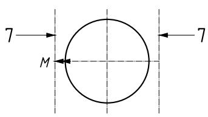  
A-A

Key

1-4 bolts

5 add-on member

6 substrate member

7 line of edges of clamp

D diameter of substrate member

S slip force

s bolt spacing

w unit force due to acting prying moment M

a $L / 2$

L clamp length

b larger of the two distances s and (s/2 + e)

s bolt spacing

e distance between the end bolt and the end of the clamp

M prying moment [Formula (A.15.3-7)]

Figure A.15.3-3 — Typical application of a clamp for the addition of a member

The prying moment, M, may be taken as:

$$M = \sqrt{\left(M_{\mathrm{o p b}} \cos \theta + T \sin \theta\right)^{2} + \left(M_{\mathrm{i p b}}\right)^{2}} \tag{A.15.3-7}$$

where

M is the total prying moment on the clamp;   
$M_{ \mathrm{ i p b } }$ is the in-plane bending moment on the added member;   
$M_{ \mathrm{ o p b } }$ is the out-of-plane bending moment on the added member;   
T is the torsional moment on the added member;   
θ is the included angle between the added member and the substrate member (see Figure A.15.3-3).

Both $M_{ \mathrm{ i p b } }$ and $M_{ \mathrm{ o p b } }$ are calculated about the intersection of the add on member axis and the axis of the substrate member (the work point).

The bolt force, $P_{ \mathrm{ B , b } } ,$ is analogous to Formula (A.15.3-3), without a contribution from shear forces in the substrate member:

$$P_{\mathrm{B}, \mathrm{b}} = \frac{1}{2} \left(P_{\mathrm{B}, \mathrm{M}} + P_{\mathrm{B}, \mathrm{P}}\right) \tag{A.15.3-8}$$

where

$P_{ \mathrm{ B , b } }$ is the total force on the end bolt (assuming two parallel rows of bolts);

$P_{ \mathrm{ B , M } }$ is the force on the end bolt pair induced by the total prying moment, M; $P_{ \mathrm{ B , M } }$ is calculated as for end-to-end clamps (see A.15.3.4.3.2);

PB,P $P_{ \mathrm{ B , P } }$ is the force on the end bolt pair parallel to the bolt axes, induced by the forces in the added member:

$$P_{\mathrm{B}, \mathrm{P}} = \frac{P \sin \theta - V \cos \theta}{N_{\mathrm{b p}}} \tag{A.15.3-9}$$

where

P is the axial force on the added brace;

V is the resultant shear force on the added brace;

$N_{ \mathrm{ b p } }$ is the number of bolt pairs.

The total acting slip force can be taken as:

$$P_{\mathrm{S I}} = \sqrt{\left(P \cos \theta + V_{\mathrm{i p}} \sin \theta\right)^{2} + \left(\frac{2 \left(T \cos \theta + M_{\mathrm{o p b}} \sin \theta\right)}{D} + V_{\mathrm{o p}}\right)^{2}} \tag{A.15.3-10}$$

where, further to previous definitions,

$P_{ \mathrm{ S l } }$ PSl is the slip force between the substrate member and the clamp;   
$V_{ \mathrm{ i p } }$ is the in-plane shear force on the added member;   
$V_{ \mathrm{ o p } }$ is the out-of-plane shear force on the added member;   
D is the outside diameter of the substrate member.

The minimum bolt prestress force required to prevent slip of the clamp can be obtained by comparing the acting slip or interface transfer stress to the corresponding strength as given in A.15.3.5.5.

The interface transfer stress is assumed resisted by that half of the clamp to which the add-on member is attached, and can be determined as:

$$\sigma_{\mathrm{p}} = \frac{2 S}{\pi D L_{\mathrm{s}}} \tag{A.15.3-11}$$

where, furthermore,

$\sigma_{ \mathrm{ { p } } }$ is the interface transfer stress;

$\begin{array} { r l } { L_{ s } } & { { } = L } \end{array}$ is the length of the clamp over which transfer of the slip force is assumed to take place.

The above slip force is assumed to act only on the clamp’s half to which the add-on member attaches. The other half of the clamp is not active due to the inability of the bolts to transfer shear. However, both halves of the clamp can be made to act simultaneously by providing shear transfer between the two clamp halves using rigidly engaged longitudinal hinges, placed on each side of the clamp.

## A.15.3.4.3.4 Clamps on tubular joints

Referring to Figure A.15.3-4, the prying forces on clamps placed on tubular joints may conservatively be determined by treating each of the tubular joint member ends as the substrate member of a clamp on an end-to-end connection. The substrate member in Figure A.15.3-4 can be the brace or the chord parts of the tubular joint. Assuming the clamp is to fully transfer the forces, the lengths over which force transfer can be assumed to take place are:

a) L for the brace side;

b) $L_{ 1 }$ and $L_{ 2 }$ for the chord sides.

Likewise, the calculation of the slip force may conservatively be treated as a case of an end-to-end clamp for each of the free ends of the joint.

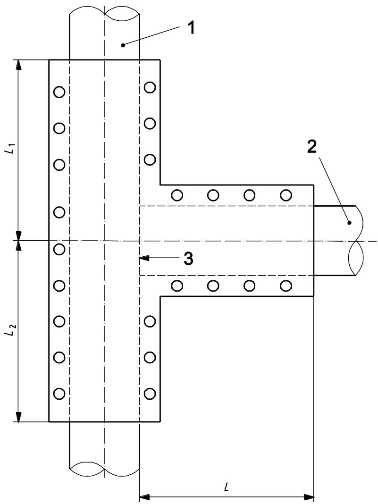  
Figure A.15.3-4 — Typical application of a clamp on a tubular joint

Key

1 chord substrate member   
2 brace substrate member   
3 break

## A.15.3.5 Clamp design

## A.15.3.5.1 General approach

No guidance is offered.

## A.15.3.5.2 Check of the clamped member

No guidance is offered.

## A.15.3.5.3 Static design of bolts

No guidance is offered.

## A.15.3.5.4 Fatigue design of bolts

FEA can be used to evaluate bolt force fluctuations due to the time-varying actions. The FEA meshes in analyses used for evaluating force fluctuations may be coarse and the geometry may be defined by midsurface planes. The bolts may be modelled with single beam elements, and the clamp and the substrate members may be modelled with plate and thin shell elements. Alternatives for modelling the bolt preload and clamp-member interface include:

— explicitly modelling a bolt preload which is sufficient to maintain contact between the clamp and the substrate member;   
— ignoring the bolt preload and modelling the interface between the clamp and the substrate member with contact elements, which allow gaps to open.

In FEA, the bolts should be prestressed to the intended level prior to applying any member forces to the clamp. Then, a linear elastic analysis should be conducted for each of the member forces relevant to the clamp in question and the corresponding variation of the axial stresses in the bolt determined. In this way, transfer functions between the forces on the clamp and the bolt stresses can be established. Hence, knowing the clamp force histories and the corresponding transfer functions, the actual stress history in the bolt can be obtained.

## A.15.3.5.5 Interface transfer strength of prestressed clamps

The slip strength formulae for prestressed clamps given in this subclause are based on a relatively limited experimental database [A.15.3-1], primarily with respect to the clamp configuration and distribution of bolts. In using these formulae, designers should be aware of the limitations of the database. The single most important characteristic of the clamp cross-section is that it has a continuous top plate and is very rigid compared to the substrate member (see Figure A.15.3-5).

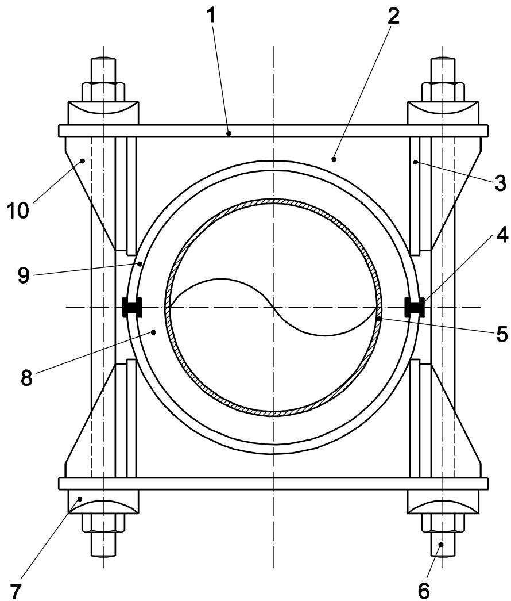  
Figure A.15.3-5 — Typical clamp cross-section

Key   


| 1 | top plate | 6 | long studbolts |
| --- | --- | --- | --- |
| 2 | end plate | 7 | spherical washer set |
| 3 | side plate | 8 | grout annulus |
| 4 | longitudinal seal | 9 | saddle |
| 5 | substrate member | 10 | gussets |


The database corresponds to pull tests on a single clamp geometry having a cross-section as shown in Figure A.15.3-2 (end-to-end connection). Three bolt sizes — M20, M32, and M40 — of constant length and at a constant spacing and prestress are included in the database. The clamp length-to-member diameter ratio varies from 0,5 to 2,0 and the member diameter-to-thickness ratios from 20 to 50. The steel surfaces were shot blasted, and the grout strength was greater than 50 MPa at 28 days for all tests.

For prestressed grouted clamps, the acting interface transfer stress （$\sigma_{ \mathrm{ p } } )$ due to factored actions should satisfy the following condition:

$$\sigma_{\mathrm{p}} = \frac{f_{\mathrm{g}}}{\gamma_{\mathrm{R} , \mathrm{g}}} \tag{A.15.3-12}$$

where

$\sigma_{ \mathrm{ { p } } }$ is the interface transfer stress at the substrate member;

$\boldsymbol{ \gamma }_{ \mathrm{ R , g } }$ is the partial resistance factor for interface transfer strength for prestressed clamps = 2,0;

$f_{ \mathrm{ g } }$ is the representative interface transfer strength, in stress units, given by:

$$f_{\mathrm{g}} = 2 C_{\mathrm{p}} K_{\mathrm{m}}^{0, 6} f_{\mathrm{c u}}^{0, 3} + \rho_{\mathrm{c}} \left(\frac{P_{\mathrm{B , n}}}{\pi / 2 D_{\mathrm{p}} L_{\mathrm{s}}}\right) \tag{A.15.3-13}$$

where

$C_{ \mathrm{ p } }$ is the scale factor for the diameter of the substrate member as defined in 15.1.5.1;

$K_{ \mathrm{ m } }$ is the (modified) radial stiffness factor (see below);

$f_{ \mathrm{ c u } }$ is the specified unconfined strength of the grout as defined in 15.1.5.1;

$\rho_{ \mathrm{ c } }$ is a representative friction factor at the grout-steel interface (see below);

$P_{ \mathrm{ B , n } }$ is the total bolt force:

$$P_{\mathrm{B}, \mathrm{n}} = n P_{\mathrm{B}, \mathrm{b}}$$

where n is the number of bolts and $P_{ \mathrm{ B , b } }$ is the prestressing force in one bolt;

Dp $D_{ \mathbf{ p } }$ is the outside diameter of the substrate member;

$L_{ s }$ Ls is the active length of the clamp.

The radial stiffness factor, $K_{ \mathrm{ m } } ,$ is a modification of that used in grouted connections (see 15.1.5.1) to account for the reduction in hoop stiffness due to the presence of the bolts, and is given by Formula (A.15.3-14):

$$K_{\mathrm{m}} = \left(\frac{D_{\mathrm{p}}}{t_{\mathrm{p}}} + \frac{s_{\mathrm{n}} L_{\mathrm{n}}}{A_{\mathrm{n}}}\right)^{-1} + \frac{1}{m} \left(\frac{D_{\mathrm{g}}}{t_{\mathrm{g}}}\right)^{-1} \tag{A.15.3-14}$$

where

Dp $D_{ \mathbf{ p } }$ is the outside diameter of the substrate member;

$t_{ \mathrm{ p } }$ is the wall thickness of the substrate member;

$s_{ \mathrm{ n } }$ is the bolt spacing;

$L_{ \mathrm{ n } }$ is the stressed length of the bolt;

$A_{ \mathbf{ n } }$ is the cross-sectional area of the bolt;

m is the ratio of elastic moduli of steel and $\mathrm{ g r o u t } = E_{ s } / E_{ \mathrm{ g } } ,$ ;

$D_{ \mathrm{ g } }$ is the outside diameter of the grout annulus;

$t_{ \mathrm{ g } }$ is the thickness of the grout annulus.

The representative friction factor at the grout steel interface (not the classical coefficient of friction) can be determined from:

$$\rho_{\mathrm{c}} = 0, 15 \left(1 + 30 K_{\mathrm{m}}^{0, 6}\right) \tag{A.15.3-15}$$

The representative interface transfer strength Formula (A.15.3-13) includes the contributions from:

a) the plain member grouted connection as given in 15.1.6 for $h / s = 0 .$ , but with a modified radial stiffness factor, $K_{ \mathrm{ m } } ;$ ;   
b) the friction developed at the grout-member interface due to the prestress in the bolts.

For prestressed mechanical clamps, the acting interface transfer stress, $\sigma_{ \mathrm{ { p^{ \prime } } } }$ due to factored actions should also satisfy the condition:

$$\sigma_{\mathrm{p}} \leq \frac{f_{\mathrm{g}}}{\gamma_{\mathrm{R} , \mathrm{g}}} \tag{A.15.3-16}$$

with the representative interface transfer strength given by:

$$f_{\mathrm{g}} = \rho_{\mathrm{c}} \left(\frac{P_{\mathrm{B} , \mathrm{n}}}{\pi / 2 D_{\mathrm{p}} L_{\mathrm{s}}}\right) \tag{A.15.3-17}$$

with:

$$\rho_{\mathrm{c}} = 0, 13 \left(1 + 30 K_{\mathrm{m}}^{0, 6}\right) \tag{A.15.3-18}$$

$$K_{\mathrm{m}} = \left(\frac{D_{\mathrm{p}}}{t_{\mathrm{p}}} + \frac{s_{\mathrm{n}} L_{\mathrm{n}}}{A_{\mathrm{n}}}\right)^{-1} \tag{A.15.3-19}$$

In this case, only the steel to steel friction contributes to the interface transfer strength of the clamp, which in turn is a function of the substrate member and bolt stiffnesses.

As in the case of grouted clamps, the transfer strength formula for mechanical clamps is based on limited data. The restrictions imposed on the database for the grouted clamps also apply to the mechanical clamps, with the caveat that mechanical clamps are much more sensitive to fit-up than grouted clamps are. Hence, in designing mechanical clamps, the obtaining of the actual dimensions of the structure upon which the clamp is to be installed, is strongly recommended.

For prestressed lined clamps, representative interface strength values should be determined by tests. In the absence of any such test data, the acting interface transfer stress, $\sigma_{ \mathrm{ { p^{ \prime } } } }$ due to factored actions should satisfy the condition:

$$\sigma_{\mathrm{P}} \leq \frac{f_{\mathrm{P}}}{\gamma_{\mathrm{R} , \mathrm{g}}} \tag{A.15.3-20}$$

with the representative interface transfer strength given by:

$$f_{\mathrm{p}} = \mu \left(\frac{P_{\mathrm{B} , \mathrm{n}}}{\pi / 2 D_{\mathrm{p}} L_{\mathrm{s}}}\right) \tag{A.15.3-21}$$

where μ is a generic coefficient of friction.

A value for μ between 0,1 and 0,2 may be used in the absence of specific data [A.15.3-2]. However, the use of elastomer lined clamps is not recommended, see 15.3.3 c) and 15.3.6.3.

## A.15.3.5.6 Interface transfer strength of split sleeve clamps

No guidance is offered.

## A.15.3.6 General requirements for bolted clamps

## A.15.3.6.1 Mechanical clamps

The structural performance of mechanical clamps is sensitive to the fit-up achieved during installation, which in turn depends on the tolerances between the clamp and the structure. If a fit is too loose, the clamp can have substantially reduced strength. If a fit is too tight, the clamp can be installed incorrectly. Also, it is important that the contact between the clamp and the structure be as uniform as possible.

To achieve proper installation and effective performance of mechanical clamps, it is important to clean the surfaces to bare metal and to grind welds, seam or circumferential welds, flush with the substrate member outer diameter. The clamp design should also be based on an accurate dimensional survey of the actual structure.

Tests have shown [A.15.3-1] that corrosion products, formed immediately after blasting the substrate member(s) underwater, can affect performance. Therefore, mechanical clamps for underwater -`,,,` applications should be installed within 24 h of cleaning, ensuring that the surfaces are wiped clean of any ``,,,, corrosion products immediately before installation.,`,,,

Generic flat-plate friction tests given in Reference [A.15.3-1] show that, for grit blasted steel surfaces```,, exposed to salt air and water, the coefficient of friction varies between 0,4 and 0,57, with a mean value of--- 0,51.

## A.15.3.6.2 Grouted clamps

No guidance is offered.

## A.15.3.6.3 Lined clamps

Elastomeric materials, such as polychloroprene (commonly known as neoprene), have been used for lining the inside of friction repair clamps. The lining can be formed or notched to accommodate local irregularities (e.g. doubler plates) on existing members and can be bonded to the clamp saddle at room temperature.

Extreme care should be taken in the design and use of elastomer lined clamps. The design should consider the long-term effectiveness of the elastomer with regard to creep and sea water resistance. For example,

soft and thick linings have a higher initial deformation under force, and hence higher long-term creep, than hard and thin linings. Ribbed linings (linings with longitudinal grooves) should not be used for applications of primary force transfer, due to creep and their added flexibility.

## A.15.3.6.4 Corrosion protection

No guidance is offered.

## A.15.3.7 Bolting considerations

No guidance is offered.

## A.16 Fatigue

A.16.1 General

## A.16.1.1 Applicability

Fatigue has long been recognized as an important consideration for the design of offshore structures. Tubular joints in a fixed steel structure are especially subjected to large forces and are sensitive to fatigue damage. Intensive co-operative industry research on tubular joints occupied the full decades from the 1960s to the 1980s.

## A.16.1.2 The fatigue process

Figure A.16.1-1 gives an idealized overview of the mechanics of the fatigue process. Its purpose is to assist basic understanding of the overall process and of the many separate factors involved. It further serves as a general reference for features and explanations of fatigue issues that are discussed in Clause 16. The basic description given here refers specifically to fatigue cracks emanating from pre-existing defects in welded connections, but the general concepts are equally applicable to fatigue in general.

Figure A.16.1-1 — Fatigue illustration — Two plates of unequal thickness connected by a full penetration butt weld   
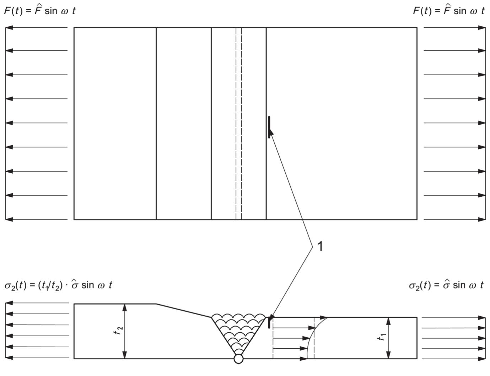  
1 small defect at weld toe

Key

Consider two plates of unequal thickness, connected by a full penetration butt weld perpendicular to the longitudinal direction of the plates; see Figure A.16.1-1. The plates are subjected to a variable action, $F ( t ) = { \hat{ F } } \sin \omega t$ , of constant amplitude and frequency. At sufficient distance away from the weld, this action results in nominal stress distributions of constant amplitude, which are uniform over the cross-section of the plates. In the thinner plate the stress is $\sigma_{ 1 } \left( t \right) = \hat{ \sigma } s \mathrm{ i n } \omega t$ , while in the thicker plate the stress is $\sigma_{ 2 } ( t ) = \ ( t_{ 1 } / t_{ 2 } ) { \cdot } \hat{ \sigma } \sin \omega t$

At various locations in the body of the weld, or the heat affected zones in the plate material adjacent to the weld, small defects inevitably exist. These defects can be very small, because large defects are avoided by proper design, workmanship and control of the weld process, or are captured by inspection during fabrication and repaired before the weld is accepted. The defects have in common that they are generally too small for detection, but otherwise they are due to different causes (e.g. lack of fusion, slag inclusions, shrinkage) and have different shapes, sizes and orientations. However, their most likely orientation is more or less parallel to the weld. This orientation is in any case the most relevant and potentially the most onerous with a view to fatigue damage.

The defects represent crack-like features of microscopic size that are continuously subjected to variable stresses perpendicular to their most likely orientation. By way of example, a small defect at the toe of the weld is shown in Figure A.16.1-1. Under the influence of variable tensile stresses, the defect begins to grow in depth across the thickness of the plate, as well as in length across the width of the plate. The question is how many cycles of a particular magnitude the plate can withstand before it fails. To answer this question the following questions should first be addressed:

a) What is the magnitude and number of cycles of the nominal stress variations in the plate as a result of the applied action?

The predominant source of time varying actions on offshore structures is wave action. For flare towers and parts of topsides structures, wind or mechanically induced vibrations can dominate. However, the present discussion concentrates on wave-induced stress variations; hence wave action is the main driver of fatigue damage. The nominal stress in a component depends on the action effects (the internal forces) resulting from the applied actions (which vary with wave height, wave period and wave direction) and the structural response to the applied actions (which varies with type, location and orientation of the component, its boundary conditions, and other features). Wave conditions vary widely during the design service life of a structure; all these conditions should be taken into account. For the same wave condition, the nominal stresses in different components can vary widely; all components should thus be checked for adequate resistance to fatigue. A fatigue assessment hence requires consideration of a large number of different design situations and a large number of different locations in the structure, and involves a very substantial computational effort.

b) What is the local stress variation at the actual location of the initial defect?

At the actual location of the initial defect the stress distribution generally deviates from the uniform nominal stress distribution due to local variations of geometry; see Figure A.16.1-1. However, the stress raising effect caused by such changes of geometry at the location of the defect can be related to the nominal stress by the introduction of a SCF. The SCF expresses the ratio of the local stress variation to the nominal stress variation and can be both larger and smaller than 1,0.

c) Which stress parameter controls fatigue damage (e.g. the tensile stress amplitude, the ratio of minimum to maximum stress, the stress range between the maximum and the minimum stress in a cycle)?

The actions on an offshore structure generally consist of a combination of permanent and time-varying actions. In welded connections, the weld process and any constraints during the heat cycle additionally introduce residual stresses. The magnitude of these residual stresses is not known, but it is commonly accepted that tensile stresses of yield strength magnitude exist around the weld. From this it follows that all, or at least most, of the full variable stress range is in the tensile region. Therefore, the stress range S is used as the controlling stress parameter.

d) How can the resistance of the material (the number of stress cycles to failure) be determined?

Crack growth due to time varying (tensile) stresses can theoretically be described by the Paris-Erdogan law of fracture mechanics. However, the number of cycles that a material or a structural detail can withstand can generally only be empirically determined by testing the particular detail. The results of such tests are presented in terms of a pair of values of the applied stress range, S, and the number of cycles to failure, N. By repeating the tests for different values of S and counting the corresponding number of cycles N, a so-called S-N curve is determined, which defines the resistance of the material (or of the structural detail) to constant amplitude variable stresses of different magnitudes. The relationship between S and N has been found to be exponential and the S-N curve plots as a straight line on double logarithmic scales. Duplicating tests under the same circumstances (for so far as test conditions can be precisely controlled) demonstrates that the experimental outcome for a given value of S is not one unique value of N, but that significant scatter is observed. Therefore,

the experimental results are presented as log S versus the mean of log N. To account for the uncertainty associated with this scatter, an S-N curve of log S versus the mean minus two standard deviations of log N is used for design purposes.

e) What is the definition of failure?

In view of the sensitivity of the test results, it is of great importance to clearly define which definition of stress and which definition of failure is adopted. Definitions for both these parameters have been agreed upon internationally. The governing stress parameter is either the nominal stress range, $S_{ \mathrm{ n o m } }$ $= \sigma_{ \mathrm{ m a x } } - \sigma_{ \mathrm{ m i n } }$ (which, in the present example, is equal to $S = 2 \hat{ \sigma } )$ , or a specially defined local stress range derived from $\sigma ( t )$ as experienced at an identified location. The number of cycles to failure is defined as the number of cycles, N, for the crack to grow through the thickness of the test sample. In using and interpreting S-N curves for a fatigue assessment, these definitions should clearly be borne in mind. From the definition of $N ,$ it further follows that S-N curves can be dependent on the thickness of the plate.

For geometries other than the simple example used here (for the purpose of illustration only), the definition of the stress parameter becomes more difficult. This is due to the more complex geometry of the structural components connected, as well as to the shape of the weld connecting them. In some cases the stress raising effect resulting from the geometry of the structural detail in combination with the type of local stresses can be well determined. In such cases, preference is generally given to a local stress range. This is, for example, often the case for tubular joints, where the nominal stress range, $S_{ \mathrm{ n o m } } = \sigma_{ \mathrm{ m a x } } - \sigma_{ \mathrm{ m i n } } ,$ is multiplied by a geometrical SCF (C) so that $S = C \times S_{ \mathrm{ n o m } } = C \left( \sigma_{ \mathrm{ m a x } } - \sigma_{ \mathrm{ m i n } } \right)$ . The SCF differs with the type of forces to which the members that are connected at the joint are subjected (axial forces, in-plane bending or out-of-plane bending), with the structural details of the tubular joint, and with the location around the circumference of the connecting weld under consideration. However, in`,,,` other cases, the geometrical stress raising effect is not easily established, or it is much too cumbersome ,``,,, to determine for each and every different type of detail and design situation. In such situations, it is ,`,,, more convenient to use the nominal stress range `-`-`` $S_{ n o m } = 2 \hat{ \sigma }$ . This latter case implies that a different S-N curve applies to each and every detail and design situation.``,,,`

In any event, it is the stress-raising effect due to the geometry of the structural detail only that is included in the SCF. Additional stress raising effects at the location of the actual defect, which are due to the profile and internal structure of the weld (the so-called notch effect), are incorporated in the empirical S-N curve.

f) How can the damage done be determined when the stresses are not variable stresses of constant amplitude?

When the stresses in the structural component are not of the constant amplitude type, the number of cycles, $n_{ i } ,$ of stress range class, $S_{ i } ,$ that occur during a time period, T, are counted. The partial damage done by stress range class, $S_{ i } ,$ is equal to the number of cycles, $n_{ i } ,$ actually experienced divided by the corresponding number of cycles to failure, $N_{ i } .$ The total damage done is then the sum of the partial damages over all stress range classes; i.e. the total damage done is assumed to be equal to the nondimensional number $D_{ \mathrm{ R } } = \sum_{ i } { \frac{ n_{ i } } { N_{ i } } }$ . Failure is assumed to occur when $D_{ \mathrm{ R } } = 1 { , } 0$ . This hypothesis of the iN

linear accumulation of damage is known as the Palmgren-Miner's rule. The calculated fatigue life, L, is the inverse of the total fatigue damage done multiplied by the time period T, i.e. $L = D_{ \mathrm{ R } } { }^{ - 1 } \times T = T / D_{ \mathrm{ R } }$ .

## A.16.1.3 Fatigue assessment by analysis using S–N data

No guidance is offered.

## A.16.1.4 Fatigue assessment by analysis using fracture mechanics methods

No guidance is offered.

## A.16.1.5 Fatigue assessment by other methods

No guidance is offered.

A.16.2 General requirements

No guidance is offered.

A.16.3 Description of the long-term wave environment

## A.16.3.1 General

Ocean waves are irregular in shape, vary in height, length and speed of propagation, and can approach a structure from one or more directions simultaneously. During a sea state, these features of a real sea can be described by means of a random wave model. The linear random wave model views the sea as the superimposition of many small individual frequency components, each of which is a periodic wave with its own amplitude, frequency and direction of propagation, and which have random phase relationships with respect to each other. A unidirectional random sea is a special case of this in which all frequency components propagate in the same direction. The surface of a unidirectional sea is hence long-crested, whereas the surface of a real or directional sea is short-crested. In the linear random wave model, a unidirectional sea is completely described by the two-parameter frequency spectrum, S(ω); see ISO 19901-1.

## A.16.3.2 Wave scatter diagram

For the representative period, $T_{ \mathrm{ R } } ,$ of a sea state several choices are in common use. $T_{ \mathrm{ R } }$ may be chosen to be the peak spectral period, $T_{ \mathrm{ p } } ,$ or the average zero-crossing period, $T_{ \mathrm{ z } } ,$ or an alternative mean period, $T_{ 1 } ;$ see ISO 19901-1. These periods are distinctly different and it is important to ensure that the period by which the data are given and the period that is used in the analysis are consistent.

Wave scatter diagrams usually refer to a (typical) year and are normally given in a normalized form of number of occurrences per thousand observations. Generally available data usually refer to twodimensional wave scatter diagrams supplemented with a distribution of mean wave directions, which is often assumed to be equal to that of the mean wind directions. An example of a two-dimensional wave scatter diagram is shown in Figure A.16.3-1.

See ISO 19901-1 for guidance on the determination and adequacy of the metocean database.

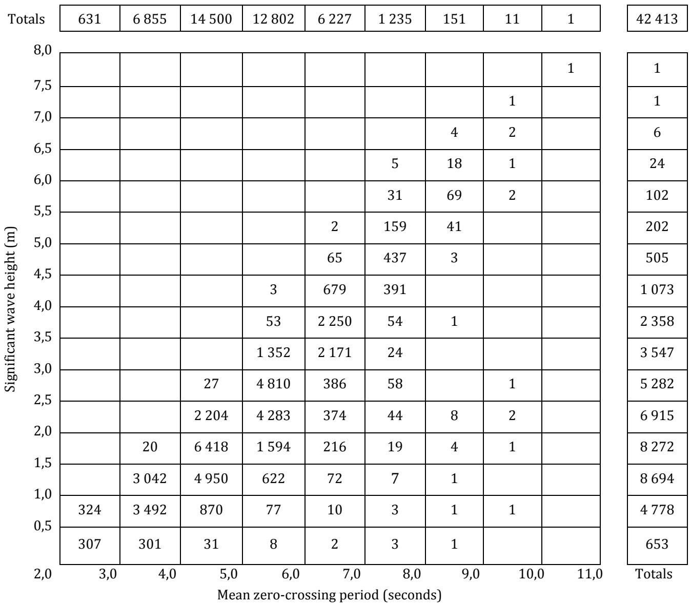  
Figure A.16.3-1 — Example of two-dimensional wave scatter diagram

## A.16.3.3 Mean wave directions``,```

See ISO 19901-1 for a general discussion of wave conditions.

## A.16.3.4 Wave frequency spectra

See ISO 19901-1 for detailed information on waves and wave spectra.

## A.16.3.5 Wave directional spreading function

Experience has shown that in most cases the influence of wave directional spreading around the mean is of secondary importance and can be neglected. However, if it is considered that the influence of wave directional spreading on the stress variations is of some significance and it is desired that this effect is included, this can be done by choosing an appropriate wave spreading function in accordance with ISO 19901-1.

## A.16.3.6 Periodic waves

The deterministic waves should be defined in accordance with ISO 19901-1.

## A.16.3.7 Long-term distribution of individual wave heights

Figure A.16.3-2 is a schematic of a wave scatter diagram in which the sea states are defined by the significant wave height, $H_{ s } ,$ and the average zero-crossing period, $T_{ \mathrm{ z } } .$ . If the representative period, $T_{ \mathrm{ R } } ,$ of the data is not the average zero crossing period, $T_{ \mathrm{ R } }$ should first be converted into $T_{ \mathrm{ z } } .$ The selected sea state indicated in Figure A.16.3-2 occurs $N_{ i , j }$ times out of a total of $N_{ \mathrm{ T } }$ observations, where i is the subscript for significant wave height and j the subscript for representative period and ,,,` -

$N_{ \mathrm{ T } } = \sum_{ j } \left( \sum_{ i } N_{ i , j } \right) = \sum_{ i } \left( \sum_{ j } N_{ i , j } \right)$ is the total number of observations in the diagram.

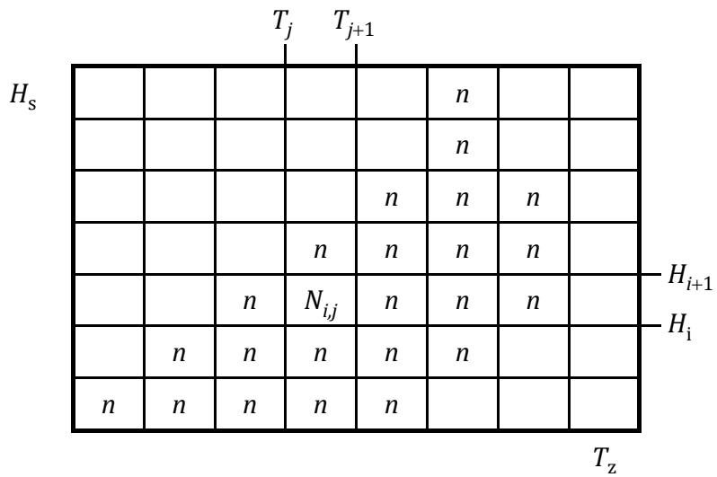

Key

$H_{ s }$ Hs significant wave height

$T_{ \mathrm{ z } }$ mean zero-crossing period

$N_{ i , j }$ number of occurrences of sea states with $H_{ i } < H_{ s } < H_{ i + 1 }$ 1 and $T_{ j } < T_{ \mathrm{ z } } < T_{ j + }$

n number of occurrences of sea states falling within indicated range of $H_{ s }$ and $T_{ \mathrm{ z } }$

Figure A.16.3-2 — Example of wave scatter diagram

The probability that the individual wave height, H, in a sea state with significant wave height, $H_{ s } ,$ has a particular value, $H^{ * } ,$ , is given by $p ( H^{ * } ) \mathrm{ d } H ,$ where $p ( H^{ \ast } )$ is the Rayleigh probability density function:

$$p \left(H^{*}\right) = \frac{4 H^{*}}{H_{\mathrm{s}}^{2}} \cdot \exp \left[ \frac{- 2 \left(H^{*}\right)^{2}}{H_{\mathrm{s}}^{2}} \right] \tag{A.16.3-1}$$

The cumulative probability, $P ( H > H^{ * } )$ , that the individual wave height, $H ,$ exceeds value $H^{ * }$ in the sea state with significant wave height $H_{ s }$ is thus:

$$P \left(H > H^{*}\right) = \int_{H^{*}}^{\infty} p (H) d H = \int_{H^{*}}^{\infty} \frac{4 H}{H_{s}^{2}} \cdot \exp \left[ \frac{- 2 H^{2}}{H_{s}^{2}} \right] \cdot d H = \exp \left[ \frac{- 2 \left(H^{*}\right)^{2}}{H_{s}^{2}} \right] \tag{A.16.3-2}$$

The number of times in any one year that individual wave height $H^{ * }$ is exceeded in the selected sea state, $i , j ,$ is indicated by the symbol $\left( N_{ \mathrm{ H }^{ * } } \right)_{ i , j }$ and given by:

$$\left(N_{\mathrm{H}^{*}}\right)_{i, j} = \left(\frac{N_{i , j}}{N_{\mathrm{T}}}\right) \cdot \left(\frac{(365) (24) (3600)}{(0 , 5) \left(T_{\mathrm{z} , j} + T_{\mathrm{z} , j + 1}\right)}\right) \cdot P \left(H > H^{*}\right) \tag{A.16.3-3}$$

The total number of exceedances per year, $N_{ \mathrm{ H^{ * } } } ,$ of the individual wave height, $H^{ \ast }$ , is found by repeating this calculation for all sea states in the scatter diagram and summing the results:

$$N_{\mathrm{H}^{*}} = \frac{(365) (24) (3600)}{N_{\mathrm{T}}} \cdot \sum_{i} \left\langle \exp \left\{\frac{- 2 (H^{*})^{2}}{\left[ (0 , 5) \left(H_{\mathrm{s} , i} + H_{\mathrm{s} , i + 1}\right) \right]^{2}} \right\} \sum_{j} \frac{N_{i , j}}{(0 , 5) \left(T_{\mathrm{z} , j} + T_{\mathrm{z} , j + 1}\right)} \right\rangle \tag{A.16.3-4}$$

The long-term cumulative distribution of individual wave heights H is obtained by repeating the calculation of Formula (A.16.3-4) for all values of $H^{ * }$ . The total number of waves per year $N_{ \mathrm{ w } }$ is the sum of $N_{ \mathrm{ H }^{ * } }$ for all values of $H^{ * }$ for which the calculations are made.

Figure A.16.3-3 shows a typical example of the long-term cumulative distribution of individual wave ,``,,, heights and its discretization into wave height blocks. It is usually close to an exponential distribution,`,,, that plots approximately as a straight line when plotted on log-linear scales.`-`-`

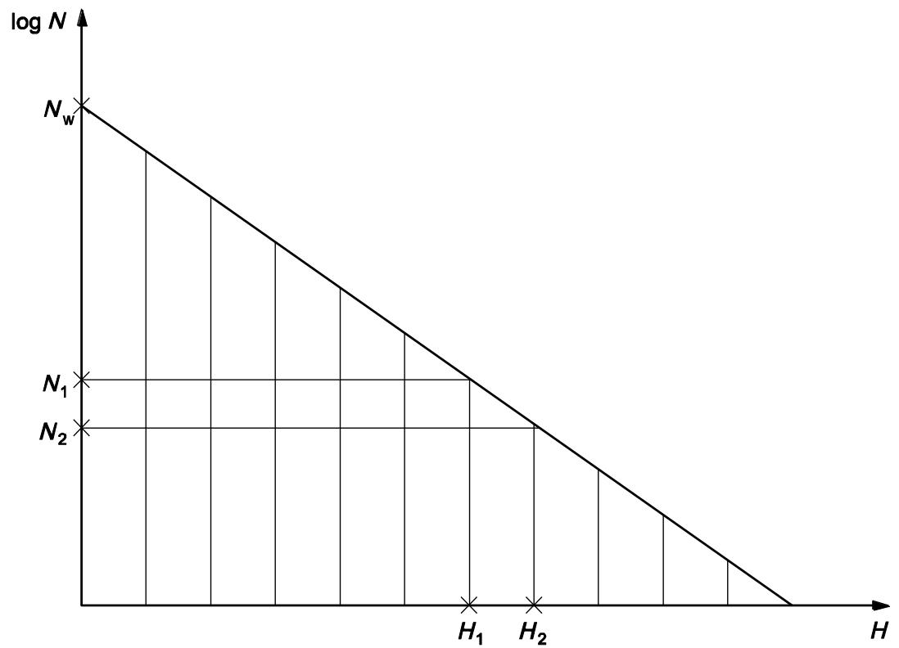

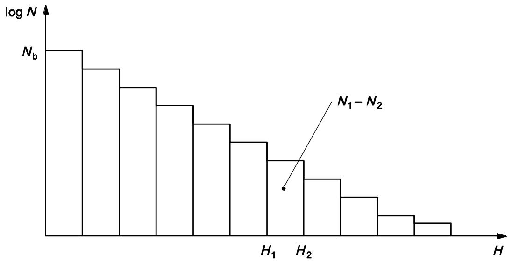  
Figure A.16.3-3 — Typical long-term cumulative distribution of individual wave heights

Key

$H$ individual wave height (on linear scale)

$N_{ \mathrm{ w } }$ total number of individual waves (on logarithmic scale)

$N_{ \mathrm{ b } }$ number of waves in a block

$H_{ 1 }$ wave height 1

H2 $H_{ 2 }$ wave height 2

$N_{ 1 }$ number of waves exceeding $H_{ 1 }$

$N_{ 2 }$ number of waves exceeding $H_{ 2 }$

## A.16.3.8 Current

In design practice for strength design, it is common to use an in-line design current in combination with a design wave. This is not appropriate for a fatigue analysis. Each combination of $H_{ s }$ and $T_{ \mathrm{ R } }$ in the wave scatter diagram represents a large number of occurrences of different sea states. All these occurrences have the same statistical parameters of $H_{ s }$ and $T_{ \mathrm{ R } } ,$ but are in other respects likely to be (very) different. Currents usually vary widely over time in both speed and direction, and no specific current information can normally be associated with each individual sea state.

Furthermore, for a fatigue assessment, it is not the absolute value of the stress that matters but the stress range. Therefore, it is also the range rather than the absolute magnitude of the applied actions that should be considered.

The presence of a current in conjunction with waves affects the drag component of the hydrodynamic actions on the structure from Morison’s equation in two ways, i.e. it produces a mean value of the action and it modifies the variable part of the wave and current action, compared to the variable part of the action in waves alone. The mean value is not relevant for fatigue. For an in-line current, the maximum action under the wave crest and the minimum action under the wave trough are both increased. Therefore, the range of the applied action (the maximum minus the minimum action) is much less affected than the peak action in an absolute sense. For current directions that are not in-line with the wave, the influence is even smaller.

Sensitivity analyses have also shown that the influence of currents on the range of the calculated stress variations and hence, on the fatigue damage accumulation in the structure, is normally rather small; see also A.9.5.2.1.

In view of the above, it is not only practical, but also normally fully justified, to neglect current in calculating the applied wave actions for fatigue analyses. The remaining uncertainty is, therefore, included in the fatigue damage design factor and/or the local experience factor; see 16.12.2 and 16.12.3.

## A.16.3.9 Wind

No guidance is offered.

## A.16.3.10 Water depth

In contrast with analyses for strength design in extreme metocean conditions, mean sea level should be used for a fatigue analysis, accounting for any settlement of the structure where appropriate. If sea floor subsidence is expected to occur, the water level used in the analysis should reflect the average subsidence during the design service life. If the expected subsidence is substantial, several mean sea levels should be considered.

## A.16.3.11 Marine growth

Marine growth development is usually most pronounced during the first few years after installation, after which a more or less stable situation arises. The design marine growth thickness is the marine growth that is expected to accumulate on the structure without being removed. It therefore represents a situation that can exist during the entire design service life and which should be taken into account in a fatigue assessment.

For the fatigue assessment of an existing structure, the actual marine growth distribution on the structure can be used, provided this can reliably be established and shown to be stable.

A.16.4 Performing the global stress analyses

## A.16.4.1 General

No guidance is offered.

## A.16.4.2 Actions caused by waves

To determine the stress range during the passage of a wave, a full periodic wave cycle should be stepped past the structure. The number of wave positions should be sufficient to accurately determine the maximum and the minimum stress during the passage of the wave. The definition of a full stresses cycle requires, in general, a substantial number of points. For 12 equally spaced points in a perfectly sinusoidal variation, the peak can still be missed by $15^{ \circ } ;$ as cos $15^{ \circ } = 0 , 966 ,$ , the error in the true stress range can amount to 3,4 %. As fatigue damage is governed by the stress range to the power of the slope of the S-N curve; this can easily introduce an error of some 10 %, i.e. (1,034)3 ≈ 1,10.

Each calculated point in the stress cycle corresponds with a wave position, thus requiring the calculation of distributed wave actions over the full structure and a subsequent structural analysis for each wave position. Some computer programs therefore perform interpolation of the stress cycle between calculated points in a post-processing operation, by which the number of individual wave positions and associated structural analyses can be reduced. The interpolation procedure used for this purpose should at least be of second order.

If the marine growth thickness is such that certain assemblies of components (e.g. conductor guide frames, fenders or boat landings) are completely blocked, then the associated wave action increases substantially. If this is likely to occur, its effect should be properly incorporated in modelling the`-- hydrodynamic actions on these components. ` -``

As the periodic waves used for fatigue analyses are low and short compared to design waves for a ,,,`,` strength analysis, the associated Keulegan-Carpenter numbers, $K_{ \mathrm{ c } } = U_{ \mathrm{ m } } ~ T / D \left( 5 \mathrm{ e e } \ : \mathrm{ A } . 9 . 5 . 2 . 3 \right)$ , are also much ,`` ,`` lower. They are largest at the free water surface. Assuming deep water waves, the maximum attainable-- value is $K_{ \mathrm{ c } } = \pi H / D ,$ while the value decreases exponentially through the water column with depth below the surface. The corresponding value of the inertia coefficient is therefore larger than that recommended for the design wave analysis. For many combinations of waves and typical member sizes, the inertia coefficient is approximately equal to 2,0. The theoretical value of the inertia coefficient for negligible wake effects around members is also 2,0. For these reasons, $C_{ \mathrm{ m } } = 2 , 0$ is adopted for fatigue analyses.

## A.16.4.3 Quasi-static analyses

The dynamic amplification of quasi-static stress responses is governed by the magnitude and the frequency range of the excitation of the structure in relation to the platform natural frequencies. Wave periods that coincide with structural natural periods of 2,5 s and below correspond with wave lengths of approximately 10 m and less. While these can still be effective in producing local wave actions on typical member sizes of space frame structures in accordance with Morison’s equation, global action on the whole structure rapidly diminishes with increasing frequency due to partial cancellation resulting from phase differences between the local actions on spatially distributed members.

For monotowers, or configurations with highly correlated members, such partial cancellations do not occur. Therefore, the decrease in global wave action on such structures can only be due to wave diffraction effects for wave length to diameter ratios of less than approximately 5. For such configurations, the neglect of dynamic effects should be judged on the basis of the magnitude of the excitation at the platform natural frequencies.

## A.16.4.4 Dynamic analyses

## A.16.4.4.1 General

For calculating global structural responses, modal analysis techniques can offer an efficient and reliable method in some circumstances. However, for local responses, pure modal techniques are usually unreliable. Unless a very large number of modes are included, a modal solution does not accurately represent the local (quasi-static) member deformations, which are important for a fatigue analysis. Choosing a very large number of modes is unlikely to improve the situation with confidence due to numerical inaccuracies associated with the high frequency modes. To overcome both of these aspects, the so-called method of modal analysis plus static back substitution has been developed, which superimposes the dynamic responses due to a limited number of modes onto a full static solution. The method is also known by the name mode acceleration method. This method offers the benefits of a combination of accuracy and computational efficiency. When using this procedure, it is still necessary to include a sufficient number of modes to accurately represent all significant dynamic responses.

However, a direct solution technique is generally preferred over a modal type of solution, provided this solution method is available in the structural analysis software used. When using a direct solution technique, a modal analysis should also be performed to obtain natural frequencies and mode shapes for the principal modes of the structure. This serves generally to verify that the dynamic behaviour of the model is realistic, and provides the values of the natural frequencies that are used in the selection of the frequency grid as described in 16.7.2.2. Further particulars of the above alternative solution techniques are described in Reference [A.16.4-1].

If a natural frequency falls in a valley in the transfer function of the applied wave action, it should be shifted to a more conservative location. A realistic range of natural frequency values should be considered, based on lower and upper bound values for the platform mass and stiffness as discussed in A.16.4.4.2 and A.16.4.4.3. The choice of which parameter to adjust for achieving such a shift is structurespecific and depends upon deck mass, soil conditions and structural configuration. Adjusting the foundation stiffness can unintentionally alter the member forces in the base of the structure, which can be fatigue sensitive.

## A.16.4.4.2 Mass

For slender members, the added mass should be based on the displaced volume for motion transverse to the longitudinal axis, with an appropriate added mass coefficient to account for the member shape. Guidance on added mass coefficients can be found in the literature. For complex assemblies, the added mass should be determined for each motion direction and should account for the actual geometry. Account should further be taken of the increase in volume due to marine growth as well as possible blocking effects associated with marine growth.

The equipment and consumable masses in the model should include all items supported by the structure during any given operation on the platform. If the mass of such items is predicted to vary significantly for different operational phases during the structure life, it is appropriate to perform separate analyses for each phase and combine the associated fatigue damage.

The masses that are used in the model should be reconciled with the topsides and structure weights; centres of gravity should be established with the weight-estimating procedure used. When assessing the range of natural period values that can occur, upper and lower bound estimates of the masses should be --`, considered. The lower bound mass should be determined with marine growth omitted.``,``

## A.16.4.4.3 Stiffness,,, ``-

The structural model of a space frame structure consists primarily of beam elements and the modelling ,,`--- detail should be adequate to provide accurate stresses at all relevant connections. The member

intersections should be modelled such that the resulting nominal member end stresses are consistent with their subsequent use in the fatigue analysis. For typical space frame members, nominal brace stresses are normally computed at the intersections of the brace and chord centre lines. For large diameter chords or short braces, local joint geometry can require more refined modelling.

For stiffness modelling, when determining the wall thickness of members that include a corrosion allowance, it should normally be assumed that half of the allowance has been consumed, to represent the average condition during the life of the member.

The stiffness of appurtenances (conductors, caissons, risers, J-tubes, boat landings, fenders, launch rails, skirt piles, pile-to-sleeve connections, mudmat framing, etc.) should be included if their connection details contribute to the overall stiffness and transfer of forces in the structure. The transfer of forces at support points should be realistically modelled. Detailed stiffness modelling of appurtenances is also required if a fatigue analysis of the appurtenances themselves is to be performed.

Complex assemblies, such as pile-to-sleeve connections, mudmats, conductor guides, etc., can require finite element types other than beam elements (e.g. shell, plate or solid elements). Detailed finite element analyses of such assemblies may be performed separately from the global analysis. These may be used to determine equivalent stiffness properties for simplified beam element representations for inclusion in the global stiffness model and can also assist in fatigue checking of the assembly details. Alternatively, some computer programs allow the use of super elements within the global stiffness model for representing such complex assemblies.

## A.16.4.4.4 Damping

A relative velocity formulation of Morison’s equation inseparably links wave excitation and hydrodynamic drag damping. It reduces applied wave actions and causes implicit hydrodynamic damping associated with drag actions, which is additional to any damping from a viscous damping coefficient introduced in accordance with 16.4.4.4. For small structural displacements, as are typical for fatigue excitation, this additional damping is not observed in measurements and is inappropriate. Consequently, the relative velocity formulation should not be used for a fatigue analysis.

A.16.5 Characterization of the stress range data governing fatigue

In this document, the terms “geometric stress” (GS) and “geometric stress range” (GSR) are used, replacing the terms hot spot stress and hot spot stress range, which were previously commonly used. These new terms have been introduced to emphasize that stress concentrations occur to a varying degree all along the welds and not only at specific locations.

The nominal axial stress at the member end is denoted by $\sigma_{ \mathrm{ a x } } ( t )$ ; the nominal in-plane bending stress is denoted by $\sigma_{ \mathrm{ i p b } } ( t )$ and is assumed to be due to the moment, $M_{ \mathrm{ y } } ,$ about the local member y-axis; the nominal out-of-plane bending stress is denoted by $\sigma_{ \mathrm{ o p b } } ( t )$ and is assumed to be due to the moment about the local member z-axis. The geometric stress, $\sigma_{ \mathrm{ G S , A } } ( t )$ , at a specific location, A, around the tubular connection is then determined using Formula (A.16.5-1), see also Figure A.16.5-1:

$$\sigma_{\mathrm{G S}, \mathrm{A}} (t) = C_{\mathrm{a x}} \sigma_{\mathrm{a x}} (t) \pm C_{\mathrm{i p b}} \sigma_{\mathrm{i p b}} (t) \sin \theta \pm C_{\mathrm{o p b}} \sigma_{\mathrm{o p b}} (t) \cos \theta \tag{A.16.5-1}$$

where the signs in the formula are determined by the sign conventions employed in the analysis. The range of $\sigma_{ \mathrm{ G S , A } } ( t )$ is the GSR (S). Due to phase differences between the various stress components, the GSR is normally not equal to the algebraic sum of the stress components.

For location A, at least the four main points around the circumference for $\theta = 0^{ \circ } , \theta = 90^{ \circ } , \theta = \ 180^{ \circ }$ and $\theta = 270^{ \circ }$ (the four main clock positions) should be considered. Further details of GSRs for tubular and other joints are discussed in A.16.10.

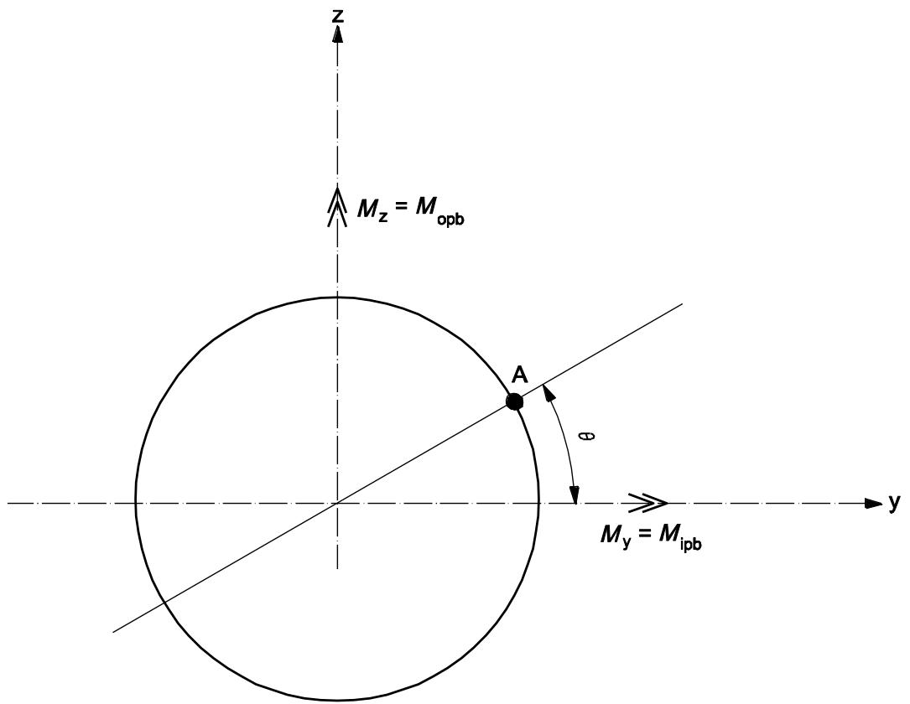  
Figure A.16.5-1 — Determination of geometric stress at point A around tubular connection

A.16.6 The long-term local stress range history

No guidance is offered.

A.16.7 Determining the long-term stress range distribution by spectral analysis

## A.16.7.1 General

Spectral analysis is an established technique for the prediction of the responses of a linear system to random excitation, see References [A.16.7-1] and [A.16.7-2] for example. Its application to fatigue assessments in the offshore environment is described in References [A.16.7-3] and [A.16.7-4], for example. The method has been applied to a wide range of offshore structures of various types in various environments.

## A.16.7.2 Stress transfer functions

## A.16.7.2.1 General

A flow chart for the spectral analysis procedure including the calculation of the stress transfer function is shown in Figure A.16.7-1.

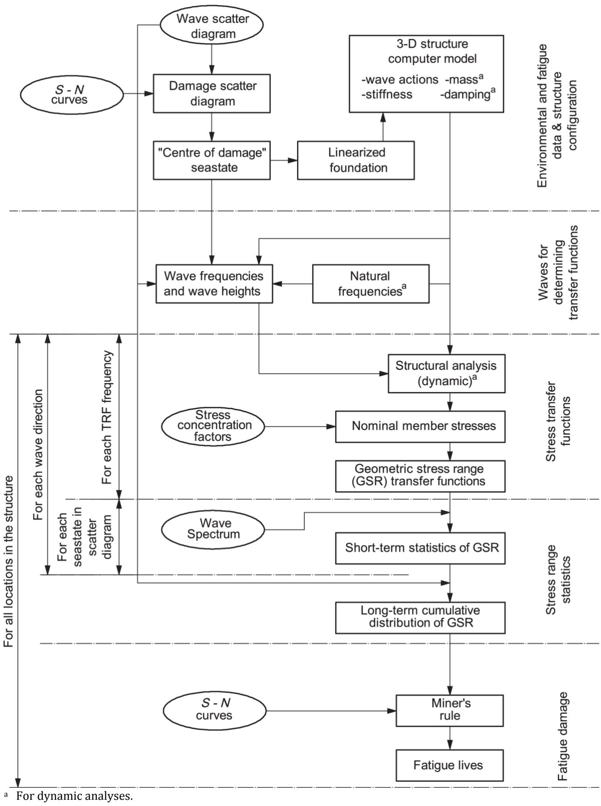  
Figure A.16.7-1 — Flow chart of spectral analysis procedure

For a spectral analysis, the GSR transfer functions are required for all locations in the structure that should be checked for fatigue. These functions define the GSR per unit wave height over a range of wave frequencies for each wave approach direction. A GSR transfer function is determined as follows.

For a given wave approach direction and a given wave frequency, a global structural analysis is performed using a periodic (regular) wave. If the analysis is performed in the frequency domain, a linear wave theory should be selected. The wave height is not relevant and usually a unit wave amplitude (or wave height) is chosen. If the analysis is performed in the time domain, a non-linear wave theory may be chosen. In this case, the wave height is selected in accordance with 16.7.2.3. Further guidance on the global structural analysis is given in 16.4.

At each location in the structure and for each relevant stress component, the nominal stress and the associated phase with respect to the wave is determined. Using these stress components, the geometric stress $\sigma_{ \mathrm{ G S , A } } ( t )$ at point A is determined as described in 16.5. The range of $\sigma_{ \mathrm{ G S , A } } ( t )$ is the GSR at point A. Dividing the GSR by the wave height, one point of the GSR transfer function for point A is defined. From this moment onwards in the processing, the phase angle information can be dropped. This procedure is repeated for all points A around the connection and all locations in the structure.

The above calculations are next repeated for all wave frequencies to fully define the GSR transfer functions for one particular wave approach direction. Subsequent to that, they are repeated for all wave approach directions.

## A.16.7.2.2 Selection of wave frequencies-

Figure A.16.7-2 shows an example of the shapes of a transfer function (TRF) of static and dynamic actions ``,,,, on the structure due to waves and depicts several typical features as a function of frequency.`,`,,,,

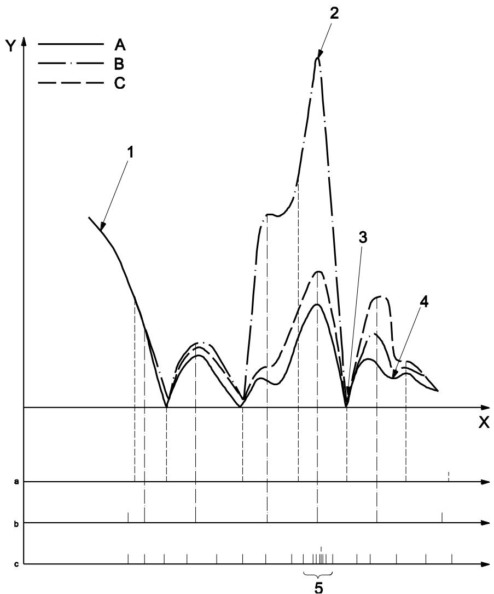  
Figure A.16.7-2 — Typical transfer functions of total applied actions due to waves

#

A quasi-static transfer function   
B dynamic transfer function — resonance at “peak”   
C dynamic transfer function — resonance at “valley”   
X wave frequency, ω   
Y normalized applied wave action at wave frequency, Ew

1 low frequency, long waves, no cancellation effects   
2 structure natural frequency at peak in static TRF   
3 structure natural frequency at valley in static TRF   
4 peaks and valleys due to interaction between wave length and structure geometry   
5 fine grid around natural frequency

Frequency selection

a poor: underpredicts response   
b poor: overpredicts response   
c good: adequately represents TRF

The following guidance is offered for the selection of wave frequencies to take the characteristics of the environment as well as the characteristics of the structure duly into account.

a) Lowest and highest frequency

The lowest and highest frequency used should be based on the range of frequencies over which there is significant energy in the sea states in the wave scatter diagram. For dynamic analyses, special attention should be paid to the high frequency cut-off.

b) Cancellation and addition frequencies

Wave frequencies in the vicinity of peaks and troughs in the transfer functions of applied wave action (curve A in Figure A.16.7-2) should be included to ensure that the structural response at these frequencies is properly defined. For simple structures, the frequencies at which addition and cancellation of wave actions on structural components occurs can be reasonably predicted, as they correspond with wave lengths that are specific multiples or fractions of key dimensions of the structure, such as the main leg spacing. For complicated structures, these features are often not so obvious from the structural drawings and it can be necessary to determine the corresponding frequencies by inspection of the calculated wave actions and/or the wave-induced responses.

c) Intermediate frequencies

A sufficient number of intermediate frequencies should be included to ensure a complete definition of the shape of the transfer function. To reduce the number of stress analyses required, some computer programs perform interpolation to derive transfer function ordinates at intermediate frequencies. However, care should be exercised with such interpolation routines due to the often complex shape of the transfer functions. Interpolation is more reliable when this is performed on the real and imaginary parts (the in-phase and out-of-phase components) of the transfer function separately, because these are normally smooth functions.

Selection of intermediate frequencies corresponding to peaks of the wave spectra in the scatter diagram is necessary to provide accurate definition of wave input energy.

d) Natural frequencies

For dynamic analyses, the natural frequencies of the structure should also be included (curves B and C in Figure A.16.7-2). In addition, a number of closely spaced frequencies on both sides of a natural frequency should be included so as to accurately define the sharp dynamic response peak of a lightly damped system over a frequency range of （$1 \pm 4 \beta ) \omega_{ \mathrm{ n } }$ around resonance, where β is the fraction of critical damping and $\omega_{ \mathrm{ n } }$ is the natural frequency in radians per second. The spacing of these frequencies should preferably be $0 { , } 5 \beta \omega_{ \mathrm{ n } } ,$ and definitely not greater than $\beta \omega_{ \mathrm{ n } }$ .

## A.16.7.2.3 Selection of wave heights

## A.16.7.2.3.1 Determination of wave height

The linearization for an analysis in the time domain is performed by the rational selection of wave heights used in the regular wave analyses for the determination of the stress transfer functions. Alternative approaches can be used for the selection; one well tested method is described below.

Calibration of the wave steepness should be based on the matching of global response parameters, which are representative of the predominant wave action to which the structure is subjected under fatigue conditions. For typical space frame structures, the total applied wave action (quasi-static base shear) is normally used for this purpose. The matching should be performed for the sea state at the centre of the fatigue damage scatter diagram. The derivation of this sea state is described in A.16.7.2.3.2.

The calibration determines a wave steepness value, which matches the spectrally calculated range of applied wave action to the deterministically calculated range of applied wave action for the structure under consideration and the sea state at the centre of the fatigue damage scatter diagram. The calibration should be performed for various wave directions. Typically, a broadside, an end-on and a diagonal wave direction are considered as a minimum. The calibration process consists of the following five steps:

a) Determine the transfer function of the total applied wave action (quasi-static base shear) for each wave direction and for a range of wave steepness values. Note, however, that use of a constant wave steepness gives unrealistically large wave heights at low wave frequencies (large wave lengths). Therefore, the wave heights at the low frequency side should be capped. A wave height equal to the wave height with a one year return period should normally be used as a maximum.

b) Calculate the root mean square (rms) value of the applied wave action for each wave direction and the sea state at the centre of the fatigue damage scatter diagram (see A.16.7.2.3.2), using standard spectral analysis techniques. This provides rms values of the applied wave action for each wave direction and the initially chosen wave steepness values.

The linearized spectral response is a Gaussian process and, assuming a standard duration of some three hours with approximately 1 000 response peaks, the most probable maximum (MPM) values of the applied actions due to waves are 3,7 times the rms values. In this manner, the MPM values of the applied wave action from the spectral calculations are determined for each wave direction and wave steepness. The applied ranges of wave action that should be used in the calibration are twice the MPM values of the applied wave action.

c) Next, a deterministically calculated range of applied wave action is also determined by stepping a deterministic wave through the structure for each wave direction. This deterministic wave should have a height that is equal to the MPM wave height in the sea state at the centre of the fatigue damage scatter diagram, and a period that corresponds with the peak period of the wave spectrum for this sea state. The deterministic range of applied wave action is the maximum minus the minimum total applied wave action during a full wave cycle.   
d) For each wave direction, the calibrated value of the wave steepness is the steepness that matches the spectrally calculated MPM value of the range of applied wave action from b) to the deterministically calculated range of applied wave action from c).   
e) From the set of calibrated wave steepness values for all wave approach directions obtained from d) a single representative wave steepness value should next be chosen.

The wave height for each wave frequency is now determined using the calibrated wave steepness value. The wave heights at the low frequency side should again be limited to the maximum wave height used in the calibration process. The resulting wave heights should further be compared to the elevations of plan framing levels near the water surface, to assess if any unreasonable discontinuities in the applied wave action are likely to occur. Where appropriate, some final adjustment should be made.

## A.16.7.2.3.2 Derivation of the sea state at the centre of the fatigue damage scatter diagram

Stress is assumed to be a linear function of wave height, while the number of stress cycles can initially be assumed to be equal to the number of wave cycles in a sea state. Fatigue damage can further be assumed to be proportional to the stress range raised to the power of the S-N curve slope.

The partial damage, $\mathrm{ D }_{ i , j } ,$ caused by a particular sea state is hence proportional to the number of occurrences of the sea state, $N_{ i , j } ,$ and the significant wave height, $H_{ s } ,$ raised to the power (m) of the slope of the S-N curve. Proportionality to the number of stress cycles in the sea state translates into an inversely proportional relationship to the mean zero crossing period, $T_{ \mathrm{ z } } .$ Consequently:

$$D_{i, j} \propto \frac{N_{i , j} \left[ 0 , 5 \left(H_{i} + H_{i + 1}\right) \right]^{m}}{0 , 5 \left(T_{j} + T_{j + 1}\right)} \tag{A.16.7-1}$$

The above calculation is repeated for each sea state in the wave scatter diagram to produce a damage scatter diagram with relative damages in the sea state bins as shown in Figure A.16.7-3.

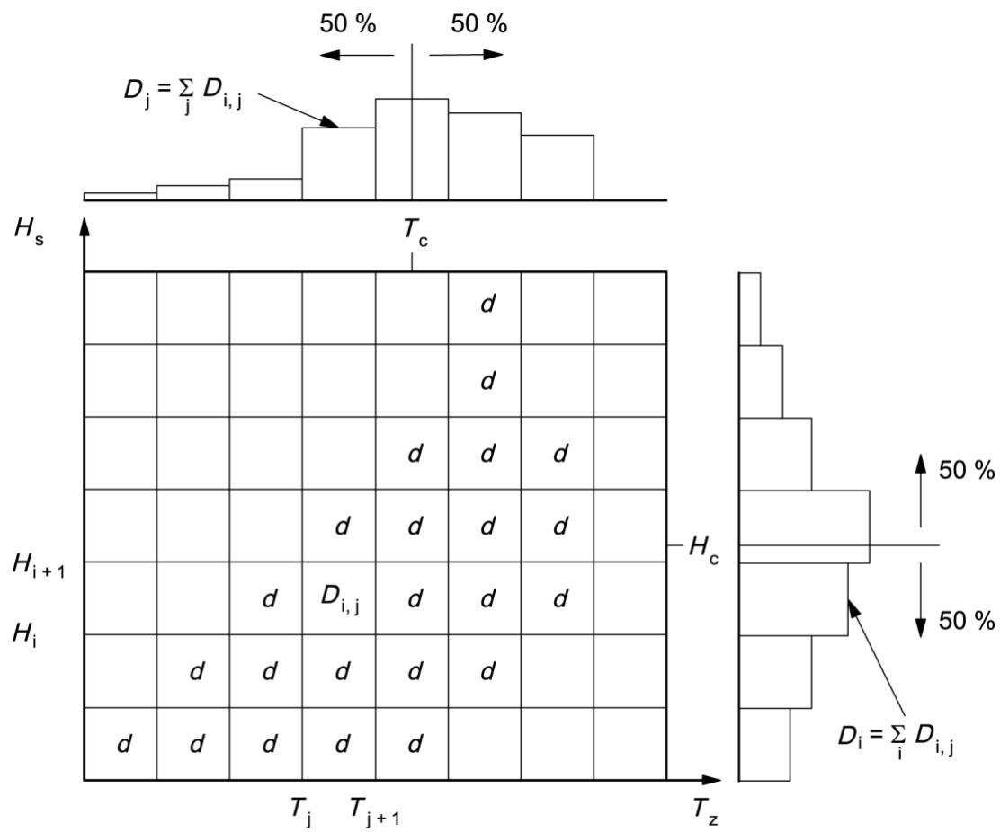  
Figure A.16.7-3 — Typical fatigue damage scatter diagram

Key

$T_{ \mathrm{ z } }$ mean zero-crossing period   
$H_{ s }$ significant wave height   
$T_{ \mathrm{ c } }$ central value of the mean zero crossing period   
Hc $H_{ \mathrm{ c } }$ central value of the significant wave height   
Di,j $D_{ i , j }$ fatigue damage from sea states with $H_{ i } < H_{ s } < H_{ i + 1 }$ and $T_{ j } < T_{ \mathrm{ z } } < T_{ j + 1 }$   
Di $D_{ i }$ fatigue damage from sea states with $H_{ i } < H_{ s } < H_{ i + 1 }$   
$D_{ j }$ fatigue damage from sea states with $T_{ j } < T_{ \mathrm{ z } } < T_{ j + 1 }$   
$d$ fatigue damage from sea states falling within indicated range of $H_{ s }$ and $T_{ \mathrm{ z } }$

The sea state at the centre of the damage scatter diagram is defined as having:

— a significant wave height, $H_{ \mathrm{ c } } ,$ such that 50 % of the damage occurs in sea states with a lower $H_{ s }$ and 50 % with a higher $H_{ s }$ :   
— a mean zero crossing period, $T_{ \mathrm{ c } } ,$ such that 50 % of the damage occurs in sea states having a lower $T_{ \mathrm{ z } }$ and 50 % with a higher $T_{ \mathrm{ z } }$

The most probable maximum wave height, $H_{ \mathrm{ r e f } } ,$ and the associated wave period, $T_{ \mathrm{ r e f } } ,$ for this centre of damage sea state are calculated as:

$$H_{\text{r e f}} = (1, 86) H_{\mathrm{c}}$$

$$T_{\text{r e f}} = T_{\mathrm{c}} / (0, 81) \tag{A.16.7-2}$$

For linear S-N curves on a log-log plot, these calculations can be performed analytically and independent of the magnitude of the stress response. However, for bilinear S-N curves, the calculations can only be done numerically using actual stress responses. In lieu of this more rigorous procedure, an approximation using the slope of the first branch of the S-N curve (usually with m = 3) can be used, because most damage usually accumulates from this part.

## A.16.7.3 Short-term stress range statistics

The GSR transfer function for a specific location in the structure and one wave direction is combined with the wave spectrum describing a sea state in the wave scatter diagram to calculate the GSR response spectrum for the sea state. The rms value and mean period of the GSR response are then computed by integrating the response spectrum and determining its moments. These parameters define the probability distribution function for GSR values and establish the short-term GSR statistics for the sea state. The Rayleigh distribution is an appropriate distribution function for narrow-banded processes and is normally applied. The Rice probability distribution function is valid for Gaussian random processes of any width and may be used as an alternative. The Rayleigh distribution returns stress peaks (or stress ranges) that are all positive. However, the Rice distribution includes a small fraction of the total number of stress peaks (or stress ranges) which are negative. For fatigue analysis purposes, these negative stress ranges are removed from the distribution and ignored. See Figure A.16.7-1 for an outline of the overallprocedure.,,,``

## A.16.7.4 Long-term stress range statistics,,,,`

No guidance is offered.`,,,`

A.16.8 Determining the long-term stress range distribution by deterministic analysis

## A.16.8.1 General

A flow chart for the deterministic analysis procedure is shown in Figure A.16.8-1.

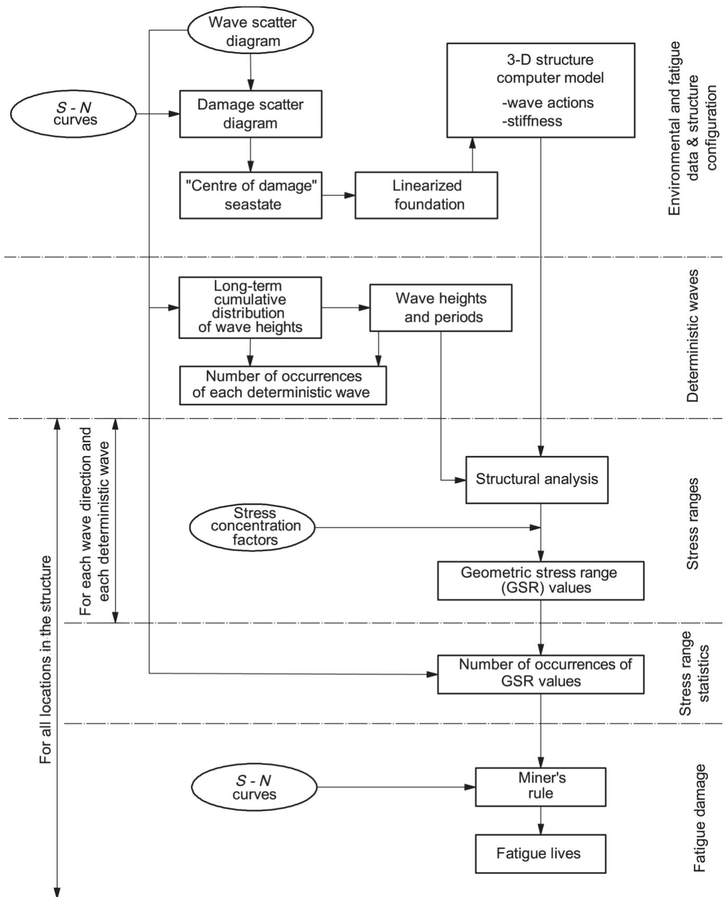  
Figure A.16.8-1 — Flow chart of deterministic analysis procedure

As for a spectral analysis, for a deterministic analysis the GSR values are required for all locations in the structure that should be checked for fatigue. These are now calculated using a series of periodic (regular) waves.

For a given wave approach direction, a global structural analysis is performed using a periodic (regular) wave of suitable height and period. The analysis is performed in the time domain stepping the wave through the structure over a full cycle.

At each location in the structure and for each relevant stress component, the nominal stress and the associated phase with respect to the wave is determined. Using these stress components, the geometric stress $\sigma_{ \mathrm{ G S , A } }$ at point A is determined as described in 16.5. The range of $\sigma_{ \mathrm{ G S , A } }$ is the GSR at point A. This procedure is repeated for all points A and all locations in the structure.

The above calculations are next repeated for all wave periods for one particular wave approach direction, and subsequent to that for all wave approach directions.

The selection of the height and period of the regular waves is specific to the deterministic analysis and is described in 16.8.2 and 16.8.3.

## A.16.8.2 Wave height selection

The long-term distribution of individual wave heights is calculated from the wave scatter diagram as described in 16.3.7. The number of waves occurring in each discrete wave height block is determined as shown in Figure A.16.3-3. The upper wave height of each block is normally used as the wave height of each regular wave for the global structural analysis.

## A.16.8.3 Wave period selection

As the expected joint distribution of individual wave heights and periods for the offshore location under consideration is not normally available as routine information, the wave period selection should be established in consultation with an oceanographer.

The selected periods should also be verified against cancellation and addition frequencies in the shape of`,,,` the transfer function of the total applied wave action; see 16.7.2.2. If any wave periods fall close to a `-``,` relative minimum, the wave period should be adjusted to ensure a proper representation of the total `,,,,` wave energy. The lowest and highest, as well as intermediate wave frequencies, are less influential in the,,,,` deterministic than in the spectral method, but should nonetheless be considered carefully.,,,`` Considerations with respect to the natural frequencies of the structure are not relevant, as thedeterministic method should not be used for dynamically responding structures.

## A.16.8.4 Long-term stress range distribution

No guidance is offered.

A.16.9 Determining the long-term stress range distribution by approximate methods

## A.16.9.1 The Weibull distribution of long-term stress ranges

The general three-parameter Weibull distribution of stress ranges is given by Formula (A.16.9-1):

$$P \left(S_{i} > S_{i}^{*}\right) = \exp \left[ - \left(\frac{S_{i}^{*} - A}{B}\right)^{C} \right] \tag{A.16.9-1}$$

where

$S_{ i }$ is the local geometric stress range;

$P \left( S_{ i } > S_{ i }^{ * } \right)$ is the probability that the stress range $S_{ i }$ exceeds the particular value $S_{ i } { }^{ * }$

A is the location parameter of the distribution （$S_{ i } { }^{ * } - A ) \geq 0 ;$ ;   
B is the scale parameter （$B > 0 )$ ;   
C is the shape parameter （$C > 0 )$ .

A Weibull distribution with the parameters $\left( A , B , 1 \right)$ is an exponential distribution, while a Weibull distribution with the parameters (0, 1, 2) is the normalized Rayleigh distribution.

For GSRs （$S_{ i } )_{ \cdot }$ , the location parameter is zero $\left( A = 0 \right)$ , while the probability $P ( S_{ i } > S_{ i } { ^ * } )$ can further be expressed by Formula (A.16.9-2):

$$P \left(S_{i} > S_{i}^{*}\right) = \frac{N_{\mathrm{S i}^{*}}}{N_{\mathrm{T}}} \tag{A.16.9-2}$$

where

$N_{ { \mathsf{ S } } i^{ * } }$ is the number of times that $S_{ i } { }^{ * }$ is exceeded during a period, $T ;$

$N_{ \mathrm{ T } }$ is the total number of stress ranges occurring during period, $T ;$

$T$ is the duration considered, which for the in-place situation should be at least a year.

Substituting $A = 0$ and Formula (A.16.9-2) into Formula (A.16.9-1) and taking the natural logarithm results in:

$$\ln N_{\mathrm{S i}^{*}} - \ln N_{\mathrm{T}} = - \left(\frac{S_{i}^{*}}{B}\right)^{C} = - (B)^{- C} \left(S_{i}^{*}\right)^{C} \tag{A.16.9-3}$$

All stress ranges exceed $S_{ i } { }^{ * } = 0 ,$ , so that $N_{ \mathsf{ S } i^{ * } } = 0 = N_{ \mathrm{ T } } ,$ , while there is only one maximum stress range, $\boldsymbol{ S }_{ i , \mathrm{ { m a x } } }^{ * }$ giving $N_{ \mathsf{ S } i^{ * } , \operatorname* { m a x } { } } = ~ 1$ . The scale parameter B can be determined by introducing $N_{ \mathrm{ S } i^{ * } , \operatorname* { m a x } { } } = ~ 1$ into Formula (A.16.9-3):

$$(B)^{- C} = \frac{\operatorname{I n} N_{\mathrm{T}}}{\left(S_{i , \max }^{*}\right)^{C}} \tag{A.16.9-4}$$

Substituting this into Formula (A.16.9-3) provides the final formula of the Weibull distribution of local GSR as:

$$\ln N_{S i^{*}} = \ln N_{\mathrm{T}} - \frac{\ln N_{\mathrm{T}}}{\left(S_{i , \max }^{*}\right)^{C}} \left(S_{i}^{*}\right)^{C} \tag{A.16.9-5}$$

If desired, the natural logarithm can be replaced by the logarithm on base 10 without any modification.

For a shape parameter, C = 1, this distribution plots as a straight line on a semi-logarithmic graph, with ln $N_{ { \mathrm{ S } } i^{ * } }$ (or log10 NSi*) on a logarithmic scale and $S_{ i } { }^{ * }$ on a linear scale. For shape parameters, $C < 1$ , the line is concave, while for shape parameters, C > 1, the line is convex. All lines pass through the two points (0, ln $N_{ \mathrm{ T } } )$ and （$S_{ i , \operatorname* { m a x } }^{ * } , 1 )$ , see Figure A.16.9-1.

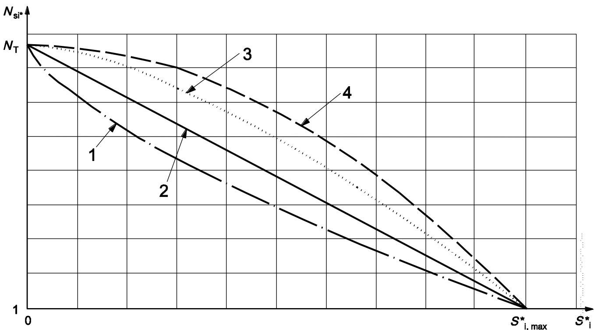  
Figure A.16.9-1 — Weibull distributions

Key

1 Weibull distribution for C = 0,7   
2 Weibull distribution for C = 1,0   
3 Weibull distribution for C = 1,5   
4 Weibull distribution for C = 2,0   
$\boldsymbol{ S }_{ i }^{ * }$ local geometric stress range (on linear scale)

$\boldsymbol{ S }_{ i , \mathrm{ { m a x } } }^{ * }$ maximum value of local geometric stress range   
$N_{ { \mathrm S } i^{ * } }$ number of times that $\boldsymbol{ S }_{ i }^{ * }$ is exceeded during period T (on logarithmic scale)   
$N_{ \mathrm{ T } }$ total number of stress ranges occurring during period T

## A.16.9.2 Determination of the distribution parameters

## A.16.9.2.1 General

The Weibull distribution parameters of the transformed Formula (A.16.9-5) are $N_{ \mathrm{ T } } , ~ S_{ i , \operatorname* { m a x } }^{ * }$ and C. In general, these parameters can only be determined empirically by fitting Weibull distributions to measured or spectrally calculated long-term stress range distributions. For shape parameters, C ≠ 1, this is the only possibility; there is no sound theoretical basis for estimating them otherwise.

However, experience has shown that in many cases a practical and reasonably accurate approximation is possible with a shape parameter, C = 1. For these cases, estimates of two points fully determine the resulting straight line graph on semi-logarithmic paper. One simple and convenient point that is usually chosen is (0, ln $N_{ \mathrm{ T } } )$ , while the other point may be generally depicted as （$S_{ i , \mathrm{ r e f } }^{ * } , N_{ \mathrm{ r e f } } ) ;$ ; see Figure A.16.9-2.

If the long-term distribution of local GSRs is approximated by combining two Weibull distributions, the parameters of each distribution should be estimated separately; see Figure A.16.9-2.

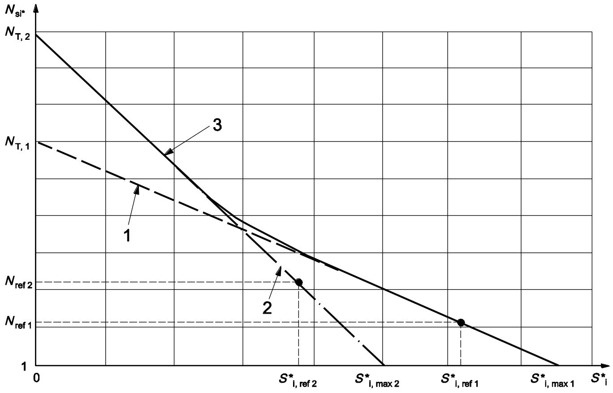  
Figure A.16.9-2 — Combination of Weibull distributions

#

1 Weibull distribution for distribution 1   
2 Weibull distribution for distribution 2   
3 combined Weibull distributions   
$\boldsymbol{ S }_{ i }^{ * }$ local geometric stress range (on linear scale)

$\boldsymbol{ S }_{ i , \mathrm{ { m a x } } }^{ * }$

$N_{ { \mathrm S } i^{ * } }$ number of times that $\boldsymbol{ S }_{ i }^{ * }$ is exceeded during period T (on logarithmic scale)

$N_{ \mathrm{ T } }$ is the total number of stress ranges occurring during period T

## A.16.9.2.2 Determination of the total number of stress range cycles

The total number of stress ranges, $N_{ \mathrm{ T } } ,$ occurring during the period, T, may be derived from the total number of wave cycles occurring during T.

Where one exponential distribution adequately describes the long-term stress range distribution, T is normally chosen to be 1 year. The total number of waves per year, $N_{ \mathrm{ W } } ,$ can be determined from the wave scatter diagram as discussed in A.16.3.7. Next, $N_{ \mathrm{ T } }$ can be related to $N_{ \mathrm{ W } }$ by a multiplication factor, R:

$$N_{\mathrm{T}} = R \cdot N_{\mathrm{W}} \tag{A.16.9-6}$$

Multiplication factor R reflects that shorter waves (high frequency waves, which form a large percentage of $N_{ \mathrm{ W } } )$ act over smaller depths below the surface than longer waves (low frequency waves, which form a

relatively low percentage of $N_{ \mathrm{ W } } )$ . In lieu of more pertinent information, the following values of R may be used as a guide:

R = 1,5 at and above 15 m below the still water surface for the fatigue analysis;

R = 0,5 at 30 m below the still water surface;

R = 0,2 at 60 m below the still water surface.

Between 30 m and 60 m below the still water surface, R may be determined by linear interpolation.

Where two exponential distributions should be combined to describe the long-term stress range distribution, T should normally be chosen to be the design service life (usually some 20 years). The first distribution then describes the stress ranges during the design service life that are due to wave conditions arising from normal atmospheric conditions, while the second distribution describes those that are due to the extraordinary wave conditions arising from cyclones. Reference [A.16.9-1] contains a typical example of such applications from the Gulf of Mexico, with $N_{ \mathrm{ T } , 1 } = 10^{ 9 }$ and $N_{ \mathrm{ T } , 2 } = 10^{ 6 }$ .

## A.16.9.2.3 Determination of point $S_{ i , \mathrm{ r e f } }^{ * } , N_{ \mathrm{ r e f } }$

The local GSR values at all locations of interest are estimated using a single periodic (regular) wave in the same way as for the deterministic analysis procedure (see 16.8). A reference wave with height, $H_{ \mathrm{ r e f } } ,$ and period, $T_{ \mathrm{ r e f } } ,$ should be selected and is used as a fatigue design wave in the procedure. For cases governed by one exponential distribution two options readily present themselves:

a) the annual wave height occurring once a year with an associated wave period;   
b) the most probable maximum wave at the centre of damage sea state [see A.16.7.2.3 and Formula (A.16.7-2)].

Other options reflecting and calibrated to local experience can be taken.

A stress analysis (see 16.4) is performed by stepping the reference wave through the structure, after which the GSR is determined (see 16.5) at all locations of interest in the structure. To ensure that no undue effects of partial cancellation occur due to phase differences between local wave actions on spatially distributed members, the wave length of the reference wave should be checked against the principal horizontal dimensions of the structure. The wave length should normally be more than four --- times the maximum dimension between the outer legs of the structure. The stress analysis is repeated``,, for all wave directions relative to the structure. At each location of interest, the largest GSR calculated for `-`-` any of the wave directions considered is $\boldsymbol{ s }_{ i , \mathrm{ r e f } }^{ * }$ . The corresponding $N_{ \mathrm{ r e f } }$ is determined as $T / T_{ \mathrm{ r e f } } .$ ,,

Where two exponential distributions are involved, these steps should be executed for each of the two --` distributions separately.

NOTE The procedure for the Gulf of Mexico covered in Reference [A.16.9-1] is not based on estimating a second point of the distribution. Instead it defines long-term wave height distributions, one for regular wave conditions and one for hurricane conditions, then assumes a relationship between stress ranges and wave heights (regardless of wave period) and develops a closed-form formulation for fatigue damage.

## A.16.9.2.4 Fatigue assessment

From the long term distribution of local GSR values, the number of occurrences in discrete GSR blocks are determined as in Figure 16.7-1. These numbers are subsequently used in the fatigue damage calculation described in 16.12, as for the spectral and deterministic analysis procedures.

A.16.10 Geometric stress ranges

A.16.10.1 General

No guidance is offered.

A.16.10.2 Stress concentration factors for tubular joints

A.16.10.2.1 General requirements for determination of stress concentration factor

A.16.10.2.1.1 Definition of stress concentration factor

The GSR concept has evolved as the most practical basis for fatigue design of tubular joints. This concept places many different structural geometries on a common basis, enabling them to be treated using a single S-N curve. The basis of this concept is to capture a stress (or strain) in the proximity of the weld toes, which characterizes the fatigue life of the joint, but excludes the very local microscopic effects such as the sharp notch, undercut and crack-like defects at the weld toe. These local weld notch effects are included in the S-N curve.

In this document the terms geometric stress (GS) and geometric stress range (GSR) replace the previously used terms hot spot stress and hot spot stress range, except in the description of past (existing) practice. The stress concentration factor (SCF) can be defined as

$$\mathrm{S C F} = \frac{\text{t h e r a n g e o f t h e G S a t a p a r t i c u l a r l o c a t i o n o f t h e i n t e r s e c t i o n w e l d (e x c l u d i n g n o t c h e f f e c t)}}{\text{t h e r a n g e o f t h e n o m i n a l b r a c e s t r e s s}}$$

Consistency with the S-N curve is established by using the same method for estimating the GSR during the fatigue test as used when obtaining SCFs.

In US practice that is codified in API RP 2A-LRFD [A.16.10-1] and AWS D1.1 [A.16.10-2], the geometric stress or strain is defined as the total range that would be measured by a strain gauge placed adjacent to the toe of the weld and oriented perpendicular to the weld to reflect the stress which is amplified by the weld toe discontinuities [A.16.10-3]. Typical geometric strain gauges are centred within 6 mm to mm from the 0,1 rt weld toes with a gauge length of 3 mm. Here r and t refer to the outside radius and thickness of the member instrumented, whether chord or brace.

Within Europe, the geometric stress concept has been retained, but applied differently. The local weld notch effect is excluded by using stress values just outside the weld notch region and extrapolating these (linearly) to the weld toe. The locations of the stress points used for extrapolation have been agreed upon by researchers in Europe, see Reference [A.16.10-4], and are defined in Figure A.16.10-1. The European definition is based on maximum principal stress, i.e. the stress components are extrapolated to the weld toes and then used in Mohr's Circle to establish the maximum principal stress at the toe. The stress normal to the weld toe, used in the US definition, is somewhat lower than this, but for the all-important saddle location the two are virtually identical.

The recommended S-N curves and SCF equations used in this document are based on the European definition and are consistent.

Figure A.16.10-1 — Distances for extrapolation to weld toes   
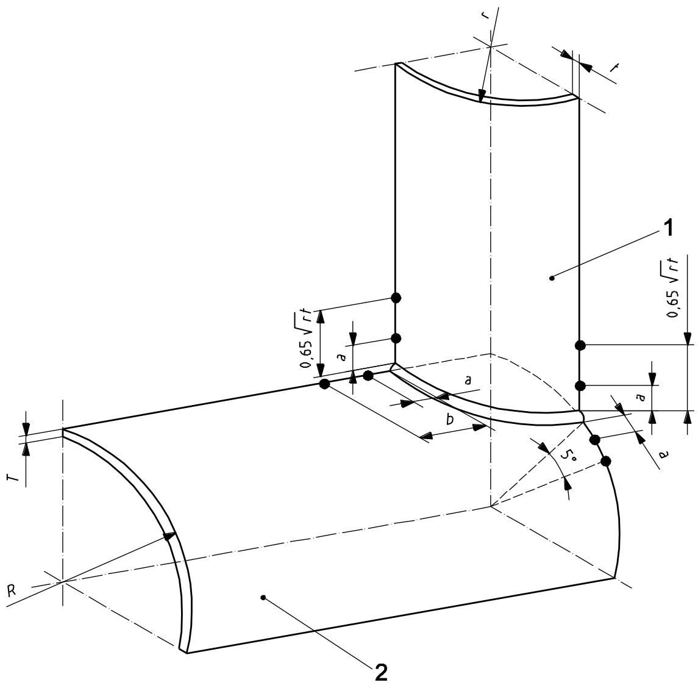  
Key   
1 brace
2 chord

$$\begin{array}{l} a = 0, 2 \sqrt{r t}, \text{b u t} a \geq 4 \mathrm{m m} \\ b = 0, 4^{4} \sqrt{r t R T} \\ \end{array}$$

A.16.10.2.1.2 Deriving SCFs

SCFs may be derived from FEA, model tests or empirical equations based on such methods. When deriving SCFs using FEA, solid (volume) elements should be used to represent the weld region (as opposed to thin shell elements). In models using volume elements, the SCFs can be derived by extrapolating stress components to the relevant weld toes and combining these to obtain the maximum principal stress and hence the SCF. The extrapolation direction should be normal to the weld toes.

If thin shell elements are used, the results should be interpreted carefully since no single method is guaranteed to provide consistently accurate stresses [A.16.10-5]. Extrapolation to the mid-surface intersection generally, but not consistently, overpredicts SCFs, whereas extrapolation to the notional weld toes would generally underpredict SCFs. In place of extrapolation, it is possible to directly use the nodal average stresses at the mid-surface intersection. This generally overpredicts stresses, especially on

the brace side. This last method is expected to be more sensitive to the local mesh density than the extrapolation methods.

When deriving SCFs from model tests, care should be taken to cover all potential hot spot locations with strain gauges. Furthermore, the strain concentration factor is not identical to the SCF, but is related to it via the transverse strains and Poisson's ratio. If the chord length in the joint tested is less than about six diameters (chord length parameter α < 12), the SCFs should possibly be corrected using the Efthymiou short-chord correction factors [A.16.10-6]. The same correction can be needed in FEA if α < 12.

A.16.10.2.1.3 Joint classification

For the purpose of SCF evaluation, tubular joints are usually classified into joint types of T/Y-, X-, K-, or KT-joints, as defined in Figure A.16.10-2. The geometric parameters needed to define each joint type, e.g. chord diameter (D), chord thickness (T), brace diameter (d), brace thickness (t), etc. are shown in Figure A.16.10-2. Appropriate non-dimensional, geometric parameters, β, γ, τ, α, θ and ζ, are also defined in Figure A.16.10-2 for each joint type.

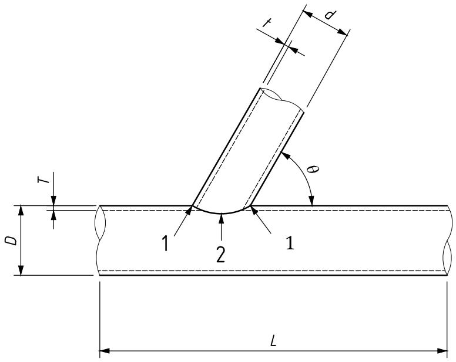  
a) T- or Y-joint

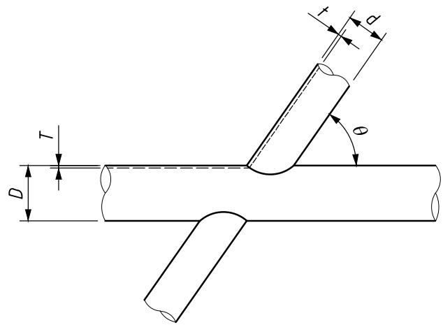  
b) X-joint

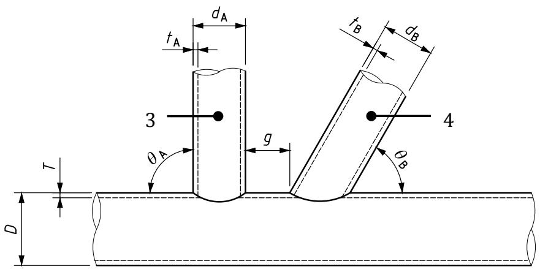  
c) K-joint

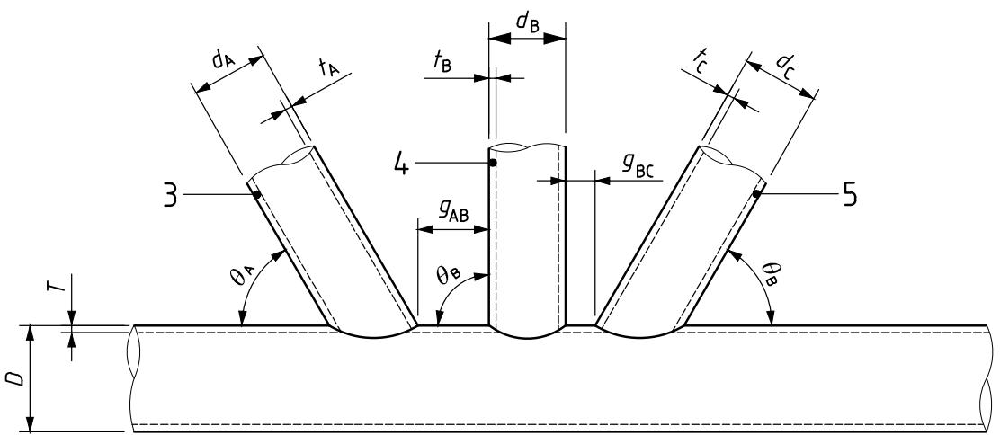  
Figure A.16.10-2 — Joint classification and geometrical parameters for SCFs

d) KT-joint


| 1 | crown | β=d/D | βA=dA/D | βB=dB/D | βC=dC/D |
| --- | --- | --- | --- | --- | --- |
| 2 | saddle | τ=t/T | τA=tA/T | τB=tB/T | τC=tC/T |
| 3 | brace A | ζ=g/D | ζAB=gAB/D | ζBC=gBC/D |  |
| 4 | brace B | γ=D/2T |  |  |  |
| 5 | brace C | α=2L/D |  |  |  |


For many joints it is sufficiently accurate to use a classification based on geometry only, following the rules given in Table A.16.10-1, or the assumptions on forces in brace members recommended below. Alternatively, a classification methodology can be used, including the more rational influence function approach which handles classification automatically on the basis of the actual load paths. This is discussed further in A.16.10.2.2.

Table A.16.10-1 — Classification table for a brace end   


| $N_{\text{near}}$ | $N_{\text{far}}$ | Classification$^{\text{a}}$ |
| --- | --- | --- |
| 1 | 0 | T/Y |
| 1 | 1 | X |
| 1 | 2 | T/Y |
| 1 | 3 | T/Y |
| 2 | Any | K |
| 3 | Any | KT |
| $N_{\text{near}}$ | number of braces on same side of chord as reference brace (including reference brace) | number of braces on same side of chord as reference brace (including reference brace) |
| $N_{\text{far}}$ | number of braces on far side of chord with respect to reference brace | number of braces on far side of chord with respect to reference brace |
| a Non-planar braces are ignored. | a Non-planar braces are ignored. | a Non-planar braces are ignored. |


In joint types where more than one brace is involved, i.e. in K-, KT- and X-joints, the relative magnitude and direction of the nominal brace forces (and moments) has a significant influence on SCFs. For instance, for a typical K-joint under opb, the SCF increases from 2 when the brace moments are exactly balanced, to approximately 6 when they are unbalanced.

The following recommendations are given with respect to categorization of tubular K-, KT- and X-joints based on force patterns in braces for fixed offshore structures; see also 14.2.4.

— K- and KT-joints

1) normal components of the axial brace forces are assumed to be balanced;   
2) ipb moments on braces are assumed to be unbalanced;   
3) opb moments on braces are assumed to be unbalanced.

— X-joints

1) axial forces on braces are assumed to be balanced;   
2) SCFs in X-joints are not sensitive to the sign of the ipb moment;   
3) opb moments on braces are assumed to be balanced.

These recommendations are based on the assumption that, in a well-braced structure, the response of primary joints is usually governed by axial forces; bending and shear due to frame action are of secondary importance. Hence the (normal components of the) axial forces in the braces at a joint (X-, K- or KT-joints) should be approximately balanced so that shear remains small. Ipb and opb moments can be significant when they are caused by direct wave action (as opposed to frame action) and for secondary braces. Hence ipb and opb moments in K- and KT-joints tend to be unbalanced; while opb moments in X-joints tend to be balanced for the same reason.

A.16.10.2.1.4 Evaluation of GSRs

The key GSR locations at the tubular joint intersection are termed saddle and crown (see Figure A.16.10-2). A minimum of eight stress range locations around each chord/brace intersection weld should be considered to adequately cover all relevant locations. These are: the chord sides at two crown positions,

the brace sides at two crown positions, the chord sides at two saddle positions and the brace sides at two saddle positions. The GSRs for the chord and the brace side of the weld are determined from the geometric stresses given by Formula (A.16.10-1):

$$\sigma_{\mathrm{G S}, s} (t) = C_{\mathrm{a x}, s} \sigma_{\mathrm{a x}} (t) \pm C_{\mathrm{o p b}, s} \sigma_{\mathrm{o p b}} (t)$$

$$\sigma_{\mathrm{G S}, \mathrm{c}} (t) = C_{\mathrm{a x}, \mathrm{c}} \sigma_{\mathrm{a x}} (t) \pm C_{\mathrm{i p b}, \mathrm{c}} \sigma_{\mathrm{i p b}} (t) + \sigma_{\mathrm{C}, \mathrm{c}} (t) \tag{A.16.10-1}$$

where

σGS $\sigma_{ \mathrm{ G S } }$ is the geometric stress on the chord or the brace side of the weld between chord and brace;   
σax $\sigma_{ \mathrm{ a x } }$ is the nominal axial stress in the brace (or stub);   
$\sigma_{ \mathrm{ i p b } }$ is the nominal in-plane bending stress in the brace (or stub);   
$\sigma_{ \mathrm{ o p b } }$ is the nominal out-of-plane bending stress in the brace (or stub);   
σC,c $\sigma_{ \mathrm{ C , c } }$ is the nominal stress in the chord (or chord can) at the crown position, see A.16.10.2.1.5;   
Cax $C_{ \mathrm{ a x } }$ is the stress concentration factor for axial brace stress;   
$C_{ \mathrm{ i p b } }$ is the stress concentration factor for in-pane bending stresses in the brace;   
$C_{ \mathrm{ { o p b } } }$ is the stress concentration factor for out-of-plane bending stresses in the brace;   
t is time;   
s is the subscript denoting the saddle position;   
c is subscript denoting the crown position.

The GSR, denoted by S, is the maximum minus the minimum stress during one full stress cycle. Formula (A.16.10-1) applies to both the brace side and the chord side of the weld at the intersection of brace and chord. The nominal chord stress $\textstyle ( \sigma_{ \mathrm{ C , c } } )$ only affects the chord side of the weld at the crown position and should be deleted from Formula (A.16.10-1) when the geometric stress for the brace is determined.

Since the nominal brace stresses, $\sigma_{ \mathrm{ a x } } , \sigma_{ \mathrm{ o p b } }$ and $\sigma_{ \mathrm{ i p b } } ,$ , are functions of wave position (i.e. time t), it follows `-`` ,`` that in combining the contributions from the various stresses, the phase differences between them are,,,,` automatically taken into account.

For some joints and certain individual brace force patterns, the point of highest stress can lie at a location-- between the saddle and the crown. Examples include balanced axial brace forces in K-joints where the hot spot generally lies between the saddle and the crown toe. For ipb the hot spot might not be precisely at the crown, but could lie within a sector of ± 30° from the crown depending on the γ and β values. The recommended SCF formulae capture these higher SCFs even though they are referred to as occurring notionally at the crown or the saddle for simplicity.

For combined axial forces and bending moments, it is possible for the maximum GSR to occur at a location between the saddle and crown, even when the individual hot spots occur at the saddle or crown. These cases occur when opb and ipb contributions are comparable in terms of GSR and are in phase, and when, additionally, the axial contributions are small or relatively constant around the intersection. For such

cases, Formula (A.16.10-1) can underpredict the maximum stress range. To overcome this, the GSR around the entire joint intersection can be estimated using location dependent SCFs and a generalized form of Formula (A.16.5-1):

$$\begin{array}{l} S (\chi) = C_{\mathrm{a x , C}} (\chi) \cdot \sigma_{\mathrm{a x}} (t) \pm C_{\mathrm{i p b , C}} (\chi) \cdot \sigma_{\mathrm{i p b}} (t) \pm C_{\mathrm{o p b , C}} (\chi) \cdot \sigma_{\mathrm{o p b}} (t) \\ S (\chi) = C_{\mathrm{a x}, \mathrm{B}} (\chi) \cdot \sigma_{\mathrm{a x}} (t) \pm C_{\mathrm{i p b}, \mathrm{B}} (\chi) \cdot \sigma_{\mathrm{i p b}} (t) \pm C_{\mathrm{o p b}, \mathrm{B}} (\chi) \cdot \sigma_{\mathrm{o p b}} (t) \tag{A.16.10-2} \\ \end{array}$$

where, additionally,

S(χ) is the GSR at the location around the chord to brace intersection defined by angle χ;

$C_{ \mathrm{ a x , c } } ( \chi )$ describes the variation of the SCF due to axial brace force on the chord side around the chord to brace intersection defined by angle χ;

$C_{ \mathrm{ i p b , c } } ( \chi )$ and $C_{ \mathrm{ o p b , c } } ( \chi )$ similarly describe the variation of the SCFs due to in-plane and out-of-plane bending around the chord to brace intersection defined by angle χ, respectively.

SCFs with subscript B instead of C describe the same variables for the brace side of the chord to brace intersection. The SCF distribution functions around the circumference can be obtained from parametric formulae given in Reference [A.16.10-7].

A.16.10.2.1.5 Effect of nominal chord stress $\pmb{ \sigma }_{ \mathrm{ C } , \mathrm{ c } } ( t )$

Nominal variable stresses in the chord member also contribute to stress ranges for fatigue damage accumulation. Their contribution is usually small because (unlike brace forces) chord forces do not cause any significant local distortion of the chord walls. Hence, any stress-raising effects are minimal. The effect of nominal variable stresses in the chord member can be covered by including the stress $\left( \sigma_{ \mathrm{ a x , C } } \right)$ due to axial force in the chord can member, combined with an axial SCF of 1,25, i.e.-`,,,` $\sigma_{ \mathrm{ C , c } } ( t ) = 1 , 25 \ \sigma_{ \mathrm{ a x , c } } ( t )$ , while accounting for sign and phase differences with other effects due to brace force patterns in``,,,, Formula (A.16.10-1). The contribution,`,,,,` $\sigma_{ \mathrm{ C , c } } ( t )$ , is applied at the chord crown location only; contributions at other locations, i.e. at the chord saddle and at the brace side, are considerably smaller and may be`-``,` neglected.,,, `-

A.16.10.2.2 Unstiffened tubular joints

A.16.10.2.2.1 Review of SCF formulae

Several sets of parametric formulae have been derived for estimating SCFs in tubular joints, see References [A.16.10-5], [A.16.10-6] and [A.16.10-8] to [A.16.10-11].

The performance of the various sets of SCF formulae in terms of accuracy, degree of conservatism and range of applicability has been assessed in a number of studies, notably in studies by the Edison Welding Institute (EWI) [A.16.10-12] and Lloyd's Register [A.16.10-7].

The main conclusion from the EWI study was that the Efthymiou formulae [A.16.10-6] and the Lloyd's design formulae [A.16.10-7] have considerable advantages in consistency and coverage in comparison with other available formulae. When discussing Lloyd's SCF formulae, it is important to clarify that two modern sets of Lloyd's SCF formulae exist, namely:

— mean SCF formulae created from the database of acrylic test results that were available in 1988;

— design SCF formulae defined as mean plus one standard deviation from the same database.

When assessed by EWI against the latest SCF database, the Lloyd's mean SCF formulae are found to generally underpredict SCFs and fail the UK HSE assessment criteria. The mean SCF formulae are not recommended for design.

A second conclusion from the EWI study was that the option of mixing and matching formulae from different sets would lead to inconsistencies and is not recommended. An inconsistency of this type is already present in the Lloyd's design SCF formulae, due to the variable partial factor used, but it is not very significant.

For the α-Kellogg formulae, which are given in Reference [A.16.10-13], the EWI study concluded that they are generally more conservative than both the Efthymiou and the Lloyd's design SCF formulae. Perhaps the most significant weakness of the α-Kellogg formulae is that the predicted SCFs for all joint types are independent of β. This is clearly not the case as evidenced from test data and FEA results. Furthermore, the formulae imply that chord SCFs are proportional to $\sqrt \gamma$ as opposed to observations which indicate that they increase linearly with γ. One advantage of the α-Kellogg formulae is their simplicity.

In the comparison studies by Lloyd's Register, the Efthymiou SCF formulae were found to provide a good fit to the screened SCF database, with a bias of about 10 % to 25 % on the conservative side [A.16.10-7]. They generally pass the UK HSE assessment criteria for goodness-of-fit and conservatism. For the important case of K-joints under balanced axial forces, the Efthymiou formulae did not pass the UK HSE assessment criteria. A closer examination of this specific case revealed that these formulae are satisfactory for both the chord and the brace side. For the chord side in particular, the Efthymiou formulae provide the best fit to the database （$V_{ \mathrm{ R } } = 19 ~ \% )$ and have a bias of 19 % on the conservative side. The second best formula (Lloyd’s) has a VR of 21 % and a bias of 41 % on the conservative side. The UK HSE assessment criteria were deliberately designed to favour those formulae that overpredict SCFs and to penalize underpredictions. This is the key reason why the Efthymiou formulae for K-joints marginally failed the UK HSE assessment criteria, even though they provide a good fit and also err on the conservative side.

The Lloyd’s design SCF formulae generally pass the UK HSE assessment criteria, except for T/Y-joints under axial force and ipb on the brace crown side. The reason for this is that there seems to be a systematic difference between the acrylic results and steel results for T/Y-joints at the brace crown.

Use of the Efthymiou SCF formulae is recommended, because this set of formulae is considered to offer either the best option or a very good option for all joint types and types of brace forces, and is the only set which covers overlapping K- and KT-joints.

Mix and match between different sets of formulae is not recommended. The Efthymiou formulae are also recommended in the 22nd Edition of API RP 2A-WSD (see Reference [A.16.10-14]). The Efthymiou formulae are given in Tables A.16.10-2 to A.16.10-5 and briefly discussed in A.16.10.2.2.2.

A.16.10.2.2.2 The Efthymiou formulae

a) Overview

The Efthymiou formulae cover SCFs in unstiffened T/Y-, X-, K- and KT-joints under all relevant brace force conditions. Overlapping K- and KT-joints are also covered. These expressions are based on extensive FEA using the PMBSHELL program. The program uses thick shell elements for modelling the chord and braces and 3-D brick elements for the welds. The weld profiles are as per AWS D1.1. This modelling enables direct extrapolation of stresses to the weld toes. The modelling and extrapolation remove the need for corrections, such as those attributed to Marshall [A.16.10-3], which were aimed at the brace side SCFs derived from thin shell FEA. Inclusion of the weld profiles with appropriate cutback for high diameter ratios ensures realistic behaviour when modelling β = 1,0 joints.

b) T/Y-joints

For T/Y-joints under axial brace forces (see Table A.16.10-2), the SCFs are significantly influenced by the chord length and the fixity conditions at the ends of the chord. Beam bending of the chord influences primarily the crown SCFs, while for short chords (α < 12 ), the shell distortion at the chord to brace intersection and hence the SCFs are affected by the fixity at the ends.

For beam bending, the chord end fixity is defined by a parameter $C ,$ which is analogous to the effective length factor for buckling and has the range of 0,5–1,0. When $C = 0 { , } 5$ , the ends are fully fixed and the formulae degenerate to those of the fixed case. When $C = 1 { , } 0_{ i }$ , the chord ends are pinned. There are instances where beam bending of the chord is limited (see below). In such cases, the chord length should be taken to be small (e.g. α = 12 or less).

For joints with short chords (α < 12), the correction factors, $F_{ 1 }$ or $F_{ 2 } ,$ , in the Efthymiou formulae should be applied when the ends of the chord are radially restrained. Factor $F_{ 1 }$ is applicable when the ovalization at the chord ends is completely suppressed, for instance by a diaphragm, or if the ends are welded onto another stiff member.

c) X-joints

In X-joints under axial brace forces (see Table A.16.10-3), the SCFs at the saddles tend to dominate for all values of $\beta ,$ including the common case of $\beta = 1 , 0$ . In joints with short chords, the correction factors, $F_{ 1 }$ or $F_{ 2 } ,$ in the Efthymiou formulae may be used provided that ovalization of the ends is restrained to some extent. If the ends are completely free, the saddle SCFs should be increased. An approximate way of achieving this is to increase them by the ratio $1 / F_{ 2 }$ .

The chord crown SCF （$C_{ \mathrm{ X } 2 } )$ under axial forces is derived from the corresponding SCF $\left( C_{ \mathrm{ T } 2 } \right)$ for $\mathrm{ T / Y \mathrm{ \cdot } }$ joints by suppressing beam bending of the chord, i.e. setting α to zero. For the brace crown SCF （$C_{ \mathrm{ X 4 } } )$ , a better fit to the PMBSHELL database was obtained not by setting α to zero, but by deleting completely the second term in the corresponding SCF $\left( { C_{ { \mathrm{ T } } 4 } } \right)$ for T/Y-joints.

d) K-joints

K-joints with a gap greater than one chord diameter $\left( \zeta > 1 \right)$ under balanced axial brace forces (Table A.16.10-4) should be classified as Y-joints for the purpose of SCF evaluation. The chord length parameter, α, should be set to 12 to reflect the fact that beam bending of the chord is limited. For opb when ζ > 1, the SCF formulae degenerate to the Y-joint formulae and hence it is not necessary to reclassify these joints.

e) KT-joints

For KT-joints under balanced axial brace forces (see Table A.16.10-5), the SCFs on a diagonal brace are evaluated by considering the axial brace force to be balanced by the other diagonal brace, i.e. ignoring the central brace and hence degenerating the joint to a K-joint. For the central brace, it is generally sufficient to consider that its axial force is balanced by one of the diagonal braces. If the diagonal braces are identical, but the gaps differ, the maximum of the two gaps should be used, to be conservative. If the diagonal braces are not identical, then the central brace should be successively paired with each of the diagonal braces and the maximum resulting SCFs selected.

f) Validity ranges

The validity ranges for the Efthymiou formulae are as follows:

$$0, 2 \leq \beta \leq 1, 0$$

$$0, 2 \leq \tau \leq 1, 0$$

$$8 \leq \gamma \leq 32$$

$$4 \leq \alpha \leq 40 \tag{A.16.10-3}$$

$$20^{\circ} \leq \theta \leq 90^{\circ}$$

$$\frac{- 0 , 6 \beta}{\sin \theta} \leq \xi \leq 1, 0$$

For cases where one or more parameters fall outside this range, the following procedure should be adopted:

1) evaluate SCFs using the actual values of geometric parameters;   
2) evaluate SCFs using the limit values of geometric parameters;   
3) use the maximum of 1) or 2) above in the fatigue analysis.

Table A.16.10-2 — Formulae for SCFs in T/Y-joints   


| Type of brace force and fixity conditions | SCF formula |
| --- | --- |
| Axial brace force, chord ends fixed | Chord saddle: CCS=F1CT1 CTT1 = γτ1,1[1,11-3(β-0,52)2]sin1,6θ |
| Axial brace force, chord ends fixed | Chord crown: CC=CT2 CTT2 = γ0,2τ[2,65+5(β-0,65)2] + τβ(0,25α-3)sinθ |
| Axial brace force, chord ends fixed | Brace saddle: CBS=F1CT3 CTT3 = 1,3 + γτ0,52α0,1[0,187-1,25β1,1(β-0,96)]sin(2,7-0,01α)θ |
| Axial brace force, chord ends fixed | Brace crown: CBC=CT4 CTT4 = 3 + γ1,2[0,12exp(-4β)+0,011β2-0,045] + βτ(0,1α-1,2) |
| Axial brace force, general chord fixity | Chord saddle: CCS=F2CT5 CTT1+C1(0,8α-6)τβ2(1-β2)0,5sin22θ Chord crown: CC=Ct6 CTT6=γ0,2τ[2,65+5(β-0,65)2]+τβ(C2α-3)sinθ Brace saddle: CBS=F2CT3 See above Brace crown: CBC=CT7 CTT7=3+γ1,2[0,12exp(-4β)+0,011β2-0,045]+βτ(C3α-1,2) |
| In-plane bending (ipb) | Chord crown: CC=CT8 CTT8=1,45βτ0,85γ(1-0,68β)sin0,7θ Brace crown: CBC=CT9 CTT9=1+0,65βτ0,4γ(1,09-0,77β)sin(0,06γ-1,16)θ |
| Out-of-plane bending (opb) | Chord saddle: CS=F3CT10 CTT10=γτβ(1,7-1,05β3)sin1,6θ Brace saddle: BS=F3CT11 CTT11=τ-0,54γ-0,05(0,99-0,47β+0,08β4)×CT10 |
| Out-of-plane bending (opb) | Short chord correction factors (α<12): F1=1-(0,83β-0,56β2-0,02)γ0,23exp(-0,21γ-1,16α2,5) F2=1-(1,43β-0,97β2-0,03)γ0,04exp(-0,71γ-1,38α2,5) F3=1-0,55β1,8γ0,16exp(-0,49γ-0,89α1,8) where exp(x)=ex |
|  | Chord-end fixity parameter, C: 0,5 ≤ C ≤ 1,0 Typically C=0,7 C1=2(C-0,5) C2=C/2 C3=C/5 |


Table A.16.10-3 — Formulae for SCFs in X-joints   


| Type of brace force | SCF formula |
| --- | --- |
| Axial force (balanced) | Chord saddle: CCS=CX1 Cx1=3,87γτβ(1,10-β1,8)sin1,7θ |
| Axial force (balanced) | Chord crown: CC=CX2 Cx2=γ0,2τ[2,65+5(β-0,65)2]-3τβsinθ |
| Axial force (balanced) | Brace saddle: CBS=CX3 Cx3=1+1,9γτ0,5β0,9(1,09-β1,7)sin2,5θ |
| Axial force (balanced) | Brace crown: BC=CX4 Cx4=3+γ1,2[0,12exp(-4β)+0,011β2-0,045] |
| In joints with short chords, α<12, which have stiffened ends, both the chord saddle and the brace saddle SCF may be reduced by multiplying them by the short chord factor, F1 or F2. Factor F1 can be used for stiff end reinforcements preventing ovalization as well as rotation of the chord wall, while factor F2 can be used for end reinforcements partially preventing ovalization only. If the chord ends are completely free, both the chord saddle and the brace saddle SCF can increase significantly. An approximation can be obtained by increasing them by the ratio 1,0/F2 (see A.16.10.2.2.2), but FEA is recommended. F1and F2are given in Table A.16.10-2. | In joints with short chords, α<12, which have stiffened ends, both the chord saddle and the brace saddle SCF may be reduced by multiplying them by the short chord factor, F1 or F2. Factor F1 can be used for stiff end reinforcements preventing ovalization as well as rotation of the chord wall, while factor F2 can be used for end reinforcements partially preventing ovalization only. If the chord ends are completely free, both the chord saddle and the brace saddle SCF can increase significantly. An approximation can be obtained by increasing them by the ratio 1,0/F2 (see A.16.10.2.2.2), but FEA is recommended. F1and F2are given in Table A.16.10-2. |
| In-plane bending (ipb) (balanced or unbalanced) | Chord crown: CCC=C8 see Table A.16.10-2 Brace crown: CBC=CT9 see Table A.16.10-2 |
| Type of brace force | SCF formula |
| Out-of-plane bending (opb) (balanced) | Chord saddle: CCS=CX5 Cx5=γτβ(1,56-1,34β4)sin1,6θ Brace saddle: CBS=CX6 Cx6=τ-0,54γ-0,05(0,99-0,47β+0,08β4)xCX5 |
| In joints with short chords, α<12, which have ends stiffened with a diaphragm or ring stiffener, both the chord saddle and the brace saddle SCF may be reduced by multiplying them by the short chord factor F3; see Table A.16.10-2. If the chord ends are completely free, saddle SCFs can increase significantly. An approximation can be obtained by increasing them by the ratio 1,0/F3 (see A.16.10.2.2.2), but FEA is recommended. | In joints with short chords, α<12, which have ends stiffened with a diaphragm or ring stiffener, both the chord saddle and the brace saddle SCF may be reduced by multiplying them by the short chord factor F3; see Table A.16.10-2. If the chord ends are completely free, saddle SCFs can increase significantly. An approximation can be obtained by increasing them by the ratio 1,0/F3 (see A.16.10.2.2.2), but FEA is recommended. |


Table A.16.10-4 — Formulae for SCFs in gap/overlap K-joints   


| Type of brace force | SCF formula |
| --- | --- |
| Axial forces (balanced) | Chord: C_C = C_K1 C_K1 = [τ0,9γ0,5(0,67-β2+1,16β)sinθ] [sinθmax/sinθmin)0,30 × (βmax/βmin)0,30 ×[1,64+0,29β-0,38arctan(8ξ)] Brace: |
|  | CB=CK2 CK2=1+CK1(1,97-1,57β0,25)(τ-0,14sin0,7θ)+[Kβ1,5γ0,5τ-1,22sin1,8(θmax+θmin)]×[0,131-0,084arctan(14ξ+4,2β)]whereK=0 for gap joints;K=1 for the through brace;K=0,5 for the overlapping brace;the arctangents are evaluated in radians;τ,β,θand the nominal stress relate to the brace being considered. |
| In-plane bending (ipb)(unbalanced) | Chord crown, non-overlapping joint or overlap ≤ 30 % of contact length:CC=CT8 see Table A.16.10-2Chord crown, overlap > 30 % of contact length:CC=1,2CT8 see Table A.16.10-2Brace crown, non-overlapping joint:BC=CT9 see Table A.16.10-2Brace crown, overlapping joint:BC=CT9×(0,9+0,4β) |
| Out-of-plane bending (opb)(unbalanced)a | Chord saddle adjacent to brace A:CCS=F4CK4 CK4=CT10,A[1-0,08(βBγ)0,5exp(-0,8x)]+CT10,B[1-0,08(βAγ)0,5exp(-0,8x)]×[2,05βmax0,5exp(-1,3x)]wherex=1+ξsinθA/βACT10,A and CT10,B (see Table A.16.10-2) are calculated with the parameters for braces A and B respectively.Brace saddle adjacent to brace A:CBS=F4CK5 CK5=τ-0,54γ-0,05(0,99-0,47β+0,08β4)×CK4 |
|  | Short chord correction factor (α<12) F4=1-1,07β1,88 exp[-0,16γ-1,06α2,4] where exp(x)=ex |
| a The designation of braces A and B is not geometry dependent. It is nominated by the user. | a The designation of braces A and B is not geometry dependent. It is nominated by the user. |


Table A.16.10-5 — Formulae for SCFs in KT-joints   


| Type of brace force | SCF formula |
| --- | --- |
| Axial force (balanced) | Chord: C_C = C_K1 see Table A.16.10-4 Brace: C_B = C_K2 see Table A.16.10-4 where ζ = ζ_AB + ζ_BC + βB for the diagonal braces A and C; ζ = maximum of ζ_AB and ζ_BC for the central brace B. |
| In-plane bending (ipb) | Chord crown: C_CC = C_T8 see Table A.16.10-2 Brace crown: C_BC = C_T9 see Table A.16.10-2 |
| Out-of-plane bending (opb) (unbalanced) | Chord saddle at diagonal brace A: C_CS = C_KT1 C_KT1 = C_T10,A[1-0,08(βBγ)0,5exp(-0,8x_AB)]×[1-0,08(βCγ)0,5exp(-0,8x_AC)] +C_T10,B[1-0,08(βAγ)0,5exp(-0,8x_AB)]×[2,05βmax0,5exp(-1,3x_AB)] +C_T10,C[1-0,08(βAγ)0,5exp(-0,8x_AC)]×[2,05βmax0,5exp(-1,3x_AC)] where x_AB = 1 + ξ_AB sinθA/βA x_AC = 1 + (ξ_AB + ξ_BC + βB)sinθA/βA Chord saddle at central brace B: |
|  | CCS=KKT2 C_KT2=C_T10,B[1-0,08(βAγ)0,5 exp(-0,8 x_AB)]((βA/βB)^2×[1-0,08(βCγ)0,5 exp(-0,8 x_BC)]((βC/βB)^2+CT10,A[1-0,08(βBγ)0,5 exp(-0,8 x_AB)]×[2,05βmax0,5 exp(-1,3 x_AB)]+CT10,C[1-0,08(βBγ)0,5 exp(-0,8 x_BC)]×[2,05βmax0,5 exp(-1,3 x_BC)]wherex_AB=1+ξABsinθB/βxBxBC=1+ξBCsinθB/βxB Brace saddle:CBS=C_KTB C_KTB=τ-0,54 γ-0,05(0,99-0,47β+0,08β^4)xC_S |


A.16.10.2.2.3 Guidance on reducing the SCF

Increasing the chord wall thickness is an effective way of reducing stress concentrations. For T/Y- and X-joints, a doubling of the chord wall thickness reduces the saddle SCFs by a factor of 4; crown SCFs are also reduced considerably.

Increasing the brace wall thickness (by introducing brace stubs) is NOT an effective way of reducing stress concentrations. For many joint configurations, the introduction of thicker brace stubs has little or no effect on the GSR on the chord side. It actually leads to an increase in the SCF, which is counteracted by a corresponding decrease in the nominal brace stub stress, and hence there is no significant change in the fatigue damage calculation. The use of thicker brace stubs tends to reduce the GSR on the brace side, but this reduction is small and usually not worthwhile in terms of the controlling stress value.

It is also relevant to note that the introduction of thicker brace stubs has little or no effect on the static strength of joints. It does, of course, increase the strength of the brace end and hence can be an attractive design detail for a brace that carries substantial transverse actions (e.g. direct wave action or actions due to accidental ship impact on braces in the splash zone). In general, however, the use of thicker brace stubs is an inefficient use of steel and should be avoided.

The use of thicker brace stubs further introduces additional stress concentrations at the brace to stub closure welds in nodal constructions because of the thickness transition. This can create additional problems and the use of thicker brace stubs should be avoided.

A.16.10.2.2.4 Influence functions

The concept of influence functions as a generalization of the SCF method of evaluating GSRs is described in References [A.16.10-6], [A.16.10-11] and [A.16.10-15]. This method is more accurate than the SCF approach because it can handle generalized forces and moments on the braces forming the joint, as opposed to an approach that is based on individual planes and joint classification.

An influence function is an expression for the GSR at a certain location around the chord-to-brace intersection arising from a nominal stress of unit magnitude acting on any brace of the joint. The GSR at a given location can be obtained by multiplying each influence function with its respective nominal stress and superimposing the contributions from all braces of the joint, including the brace under consideration.

The influence function algorithm is consistent with the SCF approach in the sense that it leads to identical results for a joint that is subjected to forces and classed in the manner that is assumed by the SCF approach. For instance, it leads to identical results for a K-joint when the axial forces are exactly balanced and the opb moments are exactly unbalanced.

In addition to being more accurate than the SCF approach, the influence function concept obviates the need to classify joints and hence is more convenient to use. An additional advantage is that it has been extended [A.16.10-6], [A.16.10-11] to handle multiplanar joints for the important case of axial brace forces.

A disadvantage of the influence function algorithm is that it is less transparent than the direct SCF``,``, approach.,, `, `,

For complex joints of particular interest, specific influence coefficients and geometric stresses can be`,``` accurately established by developing a detailed local FEA model of the joint and incorporating this model ,`--- into the overall fatigue analysis (frame) model of the structure [A.16.10-16]. The advantage of this approach is that it captures all brace and chord forces and moments and their phase differences and all geometric stress concentration effects, including multiplanar effects. However, introducing local joint flexibility can also have an effect on global stresses. Therefore, when taking this approach, all joints should in principle have flexibility modelled.

A.16.10.2.2.5 Tubular joints welded from one side

Single-sided welding is used as the principal method for connecting braces to chords in tubular joints for offshore structures in many areas of the world. Single sided welding presupposes that a fatigue crack always initiates at the weld toe. However, if the SCF at the internal weld root of a tubular joint is relatively high compared to that at the external weld toe (e.g. the internal SCF is 70 % of the external SCF), then the crack can initiate at the internal weld root, due to more onerous S-N curves that are relevant for the root detail than for the external weld toe. This is particularly important when weld improvement techniques are employed.

The appropriate S-N curve from the other joints (OJ) group (see Table 16.11-1) should be used for fatigue analysis of the weld root. For further information, see References [A.16.10-17] and [A.16.10-18].

A.16.10.2.2.6 Tubular thickness transitions

Thickness transitions introduce additional stress concentrations at the connection weld and hence potential fatigue problems. The highest stresses occur on that side of the transition that is not flush. Possible fatigue problems are therefore made worse if the transition is made internally because the highest stresses then occur at the weld root, which has the highest potential for welding defects. Furthermore, this location cannot easily be inspected. Where thickness transitions are necessary, they should therefore be external (i.e. internally flush connections).

A.16.10.2.3 Internally ring stiffened tubular joints

The Lloyd’s formulae for ring stiffened joints are given in Reference [A.16.10-19]. The following points should be noted regarding the formulae:

a) the derived SCF ratios for the brace to chord intersection and the SCFs for the ring edge are mean values, although the degree of scatter and proposed design factors are given;

b) short chord effects should be taken into account where relevant;   
c) for joints with diameter ratios $\beta \ge 0 , 8 ,$ the effect of stiffening is uncertain, it can even increase the SCF;   
d) the maximum of the saddle and crown values should be applied around the whole brace to chord intersection;   
e) the minimum SCF for the brace side under axial and opb moments should be taken as 2,0, whereas a minimum value of 1,5 is recommended for all other locations.

The following additional observations can be made about the use of ring stiffeners in general:

— thin shell FEA should be avoided for calculating the SCF if the maximum stress is expected to be near the brace to ring crossing point, and special consideration should be given to this crossing point in the fatigue analysis;   
— ring stiffeners have a marked effect on the circumferential stress in the chord, but have little or no effect on the longitudinal stress;   
— ring stiffeners outside the brace footprint have little effect on the SCF, but can be beneficial for static strength.

Failures in the ring inner edge or brace to ring interface occur internally and can probably only be detected after through-thickness cracking, at which time most of the fatigue life has been expended. These areas should therefore be considered as non-inspectable, unless sophisticated inspection methods are used.

A.16.10.2.4 Grouted tubular joints

Grouted joints have either the chord completely filled with grout (single skin grouted joints) or the annulus between the chord and an inner member filled with grout (double skin grouted joints). The SCF of a grouted joint depends on the stress history. The SCF is smaller when the bond between the chord and the grout is unbroken. Due to the grout, the tensile and compressive SCFs can be different. Only the highest value should be used in the fatigue analysis.

Grouted joints may be treated as simple joints, except that for the brace and the chord saddle points the chord thickness in the γ- term for saddle SCF calculations may be substituted with an equivalent chord wall thickness given by Formula (A.16.10-4):

$$T_{\mathrm{e}} = (5 D + 134 T) / 144 \tag{A.16.10-4}$$

where

D is the chord outside diameter;

T is the chord wall thickness.

Formula (A.16.10-4) has been derived on the basis of engineering mechanics.

Joints with high β- or low γ- ratios gain little benefit from grouting. Although fully substantiated evidence is not available, the benefits of grouting should be neglected for joints with β > 0,9 or γ ≤ 12,0, unless documented otherwise. A minimum SCF value of 1,5 is recommended for all locations.

A.16.10.2.5 Cast joints

It is recommended that FEA be used to determine the magnitude and location of the maximum stress range in castings sensitive to fatigue. The FEA model should use volume elements at the critical areas and properly model the shape of the joint. Consideration should be given to stresses at the inside of the castings. The brace to casting circumferential butt weld, which is designed to the appropriate S-N curve from the OJ group (see Table 16.11-1), can be the most critical location for fatigue.

In the absence of fatigue data for castings tested in sea water under normal cathodic protection conditions, a minimum SCF of at least two should be applied.

A.16.10.3 Geometric stress ranges at other fatigue-sensitive locations

In any welded connection, there are several locations at which a fatigue crack can develop, e.g. in the base metal at the weld toe, at the weld ends and at the weld root (in the case of the weld throat of load carrying fillet or partial penetration butt welds). Each location should be classified separately.

Constructional details for non-welded material and welded connections with their corresponding joint classifications are given in, firstly, Table A.16.10-6, which affords an overview, and in Tables A.16.10-7 to A.16.10-12.

Table A.16.10-6 — Joint classification tabulation   


| Table | Type | Constructional detail |
| --- | --- | --- |
| A.16.10-7 | Type 1 | Material free from welding |
| A.16.10-8 | Type 2 | Continuous welds essentially parallel to the direction of applied stress |
| A.16.10-9 | Type 3 | Transverse groove welds in plates and tubulars (essentially perpendicular to the direction of applied stress) |
| A.16.10-10 | Type 4 | Welded attachments on the surface or edge of a stressed member |
| A.16.10-11 | Type 5 | Load-carrying fillet and T-butt welds |
| A.16.10-12 | Type 6 | Details in welded girders and tubulars |


The types and associated joint classification have been established on the basis of stresses generally along (within 45°) the direction indicated in the tables by the arrow for the potential crack on the surface of the base metal or, in the case of weld throat cracking, on the shear stress calculated in the weld throat. The classification is based on a minimum quality level for assembly of joint and weld, see Reference [A.16.10-2], for example.

For details that are not expressly classified, the following minimum classification class should be used, unless a higher class can be justified from published experimental work, or by specific tests:

— $\mathsf{ W }_{ 1 }$ for load carrying fillet or partial penetration weld metal;   
— $\mathrm{ F }_{ 2 }$ for other cases.

The appropriate stress range indicated in Tables A.16.10-7 to A.16.10-11 and used as the GSR is the maximum principal stress range adjacent to the detail under consideration, except for the throat of load carrying fillet or partial penetration welds, for which it is the shear stress range calculated on the minimum throat area. The stress range should be amplified to reflect the effect of any stress concentration in the vicinity of the joint that is not characteristic of the detail itself. For example, effects of holes, cut outs, re-entrant corners, joint eccentricity and misalignment during fabrication that is

greater than allowable should be taken into account, either in the structural model used to calculate stress range or by appropriate stress concentration factors. SCFs for these typical details may be obtained from References [A.16.10-20], [A.16.10-21] and other published literature.

Table A.16.10-7 — Type 1: material free from welding   


| Type number and description, explanatory comments | Class | Example, including failure mode |
| --- | --- | --- |
| 1.1 Plain steela) In the as-rolled condition or ground smooth or machined after cutting.b) With edges flame cut.No repair by weld refill. | B | C |
| 1.2 Bolted connectionUnsupported one-sided connections should be avoided or the effect of eccentricities taken into account in the calculation of stresses.Stresses to be calculated in the gross section for friction grip connections or in the net section for all other connections. | C | C |
| In plain steel, fatigue cracks initiate at the surface, usually either at surface irregularities or at corners of the cross-section. In welded construction, fatigue failure rarely occurs in a region of plain material since the fatigue resistance of the welded joints is usually much lower. In steel with holes or other stress concentrations arising from the shape of the member, failure usually initiates at the stress concentration. In this case, the stress range should include an SCF. | In plain steel, fatigue cracks initiate at the surface, usually either at surface irregularities or at corners of the cross-section. In welded construction, fatigue failure rarely occurs in a region of plain material since the fatigue resistance of the welded joints is usually much lower. In steel with holes or other stress concentrations arising from the shape of the member, failure usually initiates at the stress concentration. In this case, the stress range should include an SCF. | In plain steel, fatigue cracks initiate at the surface, usually either at surface irregularities or at corners of the cross-section. In welded construction, fatigue failure rarely occurs in a region of plain material since the fatigue resistance of the welded joints is usually much lower. In steel with holes or other stress concentrations arising from the shape of the member, failure usually initiates at the stress concentration. In this case, the stress range should include an SCF. |


Table A.16.10-8 — Type 2: continuous welds essentially parallel to the direction of applied stress   


| Type number and description, explanatory comments | Class | Example, including failure mode |
| --- | --- | --- |
| 2.1 Complete or partial joint penetration groove weld. Base or weld metal in members, without attachments, built up of plates or sections and joined by continuous welds. a) Complete joint penetration groove welds with the weld overfill dressed flush with the surface and machine-finished in the direction of stress, and with the weld proved free from significant defects by NDT. b) Groove or fillet welds with the welds made from both sides by an automatic submerged or open arc process and with no stop-start positions within the length. If an accidental stop-start occurs remedial action should be taken so that the finished weld has a similar surface and root profile to that intended. c) As b) weld from one side. d) As b) but with the weld containing stop-start positions within the length. For the ends of flange cover plates, see joint type 6.4. e) As b) but with manual welding. | B B C D D D D |  |
| 2.2 Discontinuous weld: refer to type 6.5. |  |  |
| Remarks on potential modes of failureWith the excess weld metal dressed flush, fatigue cracks would be expected to initiate at weld defect locations. In the as-welded condition, cracks might initiate at stop-start positions or, if these are not present, at weld surface ripples.Genera l comments— Backing strips: if backing strips are used in making these joints: a) they should be continuous, and b), if they are attached by welding, those welds should also comply with the relevant type requirements (note particularly that tack welds, unless subsequently ground out or covered by a continuous weld, would reduce the joint to joint type 6.5).— Edge distance: an edge distance criterion exists to limit the possibility of local stress concentrations occurring at unwelded edges as a result, for example, of undercut, weld spatter, or accidental over weave in manual fillet welding (see also notes on joint type 4). Although an edge distance can be specified only for the “width” direction of an element, it is equally important to ensure that no accidental undercutting occurs on the unwelded corners of, for example, cover plates or box girder flanges. If it does occur, it should subsequently be ground smooth.— Weld ends: weld ends are classified as type 4 or 5. | Remarks on potential modes of failureWith the excess weld metal dressed flush, fatigue cracks would be expected to initiate at weld defect locations. In the as-welded condition, cracks might initiate at stop-start positions or, if these are not present, at weld surface ripples.Genera l comments— Backing strips: if backing strips are used in making these joints: a) they should be continuous, and b), if they are attached by welding, those welds should also comply with the relevant type requirements (note particularly that tack welds, unless subsequently ground out or covered by a continuous weld, would reduce the joint to joint type 6.5).— Edge distance: an edge distance criterion exists to limit the possibility of local stress concentrations occurring at unwelded edges as a result, for example, of undercut, weld spatter, or accidental over weave in manual fillet welding (see also notes on joint type 4). Although an edge distance can be specified only for the “width” direction of an element, it is equally important to ensure that no accidental undercutting occurs on the unwelded corners of, for example, cover plates or box girder flanges. If it does occur, it should subsequently be ground smooth.— Weld ends: weld ends are classified as type 4 or 5. | Remarks on potential modes of failureWith the excess weld metal dressed flush, fatigue cracks would be expected to initiate at weld defect locations. In the as-welded condition, cracks might initiate at stop-start positions or, if these are not present, at weld surface ripples.Genera l comments— Backing strips: if backing strips are used in making these joints: a) they should be continuous, and b), if they are attached by welding, those welds should also comply with the relevant type requirements (note particularly that tack welds, unless subsequently ground out or covered by a continuous weld, would reduce the joint to joint type 6.5).— Edge distance: an edge distance criterion exists to limit the possibility of local stress concentrations occurring at unwelded edges as a result, for example, of undercut, weld spatter, or accidental over weave in manual fillet welding (see also notes on joint type 4). Although an edge distance can be specified only for the “width” direction of an element, it is equally important to ensure that no accidental undercutting occurs on the unwelded corners of, for example, cover plates or box girder flanges. If it does occur, it should subsequently be ground smooth.— Weld ends: weld ends are classified as type 4 or 5. |


Table A.16.10-9 — Type 3: transverse groove welds in plates and tubulars   
(i.e. essentially perpendicular to the direction of applied stress)   


| Type number and description, explanatory comments | Class | Example |
| --- | --- | --- |
| 3.1 Parent and weld metal at complete penetration butt joints welded from both sides.Changes in thickness should be machined to a smooth transition not steeper than 1 in 4. Changes of less than 1,15 times the thinner member thickness may be accommodated in the weld profile without machining.a) With the weld cap ground flush with the surface and the weld proved to be free from significant defects by NDT.b) With the weld made, either manually or by an automatic process other than submerged arc, provided all runs, including repairs, are made in the down-hand position.c) In general, welds made by the submerged arc process, or in positions other than down-hand, tend to have a poor reinforcement shape, from the point of view of fatigue resistance. Hence, such welds are downgraded from c) to d).d) Welds made other than in a), b) or c).In both c) and d) the corners of the cross-section of the stressed component at the weld toes should be dressed to a smooth profile. | C D E |  |
| e) Weld between plates of unequal width, with the weld ends ground to a radius not less than 1,25 times the thickness, t.Step changes in width can often be avoided by the use of shaped transition plates.For this detail the stress concentration has been taken into account in the joint classification. | F2 | ≥1,25t |
| 3.2 Parent and weld metal at complete joint penetration butt joints made from one side on a permanent backing strip.If the backing strip is fillet welded or tack welded to the member, the joint should be assessed using joint type 4 c). | F | a No tack weld. |
| 3.3 Parent and weld metal at full penetration weld made from one side without permanent backing strip.All circumferential welds in tubulars of less than 650 mm diameter should be considered single-sided. | F2 | a No tack weld. |
| Remarks on potential modes of failureWith the weld ends machined flush with the plate edges, fatigue cracks in the as-welded condition normally initiate at the weld toe, so that the fatigue resistance depends largely upon the shape of the weld overfill. If this is dressed flush, the stress concentration caused by it is removed and failure is then associated with weld defects. In welds made on a permanent backing strip, fatigue cracks initiate at the weld metal to strip junction, and in partial joint penetration groove welds at the weld root.Welds made entirely from one side, without permanent backing, require care in the making of the root bead to ensure a satisfactory profile.General commentsThe stress range considered should be that at the actual crack location. It should include SCF's arising from any thickness change, or due to the overall form of the joint (e.g. butt joint at the end of a conical transition piece). | Remarks on potential modes of failureWith the weld ends machined flush with the plate edges, fatigue cracks in the as-welded condition normally initiate at the weld toe, so that the fatigue resistance depends largely upon the shape of the weld overfill. If this is dressed flush, the stress concentration caused by it is removed and failure is then associated with weld defects. In welds made on a permanent backing strip, fatigue cracks initiate at the weld metal to strip junction, and in partial joint penetration groove welds at the weld root.Welds made entirely from one side, without permanent backing, require care in the making of the root bead to ensure a satisfactory profile.General commentsThe stress range considered should be that at the actual crack location. It should include SCF's arising from any thickness change, or due to the overall form of the joint (e.g. butt joint at the end of a conical transition piece). | Remarks on potential modes of failureWith the weld ends machined flush with the plate edges, fatigue cracks in the as-welded condition normally initiate at the weld toe, so that the fatigue resistance depends largely upon the shape of the weld overfill. If this is dressed flush, the stress concentration caused by it is removed and failure is then associated with weld defects. In welds made on a permanent backing strip, fatigue cracks initiate at the weld metal to strip junction, and in partial joint penetration groove welds at the weld root.Welds made entirely from one side, without permanent backing, require care in the making of the root bead to ensure a satisfactory profile.General commentsThe stress range considered should be that at the actual crack location. It should include SCF's arising from any thickness change, or due to the overall form of the joint (e.g. butt joint at the end of a conical transition piece). |


Table A.16.10-10 — Type 4: welded attachments on the surface or edge of a stressed member   


| Type number and description, explanatory comments | Class | Examples including failure mode |
| --- | --- | --- |
| 4. Welded attachments Parent metal of the stressed member adjacent to toes or ends of groove or fillet welded attachments (both stressed and unstressed attachments), regardless of the orientation of the weld to the direction of applied stress, and whether the welds are continuous around the attachment or not. Groove welds should have an additional reinforcing fillet to provide a similar toe profile to that which would exist in a fillet welded joint. Parent metal of the stressed member at the toe of a full penetration weld connecting the stressed member to another member slotted through it. a) With attachment length (parallel to the direction of the applied stress) ≤ 150 mm and with edge distance ≥ 10 mm. This classification includes ring stiffeners on tubulars away from nodes. b) With attachment length (parallel to the direction of the applied stress) > 150 mm and with edge distance ≥ 10 mm. The decrease in fatigue resistance with increasing attachment length is caused by more force being transferred into the longer gusset, giving an increase in stress concentration. c) Weld within 10 mm of the edges or corners of a stressed member. The classification applies to all sizes of attachment. It would therefore include, for example, the junction of two flanges at right angles. In such situations, a low fatigue classification can often be avoided by the use of a transition plate [see also joint type 3.1 e)]. | F F2 G | e = edge distance e = edge distance T L T L |
| Remarks on potential modes of failure When the weld is parallel to the direction of the applied stress, fatigue cracks normally initiate at the weld ends, but when it is transverse to the direction of stressing, they usually initiate at the weld toe; for attachments involving a single, as contrasted to a double, weld, cracks can also initiate at the weld root. The cracks then propagate into the stressed member. When the welds are on or adjacent to the edge of the stressed member, the stress concentration is increased and the fatigue resistance is reduced; this is the reason for specifying an "edge distance" in some of these joints (see also remark on edge distance in joint type 2). General comments - The stress range considered should be the nominal stress range in the member on which the attachment is welded. - When the attachment is subjected to significant forces, affecting the stress flow in the member, another joint type should be used, e.g. type 6.6 for gusseted connections. | Remarks on potential modes of failure When the weld is parallel to the direction of the applied stress, fatigue cracks normally initiate at the weld ends, but when it is transverse to the direction of stressing, they usually initiate at the weld toe; for attachments involving a single, as contrasted to a double, weld, cracks can also initiate at the weld root. The cracks then propagate into the stressed member. When the welds are on or adjacent to the edge of the stressed member, the stress concentration is increased and the fatigue resistance is reduced; this is the reason for specifying an "edge distance" in some of these joints (see also remark on edge distance in joint type 2). General comments - The stress range considered should be the nominal stress range in the member on which the attachment is welded. - When the attachment is subjected to significant forces, affecting the stress flow in the member, another joint type should be used, e.g. type 6.6 for gusseted connections. | Remarks on potential modes of failure When the weld is parallel to the direction of the applied stress, fatigue cracks normally initiate at the weld ends, but when it is transverse to the direction of stressing, they usually initiate at the weld toe; for attachments involving a single, as contrasted to a double, weld, cracks can also initiate at the weld root. The cracks then propagate into the stressed member. When the welds are on or adjacent to the edge of the stressed member, the stress concentration is increased and the fatigue resistance is reduced; this is the reason for specifying an "edge distance" in some of these joints (see also remark on edge distance in joint type 2). General comments - The stress range considered should be the nominal stress range in the member on which the attachment is welded. - When the attachment is subjected to significant forces, affecting the stress flow in the member, another joint type should be used, e.g. type 6.6 for gusseted connections. |


Table A.16.10-11 — Type 5: load-carrying fillet and T-butt welds   


| Type number and description, explanatory comments | Type number and description, explanatory comments | Class | Example, including failure mode |
| --- | --- | --- | --- |
| 5.1 | Parent metal adjacent to cruciform joints or T-joints (member marked X in sketches). | F | YX |
| 5.1 | a) Joint made with complete joint penetration groove welds and with any undercutting at the corners of the member dressed out by local grinding. | F | YX |
| 5.1 | b) Joint made with partial penetration or fillet welds with any undercutting at the corners of the member dressed out by local grinding. | F2 | YX |
| 5.1 | In this type of joint, failure is likely to occur in the weld throat unless the weld is made sufficiently large (to be checked with joint type 5.4). | F2 | YX |
| 5.2 | Parent metal adjacent to the toe of load-carrying fillet welds that are essentially transverse to the direction of applied stress (member X in sketch). | F2 | Y |
| 5.2 | a) Edge distance ≥ 10 mm. | G | e = edge distance |
| 5.2 | b) Edge distance < 10 mm. | G | e = edge distance |
| 5.2 | The relevant stress in member X should be calculated on the assumption that its effective width is the same as the width of member Y. | G | e = edge distance |
| 5.2 | These classifications also apply to joints with longitudinal welds only. | G | e = edge distance |
| 5.3 | Parent metal at the ends of load-carrying fillet welds that are essentially parallel to the direction of applied stress, with the weld end on plate edge (member Y in sketch). | G | Y |


| Type number and description, explanatory comments | Class | Example, including failure mode |
| --- | --- | --- |
| 5.4 Weld metal in load-carrying joints made with fillet or partial joint penetration groove welds, with the welds either transverse or parallel to the direction of applied stress (based on nominal shear stress on the minimum weld throat area).This includes welds in doubler plates, anodes, pipe supports.In these cases, an assessment of the stress range in the weld throat should be made.In each case, the thickness correction should be based on the weld throat minimum thickness. | W1 |  |
| Remarks on potential modes of failureFailure in cruciform or T-joints with complete joint penetration groove welds normally initiates at the weld toe, but in joints made with load-carrying fillet or partial penetration groove welds, cracking can initiate either at the weld toe and propagate into the plate or at the weld root and propagate through the weld. In welds parallel to the direction of the applied stress, however, weld failure is uncommon; cracks normally initiate at the weld end and propagate into the plate perpendicular to the direction of applied stress. The stress concentration is increased and the fatigue resistance is therefore reduced, if the weld end is located on or adjacent to the edge of a stressed member rather than on its surface. | Remarks on potential modes of failureFailure in cruciform or T-joints with complete joint penetration groove welds normally initiates at the weld toe, but in joints made with load-carrying fillet or partial penetration groove welds, cracking can initiate either at the weld toe and propagate into the plate or at the weld root and propagate through the weld. In welds parallel to the direction of the applied stress, however, weld failure is uncommon; cracks normally initiate at the weld end and propagate into the plate perpendicular to the direction of applied stress. The stress concentration is increased and the fatigue resistance is therefore reduced, if the weld end is located on or adjacent to the edge of a stressed member rather than on its surface. | Remarks on potential modes of failureFailure in cruciform or T-joints with complete joint penetration groove welds normally initiates at the weld toe, but in joints made with load-carrying fillet or partial penetration groove welds, cracking can initiate either at the weld toe and propagate into the plate or at the weld root and propagate through the weld. In welds parallel to the direction of the applied stress, however, weld failure is uncommon; cracks normally initiate at the weld end and propagate into the plate perpendicular to the direction of applied stress. The stress concentration is increased and the fatigue resistance is therefore reduced, if the weld end is located on or adjacent to the edge of a stressed member rather than on its surface. |


Table A.16.10-12 — Type 6: details in welded girders and tubulars   


| Type number and description, explanatory comments | Class | Example, including failure mode |
| --- | --- | --- |
| 6.1 Parent metal at the toe of a weld connecting a stiffener, diaphragm, etc., to a girder flange. a) Edge distance ≥ 10 mm. b) Edge distance < 10 mm. Edge distance refers to distance from a free, i.e. unwelded, edge. In this example, therefore, it is not relevant, as far as the (welded) edge of the web plate is concerned. | F G | e = edge distance |
| 6.2 Parent metal at the end of a weld connecting a stiffener, diaphragm, etc., to a girder web in a region of combined bending and shear. This classification includes all attachments to girder webs. | E | e = edge distance |


| Type number and description, explanatory comments | Type number and description, explanatory comments | Class | Example, including failure mode |
| --- | --- | --- | --- |
| 6.3 | Parent metal adjacent to welded shear connectors. |  |  |
|  | a) Edge distance ≥ 10 mm. | F |  |
|  | This classification includes pile-to-sleeve shear connectors. |  |  |
|  | b) Edge distance < 10 mm (see type 4.c). | G | e = edge distance |
| 6.4 | Parent metal at the end of a partial length welded cover plate, regardless of whether the plate has square or tapered ends and whether or not there are welds across the ends. | G |  |
|  | The class includes cover plates which are wider than the flange. However, such a detail is not recommended because it almost inevitably results in undercutting of the flange edge where the transverse weld crosses it, as well as involving a longitudinal weld terminating on the flange edge and causing a high stress concentration. |  |  |
| 6.5 | Parent metal adjacent to the ends of discontinuous welds, e.g. intermittent web/flange welds, tack welds unless subsequently buried in continuous runs. | F |  |
|  | The relevant stress is the nominal stress in the member marked X in the sketch. If the weld is load-carrying, it should be checked with joint type 5.4. |  |  |
|  | The same, adjacent to cope holes. |  |  |
|  | The existence of the hole is allowed for in the joint classification; it should not be regarded as an additional stress concentration. |  |  |
| 6.6 | Gusseted connections |  |  |
|  | When the connection is subjected to significant forces, the stress range should be that in the tubular member, the gusset or the weld, including an SCF which arises from the overall form of the joint. To reduce the SCF, it is recommended in example 1 to slot the tubular and place the gusset through. |  |  |
|  | a) Parent metal of gusset plate adjacent to a member or weld in full penetration welds connecting a gusset plate to a member — Location 1. | F |  |
|  | b) Parent metal of a member adjacent to fillet, full or partial penetration welded gusseted connection — Location 2. Full penetration welds are normally required in such joints. | F |  |
|  | c) Weld metal in fillet or partial penetration welds attaching a gusset plate to a member — Location 3. | W1 |  |


| Type number and description, explanatory comments | Class | Example, including failure mode |
| --- | --- | --- |
|  |  | 211 |


A.16.11 Fatigue resistance of the material

A.16.11.1 Basic S-N curves

The fatigue assessment of welded joints is based on the assumption that the connection has full penetration single or double sided welding, unless otherwise stated.

Offshore structures are subjected to fatigue due to variable amplitude stresses. However, the prediction of fatigue damage under variable amplitude stresses is a complex subject and the most commonly adopted approach for the assessment of offshore structures is the use of the Palmgren-Miner's summation law in combination with fatigue resistance in the form of an S-N curve for constant amplitude stresses. A limited number of variable amplitude fatigue tests on tubular joints have been undertaken and the results compared with constant amplitude S-N curves using an equivalent stress range, which has been defined as the cube root of the average value of (stress)3. This indicates that Palmgren-Miner's sum for the mean S-N curve falls essentially within the range of 0,5 to 2,0, with an average value of 1,8. This is comparable with the results from constant amplitude tests. A significantly larger number of test results are available for plate joints, which give an average Palmgren-Miner's sum of 1,1.

The S-N curves for tubular joints and castings are based on a comprehensive review of fatigue data for both tubular and plated joints. The background information is presented in References [A.16.11-1] and [A.16.11-2]. The S-N curves apply to crack growth associated with through thickness cracking.

The tubular joint S-N curves have been derived from an analysis of data on tubular joints manufactured using welds conforming to a standard flat profile as given in AWS [A.16.10-2]. Therefore, the fatigue recommendations apply to joints that conform to this AWS standard flat profile.

US investigations in this field have been carried out by EWI [A.16.11-2]. Both the UK HSE [A.16.11-1] and EWI [A.16.11-2] investigations concur on the general form of the S-N curves. The basic S-N curves relate to in-air conditions. Separate curves are presented for joints in sea water with adequate corrosion protection (i.e. from –850 mV to –1 100 mV). Fatigue data for tubular joints indicate that, in general, there is a reduction in the fatigue performance in sea water under cathodic protection for stress range magnitudes corresponding with resistances less than $10^{ 6 }$ cycles for in air conditions. For smaller stress range magnitudes and corresponding resistances greater than 106 cycles in air the fatigue lives in sea water are restored to that of in air conditions. References [A.16.11-3] and [A.16.11-4] present the results from fracture mechanics evaluations and illustrate the detrimental effect of sea water relative to air for joints with and without adequate cathodic protection. In normal design of offshore structures, the most significant damaging stress range cycles correspond with resistances greater than $N = 10^{ 6 }$ cycles, such that the detrimental reduction in fatigue life for cathodically protected joints is not apparent. The basic S-N curves given in Table 16.11-1 are therefore applicable for these conditions. In instances where significant damage occurs for stress range cycles corresponding with resistances less than $N = 10^{ 6 }$ cycles, a penalty factor of 2 on N is recommended. For joints in freely corroding conditions, or for joints with corrosion protection levels more negative than –1 100 mV, a factor of 3 on N for all resistances, without a change of slope at $1 \times 10^{ 7 }$ cycles, is recommended.

A number of tubular joints used in deriving the basic TJ S-N curve had chord and braces with equal diameters (i.e. β = 1,0). Some of these joints showed extensive weld inter run cracking in preference to weld toe cracking. This can be significant in relation to the application of weld toe grinding improvement techniques, since clearly toe grinding of the chord or brace weld toes alone does not improve the fatigue performance of these joints. Improvement would only be achieved if the weld face is also toe ground to remove all inter run toes. However, an assessment of the β = 1,0 joints, using the recommended SCF formulae in A.16.10.2.2, indicated that the predicted fatigue lives are significantly above the TJ curve.

A.16.11.2 High strength steels

The fatigue performance in sea water of plate joints with representative yield strengths up to 540 MPa [A.16.11-1] and of tubular joints manufactured from high strength steels [A.16.11-3] is similar to that for medium strength structural steels, thus allowing the S-N curves in Table 16.11-1 to be used for these steels. Further justification for extending the limit on yield strength to 800 MPa can be found in (13.1-3).

Alternatively, test data or fracture mechanics analysis should be used to determine appropriate S-N curves.

The effect of sea water on the fatigue performance of steels with yield strengths in the range 700 MPa to 800 MPa appears to be detrimental because of susceptibility to cracking from hydrogen embrittlement under variable stresses in sea water [A.16.11-3]. This effect increases with increasing yield strength and increasingly negative cathodic protection potential. A number of studies have identified excessively negative cathodic protection potential as a cause of cracking due to the generation of hydrogen, which enhances crack growth rates at the crack tip [A.16.11-3]. Evidence of hydrogen cracking found in jack ups during routine surveys has been reported in Reference [A.16.11-5]. It is therefore important that the fatigue performance of these steels is understood and that appropriate levels of cathodic protection are applied. Test data or fracture mechanics analysis can be used to determine appropriate S-N curves for such steels.

A.16.11.3 Cast joints

The S-N curve for cast joints has been derived from tests in air on large scale cast joints with thicknesses in the range of 18 mm to 40 mm, tested principally at R = –1 (i.e. stresses varying from a minimum in compression to an equal maximum in tension), and cruciform specimens with thicknesses in the range of 38 mm to 125 mm tested at R = 0. Similar mean curves are obtained from the two sets of data using an inverse slope of 4 [A.16.11-1]. Since cast joints are stress relieved, the R ratio has an influence on the fatigue behaviour. The S-N curve for the test data could therefore overestimate the fatigue performance of cast joints tested at R > –1. Hence, allowance has been made for the influence of mean stresses by applying a 20 % reduction to the maximum experimental stress range used to determine the CJ curve.

There is insufficient experimental evidence to justify a change in slope in the low stress/high cycle region, the highest experimental resistance being $5 \times 10^{ 6 }$ cycles. A conservative approach of using a constant slope of m = 4 for all numbers of cycles is therefore recommended.

Fracture mechanics analysis shows that casting defects can have a significant effect on the fatigue resistance, and the design curve corresponds to four standard deviations in N below the mean curve to allow for the possibility of undetected defects [A.16.11-6]. The curve is applicable to castings, which satisfy defect acceptance criteria compatible with current offshore practice; Reference [A.16.11-1] contains further information.

To determine whether weld repairs could be detrimental to the fatigue performance of cast joints, fatigue tests on cruciform specimens in both air and sea water were undertaken [A.16.11-7]. These tests showed that, provided weld repaired surfaces are ground flush to the as-cast profile and free from weld toe defects, the CJ S-N curve may be used for cast joints with weld repairs; see also Reference [A.16.11-1].

The limited data for castings in sea water (under conditions of cathodic protection and free corrosion) suggest that the metocean action reduction factors on resistance from A.16.11.1 should be used.

The fatigue assessment of cast joints requires that a FEA is performed to determine the location of the maximum stress range in the casting. For cast tubular nodal connections, the brace to casting circumferential butt weld can be the most critical location.

A.16.11.4 Thickness effect

An assessment by UK HSE [A.16.11-1] and EWI [A.16.11-2] of a wide range of data for various combinations of member forces and/or moments has shown that the fatigue performance is dependent on the member thickness, the performance decreasing with increasing thickness for the same stress range.

The TJ and OJ representative curves are based on a material thickness of 16 mm. EWI derived a thickness exponent of 0,29, compared with 0,3 in the UK HSE investigations. API RP 2A-WSD uses a value of 0,25 while in DNV GL-RP-C203 the range is from 0,15 to 0,25, with an indication that 0,25 is generally applicable unless there are high SCFs. Consequently, a value of 0,25 has been selected for Formula (16.11-2).

The basic material thickness for the CJ representative curve is 38 mm. Fracture mechanics predictions [A.16.10-2] show that the thickness effect in castings is smaller than in welded joints and an exponent of 0,15 is specified.

A.16.12 Fatigue assessment

A.16.12.1 Cumulative damage and fatigue life

The Palmgren-Miner's rule is not precise. Its accuracy depends on issues such as stress range history, type of constructional detail and failure definition. For tubular joints in offshore structures, the Palmgren-Miner's rule can be somewhat non-conservative. However, this non-conservatism is generally more than compensated by bias (and scatter) associated with the geometric stress range and the S-N curve. Hence, adjustment of the Palmgren-Miner's rule is not considered necessary.

Fatigue life estimates should be viewed with scepticism. The S-N curves used in design are representative curves (e.g. 95 % confidence of 97,5 % survival), as is typical of land based structures like bridges. This survival level implies that there is little chance of failure at the predicted life. An estimate of mean fatigue life using the mean S-N curve is generally several times the calculated life using the design S-N curve. In addition to uncertainties associated with wave action, the primary uncertainties and probable conservatisms in fatigue life estimates stem from:

a) the geometric stress range history;   
b) the S-N curve assumption in the low S –high N (the very long-life) regime, for which there are few supporting data.

The reliability of fatigue damage estimates is not yet established because full calibration of the analysis techniques, including both failures and non-failures, has not broadly occurred.

Fatigue life estimates of very short duration are even more doubtful when they are based on long-term wave histories, taken over a period of years. Short-term conditions can easily deviate from average conditions and can be better or worse than average.

Fatigue life estimates can be evaluated in a probabilistic framework. For more information, see References [A.16.12-1] and [A.16.12-2]. However, broad ranges of probabilities are possible. The uncertainties mentioned above affect probabilistic as well as deterministic fatigue life estimates. Probability estimates are most useful when used in relative terms.

For structures that need their life to be extended or are being re-used or converted to a new application, prior damage [D in Formula (16.12-3)] should be estimated via inspection findings. An absence of crack discoveries should not be assumed to mean no prior damage has occurred. For example, if MPI reveals no evidence of defects, it may be assumed that the prior damage in terms of the Palmgren-Miner's sum is limited to 0,3 for a welded tubular joint and to 0,5 for a welded plate detail. Assuming a defect free inspection, lower values of assumed damage can be justified by the designer based on analysis, if the prior history of the structure can be established with confidence. However, a value of zero is normally only used for those details that are modified so as to eliminate prior damage.

A.16.12.2 Fatigue damage design factors

Fatigue damage design factors for fatigue of steel components primarily depend on failure consequence and in-service inspectability. Failure criticality is normally established on the basis of redundancy analyses. A structure with redundancy, capability for in-service inspection and the possibility for repair/strengthening is preferred, especially for the design of a new structural concept or a conventional structure for new environmental conditions. Joints in the splash zone as well as piles are considered “not inspectable”.

In lieu of more detailed assessment, the fatigue damage design factors can be taken from Table A.16.12-1.

Table A.16.12-1 — Fatigue damage design factors, γFD   


| Failure critical component | Inspectable | Not inspectable |
| --- | --- | --- |
| No | 2 | 5 |
| Yes | 5 | 10 |


Both the factor of 5 and the factor of 10 imply that a significant change in fatigue reliability only occurs when there is a significant change in the predicted value (or Palmgren-Miner's damage sum) for the design service life of the structure. As the slopes of the S-N curves vary between 3 and 5, values 1 < γFD ≤ 10 are equivalent to much smaller changes in the calculated stresses from 1,38 S to 1,71 S for a factor of 5 and from 1,58 S to 2,15 S for a factor of 10.

The factors given in Table A.16.12-1 should be considered to relate to exposure level L1, but should also be used for exposure levels L2 and L3. There is currently insufficient background to establish different factors for lower exposure levels.

The fatigue damage design factors do not differentiate between fatigue analysis procedures. At present, there is little certainty in how the various procedures compare in terms of reliability, so the same set of explicit fatigue damage design factors is generally applied to all of them. The fatigue damage design factors also do not differentiate such aspects as risk to assets and difficulties associated with repairs, or lost production due to repairs. It is the owner’s responsibility to assess how these sorts of risk should be addressed in the design phase.

There are instances where the cited fatigue damage design factors may be reduced. An example could be a structural component above water, for which inspection can be either easier or more frequent. A reduction in fatigue damage design factor can also be appropriate if loss of the component does not jeopardize personnel safety or the environment. Finally, smaller fatigue damage design factors can be justified if the fatigue analysis algorithm has been calibrated to the structural type and design situations being considered. However, use of reduced factors should generally require some form of documented justification.

In selecting fatigue damage design factors, inspectability and inspection technique need careful consideration. In general, the in-service inspection for fatigue damage should be more thorough than the general level II survey described in ISO 19901-9. Locations below 200 m under the water surface should generally be assumed to be uninspectable. For some complex joints, such as internally stiffened ones, cracking can originate from the inside (hidden) surfaces. Hence, the need and possibility for inspection prior to crack penetration through the thickness should be considered at the design stage. A trade-off exists between e.g. introducing a fatigue damage design factor of 5 (for a component that is not failure critical) and inspecting in-service with a more complex technique such as ultrasonics. As ultrasonic inspection normally requires the use of diving technicians, the risk of diving should be included in the considerations.

Even though a given component is considered readily inspectable from exposed surfaces, inspection frequency should still be balanced with the fatigue damage design factor. In some structural components, such as those with low SCFs, the rate of crack growth can surpass normal circumstances and inspection intervals.

Despite the need to address inspectability during the design phase, there is no implied requirement to perform a regular, detailed inspection of each and every joint for which a fatigue damage design factor from the inspectable category is adopted. The scope and frequency associated with the inspection plan involve considerations that extend well beyond the issue of the fatigue analysis recipe alone. However, if no inspection is clearly intended from the start for a particular class of joint, then the fatigue damage design factor should be selected from the not inspectable category.

A.16.12.3 Local experience factor

The default value of the local experience factor, $k_{ \mathrm{ L E } } ,$ is 1,0. (See the regional information in Annex H for some cases where available data supports the use of a factor that is different from 1,0.) In other cases, a factor different from 1,0 should be substantiated by reliable evidence and should be fully documented.

A local experience factor may be used for the fatigue life estimation of a new structure design, for the extension of the fatigue life of an existing structure, and for an assessment of the fatigue life of a structure that is re-used or converted to a new application. If such a structure has accumulated prior fatigue damage, any local experience may only be used for an assessment of the remaining fatigue life.

As the fatigue process is complex and fatigue damage is sensitive to many different factors, local experience with existing structures can only be considered relevant for the fatigue assessment of a structure under consideration if the following conditions are satisfied:

— there is a database with fatigue data from existing structures in-place that have not suffered from noticeable fatigue damage during time periods exceeding the predicted fatigue lives for these structures;   
— the environment to which the in-place structures are subjected is essentially the same as the environment that the structure under consideration can be subjected to; this applies in particular, but not exclusively, to the wave environment;   
— the structure under consideration is of the same general type, is of similar configuration and has comparable dynamic characteristics as existing structures;   
— the structure under consideration contains similar constructional details as existing structures;   
— the structure under consideration is of similar material and fabricated in a comparable manner as existing structures.

A.16.13 Other causes of fatigue damage than wave action

A.16.13.1 General

No guidance is offered.

A.16.13.2 Vortex induced vibrations``,,,,

No guidance is offered.-`-``

A.16.13.3 Wind induced vibrations-

Where necessary, measures should be taken to avoid wind induced vibrations of members during fabrication. If this is not possible, or the measures are not successful, the resulting fatigue damage during the fabrication period for the members involved should be estimated and included in the overall fatigue damage assessment.

A.16.13.4 Transportation

Guidance on fatigue assessment during transportation is given in Reference [A.16.13-1]. The damage assessment during transportation should use reliable statistical information on the wave conditions along the tow route in the expected tow season. Normally, these should be provided in the form of wave scatter diagrams.

Spectral analysis techniques should be used to account for the random nature of the wave environment and for compatibility with standard vessel motion prediction techniques. The motions of the structure during the tow should be evaluated using either model tests or a suitable vessel motions analysis program. The possibility of different wave directions relative to the tow occurring should be taken into account. Structural analyses should be performed to evaluate the stresses due to motions and deformations during tow conditions. For structures transported on vessels, the stiffnesses of the vessel, structure and sea fastening should be taken into account.

As the actual weather conditions experienced during the tow can deviate significantly from the statistical information for the tow season, no matter how reliable this information is, it is recommended to perform sensitivity analyses using a modified scatter diagram or diagrams. The modified scatter diagram(s) could, for example, include one occurrence of the most severe sea state that can occur along the tow route during the tow period, increased probabilities of occurrence of lesser sea states, and/or increased probabilities of occurrence of unfavourable wave directions relative to the tow. If the sensitivity analyses indicate that fatigue damages during transportation are always acceptable, no further consideration is necessary. However, if the sensitivity analyses suggest that unacceptable fatigue damage can occur, further consideration of the transportation phase is warranted.

A.16.13.5 Installation

Driving fatigue should be considered for piles and driven caissons/monotowers.

Design measures to minimize potential fatigue damage during pile driving include:

— relocating attachments to avoid the sensitive areas;   
— using substantial connections for those attachments which cannot be relocated;   
— using doubler plates for connections to main members;--   
— using welded rather than screwed or bolted fittings for piping.

A.16.13.6 Risers-`-``,

No guidance is offered.-

A.16.14 Further design considerations

A.16.14.1 General

No guidance is offered.

A.16.14.2 Conductors, caissons and risers

No guidance is offered.

A.16.14.3 Miscellaneous non-load carrying attachments

No guidance is offered.

A.16.14.4 Miscellaneous load carrying attachments

Where attachments are located close to supporting structural members, the effect of flow enhancement of the free stream flow should be taken into account.

Where doubler plates are used, these should be designed such that the connection of the attachment to the doubler plate fails before the connection of the doubler plate to the primary member.

A.16.14.5 Conical transitions

Guidance on SCFs for unstiffened conical transitions is given in 13.6.3.5. Guidance on SCFs for stiffened conical transitions is given in Reference [A.16.14-1].

A.16.14.6 Members in the splash zone

Plan framing levels immediately below or above the water surface are alternatively submerged and dry during the passage of waves exceeding a certain threshold height. Normal wave action on these members is highly non-linear and is most likely not reliably represented in the spectral or other analysis methods. The manner in which the action on these members is included differs from software system to software system and should be carefully reviewed. A separate evaluation based on deterministic analysis principles using estimated actions and numbers of cycles for those waves that exceed the threshold should be performed to account for these effects.

Variations in buoyancy due to the passage of waves can also cause cyclic forces in members in the splash zone. If these buoyancy variations are not explicitly represented in the calculation algorithms of the computer program used, the effect of variable buoyancy actions on member stresses should be assessed and included, if significant, before fatigue damage calculations are performed.

Members located near the water surface can further be subjected to wave slamming actions in addition to the normal wave actions that are included in the fatigue analysis. The slamming actions cause vibrations of the member and are largest for horizontal members lying parallel to the wave crest. Guidance on estimating slamming actions can be found in the general literature. Where relevant, the fatigue damage associated with vibrations due to slamming should be included in the assessment.

A.16.14.7 Topsides structure

No guidance is offered.

A.16.14.8 Inspection strategy

During the design of new structures, it is common to make initially conservative assumptions (e.g. with respect to SCF or S-N curve selection) when performing the fatigue analysis to screen the structure with a view to identifying potential problem areas. These areas are then examined in more detail by refining the analysis assumptions and eliminating conservatism, where possible and justified. Consequently, the ranking of calculated fatigue lives does not necessarily reflect the true ranking if all structural details are not refined to a common level. This observation should be considered if fatigue lives are used for prioritizing areas of the structure for inspection.

Similarly, the approximations in the analysis procedure should be reviewed if low calculated fatigue lives based on approximate methods of analysis are used as the basis for an extensive inspection effort. In such cases, consideration should be given to performing a spectral analysis to refine the calculated lives where possible to try and reduce the inspection effort.

Generally, an initial inspection interval of one quarter of the calculated fatigue life is recommended for flat plate and welded tubular joints. Consequently, joints with calculated fatigue lives of up to four times the structure design service life would normally require inspection for fatigue once during the design service life.

A.16.15 Fracture mechanics methods

A.16.15.1 General

The benefits of defect assessment procedures (see Reference [A.16.15-1], for example) for the fitnessfor-service assessment of offshore structures are widely recognized, and defect assessment is increasingly being used in design and during fabrication and in-service inspection. However, existing procedures are based on general principles, and their application to tubular joints — which is a particularly complex problem due to the nature of the actions and the geometry of the joint — requires special care. Detailed information is given in References [A.16.15-2], [A.16.15-3] and [A.16.15-4].

A.16.15.2 Fracture assessment

Static failure can occur by fracture or by plastic collapse, if a crack propagates to a critical size. Failure assessment procedures combining considerations of failure by fracture and by plastic collapse are given in Reference [A.16.15-1]. The fracture assessment should be performed for each increment of crack growth.

The possibility of a fracture failure is normally greater in the brace than in the chord, since there is a greater likelihood of the crack propagating into material with lower toughness in the weld region. Further details can be found in Reference [A.16.15-1].

A.16.15.3 Fatigue crack growth law

Recommended values for the fatigue crack growth rate parameters, C and m, are presented in Reference [A.16.15-5].

The complexity of the normalized stress intensity factor (Y) usually requires the use of numerical integration methods. It is important that a sensitivity analysis is performed to establish that convergence is achieved using the selected increment of crack growth.

Knowledge of the initial crack (defect) size is essential in any fracture mechanics analysis. The predicted number of cycles to failure is sensitive to this parameter. It can be necessary to perform a sensitivity analysis to determine the significance of the assumed initial defect size.

For assessments performed during design, it is normal to assume that the initial crack (defect) is located at the position of the maximum GSR. The assumed initial crack (defect) size, $a_{ \mathrm{ i } } ,$ should be based on the accuracy of the NDT method used during fabrication. Inspection data can be highly variable and there is an increasing tendency towards the use of probability of detection (POD) curves. Where there is sufficient information, the minimum detectable defect size may be based on the 90 % POD, 95 % confidence level. However, this depends on the inspection method used and the selection of the minimum detectable defect size requires specialist advice.

The final crack size, $a_{ \mathrm{ f } }^{ \mathrm{ } } ,$ is limited to the critical crack size in view of either fracture toughness or plastic collapse; see A.16.15.2.

The assessment of a crack that is detected during inspection requires information on the crack location, depth from the surface and length along the surface of the material.

A.16.15.4 Stress intensity factors

The principal sources of normalized stress intensity factors, Y, are:

— standard solutions for semi-elliptical cracks in plates (see Reference [A.16.15-5], for example) used in conjunction with magnification factors and the moment release method;   
— numerical methods by FEA or boundary element analysis;   
— analytical methods (e.g. using weight functions);   
— empirical methods, involving the assessment of fatigue crack growth rate data.

The use of plate solutions is generally conservative, particularly for deep cracks, but provides stress intensity factors for a very wide range of parameters. The use of the moment release method in conjunction with plate solutions reduces the excessive conservatism and this approach is recommended for general use. The moment release method assumes that the net force acting across the cross-section of a cracked tubular member in an offshore structure, and hence the stress intensity factor, is reduced by the redistribution of forces. The linear moment release method involves the reduction of the bending stress component using the following simple formula:

$$\sigma_{\mathrm{b}, \mathrm{c}} = \sigma_{\mathrm{b}} (1 - a / T) \tag{A.16.15-1}$$

where $\sigma_{ \mathrm{ b , c } }$ and $\sigma_{ \mathrm{ b } }$ are the bending stress components in the cracked and uncracked joint, respectively, and T is the wall thickness.--`,

The availability of stress intensity factor solutions for welded joints is limited. In Reference [A.16.15-1], ,,,`,`, the stress distribution through the wall thickness is approximated to a combined bending and membrane ,,``-` stress field; further known stress intensity factor solutions for cracks in plates (see Reference [A.16.15-``,`` 5], for example) are used in conjunction with a magnification factor to account for the influence of the ,`--- stress concentration at the weld toe.

Magnification factors have been derived from two-dimensional FEA of butt and fillet welded joints and this approach is generally conservative. Alternatively, stress intensity factors can be evaluated by analysis or by approximate analytical methods, e.g. weight function analysis.

Models, which take account of the variation of the GSR around the brace/chord weld periphery, have also been developed [A.16.15-6], but validation is limited.

Below a certain threshold value of the stress intensity factor range (ΔK), no crack growth occurs. Recommended threshold values （$\varDelta K_{ \mathrm{ t h } } )$ for carbon and carbon manganese steels in air as well as in sea water with cathodic protection are $\varDelta K_{ \mathrm{ t h } } = 170 \ \mathrm{ N m m^{ - 3 / 2 } }$ at R = 0 (tensile stress ranges between zero and a maximum stress) and $\Delta K_{ \mathrm{ t h } } = 63$ Nmm-3/2 at R = 0,5 (tensile stress ranges between half the maximum and the full maximum stress). For sea water with free corrosion, a threshold stress intensity factor range $\Delta K_{ \mathrm{ t h } } = 0$ is recommended.

A.16.15.5 Fatigue stress ranges

For a fatigue crack growth analysis, the full stress range should always be used, even when the calculated stress range cycle is partially compressive, since the stress range can become effectively tensile due to the effects of mean and residual stresses.

A.16.15.6 Castings

The through-thickness stress distribution should be determined using FEA. The fatigue crack growth rate data for typical structural steels are generally found to be also applicable to cast material. However, where significant differences in chemical composition or mechanical properties exist, it can be necessary to obtain specific fatigue crack growth rate data.

A.16.16 Fatigue performance improvement of existing components

A.16.16.1 General

Post-weld improvement techniques may be used to improve fatigue performance. These techniques, discussed in this subclause, improve fatigue performance by improving the local geometry at the weld -`,,,` toe, by reducing the stress concentrations and/or by modifying the residual stresses. All these effects are``,,, included in the improvement factors on fatigue performance for each technique. Specific requirements,`,,, for the various techniques are noted or referenced.`-`-`

The GSR to be used for an assessment of the improved performance should be obtained from equivalent `--- joints before the improvement technique is applied, from FEA or from SCF formulae. They should not be obtained from measurements on improved joints.

The designer should be wary when applying weld improvement techniques, especially a powerful one like peening. If later fatigue cracking occurs, it should not be expected to originate at the treated location. However, if cracking does originate at a treated weld toe, the life associated with subsequent propagation is likely to be much shorter than is normal for untreated details.

A.16.16.2 Post-weld heat treatment

As-welded joints contain significant tensile residual stresses induced by the welding process, which combine with the operating stresses to promote fatigue failure. This is due to the increase of the effective mean stress and, for situations where the stress range consists of a compressive component, of the effective stress range. It follows that the reduction of tensile residual stresses can increase the fatigue performance.

A comparison of the fatigue behaviour of as-welded and post-weld heat treated joints has confirmed that PWHT can have a beneficial effect on the fatigue behaviour of welded joints. However, the effect of PWHT diminishes with increasing R-ratio and is negligible at R > 0 (all tensile stress ranges). Thus, the fatigue performance of post-weld heat treated and as-welded joints at R-ratios greater than zero are very similar and the same S-N curves apply.

A significant drawback of accepting PWHT as a fatigue improvement measure in design is that knowledge of the residual stress distribution, including the contribution of long range fit up stresses, is required. This information is not usually available.

A.16.16.3 Weld profiling

Limited investigations of the influence of weld profile on the fatigue resistance of tubular joints have shown there is no clear evidence that weld profiling leads to improved fatigue performance [A.16.16-1]. The basic TJ S-N curve has been derived from an analysis of data on tubular joints manufactured using welds conforming to a standard flat profile given in AWS [A.16.10-2]. Therefore, the fatigue recommendations apply to joints, which conform to this AWS standard flat profile.

Improvements through any form of profiling can be justified using information from an appropriate test programme for tubular joints for the condition being considered.

A.16.16.4 Weld toe grinding of tubular joint welds

For welded joints in-air and for joints in sea water with adequate cathodic protection, the fatigue performance can be increased by controlled local machining or grinding to produce a smooth concave profile at the weld toe. This is especially beneficial at low stress ranges. Experimental data indicate that this technique can lead to an increase in the fatigue performance by a factor of approximately 2. The beneficial effect of weld toe grinding can be reduced by free corrosion, though it tends to be restored by cathodic protection, see References [A.16.16-2] and [A.16.16-3].

A limited number of tests have demonstrated the importance of quality control of the grinding procedure. The grinding procedure should ensure that all defects in the weld toe region have been removed by grinding to a depth not less than 0,5 mm below the bottom of any visible undercut or defect. The maximum depth of local grinding should not exceed 2 mm or 5 % of the plate thickness, whichever is less. NDT of the joint is required after grinding to verify that no significant defects remain and, for fillet welded connections, it is important that the required throat size is maintained. Further quality control aspects apply, particularly on the shape of grinding burrs and their orientation; see Reference [A.16.16-2].

A.16.16.5 Grinding of butt welds

For butt welded connections, additional benefit can be gained by grinding the weld cap flush. The effect of this is to improve the joint classification (see Table A.16.10-9).

A.16.16.6 Hammer peening

By hammer peening the toes of welded connections, surface defects can be eliminated, the transition between the base and weld material is smoothed out, and beneficial compressive residual stresses are induced at the surface, all of which contribute to the enhancement of the fatigue performance of the treated weld. The net effect is to delay crack development and retard or eliminate growth of cracks already present.`,,, ``

The objective in hammer peening is to obtain a smooth groove at the weld toe. The grooved depth should,`,,, be at least 0,3 mm, but should not exceed 0,5 mm [A.16.16-4], [A 16.16-5]. The equipment and procedure ``-`-`` required to attain this groove configuration should be established via trials on detail mock-ups. The ```,, number of passes required is determined by the equipment and procedure. Heavy duty pneumatic --- hammers are preferred. The bit tip radius should be about 3 mm, so as to expedite the process and facilitate treatment right at the weld toe. Extensive use of peening has ergonomic implications. Consideration should be given to limiting the consecutive hours spent peening by one individual and vibration dampening gloves should be used. Peening can result in metal rollovers along the sides of the groove. Tests have shown that such rollovers can be deleterious to fatigue performance and should be removed [A.16.16-6]. Removal eliminates difficulty with interpretation of later inspection findings. Peened weld toes should be inspected by MPI directly after peening and any burr grinding.

The recommended fatigue performance improvement factor is 4. This value is significantly less than that found in many test programmes, and varies with stress range magnitude and other variables. The reduced value takes into account uncertainties in:

a) mean stress;   
b) dominant stress range magnitude;   
c) the effects of overloads.

The fatigue performance improvement factor may be applied to both tubular and non-tubular weld details. At nodes constructed by nodal fabrication, the effectiveness of peening is improved if it is performed after fit-up of the associated brace.

The benefits of hammer peening on fatigue performance can only be realized through adoption of adequate quality control procedures. References [A.16.16-4] and [A.16.16-5] contain the state-of-the-art in this field, and should be consulted in the preparation of adequate QC procedures prior to taking benefit for fatigue performance enhancement.

## A.17 Foundation design

A.17.1 General

No guidance is offered.

A.17.2 Design of pile foundations

Insight regarding how changes in foundation stiffness can impact the natural frequencies of tall steel structures is provided in Reference [A.17.9-1]. Additional guidance is provided in ISO 19901-4.

A.17.3 Pile wall thickness

## A.17.3.1 General

No guidance is offered.

## A.17.3.2 Pile stresses

No guidance is offered.

## A.17.3.3 Pile design checks

No guidance is offered.

## A.17.3.4 Check for design situation due to weight of hammer during hammer placement

Designers should use the K factor that is appropriate for the cantilevered end span of a continuous beam, which differs from the theoretical or commonly recommended K value for a fixed end cantilever. Values of effective length factors, K, of $^{ 2 , 3 }$ and $^{ 2 , 4 }$ for pile and conductor add-ons, respectively, are suggested for typical installations.

In the beam column resistance check, for either nearly vertical or inclined add-on sections, the recommended method of calculating the secondary P-Δ moments due to first order lateral deflections is more accurate [A.17.10-1] than the familiar procedure of modifying the primary support moment (M) by means of the moment reduction factor $C_{ \mathrm{ m } , i }$ as discussed in Clause 13.

## A.17.3.5 Stresses during driving

No guidance is offered.

## A.17.3.6 Minimum wall thickness

No guidance is offered.

## A.17.3.7 Allowance for underdrive and overdrive

No guidance is offered.

## A.17.3.8 Driving shoe

The designer should be aware that pile buckling and pile refusal incidents in very dense sands have been associated with the use of external chamfers at the pile tip. Although factors other than the shape of the pile tip contribute to buckling, the use of an external chamfer can increase the potential for buckling and/or refusal.

## A.17.3.9 Driving head

No guidance is offered.

A.17.4 Length of pile sections

No guidance is offered.

A.17.5 Shallow foundations

Additional guidance is offered in ISO 19901-4.

## A.18 Corrosion control

Guidance for coatings is given in References [A.18.4-1] to [A.18.4-4].

Applicable cathodic protection codes are given in References [A.18.4-5] to [A.18.4-12].

## A.19 Materials

A.19.1 General

No guidance is offered.

A.19.2 Lowest anticipated service temperature

The bulk of an offshore structure is submerged in sea water. Except for arctic structures, temperatures are above freezing, with the minimum temperature in the range of $- 2 ~^{ \circ } \mathrm{ C }$ to $10 ~^{ \circ } \mathrm{ C } ,$ depending on geographical location.

The values of the LAST presented in Table A.19.2-1 have been suggested for various offshore operating areas. For the Gulf of Mexico, a somewhat higher temperature of 21 °C prevails for both air and water during the hurricane season, which corresponds to the occurrence of significant actions approaching design level. At depths below 300 m, the Gulf of Mexico water temperature is $4 \^{ \circ } \mathrm{ C } ,$ like deep oceans worldwide.

Table A.19.2-1 — Recommended lowest anticipated service temperatures (LAST)   


| Location | LAST in air | LAST in water |
| --- | --- | --- |
| Gulf of Mexico | -10°C | +10°C |
| Southern California | 0°C | +4°C |
| Cook Inlet, Alaska | -29°C | -2°C |
| North Sea, south of Latitude 62° | -10°C | +4°C |
| North Sea, north of Latitude 62° | Site-specific data should be used but not warmer than for North Sea,south of latitude 62°. | Site-specific data should be used but not warmer than for North Sea,south of latitude 62°. |
| Mediterranean Sea, north ofLatitude 38° | -5°C | +5°C |
| Mediterranean Sea, south ofLatitude 38° | 0°C | +10°C |


For arctic and cold regions application, a more detailed breakdown of LAST categorisation is given in ISO 19906.

A.19.3 Chemical composition

No guidance is offered.

A.19.4 Strength, toughness and other considerations

## A.19.4.1 Yield strength

For supply of steel for MC approach, see API RP 2Z [A.20-2-5], and for DC approach, see EN 10225 (all parts) [D.2].

## A.19.4.2 Toughness

Applicable pre-production and production qualification standards are EN 10225 (all parts) [D.2] and API RP 2Z [A.20-2-5].

## A.19.4.3 Other considerations

Resistance to lamellar tearing is an important property for steels strained normal to the plane of rolling (which is parallel to the thickness). The formation of planar discontinuities during the steel manufacturing process creates potential sites for steel separation, if tensile actions are applied in the through-thickness direction.

A.19.5 Material category approach

## A.19.5.1 Steel selection philosophy

The MC method has evolved from practices in the Gulf of Mexico and other worldwide applications where ,,,``, ASTM, API and AWS standards are used. Each structure to be designed and built is assigned to a particularcategory. MC3 includes small structures in water depths less than 30 m which are unmanned during the design metocean event. MC2 refers to larger structures in deeper water where failure consequences and fatigue loading become more significant. MC1 is reserved for structures with very high failure

consequences in terms of monetary loss, wasted natural resources, pollution and/or loss of human life. These definitions are closely aligned with the exposure levels L3, L2, L1 discussed in ISO 19900.

## A.19.5.2 Material characterisation

Key characteristics of structural steel are as follows:

a) Strength

Strength is the primary parameter for structural steel and the yield strength is used throughout Clauses 13 to 16 to determine the resistance of structural components. The strength is measured by tensile testing of specimens. Fatigue resistance of as-welded structures (Clause 16) tends to fall in the same scatter band, regardless of strength, so increasing design stresses for higher strength steel tends to shorten fatigue lives.

b) Toughness

Toughness becomes more important as the magnitudes of varying actions increase and as service temperatures decrease. While fracture control is based on preventing the initiation of cracks, notch toughness of the steel affects both terminal fatigue condition and early fracture resistance. Toughness can be measured or controlled by:

— controlling the chemistry and processing of the steel:   
— CVN testing: or   
— CTOD testing.

Both CVN testing and CTOD testing are undertaken at temperatures related to the LAST.

## A.19.5.3 Material selection criteria

## A.19.5.3.1 Yield strength requirements

No guidance is offered.

## A.19.5.3.2 Structure exposure level

No guidance is offered.

## A.19.5.3.3 Component criticality

Connections, whose failure would endanger the entire structure, should receive detailed consideration, particularly if they are subject to factors known to enhance the risk of fracture. Such factors include conditions of high restraint (e.g. adverse geometry, multi-axial stresses, thick sections), high residual stresses arising from fabrication, through-thickness shrinkage strains after welding, material properties and the possibility of hydrogen pickup.

Practice varies from one region to another, but for more severe environments, such as the North Sea, consideration should be given to the notch toughness and its variation with temperature. In some areas, the structural steel used for construction of a fixed steel structure generally is the same above and below water and is selected with reference to the most severe anticipated conditions. Applications, such as subsea templates and other structures where the steel is completely and permanently submerged, may use less stringent temperature requirements for notch toughness. For HSS with yield strengths in excess

of 700 MPa utilized in fatigue conditions, account should be taken of the level of cathodic protection provided; see A.16.2.

Particularly critical joints can benefit from the use of tougher class CV2 steels.

Those structures continuously above the water surface, or only intermittently submerged in the splash zone, usually experience lower temperatures in winter and can additionally suffer shock loading from causes such as wave slam and boat impact. For these structures, and any other critical structures or connections where it is recognized that a significant risk of brittle fracture exists, the tougher steels of class CV2 should be considered. Special attention should be given to welding procedures for HSS.

For critical joints liable to the action of any of these factors, active consideration should be given to the use of CV2Z and CV2ZX quality steel having improved through-thickness (Z direction) properties as well as high toughness, including the possible specification of crack arrest and CTOD testing. The use of PWHT for these joints may be considered as another alternative.

Particular consideration should be given to through-thickness behaviour under constrained loadings. Although the brace ends at tubular connections are also subject to stress concentration, the conditions of service are not quite as severe as for node cans. For critical braces, for which brittle fracture would be catastrophic, consideration should be given to the use of stub-ends in the braces having the same class as the node can, or one class lower. This recommendation need not apply to the body of braces (between joints).

## A.19.5.4 Selection process

No guidance is offered.

## A.19.5.5 Steel strength groups

## A.19.5.5.1 General

The steel strength groupings also provide for distinct categories of CVN impact toughness. The impact energy and test temperature required for each class varies depending on the steel strength, details of the application, the steel specification and the location of the structure (affecting the LAST). Care should be taken to ensure that the impact toughness level is appropriate for each intended application. The impact toughness should be in accordance with the specific steel specification.

## A.19.5.5.2 Group I steels

Group I designates mild steels with a SMYS of 275 MPa (40 ksi) or less. Routine weldability can generally be expected as long as the value of the $P_{ \mathrm{ C E } } ,$ computed from Formula (19.3-1), is less than or equal to 0,45.

## A.19.5.5.3 Group II steels

Group II designates intermediate strength steels with the SMYS of 280 MPa (41 ksi) to 395 MPa (57 ksi). Their weldability should be assured by requiring approved weldability data from the supplier, normally by testing in accordance with a recognized international standard, or by limiting the carbon equivalent of the steel depending on toughness class.

$P_{ \mathrm{ C E } }$ calculated as in Formula (19.3-1) should not exceed 0,43 for all toughness categories (except for NT steels, where $P_{ \mathrm{ C E } }$ may be 0,45).

$P_{ \mathrm{ C M } }$ calculated as in Formula (19.3-2), should not exceed 0,23 for all toughness categories. This requirement does not apply to NT steels.

## A.19.5.5.4 Group III steels

Group III designates intermediate strength steels with a SMYS in the range of 400 MP to 455 MPa. These steels, when supplied in plate form, are usually manufactured by either Q&T or TMCP methods. They share the weldability characteristics of group IV.

For group III and above, the following should be considered:

a) weldability — some modern, low $P_{ \mathrm{ C E } }$ (low $P_{ \mathrm{ C M } } )$ plates have lean compositions and can be more readily weldable than a lower grade/lower strength plate that has been made to a higher carbon composition and normalized;   
b) fatigue problems, including corrosion fatigue, which can result from the use of higher working stresses — consequently the higher tensile strengths of these steels are sometimes not exploited in such situations;   
c) notch toughness in relation to other elements of fracture control, such as fabrication practices, inspection procedures and the service environment, including corrosion and hydrogen embrittlement, whether from cathodic protection or microbiological origins, the effects of temperature and the effects of high rates of loading.

## A.19.5.5.5 Group IV steels

Strength groups IV and V designate HSS. Specific strength levels for these should be specified by the designer. The designer should take into account any difficulties of matching the yield strength of the weld metal to those of the steels, and factors such as thickness and shrinkage stresses should be considered when specifying welding processes.

Group IV designates steels with a SMYS between 460 MPa (67 ksi) and 500 MPa (72 ksi), which can be supplied in the Q&T condition or produced by TMCP. Such steels are usually characterized by a relatively lean chemistry and good weldability and possess high fracture toughness in addition to high strength. Normalized steel at this strength generally cannot provide the combination of tensile properties and fracture toughness in conjunction with good weldability, and so the normalized condition is not specified for class CV2.

Most of the experience to date has been accumulated for the Q&T condition. The user should take steps to ensure that the specified minimum yield strength is clearly defined for both Q&T and TMCP steels at all thicknesses.

## A.19.5.5.6 Group V steels

Group V are steels having a SMYS above 500 MPa together with high levels of impact toughness and weldability. Experience to date with such steels is limited, see Reference [A.19.2-1]. Also, steels with higher yield strength tend to be more susceptible to hydrogen embrittlement; see A.16.11.2.

## A.19.5.6 Toughness class

No guidance is offered.

## A.19.5.7 Applicable steels

Steels listed in Annex C generally have an acceptable track record of weldability. When specifying or allowing unlisted steels, weldability and suitability should be assessed.

Offshore grade steel castings are most readily obtained in strength levels equivalent to MC Grade II, but higher strength castings of 540 MPa and 690 MPa are also obtainable, albeit in more limited size ranges. Examples of the use of castings include:

a) cast nodes for fatigue sensitive area of fixed steel structures;   
b) J-tube trumpet sections;   
c) complex nodes for topsides modules or integrated decks;   
d) padeye or trunnion (padear) assemblies;   
e) spreader bar ends.

Castings can offer solutions to specific problem areas, such as the avoidance of massive welding in the fabrication of trunnions and improved transitions between heavy and light sections or between tubular members and open section steelwork. Reference [A.19.5-1] contains information on steel castings for offshore structures.

A.19.6 Design class approach

## A.19.6.1 General

The DC method evolved from early North Sea practice.

## A.19.6.2 DC component classification

No guidance is offered.

## A.19.6.3 Materials

## A.19.6.3.1 Steel selection

Standardization of a limited number of steel grades should be considered, addressing plates, rolled sections and hollow sections. This would in particular apply to steels to be used in DC 1 to 4. Standardization is then based on the highest quality grade required in design. Standardization on a reduced number of steel grades for the various product forms eases logistics, makes for safer use of materials, and provides for increased flexibility, easier stock holding, and less contingency. Although the cost of higher grade steel is greater, this is generally more than offset by the noted benefits.

## A.19.6.3.2 SQL

SQL exploits EN standards as described in Annex D. Briefly, for each EN standard, certain steels are selected based primarily on their strength and allocated to a particular material data sheet (MDS) either unmodified or modified with respect to one or more of heat treatment, delivery conditions, chemical composition, tensile testing, impact testing, extent of testing, surface condition and surface protection. The modifications exploit the “option” facility used in the EN steel standards.

Nearly 60 MDS have been prepared. These are detailed in Reference [D.3] where each MDS is allocated to one of the four SQL.

## A.19.6.4 Applicable steels

Annex D lists acceptable DC steels covering SQL, product type (plate, shapes and hollow sections), EN standard, part and grade, and Reference [D.3] MDS number.

A.19.7 Cement grout

## A.19.7.1 Grout materials

No guidance is offered.

## A.19.7.2 Onshore grout trial

75 mm cubes have been used for a large majority of the grout compressive strength determination of laboratory test specimens used to develop the connection capacity formulation. Therefore, the specified grout compressive strength, $f_{ \mathrm{ c u } } ,$ used in the capacity equations given in 15.1 should be based on, or corrected to, a 75 mm cube.

Tests reported [A.19.6-1] show that cube conversion factors are dependent on the grout age at testing as well as the size. This is probably due to the different rates of increase in strength and elastic moduli properties observed in grouts. Therefore, care is required in obtaining appropriate conversion factors.

The volume of grout mixed and the number of samples tested at each age should be sufficiently large to be representative of the production grouting.

## A.19.7.3 Offshore grout trial

The offshore grouting process is unusual in that only one chance is available to achieve a satisfactory connection. Therefore, it is imperative that all measures possible be taken to ensure that the grout and grouting equipment used in the process are satisfactory prior to pumping the grout. The offshore trial provides a functional check on the equipment, including the calibration of gauges and material compliance. The volume of grout mixed and the number of samples tested at 30 h should be sufficiently large to be representative of the production grouting.

## A.19.7.4 Offshore quality control

The measurements of the specific gravity of the grout slurry prior to grouting and on the return through the annulus, are the only quantitative quality control methods available at the time of grouting. Therefore, it is important that these measurements be taken frequently and accurately to ensure, as far as is reasonably practical, that the in-place grout achieves its strength compliance.

In cement and water grouts, the specific gravity is an accurate measure of the mix proportions. However, when fillers and admixtures are included in the mix, additional care is required to control batching and dosing. If prebatched bulk cement-fillers-admixtures are used, care should be taken to ensure that segregation of the constituent materials does not occur during transportation, handling and storage.

ASTM C109/109M-2 [A.19.6-2] is a suitable standard for casting and testing grout cubes.

## A.20 Welding, weld inspection and fabrication

A.20.1 General

Weldability is a measure of the steel’s resistance to cracking due to hydrogen and other embrittlement mechanisms in the HAZ. The effects of welding can also cause modifications to the microstructure within the steel adjacent to the weld.

A.20.2 Welding

## A.20.2.1 Selected generic welding and fabrication standards

The standard(s) selected by the owner should be an international standard, a de facto international standard, or a national standard in use by the steel fabrication industry. To meet the requirements of a specific project application, the owner may use several standards. In addition, the contractual arrangements should identify clearly the responsibilities of all parties involved in the project. To this end, appropriate supplemental documents can be provided to correlate the special needs of the project with the relevant clauses of this document and those of the selected standard(s).

Examples of standards that satisfy the requirements of 20.2.1 are:

— AWS D1.1 [A.20.2-2], generally compatible with the MC method and Annex- $\operatorname{ E } ;$   
— NORSOK M-101 [A.20.2-3], generally compatible with the DC method and Annex F;``   
— CSA W59 [A.20.2-4];   
— EEMUA 158 [A.20.2-1] or other generic standards providing the guidance listed in 20.1.`---

When welding procedure qualification by test is required (i.e. when the procedure has not been qualified, when comparable impact performance has not been previously demonstrated, or when the welding consumables are to be employed outside the range of essential variables covered by prior testing), qualification should include CVN testing of both the weld and HAZ, impact tested in accordance with the selected standard.

## A.20.2.2 Weld metal and HAZ properties

## A.20.2.2.1 General

In addition to weld metal toughness, consideration should be given to controlling the properties of the HAZ. Although the heat cycle of welding sometimes improves base metals of low toughness, this region often has degraded properties. A number of early failures in welded tubular joints involved fractures which either initiated in, or propagated through, the HAZ, often before significant fatigue loading.

The average HAZ toughness values in Annexes E and F have been found by experience to be reasonably attainable. As criticality of the component performance increases, lower testing temperatures are usually required. More extensive sampling increases the likelihood of finding local brittle zones with low toughness values.

Since HAZ toughness is as much dependent on the steel as on the welding parameters, a preferable alternative for addressing this issue is through weldability pre-qualification of the steel. For example, API RP 2Z [A.20.2-5] spells out such a pre-qualification procedure, using CTOD as well as Charpy testing. This pre-qualification testing is presently being applied as a supplementary requirement for high performance steels, such as API RP 2W [A.20.2-6] and API RP 2Y [A.20.2-7], and is accepted as a requirement by several steel producers.

Conservative requirements in MC1 and DC structures and in API RP 2Z [A.20.2-5] when addressing local brittle zones (LBZ) give little credit for ways and means of having managed to avoid LBZ-induced failures in the recent past. These design countermeasures include:

— the use of steels with moderate crack arrest capabilities, as demonstrated by no break in the dropweight test [A.20.2-8] (small flaw);

— overmatch and strain hardening in conventional normalized 290 MPa to 345 MPa carbon-manganese steels, in which the weld metal and HAZ are harder than adjacent base metal, forcing plastic strains to go elsewhere;   
— the tendency for fatigue cracks in welded tubular joints to grow out of the HAZ before they reach appreciable size (assuming unfavourable osculation of chord can weld seam with the brace footprint is avoided, see Figure 20.2-1);   
— traditional limits on layer thickness or heat input in welding procedures, which promote grain refinement in the HAZ and avoid extensive LBZ.

NOTE Many standards permit testing of one 345 MPa steel specimen to qualify all other grades of 345 MPa steel and below.

## A.20.2.2.2 Material category (MC) toughness

No guidance is offered.

## A.20.2.2.3 Design class (DC) toughness

No guidance is offered.

## A.20.2.2.4 Charpy V-notch (CVN) toughness

Charpy impact testing is a method for qualitative assessment of material toughness. Although lacking the technical precision of CTOD testing, the method has been, and continues to be, a reasonable measure of fracture safety, when employed with a definitive programme of non-destructive examination to eliminate weld area imperfections.

The requirements specified in 20.2.2.4 are based on practices that have generally provided satisfactory fracture experience in structures located in moderate temperature environments [e.g. 4 °C sea water and –10 °C air exposure].

For other environments, impact testing temperatures should be reconsidered, based on local temperature exposures. Since most welding procedure requirements are concerned primarily with tensile strength and soundness (with minor emphasis on fracture toughness), it is appropriate to consider additional essential variables which have an influence on fracture toughness (e.g. combinations of specific brands of wire and flux).

## A.20.2.2.5 CTOD toughness

For critical welded connections, the CTOD testing is technically more exact than Charpy testing. CTOD tests are run at realistic temperatures and strain rates, representing those of the engineering application, using specimens having the full prototype thickness. This yields quantitative information useful for engineering fracture mechanics analysis and defect assessment in which the required CTOD is related to anticipated stress levels (including residual stress) and flaw sizes. Reference [A.16.15-1] provides methodologies for determining acceptable flaw sizes and CTOD acceptance criteria.

Recognized International Standards for CTOD testing include ISO 12135 for base metal and ISO 15653 for weldments. Guidance on preparation of weldment test specimens is also given in API RP 2Z [A.20.2-5], EN 10225 (all parts) [D.2] and BS 7448 [A.20.2-11].

## A.20.2.2.6 Vicker’s Hardness testing

No guidance is offered.

## A.20.2.2.7 Other mechanical tests

No guidance is offered.

## A.20.2.2.8 NDT of qualification welds

No guidance is offered.

## A.20.2.3 Tubular T- ,Y- and K-joints

## A.20.2.3.1 General

Specialized considerations for single-sided T-,Y- and K-joints are described comprehensively in AWS D1.1 [A.20.2-2].

As examples, some of these considerations are briefly, though not comprehensively, discussed in A.20.2.3.2 and A.20.2.3.3.

## A.20.2.3.2 Welder qualification

All welders making full penetration welds on tubular joints from one side only should qualify on a test which represents all welding positions and incorporates a shoulder at the open root, as well as restricted access from the chord side; for example, the 6GR test specimen as shown in Figure A.20.2-1. Typically, four prismatic bend tests are taken from the 45° locations. Macro-sections adjacent to the bend specimens should conform to the applicable visual and profile requirements.

Dimensions in millimetres

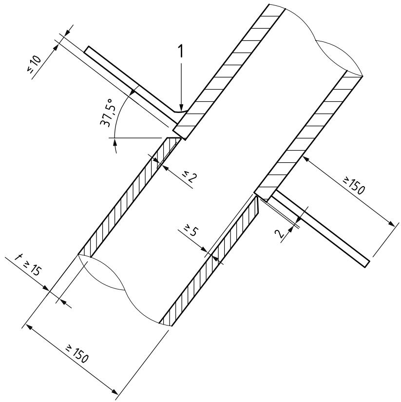  
Figure A.20.2-1 — Welder test piece for single-sided welds

Key

1 disk tack weld

## A.20.2.3.3 Production weld joint details

Examples of weld details for tubular T-,Y- and K-joints welded by shielded metal arc welding (SMAW, also commonly referred to as “stick welding”) are shown in Figure A20.2-2 and presented in Tables A.20.2-1 and A.20.2-2. Other processes are covered in References [A.20.2-1], [A.20.2-2] and [A.20.2-3].

Table A.20.2-1 — Root gap requirements for tubular joints - shielded metal arc welding   


| Groove angle, B | Root opening, g mm |
| --- | --- |
| Over 90° | 0 to 4,8 |
| 45° to 90° | 1,6 to 4,8 |
| Under 45° | 3,2 to 6,4 |


Table A.20.2-2 — Minimum weld thicknesses for tubular joints - shielded metal arc welding   


| Weld angle, a | Weld thickness, tw |
| --- | --- |
| Over 135° | To continue line of brace/stub, except that tw need not exceed 1,75 tSmooth profile required between brace/weld/chord |
| 50° to 135° | 1,25 t |
| 35° to 50° | 1,50 t |
| Under 35° | 1,75 t |


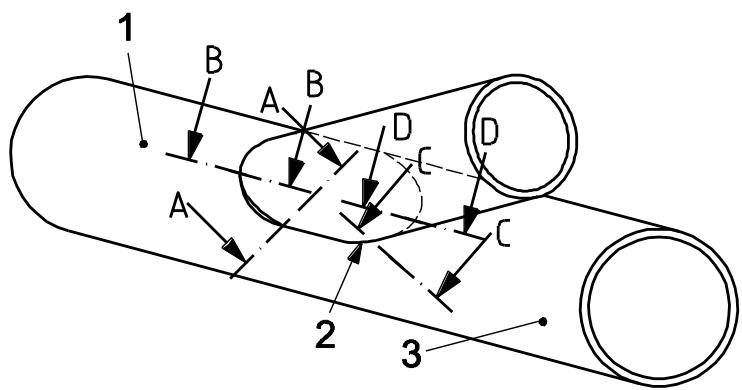

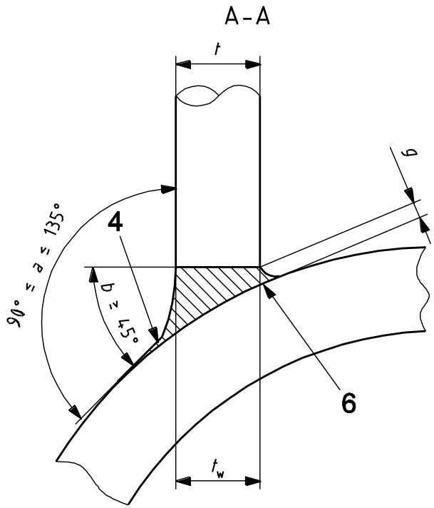

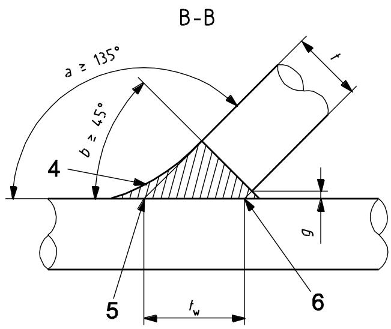

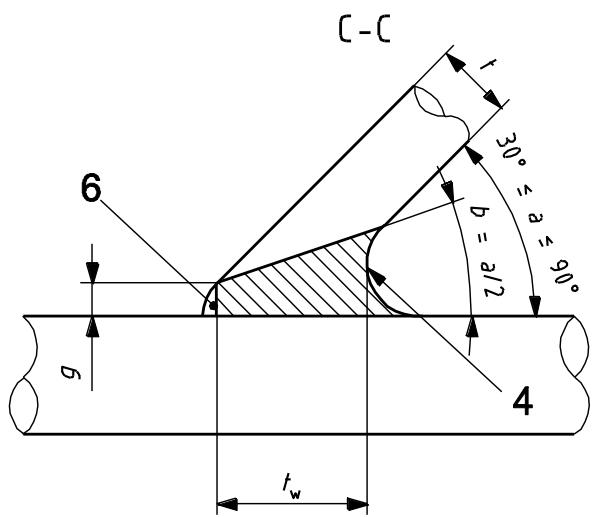

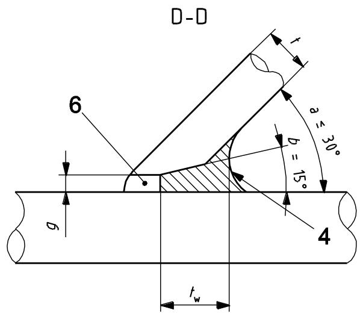

Key

1 chord
2 joint intersection and weld line   
3 chord
4 smooth profile between brace/weld/chord   
5 build out to fit thickness, but $t_{ \mathrm{ w } }$ need not exceed 1,75 t   
6 weld root not subject to inspection beyond required $t_{ \mathrm{ w } }$   
a local dihedral angle formed by exterior surfaces of brace and chord at point being considered   
b groove angle formed by brace weld preparation and chord at point being considered   
g root gap, see Table A.20.2-1   
t brace or stub thickness   
$t_{ \mathrm{ w } }$ weld thickness, see Table A.20.2-2

Figure A.20.2-2 — Welded tubular joints – shielded metal arc (stick) welding

A.20.3 Inspection

In some cases, it is not necessary to undertake 100 % inspection with all methods. The requirements given in Annexes E and F allow for inspection of a proportion of the length of the welds of certain types and for certain categories or classes of structure. The reduced extent of inspection is dependent on the welds being of good quality; consequently, if the defect identification is too high, the extent of inspection should be increased as described in this subclause.

The defect rate is calculated from:

$$\text{d e f e c t r a t e} = \frac{\text{s u m o f l e n g t h o f d e f e c t s i d e n t i f i e d b y m e t h o d}}{\text{t o t a l w e l d l e n g t h i n s p e c t e d b y m e t h o d}} \tag{A.20.3-1}$$

The extent of NDT should be increased as follows:

— defect rate exceeds 5 % — proportion of welds inspected should be doubled, spot inspection proportion should increase to 20 %;   
— defect rate exceeds 5 % for increased proportional inspection — proportion of welds inspected should increase to 100 %;   
— defect rate exceeds 10 % — proportion of welds inspected should increase to 100 %.

The required level of increased extent should be maintained until a defect rate below 5 % is reestablished and documented.

A.20.4 Fabrication

No guidance is offered.

## A.21 Quality assurance, quality control and documentation

A.21.1 General

Exposure level L1 structures have the most severe failure consequences and hence the most stringent inspection and documentation requirements.

In selecting the inspection category, welds in joints more than 150 m below the water surface should be assumed inaccessible for in-service inspection by divers. Accessibility for inspection at greater depths may be considered if the use of ROV assisted methods (e.g. visual, wet MPI, or flooded member detection) is planned.

When only partial testing is required for welds in an area, the weld testing should be distributed such that the most essential members and nodes are included in the inspection and such that areas of welds most susceptible to weld defects are examined.

A.21.2 Quality management system

Conformance and/or accreditation to a formalized quality management system is preferred, e.g. ISO 9001 [2] and ISO 9004 [3], ISO/TS 29001 [8], API Q1 [A.21.2-1], or similar recognized standards.

The requirements of Table 21.2-1 should be considered even when formalized QMS documentation is not required.

A.21.3 Quality control plan

## A.21.3.1 General

Proactive QC by the contractor is different from after-the-fact QA inspection, testing and documentation, which is normally conducted by the owner or by a 3rd party.

The use of “negative reporting” systems for QC inspection, whereby a formal report is only raised when a defect is found, may be considered, subject to the contractor furnishing evidence of appropriate procedures controlling such systems to the owner’s satisfaction. Available logs, markings or other records for both positive and negative QC inspection outcomes should be retained, at least temporarily, in any case.

Further considerations for the QC plan are presented in A.21.3.2 to A.21.3.6.

## A.21.3.2 Inspector qualifications

Inspectors should be knowledgeable in the general areas of welding technology, inspection and testing procedures, as well as in construction methods for those areas of their responsibility during fabrication. They should know how and where to look for problems and situations which lead to problems, as well as the practical limitations on making repairs.

Suitable standards for the qualification of inspectors include:

— AWS QC 1 [A.21.3-1]:   
— CSA W178.2 [A.21.3-2];   
— CSWIP [A.21.3-3];

— BGAS CSWIP [A.21.3-4];   
— PCN [A.21.3-5].

Other standards may be agreed upon between owner, contractors and regulators.

## A.21.3.3 NDT personnel qualifications

All NDT personnel should have demonstrated ability and experience, and should preferably be qualified to an internationally recognized offshore code or guidance. Continuing qualification should be based on satisfactory performance on the job.

Internationally recognized requirements for NDT personnel are contained in:

— CSWIP [A.21.3-3];   
— BGAS CSWIP [A.21.3-4];   
— PCN [A.21.3-5];   
— ACCP (ASNT) [A.21.3-6];   
— SNT-TC-1A (ASNT) [A.21.3-7];`, ``,,   
— ISO 9712 [A.21.3-8]., ``-`

Additionally, API RP 2X [A.21.3-9] provides specific offshore guidance.,`---

Personnel who perform other types of inspection during the fabrication of an offshore structure should demonstrate ability and experience, or be qualified to an appropriate code for the required inspections.

## A.21.3.4 Inspection of materials

Receipt of the correct material should be verified by cross-checking with appropriate original mill certificates and heat stamps, or with other appropriate documentation for non-structural material and structural materials other than steel.

## A.21.3.5 Inspection of fabrication

In general, the inspection of fabrication should confirm that each component incorporated into the structure is of the correct material, orientation, size and dimension, etc.; and is fitted, aligned, and permanently fastened according to the specified requirements. Legs and pile sleeves, through which piles are field installed, should be carefully checked for internal clearance and straightness, to ensure required tolerances have been met and, if possible, a template of the pile of nominal length should be passed through the leg or sleeve to demonstrate adequate clearance. Particular attention should be given to field joints (such as the tops of structure legs), which should be checked to ensure all dimensions are within tolerance.

## A.21.3.6 Inspection of welding

Inspection and testing of welding should be performed during all phases of fabrication, with an aim to preventing introduction of defects into the weld. To the maximum extent possible, inspection and testing should be performed as construction progresses and be scheduled so as not to delay the progress of the

job. All weld fit-ups (joint preparation prior to welding) should be visually inspected to ensure acceptable tolerances before welding.

It should be verified that the welder or welding operator is currently qualified for the procedure being used and that the appropriate qualified procedure is being followed. In addition, inspection should ensure that appropriate consumables are being used and that the consumables are being stored, handled and used in accordance with the manufacturer's recommendations and other appropriate requirements.

A.21.4 Documentation

## A.21.4.1 General

In addition to document preservation, document control should have an information flow from contractors to owners, and vice versa, and be able to track and distribute revisions and drawing issuances in a timely manner.

Document retention for the life of the structure is generally the responsibility of the owner. Permanent records should not be put into a “destroy after X years” system.

The following considerations apply only where indicated in Table 21.7-1.

a) Weight and centre of gravity reports

The contractor should prepare a weight and centre of gravity report for each structure. Weights should be based on design, shop or as-built drawings as the job progresses. Guidance on weight control is given in ISO 19901-5 [6].

b) Dimensional control documentation

Prior to and during fabrication, documentation should be prepared on the dimensions and compliance of components and of assemblies.

c) Materials and fabrication inspection

During the fabrication phase, material inspection documentation covering the mill certificates and material identification records (as described in Clause 19), as well as any additional materials, testing or special inspections which were conducted and which reflect on the final condition of the structure, should be prepared and compiled. This need not include documentation for inspection related to the assembly of the structure.

d) Weld inspection

A set of structural drawings should be marked with an appropriate identification system detailing the,,,`-- location of each weld to be examined and referenced as an integral part of the inspection record. All-``,` welds should be uniquely identified and be traceable during fabrication to the individual welder or,,,`` welding operator. A report should be prepared for each NDT performed (other than visual), the details,,,,`, of which should be documented sufficiently to permit repetition of the examination at a later date. ,,``,` Sketches and drawings incorporating the weld identification system should be used to augment --` descriptions of the part and locations of all discontinuities required to be reported. Forms should be provided to show the required details of documentation, and sketches of typical weld configurations should also be provided to clarify the written description. Discontinuities required to be reported should be identified on sketches by the appropriate weld number and position.

e) Other inspection

Inspection of all non-structural systems and tests should be documented to confirm details of the inspection and results. Any deviations from the specified requirements should be properly recorded, including sketches if necessary.

## A.21.4.2 Calculations

No guidance is offered.

## A.21.4.3 Weight and centre of gravity reports

No guidance is offered.

## A.21.4.4 Fabrication inspection documentation

No guidance is offered.

A.21.5 Drawings and specifications

## A.21.5.1 General

Drawings should be prepared using consistent units.

For use in connection with fixed offshore structures and related facilities, the drawings and specifications are defined as described in A.21.5.2 to A.21.5.8.

## A.21.5.2 Conceptual drawings

Conceptual drawings are intended to supply a general idea of the facility under consideration. These drawings should include preliminary layouts and elevation views of the overall facility showing the number, type of construction and approximate size of each platform, as well as the more important auxiliary features, such as heliports and boat landings.

Simplified process or mechanical flow diagrams and electrical one-line diagrams should be included for all production or utility systems. A generalized equipment layout drawing should be included, which also indicates buildings, storage of supplies, etc.

All information that contributes to clarifying the overall intent of the facility should be shown. Specifications are not generally required. However, if included, they should be of a general descriptive nature, so as to supplement the drawings in adequately describing the facility.

## A.21.5.3 Bid drawings and specifications

Bid drawings are intended to show the total facility with its configuration and dimensions in sufficient detail to accurately define the scope of the project. With supplemental specifications, bid drawings are suitable for generally defining the scope of the proposal, or suitable to be furnished by the owner to a contractor when requesting a quotation in which the design is to be part of the contractor's bid. In the latter case, all essential information needed by the designer should be included.

Bid structural drawings should show major overall dimensions, deck arrangements, operational loading requirements and any preferred type of construction and materials. Structural details and member sizes are not necessarily furnished, since these are considered “design” drawings. All auxiliary items which are to be included in the bid, such as boat landings, barge bumpers, stairs, walkways, fence and handrail,

should be shown on these drawings. Typical preferred construction details of these items also should be included.

Equipment layout drawings should be included for all decks. Sufficiently detailed process, mechanical and utility flow diagrams and electrical one-line diagrams should be included for all systems which are covered by the bid.

Specifications for equipment, machinery and other engineered components should include an itemized list and description of all items not shown in the drawings, but which are to be included in the bid — even such items as lighting and cathodic protection. Specifications for materials and fabrication should include all types of material allowed for use and any particular requirements for dimensional tolerances, inspection, testing and welding.

## A.21.5.4 Design drawings and specifications

Design drawings give descriptive information about the major components of the facility. Emphasis in these drawings is placed on overall layouts and definition of critical items, supplemented by essential details. They should indicate all appurtenances and should include all dimensions where strict adherence is required.

Design drawings should include a layout of the location and orientation of the structure or structures in the field, as well as the location of equipment on the decks of each structure. Structural drawings showing member sizes of all major structural members and all controlling dimensions should be included. General locations and preliminary or typical details of miscellaneous structural items, such as joints, cover plates and web plate stiffeners, should be indicated. In addition, any other typical structural details which are not normally standard to this type of construction should be included.

Design drawings should also include all items necessary for installation purposes, such as lifting eyes and launch frames, which are critical to the design of the structure.

Mechanical and utility flow diagrams showing sizes of all equipment, piping and valves, and electrical line diagrams showing rating and sizes of feeders and controls, should be included. Equipment layout drawings of all equipment shown on the flow diagrams or one-line diagrams, manifolds and major instrumentation items, such as large control valves, meter runs, control valve stations and control panels, should be shown. Piping plan and elevation drawings should show major piping only and indicate adequate space reserved for minor piping and for conduit and cable runs.

Design drawings should be supplemented by all specifications necessary to convey the intent of the design. Standard specifications for material and fabrication, which are referred to in this document, can be properly referenced on appropriate drawings. However, any deviations from these specifications should be detailed. Specifications should be included for equipment, machinery and other engineered items.

Design drawings and specifications are often used as part of the solicitation package, or as part of the contract document. As such, they should be sufficiently detailed and suitable for furnishing by the owner to the contractor to be used for making accurate material take-offs for bidding purposes when no design is required on the part of the contractor, or suitable for submittal by the contractor to the owner to completely define the proposal. When design drawings are used for bid or contract purposes, all auxiliary items, such as stairs, boat landings and walkways, should be shown in sufficient detail for estimating purposes.

## A.21.5.5 Fabrication drawings and specifications

Fabrication drawings are intended to supply sufficient information that fabrication can be performed directly from these drawings. They should contain all design data fully detailed and dimensioned. At the fabricator's option, they may be supplemented by shop drawings.

A set of fabrication drawings includes completely detailed design drawings with descriptions, exact locations, sizes, thicknesses and dimensions of all structural members and stiffeners. This information should also be shown for all structural items, such as brackets, stiffeners and cover plates, and for all auxiliary items, such as stairs, walkways, fence and handrail. Connections and joints should be completely detailed, including welding symbols, unless standard procedures apply. Methods of attaching timber, grating and plate should be included.

In addition to complete piping plan and elevation drawings, a set of fabrication drawings should include piping isometric drawings and details for all pipe supports, if required by the complexity of the facility. Instrumentation location plans and supports, electrical location diagrams showing general routing, and wire and cable tie-ins to electrical equipment should be included.

Fabrication drawings should clearly indicate the components or “packages” scheduled for assembly as units in the fabrication yard. Welds and connections to be performed in the field should be indicated.

Detailed specifications should be included for all work to be done by the fabricator, such as welding, fabrication and testing, and for all materials, equipment or machinery to be purchased by the fabricator. However, for standard specifications covered under the recommendations of this document, copies need not be furnished, provided reference is made on key drawings. Specifications for equipment and other engineered items not purchased by the fabricator may also be included with fabrication drawings, for general information.

## A.21.5.6 Shop drawings

Shop drawings or sketches are prepared by or for the fabricator, at his option, to facilitate the fabrication of parts and/or components of the structure. They are intended to provide all information and instructions needed for that purpose. Due to differences in methods and procedures of various fabricators, shop drawings can vary in appearance.

Shop drawings can include typical shop details to supplement details and dimensions shown on either fabrication drawings or patterns for coping the ends of members, detailed piece marked drawings for each member and pipe spool drawings.

Shop drawings are the responsibility of the fabricator. Approval or review of shop drawings by the designer or owner should not relieve the fabricator of his responsibility to complete the work in accordance with the contract or fabrication drawings and specifications.

## A.21.5.7 Installation drawings and specifications

Installation drawings furnish all pertinent information necessary for the construction of the total facility on location at sea. They contain relevant information not included on fabrication drawings.

If special procedures are required, a set of installation drawings can include installation sequence drawings. Details of all installation aids, such as lifting eyes, launch rails or frames, jacking brackets and stabbing points, should be included, if not shown on fabrication drawings. For structures installed by flotation or launching, drawings showing launching, upending and flotation procedures should be provided. Details should also be provided for piping, valving and controls of the flotation system, closure plates, etc.

Erection of temporary struts or supports should be indicated. All rigging, cables, hoses, etc. that are to be installed prior to loadout should be detailed. Vessel arrangement, loadout and tie-down details should be provided.

Installation drawings are intended to be used in connection with fabrication drawings. They should be supplemented by detailed installation specifications, installation procedures or special instructions, as required, to provide all information required to complete the field installation.

## A.21.5.8 As-built drawings and specifications

As-built drawings show in detail the manner in which the structure was actually constructed. These drawings are usually made by revising the original fabrication drawings, supplemented by additional drawings, if necessary. As-built drawings are intended to reflect all changes, additions, corrections or revisions made during the course of construction. They are prepared for use by the owner to provide information related to the operation, servicing, maintenance and future expansion of the facility.

When the preparation of as-built drawings has been authorized by the owner, it is the responsibility of the fabricator and the field erector to furnish to the owner or to the designer adequate information regarding all variations between the drawings and the facility as actually constructed. This is usually furnished as corrections from the yard, the shop and the field, marked on prints of the original drawings or by supplementary sketches, if required. This information should be sufficiently complete that the owner or the designer can correct and revise the original drawings without additional data or field measurements. Since the fabricator and erector are responsible for the accuracy of the corrections, a review and/or approval of the corrected drawings should be made by both the fabricator and the erector.

Minor deviations from the original drawings are generally numerous. Differences between the actual dimensions and those shown on the drawings need not be reported if they are within the specified allowable tolerances.

Specifications should also be corrected to reflect any changes made during the purchase of material, equipment, or machinery.

## A.22 Loadout, transportation and installation

A.22.1 General

No guidance is offered.

A.22.2 Loadout and transportation

No guidance is offered.

A.22.3 Transfer of the structure from the transport vessel into the water

No guidance is offered.

A.22.4 Placement on the sea floor and assembly of the structure

No guidance is offered.

A.22.5 Pile installation

Detailed guidance is provided in ISO 19901-4.

A.22.6 Installation of conductors

No guidance is offered.

A.22.7 Topsides installation

No guidance is offered.

A.22.8 Grounding of installation welding equipment

No guidance is offered.

Annex B (normative)

Weld CTOD testing procedures

## B.1 Testing procedure requirements

When required by 20.2.2.5, CTOD testing shall be conducted for weldments in accordance with ISO 15653 and for base metal in accordance with the CTOD-related clauses of ISO 12135. Weld specimens shall be representative of both the highest heat input/interpass temperature and the lowest heat input/interpass temperature for each welding procedure to be qualified.

For welding of cast/forged steels, the requirements of this annex shall be complied with based on the specimen geometry as shown in Figure B.1.

CTOD testing shall be conducted at the LAST.

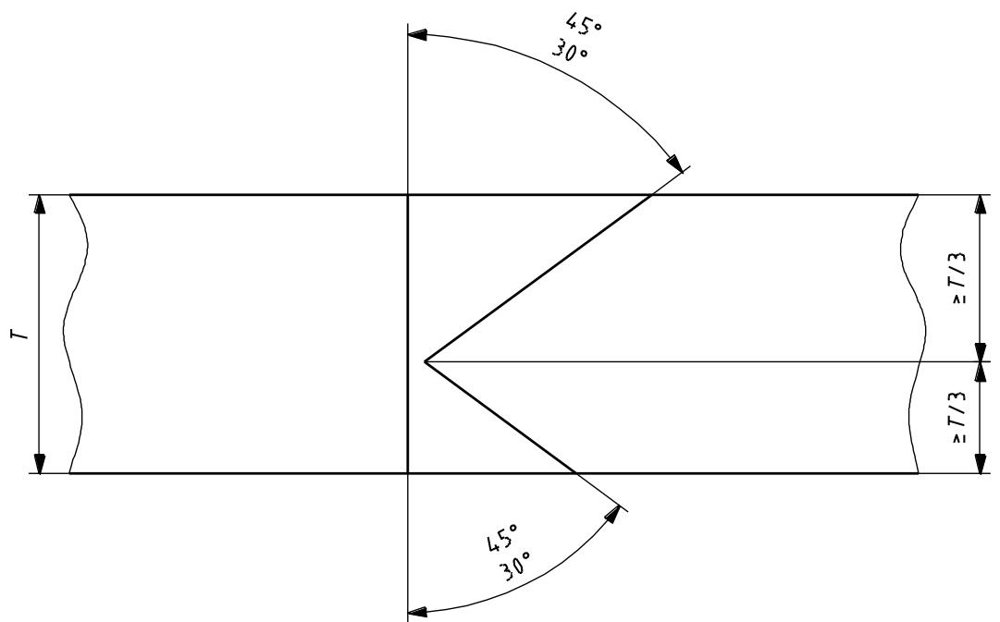  
a) Weld preparation

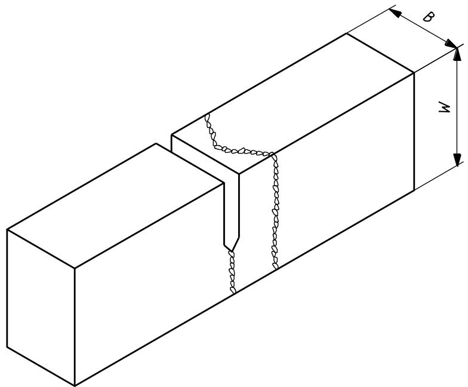  
Figure B.1 — TP specimen preparation

b) CTOD specimen

Key

B specimen thickness T plate thickness W specimen width

NOTE See B.4.

## B.2 Test-assembly welding

The test assembly shall be prepared as shown in Figure B.1. The square bevel shall be machined as square as is possible. In addition, the following requirements apply:

a) Back-gouging shall be carefully controlled, gouging into the square bevel shall be avoided. Careful grinding shall be used to achieve the final groove profile.   
b) Surfaces shall be machined to obtain as large a thickness of the test specimen, B, as is practical for the test weld.   
c) Mechanized welds in the 1G position may be made with the test plate assembly rotated 15° to 20° about the weld axis so that the angle of attack between the electrode and the edge preparation, the degree of weld bead overlap and the clearance between the electrode tip and the edge preparation simulate the production welding arrangement. Temporary flux dams may be attached for SAW. For welding the cap passes, the test plate assembly may be restored to its flat position.

## B.3 Number and location of CTOD specimens

CTOD specimens shall be located within the weld metal (and the HAZ if required) such that the notch positions are in accordance with Figure B.2.

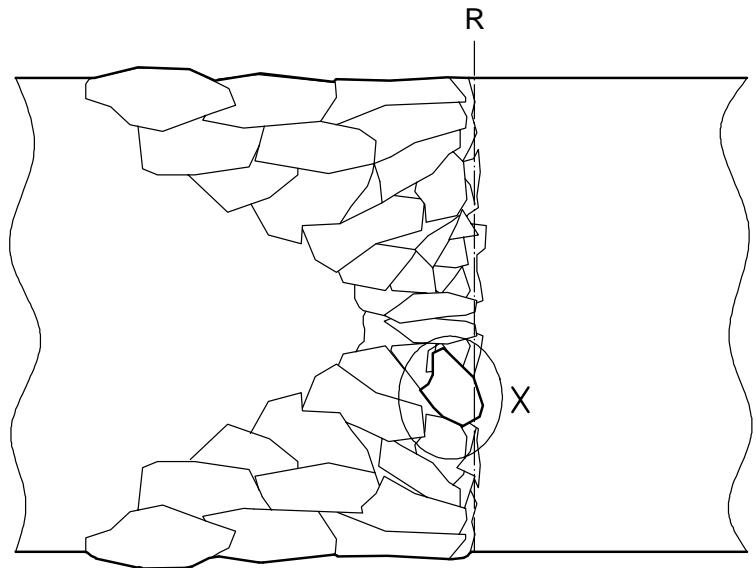

Figure B.2 — Notch locations for CTOD specimens   
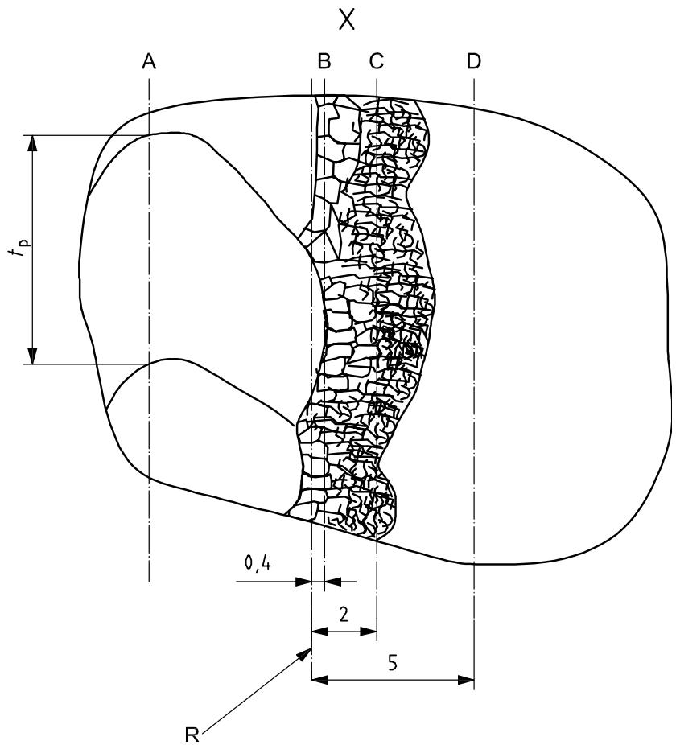  
Key   
A centre line of thickest weld pass   
B fusion line + 0,4 mm — coarse grain HAZ   
C HAZ + 2 mm — fine grain HAZ

D HAZ + 5 mm — sub-critically reheated base metal

tp thickness of thickest weld pass in middle 2/3 of weldment

R reference line, see B.4 c)

NOTE See B.4.

Three valid weld metal specimens from the highest heat input/interpass temperature and three valid specimens from the lowest heat input/interpass temperature to be qualified shall be obtained for each welding procedure.

When the pre-production steel qualification requirements of 20.2.2.5.2 have not been met, the HAZ specimens shall be obtained from the highest heat input/interpass temperature and from the lowest heat input/interpass temperature. Three specimens shall be prepared from each of the cross-sections B, C and D shown in Figure B.2.

The “cross-section B” specimens with the lowest CTOD values from each of the high and low heat input sets shall be sectioned as shown in Figure B.3, to characterize the fracture initiation site.

Figure B.3 — CTOD specimen sectioning and examination   
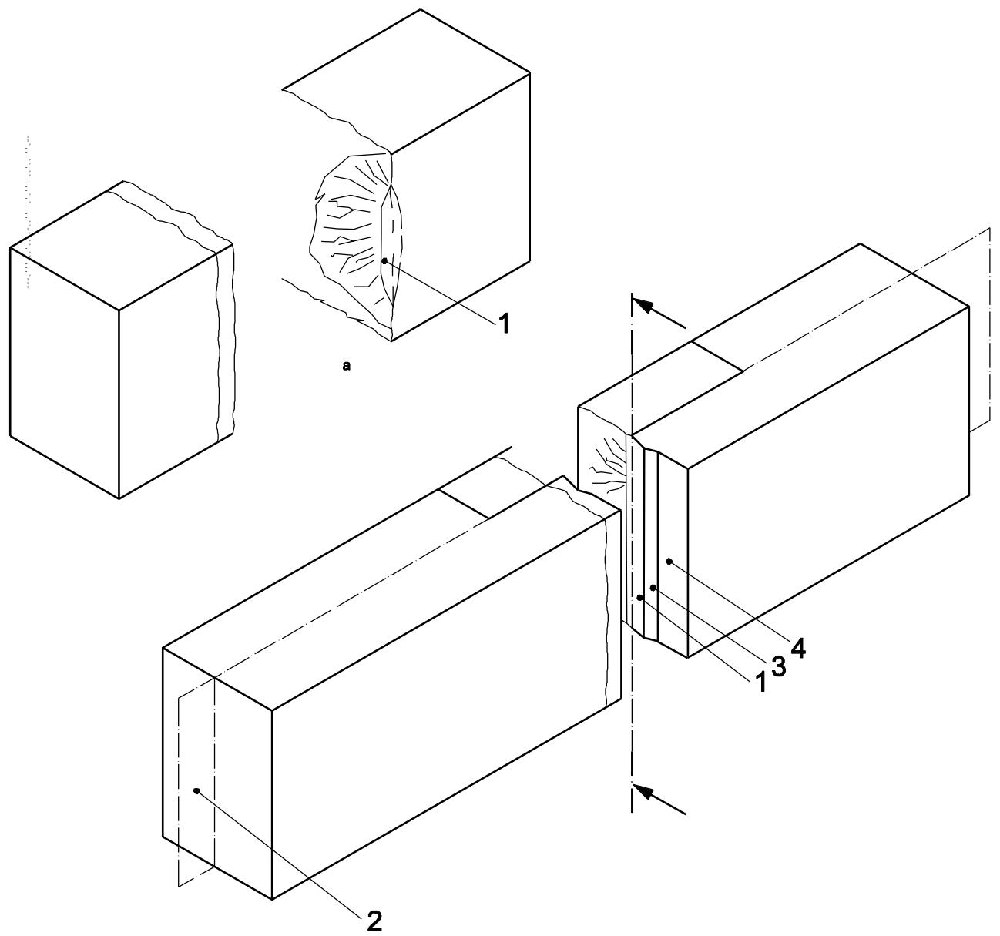  
Remove a full-thickness section from each side of the fracture. Polish and etch on the plane of examination. Examine fracture features in relation to the weld beads and other artefacts.

Key

1 fatigue crack front

4 machined notch

2 plane through specimen

a Plane of examination.

3 saw cut

## B.4 Specimen preparation

The specimen shall be prepared as follows:

— for plate thickness T < 75 mm, the specimen width shall be W = 2 B; for T > 75 mm, W = B, where T, W and B have the meaning shown in Figure B.1;   
— the machined groove, saw cut or electron discharge machine (EDM) notch, and fatigue cracking shall comply with the selected CTOD test procedure.

The procedure for determining notch locations is shown in Figure B.2 and is as follows:

a) locate the thickest pass that is both in the central 2/3 of the specimen thickness and immediately adjacent to the non-bevelled side of the weld;   
b) locate line A (centre line) which lies through the centre of this pass;   
c) locate the reference line R, perpendicular to the specimen surface and dividing the fusion line such that over the middle 80 % of the specimen width, equal portions of the fusion line are to each side of the reference line;   
d) locate lines B (fusion line + 0,4 mm), C (HAZ + 2 mm), and D (HAZ + 5 mm), at 0,4 mm, 2 mm, and 5 mm from the reference line.

Surface-notched subsidiary-geometry specimens with B = W shall be used for repair weld tests unless the repair weld consumable has been qualified by CTOD testing of a full penetration butt weld made using the same welding parameters in the same position.

## B.5 Pre-compression

For specimens in the as-welded condition, a pre-compression dimple shall be applied to both sides of the specimen at the tip of the machined notch. The depth of the dimple shall not exceed 0,5 % strain per side (i.e. 0,01 B total). After the first series of specimens have been tested, this amount may be reduced to achieve a more uniform fatigue pre crack front. The dimple shall be made with hardened indenters with a minimum diameter of 19 mm. Multiple overlapping indentations may be used. The location of the dimple may overlap the machined notch. However, it shall be at least 6,4 mm from the side of the specimen opposite from the machined notch (to prevent distorting the back surface).

## B.6 Sectioning

Specimen sectioning and examination shall be in accordance with Figure B.3.

Annex C

(informative)

Material category approach

## C.1 Selection of material category (MC)

The responsibility for selecting an appropriate material category for the structure belongs to the owner. This decision can be based on the following guidelines:

— MC1 — This category is generally used for exposure level L1 structures. It was modelled on advanced fracture control methods used for world-record fixed platforms and compliant towers.   
— MC2 — This category is generally used for exposure level L2 structures. It was modelled on common practices for major structures in moderate water depths.   
— MC3 — This category is generally used for exposure level L3 structures. It was modelled on common practices for minor platforms in shallow water.

## C.2 Strength group

Steel is grouped according to its SMYS, as shown in Table 19.5-1.

## C.3 Selection of toughness class

The required toughness class is determined from Table C.1, based on:

— the type of component;   
— the MC of the structure;   
— the steel group, where the required specific SMYS has previously been determined, along with thickness, by design analysis and calculation.

Table C.1 — Material category – material selection for the structure   


| Component location in the structure | Component location in the structure | SMYS group e | Toughness class | Toughness class | Toughness class |
| --- | --- | --- | --- | --- | --- |
| Component location in the structure | Component location in the structure | SMYS group e | MC1 | MC2 | MC3 |
| Chord cans a | Up to 50 mm thick | II | CV2Z | CV2Z | CV2 b |
| Chord cans a | Up to 50 mm thick | III | CV2Z | CV2Z | - |
| Chord cans a | Greater than 50 mm thick | II | CV2ZX | CV2Z c | CV2 b |
| Chord cans a | Greater than 50 mm thick | III | CV2ZX | CV2ZX | - |
| Bracing | Primary d | I | NT | NT | NT |
| Bracing | Primary d | II | CV2 or CV1 | CV1 | - |
| Bracing | Primary d | III | CV2 | - | - |
| Bracing | Secondary | I | NT | NT | NT |
| Bracing | Brace end stubs at nodes | I | CV2 | - | - |
| Bracing | Brace end stubs at nodes | II | CV2 | - | - |
| Legs | Launch legs | I | - | - | NT |
| Legs | Launch legs | II | CV2 | CV2 or CV1 | - |
| Legs | Launch legs | III | CV2 | - | - |
| Legs | Launch rail | I | - | - | NT |
| Legs | Launch rail | II | CV2 | CV1 | - |
| Legs | Launch rail | III | CV2 | - | - |
| Legs | Legs elsewhere | I | CV1 | CV1 or NT | NT |
| Legs | Legs elsewhere | II | CV2 or CV1 | CV1 | - |
| Legs | Legs elsewhere | III | CV2 | - | - |
| Stiffeners | At nodes | II | CV2 | CV2 | CV2 |
| Stiffeners | Elsewhere | I | NT | NT | NT |
| Stiffeners | Elsewhere | II | CV1 | NT | - |
| Piling | Heavy wall at sea floor | II | CV2 | CV2 or CV1 | CV1 |
| Piling | Elsewhere | I | NT | NT | NT |
| Piling | Elsewhere | II | CV1 | - | - |
| Piling | Compliant tower | III | CV2 | N/A | N/A |
| Padeyes | Major lifts, padeye 50 mm thick or less | II | CV2Z | CV2Z | CV2Z |
| Padeyes | Major lifts, padeye 50 mm thick or less | III | CV2Z | CV2Z | - |
| Padeyes | Major lifts, padeye greater than 50 mm thick | II | CV2ZX | CV2Z c | CV2Z |
| Padeyes | Major lifts, padeye greater than 50 mm thick | III | CV2ZX | CV2Z c | - |
| Miscellaneous | Conductor panels | I | NT | NT | NT |
| Miscellaneous | Boat landings, walkways | I | NT | NT | NT |
| — indicates that this combination is not normally used N/A not applicable a Includes chord cans in legs and in primary bracing. b Specify steel with a low sulphur content, below 0,006 %. c Consider CV2ZX for chord cans and plating greater than 75 mm thick. d A higher toughness class is recommended for thicker primary bracing, especially in areas subject to collisions. e SMYS groups IV and V have had limited historical use, and are therefore omitted from this table. Selection of toughness class is left to the designer. | — indicates that this combination is not normally used N/A not applicable a Includes chord cans in legs and in primary bracing. b Specify steel with a low sulphur content, below 0,006 %. c Consider CV2ZX for chord cans and plating greater than 75 mm thick. d A higher toughness class is recommended for thicker primary bracing, especially in areas subject to collisions. e SMYS groups IV and V have had limited historical use, and are therefore omitted from this table. Selection of toughness class is left to the designer. | — indicates that this combination is not normally used N/A not applicable a Includes chord cans in legs and in primary bracing. b Specify steel with a low sulphur content, below 0,006 %. c Consider CV2ZX for chord cans and plating greater than 75 mm thick. d A higher toughness class is recommended for thicker primary bracing, especially in areas subject to collisions. e SMYS groups IV and V have had limited historical use, and are therefore omitted from this table. Selection of toughness class is left to the designer. | — indicates that this combination is not normally used N/A not applicable a Includes chord cans in legs and in primary bracing. b Specify steel with a low sulphur content, below 0,006 %. c Consider CV2ZX for chord cans and plating greater than 75 mm thick. d A higher toughness class is recommended for thicker primary bracing, especially in areas subject to collisions. e SMYS groups IV and V have had limited historical use, and are therefore omitted from this table. Selection of toughness class is left to the designer. | — indicates that this combination is not normally used N/A not applicable a Includes chord cans in legs and in primary bracing. b Specify steel with a low sulphur content, below 0,006 %. c Consider CV2ZX for chord cans and plating greater than 75 mm thick. d A higher toughness class is recommended for thicker primary bracing, especially in areas subject to collisions. e SMYS groups IV and V have had limited historical use, and are therefore omitted from this table. Selection of toughness class is left to the designer. | — indicates that this combination is not normally used N/A not applicable a Includes chord cans in legs and in primary bracing. b Specify steel with a low sulphur content, below 0,006 %. c Consider CV2ZX for chord cans and plating greater than 75 mm thick. d A higher toughness class is recommended for thicker primary bracing, especially in areas subject to collisions. e SMYS groups IV and V have had limited historical use, and are therefore omitted from this table. Selection of toughness class is left to the designer. |


## C.4 Specific steel selection

Specific material selection shall be shown in design drawings and specifications.

The strength groups and toughness classes are used to reference welding requirements, e.g. preheat and electrode selection, where these tend to follow the steel. Plates, sections and rolled tubular sections--` specified by the designer should conform to a recognized specification. Supplementary specifications can ,``,` be required for steel used to fabricate items intended for particularly arduous duty or where recognized,,`,` steel grades are used in a thickness that is above the stated limits.,,``-

Table C.2 shows a correlation of steel group and toughness class for steel plates to US specifications. ,,,`-- Tables C.3 and C.4 do the same for wide flange and tubular members. Steels that are not included in the lists given in C.1 and C.2 may be used provided they satisfy the provisions of Clauses 19 and 20, with particular attention to weldability (see also A.19.2.2.5).

Table C.2 — Correlation of steel group and toughness class for steel plates to US specifications   


| Steel group | Toughness class | Specification | Grade | Thickness mm | SMYS MPa | Comments and recommended supplements a, b, c |
| --- | --- | --- | --- | --- | --- | --- |
| I | NT | ASTM A36 [C.1] |  | ≤ 50 | 250 | a |
| I | NT | ASTM A131 [C.2] | A | ≤ 12 | 235 |  |
| I | CV1 | ASTM A131 [C.2] | B, D |  | 235 |  |
| I | CV1 | ASTM A516 [C.3] | 65 | ≤ 37 | 240 | a, b |
| I | CV1 | ASTM A573 [C.4] | 65 |  | 240 | a, c |
| I | CV1 | ASTM A709 [C.5] | 36T Zone 2 |  | 250 | a (PCE ≤ 0,40), b (per A709 supplement S83) |
| I | CV2 | ASTM A131 [C.2] | E |  | 235 | b (per A131 supplement S86), c |
| II | NT | ASTM A572 [C.6] | 42 | ≤ 50 | 290 | a (PCE ≤ 0,43), PV ≤ 0,10 |
| II | NT | ASTM A572 [C.6] | 50 | ≤ 50 | 345 | a PV ≤ 0,10 |
| II | CV1 | API Spec 2MT1 [C.7] |  |  | 345 |  |
| II | CV1 | ASTM A709 [C.5] | 50T Zone 2 |  | 345 | Gulf of Mexico: a, b (per A709 supplement S83) |
| II | CV1 | ASTM A709 [C.5] | 50F Zone 3 |  | 345 | Cold, non-Arctic: a, b (per A709 supplement S84) |
| II | CV1 | ASTM A131 [C.2] | AH32 |  | 315 | Option A131 supplement S87Normalize T > 19 mm |
| II | CV2 | API Spec 2H [C.8] | 42 |  | 290 | c |
| II | CV2 | API Spec 2H [C.8] | 50 | ≤ 65 | 345 | c |
| II | CV2 | API Spec 2H [C.8] | 50 | > 65 | 325 | c |
| II | CV2 | API Spec 2W [C.9] | 50 |  | 345 |  |
| II | CV2 | API Spec 2Y [C.10] | 50 |  | 345 |  |
| II | CV2 | ASTM A131 [C.2] | DH36, EH36 |  | 355 | b (per A131 supplement S86), c |
| II | CV2 | ASTM A537 [C.11] | Class 1 | ≤ 65 | 345 | a, b, c |
| II | CV2 | ASTM A633 [C.12] | A |  | 290 | a, b, c |
| II | CV2 | ASTM A633 [C.12] | C, D |  | 345 | a, b, c |
| II | CV2 | ASTM A678 [C.13] | A |  | 345 | a, b, c |
| III | CV2 | API Spec 2W [C.9] | 60 |  | 415 |  |
| III | CV2 | API Spec 2Y [C.10] | 60 |  | 415 |  |
| III | CV2 | ASTM A537 [C.11] | Class 2 | ≤ 65 | 415 | a, b, c |
| III | CV2 | ASTM A678 [C.13] | B |  | 415 | a, b, c |
| IV | CV1 | ASTM A709 [C.5] | HPS70WF | ≤ 65 | 485 | a, b (per A709 supplement S84) |
| a PCE ≤ 0,45 unless noted otherwise; for pressure vessel steels, see ASTM A20 [C.15] supplement S20. | a PCE ≤ 0,45 unless noted otherwise; for pressure vessel steels, see ASTM A20 [C.15] supplement S20. | a PCE ≤ 0,45 unless noted otherwise; for pressure vessel steels, see ASTM A20 [C.15] supplement S20. | a PCE ≤ 0,45 unless noted otherwise; for pressure vessel steels, see ASTM A20 [C.15] supplement S20. | a PCE ≤ 0,45 unless noted otherwise; for pressure vessel steels, see ASTM A20 [C.15] supplement S20. | a PCE ≤ 0,45 unless noted otherwise; for pressure vessel steels, see ASTM A20 [C.15] supplement S20. | a PCE ≤ 0,45 unless noted otherwise; for pressure vessel steels, see ASTM A20 [C.15] supplement S20. |
| b Charpy V-notch testing per ASTM A6 [C.14] or A20 [C.15] supplement S5, frequency H. For plate testing, use transverse Charpy specimens. Unless noted otherwise in steel specification, absorbed energy requirement should be as stated in Table 19.5-2. | b Charpy V-notch testing per ASTM A6 [C.14] or A20 [C.15] supplement S5, frequency H. For plate testing, use transverse Charpy specimens. Unless noted otherwise in steel specification, absorbed energy requirement should be as stated in Table 19.5-2. | b Charpy V-notch testing per ASTM A6 [C.14] or A20 [C.15] supplement S5, frequency H. For plate testing, use transverse Charpy specimens. Unless noted otherwise in steel specification, absorbed energy requirement should be as stated in Table 19.5-2. | b Charpy V-notch testing per ASTM A6 [C.14] or A20 [C.15] supplement S5, frequency H. For plate testing, use transverse Charpy specimens. Unless noted otherwise in steel specification, absorbed energy requirement should be as stated in Table 19.5-2. | b Charpy V-notch testing per ASTM A6 [C.14] or A20 [C.15] supplement S5, frequency H. For plate testing, use transverse Charpy specimens. Unless noted otherwise in steel specification, absorbed energy requirement should be as stated in Table 19.5-2. | b Charpy V-notch testing per ASTM A6 [C.14] or A20 [C.15] supplement S5, frequency H. For plate testing, use transverse Charpy specimens. Unless noted otherwise in steel specification, absorbed energy requirement should be as stated in Table 19.5-2. | b Charpy V-notch testing per ASTM A6 [C.14] or A20 [C.15] supplement S5, frequency H. For plate testing, use transverse Charpy specimens. Unless noted otherwise in steel specification, absorbed energy requirement should be as stated in Table 19.5-2. |
| c For chord cans add ASTM A6 [C.14] supplement S8 (or A20 [C.15] supplement S12), ultrasonic examination to ASTM A578 [C.16] level B; and also limit PS ≤ 0.006 %. | c For chord cans add ASTM A6 [C.14] supplement S8 (or A20 [C.15] supplement S12), ultrasonic examination to ASTM A578 [C.16] level B; and also limit PS ≤ 0.006 %. | c For chord cans add ASTM A6 [C.14] supplement S8 (or A20 [C.15] supplement S12), ultrasonic examination to ASTM A578 [C.16] level B; and also limit PS ≤ 0.006 %. | c For chord cans add ASTM A6 [C.14] supplement S8 (or A20 [C.15] supplement S12), ultrasonic examination to ASTM A578 [C.16] level B; and also limit PS ≤ 0.006 %. | c For chord cans add ASTM A6 [C.14] supplement S8 (or A20 [C.15] supplement S12), ultrasonic examination to ASTM A578 [C.16] level B; and also limit PS ≤ 0.006 %. | c For chord cans add ASTM A6 [C.14] supplement S8 (or A20 [C.15] supplement S12), ultrasonic examination to ASTM A578 [C.16] level B; and also limit PS ≤ 0.006 %. | c For chord cans add ASTM A6 [C.14] supplement S8 (or A20 [C.15] supplement S12), ultrasonic examination to ASTM A578 [C.16] level B; and also limit PS ≤ 0.006 %. |
| NOTE ASTM supplement references are from 2013 book of standards, A6 [C.14] is for structural steel, A20 [C.15] for pressure vessels. | NOTE ASTM supplement references are from 2013 book of standards, A6 [C.14] is for structural steel, A20 [C.15] for pressure vessels. | NOTE ASTM supplement references are from 2013 book of standards, A6 [C.14] is for structural steel, A20 [C.15] for pressure vessels. | NOTE ASTM supplement references are from 2013 book of standards, A6 [C.14] is for structural steel, A20 [C.15] for pressure vessels. | NOTE ASTM supplement references are from 2013 book of standards, A6 [C.14] is for structural steel, A20 [C.15] for pressure vessels. | NOTE ASTM supplement references are from 2013 book of standards, A6 [C.14] is for structural steel, A20 [C.15] for pressure vessels. | NOTE ASTM supplement references are from 2013 book of standards, A6 [C.14] is for structural steel, A20 [C.15] for pressure vessels. |


Table C.3 — Correlation of steel group and toughness class for structural steel shapes to US specifications   


| Steel group | Toughness class | Specification | Grade | Thickness mm | SMYS MPa | Comments and recommended supplements a, b |
| --- | --- | --- | --- | --- | --- | --- |
| I | NT | ASTM A36 [C.1] |  | ≤ 50 | 250 | Limited availability |
| I | NT | ASTM A131 [C.2] | A | ≤ 12 | 235 | Limited availability |
| I | CV1 | ASTM A709 [C.5] | 36T Zone 2 |  | 250 | a (PCE ≤ 0,40),b (per A709 supplement S83) |
| II | NT | API 2MT2 | C |  | 345 | a (PCE ≤ 0,43), PV ≤ 0,10 |
| II | NT | ASTM A572 [C.6] | 42 | ≤ 50 | 290 | a (PCE ≤ 0,43), PV ≤ 0,10 |
| II | NT | ASTM A572 [C.6] | 50 | ≤ 50 | 345 | a PV ≤ 0,10 |
| II | NT | ASTM A992 [C.17] |  |  | 345 |  |
| II | CV1 | ASTM A709 [C.5] | 50T Zone 2 |  | 345 | Gulf of Mexico: a, b (per A709 supplement S83) |
| II | CV1 | ASTM A709 [C.5] | 50F Zone 3 |  | 345 | Cold, non-arctic: + (per A709 supplement S84) |
| II | CV1 | ASTM A131 [C.2] | AH32 |  | 315 |  |
| II | CV1 | ASTM A131 [C.2] | AH36 |  | 350 |  |
| II | CV2 | API Spec 2MT2 [C.18] | Class A |  | 345 | Cold, non-arctic |
| a ASTM A6 [C.14] supplement S74 with PCE ≤ 0,45 unless noted otherwise; for pressure vessel steels see ASTM A20 [C.15] supplement S20. b Charpy V-notch testing per ASTM A6 [C.14] or A20 [C.15] supplement S5, frequency H. Test temperatures shall be as stated or per specifications cited. Unless noted otherwise in steel specification, minimum toughness requirement should be as stated in Table 19.5-2. NOTE ASTM supplement references are from 2013 book of standards, A6 [C.14] is for structural steel, A20 [C.15] for pressure vessels. | a ASTM A6 [C.14] supplement S74 with PCE ≤ 0,45 unless noted otherwise; for pressure vessel steels see ASTM A20 [C.15] supplement S20. b Charpy V-notch testing per ASTM A6 [C.14] or A20 [C.15] supplement S5, frequency H. Test temperatures shall be as stated or per specifications cited. Unless noted otherwise in steel specification, minimum toughness requirement should be as stated in Table 19.5-2. NOTE ASTM supplement references are from 2013 book of standards, A6 [C.14] is for structural steel, A20 [C.15] for pressure vessels. | a ASTM A6 [C.14] supplement S74 with PCE ≤ 0,45 unless noted otherwise; for pressure vessel steels see ASTM A20 [C.15] supplement S20. b Charpy V-notch testing per ASTM A6 [C.14] or A20 [C.15] supplement S5, frequency H. Test temperatures shall be as stated or per specifications cited. Unless noted otherwise in steel specification, minimum toughness requirement should be as stated in Table 19.5-2. NOTE ASTM supplement references are from 2013 book of standards, A6 [C.14] is for structural steel, A20 [C.15] for pressure vessels. | a ASTM A6 [C.14] supplement S74 with PCE ≤ 0,45 unless noted otherwise; for pressure vessel steels see ASTM A20 [C.15] supplement S20. b Charpy V-notch testing per ASTM A6 [C.14] or A20 [C.15] supplement S5, frequency H. Test temperatures shall be as stated or per specifications cited. Unless noted otherwise in steel specification, minimum toughness requirement should be as stated in Table 19.5-2. NOTE ASTM supplement references are from 2013 book of standards, A6 [C.14] is for structural steel, A20 [C.15] for pressure vessels. | a ASTM A6 [C.14] supplement S74 with PCE ≤ 0,45 unless noted otherwise; for pressure vessel steels see ASTM A20 [C.15] supplement S20. b Charpy V-notch testing per ASTM A6 [C.14] or A20 [C.15] supplement S5, frequency H. Test temperatures shall be as stated or per specifications cited. Unless noted otherwise in steel specification, minimum toughness requirement should be as stated in Table 19.5-2. NOTE ASTM supplement references are from 2013 book of standards, A6 [C.14] is for structural steel, A20 [C.15] for pressure vessels. | a ASTM A6 [C.14] supplement S74 with PCE ≤ 0,45 unless noted otherwise; for pressure vessel steels see ASTM A20 [C.15] supplement S20. b Charpy V-notch testing per ASTM A6 [C.14] or A20 [C.15] supplement S5, frequency H. Test temperatures shall be as stated or per specifications cited. Unless noted otherwise in steel specification, minimum toughness requirement should be as stated in Table 19.5-2. NOTE ASTM supplement references are from 2013 book of standards, A6 [C.14] is for structural steel, A20 [C.15] for pressure vessels. | a ASTM A6 [C.14] supplement S74 with PCE ≤ 0,45 unless noted otherwise; for pressure vessel steels see ASTM A20 [C.15] supplement S20. b Charpy V-notch testing per ASTM A6 [C.14] or A20 [C.15] supplement S5, frequency H. Test temperatures shall be as stated or per specifications cited. Unless noted otherwise in steel specification, minimum toughness requirement should be as stated in Table 19.5-2. NOTE ASTM supplement references are from 2013 book of standards, A6 [C.14] is for structural steel, A20 [C.15] for pressure vessels. |


Table C.4 — Correlation of steel group and toughness class for structural steel pipe to US specifications   


| Steel group | Toughness class | Specification | Grade | SMYS MPa | Comments |
| --- | --- | --- | --- | --- | --- |
| I | NT | API Spec 5L [C.19] | B | 240 |  |
| I | NT | ASTM A53 [C.20] | B | 240 |  |
| I | NT | ASTM A106 [C.21] | B | 240 |  |
| I | NT | ASTM A135 [C.22] | B | 240 |  |
| I | NT | ASTM A139 [C.23] | B | 240 |  |
| I | NT | ASTM A500 [C.29] (round) | A | 230 |  |
| I | NT | ASTM A500 [C.29] (shaped) | A | 270 |  |
| I | NT | ASTM A530 [C.30] (round) | A | 250 |  |
| I | CV1 | ASTM A106 [C.21] | B | 240 | Normalized; Charpy at 5 °C; recheck yield strength and tensile strength after normalizing |
| I | CV2 | ASTM A333 [C.24] | 6 | 240 |  |
| I | CV2 | ASTM A334 [C.31] | 6 | 240 |  |
| II | NT | API Spec 5L | L290 | 290 |  |
| II | NT | API Spec 5L | L360 | 360 |  |
| II | NT | ASTM A500 [C.25] (round) | B | 290 |  |
| II | NT | ASTM A500 [C.25] (shaped) | B | 315 |  |
| II | NT | ASTM A1085 [C.32] | B | 345 |  |
| II | CV1 | API Spec 5L [C.19] | L360N | 360 | SR-5B Charpy requirement 40 J at -20 °C. May be normalized (N), quenched & tempered (Q), or thermomechanically formed (M) |
| In addition to the above, API Spec 2B [C.26] structural pipe made from any of the plates listed in Table C.2 may be used. | In addition to the above, API Spec 2B [C.26] structural pipe made from any of the plates listed in Table C.2 may be used. | In addition to the above, API Spec 2B [C.26] structural pipe made from any of the plates listed in Table C.2 may be used. | In addition to the above, API Spec 2B [C.26] structural pipe made from any of the plates listed in Table C.2 may be used. | In addition to the above, API Spec 2B [C.26] structural pipe made from any of the plates listed in Table C.2 may be used. | In addition to the above, API Spec 2B [C.26] structural pipe made from any of the plates listed in Table C.2 may be used. |


Annex D

(informative)

Design class approach

## D.1 General

This annex specifies the DC approach requirements for structural steel in the form of plates, rolled sections and hollow sections.

In this description of the DC approach, NORSOK N-004 [A.14.3-12], NORSOK M-120 [D.3], NORSOK M-122 [D.6] and NORSOK M-123 [D.7] are used as reference standards. Reference [D.3] is the primary standard for steel selection: it exploits EN standards References [D.1], [D.2], [D.4] and [D.5]. Alternative reference standards may be used if they can be demonstrated to be equivalent.

The steel and its relevant requirements including any applicable CVN and CTOD test temperature requirements, shall be delivered in accordance with the requirements of Reference [D.3]. Below –10 °C, additional/modified requirements to CVN and CTOD test temperatures shall be as specified in Annex F.

In general, when CTOD testing is required as part of the weldability testing in connection with qualification testing of the base material, the test temperature shall be at the LAST.

For tubulars formed from plate with a fusion welded seam, this annex only addresses the requirements of the plate material. Any seam weld shall comply with the requirements of the project fabrication, welding, inspection and NDT specification.

Cast or forged steel components are not addressed in this clause. For applications involving DC 1 and LAST ≥ –10 °C, relevant requirements can be found in References [D.6] and [D.7].

## D.2 Steel selection

Steel selection for plates and open and hollow sections can be made using EN 10025 (all parts) [D.1], EN 10225 (all parts) [D.2], EN 10210 (all parts) [D.4] and EN 10219 (all parts) [D.5], and for plates using API 2H [A.20.2-9], API 2W [A.20.2-6], and API 2Y [A.20.2-7]. The corresponding SQL can be found in Tables D.1 and D.2 for the EN standards and API specifications, respectively. In these tables, the MDS number allocated in Reference [D.3] is also listed.

Table D.1 — Correlation of DC SQL to EN Standards   


| SQL | Standard | Steel grade [see EN 10225 (all parts)] | Product type | MDS No. |
| --- | --- | --- | --- | --- |
| IV | EN 10025 (all parts) | S235JR | Plates and sections | Y01 |
| IV | EN 10210 (all parts) | S235JRH | Hot finished tubulars | Y01 |
| IV | EN 10219 (all parts) | S235JRH | Cold formed tubulars | Y01 |
| IV | EN 10025 (all parts) | S275JR | Plates and sections | Y02 |
| IV | EN 10210 (all parts) | S275J0H | Hot finished tubulars | Y02 |
| IV | EN 10219 (all parts) | S275J0H | Cold formed tubulars | Y02 |
| IV | EN 10025 (all parts) | S355J0 | Plates and sections | Y04 |
| IV | EN 10210 (all parts) | S355J0H | Hot finished tubulars | Y04 |
| IV | EN 10219 (all parts) | S355J2H | Cold formed tubulars | Y04 |
| III | EN 10025 (all parts) | S355J2 | Plates | Y05 |
| III | EN 10025 (all parts) | S355K2 | Plates | Y05 |
| III | EN 10025 (all parts) | S355J2 | Plates and sections | Y05 |
| III | EN 10025 (all parts) | S355K2 | Plates and sections | Y05 |
| III | EN 10225 (all parts) | S355G1+N | Hot finished seamless tubulars | Y06 |
| III | EN 10210 (all parts) | S355NH/S355K2H | Hot finished tubulars | Y07 |
| III | EN 10219 (all parts) | S355MLH | Cold formed tubulars | Y08 |
| III | EN 10025 (all parts) | S420ML | Plates and sections | Y15 |
| III | EN 10219 (all parts) | S420MLH | Cold formed tubulars | Y16 |
| I | EN 10225 (all parts) | S355G10+N/G10+M | Plates | Y20 |
| I | EN 10225 (all parts) | S355G12+N/G12+M | Rolled sections | Y21 |
| I | EN 10225 (all parts) | S355G15+Q/G15+N | Seamless tubulars | Y22 |
| II | EN 10225 (all parts) | S355G9+N/G9+M | Plates | Y25 |
| II | EN 10225 (all parts) | S355G11+N/G11+M | Rolled sections | Y26 |
| II | EN 10225 (all parts) | S355G14+Q/G14+N | Seamless tubulars | Y27 |
| II | EN 10225 (all parts) | S355G13+N | Welded tubulars | Y28 |
| I | EN 10225 (all parts) | S420G2+Q/G2+M | Plates | Y30 |
| I | EN 10225 (all parts) | S420G4+M | Rolled sections | Y31 |
| I | EN 10225 (all parts) | S420G6+Q | Seamless tubulars | Y32 |
| II | EN 10225 (all parts) | S420G1+Q/G1+M | Plates | Y35 |
| II | EN 10225 (all parts) | S420G3+M | Rolled sections | Y36 |
| II | EN 10225 (all parts) | S420G6+Q | Seamless tubulars | Y37 |
| I | EN 10225 (all parts) | S460G2+Q/G2+M | Plates | Y40 |
| I | EN 10225 (all parts) | S460G4+M | Rolled sections | Y41 |
| I | EN 10225 (all parts) | S460G6+Q | Seamless tubulars | Y42 |
| II | EN 10225 (all parts) | S460G1+Q/G1+M | Plates | Y45 |
| II | EN 10225 (all parts) | S460G3+M | Rolled sections | Y46 |
| II | EN 10225 (all parts) | S460G6+Q | Seamless tubulars | Y47 |
| I | EN 10225 (all parts) | S500G2+Q/G2+Ma | Plates | Y50 |
| I | EN 10225 (all parts) | S500G4+Ma | Rolled sections | Y51 |
| I | EN 10225 (all parts) | S500G6+Qa | Seamless tubulars | Y52 |
| II | EN 10225 (all parts) | S500G1+Q/G1+Ma | Plates | Y55 |
| II | EN 10225 (all parts) | S500G3+Ma | Rolled sections | Y56 |
| II | EN 10225 (all parts) | S500G6+Qa | Seamless tubular | Y57 |
| aThis steel grade designation is not included in EN 10225 (all parts). | aThis steel grade designation is not included in EN 10225 (all parts). | aThis steel grade designation is not included in EN 10225 (all parts). | aThis steel grade designation is not included in EN 10225 (all parts). | aThis steel grade designation is not included in EN 10225 (all parts). |


Table D.2 — Correlation of DC SQL to API Specifications   


| SQL | Standard | Steel grade | Product type | MDS No. |
| --- | --- | --- | --- | --- |
| I | API 2H | Grade 50 (API 2A, Type A) | Plates | Y20a |
| I | API 2W | Grade 50 (API 2A, Type A) | Plates |  |
| I | API 2Y | Grade 50 (API 2A, Type A) | Plates |  |
| II | API 2H | Grade 50 (API 2A, Type B) | Plates | Y25a |
| II | API 2W | Grade 50 (API 2A, Type B) | Plates |  |
| II | API 2Y | Grade 50 (API 2A, Type B) | Plates |  |
| I | API 2W | Grade 60 (API 2A, Type A) | Plates | Y30a |
| I | API 2Y | Grade 60 (API 2A, Type A) | Plates |  |
| II | API 2W | Grade 60 (API 2A, Type B) | Plates | Y35a |
| II | API 2Y | Grade 60 (API 2A, Type B) | Plates |  |
| a Considered equivalent to the referenced Y-MDS (Y20, Y25, Y30 and Y35) provided additional requirements are fulfilled. If API standards are used, the additional requirements should be defined by the owner. | a Considered equivalent to the referenced Y-MDS (Y20, Y25, Y30 and Y35) provided additional requirements are fulfilled. If API standards are used, the additional requirements should be defined by the owner. | a Considered equivalent to the referenced Y-MDS (Y20, Y25, Y30 and Y35) provided additional requirements are fulfilled. If API standards are used, the additional requirements should be defined by the owner. | a Considered equivalent to the referenced Y-MDS (Y20, Y25, Y30 and Y35) provided additional requirements are fulfilled. If API standards are used, the additional requirements should be defined by the owner. | a Considered equivalent to the referenced Y-MDS (Y20, Y25, Y30 and Y35) provided additional requirements are fulfilled. If API standards are used, the additional requirements should be defined by the owner. |


## D.3 Specific requirements for LAST $\mathbf{ < - 10 \^{ \circ } C }$

D.3.1 General

For LAST lower than $- 10^{ \circ } \mathrm{ C } ,$ steel shall be delivered in accordance with Reference [D.3]. If the relevant material standard requires the use of test temperatures lower than that shown in the Table 19.6-3, testing shall be carried out at the temperature required by the material standard.

D.3.2 CVN test temperature

The minimum Charpy V-notch impact test temperature shall be as specified in 19.6.3.2 and apply to both qualification testing of the base material and for production testing. For CVN test temperatures lower than ${ \mathbf{ - 40 } }^{ \circ } \mathrm{ C } ,$ , see ISO 19906.

D.3.3 CTOD test temperature

If CTOD testing is required for qualification of the base material, the testing shall be carried out at the LAST.

Annex E (informative)

Welding and weld inspection requirements — Material category approach

## E.1 General

This annex contains the weld toughness and NDT requirements for the fabrication, welding, and inspection of fixed steel offshore structures which have been designed using the MC approach.

It is anticipated that the material category (MC number), steel group (strength level) and toughness class have been determined by specific steel selections given in the design drawings and specifications.

The weld toughness requirements follow a hierarchy that parallels the toughness class of the steels to be joined, and which has been previously defined (see Clause 19) in consideration of criticality, strength level, thickness, and other aspects of the corresponding structural component.

The NDT inspection requirements use a hierarchy which follows the structural component type directly.

## E.2 Weld toughness

E.2.1 Weld metal toughness-

Table E.1 gives the minimum weld metal CVN toughness requirements for steel groups I to IV. These shall `,,,,` be demonstrated by testing during welding procedure qualification. An exception is provided for low-`,,,, criticality applications, where as-classified welding consumable toughness may be relied upon. For steel -`-`` group V, the toughness requirement shall be specified by the user.``,,,`

Table E.1 — Material category — Minimum weld metal CVN toughness requirements   


| Steel group | Toughness class | MC1 | MC1 | MC2 | MC2 | MC3 | MC3 |
| --- | --- | --- | --- | --- | --- | --- | --- |
| Steel group | Toughness class | Energy J | Temperature below LAST °C | Energy J | Temperature below LAST °C | Energy J | Temperature below LAST °C |
| I | NT | 27 | 10a | 27 | 10a | 27 | 10a |
| I | CV1 | 27 | 10a | 27 | 10a | N/A | N/A |
| I | CV2 | 27 | 20 | 27 | 20 | N/A | N/A |
| II | NT | 27 | 20a | 27 | 10a | 27 | 10a |
| II | CV1 | 27 | 10 | 27 | 10 | 27 | 10 |
| II | CV2 | 34 | 20 | 34 | 20 | 34 | 20 |
| II | CV2Z | 34 | 20 | 34 | 30 | 34 | 30 |
| II | CV2ZX | 34 | 30 | 34 | 30 | N/A | N/A |
| III | CV2 | 40 | 20 | 40 | 20 | N/A | N/A |
| III | CV2Z | 40 | 30 | 40 | 30 | N/A | N/A |
| III | CV2Z | 40 | 30 | N/A | N/A | N/A | N/A |
| III | CV2ZX | 40 | 30 | 40 | 30 | N/A | N/A |
| IV | CV2ZX | 40 | 10 | N/A | N/A | N/A | N/A |
| N/A indicates that this category is not normally applicable. Where such steels are present, use the nearest toughness requirements in the same row of the table.a CVN testing may be omitted if the electrode specification has a minimum CVN value that is greater than or equal to 27 J satisfying the test temperature or lower. | N/A indicates that this category is not normally applicable. Where such steels are present, use the nearest toughness requirements in the same row of the table.a CVN testing may be omitted if the electrode specification has a minimum CVN value that is greater than or equal to 27 J satisfying the test temperature or lower. | N/A indicates that this category is not normally applicable. Where such steels are present, use the nearest toughness requirements in the same row of the table.a CVN testing may be omitted if the electrode specification has a minimum CVN value that is greater than or equal to 27 J satisfying the test temperature or lower. | N/A indicates that this category is not normally applicable. Where such steels are present, use the nearest toughness requirements in the same row of the table.a CVN testing may be omitted if the electrode specification has a minimum CVN value that is greater than or equal to 27 J satisfying the test temperature or lower. | N/A indicates that this category is not normally applicable. Where such steels are present, use the nearest toughness requirements in the same row of the table.a CVN testing may be omitted if the electrode specification has a minimum CVN value that is greater than or equal to 27 J satisfying the test temperature or lower. | N/A indicates that this category is not normally applicable. Where such steels are present, use the nearest toughness requirements in the same row of the table.a CVN testing may be omitted if the electrode specification has a minimum CVN value that is greater than or equal to 27 J satisfying the test temperature or lower. | N/A indicates that this category is not normally applicable. Where such steels are present, use the nearest toughness requirements in the same row of the table.a CVN testing may be omitted if the electrode specification has a minimum CVN value that is greater than or equal to 27 J satisfying the test temperature or lower. | N/A indicates that this category is not normally applicable. Where such steels are present, use the nearest toughness requirements in the same row of the table.a CVN testing may be omitted if the electrode specification has a minimum CVN value that is greater than or equal to 27 J satisfying the test temperature or lower. |


E.2.2 HAZ toughness

Table E.2 gives the minimum HAZ CVN toughness requirements. For critical applications as indicated, these shall be demonstrated by tests during welding procedure qualification.

Table E.2 — Material category — Minimum heat affected zone CVN toughness requirements   


| Steel group | Toughness class | MC1 | MC1 | MC2 | MC2 | MC3 | MC3 |
| --- | --- | --- | --- | --- | --- | --- | --- |
| Steel group | Toughness class | Energy J | Temperature below LAST °C | Energy J | Temperature below LAST °C | Energy J | Temperature below LAST °C |
| I | NT | N/A | N/A | N/A | N/A | N/A | N/A |
| I | CV1 | 20 | 0 | 20 | 0 | N/A | N/A |
| I | CV2 | 20 | 10 | N/A | N/A | N/A | N/A |
| II | NT | N/A | N/A | N/A | N/A | N/A | N/A |
| II | CV1 | 27 | 0 | 27 | 0 | 20 | 0 |
| II | CV2 | 34 | 10 | 34 | 10 | 34 | 0 |
| II | CV2Z | 34 | 10 | 34 | 10 | 34 | 0 |
| II | CV2ZX | 34 | 20 | 34 | 20 | N/A | N/A |
| III | CV2 | 40 | 10 | 40 | 10 | N/A | N/A |
| III | CV2Z | 40 | 10 | 40 | 10 | N/A | N/A |
| III | CV2ZX | 40 | 20 | 40 | 20 | N/A | N/A |
| IV | CV1 | 40 | 0 | N/A | N/A | N/A | N/A |
| N/A indicates that this category is not required. | N/A indicates that this category is not required. | N/A indicates that this category is not required. | N/A indicates that this category is not required. | N/A indicates that this category is not required. | N/A indicates that this category is not required. | N/A indicates that this category is not required. | N/A indicates that this category is not required. |


CTOD testing of the HAZ is required only for CV2X and CV2ZX steels, only in MC1 structures, only for thicknesses over 50 mm, and only where not covered by a manufacturer’s steel pre-qualification when the production WPS heat input range is within the pre-production test range.

## E.3 Inspection

See Table E.3 for the extent of NDT requirements. In addition, 100 % CVI applies to all components for all material categories.

Table E.3 — Material category approach — Minimum extent of weld inspection   


| Component | Material category and inspection method | Material category and inspection method | Material category and inspection method | Material category and inspection method | Material category and inspection method | Material category and inspection method |
| --- | --- | --- | --- | --- | --- | --- |
| Component | MC1 | MC1 | MC2 | MC2 | MC3 | MC3 |
| Component | $UT/RT^a$ | $MPI$ | $UT/RT^a$ | $MPI$ | $UT/RT^b$ | $MPI$ |
| Fabricated pipe and braces | Fabricated pipe and braces | Fabricated pipe and braces | Fabricated pipe and braces | Fabricated pipe and braces | Fabricated pipe and braces | Fabricated pipe and braces |
| Primary circumferential welds | 100 % | $100\%^c$ | 100 % |  | $100\%^c$ |  |
| Secondary circumferential welds | 10 % | 10 % | 10 % |  | 10 % |  |
| Long seams in node cans | 100 % | $100\%^c$ | 100 % |  | 10 % |  |
| All other long seams | $100\%^b,c$ |  | $10\%^d$ |  | $10\%^d$ |  |
| Tubular joints | Tubular joints | Tubular joints | Tubular joints | Tubular joints | Tubular joints | Tubular joints |
| Primary tubular joints(including secondary to primary) | 100 % | 100 % | 100 % | $100\%^c$ | 100 % |  |
| Secondary tubular joint | $100\%^b,c$ | 100 % | $10\%^b$ | $100\%^c$ |  | $100\%^c$ |
| Deck | Deck | Deck | Deck | Deck | Deck | Deck |
| Trusses - full penetration welds | 100 % | $100\%^c$ | $100\%^c$ |  | 10 % |  |
| Full penetration welds - other | $100\%^c$ | $100\%^c$ | 10 % |  |  |  |
| Partial penetration/ fillet welds |  | $100\%^c$ |  | 10 % |  |  |
| Plate girders - web to flange | Plate girders - web to flange | Plate girders - web to flange | Plate girders - web to flange | Plate girders - web to flange | Plate girders - web to flange | Plate girders - web to flange |
| At major brace connections - full penetration welds | 100 % | $100\%^c$ | $100\%^c$ | 10 % | 10 % |  |
| Full penetration - other locations | 100 % | $100\%^c$ |  | 10 % |  |  |
| Partial penetration/ fillet welds |  | $100\%^c$ |  | 10 % |  |  |
| Piling, conductors | Piling, conductors | Piling, conductors | Piling, conductors | Piling, conductors | Piling, conductors | Piling, conductors |
| Circumferential welds | 100 % | 100 % | 100 % |  | 100 % |  |
| Pile to shim connection |  | 100 % |  | $100\%^f$ |  | $100\%^f$ |
| Padeyes/lifting aids/heavy lift frames | Padeyes/lifting aids/heavy lift frames | Padeyes/lifting aids/heavy lift frames | Padeyes/lifting aids/heavy lift frames | Padeyes/lifting aids/heavy lift frames | Padeyes/lifting aids/heavy lift frames | Padeyes/lifting aids/heavy lift frames |
| Full penetration welds | 100 % | 100 % | 100 % | 100 % | 100 % | 100 % |
| Partial penetration/ fillet welds |  | $100\%^e$ |  | $100\%^e$ |  | $100\%^e$ |
| Secondary steelwork | Secondary steelwork | Secondary steelwork | Secondary steelwork | Secondary steelwork | Secondary steelwork | Secondary steelwork |
| Boat bumpers, landings | $100\%^f$ | 10 % | $100\%^f$ |  |  |  |
| Stairways, walkways, etc. |  | 10 % |  |  |  |  |
| UT/RT a | MPI | UT/RT a | MPI | UT/RT b | MPI |  |
| Launch/launch legs | Launch/launch legs | Launch/launch legs | Launch/launch legs | Launch/launch legs | Launch/launch legs | Launch/launch legs |
| Full penetration welds | 100 % | 100 % c | 100 % |  | 100 % |  |
| Partial penetration/ fillet welds |  | 100 % |  | 100 % |  | 100 % |
| Stiffeners, rings | Stiffeners, rings | Stiffeners, rings | Stiffeners, rings | Stiffeners, rings | Stiffeners, rings | Stiffeners, rings |
| Full penetration welds | 100 % | 100 % c | 10 % | 100 % c |  | 10 % |
| Partial penetration/ fillet welds |  | 100 % c |  | 10 % |  | 10 % |
| Other items | Other items | Other items | Other items | Other items | Other items | Other items |
| Crane pedestal | 100 % | 100 % | 100 % | 100 % | 100 % | 100 % |
| Pipeline riser supports | 100 % | 100 % | 100 % | 100 % | 100 % | 100 % |
| Vent/flare tower to structure | 100 % | 100 % | 100 % | 100 % | 100 % | 100 % |
| Overhead crane beam | 100 % | 100 % | 100 % | 100 % | 100 % | 100 % |
| a Use RT for t < 10 mm, otherwise use UT or RT. b As an exception to footnote a above, when thickness t < 10 mm, perform MPI in lieu of UT/RT for noted items. c This may be reduced to 10 % when a repair rate below 2 % is maintained for UT/RT inspections or 0,2 % for MPI. d To include both ends. e Root pass and final weld to be inspected. f UT/RT applies only when welding to primary steel. | a Use RT for t < 10 mm, otherwise use UT or RT. b As an exception to footnote a above, when thickness t < 10 mm, perform MPI in lieu of UT/RT for noted items. c This may be reduced to 10 % when a repair rate below 2 % is maintained for UT/RT inspections or 0,2 % for MPI. d To include both ends. e Root pass and final weld to be inspected. f UT/RT applies only when welding to primary steel. | a Use RT for t < 10 mm, otherwise use UT or RT. b As an exception to footnote a above, when thickness t < 10 mm, perform MPI in lieu of UT/RT for noted items. c This may be reduced to 10 % when a repair rate below 2 % is maintained for UT/RT inspections or 0,2 % for MPI. d To include both ends. e Root pass and final weld to be inspected. f UT/RT applies only when welding to primary steel. | a Use RT for t < 10 mm, otherwise use UT or RT. b As an exception to footnote a above, when thickness t < 10 mm, perform MPI in lieu of UT/RT for noted items. c This may be reduced to 10 % when a repair rate below 2 % is maintained for UT/RT inspections or 0,2 % for MPI. d To include both ends. e Root pass and final weld to be inspected. f UT/RT applies only when welding to primary steel. | a Use RT for t < 10 mm, otherwise use UT or RT. b As an exception to footnote a above, when thickness t < 10 mm, perform MPI in lieu of UT/RT for noted items. c This may be reduced to 10 % when a repair rate below 2 % is maintained for UT/RT inspections or 0,2 % for MPI. d To include both ends. e Root pass and final weld to be inspected. f UT/RT applies only when welding to primary steel. | a Use RT for t < 10 mm, otherwise use UT or RT. b As an exception to footnote a above, when thickness t < 10 mm, perform MPI in lieu of UT/RT for noted items. c This may be reduced to 10 % when a repair rate below 2 % is maintained for UT/RT inspections or 0,2 % for MPI. d To include both ends. e Root pass and final weld to be inspected. f UT/RT applies only when welding to primary steel. | a Use RT for t < 10 mm, otherwise use UT or RT. b As an exception to footnote a above, when thickness t < 10 mm, perform MPI in lieu of UT/RT for noted items. c This may be reduced to 10 % when a repair rate below 2 % is maintained for UT/RT inspections or 0,2 % for MPI. d To include both ends. e Root pass and final weld to be inspected. f UT/RT applies only when welding to primary steel. |


Proportional inspection rates are further described in A.20.3.

Personnel requirements and reject criteria for NDT, other required inspections (e.g. visual and dimensional checks), and document requirements are described in:

a) the selected generic standard for welding, fabrication, and inspection;   
b) Annex G fabrication tolerances;   
c) the project quality control plan;   
d) the owner’s stipulated quality assurance requirements; and/or   
e) the contractor’s accredited quality management system (see 21.2).

Annex F (informative)

Welding and weld inspection requirements – Design class approach

## F.1 General

This annex contains the weld toughness, inspection and NDT requirements for fixed steel offshore structures designed using the DC approach. These requirements apply to all SQL steels, however, SQL IV (DC5) steels are not normally recommended for use in fixed steel offshore structures. Accordingly, no toughness requirements are given for SQL IV steels and they shall not be used for LAST lower than ${ \cdot } 10^{ \circ } \mathrm{ C } .$ . EN 10025 (all parts) [D.1] provides the relevant technical delivery conditions for steels equivalent to SQL IV steels.

## F.2 Toughness of weld and heat affected zone (HAZ)

F.2.1 Charpy impact test requirements

The minimum average CVN test requirements given in Table F.1 shall apply. For CVN test temperatures lower than ${ \cdot } 40^{ \circ } \mathrm{ C } ,$ see ISO 19906. No individual value shall be less than 70 % of the minimum average value. Reduction factors for the energy required for subsize specimens shall be $5 / 6$ for $^{ 7 , 5 }$ mm and $2 / 3$ for 5 mm. Where the test temperature is indicated to be greater than LAST, testing need not be performed for temperatures greater than ambient temperature.

Table F.1 — CVN impact fracture toughness test temperatures and energy requirements for welds and HAZ   


| SQL | I | I | II | II | III |
| --- | --- | --- | --- | --- | --- |
| SMYS | ≤400 | 400≤500 | ≤400 | 400≤500 | 355≤500 |
| Material thickness (mm) | Test temperature (°C) | Test temperature (°C) | Test temperature (°C) | Test temperature (°C) | Test temperature (°C) |
| t≤12 | L+10 | L-10 | L+10 | L+10 | L+10 |
| 12 < t≤25 | L-10 | L-30 | L+10 | L-10 | L+10 |
| 25 < t≤50 | L-30 | L-30 | L-10 | L-30 | L-10 |
| t>50 | L-30 | L-30 | L-30 | L-30 | L-30 |
| Energy requirementa | 36 J | 42 J | 27 J | 42 J | 27 J |
| L = LAST = lowest anticipated service temperature. SMYS = specified minimum yield strength in MPa | L = LAST = lowest anticipated service temperature. SMYS = specified minimum yield strength in MPa | L = LAST = lowest anticipated service temperature. SMYS = specified minimum yield strength in MPa | L = LAST = lowest anticipated service temperature. SMYS = specified minimum yield strength in MPa | L = LAST = lowest anticipated service temperature. SMYS = specified minimum yield strength in MPa | L = LAST = lowest anticipated service temperature. SMYS = specified minimum yield strength in MPa |


F.2.2 CTOD testing

For LAST lower than $- 10 ~^{ \circ } \mathrm{ C }$ and higher than $- 30^{ \circ } \mathrm{ C } ,$ CTOD testing shall be carried out at LAST for thicknesses greater than 50 mm. For LAST lower than $- 30^{ \circ } \mathrm{ C } ,$ CTOD testing shall be carried out at LAST for thicknesses greater than 40 mm.

Acceptable minimum CTOD values are listed for a limited range of steels in M-120 [D.3]. However, as the corresponding test temperature is not listed, such values should be used with caution.

## F.3 Allocation to inspection category

For each component, an inspection category shall be selected by the designer. The inspection category is a function of the DC, the level and direction of the stress in the weld, and whether the weld is subject to low or high fatigue utilization. Inspection categories for low fatigue utilization and high fatigue utilization are listed in Tables F.2 and F.3, respectively.

Table F.2 — Inspection categories for welds with low fatigue utilization a   


| Design class | Type of and level of stress and direction in relation to welded joint | Inspection categoryb |
| --- | --- | --- |
| DC1 and DC2 | Welds subject to high tensile stresses transverse to the weldf | A |
| DC1 and DC2 | Welds with moderate tensile stresses transverse to the weld and/or high shear stressesg | Bc |
| DC1 and DC2 | Welds with low tensile stresses transverse to the weld and/or moderate shear stressesh | Cd |
| DC3 and DC4 | Welds subject to high tensile stresses transverse to the weldf | Bc |
| DC3 and DC4 | Welds with moderate tensile stresses transverse to the weld and/or high shear stressesg | Cd |
| DC3 and DC4 | Welds with low tensile stresses transverse to the weld and/or moderate shear stressesh | De |
| DC5 | All load bearing connections | D |
| DC5 | Non-load bearing connections | E |
| a Low fatigue utilisation means that the weld fatigue life calculated in accordance with Formula (16.12-1) is more than three times longer than the required fatigue life; see 16.2.4.b Areas of welds with stress concentrations should be marked as mandatory inspection areas for inspection categories B, C and D, as applicable.c Welds or parts of welds with no access for in-service inspection and repair should be assigned to inspection category A.d Welds or parts of welds with no access for in-service inspection and repair should be assigned to inspection category B.e Welds or parts of welds with no access for in-service inspection and repair should be assigned to inspection category C.f High tensile stresses mean ULS tensile design stresses greater than 0,85 of the tensile design resistance, calculated in accordance with Formula (13.2-2).g Moderate tensile stresses mean ULS tensile design stresses between 0,6 and 0,85 of the tensile design resistance calculated in accordance with Formula (13.2-2).h Low tensile stresses mean ULS tensile design stresses less than 0,6 of the tensile design stress resistance calculated in accordance with Formula (13.2-2). | a Low fatigue utilisation means that the weld fatigue life calculated in accordance with Formula (16.12-1) is more than three times longer than the required fatigue life; see 16.2.4.b Areas of welds with stress concentrations should be marked as mandatory inspection areas for inspection categories B, C and D, as applicable.c Welds or parts of welds with no access for in-service inspection and repair should be assigned to inspection category A.d Welds or parts of welds with no access for in-service inspection and repair should be assigned to inspection category B.e Welds or parts of welds with no access for in-service inspection and repair should be assigned to inspection category C.f High tensile stresses mean ULS tensile design stresses greater than 0,85 of the tensile design resistance, calculated in accordance with Formula (13.2-2).g Moderate tensile stresses mean ULS tensile design stresses between 0,6 and 0,85 of the tensile design resistance calculated in accordance with Formula (13.2-2).h Low tensile stresses mean ULS tensile design stresses less than 0,6 of the tensile design stress resistance calculated in accordance with Formula (13.2-2). | a Low fatigue utilisation means that the weld fatigue life calculated in accordance with Formula (16.12-1) is more than three times longer than the required fatigue life; see 16.2.4.b Areas of welds with stress concentrations should be marked as mandatory inspection areas for inspection categories B, C and D, as applicable.c Welds or parts of welds with no access for in-service inspection and repair should be assigned to inspection category A.d Welds or parts of welds with no access for in-service inspection and repair should be assigned to inspection category B.e Welds or parts of welds with no access for in-service inspection and repair should be assigned to inspection category C.f High tensile stresses mean ULS tensile design stresses greater than 0,85 of the tensile design resistance, calculated in accordance with Formula (13.2-2).g Moderate tensile stresses mean ULS tensile design stresses between 0,6 and 0,85 of the tensile design resistance calculated in accordance with Formula (13.2-2).h Low tensile stresses mean ULS tensile design stresses less than 0,6 of the tensile design stress resistance calculated in accordance with Formula (13.2-2). |


Table F.3 — Inspection categories for welds with high fatigue utilization a   


| Design class | Direction of dominating principal stress | Inspection categoryc |
| --- | --- | --- |
| DC1 and DC2 | Welds with the direction of the dominating dynamic principal stress transverse to the weld (between 45°and 135°) | Ab |
| DC1 and DC2 | Welds with the direction of the dominating dynamic principal stress parallel to the weld (between -45°and 45°) | Bd |
| DC3 and DC4 | Welds with the direction of the dominating dynamic principal stress transverse to the weld (between 45°and 135°) | Bd |
| DC3 and DC4 | Welds with the direction of the dominating dynamic principal stress parallel to the weld (between -45°and 45°) | Ce |
| DC5 | Welds with the direction of the dominating dynamic principal stress transverse to the weld (between 45°and 135°) | D |
| DC5 | Welds with the direction of the dominating dynamic principal stress parallel to the weld (between -45°and 45°) | E |
| a High fatigue utilisation means that the weld fatigue life calculated in accordance with Formula (16.12-1) is less than three times longer than the required fatigue life; see 16.2.4. b Butt welds with high fatigue utilisation and SCF less than 1,3 should meet stricter NDT acceptance criteria to be developed on a case-by-case basis. c For welds in inspection categories B, C or D, those with the highest stress range or those of special concern should be addressed on a case-by-case basis for each selected NDT method. d Welds or parts of welds with no access for in-service inspection and repair should be assigned inspection category A. e Welds or parts of welds with no access for in-service inspection and repair should be assigned inspection category B. | a High fatigue utilisation means that the weld fatigue life calculated in accordance with Formula (16.12-1) is less than three times longer than the required fatigue life; see 16.2.4. b Butt welds with high fatigue utilisation and SCF less than 1,3 should meet stricter NDT acceptance criteria to be developed on a case-by-case basis. c For welds in inspection categories B, C or D, those with the highest stress range or those of special concern should be addressed on a case-by-case basis for each selected NDT method. d Welds or parts of welds with no access for in-service inspection and repair should be assigned inspection category A. e Welds or parts of welds with no access for in-service inspection and repair should be assigned inspection category B. | a High fatigue utilisation means that the weld fatigue life calculated in accordance with Formula (16.12-1) is less than three times longer than the required fatigue life; see 16.2.4. b Butt welds with high fatigue utilisation and SCF less than 1,3 should meet stricter NDT acceptance criteria to be developed on a case-by-case basis. c For welds in inspection categories B, C or D, those with the highest stress range or those of special concern should be addressed on a case-by-case basis for each selected NDT method. d Welds or parts of welds with no access for in-service inspection and repair should be assigned inspection category A. e Welds or parts of welds with no access for in-service inspection and repair should be assigned inspection category B. |


## F.4 Minimum extent of NDT

Table F.4 prescribes the minimum extent of NDT for welds assigned in inspection categories A to E.

Table F.4 — Minimum extent of NDT for welds in inspection categories A to E   


| Inspection category | Type of connection | Visual examination | Extent of testing | Extent of testing | Extent of testing |
| --- | --- | --- | --- | --- | --- |
| Inspection category | Type of connection | Visual examination | Radiographic testing (RT) | Ultrasonic testing (UT) | Magnetic particle testing (MPI) |
| A | Butt weld | 100 % | 10 | 100 % | 100 % |
| A | T-connection b | 100 % | — | 100 % | 100 % |
| A | Fillet/partial | 100 % | — | — | 100 % |
| B | Butt weld | 100 % | Spot a | 50 % | 100 % |
| B | T-connection b | 100 % | — | 50 % | 100 % |
| B | Fillet/partial | 100 % | — | — | 100 % |
| C | Butt weld | 100 % | — | 20 % | 20 % |
| C | T-connection b | 100 % | — | 20 % | 20 % |
| C | Fillet/partial | 100 % | — | — | 20 % |
| D | All welds | 100 % | — | — | Spot a |
| E | All welds | 100 % | — | — | — |
| a Spot means approximately 5%.b Includes complete joint penetration welds in tubular T-, Y-, and K-joints and other applications. | a Spot means approximately 5%.b Includes complete joint penetration welds in tubular T-, Y-, and K-joints and other applications. | a Spot means approximately 5%.b Includes complete joint penetration welds in tubular T-, Y-, and K-joints and other applications. | a Spot means approximately 5%.b Includes complete joint penetration welds in tubular T-, Y-, and K-joints and other applications. | a Spot means approximately 5%.b Includes complete joint penetration welds in tubular T-, Y-, and K-joints and other applications. | a Spot means approximately 5%.b Includes complete joint penetration welds in tubular T-, Y-, and K-joints and other applications. |


In addition to the requirements in Table F.4, the following shall apply to inspection category A and B welds:

— One RT film at each end and one in the middle for longitudinal welds of tubulars (including tubulars of nodes and stubs).   
— Where RT is required, intersection welds and welds where the presence of defects is deemed most harmful shall be tested.   
— UT and RT shall not overlap, except when 100 % UT is specified. However, ambiguous imperfections revealed by UT shall in addition be tested by RT.   
— UT is normally not applicable for thicknesses less than 10 mm. For such thickness, UT may be replaced with RT. In general, RT should be considered if UT is not possible. RT is normally not applicable for thicknesses above 40 mm.   
— MPI shall be performed on both external and internal surfaces as accessible.

During initial fabrication, the extent of UT and MPI for inspection category B and C welds shall be``- intensified, normally to twice the level given in the table. This extent shall be maintained for a weld and`` test length sufficient to conclude that the weld repair percentage is at a reasonable level. The increased``` initial testing may be accounted for in the overall extent provided the initial testing confirms consistent --`, good workmanship.

For inspection category welds B and C subjected to UT and MPI testing, the extent of testing shown in Table F.4 may be reduced by 50 %, based on experience and documented records with similar joints, provided the defect rate for UT is 2,0 % and for MPI is 0,2 % for the last 100 m of the weld. The last 100 m record shall be continuously updated every week. If the defect rate exceeds the limits given above, the normal extent of NDT shall apply again. A reduction in the extent of NDT may be applied separately for each welding method and each production area.

The extent of NDT shown in Table F.4 shall be increased for inspection category B, C and D welds if repeated occurrence of planar defects is revealed or if the weekly defect rate for any NDT method, including all types of defects, exceed the rates shown in A.20.3. The increase in extent of NDT shall be in accordance with A.20.3.

## F.5 Example of selection of DC, SQL and inspection categories

Tables F.5 and F.6 present examples of selections of DC, SQL and inspection categories (Table F.4) for a jacket structure and a subsea structure, respectively.

For Table F.5 and Table F.6, when partial NDT is selected, local areas of highly utilized welds shall be subjected to mandatory NDT. The selection of the inspection category depends on ease/difficulty of access for in-service inspection and for repair. When considering appurtenances and outfitting steel, these are normally of minor importance for structural safety and integrity. However, in certain cases, operational safety is directly influenced by outfitting and special assessment is required in design and fabrication. Typical examples for a jacket structure are guides and supports for gas risers.

Figure F.1 shows typical DC for a 4-legged jacket with pile clusters.

Table F.5 — Typical selection of DC, SQL and inspection categories for a jacket structure   


| Joint / Component | DC | SQL | Inspection category |
| --- | --- | --- | --- |
| Legs and main bracing system | Legs and main bracing system | Legs and main bracing system | Legs and main bracing system |
| Leg nodes & cones / Butt welds | 2 | (I) or II | A or B |
| Legs nodes & cones / Longitudinal welds |  |  | B |
| Leg strakes / Butt welds | 2 | II | A or B |
| Leg strakes / Longitudinal welds |  |  | B |
| Lift-nodes / Complex | 1 | I | A or B |
| Lift-nodes / Simple | 2 | (I) or II | A or B |
| Nodes in vertical bracing / Butt welds | 4 | II | B |
| Nodes in vertical bracing / Longitudinal welds |  |  | C |
| Vertical bracing / Butt welds | 4 | II | B |
| Vertical bracing / Longitudinal welds |  |  | C |
| Bottle leg / Butt welds | 2 | II | A or B |
| Bottle leg / Longitudinal welds |  |  | B |
| Horizontal bracing / All welds | 4 | III | B or C |
| Nodes horizontal bracings / All welds |  |  | B or C |
| Watertight diaphragms / All welds | 2 | II | A or B |
| Ring stiffeners, main nodes / All welds |  | (I) or II | A |
| Ring stiffeners bottle leg / All welds |  | (I) or II | A |
| Other stiffening / All welds | 5 | III | D or E |
| Foundation system | Foundation system | Foundation system | Foundation system |
| Mudmat & yoke plate including stiffening / All welds | 4 | III | C |
| Skirts & bucket foundation plates including stiffening / All welds | 4 | III | C |
| Shear plates / All welds | 4 | III | C |
| Pile sleeves / All welds | 4 | III | C |
| Pile sleeve catcher, cone & spacers | 5 | IV | D or E |
| Piles, top part / Butt welds | 4 | III | A |
| Piles, top part / Longitudinal welds |  |  |  |
| Piles, remaining / All welds |  |  |  |
| Appurtenances and outfitting steel | Appurtenances and outfitting steel | Appurtenances and outfitting steel | Appurtenances and outfitting steel |
| Riser guides / All welds | 4 | III | B or C |
| J-tubes & supports / All welds | 4 | III |  |
| Conductor support / All welds | 4 | III |  |
| Caissons & support / All welds | 5 | IV |  |
| Outfitting / Butt welds | 4 or 5 | III or IV | D or E |
| Outfitting / Part-penetration & fillet welds |  |  |  |


Table F.6 — Typical selection of DC, SQL and inspection categories for a subsea structure   


| Joint / Component | DC | $SQL^a$ | Inspection category |
| --- | --- | --- | --- |
| Main structure | Main structure | Main structure | Main structure |
| Corner legs - Bumper frame | 4 | III | C or B |
| Bottom frame | 4 | III | C or B |
| Padeye and padeye welds | 4 or 2 | III or II | A or B |
| Bracing and brace welds | 5 | IV | C or B |
| Pipes | 5 | IV | C or B |
| Hinge plate / Butt welds | 5 | IV | B |
| Stiffeners / Part-penetration & fillets |  |  | C |
| Foundation | Foundation | Foundation | Foundation |
| Mudmat & skirts / Butt welds | 4 | III | B |
| Part penetration & fillets |  |  | C |
| Plate girders including stiffeners | 5 | IV |  |
| Butt welds |  |  | C |
| Part penetration & fillets |  |  | D |
| Ventilation & reinforcements | 5 | IV | D |
| Hatch | Hatch | Hatch | Hatch |
| Pipes | 5 | IV | D or C |
| Beams / Butt welds | 5 | IV | C |
| Stiffeners / Part-penetration & fillets |  |  | D |
| Hinges (plates & bolts) | 5 | III | C or B |
| All other steel | All other steel | All other steel | All other steel |
| Outfitting / Butt welds | 5 | IV | D or E |
| Outfitting / Part-penetration & fillets | 5 | IV | E |


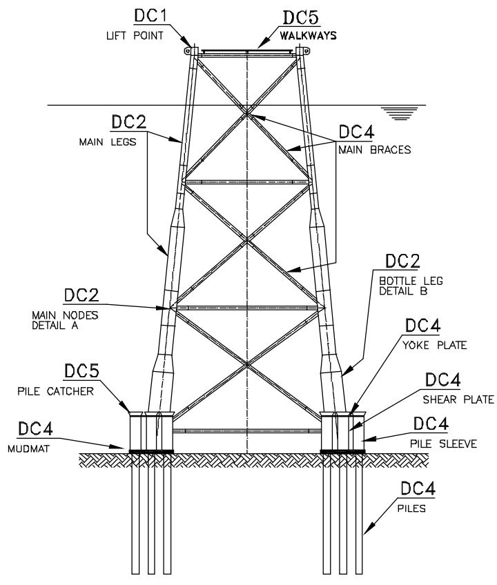

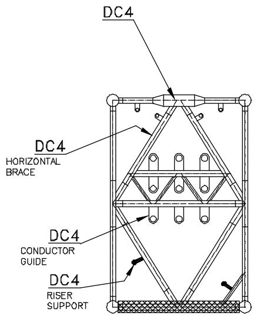

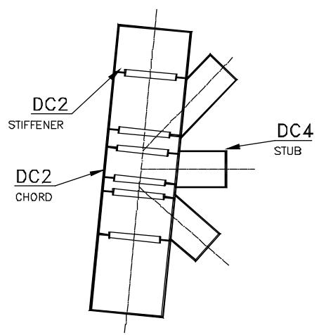  
DETAILA   
MAIN NODE

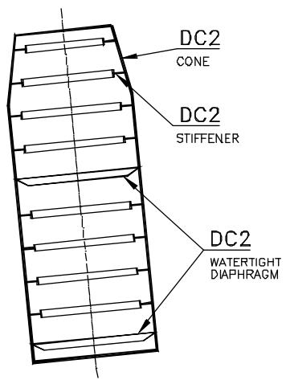  
DETAILB   
BOTTLE LEG   
Figure F.1 — Typical DC selection for a 4-legged jacket with pile clusters

Annex G (normative)

Fabrication tolerances

## G.1 General

The fabrication tolerances given in this annex are applicable where steel selection is in accordance with the MC approach (Clause 19) and corresponding welding, fabrication and inspection requirements are consistent with those of Clauses 20 and 21 and Annexes C and E. Where the alternative approach is adopted, i.e., the DC approach (Clauses 19, 20 and 21 and Annexes D and F), fabrication tolerances shall be in accordance with Reference A.20.2-3.

## G.2 Measurements

Tolerances shall be based on theoretical setting out points and centre lines of the structure referenced to permanent approved datum points (e.g. coordinated survey stations) and corrected to a temperature of +20 °C. Compensation shall be made for significant deflection differences between temporary support and final conditions.

Fabrication and yard assembly supports shall be set to within ± 5 mm of the appropriate position shown on the approved cutting out drawings. Where no such drawings exist, fabrication shall be carried out from a level plane to within ± 5 mm.

## G.3 Launch rails

The dimensional tolerance of launch rail centre lines shall be within ±20 mm of the theoretical position and shall also be within ±6 mm of its reference elevation. The variation in elevation between any two points on a launch rail shall not exceed 3 mm within any 3 m.

## G.4 Global horizontal tolerances

The global tolerances for leg spacing at plan bracing levels are as shown in Figure G.1 and detailed as follows:

a) the horizontal centre-to-centre distance between adjacent legs at the top of a structure, where a deck or other structure is to be placed (stab-in nodes), shall be within 10 mm of the design values;   
b) the horizontal centre-to-centre distance between legs at other locations shall be within 20 mm of the design values;   
c) the horizontal centre-to-centre diagonal distances between legs at the top of a structure, where a deck or other structure is to be placed (stab-in nodes), shall be within 10 mm of the design values;   
d) the horizontal centre-to-centre diagonal distance between legs at other locations shall be within 20 mm of the design values.

Dimensions in millimetres

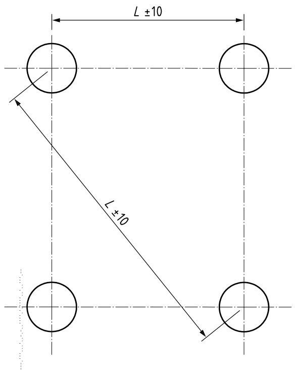  
a) Top elevation for deck stab-in

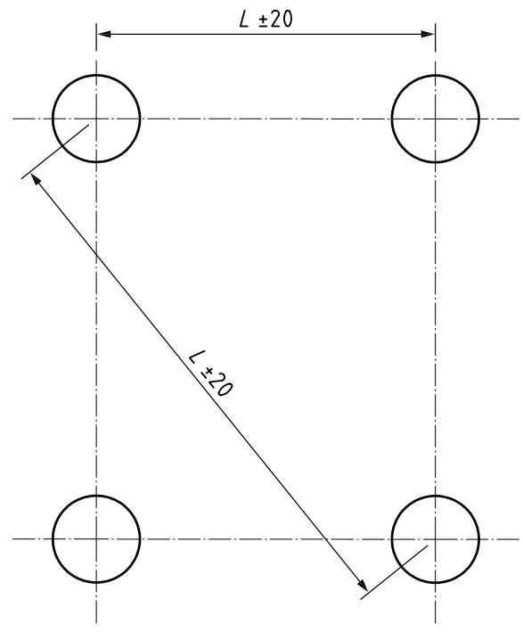  
b) Other elevations   
Figure G.1 — Global horizontal tolerances

## G.5 Global vertical tolerances

The global tolerances for vertical levels of plan bracing are as shown in Figure G.2 and are detailed as follows:

a) the elevation of plan bracing levels shall be within 13 mm of the design values;   
b) the vertical level of braces within a horizontal plane shall be within 13 mm of the design values;   
c) the vertical distance between plan bracing elevations shall be within 13 mm of the design values.

Dimensions in millimetres

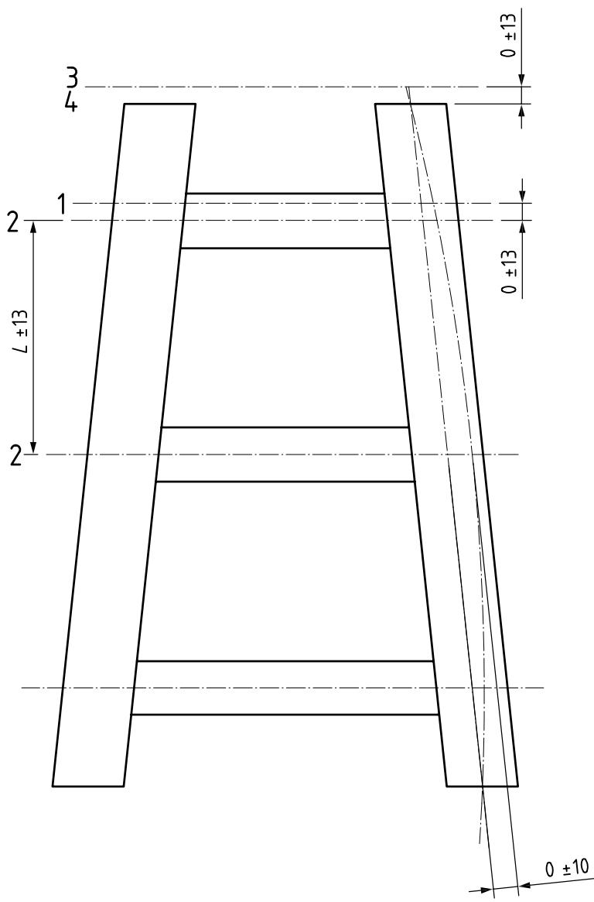  
Figure G.2 — Global vertical tolerances

Key

1 theoretical centre line   
2 actual centre line   
3 theoretical top of legs   
4 actual top of legs

## G.6 Roundness of tubular members

For tubular members with thicknesses of 50 mm or less, the difference between the major and the minor outside diameters (the out-of-roundness) at any point of the tubular member shall not exceed the smaller of either 1 % of the diameter or 6 mm.

For tubular members with thicknesses of more than 50 mm, the difference between the major and the minor outside diameters at any point of the tubular member shall not exceed 12,5 % of the wall thickness.

For tubular members with nominal outside diameters greater than or equal to 1 200 mm and with wall thicknesses less than or equal to 100 mm, the maximum difference between the major and minor actual outside diameters at any section of the tubular shall be 13 mm, provided the actual circumference is within 6 mm of the nominal circumference.

## G.7 Circumference of tubular members

The difference between the actual and nominal outside circumferences at any point of a tubular member shall not exceed the lesser of either 1 % of the nominal circumference or 13 mm.

## G.8 Straightness and circumferential weld locations of tubular members

The tolerances for the straightness of tubular members are as shown in Figures G.3 and G.4, and as follows:

a) lengths equal to or less than 12 m shall be straight to within 10 mm;   
b) lengths exceeding 12 m shall be straight to within 13 mm.

Additionally, the tolerances for the straightness of tubular members when assembled into the structure are as follows:

— brace members shall be straight to within 0,12 % of the nominal length measured between work points;   
— chord members shall be straight to within 0,10 % of the nominal length measured between the work points of major framing members.

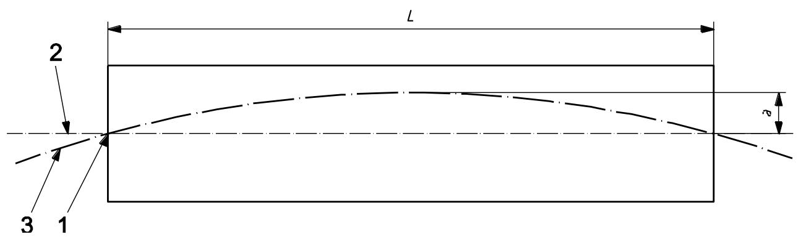  
Figure G.3 — Tolerance on straightness of tubular members

$\mathrm{ F o r } L \leq 12 \mathrm{ m } , a \leq 10 \mathrm{ m m }$

$\mathrm{ F o r } L > 12 \mathrm{ m } , a \leq 13 \mathrm{ m m }$

Key

1 datum: centre line at member end   
2 theoretical centre line   
3 actual centre line   
L total length of fabricated tubular prior to structural assembly. L may consist of one or more tubular sections welded together   
a maximum actual centre line deviation from the theoretical centre line, measured normal to the theoretical centre line and anywhere within L in any plane

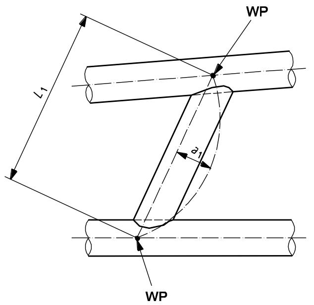  
a) Brace member

$$a_{1} \leq 0, 0012 L_{1}$$

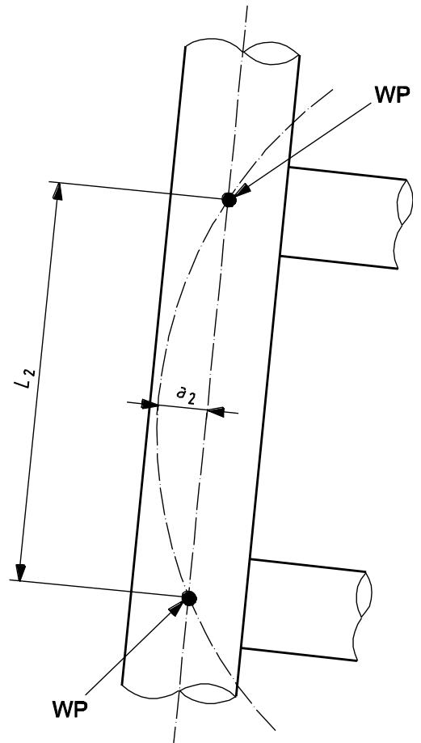  
b) Chord member

$$a_{2} \leq 0, 0010 L_{2}$$

Key

WP work point   
$L_{ 1 }$ nominal length of brace member between work points   
$L_{ 2 }$ nominal length of chord member between work points of major framing members   
$a_{ 1 }$ maximum deviation at brace centre line from theoretical centre line   
$a_{ 2 }$ a2 maximum deviation of chord centre line from theoretical centre line established between nearest framing member working points

Figure G.4 — Tolerances on straightness of tubular members assembled into structure

The tolerances for the location of cans with a different wall thickness to the member, and other wall thickness transitions within a tubular member, are as shown in Figure G.5 and as follows:

a) for chord cans, within 25 mm of the design value;   
b) for other changes of wall thickness, within 50 mm of the design value.

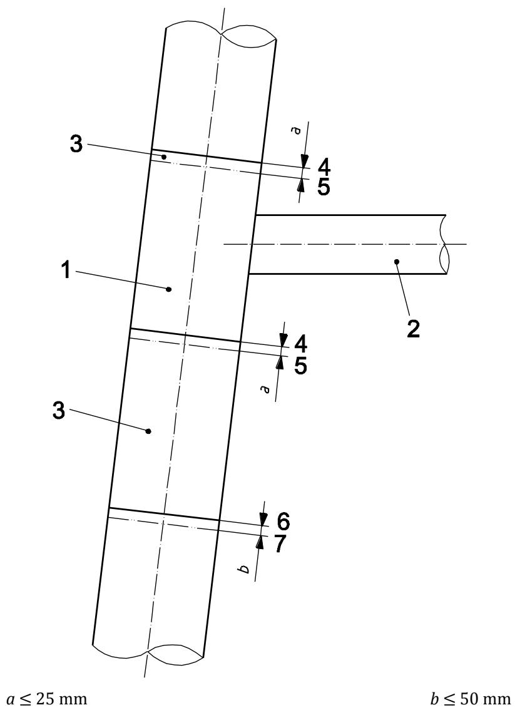

Key

1 joint
2 brace
3 member
4 theoretical location of thickness transition between joint and member   
5 actual location of thickness transition between joint and member   
6 theoretical location of thickness transition within member   
7 actual location of thickness transition within member   
a distance between design and as-built location thickness change between chord can and member   
b distance between design and as-built location thickness change within member

Figure G.5 — Tolerances on thickness change locations

## G.9 Joint mismatch for tubular members

The tolerances for the mismatch at circumferential welds and longitudinal seams in tubular members are as shown in Figure G.6 and as follows:

a) for double-sided welds, the lesser of 10 % of the thicker member thickness, or 6 mm;   
b) for single-sided welds, the lesser of 10 % of the thicker member thickness, or 3 mm.

Where these tolerances are exceeded, the transitions shall be made by weld profiling to a maximum slope of 1:4, see Figure G.6.

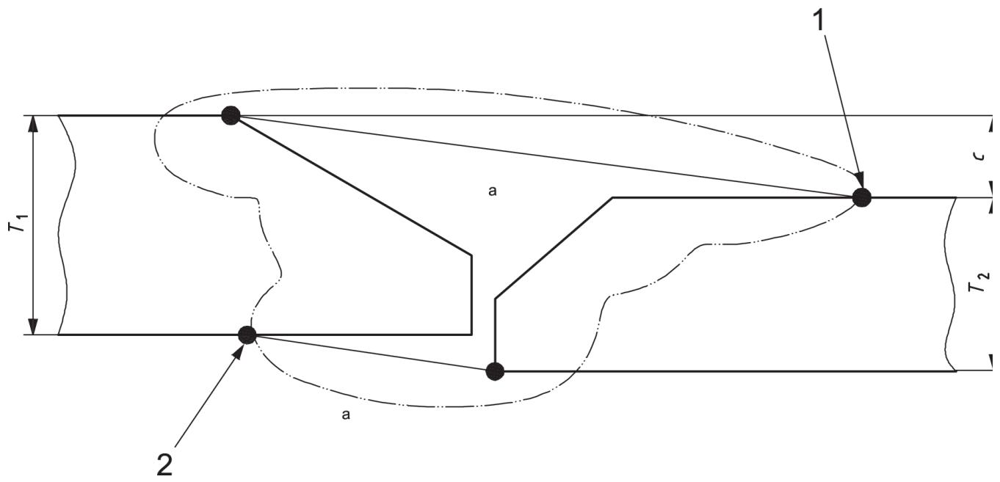  
a) single-sided weld

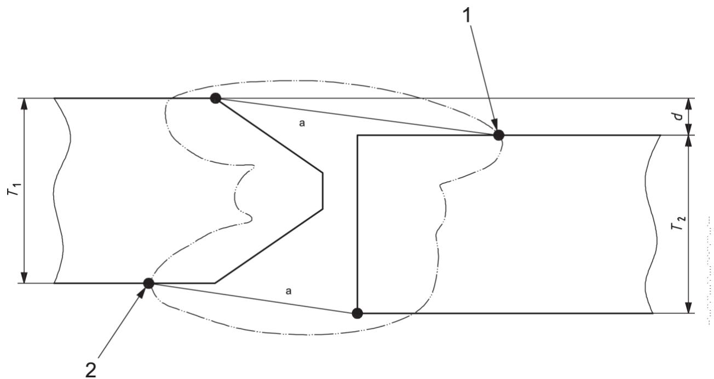  
b) double-sided weld

Key

1, 2 points established by the transition weld toe that can be connected by a theoretical line to the prepared groove high point (on top surface) and low point (on bottom surface)

c less than the smaller value of 1) 0,10 T , 2) 0,10 T , 3) 3 mm

d less than the smaller value of 1) 0,10 T1, 2) 0,10 T2, 3) 6 mm

T1, T2 plate thicknesses (in mm)

a Transitions slope of 1:4.

NOTE Grooves shown are for illustration only.

Figure G.6 — Joint mismatch tolerances

## G.10 Leg alignment and straightness tolerances

In addition to the tolerances for individual members (see G.7), the tolerances for the alignment and straightness of legs shall be as shown in Figure G.7 and as follows:

a) at each plan bracing level the legs shall be aligned horizontally within 10 mm of the design location;   
b) each leg shall be straight to within 10 mm over the entire length (see Figure G.2).

Dimensions in millimetres

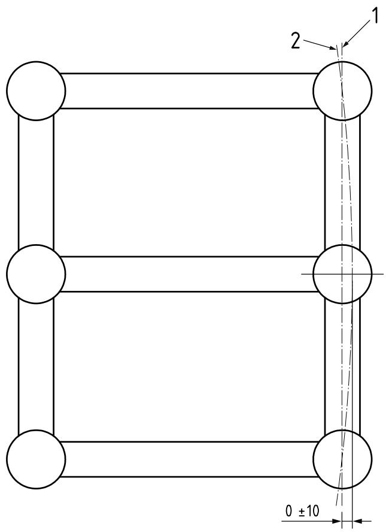  
Figure G.7 — Leg alignment tolerances at plan bracing level (structures with more than 4 legs)

Key

1 theoretical centre line   
2 actual centre line

## G.11 Tubular joint tolerances

The alignment and tolerances for tubular joints (braces, brace stubs and chords) are shown in Figures G.8 and G.9 and detailed below.

The as-built work point of a brace stub on a chord centre line shall be within 13 mm of the design work point location.

The as-built work point of a brace on a chord centre line built with point-to-point construction shall be within 20 mm of the design work point location.

For braces built with a design minimum gap, g, between brace toes on the chord diameter, the as-built distance between brace toes shall not be less than g – 3 mm or greater than g + 25 mm.

If a chord can or a brace stub contains intermediate circumferential welds, the individual lengths within the chord can or brace stub shall be within the range of design length +10 mm to design length –5 mm and the location of the circumferential welds shall be within 5 mm of the design location.

The overall lengths of the brace stub of a tubular joint shall be within the range of design length +50 mm to design length –5 mm.

The tolerances on the positioning and alignment of stubs on tubular joints are as follows:

a) the centre line of the brace at the intersection with the chord wall shall be within 5 mm of the design position where the chord diameter is less than 3,5 m;   
b) the centre line of the brace at the intersection with the chord wall shall be within 10 mm of the design position where the chord diameter is greater than or equal to 3,5 m;   
c) the angular orientation of the brace stub shall be within 10 minutes (0,17°) of the design orientation;   
d) the position of the centre line of the brace end of the stub shall be within 5 mm of the design position.

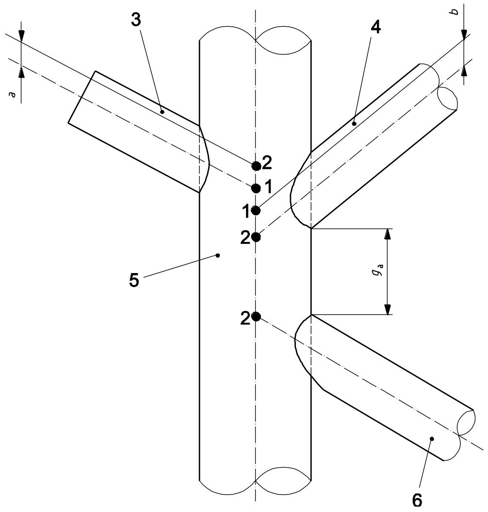

Key

1 design work point   
2 as built work point   
3 brace stub
4 brace built point to point   
5 chord
6 brace built to minimum gap clearance   
a distance between design and as built location of brace stub work points on chord centre line $a \leq 13$ mm   
b distance between design and as built location of brace work points on chord centre line $b \leq 20$ mm   
$g_{ \mathsf{ a } }$ as-built gap between brace toes g – 12 mm ≤ ga ≤ g + 25 mm, where g is the design gap between brace toes

Figure G.8 — Tolerances on alignment of brace stubs at tubular joints

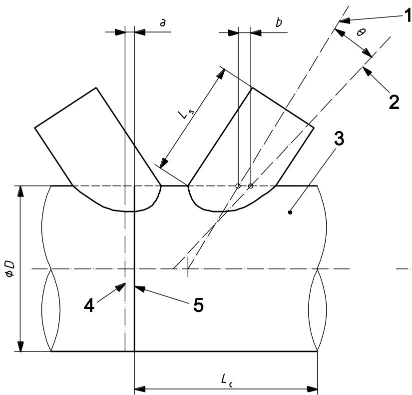  
for D < 3,5 m, b < 5 mm

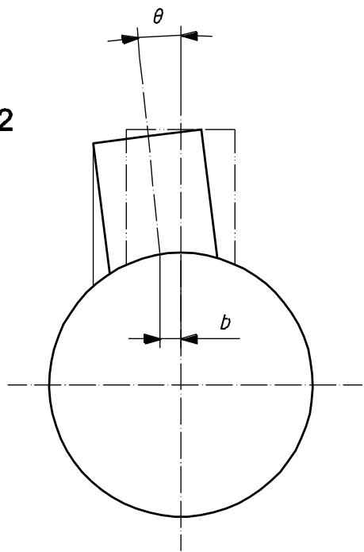  
Figure G.9 — Tolerances for tubular joints

for D ≥ 3,5 m, b < 10 mm

Key

1 theoretical brace stub centre line   
2 actual brace stub centre line   
3 chord can
4 theoretical circumferential weld   
5 actual circumferential weld   
a offset between actual and theoretical circumferential weld positions, a < 5 mm   
D outside diameter of chord   
$b$ offset between actual and theoretical brace centre line intersection at chord outer diameter   
$L_{ s }$ theoretical brace stub length, Ls,actual - 50 mm ≤ Ls ≤ Ls,actual + 5 mm   
$L_{ \mathrm{ c } }$ theoretical node can length, $L_{ \mathrm{ c , a c t u a l } } - 10$ mm $\leq L_{ \mathrm{ c } } \leq L_{ \mathrm{ c , a c t u a l } } + 5$ mm   
$\theta$ angle between actual and theoretical centre line of brace, $\theta < 0 , 17^{ \circ }$

## G.12 Cruciform joints

Where plates carrying in-plane forces are arranged to form a cruciform joint, the misalignment shall not exceed the lesser of 50 % of the thickness of the thinnest non-continuous member or 10 mm, whichever is smaller.

## G.13 Stiffener tolerances

G.13.1 Stiffener location

Stiffeners shall be positioned to the following tolerances:

a) when within 150 mm of a conical transition, accurate to within 3 mm of the design position;   
b) in launch legs, to within 3 mm of the design position;   
c) in tubular joints other than at conical transitions of launch leg nodes, to within 5 mm of the design position;   
d) at all other locations, to within 10 mm of the design position.

G.13.2 Stiffener cross-section

The tolerances on ring stiffener cross-sections are as shown in Figure G.10 and as follows:

a) the web of the stiffener shall be perpendicular to the centre line of the tubular to within 2,5 % of the web height;   
b) the flange of the stiffener shall be parallel to the centre line of the tubular to within 1,5 % of the flange width;   
c) the web of the stiffener shall be flat over its height to within 1,0 % of the web height.

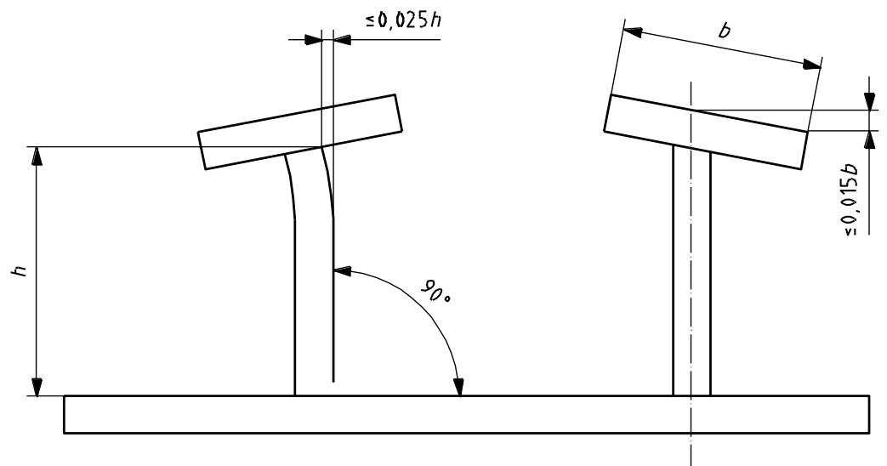

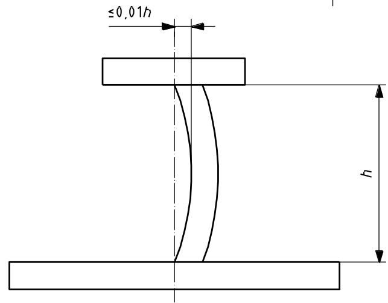  
Figure G.10 — Ring stiffener cross-section tolerances

Key

h web depth  
b flange width

Out-of-straightness for longitudinal or diaphragm stiffeners in tubular members shall be limited to 0,15 % L or 3 mm, whichever is larger, see Figure G.11.

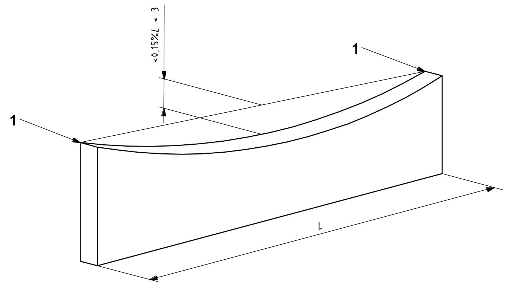  
Figure G.11 — Ring stiffener straightness tolerance

Key

1 point of lateral restraint-`,,   
L length, ``,,,,

## G.14 Conductor, pile guide, pile sleeve and appurtenance support tolerances

The misalignment on conductor and pile guides, and sleeves and appurtenance supports shall be related to a best-fit line through the centres of the guides, sleeves and supports, see Figure G.12. The tolerance of the centre of each guide/sleeve and the best-fit line shall be less than 10 mm at the top guide and where the vertical spacing between guides is less than 12 m. The tolerance of the centre of each guide/sleeve and the best-fit line shall be less than 13 mm in other cases. For pile sleeves, the misalignment shall be checked at mid-height of each set of centralizers. The tolerance of the centre of each appurtenance support and the best-fit line shall be less than 10 mm at the top and less than 25 mm elsewhere.

Figure G.12 — Conductor guide alignment tolerances (also applies to pile guides/sleeves where provided)   
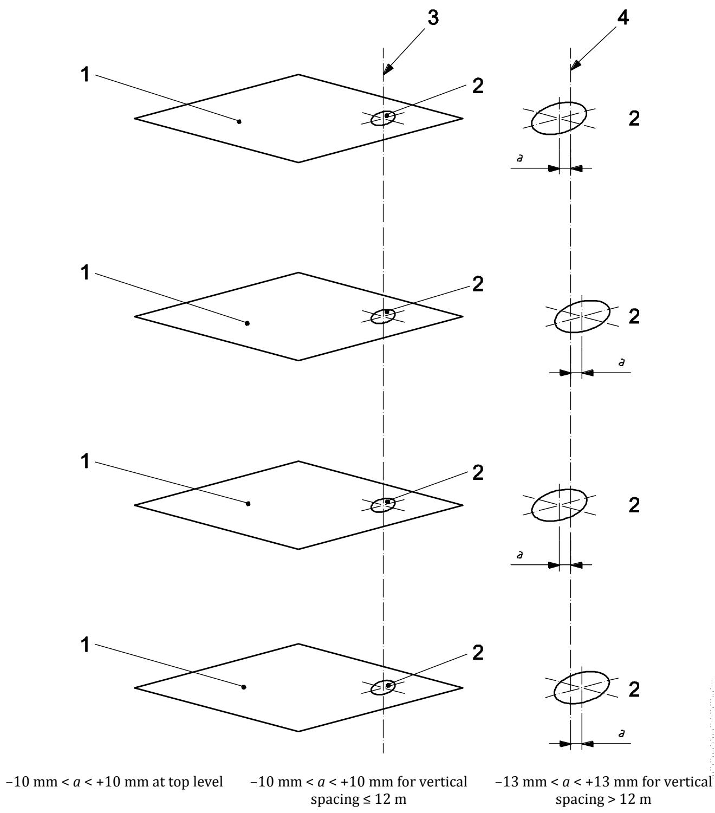  
Key   
1 plan bracing levels   
2 centres of conductor guides at each level   
3 theoretical centre line   
4 best fit centre line   
a tolerance of alignment of guides

Annex H

(informative)

Regional information

## H.1 General

This annex contains additional requirements for fixed steel offshore structures applicable to particular geographical regions (which can form all or part of the offshore waters of one or more countries) because of their environments or local customs and practices. The information in this annex is applicable for structures located in the defined areas and informative for other regions. The contents have been developed by subject experts from the region concerned to supplement the provisions of this document. This annex contains some regional and national data, including regional environmental conditions and local design, construction and operating practices. The regulatory framework is explained, but neither regulatory requirements nor reference to specific legislation is included.

## H.2 North West Europe,,,`,`,,

H.2.1 Description of region, ```,,,

The North West Europe waters are diverse and stretch from the sub-Arctic waters off Norway and Iceland to the Atlantic seaboard of France and Ireland in the south. Clause H.2 specifically includes the waters of the following countries:

— United Kingdom;   
— Ireland;   
— Norway;   
— Germany (North Sea and Baltic Sea);   
— Denmark (North Sea and Baltic Sea);   
— The Netherlands;   
— Belgium;   
— France (Atlantic seaboard only);   
— Spain (Atlantic seaboard only).

H.2.2 Regulatory framework in North West Europe

H.2.2.1 General

The European Union (EU) countries and European Free Trade Association (EFTA) countries which border the offshore area are linked in the European Economic Area (EEA). Regional requirements are made by the EU. EU requirements are implemented by each of the EU member states through their own law-making process. Under the EEA agreement, EFTA countries comply with the requirements of

directives and other regulatory requirements agreed upon by the EU, which includes directives relating to safety and lifting of trade barriers.

H.2.2.2 UK regulatory framework

The UK regulatory framework for oil and gas development is based on a goal setting regime with no detailed technical provisions. It is the responsibility of the duty holder, who is normally the owner, to determine the technical requirements by reference to international standards, codes of practice or other means.

H.2.2.3 Norwegian regulatory framework

The Norwegian Pollution Control Authority, the Norwegian Social and Health Directorate and the Petroleum Safety Authority (former NPD) have made joint regulations related to health, safety and the environment on the Norwegian continental shelf. The regulations are the framework regulations (Royal Decree), the management regulations, the information duty regulations, the facilities regulations and the activities regulations. Guidelines to the regulations have been prepared. The guidelines give references to acceptable standards, codes of practice and other documents.

H.2.2.4 Danish regulatory framework

The Danish Energy Authority is the supervising authority of health and safety. Issues concerning emissions to the environment are handled by the Danish Environmental Protection Agency, while other environmental issues lie with the Danish Energy Authority.

It is the responsibility of the duty holder to ensure that the health and safety level is satisfactory and documented in accordance with the “Act on Safety etc. on Offshore Installations for Exploration, Production and Transportation of Hydrocarbons (The Offshore Safety Act)”.

H.2.2.5 Dutch regulatory framework

The Dutch regulatory framework for oil and gas development is based on a goal setting regime with no detailed technical provisions. It is the responsibility of the duty holder to determine the technical requirements by reference to international standards, codes of practice or other means.

H.2.3 Technical information for North West Europe

H.2.3.1 Minimum RSR

The minimum RSR for a conventionally framed L1 jacket structure shall be 1,85 (see 7.11.1).

For non-conventionally framed structures, see A.7.11.1.3.

H.2.3.2 Partial action factor

If the option given in H.2.3.1 is not adopted, the partial action factor for metocean actions shall be 1,35 (see 9.10), unless a rational analysis demonstrates an alternative value is appropriate.

## H.3 Canada

H.3.1 Description of region

The geographical basis for this subclause is the region bounded by the continental shelf margins of Canada. The region encompasses both shallow water and deepwater areas of offshore Canada that are either ice-free regions (Pacific Ocean off the west coast of British Columbia) or regions that may be subjected seasonally to the presence of sea ice and icebergs. Sea ice can be present in the Beaufort Sea, Offshore the Arctic Islands, Baffin Bay, Davis Strait, offshore Newfoundland and Labrador, in the Gulf of St. Lawrence, as well as offshore Nova Scotia, although the occurrence of sea ice in the offshore Nova Scotia area is rare. Icebergs are typically encountered in the waters on the north and east coasts of offshore Newfoundland and Labrador.

H.3.2 Regulatory framework in Canada

Oil and gas exploration and production activities in Canada’s non-Accord Frontier Lands (defined as the Nunavut Territories, Sable Island and its submarine areas, and areas not within a province adjacent to the coast of Canada, to the outer edge of the continental margin or to a distance of two hundred nautical miles, whichever is greater, but excluding the offshore areas of Nova Scotia and Newfoundland and Labrador) are governed by the Canada Oil and Gas Operations Act [H.1] and the Canada Petroleum Resources Act [H.2]. The Canada Oil and Gas Operations Act and certain elements of the Canada Petroleum Resources Act are administered by the Canadian Energy Regulator (CER) () in all of the non-Accord Frontier Lands.

Oil and gas exploration and production activities in Canada’s Accord Frontier Lands (defined as offshore areas in the Canada Nova Scotia Offshore Petroleum Resources Accord Implementation Act (CNSOPRAIA [H.3]) and the Canada-Newfoundland and Labrador Atlantic Accord Implementation Act (C-NLAAIA [H.4]) are governed by the CNSOPRAIA and C-NLAAIA and mirror the provincial Accord Implementation Acts, respectively. The provincial acts are the Canada Nova Scotia Offshore Petroleum Resources Accord Implementation (Nova Scotia) Act [H.5] and the Canada Newfoundland and Labrador Atlantic Accord Implementation Newfoundland and Labrador Act [H.6], respectively. These acts are administered by joint federal-provincial offshore petroleum boards. In the Nova Scotia Offshore Accord area, the regulator is the Canada-Nova Scotia Offshore Petroleum Board (CNSOPB), and in the Newfoundland and Labrador Offshore Accord area the regulator is the Canada-Newfoundland and Labrador Offshore Petroleum Board (C-NLOPB).

For the offshore areas, the three boards (CER, CNSOPB, and C-NLOPB) are responsible for, amongst other things, the regulation of oil and gas exploration and production work or activities including:

— issuance of licences for offshore exploration and development (CNSOPB and C-NLOPB only);   
— issuance of authorization and approvals for exploration and production work or activity pursuant to the operative statute and its regulations;   
— health and safety of workers;   
— protection of the environment during petroleum activities;   
— management and conservation of petroleum resources;   
— compliance with the provisions of the laws dealing with employment and industrial benefits by the offshore petroleum board in the Accord areas, and for Canada Benefits by the Department of Crown-Indigenous Relations and Northern Affairs for non-Accord Frontier Lands generally north of 60° north,

and by the Department of Natural Resources for non-Accord Frontier lands generally south of 60° north;

— resource evaluation and data collection, curation and distribution.

H.3.3 Technical information for Canada

H.3.3.1 Partial action factors

The partial action factor for metocean actions shall be 1,35 for L1 structures (see 9.10), unless rational analysis demonstrates that an alternative value is appropriate.

H.3.3.2 Materials – DC approach – SQL V

ISO 19902:2007 permitted steels with no CVN impact testing requirement to be used for structural components to DC 5 classification – see Table 19.6-1. Prior to the adoption in Canada of ISO 19902, CAN/CSA S473 also permitted the use of steels without CVN impact testing in the least stringent design categories.

Based on a history of successful use in Canada, weldable grade structural steels that do not require CVN impact testing may be used under the following conditions:

— SMYS ≤ 355 MPa   
— maximum thickness of 25mm   
— structural components assigned to DC 5 classification

For application of the requirements of H.3.3.3, in line with the classifications and categories listed in Tables 19.6-2 and 19.6-3, steel of this quality can be treated as a “SQL V category” steel.

H.3.3.3 Welding

H.3.3.3.1 DC approach

In this document, SQL IV steels are permitted for use in structural steel components classified as DC 5 (19.6.3.2). However, SQL IV steels are not permitted for use for LAST lower than -10°C (F.1). Accordingly, no corresponding weld or HAZ toughness requirements are included in Table F.1.

Based on a history of successful use in Canada, DC 5 classified steel components constructed of SQL IV steel may be used for LAST below -10°C. CVN impact testing of the weld and HAZ shall be required. The test temperature shall be equal to or below the test temperature for SQL IV required in Table 19.6-3. The minimum CVN impact energy requirement shall be 27 J.

Similarly, based on a history of successful use in Canada, DC 5 classified steel components constructed of SQL V steel (H.3.3.2) may be used for LAST below -10°C. CVN impact testing of the weld and HAZ shall not be required provided CVN impact tested filler metals/weld consumables are used that have a minimum CVN impact energy of 27 J at the LAST.

H.3.3.3.2 Welding standard

If the welding standard selected for use is CSA W59 [H.9], the following requirements shall apply to accommodate the changes to material toughness introduced in this document.

CSA W59 Annex U refers to toughness classes in terms of NT, CV1, CV2, CV2Z, CV2X, and CV2ZX as applied to both the MC and DC approaches in ISO 19902:2007. With this document, toughness for the DC approach is now defined in terms of SQL I, II, III, and IV (19.6.3.2), as well as SQL V (H.3.3.2).

General requirements and references in CSA W59 Annex U concerning CV1 and CV2 steels (with impact testing) shall also apply to SQL I, II, III, and IV steels. General requirements and references in CSA W59 Annex U concerning NT steels shall apply to SQL V steels.

When evaluating welding procedure qualifications for use on MC or DC steels, the requirements for toughness (CVN or CTOD) for the MC approach (Annex E ) or for the DC approach (Annex F and H.3.3.3.1) shall be met. The range of qualification defined by either of these approaches shall be in accordance with the additional essential variables for CVN impact testing (20.2.2.4.2) and for CTOD testing (20.2.2.5.4), and the general requirements of CSA W59 Annex U.

When performing qualification testing, fabricators should take into account the weld metal and HAZ CVN toughness requirements for both the MC and DC approaches. Testing at the lowest temperature and meeting the higher absorbed energy requirements should maximize the qualification range and reduce the number of qualifications required. Fabricators should also consider utilizing the steel manufacturer’s CTOD pre-qualification results for base steel and HAZ to avoid CTOD testing of the HAZ during weld procedure qualifications.

H.3.3.3.3 Fabrication contractor, inspection contractor, and personnel qualifications

If the welding standard selected for use is CSA W59, the qualification requirements provided in Annex U of CSA W59 shall apply [H.9].

When CSA W59 is not the welding standard selected for use, the owner shall ensure that the following subject areas are addressed by the selected welding standards or by project specifications:

a) Welding fabrication company [H.8]:

1) qualified welding engineering personnel;   
2) qualified welding supervisory personnel;   
3) documented, qualified and approved welders and welding operators with regular validation of qualifications;   
4) documented, qualified, and approved welding procedures.

b) Welding inspection company [H.10]:

1) documented, qualified, and approved welding inspection/NDT procedures for methods used and products inspected, including special practices for tubular TKY connections, when applicable;   
2) qualified welding inspection/NDT supervisory personnel;   
3) documented qualified welding inspection/NDT personnel with regular validation of qualification, including special qualifications for TKY connections, when applicable.

c) Welding inspectors qualified on the basis of training, experience and examination in the method used and products inspected, including tubular TKY connections, when applicable [H.11].

The above qualifications for items a), b), and c) shall be recognized as being equivalent to those referenced in CSA W59, Annex U [H.9].

The services of a recognized independent third party organization can be considered to verify ongoing compliance with these requirements.

Bibliography

[1] ISO 3834-2, Quality requirements for fusion welding of metallic materials — Part 2: Comprehensive quality requirements   
[2] ISO 9001, Quality management systems — Requirements   
[3] ISO 9004, Quality management systems — Guidelines for performance improvements   
[4] ISO 13702, Petroleum and natural gas industries — Control and mitigation of fires and explosions on offshore production installations — Requirements and guidelines   
[5] ISO 14731, Welding coordination — Tasks and responsibilities   
[6] ISO 19901-5, Petroleum and natural gas industries — Specific requirements for offshore structures — Part 5: Weight control during engineering and construction   
[7] ISO 19901-7, Petroleum and natural gas industries — Specific requirements for offshore structures — Part 7: Stationkeeping systems for floating offshore structures and mobile offshore units   
[8] ISO/TS 29001, Petroleum and natural gas industries — Sector-specific quality management systems — Requirements for product and service supply organizations   
[9] EN 1993, Eurocode 3: Design of steel structures   
[A.7.7-1] EN 1990:2002, Eurocode — Basis of structural design   
[A.7.10-1] VAN DE GRAAF, J.W., TROMANS, P.S. and EFTHYMIOU, M. The Reliability of Offshore Structures and its Dependence on Design Code and Environment, Proc. 27th Offshore Technology Conf., OTC Paper 7382, Houston, May 1994   
[A.7.10-2] EFTHYMIOU, M., VAN DE GRAAF, J.W., TROMANS, P.S. and HINES, I.M. Reliability-Based Criteria for Fixed Steel Offshore Platforms, Transactions of the SNAME, Vol. 119, May 1997, 120-124   
[A.7.13-1] Construction Industry Research and Information Association. The rationalisation of safety and serviceability factors in structural codes, CIRIA Report 63, July 1977   
[A.8.3-1] Lloyd’s Register, Code for Lifting Appliances in a Marine Environment, London 2003   
[A.9.1-1] API RP 2A-LRFD, Recommended Practice for Planning, Designing and Constructing Fixed Offshore Platforms — Load and Resistance Factor Design, First Edition, 1993   
[A.9.1-2] API RP 2A-WSD, Recommended Practice for Planning, Designing and Constructing Fixed Offshore Platforms — Working Stress Design   
[A.9.1-3] MOSES, F. Load and Resistance Factor Design, American Petroleum Institute, Dallas, API PRAC Project 22, 1979, 1983, 1985, 1989   
[A.9.5-1] HEIDEMAN, J.C. and WEAVER, T.O. Static wave force procedure for platform design, Proc. Int. Conf. Civil Eng. In the Oceans V, ASCE College Station, Texas, 1992, pp. 496-517

[A.9.5-2] MADSEN, O.S., Hydrodynamic Force on Circular Cylinders, Applied Ocean Research 8, No. 3, 1986   
[A.9.5-3] MANNERS, W. and RAINEY, R.C.T. Hydrodynamic Forces on Fixed Submerged Cylinders, Proc. Royal Society of London, 436, 1992   
[A.9.5-4] NEWMAN, J.N., Marine Hydrodynamics, MIT Press, 1977   
[A.9.5-5] SARPKAYA, T. and ISAACSON, M. Mechanics of Wave Forces on Offshore Structures, Van Nostrand Reinhold Co., 1981   
[A.9.5-6] KEULEGAN, G.H. and CARPENTER, L.H. Forces on Cylinders and Plates in an Oscillating Fluid, J. Research of the National Bureau of Standards, 60, No. 5, May 1958   
[A.9.5-7] LAMBRAKOS, K.F., CHAO, J.C., BECKMANN, H. and BRANNON, H.R. Wake Model of Hydrodynamic Forces on Pipelines, Ocean Engineering, 14, No. 2, 1987, pp. 117-136   
[A.9.5-8] HOERNER, S.F., Fluid Dynamic Drag, Chapter V.1, Hoerner Fluid Dynamics, New Jersey, 1965   
[A.9.5-9] NORTON, D.J., HEIDEMAN, J.C. and MALLARD, W. Wind Tunnel Tests of Inclined Circular Cylinders, J. Society of Petroleum Engineers, 23, 1983, pp. 191-196   
[A.9.5-10] SARPKAYA, T., RAINES, T.S. and TRYTTEN, D.O. Wave Forces on Inclined Smooth and Rough Circular Cylinders, Proc. 15th Offshore Technology Conf., OTC Paper 4227, 1982   
[A.9.5-11] GARRISON, C.J. Comments on Cross-Flow Principle and Morison's Equation, ASCE J. Waterway, Port, Coastal, and Ocean Engineering, 111, No. 6, November 1985   
[A.9.5-12] KASAHARA, Y. and SHIMAZAKi, K. Wave Forces Acting on Rough Circular Cylinders at High Reynolds Numbers, Proc. 20th Offshore Technology Conf., OTC Paper 5372, 1987   
[A.9.5-13] SCHLICHTING, H. Boundary Layer Theory, Chapter XX.g, McGraw-Hill, Inc., 1979   
[A.9.5-14] NATH, J.H. Hydrodynamic Coefficients for Marine-Roughened Cylinders, Final Report to API on Practice 85-31, Department of Civil Engineering, Oregon State University, March 1987   
[A.9.5-15] Det Norske Veritas, Rules for Classification of Fixed Offshore Installations, First Edition, 1990   
[A.9.5-16] ACHENBACH, E. Influence of Surface Roughness or the Cross-Flow Around a Circular Cylinder, J. Fluid Mechanics, Vol. 46, 1971, pp. 321-335   
[A.9.5-17] BECKMANN, H. and MCBRIDE, C.M. Inherent Scatter of Wave Forces on Submerged Structures, Proc. ASME Petroleum Division Joint Conf. with Pressure Vessels and Piping Division, Dallas, September 22-25, 1968   
[A.9.5-18] SARPKAYA, T. In-Line and Transverse Forces on Smooth and Rough Cylinders in Oscillatory Flow at High Reynolds Numbers, Naval Postgraduate School, Report NPS69-86-003, July 4, 1986   
[A.9.5-19] HEIDEMAN, J.C., OLSEN, O. and JOHANSSON, P. Local Wave Force Coefficients, Proc. Civil Engineering in the Oceans IV Conf., ASCE, September 1979

[A.9.5-20] STEELE, K.M. Performance of the Lena Guyed Tower, Proc. 19th Offshore Technology Conf., OTC Paper 5255, 1986   
[A.9.5-21] MONOPOLIS, G.M. and DANACZKO, M.A. Installation Model Tests of a Gulf of Mexico Compliant Tower, Proc. 22nd Offshore Technology Conf., OTC Paper 5911, 1989   
[A.9.5-22] TAYLOR, P.H. Current Blockage: Reduced Forces on Offshore Space-Frame Structures, Proc. 24th Offshore Technology Conf., OTC Paper 6519, 1991   
[A.9.5-23] FORRISTALL, G.Z. Measurements of Current Blockage by the Bullwinkle Platform, J. Atmospheric and Oceanic Technology, Vol 13, No. 6, December 1996, pp. 1247-1266   
[A.9.5-24] LAMBRAKOS, K. F. and BECKMANN, H. Shielding and Interference Model for Offshore Platforms. Procs. 5th Intl. Conf. on the Behaviour of Offshore Structures BOSS 1992, London, July 1992   
[A.9.5-25] HEIDEMAN, J.C. and SARPKAYA, T. Hydrodynamic Forces on Dense Arrays of Cylinders, Proc. 18th Offshore Technology Conf., OTC Paper 5008, 1985   
[A.9.5-26] REED, K., AARSNES, J.V., BELTRAND, O. and ANDERSEN, E. Wave and Current Forces on Conductor Pipe Groups, Society for Underwater Technology, Proc. of Conference on Environmental Forces on Offshore Structures and Their Prediction, 1990   
[A.9.5-27] JONES, G.W., CINCOTTA, J.J. and WALKER, R.W. Aerodynamic Forces on a Stationary and Oscillating Circular Cylinder at High Reynolds Numbers. NASA Technical Report R-300, 1969   
[A.9.5-28] BLUMBERG, R. and RIGG, A.M. Hydrodynamic Drag at Supercritical Reynolds Numbers. ASME Conference, June 1961   
[A.9.5-29] WOLFRAM, J. and THEOPHANATOS, A. The Effects of Marine Fouling on the Fluid Loading of Cylinders: Some Experimental Results, Proc. Offshore Technology Conf., OTC 4954, 1985   
[A.9.5-30] MILLER, B.L. The Hydrodynamic Drag of Roughened Circular Cylinders, The Royal Institution of Naval Architects, Spring Meetings, 1976   
[A.9.5-31] SZECHENYI, E. Supercritical Reynolds Number Simulation for Two-Dimensional Flow Over Circular Cylinders, Journal of Fluid Mechanics, 70, pp. 529–542, 1975   
[A.9.5-32] ACHENBACH, E. and HEINECKE, E. On Vortex Shedding from Smooth and Rough Cylinders in the Range of Reynolds Numbers 6 x 103 to 5 x 106, Journal for Fluid Mechanics, 109, pp. 239–251, 1981   
[A.9.5-33] WANG, C. and SHIH, W.C.L. High Reynolds Number Flows around Smooth and Rough Cylinders, Final Report to ONR, Contract No. N00014-85-C-0764, Physical Research, Inc., February 1986   
[A.9.5-34] ROSHKO, A. Experiments on the Flow Past a Circular Cylinder at Very High Reynolds -- Number, Journal of Fluid Mechanics, 10, pp. 345–356, 1961   
[A.9.5-35] ``,,,, BISHOP, J.R. Wave Force Data from the Second Christchurch Bay Tower, Proc. Offshore ,, ` Technology Conf., OTC 4953, 1985   
[A.9.5-36] ``,,, `- OHMART, R.D. and GRATZ, R.L. Drag Coefficients from Hurricane Wave Data, ASCE Civil Engineering in the Oceans IV Conference, September 1979

[A.9.5-37] BEARMAN, P.W., CHAPLIN, J.R., GRAHAM, J.M.R., KOSTENSE, J.R., HALL, P.F. and KLOPMAN, G. The Loading of a Cylinder in Post-Critical Flow Beneath Periodic and Random Waves, Proceedings of Behaviour of Offshore Structures Conference, pp. 213–225, 1985   
[A.9.5-38] GARRISON, C.J. Drag and Inertia Forces on Circular Cylinders in Harmonic Flow, ASCE Journal of Waterway, Port, Coastal, and Ocean Engineering, 116, No. 2, March/Aril 1990.   
[A.9.5-39] MARIN (1987), personal communication from J. C. HEIDEMAN   
[A.9.5-40] IWAKI (1991) Personal communication from J. C. HEIDEMAN   
[A.9.5-41] BECKMANN, H. and MERWIN, J. E. Wave Forces on Conductor Pipe Group, ASCE Civil Engineering in the Oceans IV Conference, September 1979   
[A.9.5-42] STERNDORFF, M. J., VELK, P. and KLINTING, P. Coupled Experimental and Analytical Investigation of Hydrodynamic Forces on a Jacket in Waves, Society for Underwater Technology, Environmental Forces on Offshore Structures and Their Prediction, 1990   
[A.9.7-1] EN 1991-1-4, Eurocode 1: Actions on structures —Part 1-4: General actions — Wind Actions   
[A.9.8-1] WHEELER, J.D. Method for prediction of forces produced by irregular waves, J. Petroleum Tech., March 1970, pp. 359-367   
[A.9.8-2] RODENBUSCH, G. and FORRISTALL, G.Z. An empirical model for random directional wave kinematics near the free surface, Proc. 18th Offshore Technology Conf., OTC Paper 5097, Houston, May 1986   
[A.9.8-3] SHARMA, J.N. Development and evaluation of a procedure for simulating a random, directional sea surface and associated wave forces, (PhD Thesis), University of Delaware, 1979   
[A.9.8-4] RODENBUSCH, G. and KALLSTROM, C. Forces on a large cylinder in random two-dimensional flows, Proc. 18th Offshore Technology Conf., OTC Paper 5096, Houston, May 1986   
[A.9.9-1] American Institute of Steel Construction, Load and Resistance Factor Design Specification for Structural Steel Buildings, AISC, Chicago, Final Draft, 1986   
[A.9.9-2] American Institute of Steel Construction, Manual of Steel Construction, AISC, Chicago   
[A.9.9-3] ISO/TC 67/SC 7/WG 3/Technical Panel 10 Partial Factors, Assessment of the Energo ISO 19902 Partial Factors Study and Proposed Partial Factors for ISO 19902 Second Edition, submitted to IOGP London for publication   
[A.9.9-4] TURNER, R.C., ELLINAS, C.P. AND THOMAS, G.A.N. Towards the Worldwide Calibration of API RP 2A-LRFD, Proc. 24th Offshore Technology Conf., Houston, Texas, OTC Paper 6930, May 1992   
[A.9.9-5] MOSES, F. Calibration of ISO Offshore Platform Design Standard, American Petroleum Institute, Washington, Report, April 1999   
[A.9.9-6] Bomel Ltd. Component-based calibration of North West European annex environmental load factors for the ISO fixed steel offshore structures code 19902. Health and Safety Executive, UK, Research Report 088, 2003

[A.9.9-7] API RP 2A-WSD, Recommended Practice for Planning, Designing and Constructing Fixed Offshore Platforms — Working Stress Design, 21st Edition, 1993   
[A.9.9-8] ELLINGWOOD, B.B., GALAMBOS, T.V., MACGREGOR, J.G. and CORNELL, C.A. Development of a Probability Based Load Criterion for American National Standard A58 Building Code Requirements for Minimum Design Loads in Buildings and Other Structures, National Bureau of Standards Special Publication 577, June 1980   
[A.9.9-9] ANSI A58.1-1982, Building Code Requirements for Minimum Design Loads for Buildings and Other Structures   
[A.9.9-10] Bomel Ltd. System-based calibration of North West European annex environmental load factors for the ISO fixed steel offshore structures code 19902. Health and Safety Executive, UK, Research Report 087, 2003   
[A.9.9-11] THEOPHANATOS, A., CAZZULO, R., BERRANGER, I., ORNAGHI, L. AND WITTENBERG, L. Adaptation of API RP 2A-LRFD to the Mediterranean Sea, Proc. 24th Offshore Technology Conf., Houston, OTC Paper 6932, May 1992   
[A.9.9-12] VAN DE GRAAF, J.W., TROMANS, P.S. and EFTHYMIOU, M. The Reliability of Offshore Structures and its Dependence on Design Code and Environment, Proc. 27th Offshore Technology Conf., OTC Paper 7382, Houston, May 1994   
[A.9.9-13] ,,,, `, EFTHYMIOU, M., VAN DE GRAAF, J.W., TROMANS, P.S. and HINES, I.M. Reliability-Based Criteria ,, ``- `- ``, for Fixed Steel Offshore Platforms, Transactions of the SNAME, Vol. 119, May 1997, pp. 120-124   
[A.9.9-14] - American Petroleum Institute, Interim Guidance on Hurricane Conditions in the Gulf of Mexico, API Bulletin 2INT-MET, May 2007   
[A.9.9-15] Energo Engineering. Reliability vs. Consequence of Failure for API RP 2A Fixed Platforms Using API Bulletin 2INT-MET, Final Report to Minerals Management Service, March 2009   
[A.9.9-16] ANSI/API RP 2MET, Derivation of Metocean Design and Operating Conditions, First Edition, November 2014   
[A.9.9-17] NICHOLS, N.W., KHAN, R., RAHMAN, A.A. and CHEN, K. Load Resistance Factor Design (LRFD) Calibration of Load Factors for Extreme Storm Loading in Malaysian Waters, Journal of Marine Engineering & Technology, 13, 2, December 2014   
[A.9.11-1] RODENBUSCH, G. and GUTIERREZ, C.A. Forces on Cylinders in Two-Dimensional Flows, Shell Development Company, Report No BRC-13-83, 1, 1983   
[A.9.11-2] SARPKAYA, T. In-Line and Transverse Forces on Smooth and Rough Cylinders in Oscillatory Flow at High Reynolds Numbers, Naval Postgraduate School, Report NPS69-86-003, July 4, 1986   
[A.9.11-3] NORTON, D.J., HEIDEMAN, J.C. and MALLARD, W. Wind Tunnel Tests of Inclined Circular Cylinders, J. Soc. Petroleum Engineers, 23, 1983, pp. 191-196   
[A.9.11-4] SARPKAYA, T. and ISAACSON, M. Mechanics of Wave Forces on Offshore Structures, Van Nostrand Reinhold Co., 1981   
[A.9.11-5] RIDLEY, J.A. A study of some theoretical aspects of slamming, NMI R158, OT-R-8482113, 1982

[A.9.11-6] BARLTROP, N.D.P., MITCHELL, G.M. and ATTKINS, J.B. Fluid Loading on Fixed Offshore Structures, Atkins Engineering Sciences, HSE, OTH 90 322, London, 1990   
[A.10.4-1] ISO 17776, Petroleum and natural gas industries — Offshore production installations — Major accident hazard management during the design of new installations   
[A.10.4-2] API RP 2FB, Recommended Practice for the Design of Offshore Facilities Against Fire and Blast Loading   
[A.10.4-3] Oil & Gas UK, Fire and Explosion Guidance, 2007   
[A.10.4-4] NORSOK Z-013, Risk and emergency preparedness analysis, Rev. 2, 2001   
[A.11.6-1] MARSHALL, P.W. and CHANG, B. Structural design considerations, Proc. 29th Offshore Technology Conf., Houston, Texas, OTC Paper 8107, May 1996   
[A.12.2-1] DNV-SINTEF-BOMEL. Ultiguide — Best practice guidelines for use of non-linear analysis methods in documentation of ultimate limit states for jacket type offshore structures, DNV, April 1999   
[A.12.3-1] BARLTROP, N.D.P., CULVERHOUSE, A. and MCLOUGHLIN, M.J., Node flexibility and its effect on jacket structures — A pilot study on 2 dimensional frames, Report UR22 UEG, CIRIA. ISSN: 0305 4055, ISBN 0 86017 213 9, 1984   
[A.12.3-2] BARLTROP, N.D.P. and ADAMS, A.J. Dynamics of fixed marine structures, MTD/Butterworths, 1991   
[A.12.5-1] TROMANS, P.S. and VAN DE GRAAF, J.W. A substantiated risk assessment of a jacket structure, Proc. 25th Offshore Technology Conf., Houston, OTC Paper 7075, May 1992   
[A.12.5-2] SALMON, C.G. and JOHNSON, J.E. Steel structures design and behaviour, Second Edition, HARPER & Row Publishers, New York, 1980   
[A.12.5-3] TALL, L. and ALPSTEN, G.A. On the scatter in yield strength and residual stresses in steel members. Symp. on Concepts of Safety of Structures and Methods of Design, London, 1969   
[A.12.5-4] BAKER, M.J. Variability in strength of structural steels — A study in structural safety — Part 1: Material variability. Technical Note 44, CIRIA, September 1972   
[A.12.5-5] BEEDLE, L.S. and TALL, L. Basic column strength. J Structural Division, ASCE, Volume 86, No ST7, Paper 2555, July 1960   
[A.12.5-6] Joint Industry Project, Hurricane Andrew — Effects on offshore platforms, PMB Engineering Inc., San Francisco CA 94111, October 1993   
[A.12.5-7] VAN LANGEN, H., et al. Integrated foundation and structure reliability analysis of a North Sea structure, Proc. 28th Offshore Technology Conf., Houston, OTC Paper 7784, May 1995   
[A.12.6-1] EN 13445-3, Unfired pressure vessels – Part 3: Design   
[A.12.6-2] DNV GL, Determination of structural capacity by non-linear finite element analysis methods, -- DNVGL-RP-C208   
[A.13.1-1] DNV GL, Buckling Strength of Shells, DNV-RP-C202

[A.13.1-2] American Petroleum Institute, Stability Design of Cylindrical Shells, Bulletin 2U   
[A.13.1-3] PAFA Consulting Engineers, Use of High Strength Steel when Designing to ISO 19902, International Association of Oil & Gas Producers, Report xxx, 2019   
[A.13.2-1] MILLER, C.D. and SALIKLIS, E.P. Analysis of Cylindrical Shell Database and Validation of Design Formulations, API PRAC Project 90-56, October 1993   
[A.13.2-2] AME, Derivation of Buckling Safety Factors for Offshore Structural Components, Offshore Technology Report OTN 94 209, January 1995   
[A.13.2-3] API Spec 2B, Specification for the Fabrication of Structural Steel Pipe   
[A.13.2-4] API RP 2A-LRFD, Recommended Practice for Planning, Designing and Constructing Fixed Offshore Platforms — Load and Resistance Factor Design, First Edition, 1993   
[A.13.2-5] CHEN, W.F. and ROSS, D.A. Tests of Fabricated Tubular Columns, J. Structural Division, ASCE, Vol. 103, No. ST3, March 1977   
[A.13.2-6] SMITH, C.S., SOMERVILLE, W.C. and SWAN, J.W. Residual Strength and Stiffness of Damaged Steel Bracing Members, Proc. 14th Offshore Technology Conf., OTC Paper 3981, Houston, 4-7 May 1981   
[A.13.2-7] STEINMANN, S.L. & VOJTA, J.F. Hydrostatic Beam Column Tests, (Phase II), Final Report, CBI Technical Service Co., API Project No. 87-56, February 1989   
[A.13.2-8] YEOMANS, N.F. Buckling Strength of Hot-Finished CHS, CIDECT program 2D, CIDECT Report 76/40, 1976   
[A.13.2-9] SMITH, C.S., KIRKWOOD, W. and SWAN, J.W. Buckling Strength and Post-Collapse Behaviour of Tubular Bracing Members Including Damage Effects, Procs. 2nd Intl. Conf. on the Behaviour of Offshore Structures, BOSS 1979, London, August 1979   
[A.13.2-10] MARZULLO, M.A. and OSTAPENKO, A. Tests on Two High-Strength Short Tubular Columns, Proc. Offshore Technology Conf., OTC Paper 3086, Houston, May 1978   
[A.13.2-11] OSTAPENKO, A. and GRIMM, D.F., Local Buckling of Cylindrical Tubular Columns Made of A36 Steel, Report No. 450-7, Fritz Engineering Laboratory, Lehigh University, February 1980   
[A.13.2-12] PRION, H.G.L. and BIRKEMOE, P.C. Experimental Behaviour of Unstiffened Fabricated Tubular Steel Beam-Column, Report No. 88-03, Dept. Of Civil Engineering, University of Toronto, Canada, 1988   
[A.13.2-13] EDER, M.F., GROVE, R.B., PETERS, S.W. and MILLER, C.D. Collapse Tests of Fabricated Cylinders Under Combined Axial Compression and External Pressure, Final Report, American Petroleum Institute PRAC Project 82/83-46, February 1984   
[A.13.2-14] KIZILTUG, A.Y., GROVE, R.B., PETERS, S.W. and MILLER, C.D. Collapse Tests of Short Tubular Columns Subjected to Combined Loads, Final Report to Joint Industry Group, CBI Industries, Inc., December 1985   
[A.13.2-15] SHERMAN, D.R. Bending Capacity of Fabricated Pipe at End Connections, API Project No. 5428.09, Civil Engineering Department, University of Wisconsin-Milwaukee, April 1987

[A.13.2-16] KOROL, R.M. and HUDOBA, J. Plastic Behaviour of Hollow Structural Sections, Proc. Structural Division, ASCE, 98, ST5, 1972, pp. 1007-1023   
[A.13.2-17] KOROL, R.M. Critical Buckling Strains of Round Tubes in Flexure, Int. J. Mech. Sci. 21, 1979, pp. 719-730   
[A.13.2-18] SHERMAN, D.R. Comparative Study of Flexural Capacity of Pipes, Final Report API Project No. 54201.11, Civil Engineering Department, University of Wisconsin-Milwaukee, March 1984   
[A.13.2-19] MILLER, C.D., KINRA, R.K. and MARLOW, R.S. Tension and Collapse Tests of Fabricated Steel Cylinders, Proc. Offshore Technology Conf., OTC Paper 4218, Houston, May 1982   
[A.13.2-20] MILLER, C.D. and KINRA, R.K. External Pressure Tests of Ring Stiffened Fabricated Steel Cylinders, Proc. Offshore Technology Conf., OTC Paper 4107, Houston, May 1981   
[A.13.2-21] American Institute of Steel Construction, Manual of Steel Construction — Allowable Stress Design, AISC, Chicago, Ninth Edition, 1989   
[A.13.2-22] EN 1993-1-1, Eurocode 3: Design of steel structures — Part 1-1: General rules and rules for buildings   
[A.13.3-1] FRIEZE, P.A. ISO Tubular Members including Damaged and Grouted Members, Proceedings 30th International Conference on Ocean, Offshore and Arctic Engineering, OMAE2011-50106, 2011   
[A.13.3-2] ELLIS, J.S. Plastic Behaviour of Compression Members, J. Mechanics and Physics of Solids, 6, 1958, pp. 282-300   
[A.13.3-3] WAGNER, A.L., MUELLER, W.H. and ERZURUMLU, H. Ultimate Strength of Tubular Beam-Columns, Proc. ASCE, Structural Division 103, ST1, 1977, pp. 9-22   
[A.13.3-4] KATO, B. and AKIYAMA, H. A Proposal for Design Formulae of Beam-Columns, ECCS, 2nd Int. Colloquium on Stability, Tokyo, Japan, 9 September 1976, pp. 41-60   
[A.13.3-5] American Institute of Steel Construction, Specification for Structural Steel Buildings, ANSI/AISC 360, AISC, Chicago   
[A.13.4-1] LOH, J.T. A Unified Design Procedure for Tubular Members, Proc., Offshore Technology Conf., No. 6310, Houston, May 1990   
[A.13.4-2] LOH, J.T. A Unified Design Procedure for Tubular Members, Exxon Production Research Co., Offshore Div., August 20, 1989   
[A.13.4-3] KINRA, R.K. Stability under Hydrostatic Pressure and Axial Tension, Proc., SSRC Annual Technical Meeting and Meeting, New Orleans, 1982, pp. 132-142   
[A.13.4-4] STAHL, B. and BAUR, M.P. Design Methodology for Offshore Platform Conductors, Proc., Offshore Technology Conf., OTC Paper 3902, Houston, May 1980   
[A.13.5-1] HELLAN, O., MOAN, T. and DRANGE, S.O. Use of Non-Linear Pushover Analyses in Ultimate Limit State Design and Integrity Assessment of Jacket Structures, Procs. 7th Intl. Conf. on the Behaviour of Offshore Structures, BOSS 1994, Cambridge, Massachusetts, 1994

[A.13.5-2] KNAPP, A.E. and DIXON, D.A. The Use of X-Bracing in Fixed Offshore Platforms, Proc. 5th Offshore Technology Conf., OTC Paper 1663, Houston, 1972   
[A.13.5-3] LIVESLEY, R.K. The Application of an Electronic Digital Computer to Some Problems of Structural Analysis, The Structural Engineer, January 1956   
[A.13.5-4] BUITRAGO, J., HEALY, B.E. and CHANG, T.Y. Local Joint Flexibility of Tubular Joints, Offshore Mechanics and Arctic Engineering Conf., OMAE, Glasgow, UK, 1993   
[A.13.5-5] LOH, J.T. Interpretive Assessment of Brace Frame Test Results, Exxon Production Co., Houston, Texas, June 21, 1990   
[A.13.5-6] GALAMBOS, T.V. (ed.), Guide to Stability Design Criteria for Metal Structures, Fourth Edition, Wiley & Sons, 1988   
[A.13.5-7] American Institute of Steel Construction (AISC), Manual of Steel Construction — Load and Resistance Factor Design, 1, Second Edition, 1994   
[A.13.5-8] KU, A., CHEN, J. and GUNZELMAN, S. K-Factor Solution for Combined Braced-Unbraced Offshore Jacket Frames. Journal of Offshore Mechanics and Arctic Engineering, 2020   
[A.13.6-1] BOARDMAN, H.C. Stresses at Junctions of Two Right Cone Frustums with a Common Axis, The Water Tower, Chicago Bridge and Iron Company, March 1948   
[A.13.7-1] SMITH, C.S. Assessment of Damage in Offshore Steel Platforms, Procs. Int. Conf. on Offshore and Marine Safety, Glasgow, September 1983   
[A.13.7-2] TABY, J. and MOAN, T. Collapse and Residual Strength of Damaged Tubular Members, Proc. Fourth Int. Conf. on Behaviour of Offshore Structures, July 1985   
[A.13.7-3] TABY, J. and MOAN, T. Ultimate Behaviour of Circular Tubular Members with Large Initial Imperfections, Procs., 1987 Annual Technical Session, Structural Stability Research Council, March 1987   
[A.13.7-4] SMITH, C.S. Residual Strength of Tubulars Containing Combined Bending and Dent Damage, Procs., Offshore Operations Symp., Ninth Annual Energy Sources Tech., Conf. and Exhb., New Orleans, Louisiana, February 1986   
[A.13.7-5] LOH, J.T., KAHLICH, J.L. and BROEKERS, D.L., Dented Tubular Steel Members, Internal Report, Exxon Production Co., Houston, Texas, March 31, 1992   
[A.13.7-6] FRIEZE, P.A. Impact Damage and Assessment of Offshore Tubulars, Proc. 26th Offshore Technology Conf., OTC Paper 7152, Houston, May 1993   
[A.13.7-7] OSTAPENKO, A., et. al. Residual Strength of Damaged and Deteriorated Tubular Members in Offshore Structures, 1, ATLSS Report No. 93-03, January 1993   
[A.13.7-8] RICLES, J.M. Experimental and Analytical Studies on the Residual Strength and Repair of Dent-Damaged Platform Bracing, Proc. 27th Offshore Technology Conf., OTC Paper 7500, Houston, May 1994   
[A.13.7-9] LANDET, E. and LOTSBERG, I. Laboratory Testing of Ultimate Strength of Dented Tubular Members, ASCE, J. of Structural Engineering, Vol. 118, No. 4, April 1992

[A.13.7-10] YAO, T., TABY, U. and MOAN, T. Ultimate Strength and Post-Ultimate Strength Behaviour of Damaged Tubular Members in Offshore Structures, Proc. Intl. Symp. on Offshore Mechanics & Arctic Engineering, ASME, Tokyo, 1986   
[A.13.7-11] ALLEN, J. and MARSHALL, J. Ship Impact on Steel Tubulars, University of Strathclyde, Department of Energy, UK, OTI 88 532, 1988   
[A.13.7-12] ALLEN, J. and MARSHALL, J. The Effect of Ship Impact on the Load Carrying Capacity of Steel Tubulars, University of Strathclyde, Health and Safety Executive, UK, OTH 90 317, 1992   
[A.13.7-13] RICLES, J.M., BRUIN, W.M., SOOI, T.K., GEBOR, M.F. and SCHONWETTER, P.C. Residual Strength Assessment and Repair of Damaged Offshore Tubulars, Proc. 28th Offshore Technology Conf., OTC Paper 7807, Houston, 1995   
[A.13.7-14] LOH, J.T. Ultimate Strength of Dented Tubular Steel Members, Proc. Third Intl. Offshore and Polar Engineering Conf., Singapore, 1993   
[A.13.7-15] UEDA, Y. and RASHED, S.M. Behaviour of Damaged Tubular Members, Proc., Fourth Int. OMAE Symp., Dallas, Texas, 1985   
[A.13.8-1] OSTAPENKO, A., et al. Residual Strength of Damaged and Deteriorated Tubular Members in Offshore Structures, ATLSS Engineering Research Centre, ATLSS Report No. 93-03, Lehigh University, Bethlehem, Pennsylvania, January 1993   
[A.13.8-2] RICLES, J.M. and HEBOR, M.F. Residual Strength and Epoxy-Based Grout Repair of Corroded Offshore Tubulars, Procs. 7th Intl. Conf. on the Behaviour of Offshore Structures, BOSS 1994, July 1994   
[A.13.8-3] OSTAPENKO, A., et al. Corrosion Damage — Effect on Strength of Tubular Columns with Patch Corrosion, ATLSS Engineering Research Centre, ATLSS Report No. 96-01, Lehigh University, Bethlehem, Pennsylvania, June 1996   
[A.13.9-1] LOH, J.T. Grout-Filled Undamaged and Dented Tubular Steel Members, Exxon Production Research Co., Houston, Texas, May 1992   
[A.13.9-2] MSL Engineering Ltd. Joint Industry Project: Strengthening, Modification and Repair of Offshore Structures, Final Report, MSL, Ascot, Doc Ref. C11100R222 Rev. 1, September 1995   
[A.13.9-3] Department of Energy, Residual and Fatigue Strength of Grout-Filled Damaged Tubular Members, HMSO, UK, Offshore Technology Report, OTH 89 314, 1990   
[A.13.9-4] PARSANEJAD, S. Strength of Grout Filled Tubular Members, J. Structural Division, ASCE Vol. 113(3), March 1987   
[A.13.9-5] Department of Energy, Grouted and Mechanical Strengthening and Repair of Tubular Steel Offshore Structures, HMSO, UK, Offshore Technology Report No. OTR 88 283, 1988   
[A.13.9-6] PARSANEJAD, S., TYTER, S. and CHIN, Y. Experimental Investigation of Grout Filled Damaged Tubular Members, Steel and Aluminium Structures Conf., University College, Cardiff, 1987   
[A.13.9-7] TWENTYMAN, N.J. The Residual Strength of Damaged Tubular Members, Partially Filled with Grout, Report for Wimpey Group Services, City University, London, July 1989

[A.13.9-8] RICLES, J.M., GILLUM, T.E. and LAMPORT, W.B. Grout Repair of Dent-Damaged Steel Tubular Bracing, Offshore Technology Conf., OTC Paper 7151, Houston, 1993   
[A.13.9-9] BS 5400-5, Steel, Concrete, and Composite Bridges — Part 5. Code of Practice for Design of Composite Bridges, 1979 1   
[A.13.9-10] BASU, A.K. and GHOSH, S.K. Strength Calculation for Concrete-Filled Tubular Columns of Circular Cross-section, CIRIA Tech. Note 58, UK, 1975   
[A.13.9-11] VIRDI, K.S. and DOWLING, P.J. A Unified Design Method for Composite Columns, Proc. IABSE, 36, Zurich, 1976   
[A.14.1-1] BAKER, M.J. Variability of the Strength of Structural Steel — A Study in Structural Safety, CIRIA Technical Note No. 44, London, April 1973   
[A.14.2-1] MSL Engineering Ltd, Assessment Criteria, Reliability and Reserve Strength of Tubular Joints, Doc. Ref. C14200R018, Ascot, England, March 1996   
[A.14.2-2] DIER, A.F. and LALANI, M. New code formulations for tubular joint static strength, Proc. 8th Intl, Symp. On Tubular Structures, Singapore, August 1998   
[A.14.2-3] LALANI, M., NICHOLS, N.W. and SHARP, J.V. The Static Strength and Behaviour of Joints in Jack-Up Rigs, Conf. on Jack-up rigs, City University, London, August 1993   
[A.14.2-4] BOMEL Ltd. Static Strength of High Strength Steel Tubular Joints. Doc. Ref. C753\01\009R, Maidenhead, England, February 1999   
[A.14.2-5] BUITRAGO, J., et al. Local Joint Flexibility of Tubular Joints, Proc. 12th Intl. Conf. on Offshore Mechanics and Arctic Engineering, Glasgow, 1993   
[A.14.2-6] DIER, A.F. and HELLAN, O. A non-linear tubular response model for push-over analysis. Proc. 21st OMAE Conf. Intl., Oslo, June 2002   
[A.14.2-7] CONNELLY, L.M. and ZETTLEMOYER, N. Hydrostatic Pressure Effects on the Capacity of DT Tubular Joints, Proc. 24th Offshore Technology Conf., OTC Paper 6574, Houston, May 1991   
[A.14.2-8] ZETTLEMOYER, N. Developments in Ultimate Strength Technology for Simple Tubular Joints, Proc. of Conf. on Recent Developments in Tubular Joint Technology, OTJ 1988, Surrey, UK, October 1988   
[A.14.2-9] American Welding Society, D1.1/D1.1M Structural Welding Code — Steel, 2004   
[A.14.2-10] LEE, M.M.K. and DEXTER, E.M. A New Capacity Equation for Axially Loaded Multi-planar Tubular Joints in Offshore Structures, HSE, UK, OTO Report 1999/095, December 1999   
[A.14.2-11] WARDENIER, J., KUROBANE, Y., PACKER, J.A., DUTTA, D. and YEOMANS, N. Design Guide for Circular Hollow Section (CHS) Joints under Predominantly Static Loading, CIDECT. Verlag TUV, Rheinland, Germany, 1991   
[A.14.2-12] VAN DER VEGTE, G.J., et al. The Static Strength and Stiffness of Multi-Planar Tubular Steel X-Joints, ISOPE J., 1, No. 1, March 1991

[A.14.2-13] PAUL, J.C., et al. Ultimate Resistance of Tubular Double T-Joints under Axial Brace Loading, J. Constructional Steel Research, 24, 1993   
[A.14.2-14] PAUL, J.C., et al. Ultimate Behaviour of Multi-Planar Double K-Joints of Circular Hollow Section Members. ISOPE J., 3, March 1993   
[A.14.2-15] API RP 2A-WSD, Recommended Practice for Planning, Designing and Constructing Fixed Offshore Platforms — Working Stress Design, 22nd Edition, 2014   
[A.14.3-1] HEALY, B.E. and ZETTLEMOYER, N. In-Plane Bending Strength of Circular Tubular Joints, Proc. 5th Intl. Symp. on Tubular Structures, Nottingham University, 1993   
[A.14.3-2] PECKNOLD, D.A., MARSHALL, P.W. and BUCKNELL, J.R. New API RP 2A Tubular Joint Strength Design Provisions. Proc. of 38th Offshore Technology Conf., OTC Paper 17295, Houston, May 2005   
[A.14.3-3] DIER, A.F. Tubular joint technology for offshore structures. Intl. J. of Steel Structures, December 2005   
[A.14.3-4] VAN DE VALK, C.A. Factors Controlling the Static Strength of Tubular T Joints. Procs. 5th Intl. Conf. on the Behaviour of Offshore Structures, BOSS 1988, Trondheim, June 1988   
[A.14.3-5] American Petroleum Institute, Proposed API RP2A Upgrade Plan, 1990 - 1999, for Joint Strength and Fatigue Provisions. API Committee Chaired by N. Zettlemoyer, 1990   
[A.14.3-6] PECKNOLD, D.A, HA, C.C. and MOHR, W.C. Ultimate Strength of DT Tubular Joints with Chord Preloads, Proc. 19th Intl. Conf. on Offshore Mechanics and Artic Engineering, New Orleans, February 2000   
[A.14.3-7] Health and Safety Executive, Offshore Installations: Guidance on Design, Construction and Certification, 4th Edition, HMSO, UK, 1990   
[A.14.3-8] HOADLEY, P.W. and YURA, J.A. Ultimate Strength of Tubular Joints Subjected to Combined Loads, Proc. of 17th Offshore Technology Conf., OTC Paper 4854, Houston, May 1985   
[A.14.3-9] SWENNSON, K.D. and YURA, J.A. Ultimate Strength of Double-Tee Joints: Interaction Effects. Phase 3 Final Report, Ferguson Laboratory, U Texas, July 1986   
[A.14.3-10] YURA, J.A., ZETTLEMOYER, N. and EDWARDS, I.F. Ultimate Capacity Equations for Tubular Joints, Proc. of 13th Offshore Technology Conf., OTC Paper 3690, Houston, May 1980   
[A.14.3-11] DIER, A.F., SMEDLEY, P.A. SOLLAND, G. and BANG, H. New Data on the Capacity of X-Joints Under Tension and Implications for Codes, OMAE – 57650, Estoril, Portugal, June 15-20, 2008   
[A.14.3-12] NORSOK N-004, Design of steel structures   
[A.14.3-13] KUROBANE, Y., MAKINO, Y. and OCHI, K. Ultimate Resistance of Unstiffened Tubular Joints, Journal of Structural Engineering, Vol. 110, No. 2, 385–400, 1984   
[A.14.3-14] IntelliSIMS, Finite Element Analyses – Validation of Chord Load Effects on the Strength of X-Joints Loaded in Tension, Report to IOGP, Houston, Document No.: C017R001 Rev 0 June 2014

[A.14.4-1] Offshore Research Focus. Capacity of Overlapping K and YT Joints. HMSO, No. 94, London, April 1993   
[A.14.4-2] DEXTER, E.M. and Lee, M.M.K. Effect of Overlap on Strength of K Joints in CHS Tubular Members, Proc. 6th Intl. Symp. on Tubular Structures, Melbourne, December 1994   
[A.14.4-3] HEALY, B.E. A Numerical Investigation into the Capacity of Overlapped Circular K-Joints, Procs. 6th Intl. Symp. on Tubular Structures, Melbourne, December 1994   
[A.14.4-4] Bomel Ltd. Design and Reassessment of Tubular Joints for Offshore Structures, Chapter 3, Static Strength. 1995   
[A.14.4-5] GAZZOLA, F., LEE, M.M.K and DEXTER, E.M. Strength Prediction of Axially Loaded Overlap Tubular K Joints. Proc. 9th Intl. Offshore and Polar Engineering Conf., Brest, France, June 1999   
[A.14.4-6] GAZOLLA, F., LEE, M.M.K. and DEXTER, E.M. Strength Sensitivities of Overlap Tubular K-Joints Under Axial Loading, Proc. 9th Intl. Offshore and Polar Conf., Brest, France, 1999   
{A.14.4-7] WARDENIER, J., PACKER, J.A., ZHAO, X-L. and VAN DER VEGTE, G.J. Hollow Sections in Structural Applications, CIDECT, Geneva, Switzerland, 2010   
[A.14.5-1] DIER, A.F. and LALANI, M. Guidelines on Strengthening and Repair of Offshore Structures, Procs. 5th Intl. Conf. on the Behaviour of Offshore Structures BOSS 1997, 3, Structures, Delft University, Holland, 1997   
[A.14.5-2] TEBBETT, I.E. The Reappraisal of Steel Jacket Structures allowing for Composite Action of Grouted Piles. Proc. 15th Offshore Technology Conf., OTC Paper 4194, Houston, May 1982   
[A.14.5-3] Veritec. Double Skin Grout Reinforced Tubular Joints, Report No. 84-3564, 1 & 2, November 1984   
[A.14.5-4] TEBBETT, I.E., et al. The Punching Shear Strength of Tubular Joints Reinforced with a Grouted Pile, Proc. 12th Offshore Technology Conf., OTC Paper 3463, Houston, May 1979   
[A.14.5-5] LALANI, M., et al. Justification of Enhanced Capacities for As-Welded and Grouted K Joints, Proc. 18th Offshore Technology Conf., OTC Paper 5025, Houston, May 1985   
[A.14.5-6] Health and Safety Executive, Grouted and Mechanical Strengthening and Repair of Tubular Steel Structures, OTH 88 283, HMSO, UK, 1988   
[A.14.5-7] MSL Engineering Ltd. Development of Grouted Tubular Joint Technology for Offshore Strengthening and Repair — Phase 1 Report, Doc. Ref. C14100R020, 2, Ascot, England, June 1997   
[A.14.6-1] SAWADA, Y., et al. Static and Fatigue Tests on T Joints Stiffened by an Internal Ring, Proc. 12th Offshore Technology Conf., OTC Paper 3422, Houston, May 1979   
[A.14.6-2] MURTBY, D.S.R., et al. Structural Efficiency of Internally Ring-Stiffened Steel Tubular Joints, J. of Structural Engineering, ASCE, 118, No. 11, November 1992   
[A.14.6-3] MARSHALL, P.W. Design of Internally Stiffened Tubular Joints. Intl. Meeting on Safety Criteria in Design of Tubular Structures, Tokyo, July 1986

[A.14.6-4] PECKNOLD, D.A., HA, C.C. and MOHR, W.C. Static Strength of Internally Ring-Stiffened DT Joints Subjected to Brace Compression, Proc. 19th Intl. Conf. on Offshore Mechanics and Artic Engineering, New Orleans, US, February 2000   
[A.14.6-5] BILLINGTON, C.J., LALANI, M. and TEBBETT, I.E. Design of Tubular Joints for Offshore Structures, Part F5, Internally Ring-Stiffened Joints, UEG, 1985   
[A.14.6-6] VAN DER VEGTE, G.J., LERA, D.H. and CHOO, Y.S. The Axial Strength of Uniplanar X-Joints Reinforced by T-Shaped Ring-Stiffeners, International Offshore and Polar Engineering Conference, Honolulu, 1997   
[A.14.6-7] LEE, M.M.K. and LLEWELYN-PARRY, A. Ultimate Strength of Ring-Stiffened T-Joints – A Theoretical Model, Proceedings of the Eighth International Symposium on Tubular Structures, Singapore, Eds. Y.S. CHOO, G.J. VAN DER VEGTE, and A.A. BALKEMA, The Netherlands, 1998, pp. 147-156   
[A.14.6-8] ROARK, R.J., YOUNG, W.C. (ed), BUDYNAS, R.G. (ed), Formulas for Stress and Strain, McGraw-Hill Education, Seventh Edition, ISBN 007072542X, October, 2001   
[A.14.7-1] CHOO, Y.S., VAN DER VEGTE, G.J., ZETTLEMOYER, N., LI, B.H. and LIEW, R.J.Y. Static Strength of T-joints Reinforced with Doubler or Collar Plates — Part I. Experimental Investigations, J. of Structural Engineering – ASCE, 131, January 2005   
[A.14.7-2] VAN DER VEGTE, G.J., CHOO, Y.S., LIANG, J.X., ZETTLEMOYER, N. and LIEW, R.J.Y. Static Strength of T-joints Reinforced with Doubler or Collar Plates — Part II. Numerical Simulations, J. of Structural Engineering – ASCE, 131, January 2005   
[A.14.7-3] CHOO, Y.S., LIANG, J., VAN DER VEGTE, G.J. and LIEW, R.J.Y. Static Strength of Collar Plate Reinforced CHS X-joints Loaded by In-Plane Bending, J. of Constructional Steel Research, 60, 2004   
[A.14.7-4] CHOO, Y.S., LIAN, G.J., VAN DER VEGTE, G.J. and LIEW, R.J.Y. Static Strength of Double Plate Reinforced CHS X-joints Loaded by In-Plane Bending, J. of Constructional Steel Research, 60, 2004   
[A.14.8-1] STACEY, A, SHARP, J.V. and NICHOLS, N.W. The Influence of Cracks on the Static Strength of Tubular Joints, Proc. 15th Intl. Conf. on Offshore Mechanics and Arctic Engineering, Florence, 1996   
[A.14.8-2] STACEY, A, SHARP, J.V. and NICHOLS, N.W. Static Strength of Assessment of Cracked Tubular Joints, Proc. 15th Intl. Conf. on Offshore Mechanics and Arctic Engineering, Florence, 1996   
[A.14.8-3] HADLEY, I., et al. Static Strength of Cracked Tubular Joints: New Data and Models, Proc. 17th Intl. Conf. on Offshore Mechanics and Arctic Engineering, Lisbon, 1998   
[A.14.9-1] International Institute of Welding subcommittee XV-E, Static Design Procedures for Welded Hollow Section Joints — Part 1: Recommendations, International Institute of Welding, XV-E-03-279, ISO/WD 15-1.2, 2003   
[A.14.9-2] International Institute of Welding subcommittee XV-E, Static Design Procedures for Welded Hollow Section Joints — Part 2: Commentary, International Institute of Welding, XV-E-03-279, ISO/WD 15-1.2, 2003

[A.15.1-1] HARWOOD, R.G., BILLINGTON, C.J., BUITRAGO, J., SELE, A.B. and SHARP, J.V. Grouted Pile to Sleeve Connections: Design Provisions for the New ISO Standard for Offshore Structures, Materials Engineering OMAE Conf., 3, Florence, June 1996   
[A.15.2-1] American Society of Mechanical Engineers, Boiler and Pressure Vessel Code Section VIII – Rules for Construction of Pressure Vessels Division 2 – Alternative Rules, Boiler and Pressure Vessel Code, ISBN 0791827003, 2001   
[A.15.2-2] CHEN, W.C. Fatigue Life Predictions for a Threaded TLP Connector, Proc. 22nd Offshore Technology Conf., OTC Paper 5938, Houston, May 1989   
[A.15.2-3] TOPPER, T.H., WETZEL, R.M. and MORROW, J.D. Neuber’s Rule Applied to Fatigue of Notched Specimens, J. of Materials, 4, No. 1, March 1969, pp. 200-209   
[A.15.2-4] VAN DIEN, J.P., KACZINKI, M.R. and DEXTER, R.J. Fatigue Testing of Anchor Bolts, ASCE Structures Congress, 3, Chicago, 1996   
[A.15.2-5] BS 4882:2001, Specification for Bolting for Flanges and Pressure Containing Purposes   
[A.15.2-6] FRANK, K.H. Fatigue Strength of Anchor Bolts, J. Structural Division, ASCE, 106, No. ST6, June 1980   
[A.15.2-7] NICHOLS, N. Fatigue Performance of Threaded Connections in Air and Sea Water Environments — Derivation of S-N Curves, Report, MATR 0425 report, MaTSU, UK, 1997   
[A.15.2-8] ASTM A193/A193M-00b, Standard Specification for Alloy steel and stainless steel bolting materials for high-temperature service, 01.01, 2003   
[A.15.2-9] BS 3692:2001, ISO metric precision hexagon bolts, screws and nuts, Specification   
[A.15.3-1] ``, ``, Department of Energy. Grouted and Mechanical Strengthening and Repair of Tubular Steel `, ` Offshore Structures, OTH 88 283, HMSO, London, 1988   
[A.15.3-2] - ``, ``` MSL Engineering Ltd. Development of Design Guidance for Neoprene-lined Clamps for Offshore Applications, Report RR 031, Health and Safety Executive, UK, 2001   
[A.16.4-1] VUGTS, J.H., HINES, I.M., NATARAJA, R. and SCHUMM, W. Modal superposition v. direct solution techniques in the dynamic analysis of offshore structures; Proc. 2nd Intl. Conf. on the Behaviour of Offshore Structures, Paper 49; ISBN 0-906085-34-9, London, August 1979   
[A.16.7-1] NEWLAND, J.E An introduction to random vibrations and spectral analysis. Published by Longman, London, 1975 (Second Edition, 1984)   
[A.16.7-2] BENDAT, J.S. and PIERSOL, A.G. Random data: Analysis and measurement procedures. Wiley-Interscience, 1971 (revised and expanded Second Edition, 1986)   
[A.16.7-3] VUGTS, J.H. and KINRA, R.K. Probabilistic Fatigue Analysis of Offshore Structures. Proc. 9th Offshore Technology Conf., OTC 2608, 1976   
[A.16.7-4] KINRA, R.K. and MARSHALL, P.W. Fatigue Analysis of the Cognac Platform, J Petroleum Technology, SPE 8600, March 1980   
[A.16.9-1] API RP 2A-LRFD, Recommended Practice for Planning, Designing and Constructing Fixed Offshore Platforms — Load and Resistance Factor Design. First Edition, 1993

[A.16.10-1] API RP 2A-LRFD, Recommended Practice for Planning, Designing and Constructing Fixed Offshore Platforms — Load and Resistance Factor Design, First Edition, 1993   
[A.16.10-2] American Welding Society, D1.1/D1.1M Structural Welding Code — Steel, 2004   
[A.16.10-3] MARSHALL, P.W. Design of welded tubular connections — Basis and use of AWS code provisions, Elsevier Press, Amsterdam, 1992   
[A.16.10-4] Department of Energy. Background to New Fatigue Design Guidance for Steel Welded Joints in Offshore Structures. Report of the Den Guidance Notes Revision Drafting Panel, HMSO, UK, ISBN 0 11 411456 0, 1984   
[A.16.10-5] HEALY, B.E. and BUITRAGO, J. Extrapolation procedures for determining SCFs in midsurface tubular joint models. 6th Intl. Symp. on Tubular Structures, Monash University, Melbourne, Australia, 1994   
[A.16.10-6] EFTHYMIOU, M. Development of SCF formulae and generalised influence functions for use in fatigue analysis. Recent Developments in Tubular Joint Technology, OTJ'88, October 1988, London, plus updates   
[A.16.10-7] Lloyd’s Register of Shipping. Stress concentration factors for simple tubular joints. Report OTH 354, Health and Safety Executive, UK, 1997   
[A.16.10-8] SMEDLEY, P.A. and FISHER, P. Stress concentration factors for simple tubular joints. Offshore and Polar Engineering Conf., ISOPE-1, Edinburgh, UK, 1991   
[A.16.10-9] POTVIN, A.B., et al. Stress concentration in tubular joints. SPE Journal, August 1977   
[A.16.10-10] WORDSWORTH, A.C. Stress concentration factors at K and KT joints. Fatigue in Offshore Structural Steels, ICE, London, 1981   
[A.16.10-11] MARSHALL, P.W. and LUYTIES, W.H. Allowable stress for fatigue design. Proc. 3rd Intl. Conf. on the Behaviour of Offshore Structures, BOSS 1982, Paper S1, 2, MIT Cambridge, Massachusetts, 1982, pp. 3-25   
[A.16.10-12] Edison Welding Institute. Stress Concentration Factors for Tubular Connections. EWI Project No. J7266, March 1995   
[A.16.10-13] KINRA, R.K. and MARSHALL, P.W. Fatigue Analysis of the Cognac Platform. J. Petroleum Technology, Paper SPE 8600, March 1980   
[A.16.10-14] MARSHALL, P.W., BUCKNELL, J. and MOHR, W.C. Background to New API fatigue provisions. Proc. 38th Offshore Technology Conf. OTC Paper 17295, Houston, May 2005   
[A.16.10-15] BUITRAGO, J., et al. Combined Hot-Spot Stress Procedures for Tubular Joints. Proc. 17th Offshore Technology Conf. OTC Paper 4775, Houston, May 1984   
[A.16.10-16] GIBSTEIN, M., et al. Refined Fatigue Analysis Approach and its Application to the Veslefrikk Jacket. Third Intl. Symp. on Tubular Structures, ISTS-3, Finland, 1990   
[A.16.10-17] BAERHEIM, M. Stress Concentrations in Tubular Joints Welded from one Side. ISOPE Paper No. 96-JSC-285, Los Angeles, May 1996

[A.16.10-18] MSL Engineering Ltd. Fatigue life implications for design and inspection of single sided welds at tubular joints. OTO Report 1999 022, Health and Safety Executive, UK, June 1999   
[A.16.10-19] SMEDLEY, P.A. and FISHER, P.J. Stress concentration factors for ring stiffened tubular joints. Fourth Intl. Symp. on tubular structures, Delft, 1991   
[A.16.10-20] Lloyd’s Register of Shipping. Geometric stress concentration factors for classified details. Report OTO 97 024, Health and Safety Executive, UK, 1997   
[A.16.10-21] DNV GL-RP-C203, Fatigue design of offshore steel structures, DNV GL   
[A.16.11-1] Health and Safety Executive. Background to New Fatigue Guidance for Steel Joints and Connections in Offshore Structures. HMSO, UK, Report OTH 92 390, December 1999   
[A.16.11-2] Edison Welding Institute. S-N Curves for Welded Tubular Joints. Final Report, EWI Project J7267, January 1995   
[A.16.11-3] Cranfield University. Review of the performance of high strength steels used offshore. Research Report RR105, Health and Safety Executive, UK, 2003   
[A.16.11-4] Failure Control Engineering and Materials Consultants. Fatigue design curves for welded joints in air and seawater under variable amplitude loading, Report OTO 99 058, Health and Safety Executive, UK, 1999   
[A.16.11-5] BARKER, J.C. Data surveys of hydrogen assisted cracking in high strength jack-up steels, Report OTO 97 072, Health and Safety Executive, UK, 1998   
[A.16.11-6] Earl and Wright Consultancy Engineers, Fatigue Life Assessment of Castings using Fracture Mechanics. HMSO, UK, Report No. OTH 91 300   
[A.16.11-7] MA, A. and SHARP, J.V. Fatigue design of cast steel nodes in offshore structures based on research data. Proc. Inst. Civil Engineers. Water, Maritime and Energy, Vol. 124, No. 2, pp. 112-126, Thomas Telford, June 1997   
[A.16.12-1] WIRSCHING, P.H. Probabilistic fatigue analysis. Probabilistic structural mechanics handbook —theory and industrial applications, Sundararajan C. Raj. (Ed), Chapman and Hall, 1995   
[A.16.12-2] MOAN, T. Reliability and risk analysis for design and operations planning of offshore structures, Proc. ICOSSAR '93, 6th Int. Conf. on Structural Safety and Reliability, Innsbruck, Austria, 1994   
[A.16.13-1] SOSDIAN, N.R. and CAMPBELL, R.B. Combined tow and in-place platform fatigue design. Applied Ocean Research, Vol. 14, Issue 1, Elsevier, 1992   
[A.16.14-1] DNV GL-RP-C203, Fatigue design of offshore steel structures, DNV GL   
[A.16.15-1] BS 7910, Guide to methods for assessing the acceptability of flaws in metallic structures   
[A.16.15-2] BURDEKIN, F.M. et al. FAULKNER, D. (ed), COWLING, M.J. (ed), INCECIK, A. (ed), and DAS, P.K. (ed). A New Procedure for Assessing Defects in Offshore Structures. Integrity of Offshore Structures - 5, Chameleon Press Ltd., London, 1993

[A.16.15-3] HASWELL, J. and HOPKINS, P. A Review of Fracture Mechanics Models for Tubular Joints. Fatigue and Fracture of Engineering Materials and Structures, 14, 1991, pp. 483-497   
[A.16.15-4] CONNOLLY, M.P., et al. A Parametric Study of the Ratio of Bending to membrane Stress in Tubular Y and T Joints. Intl. J. of Fatigue, 12, 1990   
[A.16.15-5] NEMAN, J.C. and RAJU, I.S. Stress Intensity Factor Equations for Cracks in Three-Dimensional Finite Bodies Subjected to Tension and Bending Loads. NASA Technical Memorandum 85793, National Aeronautics and Space Administration, Langley Research Centre, Virginia, April 1984   
[A.16.15-6] Lloyd’s Register of Shipping. Stress Concentration Factors for Tubular Complex Joints. Complex Joints JIP. Final Report of Simple Unstiffened Joint SCFs No. 3 of 5, March 1988   
[A.16.16-1] MADDOX, S.J., WYLDE, J.G. and YAMAMOTO, N. Significance of weld profile on the fatigue lives of tubular joints. Proc. Offshore Mechanics and Arctic Engineering Conf. (OMAE), ASME, 1995   
[A.16.16-2] Health and Safety Executive. Background to New Fatigue Guidance for Steel Joints and Connections in Offshore Structures, Report OTH 92 390, HMSO, UK, December 1999   
[A.16.16-3] Edison Welding Institute. S-N Curves for Welded Tubular Joints. Final Report, EWI Project -` ,,,`` J7267, January 1995   
[A.16.16-4] BUITRAGO, J. and ZETTLEMOYER, N. Fatigue of welded joints peened underwater. Complex Joints JIP. Proc. of 16th Intl. Conf. on Offshore Mechanics and Arctic Engineering, Materials Engineering volume, Yokohama, Japan, 1997   
[A.16.16-5] BUITRAGO, J. and ZETTLEMOYER, N. Quality control of underwater peening. Complex Joints JIP. Proc. of 16th Intl. Conf. on Offshore Mechanics and Arctic Engineering, Materials Engineering volume, Yokohama, Japan, 1997   
[A.16.16-6] HAAGENSON, P.J. and MADDOX, S.J. IIW Recommendations for Weld Toe improvements by grinding, TIG dressing and Hammer Peening for steel and aluminium structures. Document XIII-1815-00, International Institute of Welding, 2000   
[A.17.9-1] DIGRE, K.A, BRASTED, L.K. and MARSHALL, P.W. The Design of the Bullwinkle Platform. Proc. 21st Annual Offshore Technology Conf., OTC Paper 6050, Houston, 1989   
[A.17.10-1] CHEN, W.F. and LUI, E.M. Column with End Restraints and Bending in Load and Resistance Factor Design. T. R. Higgins’ lectureship Award Winning Paper, AISC Engineering J., Third Quarter 1985, pp. 105-132   
[A.18.4-1] ISO 8501-1, Preparation of steel substrates before application of paints and related products — Visual assessment of surface cleanliness — Part 1: Rust grades and preparation grades of uncoated steel substrates and of steel substrates after overall removal of previous coatings   
[A.18.4-2] ISO 8503 (all parts), Preparation of steel substrates before application of paints and related products — Surface roughness characteristics of blast-cleaned steel substrates   
[A.18.4-3] ISO 12944-5, Paints and varnishes — Corrosion protection of steel structures by protective paint systems — Part 5: Protective paint systems   
[A.18.4-4] NORSOK M-501, Surface preparation and protective coating

[A.18.4-5] EN 12473, General Principles of Cathodic Protection in Sea Water   
[A.18.4-6] EN 12495, Cathodic Protection for Fixed Steel Offshore Structures   
[A.18.4-7] NACE RP0176, Corrosion control of fixed offshore steel structures associated with petroleum production, National Association of Corrosion Engineers   
[A.18.4-8] NACE RP0387, Metallurgical and Inspection Requirements for Cast Sacrificial Anodes for Offshore Applications, National Association of Corrosion Engineers, 1999   
[A.18.4-9] EN 13636, Cathodic protection of buried metallic tanks and related piping   
[A.18.4-10] DNV RP B401, Cathodic Protection Design, Det Norske Veritas, Norway   
[A.18.4-11] NORSOK M-503, Cathodic Protection   
[A.18.4-12] The Marine Technology Directorate Ltd. Design and Operational Guidance on Cathodic Protection of Offshore Structures, Subsea Installations and Pipelines, Publication 90/102, 1990   
[A.19.2-1] NORSOK M-120, Material data sheets for structural steel   
[A.19.5-1] Engineering Equipment and Materials Users Association, Specification for Structural Castings for Use Offshore, Publication 176, EEMUA   
[A.19.6-1] Department of Energy. The Strength of Grouted Pile-Sleeve Connections, Report OTH 86 210, HMSO, UK, 1986   
[A.19.6-2] ANSI/ASTM C109/109M, Standard Test Method for Compressive Strength of Hydraulic Cement Mortars (Using 2-in. or [50-mm] Cube Specimens)   
[A.20.2-1] Engineering Equipment and Materials Users Association, Construction Specification for Fixed Offshore Structures in the North Sea, EEMUA, Publication 158   
[A.20.2-2] American Welding Society, D1.1/D1.1M Structural Welding Code — Steel   
[A.20.2-3] NORSOK M-101, Structural steel fabrication   
[A.20.2-4] CSA W59, Welded Steel Construction (Metal Arc Welding)   
[A.20.2-5] API RP 2Z, Preproduction Qualification for Steel Plates for Offshore Structures, Fourth Edition   
[A.20.2-6] API Spec 2W, Steel Plates for Offshore Structures, Produced by Thermo-Mechanical Control Processing (TMCP)   
[A.20.2-7] API Spec 2Y, Steel Plates, Quenched-and-tempered, for Offshore Structures, Fourth Edition   
[A.20.2-8] ASTM E208, Standard Test Method for Conducting Drop-Weight Test to Determine Nil-Ductility Transition Temperature of Ferritic Steels   
[A.20.2-9] API Spec 2H, Carbon Manganese Steel Plate for Offshore Platform Tubular Joints   
[A.20.2-10] ASTM E2818, Standard Practice for Determination of Quasistatic Fracture Toughness of Welds

[A.20.2-11] BS 7448 (parts 1 and 4), Fracture mechanics toughness test   
[A.21.2-1] ANSI/API Spec Q1, Specification for Quality Programs for the Petroleum and Natural Gas Industry   
[A.21.3-1] AWS QC-1, Standard for AWS Certification of Welding Inspectors,   
[A.21.3-2] CSA W178.2, Certification of Welding Inspectors   
[A.21.3-3] http://www.cswip.com, TWI Certification Ltd   
[A.21.3-4] http://www.twi.co.uk/j32k/unprotected/band_1/bgas.html, TWI Certification Ltd   
[A.21.3-5] http://www.bindt.org, British Institute of Non-Destructive Testing   
[A.21.3-6] ASNT CP-1, Central certification program, 2005   
[A.21.3-7] ASNT SNT-TC-1A, Recommended practice for qualification and certification of NDE personnel, 2001   
[A.21.3-8] ISO 9712, Non-destructive testing — Qualification and certification of personnel   
[A.21.3-9] API RP2X, Recommended practice for ultrasonic and magnetic examination of offshore structural fabrication and guidelines for qualification of technicians   
[C.1] ANSI/ASTM A36/A36M, Standard Specification for Carbon Structural Steel   
[C.2] ANSI/ASTM A131/A131M, Standard Specification for Structural Steel for Ships   
[C.3] ANSI/ASTM A516/A516M, Standard Specification for Pressure Vessel Plates, Carbon Steel, for Moderate- and Lower-Temperature Service   
[C.4] ANSI/ASTM A573/A573M, Standard Specification for Structural Carbon Steel Plates of Improved Toughness   
[C.5] ANSI/ASTM A709/A709M, Standard Specification for Carbon and High-Strength Low-Alloy Structural Steel Shapes, Plates, and Bars and Quenched-and-Tempered Alloy Structural Steel Plates for Bridges   
[C.6] ANSI/ASTM A572/A572M, Standard Specification for High-Strength Low-Alloy Columbium-Vanadium Structural Steel   
[C.7] API Spec 2MT1, Carbon Manganese Steel Plate with Improved Toughness for Offshore Structures   
[C.8] API Spec 2H, Carbon Manganese Steel Plate for Offshore Platform Tubular Joints   
[C.9] API Spec 2W, Steel Plates for Offshore Structures, Produced by Thermo-Mechanical Control Processing (TMCP)   
[C.10] API Spec 2Y, Steel Plates, Quenched-and-tempered, for Offshore Structures   
[C.11] ANSI/ASTM A537/A537M, Standard Specification for Pressure Vessel Plates, Heat-Treated, Carbon-Manganese-Silicon Steel

[C.12] ANSI/ASTM A633/A633M, Standard Specification for Normalized High-Strength Low-Alloy Structural Steel Plates   
[C.13] ANSI/ASTM A678/A678M, Standard Specification for Quenched-and-Tempered Carbon and High-Strength Low-Alloy Structural Steel Plates   
[C.14] ANSI/ASTM A6/A6M, Standard Specification for General Requirements for Rolled Structural Steel Bars, Plates, Shapes, and Sheet Piling   
[C.15] ANSI/ASTM A20/A20M, Standard Specification for General Requirements for Steel Plates for Pressure Vessels   
[C.16] ANSI/ASTM A578/A578M, Standard Specification for Straight-Beam Ultrasonic Examination of Plain and Clad Steel Plates for Special Applications   
[C.17] ANSI/ASTM A992/A992M, Standard Specification for Structural Steel Shapes   
[C.18] API Spec 2MT2, Rolled Shapes with Improved Notch Toughness   
[C.19] API Spec 5L, Line Pipe   
[C.20] ANSI/ASTM A53/A53M, Standard Specification for Pipe, Steel, Black and Hot-Dipped, Zinc-Coated, Welded and Seamless   
[C.21] ANSI/ASTM A106/A106M, Standard Specification for Seamless Carbon Steel Pipe for High-Temperature Service   
[C.22] ANSI/ASTM A135/A135M, Standard Specification for Electric-Resistance-Welded Steel Pipe   
[C.23] ANSI/ASTM A139/A139M, Standard Specification for Electric-Fusion (Arc)-Welded Steel Pipe (NPS 4 and Over)   
[C.24] ANSI/ASTM A333/A333M, Standard Specification for Seamless and Welded Steel Pipe for Low-Temperature Service   
[C.25] ANSI/ASTM A500/A500M, Standard Specification for Cold-Formed Welded and Seamless Carbon Steel Structural Tubing in Rounds and Shapes   
[C.26] API Spec 2B, Fabrication of Structural Steel Pipe   
[D.1] EN 10025 (all parts), Hot rolled products of structural steels   
[D.2] EN 10225 (all parts), Weldable structural steels for fixed offshore structures — Technical delivery conditions   
[D.3] NORSOK M-120, Material data sheets for structural steel   
[D.4] EN 10210 (all parts), Hot finished structural hollow sections of non-alloy and fine grain steels   
[D.5] EN 10219 (all parts), Cold formed welded steel structural hollow sections   
[D.6] -- NORSOK M-122, Cast structural steel   
[D.7] NORSOK M-123, Forged structural steel

[H.1] Canada Oil and Gas Operations Act, http://laws.justice.gc.ca   
[H.2] Canada Petroleum Resources Act, http://laws.justice.gc.ca   
[H.3] Canada-Nova Scotia Offshore Petroleum Resources Accord Implementation Act, http://laws.justice.gc.ca   
[H.4] Canada-Newfoundland Atlantic Accord Implementation Act, http://laws.justice.gc.ca   
[H.5] Canada-Nova Scotia Offshore Petroleum Resources Accord Implementation (Nova Scotia) Act, http://www.gov.ns.ca/just/regulations   
[H.6] Canada-Newfoundland and Labrador Atlantic Accord Implementation Newfoundland and Labrador Act, http://www.hoa.gov.nl.ca   
[H.7] CSA S471, General requirements, design criteria, the environment, and loads   
[H.8] CSA W47.1, Certification of companies for fusion welding of steel   
[H.9] CSA W59, Welded steel construction (metal arc welding)   
[H.10] CSA W178.1, Certification of welding inspection organizations   
[H.11] CSA W178.2, Certification of welding inspectors