SACS

Collapse

Version 24.00

Trademark Notice

Bentley and the "B" Bentley logo are either registered or unregistered trademarks or service marks of Bentley Systems, Incorporated. All other marks are the property of their respective owners.

Copyright Notice

Copyright ©2024, Bentley Systems, Incorporated. All Rights Reserved.

TABLE OF CONTENTS

1 INTRODUCTION ... .. 6

## 1.1 OVERVIEW.. .. 6
## 1.2 PROGRAM FEATURES.. . 6
## 1.3 PROGRAM STRUCTURE. . 6

1.3.1 Beam Elements .... . 6   
1.3.2 Plate Elements ...   
1.3.3 Tubular Connections ...   
1.3.4 Member Distributed Loading...   
1.3.5 Foundations ... .. 8   
1.3.6 Solution Technique .... . 8

1.3.6.1 Foundation Solution.... .. 8

1.3.7 Analysis Considerations .... . 8

1.3.7.1 Progressive Collapse Analysis . . 8   
1.3.7.2 Ship Impact... 9

2 COLLAPSE MODELING AND INPUT .. .. 12

## 2.1 MODELING REQUIREMENTS . .. 12

2.1.1 Analysis Type... .12   
2.1.2 Load Combinations .. . 12

## 2.2 COLLAPSE ANALYSIS INPUT... .. 12
2.2.1 Collapse Analysis Options ... .. 12

2.2.1.1 Joint Flexibility.... . 12   
2.2.1.2 Member Local Buckling.. .. 12   
2.2.1.3 Pile Plasticity ... .13   
2.2.1.4 Considering Skipped Elements Plastically.. .. 13   
2.2.1.5 Tubular Connection Capacity Check .. .13   
2.2.1.6 Strain Hardening . .13   
2.2.1.7 Collapse Critical Displacement. . 13   
2.2.1.8 Creating a SACS Model File at Final Step .. .. 14

2.2.2 Analysis Parameters and Convergence Criteria. .. 14

2.2.2.1 Number of Member Sub-Segments ... .. 14   
2.2.2.2 Member Iterations and Displacement Convergence.. .. 14   
2.2.2.3 Global Stiffness Iterations and Convergence.. .. 14   
2.2.2.4 Continue if Maximum Number of Iterations Exceeded . . 15

2.2.3 Output Reports ... . 15

2.2.3.1 Joint Displacements ... .. 15   
2.2.3.2 Selecting Joints for Displacement Report .. .. 15   
2.2.3.3 Joint Reactions ... . 15   
2.2.3.4 Member Internal Loads and Stresses... .. 15   
2.2.3.5 Pilehead Reactions Report.. .. 15   
2.2.3.6 Selecting Members for Internal Loads and Stress Report ... . 15   
2.2.3.7 Selecting Plates for Reports ... .. 15   
2.2.3.8 Excluding Elastic Members... .. 16

2.2.3.9 Designating Minimum Plasticity... ... 16   
2.2.3.10 Collapse Summary Report.. ... 16   
2.2.3.11 Member Summary Report ... .. 16

2.2.4 Applying Load.. . 16

2.2.4.1 Defining a Load Sequence.. ... 16   
2.2.4.2 Load Sequences with More than Three Load Steps... ... 16   
2.2.4.3 Using Load Combinations... .. 17

2.2.5 Tubular Connection Capacity Parameters .. 17

2.2.5.1 Tubular Connection Capacity Options ... .. 17   
2.2.5.2 LRFD Resistance Factor Data.... . 17  
2.2.5.3 Norsok Resistance Factor Data .. .17

2.2.6 Designating Elements as Elastic .. 17

2.2.6.1 Elastic Members... .. 17   
2.2.6.2 Elastic Member Groups... .. 18   
2.2.6.3 Elastic Plates Elements... .. 18   
2.2.6.4 Elastic Plate Groups.... .. 18

2.2.7 Nonlinear Springs.... .18

2.2.7.1 Nonlinear Spring Supports . .. 18   
2.2.7.2 Joint to Joint Nonlinear Springs .. .. 18

2.2.8 MSL Joint Flexibility Formulation .... .18

2.2.8.1 Joint Flexibility..... .. 18   
2.2.8.2 Joint Strength .. .. 19   
2.2.8.3 Fracture Criteria .. .. 19

2.2.9 Joint Strength/Flexibility Selection ..... .19

2.2.10 Material Properties . .. 20

3 TROUBLE SHOOTING . . 22

## 3.1 MODEL SINGULARITY.. .. 22
## 3.2 DEBUGGING THE MODEL . .. 22

## 3.3 WARNING MESSAGES IN COLLAPSE. .. 22

3.3.1 Non-convergence of Piles .. .. 22   
3.3.2 Maximum Allowable Displacement or Rotation..... .. 23   
3.3.3 Non-convergence of a Load Increment .. .. 23   
3.3.4 Non-convergence of Members ... .. 24

4 COMMENTARY . .. 26

## 4.1 ENERGY PRINCIPLES .. ... 26

4.1.1 Discrete Systems ... .. 26

4.1.1.1 Discrete System - Equilibrium .. .. 27   
4.1.1.2 Discrete System - Unstable Equilibrium.. .. 27   
4.1.1.3 Discrete System - Nonlinear Problems ... .. 27

4.1.2 Continuous Systems.... .28

4.1.2.1 Continuous Systems - Equilibrium . .. 28   
4.1.2.2 Continuous Systems - Unstable Equilibrium .... .. 28   
4.1.2.3 Continuous Systems - Nonlinear Problems..... .. 29

## 4.2 NON-LINEAR PLASTIC FORCE APPROACH .. ... 29

## 4.3 PLATE ELEMENTS . .. 30
## 4.4 BEAM ELEMENTS . ... 33

4.4.1 Nonlinear Strain Expressions . .33   
4.4.2 Nonlinear Problems .... .. 34

## 4.5 CONNECTIONS.... ... 36

4.5.1 Joint Flexibility... .. 36   
4.5.2 Tubular Connection Capacity ... .37

5 FOUNDATION . .. 38

## 5.1 PILE REPRESENTATION.. .. 38
## 5.2 SOIL REPRESENTATION ... .. 38

6 SAMPLE PROBLEMS.. . 39

## 6.1 ELASTO-PLASTIC BEAM ANALYSIS... .. 39
## 6.2 ELASTO-PLASTIC JACKET ANALYSIS .. .. 44

7 REFERENCES . .50   
8 INPUT LINES... .52

1 INTRODUCTION

## 1.1 OVERVIEW

The SACS module Collapse is a large deflection, elasto-plastic, nonlinear finite element system for structures. The program is fully integrated into the SACS suite of programs and uses the same input data as that for a standard SACS IV/PSI analysis. No new modeling is required to conduct a full plastic collapse analysis of a structure.

## 1.2 PROGRAM FEATURES

The Collapse program requires no special modeling and only minimal additional input specified in a Collapse input file. Some of the main capabilities and features of the program are as follows:

Linear and nonlinear material behavior.   
Nonlinear plastic pile/soil foundation including standard T-Z and P-Y data.   
• Includes member global/local buckling including 8 or more hinge points per member.   
• Accounts for segmented elements automatically.   
• Includes tubular joint flexibility, joint plasticity and joint failure due to excess strain.   
Includes strain hardening and residual stress.   
Material properties default to perfectly elastic/perfectly plastic.   
User defined nonlinear spring support elements.   
Sequential load stacking capability with user controlled load incrementation, includes both loading and unloading capabilities.   
• Load cases may contain loading and/or specified displacements.   
Creates analysis results file that is read by Collapse View program which shows failure progression and the gradual plastification and collapse mechanism graphically.

## 1.3 PROGRAM STRUCTURE

The basic procedure used by the Collapse program to perform the nonlinear analysis is as follows:

1.3.1 Beam Elements

Beam element stiffness is developed using second order effects with nonlinear material properties. Each beam is automatically discretized by using sub-segments along the member length. Each length subsegment is additionally divided into sub-elements through the beam cross section to define the cross section shape.

The beam element is treated as a superelement whose stiffness is defined by the stiffnesses of its subelements. While the intermediate nodes along the member are reduced for stiffness, the deflected shape of the element is represented by all sub-segments.

Note: Beam elements designated as elastic elements are treated as a single element.

By default, non-segmented beam elements are divided into eight sub-segments along the length of the element while segmented beam elements are divided into sub-segments according to the change in cross section. The number of sub-elements per sub-segment is based on the element cross section type. For tubular beams for example, each sub-segment is divided into 12 sub-elements around the circumference. For other cross section shapes similar cross section representations are constructed.

For any stiffness iteration, each sub-element is checked for plasticity using a von Mises stress surface. When the stresses in a sub-element exceed the material elastic limit, the sub-element is considered plastic, thus allowing for gradual plastification of the beam cross section. When all sub-elements of a particular sub-segment become plastic, a temporary hinge is formed at that sub-segment.

For beam elements, the stress history of each sub-element is monitored for plasticity, strain hardening and unloading. The beam deflected shape is calculated at the member ends and along its length at each sub-segment. Member elastic and plastic buckling is automatically calculated using the beam deflected shape and the plasticity of the member sub-segments. Local tubular buckling is determined using the total strain in the cross section and is treated as a permanent hinge after it develops.

1.3.2 Plate Elements

Plate elements are divided into 5 sub-layers through the thickness to allow for gradual plastification. Plate elements are not divided into sub-elements along the surface length and width of the plate.

Each plate sub-layer may become plastic and plate buckling and snap through are included in the solution. Because the stress history of each sub-layer is monitored, the plate element retains plastic deformation and residual stress.

1.3.3 Tubular Connections

Tubular joint flexibility options include 1) Fessler's empirical formulas 2) Single brace formulation due to Buitrago 3) MSL formulation

Tubular connection failure criterion can be introduced via 1) Modified ultimate LRFD strength formulation as per API code of practice, 2) Joint strength check as per NORSOK code of practice, 3) MSL formulation. The brace stiffness is automatically removed from the analysis at the onset of a connection failure.

Local buckling options include 1) Marshall and Gates minimum strain criteria 2) API Bulletin 2U, 3) API LRFD 1st Edition code of practice 4) ISO 19902 code of practice. A permanent hinge is introduces along a member where the local buckling criterion is exceeded.

1.3.4 Member Distributed Loading

Member distributed loads are treated as equivalent point loads acting at the end joints of the member sub-segments. This allows for an accurate representation of distributed loading.

1.3.5 Foundations

The Collapse solution may include the effects of a nonlinear pile/soil foundation. Tubular pile elements are segmented along the length and around the circumference and are treated in the same manner as tubular members. Soil data is represented with standard T-Z and P-Y data in PSI format.

1.3.6 Solution Technique

The solution process involves three levels of iteration. For any global load increment, a beam-column solution is performed for each plastic member using the cross section sub-element details. The global stiffness iteration is then performed including the effects of connection flexibility, plasticity and failure and the foundation stiffness iteration includes the nonlinear pile/soil effects.

During any global solution iteration, the deflected shape of the structure is determined and compared to the displacements of the previous solution iteration. If convergence is not achieved, the new global displacements of the joints along with the beam internal and external loads are used to recalculate the elemental stiffness matrices. The structural stiffness iteration is then repeated including the effects of the foundation until the displacements meet the convergence tolerance.

1.3.6.1 Foundation Solution

The solution of the pile/soil foundation requires an iterative procedure. Initially, soil forces and stiffness is calculated assuming deflections and rotations are zero along the full length of the pile. For the given pilehead displacement, the pile deflections and rotations are then determined. New soil forces and stiffness is calculated based on these new displacements and rotations.

Using the segment deflections and rotations, the program computes the pile segment internal loads then calculates the pile segment plasticity. The resulting plastic forces are then applied to the pile segment for the next iteration. This procedure is repeated until all of the deflections and rotations along the pile length have converged.

At the final deflected position, the program calculates the pilehead stiffness matrix by incrementally varying the pilehead deflections and rotations and computing the pilehead restraining forces and moments. The resulting pilehead plastic forces are transformed into the global coordinates and added to the global plastic force vector for the next global increment or iteration.

1.3.7 Analysis Considerations

The Collapse module is capable of handling most structural problems where plasticity may occur through large deflections. Some obvious applications include Progressive Collapse Analysis, Ship Impact, Dropped Object Studies and general Safety Case Studies. Some basic considerations in conducting such analysis are outlined below:

1.3.7.1 Progressive Collapse Analysis

The 'Plastic Collapse' mode of assessment offers an improved design concept over linear ‘Elastic’ theory for the analysis/re-analysis of structures. The basic concept of the Plastic Collapse Analysis is as follows:

The load is applied to the structure incrementally. The nodal displacements and element forces are calculated for each load step and the stiffness matrix is updated. When the stress in a member reaches

the yield stress plasticity is introduced. The introduction of plasticity reduces the stiffness of the structure and additional loads due to subsequent load increments will be redistributed to adjacent members to the members that have gone plastic. This phenomenon (progressive collapse of members) will continue until the structure as a whole will collapse or is ‘Pushed Over’.

For large offshore structures the analysis can be highly CPU intensive since each element is subdivided into eight sub segments and for tubular elements each sub-segment is further divided into 12 subelements around the circumference. Collapse run time can be decreased by modeling parts of the structure which have little or no contribution to the overall stiffness of the structure (such as boat landings for example) as dummy structures. All elements contained in a dummy structure are removed by the Seastate module and the loads on the dummy structure are transferred to the main structure before the Collapse analysis is initiated.

Elements whose stiffness may be of significance to the overall behavior of the structure but which are not structurally important (such as conductors and conductor guides, wishbone elements, topsides elements ...etc.) should be kept elastic throughout the loading history.

Further cut backs in run time can be achieved by pre-combining loads wherever possible to cut down the number of loads in a load sequence. Also, a structure undergoing a high level of nonlinear behavior can result in an increasing number of iterations for the solution to converge. In such cases it is better to reduce the step size than to increase the maximum iteration limit. Reducing the step size effectively linearizes the problem and results in decrease in the number of iterations and therefore a decrease in runtime.

1.3.7.2 Ship Impact

A ship impact scenario involves transference of ships kinetic energy into strain energy resulting from:

a. Local deformation of the impacted member due to denting and beam bending.   
b. Global deformation of the entire structure.   
c. Deformation of the ship structure.

Local deformation of the impacted member due to beam bending and the global deformation of the structure is readily accounted for by Collapse. To account for localized denting it is recommended that the impacted member is modeled using isotropic plate elements. The SACS module Precede has the facility to generate a tubular finite element plate mesh for a given member. Alternatively, the local denting energy of the impacted member may also be taken into account in accordance to either the Ellinas or Furnes approaches outlined in the API RP2A-WSD code of practice by selecting the appropriate option on the IMPACT input line.

NOTE the latter approach does not account for any geometric nonlinearities resulting from local indentations.

A joint force, together with the total kinetic energy or the mass and velocity of the impacting object, can be used to simulate an impact. Collapse allows for automatic unloading for post impact analysis.

Collapse View can be used to produce reports and plots of the energy absorbed by the structure and the ship for both cases where a prescribed displacement or a prescribed force is used to model the impact force. User defined ship indentation curves are available within Collapse together with DNV[1] force displacement curves for a 5000 ton ship and a 1.5m and 10m diameter infinitely stiff cylindrical column similar to the ones shown below. Collapse View has ship indentation curves for 5000 ton ship and 1.5m diameter column and assumes that no more energy is absorbed by the ship once the maximum ship force has been exceeded.

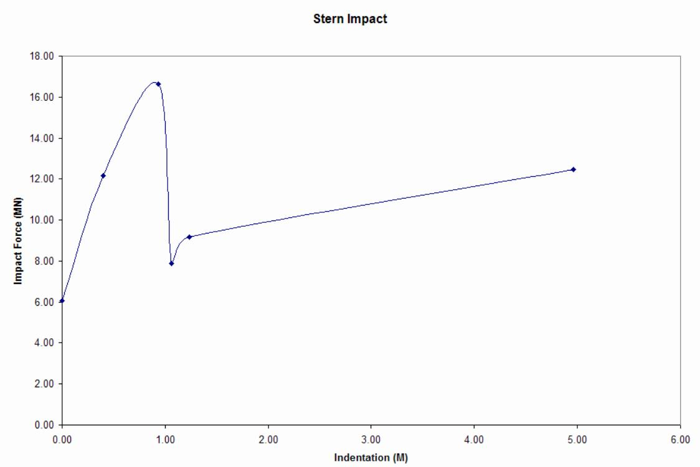

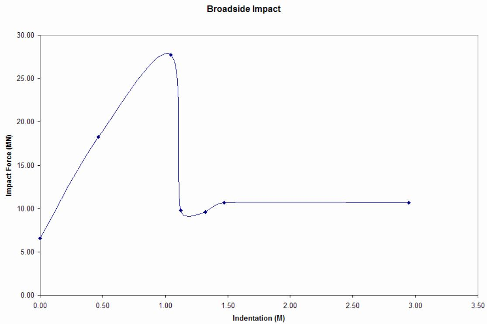  
DNV Force - Displacement Curves for a 5000 ton Ship and 1.5m Diameter Column

2 COLLAPSE MODELING AND INPUT

The Collapse program requires a SACS model file and a Collapse input file. The model requires some minor modeling considerations for the purpose of the nonlinear plastic analysis.

## 2.1 MODELING REQUIREMENTS

A standard SACS model may be used as the model input for the nonlinear analysis with the following requirements:

2.1.1 Analysis Type

The ‘NL’ analysis type option must be specified in on the model OPTIONS line for standard nonlinear plastic analysis. For nonlinear analysis including a nonlinear elasto-plastic foundation, the ‘NP’ analysis option must be designated.

2.1.2 Load Combinations

All load cases which are specified as part of a load step in the nonlinear plastic collapse analysis must be basic load conditions. However, because a load sequence may consist of numerous load conditions, any combination of basic load cases can be applied sequentially as part of the load sequence.

Note: Load combinations are accounted for in the Collapse input file by a load sequence consisting of the basic load cases that define the combination applied sequentially. Alternatively, load combinations may be converted to basic load cases using the Seastate program prior to execution of the Collapse analysis.

## 2.2 COLLAPSE ANALYSIS INPUT

In addition to the model, the nonlinear plastic analysis requires a Collapse input file defining analysis input data.

2.2.1 Collapse Analysis Options

Collapse analysis options are specified in columns 26-41 on the CLOPT line.

2.2.1.1 Joint Flexibility

The effects of tubular connection flexibility may be accounted for by specifying analysis option ‘JF’.

Alternatively, participants of the JIP ‘Assessment Criteria, Reliability and Reserve Strength of Tubular Joints’ may access a formulation for connection flexibility that has been developed by MSL Engineering Limited (UK). The formulation can be specified with analysis option ‘MF’ for mean level or ‘CF’ for characteristic level on the input line MSLOPT in columns 8-9.

2.2.1.2 Member Local Buckling

Local buckling of the member cross section may be considered by specifying analysis option ‘LB’ in one of the analysis options fields. The criteria used for local buckling is specified on columns 52-53 as ‘MG’

for Marshall & Gates lower limit of critical strain, ‘2U’ for API Bulletin 2U recommendations or ‘LR’ for API ultimate strength code criteria.

2.2.1.3 Pile Plasticity

When executing a nonlinear plastic analysis including the pile/soil foundation, the pile elements material properties may be treated as elastic or plastic. Enter ‘PP’ in one of the analysis option fields to use plastic material properties for pile elements.

2.2.1.4 Considering Skipped Elements Plastically

By default, any element or element group designated in the model file to be skipped for post processing purposes is considered as an elastic element (i.e. have elastic material properties for any step of the nonlinear plastic analysis). Skipped elements may be considered to have plastic material properties by specifying the analysis option ‘NS’.

Note: Skipped beam elements are designated in the model file by ‘SK’ in columns 20-21 on the MEMBER line defining the member or by specifying member class ‘9’ in column 47 on the GRUP line defining the group to which it is assigned. Skipped plates are designated by ‘SK’ in columns 31-32 on the PLATE line defining it.

2.2.1.5 Tubular Connection Capacity Check

Joint strength check based upon API RP 2A-LRFD recommendations for tubular joints can be implemented by specifying ‘JS’ in one of the analysis options field between columns 26-41. Alternatively, ‘ND’ may be specified at the same location in order to perform a joint check based upon the Norsok standard for the design of steel structures.

Once the joint strength check criterion has been exceeded the connection is considered to have failed and the brace stiffness is removed from the analysis.

Alternatively, participants of the JIP ‘Assessment Criteria, Reliability and Reserve Strength of Tubular Joints’ may access the capacity check that has been developed by MSL Engineering Limited (UK). The capacity check includes mean level and characteristic level options specified with analysis option ‘MS’ or ‘CS’, respectively, in columns 10-11 on the MSLOPT line.

2.2.1.6 Strain Hardening

After plasticity occurs in an element, the Collapse program has the ability to include the effects of strain hardening. To consider the effects of strain hardening, enter the strain hardening ratio, defined as the ratio of the slope of the plastic portion of the stress-strain curve to the slope of the elastic portion, in columns 76-80.

2.2.1.7 Collapse Critical Displacement

The collapse critical displacement or the maximum deflection allowed before the structure is considered to be collapsed or failed may be specified in columns 71-75.

2.2.1.8 Creating a SACS Model File at Final Step

A SACS model file with joint coordinates that reflect the final displaced position of the joint may be created by inputting ‘SF’ in columns 38-39 on the CLPOPT line.

2.2.2 Analysis Parameters and Convergence Criteria

Analysis parameters such as number of plastic member sub-segments and the maximum number of iterations are specified in columns 11-19 on the CLPOPT line while analysis convergence criteria are specified in columns 56-60.

2.2.2.1 Number of Member Sub-Segments

By default, members with plastic material properties are divided into eight sub-segments along the member length. The number of sub-segments for members may be specified in columns 14-16.

Note: The sub-segment length is determined by dividing the total member length by the maximum number of sub-segments designated. For segmented members, any sub-segment which has a change in property is further divided into two constant property sub-segments at the point at which the section property changes. Therefore, segmented members may have more sub-segments than the maximum specified.

2.2.2.2 Member Iterations and Displacement Convergence

For any load increment, a beam-column solution is performed for each plastic member using the cross section sub-element details. Member stiffness iterations continue until the displacements of member sub-segment joints for two successive iterations meet the member displacement tolerance or until the maximum number of member iterations has been met. The default number of member iterations is 20 and may be overridden in columns 17-19. The default member displacement tolerance is 0.01 inch or 0.01cm and may be overridden in columns 66-70.

Note: The maximum number of member iterations may be increased when member solution has not converged.

2.2.2.3 Global Stiffness Iterations and Convergence

For any load increment, a beam-column solution is performed for each plastic member using the cross section sub-element details. The global stiffness iteration is then performed including any effects of connection flexibility and nonlinear pile/soil foundation effects. The deflected shape of the structure is then determined and compared to the displacements of the previous global stiffness iteration. The stiffness iterations are repeated until the displacements and rotations meet the displacement and rotation convergence tolerances or the maximum number of iterations has been met.

By default, the maximum number of global stiffness iterations per load increment is 20 but may be overridden in columns 11-13. The default displacement and rotation convergence tolerances are 0.01 inch or 0.01cm and 0.001 radians and may be overridden in columns 56-60 and 61-65, respectively.

2.2.2.4 Continue if Maximum Number of Iterations Exceeded

By default, the nonlinear analysis is terminated when the maximum number of iterations is exceeded. Specify the ‘CN’ analysis option in one of the analysis options fields, columns 26-41, to continue the analysis even if the maximum number of iterations is exceeded.

2.2.3 Output Reports

Output reports including joint deflections, joint reactions, member internal loads and stresses, collapse summary and member summary reports are available. Report data may generated based on the final analysis results, each load increment or each iteration. Output report options may be specified on the CLPRPT line in columns 8-31.

2.2.3.1 Joint Displacements

Joint displacements may be reported for the structure’s final position, for each load increment or for each iteration by specifying ‘P0’, ‘P1’ or ‘P2’, respectively.

2.2.3.2 Selecting Joints for Displacement Report

By default, the displacements for each joint in the model is reported in the joint displacement report. The user may designate the joints to be reported in the joint displacement report on the JTSEL line. There is no limit to the number of joints that may be designated.

Note: If joints are designated using the JTSEL line, only joints specified are included in the joint displacement report.

2.2.3.3 Joint Reactions

Joint reactions may be reported for the structure’s final position, for each load increment or for each iteration by specifying ‘R0’, ‘R1’ or ‘R2’, respectively.

2.2.3.4 Member Internal Loads and Stresses

Member internal loads and stresses may be reported for the structure’s final position, for each load increment or for each iteration by specifying ‘M0’, ‘M1’ or ‘M2’, respectively.

2.2.3.5 Pilehead Reactions Report

The pilehead reactions may be reported for the structure's final position, for each load increment or for each iteration by specifying 'F0', 'F1' or 'F2' respectively in columns 26-27 on the CLPRPT input line.

2.2.3.6 Selecting Members for Internal Loads and Stress Report

By default, the internal loads and stresses will be reported for all members in the model which can be quiet voluminous. To avoid large reports the user may select specific members to be reported by using the MEMSEL line. There is no limit to the number of members that may be designated.

2.2.3.7 Selecting Plates for Reports

By default, reports will be produced for all plates. The user can request reports on specific plates by using the PLTSEL line. There is no limit to the number of plates that may be selected.

2.2.3.8 Excluding Elastic Members

Members whose properties remain elastic may be excluded from the internal loads and stress reports by selecting the ‘MP’ option. The report will thus contain internal loads and stresses only for plastic members.

2.2.3.9 Designating Minimum Plasticity

A minimum plasticity ratio for the member stress report may be specified in columns 32-36 on the CLPRPT line. If a minimum plasticity ratio is specified, only members with sub-elements that have plasticity ratios greater than the ratio specified are reported.

2.2.3.10 Collapse Summary Report

The Collapse solution summary report containing the load case, load factor, force summation, and maximum displacement and rotation for each load increment may be obtained be specifying report option ‘SM’.

2.2.3.11 Member Summary Report

Select the ‘MS’ option to obtain a plastic member summary report including the plasticity ratio and member internal loading for each load increment.

2.2.4 Applying Load

Unlike standard linear analysis, the Collapse program analyzes a set of load cases applied step by step or sequentially rather than simultaneously. The Collapse program allows for up to six load sequences to be defined with each load sequence analyzed as an independent nonlinear analysis.

2.2.4.1 Defining a Load Sequence

A load sequences defines a set of load steps that will be applied in the sequence or order specified by the user using LDSEQ lines. Enter the load sequence name in columns 7-10 of the first LDSEQ line defining the sequence.

Each load sequence may contain from one to fifty load steps defined in columns 21-80 on the LDSEQ line. A load step defines the basic load case to be applied, the number of increments over which to apply the load case, the initial load case factor and the final load case factor. For any particular load step, the magnitude of each load increment is constant and is determine by:

$$L o a d I n c r e m e n t = \frac{(E n d f a c t o r - B e g i n f a c t o r)}{N u m b e r o f i n c r e m e n t s}$$

Note: The order in which loading is applied in the sequence may have a significant effect on the analysis results. For example, dead loading or self weight should be applied before any environmental loading.

2.2.4.2 Load Sequences with More than Three Load Steps

Multiple LDSEQ lines may be used to define load sequences consisting of more than three load steps. For each subsequent LDSEQ line, leave the load sequence ID in columns 7-10 blank to designate that the

load steps defined are a continuation of the current load sequence. Up to a total of seventeen LDSEQ lines may be used to define up to fifty steps for any particular load sequence.

2.2.4.3 Using Load Combinations

Although only basic load cases may be specified as part of a load sequence, load combinations may be analyzed by defining the basic load cases making up the combination, as part of the load sequence. Unlike linear analysis, these basic load conditions are applied sequentially rather than simultaneously.

Alternatively, load combinations may be converted to basic load cases using the Seastate program prior to execution of the Collapse analysis.

2.2.5 Tubular Connection Capacity Parameters

2.2.5.1 Tubular Connection Capacity Options

Joint strength options used for the tubular connection capacity check can be implemented through the use of the JSOPT line. This line is optional in any collapse analysis. If this line is omitted then default options will be used.

2.2.5.2 LRFD Resistance Factor Data

By default, the Collapse program will use the LRFD safety indices that are specified in the API RP 2A-LRFD commentary as resistance factors. Alternative resistance factors can be implemented by the use of the RSFAC input line.

2.2.5.3 Norsok Resistance Factor Data

Resistance factors may be used in conjunction with the Norsok joint strength check. Connection and material resistance factors default to 1.0 and 1.15 respectively. Alternative resistance factors can be specified by the use of the RSFAC input line.

2.2.6 Designating Elements as Elastic

By default, members and groups designated as skipped for post processing are treated as large deflection elements with elastic material properties. Additionally, members or member groups may be designated by the user as elastic elements using the MEMELA and GRPELA input lines, respectively.

Similarly, plate elements and plate groups can be designated as elastic elements using the PLTELA and PGRELA input lines respectively.

Note: Designating elements to remain elastic can significantly reduce the run time for a collapse analysis. Also, certain element types including wishbones, non-structural framing, i.e. framing representing risers, boat landings, anodes, etc. and dummy framing should be treated as elastic elements for the purpose of the nonlinear analysis.

2.2.6.1 Elastic Members

Specify the start and begin joints of any member that is to be considered as a large deflection elastic element on the MEMELA input lines. As many MEMELA lines as required may be specified.

2.2.6.2 Elastic Member Groups

Specify member groups to which all elements assigned are to be considered as large deflection elastic elements on the GRPELA input line. As many GRPELA lines as required may be specified.

2.2.6.3 Elastic Plates Elements

Specify the plate ID’s of plate elements that are to be considered as large deflection elastic elements on the PLTELA input lines. As many PLTELA lines as required may be specified.

2.2.6.4 Elastic Plate Groups

Specify plate group names that are to be considered as large deflection elastic elements on the PGRELA input line. As many PGRELA lines as required may be specified.

2.2.7 Nonlinear Springs

The Collapse program supports nonlinear springs and nonlinear spring supports.

2.2.7.1 Nonlinear Spring Supports

A general nonlinear spring to ground element is available in Collapse. The spring elements have six uncoupled degrees of freedom. The force deflection characteristics of the spring for each degree of freedom are defined by discrete Force-Displacement points in the input line NLSPRG. Up to four points may be used to define the spring Force-Displacement characteristics. As many NLSPRG input lines as required may be specified.

2.2.7.2 Joint to Joint Nonlinear Springs

Nonlinear springs can be assigned between existing joints. The force deflection characteristics of the spring for each degree of freedom are defined by discrete Force-Displacement points in the input line NLSPJJ. As many points as required may be used to define the spring Force-Displacement characteristics. As many NLSPJJ input lines as required may be specified.

2.2.8 MSL Joint Flexibility Formulation

Participants of the joint industry project ‘Assessment Criteria, Reliability and Reserve Strength of Tubular Joints’ may access the joint flexibility formulation developed by MSL Engineering Limited (UK). Options from the formulation may be accessed on the MSLOPT line.

Two levels of tubular connection capacity, ‘mean’ level and ‘characteristic’ level are included. The ‘mean’ level corresponds to a 50% probability of survival while the ‘characteristic’ level corresponds to a 95% probability of survival.

2.2.8.1 Joint Flexibility

The predicted effects of tubular connection flexibility may be accounted for by specifying analysis option ‘MF’ or ‘CF’ for mean or characteristic level, respectively, in columns 8-9.

By default, a convergence tolerance of 0.001 is assumed for joint distortion and rotation. The joint distortion tolerance can be specified in columns 15-19. The joint rotation tolerance can be specified in columns 20-24.

2.2.8.2 Joint Strength

The predicted tubular connection strength at ‘mean’ level can be accounted for by specifying analysis option ‘MS’ in columns 10-11. Alternatively, the connection strength may be assessed at the characteristic level by specifying ‘CS’ in columns 10-11.

2.2.8.3 Fracture Criteria

The ductility limits for tension loaded joints may be accounted for by specifying analysis option ‘MT’ at mean level, and ‘CT’ at characteristic level in columns 12-13.

2.2.9 Joint Strength/Flexibility Selection

Individual joints may be chosen for joint strength or joint flexibility analysis. The option used, either joint strength ‘JS’ or joint flexibility ‘JF’, must be specified with CLPOPT analysis options. With the ‘JS’ option specified on the CLPOPT line, a joint or group of joints may be chosen for joint strength analysis with the JSSEL line. This means that all braces connected to the joints specified will be included or excluded from the joint strength analysis. The line either includes or excludes the joints specified in columns 9-77 based on the entry in column 7. Specifying ‘I’ in column 7 will mean that the joints named are included in the joint strength analysis; specifying ‘X’ in column 7 will mean that all joints except those named are included in the joint strength analysis.

In the same manner, joints may be chosen for joint flexibility analysis with the JFSEL line. With either JSSEL or JFSEL, the include or exclude option is mutually exclusive. Therefore, if multiple lines are used to include or exclude joints, each line must have the same option specified in column 7.

In the following example, joints 101 and 102 are excluded from joint flexibility analysis. All other joints will be analyzed.

```txt
1 2 3 4 5 6 7 8 123456789012345678901234567890123456789012345678901234567890 1JFSELX101102 
```

If the choice of a single joint for joint strength or joint flexibility analysis is not sufficiently restrictive, the BSSEL and BFSEL allow the user to restrict strength or flexibility analysis to individual brace/chord connections. The option used, either joint strength ‘JS’ or joint flexibility ‘JF’, must be specified with CLPOPT analysis options. With the ‘JS’ option specified on the CLPOPT line, a brace/chord connection joint may be chosen for joint strength analysis with the BSSEL line. The first brace member joints are specified in columns 9-12 (begin joint) and columns 13-16 (end joint). The strength analysis will be calculated at the brace/chord connection joint, which is either the begin joint or the end joint of the brace member, and is specified in columns 17-20 for the first brace. Up to five braces may be specified on the BSSEL line. As in the JSSEL line, brace/chord connections may be included or excluded from strength analysis by specifying ‘I’ or ‘X’ in column 7.

Equivalently, joint flexibility for individual brace/chord connections is specified with the BFSEL line. With either BSSEL or BFSEL, the include or exclude option is mutually exclusive. Therefore, if multiple lines are used to include or exclude brace/chord connection joints, each line must have the same option specified in column 7.

In the following example, brace/chord connection joint 101 of brace member 101-401 is excluded from brace strength analysis. All other brace/chord connections will be analyzed.

```txt
1 2 3 4 5 6 7 8 1 23456789012345678901234567890123456789012345678901234567890 1 BSSEL X 101 401 101 
```

The resistance factor specified for a brace/chord connection may be modified using the RSFACO line. This line allows the user to override joint resistance factor values specified on RSFAC lines. The line specifies the brace member in columns 8-11 (begin joint) and columns 12-15 (end joint). The brace/chord connection joint, which is either the begin joint or the end joint, is specified in columns 16- 19. The resistance factors (axial tension, axial compression, in-plane bending, out-of-plane bending, yield stress) are specified in columns 21-45. Optionally, the connection type may be specified in column 47, with choices being ‘X’ (X or cross connection), ‘Y’ (T or Y connection), or ‘K’ (K brace connection). Any of the resistance factors left unspecified or given the value 0.0 will be replaced by values specified for the connection joint on previous RSFAC lines.

In the following example, brace/chord connection joint 201 of brace member 201-501 will have an inplane bending resistance factor of 3.81 and an out-of-plane resistance factor of 3.61. The values for the axial tension, axial compression and yield stress resistance factors are the values specified earlier on RSFAC lines for joint 201.

```c
1 2 3 4 5 6 7 8 1 23456789012345678901234567890123456789012345678901234567890 1 RSFACO 201 501 201 3.81 3.61
```

2.2.10 Material Properties

Detailed multilinear post yield stress-strain behavior for members can be specified using this option. If this option is not selected, post-yield behavior remains linear and is governed by the strain hardening ratio specified in the CLPOPT line. For this purpose a set of material models have to be defined and different member groups can be assigned to each of these material models. MATGRP line is used to assign a material model to several member groups. Plastic strain (defined as total strain minus yield strain) and Stress factor (defined as actual stress divided by the yield stress) values beginning at the yield point are entered in MATPRP PLAS lines to define the post-yield behavior of the material.

Note 1: This option is available only for member elements. This functionality will be extended to piles and plate elements in future.

Note 2: The plastic strain values and the stress factor values should be in the monotonically increasing order.

Note 3: Maximum of 50 different material models and maximum of 50 data points (1 strain-stress couple =1 data point) in each material model are permitted.

Note 4: For calculating the stress value corresponding to a plastic strain value greater than the maximum value specified in the material model (beyond the last data point in the material model), the constant strain hardening ratio specified in CLPOPT line will be used.

The following table shows a sample of how to calculate the Plastic Strain and Stress Factor values from the actual stress-strain curve of a hypothetical material:

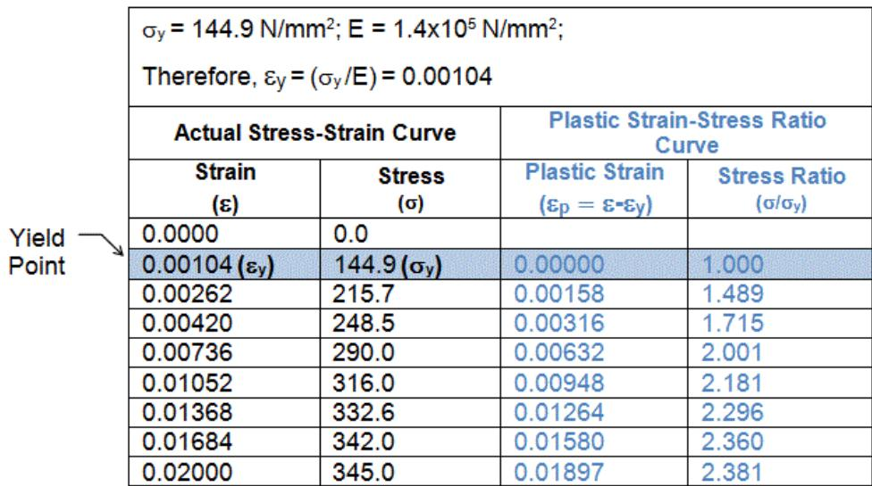

The following image shows how this data will be entered in the Collapse input file. The MATGRP lines are used to assign MAT1 material model to 19 different member groups (G01 to G19). MATGRP lines are immediately followed by a MATPRP HEAD line and a number of MATPRP PLAS lines to define the material model MAT1. To add another material model, these set of lines should be repeated.

```txt
1 2 3 4 5 6 7 8   
123456789012345678901234567890123456789012345678901234567890   
1 MATGRP MAT1 G01 G02 G03 G04 G05 G06 G07 G08 G09 G10 G11 G12 G13 G14 G15   
2 MATGRP G16 G17 G18 G19   
\*   
MATPRP HEAD MAT1   
\*   
MATPRP PLAS 0. 1.0.00158 1.489.00316 1.715.00632 2.001.00948 2.181   
7 MATPRP PLAS .01264 2.296.01580 2.360.01897 2.381 
```

3 TROUBLE SHOOTING

## 3.1 MODEL SINGULARITY

Model singularity is the common term used to describe problems within a stiffness matrix that may limit the accuracy of a solution or prevent it entirely. In matrix theory, a structural model matrix must be positive definite for it to be inverted. Some common problems for a matrix to be non-positive definite are as follows:

1. Portion of structure or entire structure translating or rotating as a rigid body in space.   
2. A joint connected to the structure is translating or rotating in space because a particular end fixity for all members connecting to the joint is released.   
3. Member or plate structural properties are zero for all elements connected to a joint so that the joint is effectively unrestrained.   
4. The structural stiffness is negative due to structural collapse through the occurrence of a mechanism. This may occur due to insufficient strain hardening.

## 3.2 DEBUGGING THE MODEL

If the Collapse program detects a non-positive definite diagonal term in the stiffness matrix, the row of the matrix where it occurred will be indicated. If the value is between zero and -0.0001 it will be reset to 1.0 and the row and column where it occurred will be nulled and solution will continue. If the diagonal value is less than -0.0001 the program terminates execution and reports the critical joint degree of freedom.

For instances where an unrestrained portion of the structure acts as a mechanism for a singularity to occur, the last joint of the mechanism, in optimized order is reported. If the reported joint is indeed unrestrained, the Interpreted Input Echo Report can be used to isolate the critical portion of the structure. The interpreted Joint Data List portion of the report contains the joint degree of freedom and matrix row location list in the following format:

1. The degree of freedom for each joint in the stiffness matrix as rotation X, Y and Z followed by translation X, Y and Z.   
2. For each joint, the beginning row number corresponding to the rotation X degree of freedom is listed in the report. The row numbers corresponding to rotation Y, Z and translation X, Y and Z are obtained by adding 1, 2, 3, 4 to the joint rotation X degree of freedom.

The critical row location is reported in the solution listing file.

## 3.3 WARNING MESSAGES IN COLLAPSE

3.3.1 Non-convergence of Piles

*** ERROR-MAX. ITERATIONS EXCEEDED AT PILE JOINT ‘joint name’

This error message occurs when the procedure used to calculate the stiffness and plasticity of a pile has failed to converge. The specific pile that has caused the problem is attached to the joint specified by ‘joint name’.

The determination of the stiffness and plasticity of a single pile requires the solution of a nonlinear problem which may involve a number of iterations. The convergence of this procedure is governed by the displacement convergence requirement, which is specified on the PSIOPT line of the PSI input file that is used for the analysis.

The maximum number of iterations that are used to solve for each pile is 100. If convergence has not taken place prior to the 100th pile iteration, then the error message (above) is displayed in the Collapse listing file, and the pile solution process is terminated. Subsequently, two informational messages are displayed containing data that are related to components of force and deflection at the pilehead.

* FORCES - ******

* DEFLECTIONS - ******

These messages do not contain useful information and it is recommended that they be ignored.

Two likely causes of pile non-convergence are:

1. A tight displacement convergence requirement.   
2. Instability in the supported structure.

In the case of item 2, it is suggested that a run be made without piles in order to assess if the supported structure is stable.

3.3.2 Maximum Allowable Displacement or Rotation

**** WARNING - EXCEEDED MAXIMUM ALLOWED DISPLACEMENT OR ROTATION

This warning message occurs on completion of a load increment if the deflection of any joint’s degreeof-freedom exceeds a prescribed limit. For degrees-of-freedom that allow translation, the default maximum deflection is 1000.0 in. (393.7 cm.). However, the user can specify a translational limit directly by using the ‘Collapse Deflection’ field in columns 71-75 of the CLPOPT line. The deflection is specified in units consistent with those of the SACS system configuration.

There is also a limit for rotational degrees of freedom, which is set to 2.0 radians. On detection of a displacement or rotation having been exceeded, the following warning message is displayed and the analysis is terminated.

** WARNING - STRUCTURE COLLAPSED ******

3.3.3 Non-convergence of a Load Increment

**** WARNING - EXCEEDED MAXIMUM ITERATIONS OF ‘N’

Where ‘N’ is a user-specified value that represents the maximum number of iterations for a given load increment.

This warning message occurs if the maximum number of iterations has been exceeded for a given load increment. The maximum number of iterations per increment should be specified by the user in columns 11-13 of the CLPOPT line. If no user specification is made, then the maximum number defaults to 20.

Collapse will attempt to use a sufficient number of iterations to achieve convergence for a given load increment. However, if Collapse attempts to use a number of iterations that is greater than the maximum, no further iterations are performed for the current load increment, and the analysis is declared to be non-converged for that increment.

By default, if the number of iterations has been exceeded for a load increment, the analysis will terminate and the warning message will be displayed in the Collapse listing file. However, if the user has specified ‘CN’ in columns 28-29 on the CLPOPT line, the analysis will continue with the next load step after the warning message has been displayed.

Non-convergence due to the requirement for a large number of iterations is often associated with, but not limited to, the following circumstances:

1. One or more of the convergence tolerances on the CLPOPT line is tight.   
2. A low strain hardening ratio.   
3. A portion of the load step has approached an unstable region brought about by the failure of an entity such as a joint or a member.   
4. The effective incremental stiffness of an element is almost zero.

In the event of non-convergence of a load increment, it is suggested that the maximum number of iterations be increased from 20 to 40. Increasing the maximum number of iterations beyond 40 does not normally improve convergence.

3.3.4 Non-convergence of Members

*** WARNING - ELEMENTAL STIFFNESS FOR MEMBER ****-**** NOT CONVERGED

This warning message occurs when the procedure used to calculate the stiffness and plasticity of a member has failed to converge. The message is only displayed if member warning messages have been enabled by specifying ‘PW’ in columns 24-25 of the CLPRPT line.

The determination of the stiffness and plasticity of a single member requires the solution of a nonlinear problem which may involve a number of iterations. The convergence of this procedure is governed by the member deflection tolerance, which is specified in columns 66-70 of the CLPOPT line.

The maximum number of iterations that are used to solve for each member can be specified by the user in columns 17-19 of the CLPOPT line. The default maximum number of member iterations is 20. If convergence has not taken place prior to the maximum allowable member iteration, then the error message (above) is displayed in the Collapse listing file, and the member solution process is terminated. Subsequently, three informational messages are displayed containing data that are related to force and convergence criteria.

ERR $= \text{★★★}$

ALLOWABLE $=$ \*\*\*\*\*\*\*\* ...

```txt
FAXIAL= \*\*\*\*\* ... 
```

These messages do not contain useful information and it is recommended that they be ignored.

Likely causes of member non-convergence include:

1. A tight member deflection tolerance.   
2. The maximum number of member iterations is too small.   
3. The member has become very deformed.   
4. Instability in the rest of the structure.

# 4 COMMENTARY

## 4.1 ENERGY PRINCIPLES

The energy, or variational methods of structural mechanics constitute a powerful and widely used approach. Forms of these methods have been tools for the analysis of engineering structures for more than a century. The application of energy methods to the derivation of forces and displacements in a structure was developed by Castiglino[1] in the 1870s. The application of complementary energy for the analysis of nonlinear structures was developed by Engesser[1] in 1889. Since then a number of theorems have been formulated on the bases of these developments. The following section discusses the basic energy variational principles employed by the nonlinear Collapse program.

4.1.1 Discrete Systems

Consider a discrete system where the potential energy, V can be expressed as function of displacements qi and loads Pi. If the system is subjected to a small variation in displacements $\delta \mathsf{ q }_{ \mathrm{ i } } ,$ , so that its new configuration is $\mathsf{ q }_{ \mathrm{ i } } + \delta \mathsf{ q }_{ \mathrm{ i } }$ (assuming load $\mathsf{ P }_{ \mathrm{ i } }$ remains constant), the potential energy of the system in its new configuration can be expressed via a Taylor’s series expansion as:

$$\begin{array}{l} V \left(P_{i}, q_{i} + \delta q_{i}\right) = V \left(P_{i}, q_{i}\right) + \frac{\partial}{\partial q_{i}} V \left(P_{i}, q_{i}\right) \delta q_{i} \tag{1} \\ + \frac{1}{2 !} \frac{\partial^{2}}{\partial q_{i} \partial q_{j}} V (P_{i}, q_{i}) \delta q_{i} \delta q_{j} + \dots \\ \end{array}$$

Equation (1) can be written in a simplified form as:

$$\delta^{T} V = \delta V + \delta^{2} V + \dots \tag{2}$$

Where $\delta^{ \intercal } \vee$ is the total variation in the potential energy expressed by:

$$\delta^{T} V = V \left(P_{i}, q_{i} + \delta q_{i}\right) - V \left(P_{i}, q_{i}\right) \tag{3}$$

δV and $\delta^{ 2 } \vee$ are the first and second variations of the potential energies given by:

$$\delta V = \frac{\partial}{\partial q_{i}} V \left(P_{i}, q_{i}\right) \delta q_{i} \tag{4}$$

And

$$\delta^{2} V = \frac{1}{2 !} \frac{\partial^{2}}{\partial q_{i} \partial q_{j}} V \left(P_{i}, q_{i}\right) \delta q_{i} \delta q_{j} \tag{5}$$

4.1.1.1 Discrete System - Equilibrium

For a system to be in equilibrium, the potential energy is stationary with respect to displacements so that for all admissible values of $\delta \mathsf{ q }_{ \mathrm{ i } } ,$ the first variation of the total potential energy is zero, i.e.:

$$\delta V = \frac{\partial}{\partial q_{i}} V \left(P_{i}, q_{i}\right) \delta q_{i} = 0 \tag{6}$$

Equation (6) yields n equilibrium equations for i= 1, n. If the system is considered to be in an equilibrium configuration so that $\delta \mathsf{ V } = 0 ,$ , equation (2) may be rewritten as:

$$\delta^{T} V = \delta^{2} V + \dots \tag{7}$$

4.1.1.2 Discrete System - Unstable Equilibrium

If the system in its new configuration is in a state of stable equilibrium, then the total variation in potential energy, $\delta^{ \intercal } \mathsf{ V } ,$ is a minimum and the second variation $\delta^{ 2 } \vee$ is a quadratic form in dqi and is positive definite for all admissible values of $\delta \mathsf{ q }_{ \mathrm{ i } }$ . Unstable or critical conditions occur when $\delta^{ 2 } \vee$ changes from positive definite to semi-positive definite indicating a possible transition from stable equilibrium to unstable equilibrium.[2]

4.1.1.3 Discrete System - Nonlinear Problems

For nonlinear problems, the first variation of the potential energy, δV, yields n unknown nonlinear equations in the displacement variables ${ \sf q }_{ \mathrm{ i } } \left( \mathrm{ i } = 1 , \mathsf{ n } \right)$ .

If Δ denotes a small but finite increment in displacements and forces, then expanding the first variation of the potential energy $\delta \mathsf{ V } ( \mathsf{ P }_{ \mathrm{ i } } + \Delta \mathsf{ P }_{ \mathrm{ i } } , \mathsf{ q }_{ \mathrm{ i } } + \Delta \mathsf{ q }_{ \mathrm{ i } } )$ in a Taylor series about the $\left( \mathsf{ P }_{ \mathrm{ i } } , \mathsf{ q }_{ \mathrm{ i } } \right)$ configuration yields:

$$\begin{array}{l} \delta V \left(P_{i} + \Delta P_{i}, q_{i} + \Delta q_{i}\right) = \delta V \left(P_{i}, q_{i}\right) + \frac{\partial}{\partial P_{i}} V \left(P_{i}, q_{i}\right) \Delta P_{i} \tag{8} \\ + \frac{\partial}{\partial q_{i}} V (P_{i}, q_{i}) \Delta q_{i} + \dots \\ \end{array}$$

Rearranging equation (8) and retaining only first order terms in increments Δ yields:

$$\begin{array}{l} \delta V \left(P_{i} + \Delta P_{i}, q_{i} + \Delta q_{i}\right) - \delta V \left(P_{i}, q_{i}\right) = \frac{\partial}{\partial P_{i}} V \left(P_{i}, q_{i}\right) \Delta P_{i} \tag{9} \\ + \frac{\partial}{\partial q_{i}} V (P_{i}, q_{i}) \Delta q_{i} + \dots \\ \end{array}$$

If the system in configuration $\left( \mathsf{ P }_{ \mathrm{ i } } + \Delta \mathsf{ P }_{ \mathrm{ i } } , \mathsf{ q }_{ \mathrm{ i } } + \Delta \mathsf{ q }_{ \mathrm{ i } } \right)$ is in equilibrium then:

$$\delta V \left(P_{i} + \Delta P_{i}, q_{i} + \Delta q_{i}\right) = 0 \tag{10}$$

Substituting equation (10) into equation (9), rearranging the terms and ignoring higher order terms yields the following equation:

$$\frac{\partial}{\partial q_{i}} V \left(P_{i}, q_{i}\right) \Delta q_{i} = - \frac{\partial}{\partial P_{i}} V \left(P_{i}, q_{i}\right) \Delta P_{i} - \delta V \left(P_{i}, q_{i}\right) \tag{11}$$

Equation (11) provides a basis for an iterative procedure for the solution of nonlinear equilibrium equations. If the second term, $\delta \mathsf{ V } ( \mathsf{ P }_{ \mathrm{ i } } , \mathsf{ q }_{ \mathrm{ i } } )$ , is set to zero, then equation (11) represents the incremental equations of equilibrium.

4.1.2 Continuous Systems

The variational principles for discreet systems can be extended to continuous systems.[4] The loads $\mathsf{ P }_{ \mathrm{ i } }$ and displacements qi in the discrete system can be assumed analogous to the externally applied loads and nodal displacement coefficients which define the magnitude of displacements in continuous systems.

4.1.2.1 Continuous Systems - Equilibrium

For a system comprising a deformable body acted upon by external forces $\mathsf{ P }_{ \mathrm{ i } }$ with the corresponding displacements defined by ri, the first variation of the potential energy is zero when the system is in a state of equilibrium. Assuming that the external forces remain constant, this can be represented by the following equation: [4]

$$\delta V = - P_{i} \delta r_{i} + \int \sigma_{i} \delta \varepsilon_{i} d \mathrm{V O L} = 0 \tag{12}$$

where the repeated suffices imply summation, σi represents the internal stresses, $\delta \varepsilon_{ \mathrm{ i } }$ represents the first variation in the corresponding strains and the integration is over the volume of the body.

Noting that $\delta^{ 2 } \mathsf{ V } = \delta \left( \delta \mathsf{ V } \right)$ , the second variation of V is given by $[ 4 ]_{_{ - } }$ :

$$\int \left(\sigma_{i}^{\prime} \delta \varepsilon_{i} + \sigma_{i} \delta \varepsilon_{i}^{\prime}\right) d \mathrm{V O L} = P_{i}^{\prime} \delta r_{i} + P_{i} \delta r_{i} - \int \sigma_{i} \delta \varepsilon_{i} d \mathrm{V O L} \tag{13}$$

4.1.2.2 Continuous Systems - Unstable Equilibrium

For stable equilibrium, the first variation corresponds to a minimum and is zero and the second variation is positive definite for all variations in displacements. Unstable or critical conditions occur when $\delta^{ 2 } \vee$ changes from positive definite to semi-positive definite.

Note: Because the second variation of any linear function vanishes, it is necessary to consider second order strains and displacements to completely define equation (13).

4.1.2.3 Continuous Systems - Nonlinear Problems

Assuming that σi and εi can be expressed as functions of displacement variables and ri can be expressed as a linear function of displacement variables, equations (11) and (12) yield:

$$\int \left(\sigma_{i}^{\prime} \delta \varepsilon_{i} + \sigma_{i} \delta \varepsilon_{i}^{\prime}\right) d \mathrm{V O L} = P_{i}^{\prime} \delta r_{i} + P_{i} \delta r_{i} - \int \sigma_{i} \delta \varepsilon_{i} d \mathrm{V O L} \tag{14}$$

in which the prime implies the operation

$$\frac{\partial f (x)}{\partial x_{i}} \Delta x_{i} \tag{14a}$$

with respect to the applied load and displacement variables [5].

Equation (14) is analogous to equation (11) for a discrete system and provides a bases for an iterative procedure for the analysis of nonlinear equilibrium equations. If the last two terms on the right hand side of the equation are set to zero, equation (14) represents the incremental equations of equilibrium.

## 4.2 NON-LINEAR PLASTIC FORCE APPROACH

For an elasto-plastic problem, the strains can be represented in terms of the displacement variables in matrix form as:

$$\left\{\varepsilon_{i} \right\} = [ A ] \{q \} \tag{15}$$

where $\varepsilon_{ \mathrm{ i } }$ is the total strain vector at a point and can be composed of the elastic strains $\tt{ \varepsilon }_{ \tt c , i }$ and the plastic strains $\varepsilon_{ \mathsf{ p } , \mathsf{ i } }$ so that:

$$\left\{\varepsilon_{i} \right\} = \left\{\varepsilon_{e, i} \right\} + \left\{\varepsilon_{p, i} \right\} \tag{16}$$

Stresses $\sigma_{ \mathrm{ i } }$ which are only dependent upon elastic strains can be expressed as:

$$\left\{\sigma_{i} \right\} = [ E ] \left\{\varepsilon_{e, i} \right\} \tag{17}$$

Noting that:

$$\left\{\sigma_{i}^{\prime} \right\} = [ E ] \left\{\varepsilon_{i}^{\prime} \right\} \tag{18}$$

And substituting equations (16) - (18) into equation (14) gives:

$$\begin{array}{l} \int \left(\left[ \{\delta q \}^{T} [ A ]^{T} - \{\delta \varepsilon_{p} \}^{T} \right] [ E ] \left[ [ A ] \{\Delta q \} - \{\varepsilon_{p}^{\prime} \} \right] + [ E ] \left[ [ A ] \{q \} - \{\varepsilon_{p} \} \right]\right) d \text{V O L} \tag{19} \\ = \left\{\delta q \right\}^{T} \left\{\Delta P \right\} + \left\{\delta q \right\}^{T} \left\{P \right\} - \int \left(\left[ \left\{\delta q \right\}^{T} [ A ]^{T} - \left\{\delta \varepsilon_{p} \right\}^{T} \right] [ E ] \left[ [ A ] \{q \} - \left\{\varepsilon_{p} \right\} \right]\right) d \mathrm{V O L} \\ \end{array}$$

Where

$$\{P \} = \left\{P_{a} \right\} + \left\{P_{p} \right\} \tag{20}$$

$$\left\{\Delta P \right\} = \left\{\Delta P_{a} \right\} + \left\{\Delta P_{p} \right\} \tag{21}$$

{Pa} is the applied load vector and $\{ \mathsf{ P }_{ \mathsf{ p } } \}$ is the plastic load vector and $\{ \Delta \mathsf{ P }_{ \mathsf{ a } } \}$ and $\{ \Delta \mathsf{ P }_{ \mathsf{ p } } \}$ are the corresponding load increment vectors.

Since the degree of plasticity incurred (and consequently the plastic load vector) is a function of the load path, the solution of an elasto-plastic problem must be handled on an incremental basis given by equation (19) which represents a set of linear simultaneous equations in the unknowns {Δq} and $\{ \Delta \mathsf{ P }_{ \mathsf{ p } } \}$ . The solution procedure involves the application of a linear load increment {ΔP}, and solving the equations for the unknown increments. The improved approximations of ${ \tt q } + \Delta{ \tt q }$ and $\mathsf{ P } { + } \Delta \mathsf{ P }$ are then used as a starting point for the next improvement cycle. The procedure is continued until equilibrium is satisfied, as evidenced by the vanishing of the last two terms on the right hand side of equation (19).

## 4.3 PLATE ELEMENTS

Thin plates are often used as structural components since they can sustain loads well in excess of their elastic buckling load. The elastic buckling load of such elements has little or no effect on predicting the failure load. At the onset of elastic buckling, the plate behavior becomes nonlinear and the collapse load is normally associated with plastic failure. Elastic buckling may be precluded altogether for thick plated structures where the collapse load is reached through the onset plastic failure. Therefore, when analyzing such structures, it is necessary to include both geometric and material nonlinearities.

There are two main approaches to the elasto-plastic analysis of plates.[6] The first method, the Area approach, is an approximate approach which assumes sudden plastification of the entire plate thickness as soon as the extreme fiber stress reaches yield. The second approach allows for a gradual plastification through the thickness of the plate by monitoring the stresses at various sub-layers through the plate cross section.

The Collapse program utilizes the second approach where the plate is divided into 5 sub-layers through its thickness as shown below.

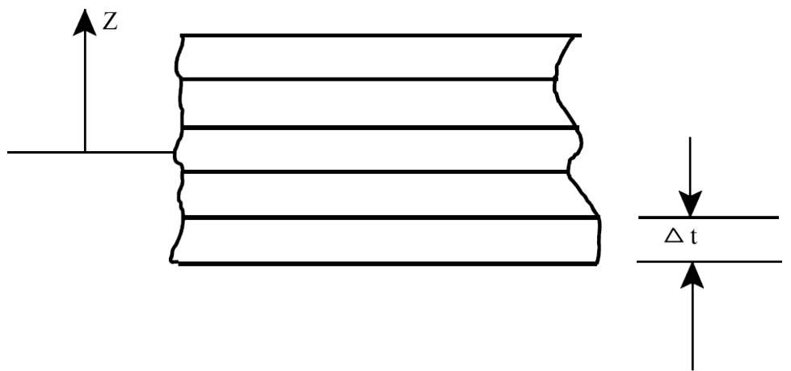

Geometric nonlinearities are included through the use of the second order membrane strain expressions given below:[7]

$$\varepsilon_{m x} = \frac{\partial u}{\partial x} + \frac{1}{2} \left(\frac{\partial w}{\partial x}\right)^{2} \tag{22}$$

$$\varepsilon_{m y} = \frac{\partial v}{\partial y} + \frac{1}{2} \left(\frac{\partial w}{\partial y}\right)^{2} \tag{23}$$

$$\gamma_{m x y} = \frac{\partial u}{\partial y} + \frac{\partial v}{\partial x} + \frac{\partial w}{\partial x} \frac{\partial w}{\partial y} \tag{24}$$

Where $\varepsilon_{ \mathrm{ { m x } } }$ and $\varepsilon_{ \mathsf{ m } \mathsf{ y } }$ represent the membrane strains in the x and y directions, respectively, and $\gamma_{ \sf m \times y }$ represents the membrane shear strain.

Bending strain is represented by the following expressions:

$$\varepsilon_{b x} = - z \frac{\partial^{2} w}{\partial x^{2}} \tag{25}$$

$$\varepsilon_{b y} = - z \frac{\partial^{2} w}{\partial y^{2}} \tag{26}$$

$$\gamma_{b x y} = - 2 z \frac{\partial^{2} w}{\partial x \partial y} \tag{27}$$

Where $\varepsilon_{ \mathrm{ { b x } } }$ and $\varepsilon_{ \mathsf{ b y } }$ are the bending strains in x and y directions, respectively, and $\gamma_{ \mathsf{ b x y } }$ is the bending strain due to twisting.

For an isotropic elastic material, the stress vector $\{ \sigma \}^{ \intercal } = \{ \sigma_{ \mathrm{ x } } , \sigma_{ \mathrm{ y } } , \tau_{ \mathrm{ x y } } \}$ and can be related to the strains through equation (17) as shown below:

$$\left\{\sigma_{i} \right\} = [ E ] \left\{\varepsilon_{i} \right\} \tag{28}$$

The incremental form of equation (28) is given by:

$$\left\{\Delta \sigma_{i} \right\} = [ E ] \left\{\Delta \varepsilon_{i} \right\} \tag{29}$$

Using the above expressions and utilizing equation (19), it is possible to conduct an elasto-plastic analysis of plated structures. The stresses are monitored at each sub-layer through-out the loading history. The von Mises-Hencky Yield Criterion[8] is used to determine the onset of plasticity at any sublayer using the following equation:

$$\Xi = \sigma_{x}^{2} + \sigma_{y}^{2} - \sigma_{x} \sigma_{y} + 3 \tau_{x y}^{2} - S_{y}^{2} = 0 \tag{30}$$

Which defines the yield surface as shown below:

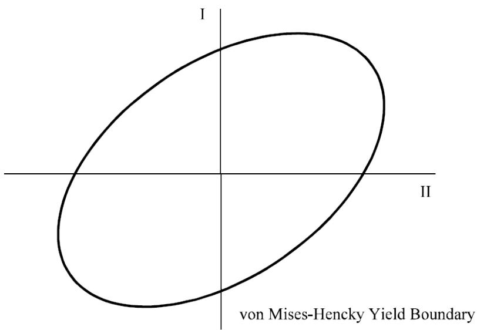

When Ξ is greater than zero, the direction of the plastic strain vector is established by the plastic flow rule according to the theory of plastic potential. Once the plastic strains are determined, the plastic stresses become:

$$\left\{\Delta \sigma_{p} \right\} = [ E ] \left\{\Delta \varepsilon_{p} \right\} \tag{31}$$

The plastic stress resultants are obtained by summing across the plate thickness as follows:

$$N_{x} = \sum_{i = 1}^{n} \sigma_{x p i} \Delta t \quad M_{x x} = \sum_{i = 1}^{n} \sigma_{x p i} z_{i} \Delta t \tag{32}$$

$$N_{y} = \sum_{i = 1}^{n} \sigma_{y p i} \Delta t \quad M_{y y} = \sum_{i = 1}^{n} \sigma_{y p i} z_{i} \Delta t \tag{33}$$

$$N_{x y} = \sum_{i = 1}^{n} \tau_{x y p i} \Delta t \quad M_{x y} = \sum_{i = 1}^{n} \tau_{x y p i} z_{i} \Delta t \tag{34}$$

The plastic nodal force vector for the plate is determined once plate stress resultants are acquired. The plastic nodal force vector is transformed into the global coordinates and added to the global plastic force vector.

## 4.4 BEAM ELEMENTS

4.4.1 Nonlinear Strain Expressions

The complete nonlinear expressions[4] for the strains occurring in the tubular, wide flange, angles, channels and tee cross section types is given by the following equation:

$$\begin{array}{l} \varepsilon_{x} = - y \left(\frac{d^{2} v}{d x^{2}} + \frac{d^{2} w}{d x^{2}} \theta\right) - z \left(\frac{d^{2} w}{d x^{2}} + \frac{d^{2} v}{d x^{2}} \theta\right) \tag{35} \\ + \alpha_{w} \left(\frac{d^{2} \theta}{d x^{2}} - \frac{d^{3} w}{d x^{3}} \frac{d v}{d x} + \frac{d^{3} v}{d x^{3}} \frac{d w}{d x}\right) \\ + \frac{d u}{d x} + \frac{1}{2} \left(\frac{d u}{d x}\right)^{2} + \frac{1}{2} \left(\frac{d v}{d x}\right)^{2} + \frac{1}{2} \left(\frac{d w}{d x}\right)^{2} + \frac{\rho^{2}}{2} \left(\frac{d \theta}{d x}\right)^{2} \\ \end{array}$$

The first two terms in the above equation represent the bending strains including the interaction between bending and twisting. The terms on the last line of the equation represent strains produced by stretching of an element due to displacements u, v and w. The third or middle term in the expression results from the restraint in warping. In practice, partial or no restraint in warping may exist and may differ for various structural connection types. Because of this, it is difficult to quantify and hence is not considered by the program. The second order strain in u can also be neglected in the above equation since its contribution can be assumed to be small in comparison with other terms. This results in the following strain expression:

$$\begin{array}{l} \varepsilon_{x} = - y \left(\frac{d^{2} v}{d x^{2}} + \frac{d^{2} w}{d x^{2}} \theta\right) - z \left(\frac{d^{2} w}{d x^{2}} + \frac{d^{2} v}{d x^{2}} \theta\right) \tag{36} \\ + \frac{d u}{d x} + \frac{1}{2} \left(\frac{d v}{d x}\right)^{2} + \frac{1}{2} \left(\frac{d w}{d x}\right)^{2} + \frac{\rho^{2}}{2} \left(\frac{d \theta}{d x}\right)^{2} \\ \end{array}$$

The expression for shear strain due to St. Venant torsion [9] is given by the following expression:[4]

$$\varepsilon_{x y} = 2 \xi \left(\frac{d \theta}{d x} - \frac{d^{2} w}{d x^{2}} \frac{d v}{d x} + \frac{d^{2} v}{d x^{2}} \frac{d w}{d x}\right) \tag{37}$$

When considering the effects of St. Venant torsion on thin walled bars of open cross section, the section can be considered to be composed of single or several disconnected rectangular strips.

4.4.2 Nonlinear Problems

For a thin walled bar of open cross-section, the first variation of the total potential energy $\delta \vee$ is given by:[10]

$$\delta V = - P_{i} \delta r_{i} + \int \left(\sigma_{x} \delta \varepsilon_{x} + \sigma_{x y} \delta \varepsilon_{x y}\right) d \mathrm{V O L} \tag{38}$$

where $\sigma_{ \mathsf{ X } }$ is the axial stress (tensile positive), $\delta \varepsilon_{ \times }$ is the first variation of the axial strains, $\varepsilon_{ \times \gamma }$ is the shear stress and $\delta \varepsilon_{ x y }$ is the first variation in the corresponding strain. The relationship between the stresses and strains may be given by:

$$\sigma_{x} = E \varepsilon_{x} \tag{39}$$

$$\sigma_{x y} = G \varepsilon_{x y} \tag{40}$$

where E is the Young’s Modulus and G is the shear modulus.

Equation (14) provides a basis for an iterative procedure to the solution of nonlinear equations. For a thin walled bar of open cross-section, equation (14) can be rewritten as:

$$\begin{array}{l} \int \left(\sigma_{x}^{\prime} \delta \varepsilon_{x} + \sigma_{x y}^{\prime} \delta \varepsilon_{x y} + \sigma_{x} \delta \varepsilon_{x}^{\prime} + \sigma_{x y} \delta \varepsilon_{x y}^{\prime}\right) d \text{V O L} \tag{41} \\ - P_{i}^{\prime} \delta r_{i} = P_{i} \delta r_{i} + \int \left(\sigma_{x} \delta \varepsilon_{x} + \sigma_{x y} \delta \varepsilon_{x y}\right) d V O L \\ \end{array}$$

Expressing stresses in terms of strains and utilizing the strain expressions in section 5.4.1 and integrating over the volume of the bar, equation (41) can be written in matrix form as:

$$\left[ K_{i n c} \right] \left\{\Delta q \right\} - \left\{\Delta P \right\} = \left\{P \right\} - \left[ K_{e} \right] \left\{q \right\} \tag{42}$$

Equation (42) represents a set of linear simultaneous equations in the unknowns displacement increments {Δq} and load increments {ΔP} which is composed of the applied load vector {Pa} and the plastic load vector {Pp}. The left side of equation (42) represents the incremental equations of equilibrium and the right side represents the equilibrium equations which vanishes when the system is in a state of equilibrium. Equation (42) can be solved iteratively.

To account for the inter-nodal large displacement nonlinearities, the member element is divided along its length into sub-elements. The number of sub-elements is controlled by the user up to a maximum of 20, with a default of 8. This subdivision will allow the program to account for inter-nodal buckling as well as predict the contribution of the inter-nodal large displacements on the surrounding structure. Each member that is sub-divided essentially becomes a super-element to the structure. From the global stiffness analysis, the member end deflections and rotations are known as well as any inter-nodal loading.

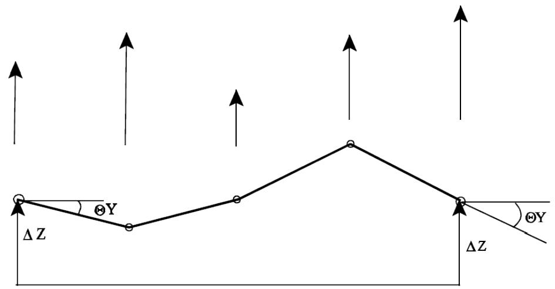

This super-element is solved iteratively using the end deflections and rotations and the intermediate loading until the internal deflections and rotations have converged. At each iteration, each sub-element is checked for plasticity as follows

(a) The internal loads at each end of the sub-element is calculated.   
(b) The sub-element cross-section is divided into sub-areas and the axial and shear stress is calculated for each sub-area as shown below for wide flange and tubular cross-sections. Other cross-sections are similar.

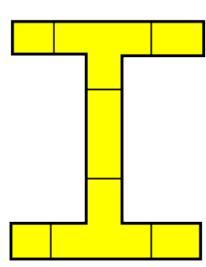

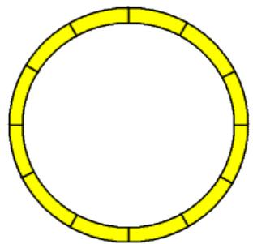

(c) For each sub-area, the plasticity is determined by calculating the amount of strain which exceeds the von Mises-Hencky stress envelope. The plastic strain is retained for each subarea of each sub-element through-out the loading sequence to facilitate the unloading of a sub-area if required.

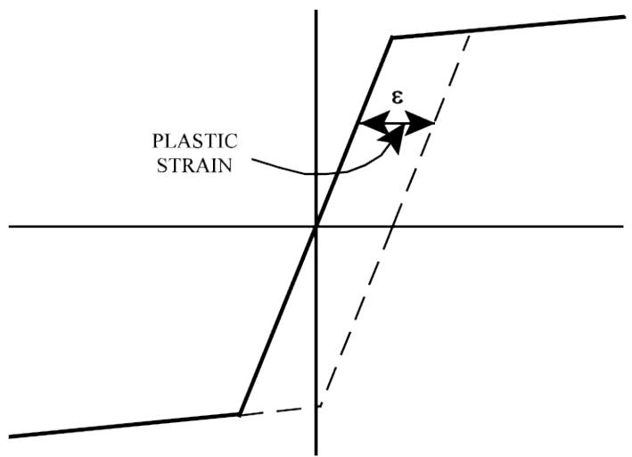

(d) If the local buckling is to be included, the strain is compared to the local buckling strain level of the following:[11]

$$\varepsilon_{l b} = \frac{16}{(D / t)^{2}} \tag{43}$$

If this value is exceeded, a hinge is formed and the sub-element will have zero moment capacity.

(e) The plastic stresses are then used to compute self-equilibrating plastic forces on each subelement.   
(f) These plastic forces are then used in the member iterative solution.   
(g) After the final member iteration, the resulting end plastic forces are transformed into the global coordinates and added to the global plastic force vector.   
(h) The final member stiffness is calculated on the final deflected position of the sub-elements.

## 4.5 CONNECTIONS

4.5.1 Joint Flexibility

The Collapse program can optionally consider the flexibility of a connection which has a tubular chord. The program utilizes equations for the connection flexibility as proposed by Fessler[12] which relate the local axial, in-plane moment, and out-of-plane moment to the corresponding deflection and rotation of the member ends. The following equations are used to calculate the local joint flexibility (LJF):

$$\mathrm{L J F}_{\text{A x i a l}} = \frac{1 . 95 \gamma^{2 . 15} (1 - \beta)^{1 . 3} \sin^{2 . 19} \theta}{E D_{C}} \tag{44}$$

$$\mathrm{L J F}_{\mathrm{O P B}} = \frac{85 . 5 \gamma^{2 . 2} \exp (- 3 . 85 \beta) \sin^{2 . 16} \theta}{E D_{C}^{3}} \tag{45}$$

$$\mathrm{L J F}_{\mathrm{I P B}} = \frac{134 \gamma^{1 . 73} \exp (- 4 . 52 \beta) \sin^{1 . 22} \theta}{E D_{C}^{3}} \tag{46}$$

in which

$$\gamma = \frac{1}{2} \frac{D_{C}}{T_{C}} \quad \beta = \frac{D_{B}}{D_{C}} \tag{47}$$

where ${ \sf D }_{ \sf c }$ and ${ { \sf T }_{ \sf c } }$ are the chord diameter and thickness, respectively, $\mathsf{ D }_{ \mathsf{ b } }$ is the brace diameter, q is the angle between the brace and chord and E is the chord elastic modulus.

Note: The flexibility of a connection with a non-tubular brace is determined using an equivalent brace diameter.

4.5.2 Tubular Connection Capacity

Collapse uses an ultimate limit state approach to check for tubular joint failure where chord and brace capacities are calculated based on either the API RP 2A-LRFD or the Norsok recommendations. For the API-LRFD standard, the connection capacity ratio is determined for the connection based on the following equation:[13]

$$1 - \cos \left[ \frac{\pi}{2} \left(\frac{P_{D}}{\phi_{j} P_{u j}}\right) \right] + \left[ \left(\frac{M_{D}}{\phi_{j} P_{u j}}\right)_{\mathrm{i p b}}^{2} + \left(\frac{M_{D}}{\phi_{j} P_{u j}}\right)_{\mathrm{o p b}}^{2} \right]^{\frac{1}{2}} > 1. 0 \tag{48}$$

where the subscripts ipb and opb refer to in-plane bending and out-of-plane bending, respectively, $\mathsf{ P }_{ \mathsf{ D } }$ is the axial load in the brace member, $\mathsf{ P }_{ \mathsf{ u j } }$ is the ultimate joint axial capacity, $M_{ \mathsf{ D } }$ is the bending moment in the brace member, $\mathsf{ M }_{ \mathsf{ u j } }$ is the ultimate joint bending moment capacity and $\Phi_{ \mathrm{ j } }$ is the ultimate strength resistance factor for tubular joints. For the Norsok standard, the connection capacity ratio is determined for the connection based on the following inequality:[14]

$$\frac{P_{D}}{\phi_{j} P_{u j}} + \left(\frac{M_{D}}{\phi_{j} P_{u j}}\right)_{\mathrm{i p b}}^{2} + \left(\frac{M_{D}}{\phi_{j} P_{u j}}\right)_{\mathrm{o p b}}^{2} \leq 1. 0 \tag{49}$$

When the joint capacity ratio determined from equation (48) or (49) exceeds 1.0, the connection is considered to have failed. Once the connection has failed, the brace stiffness is removed from the analysis.

# 5 FOUNDATION

The effects of the nonlinear foundation including piles below the mud-line and the soil may be accounted for in the plastic collapse analysis.

## 5.1 PILE REPRESENTATION

The piles are represented structurally as segmented members using a full 3-D finite element approach including shear deformation as shown in the figure below:

PILE COORDINATES   
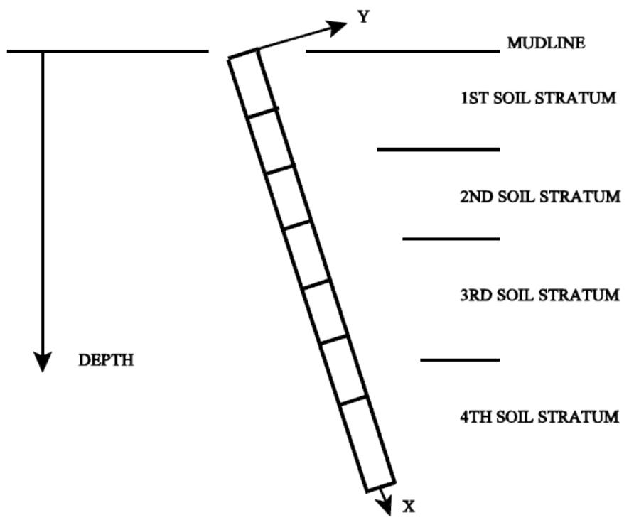  
The 3-D analysis allows the pile to deflect in any direction at any point down along the length of the pile.

## 5.2 SOIL REPRESENTATION

The axial soil representation can be either T-Z data where the soil resistance is a function of the axial displacement or adhesion data where the axial load in the pile is removed at the rate of the soil capacity. The T-Z approach would be preferred since the relative stiffness of the soil and the pile is represented. The end bearing is also represented by either a load versus deflection (T-Z) or as a total capacity. For the lateral soil data, the load versus deflection (P-Y) is used. Torsion of the pile is normally represented by a torsional spring.

6 SAMPLE PROBLEMS

This section presents some sample problems used to illustrate some of the features and capabilities of the Collapse program module. Two sample problems are detailed:

1. The first sample problem is a simply supported beam used to demonstrate the elasto-plastic behavior of the element.   
2. The second sample problem is an environmental loading push over analysis of a frame type structure.

## 6.1 ELASTO-PLASTIC BEAM ANALYSIS

Sample Problem 1 illustrates an elasto-plastic beam analysis. This sample problem considers a simply supported beam with a point load at midspan. The beam is restrained in the axial direction so that membrane action is introduced at large deflections. The beam is of circular cross section and is modeled as two elements as shown in Figure 1 below.

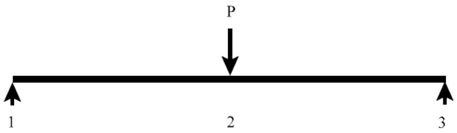  
Figure 1

The Collapse model file for the simply supported beam follows:

```txt
1 1 2 3 4 5 6 7 8 1234567890123456789012345678901234567890123456789012345678901234567890123456789012345678901234567890123456789  
1 SIMPLY SUPPORTED BEAM SAMPLE  
2 OPTIONS MN NL 1 DC C  
3 GRUP
4 GRUP DIG 50.0000.500 21.007.72333.00 1 1.0 1.0 0.5N7.8490  
5 MEMBER
6 MEMBER 1 2 DIG  
7 MEMBER 2 3 DIG  
8 JOINT
9 JOINT 1 0. 0. 0. 111101  
10 JOINT 2 5.0 0. 0. 010101  
11 JOINT 3 10. 0. 0. 111101  
12 LOAD
13 LOADCN1
14 LOAD Z 2 -10.000 GLOB JOIN PTLOAD  
15 END
```

The Collapse input file containing the Collapse analysis input data is shown below:

```txt
1 2 3 4 5 6 7 8 12345678901234567890123456789012345678901234567890123456789012345678901234567890123456789012345678901234567891 ALSI .002 2 CLPRPT P1R1M1 3 LDSEQ AAAA 1 250 0.00 90.0 4 END 
```

The following is a description of selected input used in the Collapse input file for the sample problem:

Line 1. The collapse analysis options are specified on the line labeled CLPOPT as follows:

a. The maximum number of iterations per load increment is set to 80 in columns 12-13 and the default number of member iterations is used (20 in columns 17-19).   
b. The number of segments per member is set to the default value of 8 and the default values for convergence criterion was used.   
c. Strain hardening ratio of .002 was specified in columns 76-80.

Line 2. The joint displacements, joint reactions and member stresses are reported at every load increment as designated by ‘P1’, ‘M1’ and ‘R1’ on the CLPRPT input line.

Line 3. The load sequence is input on the LDSEQ input line as follows:

a. Load case 1 is to be applied in 250 increments starting with a load factor of 0.0 and ending with a load factor of 90.0

4. The end of input is designated by the input line labeled END.

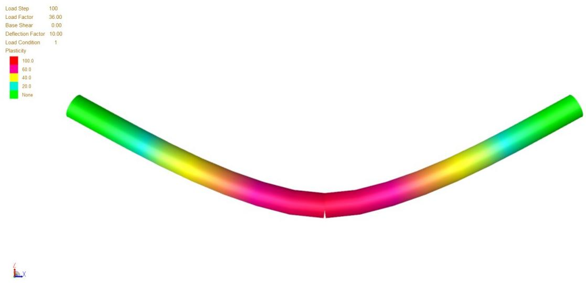  
Figure 2 below shows a color-coded plastic interaction plot of the sample problem generated by Collapse View, the interactive collapse view program.   
Figure 2   
Figure 3 shows a typical load displacement plot generated by Collapse View, the Collapse interactive viewing program:

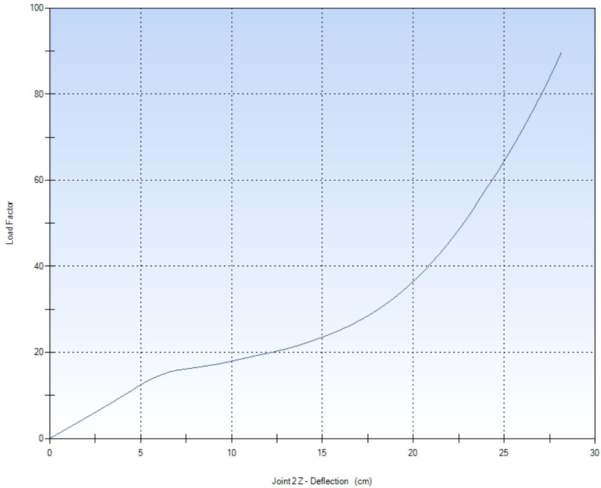  
Load vs. Deflection   
Figure 3

Portions from the Collapse output file follow:   


| ** SACS COLLAPSE REACTION FORCES AND MOMENTS ** | ** SACS COLLAPSE REACTION FORCES AND MOMENTS ** | ** SACS COLLAPSE REACTION FORCES AND MOMENTS ** | ** SACS COLLAPSE REACTION FORCES AND MOMENTS ** | ** SACS COLLAPSE REACTION FORCES AND MOMENTS ** | ** SACS COLLAPSE REACTION FORCES AND MOMENTS ** | ** SACS COLLAPSE REACTION FORCES AND MOMENTS ** | ** SACS COLLAPSE REACTION FORCES AND MOMENTS ** | ** SACS COLLAPSE REACTION FORCES AND MOMENTS ** | ** SACS COLLAPSE REACTION FORCES AND MOMENTS ** | ** SACS COLLAPSE REACTION FORCES AND MOMENTS ** | ** SACS COLLAPSE REACTION FORCES AND MOMENTS ** | ** SACS COLLAPSE REACTION FORCES AND MOMENTS ** | ** SACS COLLAPSE REACTION FORCES AND MOMENTS ** |
| --- | --- | --- | --- | --- | --- | --- | --- | --- | --- | --- | --- | --- | --- |
| INIncrement 34 LOAD FACTOR 12.240 | INIncrement 34 LOAD FACTOR 12.240 | INIncrement 34 LOAD FACTOR 12.240 | INIncrement 34 LOAD FACTOR 12.240 | INIncrement 34 LOAD FACTOR 12.240 | INIncrement 34 LOAD FACTOR 12.240 | INIncrement 34 LOAD FACTOR 12.240 | INIncrement 34 LOAD FACTOR 12.240 | INIncrement 34 LOAD FACTOR 12.240 | INIncrement 34 LOAD FACTOR 12.240 | INIncrement 34 LOAD FACTOR 12.240 | INIncrement 34 LOAD FACTOR 12.240 | INIncrement 34 LOAD FACTOR 12.240 | INIncrement 34 LOAD FACTOR 12.240 |
| JOINT NO. | FORCE (X) KN | FORCE (Y) KN | FORCE (Z) KN | MOMENT (X) KN-M | MOMENT (Y) KN-M | MOMENT (Z) KN-M |  |  |  |  |  |  |  |
| 1 | -188.049 | 0.000 | 61.200 | 0.000 | 0.000 | 0.000 |  |  |  |  |  |  |  |
| 2 | 0.000 | 0.000 | 0.000 | 0.000 | 0.000 | 0.000 |  |  |  |  |  |  |  |
| 3 | 188.049 | 0.000 | 61.200 | 0.000 | 0.000 | 0.000 |  |  |  |  |  |  |  |
| SACS CONNECT Edition V(14.2)-CL SIMPLY SUPPORTED BEAM SAMPLE | SACS CONNECT Edition V(14.2)-CL SIMPLY SUPPORTED BEAM SAMPLE | SACS CONNECT Edition V(14.2)-CL SIMPLY SUPPORTED BEAM SAMPLE | SACS CONNECT Edition V(14.2)-CL SIMPLY SUPPORTED BEAM SAMPLE | SACS CONNECT Edition V(14.2)-CL SIMPLY SUPPORTED BEAM SAMPLE | SACS CONNECT Edition V(14.2)-CL SIMPLY SUPPORTED BEAM SAMPLE | SACS CONNECT Edition V(14.2)-CL SIMPLY SUPPORTED BEAM SAMPLE | Company: DATE 14-APR-2020 TIME 13:59:32 CLP PAGE 138 | Company: DATE 14-APR-2020 TIME 13:59:32 CLP PAGE 138 | Company: DATE 14-APR-2020 TIME 13:59:32 CLP PAGE 138 | Company: DATE 14-APR-2020 TIME 13:59:32 CLP PAGE 138 | Company: DATE 14-APR-2020 TIME 13:59:32 CLP PAGE 138 | Company: DATE 14-APR-2020 TIME 13:59:32 CLP PAGE 138 | Company: DATE 14-APR-2020 TIME 13:59:32 CLP PAGE 138 |
| ** SACS COLLAPSE MEMBER FORCES AND MOMENTS ** | ** SACS COLLAPSE MEMBER FORCES AND MOMENTS ** | ** SACS COLLAPSE MEMBER FORCES AND MOMENTS ** | ** SACS COLLAPSE MEMBER FORCES AND MOMENTS ** | ** SACS COLLAPSE MEMBER FORCES AND MOMENTS ** | ** SACS COLLAPSE MEMBER FORCES AND MOMENTS ** | ** SACS COLLAPSE MEMBER FORCES AND MOMENTS ** | ** SACS COLLAPSE MEMBER FORCES AND MOMENTS ** | ** SACS COLLAPSE MEMBER FORCES AND MOMENTS ** | ** SACS COLLAPSE MEMBER FORCES AND MOMENTS ** | ** SACS COLLAPSE MEMBER FORCES AND MOMENTS ** | ** SACS COLLAPSE MEMBER FORCES AND MOMENTS ** | ** SACS COLLAPSE MEMBER FORCES AND MOMENTS ** | ** SACS COLLAPSE MEMBER FORCES AND MOMENTS ** |
| INIncrement 34 LOAD FACTOR 12.240 | INIncrement 34 LOAD FACTOR 12.240 | INIncrement 34 LOAD FACTOR 12.240 | INIncrement 34 LOAD FACTOR 12.240 | INIncrement 34 LOAD FACTOR 12.240 | INIncrement 34 LOAD FACTOR 12.240 | INIncrement 34 LOAD FACTOR 12.240 | INIncrement 34 LOAD FACTOR 12.240 | INIncrement 34 LOAD FACTOR 12.240 | INIncrement 34 LOAD FACTOR 12.240 | INIncrement 34 LOAD FACTOR 12.240 | INIncrement 34 LOAD FACTOR 12.240 | INIncrement 34 LOAD FACTOR 12.240 | INIncrement 34 LOAD FACTOR 12.240 |
| MEMBER | GRUP LOC. M | ********** X KN | INTERNAL FORCES Y Z KN | ********** X KN-M | INTERNAL MOMENTS Y Z KN-M | ********** X KN-M | STRESSES BEND-Y N/MM2 BEND-Z N/MM2 BEND-Z N/MM2 BEND-Z N/MM2 BEND-Z N/MM2 BEND-Z N/MM2 BEND-Z N/MM2 BEND-Z N/MM2 BEND-Z N/MM2 BEND-Z N/MM2 BEND-Z N/MM2 BEND-Z N/MM2 BEND-Z N/MM2 BEND-Z N/MM2 BEND-Z N/MM2 BEND-Z N/MM2 BEND-Z N/MM2 BEND-Z N/MM2 | AXIAL N/MM2 | BEND-Y N/MM2 | BEND-Z N/MM2 | SHEAR-Y N/MM2 | SHEAR-Z N/MM2 | PLAST. RATIO |
| 1- 2 | DIG 0.00 | 189.152 | 0.000 | 58.453 | 0.0 | 0.2 | 0.0 | 24.3 | 0.2 | 0.0 | 0.0 | 15.0 | 0.00 |
|  | 0.62 | 189.152 | 0.000 | 58.453 | 0.0 | 36.7 | 0.0 | 24.3 | 38.5 | 0.0 | 0.0 | 15.0 | 0.00 |
|  | 1.25 | 189.125 | 0.000 | 58.540 | 0.0 | 73.3 | 0.0 | 24.3 | 76.9 | 0.0 | 0.0 | 15.1 | 0.00 |
|  | 1.87 | 189.071 | 0.000 | 58.713 | 0.0 | 110.0 | 0.0 | 24.3 | 115.4 | 0.0 | 0.0 | 15.1 | 0.00 |
|  | 2.50 | 188.990 | 0.000 | 58.973 | 0.0 | 146.8 | 0.0 | 24.3 | 154.1 | 0.0 | 0.0 | 15.2 | 0.00 |
|  | 3.12 | 188.882 | 0.000 | 59.320 | 0.0 | 183.9 | 0.0 | 24.3 | 193.1 | 0.0 | 0.0 | 15.3 | 0.00 |
|  | 3.75 | 188.745 | 0.000 | 59.755 | 0.0 | 221.3 | 0.0 | 24.3 | 232.3 | 0.0 | 0.0 | 15.4 | 0.00 |
|  | 4.37 | 188.579 | 0.000 | 60.277 | 0.0 | 258.9 | 0.0 | 24.3 | 271.8 | 0.0 | 0.0 | 15.5 | 0.00 |
|  | 5.00 | 188.330 | 0.000 | 60.880 | 0.0 | 297.0 | 0.0 | 24.2 | 311.7 | 0.0 | 0.0 | 15.7 | 0.08 |
| 2- 3 | DIG 0.00 | 187.025 | 0.000 | -60.950 | 0.0 | 296.8 | 0.0 | 24.1 | 311.5 | 0.0 | 0.0 | -15.7 | 0.08 |
|  | 0.62 | 187.025 | 0.000 | -60.950 | 0.0 | 258.7 | 0.0 | 24.1 | 271.6 | 0.0 | 0.0 | -15.7 | 0.08 |
|  | 1.25 | 188.830 | 0.000 | -60.341 | 0.0 | 221.4 | 0.0 | 24.3 | 232.4 | 0.0 | 0.0 | -15.5 | 0.00 |
|  | 1.87 | 188.997 | 0.000 | -59.817 | 0.0 | 184.0 | 0.0 | 24.3 | 193.1 | 0.0 | 0.0 | -15.4 | 0.00 |
|  | 2.50 | 189.134 | 0.000 | -59.381 | 0.0 | 146.9 | 0.0 | 24.3 | 154.2 | 0.0 | 0.0 | -15.3 | 0.00 |
|  | 3.12 | 189.243 | 0.000 | -59.032 | 0.0 | 110.0 | 0.0 | 24.3 | 115.5 | 0.0 | 0.0 | -15.2 | 0.00 |
|  | 3.75 | 189.324 | 0.000 | -58.771 | 0.0 | 73.3 | 0.0 | 24.3 | 76.9 | 0.0 | 0.0 | -15.1 | 0.00 |
|  | 4.37 | 189.378 | 0.000 | -58.597 | 0.0 | 36.6 | 0.0 | 24.4 | 38.5 | 0.0 | 0.0 | -15.1 | 0.00 |
|  | 5.00 | 189.405 | 0.000 | -58.511 | 0.0 | 0.1 | 0.0 | 24.4 | 0.1 | 0.0 | 0.0 | -15.1 | 0.00 |
| *** PLASTICITY OCCurred ON MEMBER 1- 2 AT LOAD STEP 34 *** PLASTICITY OCCurred ON MEMBER 2- 3 AT LOAD STEP 34 | *** PLASTICITY OCCurred ON MEMBER 1- 2 AT LOAD STEP 34 *** PLASTICITY OCCurred ON MEMBER 2- 3 AT LOAD STEP 34 | *** PLASTICITY OCCurred ON MEMBER 1- 2 AT LOAD STEP 34 *** PLASTICITY OCCurred ON MEMBER 2- 3 AT LOAD STEP 34 | *** PLASTICITY OCCurred ON MEMBER 1- 2 AT LOAD STEP 34 *** PLASTICITY OCCurred ON MEMBER 2- 3 AT LOAD STEP 34 | *** PLASTICITY OCCurred ON MEMBER 1- 2 AT LOAD STEP 34 *** PLASTICITY OCCurred ON MEMBER 2- 3 AT LOAD STEP 34 | *** PLASTICITY OCCurred ON MEMBER 1- 2 AT LOAD STEP 34 *** PLASTICITY OCCurred ON MEMBER 2- 3 AT LOAD STEP 34 | *** PLASTICITY OCCurred ON MEMBER 1- 2 AT LOAD STEP 34 *** PLASTICITY OCCurred ON MEMBER 2- 3 AT LOAD STEP 34 | *** PLASTICITY OCCurred ON MEMBER 1- 2 AT LOAD STEP 34 *** PLASTICITY OCCurred ON MEMBER 2- 3 AT LOAD STEP 34 | *** PLASTICITY OCCurred ON MEMBER 1- 2 AT LOAD STEP 34 *** PLASTICITY OCCurred ON MEMBER 2- 3 AT LOAD STEP 34 | *** PLASTICITY OCCurred ON MEMBER 1- 2 AT LOAD STEP 34 *** PLASTICITY OCCurred ON MEMBER 2- 3 AT LOAD STEP 34 | *** PLASTICITY OCCurred ON MEMBER 1- 2 AT LOAD STEP 34 *** PLASTICITY OCCurred ON MEMBER 2- 3 AT LOAD STEP 34 | *** PLASTICITY OCCurred ON MEMBER 1- 2 AT LOAD STEP 34 *** PLASTICITY OCCurred ON MEMBER 2- 3 AT LOAD STEP 34 | *** PLASTICITY OCCurred ON MEMBER 1- 2 AT LOAD STEP 34 *** PLASTICITY OCCurred ON MEMBER 2- 3 AT LOAD STEP 34 | *** PLASTICITY OCCurred ON MEMBER 1- 2 AT LOAD STEP 34 *** PLASTICITY OCCurred ON MEMBER 2- 3 AT LOAD STEP 34 |


| INCR | LOAD CASE | LOAD FACTOR | NO. LOOPS | * MAXIMUM DEFL. CM | DEFLECTION * JOINT DOF | ** MAXIMUM ROT. | ROTATION JOINT DOF | ** SOLUTION DATA ** MAX. DIGITS JOINT DOF | ** REACTION SUMMATION FX KN | SUMMATION *** FY KN | FZ KN |  |
| --- | --- | --- | --- | --- | --- | --- | --- | --- | --- | --- | --- | --- |
| 1 | 1 | 0.36 | 1 | -0.150 | 2 DZ | 0.0004499 | 1 RY | 0 | 1 RY | 0.00 | 0.00 | 3.60 |
| 2 | 1 | 0.72 | 1 | -0.300 | 2 DZ | 0.0008997 | 1 RY | 0 | 1 RY | 0.00 | 0.00 | 7.20 |
| 3 | 1 | 1.08 | 1 | -0.450 | 2 DZ | 0.0013494 | 1 RY | 0 | 1 RY | 0.00 | 0.00 | 10.80 |
| 4 | 1 | 1.44 | 1 | -0.600 | 2 DZ | 0.0017988 | 1 RY | 0 | 1 RY | 0.00 | 0.00 | 14.40 |
| 5 | 1 | 1.80 | 1 | -0.749 | 2 DZ | 0.0022480 | 1 RY | 0 | 1 RY | 0.00 | 0.00 | 18.00 |
| 6 | 1 | 2.16 | 1 | -0.899 | 2 DZ | 0.0026967 | 1 RY | 0 | 1 RY | 0.00 | 0.00 | 21.60 |
| 7 | 1 | 2.52 | 1 | -1.048 | 2 DZ | 0.0031449 | 1 RY | 0 | 1 RY | 0.00 | 0.00 | 25.20 |
| 8 | 1 | 2.88 | 1 | -1.198 | 2 DZ | 0.0035924 | 1 RY | 0 | 1 RY | 0.00 | 0.00 | 28.80 |
| 9 | 1 | 3.24 | 1 | -1.347 | 2 DZ | 0.0040393 | 1 RY | 0 | 1 RY | 0.00 | 0.00 | 32.40 |
| 10 | 1 | 3.60 | 1 | -1.495 | 2 DZ | 0.0044853 | 1 RY | 0 | 1 RY | 0.00 | 0.00 | 36.00 |
| 11 | 1 | 3.96 | 1 | -1.644 | 2 DZ | 0.0049305 | 1 RY | 0 | 1 RY | 0.00 | 0.00 | 39.60 |
| 12 | 1 | 4.32 | 1 | -1.792 | 2 DZ | 0.0053747 | 1 RY | 0 | 1 RY | 0.00 | 0.00 | 43.20 |
| 13 | 1 | 4.68 | 1 | -1.940 | 2 DZ | 0.0058178 | 1 RY | 0 | 1 RY | 0.00 | 0.00 | 46.80 |
| 14 | 1 | 5.04 | 1 | -2.087 | 2 DZ | 0.0062597 | 1 RY | 0 | 1 RY | 0.00 | 0.00 | 50.40 |
| 15 | 1 | 5.40 | 1 | -2.234 | 2 DZ | 0.0067005 | 1 RY | 0 | 1 RY | 0.00 | 0.00 | 54.00 |
| 16 | 1 | 5.76 | 1 | -2.381 | 2 DZ | 0.0071398 | 1 RY | 0 | 1 RY | 0.00 | 0.00 | 57.60 |
| 17 | 1 | 6.12 | 1 | -2.527 | 2 DZ | 0.0075778 | 1 RY | 0 | 1 RY | 0.00 | 0.00 | 61.20 |
| 18 | 1 | 6.48 | 1 | -2.673 | 2 DZ | 0.0080144 | 1 RY | 0 | 1 RY | 0.00 | 0.00 | 64.80 |
| 19 | 1 | 6.84 | 1 | -2.818 | 2 DZ | 0.0084493 | 1 RY | 0 | 1 RY | 0.00 | 0.00 | 68.40 |
| 20 | 1 | 7.20 | 1 | -2.962 | 2 DZ | 0.0088827 | 1 RY | 0 | 1 RY | 0.00 | 0.00 | 72.00 |
| 21 | 1 | 7.56 | 1 | -3.107 | 2 DZ | 0.0093143 | 1 RY | 0 | 1 RY | 0.00 | 0.00 | 75.60 |
| 22 | 1 | 7.92 | 1 | -3.250 | 2 DZ | 0.0097442 | 1 RY | 0 | 1 RY | 0.00 | 0.00 | 79.20 |
| 23 | 1 | 8.28 | 1 | -3.393 | 2 DZ | 0.0101723 | 1 RY | 0 | 1 RY | 0.00 | 0.00 | 82.80 |
| 24 | 1 | 8.64 | 1 | -3.536 | 2 DZ | 0.0105985 | 1 RY | 0 | 1 RY | 0.00 | 0.00 | 86.40 |
| 25 | 1 | 9.00 | 1 | -3.677 | 2 DZ | 0.0110228 | 1 RY | 0 | 1 RY | 0.00 | 0.00 | 90.00 |
| 26 | 1 | 9.36 | 1 | -3.818 | 2 DZ | 0.0114451 | 1 RY | 0 | 1 RY | 0.00 | 0.00 | 93.60 |
| 27 | 1 | 9.72 | 1 | -3.959 | 2 DZ | 0.0118654 | 1 RY | 0 | 1 RY | 0.00 | 0.00 | 97.20 |
| 28 | 1 | 10.08 | 1 | -4.099 | 2 DZ | 0.0122836 | 1 RY | 0 | 1 RY | 0.00 | 0.00 | 100.80 |
| 29 | 1 | 10.44 | 1 | -4.238 | 2 DZ | 0.0126997 | 1 RY | 0 | 1 RY | 0.00 | 0.00 | 104.40 |
| 30 | 1 | 10.80 | 1 | -4.376 | 2 DZ | 0.0131135 | 1 RY | 0 | 1 RY | 0.00 | 0.00 | 108.00 |
| 31 | 1 | 11.16 | 1 | -4.514 | 2 DZ | 0.0135252 | 1 RY | 0 | 1 RY | 0.00 | 0.00 | 111.60 |
| 32 | 1 | 11.52 | 1 | -4.651 | 2 DZ | 0.0139347 | 1 RY | 0 | 1 RY | 0.00 | 0.00 | 115.20 |
| 33 | 1 | 11.88 | 1 | -4.787 | 2 DZ | 0.0143418 | 1 RY | 0 | 1 RY | 0.00 | 0.00 | 118.80 |
| 34 | 1 | 12.24 | 1 | -4.923 | 2 DZ | 0.0147467 | 1 RY | 0 | 1 RY | 0.00 | 0.00 | 122.40 |
| 35 | 1 | 12.60 | 1 | -5.061 | 2 DZ | 0.0151570 | 1 RY | 0 | 1 RY | 0.00 | 0.00 | 126.00 |
| 36 | 1 | 12.96 | 1 | -5.207 | 2 DZ | 0.0155831 | 1 RY | 0 | 1 RY | 0.00 | 0.00 | 129.60 |
| 37 | 1 | 13.32 | 1 | -5.353 | 2 DZ | 0.0160062 | 1 RY | 0 | 1 RY | 0.00 | 0.00 | 133.20 |
| 38 | 1 | 13.68 | 2 | -5.523 | 2 DZ | -0.0164725 | 3 RY | 0 | 1 RY | 0.00 | 0.00 | 136.80 |
| 39 | 1 | 14.04 | 2 | -5.715 | 2 DZ | -0.0169947 | 3 RY | 0 | 1 RY | 0.00 | 0.00 | 140.40 |
| 40 | 1 | 14.40 | 2 | -5.925 | 2 DZ | -0.0175533 | 3 RY | 0 | 1 RY | 0.00 | 0.00 | 144.00 |


## 6.2 ELASTO-PLASTIC JACKET ANALYSIS

This sample problem illustrates an elasto-plastic jacket push-over analysis. It considers a simple jacket structure shown below. The jacket is initially loaded with self-weight, area, equipment, live, and miscellaneous loads. A horizontal wave load acting on the structure is then incremented until collapse occurs.

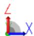

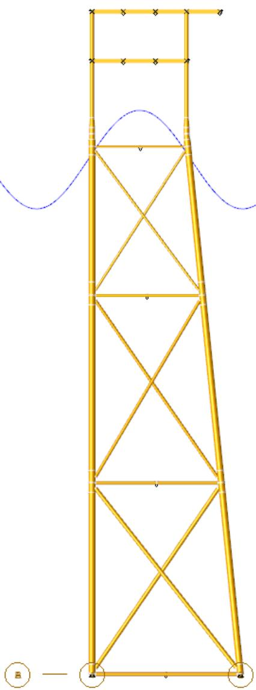  
Figure 4

The Collapse load data from the model file for the jacket is shown below.

```txt
1 2 3 4 5 6 7 8 1 23456789012345678901234567890123456789012345678901234567890 1 LOAD 2LOADCNAREA 
```


| 3 | * |  |  |  |  |  |  |  |  |  |
| --- | --- | --- | --- | --- | --- | --- | --- | --- | --- | --- |
| 4 | ***LDS1** | 24.000 | -26.247 | 50.000 | 24.000 | 26.247 | 50.000 | -24.000 |  |  |
| 5 | ***LDS2** | -26.247 | 50.000 | -24.000 | 26.247 | 50.000 | -10.000 |  |  |  |
| 6 | ***LDS3** | 0 | 1 | 3 | 0 | 0AREA | -2EQUPPRES10PSFL |  |  |  |
| 7 | LOAD Z 701 705 | -0.0790 | -0.0790 | -0.0790 | GLOB UNIF | GLOB UNIF | GLOB UNIF | 10PSFL |  |  |
| 8 | LOAD Z 703 707 | -0.0790 | -0.0790 | -0.0790 | GLOB UNIF | GLOB UNIF | GLOB UNIF | 10PSFL |  |  |
| 9 | LOAD Z 705 720 | -0.0790 | -0.0790 | -0.0790 | GLOB UNIF | GLOB UNIF | GLOB UNIF | 10PSFL |  |  |
| 10 | LOAD Z 707 723 | -0.0790 | -0.0790 | -0.0790 | GLOB UNIF | GLOB UNIF | GLOB UNIF | 10PSFL |  |  |
| 11 | LOAD Z 709 701 | -0.0790 | -0.0790 | -0.0790 | GLOB UNIF | GLOB UNIF | GLOB UNIF | 10PSFL |  |  |
| 12 | LOAD Z 710 714 | -0.1610 | -0.1610 | -0.1610 | GLOB UNIF | GLOB UNIF | GLOB UNIF | 10PSFL |  |  |
| 13 | LOAD Z 711 715 | -0.1610 | -0.1610 | -0.1610 | GLOB UNIF | GLOB UNIF | GLOB UNIF | 10PSFL |  |  |
| 14 | LOAD Z 712 703 | -0.0790 | -0.0790 | -0.0790 | GLOB UNIF | GLOB UNIF | GLOB UNIF | 10PSFL |  |  |
| 15 | LOAD Z 714 717 | -0.1610 | -0.1610 | -0.1610 | GLOB UNIF | GLOB UNIF | GLOB UNIF | 10PSFL |  |  |
| 16 | LOAD Z 715 718 | -0.1610 | -0.1610 | -0.1610 | GLOB UNIF | GLOB UNIF | GLOB UNIF | 10PSFL |  |  |
| 17 | LOAD Z 717 721 | -0.1610 | -0.1610 | -0.1610 | GLOB UNIF | GLOB UNIF | GLOB UNIF | 10PSFL |  |  |
| 18 | LOAD Z 718 722 | -0.1610 | -0.1610 | -0.1610 | GLOB UNIF | GLOB UNIF | GLOB UNIF | 10PSFL |  |  |
| 19 | * |  |  |  |  |  |  |  |  |  |
| 20 | ***LDS1** | 41.011 | -26.247 | 75.000 | 41.011 | 26.247 | 75.000 | -24.000 |  |  |
| 21 | ***LDS2** | -26.247 | 75.000 | -24.000 | 26.247 | 75.000 | -15.000 |  |  |  |
| 22 | ***LDS3** | 0 | 1 | 3 | 0 | 0AREA | -2EQUPPRES15PSFU |  |  |  |
| 23 | LOAD Z 801 805 | -0.1180 | -0.1180 | -0.1180 | GLOB UNIF | GLOB UNIF | GLOB UNIF | 15PSFU |  |  |
| 24 | LOAD Z 803 807 | -0.2460 | -0.2460 | -0.2460 | GLOB UNIF | GLOB UNIF | GLOB UNIF | 15PSFU |  |  |
| 25 | LOAD Z 805 840 | -0.1180 | -0.1180 | -0.1180 | GLOB UNIF | GLOB UNIF | GLOB UNIF | 15PSFU |  |  |
| 26 | LOAD Z 807 843 | -0.2460 | -0.2460 | -0.2460 | GLOB UNIF | GLOB UNIF | GLOB UNIF | 15PSFU |  |  |
| 27 | LOAD Z 829 801 | -0.1180 | -0.1180 | -0.1180 | GLOB UNIF | GLOB UNIF | GLOB UNIF | 15PSFU |  |  |
| 28 | LOAD Z 830 834 | -0.2420 | -0.2420 | -0.2420 | GLOB UNIF | GLOB UNIF | GLOB UNIF | 15PSFU |  |  |
| 29 | LOAD Z 831 835 | -0.2420 | -0.2420 | -0.2420 | GLOB UNIF | GLOB UNIF | GLOB UNIF | 15PSFU |  |  |
| 30 | LOAD Z 832 803 | -0.2460 | -0.2460 | -0.2460 | GLOB UNIF | GLOB UNIF | GLOB UNIF | 15PSFU |  |  |
| 31 | LOAD Z 833 836 | -0.1280 | -0.1280 | -0.1280 | GLOB UNIF | GLOB UNIF | GLOB UNIF | 15PSFU |  |  |
| 32 | LOAD Z 834 837 | -0.2420 | -0.2420 | -0.2420 | GLOB UNIF | GLOB UNIF | GLOB UNIF | 15PSFU |  |  |
| 33 | LOAD Z 835 838 | -0.2420 | -0.2420 | -0.2420 | GLOB UNIF | GLOB UNIF | GLOB UNIF | 15PSFU |  |  |
| 34 | LOAD Z 836 839 | -0.1280 | -0.1280 | -0.1280 | GLOB UNIF | GLOB UNIF | GLOB UNIF | 15PSFU |  |  |
| 35 | LOAD Z 837 841 | -0.2420 | -0.2420 | -0.2420 | GLOB UNIF | GLOB UNIF | GLOB UNIF | 15PSFU |  |  |
| 36 | LOAD Z 838 842 | -0.2420 | -0.2420 | -0.2420 | GLOB UNIF | GLOB UNIF | GLOB UNIF | 15PSFU |  |  |
| 37 | LOAD Z 839 844 | -0.1280 | -0.1280 | -0.1280 | GLOB UNIF | GLOB UNIF | GLOB UNIF | 15PSFU |  |  |
| 38 | LOADCNEQPT |  |  |  |  |  |  |  |  |  |
| 39 | * |  |  |  |  |  |  |  |  |  |
| 40 | ***LDS1** | 16.000 | 6.000 | 75.000 | 16.000 | 6.000 | 75.000 |  |  |  |
| 41 | ***LDS2** | -250.000 |  |  |  |  | 20.000 | 10.000 |  |  |
| 42 | ***LDS3** | 10.000 | 1 2 | 2 | 0 | 0EQFT | -1EQUPSKIDSKD1 | X |  |  |
| 43 | LOAD Z 835 838 | 17.4040-65.579 |  |  |  |  | GLOB CONC | SKID1 |  |  |
| 44 | LOAD Z 835 838 | 27.4040-65.579 |  |  |  |  | GLOB CONC | SKID1 |  |  |
| 45 | LOAD Z 803 807 | 17.4040-59.421 |  |  |  |  | GLOB CONC | SKID1 |  |  |
| 46 | LOAD Z 803 807 | 27.4040-59.421 |  |  |  |  | GLOB CONC | SKID1 |  |  |
| 47 | * |  |  |  |  |  |  |  |  |  |
| 48 | ***LDS1** | -16.000 | -16.000 | 75.000 | -16.000 | -16.000 | 75.000 |  |  |  |
| 49 | ***LDS2** | -150.000 |  |  |  |  | 20.000 | 7.500 |  |  |
| 50 | ***LDS3** | 7.500 | 1 2 | 2 | 0 | 0EQFT | -1EQUPSKIDSKD2 | X |  |  |
| 51 | LOAD Z 829 801 | 6.49700-35.653 |  |  |  |  | GLOB CONC | SKID2 |  |  |
| 52 | LOAD Z 830 834 | 6.49700-39.347 |  |  |  |  | GLOB CONC | SKID2 |  |  |
| 53 | LOAD Z 834 837 | 4.15400-39.347 |  |  |  |  | GLOB CONC | SKID2 |  |  |
| 54 | LOAD Z 801 805 | 4.15400-35.653 |  |  |  |  | GLOB CONC | SKID2 |  |  |
| 55 | * |  |  |  |  |  |  |  |  |  |
| 56 | ***LDS1** | -16.000 |  | 50.000 | -16.000 |  | 50.000 |  |  |  |
| 57 | ***LDS2** | -100.000 |  |  |  |  | 20.000 | 7.500 |  |  |
| 58 | ***LDS3** | 7.500 | 1 2 | 2 | 0 | 0EQFT | -1EQUPSKIDSKD3 | X |  |  |
| 59 | LOAD Z 701 705 | 12.6540-23.769 |  |  |  |  | GLOB CONC | SKID3 |  |  |
| 60 | LOAD Z 701 705 | 20.1540-23.769 |  |  |  |  | GLOB CONC | SKID3 |  |  |
| 61 | LOAD Z 714 717 | 12.6540-26.231 |  |  |  |  | GLOB CONC | SKID3 |  |  |
| 62 | LOAD Z 714 717 | 20.1540-26.231 |  |  |  |  | GLOB CONC | SKID3 |  |  |
| 63 | * |  |  |  |  |  |  |  |  |  |
| 64 | ***LDS1** | 32.000 | 19.000 | 75.000 | 32.000 | 19.000 | 75.000 |  |  |  |
| 65 | ***LDS2** | -35.000 |  |  |  |  | 20.000 | 7.000 |  |  |
| 66 | ***LDS3** | 7.000 | 1 2 | 3 | 0 | 0EQFT | -1EQUPSKIDSKD4 | X |  |  |
| 67 | LOAD Z 803 807 | 31.5000-6.1800 |  |  |  |  | GLOB CONC | SKID4 |  |  |
| 68 | LOAD Z 807 843 | 3.00000-6.1800 |  |  |  |  | GLOB CONC | SKID4 |  |  |
| 69 | LOAD Z 807 843 | 6.50000-6.1800 |  |  |  |  | GLOB CONC | SKID4 |  |  |
| 70 | LOAD Z 836 839 | 31.5000-5.4866 |  |  |  |  | GLOB CONC | SKID4 |  |  |
| 71 | LOAD Z 839 844 | 3.00000-5.4866 |  |  |  |  | GLOB CONC | SKID4 |  |  |
| 72 | LOAD Z 839 844 | 6.50000-5.4866 |  |  |  |  | GLOB CONC | SKID4 |  |  |
| 73 | LOADCNLIVE | LOADCNLIVE | LOADCNLIVE | LOADCNLIVE | LOADCNLIVE | LOADCNLIVE | LOADCNLIVE | LOADCNLIVE | LOADCNLIVE | LOADCNLIVE |
| 74 | * | * | * | * | * | * | * | * | * | * |
| 75 | ***LDS1** | ***LDS1** | 41.011 | -26.247 | 75.000 | 41.011 | 26.247 | 75.000 | -24.606 |  |
| 76 | ***LDS2** | ***LDS2** | 26.247 | 75.000 | -24.606 | -26.247 | 75.000 | -100.000 |  |  |
| 77 | ***LDS3** | ***LDS3** |  | 0 1 3 0 OLIVE -2EQUPPRES100PSFU | 0 1 3 0 OLIVE -2EQUPPRES100PSFU | 0 1 3 0 OLIVE -2EQUPPRES100PSFU | 0 1 3 0 OLIVE -2EQUPPRES100PSFU | 0 1 3 0 OLIVE -2EQUPPRES100PSFU |  |  |
| 78 | LOAD Z 829 801 | LOAD Z 829 801 |  | -0.8200 | -0.8200 | -0.8200 | -0.8200 | GLOB UNIF | 100PSFU |  |
| 79 | LOAD Z 830 834 | LOAD Z 830 834 |  | -1.6400 | -1.6400 | -1.6400 | -1.6400 | GLOB UNIF | 100PSFU |  |
| 80 | LOAD Z 831 835 | LOAD Z 831 835 |  | -1.6400 | -1.6400 | -1.6400 | -1.6400 | GLOB UNIF | 100PSFU |  |
| 81 | LOAD Z 832 803 | LOAD Z 832 803 |  | -1.6400 | -1.6400 | -1.6400 | -1.6400 | GLOB UNIF | 100PSFU |  |
| 82 | LOAD Z 833 836 | LOAD Z 833 836 |  | -0.8200 | -0.8200 | -0.8200 | -0.8200 | GLOB UNIF | 100PSFU |  |
| 83 | LOAD Z 834 837 | LOAD Z 834 837 |  | -1.6400 | -1.6400 | -1.6400 | -1.6400 | GLOB UNIF | 100PSFU |  |
| 84 | LOAD Z 835 838 | LOAD Z 835 838 |  | -1.6400 | -1.6400 | -1.6400 | -1.6400 | GLOB UNIF | 100PSFU |  |
| 85 | LOAD Z 836 839 | LOAD Z 836 839 |  | -0.8200 | -0.8200 | -0.8200 | -0.8200 | GLOB UNIF | 100PSFU |  |
| 86 | LOAD Z 837 841 | LOAD Z 837 841 |  | -1.6400 | -1.6400 | -1.6400 | -1.6400 | GLOB UNIF | 100PSFU |  |
| 87 | LOAD Z 838 842 | LOAD Z 838 842 |  | -1.6400 | -1.6400 | -1.6400 | -1.6400 | GLOB UNIF | 100PSFU |  |
| 88 | LOAD Z 839 844 | LOAD Z 839 844 |  | -0.8200 | -0.8200 | -0.8200 | -0.8200 | GLOB UNIF | 100PSFU |  |
| 89 | LOAD Z 801 805 | LOAD Z 801 805 |  | -0.8200 | -0.8200 | -0.8200 | -0.8200 | GLOB UNIF | 100PSFU |  |
| 90 | LOAD Z 803 807 | LOAD Z 803 807 |  | -1.6400 | -1.6400 | -1.6400 | -1.6400 | GLOB UNIF | 100PSFU |  |
| 91 | LOAD Z 805 840 | LOAD Z 805 840 |  | -0.8200 | -0.8200 | -0.8200 | -0.8200 | GLOB UNIF | 100PSFU |  |
| 92 | LOAD Z 807 843 | LOAD Z 807 843 |  | -1.6400 | -1.6400 | -1.6400 | -1.6400 | GLOB UNIF | 100PSFU |  |
| 93 | * | * | * | * | * | * | * | * | * | * |
| 94 | ***LDS1** | ***LDS1** | 24.606 | -26.247 | 50.000 | 24.606 | 26.247 | 50.000 | -24.606 |  |
| 95 | ***LDS2** | ***LDS2** | 26.247 | 50.000 | -24.606 | -26.247 | 50.000 | -50.000 |  |  |
| 96 | ***LDS3** | ***LDS3** |  | 0 1 3 0 OLIVE -2EQUPPRES50PSFL | 0 1 3 0 OLIVE -2EQUPPRES50PSFL | 0 1 3 0 OLIVE -2EQUPPRES50PSFL | 0 1 3 0 OLIVE -2EQUPPRES50PSFL | 0 1 3 0 OLIVE -2EQUPPRES50PSFL |  |  |
| 97 | LOAD Z 701 705 | LOAD Z 701 705 |  | -0.4100 | -0.4100 | -0.4100 | -0.4100 | GLOB UNIF | 50PSFL |  |
| 98 | LOAD Z 703 707 | LOAD Z 703 707 |  | -0.4100 | -0.4100 | -0.4100 | -0.4100 | GLOB UNIF | 50PSFL |  |
| 99 | LOAD Z 705 720 | LOAD Z 705 720 |  | -0.4100 | -0.4100 | -0.4100 | -0.4100 | GLOB UNIF | 50PSFL |  |
| 100 | LOAD Z 707 723 | LOAD Z 707 723 |  | -0.4100 | -0.4100 | -0.4100 | -0.4100 | GLOB UNIF | 50PSFL |  |
| 101 | LOAD Z 709 701 | LOAD Z 709 701 |  | -0.4100 | -0.4100 | -0.4100 | -0.4100 | GLOB UNIF | 50PSFL |  |
| 102 | LOAD Z 710 714 | LOAD Z 710 714 |  | -0.8200 | -0.8200 | -0.8200 | -0.8200 | GLOB UNIF | 50PSFL |  |
| 103 | LOAD Z 711 715 | LOAD Z 711 715 |  | -0.8200 | -0.8200 | -0.8200 | -0.8200 | GLOB UNIF | 50PSFL |  |
| 104 | LOAD Z 712 703 | LOAD Z 712 703 |  | -0.4100 | -0.4100 | -0.4100 | -0.4100 | GLOB UNIF | 50PSFL |  |
| 105 | LOAD Z 714 717 | LOAD Z 714 717 |  | -0.8200 | -0.8200 | -0.8200 | -0.8200 | GLOB UNIF | 50PSFL |  |
| 106 | LOAD Z 715 718 | LOAD Z 715 718 |  | -0.8200 | -0.8200 | -0.8200 | -0.8200 | GLOB UNIF | 50PSFL |  |
| 107 | LOAD Z 717 721 | LOAD Z 717 721 |  | -0.8200 | -0.8200 | -0.8200 | -0.8200 | GLOB UNIF | 50PSFL |  |
| 108 | LOAD Z 718 722 | LOAD Z 718 722 |  | -0.8200 | -0.8200 | -0.8200 | -0.8200 | GLOB UNIF | 50PSFL |  |
| 109 | LOADCNMISC | LOADCNMISC | LOADCNMISC | LOADCNMISC | LOADCNMISC | LOADCNMISC | LOADCNMISC | LOADCNMISC | LOADCNMISC | LOADCNMISC |
| 110 | LOAD Z 712 703 | LOAD Z 712 703 |  | -0.1900 | -0.1900 | -0.1900 | -0.1900 | GLOB UNIF | WALK1 |  |
| 111 | LOAD Z 703 707 | LOAD Z 703 707 |  | -0.1900 | -0.1900 | -0.1900 | -0.1900 | GLOB UNIF | WALK1 |  |
| 112 | LOAD Z 707 723 | LOAD Z 707 723 |  | -0.1900 | -0.1900 | -0.1900 | -0.1900 | GLOB UNIF | WALK1 |  |
| 113 | LOAD Z 833 836 | LOAD Z 833 836 |  | -0.1900 | -0.1900 | -0.1900 | -0.1900 | GLOB UNIF | WALK2 |  |
| 114 | LOAD Z 836 839 | LOAD Z 836 839 |  | -0.1900 | -0.1900 | -0.1900 | -0.1900 | GLOB UNIF | WALK2 |  |
| 115 | LOAD Z 839 844 | LOAD Z 839 844 |  | -0.1900 | -0.1900 | -0.1900 | -0.1900 | GLOB UNIF | WALK2 |  |
| 116 | LOAD 807 | LOAD 807 |  | -20.000 | -20.000 | -20.000 | -20.000 | GLOB JOIN CRANE | GLOB JOIN CRANE |  |
| 117 | * | * | * | * | * | * | * | * | * | * |
| 118 | ***LDS1** | ***LDS1** | -8.000 | 20.000 | 50.000 | -8.000 | 20.000 | 50.000 |  |  |
| 119 | ***LDS2** | ***LDS2** |  | -10.000 |  |  |  | 34.000 | 0.100 |  |
| 120 | ***LDS3** | ***LDS3** | 0.100 | 1 2 2 0 OMISC -1EQUPSKIDFIREWALLX | 1 2 2 0 OMISC -1EQUPSKIDFIREWALLX | 1 2 2 0 OMISC -1EQUPSKIDFIREWALLX | 1 2 2 0 OMISC -1EQUPSKIDFIREWALLX | 1 2 2 0 OMISC -1EQUPSKIDFIREWALLX |  |  |
| 121 | LOAD Z 705 720 | LOAD Z 705 720 | 3.95000-1.6667 |  |  |  |  | GLOB CONC | FIREWALL |  |
| 122 | LOAD Z 705 720 | LOAD Z 705 720 | 4.05000-1.6667 |  |  |  |  | GLOB CONC | FIREWALL |  |
| 123 | LOAD Z 717 721 | LOAD Z 717 721 | 3.95000-1.6667 |  |  |  |  | GLOB CONC | FIREWALL |  |
| 124 | LOAD Z 717 721 | LOAD Z 717 721 | 4.05000-1.6667 |  |  |  |  | GLOB CONC | FIREWALL |  |
| 125 | LOAD Z 718 722 | LOAD Z 718 722 | 3.95000-1.6667 |  |  |  |  | GLOB CONC | FIREWALL |  |
| 126 | LOAD Z 718 722 | LOAD Z 718 722 | 4.05000-1.6667 |  |  |  |  | GLOB CONC | FIREWALL |  |


The following is a description of selected input lines used in the load data:   
Line 2. Load condition AREA represents the application of general area loads to both decks.   
Line 38. Load condition EQPT represent the application of a equipment loads to the decks.   
Line 73. Load condition LIVE represents the application of live loads to both decks.   
Line 109. Load condition MISC represents the application of miscellaneous dead loads like the crane, a firewall and handrails.

The Collapse load data from the seastate input file for the jacket is shown below.   
```txt
1 2 3 4 5 6 7 8   
123456789012345678901234567890123456789012345678901234567890   
1 LDOPT NF+Z64.30001490.0500-261.000 261.000GLOBEN NPNP   
2 \* USE LOADING IN SEASTATE INPUT AND MODEL FILE   
3 FILE B
4 CDM
5 CDM 1.00 0.600 1.200 0.600 1.200   
6 CDM 100.00 0.600 1.200 0.600 1.200   
# 7 MGROV
8 MGROV 0.000 200.000 1.000   
9 MGROV 200.000 261.000 2.000   
# 10 GRPOV
11 GRPOVAL LG1 F   
12 GRPOVAL LG2 F   
13 GRPOVAL LG3 F   
14 GRPOV LG4 F   
15 GRPOV PL1NF 0.001 0.001   
16 GRPOV PL2NF 0.001 0.001   
17 GRPOV PL3NF 0.001 0.001   
18 GRPOV PL4NF 0.001 0.001   
19 GRPOV W.BNF 0.001 0.001   
# 20 LOAD
# 21 LOADCNDEAD
# 22 DEAD
# 23 DEAD -Z M
# 24 LOADCNSOOO
# 25 WAVE
26 WAVE STRE 50.00266.oo 13.oo L -75.oo 5.oo 2OMS1o 1 7   
# 27 END
# 28 END
```

The following is a description of selected input lines used in the load data:

Line 20. Load condition DEAD represents the application of the structure self-weight and buoyancy.

Line 24. Load condition S000 represents the application of the wave load to the structure.

The collapse input file containing the collapse analysis data is shown below.

```txt
1 2 3 4 5 6 7 8  
1234567890123456789012345678901234567890123456789012345678901234567890  
CLPOPT 20 8 20 JF JS 100. .005  
CLPRPT MOMP SM  
* CREATE SEQUENCE THAT ADDS LOADING TO STRUCTURE  
LDSEQ AAAA DEAD 1 1.0 EQPT 1 1.0 MISC 1 1.0  
LDSEQ AREA 1 1.0 LIVE 1 0.5 S000 75 7.5  
* DECK WIDE FLANGES REMAIN ELASTIC  
GRPELA W01 W02 LG7  
* PLATES REMAIN ELASTIC  
PGRELA P01  
END 
```

The following is a description of input lines used in the Collapse input file:

Line 1. Collapse analysis options were designated on the CLPOPT line as follows:

a. The maximum number of iterations per load increment is set to 20 while the maximum number of member iterations is set to the default value of 20.   
b. The number of segments per member is set to the default value of 8.   
c. The effects of joint flexibility and joint strength are to be considered with ‘JF’ and ‘JS’ respectively.

d. The default values for deflection tolerance, rotation tolerance and member deflection tolerance are to be used.   
e. The maximum deflection allowed before the structure is considered collapse is set to 100. In columns 71-75.   
f. The strain hardening ratio is set to 0.005 in columns 76-80.

Line 2. Output reports consisting of member and plate final stresses ‘M0’, limited to plastic members ‘MP’, and a collapse summary report ‘SM’ on the CLPRPT line.

Line 4. The load sequence to be analyzed, named AAAA, is defined on the first LDSEQ input line as follows:

a. Load case DEAD is to be applied in 1 increment starting with a load factor of 0.0 and ending with a load factor of 1.0.   
b. Load case EQPT is to be applied in 1 increment starting with a load factor of 0.0 and ending with a load factor of 1.0.   
c. Load case MISC is to be applied in 1 increment starting with a load factor of 0.0 and ending with a load factor of 1.0.

Line 5. Load sequence AAAA is continued on the second LDSEQ input line.

a. Load case AREA is to be applied in 1 increment starting with a load factor of 0.0 and ending with a load factor of 1.0.   
a. Load case LIVE is to be applied in 1 increment starting with a load factor of 0.0 and ending with a load factor of 0.5.   
c. Finally the wave load, load case S000, is applied over 75 increments up to a maximum load factor of 7.5 as the final load step.

Line 7. The GRPELA (or GRPDEL) input line specifies that the material for all beam elements assigned to groups W01, W02, and LG7 are to remain elastic throughout the analysis. These are the deck elements which are not critical for a pushover analysis.

Line 9. The PGRELA input line specifies the material for all plates assigned to plate group P01 are to remain elastic throughout the analysis.

Line 10. the END line designates the end of input data.

Figure 5 shows color coded plastic interaction plots for load increment 50.

Note: The nonlinear plastic analysis results may be viewed in a 3D interactive graphical environment using the Collapse View program.

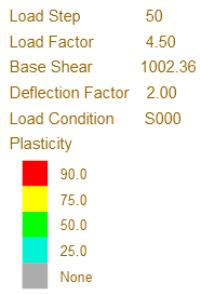

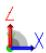

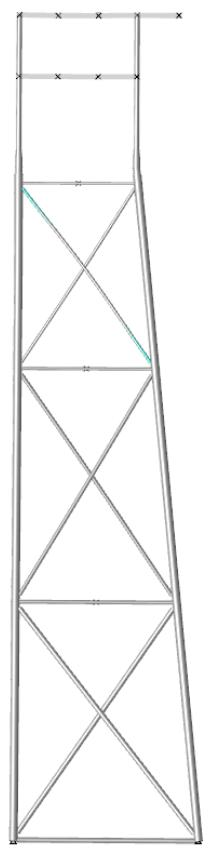

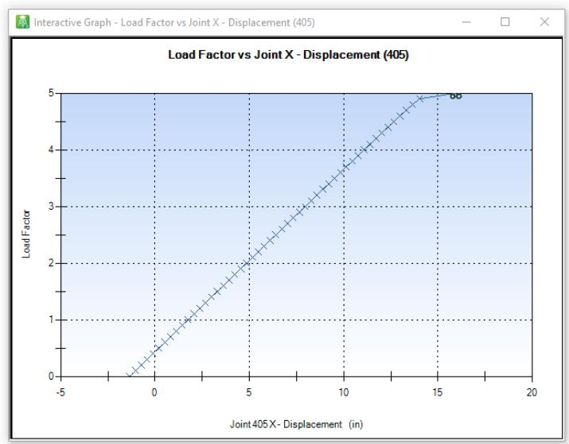  
Figure 5

# 7 REFERENCES

[1] Rubinstein, M. F.

“Structural Systems - Statics, Dynamics, and Stability”

Prentice - Hall, Inc. 1970

[2] Langhaar, H. L.

“Energy Methods in Applied Mechanics”

Wiley, New York, 1962

[3] Thompson, J. M. T.

“Basic Principles in the General Theory of Elastic Stability”

Journal of Mech. Physics Solids, Vol. 11 pp. 13-21, 1963

[4] Roberts, T M

“Second Order Strains and Instability of Thin Walled Bars of Open Cross-Section”

Int. J Mech. Sci., Vol 23, pp 297-306, 1981

[5] Jhita, P.S.

“The Stability and Post-Buckling Behavior of Stiffened Plates in Compression”

PhD Thesis, College of Aeronautics, Cranfield Institute of Technology.

[6] Crisfield, M A

“Large deflection elasto-plastic buckling analysis of plates using finite elements”

Transport and Road Research Laboratory, Crowthorne, 1973, Report LR 593

[7] Timoshenko, S P and Woinowsky-Krieger, S

“Theory of Plates and Shells”

McGraw-Hill Kogakusha, Ltd.

[8] Ugural, A C and Fenster, S K

“Advanced Strength and Applied Elasticity”Elsevier, 1987

[9] Timoshenko, S P and Gere, J M

“Theory of Elastic Stability”

McGraw-Hill, NY

[10] Roberts, T M and Azizian, Z G

“Nonlinear analysis of thin walled bars of open cross-section”

Int. J. Mech. Sci., Vol. 25, No. 8, pp 565-577, 1983

[11] Marshall, P W and Gates, W E and Anagnostopoulos, S

“Inelastic Dynamic Analysis of Tubular Offshore Structures”

OTC 2908, pp 235-246, 1977

[12] Fessler, H., Mockford, P.B. and Webster, J.J.

“Parametric Equations for the Flexibility Matrices of Single Brace Tubular Joints in Offshore Structures”

Proc. Instn Civ. Engrs, Part 2, 81, December 1986.

[13] API RP 2A-LRFD

American Petroleum Institute, First Edition, July 1, 1993

[14] Norsok Standard N-004

“Design of Steel Structures”, Rev. 1, December 1998SAMPLE PROBLEMS

8 INPUT LINES

JOINT FLEXIBILITY BRACE SELECTION LINE

COLUMNS

COMMENTARY

GENERAL THIS LINE ALLOWS THE USER TO INCLUDE OR EXCLUDE BRACES WHEN CONSIDERING JOINT FLEXIBILITY. ONLY THE BRACE AND BRACE SIDE SPECIFIED ARE INCLUDED OR EXCLUDED PROVIDED ONE OF THE JOINT FLEXIBILITY OPTIONS IS SPECIFIED ON THE CLPOPT LINE. THIS LINE IS IGNORED IF NO FLEXIBILITY OPTION IS SPECIFIED.

( 1- 5) ENTER 'BFSEL'.   
( 7 ) ENTER 'I' TO INCLUDE OR 'X' TO EXCLUDE THE BRACES SPECIFIED.   
NOTE: THE INCLUDE AND EXCLUDE OPTIONS ARE MUTUALLY EXCLUSIVE AND CANNOT BE USED TOGETHER. ALL BRACES SPECIFIED ON BFSEL LINES MUST BE EITHER INCLUDED OR EXCLUDED.   
( 9-12) ENTER THE BEGIN JOINT OF THE FIRST BRACE TO INCLUDE OR EXCLUDE.   
(13-16) ENTER THE END JOINT OF THE FIRST BRACE TO INCLUDE OR EXCLUDE.   
(17-20) ENTER THE JOINT DESIGNATING THE BRACE CONNECTION TO INCLUDE OR EXCLUDE. ENTER THE BEGIN JOINT TO CONSIDER THE CONNECTION AT THE START OF THE BRACE OR THE END JOINT TO CONSIDER THE CONNECTION AT THE END OF THE BRACE.   
(22-72) ENTER ADDITIONAL BRACES TO BE INCLUDED OR EXCLUDED.


| LINE LABEL | INCLUDE OR EXCLUDE | 1ST BRACE | 1ST BRACE | 1ST BRACE | 2ND BRACE | 2ND BRACE | 2ND BRACE | 3RD BRACE | 3RD BRACE | 3RD BRACE | 4TH BRACE | 4TH BRACE | 4TH BRACE | 5TH BRACE | 5TH BRACE | 5TH BRACE |
| --- | --- | --- | --- | --- | --- | --- | --- | --- | --- | --- | --- | --- | --- | --- | --- | --- |
| LINE LABEL | INCLUDE OR EXCLUDE | BEGIN JOINT | END JOINT | CONNECTION | BEGIN JOINT | END JOINT | CONNECTION | BEGIN JOINT | END JOINT | CONNECTION | BEGIN JOINT | END JOINT | CONNECTION | BEGIN JOINT | END JOINT | CONNECTION |
| BFSEL |  |  |  |  |  |  |  |  |  |  |  |  |  |  |  |  |
| 1-- 5 | 7 | 9-->12 | 13-->16 | 17-->20 | 22-->25 | 26-->29 | 30-->33 | 35-->38 | 39-->42 | 43-->46 | 48-->51 | 52-->55 | 56-->59 | 61-->64 | 65-->68 | 69-->72 |


JOINT STRENGTH BRACE SELECTION LINE

COLUMNS

COMMENTARY

GENERAL THIS LINE ALLOWS THE USER TO INCLUDE OR EXCLUDE BRACES WHEN CONSIDERING JOINT STRENGTH. ONLY THE BRACE AND BRACE SIDE SPECIFIED ARE INCLUDED OR EXCLUDED PROVIDED ONE OF THE JOINT STRENGTH OPTIONS IS SPECIFIED ON THE CLPOPT LINE. THIS LINE IS IGNORED IF NO STRENGTH OPTION IS SPECIFIED.

( 1- 5) ENTER 'BSSEL'.   
( 7 ) ENTER 'I' TO INCLUDE OR 'X' TO EXCLUDE THE BRACES SPECIFIED.

NOTE: THE INCLUDE AND EXCLUDE OPTIONS ARE MUTUALLY EXCLUSIVE AND CANNOT BE USED TOGETHER. ALL BRACES SPECIFIED ON BSSEL LINES MUST BE EITHER INCLUDED OR EXCLUDED.

( 9-12) ENTER THE BEGIN JOINT OF THE FIRST BRACE TO INCLUDE OR EXCLUDE.   
(13-16) ENTER THE END JOINT OF THE FIRST BRACE TO INCLUDE OR EXCLUDE.   
(17-20) ENTER THE JOINT DESIGNATING THE BRACE CONNECTION TO INCLUDE OR EXCLUDE. ENTER THE BEGIN JOINT TO CONSIDER THE CONNECTION AT THE START OF THE BRACE OR THE END JOINT TO CONSIDER THE CONNECTION AT THE END OF THE BRACE.   
(22-72) ENTER ADDITIONAL BRACES TO BE INCLUDED OR EXCLUDED.


| LINE LABEL | INCLUDE OR EXCLUDE | 1ST BRACE | 1ST BRACE | 1ST BRACE | 2ND BRACE | 2ND BRACE | 2ND BRACE | 3RD BRACE | 3RD BRACE | 3RD BRACE | 4TH BRACE | 4TH BRACE | 4TH BRACE | 5TH BRACE | 5TH BRACE | 5TH BRACE |
| --- | --- | --- | --- | --- | --- | --- | --- | --- | --- | --- | --- | --- | --- | --- | --- | --- |
| LINE LABEL | INCLUDE OR EXCLUDE | BEGIN JOINT | END JOINT | CONNECTION | BEGIN JOINT | END JOINT | CONNECTION | BEGIN JOINT | END JOINT | CONNECTION | BEGIN JOINT | END JOINT | CONNECTION | BEGIN JOINT | END JOINT | CONNECTION |
| BSSEL |  |  |  |  |  |  |  |  |  |  |  |  |  |  |  |  |
| 1-- 5 | 7 | 9-->12 | 13-->16 | 17-->20 | 22-->25 | 26-->29 | 30-->33 | 35-->38 | 39-->42 | 43-->46 | 48-->51 | 52-->55 | 56-->59 | 61-->64 | 65-->68 | 69-->72 |


COLLAPSE ANALYSIS INPUT

COLUMNS

COMMENTARY

GENERAL THIS LINE IS USED TO SPECIFY ADDITIONAL OVERALL ANALYSIS PARAMETERS.

( 8-13) ENTER THE MEMBER ECCENTRICITY RATIO WHICH IS DEFINED AS:

ER = E * C / R**2 WHERE

E - ECCENTRICITY

C - DISTANCE FROM NEUTRAL AXIS TO EXTREME FIBER

R - RADIUS OF GYRATION

(15-20) ENTER MAXIMUM DUCTILITY ALLOWED FOR ANY MEMBER. ANY MEMBER

THAT EXCEEDS THIS LIMIT WILL BE TREATED AS FRACTURED.

(22-24) ENTER "ITC" TO INCLUDE HIGHER ORDER CO-ROTATIONAL TERMS FOR

TUBULAR AND CLOSED SECTIONS IN ENHANCED COLLAPSE. NOTE

THAT IT IS ALREADY INCLUDED FOR OTHER SECTIONS.

(26-28) ENTER "NWT" TO EXCLUDE WAGNER NONLINEAR TORSION STRAIN FROM

THIN-WALLED OPEN SECTIONS IN ENHANCED COLLAPSE.


| LINE LABEL | MEMBER ECCENTRICITY RATIO | MAXIMUM DUCTILITY ALLOWED | LEAVE BLANK |
| --- | --- | --- | --- |
| CLPOP2 |  |  |  |
| 1-- 6 | 8<--13 | 15<--20 | 22--------80 |
| DEFAULT |  |  |  |
| ENGLISH |  | PERCENT |  |
| METRIC | 0.25 | PERCENT |  |


COLLAPSE ANALYSIS INPUT

COLUMNS

COMMENTARY

GENERAL THIS LINE IS REQUIRED IN ANY COLLAPSE ANALYSIS RUN. IT IS USED TO SPECIFY THE OVERALL ANALYSIS PARAMETERS.

(11-13) ENTER MAXIMUM NUMBER OF ITERATIONS FOR EACH LOADING INCREMENT.   
(14-16) ENTER THE MINIMUM NUMBER OF SEGMENTS THAT A MEMBER IS TO BE DIVIDED FOR THE NONLINEAR MEMBER ANALYSIS. A NON-PRISMATIC MEMBER MAY RESULT IN MORE THAN THIS NUMBER SINCE EACH SEGMENT WILL BE LESS THAN OR EQUAL TO THE SECTION LENGTH.   
(17-19) ENTER THE MAXIMUM NUMBER OF ITERATIVE LOOPS FOR EACH MEMBER ANALYSIS.   
(26-41) SELECT FROM THE FOLLOWING ANALYSIS OPTIONS: 'LB' - LOCAL BUCKLING EFFECTS INCLUDED. 'JF' - JOINT FLEXIBILITY EFFECTS INCLUDED. 'FF' - JOINT FLEXIBILITY EFFECTS FROM SINGLE BRACE FORMULATION DUE TO FESSLER, MOCKFORD AND WEBSTER. 'BF' - JOINT FLEXIBILITY EFFECTS FROM SINGLE BRACE FORMULATION DUE TO BUITRAGO, HEALY AND CHANG. 'NS' - SKIPPED MEMBERS NOT TREATED AS LINEAR. 'PP' - INCLUDE PILE PLASTICITY. 'CN' - CONTINUE IF MAXIMUM NUMBER OF ITERATIONS IS EXCEEDED. 'JS' - JOINT STRENGTH CHECK (API-LRFD). 'N1' - JOINT STRENGTH CHECK (NORSOK N-004 REV. 1). 'ND' - JOINT STRENGTH CHECK (NORSOK N-004 REV. 2). 'N3' - JOINT STRENGTH CHECK (NORSOK N-004 REV. 3). 'IS' - JOINT STRENGTH CHECK (ISO 19902) 'DY' - DYNAMIC ANALYSIS OPTION. 'ME' - ALL MEMBERS ELASTIC. 'PE' - ALL PLATES ELASTIC. 'EB' - ELASTIC BUCKLING MONITOR

COLUMNS

COMMENTARY

(50-51) ENTER 'SF' TO CREATE SACS IV FILE WITH FINAL DEFLECTED SHAPE.   
(52-53) IF THE LOCAL BUCKLING OPTION 'LB' IS REQUESTED, ENTER THE METHOD USED TO DETERMINE LOCAL BUCKLING CRITERIA AS: 'MG' - MARSHALL GATES LOWER LIMIT OF CRITICAL STRAIN. '2U' - API BULLETIN 2U. 'LR' - API LRFD. 'IS' - ISO 19902 SECTION 13.2.3.3.   
(56-60) ENTER THE DEFLECTION TOLERANCE REQUIRED FOR CONVERGENCE OF ANY LOAD INCREMENT.   
(61-65) ENTER THE ROTATION TOLERANCE REQUIRED FOR CONVERGENCE OF ANY LOAD INCREMENT.   
(66-70) ENTER THE CONVERGENCE TOLERANCE FOR THE MEMBERS.   
(71-75) ENTER THE MAXIMUM DEFLECTION ALLOWED BEFORE THE STRUCTURE IS CONSIDERED COLLAPSED.   
(76-80) ENTER THE STRAIN HARDENING RATIO. THIS IS THE RATIO OF THE SLOPE OF THE PLASTIC PORTION OF THE STRESS-STRAIN CURVE TO THE SLOPE OF THE ELASTIC PORTION.


| LINE LABEL | ANALYSIS PARAMETERS | ANALYSIS PARAMETERS | ANALYSIS PARAMETERS | ANALYSIS OPTIONS | ANALYSIS OPTIONS | ANALYSIS OPTIONS | ANALYSIS OPTIONS | ANALYSIS OPTIONS | ANALYSIS OPTIONS | ANALYSIS OPTIONS | ANALYSIS OPTIONS | CREATE MODEL FILE | LOCAL BUCKLING METHOD | CONVERGENCE CRITERIA | CONVERGENCE CRITERIA | CONVERGENCE CRITERIA | COLLAPSE DEFLECTION | STRAIN HARDENING RATIO |
| --- | --- | --- | --- | --- | --- | --- | --- | --- | --- | --- | --- | --- | --- | --- | --- | --- | --- | --- |
| LINE LABEL | MAXIMUM NUMBER OF ITERATIONS PER LOAD INCREMENT | NUMBER OF MEMBER SEGMENTS | MAXIMUM NUMBER OF MEMBER ITERATIONS | 1ST | 2ND | 3RD | 4TH | 5TH | 6TH | 7TH | 8TH | CREATE MODEL FILE | LOCAL BUCKLING METHOD | DEFLECTION TOLERANCE | ROTATION TOLERANCE | MEMBER DEFLECTION TOLERANCE | COLLAPSE DEFLECTION | STRAIN HARDENING RATIO |
| CLPOPT |  |  |  |  |  |  |  |  |  |  |  |  |  |  |  |  |  |  |
| 1--6 | 11-->13 | 14-->16 | 17-->19 | 26--27 | 28--29 | 30--31 | 32--33 | 34--35 | 36--37 | 38--39 | 40--41 | 50--51 | 52--53 | 56<--60 | 61<--65 | 66<--70 | 71<--75 | 76<--80 |
| DEFAULT | 20 | 8 | 20 |  |  |  |  |  |  |  |  |  |  | 0.01 ENG | 0.001 | 0.01 ENG | 1000.0 ENG |  |
| ENGLISH |  |  |  |  |  |  |  |  |  |  |  |  |  | IN | RAD | IN | IN |  |
| METRIC |  |  |  |  |  |  |  |  |  |  |  |  |  | CM | RAD | CM | CM |  |


COLLAPSE ANALYSIS REPORT SELECTION

COLUMNS

COMMENTARY

GENERAL THIS LINE IS USED TO SPECIFY THE COLLAPSE OUTPUT REPORT SELECTIONS.

( 8-29) SELECT FROM THE FOLLOWING OUTPUT REPORT CHOICES:

JOINT DISPLACEMENT REPORT OPTION:   
'P0' - PRINT FINAL DEFLECTIONS ONLY (DEFAULT)   
'P1' - PRINT EVERY LOAD INCREMENT   
'P2' - PRINT EVERY LOOP AND EVERY LOAD INCREMENT

JOINT REACTION REPORT OPTION:

'R0' - PRINT FINAL REACTIONS (DEFAULT)   
'R1' - PRINT REACTIONS AT EACH LOAD INCREMENT   
'R2' - PRINT REACTIONS AT EACH LOOP

MEMBER STRESSES AND INTERNAL LOADS REPORT OPTION:

'M0' - PRINT FINAL MEMBER STRESSES (DEFAULT)

'M1' - PRINT MEMBER STRESSES AT EACH LOAD INCREMENT   
'M2' - PRINT MEMBER STRESSES AT EACH LOOP   
'MP' - OPTION TO ONLY INCLUDE PLASTIC MEMBERS IN MEMBER INTERNAL LOADS REPORT   
'SP' - PRINT MEMBER STRESSES AT EACH SUBAREA AROUND THE CROSS SECTION

JOINT STRENGTH REPORT OPTION:

'J1' - PRINT JOINT STRENGTH AT EACH LOAD INCREMENT   
'J2' - PRINT JOINT STRENGTH AT EACH LOOP

SUMMARY REPORT OPTION:

'SM' - COLLAPSE SUMMARY REPORT   
'MS' - MEMBER SUMMARY REPORT OPTION   
'PW' - OPTION TO PRINT MEMBER WARNING MESSAGES

(26-27) PILEHEAD REACTION REPORT OPTION:

'F0' - PRINT FINAL REACTIONS   
'F1' - PRINT REACTIONS AT EACH LOAD INCREMENT   
'F2' - PRINT REACTIONS AT EACH LOOP

(30-31) ENTER 'VM' FOR A VON MISES STRESS CHECK FOR PLATES DESIGNATED

AS ELASTIC.

COLUMNS

COMMENTARY

(32-36) ENTER THE PLASTICITY RATIO FOR THE MEMBER STRESS REPORT. ONLY THOSE MEMBER SEGMENTS THAT EXCEED THIS LEVEL WILL BE INCLUDED IN THIS REPORT.   
(38-42) ENTER THE PLASTICITY RATIO FOR THE PILE DETAIL REPORT. ONLY THOSE PILE INCREMENTS THAT EXCEED THIS LEVEL WILL BE INCLUDED IN THIS REPORT.   
(44-48) ENTER THE PLASTICITY RATIO FOR THE PLATE STRESS DETAIL REPORT. ONLY THOSE MEMBER SEGMENTS THAT EXCEED THIS LEVEL WILL BE INCLUDED IN THIS REPORT.   
(50-51) ENTER 'ES' TO PRODUCE A PLATE STRAIN REPORT. THE REPORT IS GENERATED WHENEVER A PLATE STRESS REPORT IS GENERATED.   
(52-53) ENTER 'ER' TO PRODUCE A PLATE STRAIN RATE REPORT. THE REPORT IS GENERATED AT THE END OF EACH LOAD INCREMENT.   
(54-55) ENTER 'PS' TO PRODUCE A PLATE PRINCIPAL STRAIN REPORT. THE REPORT IS GENERATED WHENEVER A PLATE STRESS REPORT IS   
(56-57) ENTER 'PR' TO PRODUCE A PLATE PRINCIPAL STRAIN RATE REPORT. THE REPORT IS GENERATED AT THE END OF EACH LOAD INCREMENT.


| LINE LABEL | OUTPUT SELECTIONS | OUTPUT SELECTIONS | OUTPUT SELECTIONS | OUTPUT SELECTIONS | OUTPUT SELECTIONS | OUTPUT SELECTIONS | OUTPUT SELECTIONS | OUTPUT SELECTIONS | OUTPUT SELECTIONS | OUTPUT SELECTIONS | OUTPUT SELECTIONS | VON MISES PLATE CHECK | MEMBER DETAIL REPORT PLASTIC RATIO | PILE DETAIL REPORT PLASTIC RATIO | PLATE DETAIL REPORT PLASTIC RATIO | PLATE STRAIN REPORT SELECTIONS | PLATE STRAIN REPORT SELECTIONS | PLATE STRAIN REPORT SELECTIONS | PLATE STRAIN REPORT SELECTIONS | LEAVE BLANK |
| --- | --- | --- | --- | --- | --- | --- | --- | --- | --- | --- | --- | --- | --- | --- | --- | --- | --- | --- | --- | --- |
| LINE LABEL | 1ST | 2ND | 3RD | 4TH | 5TH | 6TH | 7TH | 8TH | 9TH | 10TH | 11TH | VON MISES PLATE CHECK | MEMBER DETAIL REPORT PLASTIC RATIO | PILE DETAIL REPORT PLASTIC RATIO | PLATE DETAIL REPORT PLASTIC RATIO | STRAIN | STRAIN RATE | PRINCIPAL STRAIN | PRINCIPAL STRAIN RATE | LEAVE BLANK |
| CLPRPT |  |  |  |  |  |  |  |  |  |  |  |  |  |  |  |  |  |  |  |  |
| 1-- 6 | 8-- 9 | 10--11 | 12--13 | 14--15 | 16--17 | 18--19 | 20--21 | 22--23 | 24--25 | 26--27 | 28--29 | 30--31 | 32--36 | 38--42 | 44--48 | 50--51 | 52--53 | 54--55 | 56--57 | 58--80 |


END LINE

COLUMNS

COMMENTARY

GENERAL

THIS LINE SIGNIFIES THE END OF THE COLLAPSE INPUT AND IS THELAST LINE OF THE COLLAPSE INPUT.


| LINE LABEL | LEAVE BLANK |
| --- | --- |
| END |  |
| 1--3 | 4-80 |


SHIP IMPACT ENERGY

COLUMNS

COMMENTARY

GENERAL

THIS LINE SPECIFIES THE TOTAL IMPACT ENERGY IN A SHIP IMPACT. IT PROVIDES A MEANS FOR THE USER TO SPECIFY SHIP VELOCITY AND MASS WITH THE PROGRAM COMPUTING IMPACT ENERGY.

( 8-15)

ENTER THE SHIP MASS M.

(17-22)

ENTER THE ADDED MASS COEFFICIENT C. SHIP KINETIC ENERGY IS CALCULATED WITH THE FORMULA Ek = 1/2*C*M*V^2.

(24-29)

ENTER THE SHIP VELOCITY V.


| LINE LABEL | SHIP MASS | ADDED MASS COEFFICIENT | SHIP VELOCITY | LEAVE BLANK |
| --- | --- | --- | --- | --- |
| ENERGY |  |  |  |  |
| 1--6 | 8<-15 | 17<-22 | 24<-29 | 30----80 |
| DEFAULT |  |  |  |  |
| ENGLISH | TON |  | FT/S |  |
| METRIC | TONNE |  | M/S |  |


GROUTED MEMBER YIELD STRESS MODIFICATION

COLUMNS

COMMENTARY

GENERAL THIS LINE IS OPTIONAL IN ANY COLLAPSE ANALYSIS RUN. IT IS USED TO SPECIFY THE YIELD STRESS FOR GROUTED TUBULAR MEMBERS. THE LINE MAY BE APPLIED ONLY TO CROSS SECTIONS WITH THE 'TUB' TYPE WHICH HAVE A SPECIFIED INNER TUBE. IF APPLIED TO MEMBERS WITHOUT THE 'TUB' CROSS SECTION TYPE, OR TO MEMBERS WITH THE 'TUB' CROSS SECTION TYPE BUT WITHOUT AN INNER TUBE, THIS LINE IS IGNORED.

( 8-12) ENTER THE YIELD STRESS. THIS YIELD STRESS IS APPLIED ONLY TO THE INNER (GROUTED) TUBE OF THE 'TUB' CROSS SECTION.   
(14-72) ENTER THE CONNECTING JOINT NAMES OF UP TO SIX GROUTED TUBULAR MEMBERS SELECTED FOR GROUTED YIELD STRESS MODIFICATION. USE AS MANY 'GRMSEL' INPUT LINES AS REQUIRED.


| LINE LABEL | YIELD STRESS | GROUTED MEMBER SELECTION FOR YIELD STRESS MODIFICATION | GROUTED MEMBER SELECTION FOR YIELD STRESS MODIFICATION | GROUTED MEMBER SELECTION FOR YIELD STRESS MODIFICATION | GROUTED MEMBER SELECTION FOR YIELD STRESS MODIFICATION | GROUTED MEMBER SELECTION FOR YIELD STRESS MODIFICATION | GROUTED MEMBER SELECTION FOR YIELD STRESS MODIFICATION | GROUTED MEMBER SELECTION FOR YIELD STRESS MODIFICATION | GROUTED MEMBER SELECTION FOR YIELD STRESS MODIFICATION | GROUTED MEMBER SELECTION FOR YIELD STRESS MODIFICATION | GROUTED MEMBER SELECTION FOR YIELD STRESS MODIFICATION | GROUTED MEMBER SELECTION FOR YIELD STRESS MODIFICATION | GROUTED MEMBER SELECTION FOR YIELD STRESS MODIFICATION |
| --- | --- | --- | --- | --- | --- | --- | --- | --- | --- | --- | --- | --- | --- |
| LINE LABEL | YIELD STRESS | 1ST MEMBER | 1ST MEMBER | 2NDMEMBER | 2NDMEMBER | 3RDMEMBER | 3RDMEMBER | 4THMEMBER | 4THMEMBER | 5THMEMBER | 5THMEMBER | 6THMEMBER | 6THMEMBER |
| LINE LABEL | YIELD STRESS | 1STJOINT | 2NDJOINT | 1STJOINT | 2NDJOINT | 1STJOINT | 2NDJOINT | 1STJOINT | 2NDJOINT | 1STJOINT | 2NDJOINT | 1STJOINT | 2NDJOINT |
| GRMSEL |  |  |  |  |  |  |  |  |  |  |  |  |  |
| 1--6 | 8<--12 | 14-->17 | 19-->22 | 24-->27 | 29-->32 | 34-->37 | 39-->42 | 44-->47 | 49-->52 | 54-->57 | 59-->62 | 64-->67 | 69-->72 |
| DEFAULT |  |  |  |  |  |  |  |  |  |  |  |  |  |
| ENGLISH | KSI |  |  |  |  |  |  |  |  |  |  |  |  |
| METRIC(KN) | KN/SQ.CM |  |  |  |  |  |  |  |  |  |  |  |  |
| METRIC(KG) | KG/SQ.CM |  |  |  |  |  |  |  |  |  |  |  |  |


ELASTIC MEMBER GROUPS

COLUMNS

COMMENTARY

GENERAL MEMBERS OF THESE GROUPS ARE TO BE CONSIDERED AS ELASTIC LARGEDEFLECTION ELEMENTS WITH NO PLASTIC OR BUCKLING EFFECTSINCLUDED. THIS CAN SIGNIFICANTLY REDUCE THE TIME REQUIRED TOPERFORM AN ANALYSIS.

( 1- 6) ENTER 'GRPDEL'.   
(16-18) ENTER THE FIRST GROUP IDENTIFIER. THIS IDENTIFIER MUST CORRESPOND TO A GROUP IDENTIFIER ON A SACS IV 'GRUP' LINE.   
(20-74) THE REMAINING GROUP IDENTIFIER FIELDS ARE SIMILAR.

ANY NUMBER OF 'GRPDEL' INPUT LINES CAN BE SPECIFIED.


| LINE LABEL | MEMBER GROUP IDENTIFIERS | MEMBER GROUP IDENTIFIERS | MEMBER GROUP IDENTIFIERS | MEMBER GROUP IDENTIFIERS | MEMBER GROUP IDENTIFIERS | MEMBER GROUP IDENTIFIERS | MEMBER GROUP IDENTIFIERS | MEMBER GROUP IDENTIFIERS | MEMBER GROUP IDENTIFIERS | MEMBER GROUP IDENTIFIERS | MEMBER GROUP IDENTIFIERS | MEMBER GROUP IDENTIFIERS | MEMBER GROUP IDENTIFIERS | MEMBER GROUP IDENTIFIERS | MEMBER GROUP IDENTIFIERS | MEMBER GROUP IDENTIFIERS |
| --- | --- | --- | --- | --- | --- | --- | --- | --- | --- | --- | --- | --- | --- | --- | --- | --- |
| LINE LABEL | GROUP ID 1 | GROUP ID 2 | GROUP ID 3 | GROUP ID 4 | GROUP ID 5 | GROUP ID 6 | GROUP ID 7 | GROUP ID 8 | GROUP ID 9 | GROUP ID 10 | GROUP ID 11 | GROUP ID 12 | GROUP ID 13 | GROUP ID 14 | GROUP ID 15 |  |
| GRPDEL |  |  |  |  |  |  |  |  |  |  |  |  |  |  |  |  |
| 1-- 6 | 16--18 | 20--22 | 24--26 | 28--30 | 32--34 | 36--38 | 40--42 | 44--46 | 48--50 | 52--54 | 56--58 | 60--62 | 64--66 | 68--70 | 72--74 |  |


ELASTIC MEMBER GROUPS

COLUMNS

COMMENTARY

GENERAL MEMBERS OF THESE GROUPS ARE TO BE CONSIDERED AS ELASTIC LARGEDEFLECTION ELEMENTS WITH NO PLASTIC OR BUCKLING EFFECTSINCLUDED. THIS CAN SIGNIFICANTLY REDUCE THE TIME REQUIRED TOPERFORM AN ANALYSIS.

( 1- 6) ENTER 'GRPELA'.   
(16-18) ENTER THE FIRST GROUP IDENTIFIER. THIS IDENTIFIER MUST CORRESPOND TO A GROUP IDENTIFIER ON A SACS IV 'GRUP' LINE.   
(20-74) THE REMAINING GROUP IDENTIFIER FIELDS ARE SIMILAR. ANY NUMBER OF 'GRPELA' INPUT LINES CAN BE SPECIFIE


| LINE LABEL | MEMBER GROUP IDENTIFIERS | MEMBER GROUP IDENTIFIERS | MEMBER GROUP IDENTIFIERS | MEMBER GROUP IDENTIFIERS | MEMBER GROUP IDENTIFIERS | MEMBER GROUP IDENTIFIERS | MEMBER GROUP IDENTIFIERS | MEMBER GROUP IDENTIFIERS | MEMBER GROUP IDENTIFIERS | MEMBER GROUP IDENTIFIERS | MEMBER GROUP IDENTIFIERS | MEMBER GROUP IDENTIFIERS | MEMBER GROUP IDENTIFIERS | MEMBER GROUP IDENTIFIERS | MEMBER GROUP IDENTIFIERS | MEMBER GROUP IDENTIFIERS |
| --- | --- | --- | --- | --- | --- | --- | --- | --- | --- | --- | --- | --- | --- | --- | --- | --- |
| LINE LABEL | GROUP ID 1 | GROUP ID 2 | GROUP ID 3 | GROUP ID 4 | GROUP ID 5 | GROUP ID 6 | GROUP ID 7 | GROUP ID 8 | GROUP ID 9 | GROUP ID 10 | GROUP ID 11 | GROUP ID 12 | GROUP ID 13 | GROUP ID 14 | GROUP ID 15 |  |
| GRPELA |  |  |  |  |  |  |  |  |  |  |  |  |  |  |  |  |
| 1-- 6 | 16--18 | 20--22 | 24--26 | 28--30 | 32--34 | 36--38 | 40--42 | 44--46 | 48--50 | 52--54 | 56--58 | 60--62 | 64--66 | 68--70 | 72--74 |  |


MEMBER GROUP SUBSEGMENT SPECIFICATION

COLUMNS

COMMENTARY

GENERAL THE FOLLOWING MEMBER GROUPS CONTAIN MEMBERS THAT ARE TO BEDIVIDED INTO A SPECIFIEDNUMBER OF SUBSEGMENTS FOR THE PURPOSE OF AN ELASTO-PLASTICANALYSIS. THIS NUMBER OVERRIDES THE DEFAULTSETTING FOR THE NUMBER OF SUBSEGMENTS FROM COLUMNS 14-16OF THE CLPOPT LINE.

( 1- 6) ENTER 'GRPSEG' ON ALL INPUT LINES IN THIS SET.   
( 8- 9) THE NUMBER OF SUBSEGMENTS TO BE USED FOR EACH MEMBER THAT IS CONTAINED BY A MEMBER GROUP ON THE INPUT LINE.   
(14-16) ENTER MEMBER GROUP NAME.   
(18-72) REPEAT FOR ADDITIONAL MEMBER GROUPS. FIFTEEN MEMBER GROUPS CAN BE INPUT PER LINE. REPEAT AS REQUIRED FOR ADDITIONAL MEMBER GROUPS.


| LINE LABEL | NO. OF SUBSEGS | MEMBER GROUP IDENTIFIERS | MEMBER GROUP IDENTIFIERS | MEMBER GROUP IDENTIFIERS | MEMBER GROUP IDENTIFIERS | MEMBER GROUP IDENTIFIERS | MEMBER GROUP IDENTIFIERS | MEMBER GROUP IDENTIFIERS | MEMBER GROUP IDENTIFIERS | MEMBER GROUP IDENTIFIERS | MEMBER GROUP IDENTIFIERS | MEMBER GROUP IDENTIFIERS | MEMBER GROUP IDENTIFIERS | MEMBER GROUP IDENTIFIERS | MEMBER GROUP IDENTIFIERS | MEMBER GROUP IDENTIFIERS | MEMBER GROUP IDENTIFIERS |
| --- | --- | --- | --- | --- | --- | --- | --- | --- | --- | --- | --- | --- | --- | --- | --- | --- | --- |
| LINE LABEL | NO. OF SUBSEGS | GROUP ID 1 | GROUP ID 2 | GROUP ID 3 | GROUP ID 4 | GROUP ID 5 | GROUP ID 6 | GROUP ID 7 | GROUP ID 8 | GROUP ID 9 | GROUP ID 10 | GROUP ID 11 | GROUP ID 12 | GROUP ID 13 | GROUP ID 14 | GROUP ID 15 |  |
| GRPSEG |  |  |  |  |  |  |  |  |  |  |  |  |  |  |  |  |  |
| 1--6 | 8-->9 | 14--16 | 18--20 | 22--24 | 26--28 | 30--32 | 34--36 | 38--40 | 42--44 | 46--48 | 50--52 | 54--56 | 58--60 | 62--64 | 66--68 | 70--72 |  |


SKIPPED LOCAL BUCKLING FOR MEMBER GROUPS

COLUMNS

COMMENTARY

GENERAL MEMBERS OF THESE GROUPS ARE TO BE CONSIDERED AS ELASTO-PLASTIC LARGE DEFLECTION ELEMENTS WITH NO LOCAL BUCKLING EFFECTS INCLUDED. ANY LOCAL BUCKLING CHECK SPECIFIED UNDER THE 'LB' OPTION WILL BE SKIPPED FOR MEMBERS FROM THESE GROUPS.

( 1- 6) ENTER 'GRPSKP'.   
(16-18) ENTER THE FIRST GROUP IDENTIFIER. THIS IDENTIFIER MUST CORRESPOND TO A GROUP IDENTIFIER ON A SACS IV 'GRUP' LINE.   
(20-74) THE REMAINING GROUP IDENTIFIER FIELDS ARE SIMILAR. ANY NUMBER OF 'GRPSKP' INPUT LINES CAN BE SPECIFIE


| LINE LABEL | MEMBER GROUP IDENTIFIERS | MEMBER GROUP IDENTIFIERS | MEMBER GROUP IDENTIFIERS | MEMBER GROUP IDENTIFIERS | MEMBER GROUP IDENTIFIERS | MEMBER GROUP IDENTIFIERS | MEMBER GROUP IDENTIFIERS | MEMBER GROUP IDENTIFIERS | MEMBER GROUP IDENTIFIERS | MEMBER GROUP IDENTIFIERS | MEMBER GROUP IDENTIFIERS | MEMBER GROUP IDENTIFIERS | MEMBER GROUP IDENTIFIERS | MEMBER GROUP IDENTIFIERS | MEMBER GROUP IDENTIFIERS | MEMBER GROUP IDENTIFIERS |
| --- | --- | --- | --- | --- | --- | --- | --- | --- | --- | --- | --- | --- | --- | --- | --- | --- |
| LINE LABEL | GROUP ID 1 | GROUP ID 2 | GROUP ID 3 | GROUP ID 4 | GROUP ID 5 | GROUP ID 6 | GROUP ID 7 | GROUP ID 8 | GROUP ID 9 | GROUP ID 10 | GROUP ID 11 | GROUP ID 12 | GROUP ID 13 | GROUP ID 14 | GROUP ID 15 |  |
| GRPSKP |  |  |  |  |  |  |  |  |  |  |  |  |  |  |  |  |
| 1-- 6 | 16--18 | 20--22 | 24--26 | 28--30 | 32--34 | 36--38 | 40--42 | 44--46 | 48--50 | 52--54 | 56--58 | 60--62 | 64--66 | 68--70 | 72--74 |  |


IMPACT LOAD CASE

COLUMNS

COMMENTARY

GENERAL THIS LINE SPECIFIES THE POSITION AND THE TOTAL IMPACT ENERGYTO BE ABSORBED IN AN IMPACT EVENT. ONE IMPACT LINE IS ANALYZEDPER COLLAPSE EXECUTION.

( 8-11) ENTER THE IMPACT LOAD CASE NAME IN THE MODEL USED TO DEFINE THE PERSETS FOR ENERGY CALCULATIONS.   
(13-16) ENTER THE IMPACT JOINT NAME. ENERGY FOR THIS LOAD CASE WILL BE TRANSFERRED TO THE STRUCTURE THROUGH THIS JOINT. LEAVE BLANK IF ALL LOADED JOINTS IN THE IMPACT LOAD CONDITION ARE TO BE USED FOR THE MONITORING OF STRUCTURAL DEFORMATION ENERGY.   
(18-25) ENTER THE TOTAL IMPACT ENERGY TO BE ABSORBED. IF LEFT BLANK THE TOTAL IMPACT ENERGY WILL BE CALCULATED USING THE 'ENERGY' LINE.   
(27-30) ENTER THE SHIP INDENTATION CURVE NAME. THERE ARE FIVE STANDARD NAMES WHICH MAY BE ENTERED: 'DNV1' - BOW IMPACT FROM DNV TN A 202. 'DNV2' - BROAD SIDE IMPACT (D=1.5M) FROM DNV TN A 202. 'DNV3' - BROAD SIDE IMPACT (D=10.M) FROM DNV TN A 202. 'DNV4' - STERN IMPACT (D=1.5M) FROM DNV TN A 202. 'DNV5' - STERN IMPACT (D=10.M) FROM DNV TN A 202.

USER-SPECIFIED SHIP INDENTATION CURVES MAY BE SUPPLIED WITH THE 'SHPIND' LINE SET. LEAVING THIS FIELD BLANK MEANS THAT THE TOTAL ABSORBED ENERGY WILL BE DUE TO STRUCTURAL DEFORMATION ALONE.

(32-33) ENTER 'EX' TO EXCLUDE AUTOMATIC UNLOADING AFTER IMPACT. AUTOMATIC UNLOADING IS INCLUDED BY DEFAULT.

COLUMNS

COMMENTARY

(38-38) DENT ENERGY FORMULA: 'BLANK' - NO DENTED MEMBER 'F' - FURNES FORMULA (API C18.9.2-2) 'E' - ELLINAS FORMULA (API C18.9.2-7)   
(40-43) ENTER JOINT 'A' OF DENTED MEMBER.   
(45-48) ENTER JOINT 'B' OF DENTED MEMBER.  
(50-52) ENTER 'ALL' TO SPECIFY THAT ALL LOADED JOINTS IN THE IMPACT LOAD CONDITION WILL BE USED FOR THE MONITORING OF STRUCTRUAL DEFORMATION ENERGY.   
(56-61) ENTER A LIMIT FOR THE B RATIO, WHERE B = BRACE OD / DENT DEPTH. THE MEMBER INDENTATION ENERGY ABSORPTION WILL BE LIMITED BY THE INDENTATION ENERGY CALCULATED FROM THIS VALUE OF B.   
(63-68) ENTER A LIMIT FOR THE PERCENTAGE OF THE KINETIC ENERGY OF IMPACT THAT IS TO BE ABSORBED AS MEMBER INDENTATION ENERGY.


| LINE LABEL | IMPACT LOAD CASE | IMPACT JOINT NAME | IMPACT ENERGY ABSORBED | SHIP INDENTATION CURVE NAME | EXCLUDE AUTOMATIC UNLOADING | MEMBER DENT OPTION | DEDTED MEMBER | DEDTED MEMBER | ALL LOADS SPECIFIER | MEMBER DENT ENERGY LIMIT | MEMBER DENT ENERGY LIMIT | LEAVE BLANK |
| --- | --- | --- | --- | --- | --- | --- | --- | --- | --- | --- | --- | --- |
| LINE LABEL | IMPACT LOAD CASE | IMPACT JOINT NAME | IMPACT ENERGY ABSORBED | SHIP INDENTATION CURVE NAME | EXCLUDE AUTOMATIC UNLOADING | MEMBER DENT OPTION | JOINT A | JOINT B | ALL LOADS SPECIFIER | B | % | LEAVE BLANK |
| IMPACT |  |  |  |  |  |  |  |  |  |  |  |  |
| 1-- 6 | 8-->11 | 13-->16 | 18<!--25 | 27-->30 | 32<!--33 | 38 | 40-->43 | 45-->48 | 50--52 | 56<!--61 | 63<!--68 | 69--80 |
| DEFAULT |  |  |  | NONE |  | NONE |  |  |  |  |  |  |
| ENGLISH |  |  | KIP-FT |  |  |  |  |  |  |  |  |  |
| METRIC |  |  | MJ |  |  |  |  |  |  |  |  |  |


JOINT FLEXIBILITY JOINT SELECTION LINE

COLUMNS

COMMENTARY

GENERAL THIS LINE ALLOWS THE USER TO INCLUDE OR EXCLUDE JOINTS WHEN CONSIDERING JOINT FLEXIBILITY. ALL BRACES CONNECTED TO THE SPECIFIED JOINTS ARE INCLUDED OR EXCLUDED PROVIDED ONE OF THE JOINT FLEXIBILITY OPTIONS IS SPECIFIED ON THE CLPOPT LINE. THIS LINE IS IGNORED IF NO FLEXIBILITY OPTION IS SPECIFIED ON THE CLPOPT LINE.

( 1- 5) ENTER 'JFSEL'.   
( 7 ) ENTER 'I' TO INCLUDE OR 'X' TO EXCLUDE THE JOINTS SPECIFIED.   
NOTE: THE INCLUDE AND EXCLUDE OPTIONS ARE MUTUALLY EXCLUSIVE AND CANNOT BE USED TOGETHER. ALL JOINTS SPECIFIED ON JFSEL LINES MUST BE EITHER INCLUDED OR EXCLUDED.   
( 9-12) ENTER THE NAME OF THE FIRST JOINT TO BE INCLUDED OR EXCLUDED.   
(14-77) ENTER ADDITIONAL JOINTS TO BE INCLUDED OR EXCLUDED.


| LINE LABEL | INCLUDE OR EXCLUDE | JOINT NAMES | JOINT NAMES | JOINT NAMES | JOINT NAMES | JOINT NAMES | JOINT NAMES | JOINT NAMES | JOINT NAMES | JOINT NAMES | JOINT NAMES | JOINT NAMES | JOINT NAMES | JOINT NAMES | JOINT NAMES |
| --- | --- | --- | --- | --- | --- | --- | --- | --- | --- | --- | --- | --- | --- | --- | --- |
| LINE LABEL | INCLUDE OR EXCLUDE | 1ST JOINT | 2ND JOINT | 3RD JOINT | 4TH JOINT | 5TH JOINT | 6TH JOINT | 7TH JOINT | 8TH JOINT | 9TH JOINT | 10TH JOINT | 11TH JOINT | 12TH JOINT | 13TH JOINT | 14TH JOINT |
| JFSEL |  |  |  |  |  |  |  |  |  |  |  |  |  |  |  |
| 1-- 5 | 7 | 9-->12 | 14-->17 | 19-->22 | 24-->27 | 29-->32 | 34-->37 | 39-->42 | 44-->47 | 49-->52 | 54-->57 | 59-->62 | 64-->67 | 69-->72 | 74-->77 |


JOINT STRENGTH OPTION

COLUMNS

COMMENTARY

GENERAL

THIS LINE IS OPTIONAL IN ANY COLLAPSE ANALYSIS RUN. IT IS USED TO SPECIFY JOINT STRENGTH OPTIONS. IF OMITTED, THEN DEFAULT OPTIONS WILL BE USED.

( 11 ) IF THE BRACE LOADS ARE TO BE BACKED OFF TO THE CHORD OUTER SURFACE, ENTER 'R' HERE. OTHERWISE, THE PROGRAM WILL USE THE BRACE END FORCES.   
(12-17) ENTER THE MINIMUM GAP ALLOWED FOR THE JOINT STRENGTH ANALYSIS.   
(18-23) ENTER THE MAXIMUM GAP ALLOWED FOR THE JOINT STRENGTH ANALYSIS.   
( 25 ) USE EFFECTIVE THICKNESS FOR GROUTED ELEMENTS. ENTER '1' FOR EFF THICK BASED ON THE COMPOSITE SECTION MOMENT OF INERTIA OR '2' FOR EFF THICK BASED ON MOMENT OF INERTIAS OF THE TWO WALLS OR '3' FOR EFF THICK BASED ON SQUARE ROOT OF SUM OF SQUARES (SRSS) OF WALL THICKNESSES.   
(26-30) ENTER THE EFFECTIVE THICKNESS LIMIT EXPRESSED AS A FACTOR OF THE WALL THICKNESS OF THE LARGER (OUTSIDE) TUBE.   
(31-35) ENTER THE UNITY CHECK LOWER LIMIT. ONLY JOINTS WITH STRENGTH UNITY CHECK RATIOS ABOVE THIS VALUE WILL BE REPORTED.   
( 37 ) PERFORM THE ISO 19902 JOINT STRENGTH CHECK USING BRACE UTILIZATION. ENTER 'U' TO ASSUME A BRACE UTILIZATION OF UNITY, ENTER A 'B' TO CALCULATE THE BRACE-END UTILIZATION USING ISO 19902 EQUATIONS 13.3-2 AND 13.3-8.


| LINE LABEL | RELIEF OPTION | MINIMUM GAP | MAXIMUM GAP | EFFECTIVE THICKNESS OPTION | EFFECTIVE THICKNESS LIMIT RATIO | PRINT UC LEVEL | BRACE UTILIZATION OPTION | LEAVE BLANK |
| --- | --- | --- | --- | --- | --- | --- | --- | --- |
| JSOPT |  |  |  |  |  |  |  |  |
| 1--5 | 11 | 12<--17 | 18<--23 | 25 | 26<--30 | 31--35 | 37 | 38--80 |
| DEFAULT |  | -100.0 ENGL | +1000.0 ENGL |  | 1.75 |  |  |  |
| ENGLISH |  | IN | IN |  |  |  |  |  |
| METRIC |  | CM | CM |  |  |  |  |  |


JOINT STRENGTH JOINT SELECTION LINE

COLUMNS

COMMENTARY

GENERAL THIS LINE ALLOWS THE USER TO INCLUDE OR EXCLUDE JOINTS WHENCONSIDERING JOINT STRENGTH. ALL BRACES CONNECTED TO THESPECIFIED JOINTS ARE INCLUDED OR EXCLUDED PROVIDED ONE OF THEJOINT STRENGTH OPTIONS IS SPECIFIED ON THE CLPOPT LINE. THISLINE IS IGNORED IF NO STRENGTH OPTION IS SPECIFIED ON THECLPOPT LINE.

( 1- 5) ENTER 'JSSEL'.   
( 7 ) ENTER 'I' TO INCLUDE OR 'X' TO EXCLUDE THE JOINTS SPECIFIED.   
NOTE: THE INCLUDE AND EXCLUDE OPTIONS ARE MUTUALLY EXCLUSIVE AND CANNOT BE USED TOGETHER. ALL JOINTS SPECIFIED ON JSSEL LINES MUST BE EITHER INCLUDED OR EXCLUDED.   
( 9-12) ENTER THE NAME OF THE FIRST JOINT TO BE INCLUDED OR EXCLUDED.   
(14-77) ENTER ADDITIONAL JOINTS TO BE INCLUDED OR EXCLUDED.


| LINE LABEL | INCLUDE OR EXCLUDE | JOINT NAMES | JOINT NAMES | JOINT NAMES | JOINT NAMES | JOINT NAMES | JOINT NAMES | JOINT NAMES | JOINT NAMES | JOINT NAMES | JOINT NAMES | JOINT NAMES | JOINT NAMES | JOINT NAMES | JOINT NAMES |
| --- | --- | --- | --- | --- | --- | --- | --- | --- | --- | --- | --- | --- | --- | --- | --- |
| LINE LABEL | INCLUDE OR EXCLUDE | 1ST JOINT | 2ND JOINT | 3RD JOINT | 4TH JOINT | 5TH JOINT | 6TH JOINT | 7TH JOINT | 8TH JOINT | 9TH JOINT | 10TH JOINT | 11TH JOINT | 12TH JOINT | 13TH JOINT | 14TH JOINT |
| JSSEL |  |  |  |  |  |  |  |  |  |  |  |  |  |  |  |
| 1-- 5 | 7 | 9-->12 | 14-->17 | 19-->22 | 24-->27 | 29-->32 | 34-->37 | 39-->42 | 44-->47 | 49-->52 | 54-->57 | 59-->62 | 64-->67 | 69-->72 | 74-->77 |


JOINT SELECTION INPUT

COLUMNS

COMMENTARY

GENERAL THIS LINE IS OPTIONAL IN ANY COLLAPSE ANALYSIS RUN. IT IS USED TO SELECT JOINTS FOR DEFLECTION PRINT. IF OMITTED, THEN ALL JOINTS ARE SELECTED BY DEFAULT.

(12-80) ENTER THE JOINT NAMES OF JOINTS SELECTED FOR OUTPUT DEFLECTION PRINT. USE AS MANY OF THESE INPUT LINES AS DESIRED.


| LINE LABEL | JOINT SELECTIONS FOR DEFLECTION PRINT | JOINT SELECTIONS FOR DEFLECTION PRINT | JOINT SELECTIONS FOR DEFLECTION PRINT | JOINT SELECTIONS FOR DEFLECTION PRINT | JOINT SELECTIONS FOR DEFLECTION PRINT | JOINT SELECTIONS FOR DEFLECTION PRINT | JOINT SELECTIONS FOR DEFLECTION PRINT | JOINT SELECTIONS FOR DEFLECTION PRINT | JOINT SELECTIONS FOR DEFLECTION PRINT | JOINT SELECTIONS FOR DEFLECTION PRINT | JOINT SELECTIONS FOR DEFLECTION PRINT | JOINT SELECTIONS FOR DEFLECTION PRINT | JOINT SELECTIONS FOR DEFLECTION PRINT | JOINT SELECTIONS FOR DEFLECTION PRINT |
| --- | --- | --- | --- | --- | --- | --- | --- | --- | --- | --- | --- | --- | --- | --- |
| LINE LABEL | 1ST JOINT | 2ND JOINT | 3RD JOINT | 4TH JOINT | 5TH JOINT | 6TH JOINT | 7TH JOINT | 8TH JOINT | 9TH JOINT | 10TH JOINT | 11TH JOINT | 12TH JOINT | 13TH JOINT | 14TH JOINT |
| JTSEL |  |  |  |  |  |  |  |  |  |  |  |  |  |  |
| 1-- 5 | 12-->15 | 17-->20 | 22-->25 | 27-->30 | 32-->35 | 37-->40 | 42-->45 | 47-->50 | 52-->55 | 57-->60 | 62-->65 | 67-->70 | 72-->75 | 77-->80 |


LOADING SEQUENCE INPUT

COLUMNS

COMMENTARY

GENERAL

THIS LINE CAN BE USED IN ANY COLLAPSE ANALYSIS RUN. HOWEVER, IT IS REQUIRED FOR ANY DYNAMIC COLLAPSE ANALYSIS. IT IS USED TO SPECIFY THE LOAD STEPS IN A LOAD SEQUENCE AND ALSO THE TIME DURATION FOR THE LOAD STEPS. IN A NONLINEAR ANALYSIS, THE ORDER IN WHICH LOADS ARE APPLIED CAN BE SIGNIFICANT. FOR EXAMPLE, THE DEAD LOAD SHOULD BE APPLIED BEFORE ANY ENVIRONMENTAL LOADING. AS MANY AS SIX LOAD SEQUENCES CAN BE DEFINED. EACH OF THESE WILL BE ANALYZED AS INDEPENDENT NONLINEAR ANALYSES. A TOTAL OF 50 LOAD PATHS ARE ALLOWED.

( 7-10) ENTER THE IDENTIFICATION OF THIS LOAD SEQUENCE. EACH LOAD SEQUENCE MUST HAVE A NON-BLANK LOAD SEQUENCE IDENTIFIER. IF THIS FIELD IS LEFT BLANK, THE LOAD PATHS ARE APPLIED TO THE PREVIOUS LOAD SEQUENCE.   
(21-24) ENTER THE SACS IV LOAD CASE NAME FOR THE FIRST LOAD TO BE APPLIED.   
(25-29) ENTER THE NUMBER OF INCREMENTS FOR THIS LOAD STEP. THIS IS THE NUMBER OF STEPS FROM THE STARTING LOAD FACTOR TO THE ENDING LOAD FACTOR. IF THE STARTING FACTOR IS GREATER THAN ZERO, THEN AN ADDITIONAL LOAD STEP IS CREATED TO REACH THE STARTING LOAD FACTOR POSITION.   
(30-36) ENTER THE STARTING LOAD FACTOR. THIS FACTOR CAN BE USED TO SKIP THE LINEAR PORTION ON THE ANALYSIS AND SAVE UNNECESSARY RUN TIME.   
(37-43) ENTER THE ENDING LOAD FACTOR. THIS FACTOR MUST BE GREATER THAN OR EQUAL TO THE STARTING FACTOR.   
(44-50) ENTER THE TIME DURATION FOR THIS LOAD STEP. THIS IS REQUIRED FOR A DYNAMIC ANALYSIS.


| LINE LABEL | LOAD SEQUENCE ID | LOAD CASE NAME | NUMBER OF INCREMENTS | STARTING FACTOR | ENDING FACTOR | TIME DURATION | LEAVE BLANK |
| --- | --- | --- | --- | --- | --- | --- | --- |
| LDAP |  |  |  |  |  |  |  |
| 1--5 | 7--10 | 21-->24 | 25-->29 | 30<--36 | 37<--43 | 44<--50 | 51--------80 |


LOADING SEQUENCE INPUT

COLUMNS

COMMENTARY

GENERAL THIS LINE IS REQUIRED IN ANY COLLAPSE ANALYSIS RUN. IT IS USED TO SPECIFY THE LOAD SEQUENCE. IN A NONLINEAR ANALYSIS, THE ORDER IN WHICH LOADS ARE APPLIED CAN BE SIGNIFICANT. FOR EXAMPLE, THE DEAD LOAD SHOULD BE APPLIED BEFORE ANY ENVIRONMENTAL LOADING. AS MANY AS SIX LOAD SEQUENCES CAN BE DEFINED. EACH OF THESE WILL BE ANALYZED AS INDEPENDENT NONLINEAR ANALYSES. A TOTAL OF 50 LOAD PATHS ARE ALLOWED.

( 7-10) ENTER THE IDENTIFICATION OF THIS LOAD SEQUENCE. EACH LOAD SEQUENCE MUST HAVE A NON-BLANK LOAD SEQUENCE IDENTIFIER. IF THIS FIELD IS LEFT BLANK, THE LOAD PATHS ARE APPLIED TO THE PREVIOUS LOAD SEQUENCE.   
(21-24) ENTER THE SACS IV LOAD CASE NAME FOR THE FIRST LOAD TO BE APPLIED.   
(25-28) ENTER THE NUMBER OF INCREMENTS FOR THIS LOAD STEP. THIS IS THE NUMBER OF STEPS FROM THE STARTING LOAD FACTOR TO THE ENDING LOAD FACTOR. IF THE STARTING FACTOR IS GREATER THAN ZERO, THEN AN ADDITIONAL LOAD STEP IS CREATED TO REACH THE STARTING LOAD FACTOR POSITION.   
(29-34) ENTER THE STARTING LOAD FACTOR. THIS FACTOR CAN BE USED TO SKIP THE LINEAR PORTION ON THE ANALYSIS AND SAVE UNNECESSARY RUN TIME.   
(35-40) ENTER THE ENDING LOAD FACTOR. THIS FACTOR MUST BE GREATER THAN OR EQUAL TO THE STARTING FACTOR.   
(41-60) ENTER THE PARAMETERS FOR THE SECOND LOAD STEP.   
(61-80) ENTER THE PARAMETERS FOR THE THIRD LOAD STEP.

NOTE: IF MORE THAN 3 LOAD STEPS ARE DESIRED, THEY MAY BE ENTERED ON ADDITIONAL LDSEQ INPUT LINES LEAVING THE LOAD SEQUENCE IDENTIFIER BLANK.


| LINE LABEL | LOAD SEQUENCE ID | FIRST LOAD STEP | FIRST LOAD STEP | FIRST LOAD STEP | FIRST LOAD STEP | SECOND LOAD STEP | SECOND LOAD STEP | SECOND LOAD STEP | SECOND LOAD STEP | THIRD LOAD STEP | THIRD LOAD STEP | THIRD LOAD STEP | THIRD LOAD STEP |
| --- | --- | --- | --- | --- | --- | --- | --- | --- | --- | --- | --- | --- | --- |
| LINE LABEL | LOAD SEQUENCE ID | LOAD CASE NAME | NUMBER OF INCREMENTS | STARTING FACTOR | ENDING FACTOR | LOAD CASE NAME | NUMBER OF INCREMENTS | STARTING FACTOR | Ending FACTOR | LOAD CASE NAME | NUMBER OF INCREMENTS | STARTING FACTOR | Ending FACTOR |
| LDSEQ |  |  |  |  |  |  |  |  |  |  |  |  |  |
| 1--5 | 7--10 | 21-->24 | 25-->28 | 29<--34 | 35<--40 | 41-->44 | 45-->48 | 49<--54 | 55<--60 | 61-->64 | 65-->68 | 69<--74 | 75<--80 |


MATERIAL MODEL ASSIGNMENT TO MEMBER GROUPS

COLUMNS

COMMENTARY

GENERAL THIS LINE IS OPTIONAL IN ANY COLLAPSE ANALYSIS RUN. IT IS USED TO ASSIGN A MATERIAL MODEL (POST-YILED STRESS-STRAIN BEHAVIOR) TO DIFFERENT MEMBER GROUPS AVAILABLE IN SACS INPUT FILE. IF A MEMBER IS NOT ASSIGNED ANY MATERIAL MODEL, IT WILL HAVE A CONSTANT STRAIN-HARDEDNING RATIO AS DEFINED IN THE 'CLPOPT' LINE.

( 1- 6) ENTER 'MATGRP'.   
( 8-11) ENTER THE MATERIAL MODEL NAME. MAXIMUM 50 MATERIAL MODELS CAN BE DEFINED IN A COLLAPSE INPUT FILE.   
(13-15) ENTER 'ALL' IF ALL THE MEMBERS ARE TO BE ASSIGNED THIS MATERIAL MODEL. ONLY THE FIRST 'ALL' ASSIGNMENT WILL BE CONSIDERED. ALL OTHER MATERIAL MODEL ASSIGNMENTS WILL BE IGNORED.   
(17-75) ENTER MEMBER GROUP IDENTIFIERS. MAXIMUM OF 15 MEMBER GROUPSCAN BE SPECIFIED IN A LINE. REPEAT THE 'MATGRP' CARDFOR ASSIGNING MORE MEMBER GROUPS TO THE SAME MATERIAL MODEL.

'MATGRP' CARDS SHOULD BE FOLLOWED BY 'MATPRP HEAD' AND 'MATPRP PLAS' CARDS, WHICH ARE USED TO DEFINE THE MATERIAL MODEL.


| LINE LABEL | MATERIAL MODEL NAME | SELECT 'ALL' | MEMBER GROUP IDENTIFIERS | MEMBER GROUP IDENTIFIERS | MEMBER GROUP IDENTIFIERS | MEMBER GROUP IDENTIFIERS | MEMBER GROUP IDENTIFIERS | MEMBER GROUP IDENTIFIERS | MEMBER GROUP IDENTIFIERS | MEMBER GROUP IDENTIFIERS | MEMBER GROUP IDENTIFIERS | MEMBER GROUP IDENTIFIERS | MEMBER GROUP IDENTIFIERS | MEMBER GROUP IDENTIFIERS | MEMBER GROUP IDENTIFIERS | MEMBER GROUP IDENTIFIERS | MEMBER GROUP IDENTIFIERS | MEMBER GROUP IDENTIFIERS |
| --- | --- | --- | --- | --- | --- | --- | --- | --- | --- | --- | --- | --- | --- | --- | --- | --- | --- | --- |
| LINE LABEL | MATERIAL MODEL NAME | SELECT 'ALL' | GROUP ID 1 | GROUP ID 2 | GROUP ID 3 | GROUP ID 4 | GROUP ID 5 | GROUP ID 6 | GROUP ID 7 | GROUP ID 8 | GROUP ID 9 | GROUP ID 10 | GROUP ID 11 | GROUP ID 12 | GROUP ID 13 | GROUP ID 14 | GROUP ID 15 |  |
| MATGRP |  |  |  |  |  |  |  |  |  |  |  |  |  |  |  |  |  |  |
| 1-- 6 | 8-->11 | 13--15 | 17--19 | 21--23 | 25--27 | 29--31 | 33--35 | 37--39 | 41--43 | 45--47 | 49--51 | 53--55 | 57--59 | 61--63 | 65--67 | 69--71 | 73--75 |  |


MATERIAL PROPERTY HEADER LINE

COLUMNS

COMMENTARY

GENERAL USE THIS LINE TO START MATERIAL MODEL DEFINITION. THIS LINE MUST BE FOLLOWED BY 'MATPRP PLAS' LINE(S).

( 1- 6) ENTER 'MATPRP'.   
( 8-11) ENTER 'HEAD'.   
(13-16) ENTER THE NAME OF MATERIAL MODEL. IT SHOUDL BE SAME AS THE ONE SPECIFIED IN THE PRECEDING 'MATGRP' LINE.   
(17-80) SHOULD BE LEFT BLANK.

THIS LINE MUST BE FOLLOWED BY 'MATPRP PLAS' LINE(S) TO DEFINETHE POST YIELD BEHAVIOR FOR THIS MATERIAL MODEL.


| LINE LABEL | HEAD LABEL | MATERIAL MODEL NAME |  |
| --- | --- | --- | --- |
| MATPRP | HEAD |  |  |
| 1-- 6 | 8--11 | 13--16 | 17--------80 |


PLASTIC STRESS-STRAIN INPUT LINE

COLUMNS

COMMENTARY

GENERAL

THIS LINE IS USED TO INPUT THE POST YIELD PLASTIC STRAIN -STRESS FACTOR DATA FOR MATERIAL MODELS SPECIFIED USING'MATGRP' LINES. THE FIRST DATA POINT IN THE FIRST'MATPRP PLAS' CARD REPRESENTS THE YILED POINT AND MUST BEENTERED AS (0.0, 1.0). THE PLASTIC STRAIN AND THE STRESSFACTOR VALUES MUST INCREASE MONOTONICALLY THEREAFTER.

FOR VALUES OF PLASTIC STRAIN GREATER THAN THE LARGEST SPECIFIED VALUE, THE VALUE OF STRESS FACTOR IS CALCULATED USING THE DEFAULT STRAIN HARDENING RATIO SPECIFIED IN THE CLPOPT LINE.

( 1- 6) ENTER 'MATPRP'.

( 8-11) ENTER 'PLAS'.

(13-72) ENTER PLASTIC STRAIN AND STRESS FACTOR VALUES FOR EACH DATA POINT. PLASTIC STRAIN IS EQUAL TO (MECHANICAL STRAIN - YIELD STRAIN). STRESS FACTOR IS EQUAL TO (TOTAL STRESS / YIELD STRESS).

THIS LINE MAY BE REPEATED AS NECESSARY. MAXIMUM 50 DATA POINTSARE ALLOWED FOR EACH MATERIAL MODEL.


| LINE LABEL | LINE TYPE | PLASTIC STRAIN - STRESS CURVE | PLASTIC STRAIN - STRESS CURVE | PLASTIC STRAIN - STRESS CURVE | PLASTIC STRAIN - STRESS CURVE | PLASTIC STRAIN - STRESS CURVE | PLASTIC STRAIN - STRESS CURVE | PLASTIC STRAIN - STRESS CURVE | PLASTIC STRAIN - STRESS CURVE | PLASTIC STRAIN - STRESS CURVE | PLASTIC STRAIN - STRESS CURVE |
| --- | --- | --- | --- | --- | --- | --- | --- | --- | --- | --- | --- |
| LINE LABEL | LINE TYPE | 1ST POINT (YIELD) | 1ST POINT (YIELD) | 2ND POINT | 2ND POINT | 3RD POINT | 3RD POINT | 4TH POINT | 4TH POINT | 5TH POINT | 5TH POINT |
| LINE LABEL | LINE TYPE | PLASTIC STRAIN | STRESS FACTOR | PLASTIC STRAIN | STRESS FACTOR | PLASTIC STRAIN | STRESS FACTOR | PLASTIC STRAIN | STRESS FACTOR | PLASTIC STRAIN | STRESS FACTOR |
| MATPRP | PLAS |  |  |  |  |  |  |  |  |  |  |
| 1--6 | 8--11 | 13<--18 | 19<--24 | 25<--30 | 31<--36 | 37<--42 | 43<--48 | 49<--54 | 55<--60 | 61<--66 | 67<--72 |
| DEFAULT |  |  |  |  |  |  |  |  |  |  |  |


ELASTIC MEMBER INPUT

COLUMNS

COMMENTARY

GENERAL THE FOLLOWING MEMBERS ARE TO BE CONSIDERED AS ELASTIC LARGE DEFLECTION ELEMENTS WITH NO PLASTIC OR BUCKLING EFFECTS INCLUDED. THIS CAN SIGNIFICANTLY REDUCE THE RUN TIME REQUIRED TO PERFORM AN ANALYSIS.

( 1- 6) ENTER 'MEMDEL' ON ALL INPUT LINES IN THIS SET.   
( 9-12) ENTER JOINT 1 FOR THE FIRST MEMBER.   
(14-17) ENTER JOINT 2 FOR THE FIRST MEMBER.   
(20-72) REPEAT FOR ADDITIONAL MEMBERS. SIX MEMBERS CAN BE INPUT PER LINE. REPEAT AS REQUIRED FOR ADDITIONAL MEMBERS.


| LINE LABEL | 1ST MEMBER | 1ST MEMBER | 2ND MEMBER | 2ND MEMBER | 3RD MEMBER | 3RD MEMBER | 4TH MEMBER | 4TH MEMBER | 5TH MEMBER | 5TH MEMBER | 6TH MEMBER | 6TH MEMBER |
| --- | --- | --- | --- | --- | --- | --- | --- | --- | --- | --- | --- | --- |
| LINE LABEL | JOINT 1 | JOINT 2 | JOINT 1 | JOINT 2 | JOINT 1 | JOINT 2 | JOINT 1 | JOINT 2 | JOINT 1 | JOINT 2 | JOINT 1 | JOINT 2 |
| MEMDEL |  |  |  |  |  |  |  |  |  |  |  |  |
| 1--6 | 9-->12 | 14-->17 | 20-->23 | 25-->28 | 31-->34 | 36-->39 | 42-->45 | 47-->50 | 53-->56 | 58-->61 | 64-->67 | 69-->72 |


DUCTILITY LIMIT FOR AN INDIVIDUAL MEMBER

COLUMNS

COMMENTARY


| GENERAL | EACH OF THE FOLLOWING MEMBERS ARE TO BE REMOVED FROM THE ANALYSIS WHEN THE SPECIFIED TENSILE DUCTILITY LIMIT HAS BEEN REACHED. FOR ALL SUBSEQUENT INCREMENTS, EACH SPECIFIED MEMBER IS NO LONGER CONSIDERED TO BE PART OF THE STUCTURE. THE DUCTILITY LIMIT IS EXPRESSD AS A PRECENTAGE. THE INDIVIDUAL MEMBER DUCTILITY LIMIT OVERRIDES THE GLOBAL MEMBER DUCTILITY LIMIT THAT IS SPECIFIED ON THE CLPOP2 LINE. |
| --- | --- |


( 1- 6) ENTER 'MEMDUC' ON ALL INPUT LINES IN THIS SET.   
( 8-12) PERCENTAGE OF DUCTILITY AT WHICH THE MEMBER IS TO BE REMOVED.   
(14-17) ENTER JOINT 1 FOR THE FIRST MEMBER.   
(19-22) ENTER JOINT 2 FOR THE FIRST MEMBER.   
(24-72) REPEAT FOR ADDITIONAL MEMBERS. SIX MEMBERS CAN BE INPUT PER LINE. REPEAT AS REQUIRED FOR ADDITIONAL MEMBERS.


| LINE LABEL | DUCTILITY | 1ST MEMBER | 1ST MEMBER | 2ND MEMBER | 2ND MEMBER | 3RD MEMBER | 3RD MEMBER | 4TH MEMBER | 4TH MEMBER | 5TH MEMBER | 5TH MEMBER | 6TH MEMBER | 6TH MEMBER |
| --- | --- | --- | --- | --- | --- | --- | --- | --- | --- | --- | --- | --- | --- |
| LINE LABEL | LIMIT (%) | JOINT 1 | JOINT 2 | JOINT 1 | JOINT 2 | JOINT 1 | JOINT 2 | JOINT 1 | JOINT 2 | JOINT 1 | JOINT 2 | JOINT 1 | JOINT 2 |
| MEMDUC |  |  |  |  |  |  |  |  |  |  |  |  |  |
| 1--6 | 8-->12 | 14-->17 | 19-->22 | 24-->27 | 29-->32 | 34-->37 | 39-->42 | 44-->47 | 49-->52 | 54-->57 | 59-->62 | 64-->67 | 69-->72 |


ELASTIC MEMBER INPUT

COLUMNS

COMMENTARY

GENERAL THE FOLLOWING MEMBERS ARE TO BE CONSIDERED AS ELASTIC LARGE DEFLECTION ELEMENTS WITH NO PLASTIC OR BUCKLING EFFECTS INCLUDED. THIS CAN SIGNIFICANTLY REDUCE THE RUN TIME REQUIRED TO PERFORM AN ANALYSIS.

( 1- 6) ENTER 'MEMELA' ON ALL INPUT LINES IN THIS SET.   
( 9-12) ENTER JOINT 1 FOR THE FIRST MEMBER.   
(14-17) ENTER JOINT 2 FOR THE FIRST MEMBER.   
(20-72) REPEAT FOR ADDITIONAL MEMBERS. SIX MEMBERS CAN BE INPUT PER LINE. REPEAT AS REQUIRED FOR ADDITIONAL MEMBERS.


| LINE LABEL | 1ST MEMBER | 1ST MEMBER | 2ND MEMBER | 2ND MEMBER | 3RD MEMBER | 3RD MEMBER | 4TH MEMBER | 4TH MEMBER | 5TH MEMBER | 5TH MEMBER | 6TH MEMBER | 6TH MEMBER |
| --- | --- | --- | --- | --- | --- | --- | --- | --- | --- | --- | --- | --- |
| LINE LABEL | JOINT 1 | JOINT 2 | JOINT 1 | JOINT 2 | JOINT 1 | JOINT 2 | JOINT 1 | JOINT 2 | JOINT 1 | JOINT 2 | JOINT 1 | JOINT 2 |
| MEMELA |  |  |  |  |  |  |  |  |  |  |  |  |
| 1--6 | 9-->12 | 14-->17 | 20-->23 | 25-->28 | 31-->34 | 36-->39 | 42-->45 | 47-->50 | 53-->56 | 58-->61 | 64-->67 | 69-->72 |


MEMBER REMOVAL

COLUMNS

COMMENTARY

GENERAL THE FOLLOWING MEMBERS ARE TO BE REMOVED FROM THE ANALYSISON COMPLETION OF A SPECIFIED LOAD INCREMENT. FOR ALL SUBSEQUENTINCREMENTS, EACH SPECIFIEDMEMBER IS NO LONGER CONSIDERED TO BE PART OF THE STUCTURE.

( 1- 6) ENTER 'MEMREM' ON ALL INPUT LINES IN THIS SET.   
( 8-12) LOAD INCREMENT AT WHICH THE MEMBER IS TO BE REMOVED.   
(14-17) ENTER JOINT 1 FOR THE FIRST MEMBER.   
(19-22) ENTER JOINT 2 FOR THE FIRST MEMBER.   
(24-72) REPEAT FOR ADDITIONAL MEMBERS. SIX MEMBERS CAN BE INPUT PER LINE. REPEAT AS REQUIRED FOR ADDITIONAL MEMBERS.


| LINE LABEL | LOAD | 1ST MEMBER | 1ST MEMBER | 2ND MEMBER | 2ND MEMBER | 3RD MEMBER | 3RD MEMBER | 4TH MEMBER | 4TH MEMBER | 5TH MEMBER | 5TH MEMBER | 6TH MEMBER | 6TH MEMBER |
| --- | --- | --- | --- | --- | --- | --- | --- | --- | --- | --- | --- | --- | --- |
| LINE LABEL | INIncrement | JOINT 1 | JOINT 2 | JOINT 1 | JOINT 2 | JOINT 1 | JOINT 2 | JOINT 1 | JOINT 2 | JOINT 1 | JOINT 2 | JOINT 1 | JOINT 2 |
| MEMREM |  |  |  |  |  |  |  |  |  |  |  |  |  |
| 1-- 6 | 8-->12 | 14-->17 | 19-->22 | 24-->27 | 29-->32 | 34-->37 | 39-->42 | 44-->47 | 49-->52 | 54-->57 | 59-->62 | 64-->67 | 69-->72 |


MEMBER SUBSEGMENT SPECIFICATION

COLUMNS

COMMENTARY

GENERAL THE FOLLOWING MEMBERS ARE TO BE DIVIDED INTO A SPECIFIEDNUMBER OF SUBSEGMENTS FOR THE PURPOSE OF AN ELASTO-PLASTICANALYSIS. THIS NUMBER OVERRIDES THE DEFAULTSETTING FOR THE NUMBER OF SUBSEGMENTS FROM COLUMNS 14-16OF THE CLPOPT LINE, AS WELL AS SUBSEGMENT OVERRIDES THATARE SPECIFIED USING THE GRPSEG LINE.

( 1- 6) ENTER 'MEMSEG' ON ALL INPUT LINES IN THIS SET.   
( 8- 9) THE NUMBER OF SUBSEGMENTS TO BE USED FOR EACH MEMBER ON THE INPUT LINE.   
(14-17) ENTER JOINT 1 FOR THE FIRST MEMBER.   
(19-22) ENTER JOINT 2 FOR THE FIRST MEMBER.   
(24-72) REPEAT FOR ADDITIONAL MEMBERS. SIX MEMBERS CAN BE INPUT PER LINE. REPEAT AS REQUIRED FOR ADDITIONAL MEMBERS.


| LINE LABEL | NUMBER OF SUBSEGMENTS | 1ST MEMBER | 1ST MEMBER | 2ND MEMBER | 2ND MEMBER | 3RD MEMBER | 3RD MEMBER | 4TH MEMBER | 4TH MEMBER | 5TH MEMBER | 5TH MEMBER | 6TH MEMBER | 6TH MEMBER |
| --- | --- | --- | --- | --- | --- | --- | --- | --- | --- | --- | --- | --- | --- |
| LINE LABEL | NUMBER OF SUBSEGMENTS | JOINT 1 | JOINT 2 | JOINT 1 | JOINT 2 | JOINT 1 | JOINT 2 | JOINT 1 | JOINT 2 | JOINT 1 | JOINT 2 | JOINT 1 | JOINT 2 |
| MEMSEG |  |  |  |  |  |  |  |  |  |  |  |  |  |
| 1-- 6 | 8--> 9 | 14-->17 | 19-->22 | 24-->27 | 29-->32 | 34-->37 | 39-->42 | 44-->47 | 49-->52 | 54-->57 | 59-->62 | 64-->67 | 69-->72 |


MEMBER SELECTION INPUT

COLUMNS

COMMENTARY

GENERAL THIS LINE IS OPTIONAL IN ANY COLLAPSE ANALYSIS RUN. IT IS USED TO SELECT MEMBERS FOR OUTPUT PRINT. IF OMITTED, THEN ALL MEMBERS ARE SELECTED BY DEFAULT.

(12-80) ENTER THE CONNECTING JOINT NAMES OF MEMBERS SELECTED FOR OUTPUT PRINT. USE AS MANY OF THESE INPUT LINES AS DESIRED.


| LINE LABEL | MEMBER SELECTIONS FOR OUTPUT REPORTS | MEMBER SELECTIONS FOR OUTPUT REPORTS | MEMBER SELECTIONS FOR OUTPUT REPORTS | MEMBER SELECTIONS FOR OUTPUT REPORTS | MEMBER SELECTIONS FOR OUTPUT REPORTS | MEMBER SELECTIONS FOR OUTPUT REPORTS | MEMBER SELECTIONS FOR OUTPUT REPORTS | MEMBER SELECTIONS FOR OUTPUT REPORTS | MEMBER SELECTIONS FOR OUTPUT REPORTS | MEMBER SELECTIONS FOR OUTPUT REPORTS | MEMBER SELECTIONS FOR OUTPUT REPORTS | MEMBER SELECTIONS FOR OUTPUT REPORTS | MEMBER SELECTIONS FOR OUTPUT REPORTS | MEMBER SELECTIONS FOR OUTPUT REPORTS |
| --- | --- | --- | --- | --- | --- | --- | --- | --- | --- | --- | --- | --- | --- | --- |
| LINE LABEL | 1ST MEMBER | 1ST MEMBER | 2ND MEMBER | 2ND MEMBER | 3RD MEMBER | 3RD MEMBER | 4TH MEMBER | 4TH MEMBER | 5TH MEMBER | 5TH MEMBER | 6TH MEMBER | 6TH MEMBER | 7TH MEMBER | 7TH MEMBER |
| LINE LABEL | 1ST JOINT | 2ND JOINT | 1ST JOINT | 2ND JOINT | 1ST JOINT | 2ND JOINT | 1ST JOINT | 2ND JOINT | 1ST JOINT | 2ND JOINT | 1ST JOINT | 2ND JOINT | 1ST JOINT | 2ND JOINT |
| MEMSEL |  |  |  |  |  |  |  |  |  |  |  |  |  |  |
| 1--6 | 12-->15 | 17-->20 | 22-->25 | 27-->30 | 32-->35 | 37-->40 | 42-->45 | 47-->50 | 52-->55 | 57-->60 | 62-->65 | 67-->70 | 72-->75 | 77-->80 |


SKIPPED MEMBER LOCAL BUCKLING INPUT

COLUMNS

COMMENTARY

GENERAL THE FOLLOWING MEMBERS ARE TO BE CONSIDERED AS ELASTO-PLASTIC LARGE DEFLECTION ELEMENTS WITH NO LOCAL BUCKLING EFFECTS INCLUDED. ANY LOCAL BUCKLING CHECK SPECIFIED UNDER THE 'LB' OPTION WILL BE SKIPPED FOR THESE MEMBERS.

( 1- 6) ENTER 'MEMSKP' ON ALL INPUT LINES IN THIS SET.   
( 9-12) ENTER JOINT 1 FOR THE FIRST MEMBER.   
(14-17) ENTER JOINT 2 FOR THE FIRST MEMBER.   
(20-72) REPEAT FOR ADDITIONAL MEMBERS. SIX MEMBERS CAN BE INPUT PER LINE. REPEAT AS REQUIRED FOR ADDITIONAL MEMBERS.


| LINE LABEL | 1ST MEMBER | 1ST MEMBER | 2ND MEMBER | 2ND MEMBER | 3RD MEMBER | 3RD MEMBER | 4TH MEMBER | 4TH MEMBER | 5TH MEMBER | 5TH MEMBER | 6TH MEMBER | 6TH MEMBER |
| --- | --- | --- | --- | --- | --- | --- | --- | --- | --- | --- | --- | --- |
| LINE LABEL | JOINT 1 | JOINT 2 | JOINT 1 | JOINT 2 | JOINT 1 | JOINT 2 | JOINT 1 | JOINT 2 | JOINT 1 | JOINT 2 | JOINT 1 | JOINT 2 |
| MEMSKP |  |  |  |  |  |  |  |  |  |  |  |  |
| 1-- 6 | 9-->12 | 14-->17 | 20-->23 | 25-->28 | 31-->34 | 36-->39 | 42-->45 | 47-->50 | 53-->56 | 58-->61 | 64-->67 | 69-->72 |


MSL JOINT FLEXIBILITY OPTIONS

COLUMNS

COMMENTARY

GENERAL THIS LINE IS REQUIRED TO SPECIFY PARAMETERS WHEN USING JOINT FLEXIBILITY OPTIONS FROM MSL.

( 8- 9) SELECT THE FLEXIBILITY OPTION: 'MF' - MEAN LEVEL 'CF' - CHARACTERISTIC LEVEL   
(10-11) SELECT THE STRENGTH CHECK OPTION: 'MS' - MEAN LEVEL 'CS' - CHARACTERISTIC LEVEL   
(12-13) SELECT THE FRACTURE CHECK OPTION: 'MT' - MEAN LEVEL 'CT' - CHARACTERISTIC LEVEL   
(15-19) ENTER THE JOINT DISTORTION TOLERANCE.   
(20-24) ENTER THE JOINT ROTATION TOLERANCE.


| LINE LABEL | JOINT FLEXIBILITY | JOINT STRENGTH | JOINT FRACTURE | TOLERANCES | TOLERANCES | LEAVE BLANK |
| --- | --- | --- | --- | --- | --- | --- |
| LINE LABEL | JOINT FLEXIBILITY | JOINT STRENGTH | JOINT FRACTURE | DISTORTION TOLERANCE | ROTATION TOLERANCE | LEAVE BLANK |
| MSLOPT |  |  |  |  |  |  |
| 1--6 | 8--9 | 10--11 | 12--13 | 15<--19 | 20<--24 | 25<-----80 |
| DEFAULT |  |  |  | 0.001 ENGL | 0.001 |  |
| ENGLISH |  |  |  | IN | RAD |  |
| METRIC |  |  |  | CM | RAD |  |


JOINT TO JOINT NONLINEAR SPRING INPUT

COLUMNS

COMMENTARY

GENERAL THIS LINE IS OPTIONAL IN ANY COLLAPSE ANALYSIS RUN. IT IS USED TO SPECIFY NONLINEAR SPRINGS BETWEEN JOINTS. ANY NUMBER OF NONLINEAR SPRINGS CAN BE USED.

( 8-11) ENTER THE BEGIN JOINT OF THE SPRING.   
(12-15) ENTER THE END JOINT OF THE SPRING.   
(18-19) ENTER THE DEGREE OF FREEDOM FOR THIS CONSTRAINT FROM THE FOLLOWING: 'DX' - DEFLECTION IN LOCAL X-DIRECTION 'DY' - DEFLECTION IN LOCAL Y-DIRECTION 'DZ' - DEFLECTION IN LOCAL Z-DIRECTION 'RX' - ROTATION ABOUT LOCAL X-AXIS 'RY' - ROTATION ABOUT LOCAL Y-AXIS 'RZ' - ROTATION ABOUT LOCAL Z-AXIS NOTE THAT LOCAL COORDINATES ARE DEFINED IN THE SAME MANNER AS FOR MEMBERS.   
(25-80) ENTER THE FORCE-DEFLECTION OR MOMENT-ROTATION PAIRS OF VALUES IN ORDER OF INCREASING DEFLECTION/ROTATION USING THE UNITS BELOW:


| * TYPE * | ** ENGLISH ** | ** METRIC-KN ** | ** METRIC-KG ** |
| --- | --- | --- | --- |
| FORCE | KIP | KN | KG |
| MOMENT | KIP-FT | KN-M | KG-M |
| DEFLECTION | IN | CM | CM |
| ROTATION | RADIANS | RADIANS | RADIANS |


ANY NUMBER OF POINTS CAN BE ENTERED BY REPEATING THIS DATA, LEAVING THE JOINTS BLANK ON SUBSEQUENT LINES.


| LINE LABEL | BEGIN JOINT | END JOINT | DEGREE OF FREEDOM | 1ST POINT | 1ST POINT | 2ND POINT | 2ND POINT | 3RD POINT | 3RD POINT | 4TH POINT | 4TH POINT |
| --- | --- | --- | --- | --- | --- | --- | --- | --- | --- | --- | --- |
| LINE LABEL | BEGIN JOINT | END JOINT | DEGREE OF FREEDOM | FORCE OR MOMENT | DEFLECTION OR ROTATION | FORCE OR MOMENT | DEFLECTION OR ROTATION | FORCE OR MOMENT | DEFLECTION OR ROTATION | FORCE OR MOMENT | DEFLECTION OR ROTATION |
| NLSPJJ |  |  |  |  |  |  |  |  |  |  |  |
| 1--6 | 8-->11 | 12-->15 | 18--19 | 25<!--31 | 32<!--38 | 39<!--45 | 46<!--52 | 53<!--59 | 60<!--66 | 67<!--73 | 74<!--80 |


NONLINEAR SPRING INPUT

COLUMNS

COMMENTARY

GENERAL THIS LINE IS OPTIONAL IN ANY COLLAPSE ANALYSIS RUN. IT IS USED TO SPECIFY NONLINEAR SUPPORTS. ANY NUMBER OF NONLINEAR SUPPORTS CAN BE USED.

( 8-11) ENTER THE JOINT NAME WHERE THE SUPPORT IS LOCATED.

(13-14) ENTER THE DEGREE OF FREEDOM FOR THIS CONSTRAINT FROM THE FOLLOWING:

'DX' - DEFLECTION IN GLOBAL X-DIRECTION

'DY' - DEFLECTION IN GLOBAL Y-DIRECTION

'DZ' - DEFLECTION IN GLOBAL Z-DIRECTION

'RX' - ROTATION ABOUT GLOBAL X-AXIS

'RY' - ROTATION ABOUT GLOBAL Y-AXIS

'RZ' - ROTATION ABOUT GLOBAL Z-AXIS

(15-78) ENTER THE FORCE-DEFLECTION OR MOMENT-ROTATION PAIRS OF VALUES IN ORDER OF INCREASING DEFLECTION/ROTATION USING THE UNITS BELOW:

* TYPE * ** ENGLISH ** ** METRIC-KN ** ** METRIC-KG **

FORCE KIP

KN

KG

MOMENT KIP-FT

KN-

KG-M

DEFLECTION IN

CM

CM

ROTATION RADIANS

RADIANS

RADIANS

ANY NUMBER OF POINTS CAN BE ENTERED BY REPEATING THIS DATA, LEAVING THE JOINT NAME BLANK ON SUBSEQUENT LINES.


| LINE LABEL | JOINT NAME | DEGREE OF FREEDOM | 1ST POINT | 1ST POINT | 2ND POINT | 2ND POINT | 3RD POINT | 3RD POINT | 4TH POINT | 4TH POINT |
| --- | --- | --- | --- | --- | --- | --- | --- | --- | --- | --- |
| LINE LABEL | JOINT NAME | DEGREE OF FREEDOM | FORCE OR MOMENT | DEFLECTION OR ROTATION | FORCE OR MOMENT | DEFLECTION OR ROTATION | FORCE OR MOMENT | DEFLECTION OR ROTATION | FORCE OR MOMENT | DEFLECTION OR ROTATION |
| NLSPRG |  |  |  |  |  |  |  |  |  |  |
| 1--6 | 8-->11 | 13--14 | 15<--22 | 23<--30 | 31<--38 | 39<--46 | 47<--54 | 55<--62 | 63<--70 | 71<--78 |


COROTATIONAL NONLINEAR AXIAL SPRING INPUT

COLUMNS

COMMENTARY

GENERAL THIS LINE IS OPTIONAL IN ANY COLLAPSE ANALYSIS RUN. IT IS USED TO SPECIFY A COROTATIONAL AXIAL NONLINEAR SPRING BETWEEN JOINTS. ANY NUMBER OF NONLINEAR AXIAL SPRINGS CAN BE USED.

( 8-11) ENTER THE BEGIN JOINT OF THE SPRING.

(12-15) ENTER THE END JOINT OF THE SPRING.

NOTE THAT LOCAL COORDINATES ARE DEFINED USING THE UPDATED CO-ORDINATES. THIS IS IN CONTRAST TO TRADITIONAL NONLINEAR SPRINGS, WHICH HAVE LOCAL CO-ORDINATES DEFINED USING THE UNDEFORMED STATE OF THE STRUCTURE.

(25-80) ENTER THE FORCE-DEFLECTION OR MOMENT-ROTATION PAIRS OF VALUES IN ORDER OF INCREASING DEFLECTION/ROTATION USING THE UNITS BELOW:

* TYPE * ** ENGLISH ** ** METRIC-KN ** ** METRIC-KG **

FORCE KIP KN KG MOMENT KIP-FT KN-M KG-M DEFLECTION IN CM CM ROTATION RADIANS RADIANS RADIAN

ANY NUMBER OF POINTS CAN BE ENTERED BY REPEATING THIS DATA, LEAVING THE JOINTS BLANK ON SUBSEQUENT LINES.


| LINE LABEL | BEGIN JOINT | END JOINT | 1ST POINT | 1ST POINT | 2ND POINT | 2ND POINT | 3RD POINT | 3RD POINT | 4TH POINT | 4TH POINT |
| --- | --- | --- | --- | --- | --- | --- | --- | --- | --- | --- |
| LINE LABEL | BEGIN JOINT | END JOINT | FORCE OR MOMENT | DEFLECTION OR ROTATION | FORCE OR MOMENT | DEFLECTION OR ROTATION | FORCE OR MOMENT | DEFLECTION OR ROTATION | FORCE OR MOMENT | DEFLECTION OR ROTATION |
| NLSFST |  |  |  |  |  |  |  |  |  |  |
| 1--6 | 8-->11 | 12-->15 | 25<--31 | 32<--38 | 39<--45 | 46<--52 | 53<--59 | 60<--66 | 67<--73 | 74<--80 |


ELASTIC PLATE GROUP SELECTION

COLUMNS

COMMENTARY

GENERAL THIS LINE IS OPTIONAL IN ANY COLLAPSE ANALYSIS RUN. IT IS USED TO DESIGNATE PLATES AS ELASTIC.

(12-79) ENTER THE PLATE GROUP IDENTIFIERS OF PLATES SELECTED AS ELASTIC. USE AS MANY OF THESE INPUT LINES AS DESIRED.


| LINE LABEL | ELASTIC PLATE GROUP SELECTIONS | ELASTIC PLATE GROUP SELECTIONS | ELASTIC PLATE GROUP SELECTIONS | ELASTIC PLATE GROUP SELECTIONS | ELASTIC PLATE GROUP SELECTIONS | ELASTIC PLATE GROUP SELECTIONS | ELASTIC PLATE GROUP SELECTIONS | ELASTIC PLATE GROUP SELECTIONS | ELASTIC PLATE GROUP SELECTIONS | ELASTIC PLATE GROUP SELECTIONS | ELASTIC PLATE GROUP SELECTIONS | ELASTIC PLATE GROUP SELECTIONS | ELASTIC PLATE GROUP SELECTIONS | ELASTIC PLATE GROUP SELECTIONS |
| --- | --- | --- | --- | --- | --- | --- | --- | --- | --- | --- | --- | --- | --- | --- |
| LINE LABEL | 1ST GROUP | 2ND GROUP | 3RD GROUP | 4TH GROUP | 5TH GROUP | 6TH GROUP | 7TH GROUP | 8TH GROUP | 9TH GROUP | 10TH GROUP | 11TH GROUP | 12TH GROUP | 13TH GROUP | 14TH GROUP |
| PGRELA |  |  |  |  |  |  |  |  |  |  |  |  |  |  |
| 1-- 6 | 12-->14 | 17-->19 | 22-->24 | 27-->29 | 32-->34 | 37-->39 | 42-->44 | 47-->49 | 52-->54 | 57-->59 | 62-->64 | 67-->69 | 72-->74 | 77-->79 |


ELASTIC PLATE SELECTION

COLUMNS

COMMENTARY

GENERAL THIS LINE IS OPTIONAL IN ANY COLLAPSE ANALYSIS RUN. IT IS USED TO DESIGNATE PLATES AS ELASTIC.

(12-80) ENTER THE PLATE IDENTIFIERS OF PLATES SELECTED AS ELASTIC. USE AS MANY OF THESE INPUT LINES AS DESIRED.


| LINE LABEL | ELASTIC PLATE SELECTIONS | ELASTIC PLATE SELECTIONS | ELASTIC PLATE SELECTIONS | ELASTIC PLATE SELECTIONS | ELASTIC PLATE SELECTIONS | ELASTIC PLATE SELECTIONS | ELASTIC PLATE SELECTIONS | ELASTIC PLATE SELECTIONS | ELASTIC PLATE SELECTIONS | ELASTIC PLATE SELECTIONS | ELASTIC PLATE SELECTIONS | ELASTIC PLATE SELECTIONS | ELASTIC PLATE SELECTIONS | ELASTIC PLATE SELECTIONS |
| --- | --- | --- | --- | --- | --- | --- | --- | --- | --- | --- | --- | --- | --- | --- |
| LINE LABEL | 1ST PLATE | 2ND PLATE | 3RD PLATE | 4TH PLATE | 5TH PLATE | 6TH PLATE | 7TH PLATE | 8TH PLATE | 9TH PLATE | 10TH PLATE | 11TH PLATE | 12TH PLATE | 13TH PLATE | 14TH PLATE |
| PLTELA |  |  |  |  |  |  |  |  |  |  |  |  |  |  |
| 1-- 6 | 12-->15 | 17-->20 | 22-->25 | 27-->30 | 32-->35 | 37-->40 | 42-->45 | 47-->50 | 52-->55 | 57-->60 | 62-->65 | 67-->70 | 72-->75 | 77-->80 |


PLATE SELECTION INPUT

COLUMNS

COMMENTARY

GENERAL THIS LINE IS OPTIONAL IN ANY COLLAPSE ANALYSIS RUN. IT IS USED TO SELECT PLATES FOR OUTPUT PRINT. IF OMITTED, THEN ALL PLATES ARE SELECTED BY DEFAULT.

(12-80) ENTER THE PLATE IDENTIFIERS OF PLATES SELECTED FOR OUTPUT PRINT. USE AS MANY OF THESE INPUT LINES AS DESIRED.


| LINE LABEL | PLATE SELECTIONS FOR OUTPUT REPORTS | PLATE SELECTIONS FOR OUTPUT REPORTS | PLATE SELECTIONS FOR OUTPUT REPORTS | PLATE SELECTIONS FOR OUTPUT REPORTS | PLATE SELECTIONS FOR OUTPUT REPORTS | PLATE SELECTIONS FOR OUTPUT REPORTS | PLATE SELECTIONS FOR OUTPUT REPORTS | PLATE SELECTIONS FOR OUTPUT REPORTS | PLATE SELECTIONS FOR OUTPUT REPORTS | PLATE SELECTIONS FOR OUTPUT REPORTS | PLATE SELECTIONS FOR OUTPUT REPORTS | PLATE SELECTIONS FOR OUTPUT REPORTS | PLATE SELECTIONS FOR OUTPUT REPORTS | PLATE SELECTIONS FOR OUTPUT REPORTS |
| --- | --- | --- | --- | --- | --- | --- | --- | --- | --- | --- | --- | --- | --- | --- |
| LINE LABEL | 1ST PLATE | 2ND PLATE | 3RD PLATE | 4TH PLATE | 5TH PLATE | 6TH PLATE | 7TH PLATE | 8TH PLATE | 9TH PLATE | 10TH PLATE | 11TH PLATE | 12TH PLATE | 13TH PLATE | 14TH PLATE |
| PLTSEL |  |  |  |  |  |  |  |  |  |  |  |  |  |  |
| 1-- 6 | 12-->15 | 17-->20 | 22-->25 | 27-->30 | 32-->35 | 37-->40 | 42-->45 | 47-->50 | 52-->55 | 57-->60 | 62-->65 | 67-->70 | 72-->75 | 77-->80 |


ISO 19902 RESISTANCE FACTOR DATA

COLUMNS

COMMENTARY

GENERAL THIS DATA ENABLES THE USER TO OVERRIDE THE RESISTANCE FACTORS SPECIFIED IN THE ISO 19902 STANDARD FOR STRENGTH OF TUBULAR JOINTS, NAMELY THE TUBULAR JOINT PARTIAL RESISTANCE FACTOR, THE YIELD STRENGH PARTIAL RESISANCE FACTOR AND THE EXTRA PARTIAL RESISTANCE FACTOR. FURTHERMORE, CONNECTION RESISTANCE FACTORS MAY BE SPECIFIED, THE DEFAULT VALUES FOR WHICH ARE 1.0.

( 6-25) ENTER THE CONNECTION RESISTANCE FACTORS FOR T AND Y TYPE JOINTS. IF ANY ITEM IS ENTERED AS ZERO OR LEFT BLANK, THEN ITS DEFAULT VALUE WILL BE USED.   
(26-45) ENTER THE CONNECTION RESISTANCE FACTORS FOR X TYPE JOINTS.   
(46-65) ENTER THE CONNECTION RESISTANCE FACTORS FOR K TYPE JOINTS.   
(66-70) ENTER THE PARTIAL RESISTANCE FACTOR FOR TUBULAR JOINTS.   
(71-75) ENTER THE PARTIAL RESISTANCE FACTOR FOR YIELD STRENGTH.   
(76-80) ENTER THE EXTRA PARTIAL RESISTANCE FACTOR.


| LINE LABEL | T & Y JOINTS | T & Y JOINTS | T & Y JOINTS | T & Y JOINTS | X JOINTS | X JOINTS | X JOINTS | X JOINTS | K JOINTS | K JOINTS | K JOINTS | K JOINTS | TUBULAR JOINT RES. FAC | YIELD STRENGTH RES. FAC | EXTRA PARTIAL RES. FAC |
| --- | --- | --- | --- | --- | --- | --- | --- | --- | --- | --- | --- | --- | --- | --- | --- |
| LINE LABEL | AXIAL TENS. | AXIAL COMP. | IN-PL BEND. | OUT-OF-PLANE BEND. | AXIAL TENS. | AXIAL COMP. | IN-PL BEND. | OUT-OF-PLANE BEND. | AXIAL TENS. | AXIAL COMP. | IN-PL BEND. | OUT-OF-PLANE BEND. | TUBULAR JOINT RES. FAC | YIELD STRENGTH RES. FAC | EXTRA PARTIAL RES. FAC |
| RSFAC |  |  |  |  |  |  |  |  |  |  |  |  |  |  |  |
| 1--5 | 6<--10 | 11<--15 | 16<--20 | 21<--25 | 26<--30 | 31<--35 | 36<--40 | 41<--45 | 46<--50 | 51<--55 | 56<--60 | 61<--65 | 66<--70 | 71<--75 | 76<--80 |
| DEFAULT | 1 | 1 | 1 | 1 | 1 | 1 | 1 | 1 | 1 | 1 | 1 | 1 | 1.05 | 1.05 | 1.17 |


LRFD RESISTANCE FACTOR DATA

COLUMNS

COMMENTARY

GENERAL THIS DATA ENABLES THE USER TO OVERRIDE THE LRFD RESISTANCE FACTORS AS SPECIFIED IN THE API RP 2A-LRFD. THE DEFAULT VALUES ARE AS SPECIFIED IN THE COMMENTARY SECTION AS BETA FACTORS.

( 6-25) ENTER THE CONNECTION RESISTANCE FACTORS FOR T AND Y TYPE JOINTS. IF ANY ITEM IS ENTERED AS ZERO OR LEFT BLANK, THEN ITS DEFAULT VALUE WILL BE USED.   
(26-45) ENTER THE CONNECTION RESISTANCE FACTORS FOR X TYPE JOINTS.   
(46-65) ENTER THE CONNECTION RESISTANCE FACTORS FOR K TYPE JOINTS.   
(66-70) ENTER THE YIELD STRESS RESISTANCE FACTOR.


| LINE LABEL | T & Y JOINTS | T & Y JOINTS | T & Y JOINTS | T & Y JOINTS | X JOINTS | X JOINTS | X JOINTS | X JOINTS | K JOINTS | K JOINTS | K JOINTS | K JOINTS | YIELD STRESS RESISTANCE FACTOR | LEAVE BLANK |
| --- | --- | --- | --- | --- | --- | --- | --- | --- | --- | --- | --- | --- | --- | --- |
| LINE LABEL | AXIAL TENS. | AXIAL COMP. | IN-PL BEND. | OUT-OF-PLANE BEND. | AXIAL TENS. | AXIAL COMP. | IN-PL BEND. | OUT-OF-PLANE BEND. | AXIAL TENS. | AXIAL COMP. | IN-PL BEND. | OUT-OF-PLANE BEND. | YIELD STRESS RESISTANCE FACTOR | LEAVE BLANK |
| RSFAC |  |  |  |  |  |  |  |  |  |  |  |  |  |  |
| 1--5 | 6<--10 | 11<--15 | 16<--20 | 21<--25 | 26<--30 | 31<--35 | 36<--40 | 41<--45 | 46<--50 | 51<--55 | 56<--60 | 61<--65 | 66<--70 | 71--80 |
| DEFAULT | 2.11 | 2.57 | 2.81 | 2.61 | 2.11 | 2.57 | 2.81 | 2.61 | 2.51 | 2.51 | 2.81 | 2.61 | 1 |  |


NORSOK RESISTANCE FACTOR DATA

COLUMNS

COMMENTARY

GENERAL THIS DATA ENABLES THE USER TO OVERRIDE THE MATERIAL RESISTANCE FACTOR AS SPECIFIED IN THE NORSOK JOINT STRENGTH STANDARD. THE DEFAULT VALUE IS 1.15. FURTHERMORE, CONNECTION RESISTANCE FACTORS MAY BE SPECIFIED, THE DEFAULT VALUES FOR WHICH ARE 1.0.

( 6-25) ENTER THE CONNECTION RESISTANCE FACTORS FOR T AND Y TYPE JOINTS. IF ANY ITEM IS ENTERED AS ZERO OR LEFT BLANK, THEN ITS DEFAULT VALUE WILL BE USED.   
(26-45) ENTER THE CONNECTION RESISTANCE FACTORS FOR X TYPE JOINTS.   
(46-65) ENTER THE CONNECTION RESISTANCE FACTORS FOR K TYPE JOINTS.   
(66-70) ENTER THE MATERIAL RESISTANCE FACTOR.


| LINE LABEL | T & Y JOINTS | T & Y JOINTS | T & Y JOINTS | T & Y JOINTS | X JOINTS | X JOINTS | X JOINTS | X JOINTS | K JOINTS | K JOINTS | K JOINTS | K JOINTS | MATERIAL RESISTANCE FACTOR | LEAVE BLANK |
| --- | --- | --- | --- | --- | --- | --- | --- | --- | --- | --- | --- | --- | --- | --- |
| LINE LABEL | AXIAL TENS. | AXIAL COMP. | IN-PL BEND. | OUT-OF-PLANE BEND. | AXIAL TENS. | AXIAL COMP. | IN-PL BEND. | OUT-OF-PLANE BEND. | AXIAL TENS. | AXIAL COMP. | IN-PL BEND. | OUT-OF-PLANE BEND. | MATERIAL RESISTANCE FACTOR | LEAVE BLANK |
| RSFAC |  |  |  |  |  |  |  |  |  |  |  |  |  |  |
| 1--5 | 6<--10 | 11<--15 | 16<--20 | 21<--25 | 26<--30 | 31<--35 | 36<--40 | 41<--45 | 46<--50 | 51<--55 | 56<--60 | 61<--65 | 66<--70 | 71--80 |
| DEFAULT | 1 | 1 | 1 | 1 | 1 | 1 | 1 | 1 | 1 | 1 | 1 | 1 | 1.15 |  |


BRACE RESISTANCE FACTOR OVERRIDE

COLUMNS

COMMENTARY

GENERAL THIS DATA ENABLES THE USER TO OVERRIDE THE LRFD RESISTANCEFACTORS AS SPECIFIED IN THE API RP 2A-LRFD FOR AN INDIVIDUALBRACE. OVERRIDES SPECIFIED ON THE 'RSFACO' LINE REPLACE ANYRESISTANCE FACTOR OVERRIDES SPECIFIED ON THE 'RSFAC' LINE FORTHE BRACE END SPECIFIED. IF ANY FACTOR IS ENTERED AS ZERO ORLEFT BLANK, THEN THE VALUE ENTERED ON THE 'RSFAC' LINE IS USED.

( 1- 6) ENTER 'RSFACO'   
( 8-11) ENTER THE BEGIN JOINT OF THE BRACE TO WHICH THE OVERRIDES APPLY.   
(12-15) ENTER THE END JOINT OF THE BRACE TO WHICH THESE OVERRIDES APPLY.   
(16-19) ENTER THE JOINT DESIGNATING THE BRACE CONNECTION TO WHICH THESE OVERRIDES APPLY. ENTER THE BEGIN JOINT TO CONSIDER THE CONNECTION AT THE START OF THE BRACE OR THE END JOINT TO CONSIDER THE CONNECTION AT THE END OF THE BRACE.   
(21-25) ENTER THE AXIAL TENSION RESISTANCE FACTOR.   
(26-30) ENTER THE AXIAL COMPRESSION RESISTANCE FACTOR.   
(31-35) ENTER THE IN-PLANE BENDING RESISTANCE FACTOR.   
(36-40) ENTER THE OUT-OF-PLANE BENDING RESISTANCE FACTOR.   
(41-45) ENTER THE YIELD STRENGTH RESISTANCE FACTOR.   
( 47 ) OPTIONALLY SPECIFY THE CONNECTION TYPE TO WHICH THE OVERRIDE FACTORS APPLY AS FOLLOWS: 'X' - X OR CROSS CONNECTION 'Y' - T & Y CONNECTION 'K' - K BRACE CONNECTION


| LINE LABEL | BRACE | BRACE | BRACE | RESISTANCE FACTOR OVERRIDEES | RESISTANCE FACTOR OVERRIDEES | RESISTANCE FACTOR OVERRIDEES | RESISTANCE FACTOR OVERRIDEES | RESISTANCE FACTOR OVERRIDEES | CONNECTION TYPE | LEAVE BLANK |
| --- | --- | --- | --- | --- | --- | --- | --- | --- | --- | --- |
| LINE LABEL | BEGIN JOINT | END JOINT | CONNECTION | AXIAL TENS. | AXIAL COMP. | IN-PLANE BEND. | OUT-OF-PLANE BEND. | YIELD STRESS | CONNECTION TYPE | LEAVE BLANK |
| RSFACO |  |  |  |  |  |  |  |  |  |  |
| 1--6 | 8-->11 | 12-->15 | 16-->19 | 21--25 | 26--30 | 31--35 | 36--40 | 41--45 | 47 | 48--80 |


SHIP INDENTATION CURVE INPUT

COLUMNS

COMMENTARY

GENERAL THIS OPTIONAL LINE SET IS USED TO DEFINE A SHIP INDENTATION CURVE. THE SHIP INDENTATION CURVE IS REFERENCED BY THE 'IMPACT' LINE. FOR SHIP INDENTATION CURVES WITH MANY FORCE/INDENTATION PAIRS, THIS LINE IS REPEATED WITHOUT THE INDENTATION CURVE NAME UNTIL THE CURVE DEFINITION IS COMPLETE.

( 8-11) ENTER THE INDENTATION CURVE IDENTIFIER ON THE FIRST LINE OF A 'SHPIND' LINE SET.   
(13-18) ENTER THE SHIP FORCE.   
(20-24) ENTER THE SHIP INDENTATION. SUBSEQUENT FORCE/INDENTATION PAIRS ARE ENTERED SIMILARLY. A BLANK FORCE/INDENTATION PAIR IS SKIPPED.


| LINE LABEL | INDENTATION CURVE NAME | FORCE | SHIP INDENTATION | FORCE | SHIP INDENTATION | FORCE | SHIP INDENTATION | FORCE | SHIP INDENTATION | FORCE | SHIP INDENTATION |
| --- | --- | --- | --- | --- | --- | --- | --- | --- | --- | --- | --- |
| SHPIND |  |  |  |  |  |  |  |  |  |  |  |
| 1-- 6 | 8-->11 | 13<--18 | 20<--24 | 26<--31 | 33<--37 | 39<--44 | 46<--50 | 52<--57 | 59<--63 | 65<--70 | 72<--77 |
| DEFAULT |  |  |  |  |  |  |  |  |  |  |  |
| ENGLISH |  | KIP | FT | KIP | FT | KIP | FT | KIP | FT | KIP | FT |
| METRIC (KN) |  | MN | M | MN | M | MN | M | MN | M | MN | M |
| METRIC (KG) |  | TONNE | M | TONNE | M | TONNE | M | TONNE | M | TONNE | M |


YIELD STRESS FACTOR

COLUMNS

COMMENTARY

GENERAL

THIS DATA ENABLES THE USER TO MODIFY THE YIELD STRESS OF ALL ENTITIES BY SPECIFYING A YIELD STRESS FACTOR. WITH THIS LINE, THE MODIFIED YIELD STRESS USED BY COLLAPSE IS THE YIELD STRESS SPECIFIED IN THE SACS IV MODEL MULTIPLIED BY THIS FACTOR. THIS IS PARTICULARLY USEFUL IN PROVIDING THE MEANS OF SUPPLYING A DYNAMIC INCREASE FACTOR IN BLAST ANALYSIS.

( 8-13) ENTER THE YIELD STRESS FACTOR.


| LINE LABEL | YIELD STRESS FACTOR | LEAVE BLANK |
| --- | --- | --- |
| YSFACT |  |  |
| 1--6 | 8<!--13 | 14--------80 |
| DEFAULT | 1 |  |


YIELD STRESS MEMBER GROUP OVERRIDE LINE

COLUMNS

COMMENTARY

GENERAL THE 'YSMGOV' LINE IS USED TO OVERRIDE THE SACS IV MODEL YIELDSTRESS FOR SPECIFIED MEMBER GROUPS. UP TO 15 MEMBER GROUPSMAY BE OVERRIDDEN ON ONE LINE.

( 8-13) ENTER THE REPLACEMENT YIELD STRESS. ALL MEMBER GROUPS SPECIFIED WILL HAVE THEIR YIELD STRESS VALUES IN COLLAPSE SET EQUAL TO THIS VALUE.   
(15-73) ENTER MEMBER GROUPS.


| LINE LABEL | REPLACE-MENT YIELD STRESS | MEMBER GROUP IDENTIFIERS | MEMBER GROUP IDENTIFIERS | MEMBER GROUP IDENTIFIERS | MEMBER GROUP IDENTIFIERS | MEMBER GROUP IDENTIFIERS | MEMBER GROUP IDENTIFIERS | MEMBER GROUP IDENTIFIERS | MEMBER GROUP IDENTIFIERS | MEMBER GROUP IDENTIFIERS | MEMBER GROUP IDENTIFIERS | MEMBER GROUP IDENTIFIERS | MEMBER GROUP IDENTIFIERS | MEMBER GROUP IDENTIFIERS | MEMBER GROUP IDENTIFIERS | MEMBER GROUP IDENTIFIERS | MEMBER GROUP IDENTIFIERS |
| --- | --- | --- | --- | --- | --- | --- | --- | --- | --- | --- | --- | --- | --- | --- | --- | --- | --- |
| LINE LABEL | REPLACE-MENT YIELD STRESS | GROUP ID 1 | GROUP ID 2 | GROUP ID 3 | GROUP ID 4 | GROUP ID 5 | GROUP ID 6 | GROUP ID 7 | GROUP ID 8 | GROUP ID 9 | GROUP ID 10 | GROUP ID 11 | GROUP ID 12 | GROUP ID 13 | GROUP ID 14 | GROUP ID 15 |  |
| YSMGOV |  |  |  |  |  |  |  |  |  |  |  |  |  |  |  |  |  |
| 1-- 6 | 8<--13 | 15--17 | 19--21 | 23--25 | 27--29 | 31--33 | 35--37 | 39--41 | 43--45 | 47--49 | 51--53 | 55--57 | 59--61 | 63--65 | 67--69 | 71--73 |  |
| DEFAULT |  |  |  |  |  |  |  |  |  |  |  |  |  |  |  |  |  |
| ENGLISH | KSI |  |  |  |  |  |  |  |  |  |  |  |  |  |  |  |  |
| METRIC (KN) | KN/SQ.CM |  |  |  |  |  |  |  |  |  |  |  |  |  |  |  |  |
| METRIC (KG) | KG/SQ.CM |  |  |  |  |  |  |  |  |  |  |  |  |  |  |  |  |


YIELD STRESS MODIFICATION LINE

COLUMNS

COMMENTARY

GENERAL THE 'YSUMOD' LINE IS USED TO REPLACE A SINGLE SACS IV MODELYIELD STRESS VALUE WITH A NEW VALUE. THIS LINE IS OVERRIDDENBY THE 'YSMGOV' LINE.

( 8-13) ENTER THE FIRST YIELD STRESS VALUE TO BE REPLACED FROM THE SACS IV MODEL.   
(14-19) ENTER THE COLLAPSE YIELD STRESS VALUE TO REPLACE THE SACS IV MODEL VALUE FROM COLUMNS 8-13.   
(20-25) ENTER THE SECOND YIELD STRESS VALUE TO BE REPLACED FROM THE SACS IV MODEL.   
(26-31) ENTER THE COLLAPSE YIELD STRESS VALUE TO REPLACE THE SACS IV MODEL VALUE FROM COLUMNS 20-25.   
(32-37) ENTER THE THIRD YIELD STRESS VALUE TO BE REPLACED FROM THE SACS IV MODEL.   
(38-43) ENTER THE COLLAPSE YIELD STRESS VALUE TO REPLACE THE SACS IV MODEL VALUE FROM COLUMNS 32-37.   
(44-49) ENTER THE FOURTH YIELD STRESS VALUE TO BE REPLACED FROM THE SACS IV MODEL.   
(50-55) ENTER THE COLLAPSE YIELD STRESS VALUE TO REPLACE THE SACS IV MODEL VALUE FROM COLUMNS 44-49.   
(56-61) ENTER THE FIFTH YIELD STRESS VALUE TO BE REPLACED FROM THE SACS IV MODEL.   
(62-67) ENTER THE COLLAPSE YIELD STRESS VALUE TO REPLACE THE SACS IV MODEL VALUE FROM COLUMNS 56-61.


| LINE LABEL | FIRST SACS YIELD STRESS | NEW COLLAPSE YIELD STRESS | SECOND SACS YIELD STRESS | NEW COLLAPSE YIELD STRESS | THIRD SACS YIELD STRESS | NEW COLLAPSE YIELD STRESS | FOURTH SACS YIELD STRESS | NEW COLLAPSE YIELD STRESS | FIFTH SACS YIELD STRESS | NEW COLLAPSE YIELD STRESS |
| --- | --- | --- | --- | --- | --- | --- | --- | --- | --- | --- |
| YSUMOD |  |  |  |  |  |  |  |  |  |  |
| 1--6 | 8<--13 | 14<--19 | 20<--25 | 26<--31 | 32<--37 | 38<--43 | 44<--49 | 50<--55 | 56<--61 | 62<--67 |
| DEFAULT |  |  |  |  |  |  |  |  |  |  |
| ENGLISH | KSI | KSI | KSI | KSI | KSI | KSI | KSI | KSI | KSI | KSI |
| METRIC (KN) | KN/SQ.CM | KN/SQ.CM | KN/SQ.CM | KN/SQ.CM | KN/SQ.CM | KN/SQ.CM | KN/SQ.CM | KN/SQ.CM | KN/SQ.CM | KN/SQ.CM |
| METRIC (KG) | KG/SQ.CM | KG/SQ.CM | KG/SQ.CM | KG/SQ.CM | KG/SQ.CM | KG/SQ.CM | KG/SQ.CM | KG/SQ.CM | KG/SQ.CM | KG/SQ.CM |


YIELD STRESS UNIVERSAL OVERRIDE LINE

COLUMNS

COMMENTARY

GENERAL THE 'YSUOVR' LINE IS USED TO REPLACE ALL INSTANCES OF A SACSIV MODEL YIELD STRESS WITH THE SAME VALUE. THIS LINE ISOVERRIDDEN BY THE 'YSMGOV' AND 'YSUMOD' LINES.

( 8-13) ENTER THE YIELD STRESS VALUE.


| LINE LABEL | REPLACEMENT YIELD STRESS | LEAVE BLANK |
| --- | --- | --- |
| YSUOCR |  |  |
| 1-- 6 | 8<-13 | 14---------80 |
| DEFAULT |  |  |
| ENGLISH | KSI |  |
| METRIC (KN) | KN/SQ.CM |  |
| METRIC (KG) | KG/SQ.CM |  |

