SACS

Collapse Advanced

Version 24.00

Trademark Notice

Bentley and the "B" Bentley logo are either registered or unregistered trademarks or service marks of Bentley Systems, Incorporated. All other marks are the property of their respective owners.

Copyright Notice

Copyright ©2024, Bentley Systems, Incorporated. All Rights Reserved.

TABLE OF CONTENTS

1 Introduction ..... . 9

## 1.1 Overview ... . 9
## 1.2 Program Features... . 9

2 Collapse Advanced Program . 11

## 2.1 Beam Element... .. 11
## 2.2 Plate Elements .. .. 17
## 2.3 Tubular Connections ... .. 18
## 2.4 Element Distributed Loading .. .. 18
## 2.5 Foundations ... .. 18
## 2.6 Solution Techniques... .19
## 2.7 Analysis Considerations .... .. 23

2.7.1 Progressive Collapse Analysis . . 23   
2.7.2 Ship Impact Analysis... .24

3 Collapse Modelling and Input ... .. 26

## 3.1 Analysis Options.... .27
3.1.1 Modeling Options: the CLPOPT.. .. 27

3.1.1.1 Member Local Buckling... .. 27   
3.1.1.2 Joint Flexibility... .. 27   
3.1.1.3 Tubular Connection Capacity Check . .27   
3.1.1.4 Strain Hardening .. .. 28   
3.1.1.5 All Members or Plates Elastic.. .. 28   
3.1.1.6 Considering Skipped Elements Plastically. .. 28   
3.1.1.7 Pile Plasticity ..... .. 28   
3.1.1.8 Collapse Critical Displacement... .. 28   
3.1.1.9 Creating a SACS Model File at Final Step . .. 28

3.1.2 Solver and Convergence Options: the CLPOPT .. .. 28

3.1.2.1 Number of Member Sub-segments (finite elements).. .. 28   
3.1.2.2 Continue if Maximum Number of Iterations Exceeded . .. 29   
3.1.2.3 Sub-incrementation Solver .... .. 29   
3.1.2.4 Arc-length Solver.... .. 29   
3.1.2.5 Global Stiffness Iterations and Convergence.. .. 30   
3.1.2.6 Member Iterations and Displacement Convergence.. .. 30

3.1.3 Additional Member and Plate Options: CLPOP2... .. 31

3.1.3.1 Additional Member Options ... .. 31   
3.1.3.2 Additional Plate Options ... .. 32

3.1.4 Additional Solver and Convergence Options: CLPOP2.. .. 32

3.1.4.1 Convergence Control Parameters... .. 32   
3.1.4.2 Relaxed Iteration and Convergence Criteria... .. 32

## 3.2 Output Reports . .. 33

3.2.1 Reports Options: CLPRPT .. . 33

3.2.1.1 Joint Displacements . .. 33   
3.2.1.2 Selecting Joints for Displacement Report . .. 33

3.2.1.3 Joint Reactions . .. 34   
3.2.1.4 Pilehead Reactions Report... .. 34   
3.2.1.5 Elements (Plates and Beam Members) Internal Loads and Stresses. .. 34   
3.2.1.6 Selecting Members for Internal Loads and Stress Report . .. 34   
3.2.1.7 Selecting Plates for Reports .. .. 34   
3.2.1.8 Excluding Elastic Members... .. 34   
3.2.1.9 Print Von Mises Stresses on Integration Points .. .. 34   
3.2.1.10 Collapse Summary Report.. .. 34   
3.2.1.11 Member Summary Report .. .. 35   
3.2.1.12 Element Warning Messages.. .. 35   
3.2.1.13 Von Mises Stress Check for Elastic Plates . .. 35   
3.2.1.14 Designating Minimum Plasticity... .. 35   
3.2.1.15 Member Strain Report ... .. 35   
3.2.1.16 Plate Internal Forces and Von Mises Stress Report ... .. 35   
3.2.1.17 Plate Strain Report .. .. 36

## 3.3 Applying Load... .. 37

3.3.1 Load Sequence: LDSEQ.. 37

3.3.1.1 Defining a Load Sequence.. .. 37   
3.3.1.2 Load Sequences with More than Three Load Steps... .. 37

3.3.2 Removing a Member: MEMREM . . 37   
3.3.3 Load for Ship Impact, Dropped Object, and Blast Wall.. .. 37

## 3.4 Joint Connection Options..... .. 38

3.4.1 Tubular Connection Strength and Flexibility Parameters:... .. 38

3.4.1.1 Tubular Connection Options: JSOPT .. .. 38   
3.4.1.2 Resistance Factor Data: RSFAC/RSFACO .. .. 38

3.4.2 MSL Joint Flexibility and Strength Formulation: MSLOPT... .. 38

3.4.2.1 Joint Flexibility..... .. 39   
3.4.2.2 Joint Strength ... .. 39   
3.4.2.3 Fracture Criteria .. .. 39   
3.4.2.4 MSL Assessment Factor of Safety ... .. 39   
3.4.2.5 Plasticity in MSL ... .. 39

3.4.3 Joint Strength/Flexibility Selection: JSSEL. .. 39

## 3.5 Designating Elements as Elastic .. .. 41

3.5.1 Beam Elements . . 41

3.5.1.1 Elastic Members: MEMELA .. .. 41   
3.5.1.2 Elastic Member Groups: GRPELA .. .. 41

3.5.2 Plate Elements . .41

3.5.2.1 Elastic Plates Elements: PLTELA .. .. 41   
3.5.2.2 Elastic Plate Groups: PGRELA.. .. 41

## 3.6 Nonlinear Springs...... .. 41

3.6.1 Nonlinear Spring Supports: NLSPRG . .. 42   
3.6.2 Joint to Joint Nonlinear Springs: NLSPJJ. .. 42   
3.6.3 Corotational Joint to Joint Nonlinear Springs: NLSPST . .. 42

## 3.7 Material Properties .... ... 43

3.7.1 Multilinear Stress-Strain Curve: .. .. 43   
3.7.2 Yield Stress Overrides .... .. 44   
3.7.3 Ductility Limits... .. 45

4 Troubleshooting .. .. 46

## 4.1 Converting Current Collapse to Collapse Advanced .. .. 47
## 4.2 Collapse Advanced Messages ... ... 49

4.2.1 Information Messages in Collapse Advanced .. ... 49   
4.2.2 Error Messages in Collapse Advanced . .. 51   
4.2.3 Warning Messages in Collapse Advanced.. .. 52   
4.2.4 Warning Messages in Members... .. 53   
4.2.5 Warning Message in Piles . . 55   
4.2.6 Warning Messages for Non-convergence.. .. 55   
4.2.7 Numerical Instability Warnings.. .. 56   
4.2.8 Divergence Warning Messages... .57   
4.2.9 Arc-length Warning Message.. .. 57

## 4.3 Post-buckling Analysis... .. 59
## 4.4 Force Tolerance.... ... 61
## 4.5 Non-convergence in Secondary Elements .... .... 63

5 Collapse Advanced Samples.. .. 64

## 5.1 Beam Element Verification and Benchmarks.. .. 64

5.1.1 Sample 1: Elastic Behavior of a Restrained Simply Supported Beam Subjected to Uniform Load 64   
5.1.2 Sample 2: Elastic Buckling of Toggle Beam ... .. 65   
5.1.3 Sample 3: Elastic Cantilever Beam .... .. 66

5.1.3.1 Sample 3.1: Buckling under Axial Force .... .. 66   
5.1.3.2 Sample 3.2: End Lateral Force.. .. 68   
5.1.3.3 Sample 3.3: End Bending Moment .. .. 69

5.1.4 Sample 4: Elastoplastic Cantilever with Tubular Section.... .71   
5.1.5 Sample 5: Elastoplastic Buckling of Columns.. .. 72

5.1.5.1 Sample 5.1: Elastoplastic of Tubular Simple Column with Euler-Bernoulli Theory ....72   
5.1.5.2 Sample 5.2: Elastoplastic of Tubular Simple Column with Timoshenko Bending Theory 73   
5.1.5.3 Comparison of Elastoplastic Buckling of Columns with API. .. 76

5.1.6 Sample 6: Buckling of Wide Flange Sections.... . 77

5.1.6.1 Sample 6.1 and Sample 6.2: Lateral-Torsional Buckling of Wide Flange Columns with Wagner Nonlinear Strain .... .... 77   
5.1.6.2 Comparison of Elastoplastic Lateral-Torsional Buckling of Wide Flange under Pure Bending with AISC 2010.... ... 81

5.1.7 Sample 7: Harrison’s Space Beam with Tubular Sections. .. 82   
5.1.8 Sample 8: Elastoplastic Portal Beams ... .. 83   
5.1.9 Sample 9: Space Beam with Wide Flange .... .. 84   
5.1.10 Sample 10: Six-story Building with Wide Flange Section.. .. 85   
5.1.11 Sample 11: Buckling of Hinged Right-angle Beam .... .. 88   
5.1.12 Sample 12: Two-story 3D Beam with Rectangular Cross-Sections .. .90

5.1.13 Sample 13: Buckling of a Beam Dome with Rectangular Cross-section ... .. 91   
5.1.14 Sample 14: Collapse Analysis of 2D Frame with Tubular Braces ... . 92   
5.1.15 Sample 15: Four-leg Jackets... . 93   
5.1.16 Sample 16: Tee Section..... . 95

5.1.16.1 Sample 16.1: Elastic lateral-torsional buckling of a simple beam with Tee section ... 95   
5.1.16.2 Sample 16.2: Elastoplastic flexural buckling of a simple column with Tee section .... 96

5.1.17 Sample 17: Channel Section... . 98

5.1.17.1 Sample 17.1: Elastic lateral-torsional buckling of a simple beam with Channel section 98   
5.1.17.2 Sample 17.2: Elastoplastic flexural buckling of a simple column with Channel section 100

5.1.18 Sample 18: Angle Section.. . 102

5.1.18.1 Sample 18.1: Elastic lateral-torsional buckling of a simple beam with Angle section 102   
5.1.18.2 Sample 18.2: Elastoplastic flexural buckling of a simple column with Angle section 104

5.1.19 Sample 19: Box Section..... .106

5.1.19.1 Sample 19.1: Elastic lateral-torsional buckling of a simple beam with Box section . 106   
5.1.19.2 Sample 19.2: Elastoplastic flexural buckling of a simple column with Box section .. 108

5.1.20 Sample 20: Conical Section ..... .110   
5.1.21 Sample 21: Concentric (Double) Tubular Section ... .. 112   
5.1.22 Sample 22: Launch Runner and Special Launch Runner Section .. .. 114   
5.1.23 Sample 23: Rectangular Tube . .116

5.1.23.1 Sample 23.1: Elastic lateral-torsional buckling of a simple beam with Rectangular Tube section.. .116   
5.1.23.2 Sample 23.2: Elastoplastic flexural buckling of a simple column with Rectangular Tube section.. . 118

5.1.24 Sample 24: Double Web Plate Girder Section . .. 120   
5.1.25 Sample 25: Boxed Plate Girder Section .. . 122   
5.1.26 Sample 26: Unsymmetrical Plate Girder.... .. 124

5.1.26.1 Sample 26.1: Elastic lateral-torsional buckling of simply supported Unsymmetrical Plate Girder ..... . 124   
5.1.26.2 Sample 26.2: Elastoplastic flexural buckling of a simple column with Unsymmetrical Plate Girder ..... . 125

5.1.27 Sample 27: Double Angle. . 127

## 5.2 Plate Element Benchmarks and Samples.. .. 130

5.2.1 Sample 1: Elastic Restrained Beam Subjected to Uniform Load.. .. 130   
5.2.2 Sample 2: Elastic Cantilever Beam.. .. 131

5.2.2.1 Sample 2.1: End Axial Force ... .131   
5.2.2.2 Sample 2.2: End Lateral Force.. . 132   
5.2.2.3 Sample 2.3: End Bending Moment .. .. 133

5.2.3 Sample 3: Elastic Clamped Hinged Deep Arc .... .. 135   
5.2.4 Sample 4: Elastic Slit Ring Shape Plate with Lifting Line Load .. .. 137   
5.2.5 Sample 5: Elastic Hemispherical Shell.. ..138

5.2.6 Sample 6: Elastic Hinged Cylindrical Roof.. .. 139   
5.2.7 Sample 7: Elastic Semi-Cylindrical Shell Subjected to Vertical Point Load . .. 141   
5.2.8 Sample 8: Elastic Open-ended Cylindrical Shell with Radial Pulling Forces... .. 142   
5.2.9 Sample 9: Elastic Pinched Cylindrical Shell with Rigid End Diaphragms ... .. 144   
5.2.10 Sample 10: Elastoplastic Cantilever Beam ..... .. 146   
5.2.11 Sample 11: Elastoplastic Simply-supported Plate under uniform Pressure ... ... 147   
5.2.12 Sample 12: Elastoplastic Pinched Cylindrical Shell with Rigid End Diaphragms ...... .. 148   
5.2.13 Sample 13: Elastoplastic Buckling of Cylindrical Roof.. .. 149

## 5.3 Joints .... . 151

5.3.1 Sample 1: T and Y Joint Flexibility ... .. 151   
5.3.2 Sample 2: Frame with X Joint... .. 156   
5.3.3 Sample 3: Frame with K joint .. .158

## 5.4 Local Buckling...... .160

5.4.1 Sample 1: Local Buckling in Tubular Members . .. 160   
5.4.2 Sample 2: Local Buckling in Conical Members... .. 161

## 5.5 Multilinear Elastoplastic Materials . .. 163

5.5.1 Sample 1: Multilinear Elastoplastic Materials for Members . ... 163   
5.5.2 Sample 2: Multilinear Elastoplastic Materials for Plates ... .. 164   
5.5.3 Sample 3: Multilinear Elastoplastic Materials for Piles... ... 165

## 5.6 Impact Analysis . .166

5.6.1 Sample 1: Dropped Object.. .. 166   
5.6.2 Sample 2: Ship Impact... . 169

## 5.7 Dynamic Response Samples... .172

5.7.1 Ship Impact .. . 172   
5.7.2 Dropped Object... .. 176   
5.7.3 Blast... . 180

6 Commentary..... .. 185

## 6.1 Introduction .. .185
## 6.2 Finite Element Formulation: Basics.. .. 186
## 6.3 Beam Element.... .. 187

6.3.1 Beam Element - Corotational Approach for Geometric Nonlinearity.... .. 188

6.3.1.1 Basics... .. 188   
6.3.1.2 Unit Quaternions and Rotation Matrix ... .. 188   
6.3.1.3 Local Displacement, Element and Joints Rotation Matrices.. .. 189   
6.3.1.4 Transformation Matrix... .. 191   
6.3.1.5 Geometric Stiffness.... .. 193

6.3.2 Beam Element Local Stiffness Matrix and Load Vector .... ... 196

6.3.2.1 Euler-Bernoulli Beam Element... .. 197   
6.3.2.2 Timoshenko Beam Element ... .. 198   
6.3.2.3 Wagner Nonlinear Torsion..... .. 199

6.3.3 Beam Element Numerical Integration . .. 201

## 6.4 Plate Element.. . 202

6.4.1 Plate Element Corotational Formulation for Geometric Nonlinearity... .. 202   
6.4.1.1 Local Displacement, Element, and Joints Rotation Matrices. ..202

6.4.1.2 Transformation Matrix... .. 204   
6.4.1.3 Geometric Stiffness..... .. 206

6.4.2 Plate Element Local Stiffness Matrix and Load Vector ... .. 209

6.4.2.1 Kirchhoff Triangular Plate Element .. .. 212   
6.4.2.2 Mindlin Triangular Plate Element .... ... 214   
6.4.2.3 Kirchhoff Quadrilateral Plate Element ... ... 215   
6.4.2.4 Mindlin Quadrilateral Plate Element ... .. 217

6.4.3 Plate Internal Forces and Moments... .. 219   
6.4.4 Plate Element Numerical Integration .. .. 219

## 6.5 Elastoplastic Material.. .. 220

6.5.1 Elastoplastic for Beam Element .. . 221   
6.5.2 Elastoplastic for Plate Element .. . 223   
6.5.3 Numerical Samples for Elastoplastic Calculation... .. 224

## 6.6 Arc-length Method.. . 227

6.6.1 Introduction .... .. 227   
6.6.2 The Cylindrical Arc-Length Method . .. 228   
6.6.3 The Spherical Arc-Length Method .. .. 232   
6.6.4 Arc-Length Parameter Calculations and User-defined factors .. .. 233

## 6.7 Element Offsets.... .. 234
## 6.8 Element End-Releases.... .. 236

## 6.9 Joint Strength .... .. 237

6.9.1 Applicability Ranges .... .. 238   
6.9.2 API RP 2A-LRFD . .239   
6.9.3 ISO 19902. . 241   
6.9.4 NORSOK... . 244

6.9.4.1 NORSOK Revision 1 ... .. 244   
6.9.4.2 NORSOK Revision 2 ... .. 246   
6.9.4.3 NORSOK Revision 3 ... ... 247

6.9.5 MSL. . 248

6.9.5.1 MSL Fracture .... .. 250

## 6.10 Joint Flexibility.... .. 251

6.10.1 Applicability Ranges ... .. 252   
6.10.2 Joint Flexibility Implementation... . 253   
6.10.3 Fessler Joint Flexibility ..... . 256   
6.10.4 Buitrago Joint Flexibility ... .. 256

## 6.11 MSL Joint Flexibility.... . 257

6.11.1 MSL Plastic Interaction Function..... . 258   
6.11.2 MSL Uncoupled Joint Flexibility .. .. 258   
6.11.3 MSL Joint Flexibility Coefficients.. .. 259   
6.11.4 MSL Coupled Joint Flexibility ..... . 260

## 6.11.4.1 Strain Hardening .. .. 260
## 6.11.4.2 Consistency Rule . .. 261
## 6.11.4.3 Flow Rule. ..262
## 6.11.4.4 Elastoplastic Stiffness Matrix .. ..262

## 6.11.4.5 Integration... .. 263
## 6.11.4.6 Unloading .... .. 264

## 6.12 Local Buckling.... ..265

6.12.1 Marshall and Gates ... .. 265   
6.12.2 API Bulletin 2U . .. 265   
6.12.3 API RP 2A-LRFD . .. 266

## 6.12.3.1 API RP 2A-LRFD: Conical Members .. .. 266

6.12.4 ISO 19902. .. 266   
## 6.12.4.1 ISO 19902: Conical Members... .. 267

6.12.5 Implementation .... .. 267

7 REFERENCES . .. 268

8 INPUT LINES.. ..271

1 Introduction

## 1.1 Overview

SACS Collapse Advanced is a large deflection, large displacement/rotation, elastoplastic, nonlinear finite element solver for structures. Collapse Advanced provides new enhancements and improvements over previous the Collapse module. The program is fully integrated into the SACS suite of programs and uses the same input data as a standard SACS IV/PSI analysis. No new modeling is required to conduct a full plastic collapse analysis of a structure.

Users can select Collapse Advanced as their default analysis engine by making the appropriate selection under Settings/Analysis Settings in the SACS Executive. In addition, a run file generated by a previous version of SACS should be updated by opening it in the Analysis Generator in the SACS Executive and then re-saving to apply new changes.

## 1.2 Program Features

The Collapse program requires no special modeling and only minimal additional input specified in a Collapse input file. Collapse Advanced currently supports the following features:

1. Full Newton-Raphson nonlinear iterations with automatic sub-incrementation   
2. Arc-length method for unloading and post-buckling analysis   
3. Automatic load sub-incrementation to improve convergence   
4. Elastic and Elastoplastic material behavior with strain hardening, bilinear and multilinear stressstrain curves   
5. General multilinear stress-strain curve for elastoplastic calculation with strain hardening or strain-softening for beam members, plates, and piles   
6. Distributed plasticity to model gradual plastification of beam element (both along the element and beam cross-section) and plates (including thickness)   
7. Geometric nonlinearity due to large displacement and rotation for both beam elements and plates.   
8. Euler and Timoshenko bending theory for beam elements   
9. Second-order strains for beam elements   
10. Advanced options to include lateral-torsional buckling modes in wide flanges and other open thin-walled sections   
11. Elastoplastic thin (Kirchhoff) and thick (Mindlin) plate bending theory   
12. Inclusion of member and plate offsets and their effects on geometric stiffness in large rotations   
13. Accounts for segmented elements automatically   
14. Local buckling and ductility check for beam sub-segments

15. Ductility limit checks for plates (both quadrilateral and triangular plates), and the pile subsegments.   
16. Various joint flexibility methods (both linear and nonlinear) and joint strength failure   
17. Nonlinear springs   
18. Sequential load stacking capability with user-controlled load incrementation includes both loading and unloading capabilities   
19. Load cases may contain loading and/or specified displacements   
20. The program creates an analysis results file that is read by the Collapse View program which shows failure progression and the gradual plastification and collapse mechanism graphically   
21. The program supports pile-soil-structure interaction (PSI) using user-defined T-Z, P-Y, and endbearing resistance curves automatically generated resistance curves based on API recommendation (including CPT method), axial adhesion, torsion adhesion, and soil liquefaction.

The following features are currently included in Collapse Advanced but they are not thoroughly verified:

1. Elastoplastic calculation Dented tubular with grout   
2. Thermal loads in member and plate elements

The following features are currently under development and will be included in future releases:

1. Corotational joint to joint nonlinear spring   
2. Space load for plate elements   
3. Thermal degradation of plate elements

2 Collapse Advanced Program

The basic procedure used by the Collapse Advanced program to perform a nonlinear analysis is discussed below. The details for finite element formulation are discussed in section 6.

## 2.1 Beam Element

Beam element stiffness is determined using second-order strains and large displacement/rotation to account for geometric nonlinear effects assuming elastoplastic material properties. Each beam is automatically discretized by using sub-segments along the member length. Additionally, elastoplastic stress-strain is calculated at discrete points distributed through the beam cross-section. Next, forces and stiffness are calculated using numerical integration for each given sub-segment.

When sub-segment stiffness and forces are determined, the beam element is treated as a superelement whose stiffness is defined by its sub-elements stiffness, joint flexibility, member end offsets, and end releases (see section 2.6). While the intermediate nodes along a beam element are reduced for the elemental stiffness matrix and member end forces, all sub-segments represent the deflected shape of the element. Figure 1 illustrates the beam element model.

By default, non-segmented (elastic or elastoplastic) beam elements are divided into 8 sub-segments along the length of the element while segmented beam elements are divided into sub-segments according to changes in the cross-section. Collapse Advanced uses a single sub-segment for linear members or members with an aspect ratio (height/length) greater than one - i.e. very short members. The default number of sub-segments can be changed between 1 and 30 on the CLPOPT input line. In general, a minimum of 4 is recommended.

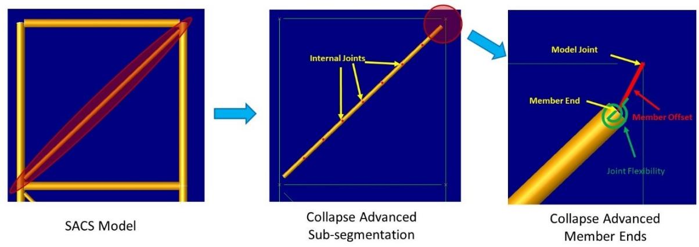  
Figure 1: Collapse Advanced Beam Element

Table 1: Beam cross-sections and integration points   

| Section | Section partitions and Gauss-Legendre integration points per each part | Section partitions and Gauss-Legendre integration points per each part | Section partitions and Gauss-Legendre integration points per each part | Section partitions and Gauss-Legendre integration points per each part | Section partitions and Gauss-Legendre integration points per each part | Section partitions and Gauss-Legendre integration points per each part | Total (NP) |
| --- | --- | --- | --- | --- | --- | --- | --- |
| Tubular, cone | Parts | 1st quarter | 2nd quarter | 3rd quarter | 4th quarter |  | 16 |
| Concentric | Points | 4 | 4 | 4 | 4 |  | (32) |
| Tubular (each tubular) | Points | top flange | bottom flange | Web | fillets |  | 29 |
| Tubular (each tubular) | Points | 5 for each half (2x5) | 5 for each half (2x5) | 5 | 1 for each fillet (4x1) |  |  |
| Wide Flange | Points | along local y | along local z |  |  |  | 25 |
| Wide Flange | Points | 5 | 5 |  |  |  |  |
| Rectangular | Points | flange left half | flange right half | Web |  |  | 14 |
| Rectangular | Points | 4 | 4 | 6 |  |  |  |
| Angle | Points | 1st side | 2nd side |  |  |  | 12 |
| Angle | Points | 6 | 6 |  |  |  |  |
| Channel | Points | top flange | bottom flange | Web | fillets |  | 18 |
| Channel | Points | 5 | 5 | 6 | 1 for each fillet (2x1) |  |  |
| Box | Points | 1st side | 2nd side | 3rd side | 4th side |  | 12 |
| Box | Points | 3 | 3 | 3 | 3 |  |  |
| Jack-up Leg | Points | 1st quarter | 2nd quarter | 3rd quarter | 4th quarter | Solid | 32 |
| Jack-up Leg | Points | 4 | 4 | 4 | 4 | 16 (4x4) |  |
| Launch Runner and Special | Parts | Tubular quarters | Two side plates | Bottom plate |  |  | 28 |
| Launch Runner | Points | 4 (each) | 4 (each) | 4 |  |  |  |
| Rectangular | Parts | 1st quarter | 2nd quarter | 3rd quarter | 4th quarter |  | 24 |
| Tube | Points | 2 for arc 4 for flat | 2 for arc 4 for flat | 2 for arc 4 for flat | 2 for arc 4 for flat |  |  |
| Unsymmetrical | Parts | top flange | bottom flange | Web |  |  | 25 |
| Plate Girder | Points | 5 for each half (2x5) | 5 for each half (2x5) | 5 |  |  |  |
| Boxed Plate Girder | Parts | top/bottom plates | right/left plates | web |  |  | 30 |
| Boxed Plate Girder | Points | 6 (each) | 6 (each) | 6 |  |  |  |
| Double Web Plate Girder | Parts | the right side of the flanges | middle of flanges | the left side of the flanges | webs |  | 36 |
| Double Web Plate Girder | Points | 3 (each) | 6 (each) | 3 (each) | 6 (each) |  |  |
| Double Angles | Points | horizontal sides | vertical sides |  |  |  | 24 |
| Double Angles | Points | 6 (each) | 6 (each) |  |  |  |  |
| Dented Tubular with grout | Parts | top circular part | bottom circular part | top dented part | bottom dented part | grout | 27 |
| Dented Tubular with grout | Points | 6 | 6 | 3 | 3 | 9 |  |

Collapse Advanced monitors stress and strain history at multiple points (called integration points) along the element and within the cross-section. Two sets of integration points are used along each subsegment located at Gauss–Legendre quadrature integration points (see section 6.3.3 for more details). Each set contains various integration points to model stress-strain distributed across the beam crosssection. The number of integration points through a cross-section of a beam element is dependent on the cross-section shape of the beam element. For example, 16 points are used for a tubular section (4 per each quarter), and 29 points are used for a wide flange: 10 for each flange, 5 on the web, and 1 for each of the 4 fillets. Therefore, for a given tubular beam element with 8 sub-segments, elastoplastic calculations are carried out at the total number of 256 points (8x2x16). Similarly, for a wide flange beam element, elastoplastic calculations are carried out at 464 (8x2x29) points. Table 1 shows the crosssection parts for various cross-section types and the corresponding number of integration points in each part. Figure 2 illustrates the location of integration points for various section types.

At a given iteration, each point is checked for plasticity using a von Mises stress surface (i.e. J2 plasticity). The internal member strains are based on second-order strain theory and the stress-strain properties are defined by a bilinear model with user-defined strain hardening. Elastoplastic nonlinear iterative calculations are performed using the Backward Euler method [1]. When the stresses at a point exceed the material elastic limit, the point is considered to be in a plastic state, thus allowing for gradual plastification of the beam cross-section. For more details on elastoplastic calculations, please refer to section 6.5.

Local tubular buckling is determined from the total strain in the cross-section and is included as a permanent hinge at the point of occurrence in the model. Fracture (ductility limit) is checked at each integration points to model a gradual fracture. If the strain exceeds the ductility limit at all integration points located at the same cross-section, the beam is assumed to be fractured.

Collapse Advanced supports both Euler-Bernoulli (without shear deformation) and Timoshenko (with shear deformation) beam bending theories. Elastoplastic calculations based upon Euler-Bernoulli theory are based upon normal stresses only while Timoshenko formulation utilizes both normal stresses and shear stresses.

NOTE: Elastoplastic calculations based upon Timoshenko’s approach assume thin-walled beam sections.

The geometrical effects (geometric stiffness and loads) due to the large rotation and displacement are modeled through a corotational [2] approach. The corotational approach updates the element local coordinate systems gradually during the nonlinear iterative process and enables beam elements to undergo very large rotations and displacements. Hence, the beam deflected shape is accurately calculated at the member ends and along its length at each sub-segment. Member elastic and plastic buckling is automatically calculated using the beam deflected shape and the plasticity of the member sub-segments.

The following sections are supported for full elastoplastic plastic behavior including second-order strains and corotational large rotation/displacement:

Tubular   
Wide Flange   
Prismatic (rectangular) – (currently only Euler-Bernoulli bending theory)   
Tee   
• Angle   
• Channel   
Box   
Cone   
• Jack-up Leg – (currently only Euler-Bernoulli bending theory)   
• Concentric tubular   
• Launch Runner and Special Launch Runner   
Rectangular Tube   
Unsymmetrical Plate Girder   
Boxed Plate Girder   
Double Web Plate Girder   
• Double Angles   
• Dented tubular with grout (experimental)

If the section properties (e.g. cross-section area, inertia, etc.) for the above section types do not match the calculated values based upon cross-section dimensions, then the member is treated as elastic, however, second-order strains and geometric corotational effects will be included. Other SACS section types not included in the above list are also treated as elastic but without second-order strains or geometric corotational effects.

Details of beam element formulation can be found in section 6.3.

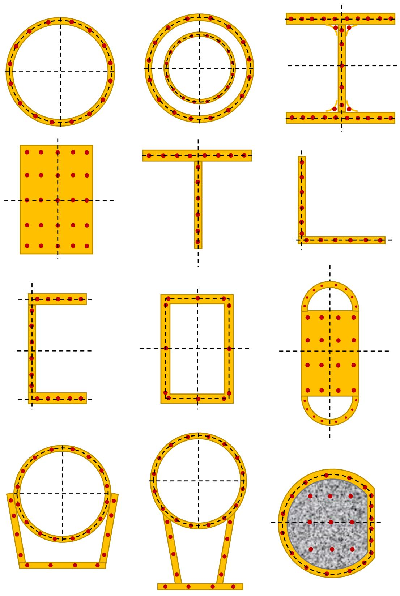  
Figure 2: Integration points for various beam sections

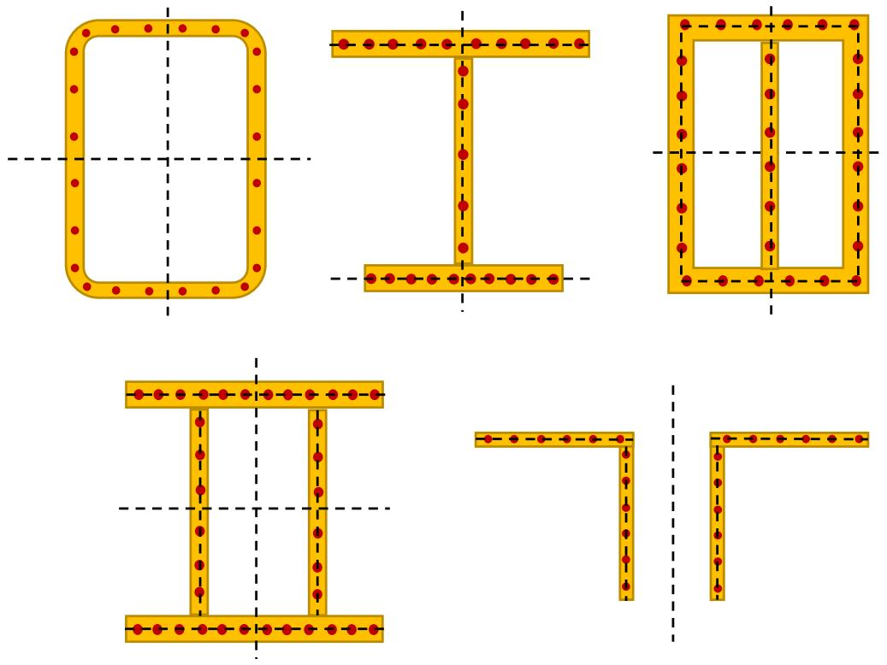  
Figure 2: Continue.

## 2.2 Plate Elements

Collapse Advanced considers isotropic (6 degrees of freedom) plate elements as fully elastoplastic with large displacement and rotations. The stress-strain history is monitored at discrete integration points within the plate surface and through the plate thickness. For the triangular plate, the elastoplastic calculations are performed at three integration points across the plate and 6 integration points through the thickness – a total of 18 integration points. For quadrilateral plates, there are a total of 24 integration points (4 across the plate and 6 through the thickness). This detailed analysis allows Collapse to accurately model gradual plastification of the plates both across the plate and through its thickness. Figure 3 illustrates the location of integration points for triangular and rectangular plate elements.

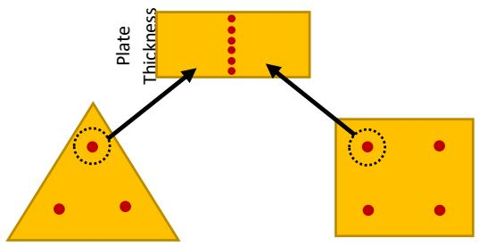  
Figure 3: Integration points for plate elements

Elastoplastic calculations for plates are performed using the Backward Euler method with a J2 yield surface. Collapse Advanced supports both thin (Kirchhoff) and thick (Mindlin) plate theories. For thin plates, two normal stress and the in-plane shear stress components are considered. Thick plate bending theory accounts for out-of-plane shear stresses in addition to the normal stress and the shear stress components – a total of five stress components. By default, the thin plate theory is assumed. Thick bending theory can be selected by making the appropriate selection on the CLPOP2 input line.

In addition to the elastoplastic stress calculation, the Collapse Advanced is able to check the ductility limit at the integration points for plate elements. At a given load increment, the program can calculate the maximum tensile in-plane principal strain at all integration points, If the value of the in-plane principal strain is larger than the ductility limit at a given integration point, that point is considered fractured.

Large displacement and rotation, geometric nonlinearities, are modeled using the corotational formulation [1, 2]. The corotational formulation also accounts for the effects of plate offsets on both geometric and elemental stiffness matrices.

Currently, only isotropic plates can be modeled as fully elastoplastic. Other SACS plate element types such as membrane, shear only, corrugated, and stiffened plate elements are considered as elastic however, corotational large displacement/rotation effects are still included for these plate elements.

Details of plate element formulation can be found in section 6.4.

## 2.3 Tubular Connections

Tubular joint flexibility options include:

1) Fessler's empirical formulas [3, 4]   
2) Single brace formulation due to Buitrago [5]   
3) MSL formulation [6].

Tubular connection failure criterion can be introduced via:

1) Modified ultimate LRFD strength formulation as per API code of practice [7]   
2) Joint strength check as per NORSOK code of practice [8]   
3) MSL formulation [6].

The brace stiffness is automatically removed from the analysis at the onset of a connection failure.

## 2.4 Element Distributed Loading

Applied distributed loads are converted to element nodal loads by integrating over the sub-segments of a member, or the plate element. Changes to the sub-segment and plate positions resulting from the deformation of the structure are also accounted for, however, during deformation, the direction of all member loads are kept constant with respect to the global coordinate system, this is also true for member loads which are defined in the member local coordinate system. This type of load is also referred to as a conservative load and as such may produce axial load effects during deformation of the structure. As an example, consider a horizontal member with a distributed load along the global Z-axis. At the zero load step, the applied load is perpendicular to all sub-segments and it does not produce any internal axial load in the member. However, while the analysis is progressing, the orientation of subsegments will change due to deformation and the applied member load, the direction of which is kept constant with respect to the global coordinate system, will result in axial load effects in the member.

Similarly, for plate elements, the direction of joint loads and hydrostatic pressure loads is always kept constant with respect to the global coordinate system. The direction of plate pressure loads (constant or varying between joints) is always kept constant with respect to the element local coordinates system.

Note: To reduce computational time, element loads are only updated at beginning of each load increment – instead of each iteration.

## 2.5 Foundations

The collapse solution includes the effects of a nonlinear pile/soil foundation. Tubular pile elements are treated the same as regular tubular members and are segmented along the length and around the circumference. The elastoplastic stress-strain calculation and ductility limit checks are similar to the frame member subsegments. Soil data is represented with standard T-Z and P-Y data, and API soil specifications in the pile-structure interaction (PSI) format. For additional information about piles check the PSI documentation.

## 2.6 Solution Techniques

The nonlinear solver for Collapse Advanced is based on a two-step iteration scheme. The first step involves the solution of all beam elements, piles, and plates for a given initial state and known incremental nodal displacements and the formation of a tangent stiffness matrix. The second step involves the solution of the entire structure using the current tangent stiffness matrix and an updated incremental displacement vector.

For plates, the stiffness and forces are determined via a nonlinear elastoplastic finite element approach with the inclusion of a co-rotational formulation. In comparison, the solution for a beam element is computationally much more intensive due to the beam element internal sub-segmentation and the inclusion of member end-releases and joint flexibility (see Figure 1). Collapse Advanced treats each element as a small-scale nonlinear problem in which the displacements at member ends are known and the solution is obtained from an iterative process involving the convergence of internal forces. A similar nonlinear solution procedure is used for the foundation piles but with the following differences: 1) Only pilehead displacements are given (instead of both member ends), 2) The number of sub-segments for each pile is based on the PSI input file, 3) Pile sub-segments are embedded into nonlinear elastic springs associated with soil P-Y and T-Z curves, and 4) Collapse Advanced only solves for the pilehead stiffness matrix and force (instead of both member ends).

The Collapse Advanced nonlinear solver is based on a full Newton-Raphson iterative approach in which the load increment size can be automatically reduced to improve the convergence rate via a subincrementation scheme. The sub-incrementation scheme gradually reduces a given load increment by a factor of 2 until convergence is achieved or the incrementation limit is reached. Once convergence is achieved for a few consecutive load increments using the reduced load increment, the sub incrementation scheme will then start to gradually increase the load increment. In the case of buckling, the Arc-length [1, 2] method is used to predict unloading behavior during the post-buckling response. The workflow is summarized in Figure 4. Details of the formulation can be also found in section 6.6.

For a given load increment repeat following steps until convergence:

Step 1: Elements

Plate Elements: For all plates elements

i. Offset (if any): Adjust plate nodal displacements   
ii. Given initial and current displacement vector, update plate orientation and corotational transformation matrix   
iii. Calculate local stiffness matrix and force vector through elastoplastic finite element formulation   
iv. Calculate geometric stiffness, global stiffness, and force vector   
v. Offset (if any): Adjust global stiffness matrix and force vector   
vi. Insert element stiffness matrix into model stiffness and update model residual vector

Beam Elements: For all beam members

Members without end-release or joint flexibility:

i. Offsets (if any): Adjust member-end displacements (see section 6.7)   
ii. Solve for member internal nodes for given displacement

Step 1: For all sub-segments (i.e. finite elements)

• Form co-rotational transformation matrix   
• Determine local stiffness matrix including elastoplastic effects, fracture (ductility), and local buckling   
• Form global and geometric stiffness matrix

Step 2: Assemble element stiffness matrices and iteratively solve for internal nodal displacement

Step 3: Check for convergence

• NO: go to Step 1   
• YES: Condense out all internal nodes from stiffness matrix and form 12x12 member stiffness matrix and 12x1 load vector

iii. Offset (if any): Adjust 12x12 global stiffness matrix and 12x1 force vector   
iv. Insert element stiffness matrix into model stiffness and update model residual vector

Figure 4: Collapse Advanced nonlinear solver workflow

Member with end-release:

i. Offsets (if any): Adjust member-end displacements (see section 6.7)   
ii. Solve for member internal nodes for given displacement considering special sub-segments for end-releases (see section 6.8)

Step 1: For all sub-segments

• Form co-rotational transformation matrix   
• Determine local stiffness matrix including elastoplastic effects, fracture (ductility), and local buckling   
• Form global and geometric stiffness matrix

Step 2: Assemble element stiffness matrices and iteratively solve for internal nodal displacement

Step 3: Check for convergence

• NO: go to Step 1   
• YES: Condense out all internal nodes from stiffness matrix and form member stiffness matrix and load vector

iii. Offset (if any): Adjust 12x12 global stiffness matrix and 12x1 force vector   
iv. Insert element stiffness matrix into model stiffness and update model residual vector

Member with joint flexibility:

i. Offsets (if any): Adjust member-end displacements (see section 6.7)   
ii. Repeat following steps until convergence

a. Update joint flexibility stiffness parameter and adjust member-end displacements   
b. Solve for member internal nodes for given displacements

Step 1: For all sub-segments

• Form co-rotational transformation matrix   
• Determine local stiffness matrix including elastoplastic effects, fracture (ductility), and local buckling   
• Form global and geometric stiffness matrix

Step 2: Assemble element stiffness matrices and iteratively solve for internal nodal displacement

Step 3: Check for convergence

• NO: go to Step 1   
• YES: Condense out all internal nodes from stiffness matrix and form 12x12 member stiffness matrix and 12x1 load vector

c. Check for convergence: NO (go to Step a) YES (go to step iii)

iii. Offset (if any): Adjust 12x12 global stiffness matrix and 12x1 force vector   
iv. Insert stiffness matrix into model stiffness and update model residual vector

Figure 4: Continue.

Foundation: For all piles

i. Solve for pile internal nodes for given pilehead displacement considering nonlinear elastic stiffness of soil medium (i.e. nonlinear elastic springs based on P-Y and T-Z curves)

Step 1: For all Pile sub-segments (i.e. finite elements)

• Determine local stiffness matrix including elastoplastic effects   
• Form global stiffness matrix for pile sub-segment

Step 2: Assemble element stiffness matrices and iteratively solve for internal nodal displacements

Step 3: Check for convergence

• NO: go to Step 1   
• YES: Condense out all internal nodes from stiffness matrix and form 6x6 pilehead stiffness matrix and 6x1 pilehead load vector

ii. Insert pilehead stiffness matrix into model stiffness and update residual vector

Step 2: Entire Model

Step 1 Newton Iteration: Solve a Newton iteration for new displacement increment using updated tangent stiffness and residual vector determined in Scale 1.

Check for convergence:

a. NO: go to Scale 1 and repeat. If maximum number of iterations have been reached then go to Step 2 Newton with sub-incrementation.   
b. YES: Perform the required checks such as joint strength checks, report the results and go to next load increment.

Step 2 Newton with sub-incrementation: Solve a Newton iteration with reduced load increment (sub-incrementation). Check for convergence:

a. NO: go to Scale 1 and repeat with reduced load increment. If maximum number of iterations and sub-incrementation have been reached then go to Step 3 Arc-length.   
b. YES: Perform required checks such as joint strength check, report the results and go to next the load increment. If the last few reduced load steps have converged using the reduced load increment then start increasing the load increment.

Step 3 Arc-length: Solve using Arc-length method with given value for arc length. Check for convergence:

a. NO: go to Scale 1 and repeat with reduced load increment. If maximum number of iterations reduce arc-length value. If arc-length value is too small, stop analysis.

YES: Perform required checks such as joint strength check, report the results and go to next load increment. If everything is going well, switch back to Newton iteration.

Figure 4: Continue.

## 2.7 Analysis Considerations

The Collapse module is capable of handling most structural problems where plasticity may occur through large deflections. Some obvious applications include progressive analysis (pushover analysis), ship impact, dropped object, blast analysis, and general safety case studies. Basic considerations in conducting such analyses are outlined below.

2.7.1 Progressive Collapse Analysis

The 'Plastic Collapse' mode of assessment offers an improved design concept over linear ‘Elastic’ theory for the analysis/re-analysis of structures. The basic concept of a plastic collapse analysis is as follows:

The load is applied to the structure incrementally. The nodal displacements and element forces are calculated for each load step and the stiffness matrix is updated. When the stress in a member reaches the yield stress, plasticity is introduced. The introduction of plasticity reduces the stiffness of the structure and additional loads due to subsequent load increments will be redistributed to members adjacent to those that have gone plastic. This phenomenon (progressive collapse of members) will continue until the structure is no longer able to sustain any increase in loading.

For large offshore structures, the analysis can be highly CPU intensive since each element is subdivided into eight sub-segments to allow for the development of a plastic hinge anywhere along the member length, for tubular elements, elastoplastic stresses are calculated at 16 integration points across the cross-section to allow for gradual development of a plastic hinge throughout the cross-section. Collapse run time can be decreased by modeling parts of the structure that have little or no contribution to the overall stiffness of the structure (such as boat landings) as dummy structures. All elements contained in a dummy structure are removed by the Seastate module and the loads on the dummy structure are transferred to the main structure before the Collapse analysis is initiated.

Elements whose stiffness may be of significance to the overall behavior of the structure, but which are not structurally important (such as conductors and conductor guides, wishbone elements, topsides elements ...etc.) should be kept elastic throughout the loading history.

Further reductions in run time can be achieved by pre-combining loads wherever possible to minimize the number of loads in a load sequence. Also, a structure undergoing a high level of nonlinear behavior can require an increasing number of iterations for the solution to converge. In such cases, it is better to reduce the step size than to increase the maximum iteration limit. Reducing the step size effectively linearizes the problem which decreases the required number of iterations and therefore decreases the runtime. A sub incrementation scheme has been implemented in Collapse to automatically reduce the step size in areas of high non- linearity where convergence becomes an issue.

2.7.2 Ship Impact Analysis

A ship impact scenario involves the transference of a ship kinetic energy into strain energy resulting from:

a. Local deformation of the impacted member due to denting and beam bending.   
b. Global deformation of the entire structure.   
c. Deformation of the ship structure.

Local deformation of the impacted member due to beam bending and the global deformation of the structure is readily accounted for by Collapse. To account for localized denting it is recommended that the impacted member is modeled using isotropic plate elements. The SACS module Precede has the facility to generate a tubular finite element plate mesh for a given member. Alternatively, the local denting energy of an impacted member may also be considered in accordance with the Ellinas or Furnes approaches outlined in the API RP2A-WSD code of practice by selecting the appropriate option on the IMPACT input line. The maximum dent and maximum energy absorbed by the member can be limited by options provided on the IMPACT input line. Ellinas and Furnes force and energy formula are shown in Figure 5.

NOTE the latter approach does not account for any geometric nonlinearities resulting from local indentations.

A joint force, together with the total kinetic energy or the mass and velocity of the impacting object, can be used to simulate an impact via the IMPACT input line. The collapse also allows for automatic unloading for post-impact analysis – for more details see section 5.6 for IMPACT samples.

The SHPIND input line may be used to input user-defined ship indentation curves. In addition, the IMPACT input line allows the user to select DNV RP-C204 force-displacement curves for a 5000-ton ship and a 1.5m and 10m diameter infinitely stiff cylindrical column similar to those shown in Figure 6. Collapse Advanced assumes further energy is not absorbed by the ship once the maximum ship force has been exceeded.

Collapse Advanced also provides a new feature to assume member and ship absorbed energies as plastic (unrecoverable) energy. With this new option, the ship and member dent and energies remain unchanged during unloading – i.e. plastic dent deformation.

Finally, Collapse View can be used to produce reports and plots of the energy absorbed by the structure, the member local dent, and the ship

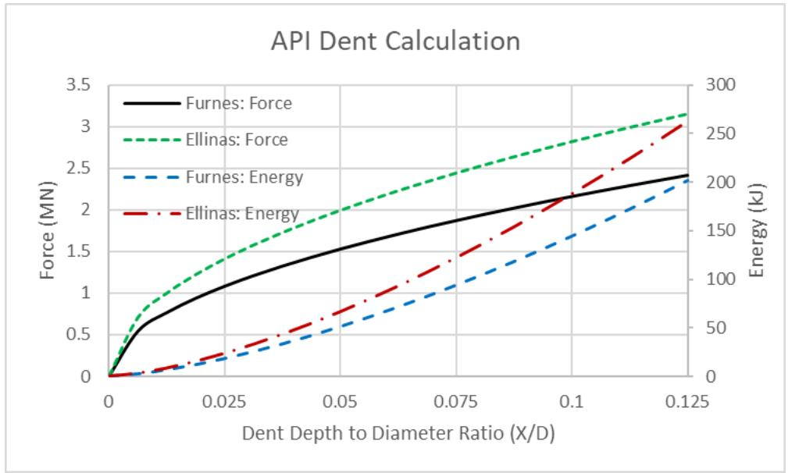  
Figure 5: API RP2A-WSD Ellinas and Furnes Member Indentation Curves

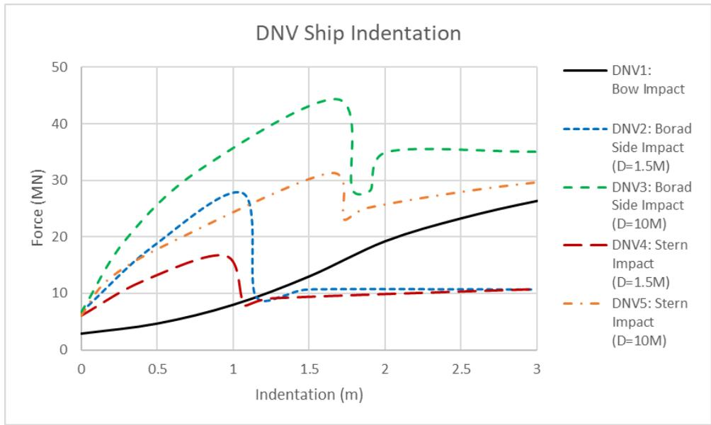  
Figure 6: DNV Force – Indentation Curves for a 5000-ton Ship

3 Collapse Modelling and Input

The Collapse program requires a SACS model file and a Collapse input file. A standard SACS model may be used as the model input for the nonlinear analysis without any change. the nonlinear plastic analysis options are defined in a Collapse input file. Collapse Advanced input is divided into six groups:

1) Analysis Options: Collapse Advanced options are specified in two input lines the CLPOPT line (primary) and CLPOP2 line (secondary and optional). Additional collapse analysis options on CLPOP2 are typically used for refining the analysis parameters or troubleshooting analyses which doesn’t converge. There are also three additional input lines associated with different features in Collapse Advanced including FRCTOL (force tolerance for convergence), SUBINC (Newton iteration with subincrementation) ARCLEN (arc-length method for post-buckling and unloading iteration). See section 3.1 for details.   
2) Report Options: Output report options may be specified on the CLPRPT line. Also, input lines JTSEL, MEMSEL, and PLTSEL can be used to print reports for specific joints, beam elements, and plates, respectively. See section 3.2 for details.   
3) Loading: load sequence can be defined on the LDSEQ input line. See section 3.3 for details.   
4) Joint Connection Options: Options for joints (flexibility and strength) can be entered on JSOPT.   
5) Elastic Elements: Some elements in offshore structures may contribute to the overall stiffness of the model but may not be structurally significant (such as conductors and conductor guides, wish bone elements, etc.). These elements can be kept as elastic to reduce computational time for a large-scale collapse analysis. Collapse Advanced provides various options to assign specific elements or groups of elements as elastic.   
6) Nonlinear Springs: there are two types of nonlinear springs in collapse input: 1) joint to the ground (support) and 2) joint to joint. The spring specifications may be entered on NLSPRG NLSPJJ input lines.   
7) Material Properties: Collapse input has various options to override yield stress for members and plates. Also, ductility can be overridden for specific members using various input lines.

The following sections discuss specific inputs.

## 3.1 Analysis Options

3.1.1 Modeling Options: the CLPOPT

3.1.1.1 Member Local Buckling

Local buckling of the member cross-section may be considered by specifying analysis option ‘LB’ in one of the analysis options fields. The criteria used for local buckling is specified on columns 52-53 as ‘MG’ for Marshall & Gates [9] lower limit of critical strain, ‘2U’ for API Bulletin 2U recommendations, ‘LR’ for API ultimate strength code criteria, and ‘IS’ for ISO 19902 Section 12.2.3.3. A moment-free hinge is introduced along the member at the onset of local buckling.

Local buckling can be skipped for given members and groups via the MEMSKP and GRPSKP input lines respectively.

3.1.1.2 Joint Flexibility

The effects of tubular connection flexibility may be accounted for by specifying the analysis option ‘JF’ in columns 34-35 to use Fessler's empirical formulas for joint flexibility. Single brace formulation by Buitrago can be selected for joint flexibility by entering ‘JB’ in columns 34-35.

The formulation for connection flexibility developed by MSL Engineering Limited (UK) for JIP project ‘Assessment Criteria, Reliability and Reserve Strength of Tubular Joints’ can be accessed by entering ‘JF’ on the CLPOPT line and adding MSLOPT input line to the collapse input line. The formulation can be specified with analysis option ‘MF’ for the mean level or ‘CF’ for the characteristic level on the input line MSLOPT in columns 8-9. By default, the program uses elastoplastic (coupled) MSL joint flexibility formulation. The MSL flexibility can be set to the uncoupled formulation by entering ‘NMP’ on columns 78-80 of MSLOPT.

3.1.1.3 Tubular Connection Capacity Check

Joint strength check based upon API RP 2A-LRFD recommendations for tubular joints can be implemented by specifying ‘JS’ in one of the analysis options fields between columns 26-41. Entering ‘ND’ implements joint strength check in accordance with the NORSOK-revision 2 standard for the design of steel structures. Similarly, joint strength checks in accordance with NORSOK-revisions 1 and 3 are available by entering ‘N1’, and ‘N3’, accordingly.

A joint Capacity check in accordance with ISO 19902 can be implemented by specifying ‘IS’ in columns 26-41.

The formulation for capacity check developed by MSL Engineering Limited (UK) for JIP ‘Assessment Criteria, Reliability and Reserve Strength of Tubular Joints’ includes mean level and characteristic level options specified with analysis option ‘MS’ or ‘CS’, respectively, in columns 10-11 on the MSLOPT line.

Once the joint strength check criterion has been exceeded the connection is considered to have failed and the brace connected sub-segment stiffness is progressively reduced.

Note: Since coupled/elastoplastic MSL Joint flexibly implicitly assumes connection softening, the brace sub-segment softening is not considered when elastoplastic MSL flexibility is implemented.

3.1.1.4 Strain Hardening

Strain hardening effects can be included at the onset of plasticity by entering a strain hardening ratio in columns 76-80. The strain hardening ratio is defined as the ratio of the slope of the plastic portion of the stress-strain curve to the slope of the elastic portion. The default value for strain hardening is 0.002.

3.1.1.5 All Members or Plates Elastic

All members can be treated as elastic by entering ‘ME’ in columns 40-41. Similarly, all plates can be treated as elastic plates by entering ‘PE’.

3.1.1.6 Considering Skipped Elements Plastically

By default, any element or element group designated in the model file to be skipped for post-processing purposes is considered elastic throughout the analysis. Skipped elements may be considered to have plastic material properties by specifying the analysis option ‘NS’ in columns 26-27.

Note: Skipped beam elements are designated in the model file by ‘SK’ in columns 20-21 on the MEMBER line defining the member or by specifying member class ‘9’ in column 47 on the GRUP line defining the group to which it is assigned. Skipped plates are designated by ‘SK’ in columns 31-32 on the PLATE line defining it.

3.1.1.7 Pile Plasticity

When executing a nonlinear plastic analysis including the pile/soil foundation, the pile elements' material properties may be treated as elastic or plastic. Enter ‘PP’ in columns 36-37 to use plastic material properties for pile elements.

3.1.1.8 Collapse Critical Displacement

The critical displacement or the maximum deflection allowed before the structure is assumed to have collapsed or has failed may be specified in columns 71-75.

3.1.1.9 Creating a SACS Model File at Final Step

A SACS model file with joint coordinates that reflect the final displaced position of the joint may be created by inputting ‘SF’ in columns 38-39.

Note: The user may generate a deformed SACS model for any given load increment in Collapse View.

3.1.2 Solver and Convergence Options: the CLPOPT

3.1.2.1 Number of Member Sub-segments (finite elements)

By default, members with plastic material properties are divided into 8 sub-segments along the member length, linear elements, or very short members are modeled using a single element. The number of subsegments for members may be specified in columns 14-16. A minimum of 4 sub-segments is recommended for accurate results.

Additional options for member sub-segmentation are also available on the MEMSEG and GRPSEG input lines. The MEMSEG input line can be used to override the member sub-segment definition on the CLPOPT line for a specific member by specifying the number of sub-segments and the start and end

joints of a member. As many MEMSEG lines as required may be specified. Similarly, the GRPSEG input line can be used to override the sub-segment definition for a group of members by specifying the number of sub-segments and the group ID. As many GRPSEG lines as required may be specified.

Note: The sub-segment length is determined by dividing the total member length by the maximum number of sub-segments designated. For segmented members, any sub-segment which has a change in property is further divided into two constant property sub-segments at the point at which the section property changes. Therefore, segmented members may have more sub-segments than the maximum specified.

3.1.2.2 Continue if Maximum Number of Iterations Exceeded

Collapse Advanced terminates when the maximum number of iterations is exceeded. Continue ‘CN’ option is no longer supported in Collapse Advanced. It is recommended to use sub-incrementation (‘SI’ in columns 44-45), Arc-length method (‘AL’ in columns 42-43), relaxed convergence (see CLPOP2). For more details, see the Troubleshooting section.

3.1.2.3 Sub-incrementation Solver

Sub-incrementation may be used to improve the convergence rate by specifying ‘SI’ in columns 44-45 for the Newton-Raphson solver. The sub-incrementation solver automatically reduces load increment by a factor of 2 (up to a specified level) until convergence is achieved. If convergence is achieved in few consecutive increments, the solver will gradually increase (accelerate) the load increment.

The sub-incrementation options may be entered on the SUBINC line. The default values of 5 and 4 for the maximum number of sub-incrementation levels and the maximum acceleration of the subincrementation may be overridden in columns 8-9 and columns 11-12, respectively.

Section 4.2.6 discusses the details of how to utilize the Collapse Advanced sub-incrementation feature in nonlinear analysis.

3.1.2.4 Arc-length Solver

The arc-length solver may be used for post-buckling analysis by specifying the analysis option ‘AL’ in columns 42-43.

The arc-length solver options may be entered on the ARCLEN line. Enter the type of arc-length iteration in columns 8-10. There are two types of arc-length iteration methods available in Collapse Advanced, cylindrical (CYL) and spherical (SPH). The cylindrical method uses deflection increments to determine the arc-length parameter while the spherical arc-length method utilizes a factor (columns 31-36) to combine both force and deflection increment. The automatic arc-length parameter can be scaled by a factor in columns 24-29 (the default value is 1.0) – i.e. if the arc-length parameter is too large, a value smaller than 1 can be entered or vice versa.

The arc-length method also utilizes a sub-incrementation scheme if it is required. If this option is left blank (i.e. default), Collapse Advanced will attempt to solve using the following order:

1. Cylindrical method   
2. Cylindrical method with sub-incrementation   
3. Spherical method   
4. Spherical method with sub-incrementation   
5. Cylindrical method with increasing arc-length

By default, the maximum number of arc-length steps is 500 and may be overridden in columns 12-18. The default maximum number of 10 sub-incrementation levels may be overridden in columns 20-22.

Details of Arc-length formulation can be found in section 6.6. Also, section 4.2.9 discusses how to utilize the Collapse Advanced Arc-length method for post-buckling.

3.1.2.5 Global Stiffness Iterations and Convergence

For any load increment, a beam-column solution is performed for each plastic member using the crosssection sub-element details. The global stiffness iteration is then performed which can include the effects of connection flexibility and nonlinear pile/soil foundation effects. The deflected shape of the structure is then determined and compared against the displacements of the previous global stiffness iteration. The stiffness iterations are repeated until the displacements and rotations satisfy the displacement and rotation convergence tolerances or the maximum number of iterations has been met.

By default, the maximum number of global stiffness iterations per load increment is 20 but may be overridden in columns 11-13 of the CLPOPT input line. The default displacement and rotation convergence tolerances are 0.01 inch or 0.01cm and 0.001 radians and may be overridden in columns 56-60 and 61-65 of the CLPOPT input line respectively.

In addition to displacement and rotation tolerances, the force convergence tolerance criteria are also considered by using the FRCTOL input line. The default force and moment tolerances are both 0.001 and may be overridden in columns 8-13 and 15-20 of the FRCTOL input line respectively. 0.001 tolerance is assumed to produce the most accurate results. See section 4.4 in Troubleshooting for best practices to increase the default value.

Note: At a given load increment, if the residual is very small relative to the initial value but the convergence does not achieve, Collapse Advanced may automatically double the maximum number of iterations to improve the convergence rate.

3.1.2.6 Member Iterations and Displacement Convergence

For any load increment, a beam-column solution is performed for each plastic member using the crosssection sub-element details. Member stiffness iterations continue until the displacements of member sub-segment joints for two successive iterations meet the member displacement tolerance or until the maximum number of member iterations has been met. The default number of member iterations is 20 and may be overridden in columns 17-19 of the CLPOPT input line. The default member displacement tolerance is 0.01 inch or 0.01cm and may be overridden in columns 66-70.

Note: The maximum number of member iterations may be increased when the member solution has not converged.

3.1.3 Additional Member and Plate Options: CLPOP2

3.1.3.1 Additional Member Options

Enter the member eccentricity ratio in columns 8-13. Enter the maximum ductility for any member in columns 15-20. Members that exceed this limit are assumed to be fractured.

By default, the co-rotational 2nd-order terms are only considered for open thin-walled sections. Enter ‘ITC’ in columns 22-24 to include the co-rotational 2nd-order terms for tubulars and other closed sections.

Note: In most applications, utilizing the co-rotational 2nd-order terms for tubulars increases computational time without significant improvement in the results. See Sample 3 for beam elements in section 5.1.3.3 for application of the ‘ITC’ option in collapse analysis

Enter the ‘EXC’ option in columns 22-24 to exclude co-rotational 2nd-order terms for all section types. Details of the corotational formulation can be found in section 6.3.1.5. The overall runtime can be reduced by excluding the 2nd order corotational terms for open section members which are not subject to large loads or large deformations (for example, secondary elements which are restrained against buckling). Sample 10 in section 5.1.10 illustrates the use of the ‘EXC’ option.

There are three options available for second-order strains in Collapse Advanced.

1. Axial-Bending 2nd-order Strains: this is the default option.   
2. Wagner Nonlinear Torsion: this option is associated with thin-walled open section beams which are prone to torsional deformation. In most cases, this option does not affect the structural response, but it will increase overall computation time. The Wagner nonlinear torsion can be added by entering ‘IWT’ in columns 26-28. For further information, see section 6.3.2.3 for Wagner torsion formulation and sample 6.1 for beams in section 5.1.6.1 for the use of this option.   
3. Excluding 2nd order strains: Enter ‘NLS’ in columns 26-28 to exclude all 2nd-order (large) strains.

Member out-of-straightness in the form of a harmonic function can be included for all members using the member sub-segments by entering an out-of-straightness ratio in columns 30-35 – the default value is zero (i.e. no out-of-straightness).

The member end-releases are by default considered for the collapse analysis. However, to improve the convergence rate in special circumstances, the end-releases can be ignored by entering ‘NR’ on columns 55-56. This option does not affect wishbones and they are always considered for the analysis.

To ensure the accuracy of elastoplastic calculation, Collapse Advanced compares the input section properties of all members with calculated properties. If the input properties of a given member differ from calculated properties, by default the program sets the member to elastic and reports a warning message. By entering ‘C’ on column 54 on the CLPOP2 line, the program overrides the input properties with calculated properties and assumes the member as elastoplastic.

For joint flexibility or joint strength check, Collapse Advanced first computes the properties of bracechord connections. If properties of a given brace-chord connection are out of the applicability range of selected methods, Collapse Advanced by default excludes the connection from the joint calculation. The out-of-range connection can be included by entering ‘IJ’, ‘IF’, or ‘IS’ on columns 57-58 to include it for both flexibility and strength, only for flexibility or only for strength, respectively. For details on the applicability range of all methods, please see sections 6.9 and 6.10 in Commentary.

Note: Including out-of-range connections may lead to non-convergence or may slow down the convergence significantly.

3.1.3.2 Additional Plate Options

By default, shear deformation effects are not considered for plates – i.e. Plate bending theory is based on thin (Kirchhoff) theory. Enter ‘MPT’ to include Mindlin thick plate theory deformation effects in plates. When using Mindlin thick plate theory for triangular plates, shear-locking may be prevented by applying a correction factor. The triangular plate shear-locking factor is 2.00 by default, this may be overridden in columns 48-53.

Note: Thick (Mindlin) plate quad element does not need a correction factor for shear-locking. See section 6.4 for details on the finite element formulation of Mindlin plate bending theory.

All plate elements include an extra term commonly referred to as “drilling stiffness” to prevent instability of plates against torsional twist (for details see 6.4.2). The drilling factor is set to 0.05 by default, this may be overridden in columns 41-46.

Note: Drilling stiffness rarely affects analysis convergence and results, however, it becomes effective in the presence of a large in-plane twist of the plate surface.

3.1.4 Additional Solver and Convergence Options: CLPOP2

3.1.4.1 Convergence Control Parameters

By default, convergence is achieved if both displacement tolerances and force tolerances are satisfied. In addition to the convergence checks, a force residual is monitored at a given load increment to check for divergence. Two checks are performed for the force residual at a given iteration:

1) The residual ratio to initial residual should be always less than 10??????1   
2) The residual value itself should always less than 10??????2

If any of these tests fail, the iteration is aborted, and load increment is reduced using a subincrementation scheme. The default values of exp1 and exp2 are 4 and 6 respectively and can be revised in columns 59 and 61, respectively. See section 4.2.8 for troubleshooting.

3.1.4.2 Relaxed Iteration and Convergence Criteria

Collapse Advanced has various features to improve convergence rate and improve accuracy for postbuckling analysis. The relaxed (weakened) convergence criterion can be implemented by entering ‘CRX’ in columns 70-72. This relaxed criterion is defined as the residual ratio to initial residual less than 10??????3 and the default value of -5, can be overridden on columns 63-64. A similar relaxed-convergence criterion

can be applied for beam element iterations by entering ‘MCR’ in columns 78-80. For further information, see sections 4.1 and 4.2 for troubleshooting.

Note: Relaxed convergence criteria should be used with caution. The convergence criteria can increase the chance of convergence for some load increments, however, it may also lead to divergence (or significant error) for other load increments due to numerical error accumulation during the iterative process.

A framework for a relaxed Newton iterative process is also available. In this method, the current displacement increment is scaled by a factor and is then used to perform the next Newton iteration. This feature may increase the chance of convergence in cases where there is significant deformation in a single load increment (e.g. just after buckling). The relaxation factor is automatically calculated. Enter ‘IRX’ in columns 66-68 of the CLPOP2 input line to relax the iteration criteria for the entire model.

Many safeguards have been implemented in Collapse Advanced to prevent the analysis from jumping over an unstable post-buckling path – also known as the snap-through response. However, on rare occasions, some models still display this behavior. The Relaxed Iteration method completely prevents a snap-through response by controlling the progress of the displacement increment in the analysis. For more details, see section 4.3 for troubleshooting and sample 2 in section 5.1.2 for the application of the Relaxed Iteration approach.

Similarly, the relaxed iteration approach can be used for member calculation by entering ‘MIR’ in columns 74-76 on the CLPOP2 line. See 4.2.4 in Troubleshooting for ‘MIR’ usage.

Note: The relaxed iteration approach may increase the chance of convergence, however, it will also increase the number of iterations required for convergence and hence the computation time.

## 3.2 Output Reports

Output reports including joint deflections, joint reactions, member internal loads and stresses, collapse summary and member summary reports are available. Report data may be generated based on the final analysis results or each load increment.

3.2.1 Reports Options: CLPRPT

3.2.1.1 Joint Displacements

Joint displacements may be reported for the structure’s final position or for each load increment by specifying ‘P0’ or ‘P1’ respectively in columns 8-9 on the CLPRPT input line.

Note: P2 option (deflection report at each iteration) is deprecated and will be overridden as P1.

3.2.1.2 Selecting Joints for Displacement Report

By default, the displacements for each joint in the model are reported in the joint displacement report. The user may designate the joints to be reported in the joint displacement report on the JTSEL line. There is no limit to the number of joints that may be designated.

Note: If joints are designated using the JTSEL line, only joints specified are included in the joint displacement report.

3.2.1.3 Joint Reactions

Joint reactions may be reported for the structure’s final position or for each load increment by specifying ‘R0’ or ‘R1’ respectively in columns 10-11 on the CLPRPT input line.

Note: R2 option (reaction report at each iteration) is deprecated and will be overridden as R1.

3.2.1.4 Pilehead Reactions Report

The pilehead reactions may be reported for the structure's final position, for each load increment by specifying 'F0' or 'F1' respectively in columns 26-27 on the CLPRPT input line.

Note: F2 option (pilehead reaction report at each iteration) is deprecated and will be overridden as F1.

3.2.1.5 Elements (Plates and Beam Members) Internal Loads and Stresses

Member internal loads and stresses may be reported for the structure’s final position or for each load increment by specifying ‘M0’ or ‘M1’ respectively in columns 12-13 on the CLPRPT input line.

Note: M2 option (internal loads and stresses report at each iteration) is deprecated and will be overridden as M1.

3.2.1.6 Selecting Members for Internal Loads and Stress Report

By default, the internal loads and stresses will be reported for all members of the model. To avoid large reports the user may select specific members to be reported by using the MEMSEL line. There is no limit to the number of members that may be designated.

3.2.1.7 Selecting Plates for Reports

By default, reports will be produced for all plates. The user can request reports on specific plates by using the PLTSEL line. There is no limit to the number of plates that may be selected.

3.2.1.8 Excluding Elastic Members

Members whose properties remain elastic may be excluded from the internal loads and stress reports by selecting the ‘MP’ option. The report will thus contain internal loads and stresses only for plastic members.

3.2.1.9 Print Von Mises Stresses on Integration Points

Von Mises stress can be reported at all integration points by entering ‘SP’ in columns 16-17. The number of integration points depends on beam element section type or plate element type. Figure 2 and Figure 3 show the position of integration pints for beam elements and plates, respectively.

3.2.1.10 Collapse Summary Report

The Collapse solution summary report containing the load case, load factor, force summation, and maximum displacement and rotation for each load increment may be obtained by specifying report option ‘SM’.

3.2.1.11 Member Summary Report

Select the ‘MS’ option to obtain a plastic member summary report including the plasticity ratio and member internal loading for each load increment.

3.2.1.12 Element Warning Messages

Select the ‘PW’ option to print all warning messages for beam members, plates, and pile them into the listing file and collapse the log file in addition to the collapse troubleshooting file.

3.2.1.13 Von Mises Stress Check for Elastic Plates

Select the ‘VM’ option to print Von Mises check for all plates designated as elastic.

3.2.1.14 Designating Minimum Plasticity

A minimum plasticity ratio for the member stress report may be specified in columns 32-36 on the CLPRPT line. If a minimum plasticity ratio is specified, only members with sub-elements that have plasticity ratios greater than the ratio specified are reported. Similar inputs can be entered in columns 38-42 for piles and 44-48 for plates.

Note: For plate strain reports in Collapse Advanced see section 3.2.1.17

3.2.1.15 Member Strain Report

The following options can be used to generate strain reports for members in Collapse Advanced:

Enter ‘EN’ on columns 58-59 to report normal strains to the listing file at integration points for member sub-segments.   
Enter ‘EP’ on columns 62-63 to report plastic strains to the listing file at integration points for member sub-segments.   
By default, the maximum normal strain will be saved in the Collapse Advanced database (clbdb folder). By entering ‘EP’ on columns 64-65, the maximum plastic strain will be saved instead. The maximum strain report (normal or plastic) can be generated by selecting Collapse View -> File -> Generate Report -> Member Strains.

3.2.1.16 Plate Internal Forces and Von Mises Stress Report

Enter ‘IF’ on columns 68-69 to report isotropic plate internal forces at the integration points to the listing file. The internal forces are reported at 4 integration points for quadrilateral plates and 3 points for the triangular plates. For the thin plate bending theory, the following internal forces are reported:

• Axial forces per unit along the local x-axis and local y-axis (Fx and Fy)   
In-plane shear force per unit length (Vxy)   
• Bending moments per unit length about the local x-axis and local y-axis (Mx and My)   
Twist moment per unit length (Mxy)

In the case of thick plate bending theory, two additional forces are reported as follow:

Out-of-plane shear in the local x-z plane (Vxz)   
Out-of-plane shear in the local y-z plane (Vyz)

Enter ‘VS’ on columns 70-71 to report plate von Mises stress at the integration points. For quadrilateral plates, the von Mises stresses are reported at 4 integration points across the element plane and 6 integration points within the thickness (a total of 24 points). For triangular plates, the stresses are reported at 3 integration points across the element and 6 integration points within the thickness (a total of 18 points).

Note: The ‘VS’ report option replaces the standard plate equivalent stress report.

3.2.1.17 Plate Strain Report

The following options can be used to generate strain reports for isotropic plates in Collapse Advanced:

Enter ‘IP’ on columns 72-73 to report the minimum and maximum in-plane principal strains at a given integration point to the listing file.   
• Enter ‘EP’ on columns 74-75 to report plastic strains to the listing file at integration points for plates.

Like von Mises stresses, the strains are reported at 24 and 18 integration points for quadrilateral plates and triangular plates, respectively.

## 3.3 Applying Load

Unlike standard linear analysis, the Collapse Advanced program analyzes a set of load cases applied step by step or sequentially rather than simultaneously. The Collapse Advanced program allows for multiple load sequences to be defined where each load sequence is treated as an independent nonlinear analysis. Collapse Advanced also allows the removal of a user-defined beam member at a given load step. This option can be used to model significant damage to the model.

3.3.1 Load Sequence: LDSEQ

3.3.1.1 Defining a Load Sequence

A load sequence defines a set of load steps that will be applied in the sequence or order specified by the user using LDSEQ lines. Enter the load sequence name in columns 7-10 of the first LDSEQ line defining the sequence.

Each load sequence may contain from one to fifty SACS IV basic load case definitions (including repeated load cases) in columns 21-80 on the LDSEQ line. A load step defines the basic load case to be applied, the number of increments over which to apply the load case, the initial load case factor, and the final load case factor. For a given load step, the magnitude of each load increment is constant and is determined by:

$$L o a d I n c r e m e n t = \frac{(E n d f a c t o r - B e g i n f a c t o r)}{N u m b e r o f i n c r e m e n t s}$$

Note: The order in which loading is applied in the sequence may have a significant effect on the analysis results. For example, dead loading or self-weight should be applied before any environmental loading.

3.3.1.2 Load Sequences with More than Three Load Steps

Multiple LDSEQ lines may be used to define load sequences consisting of more than three load steps. For each subsequent LDSEQ line, leave the load sequence ID in columns 7-10 blank to designate that the load steps defined are a continuation of the current load sequence. A maximum of seventeen LDSEQ lines may be used to define a load sequence. Up to fifty load steps may be used for each load sequence.

3.3.2 Removing a Member: MEMREM

Members may be removed from the analysis at a specified load step. Enter the begin and end joints for each member to be removed and the load increment on the MEMREM line.

3.3.3 Load for Ship Impact, Dropped Object, and Blast Wall

There are two methods available to model impact loads for ship impact, dropped object, and blast wall analysis:

1. Utilizing IMPACT input line with the user-defined load cases given in SACS model file   
2. Automatically generating impact loads with Dynamic Response Time-History Analysis

In the first method, the impact load case is a user-defined load given in the SACS model file, the analysis sequence is defined by the LDSEQ input line. The total energy absorbed by the structure, member, or the ship is entered on the IMPAC input line or using an ENERGY input file. The analysis continues until

the total energy is absorbed and then the structure is automatically unloaded. For more details, see impact samples in section 5.6.

In the second method, the load sequence is defined by two input lines: LDAPL and LDAPC. LDAPL is used to add static loads (like model weight) to the collapse load sequence while LDAPC is automatically generated by the dynamic analysis to add dynamic load history for the collapse analysis.

## 3.4 Joint Connection Options

3.4.1 Tubular Connection Strength and Flexibility Parameters:

3.4.1.1 Tubular Connection Options: JSOPT

Joint strength and flexibility options used for the tubular connections can be implemented using the JSOPT line. Using the JSOPT line the following options can be implemented:

Relief option to check the brace offsets   
• Revise the default tolerance to check brace offsets   
Minimum and maximum gap allowed for K connections   
Effective thickness for grouted members (for more details check Section 2.1.3. in Joint Can user manual)   
• ISO 19902 brace utilization option (see section 6.9.3 in Commentary for details)   
• Print level for the unity check values   
• Tolerance to check offsets of brace-chord connections   
Option to print connection geometric parameters (β, γ, and τ) to the listing file.

This line is optional in any collapse analysis. If this line is omitted, then default options will be used.

3.4.1.2 Resistance Factor Data: RSFAC/RSFACO

RSFAC and RSFACO input lines can be used to modify joint resistance factors for API RP 2A-LRFD (see section 6.9.2 in Commentary) or the additional user-defined resistance factors for ISO 19902, NORSOL, and MSL (see sections 6.9.3, 6.9.4, and 6.9.5 in Commentary). RSFAC revises the factors for all connections and braces while RSFACO revises the factors for the selected brace.

In addition to resistance factors, the user can revise API Yield Factor, NORSOK Material factor, or ISO Yield and Extra resistance factors on the RSFAC line.

This line is optional in any collapse analysis. If this line is omitted, then default options will be used.

3.4.2 MSL Joint Flexibility and Strength Formulation: MSLOPT

The MSL joint flexibility and strength formulation developed for the JIP ‘Assessment Criteria, Reliability and Reserve Strength of Tubular Joints’ can be implemented via the MSLOPT line.

Two levels of tubular connection capacity, ‘mean’ level and ‘characteristic’ level, can be defined. The ‘mean’ level corresponds to a 50% probability of survival while the ‘characteristic’ level corresponds to a 95% probability of survival.

3.4.2.1 Joint Flexibility

The effects of tubular connection flexibility may be accounted for by specifying analysis option ‘MF’ or ‘CF’ for mean or characteristic level, respectively, in columns 8-9.

By default, a convergence tolerance of 0.001 is assumed for joint distortion and rotation. The joint distortion tolerance can be specified in columns 15-19. The joint rotation tolerance can be specified in columns 20-24.

3.4.2.2 Joint Strength

The tubular connection strength at the ‘mean’ level can be implemented by specifying analysis option ‘MS’ in columns 10-11. Alternatively, the connection strength may be implemented at the characteristic level by specifying ‘CS’ in columns 10-11.

3.4.2.3 Fracture Criteria

The ductility limits for tension-loaded joints may be accounted for by specifying analysis option ‘MT’ at mean level, and ‘CT’ at the characteristic level in columns 12-13.

3.4.2.4 MSL Assessment Factor of Safety

The user can enter the MSL assessment factor of safety on columns 25-29 of the MSLOPT line. For details see section 6.9.5 in Commentary. The program uses the default value of 1.0 if no input is entered.

3.4.2.5 Plasticity in MSL

The Collapse Advanced program, by default, uses MSL coupled elastoplastic joint flexibility method (see section 6.11 in Commentary for details). The MSL plasticity model can be ignored by entering ‘NMP’ on columns 78-80 of the MSLOPT line.

3.4.3 Joint Strength/Flexibility Selection: JSSEL

Individual joints may be chosen for joint strength or joint flexibility analysis. The option used, either joint strength ‘JS’ or joint flexibility ‘JF’, must be specified with the CLPOPT analysis options. With the ‘JS’ option specified on the CLPOPT line, a joint or group of joints may be chosen for joint strength analysis with the JSSEL line. This means that all braces connected to the joints specified will be included or excluded from the joint strength analysis. The line either includes or excludes the joints specified in columns 9-77 based on the entry in column 7. Specifying ‘I’ in column 7 will mean that the joints named are included in the joint strength analysis; specifying ‘X’ in column 7 will mean that all joints except those named are included in the joint strength analysis.

In the same manner, joints may be chosen for joint flexibility analysis with the JFSEL line. With either JSSEL or JFSEL, the include or exclude option is mutually exclusive. Therefore, if multiple lines are used to include or exclude joints, each line must have the same option specified in column 7.

In the following example, joints 101 and 102 are excluded from joint flexibility analysis. All other joints will be analyzed.

| 1 2 3 4 5 6 7 8 123456789012345678901234567890123456789012345678901234567890 |
| --- |
| JFSEL X 101 102 |

If the choice of a single joint for joint strength or joint flexibility analysis is not sufficiently restrictive, the BSSEL and BFSEL allow the user to restrict strength or flexibility analysis to individual brace/chord connections. The option used, either joint strength ‘JS’ or joint flexibility ‘JF’, must be specified with the CLPOPT analysis options. With the ‘JS’ option specified on the CLPOPT line, a brace/chord connection joint may be chosen for joint strength analysis with the BSSEL line. The first brace member joints are specified in columns 9-12 (begin joint) and columns 13-16 (end joint). The strength analysis will be calculated at the brace/chord connection joint, which is either the begin joint or the end joint of the brace member and is specified in columns 17-20 for the first brace. Up to five braces may be specified on the BSSEL line. As in the JSSEL line, brace/chord connections may be included or excluded from strength analysis by specifying ‘I’ or ‘X’ in column 7.

Equivalently, joint flexibility for individual brace/chord connections is specified with the BFSEL line. With either BSSEL or BFSEL, the include or exclude option is mutually exclusive. Therefore, if multiple lines are used to include or exclude brace/chord connection joints, each line must have the same option specified in column 7.

In the following example, brace/chord connection joint 101 of brace member 101-401 is excluded from brace strength analysis. All other brace-chord connections will be analyzed.

| 1 2 3 4 5 6 7 8 1234567890123456789012345678901234567890123456789012345678901234567890 |
| --- |
| BSSEL X 101 401 101 |

The resistance factor specified for a brace/chord connection may be modified using the RSFACO line. This line allows the user to override joint resistance factor values specified on RSFAC lines. The line specifies the brace member in columns 8-11 (begin joint) and columns 12-15 (end joint). The brace/chord connection joint, which is either the begin joint or the end joint, is specified in columns 16- 19. The resistance factors (axial tension, axial compression, in-plane bending, out-of-plane bending, yield stress) are specified in columns 21-45. Optionally, the connection type may be specified in column 47, with choices being ‘X’ (X or cross-connection), ‘Y’ (T or Y connection), or ‘K’ (K brace connection). Any of the resistance factors left unspecified or given the value 0.0 will be replaced by values specified for the connection joint on previous RSFAC lines.

In the following example, brace/chord connection joint 201 of brace member 201-501 will have an inplane bending resistance factor of 3.81 and an out-of-plane resistance factor of 3.61. The values for the axial tension, axial compression, and yield stress resistance factors are the values specified earlier on RSFAC lines for joint 201.

| 1 2 3 4 5 6 7 8 1234567890123456789012345678901234567890123456789012345678901234567890 |
| --- |
| RSFACO 201 501 201 3.81 3.61 |

## 3.5 Designating Elements as Elastic

By default, members and groups designated as skipped for post-processing are treated as large deflection elements with elastic material properties. Additionally, members or member groups may be designated by the user as elastic elements using the MEMELA and GRPELA input lines, respectively. Similarly, plate elements and plate groups can be designated as elastic elements using the PLTELA and PGRELA input lines respectively.

Note: Designating elements to remain elastic can significantly reduce the run time for a collapse analysis. Also, certain element types including wishbones, non-structural framing, i.e. framing representing risers, boat landings, anodes, etc., and dummy framing should be treated as elastic elements for the nonlinear analysis.

Note: Designating elements to remain elastic does NOT imply they do not experience large deformation. For example, if the member is subjected to a localized point load, it may be elastically buckled during analysis. To prevent unfavorable buckling for elastic elements, the user may use MEMSEG or GRPSEG to set a single sub-segment to the elastic member. For more details see section 4.5 in Troubleshooting.

3.5.1 Beam Elements

3.5.1.1 Elastic Members: MEMELA

Specify the start and end joints of any member that is to be considered as a large deflection elastic element on the MEMELA input lines. As many MEMELA lines as required may be specified.

3.5.1.2 Elastic Member Groups: GRPELA

Specify member groups to which all elements assigned are to be considered as large deflection elastic elements on the GRPELA input line. As many GRPELA lines as required may be specified.

3.5.2 Plate Elements

3.5.2.1 Elastic Plates Elements: PLTELA

Specify the plate ID of plate elements that are to be considered as large deflection elastic elements on the PLTELA input lines. As many PLTELA lines as required may be specified.

3.5.2.2 Elastic Plate Groups: PGRELA

Specify plate group names that are to be considered as large deflection elastic elements on the PGRELA input line. As many PGRELA lines as required may be specified.

## 3.6 Nonlinear Springs

The Collapse program supports nonlinear springs and nonlinear spring supports.

3.6.1 Nonlinear Spring Supports: NLSPRG

A general nonlinear spring to ground element is available in Collapse. The spring elements have six uncoupled degrees of freedom. The force-deflection characteristics of the spring for each degree of freedom are defined by discrete Force-Displacement points in the input line NLSPRG. Up to four points may be used to define the spring Force-Displacement characteristics. As many NLSPRG input lines as required may be specified.

3.6.2 Joint to Joint Nonlinear Springs: NLSPJJ

Nonlinear springs can be assigned between existing joints. The force-deflection characteristics of the spring for each degree of freedom are defined by discrete Force-Displacement points in the input line NLSPJJ. As many points as required may be used to define the spring Force-Displacement characteristics. As many NLSPJJ input lines as required may be specified.

3.6.3 Corotational Joint to Joint Nonlinear Springs: NLSPST

This option is not currently supported in Collapse Advanced and will be implemented in a future release.

## 3.7 Material Properties

3.7.1 Multilinear Stress-Strain Curve:

Multilinear yield stress-strain can be specified using input lines MATPRP. This input line can be used to model complex strain-hardening and/or strain-softening after the yield. The post-yield material behavior is given as a function of plastic strain and stress factors. Plastic strain (defined as total strain minus yield strain) and Stress factor (defined as actual stress divided by the yield stress) values beginning at the yield point are entered in MATPRP PLAS lines to define the post-yield behavior of the material.

Input lines MATGRP, MATPGR, and MATPLG can be used to assign the multilinear plastic material to member groups, plate groups, and pile groups, respectively. If this option is not selected, post-yield behavior remains linear and is governed by the strain hardening ratio specified in the CLPOPT line – i.e. bilinear elastoplastic. Input lines MATGRP, MATPGR, and MATPLG should be entered after the MATPRP input line.

Figure 7 shows a hypothetical material with strain hardening and strain softening. Table 2 shows how to calculate the Plastic Strain and Stress Factor values from the actual stress-strain curve.

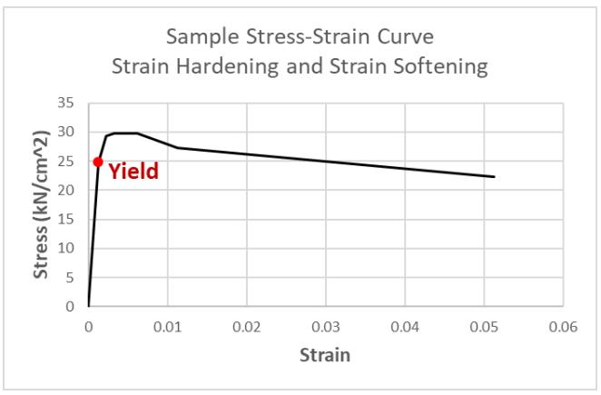  
Figure 7: Sample multilinear elastoplastic with strain hardening and softening

Table 2: Multilinear Plastic Material: $\textstyle \sigma_{ y } = 24 . 8 { \frac{ k N } { c m^{ 2 } } } E = 20000 { \frac{ k N } { c m^{ 2 } } } \varepsilon_{ y } = { \frac{ \sigma_{ y } } { E } } = 0 . 00124$ ????2 ????   

|  | Strain ε | Stress σ kN/cm2 | Plastic Strain ε - εy | Stress factor σ/σy |
| --- | --- | --- | --- | --- |
|  | 0.0 | 0.0 |  |  |
| Yield | 0.00124 | 24.8 | 0.0 | 1.00 |
|  | 0.00224 | 29.26 | 0.001 | 1.18 |
|  | 0.00324 | 29.76 | 0.002 | 1.20 |
|  | 0.00624 | 29.76 | 0.005 | 1.20 |
|  | 0.01124 | 27.28 | 0.010 | 1.10 |
|  | 0.05124 | 22.32 | 0.050 | 0.90 |

|  | 1 | 2 | 3 | 4 | 5 | 6 | 7 | 8 |
| --- | --- | --- | --- | --- | --- | --- | --- | --- |
|  | 12345678901 | 2345678901 | 2345678901 | 2345678901 | 2345678901 | 2345678901 | 2345678901 | 2345678901 |
|  | * define the multilinear plastic | * define the multilinear plastic | * define the multilinear plastic | * define the multilinear plastic | * define the multilinear plastic | * define the multilinear plastic | * define the multilinear plastic | * define the multilinear plastic |
|  | MATPRP HEAD MAT1 | MATPRP HEAD MAT1 | MATPRP HEAD MAT1 | MATPRP HEAD MAT1 | MATPRP HEAD MAT1 | MATPRP HEAD MAT1 | MATPRP HEAD MAT1 | MATPRP HEAD MAT1 |
|  | MATPRP PLAS | 1.0 | 0.001 | 1.18 | 0.02 | 1.20 | 0.005 | 1.20 |
|  | MATPRP PLAS | 0.05 | 0.90 |  |  |  |  |  |
|  | * assign to member groups | * assign to member groups | * assign to member groups | * assign to member groups | * assign to member groups | * assign to member groups | * assign to member groups | * assign to member groups |
|  | MATGRP MAT1 | GR1 | GR2 | GR3 | GR4 |  |  |  |
|  | * assign to plate groups | * assign to plate groups | * assign to plate groups | * assign to plate groups | * assign to plate groups | * assign to plate groups | * assign to plate groups | * assign to plate groups |
|  | MATPGR MAT1 | PG1 | PG2 | PG3 | PG4 |  |  |  |
|  | * assign to pile | * assign to pile | * assign to pile | * assign to pile | * assign to pile | * assign to pile | * assign to pile | * assign to pile |
| groups | MATPLG MAT1 | PL1 | PL2 | PL3 | PL4 |  |  |  |

Note: The plastic strain values should be in the monotonically increasing order.

Note: For calculating the stress value corresponding to a plastic strain value greater than the maximum value specified in the material model (beyond the last data point in the material model), Collapse Advanced linearly extrapolates the input curve.

Note: it is recommended to start the plastic strain-stress curve from 0.0 plastic strain and 1.0 stress factor. Otherwise, the program automatically inserts (0.0,1.0) at the beginning of the plastic stress-strain curve.

Note: Input lines MATGRP, MATPGR, and MATPLG should be entered after the MATPRP input line.

3.7.2 Yield Stress Overrides

A yield stress factor may be applied which modifies the yield stress entered in the SACS model file using the YSFACT line. The yield stress for the entire collapse model may be overridden using the YSUOVR line. Specific yield stress values may be overridden with the YSUMOD line. Member and plate groups may be individually overridden using the YSMGOV and YSPGOV lines, respectively.

The inner tubular of concentric tubular sections may have different yield stress than the outer tubular. Specify the start and end joints of any member with an inner tubular yield stress override on the GRMSEL line.

When multiple yield stress overrides are applied to a beam or plate elements, the following hierarchy determines the yield stress:

1. YSMGOV (YSPGOV) – Yield Stress Member (Plate) Group Override transcends:   
2. YSUMOD – Yield Stress Modification, which transcends:   
3. YSUOVR – Yield Stress Universal Override, which transcends:   
4. YSFACT – Yield Stress Factor

3.7.3 Ductility Limits

By default, post-yield ductility is not limited and may increase indefinitely. The post-yield ductility limit can be enforced by defining the maximum allowable strain (in percentages) for members, plates, and piles. The ductility limit applies to both the default bilinear elastoplastic materials and the multilinear stress-strain curves discussed in 3.7.1.

The following input lines are available to enter the ductility limits

DUCLIM (General Ductility Limits): This input line may be used to enter the ductility limits for all elements, all members, all plates, or all piles. There is also an option to print a report for ductility limit information to the listing file.

Note: For backward compatibility, the ductility limit for all members can be still entered on the CLPOP2 input line.

GRPDUC, PGRDUC, and PLGDUC (Group Ductility Limits): These input lines may be used to assign the ductility limit specific to a given member group, plate group, or pile group, respectively.   
MEMDUC, PLTDUC, and PILDUC (Element Ductility Limits): These input lines may be used to override the ductility limit for the individual members, plates, or piles, respectively.

The following table summarizes the input lines order which the Collapse Advanced uses to interpret and process the ductility limits for members, plates, and piles.

| Order | Description | Members | Plates | Piles |
| --- | --- | --- | --- | --- |
| 1 | Individual Elements | MEMDUC | PLTDUC | PILDUC |
| 2 | Individual Groups | GRP DUC | PGRDUC | PLGDUC |
| 3 | All elements of the same type | DUCLIM (All Members) | DUCLIM (All Plates) | DUCLIM (All Piles) |
| 4 | All elements in the model | DUCLIM (All Elements) | DUCLIM (All Elements) | DUCLIM (All Elements) |
| 5 | Collapse Option Line | CLPOP2 | N/A | N/A |

4 Troubleshooting

Collapse Advanced results are reported in the following forms:

1. Collapse listing file （$\cdot_{ \mathsf{ C } } \mathtt{ l }_{ \mathsf{ P } } \mathtt{ l }_{ \mathsf{ S } } \mathtt{ t }^{ \prime } )$ which contains outputs (printed based on options on CLPRPT line), error messages, and important warning messages.   
2. Collapse database folder ${ \tt o r } \ \mathrm{ \tt c l p d b }^{ \prime }$ is used to visually review collapse results in PRECEDE.   
3. Collapse analysis log file （$\cdot_{ \mathsf{ C } } \mathrm{ 1 p 109^{ \prime } } )$ which contains analysis iterations, important event (such as joint failure, etc.), and important warning messages.   
4. Collapse troubleshooting log file (‘clptrbl’) which contains detailed information about convergence, residual value at all iterations for all load increments, detailed warning messages, and important events at each load increment.

The collapse troubleshooting log file is the main source needed to identify and resolve collapse analysis issues in order to improve convergence and accuracy. Figure 8 and Figure 9 illustrate different outputs in the troubleshooting log file associated with Newton iteration and Arc-length method, respectively.

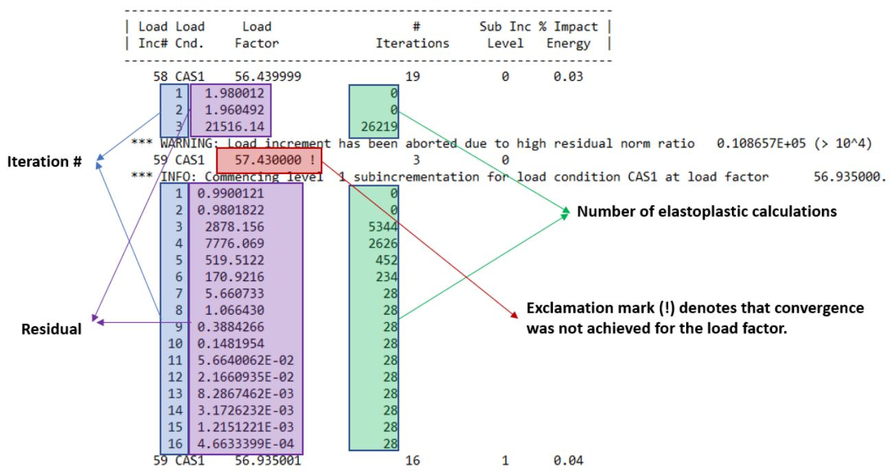  
Figure 8: Newton iteration outputs in the troubleshooting log file

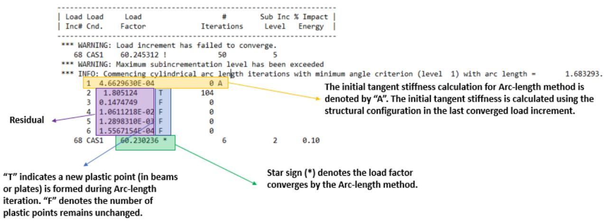  
Figure 9: Arc-length iteration outputs in the troubleshooting log file

## 4.1 Converting Current Collapse to Collapse Advanced

By default, the Collapse solver is used for any nonlinear SACS analyses. Collapse Advanced may be enabled in the SACS System Settings:

1. In the SACS Executive, at the top left select Settings   
2. Under Analysis Settings, select ’Yes’ for option ‘Use Collapse Advanced’ (see Figure 10). The SACS environment is now set up to use Collapse Advanced.

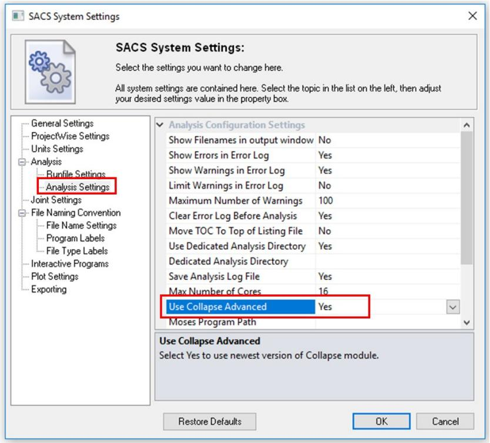  
Figure 10: SACS System Settings for Collapse Advanced

Collapse Advanced generates new output files which require an updated analysis run file. An existing analysis run file may be updated via two options:

a) Generate a new analysis run file using the SACS Executive Analysis Generator.   
b) If the run file is already generated by an older version of SACS, open the run file in the Analysis Generator and simply re-save it.

Existing collapse input files must be updated with Collapse Advanced input options to use the new Collapse Advanced capabilities for nonlinear analysis:

✓ Essential Inputs: the sub-incrementation and the Arc-length method are necessary for the majority of Collapse Advanced simulations. The sub-incrementation method can be selected by entering ‘SI’ in columns 44-45 on the CLPOPT input line and the Arc-length method is set by entering ‘AL’ in columns 42-42 on the CLPOPT input line.

For many cases, including the sub-incrementation and the Arc-length method is adequate to carry out the analysis using the Collapse Advanced program and no further input is required. However, to improve the analysis or resolve any issues, the following options can be considered:

Relaxed Convergence: the continue option (‘CN’ on the CLPOPT line) is no longer supported by Collapse Advanced. Instead, Collapse Advanced supports a relaxed (weakened) convergence criteria to improve the convergence rate. The relaxed convergence can be implemented by entering CRX and MCR on the CLPOP2 input line – see section 3.1.4.2 for input line details. Section 4.4 discusses how to choose the relaxed convergence parameter (i.e. the exponent on columns 63-64) based on the residual convergence rate given in the troubleshooting section.   
Relaxed Iteration: As mentioned in section 3.1.4.2 on rare occasions, the relaxed iteration is required to prevent the snap-through buckling behavior. The relaxed iteration can be implemented by entering IRX and MIR on the CLPOP2 input line. Please see section 4.3 for more discussion on post-buckling analysis.   
Improve Arc-length: Arc-length default parameters can be modified on the ARCLEN input line. For discussion on how to modify Arc-length parameters, please see section 4.2.9 and discussion on post-buckling analysis in section 4.3.   
Improve sub-incrementation: If the sub-incrementation levels must be increased to improve convergence, the default value can be revised on the SUBINC input line.   
Force Tolerance: If the default force tolerance is not suitable for the analysis, it can be revised by entering the FRCTOL input line.

To revert to the current Collapse program:

1. On SACS Systems Setting, set User Collapse Advanced to No.   
2. Re-generate or re-save the analysis run file in the SACS Analysis Generator.   
3. Remove additional input lines associated with Collapse Advanced from the collapse input file.

## 4.2 Collapse Advanced Messages

To troubleshoot a collapse run, three message types are output:

1. Information (*** INFO): these messages report important events during a Collapse run. The events include plasticity in elements, joint failure, local buckling, pile failure, energy absorption for ship impact, or other similar significant events in the collapse analysis. All INFO messages are written to the output listing file and troubleshooting log file, in addition, important events (such as pile pull-out or punch-through) are also reported to the Collapse log file.   
2. Errors (*** ERROR): Error messages report any problems encountered with a collapse input file, SACS model file, or any other input. All errors must be resolved before collapse analysis may proceed. Error messages are written to the Collapse output listing file.   
3. Warnings (*** WARNING): these messages pertain to existing issues with the input to a Collapse analysis and issues arising from iterative calculations. A warning message about an input does not prevent the analysis from running and is reported in the output listing file. Warning messages on the iterative procedure, such as non-convergence/singularity or other issues related to Collapse calculations are reported in the troubleshooting log file. If the nonconvergence/singularity issue prevents the collapse analysis from running, then these messages are reported in both the log file and the output listing file.

The following sections provide more details on Collapse Advanced messages.

4.2.1 Information Messages in Collapse Advanced

The following information messages may be reported to collapse outputs.

Maximum displacement reaches the user-defined maximum values on the CLPOPT line:

*** INFO: Maximum deflection for joint ‘joint name’ has been exceeded for degree-of-freedom ‘degree of the freedom ID’

Nonlinear Solvers Information:

*** INFO: Commencing level ‘sub-level#’ subincrementation for load condition ‘load condition name’ at load factor ‘load factor’   
*** INFO: Arc length analysis has commenced for load condition ‘load condition name’ at load factor ‘load factor’   
*** INFO: Arc length analysis has been terminated successfully.   
*** INFO: Commencing cylindrical arc length iterations with minimum angle criterion (level 'sub-level#') with arc length = 'Arc-length parameter'   
*** INFO: Commencing spherical arc length iterations with minimum angle criterion (level 'sub-level#') with arc length = 'Arc-length parameter'

When the maximum joint deflection reaches during Arc-length steps:

*** INFO: Arc length analysis has been terminated successfully.

If the program encounters an incomplete load sequence (or it does not reach the user-defined maximum deflection), the following information message is printed to the output listing file and log file:

'*** INFO: Analysis has been terminated for load sequence ‘load sequence name’. See Collapse Troubleshooting Log file for details.

The above message is reported when the program exhausts all sub-incrementation levels (SUBINC input line) and Arc-length steps (ARCLEN input line).

The following information message is issued on convergence when using the “Relaxed Convergence” option on the CLPOP2 input line and if the load increment is converged using relaxed (weakened) criterion:

*** INFO: Load increment has converged using RELAXED convergence criterion (Residual < 10^ ‘exponent’ Initial Residual)

The forces balance of members must be checked if numerous load steps have converged when using this option. The residual values can be reviewed in the troubleshooting log file to adjust the exponent.

Note: For the Arc-length method, Collapse Advanced calculates the relative residual based on the residual in the second iteration. The first residual is associated with the initial tangent stiffness matrix.

Beam Elements:

*** INFO: The onset of plasticity has occurred on member ‘member ID’   
*** INFO: Local buckling has taken place on member ‘member ID’ subsegment ‘sub-segment#’ at load step ‘load step’   
*** INFO: The onset of ductility has occurred on member ‘member ID’ at location ‘location in the member’, strain = ‘strain value’   
*** INFO: The member ‘member ID’ has fractured at location ‘location in the member’, strain = ‘strain value’

Plate Elements:

*** INFO: The onset of plasticity has occurred on plate ‘plate ID’   
*** INFO: Elastic plate ‘plate ID’ has a Von Mises ratio > 1.0   
*** INFO: The onset of ductility has occurred on plate ‘plate ID’, strain = ‘strain value’

Joints:

*** INFO: The onset of joint connection plasticity has occurred at joint ‘joint name’ on brace ‘brace ID’)   
*** INFO: Joint connection failure has occurred at joint ‘joint name’ on brace ‘brace ID’ at load increment ‘load step’   
*** INFO: Brace joint connection pull-out has occurred at joint ‘joint name’ on brace ‘brace ID’ at load increment ‘load step’

Piles:

*** INFO: The onset of pile pull-out has occurred on the pile located at joint ‘pilehead joint’   
*** INFO: The onset of pile punch-through has occurred on the pile located at joint ‘pilehead joint’   
*** INFO: The onset of plasticity has occurred on the pile located at joint ‘pilehead joint’   
*** INFO: The onset of ductility has occurred on the pile with pilehead joint ‘pilehead joint’ at location ‘location in the pile’, strain = ‘strain value’   
*** INFO: The pile with pilehead ‘pilehead joint’ joint has fractured at location ‘location in the pile, strain = ‘strain value’

Inputs:

*** INFO: Joint flexibility selections are working in ''include'' mode.'   
*** INFO: Joint flexibility selections are working in ''exclude'' mode.'   
*** INFO: Joint strength selections are working in ''include'' mode.   
*** INFO: Joint strength selections are working in ''exclude'' mode.   
*** INFO: Brace ‘brace ID’ at joint ‘joint name’ has been excluded from the joint strength check.   
*** INFO: Brace ‘brace ID’ at joint ‘joint name’ has been selected for the joint strength check.   
*** INFO: Brace ‘brace ID’ at joint ‘joint name’ has been excluded from the joint flexibility calculation.   
*** INFO: Brace ‘brace ID’ at joint ‘joint name’ has been selected for the joint flexibility calculation.'

4.2.2 Error Messages in Collapse Advanced

Error messages are self-explanatory and provide detailed information regarding existing issues with the input files. All error messages must be resolved in order for a Collapse analysis to run.

In addition to the input error messages, there are also two other error messages as follows:

*** ERROR - Access denied to ‘folder or file name’ this error message indicates that the Collapse program cannot read or write to the specified file or folder – for example the files are read-only or the user does not have the write privileges on the machine.

*** ERROR: MEMORY ALLOCATION ERROR ‘Collapse Advanced program section label’ this error message indicates that the analysis is running out the memory and only occurs for very large models if the machine has limited memory or the machine operating system limits memory usage.

4.2.3 Warning Messages in Collapse Advanced

There are two groups of warning messages in Collapse Advanced. The first group illustrates possible issues in the input. These issues are not necessarily problematic for a collapse analysis and do not prevent it from running. For example, for joint flexibility/strength, we may get the following messages:

*** WARNING: A number of braces have properties exceeded the applicable range for selected joint flexibility formulation.

*** WARNING: The parameter ‘parameter name’ at joint ‘joint name’ is exceeded the applicable range of K-connection for selected joint strength

These messages indicate the joint specifications are out of the applicable range of the selected joint flexibility method. In this case, the analysis still uses the selected method, but the results may not be accurate. Warning messages corresponding to input issues are only reported to the collapse output listing file.

The second group of warning messages is related to non-convergence or other computational issues. All non-convergence messages are reported to the collapse troubleshooting log file. If a non-convergence issue prevents the analysis from continuing (or has significant implications in the results), a warning message is also reported to the listing file and log file.

Other important warning messages which may be output to the listing file and the log file include:

Convergence or other solver issues at the first load increment (initial convergence issue) Whether the sub-incrementation method is selected or not selected, if the nonlinear solver encounters an issue at the first load increment, the program outputs a warning message to the listing file and the log file. The warning message indicates the user-defined load increment size is too large for the model. However, in most cases, if the sub-incrementation method is selected on the CLPOPT line, the program will automatically resolve the convergence issue and no further action is required. For additional details, please see section 4.2.6 and the plate samples 4 in section 5.2.4.   
• Convergence or other solver issues near the load peak If the sub-incrementation is NOT selected but the Arc-length method is selected, the program outputs a warning message near the load factor peak (the limit point). The warning message simply indicates the transition from Newton Solver to Arc-length Solver without subincrementation. If the analysis continues without any issue, no further action is required. For additional details, please see section 4.2.6 and plate sample 6 in section 5.2.6.

The following sections discuss various warning messages. The use of different methods and options available to improve a collapse analysis based on the warning messages are also presented.

4.2.4 Warning Messages in Members

The following warnings may occur for member calculation:

\*\*\* WARNING: Convergence has not been achieved for member 'member name'  
\*\*\* WARNING: Decomposition error whilst solving for member 'member name'  
\*\*\* WARNING: Lateral-torsional buckling suspected for member 'member name'  
\*\*\* WARNING: Plasticity calculation error whilst solving for member 'member name'  
\*\*\* WARNING: Calculation for joint-flexibility brace 'Brace ID' has encountered a problem.  
\*\*\* WARNING: Solution for member 'member name' failed

The program will try to resolve the above issues by switching to sub-incrementation and Arc-length methods. However, if these issues occur multiple times, the analysis may slow down or eventually stop before completing the load sequence. The following remedial actions may be considered:

1) Reduce the convergence tolerance.   
2) Increase the maximum number of iterations for members. Note: If too many members have convergence issues, this option may slow down the analysis.   
3) Check to see if the member is too short. By default, if the member aspect ratio (height/length) is greater than one, Collapse will only use a single sub-segment. However, if the member aspect ratio is slightly less than 1, Collapse uses a user-defined number of sub-segments which may lead to non-convergence or calculation failure. In cases such as these, the MEMSEG and GRPSEG input lines can be used to override the number of sub-segments for very short members.   
4) Check the yield stress and strain hardening ratio for warning messages associated with plasticity calculations.   
5) If there is a significant deformation (for example resulting from buckling or large member loads), the number of sub-segments may be increased by entering new values on MEMSEG or GRPSEG input lines. Also, the problematic member may be directly sub-divided into shorter members in the SACS model file.   
6) Use the Member Iteration Relaxed option by entering ‘MIR’ in columns 74-76 on the CLPOP2 line to gradually apply the member deformation. This method reduces the displacement increment by an automatic factor to prevent the snap-through response of the member during buckling and ensures the member follows a more stable path. However, this may increase the overall number of iterations and computational time. As a good practice, when using the ‘MIR’ option the maximum number of member iterations should also be increased.   
7) User Member Convergence Relaxed option by entering ’MCR’ in columns 78-80 of the CLPOP2 input line to use a more relaxed convergence criterion. This option should be used with caution as it may lead to unbalanced forces in the members.   
8) Check the joint flexibility approach being used if the warning message is related to joint flexibility. Non-convergence issues in member calculations may occur if the joint specification is

out of the applicable range of the selected joint flexibility method. In such cases, JFSEL can be used to exclude the joint from the joint flexibility calculation.

9) Check member releases and the magnitude of the applied load on the member. For large deformation analysis, large member loads on members with end releases may lead to nonconvergence.

4.2.5 Warning Message in Piles

The following warning messages may be output for pile and soil analysis:

*** WARNING: Calculation for pile at joint ‘pilehead joint’ has not converged.   
*** WARNING: Convergence has not been achieved for the pile attached at joint ‘pilehead joint’

These warning messages occur when the procedure used to calculate the stiffness and plasticity of a pile has failed to converge.

The determination of stiffness and plasticity of a pile with non-linear soils requires an iterative solution. The iterative solution is dependent on the displacement convergence criteria specified on the PSIOPT line of the PSI input file.

The number of iterations used to solve each pile is automatically set to 40 or the number of iterations defined on the CLPOPT line in columns 11-13 – whichever is greater. If convergence is not achieved prior to the maximum number of iterations, then the above warning messages will be displayed in the collapse output log file and the program will switch to the sub-incrementation and then Arc-length methods if these options have been turned on. If the convergence is still not achieved after exhausting all sub-incrementation levels and Arc-length iterations, then the program will issue a warning message noting the termination of the load sequence.

For cases where the program cannot automatically overcome convergence issues associated with the piled foundation then the following checks should be carried out to help improve convergence:

1. Make the displacement and force convergence tolerance levels equal.   
2. Check instabilities in the pile-supported structure. The user should conduct the analysis without the pile foundation to ensure the stability of the structure.   
3. Check the pile capacity using PSI or the single PILE program to ensure the foundation is not unrealistically weak.   
4. Check the plasticity ratios in the piles for the formation of a mechanism.

4.2.6 Warning Messages for Non-convergence

The following messages may be reported at the first load increment:

*** WARNING: Structural instability has been detected during the first load increment. Increase the number of load increments for this load step.   
*** WARNING: Initial convergence problems encountered with member ‘member ID’.   
*** WARNING: Member ‘member ID’ has exhibited high plasticity during the first load increment.

The above messages indicate that the first load increment may be too large and the load should be gradually applied to improve convergence. To overcome this, the sub-incrementation option on the

CLPOPT line should be used. However, if the solution still fails to converge then the number of load increments should be increased. See plate sample 4 in section 5.2.4 for the implementation of the subincrementation method where it is used to improve convergence for the initial load increments.

Sub- incrementation option can also be used to help improve convergence in the near vicinity of a limit load (e.g. the peak load.). Non- convergence in the near vicinity of a limit load will be indicated by the following warning message:

*** WARNING: Load increment has failed to converge.

For an example, please see plate sample 6 in section 5.2.6.

The sub-incrementation option will automatically reduce the load factor and the following message will be output:

*** INFO: Commencing level ‘sub-level#’ subincrementation for load condition ‘load condition name’ at load factor ‘load factor’.

The analysis may slow down significantly if the sub-incrementation process occurs over many load increments. In cases such as these, the following remedial actions can be considered:

1. Reduce the user-defined load increment size: the load increment size can be reduced by increasing the number of load steps on the LDSEQ input line for static analysis. For dynamic analysis, reducing time step size (Output Time Interval) has similar effects.   
2. Increase the maximum number of iterations: In some instances, the convergence may be achieved by slightly increasing the maximum number of iterations without significantly increasing the number of sub-incrementations. The maximum number of iterations can be chosen by reviewing the convergence rate provided in the troubleshooting log file.

Note: At a given load increment, if the residual is very small relative to the initial value but the convergence is not achieved, Collapse Advanced automatically doubles the maximum number of iterations to improve the convergence rate.

4.2.7 Numerical Instability Warnings

The following warning messages may be output by the nonlinear solver in reference to the stiffness matrix inversion instability:

*** WARNING: Load increment has been aborted due to a problem with the global decomposition procedure.   
*** WARNING: Load increment has been aborted due to severe illconditioning.   
*** WARNING: Load increment has been aborted due to a decomposition error.   
*** WARNING: Load increment has been aborted due to a solution error.   
*** WARNING: It is recommended that the constraints of the model are checked.

If the above warning messages are output during the application of a load case where the structure should behave in a linear manner, for example, a load case associated with an initial gravity load, then this is usually an indication that there is an issue with the SACS model itself. However, if the warning messages are output in the presence of significant plasticity or other possible failure modes despite using sub-incrementation or the Arc-length approach, then this indicates that an overall failure mechanism has formed and the structure has collapsed. To improve results under these circumstances, a tighter convergence criterion with smaller increments should be used.

4.2.8 Divergence Warning Messages

Checks for divergence associated with the Newton and Arc-length methods are performed from the third iteration to prevent unnecessary computation. The following warning messages are associated with divergence:

*** WARNING: Load increment has been aborted due to very large residual norm ‘residual value’ (> 10^ ‘exponent’)   
*** WARNING: Load increment has been aborted due to very large residual norm ratio ‘residual ratio’ (> 10^ ‘exponent’)

where exponents are user-defined values. The exponents can be updated on the CLPOP2 input line if the output log file shows the load increment has been aborted at an early stage – see section 3.1.3 for details.

If the divergence warning is output over a large number of load increments, the following actions may be considered:

1. Implement the sub-incrementation method by entering ‘SI’ on the CLPOPT line   
2. Reduce user-defined load increment size: the load increment size can be reduced by increasing the number of load steps on the LDSEQ input line for static analysis. For dynamic analysis, reducing time step size (Output Time Interval) has similar effects.   
3. Updating the divergence exponent: if the residual values given in the troubleshooting log file reveals that the program aborts the iterative procedure at an early stage then the divergence exponent can be increased to allow the program to continue. However, if the program reports divergence issues too late, then the exponent can be reduced to prevent unnecessary computation to help reduce the total runtime.

Note: For the Arc-length method, Collapse Advanced calculates the relative residual based on the residual in the second iteration. The first residual is associated with the initial tangent stiffness matrix.

4.2.9 Arc-length Warning Message

The use of the Arc-length method may result in the following warning messages:

*** WARNING: Arc length iteration is terminated due to error initial tangent stiffness calculation.   
*** WARNING: Arc length iteration is terminated. No solution is available in arc length quadratic equation at initial load factor.   
*** WARNING: Arc length iteration is terminated. No solution is available in arc length quadratic equation at initial load factor.

*** WARNING: Arc length iteration is terminated. No solution is available in arc length quadratic equation at current load facto   
*** WARNING: Arc length iteration is terminated because of an error in stiffness matrix decomposition.   
*** WARNING: Arc length iteration is terminated because of an error in linear system solution.   
*** WARNING: Arc length method did not converge within maximum iterations   
*** WARNING: Arc length iteration is terminated because of very small increment norm ‘norm value’ < 1.0E-9.

The above warning messages indicate that the automatically calculated arc-length parameter may be too large and the Arc-length method has difficulty finding a stable path. The Arc-length method utilizes sub-incrementation to reduce this parameter – automatic arc-length value and convergence details can be found in the troubleshooting log file. The run time may increase, or the program may stop if Arclength sub-incrementation occurs during too many load steps. To speed up the analysis, the user should enter a scaling factor (less than one) in columns 24-29 on the ARCLEN input line to reduce the arc-length parameter.

The following warning message will be reported if the maximum number of sub-incrementation levels have been exceeded:

*** WARNING: Maximum arc length sub incrementation level has been exceeded.

Under these circumstances, the following steps are recommended to test the results:

1. If there is already significant deformation and plasticity in the model, it is very likely that the Arc-length method cannot find any stable path for unloading and a mechanism may have formed in the model. In other words, the structure may have collapsed. To improve the results further, the number of load increments may be increased, or a tighter convergence tolerance can be used.   
2. If this warning message is reported without any significant plasticity of deformation, then the likely causes are:

a) Convergence issue in members, piles, or other parts of the analysis. The troubleshooting log file may provide more information about non-convergence issues.   
b) The load increment may be too large (especially if this warning occurs during the initial load steps).   
c) A large deformation increment may have occurred during a single load step. In this case, the use of the Relaxed Iteration option on the CLPOP2 input line may help to mitigate this problem.   
d) Tighter convergence criteria may be required.

If all arc-length steps are exhausted either before reaching the target load factor as specified in the load sequence or the maximum displacement specified on the CLPOPT input line, Collapse Advanced will issue the following warning messages

*** WARNING: Maximum number of arc length steps has been exceeded.

*** WARNING: Arc length analysis has been terminated unsuccessfully.

Three possible scenarios may occur depending on the Arc-length convergence rate reflected in the troubleshooting log file:

1. The Arc-length approach has difficulty in achieving convergence at the majority of the load steps when using the automatic parameter and therefore resulting in an excessive sub-incrementation process. This indicates the automatic arc-length parameter may be too large and should be reduced by entering a scaling factor on the ARCLEN input line –see discussion in section 4.3 on how to choose the correct scaling factor.   
2. The Arc-length method converges during few iterations (for example 3 iterations) for most of the load steps. This indicates that the automatic arc-length parameter is too small and it may be increased by entering a scaling factor on the ARCLEN input line –see discussion in section 4.3 on how to choose a correct scaling factor. Alternatively, the maximum number of Arc-length steps may be increased however, this may lead to longer run times.   
3. The Arc-length method achieves convergence for many load steps with a reasonable number of iterations but without sub-incrementation. Under these circumstances, the maximum number of Arc-length steps on the ARCLEN input line should be increased.

## 4.3 Post-buckling Analysis

There are two typical behaviors for post-buckling responses in offshore structures:

• Snap-through where the load factor reduces while the displacement increases.   
Snap-back where the load factor and the displacement both decrease.

Figure 11-a shows a typical snap-through response where the structure jumps from one stable configuration to another. The Relaxed Iteration option (‘IRX’ on the CLPOP2 input line) completely prevents snap-through buckling response and ensures the analysis switches to the Arc-length method for unloading during the post-buckling analysis. This is shown in Figure 11-b (more details, see sample 2 in section 5.1.2). To have an optimal post-buckling response, the arc-length parameter (which is automatically calculated) can be scaled by a factor on the ARCLEN input line. Figure 11-c illustrates the case where the Arc-length parameter is very small resulting in too many load steps to reach the target load factor and/or target maximum displacement. Figure 11-d represents a case where the arc-length parameter is too large resulting in an approximate response oscillating around the optimal solution.

Figure 12-a shows a typical snap-back post-buckling response where both load and displacement decrease. A common example of this behavior is the elastic buckling of braces in an offshore structure. The key identifying feature of snap-back buckling is a sharp discontinuity in the load-displacement response curve.

Due to the complex response of snap-back buckling, determining the optimal arc-length parameter is extremely critical. If the arc-length parameter is too small, the algorithm cannot distinguish between two consecutive Arc-length solutions (for more details on the Arc-length method see section 6.6). In this instance, the analysis cannot progress after the buckling load (caught in a local minimum) or it may unload on the same path of loading.

The following actions are recommended to improve Arc-length iteration for snap-back response:

1. Avoid using a very small load increment size. A larger load increment size will lead to a wider search radius (i.e. larger arc-length parameter) for the Arc-length method.   
2. Scale the arc-length parameter by a factor on the ARCLEN input line.   
3. In some instances, the Relaxed Iteration procedure (IRX on CLPOP2 input line) may prevent the Arc-length method from distinguishing between two consecutive Arc-length solutions by limiting its search radius. Therefore, it is recommended to avoid using the Relaxed Iteration option.

As per snap-through behavior, if the arc-length parameter is too large then the program will not able to model snap-back response correctly as shown in Figure 12-b.

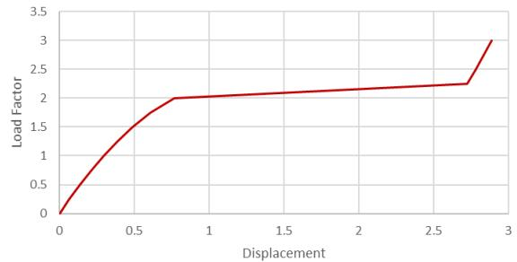  
(a)

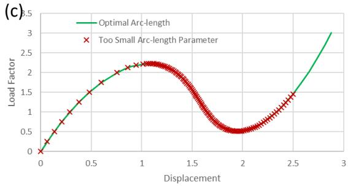  
Too Small Arc-length Parameter

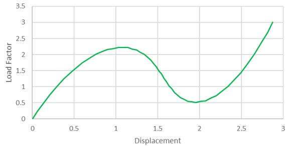  
(b)   
Optimal Arc-length

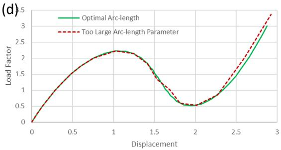  
Too Large Arc-length Parameter   
Figure 11: Different scenarios in snap-through post-buckling a) unstable path b) optimal Arc-length solution c) very small arc-length parameter, and d) very large arc-length parameters

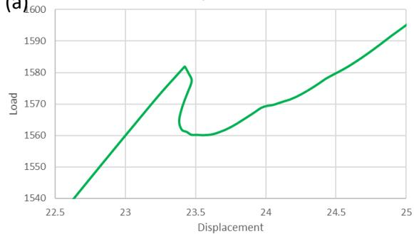  
(a)

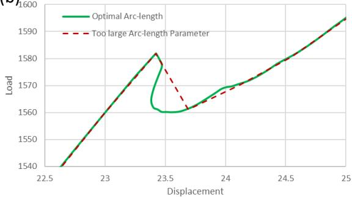  
(b)   
Figure 12: a) snap-back post-buckling response with optimal arc-length parameter b) large arc-length parameter

## 4.4 Force Tolerance

The default value for the force convergence tolerance is 0.001 (kN, kips, ton depending on the model units). The default value is determined such that the Collapse program predicts the most accurate results. However, the default tolerance for some offshore analyses may result in a reduction in performance through an increase in the number of iterations or the number of sub-incrementation steps without improvement in results for the following reasons:

1. Large initial residual

✓ The initial residual is approximately represented by the incremental load applied to the model at a given load step. If the initial residual is too large, then the Collapse program could require many iterations to reach convergence using the default tolerance.

2. Slow convergence rate with relatively small residual

✓ This scenario is characterized by a large residual reduction rate over the first few iterations followed by a continuously reducing reduction rate later. In this case, the Collapse program may also need many iterations (or sub-incrementations) to achieve convergence using the default tolerance value.

3. Local minimum

✓ The occurrence of a local minimum is common in analyses exhibiting a high degree of nonlinearity, usually where there is significant plasticity, buckling, and joint failure.   
✓ In the presence of a local minimum, the residual reduction rate can be high over the first few iterations after which the solution could start to oscillate as the residual becomes smaller. Under these circumstances, the Collapse program may require a high number of iterations (or sub incrementations) using the default tolerance value.

The user can review the residual values printed in the Troubleshooting Log file to see if the analysis suffers from any one of the above issues. Figure 13 below illustrates different types of convergence rates that may be encountered.

Figure 14 shows a sample of a convergence rate in the presence of a local minimum. As shown in the graph, the residual drops very quickly to a small value of 0.1326 from a large initial value of 56526 within 5 iterations. However, the convergence slows down later and starts to oscillate due to the presence of a local minimum. For this sample, if the force tolerance is increased to 0.1 using the FRCTOL input line, the program will achieve convergence within 10 iterations without loss of accuracy – i.e. the residual of 0.1 is still relatively very small compared to the initial residual value of 56526.

The relaxed iteration convergence option (‘CRX’ on CLPOP2 line) can also be used to achieve a similar result without overriding the default force tolerance. In this sample, the ratio of the residual at iteration 5 to the initial residual is less than 10-5(10-5 is the default value for the ‘CRX’ option). For this case, the use of the ‘CRX’ option will result in convergence being achieved at the 5th iteration.

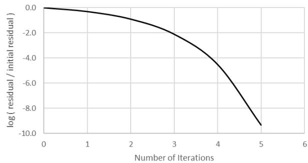  
Quadradic Convergence: ldeal

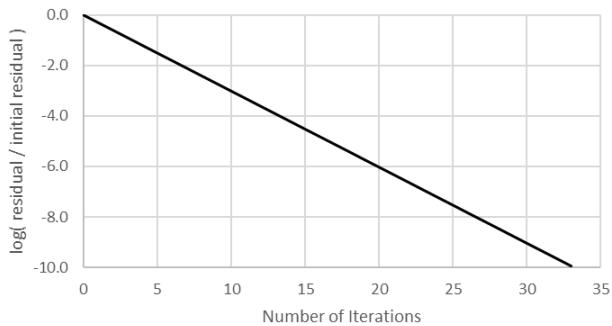  
Linear Convergence: Slow

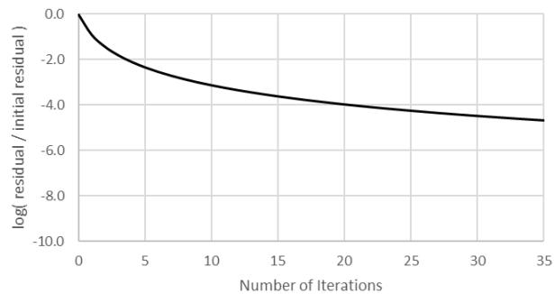  
Sublinear Convergence: Super Slow

Local Minimum Convergence: Super Slow

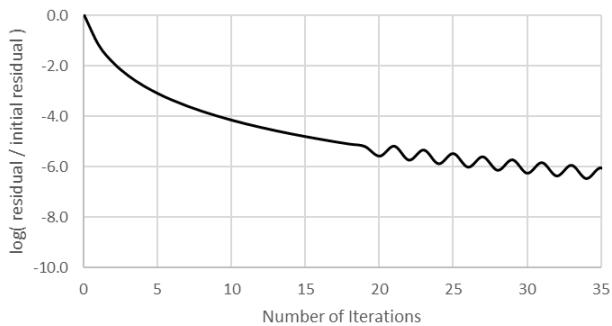  
Figure 14: Collapse Advanced program residual with slow convergence rate and local minimum

Figure 13: Convergence rate samples

Rapid reduction in residual

Slow convergence rate with local minimum oscillation

## 56526.02 Large Initial residual

## 13767.31

## 9256.978

## 1.579311

## 0.1326284

## 0.2135399↑

## 33.67682 ↑

## 0.1373345↓

## 0.2096573 ↑

## 0.0943243 ↓

## 0.102173 ↑

## 0.102831

## 0.1826149↑

## 0.1459621↓

## 0.1625883 ↑

## 0.1822268↑

## 0.1078939↓

## 0.1559948 ↑

## 0.1084429 ↓

## 0.1093522 →

## 4.5 Non-convergence in Secondary Elements

To improve performance, certain secondary element types whose overall stiffness is not important to the overall behavior of the structure can be retained as elastic throughout a Collapse analysis. For example, the following elements may be retained as elastic for an overall pushover analysis:

1. Wishbones   
2. Non-structural framing

✓ framing representing risers   
✓ boat landings   
✓ anodes

3. The secondary elements in the top sides for which the lateral restrains are not modeled

These elements have negligible effects on the overall performance of the structure and retaining them as elastic will improve the performance without altering the structural response.

To verify if the non-convergence is resulting from issues associated with the secondary elements, the user can review the following in the Troubleshooting Log File:

• Check if the non-convergence warning messages are associated with the secondary members   
Check if the program requires too many iterations to reach the convergence especially in the early stages of the analysis   
Check if the program requires too many sub-incrementation (or Arc-length iteration) to reach the convergence in the early stages of the analysis   
Check if analysis stops prematurely before significant deformation, plasticity, or if pile/joint failure has occurred.

If the non-convergence is due to the secondary elements, the user can utilize MEMELA and GRPELA input lines to designate those members and member groups to remain elastic.

In some cases, assuming the secondary elements to remain elastic may not resolve all non-convergence issues. Note, designating elements to remain elastic does NOT imply they do not experience large deformations. For example, if the member is subjected to a localized point load (such as earthquake or equipment load), it can still buckle elastically during the analysis. To prevent unfavorable buckling of elastic elements, the user may use MEMSEG or GRPSEG to set a single sub-segment for the elastic member.

Note: The program currently does not support tension-only or compression-only elements. These elements should be modeled as elastic using a single sub-segment.

5 Collapse Advanced Samples

This chapter includes detailed verification and validation benchmark samples for the Collapse Advanced program in addition to some engineering sample problems. The first two sections provide validation of results for problems comprising beam and plate element respectively. The results from Collapse Advanced are compared against existing references for problems depicting different modes of behavior. The third and fourth sections present verification of tubular local buckling and joint flexibility. The two final sections provide a few samples associated with different features in Collapse Advanced such as ship impact, dropped object, and blast wall. SACS model file and collapse input are provided in the SACS installation folder under Collapse Advanced samples.

## 5.1 Beam Element Verification and Benchmarks

5.1.1 Sample 1: Elastic Behavior of a Restrained Simply Supported Beam Subjected to Uniform Load

This benchmark highlights the ability of the program to predict the effects of membrane action in a simply-supported beam under a uniformly distributed load, restrained against both axial and torsion deformation at both ends, as shown in Figure 6. Results are presented for a beam with tubular and wide flange cross-sections. The material properties of the beams are based on SACS default values. Four subsegments per member are used and all members are set to remain elastic by entering the ‘ME’ in the CLPOPT line. As illustrated in Figure 16, Collapse Advanced accurately predicts nonlinear response compared to an analytical solution provided in [10]. No special option, such as sub-incrementation or Arc-length is used for this sample.

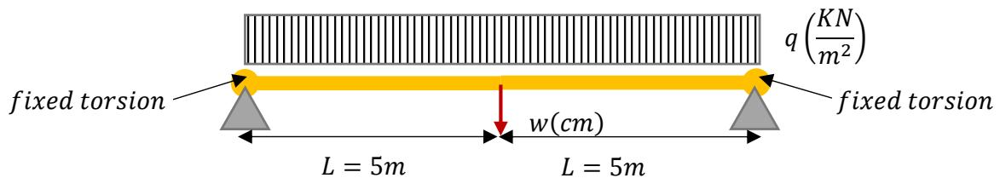  
Tubular: $40 \times 2 c m$ Wide Flange: $W 12 \times 120$

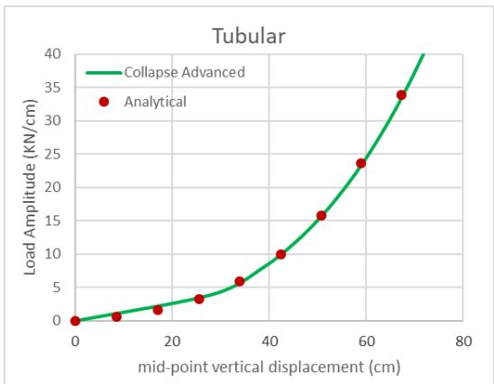  
Figure 15: Restrained beam with plates

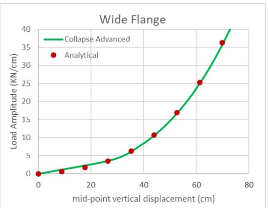  
Figure 16: Restrained beam mid-point vertical displacement

5.1.2 Sample 2: Elastic Buckling of Toggle Beam

This benchmark highlights the ability of the program to predict elastic snap-through buckling. Consider a toggle beam as shown in Figure 17. The beam reaches the limit point when the beam becomes completely flat. The toggle beam is modeled using beam elements with both tubular and wide flange cross-sections and the results are compared with the analytical solution presented in [11]. To accurately model buckling and post-buckling behavior, both sub-incrementation and Arc-length method are included on the CLPOPT line. Four sub-segments were used to model each member and the material properties are based on SACS default values (all members are set to elastic by entering the ‘ME’ option on the CLPOPT line).

Figure 9 shows a snap-through response during post-buckling analysis which cannot be predicted using the standard Collapse Advanced options. As discussed in sections 3.1.4.2 and 4.2.9, the Relaxed Iteration option on the CLPOP2 input line (IRX on columns 66-68) can be used to predict the unloading behavior during post-buckling. It can be seen the results are in close agreement with the analytical solution [11].

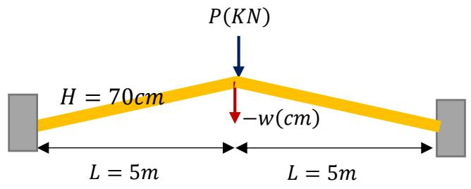  
Tubular: 40 × 2???? Wide Flange: $W 12 \times 120$   
Figure 17: Toggle Beam

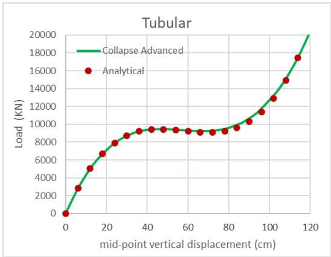

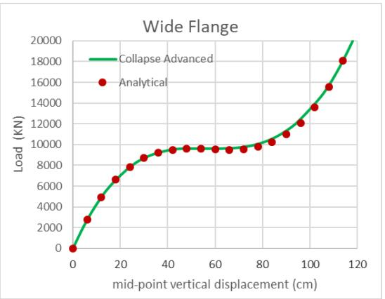  
Figure 18: Toggle beam buckling response

5.1.3 Sample 3: Elastic Cantilever Beam

This benchmark involves an elastic cantilever beam subjected to three different end loads 1) an axial load with a small lateral load to produce buckling, 2) lateral load and 3) end moment. Details of each case are presented in the following sections.

5.1.3.1 Sample 3.1: Buckling under Axial Force

Consider an elastic cantilever subjected to a horizontal axial load at its tip. To induce elastic buckling we assume the tip is slightly relocated by a small perturbation of $\frac{ L } { 1000 }$ in the vertical direction as shown in Figure 19. This small perturbation may represent the effects of member self-weight/dead load and/or any out-of-straightness. The applied loads are gradually increased until the cantilever has buckled. Both sub-incrementation and the Arc-length method options are employed to determine buckling and postbuckling responses. The cantilever beam is modeled using a single beam element comprised of four subsegments. The member is specified as elastic by entering $\prime_{ \mathsf{ M E }^{ \prime } }$ on the CLPOPT line. The cantilever beam was modeled using both tubular and wide flange sections and the material properties were set to SACS default values. Since this beam experiences a very large rotation, the higher-order corotational terms were included for the case with the tubular section by entering $\mathbf{ \bar{ \Pi } }_{ | \mathsf{ T C }^{ \prime } }$ on the CLPOP2 line. It is worth noting that by default the higher-order corotational terms are assumed for wide flanges and there is no need to enter additional options. The horizontal and vertical displacements of the cantilever tip show excellent correlation with analytical solutions [12] in Figure 20 and Figure 21. Figure 22 shows beam deformation at the last load step.

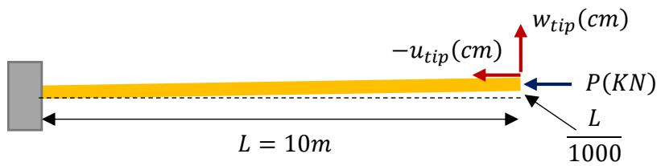  
Tubular: 40 × 2???? Wide Flange: $W 12 \times 120$

  
Figure 19: Cantilever beam with axial load

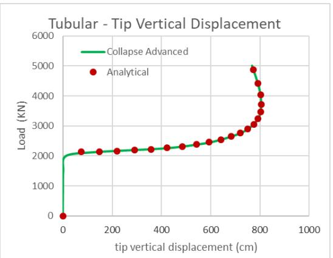  
Figure 20: Cantilever tubular beam tip displacement under axial load buckling

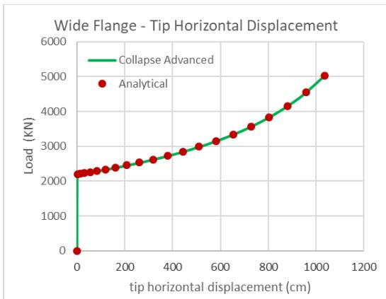

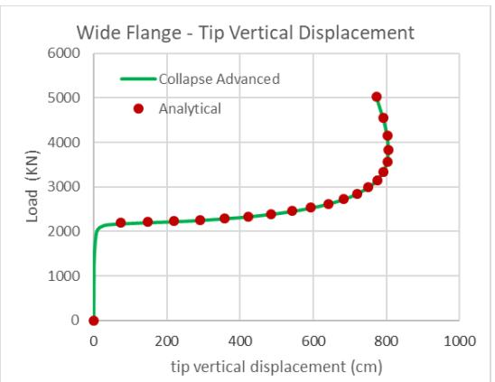  
Figure 21: Cantilever wide flange beam tip displacement under axial load buckling

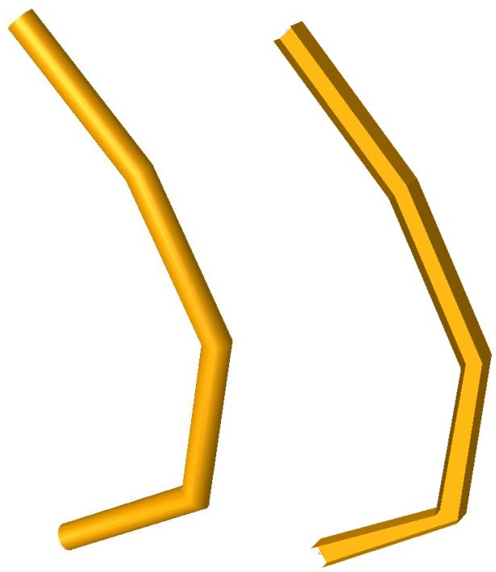  
Figure 22: Deformed cantilever beam at last load step

5.1.3.2 Sample 3.2: End Lateral Force

This benchmark involves a cantilever beam as in the previous example but with a vertical end load as shown in Figure 23. This problem does not include large rotations and therefore higher-order corotational terms were omitted by excluding the ‘ITC’ option on the CLPOP2 input line. The Arc-length method was also not considered in this example. All other inputs are as per the previous sample. The beam response shows a very good correlation when compared against the existing analytical solution [13] for both tubular and wide flange cross-sections as seen in Figure 24.

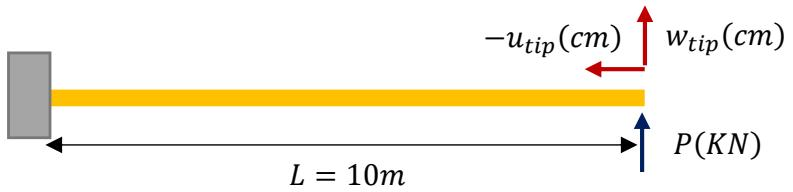  
Tubular: 40 × 2???? Wide Flange: ??12 × 120

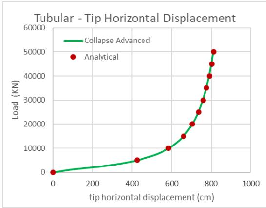  
Figure 23: Cantilever beam with lateral load

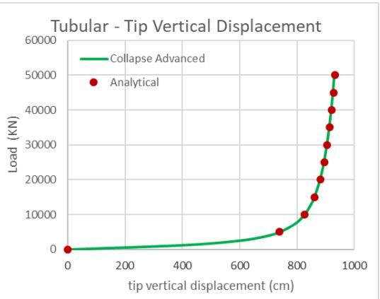

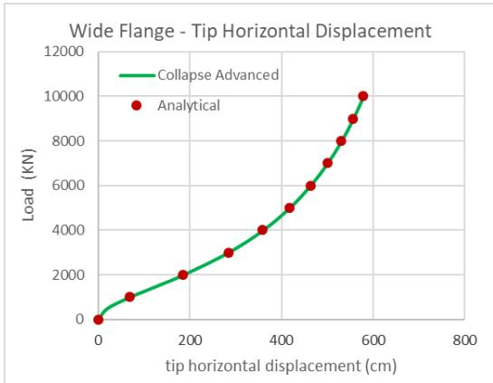

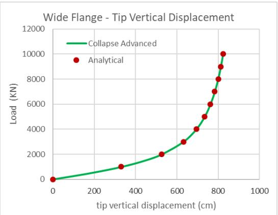  
Figure 24: Cantilever beam tip displacement under lateral load

5.1.3.3 Sample 3.3: End Bending Moment

This benchmark involves a cantilever beam with an end bending moment. The bending moment is gradually increased until the beam tip rotates $720^{ \circ } - \mathsf{ i } . \mathsf{ e } .$ . beam is folded twice into two full circles. Due to the large rotation involved in this benchmark, the second-order corotational terms are included in the analysis using the ‘ITC’ option on the CLPOP2 input line. To prevent lateral buckling, the beam tip is restrained against any out-of-plane displacement. In addition, 12 sub-segments are used for this sample because the beam will undergo a very large deformation. It can be seen that the beam tip displacements are in very good agreement with the existing analytical solution [14] as seen in Figure 26. Figure 27 shows the deformed shapes.

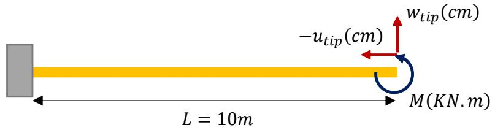  
Tubular: 40 × 2???? Wide Flange: $W 12 \times 120$

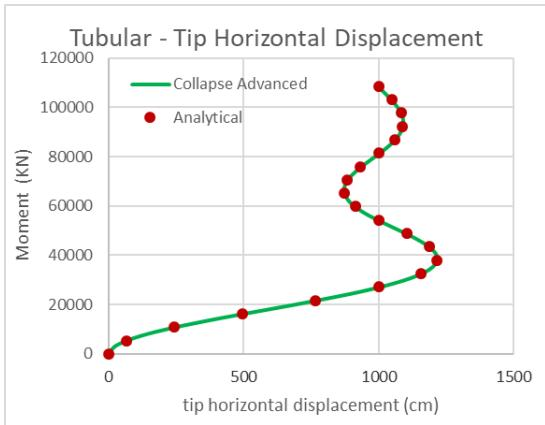  
Figure 25: Cantilever beam with an end moment

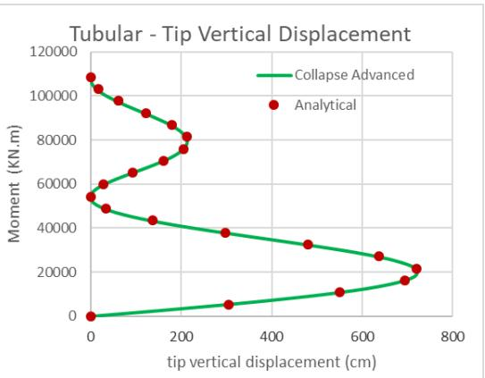

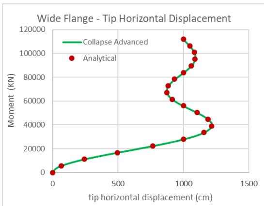

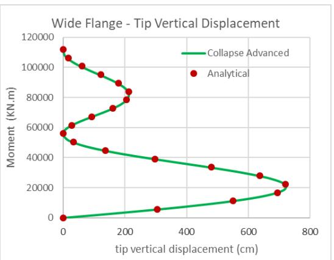  
Figure 26: Cantilever beam tip displacement with an end moment

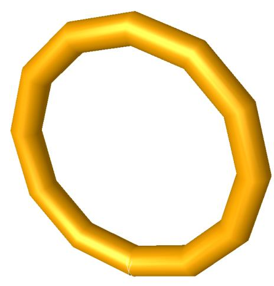

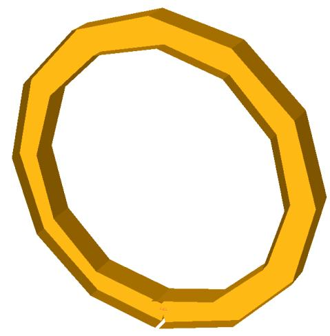

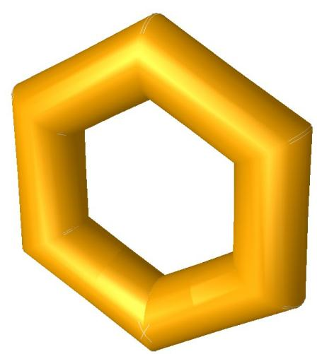

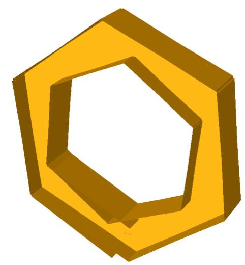  
Figure 27: Deformed cantilever beam. top) 360˚rotation – first circle, bottom) 720˚rotation – second circle.

5.1.4 Sample 4: Elastoplastic Cantilever with Tubular Section

This sample involves an elastoplastic analysis of a cantilever beam with a tubular cross-section subject to a vertical end load as shown in Figure 28. The cantilever was modeled using a single beam element comprised of 8 sub-segments. The material properties were assumed elastic-perfectly plastic and were modeled using two different yield stresses as shown in figure 19. In this benchmark, the beam experiences large rotations and deformations due to the applied end load. Therefore, both subincrementation and arc-length options are included in the analysis by entering ‘SI’ and ‘AL’ on the CLPOPT input line. Collapse Advanced results are compared with numerical results presented in references [15], [16] for the vertical displacement at the cantilever tip as shown in Figure 29.

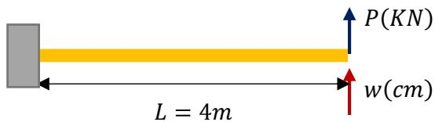

$$E = 20000 \frac{K N}{c m^{2}}, D = 35. 546 c m t i c h k n e s s = 0. 38$$

$$F_{y} = 825 \frac{K N}{c m^{2}} a n d 1650 \frac{K N}{c m^{2}} e l a s t i c - p e r f e c t l y p l a s t i c$$

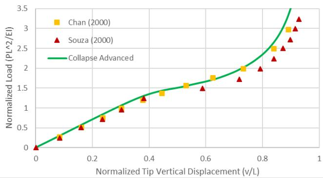  
Figure 28: Elastoplastic cantilever with the tubular section   
Load vs Tip Displacement fy = 825 KN/cm^2

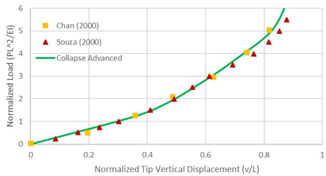  
Load vs Tip Displacement fy= 1650 KN/cm^2   
Figure 29: Vertical displacement of the cantilever tip

5.1.5 Sample 5: Elastoplastic Buckling of Columns

The benchmarks included in this section depict the typical elastoplastic buckling behavior of columns. The first set of benchmarks show the ability of the program to predict the elastoplastic buckling behavior of simple columns with a tubular cross-section using Euler-Bernoulli bending theory. The second set of benchmarks assumes Timoshenko bending theory to account for shear deformation. The third set compares the elastoplastic buckling loads against the API design code for both wide flange and tubular section columns.

5.1.5.1 Sample 5.1: Elastoplastic of Tubular Simple Column with Euler-Bernoulli Theory

This benchmark involves the elastoplastic buckling of a simply supported tubular column with various slenderness $\frac{ L } { r }$ values: 80, 120, 160. The column is torsionally restrained at both ends and has a small imperfection in the form of mid-point perturbation as shown in Figure 30. The imperfection is defined as $\begin{array} { r } { e = \frac{ \delta } { L } } \end{array}$ with values of 0.0001, 0.001, 0.01, and 0.05. The column was modeled using 2 elements each comprised of 8 sub-segments. To account for buckling behavior, both the sub-incrementation procedure and the arc-length method were included by selecting $^{ \prime } { \sf S } { \sf I^{ \prime } }$ and ‘AL’ options on the CLPOPT input line. To improve the analysis, the arc-length parameter is increased (columns 24-29 of ARCLEN line) while the maximum number of arc-length iterations is reduced (columns 12-18 of ARCLEN line).

The axial response (horizontal displacement at the free end) and lateral deformation (vertical displacement at mid-point) as shown in Figure 30 and are compared with the existing finite element solution [17] as shown in Figure 31 to Figure 33. It is seen that Collapse Advanced accurately predicts the elastoplastic response for all cases.

Note: Collapse Advanced analysis is carried out for very large deformation. For comparison purposes, only the initial portion of the response is shown below.

Note: In Figure 31, the horizontal axis is the initial imperfection （$i . e . \delta )$ plus the lateral displacement. For other cases, the horizontal axis is the lateral displacement.

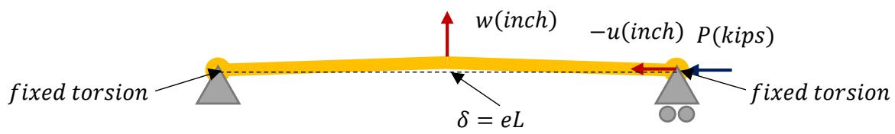  
$\mathbf{ 7 u b u l a r } \colon 4 . 5 \times 0 . 09375 i n c h , E = 29000 , F_{ y } = 36 K S I$   
Figure 30: Simple column with imperfection

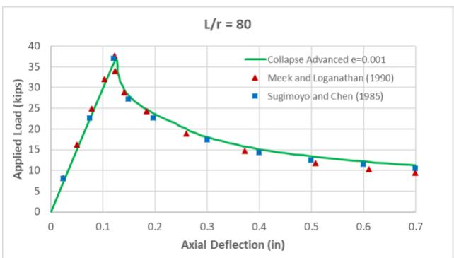

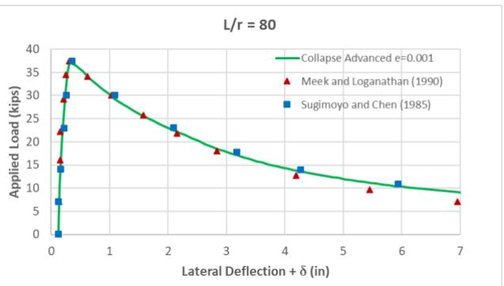

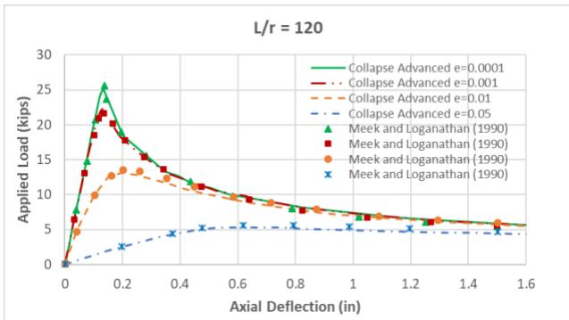  
Figure 31: Euler-Bernoulli column response for $\begin{array} { r } { \frac{ L } { r } = 80 . } \end{array}$

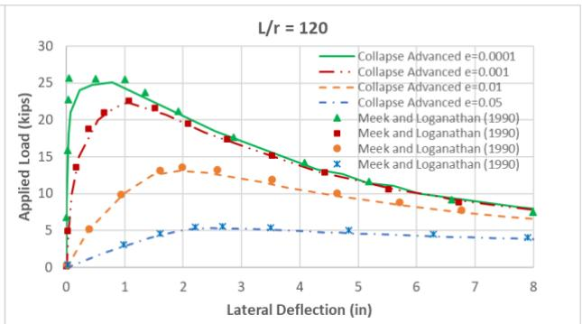  
Figure 32: Euler-Bernoulli column response for $\frac{ L } { r } = 120$

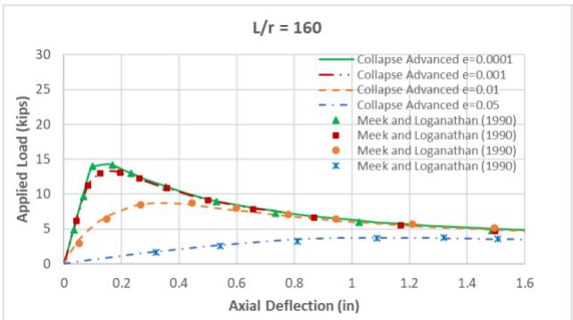

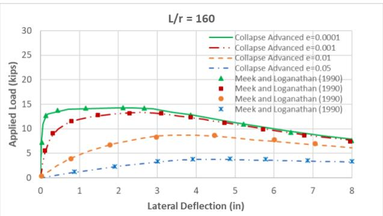  
Figure 33: Euler-Bernoulli column response for $\frac{ L } { r } = 160$

5.1.5.2 Sample 5.2: Elastoplastic of Tubular Simple Column with Timoshenko Bending Theory

This benchmark is the same as sample 5.1 but with the inclusion of shear deformation effects in accordance with Timoshenko’s bending theory. The imperfection values assumed were 0.00001, 0.0001, 0.001, and 0.01, the shear module was assumed to be ?????? $G = 1115 K S I$ . The results were compared with the existing numerical solution [18] in the following figures and are seen to be in very good agreement.

Note: Collapse Advanced analysis is carried out for very large deformation. For comparison purposes, only the initial portion of the response is shown below.

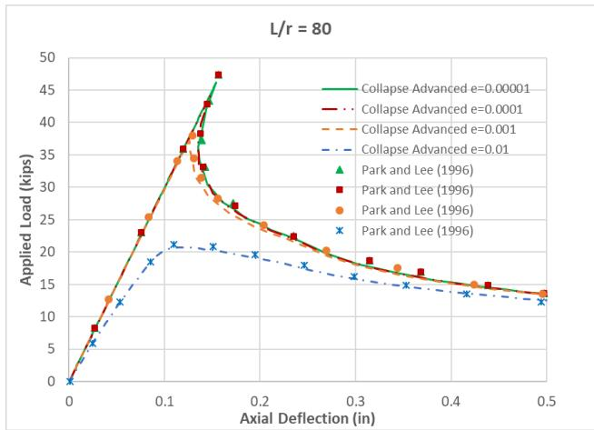

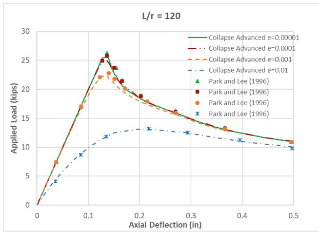  
Figure 34: Timoshenko column response for $\frac{ L } { r } = 80$

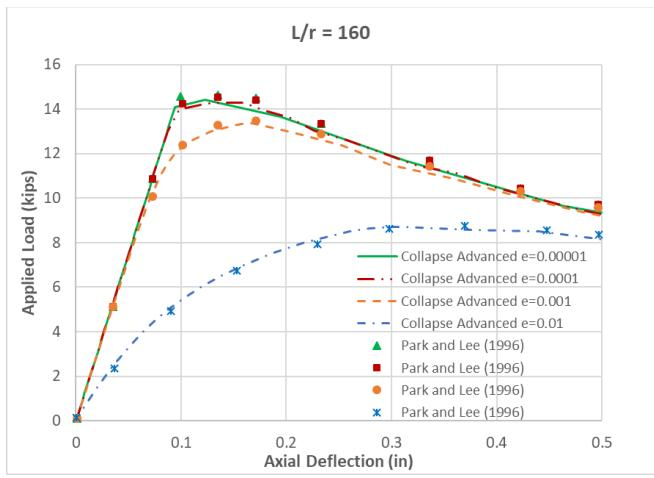  
Figure 35: Timoshenko column response for $\frac{ L } { r } = 120$

Figure 36: Timoshenko column response for $\frac{ L } { r } = 160$

5.1.5.3 Comparison of Elastoplastic Buckling of Columns with API

Similar analyses were repeated for various tubular and wide flange sections with elastoplastic material and with various slenderness values. The stresses at buckling load were compared with critical axial stress provided in the API design code without the safety factor in Figure 37 and Figure 38. It can be seen that the program predicts buckling stress very accurately for all cases.

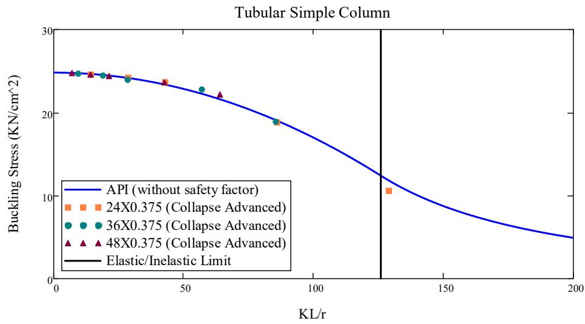  
Figure 37: Collapse Advanced buckling stress versus API for tubular columns

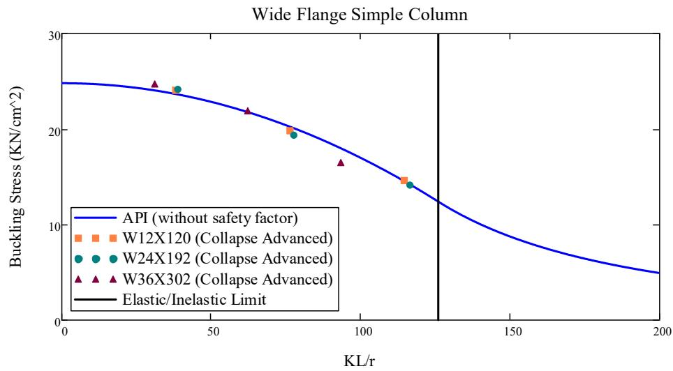  
Figure 38: Collapse Advanced buckling stress versus API for wide flange columns

5.1.6 Sample 6: Buckling of Wide Flange Sections

This benchmark involves buckling analysis of wide flange beams and columns with the inclusion of Wagner’s nonlinear strains for torsional deformation. The first benchmark looks at elastic torsional buckling of a wide flange column. The second part compares the elastoplastic lateral-torsional buckling of a simple beam subjected to pure bending with AISC 2010.

5.1.6.1 Sample 6.1 and Sample 6.2: Lateral-Torsional Buckling of Wide Flange Columns with Wagner Nonlinear Strain

This benchmark demonstrates the application of Wagner nonlinear strains for the prediction elastic lateral-torsional buckling of beams with wide flange sections. Wagner strains have a negligible role in the majority of standard analysis where beams comprised of open thin-walled sections are restrained against lateral buckling. However, these beams may undergo large torsional deformations resulting from accidental loading resulting from a blast or a dropped object, in cases such as these, the contribution of Wagner’s second-order strain may be significant.

Figure 30 shows a simply-supported beam subjected to the axial load with eccentricity. The beam is restrained against torsion at both ends. The following wide flange section sizes were considered for the analysis: W12×120, W24×192, and W36×302. The analysis was conducted for three lengths ?? = 10, 20, ?????? 30, ????. The axial load eccentricity was defined as $\begin{array} { r } { e = 0 , \frac{ H } { 16 } , \frac{ H } { 8 } , \frac{ H } { 4 } , \frac{ H } { 2 } } \end{array}$ ?? ?? where ?? is the section , height. The material was retained elastic with SACS default values. The beam was modeled using two elements each one comprised of 8 sub-segments. To induce lateral-torsional buckling, an imperfection in the form of a small cord angle was applied to members to represent lateral loads. The axial load was gradually increased until there was significant deformation in the lateral direction. A very fine load step size is used to precisely determine buckling load. Both sub-incrementation and Arc-length methods were included in the analysis.

Wagner nonlinear torsional strains were included by entering ‘IWT’ on the CLPOP2 input line and the results were compared with analytical solution [19] in Figures 31 to 33. The results agree with the existing analytical solution [19] for all cases. We can also see that the inclusion of the Wagner nonlinear strains is essential where there is significant torsional rotation (i.e. beam with a higher aspect ratio such as W36×302). For beams that are restrained laterally, the Wagner nonlinear strain has a minimal effect.

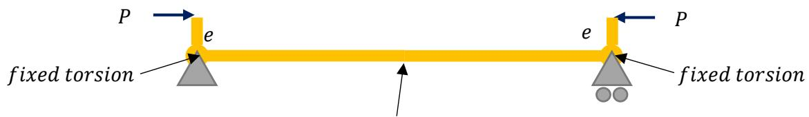  
?????????? ???????????????????????? ?????????? ???????? ???????????? ???????? ???????? ?????????????? − ?????????????????? ?????????????? ??????ℎ ???????? ?????????????? ????????????   
Figure 39: Simple column under axial load with eccentricity

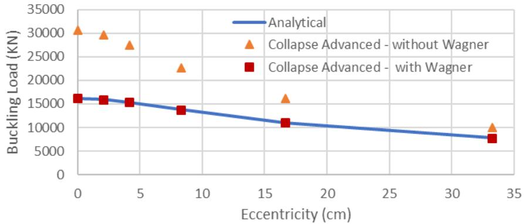  
W12X120 Beam-Column 10ft

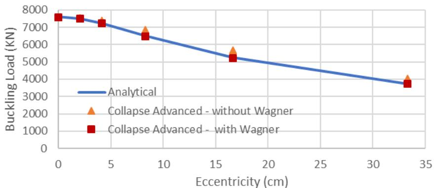  
W12X120 Beam-Column 20ft

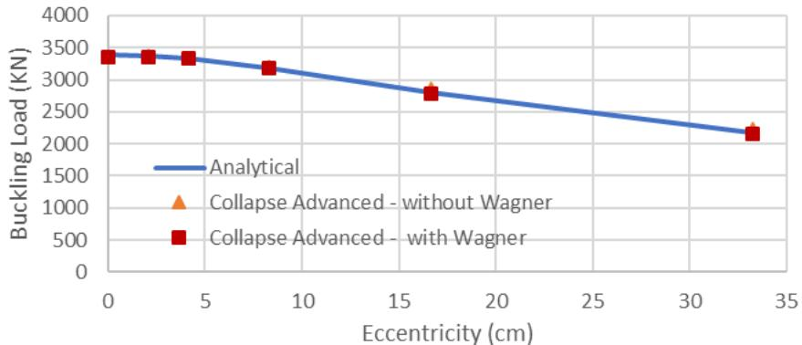  
W12X120 Beam-Column 30ft   
Figure 40: Wagner nonlinear torsion effect in W12x120 buckling

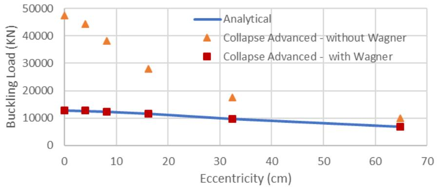  
W24X192 Beam-Column 10ft

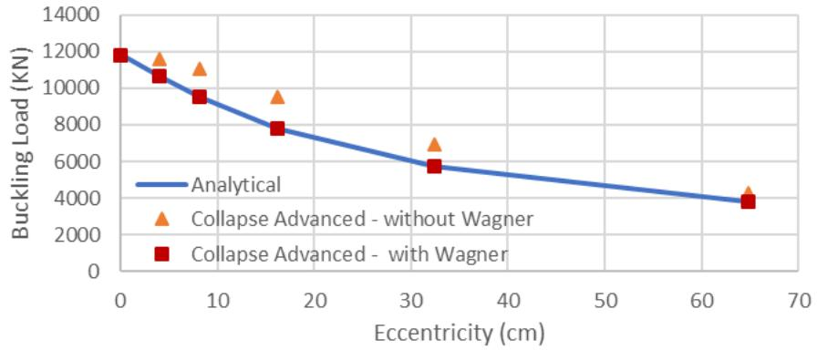  
W24x192 Beam-Column 20ft

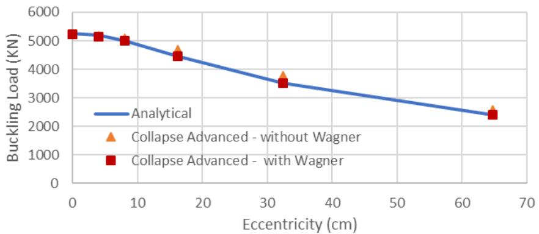  
W24x192 Beam-Column 30ft  
Figure 41: Wagner nonlinear torsion effect in W24x912 buckling

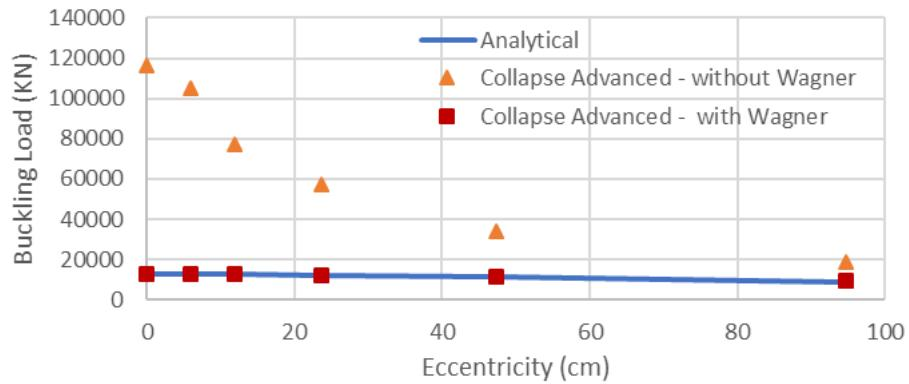  
W36X302 Beam-Column 10ft

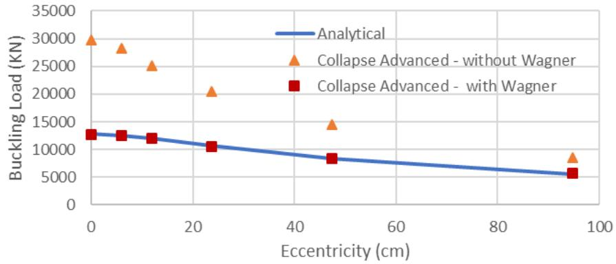  
W36X302 Beam-Column 20ft

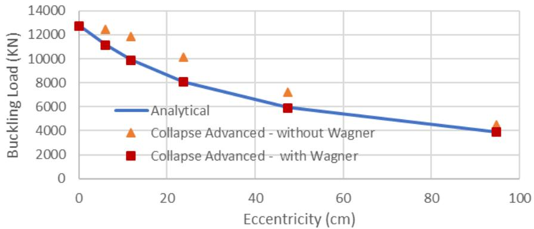  
W36X302 Beam-Column 30ft   
Figure 42: Wagner nonlinear torsion effect in W36x302 buckling

5.1.6.2 Comparison of Elastoplastic Lateral-Torsional Buckling of Wide Flange under Pure Bending with AISC 2010

Similar analyses were repeated for a simply supported beam with elastoplastic material subject to pure bending (see Figure 43). The beam is restrained against torsion at both ends. Three beam sections were considered: W12×120, W24×192, and W36×302. Beams with lengths 10ft, 20ft, 30ft, 60ft, and 90ft were considered. The predicted ultimate bending moments were compared with the ultimate bending moment given by AISC 2010 with safety removed in Figure 44. The results predicted by the program are in good agreement with AISC 2010 for all cases.

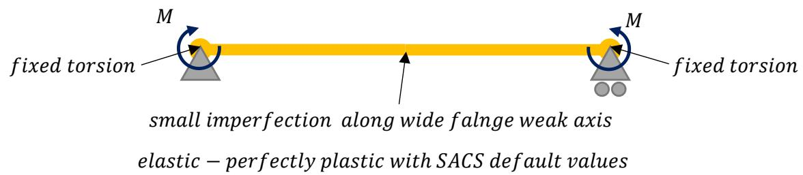  
Figure 43: Simple beam under pure bending

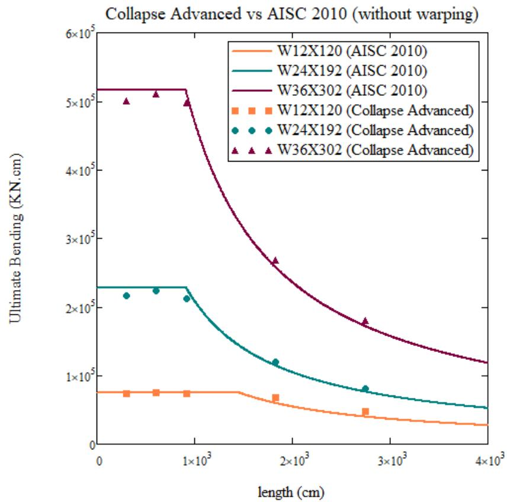  
Figure 44: Comparison of Collapse Advanced ultimate moment and AISC 2010

5.1.7 Sample 7: Harrison’s Space Beam with Tubular Sections

Figure 36 shows Harrisons [20] space beam with tubular sections. The material properties are considered to elastic-perfectly plastic. The beam was subjected to vertical and horizontal loads as shown in Figure 45. Each element used to model the structure was comprised of 8 sub-segments. Both subincrementation and Arc-length options were used on the CLPOPT input line and the maximum deflection (collapse deflection) was set to 10 inches based on the reference results. The predicted response was compared against existing analytical and experimental results [20]–[22] as shown in Figure 46. The results predicted by the program are in very good agreement for all cases.

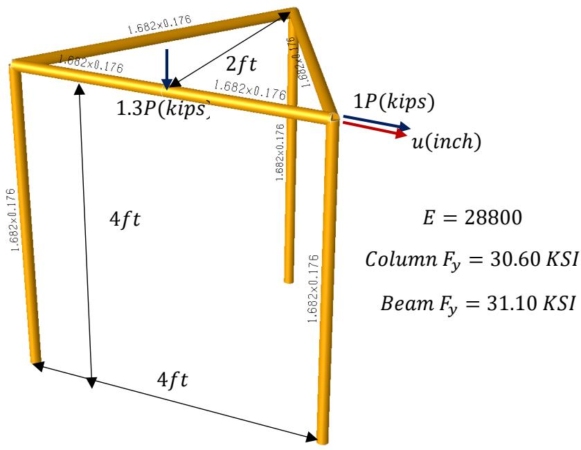  
Figure 45: Harrison’s space beam with the tubular section

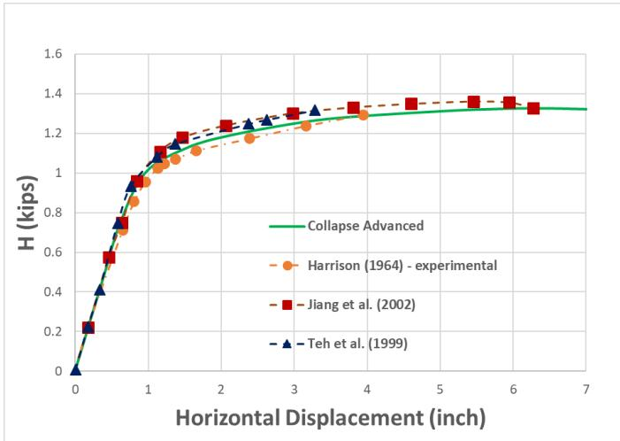

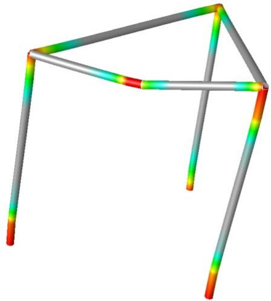  
Figure 46: Left) Harrison’s space beam response. Right) plastic contour at last load step

5.1.8 Sample 8: Elastoplastic Portal Beams

Figure 47 shows a portal beam comprised of a wide flange section W8×31. The portal beam was subjected to vertical loads applied at top of columns in addition to a horizontal load as shown in Figure 47. The material properties were assumed to be elastic-perfectly plastic. Three levels of vertical load ?? were considered, $0 . 2 P_{ y } , 0 . 4 P_{ y } , 0 . 6 P_{ y }$ where $P_{ y }$ is the column yield load. For the analysis, the vertical load ?? was applied first using a single load step. The horizontal load ?? was then applied gradually until collapse occurred. The sub-incrementation and Arc-length options were selected on the CLPOPT input line to predict the ultimate load and the unloading path. It was found that the analysis continued using Arc-length iterative scheme until the lateral displacement measured at the top of the columns reached $0 . 04 L = 14 . 12$ ???? for $V = 0 . 2 P_{ y }$ and $V = 0 . 4 P_{ y }$ , and $0 . 0175 L = 6 . 18$ ???? for $V = 0 . 6 P_{ y }$ . The Arc-length parameter was subsequently increased by using the ARCLEN input line which resulted in 0.04?? displacement using fewer Arc-length steps. The resulting beam horizontal response is in good agreement with existing studies [21], [23] as shown in Figure 48.

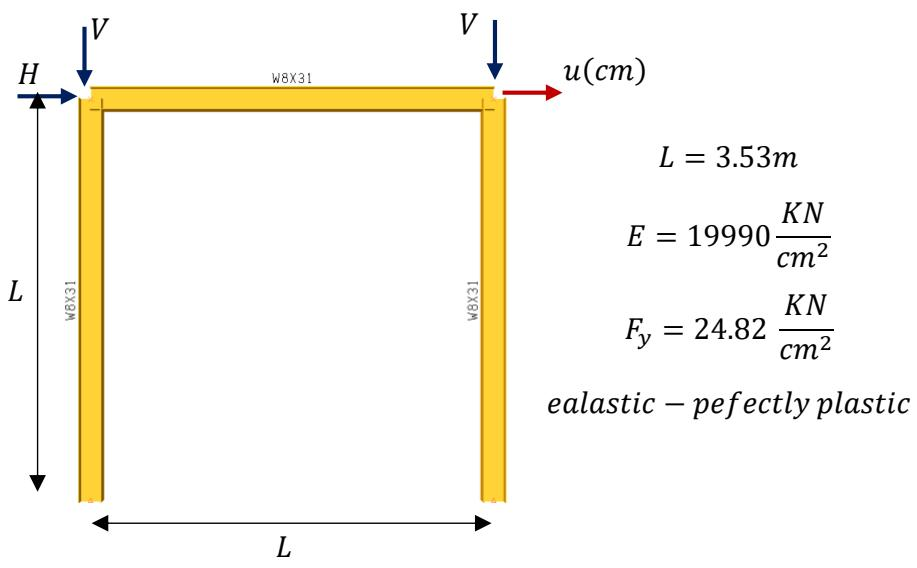

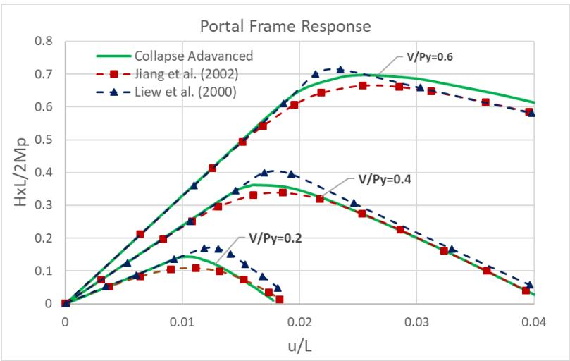  
Figure 47: Portal Beam   
Figure 48: Portal beam response in different vertical load levels

5.1.9 Sample 9: Space Beam with Wide Flange

Figure 49 shows a 3D space beam comprised of wide flange members subjected to vertical and lateral loads. For this analysis, the load ?? was gradually increased until the structure attained its ultimate load. The non-symmetrical lateral loads resulted in a failure mode that includes both torsional and lateral deformation. Each element used to model the structure was comprised of 8 sub-segments and both subincrementation and Arc-length options were included. To compare against reference studies, the maximum deflection (collapse deflection on the CLPOPT) was set to 5 cm. The horizontal response of the model at the top level was compared with various existing numerical solutions [24], [25] and is in good agreement as shown in Figure 50.

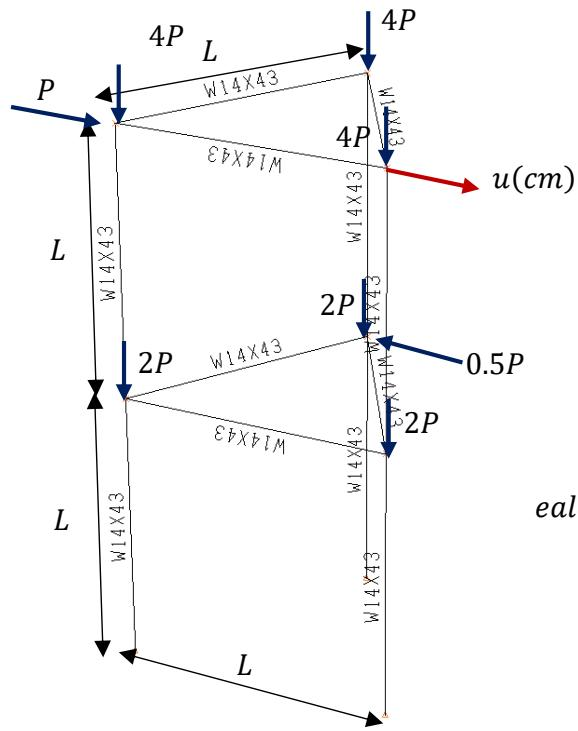

$$L = 2. 8776 m$$

$$E = 21000 \frac{K N}{c m^{2}}$$

$$G = 8000 \frac{K N}{c m^{2}}$$

$$F_{y} = 24. 83 \frac{K N}{c m^{2}}$$

?????????? − ???????????????? ??????????????

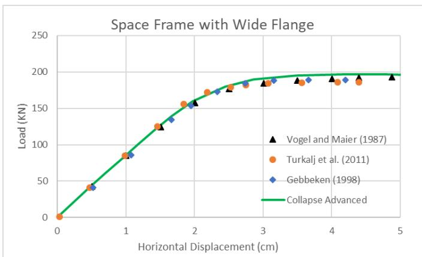  
Figure 49: Space beam with wide flange

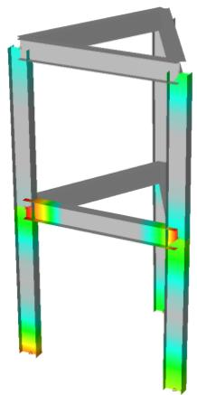  
Figure 50: Left) Space beam horizontal response. Right) plastic contour at last load step

5.1.10 Sample 10: Six-story Building with Wide Flange Section

Figure 51 shows a six-story building constructed using wide flange members subjected to gravity and lateral loads. The applied gravity load is equivalent to a uniformly distributed load of $9 . 6 \frac{ K N } { m^{ 2 } }$ and is applied using point loads at the top of all columns. The lateral load is applied as a series of point loads with an amplitude of 53.376???? on all joints on the front face of the building. The material is assumed to be elastic – perfectly plastic. For the nonlinear analysis, the magnitude of the gravity and lateral loads was increased gradually until the model attained its ultimate capacity. The Arc-length method was used to predict the post-buckling response of the building until the maximum joint displacement reached 2.5??. The analysis was conducted using both Euler-Bernoulli (without shear deformation effect) and Timoshenko (with shear deformation effects) beam theory. The results were compared with various references [16, 23] including DNV’s USFOS program as shown in Figure 52. The plastic ratio contours at the last load step are shown in Figure 53. It is worth noting that the reference studies stop the analysis when the model reaches the ultimate load while results from Collapse Advanced continue into the postbuckling phase.

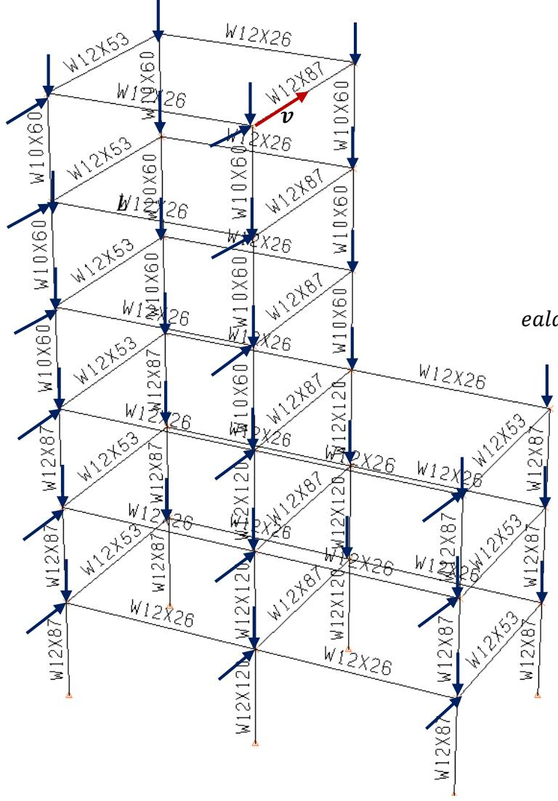  
Figure 51: Six-story building model

$$L = 2. 8776 m$$

$$E = 20000 \frac{K N}{c m^{2}}$$

$$G = 7930 \frac{K N}{c m^{2}}$$

$$F_{y} = 25 \frac{K N}{c m^{2}}$$

?????????? − ???????????????? ??????????????

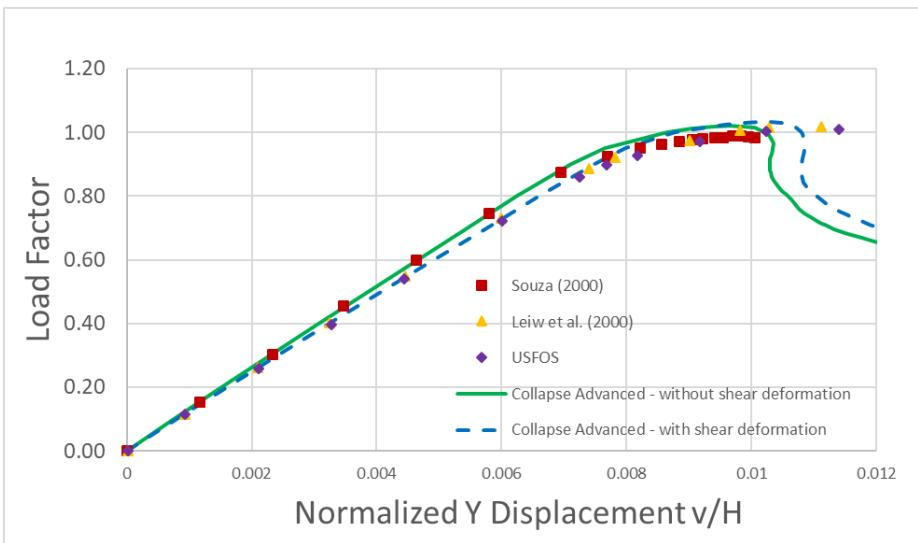  
Figure 52: Six-story building lateral response

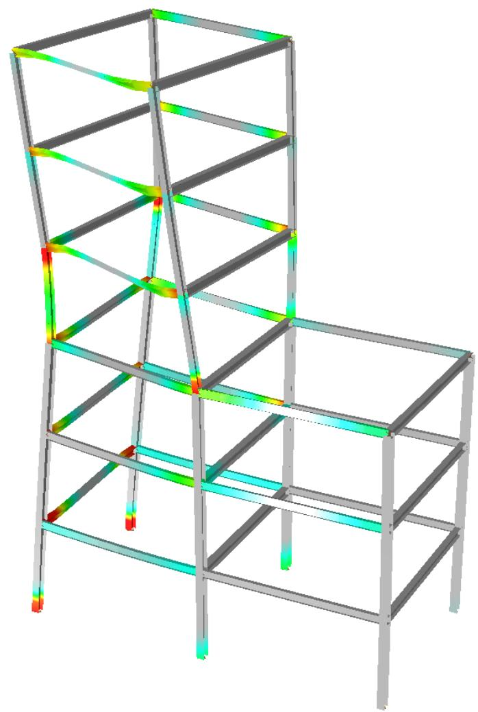  
Figure 53: Plastic ratio contour for Six-story building at last load step

The 2nd-order corotational terms can be ignored to reduce the run time (see section 6.3.1.5 for details on corotational terms). These terms are excluded by entering ‘EXC’ on the CLPOPT input line. The results in Figure 54 show neglecting these terms does not affect the prediction of the ultimate load in this case, even though the run time is reduced. It is also noted that if the 2nd order terms are neglected. the program has difficulty converging in the vicinity of the limit point (i.e. finer load and Arc-length steps are used) resulting from significant deformation of the members. In addition, the Arc-length method also fails to converge prior to reaching the target displacement of 2.5m.

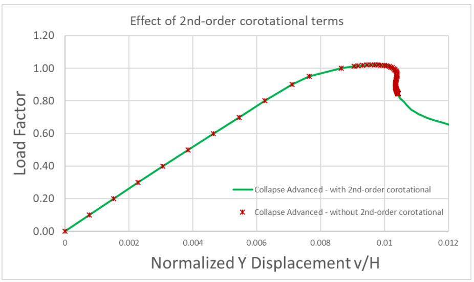  
Figure 54: Comparison of model response with and without 2nd-order corotational terms

For the sample considered, excluding 2nd-order corotational terms significantly reduces run time without compromising the accuracy of the ultimate load capacity. To ensure accuracy, the following criterion should apply when excluding 2nd order terms for wide flange or other open thin-walled sections:

Wide flange or other open thin-walled sections do not experience large loads or significant plasticity; Or   
Wide flange or other open thin-walled sections do not experience large deformation – i.e. they are restrained against buckling; Or   
Wide flange or other open thin-walled sections do not have a major contribution to the model stiffness – basically, they are secondary members.

5.1.11 Sample 11: Buckling of Hinged Right-angle Beam

Figure 55 shows a 2D right-angle beam comprised of members with rectangular cross-sections. The beam is hinged to the ground and is subjected to a vertical point load. The analysis is conducted assuming both elastic and elastoplastic material properties with a strain hardening ratio of 0.1. The subincrementation and Arc-length methods are selected on the CLPOPT line to accurately determine limit points (i.e. buckling load) and the post-buckling response. Each element is comprised of 4 sub-segments to ensure the same number of finite elements are used as reference studies [16], [26]. The beam overall response is compared against [16] and [26] for both elastic and elastoplastic material properties as shown in Figure 56 and Figure 57, respectively. The deformed shapes are also depicted in Figure 56 and Figure 57. The elastoplastic analysis is continued beyond the limits presented in the reference studies to demonstrate post-buckling behavior. The results indicate that results from the program are in very good agreement with the reference studies for both elastic and elastoplastic responses.

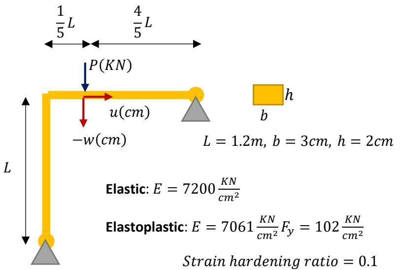  
Figure 55: 2D hinged right-angle beam

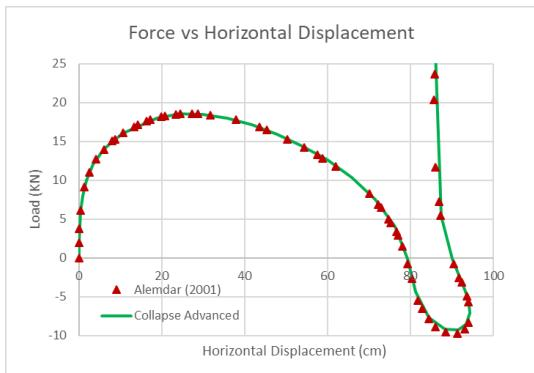

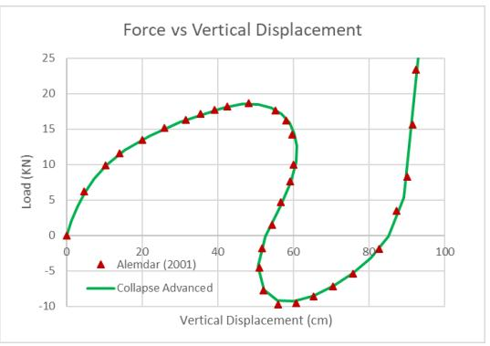

| Buckling Load | Buckling Load |
| --- | --- |
| Collapse Advanced | 18.5 |
| Simo and Vu-Quoc (1986) | 18.532 |
| Alemdar and White (2005) | 18.567 |

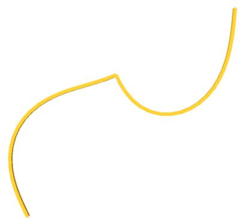  
Figure 56: Beam overall response, deformed shape, and buckling load (the load at the first peak – limit point) for elastic material

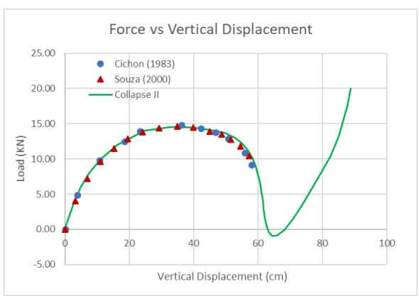

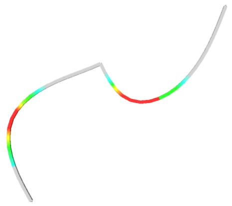  
Figure 57: Beam overall response and deformed shape for elastoplastic material

5.1.12 Sample 12: Two-story 3D Beam with Rectangular Cross-Sections

Figure 49 shows a two-story 3D beam comprised of members with rectangular cross-sections. Each element was comprised of 8 sub-segments. The beam was subjected to horizontal and vertical loads which gradually increased until the maximum displacement reached 1m. The material was assumed to be elastic-perfectly-plastic. Both sub-incrementation and Arc-length methods were selected on the CLPOPT input line to determine the limit point and to study the behavior of the structure for large deformation after the ultimate load has been reached. The overall response of the structure was compared with existing studies [16] as shown in Figure 59. It can be seen the results from the program are in very good agreement.

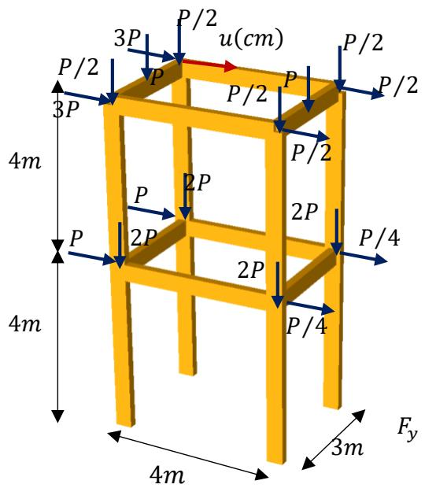

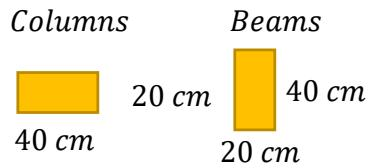

$$E = 1961 \frac{K N}{c m^{2}}, G = 838 \frac{K N}{c m^{2}}$$

$$F_{y} = 9. 8 \frac{K N}{c m^{2}} S t r a i n h a r d e n i n g r a t i o = 0. 0$$

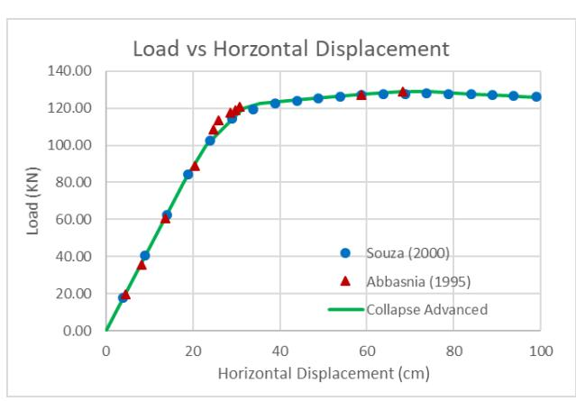  
Figure 58: 3D two-story beam with rectangular sections

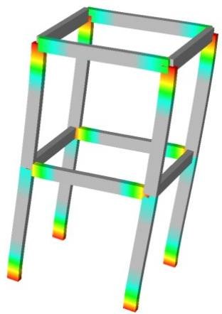  
Figure 59: 3D two-story beam response and the plastic ratio at the maximum load factor

5.1.13 Sample 13: Buckling of a Beam Dome with Rectangular Cross-section

Figure 60 shows a 3D space beam with members comprised of rectangular cross-sections. For this benchmark, both elastic and elastoplastic material properties were considered. For the elastoplastic case, the structure was modeled using 8 sub-segments per element and was subjected to a vertical point load applied at the apex. The load was gradually increased to study the buckling and post-buckling behavior. Both sub-incrementation and Arc-length methods were employed to determine the ultimate load and post-buckling response for the elastoplastic case. The vertical displacement of the structure at the apex was compared against existing results [16], [18] as shown in Figure 61 and Figure 62, respectively.

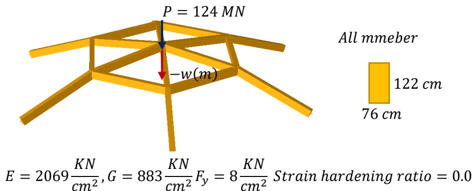

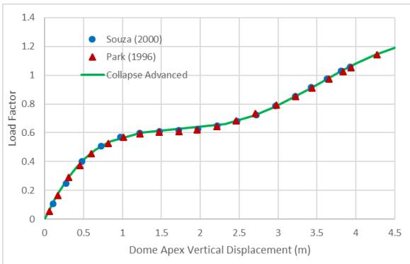  
Figure 60: 3D beam dome subjected to a vertical load

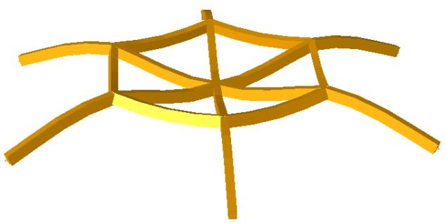

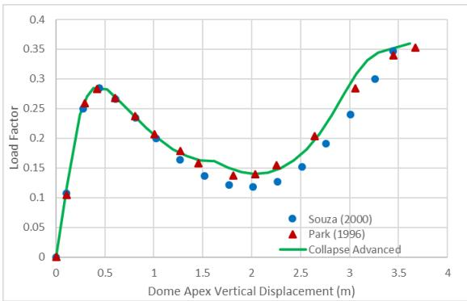  
Figure 61: Elastic response of the beam dome and deformed shape at last load increment

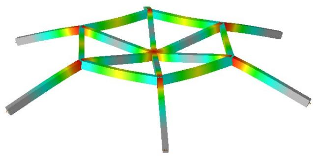  
Figure 62: Elastoplastic response of the beam dome and the plastic ratio

5.1.14 Sample 14: Collapse Analysis of 2D Frame with Tubular Braces

Figure 63 shows a 2D braced frame which has been extensively studied both experimentally and numerically by Billington Osborne-Moss Engineering Ltd (BOMEL) [27]. The member section properties are shown in Figure 63. The material properties were determined from the data provided in reference [27]. The frame was analyzed with and without joint flexibility (‘JF’ option on the CLPOPT line) and the response was compared against experimental results [27]. Each beam element was comprised of 8 subsegments. Both sub-incrementation and Arc-length methods were selected on the CLPOPT input line to help predict the buckling and post-buckling behavior. The frame legs were restrained against out-ofplane displacement. In addition, an out of straightness of 1⁄1000 was assumed for all members as per the CLPOP2 input line. Analysis was conducted until the top of the beam achieved a maximum lateral deflection of 16 cm. A larger value for the arc-length factor on ARCLEN was used to ensure that the analysis reaches the maximum displacement value using fewer Arc-length steps. Figure 64 illustrates that the program accurately predicts the ultimate beam capacity and the post-failure response.

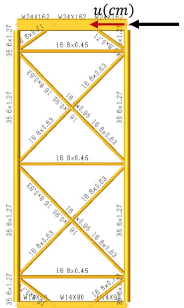

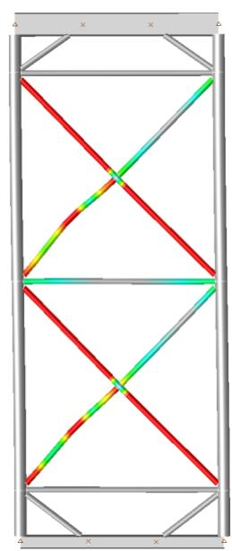

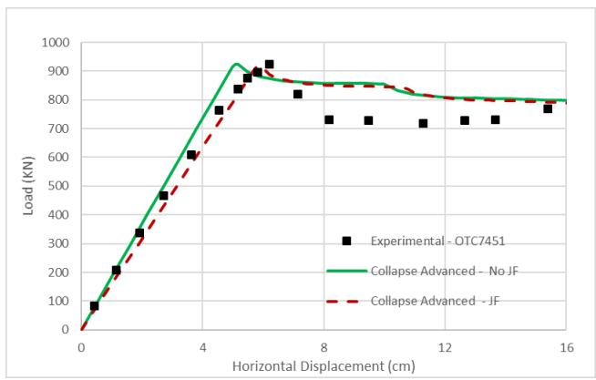  
Figure 63: 2D Beam subjected to lateral load. Left) the model and member sections, Right) deformed beam at final load step with the plastic ratio   
Figure 64: 2D Beam overall response with and without joint flexibility

5.1.15 Sample 15: Four-leg Jackets

Figure 56 shows the four-leg jacket model which has been extensively studied in reference [28] and USFOS Verification Document [29]. The material of the structure was assumed to be elastic-perfect plastic with a yield stress of 33 ????2 $\frac{ K N } { c m^{ 2 } }$ and section properties were selected as per Model S1 in reference [28]. Three applied loads were considered:

1) Four vertical nodal loads applied at top joints to model the structure self-weight,   
2) Distributed member load to represent wave loading   
3) Four horizontal nodal loads were applied to top joints to determine the ultimate lateral loads.

For the load sequence, the vertical and member load were applied first. The horizontal load was then applied and gradually increased until the jacket reached its ultimate capacity.

Different scenarios were considered to study the effect of damage to the structure as summarized in Table 3. Both sub-incrementation and Arc-length options on the CLPOPT input line were selected to help predict the response up to and slightly after the limit point. For comparison purposes, the maximum deflection is entered on the CLPOPT based on the results given in reference studies, although Collapse Advanced analysis can be carried out for larger deformations. Each beam element was comprised of 8 sub-segments in addition to an out of straightness of 0.0015 as per[28]. The results predicted by the program are compared against [28] (cases 1 to 7) and USFOS (cases 6 and 7) in Figure 66. USFOS results are given in USFOS Verification Document. It can be seen Collapse Advanced results are in good agreement for all cases.

Table 3: Four-leg jacket analysis cases   

| Case | Load Type | out-of-straightness | Description |
| --- | --- | --- | --- |
| 1 | Nodal | No | Undamaged Structure |
| 2 | Nodal | Yes | Undamaged Structure |
| 3 | Nodal | Yes | Member EI (compression brace) damaged |
| 4 | Nodal | Yes | Member EI (compression brace) removed |
| 5 | Nodal | Yes | Member IF (tension brace) removed |
| 6 | Nodal + Member | Yes | Undamaged Structure |
| 7 | Nodal + Member | Yes | Member IF (tension brace) removed |

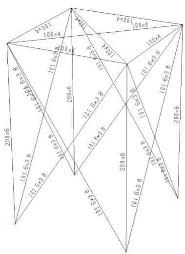

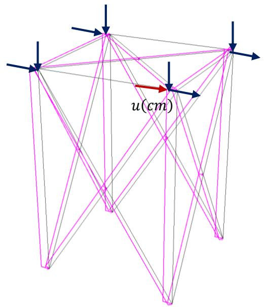  
Figure 65: Four-leg jacket model and loading

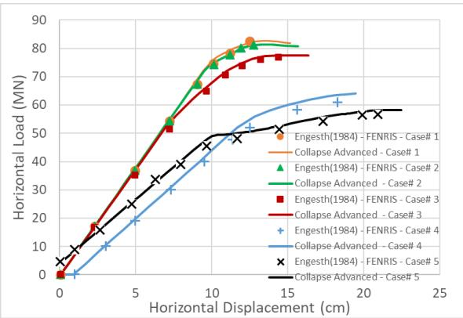

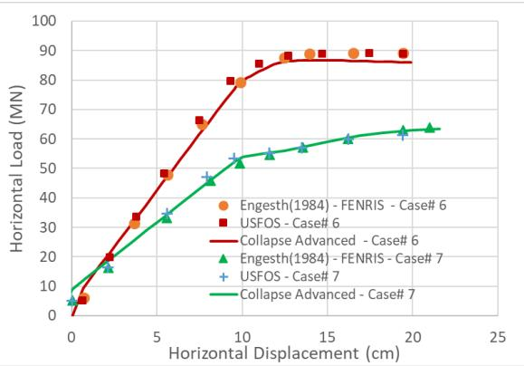  
Figure 66: Four-leg Jacket response in various cases

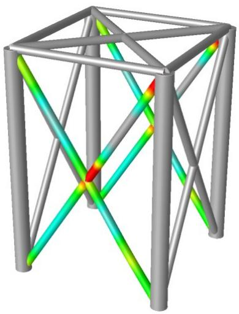

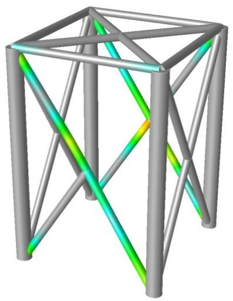  
Figure 67: Deformed jacket with plastic ratio contours for case 1 (left) and case 7 (right)

5.1.16 Sample 16: Tee Section

The following benchmarks illustrate the ability of the Collapse Advanced to predict the buckling load (both flexural and torsional buckling) of beams and columns with the Tee section. The samples are 1) a simple elastic beam subjected to the pure bending to model lateral-torsional buckling of Tee sections and 2) a simple column under the axial compression load to model elastoplastic flexural buckling.

5.1.16.1 Sample 16.1: Elastic lateral-torsional buckling of a simple beam with Tee section

This sample involves elastic lateral-torsional buckling of a simply supported Tee beam subjected to the pure bending as shown in Figure 68. The beam is restrained against torsion at both ends and the material properties are set to SACS default values. The model consists of two elements with eight subsegments per member and all members are set to remain elastic by entering ‘ME’ in the CLPOPT line. To induce lateral-torsional buckling, an imperfection in the form of small lateral dislocation was applied to the mid-point representing lateral loads. The beam experiences large lateral deformation during bucking. Therefore, both sub- incrementation and arc-length options are included in the analysis by entering ‘SI’ and ‘AL’ on the CLPOPT input line.

The simulation is carried out for the following section width to height ratios: 0.5, 0.6, 0.7, 0.8, 0.9, and 1.0. Since the Tee section is monosymmetric, both positive bending moment (i.e. the flange in compression) and negative bending moment (the flange in tension) have been considered. Also, the analysis has been carried out with and without Wagner strain (‘IWT’ on CLPOP2 line). The resulting buckling bending moments are given in where they are in good agreement with the analytical solution given in [19].

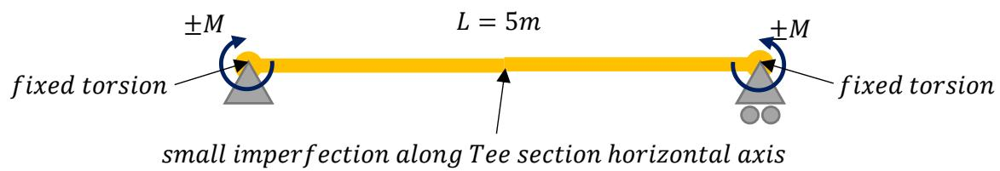

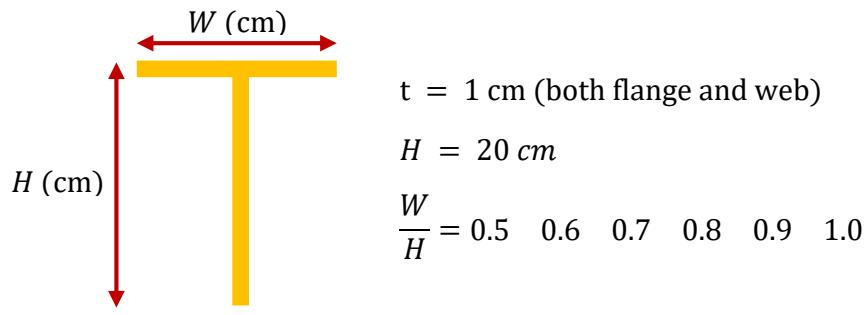  
Figure 68: Simple beam subjected to the pure bending

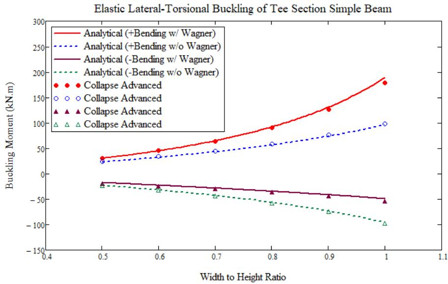  
Figure 69: Collapse Advanced buckling moment for Tee section versus the analytical solution [19].

5.1.16.2 Sample 16.2: Elastoplastic flexural buckling of a simple column with Tee section

This benchmark focuses on elastoplastic flexural buckling analysis of members with Tee sections under compression load. Figure 70 illustrates a simply-supported column subjected to axial compression load at one end. The column is restrained against torsion at both ends and has a small imperfection in the form of mid-point perturbation as a lateral dislocation. The mid-point lateral dislocation is $1 / 10^{ \mathrm{ t h } }$ of Tee section radius of gyration about the local z-axis. The model consists of two elements with eight subsegments per member and the material properties are set to SACS default values. Both subincrementation option (‘SI’ on the CLPOPT) and arc-length method (‘AL’ on the CLPOPT) are utilized for this benchmark.

The analysis is carried out for the following section width to height ratios: 0.5, 0.6, 0.7, 0.8, 0.9, and 1.0, and results are presented in Figure 71 and Figure 72. Figure 71 illustrates the lateral response of the columns with different Tee sections. Figure 72 compares buckling loads – the peak load for mid-point deflection curves in Figure 71 – with ultimate load provided in Section E of AISC 360-16 Specification. The results show that Collapse Advanced accurately predicts the elastoplastic response for all cases.

$\frac{ r_{ z } } { 10 }$ ???????????????????????? ?????????? ?????? ?????????????? ℎ?????????????????? ????????

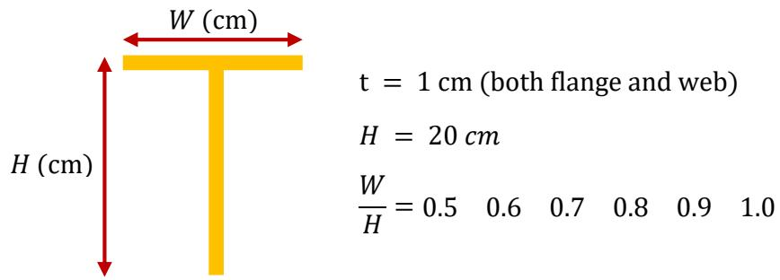  
Figure 70: Simple columns with Tee section

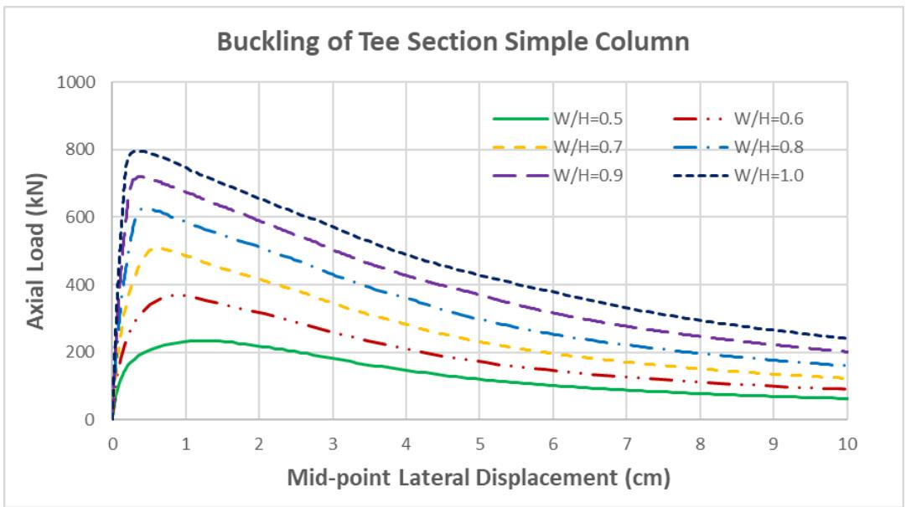  
Figure 71: Lateral displacement of the mid-point for various width to height ratio

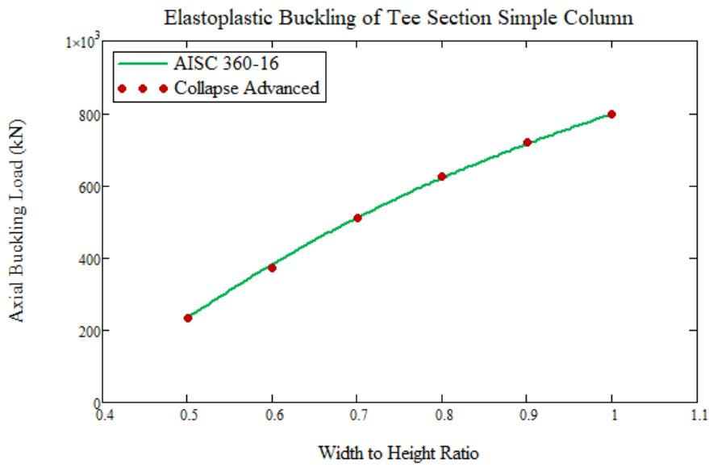  
Figure 72: Comparison of elastoplastic buckling load with AISC 360-16

5.1.17 Sample 17: Channel Section

The following benchmarks illustrate the ability of the Collapse Advanced to predict the buckling load (both flexural and torsional buckling) of beams and columns with a Channel section. The samples are 1) a simple elastic beam subjected to the pure bending to model lateral-torsional buckling of Channel sections and 2) a simple column under the axial compression load to model elastoplastic flexural buckling.

5.1.17.1 Sample 17.1: Elastic lateral-torsional buckling of a simple beam with Channel section

This sample involves elastic lateral-torsional buckling of a simply supported Channel beam subjected to the pure bending as shown in Figure 73. The beam is restrained against torsion at both ends and the material properties are set to SACS default values. The model consists of two elements with eight subsegments per member and all members are set to remain elastic by entering ‘ME’ in the CLPOPT line. To induce lateral-torsional buckling, an imperfection in the form of small lateral dislocation was applied to the mid-point representing lateral loads. The beam experiences large lateral deformation during bucking. Therefore, both sub- incrementation and arc-length options are included in the analysis by entering ‘SI’ and ‘AL’ on the CLPOPT input line.

The simulation is carried out for the following section width to height ratios: 0.5, 0.6, 0.7, 0.8, 0.9, and 1.0. The mid-point lateral deformation is plotted for all cases in Figure 74. The resulting buckling bending moments are compared with the analytical solution derived from [19] and Figure 75 shows they are in good agreement with the analytical solution.

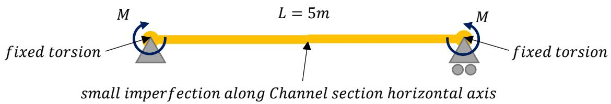

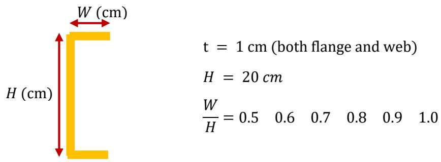  
Figure 73: Simple beam subjected to the pure bending

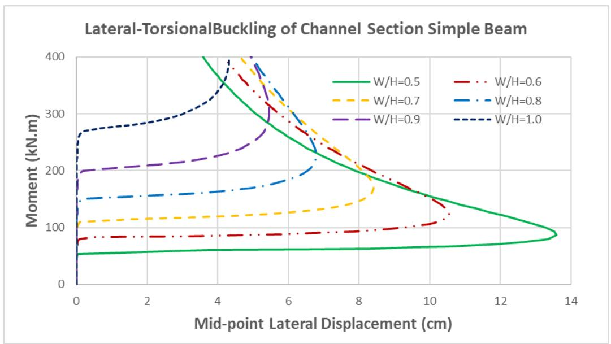  
Figure 74: Mid-point lateral deformation for Channel section

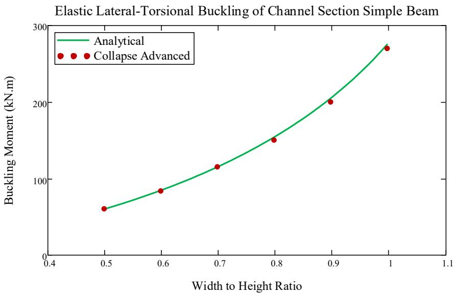  
Figure 75: Collapse Advanced buckling moment for Channel section versus the analytical solution [19].

5.1.17.2 Sample 17.2: Elastoplastic flexural buckling of a simple column with Channel section

This benchmark focuses on elastoplastic flexural buckling analysis of members with Channel section under compression load. Figure 76 illustrates a simply-supported column subjected to axial compression load at one end. The column is restrained against torsion at both ends and has a small imperfection in the form of mid-point perturbation as a lateral dislocation. The mid-point lateral dislocation is $1 / 10^{ \mathrm{ t h } }$ of the Channel section radius of gyration about the local z-axis. The model consists of two elements with eight sub-segments per member and the material properties are set to SACS default values. Both subincrementation option (‘SI’ on the CLPOPT) and arc-length method (‘AL’ on the CLPOPT) are utilized for this benchmark.

The analysis is carried out for the following section width to height ratios: 0.5, 0.6, 0.7, 0.8, 0.9, and 1.0, and results are presented in Figure 77 and Figure 78. Figure 77 illustrates the lateral response of the columns with different Channel sections. Figure 78 compares buckling loads – the peak load for midpoint deflection curves in Figure 77 – with ultimate load provided in Section E of AISC 360-16 Specification. The results show that Collapse Advanced accurately predicts the elastoplastic response for all cases.

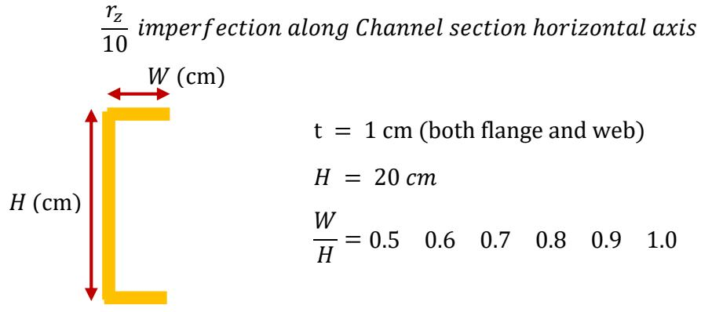  
Figure 76: Simple columns with Channel section

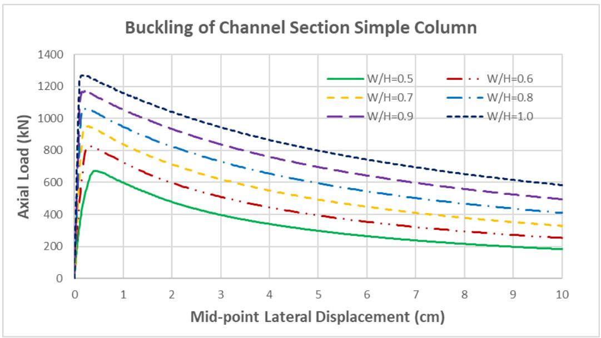  
Figure 77: Lateral displacement of the mid-point for various width to height ratio

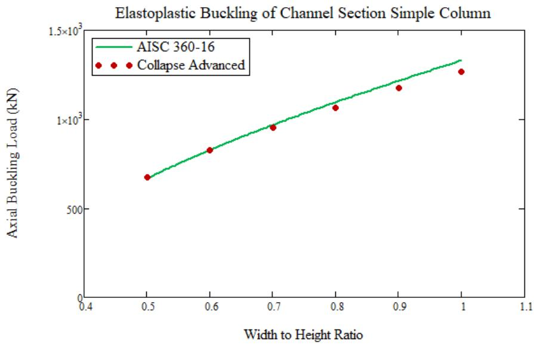  
Figure 78: Comparison of elastoplastic buckling load with AISC 360-16

5.1.18 Sample 18: Angle Section

The following benchmarks illustrate the ability of the Collapse Advanced to predict the buckling load (both flexural and torsional buckling) of beams and columns with the Angle section. The samples are 1) a simple elastic beam subjected to the pure bending to model lateral-torsional buckling of Angle sections and 2) a simple column under the axial compression load to model elastoplastic flexural buckling.

5.1.18.1 Sample 18.1: Elastic lateral-torsional buckling of a simple beam with Angle section

This sample involves elastic lateral-torsional buckling of a simply supported Angle beam subjected to the pure bending as shown in Figure 80. The beam is restrained against torsion at both ends and the material properties are set to SACS default values. The model consists of two elements with eight subsegments per member and all members are set to remain elastic by entering ‘ME’ in the CLPOPT line. To induce lateral-torsional buckling, an imperfection in the form of small lateral dislocation was applied to the mid-point representing lateral loads. The beam experiences large lateral deformation during bucking. Therefore, both sub- incrementation and arc-length options are included in the analysis by entering ‘SI’ and ‘AL’ on the CLPOPT input line.

The simulation is carried out for the following section dimensions: L = 10.0, 11.0, 12.0, 13.0, 14.0, and 15.0 cm. The mid-point lateral deformation is plotted for all cases in Figure 80. The resulting buckling bending moments are compared with the analytical solution derived from [19], and Figure 81 shows they are in good agreement with the analytical solution.

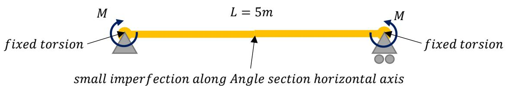

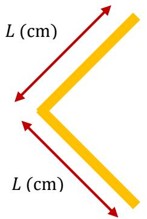

$$t = 1 \mathrm{c m}$$

$$L = 10. 0 \quad 11. 0 \quad 12. 0 \quad 13. 0 \quad 14. 0 \quad 15. 0$$

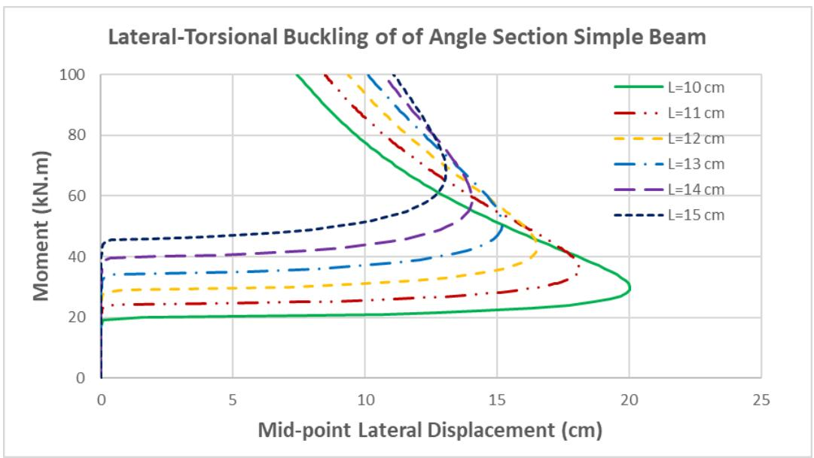  
Figure 79: Simple beam subjected to the pure bending   
Figure 80: Mid-point lateral deformation for Angle section

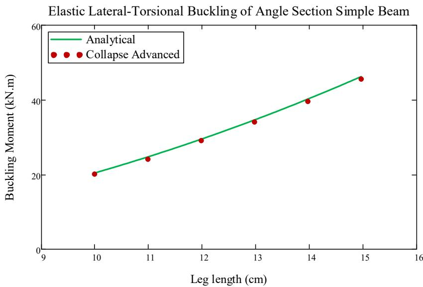  
Figure 81: Collapse Advanced buckling moment for Angle section versus the analytical solution [19]

5.1.18.2 Sample 18.2: Elastoplastic flexural buckling of a simple column with Angle section

This benchmark focuses on elastoplastic flexural buckling analysis of members with Angle section under compression load. Figure 82 illustrates a simply-supported column subjected to axial compression load at one end. The column is restrained against torsion at both ends and has a small imperfection in the form of mid-point perturbation as a lateral dislocation. The mid-point lateral dislocation is $1 / 10^{ \mathrm{ t h } }$ of the angle section radius of gyration about the local z-axis. The model consists of two elements with eight sub-segments per member and the material properties are set to SACS default values. Both subincrementation option (‘SI’ on the CLPOPT) and arc-length method (‘AL’ on the CLPOPT) are utilized for this benchmark.

The analysis is carried out for the following section width to height ratios: dimensions: L = 10.0, 11.0, 12.0, 13.0, 14.0, and 15.0 cm, and the results are presented in Figure 83 and Figure 84. Figure 83 illustrates the lateral response of the columns with different Angle sections with different leg lengths. Figure 84 compares buckling loads – the peak load for mid-point deflection curves in Figure 83 – with ultimate load provided in Section E of AISC 360-16 Specification. The results show that Collapse Advanced accurately predicts the elastoplastic response for all cases.

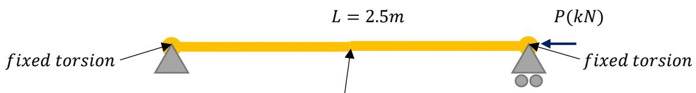  
$\frac{ r_{ z } } { 10 }$ ???????????????????????? ?????????? ?????????? ?????????????? ℎ?????????????????? ????????

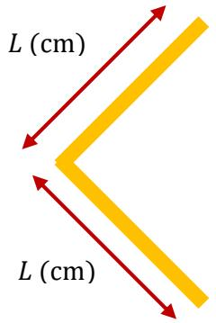

$$t = 1 \mathrm{c m}$$

$$L = 10. 0 \quad 11. 0 \quad 12. 0 \quad 13. 0 \quad 14. 0 \quad 15. 0$$

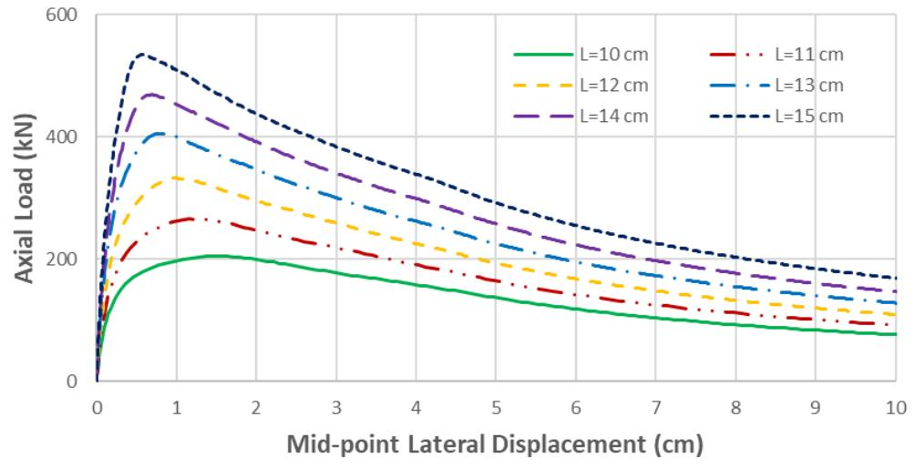  
Figure 82: Simple columns with Angle section   
Buckling of Angle Section Simple Column   
Figure 83: Lateral displacement of the mid-point for various width to height ratio

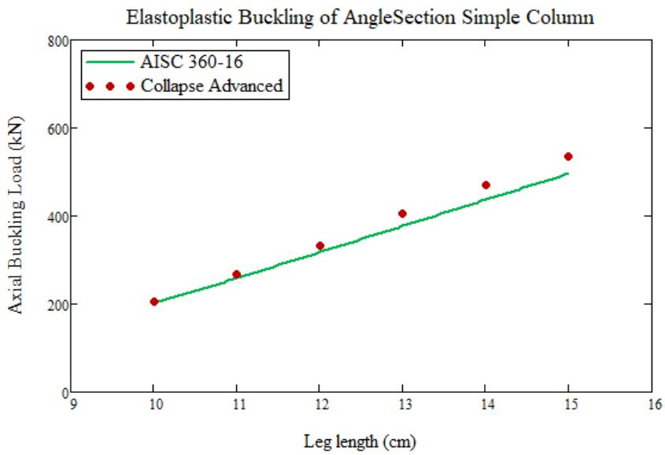  
Figure 84: Comparison of elastoplastic buckling load with AISC 360-16

5.1.19 Sample 19: Box Section

The following benchmarks illustrate the ability of the Collapse Advanced to predict the buckling load (both flexural and torsional buckling) of beams and columns with the Box section. The samples are 1) a simple elastic beam subjected to the pure bending to model lateral-torsional buckling of Box sections and 2) a simple column under the axial compression load to model elastoplastic flexural buckling.

5.1.19.1 Sample 19.1: Elastic lateral-torsional buckling of a simple beam with Box section

This sample involves elastic lateral-torsional buckling of a simply supported Box beam subjected to the pure bending as shown in Figure 85. The beam is restrained against torsion at both ends and the material properties are set to SACS default values. The model consists of two elements with eight subsegments per member and all members are set to remain elastic by entering ‘ME’ in the CLPOPT line. To induce lateral-torsional buckling, an imperfection in the form of small lateral dislocation was applied to the mid-point representing lateral loads. The beam experiences large lateral deformation during bucking. Therefore, both sub- incrementation and arc-length options are included in the analysis by entering ‘SI’ and ‘AL’ on the CLPOPT input line.

The simulation is carried out for the following section height to width ratios: 1.5, 1.6, 1.7, 1.8, 1.9, and 2.0. The mid-point lateral deformation is plotted for all cases in Figure 86. The resulting buckling bending moments are compared with the analytical solution derived from [19] and Figure 87 shows they are in good agreement with the analytical solution.

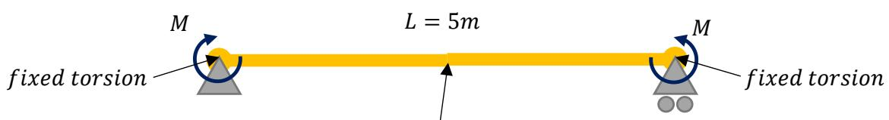  
?????????? ???????????????????????? ?????????? ?????? ?????????????? ℎ?????????????????? ????????

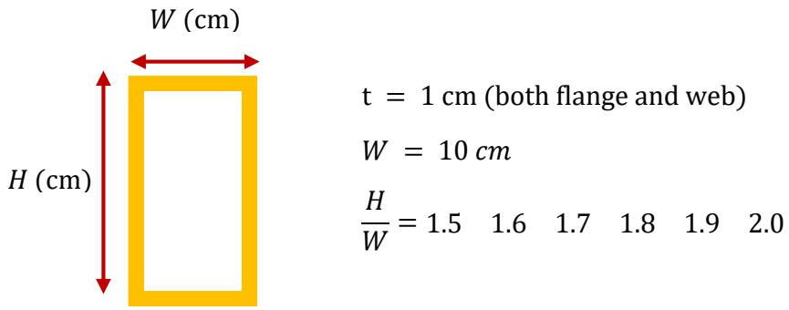  
Figure 85: Simple beam subjected to the pure bending

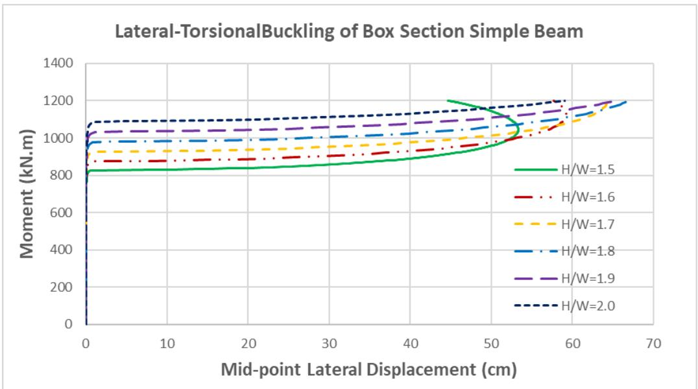  
Figure 86: Mid-point lateral deformation for Box section

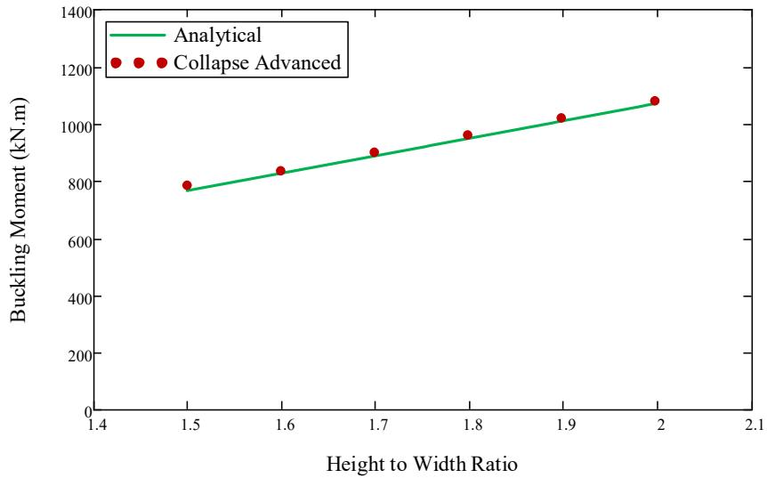  
Elastic Lateral-Torsional Buckling of Box Section Simple Beam   
Figure 87: Collapse Advanced buckling moment for Box section versus the analytical solution [19]

5.1.19.2 Sample 19.2: Elastoplastic flexural buckling of a simple column with Box section

This benchmark focuses on elastoplastic flexural buckling analysis of members with Box section under compression load. Figure 88 illustrates a simply-supported column subjected to axial compression load at one end. The column is restrained against torsion at both ends and has a small imperfection in the form of mid-point perturbation as a lateral dislocation. The mid-point lateral dislocation is $1 / 10^{ \mathrm{ t h } }$ of the Box section radius of gyration about the local z-axis. The model consists of two elements with eight subsegments per member and the material properties are set to SACS default values. Both subincrementation option (‘SI’ on the CLPOPT) and arc-length method (‘AL’ on the CLPOPT) are utilized for this benchmark.

The analysis is carried out for the following section height to width ratios: 1.5, 1.6, 1.7, 1.8, 1.9, and 2.0, and results are presented in Figure 89 and Figure 90. Figure 89 illustrates the lateral response of the columns with different Box sections. Figure 90 compares buckling loads – the peak load for mid-point deflection curves in Figure 89 – with ultimate load provided in Section E of AISC 360-16 Specification. As seen in the plots, the Collapse Advanced predicts slightly higher ultimate loads for the box section. As shown in Figure 89, the Box columns deform about 4 cm at the mid-point before the buckling occurs. This relatively large deformation and corresponding geometrical stiffness contribute to a higher ultimate load. In addition, the AISC 360-16 Specification reduces the analytical Euler elastic buckling load by a factor of 0.877. If the reduction factor is removed from AISC elastoplastic critical stress calculation, the Collapse Advanced ultimate loads are well within AISC limits – as shown in Figure 90.

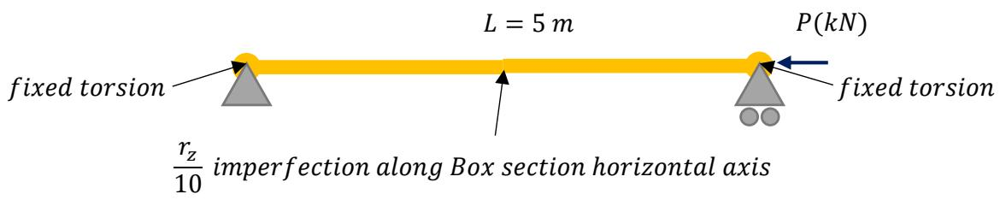

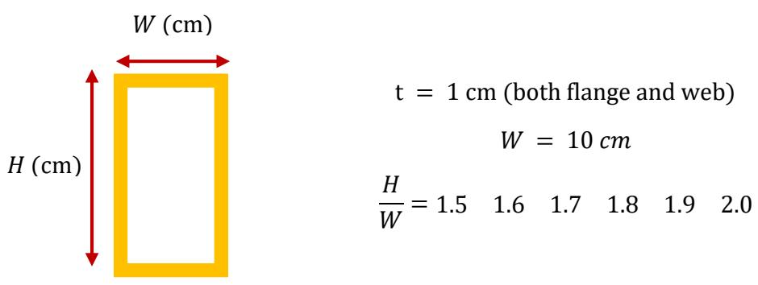  
Figure 88: Simple columns with Box section

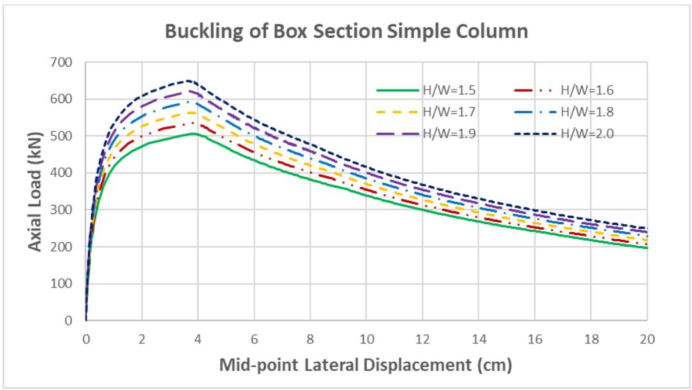  
Figure 89: Lateral displacement of the mid-point for various height to width ratio

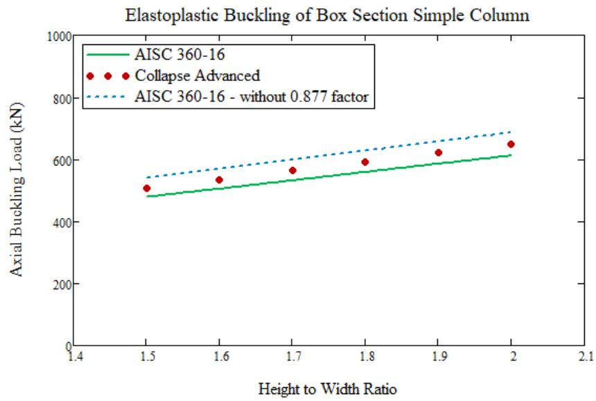  
Figure 90: Comparison of elastoplastic buckling load with AISC 360-16

5.1.20 Sample 20: Conical Section

The following is a benchmark to illustrate the accuracy of Conical sections calculation in the Collapse Advanced program. Figure 91 shows a simply-supported column consists of two conical members and two tubular members. The column is subjected to a lateral load ?? at mid-point and compression axial load ??⁄10 at its end. The column is restrained against torsion at both ends. The analysis is carried out using eight sub-segments per member and the material properties are set to SACS default values. Both sub-incrementation option (‘SI’ on the CLPOPT) and arc-length method (‘AL’ on the CLPOPT) are utilized for this benchmark.

The analysis carried out for three different Conical sections as shown in Figure 91. Figure 92 shows the failure mode and plasticity contours for all cases at the final load step. Figure 93 compares the vertical displacement at the mid-point calculated with the Conical section and the equivalent segmented tubular members. For the reference solution, the Conical members are divided into 8 segments and each segment is modeled using a tubular section with the equivalent diameter. The diameter of equivalent tubular segments is determined by linearly interpolating between Conical bigger and smaller diameters. As seen in the graph, the Collapse Advanced Conical section is in good agreement with the reference solution.

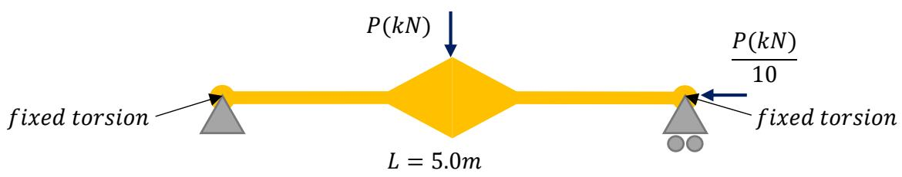

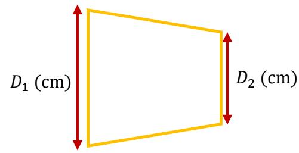  
$\mathrm{ t } = 1 \mathrm{ c m }$   
$D_{ 1 } = 40 , D_{ 2 } = 30 c m$   
$D_{ 1 } = 60 , D_{ 2 } = 30 c m$   
$D_{ 1 } = 80 , D_{ 2 } = 30 c m$

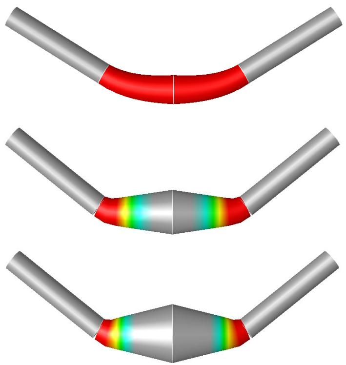  
Figure 91: Simple columns with Conical section   
Figure 92: Plasticity contours for a simple column with a conical section

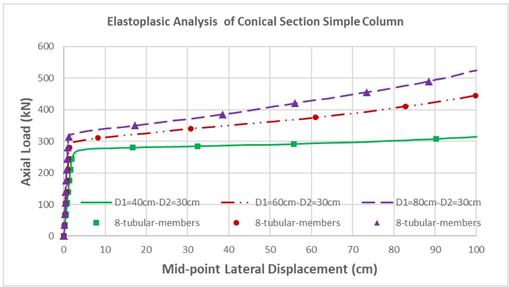  
Figure 93: Comparison of the conical section with the segmented tubular section

5.1.21 Sample 21: Concentric (Double) Tubular Section

This benchmark focuses on elastoplastic flexural buckling analysis of members with Concentric Tubulars under compression load. Figure 94 illustrates a simply-supported column subjected to axial compression load at one end. The column is restrained against torsion at both ends and has a small imperfection in the form of mid-point perturbation as a lateral dislocation. The model consists of two elements with eight sub-segments per member and the material properties are set to SACS default values. Both subincrementation option (‘SI’ on the CLPOPT) and arc-length method (‘AL’ on the CLPOPT) are utilized for this benchmark.

The analysis carried out for three different Concentric Tubulars as shown in Figure 94. Figure 95 compares the vertical displacement at the mid-point calculated with Concentric Tubular and the equivalent two-tubular members. For the reference solution, each Concentric Tubular is modeled with two tubular members – one for the inner tubular and one for the outer tubular. As seen in this graph, the Collapse Advanced Concentric Tubular is in good agreement with the reference solution.

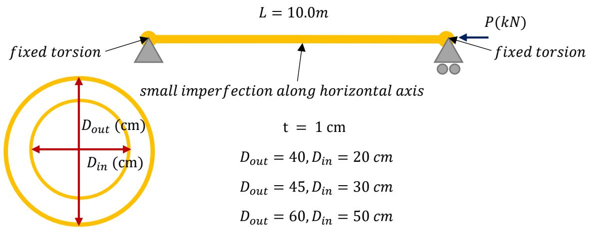  
Figure 94: Simple columns with Concentric (Double) Tubulars

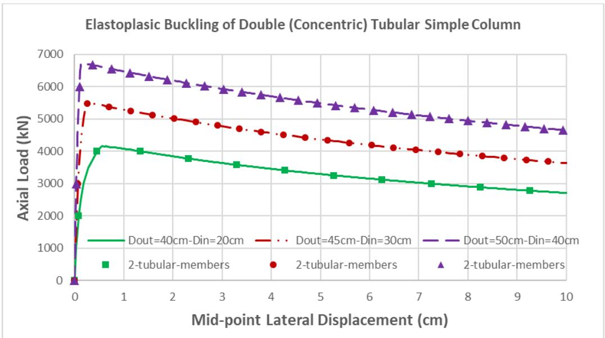  
Figure 95: Comparison of Concentric Tubular section with two-tubular members

5.1.22 Sample 22: Launch Runner and Special Launch Runner Section

This sample involves elastoplastic flexural buckling analysis of members with Launch Runner and Special Launch Runner under compression load. Figure 96 illustrates a simply-supported column subjected to axial compression load at one end. The column is restrained against torsion at both ends and has a small imperfection in the form of mid-point perturbation as a lateral dislocation. The model consists of two elements with eight sub-segments per member and the material properties are set to SACS default values. Both sub-incrementation option (‘SI’ on the CLPOPT) and arc-length method (‘AL’ on the CLPOPT) are utilized for this benchmark.

The analysis carried out for a launch runner and a special launch runner section as shown in Figure 96. Figure 97 compares the vertical displacement at the mid-point with the tubular member without runner plates.

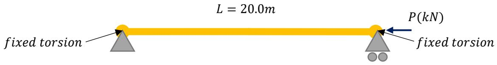

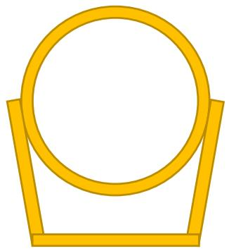

Tubular: $\mathrm{ D }_{ o u t } = 120 c m , \mathrm{ t } = 3 c m$

Runner Depth = 110 ????

Runner Width = 100 ????

Side Plate Thickness = 2 ????

Bottom Plate Thickness = 2.5 ????

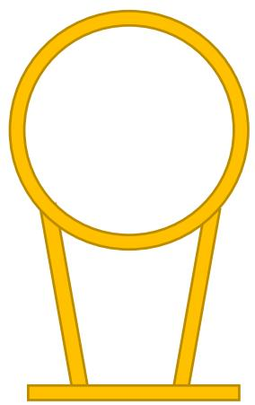  
Figure 96: Simple columns with Launch Runner sections

Tubular: D?????? = 120 ????, t = 3 ????

Runner Depth = 110 ????

Runner Width = 100 ????

Runner Top Width = 100 ????

Runner Bottom Depth = 80 ????

Side Plate Thickness = 2 ????

Bottom Plate Thickness = 2.5 ????

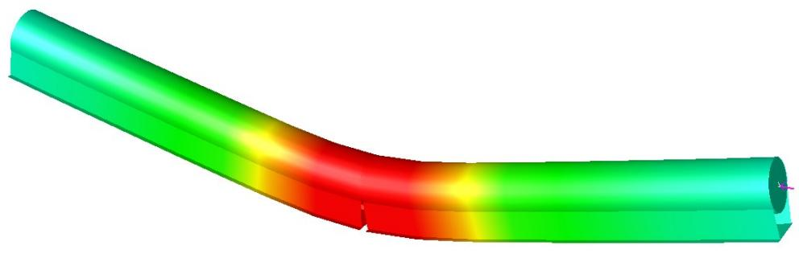

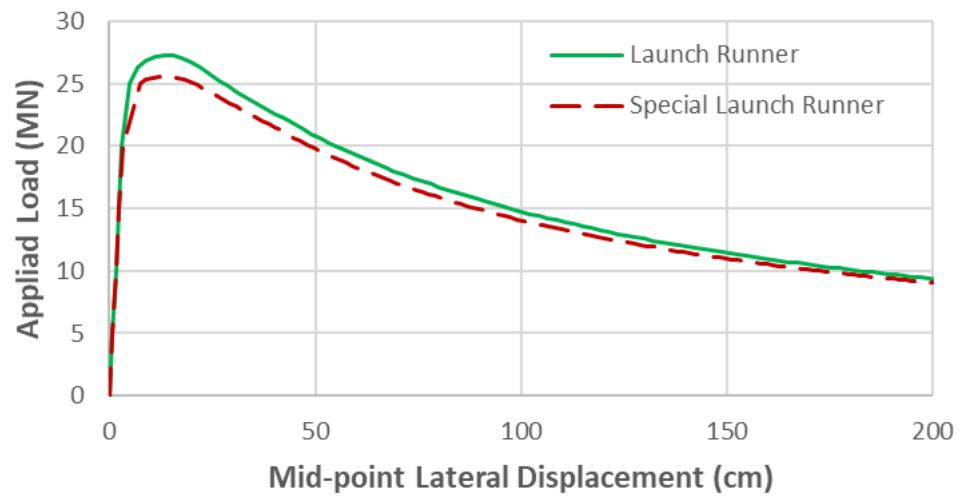  
Buckling of Luanch Runner Sections   
Figure 97: Top: Plastic contour of Launch Runner section, Bottom: Comparison of Launch Runner section buckling

5.1.23 Sample 23: Rectangular Tube

The following benchmarks illustrate the ability of the Collapse Advanced to predict the buckling load (both flexural and torsional buckling) of beams and columns with Rectangular Tube section. The samples are 1) a simple elastic beam subjected to the pure bending to model lateral-torsional buckling of Box sections and 2) a simple column under the axial compression load to model elastoplastic flexural buckling.

5.1.23.1 Sample 23.1: Elastic lateral-torsional buckling of a simple beam with Rectangular Tube section

This sample involves elastic lateral-torsional buckling of a simply supported Rectangular Tube beam subjected to the pure bending as shown in Figure 98. The beam is restrained against torsion at both ends and the material properties are set to SACS default values. The model consists of two elements with eight sub-segments per member and all members are set to remain elastic by entering ‘ME’ in the CLPOPT line. To induce lateral-torsional buckling, an imperfection in the form of small lateral dislocation was applied to the mid-point representing lateral loads. The beam experiences large lateral deformation during bucking. Therefore, both sub- incrementation and arc-length options are included in the analysis by entering ‘SI’ and ‘AL’ on the CLPOPT input line.

The simulation is carried out for the following section height to width ratios: 1.50, 1.75, and 2.00. The mid-point lateral deformation is plotted for all cases in Figure 99. The resulting buckling bending moments are compared with the analytical solution derived from [19] and Figure 100 shows they are in good agreement with the analytical solution.

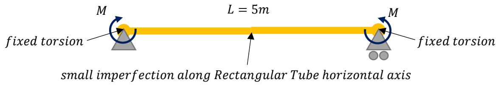

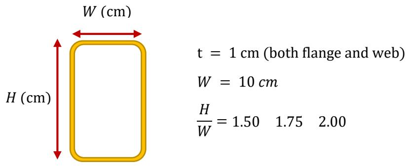  
Figure 98: Simple beam subjected to the pure bending

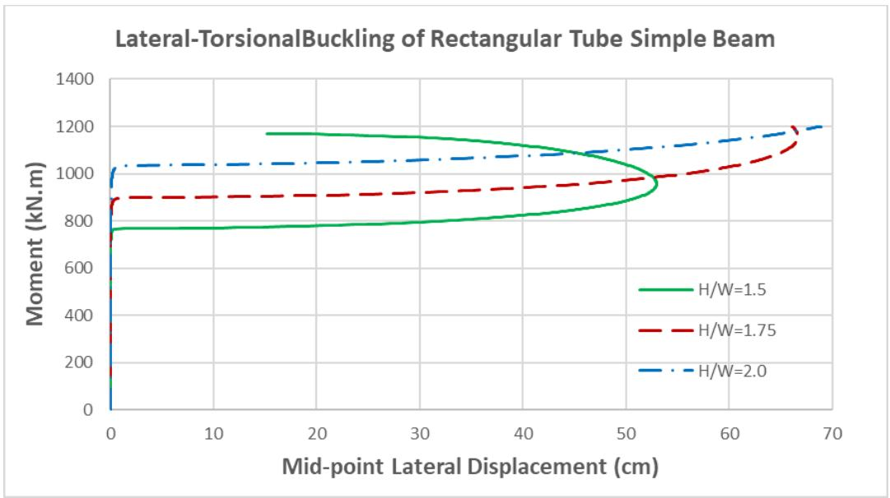  
Figure 99: Mid-point lateral deformation for Rectangular Tube section

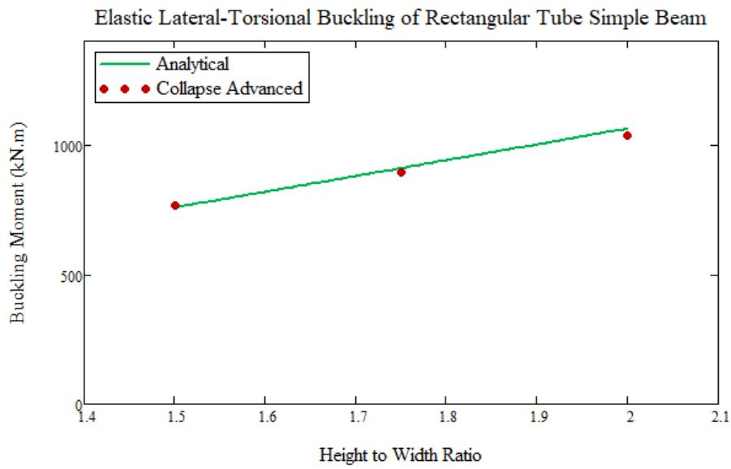  
Figure 100: Collapse Advanced buckling moment for Rectangular Tube section versus the analytical solution [19]

5.1.23.2 Sample 23.2: Elastoplastic flexural buckling of a simple column with Rectangular Tube section

This benchmark focuses on elastoplastic flexural buckling analysis of members with Rectangular Tube section under compression load. Figure 101 illustrates a simply supported column subjected to axial compression load at one end. The column is restrained against torsion at both ends and has a small imperfection in the form of mid-point perturbation as a lateral dislocation. The mid-point lateral dislocation is $1 / 10^{ \mathrm{ t h } }$ of the Rectangular Tube section radius of gyration about the local z-axis. The model consists of two elements with eight sub-segments per member and the material properties are set to SACS default values. Both sub-incrementation option (‘SI’ on the CLPOPT) and arc-length method (‘AL’ on the CLPOPT) are utilized for this benchmark.

The analysis is carried out for the following section height to width ratios: 1.50, 1.75, and 2.00, and results are presented in Figure 102 and Figure 103. Figure 102 illustrates the lateral response of the columns with different Rectangular Tube sections. Figure 103 compares buckling loads – the peak load for mid-point deflection curves in Figure 102 – with ultimate load provided in Section E of AISC 360-16 Specification. As seen in the plots, the Collapse Advanced predicts slightly higher ultimate loads for the Rectangular Tube section. As shown in Figure 102, the Rectangular Tube columns deform about 4 cm at the mid-point before the buckling occurs. This relatively large deformation and corresponding geometrical stiffness contribute to a higher ultimate load. In addition, the AISC 360-16 Specification reduces the analytical Euler elastic buckling load by a factor of 0.877. If the reduction factor is removed from AISC elastoplastic critical stress calculation, the Collapse Advanced ultimate loads are well within AISC limits – as shown in Figure 103.

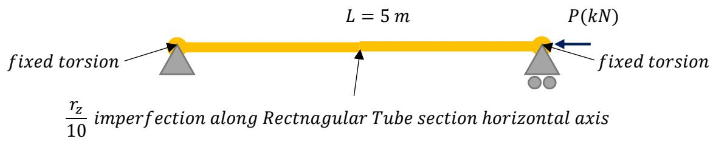

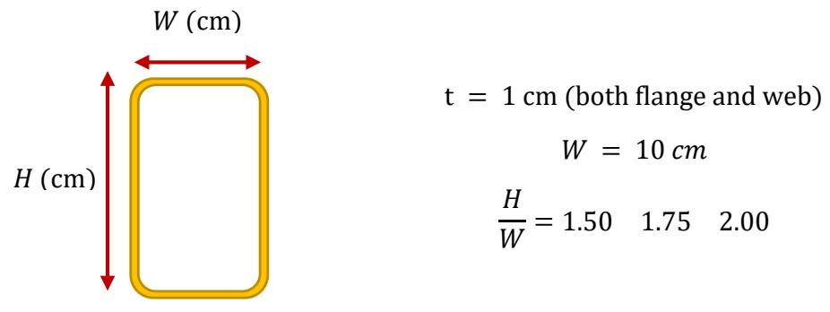  
Figure 101: Simple columns with Rectangular Tube section

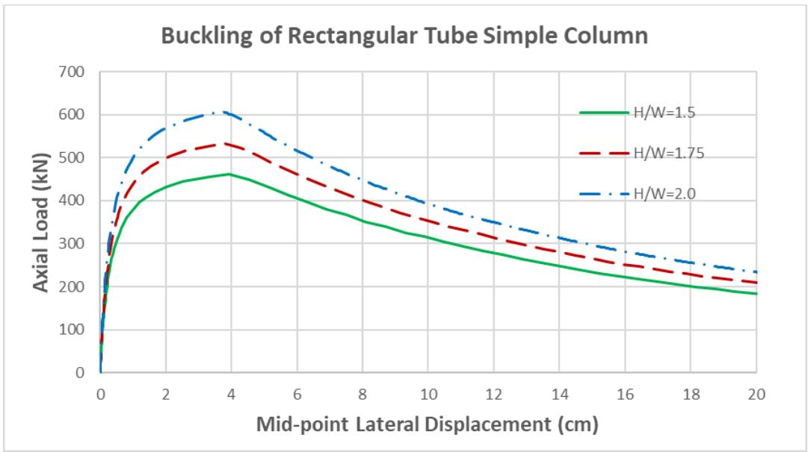  
Figure 102: Lateral displacement of the mid-point for various height to width ratio

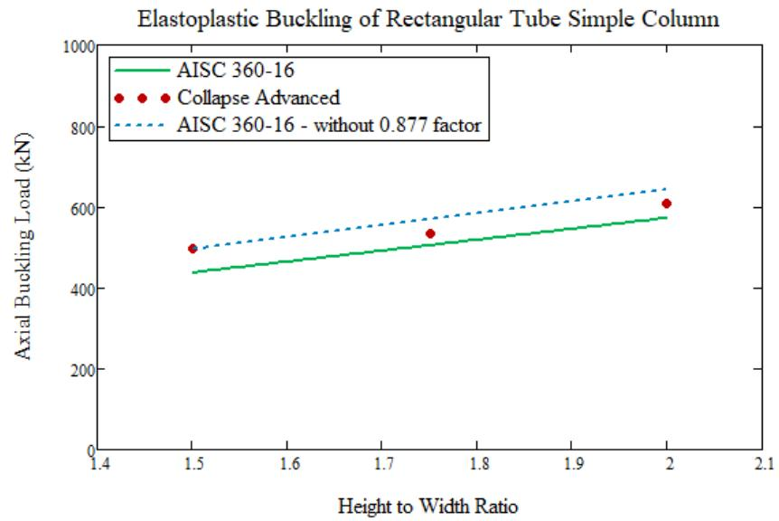  
Figure 103: Comparison of elastoplastic buckling load with AISC 360-16

5.1.24 Sample 24: Double Web Plate Girder Section

This sample involves elastoplastic flexural buckling analysis of members with Double Web Plate Girder under compression load. Figure 104 illustrates a simply supported column subjected to axial compression load at one end. The column is restrained against torsion at both ends and has a small imperfection in the form of mid-point perturbation as a lateral dislocation. The model consists of two elements with eight sub-segments per member and the material properties are set to SACS default values. Both sub-incrementation option (‘SI’ on the CLPOPT) and arc-length method (‘AL’ on the CLPOPT) are utilized for this benchmark.

The analysis was carried out for three Double Web Plate Girder sections with a height to width ratio of 1.50, 1.75, and 2.00 as shown in Figure 104. Figure 105 compares the lateral displacement at the midpoint of the column.

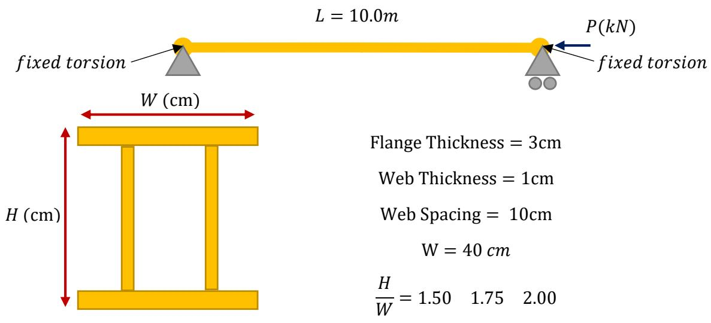  
Figure 104: Simple columns with Double Web Plate Girder sections

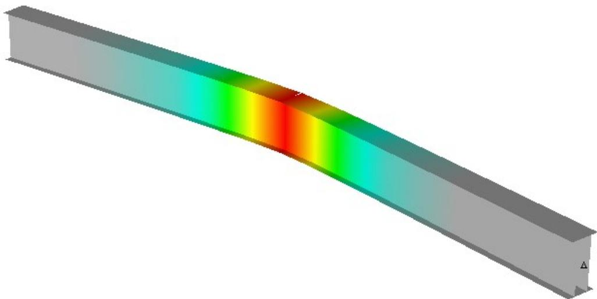

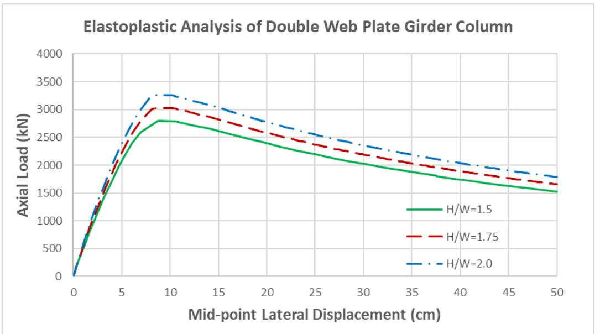  
Figure 105: Top: Plastic contour of Double Web Plate Girder section, Bottom: Comparison of Double Web Plate Girder sections buckling

5.1.25 Sample 25: Boxed Plate Girder Section

This sample involves elastoplastic flexural buckling analysis of members with Boxed Plate Girder under compression load. Figure 106 illustrates a simply supported column subjected to axial compression load at one end. The column is restrained against torsion at both ends and has a small imperfection in the form of mid-point perturbation as a lateral dislocation. The model consists of two elements with eight sub-segments per member and the material properties are set to SACS default values. Both subincrementation option (‘SI’ on the CLPOPT) and arc-length method (‘AL’ on the CLPOPT) are utilized for this benchmark.

The analysis was carried out for three Boxed Plate Girder sections with a height to width ratio of 1.50, 1.75, and 2.00 as shown in Figure 106. Figure 107 compares the lateral displacement at the mid-point of the column.

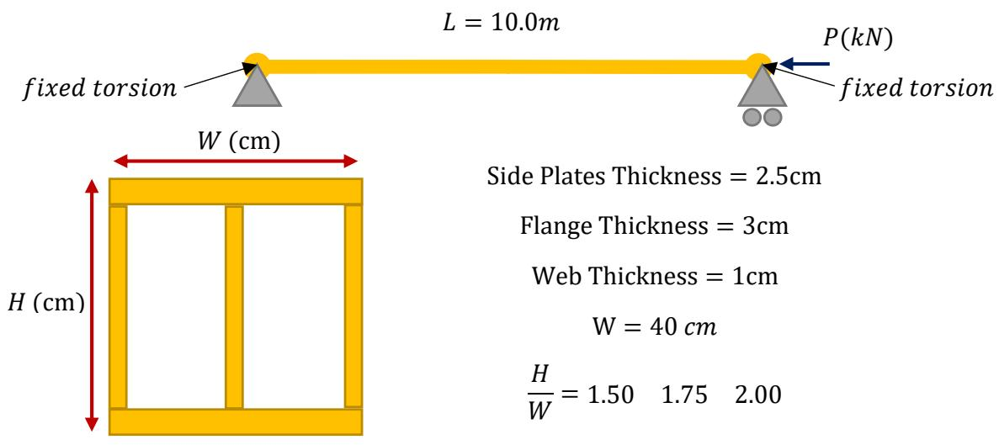  
Figure 106: Simple columns with Boxed Plate Girder sections

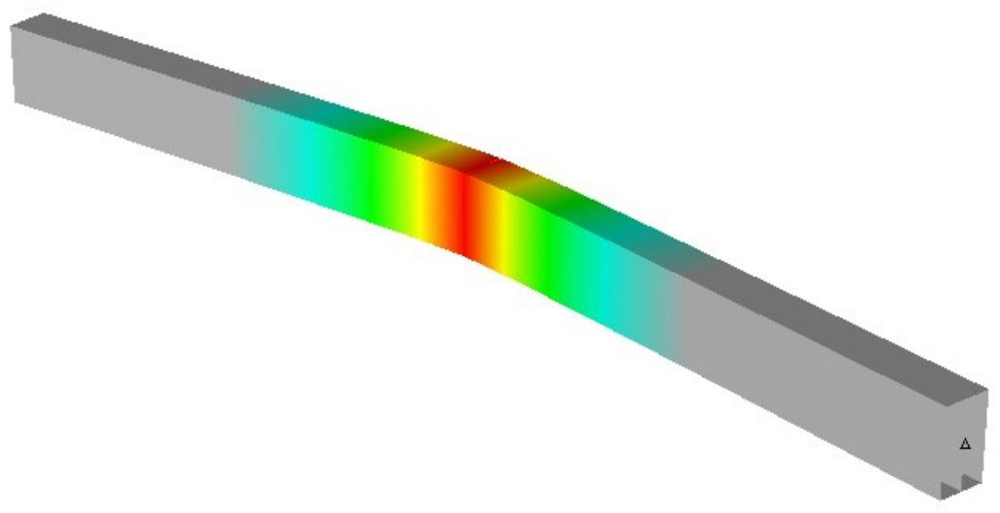

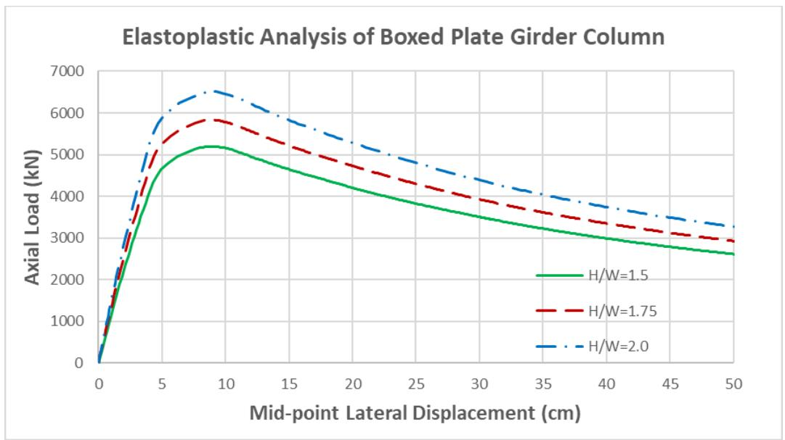  
Figure 107: Top: Plastic contour of Boxed Plate Girder, Bottom: Comparison of Boxed Plate Girder sections buckling

5.1.26 Sample 26: Unsymmetrical Plate Girder

The following benchmarks illustrate the ability of the Collapse Advanced to predict the buckling load (both flexural and torsional buckling) of beams and columns with Unsymmetrical Plate Girder. The samples are 1) a simple elastic beam subjected to the pure bending to model lateral-torsional buckling of Unsymmetrical Plate Girder and 2) a simple column under the axial compression load to model elastoplastic flexural buckling.

5.1.26.1 Sample 26.1: Elastic lateral-torsional buckling of simply supported Unsymmetrical Plate Girder

This sample involves elastic lateral-torsional buckling of a simply supported Unsymmetrical Plate Girder subjected to the pure bending as shown in Figure 108. The beam is restrained against torsion at both ends and the material properties are set to SACS default values. The model consists of two elements with eight sub-segments per member and all members are set to remain elastic by entering ‘ME’ in the CLPOPT line. To induce lateral-torsional buckling, an imperfection in the form of small lateral dislocation was applied to the mid-point representing lateral loads. The beam experiences large lateral deformation during bucking. Therefore, both sub- incrementation and arc-length options are included in the analysis by entering ‘SI’ and ‘AL’ on the CLPOPT input line. Also, the analysis has been carried out with and without Wagner strain (‘IWT’ on CLPOP2 line).

The simulation is carried out for the following section height to top width ratios: 1.50, 1.75, and 2.00. The resulting buckling bending moments are compared with the analytical solution derived from [19] and Figure 109 shows they are in good agreement with the analytical solution.

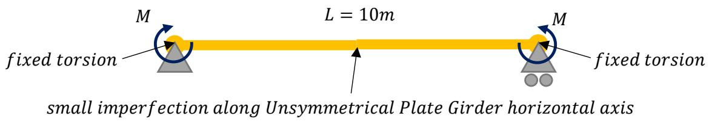

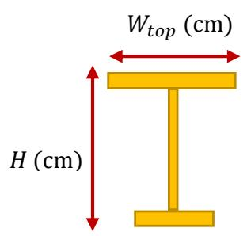

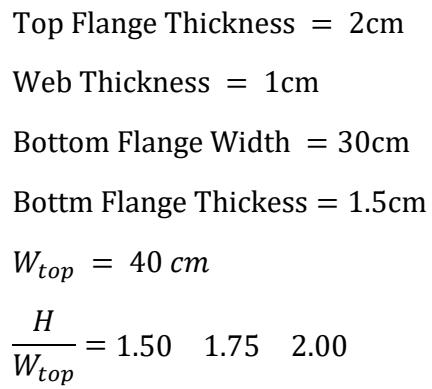  
Figure 108: Simple beam subjected to the pure bending

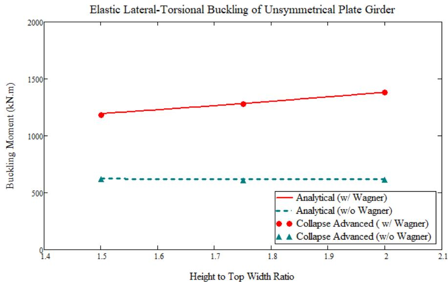  
Figure 109: Collapse Advanced buckling moment for Unsymmetrical Plate Girder versus the analytical solution [19]

5.1.26.2 Sample 26.2: Elastoplastic flexural buckling of a simple column with Unsymmetrical Plate Girder

This benchmark focuses on elastoplastic flexural buckling analysis of members with Unsymmetrical Plate Girder under compression load. Figure 110 illustrates a simply supported column subjected to axial compression load at one end. The column is restrained against torsion at both ends and has a small imperfection in the form of mid-point perturbation as a lateral dislocation. The mid-point lateral dislocation is $1 / 10^{ \mathrm{ t h } }$ of the Unsymmetrical Plate Girder radius of gyration about the local z-axis. The model consists of two elements with eight sub-segments per member and the material properties are set to SACS default values. Both sub-incrementation option (‘SI’ on the CLPOPT) and arc-length method (‘AL’ on the CLPOPT) are utilized for this benchmark.

The analysis is carried out for the following section height to top width ratios: 1.50, 1.75, and 2.00, and results are presented in Figure 111 and Figure 112. Figure 111 illustrates the lateral response of the columns with different Unsymmetrical Plate Girder. Figure 112 compares buckling loads – the peak load for mid-point deflection curves in Figure 111 – with ultimate load provided in Section E of AISC 360-16 Specification.

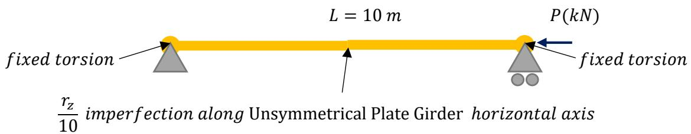

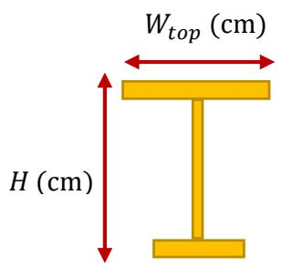

Top Flange Thickness = 2cm

Web Thickness = 1cm

Bottom Flange Width = 30cm

Bottm Flange Thickess = 1.5cm

$$W_{t o p} = 40 c m$$

$$\frac{H}{W_{t o p}} = 1. 50 \quad 1. 75 \quad 2. 00$$

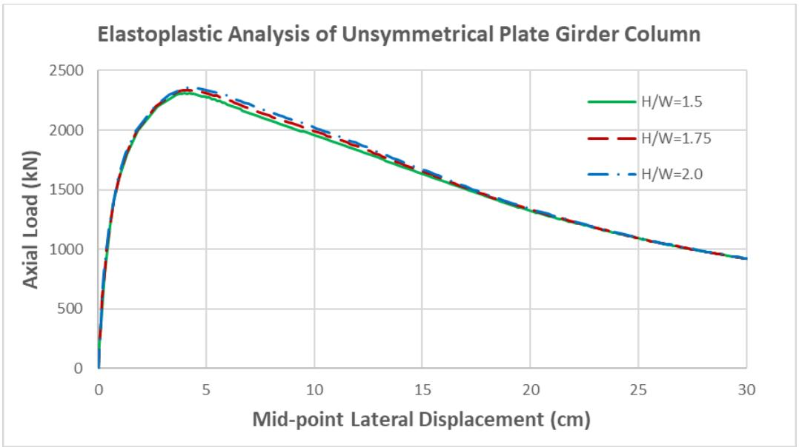  
Figure 110: Simple columns with Unsymmetrical Plate Girder   
Figure 111: Lateral displacement of the mid-point for various height to width ratio

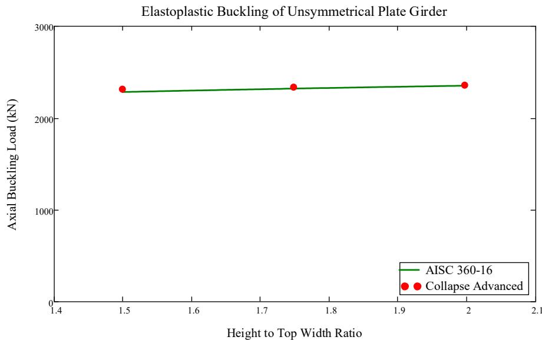  
Figure 112: Comparison of elastoplastic buckling load with AISC 360-16

5.1.27 Sample 27: Double Angle

This benchmark focuses on elastoplastic flexural buckling analysis of members with Double Angle under compression load. Figure 113 illustrates a simply supported column subjected to axial compression load at one end. The column is restrained against torsion at both ends and has a small imperfection in the form of mid-point perturbation as a vertical dislocation. The mid-point lateral dislocation is $1 / 10^{ \mathrm{ t h } }$ of the Double Angle radius of gyration about the local y-axis. The model consists of two elements with eight sub-segments per member and the material properties are set to SACS default values. Both subincrementation option (‘SI’ on the CLPOPT) and arc-length method (‘AL’ on the CLPOPT) are utilized for this benchmark.

The analysis is carried out for the following section height to width ratios: 1.0, 1.5, and 2.0, and results are presented in Figure 114 and Figure 115. Figure 114 illustrates the vertical response of the columns with different Double Angle sections. Figure 115 compares buckling loads – the peak load for mid-point deflection curves in Figure 114 – with ultimate load provided in Section E of AISC 360-16 Specification.

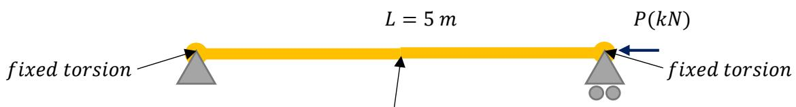

$\frac{ r_{ z } } { 10 }$ ???????????????????????? ?????????? Double Angle ???????????????? ????????

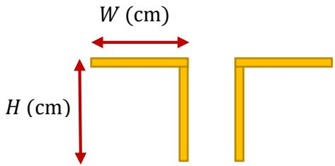

$$t = 1 \mathrm{c m}$$

$$\text{S p a c i n g} = 5 \mathrm{c m}$$

$$W = 10 c m$$

$$\frac{H}{W} = 1. 0 \quad 1. 5 \quad 2. 0$$

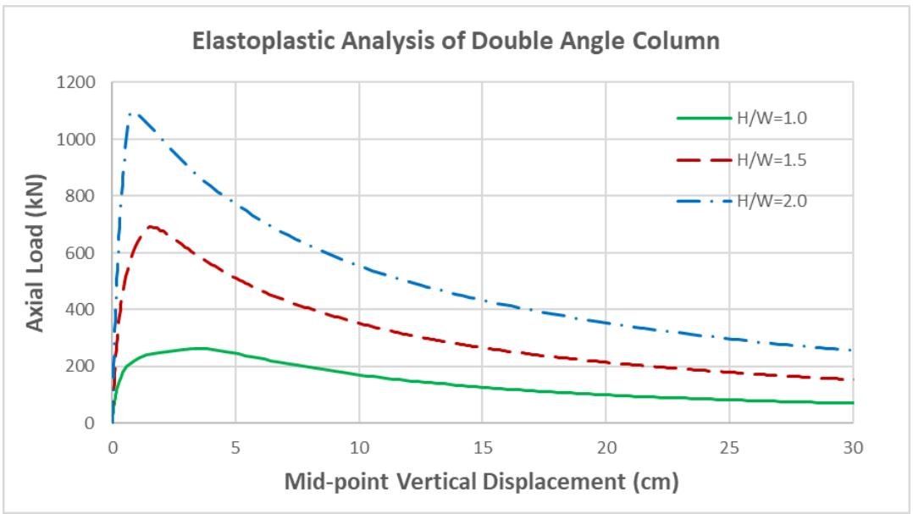  
Figure 113: Simple columns with Double Angle section   
Figure 114: Vertical displacement of the mid-point for various height to width ratio

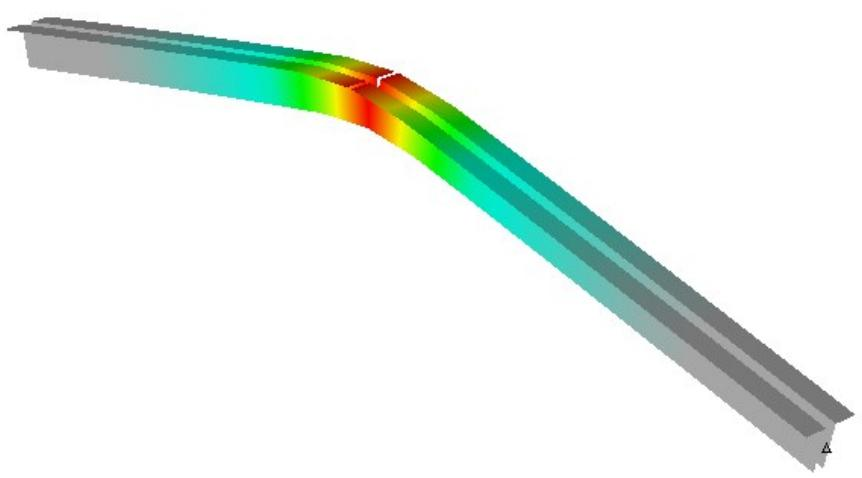

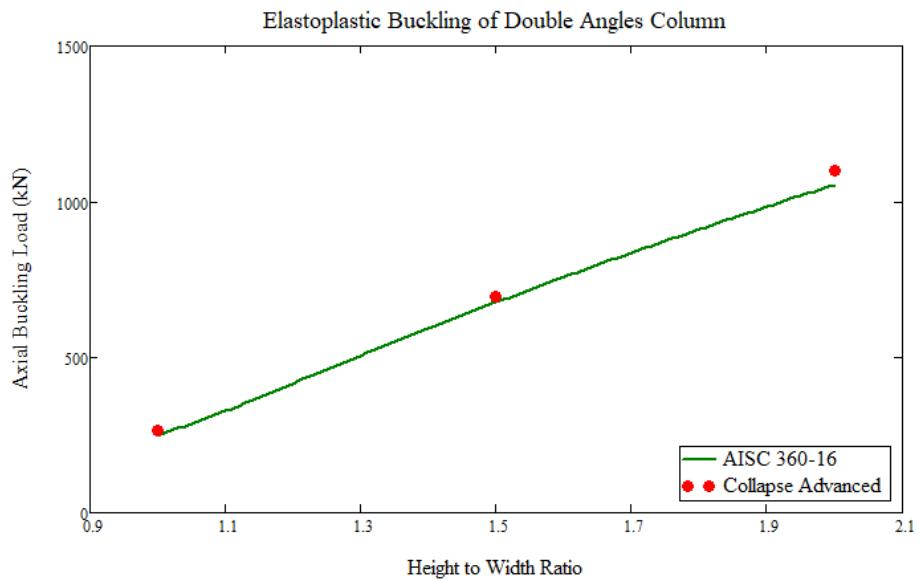  
Figure 115: Top: Plastic contour of Double Angle section, Bottom: Comparison of elastoplastic buckling load with AISC 360-16

## 5.2 Plate Element Benchmarks and Samples

5.2.1 Sample 1: Elastic Restrained Beam Subjected to Uniform Load

Figure 116 shows a simply-supported beam, axially restrained at both ends, subjected to a uniformly distributed load. The beam is modeled using plate elements. All plate elements are assumed to remain elastic by selecting option ‘PE’ on the CLPOPT line. Two models were considered 1) The beam was modeled using 16 quadrilateral plate elements 2) the beam was modeled using 2x16 triangular plate elements. In addition, the beam was analyzed using both thin (Kirchhoff) and thick (Mindlin) plate bending theories. The displacement of the beam mid-point was compared with the existing analytical solution [10] and is in good agreement as seen in Figure 117 and Figure 118. The sub-incrementation option was selected to reduce the total number of load increments.

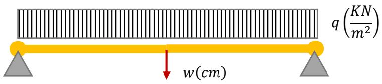

$$E = 20000 \frac{K N}{c m^{2}}, \nu = 0. 0, L = 10 m, w i d t h = 1 m, T h i c k n e s s = 1 c m$$

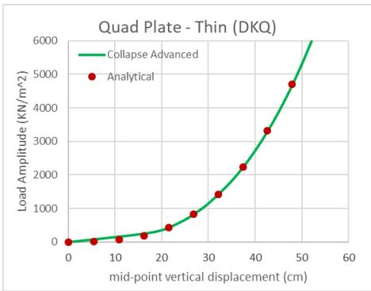  
Figure 116: Restrained beam with plates

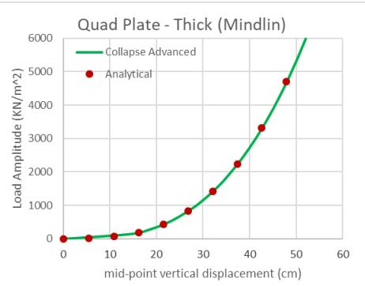

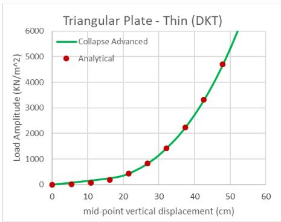  
Figure 117: Restrained beam mid-point vertical displacement with quadrilateral elements

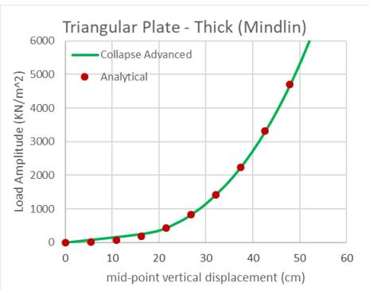  
Figure 118: Restrained beam mid-point vertical displacement with triangular elements

5.2.2 Sample 2: Elastic Cantilever Beam

This benchmark looks at an elastic cantilever beam subjected to three different end loads: 1) an axial load with a small lateral load to produce buckling, 2) lateral load, and 3) bending end moment. Details of each case are presented in the following sections.

5.2.2.1 Sample 2.1: End Axial Force

Figure 119 shows a cantilever beam subject to an axial end load and a small lateral load to induce buckling. The beam was modeled using plate elements. Two models were considered 1) Using 8 quadrilateral plate elements. 2) Using 2x8 triangular elements. The beam model was analyzed using both Kirchhoff and Mindlin bending theories. Both Arc-length and sub-incrementation methods were used to help predict buckling. In addition, small load steps were used to capture the buckling mode accurately. The results predicted for the beam tip axial and lateral displacements were compared against the existing finite element solution [30] and are seen to be in very good agreement as shown in Figure 121. The results also show that the program is able to predict very large deformations for load step 50 and the final load step as shown in Figure 121.

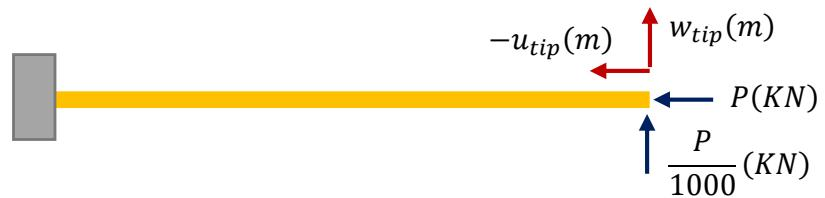

$$E = 20000 \frac{K N}{c m^{2}}, \nu = 0. 3, L = 0. 5 m, w i d t h = 7. 5 c m, T h i c k n e s s = 0. 45 c m$$

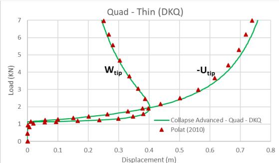  
Figure 119: Cantilever beam with axial load

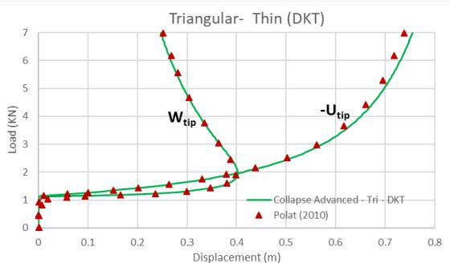

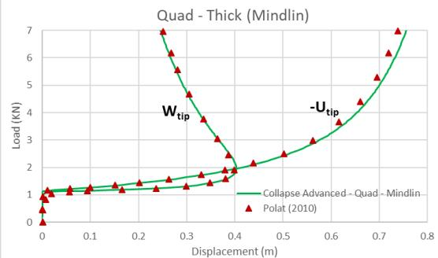

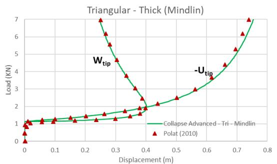  
Figure 120: Cantilever beam tip displacement under axial load buckling

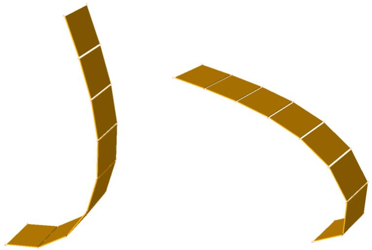  
Figure 121: Deformed cantilever beam at load step 50 (left) and the final load step (right)

5.2.2.2 Sample 2.2: End Lateral Force

Figure 122 shows a cantilever beam with an applied lateral load. The cantilever beam was modeled using plate elements. Two models were considered: 1) Using 16 quadrilateral plate elements. 2) Using 2x16 triangular plate elements. The analysis was conducted using both Kirchhoff and Mindlin bending theories. Both sub-incrementation or Arc-length options were not required in this case since buckling behavior is not involved and the target load factor can be achieved using standard iterations. The results predicted for the beam tip lateral and axial displacement are compared against the existing analytical solution [14] and are in good agreement as shown in Figure 123.

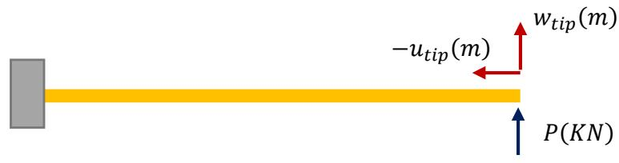  
Figure 122: Cantilever beam with axial load

$$E = 120 \frac{K N}{c m^{2}}, \nu = 0. 0, L = 10 m, w i d t h = 1 m, T h i c k n e s s = 10 c m$$

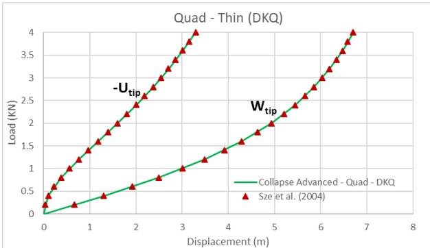

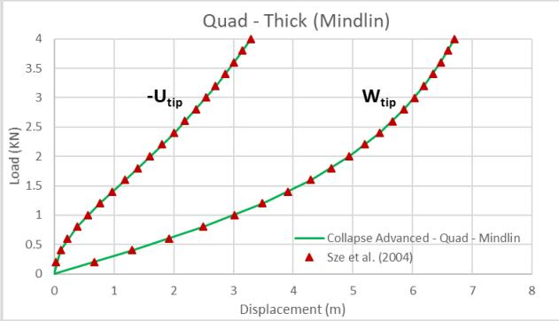

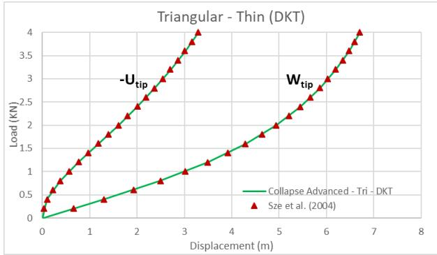

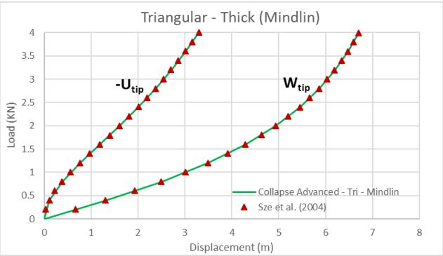  
Figure 123: Cantilever beam tip displacement under lateral load

5.2.2.3 Sample 2.3: End Bending Moment

Figure 124 shows a cantilever beam subject to an applied end moment. The beam is modeled using plate elements. The beam tip (i.e. location of the applied moment) is laterally restrained to prevent lateral buckling. Two models were considered: 1) Using 16 quadrilateral plate elements. 2) Using 2x16 triangular plate elements. The analysis was conducted using both Kirchhoff and Mindlin bending theories. To help improve convergence, the sub-incrementation option was used. The results predicted by the program were compared against the existing analytical solution [14] for the beam tip displacement as shown in Figure 125. Figure 126 shows beam deformation for peak vertical displacement, the peak of horizontal displacement, and the final load step.

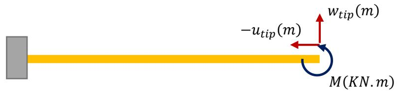  
Figure 124: Cantilever beam with an end moment

$$E = 120 \frac{K N}{c m^{2}}, \nu = 0. 0, L = 12 m, w i d t h = 1 m, T h i c k n e s s = 10 c m$$

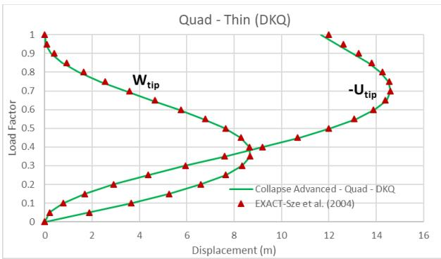

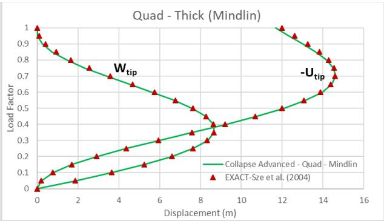

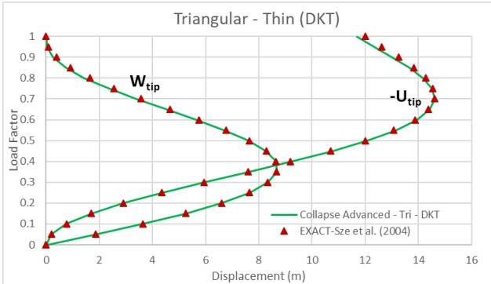

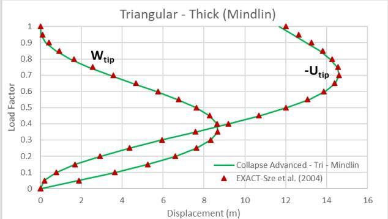  
Figure 125: Cantilever beam tip displacement with an end moment

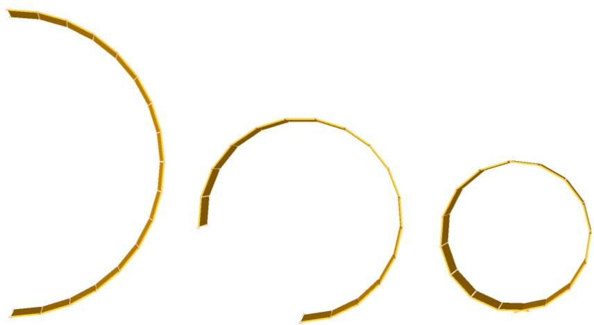  
Figure 126: Deformed cantilever beam. Left) at the peak vertical displacement, Center) at the peak horizontal displacement, and Right) at the last step.

5.2.3 Sample 3: Elastic Clamped Hinged Deep Arc

Figure 127 shows a model of an arc with clamped and hinged end conditions. The arc is modeled using plate elements and is subjected to a point load at the apex. The model is restrained against out-of-plane movement to prevent lateral buckling. Two models were considered: 1) Using 40 quadrilateral plate elements. 2) Using 2x40 triangular plate elements. Since this test involves buckling, both subincrementation and Arc-length methods were used by selecting ‘SI’ and $\mathbf{ \acute{ A L } }^{ \prime }$ options on the CLPOPT input line. In addition, all plates were assumed to remain elastic by entering option $\mathcal{ \prime }_{ \sf P E^{ \prime } }$ on the CLPOPT input line. The arc apex displacement is compared against two existing finite element solutions [31, 32] as shown in Figure 128. Figure 129 shows the buckled deformation of the model.

Figure 127: Elastic clamped hinged deep arc   
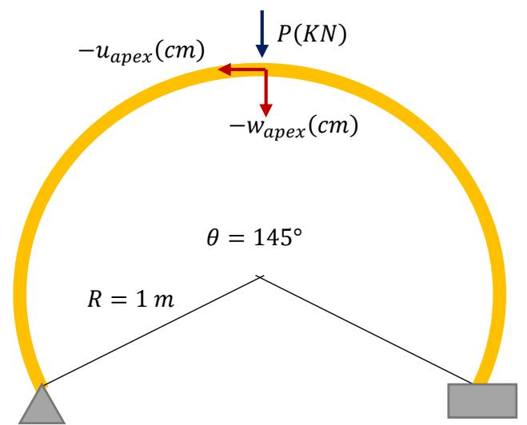  
$E = 500000 \frac{ K N } { c m^{ 2 } } , \nu = 0 . 0 , w i d t h = 24 c m , T h i c k n e s s = 1 c m$ 0 ????????2 , ?? = 0.0 , ????????ℎ = 24 ????, ??ℎ?????????????? = 1 ????

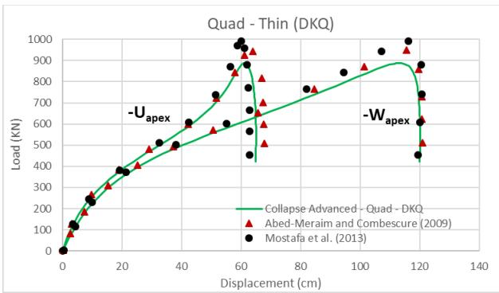

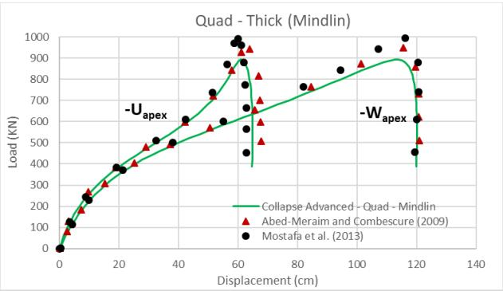

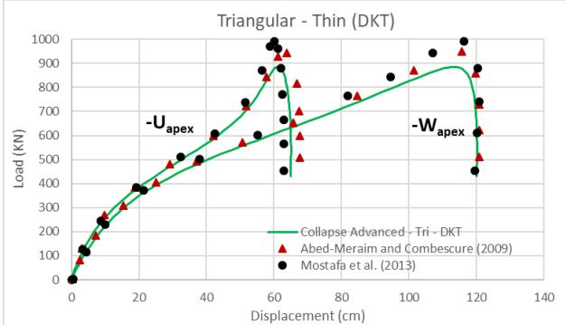

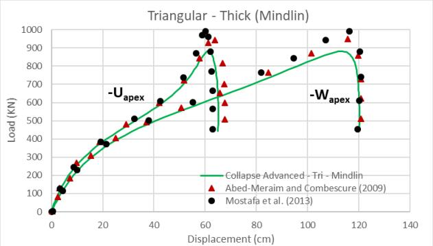  
Figure 128: Arc apex displacement

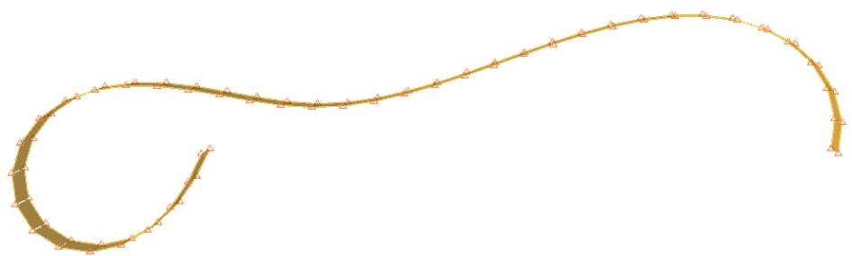  
Figure 129: large deformation of elastic clamped hinged deep arc

5.2.4 Sample 4: Elastic Slit Ring Shape Plate with Lifting Line Load

Figure 130 shows an elastic ring with a slit. The ring was modeled using 180 (6x30) quadrilateral plate elements where one end is clamped and the other end is being lifted by a line load. The subincrementation method was used to improved convergence rate – especially at the earlier stages where there is a significant deformation. The analysis was conducted using both Kirchhoff and Mindlin bending theories. Vertical displacement of the free end (inner point A and outer point B) are compared with existing finite element results [14, 32] as sown in Figure 131. The large deformation of the model is shown in Figure 132.

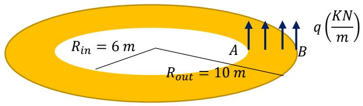

$$E = 2100 \frac{K N}{c m^{2}}, \nu = 0. 0, T h i c k n e s s = 3 c m$$

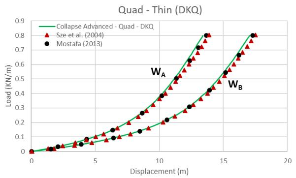  
Figure 130: Slit ring shape plate with lifting line load

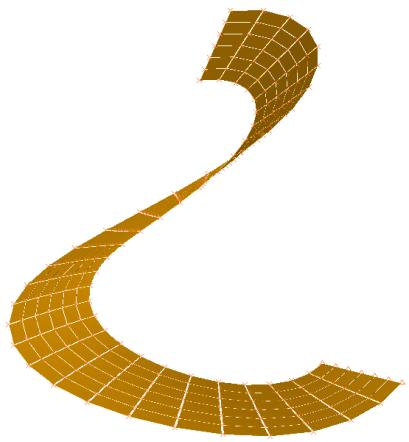  
Figure 131: Slit ring shape plate free end displacement.   
Figure 132: large deformation of elastic slit ring shape plate

5.2.5 Sample 5: Elastic Hemispherical Shell

Figure 133 shows a hemispherical shell with a circular cut at an angle of $\boldsymbol{ 18^{ \circ } }$ . The shell is modeled using 16x16 plate mesh and is subjected to inward and outward radial point loads. Due to the symmetry of the model and the loading, only a quarter of the shell was modeled and analyzed by applying appropriate boundary conditions at lines of symmetry and applying half of the load. Kirchhoff (thin) bending theory was used for the analysis. The load was applied over 50 increments and subincrementation or Arc-length methods were included for this benchmark. The radial displacement of the shell at two points A and B were compared against existing finite element results [14] as shown in Figure 134. It can be seen there is very good agreement between the two sets of results.

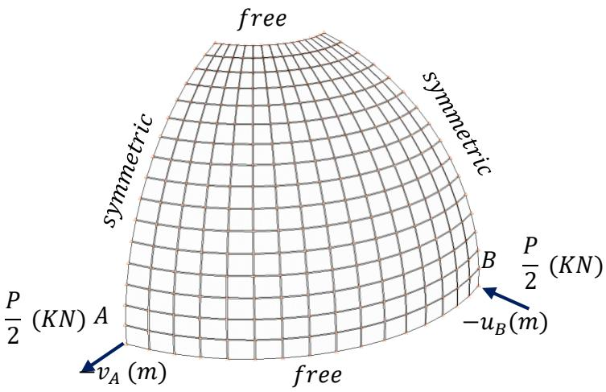

$$E = 6825 \frac{K N}{c m^{2}}, \nu = 0. 3 R = 10 m,., T h i c k n e s s = 4 c m$$

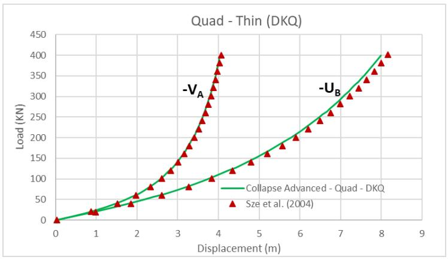  
Figure 133: Elastic hemispherical shell   
Figure 134: Elastic hemispherical shell radial displacement

5.2.6 Sample 6: Elastic Hinged Cylindrical Roof

Figure 135 shows a model of a shallow cylindrical roof with two hinged sides subjected to a point load P at the center. Due to the symmetry of the structure and boundary conditions, only one quarter of the structure is modeled with an applied load o f ??4 . Four separate models were analyzed using 16×16 mesh $\frac{ P } { 4 }$ of quadrilateral elements, 16×16×2 of triangular plate element mesh, and two plate thickness values of 12.7mm and 6.35mm.

The analysis was conducted using both Kirchhoff and Mindlin bending theories. The Arc-length method was selected on the CLPOPT input line to predict the post-buckling response and the sub-incrementation method was not used for this benchmark to improve convergence. Since the sub-incrementation option is not selected, a non-convergence warning message will be reported near buckling indicating the program has switched to the Arc-length solver. To improve post-buckling results, the automatically calculated arc-length parameter is also reduced by a factor of 0.5 on the ARCLEN input line. The results from the program for the roof center vertical displacement were compared with existing finite element analysis [14] as shown in Figure 70 and Figure 80.

Results from the models with a plate thickness of 12.7 show standard elastic snap-through buckling response where the model starts to gain stiffness with increasing the displacement during post-buckling as shown in Figure 136.

Results from the models with a plate thickness of 6.35 mm show snap-back buckling with decreasing displacement for a portion of the post-buckling response as shown in Figure 137.

It can be seen there is very good agreement with existing analytical results for all cases.

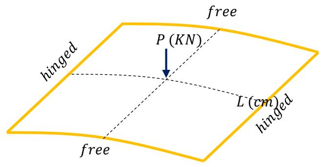

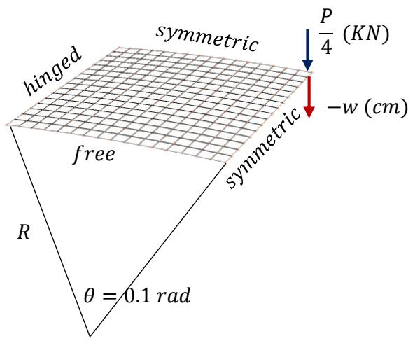  
Figure 135: Elastic Hinged Cylindrical Roof

$$E = 310. 275 \frac{K N}{c m^{2}}, \nu = 0. 3, R = 2. 54 m, L = 50. 8 c m$$

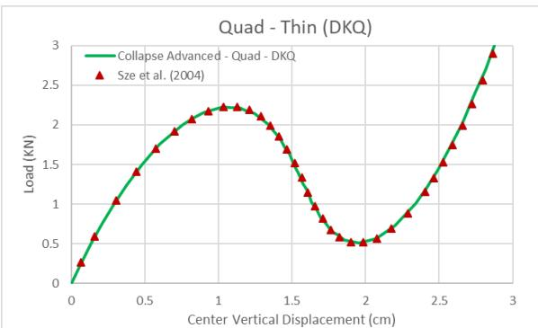

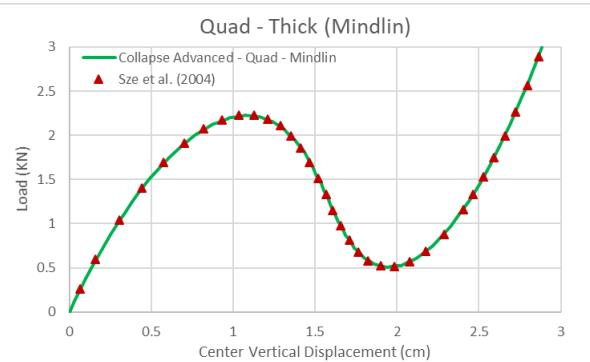

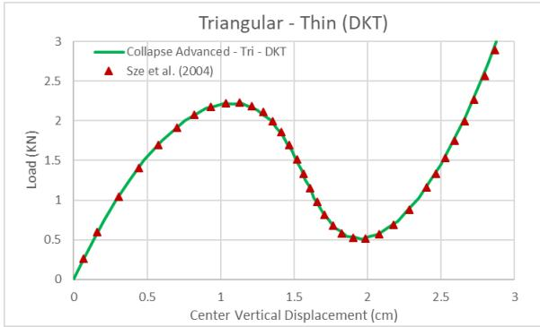

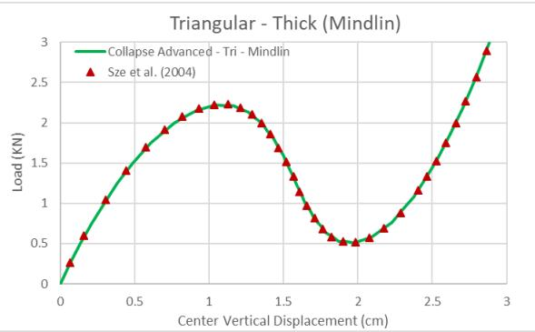

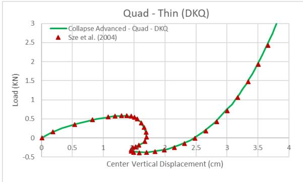  
Figure 136: Vertical displacement at the center of the hinged cylindrical roof, plate thickness: 12.7 mm

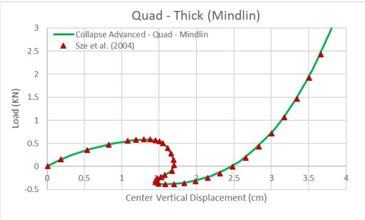

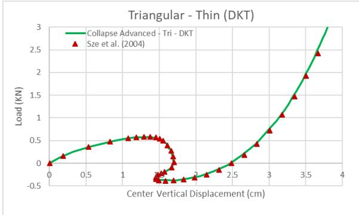

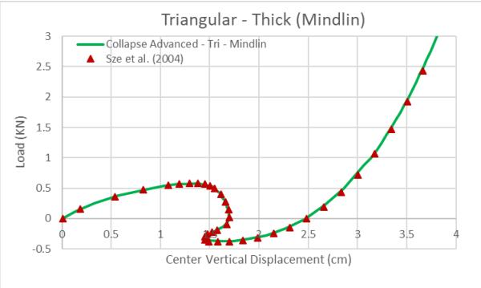  
Figure 137: Vertical displacement at the center of the hinged cylindrical roof, plate thickness: 6.35 mm

5.2.7 Sample 7: Elastic Semi-Cylindrical Shell Subjected to Vertical Point Load

Figure 138 shows a semi-cylindrical elastic shell where one curved end is clamped and the other end is free. The longitudinal ends of the shell are simply supported. The shell model is subjected to a vertical point load P at the apex. Due to symmetry, only half of the shell is modeled. Two models of the cylindrical shell were considered: 1) Using 32×32 quadrilateral element mesh. 2) Using 32×32×2 triangular element mesh. For this benchmark, the Arc-length and sub-incrementation methods were not used. The load was applied over 40 steps with a maximum number of iterations of 20. The analysis was conducted using both thin plate (Kirchhoff) and thick plate (Mindlin) theories. The results from Collapse Advanced for the vertical displacement at cylinder apex are compared with existing finite element results [14] as shown in Figure 140. It can be seen there is very good agreement between the two sets of results for all cases. Figure 139 shows the deformation of the shell at load steps 10, 20, and 40.

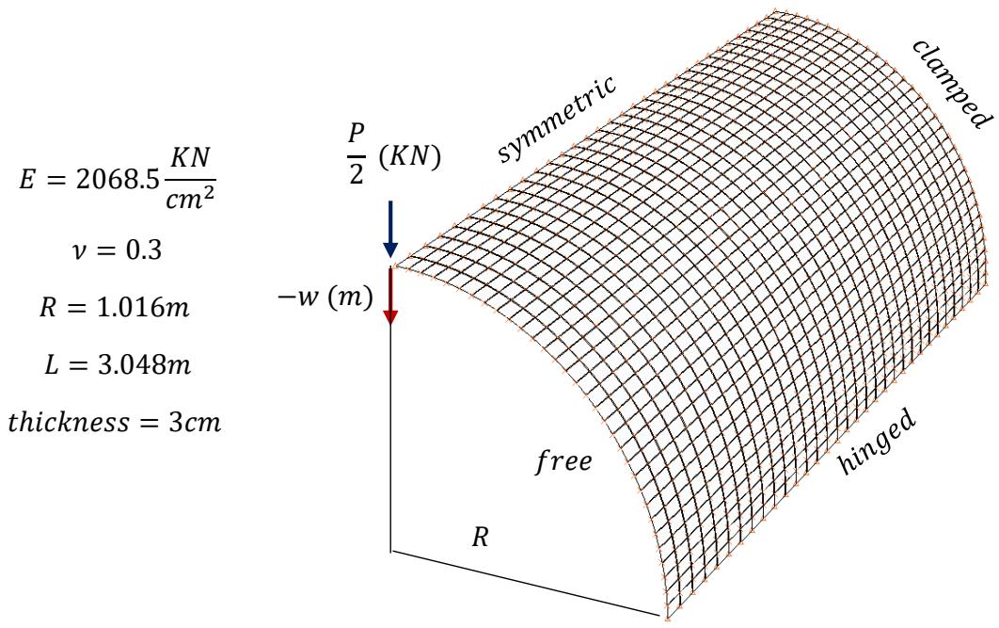

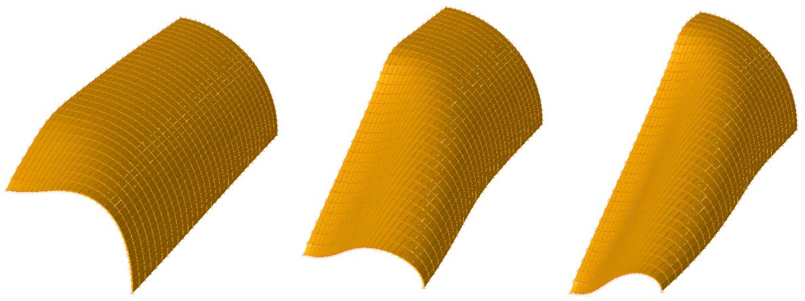  
Figure 138: Elastic semi-cylindrical shell subjected to end pinching force   
Figure 139: Semi-cylindrical deformed model at load step 10 (left), 20 (center), 40 (right)

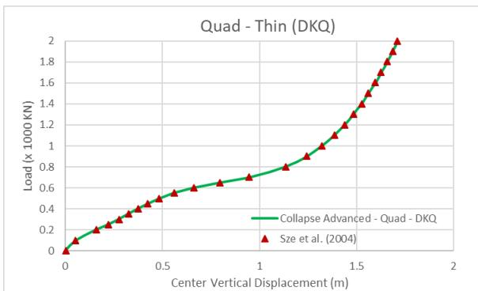

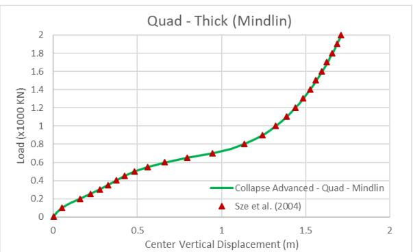

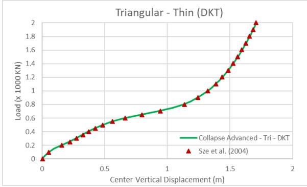

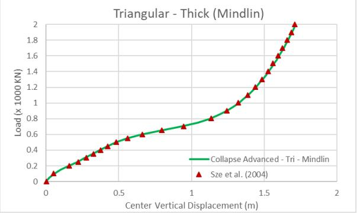  
Figure 140: Vertical displacement of semi-cylindrical apex

5.2.8 Sample 8: Elastic Open-ended Cylindrical Shell with Radial Pulling Forces

Figure 141 shows an elastic open-ended cylindrical shell subjected to radial pulling forces. The shell is modeled using a 24×16 quadrilateral element mesh. Due to symmetry, only one $1 / 8^{ \mathrm{ t h } }$ of the cylinder is modeled. The analysis was conducted using both thin plate (Kirchhoff) and thick plate (Mindlin) theories. This sub-incrementation method was used to improve convergence during the rapid change of shell deformation. The rapid change of deformation can be seen at the first load increment where a non-convergence warning message is reported and the program commences the sub-incrementation procedure. The resulting deflections predicted by the program at various locations on the shell are compared against existing analysis results [14] as shown in Figure 142. It can be seen there is excellent agreement between the two sets of results for all cases. Figure 143 shows the deformation of the shell structure at various load steps.

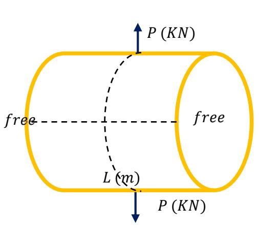

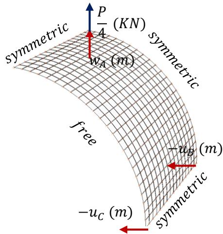

$$E = 1050 \frac{K N}{c m^{2}}, \nu = 0. 3125, R = 4. 953 m, L = 10. 35 m, t h i c k n e s s = 9. 4 c m$$

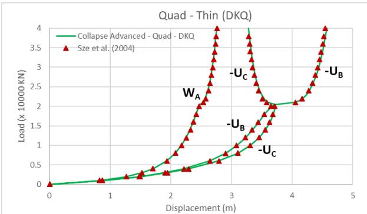  
Figure 141: Elastic open-ended cylindrical shell subjected to radial pulling forces

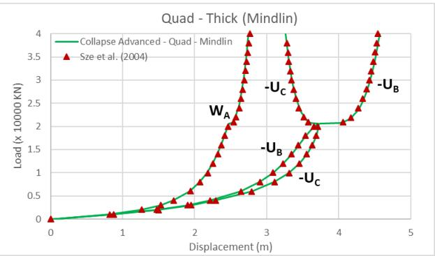  
Figure 142: Displacement of cylindrical shell with radial pulling forces

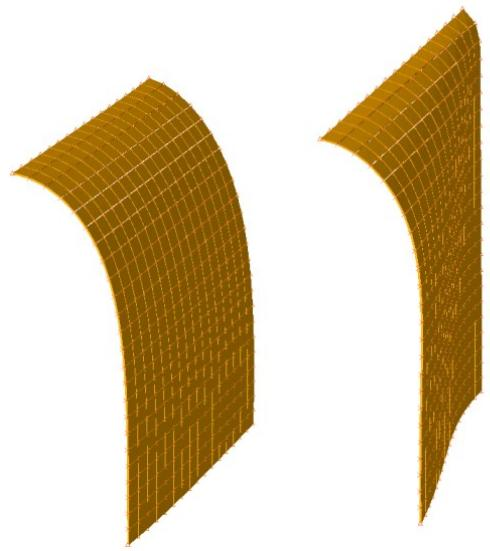  
Figure 143: Deformation of open-ended cylindrical shell

5.2.9 Sample 9: Elastic Pinched Cylindrical Shell with Rigid End Diaphragms

Figure 144 shows an elastic cylindrical shell subjected to a pinching load. The cylinder has rigid diaphragms at both ends which prevent any in-plane deformation. Due to symmetry, only $1 / 8^{ \mathrm{ t h } }$ of the shell is modeled. Two models were considered: 1) Using 60×20 for quadrilateral element mesh. 2) Using 60×20×4 triangular plate element mesh. The analysis was conducted using both thin plate (Kirchhoff) and thick plate (Mindlin) theories. The maximum number of iterations was set to 40 and the subincrementation approach was used is to improve the convergence rate. The results predicted by the program for the radial displacements of the shell mid-points were compared with existing analytical results [14] as shown in Figure 145. It can be seen there is an excellent correlation between the two sets of results.

Figure 146 shows the effect of mesh refinement on geometrical locking (sharp deformed edges) due to large deformations

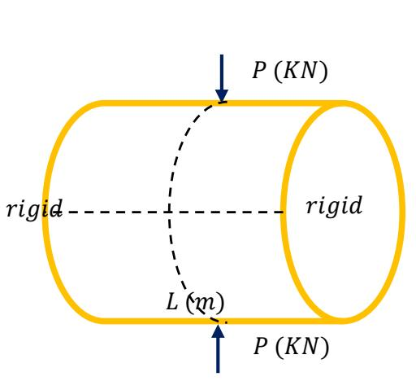

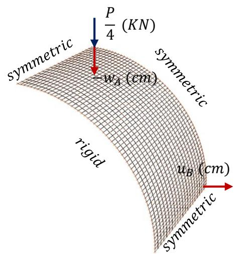

$$E = 30000 \frac{K N}{c m^{2}}, \nu = 0. 3 R = 1 m, L = 2 m, t h i c k n e s s = 1 c m$$

Figure 144: Elastic pinched cylindrical shell with rigid end diaphragms

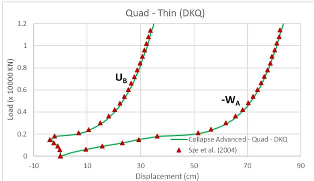

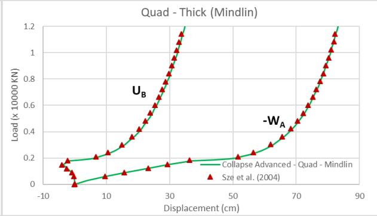

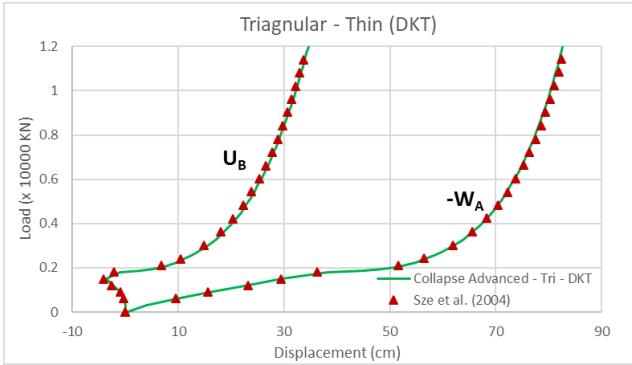

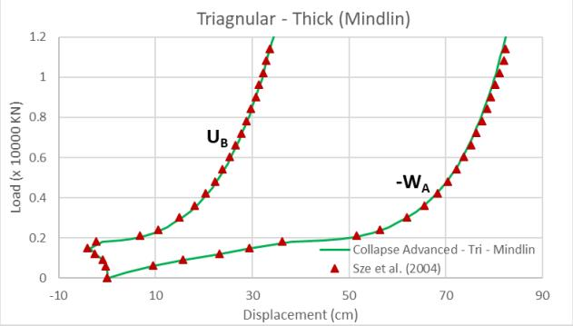  
Figure 145: Displacement of elastic pinched cylindrical with rigid end diaphragms

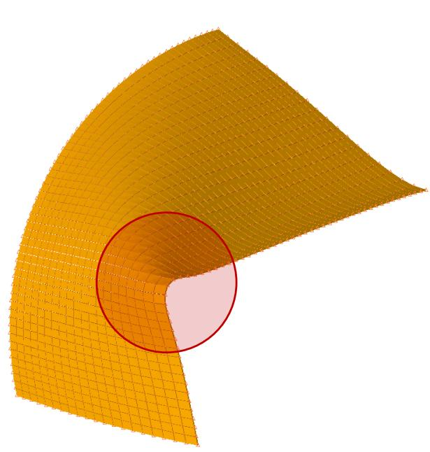

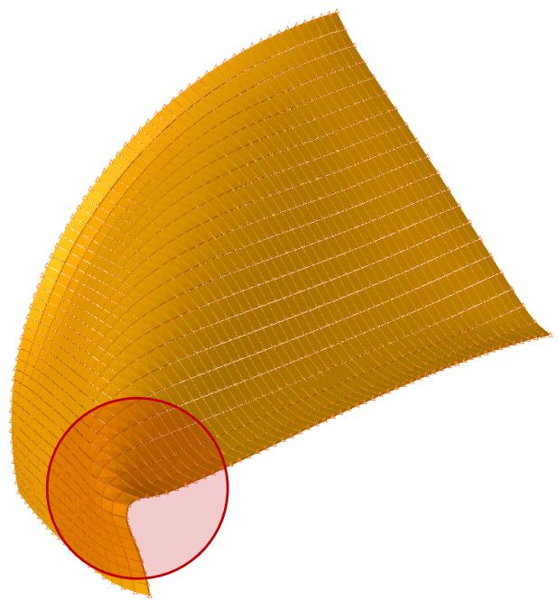  
Figure 146: Deformed pinched cylindrical with rigid end diaphragms. The geometric lock is marked with a red circle.

5.2.10 Sample 10: Elastoplastic Cantilever Beam

Figure 147 shows a cantilever beam subjected to a lateral point load at the free end. The beam is modeled using plate elements. Two models are considered for this analysis: 1) Using 10 quadrilateral plate elements. 2) Using 10×2 triangular plate elements. The elastoplastic material properties were assumed as shown in Figure 147. The analysis was conducted using both thin plate (Kirchhoff) and thick plate (Mindlin) theories. The applied load was gradually increased until the beam tip vertical displacement reached 2.5 m. The arc-length method was not used for this benchmark since buckling is not involved in this case. The predicted vertical displacement from the program was compared against existing finite element results [33] as shown in Figure 148.

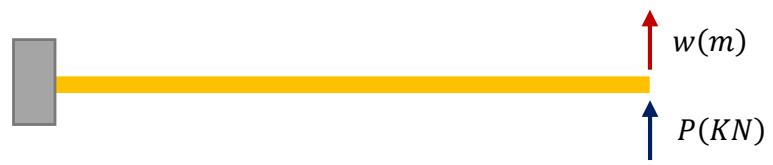

$$E = 120 \frac{K N}{c m^{2}}, E = 2. 4 \frac{K N}{c m^{2}}, \nu = 0. 3, s t r a i n h a r d e n i n g r a t i o = 0. 01$$

$$L = 10 m, \text{w i d t h} = 1 m, \text{T h i c k n e s s} = 10 c m$$

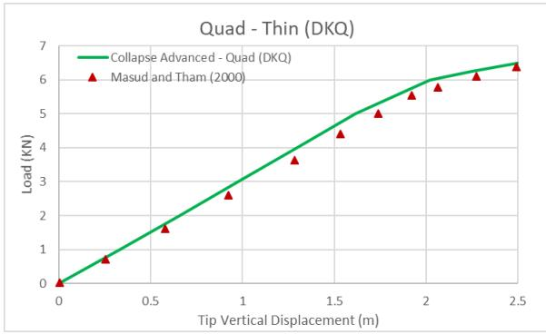  
Figure 147: Elastoplastic cantilever beam with an end moment

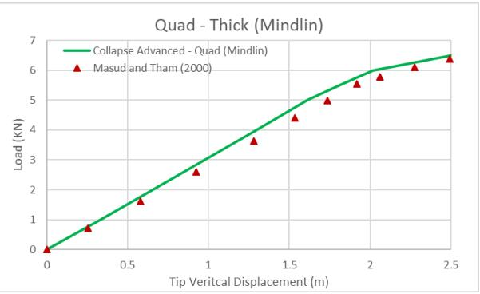

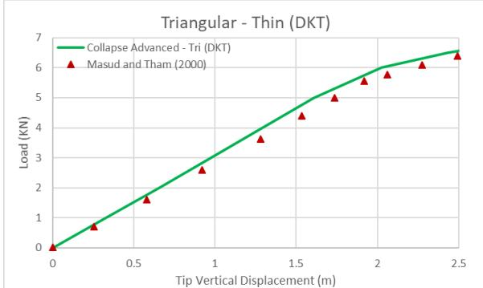

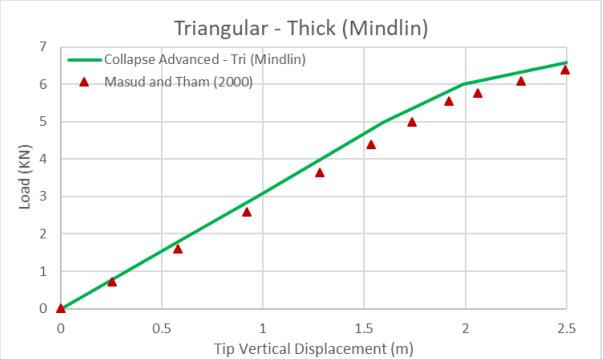  
Figure 148: Elastoplastic cantilever end displacement

5.2.11 Sample 11: Elastoplastic Simply-supported Plate under uniform Pressure

Figure 149 shows a simply supported rectangular plate without restraints for in-plane displacement and rotation, subjected to uniform pressure. Due to symmetry, only a quarter of the plate was analyzed using 24x24 quadrilateral plate elements. The analysis was conducted using both thin plate (Kirchhoff) and thick plate (Mindlin) theories. The results predicted by the program were compared against existing analytical results [34] as shown in Figure 150. Figure 151 also shows the plate deformation and plasticity ratio at load factors of 30 and 60. Due to the large deformations involved in this benchmark, the load factor was applied over 60 steps and the sub-incrementation method was used to help improve the convergence rate.

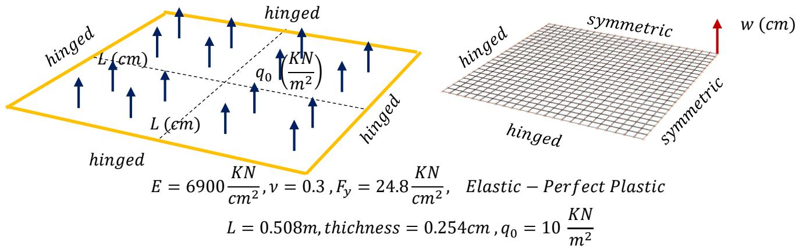

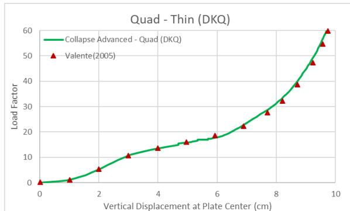  
Figure 149: Elastoplastic simply-supported plate with large transverse shear deformation

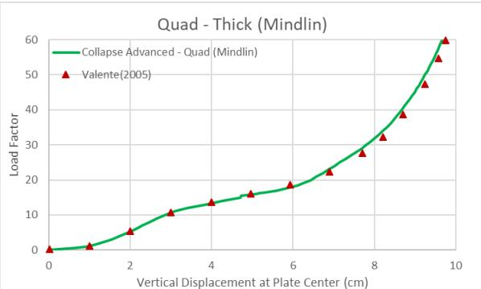  
Figure 150: Vertical displacement of elastoplastic simply-supported plate center

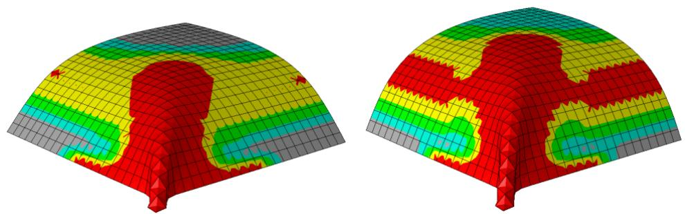  
Figure 151: The deformed shape of the elastoplastic simply-supported plate and plastic ratio contours. Left) at load factors 30, Right) at load factor 60

5.2.12 Sample 12: Elastoplastic Pinched Cylindrical Shell with Rigid End Diaphragms

Figure 152 shows an elastic cylindrical shell with rigid diaphragms at both ends which prevent in-plane deformation subjected to a pinching load. Due to symmetry, only $1 / 8^{ \mathrm{ t h } }$ of the shell was modeled, and because of geometric locking (as explained in Sample 9), a fine mesh of 60 quadrilateral elements around the circumference and 40 elements along the width of the cylinder was used. Because of the large deformations and elastoplastic behavior involved in this benchmark, the load was applied over 100 steps. To improve convergence and to predict local buckling, both sub-incrementation and Arc-length methods were selected on the CLPOPT input line. The analysis was conducted using both thin plate (Kirchhoff) and thick plate (Mindlin) theories. The vertical displacement of the cylinder center was compared against existing finite element analysis [35] as shown in Figure 153.

Figure 154 shows the deflected cylinder with plastic ratio contours at load factors of 0.2, 0.5, and 1.0.

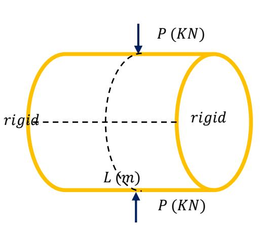

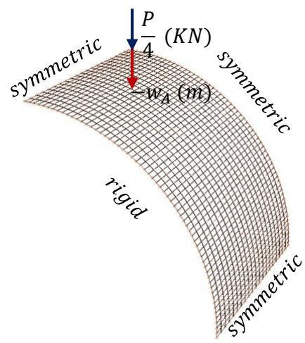

$$E = 3000 \frac{K N}{c m^{2}}, \nu = 0. 3, s t r a i n h a r d e n i n g r a t i o = 0. 0909 o r H = 300 \frac{K N}{c m^{2}}$$

$$R = 3 m, L = 6 m t h i c k n e s s = 3 c m$$

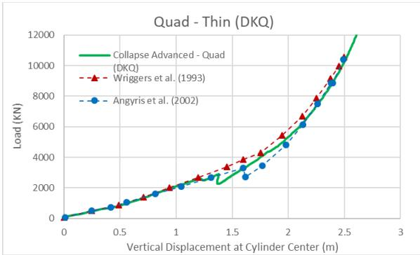  
Figure 152: Elastic pinched cylindrical shell with rigid end diaphragms

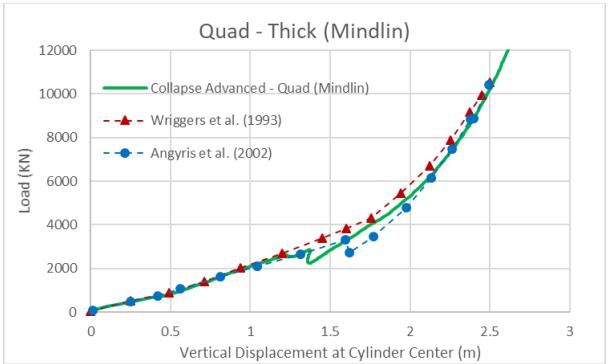  
Figure 153: Displacement of elastoplastic pinched cylindrical with rigid end diaphragms

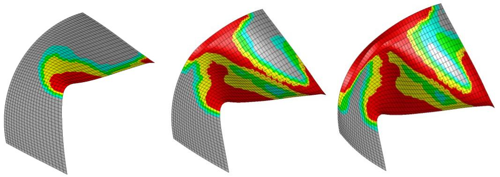  
Figure 154: Deformed elastoplastic pinched cylindrical with rigid end diaphragms. Left) load factor 0.2, Center) load factor 0.5 and Right) load factor 1.0

5.2.13 Sample 13: Elastoplastic Buckling of Cylindrical Roof

Figure 155 shows a model of a shallow cylindrical roof with two hinged sides subjected to a uniformly distributed load of $4 { \frac{ K N } { m^{ 2 } } } .$ ??2. Due to the symmetry of the structure and boundary conditions, only one quarter of the structure is modeled. The curved ends of the roof are supported by rigid diaphragms and the two longitudinal edges are assumed to be free. Two models were considered: 1) Using 20×20 quadrilateral elements. 2) Using 20×20×2 triangular elements. The applied vertical load was gradually increased and the Arc-length method was used to predict buckling. The analysis was conducted until the mid-point of the free edge reached a maximum vertical displacement of 200 cm. The results from the analysis were compared against existing finite element results [36] as shown in Figure 156.

Figure 157 shows the deflected configuration with plastic ratio contours at the peak load factor and the final load step.

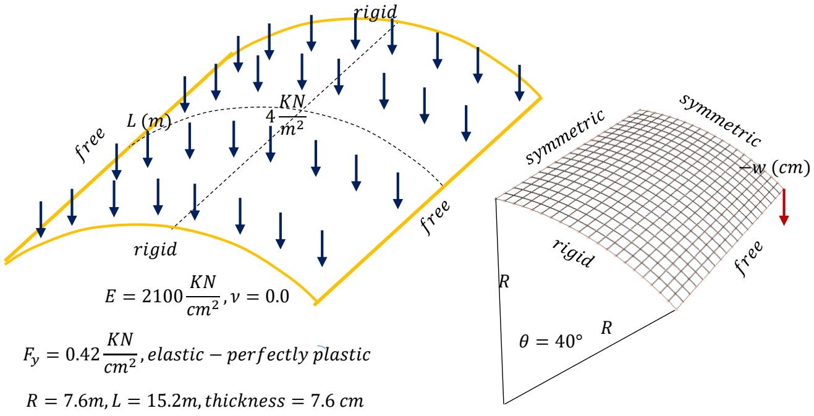  
Figure 155: Cylindrical Roof supported by rigid diaphragms

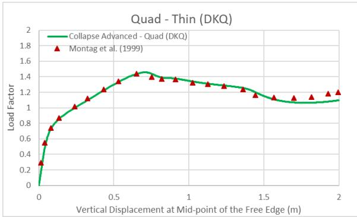

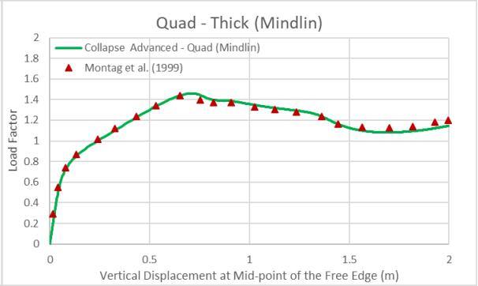

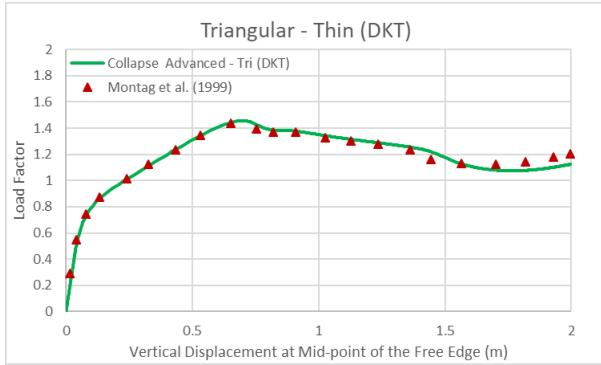

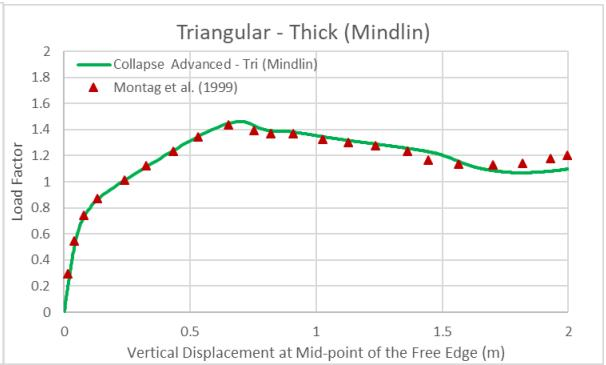

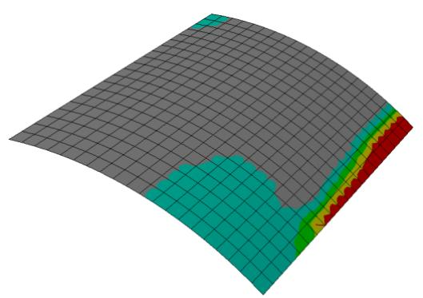  
Figure 156: Vertical Displacement at the free edge

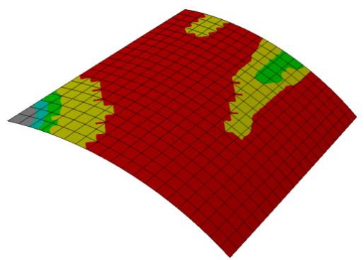

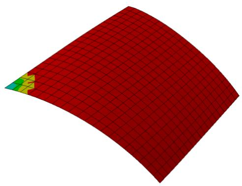

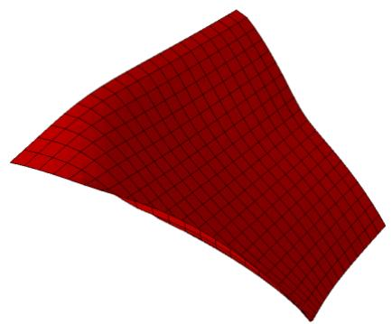  
Figure 157: Buckling of the cylindrical roof. Top-Left) load factor 0.5, Top-right) load factor 1.0, Bottomleft) maximum load factor, Bottom-right) final load step.

## 5.3 Joints

This section illustrates benchmarks for various joint calculations. The first section compares joint flexibility methods (including Fessler, Buitrago, and MSL) for T/Y joints. The results are compared with joints that have been meshed using triangular plate elements. The second and third set of samples compares the performance of the MSL joint calculations for X and K joints, respectively.

5.3.1 Sample 1: T and Y Joint Flexibility

Figure 158 illustrates three T/Y joints whose connection properties are summarized in Table 4. The joints are subjected to a compressive and tensile axial load at the brace end. In addition to the axial loads, two lateral loads are applied at the brace tip to produce in-plane and out-of-plane bending in the joints. The analyses are conducted using Fessler’s （$^{ \prime } \mathsf{ J } \mathsf{ F }^{ \prime }$ on the CLPOPT) and Buitrago’s （$^{ \prime } \mathsf{ B } \mathsf{ F }^{ \prime }$ on the CLPOPT) joint flexibility methods. For the MSL approach, both mean and characteristic levels （$^{ \prime } \mathsf{ M } \mathsf{ F^{ \prime } }$ and $\mathcal{ C } \mathsf{ F^{ \prime } }$ on MSLOPT) are considered. This sample focuses on the flexibility of T/Y joint types and joint strength is not considered. The material properties are set to the SACS default values and eight sub-segments per member are considered. Both arc-length (‘AL’ on the CLPOPT) and sub-incrementation (‘SI’ the CLPOPT) methods are implemented to improve results for large deformations.

Table 4: Properties of $\intercal / \gamma$ connections   

| Connection | θ | β | γ | τ |
| --- | --- | --- | --- | --- |
| Case 1 (T Joint) | 90° | 0.500 | 15.000 | 0.250 |
| Case 2 (Y Joint) | 55° | 0.400 | 16.667 | 0.667 |
| Case 3 (Y Joint) | 70° | 0.750 | 15.000 | 0.750 |

The results from the various joint flexibility approaches are compared against those obtained from joints that have been meshed using triangular plate elements as shown in Figure 158. It should be noted that a meshed joint provides an accurate representation of the joint by including the chord flexibility, chord plasticity, and large local deformations. The brace tip (in-plane and out-of-plane) displacements are compared with results obtained for meshed joints in Figure 159, Figure 160, and Figure 161. The results in Figure 159 show that all joint flexibility methods perform well for T joints, in particular for the case where the brace is in tension. For other cases, MSL joint flexibility gives better results than Fessler and Buitrago methods.

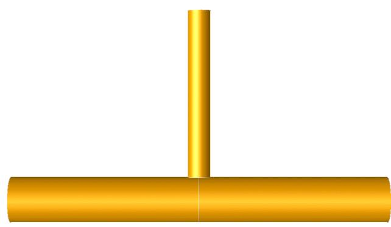

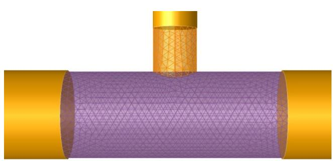

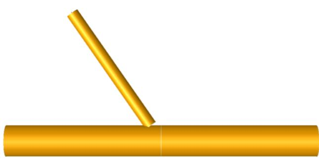  
Case 1: T Joint

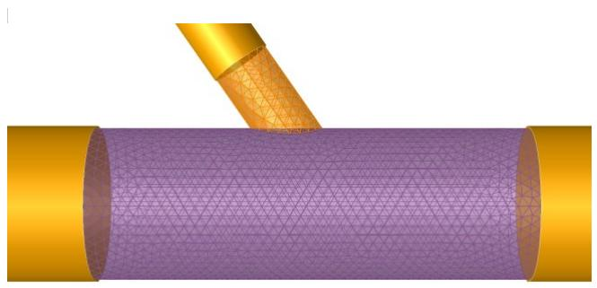

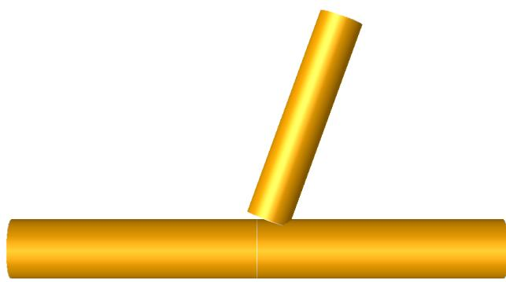  
Case 2: $55^{ \circ } \Upsilon$ Joint

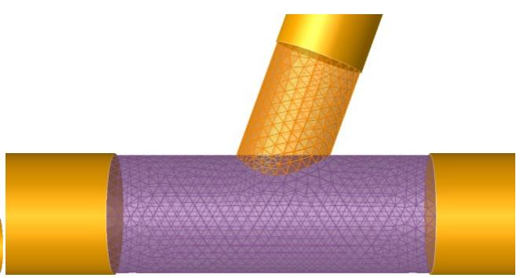  
Case 3: ${ 70^{ \circ } } \Upsilon$ Joint   
Figure 158: T and Y Joints and meshed joints

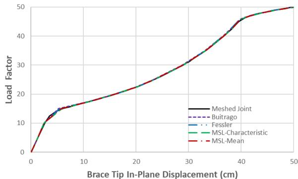  
Brace Tip In-Plane Displacement: Tension

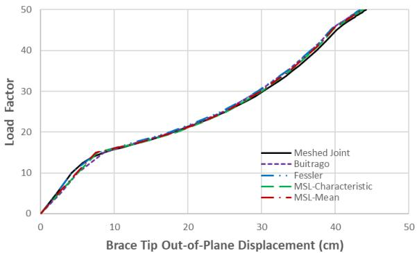  
Brace Tip Out-of-Plane Displacement: Tension

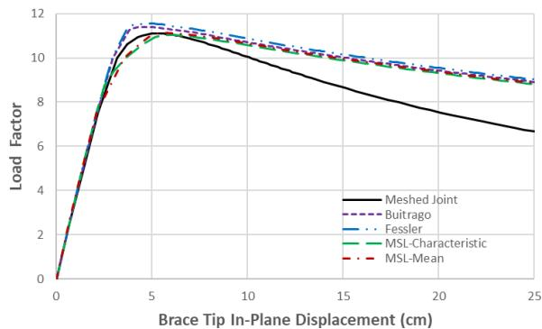  
Brace Tip In-Plane Displacement: Compression

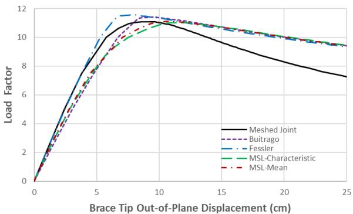  
Brace Tip Out-of-Plane Displacement: Compression   
Figure 159: Comparison of brace tip displacement for Case 1 (T joint)

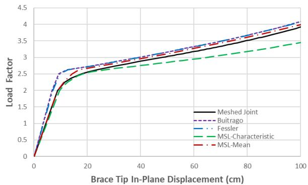  
Brace Tip In-Plane Displacement: Tension

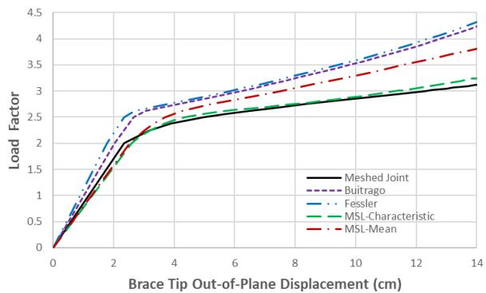  
Brace Tip Out-of-Plane Displacement: Tension

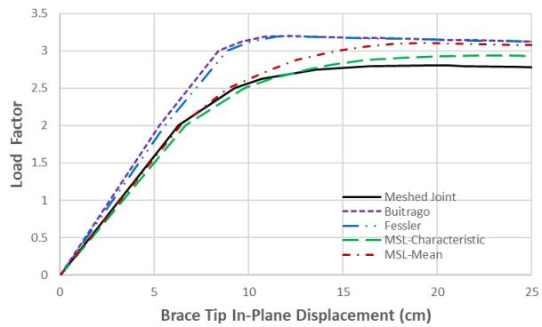  
Brace Tip In-Plane Displacement: Compression

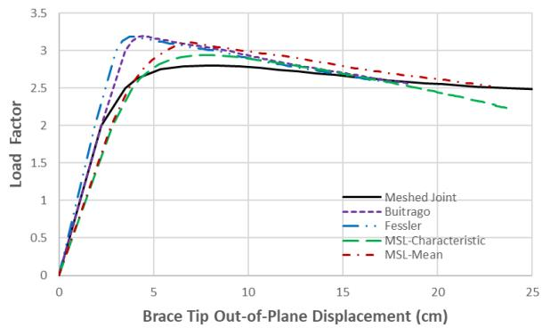  
Brace Tip Out-of-Plane Displacement: Compression   
Figure 160: Comparison of brace tip displacement for Case 2 (Y joint at the angle of 55°)

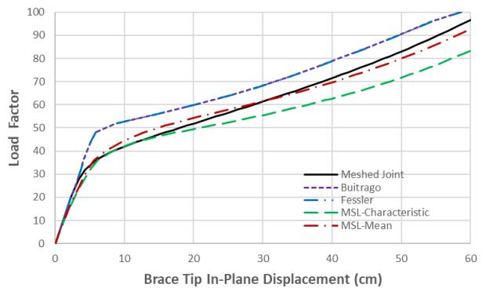  
Brace Tip In-Plane Displacement: Tension

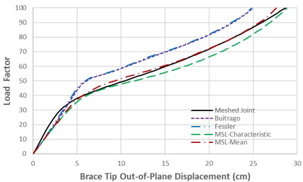  
Brace Tip Out-of-Plane Displacement: Tension

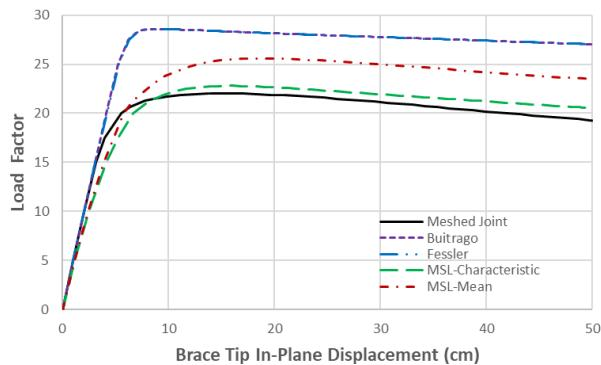  
Brace Tip In-Plane Displacement: Compression

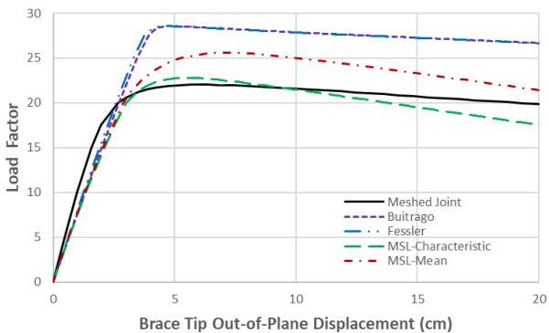  
Brace Tip Out-of-Plane Displacement: Compression   
Figure 161: Comparison of brace tip displacement for Case 3 (Y joint at the angle of 70°)

5.3.2 Sample 2: Frame with X Joint

This sample considers the application of the MSL approach for X joints with reference to a two-story frame with X bracing subject to a lateral load as shown in Figure 162. The section dimensions for all members are also labeled in Figure 162. The X joint chord segments in the frame have the yield stress of 35 kN/cm2, the material properties of all other members are set to the SACS default values. Both arclength (‘AL’ on the CLPOPT) and sub-incrementation (‘SI’ the CLPOPT) methods are implemented to improve results for large deformations. The analysis is carried out for three cases outlined below:

1. Without any joint flexibility or strength check   
2. MSL Mean Level: ‘MF’, flexibility, ‘MS’ strength, and ‘MT’ on MSLOPT line   
3. Characteristic Level: ‘CF’, flexibility, ‘CS’ strength, and ‘CT’ on MSLOPT line

This analysis focuses on the performance of the X joints in the frame and therefore, the input lines JSSEL and JFSEL are used to select joints ‘JNT1’ and ‘JNT2’ only, all other joints are ignored.

The results are compared with those obtained from a structural model in which the X joints have been meshed using triangular plate elements as shown in Figure 162. The structure with the meshed joints is analyzed for the following two cases:

1. All plates associated with the meshed joints are modeled as elastoplastic to include the chord flexibility, chord plasticity, and large local deformations.   
2. Plates associated with the connection chord are assumed to remains elastic to include the joint flexibility but ignoring the large deformations of the chord elastoplastic response.

The structural responses for all cases are plotted in Figure 163. It can be seen, that the results obtained from the MSL approach implemented in the program are in good agreement with those obtained from the meshed joints. The MSL Mean Level analysis reports joint strength failure at a lateral load value of 10 MN whilst the MSL Characteristic Level Analysis predicts the joint failure at a load value of 9 MN.

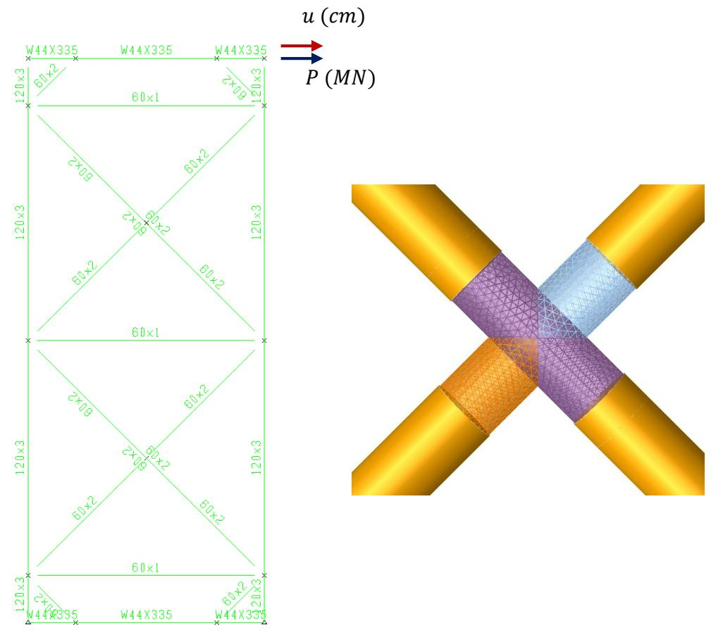

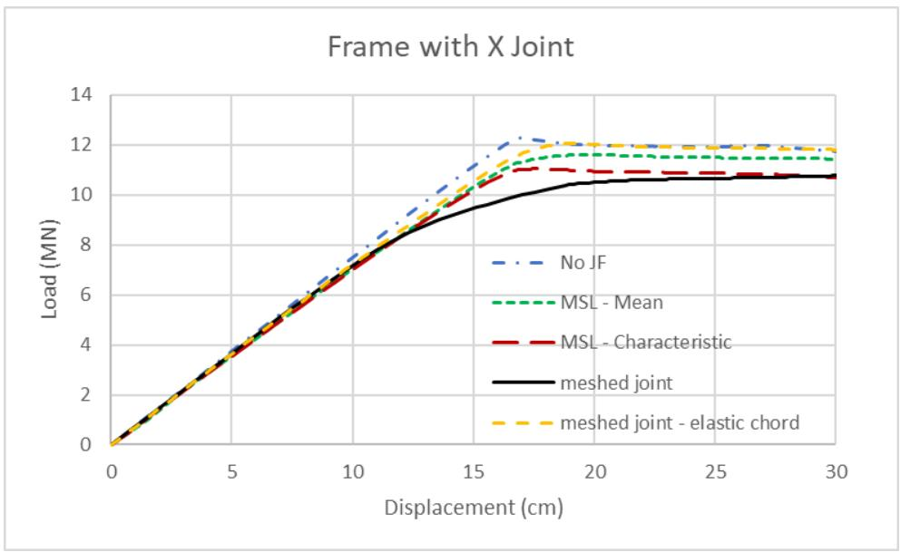  
Figure 162: Two-story frame with cross-connections. Left) member sections, right) Meshed joints   
Figure 163: Comparison of a two-story frame with X connections

5.3.3 Sample 3: Frame with K joint

This sample considers the application of the MSL approach for K joints with reference to a two-story frame with K bracing subjected to a lateral load as shown in Figure 164. The section dimensions for all members are labeled in Figure 164, the material properties of all members are set to the SACS default values. Both arc-length (‘AL’ on the CLPOPT) and sub-incrementation (‘SI’ the CLPOPT) methods are implemented to accurately predict results for large deformations. The analysis is carried out for the following three cases:

1. Without any joint flexibility or strength checks   
2. MSL Mean Level: ‘MF’, flexibility, ‘MS’ strength, and ‘MT’ on MSLOPT line   
3. Characteristic Level: ‘CF’, flexibility, ‘CS’ strength, and ‘CT’ on MSLOPT line

This analysis focuses on the performance of the K connections and therefore input lines JSSEL and JFSEL are used to select joints ‘JNT1’ and ‘JNT2’ only, flexibility and strength checks of all other joints are excluded.

The results from the above three cases are compared against those obtained from a structural model in which the joints have been meshed using triangular plates as shown in Figure 164. The structure containing the meshed joints is analyzed for the following two cases:

1. All plates associated with the meshed joints are modeled as elastoplastic to include the chord flexibility, chord plasticity, and large local deformation.   
2. Plates associated with the connection chord are assumed to remain elastic to include the joint flexibility but ignore large deformations resulting from the chord elastoplastic response.

The structural responses for all cases are plotted in Figure 165. It can be seen that the results predicted by the MSL approach are in good agreement with those obtained from the structural model containing the meshed joints.

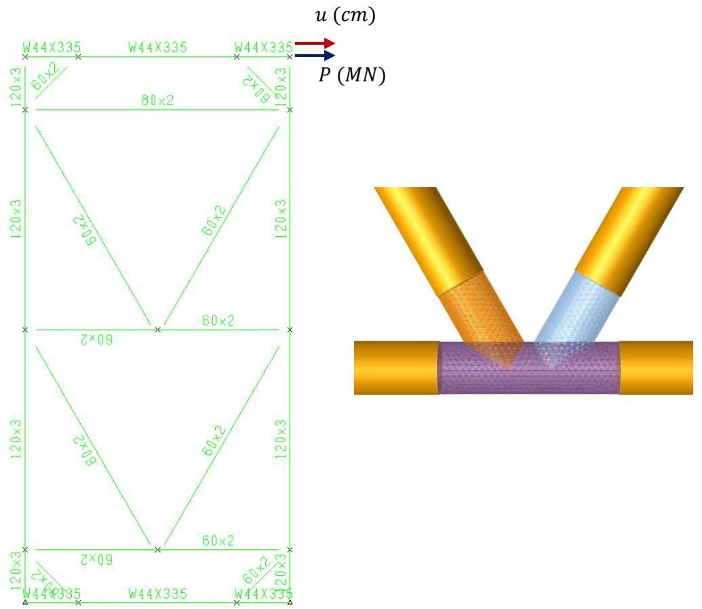  
Figure 164: Two-story frame with K connections. Left) member sections, right) Meshed joints

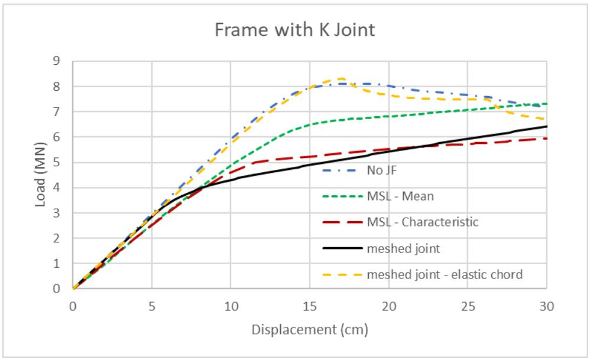  
Figure 165: Comparison of a two-story frame with K connections

## 5.4 Local Buckling

This section considers the implementation of the local buckling calculations for tubular and conical sections based on the following methods: Marshall and Gates [9], API Bulletin 2U, API RP 2A-LRFD, and ISO 19902. Results from the program are compared with hand-calculation based on the formulation given in section 6.12 in Commentary.

5.4.1 Sample 1: Local Buckling in Tubular Members

The following example looks at the local buckling calculations for tubular members. Figure 166 illustrates a cantilever beam subjected to an axial compressive and lateral load at the free end of the beam. The analysis is conducted using eight sub-segments, SACS default values are used for the material properties. Both sub-incrementation option (‘SI’ on the CLPOPT) and the arc-length method (‘AL’ on the CLPOPT) are considered to accurately predict the post-local buckling behavior. Table 5 shows the tubular section dimensions for various local buckling approaches to ensure that local buckling occurs before yield.

Table 5: Tubular sections for local buckling analysis   

| Method | Diameter (cm) | Wall Thickness (cm) |
| --- | --- | --- |
| Marshall and Gates | 120.0 | 1.0 |
| API Bulletin 2U | 130.0 | 0.8 |
| API LRFD | 120.0 | 1.0 |
| ISO 19902 | 120.0 | 1.0 |

As discussed in Commentary section 6.12.5, the program checks the local buckling at the mid-point sections of every sub-segment. For this case, the critical section is the mid-point of the first sub-segment which is located at ?? $\frac{ L } { 16 }$ from the fixed end. From hand calculations, assuming small deformations, the stress at the critical section is given by $\frac{ P } { A } + \frac{ P \Big ( L - \frac{ L } { 16 } \Big ) R } { I }$ , where ?? is the radius, ?? is the cross-section area, and ?? is the second moment of the area. Figure 167 shows local buckling results from the program and those obtained using hand calculations. It can be seen that results from both approaches are in good agreement.

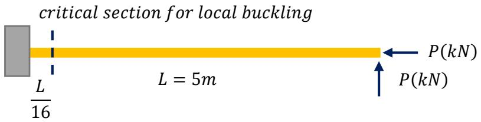  
Figure 166: Cantilever beam for local buckling analysis

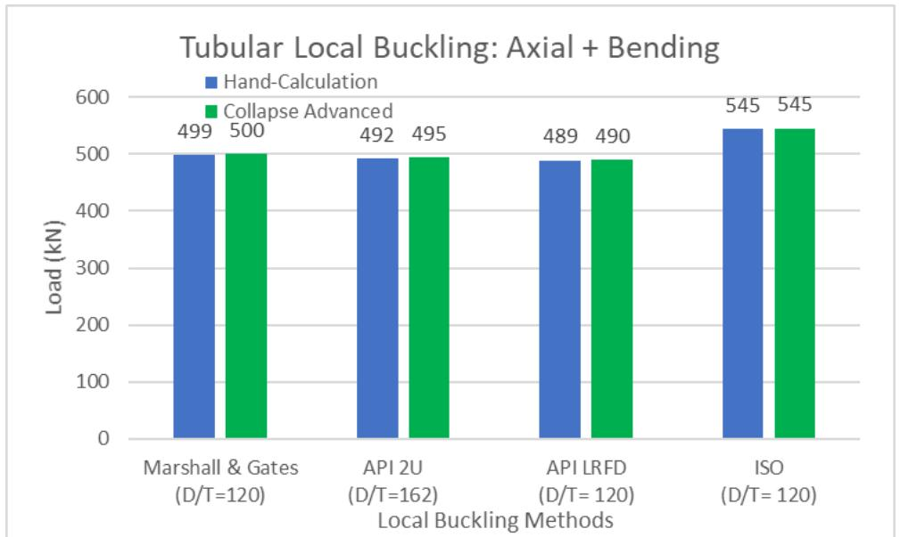  
Figure 167: Comparison of local buckling load for the tubular members

5.4.2 Sample 2: Local Buckling in Conical Members

This benchmark considers the local buckling approach implemented for conical sections. Figure 168 illustrates a tubular cantilever beam comprised of a conical section at the fixed end. The beam is subjected to an axial compressive and a lateral load at the free end. The analysis is conducted using seven sub-segments for the tubular member and one sub-segment for the conical section to simplify the hand calculations. The material properties are set to SACS default values and both the subincrementation option (‘SI’ on the CLPOPT) and arc-length method (‘AL’ on the CLPOPT) are implemented to accurately predict the post-local buckling response. Table 6 shows the conical section dimensions for various local buckling approaches to ensure the local buckling occurs before yielding. The dimensions of the tubular member are assumed as 50cm diameter and 2cm wall thickness.

Table 6: Conical sections for local buckling analysis   

| Method | Larger Diameter (cm) | Smaller Diameter (cm) | Wall Thickness (cm) |
| --- | --- | --- | --- |
| Marshall and Gates | 120.0 | 50 | 1.0 |
| API Bulletin 2U | 130.0 | 50 | 0.8 |
| API LRFD | 120.0 | 50 | 1.0 |
| ISO 19902 | 120.0 | 50 | 1.0 |

As discussed in Commentary section 6.12.5, the program checks for local buckling at the mid-point section of every sub-segments. For this sample, the critical section will be the mid-point section of the conical member located at $\frac{ L } { 16 }$ from the fixed end. From the hand calculations, assuming small

deformations, the stress at the critical section is given by $\frac{ P } { A } + \frac{ P \Big ( L - \frac{ L } { 16 } \Big ) R } { I }$ ?? where ?? is conical section radius, ?? is the cross-section area, and ?? is the second moment of the area at the critical section. As discussed in the Commentary sections 6.12.3 and 6.12.4, based on API RP 2A-LRFD and ISO 19902 recommendations, the program utilizes $\frac{ D_{ s } } { \cos \left( \alpha \right) }$ (where $D_{ s }$ is diameter at the critical section and ?? is the half of the conical apex angle) to calculate the local buckling limit stresses. For the Marshall and Gates or API Bulletin 2U options, the program uses the largest diameter of the cone to calculate the local buckling limit stress.

Figure 169 summarizes the results from the Collapse program for the loads for which the local buckling occurs. It can be seen the results are in good agreement with hand-calculations.

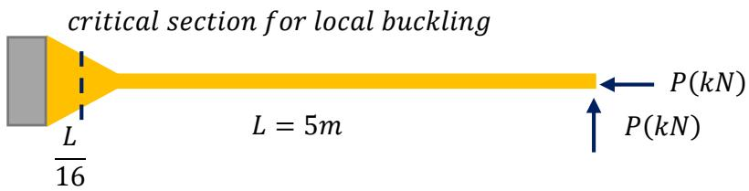  
Figure 168: Cantilever beam for local buckling analysis

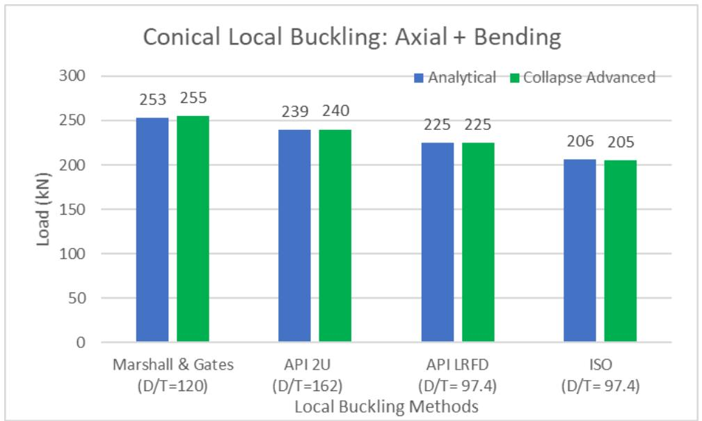  
Figure 169: Comparison of local buckling load for the conical member

## 5.5 Multilinear Elastoplastic Materials

This section considers the implementation of the multilinear elastoplastic material for beam members, plates, and piles in collapse analysis. The results are compared against standard bilinear elastoplastic material. Also, the beam members and plate results are verified against ADINA finite element software.

5.5.1 Sample 1: Multilinear Elastoplastic Materials for Members

This benchmark considers the elastoplastic analysis of a tubular beam with different elastoplastic materials. Figure 170 illustrates a beam clamped at both ends and subjected to a load at mid-point. Three different elastoplastic materials are considered for this benchmark: 1) standard bilinear with 0.005 strain hardening ratio (defined on the CLPOPT line), 2) multilinear elastoplastic with strain hardening, and 3) multilinear elastoplastic with strain softening. The elastoplastic stress-strain curves are presented in Figure 171-left.

The model consists of two members and the analysis is conducted using eight sub-segments per member. Both sub-incrementation option (‘SI’ on the CLPOPT) and arc-length method (‘AL’ on the CLPOPT) are implemented to accurately predict the post-local buckling response. Figure 171-right compares the vertical displacement at the mid-point for different material models. The models with strain hardening and softening material are also analyzed ADINA finite element software. It can be seen that Collapse Advanced results are in good agreement with ADINA.

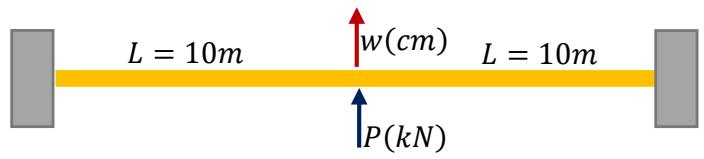

$$D = 80 c m t = 1 c m E = 20000 \frac{k N}{c m^{2}} \sigma_{y} = 24. 8 \frac{k N}{c m^{2}}$$

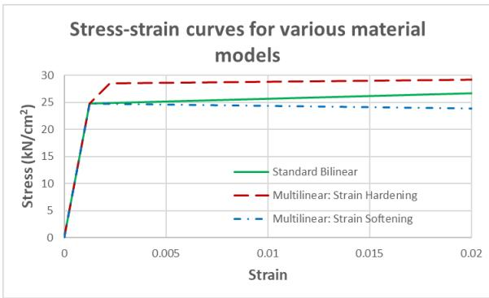  
Figure 170: A tubular beam with fixed ends and subjected to a mid-point load

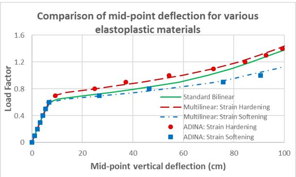  
Figure 171: Left: Stress-strain curve for different post-yield behavior, Right: the tubular beam vertical displacement for different material models.

5.5.2 Sample 2: Multilinear Elastoplastic Materials for Plates

This benchmark considers the elastoplastic analysis of a plate with different elastoplastic materials. Figure 172 illustrates a plate clamped at one side and subjected to a load at the corner. Three different elastoplastic materials are considered for this benchmark: 1) standard bilinear with 0.005 strain hardening ratio (defined on the CLPOPT line), 2) multilinear elastoplastic with strain hardening, and 3) multilinear elastoplastic with strain softening. The elastoplastic stress-strain curves are presented in Figure 173-left.

The model is consistent with a 5x5 mesh with a total of 25 quadrilateral thin plate elements. Both subincrementation option (‘SI’ on the CLPOPT) and arc-length method (‘AL’ on the CLPOPT) are implemented to accurately predict the post-local buckling response. Figure 173-right compares the vertical displacement at the mid-point for different material models. The models with strain hardening and softening material are also analyzed ADINA finite element software. It can be seen that Collapse Advanced results are in good agreement with ADINA.

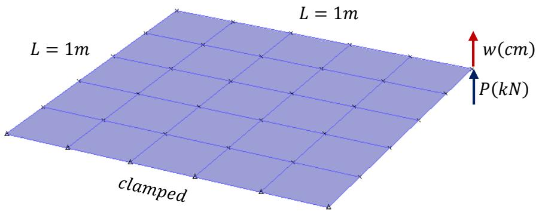

$$t = 1 c m E = 20000 \frac{k N}{c m^{2}} \sigma_{y} = 24. 8 \frac{k N}{c m^{2}}$$

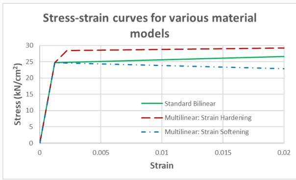  
Figure 172: A plate clamped at one side and subjected to a corner load

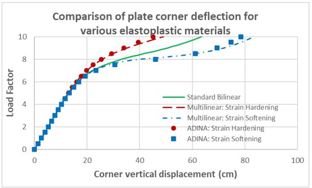  
Figure 173: Left: Stress-strain curve for different post-yield behavior, Right: vertical displacement at plate corner for different material models.

5.5.3 Sample 3: Multilinear Elastoplastic Materials for Piles

This benchmark considers the elastoplastic analysis of a monopile with different elastoplastic materials. Figure 174 illustrates a monopile subjected to a vertical load and a lateral. The vertical load is first applied to the monopile and then the lateral load gradually increases until the maximum deflection reaches 20 inches. Three different elastoplastic materials are considered for this benchmark: 1) standard bilinear with 0.005 strain hardening ratio (defined on the CLPOPT line), 2) multilinear elastoplastic with strain hardening, and 3) multilinear elastoplastic with strain softening. The elastoplastic stress-strain curves are presented in Figure 175-left.

The model consistent a member and a pile with a length of 60 feet. Both sub-incrementation option (‘SI’ on the CLPOPT) and arc-length method (‘AL’ on the CLPOPT) are implemented to accurately predict the post-local buckling response. Figure 175-right compares the lateral displacement of the pilehead for different material models.

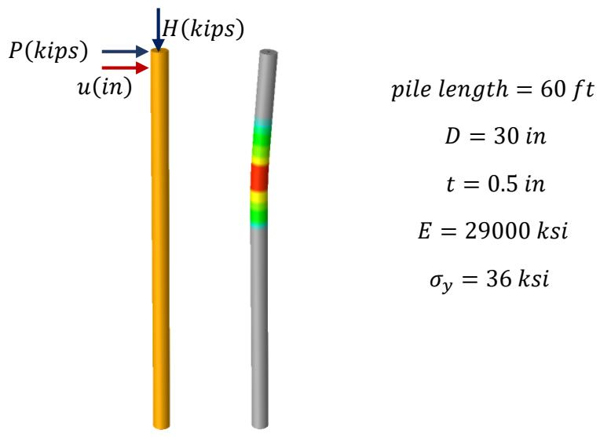  
Figure 174: A monopile subjected to vertical and horizontal loads

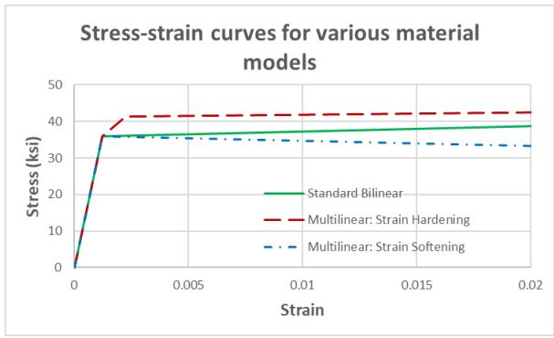

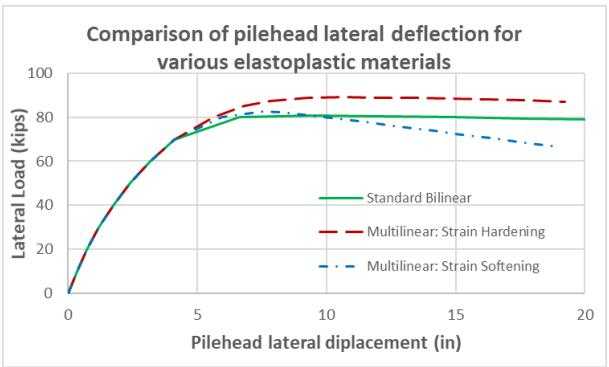  
Figure 175: Left: Stress-strain curve for different post-yield behavior, Right: lateral displacement of pilehead for different material models.

## 5.6 Impact Analysis

This example problem demonstrates the application of the IMPACT input line for dropped object and ship impact analysis using user-defined loads in the SACS model file.

5.6.1 Sample 1: Dropped Object

The following sample considers the use of the IMPACT line for a dropped object analysis. The impact loads are defined as 9 vertical point loads as shown in Figure 176. The total energy absorbed by the structure is set to 100 ft-kips.

Collapse Advanced program input file is as follows:

|  | 1 | 2 | 3 | 4 | 5 | 6 | 7 | 8 |
| --- | --- | --- | --- | --- | --- | --- | --- | --- |
|  | 123456789012345678901234567890123456789012345678901234567890 | 123456789012345678901234567890123456789012345678901234567890 | 123456789012345678901234567890123456789012345678901234567890 | 123456789012345678901234567890123456789012345678901234567890 | 123456789012345678901234567890123456789012345678901234567890 | 123456789012345678901234567890123456789012345678901234567890 | 123456789012345678901234567890123456789012345678901234567890 | 123456789012345678901234567890123456789012345678901234567890 |
|  | THE CLPOPT | 20 | 8 | 20 |  | ALSI |  |  |
|  | 0.0010.0010.0011000.0.002 |  |  |  |  |  |  |  |
|  | CLPRPT P1 |  | SM |  |  |  |  |  |
|  | JTSEL | E131 |  |  |  |  |  |  |
|  | LDSEQ IMP1 |  | SELF | 1 | 1.0IMP1 | 200 | 0.0 | 200.0 |
|  | IMPACT IMP1 |  | 100.00 |  |  |  |  |  |
|  | END |  |  |  |  |  |  |  |

The following is a detailed description of the input file:

A. the CLPOPT line specifies the use of both Arc-length (‘AL’) and Sub-incrementation (‘SI’) methods to increase the performance of the nonlinear analysis.   
B. The CLPRPT line is used to generate the collapse summary report (‘SM’) and joints deflection report (‘P1’) for every load increment. JTSEL input line is used to select joint ‘E131’ for deflection output (model center point).   
C. The LDSEQ line defines the load sequence for impact analysis. The self-weight (‘SELF’) load case is first applied to the structure and it is followed by the impact load case ‘IMP1’.

a. The large load factor of 200 is chosen to ensure the analysis continues until the entire energy is absorbed by the structure.   
D. The IMPACT line is used to define the impact load case ‘IMP1’. This load case is used by the program to calculate the energy absorbed by the structure. The maximum impact energy is set to 100.0 ft-kips.   
a. Other impact options are not required for this dropped object analysis.

The dropped object results are given in Figure 177 and Figure 178. The program will continue the analysis based on the defined load sequence until the maximum impact energy is absorbed by the structure. Once the maximum energy is absorbed, the program automatically unloads the structure until the impact load factors return to zero.

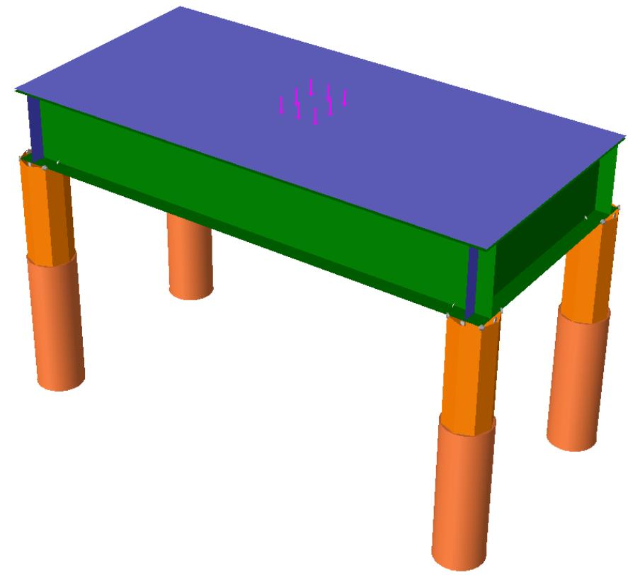

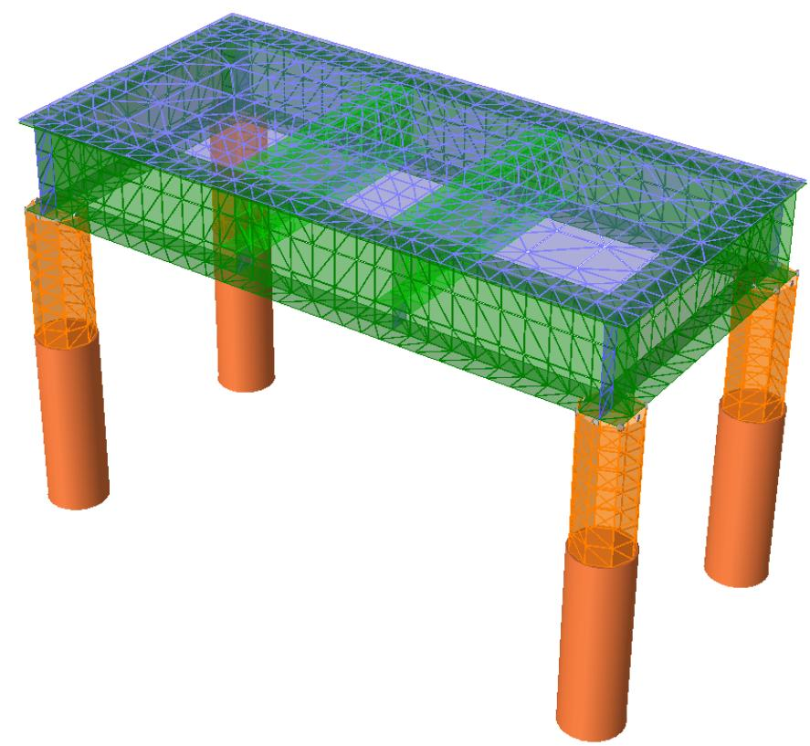  
Figure 176: Dropped object model using IMPACT input line. Top) The user-defined impact load given in SACS model file, Bottom) finite element mesh.

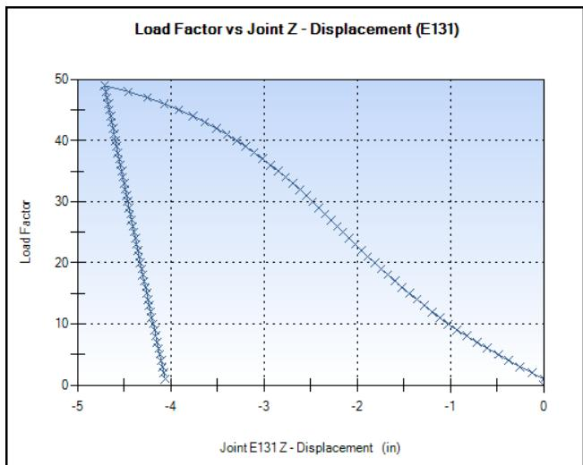

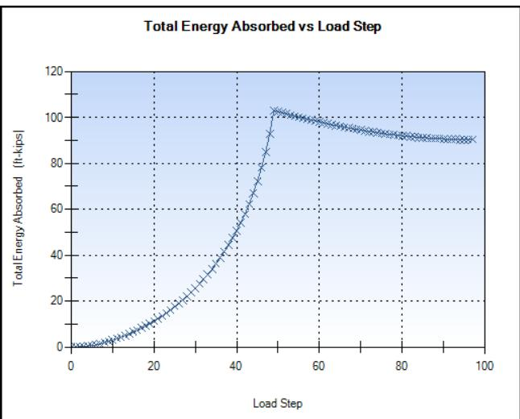  
Figure 177: Dropped object results. Left) force-deflection for vertical displacement at center-point, Right) Energy absorbed by the structure versus the load step.

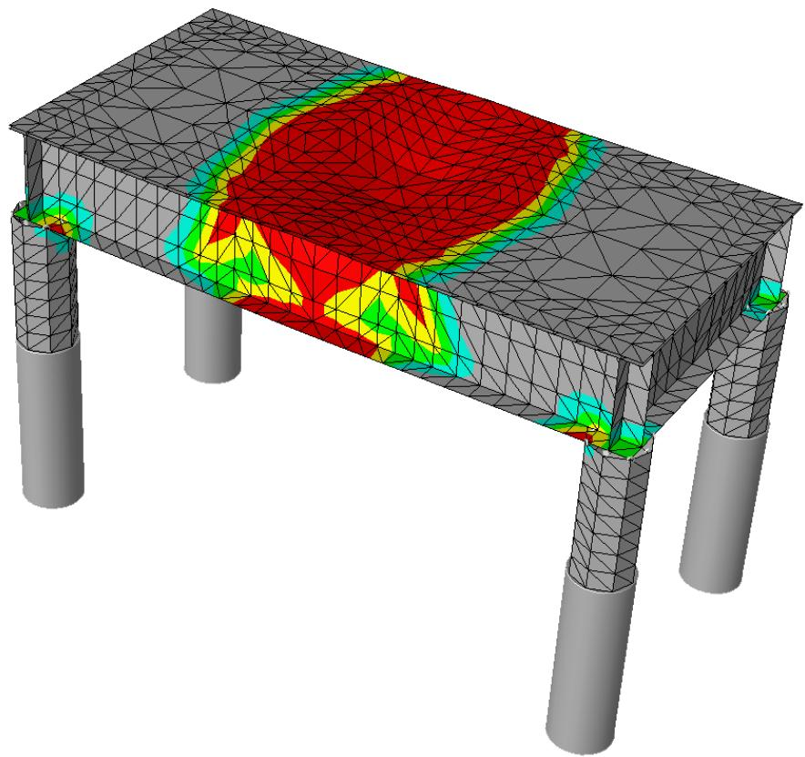  
Figure 178: Plasticity contour for dropped object analysis.

5.6.2 Sample 2: Ship Impact

This example problem shows the use of the IMPACT line for a ship impact analysis. For this example, the mass of the ship is assumed to be 1250 tons, impact velocity of 6 m/sec, angle of impact is 135° with respect to the positive x-axis. The Collapse Advanced program input file is given below:

|  | 1 | 2 | 3 | 4 | 5 | 6 | 7 | 8 |
| --- | --- | --- | --- | --- | --- | --- | --- | --- |
|  | 123456789012345678901234567890123456789012345678901234567890 | 123456789012345678901234567890123456789012345678901234567890 | 123456789012345678901234567890123456789012345678901234567890 | 123456789012345678901234567890123456789012345678901234567890 | 123456789012345678901234567890123456789012345678901234567890 | 123456789012345678901234567890123456789012345678901234567890 | 123456789012345678901234567890123456789012345678901234567890 | 123456789012345678901234567890123456789012345678901234567890 |
| THE CLPOPT | 20 | 8 | 20 |  | ALSI | 0.010.001 |  |  |
| 0.01127.00.002 |  |  |  |  |  |  |  |  |
| CLPRPT P1 |  | SM |  |  |  |  |  |  |
| LDSEQ IMP1 |  | IMPC | 25 | 5.0 |  |  |  |  |
| IMPACT IMPC 0000 |  |  | DNV1 | E 607 | 0000 | 8. | 20. | PD |
| ENERGY 1250. |  | 1.0 | 6. |  |  |  |  |  |
| JTSEL 0000 |  |  |  |  |  |  |  |  |
| GRPELA | 14A | 14B | 14C | 14D | 17A | 17B | 19A | 19B |
| GRPELA | 24A | 24B | 24C | 24D | 24E | 24F | 24G | 24H |
| GRPELA | CAA | CAB | CA7 | CB7 | CF9 | P00 | P14 | P17 |
| GRPELA | PC1 | PC2 | R16 | R18 | RS1 | RS2 |  |  |
| GRPELA | SLV | T01 | T02 | T06 | T08 | T09 | T11 | T12 |
| GRPELA | T3A | T6A | T7A | V1A | W51 | W61 | WBN | YPL |
| PGRELA | P01 | P02 | P03 | P04 | PLT |  |  |  |

The following is a detailed description of the input file:

A. the CLPOPT line specifies the use of both Arc-length (‘AL’) and Sub-incrementation (‘SI’) approaches to increase the performance of the nonlinear analysis.   
B. The CLPRPT input line is used to generate a summary report (‘SM’) and joints deflection report (‘P1’) for every load increment. JTSEL input is used to select the impact joint ‘0000’ for deflection output.   
C. The LDSEQ input line defines the load sequence for impact analysis using the impact load case ‘IMPC’.

a. The load factor of 5.0 is used to ensure the analysis continues until the entire energy is absorbed by the structure.

D. The ENERGY input line is used to define the impact energy:

a. The ship mass is 1250.0 ton, and the added mass coefficient is set to 1.0.   
b. The impact velocity is 6 m/sec.

E. The IMPACT defines the following analysis options

a. The impact load case ‘IMPC’ is selected, the maximum impact energy is left blank since the energy is defined by the ENERGY input line.   
b. The impact joint ‘0000’ selected, the applied forces on this joint are used for member/ship dent calculation.   
c. The ship indentation force-displacement characteristics are defined by the ‘DNV1’ option for a bow impact in accordance with DNV RP-C204.   
d. The input option ‘E’ implements the Ellinas dent calculation formulation based on properties of member 607-0000.   
e. The member dent energy and indentation depth are limited by entering 8 for factor B – i.e. the depth is limited by 1/8th of the member dimeter.   
f. The member dent energy is limited by a maximum of 20% of the total impact energy.   
g. The option ‘PD’ implements the plastic member dent and ship dent energy calculations.

F. The GRPELA and PGRELA are used to define non-structural elements as elastic to improve performance.

The impact load case ‘IMPC’ is modeled as two horizontal loads as shown in Figure 184 to represent 135° impact direction.

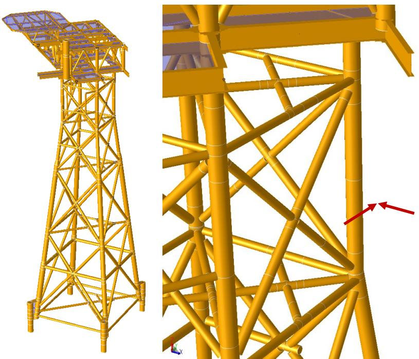  
Figure 179: Ship impact model using IMPACT input line. Left) SACS jacket model, Right) point loads to model 135° ship impact.

The program will continue the analysis based on the defined load sequence until the total impact energy is absorbed by the structure. Once the total energy is absorbed, the program automatically unloads the model until the impact load factors return to zero. The ship impact results are given in Figure 180 and Figure 181. The listing file prints the following summary report (using the ‘SM’ option on the CLPOPT line) for ship impact analysis:

| SACS COLLAPSE IMPACT ENERGY ABSORPTION SUMMARY REPORT | SACS COLLAPSE IMPACT ENERGY ABSORPTION SUMMARY REPORT | SACS COLLAPSE IMPACT ENERGY ABSORPTION SUMMARY REPORT |
| --- | --- | --- |
| Load Sequence | IMP1 |  |
| Load Condition | IMPC |  |
| Impact Summary at Peak Energy Absorption | Impact Summary at Peak Energy Absorption | Impact Summary at Peak Energy Absorption |
| Impact energy = 22.5000 (MJ) | Impact energy = 22.5000 (MJ) | Impact energy = 22.5000 (MJ) |
| Energy absorbed by structure = 11.3331 (MJ) | Energy absorbed by structure = 11.3331 (MJ) | Energy absorbed by structure = 11.3331 (MJ) |
| Energy absorbed by ship = 10.3451 (MJ) | Energy absorbed by ship = 10.3451 (MJ) | Energy absorbed by ship = 10.3451 (MJ) |
| Energy absorbed by member = 0.8660 (MJ) | Energy absorbed by member = 0.8660 (MJ) | Energy absorbed by member = 0.8660 (MJ) |
| Total absorbed impact energy = 22.5441 (MJ) | Total absorbed impact energy = 22.5441 (MJ) | Total absorbed impact energy = 22.5441 (MJ) |
| % of total energy absorbed = 100.1962 (%) | % of total energy absorbed = 100.1962 (%) | % of total energy absorbed = 100.1962 (%) |
| Ship indentation = 1.5089 (m) | Ship indentation = 1.5089 (m) | Ship indentation = 1.5089 (m) |
| Member indentation = 0.0993 (m) | Member indentation = 0.0993 (m) | Member indentation = 0.0993 (m) |

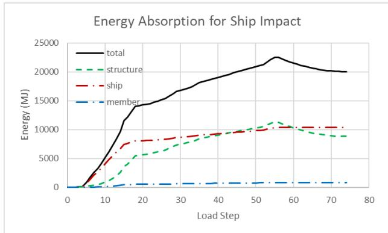

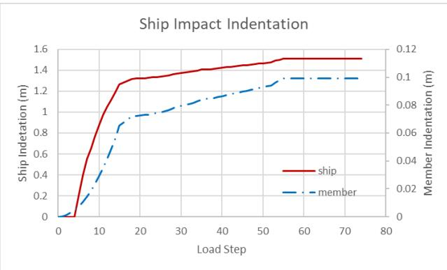  
Figure 180: Ship impact results. Left) Energy absorption by structure, ship, and member dent, Right) The ship dent depth and member dent depth versus the load step.

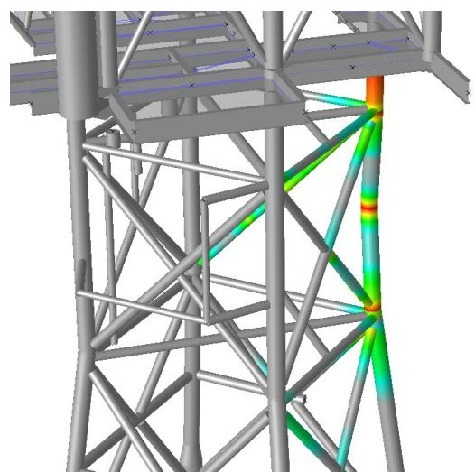

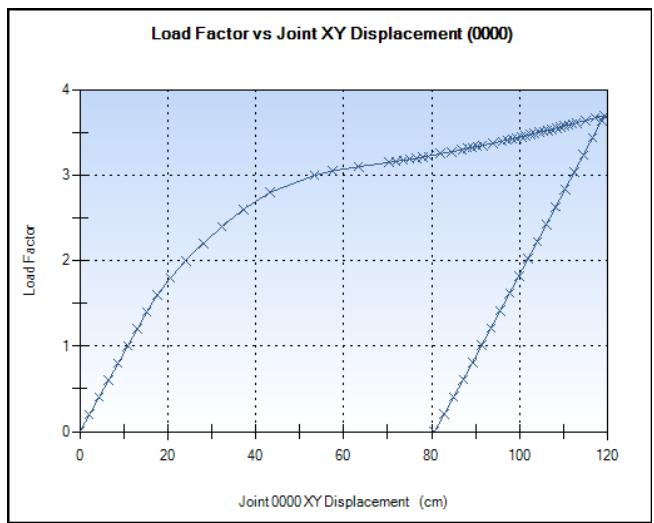  
Figure 181: Ship impact results. Left) Plasticity contour for ship impact analysis, Right) The forcedeflection curve for the impact joint

## 5.7 Dynamic Response Samples

5.7.1 Ship Impact

The following is an example of a dynamic ship impact analysis using Dynamic Response and Collapse Advanced to calculate the non-linear behavior of the jacket when a vessel strikes the jacket leg.

The structure in Figure 182 is comprised of a four-leg jacket with skirt piles and a topside made up of two decks with a crane pedestal and a helideck. Other modeled appurtenances include a boat landing, risers, and conductors. The impact member is meshed using plate elements and the impact joint is 31P7.

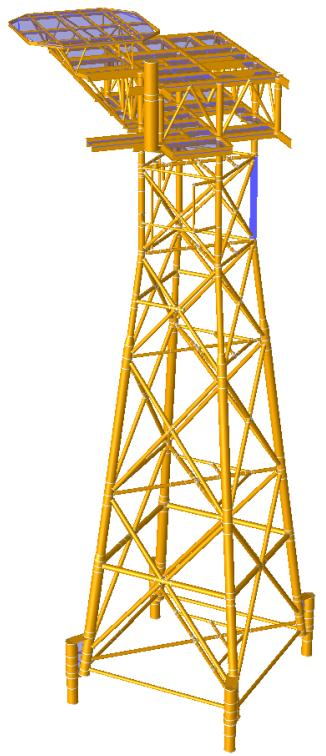

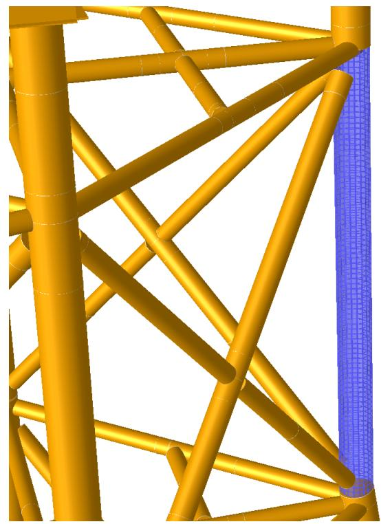  
Figure 182: Ship Impact Model and meshed impact member

A mode shape extraction is performed to generate the Dynpac Modal Solution File (dynmod) and Dynpac Mass File (dynmas) using 40 modes. Dynamic Response uses these files to calculate the dynamic loading on the structure. More information about the mode shape extraction analysis and theory can be found in the Dynpac manual. The following is the Dynamic Response input file used to define the dynamic behavior and loading of the structure:

|  | 1 | 2 | 3 | 4 | 5 | 6 | 7 | 8 |
| --- | --- | --- | --- | --- | --- | --- | --- | --- |
| 1234567890123456789012345678901234567890123456789012345678901234567890 | 1234567890123456789012345678901234567890123456789012345678901234567890 | 1234567890123456789012345678901234567890123456789012345678901234567890 | 1234567890123456789012345678901234567890123456789012345678901234567890 | 1234567890123456789012345678901234567890123456789012345678901234567890 | 1234567890123456789012345678901234567890123456789012345678901234567890 | 1234567890123456789012345678901234567890123456789012345678901234567890 | 1234567890123456789012345678901234567890123456789012345678901234567890 | 1234567890123456789012345678901234567890123456789012345678901234567890 |
| DROPT | SHIP | EC+Z |  |  |  |  |  |  |
| SDAMP | 5.0 |  |  |  |  |  |  |  |
| LOAD |  |  |  |  |  |  |  |  |
| SHIP | 1250. |  | 6.0 | 180.0 | 1.0 |  | 31P7 |  |
| THLOAD | SHIP | SDO |  | CLP |  |  |  |  |
| JTNUM | 31P7 | 701 |  |  |  |  |  |  |
| TIME |  |  | 2.00000 | 0.0100 | 1.0E-9 | 1.0000 |  |  |
| END |  |  |  |  |  |  |  |  |

The following is a detailed description of the Dynamic Response input file:

G. The DROPT line specifies the analysis options.

a. A ship impact analysis is to be performed (‘SHIP’ in columns 7-10).

H. The SDAMP line specifies that the overall structural damping is 5.0 percent.

I. The LOAD header line specifies that the loading data is to follow.

J. The SHIP line defines the ship impact parameters:

a. The ship weight, 1250 ton, is entered in columns 9-18.   
b. The initial velocity, 6 m/sec, is entered in columns 21-27.   
c. The ship direction, 180 degrees from the global X-axis, is entered in columns 28-34.   
d. The distance before impact, 1.0 m, is entered in columns 42-48.   
e. The impact joint, 31P7, is entered in columns 63-66.

K. The THLOAD line defines the time history input parameters:

a. The time history source, SHIP, is defined in columns 9-12.   
b. The damping type, SDO – Structural Damping Only, is defined in columns 18-20.   
c. Various reporting options can be entered in columns 33-56. It is important to note that the ‘CLP’ option indicates that Dynamic Response will create a collapse input file with the time history loads and the ‘ALL’ option indicates that Dynamic Response will create loads for all time points.

L. The JTNUM line selects joints 31P7 and 701 for reports specified on the THLOAD line.   
M. The TIME line specifies time integration control parameters, starting at 0.0 seconds and ending at 2.0 seconds with an output time interval of 0.01 seconds.

The ship impact analysis will perform the dynamic response analysis, generate a collapse input file using the loads generated at each time point, and then run a collapse analysis using the generated collapse input file. However, collapse options and parameters must first be defined in a partial input file. The following is the partial collapse input file used to define the Collapse analysis behavior:

|  | 1 | 2 | 3 | 4 | 5 | 6 | 7 | 8 |
| --- | --- | --- | --- | --- | --- | --- | --- | --- |
| 123456789012345678901234567890123456789012345678901234567890 | 123456789012345678901234567890123456789012345678901234567890 | 123456789012345678901234567890123456789012345678901234567890 | 123456789012345678901234567890123456789012345678901234567890 | 123456789012345678901234567890123456789012345678901234567890 | 123456789012345678901234567890123456789012345678901234567890 | 123456789012345678901234567890123456789012345678901234567890 | 123456789012345678901234567890123456789012345678901234567890 | 123456789012345678901234567890123456789012345678901234567890 |
| THE CLPOPT | 20 | 8 | 20 |  | ALSI | 0.010.001 |  |  |
| 0.01127.00.002 |  |  |  |  |  |  |  |  |
| CLPRPT P1ROMOMP | CLPRPT P1ROMOMP | CLPRPT P1ROMOMP | CLPRPT P1ROMOMP | CLPRPT P1ROMOMP | CLPRPT P1ROMOMP | CLPRPT P1ROMOMP | CLPRPT P1ROMOMP | CLPRPT P1ROMOMP |
| JTSEL | 31P7 |  |  |  |  |  |  |  |
| GRPELA | 14A | 14B | 14C | 14D | 17A | 17B | 19A | 19B |
| GRPELA | 24A | 24B | 24C | 24D | 24E | 24F | 24G | 24H |
| GRPELA | CAA | CAB | CB5 | CB7 | CF9 | CND | P00 | P14 |
| GRPELA | PC1 | PC2 | R08 | R12 | R16 | R18 | RS1 | RS2 |
| GRPELA | ST9 | T01 | T02 | T06 | T08 | T09 | T11 | T12 |
| GRPELA | T3A | T6A | T7A | V1A | W51 | W61 | WBN | YPL |
| PGRELA | P01 | P02 | P03 | P04 | PLT |  |  |  |
| LDAPL DEAD |  | SELF |  | 1 | 0.0 | 1.0 |  |  |

The following is a detailed description of the partial Collapse input file:

A. the CLPOPT line defines the collapse options:

a. The maximum iterations per load increment, 20, is defined in columns 11-13.   
b. The number of member segments, 8, is defined in columns 14-16.   
c. The maximum number of iterations, 20, is defined in columns 17-19.

d. The arc-length method for post-buckling and the sub-incrementation to improve the convergence are selected in columns 42-43 and 44-45, respectively.   
e. The deflection tolerance, 0.01, is defined in columns 56-60. The rotation tolerance, 0.001, is defined in columns 61-65. The member deflection tolerance, 0.01, is entered in columns 66- 70. These values are used to determine whether a load increment has converged.   
f. The maximum deflection (collapse deflection) is assumed 127 cm (50 inch) in columns 71-75.   
g. The strain hardening ratio, 0.002, is defined in columns 76-80. This value determines the plastic behavior of elements.

B. The CLPRPT line specifies the collapse reporting options.   
C. The GRPELA lines indicate which members remain elastic during the analysis. These are deck members, conductors, risers, boat landings, and other non-primary structural appurtenances. The intention is to solely capture the plastic behavior of the jacket primary structure.   
D. The PGRELA lines indicate which plates will remain elastic during the analysis. These are the deck plate and skirt pile connecting plates.   
E. The LDAPL line defines the first user-generated load step:

a. The load sequence ID, DEAD, is entered in columns 7-10.   
b. The load case name, SELF, is entered in columns 21-24. This must match a load case defined in the SACS model file used for the collapse analysis.   
c. The number of increments, 1, is entered in columns 25-29.   
d. The ending load factor, 1.0, is entered in columns 37-43. A blank entry for the starting load factor indicates that the load will start at 0.0.

F. The LDAPC input lines associated with time-history steps are automatically generated and added by Dynamic Response.

The ship impact analysis was allowed to continue until X displacement of impact joint 31P7 exceeds the maximum deflection of 127 cm (50 inches) entered on the CLPOPT line. The response of the impact joint 31P7 and plasticity contours are shown in Figure 183 and Figure 184, respectively.

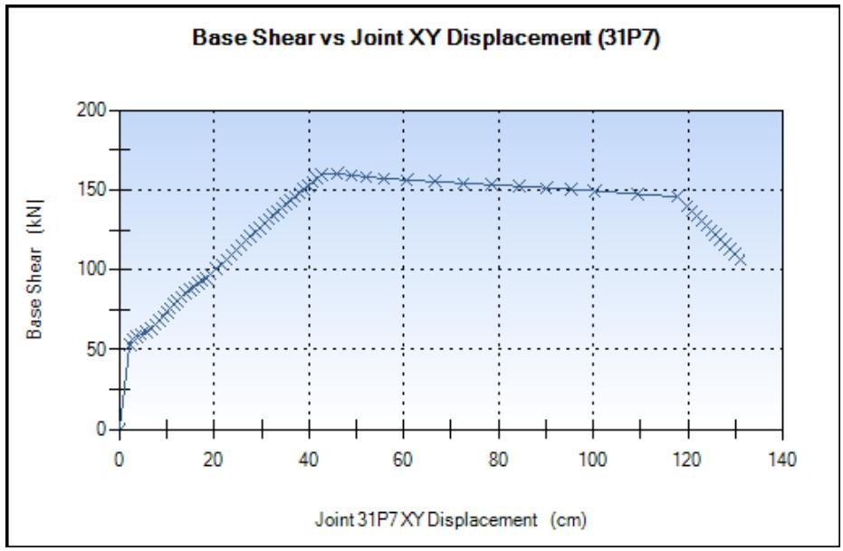  
Figure 183: Base shear versus XY displacement of impact joint 31P7

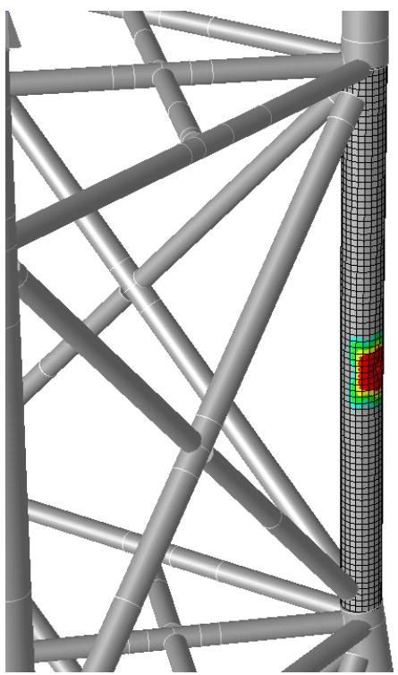

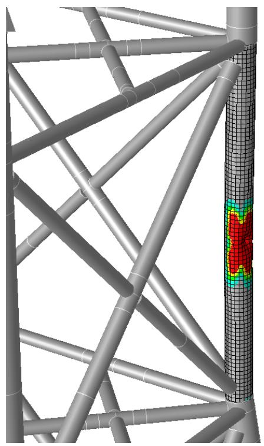

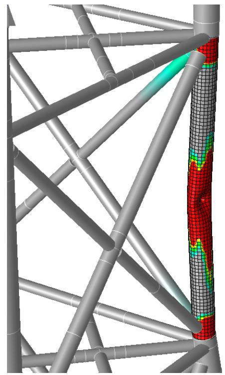

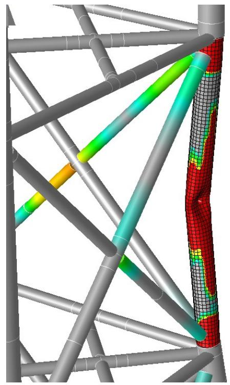  
Figure 184: Plasticity contours for ship impact. Top-Left) load step 100, Top-right) load step 150, Bottomleft) load step 175, Bottom-right) final load step.

5.7.2 Dropped Object

The following is an example of a dropped object analysis using Dynamic Response and Collapse Advanced to calculate the non-linear behavior of the deck when an object is dropped from a height above the deck.

The structure in Figure 185 is a 1 cm deck plate supported by a 400mm x 200m I beam with a 5mm web and 10mm flange thicknesses spaced at 1 meter. The beams have been meshed with quadrilateral isotropic plate elements to model the interaction between the beams and the deck plate more accurately. A finer triangular plate mesh is modeled near the impact location of the dropped object. A self-weight load has been applied to the structure. The impact joint is located at joint 712 (4.0m,4.4m,0.0m).

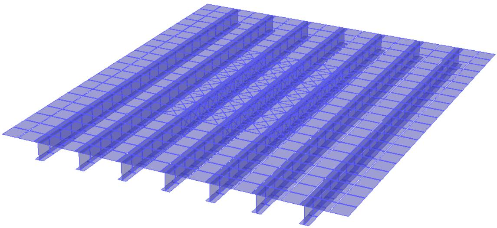  
Figure 185: Dropped Object Model

A mode shape extraction is performed to generate the Dynpac Modal Solution File (dynmod) and Dynpac Mass File (dynmas) using 50 modes. Dynamic Response uses these files to calculate the dynamic loading on the structure. More information about the mode shape extraction analysis and theory can be found in the Dynpac manual.

The following is the Dynamic Response input file used to define the dynamic behavior and loading of the structure:

|  | 1 | 2 | 3 | 4 | 5 | 6 | 7 | 8 |
| --- | --- | --- | --- | --- | --- | --- | --- | --- |
| 1234567890123456789012345678901234567890123456789012345678901234567890 | 1234567890123456789012345678901234567890123456789012345678901234567890 | 1234567890123456789012345678901234567890123456789012345678901234567890 | 1234567890123456789012345678901234567890123456789012345678901234567890 | 1234567890123456789012345678901234567890123456789012345678901234567890 | 1234567890123456789012345678901234567890123456789012345678901234567890 | 1234567890123456789012345678901234567890123456789012345678901234567890 | 1234567890123456789012345678901234567890123456789012345678901234567890 | 1234567890123456789012345678901234567890123456789012345678901234567890 |
| DROPT | DROP | EC+Z |  |  |  |  |  |  |
| SDAMP | 2.0 |  |  |  |  |  |  |  |
| LOAD |  |  |  |  |  |  |  |  |
| DROP | 0.45SO |  |  |  | 1.25 |  | 712 |  |
| THLOAD | DROP | SDO |  | PLTPLMPLSPRTALLMXSCLPJPD | PLTPLMPLSPRTALLMXSCLPJPD | PLTPLMPLSPRTALLMXSCLPJPD | PLTPLMPLSPRTALLMXSCLPJPD |  |
| JTNUM | 712 |  |  |  |  |  |  |  |
| TIME |  |  | 1.00000 | 0.0010 | 1.0E-9 | 1.0000 |  |  |
| END |  |  |  |  |  |  |  |  |

The following is a detailed description of the Dynamic Response input file:

A. The DROPT line specifies the analysis options.

a. A dropped object analysis is to be performed (‘DROP’ in columns 7-10).

B. The SDAMP line specifies that the overall structural damping is 2.0 percent.   
C. The LOAD header line specifies that the loading data is to follow.   
D. The DROP line defines the dropped object parameters:

a. The object weight, 45 ton, is entered in columns 9-18.   
b. The initial velocity is left blank, indicating 0.0 m/sec, in columns 21-27.   
c. The distance before impact, 1.25 m, is entered in columns 42-48.   
d. The impact joint, 712, is entered in columns 63-66.   
e. The adhere option, S will analyze the dropped object analysis as a single impact in column 19. This is useful for instances where the structure does not remain elastic.   
f. The free-fall option, O, will omit the object's free fall from the analysis in column 20.

E. The THLOAD line defines the time history input parameters:

a. The time history source, DROP, is defined in columns 9-12.   
b. The damping type, SDO – Structural Damping Only, is defined in columns 18-20.   
c. Various reporting options are entered in columns 33-56. It is important to note that the ‘CLP’ option indicates that Dynamic Response will create a collapse input file with the time history loads and the ‘ALL’ option indicates that Dynamic Response will create loads for all time points.

F. The JTNUM line selects joint 712 for reports specified on the THLOAD line.   
G. The TIME line specifies time integration control parameters, starting at 0.0 seconds and ending at 1.0 seconds with an output time interval of 0.001 seconds.

The dropped object analysis will perform the dynamic response analysis, generate a collapse input file using the loads generated at each time point, and then run a collapse analysis using the generated collapse input file. However, collapse options and parameters must first be defined in a partial input file. The following is the partial collapse input file used to define the Collapse analysis behavior:

|  | 1 | 2 | 3 | 4 | 5 | 6 | 7 | 8 |
| --- | --- | --- | --- | --- | --- | --- | --- | --- |
|  | 12345678901 | 12345678901 | 12345678901 | 12345678901 | 12345678901 | 12345678901 | 12345678901 | 1234567890 |
| 0.005 | THE CLPOPT | 20 |  |  |  | ALSI | 0.010.001 | 0.01 |
| 0.005 | CLPRPT P1ROMO | CLPRPT P1ROMO | CLPRPT P1ROMO | CLPRPT P1ROMO | CLPRPT P1ROMO | CLPRPT P1ROMO | CLPRPT P1ROMO | CLPRPT P1ROMO |
| 0.005 | JTSEL | 712 | 712 | 712 | 712 | 712 | 712 | 712 |
| 0.005 | LDAPL XXXX |  | SELF | 1 | 0.0 | 1.0 |  |  |

The following is a detailed description of the partial Collapse input file:

A. the CLPOPT line defines the collapse options:

a. The maximum iterations per load increment, 20, is defined in columns 11-13.   
b. The number of member segments, 8, is defined in columns 14-16.   
c. The arc-length method for post-buckling and the sub-incrementation to improve the convergence are selected in columns 42-43 and 44-45, respectively.   
d. The deflection tolerance, 0.01, is defined in columns 56-60. The rotation tolerance, 0.001, is defined in columns 61-65. The member deflection tolerance, 0.01, is entered in

columns 66-70. These values are used to determine whether a load increment has converged.

e. The strain hardening ratio, 0.005, is defined in columns 76-80. This value determines the plastic behavior of elements.

B. The CLPRPT line specifies the collapse reporting options.   
C. The LDAPL line defines the first user-generated load step:

a. The load sequence ID, XXXX, is entered in columns 7-10.   
b. The load case name, SELF, is entered in columns 21-24. This must match a load case defined in the SACS model file used for the collapse analysis.   
c. The number of increments, 1, is entered in columns 25-29.   
d. The starting load factor, 0.0, is entered in columns 30-36. The ending load factor, 1.0, is entered in columns 37-43.

D. The LDAPC input lines associated with time-history steps are automatically generated and added by Dynamic Response.

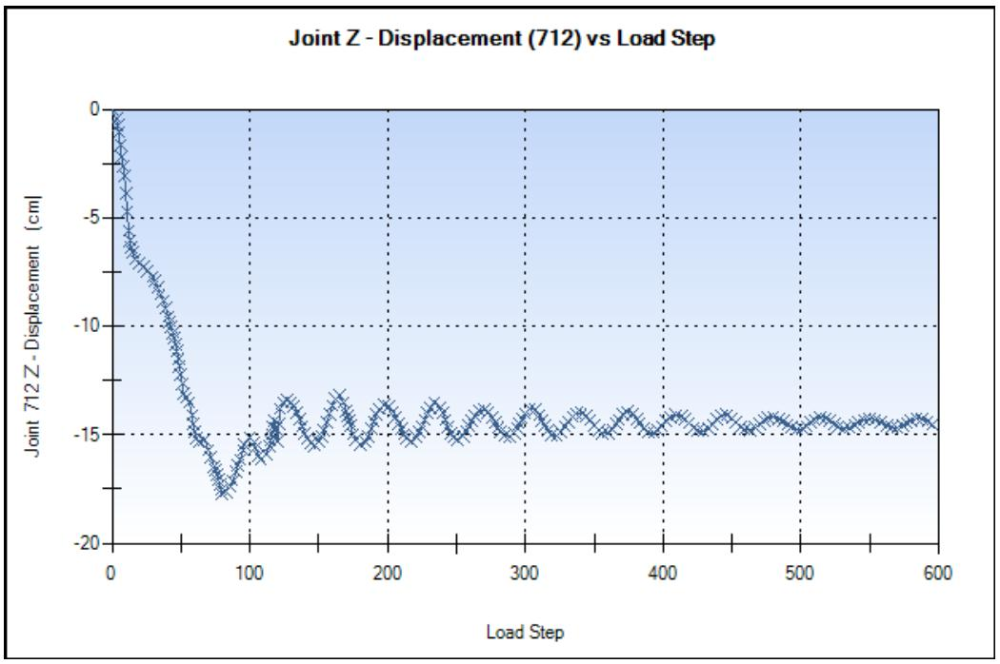  
Figure 186 shows the vertical displacement of the impact joint 712. Figure 187 and Figure 188 illustrate the plasticity at the final load step. The torsional-lateral buckling of the support beam is clearly visible in Figure 188.   
Figure 186: Joint Z – Displacement (712) vs Load Step

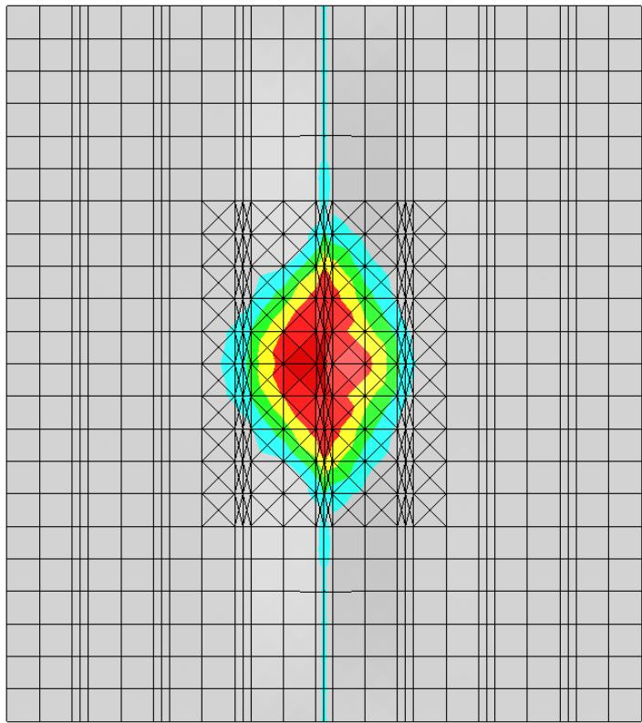

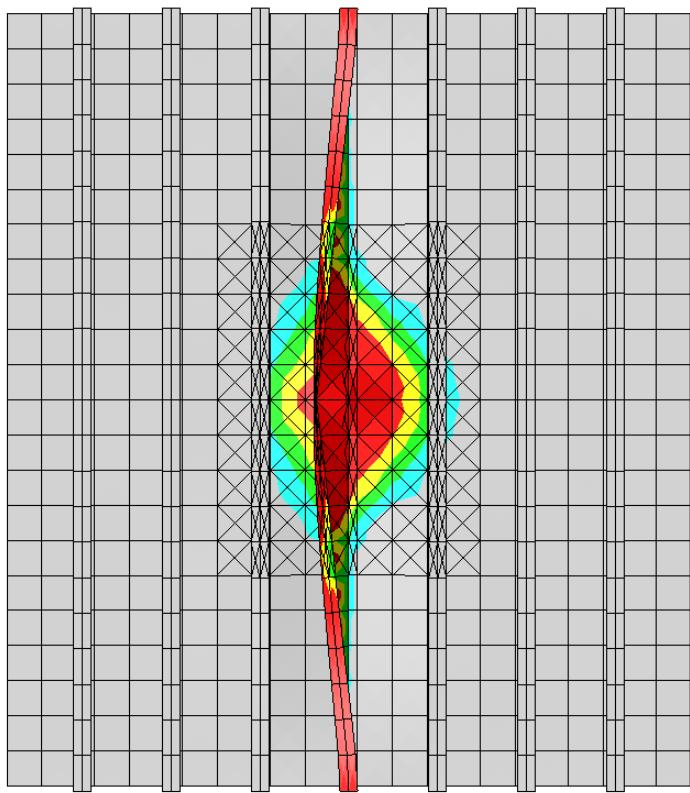  
Figure 187: XY top view of the plasticity contour at last load step   
Figure 188: XY bottom view of the plasticity contour at the last load step.

5.7.3 Blast

The following is an example of a blast analysis using Dynamic Response and Collapse Advanced to calculate the non-linear behavior of a blast wall when it is subjected to blast pressure.

The structure in Figure 189 is a 5 mm thick corrugated plate with a corrugation height of 20mm and a corrugation width of 16mm spaced at 64mm. The blast wall is 7.168m tall by 7.2m wide. The plate has been meshed with quadrilateral isotropic plate elements to capture the non-linear behavior of the corrugated plate. A self-weight load and a nominal blast load have been applied to the structure. Both loads are distributed to every joint in the structure. Each perimeter joint is fully fixed against translation and rotation.

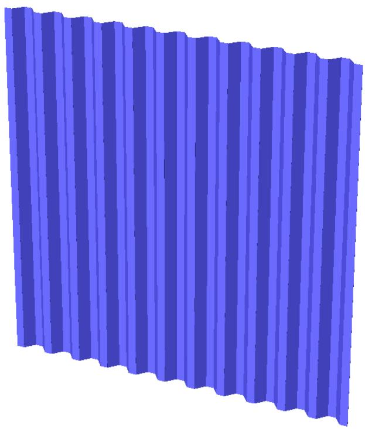  
Figure 189: Blast Model

A mode shape extraction is performed to generate the Dynpac Modal Solution File (dynmod) and Dynpac Mass File (dynmas) using 50 modes. Dynamic Response uses these files to calculate the dynamic loading on the structure. More information about the mode shape extraction analysis and theory can be found in the Dynpac manual.

The following is the Dynamic Response input file used to define the dynamic behavior and loading of the structure:

|  | 1 | 2 | 3 | 4 | 5 | 6 | 7 | 8 |
| --- | --- | --- | --- | --- | --- | --- | --- | --- |
| 123456789012345678901234567890123456789012345678901234567890 | 123456789012345678901234567890123456789012345678901234567890 | 123456789012345678901234567890123456789012345678901234567890 | 123456789012345678901234567890123456789012345678901234567890 | 123456789012345678901234567890123456789012345678901234567890 | 123456789012345678901234567890123456789012345678901234567890 | 123456789012345678901234567890123456789012345678901234567890 | 123456789012345678901234567890123456789012345678901234567890 | 123456789012345678901234567890123456789012345678901234567890 |
| DROPT | TCLP | +Z |  |  |  |  |  |  |
| SDAMP | 2. |  |  |  |  |  |  |  |
| LOAD |  |  |  |  |  |  |  |  |
| FVIB | THIS | CARD | SDO | LN | PLSPLM | ALL | JPD |  |
| JTNUM | 293 | 696 | 707 | 7191075 |  |  |  |  |
| TIME |  |  |  | 2.0 | 0.020 | 0.0005 | 1.0 |  |
| THFORCE | NON |  | BLST |  |  |  |  |  |
| LOADC | BLST | 0.00 | 0.00 |  |  |  |  |  |
| LOADC | BLST | 0.08 | 1.00 |  |  |  |  |  |
| LOADC | BLST | 0.20 | 0.00 |  |  |  |  |  |
| LOADC | BLST | 2.00 | 0.00 |  |  |  |  |  |
| END |  |  |  |  |  |  |  |  |

The following is a detailed description of the Dynamic Response input file:

A. The DROPT line specifies the analysis options.   
a. A force-time history with collapse analysis is to be performed (‘TCLP’ in columns 7-10).   
B. The SDAMP line specifies that the overall structural damping is 2.0 percent.   
C. The LOAD header line specifies that the loading data is to follow.   
D. The FVIB line defines the force vibration analysis parameters:

a. The type of analysis is defined as a time history analysis (‘THIS’ in columns 7-10).   
b. The time history input source, CARD, indicates that the time history data will be input on subsequent lines in the dynamic response input file in columns 12-15.   
c. The damping type, SDO – Structural Damping Only, is defined in columns 17-19.   
d. The time history input interpolation, LN – Linear, is defined in columns 28-29.   
e. Various plotting options are defined in columns 32-55.

E. The JTNUM line selects joints 293, 696, 707, 719, and 1075 for reports specified on the FVIB line.   
F. The TIME line specifies time integration control parameters, starting at 0.0 seconds and ending at 2.0 seconds with an output time interval of 0.02 seconds.   
G. The THFORCE line defines the subsequent time history input.

a. The time history input form, NON – non-uniform time increments, is defined in columns 11-13.   
b. The name of the time history input is defined as BLST in columns 22-25. Note that this name is for reporting purposes and does not need to match the load case defined in the SACS model file.

H. The LOAD lines define the blast profile loading.

a. The load case ID, BLST, is entered in columns 8-11. Note that this load case ID must be in the SACS model file.   
b. The time at which the load occurs is entered in columns 12-16. Loads at intermediate time steps will be interpolated between defined load cases.   
c. The load case factor is entered in columns 17-23. The load case specified will be factored by this value. For this input, the maximum blast pressure occurs at 0.08 seconds.

The dropped object analysis will perform the dynamic response analysis, generate a collapse input file using the loads generated at each time point, and then run a collapse analysis using the generated collapse input file. However, collapse options and parameters must first be defined in a partial input file. The following is the partial collapse input file used to define the Collapse analysis behavior:

|  | 1 | 2 | 3 | 4 | 5 | 6 | 7 | 8 |
| --- | --- | --- | --- | --- | --- | --- | --- | --- |
|  | 12345678901 | 12345678901 | 12345678901 | 12345678901 | 12345678901 | 12345678901 | 12345678901 | 1234567890 |
| 0.005 | THE CLPOPT | 20 | 8 | 20 |  | ALSI | 0.010.001 | 0.01 |
| 0.005 | CLPRPT P1 |  |  |  |  |  |  |  |
| 0.005 | JTSEL | 293 | 696 | 707 | 1075 |  |  |  |
| 0.005 | LDAPL XXXX |  | SELF | SELF | 1 | 0.0 | 1.0 |  |

The following is a detailed description of the partial Collapse input file:

A. the CLPOPT line defines the collapse options:

a. The maximum iterations per load increment, 20, is defined in columns 11-13.   
b. The arc-length method for post-buckling and sub-incrementation to improve the convergence are selected in columns 42-43 and 44-45, respectively.   
c. The deflection tolerance, 0.10, is defined in columns 56-60. The rotation tolerance, 0.001, is defined in columns 61-65. The member deflection tolerance, 0.01, is entered in columns 66-70. These values are used to determine whether a load increment has converged.   
d. The strain hardening ratio, 0.005, is defined in columns 76-80. This value determines the plastic behavior of elements.

B. The CLPRPT line specifies the collapse reporting options.   
C. The LDAPL line defines the first user-generated load step:

a. The load sequence ID, XXXX, is entered in columns 7-10.   
b. The load case name, SELF, is entered in columns 21-24. This must match a load case defined in the SACS model file used for the collapse analysis.   
c. The number of increments, 1, is entered in columns 25-29.   
d. The starting load factor, 0.0, is entered in columns 30-36. The ending load factor, 1.0, is entered in columns 37-43.

D. The LDAPC input lines associated with time-history steps are automatically generated and added by Dynamic Response.

Figure 190 shows the Y-displacement of the joint 707 versus load steps and Figure 191 presents the base shear as a function of XY displacement of joint 707. Figure 192 illustrates the plasticity at the last load step.

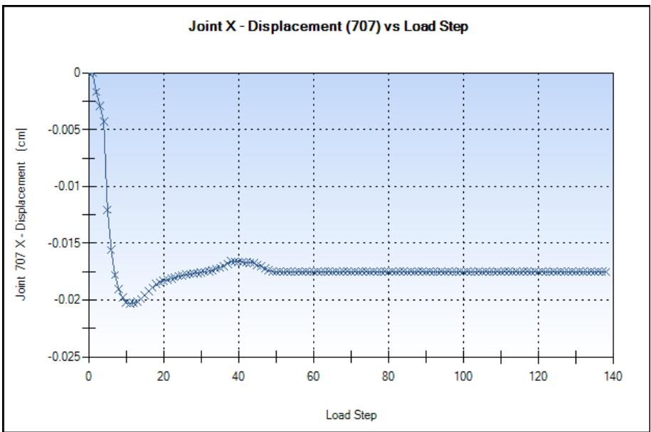  
Figure 190: Joint Displacements for Joint 707

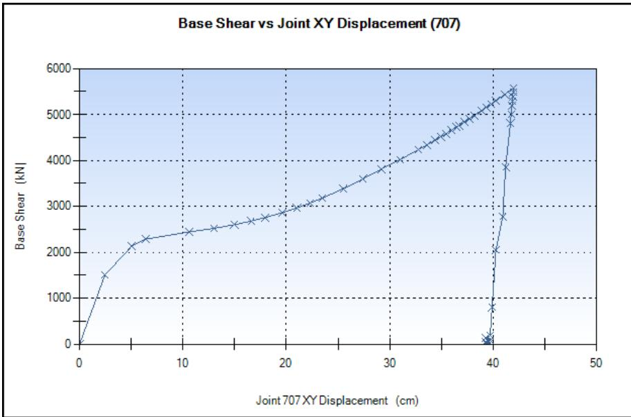  
Figure 191: Sum of Y Force vs Joint Y Displacement (707)

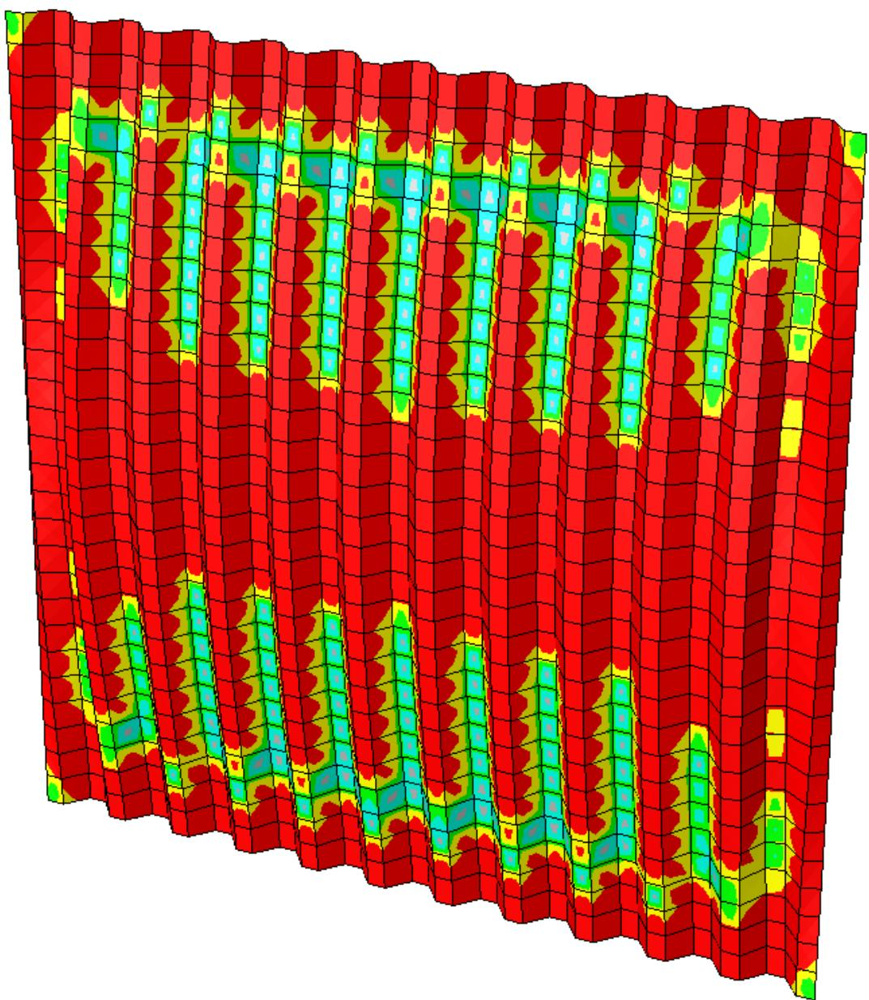  
Figure 192: Plasticity at last load step

# 6 Commentary

## 6.1 Introduction

This chapter explains the theoretical formulation for the Collapse Advanced program. Like other nonlinear finite element solvers, Collapse Advanced ensures equilibrium between applied loads $\mathbf{ f }_{ a p p }$ (weight, wave/wind, ship impact, etc.) and internal forces $\mathbf{ f }_{ i n t }$ (axial and shear forces, bending moments, etc.). The equilibrium equation can be written in the following form:

$$\mathbf{r} (\mathbf{d}) = \mathbf{f}_{i n t} (\mathbf{d}) - \mathbf{f}_{a p p} = \mathbf{0} \tag{1}$$

in which ?? is displacement/rotation vector, $\mathbf{ f }_{ a p p }$ is the applied load vector associated with conservative loading (i.e. where the orientation of the applied load in the global coordinate system is not a function of displacement). The internal forces are assumed to be a function of displacement due to: a) material nonlinearity resulting from large strains and b) geometrical nonlinearity due to large displacements and rotations.

The nonlinear equation (1) may be solved iteratively using the Newton-Raphson method as:

$$\mathbf{r} \left(\mathbf{d}_{0} + \delta \mathbf{d}\right) \approx \mathbf{r} \left(\mathbf{d}_{0}\right) + \mathbf{K} |_{\mathbf{d}_{0}} \delta \mathbf{d} = \mathbf{0} \tag{2}$$

where ${ \bf d }_{ 0 }$ is the initial value for displacement and ???? is the iterative change in displacement, $\mathbf{ r } ( \mathbf{ d }_{ 0 } )$ and $\mathbf{ K } \vert_{ \mathbf{ d }_{ 0 } }$ are the residual vector and the tangent stiffness matrix respectively, and can be represented as:

$$\mathbf{r} \left(\mathbf{d}_{0}\right) = \mathbf{f}_{i n t} \left(\mathbf{d}_{0}\right) - \mathbf{f}_{a p p} \tag{3}$$

$$\left. \mathbf{K} \right|_{\mathbf{d}_{0}} = \frac{\delta \mathbf{r}}{\delta \mathbf{d}} \Big |_{\mathbf{d}_{0}} = \frac{\delta \mathbf{f}_{i n t}}{\delta \mathbf{d}} \Big |_{\mathbf{d}_{0}} \tag{4}$$

which basically states the tangent stiffness is derivative of the internal force vector with respect to the displacement at the initial value. Solving for ????, the displacement vector ?? can be expressed as:

$$\mathbf{d} = \mathbf{d}_{0} + \delta \mathbf{d} = \mathbf{d}_{0} - \left(\mathbf{K} |_{\mathbf{d}_{0}}\right)^{-1} \mathbf{r} \left(\mathbf{d}_{0}\right) \tag{5}$$

Equation (2) is repeated until the residual vector becomes smaller than the predefined tolerance – in other words, the convergence is assumed to be achieved. It is worth noting that, since equation (1) is highly nonlinear, loads may be applied incrementally to improve the rate of convergence.

For the Newton Raphson approach, equation 5 requires the inversion of the tangent stiffness matrix to determine the displacement increment, however, in the vicinity of a limit point (represented by buckling of the structure) and any unstable behavior during post-buckling, the tangent stiffness matrix can become singular. To overcome this, Collapse Advanced uses what is known as the Arc-length method to perform nonlinear iterations at limit points and during post-buckling – see section 6.6 for details on the Arc-length method.

For the theoretical approach used Collapse Advanced, Section 6.2 outlines the general beam work for geometric nonlinear stiffness and local force calculations. Sections 6.3 discusses beam element formulation and section 6.4 presents details on the various plate elements available in Collapse Advanced.

The treatment of element offsets and releases in nonlinear analysis with large displacements and rotations is discussed in sections 6.7 and 6.8 respectively. To account for material nonlinearities that contribute to the formation of the elemental tangent stiffness matrix and the internal load vector, Collapse Advanced utilizes the J2 yield surface and backward Euler method to determine the plastic response. The details for this are presented in section 6.5.

## 6.2 Finite Element Formulation: Basics

The analysis approach in Collapse Advanced is based upon the corotational method [1, 2] which allows the element deformation to be expressed in two parts: The first part considers rigid body motion in global coordinates system associated with very large deformation. The second part considers relatively small deformations in the element local coordinates system. This approach enables two separate calculations of the local stiffness matrix and geometric nonlinearities.

The general notation used in the finite element formulation for Collapse Advanced is defined below:

| x,y,z | coordinates of a given point within the element. |
| --- | --- |
| u,v,w | displacement along local axes at a given point (x,y,z) within the element |
| θx, θy, θz | rotation about local axes at a given point (x,y,z) within the element |
| uj, vj,wj | nodal displacement along local axes at the jth joint of the element |
| θxj, θyj, θzj | nodal rotation about local axes at the jth joint of the element |
| X(j) | jth joint coordinates vector in the undeformed configuration |
| Xj, Yj | plate element jth joint coordinates in the undeformed plate local axis syste |
| x(j) | jth joint coordinates vector in the deformed (current/iterative) configuratio |
| xij, yij | plate relative coordinates xij = Xi - Xj and yij = Yi - Yj |
| ξ,η | isoparametric coordinates |
| NL, NQ | linear and quadratic shape functions for plates as function (ξ,η) |
| Njnt | number of a joint in an element |
| Mp, Np | number of joint integration points in the element |
| V, A, L, t | element volume, section area, element length, thickness |
| E, G, v | elastic modulus (Young's modulus), shear modulus, and Poisson's ratio |
| ε, σ | strain, and stress vectors |
| ε, εx, εy | normal strains |
| γ, γxy, γxz, γyz | shear strains |
| σ, σx, σy | normal stresses |
| τ, τxy, τxz, τyz | shear stresses |
| δ | variational operator |
| T | matrix transpose operator |
| d, f, K | displacement, force vector, the stiffness matrix |
| p, θ | translation and oration degrees of freedom (DOF) |
| T, R | transformation matrix, and rotation matrix |
| I | identity matrix |
| loc, glb | short form for local coordinate system and global coordinate system |
| geo | short form for geometric |
| tor | short form for torsional |

The basics of the corotational method are as follow. At a given iteration for a sub-segment, the local and global incremental change in displacement vectors, $\delta \mathbf{ d }_{ l o c }$ and $\delta{ \bf d }_{ g l b }$ respectively, have the following relationship:

$$\delta \mathbf{d}_{l o c} = \mathbf{T} \left(\mathbf{d}_{g l b}\right) \delta \mathbf{d}_{g l b} \tag{6}$$

where ?? is the corotational transformation matrix. Contrary to standard small displacement and rotation finite element analysis, the transformation matrix ?? is not a constant matrix and it is defined as a function of element nodal displacement and rotations and is updated throughout the nonlinear analysis. The following the virtual work principle and using local and global coordinate systems:

$$\delta \mathbf{d}_{l o c}^{T} \mathbf{f}_{l o c} = \delta \mathbf{d}_{g l b}^{T} \mathbf{f}_{g l b} \tag{7}$$

in which the superscript T denotes the matrix/vector transpose, and $\mathbf{ f }_{ l o c }$ and $\mathbf{ f }_{ g l b }$ are the elemental load vectors in local and global systems, respectively. Substituting equation (6) in (7):

$$\mathbf{f}_{g l b} = \mathbf{T}^{T} \mathbf{f}_{l o c} \tag{8}$$

Iterative solvers require a tangent stiffness which is the derivative of the global force vector $\mathbf{ f }_{ g l b }$ with respect to the displacement vector in the global axis system ${ \bf d }_{ g l b }$ . Differentiating equation (8) with respect to ${ \bf d }_{ g l b }$ and using equations (6) and (8), the elemental tangent stiffness matrix in the global coordinate system is given by:

$$\mathbf{K}_{g l b} = \frac{\delta \mathbf{f}_{g l b}}{\delta \mathbf{d}_{g l b}} = \mathbf{T}^{T} \mathbf{K}_{l o c} \mathbf{T} + \mathbf{K}_{g e o} \tag{9}$$

in which, $\mathbf{ K }_{ l o c }$ is the element local stiffness matrix which is given by:

$$\mathbf{K}_{l o c} = \frac{\delta \mathbf{f}_{l o c}}{\delta \mathbf{d}_{l o c}} \tag{10}$$

and ${ \bf K }_{ g e o }$ is the geometric stiffness defined as:

$$\mathbf{K}_{\text{g e o}} = \left(\frac{\delta \mathbf{T}}{\delta \mathbf{d}_{\text{g l o b}}}\right)^{T} \mathbf{f}_{\text{l o c}} \tag{11}$$

Once the relationship between local and global displacement vector has been established, the elemental stiffness matrix and load vector can be calculated using a finite element shape function, second-order strains, and elastoplastic material properties.

## 6.3 Beam Element

This section discusses the finite element formulation for members. Each sub-segment of a given beam member is modeled using a single finite element where geometrical nonlinearities are modeled using the corotational approach [2], and the elemental stiffness matrix and force vector are calculated using second-order strains, elastoplastic material properties in conjunction with numerical integration.

Section 6.3.1 discusses the formation of the transformation matrix and its derivative with respect to the global displacement matrix. Section 6.3.2 defines the finite element formulation for the elemental

stiffness matrix and the force vector. In addition, section 6.3.3 illustrates the numerical integration for beam elements including integration points associated with different beam cross-section types. Elastoplastic calculations for beam elements are presented in section 6.5.1.

6.3.1 Beam Element - Corotational Approach for Geometric Nonlinearity

6.3.1.1 Basics

The geometric nonlinearity in Collapse Advanced is based on the corotational method [2]. This method requires three local coordinates systems for a given beam element as shown in Figure 193, these being: rotation matrix ?? defining the overall element position in space and rotation matrices $\mathbf{ U }^{ ( 1 ) }$ and $\mathbf{ U }^{ ( 2 ) }$ for the element end joints. Matrices $\mathbf{ E } , \mathbf{ U }^{ ( 1 ) }$ and $\mathbf{ U }^{ ( 2 ) }$ define the position of the element and joints with respect to the global coordinate system – i.e. their columns are direction of local coordinate systems. Figure 193 illustrates the beam element local systems.

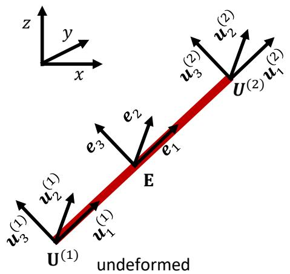

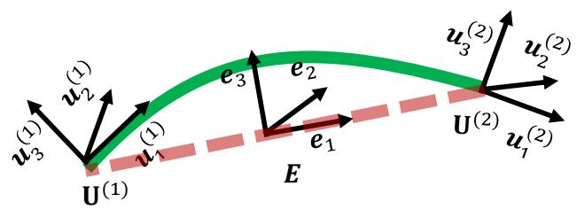  
deformed   
Figure 193: Collapse Advanced element local coordinate systems

Once the local coordinates systems have been defined, the transformation matrix ?? and local displacement vector can be calculated using rotation matrices $\mathbf{ E } , \mathbf{ U }^{ ( 1 ) } , \mathbf{ \Lambda } \mathbf{ U }^{ ( 2 ) }$ and the global displacement vector. In addition, the transformation matrix ?? is differentiated to form the geometric stiffness matrix.

6.3.1.2 Unit Quaternions and Rotation Matrix

Unit quaternions and their relationship with the rotation angles and the rotation matrix must be defined before formulating the corotational transformation matrix. Unit quaternions provide a convenient and numerically stable way to perform various matrix operations associated with the corotational approach.

Unit quaternions are defined in the following form:

$$\left\{ \begin{array}{l} q_{0} \\ \mathbf{q} \end{array} \right\} = \left[ q_{0}, q_{1}, q_{2}, q_{3} \right]^{T} \tag{12}$$

where $q_{ 0 }^{ 2 } + q_{ 1 }^{ 2 } + q_{ 2 }^{ 2 } + q_{ 3 }^{ 2 } = 1$ . The quaternions product is defined as:

$$\left\{ \begin{array}{l} a_{0} \\ \mathbf{a} \end{array} \right\} \times \left\{ \begin{array}{l} b_{0} \\ \mathbf{b} \end{array} \right\} = \left\{ \begin{array}{c} a_{0} b_{0} - \mathbf{a}^{T} \mathbf{b} \\ a_{0} \mathbf{b} + b_{0} \mathbf{a} + \mathbf{a} \times \mathbf{b} \end{array} \right\} \tag{13}$$

Rotation angle vectors ?? can be expressed as unit quaternions as per section 16.9 of reference [2]:

$$q_{0} = \cos \left(\frac{| \boldsymbol{\theta} |}{2}\right), \mathbf{q} = \sin \left(\frac{| \boldsymbol{\theta} |}{2}\right) \frac{\boldsymbol{\theta}}{| \boldsymbol{\theta} |} \tag{14}$$

and if $\mathbf{ \boldsymbol{ \Theta } } = \mathbf{ 0 } , \left\{ \begin{array} { l } { q_{ 0 } } \\ { \mathbf{ q } } \end{array} \right\} = [ 1 , 0 , 0 , 0 ]^{ T }$ {??0 . The rotation matrix ?? based on unit quaternions as per section 16.9 of reference [2] can be defined as:

$$\mathbf{R} = \left(q_{0}^{2} - \mathbf{q}^{T} \mathbf{q}\right) \mathbf{I} + 2 \mathbf{q} \mathbf{q}^{T} + 2 q_{0} \mathbf{S} (\mathbf{q}) \tag{15}$$

In which ?? is the spin operator matrix as defined below:

$$\mathbf{S} (\mathbf{v}) = \left[ \begin{array}{c c c} 0 & - v_{3} & - v_{2} \\ v_{3} & 0 & - v_{1} \\ v_{2} & v_{1} & 0 \end{array} \right] \tag{16}$$

The spin operator matrix ?? has the following properties with respect to the vector cross product

$$\mathbf{a} \times \mathbf{b} = \mathbf{S} (\mathbf{a}) \mathbf{b} = - \mathbf{S} (\mathbf{b}) \mathbf{a} \tag{17}$$

$$\delta (\mathbf{a} \times \mathbf{b}) = \delta (\mathbf{S} (\mathbf{a}) \mathbf{b}) = - \mathbf{S} (\mathbf{b}) \delta \mathbf{a} + \mathbf{S} (\mathbf{a}) \delta \mathbf{b} \tag{18}$$

Finally, any rotation matrix can be converted to the corresponding quaternions using the rotation matrix components $R_{ i j }$ as per section 16.9 of reference [2].

$$\text{A s s u m e} a = \max  (t r a c e (\mathbf{R}), R_{11}, R_{22}, R_{33})$$

$$i f a = t r a c e (\mathbf{R}) \Rightarrow q_{0} = \frac{1}{2} (1 + a)^{2}, q_{1} = \frac{R_{32} - R_{23}}{4 q_{0}}, q_{2} = \frac{R_{13} - R_{31}}{4 q_{0}}, q_{2} = \frac{R_{21} - R_{12}}{4 q_{0}}$$

$$i f a = R_{11} \Rightarrow q_{0} = \frac{R_{32} - R_{23}}{4 q_{1}}, q_{1} = \sqrt{\frac{1}{2} a + \frac{1}{4} (1 - t r a c e (\mathbf{R}))}, q_{2} = \frac{R_{21} + R_{12}}{4 q_{1}}, q_{3} = \frac{R_{13} + R_{31}}{4 q_{0}} \tag{19}$$

$$i f a = R_{22} \Rightarrow q_{0} = \frac{R_{13} - R_{31}}{4 q_{2}}, q_{1} = \frac{R_{21} + R_{12}}{4 q_{2}}, q_{2} = \sqrt{\frac{1}{2} a + \frac{1}{4} (1 - t r a c e ({\bf R}))}, q_{3} = \frac{R_{13} + R_{31}}{4 q_{2}}$$

$$i f a = R_{33} \Rightarrow q_{0} = \frac{R_{21} - R_{12}}{4 q_{3}}, q_{1} = \frac{R_{13} + R_{31}}{4 q_{3}}, q_{2} = \frac{R_{32} + R_{23}}{4 q_{3}}, q_{3} = \sqrt{\frac{1}{2} a + \frac{1}{4} (1 - t r a c e ({\bf R}))},$$

6.3.1.3 Local Displacement, Element and Joints Rotation Matrices

The first step is to determine the local coordinate systems associated with two elemental joints （$\mathbf{ i . e . } \mathbf{ U }^{ ( 1 ) }$ and ${ \bf U }^{ ( 2 ) } )$ based on previous known (fixed) displacement vector $\mathbf{ d }_{ g l b }$ and the current (iterative) displacement vector ${ \mathbf{ d } }_{ g l b_{ i } } -$ in which ?? denotes ith iteration. The following form for global displacement vector is assumed:

$$\mathbf{d}_{g l b} = \left\{ \begin{array}{l} \mathbf{p}_{g l b}^{(1)} \\ \boldsymbol{\theta}_{g l b}^{(1)} \\ \mathbf{p}_{g l b}^{(2)} \\ \boldsymbol{\theta}_{g l b}^{(2)} \end{array} \right\} \tag{20}$$

where ?????? ${ \bf p }_{ g l b }^{ ( j ) }$ ?? and ????????(??) $\pmb{ \theta }_{ g l b }^{ ( j ) }$ glb are the translational and rotational degrees of freedom, respectively. The incremental change in rotation given by:

$$\Delta \boldsymbol{\theta}_{g l b}^{(j)} = \boldsymbol{\theta}_{g l b i}^{(j)} - \boldsymbol{\theta}_{g l b 0}^{(j)} \tag{21}$$

Using equation (14), unit quaternions increment associated with the above rotation increment is given by:

$$\Delta q_{0}^{(j)} = \cos \left(\frac{\left| \Delta \boldsymbol{\theta}_{g l b}^{(j)} \right|}{2}\right), \Delta \mathbf{q}^{(j)} = \sin \left(\frac{\left| \Delta \boldsymbol{\theta}_{g l b}^{(j)} \right|}{2}\right) \frac{\Delta \boldsymbol{\theta}_{g l b}^{(j)}}{\left| \Delta \boldsymbol{\theta}_{g l b}^{(j)} \right|} \tag{22}$$

Current quaternions for element joints can be defined using quaternions product of the above increment to their initial values – for more details see section 16.9 in reference [2].

$$\left\{ \begin{array}{l} q_{0}^{(j)} \\ \mathbf{q}^{(j)} \end{array} \right\}_{i} = \left\{ \begin{array}{l} \Delta q_{0}^{(j)} \\ \Delta \mathbf{q}^{(j)} \end{array} \right\} \times \left\{ \begin{array}{l} q_{0}^{(j)} \\ \mathbf{q}^{(j)} \end{array} \right\}_{0} \tag{23}$$

and substituting into equation (15) yields the current joints rotation matrices.

Element local x-axis, $\mathbf{ e_{ 1 } } 0 \mathsf{ r }$ the first column of matrix ?? is a unit vector connecting element joints, $\mathbf{ e_{ 1 } }$ may be defined using joint coordinates in the undeformed configuration （$\mathbf{ X }^{ ( j ) } )$ and the current translation DOFs (????????(??) ) （$\mathbf{ p }_{ g l b_{ i } }^{ ( j ) }$

$$\mathbf{e}_{1} = \frac{\mathbf{X}^{(2)} + \mathbf{p}_{g l b_{i}}^{(2)} - \left(\mathbf{X}^{(1)} + \mathbf{p}_{g l b_{i}}^{(1)}\right)}{\left| \mathbf{X}^{(2)} + \mathbf{p}_{g l b_{i}}^{(2)} - \left(\mathbf{X}^{(1)} + \mathbf{p}_{g l b_{i}}^{(1)}\right) \right|} \tag{24}$$

To define $\mathbf{ e }_{ 2 }$ and $\mathbf{ e }_{ 3 } ,$ it is assumed that the element local system ?? is located mid-way between element joints [2]. The rotation matrix at the element mid-way, $\mathbf{ R }_{ m } ,$ , can be based on the transition from $\mathbf{ U }^{ ( 1 ) }$ at ${ 1^{ \mathbf{ s t } } }$ joint to $\mathbf{ U }^{ ( 2 ) }$ at $2^{ \mathsf{ n d } }$ joint – see section 17.1.4 in [2] for details. Once the rotation matrix $\mathbf{ R }_{ m }$ is calculated, $\mathbf{ e }_{ 2 }$ and $\mathbf{ e }_{ 3 }$ may be calculated by rotation $\mathbf{ R }_{ m }$ such that its local axis coincides with $\mathbf{ e }_{ 1 }$ . Therefore as per reference [2]:

$$\mathbf{e}_{2} = \mathbf{r}_{2} - \frac{\mathbf{r}_{2}^{T} \mathbf{e}_{1}}{1 + \mathbf{r}_{1}^{T} \mathbf{e}_{1}} \left(\mathbf{r}_{1} + \mathbf{e}_{1}\right), \mathbf{e}_{3} = \mathbf{r}_{3} - \frac{\mathbf{r}_{3}^{T} \mathbf{e}_{1}}{1 + \mathbf{r}_{1}^{T} \mathbf{e}_{1}} \left(\mathbf{r}_{1} + \mathbf{e}_{1}\right) \tag{25}$$

in which $\mathbf{ R }_{ m } = [ \mathbf{ r }_{ 1 } \quad \mathbf{ r }_{ 2 } \quad \mathbf{ r }_{ 3 } ]$ .

Once the element and joint local system have been determined, the local displacement vector can be calculated. The following the corotational method, the local displacement vector ${ \bf d }_{ l o c }$ is given by:

$$\mathbf{d}_{l o c} = \left[ \begin{array}{c c c c c c c} \Delta l & \theta_{x 1} & \theta_{y 1} & \theta_{z 1} & \theta_{x 2} & \theta_{y 2} & \theta_{z 2} \end{array} \right]^{T} \tag{26}$$

where ∆?? is the element elongation which can be determined as follows:

$$\Delta l = l_{i} - l_{0}, l_{0} = \left| \mathbf{X}^{(2)} - \mathbf{X}^{(1)} \right|, l_{i} = \left| \mathbf{X}^{(2)} + \mathbf{p}_{g l b_{i}}^{(2)} - \left(\mathbf{X}^{(1)} + \mathbf{p}_{g l b_{i}}^{(1)}\right) \right| \tag{27}$$

Where the local rotations are given by the angle between element coordinate system ?? and joint local systems $\mathbf{ U }^{ \mathrm{ ( j ) } }$ (see reference [2] section 16.14):

$$\sin \left(\boldsymbol{\theta}_{l o c_{i}}^{(j)}\right) = \sin \left(\left\{ \begin{array}{l} \theta_{x j} \\ \theta_{y j} \\ \theta_{z j} \end{array} \right\}_{l o c_{i}}\right) = \frac{1}{2} \left\{ \begin{array}{l} \mathbf{e}_{3}^{T} \mathbf{u}_{2}^{(j)} - \mathbf{e}_{2}^{T} \mathbf{u}_{3}^{(j)} \\ \mathbf{e}_{1}^{T} \mathbf{u}_{3}^{(j)} - \mathbf{e}_{3}^{T} \mathbf{u}_{1}^{(j)} \\ \mathbf{e}_{2}^{T} \mathbf{u}_{1}^{(j)} - \mathbf{e}_{1}^{T} \mathbf{u}_{2}^{(j)} \end{array} \right\} \tag{28}$$

It is worth noting that other local DOFs are zero since the element deformation (both rigid body motion and local deformation) is fully described by ${ \bf d }_{ l o c } , { \bf E } , { \bf U }^{ ( 1 ) }$ and $\mathbf{ U }^{ ( 2 ) }$ .

6.3.1.4 Transformation Matrix

Recalling equation (6) for transformation matrix, the corotational transformation matrix ?? can be calculated by differentiating the local DOFs with respect to the element global displacement vector. Therefore:

$$\mathbf{T} = \left[ \begin{array}{l} \mathbf{t}_{\Delta l}^{T} \\ \mathbf{t}_{\theta_{x 1 l o c}}^{T} \\ \mathbf{t}_{\theta_{y 1 l o c}}^{T} \\ \mathbf{t}_{\theta_{z 1 l o c}}^{T} \\ \mathbf{t}_{\theta_{x 2 l o c}}^{T} \\ \mathbf{t}_{\theta_{y 2 l o c}}^{T} \\ \mathbf{t}_{\theta_{z 2 l o c}}^{T} \end{array} \right] \tag{29}$$

where ?? are $12 \times 1$ vectors.

The variation of the element elongation with respect to the global displacement vector is given by:

$$\delta (\Delta l) = \delta \left(l_{i} - l_{0}\right) = \frac{\delta l_{i}}{\delta \mathbf{d}_{g l b}} \delta \mathbf{d}_{g l b} = \mathbf{t}_{\Delta l}^{T} \delta \mathbf{d}_{g l b} \tag{30}$$

in which $\mathbf{ t }_{ \Delta l }^{ T }$ is a row associated with $\Delta l$ in the transformation matrix ??. To calculate $\mathbf{ t }_{ \Delta l }^{ T }$ , differentiate $l_{ i }$ in equation (27) with respect to ${ \bf d }_{ g l b }$ . Recalling $l_{ i }$ is only a function of translation DOFs ${ \bf p }_{ g l b }^{ ( j ) } [ 2 ]$ :

$$\mathbf{t}_{\Delta l}^{T} = \left[ \begin{array}{l l l l} - \mathbf{e}_{1}^{T} & \mathbf{0} & \mathbf{e}_{1}^{T} & \mathbf{0} \end{array} \right] \tag{31}$$

Similarly, rows associated with rotational of DOFs are determined by differentiating equation (28) with respect to ${ \bf d }_{ g l b }$ . Therefore:

$$2 \cos (\theta_{x j}) \delta \theta_{x j} = \delta \left(\mathbf{e}_{3}^{T} \mathbf{u}_{2}^{(j)} - \mathbf{e}_{2}^{T} \mathbf{u}_{3}^{(j)}\right)$$

$$2 \cos (\theta_{y j}) \delta \theta_{y j} = \delta \left(\mathbf{e}_{1}^{T} \mathbf{u}_{3}^{(j)} - \mathbf{e}_{3}^{T} \mathbf{u}_{1}^{(j)}\right) \tag{32}$$

$$2 \cos (\theta_{y j}) \delta \theta_{z j} = \delta \left(\mathbf{e}_{2}^{T} \mathbf{u}_{1}^{(j)} - \mathbf{e}_{1}^{T} \mathbf{u}_{2}^{(j)}\right)$$

Which can be written in a compact form as:

$$\delta \theta_{l o c} = \mathbf{t}_{\theta}^{T} \delta \mathbf{d}_{g l b} = \frac{\mathbf{g}_{\theta}^{T}}{2 \cos (\theta_{l o c})} \delta \mathbf{d}_{g l b} \tag{33}$$

where ${ \bf g }_{ \boldsymbol{ \theta } }$ defines the right-hand side of the equation (32).

The derivatives of the local coordinates systems （$\mathbf{ E } , \ \mathbf{ U }^{ ( 1 ) } , \ \mathbf{ U }^{ ( 2 ) } )$ can be obtained with respect to ${ \bf d }_{ g l b }$ . The derivation of $\mathbf{ e }_{ 1 }$ , the first column in $\mathbf{ E } ,$ which is only a function of translation DOFs (see equation (31))is expressed as (for details see 17.1.2 in [2]):

$$\frac{\delta \mathbf{e}_{1}}{\delta \mathbf{p}_{g l b}^{(1)}} = - \mathbf{A}, \frac{\delta \mathbf{e}_{1}}{\delta \boldsymbol{\theta}_{g l b}^{(1)}} = \mathbf{0}, \frac{\delta \mathbf{e}_{1}}{\delta \mathbf{p}_{g l b}^{(2)}} = \mathbf{A}, \frac{\delta \mathbf{e}_{1}}{\delta \boldsymbol{\theta}_{g l b}^{(2)}} = \mathbf{0} \tag{34}$$

where

$$\mathbf{A} = \frac{1}{l_{i}} \left(\mathbf{I} - \mathbf{e}_{1} \mathbf{e}_{1}^{T}\right) \tag{35}$$

The derivatives of $\mathbf{ e }_{ 2 }$ and $\mathbf{ e }_{ 3 }$ are obtained by differentiating equation (25) with respect to ${ \bf d }_{ g l b }$ :

$$\begin{array}{l} \frac{\delta \mathbf{e}_{2}}{\delta \mathbf{p}_{g l b}^{(1)}} = \mathbf{L}_{1} (\mathbf{r}_{2})^{T}, \frac{\delta \mathbf{e}_{2}}{\delta \boldsymbol{\theta}_{g l b}^{(1)}} = \mathbf{L}_{2} (\mathbf{r}_{2})^{T}, \frac{\delta \mathbf{e}_{2}}{\delta \mathbf{p}_{g l b}^{(2)}} = - \mathbf{L}_{1} (\mathbf{r}_{2})^{T}, \frac{\delta \mathbf{e}_{2}}{\delta \boldsymbol{\theta}_{g l b}^{(2)}} = \mathbf{L}_{2} (\mathbf{r}_{2})^{T} \tag{36} \\ \frac{\delta \mathbf{e}_{3}}{\delta \mathbf{p}_{g l b}^{(1)}} = \mathbf{L}_{1} (\mathbf{r}_{3})^{T}, \frac{\delta \mathbf{e}_{3}}{\delta \boldsymbol{\theta}_{g l b}^{(1)}} = \mathbf{L}_{2} (\mathbf{r}_{3})^{T}, \frac{\delta \mathbf{e}_{3}}{\delta \mathbf{p}_{g l b}^{(2)}} = - \mathbf{L}_{1} (\mathbf{r}_{3})^{T}, \frac{\delta \mathbf{e}_{3}}{\delta \boldsymbol{\theta}_{g l b}^{(2)}} = \mathbf{L}_{2} (\mathbf{r}_{2})^{T} \\ \end{array}$$

This can be represented in a matrix form as:

$$\frac{\delta \mathbf{e}_{2}}{\delta \mathbf{d}_{g l b}} = \mathbf{L} \left(\mathbf{r}_{2}\right)^{T} \tag{37}$$

$$\frac{\delta \mathbf{e}_{3}}{\delta \mathbf{d}_{g l b}} = \mathbf{L} (\mathbf{r}_{3})^{T}$$

where

$$\mathbf{L} (\mathbf{r})^{T} = \left[ \begin{array}{c c c c} \mathbf{L}_{1} (\mathbf{r})^{T} & \mathbf{L}_{2} (\mathbf{r})^{T} & - \mathbf{L}_{1} (\mathbf{r})^{T} & \mathbf{L}_{2} (\mathbf{r})^{T} \end{array} \right]$$

$$\mathbf{L}_{1} (\mathbf{r}) = \frac{\mathbf{r}^{T} \mathbf{e}_{1}}{2} \mathbf{A} + \frac{1}{2} \mathbf{A r} \left(\mathbf{e}_{1} + \mathbf{r}_{1}\right)^{T} \tag{38}$$

$$\mathbf{L}_{2} (\mathbf{r}) = \frac{\mathbf{S} (\mathbf{r})}{2} - \frac{\mathbf{r}^{T} \mathbf{e}_{1}}{4} \mathbf{S} (\mathbf{r}_{1}) - \frac{1}{4} \mathbf{S} (\mathbf{r}) \mathbf{e}_{1} (\mathbf{e}_{1} + \mathbf{r}_{1})^{T}$$

The denominator in equation (25) is approximated as $1 + \mathbf{ r }_{ 1 }^{ T } \mathbf{ e }_{ 1 } \approx 2$ .

The following section 17.1.2 of reference [2] the derivatives of $\mathbf{ U }^{ ( 1 ) } , \mathbf{ U }^{ ( 2 ) }$ with respect to ${ \bf d }_{ g l b }$ (considering they are only functions of rotational DOF) are expressed as:

$$\frac{\delta \mathbf{u}_{k}^{(1)}}{\delta \boldsymbol{\theta}_{g l b}^{(1)}} = \mathbf{S} \left(\mathbf{u}_{k}^{(1)}\right)^{T}, \frac{\delta \mathbf{u}_{k}^{(2)}}{\delta \boldsymbol{\theta}_{g l b}^{(2)}} = \mathbf{S} \left(\mathbf{u}_{k}^{(2)}\right)^{T} \tag{39}$$

and other derivatives are zero. Substituting the above derivations into equation (32), vectors ${ \bf g }_{ \boldsymbol{ \theta } }$ can be defined as:

$$\mathbf{g}_{\theta_{x 1 l o c}} = \left[ \begin{array}{c c} \mathbf{0} & \\ \mathbf{S} (\mathbf{u}_{2}^{(1)}) \mathbf{e}_{3} & - \mathbf{S} (\mathbf{u}_{3}^{(1)}) \mathbf{e}_{2} \\ \mathbf{0} & \\ \mathbf{0} & \end{array} \right] + \mathbf{L} (\mathbf{r}_{3}) \mathbf{u}_{2}^{(1)} - \mathbf{L} (\mathbf{r}_{2}) \mathbf{u}_{3}^{(1)}$$

$$\mathbf{g}_{\theta_{y^{1}_{l o c}}} = \left[ \begin{array}{c c} \mathbf{0} & \\ \mathbf{S} (\mathbf{u}_{3}^{(1)}) \mathbf{e}_{1} & - \mathbf{S} (\mathbf{u}_{1}^{(1)}) \mathbf{e}_{3} \\ \mathbf{0} & \\ \mathbf{0} & \end{array} \right] - \mathbf{L} (\mathbf{r}_{3}) \mathbf{u}_{1}^{(1)} + \left[ \begin{array}{c} - \mathbf{A} \\ \mathbf{0} \\ \mathbf{A} \\ \mathbf{0} \end{array} \right] \mathbf{u}_{3}^{(1)}$$

$$\mathbf{g}_{\theta_{z 1_{l o c}}} = \left[ \begin{array}{c c} \mathbf{0} & \\ \mathbf{S} (\mathbf{u}_{1}^{(1)}) \mathbf{e}_{2} & - \mathbf{S} (\mathbf{u}_{2}^{(1)}) \mathbf{e}_{1} \\ \mathbf{0} & \\ \mathbf{0} & \end{array} \right] + \mathbf{L} (\mathbf{r}_{2}) \mathbf{u}_{1}^{(1)} - \left[ \begin{array}{c} - \mathbf{A} \\ \mathbf{0} \\ \mathbf{A} \\ \mathbf{0} \end{array} \right] \mathbf{u}_{2}^{(1)} \tag{40}$$

$$\mathbf{g}_{\theta_{x 2 l o c}} = \left[ \begin{array}{c} \mathbf{0} \\ \mathbf{0} \\ \mathbf{0} \\ \mathbf{S} (\mathbf{u}_{2}^{(2)}) \mathbf{e}_{3} - \mathbf{S} (\mathbf{u}_{3}^{(2)}) \mathbf{e}_{2} \end{array} \right] + \mathbf{L} (\mathbf{r}_{3}) \mathbf{u}_{2}^{(2)} - \mathbf{L} (\mathbf{r}_{2}) \mathbf{u}_{3}^{(2)}$$

$$\mathbf{g}_{\theta_{y^{2} l o c}} = \left[ \begin{array}{c} \mathbf{0} \\ \mathbf{0} \\ \mathbf{0} \\ \mathbf{S} (\mathbf{u}_{3}^{(2)}) \mathbf{e}_{1} - \mathbf{S} (\mathbf{u}_{1}^{(2)}) \mathbf{e}_{3} \end{array} \right] - \mathbf{L} (\mathbf{r}_{3}) \mathbf{u}_{1}^{(2)} + \left[ \begin{array}{c} - \mathbf{A} \\ \mathbf{0} \\ \mathbf{A} \\ \mathbf{0} \end{array} \right] \mathbf{u}_{3}^{(2)}$$

$$\mathbf{g}_{\theta_{z 2 l o c}} = \left[ \begin{array}{c} \mathbf{0} \\ \mathbf{0} \\ \mathbf{0} \\ \mathbf{S} (\mathbf{u}_{1}^{(2)}) \mathbf{e}_{2} - \mathbf{S} (\mathbf{u}_{2}^{(2)}) \mathbf{e}_{1} \end{array} \right] + \mathbf{L} (\mathbf{r}_{2}) \mathbf{u}_{1}^{(2)} - \left[ \begin{array}{c} - \mathbf{A} \\ \mathbf{0} \\ \mathbf{A} \\ \mathbf{0} \end{array} \right] \mathbf{u}_{2}^{(2)}$$

6.3.1.5 Geometric Stiffness

Recalling equation (11) and using the above definition for the transformation matrix, the beam element geometric stiffness is expressed as:

$$\mathbf{K}_{\text{g e o}} = \frac{\delta \mathbf{t}_{\Delta l}}{\delta \mathbf{d}_{\text{g l o b}}} f_{\Delta l} + \sum_{\theta_{\text{l o c}}} f_{\theta_{\text{l o c}}} \tag{41}$$

in which $f$ denotes the components of the local force vector. Using equations (28) for rotational DOFs, the above equation may be rewritten as:

$$\mathbf{K}_{\boldsymbol{g e o}} = \frac{\delta \mathbf{t}_{\Delta l}}{\delta \mathbf{d}_{g l o b}} f_{\Delta l} + \sum_{\theta_{l o c}} \mathbf{t}_{\theta_{l o c}} \tan (\theta_{l o c}) \mathbf{t}_{\theta_{l o c}}^{T} f_{\theta_{l o c}} + \sum_{\theta_{l o c}} \frac{\delta \mathbf{g}_{\theta_{l o c}}}{\delta \mathbf{d}_{g l o b}} \frac{f_{\theta_{l o c}}}{2 \cos (\theta_{l o c})} \tag{42}$$

The first term in the above equation, $\frac{ \delta \mathbf{ t }_{ \Delta l } } { \delta \mathbf{ d }_{ g l o b } } ,$ ????∆?? can be determined using equations (31), (34), and (35) as: ????????????

$$\frac{\delta \mathbf{t}_{\Delta l}}{\delta \mathbf{d}_{g l o b}} = \left[ \begin{array}{c c c c} \mathbf{A} & \mathbf{0} & - \mathbf{A} & \mathbf{0} \\ \mathbf{0} & \mathbf{0} & \mathbf{0} & \mathbf{0} \\ - \mathbf{A} & \mathbf{0} & \mathbf{A} & \mathbf{0} \\ \mathbf{0} & \mathbf{0} & \mathbf{0} & \mathbf{0} \end{array} \right] \tag{43}$$

The determination of the second term in equation (42) is straightforward since rows of the transformation matrix, $\mathbf{ t }_{ \theta_{ l o c } }$ are calculated as per equations (33) to (40).

Calculation of the higher-order corotational term requires the determination of $\frac{ \delta \mathbf{ g }_{ \theta_{ l o c } } } { \delta \mathbf{ d }_{ g l o b } }$ ???????????? which are ???????????? $12 \times 12$ matrices. The derivatives of the first terms in equation (4) (section 17.1.3 in [2]):

$$\begin{array}{l} \frac{\delta \left(\mathbf{S} \left(\mathbf{u}_{2}^{(1)}\right) \mathbf{e}_{3} - \mathbf{S} \left(\mathbf{u}_{3}^{(1)}\right) \mathbf{e}_{2}\right)}{\delta \mathbf{d}_{g l o b}} = \left[ \begin{array}{l l} \mathbf{0} & \mathbf{S} \left(\mathbf{e}_{3}\right) \mathbf{S} \left(\mathbf{u}_{2}^{(1)}\right) - \mathbf{S} \left(\mathbf{e}_{2}\right) \mathbf{S} \left(\mathbf{u}_{3}^{(1)}\right) \end{array} \quad \mathbf{0} & \mathbf{0} \end{array} \right] \dots \tag{44} \\ + \mathbf{S} \left(\mathbf{u}_{2}^{(1)}\right) \mathbf{L} \left(\mathbf{r}_{3}\right)^{T} - \mathbf{S} \left(\mathbf{u}_{3}^{(1)}\right) \mathbf{L} \left(\mathbf{r}_{2}\right)^{T} \\$$

$$\begin{array}{l} \frac{\delta \left(\mathbf{S} \left(\mathbf{u}_{3}^{(1)}\right) \mathbf{e}_{1} - \mathbf{S} \left(\mathbf{u}_{1}^{(1)}\right) \mathbf{e}_{3}\right)}{\delta \mathbf{d}_{g l o b}} = \left[ \begin{array}{l l} \mathbf{0} & \mathbf{S} \left(\mathbf{e}_{1}\right) \mathbf{S} \left(\mathbf{u}_{3}^{(1)}\right) - \mathbf{S} \left(\mathbf{e}_{3}\right) \mathbf{S} \left(\mathbf{u}_{1}^{(1)}\right) \end{array} \quad \mathbf{0} & \mathbf{0} \end{array} \right] \dots \tag{45} \\ + \left[ - \mathbf{S} \left(\mathbf{u}_{3}^{(1)}\right) \mathbf{A} \quad \mathbf{0} \quad \mathbf{S} \left(\mathbf{u}_{3}^{(1)}\right) \mathbf{A} \quad \mathbf{0} \right] - \mathbf{S} \left(\mathbf{u}_{1}^{(1)}\right) \mathbf{L} \left(\mathbf{r}_{3}\right)^{T} \\$$

$$\begin{array}{l} \frac{\delta \left(\mathbf{S} \left(\mathbf{u}_{1}^{(1)}\right) \mathbf{e}_{2} - \mathbf{S} \left(\mathbf{u}_{2}^{(1)}\right) \mathbf{e}_{1}\right)}{\delta \mathbf{d}_{g l o b}} = \left[ \begin{array}{l l} \mathbf{0} & \mathbf{S} \left(\mathbf{e}_{2}\right) \mathbf{S} \left(\mathbf{u}_{1}^{(1)}\right) - \mathbf{S} \left(\mathbf{e}_{1}\right) \mathbf{S} \left(\mathbf{u}_{2}^{(1)}\right) \end{array} \quad \mathbf{0} & \mathbf{0} \end{array} \right] \dots \tag{46} \\ + \mathbf{S} \left(\mathbf{u}_{1}^{(1)}\right) \mathbf{L} \left(\mathbf{r}_{2}\right)^{T} - \left[ \begin{array}{c c c c} - \mathbf{S} \left(\mathbf{u}_{2}^{(1)}\right) \mathbf{A} & \mathbf{0} & \mathbf{S} \left(\mathbf{u}_{2}^{(1)}\right) \mathbf{A} & \mathbf{0} \end{array} \right] \\$$

$$\begin{array}{l} \frac{\delta \left(\mathbf{S} \left(\mathbf{u}_{2}^{(2)}\right) \mathbf{e}_{3} - \mathbf{S} \left(\mathbf{u}_{3}^{(2)}\right) \mathbf{e}_{2}\right)}{\delta \mathbf{d}_{g l o b}} = \left[ \begin{array}{l l l l} \mathbf{0} & \mathbf{0} & \mathbf{0} & \mathbf{S} \left(\mathbf{e}_{3}\right) \mathbf{S} \left(\mathbf{u}_{2}^{(2)}\right) - \mathbf{S} \left(\mathbf{e}_{2}\right) \mathbf{S} \left(\mathbf{u}_{3}^{(2)}\right) \end{array} \right] \dots \tag{47} \\ + \mathbf{S} (\mathbf{u}_{2}^{(2)}) \mathbf{L} (\mathbf{r}_{3})^{T} - \mathbf{S} (\mathbf{u}_{3}^{(2)}) \mathbf{L} (\mathbf{r}_{2})^{T} \\ \end{array}$$

$$\begin{array}{l} \frac{\delta \left(\mathbf{S} \left(\mathbf{u}_{3}^{(2)}\right) \mathbf{e}_{1} - \mathbf{S} \left(\mathbf{u}_{1}^{(2)}\right) \mathbf{e}_{3}\right)}{\delta \mathbf{d}_{g l o b}} = \left[ \begin{array}{l l l l} \mathbf{0} & \mathbf{0} & \mathbf{0} & \mathbf{S} \left(\mathbf{e}_{1}\right) \mathbf{S} \left(\mathbf{u}_{3}^{(2)}\right) - \mathbf{S} \left(\mathbf{e}_{3}\right) \mathbf{S} \left(\mathbf{u}_{1}^{(2)}\right) \end{array} \right] \dots \tag{48} \\ + \left[ - \mathbf{S} \left(\mathbf{u}_{3}^{(2)}\right) \mathbf{A} \quad \mathbf{0} \quad \mathbf{S} \left(\mathbf{u}_{3}^{(2)}\right) \mathbf{A} \quad \mathbf{0} \right] - \mathbf{S} \left(\mathbf{u}_{1}^{(2)}\right) \mathbf{L} \left(\mathbf{r}_{3}\right)^{T} \\ \end{array}$$

$$\begin{array}{l} \frac{\delta \left(\mathbf{S} \left(\mathbf{u}_{1}^{(2)}\right) \mathbf{e}_{2} - \mathbf{S} \left(\mathbf{u}_{2}^{(2)}\right) \mathbf{e}_{1}\right)}{\delta \mathbf{d}_{g l o b}} = \left[ \begin{array}{l l l l} \mathbf{0} & \mathbf{0} & \mathbf{0} & \mathbf{S} \left(\mathbf{e}_{2}\right) \mathbf{S} \left(\mathbf{u}_{1}^{(2)}\right) - \mathbf{S} \left(\mathbf{e}_{1}\right) \mathbf{S} \left(\mathbf{u}_{2}^{(2)}\right) \end{array} \right] \dots \tag{49} \\ + \mathbf{S} \left(\mathbf{u}_{1}^{(2)}\right) \mathbf{L} \left(\mathbf{r}_{2}\right)^{T} - \left[ \begin{array}{l l l l} - \mathbf{S} \left(\mathbf{u}_{2}^{(2)}\right) \mathbf{A} & \mathbf{0} & \mathbf{S} \left(\mathbf{u}_{2}^{(2)}\right) \mathbf{A} & \mathbf{0} \end{array} \right] \\ \end{array}$$

Defining ???????????? $\frac{ \delta \Big ( \mathbf{ L } ( \mathbf{ r } ) \mathbf{ u }^{ ( j ) } \Big ) } { \delta \mathbf{ d }_{ g l o b } } ;$

$$\frac{\delta \left(\mathbf{L} \left(\mathbf{r}_{m}\right) \mathbf{u}_{n}^{(1)}\right)}{\delta \mathbf{d}_{g l o b}} = \left[ \begin{array}{l} \delta \mathbf{L}_{1} \left(\mathbf{r}_{m}, \mathbf{u}_{n}^{(1)}\right) \\ \delta \mathbf{L}_{2} \left(\mathbf{r}_{m}, \mathbf{u}_{n}^{(1)}\right) \\ - \delta \mathbf{L}_{1} \left(\mathbf{r}_{m}, \mathbf{u}_{n}^{(1)}\right) \\ \delta \mathbf{L}_{2} \left(\mathbf{r}_{m}, \mathbf{u}_{n}^{(1)}\right) \end{array} \right] - \left[ \begin{array}{c} \mathbf{L}_{1} (\mathbf{r}_{m}) \\ \mathbf{L}_{2} (\mathbf{r}_{m}) \\ - \mathbf{L}_{1} (\mathbf{r}_{m}) \\ \mathbf{L}_{2} (\mathbf{r}_{m}) \end{array} \right] \left[ \begin{array}{c c c c} \mathbf{0} & \mathbf{S} \left(\mathbf{u}_{n}^{(1)}\right) & \mathbf{0} & \mathbf{0} \end{array} \right] \tag{50}$$

$$\frac{\delta \left(\mathbf{L} \left(\mathbf{r}_{m}\right) \mathbf{u}_{n}^{(2)}\right)}{\delta \mathbf{d}_{g l o b}} = \left[ \begin{array}{l} \delta \mathbf{L}_{1} \left(\mathbf{r}_{m}, \mathbf{u}_{n}^{(2)}\right) \\ \delta \mathbf{L}_{2} \left(\mathbf{r}_{m}, \mathbf{u}_{n}^{(2)}\right) \\ - \delta \mathbf{L}_{1} \left(\mathbf{r}_{m}, \mathbf{u}_{n}^{(2)}\right) \\ \delta \mathbf{L}_{2} \left(\mathbf{r}_{m}, \mathbf{u}_{n}^{(2)}\right) \end{array} \right] - \left[ \begin{array}{c} \mathbf{L}_{1} (\mathbf{r}_{m}) \\ \mathbf{L}_{2} (\mathbf{r}_{m}) \\ - \mathbf{L}_{1} (\mathbf{r}_{m}) \\ \mathbf{L}_{2} (\mathbf{r}_{m}) \end{array} \right] \left[ \begin{array}{l l l l} \mathbf{0} & \mathbf{0} & \mathbf{0} & \mathbf{S} \left(\mathbf{u}_{n}^{(2)}\right) \end{array} \right] \tag{51}$$

in which $m = 1 , 2 , n = 1 , 2 , 3$ and $\delta \mathbf{ L }_{ 1 }$ and $\delta \mathbf{ L }_{ 2 }$ are as follows (section 17.1.3 in reference [2]):

$$\delta \mathbf{L}_{1} (\mathbf{r}_{m}, \mathbf{u}) = - \frac{1}{4} \mathbf{A} (\mathbf{u e}_{1}^{T}) \mathbf{S} (\mathbf{r}_{m}) [ \begin{array}{c c c c} \mathbf{0} & \mathbf{I} & \mathbf{0} & \mathbf{I} \end{array} ] - \frac{1}{2} \mathbf{A} (\mathbf{u r}_{m}^{T}) \mathbf{A} [ \begin{array}{c c c c} \mathbf{I} & \mathbf{0} & - \mathbf{I} & \mathbf{0} \end{array} ] \dots$$

$$+ \frac{\mathbf{r}_{m}^{T} \mathbf{e}_{1}}{2 l_{i}} \left(\mathbf{A} (\mathbf{u} \mathbf{e}_{1}^{T}) + \left(\mathbf{e}_{1} \mathbf{u}^{T}\right) \mathbf{A} + (\mathbf{e}_{1}^{T} \mathbf{u}) \mathbf{A}\right) \left[ \begin{array}{c c c c} \mathbf{I} & \mathbf{0} & - \mathbf{I} & \mathbf{0} \end{array} \right] \dots$$

$$+ \frac{\left(\mathbf{r}_{1}^{T} + \mathbf{e}_{1}^{T}\right) \mathbf{u}}{2 l_{i}} \left(\mathbf{A} \left(\mathbf{r}_{m} \mathbf{e}_{1}^{T}\right) + \left(\mathbf{e}_{1} \mathbf{r}_{m}^{T}\right) \mathbf{A} + \left(\mathbf{e}_{1}^{T} \mathbf{r}_{m}\right) \mathbf{A}\right) \left[ \begin{array}{l l l l} \mathbf{I} & \mathbf{0} & - \mathbf{I} & \mathbf{0} \end{array} \right] \dots \tag{52}$$

$$\begin{array}{l} - \frac{1}{4} \mathbf{A} \left(\left(\mathbf{r}_{1}^{T} + \mathbf{e}_{1}^{T}\right) \mathbf{u}\right) \mathbf{S} (\mathbf{r}_{m}) [ \mathbf{I} \quad \mathbf{0} \quad \mathbf{I} \quad \mathbf{0} ] - \frac{1}{2} \mathbf{A} (\mathbf{r}_{m}^{T} \mathbf{u}) \mathbf{A} [ \mathbf{I} \quad \mathbf{0} \quad - \mathbf{I} \quad \mathbf{0} ] \dots \\ - \frac{1}{4} \mathbf{A} (\mathbf{r}_{m}^{T} \mathbf{u}) \mathbf{S} (\mathbf{r}_{1}) [ \begin{array}{c c c c} \mathbf{I} & \mathbf{0} & \mathbf{I} & \mathbf{0} \end{array} ] \\ \end{array}$$

$$\begin{array}{l} \delta \mathbf{L}_{2} (\mathbf{r}_{m}, \mathbf{u}) = \frac{1}{4} \mathbf{S} (\mathbf{u}) \mathbf{S} (\mathbf{r}_{m}) [ \mathbf{0} \quad \mathbf{I} \quad \mathbf{0} \quad \mathbf{I} ] - \frac{1}{8} (\mathbf{r}_{m}^{T} \mathbf{u}) \mathbf{S} (\mathbf{u}) \mathbf{S} (\mathbf{r}_{1}) [ \mathbf{0} \quad \mathbf{I} \quad \mathbf{0} \quad \mathbf{I} ] \dots \\ + \frac{1}{8} \mathbf{S} (\mathbf{r}_{1}) (\mathbf{u e}_{1}^{T}) \mathbf{S} (\mathbf{r}_{m}) [ \mathbf{0} \quad \mathbf{I} \quad \mathbf{0} \quad \mathbf{I} ] + \frac{1}{4} \mathbf{S} (\mathbf{r}_{1}) (\mathbf{u r}_{m}^{T}) \mathbf{A} [ \mathbf{I} \quad \mathbf{0} \quad - \mathbf{I} \quad \mathbf{0} ] \dots \\ - \frac{1}{8} \left(\left(\mathbf{r}_{1}^{T} + \mathbf{e}_{1}^{T}\right) \mathbf{u}\right) \mathbf{S} \left(\mathbf{e}_{1}\right) \mathbf{S} \left(\mathbf{r}_{m}\right) \left[ \begin{array}{l l l l} \mathbf{0} & \mathbf{I} & \mathbf{0} & \mathbf{I} \end{array} \right] \dots \tag{53} \\ + \frac{1}{4} \mathbf{S} (\mathbf{r}_{m}) \left(\left((\mathbf{r}_{1}^{T} + \mathbf{e}_{1}^{T}) \mathbf{u}\right) \mathbf{A} + \left(\mathbf{e}_{1} \mathbf{u}^{T}\right) \mathbf{A}\right) \left[ \begin{array}{c c c c} \mathbf{I} & \mathbf{0} & - \mathbf{I} & \mathbf{0} \end{array} \right] \dots \\ + \frac{1}{8} \mathbf{S} (\mathbf{r}_{m}) \left(\mathbf{e}_{1} \mathbf{u}^{T}\right) \mathbf{S} (\mathbf{r}_{1}) \left[ \begin{array}{c c c c} \mathbf{0} & \mathbf{I} & \mathbf{0} & \mathbf{I} \end{array} \right] \\ \end{array}$$

The derivatives of the last terms in equation (40) can then be written as (see section 17.1.3 in reference [2]):

$$\frac{\delta \left(\left[ \begin{array}{l} - \mathbf{A} \\ \mathbf{0} \\ \mathbf{A} \\ \mathbf{0} \end{array} \right] \mathbf{u}_{n}^{(1)}\right)}{\delta \mathbf{d}_{\text{g l o b}}} = - \frac{1}{l_{i}} \left[ \begin{array}{c} - \delta \mathbf{A} \left(\mathbf{u}_{n}^{(1)}\right) \\ \mathbf{0} \\ \delta \mathbf{A} \left(\mathbf{u}_{n}^{(1)}\right) \\ \mathbf{0} \end{array} \right] - \left[ \begin{array}{c} - \mathbf{A} \\ \mathbf{0} \\ \mathbf{A} \\ \mathbf{0} \end{array} \right] \left[ \begin{array}{c c c c} \mathbf{0} & \mathbf{S} \left(\mathbf{u}_{n}^{(1)}\right) & \mathbf{0} & \mathbf{0} \end{array} \right] \tag{54}$$

$$\frac{\delta \left(\left[ \begin{array}{l} \mathbf{0} \\ \mathbf{A} \end{array} \right] \mathbf{u}_{n}^{(2)}\right)}{\delta \mathbf{d}_{\text{g l o b}}} = - \frac{1}{l_{i}} \left[ \begin{array}{c} - \delta \mathbf{A} \left(\mathbf{u}_{n}^{(2)}\right) \\ \mathbf{0} \\ \delta \mathbf{A} \left(\mathbf{u}_{n}^{(2)}\right) \\ \mathbf{0} \end{array} \right] - \left[ \begin{array}{l} - \mathbf{A} \\ \mathbf{0} \\ \mathbf{A} \\ \mathbf{0} \end{array} \right] \left[ \begin{array}{l l l l} \mathbf{0} & \mathbf{0} & \mathbf{0} & \mathbf{S} \left(\mathbf{u}_{n}^{(2)}\right) \end{array} \right] \tag{55}$$

where

$$\delta \mathbf{A} (\mathbf{u}) = \left(\mathbf{A} \left(\mathbf{u} \mathbf{e}_{1}^{T}\right) + \left(\mathbf{e}_{1}^{T} \mathbf{u}\right) \mathbf{A} + \left(\mathbf{e}_{1} \mathbf{u}^{T}\right) \mathbf{A}\right) \left[ \begin{array}{l l l} - \mathbf{I} & \mathbf{0} & - \mathbf{A} \\ & & \mathbf{0} \end{array} \right] \tag{56}$$

The following comments should be noted regarding the corotational geometric stiffness matrix ${ \bf K }_{ g e o }$ in equation (42)

✓ The first term is defined by the p-δ effect in the beam elements   
✓ The second term is equivalent to p-δ for rotations.   
✓ The third term provides coupling between bending moment and torsion and it enables Collapse Advanced to determine the lateral-torsional buckling of thin-walled open sections such as wide flange sections.   
✓ The third term has minimal effects on buckling of closed sections such as tubular sections which are widely used in the offshore industry. This term is an optional term for tubular and other closed sections and can be included in an analysis by selecting it on the CLPOP2 input line.

✓ The third term is the most computationally expensive step for calculating the geometric stiffness matrix. In other words, if it is included in the analysis, it significantly slows down the collapse analysis of typical offshore structures.   
✓ Finally, the third term results in a non-symmetric matrix which is converted to a symmetric form by averaging off-diagonal components as recommending by [2].

6.3.2 Beam Element Local Stiffness Matrix and Load Vector

There are two main terms associated with the beam elemental stiffness matrix and the force vector in Collapse Advanced: 1) Terms associated with axial and bending strains and 2) Terms associated with torsional strain

It is assumed axial-bending stresses follow full elastoplastic response while the torsional twist and stress are assumed to have an elastic response.

Utilizing the variational principle, the virtual work for a beam element is given by:

$$\delta \pi = \int_{V} \delta \boldsymbol{\varepsilon}^{T} \boldsymbol{\sigma} d V + \int_{V} \delta \gamma_{t o r} G \gamma_{t o r} d V \tag{57}$$

in which the first term is associated with beam element bending and axial virtual energy and the second term is associated with torsion.

To determine the force vector in the local coordinate system, the local displacement and force vectors are partitioned as:

$$\mathbf{d}_{l o c} = \left\{ \begin{array}{l} \mathbf{d}_{l o c}^{a - b} \\ \mathbf{d}_{l o c}^{t o r} \end{array} \right\} \text{a n d} \mathbf{f}_{l o c} = \left\{ \begin{array}{l} \mathbf{f}_{l o c}^{a - b} \\ \mathbf{f}_{l o c}^{t o r} \end{array} \right\} \tag{58}$$

where superscript ?? − ?? and ?????? donate axial-bending and torsional, respectively. Also, the following the corotational formulation in section 6.4.1.1, the local DOFs are defined as:

$$\mathbf{d}_{l o c}^{a - b} = \left[ \begin{array}{l l l l l} \Delta l & \theta_{y 1} & \theta_{y 2} & \theta_{z 1} & \theta_{z 2} \end{array} \right]^{T}, \mathbf{d}_{l o c}^{t o r} = \left[ \begin{array}{l l} \theta_{x 1} & \theta_{x 2} \end{array} \right]^{T} \tag{59}$$

Hence, the virtual work equation (57) can be expressed as:

$$\delta \pi = \delta \mathbf{d}_{l o c}^{T} \mathbf{f}_{l o c} = \left(\delta \mathbf{d}_{l o c}^{a - b}\right)^{T} \mathbf{f}_{l o c}^{a - b} + \left(\delta \mathbf{d}_{l o c}^{t o r}\right)^{T} \mathbf{f}_{l o c}^{t o r} \tag{60}$$

In which

$$\mathbf{f}_{l o c}^{a - b} = \int_{V} \left(\frac{\delta \varepsilon}{\delta \mathbf{d}_{l o c}^{a - b}}\right)^{T} \pmb{\sigma} d V, \mathbf{f}_{l o c}^{t o r} = \int_{V} \left(\frac{\delta \gamma_{t o r}}{\delta \mathbf{d}_{l o c}^{t o r}}\right)^{T} G \gamma_{t o r} d V \tag{61}$$

Utilizing equation (10) for the local stiffness matrix, the cross-coupling terms for axial-bending and torsion are as follows:

$$\mathbf{K}_{l o c}^{a - b} = \int_{V} \left(\frac{\delta^{2} \boldsymbol{\varepsilon}}{\delta \mathbf{d}_{l o c}^{a - b^{2}}}\right)^{T} \boldsymbol{\sigma} d V + \int_{V} \left(\frac{\delta \boldsymbol{\varepsilon}}{\delta \mathbf{d}_{l o c}^{a - b}}\right)^{T} \mathbf{C} \left(\frac{\delta \boldsymbol{\varepsilon}}{\delta \mathbf{d}_{l o c}^{a - b}}\right) d V \tag{62}$$

$$\mathbf{K}_{l o c}^{t o r} = \int_{V} \left(\frac{\delta \gamma_{t o r}}{\delta \mathbf{d}_{l o c}^{t o r}}\right)^{T} G \left(\frac{\delta \gamma_{t o r}}{\delta \mathbf{d}_{l o c}^{t o r}}\right) d V \tag{63}$$

where ?? is the constitutive matrix determined through elastoplastic calculations as discussed in section 6.5.1. Beam bending theory (i.e. Euler or Timoshenko) is used to define the elemental axial-bending stiffness and force by integrating over the element length and beam cross-section as discussed in the following sections:

Assuming a linear shape function for $\theta_{ x }$ variation along the element length and using linear shear theory, $\gamma_{ t o r }$ can be expressed as:

$$\gamma_{t o r} = \frac{d \theta_{x}}{d x} = \left[ \begin{array}{l l} - \frac{1}{L} & \frac{1}{L} \end{array} \right] \left\{ \begin{array}{l} \theta_{x 1} \\ \theta_{x 2} \end{array} \right\} \tag{64}$$

Where ?? is element length. Substituting equation (64) in equations (61) and (63):

$$\mathbf{f}_{l o c}^{t o r} = \frac{G J}{L} \left[ \begin{array}{c c} 1 & - 1 \\ - 1 & 1 \end{array} \right] \left\{ \begin{array}{c} \theta_{x 1} \\ \theta_{x 1} \end{array} \right\}, \mathbf{K}_{l o c}^{t o r} = \frac{G J}{L} \left[ \begin{array}{c c} 1 & - 1 \\ - 1 & 1 \end{array} \right] \tag{65}$$

in which ?? is section torsional constant.

6.3.2.1 Euler-Bernoulli Beam Element

The normal strain in the beam element can be expressed as:

$$\varepsilon (x, y, z) = \frac{\Delta u}{L} + z \frac{d \theta_{y} (x)}{d x} - y \frac{d \theta_{z} (x)}{d x} + \frac{1}{2} \left(\frac{d v (x)}{d x}\right)^{2} + \frac{1}{2} \left(\frac{d w (x)}{d x}\right)^{2} \tag{66}$$

in which ?? represents axial displacement, ?? and ?? are lateral displacements of the beam centroid along local y and z axes respectively, and $\theta_{ y }$ and $\theta_{ z }$ represent the rotation of the beam centroid about the local y and z axes respectively.

The first term in the equation represents axial strain, the second and third terms represent bending strains about the local y and z-axis, and the last two terms are second-order strains associated with the axial strain resulting from displacements ?? and ??.

The following the Euler-Bernoulli bending theory:

$$\theta_{y} (x) = - \frac{d w (x)}{d x}, \theta_{z} (x) = \frac{d v (x)}{d x} \tag{67}$$

Using a standard finite element shape functions, the beam displacement may be expressed as a function of nodal DOFs in equation (59):

$$\left\{ \begin{array}{l} \Delta l \\ v (x) \\ w (x) \end{array} \right\} = \left[ \begin{array}{c c c c c} 1 & 0 & 0 & 0 & 0 \\ 0 & 0 & 0 & N_{\theta 1} (x) & N_{\theta 2} (x) \\ 0 & - N_{\theta 1} (x) & - N_{\theta 2} (x) & 0 & 0 \end{array} \right] \mathbf{d}_{l o c}^{a - b} \tag{68}$$

where shape functions $N_{ \theta 1 }$ and $N_{ \theta 2 }$ are defined as:

$$N_{\theta 1} (x) = \frac{x (L - x)^{2}}{L^{2}}, N_{\theta 2} (x) = - \frac{x^{2} (L - x)}{L^{2}} \tag{69}$$

Substituting in strain equation (66):

$$\varepsilon (x, y, z) = \mathbf{B}_{L}^{\text{e u l e r}} \mathbf{d}_{\text{l o c}}^{a - b} + \frac{1}{2} \left(\mathbf{B}_{N L}^{\text{e u l e r}} \mathbf{d}_{\text{l o c}}^{a - b}\right)^{T} \left(\mathbf{B}_{N L}^{\text{e u l e r}} \mathbf{d}_{\text{l o c}}^{a - b}\right) \tag{70}$$

in which ${ \bf B }_{ L }^{ e u l e r }$ and ${ \bf B }_{ N L }^{ e u l e r }$ are the linear and nonlinear Euler-Bernoulli strain operators respectively (i.e. matrices) and can be represented as:

$$\begin{array}{l} \mathbf{B}_{L}^{e u l e r} (x, y, z) = \left[ \begin{array}{l l l l l} \frac{1}{L} & z \frac{d^{2} N_{\theta 1}}{d x^{2}} & z \frac{d^{2} N_{\theta 1}}{d x^{2}} & - y \frac{d^{2} N_{\theta 1}}{d x^{2}} & - y \frac{d^{2} N_{\theta 2}}{d x^{2}} \end{array} \right] \\ \mathbf{B}_{N L}^{\text{e u l e r}} (x, y, z) = \left[ \begin{array}{c c c c c} 0 & 0 & 0 & \frac{d N_{\theta 1}}{d x} & \frac{d N_{\theta 2}}{d x} \\ 0 & \frac{d N_{\theta 1}}{d x} & \frac{d N_{\theta 2}}{d x} & 0 & 0 \end{array} \right] \tag{71} \\ \end{array}$$

Using the above strain operators, the local force vector and stiffness matrix are defined for the Euler-Bernoulli beam element as:

$$\mathbf{f}_{l o c}^{a - b} = \int_{V} \left(\mathbf{B}_{L}^{e u l e r} + \left(\mathbf{B}_{N L}^{e u l e r} \mathbf{d}_{l o c}^{a - b}\right)^{T} \mathbf{B}_{N L}^{e u l e r}\right)^{T} \sigma d V \tag{72}$$

$$\mathbf{K}_{\text{l o c}}^{a - b} = \int_{V} \left(\left(\mathbf{B}_{N L}^{\text{e u l e r}}\right)^{T} \mathbf{B}_{N L}^{\text{e u l e r}}\right)^{T} \sigma d V + \dots \tag{73}$$

$$\int_{V} \left(\mathbf{B}_{L}^{e u l e r} + \left(\mathbf{B}_{N L}^{e u l e r} \mathbf{d}_{l o c}^{a - b}\right)^{T} \mathbf{B}_{N L}^{e u l e r}\right)^{T} C \left(\mathbf{B}_{L}^{e u l e r} + \left(\mathbf{B}_{N L}^{e u l e r} \mathbf{d}_{l o c}^{a - b}\right)^{T} \mathbf{B}_{N L}^{e u l e r}\right) d V$$

For elastic beam elements, $C = E_{ \mathrm{ { i } } }$ and $\sigma = E \epsilon$ . For elastoplastic elements, $C$ and $\sigma$ are determined through elastoplastic material iterations (see section 6.5.1).

6.3.2.2 Timoshenko Beam Element

For Timoshenko beam elements, the shear strain can be defined as:

$$\gamma = g (y, z) \bar{\gamma}_{x y} + h (y, z) \bar{\gamma}_{x z} \tag{74}$$

in which $g$ and ℎ are the shear strain distribution functions over beam cross-section, $\bar{ \gamma }_{ x y }$ and $\bar{ \gamma }_{ x z }$ represent the shear strain at the element centroid. To prevent shear-locking associated with Timoshenko beam elements, constant shear strain is assumed at the centroid of a cross-section which can be represented as a function of the elements DOFs as:

$$\bar{\gamma}_{x y} = - \frac{\theta_{z 1} + \theta_{z 2}}{2}, \bar{\gamma}_{x z} = \frac{\theta_{y 1} + \theta_{y 2}}{2} \tag{75}$$

The shear strain distribution functions for thin-walled sections are defined as:

$$g (y, z) = \frac{A_{s y} \left(I_{y} Q_{z} (y , z) - I_{y z} Q_{y} (y , z)\right)}{t (y , z) \left(I_{y} I_{z} - I_{y z}^{2}\right)} \tag{76}$$

$$h (y, z) = \frac{A_{s z} \left(I_{z} Q_{y} (y , z) - I_{y z} Q_{z} (y , z)\right)}{t (y , z) \left(I_{y} I_{z} - I_{y z}^{2}\right)}$$

In which

$I_{ y } , I_{ z } , I_{ y z }$ represent the second moments of area for an element cross-section

$Q_{ y } , Q_{ z }$ are the first moments of area calculated at a given point （$y , z )$ within the element crosssection

?? is the thickness at a given point （$y , z )$ within the element cross-section

$A_{ s y } , A_{ s z }$ are the cross-section shear areas

Where the cross-section shear areas, $A_{ s y }$ and $A_{ s z }$ can be represented as:

$$A_{s y} = \int_{A} g^{2} d A = \frac{\left(I_{y} I_{z} - I_{y z}^{2}\right)^{2}}{\int_{A} \left(\frac{I_{y} Q_{z} - I_{y z} Q_{y}}{t}\right)^{2} d A} \tag{77}$$

$$A_{s z} = \int_{A} h^{2} d A = \frac{\left(I_{y} I_{z} - I_{y z}^{2}\right)^{2}}{\int_{A} \left(\frac{I_{z} Q_{y} - I_{y z} Q_{z}}{t}\right)^{2} d A}$$

Using linear shape functions $1 - \frac{ x } { L } \mathsf{ a n d } \frac{ x } { L } , \theta_{ y }$ and $\theta_{ z }$ are interpolated along the element and rewritten using the bending terms in Timoshenko’s beam theory as:

$$\frac{d v (x)}{d x} = \bar{\gamma}_{x y} + \theta_{z} (x) = \left(\frac{1}{2} - \frac{x}{L}\right) \theta_{z 1} - \left(\frac{1}{2} - \frac{x}{L}\right) \theta_{z 2}$$

$$\frac{d w (x)}{d x} = \bar{\gamma}_{x z} - \theta_{y} (x) = - \left(\frac{1}{2} - \frac{x}{L}\right) \theta_{y 1} + \left(\frac{1}{2} - \frac{x}{L}\right) \theta_{y 2}$$

The strain vector ?? can be written as:

$$\boldsymbol{\varepsilon} = \left\{\gamma \right\} = \mathbf{B}_{L}^{t i m o} \mathbf{d}_{l o c}^{a - b} + \left\{ \begin{array}{c} \frac{1}{2} \left(\mathbf{B}_{N L}^{t i m o} \mathbf{d}_{l o c}^{a - b}\right)^{T} \left(\mathbf{B}_{N L}^{t i m o} \mathbf{d}_{l o c}^{a - b}\right) \\ 0 \end{array} \right\} \tag{79}$$

In which:

$$\mathbf{B}_{L}^{\text{t i m o}} (x, y, z) = \left[ \begin{array}{c c c c c} \frac{1}{L} & - \frac{z}{L} & \frac{z}{L} & \frac{y}{L} & - \frac{y}{L} \\ 0 & \frac{h (y , z)}{2} & \frac{h (y , z)}{2} & - \frac{g (y , z)}{2} & - \frac{g (y , z)}{2} \end{array} \right] \tag{80}$$

$$\mathbf{B}_{N L}^{t i m o} (x, y, z) = \left[ \begin{array}{c c c c c} 0 & 0 & 0 & \frac{1}{2} - \frac{x}{L} & \frac{x}{L} - \frac{1}{2} \\ 0 & \frac{x}{L} - \frac{1}{2} & \frac{1}{2} - \frac{x}{L} & 0 & 0 \end{array} \right]$$

The local force vector and stiffness matrix are represented as:

$$\mathbf{f}_{l o c}^{a - b} = \int_{V} \left(\mathbf{B}_{L}^{t i m o} + \left[ \begin{array}{c} {\left(\mathbf{B}_{N L}^{t i m o} \mathbf{d}_{l o c}^{a - b}\right)^{T} \mathbf{B}_{N L}^{t i m o}} \\ \mathbf{0} \end{array} \right]\right)^{T} \left\{ \begin{array}{l} \sigma \\ \tau \end{array} \right\} d V \tag{81}$$

$$\mathbf{K}_{l o c}^{a - b} = \int_{V} \left(\left(\mathbf{B}_{N L}^{t i m o}\right)^{T} \mathbf{B}_{N L}^{t i m o}\right)^{T} \sigma d V + \dots$$

$$\int_{V} \left(\mathbf{B}_{L}^{\text{t i m o}} + \left[ \begin{array}{c} \left(\mathbf{B}_{N L}^{\text{t i m o}} \mathbf{d}_{\text{l o c}}^{a - b}\right)^{T} \mathbf{B}_{N L}^{\text{t i m o}} \\ \mathbf{0} \end{array} \right]\right)^{T} \mathbf{C} \left(\mathbf{B}_{L}^{\text{t i m o}} + \left[ \begin{array}{c} \left(\mathbf{B}_{N L}^{\text{t i m o}} \mathbf{d}_{\text{l o c}}^{a - b}\right)^{T} \mathbf{B}_{N L}^{\text{t i m e}} \\ \mathbf{0} \end{array} \right]\right) d V \tag{82}$$

In which ?? is shear stress and for elastic material, the stress-strain relationship is defined as follows:

$$\mathbf{C} = \left[ \begin{array}{l l} E & 0 \\ 0 & G \end{array} \right], \boldsymbol{\sigma} = \left\{ \begin{array}{l} \sigma \\ \tau \end{array} \right\} = \left[ \begin{array}{l l} E & 0 \\ 0 & G \end{array} \right] \left\{ \begin{array}{l} \varepsilon \\ \gamma \end{array} \right\} \tag{83}$$

In the case of elastoplastic material, the property matrix ?? and stress vector ?? are determined through the elastoplastic iterative procedure as described in section 6.5.1.

6.3.2.3 Wagner Nonlinear Torsion

The second-order Wagner strain [19, 37, 38], is used to account for large torsional deformation in thinwalled open sections. The Wagner strain is represented by the following expression:

$$\varepsilon^{W a g n e r} = \frac{1}{2} \left(\rho (y, z) \frac{d \theta_{x}}{d x}\right)^{2} \tag{84}$$

In which $\rho$ is distance from section shear center to a given point （$y , z )$ in the cross-section and $\theta_{ x }$ is a torsional twist. Assuming a linear shape function to interpolate $\theta_{ x } \mathrm{ . }$

$$\varepsilon^{W a g n e r} = \frac{1}{2} \left(\left[ - \frac{\rho}{L} \quad \frac{\rho}{L} \right] \left\{ \begin{array}{l} \theta_{x 1} \\ \theta_{x 2} \end{array} \right\}\right)^{T} \left(\left[ - \frac{\rho}{L} \quad \frac{\rho}{L} \right] \left\{ \begin{array}{l} \theta_{x 1} \\ \theta_{x 2} \end{array} \right\}\right) \tag{85}$$

The second-order strain operators for the Wagner strain used to define the local force vectors corresponding to Euler-Bernoulli and Timoshenko beam theories, after replacing $\mathbf{ d }_{ l o c }^{ a - b }$ with ${ \bf d }_{ l o c }$ can be written as:

Euler-Bernoulli

$$\mathbf{B}_{L}^{W a g n e r} (x, y, z) = \left[ \begin{array}{l l l} \mathbf{B}_{L}^{e u l e r} & 0 & 0 \end{array} \right]$$

$$\mathbf{B}_{N L}^{W a g n e r} (x, y, z) = \left[ \begin{array}{c c c} \mathbf{B}_{N L}^{e u l e r} & \mathbf{0}_{2 \times 1} & \mathbf{0}_{2 \times 1} \\ \mathbf{0}_{1 \times 5} & - \frac{\rho}{L} & \frac{\rho}{L} \end{array} \right] \tag{86}$$

Timoshenko

$$\mathbf{B}_{L}^{W a g n e r} (x, y, z) = \left[ \begin{array}{l l l} \mathbf{B}_{L}^{t i m o} & \mathbf{0}_{2 \times 1} & \mathbf{0}_{2 \times 1} \end{array} \right]$$

$$\mathbf{B}_{N L}^{W a g n e r} (x, y, z) = \left[ \begin{array}{c c c} \mathbf{B}_{N L}^{t i m o} & \mathbf{0}_{2 \times 1} & \mathbf{0}_{2 \times 1} \\ \mathbf{0}_{1 \times 5} & - \frac{\rho}{L} & \frac{\rho}{L} \end{array} \right] \tag{87}$$

6.3.3 Beam Element Numerical Integration

The calculation of the local force vector and stiffness matrix entails integration over the element volume. The general form of these integrals can be rewritten as:

$$I = \iint_{x, A} f (x, y, z) d x d A \tag{88}$$

Using the quadrature rule, the above integral can be numerically calculated using the following form:

$$I = \sum_{i = 1}^{M_{p}} \sum_{j = 1}^{N_{p}} f \left(x_{i}, y_{j}, z_{j}\right) W_{i}^{x} W_{j}^{A} \tag{89}$$

In which $W_{ i }^{ x }$ and $W_{ j }^{ A } \mathbf{ j }$ are integration weights associated with ?? and area $A ,$ respectively.

The Gauss–Legendre quadrature integration points are used to calculate equation (89).

Two integration points $x_{ 1 }$ and $x_{ 2 }$ are used along the x-axis such that:

$$M_{p} = 2, \left(x_{1} = \frac{1}{2} - \frac{L \sqrt{3}}{6}, W_{1}^{x} = \frac{L}{2}\right), \left(x_{2} = \frac{1}{2} + \frac{L \sqrt{3}}{6}, W_{2}^{x} = \frac{L}{2}\right) \tag{90}$$

in which the standard Gauss–Legendre points and weights are transformed for integration limit (−1,1) to (0, ??).

A similar procedure can be carried out for beam cross-section by partitioning the beam cross-section into smaller parts and defining the integration points within each part. Table 1 summarizes the partitions and the number of Gauss–Legendre points for various beam cross-sections. The red dots in Figure 2 illustrates the location of the integration points for various cross-section types.

It should be noted that Collapse Advanced considers a change in cross-section dimensions for tapered members (or cone sections) when determining the coordinates of integration points within the crosssection.

Note: Integration points are located at the centerline of partitions for thin-walled sections.

## 6.4 Plate Element

The geometric nonlinearity for plate elements is defined using the corotational method while the local terms are determined using a standard finite element formulation assuming elastoplastic materials.

Two types of plate elements are supported, a 3-node triangular plate element and a 4-node quadrilateral plate element.

Both Kirchhoff (thin plate) and Mindlin (thick plate) bending theories are supported.

The Discrete Kirchhoff Theory (DKT) is used to enforce thin plate bending assumptions for thin triangular (DKT) and thin quadrilateral (DKQ) elements. For the Mindlin triangular elements, a correction factor is used to eliminate shear-locking commonly associated with thick plate elements. For the Mindlin quadrilateral element, the shear strain is formulated in such a way as to prevent shear-locking without the use of a correction factor.

6.4.1 Plate Element Corotational Formulation for Geometric Nonlinearity

6.4.1.1 Local Displacement, Element, and Joints Rotation Matrices

Each plate element is considered to have two sets of local coordinate systems, element local coordinate system ??, and joint local coordinate systems, $\mathbf{ U }^{ ( j ) }$ . The local coordinate system associated with joints is determined using unit quaternions as discussed in section 6.3.1.3.

The matrix associated with the element local coordinate system ?? matrix is determined using the assumption that the element spin (rigid body rotation) is zero [2]. This condition is satisfied through the following equations

Triangular Plate （$N_{ j n t } = 3 )$

$$\mathbf{e}_{3}^{T} \left(\mathbf{x}_{i}^{(2)} - \mathbf{x}_{i}^{(1)}\right) = 0$$

$$\mathbf{e}_{3}^{T} \left(\mathbf{x}_{i}^{(3)} - \mathbf{x}_{i}^{(1)}\right) = 0 \tag{91}$$

$$\Omega_{m} = \left. \left(\frac{\partial u}{\partial y} - \frac{\partial v}{\partial x}\right) \right|_{c e n t e r} = 0$$

Quadrilateral Plate （$N_{ j n t } = 4 )$

$$\mathbf{e}_{3}^{T} \left(\mathbf{x}_{i}^{(3)} - \mathbf{x}_{i}^{(1)}\right) = 0$$

$$\mathbf{e}_{3}^{T} \left(\mathbf{x}_{i}^{(4)} - \mathbf{x}_{i}^{(2)}\right) = 0 \tag{92}$$

$$\Omega_{m} = \left. \left(\frac{\partial u}{\partial y} - \frac{\partial v}{\partial x}\right) \right|_{c e n t e r} = 0$$

The following [2], ?? matrix can be written in the following form

$$\mathbf{E} = \left[ \begin{array}{l l l} \mathbf{e}_{1} & \mathbf{e}_{2} & \mathbf{e}_{3} \end{array} \right] = \left[ \begin{array}{l l l} \overline{{\mathbf{e}}}_{1} & \overline{{\mathbf{e}}}_{2} & \overline{{\mathbf{e}}}_{3} \end{array} \right] \left[ \begin{array}{c c c} \cos (\gamma) & - \sin (\gamma) & 0 \\ \sin (\gamma) & \cos (\gamma) & 0 \\ 0 & 0 & 1 \end{array} \right] \tag{93}$$

where $[ \bar{ \bf e }_{ 1 } \mathrm{ ~ \bf ~ \bar{ ~ e } }_{ 2 } \mathrm{ ~ \bf ~ \bar{ ~ e } }_{ 3 } ]$ corresponds to the joint coordinate system in the deformed configuration which conforms to the first two conditions in equations (91) and (92). The value for ?? is determined such that the third condition in equations (91) and (92) is satisfied. Hence $[ \bar{ \bf e }_{ 1 } \mathrm{ ~ \bf ~ \bar{ ~ e } }_{ 2 } \mathrm{ ~ \bf ~ \bar{ ~ e } }_{ 3 } ]$ can be expressed as follows [2]

For Triangular Plate Elements （$N_{ j n t } = 3 )$

$$\bar{\mathbf{e}}_{1} = \frac{\mathbf{x}_{i}^{(2)} - \mathbf{x}_{i}^{(1)}}{\left| \mathbf{x}_{i}^{(2)} - \mathbf{x}_{i}^{(1)} \right|}, \bar{\mathbf{e}}_{3} = \frac{\left(\mathbf{x}_{i}^{(2)} - \mathbf{x}_{i}^{(1)}\right) \times \left(\mathbf{x}_{i}^{(3)} - \mathbf{x}_{i}^{(1)}\right)}{\left| \left(\mathbf{x}_{i}^{(2)} - \mathbf{x}_{i}^{(1)}\right) \times \left(\mathbf{x}_{i}^{(3)} - \mathbf{x}_{i}^{(1)}\right) \right|}, \bar{\mathbf{e}}_{2} = \bar{\mathbf{e}}_{3} \times \bar{\mathbf{e}}_{1} \tag{94}$$

For Quadrilateral Plate Elements （$N_{ j n t } = 4 )$ (see section 18.5 in [2])

$$\bar{\mathbf{e}}_{3} = \frac{\left(\mathbf{x}_{i}^{(3)} - \mathbf{x}_{i}^{(1)}\right) \times \left(\mathbf{x}_{i}^{(4)} - \mathbf{x}_{i}^{(2)}\right)}{\left| \left(\mathbf{x}_{i}^{(3)} - \mathbf{x}_{i}^{(1)}\right) \times \left(\mathbf{x}_{i}^{(4)} - \mathbf{x}_{i}^{(2)}\right) \right|}, \bar{\mathbf{e}}_{1} = \frac{\left(\mathbf{x}_{i}^{(2)} - \mathbf{x}_{i}^{(1)}\right) - \left(\left(\mathbf{x}_{i}^{(2)} - \mathbf{x}_{i}^{(1)}\right)^{T} \bar{\mathbf{e}}_{3}\right) \bar{\mathbf{e}}_{3}}{\left| \left(\mathbf{x}_{i}^{(2)} - \mathbf{x}_{i}^{(1)}\right) - \left(\left(\mathbf{x}_{i}^{(2)} - \mathbf{x}_{i}^{(1)}\right)^{T} \bar{\mathbf{e}}_{3}\right) \bar{\mathbf{e}}_{3} \right|}, \bar{\mathbf{e}}_{2} = \bar{\mathbf{e}}_{3} \times \bar{\mathbf{e}}_{1} (95)$$

The rotation angle ?? about $\bar{ \bf e }_{ 3 }$ is obtained assuming zero rotation at the element center [2]

$$\left. \gamma_{m} = \left(\frac{\partial u}{\partial y} - \frac{\partial v}{\partial x}\right) \right|_{c e n t e r} = 0 \tag{96}$$

Using the element shape functions (see section 6.4.2 for element shape function and [2]), the above equation can be rewritten as

$$\begin{array}{l} A c o s (\gamma) + B \sin (\gamma) = C \\ A = \sum_{j = 2}^{N_{j n t}} \left(\mathbf{a}^{(j)}\right)^{T} \left\{ \begin{array}{l} \bar{u}_{i}^{(j)} \\ \bar{v}_{i}^{(j)} \end{array} \right\}, B = \sum_{j = 2}^{N_{j n t}} \left(\mathbf{a}^{(j)}\right)^{T} \left\{ \begin{array}{l} \bar{v}_{i}^{(j)} \\ - \bar{u}_{i}^{(j)} \end{array} \right\}, C = \sum_{j = 2}^{N_{j n t}} \left(\mathbf{a}^{(j)}\right)^{T} \left\{ \begin{array}{l} X_{j} - X_{1} \\ Y_{j} - Y_{1} \end{array} \right\} \tag{97} \\ \end{array}$$

In which $\mathbf{ a }^{ ( j ) }$ represents the linear shape functions derivatives calculated at the element center

$$\mathbf{a}^{(j)} = \left. \left\{ \begin{array}{l} \frac{\partial N_{L}^{(j)}}{\partial y} \\ - \frac{\partial N_{L}^{(j)}}{\partial x} \end{array} \right\} \right|_{\text{c e n t e r}} \tag{98}$$

where $\bar{ u }_{ i }^{ ( j ) }$ and $\bar{ v }_{ i }^{ ( j ) }$ are the joint displacement in $[ \bar{ \bf e }_{ 1 } \mathrm{ ~ \bf ~ \bar{ ~ e } }_{ 2 } \mathrm{ ~ \bf ~ \bar{ ~ e } }_{ 3 } ]$ corresponding to the $\mathsf{ i }^{ \mathsf{ t h } }$ iteration

$$\left\{ \begin{array}{l} \bar{u}_{i}^{(j)} \\ \bar{v}_{i}^{(j)} \\ \bar{w}_{i}^{(j)} \end{array} \right\} = \left[ \begin{array}{l l l} \overline{{\mathbf{e}}}_{1} & \overline{{\mathbf{e}}}_{2} & \overline{{\mathbf{e}}}_{3} \end{array} \right]^{T} \left(\mathbf{x}_{i}^{(j)} - \mathbf{x}_{i}^{(1)}\right) \tag{99}$$

Once the element and joints local coordinate systems (?? and ${ \bf U }^{ ( j ) } )$ are defined, the local displacement DOFs at $\mathsf{ i }^{ \mathsf{ t h } }$ iteration can be expressed as [2]:

$$\begin{array}{l} \mathbf{p}_{l o c}^{(j)} = \mathbf{E}^{T} \left(\mathbf{x}_{i}^{(j)} - \mathbf{x}_{i}^{(1)}\right) - \left(\mathbf{X}^{(j)} - \mathbf{X}^{(1)}\right) \\ \boldsymbol{\theta}_{l o c}^{(j)} = \frac{1}{2} \left\{ \begin{array}{l} \mathbf{e}_{3}^{T} \mathbf{u}_{2}^{(j)} - \mathbf{e}_{2}^{T} \mathbf{u}_{3}^{(j)} \\ \mathbf{e}_{1}^{T} \mathbf{u}_{3}^{(j)} - \mathbf{e}_{3}^{T} \mathbf{u}_{1}^{(j)} \\ \mathbf{e}_{2}^{T} \mathbf{u}_{1}^{(j)} - \mathbf{e}_{1}^{T} \mathbf{u}_{2}^{(j)} \end{array} \right\} \tag{100} \\ \end{array}$$

Where the second term in equation (100) representing rotations is based on equation (28) for beam elements assuming small angles. The translation DOFs are calculated relative to the ${ 1^{ \mathbf{ s t } } }$ element joint so the local translation at this point is zero.

6.4.1.2 Transformation Matrix

To simplify plate corotational transformation, the local displacement vector can be expressed in terms of the local translation and rotation DOFs:

$$\delta \mathbf{d}_{l o c} = \left\{ \begin{array}{l} \delta \mathbf{p}_{l o c} \\ \delta \boldsymbol{\theta}_{l o c} \end{array} \right\} = \left[ \begin{array}{c c} \mathbf{T}_{p p} & \mathbf{0} \\ \mathbf{T}_{\theta p} & \mathbf{T}_{\theta \theta} \end{array} \right] \left\{ \begin{array}{l} \delta \mathbf{p}_{g l b} \\ \delta \boldsymbol{\theta}_{g l b} \end{array} \right\} \tag{101}$$

The above equation assumes that the local translation DOFs ${ \bf p }_{ l o c }$ are only dependent upon $\delta{ \bf p }_{ g l b }$ (see equation (100)). To define the transformation matrix, the iterative change in the local element coordinate system ???? can be written as:

$$\delta \mathbf{E} = \mathbf{S} (\delta \boldsymbol{\beta}) \left[ \begin{array}{l l l} \mathbf{e}_{1} & \mathbf{e}_{2} & \mathbf{e}_{3} \end{array} \right] \tag{102}$$

in which ?? is the spin operator and $\delta \mathbf{ \beta }$ is the iterative change in local system positioning which can be expressed as:

$$\delta \boldsymbol{\beta} = \mathbf{V} \left\{ \begin{array}{c} \mathbf{p}_{g l b_{i}}^{(1)} \\ \vdots \\ \mathbf{p}_{g l b}^{(N_{j n t})} \\ \end{array} \right\}, \mathbf{V} = \boldsymbol{\Phi}^{-1} \boldsymbol{\Psi} \tag{103}$$

In which matrices ?? and ?? can be expressed as:

Triangular Plate （$N_{ j n t } = 3 )$

$$\boldsymbol{\Phi} = \left[ \begin{array}{c} \sum_{j = 2}^{N_{j n t}} \left\{\mathbf{a}^{(j)} \right\}^{T} \mathbf{E}^{T} \mathbf{S} \left(\mathbf{x}_{i}^{(j)} - \mathbf{x}_{i}^{(1)}\right) \\ \left(\mathbf{x}_{i}^{(2)} - \mathbf{x}_{i}^{(1)}\right)^{T} \mathbf{S} \left(\mathbf{e}_{3}\right) \\ \left(\mathbf{x}_{i}^{(3)} - \mathbf{x}_{i}^{(1)}\right)^{T} \mathbf{S} \left(\mathbf{e}_{3}\right) \end{array} \right] \tag{104}$$

$$\Psi = \left[ \begin{array}{c c c} \sum_{j = 2}^{N_{j n t}} \left\{ \begin{array}{c} \mathbf{a}^{(j)} \\ 0 \end{array} \right\}^{T} \mathbf{E}^{T} & - \left\{\mathbf{a}^{(2)} \right\}^{T} \mathbf{E}^{T} & - \left\{\mathbf{a}^{(3)} \right\}^{T} \mathbf{E}^{T} \\ - \mathbf{e}_{3}^{T} & \mathbf{e}_{3}^{T} & \mathbf{0} \\ - \mathbf{e}_{3}^{T} & \mathbf{0} & \mathbf{e}_{3}^{T} \end{array} \right]  \right. \tag{105}$$

Quadrilateral Plate （$N_{ j n t } = 4 )$

$$\boldsymbol{\Phi} = \left[ \begin{array}{c} \sum_{j = 2}^{N_{j n t}} \left\{\mathbf{a}^{(j)} \right\}^{T} \mathbf{E}^{T} \mathbf{S} \left(\mathbf{x}_{i}^{(j)} - \mathbf{x}_{i}^{(1)}\right) \\ \left(\mathbf{x}_{i}^{(3)} - \mathbf{x}_{i}^{(1)}\right)^{T} \mathbf{S} \left(\mathbf{e}_{3}\right) \\ \left(\mathbf{x}_{i}^{(4)} - \mathbf{x}_{i}^{(2)}\right)^{T} \mathbf{S} \left(\mathbf{e}_{3}\right) \end{array} \right] \tag{106}$$

$$\Psi = \left[ \begin{array}{c c c c} \sum_{j = 2}^{N_{j n t}} \left\{\mathbf{a}_{0}^{(j)} \right\}^{T} \mathbf{E}^{T} & - \left\{\mathbf{a}_{0}^{(2)} \right\}^{T} \mathbf{E}^{T} & \left\{\mathbf{a}_{0}^{(3)} \right\}^{T} \mathbf{E}^{T} & \left\{\mathbf{a}_{0}^{(4)} \right\}^{T} \mathbf{E}^{T} \\ - \mathbf{e}_{3}^{T} & \mathbf{0} & \mathbf{e}_{3}^{T} & \mathbf{0} \\ \mathbf{0} & - \mathbf{e}_{3}^{T} & \mathbf{0} & \mathbf{e}_{3}^{T} \end{array} \right] \tag{107}$$

Using the spin operator cross-product definition given by equations (16) to (18)

$$\delta \mathbf{e}_{n} = - \mathbf{S} (\mathbf{e}_{n}) \mathbf{V} \delta \mathbf{p}_{g l b} \tag{108}$$

For the joint local coordinate systems $\mathbf{ U }^{ ( j ) }$ , which are a function of rotation only:

$$\left. \delta \mathbf{u}_{n}^{(j)} = \mathbf{u}_{n}^{(j)} \right|_{\boldsymbol{\theta}_{g l b}^{(j)} + \delta \boldsymbol{\theta}_{g l b}^{(j)}} - \left. \mathbf{u}_{n}^{(j)} \right|_{\boldsymbol{\theta}_{g l b}^{(j)}} = \mathbf{S} \left(\delta \boldsymbol{\theta}_{g l b}^{(j)}\right) \mathbf{u}_{n}^{(j)} = - \mathbf{S} \left(\mathbf{u}_{n}^{(j)}\right) \delta \boldsymbol{\theta}_{g l b}^{(j)} \tag{109}$$

To calculate $\mathbf{ T }_{ p p }$ , the variation of $\delta \mathbf{ p }_{ l o c }$ in equation (101) is used:

$$\delta \mathbf{p}_{l o c}^{(j)} = - \mathbf{E}^{T} \mathbf{S} (\delta \boldsymbol{\beta}) \left(\mathbf{x}_{i}^{(j)} - \mathbf{x}_{i}^{(1)}\right) + \mathbf{E}^{T} \delta \left(\mathbf{x}_{i}^{(j)} - \mathbf{x}_{i}^{(1)}\right) \tag{110}$$

Using equation (108) and after a few manipulations, yields the following matrices:

Triangular Plate （$N_{ j n t } = 3 )$

$$\mathbf{T}_{p p} = \left[ \begin{array}{c} \mathbf{0} \\ \mathbf{E}^{T} \mathbf{S} \left(\mathbf{x}_{i}^{(2)} - \mathbf{x}_{i}^{(1)}\right) \\ \mathbf{E}^{T} \mathbf{S} \left(\mathbf{x}_{i}^{(3)} - \mathbf{x}_{i}^{(1)}\right) \end{array} \right] \mathbf{V} + \left[ \begin{array}{c c c} \mathbf{0} & \mathbf{0} & \mathbf{0} \\ - \mathbf{E}^{T} & \mathbf{E}^{T} & \mathbf{0} \\ - \mathbf{E}^{T} & \mathbf{0} & \mathbf{E}^{T} \end{array} \right] \tag{111}$$

Quadrilateral Plate （$N_{ j n t } = 4 )$

$$\mathbf{T}_{p p} = \left[ \begin{array}{c} \mathbf{0} \\ \mathbf{E}^{T} \mathbf{S} \left(\mathbf{x}_{i}^{(2)} - \mathbf{x}_{i}^{(1)}\right) \\ \mathbf{E}^{T} \mathbf{S} \left(\mathbf{x}_{i}^{(3)} - \mathbf{x}_{i}^{(1)}\right) \\ \mathbf{E}^{T} \mathbf{S} \left(\mathbf{x}_{i}^{(4)} - \mathbf{x}_{i}^{(1)}\right) \end{array} \right] \mathbf{V} + \left[ \begin{array}{c c c c} \mathbf{0} & \mathbf{0} & \mathbf{0} & \mathbf{0} \\ - \mathbf{E}^{T} & \mathbf{E}^{T} & \mathbf{0} & \mathbf{0} \\ - \mathbf{E}^{T} & \mathbf{0} & \mathbf{E}^{T} & \mathbf{0} \\ - \mathbf{E}^{T} & \mathbf{0} & \mathbf{0} & \mathbf{E}^{T} \end{array} \right] \tag{112}$$

To calculate $\mathbf{ T }_{ \theta p }$ and $\mathbf{ T }_{ \theta \theta }$ , the local rotation in equation (100) may be differentiated with respect to the global displacement vector:

$$\delta \boldsymbol{\theta}_{l o c}^{(j)} = \frac{1}{2} \left\{ \begin{array}{l} \delta \mathbf{e}_{3}^{T} \mathbf{u}_{2}^{(j)} + \mathbf{e}_{3}^{T} \boldsymbol{\delta} \mathbf{u}_{2}^{(j)} - \delta \mathbf{e}_{2}^{T} \mathbf{u}_{3}^{(j)} - \mathbf{e}_{2}^{T} \boldsymbol{\delta} \mathbf{u}_{3}^{(j)} \\ \delta \mathbf{e}_{1}^{T} \mathbf{u}_{3}^{(j)} + \mathbf{e}_{1}^{T} \boldsymbol{\delta} \mathbf{u}_{3}^{(j)} - \delta \mathbf{e}_{3}^{T} \mathbf{u}_{1}^{(j)} - \mathbf{e}_{3}^{T} \boldsymbol{\delta} \mathbf{u}_{1}^{(j)} \\ \delta \mathbf{e}_{2}^{T} \mathbf{u}_{1}^{(j)} + \mathbf{e}_{2}^{T} \boldsymbol{\delta} \mathbf{u}_{1}^{(j)} - \delta \mathbf{e}_{1}^{T} \mathbf{u}_{2}^{(j)} - \mathbf{e}_{1}^{T} \boldsymbol{\delta} \mathbf{u}_{2}^{(j)} \end{array} \right\} \tag{113}$$

Using equations (108) and (109) for $\delta \mathbf{ e }_{ n }$ and $\delta \mathbf{ u }_{ n }^{ ( j ) }$

$$\delta \boldsymbol{\theta}_{l o c} = \mathbf{T}_{\theta p} \delta \mathbf{p}_{g l b} + \mathbf{T}_{\theta \theta} \delta \boldsymbol{\theta}_{g l b} \tag{114}$$

where

$$\mathbf{T}_{\theta p} = \frac{1}{2} \left[ \begin{array}{c} \widetilde{\mathbf{U}}^{(j)} \\ \vdots \\ \widetilde{\mathbf{U}}^{(N_{j n t})} \end{array} \right] \left[ \begin{array}{l} \mathbf{S} (\mathbf{e}_{1}) \\ \mathbf{S} (\mathbf{e}_{2}) \\ \mathbf{S} (\mathbf{e}_{3}) \end{array} \right] \mathbf{V} \tag{115}$$

$$\mathbf{T}_{\theta \theta} = - \frac{1}{2} \left[ \begin{array}{c c c} \tilde{\mathbf{E}} \left[ \begin{array}{l l l} \mathbf{S} \left(\mathbf{u}_{1}^{(1)}\right) & & \\ \mathbf{S} \left(\mathbf{u}_{2}^{(1)}\right) & \dots & \mathbf{0} \\ \mathbf{S} \left(\mathbf{u}_{3}^{(1)}\right) & & \end{array} \right] & & \\ \vdots & \ddots & \vdots \\ & & \\ \mathbf{0} & \dots & \tilde{\mathbf{E}} \left[ \begin{array}{l} \mathbf{S} \left(\mathbf{u}_{1}^{(N j n t)}\right) \\ \mathbf{S} \left(\mathbf{u}_{2}^{(N j n t)}\right) \\ \mathbf{S} \left(\mathbf{u}_{3}^{(N j n t)}\right) \end{array} \right] \\ & & \end{array} \right] \tag{116}$$

with

$$\tilde{\mathbf{E}} = \left[ \begin{array}{c c c} \mathbf{0} & \mathbf{e}_{3}^{T} & - \mathbf{e}_{2}^{T} \\ - \mathbf{e}_{3}^{T} & \mathbf{0} & \mathbf{e}_{1}^{T} \\ \mathbf{e}_{2}^{T} & - \mathbf{e}_{1}^{T} & \mathbf{0} \end{array} \right], \tilde{\mathbf{U}}^{(j)} = \left[ \begin{array}{c c c} \mathbf{0} & \mathbf{u}_{3}^{T} & - \mathbf{u}_{2}^{T} \\ - \mathbf{u}_{3}^{T} & \mathbf{0} & \mathbf{u}_{1}^{T} \\ \mathbf{u}_{2}^{T} & - \mathbf{u}_{1}^{T} & \mathbf{0} \end{array} \right]^{(j)} \tag{117}$$

6.4.1.3 Geometric Stiffness

Substituting the transformation matrix given by equation (101) into equation (8) yields the following geometric stiffness matrix:

$$\left\{ \begin{array}{l} \mathbf{f}_{g l b} \\ \mathbf{m}_{g l b} \end{array} \right\} = \left[ \begin{array}{c c} \mathbf{T}_{p p}^{T} & \mathbf{T}_{\theta p}^{T} \\ \mathbf{0} & \mathbf{T}_{\theta \theta}^{T} \end{array} \right] \left\{ \begin{array}{l} \mathbf{f}_{l o c} \\ \mathbf{m}_{l o c} \end{array} \right\} \tag{118}$$

The corresponding geometric stiffness ${ \bf K }_{ g e o }$ matrix is given by:

$$\mathbf{K}_{g e o} = \left[ \begin{array}{c c} \mathbf{K}_{g p p} & \mathbf{K}_{g \theta p} \\ \mathbf{K}_{g \theta p}^{\boldsymbol{T}} & \mathbf{K}_{g \theta \theta} \end{array} \right] \qquad (119) \text{i n w h i c h}$$

$$\mathbf{K}_{g p p} = \frac{\delta \mathbf{T}_{p p}^{T}}{\delta \mathbf{p}_{g l b}} \mathbf{f}_{l o c} + \frac{\delta \mathbf{T}_{\theta p}^{T}}{\delta \mathbf{p}_{g l b}} \mathbf{m}_{l o c}$$

$$\mathbf{K}_{g \theta p} = \frac{\delta \mathbf{T}_{\theta p}^{T}}{\delta \mathbf{0}_{g l b}} \mathbf{m}_{l o c} \tag{120}$$

$$\mathbf{K}_{g \theta \theta} = \frac{\delta \mathbf{T}_{\theta \theta}^{T}}{\delta \mathbf{\theta}_{g l b}} \mathbf{m}_{l o c}$$

Which assumes $\mathbf{ T }_{ p p }$ is not a function of the rotation.

Starting with $\frac{ \delta \mathbf{ T }_{ p p }^{ T } } { \delta \mathbf{ p }_{ g l b } } \mathbf{ f }_{ l o c }$ ?????????? ?? : ??????????

$$\delta \mathbf{T}_{p p}^{T} \mathbf{f}_{l o c} = \mathbf{A}_{1} \mathbf{f}_{l o c} - \mathbf{A}_{2} \mathbf{f}_{l o c} - \mathbf{A}_{3} \mathbf{f}_{l o c} \tag{121}$$

with [2]

$$\mathbf{A}_{1} \mathbf{f}_{l o c} = - \left[ \begin{array}{c} \mathbf{S} \left(\mathbf{E} \mathbf{f}_{l o c}^{(j)}\right) \\ \vdots \\ \mathbf{S} \left(\mathbf{E} \mathbf{f}_{l o c}^{(N_{j n t})}\right) \end{array} \right] \mathbf{V} \delta \mathbf{p}_{g l b} = \mathbf{B}_{1} \delta \mathbf{p}_{g l b} \tag{122}$$

$$\mathbf{A}_{2} \mathbf{f}_{l o c} = - \mathbf{V}^{T} \left(\sum_{j = 2}^{N_{j n t}} \mathbf{S} \left(\mathbf{x}_{i}^{(j)} - \mathbf{x}_{i}^{(1)}\right) \mathbf{S} \left(\mathbf{E f}_{l o c}^{(j)}\right)\right) \mathbf{V} \delta \mathbf{p}_{g l b} = \mathbf{B}_{2} \delta \mathbf{p}_{g l b}$$

$$\mathbf{A}_{3} \mathbf{f}_{l o c} = - \mathbf{V}^{T} \left[ \mathbf{S} \left(\mathbf{E} \mathbf{f}_{l o c}^{(j)}\right) \dots \mathbf{S} \left(\mathbf{E} \mathbf{f}_{l o c}^{(N_{j n t})}\right) \right] \delta \mathbf{p}_{g l b} = - \mathbf{B}_{1}^{T} \delta \mathbf{p}_{g l b}$$

where ???? is assumed to be negligible and has been shown not to play a significant role in the tangent stiffness matrix. Thus, considering matrix ${ \bf B }_{ 2 }$ is not necessarily a symmetric matrix:

$$\frac{\delta \mathbf{T}_{p p}^{T}}{\delta \mathbf{p}_{g l b}} \mathbf{f}_{l o c} = \mathbf{B}_{1} + \mathbf{B}_{1}^{T} - \frac{\mathbf{B}_{2} + \mathbf{B}_{2}^{T}}{2} \tag{123}$$

To calculate $\frac{ \delta \mathbf{ T }_{ \theta p }^{ T } } { \delta \mathbf{ p }_{ g l b } } \mathbf{ m }_{ l o c }$ ?????????? ?????????? and ?????????? $\frac{ \delta \mathbf{ T }_{ \theta p }^{ T } } { \delta \mathbf{ \theta }_{ g l b } } \mathbf{ m }_{ l o c }$ ?????????? ???????? the following expressions are used:

$$\begin{array}{l} - \frac{1}{2} \mathbf{V}^{T} \left[ \begin{array}{l l l} \mathbf{S} (\delta \mathbf{e}_{1}) & \mathbf{S} (\delta \mathbf{e}_{2}) & \mathbf{S} (\delta \mathbf{e}_{3}) \end{array} \right] \left\{ \begin{array}{l} \mathbf{R}_{1} \\ \mathbf{R}_{2} \\ \mathbf{R}_{3} \end{array} \right\} + \dots \tag{124} \\ - \frac{1}{2} \mathbf{V}^{T} \left[ \begin{array}{c c c} \mathbf{S} \big (\delta \mathbf{e}_{1} \big) & \mathbf{S} \big (\delta \mathbf{e}_{2} \big) & \mathbf{S} \big (\delta \mathbf{e}_{3} \big) \end{array} \right] \left\{ \begin{array}{c} \delta \mathbf{R}_{1} \\ \delta \mathbf{R}_{2} \\ \delta \mathbf{R}_{3} \end{array} \right\} \\ \end{array}$$

with

$$\left\{ \begin{array}{l} \mathbf{R}_{1} \\ \mathbf{R}_{2} \\ \mathbf{R}_{3} \end{array} \right\} = \sum_{j = 1}^{N_{j n t}} \widetilde{\mathbf{U}}^{(j)} \mathbf{m}_{l o c}^{(j)} \tag{125}$$

where the first term is associated with $\frac{ \delta \mathbf{ T }_{ \theta p }^{ T } } { \delta \mathbf{ p }_{ g l b } } \mathbf{ m }_{ l o c }$ ?????????? while the second term leads to $\frac{ \delta \mathbf{ T }_{ \theta p }^{ T } } { \delta \mathbf{ \theta }_{ g l b } } \mathbf{ m }_{ l o c }$ ?????????? . Considering ?????????? ?????????? equation (108) for $\delta \mathbf{ e }_{ n } \left[ 2 \right]$ :

$$\frac{\delta \mathbf{T}_{\theta p}^{T}}{\delta \mathbf{p}_{g l b}} \mathbf{m}_{l o c} = \mathbf{V}^{T} \left[ \begin{array}{l l l} \mathbf{S} (\mathbf{R}_{1}) \mathbf{S} (\mathbf{e}_{1}) & \mathbf{S} (\mathbf{R}_{2}) \mathbf{S} (\mathbf{e}_{2}) & \mathbf{S} (\mathbf{R}_{3}) \mathbf{S} (\mathbf{e}_{3}) \end{array} \right] \mathbf{V} \tag{126}$$

where the middle term is not necessarily a symmetric matrix so it is symmetrized for the analysis.

Next [2],

$$\left\{ \begin{array}{l} \delta \mathbf{R}_{1} \\ \delta \mathbf{R}_{2} \\ \delta \mathbf{R}_{3} \end{array} \right\} = \sum_{j = 1}^{N_{j n t}} \delta \widetilde{\mathbf{U}}^{(j)} \mathbf{m}_{l o c}^{(j)} = \left[ \begin{array}{l l l} \mathbf{w}_{1}^{(j)} & \dots & \mathbf{w}_{1}^{(N_{j n t})} \\ \mathbf{w}_{2}^{(j)} & \dots & \mathbf{w}_{2}^{(j N_{j n t})} \\ \mathbf{w}_{3}^{(j)} & \dots & \mathbf{w}_{3}^{(N_{j n t})} \end{array} \right] \delta \boldsymbol{\theta}_{g l b} \tag{127}$$

with

$$\mathbf{W}_{1}^{(j)} = m_{2 l o c}^{(j)} \mathbf{S} \left(\mathbf{u}_{3}^{(j)}\right) - m_{3 l o c}^{(j)} \mathbf{S} \left(\mathbf{u}_{2}^{(j)}\right)$$

$$\mathbf{W}_{2}^{(j)} = - m_{1 l o c}^{(j)} \mathbf{S} \left(\mathbf{u}_{3}^{(j)}\right) + m_{3 l o c}^{(j)} \mathbf{S} \left(\mathbf{u}_{1}^{(j)}\right) \tag{128}$$

$$\mathbf{W}_{3}^{(j)} = m_{1 l o c}^{(j)} \mathbf{S} \left(\mathbf{u}_{2}^{(j)}\right) - m_{2 l o c}^{(j)} \mathbf{S} \left(\mathbf{u}_{1}^{(j)}\right)$$

Hence,

$$\frac{\delta \mathbf{T}_{\theta p}^{T}}{\delta \boldsymbol{\theta}_{g l b}} \mathbf{m}_{l o c} = - \frac{1}{2} \mathbf{V}^{T} \left[ \begin{array}{l l l} \mathbf{S} (\delta \mathbf{e}_{1}) & \mathbf{S} (\delta \mathbf{e}_{2}) & \mathbf{S} (\delta \mathbf{e}_{3}) \end{array} \right] \left[ \begin{array}{l l l} \mathbf{W}_{1}^{(j)} & \dots & \mathbf{W}_{1}^{(N_{j n t})} \\ \mathbf{W}_{2}^{(j)} & \dots & \mathbf{W}_{2}^{(j N_{j n t})} \\ \mathbf{W}_{3}^{(j)} & \dots & \mathbf{W}_{3}^{(N_{j n t})} \end{array} \right] \tag{129}$$

The final matrix block is $\frac{ \delta \mathbf{ T }_{ \theta \theta }^{ T } } { \delta \mathbf{ \theta }_{ g l b } } \mathbf{ m }_{ l o c }$ ?????????? and like previous terms:

$$\delta \mathbf{T}_{\theta \theta}^{T} \mathbf{m}_{l o c} = \sum_{j = 1}^{N_{j n t}} \frac{1}{2} \left[ \begin{array}{c c c} \mathbf{S} \left(\delta \mathbf{u}_{1}^{(j)}\right) & \mathbf{S} \left(\delta \mathbf{u}_{2}^{(j)}\right) & \mathbf{S} \left(\delta \mathbf{u}_{3}^{(j)}\right) \end{array} \right] \tilde{\mathbf{E}} \mathbf{m}_{l o c}^{(j)} \tag{130}$$

assuming

$$\mathbf{Q}_{1}^{(j)} = \left[ \begin{array}{c c c} \mathbf{0} & - \mathbf{e}_{3} & \mathbf{e}_{2} \end{array} \right] \mathbf{m}_{l o c}^{(j)}$$

$$\mathbf{Q}_{2}^{(j)} = \left[ \begin{array}{l l l} \mathbf{e}_{3} & \mathbf{0} & - \mathbf{e}_{1} \end{array} \right] \mathbf{m}_{\text{l o c}}^{(j)} \tag{131}$$

$$\mathbf{Q}_{3}^{(j)} = \left[ \begin{array}{c c c} - \mathbf{e}_{2} & \mathbf{e}_{1} & \mathbf{0} \end{array} \right] \mathbf{m}_{l o c}^{(j)}$$

and using spin operator cross-product definition in equations (16) to (18), the final part (a block diagonal matrix) is calculated as:

$$\frac{\delta \mathbf{T}_{\theta \theta}^{T}}{\delta \boldsymbol{\theta}_{g l b}} \mathbf{m}_{l o c} = \left[ \begin{array}{c c c} \mathbf{D}^{(j)} & \dots & \mathbf{0} \\ \vdots & \ddots & \vdots \\ \mathbf{0} & \dots & \mathbf{D}^{(N_{j n t})} \end{array} \right] \tag{132}$$

where

$$\mathbf{D}^{(j)} = \frac{1}{2} \left(\mathbf{S} \left(\mathbf{Q}_{1}^{(j)}\right) \mathbf{S} \left(\mathbf{u}_{1}^{(j)}\right) + \mathbf{S} \left(\mathbf{Q}_{2}^{(j)}\right) \mathbf{S} \left(\mathbf{u}_{2}^{(j)}\right) + \mathbf{S} \left(\mathbf{Q}_{3}^{(j)}\right) \mathbf{S} \left(\mathbf{u}_{3}^{(j)}\right)\right) \tag{133}$$

6.4.2 Plate Element Local Stiffness Matrix and Load Vector

The variational energy expression for a plate element is as follows: ???? = ∫ ???????????? +

$$\int_{V} \delta \gamma_{d r i l l} \alpha G \gamma_{d r i l l} d V \tag{134}$$

where the first energy term is associated with plate membrane, bending, and out-of-plane shear (for Mindlin bending theory) strains. The second term is drilling energy to stabilize plate elements against inplane twists (i.e. drilling) [39].

Membrane strain is given by:

$$\boldsymbol{\varepsilon}_{m} (x, y, z) = \left\{ \begin{array}{l} \varepsilon_{m x} \\ \varepsilon_{m y} \\ \gamma_{m x y} \end{array} \right\} = \left[ \begin{array}{c c} \frac{\partial}{\partial x} & 0 \\ 0 & \frac{\partial}{\partial y} \\ \frac{\partial}{\partial y} & \frac{\partial}{\partial x} \end{array} \right] \left\{ \begin{array}{l} u \\ v \end{array} \right\} \tag{135}$$

The bending strains are defined as

$$\boldsymbol{\varepsilon}_{b} (x, y, z) = \left\{ \begin{array}{l} \varepsilon_{b x} \\ \varepsilon_{b y} \\ \gamma_{b x y} \end{array} \right\} = \left[ \begin{array}{c c} 0 & z \frac{\partial}{\partial y} \\ - z \frac{\partial}{\partial x} & 0 \\ - z \frac{\partial}{\partial x} & z \frac{\partial}{\partial y} \end{array} \right] \left\{ \begin{array}{l} \theta_{x} \\ \theta_{y} \end{array} \right\} \tag{136}$$

The drilling term is defined by the in-plane shear strain given by:

$$\gamma_{d r i l l} = \theta_{z} + \frac{1}{2} \left(\frac{\partial u}{\partial y} - \frac{\partial v}{\partial x}\right) \tag{137}$$

The drilling stress can be expressed as:

$$\tau_{d r i l l} = \alpha G \gamma_{d r i l l} \tag{138}$$

where ?? is a user-defined factor. Collapse Advanced uses a default value of 0.05 for ??which can be revised on the CLPOP2 input line. It is worth noting that the drilling term does not contribute to elastoplastic stress-strain calculations and is assumed to remain elastic.

Note: The drilling shear strain and stress are assumed constant with respect to the plate thickness

Note: It has been seen that for most of the analytical problems, the default value of 0.05 produces accurate results. Reference [39] shows ?? can be as large as 10 and still does not affect accuracy of results.

Mindlin plate bending theory includes the effect of the out-of-plane shear strain which is defined as:

$$\boldsymbol{\gamma} = \left\{ \begin{array}{l} \gamma_{x z} \\ \gamma_{y z} \end{array} \right\} = f (z) \left\{ \begin{array}{l} \bar{\gamma}_{x z} \\ \bar{\gamma}_{y z} \end{array} \right\} \tag{139}$$

in which $\bar{ \gamma }_{ x z }$ and $\bar{ \gamma }_{ y z }$ are shear strains at plate mid-plane and the distribution function $f ( z )$ is defined as:

$$f (z) = \frac{5}{4} - \frac{5 z^{2}}{t^{2}} \tag{140}$$

For all plate elements, in-plane displacement, and rotation （$u , v , \theta_{ z } )$ are interpolated using standard finite element linear shape functions. For triangular plate, the linear shape functions are defined in the isoparametric system as

$$N_{L}^{(1)} (\xi , \eta) = 1 - \xi - \eta , N_{L}^{(2)} (\xi , \eta) = \xi , N_{L}^{(3)} (\xi , \eta) = \eta \tag{141}$$

For a quadrilateral plate element:

$$N_{L}^{(1)} (\xi , \eta) = \frac{1}{4} (1 - \xi) (1 - \eta)$$

$$N_{L}^{(2)} (\xi , \eta) = \frac{1}{4} (1 + \xi) (1 - \eta) \tag{142}$$

$$N_{L}^{(3)} (\xi , \eta) = \frac{1}{4} (1 + \xi) (1 + \eta) \tag{142}$$

$$N_{L}^{(4)} (\xi , \eta) = \frac{1}{4} (1 - \xi) (1 + \eta)$$

Based on the above shape functions, the mapping from nodal element coordinates to the isoparametric system can be defined as:

$$x (\xi , \eta) = \sum_{j = 1}^{N_{j n t}} N_{L}^{(j)} X_{j}, y (\xi , \eta) = \sum_{j = 1}^{N_{j n t}} N_{L}^{(j)} Y_{j} \tag{143}$$

The relation between derivatives with respect to x and y is given by:

$$\left\{ \begin{array}{l} \frac{\partial}{\partial x} \\ \frac{\partial}{\partial y} \end{array} \right\} = \mathbf{J} (\xi , \eta)^{-1} \left\{ \begin{array}{l} \frac{\partial}{\partial \xi} \\ \frac{\partial}{\partial \eta} \end{array} \right\} \tag{144}$$

where ${ \bf J } ( \xi , \eta )$ is Jacobian matrix defined as:

$$\mathbf{J} (\xi , \eta) = \left[ \begin{array}{l l} \frac{\partial x}{\partial \xi} & \frac{\partial y}{\partial \xi} \\ \frac{\partial x}{\partial \eta} & \frac{\partial y}{\partial \eta} \end{array} \right] \tag{145}$$

Using the above equations, the drilling shear strain can be represented as:

$$\gamma_{d r i l l} (\xi , \eta) = \sum_{j = 1}^{N_{j n t}} \mathbf{B}_{d r i l l}^{(j)} \mathbf{d}_{l o c}^{(j)}$$

$$\mathbf{B}_{d r i l l}^{(j)} (\xi , \eta) = \left[ \begin{array}{c c c c c c} \frac{1}{2} \frac{\partial N_{L}^{(j)}}{\partial y} & - \frac{1}{2} \frac{\partial N_{L}^{(j)}}{\partial x} & 0 & 0 & 0 & N_{L}^{(j)} \end{array} \right] \tag{146}$$

Where ${ \bf B }_{ d r i l l } ( \xi , \eta )$ can be written as:

$$\mathbf{B}_{d r i l l} (\xi , \eta) = \left[ \begin{array}{l l l l} \mathbf{B}_{d r i l l}^{(1)} & \mathbf{B}_{d r i l l}^{(2)} & \dots & \mathbf{B}_{d r i l l}^{\left(N_{j n t}\right)} \end{array} \right] \tag{147}$$

The drilling contribution to the force vector and stiffness matrix is given by the following equations:

$$\mathbf{f}_{l o c}^{d r i l l} = \alpha G \iiint_{(\xi , \eta , t)} \mathbf{B}_{d r i l l}^{T} \gamma_{d r i l l} (\xi , \eta) | \mathbf{J} | d \xi d \eta d z \tag{148}$$

$$\mathbf{K}_{\text{l o c}}^{\text{d r i l l}} = \alpha G \iiint_{(\xi , \eta , t)} \mathbf{B}_{\text{d r i l l}}^{T} \mathbf{B}_{\text{d r i l l}} | \mathbf{J} | d \xi d \eta d z \tag{149}$$

where |??| is the determinant of the Jacobian matrix at （$\xi , \eta )$ .

The plate membrane strains can be expressed as:

$$\pmb{\varepsilon}_{m} (\xi , \eta) = \sum_{j = 1}^{N_{j n t}} \mathbf{B}_{m}^{(j)} \left\{ \begin{array}{c} u_{j} \\ v_{j} \end{array} \right\}$$

$$\mathbf{B}_{m}^{(j)} (\xi , \eta) = \left[ \begin{array}{c c} \frac{\partial N_{L}^{(j)}}{\partial x} & 0 \\ 0 & \frac{\partial N_{L}^{(j)}}{\partial y} \\ \frac{\partial N_{L}^{(j)}}{\partial y} & \frac{\partial N_{L}^{(j)}}{\partial x} \end{array} \right] \tag{150}$$

Similarly bending strain and shear strain operators $\mathbf{ B }_{ b }^{ ( j ) }$ and $\mathbf{ B }_{ s }^{ ( j ) }$ can be defined by the following equations:

$$\boldsymbol{\varepsilon}_{b} (\xi , \eta , z) = \sum_{j = 1}^{N_{j n t}} \mathbf{B}_{b}^{(j)} (\xi , \eta , z) \left\{ \begin{array}{l} w_{j} \\ \theta_{x j} \\ \theta_{y j} \end{array} \right\} \tag{151}$$

$$\boldsymbol{\gamma} (\xi , \eta , z) = \sum_{j = 1}^{N_{j n t}} \mathbf{B}_{s}^{(j)} (\xi , \eta , z) \left\{ \begin{array}{l} w_{j} \\ \theta_{x j} \\ \theta_{y j} \end{array} \right\} \tag{152}$$

Combining all strain terms, the general form of strain vector can be written as:

$$\boldsymbol{\varepsilon} (\xi , \eta , z) = \sum_{j = 1}^{N_{j n t}} \mathbf{B}^{(j)} \mathbf{d}_{l o c}^{(j)} \tag{153}$$

The strain vector for Kirchhoff (thin) plate and Mindlin (thick) plate can be defined as $\pmb{ \varepsilon }_{ t h i n } =$ $\begin{array} { r l } { \{ \mathcal{ E }_{ x } } & { { } \ \varepsilon_{ y } \quad \gamma_{ x y } \}^{ T } } \end{array}$ and $\begin{array} { r } { \mathbf{ \mathbf{ E } }_{ t h i c k } = \{ \varepsilon_{ x } \quad \varepsilon_{ y } \quad \gamma_{ x y } } \end{array}$ ?????? $\gamma_{ y z } \}^{ T }$ respectively. The corresponding strain operators $\mathbf{ B }^{ ( j ) }$ are defined by the following equations:

$$\mathbf{B}_{t h i n}^{(j)} (\xi , \eta , z) = \left[ \begin{array}{l l l} \mathbf{B}_{m}^{(j)} (\xi , \eta) & \mathbf{B}_{b}^{(j)} (\xi , \eta , z) & \mathbf{0}_{3 \times 1} \end{array} \right] \tag{154}$$

$$\mathbf{B}_{\text{t h i c k}}^{(j)} (\xi , \eta , z) = \left[ \begin{array}{c c c} \mathbf{B}_{m}^{(j)} (\xi , \eta) & \mathbf{B}_{b}^{(j)} (\xi , \eta , z) & \mathbf{0}_{3 \times 1} \\ \mathbf{0}_{2 \times 2} & \mathbf{B}_{s}^{(j)} (\xi , \eta , z) & \mathbf{0}_{2 \times 1} \end{array} \right] \tag{155}$$

The details for bending and shear strain operator, $\mathbf{ B }_{ b }^{ ( j ) }$ and $\mathbf{ B }_{ s }^{ ( j ) }$ , are presented in sections 6.4.2.1 to 6.4.2.4 for the different element types.

The general form of $\mathbf{ B } ( \xi , \eta , z )$ can be written as:

$$\mathbf{B} (\xi , \eta , z) = \left[ \begin{array}{l l l l} \mathbf{B}^{(1)} & \mathbf{B}^{(2)} & \dots & \mathbf{B}^{\left(N_{j n t}\right)} \end{array} \right] \tag{156}$$

This leads to the following expression for force vector and stiffness:

$$\mathbf{f}_{l o c} = \iiint_{(\xi , \eta , t)} \mathbf{B}^{T} \boldsymbol{\sigma} | \mathbf{J} | d \xi d \eta d z \tag{157}$$

$$\mathbf{K}_{l o c} = \iiint_{(\xi , \eta , t)} \mathbf{B}^{T} \mathbf{C B} | \mathbf{J} | d \xi d \eta d z \tag{158}$$

In which the stress vector ?? and elastic constitutive matrix ?? are given by the following expressions for Kirchhoff and Mindlin plate theories:

Kirchhoff (thin) plate

$$\boldsymbol{\sigma}_{t h i n} = \left\{ \begin{array}{l} \sigma_{x} \\ \sigma_{y} \\ \tau_{x y} \end{array} \right\}, \mathbf{C}_{t h i n}^{e l a s t i c} = \left[ \begin{array}{c c c} \frac{E}{1 - v^{2}} & \frac{E v}{1 - v^{2}} & 0 \\ \frac{E v}{1 - v^{2}} & \frac{E}{1 - v^{2}} 1 & 0 \\ 0 & 0 & G \end{array} \right], \boldsymbol{\sigma}_{t h i n}^{e l a s t i c} = \mathbf{C}_{t h i n}^{e l a s t i c} \boldsymbol{\varepsilon}_{t h i n} \tag{159}$$

Mindlin (thick) plate

$$\boldsymbol{\sigma}_{t h i c k} = \left\{ \begin{array}{l} \sigma_{x} \\ \sigma_{y} \\ \tau_{x y} \\ \tau_{x z} \\ \tau_{y z} \end{array} \right\}, \mathbf{C}_{t h i c k}^{e l a s t i c} = \left[ \begin{array}{c c c c c} \frac{E}{1 - v^{2}} & \frac{E v}{1 - v^{2}} & 0 & 0 & 0 \\ \frac{E v}{1 - v^{2}} & \frac{E}{1 - v^{2}} & 0 & 0 & 0 \\ 0 & 0 & G & 0 & 0 \\ 0 & 0 & 0 & G & 0 \\ 0 & 0 & 0 & 0 & G \end{array} \right], \boldsymbol{\sigma}_{t h i c k}^{e l a s t i c} = \mathbf{C}_{t h i c k}^{e l a s t i c} \boldsymbol{\varepsilon}_{t h i c k} \tag{160}$$

For elastoplastic materials, the constitutive matrix and stress vector are calculated through elastoplastic iteration as explained in section 6.5.2.

6.4.2.1 Kirchhoff Triangular Plate Element

The Kirchhoff triangular plate element in Collapse Advanced is based on the work presented in reference [40], in which the plate element uses modified quadratic shape functions to interpolate rotations $\left( \theta_{ x } , \theta_{ y } \right)$ and enforces discrete Kirchhoff theory at the element corners and mid-points. The interpolation is defined as

$$\theta_{x} (\xi , \eta) = \sum_{j = 1}^{N_{j n t}} \mathbf{H}_{x}^{(j)} \left\{ \begin{array}{l} w_{j} \\ \theta_{x j} \\ \theta_{y j} \end{array} \right\}, \theta_{y} (\xi , \eta) = \sum_{j = 1}^{N_{j n t}} \mathbf{H}_{y}^{(j)} \left\{ \begin{array}{l} w_{j} \\ \theta_{x j} \\ \theta_{y j} \end{array} \right\} \tag{161}$$

where

$$\mathbf{H}_{x}^{(j)} = \left[ \begin{array}{l l l} H_{x}^{3 (j - 1) + 1} & H_{x}^{3 (j - 1) + 2} & H_{x}^{3 (j - 1) + 3} \end{array} \right] \tag{162}$$

$$\mathbf{H}_{y}^{(j)} = \left[ \begin{array}{c c c} H_{y}^{3 (j - 1) + 1} & H_{y}^{3 (j - 1) + 2} & H_{y}^{3 (j - 1) + 3} \end{array} \right]$$

in which the modified quadratic shape function $H_{ x }^{ \left( i \right) }$ and $H_{ y }^{ ( i ) }$ are represented by equations (163) as follows:

${ 1^{ \mathbf{ s t } } }$ Joint:

$$H_{x}^{(1)} (\xi , \eta) = - 1. 5 \left(d_{6} N_{Q 6} (\xi , \eta) - d_{5} N_{Q 5} (\xi , \eta)\right)$$

$$H_{x}^{(2)} (\xi , \eta) = N_{Q 1} (\xi , \eta) - e_{5} N_{Q 5} (\xi , \eta) - e_{6} N_{Q 6} (\xi , \eta)$$

$$H_{x}^{(3)} (\xi , \eta) = b_{5} N_{Q 5} (\xi , \eta) + b_{6} N_{Q 6} (\xi , \eta)$$

$$H_{y}^{(1)} (\xi , \eta) = 1. 5 \left(a_{6} N_{Q 6} (\xi , \eta) - a_{5} N_{Q 5} (\xi , \eta)\right) \tag{163}$$

$$H_{y}^{(2)} (\xi , \eta) = b_{5} N_{Q 5} (\xi , \eta) + b_{6} N_{Q 6} (\xi , \eta)$$

$$H_{y}^{(3)} (\xi , \eta) = N_{Q 1} (\xi , \eta) - c_{5} N_{Q 5} (\xi , \eta) - c_{6} N_{Q 6} (\xi , \eta)$$

$2^{ \mathsf{ n d } }$ Joint:

$$H_{x}^{(4)} (\xi , \eta) = - 1. 5 \left(d_{4} N_{Q 4} (\xi , \eta) - d_{6} N_{Q 6} (\xi , \eta)\right)$$

$$H_{x}^{(5)} (\xi , \eta) = N_{Q 2} (\xi , \eta) - e_{6} N_{Q 6} (\xi , \eta) - e_{4} N_{Q 4} (\xi , \eta)$$

$$H_{x}^{(6)} (\xi , \eta) = b_{6} N_{Q 6} (\xi , \eta) + b_{4} N_{Q 4} (\xi , \eta)$$

$$H_{y}^{(4)} (\xi , \eta) = 1. 5 \left(a_{4} N_{Q 4} (\xi , \eta) - a_{6} N_{Q 6} (\xi , \eta)\right) \tag{164}$$

$$H_{y}^{(5)} (\xi , \eta) = b_{6} N_{Q 6} (\xi , \eta) + b_{4} N_{Q 4} (\xi , \eta)$$

$$H_{y}^{(6)} (\xi , \eta) = N_{Q 2} (\xi , \eta) - c_{6} N_{Q 6} (\xi , \eta) - c_{4} N_{Q 4} (\xi , \eta)$$

$3^{ \mathsf{ r d } }$ Joint:

$$H_{x}^{(7)} (\xi , \eta) = - 1. 5 \left(d_{5} N_{Q 5} (\xi , \eta) - d_{4} N_{Q 4} (\xi , \eta)\right)$$

$$H_{x}^{(8)} (\xi , \eta) = N_{Q 3} (\xi , \eta) - e_{4} N_{Q 4} (\xi , \eta) - e_{5} N_{Q 5} (\xi , \eta)$$

$$H_{x}^{(9)} (\xi , \eta) = b_{4} N_{Q 4} (\xi , \eta) + b_{5} N_{Q 5} (\xi , \eta)$$

$$H_{y}^{(7)} (\xi , \eta) = 1. 5 \left(a_{5} N_{Q 5} (\xi , \eta) - a_{4} N_{Q 4} (\xi , \eta)\right) \tag{165}$$

$$H_{y}^{(8)} (\xi , \eta) = b_{4} N_{Q 4} (\xi , \eta) + b_{5} N_{Q 5} (\xi , \eta)$$

$$H_{y}^{(9)} (\xi , \eta) = N_{Q 3} (\xi , \eta) - c_{4} N_{Q 4} (\xi , \eta) - c_{5} N_{Q 5} (\xi , \eta)$$

where $N_{ Q }$ is standard quadratic shape functions

$$N_{Q 1} (\xi , \eta) = 2 (1 - \xi - \eta) \left(\frac{1}{2} - \xi - \eta\right)$$

$$N_{Q 2} (\xi , \eta) = \xi (2 \xi - 1)$$

$$N_{Q 3} (\xi , \eta) = \eta (2 \eta - 1) \tag{166}$$

$$N_{Q 4} (\xi , \eta) = 4 \xi \eta$$

$$N_{Q 5} (\xi , \eta) = 4 \eta (1 - \xi - \eta)$$

$$N_{Q 6} (\xi , \eta) = 4 \xi (1 - \xi - \eta)$$

and

$$a_{4} = \frac{x_{23}}{L_{23}^{2}}, a_{5} = \frac{x_{31}}{L_{31}^{2}}, a_{4} = \frac{x_{12}}{L_{12}^{2}}$$

$$b_{4} = \frac{3}{4} \frac{x_{23} y_{23}}{L_{23}^{2}}, b_{5} = \frac{3}{4} \frac{x_{31} y_{31}}{L_{31}^{2}}, b_{4} = \frac{3}{4} \frac{x_{12} y_{12}}{L_{12}^{2}}$$

$$c_{4} = \frac{\frac{1}{4} x_{23}^{2} - \frac{1}{2} y_{23}^{2}}{L_{23}^{2}}, c_{5} = \frac{\frac{1}{4} x_{31}^{2} - \frac{1}{2} y_{31}^{2}}{L_{31}^{2}}, c_{4} = \frac{\frac{1}{4} x_{12}^{2} - \frac{1}{2} y_{12}^{2}}{L_{12}^{2}} \tag{167}$$

$$d_{4} = - \frac{y_{23}}{L_{23}^{2}}, d_{5} = - \frac{y_{31}}{L_{31}^{2}}, d_{4} = - \frac{y_{12}}{L_{12}^{2}}$$

$$e_{4} = \frac{\frac{1}{4} y_{23}^{2} - \frac{1}{2} x_{23}^{2}}{L_{23}^{2}}, e_{5} = \frac{\frac{1}{4} y_{31}^{2} - \frac{1}{2} x_{31}^{2}}{L_{31}^{2}}, e = \frac{\frac{1}{4} y_{12}^{2} - \frac{1}{2} x_{12}^{2}}{L_{12}^{2}}$$

$$L_{i j}^{2} = x_{i j}^{2} + y_{i j}^{2}$$

It should be noted that $\left( \boldsymbol{ \theta }_{ \mathrm{ x } } , \boldsymbol{ \theta }_{ \mathrm{ y } } \right)$ are equivalent to $\left( - \beta_{ \mathrm{ y } } , \beta_{ \mathrm{ x } } \right)$ in [40].

Substituting the above expression in equation (136), $\mathbf{ B }_{ b }^{ ( j ) } ( \xi , \eta , z )$ may be expressed as:

$$\mathbf{B}_{b}^{(j)} (\xi , \eta , z) = \left[ \begin{array}{c} z \frac{\partial \mathbf{H}_{y}^{(j)}}{\partial x} \\ - z \frac{\partial \mathbf{H}_{x}^{(j)}}{\partial y} \\ - z \frac{\partial \mathbf{H}_{x}^{(j)}}{\partial x} + z \frac{\partial \mathbf{H}_{y}^{(j)}}{\partial y} \end{array} \right] \tag{168}$$

Using the above expression for $\mathbf{ B }_{ b }^{ ( j ) }$ , the local force vector and stiffness matrix for Kirchhoff triangular plate element can be obtained from equations (157) and (158).

6.4.2.2 Mindlin Triangular Plate Element

The Collapse Advanced Mindlin Triangular plate element is based on element formulation proposed in reference [41] where the bending strain operator $\mathbf{ B }_{ b }^{ ( j ) }$ is based on a linear triangular shape functions as represented by equation (141) which can be expressed as:

$$\mathbf{B}_{b}^{(j)} (\xi , \eta , z) = \left[ \begin{array}{c c c} 0 & 0 & z \frac{\partial N_{L}^{(j)}}{\partial x} \\ 0 & - z \frac{\partial N_{L}^{(j)}}{\partial y} & 0 \\ 0 & - z \frac{\partial N_{L}^{(j)}}{\partial x} & z \frac{\partial N_{L}^{(j)}}{\partial y} \end{array} \right] \tag{169}$$

Note that $w_{ j }$ does not have any contribution to the plate rotation $\left( \theta_{ x } , \theta_{ y } \right)$ . Hence, the first column in equation (169) is zero. The shear strain operator $\mathbf{ B }_{ s }^{ ( j ) }$ is based on reference [41] and is represented as:

$$\mathbf{B}_{s}^{(j)} (\xi , \eta , z) = \varphi f (z) \left[ \begin{array}{c c c} \frac{\partial N_{L}^{(j)}}{\partial x} & \frac{\partial H_{\theta x}^{(j)}}{\partial x} & \frac{\partial H_{\theta y}^{(j)}}{\partial x} + N_{L}^{(j)} \\ \frac{\partial N_{L}^{(j)}}{\partial y} & \frac{\partial H_{\theta x}^{(j)}}{\partial y} - N_{L}^{(j)} & \frac{\partial H_{\theta y}^{(j)}}{\partial y} \end{array} \right] \tag{170}$$

In which $\varphi$ is shear-locking correction factor, $f ( z )$ is shear distribution function given in equation (140) and $H_{ \theta x }^{ ( j ) }$ ) nd ??????(??) a $H_{ \theta y }^{ ( j ) }$ are modified quadratic shape functions defined below. Note that $\theta_{ \mathbf{ x } }$ are equivalent to $- \theta_{ \mathbf{ x } }$ in [41]. Therefore, re-factoring the shape functions associated with $\theta_{ \mathbf{ x } }$ yields:

1st Joint:

$$H_{\theta x}^{(1)} (\xi , \eta) = \frac{1}{8} \left(b_{2} N_{Q 6} (\xi , \eta) - b_{3} N_{Q 4} (\xi , \eta)\right) \tag{171}$$

$$H_{\theta y}^{(1)} (\xi , \eta) = \frac{1}{8} \Big (a_{2} N_{Q 6} (\xi , \eta) - a_{3} N_{Q 4} (\xi , \eta) \Big)$$

$2^{ \mathsf{ n d } }$ Joint:

$$H_{\theta x}^{(2)} (\xi , \eta) = \frac{1}{8} \left(b_{3} N_{Q 4} (\xi , \eta) - b_{1} N_{Q 5} (\xi , \eta)\right) \tag{172}$$

$$H_{\theta y}^{(2)} (\xi , \eta) = \frac{1}{8} \Big (a_{3} N_{Q 4} (\xi , \eta) - a_{1} N_{Q 5} (\xi , \eta) \Big)$$

3rd Joint:

$$H_{\theta x}^{(3)} (\xi , \eta) = \frac{1}{8} \left(b_{1} N_{Q 5} (\xi , \eta) - b_{2} N_{Q 6} (\xi , \eta)\right) \tag{173}$$

$$H_{\theta y}^{(3)} (\xi , \eta) = \frac{1}{8} \Big (a_{1} N_{Q 5} (\xi , \eta) - a_{2} N_{Q 6} (\xi , \eta) \Big)$$

Where $N_{ Q }$ are triangular standard quadratic shape functions as given in equation (166), and

$$\begin{array}{l} a_{1} = x_{32}, a_{2} = x_{13}, a_{3} = x_{21} \\ h_{1} = v_{\infty}, h_{2} = v_{\infty}, h_{3} = v_{\infty} \end{array} \tag{174}$$

Using the bending strain operator $\mathbf{ B }_{ b }^{ ( j ) }$ and shear strain operator $\mathbf{ B }_{ s }^{ ( j ) }$ , the load vector and stiffness matrix may be calculated using equations (157) and (158).

The last part of the Mindlin triangular plate element is the shear-locking correction. The following reference [41] the shear-locking correction factor ?? is given by the following equation:

$$\varphi = \sqrt{\frac{1}{1 + \frac{\alpha}{c}}} \tag{175}$$

In which ?? is defined as a ratio of the diagonal terms associated with rotational DOFs in shear and bending when $\varphi = 1$ and is expressed as:

$$\alpha = \frac{\sum_{d i a g o n a l}^{(\theta_{x j} , \theta_{y j})} \mathbf{K}_{s h e a r}^{e l a s t i c} (\varphi = 1)}{\sum_{d i a g o n a l}^{(\theta_{x j} , \theta_{y j})} \mathbf{K}_{b e n d i n g}^{e l a s t i c} (\varphi = 1)} \tag{176}$$

The parameter ?? is a user-defined parameter that can be defined on the CLPOP2 input line. Reference [41] recommends an optimal value 2.0 for ?? (which is assumed as the default value in Collapse Advanced) based on various numerical experiments. The authors have also shown that values of 1.94 and 2.04 can be used for simply supported and clamped plates, respectively.

6.4.2.3 Kirchhoff Quadrilateral Plate Element

The Collapse Advanced Kirchhoff quadrilateral plate element is based on an element proposed by reference [42] which utilizes modified quadratic shape functions to satisfy Kirchhoff bending theory at the element nodes and mid-points. The shape functions are given for element joints as follow:

Note: $\left( \theta_{ x } , \theta_{ y } \right)$ are equivalent to $\left( - \beta_{ y } , \beta_{ x } \right)$ in [42] where $\left( w_{ j } , - \theta_{ y j } , \theta_{ x j } \right)$ are used as nodal DOFs. Therefore, after re-ordering and re-factoring, the shape functions can be expressed at the element joints as:

${ 1^{ \mathbf{ s t } } }$ Joint:

$$H_{x}^{(1)} (\xi , \eta) = - \left(- \frac{t_{1}}{4} N_{Q 5} (\xi , \eta) + \frac{t_{4}}{4} N_{Q 8} (\xi , \eta) + \frac{3 x_{24}}{2 \Delta} N_{Q 9} (\xi , \eta)\right)$$

$$H_{x}^{(2)} (\xi , \eta) = - \left(- N_{Q 1} (\xi , \eta) + \frac{r_{1} - 2}{4} N_{Q 5} (\xi , \eta) + \frac{r_{4} - 2}{4} N_{Q 8} (\xi , \eta) + \frac{x_{24} (y_{21} + y_{41})}{4 \Delta} N_{Q 9} (\xi , \eta)\right)$$

$$H_{x}^{(3)} (\xi , \eta) = - \frac{q_{1}}{4} N_{Q 5} (\xi , \eta) - \frac{q_{4}}{4} N_{Q 8} (\xi , \eta) + \frac{x_{24} \left(x_{21} + x_{41}\right)}{4 \Delta} N_{Q 9} (\xi , \eta) \tag{177}$$

$$H_{y}^{(1)} (\xi , \eta) = \frac{p_{1}}{4} N_{Q 5} (\xi , \eta) - \frac{p_{4}}{4} N_{Q 8} (\xi , \eta) + \frac{3 y_{42}}{2 \Delta} N_{Q 9} (\xi , \eta)$$

$$H_{y}^{(2)} (\xi , \eta) = - \frac{q_{1}}{4} N_{Q 5} (\xi , \eta) - \frac{q_{4}}{4} N_{Q 8} (\xi , \eta) + \frac{y_{42} (y_{21} + y_{41})}{4 \Delta} N_{Q 9} (\xi , \eta)$$

$$H_{y}^{(3)} (\xi , \eta) = - \left(- N_{Q 1} (\xi , \eta) + \frac{s_{1} - 2}{4} N_{Q 5} (\xi , \eta) + \frac{s_{4} - 2}{4} N_{Q 8} (\xi , \eta) + \frac{y_{42} (x_{21} + x_{41})}{4 \Delta} N_{Q 9} (\xi , \eta)\right)$$

2nd Joint:

$$H_{x}^{(4)} (\xi , \eta) = - \left(- \frac{t_{1}}{4} N_{Q 5} (\xi , \eta) - \frac{t_{2}}{4} N_{Q 6} (\xi , \eta) + \frac{3 x_{31}}{2 \Delta} N_{Q 9} (\xi , \eta)\right)$$

$$H_{x}^{(5)} (\xi , \eta) = - \left(- N_{Q 2} (\xi , \eta) + \frac{r_{1} - 2}{4} N_{Q 5} (\xi , \eta) + \frac{r_{2} - 2}{4} N_{Q 6} (\xi , \eta) + \frac{x_{31} (y_{12} + y_{32})}{4 \Delta} N_{Q 9} (\xi , \eta)\right)$$

$$H_{x}^{(6)} (\xi , \eta) = - \frac{q_{1}}{4} N_{Q 5} (\xi , \eta) - \frac{q_{2}}{4} N_{Q 6} (\xi , \eta) + \frac{x_{31} \left(x_{12} + x_{32}\right)}{4 \Delta} N_{Q 9} (\xi , \eta) \tag{178}$$

$$H_{y}^{(4)} (\xi , \eta) = - \frac{p_{1}}{4} N_{Q 5} (\xi , \eta) + \frac{p_{2}}{4} N_{Q 6} (\xi , \eta) + \frac{3 y_{13}}{2 \Delta} N_{Q 9} (\xi , \eta)$$

$$H_{y}^{(5)} (\xi , \eta) = - \frac{q_{1}}{4} N_{Q 5} (\xi , \eta) - \frac{q_{2}}{4} N_{Q 6} (\xi , \eta) + \frac{y_{13} (y_{12} + y_{32})}{4 \Delta} N_{Q 9} (\xi , \eta)$$

$$H_{y}^{(6)} (\xi , \eta) = - \left(- N_{Q 2} (\xi , \eta) + \frac{s_{1} - 2}{4} N_{Q 5} (\xi , \eta) + \frac{s_{2} - 2}{4} N_{Q 6} (\xi , \eta) + \frac{y_{13} (x_{12} + x_{32})}{4 \Delta} N_{Q 9} (\xi , \eta)\right).$$

3rd Joint:

$$H_{x}^{(7)} (\xi , \eta) = - \left(\frac{t_{2}}{4} N_{Q 6} (\xi , \eta) - \frac{t_{3}}{4} N_{Q 7} (\xi , \eta) + \frac{3 x_{42}}{2 \Delta} N_{Q 9} (\xi , \eta)\right)$$

$$H_{x}^{(8)} (\xi , \eta) = - \left(- N_{Q 3} (\xi , \eta) + \frac{r_{2} - 2}{4} N_{Q 6} (\xi , \eta) + \frac{r_{3} - 2}{4} N_{Q 7} (\xi , \eta) + \frac{x_{42} (y_{23} + y_{43})}{4 \Delta} N_{Q 9} (\xi , \eta)\right)$$

$$H_{x}^{(9)} (\xi , \eta) = - \frac{q_{2}}{4} N_{Q 6} (\xi , \eta) - \frac{q_{3}}{4} N_{Q 7} (\xi , \eta) + \frac{x_{42} \left(x_{23} + x_{43}\right)}{4 \Delta} N_{Q 9} (\xi , \eta) \tag{179}$$

$$H_{y}^{(7)} (\xi , \eta) = - \frac{p_{2}}{4} N_{Q 6} (\xi , \eta) + \frac{p_{3}}{4} N_{Q 7} (\xi , \eta) + \frac{3 y_{24}}{2 \Delta} N_{Q 9} (\xi , \eta)$$

$$H_{y}^{(8)} (\xi , \eta) = - \frac{q_{2}}{4} N_{Q 6} (\xi , \eta) - \frac{q_{3}}{4} N_{Q 7} (\xi , \eta) + \frac{y_{24} (y_{23} + y_{43})}{4 \Delta} N_{Q 9} (\xi , \eta)$$

$$H_{y}^{(9)} (\xi , \eta) = - \left(- N_{Q 3} (\xi , \eta) + \frac{s_{2} - 2}{4} N_{Q 6} (\xi , \eta) + \frac{s_{3} - 2}{4} N_{Q 7} (\xi , \eta) + \frac{y_{24} (x_{23} + x_{43})}{4 \Delta} N_{Q 9} (\xi , \eta)\right)$$

4th Joint:

$$\begin{array}{l} H_{x}^{(10)} (\xi , \eta) = - \left(\frac{t_{3}}{4} N_{Q 7} (\xi , \eta) - \frac{t_{4}}{4} N_{Q 8} (\xi , \eta) + \frac{3 x_{13}}{2 \Delta} N_{Q 9} (\xi , \eta)\right) \\ H_{x}^{(11)} (\xi , \eta) = - \left(- N_{Q 4} (\xi , \eta) + \frac{r_{3} - 2}{4} N_{Q 7} (\xi , \eta) + \frac{r_{4} - 2}{4} N_{Q 8} (\xi , \eta) + \frac{x_{13} (y_{14} + y_{34})}{4 \Delta} N_{Q 9} (\xi , \eta)\right) \\ H_{x}^{(12)} (\xi , \eta) = - \frac{q_{3}}{4} N_{Q 7} (\xi , \eta) - \frac{q_{4}}{4} N_{Q 8} (\xi , \eta) + \frac{x_{13} \left(x_{14} + x_{34}\right)}{4 \Delta} N_{Q 9} (\xi , \eta) \tag{180} \\ H_{y}^{(10)} (\xi , \eta) = - \frac{p_{3}}{4} N_{Q 7} (\xi , \eta) + \frac{p_{4}}{4} N_{Q 8} (\xi , \eta) + \frac{3 y_{31}}{2 \Delta} N_{Q 9} (\xi , \eta) \\ H_{y}^{(11)} (\xi , \eta) = - \frac{q_{3}}{4} N_{Q 7} (\xi , \eta) - \frac{q_{4}}{4} N_{Q 8} (\xi , \eta) + \frac{y_{31} (y_{14} + y_{34})}{4 \Delta} N_{Q 9} (\xi , \eta) \\ H_{y}^{(12)} (\xi , \eta) = - \left(- N_{Q 4} (\xi , \eta) + \frac{s_{3} - 2}{4} N_{Q 7} (\xi , \eta) + \frac{s_{4} - 2}{4} N_{Q 8} (\xi , \eta) + \frac{y_{31} (x_{14} + x_{34})}{4 \Delta} N_{Q 9} (\xi , \eta)\right). \\ \end{array}$$

where $N_{ Q }$ is the least-squares polynomial shape functions for a quadrilateral plate element given in [42] as follows:

$$\begin{array}{l} N_{Q 1} (\xi , \eta) = - \frac{1}{36} + \frac{1}{12} \xi^{2} + \frac{1}{4} \xi \eta + \frac{1}{12} \eta^{2} - \frac{1}{4} \xi^{2} \eta - \frac{1}{4} \xi \eta^{2} \\ N_{Q 2} (\xi , \eta) = - \frac{1}{36} + \frac{1}{12} \xi^{2} - \frac{1}{4} \xi \eta + \frac{1}{12} \eta^{2} - \frac{1}{4} \xi^{2} \eta + \frac{1}{4} \xi \eta^{2} \\ N_{Q 3} (\xi , \eta) = - \frac{1}{36} + \frac{1}{12} \xi^{2} + \frac{1}{4} \xi \eta + \frac{1}{12} \eta^{2} + \frac{1}{4} \xi^{2} \eta + \frac{1}{4} \xi \eta^{2} \\ N_{Q 4} (\xi , \eta) = - \frac{1}{36} + \frac{1}{12} \xi^{2} - \frac{1}{4} \xi \eta + \frac{1}{12} \eta^{2} + \frac{1}{4} \xi^{2} \eta - \frac{1}{4} \xi \eta^{2} \\ N_{Q 5} (\xi , \eta) = \frac{1}{18} - \frac{1}{2} \eta - \frac{1}{6} \xi^{2} + \frac{1}{3} \eta^{2} + \frac{1}{2} \xi^{2} \eta \tag{181} \\ N_{Q 6} (\xi , \eta) = \frac{1}{18} + \frac{1}{2} \xi + \frac{1}{3} \xi^{2} - \frac{1}{6} \eta^{2} - \frac{1}{2} \xi \eta^{2} \\ N_{Q 7} (\xi , \eta) = \frac{1}{18} + \frac{1}{2} \eta - \frac{1}{6} \xi^{2} + \frac{1}{3} \eta^{2} - \frac{1}{2} \xi^{2} \eta \\ N_{Q 8} (\xi , \eta) = \frac{1}{18} - \frac{1}{2} \xi + \frac{1}{3} \xi^{2} - \frac{1}{6} \eta^{2} + \frac{1}{2} \xi \eta^{2} \\ N_{Q 9} (\xi , \eta) = \frac{8}{9} - \frac{2}{3} \xi^{2} - \frac{2}{3} \eta^{2} \\ \end{array}$$

where

$$\begin{array}{l} b_{1} = y_{12}, b_{2} = y_{23}, b_{3} = y_{34}, b_{4} = y_{41} \\ c_{1} = x_{21}, c_{2} = x_{32}, c_{3} = x_{43}, c_{4} = x_{14} \\ \Delta = X_{1} y_{24} + X_{2} y_{31} + X_{3} y_{42} + X_{4} y_{13} \tag{182} \\ p_{i} = \frac{6 c_{i}}{L_{i}^{2}}, q_{i} = \frac{3 b_{i} c_{i}}{L_{i}^{2}}, r_{i} = \frac{3 b_{i}^{2}}{L_{i}^{2}}, s_{i} = \frac{3 c_{i}^{2}}{L_{i}^{2}}, t_{i} = \frac{6 b_{i}}{L_{i}^{2}} \\ L_{i}^{2} = b_{i}^{2} + c_{i}^{2} \\ \end{array}$$

Replacing the above shape functions with the equations (157) and (158), the force vector and stiffness matrix for a Kirchhoff quadrilateral plate element can be calculated.

6.4.2.4 Mindlin Quadrilateral Plate Element

The Mindlin quadrilateral plate element is based on a work presented in reference [43] in which the bending strain operator $\mathbf{ B }_{ b }^{ ( j ) }$ is similar to the Mindlin triangular plate element as given equation (169) with bilinear quadrilateral shape functions. The shear strain operator $\mathbf{ B }_{ s }^{ ( j ) }$ is defined such that shearlocking is prevented (i.e. no additional correction factor required) [43]. The details are presented below.

$$\mathbf{B}_{s}^{(j)} (\xi , \eta , z) = f (z) \left[ \begin{array}{c c c} \mathbf{b}_{s 1}^{(j)} & \mathbf{b}_{s 2}^{(j)} & \mathbf{b}_{s 3}^{(j)} \end{array} \right]$$

$$\mathbf{b}_{s 1}^{(j)} (\xi , \eta) = \frac{\mathbf{g}^{(p)} (\xi , \eta)}{h^{(p)}} - \frac{\mathbf{g}^{(j)} (\xi , \eta)}{h^{(j)}}$$

$$\mathbf{b}_{s 2}^{(j)} (\xi , \eta) = \frac{1}{2} \left(b_{2}^{(j)} \mathbf{g}^{(p)} (\xi , \eta) - a_{2}^{(j)} \mathbf{g}^{(j)} (\xi , \eta)\right) \tag{183}$$

$$\boldsymbol{b}_{s 3}^{(j)} (\xi , \eta) = - \frac{1}{2} \left(b_{1}^{(j)} \mathbf{g}^{(p)} (\xi , \eta) - a_{1}^{(j)} \mathbf{g}^{(j)} (\xi , \eta)\right)$$

where $\mathbf{ g }^{ ( j ) } ( \xi , \eta )$ are

$$\mathbf{g}^{(j)} (\xi , \eta) = \frac{N_{L}^{(j)} (\xi , \eta)}{1 - \left(\alpha^{(j)}\right)^{2}} \binom{\left\{a_{1}^{(j)} \right\}} {\left\{a_{2}^{(j)} \right\}} - \alpha^{(j)} \binom{b_{1}^{(j)}} {b_{2}^{(j)}} \Biggr) - \frac{N_{L}^{(n)} (\xi , \eta)}{1 - \left(\alpha^{(n)}\right)^{2}} \binom{\left\{b_{1}^{(n)} \right\}} {\left\{b_{2}^{(n)} \right\}} - \alpha^{(n)} \binom{a_{1}^{(n)}} {a_{2}^{(n)}} \Biggr) \tag{184}$$

with

$$\left\{ \begin{array}{l} a_{1}^{(j)} \\ a_{2}^{(j)} \end{array} \right\} = \frac{\left\{ \begin{array}{l} X_{(n)} - X_{(j)} \\ Y_{(n)} - Y_{(j)} \end{array} \right\}}{\left| \left\{ \begin{array}{l} X_{(n)} - X_{(j)} \\ Y_{(n)} - Y_{(j)} \end{array} \right\} \right|}, \left\{ \begin{array}{l} b_{1}^{(j)} \\ b_{2}^{(j)} \end{array} \right\} = \frac{\left\{ \begin{array}{l} X_{(p)} - X_{(j)} \\ Y_{(p)} - Y_{(j)} \end{array} \right\}}{\left| \left\{ \begin{array}{l} X_{(p)} - X_{(j)} \\ Y_{(p)} - Y_{(j)} \end{array} \right\} \right|} \tag{185}$$

$$h^{(j)} = \sqrt{\left(X_{(n)} - X_{(j)}\right)^{2} + \left(Y_{(n)} - Y_{(j)}\right)^{2}}$$

$$\alpha^{(j)} = a_{1}^{(j)} b_{1}^{(j)} + a_{2}^{(j)} b_{2}^{(j)}$$

the indices (??, ??, ??) are defined as follows:

$$j = 1, p = 4, n = 2$$

$$j = 2, p = 1, n = 3$$

$$j = 3, p = 2, n = 4$$

$$j = 4, p = 3, n = 1$$

As before, the force vector and stiffness matrix can be calculated using equations (157) and (158).

6.4.3 Plate Internal Forces and Moments

The plate internal forces per unit width can be calculated at a given point (??, ??) within the plate element by integrating the stress over the plate thickness (i.e. ??) and can be expressed as:

Membrane force:

$$T_{x} = \int_{- t / 2}^{t / 2} \sigma_{x} d z, T_{y} = \int_{- t / 2}^{t / 2} \sigma_{y} d z, T_{x y} = \int_{- t / 2}^{t / 2} \tau_{x y} d z + \tau_{d r i l l} t \tag{187}$$

Bending internal moments:

$$M_{x} = \int_{- t / 2}^{t / 2} - \sigma_{x} z d z, M_{y} = \int_{- t / 2}^{t / 2} - \sigma_{y} z d z, M_{x y} = \int_{- t / 2}^{t / 2} - \tau_{x y} z d z \tag{188}$$

Mindlin out-of-plane shear forces:

$$Q_{x} = \int_{- t / 2}^{t / 2} f (z) \tau_{x z} d z, Q_{y} = \int_{- t / 2}^{t / 2} f (z) \tau_{y z} d z$$

Note: The drilling stress is constant over plate thickness and does not produce any moment. (189)

6.4.4 Plate Element Numerical Integration

As mentioned in the previous section, the local force vector and stiffness matrix can be derived by integrating over plate volume for an isoparametric system. The integral can be rewritten in general form as:

$$I = \iiint_{(\xi , \eta , t)} f (\xi , \eta , z) | \mathbf{J} (\xi , \eta) | d \xi d \eta d z = \frac{t}{2} \sum_{i = 1}^{M_{p}} \sum_{j = 1}^{N_{p}} f (\xi_{i}, \eta_{i}, z_{j}) | \mathbf{J} (\xi_{i}, \eta_{i}) | W_{i}^{(\xi , \eta)} W_{j}^{z} \tag{190}$$

Collapse Advanced utilizes a quadrature integration rule to calculate integrals. For triangular plate elements, the coordinates of the integration points within the plate are given by the following expressions:

$$\xi = \left(\frac{1}{6}, \frac{2}{3}, \frac{1}{6}\right), \eta = \left(\frac{1}{6}, \frac{1}{6}, \frac{2}{3}\right), W^{(\xi , \eta)} = \left(\frac{1}{6}, \frac{1}{6}, \frac{1}{6}\right) \tag{191}$$

For quadrilateral plate elements, 2×2 Gauss–Legendre points are used over the plate element as defined below:

$$\xi = \left(- \frac{1}{\sqrt{3}}, \frac{1}{\sqrt{3}}, \frac{1}{\sqrt{3}}, - \frac{1}{\sqrt{3}}\right), \eta = \left(- \frac{1}{\sqrt{3}}, - \frac{1}{\sqrt{3}}, \frac{1}{\sqrt{3}}, \frac{1}{\sqrt{3}}\right), W^{(\xi , \eta)} = (1, 1, 1, 1) \tag{192}$$

Both element types utilize 6 Gauss–Legendre points to monitor elastic-plastic stress variation over plate thickness. Therefore, elastoplastic calculations are carried out at 18 and 24 points for a triangular plate and quadrilateral plate elements, respectively.

## 6.5 Elastoplastic Material

The Collapse Advanced elastoplastic analysis is based on a ${ \bf J }_{ 2 }$ yield surface and with constant isotropic hardening. It utilizes the backward Euler method to iteratively determine elastoplastic stress vector and consistent constitutive matrix at all integration points. The formulation is presented in the current section and is based on work presented in reference [1].

The following notation is used to express elastoplastic formulation:

| f | J2 yield surface. |
| --- | --- |
| a | normal to the yield surface |
| σ0, σ | initial and current stress vectors |
| Δε | strain vector increment |
| Δσ, Δσel, Δσp | total stress increment, the elastic portion of stress increment, plastic portion of stress increment |
| δσ | iterative change in stress increment |
| εps0, εps, Δεps | initial and current plastic strain, and plastic strain increment |
| δεps | iterative change in plastic strain increment |
| E, G, v | elastic modulus (Young's modulus), shear modulus, and Poisson's ratio |
| Fy | yield stress |
| ET, ρ | slope of the stress-strain curve after the yield stress and ρ = ET/E |
| H | strain hardening parameter H = ρE/1-ρ |
| σ, σx, σy, σz | normal stresses |
| σeq | equivalent (von Mises) stress |
| A | effective stress operator |
| τ, τxy, τxz, τyz | shear stresses |
| C, Ct | elastic constitutive matrix and elastoplastic consistent constitutive matrix |
| r1, r2 | residual for backward Euler method |
| T | matrix transpose operator |
| I | identity matrix |

To define the J2 yield surface, the stress-strain relationship is defined as:

$$f \left(\boldsymbol{\sigma}, \varepsilon_{p s}\right) = \sigma_{e q} (\boldsymbol{\sigma}) - \left(F_{y} + H \varepsilon_{p s}\right) \tag{193}$$

where the equivalent stress is given as:

$$\sigma_{e q} (\boldsymbol{\sigma}) = \sqrt{\boldsymbol{\sigma}^{T} \mathbf{A} \boldsymbol{\sigma}} \tag{194}$$

Where ?? and ?? are given based on element type as below:

Euler-Bernoulli element: $\mathbf{ A } = \left[ 1 \right] , \mathbf{ C } = \left[ E \right] , \mathbf{ \sigma } = \left\{ \sigma \right\}$

Timoshenko element: $\mathbf{ A } = \left[ { \begin{array} { c c } { 1 } & { 0 } \\ { 0 } & { 3 } \end{array} } \right] , \mathbf{ C } = \left[ { \begin{array} { c c } { E } & { 0 } \\ { 0 } & { G } \end{array} } \right] , \mathbf{ \pmb \sigma } \mathbf{ \sigma } = \{ \boldsymbol{ \sigma }  &  \tau \}^{ T }$

$\mathbf{ A } = \left[ \begin{array} { c c c } { 1 } & { - 0 . 5 } & { 0 } \\ { - 0 . 5 } & { 1 } & { 0 } \\ { 0 } & { 0 } & { 3 } \end{array} \right] , \mathbf{ C } = \left[ \begin{array} { c c c } { \frac{ E } { 1 - \nu^{ 2 } } } & { \frac{ E \nu } { 1 - \nu^{ 2 } } } & { 0 } \\ { \frac{ E \nu } { 1 - \nu^{ 2 } } } & { \frac{ E } { 1 - \nu^{ 2 } } 1 } & { 0 } \\ { 0 } & { 0 } & { G } \end{array} \right] , \mathbf{ \Phi } \mathbf{ \Phi } = \left\{ \begin{array} { c } { \sigma_{ x } } \\ { \sigma_{ y } } \\ { \tau_{ x y } } \end{array} \right\}$ ?? Kirchhoff plate: ???? ??????

$\mathbf{ A } = \left[ \begin{array} { c c c c c } { 1 } & { - 0 . 5 } & { 0 } & { 0 } & { 0 } \\ { - 0 . 5 } & { 1 } & { 0 } & { 0 } & { 0 } \\ { 0 } & { 0 } & { 3 } & { 0 } & { 0 } \\ { 0 } & { 0 } & { 0 } & { 3 } & { 0 } \\ { 0 } & { 0 } & { 0 } & { 0 } & { 3 } \end{array} \right] , \mathbf{ C } = \left[ \begin{array} { c c c c c } { \frac{ E } { 1 - \nu^{ 2 } } } & { \frac{ E \nu } { 1 - \nu^{ 2 } } } & { 0 } & { 0 } & { 0 } \\ { \frac{ E \nu } { 1 - \nu^{ 2 } } } & { \frac{ E } { 1 - \nu^{ 2 } } } & { 0 } & { 0 } & { 0 } \\ { 0 } & { 0 } & { G } & { 0 } & { 0 } \\ { 0 } & { 0 } & { 0 } & { G } & { 0 } \\ { 0 } & { 0 } & { 0 } & { 0 } & { G } \end{array} \right] , \mathbf{ \pmb \sigma } = \left\{ \begin{array} { c } { \sigma_{ x } } \\ { \sigma_{ y } } \\ { \tau_{ x y } } \\ { \tau_{ x z } } \\ { \tau_{ y z } } \end{array} \right.$ 1−??2 Mindlin plate: , ?? = ??]

The backward Euler method requires the derivatives of the yield surface with respect to stress ?? and plastic strain $\varepsilon_{ p s }$ as follows:

$$\mathbf{a} = \frac{\partial f}{\partial \boldsymbol{\sigma}} = \frac{1}{\sigma_{e} (\boldsymbol{\sigma})} \mathbf{A} \tag{195}$$

$$\frac{\partial \mathbf{a}}{\partial \boldsymbol{\sigma}} = \frac{\partial^{2} f}{\partial \boldsymbol{\sigma}^{2}} = \frac{1}{\sigma_{e} (\boldsymbol{\sigma})} \mathbf{A} - \frac{1}{\sigma_{e} (\boldsymbol{\sigma})} \left(\frac{\partial f}{\partial \boldsymbol{\sigma}}\right) \left(\frac{\partial f}{\partial \boldsymbol{\sigma}}\right)^{T} \tag{196}$$

$$\frac{\partial f}{\partial \varepsilon_{p s}} = - H \tag{197}$$

If the stress state is still inside the yield surface (i.e. $f \bigl ( \pmb{ \sigma }_{ 0 } + \pmb{ \mathrm{ C } } \Delta \pmb{ \varepsilon } , \varepsilon_{ p s 0 } \bigr ) \leq 0 \}$ , the elastic stress increments are $\Delta \pmb{ \sigma } = \Delta \pmb{ \sigma }_{ e l } = \pmb{ C } \Delta \pmb{ \varepsilon }$ and plastic strain remain unchanged. For the condition where the stress state crosses the yield surface or $f \left( \pmb{ \sigma }_{ 0 } + \pmb{ \alpha } \pmb{ \varepsilon } , \varepsilon_{ p s 0 } \right) > 0$ , the crossing point needs to be determined. The following [1], $\Delta \pmb{ \sigma }_{ e l }$ can be obtained by solving the following quadratic equation:

$$\left(\Delta \boldsymbol{\varepsilon}^{T} \mathbf{C}^{T} \mathbf{A} \mathbf{C} \Delta \boldsymbol{\varepsilon}\right) \alpha^{2} + \left(\boldsymbol{\sigma}_{0}^{T} \mathbf{A} \mathbf{C} \Delta \boldsymbol{\varepsilon} + \Delta \boldsymbol{\varepsilon}^{T} \mathbf{C}^{T} \mathbf{A} \boldsymbol{\sigma}_{0}\right) \alpha + \boldsymbol{\sigma}_{0}^{T} \mathbf{A} \boldsymbol{\sigma}_{0} - \left(F_{y} + H \varepsilon_{p s}\right) = 0 \tag{198}$$

Assuming $\alpha_{ 1 }$ and $\alpha_{ 2 }$ are the solutions to the above equation the following relationship can be expressed:

$$\Delta \boldsymbol{\sigma}_{e l} = \max  \left(\alpha_{1}, \alpha_{2}\right) \mathbf{C} \Delta \boldsymbol{\varepsilon} \tag{199}$$

Note for an Euler-Bernoulli beam element, the above formulation can be simplified to scalar equations.

6.5.1 Elastoplastic for Beam Element

Collapse Advanced uses two different approaches to determine $\Delta \sigma ,$ plastic strain $\varepsilon_{ p s }$ and elastoplastic consistent constitutive matrix $\mathbf{ C }_{ t }$ for both beam and plate elements as described in this section.

The main objective of elastoplastic calculation is to determine plastic strain $\varepsilon_{ p s }$ and stress increment $\Delta \pmb{ \sigma }$ at integration points while enforcing the following conditions

i. The stress point should remain on the yield surface   
ii. The plastic strain rate should be normal to the yield surface (Prandtl-Reuss flow rules)   
iii. The stress increment should be related to the elastic portion of the strain increment via the elastic constitutive matrix ??.

Condition (i) may be represented as follows:

$$f \left(\boldsymbol{\sigma}_{0} + \Delta \boldsymbol{\sigma}, \varepsilon_{p s 0} + \Delta \varepsilon_{p s}\right) = 0 \tag{200}$$

Combining conditions (ii) and (iii) leads to the following equation:

$$\mathbf{r}_{1} = \Delta \boldsymbol{\sigma} + \mathbf{C} \Delta \varepsilon_{p s} \mathbf{a} - \Delta \boldsymbol{\sigma}_{p} = \mathbf{0} \tag{201}$$

where the yield surface normal ?? is already defined in equation (195) and the plastic stress increment $\Delta \sigma_{ p }$ is defined as:

$$\Delta \boldsymbol{\sigma}_{p} = \mathbf{C} \Delta \boldsymbol{\varepsilon} - \Delta \boldsymbol{\sigma}_{e l} \tag{202}$$

Equations (200) and (201) can be solved iteratively by following the steps outlined in reference [1].

To begin the procedure, assume $\Delta \pmb{ \sigma } = \mathbf{ 0 } , \Delta \varepsilon_{ p s } = 0 .$ , followed by the steps outlined below:

1. Calculate the new values for the stress vector $\begin{array} { r } { \pmb{ \sigma } = \pmb{ \sigma }_{ 0 } + \Delta \pmb{ \sigma } } \end{array}$ and the plastic strain $\varepsilon_{ p s } = \varepsilon_{ p s 0 } +$ $\Delta \varepsilon_{ p s }$   
2. Calculate the new values for the yield surface $f ,$ the residual vector $\mathbf{ r_{ 1 } } ,$ , the derivative of ?? , $\frac{ \partial \mathbf{ a } } { \partial \pmb{ \sigma } }$   
3. Determine the iterative change in the plastic strain $\delta \varepsilon_{ p s }$ and the iterative change in stress ???? using the following equations [1]:

$$\delta \varepsilon_{p s} = \frac{f - \mathbf{a}^{T} \mathbf{Q}^{-1} \mathbf{r}_{\mathbf{1}}}{\mathbf{a}^{T} \mathbf{Q}^{-1} \mathbf{C a} + H}, \delta \boldsymbol{\sigma} = - \mathbf{Q}^{-1} \left(\mathbf{r}_{\mathbf{1}} + \delta \varepsilon_{p s} \mathbf{C a}\right) \tag{203}$$

where

$$\mathbf{Q} = \mathbf{I} + \mathbf{C} \Delta \varepsilon_{p s} \frac{\partial \mathbf{a}}{\partial \sigma} \tag{204}$$

Note: The above equations are derived by applying the Newton-Raphson method and differentiating equation （$201 ) - f o r$ detail see reference [1].

4. Update the stress and strain incremental values: $\Delta \varepsilon_{ p s } = \Delta \varepsilon_{ p s } + \delta \varepsilon_{ p s }$ and $\Delta \sigma = \Delta \sigma + \delta \sigma$   
5. Repeat the above step until the convergence is achieved （$\mathbf{ r_{ 1 } } = \mathbf{ 0 } )$

The last step is to determine the consistent constitutive matrix $\mathbf{ C }_{ t }$ as [1]

$$\mathbf{C}_{t} = \mathbf{R} - \frac{\mathbf{R} \mathbf{a} \mathbf{a}^{T} \mathbf{R}^{T}}{\mathbf{a}^{T} \mathbf{R} \mathbf{a} + H} \tag{205}$$

with $\mathbf{ R } = \mathbf{ Q }^{ - 1 } \mathbf{ C }$

To improve the convergence rate, the stress increment $\Delta \sigma_{ p }$ in equation (201) can be applied over multiple steps by using a sub-incrementation scheme to improve the efficiency of elastoplastic calculations. In addition, the equations for the Euler-Bernoulli element, above equations can be reduced to a scalar expression to improve computational performance.

6.5.2 Elastoplastic for Plate Element

The previous section discussed the backward Euler method for a beam element. For plane stress conditions (i.e. plate element with $\sigma_{ z } = 0 )$ , it has been shown that the backward Euler method has difficulty in achieving convergence [1]. To resolve this issue for plate elements, the residual function is rewritten in the form of $\left( \sigma_{ e q } ( \sigma ) \right)^{ 2 } - ( F_{ y } + H \varepsilon_{ p s } )^{ 2 }$ and plane stress condition （$\sigma_{ z } = 0 )$ are enforced to get the equivalent stress. The scalar residual function $r_{ 2 }$ [1] can be defined as:

$$r_{2} = \frac{1}{4} \left(\frac{C_{1}}{A_{1}^{2}} + \frac{C_{2}}{A_{2}^{2}}\right) - \left(F_{y} + H \varepsilon_{p s} + H \Delta \varepsilon_{p s}^{\prime} \sigma_{e q} (\boldsymbol{\sigma})\right)^{2} = 0 \tag{206}$$

where $\Delta \varepsilon_{ p s }^{ \prime }$ is the normalized plastic strain increment ??????(??) $\frac{ \Delta \varepsilon_{ p s }^{ \prime } } { \sigma_{ e q } ( \pmb{ \sigma } ) }$ and $A_{ 1 } , A_{ 2 }$ are as below:

$$A_{1} = 1 + \Delta \varepsilon_{p s}^{\prime} G \frac{1 + \nu}{1 - \nu}, A_{2} = 1 + 3 \Delta \varepsilon_{p s}^{\prime} G \tag{207}$$

To determine parameters $C_{ 1 }$ and $C_{ 2 } ,$ define ${ \pmb{ \sigma } }_{ B } = { \pmb{ \sigma } }_{ 0 } + { \pmb{ C } } \Delta{ \pmb{ \varepsilon } }$ which in turn leads to the following expressions for $C_{ 1 }$ and ?? for elements based upon Mindlin plate bending theory:

$$C_{1} = \left(\sigma_{B x} + \sigma_{B y}\right)^{2}, C_{2} = \left(\sigma_{B x} - \sigma_{B y}\right)^{2} + 12 \left(\tau_{B x y}^{2} + \tau_{B x z}^{2} + \tau_{B y z}^{2}\right) \tag{208}$$

$$\boldsymbol{\sigma} = \left[ \begin{array}{c c c c c} \frac{1}{2 A_{1}} + \frac{1}{2 A_{2}} & \frac{1}{2 A_{1}} - \frac{1}{2 A_{2}} & 0 & 0 & 0 \\ \frac{1}{2 A_{1}} - \frac{1}{2 A_{2}} & \frac{1}{2 A_{1}} + \frac{1}{2 A_{2}} & 0 & 0 & 0 \\ 0 & 0 & \frac{1}{2 A_{2}} & 0 & 0 \\ 0 & 0 & 0 & \frac{1}{2 A_{2}} & 0 \\ 0 & 0 & 0 & 0 & \frac{1}{2 A_{2}} \end{array} \right] \boldsymbol{\sigma}_{B} \tag{209}$$

For Kirchhoff thin plate bending theory assume transverse shears, $\tau_{ x z } , \tau_{ y z } ,$ and corresponding strains are zero.

Equation (206) can be solved iteratively for $\Delta \varepsilon_{ p s }^{ \prime }$ using the Newton-Raphson method. It is worth noting that the stress vector can be immediately calculated as a function of $\Delta \varepsilon_{ p s }^{ \prime }$ through equation (209). The iterative change in $\Delta \varepsilon_{ p s }^{ \prime }$ is given by the following equation:

$$\delta \varepsilon_{p s}^{\prime} = - \left(\frac{\partial r_{2}}{\partial \Delta \varepsilon_{p s}^{\prime}}\right)^{-1} r_{2} \tag{210}$$

where

$$\frac{\partial r_{2}}{\partial \Delta \varepsilon_{p s}^{\prime}} = - \frac{G}{2} \left(\frac{C_{1} \frac{1 + \nu}{1 - \nu}}{A_{1}^{3}} + \frac{3 C_{2}}{A_{2}^{3}}\right) - 2 \left(F_{y} + H \varepsilon_{p s} + H \Delta \varepsilon_{p s}^{\prime} \sigma_{e q} (\boldsymbol{\sigma})\right) H \sigma_{e q} (\boldsymbol{\sigma}) \tag{211}$$

Note: the elastoplastic consistent constitutive matrix $\pmb{ C }_{ t }$ is determined using the same equations as per beam element. Note also, Collapse Advanced uses a sub-incrementation method to improve the convergence rate by gradually applying ${ \pmb{ \sigma } }_{ B }$ .

6.5.3 Numerical Samples for Elastoplastic Calculation

In this section, a few numerical samples for elastoplastic calculations are shown. Two strain time history functions are considered, monotonic and harmonic, to determine the stress-strain response history. The stress-strain curves are shown in Figure 194 to Figure 197.

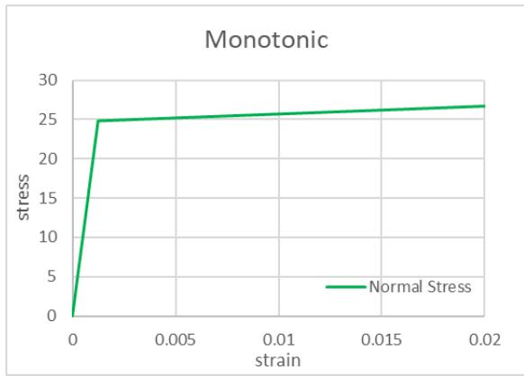

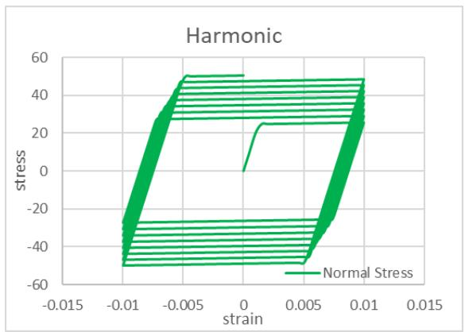

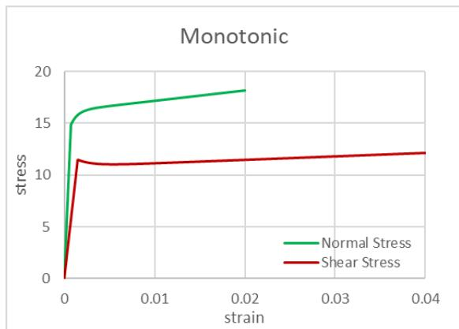  
Figure 194: Elastoplastic response for Euler-Bernoulli beam element

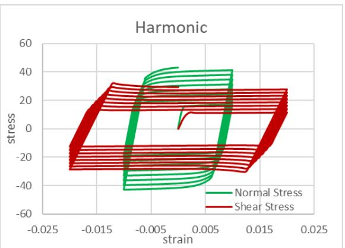  
Figure 195: Elastoplastic response for Timoshenko beam element

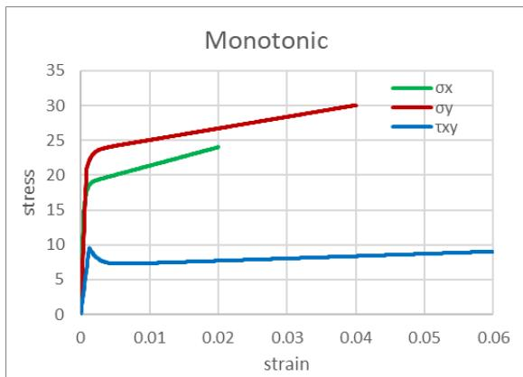

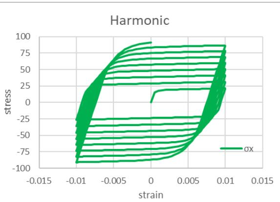

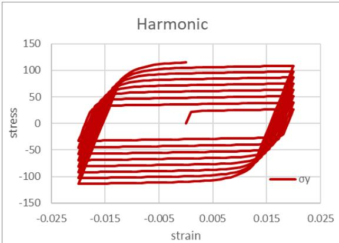

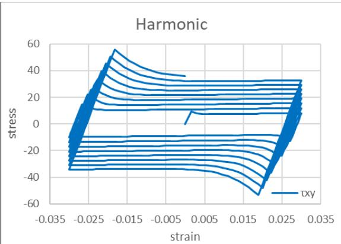  
Figure 196: Elastoplastic response for Kirchhoff (thin) plate element

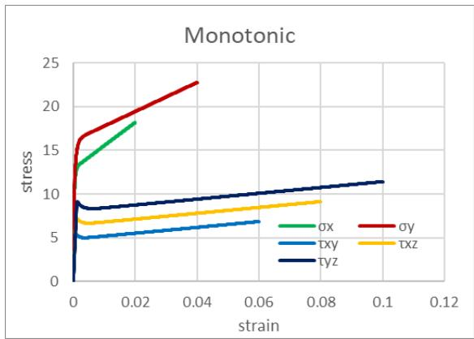

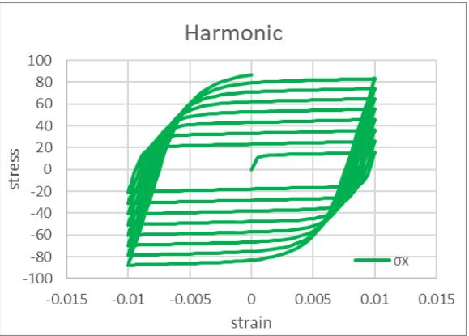

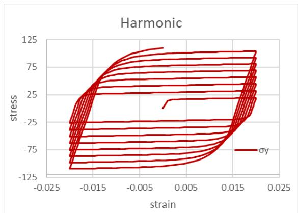

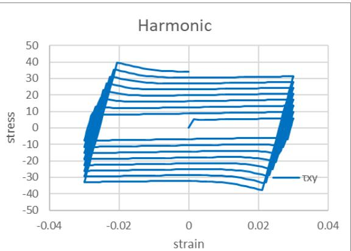

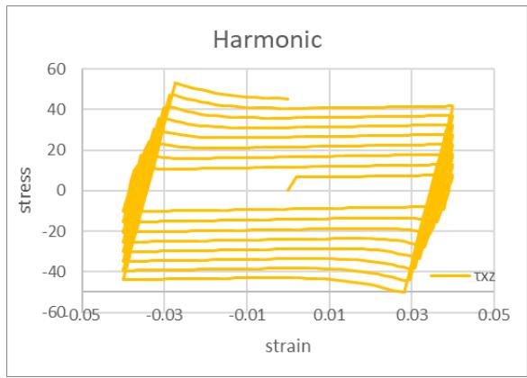

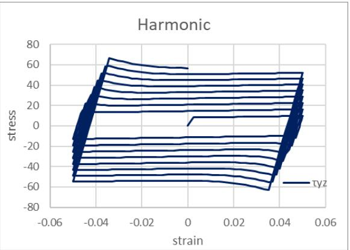  
Figure 197: Elastoplastic response for Mindlin (thick) plate element

## 6.6 Arc-length Method

6.6.1 Introduction

The arc-length iterative approach implemented in Collapse Advanced is based on Section 9.3 of reference [1]. The arc-length iterations are intended to guide a solution past unstable ‘limit points’ where the determinant of the tangent stiffness matrix becomes momentarily zero followed by the postbuckling region where the structure will continue to deform at decreased load levels.

Under normal load incrementation, a solution method will attempt to calculate the deflections associated with a set of advancing (increasing or decreasing) load factors that are applied to a fixed or reference load vector. For normal load incrementation, the load factor is essentially an input.

However, under arc-length control, the incremental load factor is now an output. More accurately, the objective of the method is to calculate a load factor increment and an associated equilibrium state that results in a force or deflection increment that is in some way constrained by a fixed arc length. There are many methods to stipulate how the arc-length constraint should be calculated. Collapse Advanced uses two of them, namely the cylindrical and spherical methods. The arc-length itself is calculated automatically but it can be scaled by a user-defined factor.

The following notation is used to describe the arc-length approach:

??̇ ?????? $\dot{ \bf d }_{ \bf r e f }$ The converged reference deflection increment that calculated for a previous load increment. It is calculated for the free $\mathsf{ D O F^{ \prime } S }$ .

$\dot{ \mathbf{ d } }$ The current load condition’s (un-factored) specified deflection increment. It is calculated for the fixed $\mathsf{ D O F^{ \prime } S }$ .

?? ̇ The current load condition’s (un-factored) applied force increment. It is calculated for the free $\mathsf{ D O F^{ \prime } S }$ .

${ \bf d }_{ \bf r , 0 }$ The initial deflection at the onset of the load increment, calculated for the fixed $\mathsf{ D O F^{ \prime } S }$ .

$\mathbf{ d_{ r } }$ The current (iterative) deflection, calculated for the fixed $\mathsf{ D O F^{ \prime } S } ,$ .

${ \bf d }_{ { \bf f } , { \bf 0 } }$ The initial deflection at the onset of the load increment, calculated for the free DOF’s.

$\mathbf{ d_{ f } }$ The current (iterative) deflection, calculated for the free $\mathsf{ D O F^{ \prime } S }$ .

???? ${ \bf d_{ 0 } }$ The initial deflection at the onset of the load increment, calculated for all $\mathsf{ D O F^{ \prime } S } .$

$\mathbf{ d }$ The current (iterative) deflection, calculated for all DOF’s.

$\mathbf{ f_{ 0 } }$ The initial applied load at the onset of the increment, calculated for the free $\mathsf{ D O F^{ \prime } S }$

?? The current (iterative) applied load, calculated for the free DOF’s.

$\Delta \lambda$ Total, (incremental) load factor increment.

δλ Iterative change in load factor.

α arc-length parameter.

Quantities for free and fixed DOF’s are occasionally put together in vector form, for example,

displacement vector can be written as $\begin{array} { r l } { \mathbf{ d } = } & { { } \left\{ \begin{array} { l } { \mathbf{ d_{ f } } } \\ { \mathbf{ d_{ r } } } \end{array} \right\} } \end{array}$

6.6.2 The Cylindrical Arc-Length Method

The objective of the analysis is to establish a load factor increment, Δλ such that at the end of the load increment three criteria involving the quantities defined in the previous section are met.

(i) On convergence, the specified deflections and applied loads are given by,

$$\mathbf{d}_{\mathbf{r}} = \mathbf{d}_{\mathbf{r}, 0} + \Delta \lambda \dot{\mathbf{d}} \tag{212}$$

$$\mathbf{f} = \mathbf{f}_{0} + \Delta \lambda \dot{\mathbf{f}}$$

(ii) The converged incremental deflections at the free $\mathsf{ D O F^{ \prime } S }$ are equal to the precalculated/specified arc-length, α:

$$\left\| \Delta \mathbf{d}_{\mathrm{f}} \right\| = \alpha \Rightarrow \quad \Delta \mathbf{d}_{\mathrm{f}}. \Delta \mathbf{d}_{\mathrm{f}} = \Delta \mathbf{d}_{\mathrm{f}}^{2} = \alpha^{2} \tag{213}$$

(iii) The solution should go forwards (minimum angle criterion);

$$\Delta \mathbf{d}_{\mathrm{f}} (\Delta \lambda). \dot{\mathbf{d}}_{\text{r e f}} > \Delta \mathbf{d}_{\mathrm{f}} (\Delta \tilde{\lambda}). \dot{\mathbf{d}}_{\text{r e f}} \tag{214}$$

In which $\Delta \widetilde{ \lambda }$ is any other candidate load factor change that satisfies (i) and (ii).

The starting point is to evaluate the tangent stiffness matrix, ?? at the initial deflection state, ${ \bf d_{ 0 } }$ .

$$\mathbf{K} = \mathbf{K} |_{\mathbf{d}_{0}} \tag{215}$$

The tangent stiffness matrix should be evaluated such that the plasticity state for each sub-area or plate layer remains unchanged. In other words, an integration point that is plastic should remain plastic and not unload, and an integration point that is elastic should not become plastic.

To develop the equations further, the tangent stiffness matrix can be partitioned as follows:

$$\mathbf{K} = \left[ \begin{array}{l l} \mathbf{K}_{\mathrm{f f}} & \mathbf{K}_{\mathrm{f r}} \\ \mathbf{K}_{\mathrm{f r}}^{\mathrm{t}} & \mathbf{K}_{\mathrm{r r}} \end{array} \right] \tag{216}$$

The internal resisting load due to a small change in the free DOF deflections, $\mathbf{ \delta \delta \delta \delta \delta }$ together with a small change in the specified deflections, $\delta \mathbf{ d }_{ \mathbf{ r } }$ should be balanced by a small change in the applied loads at the free DOF’s, ????:

$$\delta \mathbf{f} = \mathrm{K}_{\mathrm{f f}} \delta \mathbf{d}_{\mathrm{f}} + \mathrm{K}_{\mathrm{f r}} \delta \mathbf{d}_{\mathrm{r}} \Rightarrow \delta \mathbf{d}_{\mathrm{f}} = \mathrm{K}_{\mathrm{f f}}^{-1} (\delta \mathbf{f} - \mathrm{K}_{\mathrm{f r}} \delta \mathbf{d}_{\mathrm{r}}) \tag{217}$$

If intermediate loading on a member is present, the above expression can be written as;

$$\delta \mathbf{f} = \mathbf{K}_{\mathrm{f f}} \delta \mathbf{d}_{\mathrm{f}} + \mathbf{K}_{\mathrm{f r}} \delta \mathbf{d}_{\mathrm{r}} + \sum_{\mathrm{l} = 1}^{\mathrm{n}_{1}} \delta \mathbf{f}_{\mathrm{l i}} + \sum_{\mathrm{m} = 1}^{\mathrm{n}_{2}} \delta \mathbf{f}_{\mathrm{m i}} \tag{218}$$

In which $\boldsymbol{ \mathrm{ n } }_{ 1 }$ and $\boldsymbol{ \mathrm{ n } }_{ 2 }$ denote the number of elements that connect at end-1 and end-2 of a given element respectively, and the expressions ${ \pmb{ \delta } } \mathbf{ f }_{ \mathbf{ l i } }$ and ${ \delta \bf{ f } }_{ \bf{ m i } }$ denote the un-factored equivalent nodal load increment for each connecting element at end-1 and end-2 respectively.

The iterative changes in the applied loads and specified deflections can be written in terms of the initial load factor increment, δλ. Noting that (by definition),

$$\begin{array}{l} \delta \mathbf{f} = \delta \lambda \dot{\mathbf{f}} \\ \delta \mathbf{d}_{\mathbf{r}} = \delta \lambda \dot{\mathbf{d}} \end{array} \tag{219}$$

Using the above two equations, $\mathbf{ \delta \delta \delta \delta \delta \delta }$ can be written as:

$$\boldsymbol{\delta} \mathbf{d}_{\mathbf{f}} = \delta \lambda \mathbf{K}_{\mathbf{f f}}^{-1} (\dot{\mathbf{f}} - \mathbf{K}_{\mathbf{f r}} \dot{\mathbf{d}}) = \delta \lambda \tilde{\mathbf{d}}_{\mathbf{f}} \tag{220}$$

In which the free DOF predictor deflection, $\tilde{ \mathbf{ d } }_{ \mathbf{ f } }$ can be expressed in terms of the un-factored deflections and applied loads as follows:

$$\tilde{\mathbf{d}}_{\mathrm{f}} = \mathbf{K}_{\mathrm{f f}}^{-1} (\dot{\mathbf{f}} - \mathbf{K}_{\mathrm{f r}} \dot{\mathbf{d}}) \tag{221}$$

The cylindrical arc-length technique requires (initially) that the modulus of the change in free $\mathsf{ D O F^{ \prime } S }$ is equal to the arc length, α.

$$\delta \mathbf{d}_{\mathrm{f}}^{2} = \delta \lambda^{2} \left(\tilde{\mathbf{d}}_{\mathrm{f}} \cdot \tilde{\mathbf{d}}_{\mathrm{f}}\right) = \alpha^{2} \tag{222}$$

There are two potential solutions for $\delta \lambda ,$ namely;

$$\delta \lambda = \pm \sqrt{\frac{\alpha^{2}}{\tilde{\mathrm{d}}_{\mathrm{f}}^{2}}} \tag{223}$$

which can be denoted, $\delta \lambda_{ 1 }$ and $\delta \lambda_{ 2 }$

Choose $\delta \lambda$ using the minimum angle criterion (criterion III), which entails maximizing the scalar product:

$$\delta \lambda (\tilde{\mathbf{d}}_{\mathbf{f}}. \dot{\mathbf{d}}_{\mathbf{r e f}}) = \max  \left\{\delta \lambda_{1} \tilde{\mathbf{d}}_{\mathbf{f}}. \dot{\mathbf{d}}_{\mathbf{r e f}}, \quad \delta \lambda_{2} \tilde{\mathbf{d}}_{\mathbf{f}}. \dot{\mathbf{d}}_{\mathbf{r e f}} \right\} \tag{224}$$

At the onset of the procedure, the total incremental load factor increment is initialized to the iterative load factor increment as derived above – i.e. Δλ = δλ. Similarly, the iterative deflections are also initialized:

$$\mathbf{d} = \mathbf{d}_{0} + \left\{ \begin{array}{l} \boldsymbol{\delta} \mathbf{d}_{\mathrm{f}} \\ \boldsymbol{\delta} \mathbf{d}_{\mathrm{r}} \end{array} \right\} = \mathbf{d}_{0} + \delta \lambda \left\{ \begin{array}{l} \tilde{\mathbf{d}}_{\mathrm{f}} \\ \dot{\mathbf{d}} \end{array} \right\} \tag{225}$$

The next phase of the procedure is aimed at finding a value for $\Delta \lambda$ such that equilibrium is attained. This will involve an iterative procedure. The deflection state defined by ?? will rarely attain equilibrium. Equilibrium must be attained whilst simultaneously ensuring that the deflections at the free DOF’s adhere to the arc-length specification, which under cylindrical arc-length control amounts to:

$$\left\| \mathbf{d}_{\mathrm{f}} - \mathbf{d}_{\mathrm{f}, 0} \right\| = \alpha \tag{226}$$

A residual, ?? is defined to represent the degree to which the applied forces are not balanced with the internal loads, ${ \bf q_{ i } }$ associated with the current deflection state, ??. Thus,

$$\mathbf{r} = \left. \mathbf{f}_{\mathbf{0}} + \Delta \lambda \dot{\mathbf{f}} - \mathbf{q}_{\mathbf{i}} \right|_{\mathbf{d}} \tag{227}$$

Note: In the above expression, the meaning of ‘internal load’ is the load that needs to be applied to produce a material deflection, as opposed to the equal and opposite material ‘resisting’ force.

The objective of the procedure is to minimize ??, which varies with respect to $\mathbf{ d_{ f } }$ and $\Delta \lambda$ and therefore the incremental form can be derived:

$$\boldsymbol{\delta} \mathbf{r} = \frac{\partial \mathbf{r}}{\partial \lambda} \delta \lambda + \frac{\partial \mathbf{r}}{\partial \mathbf{d}_{\mathrm{f}}} \boldsymbol{\delta} \mathbf{d}_{\mathrm{f}} \tag{228}$$

With the aid of the tangent stiffness matrix:

$$\frac{\partial \mathbf{r}}{\partial \mathbf{d}_{\mathbf{f}}} = - \frac{\partial \mathbf{q}_{\mathbf{i}}}{\partial \mathbf{d}_{\mathbf{f}}} = - \left. \mathbf{K}_{\mathbf{f f}} \right|_{\mathbf{d}} \tag{229}$$

$$\frac{\partial \mathbf{r}}{\partial \lambda} = \dot{\mathbf{f}} - \frac{\partial \mathbf{q}_{\mathrm{i}}}{\partial \mathbf{d}_{\mathrm{r}}} \dot{\mathbf{d}} = \dot{\mathbf{f}} - \left. \mathbf{K}_{\mathbf{f r}} \right|_{\mathbf{d}} \dot{\mathbf{d}} \tag{230}$$

Using the above expressions;

$$\delta \mathbf{r} = \delta \lambda (\dot{\mathbf{f}} - \mathbf{K}_{\mathrm{f r}} |_{\mathbf{d}} \dot{\mathbf{d}}) - \mathbf{K}_{\mathrm{f f}} |_{\mathbf{d}} \delta \mathbf{d}_{\mathbf{f}} \tag{231}$$

In the following Newton iteration, the updated residual is set to zero. Therefore,

$$\mathbf{r} + \delta \mathbf{r} = \mathbf{0} \Rightarrow \mathbf{r} + \left(\dot{\mathbf{f}} - \mathbf{K}_{\mathrm{f r}} |_{\mathbf{d}} \dot{\mathbf{d}}\right) \delta \lambda - \mathbf{K}_{\mathrm{f f}} |_{\mathbf{d}} \delta \mathbf{d}_{\mathbf{f}} = \mathbf{0} \tag{232}$$

solving for ??????:

$$\delta \mathbf{d}_{\mathrm{f}} = \mathbf{K}_{\mathrm{f f}}^{-1} \left\{\mathbf{r} + \left(\dot{\mathbf{f}} - \left. \mathbf{K}_{\mathrm{f r}} \right|_{\mathrm{d}} \dot{\mathbf{d}}\right) \delta \lambda \right\} \tag{233}$$

This can be written in a simplified form as:

$$\boldsymbol{\delta} \mathbf{d}_{\mathrm{f}} = \bar{\mathbf{d}} + \delta \lambda \tilde{\mathbf{d}}_{\mathrm{f}} \tag{234}$$

in which the stiffness terms are now assumed to be evaluated at the current (iterative) deflection and where the following notations have been used;

$$\bar{\mathbf{d}} = \mathbf{K}_{\mathrm{f f}}^{-1} \mathbf{r} \tag{235}$$

$$\tilde{\mathbf{d}}_{\mathbf{f}} = \mathbf{K}_{\mathbf{f f}}^{-1} |_{\mathbf{d}} (\dot{\mathbf{f}} - \mathbf{K}_{\mathbf{f r}} |_{\mathbf{d}} \dot{\mathbf{d}}) \tag{236}$$

For the free DOF’s, the arc length should be maintained. Therefore:

$$\left\| \Delta \mathbf{d}_{\mathbf{f}} \right\| = \left\| \mathbf{d}_{\mathbf{f}} - \mathbf{d}_{\mathbf{f}, 0} + \delta \mathbf{d}_{\mathbf{f}} \right\| = \alpha$$

$$\left\| \mathbf{d}_{\mathbf{f}} - \mathbf{d}_{\mathbf{f}, 0} + \bar{\mathbf{d}} + \delta \lambda \tilde{\mathbf{d}}_{\mathbf{f}} \right\| = \left\| \mathbf{D} + \delta \lambda \tilde{\mathbf{d}}_{\mathbf{f}} \right\| = \alpha \tag{237}$$

where;

$$\mathbf{D} := \mathbf{d}_{\mathbf{f}} - \mathbf{d}_{\mathbf{f}, 0} + \bar{\mathbf{d}} \tag{238}$$

Thus:

$$\left(\mathbf{D} + \delta \lambda \tilde{\mathbf{d}}_{\mathbf{f}}\right)^{2} = \alpha^{2} \Rightarrow \mathbf{D}^{2} + 2 \delta \lambda \tilde{\mathbf{d}}_{\mathbf{f}}. \mathbf{D} + \delta \lambda^{2} \tilde{\mathbf{d}}_{\mathbf{f}}^{2} = \alpha^{2} \tag{239}$$

Equation (239) is a quadratic equation in δλ;

$$\mathrm{a}_{1} \delta \lambda^{2} + \mathrm{a}_{2} \delta \lambda + \mathrm{a}_{3} = 0 \tag{240}$$

with;

$$\mathrm{a}_{1} = \tilde{\mathbf{d}}_{\mathbf{f}}^{2}, \mathrm{a}_{2} = 2 \tilde{\mathbf{d}}_{\mathbf{f}}. \mathbf{D}, \mathrm{a}_{3} = \mathbf{D}^{2} - \alpha^{2} \tag{241}$$

The above quadratic equation has two roots, denoted, $\delta \lambda_{ 1 }$ and $\delta \lambda_{ 2 }$ , each of which provides an associated free DOF deflection increment:

$$\delta \mathbf{d}_{\mathbf{f}} (\delta \lambda_{1}) = \bar{\mathbf{d}} + \delta \lambda_{1} \tilde{\mathbf{d}}_{\mathbf{f}} \tag{242}$$

$$\delta \mathbf{d}_{\mathbf{f}} (\delta \lambda_{2}) = \bar{\mathbf{d}} + \delta \lambda_{2} \tilde{\mathbf{d}}_{\mathbf{f}}$$

The current deflection state for the free $\mathsf{ D O F^{ \prime } S }$ is then updated by $\mathbf{ \delta \delta \delta \delta \delta }$ as defined by the following equation:

$$\mathbf{d}_{\mathrm{f}} = \mathbf{d}_{\mathrm{f}} + \delta \mathbf{d}_{\mathrm{f}} \tag{243}$$

The updated incremental deflection states are represented by the following equations:

$$\Delta \mathbf{d}_{\mathbf{f}} (\delta \lambda_{1}) = \Delta \mathbf{d}_{\mathbf{f}} + \bar{\mathbf{d}} + \delta \lambda_{1} \tilde{\mathbf{d}}_{\mathbf{f}} \tag{244}$$

$$\Delta \mathbf{d}_{\mathbf{f}} (\delta \lambda_{2}) = \Delta \mathbf{d}_{\mathbf{f}} + \bar{\mathbf{d}} + \delta \lambda_{2} \tilde{\mathbf{d}}_{\mathbf{f}}$$

Applying the minimum angle criterion to $\delta \lambda_{ 1 }$ and $\delta \lambda_{ 2 }$ yields the following condition:

$$\Delta \mathbf{d}_{\mathrm{f}}. \dot{\mathbf{d}}_{\text{r e f}} = \max  \left\{\Delta \mathbf{d}_{\mathrm{f}} \left(\delta \lambda_{1}\right). \dot{\mathbf{d}}_{\text{r e f}}, \quad \Delta \mathbf{d}_{\mathrm{f}} \left(\delta \lambda_{2}\right). \dot{\mathbf{d}}_{\text{r e f}} \right\} \tag{245}$$

For a given value of δλ from equation (254) δλ, the current (iterative) updated deflection state ?? is given by:

$$\mathbf{d} = \left\{ \begin{array}{c} \mathbf{d}_{\mathrm{f}} \\ \mathbf{d}_{\mathrm{r}} \end{array} \right\} = \left\{ \begin{array}{c} \mathbf{d}_{\mathrm{f}} + \delta \mathbf{d}_{\mathrm{f}} (\delta \lambda) \\ \mathbf{d}_{\mathrm{r}} + \delta \lambda \dot{\mathbf{d}} \end{array} \right\} \tag{246}$$

and the current (iterative) updated incremental load factor Δλ given by the following equation:

$$\Delta \lambda = \Delta \lambda + \delta \lambda \tag{247}$$

The next stage requires the determination of a new residual and a repeat of the above procedure until the residual is bounded by an acceptable tolerance.

6.6.3 The Spherical Arc-Length Method

The procedure for the spherical arc length is almost identical to that for the cylindrical arc-length method. However, the criterion (ii) for the user-specified arc-length becomes:

$$\Delta \mathbf{d}_{\mathbf{f}}^{2} + \Delta \lambda^{2} \psi^{2} \dot{\mathbf{f}}^{2} = \alpha^{2} \tag{248}$$

where the constant, ψ is also user-specified, but almost always set to unity. Noting that:

$$\delta \mathbf{d}_{\mathrm{f}} = \delta \lambda \mathbf{K}_{\mathrm{f f}}^{-1} (\dot{\mathbf{f}} - \mathbf{K}_{\mathrm{f r}} \dot{\mathbf{d}}) = \delta \lambda \tilde{\mathbf{d}}_{\mathrm{f}} \tag{249}$$

As with the cylindrical arc-length method, the free DOF predictor deflection, $\tilde{ \mathbf{ d } }_{ \mathbf{ f } }$ has been written in terms of the un-factored deflections and applied loads as follows:

$$\tilde{\mathbf{d}}_{\mathrm{f}} = \mathbf{K}_{\mathrm{f f}}^{-1} (\dot{\mathbf{f}} - \mathbf{K}_{\mathrm{f r}} \dot{\mathbf{d}}) \tag{250}$$

Combining equations (249) and (250) gives the initial predictor of the load factor increment as follows:

$$\delta \lambda^{2} \left(\tilde{\mathbf{d}}_{\mathbf{f}}^{2} + \psi^{2} \dot{\mathbf{f}}^{2}\right) = \alpha^{2} \tag{251}$$

where the initial statement for the spherical arc-length criterion is given by:

$$\boldsymbol{\delta} \mathbf{d}_{\mathbf{f}}^{2} + \Delta \delta \psi^{2} \dot{\mathbf{f}}^{2} = \alpha^{2} \tag{252}$$

Solving for the predictor calculation for δλ gives:

$$\delta \lambda = \pm \sqrt{\frac{\alpha^{2}}{\tilde{\mathbf{d}}_{\mathbf{f}}^{2} + \psi^{2} \dot{\mathbf{f}}^{2}}} \tag{253}$$

For the residual minimization iterations, the same incremental expression is used as that for the cylindrical arc-length method except that the spherical arc-length criterion now requires:

$$\left(\mathbf{D} + \delta \lambda \tilde{\mathbf{d}}_{\mathbf{f}}\right)^{2} + \psi^{2} \dot{\mathbf{f}}^{2} (\Delta \lambda + \delta \lambda)^{2} = \alpha^{2} \tag{254}$$

In which ?? is defined as follows:

$$\mathbf{D} := \mathbf{d}_{\mathrm{f}} - \mathbf{d}_{\mathrm{f}, 0} + \bar{\mathbf{d}} \tag{255}$$

This requires the solution of the following quadratic equation for δλ:

$$\mathrm{a}_{1} \delta \lambda^{2} + \mathrm{a}_{2} \delta \lambda + \mathrm{a}_{3} = 0 \tag{256}$$

With;

$$\mathrm{a}_{1} = \tilde{\mathbf{d}}_{\mathbf{f}}^{2} + \psi^{2} \dot{\mathbf{f}}^{2}, \mathrm{a}_{2} = 2 \tilde{\mathbf{d}}_{\mathbf{f}}. \mathbf{D} + 2 \psi^{2} \dot{\mathbf{f}}^{2} \Delta \lambda , \mathrm{a}_{3} = \mathbf{D}^{2} + \psi^{2} \dot{\mathbf{f}}^{2} \Delta \lambda^{2} - \alpha^{2} \tag{257}$$

As before, the root δλ can be selected based on angle minimization.

6.6.4 Arc-Length Parameter Calculations and User-defined factors

The arc-length parameter α is automatically calculated on the last converged Newton iteration and is given by the following equations for the two arc length approaches discussed above:

$$\text{c y l i n d r i c a l} \alpha = \| \Delta \mathbf{d}_{\mathbf{f}} \| = \sqrt{\Delta \mathbf{d}_{\mathbf{f}}^{2}} \tag{258}$$

$$\text{s p h e r i c a l} \alpha = \sqrt{\Delta \mathbf{d}_{\mathbf{f}}^{2} + \psi^{2} \Delta \mathbf{f}^{2}} \tag{259}$$

The parameter α may be scaled by a user-defined factor defined in columns 24-29 on the ARCLEN input line (the default value is 1.0). In the case of the spherical arc-length method, the parameter ψ may be revised in columns 31-36 on the ARCLEN input line (the default is 1.0).

## 6.7 Element Offsets

This section illustrates the application of element offsets for the large rotation and displacement approach implemented in Collapse Advanced. The element offsets lead to additional terms in the global tangent stiffness and geometric stiffness matrices.

The following notations are used in this section:

$\mathbf{ f }_{ J } , \mathbf{ m }_{ J }$ force and moment vector at joint

$\mathbf{ f }_{ O } , \mathbf{ m }_{ O }$ force and moment vector at offset

$\mathbf{ d }_{ J } , \mathbf{ \boldsymbol{ \theta } }_{ J }$ displacement and rotation vector at joint

$\mathbf{ d }_{ O } , \mathbf{ \theta }_{ O }$ displacement and rotation vector at offset

δ?? change in orientation due to large rotation at joint

?? offset vector

?? spin operator defined in equation (16)

?? rotation matrix

?? identity matrix

δ variational operator

The rotation matrix associated with δ?? can be expressed as:

$$\mathbf{R} (\delta \boldsymbol{\theta}) = \mathbf{I} + \mathbf{S} (\delta \boldsymbol{\theta}) \tag{260}$$

also,

$$\boldsymbol{\omega} + \delta \boldsymbol{\omega} = \mathbf{R} (\delta \boldsymbol{\theta}) \boldsymbol{\omega} \Rightarrow \delta \boldsymbol{\omega} = \mathbf{S} (\delta \boldsymbol{\theta}) \boldsymbol{\omega} = - \mathbf{S} (\boldsymbol{\omega}) \delta \boldsymbol{\theta} \tag{261}$$

The relationship between the internal forces offset （$\mathbf{ f }_{ O } , \mathbf{ m }_{ O } )$ and the internal forces at the joint, （$\mathbf{ f }_{ J } , \mathbf{ m }_{ J } )$ （20 can be written matrix form as:

$$\left\{ \begin{array}{l} \mathbf{f}_{J} \\ \mathbf{m}_{J} \end{array} \right\} = \left[ \begin{array}{c c} \mathbf{I} & \mathbf{0} \\ \mathbf{S} (\boldsymbol{\omega}) & \mathbf{I} \end{array} \right] \left\{ \begin{array}{l} \mathbf{f}_{O} \\ \mathbf{m}_{O} \end{array} \right\} \tag{262}$$

where equation (17) is used to define the cross product between an offset and the force vector. Using the above equations leads to the following expression for the moment vector at joint （$\mathbf{ f }_{ J } , \mathbf{ m }_{ J } )$ :

$$\delta \mathbf{m}_{J} = \mathbf{S} (\mathbf{f}_{O}) \mathbf{S} (\boldsymbol{\omega}) \delta \boldsymbol{\theta} + \mathbf{S} (\boldsymbol{\omega}) + \delta \mathbf{f}_{O} + \delta \mathbf{m}_{O} \tag{263}$$

The next step is to determine a similar relationship between the variation of displacements and rotations. The displacement ${ \bf d }_{ O }$ and rotation vector $\mathbf{ \delta } \mathbf{ \theta } \mathbf{ 0 }^{ \mathsf{ a t } }$ offset can be expressed in terms of the displacement ${ \bf d }_{ j }$ and rotation $\mathbf{ \boldsymbol{ \mathsf{ \mathbf{ \theta } } } }_{ j }$ at the joint as:

$$\boldsymbol{\theta}_{O} = \boldsymbol{\theta}_{j}, \mathbf{d}_{O} = \mathbf{d}_{j} + \boldsymbol{\omega} \tag{264}$$

Hence,

$$\delta \boldsymbol{\theta}_{O} = \delta \boldsymbol{\theta}_{j}, \delta \mathbf{d}_{O} = \delta \mathbf{d}_{j} + \mathbf{S} (\delta \boldsymbol{\theta}) \boldsymbol{\omega} \tag{265}$$

using equation (261) for δ??, equation (264) can be written in matrix form as:

$$\left\{ \begin{array}{l} \delta \mathbf{d}_{O} \\ \delta \boldsymbol{\theta}_{O} \end{array} \right\} = \left[ \begin{array}{c c} \mathbf{I} & - \mathbf{S} (\boldsymbol{\omega}) \\ \mathbf{0} & \mathbf{I} \end{array} \right] \left\{ \begin{array}{l} \delta \mathbf{d}_{J} \\ \delta \boldsymbol{\theta}_{J} \end{array} \right\} \tag{266}$$

Combining the above equation with (262):

$$\left\{ \begin{array}{l} \delta \mathbf{f}_{J} \\ \delta \mathbf{m}_{J} \end{array} \right\} = \left[ \begin{array}{c c} \mathbf{I} & \mathbf{0} \\ \mathbf{S} (\boldsymbol{\omega}) & \mathbf{I} \end{array} \right] \left\{ \begin{array}{l} \delta \mathbf{f}_{O} \\ \delta \mathbf{m}_{O} \end{array} \right\} + \left[ \begin{array}{c c} \mathbf{0} & \mathbf{0} \\ \mathbf{0} & \mathbf{S} (\mathbf{f}_{O}) \mathbf{S} (\boldsymbol{\omega}) \end{array} \right] \left\{ \begin{array}{l} \delta \mathbf{d}_{O} \\ \delta \boldsymbol{\theta}_{O} \end{array} \right\} \tag{267}$$

and considering $\left\{ \begin{array} { l } { \delta \mathbf{ f }_{ O } } \\ { \delta \mathbf{ m }_{ O } } \end{array} \right\} = \mathbf{ K }_{ O } \left\{ \begin{array} { l } { \delta \mathbf{ d }_{ O } } \\ { \delta \mathbf{ \theta }_{ O } } \end{array} \right\}$ δ???? = ???? {δ????} δ???? and using equation (266) leads to:

$$\left\{ \begin{array}{l} \delta \mathbf{f}_{J} \\ \delta \mathbf{m}_{J} \end{array} \right\} = \left(\left[ \begin{array}{c c} \mathbf{I} & \mathbf{0} \\ \mathbf{S} (\boldsymbol{\omega}) & \mathbf{I} \end{array} \right] \mathbf{K}_{O} \left[ \begin{array}{c c} \mathbf{I} & - \mathbf{S} (\boldsymbol{\omega}) \\ \mathbf{0} & \mathbf{I} \end{array} \right] + \left[ \begin{array}{c c} \mathbf{0} & \mathbf{0} \\ \mathbf{0} & \mathbf{S} (\mathbf{f}_{O}) \mathbf{S} (\boldsymbol{\omega}) \end{array} \right]\right) \left\{ \begin{array}{l} \delta \mathbf{d}_{J} \\ \delta \boldsymbol{\theta}_{J} \end{array} \right\} \tag{268}$$

Equations (262) and (268) are used to calculate the effects of offsets on the element force and stiffness.

## 6.8 Element End-Releases

The member end releases are used to define the connection between the member ends and model joints. End-releases are defined in member local coordinate systems and for large deformation analysis, the member ends may experience large deformation – leading to a change in orientation of end releases with respect to the global coordinate systems.

End-released can be modeled in the local coordinate system as follow

• For released degrees of freedom, the stiffness is zero and no load is translated from model joint to member end.   
• For fixed degrees of freedom, the member ends and model joints are connected using rigid links.

The following above assumptions, Collapse utilizes a special zero-length finite element (i.e. subsegment) to model the releases. These subsegments are automatically inserted at member ends with releases in addition to standard subsegments. The stiffness matrix of the special subsegment is given by

$$\mathbf{K}_{r e l} = \mathbf{T}_{r e l}^{\mathrm{T}} \mathbf{K}_{r e l} \mathbf{T}_{r e l} \tag{269}$$

where ${ \bf{ K } }_{ r e l }$ is local release stiffness which is determined based on zero-stiffness or rigid links connecting member ends and model joints. ${ \bf T }_{ r e l }$ is the transformation matrix computed using member ends corotational coordinate systems in the deformed configuration as shown in Figure 198. Thus,

• At End-A, ${ \bf T }_{ r e l }$ is computed based on $\mathbf{ U }^{ ( 1 ) }$ (see section 6.3.1) of the first member standard subsegment   
• At End-B, ${ \bf T }_{ r e l }$ is computed based on $\mathbf{ U }^{ ( 2 ) }$ (see section 6.3.1) of the last member standard subsegment

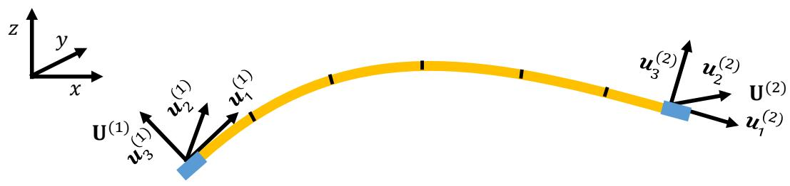  
Deformed Configuration   
Figure 198: Collapse Advanced member end releases

## 6.9 Joint Strength

This section presents the formulation for various joint strength check methods supported by the program.

The following notation is used to describe the joint strength methods:

$P , M$ brace axial force and moment, respectively

$P_{ u j }$ joint ultimate capacity for axial load

$M_{ u j }$ joint ultimate capacity for bending moment

$\varphi_{ j }$ resistance factors (set by the method or user-defined factors given on RSFAC/RSFACO input line)

$A X L$ axial tension or compression load

$I P B$ in-plane bending moment

$O P B$ out-of-plane bending moment

?? brace angle

?? gap for K connection

?? eccentricity for K and X connections

?? brace wall thickness

$T$ chord wall thickness

?? brace outer diameter

?? chord outer diameter

?? brace wall thickness to chord wall thickness ratio, $\frac{ t } { T }$

$\beta$ brace diameter to chord diameter ratio, $\frac{ d } { D }$

$\gamma$ chord radius to chord wall thickness ratio, $\begin{array} { l } { { \frac{ D } { 2 T } } } \end{array}$

$F_{ y b }$ brace yield stress

$F_{ y c }$ chord yield stress

$P_{ C } , M_{ C }$ chord axial force and moment, respectively

$f_{ a x l }$ axial stress in chord

$f_{ i p b }$ in-plane bending stress in chord

$f_{ o p b }$ out-of-plane bending stress in chord

$\sigma_{ t } , \sigma_{ c }$ brace tensile and compression stress

$\sigma_{ b y } , \sigma_{ b z }$ brace bending stresses

$P_{ y }$ chord plastic axial strength

$M_{ p }$ chord plastic strength moment

$Q_{ f }$ chord force factor

$Q_{ u }$ joint strength factor

$Q_{ \beta }$ factor for brace diameter to chord diameter ratio

$Q_{ g }$ ???? gap factor for K connection

$Q_{ y y }$ angle correction factor for K connection

???? $E_{ b }$ brace Young’s modulus

$E_{ c }$ chord Young’s modulus

$Z_{ b } , Z_{ c }$ brace and chord plastic section modulus

$S_{ b } , S_{ c }$ brace and chord elastic section modulus

6.9.1 Applicability Ranges

The program enforces applicability ranges presented in Table 7 for joint strength checks.

Table 7: Joint Strength Applicability Ranges   

| Method | Applicability Range | Description |
| --- | --- | --- |
| API LRFD | 10 ≤ γ ≤ 50 |  |
| API LRFD | 0.2 ≤ β ≤ 1.0 | For all connection types (see the notes below) |
| API LRFD | 30° ≤ θ ≤ 90° | For all connection types (see the notes below) |
| API LRFD | Fyc, Fyb ≤ 50 kN /cm2 | For all connection types (see the notes below) |
| API LRFD | g ≥ 0 | For K connections (no overlap) |
| API LRFD | \|e/D\| ≤ 0.25 | For K and X connections |
| ISO 19902 | 10 ≤ γ ≤ 50 |  |
| ISO 19902 | 0.2 ≤ β ≤ 1.0 | For all connection types |
| ISO 19902 | 30° ≤ θ ≤ 90° | For all connection types |
| ISO 19902 | τ ≤ 1.0 | For all connection types |
| ISO 19902 | Fyc, Fyb ≤ 50 kN /cm2 | For all connection types |
| ISO 19902 | -0.6 < g/D ≤ 1.0 | For K connections |
| NORSOK | 10 ≤ γ ≤ 50 |  |
| NORSOK | 0.2 ≤ β ≤ 1.0 | For all connection types |
| NORSOK | 30° ≤ θ ≤ 90° | For all connection types |
| NORSOK | τ ≤ 1.0 | For all connection types |
| NORSOK | Fyc, Fyb ≤ 50 kN /cm2 | For all connection types |
| NORSOK | -0.6 ≤ g/D ≤ 1.0 | For K connections |
| MSL | 10 ≤ γ ≤ 50 |  |
| MSL | 0.2 ≤ β ≤ 1.0 | For all connection types |
| MSL | 30° ≤ θ ≤ 90° | For all connection types |
| MSL | Fyc, Fyb ≤ 50 kN /cm2 | For all connection types |
| MSL | -0.6 < g/D ≤ 1.0 | For K connections |
| Additional Checks | Ec, Eb > 2000 kN /cm2 | For all connection types (see notes below) |
| Additional Checks | Brace offsets | For all connection types (see notes below) |

The following comments should be noted regarding joint strength applicability ranges

✓ If a given K or X connection does not satisfy gap or eccentricity limits, the program assumes the joint acts as a Y/T connection.   
✓ If a given connection does not satisfy brace/chord applicability ranges, by default the program will exclude the joint from strength check calculations.   
✓ API LRFD does not explicitly provide brace/chord applicability range. The above limits are reported by Bomel Limited in [44].   
✓ Young’s modulus checks are enforced to ensure numerical stability.   
✓ The program checks the braces offsets to ensure it is located outside of the chord. The default tolerance for offset check is 0.1 cm or inch which can be revised on the JSOPT input line.   
✓ The joint applicability checks can be overridden by options available on the CLPOP2 input line.

6.9.2 API RP 2A-LRFD

API RP 2A-LRFD states the joint capacity should satisfy the following conditions:

For axial load (tension or compression):

$$\frac{P}{\varphi_{j} P_{u j}} \leq 1. 0 \tag{270}$$

For in-plane bending (IPB) moment or out-of-plane bending (OPB) moment:

$$\frac{M}{\varphi_{j} M_{u j}} \leq 1. 0 \tag{271}$$

and for the combined axial and bending:

$$1 - \cos \left[ \frac{\pi}{2} \left(\frac{P}{\varphi_{j} P_{u j}}\right) \right] + \left[ \left(\frac{M}{\varphi_{j} M_{u j}}\right)_{I P B}^{2} + \left(\frac{M}{\varphi_{j} M_{u j}}\right)_{O P B}^{2} \right]^{1 / 2} \leq 1. 0 \tag{272}$$

where the default values for the resistance factor $\varphi_{ j }$ are given in Table 8, and these can be revised using RSFAC or RSFACO input lines. The program reports equations (270) and (272) as unity checks in accordance with API LRFD joint strength checks.

Table 8: API resistance factors based on API LRFD Commentary section E.1   

| Joint Type | Axial Tension | Axial Compression | IPB | OPB |
| --- | --- | --- | --- | --- |
| T/Y | 2.11 | 2.57 | 2.81 | 2.61 |
| X | 2.11 | 2.57 | 2.81 | 2.61 |
| K | 2.51 | 2.51 | 2.81 | 2.61 |

In equation (272), $P_{ u j }$ and $M_{ u j }$ represents the ultimate capacities as below:

For axial load (tension or compression):

$$P_{u j} = \frac{F_{y c} T^{2}}{\sin (\theta)} Q_{u} Q_{f} \tag{273}$$

For in-plane bending (IPB) moment or out-of-plane bending (OPB) moment:

$$M_{u j} = \frac{F_{y c} T^{2}}{\sin (\theta)} (0. 8 d) Q_{u} Q_{f} \tag{274}$$

where the strength factor $Q_{ u }$ are given in Table 9, and the chord force factor $Q_{ f }$ is determined as follows:

$$Q_{f} = \left\{ \begin{array}{c c} 1. 0 & i f f_{a x l} \geq \sqrt{f_{I P B}^{2} + f_{O P B}^{2}} (a l l c h o r d f i b e r s a t t e n s i o n) \\ 1. 0 - \lambda A^{2} & o t h e r w i s e \end{array} \right. \tag{275}$$

with

$$A = \frac{\sqrt{f_{A X L}^{2} + f_{I P B}^{2} + f_{O P B}^{2}}}{\varphi_{q} F_{y c}} \tag{276}$$

where ?? is defined by API LRFD section E.3.1.1:

brace axial force: 0.030   
brace in-plane bending moment: 0.045   
brace out-of-plane bending moment: 0.021

and $\varphi_{ q }$ is the yield resistance factor with a default value of 1.0 which can be revised using the RSFAC or RSFACO input lines.

Table 9: API LRFD strength factor $Q_{ u }$ based on API LRFD table E.3-2   

| Joint Type | Axial Tension | Axial Compression | IPB | OPB |
| --- | --- | --- | --- | --- |
| T/Y | 3.4 + 19β | 3.4 + 19β | 3.4 + 19β | (3.4 + 7β)Qβ |
| X | 3.4 + 19β | (3.4 + 13β)Qβ | 3.4 + 19β | (3.4 + 7β)Qβ |
| K | (3.4 + 19β)Qg | (3.4 + 19β)Qg | 3.4 + 19β | (3.4 + 7β)Qβ |
|  | Qβ = {0.3/β(1 - 0.833β)} if β > 0.6 | Qβ = {0.3/β(1 - 0.833β)} if β > 0.6 | Qβ = {0.3/β(1 - 0.833β)} if β > 0.6 | Qβ = {0.3/β(1 - 0.833β)} if β > 0.6 |
|  | 1.0 if β ≤ 0.6 | 1.0 if β ≤ 0.6 | 1.0 if β ≤ 0.6 | 1.0 if β ≤ 0.6 |
|  | Qg = {1.8 - 0.1g/T} ≥ 1.0 if γ ≤ 20 | Qg = {1.8 - 0.1g/T} ≥ 1.0 if γ ≤ 20 | Qg = {1.8 - 0.1g/T} ≥ 1.0 if γ ≤ 20 | Qg = {1.8 - 0.1g/T} ≥ 1.0 if γ ≤ 20 |
|  | 1.8 - 4g/D} ≥ 1.0 if γ > 20 | 1.8 - 4g/D} ≥ 1.0 if γ > 20 | 1.8 - 4g/D} ≥ 1.0 if γ > 20 | 1.8 - 4g/D} ≥ 1.0 if γ > 20 |

The program determines the joint classification based on API LRFD Figure E.3-2. The classification weighting factors are defined as $C_{ Y } , C_{ X }$ , and $C_{ K }$ with $C_{ Y } + C_{ X } + C_{ K } = 1$ . The Collapse Advanced uses the classification weighting factors and follows API LRFD recommendations to determine the joint capacity with the mixed classification using the following expressions:

$$\varphi_{j_{\text{m i x e d}}} = C_{Y} \varphi_{j_{Y}} + C_{X} \varphi_{j_{X}} + C_{K} \varphi_{j_{K}} \tag{277}$$

$$Q_{u_{\text{m i x e d}}} = C_{Y} Q_{u_{Y}} + C_{X} Q_{u_{X}} + C_{K} Q_{u_{K}} \tag{278}$$

$$Q_{f_{\text{m i x e d}}} = C_{Y} Q_{f_{Y}} + C_{X} Q_{f_{X}} + C_{K} Q_{f_{K}} \tag{279}$$

The above expressions are separately computed for axial tension, axial compression, in-plane bending, and out-of-plane bending. Once the average quantities are computed, the program utilizes equations (273) and (274) to obtain the joint capacities for axial tension, axial compression, in-plane bending, and out-of-plane bending.

6.9.3 ISO 19902

ISO 19902 states the joint capacity should satisfy the following conditions:

$$\left| \frac{P}{\varphi_{j} \frac{P_{u j}}{\gamma_{R , j}}} \right| + \left(\frac{M}{\varphi_{j} \frac{M_{u j}}{\gamma_{R , j}}}\right)_{I P B}^{2} + \left| \frac{M}{\varphi_{j} \frac{M_{u j}}{\gamma_{R , j}}} \right|_{O P B} \leq 1. 0 \tag{280}$$

$$\left| \frac{P}{\frac{\varphi_{j} P_{u j}}{\gamma_{R , j}}} \right| + \left(\frac{M}{\frac{\varphi_{j} M_{u j}}{\gamma_{R , j}}}\right)_{I P B}^{2} + \left| \frac{M}{\frac{\varphi_{j} M_{u j}}{\gamma_{R , j}}} \right|_{O P B} \leq \frac{U_{b}}{\gamma_{z , j}} \tag{281}$$

where

$\gamma_{ R , j }$ is a partial resistance factor for joints with a default value of 1.05 and it can be revised on the RSFAC input line.   
$\gamma_{ z , j }$ is an extra partial resistance factor to ensure that member fails before the joint yields. Its default value is 1.17 and can be revised using the RSFAC input line.   
$\varphi_{ j }$ are the user-defined resistance factors with default values of 1.0. The default values can be revised for different joint/load types using the RSFAC or RSFACO input lines.   
$U_{ b }$ is brace utilization factor determine ISO 19902 section 13.

In addition to the above unity check, the Collapse Advanced reports minimum tensile brace strain and compares it with ISO 19902 ductility limit of 5.0%.

$P_{ u j }$ and $M_{ u j }$ ultimate capacities are given as follow

For axial load (tension or compression):

$$P_{u j} = \frac{F_{y c} T^{2}}{\sin (\theta)} Q_{u} Q_{f} \tag{282}$$

For in-plane bending (IPB) moment or out-of-plane bending (OPB) moment:

$$M_{u j} = \frac{F_{y c} T^{2} d}{\sin (\theta)} Q_{u} Q_{f} \tag{283}$$

The strength factor $Q_{ u }$ is given in Table 10 and the chord force factor $Q_{ f }$ is determined as follow (based ISO 19902 section 14.3.4):

$$Q_{f} = 1. 0 - \lambda q_{A}^{2} \tag{284}$$

where ?? is defined by ISO 19902

• brace axial force: 0.030   
brace in-plane bending moment: 0.045   
brace out-of-plane bending moment: 0.021

and

$$q_{A} = \gamma_{R, q} \sqrt{C_{1} \left(\frac{P_{C}}{P_{y}}\right)^{2} + C_{2} \left(\frac{M_{C}}{M_{p}}\right)^{2} + C_{2} \left(\frac{M_{C}}{M_{p}}\right)^{2}} \tag{285}$$

where $\gamma_{ R , q }$ is the partial resistance factor for the yield with a default value of 1.05 and can be revised using the RSFAC input line. Coefficients $C_{ 1 }$ and $C_{ 2 }$ are given in Table 11.

The brace utilization factor $U_{ b }$ is by default 1.0. If option $" { \tt B }^{ \prime }$ for brace utilization factor is selected on JSOPT input line, $U_{ b }$ is calculated as follows (ISO 19902 equation 13.3-2 and 13.3-8):

For combined tension and bending

$$U_{b} = \frac{\gamma_{R , t} \sigma_{t}}{f_{t}} + \frac{\gamma_{R , b} \sqrt{\sigma_{b , y}^{2} + \sigma_{b , z}^{2}}}{f_{b}} \tag{286}$$

For combined compression and bending

$$U_{b} = \frac{\gamma_{R , c} \sigma_{c}}{f_{y c}} + \frac{\gamma_{R , b} \sqrt{\sigma_{b , y}^{2} + \sigma_{b , z}^{2}}}{f_{b}} \tag{287}$$

in which (ISO 19902 sections 13.2.2 (tension), 13.2.3.3 (compression), and 13.2.4 (bending)):

$$f_{y c} = \left\{ \begin{array}{c c} F_{y b} & \frac{F_{y b}}{f_{x e}} \leq 0. 170 \\ \left(1. 047 - 0. 274 \frac{F_{y b}}{f_{x e}}\right) F_{y b} & \frac{F_{y b}}{f_{x e}} > 0. 170 \end{array} \text{w i t h} f_{x e} = \frac{2 C_{X} E_{b} t}{d} a n d C_{X} = 0. 3 \right.$$

$$f_{b} = \left\{ \begin{array}{l l} \frac{Z_{b}}{S_{b}} F_{y b} & \frac{F_{y b} d}{E_{b} t} \leq 0. 0517 \\ \left(1. 13 - 2. 58 \frac{F_{y b} d}{E_{b} t}\right) \frac{Z_{b}}{S_{b}} F_{y b} & 0. 0517 <   \frac{F_{y b} d}{E_{b} t} \leq 0. 1034 \\ \left(0. 94 - 0. 76 \frac{F_{y b} d}{E_{b} t}\right) \frac{Z_{b}}{S_{b}} F_{y b} & 0. 1034 <   \frac{F_{y b} d}{E_{b} t} \leq 120 \frac{F_{y b}}{E_{b}} \end{array} \right. \tag{288}$$

and $\gamma_{ R , t } = 1 . 05 , \gamma_{ R , c } = 1 . 18 , \gamma_{ R , b } = 1 . 05 .$

The program determines the joint classification based on ISO 19902 Figure 14.2-2. The classification weighting factors are defined as $C_{ Y } , C_{ X }$ , and $C_{ K }$ with $C_{ Y } + C_{ X } + C_{ K } = 1$ . The Collapse Advanced uses the classification weighting factors and follows ISO 19902 recommendations to determine the joint capacity with the mixed classification using the following expressions:

$$\left(\varphi_{j} P_{u j}\right)_{\text{m i x e d}} = C_{Y} \left(\varphi_{j} P_{u j}\right)_{Y} + C_{X} \left(\varphi_{j} P_{u j}\right)_{X} + C_{K} \left(\varphi_{j} P_{u j}\right)_{K} \tag{289}$$

$$\left(\varphi_{j} M_{u j}\right)_{\text{m i x e d}} = C_{Y} \left(\varphi_{j} M_{u j}\right)_{Y} + C_{X} \left(\varphi_{j} M_{u j}\right)_{X} + C_{K} \left(\varphi_{j} M_{u j}\right)_{K} \tag{290}$$

In the above equations, mixed ultimate capacities are separately computed for axial tension, axial compression, in-plane bending, and out-of-plane bending components.

Table 10: ISO 19902 strength factor $Q_{ u }$ based on ISO 19902 section 14.3.3   

| Joint Type | Axial Tension | Axial Tension | Axial Compression | IPB | OPB |
| --- | --- | --- | --- | --- | --- |
| T/Y | 30β | 30β | (1.9 + 19β)Qβ0.5 | 4.5βγ0.5 | 3.2γ(0.5β2) |
| X | {20.7 + (β - 0.9)(17γ - 220)23β | if β > 0.9 | [2.8 + (12 + 0.1γ)β]Qβ | 4.5βγ0.5 | 3.2γ(0.5β2) |
| K | (1.9 + 19β)Qβ0.5Qg | if β ≤ 0.9 | (1.9 + 19β)Qβ0.5Qg | 4.5βγ0.5 | 3.2γ(0.5β2) |
|  | Qβ = {0.3/β(1 - 0.833β)} | if β > 0.6 |  |  |  |
|  | 1.0 | if β ≤ 0.6 |  |  |  |
|  | Qg = {0.13 + 0.65tFyb/TFycγ0.5 | g/T ≤ -2.0 |  |  |  |
|  | 1.9 - 0.7γ-0.5(g/T)0.5≥ 1.0 | g/T ≥ 2.0 |  |  |  |
|  | interpolate | -2.0 < g/T < 2.0 |  |  |  |

Table 11: ISO 19902 $C_{ 1 }$ and $C_{ 2 }$ coefficients for chord force factor $Q_{ f }$ based on ISO 19902 Table 14.3-2   

| Joint Type | C1 | C2 |
| --- | --- | --- |
| T/Y Axial Tension/Compression | 25 | 11 |
| X Axial Tension/Compression | 20 | 22 |
| K Axial Tension/Compression | 14 | 43 |
| All joints IPB and OPB | 25 | 43 |

6.9.4 NORSOK

NORSOK states the joint capacity should satisfy the following condition:

$$\left| \frac{P}{\varphi_{j} P_{u j}} \right| + \left(\frac{M}{\varphi_{j} M_{u j}}\right)_{I P B}^{2} + \left| \frac{M}{\varphi_{j} M_{u j}} \right|_{O P B} \leq 1. 0 \tag{291}$$

where

• $\varphi_{ j }$ are the user-defined resistance factors with a default value of 1.0. The default values can be revised for different joint/load types via the RSFAC input line.

In equation (291), $P_{ u j }$ and $M_{ u j }$ represent the ultimate capacities as follows:

For axial load (tension or compression):

$$P_{u j} = \frac{F_{y c} T^{2}}{\gamma_{M} \sin (\theta)} Q_{u} Q_{f} \tag{292}$$

For in-plane bending (IPB) moment or out-of-plane bending (OPB) moment:

$$M_{u j} = \frac{F_{y c} T^{2} d}{\gamma_{M} \sin (\theta)} Q_{u} Q_{f} \tag{293}$$

where $\gamma_{ M }$ is NORSOK material factor with a default value of 1.15 and can be revised using the RSFAC input line.

The strength factor $Q_{ u }$ and the chord force factor $Q_{ f }$ are discussed in revisions $^{ 1 , 2 , }$ , and 3 of the NORSOK code of practice.

The program determines the joint classification based on NORSOK Figure 6-2. The classification weighting factors are defined as $C_{ Y } , C_{ X } .$ , and $C_{ K }$ with $C_{ Y } + C_{ X } + C_{ K } = 1$ . The program uses the classification weighting factors and follows NORSOK recommendations to determine the average joint capacity using the following expressions:

$$\left(\varphi_{j} P_{u j}\right)_{\text{a v g}} = C_{Y} \left(\varphi_{j} P_{u j}\right)_{Y} + C_{X} \left(\varphi_{j} P_{u j}\right)_{X} + C_{K} \left(\varphi_{j} P_{u j}\right)_{K} \tag{294}$$

$$\left(\varphi_{j} M_{u j}\right)_{a v g} = C_{Y} \left(\varphi_{j} M_{u j}\right)_{Y} + C_{X} \left(\varphi_{j} M_{u j}\right)_{X} + C_{K} \left(\varphi_{j} M_{u j}\right)_{K} \tag{295}$$

In the above equations, the average ultimate capacities are separately computed for axial tension, axial compression, in-plane bending, and out-of-plane bending components.

6.9.4.1 NORSOK Revision 1

The strength factor $Q_{ u }$ is given in Table 12, and the chord force factor $Q_{ f }$ is determined as follows:

$$Q_{f} = \left\{ \begin{array}{c c} 1. 0 & i f f_{a x l} \geq \sqrt{f_{I P B}^{2} + f_{O P B}^{2}} (e x c e p t f o r X j o i n t w i t h \beta > 0. 9) \\ 1. 0 - \lambda c A^{2} & o t h e r w i s e \end{array} \right. \tag{296}$$

where ?? is

14 for Y and K joints

25 for X joints

and ?? is

• brace axial force: 0.030   
brace in-plane bending moment: 0.045   
brace out-of-plane bending moment: 0.021

NORSOK Revision 1 defines the parameter ?? as follows:

$$A^{2} = \left(\frac{f_{A X L}}{F_{y c}}\right)^{2} + \left(\frac{f_{I P B}^{2} + f_{O P B}^{2}}{f_{m}^{2}}\right) \tag{297}$$

with

$$f_{m} = \left\{ \begin{array}{l l} \frac{Z_{c}}{S_{c}} F_{y c} & \frac{F_{y c} D}{E_{c} T} \leq 0. 0517 \\ \left(1. 13 - 2. 58 \frac{F_{y c} D}{E_{b} T}\right) \frac{Z_{c}}{S_{c}} F_{y c} & 0. 0517 <   \frac{F_{y c} D}{E_{c} T} \leq 0. 1034 \\ \left(0. 94 - 0. 76 \frac{F_{y c} D}{E_{b} T}\right) \frac{Z_{c}}{S_{c}} F_{y c} & 0. 1034 <   \frac{F_{y c} D}{E_{c} T} \leq 120 \frac{F_{y c}}{E_{c}} \end{array} \right. \tag{298}$$

Table 12: NORSOK Revision 1 strength factor $Q_{ u }$ based on NORSOK Table 6-3   

| Joint Type | Axial Tension | Axial Tension | Axial Compression | IPB | OPB |
| --- | --- | --- | --- | --- | --- |
| T/Y | 30β | 30β | (1.9 + 19β)Qβ0.5 | 4.5βγ0.5 | 3.2γ(0.5β2) |
| X | {20.7 + (β - 0.9)(17γ - 220)23β | if β > 0.9 | (2.8 + 14β)Qβ | 4.5βγ0.5 | 3.2γ(0.5β2) |
| X | {20.7 + (β - 0.9)(17γ - 220)23β | if β ≤ 0.9 | (2.8 + 14β)Qβ | 4.5βγ0.5 | 3.2γ(0.5β2) |
| K | (1.9 + 19β)Qβ0.5QgQyy | (1.9 + 19β)Qβ0.5QgQyy | (1.9 + 19β)Qβ0.5QgQyy | 4.5βγ0.5 | 3.2γ(0.5β2) |

$$Q_{\beta} = \left\{ \begin{array}{c l} \frac{0 . 3}{\beta (1 - 0 . 833 \beta)} & i f \beta > 0. 6 \\ 1. 0 & i f \beta \leq 0. 6 \end{array} \right.$$

$$Q_{g} = \left\{ \begin{array}{c c} 0. 13 + 0. 65 \frac{t F_{y b}}{T F_{y c}} \gamma^{0. 5} & \frac{g}{T} \leq - 2. 0 \\ 1. 9 - \left(\frac{g}{D}\right)^{0. 5} \geq 1. 0 & \frac{g}{T} \geq 2. 0 \\ i n t e r p o l a t e & - 2. 0 <   \frac{g}{T} <   2. 0 \end{array} \right.$$

$$Q_{y y} = \left\{ \begin{array}{l l} 1. 0 & i f \theta_{t} \leq 4 \theta_{c} - 90^{\circ} \\ \frac{110^{\circ} + 4 \theta_{c} - \theta_{t}}{200^{\circ}} & i f \theta_{t} > 4 \theta_{c} - 90^{\circ} \end{array} \right.$$

$\theta_{ t }$ and $\theta_{ c }$ are angles of the tension and compression braces.

6.9.4.2 NORSOK Revision 2

The strength factor $Q_{ u }$ is given in Table 13, and the chord force factor $Q_{ f }$ is determined as follows:

$$Q_{f} = \left\{ \begin{array}{c c} 1. 0 & i f f_{a x l} \geq \sqrt{f_{I P B}^{2} + f_{O P B}^{2}} (e x c e p t f o r X j o i n t w i t h \beta > 0. 9) \\ 1. 0 - \lambda A^{2} & o t h e r w i s e \end{array} \right. \tag{299}$$

and ?? is

brace axial force: 0.030   
brace in-plane bending moment: 0.045   
brace out-of-plane bending moment: 0.021

NORSOK Revision 2 defines the parameter ?? as follows:

$$A^{2} = C_{1} \left(\frac{f_{A X L}}{F_{y c}}\right)^{2} + C_{2} \left(\frac{f_{I P B}^{2} + f_{O P B}^{2}}{1 . 62 F_{y c}^{2}}\right) \tag{300}$$

in which coefficients $C_{ 1 }$ and $C_{ 2 }$ are given in Table 14.

Table 13: NORSOK Revision 2 strength factor $Q_{ u }$ based on NORSOK Table 6-3   

| Joint Type | Axial Tension | Axial Tension | Axial Compression | IPB | OPB |
| --- | --- | --- | --- | --- | --- |
| T/Y | 30β | 30β | (1.9 + 19β)Qβ0.5 | 4.5βγ0.5 | 3.2γ(0.5β2) |
| X | {20.7 + (β - 0.9)(17γ - 220)23β | if β > 0.9 | (2.8 + 14β)Qβ | 4.5βγ0.5 | 3.2γ(0.5β2) |
| K | (1.9 + 19β)Qβ0.5Qg | if β ≤ 0.9 | (1.9 + 19β)Qβ0.5Qg | 4.5βγ0.5 | 3.2γ(0.5β2) |
|  | Qβ = {0.3/β(1 - 0.833β)}1.0 | if β > 0.6 |  |  |  |
|  | Qβ = {0.3/β(1 - 0.833β)}1.0 | if β ≤ 0.6 |  |  |  |
|  | Qg = {0.13 + 0.65 tFyb/TFycγ0.51.9 - (g/D)0.5≥ 1.0interpolate | g/T ≤ -2.0 |  |  |  |
|  | Qg = {0.13 + 0.65 tFyb/TFycγ0.51.9 - (g/D)0.5≥ 1.0interpolate | g/T ≥ 2.0 |  |  |  |
|  | Qg = {0.13 + 0.65 tFyb/TFycγ0.51.9 - (g/D)0.5≥ 1.0interpolate | -2.0 < g/T < 2.0 |  |  |  |

Table 14: NORSOK Revision 2 $C_{ 1 }$ and $C_{ 2 }$ for chord force factor $Q_{ f }$ based on NOSROK Table 6-4   

| Joint Type | C1 | C2 |
| --- | --- | --- |
| T/Y Axial Tension/Compression | 25 | 11 |
| X Axial Tension/Compression | 20 | 22 |
| K Axial Tension/Compression | 20 | 22 |
| All joints IPB and OPB | 25 | 30 |

6.9.4.3 NORSOK Revision 3

The strength factor $Q_{ u }$ is given in Table 15, and the chord force factor $Q_{ f }$ is determined as follows:

$$Q_{f} = 1. 0 + C_{1} \frac{f_{A X L}}{F_{y c}} - C_{2} \frac{f_{I P B}}{1 . 62 F_{y c}} - C_{3} A^{2} \tag{301}$$

NORSOK Revision 3 defines the parameter ?? as follows

$$A^{2} = \left(\frac{f_{A X L}}{F_{y c}}\right)^{2} + \left(\frac{f_{I P B}^{2} + f_{O P B}^{2}}{1 . 62 F_{y c}^{2}}\right) \tag{302}$$

in which coefficients $C_{ 1 } , C_{ 2 } ,$ , and $C_{ 3 }$ are given in Table 16.

Table 15: NORSOK Revision 3 strength factor $Q_{ u }$ based on NORSOK Table 6-3   

| Joint Type | Axial Tension | Axial Compression | IPB | OPB |
| --- | --- | --- | --- | --- |
| T/Y | 30β | min{2.8+(20+0.8γ)β1.62.8+36β1.6} | (5+0.7γ)β1.2 | 2.5+(4.5+0.2γ)β2.6 |
| X | 6.4γ(0.6β2) | [2.8+(12+0.1γ)β]Qβ | (5+0.7γ)β1.2 | 2.5+(4.5+0.2γ)β2.6 |
| K | min{ (16+1.2γ)β1.2Qg40β1.2Qg | min{ (16+1.2γ)β1.2Qg40β1.2Qg | (5+0.7γ)β1.2 | 2.5+(4.5+0.2γ)β2.6 |
|  |  | Qβ = {0.3/β(1-0.833β)1.0 if β > 0.6 | if β > 0.6 |  |
|  |  | Qg = {0.13 + 0.65 tFyb/TFyc γ0.5 g/D ≤ -0.051.0 + 0.2 (1 - 2.8 g/D)3 ≥ 1.0 g/D ≥ 0.05interpolate -0.05 < g/D < 0.05 |  |  |

Table 16: NORSOK Revision $3 C_{ 1 }$ and $C_{ 2 }$ for chord force factor $Q_{ f }$ based on NOSROK Table 6-4   

| Joint Type | Joint Type | C1 | C2 | C3 |
| --- | --- | --- | --- | --- |
| T/Y Axial Tension/Compression | T/Y Axial Tension/Compression | 0.3 | 0.0 | 0.8 |
| X Axial Tension | β ≤ 0.9 | 0.0 | 0.0 | 0.4 |
| X Axial Tension | β = 1.0 | 0.2 | 0.0 | 0.2 |
| X Axial Tension | otherwise | interpolate | interpolate | interpolate |
| X Axial Compression | β ≤ 0.9 | 0.2 | 0.0 | 0.5 |
| X Axial Compression | β = 1.0 | -0.2 | 0.0 | 0.2 |
| X Axial Compression | otherwise | interpolate | interpolate | interpolate |
| K Axial Tension/Compression | K Axial Tension/Compression | 0.2 | 0.2 | 0.2 |
| All joints IPB and OPB | All joints IPB and OPB | 0.2 | 0.0 | 0.4 |

6.9.5 MSL

The MSL documentation states the joint capacity should satisfy the following condition:

$$\left| \frac{P}{\varphi_{j} \varphi_{c} P_{u j}} \right| + \left(\frac{M}{\varphi_{j} \varphi_{c} M_{u j}}\right)_{I P B}^{2} + \left| \frac{M}{\varphi_{j} \gamma_{c} M_{u j}} \right|_{O P B} \leq 1. 0 \tag{303}$$

where

$\varphi_{ c }$ is 1.0 for MSL Mean Level (‘MS’ option on MSLOPT input line) and represents the characteristic bias factors given in Table 17 for MSL Characteristic Level （$^{ \prime } \mathsf{ C } \mathsf{ S }^{ \prime }$ option on MSLOPT input line).   
$\varphi_{ j }$ represents the user-defined resistance factors with default values of 1.0. The default values can be revised for different joint/load types using the RSFAC or RSFACO input lines.

Table 17: MSL Characteristic bias factors based on MSL C20400R014 Table 2.2   

| Joint Type | Axial Tension | Axial Compression | IPB | OPB |
| --- | --- | --- | --- | --- |
| T/Y | 0.554 | 0.791 | 0.824 | 0.789 |
| X | 0.878 | 0.864 | 0.810 | 0.878 |
| K Gapped | 0.769 | 0.769 | 0.804 | 0.804 |
| K Overlapped | 0.867 | 0.867 | 0.840 | 0.822 |

$P_{ u j }$ and $M_{ u j }$ ultimate capacities are given as follow:

For axial load (tension or compression):

$$P_{u j} = \frac{F_{y c} T^{2}}{\sin (\theta)} Q_{u} Q_{f} \tag{304}$$

For in-plane bending (IPB) moment or out-of-plane bending (OPB) moment:

$$M_{u j} = \frac{F_{y c} T^{2} d}{\sin (\theta)} Q_{u} Q_{f} \tag{305}$$

The Mean Level (unbiased) strength factor $Q_{ u }$ is given in Table 18, and the chord force factor $Q_{ f }$ are determined as follows:

$$Q_{f} = \left\{ \begin{array}{c c} 1. 0 & i f f_{a x l} \geq \sqrt{f_{I P B}^{2} + f_{O P B}^{2}} (e x c e p t f o r X j o i n t w i t h \beta > 0. 9) \\ 1. 0 - \lambda U^{2} & o t h e r w i s e \end{array} \right. \tag{306}$$

where ?? is defined as

brace axial force: 0.030   
brace in-plane bending moment: 0.045   
brace out-of-plane bending moment: 0.021

The parameter ?? is given by the following expression:

$$U = \frac{1}{\gamma_{q}} \sqrt{C_{1} \left(\frac{P_{C}}{P_{y}}\right)^{2} + C_{2} \left(\frac{M_{C}}{M_{p}}\right)_{I P B}^{2} + C_{2} \left(\frac{M_{C}}{M_{p}}\right)_{O P B}^{2}} \tag{307}$$

in which $\gamma_{ q }$ is the assessment factor of the safety with the default value of 1.0 which can be revised on the MSLOPT input line. Coefficients $C_{ 1 }$ and $C_{ 2 }$ are given in Table 19.

The classification weighting factors are defined as $C_{ Y } , C_{ X } .$ , and $C_{ K }$ with $C_{ Y } + C_{ X } + C_{ K } = 1$ . The program uses the classification weighting factors and follows MSL recommendation to determine the joint capacity with the mixed classification using the following expressions:

$$\left(\varphi_{j} \varphi_{c} P_{u j}\right)_{\text{m i x e d}} = C_{Y} \left(\varphi_{j} \varphi_{c} P_{u j}\right)_{Y} + C_{X} \left(\varphi_{j} \varphi_{c} P_{u j}\right)_{X} + C_{K} \left(\varphi_{j} \varphi_{c} P_{u j}\right)_{K} \tag{308}$$

$$\left(\varphi_{j} \varphi_{c} M_{u j}\right)_{\text{m i x e d}} = C_{Y} \left(\varphi_{j} \varphi_{c} M_{u j}\right)_{Y} + C_{X} \left(\varphi_{j} \varphi_{c} M_{u j}\right)_{X} + C_{K} \left(\varphi_{j} \varphi_{c} M_{u j}\right)_{K} \tag{309}$$

In the above expressions, the mixed ultimate capacities are separately computed for axial tension, axial compression, in-plane bending, and out-of-plane bending components.

Table 18: Mean Level MSL strength factor $Q_{ u }$ based on MSL C20400R014 Table 2.1   

| Joint Type | Axial Tension | Axial Tension | Axial Compression | IPB | OPB |
| --- | --- | --- | --- | --- | --- |
| T/Y | 17.6 + 42.3β | 17.6 + 42.3β | 1.27(1.9 + 19β)Q0β5 | 5.5βγ0.5 | 4.2γ(0.5β2) |
| X | {40 + (β - 0.9)(37.6γ - 364) if β > 0.9 and e/D ≤ 0.2 | {40 + (β - 0.9)(37.6γ - 364) if β > 0.9 and e/D ≤ 0.2 | 1.16(2.8 + 14β)Qβ | 5.5βγ0.5 | 4.2γ(0.5β2) |
| X | 6.6 + 37.3β if β ≤ 0.9 or e/D > 0.2 | 6.6 + 37.3β if β ≤ 0.9 or e/D > 0.2 | 1.16(2.8 + 14β)Qβ | 5.5βγ0.5 | 4.2γ(0.5β2) |
| K | 1.1 × 1.3(1.9 + 19β)Q0β5QgQyy | 1.1 × 1.3(1.9 + 19β)Q0β5QgQyy | 1.3(1.9 + 19β)Q0β5QgQyy | 5.5βγ0.5 | 4.2γ(0.5β2) |
|  | Qβ = {0.3/β(1 - 0.833β)} if β > 0.6 | Qβ = {0.3/β(1 - 0.833β)} if β > 0.6 |  |  |  |
|  | 1.0 if β ≤ 0.6 | 1.0 if β ≤ 0.6 |  |  |  |
|  | Qg = {0.13 + 0.65 tFyb/TFycγ0.5 g/T ≤ -2.0 | Qg = {0.13 + 0.65 tFyb/TFycγ0.5 g/T ≤ -2.0 |  |  |  |
|  | 1.9 - (g/D)0.5 ≥ 1.0 g/T ≥ 2.0 | 1.9 - (g/D)0.5 ≥ 1.0 g/T ≥ 2.0 |  |  |  |
|  | interpolate -2.0 < g/T < 2.0 | interpolate -2.0 < g/T < 2.0 |  |  |  |
|  | Qyy = {1.0/110°+4θc-θt/200° if θt > 4θc - 90° | Qyy = {1.0/110°+4θc-θt/200° if θt > 4θc - 90° |  |  |  |
|  | θt and θc are angles of the tension and compression braces. | θt and θc are angles of the tension and compression braces. |  |  |  |

Table 19: MSL $C_{ 1 }$ and $C_{ 2 }$ coefficients for chord force factor $Q_{ f }$ based on MSL C20400R014 Table 2.4   

| Joint Type | C1 | C2 |
| --- | --- | --- |
| T/Y Axial Tension/Compression | 25 | 11 |
| X Axial Tension/Compression | 25 | 43 |
| K Axial Tension/Compression | 14 | 43 |
| All joints IPB and OPB | 25 | 43 |

6.9.5.1 MSL Fracture

MSL joint calculation also performs ductility fracture checks on joints in tension. For each joint in tension, the joint axial deformation is compared with duality limits summarized in Table 20 for the Mean Level and Characteristic Level.

Table 20: MSL duality limits based on MSL C20400R014 Section 6.5   

| Joint Type | Mean Level | Characteristic Level |
| --- | --- | --- |
| T/Y | 0.076D | 0.044D |
| X | (0.13 - 0.11β)D | (0.089 - 0.075β)D |
| K | 0.026D | 0.015D |

The program uses the classification weighting factors and follows MSL recommendation to determine the average joint ductility limit capacity using the following expression:

$$\left(\delta_{l i m}\right)_{a v g} = C_{Y} \left(\delta_{l i m}\right)_{Y} + C_{X} \left(\delta_{l i m}\right)_{X} + C_{K} \left(\delta_{l i m}\right)_{K} \tag{310}$$

## 6.10 Joint Flexibility

This section presents the implementation details of the joint flexibility in the program.

The following notation is used to describe the joint flexibility methods:

?????? axial tension or compression displacement or load

?????? in-plane bending rotation or moment

?????? out-of-plane bending rotation or moment

?? brace angle

?? gap for K connection

?? eccentricity for K and X connections

?? brace wall thickness

?? chord wall thickness

?? brace outer diameter

?? chord outer diameter

?? brace wall thickness to chord wall thickness ratio, $\frac{ t } { T }$

$\beta$ brace diameter to chord diameter ratio, $\frac{ d } { D }$

$\gamma$ chord radius to chord wall thickness ratio, $\begin{array} { l } { { \frac{ D } { 2 T } } } \end{array}$ 2??

$F_{ y b }$ brace yield stress

$F_{ y c }$ chord yield stress

$E_{ b }$ brace Young’s modulus

$E_{ c }$ chord Young’s modulus

${ \bf q }_{ \mathbf{ b } i }$ brace end force vector at member joint i in global coordinates

${ \widehat{ \mathbf{ q } } }_{ \mathbf{ b } i }$ brace end force vector at member joint i in the joint local coordinate system

$\mathbf{ p }_{ \mathbf{ b } i }$ brace displacement vector at member joint i in global coordinates

${ \widehat{ \mathbf{ p } } }_{ \mathbf{ b } i }$ brace displacement vector at member joint i in the joint local coordinate system

${ \pmb \delta } { \bf p }_{ { \bf b } i }$ brace displacement increment vector at member joint i in global coordinates

$\delta \widehat{ \mathbf{ p } }_{ \mathbf{ b } i }$ brace displacement increment vector at member joint i in the joint local coordinate system

$\widehat{ \mathbf{ q } }_{ \mathbf{ j } i }$ joint force vector at member joint i in the joint local coordinate system

??̂???? $\widehat{ \mathbf{ u } }_{ \mathbf{ j } i }$ joint distortion vector at member joint i in the joint local coordinate system

${ \pmb \delta } \widehat{ \mathbf{ u } }_{ \mathbf{ j } i }$ joint distortion increment vector at member joint i in the joint local coordinate system

$\mathbf{ X }_{ i }$ joint flexibility transformation matrix at member joint i

6.10.1 Applicability Ranges

The program enforces applicability ranges presented in Table 21 below for joint flexibility checks.

Table 21: Joint Flexibility Applicability Ranges   

| Method | Applicability Range | Description |
| --- | --- | --- |
| Fessler | 10 ≤ γ ≤ 200.3 ≤ β ≤ 0.830° ≤ θ ≤ 90° | For all connection types (see the notes below) |
| Fessler | g ≥ 0 | For K connections (no overlap) |
| Buitrago | 10 ≤ γ ≤ 30{0.3 ≤ β ≤ 1.0 Y, X or K with g ≥ 0{0.3 ≤ β ≤ 0.9 K with g < 030° ≤ θ ≤ 90°0.25 ≤ τ ≤ 1.0 | For all connection types |
| Buitrago | 0.02 < \|g\|/D\| ≤ 0.5 | For K connections |
| MSL | 10 ≤ γ ≤ 500.2 ≤ β ≤ 1.030° ≤ θ ≤ 90°Fyc, Fyb ≤ 50 kN/cm2 | For all connection types |
| MSL | -0.6 < g/D | For K connections |
| Additional Checks | Ec, Eb > 2000 kN/cm2Brace offsets | For all connection types (see notes below) |

The following comments should be noted regarding joint strength applicability ranges

✓ If a given K or X connection does not satisfy gap or eccentricity limits, then the program will assume the joint acts as a Y/T connection.   
✓ If a given connection does not satisfy brace/chord applicability ranges, then by default the program excludes that joint from strength check calculation.   
✓ Young’s modulus checks are enforced to ensure numerical stability.   
✓ The program checks the braces offsets to ensure it is located outside of the chord. The default tolerance for offset check is 0.1 cm or inch which can be revised on the JSOPT input line.   
✓ The joint applicability checks can be overridden by options available on the CLPOP2 input line.

6.10.2 Joint Flexibility Implementation

This section discusses the implementation of joint flexibility in the Collapse Advanced program. The joint flexibility approach uses a transformation matrix mapping global quantities (like member end loads and displacements) to local quantities associated with the joint flexibility formulation. The transformation matrix can be expressed for member joints 1 and 2 as follows:

$$\mathbf{X}_{i} = \mathbf{E}_{\mathbf{r}} \left[ \begin{array}{l l} \mathbf{T}_{i} & \mathbf{0} \\ \mathbf{0} & \mathbf{T}_{i} \end{array} \right] w i t h i = 1, 2 \tag{311}$$

where $\mathbf{ E_{ r } }$ is the permutation matrix that maps local $\mathsf{ D O F^{ \prime } S }$ (translations and rotations) to the specific joint flexibility ${ \sf D } { \sf O } { \sf F }^{ \prime } { \sf S } ,$ namely axial (??????) displacement/force, in-plane (??????) rotation/bending and outof-plane (??????) rotation/bending.

$$\mathbf{E_{r}} = \left[ \begin{array}{l l l l l l} 1 & 0 & 0 & 0 & 0 & 0 \\ 0 & 0 & 0 & 0 & 1 & 0 \\ 0 & 0 & 0 & 0 & 0 & 1 \\ 0 & 0 & 0 & 1 & 0 & 0 \\ 0 & 1 & 0 & 0 & 0 & 0 \\ 0 & 0 & 1 & 0 & 0 & 0 \end{array} \right]$$

and $\mathbf{ T }_{ i }$ is a 3x3 matrix that performs a global to joint-j brace transformation without mapping to the joint-formulation system of DOF’s. The equations of transformation are summarized for both end-forces as well as deflection increments below:

$$\widehat{\mathbf{q}}_{\mathbf{b} i} = \mathbf{X}_{j} \mathbf{q}_{\mathbf{b} i} \quad \text{w i t h} i = 1, 2 \tag{312}$$

$$\delta \widehat{\mathbf{p}}_{\mathbf{b} i} = \mathbf{X}_{j} \delta \mathbf{p}_{\mathbf{b} i}$$

The next step to determine the relationship between the global brace end displacement vector $\mathbf{ p }_{ \mathbf{ b } i }$ with the local joint distortion vector ${ \widehat{ \mathbf{ u } } }_{ \mathbf{ j } i }$ . Utilizing equation (312) and assuming the chord deformation remains unchanged,

$$\frac{\partial \mathbf{p}_{\mathbf{b} i}}{\partial \widehat{\mathbf{u}}_{\mathbf{j} i}} = \frac{\partial \mathbf{p}_{\mathbf{b} i}}{\partial \widehat{\mathbf{p}}_{\mathbf{b} i}} \frac{\partial \widehat{\mathbf{p}}_{\mathbf{b} i}}{\partial \widehat{\mathbf{u}}_{\mathbf{j} i}} = \mathbf{X}_{i}^{-1} \left[ \begin{array}{l} \mathbf{I} \\ \mathbf{0} \end{array} \right] w i t h i = 1, 2 \tag{313}$$

The following equation represents the constitutive relationship between local joint-brace forces $\widehat{ \mathbf{ q } }_{ \mathbf{ j } i }$ and joint-brace distortions $\widehat{ \mathbf{ u } }_{ \mathbf{ j } i }$ :

$$\frac{\partial \widehat{\mathbf{q}}_{\mathrm{j} i}}{\partial \widehat{\mathbf{u}}_{\mathrm{j} i}} = \left[ \begin{array}{l} \widehat{\mathbf{K}}_{\mathrm{j} i} \\ \mathbf{0} \end{array} \right] = \widehat{\mathbf{K}}_{\mathrm{j} i} \left[ \begin{array}{l} \mathbf{I} \\ \mathbf{0} \end{array} \right] w i t h i = 1, 2 \tag{314}$$

where $\widehat{ \mathbf{ K } }_{ \mathbf{ j } i }$ is the 3x3 joint local stiffness matrix defined by the selected joint flexibility method. For details, see the following sections for Fessler (section 6.10.3), Buitrago (section 6.10.4), and MSL (section 6.11) joint flexibility methods.

The residual vector for the nonlinear analysis of the joint flexibility is expressed as the out-of-balance local (joint-brace system) forces between the brace and the joint:

$$\hat{\mathbf{r}}_{i} = \widehat{\mathbf{q}}_{\mathbf{j} i} + \widehat{\mathbf{q}}_{\mathbf{b} i} \text{w i t h} i = 1, 2 \tag{315}$$

A change in the residual owing to changes in the local joint distortions is derived by exploring the differentials. For the joint-1, the change in residual can be formally written as:

$$\boldsymbol{\delta} \widehat{\mathbf{r}}_{1} = \frac{\partial \widehat{\mathbf{q}}_{\mathrm{j} 1}}{\partial \widehat{\mathbf{u}}_{\mathrm{j} 1}} \boldsymbol{\delta} \widehat{\mathbf{u}}_{\mathrm{j} 1} + \frac{\partial \widehat{\mathbf{q}}_{\mathrm{b} 1}}{\partial \widehat{\mathbf{u}}_{\mathrm{j} 1}} \boldsymbol{\delta} \widehat{\mathbf{u}}_{\mathrm{j} 1} + \frac{\partial \widehat{\mathbf{q}}_{\mathrm{b} 1}}{\partial \widehat{\mathbf{u}}_{\mathrm{j} 2}} \boldsymbol{\delta} \widehat{\mathbf{u}}_{\mathrm{j} 2} \tag{316}$$

A similar derivation is trivially available for joint-2.

$$\boldsymbol{\delta} \widehat{\mathbf{r}}_{2} = \frac{\partial \widehat{\mathbf{q}}_{\mathrm{j} 2}}{\partial \widehat{\mathbf{u}}_{\mathrm{j} 2}} \boldsymbol{\delta} \widehat{\mathbf{u}}_{\mathrm{j} 2} + \frac{\partial \widehat{\mathbf{q}}_{\mathrm{b} 2}}{\partial \widehat{\mathbf{u}}_{\mathrm{j} 2}} \boldsymbol{\delta} \widehat{\mathbf{u}}_{\mathrm{j} 2} + \frac{\partial \widehat{\mathbf{q}}_{\mathrm{b} 2}}{\partial \widehat{\mathbf{u}}_{\mathrm{j} 1}} \boldsymbol{\delta} \widehat{\mathbf{u}}_{\mathrm{j} 1} \tag{317}$$

The brace’s global to global tangent stiffness matrix relates changes in the global brace end-forces to changes in the global brace end-deflections, ?????? and ??????.

$$\begin{array}{l} \delta \mathbf{q}_{\mathrm{b} 1} = \mathrm{K}_{\mathrm{b} 11} \delta \mathbf{p}_{\mathrm{b} 1} + \mathrm{K}_{\mathrm{b} 12} \delta \mathbf{p}_{\mathrm{b} 2} \\ \S_{\mathrm{a}} = K_{\mathrm{a}} \S_{\mathrm{p}} + K_{\mathrm{p}} \S_{\mathrm{p}} \end{array} \tag{318}$$

$$\delta \mathbf{q}_{\mathrm{b} 2} = \mathbf{K}_{\mathrm{b} 21} \delta \mathbf{p}_{\mathrm{b} 1} + \mathbf{K}_{\mathrm{b} 22} \delta \mathbf{p}_{\mathrm{b} 2}$$

The previously derived global to local transformation matrices and are employed to give:

$$\frac{\partial \widehat{\mathbf{q}}_{\mathbf{b 1}}}{\partial \widehat{\mathbf{u}}_{\mathbf{j 1}}} = \mathbf{X}_{\mathbf{1}} \mathbf{K}_{\mathbf{b 11}} \frac{\partial \mathbf{p}_{\mathbf{b 1}}}{\partial \widehat{\mathbf{u}}_{\mathbf{j 1}}}$$

$$\frac{\partial \widehat{\mathbf{q}}_{\mathbf{b} 1}}{\partial \widehat{\mathbf{u}}_{\mathrm{j} 2}} = \mathbf{X}_{1} \mathbf{K}_{\mathbf{b} 12} \frac{\partial \mathbf{p}_{\mathbf{b} 1}}{\partial \widehat{\mathbf{u}}_{\mathrm{j} 2}} \tag{319}$$

$$\frac{\partial \hat{\mathbf{q}}_{\mathrm{b} 2}}{\partial \hat{\mathbf{u}}_{\mathrm{j} 1}} = \mathbf{X}_{2} \mathbf{K}_{\mathrm{b} 21} \frac{\partial \mathbf{p}_{\mathrm{b} 2}}{\partial \hat{\mathbf{u}}_{\mathrm{j} 1}} \tag{319}$$

$$\frac{\partial \widehat{\mathbf{q}}_{\mathrm{b} 2}}{\partial \widehat{\mathbf{u}}_{\mathrm{j} 2}} = \mathbf{X}_{2} \mathbf{K}_{\mathrm{b} 22} \frac{\partial \mathbf{p}_{\mathrm{b} 2}}{\partial \widehat{\mathbf{u}}_{\mathrm{j} 2}}$$

For any iteration, a change in the residual should be aimed at reducing the out-of-balance forces to zero.

$$\widetilde{\mathbf{0}} = \left[ \begin{array}{l l} \mathbf{I} & \mathbf{0} \end{array} \right] \left(\hat{\mathbf{r}}_{i} + \boldsymbol{\delta} \hat{\mathbf{r}}_{i}\right) w t i h i = 1, 2 \tag{320}$$

The tilde (~) has been used to denote quantities associated with DOF’s from the joint flexibility formulation, namely axial (??????), in-plane (??????), and out-of-plane (??????). Substituting equations (316)- (319) into equation (320),

$$\begin{array}{l} \delta \tilde{\mathbf{r}}_{1} = - [ \mathbf{I} \quad \mathbf{0} ] \hat{\mathbf{r}}_{1} = \widehat{\mathbf{K}}_{\mathbf{j} 1} \delta \widehat{\mathbf{u}}_{\mathbf{j} 1} + \mathbf{A}_{\mathbf{1} 1} \delta \widehat{\mathbf{u}}_{\mathbf{j} 1} + \mathbf{A}_{\mathbf{1} 2} \delta \widehat{\mathbf{u}}_{\mathbf{j} 2} \\ \mathbf{s} \tilde{\mathbf{s}}_{- - } = [ \mathbf{I}, \mathbf{0} ] \hat{\mathbf{s}}_{- - } = \widehat{\mathbf{S}}_{- - } \widehat{\mathbf{S}}_{- - } + \mathbf{A}_{- - } \widehat{\mathbf{S}}_{- - } + \mathbf{A}_{- - } \widehat{\mathbf{S}}_{- - } \end{array} \tag{321}$$

$$\delta \tilde{\mathbf{r}}_{2} = - [ \mathbf{I} \quad 0 ] \hat{\mathbf{r}}_{2} = \widehat{\mathbf{K}}_{\mathrm{j} 2} \delta \widehat{\mathbf{u}}_{\mathrm{j} 2} + \mathbf{A}_{21} \delta \widehat{\mathbf{u}}_{\mathrm{j} 1} + \mathbf{A}_{22} \delta \widehat{\mathbf{u}}_{\mathrm{j} 2}$$

where

$$\mathbf{A}_{11} = \left[ \begin{array}{c c} \mathbf{I} & \mathbf{0} \end{array} \right] \mathbf{X}_{1} \mathbf{K}_{\mathrm{b} 11} \mathbf{X}_{1}^{-1} \left[ \begin{array}{c} \mathbf{I} \\ \mathbf{0} \end{array} \right]$$

$$\mathbf{A}_{12} = \left[ \begin{array}{l l} \mathbf{I} & \mathbf{0} \end{array} \right] \mathbf{X}_{1} \mathbf{K}_{\mathrm{b} 12} \mathbf{X}_{2}^{-1} \left[ \begin{array}{l} \mathbf{I} \\ \mathbf{0} \end{array} \right]$$

$$\mathbf{A}_{21} = \left[ \begin{array}{c c} \mathbf{I} & \mathbf{0} \end{array} \right] \mathbf{X}_{2} \mathbf{K}_{\mathrm{b} 21} \mathbf{X}_{1}^{-1} \left[ \begin{array}{c} \mathbf{I} \\ \mathbf{0} \end{array} \right]$$

$$\mathbf{A}_{22} = \left[ \begin{array}{c c} \mathbf{I} & \mathbf{0} \end{array} \right] \mathbf{X}_{2} \mathbf{K}_{\mathrm{b} 22} \mathbf{X}_{2}^{-1} \left[ \begin{array}{c} \mathbf{I} \\ \mathbf{0} \end{array} \right]$$

The above equations can be summarized as follows:

$$\binom{\delta \tilde{\mathbf{r}}_{1}} {\delta \tilde{\mathbf{r}}_{2}} = \left[ \begin{array}{c c} \mathbf{A}_{11} + \widehat{\mathbf{K}}_{\mathrm{j} 1} & \mathbf{A}_{12} \\ \mathbf{A}_{21} & \mathbf{A}_{22} + \widehat{\mathbf{K}}_{\mathrm{j} 2} \end{array} \right] \binom{\delta \widehat{\mathbf{u}}_{\mathrm{j} 1}} {\delta \widehat{\mathbf{u}}_{\mathrm{j} 2}} \tag{323}$$

The tangent stiffness matrix of the brace is given in the global coordinate system by $\mathbf{ K_{ b } }$

$$\binom{\delta \mathbf{q}_{\mathrm{b} 1}} {\delta \mathbf{q}_{\mathrm{b} 2}} = \mathbf{K}_{\mathrm{b}} \binom{\delta \mathbf{p}_{\mathrm{b} 1}} {\delta \mathbf{p}_{\mathrm{b} 2}} \tag{324}$$

The brace-joint local representation of the tangent stiffness matrix, $\widehat{ \mathbf{ K } }_{ \mathbf{ b } } ,$ is given by

$$\widehat{\mathbf{K}}_{\mathbf{b}} = \boldsymbol{\Phi} \mathbf{K}_{\mathbf{b}} \boldsymbol{\Phi}^{-1} \tag{325}$$

where

$$\boldsymbol{\Phi} = \left[ \begin{array}{l l} \mathbf{X}_{1} & \mathbf{0} \\ \mathbf{0} & \mathbf{X}_{2} \end{array} \right] \tag{326}$$

Utilizing equations (324) and (325), the constitutive relationship between brace local end forces and brace local end displacement is

$$\left( \begin{array}{l} \delta \widehat{\mathbf{q}}_{\mathrm{b} 1} \\ \delta \widehat{\mathbf{q}}_{\mathrm{b} 2} \end{array} \right) = \widehat{\mathbf{K}}_{\mathrm{b}} \left( \begin{array}{l} \delta \widehat{\mathbf{p}}_{\mathrm{b} 1} \\ \delta \widehat{\mathbf{p}}_{\mathrm{b} 2} \end{array} \right) \tag{327}$$

The final step is to express the constitutive relationship between combined displacement increment $\pmb{ \delta } \widehat{ \mathbf{ p } }_{ \mathbf{ c } i }$ (brace displacement + the joint distortion) and combined end forces increment $\delta \widehat{ \pmb q }_{ c i }$ in the local coordinate system. The combined displacement increment vector is defined by

$$\boldsymbol{\delta} \widehat{\mathbf{p}}_{\mathbf{b} i} = \boldsymbol{\delta} \widehat{\mathbf{p}}_{\mathbf{c} i} + \boldsymbol{\delta} \widehat{\mathbf{u}}_{\mathbf{j} i} \quad w i t h i = 1, 2 \tag{328}$$

Noting that

$$\begin{array}{c} \delta \widehat{\mathbf{q}}_{\mathbf{b} i} = \delta \widehat{\mathbf{q}}_{c i} = - \delta \widehat{\mathbf{q}}_{\mathbf{j} i} \\ \delta \widehat{\mathbf{q}}_{\mathbf{j} i} = \widehat{\mathbf{K}}_{\mathbf{j} i} \delta \widehat{\mathbf{u}}_{\mathbf{j} i} \end{array} \quad w i t h i = 1, 2 \tag{329}$$

Substituting equation (329) in equation (328)

$$\boldsymbol{\delta} \widehat{\mathbf{p}}_{\mathbf{b} i} = \boldsymbol{\delta} \widehat{\mathbf{p}}_{\mathbf{c} i} - \left[ \begin{array}{l l} \widehat{\mathbf{K}}_{\mathbf{j} 1}^{-1} & \mathbf{0} \\ \mathbf{0} & \mathbf{0} \end{array} \right] \boldsymbol{\delta} \widehat{\mathbf{q}}_{\mathbf{c} i} \quad w i t h i = 1, 2 \tag{330}$$

Utilizing equation (327), the constitutive relationship for the combined system (brace + joint flexibility) is given by

$$\binom{\delta \widehat{\mathbf{q}}_{\mathrm{c} 1}} {\delta \widehat{\mathbf{q}}_{\mathrm{c} 2}} = \left[ \mathbf{I} + \widehat{\mathbf{K}}_{\mathrm{b}} \boldsymbol{\Psi} \right]^{-1} \widehat{\mathbf{K}}_{\mathrm{b}} \binom{\delta \widehat{\mathbf{p}}_{\mathrm{c} 1}} {\delta \widehat{\mathbf{p}}_{\mathrm{c} 2}} \tag{331}$$

where

$$\Psi = \left[ \begin{array}{c c c c} \widehat{\mathbf{K}}_{\mathrm{j} 1}^{-1} & \mathbf{0} & \mathbf{0} & \mathbf{0} \\ \mathbf{0} & \mathbf{0} & \mathbf{0} & \mathbf{0} \\ \mathbf{0} & \mathbf{0} & \widehat{\mathbf{K}}_{\mathrm{j} 2}^{-1} & \mathbf{0} \\ \mathbf{0} & \mathbf{0} & \mathbf{0} & \mathbf{0} \end{array} \right] \tag{332}$$

Equation (331) is for the brace for which both ends have joint flexibility. For the cases where there is only one end has the joint flexibility, equation (332) is modified as follows:

The joint flexibility only at joint 1 （$\delta \widehat{ \mathbf{ u } }_{ \mathbf{ j } 2 } = \mathbf{ 0 } o r \delta \widehat{ \mathbf{ p } }_{ \mathbf{ c } 2 } = \delta \widehat{ \mathbf{ p } }_{ \mathbf{ b } 2 } )$

$$\Psi = \left[ \begin{array}{c c c c} \widehat{\mathbf{K}}_{\mathrm{j} 1}^{-1} & \mathbf{0} & \mathbf{0} & \mathbf{0} \\ \mathbf{0} & \mathbf{0} & \mathbf{0} & \mathbf{0} \\ \mathbf{0} & \mathbf{0} & \mathbf{0} & \mathbf{0} \\ \mathbf{0} & \mathbf{0} & \mathbf{0} & \mathbf{0} \end{array} \right] \tag{333}$$

The joint flexibility only at joint $2 \left( \delta \widehat{ \mathbf{ u } }_{ \mathbf{ j } \mathbf{ 1 } } = \mathbf{ 0 } o r \delta \widehat{ \mathbf{ q } }_{ \mathbf{ c } \mathbf{ 1 } } = \delta \widehat{ \mathbf{ p } }_{ \mathbf{ b } \mathbf{ 1 } } \right)$

$$\Psi = \left[ \begin{array}{c c c c} \mathbf{0} & \mathbf{0} & \mathbf{0} & \mathbf{0} \\ \mathbf{0} & \mathbf{0} & \mathbf{0} & \mathbf{0} \\ \mathbf{0} & \mathbf{0} & \widehat{\mathbf{K}}_{\mathrm{j} 2}^{-1} & \mathbf{0} \\ \mathbf{0} & \mathbf{0} & \mathbf{0} & \mathbf{0} \end{array} \right] \tag{334}$$

6.10.3 Fessler Joint Flexibility

Fessler method [3] defines the local joint stiffness matrix $\widehat{ \mathbf{ K } }_{ \mathrm{ j } }$ in section 6.10.2 as a linear diagonal matrix in the following form

$$\widehat{\mathbf{K}}_{\mathrm{j}} = \left[ \begin{array}{c c c} \frac{E_{C} D}{f_{A X L}} & 0 & 0 \\ \mathbf{0} & \frac{E_{C} D^{3}}{f_{I P B}} & 0 \\ 0 & 0 & \frac{E_{C} D^{3}}{f_{O P B}} \end{array} \right] \tag{335}$$

in which the joint flexibility parameters are defined below:

$$f_{A X L} = 1. 95 \gamma^{2. 15} \sin (\theta)^{2. 19} (1 - \beta)^{1. 3}$$

$$f_{I P B} = 134 \gamma^{1. 73} \sin (\theta)^{1. 22} e^{- 4. 52 \beta} \tag{336}$$

$$f_{O P B} = 85. 5 \gamma^{2. 20} \sin (\theta)^{2. 16} e^{- 3. 85 \beta}$$

6.10.4 Buitrago Joint Flexibility

Buitrago method [5] defines the local joint stiffness matrix $\widehat{ \mathbf{ K } }_{ \mathrm{ j } }$ in section 6.10.2 as a linear diagonal matrix in the following form

$$\widehat{\mathbf{K}}_{\mathrm{j}} = \left[ \begin{array}{c c c} \frac{E_{C} D}{f_{A X L}} & 0 & 0 \\ \mathbf{0} & \frac{E_{C} D^{3}}{f_{I P B}} & 0 \\ 0 & 0 & \frac{E_{C} D^{3}}{f_{O P B}} \end{array} \right] \tag{337}$$

in which the joint flexibility parameters are defined below:

$$f_{A X L} = 5. 69 \tau^{- 0. 111} e^{- 2. 251 \beta} \gamma^{1. 898} \sin (\theta)^{1. 769}$$

$$f_{I P B} = 1. 39 \tau^{- 0. 238} \beta^{- 2. 245} \gamma^{1. 898} \sin (\theta)^{1. 240} \tag{338}$$

$$f_{O P B} = 55 \tau^{- 0. 220} e^{- 4. 076 \beta} \gamma^{2. 417} \sin (\theta)^{1. 1883}$$

## 6.11MSL Joint Flexibility

This section presents the MSL formulation for various joint strength check methods supported by the program.

The following notation is used to describe the MSL method:

?????? axial tension or compression displacement or load   
?????? in-plane bending rotation or moment   
?????? out-of-plane bending rotation or moment   
?? brace angle   
?? gap for K connection   
?? eccentricity for K and X connections   
?? brace wall thickness   
?? chord wall thickness   
?? brace outer diameter   
?? chord outer diameter   
?? brace wall thickness to chord wall thickness ratio, $\frac{ t } { T }$   
$\beta$ brace diameter to chord diameter ratio, $\frac{ d } { D }$   
?? chord radius to chord wall thickness ratio, ??2?? $\begin{array} { l } { { \frac{ D } { 2 T } } } \end{array}$   
$F_{ y b }$ brace yield stress   
$F_{ y c }$ chord yield stress   
$Q_{ f }$ chord force factor   
$Z_{ b } , Z_{ c }$ brace and chord plastic section modulus   
$S_{ b } , S_{ c }$ brace and chord elastic section modulus   
$P , M$ brace axial force and moment, respectively   
$P_{ u j }$ joint ultimate capacity for axial load   
$M_{ u j }$ joint ultimate capacity for bending moment   
$\varphi_{ j }$ user-defined factors given on RSFAC or RSFACO input lines   
$\varphi_{ c }$ MSL characteristic bias factors   
$\boldsymbol{ { \cal T } }$ MSL plastic interaction function (?? = 0 is the yield surface)   
$\delta , \theta$ joint axial and rotational distortion (deformation)   
?? joint distortion (deformation) vector (??????, ??????, ??????)   
?? joint internal force vector (??????, ??????, ??????)   
?? joint strain hardening function   
?? joint strain hardening vector (??????, ??????, ??????)   
Δ incremental change to a quantity   
d iterative change to a quantity

6.11.1 MSL Plastic Interaction Function

MSL joint flexibility utilizes a plastic interaction function defined the following equation to determine the state of the joint:

$$\Gamma (P, M_{I P B}, M_{O P B}) = \left(\frac{P}{R_{P} P_{0}}\right)^{\alpha_{1}} + \left(\left(\frac{M_{I P B}}{R_{I P B} M_{0}}\right)^{\alpha_{3}} + \left(\frac{M_{O P B}}{R_{O P B} M_{0}}\right)^{\alpha_{3}}\right)^{\alpha_{5}} - 1 \tag{339}$$

where $P_{ 0 }$ and $M_{ 0 }$ are brace elastic limit for axial force and bending moment (i.e. $A_{ b } F_{ b y }$ and $S_{ b } F_{ b y } ) , R_{ P }$ $R_{ I P B }$ , and $R_{ O P B }$ are strain hardening functions (defined in section 6.11.4). Based on a recommendation in MSL documentation [6], the program uses the following α-parameters:

$$\alpha_{1} = 1. 0 \quad \alpha_{3} = 2. 0 \quad \alpha_{4} = 2. 0 \quad \alpha_{5} = 1. 0 \tag{340}$$

The program computes the interaction function equation (339) at each load increment, and for the elastic state $\Gamma ( P , M_{ I P B } , M_{ O P B } ) < 0 .$ , the $\widehat{ \mathbf{ K } }_{ \mathrm{ j } }$ is determined using uncoupled nonlinear elastic formulation (discussed in section 6.11.2) and, for the plastic state $\Gamma ( P , M_{ I P B } , M_{ O P B } ) = 0$ , the $\widehat{ \mathbf{ K } }_{ \mathrm{ j } }$ is determined using coupled nonlinear elastoplastic formulation (discussed in section 6.11.4).

6.11.2 MSL Uncoupled Joint Flexibility

The section presents MSL formulation to determine the uncoupled local joint stiffness matrix $\widehat{ \mathbf{ K } }_{ \mathrm{ j } }$ when $\varGamma ( P , M_{ I P B } , M_{ O P B } ) < 0$ . MSL uncoupled joint force-deflection can be written as follows

$$\begin{array}{l} P (\delta) = d - a \left(1 - b e^{- c \delta}\right)^{2} \\ M (\theta) = d - a \left(1 - b e^{- c \theta}\right)^{2} \tag{341} \\ \end{array}$$

where parameters, ??, ??, ??, and ?? are functions of joint material properties, geometry, classification （$\forall / \mathsf{ X } / \mathsf{ K } )$ , and the load type (axial tension or compression, in-plane bending, out-of-plane bending). The tangent stiffness and the initial stiffness for the force-deflection equation (341) may be written as follows

$$K_{P} (\delta) = \frac{d P}{d \delta} = 2 a b c \big (b e^{- c \delta} - 1 \big) e^{- c \delta}$$

$$K_{M} (\theta) = \frac{d M}{d \theta} = 2 a b c (b e^{- c \theta} - 1) e^{- c \theta} \tag{342}$$

$$K_{i n t} = 2 a b c (b - 1) \tag{343}$$

Utilizing the above expressions for the tangent stiffness, the uncoupled MSL joint stiffness matrix is defined as

$$\hat{\mathbf{K}}_{\mathbf{j}} = \left[ \begin{array}{c c c} K_{A X L} (\delta) & 0 & 0 \\ 0 & K_{I P B} (\theta) & 0 \\ 0 & 0 & K_{O P B} (\theta) \end{array} \right] \tag{344}$$

The next section provides the details of the formulation for MSL joint flexibility coefficients.

6.11.3 MSL Joint Flexibility Coefficients

As stated in MSL documentation [6], only three independent parameters are possible. Therefore (equation 3.2 in [6])

$$b = 1 + \sqrt{\frac{d}{a}} \tag{345}$$

In the following MSL notation, the force-deflection parameters can be defined as follows

For axial force

$$a = \varphi_{j} \varphi_{c} P_{u j} A \quad c = \frac{B}{\varphi_{j} \varphi_{c} Q_{f} F_{y c} D} \quad d = \varphi_{j} \varphi_{c} P_{u j} \tag{346}$$

For bending moment

$$a = \varphi_{j} \varphi_{c} M_{u j} A \quad c = \frac{B}{\varphi_{j} \varphi_{c} Q_{f} F_{y c}} \quad d = \varphi_{j} \varphi_{c} M_{u j} \tag{347}$$

where $\varphi_{ c }$ are 1.0 for MSL Mean Level and they are given in Table 17 for MSL Characteristic Level. The user-defined factors $\varphi_{ j }$ have default value of 1.0 and they can be revised on RSFAC or RSFACO input lines. The ultimate capacities $P_{ u j }$ and $M_{ u j }$ and the chord factor $Q_{ f }$ are given in section 6.9.5. The MSL parameters ?? and ?? are defined for various joint types and load conditions in Table 22.

Table 22: MSL coefficients ?? and ?? based on MSL C20400R014 Table 3.2   

| Joint Type |  | Axial Tension | Axial Tension | Axial Compression | IPB | OPB |
| --- | --- | --- | --- | --- | --- | --- |
| T/Y | A | 0.001 | 0.001 | （$\gamma - 4)(\sin(\theta))^3$62 | 0.001 | 0.001 |
| T/Y | B | 12000β + 1200 | 12000β + 1200 | 600β + 13500 | 9700β + 6700 | 8600β + 1200 |
| X | A | 0.001 | 0.001 | $\frac{\gamma + 10}{100}$ | 0.001 | 0.001 |
| X | B | $\left\{ \begin{array}{l} {3900\beta + 5000} \\ {8510 + (\beta - 0.9)\left(\frac{6000000}{\gamma} - 80000\right)} \end{array}\right.$ | $\beta \leq 0.9$0.9 < β ≤ 1.0 | $90000\beta\gamma^{-0.4}$ | 9700β + 6700 | 8600β + 1200 |
| K | A | $\frac{\phi(\gamma - 7)}{18}$ | $\frac{\phi(\gamma - 7)}{18}$ | $\frac{\phi(\gamma - 7)}{18}$ | 0.001 | 0.001 |
| K | A | $\phi = \frac{g}{D} - 0.1$ | $\phi = \frac{g}{D} - 0.1$ | $\phi = \frac{g}{D} - 0.1$ | 0.001 | 0.001 |
| K | B | 0.025 ≤ $\phi \leq 0.25$ (13 + 4γ)ψ | 0.025 ≤ $\phi \leq 0.25$ (13 + 4γ)ψ | 0.025 ≤ $\phi \leq 0.25$ (13 + 4γ)ψ |  |  |
| K | B | $\psi = 320 - 450\frac{g}{D}$ | $\psi = 320 - 450\frac{g}{D}$ | $\psi = 320 - 450\frac{g}{D}$ | 9700β + 6700 | 8600β + 1200 |
| K | B | 170 ≤ ψ ≤ 320 | 170 ≤ ψ ≤ 320 | 170 ≤ ψ ≤ 320 |  |  |

For a joint with mixed classification, the program follows MSL recommendations (MSL C20400R014 section 4.3.3) to determine the mixed flexibility parameters. The classification weighting factors are defined as $C_{ Y } , C_{ X }$ , and $C_{ K }$ with $C_{ Y } + C_{ X } + C_{ K } = 1$ and the mixed coefficients are determined as follow:

$$a_{m i x e d} = \sqrt{C_{Y} a_{Y}^{2} + C_{X} a_{X}^{2} + C_{K} a_{K}^{2}}$$

$$d_{m i x e d} = C_{Y} d_{Y} + C_{X} d_{X} + C_{K} d_{K}$$

$$b_{m i x e d} = 1 + \sqrt{\frac{d_{m i x e d}}{a_{m i x e d}}} \tag{348}$$

$$c_{m i x e d} = \frac{(K_{i n i t})_{m i x e d}}{2 a_{m i x e d} b_{m i x e d} (b_{m i x e d} - 1)}$$

where the initial mixed stiffness （$K_{ i n i t } )_{ m i x e d }$ is defined as

$$\frac{1}{\left(K_{\text{i n i t}}\right)_{\text{m i x e d}}} = \frac{C_{Y}}{\left(K_{\text{i n i t}}\right)_{Y}} + \frac{C_{X}}{\left(K_{\text{i n i t}}\right)_{X}} + \frac{C_{K}}{\left(K_{\text{i n i t}}\right)_{K}} \tag{349}$$

The mixed ultimate capacities given by the equation above are separately computed for axial tension, axial compression, in-plane bending, and out-of-plane bending components.

6.11.4 MSL Coupled Joint Flexibility

## 6.11.4.1 Strain Hardening

The first step of the coupled elastoplastic MSL joint flexibility is to define the strain hardening functions as

$$R_{P} (\delta) = \frac{P (\delta)}{P_{b 0}} = \frac{1}{P_{b 0}} \left(d - a \left(1 - b e^{- c \delta}\right)^{2}\right) \tag{350}$$

$$R_{M} (\theta) = \frac{M (\theta)}{M_{b 0}} = \frac{1}{M_{b 0}} \left(d - a (1 - b e^{- c \theta})^{2}\right) \tag{350}$$

where $P_{ 0 }$ and $M_{ 0 }$ are brace elastic limit for axial force and bending moment

$$\begin{array}{l} P_{b 0} = A_{b} F_{b y} \\ M_{c} - S_{c} F_{c} \end{array} \tag{351}$$

and the flexibility coefficients are given in section 6.11.3.

The MSL elastoplastic model assumes the following behavior that is typical of all elastoplastic with strain hardening models. Under plastic action, the total displacement increment, ????, can be split into elastic and plastic components.

$$\Delta \mathbf{v} = \Delta \mathbf{v}_{\mathrm{e}} + \Delta \mathbf{v}_{\mathrm{p}} \tag{352}$$

where ?? is defined as follows:

$$\mathbf{v} = \left( \begin{array}{l} \delta \\ \theta_{I P B} \\ \theta_{O P B} \end{array} \right) \tag{353}$$

The elastoplastic formulation requires that under plastic action, the displacement increments satisfy the following tangent stiffness behavior.

$$\boldsymbol{\Delta} \mathbf{S} = \left( \begin{array}{c} \Delta P \\ \Delta M_{I P B} \\ \Delta M_{O P B} \end{array} \right) = \operatorname{d i a g} \left(k_{E, P}, k_{E, I P B}, k_{E, O P B}\right) \boldsymbol{\Delta} \mathbf{v}_{\mathbf{e}} = \mathbf{K}_{\mathbf{E}} \boldsymbol{\Delta} \mathbf{v}_{\mathbf{e}} \tag{354}$$

$$\boldsymbol{\Delta} \mathbf{R} = \left( \begin{array}{c} \Delta R_{P} \\ \Delta R_{I P B} \\ \Delta R_{O P B} \end{array} \right) = \operatorname{d i a g} \big (k_{H, P}, k_{H, I P B}, k_{H, O P B} \big) \boldsymbol{\Delta} \mathbf{v_{p}} = \mathbf{K_{H}} \boldsymbol{\Delta} \mathbf{v_{p}}$$

In the first expression, the elastic stiffness $\mathbf{ K }_{ \mathbf{ E } }$ components are defined as the secant stiffnesses of the individual (uncoupled) modes of deformation at the onset of yielding:

$$k_{E, P} = \frac{P_{b 0}}{\delta_{0}}$$

$$k_{E, I P B} = \frac{M_{b 0}}{\theta_{I P B , 0}} \tag{355}$$

$$k_{E, O P B} = \frac{M_{b 0}}{\theta_{O P B , 0}}$$

where $\delta_{ 0 } , \ S_{ \mathrm{ I P B } , 0 }$ and $\boldsymbol{ \theta }_{ 0 \mathrm{ P B } , 0 }$ are joint distortion associated with the brace elastic limits $P_{ b 0 }$ and $M_{ b 0 }$ and they can be determined by solving equation (341). The second expression is sometimes referred to as a hardening rule and the component of the hardening stiffness $\mathbf{ K }_{ \mathbf{ H } }$ can be determined utilizing the following expression [6]

$$\frac{1}{\frac{d R}{d \delta}} = \frac{1}{k_{E}} + \frac{1}{k_{H}} \tag{356}$$

Thus,

$$k_{H, P} = \left(\frac{P_{b 0}}{K_{P} (\delta)} - \frac{1}{K_{E , P}}\right)^{-1}$$

$$k_{H, I P B} = \left(\frac{M_{b 0}}{K_{I P B} (\theta)} - \frac{1}{K_{E , I P B}}\right)^{-1} \tag{357}$$

$$k_{H, O P B} = \left(\frac{M_{b 0}}{K_{O P B} (\theta)} - \frac{1}{K_{E , O P B}}\right)^{-1}$$

in which $K_{ P } ( \delta ) , K_{ I P B } ( \theta ) , K_{ O P B } ( \theta )$ are given in equation (342).

## 6.11.4.2 Consistency Rule

The consistency rule is expressed such that the internal loads should remain on the interaction (yield) surface. This is stated in differential form as:

$$\Delta \Gamma = \frac{\partial \Gamma}{\partial S} \Delta S + \frac{\partial \Gamma}{\partial R} \Delta R = 0 \tag{358}$$

where

$$\frac{\partial \Gamma}{\partial \mathbf{S}} = \left(\frac{\partial \Gamma}{\partial O}, \frac{\partial \Gamma}{\partial M_{I P B}}, \frac{\partial \Gamma}{\partial M_{O P B}}\right)^{T} \tag{359}$$

$$\frac{\partial \Gamma}{\partial \mathbf{R}} = \left(\frac{\partial \Gamma}{\partial R_{P}}, \frac{\partial \Gamma}{\partial R_{I P B}}, \frac{\partial \Gamma}{\partial R_{O P B}}\right)^{T} \tag{539}$$

## 6.11.4.3 Flow Rule

The MSL plasticity formulation for joints employs the flow rule for associative flow, which states that the plastic deformations are normal to the yield surface, multiplied by a factor, Δλ, called the plastic strain rate multiplier.

$$\Delta \mathbf{v}_{\mathbf{p}} = \Delta \lambda \frac{\partial \Gamma}{\partial \mathbf{S}} \tag{360}$$

## 6.11.4.4 Elastoplastic Stiffness Matrix

The joint elastoplastic stiffness matrix can now be formulated such that

$$\widehat{\mathbf{K}}_{\mathrm{j}} = \frac{\mathrm{d} \mathbf{S}}{\mathrm{d} \mathbf{v}} \tag{361}$$

The starting point is the variation in internal loads due to changes in the elastic deformations

$$\Delta \mathbf{S} = \mathbf{K}_{\mathrm{E}} \Delta \mathbf{v}_{\mathrm{e}} \tag{362}$$

where

$$\Delta \mathbf{v}_{\mathrm{e}} = \Delta \mathbf{v} - \Delta \mathbf{v}_{\mathrm{p}} \tag{363}$$

Combining this with the flow rule,

$$\Delta \mathbf{S} = \mathbf{K}_{\mathbf{E}} (\Delta \mathbf{v} - \Delta \mathbf{v}_{\mathbf{p}}) = \mathbf{K}_{\mathbf{E}} \Delta \mathbf{v} - \Delta \lambda \mathbf{K}_{\mathbf{E}} \frac{\partial \Gamma}{\partial \mathbf{S}} \tag{364}$$

Invoking the hardening rule in equation (354), and inserting it into the consistency rule in equation (358)

$$\left(\frac{\partial \Gamma}{\partial \mathbf{S}}\right)^{T} \Delta \mathbf{S} + \left(\frac{\partial \Gamma}{\partial \mathbf{R}}\right)^{T} \mathbf{K}_{\mathbf{H}} \Delta \mathbf{v}_{\mathbf{p}} = 0 \tag{365}$$

Substituting $\Delta{ \mathbf{ v_{ p } } }$ by the flow rule in equation (360) and ???? from equation (364) in the above equation, Δλ can be determined in the following steps

$$\left(\frac{\partial \Gamma}{\partial \mathbf{S}}\right)^{T} \left(\mathbf{K}_{\mathbf{E}} \Delta \mathbf{v} - \Delta \lambda \mathbf{K}_{\mathbf{E}} \frac{\partial \Gamma}{\partial \mathbf{S}}\right) + \Delta \lambda \left(\frac{\partial \Gamma}{\partial \mathbf{R}}\right)^{T} \mathbf{K}_{\mathbf{H}} \frac{\partial \Gamma}{\partial \mathbf{S}} = 0$$

$$\Delta \lambda \left(\left(\frac{\partial \Gamma}{\partial \mathbf{R}}\right)^{T} \mathbf{K}_{\mathbf{H}} \frac{\partial \Gamma}{\partial \mathbf{S}} - \left(\frac{\partial \Gamma}{\partial \mathbf{S}}\right)^{T} \mathbf{K}_{\mathbf{E}} \frac{\partial \Gamma}{\partial \mathbf{S}}\right) = - \left(\frac{\partial \Gamma}{\partial \mathbf{S}}\right)^{T} \mathbf{K}_{\mathbf{E}} \Delta \mathbf{v} \tag{366}$$

$$\Delta \lambda = \frac{\left(\frac{\partial \Gamma}{\partial S}\right)^{T} \mathbf{K_{E}} \Delta \mathbf{v}}{\left(\frac{\partial \Gamma}{\partial S}\right)^{T} \mathbf{K_{E}} \frac{\partial \Gamma}{\partial S} - \left(\frac{\partial \Gamma}{\partial R}\right)^{T} \mathbf{K_{H}} \frac{\partial \Gamma}{\partial S}}$$

Substituting Δλ into equation (364), the elastoplastic joint stiffness becomes

$$\Delta \mathbf{S} = \mathbf{K}_{\mathbf{E}} \left(\mathbf{I} - \frac{\left(\frac{\partial \Gamma}{\partial \mathbf{S}}\right) \left(\frac{\partial \Gamma}{\partial \mathbf{S}}\right)^{T} \mathbf{K}_{\mathbf{E}}}{\left(\frac{\partial \Gamma}{\partial \mathbf{S}}\right)^{T} \mathbf{K}_{\mathbf{E}} \frac{\partial \Gamma}{\partial \mathbf{S}} - \left(\frac{\partial \Gamma}{\partial \mathbf{R}}\right)^{T} \mathbf{K}_{\mathbf{H}} \frac{\partial \Gamma}{\partial \mathbf{S}}}\right) \Delta \mathbf{v} = \widehat{\mathbf{K}}_{\mathbf{j}} \Delta \mathbf{v} \tag{367}$$

## 6.11.4.5 Integration

The work of this section assumes that we have an initial internal force state, ${ \pmb S }_{ \pmb 0 }$ , lies on the yield surface such that

$$\Gamma \left(\mathbf{S}_{\mathbf{0}}\right) = 0 \tag{368}$$

The internal force state is associated with an initial deformation state, $\mathbf{ v_{ 0 } }$ . For an applied total deformation increment, ????, it is desirable to find a new internal force increment, ????, such that

$$\Gamma \left(\mathbf{S}_{\mathbf{n}}\right) = 0 \tag{369}$$

Together with

$$\mathbf{v}_{\mathrm{n}} = \mathbf{v}_{0} + \Delta \mathbf{v}$$

$$\mathbf{S}_{\mathbf{n}} = \mathbf{S} (\mathbf{v}_{\mathbf{n}}) = \mathbf{S}_{\mathbf{0}} + \Delta \mathbf{S} \tag{370}$$

whilst maintaining the previously developed rules of the MSL strain hardening formulation. The starting point is an elastic predictor that essentially keeps that hardening function stationary and sets the incremental plastic deformation to zero.

$$\Delta \mathbf{S} = \mathbf{K}_{\mathrm{E}} \Delta \mathbf{v} \tag{371}$$

$$\Delta \mathbf{R} = \mathbf{0}$$

The idea here is to make a sequence of changes to ?? such that its final value is close to zero. This will ensure that the final (converged) internal force state lies on the interaction surface.

$$\Gamma^{(k)} = \Gamma \left(\mathbf{S}^{(k)}\right)\rightarrow 0$$

$$\mathbf{S}^{(k + 1)} = \mathbf{S}^{(k)} + \mathbf{d S}^{(k)}$$

where ?? denotes the iterative change to the quantity. The first value of ?? is given by the elastic predictor

$$\Gamma^{(1)} = \Gamma (\mathbf{S}_{\mathbf{0}} + \Delta \mathbf{S}) = \Gamma (\mathbf{S}^{(0)} + \mathbf{d} \mathbf{S}^{(0)}) \tag{373}$$

$$\mathbf{d} \mathbf{S}^{(0)} = \mathbf{K}_{\mathbf{E}} \Delta \mathbf{v}$$

In general, given an internal force state $\mathbf{ \pmb{ S } }^{ ( k ) }$ at the ${ \sf k }^{ \sf t h }$ iteration, we would like to find $\mathbf{ d } \pmb{ S }^{ ( k ) }$ such that $\Gamma \big ( \mathsf{ \pmb{ S } }^{ ( k + 1 ) } \big )$ is zero, or close to zero. A basic gradient technique is applied. The derivatives of the consistency criterion are invoked

$$\Gamma^{(k + 1)} = \Gamma^{(k)} + \left(\frac{\partial \Gamma}{\partial \mathbf{S}}^{(k)}\right)^{T} \mathbf{d S}^{(k)} + \left(\frac{\partial \Gamma}{\partial \mathbf{R}}^{(k)}\right)^{T} \mathbf{d R}^{(k)} = 0 \tag{374}$$

However, the work of the previous section has shown that changes in the internal force state, as well as the hardening functions, are related to changes in the plastic strain rate multiplier as follows

$$\mathbf{d} \mathbf{S}^{(k)} = \mathbf{K}_{\mathrm{E}} \mathbf{d} \mathbf{v}_{\mathrm{e}} = \mathbf{K}_{\mathrm{E}} \left(\mathbf{d} \mathbf{v} - \mathbf{d} \mathbf{v}_{\mathrm{p}}\right) = - \mathbf{K}_{\mathrm{E}} \mathbf{d} \mathbf{v}_{\mathrm{p}} = - \mathbf{K}_{\mathrm{E}} \frac{\partial \Gamma^{(k)}}{\partial \mathbf{S}} \mathrm{d} (\Delta \lambda) \tag{375}$$

which assumes that the total applied deformation ???? remains constant (i.e. ???? = ??) over the increment.

Furthermore, changes in the hardening functions are related to a change in the plastic strain rate multiplier as follows

$$\mathbf{d} \mathbf{R}^{(k)} = \mathbf{K}_{\mathbf{H}} \frac{\partial \Gamma^{(k)}}{\partial \mathbf{S}} d (\Delta \lambda) \tag{376}$$

Substituting the above expression in equation (374), and solving for d(Δλ )

$$\mathrm{d} (\Delta \lambda) = \frac{- \Gamma^{(k)}}{\left(\frac{\partial \Gamma^{(k)}}{\partial \mathbf{R}}\right)^{T} \mathbf{K}_{\mathbf{H}} \frac{\partial \Gamma^{(k)}}{\partial \mathbf{S}} - \left(\frac{\partial \Gamma^{(k)}}{\partial \mathbf{S}}\right)^{T} \mathbf{K}_{\mathbf{E}} \frac{\partial \Gamma^{(k)}}{\partial \mathbf{S}}} \tag{377}$$

The internal force states and the hardening functions can now be updated using the freshly calculated value of d(Δλ )

$$\mathbf{S}^{(k + 1)} = \mathbf{S}^{(k)} - \mathbf{K}_{\mathbf{E}} \frac{\partial \Gamma^{(k)}}{\partial \mathbf{s}} d (\Delta \lambda) \tag{378}$$

$$\mathbf{R}^{(k + 1)} = \mathbf{R}^{(k)} + \mathbf{K}_{\mathbf{H}} \frac{\partial \Gamma^{(k)}}{\partial \mathbf{S}} \mathrm{d} (\Delta \lambda)$$

## 6.11.4.6 Unloading

During the unloading of a joint, the program reverts to an uncoupled joint stiffness where the joint distortion is now calculated with respect to the permanent plastic deformation computed in the previous section. Therefore, the joint stiffness during the unloading phase becomes:

$$\widehat{\mathbf{K}}_{\mathbf{j}} = \left[ \begin{array}{c c c} K_{A X L} (\delta - \delta_{p}) & 0 & 0 \\ 0 & K_{I P B} (\theta - \theta_{p}) & 0 \\ 0 & 0 & K_{O P B} (\theta - \theta_{-} p) \end{array} \right] \tag{379}$$

where $\delta_{ p }$ and $\theta_{ p }$ represent joint plastic deformations.

## 6.12Local Buckling

This section summarizes the local buckling limits calculation for Marshall and Gates [9], API Bulleting 2U, API RP 2A-LRFD, and ISO 19902.

The following notation is used to describe the local buckling method:

$T$ wall thickness at the cross-section under consideration $D$ outer diameter at the cross-section under consideration $\alpha$ half of the apex angle for a conical section $F_{y}$ yield stress $E$ Young's modulus $F_{lb}$ local buckling stress limit $F_{elb}$ elastic local buckling stress limit $F_{ielb}$ inelastic local buckling stress limit $\sigma_{a}$ axial stress at the cross-section under consideration $\sigma_{b}$ bending stress at the cross-section under consideration $P$ compression axial load at the cross-section under consideration $M$ bending moment load at the cross-section under consideration

6.12.1 Marshall and Gates

The Marshall and Gates lower bound limit is defined:

$$F_{l b} = \mathrm{E} \frac{16}{\left(\frac{D}{T}\right)^{2}} \leq F_{y} \tag{380}$$

Note: $F o r$ the conical section, the larger diameter of the cone is used to calculate the local buckling stress limit.

6.12.2 API Bulletin 2U

API Bulletin 2U elastic local buckling limit is defined by:

$$F_{e l b} = \alpha_{x L} C_{x} 2 E \frac{T}{D} \tag{381}$$

where $C_{ x } = 0 . 605$ and $\begin{array} { r } { \alpha_{ x L } = \frac{ 169 } { 195 + 0 . 5 \frac{ D } { T } } } \end{array}$ . The inelastic limit is given by: 195+0.5????

$$F_{i e l b} = \left\{ \begin{array}{c c} \frac{233}{166 + 0 . 5 \frac{D}{T}} F_{y} \leq F_{y} & \frac{D}{T} <   600 \\ 0. 5 F_{y} & \frac{D}{T} \geq 600 \end{array} \right. \tag{382}$$

and API Bulletin 2U local buckling stress limit is

$$F_{l b} = \min  \left(F_{e l b}, F_{i e l b}\right) \tag{383}$$

Note: For the conical section, the larger diameter of the cone is used to calculate the local buckling stress limit.

6.12.3 API RP 2A-LRFD

API RP 2A-LRFDelastic local buckling limit is defined by:

$$F_{e l b} = 2 C_{x} E \frac{T}{D} \tag{384}$$

where $C_{ x } = 0 . 3$ . The inelastic limit is given by:

$$F_{i e l b} = \left\{ \begin{array}{c c} F_{y} & \frac{D}{T} \leq 60 \\ {\left[ 1. 64 - 0. 23 \left(\frac{D}{T}\right)^{\frac{1}{4}} \right] F_{y}} & \frac{D}{T} > 60 \end{array} \right. \tag{385}$$

The API RP 2A-LRFD local buckling stress limit is

$$F_{l b} = \min  \left(F_{e l b}, F_{i e l b}\right) \tag{386}$$

## 6.12.3.1 API RP 2A-LRFD: Conical Members

For conical members, API RP 2A-LRFD recommends using an equivalent diameter $\mathsf{ o f } \frac{ D } { \cos ( \alpha ) }$ to obtain the local buckling limits from equations (384) to (386) (API RP 2A-LRFD section D.4.1.2). In addition, the equivalent compression stress at cross-section under consideration is, therefore (API RP 2A-LRFD section D.4.1.1):

$$\sigma = \frac{\sigma_{\mathrm{a}} + \sigma_{\mathrm{b}}}{\cos (\alpha)} \tag{387}$$

API LRFD local buckling is only carried out for conical section with an apex angle less than $60^{ \circ } ( \alpha < 30^{ \circ } )$

6.12.4 ISO 19902

ISO 19902 local buckling formulation is valid within the following ranges

$$T \geq 6 m m$$

$$\frac{D}{T} \leq 120$$

$$F_{y} \leq 50 \frac{k N}{c m^{2}} \tag{388}$$

$$\alpha <   30 \text{f o r c o n i c a l m e b e r s}$$

The program does not perform local bucking checks for sub-segments outside the above validity ranges. ISO 19902 elastic local buckling limit is defined by:

$$F_{e l b} = 2 C_{x} E \frac{T}{D} \tag{389}$$

where $C_{ x } = 0 . 3$ . The inelastic limit is given by

$$F_{i e l b} = \left\{ \begin{array}{c c} F_{y} & \frac{F_{y}}{F_{e l b}} \leq 0. 170 \\ \left[ 1. 047 - 0. 274 \frac{F_{y}}{F_{e l b}} \right] F_{y} & \frac{F_{y}}{F_{e l b}} > 0. 170 \end{array} \right. \tag{390}$$

The ISO 19902 local buckling stress limit given by:

$$F_{l b} = \min  \left(F_{e l b}, F_{i e l b}\right) \tag{391}$$

## 6.12.4.1 ISO 19902: Conical Members

For conical members, ISO 19902 recommends using the equivalent diameter $\mathsf{ o f } \frac{ D } { \cos ( \alpha ) }$ to obtain the local buckling limits from equations (389) to (390) (ISO 19902 section 13.6.3.2). Also, the local buckling stress limit from equation (390) should be reduced by a factor $\gamma_{ R , c }$ with a default value of 1.18. In addition, the equivalent compression stress at cross-section under consideration is given by (ISO 19902 section 13.6.2.1):

$$\sigma = \frac{\sigma_{\mathrm{a}} + \sigma_{\mathrm{b}}}{\cos (\alpha)} \tag{392}$$

where

$$\sigma_{a} = \frac{P}{\pi (D - T \cos (\alpha)) T} \quad \sigma_{b} = \frac{4 M}{\pi (D - T \cos (\alpha))^{2} T} \tag{393}$$

6.12.5 Implementation

The program checks for local buckling at the mid-point of all subsegments associated with tubular and conical sections. For example, for a member with eight subsegments, the local buckling will be checked at eight cross-section points along the member. The local buckling limit is based on the material properties and the dimensions of a cross-section under consideration. It is worth noting that if the local buckling critical stress is capped by the yield stress, the program will not check the subsegment against local buckling since the member failure mechanism is governed by yielding.

Once local buckling occurs for a given subsegment, the subsegment loses its rotational stiffness while the axial stiffness remains unchanged. To model the loss of the rotational stiffness, the program combines the subsegment finite element stiffness with two rotational linear springs with stiffness of:

$$K_{\theta_{y}} = \frac{1}{100} \frac{E I_{y y}}{L} \quad K_{\theta_{z}} = \frac{1}{100} \frac{E I_{z z}}{L} \tag{394}$$

where ?? is the subsegment length, ?? is the second moment of the area, and $\frac{ E I } { L }$ represents elastic rotational stiffness of the subsegment. Equation (394) provides a reasonable loss of the rotational stiffness due to the local buckling while preventing numerical singularity. Figure 199 illustrates the effect of equation (394) on the cantilever beam in section 5.4.1.

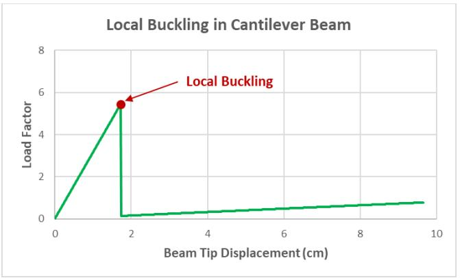  
Figure 199: Response of the cantilever beam under local buckling

# 7 REFERENCES

[1] M. A. Crisfield, Non-Linear Finite Element Analysis of Solids and Structures. Wiley, 1996.   
[2] M. A. Crisfield, Advanced Topics, Volume 2, Non-Linear Finite Element Analysis of Solids and Structures, Volume 2 edition. Chichester ; New York: Wiley, 1997.   
[3] H. Fessler, P. Mockford, and J. Webster, “Parametric equations for the flexibility matrices of single brace tubular joints in offshore structures.,” Proc. Inst. Civ. Eng., vol. 81, no. 4, pp. 659–673, Dec. 1986.   
[4] H. Fessler, P. Mockford, J. Webster, and W. Manners, “Parametric equations for the flexibility matrices of multi-brace tubular joints in offshore structures. discussion on paper 9124,” Proc. Inst. Civ. Eng., vol. 83, no. 4, pp. 887–888, Dec. 1987.   
[5] J. Buitrago, B. E. Healy, and T. Y. Chang, “LOCAL JOINT FLEXIBILITY OF TUBULAR JOINTS,” 1993.   
[6] MSL Engineering Limited, “JIP - Assessment Criteria, Reliability and Reserve Strength of Tubular Joints (Phase II),” MSL Engineering Limited, MSL Document Reference C20400R014 Rev 0, Jul. 2000.   
[7] American Petroleum Institute, API RP 2A-LRFD, 1st ed. 1993.   
[8] Design of Steel Structures, Norsok Standard N-004, Rev 1. December 19998.   
[9] P. W. Marshall, W. E. Gates, and S. W. Anagnostopoulos, “Inelastic Dynamic Analysis Of Tubular Offshore Structures,” presented at the Offshore Technology Conference, 1977.   
[10] S. P. T. and W. Krieger, Theory of Plates and Shells Second Edition, 2nd edition. McGraw-Hill Publishing Co., 1959.   
[11] F. W. Williams, “AN APPROACH TO the NON-LINEAR BEHAVIOUR OF the MEMBERS OF A RIGID JOINTED PLANE FRAMEWORK WITH FINITE DEFLECTIONS,” Q. J. Mech. Appl. Math., vol. 17, no. 4, pp. 451–469, Nov. 1964.   
[12] “Theory of Elastic Stability - Stephen P. Timoshenko, James M. Gere - Google Books.” [Online]. Available: https://books.google.com/books/about/Theory_of_Elastic_Stability.html?id=98B6JOW2HiUC. [Accessed: 08-Aug-2017].   
[13] L. L. Yaw, Co-rotational Meshfree Formulation for Large Deformation Inelastic Analysis of Twodimensional Structural Systems. University of California, Davis, 2008.   
[14] K. Y. Sze, X. H. Liu, and S. H. Lo, “Popular benchmark problems for geometric nonlinear analysis of shells,” Finite Elem. Anal. Des., vol. 40, no. 11, pp. 1551–1569, Jul. 2004.   
[15] S. L. Chan, “Geometric and material non-linear analysis of beam-columns and frames using the minimum residual displacement method,” Int. J. Numer. Methods Eng., vol. 26, no. 12, pp. 2657– 2669, Dec. 1988.   
[16] R. M. D. Souza and R. M. D. Souza, “Force-based Finite Element for Large Displacement Inelastic Analysis of Frames,” 2000.   
[17] J. L. Meek and S. Loganathan, “Geometric and material non-linear behaviour of beam-columns,” Comput. Struct., vol. 34, no. 1, pp. 87–100, Jan. 1990.   
[18] M. S. Park and B. C. Lee, “Geometrically Non-Linear and Elastoplastic Three-Dimensional Shear Flexible Beam Element of Von-Mises-Type Hardening Material,” Int. J. Numer. Methods Eng., vol. 39, no. 3, pp. 383–408, Feb. 1996.   
[19] Z.G Azizian, Instability and nonlinear analysis of thin walled structures. University of Wales, Cardiff, Wales, 1983.   
[20] H. B. Harrison, The application of the principles of plastic analysis to three dimensional steel structures. University of Sydney, Australia., 1964.

[21] X.-M. Jiang, H. Chen, and J. Y. R. Liew, “Spread-of-plasticity analysis of three-dimensional steel frames,” J. Constr. Steel Res., vol. 58, no. 2, pp. 193–212, Feb. 2002.   
[22] Teh Lip H. and Clarke Murray J., “Plastic-Zone Analysis of 3D Steel Frames Using Beam Elements,” J. Struct. Eng., vol. 125, no. 11, pp. 1328–1337, Nov. 1999.   
[23] J. Y. R. Liew, H. Chen, N. E. Shanmugam, and W. F. Chen, “Improved nonlinear plastic hinge analysis of space frame structures,” Eng. Struct., vol. 22, no. 10, pp. 1324–1338, Oct. 2000.   
[24] N. Gebbeken, “A refined numerical approach for the ultimate‐load analysis of 3‐D steel rod structures,” Eng. Comput., vol. 15, no. 3, pp. 312–344, May 1998.   
[25] G. Turkalj, J. Brnic, and S. Kravanja, “A beam model for large displacement analysis of flexibly connected thin-walled beam-type structures,” Thin-Walled Struct., vol. 49, no. 8, pp. 1007–1016, Aug. 2011.   
[26] B. Alemdar and D. Whie, “Displacement, Flexibility, and Mixed Beam–Column Finite Element Formulations for Distributed Plasticity Analysis | Journal of Structural Engineering | Vol 131, No 12,” Dec. 2004.   
[27] H. M. Bolt, C. J. Billington, and J. K. Ward, “Results From Large-Scale Ultimate Load Tests On Tubular Jacket Frame Structures,” presented at the Offshore Technology Conference, 1994.   
[28] Alf G. Engseth, “Finite element collapse analysis of tubular steel offshore structures,” Division of Marine Structures, University of Trondheim, Norwegian Institute of Technology, Trondheim, 1984.   
[29] “USFOS - Verification Manuals.” [Online]. Available: http://www.usfos.no/manuals/usfos/verification/index.html. [Accessed: 28-Nov-2017].   
[30] C. Polat, “Co-rotational formulation of a solid-shell element utilizing the ANS and EAS methods,” J. Theor. Appl. Mech., vol. 48, Jan. 2010.   
[31] F. Abed-Meraim and A. Combescure, “An improved assumed strain solid–shell element formulation with physical stabilization for geometric non-linear applications and elastic–plastic stability analysis,” Int. J. Numer. Methods Eng., vol. 80, no. 13, pp. 1640–1686, Dec. 2009.   
[32] M. Mostafa, M. v. Sivaselvan, and C. a. Felippa, “A solid-shell corotational element based on ANDES, ANS and EAS for geometrically nonlinear structural analysis,” Int. J. Numer. Methods Eng., vol. 95, no. 2, pp. 145–180, Jul. 2013.   
[33] A. Masud and C. L. Tham, “Three-Dimensional Corotational Framework for Elasto-Plastic Analysis of Multilayered Composite Shells,” AIAA J., vol. 38, no. 12, pp. 2320–2327, 2000.   
[34] R. A. Fontes Valente, M. P. L. Parente, R. M. Natal Jorge, J. M. A. César de Sá, and J. J. Grácio, “Enhanced transverse shear strain shell formulation applied to large elasto-plastic deformation problems,” Int. J. Numer. Methods Eng., vol. 62, no. 10, pp. 1360–1398, Mar. 2005.   
[35] J. H. Argyris, M. Papadrakakis, and L. Karapitta, “Elasto-plastic analysis of shells with the triangular element TRIC,” Comput. Methods Appl. Mech. Eng., vol. 191, no. 33, pp. 3613–3636, Jun. 2002.   
[36] U. Montag, W. B. Krätzig, and J. Soric, “Increasing solution stability for finite-element modeling of elasto-plastic shell response,” Adv. Eng. Softw., vol. 30, no. 9, pp. 607–619, Sep. 1999.   
[37] T. M. Roberts, “Second-order strains and instability of thin walled bars of open cross-section,” Int. J. Mech. Sci., vol. 23, no. 5, pp. 297–306, Jan. 1981.   
[38] T. M. Roberts and Z. G. Azizian, “Influence of pre-buckling displacements on the elastic critical loads of thin walled bars of open cross-section,” Int. J. Mech. Sci., vol. 25, no. 2, pp. 93–104, Jan. 1983.   
[39] W. Kanok-nukulchai, “A simple and efficient finite element for general shell analysis,” Int. J. Numer. Methods Eng., vol. 14, no. 2, pp. 179–200, Jan. 1979.   
[40] J.-L. Batoz, K.-Jür. Bathe, and L.-W. Ho, “A study of three-node triangular plate bending elements,” Int. J. Numer. Methods Eng., vol. 15, no. 12, pp. 1771–1812, Dec. 1980.

[41] A. Tessler and T. J. R. Hughes, “A three-node mindlin plate element with improved transverse shear,” Comput. Methods Appl. Mech. Eng., vol. 50, no. 1, pp. 71–101, Jul. 1985.   
[42] C. Jeyachandrabose, J. Kirkhope, and L. Meekisho, “An improved discrete Kirchhoff quadrilateral thin-plate bending element,” Int. J. Numer. Methods Eng., vol. 24, no. 3, pp. 635–654, Mar. 1987.   
[43] T. J. R. Hughes and T. E. Tezduyar, “Finite Elements Based Upon Mindlin Plate Theory With Particular Reference to the Four-Node Bilinear Isoparametric Element,” J. Appl. Mech., vol. 48, no. 3, pp. 587–596, Sep. 1981.   
[44] Bomel Limited, Comparison of tubular joint strength provisions in codes and standards. HSE Books, 2002.

8 INPUT LINES

ARC LENGTH OPTIONS

COLUMNS

COMMENTARY

GENERAL USE THIS LINE TO SPECIFY VARIOUS PARAMETERS FOR USE WITH ARC-LENGTH ITERATIONS.

( 8-10) ENTER THE TYPE OF ARC-LENGTH ITERATIONS. THERE ARE TWO ARC-LENGTH METHODS IN ENHANCED COLLAPSE: CYLINDRICAL AND SPHERICAL. CYLINDRICAL METHOD ONLY USES DEFLECTION INCREMENTS TO DETERMINE THE ARC-LENGTH WHILE SPHERICAL METHOD USES BOTH DEFLECTION AND FORCES INCREMENTS TO CALCULATE ARC-LENGTH. BOTH METHODS SUPPORT SUB-INCREMENTATION.

BY DEFAULT, ENHANCED COLLAPSE USES FOLLOWING ORDER

1. CYLINDRICAL METHOD   
2. IF 1 FAILS, CYLINDRICAL METHOD WITH SUB-INCREMENTATION   
3. IF 2 FAILS, SPHERICAL METHOD   
4. IF 3 FAILS, SPHERICAL METHOD WITH SUB-INCREMENTATION   
5. IF 4 FAILS, CYLINDRICAL METHOD WITH INCREASING ARC-LENGTH

(12-18) MAXIMUM NUMBER OF ARC-LENGTH STEPS TO BE USED BEFORE THE ANALYSIS IS TERMINATED.   
(20-22) MAXIMUM NUMBER OF ARC-LENGTH SUB-INCREMENTATION LEVELS TO BE USED BEFORE THE ANALYSIS IS TERMINATED. IF AN ARC-LENGTH ITERATION FAILS TOP CONVERGE, THEN THE TARGET ARC-LENGTH IS HALVED AND ANOTHER ATTEMPT IS MADE TO CALCULATE THE NEXT LOAD FACTOR. THE MAXIMUM NUMBER OF SUB-INCREMENTATION LEVELS DETERMINES HOW MANY TIMES THIS REFINEMENT TAKES PLACE BEFORE THE ANALYSIS STOPS.   
(24-29) ENTER THE SCALING FACTOR FOR AUTOMATICALLY COMPUTED ARC LENGTH OR LEAVE BLANK FOR DEFAULT VALUE.   
(31-36) ENTER SPHERICAL ARC-LENGTH PARAMETER OR LEAVE BLANK FOR DEFAULT VALUE.

| LINE LABEL | ARC-LENGTH FORMULATION TYPE | MAXIMUM NUMBER OF ITERATIONS | MAXIMUM SUB-INCREMENTATION LEVEL | ARC-LENGTH FACTOR | SPHERICAL ARC- LENGTH PARAMETER | LEAVE BLANK |
| --- | --- | --- | --- | --- | --- | --- |
| ARCLEN |  |  |  |  |  |  |
| 1--6 | 8<--10 | 12<--18 | 20<--22 | 24<--29 | 31<--36 | 37----80 |
| DEFAULT |  | 500 | 10 | 1.0 | 1.0 |  |

JOINT FLEXIBILITY BRACE SELECTION LINE

COLUMNS

COMMENTARY

GENERAL THIS LINE ALLOWS THE USER TO INCLUDE OR EXCLUDE BRACES WHEN CONSIDERING JOINT FLEXIBILITY. ONLY THE BRACE AND BRACE SIDE SPECIFIED ARE INCLUDED OR EXCLUDED PROVIDED ONE OF THE JOINT FLEXIBILITY OPTIONS IS SPECIFIED ON THE CLPOPT LINE. THIS LINE IS IGNORED IF NO FLEXIBILITY OPTION IS SPECIFIED.

( 1- 5) ENTER 'BFSEL'.   
( 7 ) ENTER 'I' TO INCLUDE OR 'X' TO EXCLUDE THE BRACES SPECIFIED.

NOTE: THE INCLUDE AND EXCLUDE OPTIONS ARE MUTUALLY EXCLUSIVE AND CANNOT BE USED TOGETHER. ALL BRACES SPECIFIED ON BFSEL LINES MUST BE EITHER INCLUDED OR EXCLUDED.

( 9-12) ENTER THE BEGIN JOINT OF THE FIRST BRACE TO INCLUDE OR EXCLUDE.   
(13-16) ENTER THE END JOINT OF THE FIRST BRACE TO INCLUDE OR EXCLUDE.   
(17-20) ENTER THE JOINT DESIGNATING THE BRACE CONNECTION TO INCLUDE OR EXCLUDE. ENTER THE BEGIN JOINT TO CONSIDER THE CONNECTION AT THE START OF THE BRACE OR THE END JOINT TO CONSIDER THE CONNECTION AT THE END OF THE BRACE.   
(22-72) ENTER ADDITIONAL BRACES TO BE INCLUDED OR EXCLUDED.

| LINE LABEL | INCLUDE OR EXCLUDE | 1ST BRACE | 1ST BRACE | 1ST BRACE | 2ND BRACE | 2ND BRACE | 2ND BRACE | 3RD BRACE | 3RD BRACE | 3RD BRACE | 4TH BRACE | 4TH BRACE | 4TH BRACE | 5TH BRACE | 5TH BRACE | 5TH BRACE |
| --- | --- | --- | --- | --- | --- | --- | --- | --- | --- | --- | --- | --- | --- | --- | --- | --- |
| LINE LABEL | INCLUDE OR EXCLUDE | BEGIN JOINT | END JOINT | CONNECTION | BEGIN JOINT | END JOINT | CONNECTION | BEGIN JOINT | END JOINT | CONNECTION | BEGIN JOINT | END JOINT | CONNECTION | BEGIN JOINT | END JOINT | CONNECTION |
| BFSEL |  |  |  |  |  |  |  |  |  |  |  |  |  |  |  |  |
| 1-- 5 | 7 | 9-->12 | 13-->16 | 17-->20 | 22-->25 | 26-->29 | 30-->33 | 35-->38 | 39-->42 | 43-->46 | 48-->51 | 52-->55 | 56-->59 | 61-->64 | 65-->68 | 69-->72 |

JOINT STRENGTH BRACE SELECTION LINE

COLUMNS

COMMENTARY

GENERAL THIS LINE ALLOWS THE USER TO INCLUDE OR EXCLUDE BRACES WHEN CONSIDERING JOINT STRENGTH. ONLY THE BRACE AND BRACE SIDE SPECIFIED ARE INCLUDED OR EXCLUDED PROVIDED ONE OF THE JOINT STRENGTH OPTIONS IS SPECIFIED ON THE CLPOPT LINE. THIS LINE IS IGNORED IF NO STRENGTH OPTION IS SPECIFIED.

( 1- 5) ENTER 'BSSEL'.   
( 7 ) ENTER 'I' TO INCLUDE OR 'X' TO EXCLUDE THE BRACES SPECIFIED.   
NOTE: THE INCLUDE AND EXCLUDE OPTIONS ARE MUTUALLY EXCLUSIVE AND CANNOT BE USED TOGETHER. ALL BRACES SPECIFIED ON BSSEL LINES MUST BE EITHER INCLUDED OR EXCLUDED.   
( 9-12) ENTER THE BEGIN JOINT OF THE FIRST BRACE TO INCLUDE OR EXCLUDE.   
(13-16) ENTER THE END JOINT OF THE FIRST BRACE TO INCLUDE OR EXCLUDE.   
(17-20) ENTER THE JOINT DESIGNATING THE BRACE CONNECTION TO INCLUDE OR EXCLUDE. ENTER THE BEGIN JOINT TO CONSIDER THE CONNECTION AT THE START OF THE BRACE OR THE END JOINT TO CONSIDER THE CONNECTION AT THE END OF THE BRACE.   
(22-72) ENTER ADDITIONAL BRACES TO BE INCLUDED OR EXCLUDED.

| LINE LABEL | INCLUDE OR EXCLUDE | 1ST BRACE | 1ST BRACE | 1ST BRACE | 2ND BRACE | 2ND BRACE | 2ND BRACE | 3RD BRACE | 3RD BRACE | 3RD BRACE | 4TH BRACE | 4TH BRACE | 4TH BRACE | 5TH BRACE | 5TH BRACE | 5TH BRACE |
| --- | --- | --- | --- | --- | --- | --- | --- | --- | --- | --- | --- | --- | --- | --- | --- | --- |
| LINE LABEL | INCLUDE OR EXCLUDE | BEGIN JOINT | END JOINT | CONNECTION | BEGIN JOINT | END JOINT | CONNECTION | BEGIN JOINT | END JOINT | CONNECTION | BEGIN JOINT | END JOINT | CONNECTION | BEGIN JOINT | END JOINT | CONNECTION |
| BSSEL |  |  |  |  |  |  |  |  |  |  |  |  |  |  |  |  |
| 1-- 5 | 7 | 9-->12 | 13-->16 | 17-->20 | 22-->25 | 26-->29 | 30-->33 | 35-->38 | 39-->42 | 43-->46 | 48-->51 | 52-->55 | 56-->59 | 61-->64 | 65-->68 | 69-->72 |

COLLAPSE ANALYSIS INPUT

COLUMNS COMMENTARY

GENERAL THIS LINE IS USED TO SPECIFY ADDITIONAL OVERALL ANALYSIS PARAMETERS.

( 8-13) ENTER THE MEMBER ECCENTRICITY RATIO WHICH IS DEFINED AS: ER = E * C / R**2 WHERE E - ECCENTRICITY C - DISTANCE FROM NEUTRAL AXIS TO EXTREME FIBER R - RADIUS OF GYRATION   
(15-20) ENTER MAXIMUM DUCTILITY ALLOWED FOR ANY MEMBER. ANY MEMBER THAT EXCEEDS THIS LIMIT WILL BE TREATED AS FRACTURED.   
(22-24) ENTER "ITC" TO INCLUDE HIGHER ORDER CO-ROTATIONAL TERMS FOR TUBULAR AND OTHER CLOSED SECTIONS IN ADDITION TO WIDE FLANGE OR OTHER OPEN SECTIONS ENTER "EXC" TO EXCLUDE HIGHER ORDER CO-ROTATIONAL TERMS FOR ALL SECTION TYPES   
(26-28) ENTER THE MEMBER STRAIN OPTION: BLANK - INCLUDE AXIAL-BENDING SECOND-ORDER (LARGE) STRAINS IWT - INCLUDE WAGNER STRAIN FOR THIN-WALLED OPEN SECTIONS IN ADDITION TO AXIAL-BENDING SECOND-ORDER TERMS NLS - EXCLUDE ALL SECOND-ORDER (LARGE) STRAINSENTER   
(30-35) ENTER THE MEMBER OUT-OF-STRAIGHTNESS RATIO TO ADD IMPERFECTION IN THE FORM OF A HARMONIC FUNCTION.   
(37-39) SELECT YES TO USE MINDLIN PLATE THEORY (THICK PLATES) TO INCLUDE SHEAR DEFORMATION EFFECT IN PLATES.   
(41-46) ENTER THE PLATE DRILLING FACTOR FOR PLATE TWIST STIFFNESS   
(48-53) ENTER THE SHEAR-LOCKING FACTOR FOR TRAINGULAR MINDLIN (THICK) PLATES. NOTE: THICK QUAD. PLATES DO NOT NEED SHEAR-LOCKING FACTOR.   
(54-54) ENTER 'C' TO THE SECTION PROPERTIES ARE OVERRIDEN BY CALCULATED PROPERTIESFOR MMEBERS FOR WHICH INPUT PROPERTIES ARE DIFFER FROM CALCULATEDPROPERTIES.

COLUMNS COMMENTARY (55-56) ENTER "NR" TO IGNORE MEMBER END-RELEASES FOR COLLAPSE ANALYSIS. NOTE: THIS OPTION HAS NO EFFECT ON WISHBONES. WISHBONES RELEASES ARE ALWAYS CONSIDERED IN THE ANALYSIS.   
(57-58) ENTER IJ, IF, OR IS TO INCLUDE CONNECTIONS WITH PROPERTIES EXCEEDED THE APPLICABILITY RANGES FOR BOTH FLEXIBILITY AND STRENGTH, ONLY FOR FLEXIBILITY OR ONLY FOR STRENGTH, RESPECTIVELY. NOTE: INCLUDING OUT-OF-RANGE CONNECTIONS MAY LEAD TO NON-CONVERGENCE OR MY SLOW DOWN THE CONVERGENCE.   
(59-59) SELECT DIVERGENCE RATIO EXPONENT. A GIVEN ITERATION WILL BEABORRTED IF CURRENT RESIDUAL TO INITIAL RESIDUAL BECOMESLARGES THAN 10^(EXPONENT)  
(61-61) SELECT DIVERGENCE MAXIMUM EXPONENT. A GIVEN ITERATION WILL BEINTERRUPTED IF CURRENT RESIDUAL VAULE BECOMES LARGES THAN10^(EXPONENT)  
(63-64) SELECT RELAXED CONVERGENCE EXPONENT. IF RELAXED CONVERGECECRETRION IS SELECTED, A GIVEN ITERATION WILL BE CONSIDEREDCONVERGED IF CURRENT RESIDUAL TO INITIAL RESIDUALBECOMES LESS THAN 10^(EXPONENT) .  
(66-68) SELECT YES TO INCLUDE INTERATION RELAXATION FOR ENTIRE MODEL TO INCREASE CHANCE OF CONVERGENCE. NOTE: MAY INCREASE NUMBER OF ITERATIONS   
(70-72) SELECT YES TO INCLUDE (RESIDUAL < 10^-5 INITIAL RESIDUAL) AS RELAXED CRITERION FOR ENTIRE MODEL. NOTE: IT MAY INCREASE NUMBER OF ITERATIONS OR CAUSE DIVERGENCE IN LARGE NUMBER OF LOAD STEPS.   
(74-76) SELECT YES TO INCLUDE ITERATION RELAXATION FOR MEMBERS TO INCREASE CHANCE OF CONVERGENCE. NOTE: MAY INCREASE NUMBER OF ITERATIONS.   
(78-80) SELECT YES TO INCLUDE A RELAXED CRITERION FOR MEMBERS. NOTE: MAY INCREASE NUMBER OF ITERATIONS.

| LINE LABEL | MEMBER ECCENTRICITY RATIO | MAXIMUM DUCTILITY ALLOWED | CO-ROTATIONAL 2ND-ORDER TERMS? | MEMBER STRAIN OPTION | MEMBER OUT-OF STRAIGHTNESS RATIO | USE THICK (MINDLIN) PLATE THEORY? | PLATE DRILLING FACTOR | TRIANGULAR THICK (MINDLIN) PLATE SHEAR- LOCKING FACTOR | OVERRIDE MEMBER PROPERTIES? | IGNORE MEMBER END-RELEASES? (NO EFFECT ON WISHBONES) | INCLUDE JOINT CONNECTIONS EXCEEDS THE APPLICABILITY RANGES? | DIVERGENCE RATIO EXPONENT | DIVERGENCE MAXIMUM EXPONENT | RELAXED CONVERGENCE EXPONENT | MODEL RELAXED ITERATION? | MODEL RELAXED ITERATION? | MEMBER RELAXED CONVERGENCE RITERATION? | MEMBER RELAXED CONVERGENCE RITERATION? |  |
| --- | --- | --- | --- | --- | --- | --- | --- | --- | --- | --- | --- | --- | --- | --- | --- | --- | --- | --- | --- |
| CLPOP2 |  |  |  |  |  |  |  |  |  |  |  |  |  |  |  |  |  |  |  |
| 1-- 6 | 8<--13 | 15<--20 | 22--24 | 26--28 | 30-35 | 30-35 | 41-46 | 48-53 | 54-54 | 55-56 | 57-58 | 59-59 | 61-61 | 63-64 | 66-68 | 70-72 | 74-76 | 78-80 |  |
| DEFAULT | 0.00 |  |  |  | 0.00 |  | 0.05 | 2.00 |  |  |  | 4 | 6 | -5 |  |  |  |  |  |
| ENGLISH |  | PERCENT |  |  |  |  |  |  |  |  |  |  |  |  |  |  |  |  |  |
| METRIC |  | PERCENT |  |  |  |  |  |  |  |  |  |  |  |  |  |  |  |  |  |

COLLAPSE ANALYSIS INPUT

COLUMNS

COMMENTARY

GENERAL THIS LINE IS REQUIRED IN ANY COLLAPSE ANALYSIS RUN. IT IS USED TO SPECIFY THE OVERALL ANALYSIS PARAMETERS.

(11-13) ENTER MAXIMUM NUMBER OF ITERATIONS FOR EACH LOADING INCREMENT.

(14-16) ENTER THE MINIMUM NUMBER OF SEGMENTS THAT A MEMBER IS TO BE DIVIDED FOR THE NONLINEAR MEMBER ANALYSIS. A NON-PRISMATIC MEMBER MAY RESULT IN MORE THAN THIS NUMBER SINCE EACH SEGMENT WILL BE LESS THAN OR EQUAL TO THE SECTION LENGTH.

(17-19) ENTER THE MAXIMUM NUMBER OF ITERATIVE LOOPS FOR EACH MEMBER ANALYSIS.

(26-41) SELECT FROM THE FOLLOWING ANALYSIS OPTIONS:

'LB' - LOCAL BUCKLING EFFECTS INCLUDED.   
'JF' - JOINT FLEXIBILITY EFFECTS INC   
'FF' - JOINT FLEXIBILITY EFFECTS FROM SINGLE BRACE FORMULATIONDUE TO FESSLER, MOCKFORD AND WEBSTER.  
'BF' - JOINT FLEXIBILITY EFFECTS FROM SINGLE BRACE FORMULATIONDUE TO BUITRAGO, HEALY AND CHANG.  
'NS' - SKIPPED MEMBERS NOT TREATED AS LINEAR.   
'PP' - INCLUDE PILE PLASTICITY.   
'CN' - CONTINUE IF MAXIMUM NUMBER OF ITERATIONS IS EXCEEDED.   
'JS' - JOINT STRENGTH CHECK (API-LRFD).   
'N1' - JOINT STRENGTH CHECK (NORSOK N-004 REV. 1).   
'ND' - JOINT STRENGTH CHECK (NORSOK N-004 REV. 2).   
'N3' - JOINT STRENGTH CHECK (NORSOK N-004 REV. 3).   
'IS' - JOINT STRENGTH CHECK (ISO 19902)   
'DY' - DYNAMIC ANALYSIS OPTION.  
'ME' - ALL MEMBERS ELASTIC.   
'PE' - ALL PLATES ELASTIC.   
'EB' - ELASTIC BUCKLING MONITOR

COLUMNS

COMMENTARY

(42-43) ENHANCED COLLAPSE ONLY. CHOOSE YES TO INCLUDE ARC-LENGTH SOLVER FOR POST-BUCKLING ANALYSIS   
(44-45) ENHANCED COLLAPSE ONLY. CHOOSE YES TO INCLUDE SUB-INCREMENTATION SOLVER FOR MORE ROBUST NEWTON ITERATION.   
(50-51) ENTER 'SF' TO CREATE SACS IV FILE WITH FINAL DEFLECTED SHAPE.   
(52-53) IF THE LOCAL BUCKLING OPTION 'LB' IS REQUESTED, ENTER THE METHOD USED TO DETERMINE LOCAL BUCKLING CRITERIA AS: 'MG' - MARSHALL GATES LOWER LIMIT OF CRITICAL STRAIN. '2U' - API BULLETIN 2U. 'LR' - API LRFD. 'IS' - ISO 19902 SECTION 13.2.3.3.   
(56-60) ENTER THE DEFLECTION TOLERANCE REQUIRED FOR CONVERGENCE OF ANY LOAD INCREMENT.   
(61-65) ENTER THE ROTATION TOLERANCE REQUIRED FOR CONVERGENCE OF ANY LOAD INCREMENT.   
(66-70) ENTER THE CONVERGENCE TOLERANCE FOR THE MEMBERS.   
(71-75) ENTER THE MAXIMUM DEFLECTION ALLOWED BEFORE THE STRUCTURE IS CONSIDERED COLLAPSED.   
(76-80) ENTER THE STRAIN HARDENING RATIO. THIS IS THE RATIO OF THE SLOPE OF THE PLASTIC PORTION OF THE STRESS-STRAIN CURVE TO THE SLOPE OF THE ELASTIC PORTION.

| LINE LABEL | ANALYSIS PARAMETERS | ANALYSIS PARAMETERS | ANALYSIS PARAMETERS | ANALYSIS OPTIONS | ANALYSIS OPTIONS | ANALYSIS OPTIONS | ANALYSIS OPTIONS | ANALYSIS OPTIONS | ANALYSIS OPTIONS | ANALYSIS OPTIONS | ANALYSIS OPTIONS | INCLUDE ARC-LENGTH SOLVER? | INCLUDE SUB-INC. ? | CREATE MODEL FILE | LOCAL BUCKLING METHOD | CONVERGENCE CRITERIA | CONVERGENCE CRITERIA | CONVERGENCE CRITERIA | COLLAPSE DEFLECTION | STRAIN HARDENING RATIO |
| --- | --- | --- | --- | --- | --- | --- | --- | --- | --- | --- | --- | --- | --- | --- | --- | --- | --- | --- | --- | --- |
| LINE LABEL | MAXIMUM NUMBER OF ITERATIONS PER LOAD INCREMENT | NUMBER OF MEMBER SEGMENTS | MAXIMUM NUMBER OF MEMBER ITERATIONS | 1ST | 2ND | 3RD | 4TH | 5TH | 6TH | 7TH | 8TH | INCLUDE ARC-LENGTH SOLVER? | INCLUDE SUB-INC. ? | CREATE MODEL FILE | LOCAL BUCKLING METHOD | DEFLECTION TOLERANCE | ROTATION TOLERANCE | MEMBER DEFLECTION TOLERANCE | COLLAPSE DEFLECTION | STRAIN HARDENING RATIO |
| CLPOPT |  |  |  |  |  |  |  |  |  |  |  |  |  |  |  |  |  |  |  |  |
| 1-- 6 | 11--->13 | 14--->16 | 17--->19 | 26--27 | 28--29 | 30--31 | 32--33 | 34--35 | 36--37 | 38--39 | 40--41 | 42--43 | 44--45 | 50--51 | 52--53 | 56<--60 | 61<--65 | 66<--70 | 71<--75 | 76<--80 |
| DEFAULT | 20 | 8 | 20 |  |  |  |  |  |  |  |  |  |  |  |  | 0.01 ENG | 0.001 | 0.01 ENG | 1000.0 ENG |  |
| ENGLISH |  |  |  |  |  |  |  |  |  |  |  |  |  |  |  | IN | RAD | IN | IN |  |
| METRIC |  |  |  |  |  |  |  |  |  |  |  |  |  |  |  | CM | RAD | CM | CM |  |

COLLAPSE ANALYSIS REPORT SELECTION

COLUMNS

COMMENTARY

GENERAL THIS LINE IS USED TO SPECIFY THE COLLAPSE OUTPUT REPORT SELECTIONS.

( 8-29) SELECT FROM THE FOLLOWING OUTPUT REPORT CHOICES:

JOINT DISPLACEMENT REPORT OPTION:

'P0' - PRINT FINAL DEFLECTIONS ONLY (DEFAULT)

'P1' - PRINT EVERY LOAD INCREMENT

'P2' - PRINT EVERY LOOP AND EVERY LOAD INCREMENT

JOINT REACTION REPORT OPTION:

'R0' - PRINT FINAL REACTIONS (DEFAULT)

'R1' - PRINT REACTIONS AT EACH LOAD INCREMENT

'R2' - PRINT REACTIONS AT EACH LOOP

MEMBER STRESSES AND INTERNAL LOADS REPORT OPTION:

'M0' - PRINT FINAL MEMBER STRESSES (DEFAULT)

'M1' - PRINT MEMBER STRESSES AT EACH LOAD INCREMENT

'M2' - PRINT MEMBER STRESSES AT EACH LOOP

'MP' - OPTION TO ONLY INCLUDE PLASTIC MEMBERS/PLATES IN MEMBER/PLATE INTERNAL LOADS REPORT

'SP' - PRINT MEMBER STRESSES AT EACH SUBAREA AROUND THE CROSS SECTION

JOINT STRENGTH REPORT OPTION:

'J1' - PRINT JOINT STRENGTH AT EACH LOAD INCREMENT

'J2' - PRINT JOINT STRENGTH AT EACH LOOP

SUMMARY REPORT OPTION:

'SM' - COLLAPSE SUMMARY REPORT

'MS' - MEMBER SUMMARY REPORT OPTION

'PW' - OPTION TO PRINT MEMBER WARNING MESSAGES

(26-27) PILEHEAD REACTION REPORT OPTION:

'F0' - PRINT FINAL REACTIONS

'F1' - PRINT REACTIONS AT EACH LOAD INCREMENT

'F2' - PRINT REACTIONS AT EACH LOOP

(30-31) ENTER 'VM' FOR A VON MISES STRESS CHECK FOR PLATES DESIGNATED

AS ELASTIC.

COLUMNS COMMENTARY

(32-36) ENTER THE PLASTICITY RATIO FOR THE MEMBER STRESS REPORT. ONLY THOSE MEMBER SEGMENTS THAT EXCEED THIS LEVEL WILL BE INCLUDED IN THIS REPORT.   
(38-42) ENTER THE PLASTICITY RATIO FOR THE PILE DETAIL REPORT. ONLY THOSE PILE INCREMENTS THAT EXCEED THIS LEVEL WILL BE INCLUDED IN THIS REPORT.   
(44-48) ENTER THE PLASTICITY RATIO FOR THE PLATE STRESS DETAIL REPORT. ONLY THOSE MEMBER SEGMENTS THAT EXCEED THIS LEVEL WILL BE INCLUDED IN THIS REPORT.   
(58-59) ENTER 'EN' TO PRODUCE A MEMBER NORMAL STRAIN REPORT. THE REPORT IS GENERATED AT INTEGRATION POINTS FOR ALL MEMBER SUBSEGMENTS.   
(62-63) ENTER 'EP' TO PRODUCE A MEMBER PLASTIC STRAIN REPORT. THE REPORT IS GENERATED AT INTEGRATION POINTS FOR ALL MEMBER SUBSEGMENTS.   
(64-65) LEAVE BLANK OR ENTER 'EN' TO SAVE MAXIMUM NORMAL STRAIN INTO COLLAPSE VIEW FOR REPORT GENERATION. ENTER 'EP' TO SAVE MAXIMUM PLASTIC STRAIN TO COLLAPSE VIEW.   
(68-69) ENTER 'IS' TO PRODUCE A PLATE INTERNAL FORCES REPORT. THE REPORT IS GENERATED AT INTEGRATION POINTS ACROSS THE PLATE.   
(70-71) ENTER 'VS' TO PRODUCE A PLATE VON MISES STRESS REPORT. THE REPORT IS GENERATED AT INTEGRATION POINTS ACROSS THE PLATE AND THE PLATE THICKNESS.   
(72-73) ENTER 'IP' TO PRODUCE A PLATE IN-PLANE PRINCIPAL STRAIN REPORT. THE REPORT IS GENERATED AT INTEGRATION POINTS ACROSS THE PLATE AND THE PLATE THICKNESS.   
(74-75) ENTER 'EP' TO PRODUCE A PLATE PLASTIC STRAIN REPORT. THE REPORT IS GENERATED AT INTEGRATION POINTS ACROSS THE PLATE AND THE PLATE THICKNESS.

| LINE LABEL | OUTPUT SELECTIONS | OUTPUT SELECTIONS | OUTPUT SELECTIONS | OUTPUT SELECTIONS | OUTPUT SELECTIONS | OUTPUT SELECTIONS | OUTPUT SELECTIONS | OUTPUT SELECTIONS | OUTPUT SELECTIONS | OUTPUT SELECTIONS | OUTPUT SELECTIONS | VON MISES PLATE CHECK | MEMBER DETAIL REPORT PLASTIC RATIO | PIE DETAIL REPORT PLASTIC RATIO | PLATE DETAIL REPORT PLASTIC RATIO | MEMBER STRAIN REPORT | MEMBER STRAIN REPORT | MEMBER STRAIN REPORT | PLATE INTERNAL FORCES AND STRESS REPORT | PLATE INTERNAL FORCES AND STRESS REPORT | PLATE STRAIN REPORT | PLATE STRAIN REPORT | LEAVE BLANK |
| --- | --- | --- | --- | --- | --- | --- | --- | --- | --- | --- | --- | --- | --- | --- | --- | --- | --- | --- | --- | --- | --- | --- | --- |
| LINE LABEL | 1ST | 2ND | 3RD | 4TH | 5TH | 6TH | 7TH | 8TH | 9TH | 10TH | 11TH | VON MISES PLATE CHECK | MEMBER DETAIL REPORT PLASTIC RATIO | PIE DETAIL REPORT PLASTIC RATIO | PLATE DETAIL REPORT PLASTIC RATIO | NORMAL STRAIN | PLASTIC STRAIN | MAX STRAIN FOR COLLAPSE VIEW | INTENRAL FORCE | VON MISES STRESS | IN-PLANE PRINCIPAL STRAIN | PLASTIC STRAIN | LEAVE BLANK |
| CLPRPT |  |  |  |  |  |  |  |  |  |  |  |  |  |  |  |  |  |  |  |  |  |  |  |
| 1-- 6 | 8-- 9 | 10--11 | 12--13 | 14--15 | 16--17 | 18--19 | 20--21 | 22--23 | 24--25 | 26--27 | 28--29 | 30--31 | 32--36 | 38--42 | 44--48 | 58--59 | 62--63 | 64--65 | 68--69 | 70--71 | 72-73 | 74--75 | 76--80 |

DUCTILITY LIMIT OPTIONS

COLUMNS

COMMENTARY

GENERAL EACH OF THE FOLLOWING MEMBERS ARE TO BE REMOVED FROM THE ANALYSIS WHEN THE SPECIFIED TENSILE DUCTILITY LIMIT HAS BEEN REACHED. FOR ALL SUBSEQUENT INCREMENTS, EACH SPECIFIED MEMBER IS NO LONGER CONSIDERED TO BE PART OF THE STUCTURE. THE DUCILITY LIMIT IS EXPRESSED AS A PRECENTAGE. THE INDIVIDUAL MEMBER DUCTILITY LIMIT OVERRIDES THE GLOBAL MEMBER DUCTILITY LIMIT THAT IS SPECIFIED ON THE CLPOP2 LINE.

( 1- 6) ENTER 'DUCLIM' ON ALL INPUT LINES IN THIS SET.   
( 8-13) ENTER PERCENTAGE OF DUCTILITY LIMIT FOR ALL ELEMENTS IN THE MODEL   
(15-20) ENTER PERCENTAGE OF DUCTILITY LIMIT FOR ALL MEMBERS IN THE MODEL   
(22-27) ENTER PERCENTAGE OF DUCTILITY LIMIT FOR ALL PLATES IN THE MODEL   
(29-34) ENTER PERCENTAGE OF DUCTILITY LIMIT FOR ALL PILES IN THE MODEL.   
(78-80) ENTER 'DLR' TO GENERATE DUCLITY LIMIT REPORT

| LINE LABEL | DUCTILITY FOR ALL ELEMENTS | DUCTILITY FOR ALL MEMBERS | DUCTILITY FOR ALL PLATES | DUCTILITY FOR ALL PLATES | LEAVE BLANK | LEAVE BLANK | GENERATE DUCTILITY LIMIT REPORT? |
| --- | --- | --- | --- | --- | --- | --- | --- |
| LINE LABEL | (%) | (%) | (%) | (%) |  |  |  |
| DUCLIM |  |  |  |  |  |  |  |
| 1--6 | 8-->13 | 15-->20 | 22-->27 | 29-->34 | 35--77 | 35--77 | 78--80 |

END LINE

COLUMNS

COMMENTARY

GENERAL

THIS LINE SIGNIFIES THE END OF THE COLLAPSE INPUT AND IS THELAST LINE OF THE COLLAPSE INPUT.

| LINE LABEL | LEAVE BLANK |
| --- | --- |
| END |  |
| 1--3 | 4-80 |

SHIP IMPACT ENERGY

COLUMNS

COMMENTARY

GENERAL

THIS LINE SPECIFIES THE TOTAL IMPACT ENERGY IN A SHIP IMPACT. IT PROVIDES A MEANS FOR THE USER TO SPECIFY SHIP VELOCITY AND MASS WITH THE PROGRAM COMPUTING IMPACT ENERGY.

( 8-15)

ENTER THE SHIP MASS M.

(17-22)

ENTER THE ADDED MASS COEFFICIENT C. SHIP KINETIC ENERGY IS CALCULATED WITH THE FORMULA Ek = 1/2*C*M*V^2.

(24-29)

ENTER THE SHIP VELOCITY V.

| LINE LABEL | SHIP MASS | ADDED MASS COEFFICIENT | SHIP VELOCITY | LEAVE BLANK |
| --- | --- | --- | --- | --- |
| ENERGY |  |  |  |  |
| 1--6 | 8<-15 | 17<-22 | 24<-29 | 30----80 |
| DEFAULT |  |  |  |  |
| ENGLISH | TON |  | FT/S |  |
| METRIC | TONNE |  | M/S |  |

FORCE CONVERGENCE TOLERANCE

COLUMNS

COMMENTARY

GENERAL USE THIS LINE TO SPECIFY FORCE AND MOMENT CONVERGENCE TOLERANCES.

( 8-13) ENTER THE TOLERANCE VALUE FOR FORCE CONVERGENCE FOR ENHANCED COLLAPSE OR LEAVE BLANK FOR DEFAULT VALUE   
(15-20) ENTER THE TOLERANCE VALUE FOR MOMENT CONVERGENCE FOR ENHANCED COLLAPSE OR LEAVE BLANK FOR DEFAULT VALUE

| LINE LABEL | FORCE TOLERANCE | MOMENT TOLERANCE | LEAVE BLANK |
| --- | --- | --- | --- |
| FRCTOL |  |  |  |
| 1--6 | 8<--13 | 15<--20 | 21----80 |
| DEFAULT | 0.001 | 0.001 |  |

GROUTED MEMBER YIELD STRESS MODIFICATION

COLUMNS

COMMENTARY

GENERAL THIS LINE IS OPTIONAL IN ANY COLLAPSE ANALYSIS RUN. IT IS USED TO SPECIFY THE YIELD STRESS FOR GROUTED TUBULAR MEMBERS. THE LINE MAY BE APPLIED ONLY TO CROSS SECTIONS WITH THE 'TUB' TYPE WHICH HAVE A SPECIFIED INNER TUBE. IF APPLIED TO MEMBERS WITHOUT THE 'TUB' CROSS SECTION TYPE, OR TO MEMBERS WITH THE 'TUB' CROSS SECTION TYPE BUT WITHOUT AN INNER TUBE, THIS LINE IS IGNORED.

( 8-12) ENTER THE YIELD STRESS. THIS YIELD STRESS IS APPLIED ONLY TO THE INNER (GROUTED) TUBE OF THE 'TUB' CROSS SECTION.   
(14-72) ENTER THE CONNECTING JOINT NAMES OF UP TO SIX GROUTED TUBULAR MEMBERS SELECTED FOR GROUTED YIELD STRESS MODIFICATION. USE AS MANY 'GRMSEL' INPUT LINES AS REQUIRED.

| LINE LABEL | YIELD STRESS | GROUTED MEMBER SELECTION FOR YIELD STRESS MODIFICATION | GROUTED MEMBER SELECTION FOR YIELD STRESS MODIFICATION | GROUTED MEMBER SELECTION FOR YIELD STRESS MODIFICATION | GROUTED MEMBER SELECTION FOR YIELD STRESS MODIFICATION | GROUTED MEMBER SELECTION FOR YIELD STRESS MODIFICATION | GROUTED MEMBER SELECTION FOR YIELD STRESS MODIFICATION | GROUTED MEMBER SELECTION FOR YIELD STRESS MODIFICATION | GROUTED MEMBER SELECTION FOR YIELD STRESS MODIFICATION | GROUTED MEMBER SELECTION FOR YIELD STRESS MODIFICATION | GROUTED MEMBER SELECTION FOR YIELD STRESS MODIFICATION | GROUTED MEMBER SELECTION FOR YIELD STRESS MODIFICATION | GROUTED MEMBER SELECTION FOR YIELD STRESS MODIFICATION |
| --- | --- | --- | --- | --- | --- | --- | --- | --- | --- | --- | --- | --- | --- |
| LINE LABEL | YIELD STRESS | 1ST MEMBER | 1ST MEMBER | 2NDMEMBER | 2NDMEMBER | 3RDMEMBER | 3RDMEMBER | 4THMEMBER | 4THMEMBER | 5THMEMBER | 5THMEMBER | 6THMEMBER | 6THMEMBER |
| LINE LABEL | YIELD STRESS | 1ST JOINT | 2NDJOINT | 1STJOINT | 2NDJOINT | 1STJOINT | 2NDJOINT | 1STJOINT | 2NDJOINT | 1STJOINT | 2NDJOINT | 1STJOINT | 2NDJOINT |
| GRMSEL |  |  |  |  |  |  |  |  |  |  |  |  |  |
| 1-- 6 | 8<--12 | 14-->17 | 19-->22 | 24-->27 | 29-->32 | 34-->37 | 39-->42 | 44-->47 | 49-->52 | 54-->57 | 59-->62 | 64-->67 | 69-->72 |
| DEFAULT |  |  |  |  |  |  |  |  |  |  |  |  |  |
| ENGLISH | KSI |  |  |  |  |  |  |  |  |  |  |  |  |
| METRIC (KN) | KN/SQ.CM |  |  |  |  |  |  |  |  |  |  |  |  |
| METRIC (KG) | KG/SQ.CM |  |  |  |  |  |  |  |  |  |  |  |  |

ELASTIC MEMBER GROUPS

COLUMNS

COMMENTARY

GENERAL MEMBERS OF THESE GROUPS ARE TO BE CONSIDERED AS ELASTIC DEFLECTION ELEMENTS WITH NO PLASTIC EFFECTS. THIS CAN SIGNIFICANTLY REDUCE THE TIME REQUIRED TO PERFORM AN ANALYSIS.

NOTE: DESIGNATING ELEMENTS TO REMAIN ELASTIC DOES NOT IMPLYTHEY DO NOT EXPERIENCE LARGE DEFORMATION. FOR EXAMPLE,IF THE MEMBER IS SUBJECTED TO A LOCALIZED POINT LOAD,IT MAY BE ELASTICALLY BUCKLED DURING ANALYSIS. TO PREVENTUNFAVORABLE BUCKLING FOR ELASTIC ELEMENTS, THE USER MAYUSE MEMSEG OR GRPSEG TO SET A SINGLE SUB-SEGMENT TO THEELASTIC MEMBER.

( 1- 6) ENTER 'GRPDEL'.   
(16-18) ENTER THE FIRST GROUP IDENTIFIER. THIS IDENTIFIER MUST CORRESPOND TO A GROUP IDENTIFIER ON A SACS IV 'GRUP' LINE.   
(20-74) THE REMAINING GROUP IDENTIFIER FIELDS ARE SIMILAR. ANY NUMBER OF 'GRPDEL' INPUT LINES CAN BE SPECIFIED.

| LINE LABEL | MEMBER GROUP IDENTIFIERS | MEMBER GROUP IDENTIFIERS | MEMBER GROUP IDENTIFIERS | MEMBER GROUP IDENTIFIERS | MEMBER GROUP IDENTIFIERS | MEMBER GROUP IDENTIFIERS | MEMBER GROUP IDENTIFIERS | MEMBER GROUP IDENTIFIERS | MEMBER GROUP IDENTIFIERS | MEMBER GROUP IDENTIFIERS | MEMBER GROUP IDENTIFIERS | MEMBER GROUP IDENTIFIERS | MEMBER GROUP IDENTIFIERS | MEMBER GROUP IDENTIFIERS | MEMBER GROUP IDENTIFIERS | MEMBER GROUP IDENTIFIERS |
| --- | --- | --- | --- | --- | --- | --- | --- | --- | --- | --- | --- | --- | --- | --- | --- | --- |
| LINE LABEL | GROUP ID 1 | GROUP ID 2 | GROUP ID 3 | GROUP ID 4 | GROUP ID 5 | GROUP ID 6 | GROUP ID 7 | GROUP ID 8 | GROUP ID 9 | GROUP ID 10 | GROUP ID 11 | GROUP ID 12 | GROUP ID 13 | GROUP ID 14 | GROUP ID 15 |  |
| GRPDEL |  |  |  |  |  |  |  |  |  |  |  |  |  |  |  |  |
| 1-- 6 | 16--18 | 20--22 | 24--26 | 28--30 | 32--34 | 36--38 | 40--42 | 44--46 | 48--50 | 52--54 | 56--58 | 60--62 | 64--66 | 68--70 | 72--74 |  |

DUCTILITY LIMIT FOR AN INDIVIDUAL MEMBER GROUP

COLUMNS

COMMENTARY

GENERAL THE DUCILITY LIMIT IS EXPRESSED AS A PRECENTAGE. THE INDIVIDUALMEMBER GROUP DUCTILITY LIMIT OVERRIDES THE GLOBAL MEMBER DUCTILITYLIMIT THAT IS SPECIFIED ON THE CLPOP2 LINE OR THE DUCLIM LINE.DUCTILITY LIMIT IS CHECKED AT ALL INTEGRATION POINTS AND IF THESTRAIN AT A GIVEN INTEGRATION POINT PASSES THE DUCTILITY LIMIT,THE PROGRAM ASSUMES THAT INTEGRATION POINT IS FRACTURED.

( 1- 6) ENTER 'GRPDUC' ON ALL INPUT LINES IN THIS SET.   
( 8-12) PERCENTAGE OF DUCTILITY FOR THE MEMBER GROUP.   
(14-16) ENTER THE FIRST GROUP.   
(18-20) ENTER THE SECOND GROUP.   
(22-80) REPEAT FOR ADDITIONAL GROUPS. SEVENTEEN GROUPS CAN BE INPUT PER LINE. REPEAT AS REQUIRED FOR ADDITIONAL GROUPS.

| LINE LABEL | UCTILITY LIMIT (%) | GROUP 1 | GROUP 2 | GROUP 3 | GROUP 4 | GROUP 5 | GROUP 6 | GROUP 7 | GROUP 8 | GROUP 9 | GROUP 10 | GROUP 11 | GROUP 12 | GROUP 13 | GROUP 14 | GROUP 15 | GROUP 16 | GROUP 17 |
| --- | --- | --- | --- | --- | --- | --- | --- | --- | --- | --- | --- | --- | --- | --- | --- | --- | --- | --- |
| GRPUDC |  |  |  |  |  |  |  |  |  |  |  |  |  |  |  |  |  |  |
| 1-- 6 | 8-->12 | 14-->16 | 18-->20 | 22-->24 | 26-->28 | 30-->32 | 34-->36 | 38-->40 | 42-->44 | 46-->48 | 50-->52 | 54-->56 | 58-->60 | 62-->64 | 66-->58 | 70-->72 | 74-->76 | 78-->80 |

ELASTIC MEMBER GROUPS

COLUMNS

COMMENTARY

GENERAL MEMBERS OF THESE GROUPS ARE TO BE CONSIDERED AS ELASTIC DEFLECTION ELEMENTS WITH NO PLASTIC EFFECTS. THIS CAN SIGNIFICANTLY REDUCE THE TIME REQUIRED TO PERFORM AN ANALYSIS.

NOTE: DESIGNATING ELEMENTS TO REMAIN ELASTIC DOES NOT IMPLYTHEY DO NOT EXPERIENCE LARGE DEFORMATION. FOR EXAMPLE,IF THE MEMBER IS SUBJECTED TO A LOCALIZED POINT LOAD,IT MAY BE ELASTICALLY BUCKLED DURING ANALYSIS. TO PREVENTUNFAVORABLE BUCKLING FOR ELASTIC ELEMENTS, THE USER MAYUSE MEMSEG OR GRPSEG TO SET A SINGLE SUB-SEGMENT TO THEELASTIC MEMBER.

( 1- 6) ENTER 'GRPELA'.   
(16-18) ENTER THE FIRST GROUP IDENTIFIER. THIS IDENTIFIER MUST CORRESPOND TO A GROUP IDENTIFIER ON A SACS IV 'GRUP' LINE.   
(20-74) THE REMAINING GROUP IDENTIFIER FIELDS ARE SIMILAR. ANY NUMBER OF 'GRPELA' INPUT LINES CAN BE SPECIFIED.

| LINE LABEL | MEMBER GROUP IDENTIFIERS | MEMBER GROUP IDENTIFIERS | MEMBER GROUP IDENTIFIERS | MEMBER GROUP IDENTIFIERS | MEMBER GROUP IDENTIFIERS | MEMBER GROUP IDENTIFIERS | MEMBER GROUP IDENTIFIERS | MEMBER GROUP IDENTIFIERS | MEMBER GROUP IDENTIFIERS | MEMBER GROUP IDENTIFIERS | MEMBER GROUP IDENTIFIERS | MEMBER GROUP IDENTIFIERS | MEMBER GROUP IDENTIFIERS | MEMBER GROUP IDENTIFIERS | MEMBER GROUP IDENTIFIERS | MEMBER GROUP IDENTIFIERS |
| --- | --- | --- | --- | --- | --- | --- | --- | --- | --- | --- | --- | --- | --- | --- | --- | --- |
| LINE LABEL | GROUP ID 1 | GROUP ID 2 | GROUP ID 3 | GROUP ID 4 | GROUP ID 5 | GROUP ID 6 | GROUP ID 7 | GROUP ID 8 | GROUP ID 9 | GROUP ID 10 | GROUP ID 11 | GROUP ID 12 | GROUP ID 13 | GROUP ID 14 | GROUP ID 15 |  |
| GRPELA |  |  |  |  |  |  |  |  |  |  |  |  |  |  |  |  |
| 1-- 6 | 16--18 | 20--22 | 24--26 | 28--30 | 32--34 | 36--38 | 40--42 | 44--46 | 48--50 | 52--54 | 56--58 | 60--62 | 64--66 | 68--70 | 72--74 |  |

MEMBER GROUP SUBSEGMENT SPECIFICATION

COLUMNS

COMMENTARY

GENERAL THE FOLLOWING MEMBER GROUPS CONTAIN MEMBERS THAT ARE TO BEDIVIDED INTO A SPECIFIEDNUMBER OF SUBSEGMENTS FOR THE PURPOSE OF AN ELASTO-PLASTICANALYSIS. THIS NUMBER OVERRIDES THE DEFAULTSETTING FOR THE NUMBER OF SUBSEGMENTS FROM COLUMNS 14-16OF THE CLPOPT LINE.

( 1- 6) ENTER 'GRPSEG' ON ALL INPUT LINES IN THIS SET.   
( 8- 9) THE NUMBER OF SUBSEGMENTS TO BE USED FOR EACH MEMBER THAT IS CONTAINED BY A MEMBER GROUP ON THE INPUT LINE.   
(14-16) ENTER MEMBER GROUP NAME.   
(18-72) REPEAT FOR ADDITIONAL MEMBER GROUPS. FIFTEEN MEMBER GROUPS CAN BE INPUT PER LINE. REPEAT AS REQUIRED FOR ADDITIONAL MEMBER GROUPS.

| LINE LABEL | NO. OF SUBSEGS | MEMBER GROUP IDENTIFIERS | MEMBER GROUP IDENTIFIERS | MEMBER GROUP IDENTIFIERS | MEMBER GROUP IDENTIFIERS | MEMBER GROUP IDENTIFIERS | MEMBER GROUP IDENTIFIERS | MEMBER GROUP IDENTIFIERS | MEMBER GROUP IDENTIFIERS | MEMBER GROUP IDENTIFIERS | MEMBER GROUP IDENTIFIERS | MEMBER GROUP IDENTIFIERS | MEMBER GROUP IDENTIFIERS | MEMBER GROUP IDENTIFIERS | MEMBER GROUP IDENTIFIERS | MEMBER GROUP IDENTIFIERS | MEMBER GROUP IDENTIFIERS |
| --- | --- | --- | --- | --- | --- | --- | --- | --- | --- | --- | --- | --- | --- | --- | --- | --- | --- |
| LINE LABEL | NO. OF SUBSEGS | GROUP ID 1 | GROUP ID 2 | GROUP ID 3 | GROUP ID 4 | GROUP ID 5 | GROUP ID 6 | GROUP ID 7 | GROUP ID 8 | GROUP ID 9 | GROUP ID 10 | GROUP ID 11 | GROUP ID 12 | GROUP ID 13 | GROUP ID 14 | GROUP ID 15 |  |
| GRPSEG |  |  |  |  |  |  |  |  |  |  |  |  |  |  |  |  |  |
| 1--6 | 8-->9 | 14--16 | 18--20 | 22--24 | 26--28 | 30--32 | 34--36 | 38--40 | 42--44 | 46--48 | 50--52 | 54--56 | 58--60 | 62--64 | 66--68 | 70--72 |  |

SKIPPED LOCAL BUCKLING FOR MEMBER GROUPS

COLUMNS

COMMENTARY

GENERAL MEMBERS OF THESE GROUPS ARE TO BE CONSIDERED AS ELASTO-PLASTIC LARGE DEFLECTION ELEMENTS WITH NO LOCAL BUCKLING EFFECTS INCLUDED. ANY LOCAL BUCKLING CHECK SPECIFIED UNDER THE 'LB' OPTION WILL BE SKIPPED FOR MEMBERS FROM THESE GROUPS.

( 1- 6) ENTER 'GRPSKP'.   
(16-18) ENTER THE FIRST GROUP IDENTIFIER. THIS IDENTIFIER MUST CORRESPOND TO A GROUP IDENTIFIER ON A SACS IV 'GRUP' LINE.   
(20-74) THE REMAINING GROUP IDENTIFIER FIELDS ARE SIMILAR. ANY NUMBER OF 'GRPSKP' INPUT LINES CAN BE SPECIFIE

| LINE LABEL | MEMBER GROUP IDENTIFIERS | MEMBER GROUP IDENTIFIERS | MEMBER GROUP IDENTIFIERS | MEMBER GROUP IDENTIFIERS | MEMBER GROUP IDENTIFIERS | MEMBER GROUP IDENTIFIERS | MEMBER GROUP IDENTIFIERS | MEMBER GROUP IDENTIFIERS | MEMBER GROUP IDENTIFIERS | MEMBER GROUP IDENTIFIERS | MEMBER GROUP IDENTIFIERS | MEMBER GROUP IDENTIFIERS | MEMBER GROUP IDENTIFIERS | MEMBER GROUP IDENTIFIERS | MEMBER GROUP IDENTIFIERS | MEMBER GROUP IDENTIFIERS |
| --- | --- | --- | --- | --- | --- | --- | --- | --- | --- | --- | --- | --- | --- | --- | --- | --- |
| LINE LABEL | GROUP ID 1 | GROUP ID 2 | GROUP ID 3 | GROUP ID 4 | GROUP ID 5 | GROUP ID 6 | GROUP ID 7 | GROUP ID 8 | GROUP ID 9 | GROUP ID 10 | GROUP ID 11 | GROUP ID 12 | GROUP ID 13 | GROUP ID 14 | GROUP ID 15 |  |
| GRPSKP |  |  |  |  |  |  |  |  |  |  |  |  |  |  |  |  |
| 1-- 6 | 16--18 | 20--22 | 24--26 | 28--30 | 32--34 | 36--38 | 40--42 | 44--46 | 48--50 | 52--54 | 56--58 | 60--62 | 64--66 | 68--70 | 72--74 |  |

IMPACT LOAD CASE

| ColumNS | COMMENTARY | ColumNS | COMMENTARY |
| --- | --- | --- | --- |
| GENERAL | THIS LINE SPECIFIES THE POSITION AND THE TOTAL IMPACT ENERGY TO BE ABSORBED IN AN IMPACT EVENT. ONE IMPACT LINE IS ANALYZED PER COLLAPSE EXECUTIOn. | (38-38) | DENT ENERGY FORMULA: 'BLANK' - NO DENTED MEMBER 'F' - FURNES FORMULA (API C18.9.2-2) 'E' - ELLINAS FORMULA (API C18.9.2-7) |
| (8-11) | ENTER THE IMPACT LOAD CASE NAME IN THE MODEL USED TO DEFINE THE PERSETS FOR ENERGY CALCULATIONS. | (40-43) | ENTER JOINT 'A' OF DENTED MEMBER. |
| (13-16) | ENTER THE IMPACT JOINT NAME. ENERGY FOR THIS LOAD CASE WILL BE TRANSFERRED TO THE STRUCTURE THROUGH THIS JOINT. LEAVE BLANK IF ALL LOADED JOINTS IN THE IMPACT LOAD CONDITION ARE TO BE USED FOR THE MONITORING OF STRUCTURAL DEFORMATION ENERGY. | (45-48) | ENTER JOINT 'B' OF DENTED MEMBER. |
| (18-25) | ENTER THE TOTAL IMPACT ENERGY TO BE ABSORBED. IF LEFT BLANK THE TOTAL IMPACT ENERGY WILL BE CALCULATED USING THE 'ENERGY' LINE. | (50-52) | ENTER 'ALL' TO SPECIFY THAT ALL LOADED JOINTS IN THE IMPACT LOAD CONDITION WILL BE USED FOR THE MONITORING OF STRUCTURAL DEFORMATION ENERGY. |
| (27-30) | ENTER THE SHIP INDENTATION CURVE NAME. THERE ARE FIVE STANDARD NAMES WHICH MAY BE ENTERED: 'DNV1' - BOW IMPACT FROM DNV TN A 202. 'DNV2' - BROAD SIDE IMPACT (D=1.5M) FROM DNV TN A 202. 'DNV3' - BROAD SIDE IMPACT (D=10.M) FROM DNV TN A 202. 'DNV4' - STERN IMPACT (D=1.5M) FROM DNV TN A 202. 'DNV5' - STERN IMPACT (D=10.M) FROM DNV TN A 202. | (63-68) | ENTER A LIMIT FOR THE PERCENTAGE OF THE KINETIC ENERGY OF IMPACT THAT IS TO BE ABSORBED AS MEMBER INDENTATION ENERGY. |
|  | USER-SPECIFIED SHIP INDENTATION CURVES MAY BE SUPPLIED WITH THE 'SHIPIND' LINE SET. LEAVING THIS FIELD BLANK MEANS THAT THE TOTAL ABSORBED ENERGY WILL BE DUE TO STRUCTURAL DEFORMATION ALONE. | (79-80) | ENTER 'PD' TO MODEL DENT/SHIP DENT AS PLASTIC (ENERGY/DENT IS UNRECOVERABLE). |
| (32-33) | ENTER 'EX' TO EXCLUDE AUTOMATIC UNLOADING AFTER IMPACT. AUTOMATIC UNLOADING IS INCLUDED BY DEFAULT. |  |  |

| LINE LABEL | IMPACT LOAD CASE | IMPACT JOINT NAME | IMPACT ENERGY ABSORBED | SHIP INDENTATION CURVE NAME | EXCLUDE AUTOMATIC UNLOADING | MEMBER DENT OPTION | DEDTED MEMBER | DEDTED MEMBER | ALL LOADS SPECIFIER | MEMBER DENT ENERGY LIMIT | MEMBER DENT ENERGY LIMIT | LEAVE BLANK | PLASTIC DENT |
| --- | --- | --- | --- | --- | --- | --- | --- | --- | --- | --- | --- | --- | --- |
| LINE LABEL | IMPACT LOAD CASE | IMPACT JOINT NAME | IMPACT ENERGY ABSORBED | SHIP INDENTATION CURVE NAME | EXCLUDE AUTOMATIC UNLOADING | MEMBER DENT OPTION | JOINT A | JOINT B | ALL LOADS SPECIFIER | B | % | LEAVE BLANK | PLASTIC DENT |
| IMPACT |  |  |  |  |  |  |  |  |  |  |  |  |  |
| 1-- 6 | 8-->11 | 13-->16 | 18<--25 | 27-->30 | 32<--33 | 38 | 40-->43 | 45-->48 | 50--52 | 56<--61 | 63<--68 | 69--78 | 79--80 |
| DEFAULT |  |  |  | NONE |  | NONE |  |  |  |  |  |  | NONE |
| ENGLISH |  |  | KIP-FT |  |  |  |  |  |  |  |  |  |  |
| METRIC |  |  | MJ |  |  |  |  |  |  |  |  |  |  |

JOINT FLEXIBILITY JOINT SELECTION LINE

COLUMNS

COMMENTARY

GENERAL THIS LINE ALLOWS THE USER TO INCLUDE OR EXCLUDE JOINTS WHEN CONSIDERING JOINT FLEXIBILITY. ALL BRACES CONNECTED TO THE SPECIFIED JOINTS ARE INCLUDED OR EXCLUDED PROVIDED ONE OF THE JOINT FLEXIBILITY OPTIONS IS SPECIFIED ON THE CLPOPT LINE. THIS LINE IS IGNORED IF NO FLEXIBILITY OPTION IS SPECIFIED ON THE CLPOPT LINE.

( 1- 5) ENTER 'JFSEL'.   
( 7 ) ENTER 'I' TO INCLUDE OR 'X' TO EXCLUDE THE JOINTS SPECIFIED.   
NOTE: THE INCLUDE AND EXCLUDE OPTIONS ARE MUTUALLY EXCLUSIVE AND CANNOT BE USED TOGETHER. ALL JOINTS SPECIFIED ON JFSEL LINES MUST BE EITHER INCLUDED OR EXCLUDED.   
( 9-12) ENTER THE NAME OF THE FIRST JOINT TO BE INCLUDED OR EXCLUDED.   
(14-77) ENTER ADDITIONAL JOINTS TO BE INCLUDED OR EXCLUDED.

| LINE LABEL | INCLUDE OR EXCLUDE | JOINT NAMES | JOINT NAMES | JOINT NAMES | JOINT NAMES | JOINT NAMES | JOINT NAMES | JOINT NAMES | JOINT NAMES | JOINT NAMES | JOINT NAMES | JOINT NAMES | JOINT NAMES | JOINT NAMES | JOINT NAMES |
| --- | --- | --- | --- | --- | --- | --- | --- | --- | --- | --- | --- | --- | --- | --- | --- |
| LINE LABEL | INCLUDE OR EXCLUDE | 1ST JOINT | 2ND JOINT | 3RD JOINT | 4TH JOINT | 5TH JOINT | 6TH JOINT | 7TH JOINT | 8TH JOINT | 9TH JOINT | 10TH JOINT | 11TH JOINT | 12TH JOINT | 13TH JOINT | 14TH JOINT |
| JFSEL |  |  |  |  |  |  |  |  |  |  |  |  |  |  |  |
| 1-- 5 | 7 | 9-->12 | 14-->17 | 19-->22 | 24-->27 | 29-->32 | 34-->37 | 39-->42 | 44-->47 | 49-->52 | 54-->57 | 59-->62 | 64-->67 | 69-->72 | 74-->77 |

JOINT STRENGTH OPTION

COLUMNS

COMMENTARY

GENERAL THIS LINE IS OPTIONAL IN ANY COLLAPSE ANALYSIS RUN. IT IS USED TO SPECIFY JOINT STRENGTH OPTIONS. IF OMITTED, THEN DEFAULT OPTIONS WILL BE USED.

( 11 ) IF THE BRACE LOADS ARE TO BE BACKED OFF TO THE CHORD OUTER SURFACE, ENTER 'R' HERE. OTHERWISE, THE PROGRAM WILL USE THE BRACE END FORCES.   
(12-17) ENTER THE MINIMUM GAP ALLOWED FOR THE JOINT STRENGTH ANALYSIS.   
(18-23) ENTER THE MAXIMUM GAP ALLOWED FOR THE JOINT STRENGTH ANALYSIS.   
( 25 ) USE EFFECTIVE THICKNESS FOR GROUTED ELEMENTS. ENTER '1' FOR EFF THICK BASED ON THE COMPOSITE SECTION MOMENT OF INERTIA OR '2' FOR EFF THICK BASED ON MOMENT OF INERTIAS OF THE TWO WALLS OR '3' FOR EFF THICK BASED ON SQUARE ROOT OF SUM OF SQUARES (SRSS) OF WALL THICKNESSES.   
(26-30) ENTER THE EFFECTIVE THICKNESS LIMIT EXPRESSED AS A FACTOR OF THE WALL THICKNESS OF THE LARGER (OUTSIDE) TUBE.   
(31-35) ENTER THE UNITY CHECK LOWER LIMIT. ONLY JOINTS WITH STRENGTH UNITY CHECK RATIOS ABOVE THIS VALUE WILL BE REPORTED.   
( 37 ) PERFORM THE ISO 19902 JOINT STRENGTH CHECK USING BRACE UTILIZATION. ENTER 'U' TO ASSUME A BRACE UTILIZATION OF UNITY, ENTER A 'B' TO CALCULATE THE BRACE-END UTILIZATION USING ISO 19902 EQUATIONS 13.3-2 AND 13.3-8.   
(39-45) ENTER THE TOLERANCE TO CHECK OFFSET FOR BRACE-CHORD CONNECTIONS.   
(47-48) ENTER 'PG' TO PRINT CONNECTION GEOMETRIC PARAMETERS (BETAM, GAMMA , AND TAU) TO THE LISTING FILE

| LINE LABEL | RELIEF OPTION | MINIMUM GAP | MAXIMUM GAP | EFFECTIVE THICKNESS OPTION | EFFECTIVE THICKNESS LIMIT RATIO | PRINT UC LEVEL | BRACE UTILIZATION OPTION | BRACE OFFSET TOLERANCE | PRINT GEOMETRIC PARAMETERS | LEAVE BLANK |
| --- | --- | --- | --- | --- | --- | --- | --- | --- | --- | --- |
| JSOPT |  |  |  |  |  |  |  |  |  |  |
| 1--5 | 11 | 12<--17 | 18<--23 | 25 | 26<--30 | 31--35 | 37 | 39<--45 | 47--48 | 49--80 |
| DEFAULT |  | -100.0 ENGL | +1000.0 ENGL |  | 1.75 |  |  | 0.1 |  |  |
| ENGLISH |  | IN | IN |  |  |  |  | IN |  |  |
| METRIC |  | CM | CM |  |  |  |  | CM |  |  |

JOINT STRENGTH JOINT SELECTION LINE

COLUMNS

COMMENTARY

GENERAL THIS LINE ALLOWS THE USER TO INCLUDE OR EXCLUDE JOINTS WHENCONSIDERING JOINT STRENGTH. ALL BRACES CONNECTED TO THESPECIFIED JOINTS ARE INCLUDED OR EXCLUDED PROVIDED ONE OF THEJOINT STRENGTH OPTIONS IS SPECIFIED ON THE CLPOPT LINE. THISLINE IS IGNORED IF NO STRENGTH OPTION IS SPECIFIED ON THECLPOPT LINE.

( 1- 5) ENTER 'JSSEL'.   
( 7 ) ENTER 'I' TO INCLUDE OR 'X' TO EXCLUDE THE JOINTS SPECIFIED.   
NOTE: THE INCLUDE AND EXCLUDE OPTIONS ARE MUTUALLY EXCLUSIVE AND CANNOT BE USED TOGETHER. ALL JOINTS SPECIFIED ON JSSEL LINES MUST BE EITHER INCLUDED OR EXCLUDED.   
( 9-12) ENTER THE NAME OF THE FIRST JOINT TO BE INCLUDED OR EXCLUDED.   
(14-77) ENTER ADDITIONAL JOINTS TO BE INCLUDED OR EXCLUDED.

| LINE LABEL | INCLUDE OR EXCLUDE | JOINT NAMES | JOINT NAMES | JOINT NAMES | JOINT NAMES | JOINT NAMES | JOINT NAMES | JOINT NAMES | JOINT NAMES | JOINT NAMES | JOINT NAMES | JOINT NAMES | JOINT NAMES | JOINT NAMES | JOINT NAMES |
| --- | --- | --- | --- | --- | --- | --- | --- | --- | --- | --- | --- | --- | --- | --- | --- |
| LINE LABEL | INCLUDE OR EXCLUDE | 1ST JOINT | 2ND JOINT | 3RD JOINT | 4TH JOINT | 5TH JOINT | 6TH JOINT | 7TH JOINT | 8TH JOINT | 9TH JOINT | 10TH JOINT | 11TH JOINT | 12TH JOINT | 13TH JOINT | 14TH JOINT |
| JSSEL |  |  |  |  |  |  |  |  |  |  |  |  |  |  |  |
| 1-- 5 | 7 | 9-->12 | 14-->17 | 19-->22 | 24-->27 | 29-->32 | 34-->37 | 39-->42 | 44-->47 | 49-->52 | 54-->57 | 59-->62 | 64-->67 | 69-->72 | 74-->77 |

JOINT SELECTION INPUT

COLUMNS

COMMENTARY

GENERAL THIS LINE IS OPTIONAL IN ANY COLLAPSE ANALYSIS RUN. IT IS USED TO SELECT JOINTS FOR DEFLECTION PRINT. IF OMITTED, THEN ALL JOINTS ARE SELECTED BY DEFAULT.

(12-80) ENTER THE JOINT NAMES OF JOINTS SELECTED FOR OUTPUT DEFLECTION PRINT. USE AS MANY OF THESE INPUT LINES AS DESIRED.

| LINE LABEL | JOINT SELECTIONS FOR DEFLECTION PRINT | JOINT SELECTIONS FOR DEFLECTION PRINT | JOINT SELECTIONS FOR DEFLECTION PRINT | JOINT SELECTIONS FOR DEFLECTION PRINT | JOINT SELECTIONS FOR DEFLECTION PRINT | JOINT SELECTIONS FOR DEFLECTION PRINT | JOINT SELECTIONS FOR DEFLECTION PRINT | JOINT SELECTIONS FOR DEFLECTION PRINT | JOINT SELECTIONS FOR DEFLECTION PRINT | JOINT SELECTIONS FOR DEFLECTION PRINT | JOINT SELECTIONS FOR DEFLECTION PRINT | JOINT SELECTIONS FOR DEFLECTION PRINT | JOINT SELECTIONS FOR DEFLECTION PRINT | JOINT SELECTIONS FOR DEFLECTION PRINT |
| --- | --- | --- | --- | --- | --- | --- | --- | --- | --- | --- | --- | --- | --- | --- |
| LINE LABEL | 1ST JOINT | 2ND JOINT | 3RD JOINT | 4TH JOINT | 5TH JOINT | 6TH JOINT | 7TH JOINT | 8TH JOINT | 9TH JOINT | 10TH JOINT | 11TH JOINT | 12TH JOINT | 13TH JOINT | 14TH JOINT |
| JTSEL |  |  |  |  |  |  |  |  |  |  |  |  |  |  |
| 1-- 5 | 12-->15 | 17-->20 | 22-->25 | 27-->30 | 32-->35 | 37-->40 | 42-->45 | 47-->50 | 52-->55 | 57-->60 | 62-->65 | 67-->70 | 72-->75 | 77-->80 |

LOADING SEQUENCE INPUT

COLUMNS

COMMENTARY

GENERAL

THIS LINE CAN BE USED IN ANY COLLAPSE ANALYSIS RUN. HOWEVER, IT IS REQUIRED FOR ANY DYNAMIC COLLAPSE ANALYSIS. IT IS USED TO SPECIFY THE LOAD STEPS IN A LOAD SEQUENCE AND ALSO THE TIME DURATION FOR THE LOAD STEPS. IN A NONLINEAR ANALYSIS, THE ORDER IN WHICH LOADS ARE APPLIED CAN BE SIGNIFICANT. FOR EXAMPLE, THE DEAD LOAD SHOULD BE APPLIED BEFORE ANY ENVIRONMENTAL LOADING. AS MANY AS SIX LOAD SEQUENCES CAN BE DEFINED. EACH OF THESE WILL BE ANALYZED AS INDEPENDENT NONLINEAR ANALYSES. A TOTAL OF 50 LOAD PATHS ARE ALLOWED.

( 7-10) ENTER THE IDENTIFICATION OF THIS LOAD SEQUENCE. EACH LOAD SEQUENCE MUST HAVE A NON-BLANK LOAD SEQUENCE IDENTIFIER. IF THIS FIELD IS LEFT BLANK, THE LOAD PATHS ARE APPLIED TO THE PREVIOUS LOAD SEQUENCE.   
(21-24) ENTER THE SACS IV LOAD CASE NAME FOR THE FIRST LOAD TO BE APPLIED.   
(25-29) ENTER THE NUMBER OF INCREMENTS FOR THIS LOAD STEP. THIS IS THE NUMBER OF STEPS FROM THE STARTING LOAD FACTOR TO THE ENDING LOAD FACTOR. IF THE STARTING FACTOR IS GREATER THAN ZERO, THEN AN ADDITIONAL LOAD STEP IS CREATED TO REACH THE STARTING LOAD FACTOR POSITION.   
(30-36) ENTER THE STARTING LOAD FACTOR. THIS FACTOR CAN BE USED TO SKIP THE LINEAR PORTION ON THE ANALYSIS AND SAVE UNNECESSARY RUN TIME.   
(37-43) ENTER THE ENDING LOAD FACTOR. THIS FACTOR MUST BE GREATER THAN OR EQUAL TO THE STARTING FACTOR.   
(44-50) ENTER THE TIME DURATION FOR THIS LOAD STEP. THIS IS REQUIRED FOR A DYNAMIC ANALYSIS.

| LINE LABEL | LOAD SEQUENCE ID | LOAD CASE NAME | NUMBER OF INCREMENTS | STARTING FACTOR | ENDING FACTOR | TIME DURATION | LEAVE BLANK |
| --- | --- | --- | --- | --- | --- | --- | --- |
| LDAP |  |  |  |  |  |  |  |
| 1--5 | 7--10 | 21-->24 | 25-->29 | 30<--36 | 37<--43 | 44<--50 | 51--------80 |

LOADING SEQUENCE INPUT

COLUMNS

COMMENTARY

GENERAL THIS LINE IS REQUIRED IN ANY COLLAPSE ANALYSIS RUN. IT IS USED TO SPECIFY THE LOAD SEQUENCE. IN A NONLINEAR ANALYSIS, THE ORDER IN WHICH LOADS ARE APPLIED CAN BE SIGNIFICANT. FOR EXAMPLE, THE DEAD LOAD SHOULD BE APPLIED BEFORE ANY ENVIRONMENTAL LOADING. AS MANY AS SIX LOAD SEQUENCES CAN BE DEFINED. EACH OF THESE WILL BE ANALYZED AS INDEPENDENT NONLINEAR ANALYSES. A TOTAL OF 50 LOAD PATHS ARE ALLOWED.

( 7-10) ENTER THE IDENTIFICATION OF THIS LOAD SEQUENCE. EACH LOAD SEQUENCE MUST HAVE A NON-BLANK LOAD SEQUENCE IDENTIFIER. IF THIS FIELD IS LEFT BLANK, THE LOAD PATHS ARE APPLIED TO THE PREVIOUS LOAD SEQUENCE.   
(21-24) ENTER THE SACS IV LOAD CASE NAME FOR THE FIRST LOAD TO BE APPLIED.   
(25-28) ENTER THE NUMBER OF INCREMENTS FOR THIS LOAD STEP. THIS IS THE NUMBER OF STEPS FROM THE STARTING LOAD FACTOR TO THE ENDING LOAD FACTOR. IF THE STARTING FACTOR IS GREATER THAN ZERO, THEN AN ADDITIONAL LOAD STEP IS CREATED TO REACH THE STARTING LOAD FACTOR POSITION.   
(29-34) ENTER THE STARTING LOAD FACTOR. THIS FACTOR CAN BE USED TO SKIP THE LINEAR PORTION ON THE ANALYSIS AND SAVE UNNECESSARY RUN TIME.   
(35-40) ENTER THE ENDING LOAD FACTOR. THIS FACTOR MUST BE GREATER THAN OR EQUAL TO THE STARTING FACTOR.   
(41-60) ENTER THE PARAMETERS FOR THE SECOND LOAD STEP.   
(61-80) ENTER THE PARAMETERS FOR THE THIRD LOAD STEP.

NOTE: IF MORE THAN 3 LOAD STEPS ARE DESIRED, THEY MAY BE ENTERED ON ADDITIONAL LDSEQ INPUT LINES LEAVING THE LOAD SEQUENCE IDENTIFIER BLANK.

| LINE LABEL | LOAD SEQUENCE ID | FIRST LOAD STEP | FIRST LOAD STEP | FIRST LOAD STEP | FIRST LOAD STEP | SECOND LOAD STEP | SECOND LOAD STEP | SECOND LOAD STEP | SECOND LOAD STEP | THIRD LOAD STEP | THIRD LOAD STEP | THIRD LOAD STEP | THIRD LOAD STEP |
| --- | --- | --- | --- | --- | --- | --- | --- | --- | --- | --- | --- | --- | --- |
| LINE LABEL | LOAD SEQUENCE ID | LOAD CASE NAME | NUMBER OF INCREMENTS | STARTING FACTOR | ENDING FACTOR | LOAD CASE NAME | NUMBER OF INCREMENTS | STARTING FACTOR | ENDING FACTOR | LOAD CASE NAME | NUMBER OF INCREMENTS | STARTING FACTOR | ENDING FACTOR |
| LDSEQ |  |  |  |  |  |  |  |  |  |  |  |  |  |
| 1--5 | 7--10 | 21-->24 | 25-->28 | 29<--34 | 35<--40 | 41-->44 | 45-->48 | 49<--54 | 55<--60 | 61-->64 | 65-->68 | 69<--74 | 75<--80 |

MATERIAL MODEL ASSIGNMENT TO MEMBER GROUPS

COLUMNS

COMMENTARY

GENERAL THIS LINE IS OPTIONAL IN ANY COLLAPSE ANALYSIS RUN. IT IS USED TO ASSIGN A MATERIAL MODEL (POST-YILED STRESS-STRAIN BEHAVIOR) TO DIFFERENT MEMBER GROUPS AVAILABLE IN SACS INPUT FILE. IF A MEMBER IS NOT ASSIGNED ANY MATERIAL MODEL, IT WILL HAVE A CONSTANT STRAIN-HARDEDNING RATIO AS DEFINED IN THE 'CLPOPT' LINE.

( 1- 6) ENTER 'MATGRP'.   
( 8-11) ENTER THE MATERIAL MODEL NAME.   
(13-15) ENTER 'ALL' IF ALL THE MEMBERS ARE TO BE ASSIGNED THIS MATERIAL MODEL. ONLY THE FIRST 'ALL' ASSIGNMENT WILL BE CONSIDERED. ALL OTHER MATERIAL MODEL ASSIGNMENTS WILL BE IGNORED.   
(17-75) ENTER MEMBER GROUP IDENTIFIERS. MAXIMUM OF 15 MEMBER GROUPS CAN BE SPECIFIED IN A LINE. REPEAT THE 'MATGRP' CARD FOR ASSIGNING MORE MEMBER GROUPS TO THE SAME MATERIAL MODEL. 'MATGRP' CARDS SHOULD BE ENTERED "AFTER" MATPRP HEAD' AND 'MATPRP PLAS' CARDS, WHICH ARE USED TO DEFINE THE MATERIAL MODEL.

| LINE LABEL | MATERIAL MODEL NAME | SELECT 'ALL' | MEMBER GROUP IDENTIFIERS | MEMBER GROUP IDENTIFIERS | MEMBER GROUP IDENTIFIERS | MEMBER GROUP IDENTIFIERS | MEMBER GROUP IDENTIFIERS | MEMBER GROUP IDENTIFIERS | MEMBER GROUP IDENTIFIERS | MEMBER GROUP IDENTIFIERS | MEMBER GROUP IDENTIFIERS | MEMBER GROUP IDENTIFIERS | MEMBER GROUP IDENTIFIERS | MEMBER GROUP IDENTIFIERS | MEMBER GROUP IDENTIFIERS | MEMBER GROUP IDENTIFIERS | MEMBER GROUP IDENTIFIERS | MEMBER GROUP IDENTIFIERS |
| --- | --- | --- | --- | --- | --- | --- | --- | --- | --- | --- | --- | --- | --- | --- | --- | --- | --- | --- |
| LINE LABEL | MATERIAL MODEL NAME | SELECT 'ALL' | GROUP ID 1 | GROUP ID 2 | GROUP ID 3 | GROUP ID 4 | GROUP ID 5 | GROUP ID 6 | GROUP ID 7 | GROUP ID 8 | GROUP ID 9 | GROUP ID 10 | GROUP ID 11 | GROUP ID 12 | GROUP ID 13 | GROUP ID 14 | GROUP ID 15 |  |
| MATGRP |  |  |  |  |  |  |  |  |  |  |  |  |  |  |  |  |  |  |
| 1-- 6 | 8-->11 | 13--15 | 17--19 | 21--23 | 25--27 | 29--31 | 33--35 | 37--39 | 41--43 | 45--47 | 49--51 | 53--55 | 57--59 | 61--63 | 65--67 | 69--71 | 73--75 |  |

MATERIAL MODEL ASSIGNMENT TO PLATE GROUPS

COLUMNS

COMMENTARY

GENERAL THIS LINE IS OPTIONAL IN ANY COLLAPSE ANALYSIS RUN. IT IS USED TO ASSIGN A MATERIAL MODEL (POST-YILED STRESS-STRAIN BEHAVIOR) TO DIFFERENT PLATE GROUPS AVAILABLE IN SACS INPUT FILE. IF A PLATE IS NOT ASSIGNED ANY MATERIAL MODEL, IT WILL HAVE A CONSTANT STRAIN-HARDEDNING RATIO AS DEFINED IN THE 'CLPOPT' LINE.

( 1- 6) ENTER 'MATPGR'.   
( 8-11) ENTER THE MATERIAL MODEL NAME.   
(13-15) ENTER 'ALL' IF ALL THE PLATES ARE TO BE ASSIGNED THIS MATERIAL MODEL. ONLY THE FIRST 'ALL' ASSIGNMENT WILL BE CONSIDERED. ALL OTHER MATERIAL MODEL ASSIGNMENTS WILL BE IGNORED.   
(17-75) ENTER PLATE GROUP IDENTIFIERS. MAXIMUM OF 15 PLATE GROUPS CAN BE SPECIFIED IN A LINE. REPEAT THE 'MATPGR' CARD FOR ASSIGNING MORE PLATE GROUPS TO THE SAME MATERIAL MODEL. 'MATPGR' CARDS SHOULD BE ENTERED "AFTER" 'MATPRP HEAD' AND 'MATPRP PLAS' CARDS, WHICH ARE USED TO DEFINE THE MATERIAL MODEL.

| LINE LABEL | MATERIAL MODEL NAME | SELECT 'ALL' | PLATE GROUP IDENTIFIERS | PLATE GROUP IDENTIFIERS | PLATE GROUP IDENTIFIERS | PLATE GROUP IDENTIFIERS | PLATE GROUP IDENTIFIERS | PLATE GROUP IDENTIFIERS | PLATE GROUP IDENTIFIERS | PLATE GROUP IDENTIFIERS | PLATE GROUP IDENTIFIERS | PLATE GROUP IDENTIFIERS | PLATE GROUP IDENTIFIERS | PLATE GROUP IDENTIFIERS | PLATE GROUP IDENTIFIERS | PLATE GROUP IDENTIFIERS | PLATE GROUP IDENTIFIERS | PLATE GROUP IDENTIFIERS |
| --- | --- | --- | --- | --- | --- | --- | --- | --- | --- | --- | --- | --- | --- | --- | --- | --- | --- | --- |
| LINE LABEL | MATERIAL MODEL NAME | SELECT 'ALL' | GROUP ID 1 | GROUP ID 2 | GROUP ID 3 | GROUP ID 4 | GROUP ID 5 | GROUP ID 6 | GROUP ID 7 | GROUP ID 8 | GROUP ID 9 | GROUP ID 10 | GROUP ID 11 | GROUP ID 12 | GROUP ID 13 | GROUP ID 14 | GROUP ID 15 |  |
| MATFGR |  |  |  |  |  |  |  |  |  |  |  |  |  |  |  |  |  |  |
| 1-- 6 | 8-->11 | 13--15 | 17--19 | 21--23 | 25--27 | 29--31 | 33--35 | 37--39 | 41--43 | 45--47 | 49--51 | 53--55 | 57--59 | 61--63 | 65--67 | 69--71 | 73--75 |  |

MATERIAL MODEL ASSIGNMENT TO PILE GROUPS

COLUMNS

COMMENTARY

GENERAL THIS LINE IS OPTIONAL IN ANY COLLAPSE ANALYSIS RUN. IT IS USED TO ASSIGN A MATERIAL MODEL (POST-YILED STRESS-STRAIN BEHAVIOR) TO DIFFERENT PILE GROUPS AVAILABLE IN SACS INPUT FILE. IF A PILE IS NOT ASSIGNED ANY MATERIAL MODEL, IT WILL HAVE A CONSTANT STRAIN-HARDEDNING RATIO AS DEFINED IN THE 'CLPOPT' LINE.

( 1- 6) ENTER 'MATPGL'.   
( 8-11) ENTER THE MATERIAL MODEL NAME.   
(13-15) ENTER 'ALL' IF ALL THE PILES ARE TO BE ASSIGNED THIS MATERIAL MODEL. ONLY THE FIRST 'ALL' ASSIGNMENT WILL BE CONSIDERED. ALL OTHER MATERIAL MODEL ASSIGNMENTS WILL BE IGNORED.   
(17-75) ENTER PILE GROUP IDENTIFIERS. MAXIMUM OF 15 PILE GROUPSCAN BE SPECIFIED IN A LINE. REPEAT THE 'MATPLG' CARDFOR ASSIGNING MORE PILE GROUPS TO THE SAME MATERIAL MODEL.

'MATPLG' CARDS SHOULD BE ENTERED "AFTER" 'MATPRP HEAD' AND 'MATPRP PLAS' CARDS, WHICH ARE USED TO DEFINE THE MATERIAL MODEL.

| LINE LABEL | MATERIAL MODEL NAME | SELECT 'ALL' | PILE GROUP IDENTIFIERS | PILE GROUP IDENTIFIERS | PILE GROUP IDENTIFIERS | PILE GROUP IDENTIFIERS | PILE GROUP IDENTIFIERS | PILE GROUP IDENTIFIERS | PILE GROUP IDENTIFIERS | PILE GROUP IDENTIFIERS | PILE GROUP IDENTIFIERS | PILE GROUP IDENTIFIERS | PILE GROUP IDENTIFIERS | PILE GROUP IDENTIFIERS | PILE GROUP IDENTIFIERS | PILE GROUP IDENTIFIERS | PILE GROUP IDENTIFIERS | PILE GROUP IDENTIFIERS |
| --- | --- | --- | --- | --- | --- | --- | --- | --- | --- | --- | --- | --- | --- | --- | --- | --- | --- | --- |
| LINE LABEL | MATERIAL MODEL NAME | SELECT 'ALL' | GROUP ID 1 | GROUP ID 2 | GROUP ID 3 | GROUP ID 4 | GROUP ID 5 | GROUP ID 6 | GROUP ID 7 | GROUP ID 8 | GROUP ID 9 | GROUP ID 10 | GROUP ID 11 | GROUP ID 12 | GROUP ID 13 | GROUP ID 14 | GROUP ID 15 |  |
| MATPLG |  |  |  |  |  |  |  |  |  |  |  |  |  |  |  |  |  |  |
| 1-- 6 | 8-->11 | 13--15 | 17--19 | 21--23 | 25--27 | 29--31 | 33--35 | 37--39 | 41--43 | 45--47 | 49--51 | 53--55 | 57--59 | 61--63 | 65--67 | 69--71 | 73--75 |  |

MATERIAL PROPERTY HEADER LINE

COLUMNS

COMMENTARY

GENERAL USE THIS LINE TO START MATERIAL MODEL DEFINITION. THIS LINE MUST BE FOLLOWED BY 'MATPRP PLAS' LINE(S).

( 1- 6) ENTER 'MATPRP'.   
( 8-11) ENTER 'HEAD'.   
(13-16) ENTER THE NAME OF MATERIAL MODEL. IT SHOUDL BE SAME AS THE ONE SPECIFIED IN THE PRECEDING 'MATGRP' LINE.   
(17-80) SHOULD BE LEFT BLANK.

THIS LINE MUST BE FOLLOWED BY 'MATPRP PLAS' LINE(S) TO DEFINETHE POST YIELD BEHAVIOR FOR THIS MATERIAL MODEL.

| LINE LABEL | HEAD LABEL | MATERIAL MODEL NAME |  |
| --- | --- | --- | --- |
| MATPRP | HEAD |  |  |
| 1-- 6 | 8--11 | 13--16 | 17--------80 |

PLASTIC STRESS-STRAIN INPUT LINE

COLUMNS

COMMENTARY

GENERAL

THIS LINE IS USED TO INPUT THE POST YIELD PLASTIC STRAIN -STRESS FACTOR DATA FOR MATERIAL MODELS SPECIFIED USING'MATGRP' LINES. THE FIRST DATA POINT IN THE FIRST'MATPRP PLAS' CARD REPRESENTS THE YIELD POINT AND MUST BEENTERED AS (0.0, 1.0). THE PLASTIC STRAIN AND THE STRESSFACTOR VALUES MUST INCREASE MONOTONICALLY THEREAFTER.

FOR VALUES OF PLASTIC STRAIN GREATER THAN THE LARGEST SPECIFIED VALUE, THE VALUE OF STRESS FACTOR IS CALCULATED USING THE DEFAULT STRAIN HARDENING RATIO SPECIFIED IN THE CLPOPT LINE.

( 1- 6) ENTER 'MATPRP'.

( 8-11) ENTER 'PLAS'.

(13-72) ENTER PLASTIC STRAIN AND STRESS FACTOR VALUES FOR EACH DATA POINT. PLASTIC STRAIN IS EQUAL TO (MECHANICAL STRAIN - YIELD STRAIN). STRESS FACTOR IS EQUAL TO (TOTAL STRESS / YIELD STRESS).

THIS LINE MAY BE REPEATED AS NECESSARY. MAXIMUM 50 DATA POINTSARE ALLOWED FOR EACH MATERIAL MODEL.

| LINE LABEL | LINE TYPE | PLASTIC STRAIN - STRESS CURVE | PLASTIC STRAIN - STRESS CURVE | PLASTIC STRAIN - STRESS CURVE | PLASTIC STRAIN - STRESS CURVE | PLASTIC STRAIN - STRESS CURVE | PLASTIC STRAIN - STRESS CURVE | PLASTIC STRAIN - STRESS CURVE | PLASTIC STRAIN - STRESS CURVE | PLASTIC STRAIN - STRESS CURVE | PLASTIC STRAIN - STRESS CURVE |
| --- | --- | --- | --- | --- | --- | --- | --- | --- | --- | --- | --- |
| LINE LABEL | LINE TYPE | 1ST POINT (YIELD) | 1ST POINT (YIELD) | 2ND POINT | 2ND POINT | 3RD POINT | 3RD POINT | 4TH POINT | 4TH POINT | 5TH POINT | 5TH POINT |
| LINE LABEL | LINE TYPE | PLASTIC STRAIN | STRESS FACTOR | PLASTIC STRAIN | STRESS FACTOR | PLASTIC STRAIN | STRESS FACTOR | PLASTIC STRAIN | STRESS FACTOR | PLASTIC STRAIN | STRESS FACTOR |
| MATPRP | PLAS |  |  |  |  |  |  |  |  |  |  |
| 1--6 | 8--11 | 13<--18 | 19<--24 | 25<--30 | 31<--36 | 37<--42 | 43<--48 | 49<--54 | 55<--60 | 61<--66 | 67<--72 |
| DEFAULT |  |  |  |  |  |  |  |  |  |  |  |

ELASTIC MEMBER INPUT

COLUMNS

COMMENTARY

GENERAL THE FOLLOWING MEMBERS ARE TO BE CONSIDERED AS ELASTIC LARGE DEFLECTION ELEMENTS WITH NO PLASTIC EFFECTS. THIS CAN SIGNIFICANTLY REDUCE THE TIME REQUIRED TO PERFORM AN ANALYSIS.

NOTE: DESIGNATING ELEMENTS TO REMAIN ELASTIC DOES NOT IMPLYTHEY DO NOT EXPERIENCE LARGE DEFORMATION. FOR EXAMPLE,IF THE MEMBER IS SUBJECTED TO A LOCALIZED POINT LOAD,IT MAY BE ELASTICALLY BUCKLED DURING ANALYSIS. TO PREVENTUNFAVORABLE BUCKLING FOR ELASTIC ELEMENTS, THE USER MAYUSE MEMSEG OR GRPSEG TO SET A SINGLE SUB-SEGMENT TO THEELASTIC MEMBER.

( 1- 6) ENTER 'MEMDEL' ON ALL INPUT LINES IN THIS SET.   
( 9-12) ENTER JOINT 1 FOR THE FIRST MEMBER.   
(14-17) ENTER JOINT 2 FOR THE FIRST MEMBER.   
(20-72) REPEAT FOR ADDITIONAL MEMBERS. SIX MEMBERS CAN BE INPUT PER LINE. REPEAT AS REQUIRED FOR ADDITIONAL MEMBERS.

| LINE LABEL | 1ST MEMBER | 1ST MEMBER | 2ND MEMBER | 2ND MEMBER | 3RD MEMBER | 3RD MEMBER | 4TH MEMBER | 4TH MEMBER | 5TH MEMBER | 5TH MEMBER | 6TH MEMBER | 6TH MEMBER |
| --- | --- | --- | --- | --- | --- | --- | --- | --- | --- | --- | --- | --- |
| LINE LABEL | JOINT 1 | JOINT 2 | JOINT 1 | JOINT 2 | JOINT 1 | JOINT 2 | JOINT 1 | JOINT 2 | JOINT 1 | JOINT 2 | JOINT 1 | JOINT 2 |
| MEMDEL |  |  |  |  |  |  |  |  |  |  |  |  |
| 1--6 | 9-->12 | 14-->17 | 20-->23 | 25-->28 | 31-->34 | 36-->39 | 42-->45 | 47-->50 | 53-->56 | 58-->61 | 64-->67 | 69-->72 |

DUCTILITY LIMIT FOR AN INDIVIDUAL MEMBER

COLUMNS

COMMENTARY

GENERAL THE DUCILITY LIMIT IS EXPRESSED AS A PRECENTAGE. THE INDIVIDUALMEMBER DUCTILITY LIMIT OVERRIDES THE GLOBAL MEMBER DUCTILITYLIMIT THAT IS SPECIFIED ON THE CLPOP2 LINE, THE DUCLIM LINE,AND THE GROUP DUCTILITY LIMIT ON THE GPRDUC LINE.DUCTILITY LIMIT IS CHECKED AT ALL INTEGRATION POINTS AND IF THESTRAIN AT A GIVEN INTEGRATION POINT PASSES THE DUCTILITY LIMIT,THE PROGRAM ASSUMES THAT INTEGRATION POINT IS FRACTURED.

( 1- 6) ENTER 'MEMDUC' ON ALL INPUT LINES IN THIS SET.   
( 8-12) PERCENTAGE OF DUCTILITY AT WHICH THE MEMBER.   
(14-17) ENTER JOINT 1 FOR THE FIRST MEMBER.   
(19-22) ENTER JOINT 2 FOR THE FIRST MEMBER.   
(24-72) REPEAT FOR ADDITIONAL MEMBERS. SIX MEMBERS CAN BE INPUT PER LINE. REPEAT AS REQUIRED FOR ADDITIONAL MEMBERS.

| LINE LABEL | DUCTILITY | 1ST MEMBER | 1ST MEMBER | 2ND MEMBER | 2ND MEMBER | 3RD MEMBER | 3RD MEMBER | 4TH MEMBER | 4TH MEMBER | 5TH MEMBER | 5TH MEMBER | 6TH MEMBER | 6TH MEMBER |
| --- | --- | --- | --- | --- | --- | --- | --- | --- | --- | --- | --- | --- | --- |
| LINE LABEL | LIMIT (%) | JOINT 1 | JOINT 2 | JOINT 1 | JOINT 2 | JOINT 1 | JOINT 2 | JOINT 1 | JOINT 2 | JOINT 1 | JOINT 2 | JOINT 1 | JOINT 2 |
| MEMDUC |  |  |  |  |  |  |  |  |  |  |  |  |  |
| 1--6 | 8-->12 | 14-->17 | 19-->22 | 24-->27 | 29-->32 | 34-->37 | 39-->42 | 44-->47 | 49-->52 | 54-->57 | 59-->62 | 64-->67 | 69-->72 |

ELASTIC MEMBER INPUT

COLUMNS

COMMENTARY

GENERAL THE FOLLOWING MEMBERS ARE TO BE CONSIDERED AS ELASTIC LARGE DEFLECTION ELEMENTS WITH NO PLASTIC EFFECTS. THIS CAN SIGNIFICANTLY REDUCE THE TIME REQUIRED TO PERFORM AN ANALYSIS.

NOTE: DESIGNATING ELEMENTS TO REMAIN ELASTIC DOES NOT IMPLYTHEY DO NOT EXPERIENCE LARGE DEFORMATION. FOR EXAMPLE,IF THE MEMBER IS SUBJECTED TO A LOCALIZED POINT LOAD,IT MAY BE ELASTICALLY BUCKLED DURING ANALYSIS. TO PREVENTUNFAVORABLE BUCKLING FOR ELASTIC ELEMENTS, THE USER MAYUSE MEMSEG OR GRPSEG TO SET A SINGLE SUB-SEGMENT TO THEELASTIC MEMBER.

( 1- 6) ENTER 'MEMELA' ON ALL INPUT LINES IN THIS SET.   
( 9-12) ENTER JOINT 1 FOR THE FIRST MEMBER.   
(14-17) ENTER JOINT 2 FOR THE FIRST MEMBER.   
(20-72) REPEAT FOR ADDITIONAL MEMBERS. SIX MEMBERS CAN BE INPUT PER LINE. REPEAT AS REQUIRED FOR ADDITIONAL MEMBERS.

| LINE LABEL | 1ST MEMBER | 1ST MEMBER | 2ND MEMBER | 2ND MEMBER | 3RD MEMBER | 3RD MEMBER | 4TH MEMBER | 4TH MEMBER | 5TH MEMBER | 5TH MEMBER | 6TH MEMBER | 6TH MEMBER |
| --- | --- | --- | --- | --- | --- | --- | --- | --- | --- | --- | --- | --- |
| LINE LABEL | JOINT 1 | JOINT 2 | JOINT 1 | JOINT 2 | JOINT 1 | JOINT 2 | JOINT 1 | JOINT 2 | JOINT 1 | JOINT 2 | JOINT 1 | JOINT 2 |
| MEMELA |  |  |  |  |  |  |  |  |  |  |  |  |
| 1--6 | 9-->12 | 14-->17 | 20-->23 | 25-->28 | 31-->34 | 36-->39 | 42-->45 | 47-->50 | 53-->56 | 58-->61 | 64-->67 | 69-->72 |

MEMBER REMOVAL

COLUMNS

COMMENTARY

GENERAL THE FOLLOWING MEMBERS ARE TO BE REMOVED FROM THE ANALYSISON COMPLETION OF A SPECIFIED LOAD INCREMENT. FOR ALL SUBSEQUENTINCREMENTS, EACH SPECIFIEDMEMBER IS NO LONGER CONSIDERED TO BE PART OF THE STUCTURE.

( 1- 6) ENTER 'MEMREM' ON ALL INPUT LINES IN THIS SET.   
( 8-12) LOAD INCREMENT AT WHICH THE MEMBER IS TO BE REMOVED.   
(14-17) ENTER JOINT 1 FOR THE FIRST MEMBER.   
(19-22) ENTER JOINT 2 FOR THE FIRST MEMBER.   
(24-72) REPEAT FOR ADDITIONAL MEMBERS. SIX MEMBERS CAN BE INPUT PER LINE. REPEAT AS REQUIRED FOR ADDITIONAL MEMBERS.

| LINE LABEL | LOAD | 1ST MEMBER | 1ST MEMBER | 2ND MEMBER | 2ND MEMBER | 3RD MEMBER | 3RD MEMBER | 4TH MEMBER | 4TH MEMBER | 5TH MEMBER | 5TH MEMBER | 6TH MEMBER | 6TH MEMBER |
| --- | --- | --- | --- | --- | --- | --- | --- | --- | --- | --- | --- | --- | --- |
| LINE LABEL | INIncrement | JOINT 1 | JOINT 2 | JOINT 1 | JOINT 2 | JOINT 1 | JOINT 2 | JOINT 1 | JOINT 2 | JOINT 1 | JOINT 2 | JOINT 1 | JOINT 2 |
| MEMREM |  |  |  |  |  |  |  |  |  |  |  |  |  |
| 1-- 6 | 8-->12 | 14-->17 | 19-->22 | 24-->27 | 29-->32 | 34-->37 | 39-->42 | 44-->47 | 49-->52 | 54-->57 | 59-->62 | 64-->67 | 69-->72 |

MEMBER SUBSEGMENT SPECIFICATION

COLUMNS

COMMENTARY

GENERAL THE FOLLOWING MEMBERS ARE TO BE DIVIDED INTO A SPECIFIEDNUMBER OF SUBSEGMENTS FOR THE PURPOSE OF AN ELASTO-PLASTICANALYSIS. THIS NUMBER OVERRIDES THE DEFAULTSETTING FOR THE NUMBER OF SUBSEGMENTS FROM COLUMNS 14-16OF THE CLPOPT LINE, AS WELL AS SUBSEGMENT OVERRIDES THATARE SPECIFIED USING THE GRPSEG LINE.

( 1- 6) ENTER 'MEMSEG' ON ALL INPUT LINES IN THIS SET.   
( 8- 9) THE NUMBER OF SUBSEGMENTS TO BE USED FOR EACH MEMBER ON THE INPUT LINE.   
(14-17) ENTER JOINT 1 FOR THE FIRST MEMBER.   
(19-22) ENTER JOINT 2 FOR THE FIRST MEMBER.   
(24-72) REPEAT FOR ADDITIONAL MEMBERS. SIX MEMBERS CAN BE INPUT PER LINE. REPEAT AS REQUIRED FOR ADDITIONAL MEMBERS.

| LINE LABEL | NUMBER OF SUBSEGMENTS | 1ST MEMBER | 1ST MEMBER | 2ND MEMBER | 2ND MEMBER | 3RD MEMBER | 3RD MEMBER | 4TH MEMBER | 4TH MEMBER | 5TH MEMBER | 5TH MEMBER | 6TH MEMBER | 6TH MEMBER |
| --- | --- | --- | --- | --- | --- | --- | --- | --- | --- | --- | --- | --- | --- |
| LINE LABEL | NUMBER OF SUBSEGMENTS | JOINT 1 | JOINT 2 | JOINT 1 | JOINT 2 | JOINT 1 | JOINT 2 | JOINT 1 | JOINT 2 | JOINT 1 | JOINT 2 | JOINT 1 | JOINT 2 |
| MEMSEG |  |  |  |  |  |  |  |  |  |  |  |  |  |
| 1-- 6 | 8--> 9 | 14-->17 | 19-->22 | 24-->27 | 29-->32 | 34-->37 | 39-->42 | 44-->47 | 49-->52 | 54-->57 | 59-->62 | 64-->67 | 69-->72 |

MEMBER SELECTION INPUT

COLUMNS

COMMENTARY

GENERAL THIS LINE IS OPTIONAL IN ANY COLLAPSE ANALYSIS RUN. IT IS USED TO SELECT MEMBERS FOR OUTPUT PRINT. IF OMITTED, THEN ALL MEMBERS ARE SELECTED BY DEFAULT.

(12-80) ENTER THE CONNECTING JOINT NAMES OF MEMBERS SELECTED FOR OUTPUT PRINT. USE AS MANY OF THESE INPUT LINES AS DESIRED.

| LINE LABEL | MEMBER SELECTIONS FOR OUTPUT REPORTS | MEMBER SELECTIONS FOR OUTPUT REPORTS | MEMBER SELECTIONS FOR OUTPUT REPORTS | MEMBER SELECTIONS FOR OUTPUT REPORTS | MEMBER SELECTIONS FOR OUTPUT REPORTS | MEMBER SELECTIONS FOR OUTPUT REPORTS | MEMBER SELECTIONS FOR OUTPUT REPORTS | MEMBER SELECTIONS FOR OUTPUT REPORTS | MEMBER SELECTIONS FOR OUTPUT REPORTS | MEMBER SELECTIONS FOR OUTPUT REPORTS | MEMBER SELECTIONS FOR OUTPUT REPORTS | MEMBER SELECTIONS FOR OUTPUT REPORTS | MEMBER SELECTIONS FOR OUTPUT REPORTS | MEMBER SELECTIONS FOR OUTPUT REPORTS |
| --- | --- | --- | --- | --- | --- | --- | --- | --- | --- | --- | --- | --- | --- | --- |
| LINE LABEL | 1ST MEMBER | 1ST MEMBER | 2ND MEMBER | 2ND MEMBER | 3RD MEMBER | 3RD MEMBER | 4TH MEMBER | 4TH MEMBER | 5TH MEMBER | 5TH MEMBER | 6TH MEMBER | 6TH MEMBER | 7TH MEMBER | 7TH MEMBER |
| LINE LABEL | 1ST JOINT | 2ND JOINT | 1ST JOINT | 2ND JOINT | 1ST JOINT | 2ND JOINT | 1ST JOINT | 2ND JOINT | 1ST JOINT | 2ND JOINT | 1ST JOINT | 2ND JOINT | 1ST JOINT | 2ND JOINT |
| MEMSEL |  |  |  |  |  |  |  |  |  |  |  |  |  |  |
| 1--6 | 12-->15 | 17-->20 | 22-->25 | 27-->30 | 32-->35 | 37-->40 | 42-->45 | 47-->50 | 52-->55 | 57-->60 | 62-->65 | 67-->70 | 72-->75 | 77-->80 |

SKIPPED MEMBER LOCAL BUCKLING INPUT

COLUMNS

COMMENTARY

GENERAL THE FOLLOWING MEMBERS ARE TO BE CONSIDERED AS ELASTO-PLASTIC LARGE DEFLECTION ELEMENTS WITH NO LOCAL BUCKLING EFFECTS INCLUDED. ANY LOCAL BUCKLING CHECK SPECIFIED UNDER THE 'LB' OPTION WILL BE SKIPPED FOR THESE MEMBERS.

( 1- 6) ENTER 'MEMSKP' ON ALL INPUT LINES IN THIS SET.   
( 9-12) ENTER JOINT 1 FOR THE FIRST MEMBER.   
(14-17) ENTER JOINT 2 FOR THE FIRST MEMBER.   
(20-72) REPEAT FOR ADDITIONAL MEMBERS. SIX MEMBERS CAN BE INPUT PER LINE. REPEAT AS REQUIRED FOR ADDITIONAL MEMBERS.

| LINE LABEL | 1ST MEMBER | 1ST MEMBER | 2ND MEMBER | 2ND MEMBER | 3RD MEMBER | 3RD MEMBER | 4TH MEMBER | 4TH MEMBER | 5TH MEMBER | 5TH MEMBER | 6TH MEMBER | 6TH MEMBER |
| --- | --- | --- | --- | --- | --- | --- | --- | --- | --- | --- | --- | --- |
| LINE LABEL | JOINT 1 | JOINT 2 | JOINT 1 | JOINT 2 | JOINT 1 | JOINT 2 | JOINT 1 | JOINT 2 | JOINT 1 | JOINT 2 | JOINT 1 | JOINT 2 |
| MEMSKP |  |  |  |  |  |  |  |  |  |  |  |  |
| 1-- 6 | 9-->12 | 14-->17 | 20-->23 | 25-->28 | 31-->34 | 36-->39 | 42-->45 | 47-->50 | 53-->56 | 58-->61 | 64-->67 | 69-->72 |

MSL JOINT FLEXIBILITY OPTIONS

COLUMNS

COMMENTARY

GENERAL THIS LINE IS REQUIRED TO SPECIFY PARAMETERS WHEN USING JOINT FLEXIBILITY OPTIONS FROM MSL.

( 8- 9) SELECT THE FLEXIBILITY OPTION: 'MF' - MEAN LEVEL 'CF' - CHARACTERISTIC LEVEL   
(10-11) SELECT THE STRENGTH CHECK OPTION: 'MS' - MEAN LEVEL 'CS' - CHARACTERISTIC LEVEL   
(12-13) SELECT THE FRACTURE CHECK OPTION: 'MT' - MEAN LEVEL 'CT' - CHARACTERISTIC LEVEL   
(15-19) ENTER THE JOINT DISTORTION TOLERANCE.   
(20-24) ENTER THE JOINT ROTATION TOLERANCE.   
(25-29) ENTER MSL ASSESSMENT FACTOR FOR SAFETY   
(78-80) ENTER 'NMP' TO IGNOTE ELASTOPLASTIC CALCULATION IN JOINT FLEXIBILITY CALCULATION

| LINE LABEL | JOINT FLEXIBILITY | JOINT STRENGTH | JOINT FRACTURE | TOLERANCES | TOLERANCES | MSL ASSESSMENT FACTOR | LEAVE BLANK | IGNORE MSL PLASTICITY |
| --- | --- | --- | --- | --- | --- | --- | --- | --- |
| LINE LABEL | JOINT FLEXIBILITY | JOINT STRENGTH | JOINT FRACTURE | DISTORTION TOLERANCE | ROTATION TOLERANCE | MSL ASSESSMENT FACTOR | LEAVE BLANK | IGNORE MSL PLASTICITY |
| MSLOPT |  |  |  |  |  |  |  |  |
| 1--6 | 8--9 | 10--11 | 12--13 | 15<--19 | 20<--24 | 25<--29 | 30--------77 | 78--80 |
| DEFAULT |  |  |  | 0.001 ENGL | 0.001 | 1.00 |  |  |
| ENGLISH |  |  |  | IN | RAD |  |  |  |
| METRIC |  |  |  | CM | RAD |  |  |  |

JOINT TO JOINT NONLINEAR SPRING INPUT

COLUMNS

COMMENTARY

GENERAL THIS LINE IS OPTIONAL IN ANY COLLAPSE ANALYSIS RUN. IT IS USED TO SPECIFY NONLINEAR SPRINGS BETWEEN JOINTS. ANY NUMBER OF NONLINEAR SPRINGS CAN BE USED.

( 8-11) ENTER THE BEGIN JOINT OF THE SPRING.   
(12-15) ENTER THE END JOINT OF THE SPRING.   
(18-19) ENTER THE DEGREE OF FREEDOM FOR THIS CONSTRAINT FROM THE FOLLOWING: 'DX' - DEFLECTION IN LOCAL X-DIRECTION 'DY' - DEFLECTION IN LOCAL Y-DIRECTION 'DZ' - DEFLECTION IN LOCAL Z-DIRECTION 'RX' - ROTATION ABOUT LOCAL X-AXIS 'RY' - ROTATION ABOUT LOCAL Y-AXIS 'RZ' - ROTATION ABOUT LOCAL Z-AXIS NOTE THAT LOCAL COORDINATES ARE DEFINED IN THE SAME MANNER AS FOR MEMBERS.   
(25-80) ENTER THE FORCE-DEFLECTION OR MOMENT-ROTATION PAIRS OF VALUES IN ORDER OF INCREASING DEFLECTION/ROTATION USING THE UNITS BELOW:

| * TYPE * | ** ENGLISH ** | ** METRIC-KN ** | ** METRIC-KG ** |
| --- | --- | --- | --- |
| FORCE | KIP | KN | KG |
| MOMENT | KIP-FT | KN-M | KG-M |
| DEFLECTION | IN | CM | CM |
| ROTATION | RADIANS | RADIANS | RADIANS |

ANY NUMBER OF POINTS CAN BE ENTERED BY REPEATING THIS DATA, LEAVING THE JOINTS BLANK ON SUBSEQUENT LINES.

| LINE LABEL | BEGIN JOINT | END JOINT | DEGREE OF FREEDOM | 1ST POINT | 1ST POINT | 2ND POINT | 2ND POINT | 3RD POINT | 3RD POINT | 4TH POINT | 4TH POINT |
| --- | --- | --- | --- | --- | --- | --- | --- | --- | --- | --- | --- |
| LINE LABEL | BEGIN JOINT | END JOINT | DEGREE OF FREEDOM | FORCE OR MOMENT | DEFLECTION OR ROTATION | FORCE OR MOMENT | DEFLECTION OR ROTATION | FORCE OR MOMENT | DEFLECTION OR ROTATION | FORCE OR MOMENT | DEFLECTION OR ROTATION |
| NLSPJJ |  |  |  |  |  |  |  |  |  |  |  |
| 1-- 6 | 8-->11 | 12-->15 | 18--19 | 25<!--31 | 32<!--38 | 39<!--45 | 46<!--52 | 53<!--59 | 60<!--66 | 67<!--73 | 74<!--80 |

NONLINEAR SPRING INPUT

COLUMNS

COMMENTARY

GENERAL THIS LINE IS OPTIONAL IN ANY COLLAPSE ANALYSIS RUN. IT IS USED TO SPECIFY NONLINEAR SUPPORTS. ANY NUMBER OF NONLINEAR SUPPORTS CAN BE USED.

( 8-11) ENTER THE JOINT NAME WHERE THE SUPPORT IS LOCATED.

(13-14) ENTER THE DEGREE OF FREEDOM FOR THIS CONSTRAINT FROM THE FOLLOWING:

'DX' - DEFLECTION IN GLOBAL X-DIRECTION

'DY' - DEFLECTION IN GLOBAL Y-DIRECTION

'DZ' - DEFLECTION IN GLOBAL Z-DIRECTION

'RX' - ROTATION ABOUT GLOBAL X-AXIS

'RY' - ROTATION ABOUT GLOBAL Y-AXIS

'RZ' - ROTATION ABOUT GLOBAL Z-AXIS

(15-78) ENTER THE FORCE-DEFLECTION OR MOMENT-ROTATION PAIRS OF VALUES IN ORDER OF INCREASING DEFLECTION/ROTATION USING THE UNITS BELOW:

* TYPE * ** ENGLISH ** ** METRIC-KN ** ** METRIC-KG **

FORCE KIP

KN

KG

MOMENT KIP-FT

KN-

KG-M

DEFLECTION IN

CM

CM

ROTATION RADIANS

RADIANS

RADIANS

ANY NUMBER OF POINTS CAN BE ENTERED BY REPEATING THIS DATA, LEAVING THE JOINT NAME BLANK ON SUBSEQUENT LINES.

| LINE LABEL | JOINT NAME | DEGREE OF FREEDOM | 1ST POINT | 1ST POINT | 2ND POINT | 2ND POINT | 3RD POINT | 3RD POINT | 4TH POINT | 4TH POINT |
| --- | --- | --- | --- | --- | --- | --- | --- | --- | --- | --- |
| LINE LABEL | JOINT NAME | DEGREE OF FREEDOM | FORCE OR MOMENT | DEFLECTION OR ROTATION | FORCE OR MOMENT | DEFLECTION OR ROTATION | FORCE OR MOMENT | DEFLECTION OR ROTATION | FORCE OR MOMENT | DEFLECTION OR ROTATION |
| NLSPRG |  |  |  |  |  |  |  |  |  |  |
| 1--6 | 8-->11 | 13--14 | 15<--22 | 23<--30 | 31<--38 | 39<--46 | 47<--54 | 55<--62 | 63<--70 | 71<--78 |

COROTATIONAL NONLINEAR AXIAL SPRING INPUT

COLUMNS

COMMENTARY

GENERAL THIS LINE IS OPTIONAL IN ANY COLLAPSE ANALYSIS RUN. IT IS USED TO SPECIFY A COROTATIONAL AXIAL NONLINEAR SPRING BETWEEN JOINTS. ANY NUMBER OF NONLINEAR AXIAL SPRINGS CAN BE USED.

( 8-11) ENTER THE BEGIN JOINT OF THE SPRING.

(12-15) ENTER THE END JOINT OF THE SPRING.

NOTE THAT LOCAL COORDINATES ARE DEFINED USING THE UPDATED CO-ORDINATES. THIS IS IN CONTRAST TO TRADITIONAL NONLINEAR SPRINGS, WHICH HAVE LOCAL CO-ORDINATES DEFINED USING THE UNDEFORMED STATE OF THE STRUCTURE.

(25-80) ENTER THE FORCE-DEFLECTION OR MOMENT-ROTATION PAIRS OF VALUES IN ORDER OF INCREASING DEFLECTION/ROTATION USING THE UNITS BELOW:

* TYPE * ** ENGLISH ** ** METRIC-KN ** ** METRIC-KG **

FORCE KIP KN KG MOMENT KIP-FT KN-M KG-M DEFLECTION IN CM CM ROTATION RADIANS RADIANS RADIAN

ANY NUMBER OF POINTS CAN BE ENTERED BY REPEATING THIS DATA, LEAVING THE JOINTS BLANK ON SUBSEQUENT LINES.

| LINE LABEL | BEGIN JOINT | END JOINT | 1ST POINT | 1ST POINT | 2ND POINT | 2ND POINT | 3RD POINT | 3RD POINT | 4TH POINT | 4TH POINT |
| --- | --- | --- | --- | --- | --- | --- | --- | --- | --- | --- |
| LINE LABEL | BEGIN JOINT | END JOINT | FORCE OR MOMENT | DEFLECTION OR ROTATION | FORCE OR MOMENT | DEFLECTION OR ROTATION | FORCE OR MOMENT | DEFLECTION OR ROTATION | FORCE OR MOMENT | DEFLECTION OR ROTATION |
| NLSFST |  |  |  |  |  |  |  |  |  |  |
| 1--6 | 8-->11 | 12-->15 | 25<--31 | 32<--38 | 39<--45 | 46<--52 | 53<--59 | 60<--66 | 67<--73 | 74<--80 |

DUCTILITY LIMIT FOR AN INDIVIDUAL PLATE GROUP

COLUMNS

COMMENTARY

GENERAL THE DUCILITY LIMIT IS EXPRESSED AS A PRECENTAGE. THE INDIVIDUALPLATE GROUP DUCTILITY LIMIT OVERRIDES THE GLOBAL PLATE DUCTILITYLIMIT THAT IS SPECIFIED ON THE DUCLIM LINE.DUCTILITY LIMIT IS CHECKED AT ALL INTEGRATION POINTS AND IF THESTRAIN AT A GIVEN INTEGRATION POINT PASSES THE DUCTILITY LIMIT,THE PROGRAM ASSUMES THAT INTEGRATION POINT IS FRACTURED.

( 1- 6) ENTER 'PGRDUC' ON ALL INPUT LINES IN THIS SET.  
( 8-12) PERCENTAGE OF DUCTILITY FOR THE PLATE GROUP.   
(14-16) ENTER THE FIRST GROUP.   
(18-20) ENTER THE SECOND GROUP.   
(22-80) REPEAT FOR ADDITIONAL GROUPS. SEVENTEEN GROUPS CAN BE INPUT PER LINE. REPEAT AS REQUIRED FOR ADDITIONAL GROUPS.

| LINE LABEL | UCTILITY LIMIT (%) | GROUP 1 | GROUP 2 | GROUP 3 | GROUP 4 | GROUP 5 | GROUP 6 | GROUP 7 | GROUP 8 | GROUP 9 | GROUP 10 | GROUP 11 | GROUP 12 | GROUP 13 | GROUP 14 | GROUP 15 | GROUP 16 | GROUP 17 |
| --- | --- | --- | --- | --- | --- | --- | --- | --- | --- | --- | --- | --- | --- | --- | --- | --- | --- | --- |
| PGRDUC |  |  |  |  |  |  |  |  |  |  |  |  |  |  |  |  |  |  |
| 1-- 6 | 8-->12 | 14-->16 | 18-->20 | 22-->24 | 26-->28 | 30-->32 | 34-->36 | 38-->40 | 42-->44 | 46-->48 | 50-->52 | 54-->56 | 58-->60 | 62-->64 | 66-->58 | 70-->72 | 74-->76 | 78-->80 |

ELASTIC PLATE GROUP SELECTION

COLUMNS

COMMENTARY

GENERAL THIS LINE IS OPTIONAL IN ANY COLLAPSE ANALYSIS RUN. IT IS USED TO DESIGNATE PLATES AS ELASTIC.

(12-79) ENTER THE PLATE GROUP IDENTIFIERS OF PLATES SELECTED AS ELASTIC. USE AS MANY OF THESE INPUT LINES AS DESIRED.

| LINE LABEL | ELASTIC PLATE GROUP SELECTIONS | ELASTIC PLATE GROUP SELECTIONS | ELASTIC PLATE GROUP SELECTIONS | ELASTIC PLATE GROUP SELECTIONS | ELASTIC PLATE GROUP SELECTIONS | ELASTIC PLATE GROUP SELECTIONS | ELASTIC PLATE GROUP SELECTIONS | ELASTIC PLATE GROUP SELECTIONS | ELASTIC PLATE GROUP SELECTIONS | ELASTIC PLATE GROUP SELECTIONS | ELASTIC PLATE GROUP SELECTIONS | ELASTIC PLATE GROUP SELECTIONS | ELASTIC PLATE GROUP SELECTIONS | ELASTIC PLATE GROUP SELECTIONS |
| --- | --- | --- | --- | --- | --- | --- | --- | --- | --- | --- | --- | --- | --- | --- |
| LINE LABEL | 1ST GROUP | 2ND GROUP | 3RD GROUP | 4TH GROUP | 5TH GROUP | 6TH GROUP | 7TH GROUP | 8TH GROUP | 9TH GROUP | 10TH GROUP | 11TH GROUP | 12TH GROUP | 13TH GROUP | 14TH GROUP |
| PGRELA |  |  |  |  |  |  |  |  |  |  |  |  |  |  |
| 1-- 6 | 12-->14 | 17-->19 | 22-->24 | 27-->29 | 32-->34 | 37-->39 | 42-->44 | 47-->49 | 52-->54 | 57-->59 | 62-->64 | 67-->69 | 72-->74 | 77-->79 |

DUCTILITY LIMIT FOR AN INDIVIDUAL PILE

COLUMNS

COMMENTARY

GENERAL THE DUCILITY LIMIT IS EXPRESSED AS A PRECENTAGE. THE INDIVIDUALPILE DUCTILITY LIMIT OVERRIDES THE GLOBAL PILE DUCTILITYLIMIT THAT IS SPECIFIED ON THE DUCLIM LINE AND THE GROUP DUCTILITYLIMIT ON THE PLGDUC LINE.DUCTILITY LIMIT IS CHECKED AT ALL INTEGRATION POINTS AND IF THESTRAIN AT A GIVEN INTEGRATION POINT PASSES THE DUCTILITY LIMIT,THE PROGRAM ASSUMES THAT INTEGRATION POINT IS FRACTURED.

( 1- 6) ENTER 'PILDUC' ON ALL INPUT LINES IN THIS SET.   
( 8-12) PERCENTAGE OF DUCTILITY FOR THE PILE.   
(14-17) ENTER THE HEAD JOINT FOR THE FIRST PILE.   
(19-22) ENTER THE HEAD JOINT FOR THE SECOND PILE.   
(24-72) REPEAT FOR ADDITIONAL PILES. TWELVE PILES CAN BE INPUT PER LINE. REPEAT AS REQUIRED FOR ADDITIONAL PILES.

| LINE LABEL | DUCTILITY | PILE 1 HEAD JOINT | PILE 2 HEAD JOINT | PILE 3 HEAD JOINT | PILE 4 HEAD JOINT | PILE 5 HEAD JOINT | PILE 6 HEAD JOINT | PILE 7 HEAD JOINT | PILE 8 HEAD JOINT | PILE 9 HEAD JOINT | PILE 10 HEAD JOINT | PILE 11 HEAD JOINT | PILE 12 HEAD JOINT |
| --- | --- | --- | --- | --- | --- | --- | --- | --- | --- | --- | --- | --- | --- |
| LINE LABEL | LIMIT (%) | PILE 1 HEAD JOINT | PILE 2 HEAD JOINT | PILE 3 HEAD JOINT | PILE 4 HEAD JOINT | PILE 5 HEAD JOINT | PILE 6 HEAD JOINT | PILE 7 HEAD JOINT | PILE 8 HEAD JOINT | PILE 9 HEAD JOINT | PILE 10 HEAD JOINT | PILE 11 HEAD JOINT | PILE 12 HEAD JOINT |
| PILDUC |  |  |  |  |  |  |  |  |  |  |  |  |  |
| 1--6 | 8-->12 | 14-->17 | 19-->22 | 24-->27 | 29-->32 | 34-->37 | 39-->42 | 44-->47 | 49-->52 | 54-->57 | 59-->62 | 64-->67 | 69-->72 |

DUCTILITY LIMIT FOR AN INDIVIDUAL PILE GROUP

COLUMNS

COMMENTARY

GENERAL THE DUCILITY LIMIT IS EXPRESSED AS A PRECENTAGE. THE INDIVIDUALPILE GROUP DUCTILITY LIMIT OVERRIDES THE GLOBAL PILE DUCTILITYLIMIT THAT IS SPECIFIED ON THE DUCLIM LINE.DUCTILITY LIMIT IS CHECKED AT ALL INTEGRATION POINTS AND IF THESTRAIN AT A GIVEN INTEGRATION POINT PASSES THE DUCTILITY LIMIT,THE PROGRAM ASSUMES THAT INTEGRATION POINT IS FRACTURED.

( 1- 6) ENTER 'PGLDUC' ON ALL INPUT LINES IN THIS SET.   
( 8-12) PERCENTAGE OF DUCTILITY FOR THE PILE GROUP.   
(14-16) ENTER THE FIRST GROUP.   
(18-20) ENTER THE SECOND GROUP.   
(22-80) REPEAT FOR ADDITIONAL GROUPS. SEVENTEEN GROUPS CAN BE INPUT PER LINE. REPEAT AS REQUIRED FOR ADDITIONAL GROUPS.

| LINE LABEL | UCTILITY | GROUP 1 | GROUP 2 | GROUP 3 | GROUP 4 | GROUP 5 | GROUP 6 | GROUP 7 | GROUP 8 | GROUP 9 | GROUP 10 | GROUP 11 | GROUP 12 | GROUP 13 | GROUP 14 | GROUP 15 | GROUP 16 | GROUP 17 |
| --- | --- | --- | --- | --- | --- | --- | --- | --- | --- | --- | --- | --- | --- | --- | --- | --- | --- | --- |
| LINE LABEL | LIMIT (%) | GROUP 1 | GROUP 2 | GROUP 3 | GROUP 4 | GROUP 5 | GROUP 6 | GROUP 7 | GROUP 8 | GROUP 9 | GROUP 10 | GROUP 11 | GROUP 12 | GROUP 13 | GROUP 14 | GROUP 15 | GROUP 16 | GROUP 17 |
| PLGDUC |  |  |  |  |  |  |  |  |  |  |  |  |  |  |  |  |  |  |
| 1--6 | 8-->12 | 14-->16 | 18-->20 | 22-->24 | 26-->28 | 30-->32 | 34-->36 | 38-->40 | 42-->44 | 46-->48 | 50-->52 | 54-->56 | 58-->60 | 62-->64 | 66-->58 | 70-->72 | 74-->76 | 78-->80 |

DUCTILITY LIMIT FOR AN INDIVIDUAL PLATE

COLUMNS

COMMENTARY

GENERAL THE DUCILITY LIMIT IS EXPRESSED AS A PRECENTAGE. THE INDIVIDUALPLATE DUCTILITY LIMIT OVERRIDES THE GLOBAL PLATE DUCTILITYLIMIT THAT IS SPECIFIED ON THE DUCLIM LINE AND THE GROUP DUCTILITYLIMIT ON THE PGRDUC LINE.DUCTILITY LIMIT IS CHECKED AT ALL INTEGRATION POINTS AND IF THESTRAIN AT A GIVEN INTEGRATION POINT PASSES THE DUCTILITY LIMIT,THE PROGRAM ASSUMES THAT INTEGRATION POINT IS FRACTURED.

( 1- 6) ENTER 'PLTDUC' ON ALL INPUT LINES IN THIS SET.   
( 8-12) PERCENTAGE OF DUCTILITY FOR THE PLATE.   
(14-17) ENTER THE FIRST PLATE.   
(19-22) ENTER THE SECOND PLATE.   
(24-72) REPEAT FOR ADDITIONAL PLATES. TWELVE PLATES CAN BE INPUT PER LINE. REPEAT AS REQUIRED FOR ADDITIONAL PLATES.

| LINE LABEL | DUCTILITY | PLATE 1 | PLATE 2 | PLATE 3 | PLATE 4 | PLATE 5 | PLATE 6 | PLATE 7 | PLATE 8 | PLATE 9 | PLATE 10 | PLATE 11 | PLATE 12 |
| --- | --- | --- | --- | --- | --- | --- | --- | --- | --- | --- | --- | --- | --- |
| LINE LABEL | LIMIT (%) | PLATE 1 | PLATE 2 | PLATE 3 | PLATE 4 | PLATE 5 | PLATE 6 | PLATE 7 | PLATE 8 | PLATE 9 | PLATE 10 | PLATE 11 | PLATE 12 |
| PLTDUC |  |  |  |  |  |  |  |  |  |  |  |  |  |
| 1-- 6 | 8-->12 | 14-->17 | 19-->22 | 24-->27 | 29-->32 | 34-->37 | 39-->42 | 44-->47 | 49-->52 | 54-->57 | 59-->62 | 64-->67 | 69-->72 |

ELASTIC PLATE SELECTION

COLUMNS

COMMENTARY

GENERAL THIS LINE IS OPTIONAL IN ANY COLLAPSE ANALYSIS RUN. IT IS USED TO DESIGNATE PLATES AS ELASTIC.

(12-80) ENTER THE PLATE IDENTIFIERS OF PLATES SELECTED AS ELASTIC. USE AS MANY OF THESE INPUT LINES AS DESIRED.

| LINE LABEL | ELASTIC PLATE SELECTIONS | ELASTIC PLATE SELECTIONS | ELASTIC PLATE SELECTIONS | ELASTIC PLATE SELECTIONS | ELASTIC PLATE SELECTIONS | ELASTIC PLATE SELECTIONS | ELASTIC PLATE SELECTIONS | ELASTIC PLATE SELECTIONS | ELASTIC PLATE SELECTIONS | ELASTIC PLATE SELECTIONS | ELASTIC PLATE SELECTIONS | ELASTIC PLATE SELECTIONS | ELASTIC PLATE SELECTIONS | ELASTIC PLATE SELECTIONS |
| --- | --- | --- | --- | --- | --- | --- | --- | --- | --- | --- | --- | --- | --- | --- |
| LINE LABEL | 1ST PLATE | 2ND PLATE | 3RD PLATE | 4TH PLATE | 5TH PLATE | 6TH PLATE | 7TH PLATE | 8TH PLATE | 9TH PLATE | 10TH PLATE | 11TH PLATE | 12TH PLATE | 13TH PLATE | 14TH PLATE |
| PLTELA |  |  |  |  |  |  |  |  |  |  |  |  |  |  |
| 1-- 6 | 12-->15 | 17-->20 | 22-->25 | 27-->30 | 32-->35 | 37-->40 | 42-->45 | 47-->50 | 52-->55 | 57-->60 | 62-->65 | 67-->70 | 72-->75 | 77-->80 |

PLATE SELECTION INPUT

COLUMNS

COMMENTARY

GENERAL THIS LINE IS OPTIONAL IN ANY COLLAPSE ANALYSIS RUN. IT IS USED TO SELECT PLATES FOR OUTPUT PRINT. IF OMITTED, THEN ALL PLATES ARE SELECTED BY DEFAULT.

(12-80) ENTER THE PLATE IDENTIFIERS OF PLATES SELECTED FOR OUTPUT PRINT. USE AS MANY OF THESE INPUT LINES AS DESIRED.

| LINE LABEL | PLATE SELECTIONS FOR OUTPUT REPORTS | PLATE SELECTIONS FOR OUTPUT REPORTS | PLATE SELECTIONS FOR OUTPUT REPORTS | PLATE SELECTIONS FOR OUTPUT REPORTS | PLATE SELECTIONS FOR OUTPUT REPORTS | PLATE SELECTIONS FOR OUTPUT REPORTS | PLATE SELECTIONS FOR OUTPUT REPORTS | PLATE SELECTIONS FOR OUTPUT REPORTS | PLATE SELECTIONS FOR OUTPUT REPORTS | PLATE SELECTIONS FOR OUTPUT REPORTS | PLATE SELECTIONS FOR OUTPUT REPORTS | PLATE SELECTIONS FOR OUTPUT REPORTS | PLATE SELECTIONS FOR OUTPUT REPORTS | PLATE SELECTIONS FOR OUTPUT REPORTS |
| --- | --- | --- | --- | --- | --- | --- | --- | --- | --- | --- | --- | --- | --- | --- |
| LINE LABEL | 1ST PLATE | 2ND PLATE | 3RD PLATE | 4TH PLATE | 5TH PLATE | 6TH PLATE | 7TH PLATE | 8TH PLATE | 9TH PLATE | 10TH PLATE | 11TH PLATE | 12TH PLATE | 13TH PLATE | 14TH PLATE |
| PLTSEL |  |  |  |  |  |  |  |  |  |  |  |  |  |  |
| 1-- 6 | 12-->15 | 17-->20 | 22-->25 | 27-->30 | 32-->35 | 37-->40 | 42-->45 | 47-->50 | 52-->55 | 57-->60 | 62-->65 | 67-->70 | 72-->75 | 77-->80 |

ISO 19902 RESISTANCE FACTOR DATA

COLUMNS

COMMENTARY

GENERAL THIS DATA ENABLES THE USER TO OVERRIDE THE RESISTANCE FACTORS SPECIFIED IN THE ISO 19902 STANDARD FOR STRENGTH OF TUBULAR JOINTS, NAMELY THE TUBULAR JOINT PARTIAL RESISTANCE FACTOR, THE YIELD STRENGH PARTIAL RESISANCE FACTOR AND THE EXTRA PARTIAL RESISTANCE FACTOR. FURTHERMORE, CONNECTION RESISTANCE FACTORS MAY BE SPECIFIED, THE DEFAULT VALUES FOR WHICH ARE 1.0.

( 6-25) ENTER THE CONNECTION RESISTANCE FACTORS FOR T AND Y TYPE JOINTS. IF ANY ITEM IS ENTERED AS ZERO OR LEFT BLANK, THEN ITS DEFAULT VALUE WILL BE USED.   
(26-45) ENTER THE CONNECTION RESISTANCE FACTORS FOR X TYPE JOINTS.   
(46-65) ENTER THE CONNECTION RESISTANCE FACTORS FOR K TYPE JOINTS.   
(66-70) ENTER THE PARTIAL RESISTANCE FACTOR FOR TUBULAR JOINTS.   
(71-75) ENTER THE PARTIAL RESISTANCE FACTOR FOR YIELD STRENGTH.   
(76-80) ENTER THE EXTRA PARTIAL RESISTANCE FACTOR.

| LINE LABEL | T & Y JOINTS | T & Y JOINTS | T & Y JOINTS | T & Y JOINTS | X JOINTS | X JOINTS | X JOINTS | X JOINTS | K JOINTS | K JOINTS | K JOINTS | K JOINTS | TUBULAR JOINT RES. FAC | YIELD STRENGTH RES. FAC | EXTRA PARTIAL RES. FAC |
| --- | --- | --- | --- | --- | --- | --- | --- | --- | --- | --- | --- | --- | --- | --- | --- |
| LINE LABEL | AXIAL TENS. | AXIAL COMP. | IN-PL BEND. | OUT-OF-PLANE BEND. | AXIAL TENS. | AXIAL COMP. | IN-PL BEND. | OUT-OF-PLANE BEND. | AXIAL TENS. | AXIAL COMP. | IN-PL BEND. | OUT-OF-PLANE BEND. | TUBULAR JOINT RES. FAC | YIELD STRENGTH RES. FAC | EXTRA PARTIAL RES. FAC |
| RSFAC |  |  |  |  |  |  |  |  |  |  |  |  |  |  |  |
| 1--5 | 6<--10 | 11<--15 | 16<--20 | 21<--25 | 26<--30 | 31<--35 | 36<--40 | 41<--45 | 46<--50 | 51<--55 | 56<--60 | 61<--65 | 66<--70 | 71<--75 | 76<--80 |
| DEFAULT | 1 | 1 | 1 | 1 | 1 | 1 | 1 | 1 | 1 | 1 | 1 | 1 | 1.05 | 1.05 | 1.17 |

LRFD RESISTANCE FACTOR DATA

COLUMNS

COMMENTARY

GENERAL THIS DATA ENABLES THE USER TO OVERRIDE THE LRFD RESISTANCE FACTORS AS SPECIFIED IN THE API RP 2A-LRFD. THE DEFAULT VALUES ARE AS SPECIFIED IN THE COMMENTARY SECTION AS BETA FACTORS.

( 6-25) ENTER THE CONNECTION RESISTANCE FACTORS FOR T AND Y TYPE JOINTS. IF ANY ITEM IS ENTERED AS ZERO OR LEFT BLANK, THEN ITS DEFAULT VALUE WILL BE USED.   
(26-45) ENTER THE CONNECTION RESISTANCE FACTORS FOR X TYPE JOINTS.   
(46-65) ENTER THE CONNECTION RESISTANCE FACTORS FOR K TYPE JOINTS.   
(66-70) ENTER THE YIELD STRESS RESISTANCE FACTOR.

| LINE LABEL | T & Y JOINTS | T & Y JOINTS | T & Y JOINTS | T & Y JOINTS | X JOINTS | X JOINTS | X JOINTS | X JOINTS | K JOINTS | K JOINTS | K JOINTS | K JOINTS | YIELD STRESS RESISTANCE FACTOR | LEAVE BLANK |
| --- | --- | --- | --- | --- | --- | --- | --- | --- | --- | --- | --- | --- | --- | --- |
| LINE LABEL | AXIAL TENS. | AXIAL COMP. | IN-PL BEND. | OUT-OF-PLANE BEND. | AXIAL TENS. | AXIAL COMP. | IN-PL BEND. | OUT-OF-PLANE BEND. | AXIAL TENS. | AXIAL COMP. | IN-PL BEND. | OUT-OF-PLANE BEND. | YIELD STRESS RESISTANCE FACTOR | LEAVE BLANK |
| RSFAC |  |  |  |  |  |  |  |  |  |  |  |  |  |  |
| 1--5 | 6<--10 | 11<--15 | 16<--20 | 21<--25 | 26<--30 | 31<--35 | 36<--40 | 41<--45 | 46<--50 | 51<--55 | 56<--60 | 61<--65 | 66<--70 | 71--80 |
| DEFAULT | 2.11 | 2.57 | 2.81 | 2.61 | 2.11 | 2.57 | 2.81 | 2.61 | 2.51 | 2.51 | 2.81 | 2.61 | 1 |  |

MSL RESISTANCE FACTOR DATA

COLUMNS

COMMENTARY

GENERAL THIS DATA ENABLES THE USER TO DEFINE ADDITIONAL CONNECTION RESISTANCE FACTORS FOR MSL JOINT CALCULATION. THE DEFAULT VALUES FOR WHICH ARE 1.0.

( 6-25) ENTER THE CONNECTION RESISTANCE FACTORS FOR T AND Y TYPE JOINTS. IF ANY ITEM IS ENTERED AS ZERO OR LEFT BLANK, THEN ITS DEFAULT VALUE WILL BE USED.   
(26-45) ENTER THE CONNECTION RESISTANCE FACTORS FOR X TYPE JOINTS.   
(46-65) ENTER THE CONNECTION RESISTANCE FACTORS FOR K TYPE JOINTS.

| LINE LABEL | T & Y JOINTS | T & Y JOINTS | T & Y JOINTS | T & Y JOINTS | X JOINTS | X JOINTS | X JOINTS | X JOINTS | K JOINTS | K JOINTS | K JOINTS | K JOINTS | LEAVE BLANK |
| --- | --- | --- | --- | --- | --- | --- | --- | --- | --- | --- | --- | --- | --- |
| LINE LABEL | AXIAL TENS. | AXIAL COMP. | IN-PL BEND. | OUT-OF-PLANE BEND. | AXIAL TENS. | AXIAL COMP. | IN-PL BEND. | OUT-OF-PLANE BEND. | AXIAL TENS. | AXIAL COMP. | IN-PL BEND. | OUT-OF-PLANE BEND. | LEAVE BLANK |
| RSFAC |  |  |  |  |  |  |  |  |  |  |  |  |  |
| 1--5 | 6<--10 | 11<--15 | 16<--20 | 21<--25 | 26<--30 | 31<--35 | 36<--40 | 41<--45 | 46<--50 | 51<--55 | 56<--60 | 61<--65 | 62--80 |
| DEFAULT | 1 | 1 | 1 | 1 | 1 | 1 | 1 | 1 | 1 | 1 | 1 | 1 |  |

NORSOK RESISTANCE FACTOR DATA

COLUMNS

COMMENTARY

GENERAL THIS DATA ENABLES THE USER TO OVERRIDE THE MATERIAL RESISTANCE FACTOR AS SPECIFIED IN THE NORSOK JOINT STRENGTH STANDARD. THE DEFAULT VALUE IS 1.15. FURTHERMORE, CONNECTION RESISTANCE FACTORS MAY BE SPECIFIED, THE DEFAULT VALUES FOR WHICH ARE 1.0.

( 6-25) ENTER THE CONNECTION RESISTANCE FACTORS FOR T AND Y TYPE JOINTS. IF ANY ITEM IS ENTERED AS ZERO OR LEFT BLANK, THEN ITS DEFAULT VALUE WILL BE USED.   
(26-45) ENTER THE CONNECTION RESISTANCE FACTORS FOR X TYPE JOINTS.   
(46-65) ENTER THE CONNECTION RESISTANCE FACTORS FOR K TYPE JOINTS.   
(66-70) ENTER THE MATERIAL RESISTANCE FACTOR.

| LINE LABEL | T & Y JOINTS | T & Y JOINTS | T & Y JOINTS | T & Y JOINTS | X JOINTS | X JOINTS | X JOINTS | X JOINTS | K JOINTS | K JOINTS | K JOINTS | K JOINTS | MATERIAL RESISTANCE FACTOR | LEAVE BLANK |
| --- | --- | --- | --- | --- | --- | --- | --- | --- | --- | --- | --- | --- | --- | --- |
| LINE LABEL | AXIAL TENS. | AXIAL COMP. | IN-PL BEND. | OUT-OF-PLANE BEND. | AXIAL TENS. | AXIAL COMP. | IN-PL BEND. | OUT-OF-PLANE BEND. | AXIAL TENS. | AXIAL COMP. | IN-PL BEND. | OUT-OF-PLANE BEND. | MATERIAL RESISTANCE FACTOR | LEAVE BLANK |
| RSFAC |  |  |  |  |  |  |  |  |  |  |  |  |  |  |
| 1--5 | 6<--10 | 11<--15 | 16<--20 | 21<--25 | 26<--30 | 31<--35 | 36<--40 | 41<--45 | 46<--50 | 51<--55 | 56<--60 | 61<--65 | 66<--70 | 71--80 |
| DEFAULT | 1 | 1 | 1 | 1 | 1 | 1 | 1 | 1 | 1 | 1 | 1 | 1 | 1.15 |  |

BRACE RESISTANCE FACTOR OVERRIDE

COLUMNS

COMMENTARY

GENERAL THIS DATA ENABLES THE USER TO OVERRIDE THE LRFD RESISTANCEFACTORS AS SPECIFIED IN THE API RP 2A-LRFD FOR AN INDIVIDUALBRACE. OVERRIDES SPECIFIED ON THE 'RSFACO' LINE REPLACE ANYRESISTANCE FACTOR OVERRIDES SPECIFIED ON THE 'RSFAC' LINE FORTHE BRACE END SPECIFIED. IF ANY FACTOR IS ENTERED AS ZERO ORLEFT BLANK, THEN THE VALUE ENTERED ON THE 'RSFAC' LINE IS USED.

( 1- 6) ENTER 'RSFACO'   
( 8-11) ENTER THE BEGIN JOINT OF THE BRACE TO WHICH THE OVERRIDES APPLY.   
(12-15) ENTER THE END JOINT OF THE BRACE TO WHICH THESE OVERRIDES APPLY.   
(16-19) ENTER THE JOINT DESIGNATING THE BRACE CONNECTION TO WHICH THESE OVERRIDES APPLY. ENTER THE BEGIN JOINT TO CONSIDER THE CONNECTION AT THE START OF THE BRACE OR THE END JOINT TO CONSIDER THE CONNECTION AT THE END OF THE BRACE.   
(21-25) ENTER THE AXIAL TENSION RESISTANCE FACTOR.   
(26-30) ENTER THE AXIAL COMPRESSION RESISTANCE FACTOR.   
(31-35) ENTER THE IN-PLANE BENDING RESISTANCE FACTOR.   
(36-40) ENTER THE OUT-OF-PLANE BENDING RESISTANCE FACTOR.   
(41-45) ENTER THE YIELD STRENGTH RESISTANCE FACTOR.   
( 47 ) OPTIONALLY SPECIFY THE CONNECTION TYPE TO WHICH THE OVERRIDE FACTORS APPLY AS FOLLOWS: 'X' - X OR CROSS CONNECTION 'Y' - T & Y CONNECTION 'K' - K BRACE CONNECTION

| LINE LABEL | BRACE | BRACE | BRACE | RESISTANCE FACTOR OVERRIDEES | RESISTANCE FACTOR OVERRIDEES | RESISTANCE FACTOR OVERRIDEES | RESISTANCE FACTOR OVERRIDEES | RESISTANCE FACTOR OVERRIDEES | CONNECTION TYPE | LEAVE BLANK |
| --- | --- | --- | --- | --- | --- | --- | --- | --- | --- | --- |
| LINE LABEL | BEGIN JOINT | END JOINT | CONNECTION | AXIAL TENS. | AXIAL COMP. | IN-PLANE BEND. | OUT-OF-PLANE BEND. | YIELD STRESS | CONNECTION TYPE | LEAVE BLANK |
| RSFACO |  |  |  |  |  |  |  |  |  |  |
| 1--6 | 8-->11 | 12-->15 | 16-->19 | 21--25 | 26--30 | 31--35 | 36--40 | 41--45 | 47 | 48--80 |

SHIP INDENTATION CURVE INPUT

COLUMNS

COMMENTARY

GENERAL THIS OPTIONAL LINE SET IS USED TO DEFINE A SHIP INDENTATION CURVE. THE SHIP INDENTATION CURVE IS REFERENCED BY THE 'IMPACT' LINE. FOR SHIP INDENTATION CURVES WITH MANY FORCE/INDENTATION PAIRS, THIS LINE IS REPEATED WITHOUT THE INDENTATION CURVE NAME UNTIL THE CURVE DEFINITION IS COMPLETE.

( 8-11) ENTER THE INDENTATION CURVE IDENTIFIER ON THE FIRST LINE OF A 'SHPIND' LINE SET.   
(13-18) ENTER THE SHIP FORCE.   
(20-24) ENTER THE SHIP INDENTATION. SUBSEQUENT FORCE/INDENTATION PAIRS ARE ENTERED SIMILARLY. A BLANK FORCE/INDENTATION PAIR IS SKIPPED.

| LINE LABEL | INDENTATION CURVE NAME | FORCE | SHIP INDENTATION | FORCE | SHIP INDENTATION | FORCE | SHIP INDENTATION | FORCE | SHIP INDENTATION | FORCE | SHIP INDENTATION |
| --- | --- | --- | --- | --- | --- | --- | --- | --- | --- | --- | --- |
| SHPIND |  |  |  |  |  |  |  |  |  |  |  |
| 1-- 6 | 8-->11 | 13<--18 | 20<--24 | 26<--31 | 33<--37 | 39<--44 | 46<--50 | 52<--57 | 59<--63 | 65<--70 | 72<--77 |
| DEFAULT |  |  |  |  |  |  |  |  |  |  |  |
| ENGLISH |  | KIP | FT | KIP | FT | KIP | FT | KIP | FT | KIP | FT |
| METRIC (KN) |  | MN | M | MN | M | MN | M | MN | M | MN | M |
| METRIC (KG) |  | TONNE | M | TONNE | M | TONNE | M | TONNE | M | TONNE | M |

AUTOMATIC SUB-INCREMENTATION OPTIONS

COLUMNS

COMMENTARY

GENERAL USE THIS LINE TO SPECIFY VARIOUS PARAMETERS FOR USE WITHTHE OPTION TO APPLY AUTOMATIC SUB-INCREMENTATION.

( 8-9) MAXIMUM NUMBER OF SUB-INCREMENTATION LEVELS TO BE USED BEFORE THE ANALYSIS IS TERMINATED. IF CONVERGENCE IS NOT ACHIEVED FOR A GIVEN LOAD INCREMENT, THEN THE INCREMENTAL LOAD FACTOR IS HALVED AND ANOTHER ATTEMPT IS MADE TO ANALYZE THE SYSTEM AT A REDUCED LOAD FACTOR. THE MAXIMUM NUMBER OF SUB-INCREMENTATION LEVELS DETERMINES HOW MANY TIMES THIS REFINEMENT TAKES PLACE BEFORE THE ANALYSIS STOPS.

(11-12) MAXIMUM ACCELERATION THRESHOLD. IF SUB-INCREMENTATION HAS BEEN ACTIVATED AND CONVERGENCE HAS BEEN ACHIEVED FOR A CERTAIN NUMBER OF LOAD INCREMENTS AFTER THE INITIAL NON-CONVERGENCE, THEN THE INCREMENTAL LOAD FACTOR IS DOUBLED. THE MAXIMUM ACCELERATION THRESHOLD SPECIFIES THE NUMBER OF LOAD INCREMENTS THAT CONVERGE AT THE LOWER LOAD FACTOR INCREMENT BEFORE THE ANALYSIS PROCEDES WITH A LARGER LOAD FACTOR INCREMENT.

| LINE LABEL | MAXIMUM SUB-INCREMENTATION LEVEL | MAXIMUM ACCELERATION THRESHOLD | LEAVE BLANK |
| --- | --- | --- | --- |
| SUBINC |  |  |  |
| 1-- 6 | 8<-- 9 | 11<--12 | 13--------80 |
| DEFAULT | 10 | 4 |  |

YIELD STRESS FACTOR

COLUMNS

COMMENTARY

GENERAL

THIS DATA ENABLES THE USER TO MODIFY THE YIELD STRESS OF ALL ENTITIES BY SPECIFYING A YIELD STRESS FACTOR. WITH THIS LINE, THE MODIFIED YIELD STRESS USED BY COLLAPSE IS THE YIELD STRESS SPECIFIED IN THE SACS IV MODEL MULTIPLIED BY THIS FACTOR. THIS IS PARTICULARLY USEFUL IN PROVIDING THE MEANS OF SUPPLYING A DYNAMIC INCREASE FACTOR IN BLAST ANALYSIS.

( 8-13) ENTER THE YIELD STRESS FACTOR.

| LINE LABEL | YIELD STRESS FACTOR | LEAVE BLANK |
| --- | --- | --- |
| YSFACT |  |  |
| 1--6 | 8<!--13 | 14--------80 |
| DEFAULT | 1 |  |

YIELD STRESS MEMBER GROUP OVERRIDE LINE

COLUMNS

COMMENTARY

GENERAL THE 'YSMGOV' LINE IS USED TO OVERRIDE THE SACS IV MODEL YIELDSTRESS FOR SPECIFIED MEMBER GROUPS. UP TO 15 MEMBER GROUPSMAY BE OVERRIDDEN ON ONE LINE.

( 8-13) ENTER THE REPLACEMENT YIELD STRESS. ALL MEMBER GROUPS SPECIFIED WILL HAVE THEIR YIELD STRESS VALUES IN COLLAPSE SET EQUAL TO THIS VALUE.   
(15-73) ENTER MEMBER GROUPS.

| LINE LABEL | REPLACE-MENT YIELD STRESS | MEMBER GROUP IDENTIFIERS | MEMBER GROUP IDENTIFIERS | MEMBER GROUP IDENTIFIERS | MEMBER GROUP IDENTIFIERS | MEMBER GROUP IDENTIFIERS | MEMBER GROUP IDENTIFIERS | MEMBER GROUP IDENTIFIERS | MEMBER GROUP IDENTIFIERS | MEMBER GROUP IDENTIFIERS | MEMBER GROUP IDENTIFIERS | MEMBER GROUP IDENTIFIERS | MEMBER GROUP IDENTIFIERS | MEMBER GROUP IDENTIFIERS | MEMBER GROUP IDENTIFIERS | MEMBER GROUP IDENTIFIERS | MEMBER GROUP IDENTIFIERS |
| --- | --- | --- | --- | --- | --- | --- | --- | --- | --- | --- | --- | --- | --- | --- | --- | --- | --- |
| LINE LABEL | REPLACE-MENT YIELD STRESS | GROUP ID 1 | GROUP ID 2 | GROUP ID 3 | GROUP ID 4 | GROUP ID 5 | GROUP ID 6 | GROUP ID 7 | GROUP ID 8 | GROUP ID 9 | GROUP ID 10 | GROUP ID 11 | GROUP ID 12 | GROUP ID 13 | GROUP ID 14 | GROUP ID 15 |  |
| YSMGOV |  |  |  |  |  |  |  |  |  |  |  |  |  |  |  |  |  |
| 1-- 6 | 8<--13 | 15--17 | 19--21 | 23--25 | 27--29 | 31--33 | 35--37 | 39--41 | 43--45 | 47--49 | 51--53 | 55--57 | 59--61 | 63--65 | 67--69 | 71--73 |  |
| DEFAULT |  |  |  |  |  |  |  |  |  |  |  |  |  |  |  |  |  |
| ENGLISH | KSI |  |  |  |  |  |  |  |  |  |  |  |  |  |  |  |  |
| METRIC (KN) | KN/SQ.CM |  |  |  |  |  |  |  |  |  |  |  |  |  |  |  |  |
| METRIC (KG) | KG/SQ.CM |  |  |  |  |  |  |  |  |  |  |  |  |  |  |  |  |

YIELD STRESS PLATE GROUP OVERRIDE

COLUMNS

COMMENTARY

GENERAL THIS LINE IS OPTIONAL IN ANY COLLAPSE ANALYSIS RUN. IT IS USED TO OVERRIDE THE YIELD STRESS FOR SELECTED PLATE GROUPS.

(8-13) ENTER THE NEW YIELD STRESS.

(15-80) ENTER THE PLATE GROUP IDENTIFIERS SELECTED FOR OVERRIDE. USE AS MANY OF THESE INPUT LINES AS DESIRED.

| LINE LABEL | GROUP YIELD STRESS OVERRIDE | PLATE SELECTIONS FOR OUTPUT REPORTS | PLATE SELECTIONS FOR OUTPUT REPORTS | PLATE SELECTIONS FOR OUTPUT REPORTS | PLATE SELECTIONS FOR OUTPUT REPORTS | PLATE SELECTIONS FOR OUTPUT REPORTS | PLATE SELECTIONS FOR OUTPUT REPORTS | PLATE SELECTIONS FOR OUTPUT REPORTS | PLATE SELECTIONS FOR OUTPUT REPORTS | PLATE SELECTIONS FOR OUTPUT REPORTS | PLATE SELECTIONS FOR OUTPUT REPORTS | PLATE SELECTIONS FOR OUTPUT REPORTS | PLATE SELECTIONS FOR OUTPUT REPORTS | PLATE SELECTIONS FOR OUTPUT REPORTS | PLATE SELECTIONS FOR OUTPUT REPORTS | PLATE SELECTIONS FOR OUTPUT REPORTS |
| --- | --- | --- | --- | --- | --- | --- | --- | --- | --- | --- | --- | --- | --- | --- | --- | --- |
| LINE LABEL | GROUP YIELD STRESS OVERRIDE | PLATE GROUP ID | PLATE GROUP ID | PLATE GROUP ID | PLATE GROUP ID | PLATE GROUP ID | PLATE GROUP ID | PLATE GROUP ID | PLATE GROUP ID | PLATE GROUP ID | PLATE GROUP ID | PLATE GROUP ID | PLATE GROUP ID | PLATE GROUP ID | PLATE GROUP ID | PLATE GROUP ID |
| YSPGOV |  |  |  |  |  |  |  |  |  |  |  |  |  |  |  |  |
| 1-- 6 | 8-->13 | 15-->17 | 19-->21 | 23-->25 | 27-->29 | 31-->33 | 35-->37 | 39-->41 | 43-->45 | 47-->49 | 51-->53 | 55-->57 | 59-->61 | 63-->65 | 67-->69 | 71-->73 |
| DEFAULT |  |  |  |  |  |  |  |  |  |  |  |  |  |  |  |  |
| ENGLISH | KSI |  |  |  |  |  |  |  |  |  |  |  |  |  |  |  |
| METRIC | KN/SQ.CM |  |  |  |  |  |  |  |  |  |  |  |  |  |  |  |

YIELD STRESS MODIFICATION LINE

COLUMNS

COMMENTARY

GENERAL THE 'YSUMOD' LINE IS USED TO REPLACE A SINGLE SACS IV MODELYIELD STRESS VALUE WITH A NEW VALUE. THIS LINE IS OVERRIDDENBY THE 'YSMGOV' LINE.

( 8-13) ENTER THE FIRST YIELD STRESS VALUE TO BE REPLACED FROM THE SACS IV MODEL.   
(14-19) ENTER THE COLLAPSE YIELD STRESS VALUE TO REPLACE THE SACS IV MODEL VALUE FROM COLUMNS 8-13.   
(20-25) ENTER THE SECOND YIELD STRESS VALUE TO BE REPLACED FROM THE SACS IV MODEL.   
(26-31) ENTER THE COLLAPSE YIELD STRESS VALUE TO REPLACE THE SACS IV MODEL VALUE FROM COLUMNS 20-25.   
(32-37) ENTER THE THIRD YIELD STRESS VALUE TO BE REPLACED FROM THE SACS IV MODEL.   
(38-43) ENTER THE COLLAPSE YIELD STRESS VALUE TO REPLACE THE SACS IV MODEL VALUE FROM COLUMNS 32-37.   
(44-49) ENTER THE FOURTH YIELD STRESS VALUE TO BE REPLACED FROM THE SACS IV MODEL.   
(50-55) ENTER THE COLLAPSE YIELD STRESS VALUE TO REPLACE THE SACS IV MODEL VALUE FROM COLUMNS 44-49.   
(56-61) ENTER THE FIFTH YIELD STRESS VALUE TO BE REPLACED FROM THE SACS IV MODEL.   
(62-67) ENTER THE COLLAPSE YIELD STRESS VALUE TO REPLACE THE SACS IV MODEL VALUE FROM COLUMNS 56-61.

| LINE LABEL | FIRST SACS YIELD STRESS | NEW COLLAPSE YIELD STRESS | SECOND SACS YIELD STRESS | NEW COLLAPSE YIELD STRESS | THIRD SACS YIELD STRESS | NEW COLLAPSE YIELD STRESS | FOURTH SACS YIELD STRESS | NEW COLLAPSE YIELD STRESS | FIFTH SACS YIELD STRESS | NEW COLLAPSE YIELD STRESS |
| --- | --- | --- | --- | --- | --- | --- | --- | --- | --- | --- |
| YSUMOD |  |  |  |  |  |  |  |  |  |  |
| 1--6 | 8<--13 | 14<--19 | 20<--25 | 26<--31 | 32<--37 | 38<--43 | 44<--49 | 50<--55 | 56<--61 | 62<--67 |
| DEFAULT |  |  |  |  |  |  |  |  |  |  |
| ENGLISH | KSI | KSI | KSI | KSI | KSI | KSI | KSI | KSI | KSI | KSI |
| METRIC (KN) | KN/SQ.CM | KN/SQ.CM | KN/SQ.CM | KN/SQ.CM | KN/SQ.CM | KN/SQ.CM | KN/SQ.CM | KN/SQ.CM | KN/SQ.CM | KN/SQ.CM |
| METRIC (KG) | KG/SQ.CM | KG/SQ.CM | KG/SQ.CM | KG/SQ.CM | KG/SQ.CM | KG/SQ.CM | KG/SQ.CM | KG/SQ.CM | KG/SQ.CM | KG/SQ.CM |

YIELD STRESS UNIVERSAL OVERRIDE LINE

COLUMNS

COMMENTARY

GENERAL THE 'YSUOVR' LINE IS USED TO REPLACE ALL INSTANCES OF A SACSIV MODEL YIELD STRESS WITH THE SAME VALUE. THIS LINE ISOVERRIDDEN BY THE 'YSMGOV' AND 'YSUMOD' LINES.

( 8-13) ENTER THE YIELD STRESS VALUE.

| LINE LABEL | REplacement YIELD STRESS | LEAVE BLANK |
| --- | --- | --- |
| YSUOCR |  |  |
| 1-- 6 | 8<-13 | 14---------80 |
| DEFAULT |  |  |
| ENGLISH | KSI |  |
| METRIC (KN) | KN/SQ.CM |  |
| METRIC (KG) | KG/SQ.CM |  |

