SACS

Concrete

Version 24.00

Trademark Notice

Bentley and the "B" Bentley logo are either registered or unregistered trademarks or service marks of Bentley Systems, Incorporated. All other marks are the property of their respective owners.

Copyright Notice

Copyright © 2024, Bentley Systems, Incorporated. All Rights Reserved.

TABLE OF CONTENTS

1 INTRODUCTION .. 5

## 1.1 OVERVIEW.. . 5
## 1.2 PROGRAM FEATURES.. . 5

1.2.1 First-Order Analysis (Concrete I).. 5   
1.2.2 Second-Order Nonlinear Analysis (Concrete II) . . 6

## 1.3 CONCRETE MODEL COMPONENTS . . 6
## 1.4 CONCRETE ANALYSIS OPTIONS ...
## 1.5 CONCRETE REPORT OPTIONS..

1.5.1 Excluding Non-concrete Elements from Reports.. . 8

2 DESIGNATING LOAD CASES TO SOLVE .. . 9

## 2.1 BEAM AND COLUMN ELEMENT PROPERTY . 9
2.1.1 Defining Steel Reinforcement Patterns ... 9

2.1.1.1 Row Reinforcement Pattern ...... 9   
2.1.1.2 Circular Reinforcement Pattern .... ... 10   
2.1.1.3 Box Reinforcement Pattern..... .. 10   
2.1.1.4 Prismatic Reinforcement Section..... .11

2.1.2 Beam and Column Cross-Section Properties .... .12

2.1.2.1 Circular Cross Section..... .. 12   
2.1.2.2 Rectangular Cross Section.... .. 12   
2.1.2.3 Tee Cross Section ..... ... 13   
2.1.2.4 Right L Cross Section .... .. 14   
2.1.2.5 Left L Cross Section ..... .. 14   
2.1.2.6 I Cross Section ..... .. 15

2.1.3 Defining Section Reinforcement . . 15   
2.1.4 Overriding Pattern Rebar Diameter.... 17   
2.1.5 Material Properties ... 17   
2.1.6 Shear Properties.. . 18   
2.1.7 Designating Element Type . .18

2.1.7.1 Column Members... .. 18   
2.1.7.2 Beam Members.... .. 18

2.1.8 Segmented Member Groups.. . 19

## 2.2 SLAB ELEMENT PROPERTY DATA .. .19

2.2.1 Defining Slab Reinforcement Patterns.... . 19   
2.2.2 Slab Cross-Section and Material Properties.. . 20   
2.2.3 Slab Reinforcement.... .20   
2.2.4 Slab Types .... .21

2.2.4.1 One-way Slab .21   
2.2.4.2 Two-way Slabs.. .. 21   
2.2.4.3 Two-way Slab with Punching Shear Considered.. .. 22   
2.2.4.3.1 Punching Shear Critical Section .... .. 22   
2.2.4.4 General Concrete Plate Elements .. .. 23

## 2.3 LOAD CASE TYPES FOR FIRST-ORDER ANALYSIS .. .. 23

2.3.1 Designating Gravity Load Cases .. .23   
2.3.2 Designating Sway Load Cases.... .24   
2.3.3 Load Combinations . . 24

3 COMMENTARY . .. 25

## 3.1 TERMS AND DEFINITIONS . .. 25
## 3.2 CONCRETE ELEMENT EFFECTIVE STIFFNESS .. .. 27
## 3.3 ANALYSIS AND DESIGN ASSUMPTIONS.. .. 27

3.3.1 Stress and Strain in Concrete .... . 27   
3.3.2 Stress and Strain in Steel Reinforcement.. . 28   
3.3.3 Equivalent Concrete Compression Zone. . 28   
3.3.4 Balanced Steel Condition ..... .. 28   
3.3.5 Slenderness Effects on Columns ... . 29

3.3.5.1 First-Order Analysis Moment Magnification... .. 29

## 3.4 CONCRETE MEMBER CAPACITY .. .. 30

3.4.1 Moment Capacity of Beam Elements .... .. 30   
3.4.2 Axial and Moment Capacity of Column Elements.. .. 30   
3.4.3 Moment Capacity of Slab Elements. .31   
3.4.4 Axial & Moment Capacity of General Concrete Plate Elements... .31   
3.4.5 Column Buckling... . 31   
3.4.6 Shear Capacity..... . 32

3.4.6.1 Punching Shear Capacity of Two-Way Slabs ... .. 33   
3.4.7 Torsional Capacity..... .33   
## 3.5 MAXIMUM REINFORCEMENT .. .. 34

4 SAMPLE PROBLEMS... .. 35

## 4.1 SAMPLE PROBLEM 1 .. .. 35
## 4.2 SAMPLE PROBLEM 2 .. .. 51
## 4.3 SAMPLE PROBLEM 3 .. .. 59
## 4.4 SAMPLE OUTPUT REPORTS.. .... 71

5 INPUT LINES.. ... 79

1 INTRODUCTION

## 1.1 OVERVIEW

The reinforced concrete program modules, Concrete I and Concrete II, allow for the modeling of reinforced concrete beam, column and slab elements in the SACS model. These modules give the user analysis, design and code check capabilities for concrete structures or structures containing concrete components. The concrete modules may also be used with nonlinear foundation analysis when coupled with PSI module or dynamic response analysis when coupled with the Dynpac and Dynamic Response modules.

Both concrete modules require the SACS IV program module containing the pre-processor module Pre, the solver module Solve and the post processor module Post. Concrete analysis and code check results are accessed through the post processor module, Post, and may be executed as part of SACS IV or as an individual analysis step. This manual addresses the reinforced concrete modeling, analysis and code check capabilities of the SACS system

## 1.2 PROGRAM FEATURES

The SACS system contains two concrete modules, Concrete I and Concrete II. The Concrete I module allows for the modeling, analysis and code check of reinforced concrete elements using a first-order analysis. The Concrete II module allows for nonlinear second-order or P analysis which includes the effects of sway deflections.

Note: Second-order or PD analysis requires both concrete program modules.

1.2.1 First-Order Analysis (Concrete I)

The Concrete I module requires that concrete model data and analysis options be specified in a SACS input model file.

Some of the main features and capabilities of this module are:

1. Beam elements and bi-axial beam-column elements.   
2. Rectangular, circular, tee, I shape, right and left L cross sections available.   
3. Supports asymmetric column cross sections with symmetric or asymmetric reinforcement.   
4. One way, two way and general slab elements supported.   
5. Row, box, circular and prismatic reinforcement patterns.   
6. Elements may have multiple reinforcement patterns.   
7. Results and code check per Building Code Requirements for Reinforced Concrete ACI 318R-89 (Revised 1992).   
8. Column axial/moment interaction capacity curve plots.

9. Automatic determination of moment magnification to account for slenderness of compression members.   
10. Allows user specified moment magnifier.   
11. Shear and torsion reinforcement check.   
12. Checks punching shear capacity of two way slabs located near interior, exterior and/or corner columns.   
13. Minimum and maximum reinforcement check.   
14. Capacity and unity check reports pertaining to concrete cross sections.   
15. May be coupled with nonlinear foundation analysis.

1.2.2 Second-Order Nonlinear Analysis (Concrete II)

The Concrete II module allows for a nonlinear second-order or PÄ analysis to more exactly account for the influence of axial loads and variable moment of inertia on member end moments and stiffness. The effects of deflections on stiffness and forces and moments are also taken into account. The Concrete II module requires no special input considerations.

Some of the capabilities of the Concrete II module are:

1. Nonlinear second-order analysis including effects of sway deflections.   
2. Determines effective stiffness based on cracked cross-section moment of inertia.   
3. Iterates on element stiffness, joint deflection and member rotation.

## 1.3 CONCRETE MODEL COMPONENTS

Reinforced concrete model components and analysis data are specified in the standard SACS IV model file. Concrete model data may be generated by various SACS program modules including Precede, Datagen or a text editor.

Note: The model may contain concrete or a mixture of concrete and steel components.

In order to execute the concrete analysis, the following additional data pertaining to the concrete components of the structure must be specified:

1. Concrete Analysis Options   
2. Concrete Post Processor Options   
3. Concrete Material and Section Property Data   
4. Concrete Element Data

## 1.4 CONCRETE ANALYSIS OPTIONS

Analysis options specific to concrete elements are specified on the ‘CNCOPT’ input line and include the following:

1. Analysis Type (columns 13-14)

a. First-order frame analysis braced against side sway (default). For this analysis type, moment magnification is used to calculate the factored moment for compression elements. The dead load moment magnifier is calculated based on ACI 318R recommendations while sway load moments are not magnified.   
b. First-order frame analysis unbraced against side sway is denoted by ‘UN’ in columns 13-14. Moment magnification is used to calculate the factored moment for compression elements. The dead load moment magnifier is calculated based on ACI 318R recommendations and moments due to other loading are magnified by the sway load magnifier input in columns 53-57.   
c. Nonlinear second-order frame analysis is designated by ‘NL’. This analysis option requires the Concrete II program module.   
d. Nonlinear second order frame analysis including PSI is designated by ‘NP’ in columns 13-14. This analysis option requires both the PSI and Concrete II program modules.

2. Sidesway Moment Magnifier (columns 53-57)

The magnifier applied to moments due to loading which induces appreciable sidesway must be specified by the user. This value is used for analysis of unbraced frames only (option ‘UN’). See Section for designating load cases as load cases that cause no sidesway and load cases that cause appreciable sidesway.

## 1.5 CONCRETE REPORT OPTIONS

Report options specific to concrete elements may be specified in the SACS model file on the ‘CNCOPT’ input line but are not required. Report options specified in the model are used as defaults by the Post program and may be modified in the Post input file.

Note: A Post input file is not necessary if the report options specified in the model file are to be used.

1. The desired concrete reports are designated on the ‘CNCOPT’ line in columns 33-51. The following concrete reports are available:

a. Column member detail report designated by ‘CD’.   
b. Beam member detail report designated by ‘BD’.

c. Concrete element unity check report designated by ‘EL’.   
d. Unity check range and group summary report designated by ‘UR’.   
e. Concrete slab detail report designated by ‘SD’.

1.5.1 Excluding Non-concrete Elements from Reports

Both steel and concrete elements are reported when internal load and member end force reports are selected on the ‘OPTIONS’ line. Non-concrete elements may be excluded from these reports by specifying ‘CO’ as one of the report options on the ‘CNCOPT’ line.

2 DESIGNATING LOAD CASES TO SOLVE

By default, all basic load conditions and combinations are solved and post-processed. The user may designate which load cases/combinations are to be solved by specifying the appropriate load case/combination number on the ‘LCSEL’ input line. For example, in the following analysis, only load combination 3 is solved:

| 1 2 3 4 5 6 7 8 123456789012345678901234567890123456789012345678901234567890 |
| --- |
| LCSEL 3 |

Note: Because second-order analysis is a nonlinear analysis, generally only load combinations should be solved. Therefore, the load combinations should be listed on the ‘LCSEL’ line.

## 2.1 BEAM AND COLUMN ELEMENT PROPERTY

Each reinforced concrete beam or column in the SACS model is assigned to a group which contains the concrete material and cross-section property data and steel reinforcement properties for all elements assigned to that group. Beam elements with the same number of segments and identical structural, material and code check properties may be assigned to the same member group.

2.1.1 Defining Steel Reinforcement Patterns

Steel reinforcement patterns are defined using Reinforcement Bar Pattern Section input lines. A reinforcement pattern section may be referenced by any concrete group and a concrete group may reference up to three reinforcement patterns.

When defining reinforcement pattern section properties using a ‘SECTION’ line, the pattern type, default rebar diameter and the pattern dimensions must be stipulated. Reinforcement pattern types supported are:

1. Row 2. Circle 3. Box 4. General Prismatic

Note: All rebars within a defined pattern must be the same diameter. Also, all steel reinforcement patterns referenced on concrete member group input lines must be defined within the model input file.

2.1.1.1 Row Reinforcement Pattern

Row reinforcement patterns are used to define a horizontal row of equally spaced steel rebars of the same diameter. The pattern name must be specified in columns 6-12 along with the pattern type identifier ‘RRP’ in columns 16-18.

The default rebar diameter, the number of rebars in the row and the width of the row measured from center to center of the outermost rebars must be specified in columns 50-55, 56-60 and 67-71, respectively. For example, the pattern shown on the right can be defined using the following ‘SECT’ input line:

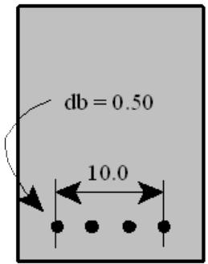

| 1 2 3 4 5 6 7 8 123456789012345678901234567890123456789012345678901234567890 | 1 2 3 4 5 6 7 8 123456789012345678901234567890123456789012345678901234567890 | 1 2 3 4 5 6 7 8 123456789012345678901234567890123456789012345678901234567890 | 1 2 3 4 5 6 7 8 123456789012345678901234567890123456789012345678901234567890 | 1 2 3 4 5 6 7 8 123456789012345678901234567890123456789012345678901234567890 | 1 2 3 4 5 6 7 8 123456789012345678901234567890123456789012345678901234567890 | 1 2 3 4 5 6 7 8 123456789012345678901234567890123456789012345678901234567890 |
| --- | --- | --- | --- | --- | --- | --- |
| SECT ROW1 | RRP | 0.50 | 4 | 10.0 |  |  |

2.1.1.2 Circular Reinforcement Pattern

Circular reinforcement patterns are used to define equally spaced steel rebars of the same diameter arranged in a circle. The pattern name must be specified in columns 6-12 along with the pattern type identifier ‘CRP’ in columns 16-18.

The default rebar diameter, the total number of rebars in the pattern, the diameter of the pattern row measured from center to center of the outermost rebars and the angle between the local Z axis and the first clock-wise rebar must be specified in columns 50-55, 56-60, 67-71 and 72-76, respectively. For example, the pattern shown on the right can be defined using the ‘SECT’ line as follows:

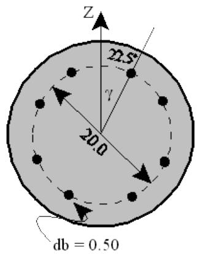

| 1 2 3 4 5 6 7 8 123456789012345678901234567890123456789012345678901234567890 | 1 2 3 4 5 6 7 8 123456789012345678901234567890123456789012345678901234567890 | 1 2 3 4 5 6 7 8 123456789012345678901234567890123456789012345678901234567890 | 1 2 3 4 5 6 7 8 123456789012345678901234567890123456789012345678901234567890 | 1 2 3 4 5 6 7 8 123456789012345678901234567890123456789012345678901234567890 | 1 2 3 4 5 6 7 8 123456789012345678901234567890123456789012345678901234567890 | 1 2 3 4 5 6 7 8 123456789012345678901234567890123456789012345678901234567890 |
| --- | --- | --- | --- | --- | --- | --- |
| SECT CIRCLE1 CRP | SECT CIRCLE1 CRP | 0.50 | 8 | 20.0 | 22.5 |  |

2.1.1.3 Box Reinforcement Pattern

Box reinforcement patterns are used to define reinforcement arranged in a rectangular pattern. The pattern name must be specified in columns 6-12 along with the pattern type identifier ‘BRP’ in columns 16-18.

The default rebar diameter, the number of rebars in the upper horizontal row, the number of rebars in the left vertical column, the width of the box and the height of the box measured from center to center of the outermost rebars must be specified in columns 50-55, 56-60, 67-71 and 72-76, respectively. For example, the pattern shown can be defined using the following ‘SECT’ input line:

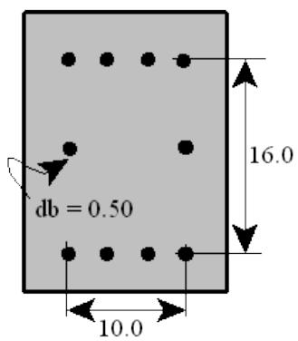

| 1 2 3 4 5 6 7 8 123456789012345678901234567890123456789012345678901234567890 | 1 2 3 4 5 6 7 8 123456789012345678901234567890123456789012345678901234567890 | 1 2 3 4 5 6 7 8 123456789012345678901234567890123456789012345678901234567890 | 1 2 3 4 5 6 7 8 123456789012345678901234567890123456789012345678901234567890 | 1 2 3 4 5 6 7 8 123456789012345678901234567890123456789012345678901234567890 | 1 2 3 4 5 6 7 8 123456789012345678901234567890123456789012345678901234567890 | 1 2 3 4 5 6 7 8 123456789012345678901234567890123456789012345678901234567890 |
| --- | --- | --- | --- | --- | --- | --- |
| SECT BOX1 | BRP | 0.50 | 4 | 3 | 10.0 | 16.0 |

2.1.1.4 Prismatic Reinforcement Section

Prismatic reinforcement sections are used to define the reinforcement as a single block of steel. The prismatic section name must be specified in columns 6-12 along with the identifier ‘PRP’ in columns 16- 18.

The total area of reinforcement steel must be specified in columns 50-55. For example, the pattern shown above may be defined as follows:

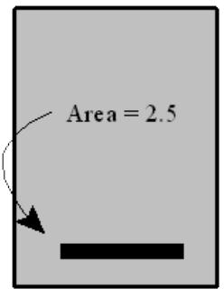

| 1 2 3 4 5 6 7 8 123456789012345678901234567890123456789012345678901234567890 | 1 2 3 4 5 6 7 8 123456789012345678901234567890123456789012345678901234567890 | 1 2 3 4 5 6 7 8 123456789012345678901234567890123456789012345678901234567890 | 1 2 3 4 5 6 7 8 123456789012345678901234567890123456789012345678901234567890 | 1 2 3 4 5 6 7 8 123456789012345678901234567890123456789012345678901234567890 | 1 2 3 4 5 6 7 8 123456789012345678901234567890123456789012345678901234567890 | 1 2 3 4 5 6 7 8 123456789012345678901234567890123456789012345678901234567890 |
| --- | --- | --- | --- | --- | --- | --- |
| SECT PRISM1 | PRP | 2.50 | 2.50 | 2.50 | 2.50 | 2.50 |

2.1.2 Beam and Column Cross-Section Properties

Section properties for beam elements are defined by the section referenced on the ‘GRUPC’ input line of the group the element is assigned to. All sections referenced by a concrete property group must be defined in the model file using a Concrete Cross Section line with the ‘SECT’ header.

Reinforced and non-reinforced concrete sections may be defined. When defining concrete cross section properties using a ‘SECT’ input line, the cross section type, the overall dimensions and whether the section is reinforced must be stipulated. By default, stiffness properties are calculated from the section dimensions but may be overridden on the input line. Concrete cross section types supported are:

1. Circular   
2. Rectangular   
3. Tee   
4. Right L   
5. Left L   
6. I-Section

2.1.2.1 Circular Cross Section

Circular cross sections may be used to define beam and column elements that have a circular cross section. The section name must be specified in columns 6-12 along with the cross section type identifier ‘CCS’ in columns 16-18. An ‘R’ must be input in column 15 if the section is reinforced with steel rebar.

For circular cross sections, the outside diameter is designated in columns 50-55. Stiffness properties may be optionally input in columns 19-48. The cross section shown can be defined using the Concrete Cross Section line labeled ‘SECT’ as follows:

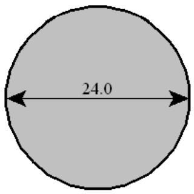

| 1 2 3 4 5 6 7 8 123456789012345678901234567890123456789012345678901234567890 | 1 2 3 4 5 6 7 8 123456789012345678901234567890123456789012345678901234567890 | 1 2 3 4 5 6 7 8 123456789012345678901234567890123456789012345678901234567890 | 1 2 3 4 5 6 7 8 123456789012345678901234567890123456789012345678901234567890 | 1 2 3 4 5 6 7 8 123456789012345678901234567890123456789012345678901234567890 | 1 2 3 4 5 6 7 8 123456789012345678901234567890123456789012345678901234567890 | 1 2 3 4 5 6 7 8 123456789012345678901234567890123456789012345678901234567890 |
| --- | --- | --- | --- | --- | --- | --- |
| SECT TUBE1 | CCS | 24.0 | 24.0 | 24.0 | 24.0 | 24.0 |

2.1.2.2 Rectangular Cross Section

Rectangular cross sections may be used to define beam and column elements that are rectangular or square shaped. The section name must be specified in columns 6-12 along with the cross section type identifier ‘CRS’ in columns 16-18. An ‘R’ must be input in column 15 if the section is reinforced with steel rebar. See Section 2.1.13 for defining section reinforcement.

For rectangular or square cross sections, the height and width are input in columns 50-55 and 56-60, respectively. Stiffness properties may be optionally input in columns 19-48. The cross section shown can be defined using the Concrete Cross Section line labeled ‘SECT’ as follows:

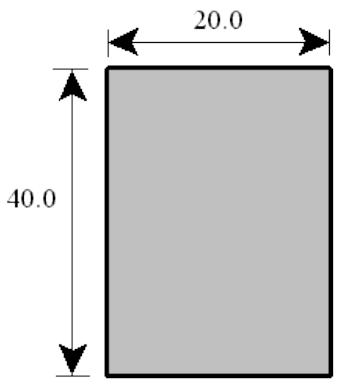

| 1 2 3 4 5 6 7 8 123456789012345678901234567890123456789012345678901234567890 | 1 2 3 4 5 6 7 8 123456789012345678901234567890123456789012345678901234567890 | 1 2 3 4 5 6 7 8 123456789012345678901234567890123456789012345678901234567890 | 1 2 3 4 5 6 7 8 123456789012345678901234567890123456789012345678901234567890 | 1 2 3 4 5 6 7 8 123456789012345678901234567890123456789012345678901234567890 | 1 2 3 4 5 6 7 8 123456789012345678901234567890123456789012345678901234567890 | 1 2 3 4 5 6 7 8 123456789012345678901234567890123456789012345678901234567890 |
| --- | --- | --- | --- | --- | --- | --- |
| SECT RECT1 CRS | SECT RECT1 CRS | SECT RECT1 CRS | 40.0 | 20.0 |  |  |

2.1.2.3 Tee Cross Section

For tee beam and column cross sections, the section name must be specified in columns 6-12 along with the cross section type identifier ‘CTS’ in columns 16-18. An ‘R’ must be input in column 15 if the section is reinforced with steel rebar. See Section 2.1.13 for section reinforcement.

For tee cross sections, the height, web width, effective flange width and flange thickness are input in columns 50-55, 56-60, 61-66 and 67-71, respectively. Stiffness properties may be optionally input in columns 19-48. The cross section shown can be defined using the Concrete Cross Section line labeled ‘SECT’ as follows:

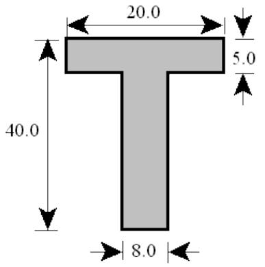

| 1 2 3 4 5 6 7 8 123456789012345678901234567890123456789012345678901234567890 | 1 2 3 4 5 6 7 8 123456789012345678901234567890123456789012345678901234567890 | 1 2 3 4 5 6 7 8 123456789012345678901234567890123456789012345678901234567890 | 1 2 3 4 5 6 7 8 123456789012345678901234567890123456789012345678901234567890 | 1 2 3 4 5 6 7 8 123456789012345678901234567890123456789012345678901234567890 | 1 2 3 4 5 6 7 8 123456789012345678901234567890123456789012345678901234567890 | 1 2 3 4 5 6 7 8 123456789012345678901234567890123456789012345678901234567890 | 1 2 3 4 5 6 7 8 123456789012345678901234567890123456789012345678901234567890 |
| --- | --- | --- | --- | --- | --- | --- | --- |
| SECT TEE1 | CTS | 40.0 | 8.0 | 20.0 | 5.0 |  |  |

2.1.2.4 Right L Cross Section

The right L section may be used to define L shaped columns or beams. The section name must be specified in columns 6-12 along with the cross section type identifier ‘CRL’ in columns 16-18. An ‘R’ must be input in column 15 if the section is reinforced with steel rebar. See Section 2.1.13 for defining section reinforcement.

For right L cross sections, the height, web width, effective flange width and flange thickness are input in columns 50-55, 56-60, 61-66 and 67-71, respectively. Stiffness properties may be optionally input in columns 19-48. The cross section shown can be defined using the Concrete Cross Section line labeled ‘SECT’ as follows:

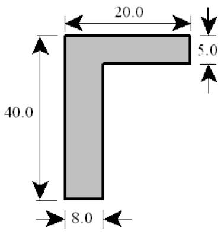

| 1 2 3 4 5 6 7 8 123456789012345678901234567890123456789012345678901234567890 | 1 2 3 4 5 6 7 8 123456789012345678901234567890123456789012345678901234567890 | 1 2 3 4 5 6 7 8 123456789012345678901234567890123456789012345678901234567890 | 1 2 3 4 5 6 7 8 123456789012345678901234567890123456789012345678901234567890 | 1 2 3 4 5 6 7 8 123456789012345678901234567890123456789012345678901234567890 | 1 2 3 4 5 6 7 8 123456789012345678901234567890123456789012345678901234567890 | 1 2 3 4 5 6 7 8 123456789012345678901234567890123456789012345678901234567890 |
| --- | --- | --- | --- | --- | --- | --- |
| SECT RIGHT1 | CRL | 40.0 | 8.0 | 20.0 | 5.0 |  |

2.1.2.5 Left L Cross Section

Like the right L section, the left L section may be used to define L shaped columns or beams. The section name must be specified in columns 6-12 along with the cross section type identifier ‘CLL’ in columns 16- 18. An ‘R’ must be input in column 15 if the section is reinforced with steel rebar. See Section 2.1.13 for defining section reinforcement.

For left L cross sections, the height, web width, effective flange width and flange thickness are input in columns 50-55, 56-60, 61-66 and 67-71, respectively. Stiffness properties may be optionally input in columns 19-48. The left L cross section shown on the right can be defined using the following Cross Section line labeled ‘SECT’:

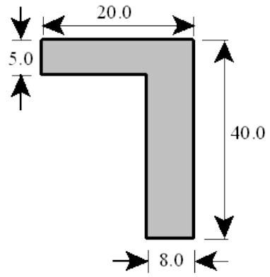

| 1 2 3 4 5 6 7 8 123456789012345678901234567890123456789012345678901234567890 | 1 2 3 4 5 6 7 8 123456789012345678901234567890123456789012345678901234567890 | 1 2 3 4 5 6 7 8 123456789012345678901234567890123456789012345678901234567890 | 1 2 3 4 5 6 7 8 123456789012345678901234567890123456789012345678901234567890 | 1 2 3 4 5 6 7 8 123456789012345678901234567890123456789012345678901234567890 | 1 2 3 4 5 6 7 8 123456789012345678901234567890123456789012345678901234567890 | 1 2 3 4 5 6 7 8 123456789012345678901234567890123456789012345678901234567890 | 1 2 3 4 5 6 7 8 123456789012345678901234567890123456789012345678901234567890 |
| --- | --- | --- | --- | --- | --- | --- | --- |
| SECT LEFT1 CLL 40.0 8.0 20.0 5.0 | SECT LEFT1 CLL 40.0 8.0 20.0 5.0 | SECT LEFT1 CLL 40.0 8.0 20.0 5.0 | SECT LEFT1 CLL 40.0 8.0 20.0 5.0 | SECT LEFT1 CLL 40.0 8.0 20.0 5.0 | SECT LEFT1 CLL 40.0 8.0 20.0 5.0 | SECT LEFT1 CLL 40.0 8.0 20.0 5.0 | SECT LEFT1 CLL 40.0 8.0 20.0 5.0 |

2.1.2.6 I Cross Section

The I section may be used to define I shaped columns or beams. The section name must be specified in columns 6-12 along with the cross section type identifier ‘CIS’ in columns 16-18. An ‘R’ must be input in column 15 if the section is reinforced with steel rebar. See Section 2.1.13 for defining section reinforcement.

For I cross sections, the height, web width, effective flange width and flange thickness are input in columns 50-55, 56-60, 61-66 and 67-71, respectively. Stiffness properties may be optionally input in columns 19-48. The cross section shown can be defined using the Concrete Cross Section line labeled ‘SECT’ as follows:

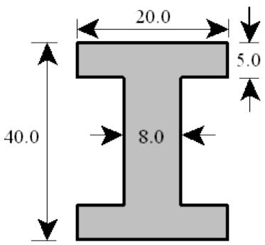

| 1 2 3 4 5 6 7 8 123456789012345678901234567890123456789012345678901234567890 | 1 2 3 4 5 6 7 8 123456789012345678901234567890123456789012345678901234567890 | 1 2 3 4 5 6 7 8 123456789012345678901234567890123456789012345678901234567890 | 1 2 3 4 5 6 7 8 123456789012345678901234567890123456789012345678901234567890 | 1 2 3 4 5 6 7 8 123456789012345678901234567890123456789012345678901234567890 | 1 2 3 4 5 6 7 8 123456789012345678901234567890123456789012345678901234567890 | 1 2 3 4 5 6 7 8 123456789012345678901234567890123456789012345678901234567890 |
| --- | --- | --- | --- | --- | --- | --- |
| SECT ISECT1 CIS | SECT ISECT1 CIS | 40.0 | 8.0 | 20.0 | 5.0 |  |

2.1.3 Defining Section Reinforcement

The steel reinforcement patterns used in the concrete cross section are defined on the ‘SECT2’ line immediately following the ‘SECT’ line on which the cross section properties are defined.

Note: In order to use a ‘SECT2’ line to specify the reinforcement patterns used by the concrete cross section, an ‘R’ must be specified in column 15 on the preceding ‘SECT’ line defining the cross section properties.

Up to three reinforcement patterns may be used to define the reinforcement of the concrete section. The first pattern data is specified in columns 9-32 on the ‘SECT2’ line, the second in columns 33-56 and the third in columns 57-80. For each pattern used, the pattern section ID, the dimension from the top of the concrete section to the pattern CG and the yield strength of the rebars must be specified. The rebar diameter for the pattern may be overridden by specifying a rebar diameter override.

Section TUBE1 shown on the right includes reinforcement pattern CIRCLE1. The name of the reinforcement pattern, the distance from the top of the section to the CG of pattern CIRCLE1 and the yield stress of the rebars are specified on the ‘SECT2’ line in columns 9-15, 16-20 and 21-25, respectively. The input lines defining the section TUBE1 follow:

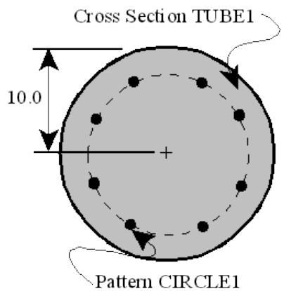

| 1 2 3 4 5 6 7 8 123456789012345678901234567890123456789012345678901234567890 |
| --- |
| SECT TUBE1 RCCS 24.0 SECT2 CIRCLE1 10.0 50.0 |

Reinforcement pattern sections may be referenced by more than one section. For example, the rebar pattern section ROW1 may be used by numerous concrete cross sections as follows:

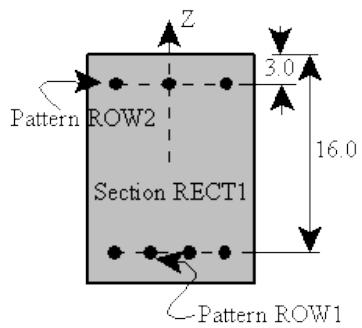

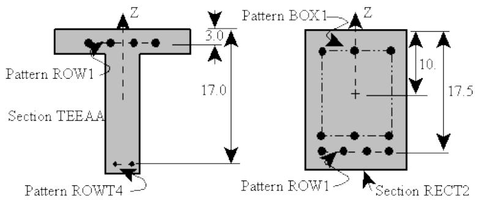

|  | 1 | 2 | 3 | 4 | 5 | 6 | 7 | 8 |
| --- | --- | --- | --- | --- | --- | --- | --- | --- |
| 1234567890123 | 1234567890123456789012345678901234567890123456789012345678901234567890123456789012345678901234567890123456789 | 12345678901234567890123456789012345678901234567890123456789012345678901234567890123456789012345678 | 12345678901234567890123456789012345678901234567890123456789012345678901234567890123456789012345678 10.0 50.0 | 20.0 3.0 50.0 | 20.0 20.0 17.0 | 15.0 17.0 20.0 8.0 | 0.0 0.0 20.0 6.0 | 0.0 0.0 20.0 6.0 |
| SECT RECT1 | RCRS |  |  |  |  |  |  |  |
| SECT2 ROW1 | 16.0 50.0 |  |  |  |  |  |  |  |
| SECT RECT2 | RCRS |  |  |  |  |  |  |  |
| SECT2 BOX1 | 10.0 50.0 |  |  |  |  |  |  |  |
| SECT TEEAA | RCTS |  |  |  |  |  |  |  |
| SECT2 ROW1 | 3.0 50.0 |  |  |  |  |  |  |  |

Note: The top of the section is defined by the positive local Z axis. Also, all rebar pattern sections referenced by ‘SECT2’ lines must be defined in the model using Reinforcement Pattern Section ‘SECT’ input lines.

2.1.4 Overriding Pattern Rebar Diameter

By default, the rebar diameter designated on the ‘SECT’ line defining the pattern is used when a rebar pattern is specified on the ‘SECT2’ input line. The rebar diameter may be overridden for a particular concrete section by specifying a rebar diameter override on the ‘SECT2’ line. For example, for section RECT1, the diameter of rebars defined by pattern ROW1 are re-designated as 0.625 in columns 28-32 on the ‘SECT2’ input line.

|  | 1 | 2 | 3 | 4 | 5 | 6 | 7 | 8 |
| --- | --- | --- | --- | --- | --- | --- | --- | --- |
|  | 1234567890123 | 1234567890123 | 1234567890123 | 1234567890123 | 1234567890123 | 1234567890123 | 1234567890123 | 1234567890123 |
|  | SECT RECT1 | RCRS |  |  |  | 20.0 | 15.0 |  |
|  | SECT2 ROW1 | 16.0 | 50.0 | 0.625 | ROW2 | 3.0 | 50.0 |  |
|  | SECT RECT2 | RCRS |  |  |  | 20.0 | 17.0 |  |
|  | SECT2 BOX1 | 10.0 | 50.0 |  | ROW1 | 17.5 | 50.0 |  |

Note: The diameter was overridden only for section RECT1, the default rebar diameter is used for section RECT2.

2.1.5 Material Properties

For concrete column and beam elements, the steel rebar material properties such as modulus of elasticity and density are specified on the ‘GRUPC’ line in columns 18-23 and 24-29, respectively. Concrete properties such as modulus of elasticity, density and compressive strength are also specified on the ‘GRUPC’ line in columns 31-35, 36-40 and 41-45, respectively. The concrete group to which the member is assigned is designated on the ‘MEMBER’ input line.

Note: If the concrete modulus of elasticity is left blank on the ‘GRUPC’ input line, the value will be calculated automatically as Ec = 33rc1.5 * Sqrt(f'c), where rc is the density of concrete and f'c is the compressive strength.

2.1.6 Shear Properties

The shear properties of a concrete element are derived from the shear reinforcement information specified on the concrete ‘GRUPC’ line defining the group to which the element is assigned. The yield stress, spacing, shear reinforcement type (‘T’ for ties or stirrups or ‘S’ for spiral) and shear reinforcement bar diameter are designated in columns 60-64, 65-69, 70 and 71-76, respectively.

2.1.7 Designating Element Type

Beam elements may be classified as either a column or beam element. In either case, the element type or member classification is designated in column 47 on the concrete group line defining the property group to which the member is assigned.

2.1.7.1 Column Members

Members that act as beam-columns, i.e. carry both axial force and moment, are assigned to a property group classified as a column group. Columns braced against sidesway are assigned member class ‘1’ while columns unbraced against sidesway are assigned member class ‘2’. The effective stiffness for firstorder analysis, and the initial effective stiffness for second- order analysis is taken as:

$$E I_{e f f} = E_{c} I_{g} \left(0. 2 + 1. 2 \rho_{t} \frac{E_{s}}{E_{c}}\right)$$

Column elements are code checked for axial load and resultant moment interaction, column buckling and axial load, shear and torsion interaction. For first order analysis, the resultant moment is magnified to account for column buckling and general stability.

Braced columns that are to be omitted from the post processing reports are classified as type ‘4’ while unbraced columns to be omitted are assigned type ‘5’.

2.1.7.2 Beam Members

Concrete beams are elements that are subject to flexure without axial load. Beam elements are assigned to groups designated as member class ‘3’ in column 47. The effective stiffness for first-order analysis, and the initial effective stiffness for second-order analysis is taken as:

$$E I_{e f f} = 0. 5 E_{c} I_{g}$$

Beam elements are code checked for moment about the local Y axis, shear along the local Z axis and torsion. Beam elements that are to be omitted from post processing may be assigned member class ‘6’.

Note: Although axial load and bending about the local Z axis are ignored for beam elements, a warning message is issued if the axial load or local Z bending exceeds 3% of the element’s capacity.

2.1.8 Segmented Member Groups

Like segmented steel cross sections, segmented concrete cross sections are defined by a series of ‘GRUP’ input lines with the same group label. The member classification is determined from the value input on the first ‘GRUP’ line of the series.

## 2.2 SLAB ELEMENT PROPERTY DATA

Each slab or concrete plate element in the SACS model is assigned to a group which contains the concrete material and cross-section property data and steel reinforcement properties for all elements assigned to that group. Slabs with identical structural, material and code check properties may be assigned to the same concrete plate group.

2.2.1 Defining Slab Reinforcement Patterns

Concrete plate or slab steel reinforcement patterns are defined using Slab Reinforcement Bar Description input lines labeled ‘PSTIF’. A slab reinforcement or stiffener pattern section may be referenced by any concrete plate group and a concrete plate group may reference up to two slab reinforcement patterns.

Note: All slab reinforcement or stiffener patterns referenced on concrete plate group input lines must be defined within the model input file.

Reinforcement arranged in a horizontal row of equally spaced steel rebars of the same diameter may be defined using a ‘PSTIF’ line. The pattern name must be specified in columns 11-17 along with the pattern type identifier ‘RBR’ in columns 7-9.

The rebar diameter, distance from the rebar centroid to the slab edge (top, bottom or both as designated in the slab group input) are specified in columns 21-27, and 28-34, respectively. The rebar yield stress, elastic modulus and density are input in columns 35-41, 42-48 and 49-55, respectively.

For example, the pattern shown on the right can be defined using the following ‘PSTIF’ input line:

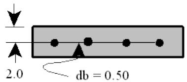

| 1 2 3 4 5 6 7 8 123456789012345678901234567890123456789012345678901234567890 | 1 2 3 4 5 6 7 8 123456789012345678901234567890123456789012345678901234567890 | 1 2 3 4 5 6 7 8 123456789012345678901234567890123456789012345678901234567890 | 1 2 3 4 5 6 7 8 123456789012345678901234567890123456789012345678901234567890 | 1 2 3 4 5 6 7 8 123456789012345678901234567890123456789012345678901234567890 | 1 2 3 4 5 6 7 8 123456789012345678901234567890123456789012345678901234567890 | 1 2 3 4 5 6 7 8 123456789012345678901234567890123456789012345678901234567890 | 1 2 3 4 5 6 7 8 123456789012345678901234567890123456789012345678901234567890 |
| --- | --- | --- | --- | --- | --- | --- | --- |
| PSTIF RBR MESH1 | 0.50 | 2.0 | 60.0 | 29.0 | 490.0 |  |  |

Note: All rebars within a defined pattern must be the same diameter. Also, the rebar spacing is defined as part of the concrete plate group input.

2.2.2 Slab Cross-Section and Material Properties

Section and material properties for slab elements are defined on the ‘PGRUPC’ input line of the group the element is assigned to.

When defining concrete cross section properties using a ‘PGRUPC’ input line, the group name and cross section and material properties must be stipulated. The slab group name and slab thickness are input in columns 7-9 and 11-16, respectively. Material properties including modulus of elasticity, Poisson’s ratio, concrete compressive strength and concrete density are input in columns 18-23, 24-29, 30-35 and 73- 80, respectively.

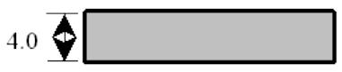

The slab cross section shown may be defined using the Concrete Plate Group line labeled ‘PGRUPC’ as follows:

| 1 2 3 4 5 6 7 8 1234567890123456789012345678901234567890123456789012345678901234567890 | 1 2 3 4 5 6 7 8 1234567890123456789012345678901234567890123456789012345678901234567890 | 1 2 3 4 5 6 7 8 1234567890123456789012345678901234567890123456789012345678901234567890 | 1 2 3 4 5 6 7 8 1234567890123456789012345678901234567890123456789012345678901234567890 | 1 2 3 4 5 6 7 8 1234567890123456789012345678901234567890123456789012345678901234567890 | 1 2 3 4 5 6 7 8 1234567890123456789012345678901234567890123456789012345678901234567890 | 1 2 3 4 5 6 7 8 1234567890123456789012345678901234567890123456789012345678901234567890 | 1 2 3 4 5 6 7 8 1234567890123456789012345678901234567890123456789012345678901234567890 |
| --- | --- | --- | --- | --- | --- | --- | --- |
| PGRUPCCP1 4.0 C 29.0 0.25 4.0 | PGRUPCCP1 4.0 C 29.0 0.25 4.0 | PGRUPCCP1 4.0 C 29.0 0.25 4.0 | PGRUPCCP1 4.0 C 29.0 0.25 4.0 | PGRUPCCP1 4.0 C 29.0 0.25 4.0 | PGRUPCCP1 4.0 C 29.0 0.25 4.0 | PGRUPCCP1 4.0 C 29.0 0.25 4.0 | 145.0 |

2.2.3 Slab Reinforcement

The slab reinforcement patterns used in the concrete slab are defined on the ‘PGRUPC’ line defining the concrete plate group properties.

Up to two slab reinforcement patterns defined as ‘PSTIF’ input data may be used to define the reinforcement of the concrete plate section. The first pattern data is specified in columns 42-56 on the ‘PGRUPC’ line, and the second pattern in columns 58-72. For each stiffener pattern used, the pattern section ID, the average spacing of the rebars, the direction of the rebars (i.e. along local X or local Y axis) and the surface to which the location of the centroid of the rebar is measured must be specified.

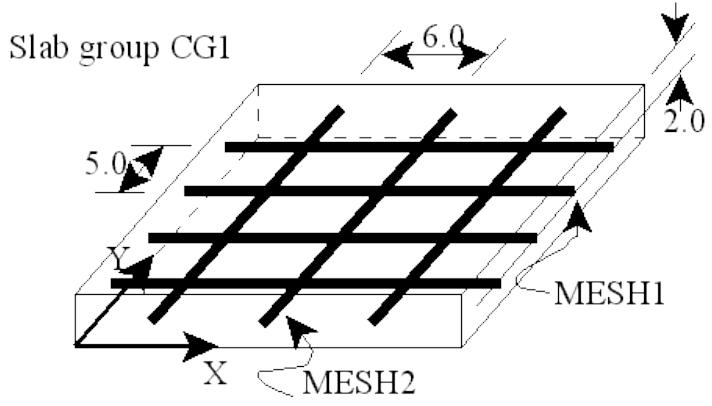

For example, the concrete plate group CG1 shown above is reinforced with reinforcement stiffener ‘MESH1’ in the local X direction spaced at 5.0 center to center. The rebars are located 2.0 from the top

of the slab. Reinforcement section ‘MESH2’ is used at 6.0 centers in the local Y direction. The following input line defines concrete slab group ‘CG1’.

| 1 2 3 4 5 6 7 8 123456789012345678901234567890123456789012345678901234567890 | 1 2 3 4 5 6 7 8 123456789012345678901234567890123456789012345678901234567890 | 1 2 3 4 5 6 7 8 123456789012345678901234567890123456789012345678901234567890 | 1 2 3 4 5 6 7 8 123456789012345678901234567890123456789012345678901234567890 | 1 2 3 4 5 6 7 8 123456789012345678901234567890123456789012345678901234567890 | 1 2 3 4 5 6 7 8 123456789012345678901234567890123456789012345678901234567890 | 1 2 3 4 5 6 7 8 123456789012345678901234567890123456789012345678901234567890 | 1 2 3 4 5 6 7 8 123456789012345678901234567890123456789012345678901234567890 | 1 2 3 4 5 6 7 8 123456789012345678901234567890123456789012345678901234567890 |
| --- | --- | --- | --- | --- | --- | --- | --- | --- |
| PGRUPCCG1 4.0 C 29.0 0.25 4.0 MESH1 5.0 XT MESH2 6.0 YT 145.0 | PGRUPCCG1 4.0 C 29.0 0.25 4.0 MESH1 5.0 XT MESH2 6.0 YT 145.0 | PGRUPCCG1 4.0 C 29.0 0.25 4.0 MESH1 5.0 XT MESH2 6.0 YT 145.0 | PGRUPCCG1 4.0 C 29.0 0.25 4.0 MESH1 5.0 XT MESH2 6.0 YT 145.0 | PGRUPCCG1 4.0 C 29.0 0.25 4.0 MESH1 5.0 XT MESH2 6.0 YT 145.0 | PGRUPCCG1 4.0 C 29.0 0.25 4.0 MESH1 5.0 XT MESH2 6.0 YT 145.0 | PGRUPCCG1 4.0 C 29.0 0.25 4.0 MESH1 5.0 XT MESH2 6.0 YT 145.0 | PGRUPCCG1 4.0 C 29.0 0.25 4.0 MESH1 5.0 XT MESH2 6.0 YT 145.0 | PGRUPCCG1 4.0 C 29.0 0.25 4.0 MESH1 5.0 XT MESH2 6.0 YT 145.0 |

Note: Slab reinforcement pattern sections may be referenced by more than one concrete plate group.

2.2.4 Slab Types

The type of slab is designated in column 17 on the ‘PGRUPC’ input line. Concrete slab types supported are:

1. One-way Local X   
2. One-way Local Y   
3. General   
4. Two-way   
5. Two-way with punching shear check

2.2.4.1 One-way Slab

One-way slabs are concrete plate elements that bend in one direction only. The bending axis is assumed to be normal to the slab span direction.

Slabs spanning in the local X direction are assumed to have bending stiffness about the local Y axis only and are designated as slab type ‘A’ in column 17. Slabs spanning in the local Y direction are assumed to have bending stiffness about the local X axis only and are designated as slab type ‘B’ in column 17.

| 1 2 3 4 5 6 7 8 123456789012345678901234567890123456789012345678901234567890 | 1 2 3 4 5 6 7 8 123456789012345678901234567890123456789012345678901234567890 | 1 2 3 4 5 6 7 8 123456789012345678901234567890123456789012345678901234567890 | 1 2 3 4 5 6 7 8 123456789012345678901234567890123456789012345678901234567890 | 1 2 3 4 5 6 7 8 123456789012345678901234567890123456789012345678901234567890 | 1 2 3 4 5 6 7 8 123456789012345678901234567890123456789012345678901234567890 | 1 2 3 4 5 6 7 8 123456789012345678901234567890123456789012345678901234567890 | 1 2 3 4 5 6 7 8 123456789012345678901234567890123456789012345678901234567890 |
| --- | --- | --- | --- | --- | --- | --- | --- |
| PGRUPCCP1 4.0 | A 29.0 | 0.25 4.0 |  |  |  |  | 145.0 |
| PGRUPCCP2 4.0 | B 29.0 | 0.25 4.0 |  |  |  |  | 145.0 |

For code check purposes, one-way slabs are assumed to behave like a series of beam elements. The element is checked for beam shear and bending. The effect of axial load on bending and shear capacity is ignored.

2.2.4.2 Two-way Slabs

Two-way slab elements are concrete plate elements that bend in double curvature and have bending stiffness about both the local X and Y axes. Two-way slabs are designated by ‘C’ in column 17.

Two-way slabs are checked for beam shear in the local XZ and YZ planes along with bending about the local X and Y axes. No interaction between moment about X and Y axes is considered. The effect of axial load on bending and shear capacity is ignored.

2.2.4.3 Two-way Slab with Punching Shear Considered

Two-way slab elements located near columns or concentrated loads must be checked for punching shear in addition to beam shear and designated as slab type ‘E’ in column 17.

2.2.4.3.1 Punching Shear Critical Section

For slab element type ‘E’, the punching shear critical section data must be designated on the ‘PGRUP2’ line immediately following the ‘PGRUPC’ line.

The punching shear critical section is usually in the vicinity of a column or concentrated load. The critical section location refers to the location of the column or concentrated load with respect to the overall structure and is input in columns 8-10. Enter ‘INT’ if the critical section is interior, ‘EDX’ if it is located at an edge of the structure parallel to the plate local X axis, ‘EDY’ if it is located at an edge of the structure parallel to the plate local Y axis or ‘COR’ if it is located at one of the corners of the structure.

Note: The critical section location refers to the classification of the column or concentrated load based on its location within the structure not its location with respect to a slab element to which it may be attached.

The figure below illustrates the classification of critical sections defined by columns.

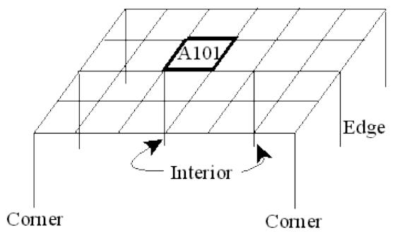

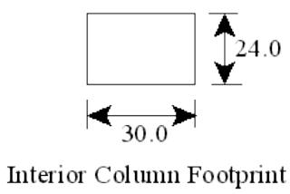

The critical section shape must be designated in column 11. Input ‘R’ for rectangular section and ‘C’ for circular sections. For rectangular critical section shapes, the width of the critical section along the plate local X axis is stipulated in columns 12-17 while the width along the plate local Y axis is designated in columns 18-23. For circular sections, the diameter is entered in columns 12-17.

For plate A101 shown in the above figure, the following ‘PGRUPC’ and ‘PGRUP2’ input lines are used:

| 1 2 3 4 5 6 7 8 123456789012345678901234567890123456789012345678901234567890 | 1 2 3 4 5 6 7 8 123456789012345678901234567890123456789012345678901234567890 | 1 2 3 4 5 6 7 8 123456789012345678901234567890123456789012345678901234567890 | 1 2 3 4 5 6 7 8 123456789012345678901234567890123456789012345678901234567890 | 1 2 3 4 5 6 7 8 123456789012345678901234567890123456789012345678901234567890 | 1 2 3 4 5 6 7 8 123456789012345678901234567890123456789012345678901234567890 | 1 2 3 4 5 6 7 8 123456789012345678901234567890123456789012345678901234567890 | 1 2 3 4 5 6 7 8 123456789012345678901234567890123456789012345678901234567890 | 1 2 3 4 5 6 7 8 123456789012345678901234567890123456789012345678901234567890 |
| --- | --- | --- | --- | --- | --- | --- | --- | --- |
| PGRUPCCP1 4.0 E 29.0 0.25 4.0 MESH1 6.0 XT MESH1 6.0 XT 145.0 PGRUP2 INTR 30.0 24.0 | PGRUPCCP1 4.0 E 29.0 0.25 4.0 MESH1 6.0 XT MESH1 6.0 XT 145.0 PGRUP2 INTR 30.0 24.0 | PGRUPCCP1 4.0 E 29.0 0.25 4.0 MESH1 6.0 XT MESH1 6.0 XT 145.0 PGRUP2 INTR 30.0 24.0 | PGRUPCCP1 4.0 E 29.0 0.25 4.0 MESH1 6.0 XT MESH1 6.0 XT 145.0 PGRUP2 INTR 30.0 24.0 | PGRUPCCP1 4.0 E 29.0 0.25 4.0 MESH1 6.0 XT MESH1 6.0 XT 145.0 PGRUP2 INTR 30.0 24.0 | PGRUPCCP1 4.0 E 29.0 0.25 4.0 MESH1 6.0 XT MESH1 6.0 XT 145.0 PGRUP2 INTR 30.0 24.0 | PGRUPCCP1 4.0 E 29.0 0.25 4.0 MESH1 6.0 XT MESH1 6.0 XT 145.0 PGRUP2 INTR 30.0 24.0 | PGRUPCCP1 4.0 E 29.0 0.25 4.0 MESH1 6.0 XT MESH1 6.0 XT 145.0 PGRUP2 INTR 30.0 24.0 | PGRUPCCP1 4.0 E 29.0 0.25 4.0 MESH1 6.0 XT MESH1 6.0 XT 145.0 PGRUP2 INTR 30.0 24.0 |

Note: The critical section width at a column is simply the width or diameter of the column. For concentrated loads, the critical section dimensions are the footprint dimensions.

2.2.4.4 General Concrete Plate Elements

General concrete plate elements are elements that bend in double curvature and have bending stiffness about both the local X and Y axes. General concrete plate elements are designated by $\mathbf{ \bar{ \rho } }_{ \mathsf{ D^{ \prime } } }$ in column 17.

The axial load and bending interaction capacity is determined for axial load along the local X axis and bending about the local Y axis and for axial load along the local Y with bending about the local X axis. General slabs are checked for beam shear in the local XZ and YZ planes. The effect of axial load on bending and shear capacity is considered.

## 2.3 LOAD CASE TYPES FOR FIRST-ORDER ANALYSIS

When executing a first order analysis, column elements are checked using the magnified factored moment Mc. The magnified factored moment is determined from the following:

$$M_{c} = \delta_{b} M_{b} + \delta_{s} M_{s}$$

where $\delta_{ \flat } ,$ used to account for column buckling, is applied to the component of the moment due to loading that does not induce sway in the structure （$M_{ \mathrm{ b } } ) .$ , and $\delta_{ s } ,$ used to account for basic stability, is applied to the component of the moment due to loading that causes appreciable sidesway (Ms).

In general, the moment $\mathsf{ M }_{ \mathsf{ b } }$ results from gravity loads while the moment Ms results from lateral loading. For the purpose of determining the components of the moment, the program determines Mb as the moment resulting from load cases designated as gravity or dead loading while $\mathsf{ M }_{ \mathsf{ s } }$ is the moment resulting from all other load cases.

2.3.1 Designating Gravity Load Cases

Load cases that contain gravity loading or loading that causes no sidesway should be designated as a gravity load case by specifying them on the LCSEL line using the $\scriptstyle \mathbf{ \prime p } \mathbf{ 0 }^{ \prime }$ function in columns 7-8. The following designates that load cases ‘DED1’ and $\mathsf{ \Omega } \mathsf{ W L K 1 }^{ \prime }$ are gravity load cases:

| 1 2 3 4 5 6 7 8 1234567890123456789012345678901234567890123456789012345678901234567890 |
| --- |
| LCSEL PD DED1 WLK1 |

For first-order analysis, the portion of a column element’s moment due to a load case designated as a gravity load will be magnified by db.

Note: The application of gravity loads to an un-braced frame in an unsymmetrical pattern or to an unsymmetrical frame may result in some minor sidesway. In general, the minor effects of this sway component may be neglected. For any load case using first-order analysis, the user must determine whether the load case will cause any “appreciable” sidesway component.

2.3.2 Designating Sway Load Cases

By default a load case is considered to cause “appreciable” sidesway unless it is designated as a gravity load case on the ‘LCSEL’ input line. For first-order analysis, the portion of a column element’s moment due to load cases causing sidesway will be magnified by ds.

2.3.3 Load Combinations

Load combinations consisting of factored basic load conditions or previously defined load combinations must be defined by the user using the ‘LCOMB’ input line. Load factors for dead load, live load, earthquake load, etc. should be specified along with the load condition number.

The appropriate load case factors must be provided by the user, the program does not factor loading automatically. For example, the following load combination 3 is used to compute the required strength due to load case 1 containing dead load and load case 2 containing live load:

| 1 2 3 4 5 6 7 8 1234567890123456789012345678901234567890123456789012345678901234567890 | 1 2 3 4 5 6 7 8 1234567890123456789012345678901234567890123456789012345678901234567890 | 1 2 3 4 5 6 7 8 1234567890123456789012345678901234567890123456789012345678901234567890 | 1 2 3 4 5 6 7 8 1234567890123456789012345678901234567890123456789012345678901234567890 | 1 2 3 4 5 6 7 8 1234567890123456789012345678901234567890123456789012345678901234567890 | 1 2 3 4 5 6 7 8 1234567890123456789012345678901234567890123456789012345678901234567890 | 1 2 3 4 5 6 7 8 1234567890123456789012345678901234567890123456789012345678901234567890 | 1 2 3 4 5 6 7 8 1234567890123456789012345678901234567890123456789012345678901234567890 | 1 2 3 4 5 6 7 8 1234567890123456789012345678901234567890123456789012345678901234567890 |
| --- | --- | --- | --- | --- | --- | --- | --- | --- |
| LDCOMB 3 140.0 1 170.0 2 | LDCOMB 3 140.0 1 170.0 2 | LDCOMB 3 140.0 1 170.0 2 | LDCOMB 3 140.0 1 170.0 2 | LDCOMB 3 140.0 1 170.0 2 | LDCOMB 3 140.0 1 170.0 2 | LDCOMB 3 140.0 1 170.0 2 | LDCOMB 3 140.0 1 170.0 2 | LDCOMB 3 140.0 1 170.0 2 |

Note: For a first-order analyses, load combinations are not solved in the solution phase. Results are obtained by superposition of the basic results during post processing. Because second-order analyses have nonlinear solutions, results for only load combinations should be obtained.

# 3 COMMENTARY

## 3.1 TERMS AND DEFINITIONS

The following terms and definitions pertain to the variables used throughout the commentary:

| Ab | Area of reinforcement bar |
| --- | --- |
| Acon | Area of the equivalent concrete compression zone |
| As | Area of tension reinforcement |
| At | Area of one leg of a closed stirrup resisting torsion |
| Av | Area of shear reinforcement within spacing s |
| Aweb | Equivalent concrete compression zone area used for shear |
| c | distance from the extreme compression fiber to the neutral axis measured perpendicular to the neutral axis |
| Cb | distance from the extreme compression fiber to the neutral axis for the balanced strain condition |
| CG | Distance from the fiber of extreme compression to the centroid of the concrete section neglecting reinforcement measured normal to the neutral axis |
| CGcon | Distance from the fiber of extreme compression to the CG of the equivalent concrete compression zone measured normal to the neutral axis |
| Ct | Shear and torsion stress property factor |
| d | Distance from extreme compression fiber to centroid of longitudinal tension reinforcement |
| db | Distance from the fiber of extreme compression to the rebar measured normal to the neutral axis |
| dmax | Distance from the fiber of extreme compression to the farthest rebar measured normal to the neutral axis |
| Ec | Concrete modulus of elasticity |
| Es | Modulus of elasticity of steel |
| fc | Compressive strength of concrete |
| fs | Stress in steel reinforcement |
| fy | Steel yield strength |
| Ib | Moment of inertia of reinforcement bar |
| Icon | Moment of inertia of equivalent concrete compression zone |
| Ig | Moment of inertia of the gross concrete section ignoring reinforcement |
| Mn | Nominal moment capacity |
| Mu | Magnified factored moment resultant from first order analysis, factored moment resultant from P-delta analysis |
| My | Factored moment about the local Y axis |
| Mz | Factored moment about the local Z axis |
| Pn | Nominal axial load capacity at a given eccentricity |
| Pu | Factored axial force |
| s | pacing of shear or torsion reinforcements |
| Tc | Nominal torsion strength provided by concrete |
| Tn | Nominal torsion capacity |
| Ts | Nominal torsion strength provided by torsion reinforcement |
| Tu | Factored torsional moment |
| Vc | Nominal shear strength provided by concrete |
| Vn | Nominal shear capacity |
| Vs | Nominal shear strength provided by shear reinforcement |
| Vu | Factored shear force |
| x | shorter dimension of rectangular portion of cross section |
| x1 | shorter center to center dimension of closed stirrup |
| y | longer dimension of rectangular portion of cross section |
| γ1 | longer center to center dimension of closed stirrup |
| β1 | Factor used to define height of concrete compression zone |
| βd | Ratio of factored dead axial load to total axial load |
| εc | Maximum usable strain of concrete in compression |
| ρ | ratio of tension reinforcement steel area to concrete equivalent compression zone area |
| ρmax | maximum allowable ratio of tension reinforcement steel to concrete equivalent compression zone area |
| ρt | ratio of reinforcement steel area to concrete area |

## 3.2 CONCRETE ELEMENT EFFECTIVE STIFFNESS

The effective stiffness used for first-order analysis and the initial effective stiffness used for secondorder analysis is based on the classification of the concrete beam or column element as follows:

$$E I_{e f f \text{B e a m}} = 0. 5 E_{c} I_{g}$$

$$E I_{e f f \text{C o l u m n}} = E_{c} I_{g} \left(0. 2 + 1. 2 \rho_{t} \frac{E_{s}}{E_{c}}\right)$$

For one-way and two-way slabs the effective bending stiffness is considered to be the same as that of a beam element of the same dimensions. The effective stiffness of the general concrete plated element is considered to be the same as that of a column element of the same dimensions.

For second-order analysis, the above effective stiffness is used only for the first stiffness iteration of each load case. For subsequent iterations, the element stiffness is based on the cracked cross section as follows:

$$E I_{e f f} = E_{c} \left(I_{\text{c o n}} + A_{\text{c o n}} (c - C G_{\text{c o n}})^{2}\right) + E_{s} \sum_{k = 1}^{n} \left(I_{b_{k}} + A_{b_{k}} \left(d_{b_{k}} - c\right)^{2}\right)$$

## 3.3 ANALYSIS AND DESIGN ASSUMPTIONS

The analysis and design of concrete elements is based on the ultimate strength design method recommended by ACI.

3.3.1 Stress and Strain in Concrete

The maximum usable strain in concrete is 0.003. The compressive stress distribution is assumed to be rectangular with a constant stress of 0.85f'c uniformly distributed over an equivalent compression zone. The height of the compression zone is assumed to be β1c, where c is the distance from the fiber of maximum concrete strain to the neutral axis measured perpendicular to the neutral axis.

The concrete tensile strength is neglected for axial and flexural considerations.

3.3.2 Stress and Strain in Steel Reinforcement

The strain in steel reinforcement is assumed to be directly proportional to the distance from the neutral axis. When the neutral axis is located within the concrete section, the stress in steel reinforcement is taken as:

$$f_{s} = E_{s} \varepsilon_{c} \frac{d_{b} - c}{c} \leq f_{y}$$

When the neutral axis is located outside of the concrete section, the stress in steel reinforcement is taken as:

$$f_{s} = f_{y} \frac{\left(d_{b} - c\right)}{\left(d_{\max } - c\right)}$$

where ${ \mathsf{ d } }_{ \mathsf{ m a x } }$ is the distance from the fiber of maximum compressive strain to the farthest rebar.

3.3.3 Equivalent Concrete Compression Zone

The equivalent concrete compression zone used to calculate axial and flexural capacity, shear capacity of rectangular and circular sections, reinforcement ratio and the maximum area of tension steel, is taken as the area of concrete between the extreme compression fiber and a line parallel to the neutral axis a distance b1c from the fiber of extreme compression measured perpendicular to the neutral axis.

For flanged sections, the equivalent concrete compression zone used to calculate the shear capacity of concrete, $\mathsf{ A }_{ \mathsf{ w e b } } ,$ is calculated using the area of the web between the extreme compression fiber and a line parallel to the neutral axis a distance b1c from the fiber of extreme compression measured perpendicular to the neutral axis.

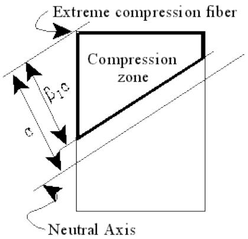

3.3.4 Balanced Steel Condition

To ensure ductile failure, the balanced steel condition is used to determine the maximum area of tension steel allowed. For the balanced condition, the neutral axis is located such that the strain at the top of the compression zone is 0.003 and the strain in the tension steel farthest from the fiber of extreme compression corresponds to the yield strength. The location of the balanced condition neutral axis, cb, is determined from:

$$c_{b} = \frac{E_{s} \varepsilon_{c}}{f_{y} + E_{s} \varepsilon_{c}} d_{\max }$$

where ${ \mathsf{ d } }_{ \mathsf{ m a x } }$ is the distance from the fiber of extreme compression to the farthest reinforcement bar.

3.3.5 Slenderness Effects on Columns

The effects of slenderness on compression members may be considered using a second-order P∆ analysis or by magnifying the resultant moments from a first-order linear analysis.

The Concrete II module performs a second-order nonlinear analysis in which the moments and axial loads include the effects of lateral deflection and sway. The resultant moments also include any secondary moments due to column buckling and/or member end rotation that may occur in slender columns.

3.3.5.1 First-Order Analysis Moment Magnification

Compression columns braced against sidesway, i.e. member class $^{ \prime } { 1^{ \prime } } ,$ , are considered to be slender for a particular axis if $\mathsf{ K I / r } > 34 - 12 ( \mathsf{ M }_{ 1 } / \mathsf{ M }_{ 2 } )$ where $\mathsf{ M }_{ 1 }$ is the smaller factored end moment due to non-sway loading and $\mathsf{ M }_{ 2 }$ is the larger factored end moment due to non-sway loading. Compression columns not braced against sidesway, i.e. member class $' 2^{ \prime }$ , are considered to be slender for a particular axis if $\mathsf{ K I / r } >$ 22.

The effects of slenderness on compression columns are accounted for in a linear analysis by multiplying the factored moment due to non-sway loading, $\mathsf{ M }_{ \mathsf{ b } } ,$ by the moment magnifier $\beta_{ \mathrm{ b } }$ and the moment due to sway loading, $\mathsf{ M }_{ \mathsf{ S } } ,$ by the moment magnifier $\delta_{ s }$ as follows:

$$M_{u} = \sqrt{\left(\delta_{b_{y}} M_{b_{y}} + \delta_{s} M_{s_{y}}\right)^{2} + \left(\delta_{b_{z}} M_{b_{z}} + \delta_{s} M_{s_{z}}\right)^{2}}$$

where $\delta_{ \mathsf{ b y } }$ and $\delta_{ \mathsf{ b } z }$ are moment magnification factors used to account for column buckling about the local Y and Z axes, respectively and $\delta_{ s }$ is a magnification factor used to account for lateral drift or sway.

For braced frames, analysis option $\mathit{ \Delta }^{ \prime } \mathtt{ B R }^{ \prime } , \delta_{ s }$ is taken as 1.0 while the sidesway moment magnifier specified on the ‘CNCOPT’ line is used for unbraced frames (analysis option $' \mathrm{ U N^{ \prime } } )$ .

The column buckling magnifiers $\delta_{ \mathsf{ b y } }$ and $\delta_{ \mathsf{ b } z }$ are calculated using the following:

$$\delta_{b_{y}} = \frac{C_{m y}}{1 - \frac{P_{n}}{\phi P_{c y}}} \quad \delta_{b_{z}} = \frac{C_{m z}}{1 - \frac{P_{n}}{\phi P_{c z}}}$$

where $\mathsf{ C }_{ \mathsf{ m } }$ is taken as 1.0 for columns unbraced against sidesway (member class $^{ \prime } 2^{ \prime } )$ and taken from the following for columns braced against sidesway (member class ‘1’):

$$C_{m} = 0. 6 + 0. 4 \frac{M_{1}}{M_{2}}$$

The critical buckling load $\mathsf{ P }_{ \mathsf{ c y } }$ and $\mathsf{ P }_{ \mathsf{ c } 2 }$ are determined from:

$$P_{c y} = \frac{\pi}{(k_{y} \ell)^{2}} \times \frac{\frac{E_{c} I_{g y}}{5} + E_{s} I_{s e_{y}}}{1 + \beta_{d}}$$

$$P_{c z} = \frac{\pi}{(k_{z} \ell)^{2}} \times \frac{\frac{E_{c} I_{g_{z}}}{5} + E_{s} I_{s e_{z}}}{1 + \beta_{d}}$$

where $\mathsf{ I }_{ \mathsf{ S e y } }$ and $\boldsymbol{ \vert }_{ s \in \mathbb{ Z } }$ are the moments of inertia of the steel rebars taken about the section local Y and Z centroidal axes, respectively.

## 3.4 CONCRETE MEMBER CAPACITY

3.4.1 Moment Capacity of Beam Elements

Beam elements are checked for uniaxial bending about the local Y axis. The unity check ratio for bending is computed as:

$$U C = \frac{M_{\mathrm{y}}}{\phi M_{n}}$$

where the capacity reduction factor $\Phi$ is 0.90. The moment capacity for members classified as beam elements is calculated as:

$$M_{n} = 0. 85 f_{c}^{\prime} A_{\mathrm{c o n}} \left(C G - C G_{\mathrm{c o n}}\right) + \sum_{k = 1}^{n} \left(f_{s_{k}} A_{b_{k}} \left(d_{b_{k}} - C G\right)\right)$$

3.4.2 Axial and Moment Capacity of Column Elements

Column elements are checked for biaxial bending and axial load interaction as follows:

$$U C = \frac{P_{u}}{\phi P_{n}} = \frac{M_{u}}{\phi M_{n}}$$

where $\mathsf{ M }_{ \mathsf{ u } }$ is the magnified factored moment resultant from a first- order analysis or the factored moment resultant from a second-order analysis. The capacity reduction factor $\Phi$ is taken as 0.9 for columns in tension, 0.75 for members in compression with spiral shear reinforcement and 0.70 for members in compression with ties or stirrups. For columns in compression with axial load $\mathsf{ P }_{ \mathsf{ u } }$ less than $0 . 10 \mathsf{ f }_{ \mathsf{ c } }^{ \mathsf{ \prime } } \mathsf{ A }_{ \mathsf{ g } } ,$ the value of $\Phi$ is increased linearly as follows:

$$\phi = \phi_{\min } + 0. 2 \frac{0 . 1 f_{c}^{\prime} A_{g} - \phi_{\min } P_{n}}{0 . 1 f_{c}^{\prime} A_{g}} \leq 0. 90$$

where $\phi_{ \mathrm{ m i n } }$ is $0 . 75$ for members with spiral shear reinforcement and 0.70 for members with ties or stirrups.

The axial and moment capacities are determined based the eccentricity $\mathsf{ e } ,$ defined as $\mathsf{ M }_{ \mathsf{ u } } / \mathsf{ P }_{ \mathsf{ u } } ,$ from the following equations:

$$P_{n} = 0. 85 f_{c}^{\prime} A_{\text{c o n}} + \sum_{k = 1}^{n} \left(f_{s_{k}} A_{b_{k}}\right)$$

$$M_{n} = - P_{n} (c - C G) + 0. 85 f_{c}^{\prime} A_{\text{c o n}} (c - C G_{\text{c o n}}) + \sum_{k = 1}^{n} \left(f_{s_{k}} A_{b_{k}} (c - d_{b_{k}})\right)$$

such that:

$$\frac{M_{n}}{P_{n}} = e$$

3.4.3 Moment Capacity of Slab Elements

One-way slab elements are checked as beam elements for uniaxial bending about the axis perpendicular to the span direction. Two-way slabs are considered as beam elements for bending about the local X and Y axes separately. The unity check ratio for bending is computed from one or both of the following:

$$U C = \frac{M_{x}}{\phi M_{n}} \quad U C = \frac{M_{y}}{\phi M_{n}}$$

where the capacity reduction factor ф is 0.90.

3.4.4 Axial & Moment Capacity of General Concrete Plate Elements

General concrete plate elements are checked for biaxial bending and axial load interaction as follows:

$$U C = \frac{P_{x}}{\phi P_{n x}} = \frac{M_{y}}{\phi M_{n y}} \quad U C = \frac{P_{y}}{\phi P_{n y}} = \frac{M_{x}}{\phi M_{n x}}$$

where the capacity reduction factor ф is taken as 0.9 for plates in tension and 0.70 for plates in compression. For plates in compression with axial load $\mathsf{ P }_{ \mathsf{ u } }$ less than $0 . 10 \mathsf{ f }_{ \mathsf{ c } }^{ \prime } \mathsf{ A }_{ \mathsf{ g } } ,$ the value of ф is increased linearly as follows:

$$\phi = \phi_{\min } + 0. 2 \frac{0 . 1 f_{c}^{\prime} A_{g} - \phi_{\min } P_{n}}{0 . 1 f_{c}^{\prime} A_{g}} \leq 0. 90$$

where $\phi_{ \mathrm{ m i n } }$ is 0.70.

3.4.5 Column Buckling

Column elements under axial compression are checked for column buckling as follows:

$$U C = \frac{P_{n}}{\phi P_{c y}} \quad U C = \frac{P_{n}}{\phi P_{c z}}$$

where $\$ 150.70$for columns with spiral shear reinforcement and 0.75 for columns with ties or stirrups. The critical buckling loads$\mathsf { P } _ { \mathsf { c y } }$and$\mathsf { P } _ { \mathsf { c } 2 }$ are determined from:

$$P_{c y} = \frac{\pi}{(k_{y} \ell)^{2}} \times \frac{\frac{E_{c} I_{g y}}{5} + E_{s} I_{s e_{y}}}{1 + \beta_{d}}$$

$$P_{c z} = \frac{\pi}{\left(k_{z} \ell\right)^{2}} \times \frac{\frac{E_{c} I_{g_{z}}}{5} + E_{s} I_{s e_{z}}}{1 + \beta_{d}}$$

where $\mathsf{ I }_{ \mathsf{ S e y } }$ and $\boldsymbol{ \vert }_{ s \in \mathbb{ Z } }$ are the moment of inertias of the steel rebars taken about the section local Y and Z centroidal axes, respectively.

3.4.6 Shear Capacity

The nominal shear capacity ${ \mathsf{ V } }_{ \mathsf{ n } }$ is computed by:

$$V_{n} = V_{c} + V_{s}$$

where $\mathsf{ V }_{ \mathsf{ S } }$ and $\mathsf{ V }_{ \mathsf{ c } }$ are the nominal shear strength of the shear reinforcement and concrete, respectively, and are taken as:

$$V_{s} = \frac{A_{v} f_{y} d}{s} \quad V_{c} = 2 \sqrt{f_{c}^{\prime}} A_{\mathrm{w e b}} \frac{N}{R}$$

For beam, one-way slab and two way slab elements, because the effects of axial load and torsion on shear capacity are neglected, the value of N/R is taken as unity. Beam type members are checked for shear along the local Z axis, using 0.85 for $\Phi ,$ as follows:

$$U C = \frac{V_{z}}{\phi V_{n z}}$$

N/R is also taken as unity for column elements subject to neither axial load nor torsion and for general concrete plate elements subject to no axial load. For column and general concrete plate elements subject to axial compression or axial tension, N is determined from:

$$N_{\text{c o m p r e s s i o n}} = 1 + \frac{P_{u}}{2000 A_{g}} \quad N_{\text{t e n s i o n}} = 1 - \frac{P_{u}}{500 A_{g}} \geq 0$$

For column elements subject to factored torsional moment, ${ \sf T }_{ \sf u } ,$ less than or equal to $\Phi ( 0 . 5^{ * } \mathsf{ s q r t } ( \mathsf{ f }_{ \mathrm{ c } }^{ \mathsf{^{ \prime } } } ) 5 \mathsf{ s } 2 \mathsf{ y } )$ , R is taken as unity. Otherwise, R is taken from the following:

$$R = \sqrt{1 + \left(2 . 5 C_{t} \frac{T_{u}}{V_{u}}\right)^{2}}$$

where $\mathsf{ C }_{ \mathtt{ t } }$ is $\mathsf{ A }_{ \mathsf{ w e b } } / \Sigma \mathsf{ x }^{ 2 } \mathsf{ y }$ and $\mathsf{ V }_{ \mathsf{ u } }$ is the factored shear along the axis in question. Column members are checked for shear along the local Y and Z axes as follows:

$$U C = \frac{V_{z}}{\phi V_{n z}} \quad U C = \frac{V_{y}}{\phi V_{n y}}$$

where ф is 0.85.

3.4.6.1 Punching Shear Capacity of Two-Way Slabs

Two-way slabs located near columns or concentrated loads may need to be checked for punching shear at a critical section around the column or concentrated load area. The punching shear capacity of the slab is taken as the following:

$$V_{s} = 0 \quad V_{c} = Y \sqrt{f_{c}^{\prime}} b_{o} d$$

where Y is the smallest of （$2 + 4 / \beta_{ \mathrm{ c } } )$ and $a_{ s } \mathsf{ d } / \mathsf{ b }_{ \mathsf{ o } }$ but not greater than 4.0, where $\mathsf{ b }_{ \mathsf{ o } }$ is the perimeter of the critical section and $\beta_{ \mathsf{ c } }$ is the ratio of the longer and shorter sides of the critical section. The value of ${ \tt G }_{ \mathbb{ S } }$ is taken as 40 for interior, 30 for edge and 20 for corner location of the critical section.

3.4.7 Torsional Capacity

Beam and column type members are checked for torsional moment using $\Phi$ as 0.85 in the following:

$$U C = \frac{T_{u}}{\phi T_{n}}$$

The nominal torsional moment capacity ${ \sf T }_{ \sf n }$ is computed by:

$$T_{n} = T_{c} + T_{s}$$

where ${ \sf T }_{ \sf S }$ and ${ { \sf T }_{ \sf c } }$ are the nominal shear strength of the shear reinforcement and concrete, respectively, and are taken as:

$$T_{s} = \frac{A_{t} \alpha_{t} x_{1} y_{1} f_{y}}{s} \quad T_{c} = \frac{0 . 8 N \sqrt{f_{c}^{\prime}} \sum x^{2} y}{U}$$

where $\alpha_{ \mathrm{ t } } \mathrm{ = } [ 0 . 66 + 0 . 33 \ ( \forall \mathrm{ 1 } / \mathsf{ x }_{ \mathrm{ 1 } } ) ] { \le } 1 . 50$ , Ct is $\mathsf{ A }_{ \mathsf{ w e b } } / \Sigma \mathsf{ x }^{ 2 } \mathsf{ y }$ and N is taken as unity for elements subject to axial compression. For elements subject to axial tension, N is determined from:

$$N = 1 - \frac{P_{u}}{500 A_{\mathrm{g}}} \geq 0$$

Note: For circular cross sections, the value of $\boldsymbol{ \Sigma } \boldsymbol{ \times }^{ 2 } \boldsymbol{ \forall }$ is taken as $3 / 8 ( \gamma_{ 2 } { \mathsf{ p r } }^{ 3 } )$ .

U is unity when ${ \sf T }_{ \sf u }$ is zero and is defined by the following equation when the magnitude of ${ \sf T }_{ \sf u }$ is greater than zero:

$$U = \sqrt{1 + \left(\frac{0 . 4 V_{u}}{C_{t} T_{u}}\right)^{2}}$$

Note: ${ { \sf T }_{ \sf c } }$ is calculated using shear along the local Z axis for beam type elements. For members classified as column elements, the concrete torsional moment capacity is calculated using shear along the local Y axis and shear along the Z axis separately. ${ \sf T }_{ \sf c }$ is taken as the smaller of the two values.

To calculate $\mathsf{ x }_{ 1 }$ and $\forall_{ 1 } ,$ , the stirrup is assumed to wrap around the outermost longitudinal rebars within the width of the web. When only one row of reinforcement is defined, the height of the stirrup is determined by assuming 2.0 inch (5.0 cm) clearance on the top or bottom opposite of the reinforcement row.

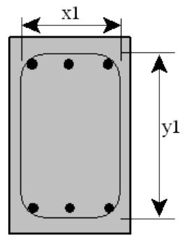

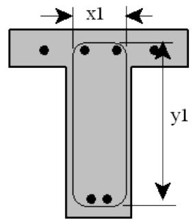

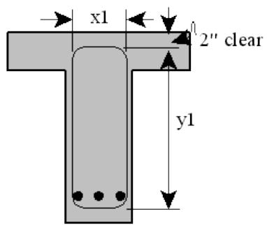

For circular cross-sections the values of $\mathsf{ x }_{ 1 }$ and $\mathsf{ y }_{ 1 }$ are equal and are determined from the following:

$$x_{1}, y_{1} = \sqrt{\frac{\pi d_{s}^{2}}{4}}$$

where ${ \sf d }_{ s }$ is the center to center diameter of the closed stirrup.

## 3.5 MAXIMUM REINFORCEMENT

Concrete members are checked to ensure that the element meets the minimum and maximum reinforcement requirements as specified by ACI code using the following:

$$\rho_{\min } \leq \rho \leq \rho_{\max }$$

where $\rho_{ \mathrm{ m i n } }$ is $200 / \mathbf{ f }_{ \mathsf{ v } } , \mathsf{ \rho }$ is $\mathsf{ A }_{ \mathsf{ s } } / \mathsf{ A }_{ \mathsf{ c o n } }$ and $\mathsf{ p }_{ \mathsf{ m a x } }$ is $\mathsf{ A }_{ \mathsf{ s m a x } } / \mathsf{ A }_{ \mathsf{ c o n } }$ for beam elements and for columns with axial load less than the smaller of $0 . 1 \mathsf{ f }_{ \mathsf{ c } }^{ \mathsf{^{ \prime } } } \mathsf{ A }_{ \mathsf{ g } }$ and $\Phi^{ \mathsf{ P }_{ \mathsf{ b } } , }$ where $\mathsf{ A }_{ \mathsf{ s m a x } }$ is given by the following equation:

$$A_{s \max } = \frac{0 . 75 C_{c} + C_{s}}{f_{y}}$$

where $\complement_{ \mathsf{ c } }$ is the total force of the equivalent concrete compression zone taken as $0 . 85 \mathsf{ f }_{ \mathsf{ c } }^{ \prime } \mathsf{ A }_{ \mathsf{ c o n } }$ and ${ \sf C }_{ \sf s }$ is the total force in the compression steel.

For column elements with axial load greater than the smaller of $0 . 1 \mathsf{ f }_{ \mathsf{ c } }^{ \mathsf{^{ \prime } } } \mathsf{ A }_{ \mathsf{ g } }$ and $\Phi^{ \mathsf{ P }_{ \mathsf{ b } } , \mathsf{ \pmb \rho }_{ \mathsf{ m i n } } }$ is $0 . 01$ , r is $\mathsf{ A }_{ \sf t o t } / \mathsf{ A }_{ \sf g }$ and $\mathsf{ p }_{ \mathsf{ m a x } }$ is 0.08.

4 SAMPLE PROBLEMS

The sample problems illustrate various capabilities for concrete structures. Two first order analyses are detailed.

1. The first sample problem is a braced (against sidesway) frame structure consisting of circular concrete columns and rectangular, tee and L shaped concrete beams. The model also includes steel plate and steel beam wide flange elements. This sample contains member and plate offsets along with member end releases. Three basic load conditions, of which one is designated as causing no appreciable sidesway, and three load combinations were specified.   
2. Sample Problem 2 illustrates the same model as sample problem executed as an unbraced structure (i.e. Includes moment magnification).   
3. Sample Problem 3 illustrates the analysis of concrete one-way and two-way slab elements.

## 4.1 SAMPLE PROBLEM 1

Sample Problem 1 is a first-order analysis of the frame structure shown below. The structure is assumed to be braced against sidesway. Circular concrete columns (‘CC1’), rectangular (‘CR1’, ‘CR2’), tee (‘CT1’) and L-shaped (‘CRL’, ‘CLL’) concrete beams along with steel plate and beam elements are modeled.

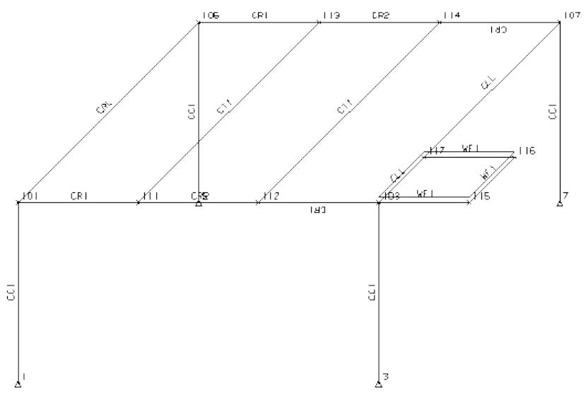

The tee beams (member group ‘CT1’) are segmented so that shear stirrups are spaced differently at the ends than in the middle of the member as follows:

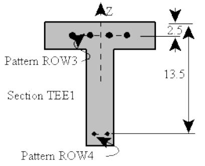

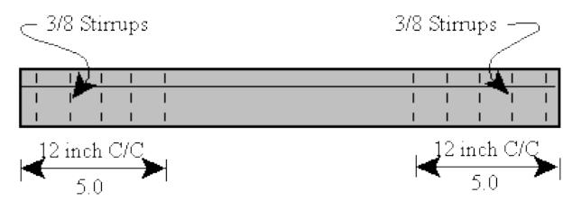

Groups ‘CR1’ and ‘CR2’ are rectangular cross sections with varying reinforcement along the members. The stirrup spacing is also variable along the member length.

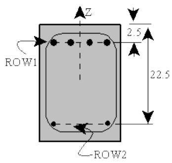

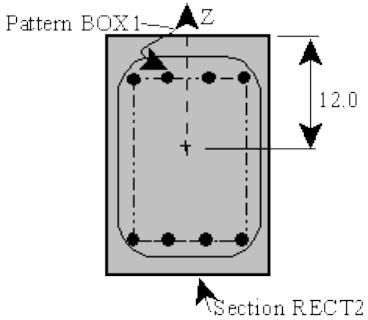

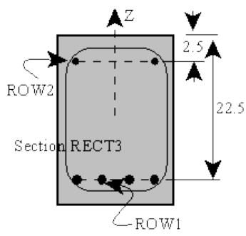

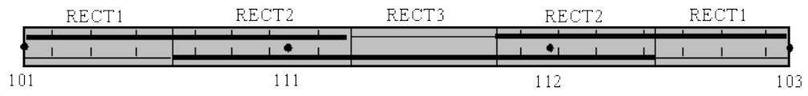

Three basic load conditions and three load combinations are specified. Load case 1 consist of the self weight of the structure and load case 2 contains live loading. Wind load is applied along the global X-axis in load case 3. The load combinations are defined according the ACI-318R guidelines as follows:

| Combination | LCase | Factor | LCase | Factor | LCase | Factor |
| --- | --- | --- | --- | --- | --- | --- |
| 4 | 1 | 1.4 | 2 | 1.7 |  |  |
| 5 | 1 | 1.05 | 2 | 1.275 | 3 | 1.275 |
| 6 | 1 | 0.9 | 3 | 1.3 |  |  |

The SACS model file is shown below followed by a description of selected portions:

|  | 1 | 2 | 3 | 4 | 5 | 6 | 7 | 8 |
| --- | --- | --- | --- | --- | --- | --- | --- | --- |
|  | 12345678901234567890123456789012345678901234567890123456789012345678901234567890 | 12345678901234567890123456789012345678901234567890123456789012345678901234567890 | 12345678901234567890123456789012345678901234567890123456789012345678901234567890 | 12345678901234567890123456789012345678901234567890123456789012345678901234567890 | 12345678901234567890123456789012345678901234567890123456789012345678901234567890 | 12345678901234567890123456789012345678901234567890123456789012345678901234567890 | 12345678901234567890123456789012345678901234567890123456789012345678901234567890 | 12345678901234567890123456789012345678901234567890123456789012345678901234567890 |
| CONCRETE SAMPLE PROBLEM 1 | CONCRETE SAMPLE PROBLEM 1 | CONCRETE SAMPLE PROBLEM 1 | CONCRETE SAMPLE PROBLEM 1 | CONCRETE SAMPLE PROBLEM 1 | CONCRETE SAMPLE PROBLEM 1 | CONCRETE SAMPLE PROBLEM 1 | CONCRETE SAMPLE PROBLEM 1 | CONCRETE SAMPLE PROBLEM 1 |
| A | OPTIONS | EN | LR | 2 1 0 0 | PT | PTPT |  |  |
| B | CNCOPT | BR |  | CD BD EL UR |  |  | 1.000 |  |
|  | LCSEL |  | 4 5 6 |  |  |  |  |  |
| C | LCSEL PD | 1 |  |  |  |  |  |  |
|  | SECT |  |  |  |  |  |  |  |
| D | SECT BOX1 | BRP |  |  | 0.50 | 4 | 210.0019.00 |  |
| E | SECT CIRCLE | CRP |  |  | 0.75 | 8 | 11.25 |  |
| F | SECT ROW1 | RRP |  |  | 0.50 | 4 | 10.00 |  |
| G | SECT ROW2 | RRP |  |  | 0.375 | 2 | 10.00 |  |
|  | SECT ROW3 | RRP |  |  | 0.375 | 4 | 18.00 |  |
|  | SECT ROW4 | RRP |  |  | 0.375 | 2 | 3.50 |  |
| H | SECT CYLIND | RCCS |  |  | 15.00 |  |  |  |
| I | SECT2 CIRCLE | 7.5060.00 |  |  |  |  |  |  |
|  | SECT LEFTL | RCLL |  |  | 16.008.000 | 24.005.000 |  |  |
|  | SECT2 ROW3 | 2.5060.00 | ROW4 | 13.5060.00 |  |  |  |  |
| J | SECT RECT1 | RCRS |  |  | 24.0015.00 |  |  |  |
| K | SECT2 ROW1 | 2.5060.00 | ROW2 | 22.5060.00 |  |  |  |  |
| L | SECT RECT2 | RCRS |  |  | 24.0015.00 |  |  |  |
| M | SECT2 BOX1 | 12.0060.00 |  |  |  |  |  |  |
|  | SECT RECT3 | RCRS |  |  | 24.0015.00 |  |  |  |
|  | SECT2 ROW1 | 22.5060.00 | ROW2 | 2.5060.00 |  |  |  |  |
|  | SECT RIGHTL | RCRL |  |  | 16.008.000 | 24.005.000 |  |  |
|  | SECT2 ROW3 | 2.5060.00 | ROW4 | 13.5060.00 |  |  |  |  |
|  | SECT TEE1 | RCTS |  |  | 16.008.000 | 24.005.000 |  |  |
|  | SECT2 ROW3 | 2.5060.00 | ROW4 | 13.5060.00 |  |  |  |  |
|  | GRUP |  |  |  |  |  |  |  |
| N | GRUPCCC1 CYLIND | 29.000490.00 | 145.0 4.00 1 |  | 1.001.0060.0024.00S | 0.375 |  |  |
|  | GRUPCCLLE LEFTL | 29.000490.00 | 145.0 4.00 3 |  | 1.001.0060.0024.00T | 0.375 |  |  |
| O | GRUPCCR1 RECT1 | 29.000490.00 | 145.0 4.00 3 |  | 1.001.0060.0012.00T | 0.3753.00 |  |  |
| O | GRUPCCR1 RECT2 | 29.000490.00 | 145.0 4.00 3 |  | 1.001.0060.0018.00T | 0.375 |  |  |
| P | GRUPCCR2 RECT2 | 29.000490.00 | 145.0 4.00 3 |  | 1.001.0060.0018.00T | 0.3751.67 |  |  |
| P | GRUPCCR2 RECT3 | 29.00 490.00 | 145.0 4.00 3 |  | 1.001.00 |  |  |  |
| P | GRUPCCR2 RECT2 | 29.000490.00 | 145.0 4.00 3 |  | 1.001.0060.0018.00T | 0.3751.67 |  |  |
|  | GRUPCCLR RIGHTL | 29.000490.00 | 145.0 4.00 3 |  | 1.001.0060.0024.00T | 0.375 |  |  |
|  | GRUPCCT1 TEE1 | 29.000490.00 | 145.0 4.00 3 |  | 1.001.0060.0012.00T | 0.3755.00 |  |  |
|  | GRUPCCT1 TEE1 | 29.00 490.00 | 145.0 4.00 3 |  | 1.001.00 |  |  |  |
|  | GRUPCCT1 TEE1 | 29.000490.00 | 145.0 4.00 3 |  | 1.001.0060.0012.00T | 0.3755.00 |  |  |
|  | GRUP WF1 W6X15 |  | 29.0011.6036.00 1 |  | 1.001.00 | 0.50 490.00 |  |  |
|  | MEMBER |  |  |  |  |  |  |  |
|  | MEMBER1 1 101 CC1 |  |  |  |  |  |  |  |
|  | MEMBER OFFSETS |  |  |  |  |  | -12.00 |  |
|  | MEMBER1 3 103 CC1 |  |  |  |  |  |  |  |
|  | MEMBER OFFSETS |  |  |  |  |  | -12.00 |  |
|  | MEMBER1 7 107 CC1 |  |  |  |  |  |  |  |
|  | MEMBER OFFSETS |  |  |  |  |  | -12.00 |  |
|  | MEMBER1 5 105 CC1 |  |  |  |  |  |  |  |
|  | MEMBER OFFSETS |  |  |  |  |  | -12.00 |  |
|  | MEMBER1 101 105 CRL |  |  |  |  |  |  |  |
|  | MEMBER OFFSETS |  |  |  | 4.00 |  | 4.00 |  |
|  | MEMBER1 103 117 CLL |  |  |  |  |  |  |  |
|  | MEMBER OFFSETS |  |  |  | 4.00 |  | 4.00 |  |
|  | MEMBER1 101 111 CR1 |  |  |  |  |  |  |  |
|  | MEMBER1 103 112 CR1 |  |  |  |  |  |  |  |
|  | MEMBER1 105 113 CR1 |  |  |  |  |  |  |  |
|  | MEMBER1 107 114 CR1 |  |  |  |  |  |  |  |
|  | MEMBER1 111 112 CR2 |  |  |  |  |  |  |  |
|  | MEMBER1 113 114 CR2 |  |  |  |  |  |  |  |
|  | MEMBER1 111 113 CT1 |  |  |  |  |  |  |  |
|  | MEMBER OFFSETS |  |  |  | 4.00 |  | 4.00 |  |
|  | MEMBER1 112 114 CT1 |  |  |  |  |  |  |  |
|  | MEMBER OFFSETS |  |  |  | 4.00 |  | 4.00 |  |
|  | MEMBER1 103 115 WF1 |  |  |  |  |  |  |  |
| 12345678901234567890123456789012345678901234567890123456789012345678901234567890 | 12345678901234567890123456789012345678901234567890123456789012345678901234567890 | 12345678901234567890123456789012345678901234567890123456789012345678901234567890 | 12345678901234567890123456789012345678901234567890123456789012345678901234567890 | 12345678901234567890123456789012345678901234567890123456789012345678901234567890 | 12345678901234567890123456789012345678901234567890123456789012345678901234567890 | 12345678901234567890123456789012345678901234567890123456789012345678901234567890 | 12345678901234567890123456789012345678901234567890123456789012345678901234567890 | 12345678901234567890123456789012345678901234567890123456789012345678901234567890 |
| MEMBER OFFSETS | MEMBER OFFSETS | MEMBER OFFSETS | MEMBER OFFSETS | MEMBER OFFSETS | 4.00 | 4.00 | 4.00 | 4.00 |
| MEMBER1 117 107 CLL | MEMBER1 117 107 CLL | MEMBER1 117 107 CLL | MEMBER1 117 107 CLL | MEMBER1 117 107 CLL |  |  |  |  |
| MEMBER OFFSETS | MEMBER OFFSETS | MEMBER OFFSETS | MEMBER OFFSETS | MEMBER OFFSETS | 4.00 | 4.00 | 4.00 | 4.00 |
| MEMBER1 117 116 WF1 | MEMBER1 117 116 WF1 | MEMBER1 117 116 WF1 | MEMBER1 117 116 WF1 | MEMBER1 117 116 WF1 |  |  |  |  |
| MEMBER OFFSETS | MEMBER OFFSETS | MEMBER OFFSETS | MEMBER OFFSETS | MEMBER OFFSETS | 4.00 | 4.00 | 4.00 | 4.00 |
| PLATE | PLATE | PLATE | PLATE | PLATE |  |  |  |  |
| PLATE AAAA 103 115 117 116 | 0.25 | 1 |  |  |  |  |  |  |
| PLATE OFFSETS | PLATE OFFSETS | PLATE OFFSETS | PLATE OFFSETS | PLATE OFFSETS | 4.00 | 4.00 | 4.00 | 4.00 |
| PLATE OFFSETS | PLATE OFFSETS | PLATE OFFSETS | PLATE OFFSETS | PLATE OFFSETS | 4.00 | 4.00 | 4.00 | 4.00 |
| JOINT | JOINT | JOINT | JOINT | JOINT |  |  |  |  |
| JOINT 1 -10.000-10.000 | 0.000 |  |  |  | 111 |  |  |  |
| JOINT 3 10.000-10.000 | 0.000 |  |  |  | 111 |  |  |  |
| JOINT 5 -10.000 10.000 | 0.000 |  |  |  | 111 |  |  |  |
| JOINT 7 10.000 10.000 | 0.000 |  |  |  | 111 |  |  |  |
| JOINT 101 -10.000-10.000 | 10.000 |  |  |  |  |  |  |  |
| JOINT 103 10.000-10.000 | 10.000 |  |  |  |  |  |  |  |
| JOINT 105 -10.000 10.000 | 10.000 |  |  |  |  |  |  |  |
| JOINT 107 10.000 10.000 | 10.000 |  |  |  |  |  |  |  |
| JOINT 111 -3.333-10.000 | 10.000 |  |  |  |  |  |  |  |
| JOINT 112 3.333-10.000 | 10.000 |  |  |  |  |  |  |  |
| JOINT 113 -3.333 10.000 | 10.000 |  |  |  |  |  |  |  |
| JOINT 114 3.333 10.000 | 10.000 |  |  |  |  |  |  |  |
| JOINT 115 15.000-10.000 | 10.000 |  |  |  |  |  |  |  |
| JOINT 116 15.000 -5.000 | 10.000 |  |  |  |  |  |  |  |
| JOINT 117 10.000 -5.000 | 10.000 |  |  |  |  |  |  |  |
| LOAD | LOAD | LOAD | LOAD | LOAD |  |  |  |  |
| LOADCN 1 | LOADCN 1 | LOADCN 1 | LOADCN 1 | LOADCN 1 |  |  |  |  |
| LOAD Z 1 101 | -0.208 | -0.208 |  |  |  | GLOB UNIF | SELFWT |  |
| LOAD Z 3 103 | -0.238 | -0.238 |  |  |  | GLOB UNIF | SELFWT |  |
| LOAD Z 7 107 | -0.268 | -0.268 |  |  |  | GLOB UNIF | SELFWT |  |
| LOAD Z 5 105 | -0.298 | -0.298 |  |  |  | GLOB UNIF | SELFWT |  |
| LOAD Z 103 115 | -0.015 | -0.015 |  |  |  | GLOB UNIF | SELFWT |  |
| LOAD Z 115 116 | -0.015 | -0.015 |  |  |  | GLOB UNIF | SELFWT |  |
| LOAD Z 117 116 | -0.015 | -0.015 |  |  |  | GLOB UNIF | SELFWT |  |
| LOAD Z 101 105 | -0.220 | -0.220 |  |  |  | GLOB UNIF | SELFWT |  |
| LOAD Z 111 113 | -0.220 | -0.220 |  |  |  | GLOB UNIF | SELFWT |  |
| LOAD Z 112 114 | -0.220 | -0.220 |  |  |  | GLOB UNIF | SELFWT |  |
| LOAD Z 117 107 | -0.220 | -0.220 |  |  |  | GLOB UNIF | SELFWT |  |
| LOAD Z 103 117 | -0.220 | -0.220 |  |  |  | GLOB UNIF | SELFWT |  |
| LOAD Z 101 111 | -0.375 | -0.375 |  |  |  | GLOB UNIF | SELFWT |  |
| LOAD Z 111 112 | -0.375 | -0.375 |  |  |  | GLOB UNIF | SELFWT |  |
| LOAD Z 103 112 | -0.375 | -0.375 |  |  |  | GLOB UNIF | SELFWT |  |
| LOAD Z 105 113 | -0.375 | -0.375 |  |  |  | GLOB UNIF | SELFWT |  |
| LOAD Z 113 114 | -0.375 | -0.375 |  |  |  | GLOB UNIF | SELFWT |  |
| LOAD Z 107 114 | -0.375 | -0.375 |  |  |  | GLOB UNIF | SELFWT |  |
| LOADCN 2 | LOADCN 2 | LOADCN 2 | LOADCN 2 | LOADCN 2 |  |  |  |  |
| LOAD Z 101 105 | -0.250 | -0.250 |  |  |  | GLOB UNIF | LIVE1 |  |
| LOAD Z 103 117 | -0.250 | -0.250 |  |  |  | GLOB UNIF | LIVE1 |  |
| LOAD Z 111 113 | -0.500 | -0.500 |  |  |  | GLOB UNIF | LIVE1 |  |
| LOAD Z 112 114 | -0.500 | -0.500 |  |  |  | GLOB UNIF | LIVE1 |  |
| LOAD Z 117 107 | -0.250 | -0.250 |  |  |  | GLOB UNIF | LIVE1 |  |
| LOAD 103 |  | 0.62500 |  |  |  | GLOB JOIN | LIVE2 |  |
| LOAD 115 |  | 0.62500 |  |  |  | GLOB JOIN | LIVE2 |  |
| LOAD 116 |  | 0.62500 |  |  |  | GLOB JOIN | LIVE2 |  |
| LOAD 117 |  | 0.62500 |  |  |  | GLOB JOIN | LIVE2 |  |
| LOADCN 3 | LOADCN 3 | LOADCN 3 | LOADCN 3 | LOADCN 3 |  |  |  |  |
| LOAD X 1 101 | 0.278 | 0.278 |  |  |  | GLOB UNIF | WIND-X |  |
| LOAD X 5 105 | 0.278 | 0.278 |  |  |  | GLOB UNIF | WIND-X |  |
| LCOMB | LCOMB | LCOMB | LCOMB | LCOMB |  |  |  |  |
| LCOMB 4 | 1 1.40 | 2 1.70 |  |  |  |  |  |  |
| LCOMB 5 | 1 1.05 | 2 1.2753 1.275 |  |  |  |  |  |  |
| LCOMB 6 | 1 0.90 | 3 1.30 |  |  |  |  |  |  |
| END | END | END | END | END |  |  |  |  |

Note: The above model file was created using the Precede program. Precede is a highly efficient 3D graphics interactive modeler that can create SACS concrete and/or steel models including geometry,

properties, loading, analysis options and code check parameters and incorporates extensive data checking features.

The following is a description of selected input lines used the SACS model file for Sample Problem 1. The lines are referenced by the letter in the left margin of the input listing.

A. The OPTIONS line specifies the analysis options, namely:

a. English units are designated by ‘EN’ in columns 14-15.   
b. Code check for steel elements will be based on AISC/API LRFD code (‘LR’ in columns 25-26).   
c. Prismatic beam elements will be divided into two post processing segments and each segment of segmented elements will be considered as a post processing segment by ‘2’ and ‘1’ in columns 30 and 32.   
d. For steel elements, the stress corresponding to the maximum unity check ratio will be reported (‘PT’ in columns 49-50).   
e. Member end forces and joint reactions will also be reported.

B. The concrete analysis options are designated on the CNCOPT input line as follows:

a. ‘BR’ in columns 13-14 designates that a first-order linear analysis is to be performed and the structure is to be considered as braced against sidesway.   
b. Member detailed reports for concrete columns and beams along with element unity check and unity check range reports are requested.

C. Load condition one is classified as a ‘DEAD’ load case in columns 47-50. Loading in this load case will be assumed to cause no appreciable sidesway in the structure.   
D. The reinforcement pattern named BOX1 is defined using the SECT input line with ‘BOX1’ in columns 6-12.

a. The pattern is designated as a box pattern type by ‘BRP’ in columns 16-18.   
b. The rebar diameter, 0.50, and the number of rebars in a horizontal row and vertical column are specified as 4 and 2 respectively.   
c. The width and height of the box, measured from the centers of the outer most rebars, are specified as 10.0 and 19.0 in columns 67-71 and 72-76, respectively.

E. The circular reinforcement pattern named CIRCLE is defined using the SECT input line with ‘CIRCLE’ in columns 6-12.

a. The pattern is designated as a circular pattern type by ‘CRP’ in columns 16-18.   
b. The rebar diameter, 0.75, and the number of rebars, 8, are specified in columns 50-55 and 56-60, respectively.   
c. The pattern diameter and the angle from the local Z axis to the first clock-wise rebar are designated as 11.25 and 0.0 in columns 67-71 and 72-76, respectively.

F. The reinforcement pattern named ROW1 is defined using the SECT input line with ‘ROW1’ in columns 6-12.

a. The pattern is designated as a row pattern type by ‘RRP’ in columns 16-18.   
b. The rebar diameter, the number of rebars in a horizontal row, and the width measured from the centers of the outer most rebars, are specified as 0.50, 4 and 10.0 in columns 50-55, 56-60 and 67-71, respectively.

G. The reinforcement pattern named ROW2 is defined using the SECT input line with ‘ROW2’ in columns 6-12.

a. The pattern is designated as a row pattern type by ‘RRP’ in columns 16-18.   
b. The rebar diameter, the number of rebars in the row, and the width measured from the centers of the outer most rebars, are specified as 0.375, 2 and 10.0 in columns 50-55, 56-60 and 67-71, respectively.

H. The circular cross section named CYLIND is defined by the SECT input line with ‘CYLIND’ in columns 6-12.

a. The cross section shape is stipulated as circular by ‘CCS’ in columns 16-18. The diameter is entered in columns 50-55.   
b. The cross section is reinforced, ‘R’ in column 15, with reinforcement patterns designated on the ‘SECT2’ line immediately following.

I. The ‘SECT2’ line defines the reinforcement applied to the cross section named CYLIND which is defined on the previous ‘SECT’ line.

a. The CYLIND cross section is reinforced using rebar pattern named CIRCLE as designated in columns 9-15.   
b. The distance from the top of the cross section to the center of rebar pattern CIRCLE and the yield strength of the rebars are designated as 7.50 and 60.0 in columns 16-20 and 21-25, respectively.

J. The rectangular cross section named RECT1 is defined by the SECT line with ‘RECT1’ in columns 6-12.

a. The cross section shape is stipulated as rectangular by ‘CRS’ in columns 16-18. The height and width, 24 and 15, are input in columns 50-55 and 56-60, respectively.   
b. The cross section is reinforced, ‘R’ in column 15, with reinforcement patterns designated on the ‘SECT2’ line immediately following.

K. The ‘SECT2’ input line defines the reinforcement applied to the cross section named RECT1 which is defined on the previous ‘SECT’ line.

a. The RECT1 cross section is reinforced using rebar patterns ROW1 and ROW2 as designated in columns 9- 15 and 33-39, respectively.   
b. The distance from the top of the cross section to the center of rebar pattern ROW1 and the yield strength of the rebars are designated as 2.50 and 60.0 in columns 16-20 and 21-25, respectively.   
c. The distance from the top of the cross section to the center of rebar pattern ROW2 and the yield strength of the rebars are designated as 22.50 and 60.0 in columns 40-44 and 45-49, respectively.

L. The rectangular cross section named RECT2 is defined by the SECT input line with ‘RECT2 in columns 6-12.

a. The cross section shape is stipulated as rectangular by ‘CRS’ in columns 16-18. The height and width, 24 and 15, are input in columns 50-55 and 56-60, respectively.   
b. The cross section is reinforced, ‘R’ in column 15, with reinforcement patterns designated on the ‘SECT2’ line immediately following.

M. The ‘SECT2’ line defines the reinforcement applied to the cross section named RECT2 which is defined on the previous ‘SECT’ line.

a. The RECT2 cross section is reinforced using rebar pattern BOX1 as designated in columns 9-15.

b. The distance from the top of the cross section to the center of rebar pattern BOX1 and the yield strength of the rebars are designated as 12.0 and 60.0 in columns 16-20 and 21-25, respectively.

N. Concrete properties are defined on GRUP input lines with ‘C’ specified in column 5. The properties for all members assigned to concrete group named CC1 are defined on the GRUP line with ‘CC1’ specified in cols. 6-8.

a. The cross section is defined by section CYLIND.   
b. The reinforcement steel elastic modulus, and density are specified in columns 18-23 and 24-29, respectively.   
c. The concrete elastic modulus will be calculated by the program and the density and compressive strength are specified as 145.0 and 4.0.   
d. Members assigned to group CC1 will be considered braced column elements as designated by ‘1’ in column 47.   
e. ⅜ diameter spiral shear reinforcement at 24.0 spacing is specified by 24.0, S and 0.375 in columns 65-69, 70 and 71-76, respectively. The yield stress of the shear reinforcement is defined as 60.0 in columns 60- 64.

O. The properties for all members assigned to the segmented concrete group named CR1 are defined on the GRUP input lines with ‘CR1’ specified in cols. 6-8

a. The cross section for the first segment is defined by section RECT1.   
b. Members assigned to group CR1 will be considered beam elements as designated by ‘3’ in column 47.   
c. For the first segment, ⅜ diameter stirrup or tied shear reinforcement at 12.0 spacing is specified by 12.0, T and 0.375 in columns 65-69, 70 and 71-76, respectively. The yield stress of the shear reinforcement is defined as 60.0 in columns 60-64.   
d. The length of the first segment is 3.0 (columns 77-80).   
e. The cross section for the second segment is defined by section RECT2 as specified in columns 10-16 on the second group line with ‘CR1’ entered in columns 6-8.   
f. For the second segment, ⅜ diameter stirrup or tied shear reinforcement at 18.0 spacing is specified by 18.0, T and 0.375 in

columns 65-69, 70 and 71-76, respectively. The yield stress of the shear reinforcement is defined as 60.0 in columns 60-64.

g. The length of the second segment is left blank.

P. The properties for all members assigned to the segmented concrete group named CR2 are defined on the GRUP lines with ‘CR2’ specified in cols. 6-8.

a. The cross section for the first and third segment is defined by section RECT2.   
b. Members assigned to group CR2 will be considered beam elements as designated by ‘3’ in column 47.   
c. For the first and third segments, ⅜ diameter stirrup or tied shear reinforcement at 18.0 spacing is specified by 18.0, T and 0.375 in columns 65-69, 70 and 71-76, respectively. The yield stress of the shear reinforcement is defined as 60.0 in columns 60-64.   
d. The length of the first and third segments is 1.67 as specified in columns 77-80 on the first and third group input lines defining group CR2.   
e. The cross section for the second segment is defined by section RECT3 as specified in columns 10-16 on the second group line with ‘CR2’ entered in columns 6-8.   
f. No shear reinforcement is defined for the second segment.   
g. The length of the second segment is left blank.

Q. Load combinations made up of one or more load cases and/or combinations are defined after the LCOMB header line. Load case 4 is a combination consisting of load case 1 multiplied by 1.4 and 1.7 times load case 2.

The ensuing is a portion of the listing file for the analysis and code check of this sample problem.

| CONCRETE SAMPLE PROBLEM 1 DATE 15-MAY-1996 TIME 16:51:36 PRE PAGE 3 | CONCRETE SAMPLE PROBLEM 1 DATE 15-MAY-1996 TIME 16:51:36 PRE PAGE 3 | CONCRETE SAMPLE PROBLEM 1 DATE 15-MAY-1996 TIME 16:51:36 PRE PAGE 3 | CONCRETE SAMPLE PROBLEM 1 DATE 15-MAY-1996 TIME 16:51:36 PRE PAGE 3 | CONCRETE SAMPLE PROBLEM 1 DATE 15-MAY-1996 TIME 16:51:36 PRE PAGE 3 | CONCRETE SAMPLE PROBLEM 1 DATE 15-MAY-1996 TIME 16:51:36 PRE PAGE 3 | CONCRETE SAMPLE PROBLEM 1 DATE 15-MAY-1996 TIME 16:51:36 PRE PAGE 3 | CONCRETE SAMPLE PROBLEM 1 DATE 15-MAY-1996 TIME 16:51:36 PRE PAGE 3 | CONCRETE SAMPLE PROBLEM 1 DATE 15-MAY-1996 TIME 16:51:36 PRE PAGE 3 | CONCRETE SAMPLE PROBLEM 1 DATE 15-MAY-1996 TIME 16:51:36 PRE PAGE 3 | CONCRETE SAMPLE PROBLEM 1 DATE 15-MAY-1996 TIME 16:51:36 PRE PAGE 3 | CONCRETE SAMPLE PROBLEM 1 DATE 15-MAY-1996 TIME 16:51:36 PRE PAGE 3 | CONCRETE SAMPLE PROBLEM 1 DATE 15-MAY-1996 TIME 16:51:36 PRE PAGE 3 | CONCRETE SAMPLE PROBLEM 1 DATE 15-MAY-1996 TIME 16:51:36 PRE PAGE 3 | CONCRETE SAMPLE PROBLEM 1 DATE 15-MAY-1996 TIME 16:51:36 PRE PAGE 3 | CONCRETE SAMPLE PROBLEM 1 DATE 15-MAY-1996 TIME 16:51:36 PRE PAGE 3 | CONCRETE SAMPLE PROBLEM 1 DATE 15-MAY-1996 TIME 16:51:36 PRE PAGE 3 |
| --- | --- | --- | --- | --- | --- | --- | --- | --- | --- | --- | --- | --- | --- | --- | --- | --- |
| ********** CONCRETE CIRCULAR SECTION PROPERTIES********** | ********** CONCRETE CIRCULAR SECTION PROPERTIES********** | ********** CONCRETE CIRCULAR SECTION PROPERTIES********** | ********** CONCRETE CIRCULAR SECTION PROPERTIES********** | ********** CONCRETE CIRCULAR SECTION PROPERTIES********** | ********** CONCRETE CIRCULAR SECTION PROPERTIES********** | ********** CONCRETE CIRCULAR SECTION PROPERTIES********** | ********** CONCRETE CIRCULAR SECTION PROPERTIES********** | ********** CONCRETE CIRCULAR SECTION PROPERTIES********** | ********** CONCRETE CIRCULAR SECTION PROPERTIES********** | ********** CONCRETE CIRCULAR SECTION PROPERTIES********** | ********** CONCRETE CIRCULAR SECTION PROPERTIES********** | ********** CONCRETE CIRCULAR SECTION PROPERTIES********** | ********** CONCRETE CIRCULAR SECTION PROPERTIES********** | ********** CONCRETE CIRCULAR SECTION PROPERTIES********** | ********** CONCRETE CIRCULAR SECTION PROPERTIES********** | ********** CONCRETE CIRCULAR SECTION PROPERTIES********** |
| GRUP | SECTION | OD | *** STEEL *** | **** CONCRETE *** | MEMB K-FACTOR SECT AXIAL********** MOMENTS OF INERTIA********** | MEMB K-FACTOR SECT AXIAL********** MOMENTS OF INERTIA********** | MEMB K-FACTOR SECT AXIAL********** MOMENTS OF INERTIA********** | MEMB K-FACTOR SECT AXIAL********** MOMENTS OF INERTIA********** | MEMB K-FACTOR SECT AXIAL********** MOMENTS OF INERTIA********** | MEMB K-FACTOR SECT AXIAL********** MOMENTS OF INERTIA********** | MEMB K-FACTOR SECT AXIAL********** MOMENTS OF INERTIA********** | MEMB K-FACTOR SECT AXIAL********** MOMENTS OF INERTIA********** | MEMB K-FACTOR SECT AXIAL********** MOMENTS OF INERTIA********** | MEMB K-FACTOR SECT AXIAL********** MOMENTS OF INERTIA********** | MEMB K-FACTOR SECT AXIAL********** MOMENTS OF INERTIA********** | MEMB K-FACTOR SECT AXIAL********** MOMENTS OF INERTIA********** |
| GRUP | SECTION | OD | ES 1000 | DENS EC 1000 | DCS FC CLASS Y Z LEN AREA X-X Y-Y Z-Z | DCS FC CLASS Y Z LEN AREA X-X Y-Y Z-Z | DCS FC CLASS Y Z LEN AREA X-X Y-Y Z-Z | DCS FC CLASS Y Z LEN AREA X-X Y-Y Z-Z | DCS FC CLASS Y Z LEN AREA X-X Y-Y Z-Z | DCS FC CLASS Y Z LEN AREA X-X Y-Y Z-Z | DCS FC CLASS Y Z LEN AREA X-X Y-Y Z-Z | DCS FC CLASS Y Z LEN AREA X-X Y-Y Z-Z | DCS FC CLASS Y Z LEN AREA X-X Y-Y Z-Z | DCS FC CLASS Y Z LEN AREA X-X Y-Y Z-Z | DCS FC CLASS Y Z LEN AREA X-X Y-Y Z-Z | DCS FC CLASS Y Z LEN AREA X-X Y-Y Z-Z |
| GRUP | SECTION | IN | KSI LB/PT3 | KSI LB/PT3 | KSI | STINGULAR SECTION TYPE CIRCULAR **** | STINGULAR SECTION TYPE CIRCULAR **** | STINGULAR SECTION TYPE CIRCULAR **** | STINGULAR SECTION TYPE CIRCULAR **** | STINGULAR SECTION TYPE CIRCULAR **** | STINGULAR SECTION TYPE CIRCULAR **** | STINGULAR SECTION TYPE CIRCULAR **** | STINGULAR SECTION TYPE CIRCULAR **** | STINGULAR SECTION TYPE CIRCULAR **** | STINGULAR SECTION TYPE CIRCULAR **** | STINGULAR SECTION TYPE CIRCULAR **** |
| CC1 | CYLIND | 15.0 | 29.0 | 490.00 | 3.6 145.00 | 4.00 CL 1.0 1.0 0.0 176.71 4970.1 971.6 971.6 | 4.00 CL 1.0 1.0 0.0 176.71 4970.1 971.6 971.6 | 4.00 CL 1.0 1.0 0.0 176.71 4970.1 971.6 971.6 | 4.00 CL 1.0 1.0 0.0 176.71 4970.1 971.6 971.6 | 4.00 CL 1.0 1.0 0.0 176.71 4970.1 971.6 971.6 | 4.00 CL 1.0 1.0 0.0 176.71 4970.1 971.6 971.6 | 4.00 CL 1.0 1.0 0.0 176.71 4970.1 971.6 971.6 | 4.00 CL 1.0 1.0 0.0 176.71 4970.1 971.6 971.6 | 4.00 CL 1.0 1.0 0.0 176.71 4970.1 971.6 971.6 | 4.00 CL 1.0 1.0 0.0 176.71 4970.1 971.6 971.6 | 4.00 CL 1.0 1.0 0.0 176.71 4970.1 971.6 971.6 |
| * SHEAR REINFORCEMENT *********** CONCRETE RECTANGULAR SECTION PROPERTIES********** | * SHEAR REINFORCEMENT *********** CONCRETE RECTANGULAR SECTION PROPERTIES********** | * SHEAR REINFORCEMENT *********** CONCRETE RECTANGULAR SECTION PROPERTIES********** | * SHEAR REINFORCEMENT *********** CONCRETE RECTANGULAR SECTION PROPERTIES********** | * SHEAR REINFORCEMENT *********** CONCRETE RECTANGULAR SECTION PROPERTIES********** | * SHEAR REINFORCEMENT *********** CONCRETE RECTANGULAR SECTION PROPERTIES********** | * SHEAR REINFORCEMENT *********** CONCRETE RECTANGULAR SECTION PROPERTIES********** | * SHEAR REINFORCEMENT *********** CONCRETE RECTANGULAR SECTION PROPERTIES********** | * SHEAR REINFORCEMENT *********** CONCRETE RECTANGULAR SECTION PROPERTIES********** | * SHEAR REINFORCEMENT *********** CONCRETE RECTANGULAR SECTION PROPERTIES********** | * SHEAR REINFORCEMENT *********** CONCRETE RECTANGULAR SECTION PROPERTIES********** | * SHEAR REINFORCEMENT *********** CONCRETE RECTANGULAR SECTION PROPERTIES********** | * SHEAR REINFORCEMENT *********** CONCRETE RECTANGULAR SECTION PROPERTIES********** | * SHEAR REINFORCEMENT *********** CONCRETE RECTANGULAR SECTION PROPERTIES********** | * SHEAR REINFORCEMENT *********** CONCRETE RECTANGULAR SECTION PROPERTIES********** | * SHEAR REINFORCEMENT *********** CONCRETE RECTANGULAR SECTION PROPERTIES********** | * SHEAR REINFORCEMENT *********** CONCRETE RECTANGULAR SECTION PROPERTIES********** |
| GRUP | SECTION | PY | SPACE TYPE DIA. | PATTERN LOC. FY END BAR AXIAL********** MOMENTS OF INERTIA********** | PATTERN LOC. FY END BAR AXIAL********** MOMENTS OF INERTIA********** | PATTERN LOC. FY END BAR AXIAL********** MOMENTS OF INERTIA********** | PATTERN LOC. FY END BAR AXIAL********** MOMENTS OF INERTIA********** | PATTERN LOC. FY END BAR AXIAL********** MOMENTS OF INERTIA********** | PATTERN LOC. FY END BAR AXIAL********** MOMENTS OF INERTIA********** | PATTERN LOC. FY END BAR AXIAL********** MOMENTS OF INERTIA********** | PATTERN LOC. FY END BAR AXIAL********** MOMENTS OF INERTIA********** | PATTERN LOC. FY END BAR AXIAL********** MOMENTS OF INERTIA********** | PATTERN LOC. FY END BAR AXIAL********** MOMENTS OF INERTIA********** | PATTERN LOC. FY END BAR AXIAL********** MOMENTS OF INERTIA********** | PATTERN LOC. FY END BAR AXIAL********** MOMENTS OF INERTIA********** | PATTERN LOC. FY END BAR AXIAL********** MOMENTS OF INERTIA********** |
| GRUP | SECTION | KSI | IN | IN | IN KSI | DIA AREA X-X Y-Y Z-Z | DIA AREA X-X Y-Y Z-Z | DIA AREA X-X Y-Y Z-Z | DIA AREA X-X Y-Y Z-Z | DIA AREA X-X Y-Y Z-Z | DIA AREA X-X Y-Y Z-Z | DIA AREA X-X Y-Y Z-Z | DIA AREA X-X Y-Y Z-Z | DIA AREA X-X Y-Y Z-Z | DIA AREA X-X Y-Y Z-Z | DIA AREA X-X Y-Y Z-Z |
| CC1 | CYLIND | 60.00 | 24.0 S | 0.375 CIRCLE | 7.50 60.00 S 0.75 3.53 0.2 56.0 56.0 | 7.50 60.00 S 0.75 3.53 0.2 56.0 56.0 | 7.50 60.00 S 0.75 3.53 0.2 56.0 56.0 | 7.50 60.00 S 0.75 3.53 0.2 56.0 56.0 | 7.50 60.00 S 0.75 3.53 0.2 56.0 56.0 | 7.50 60.00 S 0.75 3.53 0.2 56.0 56.0 | 7.50 60.00 S 0.75 3.53 0.2 56.0 56.0 | 7.50 60.00 S 0.75 3.53 0.2 56.0 56.0 | 7.50 60.00 S 0.75 3.53 0.2 56.0 56.0 | 7.50 60.00 S 0.75 3.53 0.2 56.0 56.0 | 7.50 60.00 S 0.75 3.53 0.2 56.0 56.0 | 7.50 60.00 S 0.75 3.53 0.2 56.0 56.0 |
| ********** CONCRETE RECTANGULAR SECTION PROPERTIES********** | ********** CONCRETE RECTANGULAR SECTION PROPERTIES********** | ********** CONCRETE RECTANGULAR SECTION PROPERTIES********** | ********** CONCRETE RECTANGULAR SECTION PROPERTIES********** | ********** CONCRETE RECTANGULAR SECTION PROPERTIES********** | ********** CONCRETE RECTANGULAR SECTION PROPERTIES********** | ********** CONCRETE RECTANGULAR SECTION PROPERTIES********** | ********** CONCRETE RECTANGULAR SECTION PROPERTIES********** | ********** CONCRETE RECTANGULAR SECTION PROPERTIES********** | ********** CONCRETE RECTANGULAR SECTION PROPERTIES********** | ********** CONCRETE RECTANGULAR SECTION PROPERTIES********** | ********** CONCRETE RECTANGULAR SECTION PROPERTIES********** | ********** CONCRETE RECTANGULAR SECTION PROPERTIES********** | ********** CONCRETE RECTANGULAR SECTION PROPERTIES********** | ********** CONCRETE RECTANGULAR SECTION PROPERTIES********** | ********** CONCRETE RECTANGULAR SECTION PROPERTIES********** | ********** CONCRETE RECTANGULAR SECTION PROPERTIES********** |
| GRUP | SECTION | HT | *** STEEL *** | **** CONCRETE *** MEMB K-FACTOR SECT AXIAL********** MOMENTS OF INERTIA********** | **** CONCRETE *** MEMB K-FACTOR SECT AXIAL********** MOMENTS OF INERTIA********** | **** CONCRETE *** MEMB K-FACTOR SECT AXIAL********** MOMENTS OF INERTIA********** | **** CONCRETE *** MEMB K-FACTOR SECT AXIAL********** MOMENTS OF INERTIA********** | **** CONCRETE *** MEMB K-FACTOR SECT AXIAL********** MOMENTS OF INERTIA********** | **** CONCRETE *** MEMB K-FACTOR SECT AXIAL********** MOMENTS OF INERTIA********** | **** CONCRETE *** MEMB K-FACTOR SECT AXIAL********** MOMENTS OF INERTIA********** | **** CONCRETE *** MEMB K-FACTOR SECT AXIAL********** MOMENTS OF INERTIA********** | **** CONCRETE *** MEMB K-FACTOR SECT AXIAL********** MOMENTS OF INERTIA********** | **** CONCRETE *** MEMB K-FACTOR SECT AXIAL********** MOMENTS OF INERTIA********** | **** CONCRETE *** MEMB K-FACTOR SECT AXIAL********** MOMENTS OF INERTIA********** | **** CONCRETE *** MEMB K-FACTOR SECT AXIAL********** MOMENTS OF INERTIA********** | **** CONCRETE *** MEMB K-FACTOR SECT AXIAL********** MOMENTS OF INERTIA********** |
| GRUP | SECTION | HT | ES 1000 | DENS EC 1000 | DCS FC CLASS Y Z LEN AREA X-X Y-Y Z-Z | DCS FC CLASS Y Z LEN AREA X-X Y-Y Z-Z | DCS FC CLASS Y Z LEN AREA X-X Y-Y Z-Z | DCS FC CLASS Y Z LEN AREA X-X Y-Y Z-Z | DCS FC CLASS Y Z LEN AREA X-X Y-Y Z-Z | DCS FC CLASS Y Z LEN AREA X-X Y-Y Z-Z | DCS FC CLASS Y Z LEN AREA X-X Y-Y Z-Z | DCS FC CLASS Y Z LEN AREA X-X Y-Y Z-Z | DCS FC CLASS Y Z LEN AREA X-X Y-Y Z-Z | DCS FC CLASS Y Z LEN AREA X-X Y-Y Z-Z | DCS FC CLASS Y Z LEN AREA X-X Y-Y Z-Z | DCS FC CLASS Y Z LEN AREA X-X Y-Y Z-Z |
| GRUP | SECTION | IN | KSI LB/PT3 | KSI LB/PT3 | KSI | STINGULAR SECTION TYPE CIRCULAR **** | STINGULAR SECTION TYPE CIRCULAR **** | STINGULAR SECTION TYPE CIRCULAR **** | STINGULAR SECTION TYPE CIRCULAR **** | STINGULAR SECTION TYPE CIRCULAR **** | STINGULAR SECTION TYPE CIRCULAR **** | STINGULAR SECTION TYPE CIRCULAR **** | STINGULAR SECTION TYPE CIRCULAR **** | STINGULAR SECTION TYPE CIRCULAR **** |  |  |
| CR1 | RECT1 | 24.0 | 15.0 29.0 | 490.00 | 3.6 145.00 | 4.00 BM 1.0 1.0 3.0 360.00 16503.8 8640.0 3375.0 | 4.00 BM 1.0 1.0 3.0 360.00 16503.8 8640.0 3375.0 | 4.00 BM 1.0 1.0 3.0 360.00 16503.8 8640.0 3375.0 | 4.00 BM 1.0 1.0 3.0 360.00 16503.8 8640.0 3375.0 | 4.00 BM 1.0 1.0 3.0 360.00 16503.8 8640.0 3375.0 | 4.00 BM 1.0 1.0 3.0 360.00 16503.8 8640.0 3375.0 | 4.00 BM 1.0 1.0 3.0 360.00 16503.8 8640.0 3375.0 | 4.00 BM 1.0 1.0 3.0 360.00 16503.8 8640.0 3375.0 | 4.00 BM 1.0 1.0 3.0 360.00 16503.8 8640.0 3375.0 | 4.00 BM 1.0 1.0 3.0 360.00 16503.8 8640.0 3375.0 | 4.00 BM 1.0 1.0 3.0 360.00 16503.8 8640.0 3375.0 |
| CR1 | RECT2 | 24.0 | 15.0 29.0 | 490.00 | 3.6 145.00 | 4.00 BM 1.0 1.0 0.0 360.00 16503.8 8640.0 3375.0 | 4.00 BM 1.0 1.0 0.0 360.00 16503.8 8640.0 3375.0 | 4.00 BM 1.0 1.0 0.0 360.00 16503.8 8640.0 3375.0 | 4.00 BM 1.0 1.0 0.0 360.00 16503.8 8640.0 3375.0 | 4.00 BM 1.0 1.0 0.0 360.00 16503.8 8640.0 3375.0 | 4.00 BM 1.0 1.0 0.0 360.00 16503.8 8640.0 3375.0 | 4.00 BM 1.0 1.0 0.0 360.00 16503.8 8640.0 3375.0 | 4.00 BM 1.0 1.0 0.0 360.00 16503.8 8640.0 3375.0 | 4.00 BM 1.0 1.0 0.0 360.00 16503.8 8640.0 3375.0 | 4.00 BM 1.0 1.0 0.0 360.00 16503.8 8640.0 3375.0 | 4.00 BM 1.0 1.0 0.0 360.00 16503.8 8640.0 3375.0 |
| CR2 | RECT2 | 24.0 | 15.0 29.0 | 490.00 | 3.6 145.00 | 4.00 BM 1.0 1.0 1.7 360.00 16503.8 8640.0 3375.0 | 4.00 BM 1.0 1.0 1.7 360.00 16503.8 8640.0 3375.0 | 4.00 BM 1.0 1.0 1.7 360.00 16503.8 8640.0 3375.0 | 4.00 BM 1.0 1.0 1.7 360.00 16503.8 8640.0 3375.0 | 4.00 BM 1.0 1.0 1.7 360.00 16503.8 8640.0 3375.0 | 4.00 BM 1.0 1.0 1.7 360.00 16503.8 8640.0 3375.0 | 4.00 BM 1.0 1.0 1.7 360.00 16503.8 8640.0 3375.0 | 4.00 BM 1.0 1.0 1.7 360.00 16503.8 8640.0 3375.0 | 4.00 BM 1.0 1.0 1.7 360.00 16503.8 8640.0 3375.0 | 4.00 BM 1.0 1.0 1.7 360.00 16503.8 8640.0 3375.0 | 4.00 BM 1.0 1.0 1.7 360.00 16503.8 8640.0 3375.0 |
| CR2 | RECT3 | 24.0 | 15.0 29.0 | 490.00 | 3.6 145.00 | 4.00 BM 1.0 1.0 0.0 360.00 16503.8 8640.0 3375.0 | 4.00 BM 1.0 1.0 0.0 360.00 16503.8 8640.0 3375.0 | 4.00 BM 1.0 1.0 0.0 360.00 16503.8 8640.0 3375.0 | 4.00 BM 1.0 1.0 0.0 360.00 16503.8 8640.0 3375.0 | 4.00 BM 1.0 1.0 0.0 360.00 16503.8 8640.0 3375.0 | 4.00 BM 1.0 1.0 0.0 360.00 16503.8 8640.0 3375.0 | 4.00 BM 1.0 1.0 0.0 360.00 16503.8 8640.0 3375.0 | 4.00 BM 1.0 1.0 0.0 360.00 16503.8 8640.0 3375.0 | 4.00 BM 1.0 1.0 0.0 360.00 16503.8 8640.0 3375.0 | 4.00 BM 1.0 1.0 0.0 360.00 16503.8 8640.0 3375.0 | 4.00 BM 1.0 1.0 0.0 360.00 16503.8 8640.0 3375.0 |
| CR2 | RECT2 | 15.0 29.0 | 490.00 | 3.6 145.00 | 4.00 BM 1.0 1.0 1.7 360.00 16503.8 8640.0 3375.0 | 4.00 BM 1.0 1.0 1.7 360.00 16503.8 8640.0 3375.0 | 4.00 BM 1.0 1.0 1.7 360.00 16503.8 8640.0 3375.0 | 4.00 BM 1.0 1.0 1.7 360.00 16503.8 8640.0 3375.0 | 4.00 BM 1.0 1.0 1.7 360.00 16503.8 8640.0 3375.0 | 4.00 BM 1.0 1.0 1.7 360.00 16503.8 8640.0 3375.0 | 4.00 BM 1.0 1.0 1.7 360.00 16503.8 8640.0 3375.0 | 4.00 BM 1.0 1.0 1.7 360.00 16503.8 8640.0 3375.0 | 4.00 BM 1.0 1.0 1.7 360.00 16503.8 8640.0 3375.0 | 4.00 BM 1.0 1.0 1.7 360.00 16503.8 8640.0 3375.0 | 4.00 BM 1.0 1.0 1.7 360.00 16503.8 8640.0 3375.0 | 4.00 BM 1.0 1.0 1.7 360.00 16503.8 8640.0 3375.0 |
| ********** REINFORCEMENT PROPERTIES FOR CONCRETE SECTION TYPE RECTANGULAR **** | ********** REINFORCEMENT PROPERTIES FOR CONCRETE SECTION TYPE RECTANGULAR **** | ********** REINFORCEMENT PROPERTIES FOR CONCRETE SECTION TYPE RECTANGULAR **** | ********** REINFORCEMENT PROPERTIES FOR CONCRETE SECTION TYPE RECTANGULAR **** | ********** REINFORCEMENT PROPERTIES FOR CONCRETE SECTION TYPE RECTANGULAR **** | ********** REINFORCEMENT PROPERTIES FOR CONCRETE SECTION TYPE RECTANGULAR **** | ********** REINFORCEMENT PROPERTIES FOR CONCRETE SECTION TYPE RECTANGULAR **** | ********** REINFORCEMENT PROPERTIES FOR CONCRETE SECTION TYPE RECTANGULAR **** | ********** REINFORCEMENT PROPERTIES FOR CONCRETE SECTION TYPE RECTANGULAR **** | ********** REINFORCEMENT PROPERTIES FOR CONCRETE SECTION TYPE RECTANGULAR **** | ********** REINFORCEMENT PROPERTIES FOR CONCRETE SECTION TYPE RECTANGULAR **** | ********** REINFORCEMENT PROPERTIES FOR CONCRETE SECTION TYPE RECTANGULAR **** | ********** REINFORCEMENT PROPERTIES FOR CONCRETE SECTION TYPE RECTANGULAR **** | ********** REINFORCEMENT PROPERTIES FOR CONCRETE SECTION TYPE RECTANGULAR **** | ********** REINFORCEMENT PROPERTIES FOR CONCRETE SECTION TYPE RECTANGULAR **** | ********** REINFORCEMENT PROPERTIES FOR CONCRETE SECTION TYPE RECTANGULAR **** | ********** REINFORCEMENT PROPERTIES FOR CONCRETE SECTION TYPE RECTANGULAR **** |
| GRUP | SECTION | FY | SPACE TYPE DIA. | PATTERN LOC. FY END BAR AXIAL********** MOMENTS OF INERTIA********** | PATTERN LOC. FY END BAR AXIAL********** MOMENTS OF INERTIA********** | PATTERN LOC. FY END BAR AXIAL********** MOMENTS OF INERTIA********** | PATTERN LOC. FY END BAR AXIAL********** MOMENTS OF INERTIA********** | PATTERN LOC. FY END BAR AXIAL********** MOMENTS OF INERTIA********** | PATTERN LOC. FY END BAR AXIAL********** MOMENTS OF INERTIA********** | PATTERN LOC. FY END BAR AXIAL********** MOMENTS OF INERTIA********** | PATTERN LOC. FY END BAR AXIAL********** MOMENTS OF INERTIA********** | PATTERN LOC. FY END BAR AXIAL********** MOMENTS OF INERTIA********** | PATTERN LOC. FY END BAR AXIAL********** MOMENTS OF INERTIA********** | PATTERN LOC. FY END BAR AXIAL********** MOMENTS OF INERTIA********** | PATTERN LOC. FY END BAR AXIAL********** MOMENTS OF INERTIA********** | PATTERN LOC. FY END BAR AXIAL********** MOMENTS OF INERTIA********** |
| GRUP | SECTION | KSI | IN | IN KSI | DIA AREA X-X Y-Y Z-Z | DIA AREA X-X Y-Y Z-Z | DIA AREA X-X Y-Y Z-Z | DIA AREA X-X Y-Y Z-Z | DIA AREA X-X Y-Y Z-Z | DIA AREA X-X Y-Y Z-Z | DIA AREA X-X Y-Y Z-Z | DIA AREA X-X Y-Y Z-Z | DIA AREA X-X Y-Y Z-Z | DIA AREA X-X Y-Y Z-Z | DIA AREA X-X Y-Y Z-Z | DIA AREA X-X Y-Y Z-Z |
| CR1 | RECT1 | 60.00 | 12.0 T | 0.375 ROW1 2.50 60.00 S 0.50 0.79 0.0 0.0 10.9 | 0.375 ROW1 2.50 60.00 S 0.50 0.79 0.0 0.0 10.9 | 0.375 ROW1 2.50 60.00 S 0.50 0.79 0.0 0.0 10.9 | 0.375 ROW1 2.50 60.00 S 0.50 0.79 0.0 0.0 10.9 | 0.375 ROW1 2.50 60.00 S 0.50 0.79 0.0 0.0 10.9 | 0.375 ROW1 2.50 60.00 S 0.50 0.79 0.0 0.0 10.9 | 0.375 ROW1 2.50 60.00 S 0.50 0.79 0.0 0.0 10.9 | 0.375 ROW1 2.50 60.00 S 0.50 0.79 0.0 0.0 10.9 | 0.375 ROW1 2.50 60.00 S 0.50 0.79 0.0 0.0 10.9 | 0.375 ROW1 2.50 60.00 S 0.50 0.79 0.0 0.0 10.9 | 0.375 ROW1 2.50 60.00 S 0.50 0.79 0.0 0.0 10.9 | 0.375 ROW1 2.50 60.00 S 0.50 0.79 0.0 0.0 10.9 | 0.375 ROW1 2.50 60.00 S 0.50 0.79 0.0 0.0 10.9 |
| CR1 | RECT1 | 60.00 | 12.0 T | 0.375 ROW2 22.50 60.00 S 0.38 0.23 0.0 0.0 5.7 | 0.375 ROW2 22.50 60.00 S 0.38 0.23 0.0 0.0 5.7 | 0.375 ROW2 22.50 60.00 S 0.38 0.23 0.0 0.0 5.7 | 0.375 ROW2 22.50 60.00 S 0.38 0.23 0.0 0.0 5.7 | 0.375 ROW2 22.50 60.00 S 0.38 0.23 0.0 0.0 5.7 | 0.375 ROW2 22.50 60.00 S 0.38 0.23 0.0 0.0 5.7 | 0.375 ROW2 22.50 60.00 S 0.38 0.23 0.0 0.0 5.7 | 0.375 ROW2 22.50 60.00 S 0.38 0.23 0.0 0.0 5.7 | 0.375 ROW2 22.50 60.00 S 0.38 0.23 0.0 0.0 5.7 | 0.375 ROW2 22.50 60.00 S 0.38 0.23 0.0 0.0 5.7 | 0.375 ROW2 22.50 60.00 S 0.38 0.23 0.0 0.0 5.7 | 0.375 ROW2 22.50 60.00 S 0.38 0.23 0.0 0.0 5.7 | 0.375 ROW2 22.50 60.00 S 0.38 0.23 0.0 0.0 5.7 |
| CONCRETE SAMPLE PROBLEM 1 DATE 15-MAY-1996 TIME 16:51:36 PRE PAGE 2 | CONCRETE SAMPLE PROBLEM 1 DATE 15-MAY-1996 TIME 16:51:36 PRE PAGE 2 | CONCRETE SAMPLE PROBLEM 1 DATE 15-MAY-1996 TIME 16:51:36 PRE PAGE 2 | CONCRETE SAMPLE PROBLEM 1 DATE 15-MAY-1996 TIME 16:51:36 PRE PAGE 2 | CONCRETE SAMPLE PROBLEM 1 DATE 15-MAY-1996 TIME 16:51:36 PRE PAGE 2 | CONCRETE SAMPLE PROBLEM 1 DATE 15-MAY-1996 TIME 16:51:36 PRE PAGE 2 | CONCRETE SAMPLE PROBLEM 1 DATE 15-MAY-1996 TIME 16:51:36 PRE PAGE 2 | CONCRETE SAMPLE PROBLEM 1 DATE 15-MAY-1996 TIME 16:51:36 PRE PAGE 2 | CONCRETE SAMPLE PROBLEM 1 DATE 15-MAY-1996 TIME 16:51:36 PRE PAGE 2 | CONCRETE SAMPLE PROBLEM 1 DATE 15-MAY-1996 TIME 16:51:36 PRE PAGE 2 | CONCRETE SAMPLE PROBLEM 1 DATE 15-MAY-1996 TIME 16:51:36 PRE PAGE 2 | CONCRETE SAMPLE PROBLEM 1 DATE 15-MAY-1996 TIME 16:51:36 PRE PAGE 2 | CONCRETE SAMPLE PROBLEM 1 DATE 15-MAY-1996 TIME 16:51:36 PRE PAGE 2 | CONCRETE SAMPLE PROBLEM 1 DATE 15-MAY-1996 TIME 16:51:36 PRE PAGE 2 | CONCRETE SAMPLE PROBLEM 1 DATE 15-MAY-1996 TIME 16:51:36 PRE PAGE 2 | CONCRETE SAMPLE PROBLEM 1 DATE 15-MAY-1996 TIME 16:51:36 PRE PAGE 2 | CONCRETE SAMPLE PROBLEM 1 DATE 15-MAY-1996 TIME 16:51:36 PRE PAGE 2 |
| ********** CONCRETE CIRCULAR SECTION PROPERTIES********** | ********** CONCRETE CIRCULAR SECTION PROPERTIES********** | ********** CONCRETE CIRCULAR SECTION PROPERTIES********** | ********** CONCRETE CIRCULAR SECTION PROPERTIES********** | ********** CONCRETE CIRCULAR SECTION PROPERTIES********** | ********** CONCRETE CIRCULAR SECTION PROPERTIES********** | ********** CONCRETE CIRCULAR SECTION PROPERTIES********** | ********** CONCRETE CIRCULAR SECTION PROPERTIES********** | ********** CONCRETE CIRCULAR SECTION PROPERTIES********** | ********** CONCRETE CIRCULAR SECTION PROPERTIES********** | ********** CONCRETE CIRCULAR SECTION PROPERTIES********** | ********** CONCRETE CIRCULAR SECTION PROPERTIES********** | ********** CONCRETE CIRCULAR SECTION PROPERTIES********** | ********** CONCRETE CIRCULAR SECTION PROPERTIES********** | ********** CONCRETE CIRCULAR SECTION PROPERTIES********** | ********** CONCRETE CIRCULAR SECTION PROPERTIES********** | ********** CONCRETE CIRCULAR SECTION PROPERTIES********** |
| GRUP | SECTION | OD | ES 1000 KSI | DENS 1000 LB/FT3 | EC 1000 KSI | DENS 1000 LB/FT3 | FC KSI | CLASS Y Z LEN | FT IN**2 | IN**4 | IN**4 | IN**4 | IN**4 | IN**4 | IN**4 | IN**4 |
| CC1 | CYLIND | 15.0 | 29.0 | 490.00 | 3.6 | 145.00 | 4.00 | CL 1.0 | 1.0 | 0.0 | 176.71 | 4970.1 | 971.6 | 971.6 |  |  |
| *** REINFORCEMENT PROPERTIES FOR CONCRETE SECTION TYPE CIRCULAR *** | *** REINFORCEMENT PROPERTIES FOR CONCRETE SECTION TYPE CIRCULAR *** | *** REINFORCEMENT PROPERTIES FOR CONCRETE SECTION TYPE CIRCULAR *** | *** REINFORCEMENT PROPERTIES FOR CONCRETE SECTION TYPE CIRCULAR *** | *** REINFORCEMENT PROPERTIES FOR CONCRETE SECTION TYPE CIRCULAR *** | *** REINFORCEMENT PROPERTIES FOR CONCRETE SECTION TYPE CIRCULAR *** | *** REINFORCEMENT PROPERTIES FOR CONCRETE SECTION TYPE CIRCULAR *** | *** REINFORCEMENT PROPERTIES FOR CONCRETE SECTION TYPE CIRCULAR *** | *** REINFORCEMENT PROPERTIES FOR CONCRETE SECTION TYPE CIRCULAR *** | *** REINFORCEMENT PROPERTIES FOR CONCRETE SECTION TYPE CIRCULAR *** | *** REINFORCEMENT PROPERTIES FOR CONCRETE SECTION TYPE CIRCULAR *** | *** REINFORCEMENT PROPERTIES FOR CONCRETE SECTION TYPE CIRCULAR *** | *** REINFORCEMENT PROPERTIES FOR CONCRETE SECTION TYPE CIRCULAR *** | *** REINFORCEMENT PROPERTIES FOR CONCRETE SECTION TYPE CIRCULAR *** | *** REINFORCEMENT PROPERTIES FOR CONCRETE SECTION TYPE CIRCULAR *** | *** REINFORCEMENT PROPERTIES FOR CONCRETE SECTION TYPE CIRCULAR *** | *** REINFORCEMENT PROPERTIES FOR CONCRETE SECTION TYPE CIRCULAR *** |
| * SHEAR REINFORCEMENT *********** REINFORCEMENT BARS********** | * SHEAR REINFORCEMENT *********** REINFORCEMENT BARS********** | * SHEAR REINFORCEMENT *********** REINFORCEMENT BARS********** | * SHEAR REINFORCEMENT *********** REINFORCEMENT BARS********** | * SHEAR REINFORCEMENT *********** REINFORCEMENT BARS********** | * SHEAR REINFORCEMENT *********** REINFORCEMENT BARS********** | * SHEAR REINFORCEMENT *********** REINFORCEMENT BARS********** | * SHEAR REINFORCEMENT *********** REINFORCEMENT BARS********** | * SHEAR REINFORCEMENT *********** REINFORCEMENT BARS********** | * SHEAR REINFORCEMENT *********** REINFORCEMENT BARS********** | * SHEAR REINFORCEMENT *********** REINFORCEMENT BARS********** | * SHEAR REINFORCEMENT *********** REINFORCEMENT BARS********** | * SHEAR REINFORCEMENT *********** REINFORCEMENT BARS********** | * SHEAR REINFORCEMENT *********** REINFORCEMENT BARS********** | * SHEAR REINFORCEMENT *********** REINFORCEMENT BARS********** | * SHEAR REINFORCEMENT *********** REINFORCEMENT BARS********** | * SHEAR REINFORCEMENT *********** REINFORCEMENT BARS********** |
| GRUP | SECTION | FY | SPACE TYPE DIA. | SPACE TYPE DIA. | PATTERN LOC. FY END BAR AXIAL X-X Y-Y Z-Z | PATTERN LOC. FY END BAR AXIAL X-X Y-Y Z-Z | PATTERN LOC. FY END BAR AXIAL X-X Y-Y Z-Z | PATTERN LOC. FY END BAR AXIAL X-X Y-Y Z-Z | PATTERN LOC. FY END BAR AXIAL X-X Y-Y Z-Z | PATTERN LOC. FY END BAR AXIAL X-X Y-Y Z-Z | PATTERN LOC. FY END BAR AXIAL X-X Y-Y Z-Z | PATTERN LOC. FY END BAR AXIAL X-X Y-Y Z-Z | PATTERN LOC. FY END BAR AXIAL X-X Y-Y Z-Z | PATTERN LOC. FY END BAR AXIAL X-X Y-Y Z-Z | PATTERN LOC. FY END BAR AXIAL X-X Y-Y Z-Z | PATTERN LOC. FY END BAR AXIAL X-X Y-Y Z-Z |
| GRUP | SECTION | KSI | IN IN | IN IN | IN KSI IN IN**2 | IN KSI IN IN**2 | IN KSI IN IN**2 | IN KSI IN IN**2 | IN KSI IN IN**2 | IN KSI IN IN**2 | IN KSI IN IN**2 | IN KSI IN IN**2 | IN KSI IN IN**2 | IN KSI IN IN**2 | IN KSI IN IN**2 | IN KSI IN IN**2 |
| CC1 | CYLIND | 60.00 | 24.0 S | 0.375 CIRCLE 7.50 60.00 S 0.75 3.53 0.2 56.0 56.0 | 0.375 CIRCLE 7.50 60.00 S 0.75 3.53 0.2 56.0 56.0 | 0.375 CIRCLE 7.50 60.00 S 0.75 3.53 0.2 56.0 56.0 | 0.375 CIRCLE 7.50 60.00 S 0.75 3.53 0.2 56.0 56.0 | 0.375 CIRCLE 7.50 60.00 S 0.75 3.53 0.2 56.0 56.0 | 0.375 CIRCLE 7.50 60.00 S 0.75 3.53 0.2 56.0 56.0 | 0.375 CIRCLE 7.50 60.00 S 0.75 3.53 0.2 56.0 56.0 | 0.375 CIRCLE 7.50 60.00 S 0.75 3.53 0.2 56.0 56.0 | 0.375 CIRCLE 7.50 60.00 S 0.75 3.53 0.2 56.0 56.0 | 0.375 CIRCLE 7.50 60.00 S 0.75 3.53 0.2 56.0 56.0 | 0.375 CIRCLE 7.50 60.00 S 0.75 3.53 0.2 56.0 56.0 | 0.375 CIRCLE 7.50 60.00 S 0.75 3.53 0.2 56.0 56.0 | 0.375 CIRCLE 7.50 60.00 S 0.75 3.53 0.2 56.0 56.0 |
| ********** CONCRETE RECTANGULAR SECTION PROPERTIES********** | ********** CONCRETE RECTANGULAR SECTION PROPERTIES********** | ********** CONCRETE RECTANGULAR SECTION PROPERTIES********** | ********** CONCRETE RECTANGULAR SECTION PROPERTIES********** | ********** CONCRETE RECTANGULAR SECTION PROPERTIES********** | ********** CONCRETE RECTANGULAR SECTION PROPERTIES********** | ********** CONCRETE RECTANGULAR SECTION PROPERTIES********** | ********** CONCRETE RECTANGULAR SECTION PROPERTIES********** | ********** CONCRETE RECTANGULAR SECTION PROPERTIES********** | ********** CONCRETE RECTANGULAR SECTION PROPERTIES********** | ********** CONCRETE RECTANGULAR SECTION PROPERTIES********** | ********** CONCRETE RECTANGULAR SECTION PROPERTIES********** | ********** CONCRETE RECTANGULAR SECTION PROPERTIES********** | ********** CONCRETE RECTANGULAR SECTION PROPERTIES********** | ********** CONCRETE RECTANGULAR SECTION PROPERTIES********** | ********** CONCRETE RECTANGULAR SECTION PROPERTIES********** | ********** CONCRETE RECTANGULAR SECTION PROPERTIES********** |
| GRUP | SECTION | HT WT ES 1000 IN IN KSI | STEEL ** DENS 1000 LB/FT3 | STRELL ** DENS BC 1000 KSI | CONCRETE *** MEMB K-FACTOR SECT Y Z LEN CLS Y Z LEN FT IN**2 IN**4 IN**4 IN**4 | CONCRETE *** MEMB K-FACTOR SECT Y Z LEN CLS Y Z LEN FT IN**2 IN**4 IN**4 IN**4 | CONCRETE *** MEMB K-FACTOR SECT Y Z LEN CLS Y Z LEN FT IN**2 IN**4 IN**4 IN**4 | CONCRETE *** MEMB K-FACTOR SECT Y Z LEN CLS Y Z LEN FT IN**2 IN**4 IN**4 IN**4 | CONCRETE *** MEMB K-FACTOR SECT Y Z LEN CLS Y Z LEN FT IN**2 IN**4 IN**4 IN**4 | CONCRETE *** MEMB K-FACTOR SECT Y Z LEN CLS Y Z LEN FT IN**2 IN**4 IN**4 IN**4 | CONCRETE *** MEMB K-FACTOR SECT Y Z LEN CLS Y Z LEN FT IN**2 IN**4 IN**4 IN**4 | CONCRETE *** MEMB K-FACTOR SECT Y Z LEN CLS Y Z LEN FT IN**2 IN**4 IN**4 IN**4 | CONCRETE *** MEMB K-FACTOR SECT Y Z LEN CLS Y Z LEN FT IN**2 IN**4 IN**4 IN**4 | CONCRETE *** MEMB K-FACTOR SECT Y Z LEN CLS Y Z LEN FT IN**2 IN**4 IN**4 IN**4 | CONCRETE *** MEMB K-FACTOR SECT Y Z LEN CLS Y Z LEN FT IN**2 IN**4 IN**4 IN**4 | CONCRETE *** MEMB K-FACTOR SECT Y Z LEN CLS Y Z LEN FT IN**2 IN**4 IN**4 IN**4 |
| CR1 | RECT1 | 24.0 | 15.0 29.0 | 490.00 3.6 145.00 4.00 BM 1.0 1.0 3.0 360.00 16503.8 8640.0 3375.0 | 490.00 3.6 145.00 4.00 BM 1.0 1.0 3.0 360.00 16503.8 8640.0 3375.0 | 490.00 3.6 145.00 4.00 BM 1.0 1.0 3.0 360.00 16503.8 8640.0 3375.0 | 490.00 3.6 145.00 4.00 BM 1.0 1.0 3.0 360.00 16503.8 8640.0 3375.0 | 490.00 3.6 145.00 4.00 BM 1.0 1.0 3.0 360.00 16503.8 8640.0 3375.0 | 490.00 3.6 145.00 4.00 BM 1.0 1.0 3.0 360.00 16503.8 8640.0 3375.0 | 490.00 3.6 145.00 4.00 BM 1.0 1.0 3.0 360.00 16503.8 8640.0 3375.0 | 490.00 3.6 145.00 4.00 BM 1.0 1.0 3.0 360.00 16503.8 8640.0 3375.0 | 490.00 3.6 145.00 4.00 BM 1.0 1.0 3.0 360.00 16503.8 8640.0 3375.0 | 490.00 3.6 145.00 4.00 BM 1.0 1.0 3.0 360.00 16503.8 8640.0 3375.0 | 490.00 3.6 145.00 4.00 BM 1.0 1.0 3.0 360.00 16503.8 8640.0 3375.0 | 490.00 3.6 145.00 4.00 BM 1.0 1.0 3.0 360.00 16503.8 8640.0 3375.0 | 490.00 3.6 145.00 4.00 BM 1.0 1.0 3.0 360.00 16503.8 8640.0 3375.0 |
| CR1 | RECT2 | 24.0 | 15.0 29.0 | 490.00 3.6 145.00 4.00 BM 1.0 1.0 0.0 360.00 16503.8 8640.0 3375.0 | 490.00 3.6 145.00 4.00 BM 1.0 1.0 0.0 360.00 16503.8 8640.0 3375.0 | 490.00 3.6 145.00 4.00 BM 1.0 1.0 0.0 360.00 16503.8 8640.0 3375.0 | 490.00 3.6 145.00 4.00 BM 1.0 1.0 0.0 360.00 16503.8 8640.0 3375.0 | 490.00 3.6 145.00 4.00 BM 1.0 1.0 0.0 360.00 16503.8 8640.0 3375.0 | 490.00 3.6 145.00 4.00 BM 1.0 1.0 0.0 360.00 16503.8 8640.0 3375.0 | 490.00 3.6 145.00 4.00 BM 1.0 1.0 0.0 360.00 16503.8 8640.0 3375.0 | 490.00 3.6 145.00 4.00 BM 1.0 1.0 0.0 360.00 16503.8 8640.0 3375.0 | 490.00 3.6 145.00 4.00 BM 1.0 1.0 0.0 360.00 16503.8 8640.0 3375.0 | 490.00 3.6 145.00 4.00 BM 1.0 1.0 0.0 360.00 16503.8 8640.0 3375.0 | 490.00 3.6 145.00 4.00 BM 1.0 1.0 0.0 360.00 16503.8 8640.0 3375.0 | 490.00 3.6 145.00 4.00 BM 1.0 1.0 0.0 360.00 16503.8 8640.0 3375.0 | 490.00 3.6 145.00 4.00 BM 1.0 1.0 0.0 360.00 16503.8 8640.0 3375.0 |
| CR2 | RECT2 | 24.0 | 15.0 29.0 | 490.00 3.6 145.00 4.00 BM 1.0 1.0 0.0 360.00 16503.8 8640.0 3375.0 | 490.00 3.6 145.00 4.00 BM 1.0 1.0 0.0 360.00 16503.8 8640.0 3375.0 | 490.00 3.6 145.00 4.00 BM 1.0 1.0 0.0 360.00 16503.8 8640.0 3375.0 | 490.00 3.6 145.00 4.00 BM 1.0 1.0 0.0 360.00 16503.8 8640.0 3375.0 | 490.00 3.6 145.00 4.00 BM 1.0 1.0 0.0 360.00 16503.8 8640.0 3375.0 | 490.00 3.6 145.00 4.00 BM 1.0 1.0 0.0 360.00 16503.8 8640.0 3375.0 | 490.00 3.6 145.00 4.00 BM 1.0 1.0 0.0 360.00 16503.8 8640.0 3375.0 | 490.00 3.6 145.00 4.00 BM 1.0 1.0 0.0 360.00 16503.8 8640.0 3375.0 | 490.00 3.6 145.00 4.00 BM 1.0 1.0 0.0 360.00 16503.8 8640.0 3375.0 | 490.00 3.6 145.00 4.00 BM 1.0 1.0 0.0 360.00 16503.8 8640.0 3375.0 | 490.00 3.6 145.00 4.00 BM 1.0 1.0 0.0 360.00 16503.8 8640.0 3375.0 | 490.00 3.6 145.00 4.00 BM 1.0 1.0 0.0 360.00 16503.8 8640.0 3375.0 | 490.00 3.6 145.00 4.00 BM 1.0 1.0 0.0 360.00 16503.8 8640.0 3375.0 |
| CR3 | RECT3 | 24.0 | 15.0 29.0 | 490.00 3.6 145.00 4.00 BM 1.0 1.0 0.0 360.00 16503.8 8640.0 3375.0 | 490.00 3.6 145.00 4.00 BM 1.0 1.0 0.0 360.00 16503.8 8640.0 3375.0 | 490.00 3.6 145.00 4.00 BM 1.0 1.0 0.0 360.00 16503.8 8640.0 3375.0 | 490.00 3.6 145.00 4.00 BM 1.0 1.0 0.0 360.00 16503.8 8640.0 3375.0 | 490.00 3.6 145.00 4.00 BM 1.0 1.0 0.0 360.00 16503.8 8640.0 3375.0 | 490.00 3.6 145.00 4.00 BM 1.0 1.0 0.0 360.00 16503.8 8640.0 3375.0 | 490.00 3.6 145.00 4.00 BM 1.0 1.0 0.0 360.00 16503.8 8640.0 3375.0 | 490.00 3.6 145.00 4.00 BM 1.0 1.0 0.0 360.00 16503.8 8640.0 3375.0 | 490.00 3.6 145.00 4.00 BM 1.0 1.0 0.0 360.00 16503.8 8640.0 3375.0 | 490.00 3.6 145.00 4.00 BM 1.0 1.0 0.0 360.00 16503.8 8640.0 3375.0 | 490.00 3.6 145.00 4.00 BM 1.0 1.0 0.0 360.00 16503.8 8640.0 3375.0 | 490.00 3.6 145.00 4.00 BM 1.0 1.0 0.0 360.00 16503.8 8640.0 3375.0 | 490.00 3.6 145.00 4.00 BM 1.0 1.0 0.0 360.00 16503.8 8640.0 3375.0 |
| CR2 | RECT3 | 24.0 | 15.0 29.0 | 490.00 3.6 145.00 4.00 BM 1.0 1.0 1.7 360.00 16503.8 8640.0 3375.0 | 490.00 3.6 145.00 4.00 BM 1.0 1.0 1.7 360.00 16503.8 8640.0 3375.0 | 490.00 3.6 145.00 4.00 BM 1.0 1.0 1.7 360.00 16503.8 8640.0 3375.0 | 490.00 3.6 145.00 4.00 BM 1.0 1.0 1.7 360.00 16503.8 8640.0 3375.0 | 490.00 3.6 145.00 4.00 BM 1.0 1.0 1.7 360.00 16503.8 8640.0 3375.0 | 490.00 3.6 145.00 4.00 BM 1.0 1.0 1.7 360.00 16503.8 8640.0 3375.0 | 490.00 3.6 145.00 4.00 BM 1.0 1.0 1.7 360.00 16503.8 8640.0 3375.0 | 490.00 3.6 145.00 4.00 BM 1.0 1.0 1.7 360.00 16503.8 8640.0 3375.0 | 490.00 3.6 145.00 4.00 BM 1.0 1.0 1.7 360.00 16503.8 8640.0 3375.0 | 490.00 3.6 145.00 4.00 BM 1.0 1.0 1.7 360.00 16503.8 8640.0 3375.0 | 490.00 3.6 145.00 4.00 BM 1.0 1.0 1.7 360.00 16503.8 8640.0 3375.0 | 490.00 3.6 145.00 4.00 BM 1.0 1.0 1.7 360.00 16503.8 8640.0 3375.0 | 490.00 3.6 145.00 4.00 BM 1.0 1.0 1.7 360.00 16503.8 8640.0 3375.0 |
| ******* REINFORCEMENT PROPERTIES FOR CONCRETE SECTION TYPE RECTANGULAR **** | ******* REINFORCEMENT PROPERTIES FOR CONCRETE SECTION TYPE RECTANGULAR **** | ******* REINFORCEMENT PROPERTIES FOR CONCRETE SECTION TYPE RECTANGULAR **** | ******* REINFORCEMENT PROPERTIES FOR CONCRETE SECTION TYPE RECTANGULAR **** | ******* REINFORCEMENT PROPERTIES FOR CONCRETE SECTION TYPE RECTANGULAR **** | ******* REINFORCEMENT PROPERTIES FOR CONCRETE SECTION TYPE RECTANGULAR **** | ******* REINFORCEMENT PROPERTIES FOR CONCRETE SECTION TYPE RECTANGULAR **** | ******* REINFORCEMENT PROPERTIES FOR CONCRETE SECTION TYPE RECTANGULAR **** | ******* REINFORCEMENT PROPERTIES FOR CONCRETE SECTION TYPE RECTANGULAR **** | ******* REINFORCEMENT PROPERTIES FOR CONCRETE SECTION TYPE RECTANGULAR **** | ******* REINFORCEMENT PROPERTIES FOR CONCRETE SECTION TYPE RECTANGULAR **** | ******* REINFORCEMENT PROPERTIES FOR CONCRETE SECTION TYPE RECTANGULAR **** | ******* REINFORCEMENT PROPERTIES FOR CONCRETE SECTION TYPE RECTANGULAR **** | ******* REINFORCEMENT PROPERTIES FOR CONCRETE SECTION TYPE RECTANGULAR **** | ******* REINFORCEMENT PROPERTIES FOR CONCRETE SECTION TYPE RECTANGULAR **** | ******* REINFORCEMENT PROPERTIES FOR CONCRETE SECTION TYPE RECTANGULAR **** | ******* REINFORCEMENT PROPERTIES FOR CONCRETE SECTION TYPE RECTANGULAR **** |
| GRUP | SECTION | FY | SPACE TYPE DIA. | PATTERN LOC. FY END BAR AXIAL X-X Y-Y Z-Z | PATTERN LOC. FY END BAR AXIAL X-X Y-Y Z-Z | PATTERN LOC. FY END BAR AXIAL X-X Y-Y Z-Z | PATTERN LOC. FY END BAR AXIAL X-X Y-Y Z-Z | PATTERN LOC. FY END BAR AXIAL X-X Y-Y Z-Z | PATTERN LOC. FY END BAR AXIAL X-X Y-Y Z-Z | PATTERN LOC. FY END BAR AXIAL X-X Y-Y Z-Z | PATTERN LOC. FY END BAR AXIAL X-X Y-Y Z-Z | PATTERN LOC. FY END BAR AXIAL X-X Y-Y Z-Z | PATTERN LOC. FY END BAR AXIAL X-X Y-Y Z-Z | PATTERN LOC. FY END BAR AXIAL X-X Y-Y Z-Z | PATTERN LOC. FY END BAR AXIAL X-X Y-Y Z-Z | PATTERN LOC. FY END BAR AXIAL X-X Y-Y Z-Z |
| GRUP | SECTION | KSI | IN IN | IN KSI IN IN**2 IN**4 IN**4 IN**4 | IN KSI IN IN**2 IN**4 IN**4 IN**4 | IN KSI IN IN**2 IN**4 IN**4 IN**4 | IN KSI IN IN**2 IN**4 IN**4 IN**4 | IN KSI IN IN**2 IN**4 IN**4 IN**4 | IN KSI IN IN**2 IN**4 IN**4 IN**4 | IN KSI IN IN**2 IN**4 IN**4 IN**4 | IN KSI IN IN**2 IN**4 IN**4 IN**4 | IN KSI IN IN**2 IN**4 IN**4 IN**4 | IN KSI IN IN**2 IN**4 IN**4 IN**4 | IN KSI IN IN**2 IN**4 IN**4 IN**4 | IN KSI IN IN**2 IN**4 IN**4 IN**4 | IN KSI IN IN**2 IN**4 IN**4 IN**4 |
| CR1 | RECT1 | 60.00 | 12.0 T | 0.375 ROW1 2.50 60.00 S 0.50 0.79 0.0 0.0 10.9 | 0.375 ROW1 2.50 60.00 S 0.50 0.79 0.0 0.0 10.9 | 0.375 ROW1 2.50 60.00 S 0.50 0.79 0.0 0.0 10.9 | 0.375 ROW1 2.50 60.00 S 0.50 0.79 0.0 0.0 10.9 | 0.375 ROW1 2.50 60.00 S 0.50 0.79 0.0 0.0 10.9 | 0.375 ROW1 2.50 60.00 S 0.50 0.79 0.0 0.0 10.9 | 0.375 ROW1 2.50 60.00 S 0.50 0.79 0.0 0.0 10.9 | 0.375 ROW1 2.50 60.00 S 0.50 0.79 0.0 0.0 10.9 | 0.375 ROW1 2.50 60.00 S 0.50 0.79 0.0 0.0 10.9 | 0.375 ROW1 2.50 60.00 S 0.50 0.79 0.0 0.0 10.9 | 0.375 ROW1 2.50 60.00 S 0.50 0.79 0.0 0.0 10.9 | 0.375 ROW1 2.50 60.00 S 0.50 0.79 0.0 0.0 10.9 | 0.375 ROW1 2.50 60.00 S 0.50 0.79 0.0 0.0 10.9 |
| CR1 | RECT1 | 60.00 | 12.0 T | 0.375 ROW2 22.50 60.00 S 0.38 0.23 0.0 0.0 5.7 | 0.375 ROW2 22.50 60.00 S 0.38 0.23 0.0 0.0 5.7 | 0.375 ROW2 22.50 60.00 S 0.38 0.23 0.0 0.0 5.7 | 0.375 ROW2 22.50 60.00 S 0.38 0.23 0.0 0.0 5.7 | 0.375 ROW2 22.50 60.00 S 0.38 0.23 0.0 0.0 5.7 | 0.375 ROW2 22.50 60.00 S 0.38 0.23 0.0 0.0 5.7 | 0.375 ROW2 22.50 60.00 S 0.38 0.23 0.0 0.0 5.7 | 0.375 ROW2 22.50 60.00 S 0.38 0.23 0.0 0.0 5.7 | 0.375 ROW2 22.50 60.00 S 0.38 0.23 0.0 0.0 5.7 | 0.375 ROW2 22.50 60.00 S 0.38 0.23 0.0 0.0 5.7 | 0.375 ROW2 22.50 60.00 S 0.38 0.23 0.0 0.0 5.7 | 0.375 ROW2 22.50 60.00 S 0.38 0.23 0.0 0.0 5.7 | 0.375 ROW2 22.50 60.00 S 0.38 0.23 0.0 0.0 5.7 |
| CR1 | RECT2 | 60.00 | 18.0 T | 0.375 BOX1 12.00 60.00 S 0.50 1.57 0.0 141.8 21.8 | 0.375 BOX1 12.00 60.00 S 0.50 1.57 0.0 141.8 21.8 | 0.375 BOX1 12.00 60.00 S 0.50 1.57 0.0 141.8 21.8 | 0.375 BOX1 12.00 60.00 S 0.50 1.57 0.0 141.8 21.8 | 0.375 BOX1 12.00 60.00 S 0.50 1.57 0.0 141.8 21.8 | 0.375 BOX1 12.00 60.00 S 0.50 1.57 0.0 141.8 21.8 | 0.375 BOX1 12.00 60.00 S 0.50 1.57 0.0 141.8 21.8 | 0.375 BOX1 12.00 60.00 S 0.50 1.57 0.0 141.8 21.8 | 0.375 BOX1 12.00 60.00 S 0.50 1.57 0.0 141.8 21.8 | 0.375 BOX1 12.00 60.00 S 0.50 1.57 0.0 141.8 21.8 | 0.375 BOX1 12.00 60.00 S 0.50 1.57 0.0 141.8 21.8 | 0.375 BOX1 12.00 60.00 S 0.50 1.57 0.0 141.8 21.8 | 0.375 BOX1 12.00 60.00 S 0.50 1.57 0.0 141.8 21.8 |
| CR2 | RECT2 | 60.00 | 18.0 T | 0.375 BOX1 12.00 60.00 S 0.50 1.57 0.0 141.8 21.8 | 0.375 BOX1 12.00 60.00 S 0.50 1.57 0.0 141.8 21.8 | 0.375 BOX1 12.00 60.00 S 0.50 1.57 0.0 141.8 21.8 | 0.375 BOX1 12.00 60.00 S 0.50 1.57 0.0 141.8 21.8 | 0.375 BOX1 12.00 60.00 S 0.50 1.57 0.0 141.8 21.8 | 0.375 BOX1 12.00 60.00 S 0.50 1.57 0.0 141.8 21.8 | 0.375 BOX1 12.00 60.00 S 0.50 1.57 0.0 141.8 21.8 | 0.375 BOX1 12.00 60.00 S 0.50 1.57 0.0 141.8 21.8 | 0.375 BOX1 12.00 60.00 S 0.50 1.57 0.0 141.8 21.8 | 0.375 BOX1 12.00 60.00 S 0.50 1.57 0.0 141.8 21.8 | 0.375 BOX1 12.00 60.00 S 0.50 1.57 0.0 141.8 21.8 | 0.375 BOX1 12.00 60.00 S 0.50 1.57 0.0 141.8 21.8 | 0.375 BOX1 12.00 60.00 S 0.50 1.57 0.0 141.8 21.8 |
| CR2 | RECT3 | 50.00 | 0.0 T | 0.000 ROW1 22.50 60.00 S 0.50 0.79 0.0 0.0 10.9 | 0.000 ROW1 22.50 60.00 S 0.50 0.79 0.0 0.0 10.9 | 0.000 ROW1 22.50 60.00 S 0.50 0.79 0.0 0.0 10.9 | 0.000 ROW1 22.50 60.00 S 0.50 0.79 0.0 0.0 10.9 | 0.000 ROW1 22.50 60.00 S 0.50 0.79 0.0 0.0 10.9 | 0.000 ROW1 22.50 60.00 S 0.50 0.79 0.0 0.0 10.9 | 0.000 ROW1 22.50 60.00 S 0.50 0.79 0.0 0.0 10.9 | 0.000 ROW1 22.50 60.00 S 0.50 0.79 0.0 0.0 10.9 | 0.000 ROW1 22.50 60.00 S 0.50 0.79 0.0 0.0 10.9 | 0.000 ROW1 22.50 60.00 S 0.50 0.79 0.0 0.0 10.9 | 0.000 ROW1 22.50 60.00 S 0.50 0.79 0.0 0.0 10.9 | 0.000 ROW1 22.50 60.00 S 0.50 0.79 0.0 0.0 10.9 | 0.000 ROW1 22.50 60.00 S 0.50 0.79 0.0 0.0 10.9 |
| CR2 | RECT3 | 50.00 | 0.0 T | 0.000 ROW2 2.50 60.00 S 0.38 0.23 0.0 0.0 5.7 | 0.000 ROW2 2.50 60.00 S 0.38 0.23 0.0 0.0 5.7 | 0.000 ROW2 2.50 60.00 S 0.38 0.23 0.0 0.0 5.7 | 0.000 ROW2 2.50 60.00 S 0.38 0.23 0.0 0.0 5.7 | 0.000 ROW2 2.50 60.00 S 0.38 0.23 0.0 0.0 5.7 | 0.000 ROW2 2.50 60.00 S 0.38 0.23 0.0 0.0 5.7 | 0.000 ROW2 2.50 60.00 S 0.38 0.23 0.0 0.0 5.7 | 0.000 ROW2 2.50 60.00 S 0.38 0.23 0.0 0.0 5.7 | 0.000 ROW2 2.50 60.00 S 0.38 0.23 0.0 0.0 5.7 | 0.000 ROW2 2.50 60.00 S 0.38 0.23 0.0 0.0 5.7 | 0.000 ROW2 2.50 60.00 S 0.38 0.23 0.0 0.0 5.7 | 0.000 ROW2 2.50 60.00 S 0.38 0.23 0.0 0.0 5.7 | 0.000 ROW2 2.50 60.00 S 0.38 0.23 0.0 0.0 5.7 |
| CR2 | RECT2 | 60.00 | 18.0 T | 0.375 BOX1 12.00 60.00 S 0.50 1.57 0.0 141.8 21.8 | 0.375 BOX1 12.00 60.00 S 0.50 1.57 0.0 141.8 21.8 | 0.375 BOX1 12.00 60.00 S 0.50 1.57 0.0 141.8 21.8 | 0.375 BOX1 12.00 60.00 S 0.50 1.57 0.0 141.8 21.8 | 0.375 BOX1 12.00 60.00 S 0.50 1.57 0.0 141.8 21.8 | 0.375 BOX1 12.00 60.00 S 0.50 1.57 0.0 141.8 21.8 | 0.375 BOX1 12.00 60.00 S 0.50 1.57 0.0 141.8 21.8 | 0.375 BOX1 12.00 60.00 S 0.50 1.57 0.0 141.8 21.8 | 0.375 BOX1 12.00 60.00 S 0.50 1.57 0.0 141.8 21.8 | 0.375 BOX1 12.00 60.00 S 0.50 1.57 0.0 141.8 21.8 | 0.375 BOX1 12.00 60.00 S 0.50 1.57 0.0 141.8 21.8 | 0.375 BOX1 12.00 60.00 S 0.50 1.57 0.0 141.8 21.8 | 0.375 BOX1 12.00 60.00 S 0.50 1.57 0.0 141.8 21.8 |

CONCRETE SAMPLE PROBLEM 1

DATE 15-MAY-1996 TIME 16:51:48PST PAGE

PST VERSION III.F.001

* SACS POST PROCESSOR COMMENTS *

THE USER SHOULD TAKE NOTE OF THE FOLLOWING COMMENTS REGARDING THE SACS POST PROCESSOR OUTPUT 

BEAMS

(1) INTERNAL LOADS FOR MEMBERS ARE PRESENTED IN THE CLASSICAL ENGINEERING SIGN CONVENTTON AS DESCRIBED BY TTMOSHENKO   
(2）IF THE AXIAL LOAD ON A MEMBER EXCEEDS THE AISC ALLOWABLE BUCKLING LOAD,THEN THE AXIAL UNITY CHECK VALUE FOR THE MEMBER IS SET EQUAL TO 1OO TO INDICATE THAT THE MEMBER HAS BUCKLED   
(3） THE MAXIMUM COMBINED UNITY CHECK CAN BE THE MAXIMUM SHEAR UNITY CHECK IF IT IS GREATER THAN THE MAXIMUM UNITY CHECK DUE TO BENDING AND AXIAL LOAD   
（4）THE FOLLOWING ABREVIATIONS ARE USED TO DESCRIBE THE CRITICAL UNITY CHECK CONDITIONS:

SHEAR- SHEAR   
CM+BN- COMPRESSION WITH BENDING   
TN+BN- TENSION WITH BENDING   
WEB-SH - WEB SHEAR   
FLG-SH - FLANGE SHEAR   
EULER- EULER BUCKLING

（5）THE FOLLOWING ABREVIATIONS ARE USED TO DESCRIBE THE CRITICAL UNITY CHECK CONDITIONS FOR CONCRETE:

COLBUC - COLUMN BUCKLING   
CM+BN- COMPRESSION WITH BENDING IN COLUMN ELEMENT   
TN+BN -TENSION WITH BENDING IN COLUMN ELEMENT   
SHEAR -SHEAR   
TORS TORSION   
BEND-Y - PURE BENDING IN BEAM ELEMENT ABOUT LOCAL Y AXIS   
REINF -REINFORCEMENT RATIO

| CONCRETE SAMPLE PROBLEM 1 DATE 15-MAY-1996 TIME 16:51:48 PST PAGE 10 | CONCRETE SAMPLE PROBLEM 1 DATE 15-MAY-1996 TIME 16:51:48 PST PAGE 10 | CONCRETE SAMPLE PROBLEM 1 DATE 15-MAY-1996 TIME 16:51:48 PST PAGE 10 | CONCRETE SAMPLE PROBLEM 1 DATE 15-MAY-1996 TIME 16:51:48 PST PAGE 10 | CONCRETE SAMPLE PROBLEM 1 DATE 15-MAY-1996 TIME 16:51:48 PST PAGE 10 | CONCRETE SAMPLE PROBLEM 1 DATE 15-MAY-1996 TIME 16:51:48 PST PAGE 10 | CONCRETE SAMPLE PROBLEM 1 DATE 15-MAY-1996 TIME 16:51:48 PST PAGE 10 | CONCRETE SAMPLE PROBLEM 1 DATE 15-MAY-1996 TIME 16:51:48 PST PAGE 10 | CONCRETE SAMPLE PROBLEM 1 DATE 15-MAY-1996 TIME 16:51:48 PST PAGE 10 | CONCRETE SAMPLE PROBLEM 1 DATE 15-MAY-1996 TIME 16:51:48 PST PAGE 10 | CONCRETE SAMPLE PROBLEM 1 DATE 15-MAY-1996 TIME 16:51:48 PST PAGE 10 | CONCRETE SAMPLE PROBLEM 1 DATE 15-MAY-1996 TIME 16:51:48 PST PAGE 10 | CONCRETE SAMPLE PROBLEM 1 DATE 15-MAY-1996 TIME 16:51:48 PST PAGE 10 | CONCRETE SAMPLE PROBLEM 1 DATE 15-MAY-1996 TIME 16:51:48 PST PAGE 10 | CONCRETE SAMPLE PROBLEM 1 DATE 15-MAY-1996 TIME 16:51:48 PST PAGE 10 | CONCRETE SAMPLE PROBLEM 1 DATE 15-MAY-1996 TIME 16:51:48 PST PAGE 10 | CONCRETE SAMPLE PROBLEM 1 DATE 15-MAY-1996 TIME 16:51:48 PST PAGE 10 |
| --- | --- | --- | --- | --- | --- | --- | --- | --- | --- | --- | --- | --- | --- | --- | --- | --- |
| SACS-IV SYSTEM MEMBER DETAIL REPORT FOR CONCRETE COLUMN ELEMENTS | SACS-IV SYSTEM MEMBER DETAIL REPORT FOR CONCRETE COLUMN ELEMENTS | SACS-IV SYSTEM MEMBER DETAIL REPORT FOR CONCRETE COLUMN ELEMENTS | SACS-IV SYSTEM MEMBER DETAIL REPORT FOR CONCRETE COLUMN ELEMENTS | SACS-IV SYSTEM MEMBER DETAIL REPORT FOR CONCRETE COLUMN ELEMENTS | SACS-IV SYSTEM MEMBER DETAIL REPORT FOR CONCRETE COLUMN ELEMENTS | SACS-IV SYSTEM MEMBER DETAIL REPORT FOR CONCRETE COLUMN ELEMENTS | SACS-IV SYSTEM MEMBER DETAIL REPORT FOR CONCRETE COLUMN ELEMENTS | SACS-IV SYSTEM MEMBER DETAIL REPORT FOR CONCRETE COLUMN ELEMENTS | SACS-IV SYSTEM MEMBER DETAIL REPORT FOR CONCRETE COLUMN ELEMENTS | SACS-IV SYSTEM MEMBER DETAIL REPORT FOR CONCRETE COLUMN ELEMENTS | SACS-IV SYSTEM MEMBER DETAIL REPORT FOR CONCRETE COLUMN ELEMENTS | SACS-IV SYSTEM MEMBER DETAIL REPORT FOR CONCRETE COLUMN ELEMENTS | SACS-IV SYSTEM MEMBER DETAIL REPORT FOR CONCRETE COLUMN ELEMENTS | SACS-IV SYSTEM MEMBER DETAIL REPORT FOR CONCRETE COLUMN ELEMENTS | SACS-IV SYSTEM MEMBER DETAIL REPORT FOR CONCRETE COLUMN ELEMENTS | SACS-IV SYSTEM MEMBER DETAIL REPORT FOR CONCRETE COLUMN ELEMENTS |
| MEMBER | GRP | LOAD | DIST FROM CASE | AXIAL LOAD KIPS | RESULT MOMENT IN-KIP | MOMENT ANGLE DEG | MOM MAGN- IPIER | SHEAR FY KIPS | SHEAR FZ KIPS | TORSION MX IN-KIP | ********** AXIAL KIPS | BEND IN-KIP | SHEAR-Y KIPS | SHEAR-Z KIPS | TORS. IN-KIP | UNITY CHECK RATIO |
| 1- 101 CC1 | 4 | 0.0 | -27.1 | 0.0 | 0.000 | 1.000 | 2.3 | 2.9 | 0.0 | 510.55 | 0.00 | 22.54 | 22.54 | 38.6 | 0.13 |  |
|  | 5 | 0.0 | -19.6 | 0.0 | 0.000 | 1.000 | -0.6 | 2.2 | 0.0 | 510.55 | 0.00 | 22.19 | 22.19 | 38.6 | 0.10 |  |
|  | 6 | 0.0 | -8.3 | 0.0 | 0.000 | 1.000 | -1.7 | 0.6 | 0.0 | 510.55 | 0.00 | 21.66 | 21.66 | 38.6 | 0.08 |  |
|  | 4 | 4.5 | -25.8 | 199.2 | 37.778 | 1.000 | 2.3 | 2.9 | 0.0 | 147.32 | 1136.62 | 22.48 | 22.48 | 38.6 | 0.18 |  |
|  | 5 | 4.5 | -18.7 | 118.6 | 5.497 | 1.000 | 1.0 | 2.2 | 0.0 | 179.85 | 1144.26 | 22.14 | 22.14 | 38.6 | 0.10 |  |
|  | 6 | 4.5 | -7.4 | 58.8 | -54.389 | 1.000 | -0.1 | 0.6 | 0.0 | 142.93 | 1130.57 | 21.62 | 21.62 | 38.6 | 0.05 |  |
|  | 4 | 9.0 | -24.5 | 398.4 | 37.778 | 1.000 | 2.3 | 2.9 | 0.0 | 58.67 | 953.27 | 22.41 | 22.41 | 38.6 | 0.42 |  |
|  | 5 | 9.0 | -17.7 | 260.0 | 24.746 | 1.000 | 2.6 | 2.2 | 0.0 | 64.83 | 953.18 | 22.09 | 22.09 | 38.6 | 0.27 |  |
|  | 6 | 9.0 | -6.6 | 68.9 | -6.475 | 1.000 | 1.6 | 0.6 | 0.0 | 103.00 | 1076.07 | 21.58 | 21.58 | 38.6 | 0.07 |  |
| 3- 103 CC1 | 4 | 0.0 | -23.4 | 0.0 | 0.000 | 1.000 | -2.3 | 2.9 | 0.0 | 510.55 | 0.00 | 22.36 | 22.36 | 38.6 | 0.13 |  |
|  | 5 | 0.0 | -18.2 | 0.0 | 0.000 | 1.000 | -2.6 | 2.2 | 0.0 | 510.55 | 0.00 | 22.12 | 22.12 | 38.6 | 0.12 |  |
|  | 6 | 0.0 | -10.2 | 0.0 | 0.000 | 1.000 | -1.6 | 0.6 | 0.0 | 510.55 | 0.00 | 21.75 | 21.75 | 38.6 | 0.07 |  |
|  | 4 | 4.5 | -21.9 | 199.4 | -37.808 | 1.000 | -2.3 | 2.9 | 0.0 | 122.19 | 1113.30 | 22.29 | 22.29 | 38.6 | 0.18 |  |
|  | 5 | 4.5 | -17.1 | 183.7 | -49.981 | 1.000 | -2.6 | 2.2 | 0.0 | 99.51 | 1068.00 | 22.07 | 22.07 | 38.6 | 0.17 |  |
|  | 6 | 4.5 | -9.2 | 90.6 | -67.812 | 1.000 | -1.6 | 0.6 | 0.0 | 110.53 | 1087.35 | 21.70 | 21.70 | 38.6 | 0.08 |  |
|  | 4 | 9.0 | -20.4 | 398.8 | -37.808 | 1.000 | -2.3 | 2.9 | 0.0 | 49.38 | 967.79 | 22.22 | 22.22 | 38.6 | 0.41 |  |
|  | 5 | 9.0 | -16.0 | 367.5 | -49.981 | 1.000 | -2.6 | 2.2 | 0.0 | 42.38 | 973.76 | 22.02 | 22.02 | 38.6 | 0.38 |  |
|  | 6 | 9.0 | -8.3 | 181.3 | -67.812 | 1.000 | -1.6 | 0.6 | 0.0 | 44.34 | 970.53 | 21.66 | 21.66 | 38.6 | 0.19 |  |
| 7- 107 CC1 | 4 | 0.0 | -26.9 | 0.0 | 0.000 | 1.000 | -2.2 | -2.9 | 0.0 | 510.55 | 0.00 | 22.53 | 22.53 | 38.6 | 0.13 |  |
|  | 5 | 0.0 | -20.9 | 0.0 | 0.000 | 1.000 | -2.6 | -2.2 | 0.0 | 510.55 | 0.00 | 22.25 | 22.25 | 38.6 | 0.12 |  |
|  | 6 | 0.0 | -10.3 | 0.0 | 0.000 | 1.000 | -1.6 | -0.6 | 0.0 | 510.55 | 0.00 | 21.75 | 21.75 | 38.6 | 0.07 |  |
|  | 4 | 4.5 | -25.2 | 198.8 | 217.671 | 1.000 | -2.2 | -2.9 | 0.0 | 143.65 | 1133.50 | 22.45 | 22.45 | 38.6 | 0.18 |  |
|  | 5 | 4.5 | -19.6 | 183.2 | 229.903 | 1.000 | -2.6 | -2.2 | 0.0 | 118.52 | 1105.52 | 22.19 | 22.19 | 38.6 | 0.17 |  |
|  | 6 | 4.5 | -9.2 | 90.7 | 247.816 | 1.000 | -1.6 | -0.6 | 0.0 | 110.01 | 1086.66 | 21.70 | 21.70 | 38.6 | 0.08 |  |
|  | 4 | 9.0 | -23.5 | 397.5 | 217.671 | 1.000 | -2.2 | -2.9 | 0.0 | 56.75 | 956.79 | 22.37 | 22.37 | 38.6 | 0.41 |  |
|  | 5 | 9.0 | -18.4 | 366.4 | 229.903 | 1.000 | -2.6 | -2.2 | 0.0 | 48.57 | 966.78 | 22.13 | 22.13 | 38.6 | 0.38 |  |
|  | 6 | 9.0 | -8.1 | 181.4 | 247.816 | 1.000 | -1.6 | -0.6 | 0.0 | 43.37 | 970.63 | 21.65 | 21.65 | 38.6 | 0.19 |  |
| 5- 105 CC1 | 4 | 0.0 | -28.0 | 0.0 | 0.000 | 1.000 | 2.3 | -2.9 | 0.0 | 510.55 | 0.00 | 22.58 | 22.58 | 38.6 | 0.13 |  |
|  | 5 | 0.0 | -20.3 | 0.0 | 0.000 | 1.000 | -0.6 | -2.2 | 0.0 | 510.55 | 0.00 | 22.22 | 22.22 | 38.6 | 0.10 |  |
|  | 6 | 0.0 | -9.0 | 0.0 | 0.000 | 1.000 | -1.7 | -0.6 | 0.0 | 510.55 | 0.00 | 21.69 | 21.69 | 38.6 | 0.08 |  |
|  | 4 | 4.5 | -26.2 | 199.1 | 142.339 | 1.000 | 2.3 | -2.9 | 0.0 | 149.62 | 1138.30 | 22.49 | 22.49 | 38.6 | 0.17 |  |
|  | 5 | 4.5 | -18.9 | 118.8 | 174.639 | 1.000 | 1.0 | -2.2 | 0.0 | 182.37 | 1144.41 | 22.15 | 22.15 | 38.6 | 0.10 |  |
|  | 6 | 4.5 | -7.8 | 58.8 | 234.387 | 1.000 | -0.1 | -0.6 | 0.0 | 151.26 | 1137.71 | 21.63 | 21.63 | 38.6 | 0.05 |  |
|  | 4 | 9.0 | -24.3 | 398.3 | 142.339 | 1.000 | 2.3 | -2.9 | 0.0 | 58.28 | 954.09 | 22.40 | 22.40 | 38.6 | 0.42 |  |
|  | 5 | 9.0 | -17.5 | 260.1 | 155.389 | 1.000 | 2.6 | -2.2 | 0.0 | 64.17 | 954.25 | 22.09 | 22.09 | 38.6 | 0.27 |  |
|  | 6 | 9.0 | -6.6 | 68.9 | 186.439 | 1.000 | 1.6 | -0.6 | 0.0 | 103.00 | 1076.06 | 21.58 | 21.58 | 38.6 | 0.07 |  |

| CONCRETE SAMPLE PROBLEM 1 DATE 15-MAY-1996 TIME 16:51:48 PST PAGE 12 | CONCRETE SAMPLE PROBLEM 1 DATE 15-MAY-1996 TIME 16:51:48 PST PAGE 12 | CONCRETE SAMPLE PROBLEM 1 DATE 15-MAY-1996 TIME 16:51:48 PST PAGE 12 | CONCRETE SAMPLE PROBLEM 1 DATE 15-MAY-1996 TIME 16:51:48 PST PAGE 12 | CONCRETE SAMPLE PROBLEM 1 DATE 15-MAY-1996 TIME 16:51:48 PST PAGE 12 | CONCRETE SAMPLE PROBLEM 1 DATE 15-MAY-1996 TIME 16:51:48 PST PAGE 12 | CONCRETE SAMPLE PROBLEM 1 DATE 15-MAY-1996 TIME 16:51:48 PST PAGE 12 | CONCRETE SAMPLE PROBLEM 1 DATE 15-MAY-1996 TIME 16:51:48 PST PAGE 12 | CONCRETE SAMPLE PROBLEM 1 DATE 15-MAY-1996 TIME 16:51:48 PST PAGE 12 | CONCRETE SAMPLE PROBLEM 1 DATE 15-MAY-1996 TIME 16:51:48 PST PAGE 12 | CONCRETE SAMPLE PROBLEM 1 DATE 15-MAY-1996 TIME 16:51:48 PST PAGE 12 | CONCRETE SAMPLE PROBLEM 1 DATE 15-MAY-1996 TIME 16:51:48 PST PAGE 12 | CONCRETE SAMPLE PROBLEM 1 DATE 15-MAY-1996 TIME 16:51:48 PST PAGE 12 | CONCRETE SAMPLE PROBLEM 1 DATE 15-MAY-1996 TIME 16:51:48 PST PAGE 12 | CONCRETE SAMPLE PROBLEM 1 DATE 15-MAY-1996 TIME 16:51:48 PST PAGE 12 |
| --- | --- | --- | --- | --- | --- | --- | --- | --- | --- | --- | --- | --- | --- | --- |
| SACS-IV SYSTEM MEMBER DETAIL REPORT FOR CONCRETE BEAM ELEMENTS | SACS-IV SYSTEM MEMBER DETAIL REPORT FOR CONCRETE BEAM ELEMENTS | SACS-IV SYSTEM MEMBER DETAIL REPORT FOR CONCRETE BEAM ELEMENTS | SACS-IV SYSTEM MEMBER DETAIL REPORT FOR CONCRETE BEAM ELEMENTS | SACS-IV SYSTEM MEMBER DETAIL REPORT FOR CONCRETE BEAM ELEMENTS | SACS-IV SYSTEM MEMBER DETAIL REPORT FOR CONCRETE BEAM ELEMENTS | SACS-IV SYSTEM MEMBER DETAIL REPORT FOR CONCRETE BEAM ELEMENTS | SACS-IV SYSTEM MEMBER DETAIL REPORT FOR CONCRETE BEAM ELEMENTS | SACS-IV SYSTEM MEMBER DETAIL REPORT FOR CONCRETE BEAM ELEMENTS | SACS-IV SYSTEM MEMBER DETAIL REPORT FOR CONCRETE BEAM ELEMENTS | SACS-IV SYSTEM MEMBER DETAIL REPORT FOR CONCRETE BEAM ELEMENTS | SACS-IV SYSTEM MEMBER DETAIL REPORT FOR CONCRETE BEAM ELEMENTS | SACS-IV SYSTEM MEMBER DETAIL REPORT FOR CONCRETE BEAM ELEMENTS | SACS-IV SYSTEM MEMBER DETAIL REPORT FOR CONCRETE BEAM ELEMENTS | SACS-IV SYSTEM MEMBER DETAIL REPORT FOR CONCRETE BEAM ELEMENTS |
| MEMBER | GRP | LOAD | DIST FROM | ********** | ********** | APPLIED | ********** | ********** | ALLOWABLES | ********** | ********** | ********** | ********** | ********** |
| MEMBER | GRP | LOAD | DIST FROM | AXIAL | MOMENT | SHEAR | TORSION | REINF. | MOMENT | SHEAR | TORSION | REINF. | CRIT. | UNITY |
| MEMBER | GRP | LOAD | DIST FROM | LOAD | MY | MX | IN-KIP | RATIO | MY | FZ | MX | RATIO | COND | CHECK |
| MEMBER | GRP | LOAD | DIST FROM | KIPS | IN-KIP | KIPS |  |  | IN-KIP | KIPS | IN-KIP |  |  | RATIO |
| 101-105 CRL | 4 | 0.0 | -2.9 | -112.7 | 7.4 | -2.5 | 0.009 |  | 331.0 | 13.1 | 22.0 | 0.017 | SHEAR | 0.56 |
| 101-105 CRL | 5 | 0.0 | -2.2 | -84.5 | 5.5 | -1.8 | 0.009 |  | 331.0 | 13.1 | 22.0 | 0.017 | SHEAR | 0.42 |
| 101-105 CRL | 6 | 0.0 | -0.6 | -38.5 | 2.0 | 0.1 | 0.009 |  | 331.0 | 13.1 | 19.4 | 0.017 | SHEAR | 0.15 |
| 101-105 CRL | 4 | 10.0 | -2.9 | 332.7 | 0.0 | -2.5 | 0.005 |  | 217.5 | 8.2 | 78.0 | 0.033 | BEND-Y | 1.53 |
| 101-105 CRL | 5 | 10.0 | -2.2 | 249.5 | 0.0 | -1.8 | 0.005 |  | 217.5 | 8.2 | 78.0 | 0.033 | BEND-Y | 1.15 |
| 101-105 CRL | 6 | 10.0 | -0.6 | 80.0 | 0.0 | 0.1 | 0.005 |  | 217.5 | 8.2 | 74.6 | 0.033 | BEND-Y | 0.37 |
| 101-105 CRL | 4 | 20.0 | -2.9 | -101.6 | -7.3 | -2.5 | 0.009 |  | 331.0 | 13.1 | 22.0 | 0.017 | SHEAR | 0.56 |
| 101-105 CRL | 5 | 20.0 | -2.2 | -76.2 | -5.5 | -1.8 | 0.009 |  | 331.0 | 13.1 | 22.0 | 0.017 | SHEAR | 0.42 |
| 101-105 CRL | 6 | 20.0 | -0.6 | -39.0 | -2.0 | 0.1 | 0.009 |  | 331.0 | 13.1 | 19.4 | 0.017 | SHEAR | 0.15 |
| 101-111 CR1 | 4 | 0.0 | -2.3 | -273.6 | 17.1 | -248.8 | 0.004 |  | 894.9 | 29.8 | 340.3 | 0.022 | TORS | 0.73 |
| 101-111 CR1 | 5 | 0.0 | -2.6 | -141.9 | 12.1 | -186.6 | 0.004 |  | 894.9 | 29.2 | 343.2 | 0.022 | TORS | 0.54 |
| 101-111 CR1 | 6 | 0.0 | -1.6 | -10.8 | 4.6 | -40.1 | 0.004 |  | 894.9 | 43.4 | 306.2 | 0.022 | TORS | 0.13 |
| 101-111 CR1 | 4 | 3.0 | -2.3 | 315.0 | 15.6 | -248.8 | 0.010 |  | 348.8 | 15.5 | 282.0 | 0.024 | SHEAR | 1.01 |
| 101-111 CR1 | 5 | 3.0 | -2.6 | 273.7 | 11.0 | -186.6 | 0.010 |  | 348.8 | 15.2 | 287.6 | 0.024 | BEND-Y | 0.78 |
| 101-111 CR1 | 6 | 3.0 | -1.6 | 136.7 | 3.6 | -40.1 | 0.010 |  | 348.8 | 17.8 | 250.2 | 0.024 | BEND-Y | 0.39 |
| 101-111 CR1 | 4 | 3.0 | -2.3 | 315.0 | 15.6 | -248.8 | 0.009 |  | 925.4 | 19.1 | 271.2 | 0.024 | TORS | 0.92 |
| 101-111 CR1 | 5 | 3.0 | -2.6 | 273.7 | 11.0 | -186.6 | 0.009 |  | 925.4 | 18.7 | 275.3 | 0.024 | TORS | 0.68 |
| 101-111 CR1 | 6 | 3.0 | -1.6 | 136.7 | 3.6 | -40.1 | 0.009 |  | 925.4 | 26.9 | 243.5 | 0.024 | TORS | 0.16 |
| 101-111 CR1 | 4 | 6.7 | -2.3 | 957.4 | 13.6 | -248.8 | 0.009 |  | 925.4 | 18.1 | 279.5 | 0.024 | BEND-Y | 1.03 |
| 101-111 CR1 | 5 | 6.7 | -2.6 | 723.9 | 9.5 | -186.6 | 0.009 |  | 925.4 | 17.6 | 283.5 | 0.024 | BEND-Y | 0.78 |
| 101-111 CR1 | 6 | 6.7 | -1.6 | 267.5 | 2.4 | -40.1 | 0.009 |  | 925.4 | 26.9 | 275.2 | 0.024 | BEND-Y | 0.29 |
| 103-112 CR1 | 4 | 0.0 | -2.3 | -210.6 | 16.6 | 314.7 | 0.004 |  | 894.9 | 27.2 | 351.7 | 0.022 | TORS | 0.89 |
| 103-112 CR1 | 5 | 0.0 | -2.6 | -266.9 | 13.2 | 236.0 | 0.004 |  | 894.9 | 27.7 | 349.7 | 0.022 | TORS | 0.67 |
| 103-112 CR1 | 6 | 0.0 | -1.6 | -190.7 | 6.1 | 36.7 | 0.004 |  | 894.9 | 43.4 | 274.3 | 0.022 | BEND-Y | 0.21 |
| 103-112 CR1 | 4 | 3.0 | -2.3 | 359.0 | 15.0 | 314.7 | 0.010 |  | 348.8 | 14.5 | 305.1 | 0.024 | SHEAR | 1.04 |
| 103-112 CR1 | 5 | 3.0 | -2.6 | 186.1 | 12.0 | 236.0 | 0.010 |  | 348.8 | 14.7 | 300.0 | 0.024 | SHEAR | 0.82 |
| 103-112 CR1 | 6 | 3.0 | -1.6 | 10.7 | 5.1 | 36.7 | 0.010 |  | 348.8 | 17.8 | 216.4 | 0.024 | SHEAR | 0.29 |
| 103-112 CR1 | 4 | 3.0 | -2.3 | 359.0 | 15.0 | 314.7 | 0.009 |  | 925.4 | 17.1 | 286.9 | 0.024 | TORS | 1.10 |
| 103-112 CR1 | 5 | 3.0 | -2.6 | 186.1 | 12.0 | 236.0 | 0.009 |  | 925.4 | 17.6 | 283.7 | 0.024 | TORS | 0.83 |
| 103-112 CR1 | 6 | 3.0 | -1.6 | 10.7 | 5.1 | 36.7 | 0.009 |  | 925.4 | 26.9 | 205.1 | 0.024 | SHEAR | 0.19 |
| 103-112 CR1 | 4 | 6.7 | -2.3 | 978.2 | 13.1 | 314.7 | 0.009 |  | 925.4 | 16.2 | 293.2 | 0.024 | TORS | 1.07 |
| 103-112 CR1 | 5 | 6.7 | -2.6 | 682.1 | 10.6 | 236.0 | 0.009 |  | 925.4 | 16.7 | 290.1 | 0.024 | TORS | 0.81 |
| 103-112 CR1 | 6 | 6.7 | -1.6 | 207.4 | 3.9 | 36.7 | 0.009 |  | 925.4 | 26.9 | 229.9 | 0.024 | BEND-Y | 0.22 |
| CONCRETE SAMPLE PROBLEM 1 DATE 15-MAY-1996 TIME 16:51:48 PST PAGE 14 | CONCRETE SAMPLE PROBLEM 1 DATE 15-MAY-1996 TIME 16:51:48 PST PAGE 14 | CONCRETE SAMPLE PROBLEM 1 DATE 15-MAY-1996 TIME 16:51:48 PST PAGE 14 | CONCRETE SAMPLE PROBLEM 1 DATE 15-MAY-1996 TIME 16:51:48 PST PAGE 14 | CONCRETE SAMPLE PROBLEM 1 DATE 15-MAY-1996 TIME 16:51:48 PST PAGE 14 | CONCRETE SAMPLE PROBLEM 1 DATE 15-MAY-1996 TIME 16:51:48 PST PAGE 14 | CONCRETE SAMPLE PROBLEM 1 DATE 15-MAY-1996 TIME 16:51:48 PST PAGE 14 | CONCRETE SAMPLE PROBLEM 1 DATE 15-MAY-1996 TIME 16:51:48 PST PAGE 14 | CONCRETE SAMPLE PROBLEM 1 DATE 15-MAY-1996 TIME 16:51:48 PST PAGE 14 | CONCRETE SAMPLE PROBLEM 1 DATE 15-MAY-1996 TIME 16:51:48 PST PAGE 14 | CONCRETE SAMPLE PROBLEM 1 DATE 15-MAY-1996 TIME 16:51:48 PST PAGE 14 | CONCRETE SAMPLE PROBLEM 1 DATE 15-MAY-1996 TIME 16:51:48 PST PAGE 14 | CONCRETE SAMPLE PROBLEM 1 DATE 15-MAY-1996 TIME 16:51:48 PST PAGE 14 | CONCRETE SAMPLE PROBLEM 1 DATE 15-MAY-1996 TIME 16:51:48 PST PAGE 14 | CONCRETE SAMPLE PROBLEM 1 DATE 15-MAY-1996 TIME 16:51:48 PST PAGE 14 |
| SACS-IV SYSTEM MEMBER DETAIL REPORT FOR CONCRETE BEAM ELEMENTS | SACS-IV SYSTEM MEMBER DETAIL REPORT FOR CONCRETE BEAM ELEMENTS | SACS-IV SYSTEM MEMBER DETAIL REPORT FOR CONCRETE BEAM ELEMENTS | SACS-IV SYSTEM MEMBER DETAIL REPORT FOR CONCRETE BEAM ELEMENTS | SACS-IV SYSTEM MEMBER DETAIL REPORT FOR CONCRETE BEAM ELEMENTS | SACS-IV SYSTEM MEMBER DETAIL REPORT FOR CONCRETE BEAM ELEMENTS | SACS-IV SYSTEM MEMBER DETAIL REPORT FOR CONCRETE BEAM ELEMENTS | SACS-IV SYSTEM MEMBER DETAIL REPORT FOR CONCRETE BEAM ELEMENTS | SACS-IV SYSTEM MEMBER DETAIL REPORT FOR CONCRETE BEAM ELEMENTS | SACS-IV SYSTEM MEMBER DETAIL REPORT FOR CONCRETE BEAM ELEMENTS | SACS-IV SYSTEM MEMBER DETAIL REPORT FOR CONCRETE BEAM ELEMENTS | SACS-IV SYSTEM MEMBER DETAIL REPORT FOR CONCRETE BEAM ELEMENTS | SACS-IV SYSTEM MEMBER DETAIL REPORT FOR CONCRETE BEAM ELEMENTS | SACS-IV SYSTEM MEMBER DETAIL REPORT FOR CONCRETE BEAM ELEMENTS | SACS-IV SYSTEM MEMBER DETAIL REPORT FOR CONCRETE BEAM ELEMENTS |
| MEMBER | GRP | LOAD | DIST | ********** | ********** | APPLIED | ********** | ********** | ALLOWABLES | ********** | ********** | ********** | ********** | ********** |
| MEMBER | GRP | LOAD | DIST | AXIAL | MOMENT | SHEAR | TORSION | REINF. | MOMENT | SHEAR | TORSION | REINF. | CRIT. | UNITY |
| MEMBER | GRP | LOAD | DIST | LOAD | MY | MX | IN-KIP | RATIO | MY | KIPS | MX | IN-KIP | COND | CHECK |
| MEMBER | GRP | LOAD | DIST | KIPS | IN-KIP | KIPS |  |  | IN-KIP | KIPS | IN-KIP |  |  | RATIO |
| 105-113 CR1 | 4 | 0.0 | -2.3 | -267.9 | 17.0 | 260.3 | 0.004 | 894.9 | 29.3 | 343.0 | 0.022 | TORS | 0.76 |  |
| 105-113 CR1 | 5 | 0.0 | -2.6 | -137.7 | 12.0 | 195.2 | 0.004 | 894.9 | 28.7 | 345.6 | 0.022 | TORS | 0.56 |  |
| 105-113 CR1 | 6 | 0.0 | -1.6 | -11.0 | 4.6 | 39.5 | 0.004 | 894.9 | 43.4 | 305.0 | 0.022 | TORS | 0.13 |  |
| 105-113 CR1 | 4 | 3.0 | -2.3 | 315.8 | 15.4 | 260.3 | 0.010 | 348.8 | 15.3 | 286.7 | 0.024 | SHEAR | 1.01 |  |
| 105-113 CR1 | 5 | 3.0 | -2.6 | 274.3 | 10.9 | 195.2 | 0.010 | 348.8 | 15.0 | 292.3 | 0.024 | BEND-Y | 0.79 |  |
| 105-113 CR1 | 6 | 3.0 | -1.6 | 136.7 | 3.6 | 39.5 | 0.010 | 348.8 | 17.8 | 248.9 | 0.024 | BEND-Y | 0.39 |  |
| 105-113 CR1 | 4 | 3.0 | -2.3 | 315.8 | 15.4 | 260.3 | 0.009 | 925.4 | 18.7 | 274.7 | 0.024 | TORS | 0.95 |  |
| 105-113 CR1 | 5 | 3.0 | -2.6 | 274.3 | 10.9 | 195.2 | 0.009 | 925.4 | 18.2 | 278.6 | 0.024 | TORS | 0.70 |  |
| 105-113 CR1 | 6 | 3.0 | -1.6 | 136.7 | 3.6 | 39.5 | 0.009 | 925.4 | 26.9 | 242.3 | 0.024 | TORS | 0.16 |  |
| 105-113 CR1 | 4 | 6.7 | -2.3 | 952.2 | 13.5 | 260.3 | 0.009 | 925.4 | 17.7 | 282.6 | 0.024 | BEND-Y | 1.03 |  |
| 105-113 CR1 | 5 | 6.7 | -2.6 | 720.0 | 9.4 | 195.2 | 0.009 | 925.4 | 17.2 | 286.5 | 0.024 | BEND-Y | 0.78 |  |
| 105-113 CR1 | 6 | 6.7 | -1.6 | 267.7 | 2.4 | 39.5 | 0.009 | 925.4 | 26.9 | 274.3 | 0.024 | BEND-Y | 0.29 |  |
| 111-112 CR2 | 4 | 0.0 | -2.3 | 954.5 | 2.0 | 32.9 | 0.009 | 925.4 | 26.9 | 272.7 | 0.024 | BEND-Y | 1.03 |  |
| 111-112 CR2 | 5 | 0.0 | -2.6 | 721.8 | 0.8 | 24.7 | 0.009 | 925.4 | 26.9 | 302.2 | 0.024 | BEND-Y | 0.78 |  |
| 111-112 CR2 | 6 | 0.0 | -1.6 | 267.6 | 0.4 | -1.7 | 0.009 | 925.4 | 26.9 | 165.7 | 0.024 | BEND-Y | 0.29 |  |
| 111-112 CR2 | 4 | 1.7 | -2.3 | 986.1 | 1.1 | 32.9 | 0.009 | 925.4 | 26.9 | 300.0 | 0.024 | BEND-Y | 1.07 |  |
| 111-112 CR2 | 5 | 1.7 | -2.6 | 731.0 | 0.1 | 24.7 | 0.009 | 925.4 | 26.9 | 317.2 | 0.024 | BEND-Y | 0.79 |  |
| 111-112 CR2 | 6 | 1.7 | -1.6 | 269.4 | -0.2 | -1.7 | 0.009 | 925.4 | 26.9 | 223.5 | 0.024 | BEND-Y | 0.29 |  |
| 111-112 CR2 | 4 | 1.7 | -2.3 | 986.1 | 1.1 | 32.9 | 0.004 | 952.1 | 29.1 | 223.9 | 0.022 | BEND-Y | 1.04 |  |
| 111-112 CR2 | 5 | 1.7 | -2.6 | 731.0 | 0.1 | 24.7 | 0.004 | 952.1 | 29.1 | 232.0 | 0.022 | BEND-Y | 0.77 |  |
| 111-112 CR2 | 6 | 1.7 | -1.6 | 269.4 | -0.2 | -1.7 | 0.004 | 952.1 | 29.1 | 172.6 | 0.022 | BEND-Y | 0.28 |  |
| 111-112 CR2 | 4 | 5.0 | -2.3 | 996.6 | -0.6 | 32.9 | 0.004 | 952.1 | 29.1 | 229.7 | 0.022 | BEND-Y | 1.05 |  |
| 111-112 CR2 | 5 | 5.0 | -2.6 | 710.3 | -1.2 | 24.7 | 0.004 | 952.1 | 29.1 | 217.1 | 0.022 | BEND-Y | 0.75 |  |
| 111-112 CR2 | 6 | 5.0 | -1.6 | 239.6 | -1.3 | -1.7 | 0.004 | 952.1 | 29.1 | 36.4 | 0.022 | BEND-Y | 0.25 |  |
| 111-112 CR2 | 4 | 5.0 | -2.3 | 996.6 | -0.6 | 32.9 | 0.009 | 925.4 | 26.9 | 312.1 | 0.024 | BEND-Y | 1.08 |  |
| 111-112 CR2 | 5 | 5.0 | -2.6 | 710.3 | -1.2 | 24.7 | 0.009 | 925.4 | 26.9 | 287.1 | 0.024 | BEND-Y | 0.77 |  |
| 111-112 CR2 | 6 | 5.0 | -1.6 | 239.6 | -1.3 | -1.7 | 0.009 | 925.4 | 26.9 | 109.9 | 0.024 | BEND-Y | 0.26 |  |
| 111-112 CR2 | 4 | 6.7 | -2.3 | 975.6 | -1.5 | 32.9 | 0.009 | 925.4 | 26.9 | 289.6 | 0.024 | BEND-Y | 1.05 |  |
| 111-112 CR2 | 5 | 6.7 | -2.6 | 680.2 | -1.8 | 24.7 | 0.009 | 925.4 | 26.9 | 258.9 | 0.024 | BEND-Y | 0.74 |  |
| 111-112 CR2 | 6 | 6.7 | -1.6 | 207.7 | -1.9 | -1.7 | 0.009 | 925.4 | 26.9 | 102.6 | 0.024 | BEND-Y | 0.22 |  |

| CONCRETE SAMPLE PROBLEM 1 DATE 15-MAY-1996 TIME 16:51:48 PST PAGE 19 | CONCRETE SAMPLE PROBLEM 1 DATE 15-MAY-1996 TIME 16:51:48 PST PAGE 19 | CONCRETE SAMPLE PROBLEM 1 DATE 15-MAY-1996 TIME 16:51:48 PST PAGE 19 | CONCRETE SAMPLE PROBLEM 1 DATE 15-MAY-1996 TIME 16:51:48 PST PAGE 19 | CONCRETE SAMPLE PROBLEM 1 DATE 15-MAY-1996 TIME 16:51:48 PST PAGE 19 | CONCRETE SAMPLE PROBLEM 1 DATE 15-MAY-1996 TIME 16:51:48 PST PAGE 19 | CONCRETE SAMPLE PROBLEM 1 DATE 15-MAY-1996 TIME 16:51:48 PST PAGE 19 | CONCRETE SAMPLE PROBLEM 1 DATE 15-MAY-1996 TIME 16:51:48 PST PAGE 19 | CONCRETE SAMPLE PROBLEM 1 DATE 15-MAY-1996 TIME 16:51:48 PST PAGE 19 | CONCRETE SAMPLE PROBLEM 1 DATE 15-MAY-1996 TIME 16:51:48 PST PAGE 19 | CONCRETE SAMPLE PROBLEM 1 DATE 15-MAY-1996 TIME 16:51:48 PST PAGE 19 | CONCRETE SAMPLE PROBLEM 1 DATE 15-MAY-1996 TIME 16:51:48 PST PAGE 19 | CONCRETE SAMPLE PROBLEM 1 DATE 15-MAY-1996 TIME 16:51:48 PST PAGE 19 | CONCRETE SAMPLE PROBLEM 1 DATE 15-MAY-1996 TIME 16:51:48 PST PAGE 19 | CONCRETE SAMPLE PROBLEM 1 DATE 15-MAY-1996 TIME 16:51:48 PST PAGE 19 | CONCRETE SAMPLE PROBLEM 1 DATE 15-MAY-1996 TIME 16:51:48 PST PAGE 19 | CONCRETE SAMPLE PROBLEM 1 DATE 15-MAY-1996 TIME 16:51:48 PST PAGE 19 | CONCRETE SAMPLE PROBLEM 1 DATE 15-MAY-1996 TIME 16:51:48 PST PAGE 19 | CONCRETE SAMPLE PROBLEM 1 DATE 15-MAY-1996 TIME 16:51:48 PST PAGE 19 |
| --- | --- | --- | --- | --- | --- | --- | --- | --- | --- | --- | --- | --- | --- | --- | --- | --- | --- | --- |
| SACS-IV SYSTEM CONCRETE ELEMENT UNITY CHECK REPORTACI 318R-89 (REVISED 92) | SACS-IV SYSTEM CONCRETE ELEMENT UNITY CHECK REPORTACI 318R-89 (REVISED 92) | SACS-IV SYSTEM CONCRETE ELEMENT UNITY CHECK REPORTACI 318R-89 (REVISED 92) | SACS-IV SYSTEM CONCRETE ELEMENT UNITY CHECK REPORTACI 318R-89 (REVISED 92) | SACS-IV SYSTEM CONCRETE ELEMENT UNITY CHECK REPORTACI 318R-89 (REVISED 92) | SACS-IV SYSTEM CONCRETE ELEMENT UNITY CHECK REPORTACI 318R-89 (REVISED 92) | SACS-IV SYSTEM CONCRETE ELEMENT UNITY CHECK REPORTACI 318R-89 (REVISED 92) | SACS-IV SYSTEM CONCRETE ELEMENT UNITY CHECK REPORTACI 318R-89 (REVISED 92) | SACS-IV SYSTEM CONCRETE ELEMENT UNITY CHECK REPORTACI 318R-89 (REVISED 92) | SACS-IV SYSTEM CONCRETE ELEMENT UNITY CHECK REPORTACI 318R-89 (REVISED 92) | SACS-IV SYSTEM CONCRETE ELEMENT UNITY CHECK REPORTACI 318R-89 (REVISED 92) | SACS-IV SYSTEM CONCRETE ELEMENT UNITY CHECK REPORTACI 318R-89 (REVISED 92) | SACS-IV SYSTEM CONCRETE ELEMENT UNITY CHECK REPORTACI 318R-89 (REVISED 92) | SACS-IV SYSTEM CONCRETE ELEMENT UNITY CHECK REPORTACI 318R-89 (REVISED 92) | SACS-IV SYSTEM CONCRETE ELEMENT UNITY CHECK REPORTACI 318R-89 (REVISED 92) | SACS-IV SYSTEM CONCRETE ELEMENT UNITY CHECK REPORTACI 318R-89 (REVISED 92) | SACS-IV SYSTEM CONCRETE ELEMENT UNITY CHECK REPORTACI 318R-89 (REVISED 92) | SACS-IV SYSTEM CONCRETE ELEMENT UNITY CHECK REPORTACI 318R-89 (REVISED 92) | SACS-IV SYSTEM CONCRETE ELEMENT UNITY CHECK REPORTACI 318R-89 (REVISED 92) |
| MEMBER | GRP | MAX. | CRIT. | LOAD | DIST* | *** | *** | *** | *** | UNI TY | CHECK | COMPONENTS | *** | *** | *** | *** | *** | *** |
| MEMBER | GRP | UNITY | COND | COND | FROM* | SHEAR* | *TORSTON* | *REINF* | *BEAMS* | AXIAL | EULER | BUCKLING | SHEAR | BEND | MOM | CMY | CMZ |  |
| MEMBER | GRP | CHECK | CHECK | NO. | END | FZ | MX | RATIO | MY | FX | Y-Y | Z-Z | FY | MAGN |  |  |  |  |
| 1- 101 | CC1 | 0.42 | CM+BN | 4 | 9.00 | 0.130 | 0.000 | 0.559 |  | 0.418 | 0.010 | 0.010 | 0.101 | 0.418 | 1.00 | 0.60 | 0.60 |  |
| 3- 103 | CC1 | 0.41 | CM+BN | 4 | 9.00 | 0.131 | 0.000 | 0.559 |  | 0.412 | 0.008 | 0.008 | 0.102 | 0.412 | 1.00 | 0.60 | 0.60 |  |
| 7- 107 | CC1 | 0.41 | CM+BN | 4 | 9.00 | 0.130 | 0.000 | 0.559 |  | 0.415 | 0.010 | 0.010 | 0.101 | 0.415 | 1.00 | 0.60 | 0.60 |  |
| 5- 105 | CC1 | 0.42 | CM+BN | 4 | 9.00 | 0.130 | 0.000 | 0.559 |  | 0.417 | 0.010 | 0.010 | 0.101 | 0.417 | 1.00 | 0.60 | 0.60 |  |
| 101- 105 | CRL | 1.53 | BEND-Y | 4 | 10.00 | 0.006 | 0.031 | 0.161 | 1.529 |  |  |  |  |  |  |  |  |  |
| 103- 117 | CLL | 0.86 | BEND-Y | 4 | 5.00 | 0.251 | 0.126 | 0.161 | 0.856 |  |  |  |  |  |  |  |  |  |
| 101- 111 | CR1 | 1.03 | BEND-Y | 4 | 6.67 | 0.752 | 0.890 | 0.368 | 1.035 |  |  |  |  |  |  |  |  |  |
| 103- 112 | CR1 | 1.10 | TORS | 4 | 3.00 | 0.877 | 1.097 | 0.368 | 0.388 |  |  |  |  |  |  |  |  |  |
| 105- 113 | CR1 | 1.03 | BEND-Y | 4 | 6.67 | 0.761 | 0.921 | 0.368 | 1.029 |  |  |  |  |  |  |  |  |  |
| 107- 114 | CR1 | 1.05 | BEND-Y | 4 | 6.67 | 0.773 | 0.978 | 0.368 | 1.048 |  |  |  |  |  |  |  |  |  |
| 111- 112 | CR2 | 1.08 | BEND-Y | 4 | 5.00 | 0.023 | 0.105 | 0.368 | 1.077 |  |  |  |  |  |  |  |  |  |
| 113- 114 | CR2 | 1.07 | BEND-Y | 4 | 5.00 | 0.024 | 0.040 | 0.368 | 1.074 |  |  |  |  |  |  |  |  |  |
| 111- 113 | CT1 | 1.14 | BEND-Y | 4 | 15.00 | 1.083 | 1.084 | 0.161 | 1.136 |  |  |  |  |  |  |  |  |  |
| 112- 114 | CT1 | 1.14 | BEND-Y | 4 | 15.00 | 1.083 | 1.084 | 0.161 | 1.136 |  |  |  |  |  |  |  |  |  |
| 117- 107 | CLL | 1.38 | BEND-Y | 4 | 7.50 | 0.330 | 0.704 | 0.161 | 1.384 |  |  |  |  |  |  |  |  |  |
| SACS-IV CONCRETE MEMBER UNITY CHECK RANGE SUMMARYGROUP I - UNITY CHECKS GREATER THAN 1.33 | SACS-IV CONCRETE MEMBER UNITY CHECK RANGE SUMMARYGROUP I - UNITY CHECKS GREATER THAN 1.33 | SACS-IV CONCRETE MEMBER UNITY CHECK RANGE SUMMARYGROUP I - UNITY CHECKS GREATER THAN 1.33 | SACS-IV CONCRETE MEMBER UNITY CHECK RANGE SUMMARYGROUP I - UNITY CHECKS GREATER THAN 1.33 | SACS-IV CONCRETE MEMBER UNITY CHECK RANGE SUMMARYGROUP I - UNITY CHECKS GREATER THAN 1.33 | SACS-IV CONCRETE MEMBER UNITY CHECK RANGE SUMMARYGROUP I - UNITY CHECKS GREATER THAN 1.33 | SACS-IV CONCRETE MEMBER UNITY CHECK RANGE SUMMARYGROUP I - UNITY CHECKS GREATER THAN 1.33 | SACS-IV CONCRETE MEMBER UNITY CHECK RANGE SUMMARYGROUP I - UNITY CHECKS GREATER THAN 1.33 | SACS-IV CONCRETE MEMBER UNITY CHECK RANGE SUMMARYGROUP I - UNITY CHECKS GREATER THAN 1.33 | SACS-IV CONCRETE MEMBER UNITY CHECK RANGE SUMMARYGROUP I - UNITY CHECKS GREATER THAN 1.33 | SACS-IV CONCRETE MEMBER UNITY CHECK RANGE SUMMARYGROUP I - UNITY CHECKS GREATER THAN 1.33 | SACS-IV CONCRETE MEMBER UNITY CHECK RANGE SUMMARYGROUP I - UNITY CHECKS GREATER THAN 1.33 | SACS-IV CONCRETE MEMBER UNITY CHECK RANGE SUMMARYGROUP I - UNITY CHECKS GREATER THAN 1.33 | SACS-IV CONCRETE MEMBER UNITY CHECK RANGE SUMMARYGROUP I - UNITY CHECKS GREATER THAN 1.33 | SACS-IV CONCRETE MEMBER UNITY CHECK RANGE SUMMARYGROUP I - UNITY CHECKS GREATER THAN 1.33 | SACS-IV CONCRETE MEMBER UNITY CHECK RANGE SUMMARYGROUP I - UNITY CHECKS GREATER THAN 1.33 | SACS-IV CONCRETE MEMBER UNITY CHECK RANGE SUMMARYGROUP I - UNITY CHECKS GREATER THAN 1.33 | SACS-IV CONCRETE MEMBER UNITY CHECK RANGE SUMMARYGROUP I - UNITY CHECKS GREATER THAN 1.33 | SACS-IV CONCRETE MEMBER UNITY CHECK RANGE SUMMARYGROUP I - UNITY CHECKS GREATER THAN 1.33 |
| MEMBER | GRP | MAX. | DISTFROM | AXIAL | MOMENT | MOMENT | SHEAR | SHEAR | SLENDERNESS RATIOKLY/RY | KLZ/RZ | SECOND-HIGHEST | UNIT | LOAD | THIRD-HIGEST | UNIT | LOAD | THIRD-HIGEST |  |
| MEMBER | GRP | UNITY | LOAD CASE | LOAD KIPS | MY IN-KIP | MZ IN-KIP | FZ KIPS | FZ KIPS |  |  | CHECK | CASE | CHECK | CASE | CHECK | CASE |  |  |
| 101- 105 | CRL | 1.53 | 4 | 10.0 | -2.9 | 332.7 | 0.8 | 0.0 | 0.0 | 52.26 | 35.55 | 1.15 | 5 | 0.56 | 4 |  |  |  |
| 117- 107 | CLL | 1.38 | 4 | 7.5 | -2.9 | 301.1 | -0.8 | 0.0 | -1.5 | 39.20 | 26.66 | 1.04 | 5 | 0.86 | 4 |  |  |  |

| GROUP II - UNITY CHECKS GREATER THAN 1.00 AND LESS THAN 1.33 | GROUP II - UNITY CHECKS GREATER THAN 1.00 AND LESS THAN 1.33 | GROUP II - UNITY CHECKS GREATER THAN 1.00 AND LESS THAN 1.33 | GROUP II - UNITY CHECKS GREATER THAN 1.00 AND LESS THAN 1.33 | GROUP II - UNITY CHECKS GREATER THAN 1.00 AND LESS THAN 1.33 | GROUP II - UNITY CHECKS GREATER THAN 1.00 AND LESS THAN 1.33 | GROUP II - UNITY CHECKS GREATER THAN 1.00 AND LESS THAN 1.33 | GROUP II - UNITY CHECKS GREATER THAN 1.00 AND LESS THAN 1.33 | GROUP II - UNITY CHECKS GREATER THAN 1.00 AND LESS THAN 1.33 | GROUP II - UNITY CHECKS GREATER THAN 1.00 AND LESS THAN 1.33 | GROUP II - UNITY CHECKS GREATER THAN 1.00 AND LESS THAN 1.33 | GROUP II - UNITY CHECKS GREATER THAN 1.00 AND LESS THAN 1.33 | GROUP II - UNITY CHECKS GREATER THAN 1.00 AND LESS THAN 1.33 | GROUP II - UNITY CHECKS GREATER THAN 1.00 AND LESS THAN 1.33 | GROUP II - UNITY CHECKS GREATER THAN 1.00 AND LESS THAN 1.33 | GROUP II - UNITY CHECKS GREATER THAN 1.00 AND LESS THAN 1.33 | GROUP II - UNITY CHECKS GREATER THAN 1.00 AND LESS THAN 1.33 | GROUP II - UNITY CHECKS GREATER THAN 1.00 AND LESS THAN 1.33 |
| --- | --- | --- | --- | --- | --- | --- | --- | --- | --- | --- | --- | --- | --- | --- | --- | --- | --- |
| MEMBER | GRP | MAX. | MAX. | DIST. | DIST. | ********** | ********** | CRITICAL LOADING | CRITICAL LOADING | ********** | ********** | SLENDERNESS RATIO | SLENDERNESS RATIO | SECOND-HIGHEST | SECOND-HIGHEST | THIRD-HIGHEST | THIRD-HIGHEST |
| MEMBER | GRP | UNITY CHECK | LOAD CASE | FROM END PT | AXIAL LOAD KIPS | MOMENT MY IN-KIP | MOMENT MZ IN-KIP | SHEAR PY KIPS | SHEAR FZ KIPS | KLY/RY | KLZ/RZ | UNITY CHECK | LOAD CASE | UNITY CHECK | LOAD CASE | UNITY CHECK | LOAD CASE |
| 101-111 CR1 | 1.03 | 4 | 6.7 | -2.3 | 957.4 | 1.5 | 0.0 | 13.6 | 11.55 | 18.48 | 1.01 | 4 | 0.92 | 4 |  |  |  |
| 103-112 CR1 | 1.10 | 4 | 3.0 | -2.3 | 359.0 | -0.1 | 0.0 | 15.0 | 11.55 | 18.48 | 1.07 | 4 | 1.04 | 4 |  |  |  |
| 105-113 CR1 | 1.03 | 4 | 6.7 | -2.3 | 952.2 | -1.6 | 0.0 | 13.5 | 11.55 | 18.48 | 1.01 | 4 | 0.95 | 4 |  |  |  |
| 107-114 CR1 | 1.05 | 4 | 6.7 | -2.3 | 969.7 | 1.5 | 0.0 | 13.1 | 11.55 | 18.48 | 1.01 | 4 | 1.00 | 4 |  |  |  |
| 111-112 CR2 | 1.08 | 4 | 5.0 | -2.3 | 996.6 | 1.1 | 0.0 | -0.6 | 11.55 | 18.47 | 1.07 | 4 | 1.05 | 4 |  |  |  |
| 113-114 CR2 | 1.07 | 4 | 5.0 | -2.3 | 994.3 | -1.2 | 0.0 | -0.7 | 11.55 | 18.47 | 1.07 | 4 | 1.05 | 4 |  |  |  |
| 111-113 CT1 | 1.14 | 4 | 15.0 | 0.0 | 247.2 | 0.4 | 0.0 | -5.7 | 52.26 | 43.86 | 1.14 | 4 | 1.11 | 4 |  |  |  |
| 112-114 CT1 | 1.14 | 4 | 15.0 | 0.0 | 247.1 | -0.3 | 0.0 | -5.7 | 52.26 | 43.86 | 1.14 | 4 | 1.11 | 4 |  |  |  |
| GROUP III - UNITY CHECKS GREATER THAN 0.00 AND LESS THAN 0.50 | GROUP III - UNITY CHECKS GREATER THAN 0.00 AND LESS THAN 0.50 | GROUP III - UNITY CHECKS GREATER THAN 0.00 AND LESS THAN 0.50 | GROUP III - UNITY CHECKS GREATER THAN 0.00 AND LESS THAN 0.50 | GROUP III - UNITY CHECKS GREATER THAN 0.00 AND LESS THAN 0.50 | GROUP III - UNITY CHECKS GREATER THAN 0.00 AND LESS THAN 0.50 | GROUP III - UNITY CHECKS GREATER THAN 0.00 AND LESS THAN 0.50 | GROUP III - UNITY CHECKS GREATER THAN 0.00 AND LESS THAN 0.50 | GROUP III - UNITY CHECKS GREATER THAN 0.00 AND LESS THAN 0.50 | GROUP III - UNITY CHECKS GREATER THAN 0.00 AND LESS THAN 0.50 | GROUP III - UNITY CHECKS GREATER THAN 0.00 AND LESS THAN 0.50 | GROUP III - UNITY CHECKS GREATER THAN 0.00 AND LESS THAN 0.50 | GROUP III - UNITY CHECKS GREATER THAN 0.00 AND LESS THAN 0.50 | GROUP III - UNITY CHECKS GREATER THAN 0.00 AND LESS THAN 0.50 | GROUP III - UNITY CHECKS GREATER THAN 0.00 AND LESS THAN 0.50 | GROUP III - UNITY CHECKS GREATER THAN 0.00 AND LESS THAN 0.50 | GROUP III - UNITY CHECKS GREATER THAN 0.00 AND LESS THAN 0.50 | GROUP III - UNITY CHECKS GREATER THAN 0.00 AND LESS THAN 0.50 |
| MEMBER | GRP | MAX. | MAX. | DIST. | DIST. | ********** | ********** | CRITICAL LOADING | CRITICAL LOADING | ********** | ********** | SLENDERNESS RATIO | SLENDERNESS RATIO | SECOND-HIGHEST | SECOND-HIGHEST | THIRD-HIGHEST | THIRD-HIGHEST |
| MEMBER | GRP | UNITY CHECK | LOAD CASE | FROM END PT | AXIAL LOAD KIPS | MOMENT MY IN-KIP | MOMMENT MZ IN-KIP | SHEAR PY KIPS | SHEAR FZ KIPS | KLY/RY | KLZ/RZ | UNITY CHECK | LOAD CASE | UNITY CHECK | LOAD CASE | UNITY CHECK | LOAD CASE |
| 1-101 CC1 | 0.42 | 4 | 9.0 | -24.5 | 314.9 | 244.1 | 2.3 | 2.9 | 28.80 | 28.80 | 0.27 | 5 | 0.18 | 4 |  |  |  |
| 3-103 CC1 | 0.41 | 4 | 9.0 | -20.4 | 315.1 | -244.5 | -2.3 | 2.9 | 28.80 | 28.80 | 0.38 | 5 | 0.19 | 6 |  |  |  |
| 7-107 CC1 | 0.41 | 4 | 9.0 | -23.5 | -314.7 | -242.9 | -2.2 | -2.9 | 28.80 | 28.80 | 0.38 | 5 | 0.19 | 6 |  |  |  |
| 5-105 CC1 | 0.42 | 4 | 9.0 | -24.3 | -315.3 | 243.3 | 2.3 | -2.9 | 28.80 | 28.80 | 0.27 | 5 | 0.17 | 4 |  |  |  |
| SACS-IV SYSTEM CONCRETE MEMBER GROUP SUMMARY REPORT | SACS-IV SYSTEM CONCRETE MEMBER GROUP SUMMARY REPORT | SACS-IV SYSTEM CONCRETE MEMBER GROUP SUMMARY REPORT | SACS-IV SYSTEM CONCRETE MEMBER GROUP SUMMARY REPORT | SACS-IV SYSTEM CONCRETE MEMBER GROUP SUMMARY REPORT | SACS-IV SYSTEM CONCRETE MEMBER GROUP SUMMARY REPORT | SACS-IV SYSTEM CONCRETE MEMBER GROUP SUMMARY REPORT | SACS-IV SYSTEM CONCRETE MEMBER GROUP SUMMARY REPORT | SACS-IV SYSTEM CONCRETE MEMBER GROUP SUMMARY REPORT | SACS-IV SYSTEM CONCRETE MEMBER GROUP SUMMARY REPORT | SACS-IV SYSTEM CONCRETE MEMBER GROUP SUMMARY REPORT | SACS-IV SYSTEM CONCRETE MEMBER GROUP SUMMARY REPORT | SACS-IV SYSTEM CONCRETE MEMBER GROUP SUMMARY REPORT | SACS-IV SYSTEM CONCRETE MEMBER GROUP SUMMARY REPORT | SACS-IV SYSTEM CONCRETE MEMBER GROUP SUMMARY REPORT | SACS-IV SYSTEM CONCRETE MEMBER GROUP SUMMARY REPORT | SACS-IV SYSTEM CONCRETE MEMBER GROUP SUMMARY REPORT | SACS-IV SYSTEM CONCRETE MEMBER GROUP SUMMARY REPORT |
| ACI 318R-89 (REVISED 92) | ACI 318R-89 (REVISED 92) | ACI 318R-89 (REVISED 92) | ACI 318R-89 (REVISED 92) | ACI 318R-89 (REVISED 92) | ACI 318R-89 (REVISED 92) | ACI 318R-89 (REVISED 92) | ACI 318R-89 (REVISED 92) | ACI 318R-89 (REVISED 92) | ACI 318R-89 (REVISED 92) | ACI 318R-89 (REVISED 92) | ACI 318R-89 (REVISED 92) | ACI 318R-89 (REVISED 92) | ACI 318R-89 (REVISED 92) | ACI 318R-89 (REVISED 92) | ACI 318R-89 (REVISED 92) | ACI 318R-89 (REVISED 92) | ACI 318R-89 (REVISED 92) |
| GROUP ID | CRITICAL LOAD CONDITION | LOAD CONDITION | DIST. FROM END PT | ********** APPLIED AXIAL KIPS | APPLIED BEND IN-KIP | LOADS TORSION IN-KIP | ********** REINF RATIO | AXIAL KIPS | EULER KIPS | BEND IN-KIP | TORSION IN-KIP | REINF RATIO | CRIT CONDITION | Y | Z |  |  |
| CC1 | 1-101 | 4 | 0.42 | 9.0 | -24.51 | 398.4 | 0.0 | 0.017 | 58.7 | 2412.7 | 953.3 | 38.6 | 0.031 | CM+BN | 28.8 | 28.8 |  |
| CRL | 101-105 | 4 | 1.53 | 10.0 | -2.89 | 332.7 | -2.5 | 0.005 |  |  | 217.5 | 78.0 | 0.033 | BEND-Y | 52.3 | 35.6 |  |
| CLL | 117-107 | 4 | 1.38 | 7.5 | -2.89 | 301.1 | 53.9 | 0.005 |  |  | 217.5 | 76.6 | 0.033 | BEND-Y | 39.2 | 26.7 |  |
| CR1 | 103-112 | 4 | 1.10 | 3.0 | -2.26 | 359.0 | 314.7 | 0.009 |  |  | 925.4 | 286.9 | 0.024 | TORS | 11.5 | 18.5 |  |
| CR2 | 111-112 | 4 | 1.08 | 5.0 | -2.26 | 996.6 | 32.9 | 0.009 |  |  | 925.4 | 312.1 | 0.024 | BEND-Y | 11.5 | 18.5 |  |
| CT1 | 111-113 | 4 | 1.14 | 15.0 | -0.03 | 247.2 | -2.9 | 0.005 |  |  | 217.5 | 2.7 | 0.033 | BEND-Y | 52.3 | 43.9 |  |

## 4.2 SAMPLE PROBLEM 2

Sample Problem 2 is a first-order analysis of the same frame structure used in Sample Problem 1. For this sample problem, however, the structure is assumed to be unbraced against sidesway.

The SACS model file is shown. See Sample Problem 1 for a detailed description of selected portions of the input file:

|  | 1 | 2 | 3 | 4 | 5 | 6 | 7 | 8 |
| --- | --- | --- | --- | --- | --- | --- | --- | --- |
|  | 1234567890123456789012345678901234567890123456789012345678901234567890123456789012345678901234567890123456789 | 1234567890123456789012345678901234567890123456789012345678901234567890123456789012345678901234567890123456789 | 1234567890123456789012345678901234567890123456789012345678901234567890123456789012345678901234567890123456789 | 1234567890123456789012345678901234567890123456789012345678901234567890123456789012345678901234567890123456789 | 1234567890123456789012345678901234567890123456789012345678901234567890123456789012345678901234567890123456789 | 1234567890123456789012345678901234567890123456789012345678901234567890123456789012345678901234567890123456789 | 1234567890123456789012345678901234567890123456789012345678901234567890123456789012345678901234567890123456789 | 1234567890123456789012345678901234567890123456789012345678901234567890123456789012345678901234567890123456789 |
| CONCRETE SAMPLE PROBLEM 1 | CONCRETE SAMPLE PROBLEM 1 | CONCRETE SAMPLE PROBLEM 1 | CONCRETE SAMPLE PROBLEM 1 | CONCRETE SAMPLE PROBLEM 1 | CONCRETE SAMPLE PROBLEM 1 | CONCRETE SAMPLE PROBLEM 1 | CONCRETE SAMPLE PROBLEM 1 | CONCRETE SAMPLE PROBLEM 1 |
| A | OPTIONS | EN | LR | 2 | 1 | 0 | 0 | PT PTPT |
| B | CNCOPT | UN |  | CD | BD | EL | UR CO | 1.500 |
|  | LCSEL |  | 4 | 5 | 6 |  |  |  |
|  | SECT |  |  |  |  |  |  |  |
| C | SECT | BOX1 | BRP |  |  |  | 0.50 | 4 210.0019.00 |
| D | SECT | CIRCLE | CRP |  |  |  | 0.75 | 8 11.25 |
| E | SECT | ROW1 | RRP |  |  |  | 0.50 | 4 10.00 |
| F | SECT | ROW2 | RRP |  |  |  | 0.375 | 2 10.00 |
|  | SECT | ROW3 | RRP |  |  |  | 0.375 | 4 18.00 |
|  | SECT | ROW4 | RRP |  |  |  | 0.375 | 2 3.50 |
| G | SECT | CYLIND | RCCS |  |  |  | 15.00 |  |
| H | SECT2 | CIRCLE | 7.5060.00 |  |  |  |  |  |
|  | SECT | LEFTL | RCLL |  |  |  | 16.008.000 | 24.005.000 |
|  | SECT2 | ROW3 | 2.5060.00 | ROW4 | 13.5060.00 |  |  |  |
| I | SECT | RECT1 | RCRS |  |  | 24.0015.00 |  |  |
| J | SECT2 | ROW1 | 2.5060.00 | ROW2 | 22.5060.00 |  |  |  |
| K | SECT | RECT2 | RCRS |  |  | 24.0015.00 |  |  |
| L | SECT2 | BOX1 | 12.0060.00 |  |  |  |  |  |
|  | SECT | RECT3 | RCRS |  |  | 24.0015.00 |  |  |
|  | SECT2 | ROW1 | 22.5060.00 | ROW2 | 2.5060.00 |  |  |  |
|  | SECT | RIGHTL | RCRL |  |  | 16.008.000 | 24.005.000 |  |
|  | SECT2 | ROW3 | 2.5060.00 | ROW4 | 13.5060.00 |  |  |  |
|  | SECT | TEE1 | RCTS |  |  | 16.008.000 | 24.005.000 |  |
|  | SECT2 | ROW3 | 2.5060.00 | ROW4 | 13.5060.00 |  |  |  |
|  | GRUP |  |  |  |  |  |  |  |
| M | GRUPCCC1 | CYLIND | 29.000490.00 | 145.0 | 4.00 | 1 | 1.001.0060.0024.00S | 0.375 |
|  | GRUPCCLL | LEFTL | 29.000490.00 | 145.0 | 4.00 | 3 | 1.001.0060.0024.00T | 0.375 |
| N | GRUPCCR1 | RECT1 | 29.000490.00 | 145.0 | 4.00 | 3 | 1.001.0060.0012.00T | 0.3753.00 |
| N | GRUPCCR1 | RECT2 | 29.000490.00 | 145.0 | 4.00 | 3 | 1.001.0060.0018.00T | 0.375 |
| O | GRUPCCR2 | RECT2 | 29.000490.00 | 145.0 | 4.00 | 3 | 1.001.0060.0018.00T | 0.3751.67 |
| O | GRUPCCR2 | RECT3 | 29.00 490.00 | 145.0 | 4.00 | 3 | 1.001.00 |  |
| O | GRUPCCR2 | RECT2 | 29.000490.00 | 145.0 | 4.00 | 3 | 1.001.0060.0018.00T | 0.3751.67 |
|  | GRUPCCRCL | RIGHTL | 29.000490.00 | 145.0 | 4.00 | 3 | 1.001.0060.0024.00T | 0.375 |
|  | GRUPCCT1 | TEE1 | 29.000490.00 | 145.0 | 4.00 | 3 | 1.001.0060.0012.00T | 0.3755.00 |
|  | GRUPCCT1 | TEE1 | 29.00 490.00 | 145.0 | 4.00 | 3 | 1.001.00 |  |
|  | GRUPCCT1 | TEE1 | 29.000490.00 | 145.0 | 4.00 | 3 | 1.001.0060.0012.00T | 0.3755.00 |
|  | GRUP WF1 | W6X15 |  | 29.0011.6036.00 | 1 | 1.001.00 | 0.50 490.00 |  |
|  | 12345678901 | 12345678901 | 12345678901 | 12345678901 | 12345678901 | 12345678901 | 12345678901 | 12345678901 |
| MEMBER | MEMBER | MEMBER | MEMBER | MEMBER | MEMBER | MEMBER | MEMBER | MEMBER |
| MEMBER1 | 1 | 101 | CC1 |  |  |  |  |  |
| MEMBER OFFSETS | MEMBER OFFSETS | MEMBER OFFSETS | MEMBER OFFSETS | MEMBER OFFSETS | MEMBER OFFSETS | MEMBER OFFSETS | -12.00 |  |
| MEMBER1 | 3 | 103 | CC1 |  |  |  |  |  |
| MEMBER OFFSETS | MEMBER OFFSETS | MEMBER OFFSETS | MEMBER OFFSETS | MEMBER OFFSETS | MEMBER OFFSETS | MEMBER OFFSETS | -12.00 |  |
| MEMBER1 | 7 | 107 | CC1 |  |  |  |  |  |
| MEMBER OFFSETS | MEMBER OFFSETS | MEMBER OFFSETS | MEMBER OFFSETS | MEMBER OFFSETS | MEMBER OFFSETS | MEMBER OFFSETS | -12.00 |  |
| MEMBER1 | 5 | 105 | CC1 |  |  |  |  |  |
| MEMBER OFFSETS | MEMBER OFFSETS | MEMBER OFFSETS | MEMBER OFFSETS | MEMBER OFFSETS | MEMBER OFFSETS | MEMBER OFFSETS | -12.00 |  |
| MEMBER1 | 101 | 105 | CRL |  |  |  |  |  |
| MEMBER OFFSETS | MEMBER OFFSETS | MEMBER OFFSETS | MEMBER OFFSETS | MEMBER OFFSETS | MEMBER OFFSETS | 4.00 | 4.00 |  |
| MEMBER1 | 103 | 117 | CLL |  |  |  |  |  |
| MEMBER OFFSETS | MEMBER OFFSETS | MEMBER OFFSETS | MEMBER OFFSETS | MEMBER OFFSETS | MEMBER OFFSETS | 4.00 | 4.00 |  |
| MEMBER0 | 101 | 111 | CR1 |  |  |  |  |  |
| MEMBER0 | 103 | 112 | CR1 |  |  |  |  |  |
| MEMBER0 | 105 | 113 | CR1 |  |  |  |  |  |
| MEMBER0 | 107 | 114 | CR1 |  |  |  |  |  |
| MEMBER0 | 111 | 112 | CR2 |  |  |  |  |  |
| MEMBER0 | 113 | 114 | CR2 |  |  |  |  |  |
| MEMBER1 | 111 | 113 | CT1 |  |  |  |  |  |
| MEMBER OFFSETS | MEMBER OFFSETS | MEMBER OFFSETS | MEMBER OFFSETS | MEMBER OFFSETS | MEMBER OFFSETS | 4.00 | 4.00 |  |
| MEMBER1 | 112 | 114 | CT1 |  |  |  |  |  |
| MEMBER OFFSETS | MEMBER OFFSETS | MEMBER OFFSETS | MEMBER OFFSETS | MEMBER OFFSETS | MEMBER OFFSETS | 4.00 | 4.00 |  |
| MEMBER1 | 103 | 115 | WF1 |  |  |  |  |  |
| MEMBER OFFSETS | MEMBER OFFSETS | MEMBER OFFSETS | MEMBER OFFSETS | MEMBER OFFSETS | MEMBER OFFSETS | 4.00 | 4.00 |  |
| MEMBER1 | 115 | 116 | WF1 |  |  |  |  |  |
| MEMBER OFFSETS | MEMBER OFFSETS | MEMBER OFFSETS | MEMBER OFFSETS | MEMBER OFFSETS | MEMBER OFFSETS | 4.00 | 4.00 |  |
| MEMBER1 | 117 | 107 | CLL |  |  |  |  |  |
| MEMBER OFFSETS | MEMBER OFFSETS | MEMBER OFFSETS | MEMBER OFFSETS | MEMBER OFFSETS | MEMBER OFFSETS | 4.00 | 4.00 |  |
| MEMBER1 | 117 | 116 | WF1 |  |  |  |  |  |
| MEMBER OFFSETS | MEMBER OFFSETS | MEMBER OFFSETS | MEMBER OFFSETS | MEMBER OFFSETS | MEMBER OFFSETS | 4.00 | 4.00 |  |
| PLATE | PLATE | PLATE | PLATE | PLATE | PLATE | PLATE | PLATE | PLATE |
| PLATE AAAA | 103 | 115 | 117 | 116 | 0.25 | 1 |  |  |
| PLATE OFFSETS | PLATE OFFSETS | PLATE OFFSETS | PLATE OFFSETS | PLATE OFFSETS | PLATE OFFSETS | 4.00 | 4.00 |  |
| PLATE OFFSETS | PLATE OFFSETS | PLATE OFFSETS | PLATE OFFSETS | PLATE OFFSETS | PLATE OFFSETS | 4.00 | 4.00 |  |
| JOINT | JOINT | JOINT | JOINT | JOINT | JOINT | JOINT | JOINT | JOINT |
| JOINT | 1 | -10.000-10.000 | 0.000 |  |  |  | 111 |  |
| JOINT | 3 | 10.000-10.000 | 0.000 |  |  |  | 111 |  |
| JOINT | 5 | -10.000 | 10.000 | 0.000 |  |  | 111 |  |
| JOINT | 7 | 10.000 | 10.000 | 0.000 |  |  | 111 |  |
| JOINT | 101 | -10.000-10.000 | 10.000 |  |  |  |  |  |
| JOINT | 103 | 10.000-10.000 | 10.000 |  |  |  |  |  |
| JOINT | 105 | -10.000 | 10.000 | 10.000 |  |  |  |  |
| JOINT | 107 | 10.000 | 10.000 | 10.000 |  |  |  |  |
| JOINT | 111 | -3.333-10.000 | 10.000 |  |  |  |  |  |
| JOINT | 112 | 3.333-10.000 | 10.000 |  |  |  |  |  |
| JOINT | 113 | -3.333 | 10.000 | 10.000 |  |  |  |  |
| JOINT | 114 | 3.333 | 10.000 | 10.000 |  |  |  |  |
| JOINT | 115 | 15.000-10.000 | 10.000 |  |  |  |  |  |
| JOINT | 116 | 15.000 | -5.000 | 10.000 |  |  |  |  |
| JOINT | 117 | 10.000 | -5.000 | 10.000 |  |  |  |  |
| LOAD | LOAD | LOAD | LOAD | LOAD | LOAD | LOAD | LOAD | LOAD |
| LOADCN | 1 | 1 | 1 | 1 | 1 | 1 | 1 | 1 |
| LOAD Z | 1 | 101 | -0.208 | -0.208 |  |  | GLOB UNIF | SELFWT |
| LOAD Z | 3 | 103 | -0.238 | -0.238 |  |  | GLOB UNIF | SELFWT |
| LOAD Z | 7 | 107 | -0.268 | -0.268 |  |  | GLOB UNIF | SELFWT |
| LOAD Z | 5 | 105 | -0.298 | -0.298 |  |  | GLOB UNIF | SELFWT |
| LOAD Z | 103 | 115 | -0.015 | -0.015 |  |  | GLOB UNIF | SELFWT |
| LOAD Z | 115 | 116 | -0.015 | -0.015 |  |  | GLOB UNIF | SELFWT |
| LOAD Z | 117 | 116 | -0.015 | -0.015 |  |  | GLOB UNIF | SELFWT |
| LOAD Z | 101 | 105 | -0.220 | -0.220 |  |  | GLOB UNIF | SELFWT |
| 1234567890123456789012345678901234567890123456789012345678901234567890123456789012345678901234567890123456789 | 1234567890123456789012345678901234567890123456789012345678901234567890123456789012345678901234567890123456789 | 1234567890123456789012345678901234567890123456789012345678901234567890123456789012345678901234567890123456789 | 1234567890123456789012345678901234567890123456789012345678901234567890123456789012345678901234567890123456789 | 1234567890123456789012345678901234567890123456789012345678901234567890123456789012345678901234567890123456789 | 1234567890123456789012345678901234567890123456789012345678901234567890123456789012345678901234567890123456789 | 1234567890123456789012345678901234567890123456789012345678901234567890123456789012345678901234567890123456789 | 1234567890123456789012345678901234567890123456789012345678901234567890123456789012345678901234567890123456789 | 1234567890123456789012345678901234567890123456789012345678901234567890123456789012345678901234567890123456789 |
| LOAD Z | 117 | 107 | -0.220 | -0.220 |  | GLOB | UNIF | SELFWT |
| LOAD Z | 103 | 117 | -0.220 | -0.220 |  | GLOB | UNIF | SELFWT |
| LOAD Z | 101 | 111 | -0.375 | -0.375 |  | GLOB | UNIF | SELFWT |
| LOAD Z | 111 | 112 | -0.375 | -0.375 |  | GLOB | UNIF | SELFWT |
| LOAD Z | 103 | 112 | -0.375 | -0.375 |  | GLOB | UNIF | SELFWT |
| LOAD Z | 105 | 113 | -0.375 | -0.375 |  | GLOB | UNIF | SELFWT |
| LOADZ | 2 |  |  |  |  |  |  |  |
| LOAD Z | 101 | 105 | -0.250 | -0.250 |  | GLOB | UNIF | LIVE1 |
| LOAD Z | 103 | 117 | -0.250 | -0.250 |  | GLOB | UNIF | LIVE1 |
| LOAD Z | 111 | 113 | -0.500 | -0.500 |  | GLOB | UNIF | LIVE1 |
| LOAD Z | 112 | 114 | -0.500 | -0.500 |  | GLOB | UNIF | LIVE1 |
| LOAD Z | 117 | 107 | -0.250 | -0.250 |  | GLOB | UNIF | LIVE1 |
| LOAD | 103 |  | 0.62500 |  |  | GLOB | JOIN | LIVE2 |
| LOAD | 115 |  | 0.62500 |  |  | GLOB | JOIN | LIVE2 |
| LOAD | 116 |  | 0.62500 |  |  | GLOB | JOIN | LIVE2 |
| LOAD | 117 |  | 0.62500 |  |  | GLOB | JOIN | LIVE2 |
| LOADCN | 3 |  |  |  |  |  |  |  |
| LOAD X | 1 | 101 | 0.278 | 0.278 |  | GLOB | UNIF | WIND-X |
| LOAD X | 5 | 105 | 0.278 | 0.278 |  | GLOB | UNIF | WIND-X |
| LDCOMB |  |  |  |  |  |  |  |  |
| LDCOMB | 4 | 140.00 | 1 170.00 | 2 |  |  |  |  |
| LDCOMB | 5 | 105.00 | 1 127.50 | 2 127.50 | 3 |  |  |  |
| LDCOMB | 6 | 90.00 | 1 130.00 | 3 |  |  |  |  |
| END |  |  |  |  |  |  |  |  |

The concrete options on the CNCOPT line are as follows:

a. ‘UN’ in columns 13-14 designates that a first-order linear analysis is to be performed and the structure is to be considered as un-braced against sidesway.   
b. The sidesway moment magnifier applied to moments due to loading designated as causing appreciable sidesway is specified in columns 71-75.   
c. Member detailed reports for concrete columns and beams along with element unity check and unity check range reports are requested.   
d. The internal load report as specified on the OPTIONS line shall contain only concrete elements as designated by 'CO' in columns 48-51.

A portion of the output file for the analysis is listed on the following pages.

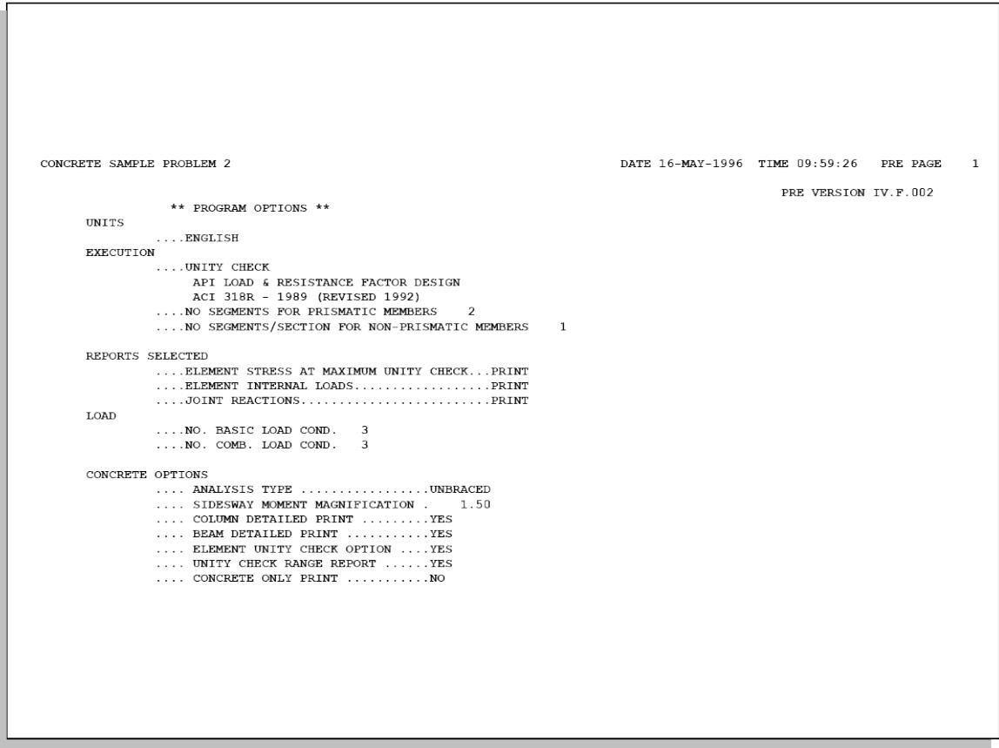

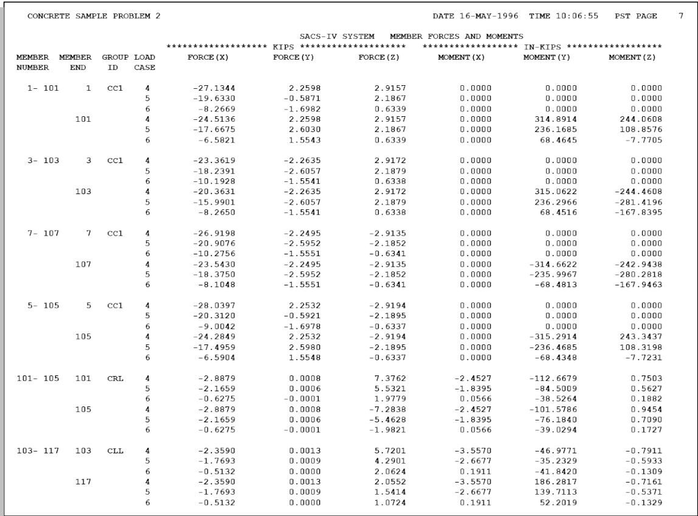

| CONCRETE SAMPLE PROBLEM 2 DATE 16-MAY-1996 TIME 10:06:55 PST PAGE 10 | CONCRETE SAMPLE PROBLEM 2 DATE 16-MAY-1996 TIME 10:06:55 PST PAGE 10 | CONCRETE SAMPLE PROBLEM 2 DATE 16-MAY-1996 TIME 10:06:55 PST PAGE 10 | CONCRETE SAMPLE PROBLEM 2 DATE 16-MAY-1996 TIME 10:06:55 PST PAGE 10 | CONCRETE SAMPLE PROBLEM 2 DATE 16-MAY-1996 TIME 10:06:55 PST PAGE 10 | CONCRETE SAMPLE PROBLEM 2 DATE 16-MAY-1996 TIME 10:06:55 PST PAGE 10 | CONCRETE SAMPLE PROBLEM 2 DATE 16-MAY-1996 TIME 10:06:55 PST PAGE 10 | CONCRETE SAMPLE PROBLEM 2 DATE 16-MAY-1996 TIME 10:06:55 PST PAGE 10 | CONCRETE SAMPLE PROBLEM 2 DATE 16-MAY-1996 TIME 10:06:55 PST PAGE 10 | CONCRETE SAMPLE PROBLEM 2 DATE 16-MAY-1996 TIME 10:06:55 PST PAGE 10 | CONCRETE SAMPLE PROBLEM 2 DATE 16-MAY-1996 TIME 10:06:55 PST PAGE 10 | CONCRETE SAMPLE PROBLEM 2 DATE 16-MAY-1996 TIME 10:06:55 PST PAGE 10 | CONCRETE SAMPLE PROBLEM 2 DATE 16-MAY-1996 TIME 10:06:55 PST PAGE 10 | CONCRETE SAMPLE PROBLEM 2 DATE 16-MAY-1996 TIME 10:06:55 PST PAGE 10 | CONCRETE SAMPLE PROBLEM 2 DATE 16-MAY-1996 TIME 10:06:55 PST PAGE 10 | CONCRETE SAMPLE PROBLEM 2 DATE 16-MAY-1996 TIME 10:06:55 PST PAGE 10 | CONCRETE SAMPLE PROBLEM 2 DATE 16-MAY-1996 TIME 10:06:55 PST PAGE 10 |
| --- | --- | --- | --- | --- | --- | --- | --- | --- | --- | --- | --- | --- | --- | --- | --- | --- |
| SACS-IV SYSTEM MEMBER DETAIL REPORT FOR CONCRETE COLUMN ELEMENTS | SACS-IV SYSTEM MEMBER DETAIL REPORT FOR CONCRETE COLUMN ELEMENTS | SACS-IV SYSTEM MEMBER DETAIL REPORT FOR CONCRETE COLUMN ELEMENTS | SACS-IV SYSTEM MEMBER DETAIL REPORT FOR CONCRETE COLUMN ELEMENTS | SACS-IV SYSTEM MEMBER DETAIL REPORT FOR CONCRETE COLUMN ELEMENTS | SACS-IV SYSTEM MEMBER DETAIL REPORT FOR CONCRETE COLUMN ELEMENTS | SACS-IV SYSTEM MEMBER DETAIL REPORT FOR CONCRETE COLUMN ELEMENTS | SACS-IV SYSTEM MEMBER DETAIL REPORT FOR CONCRETE COLUMN ELEMENTS | SACS-IV SYSTEM MEMBER DETAIL REPORT FOR CONCRETE COLUMN ELEMENTS | SACS-IV SYSTEM MEMBER DETAIL REPORT FOR CONCRETE COLUMN ELEMENTS | SACS-IV SYSTEM MEMBER DETAIL REPORT FOR CONCRETE COLUMN ELEMENTS | SACS-IV SYSTEM MEMBER DETAIL REPORT FOR CONCRETE COLUMN ELEMENTS | SACS-IV SYSTEM MEMBER DETAIL REPORT FOR CONCRETE COLUMN ELEMENTS | SACS-IV SYSTEM MEMBER DETAIL REPORT FOR CONCRETE COLUMN ELEMENTS | SACS-IV SYSTEM MEMBER DETAIL REPORT FOR CONCRETE COLUMN ELEMENTS | SACS-IV SYSTEM MEMBER DETAIL REPORT FOR CONCRETE COLUMN ELEMENTS | SACS-IV SYSTEM MEMBER DETAIL REPORT FOR CONCRETE COLUMN ELEMENTS |
| MEMBER | GRP | LOAD | FROM | AXIAL | RESULT | MOMENT | MOM | SHEAR | SHEAR | TORSION | ********** | ALLOWABLES | ********** | UNITY |  |  |
|  |  | CASE | LOAD | MOMENT | ANGLE | DEG | MAGN- | FY | FZ | MX | AXIAL | BEND | SHEAR-Y | SHEAR-Z | TORS. | CHECK |
|  |  | FT | KIPS | IN-KIP |  |  | IFIER | KIPS | KIPS | IN-KIP | KIPS | IN-KIP | KIPS | IN-KIP | RATIO |  |
| 1- 101 CC1 | 4 | 0.0 | -27.1 | 0.0 | 0.000 | 1.500 | 2.3 | 2.9 | 0.0 | 510.55 | 0.00 | 22.54 | 22.54 | 38.6 | 0.13 |  |
|  | 5 | 0.0 | -19.6 | 0.0 | 0.000 | 1.500 | -0.6 | 2.2 | 0.0 | 510.55 | 0.00 | 22.19 | 22.19 | 38.6 | 0.10 |  |
|  | 6 | 0.0 | -8.3 | 0.0 | 0.000 | 1.500 | -1.7 | 0.6 | 0.0 | 510.55 | 0.00 | 21.66 | 21.66 | 38.6 | 0.08 |  |
|  | 4 | 4.5 | -25.8 | 298.8 | 37.778 | 1.500 | 2.3 | 2.9 | 0.0 | 90.89 | 1050.57 | 22.48 | 22.48 | 38.6 | 0.28 |  |
|  | 5 | 4.5 | -18.7 | 177.9 | 5.497 | 1.500 | 1.0 | 2.2 | 0.0 | 115.47 | 1100.15 | 22.14 | 22.14 | 38.6 | 0.16 |  |
|  | 6 | 4.5 | -7.4 | 88.2 | -54.389 | 1.500 | -0.1 | 0.6 | 0.0 | 88.17 | 1046.30 | 21.62 | 21.62 | 38.6 | 0.08 |  |
|  | 4 | 9.0 | -24.5 | 597.6 | 37.778 | 1.500 | 2.3 | 2.9 | 0.0 | 40.16 | 977.23 | 22.41 | 22.41 | 38.6 | 0.61 |  |
|  | 5 | 9.0 | -17.7 | 390.1 | 24.746 | 1.500 | 2.6 | 2.2 | 0.0 | 44.00 | 970.57 | 22.09 | 22.09 | 38.6 | 0.40 |  |
|  | 6 | 9.0 | -6.6 | 103.4 | -6.475 | 1.500 | 1.6 | 0.6 | 0.0 | 60.42 | 949.32 | 21.58 | 21.58 | 38.6 | 0.11 |  |
| 3- 103 CC1 | 4 | 0.0 | -23.4 | 0.0 | 0.000 | 1.500 | -2.3 | 2.9 | 0.0 | 510.55 | 0.00 | 22.36 | 22.36 | 38.6 | 0.13 |  |
|  | 5 | 0.0 | -18.2 | 0.0 | 0.000 | 1.500 | -2.6 | 2.2 | 0.0 | 510.55 | 0.00 | 22.12 | 22.12 | 38.6 | 0.12 |  |
|  | 6 | 0.0 | -10.2 | 0.0 | 0.000 | 1.500 | -1.6 | 0.6 | 0.0 | 510.55 | 0.00 | 21.75 | 21.75 | 38.6 | 0.07 |  |
|  | 4 | 4.5 | -21.9 | 299.1 | -37.808 | 1.500 | -2.3 | 2.9 | 0.0 | 73.96 | 1012.40 | 22.29 | 22.29 | 38.6 | 0.30 |  |
|  | 5 | 4.5 | -17.1 | 275.6 | -49.981 | 1.500 | -2.6 | 2.2 | 0.0 | 59.09 | 950.78 | 22.07 | 22.07 | 38.6 | 0.29 |  |
|  | 6 | 4.5 | -9.2 | 135.9 | -67.812 | 1.500 | -1.6 | 0.6 | 0.0 | 64.60 | 953.48 | 21.70 | 21.70 | 38.6 | 0.14 |  |
|  | 4 | 9.0 | -20.4 | 598.2 | -37.808 | 1.500 | -2.3 | 2.9 | 0.0 | 33.28 | 977.50 | 22.22 | 22.22 | 38.6 | 0.61 |  |
|  | 5 | 9.0 | -16.0 | 551.2 | -49.981 | 1.500 | -2.6 | 2.2 | 0.0 | 28.47 | 979.98 | 22.02 | 22.02 | 38.6 | 0.56 |  |
|  | 6 | 9.0 | -8.3 | 271.9 | -67.812 | 1.500 | -1.6 | 0.6 | 0.0 | 29.43 | 967.87 | 21.66 | 21.66 | 38.6 | 0.28 |  |
| 7- 107 CC1 | 4 | 0.0 | -26.9 | 0.0 | 0.000 | 1.500 | -2.2 | -2.9 | 0.0 | 510.55 | 0.00 | 22.53 | 22.53 | 38.6 | 0.13 |  |
|  | 5 | 0.0 | -20.9 | 0.0 | 0.000 | 1.500 | -2.6 | -2.2 | 0.0 | 510.55 | 0.00 | 22.25 | 22.25 | 38.6 | 0.12 |  |
|  | 6 | 0.0 | -10.3 | 0.0 | 0.000 | 1.500 | -1.6 | -0.6 | 0.0 | 510.55 | 0.00 | 21.75 | 21.75 | 38.6 | 0.07 |  |
|  | 4 | 4.5 | -25.2 | 298.2 | 217.671 | 1.500 | -2.2 | -2.9 | 0.0 | 88.52 | 1045.45 | 22.45 | 22.45 | 38.6 | 0.29 |  |
|  | 5 | 4.5 | -19.6 | 274.8 | 229.903 | 1.500 | -2.6 | -2.2 | 0.0 | 72.06 | 1006.41 | 22.19 | 22.19 | 38.6 | 0.27 |  |
|  | 6 | 4.5 | -9.2 | 136.0 | 247.816 | 1.500 | -1.6 | -0.6 | 0.0 | 64.34 | 953.91 | 21.70 | 21.70 | 38.6 | 0.14 |  |
|  | 4 | 9.0 | -23.5 | 596.3 | 217.671 | 1.500 | -2.2 | -2.9 | 0.0 | 38.56 | 977.33 | 22.37 | 22.37 | 38.6 | 0.61 |  |
|  | 5 | 9.0 | -18.4 | 549.6 | 229.903 | 1.500 | -2.6 | -2.2 | 0.0 | 32.84 | 980.56 | 22.13 | 22.13 | 38.6 | 0.56 |  |
|  | 6 | 9.0 | -8.1 | 272.1 | 247.816 | 1.500 | -1.6 | -0.6 | 0.0 | 28.86 | 967.61 | 21.65 | 21.65 | 38.6 | 0.28 |  |
| 5- 105 CC1 | 4 | 0.0 | -28.0 | 0.0 | 0.000 | 1.500 | 2.3 | -2.9 | 0.0 | 510.55 | 0.00 | 22.58 | 22.58 | 38.6 | 0.13 |  |
|  | 5 | 0.0 | -20.3 | 0.0 | 0.000 | 1.500 | -0.6 | -2.2 | 0.0 | 510.55 | 0.00 | 22.22 | 22.22 | 38.6 | 0.10 |  |
|  | 6 | 0.0 | -9.0 | 0.0 | 0.000 | 1.500 | -1.7 | -0.6 | 0.0 | 510.55 | 0.00 | 21.69 | 21.69 | 38.6 | 0.08 |  |
|  | 4 | 4.5 | -26.2 | 298.7 | 142.339 | 1.500 | 2.3 | -2.9 | 0.0 | 92.27 | 1053.67 | 22.49 | 22.49 | 38.6 | 0.28 |  |
|  | 5 | 4.5 | -18.9 | 178.1 | 174.639 | 1.500 | 1.0 | -2.2 | 0.0 | 117.20 | 1103.30 | 22.15 | 22.15 | 38.6 | 0.16 |  |
|  | 6 | 4.5 | -7.8 | 88.1 | 234.387 | 1.500 | -0.1 | -0.6 | 0.0 | 93.79 | 1058.47 | 21.63 | 21.63 | 38.6 | 0.08 |  |
|  | 4 | 9.0 | -24.3 | 597.4 | 142.339 | 1.500 | 2.3 | -2.9 | 0.0 | 39.79 | 977.17 | 22.40 | 22.40 | 38.6 | 0.61 |  |
|  | 5 | 9.0 | -17.5 | 390.1 | 155.389 | 1.500 | 2.6 | -2.2 | 0.0 | 43.46 | 970.68 | 22.09 | 22.09 | 38.6 | 0.40 |  |
|  | 6 | 9.0 | -6.6 | 103.3 | 186.439 | 1.500 | 1.6 | -0.6 | 0.0 | 60.61 | 948.93 | 21.58 | 21.58 | 38.6 | 0.11 |  |

| CONCRETE SAMPLE PROBLEM 2 DATE 16-MAY-1996 TIME 10:06:55 PST PAGE 12 | CONCRETE SAMPLE PROBLEM 2 DATE 16-MAY-1996 TIME 10:06:55 PST PAGE 12 | CONCRETE SAMPLE PROBLEM 2 DATE 16-MAY-1996 TIME 10:06:55 PST PAGE 12 | CONCRETE SAMPLE PROBLEM 2 DATE 16-MAY-1996 TIME 10:06:55 PST PAGE 12 | CONCRETE SAMPLE PROBLEM 2 DATE 16-MAY-1996 TIME 10:06:55 PST PAGE 12 | CONCRETE SAMPLE PROBLEM 2 DATE 16-MAY-1996 TIME 10:06:55 PST PAGE 12 | CONCRETE SAMPLE PROBLEM 2 DATE 16-MAY-1996 TIME 10:06:55 PST PAGE 12 | CONCRETE SAMPLE PROBLEM 2 DATE 16-MAY-1996 TIME 10:06:55 PST PAGE 12 | CONCRETE SAMPLE PROBLEM 2 DATE 16-MAY-1996 TIME 10:06:55 PST PAGE 12 | CONCRETE SAMPLE PROBLEM 2 DATE 16-MAY-1996 TIME 10:06:55 PST PAGE 12 | CONCRETE SAMPLE PROBLEM 2 DATE 16-MAY-1996 TIME 10:06:55 PST PAGE 12 | CONCRETE SAMPLE PROBLEM 2 DATE 16-MAY-1996 TIME 10:06:55 PST PAGE 12 | CONCRETE SAMPLE PROBLEM 2 DATE 16-MAY-1996 TIME 10:06:55 PST PAGE 12 | CONCRETE SAMPLE PROBLEM 2 DATE 16-MAY-1996 TIME 10:06:55 PST PAGE 12 | CONCRETE SAMPLE PROBLEM 2 DATE 16-MAY-1996 TIME 10:06:55 PST PAGE 12 |
| --- | --- | --- | --- | --- | --- | --- | --- | --- | --- | --- | --- | --- | --- | --- |
| SACS-IV SYSTEM MEMBER DETAIL REPORT FOR CONCRETE BEAM ELEMENTS | SACS-IV SYSTEM MEMBER DETAIL REPORT FOR CONCRETE BEAM ELEMENTS | SACS-IV SYSTEM MEMBER DETAIL REPORT FOR CONCRETE BEAM ELEMENTS | SACS-IV SYSTEM MEMBER DETAIL REPORT FOR CONCRETE BEAM ELEMENTS | SACS-IV SYSTEM MEMBER DETAIL REPORT FOR CONCRETE BEAM ELEMENTS | SACS-IV SYSTEM MEMBER DETAIL REPORT FOR CONCRETE BEAM ELEMENTS | SACS-IV SYSTEM MEMBER DETAIL REPORT FOR CONCRETE BEAM ELEMENTS | SACS-IV SYSTEM MEMBER DETAIL REPORT FOR CONCRETE BEAM ELEMENTS | SACS-IV SYSTEM MEMBER DETAIL REPORT FOR CONCRETE BEAM ELEMENTS | SACS-IV SYSTEM MEMBER DETAIL REPORT FOR CONCRETE BEAM ELEMENTS | SACS-IV SYSTEM MEMBER DETAIL REPORT FOR CONCRETE BEAM ELEMENTS | SACS-IV SYSTEM MEMBER DETAIL REPORT FOR CONCRETE BEAM ELEMENTS | SACS-IV SYSTEM MEMBER DETAIL REPORT FOR CONCRETE BEAM ELEMENTS | SACS-IV SYSTEM MEMBER DETAIL REPORT FOR CONCRETE BEAM ELEMENTS | SACS-IV SYSTEM MEMBER DETAIL REPORT FOR CONCRETE BEAM ELEMENTS |
| MEMBER | GRP | LOAD CASE | DIST FROM END PT | ********** | ********** | APPLIED SHEAR FZ KIPS | ********** | ********** | ALLOWABLES********** | ALLOWABLES********** | ALLOWABLES********** | ALLOWABLES********** | ALLOWABLES********** | ALLOWABLES********** |
| MEMBER | GRP | LOAD CASE | DIST FROM END PT | AXIAL LOAD | MOMENT MY IN-KIP | APPLIED SHEAR FZ KIPS | TORSION MX IN-KIP | REINF. RATIO | MOMENT MY IN-KIP | SHEAR FZ KIPS | TORSION MX IN-KIP | REINF. RATIO | CRIT. COND | UNITY CHECK RATIO |
| 101-105 CRL | 4 | 0.0 | -2.9 | -112.7 | 7.4 | -2.5 | 0.009 | 331.0 | 13.1 | 22.0 | 0.017 | SHEAR | 0.56 |  |
| 101-105 CRL | 5 | 0.0 | -2.2 | -84.5 | 5.5 | -1.8 | 0.009 | 331.0 | 13.1 | 22.0 | 0.017 | SHEAR | 0.42 |  |
| 101-105 CRL | 6 | 0.0 | -0.6 | -38.5 | 2.0 | 0.1 | 0.009 | 331.0 | 13.1 | 19.4 | 0.017 | SHEAR | 0.15 |  |
| 101-105 CRL | 4 | 10.0 | -2.9 | 332.7 | 0.0 | -2.5 | 0.005 | 217.5 | 8.2 | 78.0 | 0.033 | BEND-Y | 1.53 |  |
| 101-105 CRL | 5 | 10.0 | -2.2 | 249.5 | 0.0 | -1.8 | 0.005 | 217.5 | 8.2 | 78.0 | 0.033 | BEND-Y | 1.15 |  |
| 101-105 CRL | 6 | 10.0 | -0.6 | 80.0 | 0.0 | 0.1 | 0.005 | 217.5 | 8.2 | 74.6 | 0.033 | BEND-Y | 0.37 |  |
| 101-105 CRL | 4 | 20.0 | -2.9 | -101.6 | -7.3 | -2.5 | 0.009 | 331.0 | 13.1 | 22.0 | 0.017 | SHEAR | 0.56 |  |
| 101-105 CRL | 5 | 20.0 | -2.2 | -76.2 | -5.5 | -1.8 | 0.009 | 331.0 | 13.1 | 22.0 | 0.017 | SHEAR | 0.42 |  |
| 101-105 CRL | 6 | 20.0 | -0.6 | -39.0 | -2.0 | 0.1 | 0.009 | 331.0 | 13.1 | 19.4 | 0.017 | SHEAR | 0.15 |  |
| 103-117 CLL | 4 | 0.0 | -2.4 | -47.0 | 5.7 | -3.6 | 0.009 | 331.0 | 13.1 | 24.4 | 0.017 | SHEAR | 0.44 |  |
| 103-117 CLL | 5 | 0.0 | -1.8 | -35.2 | 4.3 | -2.7 | 0.009 | 331.0 | 13.1 | 24.4 | 0.017 | SHEAR | 0.33 |  |
| 103-117 CLL | 6 | 0.0 | -0.5 | -41.8 | 2.1 | 0.2 | 0.009 | 331.0 | 13.1 | 19.9 | 0.017 | SHEAR | 0.16 |  |
| 103-117 CLL | 4 | 2.5 | -2.4 | 97.1 | 3.9 | -3.6 | 0.005 | 217.5 | 8.2 | 24.0 | 0.033 | SHEAR | 0.47 |  |
| 103-117 CLL | 5 | 2.5 | -1.8 | 72.9 | 2.9 | -2.7 | 0.005 | 217.5 | 8.2 | 24.0 | 0.033 | SHEAR | 0.36 |  |
| 103-117 CLL | 6 | 2.5 | -0.5 | 12.6 | 1.6 | 0.2 | 0.005 | 217.5 | 8.2 | 19.8 | 0.033 | SHEAR | 0.19 |  |
| 103-117 CLL | 4 | 5.0 | -2.4 | 186.3 | 2.1 | -3.6 | 0.005 | 217.5 | 8.2 | 28.2 | 0.033 | BEND-Y | 0.86 |  |
| 103-117 CLL | 5 | 5.0 | -1.8 | 139.7 | 1.5 | -2.7 | 0.005 | 217.5 | 8.2 | 28.2 | 0.033 | BEND-Y | 0.64 |  |
| 103-117 CLL | 6 | 5.0 | -0.5 | 52.2 | 1.1 | 0.2 | 0.005 | 217.5 | 8.2 | 20.1 | 0.033 | BEND-Y | 0.24 |  |
| 101-111 CR1 | 4 | 0.0 | -2.3 | -273.6 | 17.1 | -248.8 | 0.004 | 894.9 | 29.8 | 340.3 | 0.022 | TORS | 0.73 |  |
| 101-111 CR1 | 5 | 0.0 | -2.6 | -141.9 | 12.1 | -186.6 | 0.004 | 894.9 | 29.2 | 343.2 | 0.022 | TORS | 0.54 |  |
| 101-111 CR1 | 6 | 0.0 | -1.6 | -10.8 | 4.6 | -40.1 | 0.004 | 894.9 | 43.4 | 306.2 | 0.022 | TORS | 0.13 |  |
| 101-111 CR1 | 4 | 3.0 | -2.3 | 315.0 | 15.6 | -248.8 | 0.010 | 348.8 | 15.5 | 282.0 | 0.024 | SHEAR | 1.01 |  |
| 101-111 CR1 | 5 | 3.0 | -2.6 | 273.7 | 11.0 | -186.6 | 0.010 | 348.8 | 15.2 | 287.6 | 0.024 | BEND-Y | 0.78 |  |
| 101-111 CR1 | 6 | 3.0 | -1.6 | 136.7 | 3.6 | -40.1 | 0.010 | 348.8 | 17.8 | 250.2 | 0.024 | BEND-Y | 0.39 |  |
| 101-111 CR1 | 4 | 3.0 | -2.3 | 315.0 | 15.6 | -248.8 | 0.009 | 925.4 | 19.1 | 271.2 | 0.024 | TORS | 0.92 |  |
| 101-111 CR1 | 5 | 3.0 | -2.6 | 273.7 | 11.0 | -186.6 | 0.009 | 925.4 | 18.7 | 275.3 | 0.024 | TORS | 0.68 |  |
| 101-111 CR1 | 6 | 3.0 | -1.6 | 136.7 | 3.6 | -40.1 | 0.009 | 925.4 | 26.9 | 243.5 | 0.024 | TORS | 0.16 |  |
| 101-111 CR1 | 4 | 6.7 | -2.3 | 957.4 | 13.6 | -248.8 | 0.009 | 925.4 | 18.1 | 279.5 | 0.024 | BEND-Y | 1.03 |  |
| 101-111 CR1 | 5 | 6.7 | -2.6 | 723.9 | 9.5 | -186.6 | 0.009 | 925.4 | 17.6 | 283.5 | 0.024 | BEND-Y | 0.78 |  |
| 101-111 CR1 | 6 | 6.7 | -1.6 | 267.5 | 2.4 | -40.1 | 0.009 | 925.4 | 26.9 | 275.2 | 0.024 | BEND-Y | 0.29 |  |

| CONCRETE SAMPLE PROBLEM 2 DATE 16-MAY-1996 TIME 10:06:55 PST PAGE 19 | CONCRETE SAMPLE PROBLEM 2 DATE 16-MAY-1996 TIME 10:06:55 PST PAGE 19 | CONCRETE SAMPLE PROBLEM 2 DATE 16-MAY-1996 TIME 10:06:55 PST PAGE 19 | CONCRETE SAMPLE PROBLEM 2 DATE 16-MAY-1996 TIME 10:06:55 PST PAGE 19 | CONCRETE SAMPLE PROBLEM 2 DATE 16-MAY-1996 TIME 10:06:55 PST PAGE 19 | CONCRETE SAMPLE PROBLEM 2 DATE 16-MAY-1996 TIME 10:06:55 PST PAGE 19 | CONCRETE SAMPLE PROBLEM 2 DATE 16-MAY-1996 TIME 10:06:55 PST PAGE 19 | CONCRETE SAMPLE PROBLEM 2 DATE 16-MAY-1996 TIME 10:06:55 PST PAGE 19 | CONCRETE SAMPLE PROBLEM 2 DATE 16-MAY-1996 TIME 10:06:55 PST PAGE 19 | CONCRETE SAMPLE PROBLEM 2 DATE 16-MAY-1996 TIME 10:06:55 PST PAGE 19 | CONCRETE SAMPLE PROBLEM 2 DATE 16-MAY-1996 TIME 10:06:55 PST PAGE 19 | CONCRETE SAMPLE PROBLEM 2 DATE 16-MAY-1996 TIME 10:06:55 PST PAGE 19 | CONCRETE SAMPLE PROBLEM 2 DATE 16-MAY-1996 TIME 10:06:55 PST PAGE 19 | CONCRETE SAMPLE PROBLEM 2 DATE 16-MAY-1996 TIME 10:06:55 PST PAGE 19 | CONCRETE SAMPLE PROBLEM 2 DATE 16-MAY-1996 TIME 10:06:55 PST PAGE 19 | CONCRETE SAMPLE PROBLEM 2 DATE 16-MAY-1996 TIME 10:06:55 PST PAGE 19 | CONCRETE SAMPLE PROBLEM 2 DATE 16-MAY-1996 TIME 10:06:55 PST PAGE 19 | CONCRETE SAMPLE PROBLEM 2 DATE 16-MAY-1996 TIME 10:06:55 PST PAGE 19 |
| --- | --- | --- | --- | --- | --- | --- | --- | --- | --- | --- | --- | --- | --- | --- | --- | --- | --- |
| SACS-IV SYSTEM CONCRETE ELEMENT UNITY CHECK REPORT | SACS-IV SYSTEM CONCRETE ELEMENT UNITY CHECK REPORT | SACS-IV SYSTEM CONCRETE ELEMENT UNITY CHECK REPORT | SACS-IV SYSTEM CONCRETE ELEMENT UNITY CHECK REPORT | SACS-IV SYSTEM CONCRETE ELEMENT UNITY CHECK REPORT | SACS-IV SYSTEM CONCRETE ELEMENT UNITY CHECK REPORT | SACS-IV SYSTEM CONCRETE ELEMENT UNITY CHECK REPORT | SACS-IV SYSTEM CONCRETE ELEMENT UNITY CHECK REPORT | SACS-IV SYSTEM CONCRETE ELEMENT UNITY CHECK REPORT | SACS-IV SYSTEM CONCRETE ELEMENT UNITY CHECK REPORT | SACS-IV SYSTEM CONCRETE ELEMENT UNITY CHECK REPORT | SACS-IV SYSTEM CONCRETE ELEMENT UNITY CHECK REPORT | SACS-IV SYSTEM CONCRETE ELEMENT UNITY CHECK REPORT | SACS-IV SYSTEM CONCRETE ELEMENT UNITY CHECK REPORT | SACS-IV SYSTEM CONCRETE ELEMENT UNITY CHECK REPORT | SACS-IV SYSTEM CONCRETE ELEMENT UNITY CHECK REPORT | SACS-IV SYSTEM CONCRETE ELEMENT UNITY CHECK REPORT | SACS-IV SYSTEM CONCRETE ELEMENT UNITY CHECK REPORT |
| ACI 318R-89 (REVISED 92) | ACI 318R-89 (REVISED 92) | ACI 318R-89 (REVISED 92) | ACI 318R-89 (REVISED 92) | ACI 318R-89 (REVISED 92) | ACI 318R-89 (REVISED 92) | ACI 318R-89 (REVISED 92) | ACI 318R-89 (REVISED 92) | ACI 318R-89 (REVISED 92) | ACI 318R-89 (REVISED 92) | ACI 318R-89 (REVISED 92) | ACI 318R-89 (REVISED 92) | ACI 318R-89 (REVISED 92) | ACI 318R-89 (REVISED 92) | ACI 318R-89 (REVISED 92) | ACI 318R-89 (REVISED 92) | ACI 318R-89 (REVISED 92) | ACI 318R-89 (REVISED 92) |
| MEMBER | GRP | MAX. CRIT. | MAX. CRIT. | LOAD | DIST | * * * * | * * * * | * * * * | * REINF* | * BEAMS* | C H E C K | C O M P O N E N T S | * * * * * * * * * | * * * * * * * * * | * * * * * * * * * | * * * * * * * * * | * * * * * * * * * |
| MEMBER | GRP | UNITY | COND | COND | FROM | *SHEAR* | *TORSION* | * * * * | * REINF* | * BEAMS* | ********** | COLUNNS | ********** | ********** | ********** | ********** | *** |
| MEMBER | GRP | CHECK | NO. | END | FT | PZ | MX | RATIO | MY | AXIAL | EULER | BUCKLING | SHEAR | BEND | MOM | CMY | CMZ |
| 1- 101 | CC1 | 0.61 | CM+BN | 4 | 9.00 | 0.130 | 0.000 | 0.559 |  | 0.610 | 0.010 | 0.010 | 0.101 | 0.612 | 1.50 | 0.60 | 0.60 |
| 3- 103 | CC1 | 0.61 | CM+BN | 4 | 9.00 | 0.131 | 0.000 | 0.559 |  | 0.612 | 0.008 | 0.008 | 0.102 | 0.612 | 1.50 | 0.60 | 0.60 |
| 7- 107 | CC1 | 0.61 | CM+BN | 4 | 9.00 | 0.130 | 0.000 | 0.559 |  | 0.611 | 0.010 | 0.010 | 0.101 | 0.610 | 1.50 | 0.60 | 0.60 |
| 5- 105 | CC1 | 0.61 | CM+BN | 4 | 9.00 | 0.130 | 0.000 | 0.559 |  | 0.610 | 0.010 | 0.010 | 0.101 | 0.611 | 1.50 | 0.60 | 0.60 |
| 101- 105 | CRL | 1.53 | BEND-Y | 4 | 10.00 | 0.006 | 0.031 | 0.161 | 1.529 |  |  |  |  |  |  |  |  |
| 103- 117 | CLL | 0.86 | BEND-Y | 4 | 5.00 | 0.251 | 0.126 | 0.161 | 0.856 |  |  |  |  |  |  |  |  |
| 101- 111 | CR1 | 1.03 | BEND-Y | 4 | 6.67 | 0.752 | 0.890 | 0.368 | 1.035 |  |  |  |  |  |  |  |  |
| 103- 112 | CR1 | 1.10 | TORS | 4 | 3.00 | 0.877 | 1.097 | 0.368 | 0.388 |  |  |  |  |  |  |  |  |
| 105- 113 | CR1 | 1.03 | BEND-Y | 4 | 6.67 | 0.761 | 0.921 | 0.368 | 1.029 |  |  |  |  |  |  |  |  |
| 107- 114 | CR1 | 1.05 | BEND-Y | 4 | 6.67 | 0.773 | 0.978 | 0.368 | 1.048 |  |  |  |  |  |  |  |  |
| 111- 112 | CR2 | 1.08 | BEND-Y | 4 | 5.00 | 0.023 | 0.105 | 0.368 | 1.077 |  |  |  |  |  |  |  |  |
| 113- 114 | CR2 | 1.07 | BEND-Y | 4 | 5.00 | 0.024 | 0.040 | 0.368 | 1.074 |  |  |  |  |  |  |  |  |
| 111- 113 | CT1 | 1.14 | BEND-Y | 4 | 15.00 | 1.083 | 1.084 | 0.161 | 1.136 |  |  |  |  |  |  |  |  |
| 112- 114 | CT1 | 1.14 | BEND-Y | 4 | 15.00 | 1.083 | 1.084 | 0.161 | 1.136 |  |  |  |  |  |  |  |  |
| 117- 107 | CLL | 1.38 | BEND-Y | 4 | 7.50 | 0.330 | 0.704 | 0.161 | 1.384 |  |  |  |  |  |  |  |  |
| SACS-IV CONCRETE MEMBER UNITY CHECK RANGE SUMMARY | SACS-IV CONCRETE MEMBER UNITY CHECK RANGE SUMMARY | SACS-IV CONCRETE MEMBER UNITY CHECK RANGE SUMMARY | SACS-IV CONCRETE MEMBER UNITY CHECK RANGE SUMMARY | SACS-IV CONCRETE MEMBER UNITY CHECK RANGE SUMMARY | SACS-IV CONCRETE MEMBER UNITY CHECK RANGE SUMMARY | SACS-IV CONCRETE MEMBER UNITY CHECK RANGE SUMMARY | SACS-IV CONCRETE MEMBER UNITY CHECK RANGE SUMMARY | SACS-IV CONCRETE MEMBER UNITY CHECK RANGE SUMMARY | SACS-IV CONCRETE MEMBER UNITY CHECK RANGE SUMMARY | SACS-IV CONCRETE MEMBER UNITY CHECK RANGE SUMMARY | SACS-IV CONCRETE MEMBER UNITY CHECK RANGE SUMMARY | SACS-IV CONCRETE MEMBER UNITY CHECK RANGE SUMMARY | SACS-IV CONCRETE MEMBER UNITY CHECK RANGE SUMMARY | SACS-IV CONCRETE MEMBER UNITY CHECK RANGE SUMMARY | SACS-IV CONCRETE MEMBER UNITY CHECK RANGE SUMMARY | SACS-IV CONCRETE MEMBER UNITY CHECK RANGE SUMMARY | SACS-IV CONCRETE MEMBER UNITY CHECK RANGE SUMMARY |
| GROUP I - UNITY CHECKS GREATER THAN 1.33 | GROUP I - UNITY CHECKS GREATER THAN 1.33 | GROUP I - UNITY CHECKS GREATER THAN 1.33 | GROUP I - UNITY CHECKS GREATER THAN 1.33 | GROUP I - UNITY CHECKS GREATER THAN 1.33 | GROUP I - UNITY CHECKS GREATER THAN 1.33 | GROUP I - UNITY CHECKS GREATER THAN 1.33 | GROUP I - UNITY CHECKS GREATER THAN 1.33 | GROUP I - UNITY CHECKS GREATER THAN 1.33 | GROUP I - UNITY CHECKS GREATER THAN 1.33 | GROUP I - UNITY CHECKS GREATER THAN 1.33 | GROUP I - UNITY CHECKS GREATER THAN 1.33 | GROUP I - UNITY CHECKS GREATER THAN 1.33 | GROUP I - UNITY CHECKS GREATER THAN 1.33 | GROUP I - UNITY CHECKS GREATER THAN 1.33 | GROUP I - UNITY CHECKS GREATER THAN 1.33 | GROUP I - UNITY CHECKS GREATER THAN 1.33 | GROUP I - UNITY CHECKS GREATER THAN 1.33 |
| MEMBER | GRP | MAX. | MAX. | DIST | ********** | CRITICAL | LOADING | ********** |  | SLENDERNESS RATIO | SECOND-HIGHEST | THIRD-HIGHEST | THIRD-HIGHEST | THIRD-HIGHEST | THIRD-HIGHEST | THIRD-HIGHEST | THIRD-HIGHEST |
| MEMBER | GRP | UNITY | LOAD | FROM | AXIAL | MOMENT | MOMENT | SHEAR | KLY/RY | KLZ/RZ | UNIT | LOAD | UNIT | UNIT | UNIT | UNIT | UNIT |
| MEMBER | GRP | CHECK | CASE | END | MY | MZ | MIZ | FY | KIPS | KIPS | CHECK | CASE | CHECK | CHECK | CHECK | CHECK | CHECK |
| MEMBER | GRP |  |  | FT | IN-KIP | IN-KIP | IN-KIP | KIPS |  |  |  |  |  |  |  |  |  |
| 101- 105 | CRL | 1.53 | 4 | 10.0 | -2.9 | 332.7 | 0.8 | 0.0 | 0.0 | 52.26 | 35.55 | 1.15 | 5 | 0.56 | 4 | 4 |  |
| 117- 107 | CLL | 1.38 | 4 | 7.5 | -2.9 | 301.1 | -0.8 | 0.0 | -1.5 | 39.20 | 26.66 | 1.04 | 5 | 0.86 | 4 | 4 |  |
| CONCRETE SAMPLE PROBLEM 2 DATE 16-MAY-1996 TIME 10:06:55 PST PAGE 21 | CONCRETE SAMPLE PROBLEM 2 DATE 16-MAY-1996 TIME 10:06:55 PST PAGE 21 | CONCRETE SAMPLE PROBLEM 2 DATE 16-MAY-1996 TIME 10:06:55 PST PAGE 21 | CONCRETE SAMPLE PROBLEM 2 DATE 16-MAY-1996 TIME 10:06:55 PST PAGE 21 | CONCRETE SAMPLE PROBLEM 2 DATE 16-MAY-1996 TIME 10:06:55 PST PAGE 21 | CONCRETE SAMPLE PROBLEM 2 DATE 16-MAY-1996 TIME 10:06:55 PST PAGE 21 | CONCRETE SAMPLE PROBLEM 2 DATE 16-MAY-1996 TIME 10:06:55 PST PAGE 21 | CONCRETE SAMPLE PROBLEM 2 DATE 16-MAY-1996 TIME 10:06:55 PST PAGE 21 | CONCRETE SAMPLE PROBLEM 2 DATE 16-MAY-1996 TIME 10:06:55 PST PAGE 21 | CONCRETE SAMPLE PROBLEM 2 DATE 16-MAY-1996 TIME 10:06:55 PST PAGE 21 | CONCRETE SAMPLE PROBLEM 2 DATE 16-MAY-1996 TIME 10:06:55 PST PAGE 21 | CONCRETE SAMPLE PROBLEM 2 DATE 16-MAY-1996 TIME 10:06:55 PST PAGE 21 | CONCRETE SAMPLE PROBLEM 2 DATE 16-MAY-1996 TIME 10:06:55 PST PAGE 21 | CONCRETE SAMPLE PROBLEM 2 DATE 16-MAY-1996 TIME 10:06:55 PST PAGE 21 | CONCRETE SAMPLE PROBLEM 2 DATE 16-MAY-1996 TIME 10:06:55 PST PAGE 21 | CONCRETE SAMPLE PROBLEM 2 DATE 16-MAY-1996 TIME 10:06:55 PST PAGE 21 | CONCRETE SAMPLE PROBLEM 2 DATE 16-MAY-1996 TIME 10:06:55 PST PAGE 21 | CONCRETE SAMPLE PROBLEM 2 DATE 16-MAY-1996 TIME 10:06:55 PST PAGE 21 |
| SACS-IV CONCRETE MEMBER UNI TY CHECK RANGE SUMMARY | SACS-IV CONCRETE MEMBER UNI TY CHECK RANGE SUMMARY | SACS-IV CONCRETE MEMBER UNI TY CHECK RANGE SUMMARY | SACS-IV CONCRETE MEMBER UNI TY CHECK RANGE SUMMARY | SACS-IV CONCRETE MEMBER UNI TY CHECK RANGE SUMMARY | SACS-IV CONCRETE MEMBER UNI TY CHECK RANGE SUMMARY | SACS-IV CONCRETE MEMBER UNI TY CHECK RANGE SUMMARY | SACS-IV CONCRETE MEMBER UNI TY CHECK RANGE SUMMARY | SACS-IV CONCRETE MEMBER UNI TY CHECK RANGE SUMMARY | SACS-IV CONCRETE MEMBER UNI TY CHECK RANGE SUMMARY | SACS-IV CONCRETE MEMBER UNI TY CHECK RANGE SUMMARY | SACS-IV CONCRETE MEMBER UNI TY CHECK RANGE SUMMARY | SACS-IV CONCRETE MEMBER UNI TY CHECK RANGE SUMMARY | SACS-IV CONCRETE MEMBER UNI TY CHECK RANGE SUMMARY | SACS-IV CONCRETE MEMBER UNI TY CHECK RANGE SUMMARY | SACS-IV CONCRETE MEMBER UNI TY CHECK RANGE SUMMARY | SACS-IV CONCRETE MEMBER UNI TY CHECK RANGE SUMMARY | SACS-IV CONCRETE MEMBER UNI TY CHECK RANGE SUMMARY |
| GROUP II - UNI TY CHECKS GREATER THAN 1.00 AND LESS THAN 1.33 | GROUP II - UNI TY CHECKS GREATER THAN 1.00 AND LESS THAN 1.33 | GROUP II - UNI TY CHECKS GREATER THAN 1.00 AND LESS THAN 1.33 | GROUP II - UNI TY CHECKS GREATER THAN 1.00 AND LESS THAN 1.33 | GROUP II - UNI TY CHECKS GREATER THAN 1.00 AND LESS THAN 1.33 | GROUP II - UNI TY CHECKS GREATER THAN 1.00 AND LESS THAN 1.33 | GROUP II - UNI TY CHECKS GREATER THAN 1.00 AND LESS THAN 1.33 | GROUP II - UNI TY CHECKS GREATER THAN 1.00 AND LESS THAN 1.33 | GROUP II - UNI TY CHECKS GREATER THAN 1.00 AND LESS THAN 1.33 | GROUP II - UNI TY CHECKS GREATER THAN 1.00 AND LESS THAN 1.33 | GROUP II - UNI TY CHECKS GREATER THAN 1.00 AND LESS THAN 1.33 | GROUP II - UNI TY CHECKS GREATER THAN 1.00 AND LESS THAN 1.33 | GROUP II - UNI TY CHECKS GREATER THAN 1.00 AND LESS THAN 1.33 | GROUP II - UNI TY CHECKS GREATER THAN 1.00 AND LESS THAN 1.33 | GROUP II - UNI TY CHECKS GREATER THAN 1.00 AND LESS THAN 1.33 | GROUP II - UNI TY CHECKS GREATER THAN 1.00 AND LESS THAN 1.33 | GROUP II - UNI TY CHECKS GREATER THAN 1.00 AND LESS THAN 1.33 | GROUP II - UNI TY CHECKS GREATER THAN 1.00 AND LESS THAN 1.33 |
| MEMBER GRP MAX. DIST FROM AXIAL MOMENT MOMENT SHEAR SHEAR SLENDERNESS RATIO SLENDERNESS RATIO KLY/RY KLZ/RZ SECOND-HIGHEST SECOND-HIGHEST | MAX. MAX. MAX. MAX. MAX. MAX. MAX. MAX. MAX. MAX. MAX. MAX. MAX. MAX. MAX. MAX. MAX. MAX. MAX. MAX. MAX. MAX. MAX. MAX. MAX. MAX. MAX. MAX. MAX. MAX. MAX. MAX. MAX. MAX. MAX. MAX. MAX. MAX. MAX. MAX. MAX. MAX. MAX. MAX. MAX. MAX. MAX. MAX. MAX. MAX. MAX. | DIST FROM AXIAL MOMENT MOMENT SHEAR SHEAR SLENDERNESS RATIO SLENDERNESS RATIO SLENDERNESS RATIO SLENDERNESS RATIO SLENDERNESS RATIO SLENDERNESS RATIO SLENDERNESS RATIO SLENDERNESS RATIO SLENDERNESS RATIO SLENDERNESS RATIO SLENDERNESS RATIO SLENDERNESS RATIO SLENDERNESS RATIO SLENDERNESS RATIO SLENDERNESS RATIO SLENDERNESS RATIO SLENDERNESS RATIO SLENDERNESS RATIO | ********** CRITICAL LOADING********** | MOMENT MOMENT SHEAR SHEAR FLY FLZ/RZ | IN-KIP IN-KIP | KIPS | KIPS | KIPS |  |  |  |  |  |  |  |  |  |
| 101-111 CR1 1.03 4 6.7 | -2.3 | 957.4 | 1.5 | 0.0 | 13.6 | 11.55 | 18.48 | 1.01 | 4 | 0.92 | 4 |  |  |  |  |  |  |
| 103-112 CR1 1.10 4 3.0 | -2.3 | 359.0 | -0.1 | 0.0 | 15.0 | 11.55 | 18.48 | 1.07 | 4 | 1.04 | 4 |  |  |  |  |  |  |
| 105-113 CR1 1.03 4 6.7 | -2.3 | 952.2 | -1.6 | 0.0 | 13.5 | 11.55 | 18.48 | 1.01 | 4 | 0.95 | 4 |  |  |  |  |  |  |
| 107-114 CR1 1.05 4 6.7 | -2.3 | 969.7 | 1.5 | 0.0 | 13.1 | 11.55 | 18.48 | 1.01 | 4 | 1.00 | 4 |  |  |  |  |  |  |
| 111-112 CR2 1.08 4 5.0 | -2.3 | 996.6 | 1.1 | 0.0 | -0.6 | 11.55 | 18.47 | 1.07 | 4 | 1.05 | 4 |  |  |  |  |  |  |
| 113-114 CR2 1.07 4 5.0 | -2.3 | 994.3 | -1.2 | 0.0 | -0.7 | 11.55 | 18.47 | 1.07 | 4 | 1.05 | 4 |  |  |  |  |  |  |
| 111-113 CT1 1.14 4 15.0 | 0.0 | 247.2 | 0.4 | 0.0 | -5.7 | 52.26 | 43.86 | 1.14 | 4 | 1.11 | 4 |  |  |  |  |  |  |
| 112-114 CT1 1.14 4 15.0 | 0.0 | 247.1 | -0.3 | 0.0 | -5.7 | 52.26 | 43.86 | 1.14 | 4 | 1.11 | 4 |  |  |  |  |  |  |
| SACS-IV SYSTEM CONCRETE MEMBER GROUP SUMMARY REPORT ACI 318R-89 (REVISED 92) | SACS-IV SYSTEM CONCRETE MEMBER GROUP SUMMARY REPORT ACI 318R-89 (REVISED 92) | SACS-IV SYSTEM CONCRETE MEMBER GROUP SUMMARY REPORT ACI 318R-89 (REVISED 92) | SACS-IV SYSTEM CONCRETE MEMBER GROUP SUMMARY REPORT ACI 318R-89 (REVISED 92) | SACS-IV SYSTEM CONCRETE MEMBER GROUP SUMMARY REPORT ACI 318R-89 (REVISED 92) | SACS-IV SYSTEM CONCRETE MEMBER GROUP SUMMARY REPORT ACI 318R-89 (REVISED 92) | SACS-IV SYSTEM CONCRETE MEMBER GROUP SUMMARY REPORT ACI 318R-89 (REVISED 92) | SACS-IV SYSTEM CONCRETE MEMBER GROUP SUMMARY REPORT ACI 318R-89 (REVISED 92) | SACS-IV SYSTEM CONCRETE MEMBER GROUP SUMMARY REPORT ACI 318R-89 (REVISED 92) | SACS-IV SYSTEM CONCRETE MEMBER GROUP SUMMARY REPORT ACI 318R-89 (REVISED 92) | SACS-IV SYSTEM CONCRETE MEMBER GROUP SUMMARY REPORT ACI 318R-89 (REVISED 92) | SACS-IV SYSTEM CONCRETE MEMBER GROUP SUMMARY REPORT ACI 318R-89 (REVISED 92) | SACS-IV SYSTEM CONCRETE MEMBER GROUP SUMMARY REPORT ACI 318R-89 (REVISED 92) | SACS-IV SYSTEM CONCRETE MEMBER GROUP SUMMARY REPORT ACI 318R-89 (REVISED 92) | SACS-IV SYSTEM CONCRETE MEMBER GROUP SUMMARY REPORT ACI 318R-89 (REVISED 92) | SACS-IV SYSTEM CONCRETE MEMBER GROUP SUMMARY REPORT ACI 318R-89 (REVISED 92) | SACS-IV SYSTEM CONCRETE MEMBER GROUP SUMMARY REPORT ACI 318R-89 (REVISED 92) | SACS-IV SYSTEM CONCRETE MEMBER GROUP SUMMARY REPORT ACI 318R-89 (REVISED 92) |
| GRUP MAX. MAX. MAX. MAX. MAX. MAX. MAX. MAX. MAX. MAX. MAX. MAX. MAX. MAX. MAX. MAX. MAX. MAX. MAX. MAX. MAX. MAX. MAX. MAX. MAX. MAX. MAX. MAX. MAX. MAX. MAX. MAX. MAX. MAX. MAX. MAX. MAX. MAX. MAX. MAX. MAX. MAX. MAX. MAX. MAX. MAX. MAX. MAX. MAX. MAX. ID MEMBER COND MAX. MAX. MAX. MAX. MAX. MAX. MAX. MAX. MAX. MAX. MAX. MAX. MAX. MAX. MAX. MAX. MAX. MAX. MAX. MAX. MAX. MAX. MAX. MAX. MAX. MAX. MAX. MAX. MAX. MAX. MAX. MAX. MAX. MAX. MAX. MAX. MAX. MAX. MAX. MAX. MAX. MAX. MAX. MAX. MAX. MAX. MAX. MAX. MAX. MAX CC1 3-103 4 0.61 9.0 | DIST FROM AXIAL MOMENT MOMENT SHEAR SHEAR FLY FLZ/RZ | APPLIED BEND TORSION IN-KIP IN-KIP | LOADS REINF RATIO AXIAL EULER KIPS | ALLOWABLE LOADS ALLOWABLE TORSION IN-KIP IN-KIP | 977.5 | 38.6 | 0.031 CM+BN | 28.8 | 28.8 |  |  |  |  |  |  |  |  |
| CRL 101-105 4 1.53 10.0 | -2.89 | 332.7 | -2.5 | 0.005 | 217.5 | 78.0 | 0.033 BEND-Y | 52.3 | 35.6 |  |  |  |  |  |  |  |  |
| CLL 117-107 4 1.38 7.5 | -2.89 | 301.1 | 53.9 | 0.005 | 217.5 | 76.6 | 0.033 BEND-Y | 39.2 | 26.7 |  |  |  |  |  |  |  |  |
| CR1 103-112 4 1.10 3.0 | -2.26 | 359.0 | 314.7 | 0.009 | 925.4 | 286.9 | 0.024 TORS | 11.5 | 18.5 |  |  |  |  |  |  |  |  |
| CR2 111-112 4 1.08 5.0 | -2.26 | 996.6 | 32.9 | 0.009 | 925.4 | 312.1 | 0.024 BEND-Y | 11.5 | 18.5 |  |  |  |  |  |  |  |  |
| CT1 111-113 4 1.14 15.0 | -2.03 | 247.2 | -2.9 | 0.005 | 217.5 | 2.7 | 0.033 BEND-Y | 52.3 | 43.9 |  |  |  |  |  |  |  |  |

## 4.3 SAMPLE PROBLEM 3

Sample Problem 3 illustrates the use of concrete one-way and two-way slab elements. The model represents a main slab area that acts as a two-way slab with corner, edge and interior columns. Some two way slabs, (i.e. groups SE1, SE3 and SE4), are checked for punching shear around the columns along with beam shear and bending. The side wings of the model contain one-way slabs spanning in the local X (‘SA1’) and the local Y (‘SB1’) axis directions.

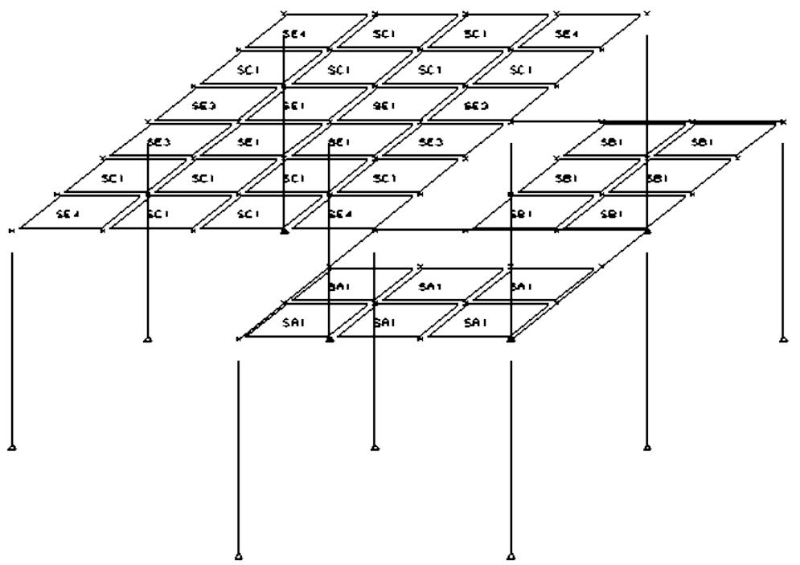

Three basic load cases representing dead, live and wind loading, respectively, along with three load combinations were analyzed. The SACS model file is shown followed by a detailed description of selected portions of the input:

|  | 1 | 2 | 3 | 4 | 5 | 6 | 7 | 8 |
| --- | --- | --- | --- | --- | --- | --- | --- | --- |
| A | 1234567890123456789012345678901234567890123456789012345678901234567890123456789012345678901234567890123456789 | 12345678901234567890123456789012345678901234567890123456789012345678901234567890123456789012345678 | 12345678901234567890123456789012345678901234567890123456789012345678901234567890123456789012345678 901234567890123456789012345678901234567890123456789012345678901234567890123456789012345678901234567 | PT | PTPT |  | 1.000 |  |
| A | LCSEL |  | 4 | 5 | 6 |  |  |  |
| A | SECT |  |  |  |  |  |  |  |
| A | SECTRBOX1 | BRP |  |  |  | 0.75 | 4 | 411.2511.25 |
| A | SECT SQUARE | RCRS |  |  |  | 15.00 | 15.0 |  |
| A | SECT2 BOX1 | 7.5060.00S |  |  |  |  |  |  |
| A | SECT LEFTL | RCLL |  |  |  | 16.008.000 | 24.005.000 |  |
| A | SECT2 ROW3 | 2.5060.00S | ROW4 | 13.5060.00S |  |  |  |  |
| A | SECT RIGHTL | RCRL |  |  |  | 16.008.000 | 24.005.000 |  |
| A | SECT2 ROW3 | 2.5060.00S | ROW4 | 13.5060.00S |  |  |  |  |
| A | SECTRROW3 | RRP |  |  |  | 0.38 | 4 | 18.00 |
| A | SECTRROW4 | RRP |  |  |  | 0.38 | 2 | 3.50 |
| A | GRUP |  |  |  |  |  |  |  |
| A | GRUPCCC1 SQUARE | 29.000490.00 |  | 145.0 4.00 1 |  | 1.001.0060.0024.00S | 0.375 |  |
| A | GRUPCCL1 LEFTL | 29.000490.00 |  | 145.0 4.00 3 |  | 1.001.0060.0024.00T | 0.375 |  |
| A | GRUPCCR1 RIGHTL | 29.000490.00 |  | 145.0 4.00 3 |  | 1.001.0060.0024.00T | 0.375 |  |
| A | GRUP WF1 W6X15 |  |  | 29.0011.6036.00 1 |  | 1.001.00 | 0.50 490.00 |  |
| A | MEMBER |  |  |  |  |  |  |  |
| A | MEMBER1 2 6 CC1 |  |  |  |  |  |  |  |
| A | MEMBER OFFSETS |  |  |  |  |  | -12.00 |  |
| A | MEMBER1 3 112 CC1 |  |  |  |  |  |  |  |
| A | MEMBER OFFSETS |  |  |  |  |  | -12.00 |  |
| A | MEMBER1 4 8 CC1 |  |  |  |  |  |  |  |
| A | MEMBER OFFSETS |  |  |  |  |  | -12.00 |  |
| A | MEMBER1 7 114 CC1 |  |  |  |  |  |  |  |
| A | MEMBER OFFSETS |  |  |  |  |  | -12.00 |  |
| A | MEMBER1 13 11 CC1 |  |  |  |  |  |  |  |
| A | MEMBER OFFSETS |  |  |  |  |  | -12.00 |  |
| A | MEMBER1 14 16 CC1 |  |  |  |  |  |  |  |
| A | MEMBER OFFSETS |  |  |  |  |  | -12.00 |  |
| A | MEMBER1 15 17 CC1 |  |  |  |  |  |  |  |
| A | MEMBER OFFSETS |  |  |  |  |  | -12.00 |  |
| A | MEMBER1 22 23 CC1 |  |  |  |  |  |  |  |
| A | MEMBER OFFSETS |  |  |  |  |  | -12.00 |  |
| A | MEMBER1 24 28 CC1 |  |  |  |  |  |  |  |
| A | MEMBER OFFSETS |  |  |  |  |  | -12.00 |  |
| A | MEMBER1 25 27 CC1 |  |  |  |  |  |  |  |
| A | MEMBER OFFSETS |  |  |  |  |  | -12.00 |  |
| A | MEMBER1 30 31 CC1 |  |  |  |  |  |  |  |
| A | MEMBER OFFSETS |  |  |  |  |  | -12.00 |  |
| A | MEMBER0 6 18 CL1 |  |  |  |  |  |  |  |
| A | MEMBER0 16 19 CL1 |  |  |  |  |  |  |  |
| A | MEMBER0 18 19 CL1 |  |  |  |  |  |  |  |
| A | MEMBER0 27 41 CL1 |  |  |  |  |  |  |  |
| A | MEMBER0 41 42 CL1 |  |  |  |  |  |  |  |
| A | MEMBER0 42 16 CL1 |  |  |  |  |  |  |  |
| A | MEMBER0 23 35 CR1 |  |  |  |  |  |  |  |
| A | MEMBER0 35 36 CR1 |  |  |  |  |  |  |  |
| A | MEMBER0 36 6 CR1 |  |  |  |  |  |  |  |
| A | MEMBER0 8 20 CR1 |  |  |  |  |  |  |  |
| A | MEMBER0 17 21 CR1 |  |  |  |  |  |  |  |
| A | MEMBER0 20 21 CR1 |  |  |  |  |  |  |  |
|  | 12345678901 | 12345678901 | 12345678901 | 12345678901 | 12345678901 | 12345678901 | 12345678901 | 12345678901 |
| PSTIF | PSTIF | PSTIF | PSTIF | PSTIF | PSTIF | PSTIF | PSTIF | PSTIF |
| B | PSTIF RBR MESH1 | PSTIF RBR MESH1 | 0.375 | 2.0 | 60. | 29.0 | 490.0 |  |
| C | PSTIF RBR MESH2 | PSTIF RBR MESH2 | 0.500 | 2.0 | 60. | 29.0 | 490.0 |  |
| PGRUP | PGRUP | PGRUP | PGRUP | PGRUP | PGRUP | PGRUP | PGRUP | PGRUP |
| D | PGRUPCSA1 | 4.0 A |  | 0.25 | 4.0 | MESH1 | 5.0 | XT |
| D | PGRUPCSB1 | 4.0 B |  | 0.25 | 4.0 | MESH1 | 5.0 | YT |
| E | PGRUPCS1 | 4.0 C |  | 0.25 | 4.0 | MESH2 | 6.0 | XT MESH2 |
| E | PGRUPCS1 | 4.0 E |  | 0.25 | 4.0 | MESH1 | 5.0 | XT MESH2 |
| E | PGRUP2 INTR | 15. | 20. |  |  |  |  |  |
| E | PGRUPCS3 | 4.0 E |  | 0.25 | 4.0 | MESH2 | 6.0 | XT MESH2 |
| E | PGRUP2 EDY | 40. | 1. |  |  |  |  |  |
| F | PGRUPCS4 | 4.0 E |  | 0.25 | 4.0 | MESH1 | 5.0 | XT MESH2 |
| G | PGRUP2 CORR | 15. | 20. |  |  |  |  |  |
| PLATE | PLATE | PLATE | PLATE | PLATE | PLATE | PLATE | PLATE | PLATE |
| X01 | PLATE X01 | 23 | 29 | 35 | 37SA1 | 0 |  |  |
| X02 | PLATE X02 | 29 | 34 | 37 | 39SA1 | 0 |  |  |
| X03 | PLATE X03 | 34 | 27 | 39 | 41SA1 | 0 |  |  |
| X04 | PLATE X04 | 35 | 37 | 36 | 38SA1 | 0 |  |  |
| X05 | PLATE X05 | 37 | 39 | 38 | 40SA1 | 0 |  |  |
| X06 | PLATE X06 | 39 | 41 | 40 | 42SA1 | 0 |  |  |
| Y01 | PLATE Y01 | 18 | 19 | 72 | 76SB1 | 0 |  |  |
| Y02 | PLATE Y02 | 19 | 16 | 76 | 80SB1 | 0 |  |  |
| Y03 | PLATE Y03 | 72 | 76 | 73 | 77SB1 | 0 |  |  |
| Y04 | PLATE Y04 | 76 | 80 | 77 | 81SB1 | 0 |  |  |
| Y05 | PLATE Y05 | 73 | 77 | 20 | 21SB1 | 0 |  |  |
| Y06 | PLATE Y06 | 77 | 81 | 21 | 17SB1 | 0 |  |  |
| C101 | PLATE C101 | 103 | 9 | 56 | 60SC1 | 0 |  |  |
| C102 | PLATE C102 | 9 | 10 | 60 | 64SC1 | 0 |  |  |
| C103 | PLATE C103 | 52 | 56 | 53 | 57SC1 | 0 |  |  |
| C104 | PLATE C104 | 56 | 60 | 57 | 61SC1 | 0 |  |  |
| C105 | PLATE C105 | 60 | 64 | 61 | 65SC1 | 0 |  |  |
| C106 | PLATE C106 | 64 | 68 | 65 | 69SC1 | 0 |  |  |
| C105 | PLATE C105 | 54 | 58 | 55 | 59SC1 | 0 |  |  |
| C106 | PLATE C106 | 58 | 62 | 59 | 63SC1 | 0 |  |  |
| C107 | PLATE C107 | 62 | 66 | 63 | 67SC1 | 0 |  |  |
| C108 | PLATE C108 | 66 | 70 | 67 | 71SC1 | 0 |  |  |
| C109 | PLATE C109 | 59 | 63 | 26 | 32SC1 | 0 |  |  |
| C110 | PLATE C110 | 63 | 67 | 32 | 33SC1 | 0 |  |  |
| E101 | PLATE E101 | 57 | 61 | 107 | 11SE1 | 0 |  |  |
| E102 | PLATE E102 | 61 | 65 | 11 | 12SE1 | 0 |  |  |
| E103 | PLATE E103 | 107 | 11 | 58 | 62SE1 | 0 |  |  |
| E104 | PLATE E104 | 11 | 12 | 62 | 66SE1 | 0 |  |  |
| E301 | PLATE E301 | 53 | 57 | 114 | 107SE3 | 0 |  |  |
| E302 | PLATE E302 | 65 | 69 | 12 | 8SE3 | 0 |  |  |
| E303 | PLATE E303 | 114 | 107 | 54 | 58SE3 | 0 |  |  |
| E304 | PLATE E304 | 12 | 8 | 66 | 70SE3 | 0 |  |  |
| E401 | PLATE E401 | 112 | 103 | 52 | 56SE4 | 0 |  |  |
| E402 | PLATE E402 | 10 | 6 | 64 | 68SE4 | 0 |  |  |
| E403 | PLATE E403 | 55 | 59 | 28 | 26SE4 | 0 |  |  |
| E404 | PLATE E404 | 67 | 71 | 33 | 31SE4 | 0 |  |  |
| JOINT | JOINT | JOINT | JOINT | JOINT | JOINT | JOINT | JOINT | JOINT |
| JOINT | 2 | 10. | -10. | 0. |  |  | 111 |  |
| JOINT | 3 | -3. | -10. | 0. | -3.996 |  | 111 |  |
| JOINT | 4 | 10. | 0. | 0. |  |  | 111 |  |
| JOINT | 6 | 10. | -10. | 10. |  |  |  |  |
| JOINT | 7 | -3. | 0. | 0. | -3.996 |  | 111 |  |
| JOINT | 8 | 10. | 0. | 10. |  |  |  |  |
| JOINT | 9 | 3. | -10. | 10. | 3.996 |  |  |  |
| JOINT | 10 | 6. | -10. | 10. | 8.004 |  |  |  |
| JOINT | 11 | 3. | 0. | 10. | 3.996 |  |  |  |
| JOINT | 12 | 6. | 0. | 10. | 8.004 |  |  |  |
| JOINT | 13 | 3. | 0. | 0. | 3.996 |  | 111 |  |
| JOINT | 14 | 20. | -10. | 0. |  |  | 111 |  |
| JOINT | 15 | 20. | 0. | 0. |  |  | 111 |  |
| 12345678901234567890123456789012345678901234567890123456789012345678901234567890 | 12345678901234567890123456789012345678901234567890123456789012345678901234567890 | 12345678901234567890123456789012345678901234567890123456789012345678901234567890 | 12345678901234567890123456789012345678901234567890123456789012345678901234567890 | 12345678901234567890123456789012345678901234567890123456789012345678901234567890 | 12345678901234567890123456789012345678901234567890123456789012345678901234567890 | 12345678901234567890123456789012345678901234567890123456789012345678901234567890 | 12345678901234567890123456789012345678901234567890123456789012345678901234567890 | 12345678901234567890123456789012345678901234567890123456789012345678901234567890 |
| JOINT | 16 | 20. | -10. | 10. |  |  |  |  |
| JOINT | 17 | 20. | 0. | 10. |  |  |  |  |
| JOINT | 18 | 13. | -10. | 10. | 3.996 |  |  |  |
| JOINT | 19 | 16. | -10. | 10. | 8.004 |  |  |  |
| JOINT | 20 | 13. | 0. | 10. | 3.996 |  |  |  |
| JOINT | 21 | 16. | 0. | 10. | 8.004 |  |  |  |
| JOINT | 22 | 10. | -20. | 0. |  | 111 |  |  |
| JOINT | 23 | 10. | -20. | 10. |  |  |  |  |
| JOINT | 24 | -3. | 10. | 0. | -3.996 | 111 |  |  |
| JOINT | 25 | 20. | -20. | 0. |  | 111 |  |  |
| JOINT | 26 | 0. | 10. | 10. |  |  |  |  |
| JOINT | 27 | 20. | -20. | 10. |  |  |  |  |
| JOINT | 28 | -3. | 10. | 10. | -3.996 |  |  |  |
| JOINT | 29 | 13. | -20. | 10. | 3.996 |  |  |  |
| JOINT | 30 | 10. | 10. | 0. |  | 111 |  |  |
| JOINT | 31 | 10. | 10. | 10. |  |  |  |  |
| JOINT | 32 | 3. | 10. | 10. | 3.996 |  |  |  |
| JOINT | 33 | 6. | 10. | 10. | 8.004 |  |  |  |
| ********** Additional Joint Input Lines********** | ********** Additional Joint Input Lines********** | ********** Additional Joint Input Lines********** | ********** Additional Joint Input Lines********** | ********** Additional Joint Input Lines********** | ********** Additional Joint Input Lines********** | ********** Additional Joint Input Lines********** | ********** Additional Joint Input Lines********** | ********** Additional Joint Input Lines********** |
| JOINT | 103 | 0. | -10. | 10. |  |  |  |  |
| JOINT | 107 | 0. | 0. | 10. |  |  |  |  |
| JOINT | 112 | -3. | -10. | 10. | -3.996 |  |  |  |
| JOINT | 114 | -3. | 0. | 10. | -3.996 |  |  |  |
| LOAD |  |  |  |  |  |  |  |  |
| LOADCN | 1 |  |  |  | DEAD |  |  |  |
| LOAD | 6 |  |  | -0.1319 |  | GLOB JOIN | DEAD WT |  |
| LOAD | 8 |  |  | -0.2638 |  | GLOB JOIN | DEAD WT |  |
| LOAD | 9 |  |  | -0.2638 |  | GLOB JOIN | DEAD WT |  |
| LOAD | 10 |  |  | -0.2638 |  | GLOB JOIN | DEAD WT |  |
| LOAD | 11 |  |  | -0.5277 |  | GLOB JOIN | DEAD WT |  |
| ********** Additional Dead Loading********** | ********** Additional Dead Loading********** | ********** Additional Dead Loading********** | ********** Additional Dead Loading********** | ********** Additional Dead Loading********** | ********** Additional Dead Loading********** | ********** Additional Dead Loading********** | ********** Additional Dead Loading********** | ********** Additional Dead Loading********** |
| LOADCN | 2 |  |  |  |  |  |  |  |
| LOAD | 6 |  |  | -0.2777 |  | GLOB JOIN | LIVE |  |
| LOAD | 8 |  |  | -0.5554 |  | GLOB JOIN | LIVE |  |
| LOAD | 9 |  |  | -0.5555 |  | GLOB JOIN | LIVE |  |
| LOAD | 10 |  |  | -0.5555 |  | GLOB JOIN | LIVE |  |
| LOAD | 11 |  |  | -1.1111 |  | GLOB JOIN | LIVE |  |
| LOAD | 12 |  |  | -1.1111 |  | GLOB JOIN | LIVE |  |
| ********** Additional Live loading********** | ********** Additional Live loading********** | ********** Additional Live loading********** | ********** Additional Live loading********** | ********** Additional Live loading********** | ********** Additional Live loading********** | ********** Additional Live loading********** | ********** Additional Live loading********** | ********** Additional Live loading********** |
| LOADCN | 3 |  |  |  |  |  |  |  |
| LOAD | 112 | 2.00000 |  |  |  | GLOB JOIN | WIND |  |
| LOAD | 114 | 2.00000 |  |  |  | GLOB JOIN | WIND |  |
| LOAD | 28 | 2.00000 |  |  |  | GLOB JOIN | WIND |  |
| LOAD | 6 | 2.00000 |  |  |  | GLOB JOIN | WIND |  |
| LOAD | 8 | 2.00000 |  |  |  | GLOB JOIN | WIND |  |
| LOAD | 31 | 2.00000 |  |  |  | GLOB JOIN | WIND |  |
| LOAD | 23 | 2.00000 |  |  |  | GLOB JOIN | WIND |  |
| LOAD | 27 | 2.00000 |  |  |  | GLOB JOIN | WIND |  |
| LOAD | 16 | 2.00000 |  |  |  | GLOB JOIN | WIND |  |
| LOAD | 17 | 2.00000 |  |  |  | GLOB JOIN | WIND |  |
| LDCOMB |  |  |  |  |  |  |  |  |
| LDCOMB | 4 | 140.00 | 1 170.00 | 2 |  |  |  |  |
| LDCOMB | 5 | 105.00 | 1 127.50 | 2 127.50 | 3 |  |  |  |
| LDCOMB | 6 | 90.00 | 1 130.00 | 3 |  |  |  |  |

The following is a description of selected input lines used the SACS model file for Sample Problem 3. The lines are referenced by the letter in the left margin of the input listing.

A. The concrete analysis options are designated on the CNCOPT input line as follows:

a. ‘BR’ in columns 13-14 designates that a first-order linear analysis is to be performed and the structure is to be considered as braced against sidesway.   
b. Member detailed reports for concrete beams along with slab detailed reports are requested.

B. The slab reinforcement pattern named MESH1 is defined using the PSTIF input line with ‘MESH1’ in columns 11-15.

a. The pattern is designated as a rebar stiffener pattern type by ‘RBP’ in columns 7-9.   
b. The rebar diameter, 0.375, and distance from the slab edge, 2.0 is specified.   
c. The yield stress, elastic modulus and density of the rebars are specified as 60.0, 29.0 and 490.0 in columns 35-41, 42-48 and 49-55, respectively.

C. The slab reinforcement pattern named MESH2 is defined using the PSTIF input line with ‘MESH2’ in columns 11-15.

a. The pattern is designated as a rebar stiffener pattern type by ‘RBP’ in columns 7-9.   
b. The rebar diameter, 0.50, and distance from the slab edge, 2.0 is specified.   
c. The yield stress, elastic modulus and density of the rebars are specified as 60.0, 29.0 and 490.0 in columns 35-41, 42-48 and 49-55, respectively.

D. Concrete properties are defined on PGRUP input lines with ‘C’ specified in column 6. The properties for all slab elements assigned to concrete group named SA1 are defined on the PGRUP line with ‘SA1’ specified in columns 7-9.

The slab thickness is 4.0 as defined in columns 11-16.

a. Slabs assigned to group SA1 are one-way slabs spanning in the local X direction as designated by slab type ‘A’ in column 17.   
b. The concrete compressive strength and density are specified as 4.0 and 145.0, respectively.

c. The slab reinforcement is defined by plate reinforcement section MESH1. The average spacing of the rebars is 5.0 and the rebars span in the local X direction.   
d. The distance specified on the PSTIF input line is to be measured from the top edge of the plate as designated by ‘T’ in column 56.

E. The properties for all slab elements assigned to concrete group named SC1 are defined on the PGRUP line with ‘SC1’ specified in columns 7-9.

The slab thickness is 4.0 as defined in columns 11-16.

a. Slabs assigned to group SC1 are two-way slabs as designated by slab type ‘C’ in column 17.   
b. The concrete compressive strength and density are specified as 4.0 and 145.0, respectively.   
c. The first slab reinforcement is defined by plate reinforcement section MESH2. The average spacing of the rebars is 6.0 and the rebars span in the local X direction.   
d. The second slab reinforcement is also defined by plate reinforcement section MESH2. The average spacing of the rebars is 6.0 and the rebars span in the local Y direction.   
e. The distance specified on the PSTIF input line is to be measured from the top edge of the plate for both reinforcement patterns as designated by ‘T’ in columns 56 and 72.

F. The properties for all slab elements assigned to concrete group named SE4 are defined on the PGRUP line with ‘SE4’ specified in columns 7-9.

The slab thickness is 4.0 as defined in columns 11-16.

a. Slabs assigned to group SE4 are two-way slabs that are to be checked for punching shear around a column or concentrated load as indicated by slab type ‘E’ in column 17.   
b. Concrete compressive strength and density are specified as 4.0 and 145.0, respectively.   
c. The first slab reinforcement is defined by plate reinforcement section MESH1. The average spacing of the rebars is 5.0 and the rebars span in the local X direction.   
d. The second slab reinforcement is also defined by plate reinforcement section MESH2. The average spacing of the rebars is 6.0 and the rebars span in the local Y direction.

e. The distance specified on the PSTIF input line is to be measured from the top edge of the plate for both reinforcement patterns as designated by ‘T’ in columns 56 and 72.

G. The critical section to be checked for punching shear of slab group SE4 is defined on the PGRUP2 line immediately following the PGRUP line defining the group.

a. The critical section for punching is due to a corner column as designated by ‘COR’ in columns 8-10.   
b. The critical section shape is rectangular as specified by ‘R’ in column 11.   
c. The critical section dimensions along the plate local X and Y axes are specified in columns 12-17 and 18-23, respectively.

A portion of the output file for the analysis is listed on the following pages.

| CONCRETE SAMPLE PROBLEM 3 DATE 12-JUN-1996 TIME 16:24:44 PRE PAGE 1 | CONCRETE SAMPLE PROBLEM 3 DATE 12-JUN-1996 TIME 16:24:44 PRE PAGE 1 | CONCRETE SAMPLE PROBLEM 3 DATE 12-JUN-1996 TIME 16:24:44 PRE PAGE 1 | CONCRETE SAMPLE PROBLEM 3 DATE 12-JUN-1996 TIME 16:24:44 PRE PAGE 1 | CONCRETE SAMPLE PROBLEM 3 DATE 12-JUN-1996 TIME 16:24:44 PRE PAGE 1 | CONCRETE SAMPLE PROBLEM 3 DATE 12-JUN-1996 TIME 16:24:44 PRE PAGE 1 | CONCRETE SAMPLE PROBLEM 3 DATE 12-JUN-1996 TIME 16:24:44 PRE PAGE 1 | CONCRETE SAMPLE PROBLEM 3 DATE 12-JUN-1996 TIME 16:24:44 PRE PAGE 1 | CONCRETE SAMPLE PROBLEM 3 DATE 12-JUN-1996 TIME 16:24:44 PRE PAGE 1 | CONCRETE SAMPLE PROBLEM 3 DATE 12-JUN-1996 TIME 16:24:44 PRE PAGE 1 | CONCRETE SAMPLE PROBLEM 3 DATE 12-JUN-1996 TIME 16:24:44 PRE PAGE 1 | CONCRETE SAMPLE PROBLEM 3 DATE 12-JUN-1996 TIME 16:24:44 PRE PAGE 1 | CONCRETE SAMPLE PROBLEM 3 DATE 12-JUN-1996 TIME 16:24:44 PRE PAGE 1 |  |
| --- | --- | --- | --- | --- | --- | --- | --- | --- | --- | --- | --- | --- | --- |
| UNITS | ** PROGRAM OPTIONS ** | ** PROGRAM OPTIONS ** | ** PROGRAM OPTIONS ** | ** PROGRAM OPTIONS ** | ** PROGRAM OPTIONS ** | ** PROGRAM OPTIONS ** | ** PROGRAM OPTIONS ** | ** PROGRAM OPTIONS ** | ** PROGRAM OPTIONS ** | ** PROGRAM OPTIONS ** | ** PROGRAM OPTIONS ** | ** PROGRAM OPTIONS ** |  |
| EXECUTION | . . . . . . . . . . . . . . . . . . . . . . . . . . . . . . . . . . . . . . . . . . . . . . . . . . . . . . . . . . . . . . . . . . . . . . . . . . . . . . . . . . . . . . . . . . . . . . . . . . . . . | . . . . . . . . . . . . . . . . . . . . . . . . . . . . . . . . . . . . . . . . . . . . . . . . . . . . . . . . . . . . . . . . . . . . . . . . . . . . . . . . . . . . . . . . . . . . . . . . . . | DATE 12-JUN-1996 TIME 16:24:44 PRE PAGE 1 | DATE 12-JUN-1996 TIME 16:24:44 PRE PAGE 1 | DATE 12-JUN-1996 TIME 16:24:44 PRE PAGE 1 | DATE 12-JUN-1996 TIME 16:24:44 PRE PAGE 1 | DATE 12-JUN-1996 TIME 16:24:44 PRE PAGE 1 | DATE 12-JUN-1996 TIME 16:24:44 PRE PAGE 1 | DATE 12-JUN-1996 TIME 16:24:44 PRE PAGE 1 | DATE 12-JUN-1996 TIME 16:24:44 PRE PAGE 1 | DATE 12-JUN-1996 TIME 16:24:44 PRE PAGE 1 | DATE 12-JUN-1996 TIME 16:24:44 PRE PAGE 1 |  |
| LOAD | . . . . . . . . . . . . . . . . . . . . . . . . . . . . . . . . . . . . . . . . . . . . . . . . . . . . . . . . . . . . . . . . . . . . . . . . . . . . . . . . . . . . . . . . . . . . . . . . . .. | . . . . . . . . . . . . . . . . . . . . . . . . . . . . . . . . . . . . . . . . . . . . . . . . . . . . . . . . . . . . . . . . . . . . . . . . . . . . . . . . . . . . . . . . . . . . . . . . . .. . . . . . . . . . . . . . . . . . . . . . . . . . . . . . . . . . . . . . . . . . . . . . . . . . . . . . . . . . . . . . . . . . . . . . . . . . . . . . . . . . . . . . . . . . . . . . . . . . . .. . CONCRETE OPTIONS . ANALYSIS TYPE. BRACED . SIDESWAY MOMENT MAGNIFICATION 1.00 . COLUMN DETAILED PRINT NO . BEAM DETAILED PRINT YES . SLAB DETAILED PRINT YES . ELEMENT UNITY CHECK OPTION NO . UNITY CHECK RANGE REPORT NO . CONCRETE ONLY PRINT NO | . . . . . . . . . . . . . . . . . . . . . . . . . . . . . . . . . . . . . . . . . . . . . . . . . . . . . . . . . . . . . . . . . . . . . . . . . . . . . . . . . . . . . . . . . . . . . . . . . .. . . . . . . . . . . . . . . . . . . . . . . . . . . . . . . . . . . . . . . . . . . . . . . . . . . . . . . . . . . . . . . . . . . . . . . . . . . . . . . . . . . . . . . . . . . . . . . . . . . .. . CONCRETE OPTIONS . ANALYSIS TYPE. BRACED . SIDESWAY MOMENT MAGNIFICATION 1.00 . COLUMN DETAILED PRINT NO . BEAM DETAILED PRINT YES . SLAB DETAILED PRINT YES . ELEMENT UNITY CHECK OPTION NO . UNITY CHECK RANGE REPORT NO . CONCRETE ONLY PRINT NO | . . . . . . . . . . . . . . . . . . . . . . . . . . . . . . . . . . . . . . . . . . . . . . . . . . . . . . . . . . . . . . . . . . . . . . . . . . . . . . . . . . . . . . . . . . . . . . . . . .. . . . . . . . . . . . . . . . . . . . . . . . . . . . . . . . . . . . . . . . . . . . . . . . . . . . . . . . . . . . . . . . . . . . . . . . . . . . . . . . . . . . . . . . . . . . . . . . . . . .. . CONCRETE OPTIONS . ANALYSIS TYPE. BRACED . SIDESWAY MOMENT MAGNIFICATION 1.00 . COLUMN DETAILED PRINT NO . BEAM DETAILED PRINT YES . SLAB DETAILED PRINT YES . ELEMENT UNITY CHECK OPTION NO . UNITY CHECK RANGE REPORT NO . CONCRETE ONLY PRINT NO | . . . . . . . . . . . . . . . . . . . . . . . . . . . . . . . . . . . . . . . . . . . . . . . . . . . . . . . . . . . . . . . . . . . . . . . . . . . . . . . . . . . . . . . . . . . . . . . . . .. . . . . . . . . . . . . . . . . . . . . . . . . . . . . . . . . . . . . . . . . . . . . . . . . . . . . . . . . . . . . . . . . . . . . . . . . . . . . . . . . . . . . . . . . . . . . . . . . . . .. . CONCRETE OPTIONS . ANALYSIS TYPE. BRACED . SIDESWAY MOMENT MAGNIFICATION 1.00 . COLUMN DETAILED PRINT NO . BEAM DETAILED PRINT YES . SLAB DETAILED PRINT YES . ELEMENT UNITY CHECK OPTION NO . UNITY CHECK RANGE REPORT NO . CONCRETE ONLY PRINT NO | . . . . . . . . . . . . . . . . . . . . . . . . . . . . . . . . . . . . . . . . . . . . . . . . . . . . . . . . . . . . . . . . . . . . . . . . . . . . . . . . . . . . . . . . . . . . . . . . . .. . . . . . . . . . . . . . . . . . . . . . . . . . . . . . . . . . . . . . . . . . . . . . . . . . . . . . . . . . . . . . . . . . . . . . . . . . . . . . . . . . . . . . . . . . . . . . . . . . . .. . CONCRETE OPTIONS . ANALYSIS TYPE. BRACED . SIDESWAY MOMENT MAGNIFICATION 1.00 . COLUMN DETAILED PRINT NO . BEAM DETAILED PRINT YES . SLAB DETAILED PRINT YES . ELEMENT UNITY CHECK OPTION NO . UNITY CHECK RANGE REPORT NO . CONCRETE ONLY PRINT NO | . . . . . . . . . . . . . . . . . . . . . . . . . . . . . . . . . . . . . . . . . . . . . . . . . . . . . . . . . . . . . . . . . . . . . . . . . . . . . . . . . . . . . . . . . . . . . . . . . .. . . . . . . . . . . . . . . . . . . . . . . . . . . . . . . . . . . . . . . . . . . . . . . . . . . . . . . . . . . . . . . . . . . . . . . . . . . . . . . . . . . . . . . . . . . . . . . . . . . .. . CONCRETE OPTIONS . ANALYSIS TYPE. BRACED . SIDESWAY MOMENT MAGNIFICATION 1.00 . COLUMN DETAILED PRINT NO . BEAM DETAILED PRINT YES . SLAB DETAILED PRINT YES . ELEMENT UNITY CHECK OPTION NO . UNITY CHECK RANGE REPORT NO . CONCRETE ONLY PRINT NO | . . . . . . . . . . . . . . . . . . . . . . . . . . . . . . . . . . . . . . . . . . . . . . . . . . . . . . . . . . . . . . . . . . . . . . . . . . . . . . . . . . . . . . . . . . . . . . . . . .. . . . . . . . . . . . . . . . . . . . . . . . . . . . . . . . . . . . . . . . . . . . . . . . . . . . . . . . . . . . . . . . . . . . . . . . . . . . . . . . . . . . . . . . . . . . . . . . . . . .. . CONCRETE OPTIONS . ANALYSIS TYPE. BRACED . SIDESWAY MOMENT MAGNIFICATION 1.00 . COLUMN DETAILED PRINT NO . BEAM DETAILED PRINT YES . SLAB DETAILED PRINT YES . ELEMENT UNITY CHECK OPTION NO . UNITY CHECK RANGE REPORT NO . CONCRETE ONLY PRINT NO | . . . . . . . . . . . . . . . . . . . . . . . . . . . . . . . . . . . . . . . . . . . . . . . . . . . . . . . . . . . . . . . . . . . . . . . . . . . . . . . . . . . . . . . . . . . . . . . . . .. . . . . . . . . . . . . . . . . . . . . . . . . . . . . . . . . . . . . . . . . . . . . . . . . . . . . . . . . . . . . . . . . . . . . . . . . . . . . . . . . . . . . . . . . . . . . . . . . . . .. . CONCRETE OPTIONS . ANALYSIS TYPE. BRACED . SIDESWAY MOMENT MAGNIFICATION 1.00 . COLUMN DETAILED PRINT NO . BEAM DETAILED PRINT YES . SLAB DETAILED PRINT YES . ELEMENT UNITY CHECK OPTION NO . UNITY CHECK RANGE REPORT NO . CONCRETE ONLY PRINT NO | . . . . . . . . . . . . . . . . . . . . . . . . . . . . . . . . . . . . . . . . . . . . . . . . . . . . . . . . . . . . . . . . . . . . . . . . . . . . . . . . . . . . . . . . . . . . . . . . . .. . . . . . . . . . . . . . . . . . . . . . . . . . . . . . . . . . . . . . . . . . . . . . . . . . . . . . . . . . . . . . . . . . . . . . . . . . . . . . . . . . . . . . . . . . . . . . . . . . . .. . CONCRETE OPTIONS . ANALYSIS TYPE. BRACED . SIDESWAY MOMENT MAGNIFICATION 1.00 . COLUMN DETAILED PRINT NO . BEAM DETAILED PRINT YES . SLAB DETAILED PRINT YES . ELEMENT UNITY CHECK OPTION NO . UNITY CHECK RANGE REPORT NO . CONCRETE ONLY PRINT NO | . . . . . . . . . . . . . . . . . . . . . . . . . . . . . . . . . . . . . . . . . . . . . . . . . . . . . . . . . . . . . . . . . . . . . . . . . . . . . . . . . . . . . . . . . . . . . . . . . .. . . . . . . . . . . . . . . . . . . . . . . . . . . . . . . . . . . . . . . . . . . . . . . . . . . . . . . . . . . . . . . . . . . . . . . . . . . . . . . . . . . . . . . . . . . . . . . . . . . .. . CONCRETE OPTIONS . ANALYSIS TYPE. BRACED . SIDESWAY MOMENT MAGNIFICATION 1.00 . COLUMN DETAILED PRINT NO . BEAM DETAILED PRINT YES . SLAB DETAILED PRINT YES . ELEMENT UNITY CHECK OPTION NO . UNITY CHECK RANGE REPORT NO . CONCRETE ONLY PRINT NO | . . . . . . . . . . . . . . . . . . . . . . . . . . . . . . . . . . . . . . . . . . . . . . . . . . . . . . . . . . . . . . . . . . . . . . . . . . . . . . . . . . . . . . . . . . . . . . . . . .. . . . . . . . . . . . . . . . . . . . . . . . . . . . . . . . . . . . . . . . . . . . . . . . . . . . . . . . . . . . . . . . . . . . . . . . . . . . . . . . . . . . . . . . . . . . . . . . . . . .. . CONCRETE OPTIONS . ANALYSIS TYPE. BRACED . SIDESWAY MOMENT MAGNIFICATION 1.00 . COLUMN DETAILED PRINT NO . BEAM DETAILED PRINT YES . SLAB DETAILED PRINT YES . ELEMENT UNITY CHECK OPTION NO . UNITY CHECK RANGE REPORT NO . CONCRETE ONLY PRINT NO | . . . . . . . . . . . . . . . . . . . . . . . . . . . . . . . . . . . . . . . . . . . . . . . . . . . . . . . . . . . . . . . . . . . . . . . . . . . . . . . . . . . . . . . . . . . . . . . . . .. . . . . . . . . . . . . . . . . . . . . . . . . . . . . . . . . . . . . . . . . . . . . . . . . . . . . . . . . . . . . . . . . . . . . . . . . . . . . . . . . . . . . . . . . . . . . . . . . . . .. . CONCRETE OPTIONS . ANALYSIS TYPE. BRACED . SIDESWAY MOMENT MAGNIFICATION 1.00 . COLUMN DETAILED PRINT NO . BEAM DETAILED PRINT YES . SLAB DETAILED PRINT YES . ELEMENT UNITY CHECK OPTION NO . UNITY CHECK RANGE REPORT NO . CONCRETE ONLY PRINT NO |
| SECTION | DIAMETER | DISTANCE | YIELD | ELASTIC | DENSITY |  |  |  |  |  |  |  |  |
| SECTION | DIAMETER | FROM | STRESS | MODULUS | DENSITY |  |  |  |  |  |  |  |  |
| SECTION | EDGE | EDGE | 1000 | 1000 | DENSITY |  |  |  |  |  |  |  |  |
| SECTION | IN | IN | KSI | KSI | LB/FT3 | LB/FT3 | LB/FT3 | LB/FT3 | LB/FT3 | LB/FT3 | LB/FT3 | LB/FT3 |  |
| MESH1 | 0.375 | 2.00 | 60.00 | 29.00 | 490.000 | 490.000 | 490.000 | 490.000 | 490.000 | 490.000 | 490.000 | 490.000 |  |
| MESH2 | 0.500 | 2.00 | 60.00 | 29.00 | 490.000 | 490.000 | 490.000 | 490.000 | 490.000 | 490.000 | 490.000 | 490.000 |  |
| CONCRETE SLAB GROUP PROPERTIES | CONCRETE SLAB GROUP PROPERTIES | CONCRETE SLAB GROUP PROPERTIES | CONCRETE SLAB GROUP PROPERTIES | CONCRETE SLAB GROUP PROPERTIES | CONCRETE SLAB GROUP PROPERTIES | CONCRETE SLAB GROUP PROPERTIES | CONCRETE SLAB GROUP PROPERTIES | CONCRETE SLAB GROUP PROPERTIES | CONCRETE SLAB GROUP PROPERTIES | CONCRETE SLAB GROUP PROPERTIES | CONCRETE SLAB GROUP PROPERTIES | CONCRETE SLAB GROUP PROPERTIES |  |
| GRUP ID TYPE | THICK. ELASTIC MODULUS IN 1000 KSI | COMP. POISSON'S STRENGTH KSI | RATIO | DIAMETER | DIRECTION | LOCATION | EDGE DISTANCE | SPACING | YIELD STRESS | ELASTIC MODULUS | ELASTIC MODULUS | ELASTIC MODULUS |  |
| GRUP ID TYPE | THICK. ELASTIC MODULUS IN 1000 KSI | COMP. POISSON'S STRENGTH KSI | RATIO | IN |  |  | IN | IN | KSI | 1000 KSI | 1000 KSI | 1000 KSI |  |
| SA1 ONE-X | 4.00 | 3.60 | 4.000 | 0.250 | 0.375 | X | TOP | 2.000 | 5.000 | 60.00 | 29.00 | 29.00 |  |
| SB1 Y-WAY | 4.00 | 3.60 | 4.000 | 0.250 | 0.375 | Y | TOP | 2.000 | 5.000 | 60.00 | 29.00 | 29.00 |  |
| SC1 2-WAY | 4.00 | 3.60 | 4.000 | 0.250 | 0.500 | X | TOP | 2.000 | 6.000 | 60.00 | 29.00 | 29.00 |  |
| SC1 2-WAY | 4.00 | 3.60 | 4.000 | 0.250 | 0.500 | Y | TOP | 2.000 | 6.000 | 60.00 | 29.00 | 29.00 |  |
| SE1 CSUP | 4.00 | 3.60 | 4.000 | 0.250 | 0.375 | X | TOP | 2.000 | 5.000 | 60.00 | 29.00 | 29.00 |  |
| SE1 CSUP | 4.00 | 3.60 | 4.000 | 0.250 | 0.500 | Y | TOP | 2.000 | 6.000 | 60.00 | 29.00 | 29.00 |  |
| SE3 CSUP | 4.00 | 3.60 | 4.000 | 0.250 | 0.500 | X | TOP | 2.000 | 6.000 | 60.00 | 29.00 | 29.00 |  |

| CONCRETE SAMPLE PROBLEM 3 DATE 12-JUN-1996 TIME 16:24:59 PST PAGE 6 | CONCRETE SAMPLE PROBLEM 3 DATE 12-JUN-1996 TIME 16:24:59 PST PAGE 6 | CONCRETE SAMPLE PROBLEM 3 DATE 12-JUN-1996 TIME 16:24:59 PST PAGE 6 | CONCRETE SAMPLE PROBLEM 3 DATE 12-JUN-1996 TIME 16:24:59 PST PAGE 6 | CONCRETE SAMPLE PROBLEM 3 DATE 12-JUN-1996 TIME 16:24:59 PST PAGE 6 | CONCRETE SAMPLE PROBLEM 3 DATE 12-JUN-1996 TIME 16:24:59 PST PAGE 6 | CONCRETE SAMPLE PROBLEM 3 DATE 12-JUN-1996 TIME 16:24:59 PST PAGE 6 | CONCRETE SAMPLE PROBLEM 3 DATE 12-JUN-1996 TIME 16:24:59 PST PAGE 6 | CONCRETE SAMPLE PROBLEM 3 DATE 12-JUN-1996 TIME 16:24:59 PST PAGE 6 | CONCRETE SAMPLE PROBLEM 3 DATE 12-JUN-1996 TIME 16:24:59 PST PAGE 6 | CONCRETE SAMPLE PROBLEM 3 DATE 12-JUN-1996 TIME 16:24:59 PST PAGE 6 | CONCRETE SAMPLE PROBLEM 3 DATE 12-JUN-1996 TIME 16:24:59 PST PAGE 6 | CONCRETE SAMPLE PROBLEM 3 DATE 12-JUN-1996 TIME 16:24:59 PST PAGE 6 | CONCRETE SAMPLE PROBLEM 3 DATE 12-JUN-1996 TIME 16:24:59 PST PAGE 6 | CONCRETE SAMPLE PROBLEM 3 DATE 12-JUN-1996 TIME 16:24:59 PST PAGE 6 |
| --- | --- | --- | --- | --- | --- | --- | --- | --- | --- | --- | --- | --- | --- | --- |
| SACS SYSTEM - PLATE INTERNAL LOADS REPORT | SACS SYSTEM - PLATE INTERNAL LOADS REPORT | SACS SYSTEM - PLATE INTERNAL LOADS REPORT | SACS SYSTEM - PLATE INTERNAL LOADS REPORT | SACS SYSTEM - PLATE INTERNAL LOADS REPORT | SACS SYSTEM - PLATE INTERNAL LOADS REPORT | SACS SYSTEM - PLATE INTERNAL LOADS REPORT | SACS SYSTEM - PLATE INTERNAL LOADS REPORT | SACS SYSTEM - PLATE INTERNAL LOADS REPORT | SACS SYSTEM - PLATE INTERNAL LOADS REPORT | SACS SYSTEM - PLATE INTERNAL LOADS REPORT | SACS SYSTEM - PLATE INTERNAL LOADS REPORT | SACS SYSTEM - PLATE INTERNAL LOADS REPORT | SACS SYSTEM - PLATE INTERNAL LOADS REPORT | SACS SYSTEM - PLATE INTERNAL LOADS REPORT |
| PLATE | CONNECTING A | JOINTS B | LOAD CASE | ********** NNX K/IN | MEMBRANE NYK/IN | ********** NXY K/IN | * OUT-OF-PLANE KYK/IN | SHEAR * NXZ K/IN | ********** MXX KIPS | BENDING MYX KIPS | MOMENTS KIPS | ********** MYX KIPS |  |  |
| X01 | 23 | 29 | 35 | 37 | 4 | -0.01 | 0.00 | 0.00 | 0.07 | 0.01 | 0.00 | -0.41 | 0.50 |  |
|  |  |  |  |  | 5 | -0.02 | 0.00 | 0.00 | 0.04 | 0.01 | 0.00 | 0.19 | 0.38 |  |
|  |  |  |  |  | 6 | -0.01 | 0.00 | -0.01 | 0.00 | 0.00 | 0.00 | 0.43 | 0.10 |  |
| X02 | 29 | 34 | 37 | 39 | 4 | -0.01 | 0.00 | 0.00 | 0.00 | 0.02 | 0.00 | 0.92 | 0.00 |  |
|  |  |  |  |  | 5 | -0.01 | 0.00 | 0.00 | -0.01 | 0.02 | 0.00 | 0.69 | 0.00 |  |
|  |  |  |  |  | 6 | 0.00 | 0.00 | -0.01 | -0.01 | 0.00 | 0.00 | 0.16 | 0.00 |  |
| X03 | 34 | 27 | 39 | 41 | 4 | -0.02 | 0.00 | 0.00 | -0.07 | 0.01 | 0.00 | -0.38 | -0.50 |  |
|  |  |  |  |  | 5 | 0.00 | 0.00 | 0.00 | -0.06 | 0.01 | 0.00 | -0.78 | -0.36 |  |
|  |  |  |  |  | 6 | 0.01 | 0.00 | 0.00 | -0.02 | 0.00 | 0.00 | -0.57 | -0.08 |  |
| X04 | 35 | 37 | 36 | 38 | 4 | 0.00 | 0.00 | 0.01 | 0.07 | -0.01 | 0.00 | -0.41 | -0.50 |  |
|  |  |  |  |  | 5 | 0.00 | 0.00 | -0.01 | 0.04 | -0.01 | 0.00 | 0.18 | -0.38 |  |
|  |  |  |  |  | 6 | 0.00 | 0.00 | -0.01 | 0.00 | 0.00 | 0.00 | 0.42 | -0.10 |  |
| X05 | 37 | 39 | 38 | 40 | 4 | 0.00 | 0.00 | 0.00 | 0.00 | -0.02 | 0.00 | 0.92 | 0.00 |  |
|  |  |  |  |  | 5 | -0.01 | 0.00 | -0.01 | -0.01 | -0.01 | 0.00 | 0.69 | -0.01 |  |
|  |  |  |  |  | 6 | -0.01 | 0.00 | -0.01 | -0.01 | 0.00 | 0.00 | 0.16 | -0.01 |  |
| X06 | 39 | 41 | 40 | 42 | 4 | 0.01 | 0.00 | 0.00 | -0.07 | -0.01 | 0.00 | -0.38 | 0.50 |  |
|  |  |  |  |  | 5 | -0.02 | 0.00 | -0.01 | -0.06 | -0.01 | 0.00 | -0.77 | 0.38 |  |
|  |  |  |  |  | 6 | -0.02 | 0.00 | -0.01 | -0.02 | 0.00 | 0.00 | -0.57 | 0.09 |  |
| Y01 | 18 | 19 | 72 | 76 | 4 | 0.00 | 0.00 | 0.00 | 0.01 | 0.07 | -0.45 | 0.00 | 0.50 |  |
|  |  |  |  |  | 5 | 0.00 | 0.05 | 0.04 | 0.00 | 0.05 | -0.35 | 0.00 | 0.40 |  |
|  |  |  |  |  | 6 | 0.00 | 0.05 | 0.04 | 0.00 | 0.01 | -0.10 | 0.00 | 0.12 |  |
| Y02 | 19 | 16 | 76 | 80 | 4 | 0.00 | -0.01 | 0.00 | -0.01 | 0.07 | -0.45 | 0.00 | -0.51 |  |
|  |  |  |  |  | 5 | 0.00 | -0.08 | 0.03 | -0.01 | 0.05 | -0.37 | 0.00 | -0.35 |  |
|  |  |  |  |  | 6 | 0.00 | -0.07 | 0.03 | 0.00 | 0.01 | -0.11 | 0.00 | -0.06 |  |
| Y03 | 72 | 76 | 73 | 77 | 4 | 0.00 | 0.00 | 0.00 | 0.02 | 0.00 | 0.91 | 0.00 | 0.00 |  |
|  |  |  |  |  | 5 | 0.00 | 0.01 | 0.04 | 0.01 | 0.00 | 0.69 | 0.00 | -0.01 |  |
|  |  |  |  |  | 6 | 0.00 | 0.01 | 0.04 | 0.00 | 0.00 | 0.17 | 0.00 | -0.01 |  |
| Y04 | 76 | 80 | 77 | 81 | 4 | 0.00 | -0.01 | 0.00 | -0.02 | 0.00 | 0.91 | 0.00 | -0.01 |  |
|  |  |  |  |  | 5 | 0.00 | -0.03 | 0.03 | -0.02 | 0.00 | 0.70 | 0.00 | -0.01 |  |
|  |  |  |  |  | 6 | 0.00 | -0.03 | 0.03 | 0.00 | 0.00 | 0.18 | 0.00 | 0.00 |  |

| CONCRETE SAMPLE PROBLEM 3 DATE 12-JUN-1996 TIME 16:24:59 PST PAGE 7 | CONCRETE SAMPLE PROBLEM 3 DATE 12-JUN-1996 TIME 16:24:59 PST PAGE 7 | CONCRETE SAMPLE PROBLEM 3 DATE 12-JUN-1996 TIME 16:24:59 PST PAGE 7 | CONCRETE SAMPLE PROBLEM 3 DATE 12-JUN-1996 TIME 16:24:59 PST PAGE 7 | CONCRETE SAMPLE PROBLEM 3 DATE 12-JUN-1996 TIME 16:24:59 PST PAGE 7 | CONCRETE SAMPLE PROBLEM 3 DATE 12-JUN-1996 TIME 16:24:59 PST PAGE 7 | CONCRETE SAMPLE PROBLEM 3 DATE 12-JUN-1996 TIME 16:24:59 PST PAGE 7 | CONCRETE SAMPLE PROBLEM 3 DATE 12-JUN-1996 TIME 16:24:59 PST PAGE 7 | CONCRETE SAMPLE PROBLEM 3 DATE 12-JUN-1996 TIME 16:24:59 PST PAGE 7 | CONCRETE SAMPLE PROBLEM 3 DATE 12-JUN-1996 TIME 16:24:59 PST PAGE 7 | CONCRETE SAMPLE PROBLEM 3 DATE 12-JUN-1996 TIME 16:24:59 PST PAGE 7 | CONCRETE SAMPLE PROBLEM 3 DATE 12-JUN-1996 TIME 16:24:59 PST PAGE 7 | CONCRETE SAMPLE PROBLEM 3 DATE 12-JUN-1996 TIME 16:24:59 PST PAGE 7 | CONCRETE SAMPLE PROBLEM 3 DATE 12-JUN-1996 TIME 16:24:59 PST PAGE 7 | CONCRETE SAMPLE PROBLEM 3 DATE 12-JUN-1996 TIME 16:24:59 PST PAGE 7 | CONCRETE SAMPLE PROBLEM 3 DATE 12-JUN-1996 TIME 16:24:59 PST PAGE 7 |
| --- | --- | --- | --- | --- | --- | --- | --- | --- | --- | --- | --- | --- | --- | --- | --- |
| SACS SYSTEM - PLATE INTERNAL LOADS REPORT | SACS SYSTEM - PLATE INTERNAL LOADS REPORT | SACS SYSTEM - PLATE INTERNAL LOADS REPORT | SACS SYSTEM - PLATE INTERNAL LOADS REPORT | SACS SYSTEM - PLATE INTERNAL LOADS REPORT | SACS SYSTEM - PLATE INTERNAL LOADS REPORT | SACS SYSTEM - PLATE INTERNAL LOADS REPORT | SACS SYSTEM - PLATE INTERNAL LOADS REPORT | SACS SYSTEM - PLATE INTERNAL LOADS REPORT | SACS SYSTEM - PLATE INTERNAL LOADS REPORT | SACS SYSTEM - PLATE INTERNAL LOADS REPORT | SACS SYSTEM - PLATE INTERNAL LOADS REPORT | SACS SYSTEM - PLATE INTERNAL LOADS REPORT | SACS SYSTEM - PLATE INTERNAL LOADS REPORT | SACS SYSTEM - PLATE INTERNAL LOADS REPORT | SACS SYSTEM - PLATE INTERNAL LOADS REPORT |
| PLATE | CONNECTING | CONNECTING | JOINTS | JOINTS | LOAD | ********** | ********** | MEMBRANE | ********** | ********** | * OUT-OF-PLANE | SHEAR * | SHEAR * | ********** BENDING MOMENTS | ********** BENDING MOMENTS |
| PLATE | A | B | C | D | CASE | NXX K/IN | NYY K/IN | NXY K/IN | NYZ K/IN | NXZ K/IN | K/IN | MXX KIPS | MYX KIPS | MXY KIPS |  |
| C101 | 103 | 9 | 56 | 60 | 4 | -0.01 | 0.00 | 0.00 | 0.02 | 0.02 | 0.24 | 0.93 | 0.49 |  |  |
| C101 | 103 | 9 | 56 | 60 | 5 | -0.03 | 0.00 | -0.03 | 0.01 | 0.01 | 0.24 | 0.74 | 0.37 |  |  |
| C101 | 103 | 9 | 56 | 60 | 6 | -0.03 | 0.00 | -0.03 | 0.00 | 0.00 | 0.11 | 0.21 | 0.09 |  |  |
| C102 | 9 | 10 | 60 | 64 | 4 | -0.01 | 0.00 | 0.00 | -0.03 | 0.02 | 0.22 | 0.90 | -0.50 |  |  |
| C102 | 9 | 10 | 60 | 64 | 5 | 0.01 | 0.00 | -0.02 | -0.02 | 0.02 | 0.15 | 0.66 | -0.40 |  |  |
| C102 | 9 | 10 | 60 | 64 | 6 | 0.01 | 0.00 | -0.03 | -0.01 | 0.00 | 0.02 | 0.15 | -0.12 |  |  |
| C103 | 52 | 56 | 53 | 57 | 4 | 0.00 | -0.01 | 0.00 | 0.02 | 0.01 | 0.77 | 0.24 | 0.61 |  |  |
| C103 | 52 | 56 | 53 | 57 | 5 | 0.00 | 0.04 | -0.01 | 0.02 | 0.01 | 0.63 | 0.22 | 0.53 |  |  |
| C103 | 52 | 56 | 53 | 57 | 6 | 0.00 | 0.05 | -0.01 | 0.01 | 0.00 | 0.19 | 0.09 | 0.18 |  |  |
| C104 | 56 | 60 | 57 | 61 | 4 | -0.01 | -0.01 | 0.00 | 0.00 | -0.03 | 0.95 | 0.87 | 0.43 |  |  |
| C104 | 56 | 60 | 57 | 61 | 5 | -0.02 | 0.00 | -0.04 | -0.01 | -0.04 | 0.66 | 0.52 | 0.23 |  |  |
| C104 | 56 | 60 | 57 | 61 | 6 | -0.02 | 0.00 | -0.03 | -0.01 | -0.02 | 0.12 | 0.02 | -0.01 |  |  |
| C105 | 60 | 64 | 61 | 65 | 4 | -0.01 | -0.01 | 0.00 | 0.00 | -0.03 | 0.94 | 0.86 | -0.46 |  |  |
| C105 | 60 | 64 | 61 | 65 | 5 | -0.03 | -0.02 | -0.04 | 0.00 | -0.01 | 0.73 | 0.73 | -0.49 |  |  |
| C105 | 60 | 64 | 61 | 65 | 6 | -0.02 | -0.02 | -0.04 | 0.00 | 0.00 | 0.19 | 0.25 | -0.22 |  |  |
| C106 | 64 | 68 | 65 | 69 | 4 | 0.00 | -0.02 | 0.00 | -0.02 | 0.02 | 0.75 | 0.22 | -0.63 |  |  |
| C106 | 64 | 68 | 65 | 69 | 5 | -0.01 | -0.05 | -0.01 | -0.01 | 0.01 | 0.53 | 0.17 | -0.45 |  |  |
| C106 | 64 | 68 | 65 | 69 | 6 | 0.00 | -0.04 | -0.01 | 0.00 | 0.00 | 0.10 | 0.05 | -0.09 |  |  |
| C105 | 54 | 58 | 55 | 59 | 4 | 0.00 | -0.01 | 0.00 | 0.02 | -0.01 | 0.75 | 0.24 | -0.63 |  |  |
| C105 | 54 | 58 | 55 | 59 | 5 | 0.00 | 0.04 | 0.02 | 0.03 | -0.01 | 0.68 | 0.20 | -0.55 |  |  |
| C105 | 54 | 58 | 55 | 59 | 6 | 0.00 | 0.05 | 0.01 | 0.01 | -0.01 | 0.25 | 0.06 | -0.19 |  |  |
| C106 | 58 | 62 | 59 | 63 | 4 | -0.01 | -0.01 | 0.00 | 0.00 | 0.03 | 0.92 | 0.87 | -0.45 |  |  |
| C106 | 58 | 62 | 59 | 63 | 5 | -0.02 | 0.00 | 0.04 | -0.01 | 0.03 | 0.73 | 0.56 | -0.23 |  |  |
| C106 | 58 | 62 | 59 | 63 | 6 | -0.02 | 0.01 | 0.04 | -0.01 | 0.02 | 0.20 | 0.06 | 0.03 |  |  |
| C107 | 62 | 66 | 63 | 67 | 4 | -0.01 | -0.01 | 0.00 | 0.00 | 0.03 | 0.92 | 0.87 | 0.44 |  |  |
| C107 | 62 | 66 | 63 | 67 | 5 | -0.03 | -0.02 | 0.04 | 0.00 | 0.01 | 0.75 | 0.74 | 0.48 |  |  |
| C107 | 62 | 66 | 63 | 67 | 6 | -0.03 | -0.02 | 0.05 | 0.00 | -0.01 | 0.23 | 0.25 | 0.23 |  |  |
| C108 | 66 | 70 | 67 | 71 | 4 | 0.00 | -0.01 | 0.00 | -0.02 | -0.01 | 0.73 | 0.24 | 0.61 |  |  |
| C108 | 66 | 70 | 67 | 71 | 5 | -0.01 | -0.06 | 0.01 | -0.01 | -0.01 | 0.52 | 0.15 | 0.42 |  |  |
| C108 | 66 | 70 | 67 | 71 | 6 | -0.01 | -0.05 | 0.01 | 0.00 | -0.01 | 0.10 | 0.01 | 0.08 |  |  |

| CONCRETE SAMPLE PROBLEM 3 DATE 12-JUN-1996 TIME 16:24:59 PST PAGE 8 | CONCRETE SAMPLE PROBLEM 3 DATE 12-JUN-1996 TIME 16:24:59 PST PAGE 8 | CONCRETE SAMPLE PROBLEM 3 DATE 12-JUN-1996 TIME 16:24:59 PST PAGE 8 | CONCRETE SAMPLE PROBLEM 3 DATE 12-JUN-1996 TIME 16:24:59 PST PAGE 8 | CONCRETE SAMPLE PROBLEM 3 DATE 12-JUN-1996 TIME 16:24:59 PST PAGE 8 | CONCRETE SAMPLE PROBLEM 3 DATE 12-JUN-1996 TIME 16:24:59 PST PAGE 8 | CONCRETE SAMPLE PROBLEM 3 DATE 12-JUN-1996 TIME 16:24:59 PST PAGE 8 | CONCRETE SAMPLE PROBLEM 3 DATE 12-JUN-1996 TIME 16:24:59 PST PAGE 8 | CONCRETE SAMPLE PROBLEM 3 DATE 12-JUN-1996 TIME 16:24:59 PST PAGE 8 | CONCRETE SAMPLE PROBLEM 3 DATE 12-JUN-1996 TIME 16:24:59 PST PAGE 8 | CONCRETE SAMPLE PROBLEM 3 DATE 12-JUN-1996 TIME 16:24:59 PST PAGE 8 | CONCRETE SAMPLE PROBLEM 3 DATE 12-JUN-1996 TIME 16:24:59 PST PAGE 8 | CONCRETE SAMPLE PROBLEM 3 DATE 12-JUN-1996 TIME 16:24:59 PST PAGE 8 | CONCRETE SAMPLE PROBLEM 3 DATE 12-JUN-1996 TIME 16:24:59 PST PAGE 8 | CONCRETE SAMPLE PROBLEM 3 DATE 12-JUN-1996 TIME 16:24:59 PST PAGE 8 |
| --- | --- | --- | --- | --- | --- | --- | --- | --- | --- | --- | --- | --- | --- | --- |
| SACS SYSTEM - PLATE INTERNAL LOADS REPORT | SACS SYSTEM - PLATE INTERNAL LOADS REPORT | SACS SYSTEM - PLATE INTERNAL LOADS REPORT | SACS SYSTEM - PLATE INTERNAL LOADS REPORT | SACS SYSTEM - PLATE INTERNAL LOADS REPORT | SACS SYSTEM - PLATE INTERNAL LOADS REPORT | SACS SYSTEM - PLATE INTERNAL LOADS REPORT | SACS SYSTEM - PLATE INTERNAL LOADS REPORT | SACS SYSTEM - PLATE INTERNAL LOADS REPORT | SACS SYSTEM - PLATE INTERNAL LOADS REPORT | SACS SYSTEM - PLATE INTERNAL LOADS REPORT | SACS SYSTEM - PLATE INTERNAL LOADS REPORT | SACS SYSTEM - PLATE INTERNAL LOADS REPORT | SACS SYSTEM - PLATE INTERNAL LOADS REPORT | SACS SYSTEM - PLATE INTERNAL LOADS REPORT |
| PLATE | CONNECTING JOINTS | CONNECTING JOINTS | CONNECTING JOINTS | LOAD MEMBRANE MEMBRANE MEMBRANE MEMBRANE MEMBRANE MEMBRANE MEMBRANE MEMBRANE MEMBRANE MEMBRANE MEMBRANE MEMBRANE MEMBRANE MEMBRANE MEMBRANE MEMBRANE MEMBRANE MEMBRANE MEMBRANE MEMBRANE MEMBRANE MEMBRANE MEMBRANE MEMBRANE MEMBRANE MEMBRANE MEMBRANE MEMBRANE MEMBRANE MEMBRANE MEMBRANE MEMBRANE MEMBRANE MEMBRANEMEMBRANE MEMBRANE MEMBRANE MEMBRANE MEMBRANE MEMBRANE MEMBRANE MEMBRANE MEMBRANE MEMBRANE MEMBRANE MEMBRANE MEMBRANE MEMBRANE MEMBRANE MEMBRANE MEMBRANE MEMBRANE MEMBRANE MEMBRANE MEMBRANE MEMBRANE MEMBRANE MEMBRANE MEMBRANE MEMBRANE MEMBRANE MEMBRANE MEMBRANE MEMBRANE MEMBRANE MEMBRANE MEMBRANE MEMBERME MEMBRANE MEMBRANE MEMBRANE MEMBRANE MEMBRANE MEMBRANE MEMBRANE MEMBRANE MEMBRANE MEMBRANE MEMBRANE MEMBRANE MEMBRANE MEMBRANE MEMBRANE MEMBRANE MEMBRANE MEMBRANE MEMBRANE MEMBRANE MEMBRANE MEMBRANE MEMBRANE MEMBRANE MEMBRANE MEMBRANE MEMBRANE MEMBRANE MEMBRANE MEMBRANE MEMBRANE MEMBRANE MEMBRANE ME MEMBRANE MEMBRANE MEMBRANE MEMBRANE MEMBRANE MEMBRANE MEMBRANE MEMBRANE MEMBRANE MEMBRANE MEMBRANE MEMBRANE MEMBRANE MEMBRANE MEMBRANE MEMBRANE MEMBRANE MEMBRANE MEMBRANE MEMBRANE MEMBRANE MEMBRANE MEMBRANE MEMBRANE MEMBRANE MEMBRANE MEMBRANE MEMBRANE MEMBRANE MEMBRANE MEMBRANE MEMBRANE MEMBRANE MO MO MO MO MO MO MO MO MO MO MO MO MO MO MO MO MO MO MO MO MO MO MO MO MO MO MO MO MO MO MO MO MO MO MO MO MO MO MO MO MO MO MO MO MO MO MO MO MO MO MO MO MO MO MO MO MO MO MO MO MO MO MO MO MO MO MO MO MO MO MO MO MO MO MO MO MO MO MO MO MO MO MO MO MO MO MO MO MO MO MO MO MO MO MO MO MO MO MO MO M MO MO MO MO MO MO MO MO MO MO MO MO MO MO MO MO MO MO MO MO MO MO MO MO MO MO MO MO MO MO MO MO MO MO MO MO MO MO MO MO MO MO MO MO MO MO MO MO MO MO MO MO MO MO MO MO MO MO MO MO MO MO MO MO MO MO MO MO MO MO MO MO MO MO MO MO MO MO MO MO MO MO MO MO MO MO MO MO MO MO MO MO MO MO MO MO MO MO MO Mo MO MO MO MO MO MO MO MO MO MO MO MO MO MO MO MO MO MO MO MO MO MO MO MO MO MO MO MO MO MO MO MO MO MO MO MO MO MO MO MO MO MO MO MO MO MO MO MO MO MO MO MO MO MO MO MO MO MO MO MO MO MO MO MO MO MO MO MO MO MO MO MO MO MO MO MO MO MO MO MO MO MO MO MO MO MO MO MO MO MO MO MO MO MO MO MO MO MO MO MA MA MA MA MA MA MA MA MA MA MA MA MA MA MA MA MA MA MA MA MA MA MA MA MA MA MA MA MA MA MA MA MA MA MA MA MA MA MA MA MA MA MA MA MA MA MA MA MA MA MA MA MA MA MA MA MA MA MA MA MA MA MA MA MA MA MA MA MA MA MA MA MA MA MA MA MA MA MA MA MA MA MA MA MA MA MA MA MA MA MA MA MA MA MA MA MA MA MA MA M MA M M M M M M M M M M M M M M M M M M M M M M M M M M M M M M M M M M M M M M M M M M M M M M M M M M M M M M M M M M M M M M M M M M M M M M M M M M M M M M M M M M M M M M M M M M M M M M M M M M M M A M A M A M A M A M A M A M A M A M A M A M A M A M A M A M A M A M A M A M A M A M A M A M A M A M A M A M A M A M A M A M A M A M A M A M A M A M A M A M A M A M A M A M A M A M A M A M A M A M A M M A M A M A M A M A M A M A M A M A M A M A M A M A M A M A M A M A M A M A M A M A M A M A M A M A M A M A M A M A M A M A M A M A M A M A M A M A M A M A M A M A M A M A M A M A M A M A M A M A A M A M A M A M A M A M A M A M A M A M A M A M A M A M A M A M A M A M A M A M A M A M A M A M A M A M A M A M A M A M A M A M A M A M A M A M A M A M A M A M A M A M A M A M A M A M A M A M A M A A A M A M A M A M A M A M A M A M A M A M A M A M A M A M A M A M A M A M A M A M A M A M A M A M A M A M A M A M A M A M A M A M A M A M A M A M A M A M A M A M A M A M A M A M A M A M A M A M A M M M M M M M M M M M M M M M M M M M M M M M M M M M M M M M M M M M M M M M M M M M M M M M M M M M M M M M M M M M M M M M M M M M M M M M M M M M M M M M M M M M M M M M M M M M M M M M M M M M N N N N N N N N N N N N N N N N N N N N N N N N N N N N N N N N N N N N N N N N N N N N N N N N N N N N N N N N N N N N N N N N N N N N N N N N N N N N N N N N N N N N N N N N N N N N N N N N N N N N NO NO NO NO NO NO NO NO NO NO NO NO NO NO NO NO NO NO NO NO NO NO NO NO NO NO NO NO NO NO NO NO NO NO NO NO NO NO NO NO NO NO NO NO NO NO NO NO NO NO NO NO NO NO NO NO NO NO NO NO NO NO NO NO NO NO NO NO NO NO NO NO NO NO NO NO NO NO NO NO NO NO NO NO NO NO NO NO NO NO NO NO NO NO NO NO NO NO NO NO No No No No No No No No No No No No No No No No No No No No No No No No No No No No No No No No No No No No No No No No No No No No No No No No No No No No No No No No No No No No No No No No No No No No No No No No No No No No No No No No No No No No No No No No No No No No No No No No No No No No N No No No No No No No No No No No No No No No No No No No No No No No No No No No No No No No No No No No No No No No No No No No No No No No No No No No No No No No No No No No No No No No No No No No No No No No No No No No No No No No No No No No No No No No No No No No No No No No No No No No NO NO NO NO NO NO NO NO NO NO NO NO NO NO NO NO NO NO NO NO NO NO NO NO NO NO NO NO NO NO NO NO NO NO NO NO NO NO NO NO NO NO NO NO NO NO NO NO NO NO NO NO NO NO NO NO NO NO NO NO NO NO NO NO NO NO NO NO NO NO NO NO NO NO NO NO NO NO NO NO NO NO NO NO NO NO NO NO NO NO NO NO NO NO NO NO NO NO NONO NO NO NO NO NO NO NO NO NO NO NO NO NO NO NO NO NO NO NO NO NO NO NO NO NO NO NO NO NO NO NO NO NO NO NO NO NO NO NO NO NO NO NO NO NO NO NO NO NO NO NO NO NO NO NO NO NO NO NO NO NO NO NO NO NO NO NO NO NO NO NO NO NO NO NO NO NO NO NO NO NO NO NO NO NO NO NO NO NO NO NO NO NO NO NO NO NO NO NO.NO NO NO NO NO NO NO NO NO NO NO NO NO NO NO NO NO NO NO NO NO NO NO NO NO NO NO NO NO NO NO NO NO NO NO NO NO NO NO NO NO NO NO NO NO NO NO NO NO NO NO NO NO NO NO NO NO NO NO NO NO NO NO NO NO NO NO NO NO NO NO NO NO NO NO NO NO NO NO NO NO NO NO NO NO NO NO NO NO NO NO NO NO NO NO NO NO NO NO NO NNO NO NO NO NO NO NO NO NO NO NO NO NO NO NO NO NO NO NO NO NO NO NO NO NO NO NO NO NO NO NO NO NO NO NO NO NO NO NO NO NO NO NO NO NO NO NO NO NO NO NO NO NO NO NO NO NO NO NO NO NO NO NO NO NO NO NO NO NO NO NO NO NO NO NO NO NO NO NO NO NO NO NO NO NO NO NO NO NO NO NO NO NO NO NO NO NO NO NO NoNo No No No No No No No No No No No No No No No No No No No No No No No No No No No No No No No No No No No No No No No No No No No No No No No No No No No No No No No No No No No No No No No No No No No No No No No No No No No No No No No No No No No No No No No No No No No No No No No No No No No no no no no no no no no no no no no no no no no no no no no no no no no no no no no no no no no no no no no no no no no no no no no no no no no no no no no no no no no no no no no no no no no no no no no no no no no no no no no no no no no no no no no no no no no no no no no no no no no no no no no n no no no no no no no no no no no no no no no no no no no no no no no no no no no no no no no no no no no no no no no no no no no no no no no no no no no no no no no no no no no no no no no no no no no no no no no no no no no no no no no no no no no no no no no no no no no no no no no no no no no MIMO XMM KIPS KIPS KIPS KIPS KIPS KIPS KIPS KIPS KIPS KIPS KIPS KIPS KIPS KIPS KIPS KIPS KIPS KIPS KIPS KIPS KIPS KIPS KIPS KIPS KIPS KIPS KIPS KIPS KIPS KIPS KIPS KIPS KIPS KIPS KIPS KIPS KIPS KIPS KIPS KIPS KIPS KIPS KIPS KIPS KIPS KIPS KIPS KIPS KIPS KIPS KIMS KIMS KIMS KIMS KIMS KIMS KIMS KIMS KIMS KIMS KIMS KIMS KIMS KIMS KIMS KIMS KIMS KIMS KIMS KIMS KIMS KIMS KIMS KIMS KIMS KIMS KIMS KIMS KIMS KIMS KIMS KIMS KIMS KIMS KIMS KIMS KIMS KIMS KIMS KIMS KIMS KIMS KIMS KIMS KIMS KIMS KIMS KIMS KIMS KIMS KIDS KIDS KIDS KIDS KIDS KIDS KIDS KIDS KIDS KIDS KIDS KIDS KIDS KIDS KIDS KIDS KIDS KIDS KIDS KIDS KIDS KIDS KIDS KIDS KIDS KIDS KIDS KIDS KIDS KIDS KIDS KIDS KIDS KIDS KIDS KIDS KIDS KIDS KIDS KIDS KIDS KIDS KIDS KIDS KIDS KIDS KIDS KIDS KIDS KIDS KIDMO MO MO MO MO MO MO MO MO MO MO MO MO MO MO MO MO MO MO MO MO MO MO MO MO MO MO MO MO MO MO MO MO MO MO MO MO MO MO MO MO MO MO MO MO MO MO MO MO MO MO MO MO MO MO MO MO MO MO MO MO MO MO MO MO MO MO MO MO MO MO MO MO MO MO MO MO MO MO MO MO MO MO MO MO MO MO MO MO MO MO MO MO MO MO MO MO MO MO MO MORO MORO MORO MORO MORO MORO MORO MORO MORO MORO MORO MORO MORO MORO MORO MORO MORO MORO MORO MORO MORO MORO MORO MORO MORO MORO MORO MORO MORO MORO MORO MORO MORO MORO MORO MORO MORO MORO MORO MORO MORO MORO MORO MORO MORO MORO MORO MORO MORO MORO MORo MORo MORo MORo MORo MORo MORo MORo MORo MORo MORo MORo MORo MORo MORo MORo MORo MORo MORo MORo MORo MORo MORo MORo MORo MORo MORo MORo MORo MORo MORo MORo MORo MORo MORo MORo MORo MORo MORo MORo MORo MORo MORo MORo MORo MORo MORo MORo MORo MORo MORO MORo MORo MORo MORo MORo MORo MORo MORo MORo MORo MORo MORo MORo MORo MORo MORo MORo MORo MORo MORo MORo MORo MORo MORo MORo MORo MORo MORo MORo MORo MORo MORo MORo MORo MORo MORo MORo MORo MORo MORo MORo MORo MORo MORo MORo MORo MORo MORo MORO MORO MORO MORO MORO MORO MORO MORO MORO MORO MORO MORO MORO MORO MORO MORO MORO MORO MORO MORO MORO MORO MORO MORO MORO MORO MORO MORO MORO MORO MORO MORO MORO MORO MORO MORO MORO MORO MORO MORO MORO MORO MORO MORO MORO MORO MORO MORO MORO MOR00000000000000000000000000000000000000000000000000000000000000000000000000000000000000000000000000001071111111111111111111111111111111111111111111111111111111111111111111111111111111111111111111111111111 |  |  |  |  |  |  |  |  |  |  |

| CONCRETE SAMPLE PROBLEM 3 DATE 12-JUN-1996 TIME 16:24:59 PST PAGE 46 | CONCRETE SAMPLE PROBLEM 3 DATE 12-JUN-1996 TIME 16:24:59 PST PAGE 46 | CONCRETE SAMPLE PROBLEM 3 DATE 12-JUN-1996 TIME 16:24:59 PST PAGE 46 | CONCRETE SAMPLE PROBLEM 3 DATE 12-JUN-1996 TIME 16:24:59 PST PAGE 46 | CONCRETE SAMPLE PROBLEM 3 DATE 12-JUN-1996 TIME 16:24:59 PST PAGE 46 | CONCRETE SAMPLE PROBLEM 3 DATE 12-JUN-1996 TIME 16:24:59 PST PAGE 46 | CONCRETE SAMPLE PROBLEM 3 DATE 12-JUN-1996 TIME 16:24:59 PST PAGE 46 | CONCRETE SAMPLE PROBLEM 3 DATE 12-JUN-1996 TIME 16:24:59 PST PAGE 46 | CONCRETE SAMPLE PROBLEM 3 DATE 12-JUN-1996 TIME 16:24:59 PST PAGE 46 | CONCRETE SAMPLE PROBLEM 3 DATE 12-JUN-1996 TIME 16:24:59 PST PAGE 46 | CONCRETE SAMPLE PROBLEM 3 DATE 12-JUN-1996 TIME 16:24:59 PST PAGE 46 | CONCRETE SAMPLE PROBLEM 3 DATE 12-JUN-1996 TIME 16:24:59 PST PAGE 46 | CONCRETE SAMPLE PROBLEM 3 DATE 12-JUN-1996 TIME 16:24:59 PST PAGE 46 | CONCRETE SAMPLE PROBLEM 3 DATE 12-JUN-1996 TIME 16:24:59 PST PAGE 46 |
| --- | --- | --- | --- | --- | --- | --- | --- | --- | --- | --- | --- | --- | --- |
| CONCRETE SLAB ALLOWABLE SUMMARY REPORT | CONCRETE SLAB ALLOWABLE SUMMARY REPORT | CONCRETE SLAB ALLOWABLE SUMMARY REPORT | CONCRETE SLAB ALLOWABLE SUMMARY REPORT | CONCRETE SLAB ALLOWABLE SUMMARY REPORT | CONCRETE SLAB ALLOWABLE SUMMARY REPORT | CONCRETE SLAB ALLOWABLE SUMMARY REPORT | CONCRETE SLAB ALLOWABLE SUMMARY REPORT | CONCRETE SLAB ALLOWABLE SUMMARY REPORT | CONCRETE SLAB ALLOWABLE SUMMARY REPORT | CONCRETE SLAB ALLOWABLE SUMMARY REPORT | CONCRETE SLAB ALLOWABLE SUMMARY REPORT | CONCRETE SLAB ALLOWABLE SUMMARY REPORT | CONCRETE SLAB ALLOWABLE SUMMARY REPORT |
| PLATE ID | GRUPID | TYPE | CRIT. LOAD CASE | CRIT. COND. | MAXIMUM UNITY CHECK | XXXXX-DIRECTIONXXXXX | XXXXX-DIRECTIONXXXXX | XXXXX-DIRECTIONXXXXX | XXXXX-DIRECTIONXXXXX | ALLOWABLESXXXXY-DIRECTIONXXXXX | ALLOWABLESXXXXY-DIRECTIONXXXXX | ALLOWABLESXXXXY-DIRECTIONXXXXX | ALLOWABLESXXXXY-DIRECTIONXXXXX |
| PLATE ID | GRUPID | TYPE | CRIT. LOAD CASE | CRIT. COND. | MAXIMUM UNITY CHECK | FORCEX/K/IN | MOMENTY-Y IN-K/IN | SHEARXZK/IN | FORCEYK/IN | MOMENTX-X IN-K/IN | SHEARYZK/IN | MOMENTX-X IN-K/IN | SHEARXYZK/IN |
| X01 | SA1 | ONE-X | 4 | SHR-XZ | 0.307 | 0.00 | 2.2 | 0.22 | 0.00 | 0.0 | 0.00 | 0.22 |  |
| X02 | SA1 | ONE-X | 4 | BEND Y-Y | 0.427 | 0.00 | 2.2 | 0.22 | 0.00 | 0.0 | 0.00 | 0.22 |  |
| X03 | SA1 | ONE-X | 5 | BEND Y-Y | 0.363 | 0.00 | 2.2 | 0.22 | 0.00 | 0.0 | 0.00 | 0.22 |  |
| X04 | SA1 | ONE-X | 4 | SHR-XZ | 0.307 | 0.00 | 2.2 | 0.22 | 0.00 | 0.0 | 0.00 | 0.22 |  |
| X05 | SA1 | ONE-X | 4 | BEND Y-Y | 0.426 | 0.00 | 2.2 | 0.22 | 0.00 | 0.0 | 0.00 | 0.22 |  |
| X06 | SA1 | ONE-X | 5 | BEND Y-Y | 0.359 | 0.00 | 2.2 | 0.22 | 0.00 | 0.0 | 0.00 | 0.22 |  |
| Y01 | SB1 | ONE-Y | 4 | SHR-YZ | 0.310 | 0.00 | 0.0 | 0.00 | 0.00 | 2.2 | 0.22 | 0.22 |  |
| Y02 | SB1 | ONE-Y | 4 | SHR-YZ | 0.313 | 0.00 | 0.0 | 0.00 | 0.00 | 2.2 | 0.22 | 0.22 |  |
| Y03 | SB1 | ONE-Y | 4 | BEND X-X | 0.424 | 0.00 | 0.0 | 0.00 | 0.00 | 2.2 | 0.22 | 0.22 |  |
| Y04 | SB1 | ONE-Y | 4 | BEND X-X | 0.424 | 0.00 | 0.0 | 0.00 | 0.00 | 2.2 | 0.22 | 0.22 |  |
| Y05 | SB1 | ONE-Y | 4 | SHR-YZ | 0.301 | 0.00 | 0.0 | 0.00 | 0.00 | 2.2 | 0.22 | 0.22 |  |
| Y06 | SB1 | ONE-Y | 4 | SHR-YZ | 0.298 | 0.00 | 0.0 | 0.00 | 0.00 | 2.2 | 0.22 | 0.22 |  |
| C101 | SC1 | TWO WAY | 4 | BEND Y-Y | 0.307 | 0.00 | 3.0 | 0.22 | 0.00 | 3.0 | 0.22 | 0.22 |  |
| C102 | SC1 | TWO WAY | 4 | BEND Y-Y | 0.296 | 0.00 | 3.0 | 0.22 | 0.00 | 3.0 | 0.22 | 0.22 |  |
| C103 | SC1 | TWO WAY | 4 | BEND X-X | 0.254 | 0.00 | 3.0 | 0.22 | 0.00 | 3.0 | 0.22 | 0.22 |  |
| C104 | SC1 | TWO WAY | 4 | BEND X-X | 0.313 | 0.00 | 3.0 | 0.22 | 0.00 | 3.0 | 0.22 | 0.22 |  |
| C105 | SC1 | TWO WAY | 4 | BEND X-X | 0.312 | 0.00 | 3.0 | 0.22 | 0.00 | 3.0 | 0.22 | 0.22 |  |
| C106 | SC1 | TWO WAY | 4 | BEND X-X | 0.249 | 0.00 | 3.0 | 0.22 | 0.00 | 3.0 | 0.22 | 0.22 |  |
| C105 | SC1 | TWO WAY | 4 | BEND X-X | 0.248 | 0.00 | 3.0 | 0.22 | 0.00 | 3.0 | 0.22 | 0.22 |  |
| C106 | SC1 | TWO WAY | 4 | BEND X-X | 0.305 | 0.00 | 3.0 | 0.22 | 0.00 | 3.0 | 0.22 | 0.22 |  |
| C107 | SC1 | TWO WAY | 4 | BEND X-X | 0.304 | 0.00 | 3.0 | 0.22 | 0.00 | 3.0 | 0.22 | 0.22 |  |
| C108 | SC1 | TWO WAY | 4 | BEND X-X | 0.243 | 0.00 | 3.0 | 0.22 | 0.00 | 3.0 | 0.22 | 0.22 |  |
| C109 | SC1 | TWO WAY | 4 | BEND Y-Y | 0.309 | 0.00 | 3.0 | 0.22 | 0.00 | 3.0 | 0.22 | 0.22 |  |
| C110 | SC1 | TWO WAY | 4 | BEND Y-Y | 0.306 | 0.00 | 3.0 | 0.22 | 0.00 | 3.0 | 0.22 | 0.22 |  |
| E101 | SE1 | CSUP | 5 | BEND Y-Y | 0.464 | 0.00 | 2.2 | 0.33 | 0.00 | 3.0 | 0.33 | 0.22 |  |
| E102 | SE1 | CSUP | 4 | PUNCH-YZ | 0.280 | 0.00 | 2.2 | 0.33 | 0.00 | 3.0 | 0.33 | 0.22 |  |
| E103 | SE1 | CSUP | 5 | BEND Y-Y | 0.410 | 0.00 | 2.2 | 0.33 | 0.00 | 3.0 | 0.33 | 0.22 |  |
| E104 | SE1 | CSUP | 4 | BEND X-X | 0.300 | 0.00 | 2.2 | 0.33 | 0.00 | 3.0 | 0.33 | 0.22 |  |
| E301 | SE3 | CSUP | 4 | PUNCH-YZ | 0.234 | 0.00 | 3.0 | 0.23 | 0.00 | 3.0 | 0.23 | 0.22 |  |
| E302 | SE3 | CSUP | 5 | SHR-XY | 0.250 | 0.00 | 3.0 | 0.23 | 0.00 | 3.0 | 0.23 | 0.22 |  |
| E303 | SE3 | CSUP | 4 | PUNCH-YZ | 0.235 | 0.00 | 3.0 | 0.23 | 0.00 | 3.0 | 0.23 | 0.22 |  |
| E304 | SE3 | CSUP | 6 | SHR-XY | 0.266 | 0.00 | 3.0 | 0.23 | 0.00 | 3.0 | 0.23 | 0.22 |  |
| E401 | SE4 | CSUP | 4 | BEND Y-Y | 0.347 | 0.00 | 2.2 | 0.33 | 0.00 | 3.0 | 0.33 | 0.22 |  |
| E402 | SE4 | CSUP | 5 | BEND Y-Y | 0.448 | 0.00 | 2.2 | 0.33 | 0.00 | 3.0 | 0.33 | 0.22 |  |
| E403 | SE4 | CSUP | 4 | BEND Y-Y | 0.340 | 0.00 | 2.2 | 0.33 | 0.00 | 3.0 | 0.33 | 0.22 |  |
| E404 | SE4 | CSUP | 5 | BEND Y-Y | 0.615 | 0.00 | 2.2 | 0.33 | 0.00 | 3.0 | 0.33 | 0.22 |  |

CONCRETE SAMPLE PROBLEM 3

DATE 12-JUN-1996 TIME 16:24:59 PST PAGE

47

CONCRETE SLAB UNITY CHECK SUMMARY REPORT   

| PLATE ID | GRUP ID | TYPE | CRIT. LOAD CASE | CRIT. COND. | MAXIMUM UNITY CHECK | ********** | ********** | ********** | UNITY CHECKS | ********** | ********** | ********** | IN-PLANE |
| --- | --- | --- | --- | --- | --- | --- | --- | --- | --- | --- | --- | --- | --- |
| PLATE ID | GRUP ID | TYPE | CRIT. LOAD CASE | CRIT. COND. | MAXIMUM UNITY CHECK | X-DIRECTION | X-DIRECTION | X-DIRECTION | Y-DIRECTION | Y-DIRECTION | Y-DIRECTION | Y-DIRECTION | SHEAR XY |
| PLATE ID | GRUP ID | TYPE | CRIT. LOAD CASE | CRIT. COND. | MAXIMUM UNITY CHECK | FORCE X | MOMENT Y-Y | SHEAR XZ | FORCE Y | MOMENT X-X | SHEAR YZ | SHEAR YZ | SHEAR XY |
| X01 | SA1 | ONE-X | 4 | SHR-XZ | 0.307 | 0.307 | 0.188 | 0.307 | 0.000 | 0.000 | 0.000 | 0.000 | 0.000 |
| X02 | SA1 | ONE-X | 4 | BEND Y-Y | 0.427 | 0.427 | 0.427 | 0.001 | 0.000 | 0.000 | 0.000 | 0.000 | 0.000 |
| X03 | SA1 | ONE-X | 5 | BEND Y-Y | 0.363 | 0.363 | 0.363 | 0.287 | 0.000 | 0.000 | 0.000 | 0.000 | 0.000 |
| X04 | SA1 | ONE-X | 4 | SHR-XZ | 0.307 | 0.307 | 0.188 | 0.307 | 0.000 | 0.000 | 0.000 | 0.000 | 0.000 |
| X05 | SA1 | ONE-X | 4 | BEND Y-Y | 0.426 | 0.426 | 0.426 | 0.001 | 0.000 | 0.000 | 0.000 | 0.000 | 0.000 |
| X06 | SA1 | ONE-X | 5 | BEND Y-Y | 0.359 | 0.359 | 0.359 | 0.283 | 0.000 | 0.000 | 0.000 | 0.000 | 0.000 |
| Y01 | SB1 | ONE-Y | 4 | SHR-YZ | 0.310 | 0.310 | 0.000 | 0.000 | 0.209 | 0.310 | 0.000 | 0.000 | 0.000 |
| Y02 | SB1 | ONE-Y | 4 | SHR-YZ | 0.313 | 0.313 | 0.000 | 0.000 | 0.211 | 0.313 | 0.000 | 0.000 | 0.000 |
| Y03 | SB1 | ONE-Y | 4 | BEND X-X | 0.424 | 0.424 | 0.000 | 0.000 | 0.424 | 0.005 | 0.000 | 0.000 | 0.000 |
| Y04 | SB1 | ONE-Y | 4 | BEND X-X | 0.424 | 0.424 | 0.000 | 0.000 | 0.424 | 0.007 | 0.000 | 0.000 | 0.000 |
| Y05 | SB1 | ONE-Y | 4 | SHR-YZ | 0.301 | 0.301 | 0.000 | 0.000 | 0.163 | 0.301 | 0.000 | 0.000 | 0.000 |
| Y06 | SB1 | ONE-Y | 4 | SHR-YZ | 0.298 | 0.298 | 0.000 | 0.000 | 0.161 | 0.298 | 0.000 | 0.000 | 0.000 |
| C101 | SC1 | TWO WAY | 4 | BEND Y-Y | 0.307 | 0.307 | 0.307 | 0.113 | 0.078 | 0.085 | 0.000 | 0.000 | 0.000 |
| C102 | SC1 | TWO WAY | 4 | BEND Y-Y | 0.296 | 0.296 | 0.296 | 0.126 | 0.072 | 0.088 | 0.000 | 0.000 | 0.000 |
| C103 | SC1 | TWO WAY | 4 | BEND X-X | 0.254 | 0.254 | 0.079 | 0.097 | 0.254 | 0.066 | 0.000 | 0.000 | 0.000 |
| C104 | SC1 | TWO WAY | 4 | BEND X-X | 0.313 | 0.313 | 0.288 | 0.014 | 0.313 | 0.135 | 0.000 | 0.000 | 0.000 |
| C105 | SC1 | TWO WAY | 4 | BEND X-X | 0.312 | 0.312 | 0.284 | 0.009 | 0.312 | 0.129 | 0.000 | 0.000 | 0.000 |
| C106 | SC1 | TWO WAY | 4 | BEND X-X | 0.249 | 0.249 | 0.073 | 0.088 | 0.249 | 0.074 | 0.000 | 0.000 | 0.000 |
| C105 | SC1 | TWO WAY | 4 | BEND X-X | 0.248 | 0.248 | 0.081 | 0.096 | 0.248 | 0.063 | 0.000 | 0.000 | 0.000 |
| C106 | SC1 | TWO WAY | 4 | BEND X-X | 0.305 | 0.305 | 0.286 | 0.016 | 0.305 | 0.140 | 0.000 | 0.000 | 0.000 |
| C107 | SC1 | TWO WAY | 4 | BEND X-X | 0.304 | 0.304 | 0.287 | 0.011 | 0.304 | 0.138 | 0.000 | 0.000 | 0.000 |
| C108 | SC1 | TWO WAY | 4 | BEND X-X | 0.243 | 0.243 | 0.079 | 0.092 | 0.243 | 0.057 | 0.000 | 0.000 | 0.000 |
| C109 | SC1 | TWO WAY | 4 | BEND Y-Y | 0.309 | 0.309 | 0.309 | 0.116 | 0.079 | 0.087 | 0.000 | 0.000 | 0.000 |
| C110 | SC1 | TWO WAY | 4 | BEND Y-Y | 0.306 | 0.306 | 0.306 | 0.118 | 0.076 | 0.092 | 0.000 | 0.000 | 0.000 |
| E101 | SE1 | CSUP | 5 | BEND Y-Y | 0.464 | 0.464 | 0.464 | 0.266 | 0.389 | 0.386 | 0.000 | 0.000 | 0.000 |
| E102 | SE1 | CSUP | 4 | PUNCH-YZ | 0.280 | 0.280 | 0.117 | 0.183 | 0.271 | 0.280 | 0.000 | 0.000 | 0.000 |
| E103 | SE1 | CSUP | 5 | BEND Y-Y | 0.410 | 0.410 | 0.410 | 0.249 | 0.307 | 0.373 | 0.000 | 0.000 | 0.000 |
| E104 | SE1 | CSUP | 4 | BEND X-X | 0.300 | 0.300 | 0.132 | 0.184 | 0.300 | 0.284 | 0.000 | 0.000 | 0.000 |
| E301 | SE3 | CSUP | 4 | PUNCH-YZ | 0.234 | 0.234 | 0.101 | 0.142 | 0.210 | 0.234 | 0.000 | 0.000 | 0.000 |
| E302 | SE3 | CSUP | 5 | SHR-XY | 0.250 | 0.250 | 0.164 | 0.187 | 0.165 | 0.199 | 0.000 | 0.000 | 0.000 |
| E303 | SE3 | CSUP | 4 | PUNCH-YZ | 0.235 | 0.235 | 0.106 | 0.146 | 0.227 | 0.235 | 0.000 | 0.000 | 0.000 |
| E304 | SE3 | CSUP | 6 | SHR-XY | 0.266 | 0.266 | 0.104 | 0.136 | 0.050 | 0.078 | 0.000 | 0.000 | 0.000 |
| E401 | SE4 | CSUP | 4 | BEND Y-Y | 0.347 | 0.347 | 0.347 | 0.311 | 0.183 | 0.292 | 0.000 | 0.000 | 0.000 |
| E402 | SE4 | CSUP | 5 | BEND Y-Y | 0.448 | 0.448 | 0.448 | 0.282 | 0.218 | 0.253 | 0.000 | 0.000 | 0.000 |
| E403 | SE4 | CSUP | 4 | BEND Y-Y | 0.340 | 0.340 | 0.340 | 0.310 | 0.169 | 0.288 | 0.000 | 0.000 | 0.000 |
| E404 | SE4 | CSUP | 5 | BEND Y-Y | 0.615 | 0.615 | 0.615 | 0.315 | 0.267 | 0.271 | 0.000 | 0.000 | 0.000 |

## 4.4 SAMPLE OUTPUT REPORTS

This appendix contains samples of the output reports created for concrete elements. The following table lists the reports illustrated:

| Report Description | Page |
| --- | --- |
| Concrete Section Properties | A-2 |
| Concrete Reinforcement Properties | A-2 |
| Post Processing Comments | A-3 |
| Concrete Column Element Detail Report | A-4 |
| Concrete Beam Element Detail Report | A-5 |
| Concrete Element Unity Check Report | A-6 |
| Concrete Group Summary Report | A-6 |
| Concrete Unity Check Range Report | A-7 |
| Concrete Plate Detail Report | A-8 |
| Concrete Plate Unity Summary Report | A-8 |

| CONCRETE SAMPLE PROBLEM 1 DATE 15-MAY-1996 TIME 16:51:36 PRE PAGE 3 | CONCRETE SAMPLE PROBLEM 1 DATE 15-MAY-1996 TIME 16:51:36 PRE PAGE 3 | CONCRETE SAMPLE PROBLEM 1 DATE 15-MAY-1996 TIME 16:51:36 PRE PAGE 3 | CONCRETE SAMPLE PROBLEM 1 DATE 15-MAY-1996 TIME 16:51:36 PRE PAGE 3 | CONCRETE SAMPLE PROBLEM 1 DATE 15-MAY-1996 TIME 16:51:36 PRE PAGE 3 | CONCRETE SAMPLE PROBLEM 1 DATE 15-MAY-1996 TIME 16:51:36 PRE PAGE 3 | CONCRETE SAMPLE PROBLEM 1 DATE 15-MAY-1996 TIME 16:51:36 PRE PAGE 3 | CONCRETE SAMPLE PROBLEM 1 DATE 15-MAY-1996 TIME 16:51:36 PRE PAGE 3 | CONCRETE SAMPLE PROBLEM 1 DATE 15-MAY-1996 TIME 16:51:36 PRE PAGE 3 | CONCRETE SAMPLE PROBLEM 1 DATE 15-MAY-1996 TIME 16:51:36 PRE PAGE 3 | CONCRETE SAMPLE PROBLEM 1 DATE 15-MAY-1996 TIME 16:51:36 PRE PAGE 3 | CONCRETE SAMPLE PROBLEM 1 DATE 15-MAY-1996 TIME 16:51:36 PRE PAGE 3 | CONCRETE SAMPLE PROBLEM 1 DATE 15-MAY-1996 TIME 16:51:36 PRE PAGE 3 | CONCRETE SAMPLE PROBLEM 1 DATE 15-MAY-1996 TIME 16:51:36 PRE PAGE 3 | CONCRETE SAMPLE PROBLEM 1 DATE 15-MAY-1996 TIME 16:51:36 PRE PAGE 3 | CONCRETE SAMPLE PROBLEM 1 DATE 15-MAY-1996 TIME 16:51:36 PRE PAGE 3 | CONCRETE SAMPLE PROBLEM 1 DATE 15-MAY-1996 TIME 16:51:36 PRE PAGE 3 |
| --- | --- | --- | --- | --- | --- | --- | --- | --- | --- | --- | --- | --- | --- | --- | --- | --- |
| ********** CONCRETE CIRCULAR SECTION PROPERTIES********** | ********** CONCRETE CIRCULAR SECTION PROPERTIES********** | ********** CONCRETE CIRCULAR SECTION PROPERTIES********** | ********** CONCRETE CIRCULAR SECTION PROPERTIES********** | ********** CONCRETE CIRCULAR SECTION PROPERTIES********** | ********** CONCRETE CIRCULAR SECTION PROPERTIES********** | ********** CONCRETE CIRCULAR SECTION PROPERTIES********** | ********** CONCRETE CIRCULAR SECTION PROPERTIES********** | ********** CONCRETE CIRCULAR SECTION PROPERTIES********** | ********** CONCRETE CIRCULAR SECTION PROPERTIES********** | ********** CONCRETE CIRCULAR SECTION PROPERTIES********** | ********** CONCRETE CIRCULAR SECTION PROPERTIES********** | ********** CONCRETE CIRCULAR SECTION PROPERTIES********** | ********** CONCRETE CIRCULAR SECTION PROPERTIES********** | ********** CONCRETE CIRCULAR SECTION PROPERTIES********** | ********** CONCRETE CIRCULAR SECTION PROPERTIES********** | ********** CONCRETE CIRCULAR SECTION PROPERTIES********** |
| GRUP | SECTION | OD | ES 1000 IN | STEEL DENS KB/FT3 | DENS 1000 KSI | DENS KB/FT3 | FC | CLASS KSI | K-FACITOR Y Z | SECT AXIAL LEN | AXIAL AREA X-X Y-Y Z-Z | AXIAL AREA X-X Y-Y Z-Z | AXIAL AREA X-X Y-Y Z-Z | AXIAL AREA X-X Y-Y Z-Z | AXIAL AREA X-X Y-Y Z-Z | AXIAL AREA X-X Y-Y Z-Z |
| GRUP | SECTION | OD | ES 1000 IN | STEEL DENS KB/FT3 | DENS 1000 KSI | DENS KB/FT3 | FC | CLASS KSI | K-FACITOR Y Z | FT | IN**2 | IN**4 | IN**4 | IN**4 | IN**4 |  |
| CC1 | CYLIND | 15.0 | 29.0 | 490.00 | 3.6 | 145.00 | 4.00 | CL | 1.0 | 1.0 | 0.0 | 176.71 | 4970.1 | 971.6 | 971.6 |  |
| **** REINFORCEMENT PROPERTIES FOR CONCRETE SECTION TYPE CIRCULAR **** | **** REINFORCEMENT PROPERTIES FOR CONCRETE SECTION TYPE CIRCULAR **** | **** REINFORCEMENT PROPERTIES FOR CONCRETE SECTION TYPE CIRCULAR **** | **** REINFORCEMENT PROPERTIES FOR CONCRETE SECTION TYPE CIRCULAR **** | **** REINFORCEMENT PROPERTIES FOR CONCRETE SECTION TYPE CIRCULAR **** | **** REINFORCEMENT PROPERTIES FOR CONCRETE SECTION TYPE CIRCULAR **** | **** REINFORCEMENT PROPERTIES FOR CONCRETE SECTION TYPE CIRCULAR **** | **** REINFORCEMENT PROPERTIES FOR CONCRETE SECTION TYPE CIRCULAR **** | **** REINFORCEMENT PROPERTIES FOR CONCRETE SECTION TYPE CIRCULAR **** | **** REINFORCEMENT PROPERTIES FOR CONCRETE SECTION TYPE CIRCULAR **** | **** REINFORCEMENT PROPERTIES FOR CONCRETE SECTION TYPE CIRCULAR **** | **** REINFORCEMENT PROPERTIES FOR CONCRETE SECTION TYPE CIRCULAR **** | **** REINFORCEMENT PROPERTIES FOR CONCRETE SECTION TYPE CIRCULAR **** | **** REINFORCEMENT PROPERTIES FOR CONCRETE SECTION TYPE CIRCULAR **** | **** REINFORCEMENT PROPERTIES FOR CONCRETE SECTION TYPE CIRCULAR **** | **** REINFORCEMENT PROPERTIES FOR CONCRETE SECTION TYPE CIRCULAR **** | **** REINFORCEMENT PROPERTIES FOR CONCRETE SECTION TYPE CIRCULAR **** |
| GRUP | SECTION | FY | SPACE TYPE DIA. | SPACE TYPE DIA. | PATTERN LOC. FY END | PATTERN LOC. FY END | PATTERN LOC. FY END | PATTERN LOC. FY END | BAR DXAIE AREA IN**2 | AXIAL X-X IN**4 | MOMENTS OF INERTIA Y-Y IN**4 | AXIAL MOMENTS OF INERTIA Y-Y IN**4 | AXIAL MOMENTS OF INERTIA Y-Y IN**4 | AXIAL MOMENTS OF INERTIA Y-Y IN**4 | AXIAL MOMENTS OF INERTIA Y-Y IN**4 |  |
| GRUP | SECTION | KSI | IN IN | IN IN | IN KSI | IN KSI | IN KSI | IN KSI | IN IN*2 | IN*2 | IN*4 | IN*4 | IN*4 | IN*4 |  |  |
| CC1 | CYLIND | 60.00 | 24.0 | S | 0.375 CIRCLE | 7.50 60.00 S | 7.50 60.00 S | 7.50 60.00 S | 0.75 | 3.53 | 0.2 | 56.0 | 56.0 | 56.0 |  |  |
| ********** CONCRETE RECTANGULAR SECTION PROPERTIES********** | ********** CONCRETE RECTANGULAR SECTION PROPERTIES********** | ********** CONCRETE RECTANGULAR SECTION PROPERTIES********** | ********** CONCRETE RECTANGULAR SECTION PROPERTIES********** | ********** CONCRETE RECTANGULAR SECTION PROPERTIES********** | ********** CONCRETE RECTANGULAR SECTION PROPERTIES********** | ********** CONCRETE RECTANGULAR SECTION PROPERTIES********** | ********** CONCRETE RECTANGULAR SECTION PROPERTIES********** | ********** CONCRETE RECTANGULAR SECTION PROPERTIES********** | ********** CONCRETE RECTANGULAR SECTION PROPERTIES********** | ********** CONCRETE RECTANGULAR SECTION PROPERTIES********** | ********** CONCRETE RECTANGULAR SECTION PROPERTIES********** | ********** CONCRETE RECTANGULAR SECTION PROPERTIES********** | ********** CONCRETE RECTANGULAR SECTION PROPERTIES********** | ********** CONCRETE RECTANGULAR SECTION PROPERTIES********** | ********** CONCRETE RECTANGULAR SECTION PROPERTIES********** | ********** CONCRETE RECTANGULAR SECTION PROPERTIES********** |
| GRUP | SECTION | HT | WT | *** STEEL *** ES 1000 KSI | *** CONCRETE DCNS 1000 KSI | *** MEB CLASS Y Z LEN | *** MEB CLASS Y Z LEN | *** MEB CLASS Y Z LEN | *** MEB CLASS Y Z LEN | *** MEB CLASS Y Z LEN | AXIAL AREA X-X IN**4 | AXIAL MOMENTS OF INERTIA Y-Y IN**4 | AXIAL MOMENTS OF INERTIA Y-Y IN**4 | AXIAL MOMENTS OF INERTIA Y-Y IN**4 |  |  |
| GRUP | SECTION | IN | IN | *** STEEL *** ES 1000 KSI | *** CONCRETE DCNS 1000 KSI | *** MEB CLASS Y Z LEN | *** MEB CLASS Y Z LEN | *** MEB CLASS Y Z LEN | *** MEB CLASS Y Z LEN | *** MEB CLASS Y Z LEN | AXIAL AREA X-X IN**4 | AXIAL MOMENTS OF INERTIA Y-Y IN**4 | AXIAL MOMENTS OF INERTIA Y-Y IN**4 | AXIAL MOMENTS OF INERTIA Y-Y IN**4 | Z-Z |  |
| CR1 | RECT1 | 24.0 | 15.0 | 29.0 | 490.00 | 3.6 | 145.00 | 4.00 | BM 1.0 | 1.0 | 3.0 | 360.00 | 16503.8 | 8640.0 | 3375.0 |  |
| CR1 | RECT2 | 24.0 | 15.0 | 29.0 | 490.00 | 3.6 | 145.00 | 4.00 | BM 1.0 | 1.0 | 0.0 | 360.00 | 16503.8 | 8640.0 | 3375.0 |  |
| CR2 | RECT2 | 24.0 | 15.0 | 29.0 | 490.00 | 3.6 | 145.00 | 4.00 | BM 1.0 | 1.0 | 1.7 | 360.00 | 16503.8 | 8640.0 | 3375.0 |  |
| CR2 | RECT3 | 24.0 | 15.0 | 29.0 | 490.00 | 3.6 | 145.00 | 4.00 | BM 1.0 | 1.0 | 0.0 | 360.00 | 16503.8 | 8640.0 | 3375.0 |  |
| CR2 | RECT2 | 24.0 | 15.5 | 29.0 | 490.00 | 3.6 | 145.00 | 4.00 | BM 1.0 | 1.0 | 1.7 | 360.00 | 16503.8 | 8640.0 | 3375.0 |  |
| ********** REINFORCEMENT PROPERTIES FOR CONCRETE SECTION TYPE RECTANGULAR **** | ********** REINFORCEMENT PROPERTIES FOR CONCRETE SECTION TYPE RECTANGULAR **** | ********** REINFORCEMENT PROPERTIES FOR CONCRETE SECTION TYPE RECTANGULAR **** | ********** REINFORCEMENT PROPERTIES FOR CONCRETE SECTION TYPE RECTANGULAR **** | ********** REINFORCEMENT PROPERTIES FOR CONCRETE SECTION TYPE RECTANGULAR **** | ********** REINFORCEMENT PROPERTIES FOR CONCRETE SECTION TYPE RECTANGULAR **** | ********** REINFORCEMENT PROPERTIES FOR CONCRETE SECTION TYPE RECTANGULAR **** | ********** REINFORCEMENT PROPERTIES FOR CONCRETE SECTION TYPE RECTANGULAR **** | ********** REINFORCEMENT PROPERTIES FOR CONCRETE SECTION TYPE RECTANGULAR **** | ********** REINFORCEMENT PROPERTIES FOR CONCRETE SECTION TYPE RECTANGULAR **** | ********** REINFORCEMENT PROPERTIES FOR CONCRETE SECTION TYPE RECTANGULAR **** | ********** REINFORCEMENT PROPERTIES FOR CONCRETE SECTION TYPE RECTANGULAR **** | ********** REINFORCEMENT PROPERTIES FOR CONCRETE SECTION TYPE RECTANGULAR **** | ********** REINFORCEMENT PROPERTIES FOR CONCRETE SECTION TYPE RECTANGULAR **** | ********** REINFORCEMENT PROPERTIES FOR CONCRETE SECTION TYPE RECTANGULAR **** | ********** REINFORCEMENT PROPERTIES FOR CONCRETE SECTION TYPE RECTANGULAR **** | ********** REINFORCEMENT PROPERTIES FOR CONCRETE SECTION TYPE RECTANGULAR **** |
| GRUP | SECTION | FY | SPACE TYPE DIA. | SPACE TYPE DIA. | PATTERN LOC. FY END | PATTERN LOC. FY END | PATTERN LOC. FY END | PATTERN LOC. FY END | BAR DXAIE AREA X-X IN**4 | AXIAL MOMENTS OF INERTIA Y-Y IN**4 | AXIAL MOMENTS OF INERTIA Y-Y IN**4 | AXIAL MOMENTS OF INERTIA Y-Y IN**4 | AXIAL MOMENTS OF INERTIA Y-Y IN**4 | AXIAL MOMENTS OF INERTIA Y-Y IN**4 |  |  |
| GRUP | SECTION | KSI | IN | IN | IN KSI | IN KSI | IN KSI | IN KSI | IN IN*2 | IN**4 | IN**4 | IN**4 | IN**4 | IN**4 |  |  |
| CR1 | RECT1 | 60.00 | 12.0 | T | 0.375 ROW1 | 2.50 60.00 S | 2.50 60.00 S | 2.50 60.00 S | 0.50 | 0.79 | 0.0 | 0.0 | 10.9 |  |  |  |
| CR1 | RECT1 | 60.00 | 12.0 | T | 0.375 ROW2 | 22.50 60.00 S | 22.50 60.00 S | 22.50 60.00 S | 0.38 | 0.23 | 0.0 | 0.0 | 5.7 |  |  |  |

CONCRETE SAMPLE PROBLEM 1

DATE 15-MAY-1996TIME 16:51:48PST PAGE 3

PST VERSION III.F.001

* SACS POST PROCESSOR COMMENTS *

**THE USER SHOULD TAKE NOTE OF THE FOLLOWING COMMENTS REGARDING THE SACS POST PROCESSOR OUTPUT *

BEAMS

(1) INTERNAL LOADS FOR MEMBERS ARE PRESENTED IN THE CLASSICAL ENGINEERING SIGN CONVENTION AS DESCRIBED BY TIMOSHENKO   
(2）IF THE AXIAL LOAD ON A MEMBER EXCEEDS THE AISC ALLOWABLE BUCKLING LOAD,THEN THE AXIAL UNITY CHECK VALUE FOR THE MEMBER IS SET EQUAL TO 1OO TO INDICATE THAT THE MEMBER HAS BUCKLED   
(3） THE MAXIMUM COMBINED UNITY CHECK CAN BE THE MAXIMUM SHEAR UNITY CHECK IF IT IS GREATER THAN THE MAXIMUM UNITY CHECK DUE TO BENDING AND AXIAL LOAD   
（4）THE FOLLOWING ABREVIATIONS ARE USED TO DESCRIBE THE CRITICAL UNITY CHECK CONDITIONS:

SHEAR- SHEAR   
CM+BN- COMPRESSION WITH BENDING   
TN+BN- TENSION WITH BENDING   
WEB-SH- WEB SHEAR   
FLG-SH - FLANGE SHEAR   
EULER- EULER BUCKLING

（5）THE FOLLOWING ABREVIATIONS ARE USED TO DESCRIBE THE CRITICAL UNITY CHECK CONDITIONS FOR CONCRETE:

COLBUC - COLUMN BUCKLING   
CM+BN -COMPRESSION WITH BENDING IN COLUMN ELEMENT   
TN+BN - TENSION WITH BENDING IN COLUMN ELEMENT   
SHEAR- SHEAR   
TORS -TORSION  
BEND-Y - PURE BENDING IN BEAM ELEMENT ABOUT LOCAL Y AXIS   
REINF -REINFORCEMENT RATIO

PLATES

(1）MEMBRANE STRESSES ARE GIVEN AT THE NEUTRAL AXIS OF THE PLATE IN THE LOCAI COORDINATE SYSTEM OF THE PLATE.ALSO THE PRINCIPAL MEMBRANE STRESS AND MAXIMUM SHEAR STRESS ARE GIVEN   
(2）THE DIRECT STRESSES RESULTING FROM OUT OF PLANE BENDING ARE GIVEN AT THE UPPER SURFACE OF THE PLATE (POSITIVE LOCAL Z DIRECTION) IN THE LOCAL COORDINATE SYSTEM OF THE PLATE.ALSO THE PRINCIPAL BENDING STRESS AND MAXIMUM SHEAR STRESS ARE GIVEN   
(3）THE MAXIMUM PRINCIPAL STRESS AND MAXIMUM SHEAR STRESS FOR THE COMBINED MEMBRANE AND BENDING STRESS ARE GIVEN .THE UNITY CHECK VALUE IS BASED ON THESE STRESSES

| CONCRETE SAMPLE PROBLEM 1 DATE 15-MAY-1996 TIME 16:51:48 PST PAGE 10 | CONCRETE SAMPLE PROBLEM 1 DATE 15-MAY-1996 TIME 16:51:48 PST PAGE 10 | CONCRETE SAMPLE PROBLEM 1 DATE 15-MAY-1996 TIME 16:51:48 PST PAGE 10 | CONCRETE SAMPLE PROBLEM 1 DATE 15-MAY-1996 TIME 16:51:48 PST PAGE 10 | CONCRETE SAMPLE PROBLEM 1 DATE 15-MAY-1996 TIME 16:51:48 PST PAGE 10 | CONCRETE SAMPLE PROBLEM 1 DATE 15-MAY-1996 TIME 16:51:48 PST PAGE 10 | CONCRETE SAMPLE PROBLEM 1 DATE 15-MAY-1996 TIME 16:51:48 PST PAGE 10 | CONCRETE SAMPLE PROBLEM 1 DATE 15-MAY-1996 TIME 16:51:48 PST PAGE 10 | CONCRETE SAMPLE PROBLEM 1 DATE 15-MAY-1996 TIME 16:51:48 PST PAGE 10 | CONCRETE SAMPLE PROBLEM 1 DATE 15-MAY-1996 TIME 16:51:48 PST PAGE 10 | CONCRETE SAMPLE PROBLEM 1 DATE 15-MAY-1996 TIME 16:51:48 PST PAGE 10 | CONCRETE SAMPLE PROBLEM 1 DATE 15-MAY-1996 TIME 16:51:48 PST PAGE 10 | CONCRETE SAMPLE PROBLEM 1 DATE 15-MAY-1996 TIME 16:51:48 PST PAGE 10 | CONCRETE SAMPLE PROBLEM 1 DATE 15-MAY-1996 TIME 16:51:48 PST PAGE 10 | CONCRETE SAMPLE PROBLEM 1 DATE 15-MAY-1996 TIME 16:51:48 PST PAGE 10 | CONCRETE SAMPLE PROBLEM 1 DATE 15-MAY-1996 TIME 16:51:48 PST PAGE 10 |
| --- | --- | --- | --- | --- | --- | --- | --- | --- | --- | --- | --- | --- | --- | --- | --- |
| SACS-IV SYSTEM MEMBER DETAIL REPORT FOR CONCRETE COLUMN ELEMENTS | SACS-IV SYSTEM MEMBER DETAIL REPORT FOR CONCRETE COLUMN ELEMENTS | SACS-IV SYSTEM MEMBER DETAIL REPORT FOR CONCRETE COLUMN ELEMENTS | SACS-IV SYSTEM MEMBER DETAIL REPORT FOR CONCRETE COLUMN ELEMENTS | SACS-IV SYSTEM MEMBER DETAIL REPORT FOR CONCRETE COLUMN ELEMENTS | SACS-IV SYSTEM MEMBER DETAIL REPORT FOR CONCRETE COLUMN ELEMENTS | SACS-IV SYSTEM MEMBER DETAIL REPORT FOR CONCRETE COLUMN ELEMENTS | SACS-IV SYSTEM MEMBER DETAIL REPORT FOR CONCRETE COLUMN ELEMENTS | SACS-IV SYSTEM MEMBER DETAIL REPORT FOR CONCRETE COLUMN ELEMENTS | SACS-IV SYSTEM MEMBER DETAIL REPORT FOR CONCRETE COLUMN ELEMENTS | SACS-IV SYSTEM MEMBER DETAIL REPORT FOR CONCRETE COLUMN ELEMENTS | SACS-IV SYSTEM MEMBER DETAIL REPORT FOR CONCRETE COLUMN ELEMENTS | SACS-IV SYSTEM MEMBER DETAIL REPORT FOR CONCRETE COLUMN ELEMENTS | SACS-IV SYSTEM MEMBER DETAIL REPORT FOR CONCRETE COLUMN ELEMENTS | SACS-IV SYSTEM MEMBER DETAIL REPORT FOR CONCRETE COLUMN ELEMENTS | SACS-IV SYSTEM MEMBER DETAIL REPORT FOR CONCRETE COLUMN ELEMENTS |
| MEMBER | GRP | LOAD | FROM | AXIAL | RESULT | MOMENT | MOM | SHEAR | SHEAR | TORSION | ALLOWABLES | ALLOWABLES | ALLOWABLES | ALLOWABLES | UNITY |
|  |  | CASE | LOAD | MOMENT | ANGLE | MAGN- | FZ | FKS | FZ | MX | AXIAL | BEND | SHEAR-Y | SHEAR-Z | TORS. |
|  |  | FT | KIPS | IN-KIP | DEG | IFIER | KIPS | KIPS | IN-KIP | KIPS | IN-KIP | KIPS | KIPS | IN-KIP | RATIO |
| 1- 101 CC1 | 4 | 0.0 | -27.1 | 0.0 | 0.000 | 1.000 | 2.3 | 2.9 | 0.0 | 510.55 | 0.00 | 22.54 | 22.54 | 38.6 | 0.13 |
|  | 5 | 0.0 | -19.6 | 0.0 | 0.000 | 1.000 | -0.6 | 2.2 | 0.0 | 510.55 | 0.00 | 22.19 | 22.19 | 38.6 | 0.10 |
|  | 6 | 0.0 | -8.3 | 0.0 | 0.000 | 1.000 | -1.7 | 0.6 | 0.0 | 510.55 | 0.00 | 21.66 | 21.66 | 38.6 | 0.08 |
|  | 4 | 4.5 | -25.8 | 199.2 | 37.778 | 1.000 | 2.3 | 2.9 | 0.0 | 147.32 | 1136.62 | 22.48 | 22.48 | 38.6 | 0.18 |
|  | 5 | 4.5 | -18.7 | 118.6 | 5.497 | 1.000 | 1.0 | 2.2 | 0.0 | 179.85 | 1144.26 | 22.14 | 22.14 | 38.6 | 0.10 |
|  | 6 | 4.5 | -7.4 | 58.8 | -54.389 | 1.000 | -0.1 | 0.6 | 0.0 | 142.93 | 1130.57 | 21.62 | 21.62 | 38.6 | 0.05 |
|  | 4 | 9.0 | -24.5 | 398.4 | 37.778 | 1.000 | 2.3 | 2.9 | 0.0 | 58.67 | 953.27 | 22.41 | 22.41 | 38.6 | 0.42 |
|  | 5 | 9.0 | -17.7 | 260.0 | 24.746 | 1.000 | 2.6 | 2.2 | 0.0 | 64.83 | 953.18 | 22.09 | 22.09 | 38.6 | 0.27 |
|  | 6 | 9.0 | -6.6 | 68.9 | -6.475 | 1.000 | 1.6 | 0.6 | 0.0 | 103.00 | 1076.07 | 21.58 | 21.58 | 38.6 | 0.07 |
| 3- 103 CC1 | 4 | 0.0 | -23.4 | 0.0 | 0.000 | 1.000 | -2.3 | 2.9 | 0.0 | 510.55 | 0.00 | 22.36 | 22.36 | 38.6 | 0.13 |
|  | 5 | 0.0 | -18.2 | 0.0 | 0.000 | 1.000 | -2.6 | 2.2 | 0.0 | 510.55 | 0.00 | 22.12 | 22.12 | 38.6 | 0.12 |
|  | 6 | 0.0 | -10.2 | 0.0 | 0.000 | 1.000 | -1.6 | 0.6 | 0.0 | 510.55 | 0.00 | 21.75 | 21.75 | 38.6 | 0.07 |
|  | 4 | 4.5 | -21.9 | 199.4 | -37.808 | 1.000 | -2.3 | 2.9 | 0.0 | 122.19 | 1113.30 | 22.29 | 22.29 | 38.6 | 0.18 |
|  | 5 | 4.5 | -17.1 | 183.7 | -49.981 | 1.000 | -2.6 | 2.2 | 0.0 | 99.51 | 1068.00 | 22.07 | 22.07 | 38.6 | 0.17 |
|  | 6 | 4.5 | -9.2 | 90.6 | -67.812 | 1.000 | -1.6 | 0.6 | 0.0 | 110.53 | 1087.35 | 21.70 | 21.70 | 38.6 | 0.08 |
|  | 4 | 9.0 | -20.4 | 398.8 | -37.808 | 1.000 | -2.3 | 2.9 | 0.0 | 49.38 | 967.79 | 22.22 | 22.22 | 38.6 | 0.41 |
|  | 5 | 9.0 | -16.0 | 367.5 | -49.981 | 1.000 | -2.6 | 2.2 | 0.0 | 42.38 | 973.76 | 22.02 | 22.02 | 38.6 | 0.38 |
|  | 6 | 9.0 | -8.3 | 181.3 | -67.812 | 1.000 | -1.6 | 0.6 | 0.0 | 44.34 | 970.53 | 21.66 | 21.66 | 38.6 | 0.19 |
| 7- 107 CC1 | 4 | 0.0 | -26.9 | 0.0 | 0.000 | 1.000 | -2.2 | -2.9 | 0.0 | 510.55 | 0.00 | 22.53 | 22.53 | 38.6 | 0.13 |
|  | 5 | 0.0 | -20.9 | 0.0 | 0.000 | 1.000 | -2.6 | -2.2 | 0.0 | 510.55 | 0.00 | 22.25 | 22.25 | 38.6 | 0.12 |
|  | 6 | 0.0 | -10.3 | 0.0 | 0.000 | 1.000 | -1.6 | -0.6 | 0.0 | 510.55 | 0.00 | 21.75 | 21.75 | 38.6 | 0.07 |
|  | 4 | 4.5 | -25.2 | 198.8 | 217.671 | 1.000 | -2.2 | -2.9 | 0.0 | 143.65 | 1133.50 | 22.45 | 22.45 | 38.6 | 0.18 |
|  | 5 | 4.5 | -19.6 | 183.2 | 229.903 | 1.000 | -2.6 | -2.2 | 0.0 | 118.52 | 1105.52 | 22.19 | 22.19 | 38.6 | 0.17 |
|  | 6 | 4.5 | -9.2 | 90.7 | 247.816 | 1.000 | -1.6 | -0.6 | 0.0 | 110.01 | 1086.66 | 21.70 | 21.70 | 38.6 | 0.08 |
|  | 4 | 9.0 | -23.5 | 397.5 | 217.671 | 1.000 | -2.2 | -2.9 | 0.0 | 56.75 | 956.79 | 22.37 | 22.37 | 38.6 | 0.41 |
|  | 5 | 9.0 | -18.4 | 366.4 | 229.903 | 1.000 | -2.6 | -2.2 | 0.0 | 48.57 | 966.78 | 22.13 | 22.13 | 38.6 | 0.38 |
|  | 6 | 9.0 | -8.1 | 181.4 | 247.816 | 1.000 | -1.6 | -0.6 | 0.0 | 43.37 | 970.63 | 21.65 | 21.65 | 38.6 | 0.19 |
| 5- 105 CC1 | 4 | 0.0 | -28.0 | 0.0 | 0.000 | 1.000 | 2.3 | -2.9 | 0.0 | 510.55 | 0.00 | 22.58 | 22.58 | 38.6 | 0.13 |
|  | 5 | 0.0 | -20.3 | 0.0 | 0.000 | 1.000 | -0.6 | -2.2 | 0.0 | 510.55 | 0.00 | 22.22 | 22.22 | 38.6 | 0.10 |
|  | 6 | 0.0 | -9.0 | 0.0 | 0.000 | 1.000 | -1.7 | -0.6 | 0.0 | 510.55 | 0.00 | 21.69 | 21.69 | 38.6 | 0.08 |
|  | 4 | 4.5 | -26.2 | 199.1 | 142.339 | 1.000 | 2.3 | -2.9 | 0.0 | 149.62 | 1138.30 | 22.49 | 22.49 | 38.6 | 0.17 |
|  | 5 | 4.5 | -18.9 | 118.8 | 174.639 | 1.000 | 1.0 | -2.2 | 0.0 | 182.37 | 1144.41 | 22.15 | 22.15 | 38.6 | 0.10 |
|  | 6 | 4.5 | -7.8 | 58.8 | 234.387 | 1.000 | -0.1 | -0.6 | 0.0 | 151.26 | 1137.71 | 21.63 | 21.63 | 38.6 | 0.05 |
|  | 4 | 9.0 | -24.3 | 398.3 | 142.339 | 1.000 | 2.3 | -2.9 | 0.0 | 58.28 | 954.09 | 22.40 | 22.40 | 38.6 | 0.42 |
|  | 5 | 9.0 | -17.5 | 260.1 | 155.389 | 1.000 | 2.6 | -2.2 | 0.0 | 64.17 | 954.25 | 22.09 | 22.09 | 38.6 | 0.27 |
|  | 6 | 9.0 | -6.6 | 68.9 | 186.439 | 1.000 | 1.6 | -0.6 | 0.0 | 103.00 | 1076.06 | 21.58 | 21.58 | 38.6 | 0.07 |

| CONCRETE SAMPLE PROBLEM 1 DATE 15-MAY-1996 TIME 16:51:48 PST PAGE 12 | CONCRETE SAMPLE PROBLEM 1 DATE 15-MAY-1996 TIME 16:51:48 PST PAGE 12 | CONCRETE SAMPLE PROBLEM 1 DATE 15-MAY-1996 TIME 16:51:48 PST PAGE 12 | CONCRETE SAMPLE PROBLEM 1 DATE 15-MAY-1996 TIME 16:51:48 PST PAGE 12 | CONCRETE SAMPLE PROBLEM 1 DATE 15-MAY-1996 TIME 16:51:48 PST PAGE 12 | CONCRETE SAMPLE PROBLEM 1 DATE 15-MAY-1996 TIME 16:51:48 PST PAGE 12 | CONCRETE SAMPLE PROBLEM 1 DATE 15-MAY-1996 TIME 16:51:48 PST PAGE 12 | CONCRETE SAMPLE PROBLEM 1 DATE 15-MAY-1996 TIME 16:51:48 PST PAGE 12 | CONCRETE SAMPLE PROBLEM 1 DATE 15-MAY-1996 TIME 16:51:48 PST PAGE 12 | CONCRETE SAMPLE PROBLEM 1 DATE 15-MAY-1996 TIME 16:51:48 PST PAGE 12 | CONCRETE SAMPLE PROBLEM 1 DATE 15-MAY-1996 TIME 16:51:48 PST PAGE 12 | CONCRETE SAMPLE PROBLEM 1 DATE 15-MAY-1996 TIME 16:51:48 PST PAGE 12 | CONCRETE SAMPLE PROBLEM 1 DATE 15-MAY-1996 TIME 16:51:48 PST PAGE 12 | CONCRETE SAMPLE PROBLEM 1 DATE 15-MAY-1996 TIME 16:51:48 PST PAGE 12 | CONCRETE SAMPLE PROBLEM 1 DATE 15-MAY-1996 TIME 16:51:48 PST PAGE 12 |
| --- | --- | --- | --- | --- | --- | --- | --- | --- | --- | --- | --- | --- | --- | --- |
| SACS-IV SYSTEM MEMBER DETAIL REPORT FOR CONCRETE BEAM ELEMENTS | SACS-IV SYSTEM MEMBER DETAIL REPORT FOR CONCRETE BEAM ELEMENTS | SACS-IV SYSTEM MEMBER DETAIL REPORT FOR CONCRETE BEAM ELEMENTS | SACS-IV SYSTEM MEMBER DETAIL REPORT FOR CONCRETE BEAM ELEMENTS | SACS-IV SYSTEM MEMBER DETAIL REPORT FOR CONCRETE BEAM ELEMENTS | SACS-IV SYSTEM MEMBER DETAIL REPORT FOR CONCRETE BEAM ELEMENTS | SACS-IV SYSTEM MEMBER DETAIL REPORT FOR CONCRETE BEAM ELEMENTS | SACS-IV SYSTEM MEMBER DETAIL REPORT FOR CONCRETE BEAM ELEMENTS | SACS-IV SYSTEM MEMBER DETAIL REPORT FOR CONCRETE BEAM ELEMENTS | SACS-IV SYSTEM MEMBER DETAIL REPORT FOR CONCRETE BEAM ELEMENTS | SACS-IV SYSTEM MEMBER DETAIL REPORT FOR CONCRETE BEAM ELEMENTS | SACS-IV SYSTEM MEMBER DETAIL REPORT FOR CONCRETE BEAM ELEMENTS | SACS-IV SYSTEM MEMBER DETAIL REPORT FOR CONCRETE BEAM ELEMENTS | SACS-IV SYSTEM MEMBER DETAIL REPORT FOR CONCRETE BEAM ELEMENTS | SACS-IV SYSTEM MEMBER DETAIL REPORT FOR CONCRETE BEAM ELEMENTS |
| MEMBER | GRP | LOAD | DIST FROM | AXIAL | MOMENT | APPLIED | ********** | ALLOWABLES | ********** |  |  |  |  |  |
| MEMBER | GRP | LOAD | DIST FROM | AXIAL | MOMENT | APPLIED | ********** | ALLOWABLES | ********** | MOMENT | SHEAR | TORSION | REINF. | CRIT. |
| MEMBER | GRP | LOAD | DIST FROM | AXIAL | MOMENT | APPLIED | ********** | ALLOWABLES | ********** | MY | KIPS | MX | RATIO | COND |
| MEMBER | GRP | LOAD | DIST FROM | AXIAL | MOMENT | APPLIED | ********** | ALLOWABLES | ********** | IN-KIP | KIPS | IN-KIP |  | RATIO |
| 101-105 CRL | 4 | 0.0 | -2.9 | -112.7 | 7.4 | -2.5 | 0.009 | 331.0 | 13.1 | 22.0 | 0.017 | SHEAR | 0.56 |  |
| 101-105 CRL | 5 | 0.0 | -2.2 | -84.5 | 5.5 | -1.8 | 0.009 | 331.0 | 13.1 | 22.0 | 0.017 | SHEAR | 0.42 |  |
| 101-105 CRL | 6 | 0.0 | -0.6 | -38.5 | 2.0 | 0.1 | 0.009 | 331.0 | 13.1 | 19.4 | 0.017 | SHEAR | 0.15 |  |
| 101-105 CRL | 4 | 10.0 | -2.9 | 332.7 | 0.0 | -2.5 | 0.005 | 217.5 | 8.2 | 78.0 | 0.033 | BEND-Y | 1.53 |  |
| 101-105 CRL | 5 | 10.0 | -2.2 | 249.5 | 0.0 | -1.8 | 0.005 | 217.5 | 8.2 | 78.0 | 0.033 | BEND-Y | 1.15 |  |
| 101-105 CRL | 6 | 10.0 | -0.6 | 80.0 | 0.0 | 0.1 | 0.005 | 217.5 | 8.2 | 74.6 | 0.033 | BEND-Y | 0.37 |  |
| 101-105 CRL | 4 | 20.0 | -2.9 | -101.6 | -7.3 | -2.5 | 0.009 | 331.0 | 13.1 | 22.0 | 0.017 | SHEAR | 0.56 |  |
| 101-105 CRL | 5 | 20.0 | -2.2 | -76.2 | -5.5 | -1.8 | 0.009 | 331.0 | 13.1 | 22.0 | 0.017 | SHEAR | 0.42 |  |
| 101-105 CRL | 6 | 20.0 | -0.6 | -39.0 | -2.0 | 0.1 | 0.009 | 331.0 | 13.1 | 19.4 | 0.017 | SHEAR | 0.15 |  |
| 103-117 CLL | 4 | 0.0 | -2.4 | -47.0 | 5.7 | -3.6 | 0.009 | 331.0 | 13.1 | 24.4 | 0.017 | SHEAR | 0.44 |  |
| 103-117 CLL | 5 | 0.0 | -1.8 | -35.2 | 4.3 | -2.7 | 0.009 | 331.0 | 13.1 | 24.4 | 0.017 | SHEAR | 0.33 |  |
| 103-117 CLL | 6 | 0.0 | -0.5 | -41.8 | 2.1 | 0.2 | 0.009 | 331.0 | 13.1 | 19.9 | 0.017 | SHEAR | 0.16 |  |
| 103-117 CLL | 4 | 2.5 | -2.4 | 97.1 | 3.9 | -3.6 | 0.005 | 217.5 | 8.2 | 24.0 | 0.033 | SHEAR | 0.47 |  |
| 103-117 CLL | 5 | 2.5 | -1.8 | 72.9 | 2.9 | -2.7 | 0.005 | 217.5 | 8.2 | 24.0 | 0.033 | SHEAR | 0.36 |  |
| 103-117 CLL | 6 | 2.5 | -0.5 | 12.6 | 1.6 | 0.2 | 0.005 | 217.5 | 8.2 | 19.8 | 0.033 | SHEAR | 0.19 |  |
| 103-117 CLL | 4 | 5.0 | -2.4 | 186.3 | 2.1 | -3.6 | 0.005 | 217.5 | 8.2 | 28.2 | 0.033 | BEND-Y | 0.86 |  |
| 103-117 CLL | 5 | 5.0 | -1.8 | 139.7 | 1.5 | -2.7 | 0.005 | 217.5 | 8.2 | 28.2 | 0.033 | BEND-Y | 0.64 |  |
| 103-117 CLL | 6 | 5.0 | -0.5 | 52.2 | 1.1 | 0.2 | 0.005 | 217.5 | 8.2 | 20.1 | 0.033 | BEND-Y | 0.24 |  |
| 101-111 CR1 | 4 | 0.0 | -2.3 | -273.6 | 17.1 | -248.8 | 0.004 | 894.9 | 29.8 | 340.3 | 0.022 | TORS | 0.73 |  |
| 101-111 CR1 | 5 | 0.0 | -2.6 | -141.9 | 12.1 | -186.6 | 0.004 | 894.9 | 29.2 | 343.2 | 0.022 | TORS | 0.54 |  |
| 101-111 CR1 | 6 | 0.0 | -1.6 | -10.8 | 4.6 | -40.1 | 0.004 | 894.9 | 43.4 | 306.2 | 0.022 | TORS | 0.13 |  |
| 101-111 CR1 | 4 | 3.0 | -2.3 | 315.0 | 15.6 | -248.8 | 0.010 | 348.8 | 15.5 | 282.0 | 0.024 | SHEAR | 1.01 |  |
| 101-111 CR1 | 5 | 3.0 | -2.6 | 273.7 | 11.0 | -186.6 | 0.010 | 348.8 | 15.2 | 287.6 | 0.024 | BEND-Y | 0.78 |  |
| 101-111 CR1 | 6 | 3.0 | -1.6 | 136.7 | 3.6 | -40.1 | 0.010 | 348.8 | 17.8 | 250.2 | 0.024 | BEND-Y | 0.39 |  |
| 101-111 CR1 | 4 | 3.0 | -2.3 | 315.0 | 15.6 | -248.8 | 0.009 | 925.4 | 19.1 | 271.2 | 0.024 | TORS | 0.92 |  |
| 101-111 CR1 | 5 | 3.0 | -2.6 | 273.7 | 11.0 | -186.6 | 0.009 | 925.4 | 18.7 | 275.3 | 0.024 | TORS | 0.68 |  |
| 101-111 CR1 | 6 | 3.0 | -1.6 | 136.7 | 3.6 | -40.1 | 0.009 | 925.4 | 26.9 | 243.5 | 0.024 | TORS | 0.16 |  |
| 101-111 CR1 | 4 | 6.7 | -2.3 | 957.4 | 13.6 | -248.8 | 0.009 | 925.4 | 18.1 | 279.5 | 0.024 | BEND-Y | 1.03 |  |
| 101-111 CR1 | 5 | 6.7 | -2.6 | 723.9 | 9.5 | -186.6 | 0.009 | 925.4 | 17.6 | 283.5 | 0.024 | BEND-Y | 0.78 |  |
| 101-111 CR1 | 6 | 6.7 | -1.6 | 267.5 | 2.4 | -40.1 | 0.009 | 925.4 | 26.9 | 275.2 | 0.024 | BEND-Y | 0.29 |  |
| 103-112 CR1 | 4 | 0.0 | -2.3 | -210.6 | 16.6 | 314.7 | 0.004 | 894.9 | 27.2 | 351.7 | 0.022 | TORS | 0.89 |  |
| 103-112 CR1 | 5 | 0.0 | -2.6 | -266.9 | 13.2 | 236.0 | 0.004 | 894.9 | 27.7 | 349.7 | 0.022 | TORS | 0.67 |  |
| 103-112 CR1 | 6 | 0.0 | -1.6 | -190.7 | 6.1 | 36.7 | 0.004 | 894.9 | 43.4 | 274.3 | 0.022 | BEND-Y | 0.21 |  |
| 103-112 CR1 | 4 | 3.0 | -2.3 | 359.0 | 15.0 | 314.7 | 0.010 | 348.8 | 14.5 | 305.1 | 0.024 | SHEAR | 1.04 |  |
| 103-112 CR1 | 5 | 3.0 | -2.6 | 186.1 | 12.0 | 236.0 | 0.010 | 348.8 | 14.7 | 300.0 | 0.024 | SHEAR | 0.82 |  |
| 103-112 CR1 | 6 | 3.0 | -1.6 | 10.7 | 5.1 | 36.7 | 0.010 | 348.8 | 17.8 | 216.4 | 0.024 | SHEAR | 0.29 |  |

| CONCRETE SAMPLE PROBLEM 1 DATE 15-MAY-1996 TIME 16:51:48 PST PAGE 19 | CONCRETE SAMPLE PROBLEM 1 DATE 15-MAY-1996 TIME 16:51:48 PST PAGE 19 | CONCRETE SAMPLE PROBLEM 1 DATE 15-MAY-1996 TIME 16:51:48 PST PAGE 19 | CONCRETE SAMPLE PROBLEM 1 DATE 15-MAY-1996 TIME 16:51:48 PST PAGE 19 | CONCRETE SAMPLE PROBLEM 1 DATE 15-MAY-1996 TIME 16:51:48 PST PAGE 19 | CONCRETE SAMPLE PROBLEM 1 DATE 15-MAY-1996 TIME 16:51:48 PST PAGE 19 | CONCRETE SAMPLE PROBLEM 1 DATE 15-MAY-1996 TIME 16:51:48 PST PAGE 19 | CONCRETE SAMPLE PROBLEM 1 DATE 15-MAY-1996 TIME 16:51:48 PST PAGE 19 | CONCRETE SAMPLE PROBLEM 1 DATE 15-MAY-1996 TIME 16:51:48 PST PAGE 19 | CONCRETE SAMPLE PROBLEM 1 DATE 15-MAY-1996 TIME 16:51:48 PST PAGE 19 | CONCRETE SAMPLE PROBLEM 1 DATE 15-MAY-1996 TIME 16:51:48 PST PAGE 19 | CONCRETE SAMPLE PROBLEM 1 DATE 15-MAY-1996 TIME 16:51:48 PST PAGE 19 | CONCRETE SAMPLE PROBLEM 1 DATE 15-MAY-1996 TIME 16:51:48 PST PAGE 19 | CONCRETE SAMPLE PROBLEM 1 DATE 15-MAY-1996 TIME 16:51:48 PST PAGE 19 | CONCRETE SAMPLE PROBLEM 1 DATE 15-MAY-1996 TIME 16:51:48 PST PAGE 19 | CONCRETE SAMPLE PROBLEM 1 DATE 15-MAY-1996 TIME 16:51:48 PST PAGE 19 | CONCRETE SAMPLE PROBLEM 1 DATE 15-MAY-1996 TIME 16:51:48 PST PAGE 19 | CONCRETE SAMPLE PROBLEM 1 DATE 15-MAY-1996 TIME 16:51:48 PST PAGE 19 | CONCRETE SAMPLE PROBLEM 1 DATE 15-MAY-1996 TIME 16:51:48 PST PAGE 19 |
| --- | --- | --- | --- | --- | --- | --- | --- | --- | --- | --- | --- | --- | --- | --- | --- | --- | --- | --- |
| SACS-IV SYSTEM CONCRETE ELEMENT UNITY CHECK REPORT | SACS-IV SYSTEM CONCRETE ELEMENT UNITY CHECK REPORT | SACS-IV SYSTEM CONCRETE ELEMENT UNITY CHECK REPORT | SACS-IV SYSTEM CONCRETE ELEMENT UNITY CHECK REPORT | SACS-IV SYSTEM CONCRETE ELEMENT UNITY CHECK REPORT | SACS-IV SYSTEM CONCRETE ELEMENT UNITY CHECK REPORT | SACS-IV SYSTEM CONCRETE ELEMENT UNITY CHECK REPORT | SACS-IV SYSTEM CONCRETE ELEMENT UNITY CHECK REPORT | SACS-IV SYSTEM CONCRETE ELEMENT UNITY CHECK REPORT | SACS-IV SYSTEM CONCRETE ELEMENT UNITY CHECK REPORT | SACS-IV SYSTEM CONCRETE ELEMENT UNITY CHECK REPORT | SACS-IV SYSTEM CONCRETE ELEMENT UNITY CHECK REPORT | SACS-IV SYSTEM CONCRETE ELEMENT UNITY CHECK REPORT | SACS-IV SYSTEM CONCRETE ELEMENT UNITY CHECK REPORT | SACS-IV SYSTEM CONCRETE ELEMENT UNITY CHECK REPORT | SACS-IV SYSTEM CONCRETE ELEMENT UNITY CHECK REPORT | SACS-IV SYSTEM CONCRETE ELEMENT UNITY CHECK REPORT | SACS-IV SYSTEM CONCRETE ELEMENT UNITY CHECK REPORT | SACS-IV SYSTEM CONCRETE ELEMENT UNITY CHECK REPORT |
| ACI 318R-89 (REVISED 92) | ACI 318R-89 (REVISED 92) | ACI 318R-89 (REVISED 92) | ACI 318R-89 (REVISED 92) | ACI 318R-89 (REVISED 92) | ACI 318R-89 (REVISED 92) | ACI 318R-89 (REVISED 92) | ACI 318R-89 (REVISED 92) | ACI 318R-89 (REVISED 92) | ACI 318R-89 (REVISED 92) | ACI 318R-89 (REVISED 92) | ACI 318R-89 (REVISED 92) | ACI 318R-89 (REVISED 92) | ACI 318R-89 (REVISED 92) | ACI 318R-89 (REVISED 92) | ACI 318R-89 (REVISED 92) | ACI 318R-89 (REVISED 92) | ACI 318R-89 (REVISED 92) | ACI 318R-89 (REVISED 92) |
| MEMBER | GRP | MAX. | CRIT. | LOAD | DIST | * * * * | * * * * | * * * * | UNI TY | CHECK | COMPONENTS | COLUNNS | * * * * * * * * * | * * * * * * * * * | * * * * * * * * * | * * * * * * * * * | * * * * * * * * * | * * * * * * * * * |
| MEMBER | GRP | UNITY | COND | COND | FROM | *SHEAR* | *TORSION* | *REINF* | *BEAMS* | ********** | ********** | SHEAR | BEND | MOM | CMY | CMZ |  |  |
| MEMBER | GRP | CHECK | NO. | END | PZ | MX | MX | RATIO | MY | AXIAL | EULER | BUCKLING | Z-Z | MAGN |  |  |  |  |
| 1- 101 | CC1 | 0.42 | CM+BN | 4 | 9.00 | 0.130 | 0.000 | 0.559 |  | 0.418 | 0.010 | 0.010 | 0.101 | 0.418 | 1.00 | 0.60 | 0.60 |  |
| 3- 103 | CC1 | 0.41 | CM+BN | 4 | 9.00 | 0.131 | 0.000 | 0.559 |  | 0.412 | 0.008 | 0.008 | 0.102 | 0.412 | 1.00 | 0.60 | 0.60 |  |
| 7- 107 | CC1 | 0.41 | CM+BN | 4 | 9.00 | 0.130 | 0.000 | 0.559 |  | 0.415 | 0.010 | 0.010 | 0.101 | 0.415 | 1.00 | 0.60 | 0.60 |  |
| 5- 105 | CC1 | 0.42 | CM+BN | 4 | 9.00 | 0.130 | 0.000 | 0.559 |  | 0.417 | 0.010 | 0.010 | 0.101 | 0.417 | 1.00 | 0.60 | 0.60 |  |
| 101- 105 | CRL | 1.53 | BEND-Y | 4 | 10.00 | 0.006 | 0.031 | 0.161 | 1.529 |  |  |  |  |  |  |  |  |  |
| 103- 117 | CLL | 0.86 | BEND-Y | 4 | 5.00 | 0.251 | 0.126 | 0.161 | 0.856 |  |  |  |  |  |  |  |  |  |
| 101- 111 | CR1 | 1.03 | BEND-Y | 4 | 6.67 | 0.752 | 0.890 | 0.368 | 1.035 |  |  |  |  |  |  |  |  |  |
| 103- 112 | CR1 | 1.10 | TORS | 4 | 3.00 | 0.877 | 1.097 | 0.368 | 0.388 |  |  |  |  |  |  |  |  |  |
| 105- 113 | CR1 | 1.03 | BEND-Y | 4 | 6.67 | 0.761 | 0.921 | 0.368 | 1.029 |  |  |  |  |  |  |  |  |  |
| 107- 114 | CR1 | 1.05 | BEND-Y | 4 | 6.67 | 0.773 | 0.978 | 0.368 | 1.048 |  |  |  |  |  |  |  |  |  |
| 111- 112 | CR2 | 1.08 | BEND-Y | 4 | 5.00 | 0.023 | 0.105 | 0.368 | 1.077 |  |  |  |  |  |  |  |  |  |
| 113- 114 | CR2 | 1.07 | BEND-Y | 4 | 5.00 | 0.024 | 0.040 | 0.368 | 1.074 |  |  |  |  |  |  |  |  |  |
| 111- 113 | CT1 | 1.14 | BEND-Y | 4 | 15.00 | 1.083 | 1.084 | 0.161 | 1.136 |  |  |  |  |  |  |  |  |  |
| 112- 114 | CT1 | 1.14 | BEND-Y | 4 | 15.00 | 1.083 | 1.084 | 0.161 | 1.136 |  |  |  |  |  |  |  |  |  |
| 117- 107 | CLL | 1.38 | BEND-Y | 4 | 7.50 | 0.330 | 0.704 | 0.161 | 1.384 |  |  |  |  |  |  |  |  |  |
| SACS-IV SYSTEM CONCRETE MEMBER GROUP SUMMARY REPORT | SACS-IV SYSTEM CONCRETE MEMBER GROUP SUMMARY REPORT | SACS-IV SYSTEM CONCRETE MEMBER GROUP SUMMARY REPORT | SACS-IV SYSTEM CONCRETE MEMBER GROUP SUMMARY REPORT | SACS-IV SYSTEM CONCRETE MEMBER GROUP SUMMARY REPORT | SACS-IV SYSTEM CONCRETE MEMBER GROUP SUMMARY REPORT | SACS-IV SYSTEM CONCRETE MEMBER GROUP SUMMARY REPORT | SACS-IV SYSTEM CONCRETE MEMBER GROUP SUMMARY REPORT | SACS-IV SYSTEM CONCRETE MEMBER GROUP SUMMARY REPORT | SACS-IV SYSTEM CONCRETE MEMBER GROUP SUMMARY REPORT | SACS-IV SYSTEM CONCRETE MEMBER GROUP SUMMARY REPORT | SACS-IV SYSTEM CONCRETE MEMBER GROUP SUMMARY REPORT | SACS-IV SYSTEM CONCRETE MEMBER GROUP SUMMARY REPORT | SACS-IV SYSTEM CONCRETE MEMBER GROUP SUMMARY REPORT | SACS-IV SYSTEM CONCRETE MEMBER GROUP SUMMARY REPORT | SACS-IV SYSTEM CONCRETE MEMBER GROUP SUMMARY REPORT | SACS-IV SYSTEM CONCRETE MEMBER GROUP SUMMARY REPORT | SACS-IV SYSTEM CONCRETE MEMBER GROUP SUMMARY REPORT |  |
| ACI 318R-89 (REVISED 92) | ACI 318R-89 (REVISED 92) | ACI 318R-89 (REVISED 92) | ACI 318R-89 (REVISED 92) | ACI 318R-89 (REVISED 92) | ACI 318R-89 (REVISED 92) | ACI 318R-89 (REVISED 92) | ACI 318R-89 (REVISED 92) | ACI 318R-89 (REVISED 92) | ACI 318R-89 (REVISED 92) | ACI 318R-89 (REVISED 92) | ACI 318R-89 (REVISED 92) | ACI 318R-89 (REVISED 92) | ACI 318R-89 (REVISED 92) | ACI 318R-89 (REVISED 92) | ACI 318R-89 (REVISED 92) | ACI 318R-89 (REVISED 92) | ACI 318R-89 (REVISED 92) |  |
| GRUP ID | CRITICAL MEMBER | LOAD COND | DIST FROM END PT | ********** AXIAL BEND IN-KIP | APPLIED LOADS TORSION IN-KIP | ALLOWABLE AXIAL KIPS | ALLOWABLE EULER KIPS | BEND IN-KIP | TORSION IN-KIP | REINF RATIO | AXIAL KIPS | EULER KIPS | BEND IN-KIP | TORSION IN-KIP | REINF RATIO | CRIT COND | Y | Z |
| CC1 | 1- 101 | 4 | 0.42 | 9.0 | -24.51 | 398.4 | 0.0 | 0.017 | 58.7 | 2412.7 | 953.3 | 38.6 | 0.031 | CM+BN | 28.8 | 28.8 |  |  |
| CRL | 101- 105 | 4 | 1.53 | 10.0 | -2.89 | 332.7 | -2.5 | 0.005 |  |  | 217.5 | 78.0 | 0.033 | BEND-Y | 52.3 | 35.6 |  |  |
| CLL | 117- 107 | 4 | 1.38 | 7.5 | -2.89 | 301.1 | 53.9 | 0.005 |  |  | 217.5 | 76.6 | 0.033 | BEND-Y | 39.2 | 26.7 |  |  |
| CR1 | 103- 112 | 4 | 1.10 | 3.0 | -2.26 | 359.0 | 314.7 | 0.009 |  |  | 925.4 | 286.9 | 0.024 | TORS | 11.5 | 18.5 |  |  |
| CR2 | 111- 112 | 4 | 1.08 | 5.0 | -2.26 | 996.6 | 32.9 | 0.009 |  |  | 925.4 | 312.1 | 0.024 | BEND-Y | 11.5 | 18.5 |  |  |
| CT1 | 111- 113 | 4 | 1.14 | 15.0 | -0.03 | 247.2 | -2.9 | 0.005 |  |  | 217.5 | 2.7 | 0.033 | BEND-Y | 52.3 | 43.9 |  |  |

| CONCRETE SAMPLE PROBLEM 1 DATE 15-MAY-1996 TIME 16:51:48 PST PAGE 20 | CONCRETE SAMPLE PROBLEM 1 DATE 15-MAY-1996 TIME 16:51:48 PST PAGE 20 | CONCRETE SAMPLE PROBLEM 1 DATE 15-MAY-1996 TIME 16:51:48 PST PAGE 20 | CONCRETE SAMPLE PROBLEM 1 DATE 15-MAY-1996 TIME 16:51:48 PST PAGE 20 | CONCRETE SAMPLE PROBLEM 1 DATE 15-MAY-1996 TIME 16:51:48 PST PAGE 20 | CONCRETE SAMPLE PROBLEM 1 DATE 15-MAY-1996 TIME 16:51:48 PST PAGE 20 | CONCRETE SAMPLE PROBLEM 1 DATE 15-MAY-1996 TIME 16:51:48 PST PAGE 20 | CONCRETE SAMPLE PROBLEM 1 DATE 15-MAY-1996 TIME 16:51:48 PST PAGE 20 | CONCRETE SAMPLE PROBLEM 1 DATE 15-MAY-1996 TIME 16:51:48 PST PAGE 20 | CONCRETE SAMPLE PROBLEM 1 DATE 15-MAY-1996 TIME 16:51:48 PST PAGE 20 | CONCRETE SAMPLE PROBLEM 1 DATE 15-MAY-1996 TIME 16:51:48 PST PAGE 20 | CONCRETE SAMPLE PROBLEM 1 DATE 15-MAY-1996 TIME 16:51:48 PST PAGE 20 | CONCRETE SAMPLE PROBLEM 1 DATE 15-MAY-1996 TIME 16:51:48 PST PAGE 20 | CONCRETE SAMPLE PROBLEM 1 DATE 15-MAY-1996 TIME 16:51:48 PST PAGE 20 | CONCRETE SAMPLE PROBLEM 1 DATE 15-MAY-1996 TIME 16:51:48 PST PAGE 20 | CONCRETE SAMPLE PROBLEM 1 DATE 15-MAY-1996 TIME 16:51:48 PST PAGE 20 |  |
| --- | --- | --- | --- | --- | --- | --- | --- | --- | --- | --- | --- | --- | --- | --- | --- | --- |
| SACS-IV CONCRETE MEMBER UNI TY CHECK RANGE SUMMARY | SACS-IV CONCRETE MEMBER UNI TY CHECK RANGE SUMMARY | SACS-IV CONCRETE MEMBER UNI TY CHECK RANGE SUMMARY | SACS-IV CONCRETE MEMBER UNI TY CHECK RANGE SUMMARY | SACS-IV CONCRETE MEMBER UNI TY CHECK RANGE SUMMARY | SACS-IV CONCRETE MEMBER UNI TY CHECK RANGE SUMMARY | SACS-IV CONCRETE MEMBER UNI TY CHECK RANGE SUMMARY | SACS-IV CONCRETE MEMBER UNI TY CHECK RANGE SUMMARY | SACS-IV CONCRETE MEMBER UNI TY CHECK RANGE SUMMARY | SACS-IV CONCRETE MEMBER UNI TY CHECK RANGE SUMMARY | SACS-IV CONCRETE MEMBER UNI TY CHECK RANGE SUMMARY | SACS-IV CONCRETE MEMBER UNI TY CHECK RANGE SUMMARY | SACS-IV CONCRETE MEMBER UNI TY CHECK RANGE SUMMARY | SACS-IV CONCRETE MEMBER UNI TY CHECK RANGE SUMMARY | SACS-IV CONCRETE MEMBER UNI TY CHECK RANGE SUMMARY | SACS-IV CONCRETE MEMBER UNI TY CHECK RANGE SUMMARY |  |
| GROUP I - UNI TY CHECKS GREATER THAN 1.33 | GROUP I - UNI TY CHECKS GREATER THAN 1.33 | GROUP I - UNI TY CHECKS GREATER THAN 1.33 | GROUP I - UNI TY CHECKS GREATER THAN 1.33 | GROUP I - UNI TY CHECKS GREATER THAN 1.33 | GROUP I - UNI TY CHECKS GREATER THAN 1.33 | GROUP I - UNI TY CHECKS GREATER THAN 1.33 | GROUP I - UNI TY CHECKS GREATER THAN 1.33 | GROUP I - UNI TY CHECKS GREATER THAN 1.33 | GROUP I - UNI TY CHECKS GREATER THAN 1.33 | GROUP I - UNI TY CHECKS GREATER THAN 1.33 | GROUP I - UNI TY CHECKS GREATER THAN 1.33 | GROUP I - UNI TY CHECKS GREATER THAN 1.33 | GROUP I - UNI TY CHECKS GREATER THAN 1.33 | GROUP I - UNI TY CHECKS GREATER THAN 1.33 | GROUP I - UNI TY CHECKS GREATER THAN 1.33 |  |
| MEMBER GRP | MAX. MAX. MAX. MAX. MAX. MAX. MAX. MAX. MAX. MAX. MAX. MAX. MAX. MAX. MAX. MAX. MAX. MAX. MAX. MAX. MAX. MAX. MAX. MAX. MAX. MAX. MAX. MAX. MAX. MAX. MAX. MAX. MAX. MAX. MAX. MAX. MAX. MAX. MAX. MAX. MAX. MAX. MAX. MAX. MAX. MAX. MAX. MAX. MAX. MAX. MAX. MIN. MIN. MIN. MIN. MIN. MIN. MIN. MIN. MIN. MIN. MIN. MIN. MIN. MIN. MIN. MIN. MIN. MIN. MIN. MIN. MIN. MIN. MIN. MIN. MIN. MIN. MIN. MIN. MIN. MIN. MIN. MIN. MIN. MIN. MIN. MIN. MIN. MIN. MIN. MIN. MIN. MIN. MIN. MIN. MIN. MIN. MIN. MIN. MIN. MIN.MIN. MIN. MIN. MIN. MIN. MIN. MIN. MIN. MIN. MIN. MIN. MIN. MIN. MIN. MIN. MIN. MIN. MIN. MIN. MIN. MIN. MIN. MIN. MIN. MIN. MIN. MIN. MIN. MIN. MIN. MIN. MIN. MIN. MIN. MIN. MIN. MIN. MIN. MIN. MIN. MIN. MIN. MIN. MIN. MIN. MIN. MIN. MIN. MIN. MIN. | MAX. MAX. MAX. MAX. MAX. MAX. MAX. MAX. MAX. MAX. MAX. MAX. MAX. MAX. MAX. MAX. MAX. MAX. MAX. MAX. MAX. MAX. MAX. MAX. MAX. MAX. MAX. MAX. MAX. MAX. MAX. MAX. MAX. MAX. MAX. MAX. MAX. MAX. MAX. MAX. MAX. MAX. MAX. MAX. MAX. MAX. MAX. MAX. MAX. MAX. MAX. MIN. MIN. MIN. MIN. MIN. MIN. MIN. MIN. MIN. MIN. MIN. MIN. MIN. MIN. MIN. MIN. MIN. MIN. MIN. MIN. MIN. MIN. MIN. MIN. MIN. MIN. MIN. MIN. MIN. MIN. MIN. MIN. MIN. MIN. MIN. MIN. MIN. MIN. MIN. MIN. MIN. MIN. MIN. MIN. MIN. MIN. MIN. MIN. MIN. MIN.MIN. MIN. MIN. MIN. MIN. MIN. MIN. MIN. MIN. MIN. MIN. MIN. MIN. MIN. MIN. MIN. MIN. MIN. MIN. MIN. MIN. MIN. MIN. MIN. MIN. MIN. MIN. MIN. MIN. MIN. MIN. MIN. MIN. MIN. MIN. MIN. MIN. MIN. MIN. MIN. MIN. MIN. MIN. MIN. MIN. MIN. MIN. MIN. MIN. MIN. | MAX. MAX. MAX. MAX. MAX. MAX. MAX. MAX. MAX. MAX. MAX. MAX. MAX. MAX. MAX. MAX. MAX. MAX. MAX. MAX. MAX. MAX. MAX. MAX. MAX. MAX. MAX. MAX. MAX. MAX. MAX. MAX. MAX. MAX. MAX. MAX. MAX. MAX. MAX. MAX. MAX. MAX. MAX. MAX. MAX. MAX. MAX. MAX. MAX. MAX. MAX. MIN. MIN. MIN. MIN. MIN. MIN. MIN. MIN. MIN. MIN. MIN. MIN. MIN. MIN. MIN. MIN. MIN. MIN. MIN. MIN. MIN. MIN. MIN. MIN. MIN. MIN. MIN. MIN. MIN. MIN. MIN. MIN. MIN. MIN. MIN. MIN. MIN. MIN. MIN. MIN. MIN. MIN. MIN. MIN. MIN. MIN. MIN. MIN. MIN. MIN.MIN. MIN. MIN. MIN. MIN. MIN. MIN. MIN. MIN. MIN. MIN. MIN. MIN. MIN. MIN. MIN. MIN. MIN. MIN. MIN. MIN. MIN. MIN. MIN. MIN. MIN. MIN. MIN. MIN. MIN. MIN. MIN. MIN. MIN. MIN. MIN. MIN. MIN. MIN. MIN. MIN. MIN. MIN. MIN. MIN. MIN. MIN. MIN. MIN. MIN. | MAX. MAX. MAX. MAX. MAX. MAX. MAX. MAX. MAX. MAX. MAX. MAX. MAX. MAX. MAX. MAX. MAX. MAX. MAX. MAX. MAX. MAX. MAX. MAX. MAX. MAX. MAX. MAX. MAX. MAX. MAX. MAX. MAX. MAX. MAX. MAX. MAX. MAX. MAX. MAX. MAX. MAX. MAX. MAX. MAX. MAX. MAX. MAX. MAX. MAX. MAX. MIN. MIN. MIN. MIN. MIN. MIN. MIN. MIN. MIN. MIN. MIN. MIN. MIN. MIN. MIN. MIN. MIN. MIN. MIN. MIN. MIN. MIN. MIN. MIN. MIN. MIN. MIN. MIN. MIN. MIN. MIN. MIN. MIN. MIN. MIN. MIN. MIN. MIN. MIN. MIN. MIN. MIN. MIN. MIN. MIN. MIN. MIN. MIN. MIN. MIN.MIN. MIN. MIN. MIN. MIN. MIN. MIN. MIN. MIN. MIN. MIN. MIN. MIN. MIN. MIN. MIN. MIN. MIN. MIN. MIN. MIN. MIN. MIN. MIN. MIN. MIN. MIN. MIN. MIN. MIN. MIN. MIN. MIN. MIN. MIN. MIN. MIN. MIN. MIN. MIN. MIN. MIN. MIN. MIN. MIN. MIN. MIN. MIN. MIN. MIN. | MAX. MAX. MAX. MAX. MAX. MAX. MAX. MAX. MAX. MAX. MAX. MAX. MAX. MAX. MAX. MAX. MAX. MAX. MAX. MAX. MAX. MAX. MAX. MAX. MAX. MAX. MAX. MAX. MAX. MAX. MAX. MAX. MAX. MAX. MAX. MAX. MAX. MAX. MAX. MAX. MAX. MAX. MAX. MAX. MAX. MAX. MAX. MAX. MAX. MAX. MAX. MIN. MIN. MIN. MIN. MIN. MIN. MIN. MIN. MIN. MIN. MIN. MIN. MIN. MIN. MIN. MIN. MIN. MIN. MIN. MIN. MIN. MIN. MIN. MIN. MIN. MIN. MIN. MIN. MIN. MIN. MIN. MIN. MIN. MIN. MIN. MIN. MIN. MIN. MIN. MIN. MIN. MIN. MIN. MIN. MIN. MIN. MIN. MIN. MIN. MIN.MIN. MIN. MIN. MIN. MIN. MIN. MIN. MIN. MIN. MIN. MIN. MIN. MIN. MIN. MIN. MIN. MIN. MIN. MIN. MIN. MIN. MIN. MIN. MIN. MIN. MIN. MIN. MIN. MIN. MIN. MIN. MIN. MIN. MIN. MIN. MIN. MIN. MIN. MIN. MIN. MIN. MIN. MIN. MIN. MIN. MIN. MIN. MIN. MIN. MIN. | MAX. MAX. MAX. MAX. MAX. MAX. MAX. MAX. MAX. MAX. MAX. MAX. MAX. MAX. MAX. MAX. MAX. MAX. MAX. MAX. MAX. MAX. MAX. MAX. MAX. MAX. MAX. MAX. MAX. MAX. MAX. MAX. MAX. MAX. MAX. MAX. MAX. MAX. MAX. MAX. MAX. MAX. MAX. MAX. MAX. MAX. MAX. MAX. MAX. MAX. MAX. MIN. MIN. MIN. MIN. MIN. MIN. MIN. MIN. MIN. MIN. MIN. MIN. MIN. MIN. MIN. MIN. MIN. MIN. MIN. MIN. MIN. MIN. MIN. MIN. MIN. MIN. MIN. MIN. MIN. MIN. MIN. MIN. MIN. MIN. MIN. MIN. MIN. MIN. MIN. MIN. MIN. MIN. MIN. MIN. MIN. MIN. MIN. MIN. MIN. MIN.MIN. MIN. MIN. MIN. MIN. MIN. MIN. MIN. MIN. MIN. MIN. MIN. MIN. MIN. MIN. MIN. MIN. MIN. MIN. MIN. MIN. MIN. MIN. MIN. MIN. MIN. MIN. MIN. MIN. MIN. MIN. MIN. MIN. MIN. MIN. MIN. MIN. MIN. MIN. MIN. MIN. MIN. MIN. MIN. MIN. MIN. MIN. MIN. MIN. MIN. | MAX. MAX. MAX. MAX. MAX. MAX. MAX. MAX. MAX. MAX. MAX. MAX. MAX. MAX. MAX. MAX. MAX. MAX. MAX. MAX. MAX. MAX. MAX. MAX. MAX. MAX. MAX. MAX. MAX. MAX. MAX. MAX. MAX. MAX. MAX. MAX. MAX. MAX. MAX. MAX. MAX. MAX. MAX. MAX. MAX. MAX. MAX. MAX. MAX. MAX. MAX. MIN. MIN. MIN. MIN. MIN. MIN. MIN. MIN. MIN. MIN. MIN. MIN. MIN. MIN. MIN. MIN. MIN. MIN. MIN. MIN. MIN. MIN. MIN. MIN. MIN. MIN. MIN. MIN. MIN. MIN. MIN. MIN. MIN. MIN. MIN. MIN. MIN. MIN. MIN. MIN. MIN. MIN. MIN. MIN. MIN. MIN. MIN. MIN. MIN. MIN.MIN. MIN. MIN. MIN. MIN. MIN. MIN. MIN. MIN. MIN. MIN. MIN. MIN. MIN. MIN. MIN. MIN. MIN. MIN. MIN. MIN. MIN. MIN. MIN. MIN. MIN. MIN. MIN. MIN. MIN. MIN. MIN. MIN. MIN. MIN. MIN. MIN. MIN. MIN. MIN. MIN. MIN. MIN. MIN. MIN. MIN. MIN. MIN. MIN. MIN. | MAX. MAX. MAX. MAX. MAX. MAX. MAX. MAX. MAX. MAX. MAX. MAX. MAX. MAX. MAX. MAX. MAX. MAX. MAX. MAX. MAX. MAX. MAX. MAX. MAX. MAX. MAX. MAX. MAX. MAX. MAX. MAX. MAX. MAX. MAX. MAX. MAX. MAX. MAX. MAX. MAX. MAX. MAX. MAX. MAX. MAX. MAX. MAX. MAX. MAX. MAX. MIN. MIN. MIN. MIN. MIN. MIN. MIN. MIN. MIN. MIN. MIN. MIN. MIN. MIN. MIN. MIN. MIN. MIN. MIN. MIN. MIN. MIN. MIN. MIN. MIN. MIN. MIN. MIN. MIN. MIN. MIN. MIN. MIN. MIN. MIN. MIN. MIN. MIN. MIN. MIN. MIN. MIN. MIN. MIN. MIN. MIN. MIN. MIN. MIN. MIN.MIN. MIN. MIN. MIN. MIN. MIN. MIN. MIN. MIN. MIN. MIN. MIN. MIN. MIN. MIN. MIN. MIN. MIN. MIN. MIN. MIN. MIN. MIN. MIN. MIN. MIN. MIN. MIN. MIN. MIN. MIN. MIN. MIN. MIN. MIN. MIN. MIN. MIN. MIN. MIN. MIN. MIN. MIN. MIN. MIN. MIN. MIN. MIN. MIN. MIN. | MAX. MAX. MAX. MAX. MAX. MAX. MAX. MAX. MAX. MAX. MAX. MAX. MAX. MAX. MAX. MAX. MAX. MAX. MAX. MAX. MAX. MAX. MAX. MAX. MAX. MAX. MAX. MAX. MAX. MAX. MAX. MAX. MAX. MAX. MAX. MAX. MAX. MAX. MAX. MAX. MAX. MAX. MAX. MAX. MAX. MAX. MAX. MAX. MAX. MAX. MAX. MIN. MIN. MIN. MIN. MIN. MIN. MIN. MIN. MIN. MIN. MIN. MIN. MIN. MIN. MIN. MIN. MIN. MIN. MIN. MIN. MIN. MIN. MIN. MIN. MIN. MIN. MIN. MIN. MIN. MIN. MIN. MIN. MIN. MIN. MIN. MIN. MIN. MIN. MIN. MIN. MIN. MIN. MIN. MIN. MIN. MIN. MIN. MIN. MIN. MIN.MIN. MIN. MIN. MIN. MIN. MIN. MIN. MIN. MIN. MIN. MIN. MIN. MIN. MIN. MIN. MIN. MIN. MIN. MIN. MIN. MIN. MIN. MIN. MIN. MIN. MIN. MIN. MIN. MIN. MIN. MIN. MIN. MIN. MIN. MIN. MIN. MIN. MIN. MIN. MIN. MIN. MIN. MIN. MIN. MIN. MIN. MIN. MIN. MIN. MIN. | MAX. MAX. MAX. MAX. MAX. MAX. MAX. MAX. MAX. MAX. MAX. MAX. MAX. MAX. MAX. MAX. MAX. MAX. MAX. MAX. MAX. MAX. MAX. MAX. MAX. MAX. MAX. MAX. MAX. MAX. MAX. MAX. MAX. MAX. MAX. MAX. MAX. MAX. MAX. MAX. MAX. MAX. MAX. MAX. MAX. MAX. MAX. MAX. MAX. MAX. MAX. MIN. MIN. MIN. MIN. MIN. MIN. MIN. MIN. MIN. MIN. MIN. MIN. MIN. MIN. MIN. MIN. MIN. MIN. MIN. MIN. MIN. MIN. MIN. MIN. MIN. MIN. MIN. MIN. MIN. MIN. MIN. MIN. MIN. MIN. MIN. MIN. MIN. MIN. MIN. MIN. MIN. MIN. MIN. MIN. MIN. MIN. MIN. MIN. MIN. MIN.MIN. MIN. MIN. MIN. MIN. MIN. MIN. MIN. MIN. MIN. MIN. MIN. MIN. MIN. MIN. MIN. MIN. MIN. MIN. MIN. MIN. MIN. MIN. MIN. MIN. MIN. MIN. MIN. MIN. MIN. MIN. MIN. MIN. MIN. MIN. MIN. MIN. MIN. MIN. MIN. MIN. MIN. MIN. MIN. MIN. MIN. MIN. MIN. MIN. MIN. | MAX. MAX. MAX. MAX. MAX. MAX. MAX. MAX. MAX. MAX. MAX. MAX. MAX. MAX. MAX. MAX. MAX. MAX. MAX. MAX. MAX. MAX. MAX. MAX. MAX. MAX. MAX. MAX. MAX. MAX. MAX. MAX. MAX. MAX. MAX. MAX. MAX. MAX. MAX. MAX. MAX. MAX. MAX. MAX. MAX. MAX. MAX. MAX. MAX. MAX. MAX. MIN. MIN. MIN. MIN. MIN. MIN. MIN. MIN. MIN. MIN. MIN. MIN. MIN. MIN. MIN. MIN. MIN. MIN. MIN. MIN. MIN. MIN. MIN. MIN. MIN. MIN. MIN. MIN. MIN. MIN. MIN. MIN. MIN. MIN. MIN. MIN. MIN. MIN. MIN. MIN. MIN. MIN. MIN. MIN. MIN. MIN. MIN. MIN. MIN. MIN.MIN. MIN. MIN. MIN. MIN. MIN. MIN. MIN. MIN. MIN. MIN. MIN. MIN. MIN. MIN. MIN. MIN. MIN. MIN. MIN. MIN. MIN. MIN. MIN. MIN. MIN. MIN. MIN. MIN. MIN. MIN. MIN. MIN. MIN. MIN. MIN. MIN. MIN. MIN. MIN. MIN. MIN. MIN. MIN. MIN. MIN. MIN. MIN. MIN. MIN. | MAX. MAX. MAX. MAX. MAX. MAX. MAX. MAX. MAX. MAX. MAX. MAX. MAX. MAX. MAX. MAX. MAX. MAX. MAX. MAX. MAX. MAX. MAX. MAX. MAX. MAX. MAX. MAX. MAX. MAX. MAX. MAX. MAX. MAX. MAX. MAX. MAX. MAX. MAX. MAX. MAX. MAX. MAX. MAX. MAX. MAX. MAX. MAX. MAX. MAX. MAX. MIN. MIN. MIN. MIN. MIN. MIN. MIN. MIN. MIN. MIN. MIN. MIN. MIN. MIN. MIN. MIN. MIN. MIN. MIN. MIN. MIN. MIN. MIN. MIN. MIN. MIN. MIN. MIN. MIN. MIN. MIN. MIN. MIN. MIN. MIN. MIN. MIN. MIN. MIN. MIN. MIN. MIN. MIN. MIN. MIN. MIN. MIN. MIN. MIN. MIN.MIN. MIN. MIN. MIN. MIN. MIN. MIN. MIN. MIN. MIN. MIN. MIN. MIN. MIN. MIN. MIN. MIN. MIN. MIN. MIN. MIN. MIN. MIN. MIN. MIN. MIN. MIN. MIN. MIN. MIN. MIN. MIN. MIN. MIN. MIN. MIN. MIN. MIN. MIN. MIN. MIN. MIN. MIN. MIN. MIN. MIN. MIN. MIN. MIN. MIN. | MAX. MAX. MAX. MAX. MAX. MAX. MAX. MAX. MAX. MAX. MAX. MAX. MAX. MAX. MAX. MAX. MAX. MAX. MAX. MAX. MAX. MAX. MAX. MAX. MAX. MAX. MAX. MAX. MAX. MAX. MAX. MAX. MAX. MAX. MAX. MAX. MAX. MAX. MAX. MAX. MAX. MAX. MAX. MAX. MAX. MAX. MAX. MAX. MAX. MAX. MAX. MIN. MIN. MIN. MIN. MIN. MIN. MIN. MIN. MIN. MIN. MIN. MIN. MIN. MIN. MIN. MIN. MIN. MIN. MIN. MIN. MIN. MIN. MIN. MIN. MIN. MIN. MIN. MIN. MIN. MIN. MIN. MIN. MIN. MIN. MIN. MIN. MIN. MIN. MIN. MIN. MIN. MIN. MIN. MIN. MIN. MIN. MIN. MIN. MIN. MIN.MIN. MIN. MIN. MIN. MIN. MIN. MIN. MIN. MIN. MIN. MIN. MIN. MIN. MIN. MIN. MIN. MIN. MIN. MIN. MIN. MIN. MIN. MIN. MIN. MIN. MIN. MIN. MIN. MIN. MIN. MIN. MIN. MIN. MIN. MIN. MIN. MIN. MIN. MIN. MIN. MIN. MIN. MIN. MIN. MIN. MIN. MIN. MIN. MIN. MIN. | MAX. MAX. MAX. MAX. MAX. MAX. MAX. MAX. MAX. MAX. MAX. MAX. MAX. MAX. MAX. MAX. MAX. MAX. MAX. MAX. MAX. MAX. MAX. MAX. MAX. MAX. MAX. MAX. MAX. MAX. MAX. MAX. MAX. MAX. MAX. MAX. MAX. MAX. MAX. MAX. MAX. MAX. MAX. MAX. MAX. MAX. MAX. MAX. MAX. MAX. MAX. MIN. MIN. MIN. MIN. MIN. MIN. MIN. MIN. MIN. MIN. MIN. MIN. MIN. MIN. MIN. MIN. MIN. MIN. MIN. MIN. MIN. MIN. MIN. MIN. MIN. MIN. MIN. MIN. MIN. MIN. MIN. MIN. MIN. MIN. MIN. MIN. MIN. MIN. MIN. MIN. MIN. MIN. MIN. MIN. MIN. MIN. MIN. MIN. MIN. MIN.MIN. MIN. MIN. MIN. MIN. MIN. MIN. MIN. MIN. MIN. MIN. MIN. MIN. MIN. MIN. MIN. MIN. MIN. MIN. MIN. MIN. MIN. MIN. MIN. MIN. MIN. MIN. MIN. MIN. MIN. MIN. MIN. MIN. MIN. MIN. MIN. MIN. MIN. MIN. MIN. MIN. MIN. MIN. MIN. MIN. MIN. MIN. MIN. MIN. MIN. | MAX. MAX. MAX. MAX. MAX. MAX. MAX. MAX. MAX. MAX. MAX. MAX. MAX. MAX. MAX. MAX. MAX. MAX. MAX. MAX. MAX. MAX. MAX. MAX. MAX. MAX. MAX. MAX. MAX. MAX. MAX. MAX. MAX. MAX. MAX. MAX. MAX. MAX. MAX. MAX. MAX. MAX. MAX. MAX. MAX. MAX. MAX. MAX. MAX. MAX. MAX. MIN. MIN. MIN. MIN. MIN. MIN. MIN. MIN. MIN. MIN. MIN. MIN. MIN. MIN. MIN. MIN. MIN. MIN. MIN. MIN. MIN. MIN. MIN. MIN. MIN. MIN. MIN. MIN. MIN. MIN. MIN. MIN. MIN. MIN. MIN. MIN. MIN. MIN. MIN. MIN. MIN. MIN. MIN. MIN. MIN. MIN. MIN. MIN. MIN. MIN.MIN. MIN. MIN. MIN. MIN. MIN. MIN. MIN. MIN. MIN. MIN. MIN. MIN. MIN. MIN. MIN. MIN. MIN. MIN. MIN. MIN. MIN. MIN. MIN. MIN. MIN. MIN. MIN. MIN. MIN. MIN. MIN. MIN. MIN. MIN. MIN. MIN. MIN. MIN. MIN. MIN. MIN. MIN. MIN. MIN. MIN. MIN. MIN. MIN. MIN. | MAX. MAX. MAX. MAX. MAX. MAX. MAX. MAX. MAX. MAX. MAX. MAX. MAX. MAX. MAX. MAX. MAX. MAX. MAX. MAX. MAX. MAX. MAX. MAX. MAX. MAX. MAX. MAX. MAX. MAX. MAX. MAX. MAX. MAX. MAX. MAX. MAX. MAX. MAX. MAX. MAX. MAX. MAX. MAX. MAX. MAX. MAX. MAX. MAX. MAX. MAX. MIN. MIN. MIN. MIN. MIN. MIN. MIN. MIN. MIN. MIN. MIN. MIN. MIN. MIN. MIN. MIN. MIN. MIN. MIN. MIN. MIN. MIN. MIN. MIN. MIN. MIN. MIN. MIN. MIN. MIN. MIN. MIN. MIN. MIN. MIN. MIN. MIN. MIN. MIN. MIN. MIN. MIN. MIN. MIN. MIN. MIN. MIN. MIN. MIN. MIN.MIN. MIN. MIN. MIN. MIN. MIN. MIN. MIN. MIN. MIN. MIN. MIN. MIN. MIN. MIN. MIN. MIN. MIN. MIN. MIN. MIN. MIN. MIN. MIN. MIN. MIN. MIN. MIN. MIN. MIN. MIN. MIN. MIN. MIN. MIN. MIN. MIN. MIN. MIN. MIN. MIN. MIN. MIN. MIN. MIN. MIN. MIN. MIN. MIN. MIN. |
| 101-105 CRL | 1.53 | 4 | 10.0 | -2.9 | 332.7 | 0.8 | 0.0 | 0.0 | 52.26 | 35.55 | 1.15 | 5 | 0.56 | 4 |  |  |
| 117-107 CLL | 1.38 | 4 | 7.5 | -2.9 | 301.1 | -0.8 | 0.0 | -1.5 | 39.20 | 26.66 | 1.04 | 5 | 0.86 | 4 |  |  |
| GROUP II - UNI TY CHECKS GREATER THAN 1.00 AND LESS THAN 1.33 | GROUP II - UNI TY CHECKS GREATER THAN 1.00 AND LESS THAN 1.33 | GROUP II - UNI TY CHECKS GREATER THAN 1.00 AND LESS THAN 1.33 | GROUP II - UNI TY CHECKS GREATER THAN 1.00 AND LESS THAN 1.33 | GROUP II - UNI TY CHECKS GREATER THAN 1.00 AND LESS THAN 1.33 | GROUP II - UNI TY CHECKS GREATER THAN 1.00 AND LESS THAN 1.33 | GROUP II - UNI TY CHECKS GREATER THAN 1.00 AND LESS THAN 1.33 | GROUP II - UNI TY CHECKS GREATER THAN 1.00 AND LESS THAN 1.33 | GROUP II - UNI TY CHECKS GREATER THAN 1.00 AND LESS THAN 1.33 | GROUP II - UNI TY CHECKS GREATER THAN 1.00 AND LESS THAN 1.33 | GROUP II - UNI TY CHECKS GREATER THAN 1.00 AND LESS THAN 1.33 | GROUP II - UNI TY CHECKS GREATER THAN 1.00 AND LESS THAN 1.33 | GROUP II - UNI TY CHECKS GREATER THAN 1.00 AND LESS THAN 1.33 | GROUP II - UNI TY CHECKS GREATER THAN 1.00 AND LESS THAN 1.33 | GROUP II - UNI TY CHECKS GREATER THAN 1.00 AND LESS THAN 1.33 | GROUP II - UNI TY CHECKS GREATER THAN 1.00 AND LESS THAN 1.33 |  |
| MEMBER GRP | MAX. MAX. MAX. MAX. MAX. MAX. MAX. MAX. MAX. MAX. MAX. MAX. MAX. MAX. MAX. MAX. MAX. MAX. MAX. MAX. MAX. MAX. MAX. MAX. MAX. MAX. MAX. MAX. MAX. MAX. MAX. MAX. MAX. MAX. MAX. MIN. MIN. MIN. MIN. MIN. MIN. MIN. MIN. MIN. MIN. MIN. MIN. MIN. MIN. MIN.MIN. MIN. MIN. MIN. MIN. MIN. MIN. MIN. MIN. MIN. MIN. MIN. MIN. MIN. MIN. MIN. MIN. MIN. MIN. MIN. MIN. MIN. MIN. MIN. MIN. MIN. MIN. MIN. MIN. MIN. MIN. MIN. MIN. MIN.MIN. MIN. MIN. MIN. MIN. MIN. MIN. MIN. MIN. MIN. MIN. MIN. MIN. MIN. MIN. MIN.MIN. MIN. MIN. MIN. MIN. MIN. MIN. MIN. MIN. MIN. MIN. MIN. MIN. MIN. MIN. MIN. MIN. MIN. MIN. MIN. MIN. MIN. MIN. MIN. MIN. MIN. MIN. MIN. MIN. MIN. MIN. MIN. MIN. MIN. | MAX. MAX. MAX. MAX. MAX. MAX. MAX. MAX. MAX. MAX. MAX. MAX. MAX. MAX. MAX. MAX. MAX. MAX. MAX. MAX. MAX. MAX. MAX. MAX. MAX. MAX. MAX. MAX. MAX. MAX. MAX. MAX. MAX. MAX. MAX. MIN. MIN. MIN. MIN. MIN. MIN. MIN. MIN. MIN. MIN. MIN. MIN. MIN. MIN. MIN.MIN. MIN. MIN. MIN. MIN. MIN. MIN. MIN. MIN. MIN. MIN. MIN. MIN. MIN. MIN. MIN. MIN. MIN. MIN. MIN. MIN. MIN. MIN. MIN. MIN. MIN. MIN. MIN. MIN. MIN. MIN. MIN. MIN. MIN.MIN. MIN. MIN. MIN. MIN. MIN. MIN. MIN. MIN. MIN. MIN. MIN. MIN. MIN. MIN. MIN.MIN. MIN. MIN. MIN. MIN. MIN. MIN. MIN. MIN. MIN. MIN. MIN. MIN. MIN. MIN. MIN. MIN. MIN. MIN. MIN. MIN. MIN. MIN. MIN. MIN. MIN. MIN. MIN. MIN. MIN. MIN. MIN. MIN. MIN. | MAX. MAX. MAX. MAX. MAX. MAX. MAX. MAX. MAX. MAX. MAX. MAX. MAX. MAX. MAX. MAX. MAX. MAX. MAX. MAX. MAX. MAX. MAX. MAX. MAX. MAX. MAX. MAX. MAX. MAX. MAX. MAX. MAX. MAX. MAX. MIN. MIN. MIN. MIN. MIN. MIN. MIN. MIN. MIN. MIN. MIN. MIN. MIN. MIN. MIN.MIN. MIN. MIN. MIN. MIN. MIN. MIN. MIN. MIN. MIN. MIN. MIN. MIN. MIN. MIN. MIN. MIN. MIN. MIN. MIN. MIN. MIN. MIN. MIN. MIN. MIN. MIN. MIN. MIN. MIN. MIN. MIN. MIN. MIN.MIN. MIN. MIN. MIN. MIN. MIN. MIN. MIN. MIN. MIN. MIN. MIN. MIN. MIN. MIN. MIN.MIN. MIN. MIN. MIN. MIN. MIN. MIN. MIN. MIN. MIN. MIN. MIN. MIN. MIN. MIN. MIN. MIN. MIN. MIN. MIN. MIN. MIN. MIN. MIN. MIN. MIN. MIN. MIN. MIN. MIN. MIN. MIN. MIN. MIN. | MAX. MAX. MAX. MAX. MAX. MAX. MAX. MAX. MAX. MAX. MAX. MAX. MAX. MAX. MAX. MAX. MAX. MAX. MAX. MAX. MAX. MAX. MAX. MAX. MAX. MAX. MAX. MAX. MAX. MAX. MAX. MAX. MAX. MAX. MAX. MIN. MIN. MIN. MIN. MIN. MIN. MIN. MIN. MIN. MIN. MIN. MIN. MIN. MIN. MIN.MIN. MIN. MIN. MIN. MIN. MIN. MIN. MIN. MIN. MIN. MIN. MIN. MIN. MIN. MIN. MIN. MIN. MIN. MIN. MIN. MIN. MIN. MIN. MIN. MIN. MIN. MIN. MIN. MIN. MIN. MIN. MIN. MIN. MIN.MIN. MIN. MIN. MIN. MIN. MIN. MIN. MIN. MIN. MIN. MIN. MIN. MIN. MIN. MIN. MIN.MIN. MIN. MIN. MIN. MIN. MIN. MIN. MIN. MIN. MIN. MIN. MIN. MIN. MIN. MIN. MIN. MIN. MIN. MIN. MIN. MIN. MIN. MIN. MIN. MIN. MIN. MIN. MIN. MIN. MIN. MIN. MIN. MIN. MIN. | MAX. MAX. MAX. MAX. MAX. MAX. MAX. MAX. MAX. MAX. MAX. MAX. MAX. MAX. MAX. MAX. MAX. MAX. MAX. MAX. MAX. MAX. MAX. MAX. MAX. MAX. MAX. MAX. MAX. MAX. MAX. MAX. MAX. MAX. MAX. MIN. MIN. MIN. MIN. MIN. MIN. MIN. MIN. MIN. MIN. MIN. MIN. MIN. MIN. MIN.MIN. MIN. MIN. MIN. MIN. MIN. MIN. MIN. MIN. MIN. MIN. MIN. MIN. MIN. MIN. MIN. MIN. MIN. MIN. MIN. MIN. MIN. MIN. MIN. MIN. MIN. MIN. MIN. MIN. MIN. MIN. MIN. MIN. MIN.MIN. MIN. MIN. MIN. MIN. MIN. MIN. MIN. MIN. MIN. MIN. MIN. MIN. MIN. MIN. MIN.MIN. MIN. MIN. MIN. MIN. MIN. MIN. MIN. MIN. MIN. MIN. MIN. MIN. MIN. MIN. MIN. MIN. MIN. MIN. MIN. MIN. MIN. MIN. MIN. MIN. MIN. MIN. MIN. MIN. MIN. MIN. MIN. MIN. MIN. | MAX. MAX. MAX. MAX. MAX. MAX. MAX. MAX. MAX. MAX. MAX. MAX. MAX. MAX. MAX. MAX. MAX. MAX. MAX. MAX. MAX. MAX. MAX. MAX. MAX. MAX. MAX. MAX. MAX. MAX. MAX. MAX. MAX. MAX. MAX. MIN. MIN. MIN. MIN. MIN. MIN. MIN. MIN. MIN. MIN. MIN. MIN. MIN. MIN. MIN.MIN. MIN. MIN. MIN. MIN. MIN. MIN. MIN. MIN. MIN. MIN. MIN. MIN. MIN. MIN. MIN. MIN. MIN. MIN. MIN. MIN. MIN. MIN. MIN. MIN. MIN. MIN. MIN. MIN. MIN. MIN. MIN. MIN. MIN.MIN. MIN. MIN. MIN. MIN. MIN. MIN. MIN. MIN. MIN. MIN. MIN. MIN. MIN. MIN. MIN.MIN. MIN. MIN. MIN. MIN. MIN. MIN. MIN. MIN. MIN. MIN. MIN. MIN. MIN. MIN. MIN. MIN. MIN. MIN. MIN. MIN. MIN. MIN. MIN. MIN. MIN. MIN. MIN. MIN. MIN. MIN. MIN. MIN. MIN. | MAX. MAX. MAX. MAX. MAX. MAX. MAX. MAX. MAX. MAX. MAX. MAX. MAX. MAX. MAX. MAX. MAX. MAX. MAX. MAX. MAX. MAX. MAX. MAX. MAX. MAX. MAX. MAX. MAX. MAX. MAX. MAX. MAX. MAX. MAX. MIN. MIN. MIN. MIN. MIN. MIN. MIN. MIN. MIN. MIN. MIN. MIN. MIN. MIN. MIN.MIN. MIN. MIN. MIN. MIN. MIN. MIN. MIN. MIN. MIN. MIN. MIN. MIN. MIN. MIN. MIN. MIN. MIN. MIN. MIN. MIN. MIN. MIN. MIN. MIN. MIN. MIN. MIN. MIN. MIN. MIN. MIN. MIN. MIN.MIN. MIN. MIN. MIN. MIN. MIN. MIN. MIN. MIN. MIN. MIN. MIN. MIN. MIN. MIN. MIN.MIN. MIN. MIN. MIN. MIN. MIN. MIN. MIN. MIN. MIN. MIN. MIN. MIN. MIN. MIN. MIN. MIN. MIN. MIN. MIN. MIN. MIN. MIN. MIN. MIN. MIN. MIN. MIN. MIN. MIN. MIN. MIN. MIN. MIN. | MAX. MAX. MAX. MAX. MAX. MAX. MAX. MAX. MAX. MAX. MAX. MAX. MAX. MAX. MAX. MAX. MAX. MAX. MAX. MAX. MAX. MAX. MAX. MAX. MAX. MAX. MAX. MAX. MAX. MAX. MAX. MAX. MAX. MAX. MAX. MIN. MIN. MIN. MIN. MIN. MIN. MIN. MIN. MIN. MIN. MIN. MIN. MIN. MIN. MIN.MIN. MIN. MIN. MIN. MIN. MIN. MIN. MIN. MIN. MIN. MIN. MIN. MIN. MIN. MIN. MIN. MIN. MIN. MIN. MIN. MIN. MIN. MIN. MIN. MIN. MIN. MIN. MIN. MIN. MIN. MIN. MIN. MIN. MIN.MIN. MIN. MIN. MIN. MIN. MIN. MIN. MIN. MIN. MIN. MIN. MIN. MIN. MIN. MIN. MIN.MIN. MIN. MIN. MIN. MIN. MIN. MIN. MIN. MIN. MIN. MIN. MIN. MIN. MIN. MIN. MIN. MIN. MIN. MIN. MIN. MIN. MIN. MIN. MIN. MIN. MIN. MIN. MIN. MIN. MIN. MIN. MIN. MIN. MIN. | MAX. MAX. MAX. MAX. MAX. MAX. MAX. MAX. MAX. MAX. MAX. MAX. MAX. MAX. MAX. MAX. MAX. MAX. MAX. MAX. MAX. MAX. MAX. MAX. MAX. MAX. MAX. MAX. MAX. MAX. MAX. MAX. MAX. MAX. MAX. MIN. MIN. MIN. MIN. MIN. MIN. MIN. MIN. MIN. MIN. MIN. MIN. MIN. MIN. MIN.MIN. MIN. MIN. MIN. MIN. MIN. MIN. MIN. MIN. MIN. MIN. MIN. MIN. MIN. MIN. MIN. MIN. MIN. MIN. MIN. MIN. MIN. MIN. MIN. MIN. MIN. MIN. MIN. MIN. MIN. MIN. MIN. MIN. MIN.MIN. MIN. MIN. MIN. MIN. MIN. MIN. MIN. MIN. MIN. MIN. MIN. MIN. MIN. MIN. MIN.MIN. MIN. MIN. MIN. MIN. MIN. MIN. MIN. MIN. MIN. MIN. MIN. MIN. MIN. MIN. MIN. MIN. MIN. MIN. MIN. MIN. MIN. MIN. MIN. MIN. MIN. MIN. MIN. MIN. MIN. MIN. MIN. MIN. MIN. | MAX. MAX. MAX. MAX. MAX. MAX. MAX. MAX. MAX. MAX. MAX. MAX. MAX. MAX. MAX. MAX. MAX. MAX. MAX. MAX. MAX. MAX. MAX. MAX. MAX. MAX. MAX. MAX. MAX. MAX. MAX. MAX. MAX. MAX. MAX. MIN. MIN. MIN. MIN. MIN. MIN. MIN. MIN. MIN. MIN. MIN. MIN. MIN. MIN. MIN.MIN. MIN. MIN. MIN. MIN. MIN. MIN. MIN. MIN. MIN. MIN. MIN. MIN. MIN. MIN. MIN. MIN. MIN. MIN. MIN. MIN. MIN. MIN. MIN. MIN. MIN. MIN. MIN. MIN. MIN. MIN. MIN. MIN. MIN.MIN. MIN. MIN. MIN. MIN. MIN. MIN. MIN. MIN. MIN. MIN. MIN. MIN. MIN. MIN. MIN.MIN. MIN. MIN. MIN. MIN. MIN. MIN. MIN. MIN. MIN. MIN. MIN. MIN. MIN. MIN. MIN. MIN. MIN. MIN. MIN. MIN. MIN. MIN. MIN. MIN. MIN. MIN. MIN. MIN. MIN. MIN. MIN. MIN. MIN. | MAX. MAX. MAX. MAX. MAX. MAX. MAX. MAX. MAX. MAX. MAX. MAX. MAX. MAX. MAX. MAX. MAX. MAX. MAX. MAX. MAX. MAX. MAX. MAX. MAX. MAX. MAX. MAX. MAX. MAX. MAX. MAX. MAX. MAX. MAX. MIN. MIN. MIN. MIN. MIN. MIN. MIN. MIN. MIN. MIN. MIN. MIN. MIN. MIN. MIN.MIN. MIN. MIN. MIN. MIN. MIN. MIN. MIN. MIN. MIN. MIN. MIN. MIN. MIN. MIN. MIN. MIN. MIN. MIN. MIN. MIN. MIN. MIN. MIN. MIN. MIN. MIN. MIN. MIN. MIN. MIN. MIN. MIN. MIN.MIN. MIN. MIN. MIN. MIN. MIN. MIN. MIN. MIN. MIN. MIN. MIN. MIN. MIN. MIN. MIN.MIN. MIN. MIN. MIN. MIN. MIN. MIN. MIN. MIN. MIN. MIN. MIN. MIN. MIN. MIN. MIN. MIN. MIN. MIN. MIN. MIN. MIN. MIN. MIN. MIN. MIN. MIN. MIN. MIN. MIN. MIN. MIN. MIN. MIN. | MAX. MAX. MAX. MAX. MAX. MAX. MAX. MAX. MAX. MAX. MAX. MAX. MAX. MAX. MAX. MAX. MAX. MAX. MAX. MAX. MAX. MAX. MAX. MAX. MAX. MAX. MAX. MAX. MAX. MAX. MAX. MAX. MAX. MAX. MAX. MIN. MIN. MIN. MIN. MIN. MIN. MIN. MIN. MIN. MIN. MIN. MIN. MIN. MIN. MIN.MIN. MIN. MIN. MIN. MIN. MIN. MIN. MIN. MIN. MIN. MIN. MIN. MIN. MIN. MIN. MIN. MIN. MIN. MIN. MIN. MIN. MIN. MIN. MIN. MIN. MIN. MIN. MIN. MIN. MIN. MIN. MIN. MIN. MIN.MIN. MIN. MIN. MIN. MIN. MIN. MIN. MIN. MIN. MIN. MIN. MIN. MIN. MIN. MIN. MIN.MIN. MIN. MIN. MIN. MIN. MIN. MIN. MIN. MIN. MIN. MIN. MIN. MIN. MIN. MIN. MIN. MIN. MIN. MIN. MIN. MIN. MIN. MIN. MIN. MIN. MIN. MIN. MIN. MIN. MIN. MIN. MIN. MIN. MIN. | MAX. MAX. MAX. MAX. MAX. MAX. MAX. MAX. MAX. MAX. MAX. MAX. MAX. MAX. MAX. MAX. MAX. MAX. MAX. MAX. MAX. MAX. MAX. MAX. MAX. MAX. MAX. MAX. MAX. MAX. MAX. MAX. MAX. MAX. MAX. MIN. MIN. MIN. MIN. MIN. MIN. MIN. MIN. MIN. MIN. MIN. MIN. MIN. MIN. MIN.MIN. MIN. MIN. MIN. MIN. MIN. MIN. MIN. MIN. MIN. MIN. MIN. MIN. MIN. MIN. MIN. MIN. MIN. MIN. MIN. MIN. MIN. MIN. MIN. MIN. MIN. MIN. MIN. MIN. MIN. MIN. MIN. MIN. MIN.MIN. MIN. MIN. MIN. MIN. MIN. MIN. MIN. MIN. MIN. MIN. MIN. MIN. MIN. MIN. MIN.MIN. MIN. MIN. MIN. MIN. MIN. MIN. MIN. MIN. MIN. MIN. MIN. MIN. MIN. MIN. MIN. MIN. MIN. MIN. MIN. MIN. MIN. MIN. MIN. MIN. MIN. MIN. MIN. MIN. MIN. MIN. MIN. MIN. MIN. | MAX. MAX. MAX. MAX. MAX. MAX. MAX. MAX. MAX. MAX. MAX. MAX. MAX. MAX. MAX. MAX. MAX. MAX. MAX. MAX. MAX. MAX. MAX. MAX. MAX. MAX. MAX. MAX. MAX. MAX. MAX. MAX. MAX. MAX. MAX. MIN. MIN. MIN. MIN. MIN. MIN. MIN. MIN. MIN. MIN. MIN. MIN. MIN. MIN. MIN.MIN. MIN. MIN. MIN. MIN. MIN. MIN. MIN. MIN. MIN. MIN. MIN. MIN. MIN. MIN. MIN. MIN. MIN. MIN. MIN. MIN. MIN. MIN. MIN. MIN. MIN. MIN. MIN. MIN. MIN. MIN. MIN. MIN. MIN.MIN. MIN. MIN. MIN. MIN. MIN. MIN. MIN. MIN. MIN. MIN. MIN. MIN. MIN. MIN. MIN.MIN. MIN. MIN. MIN. MIN. MIN. MIN. MIN. MIN. MIN. MIN. MIN. MIN. MIN. MIN. MIN. MIN. MIN. MIN. MIN. MIN. MIN. MIN. MIN. MIN. MIN. MIN. MIN. MIN. MIN. MIN. MIN. MIN. MIN. | MAX. MAX. MAX. MAX. MAX. MAX. MAX. MAX. MAX. MAX. MAX. MAX. MAX. MAX. MAX. MAX. MAX. MAX. MAX. MAX. MAX. MAX. MAX. MAX. MAX. MAX. MAX. MAX. MAX. MAX. MAX. MAX. MAX. MAX. MAX. MIN. MIN. MIN. MIN. MIN. MIN. MIN. MIN. MIN. MIN. MIN. MIN. MIN. MIN. MIN.MIN. MIN. MIN. MIN. MIN. MIN. MIN. MIN. MIN. MIN. MIN. MIN. MIN. MIN. MIN. MIN. MIN. MIN. MIN. MIN. MIN. MIN. MIN. MIN. MIN. MIN. MIN. MIN. MIN. MIN. MIN. MIN. MIN. MIN.MIN. MIN. MIN. MIN. MIN. MIN. MIN. MIN. MIN. MIN. MIN. MIN. MIN. MIN. MIN. MIN.MIN. MIN. MIN. MIN. MIN. MIN. MIN. MIN. MIN. MIN. MIN. MIN. MIN. MIN. MIN. MIN. MIN. MIN. MIN. MIN. MIN. MIN. MIN. MIN. MIN. MIN. MIN. MIN. MIN. MIN. MIN. MIN. MIN. MIN. | MAX. MAX. MAX. MAX. MAX. MAX. MAX. MAX. MAX. MAX. MAX. MAX. MAX. MAX. MAX. MAX. MAX. MAX. MAX. MAX. MAX. MAX. MAX. MAX. MAX. MAX. MAX. MAX. MAX. MAX. MAX. MAX. MAX. MAX. MAX. MIN. MIN. MIN. MIN. MIN. MIN. MIN. MIN. MIN. MIN. MIN. MIN. MIN. MIN. MIN.MIN. MIN. MIN. MIN. MIN. MIN. MIN. MIN. MIN. MIN. MIN. MIN. MIN. MIN. MIN. MIN. MIN. MIN. MIN. MIN. MIN. MIN. MIN. MIN. MIN. MIN. MIN. MIN. MIN. MIN. MIN. MIN. MIN. MIN.MIN. MIN. MIN. MIN. MIN. MIN. MIN. MIN. MIN. MIN. MIN. MIN. MIN. MIN. MIN. MIN.MIN. MIN. MIN. MIN. MIN. MIN. MIN. MIN. MIN. MIN. MIN. MIN. MIN. MIN. MIN. MIN. MIN. MIN. MIN. MIN. MIN. MIN. MIN. MIN. MIN. MIN. MIN. MIN. MIN. MIN. MIN. MIN. MIN. MIN. |
| 101-111 CR1 | 1.03 | 4 | 6.7 | -2.3 | 957.4 | 1.5 | 0.0 | 13.6 | 11.55 | 18.48 | 1.01 | 4 | 0.92 | 4 |  |  |
| 103-112 CR1 | 1.10 | 4 | 3.0 | -2.3 | 359.0 | -0.1 | 0.0 | 15.0 | 11.55 | 18.48 | 1.07 | 4 | 1.04 | 4 |  |  |
| 105-113 CR1 | 1.03 | 4 | 6.7 | -2.3 | 952.2 | -1.6 | 0.0 | 13.5 | 11.55 | 18.48 | 1.01 | 4 | 0.95 | 4 |  |  |
| 107-114 CR1 | 1.05 | 4 | 6.7 | -2.3 | 969.7 | 1.5 | 0.0 | 13.1 | 11.55 | 18.48 | 1.01 | 4 | 1.00 | 4 |  |  |
| 111-112 CR2 | 1.08 | 4 | 5.0 | -2.3 | 996.6 | 1.1 | 0.0 | -0.6 | 11.55 | 18.47 | 1.07 | 4 | 1.05 | 4 |  |  |
| 113-114 CR2 | 1.07 | 4 | 5.0 | -2.3 | 994.3 | -1.2 | 0.0 | -0.7 | 11.55 | 18.47 | 1.07 | 4 | 1.05 | 4 |  |  |
| 111-113 CT1 | 1.14 | 4 | 15.0 | 0.0 | 247.2 | 0.4 | 0.0 | -5.7 | 52.26 | 43.86 | 1.14 | 4 | 1.11 | 4 |  |  |
| 112-114 CT1 | 1.14 | 4 | 15.0 | 0.0 | 247.1 | -0.3 | 0.0 | -5.7 | 52.26 | 43.86 | 1.14 | 4 | 1.11 | 4 |  |  |
| GROUP III - UNI TY CHECKS GREATER THAN 0.00 AND LESS THAN 0.50 | GROUP III - UNI TY CHECKS GREATER THAN 0.00 AND LESS THAN 0.50 | GROUP III - UNI TY CHECKS GREATER THAN 0.00 AND LESS THAN 0.50 | GROUP III - UNI TY CHECKS GREATER THAN 0.00 AND LESS THAN 0.50 | GROUP III - UNI TY CHECKS GREATER THAN 0.00 AND LESS THAN 0.50 | GROUP III - UNI TY CHECKS GREATER THAN 0.00 AND LESS THAN 0.50 | GROUP III - UNI TY CHECKS GREATER THAN 0.00 AND LESS THAN 0.50 | GROUP III - UNI TY CHECKS GREATER THAN 0.00 AND LESS THAN 0.50 | GROUP III - UNI TY CHECKS GREATER THAN 0.00 AND LESS THAN 0.50 | GROUP III - UNI TY CHECKS GREATER THAN 0.00 AND LESS THAN 0.50 | GROUP III - UNI TY CHECKS GREATER THAN 0.00 AND LESS THAN 0.50 | GROUP III - UNI TY CHECKS GREATER THAN 0.00 AND LESS THAN 0.50 | GROUP III - UNI TY CHECKS GREATER THAN 0.00 AND LESS THAN 0.50 | GROUP III - UNI TY CHECKS GREATER THAN 0.00 AND LESS THAN 0.50 | GROUP III - UNI TY CHECKS GREATER THAN 0.00 AND LESS THAN 0.50 | GROUP III - UNI TY CHECKS GREATER THAN 0.00 AND LESS THAN 0.50 |  |
| MEMBER GRP | MAX. MAX. MAX. MAX. MAX. MAX. MAX. MAX. MAX. MAX. MAX. MAX. MAX. MAX. MAX. MAX. MAX. MAX. MAX. MAX. MAX. MAX. MAX. MAX. MAX. MAX. MAX. MAX. MAX. MAX. MAX. MAX. MAX. MAX. MAX. MAX. MAX. MAX. MIN. MIN. MIN. MIN. MIN. MIN. MIN. MIN. MIN. MIN. MIN. MIN.MIN. MIN. MIN. MIN. MIN. MIN. MIN. MIN. MIN. MIN. MIN. MIN. MIN. MIN. MIN. MIN. MIN. MIN. MIN. MIN. MIN. MIN. MIN. MIN. MIN. MIN. MIN. MIN. MIN. MIN. MIN. MIN. MIN. MIN. MIN. MIN. MIN.MIN. MIN. MIN. MIN. MIN. MIN. MIN. MIN. MIN. MIN. MIN. MIN. MIN.MIN. MIN. MIN. MIN. MIN. MIN. MIN. MIN. MIN. MIN. MIN. MIN. MIN. MIN. MIN. MIN. MIN. MIN. MIN. MIN. MIN. MIN. MIN. MIN. MIN. MIN. MIN. MIN. MIN. MIN. MIN. MIN. MIN. MIN. MIN. MIN. MIN. | MAX. MAX. MAX. MAX. MAX. MAX. MAX. MAX. MAX. MAX. MAX. MAX. MAX. MAX. MAX. MAX. MAX. MAX. MAX. MAX. MAX. MAX. MAX. MAX. MAX. MAX. MAX. MAX. MAX. MAX. MAX. MAX. MAX. MAX. MAX. MAX. MAX. MAX. MIN. MIN. MIN. MIN. MIN. MIN. MIN. MIN. MIN. MIN. MIN. MIN.MIN. MIN. MIN. MIN. MIN. MIN. MIN. MIN. MIN. MIN. MIN. MIN. MIN. MIN. MIN. MIN. MIN. MIN. MIN. MIN. MIN. MIN. MIN. MIN. MIN. MIN. MIN. MIN. MIN. MIN. MIN. MIN. MIN. MIN. MIN. MIN. MIN.MIN. MIN. MIN. MIN. MIN. MIN. MIN. MIN. MIN. MIN. MIN. MIN. MIN.MIN. MIN. MIN. MIN. MIN. MIN. MIN. MIN. MIN. MIN. MIN. MIN. MIN. MIN. MIN. MIN. MIN. MIN. MIN. MIN. MIN. MIN. MIN. MIN. MIN. MIN. MIN. MIN. MIN. MIN. MIN. MIN. MIN. MIN. MIN. MIN. MIN. | MAX. MAX. MAX. MAX. MAX. MAX. MAX. MAX. MAX. MAX. MAX. MAX. MAX. MAX. MAX. MAX. MAX. MAX. MAX. MAX. MAX. MAX. MAX. MAX. MAX. MAX. MAX. MAX. MAX. MAX. MAX. MAX. MAX. MAX. MAX. MAX. MAX. MAX. MIN. MIN. MIN. MIN. MIN. MIN. MIN. MIN. MIN. MIN. MIN. MIN.MIN. MIN. MIN. MIN. MIN. MIN. MIN. MIN. MIN. MIN. MIN. MIN. MIN. MIN. MIN. MIN. MIN. MIN. MIN. MIN. MIN. MIN. MIN. MIN. MIN. MIN. MIN. MIN. MIN. MIN. MIN. MIN. MIN. MIN. MIN. MIN. MIN.MIN. MIN. MIN. MIN. MIN. MIN. MIN. MIN. MIN. MIN. MIN. MIN. MIN.MIN. MIN. MIN. MIN. MIN. MIN. MIN. MIN. MIN. MIN. MIN. MIN. MIN. MIN. MIN. MIN. MIN. MIN. MIN. MIN. MIN. MIN. MIN. MIN. MIN. MIN. MIN. MIN. MIN. MIN. MIN. MIN. MIN. MIN. MIN. MIN. MIN. | MAX. MAX. MAX. MAX. MAX. MAX. MAX. MAX. MAX. MAX. MAX. MAX. MAX. MAX. MAX. MAX. MAX. MAX. MAX. MAX. MAX. MAX. MAX. MAX. MAX. MAX. MAX. MAX. MAX. MAX. MAX. MAX. MAX. MAX. MAX. MAX. MAX. MAX. MIN. MIN. MIN. MIN. MIN. MIN. MIN. MIN. MIN. MIN. MIN. MIN.MIN. MIN. MIN. MIN. MIN. MIN. MIN. MIN. MIN. MIN. MIN. MIN. MIN. MIN. MIN. MIN. MIN. MIN. MIN. MIN. MIN. MIN. MIN. MIN. MIN. MIN. MIN. MIN. MIN. MIN. MIN. MIN. MIN. MIN. MIN. MIN. MIN.MIN. MIN. MIN. MIN. MIN. MIN. MIN. MIN. MIN. MIN. MIN. MIN. MIN.MIN. MIN. MIN. MIN. MIN. MIN. MIN. MIN. MIN. MIN. MIN. MIN. MIN. MIN. MIN. MIN. MIN. MIN. MIN. MIN. MIN. MIN. MIN. MIN. MIN. MIN. MIN. MIN. MIN. MIN. MIN. MIN. MIN. MIN. MIN. MIN. MIN. | MAX. MAX. MAX. MAX. MAX. MAX. MAX. MAX. MAX. MAX. MAX. MAX. MAX. MAX. MAX. MAX. MAX. MAX. MAX. MAX. MAX. MAX. MAX. MAX. MAX. MAX. MAX. MAX. MAX. MAX. MAX. MAX. MAX. MAX. MAX. MAX. MAX. MAX. MIN. MIN. MIN. MIN. MIN. MIN. MIN. MIN. MIN. MIN. MIN. MIN.MIN. MIN. MIN. MIN. MIN. MIN. MIN. MIN. MIN. MIN. MIN. MIN. MIN. MIN. MIN. MIN. MIN. MIN. MIN. MIN. MIN. MIN. MIN. MIN. MIN. MIN. MIN. MIN. MIN. MIN. MIN. MIN. MIN. MIN. MIN. MIN. MIN.MIN. MIN. MIN. MIN. MIN. MIN. MIN. MIN. MIN. MIN. MIN. MIN. MIN.MIN. MIN. MIN. MIN. MIN. MIN. MIN. MIN. MIN. MIN. MIN. MIN. MIN. MIN. MIN. MIN. MIN. MIN. MIN. MIN. MIN. MIN. MIN. MIN. MIN. MIN. MIN. MIN. MIN. MIN. MIN. MIN. MIN. MIN. MIN. MIN. MIN. | MAX. MAX. MAX. MAX. MAX. MAX. MAX. MAX. MAX. MAX. MAX. MAX. MAX. MAX. MAX. MAX. MAX. MAX. MAX. MAX. MAX. MAX. MAX. MAX. MAX. MAX. MAX. MAX. MAX. MAX. MAX. MAX. MAX. MAX. MAX. MAX. MAX. MAX. MIN. MIN. MIN. MIN. MIN. MIN. MIN. MIN. MIN. MIN. MIN. MIN.MIN. MIN. MIN. MIN. MIN. MIN. MIN. MIN. MIN. MIN. MIN. MIN. MIN. MIN. MIN. MIN. MIN. MIN. MIN. MIN. MIN. MIN. MIN. MIN. MIN. MIN. MIN. MIN. MIN. MIN. MIN. MIN. MIN. MIN. MIN. MIN. MIN.MIN. MIN. MIN. MIN. MIN. MIN. MIN. MIN. MIN. MIN. MIN. MIN. MIN.MIN. MIN. MIN. MIN. MIN. MIN. MIN. MIN. MIN. MIN. MIN. MIN. MIN. MIN. MIN. MIN. MIN. MIN. MIN. MIN. MIN. MIN. MIN. MIN. MIN. MIN. MIN. MIN. MIN. MIN. MIN. MIN. MIN. MIN. MIN. MIN. MIN. | MAX. MAX. MAX. MAX. MAX. MAX. MAX. MAX. MAX. MAX. MAX. MAX. MAX. MAX. MAX. MAX. MAX. MAX. MAX. MAX. MAX. MAX. MAX. MAX. MAX. MAX. MAX. MAX. MAX. MAX. MAX. MAX. MAX. MAX. MAX. MAX. MAX. MAX. MIN. MIN. MIN. MIN. MIN. MIN. MIN. MIN. MIN. MIN. MIN. MIN.MIN. MIN. MIN. MIN. MIN. MIN. MIN. MIN. MIN. MIN. MIN. MIN. MIN. MIN. MIN. MIN. MIN. MIN. MIN. MIN. MIN. MIN. MIN. MIN. MIN. MIN. MIN. MIN. MIN. MIN. MIN. MIN. MIN. MIN. MIN. MIN. MIN.MIN. MIN. MIN. MIN. MIN. MIN. MIN. MIN. MIN. MIN. MIN. MIN. MIN.MIN. MIN. MIN. MIN. MIN. MIN. MIN. MIN. MIN. MIN. MIN. MIN. MIN. MIN. MIN. MIN. MIN. MIN. MIN. MIN. MIN. MIN. MIN. MIN. MIN. MIN. MIN. MIN. MIN. MIN. MIN. MIN. MIN. MIN. MIN. MIN. MIN. | MAX. MAX. MAX. MAX. MAX. MAX. MAX. MAX. MAX. MAX. MAX. MAX. MAX. MAX. MAX. MAX. MAX. MAX. MAX. MAX. MAX. MAX. MAX. MAX. MAX. MAX. MAX. MAX. MAX. MAX. MAX. MAX. MAX. MAX. MAX. MAX. MAX. MAX. MIN. MIN. MIN. MIN. MIN. MIN. MIN. MIN. MIN. MIN. MIN. MIN.MIN. MIN. MIN. MIN. MIN. MIN. MIN. MIN. MIN. MIN. MIN. MIN. MIN. MIN. MIN. MIN. MIN. MIN. MIN. MIN. MIN. MIN. MIN. MIN. MIN. MIN. MIN. MIN. MIN. MIN. MIN. MIN. MIN. MIN. MIN. MIN. MIN.MIN. MIN. MIN. MIN. MIN. MIN. MIN. MIN. MIN. MIN. MIN. MIN. MIN.MIN. MIN. MIN. MIN. MIN. MIN. MIN. MIN. MIN. MIN. MIN. MIN. MIN. MIN. MIN. MIN. MIN. MIN. MIN. MIN. MIN. MIN. MIN. MIN. MIN. MIN. MIN. MIN. MIN. MIN. MIN. MIN. MIN. MIN. MIN. MIN. MIN. | MAX. MAX. MAX. MAX. MAX. MAX. MAX. MAX. MAX. MAX. MAX. MAX. MAX. MAX. MAX. MAX. MAX. MAX. MAX. MAX. MAX. MAX. MAX. MAX. MAX. MAX. MAX. MAX. MAX. MAX. MAX. MAX. MAX. MAX. MAX. MAX. MAX. MAX. MIN. MIN. MIN. MIN. MIN. MIN. MIN. MIN. MIN. MIN. MIN. MIN.MIN. MIN. MIN. MIN. MIN. MIN. MIN. MIN. MIN. MIN. MIN. MIN. MIN. MIN. MIN. MIN. MIN. MIN. MIN. MIN. MIN. MIN. MIN. MIN. MIN. MIN. MIN. MIN. MIN. MIN. MIN. MIN. MIN. MIN. MIN. MIN. MIN.MIN. MIN. MIN. MIN. MIN. MIN. MIN. MIN. MIN. MIN. MIN. MIN. MIN.MIN. MIN. MIN. MIN. MIN. MIN. MIN. MIN. MIN. MIN. MIN. MIN. MIN. MIN. MIN. MIN. MIN. MIN. MIN. MIN. MIN. MIN. MIN. MIN. MIN. MIN. MIN. MIN. MIN. MIN. MIN. MIN. MIN. MIN. MIN. MIN. MIN. | MAX. MAX. MAX. MAX. MAX. MAX. MAX. MAX. MAX. MAX. MAX. MAX. MAX. MAX. MAX. MAX. MAX. MAX. MAX. MAX. MAX. MAX. MAX. MAX. MAX. MAX. MAX. MAX. MAX. MAX. MAX. MAX. MAX. MAX. MAX. MAX. MAX. MAX. MIN. MIN. MIN. MIN. MIN. MIN. MIN. MIN. MIN. MIN. MIN. MIN.MIN. MIN. MIN. MIN. MIN. MIN. MIN. MIN. MIN. MIN. MIN. MIN. MIN. MIN. MIN. MIN. MIN. MIN. MIN. MIN. MIN. MIN. MIN. MIN. MIN. MIN. MIN. MIN. MIN. MIN. MIN. MIN. MIN. MIN. MIN. MIN. MIN.MIN. MIN. MIN. MIN. MIN. MIN. MIN. MIN. MIN. MIN. MIN. MIN. MIN.MIN. MIN. MIN. MIN. MIN. MIN. MIN. MIN. MIN. MIN. MIN. MIN. MIN. MIN. MIN. MIN. MIN. MIN. MIN. MIN. MIN. MIN. MIN. MIN. MIN. MIN. MIN. MIN. MIN. MIN. MIN. MIN. MIN. MIN. MIN. MIN. MIN. | MAX. MAX. MAX. MAX. MAX. MAX. MAX. MAX. MAX. MAX. MAX. MAX. MAX. MAX. MAX. MAX. MAX. MAX. MAX. MAX. MAX. MAX. MAX. MAX. MAX. MAX. MAX. MAX. MAX. MAX. MAX. MAX. MAX. MAX. MAX. MAX. MAX. MAX. MIN. MIN. MIN. MIN. MIN. MIN. MIN. MIN. MIN. MIN. MIN. MIN.MIN. MIN. MIN. MIN. MIN. MIN. MIN. MIN. MIN. MIN. MIN. MIN. MIN. MIN. MIN. MIN. MIN. MIN. MIN. MIN. MIN. MIN. MIN. MIN. MIN. MIN. MIN. MIN. MIN. MIN. MIN. MIN. MIN. MIN. MIN. MIN. MIN.MIN. MIN. MIN. MIN. MIN. MIN. MIN. MIN. MIN. MIN. MIN. MIN. MIN.MIN. MIN. MIN. MIN. MIN. MIN. MIN. MIN. MIN. MIN. MIN. MIN. MIN. MIN. MIN. MIN. MIN. MIN. MIN. MIN. MIN. MIN. MIN. MIN. MIN. MIN. MIN. MIN. MIN. MIN. MIN. MIN. MIN. MIN. MIN. MIN. MIN. | MAX. MAX. MAX. MAX. MAX. MAX. MAX. MAX. MAX. MAX. MAX. MAX. MAX. MAX. MAX. MAX. MAX. MAX. MAX. MAX. MAX. MAX. MAX. MAX. MAX. MAX. MAX. MAX. MAX. MAX. MAX. MAX. MAX. MAX. MAX. MAX. MAX. MAX. MIN. MIN. MIN. MIN. MIN. MIN. MIN. MIN. MIN. MIN. MIN. MIN.MIN. MIN. MIN. MIN. MIN. MIN. MIN. MIN. MIN. MIN. MIN. MIN. MIN. MIN. MIN. MIN. MIN. MIN. MIN. MIN. MIN. MIN. MIN. MIN. MIN. MIN. MIN. MIN. MIN. MIN. MIN. MIN. MIN. MIN. MIN. MIN. MIN.MIN. MIN. MIN. MIN. MIN. MIN. MIN. MIN. MIN. MIN. MIN. MIN. MIN.MIN. MIN. MIN. MIN. MIN. MIN. MIN. MIN. MIN. MIN. MIN. MIN. MIN. MIN. MIN. MIN. MIN. MIN. MIN. MIN. MIN. MIN. MIN. MIN. MIN. MIN. MIN. MIN. MIN. MIN. MIN. MIN. MIN. MIN. MIN. MIN. MIN. | MAX. MAX. MAX. MAX. MAX. MAX. MAX. MAX. MAX. MAX. MAX. MAX. MAX. MAX. MAX. MAX. MAX. MAX. MAX. MAX. MAX. MAX. MAX. MAX. MAX. MAX. MAX. MAX. MAX. MAX. MAX. MAX. MAX. MAX. MAX. MAX. MAX. MAX. MIN. MIN. MIN. MIN. MIN. MIN. MIN. MIN. MIN. MIN. MIN. MIN.MIN. MIN. MIN. MIN. MIN. MIN. MIN. MIN. MIN. MIN. MIN. MIN. MIN. MIN. MIN. MIN. MIN. MIN. MIN. MIN. MIN. MIN. MIN. MIN. MIN. MIN. MIN. MIN. MIN. MIN. MIN. MIN. MIN. MIN. MIN. MIN. MIN.MIN. MIN. MIN. MIN. MIN. MIN. MIN. MIN. MIN. MIN. MIN. MIN. MIN.MIN. MIN. MIN. MIN. MIN. MIN. MIN. MIN. MIN. MIN. MIN. MIN. MIN. MIN. MIN. MIN. MIN. MIN. MIN. MIN. MIN. MIN. MIN. MIN. MIN. MIN. MIN. MIN. MIN. MIN. MIN. MIN. MIN. MIN. MIN. MIN. MIN. | MAX. MAX. MAX. MAX. MAX. MAX. MAX. MAX. MAX. MAX. MAX. MAX. MAX. MAX. MAX. MAX. MAX. MAX. MAX. MAX. MAX. MAX. MAX. MAX. MAX. MAX. MAX. MAX. MAX. MAX. MAX. MAX. MAX. MAX. MAX. MAX. MAX. MAX. MIN. MIN. MIN. MIN. MIN. MIN. MIN. MIN. MIN. MIN. MIN. MIN.MIN. MIN. MIN. MIN. MIN. MIN. MIN. MIN. MIN. MIN. MIN. MIN. MIN. MIN. MIN. MIN. MIN. MIN. MIN. MIN. MIN. MIN. MIN. MIN. MIN. MIN. MIN. MIN. MIN. MIN. MIN. MIN. MIN. MIN. MIN. MIN. MIN.MIN. MIN. MIN. MIN. MIN. MIN. MIN. MIN. MIN. MIN. MIN. MIN. MIN.MIN. MIN. MIN. MIN. MIN. MIN. MIN. MIN. MIN. MIN. MIN. MIN. MIN. MIN. MIN. MIN. MIN. MIN. MIN. MIN. MIN. MIN. MIN. MIN. MIN. MIN. MIN. MIN. MIN. MIN. MIN. MIN. MIN. MIN. MIN. MIN. MIN. | MAX. MAX. MAX. MAX. MAX. MAX. MAX. MAX. MAX. MAX. MAX. MAX. MAX. MAX. MAX. MAX. MAX. MAX. MAX. MAX. MAX. MAX. MAX. MAX. MAX. MAX. MAX. MAX. MAX. MAX. MAX. MAX. MAX. MAX. MAX. MAX. MAX. MAX. MIN. MIN. MIN. MIN. MIN. MIN. MIN. MIN. MIN. MIN. MIN. MIN.MIN. MIN. MIN. MIN. MIN. MIN. MIN. MIN. MIN. MIN. MIN. MIN. MIN. MIN. MIN. MIN. MIN. MIN. MIN. MIN. MIN. MIN. MIN. MIN. MIN. MIN. MIN. MIN. MIN. MIN. MIN. MIN. MIN. MIN. MIN. MIN. MIN.MIN. MIN. MIN. MIN. MIN. MIN. MIN. MIN. MIN. MIN. MIN. MIN. MIN.MIN. MIN. MIN. MIN. MIN. MIN. MIN. MIN. MIN. MIN. MIN. MIN. MIN. MIN. MIN. MIN. MIN. MIN. MIN. MIN. MIN. MIN. MIN. MIN. MIN. MIN. MIN. MIN. MIN. MIN. MIN. MIN. MIN. MIN. MIN. MIN. MIN. | MAX. MAX. MAX. MAX. MAX. MAX. MAX. MAX. MAX. MAX. MAX. MAX. MAX. MAX. MAX. MAX. MAX. MAX. MAX. MAX. MAX. MAX. MAX. MAX. MAX. MAX. MAX. MAX. MAX. MAX. MAX. MAX. MAX. MAX. MAX. MAX. MAX. MAX. MIN. MIN. MIN. MIN. MIN. MIN. MIN. MIN. MIN. MIN. MIN. MIN.MIN. MIN. MIN. MIN. MIN. MIN. MIN. MIN. MIN. MIN. MIN. MIN. MIN. MIN. MIN. MIN. MIN. MIN. MIN. MIN. MIN. MIN. MIN. MIN. MIN. MIN. MIN. MIN. MIN. MIN. MIN. MIN. MIN. MIN. MIN. MIN. MIN.MIN. MIN. MIN. MIN. MIN. MIN. MIN. MIN. MIN. MIN. MIN. MIN. MIN.MIN. MIN. MIN. MIN. MIN. MIN. MIN. MIN. MIN. MIN. MIN. MIN. MIN. MIN. MIN. MIN. MIN. MIN. MIN. MIN. MIN. MIN. MIN. MIN. MIN. MIN. MIN. MIN. MIN. MIN. MIN. MIN. MIN. MIN. MIN. MIN. MIN. |
| 1-101 CC1 | 0.42 | 4 | 9.0 | -24.5 | 314.9 | 244.1 | 2.3 | 2.9 | 28.80 | 28.80 | 0.27 | 5 | 0.18 | 4 |  |  |
| 3-103 CC1 | 0.41 | 4 | 9.0 | -20.4 | 315.1 | -244.5 | -2.3 | 2.9 | 28.80 | 28.80 | 0.38 | 5 | 0.19 | 6 |  |  |
| 7-107 CC1 | 0.41 | 4 | 9.0 | -23.5 | -314.7 | -242.9 | -2.2 | -2.9 | 28.80 | 28.80 | 0.38 | 5 | 0.19 | 6 |  |  |
| 5-105 CC1 | 0.42 | 4 | 9.0 | -24.3 | -315.3 | 243.3 | 2.3 | -2.9 | 28.80 | 28.80 | 0.27 | 5 | 0.17 | 4 |  |  |

| CONCRETE SLAB ALLOWABLE SUMMARY REPORT | CONCRETE SLAB ALLOWABLE SUMMARY REPORT | CONCRETE SLAB ALLOWABLE SUMMARY REPORT | CONCRETE SLAB ALLOWABLE SUMMARY REPORT | CONCRETE SLAB ALLOWABLE SUMMARY REPORT | CONCRETE SLAB ALLOWABLE SUMMARY REPORT | CONCRETE SLAB ALLOWABLE SUMMARY REPORT | CONCRETE SLAB ALLOWABLE SUMMARY REPORT | CONCRETE SLAB ALLOWABLE SUMMARY REPORT | CONCRETE SLAB ALLOWABLE SUMMARY REPORT | CONCRETE SLAB ALLOWABLE SUMMARY REPORT | CONCRETE SLAB ALLOWABLE SUMMARY REPORT | CONCRETE SLAB ALLOWABLE SUMMARY REPORT | CONCRETE SLAB ALLOWABLE SUMMARY REPORT |
| --- | --- | --- | --- | --- | --- | --- | --- | --- | --- | --- | --- | --- | --- |
| PLATE ID | GRUP ID | TYPE | CRIT. LOAD CASE | CRIT. COND. | MAXIMUM UNITY CHECK | ********** X-DIRECTION********** | ********** X-DIRECTION********** | ********** X-DIRECTION********** | ALLOWABLES********** Y-DIRECTION********** | ALLOWABLES********** Y-DIRECTION********** | ALLOWABLES********** Y-DIRECTION********** | IN-PLANE********** | IN-PLANE********** |
| PLATE ID | GRUP ID | TYPE | CRIT. LOAD CASE | CRIT. COND. | MAXIMUM UNITY CHECK | FORCE X K/IN | MOMENT Y-Y IN-K/IN | SHEAR XZ K/IN | FORCE Y K/IN | MOMENT X-X IN-K/IN | SHEAR YZ K/IN | SHEAR XY K/IN |  |
| X01 | SA1 | ONE-X | 4 | SHR-XZ | 0.307 | 0.00 | 2.2 | 0.22 | 0.00 | 0.0 | 0.00 | 0.22 |  |
| X02 | SA1 | ONE-X | 4 | BEND Y-Y | 0.427 | 0.00 | 2.2 | 0.22 | 0.00 | 0.0 | 0.00 | 0.22 |  |
| X03 | SA1 | ONE-X | 5 | BEND Y-Y | 0.363 | 0.00 | 2.2 | 0.22 | 0.00 | 0.0 | 0.00 | 0.22 |  |
| X04 | SA1 | ONE-X | 4 | SHR-XZ | 0.307 | 0.00 | 2.2 | 0.22 | 0.00 | 0.0 | 0.00 | 0.22 |  |
| C107 | SC1 | TWO WAY | 4 | BEND X-X | 0.304 | 0.00 | 3.0 | 0.22 | 0.00 | 3.0 | 0.22 | 0.22 |  |
| C108 | SC1 | TWO WAY | 4 | BEND X-X | 0.243 | 0.00 | 3.0 | 0.22 | 0.00 | 3.0 | 0.22 | 0.22 |  |
| C109 | SC1 | TWO WAY | 4 | BEND Y-Y | 0.309 | 0.00 | 3.0 | 0.22 | 0.00 | 3.0 | 0.22 | 0.22 |  |
| C110 | SC1 | TWO WAY | 4 | BEND Y-Y | 0.306 | 0.00 | 3.0 | 0.22 | 0.00 | 3.0 | 0.22 | 0.22 |  |
| E101 | SE1 | CSUP | 5 | BEND Y-Y | 0.464 | 0.00 | 2.2 | 0.33 | 0.00 | 3.0 | 0.33 | 0.22 |  |
| E102 | SE1 | CSUP | 4 | PUNCH-YZ | 0.280 | 0.00 | 2.2 | 0.33 | 0.00 | 3.0 | 0.33 | 0.22 |  |
| E103 | SE1 | CSUP | 5 | BEND Y-Y | 0.410 | 0.00 | 2.2 | 0.33 | 0.00 | 3.0 | 0.33 | 0.22 |  |
| E104 | SE1 | CSUP | 4 | BEND X-X | 0.300 | 0.00 | 2.2 | 0.33 | 0.00 | 3.0 | 0.33 | 0.22 |  |
| E301 | SE3 | CSUP | 4 | PUNCH-YZ | 0.234 | 0.00 | 3.0 | 0.23 | 0.00 | 3.0 | 0.23 | 0.22 |  |
| E302 | SE3 | CSUP | 5 | SHR-XY | 0.250 | 0.00 | 3.0 | 0.23 | 0.00 | 3.0 | 0.23 | 0.22 |  |
| E303 | SE3 | CSUP | 4 | PUNCH-YZ | 0.235 | 0.00 | 3.0 | 0.23 | 0.00 | 3.0 | 0.23 | 0.22 |  |
| CONCRETE SLAB UNITY CHECK SUMMARY REPORT | CONCRETE SLAB UNITY CHECK SUMMARY REPORT | CONCRETE SLAB UNITY CHECK SUMMARY REPORT | CONCRETE SLAB UNITY CHECK SUMMARY REPORT | CONCRETE SLAB UNITY CHECK SUMMARY REPORT | CONCRETE SLAB UNITY CHECK SUMMARY REPORT | CONCRETE SLAB UNITY CHECK SUMMARY REPORT | CONCRETE SLAB UNITY CHECK SUMMARY REPORT | CONCRETE SLAB UNITY CHECK SUMMARY REPORT | CONCRETE SLAB UNITY CHECK SUMMARY REPORT | CONCRETE SLAB UNITY CHECK SUMMARY REPORT | CONCRETE SLAB UNITY CHECK SUMMARY REPORT | CONCRETE SLAB UNITY CHECK SUMMARY REPORT | CONCRETE SLAB UNITY CHECK SUMMARY REPORT |
| PLATE ID | GRUP ID | TYPE | CRIT. LOAD CASE | CRIT. COND. | MAXIMUM UNITY CHECK | ********** X-DIRECTION********** | ********** X-DIRECTION********** | ********** X-DIRECTION********** | ALLOWABLES********** Y-DIRECTION********** | ALLOWABLES********** Y-DIRECTION********** | ALLOWABLES********** Y-DIRECTION********** | IN-PLANE********** | IN-PLANE********** |
| PLATE ID | GRUP ID | TYPE | CRIT. LOAD CASE | CRIT. COND. | MAXIMUM UNITY CHECK | FORCE X | MOMENT Y-Y | SHEAR XZ | FORCE Y | MOMENT X-X | SHEAR YZ | SHEAR XY |  |
| X01 | SA1 | ONE-X | 4 | SHR-XZ | 0.307 | 0.307 | 0.188 | 0.307 | 0.000 | 0.000 | 0.000 | 0.000 |  |
| X02 | SA1 | ONE-X | 4 | BEND Y-Y | 0.427 | 0.427 | 0.427 | 0.001 | 0.000 | 0.000 | 0.000 | 0.000 |  |
| X03 | SA1 | ONE-X | 5 | BEND Y-Y | 0.363 | 0.363 | 0.363 | 0.287 | 0.000 | 0.000 | 0.000 | 0.000 |  |
| X04 | SA1 | ONE-X | 4 | SHR-XZ | 0.307 | 0.307 | 0.188 | 0.307 | 0.000 | 0.000 | 0.000 | 0.000 |  |
| C107 | SC1 | TWO WAY | 4 | BEND X-X | 0.304 | 0.304 | 0.287 | 0.011 | 0.304 | 0.138 | 0.000 | 0.000 |  |
| C108 | SC1 | TWO WAY | 4 | BEND X-X | 0.243 | 0.243 | 0.079 | 0.092 | 0.243 | 0.057 | 0.000 | 0.000 |  |
| C109 | SC1 | TWO WAY | 4 | BEND Y-Y | 0.309 | 0.309 | 0.309 | 0.116 | 0.079 | 0.087 | 0.000 | 0.000 |  |
| C110 | SC1 | TWO WAY | 4 | BEND Y-Y | 0.306 | 0.306 | 0.306 | 0.118 | 0.076 | 0.092 | 0.000 | 0.000 |  |
| E101 | SE1 | CSUP | 5 | BEND Y-Y | 0.464 | 0.464 | 0.464 | 0.266 | 0.389 | 0.386 | 0.000 | 0.000 |  |
| E102 | SE1 | CSUP | 4 | PUNCH-YZ | 0.280 | 0.280 | 0.117 | 0.183 | 0.271 | 0.280 | 0.000 | 0.000 |  |
| E103 | SE1 | CSUP | 5 | BEND Y-Y | 0.410 | 0.410 | 0.410 | 0.249 | 0.307 | 0.373 | 0.000 | 0.000 |  |
| E104 | SE1 | CSUP | 4 | BEND X-X | 0.300 | 0.300 | 0.132 | 0.184 | 0.300 | 0.284 | 0.000 | 0.000 |  |
| E301 | SE3 | CSUP | 4 | PUNCH-YZ | 0.234 | 0.234 | 0.101 | 0.142 | 0.210 | 0.234 | 0.000 | 0.000 |  |
| E302 | SE3 | CSUP | 5 | SHR-XY | 0.250 | 0.250 | 0.164 | 0.187 | 0.165 | 0.199 | 0.000 | 0.000 |  |
| E303 | SE3 | CSUP | 4 | PUNCH-YZ | 0.235 | 0.235 | 0.106 | 0.146 | 0.227 | 0.235 | 0.000 | 0.000 |  |

5 INPUT LINES

CONCRETE OPTIONS (OPTIONAL)

COLUMNS

COMMENTARY

LOCATION THIS RECORD FOLLOWS THE SACS IV 'OPTIONS' RECORD.

GENERAL THIS RECORD ALLOWS THE USER TO SELECT THE VARIOUS ANALYSIS AND OUTPUT REPORTING OPTIONS FOR THE CONCRETE PORTION OF THE ANALYSIS.

( 1- 6) ENTER 'CNCOPT'. THIS IS A ONE LINE SET WITHOUT A HEADER.   
(13-14) ENTER THE DESIRED ANALYSIS OPTION FROM THE FOLLOWING OVERALL ANALYSIS OPTION: 'BR' - 1ST ORDER ANALYSIS BRACED AGAINST SIDESWAY (DEFAULT) 'UN' - 1ST ORDER ANALYSIS UNBRACED AGAINST SIDESWAY 'NL' - NONLINEAR 2ND ORDER ANALYSIS OPTION 'NP' - NONLINEAR 2ND ORDER ANALYSIS OPTION INCLUDING PSI   
(33-52) SELECT THE DESIRED OUTPUT OPTIONS FROM THE FOLLOWING: 'CD' - COLUMN MEMBER DETAILED PRINT. 'SM' - CONCRETE MEMBER SUPER DETAILED PRINT. 'BD' - BEAM MEMBER DETAILED PRINT. 'EL' - ELEMENT UNITY CHECK REPORT. 'UR' - UNITY CHECK RANGE REPORT. 'CO' - CONCRETE PRINT ONLY. EXCLUDES NON-CONCRETE ELEMENTS FROM INTERNAL LOAD AND MEMBER END FORCE REPORTS DESIGNATED ON THE 'OPTIONS' LINE. 'SW' - SUPPRESS WARNING MESSAGES. 'SD' - SLAB DETAILED PRINT. 'SS' - SIDESWAY SUPER DETAILED PRINT.   
(71-75) ENTER THE SIDESWAY MOMENT MAGNIFICATION FACTOR. FOR UNBRACED 1ST ORDER ANALYSIS ('UN'), ALL MOMENTS DUE TO NON-DEAD LOADS ARE FACTORED BY THIS VALUE.

| LINE LABEL | ANALYSIS OPTION | REPORT SELECTIONS | REPORT SELECTIONS | REPORT SELECTIONS | REPORT SELECTIONS | REPORT SELECTIONS | REPORT SELECTIONS | REPORT SELECTIONS | SIDESWAY MOMENT MAGNIFIER | LEAVE BLANK |
| --- | --- | --- | --- | --- | --- | --- | --- | --- | --- | --- |
| LINE LABEL | ANALYSIS OPTION | 1ST | 2ND | 3RD | 4TH | 5TH | 6TH | 7TH | SIDESWAY MOMENT MAGNIFIER | LEAVE BLANK |
| CNCOPT |  |  |  |  |  |  |  |  |  |  |
| 1-- 6 | 13--14 | 33--34 | 36--37 | 39--40 | 42--43 | 45--46 | 48--49 | 51--52 | 71<--75 | 76--80 |
| DEFAULT | 'BR' |  |  |  |  |  |  |  | 1 |  |

CONCRETE MEMBER GROUP

COLUMNS

COMMENTARY

GENERAL

THE GROUP LINES DESCRIBE GROUPS OF MEMBERS HAVING IDENTICAL STRUCTURAL, MATERIAL AND CODE CHECK PARAMETERS. MEMBERS WHOSE CROSS SECTIONS VARY BETWEEN THE END JOINTS (NON-PRISMATIC MEMBERS) CAN BE DESCRIBED WITH UP TO TWENTY (20) DIFFERENT CROSS SECTION TYPES. FOR THIS TYPE OF DESCRIPTION, THE MEMBER GROUP LABEL IS SUCCESSIVELY REPEATED SUCH THAT EACH 'GRUP' ENTRY WILL DEFINE THE CROSS SECTION AND SEGMENT LENGTH FOR SEGMENTS MOVING FROM JOINT A TO JOINT B.

( 1- 4) ENTER 'GRUP'. THE FIRST OF THIS DATA BLOCK MUST BE A BLANK 'GRUP' HEADER LINE.   
( 5 ) ENTER 'C' TO DESIGNATE GROUP AS A CONCRETE GROUP.   
( 6- 8) ENTER A UNIQUE GROUP LABEL FOR THIS MEMBER GROUP. IF THIS LABEL IS REPEATED ON SUCCESSIVE LINES THE PROGRAM WILL ASSUME IT IS A NON-PRISMATIC GROUP WITH MULTIPLE SEGMENTS.   
(10-16) ENTER A SECTION LABEL FROM A 'SECT' DATA OR FROM THE DEFAULT SECTION LIBRARY. THE LABEL MUST BE LOCATED IN THE FIELD AS IT APPEARS ON THE SECTION LINE.   
( 17 ) THE FOLLOWING DESIGNATIONS CAN BE APPLIED TO A GROUP FOR REDESIGN. LEAVE BLANK FOR DEFAULT TO 'REDESIGN' LINE.

'D' - DECREASE SIZE ONLY   
'E' - CONSTANT DEPTH (O.D.), DECREASE SIZE ALLOWED   
'G' - MINIMUN WEIGHT, DECREASE SIZE ALLOWED  
'I' - INCREASE SIZE ONLY   
'J' - CONSTANT DEPTH (O.D.), INCREASE SIZE ONLY   
'L' - MINIMUM WEIGHT, INCREASE SIZE ONLY  
'U' - USER SPECIFIED DESIGN, DECREASE SIZE ALLOWED   
'X' - SKIP THIS GROUP DURING REDESIGN.

(18-29) ENTER STEEL PROPERTIES. NOTE: 'M' PREFIX IS FOR MEGA.   
(31-45) ENTER CONCRETE PROPERTIES. DEFAULT FOR EC IS CALCULATED FROMDENSITY AND Fc BY Ec=33(DENSITY**1.5)*SQRT(Fc).

COLUMNS

COMMENTARY

( 47 ) MEMBER CLASSIFICATION. ENTER

'1' COLUMN (AXIAL + FLEXURE) BRACED AGAINST SIDESWAY;   
'2' COLUMN (AXIAL + FLEXURE) UNBRACED AGAINST SIDESWAY;   
'3' BEAM (FLEXURE ONLY);   
'4' SKIP OUTPUT FOR THIS BRACED COLUMN GROUP;   
'5' SKIP OUTPUT FOR THIS UNBRACED COLUMN GROUP;   
'6' SKIP OUTPUT FOR THIS BEAM GROUP;   
'8' INCLUDE THIS PREVIOUSLY SKIPPED GROUP IN POST.

( 70 ) SHEAR REINFORCEMENT TYPE. ENTER

(48-51) ENTER SUPPORT THICKNESS. ONE HALF OF THIS VALUE IS SUBTRACTED FROM BOTH ENDS OF THE MEMBER FOR EULER BUCKLING ALLOWABLES AND TO DETERMINE THE LOCATION OF THE FACE OF THE MEMBER.   
(52-59) EFFECTIVE LENGTH FACTORS - SEE APPENDIX.   
(60-64) YIELD STRESS OF SHEAR REINFORCEMENT.   
(65-69) SHEAR REINFORCEMENT SPACING.

'T' TIES OR STIRRUPS   
'S' SPIRALS

(71-76) ENTER THE REINFORCEMENT BAR DIAMETER.   
(77-80) NON-PRISMATIC MEMBER SEGMENT LENGTH. TWO FORMS FOR SPECIFYING THE SEGMENT LENGTHS ON SUCCESSIVE 'GRUP' LINES ARE AVAILABLE.

(A) LENGTH SPECIFICATION. EACH SEGMENT LENGTH FROM 1 TO N ARE ENTERED IN FEET. ANY ONE SEGMENT LENGTH CAN BE LEFT BLANK ALLOWING THE PROGRAM TO CALCULATE ITS LENGTH.   
(B) FRACTIONAL SPECIFICATION. EACH SEGMENT LENGTH FROM 1 TO N IS ENTERED AS A FRACTION OF THE TOTAL MEMBER LENGTH. ALL SEGMENT LENGTHS MUST BE ENTERED AND SUM TO EXACTLY 1.0.

| LINE LABEL | CON- CRETE GROUP | GROUP LABEL | SECTION LABEL | RE- DESIGN CODE SEE ABOVE | STEEL PROPERTIES | STEEL PROPERTIES | CONCRETE PROPERTIES | CONCRETE PROPERTIES | CONCRETE PROPERTIES | MEMBER CLASS SEE ABOVE | SUPPORT THICKNESS | EFFECTIVE LENGTH FACTORS | EFFECTIVE LENGTH FACTORS | SHEAR REINFORCEMENT | SHEAR REINFORCEMENT | SHEAR REINFORCEMENT | SHEAR REINFORCEMENT | MEMBER SEGMENT LENGTH (20 MAX) |
| --- | --- | --- | --- | --- | --- | --- | --- | --- | --- | --- | --- | --- | --- | --- | --- | --- | --- | --- |
| LINE LABEL | CON- CRETE GROUP | GROUP LABEL | SECTION LABEL | RE- DESIGN CODE SEE ABOVE | Es | DENSITY | Ec | DENSITY | Fc | MEMBER CLASS SEE ABOVE | SUPPORT THICKNESS | KY | KZ | SY | SPACING | REINF TYPE | BAR DIAM | MEMBER SEGMENT LENGTH (20 MAX) |
| GRUP | C |  |  |  |  |  |  |  |  |  |  |  |  |  |  |  |  |  |
| 1-- 4 | 5 | 6<-- 8 | 10<-- 16 | 17 | 18<-- 23 | 24<-- 29 | 31<-- 35 | 36<-- 40 | 41<-- 45 | 47 | 48<-- 51 | 52<-- 55 | 56<-- 59 | 60<-- 64 | 65<-- 69 | 70 | 71<-- 76 | 77<-- 80 |
| DEFAULT |  |  |  |  | 29.0 ENGL | 490.0 ENGL |  | 145.0 ENGL | 4.0 ENGL | '1' |  | 1 | 1 | 50.0 ENGL | 50.0 ENGL | 'T' |  |  |
| ENGLISH |  |  |  |  | MPSI | LB/CU.FT | MPSI | LB/CU.FT | KSI |  | FT |  |  | KSI | IN |  | IN | FT |
| METRIC (KN) |  |  |  |  | MN/SQ.CM | TONNE/CU.M | MN/SQ.CM | TONNE/CU.M | KN/SQ.CM |  | M |  |  | KN/SQ.CM | CM |  | CM | M |
| METRIC (KG) |  |  |  |  | MKG/SQ.CM | TONNE/CU.M | MKG/SQ.CM | TONNE/CU.M | KG/SQ.CM |  | M |  |  | KG/SQ.CM | CM |  | CM | M |

LOAD CONDITION HEADER LINE

COLUMNS

COMMENTARY

LOCATION THIS HEADER LINE IS THE FIRST LINE OF EACH BASIC LOADCONDITION IN THE DATA SET.

GENERAL THE PROGRAMS PROVIDE FOR THE ANALYSIS OF A VIRTUALLY UNLIMITED NUMBER OF BASIC LOAD CONDITIONS.

( 1- 6) ENTER THE LOAD CONDITION HEADER LINE LABEL 'LOADCN'.

( 7-10) ENTER THE BASIC LOAD CONDITION NAME.

(47-50) ENTER THE LOAD TYPE:

'SWAY' - DESIGNATES A LOAD CASE THAT IS ASSUMED TO CAUSE APPRECIABLE SIDE SWAY. THIS IS THE DEFAULT.

'DEAD' - DESIGNATES A LOAD CASE THAT CAUSES NO APPRECIABLE SIDE SWAY.

| LINE LABEL | BASIC LOAD CONDITION NAME | LEAVE BLANK | LOAD TYPE | LEAVE BLANK |
| --- | --- | --- | --- | --- |
| LOADCN |  |  |  |  |
| 1--6 | 7-->10 | 14--------46 | 47--50 | 51--------80 |
| DEFAULT |  |  | 'SWAY' |  |

CONCRETE SLAB TO COLUMN CONNECTION DATA

COLUMNS

COMMENTARY

GENERAL

THIS DATA TYPE IS USED TO DESCRIBE THE COLUMN LOCATION AND SIZE FOR CONCRETE SLAB TO COLUMN CONNECTION. THIS DATA IS USED TO CALCULATE THE PUNCHING SHEAR ALLOWABLE FOR CONCRETE SLABS IN THE VICINITY OF A COLUMN OR CONCENTRATED LOAD.

( 8-10)

ENTER THE CRITICAL SECTION LOCATION. NOTE THAT THIS IS THE LOCATION OF THE COLUMN OR CONCENTRATED LOAD WITH RESPECT TO THE OVERALL STRUCTURE, NOT WITH RESPECT TO THE CONCRETE PLATE ELEMENT TO WHICH IT IS ATTACHED. 'INT' FOR AN INTERIOR COLUMN. 'EDX' FOR A COLUMN ON AN EDGE PARALLEL TO LOCAL X AXIS. 'EDY' FOR A COLUMN ON AN EDGE PARALLEL TO LOCAL Y AXIS. 'COR' FOR A CORNER COLUMN.

( 11 )

ENTER THE SHAPE OF THE COLUMN OR CONCENTRATED LOAD FOOTPRINT. 'R' FOR RECTANGULAR 'C' FOR CIRCULAR ENTER THE DIMENSIONS OF THE COLUMN IN THE LOCAL PLATE

| LINE LABEL | COLUMN LOCATION | COLUMN SHAPE | COLUMN DIMENSIONS | COLUMN DIMENSIONS | LEAVE BLANK |
| --- | --- | --- | --- | --- | --- |
| LINE LABEL | COLUMN LOCATION | COLUMN SHAPE | X | Y | LEAVE BLANK |
| PGRP2 |  |  |  |  |  |
| 1--6 | 8--10 | 11 | 12<--17 | 18<--23 | 24--------80 |
| DEFAULT | 'INT' | 'R' |  |  |  |
| ENGLISH |  |  | IN | IN |  |
| METRIC |  |  | CM | CM |  |

CONCRETE SLAB GROUP DESCRIPTION DATA

COLUMNS

COMMENTARY

GENERAL THIS DATA IS USED TO DESCRIBE CONCRETE SLAB CROSS SECTIONPROPERTIES. THIS DATA FOLLOWS THE 'PSTIF' RECORDS, IF ANY.

( 7- 9) ENTER SLAB GROUP LABEL. THIS LABEL IS USED FOR SUBSEQUENT REFERENCING ON PLATE RECORDS.   
( 17 ) ENTER 'A' FOR ONE WAY SLAB IN THE LOCAL X DIRECTION. ENTER 'B' FOR ONE WAY SLAB IN THE LOCAL Y DIRECTION. ENTER 'C' FOR TWO WAY SLAB. ENTER 'D' FOR GENERAL CONCRETE ELEMENT. ENTER 'E' FOR TWO WAY SLAB AT A COLUMN CONNECTION. NOTE: IF 'E' IS SELECTED, THEN THIS DATA RECORD MUST BE IMMEDIATELY FOLLOWED BY A 'PGRUP2' RECORD GIVING THE SLAB TO COLUMN CONNECTION DETAILS.   
(36-41) ENTER THE LOCAL Z OFFSETS TO BE USED WITH ALL PLATES OF THIS GROUP.   
(42-48) FOR STEEL REINFORCEMENTS, ENTER THE SECTION LABEL CORRESPONDING TO A REBAR DESCRIBED ON A 'PSTIF' RECORD. THE 'PSTIF' RECORD MUST BE AN 'RBR' TYPE.

COLUMNS

COMMENTARY

(49-54) ENTER SPACING BETWEEN REBAR CENTERLINES.

( 55 ) ENTER 'X' OR 'Y' FOR REBARS IN LOCAL X OR Y DIRECTIONS.   
( 56 ) ENTER 'B' FOR BOTTOM REBARS (REBAR LOCATED FROM SLAB BOTTOM) 'T' FOR TOP REBARS (REBAR LOCATED FROM SLAB TOP) 'S' FOR SYMMETRIC REBARS (BOTTOM AND TOP)   
(58-72) ENTER DATA FOR SECOND SET OF REBARS.

IF MORE THAN TWO SETS OF REBARS ARE DESIRED,THEY CAN BE DESCRIBED ON ADDITIONAL 'PGRUP' RECORDS HAVING THE SAME GROUP LABEL FOR A MAXIMUM OF FIVE SETS.

(73-80) ENTER THE CONCRETE WEIGHT DENSITY TO BE USED FOR WEIGHT CALCULATION.

| LINE LABEL | PLATE GROUP LABEL | AUTO. NEUTRAL AXIS OFFSET 'Z' | CONCRETE SLAB THICKNESS | SLAB TYPE | CONCRETE PROPERTY DATA | CONCRETE PROPERTY DATA | CONCRETE PROPERTY DATA | PLATE LOCAL Z OFFSET | FIRST STIFFENER | FIRST STIFFENER | FIRST STIFFENER | FIRST STIFFENER | SECOND STIFFENER | SECOND STIFFENER | SECOND STIFFENER | SECOND STIFFENER | SEASTATE WEIGHT DENSITY |
| --- | --- | --- | --- | --- | --- | --- | --- | --- | --- | --- | --- | --- | --- | --- | --- | --- | --- |
| LINE LABEL | PLATE GROUP LABEL | AUTO. NEUTRAL AXIS OFFSET 'Z' | CONCRETE SLAB THICKNESS | SLAB TYPE | E ----1000 | POISSON'S RATIO U | COMP. STRENGTH FPC | PLATE LOCAL Z OFFSET | SECTION LABEL | AVERAGE SPACING | 'X' OR 'Y' | 'B' 'T' OR 'S' | SECTION LABEL | AVERAGE SPACING | 'X' OR 'Y' | 'B' 'T' OR 'S' | SEASTATE WEIGHT DENSITY |
| PGRUPC |  |  |  |  |  |  |  |  |  |  |  |  |  |  |  |  |  |
| 1--6 | 7<--9 | 10 | 11<--16 | 17 | 18<--23 | 24<--29 | 30<--35 | 36<--41 | 42<--48 | 49<--54 | 55 | 56 | 58<--64 | 65<--70 | 71 | 72 | 73<--80 |
| DEFAULT |  |  |  |  | CALC. | 0.3 | 4.0 ENGL |  |  |  | 'X' | 'T' |  |  | 'X' | 'T' | 145.0 ENGL |
| ENGLISH |  |  | IN |  | KSI |  | KSI | IN |  | IN |  |  |  | IN |  |  | LB/CU.FT |
| METRIC (KN) |  |  | CM |  | KN/SQ.CM |  | KN/SQ.CM | CM |  | CM |  |  |  | CM |  |  | TONNE/CU.M |
| METRIC (KG) |  |  | CM |  | KG/SQ.CM |  | KG/SQ.CM | CM |  | CM |  |  |  | CM |  |  | TONNE/CU.M |

PLATE REINFORCEMENT BAR DESCRIPTION DATA

COLUMNS

COMMENTARY

GENERAL THIS DATA TYPE IS USED TO DESCRIBE PLATE REBAR PROPERTIES FOR CONCRETE SLABS AND WALLS.

( 7- 9) ENTER 'RBR' TO IDENTIFY THE PLATE STIFFENER TYPE.   
(11-17) THE SECTION LABEL IDENTIFIES THIS STIFFENER FOR SUBSEQUENT REFERENCE ON A 'PGRUP' DATA RECORD. ANY ALPHANUMERIC NAME OF UP TO SEVEN CHARACTERS CAN BE USED. IT SHOULD BE RECOGNIZED THAT THIS LABEL MUST MATCH EXACTLY WITH THE CORRESPONDING ENTRY ON A 'PGRUP' RECORD WITH REGARDS TO CONTENT AND LOCATION WITHIN THE SEVEN COLUMN FIELD. FOR EXAMPLE, FOUR BLANKS FOLLOWED BY 'ABC' WOULD NOT MATCH 'ABC' FOLLOWED BY FOUR BLANKS.   
(21-27) ENTER THE REBAR DIAMETER.   
(28-34) ENTER THE LOCATION OF THE REBAR AS MEASURED FROM THE TOP OF THE SLAB FOR TOP LOCATION AND FROM THE BOTTOM OF THE SLAB FOR BOTTOM LOCATION.   
(35-41) ENTER THE REBAR YIELD STRESS.   
(42-48) ENTER THE REBAR ELASTIC MODULUS.   
(49-55) ENTER THE REBAR DENSITY.

| LINE LABEL | STIFFENER TYPE | SECTION LABEL | REINFORCEMENT DETAILS | REINFORCEMENT DETAILS | REINFORCEMENT DETAILS | REINFORCEMENT DETAILS | REINFORCEMENT DETAILS | LEAVE BLANK |
| --- | --- | --- | --- | --- | --- | --- | --- | --- |
| LINE LABEL | STIFFENER TYPE | SECTION LABEL | DIAMETER | DISTANCE FROM EDGE | YIELD STRESS | ELASTIC MODULUS | DENSITY | LEAVE BLANK |
| PSTIF | RBR |  |  |  |  |  |  |  |
| 1--5 | 7--9 | 11<--17 | 21<--27 | 28<--34 | 35<--41 | 42<--48 | 49<--55 | 56--80 |
| DEFAULT |  |  |  |  | 50.0 ENGL | 29.0 ENGL | 490.0 ENGL |  |
| ENGLISH |  |  | IN | IN | KSI | MPSI | LB/CU.FT |  |
| METRIC(KN) |  |  | CM | CM | KN/SQ.CM | MN/SQ.CM | TONNE/CU.M |  |
| METRIC(KG) |  |  | CM | CM | KG/SQ.CM | MKG/SQ.CM | TONNE/CU.M |  |

CONCRETE REINFORCEMENT BAR PATTERN SECTION DATA

COLUMNS

COMMENTARY

GENERAL THIS DATA IS USED TO SPECIFY THE CROSS-SECTION PROPERTIES OFCONCRETE REINFORCEMENT BAR PATTERNS.

( 1- 4) ENTER 'SECT' ON EACH LINE OF THIS SET. THE FIRST LINE IN THIS SET SHOULD CONTAIN ONLY THE WORD 'SECT' AS A HEADER.   
( 6-12) ENTER THE UNIQUE CROSS-SECTION LABEL FOR THIS PATTERN SECTION TYPE.   
(16-18) ENTER THE REINFORCEMENT BAR PATTERN TYPE FROM THE LIST BELOW.

'RRP' - ROW REINFORCEMENT BAR PATTERN   
'CRP' - CIRCULAR REINFORCEMENT BAR PATTERN   
'BRP' - BOX REINFORCEMENT BAR PATTERN   
'PRP' - PRISMATIC REINFORCEMENT SECTION

(50-55) ENTER THE REINFORCEMENT BAR DIAMETER.   
(56-76) ENTER CROSS-SECTION DETAILS AS ILLUSTRATED IN THE ACCOMPANYING FIGURES.

| LINE LABEL | REBAR PATTERN SECTION LABEL | PATTERN TYPE | . | CROSS SECTION DETAILS | CROSS SECTION DETAILS | CROSS SECTION DETAILS | CROSS SECTION DETAILS | CROSS SECTION DETAILS |
| --- | --- | --- | --- | --- | --- | --- | --- | --- |
| LINE LABEL | REBAR PATTERN SECTION LABEL | PATTERN TYPE | TYPE | A | B | C | D | E |
| LINE LABEL | REBAR PATTERN SECTION LABEL | PATTERN TYPE | RRP | BAR DIAMETER | NUMBER OF BARS | N.A. | WIDTH | N.A. |
| LINE LABEL | REBAR PATTERN SECTION LABEL | PATTERN TYPE | CRP | BAR DIAMETER | NUMBER OF BARS | N.A. | DIAMETER | GAMMA ANGLE (DEG) |
| LINE LABEL | REBAR PATTERN SECTION LABEL | PATTERN TYPE | BRP | BAR DIAMETER | NUMBER HORIZ BARS | NUMBER VERT BARS | WIDTH | HEIGHT |
| LINE LABEL | REBAR PATTERN SECTION LABEL | PATTERN TYPE | PRP | AREA OF REINF | N.A. | N.A. | N.A. | N.A. |
| SECT |  |  |  |  |  |  |  |  |
| 1--4 | 6--12 | 16<--18 | 49 | 50<--55 | 56<--60 | 61<--66 | 67<--71 | 72<--76 |
| DEFAULT |  |  |  |  |  |  |  |  |
| ENGLISH |  |  |  | IN |  |  | IN | IN |
| METRIC |  |  |  | CM |  |  | CM | CM |

CONCRETE CROSS SECTION DATA LINE

COLUMNS

COMMENTARY

GENERAL

THIS DATA IS USED TO SPECIFY THE CROSS-SECTION PROPERTIES OFCONCRETE MEMBERS. REINFORCEMENT BAR PATTERNS FOR THIS SECTIONARE SPECIFIED ON THE 'SECT2' LINE IMMEDIATELY FOLLOWING THISSECTION LINE.

( 1- 4)

ENTER 'SECT' ON EACH LINE OF THIS SET. THE FIRST LINE IN THIS SET SHOULD CONTAIN ONLY THE WORD 'SECT' AS A HEADER.

( 6-12)

ENTER THE UNIQUE CROSS SECTION LABEL FOR THIS CROSS SECTION TYPE.

( 15 )

ENTER 'R' IF REINFORCEMENT IS DEFINED ON THE 'SECT2' LINE IMMEDIATELY FOLLOWING.

COLUMNS

COMMENTARY

(16-18)

ENTER THE CROSS SECTION TYPE FROM THE LIST BELOW. THE CROSS SECTION TYPE IS USED TO SPECIFY THE EQUATIONS FOR STRESS CALCULATIONS AND STIFFNESS PROPERTIES (SEE APPENDIX).

'CCS' - CONCRETE CIRCULAR SECTION

'CRS' - CONCRETE RECTANGULAR SECTION

'CTS' - CONCRETE TEE SECTION

'CRL' - CONCRETE RIGHT L SECTION

'CLL' - CONCRETE LEFT L SECTION

'CIS' - CONCRETE I SECTION

(19-48)

ENTER THE STIFFNESS PROPERTIES - AXIAL AREA, POLAR MOMENT OF INERTIA, MOMENT OF INERTIA ABOUT LOCAL Y AND Z AXES.

NOTE: IF THE STIFFNESS PROPERTIES ARE LEFT BLANK, THEN THEPROGRAM WILL CALCULATE THE PROPERTIES FROM THE CROSS SECTIONDETAIL DIMENSIONS.

(50-76)

ENTER CROSS SECTION DETAILS AS ILLUSTRATED IN THE ACCOMPANYING FIGURES.

| LINE LABEL | CROSS SECTION LABEL | REIN FORCED | CROSS SECTION TYPE | STIFFNESS PROPERTIES | STIFFNESS PROPERTIES | STIFFNESS PROPERTIES | STIFFNESS PROPERTIES | . | CROSS SECTION DETAILS | CROSS SECTION DETAILS | CROSS SECTION DETAILS | CROSS SECTION DETAILS | CROSS SECTION DETAILS |
| --- | --- | --- | --- | --- | --- | --- | --- | --- | --- | --- | --- | --- | --- |
| LINE LABEL | CROSS SECTION LABEL | REIN FORCED | CROSS SECTION TYPE | AX | J | IY | IZ | TYPE | A | B | C | D | E |
| LINE LABEL | CROSS SECTION LABEL | REIN FORCED | CROSS SECTION TYPE | AX | J | IY | IZ | CCS | O.D. | N.A. | N.A. | N.A. | N.A. |
| LINE LABEL | CROSS SECTION LABEL | REIN FORCED | CROSS SECTION TYPE | AX | J | IY | IZ | CRS | HEIGHT | WIDTH | N.A. | N.A. | N.A. |
| LINE LABEL | CROSS SECTION LABEL | REIN FORCED | CROSS SECTION TYPE | AX | J | IY | IZ | CTS | HEIGHT | WEB WIDTH | EFF FLANGE WIDTH | FLANGE THICK | N.A. |
| LINE LABEL | CROSS SECTION LABEL | REIN FORCED | CROSS SECTION TYPE | AX | J | IY | IZ | CLL | HEIGHT | WEB WIDTH | EFF FLANGE WIDTH | FLANGE THICK | N.A. |
| LINE LABEL | CROSS SECTION LABEL | REIN FORCED | CROSS SECTION TYPE | AX | J | IY | IZ | CRL | HEIGHT | WEB WIDTH | EFF FLANGE WIDTH | FLANGE THICK | N.A. |
| LINE LABEL | CROSS SECTION LABEL | REIN FORCED | CROSS SECTION TYPE | AX | J | IY | IZ | CIS | HEIGHT | WEB WIDTH | EFF FLANGE WIDTH | FLANGE THICK | N.A. |
| SECT |  |  |  |  |  |  |  |  |  |  |  |  |  |
| 1--4 | 6--12 | 15 | 16<--18 | 19<--24 | 25<--32 | 33<--40 | 41<--48 | 49 | 50<--55 | 56<--60 | 61<--66 | 67<--71 | 72<--76 |
| DEFAULT |  |  |  |  |  |  |  |  |  |  |  |  |  |
| ENGLISH |  |  |  | SQ.IN | IN**4 | IN**4 | IN**4 |  | IN | IN | IN | IN |  |
| METRIC |  |  |  | SQ.CM | CM**4 | CM**4 | CM**4 |  | CM | CM | CM | CM |  |

CONCRETE CROSS SECTION DATA LINE 2

COLUMNS

COMMENTARY

GENERAL

THIS LINE IS A CONTINUATION LINE FOR THE CONCRETE CROSS SECTION DATA LINE. IT IS REQUIRED FOR ANY CROSS SECTION CONTAINING STEEL REINFORCEMENT BARS. IT PROVIDES THE REINFORCEMENT DATA FOR THE CONCRETE SECTION ON THE 'SECT LINE SPECIFIED IMMEDIATELY ABOVE THIS LINE.

UP TO THREE REINFORCEMENT PATTERN SECTIONS ARE ALLOWED. ONLY SECTIONS DESIGNATED AS CONCRETE REINFORCEMENT PATTERN TYPES IN THE 'SECT' RECORDS CAN BE SPECIFIED.

( 1- 5) ENTER LINE LABEL 'SECT2'.   
( 9-15) ENTER THE CONCRETE REINFORCEMENT PATTERN SECTION IDENTIFIER FOR THE FIRST REINFORCEMENT PATTERN.   
(16-20) ENTER THE DISTANCE FROM THE TOP OF THE CONCRETE SECTION TO THE CENTROID OF THE REINFORCEMENT PATTERN.   
(21-25) ENTER THE YIELD STRENGTH OF THE REINFORCEMENT BARS IN THE FIRST REINFORCEMENT PATTERN.

COLUMNS

COMMENTARY

( 26 ) ENTER THE REBAR END CONDITION TO BE USED FOR DEVELOPMENT LENGTH CALCULATIONS IN THE FIRST REINFORCEMENT PATTERN. ENTER 'S' - STRAIGHT END 'C' - CONTINUOUS BAR 'H' - HOOKED END

(28-32) ENTER THE REBAR DIAMETER OVERRIDE FOR THE FIRST REINFORCEMENT PATTERN IF A SIZE OTHER THAN THAT SPECIFIED ON THE REINFORCEMENT BAR PATTERN SECTION LINE IS TO BE USED.   
(33-80) ENTER THE DETAILS FOR THE SECOND AND THIRD REINFORCEMENT PATTERNS IF APPLICABLE.

| LINE LABEL | FIRST REINFORCEMENT BAR PATTERN | FIRST REINFORCEMENT BAR PATTERN | FIRST REINFORCEMENT BAR PATTERN | FIRST REINFORCEMENT BAR PATTERN | FIRST REINFORCEMENT BAR PATTERN | SECOND REINFORCEMENT BAR PATTERN | SECOND REINFORCEMENT BAR PATTERN | SECOND REINFORCEMENT BAR PATTERN | SECOND REINFORCEMENT BAR PATTERN | SECOND REINFORCEMENT BAR PATTERN | THIRD REINFORCEMENT BAR PATTERN | THIRD REINFORCEMENT BAR PATTERN | THIRD REINFORCEMENT BAR PATTERN | THIRD REINFORCEMENT BAR PATTERN | THIRD REINFORCEMENT BAR PATTERN |
| --- | --- | --- | --- | --- | --- | --- | --- | --- | --- | --- | --- | --- | --- | --- | --- |
| LINE LABEL | PATTERN SECTION ID | D DIMENSION | SY | BAR END COND | BAR DIAM OVERRIDE | PATTERN SECTION ID | D DIMENSION | SY | BAR END COND | BAR DIAM OVERRIDE | PATTERN SECTION ID | D DIMENSION | SY | BAR END COND | BAR DIAM OVERRIDE |
| SECT2 |  |  |  |  |  |  |  |  |  |  |  |  |  |  |  |
| 1-- 5 | 9--15 | 16<--20 | 21<--25 | 26 | 28<--32 | 33--39 | 40<--44 | 45<--49 | 50 | 52<--56 | 57--63 | 64<--68 | 69<--73 | 74 | 76<--80 |
| DEFAULT |  |  | 50.0 ENGL | 'S' |  |  |  | 50.0 ENGL | 'S' |  |  |  | 50.0 ENGL | 'S' |  |
| ENGLISH |  | IN | KSI |  | IN |  | IN | KSI |  | IN |  | IN | KSI |  | IN |
| METRIC (KN) |  | CM | KN/SQ.CM |  | CM |  | CM | KN/SQ.CM |  | CM |  | CM | KN/SQ.CM |  | CM |
| METRIC (KG) |  | CM | KG/SQ.CM |  | CM |  | CM | KG/SQ.CM |  | CM |  | CM | KG/SQ.CM |  | CM |

