SACS

Datagen

Version 24.00

Trademark Notice

Bentley and the "B" Bentley logo are either registered or unregistered trademarks or service marks of Bentley Systems, Incorporated. All other marks are the property of their respective owners.

Copyright Notice

Copyright © 2024, Bentley Systems, Incorporated. All Rights Reserved.

TABLE OF CONTENTS

1 INTRODUCTION .

## 1.1 GENERAL INFORMATION .. . 5
## 1.2 PROGRAM OVERVIEW... . 5

1.2.1 File Naming Conventions . 5

2 GETTING STARTED.. .. 6

## 2.1 BEGINNING A DATA GENERATOR SESSION.. . 6
## 2.2 CREATING A NEW SACS INPUT FILE . . 6

## 2.3 EDITING AN INPUT FILE. .. 6

2.3.1 Moving Around the Edit Screen...   
2.3.2 Editing Data....

## 2.4 EXITING THE DATA GENERATOR SESSION..

3 FILE MENU FEATURES . . 8

## 3.1 NEW . . 8
## 3.2 OPEN .. . 8

3.2.1 OPEN FILE. . 8   
3.2.2 OPEN FROM PROJECTWISE. . 8

## 3.3 INFO .... . 8

3.3.1 DEFINE FILE TYPE.. . 8   
3.3.2 DEFINE FILE UNITS.. 8

## 3.4 RECENT.. 9
## 3.5 CLOSE . 9
## 3.6 SAVE .. . 9
## 3.7 SAVE AS .... 9
## 3.8 PRINT.... 9
## 3.9 EXIT.... . 9

4 HOME TAB MENU FEATURES . . 10

## 4.1 FILE MENU FEATURES .... ... 10
## 4.2 UNITS MENU FEATURES.. ... 10

4.2.1 DEFINE FILE UNITS... 11

## 4.3 TOOLS MENU FEATURES.. .. 12

4.3.1 DEFINE FILE TYPE.. 12   
4.3.2 INSERT INPUT LINE. 13  
4.3.3 COMMENT BLOCK... . 13   
4.3.4 UNCOMMENT BLOCK.. . 13

## 4.4 CLIPBOARD MENU FEATURES .. .. 14

4.4.1 PASTE . 14   
4.4.2 CUT... . 14   
4.4.3 COPY.. 14   
4.4.4 FORMAT PAINTER . . 14

## 4.5 EDITING MENU FEATURES ... .. 15

4.5.1 FIND.. 15   
4.5.2 REPLACE . .15

4.5.3 GO TO.. .. 16   
4.5.4 SELECT . .16

4.5.4.1 SELECT ALL.. .. 16

4.5.5 UNDO . .. 16   
4.5.6 REDO .. . 16

5 VIEW TAB MENU FEATURES.. . 17

## 5.1 DOCUMENT VIEWS FEATURES.. .17

5.1.1 NORMAL. 17   
5.1.2 PRINT PREVIEW. . 17   
5.1.3 FULL SCREEN . . 17

## 5.2 SHOW/HIDE MENU FEATURES.. . 18

5.2.1 TOGGLE STATUSBAR .. .. 18   
5.2.2 WORKSPACE.. .. 18   
5.2.3 LINE ASSISTANT.. .. 18

## 5.3 WINDOW MENU FEATURES.. . 19

5.3.1 NEW WINDOW.. .. 19   
5.3.2 ARRANGE ICONS . 19   
5.3.3 SWITCH WINDOWS .. .. 19

6 PROJECTWISE TAB MENU FEATURES . .. 20

## 6.1 PROJECTWISE MENU FEATURES .. .. 20

6.1.1 OPEN FILE FROM PROJECTWISE.. .. 20   
6.1.2 UPDATE FILE IN PROJECTWISE . .. 20   
6.1.3 ADD FILE TO PROJECTWISE . .. 21   
6.1.4 DISPLAY PROJECTWISE PROPERTIES . .. 21   
6.1.5 LOG IN TO PROJECTWISE SERVER .. .. 21   
6.1.6 LOG OUT OF PROJECT SERVER . .. 21

7 HELP TAB MENU FEATURES .. . 22

## 7.1 GENERAL MENU FEATURES... .22
7.1.1 CONNECT ADVISOR.. .. 22

1 INTRODUCTION

## 1.1 GENERAL INFORMATION

The Data Generator is an intelligent file editor, developed to provide the SACS user with an intuitive and efficient tool for creating, updating, editing and reviewing an ASCII SACS input data file.

The Data Generator has the ability to recognize individual line images in a SACS input file using the line label at the beginning of the line. Depending on the cursor location on the line/line, the Status Bar and Line Assistant will display the description, location, and data type for that data field.

## 1.2 PROGRAM OVERVIEW

1.2.1 File Naming Conventions

While no file naming convention is required for the Data Generator, the file name filter is used in the Open dialog box depending on the naming convention set in SACS Executive. The default filter is ???inp.* for the naming convention pgmtyp.ver and *.inp for verpgm.typ.

Note: A backup data file named ‘dgninp.bak’ is periodically saved during program operation to prevent data loss due to power or system failure. Therefore, this particular file name should be avoided. This file is automatically deleted through a normal exit from the program.

2 GETTING STARTED

## 2.1 BEGINNING A DATA GENERATOR SESSION

To start the Data Generator (Datagen) program, double click on the Data File icon found within SACS Executive. After double clicking on the Data File icon, the user may Open the last file edited, create a new structure, or edit an existing model. Within the Data Generator an existing structure may be modified (File/Open) or a new structure may be generated (File/New).

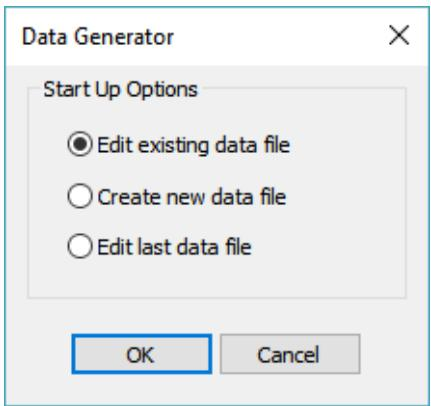

## 2.2 CREATING A NEW SACS INPUT FILE

The user will be prompted to select the appropriate file type for the input file. The file type controls which lines are recognized by the Line Assistant and which lines are available to be inserted using the Insert Input Line command.

See TOOLS MENU FEATURES (Section 4.3) for additional information.

## 2.3 EDITING AN INPUT FILE

The Edit Screen displays the current ASCII SACS Data File and allows the user to edit the file.

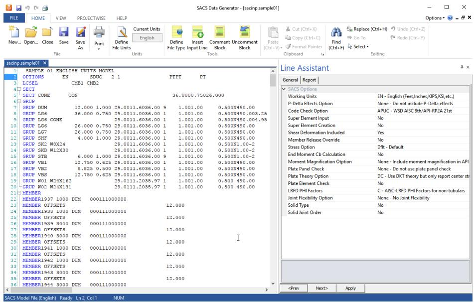

2.3.1 Moving Around the Edit Screen

The scroll bar, or the cursor keys, can be used to move up and down the file. The cursor, may also be positioned by pointing to a location and clicking.

Whenever the cursor is moved to a data field on a line, the field description, field columns, and required data type are displayed on the Status Barand in the Line Assistant.

The following key functions are available:

| PAGE UP | - | Moves up one page |
| --- | --- | --- |
| PAGE DOWN | - | Moves down one page |
| HOME | - | Moves to beginning of line or file |
| END | - | Moves to end of line or file |
| TAB | - | Moves to next data field on line |
| SHIFT+TAB | - | Moves to previous data field on line |

2.3.2 Editing Data

Changes can be made by either selecting an option from the Edit Menu or by typing in the changes directly.

Useful keys for editing a file include:

INSERT Toggles between typeover mode and insert mode

DELETE Deletes character under cursor

BACKSPACE Moves backward and deletes

Highlighting a block of text allows the user to cut, copy, and/or paste several lines at once. ALT+Down Arrow (CTRL+Down Arrow in Unix) highlights a line of text.

## 2.4 EXITING THE DATA GENERATOR SESSION

Select the File/Exit menu option to exit the Data Generator session. If the current file has been updated, the user is queried whether the file is to be saved.

3 FILE MENU FEATURES

File menu features are accessible via the File menu button. Some features are also accessible via the File group on the Home tab.

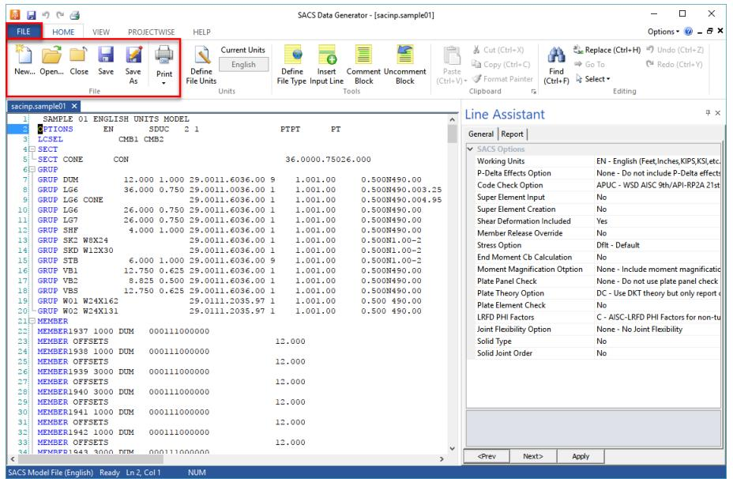

## 3.1 NEW

New is used to open a new edit window so that the user can create a new file.

## 3.2 OPEN

Open is used to open an existing ASCII file in the Data Generator

3.2.1 OPEN FILE

Opens a file on the local computer or a network path

3.2.2 OPEN FROM PROJECTWISE

Opens a file on a ProjectWise server.

## 3.3 INFO

3.3.1 DEFINE FILE TYPE

Set the file type for the current input file. See section 4.3.1 for more information.

3.3.2 DEFINE FILE UNITS

Set the units for the current input file. See section 4.2.1 for more information.

## 3.4 RECENT

Open a recently opened input file. Clicking the thumbtack next to an input file will pin the file so that it is always available.

## 3.5 CLOSE

Closes the input file which is currently selected.

## 3.6 SAVE

Save is used to save the current file and all changes under the present filename displayed at the bottom of the screen. If the current file has not been named, the user will be presented with the ‘Save As’ dialog box as described below.

## 3.7 SAVE AS

Save As presents a dialog box similar to the ‘Open’ screen, which allows the filename to be chosen or typed. The current file and all changes will then be saved under this name.

## 3.8 PRINT

Prints the file which is currently selected.

## 3.9 EXIT

The Exit option is used to exit the Data Generator session.

4 HOME TAB MENU FEATURES

## 4.1 FILE MENU FEATURES

Refer to section 3 for information about these features.

## 4.2 UNITS MENU FEATURES

The Units Menu group provide the user with a display of the current units and a way to manually define the units for the current file.

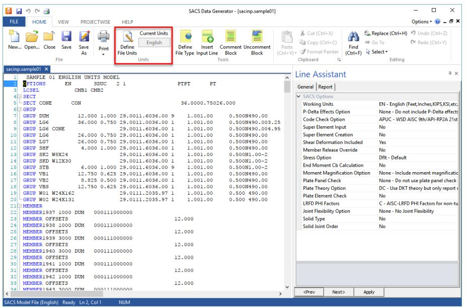

Most file types require a general option line which includes a working units option. Datagen will read this unit definition and set the current units to match the working units option. If that option is not available, the units will be set to default units in the SACS Executive settings.

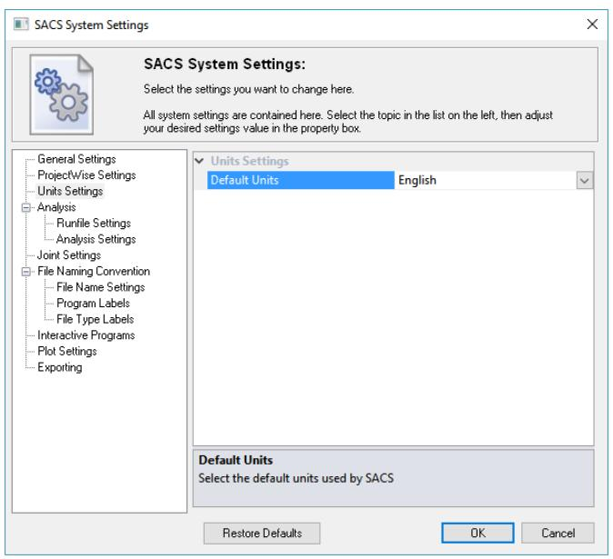

4.2.1 DEFINE FILE UNITS

The define file units feature allows the user to set the units for the current file. Note that this option only affects the display of units in the message line and Line Assistant; it will not be used for analyses.

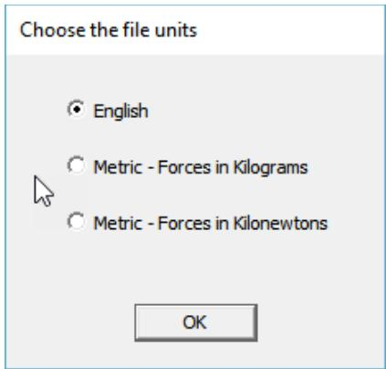

## 4.3 TOOLS MENU FEATURES

The Tools Menu features allow the user to generate new SACS Input lines and edit the input file.

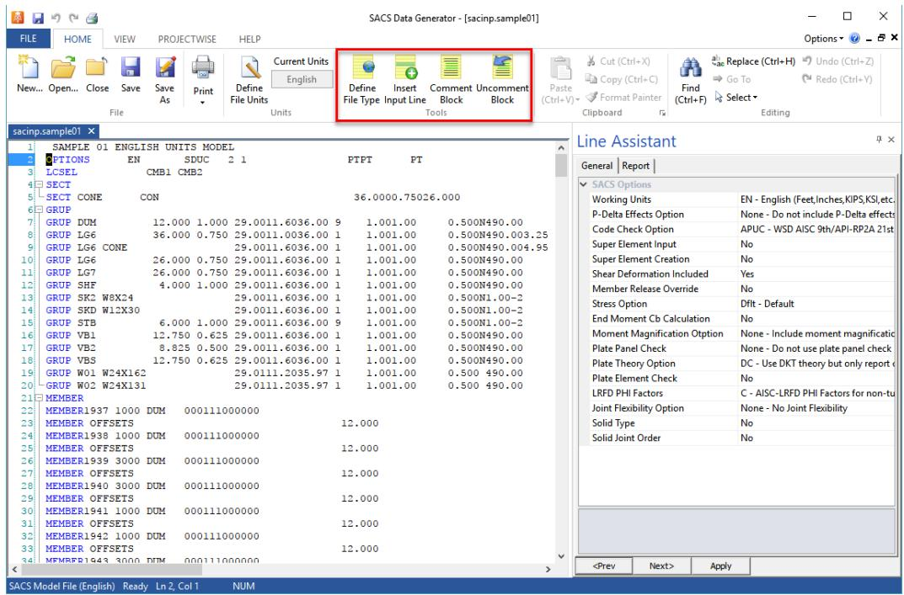

4.3.1 DEFINE FILE TYPE

The define file type dialog allows the user to manually define the file type for the current file. This controls which input lines are supported in the Line Assistant and which lines can be selected when using the Insert Input Line feature. Most file types will automatically be determined by Datagen by reading the input file when opening existing input files.

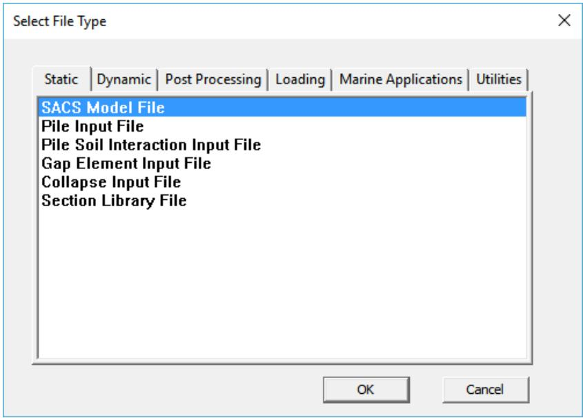

4.3.2 INSERT INPUT LINE

The insert input feature allows the user to insert an input line from a list of valid input lines for the current input file. The lines are by default sorted in order of input, but can also be sorted alphabetically using the Sort Alphabetically option.

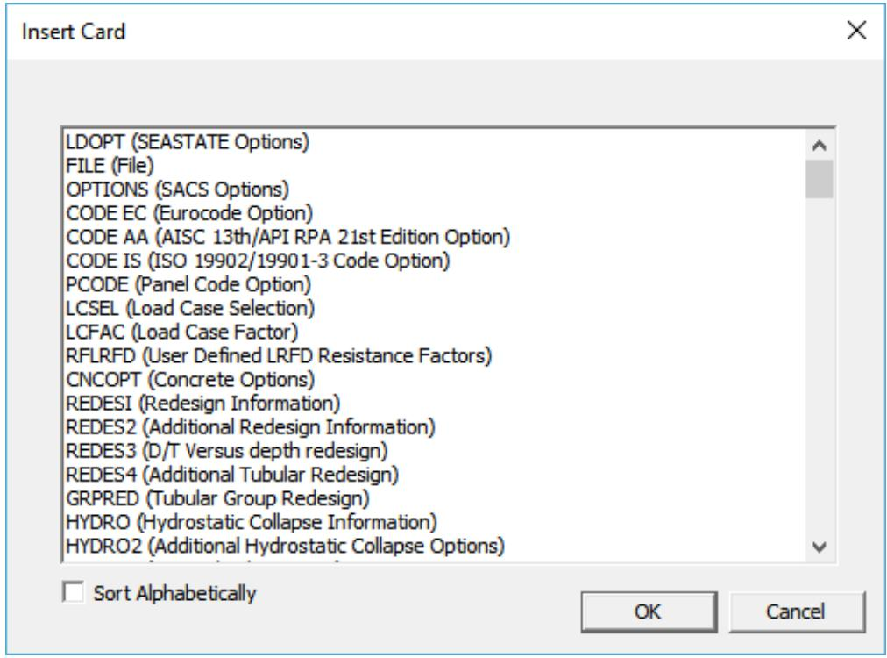

4.3.3 COMMENT BLOCK

The comment block feature will comment any lines that are currently selected. A ‘*’ character will be prepended to the selected lines and will not be executed when the input file is read in a SACS analysis

4.3.4 UNCOMMENT BLOCK

The uncomment block feature will uncomment any lines that are currently selected. A ‘*’ character will be removed from the beginning of the selected lines. Note that this will not affect lines which are not comments.

## 4.4 CLIPBOARD MENU FEATURES

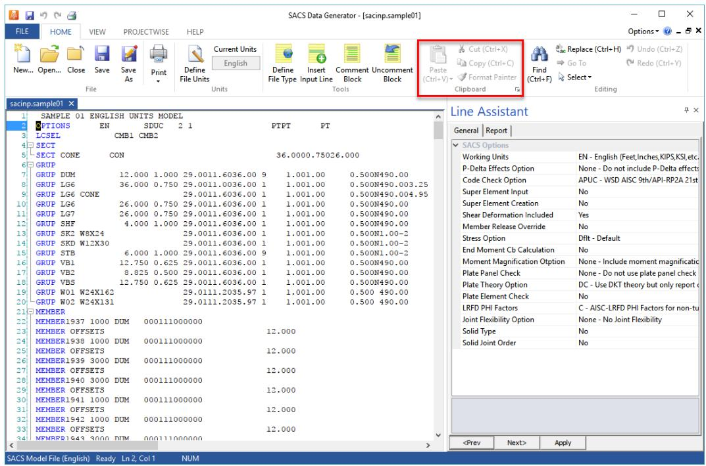

4.4.1 PASTE

Paste the text in the clipboard to the location selected in the input file. Bound to keyboard shortcut CTRL + V.

4.4.2 CUT

Delete the selected text and add it to the clipboard. Bound to keyboard shortcut CTRL + X.

4.4.3 COPY

Copy the selected text to the clipboard. Bound to keyboard shortcut CTRL + C.

4.4.4 FORMAT PAINTER

Unused.

## 4.5 EDITING MENU FEATURES

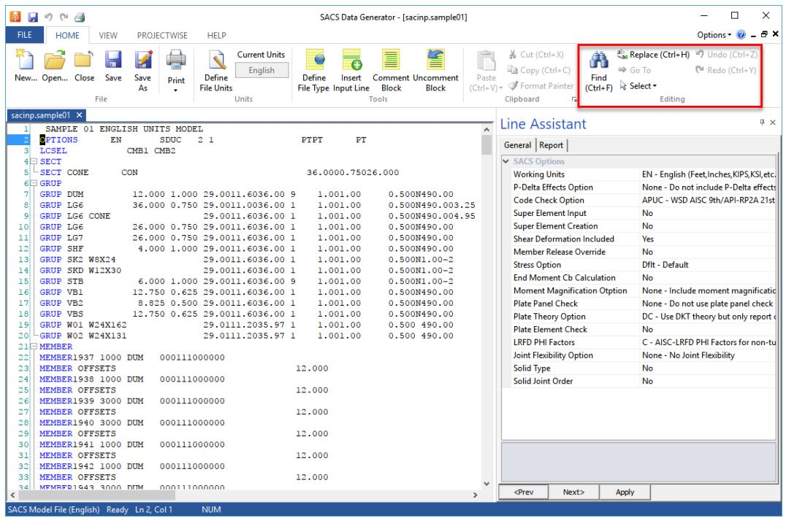

4.5.1 FIND

Opens the find dialog. User can search for the selected text in the Find What text box. The drop-down menu contains previous searches performed in Datagen. If the user has text selected when the find features is selected, the selected text will automatically be entered in the text box.

Bound to the keyboard shortcut CTRL + F.

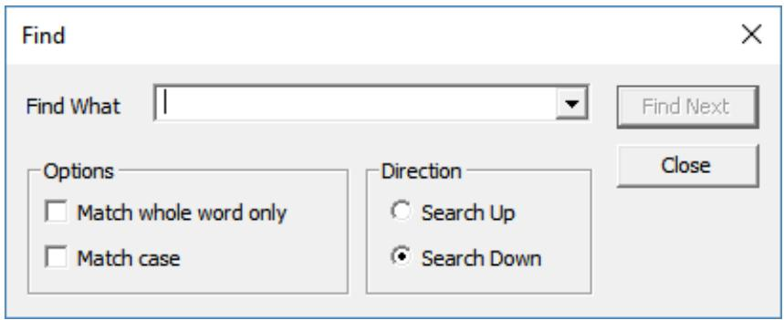

4.5.2 REPLACE

Opens the replace dialog. User can search for the selected text in the Find Text text box and replace it with the text in the Replace With text box. The drop-down menus contain previous find and replace operations performed in Datagen. If the user has text selected when the find features is selected, the selected text will automatically be entered in the Find Text text box.

Bound to the keyboard shortcut CTRL + H.

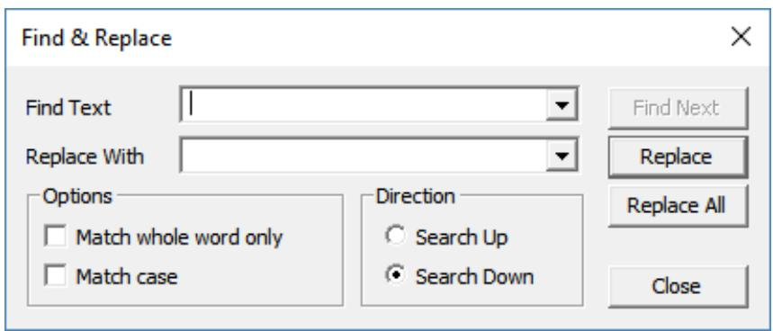

4.5.3 GO TO

Unused.

4.5.4 SELECT

4.5.4.1 SELECT ALL

Select all text in the input file. Bound to keyboard shortcut CTRL + A.

4.5.5 UNDO

Undo the previous operation. Bound to keyboard shortcut CTRL + Z.

4.5.6 REDO

Redo the previous undo operation. Bound to keyboard shortcut CTRL + Y.

5 VIEW TAB MENU FEATURES

## 5.1 DOCUMENT VIEWS FEATURES

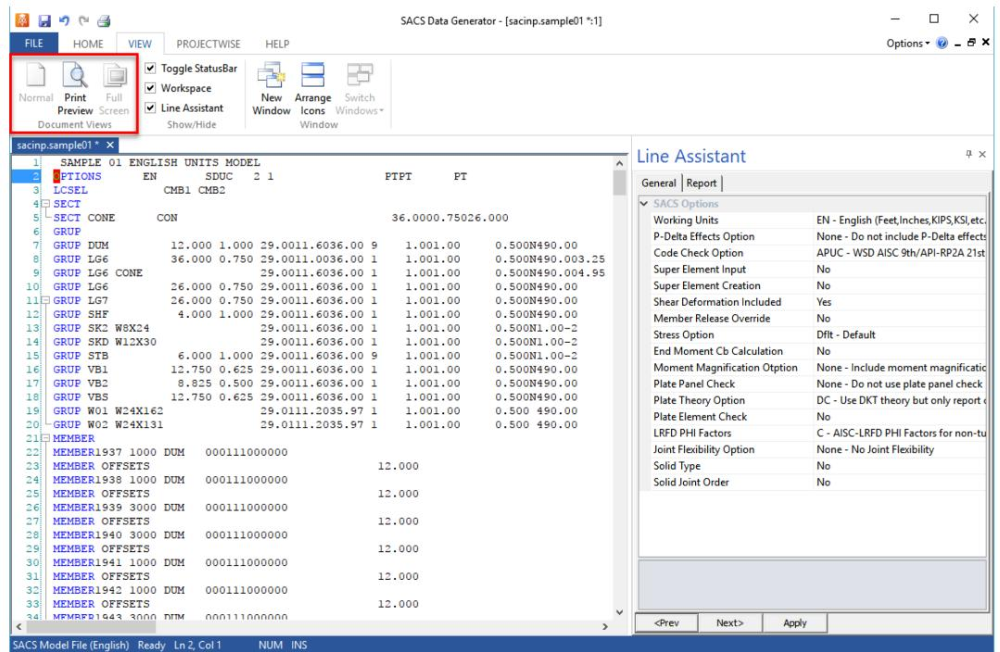

5.1.1 NORMAL

Unused.

5.1.2 PRINT PREVIEW

View the document in print preview mode.

5.1.3 FULL SCREEN

Unused.

## 5.2 SHOW/HIDE MENU FEATURES

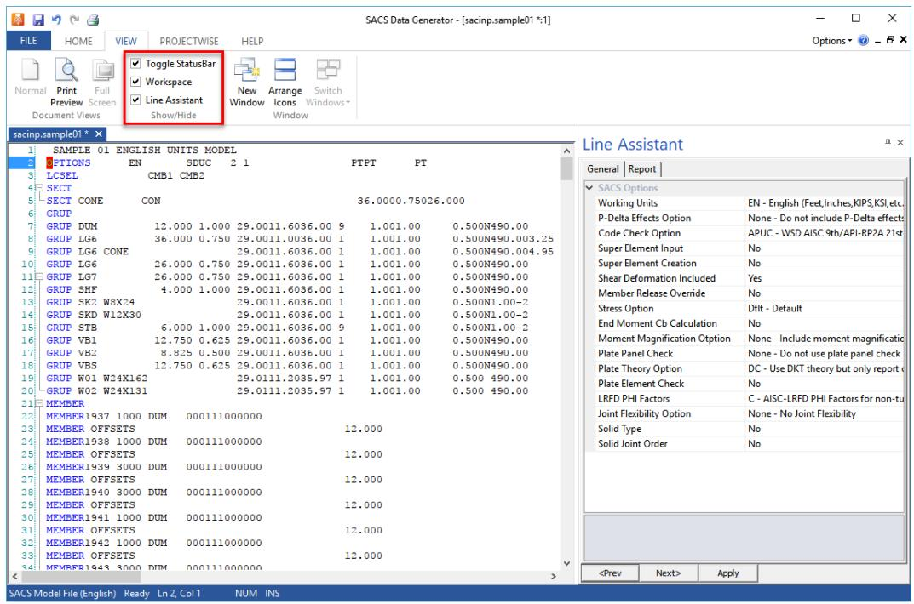

5.2.1 TOGGLE STATUSBAR

Toggle the status bar that appears on the bottom of the Datagen window.

5.2.2 WORKSPACE

Toggle the tab view at the top of the data input window.

5.2.3 LINE ASSISTANT

Toggle the line assistant view on the right side of the Datagen window.

## 5.3 WINDOW MENU FEATURES

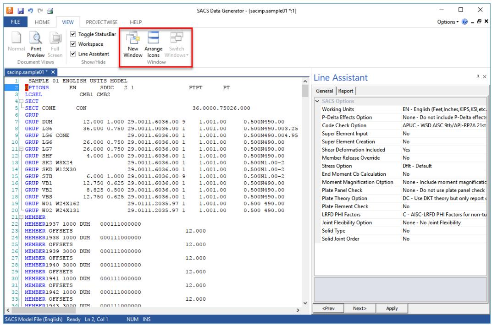

5.3.1 NEW WINDOW

Open a new window of the current input file.

5.3.2 ARRANGE ICONS

Split the currently opened input files into separate windows.

5.3.3 SWITCH WINDOWS

Unused.

6 PROJECTWISE TAB MENU FEATURES

## 6.1 PROJECTWISE MENU FEATURES

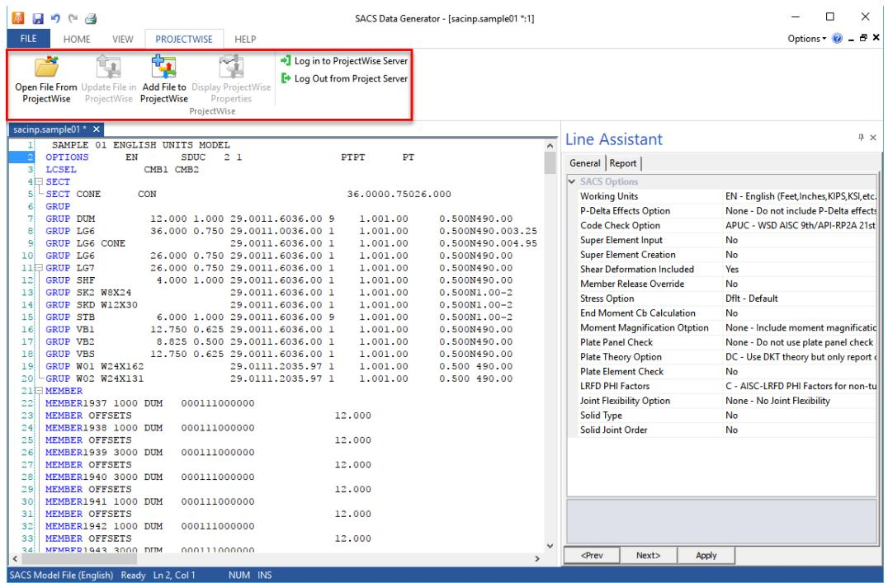

6.1.1 OPEN FILE FROM PROJECTWISE

Open a file on the ProjectWise server. The user will be prompted to log in if they are not already logged in to a server.

6.1.2 UPDATE FILE IN PROJECTWISE

Update the current input file in ProjectWise. The user will be prompted to with a check in dialog with options for updating the ProjectWise server.

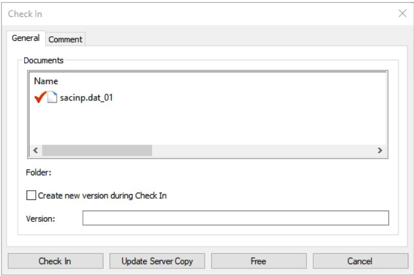

6.1.3 ADD FILE TO PROJECTWISE

Upload the current input file to ProjectWise

6.1.4 DISPLAY PROJECTWISE PROPERTIES

Display the ProjectWise properties of the current input file.

6.1.5 LOG IN TO PROJECTWISE SERVER

Log in to a ProjectWise server.

6.1.6 LOG OUT OF PROJECT SERVER

Log out of a ProjectWise server.

7 HELP TAB MENU FEATURES

## 7.1 GENERAL MENU FEATURES

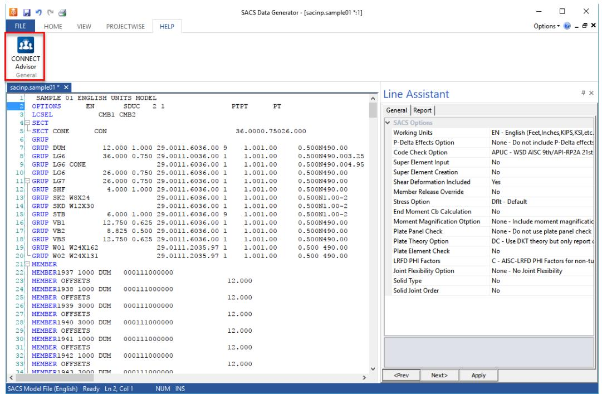

7.1.1 CONNECT ADVISOR

Open the Bentley CONNECT Advisor dialog.