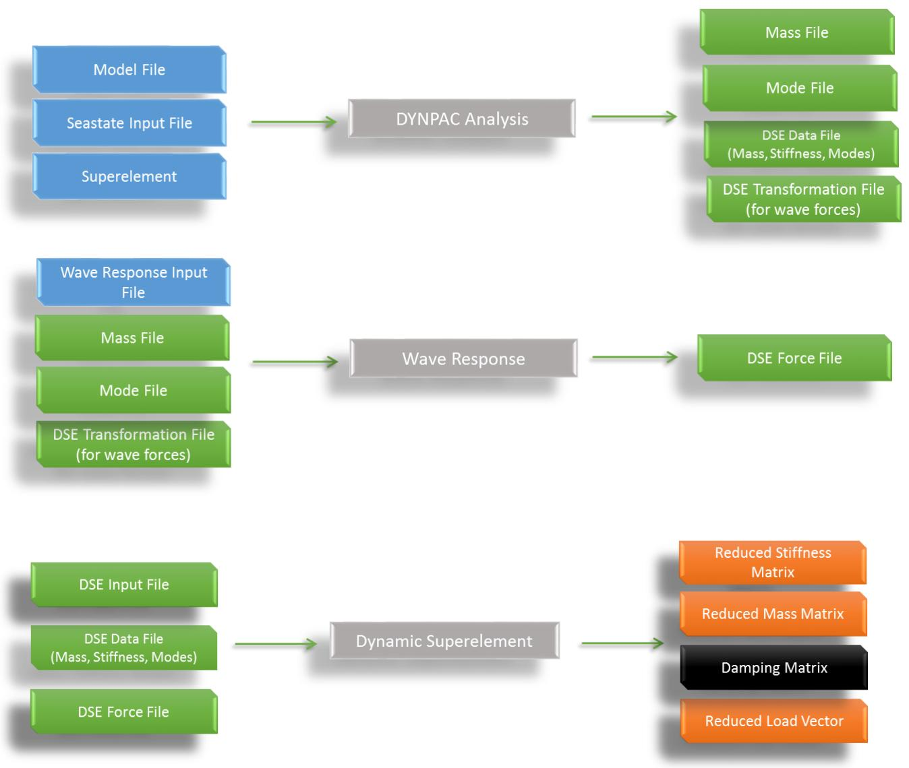
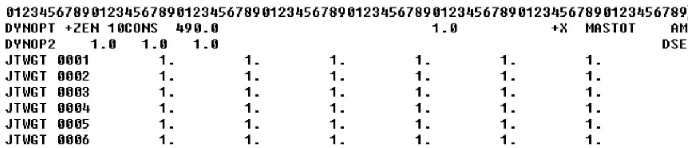
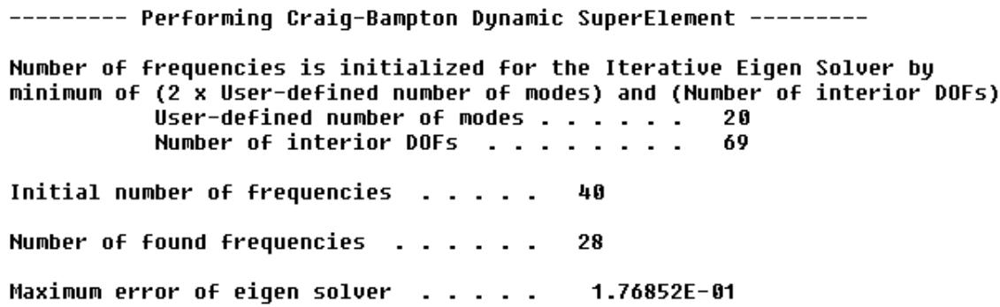
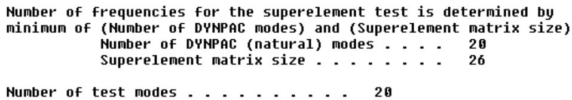
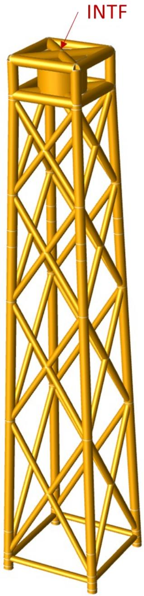
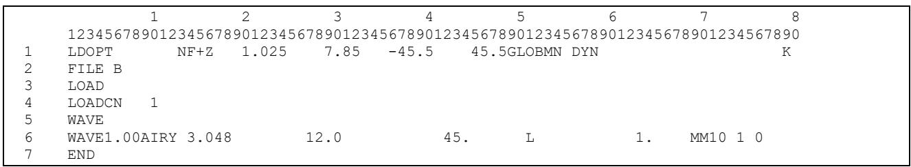
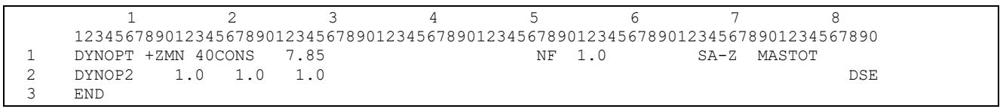
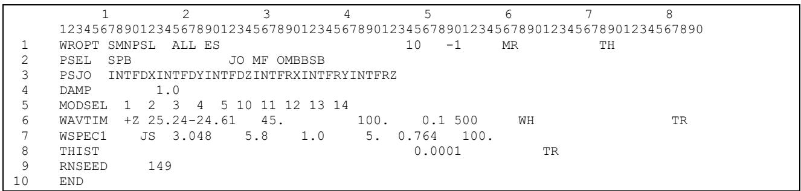
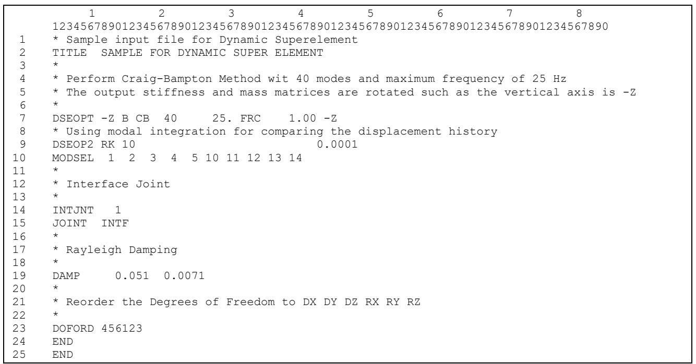
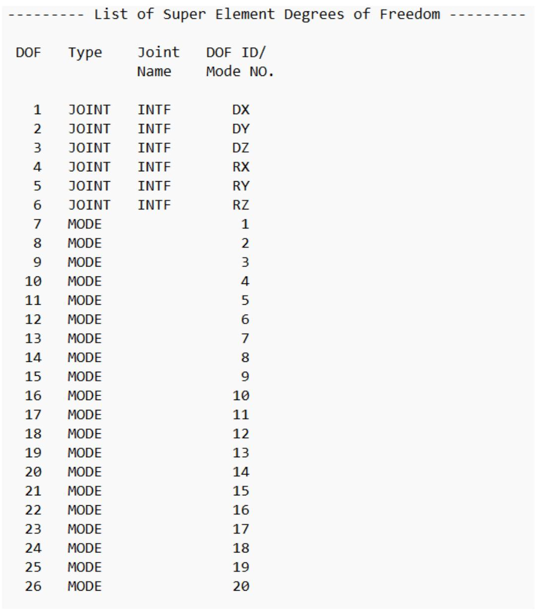

SACS

Dynamic Superelement

Version 24.00

Trademark Notice

Bentley and the "B" Bentley logo are either registered or unregistered trademarks or service marks of Bentley Systems, Incorporated. All other marks are the property of their respective owners.

Copyright Notice

Copyright © 2024, Bentley Systems, Incorporated. All Rights Reserved.

TABLE OF CONTENTS

1 INTRODUCTION .. . 4   
2 ANALYSIS PROCESS.. .. 6   
3 OUTPUTS FILES .... .... 13

## 3.1 DYNAMIC SUPERELEMENT LISTING FILE.. .13

3.1.1 Dynamic Model Data.... . 13   
3.1.2 Dynamic Superelement Inputs.. .. 13   
3.1.3 Dynamic Superelement Analysis. . 14   
3.1.4 Dynamic Superelement Test Results ..... .. 16   
3.1.5 Dynamic Superelement Time History .. .. 19

## 3.2 Output Units... ... 20

4 COMMENTARY: SUPERELEMENT FORMULATION... .... 21

## 4.1 GUYAN (STATIC) METHOD .. .. 21
## 4.2 CRAIG-BAMPTON METHOD ... .. 21
## 4.3 TESTING SUPERELEMENT ACCURACY .. .22
## 4.4 TRANSFORMATION OF SUPERELEMENT MATRICES .. .. 22

4.4.1 Examples for permutation and rotation matrices ... .. 23

5 SAMPLE PROBLEM.. ... 25   
6 INPUT LINES.. ... 30

1 INTRODUCTION

The superelement is a simple (reduced) representation of the model. The main application of the superelement is to integrate various sub-structures and simplify the analysis calculation (mainly to speed up the analysis of large or complex models). In order to generate a superelement of a particular model, the user first specifies the interface joints. The interface joints are the ones where the substructure is connected to the main model. When the interface joints are assigned, the degrees of freedom (DOFs) are divided into two groups: 1) the interface or boundary DOFs which are common between the sub-structure and the main model, and 2) the interior DOFs which only belongs to the substructure. Thus, displacement vector u, mass matrix M and stiffness matrix K can be partitioned as:

$$\mathbf{u} = \left\{\mathbf{u}_{b} \right\} \quad \text{a n d} \quad \mathbf{M} = \left[ \begin{array}{l l} \mathbf{M}_{b b} & \mathbf{M}_{b i} \\ \mathbf{M}_{i i} & \mathbf{M}_{i i} \end{array} \right] \quad \text{a n d} \quad \mathbf{K} = \left[ \begin{array}{l l} \mathbf{K}_{b b} & \mathbf{K}_{b i} \\ \mathbf{K}_{i i} & \mathbf{K}_{i i} \end{array} \right], \tag{1}$$

where subscript b and i denote the interface (boundary) DOFs and the interior DOFs, respectively.

The superelement formulation can be defined by applying a transformation matrix R on the displacement vector u to reduced number of DOFs ??̃:

$$\widetilde{\mathbf{u}} = \left\{ \begin{array}{l} \mathbf{u}_{b} \\ \boldsymbol{\eta}_{i} \end{array} \right\} = \mathbf{R} \mathbf{u} = \mathbf{R} \left\{ \begin{array}{l} \mathbf{u}_{b} \\ \mathbf{u}_{i} \end{array} \right\}, \tag{2}$$

in which ???? are reduced DOFs corresponding to the internal DOFs – number of reduced DOFs is significantly smaller than the interior DOFs. In general, the transformation matrix R can be defined as

$$\mathbf{R} = \left[ \begin{array}{l l} \mathbf{I} & \mathbf{0} \\ \boldsymbol{\Psi} & \boldsymbol{\Phi} \end{array} \right], \tag{3}$$

where I is identity matrix, o is zero matrix, ?? and ?? are static and dynamic parts of the transformation matrix, respectively.

When the transformation matrix R is determined, the resulting reduced mass (??̃ ) and stiffness (??̃) matrices can be computed as follow:

$$\widetilde{\mathbf{M}} = \mathbf{R}^{T} \mathbf{M} \mathbf{R} \quad \text{a n d} \quad \widetilde{\mathbf{K}} = \mathbf{R}^{T} \mathbf{K} \mathbf{R}. \tag{4}$$

The gravity loads are determined by forming gravity acceleration vector, g, in which only values of degrees of freedom associated with gravity direction are non-zero. We may write the gravity acceleration vector as

$$\mathbf{g} = \left\{ \begin{array}{l} \mathbf{g}_{b} \\ \mathbf{g}_{i} \end{array} \right\}, \tag{5}$$

where b and i denote interface (boundary) and interior degrees of freedom, respectively. Therefore, Dynamic Superelement gravity forces are computed as follows:

$$\mathbf{f}_{g} = \left\{ \begin{array}{l} \mathbf{f}_{g b} \\ \mathbf{f}_{g i} \end{array} \right\} = \left[ \begin{array}{l l} \mathbf{I} & \boldsymbol{\Psi}^{T} \\ \mathbf{0} & \boldsymbol{\Phi}^{T} \end{array} \right] \left[ \begin{array}{l l} \mathbf{M}_{b b} & \mathbf{M}_{b i} \\ \mathbf{M}_{i i} & \mathbf{M}_{i i} \end{array} \right] \left\{\mathbf{g}_{b} \right\} = \mathbf{R}^{T} \mathbf{M} \mathbf{g}. (6)$$

Finally, the reduced wave force vector can be also

$$\tilde{\mathbf{f}} = \mathbf{R}^{T} \mathbf{f}. \tag{7}$$

There are different methods to determine the transformation matrix R. In Dynamic Superelement program, two methods are currently available: 1) Guyan (static) reduction method, and 2) Craig-Bampton method. Guyan method is based on standard matrix reduction, and it is accurate only for static analysis or low frequency dynamic analysis. Craig-Bampton method uses natural modes corresponding to the interior DOFs of the sub-structure to generate the superelement stiffness and mass matrices. The accuracy of Craig-Bampton method is proportional to number of the modes is used to construct the transformation matrix R - if all internal modes are incorporated into the superelement, it becomes exact representation of the model. For more detail see section 4.

The accuracy of the superelement for dynamic analysis can be determined by performing Model Assurance Criterion. This analysis involves comparing the frequencies of the reduced system (i.e., the superelement) with the certain number of the modes in original (full) model. This method also checks the orthogonality of the superelement modes with full model modes. For more details see section 4.3.

Dynamic Superelement program to generate the superelement in various formats. Currently, the program supports following formats:

1. Siemens BhawC   
2. GH Bladed   
3. MHI Vestas Flex 5   
4. SACS FAST

Dynamic superelement program is also able to rotate coordinate system and permute (re-order) DOFs for output results. The user may input output vertical coordinate and new order of DOFs in the input file. The mathematical background of the transforming superelement matrices is discussed in section 4.4.

2 ANALYSIS PROCESS

  
Figure 1 shows the general framework of the analysis with Dynamic Superelement program:   
Figure 1: Framework of Dynamic Superelement Program

Analysis process is performed in four following steps:

5. Step 1: In the SACS model input file, all 6 degrees of freedom corresponding to the interface joint(s) should be retained by specifying a ‘2’ in the fixity columns in the ‘JOINT’ input line. For remaining (interior) joints, X, Y and Z translation and/or rotation must be retained to extract target modes.   
6. Step 2: In the Dynpac input file, the user should add ‘DSE’ option on column 78-80 of DYNOP2 line input (Figure 2). This option generates two files later used by Dynamic Superelement program. The first binary file is dynamic superelement data file (with the default file name ‘dsedat. *’) – including information regarding mass and stiffness matrices and modes of the SACS model. The second file is called dynamic superelement transformation file (with the default file name ‘dsetrs. *’) – which is later used to compute wave reduced forces. Other Dynpac input lines remain unchanged, and the input variable should be similar to other dynamic analyses.

  
Figure 2: A sample Dynpac input file with dynamic superelement option

7. Step 3: Before running Dynamic Superelement program, the user may run Wave Response program to generate reduced forces (in addition to mass and stiffness matrices). If the reduced forces are not required, the user may skip this step. Determining reduced forces involves running Wave Response program to generate applied wav forces files – named ‘dsefrc.*’. The user should input ‘S’ in column 7 on ‘WROPT’ input line to run generate forces for Dynamic Superelement program. Wave Response analysis can be performed in three different ways:

1. Random Wave – Steady State (Frequency Domain): In this analysis, the wave surface profile is generated randomly, and model responses are computed using a Frequency Domain algorithm. The user may input ‘RW’ option WROPT input line to perform this analysis.

2. Random Wave – Time-History: Similar to previous method, but the model responses are obtained by a time domain integration algorithm. The user may input ‘TH’ option WROPT input line to perform this analysis.   
3. Time-History Wave, Wind, and Force: In this analysis type, time-history files of wave, wind and force are given as inputs to Wave Response program.

All three analysis types can be used to generate applied forces file (‘dsefrc.*’ file) for Dynamic Superelement program.

8. Step 4: This step involves running Dynamic Superelement program. The program asks for three files: 1) ‘dsedat.*’ - the data file generated by Dynpac, 2) ‘dsefrc.*’ - the force file generated by Wave Response (if the force calculation is required), and 3) Dynamic Superelement input file with default name ‘dseinp.*’.

A sample of Dynamic Superelement input file is shown in Figure 3, and the input lines are defined as follow:

DSEOPT (Dynamic Superelement Option line): This input line is used to input analysis options for dynamic superelement program. Columns descriptions are given below:

✓ Column # 8-9: Input vertical coordinate direction for the output superelement. The user may input following values: (+X, -X, +Y, -Y, +Z, -Z) or leave it blank for the default value (i.e., +Z).   
✓ Column # 11: Output format for Dynamic Superelement. The user can select desired format by entering corresponding option as follow

1. Siemens BhawC (New Format): leave BLANK or enter “B” (the default output format)   
2. Siemens BhawC (Previous Format): enter “S”   
3. GH Bladed: enter “G” on column 11   
4. MHI Vestas Flex 5: enter “V” on column 11   
5. SACS FAST: enter “F” on columns 11

Note: Siemens Bhawc and GH Bladed formats generate two separate files: one for stiffness, mass, and damping (‘subsef.*’) and another one for wave loads (‘subwvl.*’) . MHI Vestas Flex 5 and SACS FAST generate only one file for all results (‘subsef.*’)

✓ Column # 12-14: Input ‘CB’ for Craig-Bampton method or ‘GY’ for Guyan (Static) reduction method.

✓ Column # 16-18: In the case of Craig-Bampton method, input number of modes required to generate dynamic supper element. If it is blank, the program uses the number of modes in Dynpac input file. For Guyan (static) method, this input can be left blank.   
✓ Column # 20-26: In the case of Craig-Bampton method, input maximum frequency. If it is blank, the program uses default value of 50 Hz. For Guyan (static) method, this input can be left blank.   
✓ Column # 28-30: If the force time-history is available, input ‘FRC’ to get reduced forces alongside of the reduced stiffness and mass matrices.   
✓ Column # 32-38: The user may enter Gravity Acceleration to include gravity load in Dynamic Superelement outputs. If this input left blank, Dynamic Superelement program does not calculate gravity load vector.

Note: In case of Siemens BhawC New Format, the gravity acceleration must be 1.0 (unit value). Otherwise, the program will return a warning message and reset the gravity acceleration to 1.0.

✓ Column # 40-41: The Gravity Direction is entered here. The user may input following values: (+X, -X, +Y, -Y, +Z, -Z) or leave it blank for the default value of -Z.   
✓ Column # 43-45: Option for additional output files is entered here. By entering ‘CSV’, Dynamic Superelement can report stiffness, mass, damping, gravity and force in CSV (Comma Separated Values) format. The program generates separate CSV files for each output with following name: “stiffness.csv”, “mass.csv”, “damping.csv”. “grarvity.csv” and “force.csv”.   
✓ Column # 47-48: Enter ‘PH’ to print header for additional output files such as CSV files. The header includes Joint Name, Degrees of freedom IDs, and unit of the output.

✓ Column # 50-51 and 53-59: Select override option for initial transient reduction:

1. Leave ‘BLANK’ to use wave response reduction option - no override (default)   
2. Enter 'UR' to update transient reduction time for output wave load time history. Enter the new value for the initial transient time on columns # 53-59.   
3. Enter 'NR' to ignore transient reduction (if any).

Note: The vertical coordinates input rotates the results of Dynpac program. If the user already inputs coordinate rotation in Dynpac input on DYNOPT line, it can be left blank –

otherwise Dynamic Superelement program performs additionally rotation on the superelement results.

Note: The Dynamic Superelement program uses the number of modes (Columns 16-18), maximum frequency (Column # 20-26), and the input model to determine actual (targeted) number of modes for Craig-Bampton method.

Note: Dynamic Superelement program does NOT perform any unit conversion analysis, and it uses units proved in DYNPAC program. Therefore, value of the gravity acceleration must be set based on units of DYNPAC model.

Note: Gravity direction must be assigned based on the vertical axis in DYNPAC input model. For example, if DYNPAC vertical axis is +Z, the gravity direction must be -Z.

Note: CSV files for gravity and force vectors are generated if the user requests them.

Note: If any CSV file is open in other program, Dynamic Superelement returns a warning message indicating that it could not open the file and thus it cannot report the results.

Note: There is no unit conversion inside Dynamic Superelement, and all units are determined by Dynpac analysis.

DSEOP2 (Dynamic Superelement Additional Option line): this optional line is to set parameters for time integration methods to test accuracy of the dynamic superelement. Dynamic Superelement program solves the reduced dynamic system based on the options provided on this line. Columns descriptions are given below:

✓ Column # 8-9: Select the time integration method from Newmark-Beta method (leave blank or enter ‘NB’ for this default method) or the Modal Integration method based on the Runge-Kutta integration method (enter ‘RK’). The following columns are only applied for the model time integration method:   
✓ Column # 10-12: Enter number of modes for the integration. If it is left blank, the program will use number of modes provided on DSEOPT line.   
✓ Column # 14-20: Enter the model damping (%). Leave blank for the default value of 1%.   
✓ Column # 22-28: Enter the absolute convergence tolerance. Leave blank for the default value of 0.0001.   
✓ Column # 30-36: Enter the relative convergence tolerance. Leave blank for the default value of 0.01.

✓ Column # 38-44: Enter the minimum time step for the integration. Leave blank for the default value which is determined as min $\left( \frac{ 1 } { 4 f_{ m a x } } , \frac{ \Delta T } { 4 } \right)$ ∆?? where $f_{ m a x }$ is the maximum 4???????? frequency of the model and ∆?? is the time increment of the force time history.   
✓ Column # 46-52: Enter the minimum time step for the integration. Leave blank for the default value of ∆?? which is the time increment of the force time history. Additional displacement report:   
✓ Column # 54-56: Enter ‘FNB’ to create an additional report containing the full model displacement history computed based on Newmark-Beta method.

Note: Runge-Kutta method is the time integration method used in SACS Wave Response program.

Note: The integration method does not affect stiffness, mass, or damping of the dynamic superelement. the time integration is only used to create a displacement report for the superelement. See section 3.1.5 for additional information to how to use the time integration method.

MODSEL (Model Selection Line): this optional line is used to select modes to be used in the Modal Time Integration method (if 'RK' is entered on columns 8-9 of the DSEOP2 line). The number of modes selected must agree with the number entered in columns 10-12 of the DSEOP2 line, and in columns 16-18 of the DSEOPT line.

✓ Column # 7-9: Enter the first mode   
✓ Column # 10-12: Enter the second mode   
✓ Other columns: Enter the remaining modes. A new MODSEL line can be entered if a greater number of modes are needed.

Note: If the Wave Response Analysis uses the MODSEL line, the same line can be entered in here for the Dynamic Superelement analysis.

INTJNT (interface joint(s) head line): This line is used to input number of interface joints in the superelement. This line should be followed by JOINT input line.

✓ Column # 8-10: number of interface joints which the program computes the reduced stiffness and mass matrix (it is usually one for wind turbine analysis).

JOINT: This line is used to input joint names of the interface joints. The user must input one JOINT line for each interface joint.

✓ Column # 8-11: Input name of interface joint.

Note: the joint name should be same as the joint name in SACS input file and its six degrees of freedom should be retained by specifying a ‘2’ in the appropriate fixity columns.

DAMP: This optional input line can be used to input Rayleigh damping coefficients (α and β) to generate damping stiffness for dynamic superelement. (Optional input line)

✓ Column # 8-14: Rayleigh α coefficient.   
✓ Column # 16-22: Rayleigh β coefficient.

Note: If no damping coefficient is defined, the superelement program assumes zero damping matrix.

DOFORD: The user may use to this option to re-order degrees of freedom in output reduced matrices. (Optional input line)

✓ Column # 8-13: Input new order of DOFs for a given joint in 6 digits number.

Example: assume the full system DOFs order is ‘RX RY RZ DX DY DZ’ – where R denotes rotation about an axis and D is displacement along an axis.

The input line “DOFORD 456123” re-orders the output degrees of freedom as ‘DX DY DZ RX RY RZ’

Note: If this line is not input, Dynamic Superelement program returns superelement matrices with the same DOF order of the imported model.

01234567890123456789012345678901234567890123456789012345678901234567890123456789

*Sampleinput filefor_sacwdse

TITLETEST DYNAMIC SUPER ELEMENT

DSEOPT-2CB 40.0 9.81 -2

INTJNT 1

JOINTINTF

DAMP 0.410.0007

DOFORD 456123

Figure 3: A sample Dynamic Superelement input file.

3 OUTPUTS FILES

Dynamic Superelement program generates two output files. The first file is listing file (with default name of ‘saclst.*’) which reports analysis details of the superelement calculation – for more detail see section

## 3.1. Depend on selected output format on DSEOPT line, the program generates the superelement in ASCII format (text file) as follows

Siemens BhawC or GH Bladed: The mass, damping, stiffness matrices, and gravity load vector are written in ‘subsef.*’ file. The reduced wave load time-history is written in Dynamic Superelement Wave Load file with default name of ‘subwvl.*’.   
MHI Vestas Flex 5 or SACT FAST: All outputs (mass, damping, stiffness, wave load time-history) are save in a single file with default name of ‘subsef.*’. Note: SACS FAST format should be used for SACS FAST Wind Turbine Analysis.

The output files can be used to import the superelement to other packages or third-party programs.

## 3.1 DYNAMIC SUPERELEMENT LISTING FILE

The listing file of the program contains five sections: 1) Dynamic Model Data, 2) Dynamic Superelement Inputs, 3) Dynamic Superelement Analysis, 4) Dynamic Superelement Test Results, and 5) Dynamic Superelement Time History.

3.1.1 Dynamic Model Data

This section contains a short summary of the original SACS model data which are stored in the binary file ‘dsedat.*’. Also, if the force input file (‘dasfrs.*’) is provided, a brief report appears in this section.

3.1.2 Dynamic Superelement Inputs

This section contains the input data read from dynamic superelement input file (with default file name ‘dseinp.*’). There are three WARNING messages in this section:

1. Unrecognized Reduction Method: If the user input incorrect method type in columns 12-14 in DSEOPT line, the program returns this message and uses default Craig-Bampton method to get the dynamic superelement.

Listing file message: *** WARNING - Unrecognized reduction method. Craig-Bampton is being used.

2. Large Number of Modes: If the number of modes in DSEOPT line is greater than number of DOFs in input dynamic model (given in ‘dsedat.*’ file), the program returns this warning and uses the number of modes imported from ‘dsedat.*’ file.

Listing file message: *** WARNING - number of modes is greater than number retained DOFs

3. Switch to Guyan (static) method: If interface joint(s) is (are) the only joints retained in the SACS model input, the program switches to Guyan (static) method since Craig-Bampton method requires at least one internal (interior) DOFs.

Listing file Message: *** WARNING - Only interface joint(s) is (are) retained. Switch to Guyan (static) method.

3.1.3 Dynamic Superelement Analysis

This section reports the analysis process of dynamic reduction process. The first part of this section provides general information about eigen solve to determine modes shapes associated with interior DOFs – specifically, the initial number of frequencies for Dynamic Superelement iterative eigen solver, number of found frequencies determined by iterative solver and residual error (see Figure 4). The number of frequencies is initialized by minimum of follow two values:

I. Two times of the user-defined number of frequencies entered on DSEOPT line   
II. Number of retained interior DOFs in dynamic model

  
Figure 4: Initial number of frequencies for reduction.

In the case of Craig-Bampton method, the user may get following two WARNING messages:

1. Large Number of Modes: The program will return this message, if the user inputs a number of modes greater than number of interior DOFs. In this case, the number of interior DOFs will govern the eigensolver and Craig-Bampton reductions.

Listing file message: *** WARNING - input number of frequencies is greater than number of interior DOFs.

2. Small Number of Found Frequencies: If the eigensolver results have a smaller number of frequencies than the user defined number (entered on DSEOPT line) in the specified frequency range (defined by input maximum frequency on DSEOPT line), the program will return this warning and Craig-Bampton superelement is determined for reduced number of the modes.

Listing file message: *** WARNING - number of found frequencies is smaller than requested frequencies.

*** INFO - Craig-Bampton SuperElement uses ‘New Number of Modes’ modes.

Also, following ERROR messages may be found in this section:

1. No Frequency found: this error usually indicates the maximum frequency (entered on DSEOPT line) is relatively small for the model – increasing the maximum frequency (based on Dynpac frequencies range) will resolve this error. The other possibilities are probably instability in stiffness matrix or incorrect mass matrix – for these cases please check the modal analysis in Dynpac.

Listing file message: *** ERROR - No frequency found in the input frequency range.

2. No Convergence: the DSE program uses an iterative eigen solver and this error may indicate issue with mass or stiffness matrices. Therefore, please check the model and model analysis with Dynpac for possible issues. Also, you may change number of retained DOFs to improve convergence.

Listing file message: *** ERROR - No convergence in CB SuperElement modal analysis.

3. Possibility of Degenerate Modes: This is a common error message reported for Craig-Bampton method. Number of found frequencies should be always less than the initial number of frequencies (see above for how the program determines the initial number). If the number of

found frequencies are greater or equal to the initial number, there is possibility of degenerate modes – modes with similar frequencies and mode shapes. Increasing user-defined number of frequencies (entered on DSEOPT line) or increasing number of retained DOFs will usually resolve this error. Other solution is to check the model for possible instability issue in mass or stiffness matrices.

Listing file message: *** INFO - number of found frequencies should be less than the initial number. Consider to increase input number of frequencies or number of retained DOFs. *** ERROR - Possibility of degenerate modes. DSE cannot continue the analysis.

3.1.4 Dynamic Superelement Test Results

This section reports results of Model Assurance Criterion (MAC) test on calculated superelement stiffness and mass matrices. It contains two parts: first part reports the reduced system (superelement) frequencies and shows the absolute and relative errors with respect to the original model frequencies imported from ‘dsedat.*’ file. The second part shows the orthogonality of the superelement modes with the original model mode shapes (again imported from ‘dsedat.*’) – for formulation details see section 4.3. MAC calculation is performed for certain number of modes, number of tests, which is determined by minimum of following values (see Figure 5 for a sample):

I. Number of natural (Dynpac original model) modes of the model (given in ‘dsedat.*’ file)   
II. The size of the superelement – which is 6 x number of interface joints plus number of modes for Craig-Bampton method or 6 x number of interface joints for Guyan method.

Performing Model Assurance Criterion on Dynamic SuperElement

  
Figure 5: Number of test modes.

The next step in the test section is carry out an eigen solve for the superelement to determine frequencies and modes of the supperelement (i.e., the reduced system) to compare with original frequencies and modes. Like Craig-Bampton method discussed above, the program uses the iterative eigen solver and number of frequencies is initialized by minimum value of followings (see Figure 6 for a sample):

I. Two times of number of test modes (determined in previous step)   
II. Number of retained DOFs   
III. Superelement size

--- Performing Eigen Solve on Dynamic Superelement for Test Purposes --

Number of frequencies is initialized for the Iterative Eigen Solver by minimum of (2x Number of test modes)，(Number of retained DoFs)，and (SE size) Number of test modes 20 Number of retained DOFs 75 Superelement(matrix）size 26

Initial number of frequencies..... 26

Number of found frequencies...... 22

Maximun error of eigen solver.... 1.57662E-09

Figure 6: initial number of frequencies for the test.

The user may get following WARNING message in this section:

1. Small Number of Modes: The program returns this warning message, if it cannot find enough modes for the superelement to compare with number of test modes (for practical application number of test modes are equal to number modes in the original model – see above for number of test modes). This warning message means, MAC calculation is performed for reduced number of the modes and the resulting superelement is only accurate up to the specified number of the modes. This issue usually arises when number of the superelement DOFs is too small to capture entire modes of the model. Therefore, increasing number of retained DOFs or the user-defined number of modes resolve this warning message.

Listing file message: *** WARNING - number of found frequencies is smaller than number test frequencies. *** INFO - INFO - Modal Assurance Test is performed for ‘New Number of modes’ modes.

Like Craig-Bampton method, the iterative eigen solver may also return following ERROR messages:

1. No Frequency found: this error usually indicates the maximum frequency (entered on DSEOPT line) is relatively small for the model – increasing the maximum frequency (based on Dynpac frequencies range) will resolve this error. The other possibilities are probably instability in stiffness matrix or incorrect mass matrix – for these cases please check the modal analysis in Dynpac.

Listing file message: *** ERROR - No frequency found in the input frequency range.

2. No Convergence: the DSE program uses an iterative eigen solver and this error may indicate issue with mass or stiffness matrices. Therefore, please check the model and model analysis with Dynpac for possible issues. Also, you may change number of retained DOFs to improve convergence.

Listing file message: *** ERROR - No convergence in CB SuperElement modal analysis.

3. Possibility of Degenerate Modes: This is a common error message reported for Craig-Bampton method. Number of found frequencies should be always less than the initial number of frequencies (see above for how the program determines the initial number). If the number of found frequencies are greater or equal to the initial number, there is possibility of degenerate modes – modes with similar frequencies and mode shapes. Increasing user-defined number of frequencies (entered on DSEOPT line) or increasing number of retained DOFs will usually resolve this error. Other solution is to check the model for possible instability issue in mass or stiffness matrices.

Listing file message: *** INFO - number of found frequencies should be less than the initial number. Consider to increase input number of frequencies or number of retained DOFs.

*** ERROR - Possibility of degenerate modes. DSE cannot continue the analysis.

3.1.5 Dynamic Superelement Time History

If the force vector is provided for the Dynamic Superelement program, it solves the reduced dynamic system using Newmark-Beta Method or Modal Integration Method (based on Runge-Kutta integration) to calculate the time-history of interface joints displacement. The results are reported in this section of the listing file. The Dynamic Superelement program can also report the interface joint displacement history of the full model (the model used in Wave Response or other SACS Analyses) using the Newmark-Beta method. These displacement history reports can be used to test the accuracy of the superelement as discussed in the following:

Full Model Interface Displacement Report: By entering ‘FNB’ on DSEOP2 line columns 54-46, the program solves the dynamic system associated with the full model (i.e., the model in Wave Response) using the Newmark-Beta method and creates a report of the interface joint displacements. To check the accuracy of the Dynamic Supperelement, this full model displacement report may be compared with the similar report created for the Dynamic Superelement using the Newmark-Beta method by default.   
Displacement Report Using Modal Integration: SACS Wave Response program analyzes the dynamics of the wave forces using the modal integration method based on the Runge-Kutta integration. The same integration method can be selected by entering ‘RK’ in columns 8-9 on the DSEOP2 line, and the Dynamic Superelement program creates a displacement report comparable with Wave Response displacements. It is worth noting that the number of modes and selected modes on the MODSEL line must be also matched with the Wave Response.

Note: The results of a time history analysis may change depending on, the model mode shapes, the selected integration method, time increment, and convergence tolerances. As a result, the time integration method must be similar to compare the displacement history of a Dynamic Superelement with the displacement reported by SACS Wave Response

## 3.2 OUTPUT UNITS

Dynamic Superelement does not carry out any unit conversion and units are determined based on Dynpac and Wave Response analysis. Table 1 and Table 2 present units for different output formats for SI and English unit, respectively.

Table 1: SI Units for Dynamic Superelement Outputs   

|  | Mass | Damping | Stiffness | Gravity | Wave Load |
| --- | --- | --- | --- | --- | --- |
| Siemens BhawC | kg, m | kg, N, m | N, m | N, m | kN, m |
| GH Bladed | kg, m | kg, N, m | N, m | N, m | kN, m |
| MHI Vestas Flex 5 | kg, m | kg, N, m | N, m | - | N, m |
| SACS FAST | kg, m | kg, N, m | N, m | N, m | N, m |
| Additional CSV files | kg, m | kg, N, m | N, m | N, m | N, m |

Table 2: English Units for Dynamic Superelement Outputs   

|  | Mass | Damping | Stiffness | Gravity | Wave Load |
| --- | --- | --- | --- | --- | --- |
| Siemens BhawC | slinch, in | slinch, lb, in | lb, in | lb, in | kip, in |
| GH Bladed | slinch, in | slinch, lb, in | lb, in | lb, in | kip, in |
| MHI Vestas Flex 5 | slinch, in | slinch, lb, in | lb, in | - | lb, in |
| SACS FAST | slinch, in | slinch, lb, in | lb, in | lb, in | lb, in |
| Additional CSV files | slinch, in | slinch, lb, in | lb, in | lb, in | lb, in |

4 COMMENTARY: SUPERELEMENT FORMULATION

## 4.1 GUYAN (STATIC) METHOD

The Guyan method is based on standard static reduction method where the entire interior degrees of freedom are only reduced to the interface DOFs. The Guyan transformation matrix and recued displacement vector are given by

$$\mathbf{R} = \left[ \begin{array}{l} \mathbf{I} \\ \boldsymbol{\Psi} \end{array} \right] \text{a n d} \widetilde{\mathbf{u}} = \mathbf{u}_{b}, \tag{8}$$

which only involves the interface DOFs and static portion ?? of the transformation matrix and it can be determined by

$$\Psi = - \mathbf{K}_{i i}^{-1} \mathbf{K}_{i b}. \tag{9}$$

## 4.2 CRAIG-BAMPTON METHOD

Craig-Bampton method uses the natural modes corresponding to the interior DOFs to generate superelement for dynamic analysis. The transformation matrix R has the general form of

$$\mathbf{R} = \left[ \begin{array}{l l} \mathbf{I} & \mathbf{0} \\ \boldsymbol{\Psi} & \boldsymbol{\Phi} \end{array} \right], \tag{10}$$

where ?? is similar to Guyan method and ?? is the mode shapes matrix of the interior degrees of freedom. The ?? is given by following eigenvalue problem for the interior DOFs:

$$\mathbf{K}_{i i} \boldsymbol{\Phi}^{<   j >} = \omega_{j}^{2} \mathbf{M}_{i i} \boldsymbol{\Phi}^{<   j >} \tag{11}$$

where <j> denotes the jth mode shape (column) of the matrix ?? and ωj is corresponding frequency. Note that above eigenvalue problem is only formed for the interior degrees of freedom.

## 4.3 TESTING SUPERELEMENT ACCURACY

The accuracy of the superelement stiffness and mass matrices should be tested by comparing the reduced system modes with the original (full) model. After the superelement matrices are determined, an eigenvalue problem is solved to get frequencies of the superelement ??̃ and corresponding mode shape $\tilde{ \varphi } .$ . The superelement program reports these frequencies and its absolute and relative error with respect to the full model frequencies for certain number of modes. If the superelement is accurate these errors should be relatively small.

The next step is to test orthogonality of the superelement modes and the full model modes through a method called Model Assurance Criterion (MAC). This criterion (matrix MAC) is defined as

$$\mathbf{M A C}_{i j} = \left(\varphi_{i} \mathbf{R} \tilde{\varphi}_{j}\right)^{2}, \tag{12}$$

where $\varphi_{ i }$ is $i^{ \mathrm{ t h } }$ mode shape of the original (full) model and $\tilde{ \varphi }_{ i }$ is corresponding mode shape in the superelement. R is the superelement transformation matrix. In this above equation, it is assumed that both mode shapes are normalized. If the superelement is accurate, MAC matrix should approximately be an identity matrix.

## 4.4 TRANSFORMATION OF SUPERELEMENT MATRICES

Transformation matrix N is combination of the rotation matrix (i.e., rotating coordinates system) and the permutation matrix (i.e., re-ordering DOFs)

$$\mathbf{N} = \mathbf{P R}, \tag{13}$$

where, P is permutation matrix and R is rotation matrix – see section 4.4.1 for few examples. Assume the full system (non-reduced) is transformed by applying above operator, we can write following relationship between original displacement vector u and transform displacement vector ??̃

$$\mathbf{u} = \mathbf{N} \widetilde{\mathbf{u}} \rightarrow \left\{\begin{array}{l}\mathbf{u}_{b}\\\mathbf{u}_{i}\end{array}\right\} = \left[\begin{array}{c c}\mathbf{N}_{b}&\mathbf{0}\\\mathbf{0}&\mathbf{N}_{i}\end{array}\right]\left\{\begin{array}{l}\widetilde{\mathbf{u}}_{b}\\\widetilde{\mathbf{u}}_{i}\end{array}\right\}, \tag{14}$$

where b denotes interface DOFs and i denotes interior DOFs.

We can write superelement matrices (stiffness, mass or damping) corresponding to original (not-rotated and not-permutated system) can be written in following form

$$\mathbf{A} = \left[ \begin{array}{l l} \mathbf{A}_{b b} & \mathbf{A}_{b \eta} \\ \mathbf{A}_{\eta b} & \mathbf{A}_{\eta \eta} \end{array} \right], \tag{15}$$

where b and ?? denote interface DOFs and modal DOFs, respectively. Applying above transformation matrix N to Craig-Bampton method, we can get following simple formulation for transformed (rotated/permuted) superelement matrix $\widetilde{ \bf A }$

$$\widetilde{\mathbf{A}} = \left[ \begin{array}{c c} \mathbf{N}_{b}^{T} \mathbf{A}_{b b} \mathbf{N}_{b} & \mathbf{N}_{b}^{T} \mathbf{A}_{b \eta} \\ \mathbf{A}_{\eta b} \mathbf{N}_{b} & \mathbf{A}_{\eta \eta} \end{array} \right]. \tag{16}$$

This formulation clearly shows that the diagonal block corresponding to modal modes $\mathbf{ A }_{ \eta \eta }$ remains unchanged when the transformation matrix is applied to the superelement matrix.

4.4.1 Examples for permutation and rotation matrices

Example 1: Assume “DOFORD 456123” is inputted to re-order the output degrees of freedom as ‘DX DY DZ RX RY RZ’. The corresponding permutation matrix is

$$\boldsymbol{P} = \left[ \begin{array}{c c c c c c} & & & 1 & & \\ & & & & 1 & \\ 1 & & & & & 1 \\ & 1 & & & & \\ & & 1 & & \end{array} \right]. \tag{17}$$

If this matrix is applied to superelement matrix blocks, we get

1. $\mathbf{ P }_{ b }^{ T } \mathbf{ A }_{ b \eta } \mathrm{ . }$ It only rearranges the rows of $\mathbf{ A }_{ b \eta }$ block – Rows 1, 2, and 3 of $\mathbf{ A }_{ b \eta }$ are placed in 4, 5 and 6 and Rows 4, 5, 6 are moved to 1, 2 and 3.   
2. ${ \mathbf{ A } }_{ \eta b } { \mathbf{ P } }_{ b } \colon$ : It only rearranges the columns of $\mathbf{ A }_{ \eta b }$ block – Columns 1, 2, and 3 of $\mathbf{ A }_{ b \eta }$ are placed in 4, 5 and 6 and columns $4 , 5 ,$ , and 6 are moved to 1, 2 and 3.   
3. $\mathbf{ P }_{ b }^{ T } \mathbf{ A }_{ b b } \mathbf{ P }_{ b }$ : It rearranges both rows and columns of $\mathbf{ A }_{ b b }$ block. If ${ \bf A }_{ b b } = [ { \bf P }_{ \mathrm{ { ~ \bf ~ S ~ } } } { \bf \Gamma }_{ }^{ \bf Q } ] ,$ $\mathbf{ P }_{ b }^{ T } \mathbf{ A }_{ b b } \mathbf{ P }_{ b } = \left[ \begin{array} { l l } { \pmb{ S } } & { \mathbf{ R } } \\ { \mathbf{ P } } & { \mathbf{ Q } } \end{array} \right]$

Example 2: Assume the vertical coordinate is set to –Z, the corresponding rotation matrix is

$$\mathbf{R} = \left[ \begin{array}{c c c c c c} \mathbf{1} & & & & & \\ & - \mathbf{1} & & & & \\ & & - \mathbf{1} & & & \\ & & & \mathbf{1} & & \\ & & & & - \mathbf{1} & \\ & & & & & - \mathbf{1} \end{array} \right]. \tag{18}$$

If this matrix is applied to superelement matrix blocks, we get

1. $\mathbf{ R }_{ b }^{ T } \mathbf{ A }_{ b \eta } \mathrm{ : }$ All elements on Rows 2, 3, 5, and 6 are multiplied by -1.   
2. $\mathbf{ A }_{ \eta b } \mathbf{ R }_{ b } \mathbf{ \dot{ \mathbf{ z } } }$ : All elements on Columns 2, 3, 5, and 6 are multiplied by -1.   
3. $\mathbf{ R }_{ b }^{ T } \mathbf{ A }_{ b b } \mathbf{ R }_{ b }$ : Following elements of $\mathbf{ A }_{ b b }$ are multiplied by -1:

9. Row # 1: columns 2, 3, 5, and 6   
10. Row # 2: columns 1 and 4   
11. Row # 3: columns 1 and 4   
12. Row # 4: columns 2, 3, 5, and 6   
13. Row # 5: columns 1 and 4   
14. Row # 6: columns 1 and 4

5 SAMPLE PROBLEM

The structure shown in Figure 7 is used to illustrate general framework of generating a Dynamic Superelement. The all input files can be found in SACS Samples\Sample 21 folder.

  
Figure 7: Model for Dynamic Superelement sample analysis

The model has a single interface joint at the top of the tower (see ‘INTF’ in Figure 7). Note that all degrees of freedom in ‘INTF’ joint are retained as ‘222222’ – which is required for all interface joints in a dynamic superelement.

The Seastate and Dynpac inputs are shown in Figure 8 and Figure 9, respectively. In Dynpac input file, ‘DSE’ is entered on columns 78-80 on ‘DYNOP2’ input line to set Dynamic Superelement option for dynamic analysis. This option will generate two files: Dynamic Superelement Data File (‘dsedat.*’) and Dynamic Superelement Transformation File (‘dsetrs.*’). Dynamic Superelement Data File is used as an input for Dynamic Superelement programs while Dynamic Superelement Transformation File is used to generate forces in Wave Response simulation.

  
Figure 8: Seastate input file

  
Figure 9: Dynamic input file

Following figure illustrates the input for wave response analysis. This input generates a random surface profile and analyze the jacket using a Time-History analysis (‘TH’ option in ‘WROPT’ line). ‘S’ is entered on column 7 ‘WROPT’ line to generate Dynamic Superelement Force File (‘dsefrc.*’)

  
Figure 10: Wave Response input file

The input file for Dynamic Superelement is shown in Figure 11. This analysis uses Craig-Bampton method with 40 modes and 25 Hz as maximum frequency on ‘DSEOPT’ line. Also, the output format input (DSEOPT line column 11) is set to use default Siemens BhawC format. The output superelement has vertical axis as –Z and Rayleigh damping is used to generate damping matrix. To compare the Dynamic Superelement displacement history with the Wave Response results, the Modal Time Integration is selected on DSEOP2 line, and the same modes are selected on the MODSEL line. The interface joint is entered as INTF and the Rayleigh damping coefficients are entered on DAMP line. Finally, the order of output superelement is changed to DX, DY, DZ, RX, RY, RZ, by entering ‘DOFORD 456123’.

  
Figure 11: Dynamic Superelement input file

This analysis computed stiffness and mass matrix for the current model. These results can be found in ‘subsef.*’ file for mass, damping, stiffness, and gravity. The ‘subwvl.*’ file also contains the time-history of the reduced wave forces. The listing file ‘saclst.*’ contain important information regarding accuracy of the resulted superelement.

The first output is the order of degrees of freedom in the superelement. This information can be used to correctly export SACS superelement to other programs (see Figure 12).

  
Figure 12: Superelement degrees of freedom

The first step to check the accuracy of the superelement is to compare frequencies of the actual model (computed by Dynpac) with the superelement. If the error is small as shown in Figure 13, the reduction method was successful. The next step is to check the orthogonality of modes by making sure the MAC matrix is almost an identity matrix. These results are printed under the Model Assurance Criterion section in the listing file – see Figure 14for details. The listing file also includes the displacement time history which may be used for further tests on the superelement.

Figure 13: Comparison of frequencies of the original model and the superelement   

| Comparison of The Frequencies | Comparison of The Frequencies | Comparison of The Frequencies | Comparison of The Frequencies | Comparison of The Frequencies |
| --- | --- | --- | --- | --- |
| Mode NO | Superelement Frequency (Hz) | Model Frequency (Hz) | Absolute Error (Hz) | Relative Error (%) |
| 1 | 1.13970 | 1.12104 | 0.01865 | 1.664 |
| 2 | 1.13983 | 1.12118 | 0.01865 | 1.664 |
| 3 | 3.40892 | 3.37970 | 0.02922 | 0.865 |
| 4 | 4.97302 | 4.94797 | 0.02506 | 0.506 |
| 5 | 4.97326 | 4.94820 | 0.02506 | 0.506 |
| 6 | 6.13617 | 6.13617 | 0.00000 | 0.000 |
| 7 | 6.46465 | 6.46465 | 0.00000 | 0.000 |
| 8 | 6.51803 | 6.51731 | 0.00072 | 0.011 |
| 9 | 6.63418 | 6.62942 | 0.00476 | 0.072 |
| 10 | 6.63450 | 6.62974 | 0.00476 | 0.072 |
| 11 | 7.44127 | 7.42782 | 0.01345 | 0.181 |
| 12 | 7.60083 | 7.60083 | 0.00000 | 0.000 |
| 13 | 8.48900 | 8.47802 | 0.01097 | 0.129 |
| 14 | 8.84911 | 8.84472 | 0.00440 | 0.050 |
| 15 | 8.98227 | 8.97359 | 0.00868 | 0.097 |
| 16 | 8.98277 | 8.97409 | 0.00868 | 0.097 |
| 17 | 10.36455 | 10.36332 | 0.00123 | 0.012 |
| 18 | 10.46158 | 10.45962 | 0.00196 | 0.019 |
| 19 | 10.46169 | 10.45972 | 0.00196 | 0.019 |
| 20 | 10.60035 | 10.60035 | 0.00000 | 0.000 |

Figure 14: Modal Assurance Criterion   

| Model Assurance Criterion | Model Assurance Criterion | Model Assurance Criterion | Model Assurance Criterion | Model Assurance Criterion | Model Assurance Criterion | Model Assurance Criterion | Model Assurance Criterion | Model Assurance Criterion | Model Assurance Criterion | Model Assurance Criterion |
| --- | --- | --- | --- | --- | --- | --- | --- | --- | --- | --- |
| Mode | 1 | 2 | 3 | 4 | 5 | 6 | 7 | 8 | 9 | 10 |
| 1 | 1.00 | 0.00 | 0.00 | 0.08 | 0.00 | 0.00 | 0.00 | 0.00 | 0.01 | 0.00 |
| 2 | 0.00 | 1.00 | 0.00 | 0.00 | 0.08 | 0.00 | 0.00 | 0.00 | 0.00 | 0.01 |
| 3 | 0.00 | 0.00 | 1.00 | 0.00 | 0.00 | 0.00 | 0.00 | 0.00 | 0.00 | 0.00 |
| 4 | 0.08 | 0.00 | 0.00 | 1.00 | 0.00 | 0.00 | 0.00 | 0.00 | 0.00 | 0.00 |
| 5 | 0.00 | 0.08 | 0.00 | 0.00 | 1.00 | 0.00 | 0.00 | 0.00 | 0.00 | 0.00 |
| 6 | 0.00 | 0.00 | 0.00 | 0.00 | 0.00 | 1.00 | 0.00 | 0.00 | 0.00 | 0.00 |
| 7 | 0.00 | 0.00 | 0.00 | 0.00 | 0.00 | 0.00 | 1.00 | 0.00 | 0.00 | 0.00 |
| 8 | 0.00 | 0.00 | 0.00 | 0.00 | 0.00 | 0.00 | 0.00 | 1.00 | 0.00 | 0.00 |
| 9 | 0.01 | 0.00 | 0.00 | 0.00 | 0.00 | 0.00 | 0.00 | 0.00 | 1.00 | 0.00 |
| 10 | 0.00 | 0.01 | 0.00 | 0.00 | 0.00 | 0.00 | 0.00 | 0.00 | 0.00 | 1.00 |
| 11 | 0.00 | 0.00 | 0.00 | 0.00 | 0.00 | 0.00 | 0.00 | 0.03 | 0.00 | 0.00 |
| 12 | 0.00 | 0.00 | 0.00 | 0.00 | 0.00 | 0.00 | 0.00 | 0.00 | 0.00 | 0.00 |
| 13 | 0.00 | 0.00 | 0.00 | 0.00 | 0.00 | 0.00 | 0.00 | 0.00 | 0.00 | 0.00 |
| 14 | 0.00 | 0.00 | 0.00 | 0.00 | 0.00 | 0.00 | 0.00 | 0.01 | 0.00 | 0.00 |
| 15 | 0.02 | 0.00 | 0.00 | 0.00 | 0.00 | 0.00 | 0.00 | 0.00 | 0.00 | 0.00 |
| 16 | 0.00 | 0.02 | 0.00 | 0.00 | 0.00 | 0.00 | 0.00 | 0.00 | 0.00 | 0.00 |
| 17 | 0.00 | 0.00 | 0.00 | 0.00 | 0.00 | 0.00 | 0.00 | 0.06 | 0.00 | 0.00 |
| 18 | 0.00 | 0.05 | 0.00 | 0.00 | 0.10 | 0.00 | 0.00 | 0.00 | 0.00 | 0.00 |
| 19 | 0.05 | 0.00 | 0.00 | 0.10 | 0.00 | 0.00 | 0.00 | 0.00 | 0.00 | 0.00 |
| 20 | 0.00 | 0.00 | 0.00 | 0.00 | 0.00 | 0.01 | 0.00 | 0.00 | 0.00 | 0.00 |

6 INPUT LINES

RAYLEIGH DAMPING COEFFICIENTS

COLUMNS

COMMENTARY

GENERAL THIS LINE IS OPTIONAL TO ENTER RAYLEIGH DAMPING COEFFICIENTS. THE DEFUALT ANALYSIS IS BASED ON ZERO DAMPING.

( 8-14) ENTER RAYLEIGH ALPHA COEFFICIENT.

(16-22) ENTER RAYLEIGH BETA COEFFICIENT.

| LINE LABEL | ALPHA COEFFICIENT | BETA COEFFICIENT | LEAVE BLANK |
| --- | --- | --- | --- |
| DAMP |  |  |  |
| 1--6 | 8--14 | 16--22 | 23--------80 |
| DEFAULT |  |  |  |

DEGREES OF FREEDOM ORDER

COLUMNS

COMMENTARY

GENERAL

THIS LINE IS OPTIONAL TO CHANGE ORDER OF DEGREES OF FREEDOMSIN OUTPUT MASS, DAMPING, STIFFNESS MATRICES AND FORCE VECTOR.

( 8-13)

ENTER A SIX-DIGIT NUMBER TO CHANGE THE ORDER OF OUTPUT DEGREES OF FREEDOM.

| LINE LABEL | OUTPUT DOF ORDER | LEAVE BLANK |
| --- | --- | --- |
| DOFORD |  |  |
| 1-- 6 | 8--13 | 14--------80 |
| DEFAULT |  |  |

DYNAMIC SUPERELEMENT ADDITIONAL OPTIONS

COLUMNS

COMMENTARY

GENERAL

THIS OPTIONAL LINE IS TO SET PARAMETERS FOR TIME INTEGRATION METHODS TO TEST ACCURACY OF DYNAMIC SUPERELEMENT.

(

- 9) ENTER TIME INTEGRATION METHOD: ENTER 'NB' OR LEAVE BLANK FOR NEWMARK-BETA METHOD (DEFAULT) ENTER 'RK' FOR SIEMENS MODAL TIME INTEGRATION USING RUNGE-KUTTA METHOD

NOTE: RUNGE-KUTTA METHOD IS THE TIME INTEGRATION METHOD USED IN SACS WAVE RESPONSE PROGRAM.

NOTE: THE INTEGRATION METHOD DOES NOT AFFECT STIFFNESS, MASS, OR DAMPING OF THE DYNAMIC SUPERELEMENT. THE TIME INTEGRATION IS ONLY USED TO COMPARE SUPERELEMENT RESPONSE WITH FULL MODEL RSPONSE DETERMINED BY SACE WAVE RESPONSE.

MODEL TIME INTEGRATION OPTIONS:

(

0-12) ENTER THE NUMBER OF MODES. IF IT IS LEFT BLANK, THE PROGRAM WILL USE NUMBER OF MODES ENTERED ON DESOPT LINE.

(

4-20) ENTER MODAL DAMPING (%). LEAVE BLANK FOR THE DEFAULT VALUE OF 1%.

(

2-28) ENTER ABSOLUTE TOLERANCE. LEAVE BLANK FOR THE DEFAULT VALUE OF 0.0001.

(

0-36) ENTER RELATIVE TOLERANCE. LEAVE BLANK FOR THE DEFAULT VALUE OF 0.01.

(

8-44) ENTER THE MINIMUM TIME INTEGRATION STEP. LEAVE BLANK FOR THE DEFAULT VALUE AUTOMATICALLY DETERMINED BASED ON THE MODEL FREQUENCIES.

(

6-52) ENTER THE MAXIMUM TIME INTEGRATION STEP. LEAVE BLANK FOR THE DEFAULT VALUE AUTOMATICALLY DETERMINED BASED ON FORCE TIME HISTORY TIME INCREMENT.

ADDITIONAL DISPLACEMENT REPORT:

(

4-56) ENTER 'FNB' TO CREATE A DISPLACEMENT HISTORY REPORT OF THE FULL MODEL USING NEWMARK-BETA TIME INTEGRATION METHOD.

| LINE LABEL | TIME INTEGRATION MEHTOD | MODAL TIME INTERACTION OPTIONS | MODAL TIME INTERACTION OPTIONS | MODAL TIME INTERACTION OPTIONS | MODAL TIME INTERACTION OPTIONS | MODAL TIME INTERACTION OPTIONS | MODAL TIME INTERACTION OPTIONS | SOLVE FULL MODEL BY NEWMARK? | LEAVE BLANK |
| --- | --- | --- | --- | --- | --- | --- | --- | --- | --- |
| LINE LABEL | TIME INTEGRATION MEHTOD | NUMBER OF MODES | MODEL DAMPING (%) | ABSOLUTE TOLERANCE | RELATIVE TOLERANCE | MINIMUM TIME STEP | MAXIMUM TIME STEP | SOLVE FULL MODEL BY NEWMARK? | LEAVE BLANK |
| DSEOP2 |  |  |  |  |  |  |  |  |  |
| 1--6 | 8--9 | 10->12 | 14->20 | 22->28 | 30->36 | 38->44 | 46->52 | 54--56 | 57--80 |
| DEFAULT | NB |  | 1% | 0.0001 | 0.01 | AUTO | AUTO |  |  |

DYNAMIC SUPERELEMENT OPTIONS

COLUMNS

COMMENTARY

GENERAL THIS LINE IS REQUIRED TO SETUP ANALYSIS PARAMETERS FOR DYNAMIC SUPERELEMENT ANALYSIS.

( 8- 9) ENTER THE DIRECTION OF VERTICAL COORDINATES (+X,-X,+Y,-Y,+Z,-Z) FOR DYNAMIC SUPERELEMENT OUTPUTS.   
( 11- 11) SELECT OUTPUT FORMAT FOR DYNAMIC SUPERELEMENT OUTPUTS: ENTER 'B' OR LEAVE BLANK FOR SIEMENS BHAWC NEW FORMAT (DEFAULT) ENTER 'S' FOR SIEMENS BHAWC PREVIOUS FORMAT ENTER 'G' FOR GH BLADED ENTER 'V' FOR MHI VESTAS FLEX 5 ENTER 'F' FOR SACS FAST   
(12-14) ENTER 'CB' TO CHOOSE CRAIG-BAMPTON METHOD. ENTER 'GY' FOR GUYAN (STATIC) METHOD.   
(16-18) ENTER NUMBER OF MODES FOR CRAIG-BAMPTON METHOD.   
(20-26) ENTER MAXIMUM FREQUENCY FOR CRAIG-BAMPTON METHOD.   
(28-30) ENTER 'FRC' TO GENERATE REDUCED FORCES IN ADDITION TO MASS AND STIFFNESS MATRICES.   
(32-80) ENTER GRAVITY ACCELERATION TO CALCULATE GRAVITY LOAD VECTOR FOR OUTPUT SUPERELEMENT. LEAVE BLANK TO INGNORE GRAVITY LOAD CALCULATION.   
(40-41) ENTER THE DIRECTION OF GRAVITY (+X,-X,+Y,-Y,+Z,-Z) FOR GRAVITY LOAD VECTOR.   
(43-45) ENTER 'CSV' TO OUTPUT DYNAMIC SUPERELEMENT RESULTS IN CSV (COMMA SEPARATED VALUES) FORMAT. LEAVE BLANK FOR NO ADDITIONAL OUTPUT FILES.   
(47-48) ENTER 'PH' TO PRINT HEADER (JOINT LABELS, DEGREES OF FREEDOM ID, AND UNITS) INTO ADDITIONAL OUTPUT FILES (CSV FILES). LEAVE BLANK FOR NO HEADER.   
(50-51) SELECT OVERRIDE OPTION FOR INITIAL TRANSIENT REDUCTION. LEAVE BLANK TO USE WAVE RESPONSE REDUCTION OPTION - NO OVERRIDE (DEFAULT) ENTER 'UR' TO UPDATE TRANSIENT REDUCTION TIME FOR OUTPUT WAVE LOAD TIME HISTORY. ENTER THE NEW VALUE FOR THE INITIAL TRANSIENT TIME ON COLUMNS 53-59. ENTER 'NR' TO IGNORE TRANSIENT REDUCTION (IF ANY).   
(53-59) ENTER OVERRRIDE VALUE TO UPDATE INITIAL TRANSIENT TIME FOR REDUCTION.

| LINE LABEL | VERTICAL COordinATES DIRECTION | OUTPUT FORMAT | REDUCTION METHOD | NUMBER OF MODES | MAXIMUM FREQUENCY (HZ) | COMPUTE REDUCED FORCES | GRAVITY ACCELERATION | GRAVITY DIRECTION | ADDITIONAL OUTPUT FORMAT | PRINT HEADER | TRANSIENT REDUCTION OVERRIDE | OVERRIDE INITIAL TRANSIENT TIME | LEAVE BLANK |
| --- | --- | --- | --- | --- | --- | --- | --- | --- | --- | --- | --- | --- | --- |
| DSEOPT |  |  |  |  |  |  |  |  |  |  |  |  |  |
| 1--6 | 8--9 | 11--11 | 12--14 | 16--18 | 20--26 | 28--30 | 32--38 | 40--41 | 43--45 | 47--48 | 50--51 | 53--59 | 60----80 |
| DEFAULT | +Z |  | CB |  | 50 |  |  | -Z |  |  |  |  |  |

END OF INPUT

COLUMNS

COMMENTARY

LOCATION THIS LINE IS THE LAST LINE IN THE 'DYNAMIC SUPERELEMENT' INPUTFILE.

GENERAL THE 'END' LINE TERMINATES THE DATA READ BY THE 'DYNAMICSUPERELEMENT' PROGRAM.THIS LINE IS OPTIONAL.

| LINE LABEL | REMAINDER OF THIS INPUT LINE LEFT BLANK |
| --- | --- |
| END |  |
| 1--3 | 4-80 |

INTERFACE JOINTS HEADER

COLUMNS

COMMENTARY

GENERAL THIS LINE IS REQUIRED TO ENTER INTERFACE JOINTS.

( 8-10) ENTER NUMBER OF INTERFACE JOINTS IN DYNAMIC SUPERELEMENT.

| LINE LABEL | NUMBER OF INTERFACE JOINTS | LEAVE BLANK |
| --- | --- | --- |
| INTJNT |  |  |
| 1--6 | 8--10 | 11--------80 |
| DEFAULT |  |  |

INTERFACE JOINT ID

COLUMNS

COMMENTARY

GENERAL THIS LINE IS REQUIRED TO ENTER INTERFACE JOINTS ID.THIS INPUT LINE NEEDS INTJNT HEADER LINE.

( 8-11) ENTER THE INTERFACE JOINT ID IN DYNAMIC SUPERELEMENT.

| LINE LABEL | INPUT INTERFACE JOINT ID | LEAVE BLANK |
| --- | --- | --- |
| JOINT |  |  |
| 1-- 6 | 8--11 | 12--------80 |
| DEFAULT |  |  |

MODE SELECTION DATA

COLUMNS

COMMENTARY

GENERAL

THIS LINE IS USED TO SELECT MODES TO BE USED IN THE MODAL TIMEINTEGRATION METHOD (IF 'RK' IS ENTERED ON COLUMNS 8-9 OF THEDSEOP2 LINE).THE NUMBER OF MODES SELECTED MUST AGREE WITH THE NUMBERENTERED IN COLUMNS 10-12 OF THE 'DSEOP2' LINE, AND IN COLUMNS16-18 OF THE 'DSEOPT' LINE.

( 7- 9)

ENTER THE FIRST MODE SELECTION (THIS VALUE MUST BE GREATER THAN ZERO AND LESS THAN OR EQUAL TO THE HIGHEST MODE SELECTED IN THE DYNPAC ANALYSIS.

(10-12)

ENTER THE SECOND MODE.

(13-78)

ENTER THE REMAINING MODES DESIRED. IF THE NUMBER OF MODES DESIRED IS GREATER THAN 24, CONTINUE ON A SECOND 'MODSEL' LINE.

| LINE LABEL | MODE SELECTIONS | MODE SELECTIONS | MODE SELECTIONS | MODE SELECTIONS | MODE SELECTIONS | MODE SELECTIONS | MODE SELECTIONS | MODE SELECTIONS | MODE SELECTIONS | MODE SELECTIONS | MODE SELECTIONS | MODE SELECTIONS | MODE SELECTIONS | MODE SELECTIONS | MODE SELECTIONS | MODE SELECTIONS | MODE SELECTIONS | MODE SELECTIONS | MODE SELECTIONS | MODE SELECTIONS | MODE SELECTIONS | MODE SELECTIONS | MODE SELECTIONS | MODE SELECTIONS |
| --- | --- | --- | --- | --- | --- | --- | --- | --- | --- | --- | --- | --- | --- | --- | --- | --- | --- | --- | --- | --- | --- | --- | --- | --- |
| LINE LABEL | 1ST | 2ND | 3RD | 4TH | 5TH | 6TH | 7TH | 8TH | 9TH | 10TH | 11TH | 12TH | 13TH | 14TH | 15TH | 16TH | 17TH | 18TH | 19TH | 20TH | 21TH | 22TH | 23TH | 24TH |
| MODSEL |  |  |  |  |  |  |  |  |  |  |  |  |  |  |  |  |  |  |  |  |  |  |  |  |
| 1-- 6 | 7--> 9 | 10-->12 | 13-->15 | 16-->18 | 19-->21 | 22-->24 | 25-->27 | 28-->30 | 31-->33 | 34-->36 | 37-->39 | 40-->42 | 43-->45 | 46-->48 | 49-->51 | 52-->54 | 55-->57 | 58-->60 | 61-->63 | 64-->66 | 67-->69 | 70-->72 | 73-->75 | 76-->78 |

TITLE

COLUMNS

COMMENTARY

GENERAL THIS LINE IS OPTIONAL TO ENTER A TITLE FOR INPUT FILE.

( 8-80) ENTER DESCRIPTION FOR DYNAMIC SUPERELEMENT INPUT.

| LINE LABEL | FILE TITLE |
| --- | --- |
| TITLE |  |
| 1-- 6 | 8- - - - - - - - - - - - - - - - - - - - - - - - - - - - - - - - - - - - - - - - - - - - - - - - - - - - - - - - - - - - - - - - - - - - - - - - - - - - - - - - - - - - - - - - - - - - - - - - - - - - - |
| DEFAULT |  |

